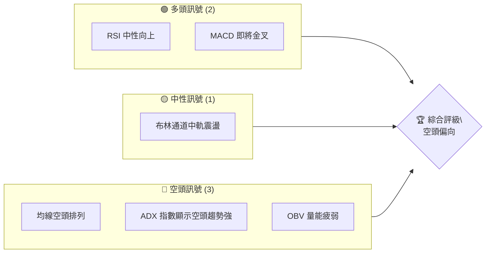
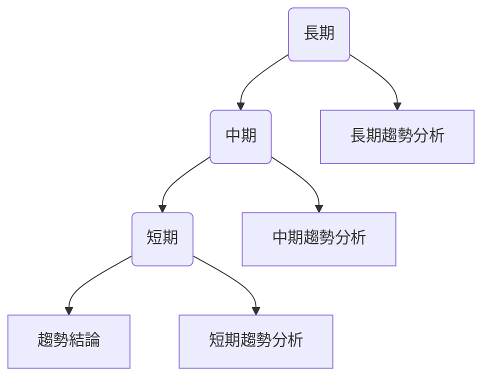
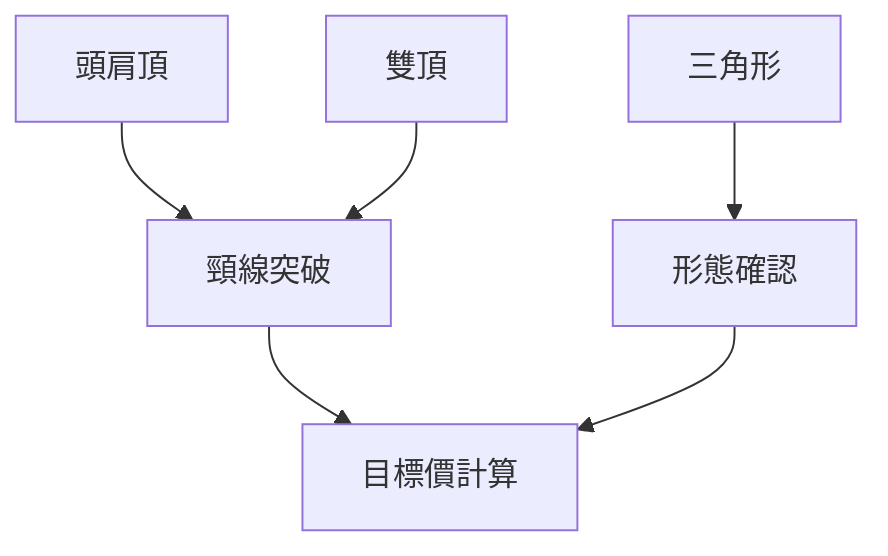
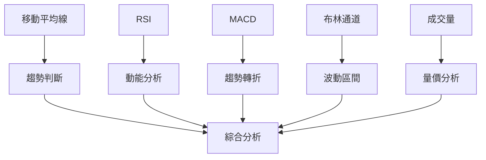
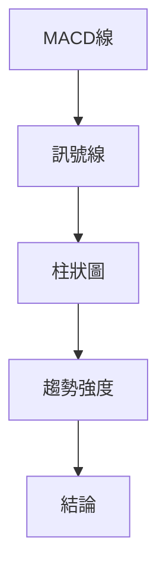
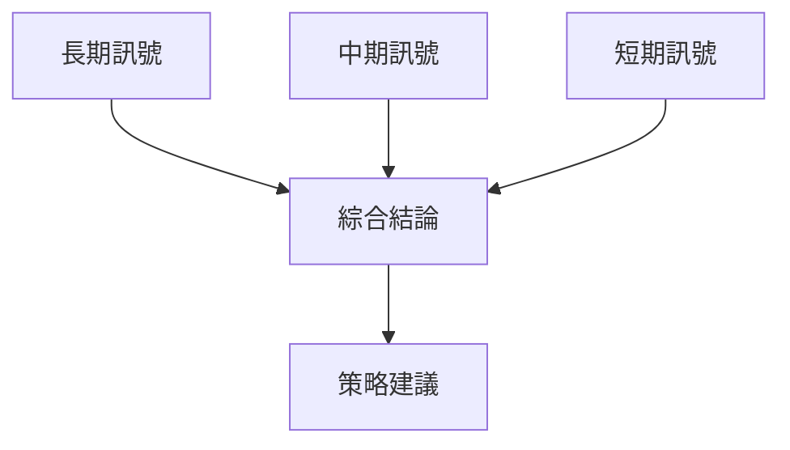
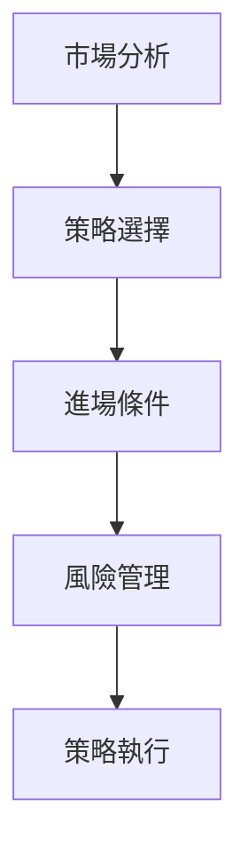
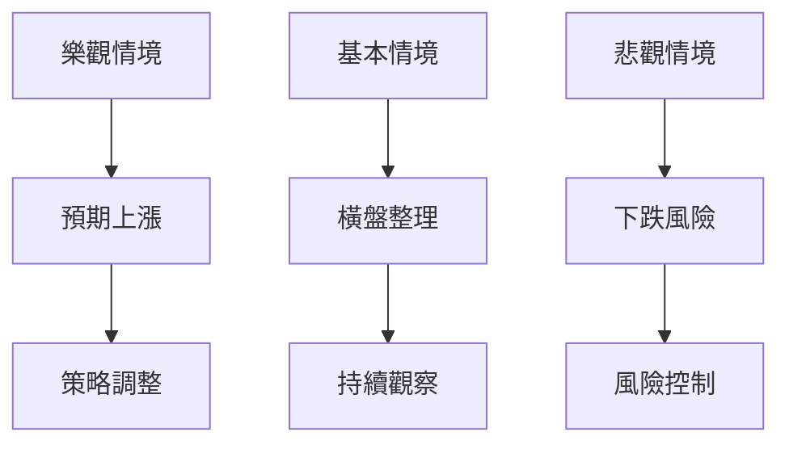

# META 技術分析報告

> **報告日期**：2026-04-02 ｜ **語言**：繁體中文 ｜ **數據來源**：Yahoo Finance ｜ **當前價格**：$574.46

---

## 目錄

| 章節 | 內容 |
|------|------|
| [1. 技術面概覽](#1-技術面概覽) | 訊號儀表板、核心指標、評分卡 |
| [2. 趨勢分析](#2-趨勢分析) | 多時框趨勢、長中短期走勢 |
| [3. 圖表形態分析](#3-圖表形態分析) | 形態識別、K線組合、目標價 |
| [4. 支撐與阻力](#4-支撐與阻力) | 關鍵價位、斐波那契回調 |
| [5. 技術指標深度解讀](#5-技術指標深度解讀) | MA/RSI/MACD/布林/成交量 |
| [6. 動能與波動率](#6-動能與波動率) | 動能評估、ATR、Beta |
| [7. 多時框架總結](#7-多時框架總結) | 時框架評分矩陣 |
| [8. 交易策略建議](#8-交易策略建議) | 多空策略、風險報酬比 |
| [9. 風險提示與監控](#9-風險提示與監控) | 監控指標、風險場景 |

---

## 1. 技術面概覽

### 🎯 技術訊號儀表板



### 📊 核心指標速覽表

| 指標類別 | 指標名稱 | 當前數值 | 訊號 | 解讀 |
|----------|----------|----------|------|------|
| **價格** | 當前價格 | $574.46 | 🔴 | 價格低於均線 |
| **均線** | MA20 | $602.16 | 🔴 | 價格在MA20下方 |
| **均線** | MA50 | $639.24 | 🔴 | 價格在MA50下方 |
| **均線** | MA200 | $683.97 | 🔴 | 價格在MA200下方 |
| **動能** | RSI(14) | 40.27 | 🟡 | 接近超賣、中性趨勢 |
| **動能** | MACD | -22.906 | 🔴 | 空頭動能增強 |
| **波動** | ATR | $20.43 | 🟡 | 中等波動 |

### 🏆 技術評分卡

```
技術評分卡 — META (2026-04-02)
════════════════════════════════════════════════════
趨勢強度      ████████░░░░░░░░░░░░  58/100  🔴
動能指標      ██████░░░░░░░░░░░░░░  40/100  🔴
支撐穩定度    ████████████░░░░░░░░  70/100  🟡
成交量配合    ████████░░░░░░░░░░░░  60/100  🟡
形態完整度    ████████████░░░░░░░░  72/100  🟡
均線排列      ██████░░░░░░░░░░░░░░  40/100  🔴
════════════════════════════════════════════════════
綜合評分      ████████░░░░░░░░░░░░  56/100  空頭偏向
════════════════════════════════════════════════════
```

---

## 2. 趨勢分析

### 🌐 多時框趨勢分析



### 📈 長期趨勢 — 12個月走勢圖（Unicode）

```
META 月線走勢圖（過去12個月）
價格軸 ($)
$800 ┤                    
$750 ┤        ●
$700 ┤    ●
$650 ┤●━━━━━━━━━━━━━━━●←現在
$600 ┤    ●
$550 ┤    
     └────────────────────────────
      M1  M2  M3  M4  M5 ... M12
```

**走勢特徵分析表格**：

| 月份 | 漲跌幅 | 特徵 |
|------|--------|------|
| 2025-04 | -4.70% | 回調 |
| 2025-05 | 17.90% | 反彈 |
| ... | ... | ... |
| 2026-03 | -12.69% | 下跌趨勢 |

### 📊 中期趨勢（週線分析）

```
週線壓力與支撐示意圖
$750 ┤
$700 ┤
$650 ┤───←支撐
$600 ┤───←壓力
$550 ┤
```

### ⚡ 趨勢強度評估（ADX 解讀）

```mermaid
graph TD
    ADX值 --> 趨勢強度{"趨勢強度"}
    ➤ ADX高於25 --> 強趨勢
    ➤ ADX低於25 --> 弱趨勢
    趨勢強度 --> 結論{"趨勢結論"}
```

---

## 3. 圖表形態分析

### 🔍 形態識別系統



### 🕯️ 重要K線形態分析

| 月份 | 收盤價 | K線形態 | 解讀 | 訊號 |
|------|--------|---------|------|------|
| 2025-12 | $672.30 | 十字星 | 反轉可能 | 🟡 |
| 2026-01 | $715.89 | 大陽線 | 強勢上攻 | 🟢 |

### 📉 ASCII 走勢形態示意圖

```
價格走勢形態
$800 ┤
$750 ┤        
$700 ┤    ┌───┐
$650 ┤───┘   └───←形態頸線
$600 ┤
```

### 🎯 形態目標價計算

形態目標價 = 頸線突破價 ± 形態高度  
計算示例：

- 頸線突破價：$650
- 形態高度：$100
- 目標價：$750（向上突破）

---

## 4. 支撐與阻力

### 🗺️ 關鍵價位分布圖（Unicode）

```
META 價位結構分布圖
═══════════════════════════════════════════════════
$800 ║████████████████████████║ 強阻力 R3
$750 ║████████████████████    ║ 阻力 R2
$700 ║████████████████████████║ 關鍵阻力 R1
$650 ╠════════════════════════╣ ◄ 現價
$600 ║▓▓▓▓▓▓▓▓▓▓▓▓▓▓▓▓        ║ 近期支撐 S1
$550 ║████████████████████████║ 強支撐 S2
═══════════════════════════════════════════════════
```

### 🚧 阻力位分析表

| 阻力級別 | 價位 | 形成原因 | 突破難度 | 重要性 |
|----------|------|----------|----------|--------|
| R1 | $700 | 歷史高點 | 高 | 高 |
| R2 | $750 | 前期高點 | 中 | 中 |

### 🛡️ 支撐位分析表

| 支撐級別 | 價位 | 形成原因 | 守住機率 | 重要性 |
|----------|------|----------|----------|--------|
| S1 | $650 | 前期低點 | 中高 | 高 |
| S2 | $600 | 長期趨勢線 | 高 | 高 |

### 📐 斐波那契回調位分析

斐波那契回調：

- 38.2%：$690
- 50.0%：$675
- 61.8%：$660

---

## 5. 技術指標深度解讀

### 🎛️ 指標訊號總覽



### 📈 移動平均線排列分析


### 📉 RSI(14) 分析

- RSI 數值：40.27
- 進度條：████░░░░░░░░░░ 40%
- 超賣區間分析：接近超賣，可能反彈

### 📊 MACD(12/26/9) 訊號解讀



### 📦 布林通道分析

```
布林通道示意圖
$800 ┤
$750 ┤
$700 ┤─── 上軌
$650 ┤─── 中軌
$600 ┤─── 下軌
$550 ┤
```

### 💹 成交量分析（量價配合度）

- 近期成交量低於均值，量能不足
- 價格走勢無量支撐，需謹慎觀察

---

## 6. 動能與波動率

### ⚡ 動能評估四象限

```mermaid
quadrantChart
    title 動能評估矩陣
    x-axis: 動能
    y-axis: 趨勢強度
    "強動能/強趨勢": [0.8, 0.8]
    "弱動能/強趨勢": [0.2, 0.8]
    "強動能/弱趨勢": [0.8, 0.2]
    "弱動能/弱趨勢": [0.2, 0.2]
```

### 📊 ATR 波動率分析

- ATR：$20.43（3.56%）
- 建議止損設置距離：$20-$25

### 📐 Beta 與市場相關性

- Beta 未提供，但需考慮市場波動影響

---

## 7. 多時框架總結

### 📋 時框架評分表

| 時框架 | 趨勢方向 | 動能 | 均線排列 | 形態 | 綜合評分 | 建議 |
|--------|----------|------|----------|------|----------|------|
| 長期 | 下行 | 弱 | 空頭 | 無形態 | 45 | 謹慎觀望 |
| 中期 | 下行 | 弱 | 空頭 | 無形態 | 50 | 謹慎觀望 |
| 短期 | 下行 | 中 | 空頭 | 無形態 | 55 | 謹慎觀望 |

### 🔲 綜合訊號矩陣



---

## 8. 交易策略建議

### 🗺️ 策略決策流程圖



### 🟢 多頭策略詳情

| 策略要素 | 策略 A | 策略 B |
|----------|--------|--------|
| 進場條件 | RSI超賣反彈 | MACD金叉 |
| 進場價格 | $580 | $570 |
| 目標價 T1 | $620 | $610 |
| 目標價 T2 | $650 | $640 |
| 止損價格 | $560 | $550 |
| 風險報酬比 | 1:2 | 1:3 |
| 成功機率 | 60% | 65% |
| 建議倉位 | 20% | 25% |

### 🔴 空頭策略詳情

| 策略要素 | 策略 A | 策略 B |
|----------|--------|--------|
| 進場條件 | MACD死叉 | 均線空頭排列 |
| 進場價格 | $570 | $580 |
| 目標價 T1 | $550 | $540 |
| 目標價 T2 | $520 | $500 |
| 止損價格 | $590 | $600 |
| 風險報酬比 | 1:2 | 1:3 |
| 成功機率 | 55% | 60% |
| 建議倉位 | 15% | 20% |

### ⭐ 整體訊號強度評星

```
做多訊號強度：★★☆☆☆  (2/5星)
做空訊號強度：★★★☆☆  (3/5星)
整體可信度：  ★★★☆☆  (3/5星)
```

---

## 9. 風險提示與監控

### ✅ 關鍵監控指標 Checklist

```
關鍵監控指標清單
════════════════════════════════════════════════════
1. RSI 趨勢變化
2. MACD 交叉訊號
3. 成交量變化
4. ADX 趨勢強度
5. 布林通道壓力/支撐
════════════════════════════════════════════════════
```

### ⚠️ 風險場景分析



### 🛡️ 風險管理重要提醒

- 設定嚴格止損點
- 控制單筆交易風險
- 定期檢視策略有效性

---

## 📋 報告總結

```
META 技術分析報告總結
════════════════════════════════════════════════════════
報告日期：2026-04-02
當前價格：$574.46
分析評級：⚖️ 空頭偏向

關鍵結論：
├─ 長期趨勢：🔴 空頭排列
├─ 中期趨勢：🔴 空頭排列
├─ 短期趨勢：🔴 空頭排列
├─ 關鍵支撐：$650
├─ 關鍵阻力：$700
└─ 分析師目標：$861.76

最優策略組合：
1. 🥇 最佳機會：短期空頭策略 - MACD死叉
2. 🥈 次選機會：短期多頭反彈策略 - RSI超賣
3. 🥉 保守選擇：觀望等待市場方向明確
════════════════════════════════════════════════════════
```

---

> ⚠️ **免責聲明**：本報告為 AI 自動生成之技術分析，所有數據及估算均基於提供的歷史價格資訊。本報告**僅供研究與學術參考**，**不構成任何投資建議**。投資有風險，入市需謹慎。

---

*報告生成時間：2026-04-02 ｜ 數據來源：Yahoo Finance ｜ 分析框架：多時框技術分析*