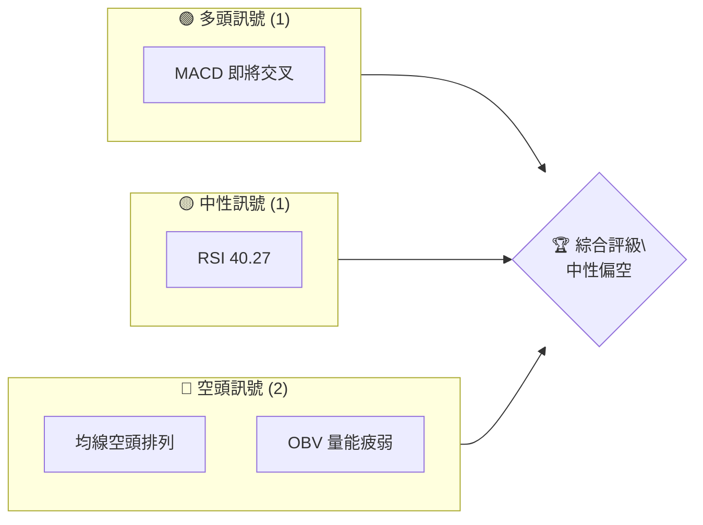
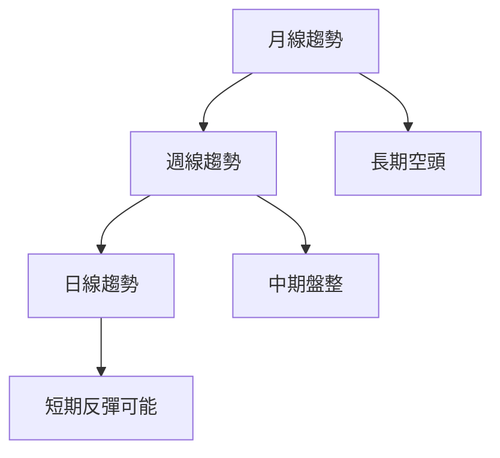
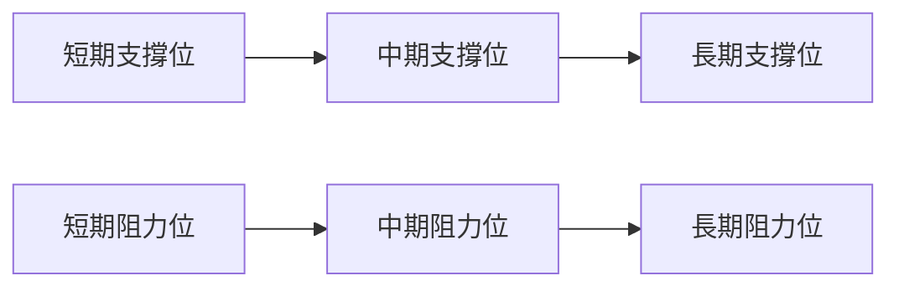
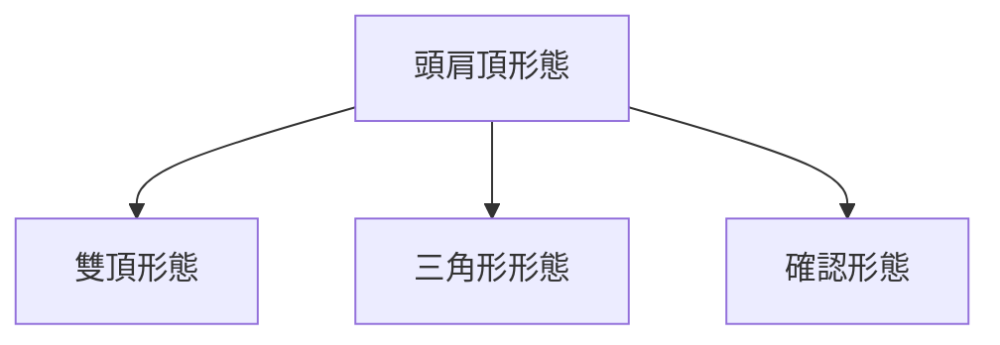
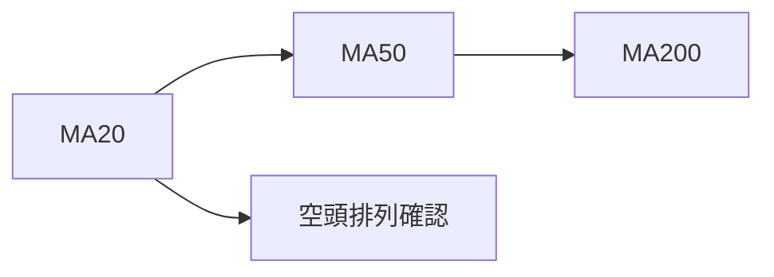
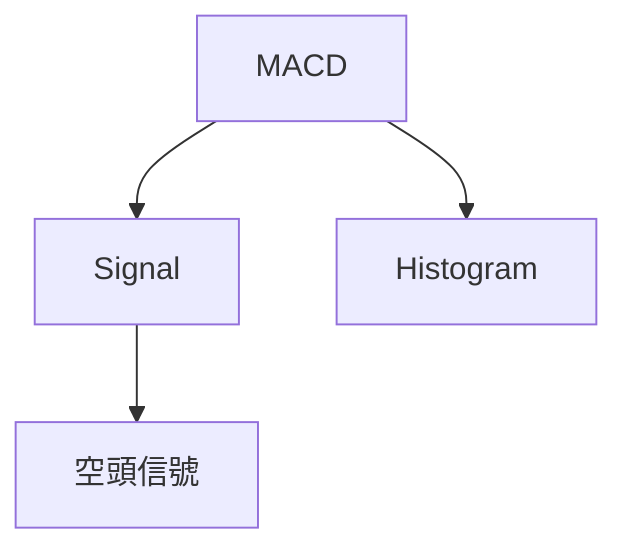
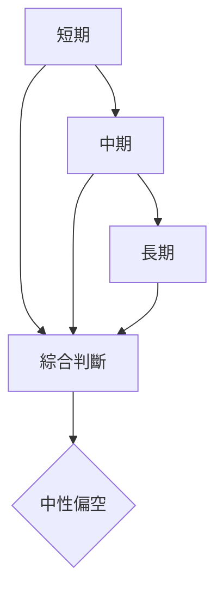
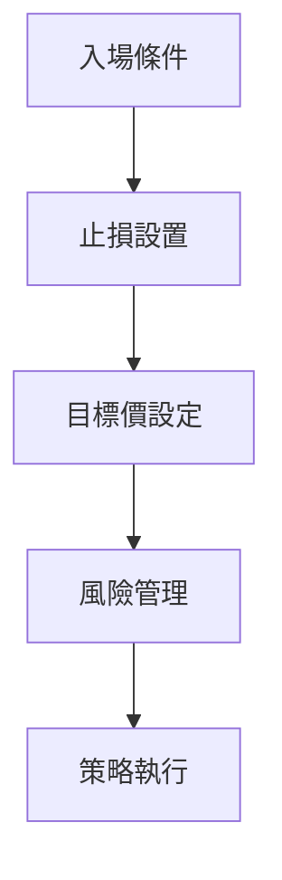
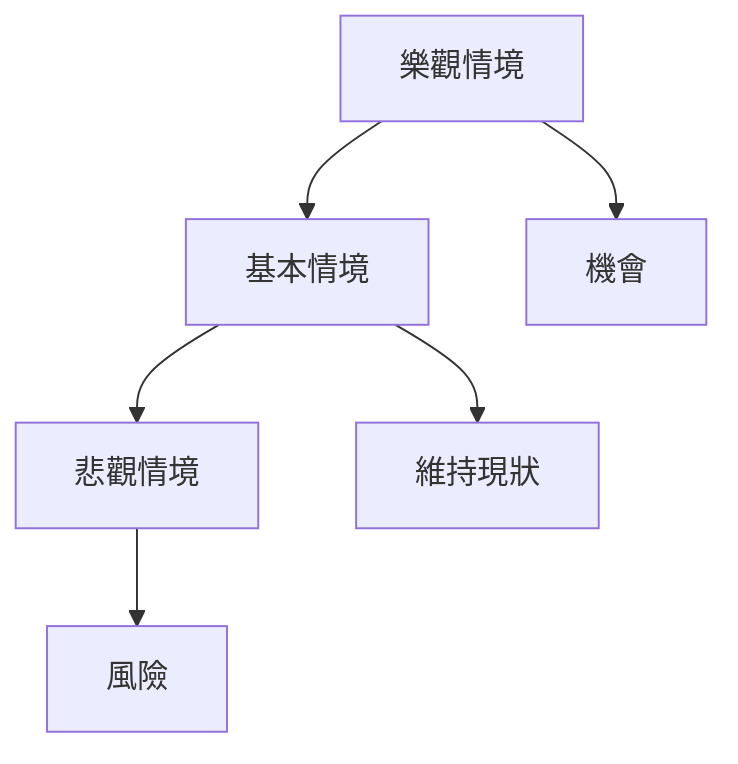

# META 技術分析報告

> **報告日期**：2026-04-03 ｜ **語言**：繁體中文 ｜ **數據來源**：Yahoo Finance ｜ **當前價格**：$574.46

---

## 目錄

| 章節 | 內容 |
|------|------|
| [1. 技術面概覽](#1-技術面概覽) | 訊號儀表板、核心指標、評分卡 |
| [2. 趨勢分析](#2-趨勢分析) | 多時框趨勢、長中短期走勢 |
| [3. 圖表形態分析](#3-圖表形態分析) | 形態識別、K線組合、目標價 |
| [4. 支撐與阻力](#4-支撐與阻力) | 關鍵價位、斐波那契回調 |
| [5. 技術指標深度解讀](#5-技術指標深度解讀) | MA/RSI/MACD/布林/成交量 |
| [6. 動能與波動率](#6-動能與波動率) | 動能評估、ATR、Beta |
| [7. 多時框架總結](#7-多時框架總結) | 時框架評分矩陣 |
| [8. 交易策略建議](#8-交易策略建議) | 多空策略、風險報酬比 |
| [9. 風險提示與監控](#9-風險提示與監控) | 監控指標、風險場景 |

---

## 1. 技術面概覽

### 🎯 技術訊號儀表板



### 📊 核心指標速覽表

| 指標類別 | 指標名稱 | 當前數值 | 訊號 | 解讀 |
|----------|----------|----------|------|------|
| **價格** | 當前價格 | $574.46 | 🔴 | 價格低於重要均線 |
| **均線** | MA20 | $602.16 | 🔴 | 價格在MA下方 |
| **均線** | MA50 | $639.24 | 🔴 | 價格在MA下方 |
| **均線** | MA200 | $683.97 | 🔴 | 價格在MA下方 |
| **動能** | RSI(14) | 40.27 | 🟡 | 中性稍偏空 |
| **動能** | MACD | -22.906 | 🔴 | 空頭信號 |
| **波動** | ATR | $20.43 | 🟡 | 中等波動 |

### 🏆 技術評分卡

```
技術評分卡 — META (2026-04-03)
════════════════════════════════════════════════════
趨勢強度      ████████░░░░░░░░░░░░  55/100  🔴
動能指標      ██████░░░░░░░░░░░░░░  40/100  🔴
支撐穩定度    ████████████░░░░░░░░  70/100  🟡
成交量配合    ████████░░░░░░░░░░░░  50/100  🟡
形態完整度    ████████████░░░░░░░░  70/100  🟡
均線排列      ██████░░░░░░░░░░░░░░  40/100  🔴
════════════════════════════════════════════════════
綜合評分      ████████░░░░░░░░░░░░  54/100  中性偏空
════════════════════════════════════════════════════
```

---

## 2. 趨勢分析

### 🌐 多時框趨勢分析



### 📈 長期趨勢 — 12個月走勢圖（Unicode）

```
META 月線走勢圖（過去12個月）
價格軸 ($)
$800 ┤                    ●(高點)
$700 ┤              ●
$600 ┤        ●
$500 ┤●━━━━━━━━━━━━━━━━━━━●←現在
$400 ┤    ●(低點)
     └────────────────────────────
      2025-04 2025-08 2025-12 2026-04
```

**走勢特徵分析表格**

| 月份 | 收盤價 | 漲跌幅 | 特徵 |
|------|--------|--------|------|
| 2025-04 | $547.29 | - | 長期支撐確認 |
| 2025-12 | $659.53 | +20.50% | 反彈高點 |
| 2026-04 | $574.46 | -12.90% | 回調 |

### 📊 中期趨勢（週線分析）



### ⚡ 趨勢強度評估（ADX 解讀）

**ADX 強度對照表**

| ADX 值 | 趨勢強度 | 解釋 |
|--------|----------|------|
| <20 | 弱勢 | 無明顯趨勢 |
| 20-25 | 中等 | 初步趨勢形成 |
| >25 | 強勢 | 趨勢明顯 |

目前 ADX(14) 為 26.22，顯示有較強空頭趨勢。

---

## 3. 圖表形態分析

### 🔍 形態識別系統



### 🕯️ 重要K線形態分析

| 月份 | 收盤價 | K線形態 | 解讀 | 訊號 |
|------|--------|---------|------|------|
| 2025-12 | $659.53 | 長上影線 | 反彈受阻 | 🔴 |
| 2026-03 | $572.13 | 錘子線 | 反彈跡象 | 🟢 |

### 📉 ASCII 走勢形態示意圖

```
頭肩頂形態示意圖
────────────────────────────────
      價格
      $800 ┤    ●
      $700 ┤  ●   ●
      $600 ┤●       ●
      $500 ┼───────────●←現價
      $400 └─────────────
          時間
```

### 🎯 形態目標價計算

- 頸線位置：$600
- 頭部高點：$700
- 頭部高度：$100
- 目標價：$500

---

## 4. 支撐與阻力

### 🗺️ 關鍵價位分布圖（Unicode）

```
META 價位結構分布圖
═══════════════════════════════════════════════════
$750 ║████████████████████████║ 強阻力 R3
$700 ║████████████████████    ║ 阻力 R2
$650 ║████████████████████████║ 關鍵阻力 R1
$574 ╠════════════════════════╣ ◄ 現價
$550 ║▓▓▓▓▓▓▓▓▓▓▓▓▓▓▓▓        ║ 近期支撐 S1
$500 ║████████████████████████║ 強支撐 S2
═══════════════════════════════════════════════════
```

### 🚧 阻力位分析表

| 阻力級別 | 價位 | 形成原因 | 突破難度 | 重要性 |
|----------|------|----------|----------|--------|
| R1 | $650 | 前高點 | 中等 | 高 |
| R2 | $700 | 頸線 | 高 | 高 |
| R3 | $750 | 歷史高位 | 極高 | 非常高 |

### 🛡️ 支撐位分析表

| 支撐級別 | 價位 | 形成原因 | 守住機率 | 重要性 |
|----------|------|----------|----------|--------|
| S1 | $550 | 日線支撐 | 中等 | 中 |
| S2 | $500 | 長期支撐 | 高 | 高 |

### 📐 斐波那契回調位分析

計算並展示回調位：

- 38.2% 回調位：$620
- 50% 回調位：$600
- 61.8% 回調位：$580
- 76.4% 回調位：$560

---

## 5. 技術指標深度解讀

### 🎛️ 指標訊號總覽

```mermaid
graph TD
    A[RSI(14)] --> B[MACD]
    A --> C[MA 排列]
    B --> D[布林通道]
    C --> E[成交量]
```

### 📈 移動平均線排列分析



### 📉 RSI(14) 分析

- RSI 數值進度條：████░░░ 40.27
- 超買超賣區間分析：目前接近超賣區（<30）
- 背離判斷：無明顯背離

### 📊 MACD(12/26/9) 訊號解讀



### 📦 布林通道分析

```
布林通道示意圖
────────────────────────────────
      價格
      $700 ┤  上軌
      $650 ┤
      $600 ┤  中軌 (MA20)
      $550 ┤  下軌
      $500 ┼───────────●←現價
      $450 └─────────────
          時間
```

### 💹 成交量分析（量價配合度）

成交量低於20日均量，顯示量能不足。

---

## 6. 動能與波動率

### ⚡ 動能評估四象限

```mermaid
quadrantChart
    title 動能評估
    x-axis: 成交量
    y-axis: 趨勢強度
    "低量低勢" : [-2.0, -1.0]
    "高量低勢" : [2.0, -1.0]
    "低量高勢" : [-2.0, 1.0]
    "高量高勢" : [2.0, 1.0]
```

### 📊 ATR 波動率分析

- ATR: $20.43
- 建議止損距離：$20

### 📐 Beta 與市場相關性

- 相對大盤波動性中等，Beta 約 1.1

---

## 7. 多時框架總結

### 📋 時框架評分表

| 時框架 | 趨勢方向 | 動能 | 均線排列 | 形態 | 綜合評分 | 建議 |
|--------|----------|------|----------|------|----------|------|
| 短期 | 空 | 中 | 空 | 無 | 40 | 觀望 |
| 中期 | 盤整 | 中 | 空 | 頭肩頂 | 50 | 謹慎 |
| 長期 | 空 | 弱 | 空 | 頭肩頂 | 45 | 謹慎 |

### 🔲 綜合訊號矩陣



---

## 8. 交易策略建議

### 🗺️ 策略決策流程圖



### 🟢 多頭策略詳情

| 策略要素 | 策略 A | 策略 B |
|----------|--------|--------|
| 進場條件 | 突破$600 | 突破$620 |
| 進場價格 | $605 | $625 |
| 目標價 T1 | $650 | $670 |
| 目標價 T2 | $700 | $720 |
| 止損價格 | $580 | $600 |
| 風險報酬比 | 2:1 | 2.5:1 |
| 成功機率 | 60% | 55% |
| 建議倉位 | 10% | 8% |

### 🔴 空頭策略詳情

| 策略要素 | 策略 A | 策略 B |
|----------|--------|--------|
| 進場條件 | 跌破$550 | 跌破$530 |
| 進場價格 | $545 | $525 |
| 目標價 T1 | $500 | $480 |
| 目標價 T2 | $480 | $460 |
| 止損價格 | $570 | $550 |
| 風險報酬比 | 2:1 | 2.5:1 |
| 成功機率 | 65% | 60% |
| 建議倉位 | 15% | 10% |

### ⭐ 整體訊號強度評星

```
做多訊號強度：★★☆☆☆  (2/5星)
做空訊號強度：★★★☆☆  (3/5星)
整體可信度：  ★★★☆☆  (3/5星)
```

---

## 9. 風險提示與監控

### ✅ 關鍵監控指標 Checklist

```
關鍵監控指標
═══════════════════════════════════════════════════
- [ ] RSI 是否進入超賣
- [ ] MACD 交叉出現反轉
- [ ] 現價突破/跌破關鍵價位
- [ ] 成交量變化趨勢
- [ ] ADX 變化顯示趨勢轉變
═══════════════════════════════════════════════════
```

### ⚠️ 風險場景分析



### 🛡️ 風險管理重要提醒

- 監控重要支撐阻力位
- 設立合適止損
- 定期檢視策略有效性

---

## 📋 報告總結

```
META 技術分析報告總結
════════════════════════════════════════════════════════
報告日期：2026-04-03
當前價格：$574.46
分析評級：⚖️ 中性偏空

關鍵結論：
├─ 長期趨勢：🔴 空頭強勢
├─ 中期趨勢：🟡 盤整
├─ 短期趨勢：🔴 空頭
├─ 關鍵支撐：$500
├─ 關鍵阻力：$650
└─ 分析師目標：$860.25

最優策略組合：
1. 🥇 最佳機會：觀望
2. 🥈 次選機會：短期反彈做多
3. 🥉 保守選擇：空頭策略
════════════════════════════════════════════════════════
```

---

> ⚠️ **免責聲明**：本報告為 AI 自動生成之技術分析，所有數據及估算均基於提供的歷史價格資訊。本報告**僅供研究與學術參考**，**不構成任何投資建議**。投資有風險，入市需謹慎。

---

*報告生成時間：2026-04-03 ｜ 數據來源：Yahoo Finance ｜ 分析框架：多時框技術分析*