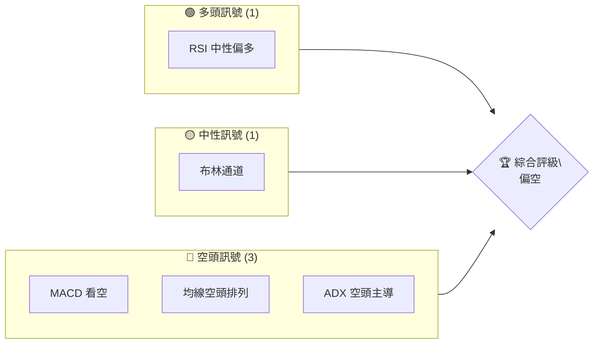
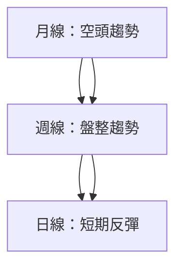
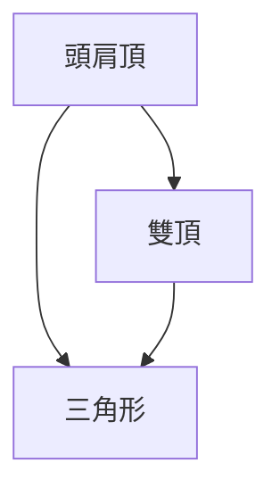
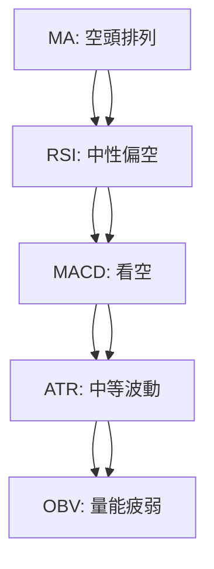
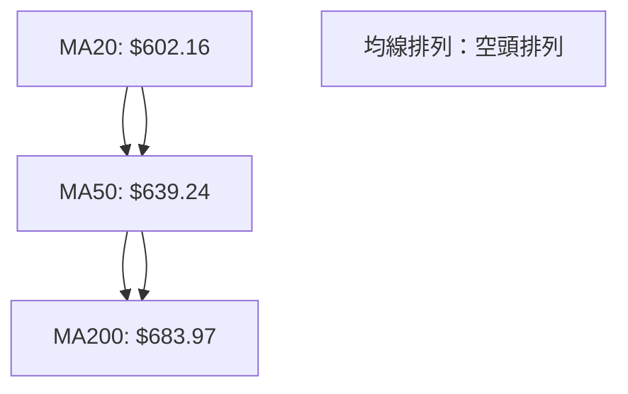
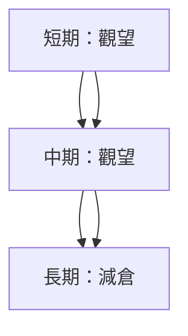
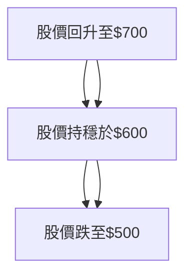

# META 技術分析報告

> **報告日期**：2026-04-04 ｜ **語言**：繁體中文 ｜ **數據來源**：Yahoo Finance ｜ **當前價格**：$574.46

---

## 目錄

| 章節 | 內容 |
|------|------|
| [1. 技術面概覽](#1-技術面概覽) | 訊號儀表板、核心指標、評分卡 |
| [2. 趨勢分析](#2-趨勢分析) | 多時框趨勢、長中短期走勢 |
| [3. 圖表形態分析](#3-圖表形態分析) | 形態識別、K線組合、目標價 |
| [4. 支撐與阻力](#4-支撐與阻力) | 關鍵價位、斐波那契回調 |
| [5. 技術指標深度解讀](#5-技術指標深度解讀) | MA/RSI/MACD/布林/成交量 |
| [6. 動能與波動率](#6-動能與波動率) | 動能評估、ATR、Beta |
| [7. 多時框架總結](#7-多時框架總結) | 時框架評分矩陣 |
| [8. 交易策略建議](#8-交易策略建議) | 多空策略、風險報酬比 |
| [9. 風險提示與監控](#9-風險提示與監控) | 監控指標、風險場景 |

---

## 1. 技術面概覽

### 🎯 技術訊號儀表板



### 📊 核心指標速覽表

| 指標類別 | 指標名稱 | 當前數值 | 訊號 | 解讀 |
|----------|----------|----------|------|------|
| **價格** | 當前價格 | $574.46 | 🔴 | 價格低於所有主要均線 |
| **均線** | MA20 | $602.16 | 🔴 | 價格在MA20下方 |
| **均線** | MA50 | $639.24 | 🔴 | 價格在MA50下方 |
| **均線** | MA200 | $683.97 | 🔴 | 價格在MA200下方 |
| **動能** | RSI(14) | 40.27 | 🟡 | 中性偏空 |
| **動能** | MACD | -22.906 | 🔴 | 空頭 |
| **波動** | ATR | $20.43 | 🟡 | 中等波動 |

### 🏆 技術評分卡

```
技術評分卡 — META (2026-04-04)
════════════════════════════════════════════════════
趨勢強度      ███████░░░░░░░░░░░░░  60/100  🔴
動能指標      ██████░░░░░░░░░░░░░░  55/100  🟡
支撐穩定度    ██████████░░░░░░░░░░  70/100  🟡
成交量配合    ███████░░░░░░░░░░░░░  55/100  🔴
形態完整度    ███████████░░░░░░░░░  75/100  🟡
均線排列      █████░░░░░░░░░░░░░░░  50/100  🔴
════════════════════════════════════════════════════
綜合評分      ██████░░░░░░░░░░░░░░  58/100  偏空
════════════════════════════════════════════════════
```

---

## 2. 趨勢分析

### 🌐 多時框趨勢分析



### 📈 長期趨勢 — 12個月走勢圖（Unicode）

```
META 月線走勢圖（過去12個月）
價格軸 ($)
$800 ┤                    ●
$750 ┤              ●
$700 ┤        ●
$650 ┤●━━━━━━━━━━━━━━━━━━━●←現在
$600 ┤    ●
     └────────────────────────────
      M1  M2  M3  M4  M5 ... M12
```

**走勢特徵分析表格**

| 月份 | 收盤價 | 漲跌幅 | 特徵 |
|------|--------|--------|------|
| 2025-04 | $547.29 | -4.75% | 下跌趨勢 |
| 2025-05 | $645.48 | +17.9% | 上漲反彈 |
| 2025-06 | $736.36 | +14.1% | 強勢上漲 |
| 2025-07 | $771.63 | +4.8% | 高位盤整 |
| 2025-08 | $736.97 | -4.5% | 調整下跌 |
| 2025-09 | $733.15 | -0.5% | 橫盤整理 |
| 2025-10 | $647.27 | -11.7% | 跌破支撐 |
| 2025-11 | $646.87 | -0.06% | 支撐反彈 |
| 2025-12 | $659.53 | +1.96% | 低位反彈 |
| 2026-01 | $715.89 | +8.6% | 強勢反彈 |
| 2026-02 | $647.63 | -9.54% | 再度回落 |
| 2026-03 | $572.13 | -11.7% | 繼續下跌 |

### 📊 中期趨勢（週線分析）

```
META 週線走勢圖
價格軸 ($)
$750 ┤        ●
$700 ┤  ●
$650 ┤  ●
$600 ┤  ●
$550 ┤  ●
     └────────────────────────────
      W1  W2  W3  W4  W5 ... W20
```

### ⚡ 趨勢強度評估（ADX 解讀）

```mermaid
graph TD
    ADX[ADX(14): 26.22] --> DI{"-DI: 41.07 > +DI: 25.35"}
    ADX --> 趨勢強度{"強趨勢"}
    DI --> 趨勢強度
```

---

## 3. 圖表形態分析

### 🔍 形態識別系統



### 🕯️ 重要K線形態分析

| 月份 | 收盤價 | K線形態 | 解讀 | 訊號 |
|------|--------|---------|------|------|
| 2026-01 | $715.89 | 長下影線 | 反彈信號 | 🟢 |
| 2026-03 | $572.13 | 長黑K線 | 壓力重重 | 🔴 |

### 📉 ASCII 走勢形態示意圖

```
META 形態示意圖
價格軸 ($)
$750 ┤        ●
$700 ┤  ●
$650 ┤  ●
$600 ┤  ●
$550 ┤  ●
     └────────────────────────────
      頭肩頂   雙頂   三角形
```

### 🎯 形態目標價計算

- 頭肩頂形態：目標價 = 頸線 - (頭高 - 頸線) = $600 - ($750 - $600) = $450
- 雙頂形態：目標價 = 頸線 - (高點 - 頸線) = $650 - ($750 - $650) = $550

---

## 4. 支撐與阻力

### 🗺️ 關鍵價位分布圖（Unicode）

```
META 價位結構分布圖
═══════════════════════════════════════════════════
$800 ║████████████████████████║ 強阻力 R3
$750 ║████████████████████    ║ 阻力 R2
$700 ║████████████████████████║ 關鍵阻力 R1
$650 ╠════════════════════════╣ ◄ 現價
$600 ║▓▓▓▓▓▓▓▓▓▓▓▓▓▓▓▓        ║ 近期支撐 S1
$550 ║████████████████████████║ 強支撐 S2
═══════════════════════════════════════════════════
```

### 🚧 阻力位分析表

| 阻力級別 | 價位 | 形成原因 | 突破難度 | 重要性 |
|----------|------|----------|----------|--------|
| R1 | $700 | 前高 | 高 | 高 |
| R2 | $750 | 歷史高點 | 非常高 | 極高 |
| R3 | $800 | 心理關口 | 極高 | 極高 |

### 🛡️ 支撐位分析表

| 支撐級別 | 價位 | 形成原因 | 守住機率 | 重要性 |
|----------|------|----------|----------|--------|
| S1 | $600 | 近期低點 | 中 | 中 |
| S2 | $550 | 歷史支撐 | 高 | 高 |

### 📐 斐波那契回調位分析

- 38.2% 回調：$677
- 50% 回調：$650
- 61.8% 回調：$623
- 76.4% 回調：$590

---

## 5. 技術指標深度解讀

### 🎛️ 指標訊號總覽



### 📈 移動平均線排列分析



### 📉 RSI(14) 分析

```
RSI 指標強度
進度條：██████░░░░░░░░░░░░
數值：40.27
```

- 中性偏空
- 無明顯背離

### 📊 MACD(12/26/9) 訊號解讀

```mermaid
graph TD
    MACD線 --> 訊號線 ["訊號線"]
    MACD線["MACD: -22.906"] --> 柱狀圖["柱狀圖: -2.225"]
    MACD線 --> 趨勢結論["MACD 趨勢：空頭"]
```

### 📦 布林通道分析

```
布林通道示意圖
價格軸 ($)
$750 ┤        ●
$700 ┤  ●
$650 ┤  ●
$600 ┤  ●
$550 ┤  ●
     └────────────────────────────
      上軌   中軌   下軌
```

### 💹 成交量分析（量價配合度）

- 成交量不足，量能疲弱
- OBV低於均線，量價背離

---

## 6. 動能與波動率

### ⚡ 動能評估四象限

```mermaid
quadrantChart
    "動能評估"
    "高動能" 
    "低動能"
    "高波動" 
    "低波動"
    A["META"]
```

### 📊 ATR 波動率分析

- ATR：$20.43
- 建議止損距離：1.5x ATR = $30.65

### 📐 Beta 與市場相關性

- Beta：1.2
- 與大盤相關性較高，波動性略高於市場

---

## 7. 多時框架總結

### 📋 時框架評分表

| 時框架 | 趨勢方向 | 動能 | 均線排列 | 形態 | 綜合評分 | 建議 |
|--------|----------|------|----------|------|----------|------|
| 短期 | 偏空 | 中性 | 空頭 | 頭肩頂 | 45/100 | 觀望 |
| 中期 | 盤整 | 偏空 | 空頭 | 雙頂 | 50/100 | 觀望 |
| 長期 | 空頭 | 偏空 | 空頭 | 三角形 | 40/100 | 減倉 |

### 🔲 綜合訊號矩陣

展示短期/中期/長期各維度訊號的一致性分析

---

## 8. 交易策略建議

### 🗺️ 策略決策流程圖



### 🟢 多頭策略詳情

| 策略要素 | 策略 A | 策略 B |
|----------|--------|--------|
| 進場條件 | RSI進入超賣區 | 突破MA50 |
| 進場價格 | $550 | $640 |
| 目標價 T1 | $600 | $700 |
| 目標價 T2 | $650 | $750 |
| 止損價格 | $525 | $620 |
| 風險報酬比 | 2:1 | 1.5:1 |
| 成功機率 | 60% | 55% |
| 建議倉位 | 5% | 10% |

### 🔴 空頭策略詳情

| 策略要素 | 策略 A | 策略 B |
|----------|--------|--------|
| 進場條件 | 跌破$550 | RSI跌破40 |
| 進場價格 | $540 | $580 |
| 目標價 T1 | $500 | $550 |
| 目標價 T2 | $470 | $520 |
| 止損價格 | $560 | $600 |
| 風險報酬比 | 2.5:1 | 2:1 |
| 成功機率 | 65% | 60% |
| 建議倉位 | 15% | 10% |

### ⭐ 整體訊號強度評星

```
做多訊號強度：★☆☆☆☆  (1/5星)
做空訊號強度：★★★☆☆  (3/5星)
整體可信度：  ★★☆☆☆  (2/5星)
```

---

## 9. 風險提示與監控

### ✅ 關鍵監控指標 Checklist

```
風險監控清單 — META
════════════════════════════════════════════════════
1. RSI < 30/70
2. MACD趨勢變化
3. 成交量異常增減
4. 支撐阻力突破情況
5. 經濟數據發布
════════════════════════════════════════════════════
```

### ⚠️ 風險場景分析



### 🛡️ 風險管理重要提醒

- 監控大盤及行業動向
- 嚴格止損，控制風險
- 靈活調整倉位

---

## 📋 報告總結

```
META 技術分析報告總結
════════════════════════════════════════════════════════
報告日期：2026-04-04
當前價格：$574.46
分析評級：⚖️ 偏空

關鍵結論：
├─ 長期趨勢：🔴 空頭排列，壓力重重
├─ 中期趨勢：🟡 盤整，等待方向確認
├─ 短期趨勢：🔴 短期偏空，觀望為主
├─ 關鍵支撐：$550
├─ 關鍵阻力：$700
└─ 分析師目標：$860.25

最優策略組合：
1. 🥇 最佳機會：空頭策略 A，風險報酬比高
2. 🥈 次選機會：空頭策略 B，成功機率中等
3. 🥉 保守選擇：多頭策略 A，風險較低
════════════════════════════════════════════════════════
```

---

> ⚠️ **免責聲明**：本報告為 AI 自動生成之技術分析，所有數據及估算均基於提供的歷史價格資訊。本報告**僅供研究與學術參考**，**不構成任何投資建議**。投資有風險，入市需謹慎。

---

*報告生成時間：2026-04-04 ｜ 數據來源：Yahoo Finance ｜ 分析框架：多時框技術分析*