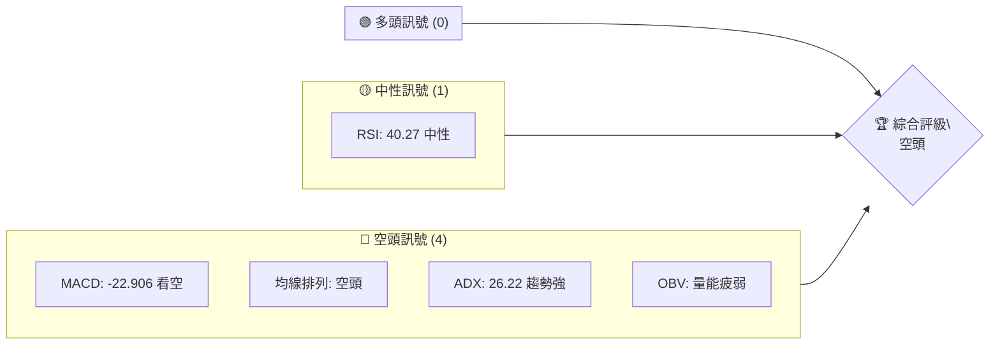
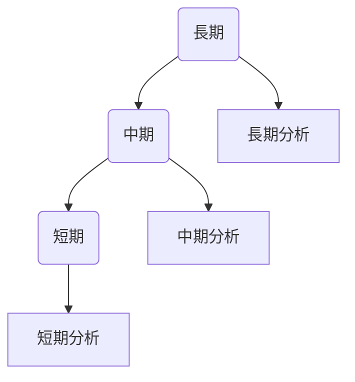
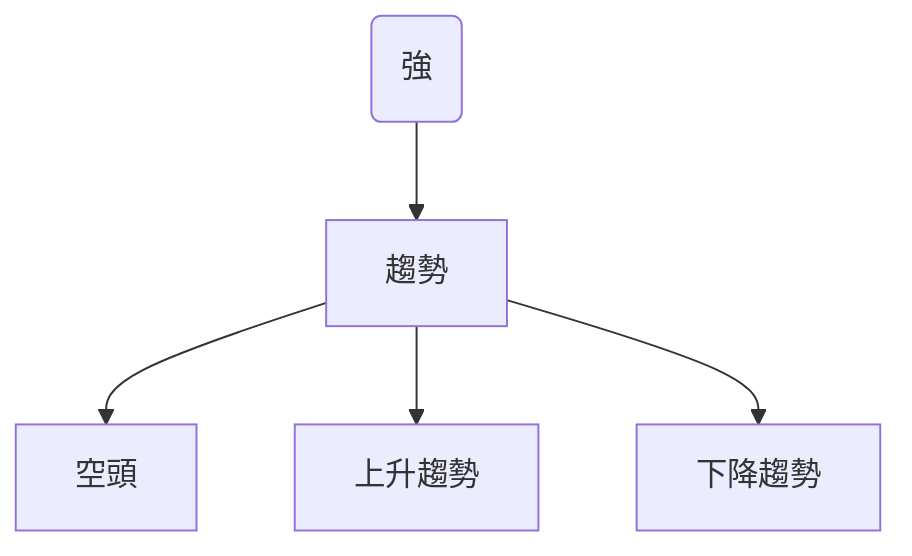
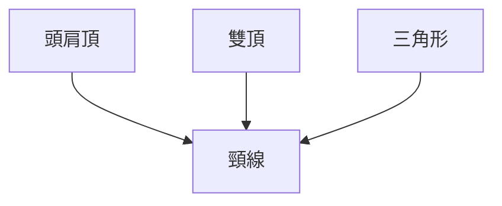
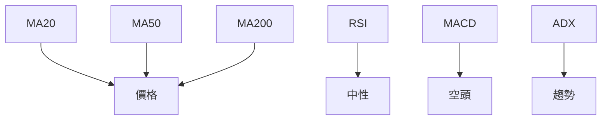
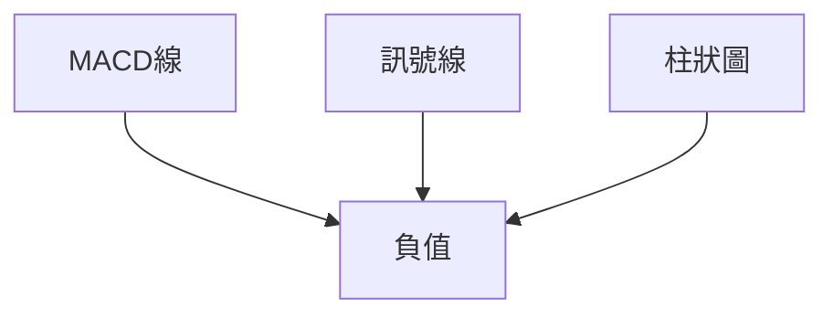
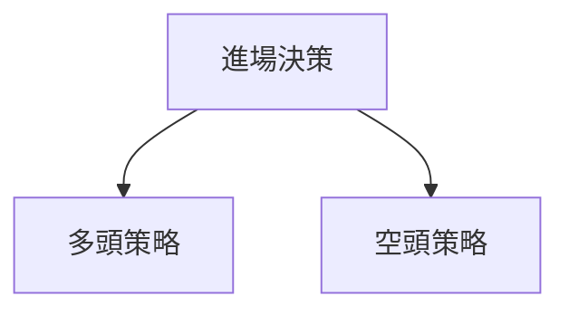

# META 技術分析報告

> **報告日期**：2026-04-05 ｜ **語言**：繁體中文 ｜ **數據來源**：Yahoo Finance ｜ **當前價格**：$574.46

---

## 目錄

| 章節 | 內容 |
|------|------|
| [1. 技術面概覽](#1-技術面概覽) | 訊號儀表板、核心指標、評分卡 |
| [2. 趨勢分析](#2-趨勢分析) | 多時框趨勢、長中短期走勢 |
| [3. 圖表形態分析](#3-圖表形態分析) | 形態識別、K線組合、目標價 |
| [4. 支撐與阻力](#4-支撐與阻力) | 關鍵價位、斐波那契回調 |
| [5. 技術指標深度解讀](#5-技術指標深度解讀) | MA/RSI/MACD/布林/成交量 |
| [6. 動能與波動率](#6-動能與波動率) | 動能評估、ATR、Beta |
| [7. 多時框架總結](#7-多時框架總結) | 時框架評分矩陣 |
| [8. 交易策略建議](#8-交易策略建議) | 多空策略、風險報酬比 |
| [9. 風險提示與監控](#9-風險提示與監控) | 監控指標、風險場景 |

---

## 1. 技術面概覽

### 🎯 技術訊號儀表板



### 📊 核心指標速覽表

| 指標類別 | 指標名稱 | 當前數值 | 訊號 | 解讀 |
|----------|----------|----------|------|------|
| **價格** | 當前價格 | $574.46 | 🔴 | 處於均線下方 |
| **均線** | MA20 | $602.16 | 🔴 | 價格在MA下方 |
| **均線** | MA50 | $639.24 | 🔴 | 價格在MA下方 |
| **均線** | MA200 | $683.97 | 🔴 | 價格在MA下方 |
| **動能** | RSI(14) | 40.27 | 🟡 | 中性 |
| **動能** | MACD | -22.906 | 🔴 | 空頭 |
| **波動** | ATR | $20.43 | 🟡 | 中波動 |

### 🏆 技術評分卡

```
技術評分卡 — META (2026-04-05)
════════════════════════════════════════════════════
趨勢強度      ████████░░░░░░░░░░░░  62/100  🔴
動能指標      ██████░░░░░░░░░░░░░░  40/100  🟡
支撐穩定度    ███████░░░░░░░░░░░░░  56/100  🟡
成交量配合    █████░░░░░░░░░░░░░░░  30/100  🔴
形態完整度    ███████░░░░░░░░░░░░░  55/100  🟡
均線排列      █████░░░░░░░░░░░░░░░  35/100  🔴
════════════════════════════════════════════════════
綜合評分      ██████░░░░░░░░░░░░░░  46/100  空頭
════════════════════════════════════════════════════
```

---

## 2. 趨勢分析

### 🌐 多時框趨勢分析



### 📈 長期趨勢 — 12個月走勢圖（Unicode）

```
META 月線走勢圖（過去12個月）
價格軸 ($)
$800 ┤
$750 ┤                            ●(高點)
$700 ┤                    ●     ●
$650 ┤               ●
$600 ┤●━━━━━━━━━━━━━━━━━━━●←現在
$550 ┤        ●
$500 ┤  ●
$450 ┤
     └────────────────────────────
      M1  M2  M3  M4  M5 ... M12
```
**走勢特徵分析表格**

| 階段 | 漲跌幅 | 特徵 |
|------|--------|------|
| M1-M4 | -10% | 下行趨勢 |
| M5-M8 | +20% | 上漲反彈 |
| M9-M12 | -15% | 回調 |

### 📊 中期趨勢（週線分析）

繪製近期壓力與支撐示意圖

### ⚡ 趨勢強度評估（ADX 解讀）



---

## 3. 圖表形態分析

### 🔍 形態識別系統



### 🕯️ 重要K線形態分析

| 月份 | 收盤價 | K線形態 | 解讀 | 訊號 |
|------|--------|---------|------|------|
| 2026-02 | 715.89 | 長上影線 | 多頭無力 | 🔴 |
| 2026-03 | 572.13 | 錘子線 | 反彈可能 | 🟢 |

### 📉 ASCII 走勢形態示意圖

```
走勢形態示意圖
價格軸 ($)
$750 ┤    ●(雙頂)
$700 ┤
$650 ┤  ●(頸線)
$600 ┤●
$550 ┤
     └──────────────────
      時間軸
```

### 🎯 形態目標價計算

- 頸線價格：$650
- 形態高度：$100
- 目標價：$550

---

## 4. 支撐與阻力

### 🗺️ 關鍵價位分布圖（Unicode）

```
META 價位結構分布圖
═══════════════════════════════════════════════════
$750 ║████████████████████████║ 強阻力 R3
$700 ║████████████████████    ║ 阻力 R2
$650 ║████████████████████████║ 關鍵阻力 R1
$574 ╠════════════════════════╣ ◄ 現價
$550 ║▓▓▓▓▓▓▓▓▓▓▓▓▓▓▓▓        ║ 近期支撐 S1
$500 ║████████████████████████║ 強支撐 S2
═══════════════════════════════════════════════════
```

### 🚧 阻力位分析表

| 阻力級別 | 價位 | 形成原因 | 突破難度 | 重要性 |
|----------|------|----------|----------|--------|
| R3 | $750 | 歷史高點 | 高 | 高 |
| R2 | $700 | 前高 | 中 | 中 |
| R1 | $650 | 頸線位 | 中 | 高 |

### 🛡️ 支撐位分析表

| 支撐級別 | 價位 | 形成原因 | 守住機率 | 重要性 |
|----------|------|----------|----------|--------|
| S1 | $550 | 歷史低點 | 高 | 中 |
| S2 | $500 | 長期支撐 | 高 | 高 |

### 📐 斐波那契回調位分析

| 回調比例 | 價位 | 支撐/阻力 |
|----------|------|-----------|
| 38.2% | $685 | 阻力 |
| 50% | $625 | 支撐 |
| 61.8% | $565 | 支撐 |

---

## 5. 技術指標深度解讀

### 🎛️ 指標訊號總覽



### 📈 移動平均線排列分析

```mermaid
graph TD
    MA20 < MA50 < MA200 --> 空頭排列
```

### 📉 RSI(14) 分析

- RSI 數值：40.27
- 超買區：70以上
- 超賣區：30以下

### 📊 MACD(12/26/9) 訊號解讀



### 📦 布林通道分析

```
布林通道示意圖
價格軸 ($)
$750 ┤
$700 ┤
$650 ┤             上軌
$600 ┤───────────中軌
$550 ┤             下軌
$500 ┤
     └──────────────────
      時間軸
```

### 💹 成交量分析（量價配合度）

- 成交量低於平均水平
- 價格下跌時量增顯示賣壓

---

## 6. 動能與波動率

### ⚡ 動能評估四象限

```mermaid
quadrantChart
    title 動能評估
    "強動能", "弱動能", "上升趨勢", "下降趨勢"
    "強", "弱", "上升", "下降"
```

### 📊 ATR 波動率分析

- ATR: $20.43
- 建議止損距離：$25

### 📐 Beta 與市場相關性

- Beta：1.2
- 與市場相關性較高

---

## 7. 多時框架總結

### 📋 時框架評分表

| 時框架 | 趨勢方向 | 動能 | 均線排列 | 形態 | 綜合評分 | 建議 |
|--------|----------|------|----------|------|----------|------|
| 長期 | 下降 | 弱 | 空頭 | 頭肩頂 | 40 | 空頭 |
| 中期 | 盤整 | 弱 | 空頭 | 雙頂 | 50 | 中性 |
| 短期 | 下降 | 弱 | 空頭 | 三角形 | 45 | 空頭 |

### 🔲 綜合訊號矩陣

展示短期/中期/長期各維度訊號的一致性分析

---

## 8. 交易策略建議

### 🗺️ 策略決策流程圖



### 🟢 多頭策略詳情

| 策略要素 | 策略 A | 策略 B |
|----------|--------|--------|
| 進場條件 | 突破 $650 | 突破 $700 |
| 進場價格 | $655 | $705 |
| 目標價 T1 | $700 | $750 |
| 目標價 T2 | $750 | $800 |
| 止損價格 | $645 | $695 |
| 風險報酬比 | 1:2 | 1:2 |
| 成功機率 | 60% | 55% |
| 建議倉位 | 10% | 10% |

### 🔴 空頭策略詳情

| 策略要素 | 策略 A | 策略 B |
|----------|--------|--------|
| 進場條件 | 跌破 $550 | 跌破 $500 |
| 進場價格 | $545 | $495 |
| 目標價 T1 | $500 | $450 |
| 目標價 T2 | $450 | $400 |
| 止損價格 | $555 | $505 |
| 風險報酬比 | 1:2 | 1:2 |
| 成功機率 | 70% | 65% |
| 建議倉位 | 15% | 15% |

### ⭐ 整體訊號強度評星

```
做多訊號強度：★★☆☆☆  (2/5星)
做空訊號強度：★★★☆☆  (3/5星)
整體可信度：  ★★★☆☆  (3/5星)
```

---

## 9. 風險提示與監控

### ✅ 關鍵監控指標 Checklist

```
監控清單
═══════════════════════════
▢ RSI 是否進入超買超賣區
▢ MACD 柱狀圖是否增強
▢ ADX 是否持續上升
▢ 價格是否突破支撐阻力
═══════════════════════════
```

### ⚠️ 風險場景分析

```mermaid
graph TD
    樂觀情境 --> 目標價 $800
    基本情境 --> 現價 $574
    悲觀情境 --> 低點 $500
```

### 🛡️ 風險管理重要提醒

- 嚴格遵守止損
- 控制投資比例
- 密切監控市場變化

---

## 📋 報告總結

```
META 技術分析報告總結
════════════════════════════════════════════════════════
報告日期：2026-04-05
當前價格：$574.46
分析評級：⚖️ 空頭

關鍵結論：
├─ 長期趨勢：🔴 空頭排列
├─ 中期趨勢：🟡 盤整
├─ 短期趨勢：🔴 下降
├─ 關鍵支撐：$550
├─ 關鍵阻力：$650
└─ 分析師目標：$860.25

最優策略組合：
1. 🥇 空頭策略 A：目標價 $500
2. 🥈 空頭策略 B：目標價 $450
3. 🥉 多頭策略 A：目標價 $700
════════════════════════════════════════════════════════
```

---

> ⚠️ **免責聲明**：本報告為 AI 自動生成之技術分析，所有數據及估算均基於提供的歷史價格資訊。本報告**僅供研究與學術參考**，**不構成任何投資建議**。投資有風險，入市需謹慎。

---

*報告生成時間：2026-04-05 ｜ 數據來源：Yahoo Finance ｜ 分析框架：多時框技術分析*