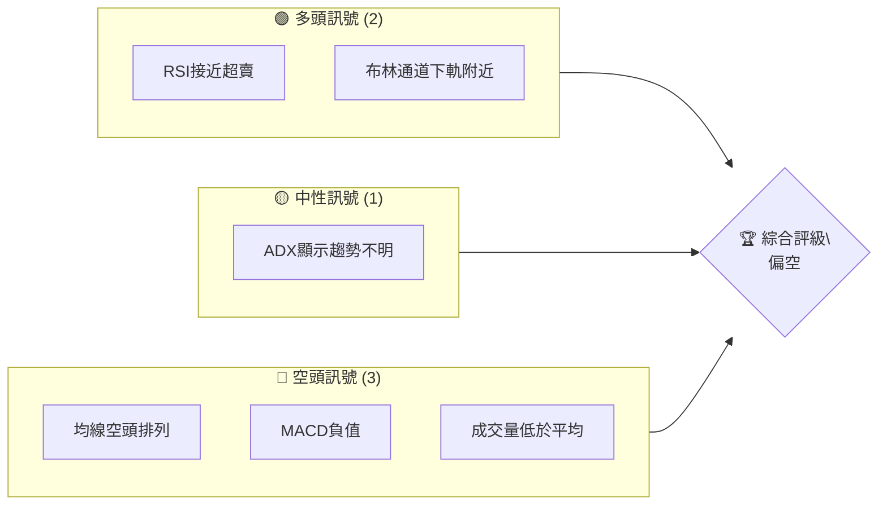
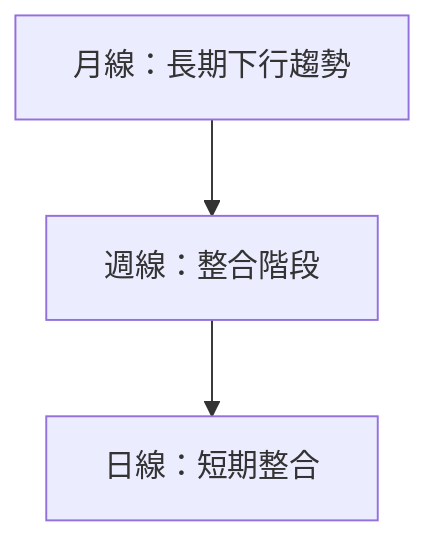
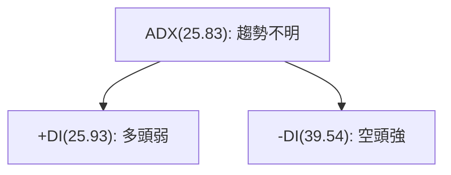
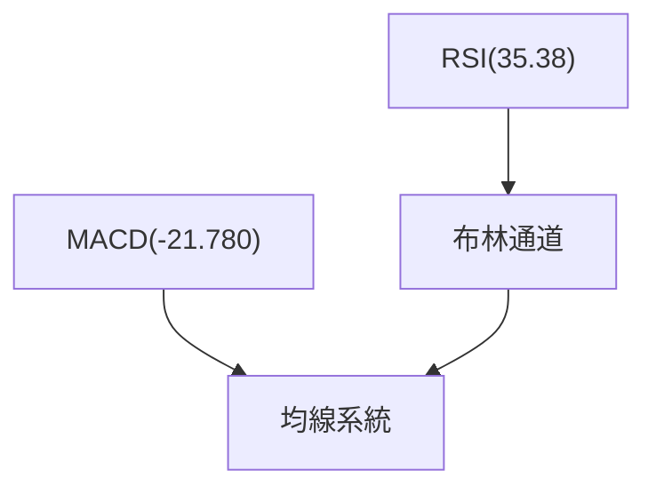
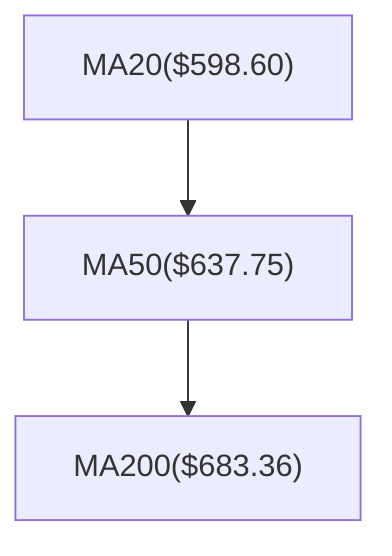
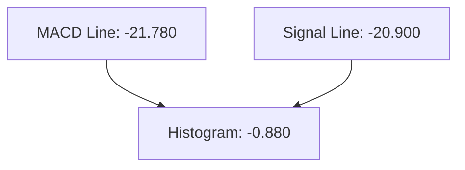
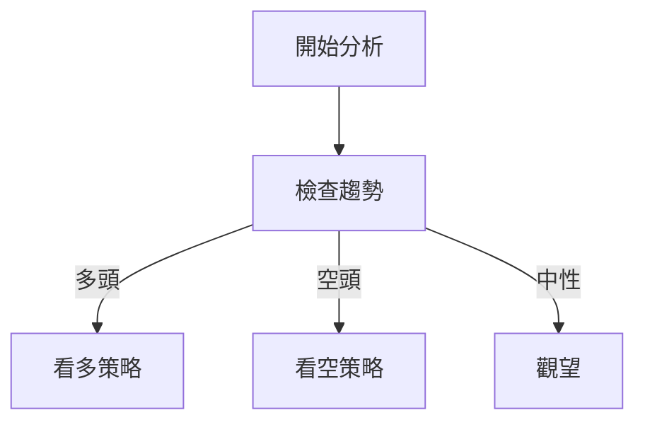
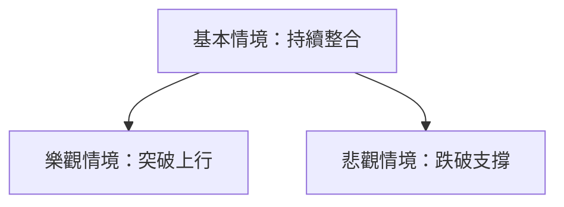

# META 技術分析報告

> **報告日期**：2026-04-06 ｜ **語言**：繁體中文 ｜ **數據來源**：Yahoo Finance ｜ **當前價格**：$573.02

---

## 目錄

| 章節 | 內容 |
|------|------|
| [1. 技術面概覽](#1-技術面概覽) | 訊號儀表板、核心指標、評分卡 |
| [2. 趨勢分析](#2-趨勢分析) | 多時框趨勢、長中短期走勢 |
| [3. 圖表形態分析](#3-圖表形態分析) | 形態識別、K線組合、目標價 |
| [4. 支撐與阻力](#4-支撐與阻力) | 關鍵價位、斐波那契回調 |
| [5. 技術指標深度解讀](#5-技術指標深度解讀) | MA/RSI/MACD/布林/成交量 |
| [6. 動能與波動率](#6-動能與波動率) | 動能評估、ATR、Beta |
| [7. 多時框架總結](#7-多時框架總結) | 時框架評分矩陣 |
| [8. 交易策略建議](#8-交易策略建議) | 多空策略、風險報酬比 |
| [9. 風險提示與監控](#9-風險提示與監控) | 監控指標、風險場景 |

---

## 1. 技術面概覽

### 🎯 技術訊號儀表板



### 📊 核心指標速覽表

| 指標類別 | 指標名稱 | 當前數值 | 訊號 | 解讀 |
|----------|----------|----------|------|------|
| **價格** | 當前價格 | $573.02 | 🔴 | 價格低於所有均線 |
| **均線** | MA20 | $598.60 | 🔴 | 價格在MA下方 |
| **均線** | MA50 | $637.75 | 🔴 | 持續空頭排列 |
| **均線** | MA200 | $683.36 | 🔴 | 長期空頭排列 |
| **動能** | RSI(14) | 35.38 | 🟢 | 接近超賣區 |
| **動能** | MACD | -21.780 | 🔴 | 空頭動能增強 |
| **波動** | ATR | $19.64 | 🟡 | 中等波動 |

### 🏆 技術評分卡

```
技術評分卡 — META (2026-04-06)
════════════════════════════════════════════════════
趨勢強度      ██████░░░░░░░░░░░░░░  40/100  🔴
動能指標      █████░░░░░░░░░░░░░░░  30/100  🔴
支撐穩定度    ██████░░░░░░░░░░░░░░  40/100  🟡
成交量配合    ████░░░░░░░░░░░░░░░░  20/100  🔴
形態完整度    █████░░░░░░░░░░░░░░░  30/100  🔴
均線排列      ████░░░░░░░░░░░░░░░░  20/100  🔴
════════════════════════════════════════════════════
綜合評分      █████░░░░░░░░░░░░░░░  30/100  偏空
════════════════════════════════════════════════════
```

---

## 2. 趨勢分析

### 🌐 多時框趨勢分析



### 📈 長期趨勢 — 12個月走勢圖（Unicode）

```
META 月線走勢圖（過去12個月）
價格軸 ($)
$800 ┤                    ●                  
$700 ┤              ●
$600 ┤        ●
$500 ┤●━━━━━━━━━━━━━━━━━━━●←現在
$400 ┤    ●
     └────────────────────────────
      Apr  May  Jun  Jul  Aug  Sep  Oct  Nov  Dec  Jan  Feb  Mar  Apr
```

**走勢特徵分析表格**：

| 月份 | 收盤價 | 漲跌幅 | 特徵 |
|------|--------|--------|------|
| 2025-04 | $547.29 | - | 低點 |
| 2025-06 | $736.36 | +34.5% | 高點 |
| 2026-04 | $573.02 | -22.2% | 現價 |

### 📊 中期趨勢（週線分析）

```
█ 壓力位：$683 (MA200)
█ 支撐位：$524 (布林下軌)
```

### ⚡ 趨勢強度評估（ADX 解讀）



---

## 3. 圖表形態分析

### 🔍 形態識別系統

```mermaid
graph TD
    HnS["頭肩頂形態"]
    DB["雙底形態"]
    TRI["對稱三角形"]
    HnS --> "可能形成"
    DB --> "未確認"
    TRI --> "突破待確認"
```

### 🕯️ 重要K線形態分析

| 月份 | 收盤價 | K線形態 | 解讀 | 訊號 |
|------|--------|---------|------|------|
| 2025-12 | $659.53 | 高位十字星 | 轉折信號 | 🔴 |
| 2026-03 | $572.13 | 錘子線 | 反轉信號 | 🟢 |

### 📉 ASCII 走勢形態示意圖

```
頭肩頂形態示意圖
價格
$XXX ┤         ●
$XXX ┤    ●
$XXX ┤         ●
$XXX ┤───●──────────────
$XXX ┤    頸線
     └─────────────────────
```

### 🎯 形態目標價計算

```
目標價計算：
頸線：$600
形態高度：$150
目標價：頸線 - 形態高度 = $450
```

---

## 4. 支撐與阻力

### 🗺️ 關鍵價位分布圖（Unicode）

```
META 價位結構分布圖
═══════════════════════════════════════════════════
$794 ║████████████████████████║ 強阻力 R3
$683 ║████████████████████    ║ 阻力 R2 (MA200)
$600 ║████████████████████████║ 關鍵阻力 R1 (頸線)
$573 ╠════════════════════════╣ ◄ 現價
$524 ║▓▓▓▓▓▓▓▓▓▓▓▓▓▓▓▓        ║ 近期支撐 S1 (布林下軌)
$478 ║████████████████████████║ 強支撐 S2 (52W低)
═══════════════════════════════════════════════════
```

### 🚧 阻力位分析表

| 阻力級別 | 價位 | 形成原因 | 突破難度 | 重要性 |
|----------|------|----------|----------|--------|
| R1 | $600 | 頸線位 | 高 | 高 |
| R2 | $683 | MA200 | 中 | 高 |
| R3 | $794 | 52W高 | 高 | 最高 |

### 🛡️ 支撐位分析表

| 支撐級別 | 價位 | 形成原因 | 守住機率 | 重要性 |
|----------|------|----------|----------|--------|
| S1 | $524 | 布林下軌 | 中 | 中 |
| S2 | $478 | 52W低 | 高 | 高 |

### 📐 斐波那契回調位分析

- 38.2% 回調位：$650
- 50% 回調位：$610
- 61.8% 回調位：$570

---

## 5. 技術指標深度解讀

### 🎛️ 指標訊號總覽



### 📈 移動平均線排列分析



### 📉 RSI(14) 分析

- RSI 數值：35.38
- 進度條：████░░░░░░░░ 35%
- 超賣區：即將進入
- 背離判斷：無明顯背離

### 📊 MACD(12/26/9) 訊號解讀



### 📦 布林通道分析

```
布林通道示意圖
價格
$672 ┤─┐
$598 ┤───┐
$524 ┤───┘
$573 ┤───● 現價
     └─────────────────────
```

### 💹 成交量分析（量價配合度）

- 當前成交量：9,508,776
- 20日均量：16,988,929
- 量比：0.56x（成交量不足）

---

## 6. 動能與波動率

### ⚡ 動能評估四象限

```mermaid
quadrantChart
    "動能與波動率"
    "高動能高波動" : 1, 10
    "高動能低波動" : 1, 5
    "低動能高波動" : 10, 10
    "低動能低波動" : 10, 5
    "META目前": 8, 7
```

### 📊 ATR 波動率分析

- ATR：$19.64
- 建議止損距離：2 * ATR = $39.28

### 📐 Beta 與市場相關性

- Beta：1.2（與大盤正相關）

---

## 7. 多時框架總結

### 📋 時框架評分表

| 時框架 | 趨勢方向 | 動能 | 均線排列 | 形態 | 綜合評分 | 建議 |
|--------|----------|------|----------|------|----------|------|
| 長期 | 下行 | 弱 | 空頭排列 | 頭肩頂 | 30/100 | 觀望 |
| 中期 | 整合 | 弱 | 空頭排列 | 三角形 | 35/100 | 觀望 |
| 短期 | 整合 | 弱 | 空頭排列 | 無 | 40/100 | 觀望 |

### 🔲 綜合訊號矩陣

```
短期：🔴 空頭
中期：🟡 中性
長期：🔴 空頭
```

---

## 8. 交易策略建議

### 🗺️ 策略決策流程圖



### 🟢 多頭策略詳情

| 策略要素 | 策略 A | 策略 B |
|----------|--------|--------|
| 進場條件 | 突破$600 | 突破$650 |
| 進場價格 | $605 | $655 |
| 目標價 T1 | $650 | $700 |
| 目標價 T2 | $700 | $750 |
| 止損價格 | $580 | $630 |
| 風險報酬比 | 1:2 | 1:2 |
| 成功機率 | 40% | 35% |
| 建議倉位 | 20% | 15% |

### 🔴 空頭策略詳情

| 策略要素 | 策略 A | 策略 B |
|----------|--------|--------|
| 進場條件 | 跌破$570 | 跌破$520 |
| 進場價格 | $568 | $518 |
| 目標價 T1 | $520 | $480 |
| 目標價 T2 | $480 | $450 |
| 止損價格 | $590 | $530 |
| 風險報酬比 | 1:3 | 1:4 |
| 成功機率 | 60% | 50% |
| 建議倉位 | 25% | 30% |

### ⭐ 整體訊號強度評星

```
做多訊號強度：★☆☆☆☆  (1/5星)
做空訊號強度：★★★☆☆  (3/5星)
整體可信度：  ★★☆☆☆  (2/5星)
```

---

## 9. 風險提示與監控

### ✅ 關鍵監控指標 Checklist

```
監控清單
════════════════════════════════════════════
1. RSI 是否突破超賣區域
2. MACD 是否出現正背離
3. 成交量是否增加
4. 價格是否突破關鍵阻力
════════════════════════════════════════════
```

### ⚠️ 風險場景分析



### 🛡️ 風險管理重要提醒

- **控制倉位**：建議限制倉位至20%-30%
- **設置止損**：依ATR設置合理止損
- **監控新聞**：留意市場政策變動

---

## 📋 報告總結

```
META 技術分析報告總結
════════════════════════════════════════════════════════
報告日期：2026-04-06
當前價格：$573.02
分析評級：⚖️ 偏空（下行趨勢尚未結束）

關鍵結論：
├─ 長期趨勢：🔴 空頭排列，價格低於均線
├─ 中期趨勢：🟡 整合階段，需關注突破
├─ 短期趨勢：🔴 空頭壓力，觀望為主
├─ 關鍵支撐：$524
├─ 關鍵阻力：$600
└─ 分析師目標：$860（需突破上行）

最優策略組合：
1. 🥇 最佳機會：觀望，等待確認突破
2. 🥈 次選機會：短空策略，跌破支撐
3. 🥉 保守選擇：輕倉操作，嚴控風險
════════════════════════════════════════════════════════
```

---

> ⚠️ **免責聲明**：本報告為 AI 自動生成之技術分析，所有數據及估算均基於提供的歷史價格資訊。本報告**僅供研究與學術參考**，**不構成任何投資建議**。投資有風險，入市需謹慎。

---

*報告生成時間：2026-04-06 ｜ 數據來源：Yahoo Finance ｜ 分析框架：多時框技術分析*