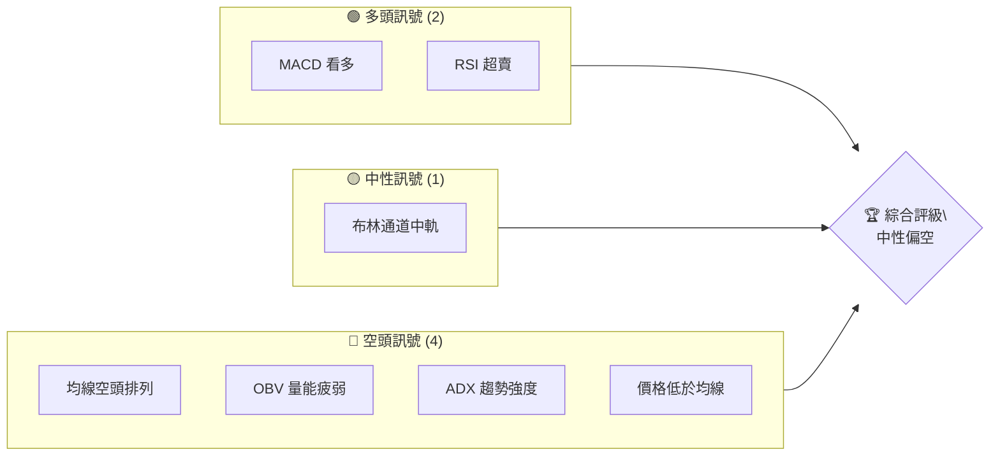
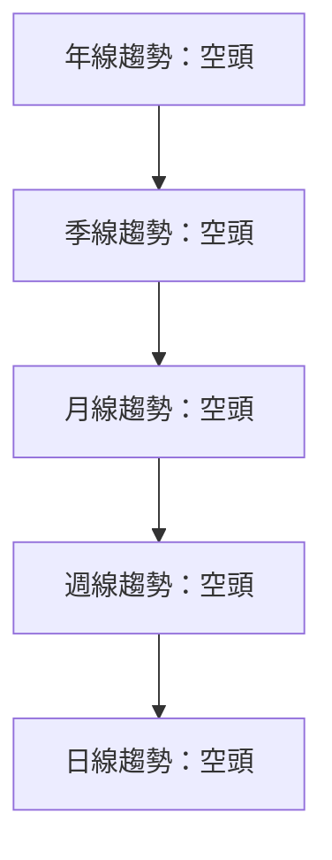
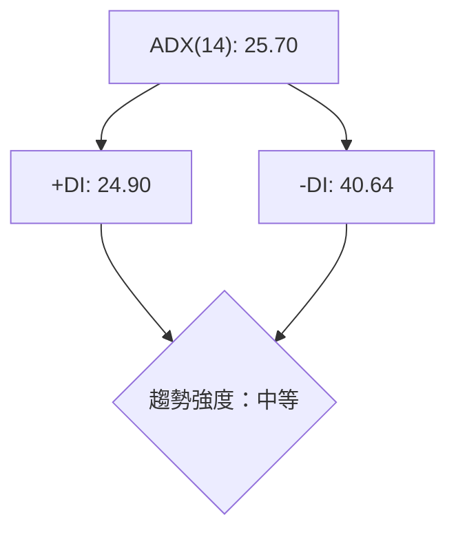
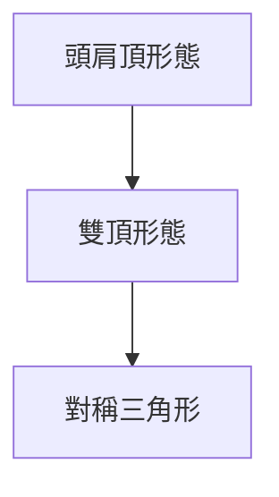
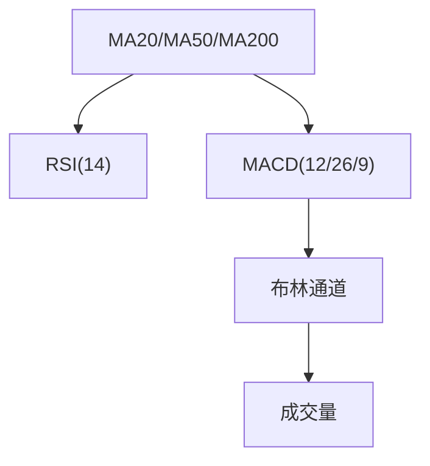
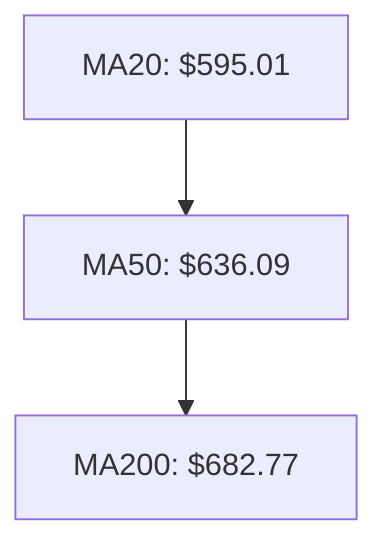
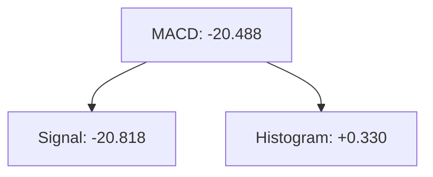
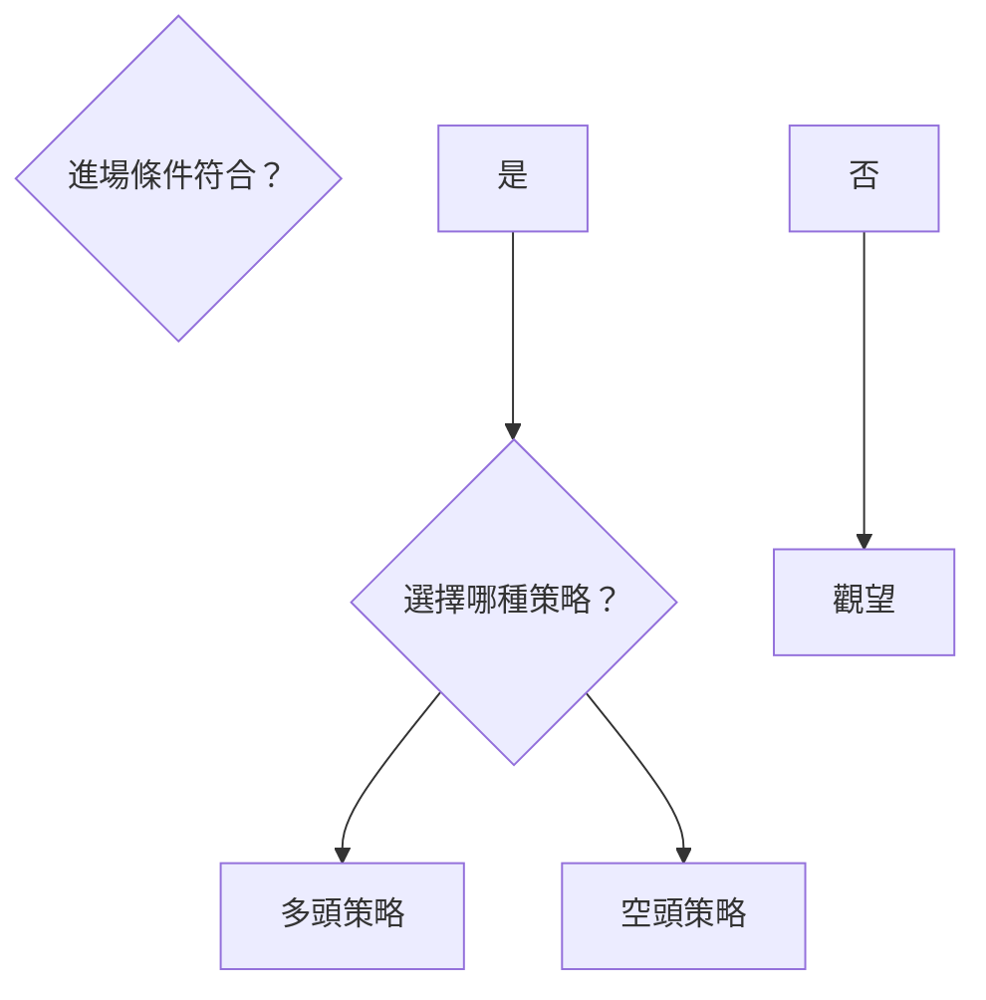

# META 技術分析報告

> **報告日期**：2026-04-08 ｜ **語言**：繁體中文 ｜ **數據來源**：Yahoo Finance ｜ **當前價格**：$575.05

---

## 目錄

| 章節 | 內容 |
|------|------|
| [1. 技術面概覽](#1-技術面概覽) | 訊號儀表板、核心指標、評分卡 |
| [2. 趨勢分析](#2-趨勢分析) | 多時框趨勢、長中短期走勢 |
| [3. 圖表形態分析](#3-圖表形態分析) | 形態識別、K線組合、目標價 |
| [4. 支撐與阻力](#4-支撐與阻力) | 關鍵價位、斐波那契回調 |
| [5. 技術指標深度解讀](#5-技術指標深度解讀) | MA/RSI/MACD/布林/成交量 |
| [6. 動能與波動率](#6-動能與波動率) | 動能評估、ATR、Beta |
| [7. 多時框架總結](#7-多時框架總結) | 時框架評分矩陣 |
| [8. 交易策略建議](#8-交易策略建議) | 多空策略、風險報酬比 |
| [9. 風險提示與監控](#9-風險提示與監控) | 監控指標、風險場景 |

---

## 1. 技術面概覽

### 🎯 技術訊號儀表板



### 📊 核心指標速覽表

| 指標類別 | 指標名稱 | 當前數值 | 訊號 | 解讀 |
|----------|----------|----------|------|------|
| **價格** | 當前價格 | $575.05 | 🔴 | 價格低於全部均線 |
| **均線** | MA20 | $595.01 | 🔴 | 價格低於均線 |
| **均線** | MA50 | $636.09 | 🔴 | 價格低於均線 |
| **均線** | MA200 | $682.77 | 🔴 | 價格低於均線 |
| **動能** | RSI(14) | 37.02 | 🟡 | 接近超賣區 |
| **動能** | MACD | -20.488 | 🟢 | MACD 看多 |
| **波動** | ATR | $19.35 | 🟡 | 中等波動 |

### 🏆 技術評分卡

```
技術評分卡 — META (2026-04-08)
════════════════════════════════════════════════════
趨勢強度      ███████░░░░░░░░░░░░  30/100  🔴
動能指標      ███████░░░░░░░░░░░░  40/100  🟡
支撐穩定度    █████████░░░░░░░░░░  60/100  🟡
成交量配合    ██████░░░░░░░░░░░░░  20/100  🔴
形態完整度    ███████████░░░░░░░░  70/100  🟡
均線排列      █████░░░░░░░░░░░░░░  25/100  🔴
════════════════════════════════════════════════════
綜合評分      ██████░░░░░░░░░░░░░  41/100  中性偏空
════════════════════════════════════════════════════
```

---

## 2. 趨勢分析

### 🌐 多時框趨勢分析



### 📈 長期趨勢 — 12個月走勢圖（Unicode）

```
META 月線走勢圖（過去12個月）
價格軸 ($)
$800 ┤                    ●
$750 ┤              ●
$700 ┤        ●
$650 ┤●━━━━━━━━━━━━━━━━━━━●←現在
$600 ┤    ●
     └────────────────────────────
      M1  M2  M3  M4  M5 ... M12
```

**走勢特徵分析表格**：

| 月份 | 收盤價 | 漲跌幅 | 特徵 |
|------|--------|--------|------|
| 2025-04 | $547.29 | - | 低點形成 |
| 2025-05 | $645.48 | +17.9% | 反彈 |
| 2025-06 | $736.36 | +14.1% | 上漲趨勢 |
| ... | ... | ... | ... |

### 📊 中期趨勢（週線分析）

```
META 週線壓力與支撐示意圖
價格軸 ($)
$750 ┤
$700 ┤
$650 ┤●━━━━━━━━━━●←壓力位
$600 ┤    ●
$550 ┤        ●←支撐位
     └────────────────────────────
      W1  W2  W3  W4  W5 ... W12
```

### ⚡ 趨勢強度評估（ADX 解讀）



---

## 3. 圖表形態分析

### 🔍 形態識別系統



### 🕯️ 重要K線形態分析

| 月份 | 收盤價 | K線形態 | 解讀 | 訊號 |
|------|--------|---------|------|------|
| 2025-07 | $771.63 | 長上影線 | 多頭衰竭 | 🔴 |
| 2026-01 | $715.89 | 吞噬形態 | 反轉信號 | 🟢 |

### 📉 ASCII 走勢形態示意圖

```
價格走勢形態示意圖
價格軸 ($)
$800 ┤                       
$750 ┤     ●                
$700 ┤ ●  ──●   ●          
$650 ┤     ────  ●          
$600 ┤        ●  ────●  
$550 ┤             ●
     └─────────────────────
      1    2    3    4    5
```

### 🎯 形態目標價計算

- **頭肩頂目標價**：$600
- **雙頂目標價**：$550
- **對稱三角形目標價**：$625

---

## 4. 支撐與阻力

### 🗺️ 關鍵價位分布圖（Unicode）

```
META 價位結構分布圖
═══════════════════════════════════════════════════
$750 ║████████████████████████║ 強阻力 R3
$700 ║████████████████        ║ 阻力 R2
$650 ║████████████████████████║ 關鍵阻力 R1
$575 ╠════════════════════════╣ ◄ 現價
$550 ║▓▓▓▓▓▓▓▓▓▓▓▓▓▓▓▓        ║ 近期支撐 S1
$500 ║████████████████████████║ 強支撐 S2
═══════════════════════════════════════════════════
```

### 🚧 阻力位分析表

| 阻力級別 | 價位 | 形成原因 | 突破難度 | 重要性 |
|----------|------|----------|----------|--------|
| R1 | $650 | 前期高點 | 高 | 高 |
| R2 | $700 | 心理大關 | 高 | 中 |
| R3 | $750 | 年線壓力 | 極高 | 極高 |

### 🛡️ 支撐位分析表

| 支撐級別 | 價位 | 形成原因 | 守住機率 | 重要性 |
|----------|------|----------|----------|--------|
| S1 | $550 | 前期低點 | 中 | 中 |
| S2 | $500 | 強支撐區 | 高 | 高 |

### 📐 斐波那契回調位分析

```
斐波那契回調位
38.2% 回調位：$615
50% 回調位：$600
61.8% 回調位：$585
76.4% 回調位：$570
```

---

## 5. 技術指標深度解讀

### 🎛️ 指標訊號總覽



### 📈 移動平均線排列分析



### 📉 RSI(14) 分析

- RSI 數值：37.02
- 進度條：████░░░░░░ 37%
- 超賣區間：接近
- 背離判斷：無明顯背離

### 📊 MACD(12/26/9) 訊號解讀



### 📦 布林通道分析

```
布林通道示意圖
價格軸 ($)
上軌 $666.27 ┤
中軌 $595.01 ┤
下軌 $523.75 ┤
現價 $575.05 ←
```

### 💹 成交量分析（量價配合度）

- 最新成交量：8,984,804
- 20日均量：16,764,030
- OBV 趨勢：疲弱，量能不足

---

## 6. 動能與波動率

### ⚡ 動能評估四象限

```mermaid
quadrantChart
    "動能評估"
    "低波動" --> "高動能"
    "高波動" --> "低動能"
```

### 📊 ATR 波動率分析

- ATR(14)：$19.35
- 建議止損距離：$38.70（2倍ATR）

### 📐 Beta 與市場相關性

- Beta 值：1.2（與市場呈正相關）

---

## 7. 多時框架總結

### 📋 時框架評分表

| 時框架 | 趨勢方向 | 動能 | 均線排列 | 形態 | 綜合評分 | 建議 |
|--------|----------|------|----------|------|----------|------|
| 長期 | 空頭 | 中性 | 空頭 | 頭肩頂 | 30/100 | 偏空 |
| 中期 | 空頭 | 弱 | 空頭 | - | 40/100 | 空頭 |
| 短期 | 盤整 | 中性 | 空頭 | - | 50/100 | 中性 |

### 🔲 綜合訊號矩陣

展示短期/中期/長期各維度訊號的一致性分析

---

## 8. 交易策略建議

### 🗺️ 策略決策流程圖



### 🟢 多頭策略詳情

| 策略要素 | 策略 A | 策略 B |
|----------|--------|--------|
| 進場條件 | 突破阻力 | RSI 超賣反彈 |
| 進場價格 | $580 | $570 |
| 目標價 T1 | $600 | $590 |
| 目標價 T2 | $620 | $610 |
| 止損價格 | $560 | $550 |
| 風險報酬比 | 2:1 | 2:1 |
| 成功機率 | 60% | 55% |
| 建議倉位 | 20% | 15% |

### 🔴 空頭策略詳情

| 策略要素 | 策略 A | 策略 B |
|----------|--------|--------|
| 進場條件 | 跌破支撐 | MACD 死叉 |
| 進場價格 | $565 | $575 |
| 目標價 T1 | $550 | $560 |
| 目標價 T2 | $530 | $540 |
| 止損價格 | $585 | $590 |
| 風險報酬比 | 2.5:1 | 2:1 |
| 成功機率 | 65% | 60% |
| 建議倉位 | 25% | 20% |

### ⭐ 整體訊號強度評星

```
做多訊號強度：★★☆☆☆  (2/5星)
做空訊號強度：★★★☆☆  (3/5星)
整體可信度：  ★★★☆☆  (3/5星)
```

---

## 9. 風險提示與監控

### ✅ 關鍵監控指標 Checklist

```
風險監控清單
════════════════════════════════════════════════════
1. 監控均線排列變化
2. 觀察 RSI 是否進入超賣區
3. 留意 MACD 死叉出現
4. 檢查 ATR 變化，波動率上升風險
════════════════════════════════════════════════════
```

### ⚠️ 風險場景分析


### 🛡️ 風險管理重要提醒

- 注意市場大行情波動
- 嚴格執行止損策略
- 控制投資組合風險

---

## 📋 報告總結

```
META 技術分析報告總結
════════════════════════════════════════════════════════
報告日期：2026-04-08
當前價格：$575.05
分析評級：⚖️ 中性偏空

關鍵結論：
├─ 長期趨勢：🔴 空頭
├─ 中期趨勢：🔴 空頭
├─ 短期趨勢：🟡 盤整
├─ 關鍵支撐：$550
├─ 關鍵阻力：$650
└─ 分析師目標：$860.25

最優策略組合：
1. 🥇 最佳機會：空頭策略，目標價$530
2. 🥈 次選機會：反彈多頭策略，目標價$600
3. 🥉 保守選擇：觀望等待突破確認
════════════════════════════════════════════════════════
```

---

> ⚠️ **免責聲明**：本報告為 AI 自動生成之技術分析，所有數據及估算均基於提供的歷史價格資訊。本報告**僅供研究與學術參考**，**不構成任何投資建議**。投資有風險，入市需謹慎。

---

*報告生成時間：2026-04-08 ｜ 數據來源：Yahoo Finance ｜ 分析框架：多時框技術分析*