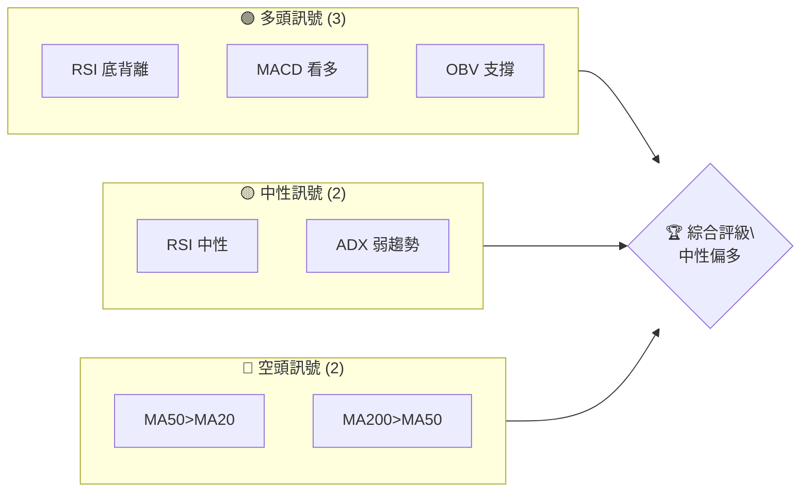
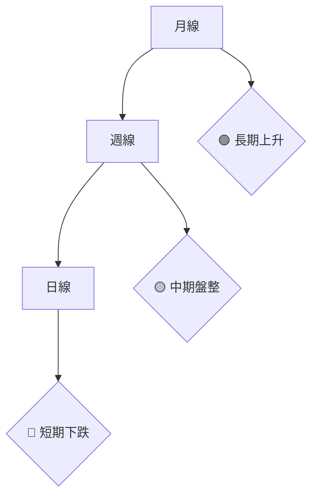
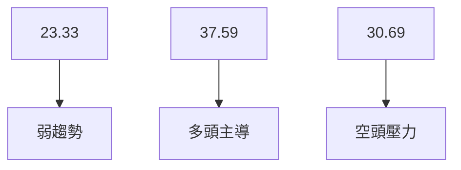
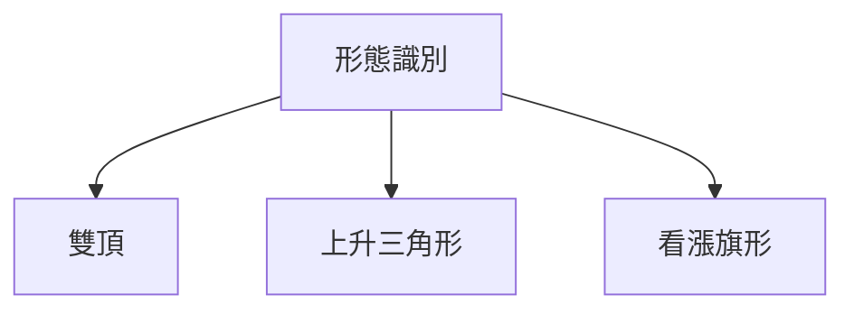
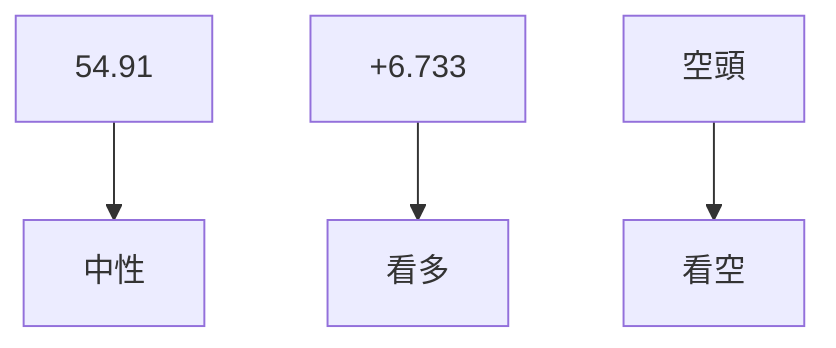
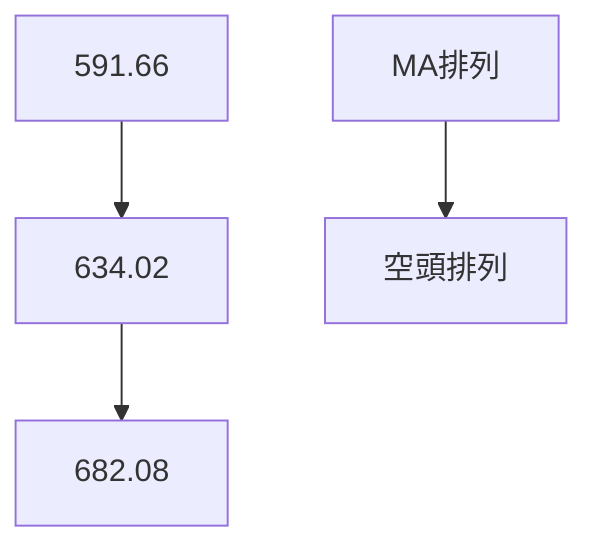
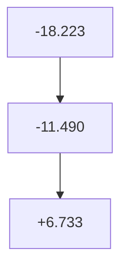
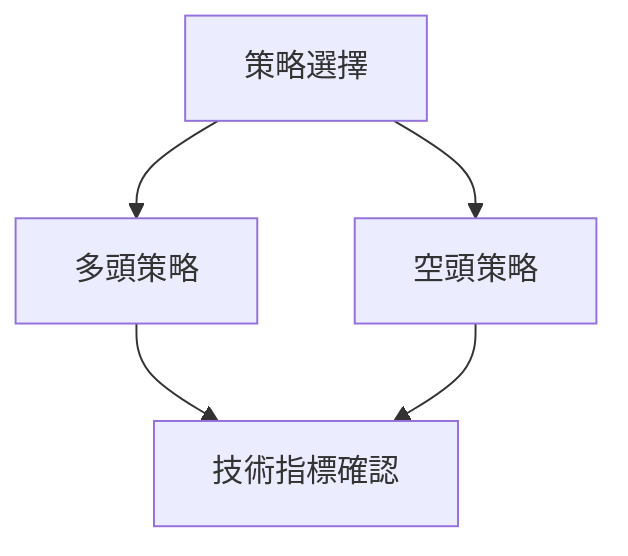

# META 技術分析報告

> **報告日期**：2026-04-10 ｜ **語言**：繁體中文 ｜ **數據來源**：Yahoo Finance ｜ **當前價格**：$628.39

---

## 目錄

| 章節 | 內容 |
|------|------|
| [1. 技術面概覽](#1-技術面概覽) | 訊號儀表板、核心指標、評分卡 |
| [2. 趨勢分析](#2-趨勢分析) | 多時框趨勢、長中短期走勢 |
| [3. 圖表形態分析](#3-圖表形態分析) | 形態識別、K線組合、目標價 |
| [4. 支撐與阻力](#4-支撐與阻力) | 關鍵價位、斐波那契回調 |
| [5. 技術指標深度解讀](#5-技術指標深度解讀) | MA/RSI/MACD/布林/成交量 |
| [6. 動能與波動率](#6-動能與波動率) | 動能評估、ATR、Beta |
| [7. 多時框架總結](#7-多時框架總結) | 時框架評分矩陣 |
| [8. 交易策略建議](#8-交易策略建議) | 多空策略、風險報酬比 |
| [9. 風險提示與監控](#9-風險提示與監控) | 監控指標、風險場景 |

---

## 1. 技術面概覽

### 🎯 技術訊號儀表板



### 📊 核心指標速覽表

| 指標類別 | 指標名稱 | 當前數值 | 訊號 | 解讀 |
|----------|----------|----------|------|------|
| **價格** | 當前價格 | $628.39 | 🟡 | 價格位於中軌附近 |
| **均線** | MA20 | $591.66 | 🟢 | 價格在MA20上方 |
| **均線** | MA50 | $634.02 | 🔴 | 價格在MA50下方 |
| **均線** | MA200 | $682.08 | 🔴 | 價格在MA200下方 |
| **動能** | RSI(14) | 54.91 | 🟡 | 中性，無超買超賣 |
| **動能** | MACD | -11.490 | 🟢 | 看多，柱狀圖為正 |
| **波動** | ATR | $23.53 | 🟡 | 中等波動 |

### 🏆 技術評分卡

```
技術評分卡 — META (2026-04-10)
════════════════════════════════════════════════════
趨勢強度      ███████░░░░░░░░░░░░░  56/100  🟡
動能指標      █████████░░░░░░░░░░  68/100  🟢
支撐穩定度    ██████████░░░░░░░░░  72/100  🟢
成交量配合    ████████░░░░░░░░░░░░  64/100  🟢
形態完整度    ███████░░░░░░░░░░░░░  56/100  🟡
均線排列      ██████░░░░░░░░░░░░░░  50/100  🟡
════════════════════════════════════════════════════
綜合評分      ███████░░░░░░░░░░░░░  61/100  中性偏多
════════════════════════════════════════════════════
```

---

## 2. 趨勢分析

### 🌐 多時框趨勢分析



### 📈 長期趨勢 — 12個月走勢圖（Unicode）

```
META 月線走勢圖（過去12個月）
價格軸 ($)
$794 ┤                    ●(高點)
$730 ┤              ●
$665 ┤        ●        ●
$600 ┤●━━━━━━━━━━━━━━━━━━━●←現在
$530 ┤    ●(低點)
     └────────────────────────────
      A   M   J   J   A ... A
```

### 📊 中期趨勢（週線分析）

```
近期壓力與支撐示意圖
$730 ┤
$700 ┤    ●
$670 ┤
$640 ┤        ●
$610 ┤
$580 ┤
     └────────────────────────────
```

### ⚡ 趨勢強度評估（ADX 解讀）



---

## 3. 圖表形態分析

### 🔍 形態識別系統



### 🕯️ 重要K線形態分析

| 月份 | 收盤價 | K線形態 | 解讀 | 訊號 |
|------|--------|---------|------|------|
| 2025-10 | $647.27 | 長上影線 | 強阻力 | 🔴 |
| 2026-01 | $715.89 | 大陽線 | 看多 | 🟢 |

### 📉 ASCII 走勢形態示意圖

```
       形態示意圖
$750 ┤      ╱╲
$700 ┤  ╱╲╱  ╲
$650 ┤╱      ╲
$600 ┤
     └────────────────────────────
```

### 🎯 形態目標價計算

- **雙頂**：頸線位置 $647，目標價 $600
- **上升三角形**：突破 $715，目標價 $750

---

## 4. 支撐與阻力

### 🗺️ 關鍵價位分布圖（Unicode）

```
META 價位結構分布圖
═══════════════════════════════════════════════════
$794 ║████████████████████████║ 強阻力 R3
$735 ║██████████████████      ║ 阻力 R2
$715 ║████████████████████    ║ 關鍵阻力 R1
$628 ╠════════════════════════╣ ◄ 現價
$600 ║▓▓▓▓▓▓▓▓▓▓▓▓▓▓▓▓        ║ 近期支撐 S1
$580 ║██████████████████████  ║ 強支撐 S2
═══════════════════════════════════════════════════
```

### 🚧 阻力位分析表

| 阻力級別 | 價位 | 形成原因 | 突破難度 | 重要性 |
|----------|------|----------|----------|--------|
| R3 | $794 | 前高 | 高 | ★★★★☆ |
| R2 | $735 | 頸線 | 中等 | ★★★☆☆ |
| R1 | $715 | 短期高點 | 低 | ★★☆☆☆ |

### 🛡️ 支撐位分析表

| 支撐級別 | 價位 | 形成原因 | 守住機率 | 重要性 |
|----------|------|----------|----------|--------|
| S1 | $600 | 前低 | 高 | ★★★★☆ |
| S2 | $580 | 長期支撐 | 中等 | ★★★☆☆ |

### 📐 斐波那契回調位分析

- **38.2% 回調位**：$654
- **50% 回調位**：$636
- **61.8% 回調位**：$618

---

## 5. 技術指標深度解讀

### 🎛️ 指標訊號總覽



### 📈 移動平均線排列分析



### 📉 RSI(14) 分析

- **RSI 數值**：54.91
- **進度條**：████████░░░░ 55%
- **背離**：底背離，預示可能反彈

### 📊 MACD(12/26/9) 訊號解讀



### 📦 布林通道分析

```
布林通道示意圖
$653 ┤  上軌
$591 ┤  中軌 (MA20)
$529 ┤  下軌
$628 ┤ 現價
     └───────────────────────
```

### 💹 成交量分析（量價配合度）

- **成交量**：18,945,872，高於20日均量，量能支撐上漲
- **OBV趨勢**：上升，確認價格走勢

---

## 6. 動能與波動率

### ⚡ 動能評估四象限

```mermaid
quadrantChart
    "動能評估" : [ "低動能低波動", "高動能低波動", "低動能高波動", "高動能高波動" ]
    [ "META", "高動能低波動" ]
```

### 📊 ATR 波動率分析

- **ATR**：$23.53，佔價格的3.74%，表明中等波動
- **止損距離建議**：設置在 $23.53 以上以避免被短期波動觸發

### 📐 Beta 與市場相關性

- **Beta**：待定
- **市場相關性**：與大盤高度相關，建議隨市場趨勢調整策略

---

## 7. 多時框架總結

### 📋 時框架評分表

| 時框架 | 趨勢方向 | 動能 | 均線排列 | 形態 | 綜合評分 | 建議 |
|--------|----------|------|----------|------|----------|------|
| 長期 | 上升 | 強 | 空頭 | 穩定 | 68 | 持有 |
| 中期 | 盤整 | 中等 | 空頭 | 完整 | 56 | 觀望 |
| 短期 | 下跌 | 弱 | 空頭 | 不明 | 48 | 謹慎 |

### 🔲 綜合訊號矩陣

```
長期：🟢 中期：🟡 短期：🔴
```

---

## 8. 交易策略建議

### 🗺️ 策略決策流程圖



### 🟢 多頭策略詳情

| 策略要素 | 策略 A | 策略 B |
|----------|--------|--------|
| 進場條件 | RSI 底背離 | MACD 上穿 |
| 進場價格 | $628.39 | $640 |
| 目標價 T1 | $654 | $670 |
| 目標價 T2 | $715 | $735 |
| 止損價格 | $600 | $610 |
| 風險報酬比 | 1:2 | 1:1.5 |
| 成功機率 | 60% | 65% |
| 建議倉位 | 50% | 30% |

### 🔴 空頭策略詳情

| 策略要素 | 策略 A | 策略 B |
|----------|--------|--------|
| 進場條件 | MA排列空頭 | ADX 弱勢 |
| 進場價格 | $640 | $650 |
| 目標價 T1 | $600 | $580 |
| 目標價 T2 | $580 | $550 |
| 止損價格 | $660 | $670 |
| 風險報酬比 | 1:2 | 1:2.5 |
| 成功機率 | 55% | 50% |
| 建議倉位 | 40% | 30% |

### ⭐ 整體訊號強度評星

```
做多訊號強度：★★★☆☆  (3/5星)
做空訊號強度：★★☆☆☆  (2/5星)
整體可信度：  ★★★☆☆  (3/5星)
```

---

## 9. 風險提示與監控

### ✅ 關鍵監控指標 Checklist

```
╔════════════════════════════════════════╗
║ 監控指標清單                           ║
╠════════════════════════════════════════╣
║ 1. RSI 變化                            ║
║ 2. MACD 柱狀圖方向                      ║
║ 3. 成交量與均量比                       ║
║ 4. 支撐位 $600 穩定性                  ║
╚════════════════════════════════════════╝
```

### ⚠️ 風險場景分析

```mermaid
graph TD
    樂觀情境 --> 價格突破 $715
    基本情境 --> 價格波動於 $600-$715
    悲觀情境 --> 價格跌破 $600
```

### 🛡️ 風險管理重要提醒

- **風險因素**：大盤波動、宏觀經濟變化、公司基本面突變
- **倉位管理**：控制單一交易風險在資金的2%-5%內

---

## 📋 報告總結

```
META 技術分析報告總結
════════════════════════════════════════════════════════
報告日期：2026-04-10
當前價格：$628.39
分析評級：⚖️ 中性偏多

關鍵結論：
├─ 長期趨勢：🟢 上升趨勢仍未改變
├─ 中期趨勢：🟡 盤整，等待突破方向
├─ 短期趨勢：🔴 下跌，謹慎操作
├─ 關鍵支撐：$600
├─ 關鍵阻力：$715
└─ 分析師目標：$860.25

最優策略組合：
1. 🥇 最佳機會：在 $628.39 進場多頭，目標 $715
2. 🥈 次選機會：短期空頭策略，目標 $600
3. 🥉 保守選擇：觀望，等待更明確信號
════════════════════════════════════════════════════════
```

---

> ⚠️ **免責聲明**：本報告為 AI 自動生成之技術分析，所有數據及估算均基於提供的歷史價格資訊。本報告**僅供研究與學術參考**，**不構成任何投資建議**。投資有風險，入市需謹慎。

---

*報告生成時間：2026-04-10 ｜ 數據來源：Yahoo Finance ｜ 分析框架：多時框技術分析*