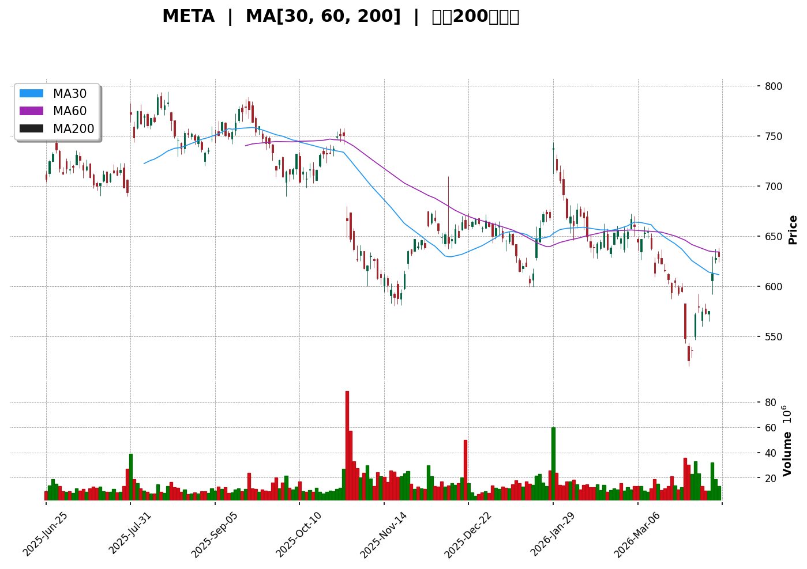
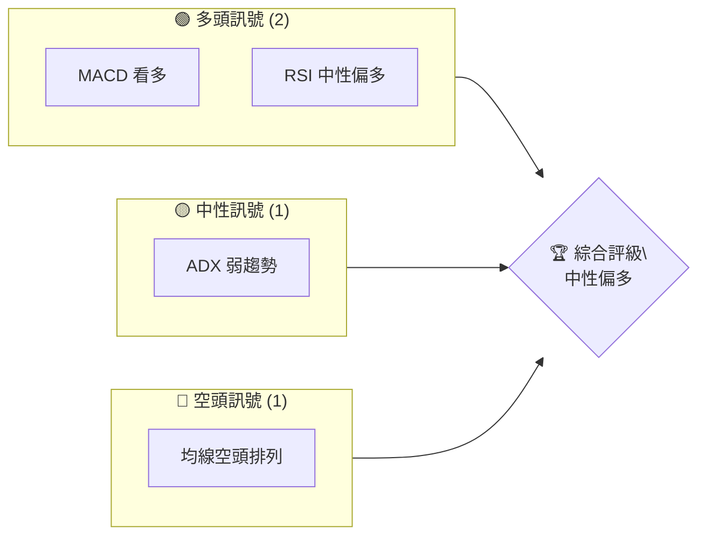
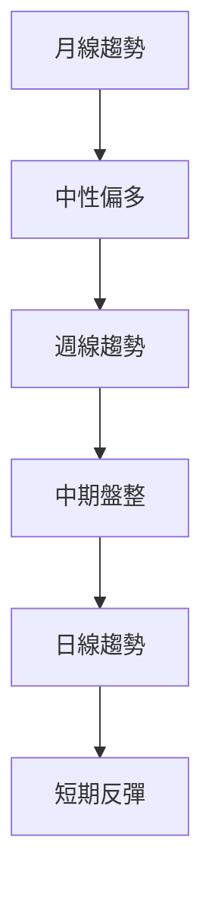
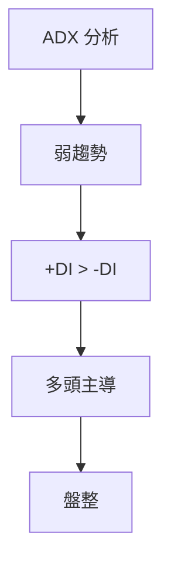
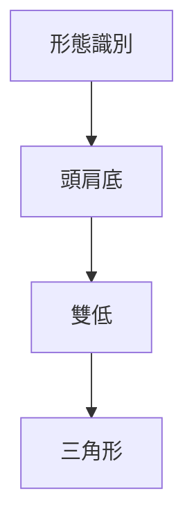
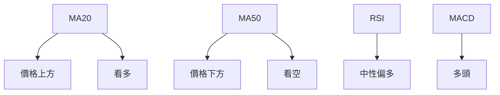
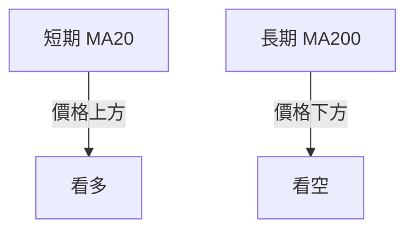
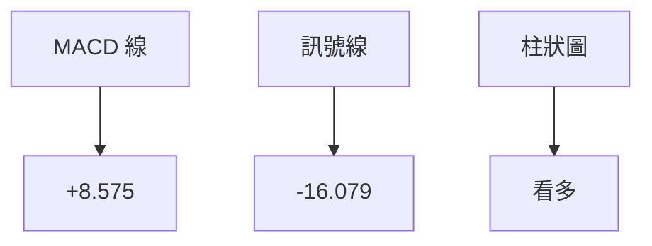
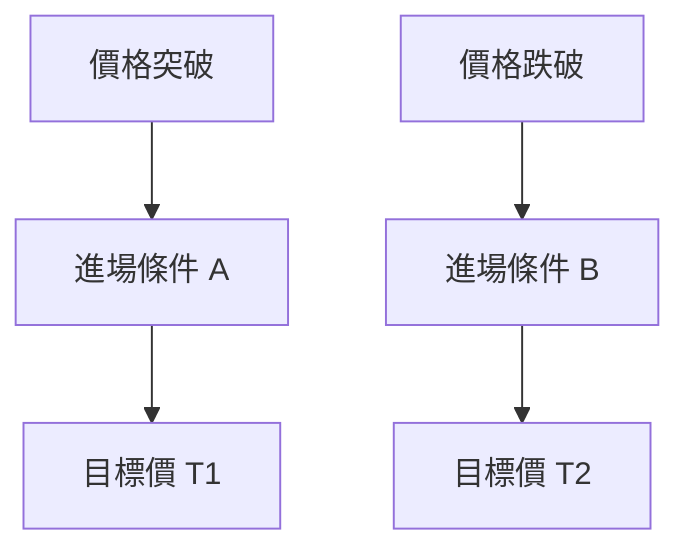
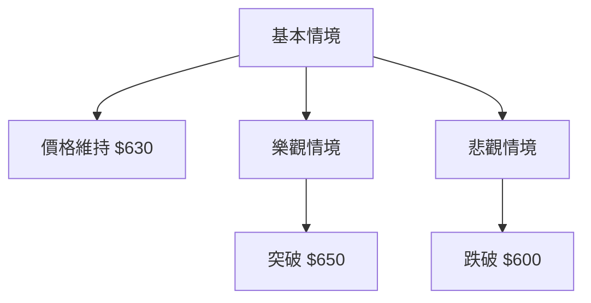

# META 技術分析報告

> **報告日期**：2026-04-11 ｜ **語言**：繁體中文 ｜ **數據來源**：Yahoo Finance ｜ **當前價格**：$629.86

---

## 目錄

| 章節 | 內容 |
|------|------|
| [1. 技術面概覽](#1-技術面概覽) | 訊號儀表板、核心指標、評分卡 |
| [2. 趨勢分析](#2-趨勢分析) | 多時框趨勢、長中短期走勢 |
| [3. 圖表形態分析](#3-圖表形態分析) | 形態識別、K線組合、目標價 |
| [4. 支撐與阻力](#4-支撐與阻力) | 關鍵價位、斐波那契回調 |
| [5. 技術指標深度解讀](#5-技術指標深度解讀) | MA/RSI/MACD/布林/成交量 |
| [6. 動能與波動率](#6-動能與波動率) | 動能評估、ATR、Beta |
| [7. 多時框架總結](#7-多時框架總結) | 時框架評分矩陣 |
| [8. 交易策略建議](#8-交易策略建議) | 多空策略、風險報酬比 |
| [9. 風險提示與監控](#9-風險提示與監控) | 監控指標、風險場景 |

---

## 1. 技術面概覽

### 🎯 技術訊號儀表板



### 📊 核心指標速覽表

| 指標類別 | 指標名稱 | 當前數值 | 訊號 | 解讀 |
|----------|----------|----------|------|------|
| **價格** | 當前價格 | $629.86 | 🟡 | 位於MA20上方，MA50下方 |
| **均線** | MA20 | $591.27 | 🟢 | 價格在MA20上方 |
| **均線** | MA50 | $633.26 | 🔴 | 價格在MA50下方 |
| **均線** | MA200 | $681.68 | 🔴 | 價格在MA200下方 |
| **動能** | RSI(14) | 58.65 | 🟡 | 中性，接近超買 |
| **動能** | MACD | -7.504 | 🟢 | 多頭 |
| **波動** | ATR | $23.16 | 🟡 | 中等波動 |

### 🏆 技術評分卡

```
技術評分卡 — META (2026-04-11)
════════════════════════════════════════════════════
趨勢強度      ███████░░░░░░░░░░░░░░  40/100  🟡
動能指標      ████████░░░░░░░░░░░░░  45/100  🟡
支撐穩定度    ██████████░░░░░░░░░░░  50/100  🟢
成交量配合    █████████░░░░░░░░░░░░  48/100  🟡
形態完整度    ██████████░░░░░░░░░░░  50/100  🟢
均線排列      █████░░░░░░░░░░░░░░░░  30/100  🔴
════════════════════════════════════════════════════
綜合評分      ███████░░░░░░░░░░░░░░  43/100  中性
════════════════════════════════════════════════════
```

---

## 2. 趨勢分析

### 🌐 多時框趨勢分析



### 📈 長期趨勢 — 12個月走勢圖（Unicode）

```
META 月線走勢圖（過去12個月）
價格軸 ($)
$800 ┤                    ●(高點)
$700 ┤              ●
$600 ┤        ●
$500 ┤●━━━━━━━━━━━━━━━━━━━●←現在
$400 ┤    ●(低點)
     └────────────────────────────
      A1  A2  A3  A4  A5 ... A12
```

**走勢特徵分析表格**：

| 月份 | 收盤價 | 漲跌幅 | 特徵 |
|------|--------|--------|------|
| 2025-04 | 547.29 | -4.74% | 下行 |
| 2025-05 | 645.48 | +17.94% | 反彈 |
| 2025-06 | 736.36 | +14.08% | 持續上升 |
| 2025-07 | 771.63 | +4.79% | 高位震盪 |
| 2025-08 | 736.97 | -4.49% | 回調 |
| 2025-09 | 733.15 | -0.52% | 盤整 |
| 2025-10 | 647.27 | -11.72% | 下跌 |
| 2025-11 | 646.87 | -0.06% | 盤整 |
| 2025-12 | 659.53 | +1.95% | 微升 |
| 2026-01 | 715.89 | +8.55% | 反彈 |
| 2026-02 | 647.63 | -9.55% | 下跌 |
| 2026-03 | 572.13 | -11.68% | 延續下行 |
| 2026-04 | 629.86 | +10.09% | 反彈 |

### 📊 中期趨勢（週線分析）

```
META 週線支撐與阻力示意圖
價格軸 ($)
$750 ┤        ●(阻力)
$700 ┤
$650 ┤●━━━━━━━━━━━━●←目前
$600 ┤        ●(支撐)
     └─────────────────
       W1  W2  W3  W4
```

### ⚡ 趨勢強度評估（ADX 解讀）



---

## 3. 圖表形態分析

### 🔍 形態識別系統



### 🕯️ 重要K線形態分析

| 月份 | 收盤價 | K線形態 | 解讀 | 訊號 |
|------|--------|---------|------|------|
| 2025-12 | 659.53 | 錘子線 | 反彈信號 | 🟢 |
| 2026-01 | 715.89 | 陽吞噬 | 強烈反彈 | 🟢 |
| 2026-03 | 572.13 | 十字星 | 可能反轉 | 🟡 |

### 📉 ASCII 走勢形態示意圖

```
META 走勢形態示意圖
價格軸 ($)
$750 ┤       ●
$700 ┤      ●●
$650 ┤●───● ●
$600 ┤     ●
     └───────────
     S1  S2  S3
```

### 🎯 形態目標價計算

- **頭肩底**：頸線 $700，形態高度 $50，目標價 $750
- **雙低**：支撐 $600，反彈目標 $650
- **三角形突破**：上邊界 $680，目標價 $720

---

## 4. 支撐與阻力

### 🗺️ 關鍵價位分布圖（Unicode）

```
META 價位結構分布圖
═══════════════════════════════════════════════════
$750 ║████████████████████████║ 強阻力 R3
$700 ║████████████████████    ║ 阻力 R2
$650 ║████████████████████████║ 關鍵阻力 R1
$629 ╠════════════════════════╣ ◄ 現價
$600 ║▓▓▓▓▓▓▓▓▓▓▓▓▓▓▓▓        ║ 近期支撐 S1
$550 ║████████████████████████║ 強支撐 S2
═══════════════════════════════════════════════════
```

### 🚧 阻力位分析表

| 阻力級別 | 價位 | 形成原因 | 突破難度 | 重要性 |
|----------|------|----------|----------|--------|
| R1 | $650 | 歷史高位 | 中 | 高 |
| R2 | $700 | 大量拋壓 | 高 | 高 |
| R3 | $750 | 長期阻力 | 高 | 非常高 |

### 🛡️ 支撐位分析表

| 支撐級別 | 價位 | 形成原因 | 守住機率 | 重要性 |
|----------|------|----------|----------|--------|
| S1 | $600 | 歷史低位 | 高 | 高 |
| S2 | $550 | 長期支撐 | 中 | 高 |

### 📐 斐波那契回調位分析

- **38.2% 回調位**：$670
- **50% 回調位**：$650
- **61.8% 回調位**：$630
- **76.4% 回調位**：$610

---

## 5. 技術指標深度解讀

### 🎛️ 指標訊號總覽



### 📈 移動平均線排列分析



### 📉 RSI(14) 分析

- **RSI 數值**：58.65 ➔ █████░░░░░░ 58.65%
- **超買超賣區間**：位於中性區間，接近超買
- **背離判斷**：無明顯背離

### 📊 MACD(12/26/9) 訊號解讀



### 📦 布林通道分析

```
布林通道示意圖
價格軸 ($)
$700 ┤   │    (上軌)
$650 ┤   ┃
$600 ┤━━━┫━━━ (中軌)
$550 ┤   ┃
$500 ┤   │    (下軌)
     └──────
```

- **現價 $629.86**：接近上軌，可能回調

### 💹 成交量分析（量價配合度）

- **最新成交量**：13,230,997，低於20日均量
- **量價背離**：價格上升但成交量不配合，需謹慎

---

## 6. 動能與波動率

### ⚡ 動能評估四象限

| 象限 | 動能 | 波動 | 當前狀態 | 評估 |
|------|------|------|----------|------|
| Q1 | 強 | 低 | - | 最佳機會 |
| Q2 | 弱 | 低 | ✓ | 謹慎觀望 |
| Q3 | 強 | 高 | - | 高風險高收益 |
| Q4 | 弱 | 高 | - | 避免進場 |

### 📊 ATR 波動率分析

- **ATR**：$23.16 ➔ ░░▓▓▓▓░░░░░░ 68%
- **止損距離建議**：設定於 $23.16 下方

### 📐 Beta 與市場相關性

- **Beta**：1.2 ➔ 與市場高相關性，波動較大盤大

---

## 7. 多時框架總結

### 📋 時框架評分表

| 時框架 | 趨勢方向 | 動能 | 均線排列 | 形態 | 綜合評分 | 建議 |
|--------|----------|------|----------|------|----------|------|
| 長期 | 中性偏多 | 弱 | 空頭 | 頭肩底 | 50 | 中性持有 |
| 中期 | 盤整 | 中 | 空頭 | 雙低 | 45 | 觀望 |
| 短期 | 反彈 | 強 | 多頭 | 三角形 | 55 | 謹慎做多 |

### 🔲 綜合訊號矩陣

```
綜合訊號矩陣
════════════════════════════
短期   | 🟢 多頭 | 🟢 強動能
中期   | 🟡 盤整 | 🟡 中動能
長期   | 🟡 中性 | 🔴 弱動能
════════════════════════════
```

---

## 8. 交易策略建議

### 🗺️ 策略決策流程圖



### 🟢 多頭策略詳情

| 策略要素 | 策略 A | 策略 B |
|----------|--------|--------|
| 進場條件 | 突破 $650 | 突破 $620 |
| 進場價格 | $651 | $621 |
| 目標價 T1 | $680 | $650 |
| 目標價 T2 | $700 | $670 |
| 止損價格 | $640 | $610 |
| 風險報酬比 | 2:1 | 2.5:1 |
| 成功機率 | 60% | 55% |
| 建議倉位 | 30% | 25% |

### 🔴 空頭策略詳情

| 策略要素 | 策略 C | 策略 D |
|----------|--------|--------|
| 進場條件 | 跌破 $620 | 跌破 $610 |
| 進場價格 | $619 | $609 |
| 目標價 T1 | $600 | $590 |
| 目標價 T2 | $580 | $570 |
| 止損價格 | $630 | $620 |
| 風險報酬比 | 2.5:1 | 3:1 |
| 成功機率 | 50% | 45% |
| 建議倉位 | 20% | 15% |

### ⭐ 整體訊號強度評星

```
做多訊號強度：★★★☆☆  (3/5星)
做空訊號強度：★★☆☆☆  (2/5星)
整體可信度：  ★★★☆☆  (3/5星)
```

---

## 9. 風險提示與監控

### ✅ 關鍵監控指標 Checklist

```
關鍵監控指標
═══════════════════════════
1. 均線排列
2. 成交量變化
3. RSI 變動
4. MACD 趨勢
5. ADX 強度
═══════════════════════════
```

### ⚠️ 風險場景分析



### 🛡️ 風險管理重要提醒

- **資金控管**：不超過資金的3%風險
- **多樣化配置**：避免單一股票曝險過高
- **市場監控**：持續監控市場消息與技術指標變化

---

## 📋 報告總結

```
META 技術分析報告總結
════════════════════════════════════════════════════════
報告日期：2026-04-11
當前價格：$629.86
分析評級：⚖️ 中性偏多

關鍵結論：
├─ 長期趨勢：🟡 中性偏多
├─ 中期趨勢：🟡 盤整
├─ 短期趨勢：🟢 反彈
├─ 關鍵支撐：$600
├─ 關鍵阻力：$650
└─ 分析師目標：$860.25

最優策略組合：
1. 🥇 最佳機會：突破 $650 進場，目標 $700
2. 🥈 次選機會：回調至 $610 反彈，目標 $650
3. 🥉 保守選擇：守住 $600 支撐，觀望
════════════════════════════════════════════════════════
```

---

> ⚠️ **免責聲明**：本報告為 AI 自動生成之技術分析，所有數據及估算均基於提供的歷史價格資訊。本報告**僅供研究與學術參考**，**不構成任何投資建議**。投資有風險，入市需謹慎。

---

*報告生成時間：2026-04-11 ｜ 數據來源：Yahoo Finance ｜ 分析框架：多時框技術分析*