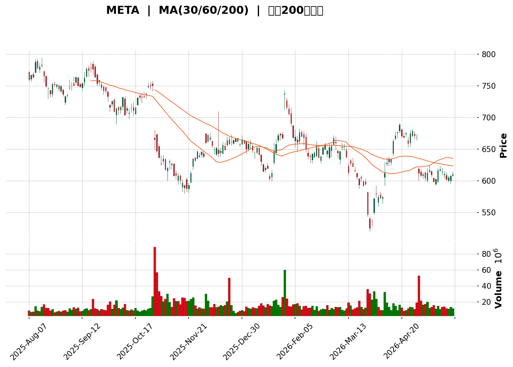
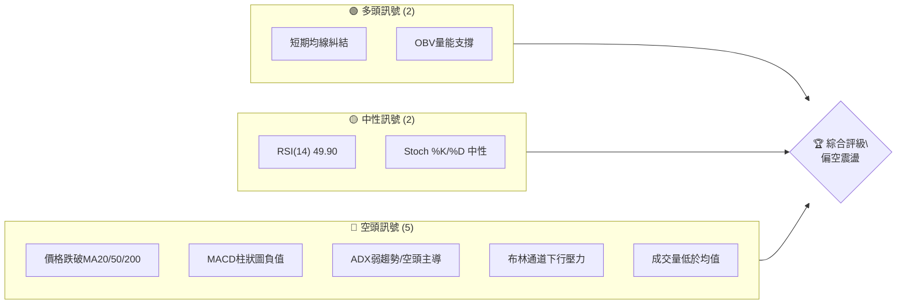

<details>
<summary>📊 靜態圖表 (點擊展開)</summary>

</details>

<html>
<head><meta charset="utf-8" /></head>
<body>
    <div>                        <script>window.PlotlyConfig = {MathJaxConfig: 'local'};</script>
        <script charset="utf-8" src="https://cdn.plot.ly/plotly-3.5.0.min.js" integrity="sha256-fHbNLP+GlIXN+efbQec78UkemUz3NJp7UmfGxC1tNxs=" crossorigin="anonymous"></script>                <div id="candlestick-chart" class="plotly-graph-div" style="height:500px; width:100%;"></div>            <script>                window.PLOTLYENV=window.PLOTLYENV || {};                                if (document.getElementById("candlestick-chart")) {                    Plotly.newPlot(                        "candlestick-chart",                        [{"close":{"dtype":"f8","bdata":"AAAAQFzAh0AAAADg+vuHQAAAAMCa4IdAAAAAIDGhiEAAAADABFKIQAAAACBhYohAAAAAIB97iEAAAACAk+yHQAAAACDBbYdAAAAAgL5Ph0AAAAAg8gqHQAAAAAAsiIdAAAAAoEd8h0AAAABAqoKHQAAAAAAITYdAAAAAIM1qh0AAAAAAwQeHQAAAAMAZ64ZAAAAAoJX6hkAAAADgKleHQAAAAAB\u002fdYdAAAAAYEx0h0AAAABAP9+HQAAAAKC+cYdAAAAAICBph0AAAACgjo6HQAAAACBE14dAAAAA4GVJiEAAAABAOC+IQAAAAABgU4hAAAAAIHNEiEAAAABAD9+HQAAAAEAckYdAAAAAoB67h0AAAADARl2HQAAAAMAQNIdAAAAAQEUxh0AAAAAAO+mGQAAAAIAjYYZAAAAAQLCuhkAAAAAg\u002fSqGQAAAAIC4U4ZAAAAAgB0\u002fhkAAAADAIWWGQAAAAEBI4oZAAAAAoPoAhkAAAABAClSGQAAAACC8G4ZAAAAAwNBihkAAAACADDeGQAAAAKDIXYZAAAAAgJTXhkAAAACgXeCGQAAAAMB74YZAAAAAIDLmhkAAAABgBAmHQAAAAACIbIdAAAAAoHtxh0AAAADgUXOHQAAAAIDbyoRAAAAAwCM6hEAAAACAKeWDQAAAAEAukoNAAAAAABvXg0AAAACgQE+DQAAAACBgZYNAAAAAIKS1g0AAAACgQ5CDQAAAAADy\u002f4JAAAAAQPkGg0AAAAAgigODQAAAAOAJyIJAAAAAYImlgkAAAADArGqCQAAAAMBUYYJAAAAAABCKgkAAAAAgNiCDQAAAAABD2YNAAAAAwGrEg0AAAAAA8jaEQAAAAGBm\u002foNAAAAAACgwhEAAAADAQfSDQAAAAGBno4RAAAAAYF0ChUAAAABAfs2EQAAAAKDnfoRAAAAAIFtIhEAAAABA9lyEQAAAACA8GYRAAAAAIKY3hEAAAAAAtISEQAAAACCOR4RAAAAAgA2\u002fhEAAAADgppGEQAAAACB5p4RAAAAAIPjChEAAAADg1NeEQAAAAODHtYRAAAAAIAORhEAAAADgCsuEQAAAAOAznIRAAAAAINROhEAAAADAz5GEQAAAAGBwoIRAAAAAoBRBhEAAAAAADyyEQAAAAMACZIRAAAAAwF0LhEAAAADAZrSDQAAAAKDyN4NAAAAAwCZig0AAAABgwV2DQAAAAGDT3IJAAAAAQHwjg0AAAACgmziEQAAAAGCSkYRAAAAAQEf+hEAAAACAJwOFQAAAAGBD4YRAAAAAYG0Nh0AAAADAGF+GQAAAAAByDoZAAAAAwN2YhUAAAACAV+OEQAAAAAAY7YRAAAAAQCenhEAAAAAAICWFQAAAAGAr8YRAAAAAoPHghEAAAACACEqEQAAAACDI+YNAAAAA4PH1g0AAAACgWxWEQAAAAODTIYRAAAAAAMt4hEAAAACgo+WDQAAAAGAG9oNAAAAA4AtphEAAAACAlYOEQAAAAAABPYRAAAAA4AFohEAAAABAKHSEQAAAACBF2YRAAAAAIAqghEAAAACAdyKEQAAAAICwNoRAAAAAgBVshEAAAAAAZnKEQAAAAKAS7YNAAAAA4Hopg0AAAACgmZuDQAAAAKBHdYNAAAAAoHA9g0AAAACgmfWCQAAAAKBHjYJAAAAA4HrggkAAAAAgXIeCQAAAAMAel4JAAAAA4FEcgUAAAACAwm2AQAAAAEAKw4BAAAAAQArhgUAAAAAA1xmCQAAAACCu84FAAAAAACnogUAAAABgZviBQAAAACBcI4NAAAAAwB6jg0AAAABA4a6DQAAAAIA91INAAAAAgOuzhEAAAADgo\u002fyEQAAAAMD1JoVAAAAAYGaEhUAAAACgR\u002feEQAAAAGC45oRAAAAAgMIVhUAAAABAM5mEQAAAAIA9GIVAAAAAwPU0hUAAAABguPqEQAAAAMD16IRAAAAAoEcfg0AAAAAAAAaDQAAAAKBHE4NAAAAAIK7ngkAAAABACieDQAAAAOB6RoNAAAAAQAoNg0AAAABA4baCQAAAAAAA2IJAAAAAQApFg0AAAACgcFODQAAAAADXMYNAAAAAIK4Zg0AAAABA4dSCQAAAAOB66IJAAAAAQAr7gkAAAACAFBKDQA=="},"high":{"dtype":"f8","bdata":"V8XaLXkpiEDnEefexACIQArHW7QuHYhA\u002fLSpo3u+iEADqmczxcyIQHXdd362j4hACeADPxPTiEDLaBgg8C+IQFiHsfb66odAjelruYljh0AiCf2pBj6HQLZs+T8DmYdABYRXudCoh0DWwRuOz4iHQKb0uIMQg4dAip7r8Eh6h0ChtT6gHUuHQHwpqzo08oZAYlMJ5R8Uh0AQbaw4A7uHQHdUuZtkoYdADvDAT7blh0CelfIeCeSHQLQNGWo\u002f34dAzrAG4Juah0Bu1rkfXJ6HQOCmeekMIohAezvizDtciEA2zfxMo2uIQLWPqJF0l4hAWnTQppOniEDK2ctJWIOIQMzHjMaBCohANBUTtra+h0BZa3A\u002fDZyHQLMDT2dldYdAuP2+QzZsh0Bh1Uzg1S2HQF5sI3QohYZACheyaXC0hkCN8Q5bPM6GQLLBBvR2XYZALfpkF2dqhkCOso9vlnOGQAAAAEBI4oZAKT+6xFbwhkDtoElA53WGQLv8FajXUoZAhB9Q6YeVhkCf33y8OqKGQPGw39W4aoZANJBb51vkhkDkFsu9IgqHQNwH+0noGodAi5cW\u002flwph0AMYAyBxx+HQFImasTnk4dAVGxe8xGph0D1Y4rDI6+HQAj0fZOVPoVAWb1n\u002fxoOhUDYvT1S1ZGEQM9f1hBZBYRAA9SU5kIJhEAB7pEpgdeDQFjpVtC6aINAqPeki4TPg0BqfhglEqSDQLhCxK2En4NAGNgCN\u002fNEg0DXG\u002fUxPiWDQI6t\u002f2VZFYNAGtMQdjfVgkD2uzgesJKCQMJhKeyn7YJAneVMhPiogkCRSenkXD2DQNyCbQnk34NAOOAiglrqg0BW13tovjeEQFkUo8jwIYRAJAHvXU42hEDXAQofIj6EQLqddM3EF4VAzl09CIIMhUBHedMcpByFQAi\u002fA8n2uoRAXfXEZVZrhEDsuE3WfHGEQB+i5s+ALoZAQCrPAYhjhEBF1bMuya+EQAKGMJNQpYRAcfuTC+TvhEC+v+VyaPOEQHwDT9YHCIVAqnCRJHHLhEDjXXIF3tyEQIkgl7UF44RA7GNWRHudhEDqvdXDKP2EQBiVxuVyw4RAHFniwZK+hECdQjmtxb+EQPbsVgqbx4RAPyWTbLCUhEBnBZENXzSEQDkfVTAec4RAKlbEuUhrhEA6i9fJww2EQIVe1JhMn4NAny+KmBZ9g0CJFNPHVaSDQB7v8x4EF4NAhpV40u1Ng0D\u002fvV4UCqCEQLElFNVbz4RAvQ9MYp4VhUC8okah7SGFQF0Rx1HNKIVA1toAiOg6h0AHPCZsWdyGQLqeral2hYZAxyN\u002fzBdjhkBzegse7YGFQOPIqhhWR4VADucxLVL7hECng4a0zVWFQOyJKbqKQIVACMzq9oI1hUAeiWu+XxuFQHQuX1L7VoRAsWF582YQhEDmGasBliOEQJRfIEcXNYRAejY3p0K2hEAajKNsGYmEQIuzOxR+BIRAKWHIqpBqhEC8eZECeqOEQNIb3UoTR4RATIGV8gCbhEBmvwZQz5OEQFZrdUuOAYVAoTzXoALxhEATs3KsUEeEQC79iR6ROYRA+ynqleGdhECANnEJc5SEQPGvWimHZ4RANwnUyQ2lg0AAAAAAANaDQAAAAGBm5INAAAAAQDN1g0AAAAAAACiDQAAAACCu34JAAAAAwB4Fg0AAAAAAAMiCQAAAACBc3YJAAAAAAAA4gkAAAADAzPyAQAAAAGBm3IBAAAAAIIXtgUAAAABgZoSCQAAAAAAAFIJAAAAA4FE2gkAAAAAA1\u002fmBQAAAAKCZr4NAAAAAAADsg0AAAADgo\u002fSDQAAAAAAA2INAAAAAgBTShEAAAAAAADSFQAAAAOCjLIVAAAAAACmchUAAAABACluFQAAAAKCZIYVAAAAAQAozhUAAAADgeuyEQAAAACBcRYVAAAAAAABUhUAAAACgcDGFQAAAAAAAEoVAAAAAwMxmg0AAAABACleDQAAAAAAAMINAAAAAwMwyg0AAAACgmV+DQAAAAADXh4NAAAAAAClGg0AAAACgR+eCQAAAAAAA3oJAAAAAQDNfg0AAAAAA132DQAAAAKCZaYNAAAAAYLg8g0AAAACgcC+DQAAAAAAAAINAAAAAwMwMg0AAAADgejaDQA=="},"hovertemplate":"\u003cb\u003e%{x|%Y-%m-%d}\u003c\u002fb\u003e\u003cbr\u003e\u958b: $%{open:.2f}\u003cbr\u003e\u9ad8: $%{high:.2f}\u003cbr\u003e\u4f4e: $%{low:.2f}\u003cbr\u003e\u6536: $%{close:.2f}\u003cextra\u003e\u003c\u002fextra\u003e","low":{"dtype":"f8","bdata":"FdzPsCmuh0BPLaLQa6aHQKFxGuIG14dAuqaeD\u002fYUiEDQgY\u002fAQEOIQGbnlomZFYhA0kk1qexXiEDJr0N\u002fTJaHQI6YKYzVXIdA46t0O0zKhkCtt09eI9uGQA9Jv8Na5YZAzc8Ztvpih0CBXOgugFGHQKM45ujLKIdAOa6yuIMYh0ACDTUzBO2GQIlwj7RPgIZAk3H3binihkBstmqUlECHQLVCz3pGOodAYgntVxByh0CP51shUX2HQLfI0lPsaYdA3YDew+5Uh0AwQWOEIzCHQNWCkP3ScYdAd4JwU3Xah0A98zrHHeSHQFC9vE9iHIhAn2xaGRr7h0C+fwB8jNmHQJZmVC6HbodAr3+tTDB6h0Dom6lodDqHQDH2hWLzAIdA9V5VyFMPh0BAxEnBsqiGQFSkIiodKIZA1hmmF4dnhkBw4aYs9CeGQKyTaF\u002fbioVAnvuhsJIEhkABkRqMBhWGQFChm+wAOoZAoKSIc6v6hUCs7sTvqhOGQLR9T55M0YVADZoGXpoihkBw9FFho\u002fWFQOtIMS6HB4ZAaY\u002fQ\u002f9F3hkCmEbkURLyGQNudD7ORloZA\u002fbvc8wHfhkBzuKwHb8+GQI0xzLsWVodA0ug0vjNCh0Du6kySKSqHQNuD6tysSIRAYaqG4e8jhEClQ1w78diDQFt+w9q3h4NAxBZybfOLg0DzU+K2vkeDQNS008KRwYJAJbqEjZ9Ig0CM+ZvL2FKDQCvzeL0K9oJAFLZoD\u002fLPgkDgxM5ippGCQDBMeTo\u002fk4JA6SVgUHE2gkBSv+ljPCKCQHdtERUCM4JAG+TqnRsngkCV5gy6DqWCQNRyniYkSoNAstQnhZq0g0AWqnHygtODQNNiW8KP5YNAJWq7gAnog0CYb3Ni4uODQC80oU+Vl4RAa26Bt0WqhECtpWkqrb+EQCxI80D+YYRALrBiI5sShECI06I51\u002f2DQG4yi5dZ7INAG\u002fsrrzrxg0BfjVTQMhWEQDjWikYoRYRASAai\u002fy9\u002fhEDX+5+I74yEQKueIt+0gIRArm6cuH6NhEAMPm5\u002fEa2EQJrZfdMIpoRAPvaNSKRuhEC+cXHVN4qEQC6jjMMBl4RAOvsnm5gXhEAgnj03kTmEQFft5ya9WoRAOqU4LBEihEBTF4m9aNmDQHA+LINmEoRA4GXmi3MFhEC0u\u002f5eh3yDQNCN9TlaMoNAPqWu4qItg0D+UzyMZVyDQKexytfku4JAQZOrkIi8gkBUbnOuHJCDQEyOFJIwH4RA6kUjRculhEB0GP8uu8CEQApRmbs9zIRAz7SAAYY\u002fhkB3+hg51keGQNZgLHBY94VAdq+tBJVuhUCd+SrOHNeEQOipHSaHZ4RAdHS7VZMvhEBH5ZtOu5GEQKMKH2G86YRA3iQRjk2EhEDfqpQP0yWEQJt4Q5w30INApS+8wBiig0BnBcbG5pyDQIEw8P5m4YNAgn1Bct7xg0Dsp5jQpduDQFf7bBSJo4NAD6U9vLkMhEAcJg2pkTeEQIx4FcCX7INAa0tcZKjPg0CKclozWfKDQHKBE+DbiIRA7ep2mQdOhEC8IlPUhtyDQKa9AlzzkYNAq0PZAY9DhEB04iljcT6EQNfCCH7X4oNACZzgaToIg0AAAADAzHiDQAAAAKCZbYNAAAAAQOE0g0AAAACAFNKCQAAAAAAAWoJAAAAAgBS4gkAAAAAAAHiCQAAAAEAzi4JAAAAAwMz6gEAAAACAFEKAQAAAAOBRhIBAAAAAACkWgUAAAABgj+6BQAAAAKCZfYFAAAAAAADggUAAAACAFKaBQAAAAOCjfoJAAAAAAAB4g0AAAADgo4KDQAAAAEAzg4NAAAAAwPX6g0AAAACAwsGEQAAAAAAA3oRAAAAAQAoZhUAAAAAAAOCEQAAAAOCj2oRAAAAAAADuhEAAAABgZmiEQAAAAGC4boRAAAAAYLj2hEAAAABACs2EQAAAAOB6voRAAAAAAADAgkAAAABA4fCCQAAAAAAA1oJAAAAAQOHCgkAAAADAzLCCQAAAAOBRLINAAAAA4HrwgkAAAADgo7CCQAAAAMDMhIJAAAAAoEelgkAAAAAAADiDQAAAAOB6CoNAAAAAIIXdgkAAAABgZsSCQAAAAOB6roJAAAAA4HqWgkAAAACgmfeCQA=="},"name":"\u50f9\u683c","open":{"dtype":"f8","bdata":"bjXE7GsdiEA37SPus8eHQC1AYaw0AohAUQxns4IZiEADw78BX6qIQIcF34R1QIhAnAiejoByiEAYYIYUMSqIQK34GNSU6odAl4U4GIxOh0ByvmyUuDeHQDoMO8r7C4dAUlXDVGmIh0CdBbS1U2iHQAOzTYRMdIdAj7\u002fV\u002fQ0yh0BtNRBNRTyHQMVp+uW1ooZAcdfTSTTyhkDNLUtih1aHQPTNME\u002fadodAY\u002f+7PtSRh0ABaMWFuJ2HQOTFTcay2odAiCWHIQ6Hh0CvIBwrzleHQGaPtbGPnYdAElhcdZ\u002fph0AjA7PCTFGIQAT\u002fy5ldV4hAk49ha56EiED6jjROW2SIQOUyRKS5\u002f4dA4DAizuGhh0Depbg5iYGHQGGFzmD7ZYdAfJsQT8Jbh0CE75DWFSiHQKH9QW9IgoZAG\u002fjwCP2KhkBDFFZKS8OGQFTnDM0ZAIZAV6o5QixkhkBjN\u002fACEkKGQMgFRVSlaIZAP5CtxJjNhkClDdhSjj6GQCjdjVnJFIZA6VHt7OZehkCQ2vbC0GKGQOq2zAUyD4ZAZsCrC+N\u002fhkA\u002fULY4VPaGQBLFTJDW5IZAn2Q5W8nrhkB3lWZeevyGQEdDLlrTY4dA7iBNrvx6h0A6DN4364uHQLN05RVD4IRAwrUNDBILhUD1YkfVPHeEQFT+vUnul4NAzklusgi6g0AbAedsTtaDQI5itVmvO4NAsWKESkqwg0AjU6yanJeDQF1hll6mmINAZftIAF8gg0BrgiMaSMaCQHME3jUvAINAaSEH0+V0gkDSS6k\u002f1IWCQGyqwm7w04JAngFpqSNcgkCA2e8\u002fw62CQCiG\u002f0iqd4NAiFGZrADlg0Ad+7XWJNiDQG1Qe4Pb84NAGifO5iMKhEBfHJUtrBqEQJdo+WT4FoVACqgkdiG3hEAQvneQx+GEQP0GhDZLtYRAV4WQHetGhEB33vs1uhGEQGW7NnS4RYRAmMjCay4phED5h8qpmBeEQG1ct6tkeIRAi9T5X76DhEBMzQSZzM6EQMdrtxysqIRAdgxH8eGbhEAjh2vLtK+EQIdkvoTo24RAx3H6sJOLhEDWkTcYA5GEQDvn51VzwYRAKeBq6k2xhEBtqC4BoFOEQPBe69YLmIRAPHrZEqJ4hEAuMLqwniqEQKImjVkaJ4RA886bP8ZfhEA6i9fJww2EQLSfa2O2j4NAEweJcJtPg0Bh5W8dK32DQELNqEnh+oJAB6+thcTxgkDa4aUmfqaDQE9UjmK\u002fIYRAOnvN6nzEhEBUgGmJGhCFQPADDkRiD4VAztmvqmQGh0BZkJh6BbeGQMaGs8boT4ZAfX26ax4WhkCuEWUrInmFQKQ5bV0ZuIRAHPeDkF3HhEBWqie55rSEQPZZLJIpKIVAzl1+MmMLhUAW4r3OLOuEQEWGdIliJIRAez\u002fOoZ\u002f3g0BXLM0AEMqDQANFMqEw8INAIoUneiT5g0AWt8u22l+EQOAZmcVOxINAVBtRzdcPhEDoLzGx8k+EQE9\u002fekkyF4RA5oteW+vkg0Bt6DYl4j2EQFwl\u002fV0ti4RAzQER\u002fuiqhEAxWI8sxDqEQCzJ11fl0YNACgG85AFohEDsdNZsmXGEQKa4nHuPQYRAwQcGqtl6g0AAAAAAAMCDQAAAAIDrn4NAAAAAYLhCg0AAAABAMyGDQAAAAIA93IJAAAAA4FHugkAAAADAzLiCQAAAAIDrtYJAAAAAgOszgkAAAADAzOCAQAAAAEAKw4BAAAAAANcvgUAAAABACiGCQAAAAOBRsIFAAAAAIIUNgkAAAAAA1+OBQAAAAAAA8IJAAAAAgMKXg0AAAACAwtODQAAAAAAArINAAAAAgMIZhEAAAAAAANiEQAAAAIDrH4VAAAAAwMw0hUAAAABA4UqFQAAAAAAA+IRAAAAAQOEShUAAAACgmb2EQAAAAGCPooRAAAAAAAD4hEAAAACA6xGFQAAAAKBH54RAAAAAYI9ag0AAAAAghTWDQAAAACCF\u002f4JAAAAA4Hoqg0AAAABgZsiCQAAAAIDCNYNAAAAAoJk5g0AAAABgj+SCQAAAAGCPloJAAAAA4KO2gkAAAAAAAECDQAAAAIDrL4NAAAAAQOEIg0AAAAAgXAeDQAAAAIAUxoJAAAAAAADAgkAAAABACv+CQA=="},"x":["2025-08-07T00:00:00-04:00","2025-08-08T00:00:00-04:00","2025-08-11T00:00:00-04:00","2025-08-12T00:00:00-04:00","2025-08-13T00:00:00-04:00","2025-08-14T00:00:00-04:00","2025-08-15T00:00:00-04:00","2025-08-18T00:00:00-04:00","2025-08-19T00:00:00-04:00","2025-08-20T00:00:00-04:00","2025-08-21T00:00:00-04:00","2025-08-22T00:00:00-04:00","2025-08-25T00:00:00-04:00","2025-08-26T00:00:00-04:00","2025-08-27T00:00:00-04:00","2025-08-28T00:00:00-04:00","2025-08-29T00:00:00-04:00","2025-09-02T00:00:00-04:00","2025-09-03T00:00:00-04:00","2025-09-04T00:00:00-04:00","2025-09-05T00:00:00-04:00","2025-09-08T00:00:00-04:00","2025-09-09T00:00:00-04:00","2025-09-10T00:00:00-04:00","2025-09-11T00:00:00-04:00","2025-09-12T00:00:00-04:00","2025-09-15T00:00:00-04:00","2025-09-16T00:00:00-04:00","2025-09-17T00:00:00-04:00","2025-09-18T00:00:00-04:00","2025-09-19T00:00:00-04:00","2025-09-22T00:00:00-04:00","2025-09-23T00:00:00-04:00","2025-09-24T00:00:00-04:00","2025-09-25T00:00:00-04:00","2025-09-26T00:00:00-04:00","2025-09-29T00:00:00-04:00","2025-09-30T00:00:00-04:00","2025-10-01T00:00:00-04:00","2025-10-02T00:00:00-04:00","2025-10-03T00:00:00-04:00","2025-10-06T00:00:00-04:00","2025-10-07T00:00:00-04:00","2025-10-08T00:00:00-04:00","2025-10-09T00:00:00-04:00","2025-10-10T00:00:00-04:00","2025-10-13T00:00:00-04:00","2025-10-14T00:00:00-04:00","2025-10-15T00:00:00-04:00","2025-10-16T00:00:00-04:00","2025-10-17T00:00:00-04:00","2025-10-20T00:00:00-04:00","2025-10-21T00:00:00-04:00","2025-10-22T00:00:00-04:00","2025-10-23T00:00:00-04:00","2025-10-24T00:00:00-04:00","2025-10-27T00:00:00-04:00","2025-10-28T00:00:00-04:00","2025-10-29T00:00:00-04:00","2025-10-30T00:00:00-04:00","2025-10-31T00:00:00-04:00","2025-11-03T00:00:00-05:00","2025-11-04T00:00:00-05:00","2025-11-05T00:00:00-05:00","2025-11-06T00:00:00-05:00","2025-11-07T00:00:00-05:00","2025-11-10T00:00:00-05:00","2025-11-11T00:00:00-05:00","2025-11-12T00:00:00-05:00","2025-11-13T00:00:00-05:00","2025-11-14T00:00:00-05:00","2025-11-17T00:00:00-05:00","2025-11-18T00:00:00-05:00","2025-11-19T00:00:00-05:00","2025-11-20T00:00:00-05:00","2025-11-21T00:00:00-05:00","2025-11-24T00:00:00-05:00","2025-11-25T00:00:00-05:00","2025-11-26T00:00:00-05:00","2025-11-28T00:00:00-05:00","2025-12-01T00:00:00-05:00","2025-12-02T00:00:00-05:00","2025-12-03T00:00:00-05:00","2025-12-04T00:00:00-05:00","2025-12-05T00:00:00-05:00","2025-12-08T00:00:00-05:00","2025-12-09T00:00:00-05:00","2025-12-10T00:00:00-05:00","2025-12-11T00:00:00-05:00","2025-12-12T00:00:00-05:00","2025-12-15T00:00:00-05:00","2025-12-16T00:00:00-05:00","2025-12-17T00:00:00-05:00","2025-12-18T00:00:00-05:00","2025-12-19T00:00:00-05:00","2025-12-22T00:00:00-05:00","2025-12-23T00:00:00-05:00","2025-12-24T00:00:00-05:00","2025-12-26T00:00:00-05:00","2025-12-29T00:00:00-05:00","2025-12-30T00:00:00-05:00","2025-12-31T00:00:00-05:00","2026-01-02T00:00:00-05:00","2026-01-05T00:00:00-05:00","2026-01-06T00:00:00-05:00","2026-01-07T00:00:00-05:00","2026-01-08T00:00:00-05:00","2026-01-09T00:00:00-05:00","2026-01-12T00:00:00-05:00","2026-01-13T00:00:00-05:00","2026-01-14T00:00:00-05:00","2026-01-15T00:00:00-05:00","2026-01-16T00:00:00-05:00","2026-01-20T00:00:00-05:00","2026-01-21T00:00:00-05:00","2026-01-22T00:00:00-05:00","2026-01-23T00:00:00-05:00","2026-01-26T00:00:00-05:00","2026-01-27T00:00:00-05:00","2026-01-28T00:00:00-05:00","2026-01-29T00:00:00-05:00","2026-01-30T00:00:00-05:00","2026-02-02T00:00:00-05:00","2026-02-03T00:00:00-05:00","2026-02-04T00:00:00-05:00","2026-02-05T00:00:00-05:00","2026-02-06T00:00:00-05:00","2026-02-09T00:00:00-05:00","2026-02-10T00:00:00-05:00","2026-02-11T00:00:00-05:00","2026-02-12T00:00:00-05:00","2026-02-13T00:00:00-05:00","2026-02-17T00:00:00-05:00","2026-02-18T00:00:00-05:00","2026-02-19T00:00:00-05:00","2026-02-20T00:00:00-05:00","2026-02-23T00:00:00-05:00","2026-02-24T00:00:00-05:00","2026-02-25T00:00:00-05:00","2026-02-26T00:00:00-05:00","2026-02-27T00:00:00-05:00","2026-03-02T00:00:00-05:00","2026-03-03T00:00:00-05:00","2026-03-04T00:00:00-05:00","2026-03-05T00:00:00-05:00","2026-03-06T00:00:00-05:00","2026-03-09T00:00:00-04:00","2026-03-10T00:00:00-04:00","2026-03-11T00:00:00-04:00","2026-03-12T00:00:00-04:00","2026-03-13T00:00:00-04:00","2026-03-16T00:00:00-04:00","2026-03-17T00:00:00-04:00","2026-03-18T00:00:00-04:00","2026-03-19T00:00:00-04:00","2026-03-20T00:00:00-04:00","2026-03-23T00:00:00-04:00","2026-03-24T00:00:00-04:00","2026-03-25T00:00:00-04:00","2026-03-26T00:00:00-04:00","2026-03-27T00:00:00-04:00","2026-03-30T00:00:00-04:00","2026-03-31T00:00:00-04:00","2026-04-01T00:00:00-04:00","2026-04-02T00:00:00-04:00","2026-04-06T00:00:00-04:00","2026-04-07T00:00:00-04:00","2026-04-08T00:00:00-04:00","2026-04-09T00:00:00-04:00","2026-04-10T00:00:00-04:00","2026-04-13T00:00:00-04:00","2026-04-14T00:00:00-04:00","2026-04-15T00:00:00-04:00","2026-04-16T00:00:00-04:00","2026-04-17T00:00:00-04:00","2026-04-20T00:00:00-04:00","2026-04-21T00:00:00-04:00","2026-04-22T00:00:00-04:00","2026-04-23T00:00:00-04:00","2026-04-24T00:00:00-04:00","2026-04-27T00:00:00-04:00","2026-04-28T00:00:00-04:00","2026-04-29T00:00:00-04:00","2026-04-30T00:00:00-04:00","2026-05-01T00:00:00-04:00","2026-05-04T00:00:00-04:00","2026-05-05T00:00:00-04:00","2026-05-06T00:00:00-04:00","2026-05-07T00:00:00-04:00","2026-05-08T00:00:00-04:00","2026-05-11T00:00:00-04:00","2026-05-12T00:00:00-04:00","2026-05-13T00:00:00-04:00","2026-05-14T00:00:00-04:00","2026-05-15T00:00:00-04:00","2026-05-18T00:00:00-04:00","2026-05-19T00:00:00-04:00","2026-05-20T00:00:00-04:00","2026-05-21T00:00:00-04:00","2026-05-22T00:00:00-04:00"],"type":"candlestick"},{"hovertemplate":"MA30: $%{y:.2f}\u003cextra\u003e\u003c\u002fextra\u003e","line":{"color":"#2196F3","dash":"dash","width":2},"mode":"lines","name":"MA30","x":["2025-08-07T00:00:00-04:00","2025-08-08T00:00:00-04:00","2025-08-11T00:00:00-04:00","2025-08-12T00:00:00-04:00","2025-08-13T00:00:00-04:00","2025-08-14T00:00:00-04:00","2025-08-15T00:00:00-04:00","2025-08-18T00:00:00-04:00","2025-08-19T00:00:00-04:00","2025-08-20T00:00:00-04:00","2025-08-21T00:00:00-04:00","2025-08-22T00:00:00-04:00","2025-08-25T00:00:00-04:00","2025-08-26T00:00:00-04:00","2025-08-27T00:00:00-04:00","2025-08-28T00:00:00-04:00","2025-08-29T00:00:00-04:00","2025-09-02T00:00:00-04:00","2025-09-03T00:00:00-04:00","2025-09-04T00:00:00-04:00","2025-09-05T00:00:00-04:00","2025-09-08T00:00:00-04:00","2025-09-09T00:00:00-04:00","2025-09-10T00:00:00-04:00","2025-09-11T00:00:00-04:00","2025-09-12T00:00:00-04:00","2025-09-15T00:00:00-04:00","2025-09-16T00:00:00-04:00","2025-09-17T00:00:00-04:00","2025-09-18T00:00:00-04:00","2025-09-19T00:00:00-04:00","2025-09-22T00:00:00-04:00","2025-09-23T00:00:00-04:00","2025-09-24T00:00:00-04:00","2025-09-25T00:00:00-04:00","2025-09-26T00:00:00-04:00","2025-09-29T00:00:00-04:00","2025-09-30T00:00:00-04:00","2025-10-01T00:00:00-04:00","2025-10-02T00:00:00-04:00","2025-10-03T00:00:00-04:00","2025-10-06T00:00:00-04:00","2025-10-07T00:00:00-04:00","2025-10-08T00:00:00-04:00","2025-10-09T00:00:00-04:00","2025-10-10T00:00:00-04:00","2025-10-13T00:00:00-04:00","2025-10-14T00:00:00-04:00","2025-10-15T00:00:00-04:00","2025-10-16T00:00:00-04:00","2025-10-17T00:00:00-04:00","2025-10-20T00:00:00-04:00","2025-10-21T00:00:00-04:00","2025-10-22T00:00:00-04:00","2025-10-23T00:00:00-04:00","2025-10-24T00:00:00-04:00","2025-10-27T00:00:00-04:00","2025-10-28T00:00:00-04:00","2025-10-29T00:00:00-04:00","2025-10-30T00:00:00-04:00","2025-10-31T00:00:00-04:00","2025-11-03T00:00:00-05:00","2025-11-04T00:00:00-05:00","2025-11-05T00:00:00-05:00","2025-11-06T00:00:00-05:00","2025-11-07T00:00:00-05:00","2025-11-10T00:00:00-05:00","2025-11-11T00:00:00-05:00","2025-11-12T00:00:00-05:00","2025-11-13T00:00:00-05:00","2025-11-14T00:00:00-05:00","2025-11-17T00:00:00-05:00","2025-11-18T00:00:00-05:00","2025-11-19T00:00:00-05:00","2025-11-20T00:00:00-05:00","2025-11-21T00:00:00-05:00","2025-11-24T00:00:00-05:00","2025-11-25T00:00:00-05:00","2025-11-26T00:00:00-05:00","2025-11-28T00:00:00-05:00","2025-12-01T00:00:00-05:00","2025-12-02T00:00:00-05:00","2025-12-03T00:00:00-05:00","2025-12-04T00:00:00-05:00","2025-12-05T00:00:00-05:00","2025-12-08T00:00:00-05:00","2025-12-09T00:00:00-05:00","2025-12-10T00:00:00-05:00","2025-12-11T00:00:00-05:00","2025-12-12T00:00:00-05:00","2025-12-15T00:00:00-05:00","2025-12-16T00:00:00-05:00","2025-12-17T00:00:00-05:00","2025-12-18T00:00:00-05:00","2025-12-19T00:00:00-05:00","2025-12-22T00:00:00-05:00","2025-12-23T00:00:00-05:00","2025-12-24T00:00:00-05:00","2025-12-26T00:00:00-05:00","2025-12-29T00:00:00-05:00","2025-12-30T00:00:00-05:00","2025-12-31T00:00:00-05:00","2026-01-02T00:00:00-05:00","2026-01-05T00:00:00-05:00","2026-01-06T00:00:00-05:00","2026-01-07T00:00:00-05:00","2026-01-08T00:00:00-05:00","2026-01-09T00:00:00-05:00","2026-01-12T00:00:00-05:00","2026-01-13T00:00:00-05:00","2026-01-14T00:00:00-05:00","2026-01-15T00:00:00-05:00","2026-01-16T00:00:00-05:00","2026-01-20T00:00:00-05:00","2026-01-21T00:00:00-05:00","2026-01-22T00:00:00-05:00","2026-01-23T00:00:00-05:00","2026-01-26T00:00:00-05:00","2026-01-27T00:00:00-05:00","2026-01-28T00:00:00-05:00","2026-01-29T00:00:00-05:00","2026-01-30T00:00:00-05:00","2026-02-02T00:00:00-05:00","2026-02-03T00:00:00-05:00","2026-02-04T00:00:00-05:00","2026-02-05T00:00:00-05:00","2026-02-06T00:00:00-05:00","2026-02-09T00:00:00-05:00","2026-02-10T00:00:00-05:00","2026-02-11T00:00:00-05:00","2026-02-12T00:00:00-05:00","2026-02-13T00:00:00-05:00","2026-02-17T00:00:00-05:00","2026-02-18T00:00:00-05:00","2026-02-19T00:00:00-05:00","2026-02-20T00:00:00-05:00","2026-02-23T00:00:00-05:00","2026-02-24T00:00:00-05:00","2026-02-25T00:00:00-05:00","2026-02-26T00:00:00-05:00","2026-02-27T00:00:00-05:00","2026-03-02T00:00:00-05:00","2026-03-03T00:00:00-05:00","2026-03-04T00:00:00-05:00","2026-03-05T00:00:00-05:00","2026-03-06T00:00:00-05:00","2026-03-09T00:00:00-04:00","2026-03-10T00:00:00-04:00","2026-03-11T00:00:00-04:00","2026-03-12T00:00:00-04:00","2026-03-13T00:00:00-04:00","2026-03-16T00:00:00-04:00","2026-03-17T00:00:00-04:00","2026-03-18T00:00:00-04:00","2026-03-19T00:00:00-04:00","2026-03-20T00:00:00-04:00","2026-03-23T00:00:00-04:00","2026-03-24T00:00:00-04:00","2026-03-25T00:00:00-04:00","2026-03-26T00:00:00-04:00","2026-03-27T00:00:00-04:00","2026-03-30T00:00:00-04:00","2026-03-31T00:00:00-04:00","2026-04-01T00:00:00-04:00","2026-04-02T00:00:00-04:00","2026-04-06T00:00:00-04:00","2026-04-07T00:00:00-04:00","2026-04-08T00:00:00-04:00","2026-04-09T00:00:00-04:00","2026-04-10T00:00:00-04:00","2026-04-13T00:00:00-04:00","2026-04-14T00:00:00-04:00","2026-04-15T00:00:00-04:00","2026-04-16T00:00:00-04:00","2026-04-17T00:00:00-04:00","2026-04-20T00:00:00-04:00","2026-04-21T00:00:00-04:00","2026-04-22T00:00:00-04:00","2026-04-23T00:00:00-04:00","2026-04-24T00:00:00-04:00","2026-04-27T00:00:00-04:00","2026-04-28T00:00:00-04:00","2026-04-29T00:00:00-04:00","2026-04-30T00:00:00-04:00","2026-05-01T00:00:00-04:00","2026-05-04T00:00:00-04:00","2026-05-05T00:00:00-04:00","2026-05-06T00:00:00-04:00","2026-05-07T00:00:00-04:00","2026-05-08T00:00:00-04:00","2026-05-11T00:00:00-04:00","2026-05-12T00:00:00-04:00","2026-05-13T00:00:00-04:00","2026-05-14T00:00:00-04:00","2026-05-15T00:00:00-04:00","2026-05-18T00:00:00-04:00","2026-05-19T00:00:00-04:00","2026-05-20T00:00:00-04:00","2026-05-21T00:00:00-04:00","2026-05-22T00:00:00-04:00"],"y":{"dtype":"f8","bdata":"AAAAAAAA+H8AAAAAAAD4fwAAAAAAAPh\u002fAAAAAAAA+H8AAAAAAAD4fwAAAAAAAPh\u002fAAAAAAAA+H8AAAAAAAD4fwAAAAAAAPh\u002fAAAAAAAA+H8AAAAAAAD4fwAAAAAAAPh\u002fAAAAAAAA+H8AAAAAAAD4fwAAAAAAAPh\u002fAAAAAAAA+H8AAAAAAAD4fwAAAAAAAPh\u002fAAAAAAAA+H8AAAAAAAD4fwAAAAAAAPh\u002fAAAAAAAA+H8AAAAAAAD4fwAAAAAAAPh\u002fAAAAAAAA+H8AAAAAAAD4fwAAAAAAAPh\u002fAAAAAAAA+H8AAAAAAAD4f1VVVXXMrodA7+7unjOzh0BVVVXVPLKHQLy7u3uWr4dAMzMzM+unh0C8u7u7wp+HQM3MzPyulYdAIiIiQrCKh0DNzMwsC4KHQM3MzPwWeYdAVVVVpbhzh0C8u7uLQWyHQN7d3W35YYdAVVVV9WZXh0CJiIho4k2HQLy7u3tTSodA7+7u7kM+h0AAAABgRjiHQKuqqtpcMYdAIiIiwk0sh0BVVVUlsyKHQERERERgGYdAAAAA8CYUh0AzMzPzpwuHQLy7u+vYBodAd3d3p3sCh0DNzMwcCP6GQO\u002fu7k55+oZAVVVV1UbzhkC8u7trA+2GQO\u002fu7t7czoZAIiIiwmKshkAzMzOzdIqGQDMzM7NbaIZAERERYShHhkAzMzOTjiSGQImIiDgRBIZAZmZmpljmhUDv7u7ex8mFQDMzM+PwrIVA7+7uHsCNhUAzMzPj1XKFQFVVVVWUVIVAIiIiMtw1hUDNzMxc6ROFQImIiNh67YRA3t3dferPhEDv7u6elrSEQBEREVFOoYRAVVVVlfWKhEAiIiKi43mEQAAAAKCkZYRAAAAA4P5OhEAzMzMDDzaEQDMzMzPsIoRAIiIigssShEARERGBvv+DQBEREbHB5oNAREREJMnLg0ARERHBcLGDQKuqqgqFq4NAmpmZyW+rg0BEREQ0wbCDQO\u002fu7u7MtoNAd3d3N4i+g0C8u7tbR8mDQM3MzOwD1INAERERMf7cg0Dv7u5u6eeDQBEREaGB9oNAd3d3F6QDhEDNzMwM0xKEQM3MzAxuIoRAVVVVNZswhEDe3d09+kKEQERERNQlVoRA3t3dHchkhEDv7u6+tW2EQM3MzLxVcoRAvLu7K7N0hEAiIiIyWXCEQM3MzLy7aYRARERE1N1ihEDNzMyM2V2EQLy7u3uyToRAvLu7C7w+hEDv7u6OxTmEQJqZmdlkOoRAERERQXVAhEDe3d1t\u002f0WEQGZmZlaqTIRAVVVVpdtkhEDe3d3Nq3SEQImIiIjVg4RAVVVVNRiLhEC8u7tL0Y2EQERERGQjkIRAd3d3BzaPhECamZmZyZGEQCIiImLEk4RAd3d3d26WhEBmZmaWIZKEQImIiJi3jIRA7+7uHsGJhEDe3d0dm4WEQDMzM7NigYRAzczMHD6DhEAzMzMz5YCEQHd3d6c6fYRA7+7uDlqAhEBEREQEQoeEQCIiIrL1j4RAMzMzM7CYhEBVVVXl96GEQO\u002fu7p7qsoRAREREBJq\u002fhEBEREQU3b6EQM3MzIzVu4RAZmZmBva2hEBmZmbGIrKEQERERAT\u002fqYRARERERMyIhEBmZmb2NnGEQCIiIuIKW4RAVVVVpe1GhEAiIiJieDaEQERERLQ1IoRAMzMz0w0ThEDv7u5+uvyDQCIiIgKp6INAzczMjIHIg0CJiIhIkKeDQN7d3Y0jjINAmpmZGWB6g0B3d3dHdWmDQLy7u2vaVoNAd3d3J\u002fdAg0De3d0thjCDQBEREYGAKYNAiYiIiOcig0BVVVV10BuDQJqZmXlSGINAMzMzQ9oag0CrqqrqZh+DQO\u002fu7t79IYNAvLu7i5opg0DNzMyMsjCDQN7d3a2QNoNARERElDg8g0AAAACwgz2DQFVVVZV8R4NAzczMnO9Yg0BmZmbWo2SDQCIiIoIHcYNAREREJAZwg0BmZmYWknCDQN7d3Y0JdYNA7+7u\u002fkZ1g0CamZmZmXqDQBEREQFygINA7+7urgCRg0BVVVW1gaSDQCIiIqJFtoNAAAAAgCPCg0De3d2Nl8yDQERERIQy14NA7+7unmHhg0DNzMwMu+iDQLy7u5vE5oNAMzMzUyrhg0DNzMxM8NuDQA=="},"type":"scatter"},{"hovertemplate":"MA60: $%{y:.2f}\u003cextra\u003e\u003c\u002fextra\u003e","line":{"color":"#9C27B0","dash":"dash","width":2},"mode":"lines","name":"MA60","x":["2025-08-07T00:00:00-04:00","2025-08-08T00:00:00-04:00","2025-08-11T00:00:00-04:00","2025-08-12T00:00:00-04:00","2025-08-13T00:00:00-04:00","2025-08-14T00:00:00-04:00","2025-08-15T00:00:00-04:00","2025-08-18T00:00:00-04:00","2025-08-19T00:00:00-04:00","2025-08-20T00:00:00-04:00","2025-08-21T00:00:00-04:00","2025-08-22T00:00:00-04:00","2025-08-25T00:00:00-04:00","2025-08-26T00:00:00-04:00","2025-08-27T00:00:00-04:00","2025-08-28T00:00:00-04:00","2025-08-29T00:00:00-04:00","2025-09-02T00:00:00-04:00","2025-09-03T00:00:00-04:00","2025-09-04T00:00:00-04:00","2025-09-05T00:00:00-04:00","2025-09-08T00:00:00-04:00","2025-09-09T00:00:00-04:00","2025-09-10T00:00:00-04:00","2025-09-11T00:00:00-04:00","2025-09-12T00:00:00-04:00","2025-09-15T00:00:00-04:00","2025-09-16T00:00:00-04:00","2025-09-17T00:00:00-04:00","2025-09-18T00:00:00-04:00","2025-09-19T00:00:00-04:00","2025-09-22T00:00:00-04:00","2025-09-23T00:00:00-04:00","2025-09-24T00:00:00-04:00","2025-09-25T00:00:00-04:00","2025-09-26T00:00:00-04:00","2025-09-29T00:00:00-04:00","2025-09-30T00:00:00-04:00","2025-10-01T00:00:00-04:00","2025-10-02T00:00:00-04:00","2025-10-03T00:00:00-04:00","2025-10-06T00:00:00-04:00","2025-10-07T00:00:00-04:00","2025-10-08T00:00:00-04:00","2025-10-09T00:00:00-04:00","2025-10-10T00:00:00-04:00","2025-10-13T00:00:00-04:00","2025-10-14T00:00:00-04:00","2025-10-15T00:00:00-04:00","2025-10-16T00:00:00-04:00","2025-10-17T00:00:00-04:00","2025-10-20T00:00:00-04:00","2025-10-21T00:00:00-04:00","2025-10-22T00:00:00-04:00","2025-10-23T00:00:00-04:00","2025-10-24T00:00:00-04:00","2025-10-27T00:00:00-04:00","2025-10-28T00:00:00-04:00","2025-10-29T00:00:00-04:00","2025-10-30T00:00:00-04:00","2025-10-31T00:00:00-04:00","2025-11-03T00:00:00-05:00","2025-11-04T00:00:00-05:00","2025-11-05T00:00:00-05:00","2025-11-06T00:00:00-05:00","2025-11-07T00:00:00-05:00","2025-11-10T00:00:00-05:00","2025-11-11T00:00:00-05:00","2025-11-12T00:00:00-05:00","2025-11-13T00:00:00-05:00","2025-11-14T00:00:00-05:00","2025-11-17T00:00:00-05:00","2025-11-18T00:00:00-05:00","2025-11-19T00:00:00-05:00","2025-11-20T00:00:00-05:00","2025-11-21T00:00:00-05:00","2025-11-24T00:00:00-05:00","2025-11-25T00:00:00-05:00","2025-11-26T00:00:00-05:00","2025-11-28T00:00:00-05:00","2025-12-01T00:00:00-05:00","2025-12-02T00:00:00-05:00","2025-12-03T00:00:00-05:00","2025-12-04T00:00:00-05:00","2025-12-05T00:00:00-05:00","2025-12-08T00:00:00-05:00","2025-12-09T00:00:00-05:00","2025-12-10T00:00:00-05:00","2025-12-11T00:00:00-05:00","2025-12-12T00:00:00-05:00","2025-12-15T00:00:00-05:00","2025-12-16T00:00:00-05:00","2025-12-17T00:00:00-05:00","2025-12-18T00:00:00-05:00","2025-12-19T00:00:00-05:00","2025-12-22T00:00:00-05:00","2025-12-23T00:00:00-05:00","2025-12-24T00:00:00-05:00","2025-12-26T00:00:00-05:00","2025-12-29T00:00:00-05:00","2025-12-30T00:00:00-05:00","2025-12-31T00:00:00-05:00","2026-01-02T00:00:00-05:00","2026-01-05T00:00:00-05:00","2026-01-06T00:00:00-05:00","2026-01-07T00:00:00-05:00","2026-01-08T00:00:00-05:00","2026-01-09T00:00:00-05:00","2026-01-12T00:00:00-05:00","2026-01-13T00:00:00-05:00","2026-01-14T00:00:00-05:00","2026-01-15T00:00:00-05:00","2026-01-16T00:00:00-05:00","2026-01-20T00:00:00-05:00","2026-01-21T00:00:00-05:00","2026-01-22T00:00:00-05:00","2026-01-23T00:00:00-05:00","2026-01-26T00:00:00-05:00","2026-01-27T00:00:00-05:00","2026-01-28T00:00:00-05:00","2026-01-29T00:00:00-05:00","2026-01-30T00:00:00-05:00","2026-02-02T00:00:00-05:00","2026-02-03T00:00:00-05:00","2026-02-04T00:00:00-05:00","2026-02-05T00:00:00-05:00","2026-02-06T00:00:00-05:00","2026-02-09T00:00:00-05:00","2026-02-10T00:00:00-05:00","2026-02-11T00:00:00-05:00","2026-02-12T00:00:00-05:00","2026-02-13T00:00:00-05:00","2026-02-17T00:00:00-05:00","2026-02-18T00:00:00-05:00","2026-02-19T00:00:00-05:00","2026-02-20T00:00:00-05:00","2026-02-23T00:00:00-05:00","2026-02-24T00:00:00-05:00","2026-02-25T00:00:00-05:00","2026-02-26T00:00:00-05:00","2026-02-27T00:00:00-05:00","2026-03-02T00:00:00-05:00","2026-03-03T00:00:00-05:00","2026-03-04T00:00:00-05:00","2026-03-05T00:00:00-05:00","2026-03-06T00:00:00-05:00","2026-03-09T00:00:00-04:00","2026-03-10T00:00:00-04:00","2026-03-11T00:00:00-04:00","2026-03-12T00:00:00-04:00","2026-03-13T00:00:00-04:00","2026-03-16T00:00:00-04:00","2026-03-17T00:00:00-04:00","2026-03-18T00:00:00-04:00","2026-03-19T00:00:00-04:00","2026-03-20T00:00:00-04:00","2026-03-23T00:00:00-04:00","2026-03-24T00:00:00-04:00","2026-03-25T00:00:00-04:00","2026-03-26T00:00:00-04:00","2026-03-27T00:00:00-04:00","2026-03-30T00:00:00-04:00","2026-03-31T00:00:00-04:00","2026-04-01T00:00:00-04:00","2026-04-02T00:00:00-04:00","2026-04-06T00:00:00-04:00","2026-04-07T00:00:00-04:00","2026-04-08T00:00:00-04:00","2026-04-09T00:00:00-04:00","2026-04-10T00:00:00-04:00","2026-04-13T00:00:00-04:00","2026-04-14T00:00:00-04:00","2026-04-15T00:00:00-04:00","2026-04-16T00:00:00-04:00","2026-04-17T00:00:00-04:00","2026-04-20T00:00:00-04:00","2026-04-21T00:00:00-04:00","2026-04-22T00:00:00-04:00","2026-04-23T00:00:00-04:00","2026-04-24T00:00:00-04:00","2026-04-27T00:00:00-04:00","2026-04-28T00:00:00-04:00","2026-04-29T00:00:00-04:00","2026-04-30T00:00:00-04:00","2026-05-01T00:00:00-04:00","2026-05-04T00:00:00-04:00","2026-05-05T00:00:00-04:00","2026-05-06T00:00:00-04:00","2026-05-07T00:00:00-04:00","2026-05-08T00:00:00-04:00","2026-05-11T00:00:00-04:00","2026-05-12T00:00:00-04:00","2026-05-13T00:00:00-04:00","2026-05-14T00:00:00-04:00","2026-05-15T00:00:00-04:00","2026-05-18T00:00:00-04:00","2026-05-19T00:00:00-04:00","2026-05-20T00:00:00-04:00","2026-05-21T00:00:00-04:00","2026-05-22T00:00:00-04:00"],"y":{"dtype":"f8","bdata":"AAAAAAAA+H8AAAAAAAD4fwAAAAAAAPh\u002fAAAAAAAA+H8AAAAAAAD4fwAAAAAAAPh\u002fAAAAAAAA+H8AAAAAAAD4fwAAAAAAAPh\u002fAAAAAAAA+H8AAAAAAAD4fwAAAAAAAPh\u002fAAAAAAAA+H8AAAAAAAD4fwAAAAAAAPh\u002fAAAAAAAA+H8AAAAAAAD4fwAAAAAAAPh\u002fAAAAAAAA+H8AAAAAAAD4fwAAAAAAAPh\u002fAAAAAAAA+H8AAAAAAAD4fwAAAAAAAPh\u002fAAAAAAAA+H8AAAAAAAD4fwAAAAAAAPh\u002fAAAAAAAA+H8AAAAAAAD4fwAAAAAAAPh\u002fAAAAAAAA+H8AAAAAAAD4fwAAAAAAAPh\u002fAAAAAAAA+H8AAAAAAAD4fwAAAAAAAPh\u002fAAAAAAAA+H8AAAAAAAD4fwAAAAAAAPh\u002fAAAAAAAA+H8AAAAAAAD4fwAAAAAAAPh\u002fAAAAAAAA+H8AAAAAAAD4fwAAAAAAAPh\u002fAAAAAAAA+H8AAAAAAAD4fwAAAAAAAPh\u002fAAAAAAAA+H8AAAAAAAD4fwAAAAAAAPh\u002fAAAAAAAA+H8AAAAAAAD4fwAAAAAAAPh\u002fAAAAAAAA+H8AAAAAAAD4fwAAAAAAAPh\u002fAAAAAAAA+H8AAAAAAAD4fyIiIqrUPodAiYiIMMsvh0BERETEWB6HQHd3dxf5C4dAIiIiyon3hkB3d3enKOKGQKuqqhrgzIZAREREdIS4hkDe3d2F6aWGQAAAAPADk4ZAIiIiYryAhkB3d3e3i2+GQJqZmeFGW4ZAvLu7k6FGhkCrqqri5TCGQCIiIirnG4ZAZmZmNhcHhkB3d3d\u002fbvaFQN7d3ZVV6YVAvLu7q6HbhUC8u7tjS86FQCIiInKCv4VAAAAA6JKxhUAzMzN726CFQHd3d4\u002filIVAzczMlKOKhUDv7u5O436FQAAAAICdcIVAzczM\u002fIdfhUBmZmYWOk+FQM3MzPQwPYVA3t3dRekrhUC8u7vzmh2FQBEREVGUD4VARERETNgChUB3d3f36vaEQKuqqpIK7IRAvLu7a6vhhEDv7u6m2NiEQCIiIkK50YRAMzMzG7LIhEAAAAB41MKEQBERETGBu4RAvLu7szuzhEBVVVXNcauEQGZmZlbQoYRA3t3dTVmahEDv7u4uJpGEQO\u002fu7gbSiYRAiYiIYNR\u002fhEAiIiJqHnWEQGZmZi6wZ4RAIiIiWu5YhEAAAABI9EmEQHd3d1fPOIRA7+7uxsMohEAAAAAIwhyEQFVVVUWTEIRAq6qqMh8GhEB3d3cXuPuDQImIiLAX\u002fINAd3d3tyUIhEARERGBthKEQLy7uztRHYRAZmZmNtAkhEC8u7tTjCuEQImIiKgTMoRAREREHBo2hEBERESE2TyEQJqZmQEjRYRAd3d3RwlNhECamZlRelKEQKuqqtKSV4RAIiIiKi5dhEDe3d2tSmSEQLy7u0PEa4RAVVVVHQN0hEARERF5TXeEQCIiIjLId4RAVVVVnYZ6hEAzMzObzXuEQHd3d7fYfIRAvLu7A8d9hEARERG56H+EQFVVVY3OgIRAAAAACCt\u002fhECamZlRUXyEQDMzMzMde4RAvLu7o7V7hEAiIiIaEXyEQFVVVa1Ue4RAzczM9NN2hEAiIiJi8XKEQFVVVTVwb4RAVVVV7QJphEDv7u7WJGKEQERERIwsWYRAVVVV7SFRhEBEREQMQkeEQCIiIrI2PoRAIiIiAngvhEB3d3fv2ByEQDMzM5NtDIRAREREnBAChECrqqoyiPeDQHd3d48e7INAIiIiohrig0CJiIiwtdiDQERERJRd04NAvLu7y6DRg0DNzMw8idGDQN7d3RUk1INAMzMzO8XZg0AAAABor+CDQO\u002fu7j506oNAAAAASJr0g0CJiIjQx\u002feDQFVVVR0z+YNAVVVVTZf5g0AzMzM70\u002feDQM3MzMy9+INAiYiI8N3wg0BmZmZm7eqDQCIiIjIJ5oNAzczM5Hnbg0BEREQ8hdODQBEREaGfy4NAERERaSrEg0BEREQMqruDQJqZmYGNtINA3t3dHcGsg0Dv7u7+CKaDQAAAAJg0oYNAzczMzEGeg0CrqqpqBpuDQAAAAHgGl4NAMzMzYyyRg0BVVVWdoIyDQGZmZo4iiINA3t3d7QiCg0ARERFh4HuDQA=="},"type":"scatter"},{"hovertemplate":"MA200: $%{y:.2f}\u003cextra\u003e\u003c\u002fextra\u003e","line":{"color":"#FF6F00","dash":"solid","width":2},"mode":"lines","name":"MA200","x":["2025-08-07T00:00:00-04:00","2025-08-08T00:00:00-04:00","2025-08-11T00:00:00-04:00","2025-08-12T00:00:00-04:00","2025-08-13T00:00:00-04:00","2025-08-14T00:00:00-04:00","2025-08-15T00:00:00-04:00","2025-08-18T00:00:00-04:00","2025-08-19T00:00:00-04:00","2025-08-20T00:00:00-04:00","2025-08-21T00:00:00-04:00","2025-08-22T00:00:00-04:00","2025-08-25T00:00:00-04:00","2025-08-26T00:00:00-04:00","2025-08-27T00:00:00-04:00","2025-08-28T00:00:00-04:00","2025-08-29T00:00:00-04:00","2025-09-02T00:00:00-04:00","2025-09-03T00:00:00-04:00","2025-09-04T00:00:00-04:00","2025-09-05T00:00:00-04:00","2025-09-08T00:00:00-04:00","2025-09-09T00:00:00-04:00","2025-09-10T00:00:00-04:00","2025-09-11T00:00:00-04:00","2025-09-12T00:00:00-04:00","2025-09-15T00:00:00-04:00","2025-09-16T00:00:00-04:00","2025-09-17T00:00:00-04:00","2025-09-18T00:00:00-04:00","2025-09-19T00:00:00-04:00","2025-09-22T00:00:00-04:00","2025-09-23T00:00:00-04:00","2025-09-24T00:00:00-04:00","2025-09-25T00:00:00-04:00","2025-09-26T00:00:00-04:00","2025-09-29T00:00:00-04:00","2025-09-30T00:00:00-04:00","2025-10-01T00:00:00-04:00","2025-10-02T00:00:00-04:00","2025-10-03T00:00:00-04:00","2025-10-06T00:00:00-04:00","2025-10-07T00:00:00-04:00","2025-10-08T00:00:00-04:00","2025-10-09T00:00:00-04:00","2025-10-10T00:00:00-04:00","2025-10-13T00:00:00-04:00","2025-10-14T00:00:00-04:00","2025-10-15T00:00:00-04:00","2025-10-16T00:00:00-04:00","2025-10-17T00:00:00-04:00","2025-10-20T00:00:00-04:00","2025-10-21T00:00:00-04:00","2025-10-22T00:00:00-04:00","2025-10-23T00:00:00-04:00","2025-10-24T00:00:00-04:00","2025-10-27T00:00:00-04:00","2025-10-28T00:00:00-04:00","2025-10-29T00:00:00-04:00","2025-10-30T00:00:00-04:00","2025-10-31T00:00:00-04:00","2025-11-03T00:00:00-05:00","2025-11-04T00:00:00-05:00","2025-11-05T00:00:00-05:00","2025-11-06T00:00:00-05:00","2025-11-07T00:00:00-05:00","2025-11-10T00:00:00-05:00","2025-11-11T00:00:00-05:00","2025-11-12T00:00:00-05:00","2025-11-13T00:00:00-05:00","2025-11-14T00:00:00-05:00","2025-11-17T00:00:00-05:00","2025-11-18T00:00:00-05:00","2025-11-19T00:00:00-05:00","2025-11-20T00:00:00-05:00","2025-11-21T00:00:00-05:00","2025-11-24T00:00:00-05:00","2025-11-25T00:00:00-05:00","2025-11-26T00:00:00-05:00","2025-11-28T00:00:00-05:00","2025-12-01T00:00:00-05:00","2025-12-02T00:00:00-05:00","2025-12-03T00:00:00-05:00","2025-12-04T00:00:00-05:00","2025-12-05T00:00:00-05:00","2025-12-08T00:00:00-05:00","2025-12-09T00:00:00-05:00","2025-12-10T00:00:00-05:00","2025-12-11T00:00:00-05:00","2025-12-12T00:00:00-05:00","2025-12-15T00:00:00-05:00","2025-12-16T00:00:00-05:00","2025-12-17T00:00:00-05:00","2025-12-18T00:00:00-05:00","2025-12-19T00:00:00-05:00","2025-12-22T00:00:00-05:00","2025-12-23T00:00:00-05:00","2025-12-24T00:00:00-05:00","2025-12-26T00:00:00-05:00","2025-12-29T00:00:00-05:00","2025-12-30T00:00:00-05:00","2025-12-31T00:00:00-05:00","2026-01-02T00:00:00-05:00","2026-01-05T00:00:00-05:00","2026-01-06T00:00:00-05:00","2026-01-07T00:00:00-05:00","2026-01-08T00:00:00-05:00","2026-01-09T00:00:00-05:00","2026-01-12T00:00:00-05:00","2026-01-13T00:00:00-05:00","2026-01-14T00:00:00-05:00","2026-01-15T00:00:00-05:00","2026-01-16T00:00:00-05:00","2026-01-20T00:00:00-05:00","2026-01-21T00:00:00-05:00","2026-01-22T00:00:00-05:00","2026-01-23T00:00:00-05:00","2026-01-26T00:00:00-05:00","2026-01-27T00:00:00-05:00","2026-01-28T00:00:00-05:00","2026-01-29T00:00:00-05:00","2026-01-30T00:00:00-05:00","2026-02-02T00:00:00-05:00","2026-02-03T00:00:00-05:00","2026-02-04T00:00:00-05:00","2026-02-05T00:00:00-05:00","2026-02-06T00:00:00-05:00","2026-02-09T00:00:00-05:00","2026-02-10T00:00:00-05:00","2026-02-11T00:00:00-05:00","2026-02-12T00:00:00-05:00","2026-02-13T00:00:00-05:00","2026-02-17T00:00:00-05:00","2026-02-18T00:00:00-05:00","2026-02-19T00:00:00-05:00","2026-02-20T00:00:00-05:00","2026-02-23T00:00:00-05:00","2026-02-24T00:00:00-05:00","2026-02-25T00:00:00-05:00","2026-02-26T00:00:00-05:00","2026-02-27T00:00:00-05:00","2026-03-02T00:00:00-05:00","2026-03-03T00:00:00-05:00","2026-03-04T00:00:00-05:00","2026-03-05T00:00:00-05:00","2026-03-06T00:00:00-05:00","2026-03-09T00:00:00-04:00","2026-03-10T00:00:00-04:00","2026-03-11T00:00:00-04:00","2026-03-12T00:00:00-04:00","2026-03-13T00:00:00-04:00","2026-03-16T00:00:00-04:00","2026-03-17T00:00:00-04:00","2026-03-18T00:00:00-04:00","2026-03-19T00:00:00-04:00","2026-03-20T00:00:00-04:00","2026-03-23T00:00:00-04:00","2026-03-24T00:00:00-04:00","2026-03-25T00:00:00-04:00","2026-03-26T00:00:00-04:00","2026-03-27T00:00:00-04:00","2026-03-30T00:00:00-04:00","2026-03-31T00:00:00-04:00","2026-04-01T00:00:00-04:00","2026-04-02T00:00:00-04:00","2026-04-06T00:00:00-04:00","2026-04-07T00:00:00-04:00","2026-04-08T00:00:00-04:00","2026-04-09T00:00:00-04:00","2026-04-10T00:00:00-04:00","2026-04-13T00:00:00-04:00","2026-04-14T00:00:00-04:00","2026-04-15T00:00:00-04:00","2026-04-16T00:00:00-04:00","2026-04-17T00:00:00-04:00","2026-04-20T00:00:00-04:00","2026-04-21T00:00:00-04:00","2026-04-22T00:00:00-04:00","2026-04-23T00:00:00-04:00","2026-04-24T00:00:00-04:00","2026-04-27T00:00:00-04:00","2026-04-28T00:00:00-04:00","2026-04-29T00:00:00-04:00","2026-04-30T00:00:00-04:00","2026-05-01T00:00:00-04:00","2026-05-04T00:00:00-04:00","2026-05-05T00:00:00-04:00","2026-05-06T00:00:00-04:00","2026-05-07T00:00:00-04:00","2026-05-08T00:00:00-04:00","2026-05-11T00:00:00-04:00","2026-05-12T00:00:00-04:00","2026-05-13T00:00:00-04:00","2026-05-14T00:00:00-04:00","2026-05-15T00:00:00-04:00","2026-05-18T00:00:00-04:00","2026-05-19T00:00:00-04:00","2026-05-20T00:00:00-04:00","2026-05-21T00:00:00-04:00","2026-05-22T00:00:00-04:00"],"y":{"dtype":"f8","bdata":"AAAAAAAA+H8AAAAAAAD4fwAAAAAAAPh\u002fAAAAAAAA+H8AAAAAAAD4fwAAAAAAAPh\u002fAAAAAAAA+H8AAAAAAAD4fwAAAAAAAPh\u002fAAAAAAAA+H8AAAAAAAD4fwAAAAAAAPh\u002fAAAAAAAA+H8AAAAAAAD4fwAAAAAAAPh\u002fAAAAAAAA+H8AAAAAAAD4fwAAAAAAAPh\u002fAAAAAAAA+H8AAAAAAAD4fwAAAAAAAPh\u002fAAAAAAAA+H8AAAAAAAD4fwAAAAAAAPh\u002fAAAAAAAA+H8AAAAAAAD4fwAAAAAAAPh\u002fAAAAAAAA+H8AAAAAAAD4fwAAAAAAAPh\u002fAAAAAAAA+H8AAAAAAAD4fwAAAAAAAPh\u002fAAAAAAAA+H8AAAAAAAD4fwAAAAAAAPh\u002fAAAAAAAA+H8AAAAAAAD4fwAAAAAAAPh\u002fAAAAAAAA+H8AAAAAAAD4fwAAAAAAAPh\u002fAAAAAAAA+H8AAAAAAAD4fwAAAAAAAPh\u002fAAAAAAAA+H8AAAAAAAD4fwAAAAAAAPh\u002fAAAAAAAA+H8AAAAAAAD4fwAAAAAAAPh\u002fAAAAAAAA+H8AAAAAAAD4fwAAAAAAAPh\u002fAAAAAAAA+H8AAAAAAAD4fwAAAAAAAPh\u002fAAAAAAAA+H8AAAAAAAD4fwAAAAAAAPh\u002fAAAAAAAA+H8AAAAAAAD4fwAAAAAAAPh\u002fAAAAAAAA+H8AAAAAAAD4fwAAAAAAAPh\u002fAAAAAAAA+H8AAAAAAAD4fwAAAAAAAPh\u002fAAAAAAAA+H8AAAAAAAD4fwAAAAAAAPh\u002fAAAAAAAA+H8AAAAAAAD4fwAAAAAAAPh\u002fAAAAAAAA+H8AAAAAAAD4fwAAAAAAAPh\u002fAAAAAAAA+H8AAAAAAAD4fwAAAAAAAPh\u002fAAAAAAAA+H8AAAAAAAD4fwAAAAAAAPh\u002fAAAAAAAA+H8AAAAAAAD4fwAAAAAAAPh\u002fAAAAAAAA+H8AAAAAAAD4fwAAAAAAAPh\u002fAAAAAAAA+H8AAAAAAAD4fwAAAAAAAPh\u002fAAAAAAAA+H8AAAAAAAD4fwAAAAAAAPh\u002fAAAAAAAA+H8AAAAAAAD4fwAAAAAAAPh\u002fAAAAAAAA+H8AAAAAAAD4fwAAAAAAAPh\u002fAAAAAAAA+H8AAAAAAAD4fwAAAAAAAPh\u002fAAAAAAAA+H8AAAAAAAD4fwAAAAAAAPh\u002fAAAAAAAA+H8AAAAAAAD4fwAAAAAAAPh\u002fAAAAAAAA+H8AAAAAAAD4fwAAAAAAAPh\u002fAAAAAAAA+H8AAAAAAAD4fwAAAAAAAPh\u002fAAAAAAAA+H8AAAAAAAD4fwAAAAAAAPh\u002fAAAAAAAA+H8AAAAAAAD4fwAAAAAAAPh\u002fAAAAAAAA+H8AAAAAAAD4fwAAAAAAAPh\u002fAAAAAAAA+H8AAAAAAAD4fwAAAAAAAPh\u002fAAAAAAAA+H8AAAAAAAD4fwAAAAAAAPh\u002fAAAAAAAA+H8AAAAAAAD4fwAAAAAAAPh\u002fAAAAAAAA+H8AAAAAAAD4fwAAAAAAAPh\u002fAAAAAAAA+H8AAAAAAAD4fwAAAAAAAPh\u002fAAAAAAAA+H8AAAAAAAD4fwAAAAAAAPh\u002fAAAAAAAA+H8AAAAAAAD4fwAAAAAAAPh\u002fAAAAAAAA+H8AAAAAAAD4fwAAAAAAAPh\u002fAAAAAAAA+H8AAAAAAAD4fwAAAAAAAPh\u002fAAAAAAAA+H8AAAAAAAD4fwAAAAAAAPh\u002fAAAAAAAA+H8AAAAAAAD4fwAAAAAAAPh\u002fAAAAAAAA+H8AAAAAAAD4fwAAAAAAAPh\u002fAAAAAAAA+H8AAAAAAAD4fwAAAAAAAPh\u002fAAAAAAAA+H8AAAAAAAD4fwAAAAAAAPh\u002fAAAAAAAA+H8AAAAAAAD4fwAAAAAAAPh\u002fAAAAAAAA+H8AAAAAAAD4fwAAAAAAAPh\u002fAAAAAAAA+H8AAAAAAAD4fwAAAAAAAPh\u002fAAAAAAAA+H8AAAAAAAD4fwAAAAAAAPh\u002fAAAAAAAA+H8AAAAAAAD4fwAAAAAAAPh\u002fAAAAAAAA+H8AAAAAAAD4fwAAAAAAAPh\u002fAAAAAAAA+H8AAAAAAAD4fwAAAAAAAPh\u002fAAAAAAAA+H8AAAAAAAD4fwAAAAAAAPh\u002fAAAAAAAA+H8AAAAAAAD4fwAAAAAAAPh\u002fAAAAAAAA+H8AAAAAAAD4fwAAAAAAAPh\u002fAAAAAAAA+H8zMzPzLuWEQA=="},"type":"scatter"}],                        {"template":{"data":{"barpolar":[{"marker":{"line":{"color":"rgb(17,17,17)","width":0.5},"pattern":{"fillmode":"overlay","size":10,"solidity":0.2}},"type":"barpolar"}],"bar":[{"error_x":{"color":"#f2f5fa"},"error_y":{"color":"#f2f5fa"},"marker":{"line":{"color":"rgb(17,17,17)","width":0.5},"pattern":{"fillmode":"overlay","size":10,"solidity":0.2}},"type":"bar"}],"carpet":[{"aaxis":{"endlinecolor":"#A2B1C6","gridcolor":"#506784","linecolor":"#506784","minorgridcolor":"#506784","startlinecolor":"#A2B1C6"},"baxis":{"endlinecolor":"#A2B1C6","gridcolor":"#506784","linecolor":"#506784","minorgridcolor":"#506784","startlinecolor":"#A2B1C6"},"type":"carpet"}],"choropleth":[{"colorbar":{"outlinewidth":0,"ticks":""},"type":"choropleth"}],"contourcarpet":[{"colorbar":{"outlinewidth":0,"ticks":""},"type":"contourcarpet"}],"contour":[{"colorbar":{"outlinewidth":0,"ticks":""},"colorscale":[[0.0,"#0d0887"],[0.1111111111111111,"#46039f"],[0.2222222222222222,"#7201a8"],[0.3333333333333333,"#9c179e"],[0.4444444444444444,"#bd3786"],[0.5555555555555556,"#d8576b"],[0.6666666666666666,"#ed7953"],[0.7777777777777778,"#fb9f3a"],[0.8888888888888888,"#fdca26"],[1.0,"#f0f921"]],"type":"contour"}],"heatmap":[{"colorbar":{"outlinewidth":0,"ticks":""},"colorscale":[[0.0,"#0d0887"],[0.1111111111111111,"#46039f"],[0.2222222222222222,"#7201a8"],[0.3333333333333333,"#9c179e"],[0.4444444444444444,"#bd3786"],[0.5555555555555556,"#d8576b"],[0.6666666666666666,"#ed7953"],[0.7777777777777778,"#fb9f3a"],[0.8888888888888888,"#fdca26"],[1.0,"#f0f921"]],"type":"heatmap"}],"histogram2dcontour":[{"colorbar":{"outlinewidth":0,"ticks":""},"colorscale":[[0.0,"#0d0887"],[0.1111111111111111,"#46039f"],[0.2222222222222222,"#7201a8"],[0.3333333333333333,"#9c179e"],[0.4444444444444444,"#bd3786"],[0.5555555555555556,"#d8576b"],[0.6666666666666666,"#ed7953"],[0.7777777777777778,"#fb9f3a"],[0.8888888888888888,"#fdca26"],[1.0,"#f0f921"]],"type":"histogram2dcontour"}],"histogram2d":[{"colorbar":{"outlinewidth":0,"ticks":""},"colorscale":[[0.0,"#0d0887"],[0.1111111111111111,"#46039f"],[0.2222222222222222,"#7201a8"],[0.3333333333333333,"#9c179e"],[0.4444444444444444,"#bd3786"],[0.5555555555555556,"#d8576b"],[0.6666666666666666,"#ed7953"],[0.7777777777777778,"#fb9f3a"],[0.8888888888888888,"#fdca26"],[1.0,"#f0f921"]],"type":"histogram2d"}],"histogram":[{"marker":{"pattern":{"fillmode":"overlay","size":10,"solidity":0.2}},"type":"histogram"}],"mesh3d":[{"colorbar":{"outlinewidth":0,"ticks":""},"type":"mesh3d"}],"parcoords":[{"line":{"colorbar":{"outlinewidth":0,"ticks":""}},"type":"parcoords"}],"pie":[{"automargin":true,"type":"pie"}],"scatter3d":[{"line":{"colorbar":{"outlinewidth":0,"ticks":""}},"marker":{"colorbar":{"outlinewidth":0,"ticks":""}},"type":"scatter3d"}],"scattercarpet":[{"marker":{"colorbar":{"outlinewidth":0,"ticks":""}},"type":"scattercarpet"}],"scattergeo":[{"marker":{"colorbar":{"outlinewidth":0,"ticks":""}},"type":"scattergeo"}],"scattergl":[{"marker":{"line":{"color":"#283442"}},"type":"scattergl"}],"scattermapbox":[{"marker":{"colorbar":{"outlinewidth":0,"ticks":""}},"type":"scattermapbox"}],"scattermap":[{"marker":{"colorbar":{"outlinewidth":0,"ticks":""}},"type":"scattermap"}],"scatterpolargl":[{"marker":{"colorbar":{"outlinewidth":0,"ticks":""}},"type":"scatterpolargl"}],"scatterpolar":[{"marker":{"colorbar":{"outlinewidth":0,"ticks":""}},"type":"scatterpolar"}],"scatter":[{"marker":{"line":{"color":"#283442"}},"type":"scatter"}],"scatterternary":[{"marker":{"colorbar":{"outlinewidth":0,"ticks":""}},"type":"scatterternary"}],"surface":[{"colorbar":{"outlinewidth":0,"ticks":""},"colorscale":[[0.0,"#0d0887"],[0.1111111111111111,"#46039f"],[0.2222222222222222,"#7201a8"],[0.3333333333333333,"#9c179e"],[0.4444444444444444,"#bd3786"],[0.5555555555555556,"#d8576b"],[0.6666666666666666,"#ed7953"],[0.7777777777777778,"#fb9f3a"],[0.8888888888888888,"#fdca26"],[1.0,"#f0f921"]],"type":"surface"}],"table":[{"cells":{"fill":{"color":"#506784"},"line":{"color":"rgb(17,17,17)"}},"header":{"fill":{"color":"#2a3f5f"},"line":{"color":"rgb(17,17,17)"}},"type":"table"}]},"layout":{"annotationdefaults":{"arrowcolor":"#f2f5fa","arrowhead":0,"arrowwidth":1},"autotypenumbers":"strict","coloraxis":{"colorbar":{"outlinewidth":0,"ticks":""}},"colorscale":{"diverging":[[0,"#8e0152"],[0.1,"#c51b7d"],[0.2,"#de77ae"],[0.3,"#f1b6da"],[0.4,"#fde0ef"],[0.5,"#f7f7f7"],[0.6,"#e6f5d0"],[0.7,"#b8e186"],[0.8,"#7fbc41"],[0.9,"#4d9221"],[1,"#276419"]],"sequential":[[0.0,"#0d0887"],[0.1111111111111111,"#46039f"],[0.2222222222222222,"#7201a8"],[0.3333333333333333,"#9c179e"],[0.4444444444444444,"#bd3786"],[0.5555555555555556,"#d8576b"],[0.6666666666666666,"#ed7953"],[0.7777777777777778,"#fb9f3a"],[0.8888888888888888,"#fdca26"],[1.0,"#f0f921"]],"sequentialminus":[[0.0,"#0d0887"],[0.1111111111111111,"#46039f"],[0.2222222222222222,"#7201a8"],[0.3333333333333333,"#9c179e"],[0.4444444444444444,"#bd3786"],[0.5555555555555556,"#d8576b"],[0.6666666666666666,"#ed7953"],[0.7777777777777778,"#fb9f3a"],[0.8888888888888888,"#fdca26"],[1.0,"#f0f921"]]},"colorway":["#636efa","#EF553B","#00cc96","#ab63fa","#FFA15A","#19d3f3","#FF6692","#B6E880","#FF97FF","#FECB52"],"font":{"color":"#f2f5fa"},"geo":{"bgcolor":"rgb(17,17,17)","lakecolor":"rgb(17,17,17)","landcolor":"rgb(17,17,17)","showlakes":true,"showland":true,"subunitcolor":"#506784"},"hoverlabel":{"align":"left"},"hovermode":"closest","mapbox":{"style":"dark"},"paper_bgcolor":"rgb(17,17,17)","plot_bgcolor":"rgb(17,17,17)","polar":{"angularaxis":{"gridcolor":"#506784","linecolor":"#506784","ticks":""},"bgcolor":"rgb(17,17,17)","radialaxis":{"gridcolor":"#506784","linecolor":"#506784","ticks":""}},"scene":{"xaxis":{"backgroundcolor":"rgb(17,17,17)","gridcolor":"#506784","gridwidth":2,"linecolor":"#506784","showbackground":true,"ticks":"","zerolinecolor":"#C8D4E3"},"yaxis":{"backgroundcolor":"rgb(17,17,17)","gridcolor":"#506784","gridwidth":2,"linecolor":"#506784","showbackground":true,"ticks":"","zerolinecolor":"#C8D4E3"},"zaxis":{"backgroundcolor":"rgb(17,17,17)","gridcolor":"#506784","gridwidth":2,"linecolor":"#506784","showbackground":true,"ticks":"","zerolinecolor":"#C8D4E3"}},"shapedefaults":{"line":{"color":"#f2f5fa"}},"sliderdefaults":{"bgcolor":"#C8D4E3","bordercolor":"rgb(17,17,17)","borderwidth":1,"tickwidth":0},"ternary":{"aaxis":{"gridcolor":"#506784","linecolor":"#506784","ticks":""},"baxis":{"gridcolor":"#506784","linecolor":"#506784","ticks":""},"bgcolor":"rgb(17,17,17)","caxis":{"gridcolor":"#506784","linecolor":"#506784","ticks":""}},"title":{"x":0.05},"updatemenudefaults":{"bgcolor":"#506784","borderwidth":0},"xaxis":{"automargin":true,"gridcolor":"#283442","linecolor":"#506784","ticks":"","title":{"standoff":15},"zerolinecolor":"#283442","zerolinewidth":2},"yaxis":{"automargin":true,"gridcolor":"#283442","linecolor":"#506784","ticks":"","title":{"standoff":15},"zerolinecolor":"#283442","zerolinewidth":2}}},"xaxis":{"rangeslider":{"visible":false},"title":{"text":"\u65e5\u671f"}},"font":{"size":11},"title":{"text":"META  |  MA(30\u002f60\u002f200)  |  \u6700\u8fd1200\u4ea4\u6613\u65e5"},"yaxis":{"title":{"text":"\u80a1\u50f9 (USD)"}},"hovermode":"x unified","height":500},                        {"responsive": true}                    )                };            </script>        </div>
</body>
</html>

# META 技術分析報告

> **報告日期**：2026-05-25 ｜ **語言**：繁體中文 ｜ **數據來源**：Yahoo Finance ｜ **當前價格**：$610.26

---

## 目錄

| 章節 | 內容 |
|------|------|
| [1. 技術面概覽](#1-技術面概覽) | 訊號儀表板、核心指標、評分卡 |
| [2. 趨勢分析](#2-趨勢分析) | 多時框趨勢、長中短期走勢 |
| [3. 圖表形態分析](#3-圖表形態分析) | 形態識別、K線組合、目標價 |
| [4. 支撐與阻力](#4-支撐與阻力) | 關鍵價位、斐波那契回調 |
| [5. 技術指標深度解讀](#5-技術指標深度解讀) | MA/RSI/MACD/布林/成交量 |
| [6. 動能與波動率](#6-動能與波動率) | 動能評估、ATR、Beta |
| [7. 多時框架總結](#7-多時框架總結) | 時框架評分矩陣 |
| [8. 交易策略建議](#8-交易策略建議) | 多空策略、風險報酬比 |
| [9. 風險提示與監控](#9-風險提示與監控) | 監控指標、風險場景 |

---

## 1. 技術面概覽

本章節旨在提供 Meta Platforms (META) 股票當前技術狀況的快速概覽，透過整合關鍵指標與訊號，協助投資者迅速掌握市場情緒與潛在方向。

### 🎯 技術訊號儀表板

當前 Meta Platforms (META) 的技術訊號呈現出短期內多空拉鋸的局面，但整體而言，中長期趨勢仍偏向空頭主導。多數移動平均線位於現價上方，構成顯著阻力，而動能指標則處於中性偏空的狀態。



**解讀**：
- **多頭訊號**：數量相對較少，主要體現在短期均線（MA5、MA10）與現價的糾結，以及數據中提及的「OBV > MA → 量能支撐上漲」，這可能暗示下方存在一定的承接買盤或潛在的量能累積。
- **中性訊號**：RSI 位於中軸附近，Stochastic 指標也處於中性區間，表明市場缺乏明確的超買或超賣狀態，短期內方向不明。
- **空頭訊號**：數量明顯佔優，包括價格跌破所有關鍵移動平均線、MACD 柱狀圖為負值且 MACD 線位於訊號線下方、ADX 指示弱趨勢但空頭力量佔優，以及布林通道顯示價格處於中下軌之間，面臨下行壓力。此外，當前成交量低於均值，缺乏推升價格的動能。

綜合來看，雖然短期內有中性甚至微弱多頭的跡象，但中長期趨勢和多數動能指標仍指向空頭，顯示市場整體情緒偏謹慎，股價面臨較大的下行壓力。

### 📊 核心指標速覽表

以下表格匯總了 META 當前的關鍵技術指標，並提供簡要的解讀。

| 指標類別 | 指標名稱 | 當前數值 | 訊號 | 解讀 |
|:---------|:---------|:---------|:-----|:-----|
| **價格** | 當前價格 | $610.26 | 🟡 | 位於短期均線下方，但接近近期支撐。 |
| **均線** | MA5 | $607.30 | 🟢 | 價格略高於MA5，但MA5本身趨平。 |
| **均線** | MA10 | $608.77 | 🟢 | 價格略高於MA10，但MA10本身趨平。 |
| **均線** | MA20 | $619.10 | 🔴 | 價格位於MA20下方，MA20向下。 |
| **均線** | MA50 | $617.80 | 🔴 | 價格位於MA50下方，MA50向下。 |
| **均線** | MA200 | $668.65 | 🔴 | 價格遠低於MA200，長期趨勢看空。 |
| **動能** | RSI(14) | 49.90 | 🟡 | 位於中性區間，無明顯超買超賣。 |
| **動能** | MACD | -7.086 | 🔴 | MACD線在訊號線下方，柱狀圖為負值，空頭動能。 |
| **波動** | ATR(14) | $13.10 | 🟡 | 每日波動約2.15%，屬於中等波動水平。 |
| **趨勢** | ADX(14) | 20.54 | 🟡 | 趨勢強度較弱，市場處於盤整或弱勢趨勢。 |
| **趨勢** | +DI/-DI | +DI:20.87 / -DI:29.97 | 🔴 | -DI高於+DI，顯示空頭力量佔優。 |
| **布林** | %B | 0.41 | 🔴 | 價格靠近布林通道下軌，顯示下行壓力。 |
| **成交量** | 量比(20日) | 0.72x | 🔴 | 成交量低於20日均量，買盤不積極。 |

### 🏆 技術評分卡

本評分卡綜合考量了多個技術分析維度，提供對 META 當前技術狀況的量化評估。

```
╔══════════════════════════════════════════════════════════════╗
║             技術評分卡 — META (2026-05-25)                    ║
╠══════════════════════════════════════════════════════════════╣
║ 趨勢強度      ████░░░░░░░░░░░░░░░░  20/100  🔴 (ADX弱，空頭主導) ║
║ 動能指標      ██████░░░░░░░░░░░░░░  30/100  🔴 (MACD空頭，RSI中性)║
║ 支撐穩定度    ████████░░░░░░░░░░░░  40/100  🟡 (接近多重支撐，但有破位風險)║
║ 成交量配合    ████░░░░░░░░░░░░░░░░  25/100  🔴 (縮量下跌，OBV有潛在支撐)║
║ 形態完整度    ██████░░░░░░░░░░░░░░  35/100  🟡 (震盪築底或潛在下降旗形)║
║ 均線排列      ███░░░░░░░░░░░░░░░░░  15/100  🔴 (明顯空頭排列，價格在所有均線下方)║
╠══════════════════════════════════════════════════════════════╣
║ 綜合評分      ████░░░░░░░░░░░░░░░░  28/100  ⚖️ 偏空震盪                     ║
╚══════════════════════════════════════════════════════════════╝
```

**評分解讀**：
- **趨勢強度 (20/100 🔴)**：ADX 數值低於 25，顯示趨勢強度較弱，市場處於盤整狀態。然而，-DI 高於 +DI，表明在當前弱勢中，空頭力量佔據主導地位。這是一個不利於多頭的訊號，暗示即使反彈也可能缺乏持續性。
- **動能指標 (30/100 🔴)**：RSI 位於中性區間 (49.90)，未顯示明確的超買或超賣。但 MACD 線已下穿訊號線，且 MACD 柱狀圖為負值，表明空頭動能正在累積。Stoch 指標中性，未能提供強烈方向指引。
- **支撐穩定度 (40/100 🟡)**：目前價格 $610.26 接近近期多重支撐位，如 MA5 ($607.30) 和 MA10 ($608.77) 以及歷史低點 $608.75。然而，一旦這些支撐失守，下方將面臨布林下軌 $571.45 和 52 週低點 $520.26 的考驗，潛在跌幅較大，因此穩定度評級為中性偏弱。
- **成交量配合 (25/100 🔴)**：當前成交量 (11.67M) 顯著低於 20 日和 50 日均量，量比僅為 0.72x。這表明在當前價格附近，買盤意願不強，反彈缺乏量能支持。儘管 OBV 指示量能支撐上漲，但實際成交量萎縮仍是價格上行的阻礙。
- **形態完整度 (35/100 🟡)**：從近期走勢來看，價格在 $600-$690 之間形成了一個較大的震盪區間，目前接近區間下沿。此形態可能被解讀為一個潛在的底部構築過程，但也可能是下降趨勢中的中繼平台，尤其是在整體均線空頭排列的背景下，下降旗形或矩形整理的可能性較大。
- **均線排列 (15/100 🔴)**：所有關鍵移動平均線 (MA20, MA50, MA200) 均位於當前價格上方，且呈現空頭排列（MA20 < MA50 < MA200）的早期跡象，這構成強大的長期阻力，對多頭極為不利。

**綜合評級**：整體技術評分顯示 META 目前處於偏空震盪的局面。在短期內，價格可能在關鍵支撐位附近獲得暫時喘息，但中長期趨勢和多數指標均顯示空頭力量佔優，反彈動能不足。投資者應保持謹慎，關注支撐位是否能有效守住，以及是否有放量突破關鍵阻力位的訊號出現。

---

## 2. 趨勢分析

對 Meta Platforms (META) 進行多時框趨勢分析，可以提供更全面的市場視角，避免單一時間框架的片面性。我們將從長期、中期到短期，層層遞進地解讀其價格走勢。

### 🌐 多時框趨勢分析

目前 META 的多時框架趨勢呈現出中長期空頭主導，短期則在低位徘徊，尋求方向。

```mermaid
graph TD
    A[月線圖 (長期)] --> B{價格遠低於MA200/240}
    B --> C(長期趨勢: 🔴 熊市)
    C --> D[週線圖 (中期)]
    D --> E{價格低於MA50/60/120}
    E --> F(中期趨勢: 🔴 熊市)
    F --> G[日線圖 (短期)]
    G --> H{價格低於MA20，但MA5/10糾結}
    H --> I(短期趨勢: 🟡 震盪偏空)
    I --> J(ADX: 弱趨勢，-DI主導)
    J --> K(綜合判斷: 偏空震盪，下行壓力大)
```

**詳細解讀**：
1.  **長期趨勢 (月線級別)**：
    *   當前價格 $610.26 遠低於 MA200 ($668.65) 和 MA240 ($676.43)。這是一個非常明確的長期空頭訊號。MA200 和 MA240 代表了過去一年甚至更長時間的平均成本，價格跌破這些長期均線，意味著長期投資者普遍處於虧損狀態，賣壓可能持續。
    *   從 24 個月歷史數據來看，META 在 2025 年 7 月達到高點 $771.63 後，經歷了一輪顯著的下跌和回調，儘管在 2026 年 1 月曾反彈至 $715.89，但隨後再次回落，未能突破前期高點。這顯示出長期上升動能的衰竭。
    *   **結論**：長期趨勢為 **🔴 熊市**。

2.  **中期趨勢 (週線級別)**：
    *   價格 $610.26 位於 MA50 ($617.80)、MA60 ($623.48) 和 MA120 ($639.48) 下方。這表明中期趨勢同樣處於空頭掌控之中。這些中期均線目前都呈現向下傾斜的趨勢，進一步確認了中期賣壓的存在。
    *   從近 20 週的週線數據來看，META 在 2026 年 2 月初達到 $715.89 的高點後，便開始了一波明顯的回落。儘管在 4 月中旬曾有一次強勁反彈至 $688.55，但未能持續，隨後再次大幅下跌，顯示中期反彈無力，阻力重重。
    *   **結論**：中期趨勢為 **🔴 熊市**。

3.  **短期趨勢 (日線級別)**：
    *   當前價格 $610.26 位於 MA20 ($619.10) 下方，這是一個短期看空訊號。然而，價格略高於 MA5 ($607.30) 和 MA10 ($608.77)，且這些短期均線趨於平坦並糾結在一起，顯示短期內多空力量膠著，市場處於震盪或盤整狀態。
    *   RSI 位於 49.90，MACD 柱狀圖為負值但幅度不大，Stochastic 指標中性，這些動能指標也反映了短期缺乏明確方向。
    *   **結論**：短期趨勢為 **🟡 震盪偏空**。

**綜合判斷**：META 的整體趨勢為中長期空頭主導下的短期震盪。價格在關鍵長期和中期均線下方運行，顯示強大賣壓。短期內雖有企穩跡象，但缺乏強勁的多頭動能。投資者應警惕可能出現的進一步下跌。

### 📈 長期趨勢 — 12個月走勢圖（Unicode）

以下是 Meta Platforms (META) 過去 12 個月的月線收盤價走勢圖，標註了關鍵高點和低點，以視覺化方式呈現其長期價格行為。

```
META 月線走勢圖（過去12個月：2025-05 至 2026-05）
價格軸 ($)
$771.63 ┤                                        ● (2025-07 高點)
$750.00 ┤                                      ▲
$725.00 ┤                                    ▲
$715.89 ┤                           ● (2026-01 次高點)
$700.00 ┤                         ▲
$675.00 ┤                       ▲
$650.00 ┤●(2025-05)            ● ● ● ●           ● (2025-12)
$625.00 ┤                                        │
$610.26 ┤                                        ● ← 現價 (2026-05)
$600.00 ┤                                      ▲
$575.00 ┤                                ● (2026-03 低點)
$550.00 ┤                                      │
$525.00 ┤                                      │
$500.00 ┤                                      │
        └──────────────────────────────────────────────────────────
         25/05 25/06 25/07 25/08 25/09 25/10 25/11 25/12 26/01 26/02 26/03 26/04 26/05
         月             份
```

**走勢特徵分析表格**：

| 階段 | 時間區間 | 價格範圍 | 漲跌幅 | 主要特徵 | 趨勢判斷 |
|:-----|:---------|:---------|:-------|:---------|:---------|
| **1** | 2025-05 至 2025-07 | $645.48 → $771.63 | +19.55% | 強勁上漲，創下 12 個月新高。 | 🟢 上漲 |
| **2** | 2025-07 至 2025-10 | $771.63 → $647.27 | -16.12% | 顯著回調，回吐大部分漲幅。 | 🔴 下跌 |
| **3** | 2025-10 至 2026-01 | $647.27 → $715.89 | +10.60% | 溫和反彈，但未能突破前期高點。 | 🟡 震盪上行 |
| **4** | 2026-01 至 2026-03 | $715.89 → $572.13 | -20.08% | 大幅下跌，創下 12 個月新低。 | 🔴 下跌 |
| **5** | 2026-03 至 2026-04 | $572.13 → $611.91 | +6.95% | 企穩反彈，但幅度有限。 | 🟡 震盪上行 |
| **6** | 2026-04 至 2026-05 | $611.91 → $610.26 | -0.27% | 短期盤整，缺乏明確方向。 | 🟡 盤整 |

**總結**：過去 12 個月，META 股價經歷了兩次較大的上漲和下跌週期。2025 年下半年表現強勁，但在 2026 年初遭遇大幅回調，跌破多個關鍵支撐，並在 3 月份創下階段性新低 $572.13。儘管 4 月份有所反彈，但未能回到重要阻力位上方，目前價格在 $610 附近震盪，顯示出長期趨勢已由多轉空，且目前缺乏強勁的買盤支撐。

### 📊 中期趨勢（週線分析）

中期趨勢主要關注過去數週至數月的價格行為，以週線圖為主要分析工具。從提供的近 20 週數據來看，META 的中期走勢經歷了從強勢上漲到快速回落再到低位盤整的過程。

**近期壓力與支撐示意圖 (週線級別)**：

```
META 中期壓力與支撐示意圖 (週線)
價格軸 ($)
$715.89 ┤                           R2 (2026-02 高點)
$700.00 ┤                         /
$688.55 ┤                     R1 (2026-04 高點)
$675.00 ┤                   /
$650.00 ┤                 /
$625.00 ┤               /
$619.10 ┤───────────────●─────────── MA20/BB中軌 (關鍵阻力)
$617.80 ┤───────────────●─────────── MA50 (關鍵阻力)
$610.26 ╠══════════════════════════════╣ ◄ 現價
$608.75 ┤───────────────●─────────── S1 (近期低點群)
$600.00 ┤             /
$571.45 ┤───────────●─────────────── S2 (布林下軌)
$550.00 ┤         /
$525.72 ┤───────●─────────────────── S3 (2026-03-29 週線低點)
        └──────────────────────────────────────────────────────────
         時間軸
```

**分析**：
-   **中期高點與阻力**：META 在 2026 年 2 月初達到 $715.89 的中期高點 (R2)，隨後在 4 月中旬反彈至 $688.55 (R1)。這些高點形成了強大的中期阻力區域。在 $688.55 以下，MA200 ($668.65) 和 MA120 ($639.48) 也是重要的中期阻力。
-   **中期低點與支撐**：股價在 2026 年 3 月底曾跌至 $525.72 的週線低點 (S3)。隨後在 5 月初和 5 月中旬分別在 $608.75 和 $609.63 附近獲得支撐 (S1)。布林通道下軌 $571.45 (S2) 也是一個重要的中期支撐。
-   **均線表現**：MA50 ($617.80) 和 MA60 ($623.48) 均已下穿 MA120，且所有中期均線均呈現向下發散的趨勢，這是一個典型的中期空頭排列。當前價格 $610.26 位於所有中期均線下方，顯示中期趨勢明顯偏空。
-   **總結**：中期趨勢上，META 股價在經歷了大幅下跌後，目前在 $600-$620 區間進行盤整。上方阻力重重，包括多條移動平均線和前期高點。下方雖有短期支撐，但整體趨勢仍偏向下行。

### ⚡ 趨勢強度評估（ADX 解讀）

ADX (Average Directional Index) 指標用於衡量趨勢的強度，而非方向。它由 ADX 線、+DI (Positive Directional Indicator) 和 -DI (Negative Directional Indicator) 組成。

```mermaid
graph TD
    A[ADX(14) = 20.54] --> B{ADX < 25?}
    B -- 是 --> C(趨勢強度弱 / 盤整行情)
    B -- 否 --> D(趨勢強度強 / 趨勢行情)
    C --> E{比較 +DI vs -DI}
    E --> F{+DI (20.87) vs -DI (29.97)}
    F -- -DI > +DI --> G(空頭力量佔優)
    F -- +DI > -DI --> H(多頭力量佔優)
    G --> I(結論: 🟡 弱勢盤整，空頭主導)
```

**ADX 強度對照表**：

| ADX 數值範圍 | 趨勢強度 | 市場判斷 |
|:-------------|:---------|:---------|
| 0-25         | 弱趨勢   | 盤整行情 / 趨勢不明顯 |
| 25-50        | 中等趨勢 | 有趨勢行情 / 趨勢形成中 |
| 50-75        | 強趨勢   | 強勁趨勢行情 |
| 75-100       | 極強趨勢 | 極端強勁趨勢行情 |

**META 當前 ADX 解讀**：
-   **ADX(14) 數值**：20.54
-   **趨勢強度**：根據 ADX 強度對照表，20.54 屬於 **弱趨勢** 範圍 (<25)。這表明 META 目前的市場動態缺乏一個明確而強勁的方向性趨勢，可能處於盤整或震盪行情中。
-   **方向指標 (+DI / -DI)**：
    *   +DI (Positive Directional Indicator) 為 20.87。
    *   -DI (Negative Directional Indicator) 為 29.97。
    *   由於 **-DI (29.97) 明顯高於 +DI (20.87)**，這表明在當前的弱勢趨勢中，空頭力量佔據主導地位。雖然整體趨勢不強，但空頭的影響力更大，暗示下跌的可能性高於上漲。

**綜合結論**：ADX 指標顯示 META 目前處於一個 **🟡 弱勢盤整，且空頭主導** 的市場環境。這意味著股價在一個較窄的區間內波動，但每一次反彈都可能遇到賣壓，而向下的突破則可能得到空頭力量的推動。在這種情況下，追漲殺跌的風險較高，更適合區間操作或等待明確的趨勢突破訊號。

---

## 3. 圖表形態分析

圖表形態分析是技術分析的核心組成部分，透過識別價格走勢中形成的特定模式，預測未來可能的價格方向和目標。

### 🔍 形態識別系統

從 META 近期的價格走勢來看，特別是從 2026 年 2 月初的高點 $715.89 到 3 月底的低點 $525.72，再到 4 月中旬的反彈 $688.55 和隨後的下跌，目前價格在 $610.26 附近。這段走勢中，我們可以觀察到一個潛在的 **下降旗形 (Bear Flag)** 或 **矩形整理 (Rectangle Consolidation)** 形態，同時也存在一個短期的 **雙底形態 (Double Bottom)** 試探。

```mermaid
graph TD
    A[META 近期走勢分析] --> B{主要形態識別}
    B -- 潛在下降旗形 / 矩形整理 --> C[定義: 價格在下跌趨勢後，進入一個平行或輕微向上的通道或區間震盪]
    C --> D[特徵: 價格高點和低點形成大致平行的趨勢線]
    D --> E[當前判斷: 從2026-04-19高點$688.55下跌至$608.75/$609.63後，形成小幅反彈，但受阻於MA20/50]
    E --> F{潛在雙底形態}
    F --> G[定義: 兩個大致相同的低點，中間伴隨一次反彈]
    G --> H[當前判斷: 價格在$608.75 (5/3) 和 $609.63 (5/10) 附近形成兩個低點，但反彈力度不足]
    H --> I(綜合: 🟡 偏空整理，雙底形態需確認)
```

**形態分析詳情**：
1.  **下降旗形 (Bear Flag) / 矩形整理 (Rectangle Consolidation)**：
    *   **識別**：從 2026 年 4 月 19 日的 $688.55 高點開始，股價經歷了一波快速下跌，隨後在 $600-$620 區間進行了為期數週的盤整。此盤整區間的成交量相對萎縮。
    *   **特徵**：如果將 4 月 19 日至 5 月 3 日的下跌視為旗桿，那麼隨後的 $608.75 到 $614.23 的小幅反彈和盤整可以視為旗面。這種形態通常預示著下跌趨勢的延續。
    *   **當前狀態**：目前價格 $610.26 位於這個潛在旗面的中下部，且仍受上方均線壓制。

2.  **短期雙底形態 (Double Bottom)**：
    *   **識別**：從 20 週數據來看，META 在 2026 年 5 月 3 日收盤於 $608.75，隨後在 5 月 10 日收盤於 $609.63，這兩個低點非常接近。
    *   **特徵**：雙底形態是一種重要的看漲反轉形態，通常在下跌趨勢的底部出現。它需要兩個大致相同的低點，中間有一個反彈高點，並且在突破頸線時伴隨放量。
    *   **當前狀態**：雖然形成了兩個近似的低點，但中間的反彈高點不明顯，且當前價格的反彈力度非常弱，未能突破任何關鍵阻力，成交量也未放大。因此，此雙底形態的有效性存疑，需要進一步觀察。

### 🕯️ 重要K線形態分析

在近期的週線數據中，我們觀察到一些關鍵的 K 線形態，它們提供了市場情緒和潛在轉折的線索。

| 月份 | 收盤價 | K線形態 | 解讀 | 訊號 |
|:-----|:-------|:---------|:-----|:-----|
| 2026-02-01 | $715.89 | 長上影線（週） | 顯示在接近高點時遇到強大賣壓，多頭上攻受阻。 | 🔴 看空 |
| 2026-03-29 | $525.72 | 長下影線（週） | 價格大幅下跌後，盤中出現強勁買盤拉升，暗示下方有承接力量。 | 🟢 看多 |
| 2026-04-19 | $688.55 | 射擊之星（週） | 股價在反彈後未能站穩，再次出現上攻乏力，預示可能再次下跌。 | 🔴 看空 |
| 2026-05-03 | $608.75 | 錘子線（週） | 價格下跌後出現長下影線，表明買盤在低位進場，可能止跌。 | 🟡 潛在看多 |
| 2026-05-17 | $614.23 | 小陽線（週） | 實體較小，成交量萎縮，顯示多空力量均衡，方向不明。 | 🟡 中性 |
| 2026-05-24 | $610.26 | 小陰線（週） | 實體較小，成交量萎縮，暗示市場缺乏明確方向，觀望情緒濃。 | 🟡 中性 |

**總結**：近期 K 線形態顯示多空雙方拉鋸激烈。2 月初和 4 月中旬的高點附近出現的看空 K 線形態（長上影線、射擊之星）預示了隨後的大幅下跌。而在 3 月底和 5 月初的低點附近出現的看多 K 線形態（長下影線、錘子線）則暗示了下方存在一定的買盤支撐。然而，最近幾週的小實體 K 線和縮量，則表明市場正在等待新的催化劑，短期內方向不明。

### 📉 ASCII 走勢形態示意圖

以下示意圖描繪了 META 從 2026 年 4 月中旬以來的潛在下降旗形和近期雙底嘗試。

```
META 近期走勢形態示意圖
════════════════════════════════════════════════════════════════════════════════
價格 ($)
$700 ┤                                    +------------+ (2026-04-19 高點 $688.55)
     │                                   /              \
$680 ┤                                  /                \
     │                                 /                  \
$660 ┤                                /                    \
     │                               /                      \
$640 ┤                              /                        \
     │                             /                          \
$620 ┤                            +----------------------------+
     │                            |                            |
$610 ┤                            |                            | ● 現價 $610.26
     │                            |                            |
$600 ┤                            +----------+    +------------+ (近期低點 $608.75 / $609.63)
     │                                      \    /
$580 ┤                                       \  /
     │                                        \/
$560 ┤                                        /\
     │                                       /  \
$540 ┤                                      /    \
     │                                     /      \
$520 ┤------------------------------------+--------+ (2026-03-29 低點 $525.72)
     └──────────────────────────────────────────────────────────────────────────
      26/03        26/04              26/04-19       26/05-03   26/05-10  26/05-24
                                    (旗桿高點)    (雙底1)   (雙底2)   (現在)

形態解讀：
- 綠色線條表示下降旗形 (Bear Flag) 的旗桿部分 (從 $688.55 開始的下跌)。
- 藍色方框表示旗面或矩形整理區間，價格在其中震盪。
- 紅色圓圈表示近期嘗試形成的雙底形態的兩個低點。
- 箭頭表示價格的預期走向。
```

**解讀**：
-   圖中可見，從 4 月 19 日高點 $688.55 開始，META 股價經歷了一波急跌，形成了下降旗形的「旗桿」。
-   隨後價格進入一個相對平坦的震盪區間，形成了「旗面」。這個旗面被上方下降趨勢線和下方支撐線框住，目前價格位於旗面的下沿附近。
-   在旗面底部，我們看到 $608.75 和 $609.63 兩個接近的低點，這構成了潛在的短期雙底形態。
-   **關鍵觀察**：如果價格能有效突破旗面頂部趨勢線（目前約在 $620-$630 區間）並伴隨放量，則雙底形態可能確認，並化解下降旗形的看空壓力。但如果跌破 $608.75 的雙底支撐，則下降旗形確認，股價可能進一步下跌。

### 🎯 形態目標價計算

基於上述識別出的潛在形態，我們來計算其可能達到的目標價。

1.  **下降旗形 (Bear Flag) 的目標價**：
    *   **計算方法**：下降旗形的目標價通常是將旗桿的長度（從下跌開始到旗面開始的距離）從旗面突破點向下投射。
    *   **旗桿長度**：從 2026 年 4 月 19 日高點 $688.55 到 2026 年 5 月 3 日低點 $608.75，旗桿長度約為 $688.55 - $608.75 = $79.80。
    *   **突破點**：假設旗面下沿的突破點為 $608.00 (略低於 $608.75)。
    *   **目標價**：$608.00 - $79.80 = **$528.20**。
    *   **解讀**：這個目標價接近 2026 年 3 月底的週線低點 $525.72，以及 52 週低點 $520.26。這表明如果下降旗形被確認，META 有可能測試甚至跌破其 52 週低點。

2.  **短期雙底形態 (Double Bottom) 的目標價**：
    *   **計算方法**：雙底形態的目標價通常是將形態的深度（從低點到頸線的距離）從頸線向上投射。
    *   **雙底低點**：約為 $608.75。
    *   **頸線**：由於反彈力度不大，尚未形成明確的頸線。但如果我們以近期反彈的高點 $614.23 (2026-05-17) 作為參考，並考慮 MA20 ($619.10) 和 MA50 ($617.80) 作為潛在的頸線區域。我們取 $619.10 作為假想頸線。
    *   **形態深度**：$619.10 - $608.75 = $10.35。
    *   **目標價**：$619.10 + $10.35 = **$629.45**。
    *   **解讀**：這個目標價相對保守，僅能達到斐波那契 50% 回調位 $630.34 附近。這表明即使雙底形態成功，其上漲空間也可能有限，上方阻力重重。

**總結**：
-   下降旗形形態目前佔據主導地位，如果被確認，其潛在目標價指向 **$528.20** 附近，構成較大的下行風險。
-   短期雙底形態的形成條件尚不充分，即使確認，其上漲目標價也僅為 **$629.45** 附近。
-   在當前弱勢市場中，下降旗形被確認的可能性較高。投資者應密切關注 $608.75 這一關鍵支撐位。

---

## 4. 支撐與阻力

支撐與阻力位是技術分析中的基石，它們代表了價格在歷史上曾經反轉或盤整的關鍵點位。識別這些價位對於制定交易策略至關重要。

### 🗺️ 關鍵價位分布圖（Unicode）

以下是 Meta Platforms (META) 當前價格附近的關鍵支撐與阻力位分布圖，幫助我們直觀地理解股價所處的壓力與支撐結構。

```
META 價位結構分布圖 (2026-05-25)
═══════════════════════════════════════════════════
$771.63 ║████████████████████████║ 強阻力 R4 (12M高點)
$715.89 ║████████████████████    ║ 阻力 R3 (2026-01高點)
$688.55 ║████████████████████████║ 關鍵阻力 R2 (2026-04高點)
$668.65 ║████████████████████████║ 強阻力 R1 (MA200)
$619.10 ║▓▓▓▓▓▓▓▓▓▓▓▓▓▓▓▓▓▓▓▓▓▓▓▓║ 近期阻力 (MA20/BB中軌)
$617.80 ║▓▓▓▓▓▓▓▓▓▓▓▓▓▓▓▓▓▓▓▓▓▓▓▓║ 近期阻力 (MA50)
$614.00 ║▓▓▓▓▓▓▓▓▓▓▓▓▓▓▓▓▓▓▓▓▓▓▓▓║ 分析師低目標價
$610.26 ╠════════════════════════╣ ◄ 現價
$608.75 ║▓▓▓▓▓▓▓▓▓▓▓▓▓▓▓▓        ║ 近期支撐 S1 (雙底低點)
$571.45 ║████████████████████████║ 強支撐 S2 (布林下軌/2026-03低點附近)
$525.72 ║████████████████████████║ 強支撐 S3 (2026-03-29週線低點)
$520.26 ║████████████████████████║ 極強支撐 S4 (52週低點)
═══════════════════════════════════════════════════
```

**解讀**：
-   **現價**：$610.26
-   **上方阻力重重**：從 MA20/MA50 到 MA200，再到前期高點，形成了一道道強大的阻力牆。價格若想反彈，必須逐一突破這些關口，且需要伴隨足夠的買盤量能。
-   **下方支撐相對集中**：近期支撐集中在 $608.75 附近，一旦跌破，股價可能快速下探至布林下軌和 52 週低點，這兩個價位將是多頭的最後防線。

### 🚧 阻力位分析表

| 阻力級別 | 價位 | 形成原因 | 突破難度 | 重要性 |
|:---------|:-----|:---------|:---------|:-------|
| **即時阻力** | $614.00 | 分析師低目標價 / 短期壓力 | 中等 | 中 |
| **短期阻力** | $617.80 | MA50 | 中高 | 高 (與MA20重疊) |
| **短期阻力** | $619.10 | MA20 / 布林中軌 | 中高 | 高 (與MA50重疊) |
| **中期阻力** | $639.48 | MA120 | 高 | 中 |
| **中期阻力** | $666.76 | 布林上軌 | 高 | 中 |
| **強阻力 R1** | $668.65 | MA200 | 極高 | 極高 (長期趨勢線) |
| **關鍵阻力 R2** | $688.55 | 2026-04-19 高點 | 極高 | 極高 (近期反彈頂部) |
| **阻力 R3** | $715.89 | 2026-02-01 高點 | 極高 | 極高 (中期反彈頂部) |
| **強阻力 R4** | $771.63 | 12 個月高點 (2025-07) | 極高 | 極高 (歷史高位) |

**阻力位解讀**：
-   當前價格 $610.26 距離最近的 MA20 ($619.10) 和 MA50 ($617.80) 阻力非常近，這兩條均線幾乎重疊，形成一道強大的短期阻力區。若要扭轉短期跌勢，必須放量突破此區域。
-   MA200 ($668.65) 是長期趨勢的關鍵指標，價格遠低於此線，且此線構成極強的阻力。
-   $688.55 和 $715.89 是近期反彈的高點，在被有效突破之前，將對股價形成沉重壓力。
-   分析師的低目標價 $614.00 雖然高於現價，但與 MA 阻力接近，也可能成為短期的心理壓力位。

### 🛡️ 支撐位分析表

| 支撐級別 | 價位 | 形成原因 | 守住機率 | 重要性 |
|:---------|:-----|:---------|:---------|:-------|
| **即時支撐** | $608.77 | MA10 | 中等 | 中 (短期均線) |
| **即時支撐** | $607.30 | MA5 | 中等 | 中 (短期均線) |
| **關鍵支撐 S1** | $608.75 | 2026-05-03 週線低點 / 雙底形態低點 | 中高 | 極高 (近期多頭防線) |
| **強支撐 S2** | $571.45 | 布林通道下軌 / 2026-03 月線低點 | 高 | 極高 (技術性反彈點) |
| **強支撐 S3** | $525.72 | 2026-03-29 週線低點 | 高 | 極高 (近期歷史低點) |
| **極強支撐 S4** | $520.26 | 52 週低點 | 極高 | 極高 (心理防線) |

**支撐位解讀**：
-   當前價格 $610.26 僅略高於 MA5 ($607.30) 和 MA10 ($608.77)，以及近期形成的雙底低點 $608.75。這個區域是多頭的即時防線。一旦跌破 $608.75，將確認下降旗形並打開更大的下跌空間。
-   布林通道下軌 $571.45 是一個重要的技術性支撐，歷史上價格觸及下軌後常有反彈。
-   52 週低點 $520.26 是 META 在過去一年中的最低點，具有極強的心理支撐作用。如果價格跌破此點，將意味著趨勢的進一步惡化。

### 📐 斐波那契回調位分析

為了更精確地評估當前價格的回調水平，我們將使用最近一次較為清晰的上漲波段，即從 2026 年 3 月的低點 $572.13 到 2026 年 4 月 19 日的高點 $688.55。

**上漲波段**：
-   低點 (A)：