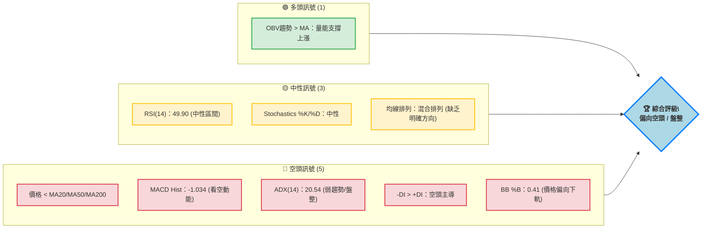

<details>
<summary>📊 靜態圖表 (點擊展開)</summary>

</details>

<html>
<head><meta charset="utf-8" /></head>
<body>
    <div>                        <script>window.PlotlyConfig = {MathJaxConfig: 'local'};</script>
        <script charset="utf-8" src="https://cdn.plot.ly/plotly-3.5.0.min.js" integrity="sha256-fHbNLP+GlIXN+efbQec78UkemUz3NJp7UmfGxC1tNxs=" crossorigin="anonymous"></script>                <div id="candlestick-chart" class="plotly-graph-div" style="height:500px; width:100%;"></div>            <script>                window.PLOTLYENV=window.PLOTLYENV || {};                                if (document.getElementById("candlestick-chart")) {                    Plotly.newPlot(                        "candlestick-chart",                        [{"close":{"dtype":"f8","bdata":"AAAAIFzAh0AAAAAA+\u002fuHQAAAAMCa4IdAAAAAIDGhiEAAAADABFKIQAAAACBhYohAAAAAIB97iEAAAACAk+yHQAAAAADBbYdAAAAAoL5Ph0AAAAAg8gqHQAAAAAAsiIdAAAAAoEd8h0AAAABAqoKHQAAAAAAITYdAAAAAAM1qh0AAAAAAwQeHQAAAAMAZ64ZAAAAAoJX6hkAAAADgKleHQAAAAAB\u002fdYdAAAAAYEx0h0AAAABgP9+HQAAAAKC+cYdAAAAAACBph0AAAACgjo6HQAAAACBE14dAAAAA4GVJiEAAAABAOC+IQAAAAABgU4hAAAAAIHNEiEAAAABAD9+HQAAAACAckYdAAAAAoB67h0AAAADARl2HQAAAAMAQNIdAAAAAIEUxh0AAAAAgO+mGQAAAAGAjYYZAAAAAQLCuhkAAAAAg\u002fSqGQAAAAIC4U4ZAAAAAgB0\u002fhkAAAADAIWWGQAAAAEBI4oZAAAAAoPoAhkAAAABAClSGQAAAAAC8G4ZAAAAAwNBihkAAAACADDeGQAAAAKDIXYZAAAAAgJTXhkAAAACgXeCGQAAAAMB74YZAAAAAIDLmhkAAAACABAmHQAAAAOCHbIdAAAAAoHtxh0AAAADAUXOHQAAAAKDbyoRAAAAAwCM6hEAAAACAKeWDQAAAAEAukoNAAAAAABvXg0AAAACgQE+DQAAAACBgZYNAAAAAQKS1g0AAAACgQ5CDQAAAAADy\u002f4JAAAAAQPkGg0AAAAAgigODQAAAAOAJyIJAAAAAYImlgkAAAADArGqCQAAAAKBUYYJAAAAAABCKgkAAAAAgNiCDQAAAAOBC2YNAAAAAoGrEg0AAAAAA8jaEQAAAAEBm\u002foNAAAAAACgwhEAAAACgQfSDQAAAAIBno4RAAAAAYF0ChUAAAABAfs2EQAAAAMDnfoRAAAAAIFtIhEAAAAAg9lyEQAAAACA8GYRAAAAAIKY3hEAAAAAAtISEQAAAACCOR4RAAAAAgA2\u002fhEAAAADgppGEQAAAACB5p4RAAAAAIPjChEAAAADg1NeEQAAAAODHtYRAAAAAIAORhEAAAADgCsuEQAAAAOAznIRAAAAAINROhEAAAADAz5GEQAAAAGBwoIRAAAAAoBRBhEAAAAAADyyEQAAAAMACZIRAAAAAwF0LhEAAAADAZrSDQAAAAKDyN4NAAAAAwCZig0AAAABgwV2DQAAAAGDT3IJAAAAAQHwjg0AAAACgmziEQAAAAGCSkYRAAAAAQEf+hEAAAACAJwOFQAAAAGBD4YRAAAAAYG0Nh0AAAADAGF+GQAAAAAByDoZAAAAAwN2YhUAAAACAV+OEQAAAAAAY7YRAAAAAQCenhEAAAAAAICWFQAAAAGAr8YRAAAAAoPHghEAAAACACEqEQAAAACDI+YNAAAAA4PH1g0AAAACgWxWEQAAAAODTIYRAAAAAAMt4hEAAAACgo+WDQAAAAGAG9oNAAAAA4AtphEAAAACAlYOEQAAAAAABPYRAAAAA4AFohEAAAABAKHSEQAAAACBF2YRAAAAAIAqghEAAAACAdyKEQAAAAICwNoRAAAAAgBVshEAAAAAAZnKEQAAAAKAS7YNAAAAA4Hopg0AAAACgmZuDQAAAAKBHdYNAAAAAoHA9g0AAAACgmfWCQAAAAKBHjYJAAAAA4HrggkAAAAAgXIeCQAAAAMAel4JAAAAA4FEcgUAAAACAwm2AQAAAAEAKw4BAAAAAQArhgUAAAAAA1xmCQAAAACCu84FAAAAAACnogUAAAABgZviBQAAAACBcI4NAAAAAwB6jg0AAAABA4a6DQAAAAIA91INAAAAAgOuzhEAAAADgo\u002fyEQAAAAMD1JoVAAAAAYGaEhUAAAACgR\u002feEQAAAAGC45oRAAAAAgMIVhUAAAABAM5mEQAAAAIA9GIVAAAAAwPU0hUAAAABguPqEQAAAAMD16IRAAAAAoEcfg0AAAAAAAAaDQAAAAKBHE4NAAAAAIK7ngkAAAABACieDQAAAAOB6RoNAAAAAQAoNg0AAAABA4baCQAAAAAAA2IJAAAAAQApFg0AAAACgcFODQAAAAADXMYNAAAAAIK4Zg0AAAABA4dSCQAAAAOB66IJAAAAAQAr7gkAAAACAFBKDQA=="},"high":{"dtype":"f8","bdata":"PydNDXkpiECide3+xACIQArHW7QuHYhA\u002fLSpo3u+iEADqmczxcyIQHXdd362j4hACeADPxPTiEDLaBgg8C+IQFJ9Btb66odAZRWH2Yljh0AiCf2pBj6HQLZs+T8DmYdABYRXudCoh0DWwRuOz4iHQKb0uIMQg4dA6nXW0Eh6h0ChtT6gHUuHQHwpqzo08oZAYlMJ5R8Uh0AQbaw4A7uHQHdUuZtkoYdADvDAT7blh0DfAPk+CeSHQLQNGWo\u002f34dAQw3Dv5uah0Bu1rkfXJ6HQOCmeekMIohAezvizDtciEA2zfxMo2uIQLWPqJF0l4hAWnTQppOniEDK2ctJWIOIQHzx56WBCohANBUTtra+h0BZa3A\u002fDZyHQLMDT2dldYdAhqptIzZsh0CMp6wA1i2HQHvr71MohYZACheyaXC0hkCN8Q5bPM6GQLLBBvR2XYZALfpkF2dqhkCOso9vlnOGQAAAAEBI4oZAKT+6xFbwhkDtoElA53WGQD05xofXUoZAhB9Q6YeVhkCf33y8OqKGQPGw39W4aoZANJBb51vkhkDkFsu9IgqHQNwH+0noGodAi5cW\u002flwph0D2\u002fiuhxx+HQB5cNKTnk4dAVGxe8xGph0D1wjijI6+HQD8PMLSVPoVAWb1n\u002fxoOhUDYvT1S1ZGEQM9f1hBZBYRAA9SU5kIJhEAB7pEpgdeDQFjpVtC6aINA7vrOq4TPg0BqfhglEqSDQLhCxK2En4NAGNgCN\u002fNEg0DXG\u002fUxPiWDQI6t\u002f2VZFYNAGtMQdjfVgkD2uzgesJKCQF8TNcun7YJAneVMhPiogkCRSenkXD2DQObSYunj34NAcnblYVrqg0BW13tovjeEQFgyaqjwIYRAJAHvXU42hEB8iJP+IT6EQLIKKe7EF4VAzl09CIIMhUBHedMcpByFQEqEYen2uoRAXfXEZVZrhECCdy22fHGEQB+i5s+ALoZAQCrPAYhjhEBF1bMuya+EQAKGMJNQpYRAcfuTC+TvhEC+v+VyaPOEQHwDT9YHCIVAqnCRJHHLhEDjXXIF3tyEQIkgl7UF44RA7GNWRHudhEDqvdXDKP2EQBiVxuVyw4RAHFniwZK+hECdQjmtxb+EQPbsVgqbx4RAPyWTbLCUhEBnBZENXzSEQDkfVTAec4RAKlbEuUhrhEA6i9fJww2EQIVe1JhMn4NAny+KmBZ9g0CJFNPHVaSDQB7v8x4EF4NAhpV40u1Ng0D\u002fvV4UCqCEQLElFNVbz4RAvQ9MYp4VhUC8okah7SGFQF0Rx1HNKIVA1toAiOg6h0AHPCZsWdyGQLqeral2hYZAxyN\u002fzBdjhkBzegse7YGFQOPIqhhWR4VADucxLVL7hECng4a0zVWFQOyJKbqKQIVACMzq9oI1hUAeiWu+XxuFQHQuX1L7VoRAsWF582YQhEDmGasBliOEQJRfIEcXNYRAejY3p0K2hEAajKNsGYmEQIuzOxR+BIRAKWHIqpBqhEC8eZECeqOEQNIb3UoTR4RATIGV8gCbhEBmvwZQz5OEQFZrdUuOAYVAoTzXoALxhEATs3KsUEeEQC79iR6ROYRA+ynqleGdhECANnEJc5SEQPGvWimHZ4RANwnUyQ2lg0AAAAAAANaDQAAAAGBm5INAAAAAQDN1g0AAAAAAACiDQAAAACCu34JAAAAAwB4Fg0AAAAAAAMiCQAAAACBc3YJAAAAAAAA4gkAAAADAzPyAQAAAAGBm3IBAAAAAIIXtgUAAAABgZoSCQAAAAAAAFIJAAAAA4FE2gkAAAAAA1\u002fmBQAAAAKCZr4NAAAAAAADsg0AAAADgo\u002fSDQAAAAAAA2INAAAAAgBTShEAAAAAAADSFQAAAAOCjLIVAAAAAACmchUAAAABACluFQAAAAKCZIYVAAAAAQAozhUAAAADgeuyEQAAAACBcRYVAAAAAAABUhUAAAACgcDGFQAAAAAAAEoVAAAAAwMxmg0AAAABACleDQAAAAAAAMINAAAAAwMwyg0AAAACgmV+DQAAAAADXh4NAAAAAAClGg0AAAACgR+eCQAAAAAAA3oJAAAAAQDNfg0AAAAAA132DQAAAAKCZaYNAAAAAYLg8g0AAAACgcC+DQAAAAAAAAINAAAAAwMwMg0AAAADgejaDQA=="},"hovertemplate":"\u003cb\u003e%{x|%Y-%m-%d}\u003c\u002fb\u003e\u003cbr\u003e\u958b: $%{open:.2f}\u003cbr\u003e\u9ad8: $%{high:.2f}\u003cbr\u003e\u4f4e: $%{low:.2f}\u003cbr\u003e\u6536: $%{close:.2f}\u003cextra\u003e\u003c\u002fextra\u003e","low":{"dtype":"f8","bdata":"gWDokCmuh0AbBjDwa6aHQKFxGuIG14dAuqaeD\u002fYUiEDQgY\u002fAQEOIQGbnlomZFYhA0kk1qexXiEDJr0N\u002fTJaHQNG0QGzVXIdA5ny9WkzKhkCtt09eI9uGQA9Jv8Na5YZAzc8Ztvpih0CBXOgugFGHQKM45ujLKIdAdiAjmYMYh0ACDTUzBO2GQIlwj7RPgIZAk3H3binihkBstmqUlECHQLVCz3pGOodAYgntVxByh0CVodhAUX2HQLfI0lPsaYdA2xr6o+5Uh0AwQWOEIzCHQNWCkP3ScYdAd4JwU3Xah0A98zrHHeSHQFC9vE9iHIhAn2xaGRr7h0C+fwB8jNmHQKRbgw6HbodAr3+tTDB6h0Dom6lodDqHQDH2hWLzAIdAUzSEqFMPh0BVou\u002fgsqiGQD8udAodKIZA1hmmF4dnhkBw4aYs9CeGQKyTaF\u002fbioVAnvuhsJIEhkABkRqMBhWGQFChm+wAOoZAoKSIc6v6hUCs7sTvqhOGQPo6u35M0YVADZoGXpoihkBw9FFho\u002fWFQOtIMS6HB4ZAaY\u002fQ\u002f9F3hkCmEbkURLyGQNudD7ORloZA\u002fbvc8wHfhkAculwnb8+GQEva6psWVodA0ug0vjNCh0Aqv7ByKSqHQGUpIvysSIRAYaqG4e8jhEClQ1w78diDQFt+w9q3h4NAxBZybfOLg0DzU+K2vkeDQNS008KRwYJAW7rTrJ9Ig0CM+ZvL2FKDQCvzeL0K9oJAFLZoD\u002fLPgkDgxM5ippGCQDBMeTo\u002fk4JA6SVgUHE2gkBSv+ljPCKCQHMTYvUBM4JAG+TqnRsngkCV5gy6DqWCQOgvhQckSoNAIG5BZZq0g0AWqnHygtODQMojg6KP5YNAJWq7gAnog0AzsY1C4uODQDrgjm+Vl4RAa26Bt0WqhECtpWkqrb+EQGckxmD+YYRALrBiI5sShEBgTjga1\u002f2DQG4yi5dZ7INAG\u002fsrrzrxg0BfjVTQMhWEQDjWikYoRYRASAai\u002fy9\u002fhEDX+5+I74yEQKueIt+0gIRArm6cuH6NhEAMPm5\u002fEa2EQJrZfdMIpoRAPvaNSKRuhEC+cXHVN4qEQC6jjMMBl4RAOvsnm5gXhEAgnj03kTmEQFft5ya9WoRAOqU4LBEihEBTF4m9aNmDQHA+LINmEoRA4GXmi3MFhEC0u\u002f5eh3yDQNCN9TlaMoNAPqWu4qItg0D+UzyMZVyDQKexytfku4JAQZOrkIi8gkBUbnOuHJCDQEyOFJIwH4RA6kUjRculhEB0GP8uu8CEQApRmbs9zIRAz7SAAYY\u002fhkB3+hg51keGQNZgLHBY94VAdq+tBJVuhUCd+SrOHNeEQOipHSaHZ4RAdHS7VZMvhEBH5ZtOu5GEQKMKH2G86YRA3iQRjk2EhEDfqpQP0yWEQJt4Q5w30INApS+8wBiig0BnBcbG5pyDQIEw8P5m4YNAgn1Bct7xg0Dsp5jQpduDQFf7bBSJo4NAD6U9vLkMhEAcJg2pkTeEQIx4FcCX7INAa0tcZKjPg0CKclozWfKDQHKBE+DbiIRA7ep2mQdOhEC8IlPUhtyDQKa9AlzzkYNAq0PZAY9DhEB04iljcT6EQNfCCH7X4oNACZzgaToIg0AAAADAzHiDQAAAAKCZbYNAAAAAQOE0g0AAAACAFNKCQAAAAAAAWoJAAAAAgBS4gkAAAAAAAHiCQAAAAEAzi4JAAAAAwMz6gEAAAACAFEKAQAAAAOBRhIBAAAAAACkWgUAAAABgj+6BQAAAAKCZfYFAAAAAAADggUAAAACAFKaBQAAAAOCjfoJAAAAAAAB4g0AAAADgo4KDQAAAAEAzg4NAAAAAwPX6g0AAAACAwsGEQAAAAAAA3oRAAAAAQAoZhUAAAAAAAOCEQAAAAOCj2oRAAAAAAADuhEAAAABgZmiEQAAAAGC4boRAAAAAYLj2hEAAAABACs2EQAAAAOB6voRAAAAAAADAgkAAAABA4fCCQAAAAAAA1oJAAAAAQOHCgkAAAADAzLCCQAAAAOBRLINAAAAA4HrwgkAAAADgo7CCQAAAAMDMhIJAAAAAoEelgkAAAAAAADiDQAAAAOB6CoNAAAAAIIXdgkAAAABgZsSCQAAAAOB6roJAAAAA4HqWgkAAAACgmfeCQA=="},"name":"\u50f9\u683c","open":{"dtype":"f8","bdata":"EdRGzGsdiECaLd4NtMeHQC1AYaw0AohAUQxns4IZiEADw78BX6qIQIcF34R1QIhAnAiejoByiEAYYIYUMSqIQCd6brOU6odA\u002fOA2OIxOh0ByvmyUuDeHQDoMO8r7C4dAUlXDVGmIh0CdBbS1U2iHQAOzTYRMdIdAJEsj3g0yh0BtNRBNRTyHQMVp+uW1ooZAcdfTSTTyhkDNLUtih1aHQPTNME\u002fadodAY\u002f+7PtSRh0DVkW2luJ2HQOTFTcay2odAVzxeAQ6Hh0CvIBwrzleHQGaPtbGPnYdAElhcdZ\u002fph0AjA7PCTFGIQAT\u002fy5ldV4hAk49ha56EiED6jjROW2SIQGYAroO5\u002f4dA4DAizuGhh0Depbg5iYGHQGGFzmD7ZYdAxPvVLsJbh0Cuuej2FSiHQCmZEk9IgoZAG\u002fjwCP2KhkBDFFZKS8OGQFTnDM0ZAIZAV6o5QixkhkBjN\u002fACEkKGQMgFRVSlaIZAP5CtxJjNhkClDdhSjj6GQMnrlznJFIZA6VHt7OZehkCQ2vbC0GKGQOq2zAUyD4ZAZsCrC+N\u002fhkA\u002fULY4VPaGQBLFTJDW5IZAn2Q5W8nrhkAzKlV+evyGQOInOjrTY4dA7iBNrvx6h0ACe7wX64uHQOhlBjZD4IRAwrUNDBILhUD1YkfVPHeEQFT+vUnul4NAzklusgi6g0AbAedsTtaDQI5itVmvO4NAqLJ7akqwg0AjU6yanJeDQF1hll6mmINAZftIAF8gg0BrgiMaSMaCQHME3jUvAINAaSEH0+V0gkDSS6k\u002f1IWCQOsh+03w04JAngFpqSNcgkCA2e8\u002fw62CQHfenCmqd4NATZFkjADlg0Ad+7XWJNiDQPQvjGPb84NAGifO5iMKhEAdgVcNrBqEQKCYrIX4FoVACqgkdiG3hEAQvneQx+GEQOjx2FZLtYRAV4WQHetGhED9GHIWuhGEQGW7NnS4RYRAmMjCay4phED5h8qpmBeEQG1ct6tkeIRAi9T5X76DhEBMzQSZzM6EQMdrtxysqIRAdgxH8eGbhEAjh2vLtK+EQIdkvoTo24RAx3H6sJOLhEDWkTcYA5GEQDvn51VzwYRAKeBq6k2xhEBtqC4BoFOEQPBe69YLmIRAPHrZEqJ4hEAuMLqwniqEQKImjVkaJ4RA886bP8ZfhEA6i9fJww2EQLSfa2O2j4NAEweJcJtPg0Bh5W8dK32DQELNqEnh+oJAB6+thcTxgkDa4aUmfqaDQE9UjmK\u002fIYRAOnvN6nzEhEBUgGmJGhCFQPADDkRiD4VAztmvqmQGh0BZkJh6BbeGQMaGs8boT4ZAfX26ax4WhkCuEWUrInmFQKQ5bV0ZuIRAHPeDkF3HhEBWqie55rSEQPZZLJIpKIVAzl1+MmMLhUAW4r3OLOuEQEWGdIliJIRAez\u002fOoZ\u002f3g0BXLM0AEMqDQANFMqEw8INAIoUneiT5g0AWt8u22l+EQOAZmcVOxINAVBtRzdcPhEDoLzGx8k+EQE9\u002fekkyF4RA5oteW+vkg0Bt6DYl4j2EQFwl\u002fV0ti4RAzQER\u002fuiqhEAxWI8sxDqEQCzJ11fl0YNACgG85AFohEDsdNZsmXGEQKa4nHuPQYRAwQcGqtl6g0AAAAAAAMCDQAAAAIDrn4NAAAAAYLhCg0AAAABAMyGDQAAAAIA93IJAAAAA4FHugkAAAADAzLiCQAAAAIDrtYJAAAAAgOszgkAAAADAzOCAQAAAAEAKw4BAAAAAANcvgUAAAABACiGCQAAAAOBRsIFAAAAAIIUNgkAAAAAA1+OBQAAAAAAA8IJAAAAAgMKXg0AAAACAwtODQAAAAAAArINAAAAAgMIZhEAAAAAAANiEQAAAAIDrH4VAAAAAwMw0hUAAAABA4UqFQAAAAAAA+IRAAAAAQOEShUAAAACgmb2EQAAAAGCPooRAAAAAAAD4hEAAAACA6xGFQAAAAKBH54RAAAAAYI9ag0AAAAAghTWDQAAAACCF\u002f4JAAAAA4Hoqg0AAAABgZsiCQAAAAIDCNYNAAAAAoJk5g0AAAABgj+SCQAAAAGCPloJAAAAA4KO2gkAAAAAAAECDQAAAAIDrL4NAAAAAQOEIg0AAAAAgXAeDQAAAAIAUxoJAAAAAAADAgkAAAABACv+CQA=="},"x":["2025-08-07T00:00:00-04:00","2025-08-08T00:00:00-04:00","2025-08-11T00:00:00-04:00","2025-08-12T00:00:00-04:00","2025-08-13T00:00:00-04:00","2025-08-14T00:00:00-04:00","2025-08-15T00:00:00-04:00","2025-08-18T00:00:00-04:00","2025-08-19T00:00:00-04:00","2025-08-20T00:00:00-04:00","2025-08-21T00:00:00-04:00","2025-08-22T00:00:00-04:00","2025-08-25T00:00:00-04:00","2025-08-26T00:00:00-04:00","2025-08-27T00:00:00-04:00","2025-08-28T00:00:00-04:00","2025-08-29T00:00:00-04:00","2025-09-02T00:00:00-04:00","2025-09-03T00:00:00-04:00","2025-09-04T00:00:00-04:00","2025-09-05T00:00:00-04:00","2025-09-08T00:00:00-04:00","2025-09-09T00:00:00-04:00","2025-09-10T00:00:00-04:00","2025-09-11T00:00:00-04:00","2025-09-12T00:00:00-04:00","2025-09-15T00:00:00-04:00","2025-09-16T00:00:00-04:00","2025-09-17T00:00:00-04:00","2025-09-18T00:00:00-04:00","2025-09-19T00:00:00-04:00","2025-09-22T00:00:00-04:00","2025-09-23T00:00:00-04:00","2025-09-24T00:00:00-04:00","2025-09-25T00:00:00-04:00","2025-09-26T00:00:00-04:00","2025-09-29T00:00:00-04:00","2025-09-30T00:00:00-04:00","2025-10-01T00:00:00-04:00","2025-10-02T00:00:00-04:00","2025-10-03T00:00:00-04:00","2025-10-06T00:00:00-04:00","2025-10-07T00:00:00-04:00","2025-10-08T00:00:00-04:00","2025-10-09T00:00:00-04:00","2025-10-10T00:00:00-04:00","2025-10-13T00:00:00-04:00","2025-10-14T00:00:00-04:00","2025-10-15T00:00:00-04:00","2025-10-16T00:00:00-04:00","2025-10-17T00:00:00-04:00","2025-10-20T00:00:00-04:00","2025-10-21T00:00:00-04:00","2025-10-22T00:00:00-04:00","2025-10-23T00:00:00-04:00","2025-10-24T00:00:00-04:00","2025-10-27T00:00:00-04:00","2025-10-28T00:00:00-04:00","2025-10-29T00:00:00-04:00","2025-10-30T00:00:00-04:00","2025-10-31T00:00:00-04:00","2025-11-03T00:00:00-05:00","2025-11-04T00:00:00-05:00","2025-11-05T00:00:00-05:00","2025-11-06T00:00:00-05:00","2025-11-07T00:00:00-05:00","2025-11-10T00:00:00-05:00","2025-11-11T00:00:00-05:00","2025-11-12T00:00:00-05:00","2025-11-13T00:00:00-05:00","2025-11-14T00:00:00-05:00","2025-11-17T00:00:00-05:00","2025-11-18T00:00:00-05:00","2025-11-19T00:00:00-05:00","2025-11-20T00:00:00-05:00","2025-11-21T00:00:00-05:00","2025-11-24T00:00:00-05:00","2025-11-25T00:00:00-05:00","2025-11-26T00:00:00-05:00","2025-11-28T00:00:00-05:00","2025-12-01T00:00:00-05:00","2025-12-02T00:00:00-05:00","2025-12-03T00:00:00-05:00","2025-12-04T00:00:00-05:00","2025-12-05T00:00:00-05:00","2025-12-08T00:00:00-05:00","2025-12-09T00:00:00-05:00","2025-12-10T00:00:00-05:00","2025-12-11T00:00:00-05:00","2025-12-12T00:00:00-05:00","2025-12-15T00:00:00-05:00","2025-12-16T00:00:00-05:00","2025-12-17T00:00:00-05:00","2025-12-18T00:00:00-05:00","2025-12-19T00:00:00-05:00","2025-12-22T00:00:00-05:00","2025-12-23T00:00:00-05:00","2025-12-24T00:00:00-05:00","2025-12-26T00:00:00-05:00","2025-12-29T00:00:00-05:00","2025-12-30T00:00:00-05:00","2025-12-31T00:00:00-05:00","2026-01-02T00:00:00-05:00","2026-01-05T00:00:00-05:00","2026-01-06T00:00:00-05:00","2026-01-07T00:00:00-05:00","2026-01-08T00:00:00-05:00","2026-01-09T00:00:00-05:00","2026-01-12T00:00:00-05:00","2026-01-13T00:00:00-05:00","2026-01-14T00:00:00-05:00","2026-01-15T00:00:00-05:00","2026-01-16T00:00:00-05:00","2026-01-20T00:00:00-05:00","2026-01-21T00:00:00-05:00","2026-01-22T00:00:00-05:00","2026-01-23T00:00:00-05:00","2026-01-26T00:00:00-05:00","2026-01-27T00:00:00-05:00","2026-01-28T00:00:00-05:00","2026-01-29T00:00:00-05:00","2026-01-30T00:00:00-05:00","2026-02-02T00:00:00-05:00","2026-02-03T00:00:00-05:00","2026-02-04T00:00:00-05:00","2026-02-05T00:00:00-05:00","2026-02-06T00:00:00-05:00","2026-02-09T00:00:00-05:00","2026-02-10T00:00:00-05:00","2026-02-11T00:00:00-05:00","2026-02-12T00:00:00-05:00","2026-02-13T00:00:00-05:00","2026-02-17T00:00:00-05:00","2026-02-18T00:00:00-05:00","2026-02-19T00:00:00-05:00","2026-02-20T00:00:00-05:00","2026-02-23T00:00:00-05:00","2026-02-24T00:00:00-05:00","2026-02-25T00:00:00-05:00","2026-02-26T00:00:00-05:00","2026-02-27T00:00:00-05:00","2026-03-02T00:00:00-05:00","2026-03-03T00:00:00-05:00","2026-03-04T00:00:00-05:00","2026-03-05T00:00:00-05:00","2026-03-06T00:00:00-05:00","2026-03-09T00:00:00-04:00","2026-03-10T00:00:00-04:00","2026-03-11T00:00:00-04:00","2026-03-12T00:00:00-04:00","2026-03-13T00:00:00-04:00","2026-03-16T00:00:00-04:00","2026-03-17T00:00:00-04:00","2026-03-18T00:00:00-04:00","2026-03-19T00:00:00-04:00","2026-03-20T00:00:00-04:00","2026-03-23T00:00:00-04:00","2026-03-24T00:00:00-04:00","2026-03-25T00:00:00-04:00","2026-03-26T00:00:00-04:00","2026-03-27T00:00:00-04:00","2026-03-30T00:00:00-04:00","2026-03-31T00:00:00-04:00","2026-04-01T00:00:00-04:00","2026-04-02T00:00:00-04:00","2026-04-06T00:00:00-04:00","2026-04-07T00:00:00-04:00","2026-04-08T00:00:00-04:00","2026-04-09T00:00:00-04:00","2026-04-10T00:00:00-04:00","2026-04-13T00:00:00-04:00","2026-04-14T00:00:00-04:00","2026-04-15T00:00:00-04:00","2026-04-16T00:00:00-04:00","2026-04-17T00:00:00-04:00","2026-04-20T00:00:00-04:00","2026-04-21T00:00:00-04:00","2026-04-22T00:00:00-04:00","2026-04-23T00:00:00-04:00","2026-04-24T00:00:00-04:00","2026-04-27T00:00:00-04:00","2026-04-28T00:00:00-04:00","2026-04-29T00:00:00-04:00","2026-04-30T00:00:00-04:00","2026-05-01T00:00:00-04:00","2026-05-04T00:00:00-04:00","2026-05-05T00:00:00-04:00","2026-05-06T00:00:00-04:00","2026-05-07T00:00:00-04:00","2026-05-08T00:00:00-04:00","2026-05-11T00:00:00-04:00","2026-05-12T00:00:00-04:00","2026-05-13T00:00:00-04:00","2026-05-14T00:00:00-04:00","2026-05-15T00:00:00-04:00","2026-05-18T00:00:00-04:00","2026-05-19T00:00:00-04:00","2026-05-20T00:00:00-04:00","2026-05-21T00:00:00-04:00","2026-05-22T00:00:00-04:00"],"type":"candlestick"},{"hovertemplate":"MA30: $%{y:.2f}\u003cextra\u003e\u003c\u002fextra\u003e","line":{"color":"#2196F3","dash":"dash","width":2},"mode":"lines","name":"MA30","x":["2025-08-07T00:00:00-04:00","2025-08-08T00:00:00-04:00","2025-08-11T00:00:00-04:00","2025-08-12T00:00:00-04:00","2025-08-13T00:00:00-04:00","2025-08-14T00:00:00-04:00","2025-08-15T00:00:00-04:00","2025-08-18T00:00:00-04:00","2025-08-19T00:00:00-04:00","2025-08-20T00:00:00-04:00","2025-08-21T00:00:00-04:00","2025-08-22T00:00:00-04:00","2025-08-25T00:00:00-04:00","2025-08-26T00:00:00-04:00","2025-08-27T00:00:00-04:00","2025-08-28T00:00:00-04:00","2025-08-29T00:00:00-04:00","2025-09-02T00:00:00-04:00","2025-09-03T00:00:00-04:00","2025-09-04T00:00:00-04:00","2025-09-05T00:00:00-04:00","2025-09-08T00:00:00-04:00","2025-09-09T00:00:00-04:00","2025-09-10T00:00:00-04:00","2025-09-11T00:00:00-04:00","2025-09-12T00:00:00-04:00","2025-09-15T00:00:00-04:00","2025-09-16T00:00:00-04:00","2025-09-17T00:00:00-04:00","2025-09-18T00:00:00-04:00","2025-09-19T00:00:00-04:00","2025-09-22T00:00:00-04:00","2025-09-23T00:00:00-04:00","2025-09-24T00:00:00-04:00","2025-09-25T00:00:00-04:00","2025-09-26T00:00:00-04:00","2025-09-29T00:00:00-04:00","2025-09-30T00:00:00-04:00","2025-10-01T00:00:00-04:00","2025-10-02T00:00:00-04:00","2025-10-03T00:00:00-04:00","2025-10-06T00:00:00-04:00","2025-10-07T00:00:00-04:00","2025-10-08T00:00:00-04:00","2025-10-09T00:00:00-04:00","2025-10-10T00:00:00-04:00","2025-10-13T00:00:00-04:00","2025-10-14T00:00:00-04:00","2025-10-15T00:00:00-04:00","2025-10-16T00:00:00-04:00","2025-10-17T00:00:00-04:00","2025-10-20T00:00:00-04:00","2025-10-21T00:00:00-04:00","2025-10-22T00:00:00-04:00","2025-10-23T00:00:00-04:00","2025-10-24T00:00:00-04:00","2025-10-27T00:00:00-04:00","2025-10-28T00:00:00-04:00","2025-10-29T00:00:00-04:00","2025-10-30T00:00:00-04:00","2025-10-31T00:00:00-04:00","2025-11-03T00:00:00-05:00","2025-11-04T00:00:00-05:00","2025-11-05T00:00:00-05:00","2025-11-06T00:00:00-05:00","2025-11-07T00:00:00-05:00","2025-11-10T00:00:00-05:00","2025-11-11T00:00:00-05:00","2025-11-12T00:00:00-05:00","2025-11-13T00:00:00-05:00","2025-11-14T00:00:00-05:00","2025-11-17T00:00:00-05:00","2025-11-18T00:00:00-05:00","2025-11-19T00:00:00-05:00","2025-11-20T00:00:00-05:00","2025-11-21T00:00:00-05:00","2025-11-24T00:00:00-05:00","2025-11-25T00:00:00-05:00","2025-11-26T00:00:00-05:00","2025-11-28T00:00:00-05:00","2025-12-01T00:00:00-05:00","2025-12-02T00:00:00-05:00","2025-12-03T00:00:00-05:00","2025-12-04T00:00:00-05:00","2025-12-05T00:00:00-05:00","2025-12-08T00:00:00-05:00","2025-12-09T00:00:00-05:00","2025-12-10T00:00:00-05:00","2025-12-11T00:00:00-05:00","2025-12-12T00:00:00-05:00","2025-12-15T00:00:00-05:00","2025-12-16T00:00:00-05:00","2025-12-17T00:00:00-05:00","2025-12-18T00:00:00-05:00","2025-12-19T00:00:00-05:00","2025-12-22T00:00:00-05:00","2025-12-23T00:00:00-05:00","2025-12-24T00:00:00-05:00","2025-12-26T00:00:00-05:00","2025-12-29T00:00:00-05:00","2025-12-30T00:00:00-05:00","2025-12-31T00:00:00-05:00","2026-01-02T00:00:00-05:00","2026-01-05T00:00:00-05:00","2026-01-06T00:00:00-05:00","2026-01-07T00:00:00-05:00","2026-01-08T00:00:00-05:00","2026-01-09T00:00:00-05:00","2026-01-12T00:00:00-05:00","2026-01-13T00:00:00-05:00","2026-01-14T00:00:00-05:00","2026-01-15T00:00:00-05:00","2026-01-16T00:00:00-05:00","2026-01-20T00:00:00-05:00","2026-01-21T00:00:00-05:00","2026-01-22T00:00:00-05:00","2026-01-23T00:00:00-05:00","2026-01-26T00:00:00-05:00","2026-01-27T00:00:00-05:00","2026-01-28T00:00:00-05:00","2026-01-29T00:00:00-05:00","2026-01-30T00:00:00-05:00","2026-02-02T00:00:00-05:00","2026-02-03T00:00:00-05:00","2026-02-04T00:00:00-05:00","2026-02-05T00:00:00-05:00","2026-02-06T00:00:00-05:00","2026-02-09T00:00:00-05:00","2026-02-10T00:00:00-05:00","2026-02-11T00:00:00-05:00","2026-02-12T00:00:00-05:00","2026-02-13T00:00:00-05:00","2026-02-17T00:00:00-05:00","2026-02-18T00:00:00-05:00","2026-02-19T00:00:00-05:00","2026-02-20T00:00:00-05:00","2026-02-23T00:00:00-05:00","2026-02-24T00:00:00-05:00","2026-02-25T00:00:00-05:00","2026-02-26T00:00:00-05:00","2026-02-27T00:00:00-05:00","2026-03-02T00:00:00-05:00","2026-03-03T00:00:00-05:00","2026-03-04T00:00:00-05:00","2026-03-05T00:00:00-05:00","2026-03-06T00:00:00-05:00","2026-03-09T00:00:00-04:00","2026-03-10T00:00:00-04:00","2026-03-11T00:00:00-04:00","2026-03-12T00:00:00-04:00","2026-03-13T00:00:00-04:00","2026-03-16T00:00:00-04:00","2026-03-17T00:00:00-04:00","2026-03-18T00:00:00-04:00","2026-03-19T00:00:00-04:00","2026-03-20T00:00:00-04:00","2026-03-23T00:00:00-04:00","2026-03-24T00:00:00-04:00","2026-03-25T00:00:00-04:00","2026-03-26T00:00:00-04:00","2026-03-27T00:00:00-04:00","2026-03-30T00:00:00-04:00","2026-03-31T00:00:00-04:00","2026-04-01T00:00:00-04:00","2026-04-02T00:00:00-04:00","2026-04-06T00:00:00-04:00","2026-04-07T00:00:00-04:00","2026-04-08T00:00:00-04:00","2026-04-09T00:00:00-04:00","2026-04-10T00:00:00-04:00","2026-04-13T00:00:00-04:00","2026-04-14T00:00:00-04:00","2026-04-15T00:00:00-04:00","2026-04-16T00:00:00-04:00","2026-04-17T00:00:00-04:00","2026-04-20T00:00:00-04:00","2026-04-21T00:00:00-04:00","2026-04-22T00:00:00-04:00","2026-04-23T00:00:00-04:00","2026-04-24T00:00:00-04:00","2026-04-27T00:00:00-04:00","2026-04-28T00:00:00-04:00","2026-04-29T00:00:00-04:00","2026-04-30T00:00:00-04:00","2026-05-01T00:00:00-04:00","2026-05-04T00:00:00-04:00","2026-05-05T00:00:00-04:00","2026-05-06T00:00:00-04:00","2026-05-07T00:00:00-04:00","2026-05-08T00:00:00-04:00","2026-05-11T00:00:00-04:00","2026-05-12T00:00:00-04:00","2026-05-13T00:00:00-04:00","2026-05-14T00:00:00-04:00","2026-05-15T00:00:00-04:00","2026-05-18T00:00:00-04:00","2026-05-19T00:00:00-04:00","2026-05-20T00:00:00-04:00","2026-05-21T00:00:00-04:00","2026-05-22T00:00:00-04:00"],"y":{"dtype":"f8","bdata":"AAAAAAAA+H8AAAAAAAD4fwAAAAAAAPh\u002fAAAAAAAA+H8AAAAAAAD4fwAAAAAAAPh\u002fAAAAAAAA+H8AAAAAAAD4fwAAAAAAAPh\u002fAAAAAAAA+H8AAAAAAAD4fwAAAAAAAPh\u002fAAAAAAAA+H8AAAAAAAD4fwAAAAAAAPh\u002fAAAAAAAA+H8AAAAAAAD4fwAAAAAAAPh\u002fAAAAAAAA+H8AAAAAAAD4fwAAAAAAAPh\u002fAAAAAAAA+H8AAAAAAAD4fwAAAAAAAPh\u002fAAAAAAAA+H8AAAAAAAD4fwAAAAAAAPh\u002fAAAAAAAA+H8AAAAAAAD4f0RERHTMrodA7+7unjOzh0BERETUPLKHQJqZmXmWr4dAERERMeunh0CamZm5wp+HQKuqqvqulYdA7+7uPrCKh0CrqqoqC4KHQKuqqvoWeYdAIiIiorhzh0CJiIiIQWyHQKuqqmr5YYdAIiIi8mZXh0BVVVVl4k2HQImIiHhTSodAzczM7EM+h0De3d1dRjiHQHd3d9dcMYdA7+7uvk0sh0AiIiIisyKHQBEREUFgGYdAzczM7CYUh0Dv7u7upwuHQHd3d+fYBodAREREpHsCh0CrqqoaCP6GQLy7u0t5+oZAIiIi0kbzhkB3d3dnA+2GQLy7u9vczoZA7+7uvmKshkAAAACwdIqGQBEREbFbaIZA7+7uXihHhkARERGRjiSGQGZmZjYRBIZAZmZmpljmhUDe3d3dx8mFQDMzM+PwrIVA7+7uHsCNhUAzMzPj1XKFQFVVVVWUVIVAIiIiMtw1hUDNzMxc6ROFQHd3d9d67YRAzczMfOrPhEDe3d2dlrSEQAAAAFBOoYRAMzMzk\u002fWKhEAAAACg43mEQM3MzJykZYRAzczM3P5OhEDv7u7+DjaEQAAAADDsIoRA7+7ufssShEDNzMx8vv+DQO\u002fu7q7B5oNAIiIiIsnLg0Dv7u6+cLGDQHd3dweFq4NAZmZmxm+rg0ARERExwbCDQLy7u+vMtoNARERENIi+g0CJiIhYR8mDQJqZmekD1INAzczMLP7cg0Crqqpq6eeDQM3MzJyB9oNAMzMzE6QDhECJiIgI0xKEQImIiAhuIoRAERERMZswhECamZk5+kKEQBEREdElVoRAq6qqGshkhEC8u7u7tW2EQKuqqrpVcoRAq6qqKrN0hEARERExWXCEQM3MzLy7aYRARERE1N1ihEDe3d2N2V2EQLy7u3uyToRAvLu7C7w+hEDv7u6OxTmEQImIiNhkOoRAAAAAQHVAhEDe3d1t\u002f0WEQGZmZlaqTIRAVVVVpdtkhEDe3d3Nq3SEQImIiIjVg4RAVVVVNRiLhEC8u7tL0Y2EQERERGQjkIRAd3d3BzaPhECamZmZyZGEQCIiImLEk4RAd3d3d26WhEBmZmaWIZKEQImIiJi3jIRA7+7uHsGJhEDe3d0dm4WEQDMzM7NigYRAzczMHD6DhEAzMzMz5YCEQHd3d6c6fYRA7+7uDlqAhEBEREQEQoeEQCIiIrL1j4RAMzMzM7CYhEBVVVXl96GEQO\u002fu7p7qsoRAREREBJq\u002fhEBEREQU3b6EQM3MzIzVu4RAZmZmBva2hEBmZmbGIrKEQERERAT\u002fqYRARERERMyIhEBmZmb2NnGEQCIiIuIKW4RAVVVVpe1GhEAiIiJieDaEQERERLQ1IoRAMzMz0w0ThEDv7u5+uvyDQCIiIgKp6INAzczMjIHIg0CJiIhIkKeDQN7d3Y0jjINAmpmZGWB6g0B3d3dHdWmDQLy7u2vaVoNAd3d3J\u002fdAg0De3d0thjCDQBEREYGAKYNAiYiIiOcig0BVVVV10BuDQJqZmXlSGINAMzMzQ9oag0CrqqrqZh+DQO\u002fu7t79IYNAvLu7i5opg0DNzMyMsjCDQN7d3a2QNoNARERElDg8g0AAAACwgz2DQFVVVZV8R4NAzczMnO9Yg0BmZmbWo2SDQCIiIoIHcYNAREREJAZwg0BmZmYWknCDQN7d3Y0JdYNA7+7u\u002fkZ1g0CamZmZmXqDQBEREQFygINA7+7urgCRg0BVVVW1gaSDQCIiIqJFtoNAAAAAgCPCg0De3d2Nl8yDQERERIQy14NA7+7unmHhg0DNzMwMu+iDQLy7u5vE5oNAMzMzUyrhg0DNzMxM8NuDQA=="},"type":"scatter"},{"hovertemplate":"MA60: $%{y:.2f}\u003cextra\u003e\u003c\u002fextra\u003e","line":{"color":"#9C27B0","dash":"dash","width":2},"mode":"lines","name":"MA60","x":["2025-08-07T00:00:00-04:00","2025-08-08T00:00:00-04:00","2025-08-11T00:00:00-04:00","2025-08-12T00:00:00-04:00","2025-08-13T00:00:00-04:00","2025-08-14T00:00:00-04:00","2025-08-15T00:00:00-04:00","2025-08-18T00:00:00-04:00","2025-08-19T00:00:00-04:00","2025-08-20T00:00:00-04:00","2025-08-21T00:00:00-04:00","2025-08-22T00:00:00-04:00","2025-08-25T00:00:00-04:00","2025-08-26T00:00:00-04:00","2025-08-27T00:00:00-04:00","2025-08-28T00:00:00-04:00","2025-08-29T00:00:00-04:00","2025-09-02T00:00:00-04:00","2025-09-03T00:00:00-04:00","2025-09-04T00:00:00-04:00","2025-09-05T00:00:00-04:00","2025-09-08T00:00:00-04:00","2025-09-09T00:00:00-04:00","2025-09-10T00:00:00-04:00","2025-09-11T00:00:00-04:00","2025-09-12T00:00:00-04:00","2025-09-15T00:00:00-04:00","2025-09-16T00:00:00-04:00","2025-09-17T00:00:00-04:00","2025-09-18T00:00:00-04:00","2025-09-19T00:00:00-04:00","2025-09-22T00:00:00-04:00","2025-09-23T00:00:00-04:00","2025-09-24T00:00:00-04:00","2025-09-25T00:00:00-04:00","2025-09-26T00:00:00-04:00","2025-09-29T00:00:00-04:00","2025-09-30T00:00:00-04:00","2025-10-01T00:00:00-04:00","2025-10-02T00:00:00-04:00","2025-10-03T00:00:00-04:00","2025-10-06T00:00:00-04:00","2025-10-07T00:00:00-04:00","2025-10-08T00:00:00-04:00","2025-10-09T00:00:00-04:00","2025-10-10T00:00:00-04:00","2025-10-13T00:00:00-04:00","2025-10-14T00:00:00-04:00","2025-10-15T00:00:00-04:00","2025-10-16T00:00:00-04:00","2025-10-17T00:00:00-04:00","2025-10-20T00:00:00-04:00","2025-10-21T00:00:00-04:00","2025-10-22T00:00:00-04:00","2025-10-23T00:00:00-04:00","2025-10-24T00:00:00-04:00","2025-10-27T00:00:00-04:00","2025-10-28T00:00:00-04:00","2025-10-29T00:00:00-04:00","2025-10-30T00:00:00-04:00","2025-10-31T00:00:00-04:00","2025-11-03T00:00:00-05:00","2025-11-04T00:00:00-05:00","2025-11-05T00:00:00-05:00","2025-11-06T00:00:00-05:00","2025-11-07T00:00:00-05:00","2025-11-10T00:00:00-05:00","2025-11-11T00:00:00-05:00","2025-11-12T00:00:00-05:00","2025-11-13T00:00:00-05:00","2025-11-14T00:00:00-05:00","2025-11-17T00:00:00-05:00","2025-11-18T00:00:00-05:00","2025-11-19T00:00:00-05:00","2025-11-20T00:00:00-05:00","2025-11-21T00:00:00-05:00","2025-11-24T00:00:00-05:00","2025-11-25T00:00:00-05:00","2025-11-26T00:00:00-05:00","2025-11-28T00:00:00-05:00","2025-12-01T00:00:00-05:00","2025-12-02T00:00:00-05:00","2025-12-03T00:00:00-05:00","2025-12-04T00:00:00-05:00","2025-12-05T00:00:00-05:00","2025-12-08T00:00:00-05:00","2025-12-09T00:00:00-05:00","2025-12-10T00:00:00-05:00","2025-12-11T00:00:00-05:00","2025-12-12T00:00:00-05:00","2025-12-15T00:00:00-05:00","2025-12-16T00:00:00-05:00","2025-12-17T00:00:00-05:00","2025-12-18T00:00:00-05:00","2025-12-19T00:00:00-05:00","2025-12-22T00:00:00-05:00","2025-12-23T00:00:00-05:00","2025-12-24T00:00:00-05:00","2025-12-26T00:00:00-05:00","2025-12-29T00:00:00-05:00","2025-12-30T00:00:00-05:00","2025-12-31T00:00:00-05:00","2026-01-02T00:00:00-05:00","2026-01-05T00:00:00-05:00","2026-01-06T00:00:00-05:00","2026-01-07T00:00:00-05:00","2026-01-08T00:00:00-05:00","2026-01-09T00:00:00-05:00","2026-01-12T00:00:00-05:00","2026-01-13T00:00:00-05:00","2026-01-14T00:00:00-05:00","2026-01-15T00:00:00-05:00","2026-01-16T00:00:00-05:00","2026-01-20T00:00:00-05:00","2026-01-21T00:00:00-05:00","2026-01-22T00:00:00-05:00","2026-01-23T00:00:00-05:00","2026-01-26T00:00:00-05:00","2026-01-27T00:00:00-05:00","2026-01-28T00:00:00-05:00","2026-01-29T00:00:00-05:00","2026-01-30T00:00:00-05:00","2026-02-02T00:00:00-05:00","2026-02-03T00:00:00-05:00","2026-02-04T00:00:00-05:00","2026-02-05T00:00:00-05:00","2026-02-06T00:00:00-05:00","2026-02-09T00:00:00-05:00","2026-02-10T00:00:00-05:00","2026-02-11T00:00:00-05:00","2026-02-12T00:00:00-05:00","2026-02-13T00:00:00-05:00","2026-02-17T00:00:00-05:00","2026-02-18T00:00:00-05:00","2026-02-19T00:00:00-05:00","2026-02-20T00:00:00-05:00","2026-02-23T00:00:00-05:00","2026-02-24T00:00:00-05:00","2026-02-25T00:00:00-05:00","2026-02-26T00:00:00-05:00","2026-02-27T00:00:00-05:00","2026-03-02T00:00:00-05:00","2026-03-03T00:00:00-05:00","2026-03-04T00:00:00-05:00","2026-03-05T00:00:00-05:00","2026-03-06T00:00:00-05:00","2026-03-09T00:00:00-04:00","2026-03-10T00:00:00-04:00","2026-03-11T00:00:00-04:00","2026-03-12T00:00:00-04:00","2026-03-13T00:00:00-04:00","2026-03-16T00:00:00-04:00","2026-03-17T00:00:00-04:00","2026-03-18T00:00:00-04:00","2026-03-19T00:00:00-04:00","2026-03-20T00:00:00-04:00","2026-03-23T00:00:00-04:00","2026-03-24T00:00:00-04:00","2026-03-25T00:00:00-04:00","2026-03-26T00:00:00-04:00","2026-03-27T00:00:00-04:00","2026-03-30T00:00:00-04:00","2026-03-31T00:00:00-04:00","2026-04-01T00:00:00-04:00","2026-04-02T00:00:00-04:00","2026-04-06T00:00:00-04:00","2026-04-07T00:00:00-04:00","2026-04-08T00:00:00-04:00","2026-04-09T00:00:00-04:00","2026-04-10T00:00:00-04:00","2026-04-13T00:00:00-04:00","2026-04-14T00:00:00-04:00","2026-04-15T00:00:00-04:00","2026-04-16T00:00:00-04:00","2026-04-17T00:00:00-04:00","2026-04-20T00:00:00-04:00","2026-04-21T00:00:00-04:00","2026-04-22T00:00:00-04:00","2026-04-23T00:00:00-04:00","2026-04-24T00:00:00-04:00","2026-04-27T00:00:00-04:00","2026-04-28T00:00:00-04:00","2026-04-29T00:00:00-04:00","2026-04-30T00:00:00-04:00","2026-05-01T00:00:00-04:00","2026-05-04T00:00:00-04:00","2026-05-05T00:00:00-04:00","2026-05-06T00:00:00-04:00","2026-05-07T00:00:00-04:00","2026-05-08T00:00:00-04:00","2026-05-11T00:00:00-04:00","2026-05-12T00:00:00-04:00","2026-05-13T00:00:00-04:00","2026-05-14T00:00:00-04:00","2026-05-15T00:00:00-04:00","2026-05-18T00:00:00-04:00","2026-05-19T00:00:00-04:00","2026-05-20T00:00:00-04:00","2026-05-21T00:00:00-04:00","2026-05-22T00:00:00-04:00"],"y":{"dtype":"f8","bdata":"AAAAAAAA+H8AAAAAAAD4fwAAAAAAAPh\u002fAAAAAAAA+H8AAAAAAAD4fwAAAAAAAPh\u002fAAAAAAAA+H8AAAAAAAD4fwAAAAAAAPh\u002fAAAAAAAA+H8AAAAAAAD4fwAAAAAAAPh\u002fAAAAAAAA+H8AAAAAAAD4fwAAAAAAAPh\u002fAAAAAAAA+H8AAAAAAAD4fwAAAAAAAPh\u002fAAAAAAAA+H8AAAAAAAD4fwAAAAAAAPh\u002fAAAAAAAA+H8AAAAAAAD4fwAAAAAAAPh\u002fAAAAAAAA+H8AAAAAAAD4fwAAAAAAAPh\u002fAAAAAAAA+H8AAAAAAAD4fwAAAAAAAPh\u002fAAAAAAAA+H8AAAAAAAD4fwAAAAAAAPh\u002fAAAAAAAA+H8AAAAAAAD4fwAAAAAAAPh\u002fAAAAAAAA+H8AAAAAAAD4fwAAAAAAAPh\u002fAAAAAAAA+H8AAAAAAAD4fwAAAAAAAPh\u002fAAAAAAAA+H8AAAAAAAD4fwAAAAAAAPh\u002fAAAAAAAA+H8AAAAAAAD4fwAAAAAAAPh\u002fAAAAAAAA+H8AAAAAAAD4fwAAAAAAAPh\u002fAAAAAAAA+H8AAAAAAAD4fwAAAAAAAPh\u002fAAAAAAAA+H8AAAAAAAD4fwAAAAAAAPh\u002fAAAAAAAA+H8AAAAAAAD4fwAAAKjUPodA7+7uLssvh0AiIiLCWB6HQFVVVRX5C4dAAAAAyIn3hkBVVVWlKOKGQImIiBjgzIZAq6qqcoS4hkBERESE6aWGQO\u002fu7u4Dk4ZAiYiIYLyAhkDe3d21i2+GQAAAAOBGW4ZAIiIikqFGhkARERHh5TCGQAAAACjnG4ZAzczMNBcHhkDe3d19bvaFQLy7u5NV6YVAERERqaHbhUARERFhS86FQO\u002fu7m6Cv4VAzczM5JKxhUDv7u5226CFQLy7u4vilIVAmpmZkaOKhUC8u7tL436FQFVVVX2dcIVAIiIi+odfhUAzMzMTOk+FQJqZmfEwPYVAq6qqQukrhUCJiIjwmh2FQGZmZk6UD4VAmpmZSdgChUDNzMz06vaEQAAAAJAK7IRAmpmZaavhhEBERESk2NiEQAAAAEC50YRAERERGbLIhEDe3d111MKEQO\u002fu7i6Bu4RAmpmZsTuzhEAzMzPLcauEQERERFTQoYRAvLu7S1mahEDNzMwsJpGEQFVVVQXSiYRA7+7uXtR\u002fhECJiIhoHnWEQM3MzCywZ4RAiYiIWO5YhEBmZmZG9EmEQN7d3VXPOIRAVVVVxcMohEDe3d0FwhyEQLy7u0OTEIRAERERMR8GhEBmZmYWuPuDQO\u002fu7q4X\u002fINA3t3dtSUIhEB3d3d\u002fthKEQCIiIjpRHYRAzczMNNAkhEAiIiJSjCuEQO\u002fu7qYTMoRAIiIiGho2hEAiIiKC2TyEQHd3d\u002f8iRYRAVVVVRQlNhEB3d3dPelKEQImIiNCSV4RAAAAAKC5dhEC8u7urSmSEQCIiIkLEa4RAvLu7GwN0hEB3d3d3TXeEQBERETHId4RAzczMnIZ6hECrqqqazXuEQHd3d7fYfIRAvLu7A8d9hECamZm56H+EQFVVVY3OgIRAAAAACCt\u002fhECamZlRUXyEQKuqqjIde4RAMzMzo7V7hEAiIiIaEXyEQFVVVa1Ue4RAzczM9NN2hEAiIiJi8XKEQFVVVTVwb4RAVVVV7QJphEDv7u7WJGKEQERERIwsWYRAVVVV7SFRhEBEREQMQkeEQCIiIrI2PoRAIiIiAngvhEB3d3fv2ByEQDMzM5NtDIRAREREnBAChECrqqoyiPeDQHd3d48e7INAIiIiohrig0CJiIiwtdiDQERERJRd04NAvLu7y6DRg0DNzMw8idGDQN7d3RUk1INAMzMzO8XZg0AAAABor+CDQO\u002fu7j506oNAAAAASJr0g0CJiIjQx\u002feDQFVVVR0z+YNAVVVVTZf5g0AzMzM70\u002feDQM3MzMy9+INAiYiI8N3wg0BmZmZm7eqDQCIiIjIJ5oNAzczM5Hnbg0BEREQ8hdODQBEREaGfy4NAERERaSrEg0BEREQMqruDQJqZmYGNtINA3t3dHcGsg0Dv7u7+CKaDQAAAAJg0oYNAzczMzEGeg0CrqqpqBpuDQAAAAHgGl4NAMzMzYyyRg0BVVVWdoIyDQGZmZo4iiINA3t3d7QiCg0ARERFh4HuDQA=="},"type":"scatter"},{"hovertemplate":"MA200: $%{y:.2f}\u003cextra\u003e\u003c\u002fextra\u003e","line":{"color":"#FF6F00","dash":"solid","width":2},"mode":"lines","name":"MA200","x":["2025-08-07T00:00:00-04:00","2025-08-08T00:00:00-04:00","2025-08-11T00:00:00-04:00","2025-08-12T00:00:00-04:00","2025-08-13T00:00:00-04:00","2025-08-14T00:00:00-04:00","2025-08-15T00:00:00-04:00","2025-08-18T00:00:00-04:00","2025-08-19T00:00:00-04:00","2025-08-20T00:00:00-04:00","2025-08-21T00:00:00-04:00","2025-08-22T00:00:00-04:00","2025-08-25T00:00:00-04:00","2025-08-26T00:00:00-04:00","2025-08-27T00:00:00-04:00","2025-08-28T00:00:00-04:00","2025-08-29T00:00:00-04:00","2025-09-02T00:00:00-04:00","2025-09-03T00:00:00-04:00","2025-09-04T00:00:00-04:00","2025-09-05T00:00:00-04:00","2025-09-08T00:00:00-04:00","2025-09-09T00:00:00-04:00","2025-09-10T00:00:00-04:00","2025-09-11T00:00:00-04:00","2025-09-12T00:00:00-04:00","2025-09-15T00:00:00-04:00","2025-09-16T00:00:00-04:00","2025-09-17T00:00:00-04:00","2025-09-18T00:00:00-04:00","2025-09-19T00:00:00-04:00","2025-09-22T00:00:00-04:00","2025-09-23T00:00:00-04:00","2025-09-24T00:00:00-04:00","2025-09-25T00:00:00-04:00","2025-09-26T00:00:00-04:00","2025-09-29T00:00:00-04:00","2025-09-30T00:00:00-04:00","2025-10-01T00:00:00-04:00","2025-10-02T00:00:00-04:00","2025-10-03T00:00:00-04:00","2025-10-06T00:00:00-04:00","2025-10-07T00:00:00-04:00","2025-10-08T00:00:00-04:00","2025-10-09T00:00:00-04:00","2025-10-10T00:00:00-04:00","2025-10-13T00:00:00-04:00","2025-10-14T00:00:00-04:00","2025-10-15T00:00:00-04:00","2025-10-16T00:00:00-04:00","2025-10-17T00:00:00-04:00","2025-10-20T00:00:00-04:00","2025-10-21T00:00:00-04:00","2025-10-22T00:00:00-04:00","2025-10-23T00:00:00-04:00","2025-10-24T00:00:00-04:00","2025-10-27T00:00:00-04:00","2025-10-28T00:00:00-04:00","2025-10-29T00:00:00-04:00","2025-10-30T00:00:00-04:00","2025-10-31T00:00:00-04:00","2025-11-03T00:00:00-05:00","2025-11-04T00:00:00-05:00","2025-11-05T00:00:00-05:00","2025-11-06T00:00:00-05:00","2025-11-07T00:00:00-05:00","2025-11-10T00:00:00-05:00","2025-11-11T00:00:00-05:00","2025-11-12T00:00:00-05:00","2025-11-13T00:00:00-05:00","2025-11-14T00:00:00-05:00","2025-11-17T00:00:00-05:00","2025-11-18T00:00:00-05:00","2025-11-19T00:00:00-05:00","2025-11-20T00:00:00-05:00","2025-11-21T00:00:00-05:00","2025-11-24T00:00:00-05:00","2025-11-25T00:00:00-05:00","2025-11-26T00:00:00-05:00","2025-11-28T00:00:00-05:00","2025-12-01T00:00:00-05:00","2025-12-02T00:00:00-05:00","2025-12-03T00:00:00-05:00","2025-12-04T00:00:00-05:00","2025-12-05T00:00:00-05:00","2025-12-08T00:00:00-05:00","2025-12-09T00:00:00-05:00","2025-12-10T00:00:00-05:00","2025-12-11T00:00:00-05:00","2025-12-12T00:00:00-05:00","2025-12-15T00:00:00-05:00","2025-12-16T00:00:00-05:00","2025-12-17T00:00:00-05:00","2025-12-18T00:00:00-05:00","2025-12-19T00:00:00-05:00","2025-12-22T00:00:00-05:00","2025-12-23T00:00:00-05:00","2025-12-24T00:00:00-05:00","2025-12-26T00:00:00-05:00","2025-12-29T00:00:00-05:00","2025-12-30T00:00:00-05:00","2025-12-31T00:00:00-05:00","2026-01-02T00:00:00-05:00","2026-01-05T00:00:00-05:00","2026-01-06T00:00:00-05:00","2026-01-07T00:00:00-05:00","2026-01-08T00:00:00-05:00","2026-01-09T00:00:00-05:00","2026-01-12T00:00:00-05:00","2026-01-13T00:00:00-05:00","2026-01-14T00:00:00-05:00","2026-01-15T00:00:00-05:00","2026-01-16T00:00:00-05:00","2026-01-20T00:00:00-05:00","2026-01-21T00:00:00-05:00","2026-01-22T00:00:00-05:00","2026-01-23T00:00:00-05:00","2026-01-26T00:00:00-05:00","2026-01-27T00:00:00-05:00","2026-01-28T00:00:00-05:00","2026-01-29T00:00:00-05:00","2026-01-30T00:00:00-05:00","2026-02-02T00:00:00-05:00","2026-02-03T00:00:00-05:00","2026-02-04T00:00:00-05:00","2026-02-05T00:00:00-05:00","2026-02-06T00:00:00-05:00","2026-02-09T00:00:00-05:00","2026-02-10T00:00:00-05:00","2026-02-11T00:00:00-05:00","2026-02-12T00:00:00-05:00","2026-02-13T00:00:00-05:00","2026-02-17T00:00:00-05:00","2026-02-18T00:00:00-05:00","2026-02-19T00:00:00-05:00","2026-02-20T00:00:00-05:00","2026-02-23T00:00:00-05:00","2026-02-24T00:00:00-05:00","2026-02-25T00:00:00-05:00","2026-02-26T00:00:00-05:00","2026-02-27T00:00:00-05:00","2026-03-02T00:00:00-05:00","2026-03-03T00:00:00-05:00","2026-03-04T00:00:00-05:00","2026-03-05T00:00:00-05:00","2026-03-06T00:00:00-05:00","2026-03-09T00:00:00-04:00","2026-03-10T00:00:00-04:00","2026-03-11T00:00:00-04:00","2026-03-12T00:00:00-04:00","2026-03-13T00:00:00-04:00","2026-03-16T00:00:00-04:00","2026-03-17T00:00:00-04:00","2026-03-18T00:00:00-04:00","2026-03-19T00:00:00-04:00","2026-03-20T00:00:00-04:00","2026-03-23T00:00:00-04:00","2026-03-24T00:00:00-04:00","2026-03-25T00:00:00-04:00","2026-03-26T00:00:00-04:00","2026-03-27T00:00:00-04:00","2026-03-30T00:00:00-04:00","2026-03-31T00:00:00-04:00","2026-04-01T00:00:00-04:00","2026-04-02T00:00:00-04:00","2026-04-06T00:00:00-04:00","2026-04-07T00:00:00-04:00","2026-04-08T00:00:00-04:00","2026-04-09T00:00:00-04:00","2026-04-10T00:00:00-04:00","2026-04-13T00:00:00-04:00","2026-04-14T00:00:00-04:00","2026-04-15T00:00:00-04:00","2026-04-16T00:00:00-04:00","2026-04-17T00:00:00-04:00","2026-04-20T00:00:00-04:00","2026-04-21T00:00:00-04:00","2026-04-22T00:00:00-04:00","2026-04-23T00:00:00-04:00","2026-04-24T00:00:00-04:00","2026-04-27T00:00:00-04:00","2026-04-28T00:00:00-04:00","2026-04-29T00:00:00-04:00","2026-04-30T00:00:00-04:00","2026-05-01T00:00:00-04:00","2026-05-04T00:00:00-04:00","2026-05-05T00:00:00-04:00","2026-05-06T00:00:00-04:00","2026-05-07T00:00:00-04:00","2026-05-08T00:00:00-04:00","2026-05-11T00:00:00-04:00","2026-05-12T00:00:00-04:00","2026-05-13T00:00:00-04:00","2026-05-14T00:00:00-04:00","2026-05-15T00:00:00-04:00","2026-05-18T00:00:00-04:00","2026-05-19T00:00:00-04:00","2026-05-20T00:00:00-04:00","2026-05-21T00:00:00-04:00","2026-05-22T00:00:00-04:00"],"y":{"dtype":"f8","bdata":"AAAAAAAA+H8AAAAAAAD4fwAAAAAAAPh\u002fAAAAAAAA+H8AAAAAAAD4fwAAAAAAAPh\u002fAAAAAAAA+H8AAAAAAAD4fwAAAAAAAPh\u002fAAAAAAAA+H8AAAAAAAD4fwAAAAAAAPh\u002fAAAAAAAA+H8AAAAAAAD4fwAAAAAAAPh\u002fAAAAAAAA+H8AAAAAAAD4fwAAAAAAAPh\u002fAAAAAAAA+H8AAAAAAAD4fwAAAAAAAPh\u002fAAAAAAAA+H8AAAAAAAD4fwAAAAAAAPh\u002fAAAAAAAA+H8AAAAAAAD4fwAAAAAAAPh\u002fAAAAAAAA+H8AAAAAAAD4fwAAAAAAAPh\u002fAAAAAAAA+H8AAAAAAAD4fwAAAAAAAPh\u002fAAAAAAAA+H8AAAAAAAD4fwAAAAAAAPh\u002fAAAAAAAA+H8AAAAAAAD4fwAAAAAAAPh\u002fAAAAAAAA+H8AAAAAAAD4fwAAAAAAAPh\u002fAAAAAAAA+H8AAAAAAAD4fwAAAAAAAPh\u002fAAAAAAAA+H8AAAAAAAD4fwAAAAAAAPh\u002fAAAAAAAA+H8AAAAAAAD4fwAAAAAAAPh\u002fAAAAAAAA+H8AAAAAAAD4fwAAAAAAAPh\u002fAAAAAAAA+H8AAAAAAAD4fwAAAAAAAPh\u002fAAAAAAAA+H8AAAAAAAD4fwAAAAAAAPh\u002fAAAAAAAA+H8AAAAAAAD4fwAAAAAAAPh\u002fAAAAAAAA+H8AAAAAAAD4fwAAAAAAAPh\u002fAAAAAAAA+H8AAAAAAAD4fwAAAAAAAPh\u002fAAAAAAAA+H8AAAAAAAD4fwAAAAAAAPh\u002fAAAAAAAA+H8AAAAAAAD4fwAAAAAAAPh\u002fAAAAAAAA+H8AAAAAAAD4fwAAAAAAAPh\u002fAAAAAAAA+H8AAAAAAAD4fwAAAAAAAPh\u002fAAAAAAAA+H8AAAAAAAD4fwAAAAAAAPh\u002fAAAAAAAA+H8AAAAAAAD4fwAAAAAAAPh\u002fAAAAAAAA+H8AAAAAAAD4fwAAAAAAAPh\u002fAAAAAAAA+H8AAAAAAAD4fwAAAAAAAPh\u002fAAAAAAAA+H8AAAAAAAD4fwAAAAAAAPh\u002fAAAAAAAA+H8AAAAAAAD4fwAAAAAAAPh\u002fAAAAAAAA+H8AAAAAAAD4fwAAAAAAAPh\u002fAAAAAAAA+H8AAAAAAAD4fwAAAAAAAPh\u002fAAAAAAAA+H8AAAAAAAD4fwAAAAAAAPh\u002fAAAAAAAA+H8AAAAAAAD4fwAAAAAAAPh\u002fAAAAAAAA+H8AAAAAAAD4fwAAAAAAAPh\u002fAAAAAAAA+H8AAAAAAAD4fwAAAAAAAPh\u002fAAAAAAAA+H8AAAAAAAD4fwAAAAAAAPh\u002fAAAAAAAA+H8AAAAAAAD4fwAAAAAAAPh\u002fAAAAAAAA+H8AAAAAAAD4fwAAAAAAAPh\u002fAAAAAAAA+H8AAAAAAAD4fwAAAAAAAPh\u002fAAAAAAAA+H8AAAAAAAD4fwAAAAAAAPh\u002fAAAAAAAA+H8AAAAAAAD4fwAAAAAAAPh\u002fAAAAAAAA+H8AAAAAAAD4fwAAAAAAAPh\u002fAAAAAAAA+H8AAAAAAAD4fwAAAAAAAPh\u002fAAAAAAAA+H8AAAAAAAD4fwAAAAAAAPh\u002fAAAAAAAA+H8AAAAAAAD4fwAAAAAAAPh\u002fAAAAAAAA+H8AAAAAAAD4fwAAAAAAAPh\u002fAAAAAAAA+H8AAAAAAAD4fwAAAAAAAPh\u002fAAAAAAAA+H8AAAAAAAD4fwAAAAAAAPh\u002fAAAAAAAA+H8AAAAAAAD4fwAAAAAAAPh\u002fAAAAAAAA+H8AAAAAAAD4fwAAAAAAAPh\u002fAAAAAAAA+H8AAAAAAAD4fwAAAAAAAPh\u002fAAAAAAAA+H8AAAAAAAD4fwAAAAAAAPh\u002fAAAAAAAA+H8AAAAAAAD4fwAAAAAAAPh\u002fAAAAAAAA+H8AAAAAAAD4fwAAAAAAAPh\u002fAAAAAAAA+H8AAAAAAAD4fwAAAAAAAPh\u002fAAAAAAAA+H8AAAAAAAD4fwAAAAAAAPh\u002fAAAAAAAA+H8AAAAAAAD4fwAAAAAAAPh\u002fAAAAAAAA+H8AAAAAAAD4fwAAAAAAAPh\u002fAAAAAAAA+H8AAAAAAAD4fwAAAAAAAPh\u002fAAAAAAAA+H8AAAAAAAD4fwAAAAAAAPh\u002fAAAAAAAA+H8AAAAAAAD4fwAAAAAAAPh\u002fAAAAAAAA+H8AAAAAAAD4fwAAAAAAAPh\u002fAAAAAAAA+H\u002fhehTyLuWEQA=="},"type":"scatter"}],                        {"template":{"data":{"barpolar":[{"marker":{"line":{"color":"rgb(17,17,17)","width":0.5},"pattern":{"fillmode":"overlay","size":10,"solidity":0.2}},"type":"barpolar"}],"bar":[{"error_x":{"color":"#f2f5fa"},"error_y":{"color":"#f2f5fa"},"marker":{"line":{"color":"rgb(17,17,17)","width":0.5},"pattern":{"fillmode":"overlay","size":10,"solidity":0.2}},"type":"bar"}],"carpet":[{"aaxis":{"endlinecolor":"#A2B1C6","gridcolor":"#506784","linecolor":"#506784","minorgridcolor":"#506784","startlinecolor":"#A2B1C6"},"baxis":{"endlinecolor":"#A2B1C6","gridcolor":"#506784","linecolor":"#506784","minorgridcolor":"#506784","startlinecolor":"#A2B1C6"},"type":"carpet"}],"choropleth":[{"colorbar":{"outlinewidth":0,"ticks":""},"type":"choropleth"}],"contourcarpet":[{"colorbar":{"outlinewidth":0,"ticks":""},"type":"contourcarpet"}],"contour":[{"colorbar":{"outlinewidth":0,"ticks":""},"colorscale":[[0.0,"#0d0887"],[0.1111111111111111,"#46039f"],[0.2222222222222222,"#7201a8"],[0.3333333333333333,"#9c179e"],[0.4444444444444444,"#bd3786"],[0.5555555555555556,"#d8576b"],[0.6666666666666666,"#ed7953"],[0.7777777777777778,"#fb9f3a"],[0.8888888888888888,"#fdca26"],[1.0,"#f0f921"]],"type":"contour"}],"heatmap":[{"colorbar":{"outlinewidth":0,"ticks":""},"colorscale":[[0.0,"#0d0887"],[0.1111111111111111,"#46039f"],[0.2222222222222222,"#7201a8"],[0.3333333333333333,"#9c179e"],[0.4444444444444444,"#bd3786"],[0.5555555555555556,"#d8576b"],[0.6666666666666666,"#ed7953"],[0.7777777777777778,"#fb9f3a"],[0.8888888888888888,"#fdca26"],[1.0,"#f0f921"]],"type":"heatmap"}],"histogram2dcontour":[{"colorbar":{"outlinewidth":0,"ticks":""},"colorscale":[[0.0,"#0d0887"],[0.1111111111111111,"#46039f"],[0.2222222222222222,"#7201a8"],[0.3333333333333333,"#9c179e"],[0.4444444444444444,"#bd3786"],[0.5555555555555556,"#d8576b"],[0.6666666666666666,"#ed7953"],[0.7777777777777778,"#fb9f3a"],[0.8888888888888888,"#fdca26"],[1.0,"#f0f921"]],"type":"histogram2dcontour"}],"histogram2d":[{"colorbar":{"outlinewidth":0,"ticks":""},"colorscale":[[0.0,"#0d0887"],[0.1111111111111111,"#46039f"],[0.2222222222222222,"#7201a8"],[0.3333333333333333,"#9c179e"],[0.4444444444444444,"#bd3786"],[0.5555555555555556,"#d8576b"],[0.6666666666666666,"#ed7953"],[0.7777777777777778,"#fb9f3a"],[0.8888888888888888,"#fdca26"],[1.0,"#f0f921"]],"type":"histogram2d"}],"histogram":[{"marker":{"pattern":{"fillmode":"overlay","size":10,"solidity":0.2}},"type":"histogram"}],"mesh3d":[{"colorbar":{"outlinewidth":0,"ticks":""},"type":"mesh3d"}],"parcoords":[{"line":{"colorbar":{"outlinewidth":0,"ticks":""}},"type":"parcoords"}],"pie":[{"automargin":true,"type":"pie"}],"scatter3d":[{"line":{"colorbar":{"outlinewidth":0,"ticks":""}},"marker":{"colorbar":{"outlinewidth":0,"ticks":""}},"type":"scatter3d"}],"scattercarpet":[{"marker":{"colorbar":{"outlinewidth":0,"ticks":""}},"type":"scattercarpet"}],"scattergeo":[{"marker":{"colorbar":{"outlinewidth":0,"ticks":""}},"type":"scattergeo"}],"scattergl":[{"marker":{"line":{"color":"#283442"}},"type":"scattergl"}],"scattermapbox":[{"marker":{"colorbar":{"outlinewidth":0,"ticks":""}},"type":"scattermapbox"}],"scattermap":[{"marker":{"colorbar":{"outlinewidth":0,"ticks":""}},"type":"scattermap"}],"scatterpolargl":[{"marker":{"colorbar":{"outlinewidth":0,"ticks":""}},"type":"scatterpolargl"}],"scatterpolar":[{"marker":{"colorbar":{"outlinewidth":0,"ticks":""}},"type":"scatterpolar"}],"scatter":[{"marker":{"line":{"color":"#283442"}},"type":"scatter"}],"scatterternary":[{"marker":{"colorbar":{"outlinewidth":0,"ticks":""}},"type":"scatterternary"}],"surface":[{"colorbar":{"outlinewidth":0,"ticks":""},"colorscale":[[0.0,"#0d0887"],[0.1111111111111111,"#46039f"],[0.2222222222222222,"#7201a8"],[0.3333333333333333,"#9c179e"],[0.4444444444444444,"#bd3786"],[0.5555555555555556,"#d8576b"],[0.6666666666666666,"#ed7953"],[0.7777777777777778,"#fb9f3a"],[0.8888888888888888,"#fdca26"],[1.0,"#f0f921"]],"type":"surface"}],"table":[{"cells":{"fill":{"color":"#506784"},"line":{"color":"rgb(17,17,17)"}},"header":{"fill":{"color":"#2a3f5f"},"line":{"color":"rgb(17,17,17)"}},"type":"table"}]},"layout":{"annotationdefaults":{"arrowcolor":"#f2f5fa","arrowhead":0,"arrowwidth":1},"autotypenumbers":"strict","coloraxis":{"colorbar":{"outlinewidth":0,"ticks":""}},"colorscale":{"diverging":[[0,"#8e0152"],[0.1,"#c51b7d"],[0.2,"#de77ae"],[0.3,"#f1b6da"],[0.4,"#fde0ef"],[0.5,"#f7f7f7"],[0.6,"#e6f5d0"],[0.7,"#b8e186"],[0.8,"#7fbc41"],[0.9,"#4d9221"],[1,"#276419"]],"sequential":[[0.0,"#0d0887"],[0.1111111111111111,"#46039f"],[0.2222222222222222,"#7201a8"],[0.3333333333333333,"#9c179e"],[0.4444444444444444,"#bd3786"],[0.5555555555555556,"#d8576b"],[0.6666666666666666,"#ed7953"],[0.7777777777777778,"#fb9f3a"],[0.8888888888888888,"#fdca26"],[1.0,"#f0f921"]],"sequentialminus":[[0.0,"#0d0887"],[0.1111111111111111,"#46039f"],[0.2222222222222222,"#7201a8"],[0.3333333333333333,"#9c179e"],[0.4444444444444444,"#bd3786"],[0.5555555555555556,"#d8576b"],[0.6666666666666666,"#ed7953"],[0.7777777777777778,"#fb9f3a"],[0.8888888888888888,"#fdca26"],[1.0,"#f0f921"]]},"colorway":["#636efa","#EF553B","#00cc96","#ab63fa","#FFA15A","#19d3f3","#FF6692","#B6E880","#FF97FF","#FECB52"],"font":{"color":"#f2f5fa"},"geo":{"bgcolor":"rgb(17,17,17)","lakecolor":"rgb(17,17,17)","landcolor":"rgb(17,17,17)","showlakes":true,"showland":true,"subunitcolor":"#506784"},"hoverlabel":{"align":"left"},"hovermode":"closest","mapbox":{"style":"dark"},"paper_bgcolor":"rgb(17,17,17)","plot_bgcolor":"rgb(17,17,17)","polar":{"angularaxis":{"gridcolor":"#506784","linecolor":"#506784","ticks":""},"bgcolor":"rgb(17,17,17)","radialaxis":{"gridcolor":"#506784","linecolor":"#506784","ticks":""}},"scene":{"xaxis":{"backgroundcolor":"rgb(17,17,17)","gridcolor":"#506784","gridwidth":2,"linecolor":"#506784","showbackground":true,"ticks":"","zerolinecolor":"#C8D4E3"},"yaxis":{"backgroundcolor":"rgb(17,17,17)","gridcolor":"#506784","gridwidth":2,"linecolor":"#506784","showbackground":true,"ticks":"","zerolinecolor":"#C8D4E3"},"zaxis":{"backgroundcolor":"rgb(17,17,17)","gridcolor":"#506784","gridwidth":2,"linecolor":"#506784","showbackground":true,"ticks":"","zerolinecolor":"#C8D4E3"}},"shapedefaults":{"line":{"color":"#f2f5fa"}},"sliderdefaults":{"bgcolor":"#C8D4E3","bordercolor":"rgb(17,17,17)","borderwidth":1,"tickwidth":0},"ternary":{"aaxis":{"gridcolor":"#506784","linecolor":"#506784","ticks":""},"baxis":{"gridcolor":"#506784","linecolor":"#506784","ticks":""},"bgcolor":"rgb(17,17,17)","caxis":{"gridcolor":"#506784","linecolor":"#506784","ticks":""}},"title":{"x":0.05},"updatemenudefaults":{"bgcolor":"#506784","borderwidth":0},"xaxis":{"automargin":true,"gridcolor":"#283442","linecolor":"#506784","ticks":"","title":{"standoff":15},"zerolinecolor":"#283442","zerolinewidth":2},"yaxis":{"automargin":true,"gridcolor":"#283442","linecolor":"#506784","ticks":"","title":{"standoff":15},"zerolinecolor":"#283442","zerolinewidth":2}}},"xaxis":{"rangeslider":{"visible":false},"title":{"text":"\u65e5\u671f"}},"font":{"size":11},"title":{"text":"META  |  MA(30\u002f60\u002f200)  |  \u6700\u8fd1200\u4ea4\u6613\u65e5"},"yaxis":{"title":{"text":"\u80a1\u50f9 (USD)"}},"hovermode":"x unified","height":500},                        {"responsive": true}                    )                };            </script>        </div>
</body>
</html>

# META 技術分析報告

> **報告日期**：2026-05-26 ｜ **語言**：繁體中文 ｜ **數據來源**：Yahoo Finance ｜ **當前價格**：$610.26

---

## 目錄

| 章節 | 內容 |
|------|------|
| [1. 技術面概覽](#1-技術面概覽) | 訊號儀表板、核心指標、評分卡 |
| [2. 趨勢分析](#2-趨勢分析) | 多時框趨勢、長中短期走勢 |
| [3. 圖表形態分析](#3-圖表形態分析) | 形態識別、K線組合、目標價 |
| [4. 支撐與阻力](#4-支撐與阻力) | 關鍵價位、斐波那契回調 |
| [5. 技術指標深度解讀](#5-技術指標深度解讀) | MA/RSI/MACD/布林/成交量 |
| [6. 動能與波動率](#6-動能與波動率) | 動能評估、ATR、Beta |
| [7. 多時框架總結](#7-多時框架總結) | 時框架評分矩陣 |
| [8. 交易策略建議](#8-交易策略建議) | 多空策略、風險報酬比 |
| [9. 風險提示與監控](#9-風險提示與監控) | 監控指標、風險場景 |
| [10. 報告總結](#10-報告總結) | 綜合結論與策略建議 |

---

## 1. 技術面概覽

本章節將對 META 當前的技術面狀況進行速覽，透過綜合儀表板、核心指標表與專業評分卡，為讀者呈現清晰的多空訊號分布與整體技術健康度。當前 META 股價為 $610.26，位於其 52 週高點 $794.38 和低點 $520.26 之間，約在區間的 32.8% 處，顯示股價已從高點顯著回落，且距離 52 週低點不遠。

### 🎯 技術訊號儀表板

以下 Mermaid 圖表展示了 META 當前技術訊號的多空分佈情況。整體而言，空頭訊號佔據主導，中性訊號次之，多頭訊號相對較弱，表明市場情緒偏向謹慎或看跌。



**解讀**：
- **多頭訊號**：僅有 OBV 趨勢顯示量能支撐上漲，這是一個值得關注的潛在多頭訊號，可能預示著在下跌或盤整過程中存在隱性買盤。然而，需要與其他指標交叉驗證。
- **中性訊號**：RSI 和 Stochastics 均處於中性區間，表明當前市場既無明顯超買也無超賣，缺乏強烈的方向性。均線排列呈現混合狀態，也印證了這一點。
- **空頭訊號**：多數關鍵指標指向空頭。股價位於所有主要移動平均線下方，MACD 柱狀圖為負，ADX 顯示弱趨勢且空頭力量 (-DI) 強於多頭 (+DI)，布林通道 %B 值偏低，都暗示著當前趨勢偏弱，賣壓較重。

綜合來看，META 目前處於一個由空頭主導的盤整區間，雖然 OBV 顯示有潛在買盤，但短期內上行壓力較大。

### 📊 核心指標速覽表

下表列出了 META 當前主要技術指標的數值、訊號及簡要解讀，提供一目了然的概況。

| 指標類別 | 指標名稱 | 當前數值 | 訊號 | 解讀 |
|----------|----------|----------|------|------|
| **價格** | 當前收盤價 | $610.26 | 🔴 | 位於關鍵均線下方 |
| **價格** | 52W 高/低 | $794.38 / $520.26 | 🟡 | 位於區間 32.8% 處，偏向低位 |
| **均線** | MA20 | $619.10 | 🔴 | 價格在MA20下方，短期趨勢偏空 |
| **均線** | MA50 | $617.80 | 🔴 | 價格在MA50下方，中期趨勢偏空 |
| **均線** | MA200 | $668.65 | 🔴 | 價格在MA200下方，長期趨勢偏空 |
| **動能** | RSI(14) | 49.90 | 🟡 | 位於中性區間 (30-70)，無明顯超買超賣 |
| **動能** | MACD Hist | -1.034 | 🔴 | MACD 線在 Signal 線下方，動能偏空 |
| **趨勢** | ADX(14) | 20.54 | 🟡 | 趨勢強度較弱，處於盤整或弱趨勢 |
| **趨勢** | +DI/-DI | +DI 20.87 / -DI 29.97 | 🔴 | 空頭力量 (-DI) 主導趨勢方向 |
| **波動** | ATR(14) | $13.10 | 🟡 | 每日平均波動約 2.15%，波動適中 |
| **通道** | BB %B | 0.41 | 🔴 | 價格位於布林通道中軌下方，偏向下軌 |
| **成交量** | 量比 | 0.72x | 🟡 | 最新成交量低於 20 日均量，交投清淡 |
| **成交量** | OBV趨勢 | OBV > MA | 🟢 | 量能趨勢支撐上漲，潛在多頭訊號 |

### 🏆 技術評分卡

這份技術評分卡綜合了各項指標的表現，以百分比進度條和評級顏色直觀展示 META 的技術面健康度。

```
╔══════════════════════════════════════════════════════════════╗
║                技術評分卡 — META (2026-05-26)                ║
╠══════════════════════════════════════════════════════════════╣
║ 趨勢強度      ████░░░░░░░░░░░░░░░░  20/100  🔴 (ADX弱，空頭主導)   ║
║ 動能指標      ██████░░░░░░░░░░░░░░  30/100  🔴 (RSI中性，MACD看空)  ║
║ 支撐穩定度    ████████░░░░░░░░░░░░  40/100  🟡 (近期支撐面臨考驗)  ║
║ 成交量配合    ██████████░░░░░░░░░░  50/100  🟡 (OBV看多，但量比低)  ║
║ 形態完整度    ██████░░░░░░░░░░░░░░  30/100  🔴 (潛在下降三角形/熊旗)║
║ 均線排列      ████░░░░░░░░░░░░░░░░  20/100  🔴 (價格位於所有均線下方)║
╠══════════════════════════════════════════════════════════════╣
║ 綜合評分      ██████░░░░░░░░░░░░░░  33/100  🔴 偏向空頭/盤整      ║
╚══════════════════════════════════════════════════════════════╝
```

**評分解讀**：
- **趨勢強度 (20/100 🔴)**：ADX 數值低於 25，顯示趨勢非常弱，處於盤整狀態。同時，-DI 顯著高於 +DI，表明在弱勢趨勢中，空頭力量佔據主導，上漲缺乏動力。
- **動能指標 (30/100 🔴)**：RSI 處於中性區間，但 MACD 柱狀圖為負值且 MACD 線在 Signal 線下方，呈現看空訊號，短期動能偏弱。
- **支撐穩定度 (40/100 🟡)**：雖然歷史上存在關鍵支撐，但當前價格已跌破部分短期支撐，且面臨進一步下探的風險，穩定性有待觀察。
- **成交量配合 (50/100 🟡)**：OBV 趨勢顯示量能支撐上漲，這是一個積極的潛在信號。然而，最新成交量低於 20 日均量，顯示市場活躍度不高，這使得 OBV 的多頭訊號略顯不足。
- **形態完整度 (30/100 🔴)**：從近期價格走勢來看，存在下降三角形或熊旗等看跌形態的初步跡象，形態尚未完全確認，但指向空頭的可能性。
- **均線排列 (20/100 🔴)**：當前股價 $610.26 位於 MA20 ($619.10)、MA50 ($617.80) 和 MA200 ($668.65) 的下方，形成典型的空頭排列前期，壓力重重。

**綜合評分 (33/100 🔴)**：整體而言，META 的技術面評分偏低，多數指標顯示空頭力量佔優，趨勢不強且動能不足。雖然 OBV 存在一線希望，但需要更強烈的買盤和價格突破來確認。當前市場環境對多頭不利，建議保持謹慎。

---

## 2. 趨勢分析

對 META 進行多時框趨勢分析，可以幫助我們理解股價在不同時間維度上的表現，從而更全面地評估其當前所處的階段。我們將從長期（月線）、中期（週線）和短期（日線）三個維度進行深入探討。

### 🌐 多時框趨勢分析

以下 Mermaid 圖表展示了 META 在不同時間框架下的趨勢判斷，呈現了從宏觀到微觀的趨勢演變。

```mermaid
graph TD
    A[開始] --> B(長期趨勢：月線)
    B --> B1{2024-05至2025-07：強勁上漲}
    B --> B2{2025-07至2026-03：高位震盪與回調}
    B --> B3{2026-03至2026-05：築底反彈失敗後再回落}
    B3 --> C(中期趨勢：週線)
    C --> C1{2026-02-01 ($715.89) 階段高點}
    C --> C2{2026-03-29 ($525.72) 階段低點}
    C --> C3{2026-04-19 ($688.55) 反彈高點}
    C --> C4{目前 ($610.26) 處於回調後的盤整}
    C4 --> D(短期趨勢：日線/均線)
    D --> D1{價格 ($610.26) < MA20 ($619.10)}
    D --> D2{價格 ($610.26) < MA50 ($617.80)}
    D --> D3{價格 ($610.26) < MA200 ($668.65)}
    D --> D4{短期均線MA5/MA10微幅向上，但受壓於MA20/MA50}
    D4 --> E(綜合判斷)
    E --> F{長期：高位震盪/回調；中期：下降趨勢；短期：盤整偏弱}

    style A fill:#ADD8E6,stroke:#007BFF,stroke-width:2px
    style B fill:#ADD8E6,stroke:#007BFF,stroke-width:2px
    style C fill:#ADD8E6,stroke:#007BFF,stroke-width:2px
    style D fill:#ADD8E6,stroke:#007BFF,stroke-width:2px
    style E fill:#ADD8E6,stroke:#007BFF,stroke-width:2px
    style F fill:#F0F8FF,stroke:#00008B,stroke-width:3px,font-weight:bold
```

### 📈 長期趨勢 — 12個月走勢圖（Unicode）

以下 ASCII 圖表展示了 META 過去 12 個月的月線收盤價走勢，並標注了關鍵高低點。

```
META 月線走勢圖（過去12個月：2025-05 至 2026-05）

價格軸 ($)
$794.38 ┤                                                                      ▲ (52W高點)
$771.63 ┤                                      ● (2025-07 高點)
$750.00 ┤                                                                    
$725.00 ┤                                ● (2025-06 高點)
$715.89 ┤                                                                ● (2026-02 階段高點)
$700.00 ┤                                                                    
$675.00 ┤                                                                    
$650.00 ┤● (2025-05)                                                         ● (2025-12)
$625.00 ┤                                                                ● (2026-05 現在)
$610.26 ┤                                                                ●
$600.00 ┤                                                                    
$575.00 ┤                                                                ● (2026-03 階段低點)
$550.00 ┤                                                                    
$525.00 ┤                                                                    
$520.26 ┤                                                                      ▼ (52W低點)
$500.00 ┤
        └──────────────────────────────────────────────────────────────────────────────────
         2025-05  2025-06  2025-07  2025-08  2025-09  2025-10  2025-11  2025-12  2026-01  2026-02  2026-03  2026-04  2026-05
         $645.48  $736.36  $771.63  $736.97  $733.15  $647.27  $646.87  $659.53  $715.89  $647.63  $572.13  $611.91  $610.26

```

**走勢特徵分析表格**：
下表詳細分析了 META 過去 12 個月的價格走勢特徵。

| 階段日期 (收盤價區間) | 漲跌幅 | 走勢特徵 | 趨勢判斷 |
|-------------------------|--------|----------|----------|
| 2025-05 至 2025-07      | +19.54% | 強勁上漲，創下年內新高 | 🟢 強勁多頭 |
| 2025-07 至 2025-10      | -16.12% | 從高點回調，跌破重要支撐 | 🔴 短期空頭回調 |
| 2025-10 至 2026-01      | +10.60% | 震盪築底後反彈，但未能突破前高 | 🟡 中性反彈 |
| 2026-01 至 2026-03      | -20.08% | 再次大幅下跌，創下新低 ($572.13) | 🔴 強勁空頭 |
| 2026-03 至 2026-04      | +6.95% | 跌深反彈，但受阻於中期壓力 | 🟡 中性反彈 |
| 2026-04 至 2026-05      | -0.27% | 反彈動能耗盡，回落至盤整區間 | 🟡 盤整偏弱 |

**總結長期趨勢**：
從過去 12 個月的走勢來看，META 在 2025 年上半年經歷了強勁上漲，於 2025 年 7 月達到 $771.63 的高點。隨後，股價進入了高位震盪和回調階段，特別是在 2026 年初再次出現顯著下跌，於 2026 年 3 月觸及 $572.13 的階段性低點。儘管 4 月份出現了一波反彈，但未能持續，目前股價 $610.26 再次回落至盤整區間，且位於長期均線下方。整體長期趨勢已從強勁上漲轉變為高位震盪並伴隨較深的回調，顯示上漲動能減弱，市場進入調整期。

### 📊 中期趨勢（週線分析）

中期趨勢主要觀察過去 20 週的週線走勢，這段時間內 META 股價經歷了一波從高點回落再反彈，然後再次回調的複雜過程。

```
META 近期週線壓力與支撐示意圖

價格軸 ($)
$715.89 ┤                     R3 (2026-02-01 高點)
$700.00 ┤
$688.55 ┤                     R2 (2026-04-19 反彈高點)
$675.00 ┤
$650.00 ┤                     R1 (短期阻力，約$647-$650區間)
$625.00 ┤
$619.10 ┤                     MA20/BB中軌
$617.80 ┤                     MA50
$610.26 ╠═════════════════════╣ ◄ 現價
$600.00 ┤
$575.00 ┤                     S1 (布林下軌 / 2026-03-22低點 $593.66 附近)
$550.00 ┤                     S2 (2026-03-29 低點 $525.72 附近)
$525.00 ┤
$520.26 ┤                     S3 (52W 低點)
        └────────────────────────────────────────────────
         時間軸
```

**中期走勢特徵**：
- **階段性高點**：2026 年 2 月 1 日，META 股價達到 $715.89 的階段性高點，但未能突破 2025 年 7 月的歷史高點 $771.63。
- **快速回調**：隨後股價經歷了快速下跌，至 2026 年 3 月 29 日觸及 $525.72 的低點，跌幅約 26.5%。這段下跌伴隨著較大的成交量，顯示賣壓沉重。
- **反彈受阻**：從 $525.72 的低點開始，股價在 4 月份展開了一波強勁反彈，於 4 月 19 日達到 $688.55 的反彈高點。這波反彈伴隨著 RSI 達到極端超買區 (96.5)，顯示動能過熱。
- **二次回調與盤整**：反彈後，股價再次快速回落，目前在 $610.26 附近徘徊。價格已跌破 MA20 和 MA50，顯示中期趨勢重新轉弱，進入盤整偏空的狀態。

**中期趨勢判斷**：
META 的中期趨勢呈現「下降趨勢中的反彈失敗」。儘管從 3 月低點反彈強勁，但未能站穩，且被重要的阻力位壓制。目前價格在 $610 附近震盪，但整體動能偏向空頭。

### ⚡ 趨勢強度評估（ADX 解讀）

ADX (Average Directional Index) 指標用於衡量趨勢的強度，而非方向。它由 ADX 本身、+DI (正向動向指數) 和 -DI (負向動向指數) 組成。

```mermaid
graph TD
    A[ADX趨勢強度評估] --> B{ADX(14) 數值: 20.54}
    B --> B1{ADX < 25?}
    B1 -- 是 --> C[趨勢弱或盤整]
    B1 -- 否 --> D[趨勢強勁]
    C --> C1{比較 +DI 與 -DI}
    C1 --> C2{+DI (20.87) vs -DI (29.97)}
    C2 -- -DI > +DI --> E[空頭主導的弱勢盤整]
    C2 -- +DI > -DI --> F[多頭主導的弱勢盤整]
    D --> G[趨勢方向由 +DI/-DI 決定]

    style A fill:#ADD8E6,stroke:#007BFF,stroke-width:2px
    style B fill:#F0F8FF,stroke:#00008B,stroke-width:2px
    style C fill:#FFF3CD,stroke:#FFC107,stroke-width:2px
    style E fill:#F8D7DA,stroke:#DC3545,stroke-width:2px,font-weight:bold
```

**ADX 強度對照表**：

| ADX 數值範圍 | 趨勢強度 | 市場性質 | 評估 |
|--------------|----------|----------|------|
| 0-25         | 弱趨勢   | 盤整行情 | 🟡 中性/偏弱 |
| 25-50        | 中等趨勢 | 趨勢行情 | 🟢 趨勢明確 |
| 50-75        | 強趨勢   | 趨勢行情 | 🟢 強勁趨勢 |
| 75-100       | 極強趨勢 | 趨勢行情 | 🟢 極強趨勢 |

**ADX 解讀**：
- **ADX(14) 數值**：20.54。這個數值低於 25，表明 META 當前的趨勢強度非常弱，市場處於盤整或無明確方向的狀態。這與股價在多條均線下方，但尚未形成明確下跌趨勢的觀察一致。
- **+DI (20.87) 與 -DI (29.97)**：在弱勢趨勢中，+DI 和 -DI 的相對大小指示了主導力量。當前 -DI (29.97) 顯著高於 +DI (20.87)，這意味著在當前的弱勢盤整行情中，空頭力量佔據主導地位。雖然趨勢不明顯，但市場更傾向於向下移動，或者說，上漲的阻力大於下跌的阻力。

**結論**：META 目前處於一個**空頭主導的弱勢盤整行情**。這表示投資者應避免追高，並密切關注支撐位的有效性。在這種市場環境下，突破交易策略的成功率較低，更適合區間操作或等待明確趨勢形成。

---

## 3. 圖表形態分析

圖表形態分析是技術分析的核心，透過識別價格走勢中重複出現的幾何結構，預測未來價格方向和目標價。META 近期的價格行為顯示出一些值得關注的形態。

### 🔍 形態識別系統

以下 Mermaid 圖展示了 META 當前可能存在的圖表形態及其潛在影響。根據過去幾個月的數據，一個潛在的下降三角形形態正在形成，這通常被視為看跌訊號。

```mermaid
graph TD
    A[價格走勢分析] --> B{識別潛在形態}
    B --> C[近期高點: $715.89 (2026-02-01)]
    B --> D[近期高點: $688.55 (2026-04-19)]
    B --> E[近期低點: $525.72 (2026-03-29)]
    B --> F[當前價格: $610.26]
    C & D --> G(形成下降趨勢線)
    E --> H(形成水平支撐線)
    G & H --> I{形態判斷: 下降三角形?}
    I -- 是 --> J[看跌形態，預示可能向下突破]
    I -- 否 --> K[其他形態或無明確形態]
    J --> L(計算形態目標價)

    style A fill:#ADD8E6,stroke:#007BFF,stroke-width:2px
    style J fill:#F8D7DA,stroke:#DC3545,stroke-width:2px,font-weight:bold
```

**已識別形態**：
從 2026 年 2 月份的高點 $715.89，到 4 月份的反彈高點 $688.55，價格形成了一條下降的趨勢線。同時，在 3 月底 $525.72 附近以及 52 週低點 $520.26 附近，存在一個相對水平的支撐區域。這種「下降高點，水平低點」的組合構成了**下降三角形 (Descending Triangle)** 形態。

**下降三角形的特徵**：
- **上邊界**：由至少兩個下降的高點連接而成的趨勢線。
- **下邊界**：由至少兩個相對水平的低點連接而成的支撐線。
- **成交量**：通常在形態形成過程中成交量會逐漸縮小，而在突破時放大。
- **意義**：下降三角形通常被視為看跌形態，暗示賣方力量逐漸積聚，最終可能導致股價向下突破支撐線。

### 🕯️ 重要K線形態分析

我們將檢視近 20 週的週線數據，尋找關鍵的 K 線形態來輔助判斷。

| 月份 | 收盤價 | K線形態 | 解讀 | 訊號 |
|------|--------|---------|------|------|
| 2026-01-18 | $619.72 | 大陰線 | 結束上漲，強烈賣壓 | 🔴 |
| 2026-02-01 | $715.89 | 大陽線 | 強勁上漲，高點衝擊 | 🟢 |
| 2026-02-08 | $660.89 | 帶長上影線陰線 | 反彈受阻，上方賣壓重 | 🔴 |
| 2026-03-29 | $525.72 | 帶長下影線陽線 (錘頭或倒錘頭) | 跌深反彈，底部買盤出現 | 🟢 |
| 2026-04-19 | $688.55 | 大陽線，RSI過熱 | 強勁反彈，但可能過度拉伸 | 🟡 |
| 2026-04-26 | $675.03 | 大陰線，帶長上影線 | 反彈遇阻，強烈回調訊號 | 🔴 |
| 2026-05-03 | $608.75 | 帶長下影線陰線 | 跌至支撐區，有買盤承接 | 🟡 |
| 2026-05-24 | $610.26 | 小陽線/十字星 | 盤整，方向不明 | 🟡 |

**K線形態解讀**：
- 2026 年 2 月初，在達到 $715.89 高點後，隨後的週線出現了帶長上影線的陰線，表明上漲動能減弱，上方阻力強勁。
- 2026 年 3 月底，股價在 $525.72 附近出現了帶長下影線的 K 線形態（如錘頭或倒錘頭），這是典型的底部反轉形態，預示著隨後的反彈。
- 2026 年 4 月 19 日的反彈高點 $688.55 之後，隨即出現了強勁的陰線，且帶長上影線，這是一個明確的看跌吞噬或流星線形態，確認了反彈的終結和回調的開始。
- 最近幾週的 K 線多為小實體或帶影線的 K 線，顯示多空力量均衡，市場處於盤整狀態。

### 📉 ASCII 走勢形態示意圖

以下 ASCII 圖表示意了 META 潛在的下降三角形形態，標注了關鍵的下降趨勢線和水平支撐線。

```
META 潛在下降三角形形態示意圖 (週線)

價格軸 ($)
$750.00 ┤              ╲ (下降趨勢線)
$700.00 ┤         ●(高點)╲
$650.00 ┤                     ●(較低高點)╲
$610.26 ╠═════════════════════════════╣ ← 現價
$600.00 ┤                             ╱
$550.00 ┤            ●(低點)          ╱
$520.26 ┤═════════════════════════════╣ ← 水平支撐線 (S2/52W Low)
        └──────────────────────────────────────────
         時間軸 (2026-02 至 2026-05)
```

**形態分析**：
這個下降三角形形態的上邊界由 $715.89 (2026-02-01) 和 $688.55 (2026-04-19) 兩個高點連接而成，斜率向下。下邊界則由 $525.72 (2026-03-29) 和 52 週低點 $520.26 附近的水平區域構成。當前價格 $610.26 位於形態內部，接近下邊界。

### 🎯 形態目標價計算

對於下降三角形形態，其目標價的計算方法通常是將形態的高度從突破點向下投射。

**下降三角形高度計算**：
- 形態的最高點：$715.89 (2026-02-01)
- 形態的水平支撐線：我們取 $525.72 (2026-03-29) 作為核心支撐，或考慮 52 週低點 $520.26。為保守起見，我們將水平支撐線設定在 $525.72。
- 形態高度 = 最高點 - 水平支撐線 = $715.89 - $525.72 = $190.17

**形態目標價**：
如果股價向下突破 $525.72 的水平支撐線，則目標價計算為：
- **目標價 = 水平支撐線 - 形態高度**
- 目標價 = $525.72 - $190.17 = **$335.55**

**風險提示**：
這個目標價是一個理論值，基於形態的完美突破。在實際操作中，市場情緒、基本面變化以及其他支撐位都可能影響股價的走勢。此目標價顯示了如果下降三角形形態被確認並向下突破，潛在的下跌空間是巨大的。

**結論**：
META 股價目前正處於一個潛在的下降三角形形態中，這是一個重要的看跌訊號。如果股價有效跌破 $525.72 的水平支撐，則理論目標價為 $335.55。投資者應密切關注 $525.72 這一關鍵支撐位的表現。

---

## 4. 支撐與阻力

識別關鍵的支撐與阻力位是技術分析的基石，它們是潛在的買賣點，也是判斷趨勢反轉或延續的重要依據。我們將結合歷史價格、均線系統和斐波那契回調來劃定這些關鍵價位。

### 🗺️ 關鍵價位分布圖（Unicode）

以下 ASCII 圖表展示了 META 當前主要的支撐與阻力位，以及它們相對於現價的位置。

```
META 價位結構分布圖 (2026-05-26)
═══════════════════════════════════════════════════
$794.38 ║████████████████████████║ 極強阻力 R5 (52W高點)
$771.63 ║████████████████████████║ 極強阻力 R4 (歷史高點)
$715.89 ║████████████████████████║ 強阻力 R3 (2026-02高點)
$688.55 ║████████████████████    ║ 阻力 R2 (2026-04反彈高點)
$668.65 ║████████████████████████║ 關鍵阻力 R1 (MA200)
$619.10 ║▓▓▓▓▓▓▓▓▓▓▓▓▓▓▓▓        ║ 短期阻力 (MA20/MA50/BB中軌)
$617.80 ║▓▓▓▓▓▓▓▓▓▓▓▓▓▓▓▓        ║ 短期阻力 (MA50)
$610.26 ╠════════════════════════╣ ◄ 現價
$608.75 ║▓▓▓▓▓▓▓▓▓▓▓▓▓▓▓▓        ║ 近期支撐 S1 (近期低點)
$571.45 ║████████████████████████║ 強支撐 S2 (布林下軌 / 2026-03低點)
$525.72 ║████████████████████████║ 極強支撐 S3 (2026-03-29低點)
$520.26 ║████████████████████████║ 極強支撐 S4 (52W低點)
═══════════════════════════════════════════════════
```

### 🚧 阻力位分析表

下表詳細列出了 META 當前主要的阻力位，它們的形成原因、突破難度及重要性。

| 阻力級別 | 價位 | 形成原因 | 突破難度 | 重要性 |
|----------|------|----------|----------|--------|
| **即時阻力** | $617.80 - $619.10 | MA50, MA20, 布林通道中軌 | 中等，需放量突破 | 價格站穩多頭的第一步 |
| **R1** | $647.63 | 2026-03-01高點，以及近期反彈修正壓力 | 中等偏高 | 突破後方可挑戰更高位 |
| **R2** | $668.65 | MA200 (長期趨勢線) | 高，需強勁買盤 | 判斷長期趨勢轉折關鍵 |
| **R3** | $688.55 | 2026-04-19反彈高點 | 高，代表前波下跌的起點 | 突破則短期趨勢逆轉 |
| **R4** | $715.89 | 2026-02-01階段高點 | 非常高，需市場情緒極佳 | 突破則中期趨勢逆轉 |
| **R5** | $771.63 - $794.38 | 歷史高點 / 52W 高點 | 極高，需重大利好刺激 | 挑戰歷史新高的關鍵 |

**阻力位解讀**：
META 目前面臨重重阻力。最直接的阻力是位於 $617.80 至 $619.10 區間的短期移動平均線和布林通道中軌，這也是當前價格能否企穩的關鍵。上方更強勁的阻力包括 MA200 ($668.65) 和前波反彈高點 $688.55，這些價位需要巨大的買盤才能突破。若能有效突破這些阻力，將是多頭力量增強的明確訊號。

### 🛡️ 支撐位分析表

下表詳細列出了 META 當前主要的支撐位，它們的形成原因、守住機率及重要性。

| 支撐級別 | 價位 | 形成原因 | 守住機率 | 重要性 |
|----------|------|----------|----------|--------|
| **即時支撐** | $608.75 | 2026-05-03低點，近期盤整底部 | 中等，需量能配合 | 短期能否止跌關鍵 |
| **S1** | $571.45 | 布林通道下軌，2026-03-22低點 ($593.66) 附近 | 中等偏高 | 跌破則看跌訊號增強 |
| **S2** | $525.72 | 2026-03-29階段低點 (下降三角形下邊界) | 高，歷史底部形成 | 判斷中期趨勢是否持續下跌的關鍵 |
| **S3** | $520.26 | 52 週低點 | 極高，心理防線 | 跌破則可能開啟更深下跌 |

**支撐位解讀**：
META 的即時支撐位於 $608.75 附近，這是近期盤整的底部，如果此處失守，則可能測試布林通道下軌 $571.45。最關鍵的支撐位於 $525.72，這是 2026 年 3 月底的階段性低點，也是下降三角形的下邊界。此支撐位與 52 週低點 $520.26 非常接近，構成了一個強大的心理和技術防線。如果 $520.26-$525.72 區域被有效跌破，將是極其看跌的訊號，可能導致股價進一步探底。

### 📐 斐波那契回調位分析

我們將使用最近一次主要下跌波段的高點 ($715.89，2026-02-01) 和低點 ($525.72，2026-03-29) 來計算斐波那契回調位，以評估當前反彈的強度和潛在阻力。

- **高點 (A)**: $715.89 (2026-02-01)
- **低點 (B)**: $525.72 (2026-03-29)
- **下跌波段範圍**: $715.89 - $525.72 = $190.17

**斐波那契回調位計算**：
- **23.6% 回調**: $525.72 + ($190.17 * 0.236) = $525.72 + $44.88 = **$570.60**
- **38.2% 回調**: $525.72 + ($190.17 * 0.382) = $525.72 + $72.69 = **$598.41**
- **50.0% 回調**: $525.72 + ($190.17 * 0.500) = $525.72 + $95.09 = **$620.81**
- **61.8% 回調**: $525.72 + ($190.17 * 0.618) = $525.72 + $117.50 = **$643.22**
- **76.4% 回調**: $525.72 + ($190.17 * 0.764) = $525.72 + $145.33 = **$671.05**

**斐波那契回調位視覺化**：

```
META 斐波那契回調位 (自 $715.89 至 $525.72)

價格軸 ($)
$715.89 ┤ A (