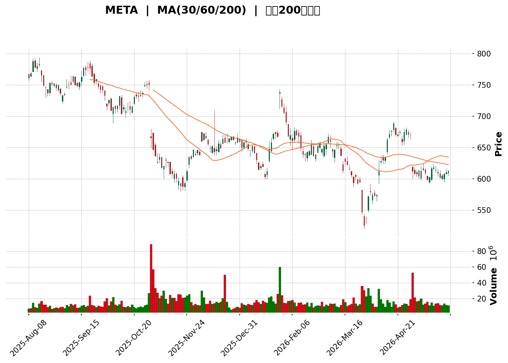
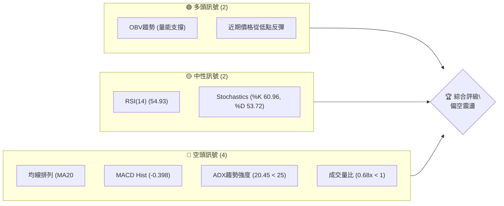
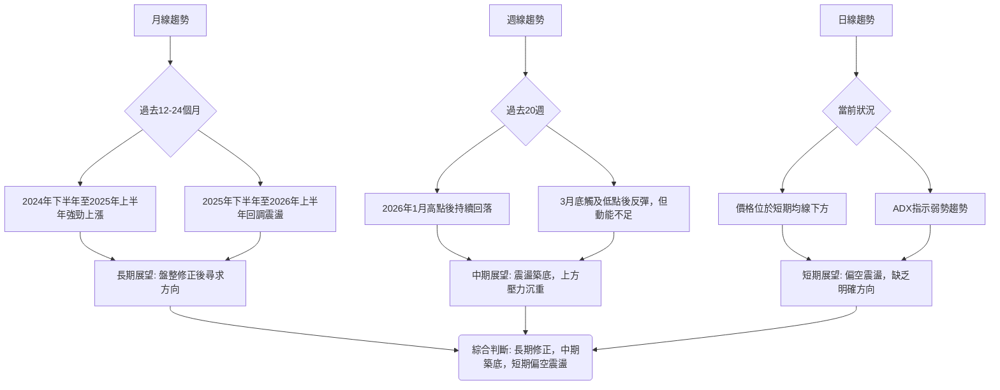

<details>
<summary>📊 靜態圖表 (點擊展開)</summary>

</details>

<html>
<head><meta charset="utf-8" /></head>
<body>
    <div>                        <script>window.PlotlyConfig = {MathJaxConfig: 'local'};</script>
        <script charset="utf-8" src="https://cdn.plot.ly/plotly-3.5.0.min.js" integrity="sha256-fHbNLP+GlIXN+efbQec78UkemUz3NJp7UmfGxC1tNxs=" crossorigin="anonymous"></script>                <div id="candlestick-chart" class="plotly-graph-div" style="height:500px; width:100%;"></div>            <script>                window.PLOTLYENV=window.PLOTLYENV || {};                                if (document.getElementById("candlestick-chart")) {                    Plotly.newPlot(                        "candlestick-chart",                        [{"close":{"dtype":"f8","bdata":"AAAAAPv7h0AAAADAmuCHQAAAACAxoYhAAAAAwARSiEAAAAAgYWKIQAAAACAfe4hAAAAAgJPsh0AAAAAAwW2HQAAAAKC+T4dAAAAAIPIKh0AAAAAALIiHQAAAAKBHfIdAAAAAQKqCh0AAAAAACE2HQAAAAADNaodAAAAAAMEHh0AAAADAGeuGQAAAAKCV+oZAAAAA4CpXh0AAAAAAf3WHQAAAAGBMdIdAAAAAYD\u002ffh0AAAACgvnGHQAAAAAAgaYdAAAAAoI6Oh0AAAAAgRNeHQAAAAOBlSYhAAAAAQDgviEAAAAAAYFOIQAAAACBzRIhAAAAAQA\u002ffh0AAAAAgHJGHQAAAAKAeu4dAAAAAwEZdh0AAAADAEDSHQAAAACBFMYdAAAAAIDvphkAAAABgI2GGQAAAAECwroZAAAAAIP0qhkAAAACAuFOGQAAAAIAdP4ZAAAAAwCFlhkAAAABASOKGQAAAAKD6AIZAAAAAQApUhkAAAAAAvBuGQAAAAMDQYoZAAAAAgAw3hkAAAACgyF2GQAAAAICU14ZAAAAAoF3ghkAAAADAe+GGQAAAACAy5oZAAAAAgAQJh0AAAADgh2yHQAAAAKB7cYdAAAAAwFFzh0AAAACg28qEQAAAAMAjOoRAAAAAgCnlg0AAAABALpKDQAAAAAAb14NAAAAAoEBPg0AAAAAgYGWDQAAAAECktYNAAAAAoEOQg0AAAAAA8v+CQAAAAED5BoNAAAAAIIoDg0AAAADgCciCQAAAAGCJpYJAAAAAwKxqgkAAAACgVGGCQAAAAAAQioJAAAAAIDYgg0AAAADgQtmDQAAAAKBqxINAAAAAAPI2hEAAAABAZv6DQAAAAAAoMIRAAAAAoEH0g0AAAACAZ6OEQAAAAGBdAoVAAAAAQH7NhEAAAADA536EQAAAACBbSIRAAAAAIPZchEAAAAAgPBmEQAAAACCmN4RAAAAAALSEhEAAAAAgjkeEQAAAAIANv4RAAAAA4KaRhEAAAAAgeaeEQAAAACD4woRAAAAA4NTXhEAAAADgx7WEQAAAACADkYRAAAAA4ArLhEAAAADgM5yEQAAAACDUToRAAAAAwM+RhEAAAABgcKCEQAAAAKAUQYRAAAAAAA8shEAAAADAAmSEQAAAAMBdC4RAAAAAwGa0g0AAAACg8jeDQAAAAMAmYoNAAAAAYMFdg0AAAABg09yCQAAAAEB8I4NAAAAAoJs4hEAAAABgkpGEQAAAAEBH\u002foRAAAAAgCcDhUAAAABgQ+GEQAAAAGBtDYdAAAAAwBhfhkAAAAAAcg6GQAAAAMDdmIVAAAAAgFfjhEAAAAAAGO2EQAAAAEAnp4RAAAAAACAlhUAAAABgK\u002fGEQAAAAKDx4IRAAAAAgAhKhEAAAAAgyPmDQAAAAODx9YNAAAAAoFsVhEAAAADg0yGEQAAAAADLeIRAAAAAoKPlg0AAAABgBvaDQAAAAOALaYRAAAAAgJWDhEAAAAAAAT2EQAAAAOABaIRAAAAAQCh0hEAAAAAgRdmEQAAAACAKoIRAAAAAgHcihEAAAACAsDaEQAAAAIAVbIRAAAAAAGZyhEAAAACgEu2DQAAAAOB6KYNAAAAAoJmbg0AAAACgR3WDQAAAAKBwPYNAAAAAoJn1gkAAAACgR42CQAAAAOB64IJAAAAAIFyHgkAAAADAHpeCQAAAAOBRHIFAAAAAgMJtgEAAAABACsOAQAAAAEAK4YFAAAAAANcZgkAAAAAgrvOBQAAAAAAp6IFAAAAAYGb4gUAAAAAgXCODQAAAAMAeo4NAAAAAQOGug0AAAACAPdSDQAAAAIDrs4RAAAAA4KP8hEAAAADA9SaFQAAAAGBmhIVAAAAAoEf3hEAAAABguOaEQAAAAIDCFYVAAAAAQDOZhEAAAACAPRiFQAAAAMD1NIVAAAAAYLj6hEAAAADA9eiEQAAAAKBHH4NAAAAAAAAGg0AAAACgRxODQAAAACCu54JAAAAAQAong0AAAADgekaDQAAAAEAKDYNAAAAAQOG2gkAAAAAAANiCQAAAAEAKRYNAAAAAoHBTg0AAAAAA1zGDQAAAACCuGYNAAAAAQOHUgkAAAADgeuiCQAAAAEAK+4JAAAAAgBQSg0AAAABguCKDQA=="},"high":{"dtype":"f8","bdata":"onXt\u002fsQAiEAKx1u0Lh2IQPy0qaN7vohAA6pnM8XMiEB13Xd+to+IQAngAz8T04hAy2gYIPAviEBSfQbW+uqHQGUVh9mJY4dAIgn9qQY+h0C2bPk\u002fA5mHQAWEV7nQqIdA1sEbjs+Ih0Cm9LiDEIOHQOp11tBIeodAobU+oB1Lh0B8Kas6NPKGQGJTCeUfFIdAEG2sOAO7h0B3VLmbZKGHQA7wwE+25YdA3wD5Pgnkh0C0DRlqP9+HQEMNw7+bmodAbta5H1yeh0DgpnnpDCKIQHs74sw7XIhANs38TKNriEC1j6iRdJeIQFp00KaTp4hAytnLSViDiEB88eelgQqIQDQVE7a2vodAWWtwPw2ch0CzA09nZXWHQIaqbSM2bIdAjKesANYth0B76+9TKIWGQAoXsmlwtIZAjfEOWzzOhkCywQb0dl2GQC36ZBdnaoZAjrKPb5ZzhkAAAABASOKGQCk\u002fusRW8IZA7aBJQOd1hkA9OcaH11KGQIQfUOmHlYZAn998vDqihkDxsN\u002fVuGqGQDSQW+db5IZA5BbLvSIKh0DcB\u002ftJ6BqHQIuXFv5cKYdA9v4roccfh0AeXDSk55OHQFRsXvMRqYdA9cI4oyOvh0A\u002fDzC0lT6FQFm9Z\u002f8aDoVA2L09UtWRhEDPX9YQWQWEQAPUlOZCCYRAAe6RKYHXg0BY6VbQumiDQO76zquEz4NAan4YJRKkg0C4QsSthJ+DQBjYAjfzRINA1xv1MT4lg0COrf9lWRWDQBrTEHY31YJA9rs4HrCSgkBfEzXLp+2CQJ3lTIT4qIJAkUnp5Fw9g0Dm0mLp49+DQHJ25WFa6oNAVtd7aL43hEBYMmqo8CGEQCQB711ONoRAfIiT\u002fiE+hECyCinuxBeFQM5dPQiCDIVAR3nTHKQchUBKhGHp9rqEQF31xGVWa4RAgncttnxxhEAfoubPgC6GQEAqzwGIY4RARdWzLsmvhEAChjCTUKWEQHH7kwvk74RAvr\u002flcmjzhEB8A0\u002fWBwiFQKpwkSRxy4RA411yBd7chECJIJe1BeOEQOxjVkR7nYRA6r3Vwyj9hEAYlcblcsOEQBxZ4sGSvoRAnUI5rcW\u002fhED27FYKm8eEQD8lk2ywlIRAZwWRDV80hEA5H1UwHnOEQCpWxLlIa4RAOovXycMNhECFXtSYTJ+DQJ8vipgWfYNAiRTTx1Wkg0Ae7\u002fMeBBeDQIaVeNLtTYNA\u002f71eFAqghECxJRTVW8+EQL0PTGKeFYVAvKJGoe0hhUBdEcdRzSiFQNbaAIjoOodABzwmbFnchkC6nq2pdoWGQMcjf8wXY4ZAc3oLHu2BhUDjyKoYVkeFQA7nMS1S+4RAp4OGtM1VhUDsiSm6ikCFQAjM6vaCNYVAHolrvl8bhUB0Ll9S+1aEQLFhefNmEIRA5hmrAZYjhECUXyBHFzWEQHo2N6dCtoRAGoyjbBmJhECLszsUfgSEQClhyKqQaoRAvHmRAnqjhEDSG91KE0eEQEyBlfIAm4RAZr8GUM+ThEBWa3VLjgGFQKE816AC8YRAE7NyrFBHhEAu\u002fYkekTmEQPsp6pXhnYRAgDZxCXOUhEDxr1oph2eEQDcJ1MkNpYNAAAAAAADWg0AAAABgZuSDQAAAAEAzdYNAAAAAAAAog0AAAAAgrt+CQAAAAMAeBYNAAAAAAADIgkAAAAAgXN2CQAAAAAAAOIJAAAAAwMz8gEAAAABgZtyAQAAAACCF7YFAAAAAYGaEgkAAAAAAABSCQAAAAOBRNoJAAAAAANf5gUAAAACgma+DQAAAAAAA7INAAAAA4KP0g0AAAAAAANiDQAAAAIAU0oRAAAAAAAA0hUAAAADgoyyFQAAAAAApnIVAAAAAQApbhUAAAACgmSGFQAAAAEAKM4VAAAAA4HrshEAAAAAgXEWFQAAAAAAAVIVAAAAAoHAxhUAAAAAAABKFQAAAAMDMZoNAAAAAQApXg0AAAAAAADCDQAAAAMDMMoNAAAAAoJlfg0AAAAAA14eDQAAAAAApRoNAAAAAoEfngkAAAAAAAN6CQAAAAEAzX4NAAAAAANd9g0AAAACgmWmDQAAAAGC4PINAAAAAoHAvg0AAAAAAAACDQAAAAMDMDINAAAAA4Ho2g0AAAACAwjODQA=="},"hovertemplate":"\u003cb\u003e%{x|%Y-%m-%d}\u003c\u002fb\u003e\u003cbr\u003e\u958b: $%{open:.2f}\u003cbr\u003e\u9ad8: $%{high:.2f}\u003cbr\u003e\u4f4e: $%{low:.2f}\u003cbr\u003e\u6536: $%{close:.2f}\u003cextra\u003e\u003c\u002fextra\u003e","low":{"dtype":"f8","bdata":"GwYw8Gumh0ChcRriBteHQLqmng\u002f2FIhA0IGPwEBDiEBm55aJmRWIQNJJNansV4hAya9Df0yWh0DRtEBs1VyHQOZ8vVpMyoZArbdPXiPbhkAPSb\u002fDWuWGQM3PGbb6YodAgVzoLoBRh0CjOOboyyiHQHYgI5mDGIdAAg01MwTthkCJcI+0T4CGQJNx924p4oZAbLZqlJRAh0C1Qs96RjqHQGIJ7VcQcodAlaHYQFF9h0C3yNJT7GmHQNsa+qPuVIdAMEFjhCMwh0DVgpD90nGHQHeCcFN12odAPfM6xx3kh0BQvbxPYhyIQJ9sWhka+4dAvn8AfIzZh0CkW4MOh26HQK9\u002frUwweodA6JupaHQ6h0Ax9oVi8wCHQFM0hKhTD4dAVaLv4LKohkA\u002fLnQKHSiGQNYZpheHZ4ZAcOGmLPQnhkCsk2hf24qFQJ77obCSBIZAAZEajAYVhkBQoZvsADqGQKCkiHOr+oVArO7E76oThkD6Ort+TNGFQA2aBl6aIoZAcPRRYaP1hUDrSDEuhweGQGmP0P\u002fRd4ZAphG5FES8hkDbnQ+zkZaGQP273PMB34ZAHLpcJ2\u002fPhkBL2uqbFlaHQNLoNL4zQodAKr+wcikqh0BlKSL8rEiEQGGqhuHvI4RApUNcO\u002fHYg0BbfsPat4eDQMQWcm3zi4NA81Pitr5Hg0DUtNPCkcGCQFu606yfSINAjPmby9hSg0Ar83i9CvaCQBS2aA\u002fyz4JA4MTOYqaRgkAwTHk6P5OCQOklYFBxNoJAUr\u002fpYzwigkBzE2L1ATOCQBvk6p0bJ4JAleYMug6lgkDoL4UHJEqDQCBuQWWatINAFqpx8oLTg0DKI4Oij+WDQCVqu4AJ6INAM7GNQuLjg0A64I5vlZeEQGtugbdFqoRAraVpKq2\u002fhEBnJMZg\u002fmGEQC6wYiObEoRAYE44Gtf9g0BuMouXWeyDQBv7K6868YNAX41U0DIVhEA41opGKEWEQEgGov8vf4RA1\u002fufiO+MhECrniLftICEQK5unLh+jYRADD5ufxGthECa2X3TCKaEQD72jUikboRAvnFx1TeKhEAuo4zDAZeEQDr7J5uYF4RAIJ49N5E5hEBX7ecmvVqEQDqlOCwRIoRAUxeJvWjZg0BwPiyDZhKEQOBl5otzBYRAtLv+Xod8g0DQjfU5WjKDQD6lruKiLYNA\u002flM8jGVcg0CnscrX5LuCQEGTq5CIvIJAVG5zrhyQg0BMjhSSMB+EQOpFI0XLpYRAdBj\u002fLrvAhEAKUZm7PcyEQM+0gAGGP4ZAd\u002foYOdZHhkDWYCxwWPeFQHavrQSVboVAnfkqzhzXhEDoqR0mh2eEQHR0u1WTL4RAR+WbTruRhECjCh9hvOmEQN4kEY5NhIRA36qUD9MlhECbeEOcN9CDQKUvvMAYooNAZwXGxuacg0CBMPD+ZuGDQIJ9QXLe8YNA7KeY0KXbg0BX+2wUiaODQA+lPby5DIRAHCYNqZE3hECMeBXAl+yDQGtLXGSoz4NAinJaM1nyg0BygRPg24iEQO3qdpkHToRAvCJT1Ibcg0CmvQJc85GDQKtD2QGPQ4RAdOIpY3E+hEDXwgh+1+KDQAmc4Gk6CINAAAAAwMx4g0AAAACgmW2DQAAAAEDhNINAAAAAgBTSgkAAAAAAAFqCQAAAAIAUuIJAAAAAAAB4gkAAAABAM4uCQAAAAMDM+oBAAAAAgBRCgEAAAADgUYSAQAAAAAApFoFAAAAAYI\u002fugUAAAACgmX2BQAAAAAAA4IFAAAAAgBSmgUAAAADgo36CQAAAAAAAeINAAAAA4KOCg0AAAABAM4ODQAAAAMD1+oNAAAAAgMLBhEAAAAAAAN6EQAAAAEAKGYVAAAAAAADghEAAAADgo9qEQAAAAAAA7oRAAAAAYGZohEAAAABguG6EQAAAAGC49oRAAAAAQArNhEAAAADger6EQAAAAAAAwIJAAAAAQOHwgkAAAAAAANaCQAAAAEDhwoJAAAAAwMywgkAAAADgUSyDQAAAAOB68IJAAAAA4KOwgkAAAADAzISCQAAAAKBHpYJAAAAAAAA4g0AAAADgegqDQAAAACCF3YJAAAAAYGbEgkAAAADgeq6CQAAAAOB6loJAAAAAoJn3gkAAAACgZuqCQA=="},"name":"\u50f9\u683c","open":{"dtype":"f8","bdata":"mi3eDbTHh0AtQGGsNAKIQFEMZ7OCGYhAA8O\u002fAV+qiECHBd+EdUCIQJwIno6AcohAGGCGFDEqiEAnem6zlOqHQPzgNjiMTodAcr5slLg3h0A6DDvK+wuHQFJVw1RpiIdAnQW0tVNoh0ADs02ETHSHQCRLI94NModAbTUQTUU8h0DFafrltaKGQHHX00k08oZAzS1LYodWh0D0zTBP2naHQGP\u002fuz7UkYdA1ZFtpbidh0DkxU3GstqHQFc8XgEOh4dAryAcK85Xh0Bmj7Wxj52HQBJYXHWf6YdAIwOzwkxRiEAE\u002f8uZXVeIQJOPYWuehIhA+o40TltkiEBmAK6Duf+HQOAwIs7hoYdA3qW4OYmBh0Bhhc5g+2WHQMT71S7CW4dArrno9hUoh0ApmRJPSIKGQBv48Aj9ioZAQxRWSkvDhkBU5wzNGQCGQFeqOUIsZIZAYzfwAhJChkDIBUVUpWiGQD+QrcSYzYZApQ3YUo4+hkDJ65c5yRSGQOlR7ezmXoZAkNr2wtBihkDqtswFMg+GQGbAqwvjf4ZAP1C2OFT2hkASxUyQ1uSGQJ9kOVvJ64ZAMypVfnr8hkDiJzo602OHQO4gTa78eodAAnu8F+uLh0DoZQY2Q+CEQMK1DQwSC4VA9WJH1Tx3hEBU\u002fr1J7peDQM5JbrIIuoNAGwHnbE7Wg0COYrVZrzuDQKiye2pKsINAI1OsmpyXg0BdYZZeppiDQGX7SABfIINAa4IjGkjGgkBzBN41LwCDQGkhB9PldIJA0kupP9SFgkDrIftN8NOCQJ4BaakjXIJAgNnvP8OtgkB33pwpqneDQE2RZIwA5YNAHfu11iTYg0D0L4xj2\u002fODQBonzuYjCoRAHYFXDawahECgmKyF+BaFQAqoJHYht4RAEL53kMfhhEDo8dhWS7WEQFeFkB3rRoRA\u002fRhyFroRhEBluzZ0uEWEQJjIwmsuKYRA+YfKqZgXhEBtXLerZHiEQIvU+V++g4RATM0EmczOhEDHa7ccrKiEQHYMR\u002fHhm4RAI4dry7SvhECHZL6E6NuEQMdx+rCTi4RA1pE3GAORhEA75+dVc8GEQCngaupNsYRAbaguAaBThEDwXuvWC5iEQDx62RKieIRALjC6sJ4qhECiJo1ZGieEQPPOmz\u002fGX4RAOovXycMNhEC0n2tjto+DQBMHiXCbT4NAYeVvHSt9g0BCzahJ4fqCQAevrYXE8YJA2uGlJn6mg0BPVI5ivyGEQDp7zep8xIRAVIBpiRoQhUDwAw5EYg+FQM7Zr6pkBodAWZCYegW3hkDGhrPG6E+GQH19umseFoZArhFlKyJ5hUCkOW1dGbiEQBz3g5Bdx4RAVqonuea0hED2WSySKSiFQM5dfjJjC4VAFuK9zizrhEBFhnSJYiSEQHs\u002fzqGf94NAVyzNABDKg0ADRTKhMPCDQCKFJ3ok+YNAFrfLttpfhEDgGZnFTsSDQFQbUc3XD4RA6C8xsfJPhEBPf3pJMheEQOaLXlvr5INAbeg2JeI9hEBcJf1dLYuEQM0BEf7oqoRAMViPLMQ6hEAsyddX5dGDQAoBvOQBaIRA7HTWbJlxhECmuJx7j0GEQMEHBqrZeoNAAAAAAADAg0AAAACA65+DQAAAAGC4QoNAAAAAQDMhg0AAAACAPdyCQAAAAOBR7oJAAAAAwMy4gkAAAACA67WCQAAAAIDrM4JAAAAAwMzggEAAAABACsOAQAAAAADXL4FAAAAAQAohgkAAAADgUbCBQAAAACCFDYJAAAAAANfjgUAAAAAAAPCCQAAAAIDCl4NAAAAAgMLTg0AAAAAAAKyDQAAAAIDCGYRAAAAAAADYhEAAAACA6x+FQAAAAMDMNIVAAAAAQOFKhUAAAAAAAPiEQAAAAEDhEoVAAAAAoJm9hEAAAABgj6KEQAAAAAAA+IRAAAAAgOsRhUAAAACgR+eEQAAAAGCPWoNAAAAAIIU1g0AAAAAghf+CQAAAAOB6KoNAAAAAYGbIgkAAAACAwjWDQAAAAKCZOYNAAAAAYI\u002fkgkAAAABgj5aCQAAAAOCjtoJAAAAAAABAg0AAAACA6y+DQAAAAEDhCINAAAAAIFwHg0AAAACAFMaCQAAAAAAAwIJAAAAAQAr\u002fgkAAAADAzAyDQA=="},"x":["2025-08-08T00:00:00-04:00","2025-08-11T00:00:00-04:00","2025-08-12T00:00:00-04:00","2025-08-13T00:00:00-04:00","2025-08-14T00:00:00-04:00","2025-08-15T00:00:00-04:00","2025-08-18T00:00:00-04:00","2025-08-19T00:00:00-04:00","2025-08-20T00:00:00-04:00","2025-08-21T00:00:00-04:00","2025-08-22T00:00:00-04:00","2025-08-25T00:00:00-04:00","2025-08-26T00:00:00-04:00","2025-08-27T00:00:00-04:00","2025-08-28T00:00:00-04:00","2025-08-29T00:00:00-04:00","2025-09-02T00:00:00-04:00","2025-09-03T00:00:00-04:00","2025-09-04T00:00:00-04:00","2025-09-05T00:00:00-04:00","2025-09-08T00:00:00-04:00","2025-09-09T00:00:00-04:00","2025-09-10T00:00:00-04:00","2025-09-11T00:00:00-04:00","2025-09-12T00:00:00-04:00","2025-09-15T00:00:00-04:00","2025-09-16T00:00:00-04:00","2025-09-17T00:00:00-04:00","2025-09-18T00:00:00-04:00","2025-09-19T00:00:00-04:00","2025-09-22T00:00:00-04:00","2025-09-23T00:00:00-04:00","2025-09-24T00:00:00-04:00","2025-09-25T00:00:00-04:00","2025-09-26T00:00:00-04:00","2025-09-29T00:00:00-04:00","2025-09-30T00:00:00-04:00","2025-10-01T00:00:00-04:00","2025-10-02T00:00:00-04:00","2025-10-03T00:00:00-04:00","2025-10-06T00:00:00-04:00","2025-10-07T00:00:00-04:00","2025-10-08T00:00:00-04:00","2025-10-09T00:00:00-04:00","2025-10-10T00:00:00-04:00","2025-10-13T00:00:00-04:00","2025-10-14T00:00:00-04:00","2025-10-15T00:00:00-04:00","2025-10-16T00:00:00-04:00","2025-10-17T00:00:00-04:00","2025-10-20T00:00:00-04:00","2025-10-21T00:00:00-04:00","2025-10-22T00:00:00-04:00","2025-10-23T00:00:00-04:00","2025-10-24T00:00:00-04:00","2025-10-27T00:00:00-04:00","2025-10-28T00:00:00-04:00","2025-10-29T00:00:00-04:00","2025-10-30T00:00:00-04:00","2025-10-31T00:00:00-04:00","2025-11-03T00:00:00-05:00","2025-11-04T00:00:00-05:00","2025-11-05T00:00:00-05:00","2025-11-06T00:00:00-05:00","2025-11-07T00:00:00-05:00","2025-11-10T00:00:00-05:00","2025-11-11T00:00:00-05:00","2025-11-12T00:00:00-05:00","2025-11-13T00:00:00-05:00","2025-11-14T00:00:00-05:00","2025-11-17T00:00:00-05:00","2025-11-18T00:00:00-05:00","2025-11-19T00:00:00-05:00","2025-11-20T00:00:00-05:00","2025-11-21T00:00:00-05:00","2025-11-24T00:00:00-05:00","2025-11-25T00:00:00-05:00","2025-11-26T00:00:00-05:00","2025-11-28T00:00:00-05:00","2025-12-01T00:00:00-05:00","2025-12-02T00:00:00-05:00","2025-12-03T00:00:00-05:00","2025-12-04T00:00:00-05:00","2025-12-05T00:00:00-05:00","2025-12-08T00:00:00-05:00","2025-12-09T00:00:00-05:00","2025-12-10T00:00:00-05:00","2025-12-11T00:00:00-05:00","2025-12-12T00:00:00-05:00","2025-12-15T00:00:00-05:00","2025-12-16T00:00:00-05:00","2025-12-17T00:00:00-05:00","2025-12-18T00:00:00-05:00","2025-12-19T00:00:00-05:00","2025-12-22T00:00:00-05:00","2025-12-23T00:00:00-05:00","2025-12-24T00:00:00-05:00","2025-12-26T00:00:00-05:00","2025-12-29T00:00:00-05:00","2025-12-30T00:00:00-05:00","2025-12-31T00:00:00-05:00","2026-01-02T00:00:00-05:00","2026-01-05T00:00:00-05:00","2026-01-06T00:00:00-05:00","2026-01-07T00:00:00-05:00","2026-01-08T00:00:00-05:00","2026-01-09T00:00:00-05:00","2026-01-12T00:00:00-05:00","2026-01-13T00:00:00-05:00","2026-01-14T00:00:00-05:00","2026-01-15T00:00:00-05:00","2026-01-16T00:00:00-05:00","2026-01-20T00:00:00-05:00","2026-01-21T00:00:00-05:00","2026-01-22T00:00:00-05:00","2026-01-23T00:00:00-05:00","2026-01-26T00:00:00-05:00","2026-01-27T00:00:00-05:00","2026-01-28T00:00:00-05:00","2026-01-29T00:00:00-05:00","2026-01-30T00:00:00-05:00","2026-02-02T00:00:00-05:00","2026-02-03T00:00:00-05:00","2026-02-04T00:00:00-05:00","2026-02-05T00:00:00-05:00","2026-02-06T00:00:00-05:00","2026-02-09T00:00:00-05:00","2026-02-10T00:00:00-05:00","2026-02-11T00:00:00-05:00","2026-02-12T00:00:00-05:00","2026-02-13T00:00:00-05:00","2026-02-17T00:00:00-05:00","2026-02-18T00:00:00-05:00","2026-02-19T00:00:00-05:00","2026-02-20T00:00:00-05:00","2026-02-23T00:00:00-05:00","2026-02-24T00:00:00-05:00","2026-02-25T00:00:00-05:00","2026-02-26T00:00:00-05:00","2026-02-27T00:00:00-05:00","2026-03-02T00:00:00-05:00","2026-03-03T00:00:00-05:00","2026-03-04T00:00:00-05:00","2026-03-05T00:00:00-05:00","2026-03-06T00:00:00-05:00","2026-03-09T00:00:00-04:00","2026-03-10T00:00:00-04:00","2026-03-11T00:00:00-04:00","2026-03-12T00:00:00-04:00","2026-03-13T00:00:00-04:00","2026-03-16T00:00:00-04:00","2026-03-17T00:00:00-04:00","2026-03-18T00:00:00-04:00","2026-03-19T00:00:00-04:00","2026-03-20T00:00:00-04:00","2026-03-23T00:00:00-04:00","2026-03-24T00:00:00-04:00","2026-03-25T00:00:00-04:00","2026-03-26T00:00:00-04:00","2026-03-27T00:00:00-04:00","2026-03-30T00:00:00-04:00","2026-03-31T00:00:00-04:00","2026-04-01T00:00:00-04:00","2026-04-02T00:00:00-04:00","2026-04-06T00:00:00-04:00","2026-04-07T00:00:00-04:00","2026-04-08T00:00:00-04:00","2026-04-09T00:00:00-04:00","2026-04-10T00:00:00-04:00","2026-04-13T00:00:00-04:00","2026-04-14T00:00:00-04:00","2026-04-15T00:00:00-04:00","2026-04-16T00:00:00-04:00","2026-04-17T00:00:00-04:00","2026-04-20T00:00:00-04:00","2026-04-21T00:00:00-04:00","2026-04-22T00:00:00-04:00","2026-04-23T00:00:00-04:00","2026-04-24T00:00:00-04:00","2026-04-27T00:00:00-04:00","2026-04-28T00:00:00-04:00","2026-04-29T00:00:00-04:00","2026-04-30T00:00:00-04:00","2026-05-01T00:00:00-04:00","2026-05-04T00:00:00-04:00","2026-05-05T00:00:00-04:00","2026-05-06T00:00:00-04:00","2026-05-07T00:00:00-04:00","2026-05-08T00:00:00-04:00","2026-05-11T00:00:00-04:00","2026-05-12T00:00:00-04:00","2026-05-13T00:00:00-04:00","2026-05-14T00:00:00-04:00","2026-05-15T00:00:00-04:00","2026-05-18T00:00:00-04:00","2026-05-19T00:00:00-04:00","2026-05-20T00:00:00-04:00","2026-05-21T00:00:00-04:00","2026-05-22T00:00:00-04:00","2026-05-26T00:00:00-04:00"],"type":"candlestick"},{"hovertemplate":"MA30: $%{y:.2f}\u003cextra\u003e\u003c\u002fextra\u003e","line":{"color":"#2196F3","dash":"dash","width":2},"mode":"lines","name":"MA30","x":["2025-08-08T00:00:00-04:00","2025-08-11T00:00:00-04:00","2025-08-12T00:00:00-04:00","2025-08-13T00:00:00-04:00","2025-08-14T00:00:00-04:00","2025-08-15T00:00:00-04:00","2025-08-18T00:00:00-04:00","2025-08-19T00:00:00-04:00","2025-08-20T00:00:00-04:00","2025-08-21T00:00:00-04:00","2025-08-22T00:00:00-04:00","2025-08-25T00:00:00-04:00","2025-08-26T00:00:00-04:00","2025-08-27T00:00:00-04:00","2025-08-28T00:00:00-04:00","2025-08-29T00:00:00-04:00","2025-09-02T00:00:00-04:00","2025-09-03T00:00:00-04:00","2025-09-04T00:00:00-04:00","2025-09-05T00:00:00-04:00","2025-09-08T00:00:00-04:00","2025-09-09T00:00:00-04:00","2025-09-10T00:00:00-04:00","2025-09-11T00:00:00-04:00","2025-09-12T00:00:00-04:00","2025-09-15T00:00:00-04:00","2025-09-16T00:00:00-04:00","2025-09-17T00:00:00-04:00","2025-09-18T00:00:00-04:00","2025-09-19T00:00:00-04:00","2025-09-22T00:00:00-04:00","2025-09-23T00:00:00-04:00","2025-09-24T00:00:00-04:00","2025-09-25T00:00:00-04:00","2025-09-26T00:00:00-04:00","2025-09-29T00:00:00-04:00","2025-09-30T00:00:00-04:00","2025-10-01T00:00:00-04:00","2025-10-02T00:00:00-04:00","2025-10-03T00:00:00-04:00","2025-10-06T00:00:00-04:00","2025-10-07T00:00:00-04:00","2025-10-08T00:00:00-04:00","2025-10-09T00:00:00-04:00","2025-10-10T00:00:00-04:00","2025-10-13T00:00:00-04:00","2025-10-14T00:00:00-04:00","2025-10-15T00:00:00-04:00","2025-10-16T00:00:00-04:00","2025-10-17T00:00:00-04:00","2025-10-20T00:00:00-04:00","2025-10-21T00:00:00-04:00","2025-10-22T00:00:00-04:00","2025-10-23T00:00:00-04:00","2025-10-24T00:00:00-04:00","2025-10-27T00:00:00-04:00","2025-10-28T00:00:00-04:00","2025-10-29T00:00:00-04:00","2025-10-30T00:00:00-04:00","2025-10-31T00:00:00-04:00","2025-11-03T00:00:00-05:00","2025-11-04T00:00:00-05:00","2025-11-05T00:00:00-05:00","2025-11-06T00:00:00-05:00","2025-11-07T00:00:00-05:00","2025-11-10T00:00:00-05:00","2025-11-11T00:00:00-05:00","2025-11-12T00:00:00-05:00","2025-11-13T00:00:00-05:00","2025-11-14T00:00:00-05:00","2025-11-17T00:00:00-05:00","2025-11-18T00:00:00-05:00","2025-11-19T00:00:00-05:00","2025-11-20T00:00:00-05:00","2025-11-21T00:00:00-05:00","2025-11-24T00:00:00-05:00","2025-11-25T00:00:00-05:00","2025-11-26T00:00:00-05:00","2025-11-28T00:00:00-05:00","2025-12-01T00:00:00-05:00","2025-12-02T00:00:00-05:00","2025-12-03T00:00:00-05:00","2025-12-04T00:00:00-05:00","2025-12-05T00:00:00-05:00","2025-12-08T00:00:00-05:00","2025-12-09T00:00:00-05:00","2025-12-10T00:00:00-05:00","2025-12-11T00:00:00-05:00","2025-12-12T00:00:00-05:00","2025-12-15T00:00:00-05:00","2025-12-16T00:00:00-05:00","2025-12-17T00:00:00-05:00","2025-12-18T00:00:00-05:00","2025-12-19T00:00:00-05:00","2025-12-22T00:00:00-05:00","2025-12-23T00:00:00-05:00","2025-12-24T00:00:00-05:00","2025-12-26T00:00:00-05:00","2025-12-29T00:00:00-05:00","2025-12-30T00:00:00-05:00","2025-12-31T00:00:00-05:00","2026-01-02T00:00:00-05:00","2026-01-05T00:00:00-05:00","2026-01-06T00:00:00-05:00","2026-01-07T00:00:00-05:00","2026-01-08T00:00:00-05:00","2026-01-09T00:00:00-05:00","2026-01-12T00:00:00-05:00","2026-01-13T00:00:00-05:00","2026-01-14T00:00:00-05:00","2026-01-15T00:00:00-05:00","2026-01-16T00:00:00-05:00","2026-01-20T00:00:00-05:00","2026-01-21T00:00:00-05:00","2026-01-22T00:00:00-05:00","2026-01-23T00:00:00-05:00","2026-01-26T00:00:00-05:00","2026-01-27T00:00:00-05:00","2026-01-28T00:00:00-05:00","2026-01-29T00:00:00-05:00","2026-01-30T00:00:00-05:00","2026-02-02T00:00:00-05:00","2026-02-03T00:00:00-05:00","2026-02-04T00:00:00-05:00","2026-02-05T00:00:00-05:00","2026-02-06T00:00:00-05:00","2026-02-09T00:00:00-05:00","2026-02-10T00:00:00-05:00","2026-02-11T00:00:00-05:00","2026-02-12T00:00:00-05:00","2026-02-13T00:00:00-05:00","2026-02-17T00:00:00-05:00","2026-02-18T00:00:00-05:00","2026-02-19T00:00:00-05:00","2026-02-20T00:00:00-05:00","2026-02-23T00:00:00-05:00","2026-02-24T00:00:00-05:00","2026-02-25T00:00:00-05:00","2026-02-26T00:00:00-05:00","2026-02-27T00:00:00-05:00","2026-03-02T00:00:00-05:00","2026-03-03T00:00:00-05:00","2026-03-04T00:00:00-05:00","2026-03-05T00:00:00-05:00","2026-03-06T00:00:00-05:00","2026-03-09T00:00:00-04:00","2026-03-10T00:00:00-04:00","2026-03-11T00:00:00-04:00","2026-03-12T00:00:00-04:00","2026-03-13T00:00:00-04:00","2026-03-16T00:00:00-04:00","2026-03-17T00:00:00-04:00","2026-03-18T00:00:00-04:00","2026-03-19T00:00:00-04:00","2026-03-20T00:00:00-04:00","2026-03-23T00:00:00-04:00","2026-03-24T00:00:00-04:00","2026-03-25T00:00:00-04:00","2026-03-26T00:00:00-04:00","2026-03-27T00:00:00-04:00","2026-03-30T00:00:00-04:00","2026-03-31T00:00:00-04:00","2026-04-01T00:00:00-04:00","2026-04-02T00:00:00-04:00","2026-04-06T00:00:00-04:00","2026-04-07T00:00:00-04:00","2026-04-08T00:00:00-04:00","2026-04-09T00:00:00-04:00","2026-04-10T00:00:00-04:00","2026-04-13T00:00:00-04:00","2026-04-14T00:00:00-04:00","2026-04-15T00:00:00-04:00","2026-04-16T00:00:00-04:00","2026-04-17T00:00:00-04:00","2026-04-20T00:00:00-04:00","2026-04-21T00:00:00-04:00","2026-04-22T00:00:00-04:00","2026-04-23T00:00:00-04:00","2026-04-24T00:00:00-04:00","2026-04-27T00:00:00-04:00","2026-04-28T00:00:00-04:00","2026-04-29T00:00:00-04:00","2026-04-30T00:00:00-04:00","2026-05-01T00:00:00-04:00","2026-05-04T00:00:00-04:00","2026-05-05T00:00:00-04:00","2026-05-06T00:00:00-04:00","2026-05-07T00:00:00-04:00","2026-05-08T00:00:00-04:00","2026-05-11T00:00:00-04:00","2026-05-12T00:00:00-04:00","2026-05-13T00:00:00-04:00","2026-05-14T00:00:00-04:00","2026-05-15T00:00:00-04:00","2026-05-18T00:00:00-04:00","2026-05-19T00:00:00-04:00","2026-05-20T00:00:00-04:00","2026-05-21T00:00:00-04:00","2026-05-22T00:00:00-04:00","2026-05-26T00:00:00-04:00"],"y":{"dtype":"f8","bdata":"AAAAAAAA+H8AAAAAAAD4fwAAAAAAAPh\u002fAAAAAAAA+H8AAAAAAAD4fwAAAAAAAPh\u002fAAAAAAAA+H8AAAAAAAD4fwAAAAAAAPh\u002fAAAAAAAA+H8AAAAAAAD4fwAAAAAAAPh\u002fAAAAAAAA+H8AAAAAAAD4fwAAAAAAAPh\u002fAAAAAAAA+H8AAAAAAAD4fwAAAAAAAPh\u002fAAAAAAAA+H8AAAAAAAD4fwAAAAAAAPh\u002fAAAAAAAA+H8AAAAAAAD4fwAAAAAAAPh\u002fAAAAAAAA+H8AAAAAAAD4fwAAAAAAAPh\u002fAAAAAAAA+H8AAAAAAAD4f+\u002fu7p4zs4dARERE1Dyyh0CamZl5lq+HQBERETHrp4dAmpmZucKfh0Crqqr6rpWHQO\u002fu7j6wiodAq6qqKguCh0Crqqr6FnmHQCIiIqK4c4dAiYiIiEFsh0Crqqpq+WGHQCIiIvJmV4dAVVVVZeJNh0CJiIh4U0qHQM3MzOxDPodA3t3dXUY4h0B3d3fXXDGHQO\u002fu7r5NLIdAIiIiIrMih0ARERFBYBmHQM3MzOwmFIdA7+7u7qcLh0B3d3fn2AaHQERERKR7AodAq6qqGgj+hkC8u7tLefqGQCIiItJG84ZAd3d3ZwPthkC8u7vb3M6GQO\u002fu7r5irIZAAAAAsHSKhkARERGxW2iGQO\u002fu7l4oR4ZAERERkY4khkBmZmY2EQSGQGZmZqZY5oVA3t3d3cfJhUAzMzPj8KyFQO\u002fu7h7AjYVAMzMz49VyhUBVVVVVlFSFQCIiIjLcNYVAzczMXOkThUB3d3fXeu2EQM3MzHzqz4RA3t3dnZa0hEAAAABQTqGEQDMzM5P1ioRAAAAAoON5hEDNzMycpGWEQM3MzNz+ToRA7+7u\u002fg42hEAAAAAw7CKEQO\u002fu7n7LEoRAzczMfL7\u002fg0Dv7u6uweaDQCIiIiLJy4NA7+7uvnCxg0B3d3cHhauDQGZmZsZvq4NAERERMcGwg0C8u7vrzLaDQERERDSIvoNAiYiIWEfJg0CamZnpA9SDQM3MzCz+3INAq6qqaunng0DNzMycgfaDQDMzMxOkA4RAiYiICNMShECJiIgIbiKEQBERETGbMIRAmpmZOfpChEARERHRJVaEQKuqqhrIZIRAvLu7u7VthECrqqq6VXKEQKuqqiqzdIRAERERMVlwhEDNzMy8u2mEQERERNTdYoRA3t3djdldhEC8u7t7sk6EQLy7uwu8PoRA7+7ujsU5hECJiIjYZDqEQAAAAEB1QIRA3t3dbf9FhEBmZmZWqkyEQFVVVaXbZIRA3t3dzat0hECJiIiI1YOEQFVVVTUYi4RAvLu7S9GNhEBERERkI5CEQHd3dwc2j4RAmpmZmcmRhEAiIiJixJOEQHd3d3duloRAZmZmliGShECJiIiYt4yEQO\u002fu7h7BiYRA3t3dHZuFhEAzMzOzYoGEQM3MzBw+g4RAMzMzM+WAhEB3d3enOn2EQO\u002fu7g5agIRAREREBEKHhEAiIiKy9Y+EQDMzMzOwmIRAVVVV5fehhEDv7u6e6rKEQERERASav4RAREREFN2+hEDNzMyM1buEQGZmZgb2toRAZmZmxiKyhEBEREQE\u002f6mEQERERETMiIRAZmZm9jZxhEAiIiLiCluEQFVVVaXtRoRAIiIiYng2hEBERES0NSKEQDMzM9MNE4RA7+7ufrr8g0AiIiICqeiDQM3MzIyByINAiYiISJCng0De3d2NI4yDQJqZmRlgeoNAd3d3R3Vpg0C8u7tr2laDQHd3dyf3QINA3t3dLYYwg0ARERGBgCmDQImIiIjnIoNAVVVVddAbg0CamZl5UhiDQDMzM0PaGoNAq6qq6mYfg0Dv7u7e\u002fSGDQLy7u4uaKYNAzczMjLIwg0De3d2tkDaDQERERJQ4PINAAAAAsIM9g0BVVVWVfEeDQM3MzJzvWINAZmZm1qNkg0AiIiKCB3GDQERERCQGcINAZmZmFpJwg0De3d2NCXWDQO\u002fu7v5GdYNAmpmZmZl6g0AREREBcoCDQO\u002fu7q4AkYNAVVVVtYGkg0AiIiKiRbaDQAAAAIAjwoNA3t3djZfMg0BERESEMteDQO\u002fu7p5h4YNAzczMDLvog0C8u7ubxOaDQDMzM1Mq4YNAzczMTPDbg0BmZmZ2BdaDQA=="},"type":"scatter"},{"hovertemplate":"MA60: $%{y:.2f}\u003cextra\u003e\u003c\u002fextra\u003e","line":{"color":"#9C27B0","dash":"dash","width":2},"mode":"lines","name":"MA60","x":["2025-08-08T00:00:00-04:00","2025-08-11T00:00:00-04:00","2025-08-12T00:00:00-04:00","2025-08-13T00:00:00-04:00","2025-08-14T00:00:00-04:00","2025-08-15T00:00:00-04:00","2025-08-18T00:00:00-04:00","2025-08-19T00:00:00-04:00","2025-08-20T00:00:00-04:00","2025-08-21T00:00:00-04:00","2025-08-22T00:00:00-04:00","2025-08-25T00:00:00-04:00","2025-08-26T00:00:00-04:00","2025-08-27T00:00:00-04:00","2025-08-28T00:00:00-04:00","2025-08-29T00:00:00-04:00","2025-09-02T00:00:00-04:00","2025-09-03T00:00:00-04:00","2025-09-04T00:00:00-04:00","2025-09-05T00:00:00-04:00","2025-09-08T00:00:00-04:00","2025-09-09T00:00:00-04:00","2025-09-10T00:00:00-04:00","2025-09-11T00:00:00-04:00","2025-09-12T00:00:00-04:00","2025-09-15T00:00:00-04:00","2025-09-16T00:00:00-04:00","2025-09-17T00:00:00-04:00","2025-09-18T00:00:00-04:00","2025-09-19T00:00:00-04:00","2025-09-22T00:00:00-04:00","2025-09-23T00:00:00-04:00","2025-09-24T00:00:00-04:00","2025-09-25T00:00:00-04:00","2025-09-26T00:00:00-04:00","2025-09-29T00:00:00-04:00","2025-09-30T00:00:00-04:00","2025-10-01T00:00:00-04:00","2025-10-02T00:00:00-04:00","2025-10-03T00:00:00-04:00","2025-10-06T00:00:00-04:00","2025-10-07T00:00:00-04:00","2025-10-08T00:00:00-04:00","2025-10-09T00:00:00-04:00","2025-10-10T00:00:00-04:00","2025-10-13T00:00:00-04:00","2025-10-14T00:00:00-04:00","2025-10-15T00:00:00-04:00","2025-10-16T00:00:00-04:00","2025-10-17T00:00:00-04:00","2025-10-20T00:00:00-04:00","2025-10-21T00:00:00-04:00","2025-10-22T00:00:00-04:00","2025-10-23T00:00:00-04:00","2025-10-24T00:00:00-04:00","2025-10-27T00:00:00-04:00","2025-10-28T00:00:00-04:00","2025-10-29T00:00:00-04:00","2025-10-30T00:00:00-04:00","2025-10-31T00:00:00-04:00","2025-11-03T00:00:00-05:00","2025-11-04T00:00:00-05:00","2025-11-05T00:00:00-05:00","2025-11-06T00:00:00-05:00","2025-11-07T00:00:00-05:00","2025-11-10T00:00:00-05:00","2025-11-11T00:00:00-05:00","2025-11-12T00:00:00-05:00","2025-11-13T00:00:00-05:00","2025-11-14T00:00:00-05:00","2025-11-17T00:00:00-05:00","2025-11-18T00:00:00-05:00","2025-11-19T00:00:00-05:00","2025-11-20T00:00:00-05:00","2025-11-21T00:00:00-05:00","2025-11-24T00:00:00-05:00","2025-11-25T00:00:00-05:00","2025-11-26T00:00:00-05:00","2025-11-28T00:00:00-05:00","2025-12-01T00:00:00-05:00","2025-12-02T00:00:00-05:00","2025-12-03T00:00:00-05:00","2025-12-04T00:00:00-05:00","2025-12-05T00:00:00-05:00","2025-12-08T00:00:00-05:00","2025-12-09T00:00:00-05:00","2025-12-10T00:00:00-05:00","2025-12-11T00:00:00-05:00","2025-12-12T00:00:00-05:00","2025-12-15T00:00:00-05:00","2025-12-16T00:00:00-05:00","2025-12-17T00:00:00-05:00","2025-12-18T00:00:00-05:00","2025-12-19T00:00:00-05:00","2025-12-22T00:00:00-05:00","2025-12-23T00:00:00-05:00","2025-12-24T00:00:00-05:00","2025-12-26T00:00:00-05:00","2025-12-29T00:00:00-05:00","2025-12-30T00:00:00-05:00","2025-12-31T00:00:00-05:00","2026-01-02T00:00:00-05:00","2026-01-05T00:00:00-05:00","2026-01-06T00:00:00-05:00","2026-01-07T00:00:00-05:00","2026-01-08T00:00:00-05:00","2026-01-09T00:00:00-05:00","2026-01-12T00:00:00-05:00","2026-01-13T00:00:00-05:00","2026-01-14T00:00:00-05:00","2026-01-15T00:00:00-05:00","2026-01-16T00:00:00-05:00","2026-01-20T00:00:00-05:00","2026-01-21T00:00:00-05:00","2026-01-22T00:00:00-05:00","2026-01-23T00:00:00-05:00","2026-01-26T00:00:00-05:00","2026-01-27T00:00:00-05:00","2026-01-28T00:00:00-05:00","2026-01-29T00:00:00-05:00","2026-01-30T00:00:00-05:00","2026-02-02T00:00:00-05:00","2026-02-03T00:00:00-05:00","2026-02-04T00:00:00-05:00","2026-02-05T00:00:00-05:00","2026-02-06T00:00:00-05:00","2026-02-09T00:00:00-05:00","2026-02-10T00:00:00-05:00","2026-02-11T00:00:00-05:00","2026-02-12T00:00:00-05:00","2026-02-13T00:00:00-05:00","2026-02-17T00:00:00-05:00","2026-02-18T00:00:00-05:00","2026-02-19T00:00:00-05:00","2026-02-20T00:00:00-05:00","2026-02-23T00:00:00-05:00","2026-02-24T00:00:00-05:00","2026-02-25T00:00:00-05:00","2026-02-26T00:00:00-05:00","2026-02-27T00:00:00-05:00","2026-03-02T00:00:00-05:00","2026-03-03T00:00:00-05:00","2026-03-04T00:00:00-05:00","2026-03-05T00:00:00-05:00","2026-03-06T00:00:00-05:00","2026-03-09T00:00:00-04:00","2026-03-10T00:00:00-04:00","2026-03-11T00:00:00-04:00","2026-03-12T00:00:00-04:00","2026-03-13T00:00:00-04:00","2026-03-16T00:00:00-04:00","2026-03-17T00:00:00-04:00","2026-03-18T00:00:00-04:00","2026-03-19T00:00:00-04:00","2026-03-20T00:00:00-04:00","2026-03-23T00:00:00-04:00","2026-03-24T00:00:00-04:00","2026-03-25T00:00:00-04:00","2026-03-26T00:00:00-04:00","2026-03-27T00:00:00-04:00","2026-03-30T00:00:00-04:00","2026-03-31T00:00:00-04:00","2026-04-01T00:00:00-04:00","2026-04-02T00:00:00-04:00","2026-04-06T00:00:00-04:00","2026-04-07T00:00:00-04:00","2026-04-08T00:00:00-04:00","2026-04-09T00:00:00-04:00","2026-04-10T00:00:00-04:00","2026-04-13T00:00:00-04:00","2026-04-14T00:00:00-04:00","2026-04-15T00:00:00-04:00","2026-04-16T00:00:00-04:00","2026-04-17T00:00:00-04:00","2026-04-20T00:00:00-04:00","2026-04-21T00:00:00-04:00","2026-04-22T00:00:00-04:00","2026-04-23T00:00:00-04:00","2026-04-24T00:00:00-04:00","2026-04-27T00:00:00-04:00","2026-04-28T00:00:00-04:00","2026-04-29T00:00:00-04:00","2026-04-30T00:00:00-04:00","2026-05-01T00:00:00-04:00","2026-05-04T00:00:00-04:00","2026-05-05T00:00:00-04:00","2026-05-06T00:00:00-04:00","2026-05-07T00:00:00-04:00","2026-05-08T00:00:00-04:00","2026-05-11T00:00:00-04:00","2026-05-12T00:00:00-04:00","2026-05-13T00:00:00-04:00","2026-05-14T00:00:00-04:00","2026-05-15T00:00:00-04:00","2026-05-18T00:00:00-04:00","2026-05-19T00:00:00-04:00","2026-05-20T00:00:00-04:00","2026-05-21T00:00:00-04:00","2026-05-22T00:00:00-04:00","2026-05-26T00:00:00-04:00"],"y":{"dtype":"f8","bdata":"AAAAAAAA+H8AAAAAAAD4fwAAAAAAAPh\u002fAAAAAAAA+H8AAAAAAAD4fwAAAAAAAPh\u002fAAAAAAAA+H8AAAAAAAD4fwAAAAAAAPh\u002fAAAAAAAA+H8AAAAAAAD4fwAAAAAAAPh\u002fAAAAAAAA+H8AAAAAAAD4fwAAAAAAAPh\u002fAAAAAAAA+H8AAAAAAAD4fwAAAAAAAPh\u002fAAAAAAAA+H8AAAAAAAD4fwAAAAAAAPh\u002fAAAAAAAA+H8AAAAAAAD4fwAAAAAAAPh\u002fAAAAAAAA+H8AAAAAAAD4fwAAAAAAAPh\u002fAAAAAAAA+H8AAAAAAAD4fwAAAAAAAPh\u002fAAAAAAAA+H8AAAAAAAD4fwAAAAAAAPh\u002fAAAAAAAA+H8AAAAAAAD4fwAAAAAAAPh\u002fAAAAAAAA+H8AAAAAAAD4fwAAAAAAAPh\u002fAAAAAAAA+H8AAAAAAAD4fwAAAAAAAPh\u002fAAAAAAAA+H8AAAAAAAD4fwAAAAAAAPh\u002fAAAAAAAA+H8AAAAAAAD4fwAAAAAAAPh\u002fAAAAAAAA+H8AAAAAAAD4fwAAAAAAAPh\u002fAAAAAAAA+H8AAAAAAAD4fwAAAAAAAPh\u002fAAAAAAAA+H8AAAAAAAD4fwAAAAAAAPh\u002fAAAAAAAA+H8AAAAAAAD4f+\u002fu7i7LL4dAIiIiwlgeh0BVVVUV+QuHQAAAAMiJ94ZAVVVVpSjihkCJiIgY4MyGQKuqqnKEuIZAREREhOmlhkDv7u7uA5OGQImIiGC8gIZA3t3dtYtvhkAAAADgRluGQCIiIpKhRoZAERER4eUwhkAAAAAo5xuGQM3MzDQXB4ZA3t3dfW72hUC8u7uTVemFQBEREamh24VAERERYUvOhUDv7u5ugr+FQM3MzOSSsYVA7+7udtughUC8u7uL4pSFQJqZmZGjioVAvLu7S+N+hUBVVVV9nXCFQCIiIvqHX4VAMzMzEzpPhUCamZnxMD2FQKuqqkLpK4VAiYiI8JodhUBmZmZOlA+FQJqZmUnYAoVAzczM9Or2hEAAAACQCuyEQJqZmWmr4YRAREREpNjYhEAAAABAudGEQBERERmyyIRA3t3dddTChEDv7u4ugbuEQJqZmbE7s4RAMzMzy3GrhEBERERU0KGEQLy7u0tZmoRAzczMLCaRhEBVVVUF0omEQO\u002fu7l7Uf4RAiYiIaB51hEDNzMwssGeEQImIiFjuWIRAZmZmRvRJhEDe3d1VzziEQFVVVcXDKIRA3t3dBcIchEC8u7tDkxCEQBERETEfBoRAZmZmFrj7g0Dv7u6uF\u002fyDQN7d3bUlCIRAd3d3f7YShEAiIiI6UR2EQM3MzDTQJIRAIiIiUowrhEDv7u6mEzKEQCIiIhoaNoRAIiIigtk8hEB3d3f\u002fIkWEQFVVVUUJTYRAd3d3T3pShECJiIjQkleEQAAAACguXYRAvLu7q0pkhEAiIiJCxGuEQLy7uxsDdIRAd3d3d013hEARERExyHeEQM3MzJyGeoRAq6qqms17hEB3d3e32HyEQLy7uwPHfYRAmpmZueh\u002fhEBVVVWNzoCEQAAAAAgrf4RAmpmZUVF8hECrqqoyHXuEQDMzM6O1e4RAIiIiGhF8hEBVVVWtVHuEQM3MzPTTdoRAIiIiYvFyhEBVVVU1cG+EQFVVVe0CaYRA7+7u1iRihEBERESMLFmEQFVVVe0hUYRAREREDEJHhEAiIiKyNj6EQCIiIgJ4L4RAd3d379gchEAzMzOTbQyEQERERJwQAoRAq6qqMoj3g0B3d3ePHuyDQCIiIqIa4oNAiYiIsLXYg0BERESUXdODQLy7u8ug0YNAzczMPInRg0De3d0VJNSDQDMzMzvF2YNAAAAAaK\u002fgg0Dv7u4+dOqDQAAAAEia9INAiYiI0Mf3g0BVVVUdM\u002fmDQFVVVU2X+YNAMzMzO9P3g0DNzMzMvfiDQImIiPDd8INAZmZmZu3qg0AiIiIyCeaDQM3MzOR524NAREREPIXTg0ARERGhn8uDQBEREWkqxINAREREDKq7g0CamZmBjbSDQN7d3R3BrINA7+7u\u002fgimg0AAAACYNKGDQM3MzMxBnoNAq6qqagabg0AAAAB4BpeDQDMzM2MskYNAVVVVnaCMg0BmZmaOIoiDQN7d3e0IgoNAERERYeB7g0AAAAD4K3eDQA=="},"type":"scatter"},{"hovertemplate":"MA200: $%{y:.2f}\u003cextra\u003e\u003c\u002fextra\u003e","line":{"color":"#FF6F00","dash":"solid","width":2},"mode":"lines","name":"MA200","x":["2025-08-08T00:00:00-04:00","2025-08-11T00:00:00-04:00","2025-08-12T00:00:00-04:00","2025-08-13T00:00:00-04:00","2025-08-14T00:00:00-04:00","2025-08-15T00:00:00-04:00","2025-08-18T00:00:00-04:00","2025-08-19T00:00:00-04:00","2025-08-20T00:00:00-04:00","2025-08-21T00:00:00-04:00","2025-08-22T00:00:00-04:00","2025-08-25T00:00:00-04:00","2025-08-26T00:00:00-04:00","2025-08-27T00:00:00-04:00","2025-08-28T00:00:00-04:00","2025-08-29T00:00:00-04:00","2025-09-02T00:00:00-04:00","2025-09-03T00:00:00-04:00","2025-09-04T00:00:00-04:00","2025-09-05T00:00:00-04:00","2025-09-08T00:00:00-04:00","2025-09-09T00:00:00-04:00","2025-09-10T00:00:00-04:00","2025-09-11T00:00:00-04:00","2025-09-12T00:00:00-04:00","2025-09-15T00:00:00-04:00","2025-09-16T00:00:00-04:00","2025-09-17T00:00:00-04:00","2025-09-18T00:00:00-04:00","2025-09-19T00:00:00-04:00","2025-09-22T00:00:00-04:00","2025-09-23T00:00:00-04:00","2025-09-24T00:00:00-04:00","2025-09-25T00:00:00-04:00","2025-09-26T00:00:00-04:00","2025-09-29T00:00:00-04:00","2025-09-30T00:00:00-04:00","2025-10-01T00:00:00-04:00","2025-10-02T00:00:00-04:00","2025-10-03T00:00:00-04:00","2025-10-06T00:00:00-04:00","2025-10-07T00:00:00-04:00","2025-10-08T00:00:00-04:00","2025-10-09T00:00:00-04:00","2025-10-10T00:00:00-04:00","2025-10-13T00:00:00-04:00","2025-10-14T00:00:00-04:00","2025-10-15T00:00:00-04:00","2025-10-16T00:00:00-04:00","2025-10-17T00:00:00-04:00","2025-10-20T00:00:00-04:00","2025-10-21T00:00:00-04:00","2025-10-22T00:00:00-04:00","2025-10-23T00:00:00-04:00","2025-10-24T00:00:00-04:00","2025-10-27T00:00:00-04:00","2025-10-28T00:00:00-04:00","2025-10-29T00:00:00-04:00","2025-10-30T00:00:00-04:00","2025-10-31T00:00:00-04:00","2025-11-03T00:00:00-05:00","2025-11-04T00:00:00-05:00","2025-11-05T00:00:00-05:00","2025-11-06T00:00:00-05:00","2025-11-07T00:00:00-05:00","2025-11-10T00:00:00-05:00","2025-11-11T00:00:00-05:00","2025-11-12T00:00:00-05:00","2025-11-13T00:00:00-05:00","2025-11-14T00:00:00-05:00","2025-11-17T00:00:00-05:00","2025-11-18T00:00:00-05:00","2025-11-19T00:00:00-05:00","2025-11-20T00:00:00-05:00","2025-11-21T00:00:00-05:00","2025-11-24T00:00:00-05:00","2025-11-25T00:00:00-05:00","2025-11-26T00:00:00-05:00","2025-11-28T00:00:00-05:00","2025-12-01T00:00:00-05:00","2025-12-02T00:00:00-05:00","2025-12-03T00:00:00-05:00","2025-12-04T00:00:00-05:00","2025-12-05T00:00:00-05:00","2025-12-08T00:00:00-05:00","2025-12-09T00:00:00-05:00","2025-12-10T00:00:00-05:00","2025-12-11T00:00:00-05:00","2025-12-12T00:00:00-05:00","2025-12-15T00:00:00-05:00","2025-12-16T00:00:00-05:00","2025-12-17T00:00:00-05:00","2025-12-18T00:00:00-05:00","2025-12-19T00:00:00-05:00","2025-12-22T00:00:00-05:00","2025-12-23T00:00:00-05:00","2025-12-24T00:00:00-05:00","2025-12-26T00:00:00-05:00","2025-12-29T00:00:00-05:00","2025-12-30T00:00:00-05:00","2025-12-31T00:00:00-05:00","2026-01-02T00:00:00-05:00","2026-01-05T00:00:00-05:00","2026-01-06T00:00:00-05:00","2026-01-07T00:00:00-05:00","2026-01-08T00:00:00-05:00","2026-01-09T00:00:00-05:00","2026-01-12T00:00:00-05:00","2026-01-13T00:00:00-05:00","2026-01-14T00:00:00-05:00","2026-01-15T00:00:00-05:00","2026-01-16T00:00:00-05:00","2026-01-20T00:00:00-05:00","2026-01-21T00:00:00-05:00","2026-01-22T00:00:00-05:00","2026-01-23T00:00:00-05:00","2026-01-26T00:00:00-05:00","2026-01-27T00:00:00-05:00","2026-01-28T00:00:00-05:00","2026-01-29T00:00:00-05:00","2026-01-30T00:00:00-05:00","2026-02-02T00:00:00-05:00","2026-02-03T00:00:00-05:00","2026-02-04T00:00:00-05:00","2026-02-05T00:00:00-05:00","2026-02-06T00:00:00-05:00","2026-02-09T00:00:00-05:00","2026-02-10T00:00:00-05:00","2026-02-11T00:00:00-05:00","2026-02-12T00:00:00-05:00","2026-02-13T00:00:00-05:00","2026-02-17T00:00:00-05:00","2026-02-18T00:00:00-05:00","2026-02-19T00:00:00-05:00","2026-02-20T00:00:00-05:00","2026-02-23T00:00:00-05:00","2026-02-24T00:00:00-05:00","2026-02-25T00:00:00-05:00","2026-02-26T00:00:00-05:00","2026-02-27T00:00:00-05:00","2026-03-02T00:00:00-05:00","2026-03-03T00:00:00-05:00","2026-03-04T00:00:00-05:00","2026-03-05T00:00:00-05:00","2026-03-06T00:00:00-05:00","2026-03-09T00:00:00-04:00","2026-03-10T00:00:00-04:00","2026-03-11T00:00:00-04:00","2026-03-12T00:00:00-04:00","2026-03-13T00:00:00-04:00","2026-03-16T00:00:00-04:00","2026-03-17T00:00:00-04:00","2026-03-18T00:00:00-04:00","2026-03-19T00:00:00-04:00","2026-03-20T00:00:00-04:00","2026-03-23T00:00:00-04:00","2026-03-24T00:00:00-04:00","2026-03-25T00:00:00-04:00","2026-03-26T00:00:00-04:00","2026-03-27T00:00:00-04:00","2026-03-30T00:00:00-04:00","2026-03-31T00:00:00-04:00","2026-04-01T00:00:00-04:00","2026-04-02T00:00:00-04:00","2026-04-06T00:00:00-04:00","2026-04-07T00:00:00-04:00","2026-04-08T00:00:00-04:00","2026-04-09T00:00:00-04:00","2026-04-10T00:00:00-04:00","2026-04-13T00:00:00-04:00","2026-04-14T00:00:00-04:00","2026-04-15T00:00:00-04:00","2026-04-16T00:00:00-04:00","2026-04-17T00:00:00-04:00","2026-04-20T00:00:00-04:00","2026-04-21T00:00:00-04:00","2026-04-22T00:00:00-04:00","2026-04-23T00:00:00-04:00","2026-04-24T00:00:00-04:00","2026-04-27T00:00:00-04:00","2026-04-28T00:00:00-04:00","2026-04-29T00:00:00-04:00","2026-04-30T00:00:00-04:00","2026-05-01T00:00:00-04:00","2026-05-04T00:00:00-04:00","2026-05-05T00:00:00-04:00","2026-05-06T00:00:00-04:00","2026-05-07T00:00:00-04:00","2026-05-08T00:00:00-04:00","2026-05-11T00:00:00-04:00","2026-05-12T00:00:00-04:00","2026-05-13T00:00:00-04:00","2026-05-14T00:00:00-04:00","2026-05-15T00:00:00-04:00","2026-05-18T00:00:00-04:00","2026-05-19T00:00:00-04:00","2026-05-20T00:00:00-04:00","2026-05-21T00:00:00-04:00","2026-05-22T00:00:00-04:00","2026-05-26T00:00:00-04:00"],"y":{"dtype":"f8","bdata":"AAAAAAAA+H8AAAAAAAD4fwAAAAAAAPh\u002fAAAAAAAA+H8AAAAAAAD4fwAAAAAAAPh\u002fAAAAAAAA+H8AAAAAAAD4fwAAAAAAAPh\u002fAAAAAAAA+H8AAAAAAAD4fwAAAAAAAPh\u002fAAAAAAAA+H8AAAAAAAD4fwAAAAAAAPh\u002fAAAAAAAA+H8AAAAAAAD4fwAAAAAAAPh\u002fAAAAAAAA+H8AAAAAAAD4fwAAAAAAAPh\u002fAAAAAAAA+H8AAAAAAAD4fwAAAAAAAPh\u002fAAAAAAAA+H8AAAAAAAD4fwAAAAAAAPh\u002fAAAAAAAA+H8AAAAAAAD4fwAAAAAAAPh\u002fAAAAAAAA+H8AAAAAAAD4fwAAAAAAAPh\u002fAAAAAAAA+H8AAAAAAAD4fwAAAAAAAPh\u002fAAAAAAAA+H8AAAAAAAD4fwAAAAAAAPh\u002fAAAAAAAA+H8AAAAAAAD4fwAAAAAAAPh\u002fAAAAAAAA+H8AAAAAAAD4fwAAAAAAAPh\u002fAAAAAAAA+H8AAAAAAAD4fwAAAAAAAPh\u002fAAAAAAAA+H8AAAAAAAD4fwAAAAAAAPh\u002fAAAAAAAA+H8AAAAAAAD4fwAAAAAAAPh\u002fAAAAAAAA+H8AAAAAAAD4fwAAAAAAAPh\u002fAAAAAAAA+H8AAAAAAAD4fwAAAAAAAPh\u002fAAAAAAAA+H8AAAAAAAD4fwAAAAAAAPh\u002fAAAAAAAA+H8AAAAAAAD4fwAAAAAAAPh\u002fAAAAAAAA+H8AAAAAAAD4fwAAAAAAAPh\u002fAAAAAAAA+H8AAAAAAAD4fwAAAAAAAPh\u002fAAAAAAAA+H8AAAAAAAD4fwAAAAAAAPh\u002fAAAAAAAA+H8AAAAAAAD4fwAAAAAAAPh\u002fAAAAAAAA+H8AAAAAAAD4fwAAAAAAAPh\u002fAAAAAAAA+H8AAAAAAAD4fwAAAAAAAPh\u002fAAAAAAAA+H8AAAAAAAD4fwAAAAAAAPh\u002fAAAAAAAA+H8AAAAAAAD4fwAAAAAAAPh\u002fAAAAAAAA+H8AAAAAAAD4fwAAAAAAAPh\u002fAAAAAAAA+H8AAAAAAAD4fwAAAAAAAPh\u002fAAAAAAAA+H8AAAAAAAD4fwAAAAAAAPh\u002fAAAAAAAA+H8AAAAAAAD4fwAAAAAAAPh\u002fAAAAAAAA+H8AAAAAAAD4fwAAAAAAAPh\u002fAAAAAAAA+H8AAAAAAAD4fwAAAAAAAPh\u002fAAAAAAAA+H8AAAAAAAD4fwAAAAAAAPh\u002fAAAAAAAA+H8AAAAAAAD4fwAAAAAAAPh\u002fAAAAAAAA+H8AAAAAAAD4fwAAAAAAAPh\u002fAAAAAAAA+H8AAAAAAAD4fwAAAAAAAPh\u002fAAAAAAAA+H8AAAAAAAD4fwAAAAAAAPh\u002fAAAAAAAA+H8AAAAAAAD4fwAAAAAAAPh\u002fAAAAAAAA+H8AAAAAAAD4fwAAAAAAAPh\u002fAAAAAAAA+H8AAAAAAAD4fwAAAAAAAPh\u002fAAAAAAAA+H8AAAAAAAD4fwAAAAAAAPh\u002fAAAAAAAA+H8AAAAAAAD4fwAAAAAAAPh\u002fAAAAAAAA+H8AAAAAAAD4fwAAAAAAAPh\u002fAAAAAAAA+H8AAAAAAAD4fwAAAAAAAPh\u002fAAAAAAAA+H8AAAAAAAD4fwAAAAAAAPh\u002fAAAAAAAA+H8AAAAAAAD4fwAAAAAAAPh\u002fAAAAAAAA+H8AAAAAAAD4fwAAAAAAAPh\u002fAAAAAAAA+H8AAAAAAAD4fwAAAAAAAPh\u002fAAAAAAAA+H8AAAAAAAD4fwAAAAAAAPh\u002fAAAAAAAA+H8AAAAAAAD4fwAAAAAAAPh\u002fAAAAAAAA+H8AAAAAAAD4fwAAAAAAAPh\u002fAAAAAAAA+H8AAAAAAAD4fwAAAAAAAPh\u002fAAAAAAAA+H8AAAAAAAD4fwAAAAAAAPh\u002fAAAAAAAA+H8AAAAAAAD4fwAAAAAAAPh\u002fAAAAAAAA+H8AAAAAAAD4fwAAAAAAAPh\u002fAAAAAAAA+H8AAAAAAAD4fwAAAAAAAPh\u002fAAAAAAAA+H8AAAAAAAD4fwAAAAAAAPh\u002fAAAAAAAA+H8AAAAAAAD4fwAAAAAAAPh\u002fAAAAAAAA+H8AAAAAAAD4fwAAAAAAAPh\u002fAAAAAAAA+H8AAAAAAAD4fwAAAAAAAPh\u002fAAAAAAAA+H8AAAAAAAD4fwAAAAAAAPh\u002fAAAAAAAA+H8AAAAAAAD4fwAAAAAAAPh\u002fAAAAAAAA+H9mZmZyRt+EQA=="},"type":"scatter"}],                        {"template":{"data":{"barpolar":[{"marker":{"line":{"color":"rgb(17,17,17)","width":0.5},"pattern":{"fillmode":"overlay","size":10,"solidity":0.2}},"type":"barpolar"}],"bar":[{"error_x":{"color":"#f2f5fa"},"error_y":{"color":"#f2f5fa"},"marker":{"line":{"color":"rgb(17,17,17)","width":0.5},"pattern":{"fillmode":"overlay","size":10,"solidity":0.2}},"type":"bar"}],"carpet":[{"aaxis":{"endlinecolor":"#A2B1C6","gridcolor":"#506784","linecolor":"#506784","minorgridcolor":"#506784","startlinecolor":"#A2B1C6"},"baxis":{"endlinecolor":"#A2B1C6","gridcolor":"#506784","linecolor":"#506784","minorgridcolor":"#506784","startlinecolor":"#A2B1C6"},"type":"carpet"}],"choropleth":[{"colorbar":{"outlinewidth":0,"ticks":""},"type":"choropleth"}],"contourcarpet":[{"colorbar":{"outlinewidth":0,"ticks":""},"type":"contourcarpet"}],"contour":[{"colorbar":{"outlinewidth":0,"ticks":""},"colorscale":[[0.0,"#0d0887"],[0.1111111111111111,"#46039f"],[0.2222222222222222,"#7201a8"],[0.3333333333333333,"#9c179e"],[0.4444444444444444,"#bd3786"],[0.5555555555555556,"#d8576b"],[0.6666666666666666,"#ed7953"],[0.7777777777777778,"#fb9f3a"],[0.8888888888888888,"#fdca26"],[1.0,"#f0f921"]],"type":"contour"}],"heatmap":[{"colorbar":{"outlinewidth":0,"ticks":""},"colorscale":[[0.0,"#0d0887"],[0.1111111111111111,"#46039f"],[0.2222222222222222,"#7201a8"],[0.3333333333333333,"#9c179e"],[0.4444444444444444,"#bd3786"],[0.5555555555555556,"#d8576b"],[0.6666666666666666,"#ed7953"],[0.7777777777777778,"#fb9f3a"],[0.8888888888888888,"#fdca26"],[1.0,"#f0f921"]],"type":"heatmap"}],"histogram2dcontour":[{"colorbar":{"outlinewidth":0,"ticks":""},"colorscale":[[0.0,"#0d0887"],[0.1111111111111111,"#46039f"],[0.2222222222222222,"#7201a8"],[0.3333333333333333,"#9c179e"],[0.4444444444444444,"#bd3786"],[0.5555555555555556,"#d8576b"],[0.6666666666666666,"#ed7953"],[0.7777777777777778,"#fb9f3a"],[0.8888888888888888,"#fdca26"],[1.0,"#f0f921"]],"type":"histogram2dcontour"}],"histogram2d":[{"colorbar":{"outlinewidth":0,"ticks":""},"colorscale":[[0.0,"#0d0887"],[0.1111111111111111,"#46039f"],[0.2222222222222222,"#7201a8"],[0.3333333333333333,"#9c179e"],[0.4444444444444444,"#bd3786"],[0.5555555555555556,"#d8576b"],[0.6666666666666666,"#ed7953"],[0.7777777777777778,"#fb9f3a"],[0.8888888888888888,"#fdca26"],[1.0,"#f0f921"]],"type":"histogram2d"}],"histogram":[{"marker":{"pattern":{"fillmode":"overlay","size":10,"solidity":0.2}},"type":"histogram"}],"mesh3d":[{"colorbar":{"outlinewidth":0,"ticks":""},"type":"mesh3d"}],"parcoords":[{"line":{"colorbar":{"outlinewidth":0,"ticks":""}},"type":"parcoords"}],"pie":[{"automargin":true,"type":"pie"}],"scatter3d":[{"line":{"colorbar":{"outlinewidth":0,"ticks":""}},"marker":{"colorbar":{"outlinewidth":0,"ticks":""}},"type":"scatter3d"}],"scattercarpet":[{"marker":{"colorbar":{"outlinewidth":0,"ticks":""}},"type":"scattercarpet"}],"scattergeo":[{"marker":{"colorbar":{"outlinewidth":0,"ticks":""}},"type":"scattergeo"}],"scattergl":[{"marker":{"line":{"color":"#283442"}},"type":"scattergl"}],"scattermapbox":[{"marker":{"colorbar":{"outlinewidth":0,"ticks":""}},"type":"scattermapbox"}],"scattermap":[{"marker":{"colorbar":{"outlinewidth":0,"ticks":""}},"type":"scattermap"}],"scatterpolargl":[{"marker":{"colorbar":{"outlinewidth":0,"ticks":""}},"type":"scatterpolargl"}],"scatterpolar":[{"marker":{"colorbar":{"outlinewidth":0,"ticks":""}},"type":"scatterpolar"}],"scatter":[{"marker":{"line":{"color":"#283442"}},"type":"scatter"}],"scatterternary":[{"marker":{"colorbar":{"outlinewidth":0,"ticks":""}},"type":"scatterternary"}],"surface":[{"colorbar":{"outlinewidth":0,"ticks":""},"colorscale":[[0.0,"#0d0887"],[0.1111111111111111,"#46039f"],[0.2222222222222222,"#7201a8"],[0.3333333333333333,"#9c179e"],[0.4444444444444444,"#bd3786"],[0.5555555555555556,"#d8576b"],[0.6666666666666666,"#ed7953"],[0.7777777777777778,"#fb9f3a"],[0.8888888888888888,"#fdca26"],[1.0,"#f0f921"]],"type":"surface"}],"table":[{"cells":{"fill":{"color":"#506784"},"line":{"color":"rgb(17,17,17)"}},"header":{"fill":{"color":"#2a3f5f"},"line":{"color":"rgb(17,17,17)"}},"type":"table"}]},"layout":{"annotationdefaults":{"arrowcolor":"#f2f5fa","arrowhead":0,"arrowwidth":1},"autotypenumbers":"strict","coloraxis":{"colorbar":{"outlinewidth":0,"ticks":""}},"colorscale":{"diverging":[[0,"#8e0152"],[0.1,"#c51b7d"],[0.2,"#de77ae"],[0.3,"#f1b6da"],[0.4,"#fde0ef"],[0.5,"#f7f7f7"],[0.6,"#e6f5d0"],[0.7,"#b8e186"],[0.8,"#7fbc41"],[0.9,"#4d9221"],[1,"#276419"]],"sequential":[[0.0,"#0d0887"],[0.1111111111111111,"#46039f"],[0.2222222222222222,"#7201a8"],[0.3333333333333333,"#9c179e"],[0.4444444444444444,"#bd3786"],[0.5555555555555556,"#d8576b"],[0.6666666666666666,"#ed7953"],[0.7777777777777778,"#fb9f3a"],[0.8888888888888888,"#fdca26"],[1.0,"#f0f921"]],"sequentialminus":[[0.0,"#0d0887"],[0.1111111111111111,"#46039f"],[0.2222222222222222,"#7201a8"],[0.3333333333333333,"#9c179e"],[0.4444444444444444,"#bd3786"],[0.5555555555555556,"#d8576b"],[0.6666666666666666,"#ed7953"],[0.7777777777777778,"#fb9f3a"],[0.8888888888888888,"#fdca26"],[1.0,"#f0f921"]]},"colorway":["#636efa","#EF553B","#00cc96","#ab63fa","#FFA15A","#19d3f3","#FF6692","#B6E880","#FF97FF","#FECB52"],"font":{"color":"#f2f5fa"},"geo":{"bgcolor":"rgb(17,17,17)","lakecolor":"rgb(17,17,17)","landcolor":"rgb(17,17,17)","showlakes":true,"showland":true,"subunitcolor":"#506784"},"hoverlabel":{"align":"left"},"hovermode":"closest","mapbox":{"style":"dark"},"paper_bgcolor":"rgb(17,17,17)","plot_bgcolor":"rgb(17,17,17)","polar":{"angularaxis":{"gridcolor":"#506784","linecolor":"#506784","ticks":""},"bgcolor":"rgb(17,17,17)","radialaxis":{"gridcolor":"#506784","linecolor":"#506784","ticks":""}},"scene":{"xaxis":{"backgroundcolor":"rgb(17,17,17)","gridcolor":"#506784","gridwidth":2,"linecolor":"#506784","showbackground":true,"ticks":"","zerolinecolor":"#C8D4E3"},"yaxis":{"backgroundcolor":"rgb(17,17,17)","gridcolor":"#506784","gridwidth":2,"linecolor":"#506784","showbackground":true,"ticks":"","zerolinecolor":"#C8D4E3"},"zaxis":{"backgroundcolor":"rgb(17,17,17)","gridcolor":"#506784","gridwidth":2,"linecolor":"#506784","showbackground":true,"ticks":"","zerolinecolor":"#C8D4E3"}},"shapedefaults":{"line":{"color":"#f2f5fa"}},"sliderdefaults":{"bgcolor":"#C8D4E3","bordercolor":"rgb(17,17,17)","borderwidth":1,"tickwidth":0},"ternary":{"aaxis":{"gridcolor":"#506784","linecolor":"#506784","ticks":""},"baxis":{"gridcolor":"#506784","linecolor":"#506784","ticks":""},"bgcolor":"rgb(17,17,17)","caxis":{"gridcolor":"#506784","linecolor":"#506784","ticks":""}},"title":{"x":0.05},"updatemenudefaults":{"bgcolor":"#506784","borderwidth":0},"xaxis":{"automargin":true,"gridcolor":"#283442","linecolor":"#506784","ticks":"","title":{"standoff":15},"zerolinecolor":"#283442","zerolinewidth":2},"yaxis":{"automargin":true,"gridcolor":"#283442","linecolor":"#506784","ticks":"","title":{"standoff":15},"zerolinecolor":"#283442","zerolinewidth":2}}},"xaxis":{"rangeslider":{"visible":false},"title":{"text":"\u65e5\u671f"}},"font":{"size":11},"title":{"text":"META  |  MA(30\u002f60\u002f200)  |  \u6700\u8fd1200\u4ea4\u6613\u65e5"},"yaxis":{"title":{"text":"\u80a1\u50f9 (USD)"}},"hovermode":"x unified","height":500},                        {"responsive": true}                    )                };            </script>        </div>
</body>
</html>

# META 技術分析報告

> **報告日期**：2026-05-27 ｜ **語言**：繁體中文 ｜ **數據來源**：提供數據 ｜ **當前價格**：$612.34

---

## 目錄

| 章節 | 內容 |
|------|------|
| [1. 技術面概覽](#1-技術面概覽) | 訊號儀表板、核心指標、評分卡 |
| [2. 趨勢分析](#2-趨勢分析) | 多時框趨勢、長中短期走勢 |
| [3. 圖表形態分析](#3-圖表形態分析) | 形態識別、K線組合、目標價 |
| [4. 支撐與阻力](#4-支撐與阻力) | 關鍵價位、斐波那契回調 |
| [5. 技術指標深度解讀](#5-技術指標深度解讀) | MA/RSI/MACD/布林/成交量 |
| [6. 動能與波動率](#6-動能與波動率) | 動能評估、ATR、Beta |
| [7. 多時框架總結](#7-多時框架總結) | 時框架評分矩陣 |
| [8. 交易策略建議](#8-交易策略建議) | 多空策略、風險報酬比 |
| [9. 風險提示與監控](#9-風險提示與監控) | 監控指標、風險場景 |
| [📋 報告總結](#📋-報告總結) | 綜合結論與策略摘要 |

---

## 1. 技術面概覽

本章節將對 Meta Platforms, Inc. (META) 的當前技術面狀況進行快速而全面的概覽，透過多種視覺化工具和指標速覽，為後續的深度分析奠定基礎。

### 🎯 技術訊號儀表板

以下儀表板匯總了 META 目前來自各主要技術指標的多空訊號。🟢 代表多頭訊號，🟡 代表中性，🔴 代表空頭訊號。


**儀表板解讀**：從儀表板來看，META 目前的技術訊號呈現出偏空的震盪格局。多頭訊號主要來自於OBV趨勢顯示的潛在買盤積累以及近期價格從低點的反彈。然而，空頭訊號則更為明顯，包括均線系統的空頭排列、MACD柱狀圖的負值、ADX 指示的弱勢趨勢，以及顯著低於平均的成交量。RSI 和 Stochastics 處於中性區域，未能提供明確的方向性指引。這暗示著市場缺乏明確的趨勢方向，但下行壓力可能較上行壓力更為顯著。

### 📊 核心指標速覽表

下表列出了 META 當前最關鍵的技術指標數值及其初步解讀。

| 指標類別 | 指標名稱 | 當前數值 | 訊號 | 解讀 | 評分 (1-10) |
|:---------|:---------|:---------|:-----|:-----|:-----------:|
| **價格** | 當前價格 | $612.34 | 🟡 | 位於52週區間的33.6%，處於中低位 | 5 |
| **均線** | MA20 | $615.79 | 🔴 | 價格位於MA20下方，短期趨勢偏弱 | 3 |
| **均線** | MA50 | $617.79 | 🔴 | 價格位於MA50下方，中期趨勢偏弱 | 3 |
| **均線** | MA200 | $667.91 | 🔴 | 價格位於MA200下方，長期趨勢偏弱 | 2 |
| **動能** | RSI(14) | 54.93 | 🟡 | 處於中性區域，無超買超賣訊號 | 5 |
| **動能** | MACD | -6.549 (MACD線) / -6.152 (訊號線) / -0.398 (柱狀圖) | 🔴 | MACD線在訊號線下方，柱狀圖為負，顯示空頭動能 | 3 |
| **趨勢** | ADX(14) | 20.45 | 🟡 | 趨勢強度較弱，市場處於盤整或弱勢趨勢 | 4 |
| **趨勢** | +DI/-DI | 19.95 / 29.45 | 🔴 | -DI > +DI，空頭力量佔據主導 | 3 |
| **波動** | ATR(14) | $12.75 (2.08%) | 🟡 | 每日波動中等，適合區間交易 | 6 |
| **成交量** | 量比 (當前/20日均) | 0.68x | 🔴 | 成交量萎縮，市場參與度低，不利上漲 | 2 |
| **量能** | OBV趨勢 | OBV > MA | 🟢 | 累計成交量仍顯示有資金流入，具潛在支撐 | 7 |

### 🏆 技術評分卡

本評分卡綜合了各維度分析結果，以視覺化的方式呈現 META 的技術面健康度。分數範圍為 0-100，進度條越滿表示表現越強。

╔══════════════════════════════════════════════════════════════╗
║                    技術評分卡 — META (2026-05-27)               ║
╠══════════════════════════════════════════════════════════════╣
║ 趨勢強度      ████░░░░░░░░░░░░░░░░  20/100  🔴 (ADX弱，均線空頭)  ║
║ 動能指標      ████░░░░░░░░░░░░░░░░  40/100  🔴 (MACD空頭，RSI中性)║
║ 支撐穩定度    ██████████░░░░░░░░░░  50/100  🟡 (近期有反彈，但下方支撐未經考驗)║
║ 成交量配合    ███░░░░░░░░░░░░░░░░░  30/100  🔴 (成交量萎縮，OBV與現量矛盾)║
║ 形態完整度    ██████░░░░░░░░░░░░░░  60/100  🟡 (初步回升形態，但未確認)║
║ 均線排列      ██░░░░░░░░░░░░░░░░░░  10/100  🔴 (典型空頭排列)  ║
╠══════════════════════════════════════════════════════════════╣
║ 綜合評分      ████░░░░░░░░░░░░░░░░  38/100  🔴 偏空震盪       ║
╚══════════════════════════════════════════════════════════════╝

**評分卡總結**：META 的技術評分卡顯示整體技術面偏弱，綜合評分僅為 38/100。趨勢強度和均線排列呈現明顯的空頭態勢，動能指標也偏向空頭。儘管 OBV 顯示潛在買盤，但低迷的成交量和偏弱的趨勢強度使得任何上漲都可能缺乏持續性。支撐穩定度和形態完整度略好，表明市場可能在尋找底部或構築震盪區間，但目前尚未形成強勁的反轉訊號。投資者應保持謹慎。

---

## 2. 趨勢分析

本章節將透過多時框架的視角，深入剖析 META 的價格走勢，從長期月線到中期週線，再結合 ADX 指標，全面評估其趨勢方向與強度。

### 🌐 多時框趨勢分析

我們將從月線、週線和日線三個時間框架來分析 META 的趨勢，以獲得更全面的市場視角。


**多時框趨勢解讀**：
*   **長期趨勢 (月線)**：從過去24個月的數據來看，META 在2024年下半年至2025年7月經歷了一波強勁的上漲行情，從約 $460 上漲至 $771.63。隨後進入了高位震盪和回調階段，2025年下半年至2026年上半年股價在 $600-$700 區間內波動，並在2026年3月觸及 $572.13 的相對低點。目前股價 $612.34 仍遠低於2025年高點，顯示長期上漲動能已大幅減弱，進入修正或盤整階段。
*   **中期趨勢 (週線)**：根據過去20週的數據，META 在2026年1月達到 $715.89 的高點後，便開啟了震盪下行的趨勢，並在2026年3月底觸及 $525.72 的低點。隨後雖然有所反彈，但上漲動能不足，未能有效突破關鍵阻力。目前股價在週線圖上仍受到上方均線的壓制，呈現築底但仍偏弱的格局。
*   **短期趨勢 (日線)**：當前價格 $612.34 位於 MA20 ($615.79)、MA50 ($617.79) 和 MA200 ($667.91) 之下，且均線呈現空頭排列。ADX 指標顯示趨勢強度較弱，表明短期市場缺乏明確的方向性，更可能在一個區間內震盪。

**綜合判斷**：META 股票正處於一個長期修正、中期築底、短期偏空震盪的複雜階段。雖然近期從低點有所反彈，但缺乏強勁的買盤動能和明確的趨勢支持。

### 📈 長期趨勢 — 12個月走勢圖（Unicode）

以下為 META 過去12個月（2025年6月至2026年5月）的月線收盤價格走勢圖，標註了關鍵的高低點。

```
META 月線走勢圖（過去12個月：2025年6月 - 2026年5月）
價格軸 ($)
$794.38 ┤                               ●(52W高點: 794.38 - 2025年7月)
$750.00 ┤              ●(771.63)
$700.00 ┤          ●(736.36)          ●(736.97) ●(733.15)
$650.00 ┤                                           ●(659.53) ●(647.63)
$612.34 ┤                                                           ●(612.34)←現在
$600.00 ┤                                        ●(647.27) ●(646.87)
$550.00 ┤                                       ●(572.13)
$520.26 ┤                                   ●(520.26 - 52W低點: 2026年3月)
     └────────────────────────────────────────────────────────────────
       25/06 25/07 25/08 25/09 25/10 25/11 25/12 26/01 26/02 26/03 26/04 26/05

關鍵點位:
最高收盤價 (12個月): $771.63 (2025年7月)
最低收盤價 (12個月): $572.13 (2026年3月)
當前收盤價 (2026年5月): $612.34
```
**走勢特徵分析表格**：
下表詳細分析了過去12個月 META 股價的各階段表現及特徵。

| 期間 (月份) | 起始價格 | 結束價格 | 漲跌幅 (%) | 走勢特徵 | 評估 |
|:------------|:---------|:---------|:----------:|:---------|:-----|
| 22025-06    | $645.48  | $736.36  | +14.08%    | 強勁上漲，突破前高 | 🟢 |
| 2025-07     | $736.36  | $771.63  | +4.79%     | 延續漲勢，創波段新高 | 🟢 |
| 2025-08     | $771.63  | $736.97  | -4.50%     | 高位回調，漲勢受阻 | 🟡 |
| 2025-09     | $736.97  | $733.15  | -0.52%     | 高位盤整，動能減弱 | 🟡 |
| 2025-10     | $733.15  | $647.27  | -11.60%    | 顯著下跌，跌破關鍵支撐 | 🔴 |
| 2025-11     | $647.27  | $646.87  | -0.06%     | 止跌盤整，尋求底部 | 🟡 |
| 2025-12     | $646.87  | $659.53  | +1.96%     | 小幅反彈，但未有效突破 | 🟡 |
| 2026-01     | $659.53  | $715.89  | +8.54%     | 較強反彈，挑戰前期高點 | 🟢 |
| 2026-02     | $715.89  | $647.63  | -9.54%     | 快速回落，反彈失敗 | 🔴 |
| 2026-03     | $647.63  | $572.13  | -11.79%    | 深度回調，創12個月新低 | 🔴 |
| 2026-04     | $572.13  | $611.91  | +6.96%     | 從低點反彈，初步企穩 | 🟢 |
| 2026-05     | $611.91  | $612.34  | +0.07%     | 震盪盤整，動能減弱 | 🟡 |

**長期趨勢總結**：過去一年 META 股價經歷了從強勁上漲到高位回調，再到深度修正的完整週期。2025年7月創下高點後，股價在2025年10月和2026年3月經歷了兩次大幅下跌，尤其2026年3月跌至12個月新低 $572.13，確認了長期趨勢已從上漲轉為修正。儘管4月和5月有所反彈，但缺乏強勁的連續性，表明市場仍處於尋找方向的震盪階段。

### 📊 中期趨勢（週線分析）

中期趨勢主要從週線圖進行觀察，揭示了 META 近期價格行為的細節。從提供的20週數據來看，META 在2026年1月觸及 $715.89 的高點後，便開始了一輪震盪下行的調整。在2026年3月29日，股價跌至 $525.72 的低點，這是一個重要的中期支撐位。隨後，股價在4月5日反彈至 $574.46，並在4月19日達到 $688.55 的次高點，但未能突破1月的高點。此後，股價再次回落，在5月17日跌至 $614.23，顯示出上行壓力較大。

當前價格 $612.34 處於2026年1月高點和3月低點之間，並且在4月反彈高點 $688.55 之下，這表明中期趨勢仍然偏弱，市場正在消化前期的漲幅並尋找新的平衡點。

**近期壓力與支撐示意圖 (週線)**：
```
META 週線近期價位示意圖
═══════════════════════════════════════════════════
$715.89 ║████████████████████████║ 強阻力 (2026-01高點)
$688.55 ║████████████████████    ║ 次級阻力 (2026-04反彈高點)
$647.63 ║████████████████████████║ 中期阻力 (2026-02收盤價)
$617.79 ╠════════════════════════╣ ◄ MA50 (動態阻力)
$615.79 ╠════════════════════════╣ ◄ MA20 (動態阻力)
$612.34 ╠════════════════════════╣ ◄ 現價
$577.21 ║▓▓▓▓▓▓▓▓▓▓▓▓▓▓▓▓        ║ 布林下軌 (短期支撐)
$525.72 ║████████████████████████║ 強支撐 (2026-03低點)
═══════════════════════════════════════════════════
```
**中期趨勢總結**：中期來看，META 股價在經歷了年初的反彈失敗後，再度回歸震盪下行通道。目前股價正在 $612.34 附近掙扎，上方主要壓力來自於MA20 ($615.79)、MA50 ($617.79) 以及4月反彈高點 $688.55。下方主要支撐位於布林下軌 $577.21 和3月底的低點 $525.72。市場處於一個關鍵的轉折點，需要觀察是否能有效守住支撐並積蓄反彈動能。

### ⚡ 趨勢強度評估（ADX 解讀）

ADX (Average Directional Index) 指標用於衡量趨勢的強度，而非方向。通常，ADX 值高於25表示存在強勢趨勢，低於20表示趨勢較弱或處於盤整。+DI 和 -DI 則分別指示多頭和空頭的力量。

**當前 ADX 數據**：
*   ADX(14): **20.45** 🟡 (弱趨勢/盤整 <25)
*   +DI: **19.95**
*   -DI: **29.45**

**ADX 分析流程圖**：
```mermaid
graph TD
    A[ADX 指標分析] --> B{ADX 值 (20.45)}
    B --> B1{ADX < 20?}
    B1 -- Yes --> C[趨勢非常弱或無趨勢]
    B1 -- No (20 <= ADX < 25) --> D[趨勢較弱，可能處於盤整]
    D --> E{比較 +DI 與 -DI}
    E --> E1{+DI (19.95) > -DI (29.45)?}
    E1 -- No (-DI > +DI) --> F[空頭力量主導市場]
    E1 -- Yes (+DI > -DI) --> G[多頭力量主導市場]
    C --> H(結論: 市場處於弱勢盤整，空頭佔優)
    F --> H
```
**ADX 強度對照表**：
| ADX 值範圍 | 趨勢強度 | 市場狀態 |
|:----------:|:---------|:---------|
| 0-20       | 非常弱   | 盤整/無趨勢 |
| 20-25      | 弱       | 盤整/弱趨勢 |
| 25-50      | 強       | 趨勢行情 |
| 50-75      | 非常強   | 強勁趨勢 |
| 75-100     | 極強     | 異常強勁趨勢 |

**ADX 解讀**：
META 的 ADX 值為 20.45，這明確指示當前市場的趨勢強度較弱，股價很可能處於盤整或震盪區間，而非明確的趨勢行情。在這種背景下，單邊突破的動能可能不足，更傾向於區間操作。
進一步觀察 +DI (19.95) 和 -DI (29.45)，我們發現 -DI 顯著高於 +DI。這表明在當前的弱勢趨勢中，空頭力量佔據主導地位，賣方壓力相對較大。儘管 ADX 值不高，但空頭的相對強度提示了下行風險的存在。
**綜合來看**：META 目前處於一個缺乏明確方向的弱勢盤整階段，且空頭力量略佔上風。這意味著短期內股價可能在一定區間內波動，且向下突破的可能性不容忽視。

---

## 3. 圖表形態分析

圖表形態分析透過識別價格走勢中重複出現的特定結構，來預測未來價格的可能走向。本章節將檢視 META 在不同時間框架下是否存在重要的圖表形態和K線組合。

### 🔍 形態識別系統

在提供的數據中，由於缺乏詳細的日線K線圖，我們主要基於月線和週線收盤價的變化來推斷可能的形態。從24個月的月線數據和20週的週線數據來看，META 在過去一年中經歷了從高點回落後的震盪築底過程。

```mermaid
graph TD
    A[價格走勢分析] --> B{識別潛在形態}
    B --> C[月線: 2025年7月高點 $771.63, 2026年3月低點 $572.13]
    B --> D[週線: 2026年1月高點 $715.89, 2026年3月底低點 $525.72]
    C --> E{高點回落後的震盪}
    D --> E
    E --> F[潛在形態: 擴散三角形 / 矩形整理 (待確認)]
    F --> G[當前狀態: 價格在低位反彈後，於中位區間震盪]
    G --> H[結論: 尚未形成明確的經典反轉或持續形態]
    H --> I(需要更多數據和細節K線來確認)
```
**形態初步判斷**：
從宏觀的月線和週線數據來看，META 在2025年7月達到歷史高點 $771.63 後，經歷了一次較大幅度的回調。隨後在2026年1月再次衝高至 $715.89，但未能突破前高，並迅速回落至3月底的 $525.72 低點。這種「高點降低，低點降低後有反彈」的走勢，在較長的時間框架內，可能形成一個廣義的下降趨勢通道或一個潛在的擴散三角形形態，但目前缺乏足夠的細節K線來確認。
近期（2026年3月底至5月底）的走勢則更像是在 $525.72 至 $688.55 區間內的震盪整理。價格從 $525.72 反彈至 $688.55，隨後又回落至 $612.34 附近，這可能構成一個較為寬鬆的矩形整理區間。

### 🕯️ 重要K線形態分析

由於提供的數據是週收盤價，我們無法繪製每日K線圖，但可以根據週收盤價和RSI、MACD柱狀圖的變化來推斷可能的K線形態及其含義。

| 月份        | 收盤價   | RSI  | MACD柱狀圖 | 週成交量 | 推斷K線形態 (基於週收盤價變化) | 解讀及訊號                                     |
|:------------|:---------|:-----|:-----------|:---------|:---------------------------------|:-----------------------------------------------|
| 2026-03-29  | $525.72  | 18.0 | -9.347     | 102,875,800 | **長黑棒/錘子線底部** (假定低開低走後收盤價回升) | 🔴 超賣區間，急跌後出現止跌訊號 (若有下影線) |
| 2026-04-05  | $574.46  | 40.3 | -2.225     | 92,820,100 | **長陽棒**                       | 🟢 從低點強勁反彈，買盤介入，確認止跌 |
| 2026-04-12  | $629.86  | 58.7 | +8.575     | 83,440,800 | **中長陽棒**                     | 🟢 反彈延續，動能轉強，MACD柱狀圖轉正 |
| 2026-04-19  | $688.55  | 96.5 | +14.230    | 68,137,800 | **長陽棒/射擊之星** (假定上影線較長) | 🔴 快速拉升至超買區，動能過熱，潛在回調風險 |
| 2026-04-26  | $675.03  | 79.6 | +6.027     | 55,425,000 | **中黑棒**                       | 🔴 從高位回落，賣壓顯現，RSI從超買區下降 |
| 2026-05-03  | $608.75  | 43.0 | -5.340     | 116,528,500 | **長黑棒**                       | 🔴 股價大幅下跌，MACD柱狀圖轉負，空頭強勢 |
| 2026-05-10  | $609.63  | 28.0 | -7.036     | 79,155,100 | **小陽線/十字星**                | 🟡 止跌跡象，但動能微弱，成交量仍大 |
| 2026-05-17  | $614.23  | 25.3 | -2.865     | 65,850,400 | **小陽線/錘子線**                | 🟢 底部反彈，RSI接近超賣區，買盤嘗試介入 |
| 2026-05-24  | $610.26  | 49.9 | -1.034     | 62,016,700 | **小黑線/倒錘子線**              | 🟡 震盪整理，多空拉鋸，MACD柱狀圖負值收斂 |
| 2026-05-31  | $612.34  | 54.9 | -0.398     | 10,998,126 | **小陽線**                       | 🟡 小幅上漲，動能輕微恢復，但成交量極低 |

**重要K線形態總結**：
從週線收盤價的變化中，我們可以觀察到一些關鍵的K線行為。3月底的 $525.72 低點伴隨著RSI的超賣，隨後4月初出現強勁反彈，形成了一系列陽線，顯示了從底部回升的動能。然而，4月19日達到 $688.55 後，RSI飆升至96.5的極端超買，預示著回調的風險。隨後股價確實大幅回落，5月初出現長黑棒，確認了賣壓。近期股價在 $608-$614 區間內小幅震盪，K線多為小陽或小陰，且成交量萎縮，暗示市場正在尋找方向，缺乏強勁的單邊動能。

### 📉 ASCII 走勢形態示意圖

基於上述分析，我們可以繪製一個簡化的近期震盪區間形態示意圖。此圖展示了 META 從3月底低點反彈後，在一個較寬鬆的區間內震盪的走勢。

```
META 近期震盪整理形態示意圖 (2026年3月 - 2026年5月)
價格軸 ($)
$715.89 ┤                     ●(1月高點)
$688.55 ┤                     ▲(4月反彈高點)
$650.00 ┤                     │
$612.34 ┤                     │     ●(現價)
$600.00 ┤                     │   ／
$575.00 ┤                     │ ／
$525.72 ┤ ●─────────────────┴───
     └───────────────────────────────────
      Mar-29  Apr-05  Apr-12  Apr-19  Apr-26  May-03  May-10  May-17  May-24  May-31

形態描述:
1.  **3月底低點**：在 $525.72 形成一個重要的中期底部。
2.  **4月快速反彈**：從 $525.72 強勁反彈至 $688.55，形成一個V形反轉的初步勢頭。
3.  **5月回調整理**：從 $688.55 回落，在 $600-$620 區間進行震盪整理。
4.  **潛在形態**：目前可能處於一個較大的矩形整理區間，上限約在 $688.55，下限約在 $525.72。現價 $612.34 位於該區間的中下部。

**結論**：目前尚未形成明確的經典反轉或持續形態，更傾向於在一個較寬的區間內進行震盪整理。投資者應關注區間邊界的突破情況。

### 🎯 形態目標價計算

由於目前沒有形成經典的、可精確計算目標價的圖表形態（如頭肩底、雙底等），我們將基於目前觀察到的「震盪整理區間」來設定潛在的突破目標。

**觀察到的區間**：
*   區間上沿 (阻力): $688.55 (2026年4月反彈高點)
*   區間下沿 (支撐): $525.72 (2026年3月低點)
*   區間高度: $688.55 - $525.72 = $162.83

**目標價計算方法**：
若股價能有效突破整理區間，則目標價通常可透過區間高度進行推算。

1.  **向上突破目標價**：
    *   計算: 區間上沿 + 區間高度
    *   數值: $688.55 + $162.83 = **$851.38**
    *   解讀: 若 META 能有效突破 $688.55 的壓力位，並伴隨大量能，則有望挑戰更高點。此目標價遠超分析師均值 $826.60，但接近高點 $1015.00，顯示其潛在上漲空間。

2.  **向下突破目標價**：
    *   計算: 區間下沿 - 區間高度
    *   數值: $525.72 - $162.83 = **$362.89**
    *   解讀: 若 META 跌破 $525.72 的關鍵支撐，則可能加速下跌，考驗更低的支撐位。此目標價將是嚴重的空頭訊號。

**當前階段判斷**：
由於目前股價 $612.34 仍在區間內部，且 ADX 指示弱勢趨勢，MACD 柱狀圖為負，因此上述目標價為潛在突破後的預期，而非即期目標。目前更應關注區間內部的震盪策略。

---

## 4. 支撐與阻力

支撐與阻力是技術分析的核心概念，它們代表了市場供需關係的關鍵價位。本章節將詳細識別 META 的關鍵支撐與阻力位，並結合斐波那契回調進行更精確的分析。

### 🗺️ 關鍵價位分布圖（Unicode）

以下為 META 當前的關鍵支撐與阻力價位結構分布圖，直觀展示了股價所處的位置以及潛在的挑戰和保護。

```
META 價位結構分布圖 (2026-05-27)
═══════════════════════════════════════════════════
$794.38 ║████████████████████████║ 強阻力 R3 (52週高點)
$771.63 ║████████████████████    ║ 阻力 R2 (2025年7月月線高點)
$715.89 ║████████████████████████║ 關鍵阻力 R1 (2026年1月月線高點)
$688.55 ║████████████████████    ║ 近期反彈阻力 (2026年4月高點)
$667.91 ║████████████████████████║ MA200 (長期動態阻力)
$654.38 ║████████████████████    ║ 布林上軌 (短期動態阻力)
$628.37 ║████████████████████████║ 斐波那契38.2%回調位 (從3月低點反彈)
$617.79 ║████████████████████    ║ MA50 (中期動態阻力)
$615.79 ║████████████████████████║ MA20 (短期動態阻力)
$612.34 ╠════════════════════════╣ ◄ 現價
$589.28 ║▓▓▓▓▓▓▓▓▓▓▓▓▓▓▓▓        ║ 斐波那契23.6%回調位 (從3月低點反彈)
$577.21 ║████████████████████████║ 布林下軌 (短期動態支撐)
$572.13 ║████████████████████    ║ 近期支撐 S1 (2026年3月月線低點)
$525.72 ║████████████████████████║ 強支撐 S2 (2026年3月週線低點)
$520.26 ║████████████████████    ║ 52週低點 (最終支撐 S3)
═══════════════════════════════════════════════════
```

### 🚧 阻力位分析表

下表詳細列出了 META 當前股價上方的重要阻力位，並分析其形成原因及重要性。

| 阻力級別 | 價位     | 形成原因                                   | 突破難度 | 重要性 |
|:---------|:---------|:-------------------------------------------|:---------|:-------|
| **短期阻力** | $615.79 | MA20 (20日移動平均線)                      | 中       | 🟡     |
| **短期阻力** | $617.79 | MA50 (50日移動平均線)                      | 中       | 🟡     |
| **短期阻力** | $628.37 | 斐波那契38.2%回調位 (從 $525.72 反彈)    | 中       | 🟡     |
| **中期阻力** | $654.38 | 布林通道上軌                               | 高       | 🔴     |
| **中期阻力** | $667.91 | MA200 (200日移動平均線)                    | 高       | 🔴     |
| **中期阻力** | $688.55 | 2026年4月反彈高點，前期套牢區             | 高       | 🔴     |
| **強阻力**   | $715.89 | 2026年1月月線高點，重要心理關口            | 非常高   | 🔴     |
| **極強阻力** | $794.38 | 52週高點，歷史性高位阻力                   | 極高     | 🔴     |

**阻力位分析總結**：META 上方阻力重重，短期內首先要面對的是 MA20 和 MA50 的聯合壓制，以及斐波那契38.2%回調位。若能突破這些，MA200 和布林上軌將構成更強的挑戰。最關鍵的阻力是 $688.55 (4月反彈高點) 和 $715.89 (1月高點)，這些位置存在大量套牢籌碼，需要極大的買盤動能才能有效突破。

### 🛡️ 支撐位分析表

下表詳細列出了 META 當前股價下方的重要支撐位，並分析其形成原因及重要性。

| 支撐級別 | 價位     | 形成原因                                   | 守住機率 | 重要性 |
|:---------|:---------|:-------------------------------------------|:---------|:-------|
| **短期支撐** | $589.28 | 斐波那契23.6%回調位 (從 $525.72 反彈)    | 中       | 🟡     |
| **短期支撐** | $577.21 | 布林通道下軌                               | 中       | 🟡     |
| **關鍵支撐** | $572.13 | 2026年3月月線低點，心理關口               | 高       | 🟢     |
| **強支撐**   | $525.72 | 2026年3月週線低點，近期重要底部           | 非常高   | 🟢     |
| **極強支撐** | $520.26 | 52週低點，若跌破則看空                       | 極高     | 🟢     |

**支撐位分析總結**：META 在 $572.13 和 $525.72 附近存在較強的支撐，這些是近期股價回調後的低點，顯示了市場的初步共識。斐波那契回調位和布林下軌也提供了動態支撐。目前股價 $612.34 距離最近的 $589.28 和 $577.21 支撐位有一定空間，但一旦跌破，可能會加速測試更低的支撐。守住 $525.72 將是維持中期盤整格局的關鍵。

### 📐 斐波那契回調位分析

我們將從 META 2026年3月低點 $525.72 到2026年4月反彈高點 $688.55 進行斐波那契回調分析，以評估回調的潛在支撐位。此波段的漲幅為 $688.55 - $525.72 = $162.83。

**斐波那契回調位計算**：
*   **23.6% 回調位**：$688.55 - ($162.83 * 0.236) = $688.55 - $38.33 = **$650.22**
*   **38.2% 回調位**：$688.55 - ($162.83 * 0.382) = $688.55 - $62.19 = **$626.36**
*   **50% 回調位**：$688.55 - ($162.83 * 0.500) = $688.55 - $81.42 = **$607.13**
*   **61.8% 回調位**：$688.55 - ($162.83 * 0.618) = $688.55 - $100.67 = **$587.88**
*   **76.4% 回調位**：$688.55 - ($162.83 * 0.764) = $688.55 - $124.34 = **$564.21**

**斐波那契回調位視覺化**：
```
META 斐波那契回調位 (從 2026-04 高點 $688.55 回調)
═══════════════════════════════════════════════════
$688.55 ║████████████████████████║ (0% 回調 - 2026-04 高點)
$650.22 ║████████████████████    ║ (23.6% 回調)
$626.36 ║████████████████████████║ (38.2% 回調)
$612.34 ╠════════════════════════╣ ◄ 現價
$607.13 ║▓▓▓▓▓▓▓▓▓▓▓▓▓▓▓▓        ║ (50% 回調 - 關鍵支撐)
$587.88 ║████████████████████████║ (61.8% 回調 - 強支撐)
$564.21 ║████████████████████    ║ (76.4% 回調)
$525.72 ║████████████████████████║ (100% 回調 - 2026-03 低點)
═══════════════════════════════════════════════════
```
**斐波那契回調分析總結**：
當前價格 $612.34 位於 38.2% 回調位 $626.36 和 50% 回調位 $607.13 之間。這表明 META 在從4月高點回調後，目前正在 50% 回調位附近尋求支撐。
*   **關鍵觀察點**：若能守住 50% 回調位 $607.13，則可能預示著回調結束，股價有望再次上攻。
*   **下行風險**：若跌破 50% 回調位，則下一個重要支撐將是 61.8% 回調位 $587.88，此位通常被視為較強的支撐，若此位也失守，則回調可能加深，甚至可能再次測試 $525.72 的低點。
*   **上行阻力**：若能企穩反彈，則 38.2% 回調位 $626.36 將成為初步阻力。

結合各個維度的支撐與阻力，META 目前正處於一個多空拉鋸的關鍵區域。

---

## 5. 技術指標深度解讀

本章節將對 META 的各項技術指標進行詳盡的分析，探討它們之間的相互關係，並綜合判斷市場的潛在方向。

### 🎛️ 指標訊號總覽

以下 Mermaid 圖表展示了各主要技術指標當前提供的訊號及其相互影響。

```mermaid
graph TD
    A[當前價格 $612.34] --> B{均線系統}
    A --> C{動能指標}
    A --> D{趨勢強度}
    A --> E{波動率}
    A --> F{成交量}

    B --> B1[MA20: $615.79 (下)]
    B --> B2[MA50: $617.79 (下)]
    B --> B3[MA200: $667.91 (下)]
    B1 & B2 & B3 --> B4[均線排列: MA20 < MA50 < MA200]
    B4 --> B5(訊號: 🔴 空頭排列，壓制股價)

    C --> C1[RSI(14): 54.93]
    C1 --> C2(訊號: