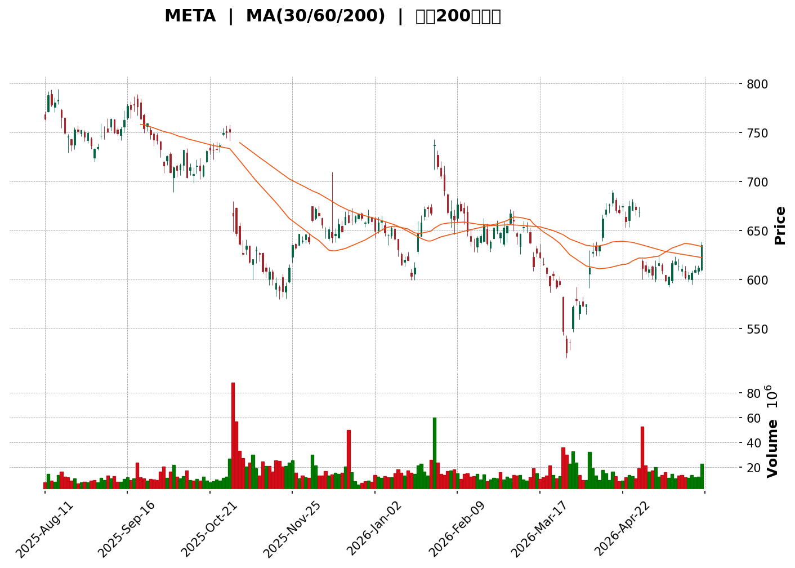
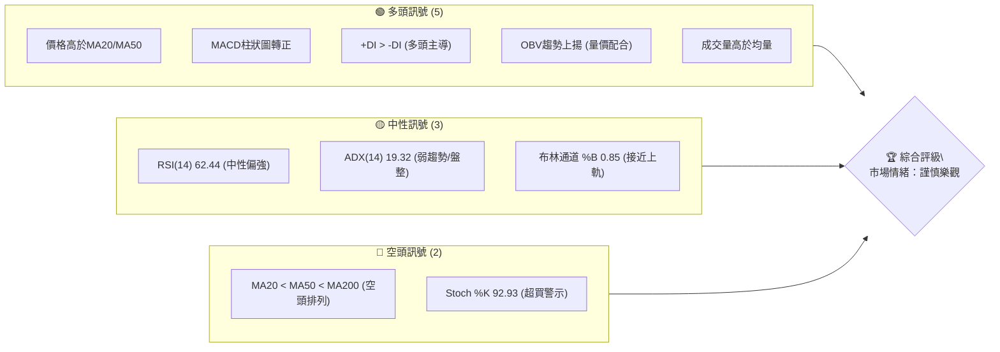
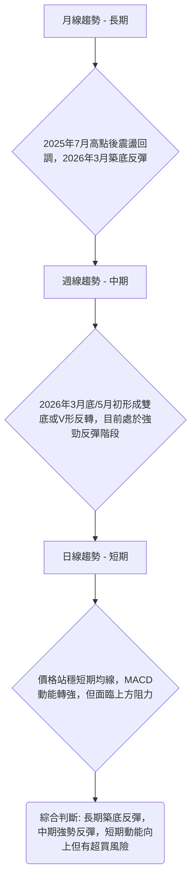
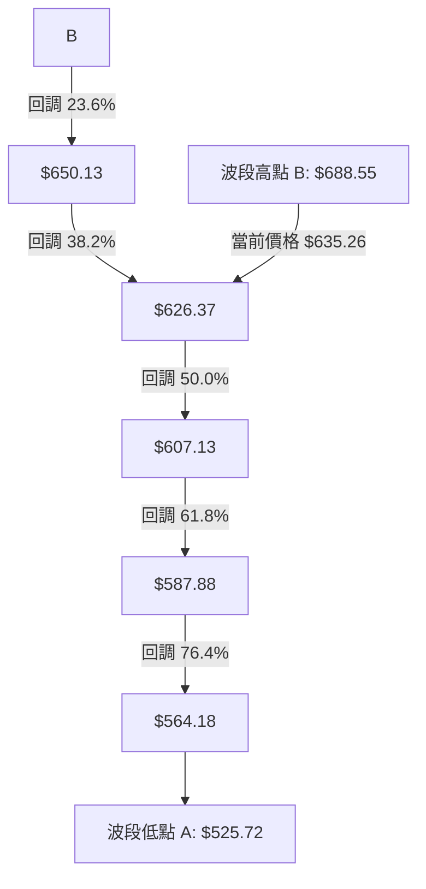
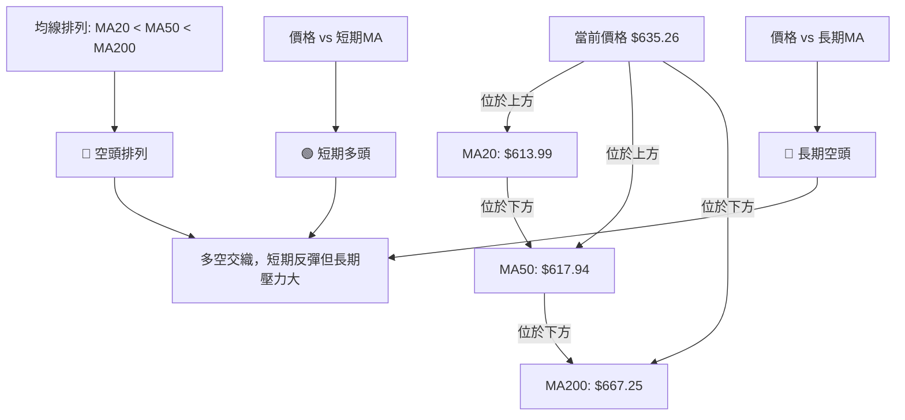
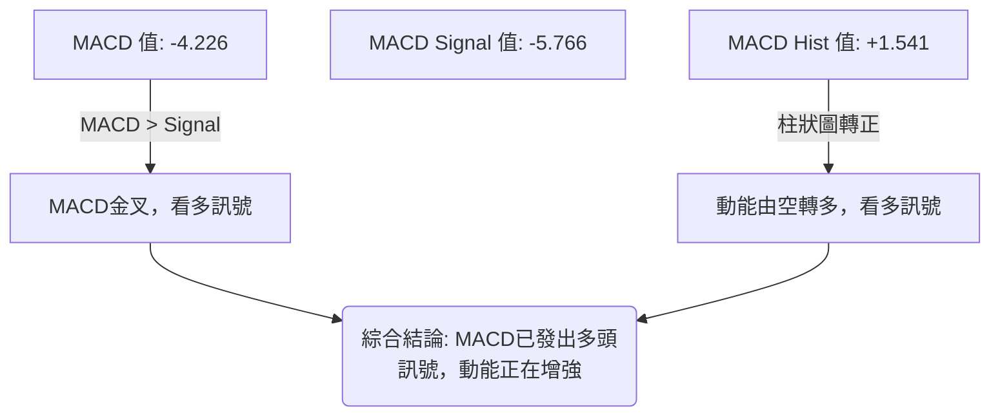

<details>
<summary>📊 靜態圖表 (點擊展開)</summary>

</details>

<html>
<head><meta charset="utf-8" /></head>
<body>
    <div>                        <script>window.PlotlyConfig = {MathJaxConfig: 'local'};</script>
        <script charset="utf-8" src="https://cdn.plot.ly/plotly-3.5.0.min.js" integrity="sha256-fHbNLP+GlIXN+efbQec78UkemUz3NJp7UmfGxC1tNxs=" crossorigin="anonymous"></script>                <div id="candlestick-chart" class="plotly-graph-div" style="height:500px; width:100%;"></div>            <script>                window.PLOTLYENV=window.PLOTLYENV || {};                                if (document.getElementById("candlestick-chart")) {                    Plotly.newPlot(                        "candlestick-chart",                        [{"close":{"dtype":"f8","bdata":"AAAAwJrgh0AAAAAgMaGIQAAAAMAEUohAAAAAIGFiiEAAAAAgH3uIQAAAAICT7IdAAAAAIMFth0AAAACAvk+HQAAAACDyCodAAAAAACyIh0AAAACgR3yHQAAAAECqgodAAAAAAAhNh0AAAAAgzWqHQAAAAADBB4dAAAAAwBnrhkAAAACglfqGQAAAAOAqV4dAAAAAAH91h0AAAABgTHSHQAAAAEA\u002f34dAAAAAoL5xh0AAAAAgIGmHQAAAAKCOjodAAAAAIETXh0AAAADgZUmIQAAAAEA4L4hAAAAAAGBTiEAAAAAgc0SIQAAAAEAP34dAAAAAQByRh0AAAACgHruHQAAAAMBGXYdAAAAAwBA0h0AAAABARTGHQAAAAAA76YZAAAAAgCNhhkAAAABAsK6GQAAAACD9KoZAAAAAgLhThkAAAACAHT+GQAAAAMAhZYZAAAAAQEjihkAAAACg+gCGQAAAAEAKVIZAAAAAILwbhkAAAADA0GKGQAAAAIAMN4ZAAAAAoMhdhkAAAACAlNeGQAAAAKBd4IZAAAAAwHvhhkAAAAAgMuaGQAAAAGAECYdAAAAAAIhsh0AAAACge3GHQAAAAOBRc4dAAAAAgNvKhEAAAADAIzqEQAAAAIAp5YNAAAAAQC6Sg0AAAAAAG9eDQAAAAKBAT4NAAAAAIGBlg0AAAAAgpLWDQAAAAKBDkINAAAAAAPL\u002fgkAAAABA+QaDQAAAACCKA4NAAAAA4AnIgkAAAABgiaWCQAAAAMCsaoJAAAAAwFRhgkAAAAAAEIqCQAAAACA2IINAAAAAAEPZg0AAAADAasSDQAAAAADyNoRAAAAAYGb+g0AAAAAAKDCEQAAAAMBB9INAAAAAYGejhEAAAABgXQKFQAAAAEB+zYRAAAAAoOd+hEAAAAAgW0iEQAAAAED2XIRAAAAAIDwZhEAAAAAgpjeEQAAAAAC0hIRAAAAAII5HhEAAAACADb+EQAAAAOCmkYRAAAAAIHmnhEAAAAAg+MKEQAAAAODU14RAAAAA4Me1hEAAAAAgA5GEQAAAAOAKy4RAAAAA4DOchEAAAAAg1E6EQAAAAMDPkYRAAAAAYHCghEAAAACgFEGEQAAAAAAPLIRAAAAAwAJkhEAAAADAXQuEQAAAAMBmtINAAAAAoPI3g0AAAADAJmKDQAAAAGDBXYNAAAAAYNPcgkAAAABAfCODQAAAAKCbOIRAAAAAYJKRhEAAAABAR\u002f6EQAAAAIAnA4VAAAAAYEPhhEAAAABgbQ2HQAAAAMAYX4ZAAAAAAHIOhkAAAADA3ZiFQAAAAIBX44RAAAAAABjthEAAAABAJ6eEQAAAAAAgJYVAAAAAYCvxhEAAAACg8eCEQAAAAIAISoRAAAAAIMj5g0AAAADg8fWDQAAAAKBbFYRAAAAA4NMhhEAAAAAAy3iEQAAAAKCj5YNAAAAAYAb2g0AAAADgC2mEQAAAAICVg4RAAAAAAAE9hEAAAADgAWiEQAAAAEAodIRAAAAAIEXZhEAAAAAgCqCEQAAAAIB3IoRAAAAAgLA2hEAAAACAFWyEQAAAAABmcoRAAAAAoBLtg0AAAADgeimDQAAAAKCZm4NAAAAAoEd1g0AAAACgcD2DQAAAAKCZ9YJAAAAAoEeNgkAAAADgeuCCQAAAACBch4JAAAAAwB6XgkAAAADgURyBQAAAAIDCbYBAAAAAQArDgEAAAABACuGBQAAAAADXGYJAAAAAIK7zgUAAAAAAKeiBQAAAAGBm+IFAAAAAIFwjg0AAAADAHqODQAAAAEDhroNAAAAAgD3Ug0AAAACA67OEQAAAAOCj\u002fIRAAAAAwPUmhUAAAABgZoSFQAAAAKBH94RAAAAAYLjmhEAAAACAwhWFQAAAAEAzmYRAAAAAgD0YhUAAAADA9TSFQAAAAGC4+oRAAAAAwPXohEAAAACgRx+DQAAAAAAABoNAAAAAoEcTg0AAAAAgrueCQAAAAEAKJ4NAAAAA4HpGg0AAAABACg2DQAAAAEDhtoJAAAAAAADYgkAAAABACkWDQAAAAKBwU4NAAAAAANcxg0AAAAAgrhmDQAAAAEDh1IJAAAAA4HrogkAAAABACvuCQAAAAIAUEoNAAAAAYLgig0AAAABACtqDQA=="},"high":{"dtype":"f8","bdata":"CsdbtC4diED8tKmje76IQAOqZzPFzIhAdd13fraPiEAJ4AM\u002fE9OIQMtoGCDwL4hAWIex9vrqh0CN6Wu5iWOHQCIJ\u002fakGPodAtmz5PwOZh0AFhFe50KiHQNbBG47PiIdApvS4gxCDh0CKnuvwSHqHQKG1PqAdS4dAfCmrOjTyhkBiUwnlHxSHQBBtrDgDu4dAd1S5m2Shh0AO8MBPtuWHQJ6V8h4J5IdAtA0Zaj\u002ffh0DOsAbgm5qHQG7WuR9cnodA4KZ56QwiiEB7O+LMO1yIQDbN\u002fEyja4hAtY+okXSXiEBadNCmk6eIQMrZy0lYg4hAzMeMxoEKiEA0FRO2tr6HQFlrcD8NnIdAswNPZ2V1h0C4\u002fb5DNmyHQGHVTODVLYdAXmwjdCiFhkAKF7JpcLSGQI3xDls8zoZAssEG9HZdhkAt+mQXZ2qGQI6yj2+Wc4ZAAAAAQEjihkApP7rEVvCGQO2gSUDndYZAu\u002fwVqNdShkCEH1Dph5WGQJ\u002fffLw6ooZA8bDf1bhqhkA0kFvnW+SGQOQWy70iCodA3Af7Segah0CLlxb+XCmHQAxgDIHHH4dAUiZqxOeTh0BUbF7zEamHQPVjisMjr4dACPR9k5U+hUBZvWf\u002fGg6FQNi9PVLVkYRAz1\u002fWEFkFhEAD1JTmQgmEQAHukSmB14NAWOlW0Lpog0Co96SLhM+DQGp+GCUSpINAuELErYSfg0AY2AI380SDQNcb9TE+JYNAjq3\u002fZVkVg0Aa0xB2N9WCQPa7OB6wkoJAwmEp7KftgkCd5UyE+KiCQJFJ6eRcPYNA3IJtCeTfg0A44CKCWuqDQFbXe2i+N4RAWRSjyPAhhEAkAe9dTjaEQNcBCh8iPoRAup10zcQXhUDOXT0IggyFQEd50xykHIVACL8Dyfa6hEBd9cRlVmuEQOy4TdZ8cYRAH6Lmz4AuhkBAKs8BiGOEQEXVsy7Jr4RAAoYwk1ClhEBx+5ML5O+EQL6\u002f5XJo84RAfANP1gcIhUCqcJEkccuEQONdcgXe3IRAiSCXtQXjhEDsY1ZEe52EQOq91cMo\u002fYRAGJXG5XLDhEAcWeLBkr6EQJ1COa3Fv4RA9uxWCpvHhEA\u002fJZNssJSEQGcFkQ1fNIRAOR9VMB5zhEAqVsS5SGuEQDqL18nDDYRAhV7UmEyfg0CfL4qYFn2DQIkU08dVpINAHu\u002fzHgQXg0CGlXjS7U2DQP+9XhQKoIRAsSUU1VvPhEC9D0xinhWFQLyiRqHtIYVAXRHHUc0ohUDW2gCI6DqHQAc8JmxZ3IZAup6tqXaFhkDHI3\u002fMF2OGQHN6Cx7tgYVA48iqGFZHhUAO5zEtUvuEQKeDhrTNVYVA7IkpuopAhUAIzOr2gjWFQB6Ja75fG4VAdC5fUvtWhECxYXnzZhCEQOYZqwGWI4RAlF8gRxc1hEB6NjenQraEQBqMo2wZiYRAi7M7FH4EhEApYciqkGqEQLx5kQJ6o4RA0hvdShNHhEBMgZXyAJuEQGa\u002fBlDPk4RAVmt1S44BhUChPNegAvGEQBOzcqxQR4RALv2JHpE5hED7KeqV4Z2EQIA2cQlzlIRA8a9aKYdnhEA3CdTJDaWDQAAAAAAA1oNAAAAAYGbkg0AAAABAM3WDQAAAAAAAKINAAAAAIK7fgkAAAADAHgWDQAAAAAAAyIJAAAAAIFzdgkAAAAAAADiCQAAAAMDM\u002fIBAAAAAYGbcgEAAAAAghe2BQAAAAGBmhIJAAAAAAAAUgkAAAADgUTaCQAAAAADX+YFAAAAAoJmvg0AAAAAAAOyDQAAAAOCj9INAAAAAAADYg0AAAACAFNKEQAAAAAAANIVAAAAA4KMshUAAAAAAKZyFQAAAAEAKW4VAAAAAoJkhhUAAAABACjOFQAAAAOB67IRAAAAAIFxFhUAAAAAAAFSFQAAAAKBwMYVAAAAAAAAShUAAAADAzGaDQAAAAEAKV4NAAAAAAAAwg0AAAADAzDKDQAAAAKCZX4NAAAAAANeHg0AAAAAAKUaDQAAAAKBH54JAAAAAAADegkAAAABAM1+DQAAAAADXfYNAAAAAoJlpg0AAAABguDyDQAAAAKBwL4NAAAAAAAAAg0AAAADAzAyDQAAAAOB6NoNAAAAAgMIzg0AAAADA\u002f\u002fODQA=="},"hovertemplate":"\u003cb\u003e%{x|%Y-%m-%d}\u003c\u002fb\u003e\u003cbr\u003e\u958b: $%{open:.2f}\u003cbr\u003e\u9ad8: $%{high:.2f}\u003cbr\u003e\u4f4e: $%{low:.2f}\u003cbr\u003e\u6536: $%{close:.2f}\u003cextra\u003e\u003c\u002fextra\u003e","low":{"dtype":"f8","bdata":"oXEa4gbXh0C6pp4P9hSIQNCBj8BAQ4hAZueWiZkViEDSSTWp7FeIQMmvQ39MlodAjpgpjNVch0Djq3Q7TMqGQK23T14j24ZAD0m\u002fw1rlhkDNzxm2+mKHQIFc6C6AUYdAozjm6Msoh0A5rrK4gxiHQAINNTME7YZAiXCPtE+AhkCTcfduKeKGQGy2apSUQIdAtULPekY6h0BiCe1XEHKHQI\u002fnWyFRfYdAt8jSU+xph0DdgN7D7lSHQDBBY4QjMIdA1YKQ\u002fdJxh0B3gnBTddqHQD3zOscd5IdAUL28T2IciECfbFoZGvuHQL5\u002fAHyM2YdAlmZULoduh0Cvf61MMHqHQOibqWh0OodAMfaFYvMAh0D1XlXIUw+HQEDEScGyqIZAVKQiKh0ohkDWGaYXh2eGQHDhpiz0J4ZArJNoX9uKhUCe+6GwkgSGQAGRGowGFYZAUKGb7AA6hkCgpIhzq\u002fqFQKzuxO+qE4ZAtH1PnkzRhUANmgZemiKGQHD0UWGj9YVA60gxLocHhkBpj9D\u002f0XeGQKYRuRREvIZA250Ps5GWhkD9u9zzAd+GQHO4rAdvz4ZAjTHMuxZWh0DS6DS+M0KHQO7qTJIpKodA24Pq3KxIhEBhqobh7yOEQKVDXDvx2INAW37D2reHg0DEFnJt84uDQPNT4ra+R4NA1LTTwpHBgkAluoSNn0iDQIz5m8vYUoNAK\u002fN4vQr2gkAUtmgP8s+CQODEzmKmkYJAMEx5Oj+TgkDpJWBQcTaCQFK\u002f6WM8IoJAd20RFQIzgkAb5OqdGyeCQJXmDLoOpYJA1HKeJiRKg0Cy1CeFmrSDQBaqcfKC04NA02Jbwo\u002flg0AlaruACeiDQJhvc2Li44NALzShT5WXhEBrboG3RaqEQK2laSqtv4RALEjzQP5hhEAusGIjmxKEQIjTojnX\u002fYNAbjKLl1nsg0Ab+yuvOvGDQF+NVNAyFYRAONaKRihFhEBIBqL\u002fL3+EQNf7n4jvjIRAq54i37SAhECubpy4fo2EQAw+bn8RrYRAmtl90wimhEA+9o1IpG6EQL5xcdU3ioRALqOMwwGXhEA6+yebmBeEQCCePTeROYRAV+3nJr1ahEA6pTgsESKEQFMXib1o2YNAcD4sg2YShEDgZeaLcwWEQLS7\u002fl6HfINA0I31OVoyg0A+pa7ioi2DQP5TPIxlXINAp7HK1+S7gkBBk6uQiLyCQFRuc64ckINATI4UkjAfhEDqRSNFy6WEQHQY\u002fy67wIRAClGZuz3MhEDPtIABhj+GQHf6GDnWR4ZA1mAscFj3hUB2r60ElW6FQJ35Ks4c14RA6KkdJodnhEB0dLtVky+EQEflm067kYRAowofYbzphEDeJBGOTYSEQN+qlA\u002fTJYRAm3hDnDfQg0ClL7zAGKKDQGcFxsbmnINAgTDw\u002fmbhg0CCfUFy3vGDQOynmNCl24NAV\u002ftsFImjg0APpT28uQyEQBwmDamRN4RAjHgVwJfsg0BrS1xkqM+DQIpyWjNZ8oNAcoET4NuIhEDt6naZB06EQLwiU9SG3INApr0CXPORg0CrQ9kBj0OEQHTiKWNxPoRA18IIftfig0AJnOBpOgiDQAAAAMDMeINAAAAAoJltg0AAAABA4TSDQAAAAIAU0oJAAAAAAABagkAAAACAFLiCQAAAAAAAeIJAAAAAQDOLgkAAAADAzPqAQAAAAIAUQoBAAAAA4FGEgEAAAAAAKRaBQAAAAGCP7oFAAAAAoJl9gUAAAAAAAOCBQAAAAIAUpoFAAAAA4KN+gkAAAAAAAHiDQAAAAOCjgoNAAAAAQDODg0AAAADA9fqDQAAAAIDCwYRAAAAAAADehEAAAABAChmFQAAAAAAA4IRAAAAA4KPahEAAAAAAAO6EQAAAAGBmaIRAAAAAYLhuhEAAAABguPaEQAAAAEAKzYRAAAAA4Hq+hEAAAAAAAMCCQAAAAEDh8IJAAAAAAADWgkAAAABA4cKCQAAAAMDMsIJAAAAA4FEsg0AAAADgevCCQAAAAOCjsIJAAAAAwMyEgkAAAACgR6WCQAAAAAAAOINAAAAA4HoKg0AAAAAghd2CQAAAAGBmxIJAAAAA4HqugkAAAADgepaCQAAAAKCZ94JAAAAAYGbqgkAAAAAAAAiDQA=="},"name":"\u50f9\u683c","open":{"dtype":"f8","bdata":"LUBhrDQCiEBRDGezghmIQAPDvwFfqohAhwXfhHVAiECcCJ6OgHKIQBhghhQxKohArfgY1JTqh0CXhTgYjE6HQHK+bJS4N4dAOgw7yvsLh0BSVcNUaYiHQJ0FtLVTaIdAA7NNhEx0h0CPv9X9DTKHQG01EE1FPIdAxWn65bWihkBx19NJNPKGQM0tS2KHVodA9M0wT9p2h0Bj\u002f7s+1JGHQAFoxYW4nYdA5MVNxrLah0CIJYchDoeHQK8gHCvOV4dAZo+1sY+dh0ASWFx1n+mHQCMDs8JMUYhABP\u002fLmV1XiECTj2FrnoSIQPqONE5bZIhA5TJEpLn\u002fh0DgMCLO4aGHQN6luDmJgYdAYYXOYPtlh0B8mxBPwluHQITvkNYVKIdAof1Bb0iChkAb+PAI\u002fYqGQEMUVkpLw4ZAVOcMzRkAhkBXqjlCLGSGQGM38AISQoZAyAVFVKVohkA\u002fkK3EmM2GQKUN2FKOPoZAKN2NWckUhkDpUe3s5l6GQJDa9sLQYoZA6rbMBTIPhkBmwKsL43+GQD9QtjhU9oZAEsVMkNbkhkCfZDlbyeuGQHeVZl56\u002fIZAR0MuWtNjh0DuIE2u\u002fHqHQDoM3jfri4dAs3TlFUPghEDCtQ0MEguFQPViR9U8d4RAVP69Se6Xg0DOSW6yCLqDQBsB52xO1oNAjmK1Wa87g0CxYoRKSrCDQCNTrJqcl4NAXWGWXqaYg0Bl+0gAXyCDQGuCIxpIxoJAcwTeNS8Ag0BpIQfT5XSCQNJLqT\u002fUhYJAbKrCbvDTgkCeAWmpI1yCQIDZ7z\u002fDrYJAKIb\u002fSKp3g0CIUZmsAOWDQB37tdYk2INAbVB7g9vzg0AaJ87mIwqEQF8clS2sGoRAl2j5ZPgWhUAKqCR2IbeEQBC+d5DH4YRA\u002fQaENku1hEBXhZAd60aEQHfe+zW6EYRAZbs2dLhFhECYyMJrLimEQPmHyqmYF4RAbVy3q2R4hECL1PlfvoOEQEzNBJnMzoRAx2u3HKyohEB2DEfx4ZuEQCOHa8u0r4RAh2S+hOjbhEDHcfqwk4uEQNaRNxgDkYRAO+fnVXPBhEAp4GrqTbGEQG2oLgGgU4RA8F7r1guYhEA8etkSoniEQC4wurCeKoRAoiaNWRonhEDzzps\u002fxl+EQDqL18nDDYRAtJ9rY7aPg0ATB4lwm0+DQGHlbx0rfYNAQs2oSeH6gkAHr62FxPGCQNrhpSZ+poNAT1SOYr8hhEA6e83qfMSEQFSAaYkaEIVA8AMORGIPhUDO2a+qZAaHQFmQmHoFt4ZAxoazxuhPhkB9fbprHhaGQK4RZSsieYVApDltXRm4hEAc94OQXceEQFaqJ7nmtIRA9lkskikohUDOXX4yYwuFQBbivc4s64RARYZ0iWIkhEB7P86hn\u002feDQFcszQAQyoNAA0UyoTDwg0AihSd6JPmDQBa3y7baX4RA4BmZxU7Eg0BUG1HN1w+EQOgvMbHyT4RAT396STIXhEDmi15b6+SDQG3oNiXiPYRAXCX9XS2LhEDNARH+6KqEQDFYjyzEOoRALMnXV+XRg0AKAbzkAWiEQOx01myZcYRAprice49BhEDBBwaq2XqDQAAAAAAAwINAAAAAgOufg0AAAABguEKDQAAAAEAzIYNAAAAAgD3cgkAAAADgUe6CQAAAAMDMuIJAAAAAgOu1gkAAAACA6zOCQAAAAMDM4IBAAAAAQArDgEAAAAAA1y+BQAAAAEAKIYJAAAAA4FGwgUAAAAAghQ2CQAAAAADX44FAAAAAAADwgkAAAACAwpeDQAAAAIDC04NAAAAAAACsg0AAAACAwhmEQAAAAAAA2IRAAAAAgOsfhUAAAADAzDSFQAAAAEDhSoVAAAAAAAD4hEAAAABA4RKFQAAAAKCZvYRAAAAAYI+ihEAAAAAAAPiEQAAAAIDrEYVAAAAAoEfnhEAAAABgj1qDQAAAACCFNYNAAAAAIIX\u002fgkAAAADgeiqDQAAAAGBmyIJAAAAAgMI1g0AAAACgmTmDQAAAAGCP5IJAAAAAYI+WgkAAAADgo7aCQAAAAAAAQINAAAAAgOsvg0AAAABA4QiDQAAAACBcB4NAAAAAgBTGgkAAAAAAAMCCQAAAAEAK\u002f4JAAAAAwB4Hg0AAAACAFA6DQA=="},"x":["2025-08-11T00:00:00-04:00","2025-08-12T00:00:00-04:00","2025-08-13T00:00:00-04:00","2025-08-14T00:00:00-04:00","2025-08-15T00:00:00-04:00","2025-08-18T00:00:00-04:00","2025-08-19T00:00:00-04:00","2025-08-20T00:00:00-04:00","2025-08-21T00:00:00-04:00","2025-08-22T00:00:00-04:00","2025-08-25T00:00:00-04:00","2025-08-26T00:00:00-04:00","2025-08-27T00:00:00-04:00","2025-08-28T00:00:00-04:00","2025-08-29T00:00:00-04:00","2025-09-02T00:00:00-04:00","2025-09-03T00:00:00-04:00","2025-09-04T00:00:00-04:00","2025-09-05T00:00:00-04:00","2025-09-08T00:00:00-04:00","2025-09-09T00:00:00-04:00","2025-09-10T00:00:00-04:00","2025-09-11T00:00:00-04:00","2025-09-12T00:00:00-04:00","2025-09-15T00:00:00-04:00","2025-09-16T00:00:00-04:00","2025-09-17T00:00:00-04:00","2025-09-18T00:00:00-04:00","2025-09-19T00:00:00-04:00","2025-09-22T00:00:00-04:00","2025-09-23T00:00:00-04:00","2025-09-24T00:00:00-04:00","2025-09-25T00:00:00-04:00","2025-09-26T00:00:00-04:00","2025-09-29T00:00:00-04:00","2025-09-30T00:00:00-04:00","2025-10-01T00:00:00-04:00","2025-10-02T00:00:00-04:00","2025-10-03T00:00:00-04:00","2025-10-06T00:00:00-04:00","2025-10-07T00:00:00-04:00","2025-10-08T00:00:00-04:00","2025-10-09T00:00:00-04:00","2025-10-10T00:00:00-04:00","2025-10-13T00:00:00-04:00","2025-10-14T00:00:00-04:00","2025-10-15T00:00:00-04:00","2025-10-16T00:00:00-04:00","2025-10-17T00:00:00-04:00","2025-10-20T00:00:00-04:00","2025-10-21T00:00:00-04:00","2025-10-22T00:00:00-04:00","2025-10-23T00:00:00-04:00","2025-10-24T00:00:00-04:00","2025-10-27T00:00:00-04:00","2025-10-28T00:00:00-04:00","2025-10-29T00:00:00-04:00","2025-10-30T00:00:00-04:00","2025-10-31T00:00:00-04:00","2025-11-03T00:00:00-05:00","2025-11-04T00:00:00-05:00","2025-11-05T00:00:00-05:00","2025-11-06T00:00:00-05:00","2025-11-07T00:00:00-05:00","2025-11-10T00:00:00-05:00","2025-11-11T00:00:00-05:00","2025-11-12T00:00:00-05:00","2025-11-13T00:00:00-05:00","2025-11-14T00:00:00-05:00","2025-11-17T00:00:00-05:00","2025-11-18T00:00:00-05:00","2025-11-19T00:00:00-05:00","2025-11-20T00:00:00-05:00","2025-11-21T00:00:00-05:00","2025-11-24T00:00:00-05:00","2025-11-25T00:00:00-05:00","2025-11-26T00:00:00-05:00","2025-11-28T00:00:00-05:00","2025-12-01T00:00:00-05:00","2025-12-02T00:00:00-05:00","2025-12-03T00:00:00-05:00","2025-12-04T00:00:00-05:00","2025-12-05T00:00:00-05:00","2025-12-08T00:00:00-05:00","2025-12-09T00:00:00-05:00","2025-12-10T00:00:00-05:00","2025-12-11T00:00:00-05:00","2025-12-12T00:00:00-05:00","2025-12-15T00:00:00-05:00","2025-12-16T00:00:00-05:00","2025-12-17T00:00:00-05:00","2025-12-18T00:00:00-05:00","2025-12-19T00:00:00-05:00","2025-12-22T00:00:00-05:00","2025-12-23T00:00:00-05:00","2025-12-24T00:00:00-05:00","2025-12-26T00:00:00-05:00","2025-12-29T00:00:00-05:00","2025-12-30T00:00:00-05:00","2025-12-31T00:00:00-05:00","2026-01-02T00:00:00-05:00","2026-01-05T00:00:00-05:00","2026-01-06T00:00:00-05:00","2026-01-07T00:00:00-05:00","2026-01-08T00:00:00-05:00","2026-01-09T00:00:00-05:00","2026-01-12T00:00:00-05:00","2026-01-13T00:00:00-05:00","2026-01-14T00:00:00-05:00","2026-01-15T00:00:00-05:00","2026-01-16T00:00:00-05:00","2026-01-20T00:00:00-05:00","2026-01-21T00:00:00-05:00","2026-01-22T00:00:00-05:00","2026-01-23T00:00:00-05:00","2026-01-26T00:00:00-05:00","2026-01-27T00:00:00-05:00","2026-01-28T00:00:00-05:00","2026-01-29T00:00:00-05:00","2026-01-30T00:00:00-05:00","2026-02-02T00:00:00-05:00","2026-02-03T00:00:00-05:00","2026-02-04T00:00:00-05:00","2026-02-05T00:00:00-05:00","2026-02-06T00:00:00-05:00","2026-02-09T00:00:00-05:00","2026-02-10T00:00:00-05:00","2026-02-11T00:00:00-05:00","2026-02-12T00:00:00-05:00","2026-02-13T00:00:00-05:00","2026-02-17T00:00:00-05:00","2026-02-18T00:00:00-05:00","2026-02-19T00:00:00-05:00","2026-02-20T00:00:00-05:00","2026-02-23T00:00:00-05:00","2026-02-24T00:00:00-05:00","2026-02-25T00:00:00-05:00","2026-02-26T00:00:00-05:00","2026-02-27T00:00:00-05:00","2026-03-02T00:00:00-05:00","2026-03-03T00:00:00-05:00","2026-03-04T00:00:00-05:00","2026-03-05T00:00:00-05:00","2026-03-06T00:00:00-05:00","2026-03-09T00:00:00-04:00","2026-03-10T00:00:00-04:00","2026-03-11T00:00:00-04:00","2026-03-12T00:00:00-04:00","2026-03-13T00:00:00-04:00","2026-03-16T00:00:00-04:00","2026-03-17T00:00:00-04:00","2026-03-18T00:00:00-04:00","2026-03-19T00:00:00-04:00","2026-03-20T00:00:00-04:00","2026-03-23T00:00:00-04:00","2026-03-24T00:00:00-04:00","2026-03-25T00:00:00-04:00","2026-03-26T00:00:00-04:00","2026-03-27T00:00:00-04:00","2026-03-30T00:00:00-04:00","2026-03-31T00:00:00-04:00","2026-04-01T00:00:00-04:00","2026-04-02T00:00:00-04:00","2026-04-06T00:00:00-04:00","2026-04-07T00:00:00-04:00","2026-04-08T00:00:00-04:00","2026-04-09T00:00:00-04:00","2026-04-10T00:00:00-04:00","2026-04-13T00:00:00-04:00","2026-04-14T00:00:00-04:00","2026-04-15T00:00:00-04:00","2026-04-16T00:00:00-04:00","2026-04-17T00:00:00-04:00","2026-04-20T00:00:00-04:00","2026-04-21T00:00:00-04:00","2026-04-22T00:00:00-04:00","2026-04-23T00:00:00-04:00","2026-04-24T00:00:00-04:00","2026-04-27T00:00:00-04:00","2026-04-28T00:00:00-04:00","2026-04-29T00:00:00-04:00","2026-04-30T00:00:00-04:00","2026-05-01T00:00:00-04:00","2026-05-04T00:00:00-04:00","2026-05-05T00:00:00-04:00","2026-05-06T00:00:00-04:00","2026-05-07T00:00:00-04:00","2026-05-08T00:00:00-04:00","2026-05-11T00:00:00-04:00","2026-05-12T00:00:00-04:00","2026-05-13T00:00:00-04:00","2026-05-14T00:00:00-04:00","2026-05-15T00:00:00-04:00","2026-05-18T00:00:00-04:00","2026-05-19T00:00:00-04:00","2026-05-20T00:00:00-04:00","2026-05-21T00:00:00-04:00","2026-05-22T00:00:00-04:00","2026-05-26T00:00:00-04:00","2026-05-27T00:00:00-04:00"],"type":"candlestick"},{"hovertemplate":"MA30: $%{y:.2f}\u003cextra\u003e\u003c\u002fextra\u003e","line":{"color":"#2196F3","dash":"dash","width":2},"mode":"lines","name":"MA30","x":["2025-08-11T00:00:00-04:00","2025-08-12T00:00:00-04:00","2025-08-13T00:00:00-04:00","2025-08-14T00:00:00-04:00","2025-08-15T00:00:00-04:00","2025-08-18T00:00:00-04:00","2025-08-19T00:00:00-04:00","2025-08-20T00:00:00-04:00","2025-08-21T00:00:00-04:00","2025-08-22T00:00:00-04:00","2025-08-25T00:00:00-04:00","2025-08-26T00:00:00-04:00","2025-08-27T00:00:00-04:00","2025-08-28T00:00:00-04:00","2025-08-29T00:00:00-04:00","2025-09-02T00:00:00-04:00","2025-09-03T00:00:00-04:00","2025-09-04T00:00:00-04:00","2025-09-05T00:00:00-04:00","2025-09-08T00:00:00-04:00","2025-09-09T00:00:00-04:00","2025-09-10T00:00:00-04:00","2025-09-11T00:00:00-04:00","2025-09-12T00:00:00-04:00","2025-09-15T00:00:00-04:00","2025-09-16T00:00:00-04:00","2025-09-17T00:00:00-04:00","2025-09-18T00:00:00-04:00","2025-09-19T00:00:00-04:00","2025-09-22T00:00:00-04:00","2025-09-23T00:00:00-04:00","2025-09-24T00:00:00-04:00","2025-09-25T00:00:00-04:00","2025-09-26T00:00:00-04:00","2025-09-29T00:00:00-04:00","2025-09-30T00:00:00-04:00","2025-10-01T00:00:00-04:00","2025-10-02T00:00:00-04:00","2025-10-03T00:00:00-04:00","2025-10-06T00:00:00-04:00","2025-10-07T00:00:00-04:00","2025-10-08T00:00:00-04:00","2025-10-09T00:00:00-04:00","2025-10-10T00:00:00-04:00","2025-10-13T00:00:00-04:00","2025-10-14T00:00:00-04:00","2025-10-15T00:00:00-04:00","2025-10-16T00:00:00-04:00","2025-10-17T00:00:00-04:00","2025-10-20T00:00:00-04:00","2025-10-21T00:00:00-04:00","2025-10-22T00:00:00-04:00","2025-10-23T00:00:00-04:00","2025-10-24T00:00:00-04:00","2025-10-27T00:00:00-04:00","2025-10-28T00:00:00-04:00","2025-10-29T00:00:00-04:00","2025-10-30T00:00:00-04:00","2025-10-31T00:00:00-04:00","2025-11-03T00:00:00-05:00","2025-11-04T00:00:00-05:00","2025-11-05T00:00:00-05:00","2025-11-06T00:00:00-05:00","2025-11-07T00:00:00-05:00","2025-11-10T00:00:00-05:00","2025-11-11T00:00:00-05:00","2025-11-12T00:00:00-05:00","2025-11-13T00:00:00-05:00","2025-11-14T00:00:00-05:00","2025-11-17T00:00:00-05:00","2025-11-18T00:00:00-05:00","2025-11-19T00:00:00-05:00","2025-11-20T00:00:00-05:00","2025-11-21T00:00:00-05:00","2025-11-24T00:00:00-05:00","2025-11-25T00:00:00-05:00","2025-11-26T00:00:00-05:00","2025-11-28T00:00:00-05:00","2025-12-01T00:00:00-05:00","2025-12-02T00:00:00-05:00","2025-12-03T00:00:00-05:00","2025-12-04T00:00:00-05:00","2025-12-05T00:00:00-05:00","2025-12-08T00:00:00-05:00","2025-12-09T00:00:00-05:00","2025-12-10T00:00:00-05:00","2025-12-11T00:00:00-05:00","2025-12-12T00:00:00-05:00","2025-12-15T00:00:00-05:00","2025-12-16T00:00:00-05:00","2025-12-17T00:00:00-05:00","2025-12-18T00:00:00-05:00","2025-12-19T00:00:00-05:00","2025-12-22T00:00:00-05:00","2025-12-23T00:00:00-05:00","2025-12-24T00:00:00-05:00","2025-12-26T00:00:00-05:00","2025-12-29T00:00:00-05:00","2025-12-30T00:00:00-05:00","2025-12-31T00:00:00-05:00","2026-01-02T00:00:00-05:00","2026-01-05T00:00:00-05:00","2026-01-06T00:00:00-05:00","2026-01-07T00:00:00-05:00","2026-01-08T00:00:00-05:00","2026-01-09T00:00:00-05:00","2026-01-12T00:00:00-05:00","2026-01-13T00:00:00-05:00","2026-01-14T00:00:00-05:00","2026-01-15T00:00:00-05:00","2026-01-16T00:00:00-05:00","2026-01-20T00:00:00-05:00","2026-01-21T00:00:00-05:00","2026-01-22T00:00:00-05:00","2026-01-23T00:00:00-05:00","2026-01-26T00:00:00-05:00","2026-01-27T00:00:00-05:00","2026-01-28T00:00:00-05:00","2026-01-29T00:00:00-05:00","2026-01-30T00:00:00-05:00","2026-02-02T00:00:00-05:00","2026-02-03T00:00:00-05:00","2026-02-04T00:00:00-05:00","2026-02-05T00:00:00-05:00","2026-02-06T00:00:00-05:00","2026-02-09T00:00:00-05:00","2026-02-10T00:00:00-05:00","2026-02-11T00:00:00-05:00","2026-02-12T00:00:00-05:00","2026-02-13T00:00:00-05:00","2026-02-17T00:00:00-05:00","2026-02-18T00:00:00-05:00","2026-02-19T00:00:00-05:00","2026-02-20T00:00:00-05:00","2026-02-23T00:00:00-05:00","2026-02-24T00:00:00-05:00","2026-02-25T00:00:00-05:00","2026-02-26T00:00:00-05:00","2026-02-27T00:00:00-05:00","2026-03-02T00:00:00-05:00","2026-03-03T00:00:00-05:00","2026-03-04T00:00:00-05:00","2026-03-05T00:00:00-05:00","2026-03-06T00:00:00-05:00","2026-03-09T00:00:00-04:00","2026-03-10T00:00:00-04:00","2026-03-11T00:00:00-04:00","2026-03-12T00:00:00-04:00","2026-03-13T00:00:00-04:00","2026-03-16T00:00:00-04:00","2026-03-17T00:00:00-04:00","2026-03-18T00:00:00-04:00","2026-03-19T00:00:00-04:00","2026-03-20T00:00:00-04:00","2026-03-23T00:00:00-04:00","2026-03-24T00:00:00-04:00","2026-03-25T00:00:00-04:00","2026-03-26T00:00:00-04:00","2026-03-27T00:00:00-04:00","2026-03-30T00:00:00-04:00","2026-03-31T00:00:00-04:00","2026-04-01T00:00:00-04:00","2026-04-02T00:00:00-04:00","2026-04-06T00:00:00-04:00","2026-04-07T00:00:00-04:00","2026-04-08T00:00:00-04:00","2026-04-09T00:00:00-04:00","2026-04-10T00:00:00-04:00","2026-04-13T00:00:00-04:00","2026-04-14T00:00:00-04:00","2026-04-15T00:00:00-04:00","2026-04-16T00:00:00-04:00","2026-04-17T00:00:00-04:00","2026-04-20T00:00:00-04:00","2026-04-21T00:00:00-04:00","2026-04-22T00:00:00-04:00","2026-04-23T00:00:00-04:00","2026-04-24T00:00:00-04:00","2026-04-27T00:00:00-04:00","2026-04-28T00:00:00-04:00","2026-04-29T00:00:00-04:00","2026-04-30T00:00:00-04:00","2026-05-01T00:00:00-04:00","2026-05-04T00:00:00-04:00","2026-05-05T00:00:00-04:00","2026-05-06T00:00:00-04:00","2026-05-07T00:00:00-04:00","2026-05-08T00:00:00-04:00","2026-05-11T00:00:00-04:00","2026-05-12T00:00:00-04:00","2026-05-13T00:00:00-04:00","2026-05-14T00:00:00-04:00","2026-05-15T00:00:00-04:00","2026-05-18T00:00:00-04:00","2026-05-19T00:00:00-04:00","2026-05-20T00:00:00-04:00","2026-05-21T00:00:00-04:00","2026-05-22T00:00:00-04:00","2026-05-26T00:00:00-04:00","2026-05-27T00:00:00-04:00"],"y":{"dtype":"f8","bdata":"AAAAAAAA+H8AAAAAAAD4fwAAAAAAAPh\u002fAAAAAAAA+H8AAAAAAAD4fwAAAAAAAPh\u002fAAAAAAAA+H8AAAAAAAD4fwAAAAAAAPh\u002fAAAAAAAA+H8AAAAAAAD4fwAAAAAAAPh\u002fAAAAAAAA+H8AAAAAAAD4fwAAAAAAAPh\u002fAAAAAAAA+H8AAAAAAAD4fwAAAAAAAPh\u002fAAAAAAAA+H8AAAAAAAD4fwAAAAAAAPh\u002fAAAAAAAA+H8AAAAAAAD4fwAAAAAAAPh\u002fAAAAAAAA+H8AAAAAAAD4fwAAAAAAAPh\u002fAAAAAAAA+H8AAAAAAAD4f1VVVdU8sodAvLu7e5avh0AzMzMz66eHQLy7u7vCn4dAzczM\u002fK6Vh0AiIiJCsIqHQM3MzCwLgodAzczM\u002fBZ5h0BVVVWluHOHQLy7u4tBbIdA3t3dbflhh0BVVVX1ZleHQImIiGjiTYdAvLu7e1NKh0Dv7u7uQz6HQAAAAGBGOIdAq6qq2lwxh0AiIiLCTSyHQFVVVSWzIodARERERGAZh0AAAADwJhSHQDMzM\u002fOnC4dAvLu769gGh0B3d3enewKHQM3MzBwI\u002foZA7+7uTnn6hkBVVVXVRvOGQLy7u2sD7YZA7+7u3tzOhkAiIiLCYqyGQDMzM7N0ioZAMzMzs1tohkARERFhKEeGQDMzM5OOJIZAiYiIOBEEhkBmZmamWOaFQO\u002fu7t7HyYVAMzMz4\u002fCshUDv7u4ewI2FQDMzM+PVcoVAVVVVVZRUhUAiIiIy3DWFQM3MzFzpE4VAiYiI2HrthEDe3d196s+EQO\u002fu7p6WtIRAERERUU6hhEBVVVWV9YqEQCIiIqLjeYRAAAAAoKRlhEAAAADg\u002fk6EQDMzMwMPNoRAMzMzM+wihEAiIiKCyxKEQBEREYG+\u002f4NAERERscHmg0BEREQkycuDQBEREcFwsYNAq6qqCoWrg0CamZnJb6uDQERERDTBsINA7+7u7sy2g0B3d3c3iL6DQLy7u1tHyYNAzczM7APUg0AREREx\u002ftyDQO\u002fu7m7p54NAERERoYH2g0B3d3cXpAOEQM3MzAzTEoRAzczMDG4ihEBVVVU1mzCEQN7d3T36QoRARERE1CVWhEDe3d0dyGSEQO\u002fu7r61bYRAzczMvFVyhEC8u7srs3SEQCIiIjJZcIRAzczMvLtphEBERETU3WKEQM3MzIzZXYRAvLu7e7JOhEC8u7sLvD6EQO\u002fu7o7FOYRAmpmZ2WQ6hEARERFBdUCEQN7d3W3\u002fRYRAZmZmVqpMhEBVVVWl22SEQN7d3c2rdIRAiYiIiNWDhEBVVVU1GIuEQLy7u0vRjYRAREREZCOQhEB3d3cHNo+EQJqZmZnJkYRAIiIiYsSThEB3d3d3bpaEQGZmZpYhkoRAiYiImLeMhEDv7u4ewYmEQN7d3R2bhYRAMzMzs2KBhEDNzMwcPoOEQDMzMzPlgIRAd3d3pzp9hEDv7u4OWoCEQERERARCh4RAIiIisvWPhEAzMzMzsJiEQFVVVeX3oYRA7+7unuqyhEBEREQEmr+EQERERBTdvoRAzczMjNW7hEBmZmYG9raEQGZmZsYisoRAREREBP+phEBEREREzIiEQGZmZvY2cYRAIiIi4gpbhEBVVVWl7UaEQCIiImJ4NoRAREREtDUihEAzMzPTDROEQO\u002fu7n66\u002fINAIiIiAqnog0DNzMyMgciDQImIiEiQp4NA3t3djSOMg0CamZkZYHqDQHd3d0d1aYNAvLu7a9pWg0B3d3cn90CDQN7d3S2GMINAERERgYApg0CJiIiI5yKDQFVVVXXQG4NAmpmZeVIYg0AzMzND2hqDQKuqqupmH4NA7+7u3v0hg0C8u7uLmimDQM3MzIyyMINA3t3drZA2g0BERESUODyDQAAAALCDPYNAVVVVlXxHg0DNzMyc71iDQGZmZtajZINAIiIiggdxg0BEREQkBnCDQGZmZhaScINA3t3djQl1g0Dv7u7+RnWDQJqZmZmZeoNAERERAXKAg0Dv7u6uAJGDQFVVVbWBpINAIiIiokW2g0AAAACAI8KDQN7d3Y2XzINAREREhDLXg0Dv7u6eYeGDQM3MzAy76INAvLu7m8Tmg0AzMzNTKuGDQM3MzEzw24NAZmZmdgXWg0CJiIg4ws6DQA=="},"type":"scatter"},{"hovertemplate":"MA60: $%{y:.2f}\u003cextra\u003e\u003c\u002fextra\u003e","line":{"color":"#9C27B0","dash":"dash","width":2},"mode":"lines","name":"MA60","x":["2025-08-11T00:00:00-04:00","2025-08-12T00:00:00-04:00","2025-08-13T00:00:00-04:00","2025-08-14T00:00:00-04:00","2025-08-15T00:00:00-04:00","2025-08-18T00:00:00-04:00","2025-08-19T00:00:00-04:00","2025-08-20T00:00:00-04:00","2025-08-21T00:00:00-04:00","2025-08-22T00:00:00-04:00","2025-08-25T00:00:00-04:00","2025-08-26T00:00:00-04:00","2025-08-27T00:00:00-04:00","2025-08-28T00:00:00-04:00","2025-08-29T00:00:00-04:00","2025-09-02T00:00:00-04:00","2025-09-03T00:00:00-04:00","2025-09-04T00:00:00-04:00","2025-09-05T00:00:00-04:00","2025-09-08T00:00:00-04:00","2025-09-09T00:00:00-04:00","2025-09-10T00:00:00-04:00","2025-09-11T00:00:00-04:00","2025-09-12T00:00:00-04:00","2025-09-15T00:00:00-04:00","2025-09-16T00:00:00-04:00","2025-09-17T00:00:00-04:00","2025-09-18T00:00:00-04:00","2025-09-19T00:00:00-04:00","2025-09-22T00:00:00-04:00","2025-09-23T00:00:00-04:00","2025-09-24T00:00:00-04:00","2025-09-25T00:00:00-04:00","2025-09-26T00:00:00-04:00","2025-09-29T00:00:00-04:00","2025-09-30T00:00:00-04:00","2025-10-01T00:00:00-04:00","2025-10-02T00:00:00-04:00","2025-10-03T00:00:00-04:00","2025-10-06T00:00:00-04:00","2025-10-07T00:00:00-04:00","2025-10-08T00:00:00-04:00","2025-10-09T00:00:00-04:00","2025-10-10T00:00:00-04:00","2025-10-13T00:00:00-04:00","2025-10-14T00:00:00-04:00","2025-10-15T00:00:00-04:00","2025-10-16T00:00:00-04:00","2025-10-17T00:00:00-04:00","2025-10-20T00:00:00-04:00","2025-10-21T00:00:00-04:00","2025-10-22T00:00:00-04:00","2025-10-23T00:00:00-04:00","2025-10-24T00:00:00-04:00","2025-10-27T00:00:00-04:00","2025-10-28T00:00:00-04:00","2025-10-29T00:00:00-04:00","2025-10-30T00:00:00-04:00","2025-10-31T00:00:00-04:00","2025-11-03T00:00:00-05:00","2025-11-04T00:00:00-05:00","2025-11-05T00:00:00-05:00","2025-11-06T00:00:00-05:00","2025-11-07T00:00:00-05:00","2025-11-10T00:00:00-05:00","2025-11-11T00:00:00-05:00","2025-11-12T00:00:00-05:00","2025-11-13T00:00:00-05:00","2025-11-14T00:00:00-05:00","2025-11-17T00:00:00-05:00","2025-11-18T00:00:00-05:00","2025-11-19T00:00:00-05:00","2025-11-20T00:00:00-05:00","2025-11-21T00:00:00-05:00","2025-11-24T00:00:00-05:00","2025-11-25T00:00:00-05:00","2025-11-26T00:00:00-05:00","2025-11-28T00:00:00-05:00","2025-12-01T00:00:00-05:00","2025-12-02T00:00:00-05:00","2025-12-03T00:00:00-05:00","2025-12-04T00:00:00-05:00","2025-12-05T00:00:00-05:00","2025-12-08T00:00:00-05:00","2025-12-09T00:00:00-05:00","2025-12-10T00:00:00-05:00","2025-12-11T00:00:00-05:00","2025-12-12T00:00:00-05:00","2025-12-15T00:00:00-05:00","2025-12-16T00:00:00-05:00","2025-12-17T00:00:00-05:00","2025-12-18T00:00:00-05:00","2025-12-19T00:00:00-05:00","2025-12-22T00:00:00-05:00","2025-12-23T00:00:00-05:00","2025-12-24T00:00:00-05:00","2025-12-26T00:00:00-05:00","2025-12-29T00:00:00-05:00","2025-12-30T00:00:00-05:00","2025-12-31T00:00:00-05:00","2026-01-02T00:00:00-05:00","2026-01-05T00:00:00-05:00","2026-01-06T00:00:00-05:00","2026-01-07T00:00:00-05:00","2026-01-08T00:00:00-05:00","2026-01-09T00:00:00-05:00","2026-01-12T00:00:00-05:00","2026-01-13T00:00:00-05:00","2026-01-14T00:00:00-05:00","2026-01-15T00:00:00-05:00","2026-01-16T00:00:00-05:00","2026-01-20T00:00:00-05:00","2026-01-21T00:00:00-05:00","2026-01-22T00:00:00-05:00","2026-01-23T00:00:00-05:00","2026-01-26T00:00:00-05:00","2026-01-27T00:00:00-05:00","2026-01-28T00:00:00-05:00","2026-01-29T00:00:00-05:00","2026-01-30T00:00:00-05:00","2026-02-02T00:00:00-05:00","2026-02-03T00:00:00-05:00","2026-02-04T00:00:00-05:00","2026-02-05T00:00:00-05:00","2026-02-06T00:00:00-05:00","2026-02-09T00:00:00-05:00","2026-02-10T00:00:00-05:00","2026-02-11T00:00:00-05:00","2026-02-12T00:00:00-05:00","2026-02-13T00:00:00-05:00","2026-02-17T00:00:00-05:00","2026-02-18T00:00:00-05:00","2026-02-19T00:00:00-05:00","2026-02-20T00:00:00-05:00","2026-02-23T00:00:00-05:00","2026-02-24T00:00:00-05:00","2026-02-25T00:00:00-05:00","2026-02-26T00:00:00-05:00","2026-02-27T00:00:00-05:00","2026-03-02T00:00:00-05:00","2026-03-03T00:00:00-05:00","2026-03-04T00:00:00-05:00","2026-03-05T00:00:00-05:00","2026-03-06T00:00:00-05:00","2026-03-09T00:00:00-04:00","2026-03-10T00:00:00-04:00","2026-03-11T00:00:00-04:00","2026-03-12T00:00:00-04:00","2026-03-13T00:00:00-04:00","2026-03-16T00:00:00-04:00","2026-03-17T00:00:00-04:00","2026-03-18T00:00:00-04:00","2026-03-19T00:00:00-04:00","2026-03-20T00:00:00-04:00","2026-03-23T00:00:00-04:00","2026-03-24T00:00:00-04:00","2026-03-25T00:00:00-04:00","2026-03-26T00:00:00-04:00","2026-03-27T00:00:00-04:00","2026-03-30T00:00:00-04:00","2026-03-31T00:00:00-04:00","2026-04-01T00:00:00-04:00","2026-04-02T00:00:00-04:00","2026-04-06T00:00:00-04:00","2026-04-07T00:00:00-04:00","2026-04-08T00:00:00-04:00","2026-04-09T00:00:00-04:00","2026-04-10T00:00:00-04:00","2026-04-13T00:00:00-04:00","2026-04-14T00:00:00-04:00","2026-04-15T00:00:00-04:00","2026-04-16T00:00:00-04:00","2026-04-17T00:00:00-04:00","2026-04-20T00:00:00-04:00","2026-04-21T00:00:00-04:00","2026-04-22T00:00:00-04:00","2026-04-23T00:00:00-04:00","2026-04-24T00:00:00-04:00","2026-04-27T00:00:00-04:00","2026-04-28T00:00:00-04:00","2026-04-29T00:00:00-04:00","2026-04-30T00:00:00-04:00","2026-05-01T00:00:00-04:00","2026-05-04T00:00:00-04:00","2026-05-05T00:00:00-04:00","2026-05-06T00:00:00-04:00","2026-05-07T00:00:00-04:00","2026-05-08T00:00:00-04:00","2026-05-11T00:00:00-04:00","2026-05-12T00:00:00-04:00","2026-05-13T00:00:00-04:00","2026-05-14T00:00:00-04:00","2026-05-15T00:00:00-04:00","2026-05-18T00:00:00-04:00","2026-05-19T00:00:00-04:00","2026-05-20T00:00:00-04:00","2026-05-21T00:00:00-04:00","2026-05-22T00:00:00-04:00","2026-05-26T00:00:00-04:00","2026-05-27T00:00:00-04:00"],"y":{"dtype":"f8","bdata":"AAAAAAAA+H8AAAAAAAD4fwAAAAAAAPh\u002fAAAAAAAA+H8AAAAAAAD4fwAAAAAAAPh\u002fAAAAAAAA+H8AAAAAAAD4fwAAAAAAAPh\u002fAAAAAAAA+H8AAAAAAAD4fwAAAAAAAPh\u002fAAAAAAAA+H8AAAAAAAD4fwAAAAAAAPh\u002fAAAAAAAA+H8AAAAAAAD4fwAAAAAAAPh\u002fAAAAAAAA+H8AAAAAAAD4fwAAAAAAAPh\u002fAAAAAAAA+H8AAAAAAAD4fwAAAAAAAPh\u002fAAAAAAAA+H8AAAAAAAD4fwAAAAAAAPh\u002fAAAAAAAA+H8AAAAAAAD4fwAAAAAAAPh\u002fAAAAAAAA+H8AAAAAAAD4fwAAAAAAAPh\u002fAAAAAAAA+H8AAAAAAAD4fwAAAAAAAPh\u002fAAAAAAAA+H8AAAAAAAD4fwAAAAAAAPh\u002fAAAAAAAA+H8AAAAAAAD4fwAAAAAAAPh\u002fAAAAAAAA+H8AAAAAAAD4fwAAAAAAAPh\u002fAAAAAAAA+H8AAAAAAAD4fwAAAAAAAPh\u002fAAAAAAAA+H8AAAAAAAD4fwAAAAAAAPh\u002fAAAAAAAA+H8AAAAAAAD4fwAAAAAAAPh\u002fAAAAAAAA+H8AAAAAAAD4fwAAAAAAAPh\u002fAAAAAAAA+H8AAAAAAAD4f0RERMRYHodAd3d3F\u002fkLh0AiIiLKifeGQHd3d6co4oZAq6qqGuDMhkBERER0hLiGQN7d3YXppYZAAAAA8AOThkAiIiJivICGQHd3d7eLb4ZAmpmZ4UZbhkC8u7uToUaGQKuqquLlMIZAIiIiKucbhkBmZmY2FweGQHd3d39u9oVA3t3dlVXphUC8u7uroduFQLy7u2NLzoVAIiIicoK\u002fhUAAAADokrGFQDMzM3vboIVAd3d3j+KUhUDNzMyUo4qFQO\u002fu7k7jfoVAAAAAgJ1whUDNzMz8h1+FQGZmZhY6T4VAzczM9DA9hUDe3d1F6SuFQLy7u\u002fOaHYVAERERUZQPhUBERERM2AKFQHd3d\u002ffq9oRAq6qqkgrshEC8u7trq+GEQO\u002fu7qbY2IRAIiIiQrnRhEAzMzMbssiEQAAAAHjUwoRAERERMYG7hEC8u7uzO7OEQFVVVc1xq4RAZmZmVtChhEDe3d1NWZqEQO\u002fu7i4mkYRA7+7uBtKJhECJiIhg1H+EQCIiImoedYRAZmZmLrBnhEAiIiJa7liEQAAAAEj0SYRAd3d3V884hEDv7u7GwyiEQAAAAAjCHIRAVVVVRZMQhECrqqoyHwaEQHd3dxe4+4NAiYiIsBf8g0B3d3e3JQiEQBEREYG2EoRAvLu7O1EdhEBmZmY20CSEQLy7u1OMK4RAiYiIqBMyhEBEREQcGjaEQERERITZPIRAmpmZASNFhEB3d3dHCU2EQJqZmVF6UoRAq6qq0pJXhEAiIiIqLl2EQN7d3a1KZIRAvLu7Q8RrhEBVVVUdA3SEQBEREXlNd4RAIiIiMsh3hEBVVVWdhnqEQDMzM5vNe4RAd3d3t9h8hEC8u7sDx32EQBEREbnof4RAVVVVjc6AhEAAAAAIK3+EQJqZmVFRfIRAMzMzMx17hEC8u7ujtXuEQCIiIhoRfIRAVVVVrVR7hEDNzMz003aEQCIiImLxcoRAVVVVNXBvhEBVVVXtAmmEQO\u002fu7tYkYoRAREREjCxZhEBVVVXtIVGEQERERAxCR4RAIiIisjY+hEAiIiICeC+EQHd3d+\u002fYHIRAMzMzk20MhEBEREScEAKEQKuqqjKI94NAd3d3jx7sg0AiIiKiGuKDQImIiLC12INARERElF3Tg0C8u7vLoNGDQM3MzDyJ0YNA3t3dFSTUg0AzMzM7xdmDQAAAAGiv4INA7+7uPnTqg0AAAABImvSDQImIiNDH94NAVVVVHTP5g0BVVVVNl\u002fmDQDMzMzvT94NAzczMzL34g0CJiIjw3fCDQGZmZmbt6oNAIiIiMgnmg0DNzMzkeduDQERERDyF04NAERERoZ\u002fLg0ARERFpKsSDQERERAyqu4NAmpmZgY20g0De3d0dwayDQO\u002fu7v4IpoNAAAAAmDShg0DNzMzMQZ6DQKuqqmoGm4NAAAAAeAaXg0AzMzNjLJGDQFVVVZ2gjINAZmZmjiKIg0De3d3tCIKDQBEREWHge4NAAAAA+Ct3g0De3d09znSDQA=="},"type":"scatter"},{"hovertemplate":"MA200: $%{y:.2f}\u003cextra\u003e\u003c\u002fextra\u003e","line":{"color":"#FF6F00","dash":"solid","width":2},"mode":"lines","name":"MA200","x":["2025-08-11T00:00:00-04:00","2025-08-12T00:00:00-04:00","2025-08-13T00:00:00-04:00","2025-08-14T00:00:00-04:00","2025-08-15T00:00:00-04:00","2025-08-18T00:00:00-04:00","2025-08-19T00:00:00-04:00","2025-08-20T00:00:00-04:00","2025-08-21T00:00:00-04:00","2025-08-22T00:00:00-04:00","2025-08-25T00:00:00-04:00","2025-08-26T00:00:00-04:00","2025-08-27T00:00:00-04:00","2025-08-28T00:00:00-04:00","2025-08-29T00:00:00-04:00","2025-09-02T00:00:00-04:00","2025-09-03T00:00:00-04:00","2025-09-04T00:00:00-04:00","2025-09-05T00:00:00-04:00","2025-09-08T00:00:00-04:00","2025-09-09T00:00:00-04:00","2025-09-10T00:00:00-04:00","2025-09-11T00:00:00-04:00","2025-09-12T00:00:00-04:00","2025-09-15T00:00:00-04:00","2025-09-16T00:00:00-04:00","2025-09-17T00:00:00-04:00","2025-09-18T00:00:00-04:00","2025-09-19T00:00:00-04:00","2025-09-22T00:00:00-04:00","2025-09-23T00:00:00-04:00","2025-09-24T00:00:00-04:00","2025-09-25T00:00:00-04:00","2025-09-26T00:00:00-04:00","2025-09-29T00:00:00-04:00","2025-09-30T00:00:00-04:00","2025-10-01T00:00:00-04:00","2025-10-02T00:00:00-04:00","2025-10-03T00:00:00-04:00","2025-10-06T00:00:00-04:00","2025-10-07T00:00:00-04:00","2025-10-08T00:00:00-04:00","2025-10-09T00:00:00-04:00","2025-10-10T00:00:00-04:00","2025-10-13T00:00:00-04:00","2025-10-14T00:00:00-04:00","2025-10-15T00:00:00-04:00","2025-10-16T00:00:00-04:00","2025-10-17T00:00:00-04:00","2025-10-20T00:00:00-04:00","2025-10-21T00:00:00-04:00","2025-10-22T00:00:00-04:00","2025-10-23T00:00:00-04:00","2025-10-24T00:00:00-04:00","2025-10-27T00:00:00-04:00","2025-10-28T00:00:00-04:00","2025-10-29T00:00:00-04:00","2025-10-30T00:00:00-04:00","2025-10-31T00:00:00-04:00","2025-11-03T00:00:00-05:00","2025-11-04T00:00:00-05:00","2025-11-05T00:00:00-05:00","2025-11-06T00:00:00-05:00","2025-11-07T00:00:00-05:00","2025-11-10T00:00:00-05:00","2025-11-11T00:00:00-05:00","2025-11-12T00:00:00-05:00","2025-11-13T00:00:00-05:00","2025-11-14T00:00:00-05:00","2025-11-17T00:00:00-05:00","2025-11-18T00:00:00-05:00","2025-11-19T00:00:00-05:00","2025-11-20T00:00:00-05:00","2025-11-21T00:00:00-05:00","2025-11-24T00:00:00-05:00","2025-11-25T00:00:00-05:00","2025-11-26T00:00:00-05:00","2025-11-28T00:00:00-05:00","2025-12-01T00:00:00-05:00","2025-12-02T00:00:00-05:00","2025-12-03T00:00:00-05:00","2025-12-04T00:00:00-05:00","2025-12-05T00:00:00-05:00","2025-12-08T00:00:00-05:00","2025-12-09T00:00:00-05:00","2025-12-10T00:00:00-05:00","2025-12-11T00:00:00-05:00","2025-12-12T00:00:00-05:00","2025-12-15T00:00:00-05:00","2025-12-16T00:00:00-05:00","2025-12-17T00:00:00-05:00","2025-12-18T00:00:00-05:00","2025-12-19T00:00:00-05:00","2025-12-22T00:00:00-05:00","2025-12-23T00:00:00-05:00","2025-12-24T00:00:00-05:00","2025-12-26T00:00:00-05:00","2025-12-29T00:00:00-05:00","2025-12-30T00:00:00-05:00","2025-12-31T00:00:00-05:00","2026-01-02T00:00:00-05:00","2026-01-05T00:00:00-05:00","2026-01-06T00:00:00-05:00","2026-01-07T00:00:00-05:00","2026-01-08T00:00:00-05:00","2026-01-09T00:00:00-05:00","2026-01-12T00:00:00-05:00","2026-01-13T00:00:00-05:00","2026-01-14T00:00:00-05:00","2026-01-15T00:00:00-05:00","2026-01-16T00:00:00-05:00","2026-01-20T00:00:00-05:00","2026-01-21T00:00:00-05:00","2026-01-22T00:00:00-05:00","2026-01-23T00:00:00-05:00","2026-01-26T00:00:00-05:00","2026-01-27T00:00:00-05:00","2026-01-28T00:00:00-05:00","2026-01-29T00:00:00-05:00","2026-01-30T00:00:00-05:00","2026-02-02T00:00:00-05:00","2026-02-03T00:00:00-05:00","2026-02-04T00:00:00-05:00","2026-02-05T00:00:00-05:00","2026-02-06T00:00:00-05:00","2026-02-09T00:00:00-05:00","2026-02-10T00:00:00-05:00","2026-02-11T00:00:00-05:00","2026-02-12T00:00:00-05:00","2026-02-13T00:00:00-05:00","2026-02-17T00:00:00-05:00","2026-02-18T00:00:00-05:00","2026-02-19T00:00:00-05:00","2026-02-20T00:00:00-05:00","2026-02-23T00:00:00-05:00","2026-02-24T00:00:00-05:00","2026-02-25T00:00:00-05:00","2026-02-26T00:00:00-05:00","2026-02-27T00:00:00-05:00","2026-03-02T00:00:00-05:00","2026-03-03T00:00:00-05:00","2026-03-04T00:00:00-05:00","2026-03-05T00:00:00-05:00","2026-03-06T00:00:00-05:00","2026-03-09T00:00:00-04:00","2026-03-10T00:00:00-04:00","2026-03-11T00:00:00-04:00","2026-03-12T00:00:00-04:00","2026-03-13T00:00:00-04:00","2026-03-16T00:00:00-04:00","2026-03-17T00:00:00-04:00","2026-03-18T00:00:00-04:00","2026-03-19T00:00:00-04:00","2026-03-20T00:00:00-04:00","2026-03-23T00:00:00-04:00","2026-03-24T00:00:00-04:00","2026-03-25T00:00:00-04:00","2026-03-26T00:00:00-04:00","2026-03-27T00:00:00-04:00","2026-03-30T00:00:00-04:00","2026-03-31T00:00:00-04:00","2026-04-01T00:00:00-04:00","2026-04-02T00:00:00-04:00","2026-04-06T00:00:00-04:00","2026-04-07T00:00:00-04:00","2026-04-08T00:00:00-04:00","2026-04-09T00:00:00-04:00","2026-04-10T00:00:00-04:00","2026-04-13T00:00:00-04:00","2026-04-14T00:00:00-04:00","2026-04-15T00:00:00-04:00","2026-04-16T00:00:00-04:00","2026-04-17T00:00:00-04:00","2026-04-20T00:00:00-04:00","2026-04-21T00:00:00-04:00","2026-04-22T00:00:00-04:00","2026-04-23T00:00:00-04:00","2026-04-24T00:00:00-04:00","2026-04-27T00:00:00-04:00","2026-04-28T00:00:00-04:00","2026-04-29T00:00:00-04:00","2026-04-30T00:00:00-04:00","2026-05-01T00:00:00-04:00","2026-05-04T00:00:00-04:00","2026-05-05T00:00:00-04:00","2026-05-06T00:00:00-04:00","2026-05-07T00:00:00-04:00","2026-05-08T00:00:00-04:00","2026-05-11T00:00:00-04:00","2026-05-12T00:00:00-04:00","2026-05-13T00:00:00-04:00","2026-05-14T00:00:00-04:00","2026-05-15T00:00:00-04:00","2026-05-18T00:00:00-04:00","2026-05-19T00:00:00-04:00","2026-05-20T00:00:00-04:00","2026-05-21T00:00:00-04:00","2026-05-22T00:00:00-04:00","2026-05-26T00:00:00-04:00","2026-05-27T00:00:00-04:00"],"y":{"dtype":"f8","bdata":"AAAAAAAA+H8AAAAAAAD4fwAAAAAAAPh\u002fAAAAAAAA+H8AAAAAAAD4fwAAAAAAAPh\u002fAAAAAAAA+H8AAAAAAAD4fwAAAAAAAPh\u002fAAAAAAAA+H8AAAAAAAD4fwAAAAAAAPh\u002fAAAAAAAA+H8AAAAAAAD4fwAAAAAAAPh\u002fAAAAAAAA+H8AAAAAAAD4fwAAAAAAAPh\u002fAAAAAAAA+H8AAAAAAAD4fwAAAAAAAPh\u002fAAAAAAAA+H8AAAAAAAD4fwAAAAAAAPh\u002fAAAAAAAA+H8AAAAAAAD4fwAAAAAAAPh\u002fAAAAAAAA+H8AAAAAAAD4fwAAAAAAAPh\u002fAAAAAAAA+H8AAAAAAAD4fwAAAAAAAPh\u002fAAAAAAAA+H8AAAAAAAD4fwAAAAAAAPh\u002fAAAAAAAA+H8AAAAAAAD4fwAAAAAAAPh\u002fAAAAAAAA+H8AAAAAAAD4fwAAAAAAAPh\u002fAAAAAAAA+H8AAAAAAAD4fwAAAAAAAPh\u002fAAAAAAAA+H8AAAAAAAD4fwAAAAAAAPh\u002fAAAAAAAA+H8AAAAAAAD4fwAAAAAAAPh\u002fAAAAAAAA+H8AAAAAAAD4fwAAAAAAAPh\u002fAAAAAAAA+H8AAAAAAAD4fwAAAAAAAPh\u002fAAAAAAAA+H8AAAAAAAD4fwAAAAAAAPh\u002fAAAAAAAA+H8AAAAAAAD4fwAAAAAAAPh\u002fAAAAAAAA+H8AAAAAAAD4fwAAAAAAAPh\u002fAAAAAAAA+H8AAAAAAAD4fwAAAAAAAPh\u002fAAAAAAAA+H8AAAAAAAD4fwAAAAAAAPh\u002fAAAAAAAA+H8AAAAAAAD4fwAAAAAAAPh\u002fAAAAAAAA+H8AAAAAAAD4fwAAAAAAAPh\u002fAAAAAAAA+H8AAAAAAAD4fwAAAAAAAPh\u002fAAAAAAAA+H8AAAAAAAD4fwAAAAAAAPh\u002fAAAAAAAA+H8AAAAAAAD4fwAAAAAAAPh\u002fAAAAAAAA+H8AAAAAAAD4fwAAAAAAAPh\u002fAAAAAAAA+H8AAAAAAAD4fwAAAAAAAPh\u002fAAAAAAAA+H8AAAAAAAD4fwAAAAAAAPh\u002fAAAAAAAA+H8AAAAAAAD4fwAAAAAAAPh\u002fAAAAAAAA+H8AAAAAAAD4fwAAAAAAAPh\u002fAAAAAAAA+H8AAAAAAAD4fwAAAAAAAPh\u002fAAAAAAAA+H8AAAAAAAD4fwAAAAAAAPh\u002fAAAAAAAA+H8AAAAAAAD4fwAAAAAAAPh\u002fAAAAAAAA+H8AAAAAAAD4fwAAAAAAAPh\u002fAAAAAAAA+H8AAAAAAAD4fwAAAAAAAPh\u002fAAAAAAAA+H8AAAAAAAD4fwAAAAAAAPh\u002fAAAAAAAA+H8AAAAAAAD4fwAAAAAAAPh\u002fAAAAAAAA+H8AAAAAAAD4fwAAAAAAAPh\u002fAAAAAAAA+H8AAAAAAAD4fwAAAAAAAPh\u002fAAAAAAAA+H8AAAAAAAD4fwAAAAAAAPh\u002fAAAAAAAA+H8AAAAAAAD4fwAAAAAAAPh\u002fAAAAAAAA+H8AAAAAAAD4fwAAAAAAAPh\u002fAAAAAAAA+H8AAAAAAAD4fwAAAAAAAPh\u002fAAAAAAAA+H8AAAAAAAD4fwAAAAAAAPh\u002fAAAAAAAA+H8AAAAAAAD4fwAAAAAAAPh\u002fAAAAAAAA+H8AAAAAAAD4fwAAAAAAAPh\u002fAAAAAAAA+H8AAAAAAAD4fwAAAAAAAPh\u002fAAAAAAAA+H8AAAAAAAD4fwAAAAAAAPh\u002fAAAAAAAA+H8AAAAAAAD4fwAAAAAAAPh\u002fAAAAAAAA+H8AAAAAAAD4fwAAAAAAAPh\u002fAAAAAAAA+H8AAAAAAAD4fwAAAAAAAPh\u002fAAAAAAAA+H8AAAAAAAD4fwAAAAAAAPh\u002fAAAAAAAA+H8AAAAAAAD4fwAAAAAAAPh\u002fAAAAAAAA+H8AAAAAAAD4fwAAAAAAAPh\u002fAAAAAAAA+H8AAAAAAAD4fwAAAAAAAPh\u002fAAAAAAAA+H8AAAAAAAD4fwAAAAAAAPh\u002fAAAAAAAA+H8AAAAAAAD4fwAAAAAAAPh\u002fAAAAAAAA+H8AAAAAAAD4fwAAAAAAAPh\u002fAAAAAAAA+H8AAAAAAAD4fwAAAAAAAPh\u002fAAAAAAAA+H8AAAAAAAD4fwAAAAAAAPh\u002fAAAAAAAA+H8AAAAAAAD4fwAAAAAAAPh\u002fAAAAAAAA+H8AAAAAAAD4fwAAAAAAAPh\u002fAAAAAAAA+H+amZlJ\u002fNmEQA=="},"type":"scatter"}],                        {"template":{"data":{"barpolar":[{"marker":{"line":{"color":"rgb(17,17,17)","width":0.5},"pattern":{"fillmode":"overlay","size":10,"solidity":0.2}},"type":"barpolar"}],"bar":[{"error_x":{"color":"#f2f5fa"},"error_y":{"color":"#f2f5fa"},"marker":{"line":{"color":"rgb(17,17,17)","width":0.5},"pattern":{"fillmode":"overlay","size":10,"solidity":0.2}},"type":"bar"}],"carpet":[{"aaxis":{"endlinecolor":"#A2B1C6","gridcolor":"#506784","linecolor":"#506784","minorgridcolor":"#506784","startlinecolor":"#A2B1C6"},"baxis":{"endlinecolor":"#A2B1C6","gridcolor":"#506784","linecolor":"#506784","minorgridcolor":"#506784","startlinecolor":"#A2B1C6"},"type":"carpet"}],"choropleth":[{"colorbar":{"outlinewidth":0,"ticks":""},"type":"choropleth"}],"contourcarpet":[{"colorbar":{"outlinewidth":0,"ticks":""},"type":"contourcarpet"}],"contour":[{"colorbar":{"outlinewidth":0,"ticks":""},"colorscale":[[0.0,"#0d0887"],[0.1111111111111111,"#46039f"],[0.2222222222222222,"#7201a8"],[0.3333333333333333,"#9c179e"],[0.4444444444444444,"#bd3786"],[0.5555555555555556,"#d8576b"],[0.6666666666666666,"#ed7953"],[0.7777777777777778,"#fb9f3a"],[0.8888888888888888,"#fdca26"],[1.0,"#f0f921"]],"type":"contour"}],"heatmap":[{"colorbar":{"outlinewidth":0,"ticks":""},"colorscale":[[0.0,"#0d0887"],[0.1111111111111111,"#46039f"],[0.2222222222222222,"#7201a8"],[0.3333333333333333,"#9c179e"],[0.4444444444444444,"#bd3786"],[0.5555555555555556,"#d8576b"],[0.6666666666666666,"#ed7953"],[0.7777777777777778,"#fb9f3a"],[0.8888888888888888,"#fdca26"],[1.0,"#f0f921"]],"type":"heatmap"}],"histogram2dcontour":[{"colorbar":{"outlinewidth":0,"ticks":""},"colorscale":[[0.0,"#0d0887"],[0.1111111111111111,"#46039f"],[0.2222222222222222,"#7201a8"],[0.3333333333333333,"#9c179e"],[0.4444444444444444,"#bd3786"],[0.5555555555555556,"#d8576b"],[0.6666666666666666,"#ed7953"],[0.7777777777777778,"#fb9f3a"],[0.8888888888888888,"#fdca26"],[1.0,"#f0f921"]],"type":"histogram2dcontour"}],"histogram2d":[{"colorbar":{"outlinewidth":0,"ticks":""},"colorscale":[[0.0,"#0d0887"],[0.1111111111111111,"#46039f"],[0.2222222222222222,"#7201a8"],[0.3333333333333333,"#9c179e"],[0.4444444444444444,"#bd3786"],[0.5555555555555556,"#d8576b"],[0.6666666666666666,"#ed7953"],[0.7777777777777778,"#fb9f3a"],[0.8888888888888888,"#fdca26"],[1.0,"#f0f921"]],"type":"histogram2d"}],"histogram":[{"marker":{"pattern":{"fillmode":"overlay","size":10,"solidity":0.2}},"type":"histogram"}],"mesh3d":[{"colorbar":{"outlinewidth":0,"ticks":""},"type":"mesh3d"}],"parcoords":[{"line":{"colorbar":{"outlinewidth":0,"ticks":""}},"type":"parcoords"}],"pie":[{"automargin":true,"type":"pie"}],"scatter3d":[{"line":{"colorbar":{"outlinewidth":0,"ticks":""}},"marker":{"colorbar":{"outlinewidth":0,"ticks":""}},"type":"scatter3d"}],"scattercarpet":[{"marker":{"colorbar":{"outlinewidth":0,"ticks":""}},"type":"scattercarpet"}],"scattergeo":[{"marker":{"colorbar":{"outlinewidth":0,"ticks":""}},"type":"scattergeo"}],"scattergl":[{"marker":{"line":{"color":"#283442"}},"type":"scattergl"}],"scattermapbox":[{"marker":{"colorbar":{"outlinewidth":0,"ticks":""}},"type":"scattermapbox"}],"scattermap":[{"marker":{"colorbar":{"outlinewidth":0,"ticks":""}},"type":"scattermap"}],"scatterpolargl":[{"marker":{"colorbar":{"outlinewidth":0,"ticks":""}},"type":"scatterpolargl"}],"scatterpolar":[{"marker":{"colorbar":{"outlinewidth":0,"ticks":""}},"type":"scatterpolar"}],"scatter":[{"marker":{"line":{"color":"#283442"}},"type":"scatter"}],"scatterternary":[{"marker":{"colorbar":{"outlinewidth":0,"ticks":""}},"type":"scatterternary"}],"surface":[{"colorbar":{"outlinewidth":0,"ticks":""},"colorscale":[[0.0,"#0d0887"],[0.1111111111111111,"#46039f"],[0.2222222222222222,"#7201a8"],[0.3333333333333333,"#9c179e"],[0.4444444444444444,"#bd3786"],[0.5555555555555556,"#d8576b"],[0.6666666666666666,"#ed7953"],[0.7777777777777778,"#fb9f3a"],[0.8888888888888888,"#fdca26"],[1.0,"#f0f921"]],"type":"surface"}],"table":[{"cells":{"fill":{"color":"#506784"},"line":{"color":"rgb(17,17,17)"}},"header":{"fill":{"color":"#2a3f5f"},"line":{"color":"rgb(17,17,17)"}},"type":"table"}]},"layout":{"annotationdefaults":{"arrowcolor":"#f2f5fa","arrowhead":0,"arrowwidth":1},"autotypenumbers":"strict","coloraxis":{"colorbar":{"outlinewidth":0,"ticks":""}},"colorscale":{"diverging":[[0,"#8e0152"],[0.1,"#c51b7d"],[0.2,"#de77ae"],[0.3,"#f1b6da"],[0.4,"#fde0ef"],[0.5,"#f7f7f7"],[0.6,"#e6f5d0"],[0.7,"#b8e186"],[0.8,"#7fbc41"],[0.9,"#4d9221"],[1,"#276419"]],"sequential":[[0.0,"#0d0887"],[0.1111111111111111,"#46039f"],[0.2222222222222222,"#7201a8"],[0.3333333333333333,"#9c179e"],[0.4444444444444444,"#bd3786"],[0.5555555555555556,"#d8576b"],[0.6666666666666666,"#ed7953"],[0.7777777777777778,"#fb9f3a"],[0.8888888888888888,"#fdca26"],[1.0,"#f0f921"]],"sequentialminus":[[0.0,"#0d0887"],[0.1111111111111111,"#46039f"],[0.2222222222222222,"#7201a8"],[0.3333333333333333,"#9c179e"],[0.4444444444444444,"#bd3786"],[0.5555555555555556,"#d8576b"],[0.6666666666666666,"#ed7953"],[0.7777777777777778,"#fb9f3a"],[0.8888888888888888,"#fdca26"],[1.0,"#f0f921"]]},"colorway":["#636efa","#EF553B","#00cc96","#ab63fa","#FFA15A","#19d3f3","#FF6692","#B6E880","#FF97FF","#FECB52"],"font":{"color":"#f2f5fa"},"geo":{"bgcolor":"rgb(17,17,17)","lakecolor":"rgb(17,17,17)","landcolor":"rgb(17,17,17)","showlakes":true,"showland":true,"subunitcolor":"#506784"},"hoverlabel":{"align":"left"},"hovermode":"closest","mapbox":{"style":"dark"},"paper_bgcolor":"rgb(17,17,17)","plot_bgcolor":"rgb(17,17,17)","polar":{"angularaxis":{"gridcolor":"#506784","linecolor":"#506784","ticks":""},"bgcolor":"rgb(17,17,17)","radialaxis":{"gridcolor":"#506784","linecolor":"#506784","ticks":""}},"scene":{"xaxis":{"backgroundcolor":"rgb(17,17,17)","gridcolor":"#506784","gridwidth":2,"linecolor":"#506784","showbackground":true,"ticks":"","zerolinecolor":"#C8D4E3"},"yaxis":{"backgroundcolor":"rgb(17,17,17)","gridcolor":"#506784","gridwidth":2,"linecolor":"#506784","showbackground":true,"ticks":"","zerolinecolor":"#C8D4E3"},"zaxis":{"backgroundcolor":"rgb(17,17,17)","gridcolor":"#506784","gridwidth":2,"linecolor":"#506784","showbackground":true,"ticks":"","zerolinecolor":"#C8D4E3"}},"shapedefaults":{"line":{"color":"#f2f5fa"}},"sliderdefaults":{"bgcolor":"#C8D4E3","bordercolor":"rgb(17,17,17)","borderwidth":1,"tickwidth":0},"ternary":{"aaxis":{"gridcolor":"#506784","linecolor":"#506784","ticks":""},"baxis":{"gridcolor":"#506784","linecolor":"#506784","ticks":""},"bgcolor":"rgb(17,17,17)","caxis":{"gridcolor":"#506784","linecolor":"#506784","ticks":""}},"title":{"x":0.05},"updatemenudefaults":{"bgcolor":"#506784","borderwidth":0},"xaxis":{"automargin":true,"gridcolor":"#283442","linecolor":"#506784","ticks":"","title":{"standoff":15},"zerolinecolor":"#283442","zerolinewidth":2},"yaxis":{"automargin":true,"gridcolor":"#283442","linecolor":"#506784","ticks":"","title":{"standoff":15},"zerolinecolor":"#283442","zerolinewidth":2}}},"xaxis":{"rangeslider":{"visible":false},"title":{"text":"\u65e5\u671f"}},"font":{"size":11},"title":{"text":"META  |  MA(30\u002f60\u002f200)  |  \u6700\u8fd1200\u4ea4\u6613\u65e5"},"yaxis":{"title":{"text":"\u80a1\u50f9 (USD)"}},"hovermode":"x unified","height":500},                        {"responsive": true}                    )                };            </script>        </div>
</body>
</html>

# META 技術分析報告

> **報告日期**：2026-05-28 ｜ **語言**：繁體中文 ｜ **數據來源**：Yahoo Finance ｜ **當前價格**：$635.26

---

## 目錄

| 章節 | 內容 |
|------|------|
| [1. 技術面概覽](#1-技術面概覽) | 訊號儀表板、核心指標、評分卡 |
| [2. 趨勢分析](#2-趨勢分析) | 多時框趨勢、長中短期走勢 |
| [3. 圖表形態分析](#3-圖表形態分析) | 形態識別、K線組合、目標價 |
| [4. 支撐與阻力](#4-支撐與阻力) | 關鍵價位、斐波那契回調 |
| [5. 技術指標深度解讀](#5-技術指標深度解讀) | MA/RSI/MACD/布林/成交量 |
| [6. 動能與波動率](#6-動能與波動率) | 動能評估、ATR、Beta |
| [7. 多時框架總結](#7-多時框架總結) | 時框架評分矩陣 |
| [8. 交易策略建議](#8-交易策略建議) | 多空策略、風險報酬比 |
| [9. 風險提示與監控](#9-風險提示與監控) | 監控指標、風險場景 |

---

## 1. 技術面概覽

### 🎯 技術訊號儀表板

本節透過將當前META的技術指標訊號進行分類與彙整，提供一個快速且直觀的市場情緒概覽。我們將訊號分為多頭、中性與空頭，並據此給出綜合評級。



**解讀**：
當前META的技術訊號呈現多空交織的局面，但短期內多頭訊號佔據主導。價格成功站穩短期移動平均線上方，且MACD柱狀圖轉正，顯示動能正在積聚。成交量配合價格上漲，OBV趨勢也支持這一點。然而，中長期均線仍呈現空頭排列，且ADX顯示目前趨勢強度不足，市場仍處於弱勢盤整或築底後的反彈階段。隨機指標K線進入超買區，提示短期內可能面臨回調壓力。

### 📊 核心指標速覽表

以下表格列出了META關鍵技術指標的當前數值及其簡要解讀，提供快速參考。

| 指標類別 | 指標名稱 | 當前數值 | 訊號 | 解讀 |
|----------|----------|----------|------|------|
| **價格** | 當前價格 | $635.26 | 🟢 | 位於短期均線上方，顯示短期強勢 |
| **均線** | MA20 | $613.99 | 🟢 | 價格高於MA20，短期支撐 |
| **均線** | MA50 | $617.94 | 🟢 | 價格高於MA50，中期支撐 |
| **均線** | MA200 | $667.25 | 🔴 | 價格低於MA200，長期阻力 |
| **動能** | RSI(14) | 62.44 | 🟡 | 中性偏強，接近超買區 |
| **動能** | MACD | Hist: +1.541 | 🟢 | MACD柱狀圖轉正，動能轉強 |
| **動能** | Stoch %K | 92.93 | 🔴 | 已進入超買區，短期回調風險 |
| **趨勢** | ADX(14) | 19.32 | 🟡 | 趨勢強度較弱，處於盤整或反彈初期 |
| **波動** | ATR(14) | $13.30 | 🟡 | 每日波動約2.09%，屬於中等波動水平 |
| **成交量** | 量比(vs 20日均量) | 1.35x | 🟢 | 成交量放大，支持當前上漲走勢 |
| **成交量** | OBV趨勢 | OBV > MA | 🟢 | 量能確認價格上漲趨勢 |

### 🏆 技術評分卡

本評分卡綜合考量META的各項技術指標表現，給出量化評分與評級。

```
╔══════════════════════════════════════════════════════════════╗
║             技術評分卡 — META (2026-05-28)                   ║
╠══════════════════════════════════════════════════════════════╣
║ 趨勢強度      ████████░░░░░░░░░░░░  40/100  🟡 (ADX弱，均線空頭排列) ║
║ 動能指標      ███████████░░░░░░░░  65/100  🟢 (MACD轉強，RSI偏高)  ║
║ 支撐穩定度    ██████████████░░░░░░  70/100  🟢 (短期均線提供支撐)   ║
║ 成交量配合    ████████████████░░░░  80/100  🟢 (量價齊升，OBV確認)   ║
║ 形態完整度    ██████████░░░░░░░░░░  50/100  🟡 (V形反轉初步形成)     ║
║ 均線排列      ██████░░░░░░░░░░░░░░  30/100  🔴 (中長期均線空頭排列) ║
╠══════════════════════════════════════════════════════════════╣
║ 綜合評分      ██████████░░░░░░░░░░  57/100  🟡 謹慎樂觀               ║
╚══════════════════════════════════════════════════════════════╝
```

**綜合評級解讀**：
META的綜合技術評分顯示其處於一個**謹慎樂觀 (🟡)** 的狀態。短期動能強勁，且有成交量配合，暗示當前反彈具有一定可信度。然而，中長期趨勢仍受空頭排列均線壓制，且趨勢強度不足，顯示市場尚未完全擺脫盤整格局。超買的隨機指標也提醒短期內可能面臨技術性回調。投資者應密切關注關鍵阻力位的突破情況，並對潛在的回調保持警惕。

---

## 2. 趨勢分析

### 🌐 多時框趨勢分析

多時框架分析是技術分析的核心，它能幫助我們從不同時間維度理解股票的整體走勢，避免被單一時間框架的雜訊所誤導。



**月線趨勢 (長期)**：
從過去24個月的價格歷史來看，META在2025年7月達到$771.63的高點後，經歷了一段時間的震盪與回調。特別是2026年3月，股價大幅回落至$572.13的低點，這是一個重要的築底信號。隨後股價開始反彈，顯示長期下降趨勢可能已告一段落，目前處於一個緩慢的築底回升階段。儘管如此，股價仍遠低於2025年的高點，且MA200仍位於價格上方，表明長期趨勢尚未完全轉為強勢多頭。

**週線趨勢 (中期)**：
觀察近20週的數據，META在2026年3月29日觸及$525.72的低點，隨後快速反彈至$688.55（2026年4月19日）。經歷短暫回調後，在2026年5月17日再次探底至$614.23附近，隨後再次啟動反彈。這形成了一個潛在的W形底或V形反轉結構，預示中期趨勢可能已從下跌轉為上升。當前股價$635.26正處於這一中期反彈的過程中，表現出較強的動能。

**日線趨勢 (短期)**：
從日線角度看，當前價格$635.26已成功站上MA20 ($613.99) 和MA50 ($617.94)，短期均線呈現向上趨勢，這是明確的多頭信號。MACD柱狀圖轉正，顯示短期動能強勁。然而，RSI和Stoch指標已進入偏高或超買區域，提示短期內可能面臨技術性回調壓力。

### 📈 長期趨勢 — 12個月走勢圖（Unicode）

以下是META過去12個月的月線收盤價走勢圖，標注了關鍵高點與低點，以視覺化方式呈現長期趨勢。

```
META 月線走勢圖（2025-05 至 2026-05）
價格軸 ($)
$790 ┤                                                    
$770 ┤        ●(2025-07 高點 $771.63)                     
$750 ┤                                                    
$730 ┤    ●       ●       ●                                
$710 ┤                                ●                     
$690 ┤                                                    
$670 ┤                                                    
$650 ┤●                           ● ●                       
$630 ┤                                                ●(當前 $635.26)
$610 ┤                                        ●         
$590 ┤                                                    
$570 ┤                                    ●(2026-03 低點 $572.13)
$550 ┴────────────────────────────────────────────────────
      25-05 25-06 25-07 25-08 25-09 25-10 25-11 25-12 26-01 26-02 26-03 26-04 26-05 (月份)
```

**走勢特徵分析表格**：
| 期間 | 起始價 | 結束價 | 漲跌幅 | 走勢特徵 | 評估 |
|------|--------|--------|--------|----------|------|
| 2025-05 ~ 2025-07 | $645.48 | $771.63 | +19.55% | 強勁上漲，創階段性高點 | 🟢 多頭 |
| 2025-07 ~ 2025-10 | $771.63 | $647.27 | -16.12% | 顯著回調，消化漲幅 | 🔴 空頭 |
| 2025-10 ~ 2026-01 | $647.27 | $715.89 | +10.60% | 溫和反彈，但未能突破前高 | 🟡 中性偏多 |
| 2026-01 ~ 2026-03 | $715.89 | $572.13 | -20.10% | 再次大幅回調，創12個月新低 | 🔴 空頭 |
| 2026-03 ~ 2026-05 | $572.13 | $635.26 | +11.04% | 築底反彈，V形或W形底部形成中 | 🟢 多頭 |

**長期趨勢總結**：
META在過去12個月經歷了兩次較大的漲跌週期。從2025年7月的高點回落，並在2026年3月觸及低點，顯示市場經歷了較長時間的調整。目前股價正處於從2026年3月低點開始的築底反彈階段，但仍需克服上方較強的阻力區域。

### 📊 中期趨勢（週線分析）

中期趨勢主要從週線圖觀察，反映了數週到數月的價格行為。近期META的週線圖顯示了從低點的強勁反彈，但其上漲路徑並非一帆風順。

```
META 近期壓力與支撐示意圖（週線）
═══════════════════════════════════════════════════
$700 ║           R2 (2026-04-19 高點 $688.55)
$680 ║
$660 ║ R1 (MA200 $667.25, 2025-12 $659.53)
$640 ╠═════════════════════════════════════════════════════╣ ◄ 現價 $635.26
$620 ║ S1 (MA50 $617.94, MA20 $613.99, 2026-05-17 低點 $614.23)
$600 ║
$580 ║
$560 ║ S2 (2026-03-22 $593.66, BB下軌 $583.90)
$540 ║
$520 ║ S3 (2026-03-29 低點 $525.72, 52W低點 $520.26)
═══════════════════════════════════════════════════
```

**中期走勢特徵**：
在2026年3月下旬，META股價在$525.72附近形成了一個重要的中期底部。隨後市場出現了一波強勁的V形反彈，一度觸及$688.55。此後，市場再次經歷了一次回調，但在$608.75至$614.23區間找到了新的支撐，並再次啟動上攻。這表明多頭力量正在逐步積累，試圖扭轉中期下跌趨勢。

### ⚡ 趨勢強度評估（ADX 解讀）

ADX (Average Directional Index) 用於衡量趨勢的強度，而非方向。通常，ADX值高於25表示存在強趨勢，低於20則表示趨勢較弱或處於盤整。

```mermaid
graph TD
    A[ADX(14) 值: 19.32] --> B{判斷趨勢強度}
    B -- 低於20 --> C[弱趨勢或盤整行情]
    A --> D[+DI 值: 28.08]
    A --> E[-DI 值: 25.56]
    D -- +DI > -DI --> F[多頭力量略佔優勢]
    C & F --> G(綜合結論: 市場處於弱勢盤整，但多頭正在嘗試主導方向)
```

**ADX 強度對照表**：
| ADX 數值範圍 | 趨勢強度 | 市場解讀 |
|--------------|----------|----------|
| 0 - 20       | 弱趨勢   | 盤整或震盪行情，方向不明顯 |
| 20 - 25      | 趨勢啟動 | 趨勢可能正在形成，需進一步確認 |
| 25 - 50      | 強趨勢   | 明確的方向性行情，順勢操作 |
| 50 - 75      | 超強趨勢 | 極強的趨勢，可能伴隨超買/超賣 |
| 75 - 100     | 極端趨勢 | 趨勢極度強勁，但可能面臨反轉 |

**ADX 解讀**：
META目前的ADX(14)數值為**19.32**，這明確指示當前市場處於**弱勢趨勢或盤整行情**。這意味著股價缺乏明確的方向性動能，可能在一個區間內震盪。
然而，我們需要進一步觀察+DI和-DI。當前+DI為28.08，-DI為25.56。由於**+DI > -DI**，這表明在當前的弱勢趨勢中，**多頭力量略佔優勢**。儘管整體趨勢不強，但多頭正在努力推動股價上漲，並且可能在醞釀一個新的上升趨勢。投資者應關注ADX是否能突破20-25的閾值，這將是趨勢形成的重要信號。

---

## 3. 圖表形態分析

圖表形態是價格行為在圖表上的視覺化表現，它們通常預示著未來價格的走向。識別這些形態有助於預測目標價位和趨勢反轉或延續。

### 🔍 形態識別系統

根據META近期的價格走勢，我們識別出一個正在形成的潛在V形反轉或W形底部結構。

```mermaid
graph TD
    A[價格走勢分析] --> B{識別潛在形態}
    B -- 2026-03-29 低點 $525.72 --> C[第一次探底]
    C --> D[反彈至 2026-04-19 高點 $688.55 (頸線區)]
    D --> E[回調至 2026-05-17 低點 $614.23 (第二次探底)]
    E --> F[再次反彈至當前價格 $635.26]
    F --> G(結論: 形成潛在的V形反轉或W形底部結構)
    G -- 突破頸線確認 --> H[形態確認]
```

**形態分析**：
META在2026年3月29日觸及$525.72的階段性低點，隨後展開了一波強勁反彈，在2026年4月19日達到$688.55的高點。此後股價經歷了一次回調，並在2026年5月17日於$614.23附近再次獲得支撐，隨後再次反彈。這種價格行為呈現出一個**V形反轉**或**W形底部 (雙重底)** 的初步結構。

- **V形反轉**：如果股價直接從$525.72快速拉升，並突破$688.55，則形成V形反轉。
- **W形底部**：如果股價在$525.72和$614.23形成兩個低點，且中間的高點$688.55作為頸線，則構成W形底部。當前股價仍在$688.55下方，W形底部的形成需要突破此頸線。

### 🕯️ 重要K線形態分析

K線形態是市場情緒和供需力量的即時反映。

| 月份 | 收盤價 | K線形態 (週線) | 解讀 | 訊號 |
|------|--------|-----------------|------|------|
| 2026-03-29 | $525.72 | 長下影線或錘子線 | 市場在低位獲得強勁支撐，買盤介入，預示反彈 | 🟢 強烈看多 |
| 2026-04-19 | $688.55 | 長上影線或射擊之星 | 價格衝高後遭遇賣壓，短期見頂風險 | 🔴 看空 |
| 2026-05-03 | $608.75 | 長下影線或倒錘子線 | 賣壓雖強，但下方承接力道顯現，預示企穩 | 🟡 中性偏多 |
| 2026-05-17 | $614.23 | 錘子線或紡錘線 | 價格下跌後止跌企穩，多空力量平衡，可能反彈 | 🟢 看多 |
| 2026-05-31 | $635.26 | 大陽線 (基於數據推測) | 實體較大陽線，顯示買盤強勁，持續上漲動能 | 🟢 看多 |

**K線解讀**：
在2026年3月29日，股價在$525.72處形成了一個帶有長下影線的K線，這通常是強烈的看漲反轉信號，表明空頭在低位遭遇頑強抵抗，買盤開始湧入。隨後在2026年4月19日達到高點$688.55時，出現了可能為長上影線的K線，暗示上漲動能減弱，存在回調壓力。最近，在2026年5月17日，$614.23處再次出現了錘子線形態，再次確認了該區域的支撐力道，並預示了當前的反彈。當前2026年5月31日的收盤價$635.26，如果當週K線收出大陽線，將進一步確認反彈趨勢。

### 📉 ASCII 走勢形態示意圖

以下是META近期V形反轉或W形底部形態的示意圖。

```
META 近期 V形反轉 / W形底部 形態示意圖
價格軸 ($)
$700 ┤                                   R (頸線 $688.55)
$680 ┤                                 ▲
$660 ┤                                / \
$640 ┤                              /     \  (當前價格 $635.26)
$620 ┤                             /       ●
$600 ┤                           /           \
$580 ┤                         /               \
$560 ┤                       /                   \
$540 ┤                     /                       \
$520 ┤●────────────────────L1 ($525.72)──────────────L2 ($614.23)
     └───────────────────────────────────────────────────────────
      2026-03-29           2026-04-19             2026-05-17    2026-05-28
```
*註：此為示意圖，L1和L2為形態底部，R為形態頸線，當前價格已從L2反彈。*

### 🎯 形態目標價計算

根據識別出的V形反轉或W形底部形態，我們可以初步計算其潛在的目標價。我們將以2026年3月29日的低點$525.72為底部，2026年4月19日的高點$688.55為頸線。

**形態高度**：
形態高度 = 頸線價格 - 最低點價格
形態高度 = $688.55 - $525.72 = $162.83

**目標價計算**：
傳統上，V形反轉或W形底部的目標價是將形態高度加到頸線價格之上。
目標價 = 頸線價格 + 形態高度
目標價 = $688.55 + $162.83 = **$851.38**

**解讀**：
如果META能夠成功突破並站穩$688.55的頸線阻力，那麼基於V形反轉或W形底部形態的測量目標價將會是**$851.38**。這個目標價遠高於當前價格，顯示了該形態一旦確認，將帶來巨大的上漲潛力。然而，在形態確認之前，投資者應保持謹慎，並密切關注股價在頸線附近的表現。

---

## 4. 支撐與阻力

支撐與阻力是技術分析的基石，它們代表了市場供需力量轉換的關鍵價位。識別這些關鍵價位對於制定交易策略至關重要。

### 🗺️ 關鍵價位分布圖（Unicode）

以下是META當前價格附近的關鍵支撐與阻力位分布圖。

```
META 價位結構分布圖 (2026-05-28)
═══════════════════════════════════════════════════
$794.38 ║████████████████████████║ 52週高點 / 強阻力 R4
$771.63 ║████████████████████████║ 歷史高點 / 強阻力 R3
$715.89 ║████████████████████████║ 2026-01 高點 / 阻力 R2
$688.55 ║████████████████████████║ 2026-04 高點 / 關鍵阻力 R1 (形態頸線)
$667.25 ║▓▓▓▓▓▓▓▓▓▓▓▓▓▓▓▓▓▓▓▓▓▓▓▓║ MA200 / 重要阻力
$644.07 ║▓▓▓▓▓▓▓▓▓▓▓▓▓▓▓▓▓▓▓▓▓▓▓▓║ 布林通道上軌
$635.26 ╠════════════════════════╣ ◄ 現價
$617.94 ║▓▓▓▓▓▓▓▓▓▓▓▓▓▓▓▓        ║ MA50 / 近期支撐 S1
$613.99 ║▓▓▓▓▓▓▓▓▓▓▓▓▓▓▓▓        ║ MA20 / 近期支撐 S1
$608.75 ║████████████████████████║ 2026-05 低點 / 關鍵支撐
$583.90 ║████████████████████████║ 布林通道下軌 / 支撐 S2
$572.13 ║████████████████████████║ 2026-03 低點 / 強支撐 S3
$525.72 ║████████████████████████║ 2026-03 形態底部 / 強支撐 S4
$520.26 ║████████████████████████║ 52週低點 / 極強支撐 S5
═══════════════════════════════════════════════════
```

### 🚧 阻力位分析表

阻力位是股價上漲時可能遇到的壓力點，通常由過去的高點、均線或形態頸線構成。

| 阻力級別 | 價位 | 形成原因 | 突破難度 | 重要性 |
|----------|------|----------|----------|--------|
| **即時阻力 (R0)** | $644.07 | 布林通道上軌 | 中等 | 股價短期上漲動能的極限，可能導致短期回調。 |
| **關鍵阻力 (R1)** | $667.25 | MA200 | 高 | 長期趨勢的關鍵分水嶺，一旦突破意味著長期趨勢可能轉多。 |
| **形態頸線 (R1)** | $688.55 | 2026年4月高點，W形底部頸線 | 高 | 形態確認的關鍵價位，突破將開啟形態目標價。 |
| **中期阻力 (R2)** | $715.89 | 2026年1月高點 | 較高 | 過去反彈失敗的壓力區，突破將清除中期上漲障礙。 |
| **強阻力 (R3)** | $771.63 | 2025年7月歷史高點 | 極高 | 股價歷史性高點，心理與技術雙重阻力。 |
| **極強阻力 (R4)** | $794.38 | 52週高點 | 極高 | 過去一年最高價，突破將創一年新高，意義重大。 |

### 🛡️ 支撐位分析表

支撐位是股價下跌時可能獲得支撐的價位，通常由過去的低點、均線或形態底部構成。

| 支撐級別 | 價位 | 形成原因 | 守住機率 | 重要性 |
|----------|------|----------|----------|--------|
| **即時支撐 (S0)** | $617.94 | MA50 | 較高 | 短期上漲的回調支撐，跌破可能考驗MA20。 |
| **即時支撐 (S0)** | $613.99 | MA20 | 較高 | 短期趨勢的生命線，跌破可能導致回調加劇。 |
| **關鍵支撐 (S1)** | $608.75 | 2026年5月低點 | 高 | 近期V形反轉或W形底部的右側低點，守住則形態延續。 |
| **中期支撐 (S2)** | $583.90 | 布林通道下軌 | 高 | 股價波動的自然下限，通常提供強勁支撐。 |
| **強支撐 (S3)** | $572.13 | 2026年3月低點 | 極高 | 近期主要底部，也是長期趨勢的重要支撐。 |
| **極強支撐 (S4)** | $525.72 | 2026年3月形態底部 | 極高 | W形底部形態的左側低點，一旦跌破，形態失效，趨勢轉弱。 |
| **極強支撐 (S5)** | $520.26 | 52週低點 | 極高 | 過去一年最低價，具有極強的心理和技術支撐意義。 |

### 📐 斐波那契回調位分析

斐波那契回調是衡量股價在一段趨勢後可能回調的潛在支撐或阻力位。我們將以META從2026年3月29日低點 ($525.72) 到2026年4月19日高點 ($688.55) 的這波上升趨勢作為基準進行計算。

**計算基礎**：
- 波段低點 (A點): $525.72 (2026-03-29)
- 波段高點 (B點): $688.55 (2026-04-19)
- 波段漲幅: $688.55 - $525.72 = $162.83

**斐波那契回調位**：
- **23.6% 回調位**: $688.55 - ($162.83 * 0.236) = $688.55 - $38.42 = **$650.13**
- **38.2% 回調位**: $688.55 - ($162.83 * 0.382) = $688.55 - $62.18 = **$626.37**
- **50.0% 回調位**: $688.55 - ($162.83 * 0.500) = $688.55 - $81.42 = **$607.13**
- **61.8% 回調位**: $688.55 - ($162.83 * 0.618) = $688.55 - $100.67 = **$587.88**
- **76.4% 回調位**: $688.55 - ($162.83 * 0.764) = $688.55 - $124.37 = **$564.18**



**斐波那契回調解讀**：
當前價格$635.26位於$650.13 (23.6%回調位) 和 $626.37 (38.2%回調位) 之間。這表明股價在從$688.55高點回調後，在38.2%回調位附近獲得了有效支撐並再次反彈。
- **$626.37 (38.2%回調位)**：與MA50 ($617.94) 和MA20 ($613.99) 構成一個強大的支撐區，也與2026年5月17日的低點$614.23接近，顯示該區域的支撐力道極強。
- **$607.13 (50%回調位)**：如果$626.37的支撐被跌破，則$607.13將是下一個重要支撐，與2026年5月3日的低點$608.75非常接近。
- **$650.13 (23.6%回調位)**：這是股價在回調後反彈時需要突破的第一個阻力，突破此位將意味著反彈動能的增強。

---

## 5. 技術指標深度解讀

本章將對META的關鍵技術指標進行深入分析，探討它們如何共同描繪當前的市場圖景。

### 🎛️ 指標訊號總覽

以下Mermaid圖表展示了各個技術指標的當前訊號及其相互關係。

```mermaid
graph TD
    A[當前價格 $635.26] --> B{短期趨勢: 🟢 上漲}
    A --> C{中期趨勢: 🟡 反彈}
    A --> D{長期趨勢: 🔴 盤整偏空}

    B --> B1[價格 > MA20 ($613.99)]
    B --> B2[價格 > MA50 ($617.94)]
    B --> B3[MACD柱狀圖轉正 (+1.541)]
    B --> B4[成交量放大 (1.35x)]
    B --> B5[OBV趨勢上揚]

    C --> C1[MA20/MA50金叉 (近期)]
    C --> C2[RSI(14) 62.44 (中性偏強)]
    C --> C3[ADX(14) 19.32 (弱趨勢)]
    C --> C4[+DI > -DI (多頭主導)]

    D --> D1[MA20 < MA50 < MA200 (空頭排列)]
    D --> D2[價格 < MA200 ($667.25)]

    B1 & B2 & B3 & B4 & B5 --> E[短期動能強勁]
    C1 & C2 & C3 & C4 --> F[中期反彈，但趨勢未確認]
    D1 & D2 --> G[長期壓力仍存]

    E --> H[綜合判斷: 短期強勢反彈，中期築底中，長期仍需觀察]
    F --> H
    G --> H

```

### 📈 移動平均線排列分析

移動平均線 (MA) 是判斷趨勢方向和強度的重要工具。MA的排列關係能揭示不同時間框架下的市場共識。



**移動平均線排列狀態**：
- **MA20**: $613.99
- **MA50**: $617.94
- **MA200**: $667.25
- **當前價格**: $635.26

從數值上看，MA20 ($613.99) 位於MA50 ($617.94) 之下，且兩者都位於MA200 ($667.25) 之下。這是一個典型的**空頭排列 (MA20 < MA50 < MA200)** 🔴，表明中長期趨勢仍處於下跌或盤整狀態。

**價格與均線關係**：
然而，當前股價$635.26已成功站上MA20和MA50上方。
- 價格高於MA20 ($613.99) 🟢：顯示短期買盤強勁，股價短期內處於上升趨勢。
- 價格高於MA50 ($617.94) 🟢：顯示中期買盤開始佔優，股價中期趨勢有轉強跡象。
- 價格低於MA200 ($667.25) 🔴：顯示長期趨勢仍然偏空，MA200構成一個重要的長期阻力。

**整合解讀**：
這種均線排列與價格位置的組合，形成了一個多空交織的複雜局面。雖然中長期均線仍呈空頭排列，但股價已成功突破短期和中期均線，顯示出強勁的短期反彈動能。這通常發生在一個長期下跌趨勢的底部區域，股價在築底過程中逐步向上突破短期壓力。MA200 ($667.25) 將是股價能否扭轉長期頹勢的關鍵考驗。如果股價能夠有效突破並站穩MA200，則均線排列有望逐步改善，轉為多頭排列。

### 📉 RSI(14) 分析

RSI (Relative Strength Index) 衡量股價上漲和下跌的力量對比，範圍在0到100之間，通常70以上為超買，30以下為超賣。

**RSI(14) 數值進度條**：
RSI(14): 62.44
強度: ▓▓▓▓▓▓▓▓▓▓▓▓░░░░░░░░  62.44%

**超買超賣區間分析**：
- **超買區 (RSI > 70)**：當RSI進入超買區，意味著股價在短期內漲幅過大，可能面臨回調壓力。
- **超賣區 (RSI < 30)**：當RSI進入超賣區，意味著股價在短期內跌幅過大，可能存在反彈機會。
- **中性區 (30 < RSI < 70)**：RSI位於中性區，表示市場動能平衡，或正在積聚動能。

當前META的RSI(14)為**62.44** 🟡，位於中性區間，但已非常接近超買區的邊緣。這表明當前的上漲動能強勁，但尚未達到極端超買水平，仍有上漲空間，但同時也需警惕隨時可能出現的技術性回調。

**RSI 背離判斷**：
- **頂背離 (看跌)**：股價創新高，但RSI未能創新高。
- **底背離 (看漲)**：股價創新低，但RSI未能創新低。

根據提供的數據，**META目前無明顯的RSI背離現象**。股價近期呈現反彈趨勢，RSI也隨之上升，兩者保持同步。這表示當前的反彈動能是健康的，沒有出現動能衰竭的跡象。

### 📊 MACD(12/26/9) 訊號解讀

MACD (Moving Average Convergence Divergence) 是一種趨勢跟蹤動能指標，由MACD線、訊號線和柱狀圖組成。



**MACD 數值**：
- MACD線: -4.226
- MACD訊號線 (Signal): -5.766
- MACD柱狀圖 (Histogram): +1.541

**MACD 訊號解讀**：
1. **MACD線與訊號線關係**：MACD線 (-4.226) 位於訊號線 (-5.766) 的上方 🟢。這是一個**黃金交叉 (Golden Cross)** 訊號，表示短期動能已超越中期動能，預示股價可能進入上升趨勢。
2. **MACD柱狀圖**：MACD柱狀圖為**+1.541** 🟢，且為正值。柱狀圖從負值轉為正值，並持續放大，這是一個非常強烈的多頭訊號，表明多頭動能正在快速積聚，並推動股價上漲。

**MACD 背離判斷**：
- **頂背離 (看跌)**：股價創新高，但MACD線未能創新高。
- **底背離 (看漲)**：股價創新低，但MACD線未能創新低。

根據提供的數據，