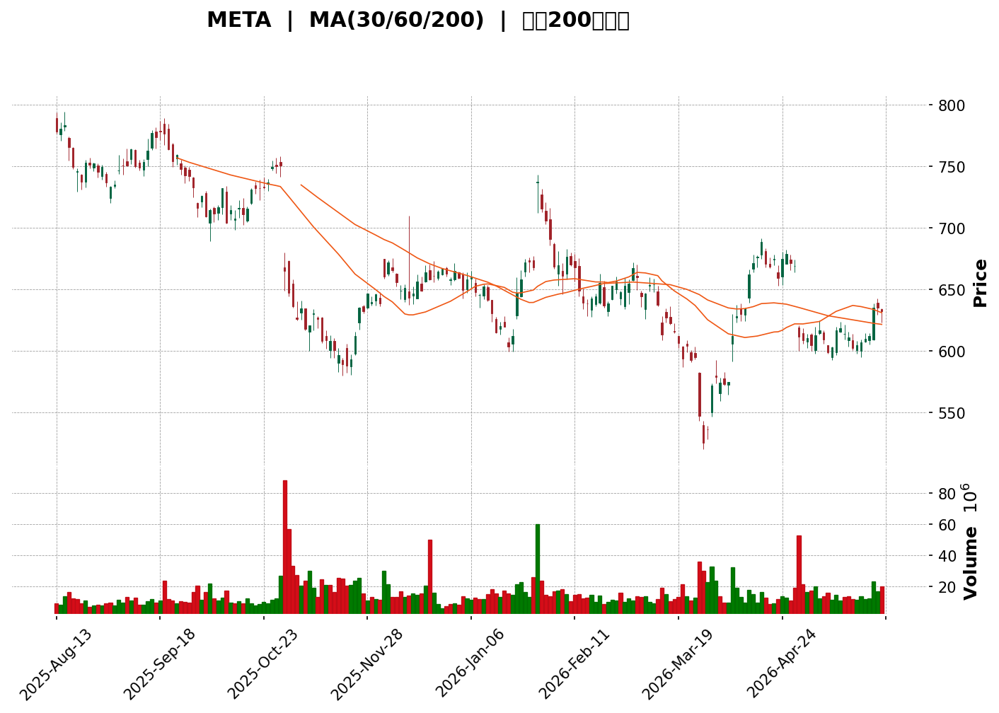
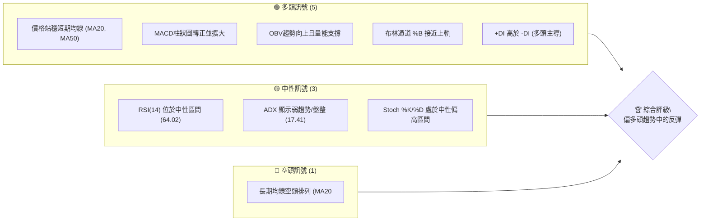
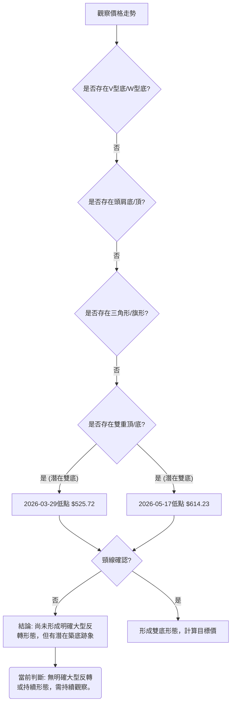
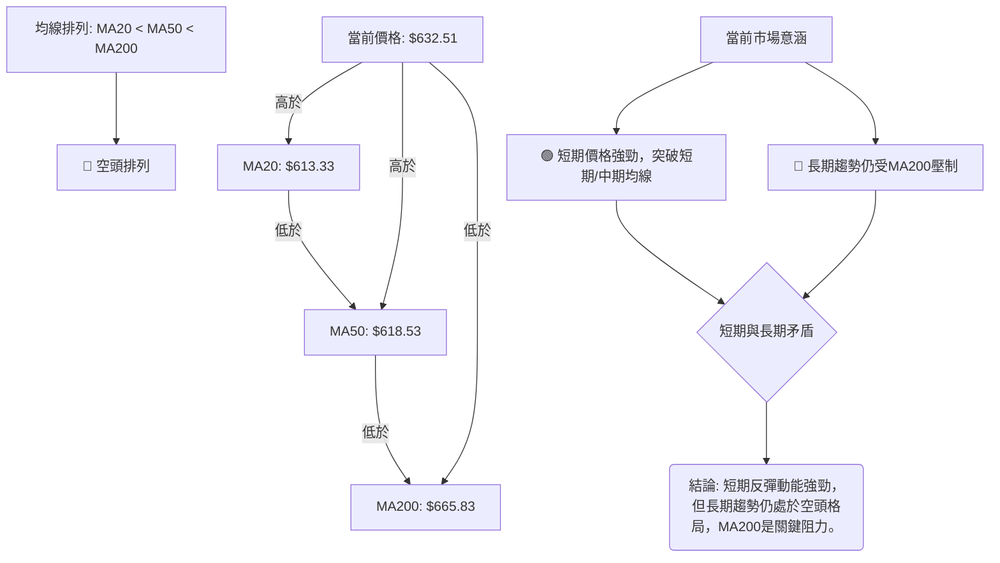
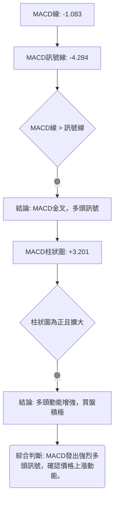

<details>
<summary>📊 靜態圖表 (點擊展開)</summary>

</details>

<html>
<head><meta charset="utf-8" /></head>
<body>
    <div>                        <script>window.PlotlyConfig = {MathJaxConfig: 'local'};</script>
        <script charset="utf-8" src="https://cdn.plot.ly/plotly-3.5.0.min.js" integrity="sha256-fHbNLP+GlIXN+efbQec78UkemUz3NJp7UmfGxC1tNxs=" crossorigin="anonymous"></script>                <div id="candlestick-chart" class="plotly-graph-div" style="height:500px; width:100%;"></div>            <script>                window.PLOTLYENV=window.PLOTLYENV || {};                                if (document.getElementById("candlestick-chart")) {                    Plotly.newPlot(                        "candlestick-chart",                        [{"close":{"dtype":"f8","bdata":"AAAAwARSiEAAAAAgYWKIQAAAACAfe4hAAAAAgJPsh0AAAAAgwW2HQAAAAIC+T4dAAAAAIPIKh0AAAAAALIiHQAAAAKBHfIdAAAAAQKqCh0AAAAAACE2HQAAAACDNaodAAAAAAMEHh0AAAADAGeuGQAAAAKCV+oZAAAAA4CpXh0AAAAAAf3WHQAAAAGBMdIdAAAAAQD\u002ffh0AAAACgvnGHQAAAACAgaYdAAAAAoI6Oh0AAAAAgRNeHQAAAAOBlSYhAAAAAQDgviEAAAAAAYFOIQAAAACBzRIhAAAAAQA\u002ffh0AAAABAHJGHQAAAAKAeu4dAAAAAwEZdh0AAAADAEDSHQAAAAEBFMYdAAAAAADvphkAAAACAI2GGQAAAAECwroZAAAAAIP0qhkAAAACAuFOGQAAAAIAdP4ZAAAAAwCFlhkAAAABASOKGQAAAAKD6AIZAAAAAQApUhkAAAAAgvBuGQAAAAMDQYoZAAAAAgAw3hkAAAACgyF2GQAAAAICU14ZAAAAAoF3ghkAAAADAe+GGQAAAACAy5oZAAAAAYAQJh0AAAAAAiGyHQAAAAKB7cYdAAAAA4FFzh0AAAACA28qEQAAAAMAjOoRAAAAAgCnlg0AAAABALpKDQAAAAAAb14NAAAAAoEBPg0AAAAAgYGWDQAAAACCktYNAAAAAoEOQg0AAAAAA8v+CQAAAAED5BoNAAAAAIIoDg0AAAADgCciCQAAAAGCJpYJAAAAAwKxqgkAAAADAVGGCQAAAAAAQioJAAAAAIDYgg0AAAAAAQ9mDQAAAAMBqxINAAAAAAPI2hEAAAABgZv6DQAAAAAAoMIRAAAAAwEH0g0AAAABgZ6OEQAAAAGBdAoVAAAAAQH7NhEAAAACg536EQAAAACBbSIRAAAAAQPZchEAAAAAgPBmEQAAAACCmN4RAAAAAALSEhEAAAAAgjkeEQAAAAIANv4RAAAAA4KaRhEAAAAAgeaeEQAAAACD4woRAAAAA4NTXhEAAAADgx7WEQAAAACADkYRAAAAA4ArLhEAAAADgM5yEQAAAACDUToRAAAAAwM+RhEAAAABgcKCEQAAAAKAUQYRAAAAAAA8shEAAAADAAmSEQAAAAMBdC4RAAAAAwGa0g0AAAACg8jeDQAAAAMAmYoNAAAAAYMFdg0AAAABg09yCQAAAAEB8I4NAAAAAoJs4hEAAAABgkpGEQAAAAEBH\u002foRAAAAAgCcDhUAAAABgQ+GEQAAAAGBtDYdAAAAAwBhfhkAAAAAAcg6GQAAAAMDdmIVAAAAAgFfjhEAAAAAAGO2EQAAAAEAnp4RAAAAAACAlhUAAAABgK\u002fGEQAAAAKDx4IRAAAAAgAhKhEAAAAAgyPmDQAAAAODx9YNAAAAAoFsVhEAAAADg0yGEQAAAAADLeIRAAAAAoKPlg0AAAABgBvaDQAAAAOALaYRAAAAAgJWDhEAAAAAAAT2EQAAAAOABaIRAAAAAQCh0hEAAAAAgRdmEQAAAACAKoIRAAAAAgHcihEAAAACAsDaEQAAAAIAVbIRAAAAAAGZyhEAAAACgEu2DQAAAAOB6KYNAAAAAoJmbg0AAAACgR3WDQAAAAKBwPYNAAAAAoJn1gkAAAACgR42CQAAAAOB64IJAAAAAIFyHgkAAAADAHpeCQAAAAOBRHIFAAAAAgMJtgEAAAABACsOAQAAAAEAK4YFAAAAAANcZgkAAAAAgrvOBQAAAAAAp6IFAAAAAYGb4gUAAAAAgXCODQAAAAMAeo4NAAAAAQOGug0AAAACAPdSDQAAAAIDrs4RAAAAA4KP8hEAAAADA9SaFQAAAAGBmhIVAAAAAoEf3hEAAAABguOaEQAAAAIDCFYVAAAAAQDOZhEAAAACAPRiFQAAAAMD1NIVAAAAAYLj6hEAAAADA9eiEQAAAAKBHH4NAAAAAAAAGg0AAAACgRxODQAAAACCu54JAAAAAQAong0AAAADgekaDQAAAAEAKDYNAAAAAQOG2gkAAAAAAANiCQAAAAEAKRYNAAAAAoHBTg0AAAAAA1zGDQAAAACCuGYNAAAAAQOHUgkAAAADgeuiCQAAAAEAK+4JAAAAAgBQSg0AAAABguCKDQAAAAIAU2oNAAAAA4FHag0AAAACAFMSDQA=="},"high":{"dtype":"f8","bdata":"A6pnM8XMiEB13Xd+to+IQAngAz8T04hAy2gYIPAviEBYh7H2+uqHQI3pa7mJY4dAIgn9qQY+h0C2bPk\u002fA5mHQAWEV7nQqIdA1sEbjs+Ih0Cm9LiDEIOHQIqe6\u002fBIeodAobU+oB1Lh0B8Kas6NPKGQGJTCeUfFIdAEG2sOAO7h0B3VLmbZKGHQA7wwE+25YdAnpXyHgnkh0C0DRlqP9+HQM6wBuCbmodAbta5H1yeh0DgpnnpDCKIQHs74sw7XIhANs38TKNriEC1j6iRdJeIQFp00KaTp4hAytnLSViDiEDMx4zGgQqIQDQVE7a2vodAWWtwPw2ch0CzA09nZXWHQLj9vkM2bIdAYdVM4NUth0BebCN0KIWGQAoXsmlwtIZAjfEOWzzOhkCywQb0dl2GQC36ZBdnaoZAjrKPb5ZzhkAAAABASOKGQCk\u002fusRW8IZA7aBJQOd1hkC7\u002fBWo11KGQIQfUOmHlYZAn998vDqihkDxsN\u002fVuGqGQDSQW+db5IZA5BbLvSIKh0DcB\u002ftJ6BqHQIuXFv5cKYdADGAMgccfh0BSJmrE55OHQFRsXvMRqYdA9WOKwyOvh0AI9H2TlT6FQFm9Z\u002f8aDoVA2L09UtWRhEDPX9YQWQWEQAPUlOZCCYRAAe6RKYHXg0BY6VbQumiDQKj3pIuEz4NAan4YJRKkg0C4QsSthJ+DQBjYAjfzRINA1xv1MT4lg0COrf9lWRWDQBrTEHY31YJA9rs4HrCSgkDCYSnsp+2CQJ3lTIT4qIJAkUnp5Fw9g0Dcgm0J5N+DQDjgIoJa6oNAVtd7aL43hEBZFKPI8CGEQCQB711ONoRA1wEKHyI+hEC6nXTNxBeFQM5dPQiCDIVAR3nTHKQchUAIvwPJ9rqEQF31xGVWa4RA7LhN1nxxhEAfoubPgC6GQEAqzwGIY4RARdWzLsmvhEAChjCTUKWEQHH7kwvk74RAvr\u002flcmjzhEB8A0\u002fWBwiFQKpwkSRxy4RA411yBd7chECJIJe1BeOEQOxjVkR7nYRA6r3Vwyj9hEAYlcblcsOEQBxZ4sGSvoRAnUI5rcW\u002fhED27FYKm8eEQD8lk2ywlIRAZwWRDV80hEA5H1UwHnOEQCpWxLlIa4RAOovXycMNhECFXtSYTJ+DQJ8vipgWfYNAiRTTx1Wkg0Ae7\u002fMeBBeDQIaVeNLtTYNA\u002f71eFAqghECxJRTVW8+EQL0PTGKeFYVAvKJGoe0hhUBdEcdRzSiFQNbaAIjoOodABzwmbFnchkC6nq2pdoWGQMcjf8wXY4ZAc3oLHu2BhUDjyKoYVkeFQA7nMS1S+4RAp4OGtM1VhUDsiSm6ikCFQAjM6vaCNYVAHolrvl8bhUB0Ll9S+1aEQLFhefNmEIRA5hmrAZYjhECUXyBHFzWEQHo2N6dCtoRAGoyjbBmJhECLszsUfgSEQClhyKqQaoRAvHmRAnqjhEDSG91KE0eEQEyBlfIAm4RAZr8GUM+ThEBWa3VLjgGFQKE816AC8YRAE7NyrFBHhEAu\u002fYkekTmEQPsp6pXhnYRAgDZxCXOUhEDxr1oph2eEQDcJ1MkNpYNAAAAAAADWg0AAAABgZuSDQAAAAEAzdYNAAAAAAAAog0AAAAAgrt+CQAAAAMAeBYNAAAAAAADIgkAAAAAgXN2CQAAAAAAAOIJAAAAAwMz8gEAAAABgZtyAQAAAACCF7YFAAAAAYGaEgkAAAAAAABSCQAAAAOBRNoJAAAAAANf5gUAAAACgma+DQAAAAAAA7INAAAAA4KP0g0AAAAAAANiDQAAAAIAU0oRAAAAAAAA0hUAAAADgoyyFQAAAAAApnIVAAAAAQApbhUAAAACgmSGFQAAAAEAKM4VAAAAA4HrshEAAAAAgXEWFQAAAAAAAVIVAAAAAoHAxhUAAAAAAABKFQAAAAMDMZoNAAAAAQApXg0AAAAAAADCDQAAAAMDMMoNAAAAAoJlfg0AAAAAA14eDQAAAAAApRoNAAAAAoEfngkAAAAAAAN6CQAAAAEAzX4NAAAAAANd9g0AAAACgmWmDQAAAAGC4PINAAAAAoHAvg0AAAAAAAACDQAAAAMDMDINAAAAA4Ho2g0AAAACAwjODQAAAAAAA9INAAAAAAAAYhEAAAAAAANSDQA=="},"hovertemplate":"\u003cb\u003e%{x|%Y-%m-%d}\u003c\u002fb\u003e\u003cbr\u003e\u958b: $%{open:.2f}\u003cbr\u003e\u9ad8: $%{high:.2f}\u003cbr\u003e\u4f4e: $%{low:.2f}\u003cbr\u003e\u6536: $%{close:.2f}\u003cextra\u003e\u003c\u002fextra\u003e","low":{"dtype":"f8","bdata":"0IGPwEBDiEBm55aJmRWIQNJJNansV4hAya9Df0yWh0COmCmM1VyHQOOrdDtMyoZArbdPXiPbhkAPSb\u002fDWuWGQM3PGbb6YodAgVzoLoBRh0CjOOboyyiHQDmusriDGIdAAg01MwTthkCJcI+0T4CGQJNx924p4oZAbLZqlJRAh0C1Qs96RjqHQGIJ7VcQcodAj+dbIVF9h0C3yNJT7GmHQN2A3sPuVIdAMEFjhCMwh0DVgpD90nGHQHeCcFN12odAPfM6xx3kh0BQvbxPYhyIQJ9sWhka+4dAvn8AfIzZh0CWZlQuh26HQK9\u002frUwweodA6JupaHQ6h0Ax9oVi8wCHQPVeVchTD4dAQMRJwbKohkBUpCIqHSiGQNYZpheHZ4ZAcOGmLPQnhkCsk2hf24qFQJ77obCSBIZAAZEajAYVhkBQoZvsADqGQKCkiHOr+oVArO7E76oThkC0fU+eTNGFQA2aBl6aIoZAcPRRYaP1hUDrSDEuhweGQGmP0P\u002fRd4ZAphG5FES8hkDbnQ+zkZaGQP273PMB34ZAc7isB2\u002fPhkCNMcy7FlaHQNLoNL4zQodA7upMkikqh0Dbg+rcrEiEQGGqhuHvI4RApUNcO\u002fHYg0BbfsPat4eDQMQWcm3zi4NA81Pitr5Hg0DUtNPCkcGCQCW6hI2fSINAjPmby9hSg0Ar83i9CvaCQBS2aA\u002fyz4JA4MTOYqaRgkAwTHk6P5OCQOklYFBxNoJAUr\u002fpYzwigkB3bREVAjOCQBvk6p0bJ4JAleYMug6lgkDUcp4mJEqDQLLUJ4WatINAFqpx8oLTg0DTYlvCj+WDQCVqu4AJ6INAmG9zYuLjg0AvNKFPlZeEQGtugbdFqoRAraVpKq2\u002fhEAsSPNA\u002fmGEQC6wYiObEoRAiNOiOdf9g0BuMouXWeyDQBv7K6868YNAX41U0DIVhEA41opGKEWEQEgGov8vf4RA1\u002fufiO+MhECrniLftICEQK5unLh+jYRADD5ufxGthECa2X3TCKaEQD72jUikboRAvnFx1TeKhEAuo4zDAZeEQDr7J5uYF4RAIJ49N5E5hEBX7ecmvVqEQDqlOCwRIoRAUxeJvWjZg0BwPiyDZhKEQOBl5otzBYRAtLv+Xod8g0DQjfU5WjKDQD6lruKiLYNA\u002flM8jGVcg0CnscrX5LuCQEGTq5CIvIJAVG5zrhyQg0BMjhSSMB+EQOpFI0XLpYRAdBj\u002fLrvAhEAKUZm7PcyEQM+0gAGGP4ZAd\u002foYOdZHhkDWYCxwWPeFQHavrQSVboVAnfkqzhzXhEDoqR0mh2eEQHR0u1WTL4RAR+WbTruRhECjCh9hvOmEQN4kEY5NhIRA36qUD9MlhECbeEOcN9CDQKUvvMAYooNAZwXGxuacg0CBMPD+ZuGDQIJ9QXLe8YNA7KeY0KXbg0BX+2wUiaODQA+lPby5DIRAHCYNqZE3hECMeBXAl+yDQGtLXGSoz4NAinJaM1nyg0BygRPg24iEQO3qdpkHToRAvCJT1Ibcg0CmvQJc85GDQKtD2QGPQ4RAdOIpY3E+hEDXwgh+1+KDQAmc4Gk6CINAAAAAwMx4g0AAAACgmW2DQAAAAEDhNINAAAAAgBTSgkAAAAAAAFqCQAAAAIAUuIJAAAAAAAB4gkAAAABAM4uCQAAAAMDM+oBAAAAAgBRCgEAAAADgUYSAQAAAAAApFoFAAAAAYI\u002fugUAAAACgmX2BQAAAAAAA4IFAAAAAgBSmgUAAAADgo36CQAAAAAAAeINAAAAA4KOCg0AAAABAM4ODQAAAAMD1+oNAAAAAgMLBhEAAAAAAAN6EQAAAAEAKGYVAAAAAAADghEAAAADgo9qEQAAAAAAA7oRAAAAAYGZohEAAAABguG6EQAAAAGC49oRAAAAAQArNhEAAAADger6EQAAAAAAAwIJAAAAAQOHwgkAAAAAAANaCQAAAAEDhwoJAAAAAwMywgkAAAADgUSyDQAAAAOB68IJAAAAA4KOwgkAAAADAzISCQAAAAKBHpYJAAAAAAAA4g0AAAADgegqDQAAAACCF3YJAAAAAYGbEgkAAAADgeq6CQAAAAOB6loJAAAAAoJn3gkAAAABgZuqCQAAAAAAACINAAAAA4Hqqg0AAAADAzHqDQA=="},"name":"\u50f9\u683c","open":{"dtype":"f8","bdata":"A8O\u002fAV+qiECHBd+EdUCIQJwIno6AcohAGGCGFDEqiECt+BjUlOqHQJeFOBiMTodAcr5slLg3h0A6DDvK+wuHQFJVw1RpiIdAnQW0tVNoh0ADs02ETHSHQI+\u002f1f0NModAbTUQTUU8h0DFafrltaKGQHHX00k08oZAzS1LYodWh0D0zTBP2naHQGP\u002fuz7UkYdAAWjFhbidh0DkxU3GstqHQIglhyEOh4dAryAcK85Xh0Bmj7Wxj52HQBJYXHWf6YdAIwOzwkxRiEAE\u002f8uZXVeIQJOPYWuehIhA+o40TltkiEDlMkSkuf+HQOAwIs7hoYdA3qW4OYmBh0Bhhc5g+2WHQHybEE\u002fCW4dAhO+Q1hUoh0Ch\u002fUFvSIKGQBv48Aj9ioZAQxRWSkvDhkBU5wzNGQCGQFeqOUIsZIZAYzfwAhJChkDIBUVUpWiGQD+QrcSYzYZApQ3YUo4+hkAo3Y1ZyRSGQOlR7ezmXoZAkNr2wtBihkDqtswFMg+GQGbAqwvjf4ZAP1C2OFT2hkASxUyQ1uSGQJ9kOVvJ64ZAd5VmXnr8hkBHQy5a02OHQO4gTa78eodAOgzeN+uLh0CzdOUVQ+CEQMK1DQwSC4VA9WJH1Tx3hEBU\u002fr1J7peDQM5JbrIIuoNAGwHnbE7Wg0COYrVZrzuDQLFihEpKsINAI1OsmpyXg0BdYZZeppiDQGX7SABfIINAa4IjGkjGgkBzBN41LwCDQGkhB9PldIJA0kupP9SFgkBsqsJu8NOCQJ4BaakjXIJAgNnvP8OtgkAohv9IqneDQIhRmawA5YNAHfu11iTYg0BtUHuD2\u002fODQBonzuYjCoRAXxyVLawahECXaPlk+BaFQAqoJHYht4RAEL53kMfhhED9BoQ2S7WEQFeFkB3rRoRAd977NboRhEBluzZ0uEWEQJjIwmsuKYRA+YfKqZgXhEBtXLerZHiEQIvU+V++g4RATM0EmczOhEDHa7ccrKiEQHYMR\u002fHhm4RAI4dry7SvhECHZL6E6NuEQMdx+rCTi4RA1pE3GAORhEA75+dVc8GEQCngaupNsYRAbaguAaBThEDwXuvWC5iEQDx62RKieIRALjC6sJ4qhECiJo1ZGieEQPPOmz\u002fGX4RAOovXycMNhEC0n2tjto+DQBMHiXCbT4NAYeVvHSt9g0BCzahJ4fqCQAevrYXE8YJA2uGlJn6mg0BPVI5ivyGEQDp7zep8xIRAVIBpiRoQhUDwAw5EYg+FQM7Zr6pkBodAWZCYegW3hkDGhrPG6E+GQH19umseFoZArhFlKyJ5hUCkOW1dGbiEQBz3g5Bdx4RAVqonuea0hED2WSySKSiFQM5dfjJjC4VAFuK9zizrhEBFhnSJYiSEQHs\u002fzqGf94NAVyzNABDKg0ADRTKhMPCDQCKFJ3ok+YNAFrfLttpfhEDgGZnFTsSDQFQbUc3XD4RA6C8xsfJPhEBPf3pJMheEQOaLXlvr5INAbeg2JeI9hEBcJf1dLYuEQM0BEf7oqoRAMViPLMQ6hEAsyddX5dGDQAoBvOQBaIRA7HTWbJlxhECmuJx7j0GEQMEHBqrZeoNAAAAAAADAg0AAAACA65+DQAAAAGC4QoNAAAAAQDMhg0AAAACAPdyCQAAAAOBR7oJAAAAAwMy4gkAAAACA67WCQAAAAIDrM4JAAAAAwMzggEAAAABACsOAQAAAAADXL4FAAAAAQAohgkAAAADgUbCBQAAAACCFDYJAAAAAANfjgUAAAAAAAPCCQAAAAIDCl4NAAAAAgMLTg0AAAAAAAKyDQAAAAIDCGYRAAAAAAADYhEAAAACA6x+FQAAAAMDMNIVAAAAAQOFKhUAAAAAAAPiEQAAAAEDhEoVAAAAAoJm9hEAAAABgj6KEQAAAAAAA+IRAAAAAgOsRhUAAAACgR+eEQAAAAGCPWoNAAAAAIIU1g0AAAAAghf+CQAAAAOB6KoNAAAAAYGbIgkAAAACAwjWDQAAAAKCZOYNAAAAAYI\u002fkgkAAAABgj5aCQAAAAOCjtoJAAAAAAABAg0AAAACA6y+DQAAAAEDhCINAAAAAIFwHg0AAAACAFMaCQAAAAAAAwIJAAAAAQAr\u002fgkAAAADAHgeDQAAAAEAzC4NAAAAAAAD8g0AAAACAws+DQA=="},"x":["2025-08-13T00:00:00-04:00","2025-08-14T00:00:00-04:00","2025-08-15T00:00:00-04:00","2025-08-18T00:00:00-04:00","2025-08-19T00:00:00-04:00","2025-08-20T00:00:00-04:00","2025-08-21T00:00:00-04:00","2025-08-22T00:00:00-04:00","2025-08-25T00:00:00-04:00","2025-08-26T00:00:00-04:00","2025-08-27T00:00:00-04:00","2025-08-28T00:00:00-04:00","2025-08-29T00:00:00-04:00","2025-09-02T00:00:00-04:00","2025-09-03T00:00:00-04:00","2025-09-04T00:00:00-04:00","2025-09-05T00:00:00-04:00","2025-09-08T00:00:00-04:00","2025-09-09T00:00:00-04:00","2025-09-10T00:00:00-04:00","2025-09-11T00:00:00-04:00","2025-09-12T00:00:00-04:00","2025-09-15T00:00:00-04:00","2025-09-16T00:00:00-04:00","2025-09-17T00:00:00-04:00","2025-09-18T00:00:00-04:00","2025-09-19T00:00:00-04:00","2025-09-22T00:00:00-04:00","2025-09-23T00:00:00-04:00","2025-09-24T00:00:00-04:00","2025-09-25T00:00:00-04:00","2025-09-26T00:00:00-04:00","2025-09-29T00:00:00-04:00","2025-09-30T00:00:00-04:00","2025-10-01T00:00:00-04:00","2025-10-02T00:00:00-04:00","2025-10-03T00:00:00-04:00","2025-10-06T00:00:00-04:00","2025-10-07T00:00:00-04:00","2025-10-08T00:00:00-04:00","2025-10-09T00:00:00-04:00","2025-10-10T00:00:00-04:00","2025-10-13T00:00:00-04:00","2025-10-14T00:00:00-04:00","2025-10-15T00:00:00-04:00","2025-10-16T00:00:00-04:00","2025-10-17T00:00:00-04:00","2025-10-20T00:00:00-04:00","2025-10-21T00:00:00-04:00","2025-10-22T00:00:00-04:00","2025-10-23T00:00:00-04:00","2025-10-24T00:00:00-04:00","2025-10-27T00:00:00-04:00","2025-10-28T00:00:00-04:00","2025-10-29T00:00:00-04:00","2025-10-30T00:00:00-04:00","2025-10-31T00:00:00-04:00","2025-11-03T00:00:00-05:00","2025-11-04T00:00:00-05:00","2025-11-05T00:00:00-05:00","2025-11-06T00:00:00-05:00","2025-11-07T00:00:00-05:00","2025-11-10T00:00:00-05:00","2025-11-11T00:00:00-05:00","2025-11-12T00:00:00-05:00","2025-11-13T00:00:00-05:00","2025-11-14T00:00:00-05:00","2025-11-17T00:00:00-05:00","2025-11-18T00:00:00-05:00","2025-11-19T00:00:00-05:00","2025-11-20T00:00:00-05:00","2025-11-21T00:00:00-05:00","2025-11-24T00:00:00-05:00","2025-11-25T00:00:00-05:00","2025-11-26T00:00:00-05:00","2025-11-28T00:00:00-05:00","2025-12-01T00:00:00-05:00","2025-12-02T00:00:00-05:00","2025-12-03T00:00:00-05:00","2025-12-04T00:00:00-05:00","2025-12-05T00:00:00-05:00","2025-12-08T00:00:00-05:00","2025-12-09T00:00:00-05:00","2025-12-10T00:00:00-05:00","2025-12-11T00:00:00-05:00","2025-12-12T00:00:00-05:00","2025-12-15T00:00:00-05:00","2025-12-16T00:00:00-05:00","2025-12-17T00:00:00-05:00","2025-12-18T00:00:00-05:00","2025-12-19T00:00:00-05:00","2025-12-22T00:00:00-05:00","2025-12-23T00:00:00-05:00","2025-12-24T00:00:00-05:00","2025-12-26T00:00:00-05:00","2025-12-29T00:00:00-05:00","2025-12-30T00:00:00-05:00","2025-12-31T00:00:00-05:00","2026-01-02T00:00:00-05:00","2026-01-05T00:00:00-05:00","2026-01-06T00:00:00-05:00","2026-01-07T00:00:00-05:00","2026-01-08T00:00:00-05:00","2026-01-09T00:00:00-05:00","2026-01-12T00:00:00-05:00","2026-01-13T00:00:00-05:00","2026-01-14T00:00:00-05:00","2026-01-15T00:00:00-05:00","2026-01-16T00:00:00-05:00","2026-01-20T00:00:00-05:00","2026-01-21T00:00:00-05:00","2026-01-22T00:00:00-05:00","2026-01-23T00:00:00-05:00","2026-01-26T00:00:00-05:00","2026-01-27T00:00:00-05:00","2026-01-28T00:00:00-05:00","2026-01-29T00:00:00-05:00","2026-01-30T00:00:00-05:00","2026-02-02T00:00:00-05:00","2026-02-03T00:00:00-05:00","2026-02-04T00:00:00-05:00","2026-02-05T00:00:00-05:00","2026-02-06T00:00:00-05:00","2026-02-09T00:00:00-05:00","2026-02-10T00:00:00-05:00","2026-02-11T00:00:00-05:00","2026-02-12T00:00:00-05:00","2026-02-13T00:00:00-05:00","2026-02-17T00:00:00-05:00","2026-02-18T00:00:00-05:00","2026-02-19T00:00:00-05:00","2026-02-20T00:00:00-05:00","2026-02-23T00:00:00-05:00","2026-02-24T00:00:00-05:00","2026-02-25T00:00:00-05:00","2026-02-26T00:00:00-05:00","2026-02-27T00:00:00-05:00","2026-03-02T00:00:00-05:00","2026-03-03T00:00:00-05:00","2026-03-04T00:00:00-05:00","2026-03-05T00:00:00-05:00","2026-03-06T00:00:00-05:00","2026-03-09T00:00:00-04:00","2026-03-10T00:00:00-04:00","2026-03-11T00:00:00-04:00","2026-03-12T00:00:00-04:00","2026-03-13T00:00:00-04:00","2026-03-16T00:00:00-04:00","2026-03-17T00:00:00-04:00","2026-03-18T00:00:00-04:00","2026-03-19T00:00:00-04:00","2026-03-20T00:00:00-04:00","2026-03-23T00:00:00-04:00","2026-03-24T00:00:00-04:00","2026-03-25T00:00:00-04:00","2026-03-26T00:00:00-04:00","2026-03-27T00:00:00-04:00","2026-03-30T00:00:00-04:00","2026-03-31T00:00:00-04:00","2026-04-01T00:00:00-04:00","2026-04-02T00:00:00-04:00","2026-04-06T00:00:00-04:00","2026-04-07T00:00:00-04:00","2026-04-08T00:00:00-04:00","2026-04-09T00:00:00-04:00","2026-04-10T00:00:00-04:00","2026-04-13T00:00:00-04:00","2026-04-14T00:00:00-04:00","2026-04-15T00:00:00-04:00","2026-04-16T00:00:00-04:00","2026-04-17T00:00:00-04:00","2026-04-20T00:00:00-04:00","2026-04-21T00:00:00-04:00","2026-04-22T00:00:00-04:00","2026-04-23T00:00:00-04:00","2026-04-24T00:00:00-04:00","2026-04-27T00:00:00-04:00","2026-04-28T00:00:00-04:00","2026-04-29T00:00:00-04:00","2026-04-30T00:00:00-04:00","2026-05-01T00:00:00-04:00","2026-05-04T00:00:00-04:00","2026-05-05T00:00:00-04:00","2026-05-06T00:00:00-04:00","2026-05-07T00:00:00-04:00","2026-05-08T00:00:00-04:00","2026-05-11T00:00:00-04:00","2026-05-12T00:00:00-04:00","2026-05-13T00:00:00-04:00","2026-05-14T00:00:00-04:00","2026-05-15T00:00:00-04:00","2026-05-18T00:00:00-04:00","2026-05-19T00:00:00-04:00","2026-05-20T00:00:00-04:00","2026-05-21T00:00:00-04:00","2026-05-22T00:00:00-04:00","2026-05-26T00:00:00-04:00","2026-05-27T00:00:00-04:00","2026-05-28T00:00:00-04:00","2026-05-29T00:00:00-04:00"],"type":"candlestick"},{"hovertemplate":"MA30: $%{y:.2f}\u003cextra\u003e\u003c\u002fextra\u003e","line":{"color":"#2196F3","dash":"dash","width":2},"mode":"lines","name":"MA30","x":["2025-08-13T00:00:00-04:00","2025-08-14T00:00:00-04:00","2025-08-15T00:00:00-04:00","2025-08-18T00:00:00-04:00","2025-08-19T00:00:00-04:00","2025-08-20T00:00:00-04:00","2025-08-21T00:00:00-04:00","2025-08-22T00:00:00-04:00","2025-08-25T00:00:00-04:00","2025-08-26T00:00:00-04:00","2025-08-27T00:00:00-04:00","2025-08-28T00:00:00-04:00","2025-08-29T00:00:00-04:00","2025-09-02T00:00:00-04:00","2025-09-03T00:00:00-04:00","2025-09-04T00:00:00-04:00","2025-09-05T00:00:00-04:00","2025-09-08T00:00:00-04:00","2025-09-09T00:00:00-04:00","2025-09-10T00:00:00-04:00","2025-09-11T00:00:00-04:00","2025-09-12T00:00:00-04:00","2025-09-15T00:00:00-04:00","2025-09-16T00:00:00-04:00","2025-09-17T00:00:00-04:00","2025-09-18T00:00:00-04:00","2025-09-19T00:00:00-04:00","2025-09-22T00:00:00-04:00","2025-09-23T00:00:00-04:00","2025-09-24T00:00:00-04:00","2025-09-25T00:00:00-04:00","2025-09-26T00:00:00-04:00","2025-09-29T00:00:00-04:00","2025-09-30T00:00:00-04:00","2025-10-01T00:00:00-04:00","2025-10-02T00:00:00-04:00","2025-10-03T00:00:00-04:00","2025-10-06T00:00:00-04:00","2025-10-07T00:00:00-04:00","2025-10-08T00:00:00-04:00","2025-10-09T00:00:00-04:00","2025-10-10T00:00:00-04:00","2025-10-13T00:00:00-04:00","2025-10-14T00:00:00-04:00","2025-10-15T00:00:00-04:00","2025-10-16T00:00:00-04:00","2025-10-17T00:00:00-04:00","2025-10-20T00:00:00-04:00","2025-10-21T00:00:00-04:00","2025-10-22T00:00:00-04:00","2025-10-23T00:00:00-04:00","2025-10-24T00:00:00-04:00","2025-10-27T00:00:00-04:00","2025-10-28T00:00:00-04:00","2025-10-29T00:00:00-04:00","2025-10-30T00:00:00-04:00","2025-10-31T00:00:00-04:00","2025-11-03T00:00:00-05:00","2025-11-04T00:00:00-05:00","2025-11-05T00:00:00-05:00","2025-11-06T00:00:00-05:00","2025-11-07T00:00:00-05:00","2025-11-10T00:00:00-05:00","2025-11-11T00:00:00-05:00","2025-11-12T00:00:00-05:00","2025-11-13T00:00:00-05:00","2025-11-14T00:00:00-05:00","2025-11-17T00:00:00-05:00","2025-11-18T00:00:00-05:00","2025-11-19T00:00:00-05:00","2025-11-20T00:00:00-05:00","2025-11-21T00:00:00-05:00","2025-11-24T00:00:00-05:00","2025-11-25T00:00:00-05:00","2025-11-26T00:00:00-05:00","2025-11-28T00:00:00-05:00","2025-12-01T00:00:00-05:00","2025-12-02T00:00:00-05:00","2025-12-03T00:00:00-05:00","2025-12-04T00:00:00-05:00","2025-12-05T00:00:00-05:00","2025-12-08T00:00:00-05:00","2025-12-09T00:00:00-05:00","2025-12-10T00:00:00-05:00","2025-12-11T00:00:00-05:00","2025-12-12T00:00:00-05:00","2025-12-15T00:00:00-05:00","2025-12-16T00:00:00-05:00","2025-12-17T00:00:00-05:00","2025-12-18T00:00:00-05:00","2025-12-19T00:00:00-05:00","2025-12-22T00:00:00-05:00","2025-12-23T00:00:00-05:00","2025-12-24T00:00:00-05:00","2025-12-26T00:00:00-05:00","2025-12-29T00:00:00-05:00","2025-12-30T00:00:00-05:00","2025-12-31T00:00:00-05:00","2026-01-02T00:00:00-05:00","2026-01-05T00:00:00-05:00","2026-01-06T00:00:00-05:00","2026-01-07T00:00:00-05:00","2026-01-08T00:00:00-05:00","2026-01-09T00:00:00-05:00","2026-01-12T00:00:00-05:00","2026-01-13T00:00:00-05:00","2026-01-14T00:00:00-05:00","2026-01-15T00:00:00-05:00","2026-01-16T00:00:00-05:00","2026-01-20T00:00:00-05:00","2026-01-21T00:00:00-05:00","2026-01-22T00:00:00-05:00","2026-01-23T00:00:00-05:00","2026-01-26T00:00:00-05:00","2026-01-27T00:00:00-05:00","2026-01-28T00:00:00-05:00","2026-01-29T00:00:00-05:00","2026-01-30T00:00:00-05:00","2026-02-02T00:00:00-05:00","2026-02-03T00:00:00-05:00","2026-02-04T00:00:00-05:00","2026-02-05T00:00:00-05:00","2026-02-06T00:00:00-05:00","2026-02-09T00:00:00-05:00","2026-02-10T00:00:00-05:00","2026-02-11T00:00:00-05:00","2026-02-12T00:00:00-05:00","2026-02-13T00:00:00-05:00","2026-02-17T00:00:00-05:00","2026-02-18T00:00:00-05:00","2026-02-19T00:00:00-05:00","2026-02-20T00:00:00-05:00","2026-02-23T00:00:00-05:00","2026-02-24T00:00:00-05:00","2026-02-25T00:00:00-05:00","2026-02-26T00:00:00-05:00","2026-02-27T00:00:00-05:00","2026-03-02T00:00:00-05:00","2026-03-03T00:00:00-05:00","2026-03-04T00:00:00-05:00","2026-03-05T00:00:00-05:00","2026-03-06T00:00:00-05:00","2026-03-09T00:00:00-04:00","2026-03-10T00:00:00-04:00","2026-03-11T00:00:00-04:00","2026-03-12T00:00:00-04:00","2026-03-13T00:00:00-04:00","2026-03-16T00:00:00-04:00","2026-03-17T00:00:00-04:00","2026-03-18T00:00:00-04:00","2026-03-19T00:00:00-04:00","2026-03-20T00:00:00-04:00","2026-03-23T00:00:00-04:00","2026-03-24T00:00:00-04:00","2026-03-25T00:00:00-04:00","2026-03-26T00:00:00-04:00","2026-03-27T00:00:00-04:00","2026-03-30T00:00:00-04:00","2026-03-31T00:00:00-04:00","2026-04-01T00:00:00-04:00","2026-04-02T00:00:00-04:00","2026-04-06T00:00:00-04:00","2026-04-07T00:00:00-04:00","2026-04-08T00:00:00-04:00","2026-04-09T00:00:00-04:00","2026-04-10T00:00:00-04:00","2026-04-13T00:00:00-04:00","2026-04-14T00:00:00-04:00","2026-04-15T00:00:00-04:00","2026-04-16T00:00:00-04:00","2026-04-17T00:00:00-04:00","2026-04-20T00:00:00-04:00","2026-04-21T00:00:00-04:00","2026-04-22T00:00:00-04:00","2026-04-23T00:00:00-04:00","2026-04-24T00:00:00-04:00","2026-04-27T00:00:00-04:00","2026-04-28T00:00:00-04:00","2026-04-29T00:00:00-04:00","2026-04-30T00:00:00-04:00","2026-05-01T00:00:00-04:00","2026-05-04T00:00:00-04:00","2026-05-05T00:00:00-04:00","2026-05-06T00:00:00-04:00","2026-05-07T00:00:00-04:00","2026-05-08T00:00:00-04:00","2026-05-11T00:00:00-04:00","2026-05-12T00:00:00-04:00","2026-05-13T00:00:00-04:00","2026-05-14T00:00:00-04:00","2026-05-15T00:00:00-04:00","2026-05-18T00:00:00-04:00","2026-05-19T00:00:00-04:00","2026-05-20T00:00:00-04:00","2026-05-21T00:00:00-04:00","2026-05-22T00:00:00-04:00","2026-05-26T00:00:00-04:00","2026-05-27T00:00:00-04:00","2026-05-28T00:00:00-04:00","2026-05-29T00:00:00-04:00"],"y":{"dtype":"f8","bdata":"AAAAAAAA+H8AAAAAAAD4fwAAAAAAAPh\u002fAAAAAAAA+H8AAAAAAAD4fwAAAAAAAPh\u002fAAAAAAAA+H8AAAAAAAD4fwAAAAAAAPh\u002fAAAAAAAA+H8AAAAAAAD4fwAAAAAAAPh\u002fAAAAAAAA+H8AAAAAAAD4fwAAAAAAAPh\u002fAAAAAAAA+H8AAAAAAAD4fwAAAAAAAPh\u002fAAAAAAAA+H8AAAAAAAD4fwAAAAAAAPh\u002fAAAAAAAA+H8AAAAAAAD4fwAAAAAAAPh\u002fAAAAAAAA+H8AAAAAAAD4fwAAAAAAAPh\u002fAAAAAAAA+H8AAAAAAAD4fzMzMzPrp4dAvLu7u8Kfh0DNzMz8rpWHQCIiIkKwiodAzczMLAuCh0DNzMz8FnmHQFVVVaW4c4dAvLu7i0Fsh0De3d1t+WGHQFVVVfVmV4dAiYiIaOJNh0C8u7t7U0qHQO\u002fu7u5DPodAAAAAYEY4h0CrqqraXDGHQCIiIsJNLIdAVVVVJbMih0BEREREYBmHQAAAAPAmFIdAMzMz86cLh0C8u7vr2AaHQHd3d6d7AodAzczMHAj+hkDv7u5OefqGQFVVVdVG84ZAvLu7awPthkDv7u7e3M6GQCIiIsJirIZAMzMzs3SKhkAzMzOzW2iGQBEREWEoR4ZAMzMzk44khkCJiIg4EQSGQGZmZqZY5oVA7+7u3sfJhUAzMzPj8KyFQO\u002fu7h7AjYVAMzMz49VyhUBVVVVVlFSFQCIiIjLcNYVAzczMXOkThUCJiIjYeu2EQN7d3X3qz4RA7+7unpa0hEARERFRTqGEQFVVVZX1ioRAIiIiouN5hEAAAACgpGWEQAAAAOD+ToRAMzMzAw82hEAzMzMz7CKEQCIiIoLLEoRAERERgb7\u002fg0ARERGxweaDQERERCTJy4NAERERwXCxg0CrqqoKhauDQJqZmclvq4NARERENMGwg0Dv7u7uzLaDQHd3dzeIvoNAvLu7W0fJg0DNzMzsA9SDQBERETH+3INA7+7ubunng0ARERGhgfaDQHd3dxekA4RAzczMDNMShEDNzMwMbiKEQFVVVTWbMIRA3t3dPfpChEBERETUJVaEQN7d3R3IZIRA7+7uvrVthEDNzMy8VXKEQLy7uyuzdIRAIiIiMllwhEDNzMy8u2mEQERERNTdYoRAzczMjNldhEC8u7t7sk6EQLy7uwu8PoRA7+7ujsU5hECamZnZZDqEQBEREUF1QIRA3t3dbf9FhEBmZmZWqkyEQFVVVaXbZIRA3t3dzat0hECJiIiI1YOEQFVVVTUYi4RAvLu7S9GNhEBERERkI5CEQHd3dwc2j4RAmpmZmcmRhEAiIiJixJOEQHd3d3duloRAZmZmliGShECJiIiYt4yEQO\u002fu7h7BiYRA3t3dHZuFhEAzMzOzYoGEQM3MzBw+g4RAMzMzM+WAhEB3d3enOn2EQO\u002fu7g5agIRAREREBEKHhEAiIiKy9Y+EQDMzMzOwmIRAVVVV5fehhEDv7u6e6rKEQERERASav4RAREREFN2+hEDNzMyM1buEQGZmZgb2toRAZmZmxiKyhEBEREQE\u002f6mEQERERETMiIRAZmZm9jZxhEAiIiLiCluEQFVVVaXtRoRAIiIiYng2hEBERES0NSKEQDMzM9MNE4RA7+7ufrr8g0AiIiICqeiDQM3MzIyByINAiYiISJCng0De3d2NI4yDQJqZmRlgeoNAd3d3R3Vpg0C8u7tr2laDQHd3dyf3QINA3t3dLYYwg0ARERGBgCmDQImIiIjnIoNAVVVVddAbg0CamZl5UhiDQDMzM0PaGoNAq6qq6mYfg0Dv7u7e\u002fSGDQLy7u4uaKYNAzczMjLIwg0De3d2tkDaDQERERJQ4PINAAAAAsIM9g0BVVVWVfEeDQM3MzJzvWINAZmZm1qNkg0AiIiKCB3GDQERERCQGcINAZmZmFpJwg0De3d2NCXWDQO\u002fu7v5GdYNAmpmZmZl6g0AREREBcoCDQO\u002fu7q4AkYNAVVVVtYGkg0AiIiKiRbaDQAAAAIAjwoNA3t3djZfMg0BERESEMteDQO\u002fu7p5h4YNAzczMDLvog0C8u7ubxOaDQDMzM1Mq4YNAzczMTPDbg0BmZmZ2BdaDQAAAAJDCzoNAmpmZKRXFg0CrqqraQLmDQA=="},"type":"scatter"},{"hovertemplate":"MA60: $%{y:.2f}\u003cextra\u003e\u003c\u002fextra\u003e","line":{"color":"#9C27B0","dash":"dash","width":2},"mode":"lines","name":"MA60","x":["2025-08-13T00:00:00-04:00","2025-08-14T00:00:00-04:00","2025-08-15T00:00:00-04:00","2025-08-18T00:00:00-04:00","2025-08-19T00:00:00-04:00","2025-08-20T00:00:00-04:00","2025-08-21T00:00:00-04:00","2025-08-22T00:00:00-04:00","2025-08-25T00:00:00-04:00","2025-08-26T00:00:00-04:00","2025-08-27T00:00:00-04:00","2025-08-28T00:00:00-04:00","2025-08-29T00:00:00-04:00","2025-09-02T00:00:00-04:00","2025-09-03T00:00:00-04:00","2025-09-04T00:00:00-04:00","2025-09-05T00:00:00-04:00","2025-09-08T00:00:00-04:00","2025-09-09T00:00:00-04:00","2025-09-10T00:00:00-04:00","2025-09-11T00:00:00-04:00","2025-09-12T00:00:00-04:00","2025-09-15T00:00:00-04:00","2025-09-16T00:00:00-04:00","2025-09-17T00:00:00-04:00","2025-09-18T00:00:00-04:00","2025-09-19T00:00:00-04:00","2025-09-22T00:00:00-04:00","2025-09-23T00:00:00-04:00","2025-09-24T00:00:00-04:00","2025-09-25T00:00:00-04:00","2025-09-26T00:00:00-04:00","2025-09-29T00:00:00-04:00","2025-09-30T00:00:00-04:00","2025-10-01T00:00:00-04:00","2025-10-02T00:00:00-04:00","2025-10-03T00:00:00-04:00","2025-10-06T00:00:00-04:00","2025-10-07T00:00:00-04:00","2025-10-08T00:00:00-04:00","2025-10-09T00:00:00-04:00","2025-10-10T00:00:00-04:00","2025-10-13T00:00:00-04:00","2025-10-14T00:00:00-04:00","2025-10-15T00:00:00-04:00","2025-10-16T00:00:00-04:00","2025-10-17T00:00:00-04:00","2025-10-20T00:00:00-04:00","2025-10-21T00:00:00-04:00","2025-10-22T00:00:00-04:00","2025-10-23T00:00:00-04:00","2025-10-24T00:00:00-04:00","2025-10-27T00:00:00-04:00","2025-10-28T00:00:00-04:00","2025-10-29T00:00:00-04:00","2025-10-30T00:00:00-04:00","2025-10-31T00:00:00-04:00","2025-11-03T00:00:00-05:00","2025-11-04T00:00:00-05:00","2025-11-05T00:00:00-05:00","2025-11-06T00:00:00-05:00","2025-11-07T00:00:00-05:00","2025-11-10T00:00:00-05:00","2025-11-11T00:00:00-05:00","2025-11-12T00:00:00-05:00","2025-11-13T00:00:00-05:00","2025-11-14T00:00:00-05:00","2025-11-17T00:00:00-05:00","2025-11-18T00:00:00-05:00","2025-11-19T00:00:00-05:00","2025-11-20T00:00:00-05:00","2025-11-21T00:00:00-05:00","2025-11-24T00:00:00-05:00","2025-11-25T00:00:00-05:00","2025-11-26T00:00:00-05:00","2025-11-28T00:00:00-05:00","2025-12-01T00:00:00-05:00","2025-12-02T00:00:00-05:00","2025-12-03T00:00:00-05:00","2025-12-04T00:00:00-05:00","2025-12-05T00:00:00-05:00","2025-12-08T00:00:00-05:00","2025-12-09T00:00:00-05:00","2025-12-10T00:00:00-05:00","2025-12-11T00:00:00-05:00","2025-12-12T00:00:00-05:00","2025-12-15T00:00:00-05:00","2025-12-16T00:00:00-05:00","2025-12-17T00:00:00-05:00","2025-12-18T00:00:00-05:00","2025-12-19T00:00:00-05:00","2025-12-22T00:00:00-05:00","2025-12-23T00:00:00-05:00","2025-12-24T00:00:00-05:00","2025-12-26T00:00:00-05:00","2025-12-29T00:00:00-05:00","2025-12-30T00:00:00-05:00","2025-12-31T00:00:00-05:00","2026-01-02T00:00:00-05:00","2026-01-05T00:00:00-05:00","2026-01-06T00:00:00-05:00","2026-01-07T00:00:00-05:00","2026-01-08T00:00:00-05:00","2026-01-09T00:00:00-05:00","2026-01-12T00:00:00-05:00","2026-01-13T00:00:00-05:00","2026-01-14T00:00:00-05:00","2026-01-15T00:00:00-05:00","2026-01-16T00:00:00-05:00","2026-01-20T00:00:00-05:00","2026-01-21T00:00:00-05:00","2026-01-22T00:00:00-05:00","2026-01-23T00:00:00-05:00","2026-01-26T00:00:00-05:00","2026-01-27T00:00:00-05:00","2026-01-28T00:00:00-05:00","2026-01-29T00:00:00-05:00","2026-01-30T00:00:00-05:00","2026-02-02T00:00:00-05:00","2026-02-03T00:00:00-05:00","2026-02-04T00:00:00-05:00","2026-02-05T00:00:00-05:00","2026-02-06T00:00:00-05:00","2026-02-09T00:00:00-05:00","2026-02-10T00:00:00-05:00","2026-02-11T00:00:00-05:00","2026-02-12T00:00:00-05:00","2026-02-13T00:00:00-05:00","2026-02-17T00:00:00-05:00","2026-02-18T00:00:00-05:00","2026-02-19T00:00:00-05:00","2026-02-20T00:00:00-05:00","2026-02-23T00:00:00-05:00","2026-02-24T00:00:00-05:00","2026-02-25T00:00:00-05:00","2026-02-26T00:00:00-05:00","2026-02-27T00:00:00-05:00","2026-03-02T00:00:00-05:00","2026-03-03T00:00:00-05:00","2026-03-04T00:00:00-05:00","2026-03-05T00:00:00-05:00","2026-03-06T00:00:00-05:00","2026-03-09T00:00:00-04:00","2026-03-10T00:00:00-04:00","2026-03-11T00:00:00-04:00","2026-03-12T00:00:00-04:00","2026-03-13T00:00:00-04:00","2026-03-16T00:00:00-04:00","2026-03-17T00:00:00-04:00","2026-03-18T00:00:00-04:00","2026-03-19T00:00:00-04:00","2026-03-20T00:00:00-04:00","2026-03-23T00:00:00-04:00","2026-03-24T00:00:00-04:00","2026-03-25T00:00:00-04:00","2026-03-26T00:00:00-04:00","2026-03-27T00:00:00-04:00","2026-03-30T00:00:00-04:00","2026-03-31T00:00:00-04:00","2026-04-01T00:00:00-04:00","2026-04-02T00:00:00-04:00","2026-04-06T00:00:00-04:00","2026-04-07T00:00:00-04:00","2026-04-08T00:00:00-04:00","2026-04-09T00:00:00-04:00","2026-04-10T00:00:00-04:00","2026-04-13T00:00:00-04:00","2026-04-14T00:00:00-04:00","2026-04-15T00:00:00-04:00","2026-04-16T00:00:00-04:00","2026-04-17T00:00:00-04:00","2026-04-20T00:00:00-04:00","2026-04-21T00:00:00-04:00","2026-04-22T00:00:00-04:00","2026-04-23T00:00:00-04:00","2026-04-24T00:00:00-04:00","2026-04-27T00:00:00-04:00","2026-04-28T00:00:00-04:00","2026-04-29T00:00:00-04:00","2026-04-30T00:00:00-04:00","2026-05-01T00:00:00-04:00","2026-05-04T00:00:00-04:00","2026-05-05T00:00:00-04:00","2026-05-06T00:00:00-04:00","2026-05-07T00:00:00-04:00","2026-05-08T00:00:00-04:00","2026-05-11T00:00:00-04:00","2026-05-12T00:00:00-04:00","2026-05-13T00:00:00-04:00","2026-05-14T00:00:00-04:00","2026-05-15T00:00:00-04:00","2026-05-18T00:00:00-04:00","2026-05-19T00:00:00-04:00","2026-05-20T00:00:00-04:00","2026-05-21T00:00:00-04:00","2026-05-22T00:00:00-04:00","2026-05-26T00:00:00-04:00","2026-05-27T00:00:00-04:00","2026-05-28T00:00:00-04:00","2026-05-29T00:00:00-04:00"],"y":{"dtype":"f8","bdata":"AAAAAAAA+H8AAAAAAAD4fwAAAAAAAPh\u002fAAAAAAAA+H8AAAAAAAD4fwAAAAAAAPh\u002fAAAAAAAA+H8AAAAAAAD4fwAAAAAAAPh\u002fAAAAAAAA+H8AAAAAAAD4fwAAAAAAAPh\u002fAAAAAAAA+H8AAAAAAAD4fwAAAAAAAPh\u002fAAAAAAAA+H8AAAAAAAD4fwAAAAAAAPh\u002fAAAAAAAA+H8AAAAAAAD4fwAAAAAAAPh\u002fAAAAAAAA+H8AAAAAAAD4fwAAAAAAAPh\u002fAAAAAAAA+H8AAAAAAAD4fwAAAAAAAPh\u002fAAAAAAAA+H8AAAAAAAD4fwAAAAAAAPh\u002fAAAAAAAA+H8AAAAAAAD4fwAAAAAAAPh\u002fAAAAAAAA+H8AAAAAAAD4fwAAAAAAAPh\u002fAAAAAAAA+H8AAAAAAAD4fwAAAAAAAPh\u002fAAAAAAAA+H8AAAAAAAD4fwAAAAAAAPh\u002fAAAAAAAA+H8AAAAAAAD4fwAAAAAAAPh\u002fAAAAAAAA+H8AAAAAAAD4fwAAAAAAAPh\u002fAAAAAAAA+H8AAAAAAAD4fwAAAAAAAPh\u002fAAAAAAAA+H8AAAAAAAD4fwAAAAAAAPh\u002fAAAAAAAA+H8AAAAAAAD4fwAAAAAAAPh\u002fAAAAAAAA+H8AAAAAAAD4fyIiIsqJ94ZAd3d3pyjihkCrqqoa4MyGQERERHSEuIZA3t3dhemlhkAAAADwA5OGQCIiImK8gIZAd3d3t4tvhkCamZnhRluGQLy7u5OhRoZAq6qq4uUwhkAiIiIq5xuGQGZmZjYXB4ZAd3d3f272hUDe3d2VVemFQLy7u6uh24VAvLu7Y0vOhUAiIiJygr+FQAAAAOiSsYVAMzMze9ughUB3d3eP4pSFQM3MzJSjioVA7+7uTuN+hUAAAACAnXCFQM3MzPyHX4VAZmZmFjpPhUDNzMz0MD2FQN7d3UXpK4VAvLu785odhUARERFRlA+FQEREREzYAoVAd3d39+r2hECrqqqSCuyEQLy7u2ur4YRA7+7uptjYhEAiIiJCudGEQDMzMxuyyIRAAAAAeNTChEARERExgbuEQLy7u7M7s4RAVVVVzXGrhEBmZmZW0KGEQN7d3U1ZmoRA7+7uLiaRhEDv7u4G0omEQImIiGDUf4RAIiIiah51hEBmZmYusGeEQCIiIlruWIRAAAAASPRJhEB3d3dXzziEQO\u002fu7sbDKIRAAAAACMIchEBVVVVFkxCEQKuqqjIfBoRAd3d3F7j7g0CJiIiwF\u002fyDQHd3d7clCIRAERERgbYShEC8u7s7UR2EQGZmZjbQJIRAvLu7U4wrhECJiIioEzKEQERERBwaNoRAREREhNk8hECamZkBI0WEQHd3d0cJTYRAmpmZUXpShECrqqrSkleEQCIiIiouXYRA3t3drUpkhEC8u7tDxGuEQFVVVR0DdIRAEREReU13hEAiIiIyyHeEQFVVVZ2GeoRAMzMzm817hEB3d3e32HyEQLy7uwPHfYRAERERueh\u002fhEBVVVWNzoCEQAAAAAgrf4RAmpmZUVF8hEAzMzMzHXuEQLy7u6O1e4RAIiIiGhF8hEBVVVWtVHuEQM3MzPTTdoRAIiIiYvFyhEBVVVU1cG+EQFVVVe0CaYRA7+7u1iRihEBERESMLFmEQFVVVe0hUYRAREREDEJHhEAiIiKyNj6EQCIiIgJ4L4RAd3d379gchEAzMzOTbQyEQERERJwQAoRAq6qqMoj3g0B3d3ePHuyDQCIiIqIa4oNAiYiIsLXYg0BERESUXdODQLy7u8ug0YNAzczMPInRg0De3d0VJNSDQDMzMzvF2YNAAAAAaK\u002fgg0Dv7u4+dOqDQAAAAEia9INAiYiI0Mf3g0BVVVUdM\u002fmDQFVVVU2X+YNAMzMzO9P3g0DNzMzMvfiDQImIiPDd8INAZmZmZu3qg0AiIiIyCeaDQM3MzOR524NAREREPIXTg0ARERGhn8uDQBEREWkqxINAREREDKq7g0CamZmBjbSDQN7d3R3BrINA7+7u\u002fgimg0AAAACYNKGDQM3MzMxBnoNAq6qqagabg0AAAAB4BpeDQDMzM2MskYNAVVVVnaCMg0BmZmaOIoiDQN7d3e0IgoNAERERYeB7g0AAAAD4K3eDQJqZmWnOdINAIiIiCj5yg0DNzMxcn22DQA=="},"type":"scatter"},{"hovertemplate":"MA200: $%{y:.2f}\u003cextra\u003e\u003c\u002fextra\u003e","line":{"color":"#FF6F00","dash":"solid","width":2},"mode":"lines","name":"MA200","x":["2025-08-13T00:00:00-04:00","2025-08-14T00:00:00-04:00","2025-08-15T00:00:00-04:00","2025-08-18T00:00:00-04:00","2025-08-19T00:00:00-04:00","2025-08-20T00:00:00-04:00","2025-08-21T00:00:00-04:00","2025-08-22T00:00:00-04:00","2025-08-25T00:00:00-04:00","2025-08-26T00:00:00-04:00","2025-08-27T00:00:00-04:00","2025-08-28T00:00:00-04:00","2025-08-29T00:00:00-04:00","2025-09-02T00:00:00-04:00","2025-09-03T00:00:00-04:00","2025-09-04T00:00:00-04:00","2025-09-05T00:00:00-04:00","2025-09-08T00:00:00-04:00","2025-09-09T00:00:00-04:00","2025-09-10T00:00:00-04:00","2025-09-11T00:00:00-04:00","2025-09-12T00:00:00-04:00","2025-09-15T00:00:00-04:00","2025-09-16T00:00:00-04:00","2025-09-17T00:00:00-04:00","2025-09-18T00:00:00-04:00","2025-09-19T00:00:00-04:00","2025-09-22T00:00:00-04:00","2025-09-23T00:00:00-04:00","2025-09-24T00:00:00-04:00","2025-09-25T00:00:00-04:00","2025-09-26T00:00:00-04:00","2025-09-29T00:00:00-04:00","2025-09-30T00:00:00-04:00","2025-10-01T00:00:00-04:00","2025-10-02T00:00:00-04:00","2025-10-03T00:00:00-04:00","2025-10-06T00:00:00-04:00","2025-10-07T00:00:00-04:00","2025-10-08T00:00:00-04:00","2025-10-09T00:00:00-04:00","2025-10-10T00:00:00-04:00","2025-10-13T00:00:00-04:00","2025-10-14T00:00:00-04:00","2025-10-15T00:00:00-04:00","2025-10-16T00:00:00-04:00","2025-10-17T00:00:00-04:00","2025-10-20T00:00:00-04:00","2025-10-21T00:00:00-04:00","2025-10-22T00:00:00-04:00","2025-10-23T00:00:00-04:00","2025-10-24T00:00:00-04:00","2025-10-27T00:00:00-04:00","2025-10-28T00:00:00-04:00","2025-10-29T00:00:00-04:00","2025-10-30T00:00:00-04:00","2025-10-31T00:00:00-04:00","2025-11-03T00:00:00-05:00","2025-11-04T00:00:00-05:00","2025-11-05T00:00:00-05:00","2025-11-06T00:00:00-05:00","2025-11-07T00:00:00-05:00","2025-11-10T00:00:00-05:00","2025-11-11T00:00:00-05:00","2025-11-12T00:00:00-05:00","2025-11-13T00:00:00-05:00","2025-11-14T00:00:00-05:00","2025-11-17T00:00:00-05:00","2025-11-18T00:00:00-05:00","2025-11-19T00:00:00-05:00","2025-11-20T00:00:00-05:00","2025-11-21T00:00:00-05:00","2025-11-24T00:00:00-05:00","2025-11-25T00:00:00-05:00","2025-11-26T00:00:00-05:00","2025-11-28T00:00:00-05:00","2025-12-01T00:00:00-05:00","2025-12-02T00:00:00-05:00","2025-12-03T00:00:00-05:00","2025-12-04T00:00:00-05:00","2025-12-05T00:00:00-05:00","2025-12-08T00:00:00-05:00","2025-12-09T00:00:00-05:00","2025-12-10T00:00:00-05:00","2025-12-11T00:00:00-05:00","2025-12-12T00:00:00-05:00","2025-12-15T00:00:00-05:00","2025-12-16T00:00:00-05:00","2025-12-17T00:00:00-05:00","2025-12-18T00:00:00-05:00","2025-12-19T00:00:00-05:00","2025-12-22T00:00:00-05:00","2025-12-23T00:00:00-05:00","2025-12-24T00:00:00-05:00","2025-12-26T00:00:00-05:00","2025-12-29T00:00:00-05:00","2025-12-30T00:00:00-05:00","2025-12-31T00:00:00-05:00","2026-01-02T00:00:00-05:00","2026-01-05T00:00:00-05:00","2026-01-06T00:00:00-05:00","2026-01-07T00:00:00-05:00","2026-01-08T00:00:00-05:00","2026-01-09T00:00:00-05:00","2026-01-12T00:00:00-05:00","2026-01-13T00:00:00-05:00","2026-01-14T00:00:00-05:00","2026-01-15T00:00:00-05:00","2026-01-16T00:00:00-05:00","2026-01-20T00:00:00-05:00","2026-01-21T00:00:00-05:00","2026-01-22T00:00:00-05:00","2026-01-23T00:00:00-05:00","2026-01-26T00:00:00-05:00","2026-01-27T00:00:00-05:00","2026-01-28T00:00:00-05:00","2026-01-29T00:00:00-05:00","2026-01-30T00:00:00-05:00","2026-02-02T00:00:00-05:00","2026-02-03T00:00:00-05:00","2026-02-04T00:00:00-05:00","2026-02-05T00:00:00-05:00","2026-02-06T00:00:00-05:00","2026-02-09T00:00:00-05:00","2026-02-10T00:00:00-05:00","2026-02-11T00:00:00-05:00","2026-02-12T00:00:00-05:00","2026-02-13T00:00:00-05:00","2026-02-17T00:00:00-05:00","2026-02-18T00:00:00-05:00","2026-02-19T00:00:00-05:00","2026-02-20T00:00:00-05:00","2026-02-23T00:00:00-05:00","2026-02-24T00:00:00-05:00","2026-02-25T00:00:00-05:00","2026-02-26T00:00:00-05:00","2026-02-27T00:00:00-05:00","2026-03-02T00:00:00-05:00","2026-03-03T00:00:00-05:00","2026-03-04T00:00:00-05:00","2026-03-05T00:00:00-05:00","2026-03-06T00:00:00-05:00","2026-03-09T00:00:00-04:00","2026-03-10T00:00:00-04:00","2026-03-11T00:00:00-04:00","2026-03-12T00:00:00-04:00","2026-03-13T00:00:00-04:00","2026-03-16T00:00:00-04:00","2026-03-17T00:00:00-04:00","2026-03-18T00:00:00-04:00","2026-03-19T00:00:00-04:00","2026-03-20T00:00:00-04:00","2026-03-23T00:00:00-04:00","2026-03-24T00:00:00-04:00","2026-03-25T00:00:00-04:00","2026-03-26T00:00:00-04:00","2026-03-27T00:00:00-04:00","2026-03-30T00:00:00-04:00","2026-03-31T00:00:00-04:00","2026-04-01T00:00:00-04:00","2026-04-02T00:00:00-04:00","2026-04-06T00:00:00-04:00","2026-04-07T00:00:00-04:00","2026-04-08T00:00:00-04:00","2026-04-09T00:00:00-04:00","2026-04-10T00:00:00-04:00","2026-04-13T00:00:00-04:00","2026-04-14T00:00:00-04:00","2026-04-15T00:00:00-04:00","2026-04-16T00:00:00-04:00","2026-04-17T00:00:00-04:00","2026-04-20T00:00:00-04:00","2026-04-21T00:00:00-04:00","2026-04-22T00:00:00-04:00","2026-04-23T00:00:00-04:00","2026-04-24T00:00:00-04:00","2026-04-27T00:00:00-04:00","2026-04-28T00:00:00-04:00","2026-04-29T00:00:00-04:00","2026-04-30T00:00:00-04:00","2026-05-01T00:00:00-04:00","2026-05-04T00:00:00-04:00","2026-05-05T00:00:00-04:00","2026-05-06T00:00:00-04:00","2026-05-07T00:00:00-04:00","2026-05-08T00:00:00-04:00","2026-05-11T00:00:00-04:00","2026-05-12T00:00:00-04:00","2026-05-13T00:00:00-04:00","2026-05-14T00:00:00-04:00","2026-05-15T00:00:00-04:00","2026-05-18T00:00:00-04:00","2026-05-19T00:00:00-04:00","2026-05-20T00:00:00-04:00","2026-05-21T00:00:00-04:00","2026-05-22T00:00:00-04:00","2026-05-26T00:00:00-04:00","2026-05-27T00:00:00-04:00","2026-05-28T00:00:00-04:00","2026-05-29T00:00:00-04:00"],"y":{"dtype":"f8","bdata":"AAAAAAAA+H8AAAAAAAD4fwAAAAAAAPh\u002fAAAAAAAA+H8AAAAAAAD4fwAAAAAAAPh\u002fAAAAAAAA+H8AAAAAAAD4fwAAAAAAAPh\u002fAAAAAAAA+H8AAAAAAAD4fwAAAAAAAPh\u002fAAAAAAAA+H8AAAAAAAD4fwAAAAAAAPh\u002fAAAAAAAA+H8AAAAAAAD4fwAAAAAAAPh\u002fAAAAAAAA+H8AAAAAAAD4fwAAAAAAAPh\u002fAAAAAAAA+H8AAAAAAAD4fwAAAAAAAPh\u002fAAAAAAAA+H8AAAAAAAD4fwAAAAAAAPh\u002fAAAAAAAA+H8AAAAAAAD4fwAAAAAAAPh\u002fAAAAAAAA+H8AAAAAAAD4fwAAAAAAAPh\u002fAAAAAAAA+H8AAAAAAAD4fwAAAAAAAPh\u002fAAAAAAAA+H8AAAAAAAD4fwAAAAAAAPh\u002fAAAAAAAA+H8AAAAAAAD4fwAAAAAAAPh\u002fAAAAAAAA+H8AAAAAAAD4fwAAAAAAAPh\u002fAAAAAAAA+H8AAAAAAAD4fwAAAAAAAPh\u002fAAAAAAAA+H8AAAAAAAD4fwAAAAAAAPh\u002fAAAAAAAA+H8AAAAAAAD4fwAAAAAAAPh\u002fAAAAAAAA+H8AAAAAAAD4fwAAAAAAAPh\u002fAAAAAAAA+H8AAAAAAAD4fwAAAAAAAPh\u002fAAAAAAAA+H8AAAAAAAD4fwAAAAAAAPh\u002fAAAAAAAA+H8AAAAAAAD4fwAAAAAAAPh\u002fAAAAAAAA+H8AAAAAAAD4fwAAAAAAAPh\u002fAAAAAAAA+H8AAAAAAAD4fwAAAAAAAPh\u002fAAAAAAAA+H8AAAAAAAD4fwAAAAAAAPh\u002fAAAAAAAA+H8AAAAAAAD4fwAAAAAAAPh\u002fAAAAAAAA+H8AAAAAAAD4fwAAAAAAAPh\u002fAAAAAAAA+H8AAAAAAAD4fwAAAAAAAPh\u002fAAAAAAAA+H8AAAAAAAD4fwAAAAAAAPh\u002fAAAAAAAA+H8AAAAAAAD4fwAAAAAAAPh\u002fAAAAAAAA+H8AAAAAAAD4fwAAAAAAAPh\u002fAAAAAAAA+H8AAAAAAAD4fwAAAAAAAPh\u002fAAAAAAAA+H8AAAAAAAD4fwAAAAAAAPh\u002fAAAAAAAA+H8AAAAAAAD4fwAAAAAAAPh\u002fAAAAAAAA+H8AAAAAAAD4fwAAAAAAAPh\u002fAAAAAAAA+H8AAAAAAAD4fwAAAAAAAPh\u002fAAAAAAAA+H8AAAAAAAD4fwAAAAAAAPh\u002fAAAAAAAA+H8AAAAAAAD4fwAAAAAAAPh\u002fAAAAAAAA+H8AAAAAAAD4fwAAAAAAAPh\u002fAAAAAAAA+H8AAAAAAAD4fwAAAAAAAPh\u002fAAAAAAAA+H8AAAAAAAD4fwAAAAAAAPh\u002fAAAAAAAA+H8AAAAAAAD4fwAAAAAAAPh\u002fAAAAAAAA+H8AAAAAAAD4fwAAAAAAAPh\u002fAAAAAAAA+H8AAAAAAAD4fwAAAAAAAPh\u002fAAAAAAAA+H8AAAAAAAD4fwAAAAAAAPh\u002fAAAAAAAA+H8AAAAAAAD4fwAAAAAAAPh\u002fAAAAAAAA+H8AAAAAAAD4fwAAAAAAAPh\u002fAAAAAAAA+H8AAAAAAAD4fwAAAAAAAPh\u002fAAAAAAAA+H8AAAAAAAD4fwAAAAAAAPh\u002fAAAAAAAA+H8AAAAAAAD4fwAAAAAAAPh\u002fAAAAAAAA+H8AAAAAAAD4fwAAAAAAAPh\u002fAAAAAAAA+H8AAAAAAAD4fwAAAAAAAPh\u002fAAAAAAAA+H8AAAAAAAD4fwAAAAAAAPh\u002fAAAAAAAA+H8AAAAAAAD4fwAAAAAAAPh\u002fAAAAAAAA+H8AAAAAAAD4fwAAAAAAAPh\u002fAAAAAAAA+H8AAAAAAAD4fwAAAAAAAPh\u002fAAAAAAAA+H8AAAAAAAD4fwAAAAAAAPh\u002fAAAAAAAA+H8AAAAAAAD4fwAAAAAAAPh\u002fAAAAAAAA+H8AAAAAAAD4fwAAAAAAAPh\u002fAAAAAAAA+H8AAAAAAAD4fwAAAAAAAPh\u002fAAAAAAAA+H8AAAAAAAD4fwAAAAAAAPh\u002fAAAAAAAA+H8AAAAAAAD4fwAAAAAAAPh\u002fAAAAAAAA+H8AAAAAAAD4fwAAAAAAAPh\u002fAAAAAAAA+H8AAAAAAAD4fwAAAAAAAPh\u002fAAAAAAAA+H8AAAAAAAD4fwAAAAAAAPh\u002fAAAAAAAA+H8AAAAAAAD4fwAAAAAAAPh\u002fAAAAAAAA+H\u002fNzMzUm86EQA=="},"type":"scatter"}],                        {"template":{"data":{"barpolar":[{"marker":{"line":{"color":"rgb(17,17,17)","width":0.5},"pattern":{"fillmode":"overlay","size":10,"solidity":0.2}},"type":"barpolar"}],"bar":[{"error_x":{"color":"#f2f5fa"},"error_y":{"color":"#f2f5fa"},"marker":{"line":{"color":"rgb(17,17,17)","width":0.5},"pattern":{"fillmode":"overlay","size":10,"solidity":0.2}},"type":"bar"}],"carpet":[{"aaxis":{"endlinecolor":"#A2B1C6","gridcolor":"#506784","linecolor":"#506784","minorgridcolor":"#506784","startlinecolor":"#A2B1C6"},"baxis":{"endlinecolor":"#A2B1C6","gridcolor":"#506784","linecolor":"#506784","minorgridcolor":"#506784","startlinecolor":"#A2B1C6"},"type":"carpet"}],"choropleth":[{"colorbar":{"outlinewidth":0,"ticks":""},"type":"choropleth"}],"contourcarpet":[{"colorbar":{"outlinewidth":0,"ticks":""},"type":"contourcarpet"}],"contour":[{"colorbar":{"outlinewidth":0,"ticks":""},"colorscale":[[0.0,"#0d0887"],[0.1111111111111111,"#46039f"],[0.2222222222222222,"#7201a8"],[0.3333333333333333,"#9c179e"],[0.4444444444444444,"#bd3786"],[0.5555555555555556,"#d8576b"],[0.6666666666666666,"#ed7953"],[0.7777777777777778,"#fb9f3a"],[0.8888888888888888,"#fdca26"],[1.0,"#f0f921"]],"type":"contour"}],"heatmap":[{"colorbar":{"outlinewidth":0,"ticks":""},"colorscale":[[0.0,"#0d0887"],[0.1111111111111111,"#46039f"],[0.2222222222222222,"#7201a8"],[0.3333333333333333,"#9c179e"],[0.4444444444444444,"#bd3786"],[0.5555555555555556,"#d8576b"],[0.6666666666666666,"#ed7953"],[0.7777777777777778,"#fb9f3a"],[0.8888888888888888,"#fdca26"],[1.0,"#f0f921"]],"type":"heatmap"}],"histogram2dcontour":[{"colorbar":{"outlinewidth":0,"ticks":""},"colorscale":[[0.0,"#0d0887"],[0.1111111111111111,"#46039f"],[0.2222222222222222,"#7201a8"],[0.3333333333333333,"#9c179e"],[0.4444444444444444,"#bd3786"],[0.5555555555555556,"#d8576b"],[0.6666666666666666,"#ed7953"],[0.7777777777777778,"#fb9f3a"],[0.8888888888888888,"#fdca26"],[1.0,"#f0f921"]],"type":"histogram2dcontour"}],"histogram2d":[{"colorbar":{"outlinewidth":0,"ticks":""},"colorscale":[[0.0,"#0d0887"],[0.1111111111111111,"#46039f"],[0.2222222222222222,"#7201a8"],[0.3333333333333333,"#9c179e"],[0.4444444444444444,"#bd3786"],[0.5555555555555556,"#d8576b"],[0.6666666666666666,"#ed7953"],[0.7777777777777778,"#fb9f3a"],[0.8888888888888888,"#fdca26"],[1.0,"#f0f921"]],"type":"histogram2d"}],"histogram":[{"marker":{"pattern":{"fillmode":"overlay","size":10,"solidity":0.2}},"type":"histogram"}],"mesh3d":[{"colorbar":{"outlinewidth":0,"ticks":""},"type":"mesh3d"}],"parcoords":[{"line":{"colorbar":{"outlinewidth":0,"ticks":""}},"type":"parcoords"}],"pie":[{"automargin":true,"type":"pie"}],"scatter3d":[{"line":{"colorbar":{"outlinewidth":0,"ticks":""}},"marker":{"colorbar":{"outlinewidth":0,"ticks":""}},"type":"scatter3d"}],"scattercarpet":[{"marker":{"colorbar":{"outlinewidth":0,"ticks":""}},"type":"scattercarpet"}],"scattergeo":[{"marker":{"colorbar":{"outlinewidth":0,"ticks":""}},"type":"scattergeo"}],"scattergl":[{"marker":{"line":{"color":"#283442"}},"type":"scattergl"}],"scattermapbox":[{"marker":{"colorbar":{"outlinewidth":0,"ticks":""}},"type":"scattermapbox"}],"scattermap":[{"marker":{"colorbar":{"outlinewidth":0,"ticks":""}},"type":"scattermap"}],"scatterpolargl":[{"marker":{"colorbar":{"outlinewidth":0,"ticks":""}},"type":"scatterpolargl"}],"scatterpolar":[{"marker":{"colorbar":{"outlinewidth":0,"ticks":""}},"type":"scatterpolar"}],"scatter":[{"marker":{"line":{"color":"#283442"}},"type":"scatter"}],"scatterternary":[{"marker":{"colorbar":{"outlinewidth":0,"ticks":""}},"type":"scatterternary"}],"surface":[{"colorbar":{"outlinewidth":0,"ticks":""},"colorscale":[[0.0,"#0d0887"],[0.1111111111111111,"#46039f"],[0.2222222222222222,"#7201a8"],[0.3333333333333333,"#9c179e"],[0.4444444444444444,"#bd3786"],[0.5555555555555556,"#d8576b"],[0.6666666666666666,"#ed7953"],[0.7777777777777778,"#fb9f3a"],[0.8888888888888888,"#fdca26"],[1.0,"#f0f921"]],"type":"surface"}],"table":[{"cells":{"fill":{"color":"#506784"},"line":{"color":"rgb(17,17,17)"}},"header":{"fill":{"color":"#2a3f5f"},"line":{"color":"rgb(17,17,17)"}},"type":"table"}]},"layout":{"annotationdefaults":{"arrowcolor":"#f2f5fa","arrowhead":0,"arrowwidth":1},"autotypenumbers":"strict","coloraxis":{"colorbar":{"outlinewidth":0,"ticks":""}},"colorscale":{"diverging":[[0,"#8e0152"],[0.1,"#c51b7d"],[0.2,"#de77ae"],[0.3,"#f1b6da"],[0.4,"#fde0ef"],[0.5,"#f7f7f7"],[0.6,"#e6f5d0"],[0.7,"#b8e186"],[0.8,"#7fbc41"],[0.9,"#4d9221"],[1,"#276419"]],"sequential":[[0.0,"#0d0887"],[0.1111111111111111,"#46039f"],[0.2222222222222222,"#7201a8"],[0.3333333333333333,"#9c179e"],[0.4444444444444444,"#bd3786"],[0.5555555555555556,"#d8576b"],[0.6666666666666666,"#ed7953"],[0.7777777777777778,"#fb9f3a"],[0.8888888888888888,"#fdca26"],[1.0,"#f0f921"]],"sequentialminus":[[0.0,"#0d0887"],[0.1111111111111111,"#46039f"],[0.2222222222222222,"#7201a8"],[0.3333333333333333,"#9c179e"],[0.4444444444444444,"#bd3786"],[0.5555555555555556,"#d8576b"],[0.6666666666666666,"#ed7953"],[0.7777777777777778,"#fb9f3a"],[0.8888888888888888,"#fdca26"],[1.0,"#f0f921"]]},"colorway":["#636efa","#EF553B","#00cc96","#ab63fa","#FFA15A","#19d3f3","#FF6692","#B6E880","#FF97FF","#FECB52"],"font":{"color":"#f2f5fa"},"geo":{"bgcolor":"rgb(17,17,17)","lakecolor":"rgb(17,17,17)","landcolor":"rgb(17,17,17)","showlakes":true,"showland":true,"subunitcolor":"#506784"},"hoverlabel":{"align":"left"},"hovermode":"closest","mapbox":{"style":"dark"},"paper_bgcolor":"rgb(17,17,17)","plot_bgcolor":"rgb(17,17,17)","polar":{"angularaxis":{"gridcolor":"#506784","linecolor":"#506784","ticks":""},"bgcolor":"rgb(17,17,17)","radialaxis":{"gridcolor":"#506784","linecolor":"#506784","ticks":""}},"scene":{"xaxis":{"backgroundcolor":"rgb(17,17,17)","gridcolor":"#506784","gridwidth":2,"linecolor":"#506784","showbackground":true,"ticks":"","zerolinecolor":"#C8D4E3"},"yaxis":{"backgroundcolor":"rgb(17,17,17)","gridcolor":"#506784","gridwidth":2,"linecolor":"#506784","showbackground":true,"ticks":"","zerolinecolor":"#C8D4E3"},"zaxis":{"backgroundcolor":"rgb(17,17,17)","gridcolor":"#506784","gridwidth":2,"linecolor":"#506784","showbackground":true,"ticks":"","zerolinecolor":"#C8D4E3"}},"shapedefaults":{"line":{"color":"#f2f5fa"}},"sliderdefaults":{"bgcolor":"#C8D4E3","bordercolor":"rgb(17,17,17)","borderwidth":1,"tickwidth":0},"ternary":{"aaxis":{"gridcolor":"#506784","linecolor":"#506784","ticks":""},"baxis":{"gridcolor":"#506784","linecolor":"#506784","ticks":""},"bgcolor":"rgb(17,17,17)","caxis":{"gridcolor":"#506784","linecolor":"#506784","ticks":""}},"title":{"x":0.05},"updatemenudefaults":{"bgcolor":"#506784","borderwidth":0},"xaxis":{"automargin":true,"gridcolor":"#283442","linecolor":"#506784","ticks":"","title":{"standoff":15},"zerolinecolor":"#283442","zerolinewidth":2},"yaxis":{"automargin":true,"gridcolor":"#283442","linecolor":"#506784","ticks":"","title":{"standoff":15},"zerolinecolor":"#283442","zerolinewidth":2}}},"xaxis":{"rangeslider":{"visible":false},"title":{"text":"\u65e5\u671f"}},"font":{"size":11},"title":{"text":"META  |  MA(30\u002f60\u002f200)  |  \u6700\u8fd1200\u4ea4\u6613\u65e5"},"yaxis":{"title":{"text":"\u80a1\u50f9 (USD)"}},"hovermode":"x unified","height":500},                        {"responsive": true}                    )                };            </script>        </div>
</body>
</html>

# META 技術分析報告

> **報告日期**：2026-05-30 ｜ **語言**：繁體中文 ｜ **數據來源**：Yahoo Finance ｜ **當前價格**：$632.51

---

## 目錄

| 章節 | 內容 |
|------|------|
| [1. 技術面概覽](#1-技術面概覽) | 訊號儀表板、核心指標、評分卡 |
| [2. 趨勢分析](#2-趨勢分析) | 多時框趨勢、長中短期走勢 |
| [3. 圖表形態分析](#3-圖表形態分析) | 形態識別、K線組合、目標價 |
| [4. 支撐與阻力](#4-支撐與阻力) | 關鍵價位、斐波那契回調 |
| [5. 技術指標深度解讀](#5-技術指標深度解讀) | MA/RSI/MACD/布林/成交量 |
| [6. 動能與波動率](#6-動能與波動率) | 動能評估、ATR、Beta |
| [7. 多時框架總結](#7-多時框架總結) | 時框架評分矩陣 |
| [8. 交易策略建議](#8-交易策略建議) | 多空策略、風險報酬比 |
| [9. 風險提示與監控](#9-風險提示與監控) | 監控指標、風險場景 |

---

## 1. 技術面概覽

本章節將對 Meta Platforms (META) 的當前技術面狀況進行快速而全面的概覽，透過視覺化儀表板、核心指標速覽及專業評分卡，為讀者提供清晰的市場定位與初步判斷。

### 🎯 技術訊號儀表板

以下儀表板匯總了 META 當前技術分析中的主要多頭、中性及空頭訊號，以提供一個直觀的市場情緒判斷。


**儀表板解讀**：
當前 META 的技術面呈現多頭訊號佔優的局面，特別是在短期價格行為和動能指標上表現積極。價格已成功站上 MA20 和 MA50，MACD 柱狀圖轉正，OBV 量能配合良好，且布林通道 %B 值顯示股價正向通道上軌運行。ADX 雖然顯示整體趨勢強度偏弱，但 +DI 高於 -DI，表明多頭在當前弱趨勢中佔據主導。然而，長期均線仍維持空頭排列，這是一個重要的警示訊號，提示目前的上漲可能仍屬於熊市反彈或長期下跌趨勢中的修正，而非強勁的長期多頭趨勢確立。RSI 處於中性偏強區域，尚未進入超買，仍有上漲空間。

### 📊 核心指標速覽表

下表彙整了 META 當前的關鍵技術指標數值及其初步解讀。

| 指標類別 | 指標名稱 | 當前數值 | 訊號 | 解讀 |
|----------|----------|----------|------|------|
| **價格** | 當前價格 | $632.51 | 🟢 | 處於近期反彈高點，接近布林上軌 |
| **均線** | MA20 | $613.33 | 🟢 | 價格在MA20上方 ($632.51 > $613.33)，短期看漲 |
| **均線** | MA50 | $618.53 | 🟢 | 價格在MA50上方 ($632.51 > $618.53)，中期看漲 |
| **均線** | MA200 | $665.83 | 🔴 | 價格在MA200下方 ($632.51 < $665.83)，長期看跌 |
| **動能** | RSI(14) | 64.02 | 🟡 | 位於中性偏強區間 (30-70)，未超買，仍有上漲動能 |
| **動能** | MACD | -1.083 (線) | 🟢 | MACD線向上穿越訊號線，柱狀圖為正 (+3.201)，多頭訊號 |
| **趨勢** | ADX(14) | 17.41 | 🟡 | 趨勢強度弱 (<25)，市場處於盤整或弱趨勢 |
| **波動** | ATR(14) | $13.50 | 🟡 | 每日波動約 2.13%，屬於中等波動水平 |
| **布林** | BB %B | 0.96 | 🟢 | 價格接近布林通道上軌，顯示短期強勢 |
| **成交量** | 量比(20日) | 1.31x | 🟢 | 成交量高於20日均量，上漲有量能支持 |
| **成交量** | OBV趨勢 | OBV > MA | 🟢 | 量能確認價格上漲趨勢 |

### 🏆 技術評分卡

綜合各項技術指標分析，META 的技術評分卡如下所示，反映其當前的整體技術強弱。

```
╔══════════════════════════════════════════════════════════════╗
║             技術評分卡 — META (2026-05-30)                   ║
╠══════════════════════════════════════════════════════════════╣
║ 趨勢強度      ████████░░░░░░░░░░░░  40/100  🟡 (ADX弱趨勢但+DI主導)║
║ 動能指標      ██████████████░░░░░░  70/100  🟢 (MACD多頭, RSI中性偏強)║
║ 支撐穩定度    ██████████████░░░░░░  70/100  🟢 (多重均線支撐,斐波那契)║
║ 成交量配合    ████████████████░░░░  80/100  🟢 (OBV確認, 量比放大) ║
║ 形態完整度    ████████░░░░░░░░░░░░  40/100  🟡 (無明確大型反轉形態)║
║ 均線排列      ██████░░░░░░░░░░░░░░  30/100  🔴 (長期均線空頭排列) ║
╠══════════════════════════════════════════════════════════════╣
║ 綜合評分      ██████████░░░░░░░░░░  55/100  ⚖️ 中性偏多             ║
╚══════════════════════════════════════════════════════════════╝
```
**評分卡解讀**：
META 的技術評分顯示其處於一個中性偏多的狀態。動能指標和成交量配合度表現強勁，顯示短期買盤積極且有量能支撐。支撐穩定度也因短期均線和斐波那契回調位提供多重支撐而獲得高分。然而，趨勢強度因 ADX 值較低而受限，表明目前市場缺乏強勁的單邊趨勢。最主要的負面因素是長期均線的空頭排列，這意味著儘管短期反彈強勁，但長期趨勢仍處於下行壓力中。圖表形態方面，目前尚未觀察到明確的大型反轉或持續形態，因此形態完整度評分中性。綜合來看，META 處於一個短期反彈強勁，但長期趨勢仍需警惕的階段。

---

## 2. 趨勢分析

本章將深入分析 META 在不同時間框架下的價格趨勢，從長期月線到中期週線，並結合 ADX 指標評估趨勢的強度與方向。

### 🌐 多時框趨勢分析

透過多時框架分析，我們可以更全面地理解 META 的市場行為，避免單一時間框架的盲點。

```mermaid
graph TD
    A[月線趨勢] --> B{過去12個月最高 $771.63 (2025-07) \\ 過去12個月最低 $572.13 (2026-03)}
    B --> C{從高點回落後反彈，但尚未突破前高}
    C --> D[長期趨勢: 🔴 震盪偏空]
    D --> E[週線趨勢]
    E --> F{從2026-03-29低點 $525.72 開始反彈}
    F --> G{價格突破多個短期阻力，但受限於MA200}
    G --> H[中期趨勢: 🟡 築底反彈/區間震盪]
    H --> I[日線趨勢]
    I --> J{價格站上MA20/MA50，MACD柱狀圖為正}
    J --> K{接近布林上軌，短期動能強勁}
    K --> L[短期趨勢: 🟢 明顯多頭]
    L --> M(綜合判斷: 短期強勢反彈，中期區間震盪，長期偏空壓力仍在)
```
**多時框趨勢解讀**：
*   **長期趨勢 (月線)**：從過去12個月的走勢來看，META 在2025年7月達到高峰 $771.63 後經歷了一段顯著的回調，雖然在2026年1月曾反彈至 $715.89，但隨後再次下跌，於2026年3月觸及 $572.13 的相對低點。目前的 $632.51 價格仍遠低於過去12個月的最高點，且低於MA200 ($665.83)，顯示長期趨勢仍處於震盪偏空格局。儘管近期有所反彈，但尚未形成明確的長期反轉訊號。
*   **中期趨勢 (週線)**：參考近20週的數據，META 在2026年3月29日觸及 $525.72 後開始一波強勁反彈，並在4月19日達到 $688.55。隨後經歷快速回調，於5月17日再次探底 $614.23。目前價格 $632.51 再次回升，形成了一個較大的中期震盪區間 ($525.72 - $688.55)。儘管有反彈，但價格仍在MA200下方，且未形成持續的突破，中期趨勢傾向於築底反彈或區間震盪。
*   **短期趨勢 (日線)**：當前價格 $632.51 位於 MA20 ($613.33) 和 MA50 ($618.53) 之上，MACD 柱狀圖為正，且布林通道 %B 接近1，這些都強烈指示短期動能偏向多頭。最近的價格走勢顯示買盤積極，短期內呈現強勢反彈。

### 📈 長期趨勢 — 12個月走勢圖（Unicode）

以下是 META 過去12個月的月線收盤價走勢圖，標註了關鍵的高低點。

```
META 月線走勢圖（2025-06 至 2026-05）
價格軸 ($)
$771.63 ┤                                      ● (2025-07)
$750.00 ┤                                    ●
$725.00 ┤                          ● (2026-01)
$700.00 ┤                                  
$675.00 ┤                                        
$650.00 ┤            ● ● ●                   ●
$625.00 ┤                                          ●
$600.00 ┤                                    
$575.00 ┤                                      ● (2026-03)
$550.00 ┤                                   
$525.00 ┤                                                                      
        └────────────────────────────────────────────────────────────
         2025-06  2025-07  2025-08  2025-09  2025-10  2025-11  2025-12  2026-01  2026-02  2026-03  2026-04  2026-05
         $736.36  $771.63  $736.97  $733.15  $647.27  $646.87  $659.53  $715.89  $647.63  $572.13  $611.91  $632.51
```
**走勢特徵分析表格**：
下表詳細分析了 META 過去12個月的價格走勢特徵。

| 期間 | 起始價 | 結束價 | 漲跌幅 (%) | 走勢特徵 | 訊號 |
|------|--------|--------|------------|----------|------|
| 2025-06 | $736.36 | $736.36 | 0.00% | 橫盤整理，準備衝高 | 🟡 |
| 2025-07 | $736.36 | $771.63 | +4.79% | 創下12個月新高，多頭強勁 | 🟢 |
| 2025-08 | $771.63 | $736.97 | -4.50% | 高位回調，漲勢受阻 | 🔴 |
| 2025-09 | $736.97 | $733.15 | -0.52% | 窄幅震盪，動能減弱 | 🟡 |
| 2025-10 | $733.15 | $647.27 | -11.69% | 快速下跌，空頭主導 | 🔴 |
| 2025-11 | $647.27 | $646.87 | -0.06% | 止跌橫盤，尋求支撐 | 🟡 |
| 2025-12 | $646.87 | $659.53 | +1.96% | 小幅反彈，底部震盪 | 🟡 |
| 2026-01 | $659.53 | $715.89 | +8.54% | 強勁反彈，嘗試挑戰前期高點 | 🟢 |
| 2026-02 | $715.89 | $647.63 | -9.54% | 再次回調，未能突破前高 | 🔴 |
| 2026-03 | $647.63 | $572.13 | -11.66% | 深度下跌，創下12個月新低 | 🔴 |
| 2026-04 | $572.13 | $611.91 | +6.95% | 底部反彈，初步擺脫跌勢 | 🟢 |
| 2026-05 | $611.91 | $632.51 | +3.37% | 持續反彈，動能增強 | 🟢 |

**長期走勢分析**：
META 在過去12個月經歷了一個從高峰回落再嘗試築底反彈的過程。2025年7月的高點 $771.63 是重要的阻力位。隨後的下跌在2026年3月達到 $572.13 的低點，顯示出強勁的空頭壓力。儘管在2026年1月和最近的2026年4月、5月出現反彈，但這些反彈尚未能有效突破長期下跌趨勢線或關鍵長期阻力位。目前的價格 $632.51 仍處於長期盤整區間的中下部，且遠低於MA200，表明長期看來，META 仍處於一個尋找方向的震盪築底階段，或是在長期空頭趨勢中的修正反彈。

### 📊 中期趨勢（週線分析）

從週線級別來看，META 在近期的走勢中顯示出反彈的韌性，但上方壓力依然存在。

```
META 近期週線壓力與支撐示意圖
價格軸 ($)
$700 ┤                 R1: $688.55 (2026-04-19高點)
$680 ┤                 ═════════════════════════
$660 ┤               R0: $665.83 (MA200)
$640 ┤             ▲    ◄ 現價 $632.51
$620 ┤           ▲ ▲    S0: $618.53 (MA50)
$600 ┤         ▲   ▲    S1: $613.33 (MA20)
$580 ┤       ▲     ▲    S2: $592.58 (BB下軌)
$560 ┤     ▲       ▲    S3: $525.72 (2026-03-29低點)
$540 ┤   ▲         ▲
$520 ┤ ─S3─────────
     └───────────────────────────────────
      時間軸
```
**中期趨勢分析**：
META 在2026年3月29日觸及 $525.72 的低點後，經歷了一波強勁反彈，於4月19日達到 $688.55 的高點。這波反彈確認了 $525.72 作為一個重要的中期支撐位。隨後價格快速回調，於5月17日跌至 $614.23，但近期再次反彈至 $632.51。
目前，價格已經站穩中期均線 MA50 ($618.53) 之上，顯示中期買盤力量的恢復。然而，上方最直接且強勁的阻力是 MA200 ($665.83)，以及4月19日的高點 $688.55。如果價格能有效突破 MA200，將是一個重要的中期看漲訊號。目前，META 仍在中期區間 ($525.72 - $688.55) 內震盪，但近期走勢顯示出向上的動能。

### ⚡ 趨勢強度評估（ADX 解讀）

ADX 指標用於衡量趨勢的強度，而非方向。結合 +DI 和 -DI 可以判斷趨勢的主導方。

```mermaid
graph TD
    A[ADX(14) 值: 17.41] --> B{ADX < 25}
    B --> C[結論: 弱趨勢或盤整行情]
    C --> D{+DI: 26.82}
    C --> E{-DI: 25.40}
    D --> F{+DI > -DI}
    F --> G[結論: 多頭力量略佔優勢]
    G --> H(綜合判斷: 市場處於弱趨勢或盤整狀態，但多頭力量在當前環境下略微主導。)
```
**ADX 強度對照表**：

| ADX 數值範圍 | 趨勢強度 | 市場行為 |
|--------------|----------|----------|
| 0-25         | 弱趨勢   | 盤整或無明顯方向 |
| 25-50        | 中等趨勢 | 趨勢正在形成或持續 |
| 50-75        | 強趨勢   | 趨勢強勁，動能十足 |
| 75-100       | 極強趨勢 | 趨勢極端，可能過度延伸 |

**ADX 解讀**：
META 當前的 ADX(14) 數值為 17.41，這明確指示市場目前處於**弱趨勢或盤整行情**。ADX 值低於25，意味著市場缺乏強勁的單邊動能，多空雙方力量相對均衡，容易出現來回震盪的局面。這與我們觀察到的中期區間震盪走勢相符。
然而，值得注意的是，+DI (26.82) 高於 -DI (25.40)。這表明在當前的弱趨勢或盤整格局中，**多頭力量略微佔據主導地位**。雖然整體趨勢不強，但買方在推動價格上漲方面表現出更積極的意願。這進一步確認了短期反彈的動能，但提醒我們這是在一個缺乏強勁趨勢支撐的環境下發生的。交易者應警惕趨勢隨時可能反轉或繼續盤整的可能性。

---

## 3. 圖表形態分析

圖表形態是價格行為的重要表現形式，透過識別經典形態，可以預測潛在的價格走勢和目標價。

### 🔍 形態識別系統

在 META 的近期走勢中，我們將嘗試識別是否存在潛在的趨勢反轉或持續形態。


**形態識別結論**：
根據 META 過去數月的走勢，目前並未形成教科書般的明確大型反轉或持續圖表形態，例如頭肩頂/底、大型三角形或旗形。然而，從2026年3月29日的 $525.72 低點，到隨後4月19日的反彈高點 $688.55，再到5月17日的 $614.23 低點，以及當前再次反彈的 $632.51，可以觀察到一個潛在的**W型底（雙重底）**的初步構築過程。
如果將 $525.72 和 $614.23 視為兩個底部，則它們之間的頸線可能是4月19日的 $688.55。但兩個底部的高度差異較大，且第二個底部 $614.23 顯著高於第一個底部 $525.72，這更像是一個**上升趨勢中的回調築底**，而非經典的雙重底。因此，我們判斷目前**尚未形成明確且可交易的大型反轉形態**，但其築底的過程和反彈的韌性值得關注。

### 🕯️ 重要K線形態分析

在近期的週線走勢中，我們將分析一些關鍵的K線形態，以判斷市場情緒的變化。

| 月份 | 收盤價 | K線形態 | 解讀 | 訊號 |
|------|--------|---------|------|------|
| 2026-03-29 | $525.72 | 長下影線K線 | 股價觸及低點後有買盤強力介入，形成底部支撐，暗示反轉。 | 🟢 |
| 2026-04-05 | $574.46 | 大陽線 | 伴隨成交量放大，確認前週的買盤力量，開啟反彈。 | 🟢 |
| 2026-04-19 | $688.55 | 長上影線K線 | 股價衝高後遭遇賣壓，未能站穩高位，暗示短期阻力強勁。 | 🔴 |
| 2026-05-03 | $608.75 | 長陰線 | 快速下跌，顯示賣壓沉重，短期反彈結束。 | 🔴 |
| 2026-05-17 | $614.23 | 錘子線/小陽線 | 股價再次探底後獲得支撐，下影線較長，顯示買盤介入。 | 🟢 |
| 2026-05-31 | $632.51 | 中陽線 | 延續上週反彈，實體較大，顯示多頭力量持續。 | 🟢 |

**K線形態分析**：
在2026年3月29日，META 創下 $525.72 的低點，當週收出帶有長下影線的K線，這是一個經典的**錘子線或倒錘子線形態**，強烈暗示了底部買盤的介入和潛在的反轉。隨後，4月5日的一根**大陽線**確認了反彈的開始。
然而，4月19日達到 $688.55 高點時，市場出現**長上影線K線**，表明股價衝高後遭遇強勁賣壓，未能有效站穩，這是短期見頂的訊號。隨後的5月3日出現**長陰線**，確認了短期回調。
最近的5月17日，價格再次探底 $614.23 後，再次形成類似**錘子線**的K線，顯示該價位有較強的支撐。而本週（5月31日數據）收出的**中陽線**則確認了新一輪的反彈動能。這些K線形態的連續出現，描繪了 META 在一個較大區間內震盪築底，並在關鍵支撐位處獲得買盤支撐的圖景。

### 📉 ASCII 走勢形態示意圖

由於目前沒有識別出明確的大型反轉或持續形態，我們將繪製一個近期震盪築底的示意圖，並標注潛在的雙底特徵。

```
META 近期築底反彈形態示意圖
價格軸 ($)
$700 ┤                                 R1: $688.55 (頸線/阻力)
$680 ┤                               /
$660 ┤                             /
$640 ┤                           ▲ (現價 $632.51)
$620 ┤                         /   \           S0: $614.23 (底部2)
$600 ┤                       /       \
$580 ┤                     /           \
$560 ┤                   /               \
$540 ┤                 /                   \
$520 ┤───────────────S1 ($525.72)─────────────
     └────────────────────────────────────────────────────────
      2026-03-29       2026-04-19       2026-05-17       2026-05-30
      (底部1)          (反彈高點)        (底部2)          (現價)
```
**走勢形態分析**：
從圖中可以看出，META 在2026年3月29日觸及 $525.72（底部1）後反彈至 $688.55，隨後回調至 $614.23（底部2），目前正在從 $614.23 向上反彈。這是一個**潛在的W型底形態**，其頸線位於 $688.55。儘管底部1和底部2的高度不同，但都顯示出在關鍵價位獲得支撐後反彈的特徵。

### 🎯 形態目標價計算

基於上述潛在的W型底形態，如果未來能成功突破頸線，我們可以預估其目標價。

**W型底形態目標價計算**：
1.  **底部1 (S1)**：$525.72 (2026-03-29)
2.  **底部2 (S2)**：$614.23 (2026-05-17)
3.  **頸線 (R1)**：$688.55 (2026-04-19)

**形態高度 (H)** = 頸線 - 最低底部 = $688.55 - $525.72 = $162.83
**目標價 (Target Price)** = 頸線 + 形態高度 = $688.55 + $162.83 = $851.38

**目標價解讀**：
如果 META 能有效突破並站穩 $688.55 的頸線阻力，則根據這個潛在的W型底形態，其理論上的目標價將達到 **$851.38**。這是一個相對長期的目標，需要強勁的買盤持續推動並克服多重阻力。在此之前，頸線 $688.55 將是未來走勢的關鍵考驗。當前價格 $632.51 距離頸線仍有約 8.8% 的空間，顯示短期仍有上漲潛力，但突破頸線才是形態成立的關鍵。

---

## 4. 支撐與阻力

識別關鍵的支撐與阻力位是技術分析的基石，它們是價格可能反轉或加速的區域。

### 🗺️ 關鍵價位分布圖（Unicode）

以下圖表展示了 META 當前的價位結構，包括關鍵的支撐和阻力位。

```
META 價位結構分布圖 (2026-05-30)
═══════════════════════════════════════════════════
$771.63 ║████████████████████████║ 強阻力 R4 (2025-07高點)
$715.89 ║████████████████████    ║ 阻力 R3 (2026-01高點)
$688.55 ║████████████████████████║ 關鍵阻力 R2 (2026-04-19高點/W底頸線)
$665.83 ║▓▓▓▓▓▓▓▓▓▓▓▓▓▓▓▓▓▓▓▓▓▓▓▓║ 阻力 R1 (MA200)
$648.68 ║▓▓▓▓▓▓▓▓▓▓▓▓▓▓▓▓        ║ 斐波那契50%回調阻力
$634.07 ║▓▓▓▓▓▓▓▓▓▓▓▓▓▓▓▓        ║ 布林通道上軌
$632.51 ╠════════════════════════╣ ◄ 現價
$619.73 ║▓▓▓▓▓▓▓▓▓▓▓▓▓▓▓▓        ║ 斐波那契38.2%回調支撐
$618.53 ║████████████████████████║ 支撐 S1 (MA50)
$613.33 ║████████████████████    ║ 支撐 S2 (MA20 / 布林中軌)
$592.58 ║████████████████████████║ 支撐 S3 (布林通道下軌)
$572.13 ║▓▓▓▓▓▓▓▓▓▓▓▓▓▓▓▓▓▓▓▓▓▓▓▓║ 強支撐 S4 (2026-03低點)
$525.72 ║████████████████████████║ 極強支撐 S5 (2026-03-29低點)
═══════════════════════════════════════════════════
```
**價位結構解讀**：
META 目前的價格 $632.51 正處於一個關鍵的轉折點。它已經突破了短期和中期均線支撐，但面臨上方來自布林通道上軌、斐波那契回調位以及長期均線 MA200 的多重阻力。下方的支撐結構相對堅固，由多條均線和歷史低點構成。

### 🚧 阻力位分析表

| 阻力級別 | 價位 | 形成原因 | 突破難度 | 重要性 |
|----------|------|----------|----------|--------|
| **R1**   | $634.07 | 布林通道上軌 | 中等 (現價接近) | 短期上漲動能的考驗，突破則有機會加速。 |
| **R2**   | $648.68 | 斐波那契50%回調位 | 中等偏高 | 來自2025-07高點至2026-03低點的下跌反彈中點，心理阻力。 |
| **R3**   | $665.83 | MA200 | 高 | 長期趨勢指標，突破意味著長期壓力減輕，趨勢可能反轉。 |
| **R4**   | $688.55 | 2026-04-19高點 / 潛在W底頸線 | 高 | 近期反彈高點，也是W型底的關鍵頸線，突破則形態確立。 |
| **R5**   | $715.89 | 2026-01高點 | 很高 | 過去一年中的重要高點，突破需要極強的買盤。 |
| **R6**   | $771.63 | 2025-07高點 / 52W高點 | 極高 | 過去一年最高點，極強的長期阻力，突破則長期趨勢反轉。 |

### 🛡️ 支撐位分析表

| 支撐級別 | 價位 | 形成原因 | 守住機率 | 重要性 |
|----------|------|----------|----------|--------|
| **S1**   | $619.73 | 斐波那契38.2%回調位 | 中等偏高 | 來自2025-07高點至2026-03低點的下跌反彈關鍵回調位，心理支撐。 |
| **S2**   | $618.53 | MA50 | 高 | 中期趨勢支撐，守住則中期多頭動能持續。 |
| **S3**   | $613.33 | MA20 / 布林中軌 | 很高 | 短期趨勢支撐，也是布林通道中軌，跌破則短期轉弱。 |
| **S4**   | $592.58 | 布林通道下軌 | 很高 | 布林通道極限支撐，跌破可能引發加速下跌。 |
| **S5**   | $572.13 | 2026-03低點 | 極高 | 過去12個月的最低點之一，強勁的歷史支撐，跌破則長期看空。 |
| **S6**   | $525.72 | 2026-03-29低點 | 極高 | 近期最重要底部，也是潛在W底的第一個底部，跌破則形態破壞。 |

### 📐 斐波那契回調位分析

我們將計算從 2025-07-31 的高點 $771.63 到 2026-03-29 的低點 $525.72 這段主要下跌趨勢的斐波那契回調位，以識別反彈中的潛在阻力。

```mermaid
graph TD
    A[高點: $771.63 (2025-07)] --> B[低點: $525.72 (2026-03-29)]
    B --> C{斐波那契回調位計算}
    C --> D[23.6% 回調: $583.75]
    C --> E[38.2% 回調: $619.73]
    C --> F[50.0% 回調: $648.68]
    C --> G[61.8% 回調: $677.77]
    C --> H[76.4% 回調: $713.61]
    I[當前價格: $632.51] --> J{位於 38.2% 和 50.0% 之間}
    J --> K(結論: 價格已突破38.2%回調位，正向50%回調位 $648.68 挑戰。)
```
**斐波那契回調位詳情**：
*   **23.6% 回調位**: **$583.75** - 這是從低點反彈的第一個阻力位，目前已遠遠突破，顯示反彈強度。
*   **38.2% 回調位**: **$619.73** - 這是一個重要的短期支撐/阻力轉換位。當前價格 $632.51 高於此位，表示此位已轉為支撐。
*   **50.0% 回調位**: **$648.68** - 這是下跌趨勢反彈的黃金中點，通常是較強的心理阻力位。META 目前正接近此價位。
*   **61.8% 回調位**: **$677.77** - 斐波那契黃金比例，被認為是反彈的極限，突破此位可能意味著趨勢的徹底反轉。
*   **76.4% 回調位**: **$713.61** - 接近前高，突破此位則基本確認下跌趨勢的結束。

**斐波那契分析結論**：
META 股價目前位於 $632.51，已成功突破 38.2% 的回調位 $619.73，這是一個積極的訊號，表明買盤力量較強。接下來的關鍵阻力將是 **50.0% 回調位 $648.68**。如果能有效突破 $648.68，則將進一步挑戰 61.8% 回調位 $677.77，這將是確認長期趨勢反轉的重要關口。

---

## 5. 技術指標深度解讀

本章將對 META 的主要技術指標進行詳盡分析，包括移動平均線、RSI、MACD、布林通道和成交量，並探討它們之間的相互確認或矛盾。

### 🎛️ 指標訊號總覽

以下 Mermaid 圖表展示了各主要技術指標當前的訊號關係。

```mermaid
graph TD
    A[當前價格 $632.51] --> B{MA系統}
    A --> C{RSI(14)}
    A --> D{MACD}
    A --> E{布林通道}
    A --> F{成交量 & OBV}

    B --> B1[MA20 ($613.33) & MA50 ($618.53) 支撐]
    B --> B2[MA200 ($665.83) 阻力]
    B1 -- 🟢 --> G[短期/中期看多]
    B2 -- 🔴 --> H[長期看空]

    C --> C1[RSI 64.02 (中性偏強)]
    C1 -- 🟡 --> I[仍有上漲空間，未超買]

    D --> D1[MACD Hist +3.201 (🟢 看多)]
    D1 -- 🟢 --> J[動能轉強，多頭佔優]

    E --> E1[BB %B 0.96 (接近上軌)]
    E1 -- 🟢 --> K[短期強勢，波動可能增加]

    F --> F1[量比 1.31x (🟢 放大)]
    F --> F2[OBV > MA (🟢 量能支撐)]
    F1 --> L[量價配合良好]
    F2 --> L

    G & H & I & J & K & L --> M(綜合判斷: 短期指標普遍看多，中期動能回升，長期壓力仍存。)
```
**指標訊號總覽解讀**：
META 的各項技術指標顯示出短期和中期趨勢的積極變化，但長期壓力仍需警惕。價格已成功突破短期和中期均線，並獲得量能支撐，動能指標也轉強。然而，MA200 仍構成上行阻力，且長期均線排列仍為空頭，這使得當前的反彈更像是長期下跌趨勢中的修正。

### 📈 移動平均線排列分析

移動平均線 (MA) 的排列方式是判斷趨勢方向和強度的重要工具。


**移動平均線排列分析**：
根據提供的數據，META 的均線排列為 **MA20 ($613.33) < MA50 ($618.53) < MA200 ($665.83)**，這是一個典型的**空頭排列**，通常被視為長期看跌的訊號。然而，當前價格 $632.51 已經**站上了 MA20 和 MA50**，這是一個重要的短期看漲訊號。這意味著雖然長期趨勢仍然疲軟，但短期和中期買盤力量正在積極推動股價上漲，並成功突破了短期的阻力。
**矛盾點**：均線系統本身顯示空頭排列，但價格行為卻是多頭。這表明 META 正在經歷從長期下跌到中期築底反彈的過渡階段。MA200 ($665.83) 將是上方一個極其重要的阻力位，如果價格能有效突破並站穩 MA200，則均線排列有望逐步改善，長期趨勢才有望反轉。目前，短期均線 MA5 ($625.13) 和 MA10 ($616.62) 也呈現向上趨勢，且均位於 MA20 和 MA60 之上，進一步確認了短期動能的強勁。

### 📉 RSI(14) 分析

相對強弱指數 (RSI) 用於衡量價格變動的速度和變化，判斷超買或超賣狀態。

**RSI(14) 進度條**：
RSI(14): 64.02  ▓▓▓▓▓▓▓▓▓▓▓▓▓▓░░░░░░░░░░ 64.02/100

**RSI 超買超賣區間分析**：
*   **超買區 (RSI > 70)**：股價可能上漲過快，面臨回調風險。
*   **中性區 (30 < RSI < 70)**：股價處於正常波動範圍，動能可持續。
*   **超賣區 (RSI < 30)**：股價可能下跌過快，有望反彈。

META 當前的 RSI(14) 為 64.02，位於中性區間的偏高位置。這表明股價近期表現強勁，多頭動能充足，但尚未達到傳統的超買區域 (RSI > 70)。因此，理論上股價仍有進一步上漲的空間，而不會立即面臨因超買而來的回調壓力。

**RSI 背離判斷**：
根據提供的數據，"RSI 背離: 無明顯背離"。
*   **頂背離**：股價創出新高，但 RSI 未能創出新高，反而走低，預示潛在頂部。
*   **底背離**：股價創出新低，但 RSI 未能創出新低，反而走高，預示潛在底部。
在近期的價格走勢中，雖然股價從低點反彈，但 RSI 的走勢與價格同步，並未出現明顯的頂背離或底背離訊號。這意味著當前的反彈是健康的，沒有隱藏的動能不足風險。然而，如果價格繼續上漲並創出新高，需要密切關注 RSI 是否同步創高，以避免出現頂背離。

### 📊 MACD(12/26/9) 訊號解讀

平滑異同移動平均線 (MACD) 是趨勢跟蹤動量指標，用於識別趨勢方向、動量和潛在反轉。


**MACD 訊號解讀**：
META 當前的 MACD 線為 -1.083，MACD 訊號線為 -4.284。由於 MACD 線高於訊號線，這形成了一個**金叉 (Golden Cross) 訊號**，通常被視為買入訊號，表明短期動能已超越中期動能，趨勢正在轉強。
更重要的是，MACD 柱狀圖為 +3.201，且為正值，這表示 MACD 線與訊號線之間的距離正在擴大，多頭動能正在增強。從近20週的週線數據來看，MACD柱狀圖在2026-05-24還是負值 (-1.034)，到2026-05-31迅速轉正為 +3.201，這種由負轉正並迅速擴大的變化，強烈支持了當前價格的短期上漲動能。
**MACD 背離判斷**：
與 RSI 類似，目前 MACD 也**沒有出現明顯的背離訊號**。價格上漲與 MACD 指標的走高趨勢一致，顯示動能的真實性。若未來價格持續上漲而 MACD 柱狀圖未能同步創出更高的高點，則需警惕潛在的頂背離風險。

### 📦 布林通道分析

布林通道 (Bollinger Bands) 用於衡量價格波動率，並提供動態的支撐與阻力區間。

```
META 布林通道示意圖 (2026-05-30)
價格軸 ($)
$640 ┤                    BB上軌: $634.07
$635 ┤                  ════════════════════════
$630 ┤                ▲ 現價 $632.51
$625 ┤                │
$620 ┤                │
$615 ┤                BB中軌 (MA20): $613.33
$610 ┤                ════════════════════════
$605 ┤                │
$600 ┤                │
$595 ┤                BB下軌: $592.58
$590 ┤                ════════════════════════
     └──────────────────────────────────────────────────
      時間軸
```
**布林通道分析**：
META 當前價格 $632.51 位於布林通道中軌 ($613.33) 之上，並非常接近布林通道上軌 ($634.07)。布林通道 %B 值為 0.96，這表示價格非常接近通道上沿，顯示出**強勁的短期多頭動能**。
*   **價格接近上軌**：通常意味著股價短期內處於強勢，買盤積極。
*   **布林帶收縮/擴張**：從提供的數據無法直接判斷布林帶的寬度變化，但價格在上軌附近，如果布林帶開始擴張，則可能預示著趨勢的持續；如果布林帶收縮，則可能預示著波動率降低，進入盤整。
*   **中軌支撐**：MA20 ($613.33) 作為布林通道的中軌，目前對股價構成強勁支撐。只要價格維持在中軌之上，短期多頭趨勢就得以延續。
**綜合判斷**：布林通道分析進一步確認了 META 的短期強勢，但同時也提示價格已接近短期高點，可能會面