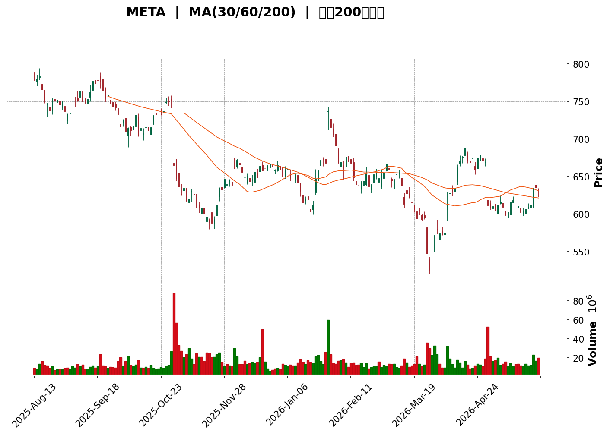
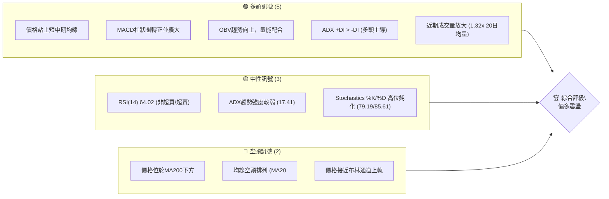
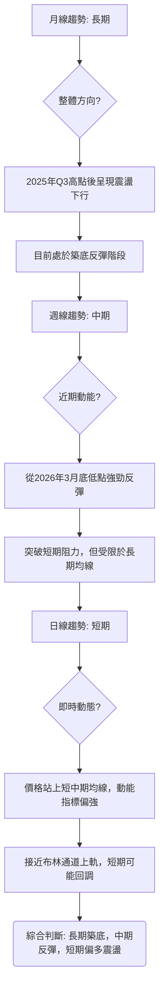
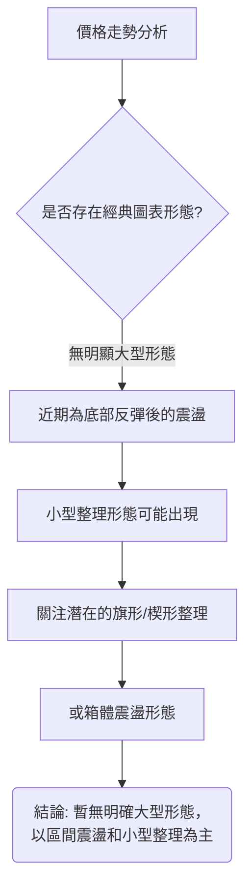
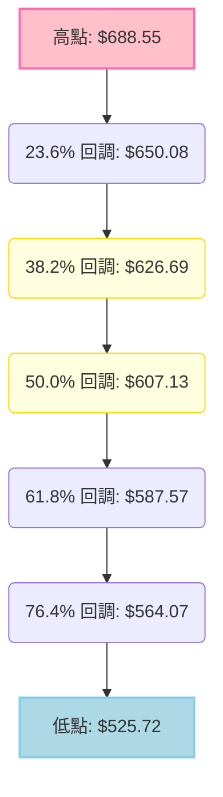
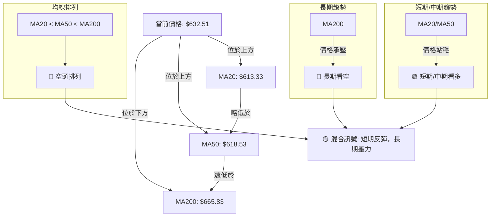
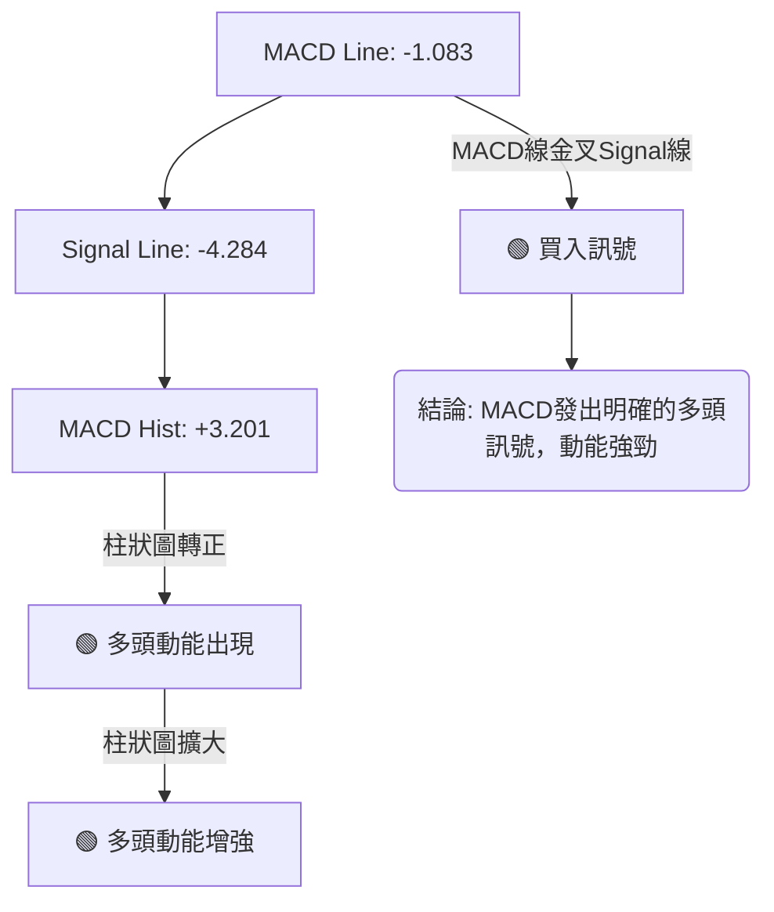

<details>
<summary>📊 靜態圖表 (點擊展開)</summary>

</details>

<html>
<head><meta charset="utf-8" /></head>
<body>
    <div>                        <script>window.PlotlyConfig = {MathJaxConfig: 'local'};</script>
        <script charset="utf-8" src="https://cdn.plot.ly/plotly-3.5.0.min.js" integrity="sha256-fHbNLP+GlIXN+efbQec78UkemUz3NJp7UmfGxC1tNxs=" crossorigin="anonymous"></script>                <div id="candlestick-chart" class="plotly-graph-div" style="height:500px; width:100%;"></div>            <script>                window.PLOTLYENV=window.PLOTLYENV || {};                                if (document.getElementById("candlestick-chart")) {                    Plotly.newPlot(                        "candlestick-chart",                        [{"close":{"dtype":"f8","bdata":"AAAAwARSiEAAAAAgYWKIQAAAACAfe4hAAAAAgJPsh0AAAAAAwW2HQAAAAIC+T4dAAAAAIPIKh0AAAAAALIiHQAAAAKBHfIdAAAAAQKqCh0AAAAAACE2HQAAAACDNaodAAAAAAMEHh0AAAADgGeuGQAAAAMCV+oZAAAAA4CpXh0AAAAAAf3WHQAAAAGBMdIdAAAAAYD\u002ffh0AAAACgvnGHQAAAACAgaYdAAAAAoI6Oh0AAAABARNeHQAAAAABmSYhAAAAAQDgviEAAAADgX1OIQAAAAEBzRIhAAAAAQA\u002ffh0AAAABAHJGHQAAAAKAeu4dAAAAAwEZdh0AAAADAEDSHQAAAAEBFMYdAAAAAADvphkAAAACAI2GGQAAAAECwroZAAAAAIP0qhkAAAACAuFOGQAAAAIAdP4ZAAAAAwCFlhkAAAABASOKGQAAAAKD6AIZAAAAAQApUhkAAAAAgvBuGQAAAAMDQYoZAAAAAgAw3hkAAAACgyF2GQAAAAICU14ZAAAAAoF3ghkAAAADAe+GGQAAAACAy5oZAAAAAYAQJh0AAAAAAiGyHQAAAAKB7cYdAAAAA4FFzh0AAAACA28qEQAAAAMAjOoRAAAAAgCnlg0AAAABALpKDQAAAAAAb14NAAAAAoEBPg0AAAAAgYGWDQAAAACCktYNAAAAAoEOQg0AAAAAA8v+CQAAAAED5BoNAAAAAIIoDg0AAAADgCciCQAAAAGCJpYJAAAAAwKxqgkAAAADAVGGCQAAAAAAQioJAAAAAIDYgg0AAAAAAQ9mDQAAAAMBqxINAAAAAAPI2hEAAAABgZv6DQAAAAAAoMIRAAAAAwEH0g0AAAABgZ6OEQAAAAGBdAoVAAAAAQH7NhEAAAACg536EQAAAACBbSIRAAAAAQPZchEAAAAAgPBmEQAAAACCmN4RAAAAAALSEhEAAAAAgjkeEQAAAAIANv4RAAAAA4KaRhEAAAAAgeaeEQAAAACD4woRAAAAA4NTXhEAAAADgx7WEQAAAACADkYRAAAAA4ArLhEAAAADgM5yEQAAAACDUToRAAAAAwM+RhEAAAABgcKCEQAAAAKAUQYRAAAAAAA8shEAAAADAAmSEQAAAAMBdC4RAAAAAwGa0g0AAAACg8jeDQAAAAMAmYoNAAAAAYMFdg0AAAABg09yCQAAAAEB8I4NAAAAAoJs4hEAAAABgkpGEQAAAAEBH\u002foRAAAAAgCcDhUAAAABgQ+GEQAAAAGBtDYdAAAAAwBhfhkAAAAAAcg6GQAAAAMDdmIVAAAAAgFfjhEAAAAAAGO2EQAAAAEAnp4RAAAAAACAlhUAAAABgK\u002fGEQAAAAKDx4IRAAAAAgAhKhEAAAAAgyPmDQAAAAODx9YNAAAAAoFsVhEAAAADg0yGEQAAAAADLeIRAAAAAoKPlg0AAAABgBvaDQAAAAOALaYRAAAAAgJWDhEAAAAAAAT2EQAAAAOABaIRAAAAAQCh0hEAAAAAgRdmEQAAAACAKoIRAAAAAgHcihEAAAACAsDaEQAAAAIAVbIRAAAAAAGZyhEAAAACgEu2DQAAAAOB6KYNAAAAAoJmbg0AAAACgR3WDQAAAAKBwPYNAAAAAoJn1gkAAAACgR42CQAAAAOB64IJAAAAAIFyHgkAAAADAHpeCQAAAAOBRHIFAAAAAgMJtgEAAAABACsOAQAAAAEAK4YFAAAAAANcZgkAAAAAgrvOBQAAAAAAp6IFAAAAAYGb4gUAAAAAgXCODQAAAAMAeo4NAAAAAQOGug0AAAACAPdSDQAAAAIDrs4RAAAAA4KP8hEAAAADA9SaFQAAAAGBmhIVAAAAAoEf3hEAAAABguOaEQAAAAIDCFYVAAAAAQDOZhEAAAACAPRiFQAAAAMD1NIVAAAAAYLj6hEAAAADA9eiEQAAAAKBHH4NAAAAAAAAGg0AAAACgRxODQAAAACCu54JAAAAAQAong0AAAADgekaDQAAAAEAKDYNAAAAAQOG2gkAAAAAAANiCQAAAAEAKRYNAAAAAoHBTg0AAAAAA1zGDQAAAACCuGYNAAAAAQOHUgkAAAADgeuiCQAAAAEAK+4JAAAAAgBQSg0AAAABguCKDQAAAAIAU2oNAAAAA4FHag0AAAACAFMSDQA=="},"high":{"dtype":"f8","bdata":"A6pnM8XMiEB13Xd+to+IQAngAz8T04hAy2gYIPAviEBSfQbW+uqHQI3pa7mJY4dAIgn9qQY+h0C2bPk\u002fA5mHQAWEV7nQqIdA1sEbjs+Ih0Cm9LiDEIOHQIqe6\u002fBIeodAobU+oB1Lh0COFLVaNPKGQHvkLAUgFIdAEG2sOAO7h0B3VLmbZKGHQA7wwE+25YdA3wD5Pgnkh0C0DRlqP9+HQM6wBuCbmodAbta5H1yeh0CfB94JDSKIQNEM++w7XIhANs38TKNriEC9AE9xdJeIQOsqU8eTp4hAytnLSViDiEDMx4zGgQqIQDQVE7a2vodAWWtwPw2ch0CzA09nZXWHQLj9vkM2bIdAYdVM4NUth0BebCN0KIWGQAoXsmlwtIZAjfEOWzzOhkCywQb0dl2GQC36ZBdnaoZAjrKPb5ZzhkAAAABASOKGQCk\u002fusRW8IZA7aBJQOd1hkC7\u002fBWo11KGQIQfUOmHlYZAn998vDqihkDxsN\u002fVuGqGQDSQW+db5IZA5BbLvSIKh0DcB\u002ftJ6BqHQIuXFv5cKYdADGAMgccfh0BSJmrE55OHQFRsXvMRqYdA9WOKwyOvh0AI9H2TlT6FQFm9Z\u002f8aDoVA2L09UtWRhEDPX9YQWQWEQAPUlOZCCYRAAe6RKYHXg0BY6VbQumiDQKj3pIuEz4NAan4YJRKkg0C4QsSthJ+DQBjYAjfzRINA1xv1MT4lg0COrf9lWRWDQBrTEHY31YJA9rs4HrCSgkDCYSnsp+2CQJ3lTIT4qIJAkUnp5Fw9g0Dcgm0J5N+DQDjgIoJa6oNAVtd7aL43hEBZFKPI8CGEQCQB711ONoRA1wEKHyI+hEC6nXTNxBeFQM5dPQiCDIVAR3nTHKQchUAIvwPJ9rqEQF31xGVWa4RA7LhN1nxxhEAfoubPgC6GQEAqzwGIY4RARdWzLsmvhEAChjCTUKWEQHH7kwvk74RAvr\u002flcmjzhEB8A0\u002fWBwiFQKpwkSRxy4RA411yBd7chECJIJe1BeOEQOxjVkR7nYRA6r3Vwyj9hEAYlcblcsOEQBxZ4sGSvoRAnUI5rcW\u002fhED27FYKm8eEQD8lk2ywlIRAZwWRDV80hEA5H1UwHnOEQCpWxLlIa4RAOovXycMNhECFXtSYTJ+DQJ8vipgWfYNAiRTTx1Wkg0Ae7\u002fMeBBeDQIaVeNLtTYNA\u002f71eFAqghECxJRTVW8+EQL0PTGKeFYVAvKJGoe0hhUBdEcdRzSiFQNbaAIjoOodABzwmbFnchkC6nq2pdoWGQMcjf8wXY4ZAc3oLHu2BhUDjyKoYVkeFQA7nMS1S+4RAp4OGtM1VhUDsiSm6ikCFQAjM6vaCNYVAHolrvl8bhUB0Ll9S+1aEQLFhefNmEIRA5hmrAZYjhECUXyBHFzWEQHo2N6dCtoRAGoyjbBmJhECLszsUfgSEQClhyKqQaoRAvHmRAnqjhEDSG91KE0eEQEyBlfIAm4RAZr8GUM+ThEBWa3VLjgGFQKE816AC8YRAE7NyrFBHhEAu\u002fYkekTmEQPsp6pXhnYRAgDZxCXOUhEDxr1oph2eEQDcJ1MkNpYNAAAAAAADWg0AAAABgZuSDQAAAAEAzdYNAAAAAAAAog0AAAAAgrt+CQAAAAMAeBYNAAAAAAADIgkAAAAAgXN2CQAAAAAAAOIJAAAAAwMz8gEAAAABgZtyAQAAAACCF7YFAAAAAYGaEgkAAAAAAABSCQAAAAOBRNoJAAAAAANf5gUAAAACgma+DQAAAAAAA7INAAAAA4KP0g0AAAAAAANiDQAAAAIAU0oRAAAAAAAA0hUAAAADgoyyFQAAAAAApnIVAAAAAQApbhUAAAACgmSGFQAAAAEAKM4VAAAAA4HrshEAAAAAgXEWFQAAAAAAAVIVAAAAAoHAxhUAAAAAAABKFQAAAAMDMZoNAAAAAQApXg0AAAAAAADCDQAAAAMDMMoNAAAAAoJlfg0AAAAAA14eDQAAAAAApRoNAAAAAoEfngkAAAAAAAN6CQAAAAEAzX4NAAAAAANd9g0AAAACgmWmDQAAAAGC4PINAAAAAoHAvg0AAAAAAAACDQAAAAMDMDINAAAAA4Ho2g0AAAACAwjODQAAAAAAA9INAAAAAAAAYhEAAAAAAANSDQA=="},"hovertemplate":"\u003cb\u003e%{x|%Y-%m-%d}\u003c\u002fb\u003e\u003cbr\u003e\u958b: $%{open:.2f}\u003cbr\u003e\u9ad8: $%{high:.2f}\u003cbr\u003e\u4f4e: $%{low:.2f}\u003cbr\u003e\u6536: $%{close:.2f}\u003cextra\u003e\u003c\u002fextra\u003e","low":{"dtype":"f8","bdata":"0IGPwEBDiEBm55aJmRWIQNJJNansV4hAya9Df0yWh0DRtEBs1VyHQOOrdDtMyoZArbdPXiPbhkAPSb\u002fDWuWGQM3PGbb6YodAgVzoLoBRh0CjOOboyyiHQDmusriDGIdAAg01MwTthkCCVfrTT4CGQN5u1Y4p4oZAbLZqlJRAh0C1Qs96RjqHQGIJ7VcQcodAlaHYQFF9h0C3yNJT7GmHQN2A3sPuVIdAMEFjhCMwh0A5Wggd03GHQBpW3nJ12odAPfM6xx3kh0BCFAUwYhyIQHC0+Tga+4dAvn8AfIzZh0CWZlQuh26HQK9\u002frUwweodA6JupaHQ6h0Ax9oVi8wCHQPVeVchTD4dAQMRJwbKohkBUpCIqHSiGQNYZpheHZ4ZAcOGmLPQnhkCsk2hf24qFQJ77obCSBIZAAZEajAYVhkBQoZvsADqGQKCkiHOr+oVArO7E76oThkC0fU+eTNGFQA2aBl6aIoZAcPRRYaP1hUDrSDEuhweGQGmP0P\u002fRd4ZAphG5FES8hkDbnQ+zkZaGQP273PMB34ZAc7isB2\u002fPhkCNMcy7FlaHQNLoNL4zQodA7upMkikqh0Dbg+rcrEiEQGGqhuHvI4RApUNcO\u002fHYg0BbfsPat4eDQMQWcm3zi4NA81Pitr5Hg0DUtNPCkcGCQCW6hI2fSINAjPmby9hSg0Ar83i9CvaCQBS2aA\u002fyz4JA4MTOYqaRgkAwTHk6P5OCQOklYFBxNoJAUr\u002fpYzwigkB3bREVAjOCQBvk6p0bJ4JAleYMug6lgkDUcp4mJEqDQLLUJ4WatINAFqpx8oLTg0DTYlvCj+WDQCVqu4AJ6INAmG9zYuLjg0AvNKFPlZeEQGtugbdFqoRAraVpKq2\u002fhEAsSPNA\u002fmGEQC6wYiObEoRAiNOiOdf9g0BuMouXWeyDQBv7K6868YNAX41U0DIVhEA41opGKEWEQEgGov8vf4RA1\u002fufiO+MhECrniLftICEQK5unLh+jYRADD5ufxGthECa2X3TCKaEQD72jUikboRAvnFx1TeKhEAuo4zDAZeEQDr7J5uYF4RAIJ49N5E5hEBX7ecmvVqEQDqlOCwRIoRAUxeJvWjZg0BwPiyDZhKEQOBl5otzBYRAtLv+Xod8g0DQjfU5WjKDQD6lruKiLYNA\u002flM8jGVcg0CnscrX5LuCQEGTq5CIvIJAVG5zrhyQg0BMjhSSMB+EQOpFI0XLpYRAdBj\u002fLrvAhEAKUZm7PcyEQM+0gAGGP4ZAd\u002foYOdZHhkDWYCxwWPeFQHavrQSVboVAnfkqzhzXhEDoqR0mh2eEQHR0u1WTL4RAR+WbTruRhECjCh9hvOmEQN4kEY5NhIRA36qUD9MlhECbeEOcN9CDQKUvvMAYooNAZwXGxuacg0CBMPD+ZuGDQIJ9QXLe8YNA7KeY0KXbg0BX+2wUiaODQA+lPby5DIRAHCYNqZE3hECMeBXAl+yDQGtLXGSoz4NAinJaM1nyg0BygRPg24iEQO3qdpkHToRAvCJT1Ibcg0CmvQJc85GDQKtD2QGPQ4RAdOIpY3E+hEDXwgh+1+KDQAmc4Gk6CINAAAAAwMx4g0AAAACgmW2DQAAAAEDhNINAAAAAgBTSgkAAAAAAAFqCQAAAAIAUuIJAAAAAAAB4gkAAAABAM4uCQAAAAMDM+oBAAAAAgBRCgEAAAADgUYSAQAAAAAApFoFAAAAAYI\u002fugUAAAACgmX2BQAAAAAAA4IFAAAAAgBSmgUAAAADgo36CQAAAAAAAeINAAAAA4KOCg0AAAABAM4ODQAAAAMD1+oNAAAAAgMLBhEAAAAAAAN6EQAAAAEAKGYVAAAAAAADghEAAAADgo9qEQAAAAAAA7oRAAAAAYGZohEAAAABguG6EQAAAAGC49oRAAAAAQArNhEAAAADger6EQAAAAAAAwIJAAAAAQOHwgkAAAAAAANaCQAAAAEDhwoJAAAAAwMywgkAAAADgUSyDQAAAAOB68IJAAAAA4KOwgkAAAADAzISCQAAAAKBHpYJAAAAAAAA4g0AAAADgegqDQAAAACCF3YJAAAAAYGbEgkAAAADgeq6CQAAAAOB6loJAAAAAoJn3gkAAAABgZuqCQAAAAAAACINAAAAA4Hqqg0AAAADAzHqDQA=="},"name":"\u50f9\u683c","open":{"dtype":"f8","bdata":"A8O\u002fAV+qiECHBd+EdUCIQJwIno6AcohAGGCGFDEqiEAnem6zlOqHQJeFOBiMTodAcr5slLg3h0A6DDvK+wuHQFJVw1RpiIdAnQW0tVNoh0ADs02ETHSHQI+\u002f1f0NModAbTUQTUU8h0B7VpUFtqKGQOEryGk08oZAzS1LYodWh0D0zTBP2naHQGP\u002fuz7UkYdA1ZFtpbidh0DkxU3GstqHQIglhyEOh4dAryAcK85Xh0BeG2jRj52HQMcm3pSf6YdAIwOzwkxRiEAev8Z5XVeIQE4ttouehIhA+o40TltkiEDlMkSkuf+HQOAwIs7hoYdA3qW4OYmBh0Bhhc5g+2WHQHybEE\u002fCW4dAhO+Q1hUoh0Ch\u002fUFvSIKGQBv48Aj9ioZAQxRWSkvDhkBU5wzNGQCGQFeqOUIsZIZAYzfwAhJChkDIBUVUpWiGQD+QrcSYzYZApQ3YUo4+hkAo3Y1ZyRSGQOlR7ezmXoZAkNr2wtBihkDqtswFMg+GQGbAqwvjf4ZAP1C2OFT2hkASxUyQ1uSGQJ9kOVvJ64ZAd5VmXnr8hkBHQy5a02OHQO4gTa78eodAOgzeN+uLh0CzdOUVQ+CEQMK1DQwSC4VA9WJH1Tx3hEBU\u002fr1J7peDQM5JbrIIuoNAGwHnbE7Wg0COYrVZrzuDQLFihEpKsINAI1OsmpyXg0BdYZZeppiDQGX7SABfIINAa4IjGkjGgkBzBN41LwCDQGkhB9PldIJA0kupP9SFgkBsqsJu8NOCQJ4BaakjXIJAgNnvP8OtgkAohv9IqneDQIhRmawA5YNAHfu11iTYg0BtUHuD2\u002fODQBonzuYjCoRAXxyVLawahECXaPlk+BaFQAqoJHYht4RAEL53kMfhhED9BoQ2S7WEQFeFkB3rRoRAd977NboRhEBluzZ0uEWEQJjIwmsuKYRA+YfKqZgXhEBtXLerZHiEQIvU+V++g4RATM0EmczOhEDHa7ccrKiEQHYMR\u002fHhm4RAI4dry7SvhECHZL6E6NuEQMdx+rCTi4RA1pE3GAORhEA75+dVc8GEQCngaupNsYRAbaguAaBThEDwXuvWC5iEQDx62RKieIRALjC6sJ4qhECiJo1ZGieEQPPOmz\u002fGX4RAOovXycMNhEC0n2tjto+DQBMHiXCbT4NAYeVvHSt9g0BCzahJ4fqCQAevrYXE8YJA2uGlJn6mg0BPVI5ivyGEQDp7zep8xIRAVIBpiRoQhUDwAw5EYg+FQM7Zr6pkBodAWZCYegW3hkDGhrPG6E+GQH19umseFoZArhFlKyJ5hUCkOW1dGbiEQBz3g5Bdx4RAVqonuea0hED2WSySKSiFQM5dfjJjC4VAFuK9zizrhEBFhnSJYiSEQHs\u002fzqGf94NAVyzNABDKg0ADRTKhMPCDQCKFJ3ok+YNAFrfLttpfhEDgGZnFTsSDQFQbUc3XD4RA6C8xsfJPhEBPf3pJMheEQOaLXlvr5INAbeg2JeI9hEBcJf1dLYuEQM0BEf7oqoRAMViPLMQ6hEAsyddX5dGDQAoBvOQBaIRA7HTWbJlxhECmuJx7j0GEQMEHBqrZeoNAAAAAAADAg0AAAACA65+DQAAAAGC4QoNAAAAAQDMhg0AAAACAPdyCQAAAAOBR7oJAAAAAwMy4gkAAAACA67WCQAAAAIDrM4JAAAAAwMzggEAAAABACsOAQAAAAADXL4FAAAAAQAohgkAAAADgUbCBQAAAACCFDYJAAAAAANfjgUAAAAAAAPCCQAAAAIDCl4NAAAAAgMLTg0AAAAAAAKyDQAAAAIDCGYRAAAAAAADYhEAAAACA6x+FQAAAAMDMNIVAAAAAQOFKhUAAAAAAAPiEQAAAAEDhEoVAAAAAoJm9hEAAAABgj6KEQAAAAAAA+IRAAAAAgOsRhUAAAACgR+eEQAAAAGCPWoNAAAAAIIU1g0AAAAAghf+CQAAAAOB6KoNAAAAAYGbIgkAAAACAwjWDQAAAAKCZOYNAAAAAYI\u002fkgkAAAABgj5aCQAAAAOCjtoJAAAAAAABAg0AAAACA6y+DQAAAAEDhCINAAAAAIFwHg0AAAACAFMaCQAAAAAAAwIJAAAAAQAr\u002fgkAAAADAHgeDQAAAAEAzC4NAAAAAAAD8g0AAAAAAAMyDQA=="},"x":["2025-08-13T00:00:00-04:00","2025-08-14T00:00:00-04:00","2025-08-15T00:00:00-04:00","2025-08-18T00:00:00-04:00","2025-08-19T00:00:00-04:00","2025-08-20T00:00:00-04:00","2025-08-21T00:00:00-04:00","2025-08-22T00:00:00-04:00","2025-08-25T00:00:00-04:00","2025-08-26T00:00:00-04:00","2025-08-27T00:00:00-04:00","2025-08-28T00:00:00-04:00","2025-08-29T00:00:00-04:00","2025-09-02T00:00:00-04:00","2025-09-03T00:00:00-04:00","2025-09-04T00:00:00-04:00","2025-09-05T00:00:00-04:00","2025-09-08T00:00:00-04:00","2025-09-09T00:00:00-04:00","2025-09-10T00:00:00-04:00","2025-09-11T00:00:00-04:00","2025-09-12T00:00:00-04:00","2025-09-15T00:00:00-04:00","2025-09-16T00:00:00-04:00","2025-09-17T00:00:00-04:00","2025-09-18T00:00:00-04:00","2025-09-19T00:00:00-04:00","2025-09-22T00:00:00-04:00","2025-09-23T00:00:00-04:00","2025-09-24T00:00:00-04:00","2025-09-25T00:00:00-04:00","2025-09-26T00:00:00-04:00","2025-09-29T00:00:00-04:00","2025-09-30T00:00:00-04:00","2025-10-01T00:00:00-04:00","2025-10-02T00:00:00-04:00","2025-10-03T00:00:00-04:00","2025-10-06T00:00:00-04:00","2025-10-07T00:00:00-04:00","2025-10-08T00:00:00-04:00","2025-10-09T00:00:00-04:00","2025-10-10T00:00:00-04:00","2025-10-13T00:00:00-04:00","2025-10-14T00:00:00-04:00","2025-10-15T00:00:00-04:00","2025-10-16T00:00:00-04:00","2025-10-17T00:00:00-04:00","2025-10-20T00:00:00-04:00","2025-10-21T00:00:00-04:00","2025-10-22T00:00:00-04:00","2025-10-23T00:00:00-04:00","2025-10-24T00:00:00-04:00","2025-10-27T00:00:00-04:00","2025-10-28T00:00:00-04:00","2025-10-29T00:00:00-04:00","2025-10-30T00:00:00-04:00","2025-10-31T00:00:00-04:00","2025-11-03T00:00:00-05:00","2025-11-04T00:00:00-05:00","2025-11-05T00:00:00-05:00","2025-11-06T00:00:00-05:00","2025-11-07T00:00:00-05:00","2025-11-10T00:00:00-05:00","2025-11-11T00:00:00-05:00","2025-11-12T00:00:00-05:00","2025-11-13T00:00:00-05:00","2025-11-14T00:00:00-05:00","2025-11-17T00:00:00-05:00","2025-11-18T00:00:00-05:00","2025-11-19T00:00:00-05:00","2025-11-20T00:00:00-05:00","2025-11-21T00:00:00-05:00","2025-11-24T00:00:00-05:00","2025-11-25T00:00:00-05:00","2025-11-26T00:00:00-05:00","2025-11-28T00:00:00-05:00","2025-12-01T00:00:00-05:00","2025-12-02T00:00:00-05:00","2025-12-03T00:00:00-05:00","2025-12-04T00:00:00-05:00","2025-12-05T00:00:00-05:00","2025-12-08T00:00:00-05:00","2025-12-09T00:00:00-05:00","2025-12-10T00:00:00-05:00","2025-12-11T00:00:00-05:00","2025-12-12T00:00:00-05:00","2025-12-15T00:00:00-05:00","2025-12-16T00:00:00-05:00","2025-12-17T00:00:00-05:00","2025-12-18T00:00:00-05:00","2025-12-19T00:00:00-05:00","2025-12-22T00:00:00-05:00","2025-12-23T00:00:00-05:00","2025-12-24T00:00:00-05:00","2025-12-26T00:00:00-05:00","2025-12-29T00:00:00-05:00","2025-12-30T00:00:00-05:00","2025-12-31T00:00:00-05:00","2026-01-02T00:00:00-05:00","2026-01-05T00:00:00-05:00","2026-01-06T00:00:00-05:00","2026-01-07T00:00:00-05:00","2026-01-08T00:00:00-05:00","2026-01-09T00:00:00-05:00","2026-01-12T00:00:00-05:00","2026-01-13T00:00:00-05:00","2026-01-14T00:00:00-05:00","2026-01-15T00:00:00-05:00","2026-01-16T00:00:00-05:00","2026-01-20T00:00:00-05:00","2026-01-21T00:00:00-05:00","2026-01-22T00:00:00-05:00","2026-01-23T00:00:00-05:00","2026-01-26T00:00:00-05:00","2026-01-27T00:00:00-05:00","2026-01-28T00:00:00-05:00","2026-01-29T00:00:00-05:00","2026-01-30T00:00:00-05:00","2026-02-02T00:00:00-05:00","2026-02-03T00:00:00-05:00","2026-02-04T00:00:00-05:00","2026-02-05T00:00:00-05:00","2026-02-06T00:00:00-05:00","2026-02-09T00:00:00-05:00","2026-02-10T00:00:00-05:00","2026-02-11T00:00:00-05:00","2026-02-12T00:00:00-05:00","2026-02-13T00:00:00-05:00","2026-02-17T00:00:00-05:00","2026-02-18T00:00:00-05:00","2026-02-19T00:00:00-05:00","2026-02-20T00:00:00-05:00","2026-02-23T00:00:00-05:00","2026-02-24T00:00:00-05:00","2026-02-25T00:00:00-05:00","2026-02-26T00:00:00-05:00","2026-02-27T00:00:00-05:00","2026-03-02T00:00:00-05:00","2026-03-03T00:00:00-05:00","2026-03-04T00:00:00-05:00","2026-03-05T00:00:00-05:00","2026-03-06T00:00:00-05:00","2026-03-09T00:00:00-04:00","2026-03-10T00:00:00-04:00","2026-03-11T00:00:00-04:00","2026-03-12T00:00:00-04:00","2026-03-13T00:00:00-04:00","2026-03-16T00:00:00-04:00","2026-03-17T00:00:00-04:00","2026-03-18T00:00:00-04:00","2026-03-19T00:00:00-04:00","2026-03-20T00:00:00-04:00","2026-03-23T00:00:00-04:00","2026-03-24T00:00:00-04:00","2026-03-25T00:00:00-04:00","2026-03-26T00:00:00-04:00","2026-03-27T00:00:00-04:00","2026-03-30T00:00:00-04:00","2026-03-31T00:00:00-04:00","2026-04-01T00:00:00-04:00","2026-04-02T00:00:00-04:00","2026-04-06T00:00:00-04:00","2026-04-07T00:00:00-04:00","2026-04-08T00:00:00-04:00","2026-04-09T00:00:00-04:00","2026-04-10T00:00:00-04:00","2026-04-13T00:00:00-04:00","2026-04-14T00:00:00-04:00","2026-04-15T00:00:00-04:00","2026-04-16T00:00:00-04:00","2026-04-17T00:00:00-04:00","2026-04-20T00:00:00-04:00","2026-04-21T00:00:00-04:00","2026-04-22T00:00:00-04:00","2026-04-23T00:00:00-04:00","2026-04-24T00:00:00-04:00","2026-04-27T00:00:00-04:00","2026-04-28T00:00:00-04:00","2026-04-29T00:00:00-04:00","2026-04-30T00:00:00-04:00","2026-05-01T00:00:00-04:00","2026-05-04T00:00:00-04:00","2026-05-05T00:00:00-04:00","2026-05-06T00:00:00-04:00","2026-05-07T00:00:00-04:00","2026-05-08T00:00:00-04:00","2026-05-11T00:00:00-04:00","2026-05-12T00:00:00-04:00","2026-05-13T00:00:00-04:00","2026-05-14T00:00:00-04:00","2026-05-15T00:00:00-04:00","2026-05-18T00:00:00-04:00","2026-05-19T00:00:00-04:00","2026-05-20T00:00:00-04:00","2026-05-21T00:00:00-04:00","2026-05-22T00:00:00-04:00","2026-05-26T00:00:00-04:00","2026-05-27T00:00:00-04:00","2026-05-28T00:00:00-04:00","2026-05-29T00:00:00-04:00"],"type":"candlestick"},{"hovertemplate":"MA30: $%{y:.2f}\u003cextra\u003e\u003c\u002fextra\u003e","line":{"color":"#2196F3","dash":"dash","width":2},"mode":"lines","name":"MA30","x":["2025-08-13T00:00:00-04:00","2025-08-14T00:00:00-04:00","2025-08-15T00:00:00-04:00","2025-08-18T00:00:00-04:00","2025-08-19T00:00:00-04:00","2025-08-20T00:00:00-04:00","2025-08-21T00:00:00-04:00","2025-08-22T00:00:00-04:00","2025-08-25T00:00:00-04:00","2025-08-26T00:00:00-04:00","2025-08-27T00:00:00-04:00","2025-08-28T00:00:00-04:00","2025-08-29T00:00:00-04:00","2025-09-02T00:00:00-04:00","2025-09-03T00:00:00-04:00","2025-09-04T00:00:00-04:00","2025-09-05T00:00:00-04:00","2025-09-08T00:00:00-04:00","2025-09-09T00:00:00-04:00","2025-09-10T00:00:00-04:00","2025-09-11T00:00:00-04:00","2025-09-12T00:00:00-04:00","2025-09-15T00:00:00-04:00","2025-09-16T00:00:00-04:00","2025-09-17T00:00:00-04:00","2025-09-18T00:00:00-04:00","2025-09-19T00:00:00-04:00","2025-09-22T00:00:00-04:00","2025-09-23T00:00:00-04:00","2025-09-24T00:00:00-04:00","2025-09-25T00:00:00-04:00","2025-09-26T00:00:00-04:00","2025-09-29T00:00:00-04:00","2025-09-30T00:00:00-04:00","2025-10-01T00:00:00-04:00","2025-10-02T00:00:00-04:00","2025-10-03T00:00:00-04:00","2025-10-06T00:00:00-04:00","2025-10-07T00:00:00-04:00","2025-10-08T00:00:00-04:00","2025-10-09T00:00:00-04:00","2025-10-10T00:00:00-04:00","2025-10-13T00:00:00-04:00","2025-10-14T00:00:00-04:00","2025-10-15T00:00:00-04:00","2025-10-16T00:00:00-04:00","2025-10-17T00:00:00-04:00","2025-10-20T00:00:00-04:00","2025-10-21T00:00:00-04:00","2025-10-22T00:00:00-04:00","2025-10-23T00:00:00-04:00","2025-10-24T00:00:00-04:00","2025-10-27T00:00:00-04:00","2025-10-28T00:00:00-04:00","2025-10-29T00:00:00-04:00","2025-10-30T00:00:00-04:00","2025-10-31T00:00:00-04:00","2025-11-03T00:00:00-05:00","2025-11-04T00:00:00-05:00","2025-11-05T00:00:00-05:00","2025-11-06T00:00:00-05:00","2025-11-07T00:00:00-05:00","2025-11-10T00:00:00-05:00","2025-11-11T00:00:00-05:00","2025-11-12T00:00:00-05:00","2025-11-13T00:00:00-05:00","2025-11-14T00:00:00-05:00","2025-11-17T00:00:00-05:00","2025-11-18T00:00:00-05:00","2025-11-19T00:00:00-05:00","2025-11-20T00:00:00-05:00","2025-11-21T00:00:00-05:00","2025-11-24T00:00:00-05:00","2025-11-25T00:00:00-05:00","2025-11-26T00:00:00-05:00","2025-11-28T00:00:00-05:00","2025-12-01T00:00:00-05:00","2025-12-02T00:00:00-05:00","2025-12-03T00:00:00-05:00","2025-12-04T00:00:00-05:00","2025-12-05T00:00:00-05:00","2025-12-08T00:00:00-05:00","2025-12-09T00:00:00-05:00","2025-12-10T00:00:00-05:00","2025-12-11T00:00:00-05:00","2025-12-12T00:00:00-05:00","2025-12-15T00:00:00-05:00","2025-12-16T00:00:00-05:00","2025-12-17T00:00:00-05:00","2025-12-18T00:00:00-05:00","2025-12-19T00:00:00-05:00","2025-12-22T00:00:00-05:00","2025-12-23T00:00:00-05:00","2025-12-24T00:00:00-05:00","2025-12-26T00:00:00-05:00","2025-12-29T00:00:00-05:00","2025-12-30T00:00:00-05:00","2025-12-31T00:00:00-05:00","2026-01-02T00:00:00-05:00","2026-01-05T00:00:00-05:00","2026-01-06T00:00:00-05:00","2026-01-07T00:00:00-05:00","2026-01-08T00:00:00-05:00","2026-01-09T00:00:00-05:00","2026-01-12T00:00:00-05:00","2026-01-13T00:00:00-05:00","2026-01-14T00:00:00-05:00","2026-01-15T00:00:00-05:00","2026-01-16T00:00:00-05:00","2026-01-20T00:00:00-05:00","2026-01-21T00:00:00-05:00","2026-01-22T00:00:00-05:00","2026-01-23T00:00:00-05:00","2026-01-26T00:00:00-05:00","2026-01-27T00:00:00-05:00","2026-01-28T00:00:00-05:00","2026-01-29T00:00:00-05:00","2026-01-30T00:00:00-05:00","2026-02-02T00:00:00-05:00","2026-02-03T00:00:00-05:00","2026-02-04T00:00:00-05:00","2026-02-05T00:00:00-05:00","2026-02-06T00:00:00-05:00","2026-02-09T00:00:00-05:00","2026-02-10T00:00:00-05:00","2026-02-11T00:00:00-05:00","2026-02-12T00:00:00-05:00","2026-02-13T00:00:00-05:00","2026-02-17T00:00:00-05:00","2026-02-18T00:00:00-05:00","2026-02-19T00:00:00-05:00","2026-02-20T00:00:00-05:00","2026-02-23T00:00:00-05:00","2026-02-24T00:00:00-05:00","2026-02-25T00:00:00-05:00","2026-02-26T00:00:00-05:00","2026-02-27T00:00:00-05:00","2026-03-02T00:00:00-05:00","2026-03-03T00:00:00-05:00","2026-03-04T00:00:00-05:00","2026-03-05T00:00:00-05:00","2026-03-06T00:00:00-05:00","2026-03-09T00:00:00-04:00","2026-03-10T00:00:00-04:00","2026-03-11T00:00:00-04:00","2026-03-12T00:00:00-04:00","2026-03-13T00:00:00-04:00","2026-03-16T00:00:00-04:00","2026-03-17T00:00:00-04:00","2026-03-18T00:00:00-04:00","2026-03-19T00:00:00-04:00","2026-03-20T00:00:00-04:00","2026-03-23T00:00:00-04:00","2026-03-24T00:00:00-04:00","2026-03-25T00:00:00-04:00","2026-03-26T00:00:00-04:00","2026-03-27T00:00:00-04:00","2026-03-30T00:00:00-04:00","2026-03-31T00:00:00-04:00","2026-04-01T00:00:00-04:00","2026-04-02T00:00:00-04:00","2026-04-06T00:00:00-04:00","2026-04-07T00:00:00-04:00","2026-04-08T00:00:00-04:00","2026-04-09T00:00:00-04:00","2026-04-10T00:00:00-04:00","2026-04-13T00:00:00-04:00","2026-04-14T00:00:00-04:00","2026-04-15T00:00:00-04:00","2026-04-16T00:00:00-04:00","2026-04-17T00:00:00-04:00","2026-04-20T00:00:00-04:00","2026-04-21T00:00:00-04:00","2026-04-22T00:00:00-04:00","2026-04-23T00:00:00-04:00","2026-04-24T00:00:00-04:00","2026-04-27T00:00:00-04:00","2026-04-28T00:00:00-04:00","2026-04-29T00:00:00-04:00","2026-04-30T00:00:00-04:00","2026-05-01T00:00:00-04:00","2026-05-04T00:00:00-04:00","2026-05-05T00:00:00-04:00","2026-05-06T00:00:00-04:00","2026-05-07T00:00:00-04:00","2026-05-08T00:00:00-04:00","2026-05-11T00:00:00-04:00","2026-05-12T00:00:00-04:00","2026-05-13T00:00:00-04:00","2026-05-14T00:00:00-04:00","2026-05-15T00:00:00-04:00","2026-05-18T00:00:00-04:00","2026-05-19T00:00:00-04:00","2026-05-20T00:00:00-04:00","2026-05-21T00:00:00-04:00","2026-05-22T00:00:00-04:00","2026-05-26T00:00:00-04:00","2026-05-27T00:00:00-04:00","2026-05-28T00:00:00-04:00","2026-05-29T00:00:00-04:00"],"y":{"dtype":"f8","bdata":"AAAAAAAA+H8AAAAAAAD4fwAAAAAAAPh\u002fAAAAAAAA+H8AAAAAAAD4fwAAAAAAAPh\u002fAAAAAAAA+H8AAAAAAAD4fwAAAAAAAPh\u002fAAAAAAAA+H8AAAAAAAD4fwAAAAAAAPh\u002fAAAAAAAA+H8AAAAAAAD4fwAAAAAAAPh\u002fAAAAAAAA+H8AAAAAAAD4fwAAAAAAAPh\u002fAAAAAAAA+H8AAAAAAAD4fwAAAAAAAPh\u002fAAAAAAAA+H8AAAAAAAD4fwAAAAAAAPh\u002fAAAAAAAA+H8AAAAAAAD4fwAAAAAAAPh\u002fAAAAAAAA+H8AAAAAAAD4f3d3dzfrp4dAAAAAwMKfh0AREREBr5WHQGZmZkawiodAERERMQuCh0AiIiICF3mHQKuqqqq4c4dAERERkUFsh0AzMzNz+WGHQKuqqvpmV4dA3t3dbeJNh0ARERGBU0qHQERERPRDPodAVVVVZUY4h0Dv7u7eXDGHQFVVVcVNLIdAiYiIKLMih0B3d3dHYBmHQDMzM\u002fMmFIdAVVVV9acLh0De3d3t2AaHQJqZmal7AodA7+7uHgj+hkAAAABQefqGQFVVVdVG84ZAvLu7awPthkAAAADg3M6GQCIiIsJirIZAMzMzs3SKhkAzMzOzW2iGQBEREWEoR4ZAMzMzk44khkCJiIg4EQSGQGZmZqZY5oVA7+7u3sfJhUAzMzPj8KyFQO\u002fu7h7AjYVAMzMz49VyhUBVVVVVlFSFQCIiIjLcNYVAzczMXOkThUCJiIjYeu2EQN7d3X3qz4RA7+7unpa0hEARERFRTqGEQFVVVZX1ioRAIiIiouN5hEAAAACgpGWEQAAAAOD+ToRAMzMzAw82hEAzMzMz7CKEQCIiIoLLEoRAERERgb7\u002fg0ARERGxweaDQERERCTJy4NAERERwXCxg0CrqqoKhauDQJqZmclvq4NARERENMGwg0Dv7u7uzLaDQHd3dzeIvoNAvLu7W0fJg0DNzMzsA9SDQBERETH+3INA7+7ubunng0ARERGhgfaDQHd3dxekA4RAzczMDNMShEDNzMwMbiKEQFVVVTWbMIRA3t3dPfpChEBERETUJVaEQN7d3R3IZIRA7+7uvrVthEDNzMy8VXKEQLy7uyuzdIRAIiIiMllwhEDNzMy8u2mEQERERNTdYoRAzczMjNldhEC8u7t7sk6EQLy7uwu8PoRA7+7ujsU5hECamZnZZDqEQBEREUF1QIRA3t3dbf9FhEBmZmZWqkyEQFVVVaXbZIRA3t3dzat0hECJiIiI1YOEQFVVVTUYi4RAvLu7S9GNhEBERERkI5CEQHd3dwc2j4RAmpmZmcmRhEAiIiJixJOEQHd3d3duloRAZmZmliGShECJiIiYt4yEQO\u002fu7h7BiYRA3t3dHZuFhEAzMzOzYoGEQM3MzBw+g4RAMzMzM+WAhEB3d3enOn2EQO\u002fu7g5agIRAREREBEKHhEAiIiKy9Y+EQDMzMzOwmIRAVVVV5fehhEDv7u6e6rKEQERERASav4RAREREFN2+hEDNzMyM1buEQGZmZgb2toRAZmZmxiKyhEBEREQE\u002f6mEQERERETMiIRAZmZm9jZxhEAiIiLiCluEQFVVVaXtRoRAIiIiYng2hEBERES0NSKEQDMzM9MNE4RA7+7ufrr8g0AiIiICqeiDQM3MzIyByINAiYiISJCng0De3d2NI4yDQJqZmRlgeoNAd3d3R3Vpg0C8u7tr2laDQHd3dyf3QINA3t3dLYYwg0ARERGBgCmDQImIiIjnIoNAVVVVddAbg0CamZl5UhiDQDMzM0PaGoNAq6qq6mYfg0Dv7u7e\u002fSGDQLy7u4uaKYNAzczMjLIwg0De3d2tkDaDQERERJQ4PINAAAAAsIM9g0BVVVWVfEeDQM3MzJzvWINAZmZm1qNkg0AiIiKCB3GDQERERCQGcINAZmZmFpJwg0De3d2NCXWDQO\u002fu7v5GdYNAmpmZmZl6g0AREREBcoCDQO\u002fu7q4AkYNAVVVVtYGkg0AiIiKiRbaDQAAAAIAjwoNA3t3djZfMg0BERESEMteDQO\u002fu7p5h4YNAzczMDLvog0C8u7ubxOaDQDMzM1Mq4YNAzczMTPDbg0BmZmZ2BdaDQAAAAJDCzoNAmpmZKRXFg0CrqqraQLmDQA=="},"type":"scatter"},{"hovertemplate":"MA60: $%{y:.2f}\u003cextra\u003e\u003c\u002fextra\u003e","line":{"color":"#9C27B0","dash":"dash","width":2},"mode":"lines","name":"MA60","x":["2025-08-13T00:00:00-04:00","2025-08-14T00:00:00-04:00","2025-08-15T00:00:00-04:00","2025-08-18T00:00:00-04:00","2025-08-19T00:00:00-04:00","2025-08-20T00:00:00-04:00","2025-08-21T00:00:00-04:00","2025-08-22T00:00:00-04:00","2025-08-25T00:00:00-04:00","2025-08-26T00:00:00-04:00","2025-08-27T00:00:00-04:00","2025-08-28T00:00:00-04:00","2025-08-29T00:00:00-04:00","2025-09-02T00:00:00-04:00","2025-09-03T00:00:00-04:00","2025-09-04T00:00:00-04:00","2025-09-05T00:00:00-04:00","2025-09-08T00:00:00-04:00","2025-09-09T00:00:00-04:00","2025-09-10T00:00:00-04:00","2025-09-11T00:00:00-04:00","2025-09-12T00:00:00-04:00","2025-09-15T00:00:00-04:00","2025-09-16T00:00:00-04:00","2025-09-17T00:00:00-04:00","2025-09-18T00:00:00-04:00","2025-09-19T00:00:00-04:00","2025-09-22T00:00:00-04:00","2025-09-23T00:00:00-04:00","2025-09-24T00:00:00-04:00","2025-09-25T00:00:00-04:00","2025-09-26T00:00:00-04:00","2025-09-29T00:00:00-04:00","2025-09-30T00:00:00-04:00","2025-10-01T00:00:00-04:00","2025-10-02T00:00:00-04:00","2025-10-03T00:00:00-04:00","2025-10-06T00:00:00-04:00","2025-10-07T00:00:00-04:00","2025-10-08T00:00:00-04:00","2025-10-09T00:00:00-04:00","2025-10-10T00:00:00-04:00","2025-10-13T00:00:00-04:00","2025-10-14T00:00:00-04:00","2025-10-15T00:00:00-04:00","2025-10-16T00:00:00-04:00","2025-10-17T00:00:00-04:00","2025-10-20T00:00:00-04:00","2025-10-21T00:00:00-04:00","2025-10-22T00:00:00-04:00","2025-10-23T00:00:00-04:00","2025-10-24T00:00:00-04:00","2025-10-27T00:00:00-04:00","2025-10-28T00:00:00-04:00","2025-10-29T00:00:00-04:00","2025-10-30T00:00:00-04:00","2025-10-31T00:00:00-04:00","2025-11-03T00:00:00-05:00","2025-11-04T00:00:00-05:00","2025-11-05T00:00:00-05:00","2025-11-06T00:00:00-05:00","2025-11-07T00:00:00-05:00","2025-11-10T00:00:00-05:00","2025-11-11T00:00:00-05:00","2025-11-12T00:00:00-05:00","2025-11-13T00:00:00-05:00","2025-11-14T00:00:00-05:00","2025-11-17T00:00:00-05:00","2025-11-18T00:00:00-05:00","2025-11-19T00:00:00-05:00","2025-11-20T00:00:00-05:00","2025-11-21T00:00:00-05:00","2025-11-24T00:00:00-05:00","2025-11-25T00:00:00-05:00","2025-11-26T00:00:00-05:00","2025-11-28T00:00:00-05:00","2025-12-01T00:00:00-05:00","2025-12-02T00:00:00-05:00","2025-12-03T00:00:00-05:00","2025-12-04T00:00:00-05:00","2025-12-05T00:00:00-05:00","2025-12-08T00:00:00-05:00","2025-12-09T00:00:00-05:00","2025-12-10T00:00:00-05:00","2025-12-11T00:00:00-05:00","2025-12-12T00:00:00-05:00","2025-12-15T00:00:00-05:00","2025-12-16T00:00:00-05:00","2025-12-17T00:00:00-05:00","2025-12-18T00:00:00-05:00","2025-12-19T00:00:00-05:00","2025-12-22T00:00:00-05:00","2025-12-23T00:00:00-05:00","2025-12-24T00:00:00-05:00","2025-12-26T00:00:00-05:00","2025-12-29T00:00:00-05:00","2025-12-30T00:00:00-05:00","2025-12-31T00:00:00-05:00","2026-01-02T00:00:00-05:00","2026-01-05T00:00:00-05:00","2026-01-06T00:00:00-05:00","2026-01-07T00:00:00-05:00","2026-01-08T00:00:00-05:00","2026-01-09T00:00:00-05:00","2026-01-12T00:00:00-05:00","2026-01-13T00:00:00-05:00","2026-01-14T00:00:00-05:00","2026-01-15T00:00:00-05:00","2026-01-16T00:00:00-05:00","2026-01-20T00:00:00-05:00","2026-01-21T00:00:00-05:00","2026-01-22T00:00:00-05:00","2026-01-23T00:00:00-05:00","2026-01-26T00:00:00-05:00","2026-01-27T00:00:00-05:00","2026-01-28T00:00:00-05:00","2026-01-29T00:00:00-05:00","2026-01-30T00:00:00-05:00","2026-02-02T00:00:00-05:00","2026-02-03T00:00:00-05:00","2026-02-04T00:00:00-05:00","2026-02-05T00:00:00-05:00","2026-02-06T00:00:00-05:00","2026-02-09T00:00:00-05:00","2026-02-10T00:00:00-05:00","2026-02-11T00:00:00-05:00","2026-02-12T00:00:00-05:00","2026-02-13T00:00:00-05:00","2026-02-17T00:00:00-05:00","2026-02-18T00:00:00-05:00","2026-02-19T00:00:00-05:00","2026-02-20T00:00:00-05:00","2026-02-23T00:00:00-05:00","2026-02-24T00:00:00-05:00","2026-02-25T00:00:00-05:00","2026-02-26T00:00:00-05:00","2026-02-27T00:00:00-05:00","2026-03-02T00:00:00-05:00","2026-03-03T00:00:00-05:00","2026-03-04T00:00:00-05:00","2026-03-05T00:00:00-05:00","2026-03-06T00:00:00-05:00","2026-03-09T00:00:00-04:00","2026-03-10T00:00:00-04:00","2026-03-11T00:00:00-04:00","2026-03-12T00:00:00-04:00","2026-03-13T00:00:00-04:00","2026-03-16T00:00:00-04:00","2026-03-17T00:00:00-04:00","2026-03-18T00:00:00-04:00","2026-03-19T00:00:00-04:00","2026-03-20T00:00:00-04:00","2026-03-23T00:00:00-04:00","2026-03-24T00:00:00-04:00","2026-03-25T00:00:00-04:00","2026-03-26T00:00:00-04:00","2026-03-27T00:00:00-04:00","2026-03-30T00:00:00-04:00","2026-03-31T00:00:00-04:00","2026-04-01T00:00:00-04:00","2026-04-02T00:00:00-04:00","2026-04-06T00:00:00-04:00","2026-04-07T00:00:00-04:00","2026-04-08T00:00:00-04:00","2026-04-09T00:00:00-04:00","2026-04-10T00:00:00-04:00","2026-04-13T00:00:00-04:00","2026-04-14T00:00:00-04:00","2026-04-15T00:00:00-04:00","2026-04-16T00:00:00-04:00","2026-04-17T00:00:00-04:00","2026-04-20T00:00:00-04:00","2026-04-21T00:00:00-04:00","2026-04-22T00:00:00-04:00","2026-04-23T00:00:00-04:00","2026-04-24T00:00:00-04:00","2026-04-27T00:00:00-04:00","2026-04-28T00:00:00-04:00","2026-04-29T00:00:00-04:00","2026-04-30T00:00:00-04:00","2026-05-01T00:00:00-04:00","2026-05-04T00:00:00-04:00","2026-05-05T00:00:00-04:00","2026-05-06T00:00:00-04:00","2026-05-07T00:00:00-04:00","2026-05-08T00:00:00-04:00","2026-05-11T00:00:00-04:00","2026-05-12T00:00:00-04:00","2026-05-13T00:00:00-04:00","2026-05-14T00:00:00-04:00","2026-05-15T00:00:00-04:00","2026-05-18T00:00:00-04:00","2026-05-19T00:00:00-04:00","2026-05-20T00:00:00-04:00","2026-05-21T00:00:00-04:00","2026-05-22T00:00:00-04:00","2026-05-26T00:00:00-04:00","2026-05-27T00:00:00-04:00","2026-05-28T00:00:00-04:00","2026-05-29T00:00:00-04:00"],"y":{"dtype":"f8","bdata":"AAAAAAAA+H8AAAAAAAD4fwAAAAAAAPh\u002fAAAAAAAA+H8AAAAAAAD4fwAAAAAAAPh\u002fAAAAAAAA+H8AAAAAAAD4fwAAAAAAAPh\u002fAAAAAAAA+H8AAAAAAAD4fwAAAAAAAPh\u002fAAAAAAAA+H8AAAAAAAD4fwAAAAAAAPh\u002fAAAAAAAA+H8AAAAAAAD4fwAAAAAAAPh\u002fAAAAAAAA+H8AAAAAAAD4fwAAAAAAAPh\u002fAAAAAAAA+H8AAAAAAAD4fwAAAAAAAPh\u002fAAAAAAAA+H8AAAAAAAD4fwAAAAAAAPh\u002fAAAAAAAA+H8AAAAAAAD4fwAAAAAAAPh\u002fAAAAAAAA+H8AAAAAAAD4fwAAAAAAAPh\u002fAAAAAAAA+H8AAAAAAAD4fwAAAAAAAPh\u002fAAAAAAAA+H8AAAAAAAD4fwAAAAAAAPh\u002fAAAAAAAA+H8AAAAAAAD4fwAAAAAAAPh\u002fAAAAAAAA+H8AAAAAAAD4fwAAAAAAAPh\u002fAAAAAAAA+H8AAAAAAAD4fwAAAAAAAPh\u002fAAAAAAAA+H8AAAAAAAD4fwAAAAAAAPh\u002fAAAAAAAA+H8AAAAAAAD4fwAAAAAAAPh\u002fAAAAAAAA+H8AAAAAAAD4fwAAAAAAAPh\u002fAAAAAAAA+H8AAAAAAAD4f0RERMyJ94ZAmpmZqSjihkDNzMwc4MyGQGZmZnaEuIZAAAAAiOmlhkCrqqryA5OGQM3MzGS8gIZAIiIiuotvhkBERETkRluGQGZmZpahRoZAVVVV5eUwhkDNzMws5xuGQBERETkXB4ZAIiIigm72hUAAAACYVemFQFVVVa2h24VAVVVVZUvOhUC8u7tzgr+FQJqZmemSsYVAREREfNughUCJiIiQ4pSFQN7d3ZWjioVAAAAAUON+hUCJiIiAnXCFQM3MzPyHX4VAZmZmFjpPhUBVVVX1MD2FQN7d3UXpK4VAvLu785odhUARERFRlA+FQEREREzYAoVAd3d39+r2hECrqqqSCuyEQLy7u2ur4YRA7+7uptjYhEAiIiJCudGEQDMzMxuyyIRAAAAAeNTChEARERExgbuEQLy7u7M7s4RAVVVVzXGrhEBmZmZW0KGEQN7d3U1ZmoRA7+7uLiaRhEDv7u4G0omEQImIiGDUf4RAIiIiah51hEBmZmYusGeEQCIiIlruWIRAAAAASPRJhEB3d3dXzziEQO\u002fu7sbDKIRAAAAACMIchEBVVVVFkxCEQKuqqjIfBoRAd3d3F7j7g0CJiIiwF\u002fyDQHd3d7clCIRAERERgbYShEC8u7s7UR2EQGZmZjbQJIRAvLu7U4wrhECJiIioEzKEQERERBwaNoRAREREhNk8hECamZkBI0WEQHd3d0cJTYRAmpmZUXpShECrqqrSkleEQCIiIiouXYRA3t3drUpkhEC8u7tDxGuEQFVVVR0DdIRAEREReU13hEAiIiIyyHeEQFVVVZ2GeoRAMzMzm817hEB3d3e32HyEQLy7uwPHfYRAERERueh\u002fhEBVVVWNzoCEQAAAAAgrf4RAmpmZUVF8hEAzMzMzHXuEQLy7u6O1e4RAIiIiGhF8hEBVVVWtVHuEQM3MzPTTdoRAIiIiYvFyhEBVVVU1cG+EQFVVVe0CaYRA7+7u1iRihEBERESMLFmEQFVVVe0hUYRAREREDEJHhEAiIiKyNj6EQCIiIgJ4L4RAd3d379gchEAzMzOTbQyEQERERJwQAoRAq6qqMoj3g0B3d3ePHuyDQCIiIqIa4oNAiYiIsLXYg0BERESUXdODQLy7u8ug0YNAzczMPInRg0De3d0VJNSDQDMzMzvF2YNAAAAAaK\u002fgg0Dv7u4+dOqDQAAAAEia9INAiYiI0Mf3g0BVVVUdM\u002fmDQFVVVU2X+YNAMzMzO9P3g0DNzMzMvfiDQImIiPDd8INAZmZmZu3qg0AiIiIyCeaDQM3MzOR524NAREREPIXTg0ARERGhn8uDQBEREWkqxINAREREDKq7g0CamZmBjbSDQN7d3R3BrINA7+7u\u002fgimg0AAAACYNKGDQM3MzMxBnoNAq6qqagabg0AAAAB4BpeDQDMzM2MskYNAVVVVnaCMg0BmZmaOIoiDQN7d3e0IgoNAERERYeB7g0AAAAD4K3eDQJqZmWnOdINAIiIiCj5yg0DNzMxcn22DQA=="},"type":"scatter"},{"hovertemplate":"MA200: $%{y:.2f}\u003cextra\u003e\u003c\u002fextra\u003e","line":{"color":"#FF6F00","dash":"solid","width":2},"mode":"lines","name":"MA200","x":["2025-08-13T00:00:00-04:00","2025-08-14T00:00:00-04:00","2025-08-15T00:00:00-04:00","2025-08-18T00:00:00-04:00","2025-08-19T00:00:00-04:00","2025-08-20T00:00:00-04:00","2025-08-21T00:00:00-04:00","2025-08-22T00:00:00-04:00","2025-08-25T00:00:00-04:00","2025-08-26T00:00:00-04:00","2025-08-27T00:00:00-04:00","2025-08-28T00:00:00-04:00","2025-08-29T00:00:00-04:00","2025-09-02T00:00:00-04:00","2025-09-03T00:00:00-04:00","2025-09-04T00:00:00-04:00","2025-09-05T00:00:00-04:00","2025-09-08T00:00:00-04:00","2025-09-09T00:00:00-04:00","2025-09-10T00:00:00-04:00","2025-09-11T00:00:00-04:00","2025-09-12T00:00:00-04:00","2025-09-15T00:00:00-04:00","2025-09-16T00:00:00-04:00","2025-09-17T00:00:00-04:00","2025-09-18T00:00:00-04:00","2025-09-19T00:00:00-04:00","2025-09-22T00:00:00-04:00","2025-09-23T00:00:00-04:00","2025-09-24T00:00:00-04:00","2025-09-25T00:00:00-04:00","2025-09-26T00:00:00-04:00","2025-09-29T00:00:00-04:00","2025-09-30T00:00:00-04:00","2025-10-01T00:00:00-04:00","2025-10-02T00:00:00-04:00","2025-10-03T00:00:00-04:00","2025-10-06T00:00:00-04:00","2025-10-07T00:00:00-04:00","2025-10-08T00:00:00-04:00","2025-10-09T00:00:00-04:00","2025-10-10T00:00:00-04:00","2025-10-13T00:00:00-04:00","2025-10-14T00:00:00-04:00","2025-10-15T00:00:00-04:00","2025-10-16T00:00:00-04:00","2025-10-17T00:00:00-04:00","2025-10-20T00:00:00-04:00","2025-10-21T00:00:00-04:00","2025-10-22T00:00:00-04:00","2025-10-23T00:00:00-04:00","2025-10-24T00:00:00-04:00","2025-10-27T00:00:00-04:00","2025-10-28T00:00:00-04:00","2025-10-29T00:00:00-04:00","2025-10-30T00:00:00-04:00","2025-10-31T00:00:00-04:00","2025-11-03T00:00:00-05:00","2025-11-04T00:00:00-05:00","2025-11-05T00:00:00-05:00","2025-11-06T00:00:00-05:00","2025-11-07T00:00:00-05:00","2025-11-10T00:00:00-05:00","2025-11-11T00:00:00-05:00","2025-11-12T00:00:00-05:00","2025-11-13T00:00:00-05:00","2025-11-14T00:00:00-05:00","2025-11-17T00:00:00-05:00","2025-11-18T00:00:00-05:00","2025-11-19T00:00:00-05:00","2025-11-20T00:00:00-05:00","2025-11-21T00:00:00-05:00","2025-11-24T00:00:00-05:00","2025-11-25T00:00:00-05:00","2025-11-26T00:00:00-05:00","2025-11-28T00:00:00-05:00","2025-12-01T00:00:00-05:00","2025-12-02T00:00:00-05:00","2025-12-03T00:00:00-05:00","2025-12-04T00:00:00-05:00","2025-12-05T00:00:00-05:00","2025-12-08T00:00:00-05:00","2025-12-09T00:00:00-05:00","2025-12-10T00:00:00-05:00","2025-12-11T00:00:00-05:00","2025-12-12T00:00:00-05:00","2025-12-15T00:00:00-05:00","2025-12-16T00:00:00-05:00","2025-12-17T00:00:00-05:00","2025-12-18T00:00:00-05:00","2025-12-19T00:00:00-05:00","2025-12-22T00:00:00-05:00","2025-12-23T00:00:00-05:00","2025-12-24T00:00:00-05:00","2025-12-26T00:00:00-05:00","2025-12-29T00:00:00-05:00","2025-12-30T00:00:00-05:00","2025-12-31T00:00:00-05:00","2026-01-02T00:00:00-05:00","2026-01-05T00:00:00-05:00","2026-01-06T00:00:00-05:00","2026-01-07T00:00:00-05:00","2026-01-08T00:00:00-05:00","2026-01-09T00:00:00-05:00","2026-01-12T00:00:00-05:00","2026-01-13T00:00:00-05:00","2026-01-14T00:00:00-05:00","2026-01-15T00:00:00-05:00","2026-01-16T00:00:00-05:00","2026-01-20T00:00:00-05:00","2026-01-21T00:00:00-05:00","2026-01-22T00:00:00-05:00","2026-01-23T00:00:00-05:00","2026-01-26T00:00:00-05:00","2026-01-27T00:00:00-05:00","2026-01-28T00:00:00-05:00","2026-01-29T00:00:00-05:00","2026-01-30T00:00:00-05:00","2026-02-02T00:00:00-05:00","2026-02-03T00:00:00-05:00","2026-02-04T00:00:00-05:00","2026-02-05T00:00:00-05:00","2026-02-06T00:00:00-05:00","2026-02-09T00:00:00-05:00","2026-02-10T00:00:00-05:00","2026-02-11T00:00:00-05:00","2026-02-12T00:00:00-05:00","2026-02-13T00:00:00-05:00","2026-02-17T00:00:00-05:00","2026-02-18T00:00:00-05:00","2026-02-19T00:00:00-05:00","2026-02-20T00:00:00-05:00","2026-02-23T00:00:00-05:00","2026-02-24T00:00:00-05:00","2026-02-25T00:00:00-05:00","2026-02-26T00:00:00-05:00","2026-02-27T00:00:00-05:00","2026-03-02T00:00:00-05:00","2026-03-03T00:00:00-05:00","2026-03-04T00:00:00-05:00","2026-03-05T00:00:00-05:00","2026-03-06T00:00:00-05:00","2026-03-09T00:00:00-04:00","2026-03-10T00:00:00-04:00","2026-03-11T00:00:00-04:00","2026-03-12T00:00:00-04:00","2026-03-13T00:00:00-04:00","2026-03-16T00:00:00-04:00","2026-03-17T00:00:00-04:00","2026-03-18T00:00:00-04:00","2026-03-19T00:00:00-04:00","2026-03-20T00:00:00-04:00","2026-03-23T00:00:00-04:00","2026-03-24T00:00:00-04:00","2026-03-25T00:00:00-04:00","2026-03-26T00:00:00-04:00","2026-03-27T00:00:00-04:00","2026-03-30T00:00:00-04:00","2026-03-31T00:00:00-04:00","2026-04-01T00:00:00-04:00","2026-04-02T00:00:00-04:00","2026-04-06T00:00:00-04:00","2026-04-07T00:00:00-04:00","2026-04-08T00:00:00-04:00","2026-04-09T00:00:00-04:00","2026-04-10T00:00:00-04:00","2026-04-13T00:00:00-04:00","2026-04-14T00:00:00-04:00","2026-04-15T00:00:00-04:00","2026-04-16T00:00:00-04:00","2026-04-17T00:00:00-04:00","2026-04-20T00:00:00-04:00","2026-04-21T00:00:00-04:00","2026-04-22T00:00:00-04:00","2026-04-23T00:00:00-04:00","2026-04-24T00:00:00-04:00","2026-04-27T00:00:00-04:00","2026-04-28T00:00:00-04:00","2026-04-29T00:00:00-04:00","2026-04-30T00:00:00-04:00","2026-05-01T00:00:00-04:00","2026-05-04T00:00:00-04:00","2026-05-05T00:00:00-04:00","2026-05-06T00:00:00-04:00","2026-05-07T00:00:00-04:00","2026-05-08T00:00:00-04:00","2026-05-11T00:00:00-04:00","2026-05-12T00:00:00-04:00","2026-05-13T00:00:00-04:00","2026-05-14T00:00:00-04:00","2026-05-15T00:00:00-04:00","2026-05-18T00:00:00-04:00","2026-05-19T00:00:00-04:00","2026-05-20T00:00:00-04:00","2026-05-21T00:00:00-04:00","2026-05-22T00:00:00-04:00","2026-05-26T00:00:00-04:00","2026-05-27T00:00:00-04:00","2026-05-28T00:00:00-04:00","2026-05-29T00:00:00-04:00"],"y":{"dtype":"f8","bdata":"AAAAAAAA+H8AAAAAAAD4fwAAAAAAAPh\u002fAAAAAAAA+H8AAAAAAAD4fwAAAAAAAPh\u002fAAAAAAAA+H8AAAAAAAD4fwAAAAAAAPh\u002fAAAAAAAA+H8AAAAAAAD4fwAAAAAAAPh\u002fAAAAAAAA+H8AAAAAAAD4fwAAAAAAAPh\u002fAAAAAAAA+H8AAAAAAAD4fwAAAAAAAPh\u002fAAAAAAAA+H8AAAAAAAD4fwAAAAAAAPh\u002fAAAAAAAA+H8AAAAAAAD4fwAAAAAAAPh\u002fAAAAAAAA+H8AAAAAAAD4fwAAAAAAAPh\u002fAAAAAAAA+H8AAAAAAAD4fwAAAAAAAPh\u002fAAAAAAAA+H8AAAAAAAD4fwAAAAAAAPh\u002fAAAAAAAA+H8AAAAAAAD4fwAAAAAAAPh\u002fAAAAAAAA+H8AAAAAAAD4fwAAAAAAAPh\u002fAAAAAAAA+H8AAAAAAAD4fwAAAAAAAPh\u002fAAAAAAAA+H8AAAAAAAD4fwAAAAAAAPh\u002fAAAAAAAA+H8AAAAAAAD4fwAAAAAAAPh\u002fAAAAAAAA+H8AAAAAAAD4fwAAAAAAAPh\u002fAAAAAAAA+H8AAAAAAAD4fwAAAAAAAPh\u002fAAAAAAAA+H8AAAAAAAD4fwAAAAAAAPh\u002fAAAAAAAA+H8AAAAAAAD4fwAAAAAAAPh\u002fAAAAAAAA+H8AAAAAAAD4fwAAAAAAAPh\u002fAAAAAAAA+H8AAAAAAAD4fwAAAAAAAPh\u002fAAAAAAAA+H8AAAAAAAD4fwAAAAAAAPh\u002fAAAAAAAA+H8AAAAAAAD4fwAAAAAAAPh\u002fAAAAAAAA+H8AAAAAAAD4fwAAAAAAAPh\u002fAAAAAAAA+H8AAAAAAAD4fwAAAAAAAPh\u002fAAAAAAAA+H8AAAAAAAD4fwAAAAAAAPh\u002fAAAAAAAA+H8AAAAAAAD4fwAAAAAAAPh\u002fAAAAAAAA+H8AAAAAAAD4fwAAAAAAAPh\u002fAAAAAAAA+H8AAAAAAAD4fwAAAAAAAPh\u002fAAAAAAAA+H8AAAAAAAD4fwAAAAAAAPh\u002fAAAAAAAA+H8AAAAAAAD4fwAAAAAAAPh\u002fAAAAAAAA+H8AAAAAAAD4fwAAAAAAAPh\u002fAAAAAAAA+H8AAAAAAAD4fwAAAAAAAPh\u002fAAAAAAAA+H8AAAAAAAD4fwAAAAAAAPh\u002fAAAAAAAA+H8AAAAAAAD4fwAAAAAAAPh\u002fAAAAAAAA+H8AAAAAAAD4fwAAAAAAAPh\u002fAAAAAAAA+H8AAAAAAAD4fwAAAAAAAPh\u002fAAAAAAAA+H8AAAAAAAD4fwAAAAAAAPh\u002fAAAAAAAA+H8AAAAAAAD4fwAAAAAAAPh\u002fAAAAAAAA+H8AAAAAAAD4fwAAAAAAAPh\u002fAAAAAAAA+H8AAAAAAAD4fwAAAAAAAPh\u002fAAAAAAAA+H8AAAAAAAD4fwAAAAAAAPh\u002fAAAAAAAA+H8AAAAAAAD4fwAAAAAAAPh\u002fAAAAAAAA+H8AAAAAAAD4fwAAAAAAAPh\u002fAAAAAAAA+H8AAAAAAAD4fwAAAAAAAPh\u002fAAAAAAAA+H8AAAAAAAD4fwAAAAAAAPh\u002fAAAAAAAA+H8AAAAAAAD4fwAAAAAAAPh\u002fAAAAAAAA+H8AAAAAAAD4fwAAAAAAAPh\u002fAAAAAAAA+H8AAAAAAAD4fwAAAAAAAPh\u002fAAAAAAAA+H8AAAAAAAD4fwAAAAAAAPh\u002fAAAAAAAA+H8AAAAAAAD4fwAAAAAAAPh\u002fAAAAAAAA+H8AAAAAAAD4fwAAAAAAAPh\u002fAAAAAAAA+H8AAAAAAAD4fwAAAAAAAPh\u002fAAAAAAAA+H8AAAAAAAD4fwAAAAAAAPh\u002fAAAAAAAA+H8AAAAAAAD4fwAAAAAAAPh\u002fAAAAAAAA+H8AAAAAAAD4fwAAAAAAAPh\u002fAAAAAAAA+H8AAAAAAAD4fwAAAAAAAPh\u002fAAAAAAAA+H8AAAAAAAD4fwAAAAAAAPh\u002fAAAAAAAA+H8AAAAAAAD4fwAAAAAAAPh\u002fAAAAAAAA+H8AAAAAAAD4fwAAAAAAAPh\u002fAAAAAAAA+H8AAAAAAAD4fwAAAAAAAPh\u002fAAAAAAAA+H8AAAAAAAD4fwAAAAAAAPh\u002fAAAAAAAA+H8AAAAAAAD4fwAAAAAAAPh\u002fAAAAAAAA+H8AAAAAAAD4fwAAAAAAAPh\u002fAAAAAAAA+H8AAAAAAAD4fwAAAAAAAPh\u002fAAAAAAAA+H\u002fXo3DVm86EQA=="},"type":"scatter"}],                        {"template":{"data":{"barpolar":[{"marker":{"line":{"color":"rgb(17,17,17)","width":0.5},"pattern":{"fillmode":"overlay","size":10,"solidity":0.2}},"type":"barpolar"}],"bar":[{"error_x":{"color":"#f2f5fa"},"error_y":{"color":"#f2f5fa"},"marker":{"line":{"color":"rgb(17,17,17)","width":0.5},"pattern":{"fillmode":"overlay","size":10,"solidity":0.2}},"type":"bar"}],"carpet":[{"aaxis":{"endlinecolor":"#A2B1C6","gridcolor":"#506784","linecolor":"#506784","minorgridcolor":"#506784","startlinecolor":"#A2B1C6"},"baxis":{"endlinecolor":"#A2B1C6","gridcolor":"#506784","linecolor":"#506784","minorgridcolor":"#506784","startlinecolor":"#A2B1C6"},"type":"carpet"}],"choropleth":[{"colorbar":{"outlinewidth":0,"ticks":""},"type":"choropleth"}],"contourcarpet":[{"colorbar":{"outlinewidth":0,"ticks":""},"type":"contourcarpet"}],"contour":[{"colorbar":{"outlinewidth":0,"ticks":""},"colorscale":[[0.0,"#0d0887"],[0.1111111111111111,"#46039f"],[0.2222222222222222,"#7201a8"],[0.3333333333333333,"#9c179e"],[0.4444444444444444,"#bd3786"],[0.5555555555555556,"#d8576b"],[0.6666666666666666,"#ed7953"],[0.7777777777777778,"#fb9f3a"],[0.8888888888888888,"#fdca26"],[1.0,"#f0f921"]],"type":"contour"}],"heatmap":[{"colorbar":{"outlinewidth":0,"ticks":""},"colorscale":[[0.0,"#0d0887"],[0.1111111111111111,"#46039f"],[0.2222222222222222,"#7201a8"],[0.3333333333333333,"#9c179e"],[0.4444444444444444,"#bd3786"],[0.5555555555555556,"#d8576b"],[0.6666666666666666,"#ed7953"],[0.7777777777777778,"#fb9f3a"],[0.8888888888888888,"#fdca26"],[1.0,"#f0f921"]],"type":"heatmap"}],"histogram2dcontour":[{"colorbar":{"outlinewidth":0,"ticks":""},"colorscale":[[0.0,"#0d0887"],[0.1111111111111111,"#46039f"],[0.2222222222222222,"#7201a8"],[0.3333333333333333,"#9c179e"],[0.4444444444444444,"#bd3786"],[0.5555555555555556,"#d8576b"],[0.6666666666666666,"#ed7953"],[0.7777777777777778,"#fb9f3a"],[0.8888888888888888,"#fdca26"],[1.0,"#f0f921"]],"type":"histogram2dcontour"}],"histogram2d":[{"colorbar":{"outlinewidth":0,"ticks":""},"colorscale":[[0.0,"#0d0887"],[0.1111111111111111,"#46039f"],[0.2222222222222222,"#7201a8"],[0.3333333333333333,"#9c179e"],[0.4444444444444444,"#bd3786"],[0.5555555555555556,"#d8576b"],[0.6666666666666666,"#ed7953"],[0.7777777777777778,"#fb9f3a"],[0.8888888888888888,"#fdca26"],[1.0,"#f0f921"]],"type":"histogram2d"}],"histogram":[{"marker":{"pattern":{"fillmode":"overlay","size":10,"solidity":0.2}},"type":"histogram"}],"mesh3d":[{"colorbar":{"outlinewidth":0,"ticks":""},"type":"mesh3d"}],"parcoords":[{"line":{"colorbar":{"outlinewidth":0,"ticks":""}},"type":"parcoords"}],"pie":[{"automargin":true,"type":"pie"}],"scatter3d":[{"line":{"colorbar":{"outlinewidth":0,"ticks":""}},"marker":{"colorbar":{"outlinewidth":0,"ticks":""}},"type":"scatter3d"}],"scattercarpet":[{"marker":{"colorbar":{"outlinewidth":0,"ticks":""}},"type":"scattercarpet"}],"scattergeo":[{"marker":{"colorbar":{"outlinewidth":0,"ticks":""}},"type":"scattergeo"}],"scattergl":[{"marker":{"line":{"color":"#283442"}},"type":"scattergl"}],"scattermapbox":[{"marker":{"colorbar":{"outlinewidth":0,"ticks":""}},"type":"scattermapbox"}],"scattermap":[{"marker":{"colorbar":{"outlinewidth":0,"ticks":""}},"type":"scattermap"}],"scatterpolargl":[{"marker":{"colorbar":{"outlinewidth":0,"ticks":""}},"type":"scatterpolargl"}],"scatterpolar":[{"marker":{"colorbar":{"outlinewidth":0,"ticks":""}},"type":"scatterpolar"}],"scatter":[{"marker":{"line":{"color":"#283442"}},"type":"scatter"}],"scatterternary":[{"marker":{"colorbar":{"outlinewidth":0,"ticks":""}},"type":"scatterternary"}],"surface":[{"colorbar":{"outlinewidth":0,"ticks":""},"colorscale":[[0.0,"#0d0887"],[0.1111111111111111,"#46039f"],[0.2222222222222222,"#7201a8"],[0.3333333333333333,"#9c179e"],[0.4444444444444444,"#bd3786"],[0.5555555555555556,"#d8576b"],[0.6666666666666666,"#ed7953"],[0.7777777777777778,"#fb9f3a"],[0.8888888888888888,"#fdca26"],[1.0,"#f0f921"]],"type":"surface"}],"table":[{"cells":{"fill":{"color":"#506784"},"line":{"color":"rgb(17,17,17)"}},"header":{"fill":{"color":"#2a3f5f"},"line":{"color":"rgb(17,17,17)"}},"type":"table"}]},"layout":{"annotationdefaults":{"arrowcolor":"#f2f5fa","arrowhead":0,"arrowwidth":1},"autotypenumbers":"strict","coloraxis":{"colorbar":{"outlinewidth":0,"ticks":""}},"colorscale":{"diverging":[[0,"#8e0152"],[0.1,"#c51b7d"],[0.2,"#de77ae"],[0.3,"#f1b6da"],[0.4,"#fde0ef"],[0.5,"#f7f7f7"],[0.6,"#e6f5d0"],[0.7,"#b8e186"],[0.8,"#7fbc41"],[0.9,"#4d9221"],[1,"#276419"]],"sequential":[[0.0,"#0d0887"],[0.1111111111111111,"#46039f"],[0.2222222222222222,"#7201a8"],[0.3333333333333333,"#9c179e"],[0.4444444444444444,"#bd3786"],[0.5555555555555556,"#d8576b"],[0.6666666666666666,"#ed7953"],[0.7777777777777778,"#fb9f3a"],[0.8888888888888888,"#fdca26"],[1.0,"#f0f921"]],"sequentialminus":[[0.0,"#0d0887"],[0.1111111111111111,"#46039f"],[0.2222222222222222,"#7201a8"],[0.3333333333333333,"#9c179e"],[0.4444444444444444,"#bd3786"],[0.5555555555555556,"#d8576b"],[0.6666666666666666,"#ed7953"],[0.7777777777777778,"#fb9f3a"],[0.8888888888888888,"#fdca26"],[1.0,"#f0f921"]]},"colorway":["#636efa","#EF553B","#00cc96","#ab63fa","#FFA15A","#19d3f3","#FF6692","#B6E880","#FF97FF","#FECB52"],"font":{"color":"#f2f5fa"},"geo":{"bgcolor":"rgb(17,17,17)","lakecolor":"rgb(17,17,17)","landcolor":"rgb(17,17,17)","showlakes":true,"showland":true,"subunitcolor":"#506784"},"hoverlabel":{"align":"left"},"hovermode":"closest","mapbox":{"style":"dark"},"paper_bgcolor":"rgb(17,17,17)","plot_bgcolor":"rgb(17,17,17)","polar":{"angularaxis":{"gridcolor":"#506784","linecolor":"#506784","ticks":""},"bgcolor":"rgb(17,17,17)","radialaxis":{"gridcolor":"#506784","linecolor":"#506784","ticks":""}},"scene":{"xaxis":{"backgroundcolor":"rgb(17,17,17)","gridcolor":"#506784","gridwidth":2,"linecolor":"#506784","showbackground":true,"ticks":"","zerolinecolor":"#C8D4E3"},"yaxis":{"backgroundcolor":"rgb(17,17,17)","gridcolor":"#506784","gridwidth":2,"linecolor":"#506784","showbackground":true,"ticks":"","zerolinecolor":"#C8D4E3"},"zaxis":{"backgroundcolor":"rgb(17,17,17)","gridcolor":"#506784","gridwidth":2,"linecolor":"#506784","showbackground":true,"ticks":"","zerolinecolor":"#C8D4E3"}},"shapedefaults":{"line":{"color":"#f2f5fa"}},"sliderdefaults":{"bgcolor":"#C8D4E3","bordercolor":"rgb(17,17,17)","borderwidth":1,"tickwidth":0},"ternary":{"aaxis":{"gridcolor":"#506784","linecolor":"#506784","ticks":""},"baxis":{"gridcolor":"#506784","linecolor":"#506784","ticks":""},"bgcolor":"rgb(17,17,17)","caxis":{"gridcolor":"#506784","linecolor":"#506784","ticks":""}},"title":{"x":0.05},"updatemenudefaults":{"bgcolor":"#506784","borderwidth":0},"xaxis":{"automargin":true,"gridcolor":"#283442","linecolor":"#506784","ticks":"","title":{"standoff":15},"zerolinecolor":"#283442","zerolinewidth":2},"yaxis":{"automargin":true,"gridcolor":"#283442","linecolor":"#506784","ticks":"","title":{"standoff":15},"zerolinecolor":"#283442","zerolinewidth":2}}},"xaxis":{"rangeslider":{"visible":false},"title":{"text":"\u65e5\u671f"}},"font":{"size":11},"title":{"text":"META  |  MA(30\u002f60\u002f200)  |  \u6700\u8fd1200\u4ea4\u6613\u65e5"},"yaxis":{"title":{"text":"\u80a1\u50f9 (USD)"}},"hovermode":"x unified","height":500},                        {"responsive": true}                    )                };            </script>        </div>
</body>
</html>

# META 技術分析報告

> **報告日期**：2026-05-31 ｜ **語言**：繁體中文 ｜ **數據來源**：Yahoo Finance ｜ **當前價格**：$632.51

---

## 目錄

| 章節 | 內容 |
|------|------|
| [1. 技術面概覽](#1-技術面概覽) | 訊號儀表板、核心指標、評分卡 |
| [2. 趨勢分析](#2-趨勢分析) | 多時框趨勢、長中短期走勢 |
| [3. 圖表形態分析](#3-圖表形態分析) | 形態識別、K線組合、目標價 |
| [4. 支撐與阻力](#4-支撐與阻力) | 關鍵價位、斐波那契回調 |
| [5. 技術指標深度解讀](#5-技術指標深度解讀) | MA/RSI/MACD/布林/成交量 |
| [6. 動能與波動率](#6-動能與波動率) | 動能評估、ATR、Beta |
| [7. 多時框架總結](#7-多時框架總結) | 時框架評分矩陣 |
| [8. 交易策略建議](#8-交易策略建議) | 多空策略、風險報酬比 |
| [9. 風險提示與監控](#9-風險提示與監控) | 監控指標、風險場景 |

---

## 1. 技術面概覽

本章節提供 META 股票在 2026-05-31 的技術面綜合快照，透過儀表板、核心指標速覽及技術評分卡，快速掌握當前市場情緒與潛在交易訊號。

### 🎯 技術訊號儀表板

當前 META 的技術訊號呈現出短期動能偏強，但長期趨勢仍面臨壓力的複雜局面。多頭訊號主要來自於短期均線的支撐以及動能指標的改善，而空頭訊號則主要源於長期均線的壓制及價格接近布林通道上軌。


**儀表板解讀**：目前多頭訊號數量明顯多於空頭訊號，主要驅動力來自於短期買盤的活躍和動能指標的改善。然而，長期均線的壓制和趨勢強度不足，提醒投資者仍需留意上方阻力。股價接近布林通道上軌也預示著短期內可能面臨回調壓力。

### 📊 核心指標速覽表

以下表格彙整了 META 當前各核心技術指標的數值、訊號與簡要解讀：

| 指標類別 | 指標名稱 | 當前數值 | 訊號 | 解讀 |
|----------|----------|----------|------|------|
| **價格** | 當前價格 | $632.51 | 🟢 | 位於52週區間的40.9%，相對低位反彈 |
| **均線** | MA20 | $613.33 | 🟢 | 價格 ($632.51) 位於MA20上方，短期支撐 |
| **均線** | MA50 | $618.53 | 🟢 | 價格 ($632.51) 位於MA50上方，中期支撐 |
| **均線** | MA200 | $665.83 | 🔴 | 價格 ($632.51) 位於MA200下方，長期壓力 |
| **動能** | RSI(14) | 64.02 | 🟡 | 處於中性偏強區間，接近超買但未達 |
| **動能** | MACD | +3.201 (Hist) | 🟢 | MACD柱狀圖轉正且持續擴大，多頭動能增強 |
| **趨勢** | ADX(14) | 17.41 | 🟡 | 趨勢強度較弱，市場處於盤整或弱勢趨勢 |
| **波動** | ATR(14) | $13.50 | 🟡 | 每日波動約2.13%，屬於中等波動水平 |
| **通道** | BB %B | 0.96 | 🔴 | 價格非常接近布林通道上軌，短期超買 |
| **成交量** | 量比 | 1.32x | 🟢 | 成交量顯著放大，伴隨價格上漲，量價配合良好 |
| **成交量** | OBV趨勢 | OBV > MA | 🟢 | 量能確認價格上漲，買盤積極 |

### 🏆 技術評分卡

本評分卡綜合各項技術指標，對 META 的技術面健康狀況進行量化評估。

╔══════════════════════════════════════════════════════════════╗
║              技術評分卡 — META (2026-05-31)                     ║
╠══════════════════════════════════════════════════════════════╣
║ 趨勢強度      ███████░░░░░░░░░░░░░░  35/100  🟡 (ADX弱趨勢，但+DI> -DI)  ║
║ 動能指標      █████████████░░░░░░░  70/100  🟢 (MACD多頭，RSI中性偏強)  ║
║ 支撐穩定度    ████████████░░░░░░░░  60/100  🟡 (短期MA支撐，長期MA壓力)  ║
║ 成交量配合    ███████████████░░░░░  80/100  🟢 (OBV上漲，量比放大)      ║
║ 形態完整度    ███████░░░░░░░░░░░░░░  35/100  🟡 (無明顯大型形態)         ║
║ 均線排列      ████░░░░░░░░░░░░░░░░░  20/100  🔴 (MA20<MA50<MA200，空頭排列)║
╠══════════════════════════════════════════════════════════════╣
║ 綜合評分      ███████░░░░░░░░░░░░░░  55/100  🟡 偏多震盪                   ║
╚══════════════════════════════════════════════════════════════╝
**評分卡解讀**：META 的綜合評分顯示其技術面處於「偏多震盪」狀態。動能和成交量配合良好，顯示短期內買盤力量強勁。然而，趨勢強度不足和長期均線的空頭排列是主要的制約因素，表明其上漲動能可能在長期阻力位附近受阻。形態方面目前缺乏明確的大型反轉或持續形態，增加了分析的複雜性。

---

## 2. 趨勢分析

本章節將透過多時框架分析，深入探討 META 股票的長期、中期與短期趨勢，並結合 ADX 指標評估趨勢的強度與方向。

### 🌐 多時框趨勢分析

多時框架分析能幫助我們從不同時間維度理解 META 的市場行為，避免單一時間框架的片面判斷。


**多時框解讀**：
*   **長期趨勢 (月線)**：從2025年7月的歷史高點$771.63之後，META經歷了一波震盪下行，並在2026年3月/4月探底。目前股價正在從底部區間進行反彈，但尚未能完全扭轉長期下行趨勢，尤其是在MA200下方運行。
*   **中期趨勢 (週線)**：自2026年3月29日的低點$525.72以來，META展現了強勁的反彈動能，價格已回到$632.51，收復了部分失地。但反彈過程中面臨2025年下半年多個高點形成的壓力，以及MA200的長期阻力。
*   **短期趨勢 (日線)**：目前股價運行在MA20和MA50上方，MACD柱狀圖轉正，RSI處於中性偏強區間，顯示短期多頭佔優。然而，價格已接近布林通道上軌，需警惕短期回調風險。

### 📈 長期趨勢 — 12個月走勢圖（Unicode）

以下是 META 過去 12 個月的月線收盤價走勢圖，標註了關鍵高低點，以視覺化方式呈現長期趨勢。

```
META 月線走勢圖（過去12個月：2025-06 至 2026-05）
價格軸 ($)
$800 ┤                                                    
$775 ┤              ●($771.63, 2025-07 高點)
$750 ┤          ●
$725 ┤●                                    ●($715.89, 2026-01)
$700 ┤                                                    
$675 ┤                                                    
$650 ┤                  ● ● ●         ●           ●←現在($632.51)
$625 ┤                                ●
$600 ┤                                                    
$575 ┤                                      ●($572.13, 2026-03 低點)
$550 ┤                                                    
     └────────────────────────────────────────────────────
      25/06 25/07 25/08 25/09 25/10 25/11 25/12 26/01 26/02 26/03 26/04 26/05
```

**走勢特徵分析表格**：
| 階段期間 | 收盤價區間 | 漲跌幅 | 主要特徵 | 趨勢判斷 |
|----------|------------|--------|----------|----------|
| 2025/06-2025/07 | $736.36 - $771.63 | +4.79% | 創下年度高點，強勁上漲 | 🟢 強勢上漲 |
| 2025/08-2025/09 | $736.97 - $733.15 | -0.52% | 高位震盪，多頭力量減弱 | 🟡 高位盤整 |
| 2025/10-2025/11 | $647.27 - $646.87 | -0.06% | 快速回調，跌破支撐 | 🔴 快速下跌 |
| 2025/12-2026/01 | $659.53 - $715.89 | +8.54% | 階段性反彈，但未能突破前高 | 🟡 震盪反彈 |
| 2026/02-2026/03 | $647.63 - $572.13 | -11.66% | 再次深幅回調，創下12個月新低 | 🔴 弱勢下跌 |
| 2026/04-2026/05 | $611.91 - $632.51 | +3.37% | 從底部反彈，收復部分失地 | 🟢 底部反彈 |

**長期趨勢總結**：過去12個月 META 的股價呈現出一個「過山車」式的走勢。從2025年中的高點$771.63一路震盪下行至2026年3月的低點$572.13，隨後在近兩個月開始強勁反彈。儘管近期表現強勢，但整體上仍處於過去一年高點下方，並未能完全擺脫長期壓力區。

### 📊 中期趨勢（週線分析）

中期趨勢主要關注數週至數月的價格行為，透過週線數據，我們可以看到 META 從底部反彈的過程以及遇到的阻力。

**近期壓力與支撐示意圖**：
```
META 中期壓力與支撐 (週線)
════════════════════════════════════════════════════
$700 ║                                      R (2026-02-01 高點 $715.89)
$680 ║                      R (2026-04-19 高點 $688.55)
$660 ║                                      
$640 ╠═════════════════════● 現價 $632.51 
$620 ║        S (MA20/50, $613.33/$618.53)
$600 ║                                      
$580 ║    S (2026-03-22 低點 $593.66)
$560 ║                                      
$540 ║                                      
$520 ║S (2026-03-29 低點 $525.72)
════════════════════════════════════════════════════
```
**中期趨勢解讀**：從2026年3月底的低點$525.72開始，META 股價經歷了一波顯著的反彈。在4月19日達到一個階段性高點$688.55後有所回調，但隨後在MA20/MA50附近獲得支撐，並再次向上測試阻力。目前股價位於短中期均線上方，顯示中期動能偏多。然而，上方$688.55和$715.89等歷史高點形成了明顯的阻力區，需要放量突破才能開啟更強勁的上漲趨勢。

### ⚡ 趨勢強度評估（ADX 解讀）

ADX 指標用於衡量趨勢的強度，而非方向。ADX 值越高，趨勢越強。+DI 和 -DI 則指示趨勢的方向。

```mermaid
graph TD
    A[ADX(14): 17.41] --> B{趨勢強度判斷}
    B -- ADX < 25 --> C[弱趨勢 或 盤整行情]
    C --> D{趨勢方向判斷}
    D -- +DI (26.82) > -DI (25.40) --> E[多頭力量略佔優勢]
    E --> F[結論: 市場處於弱勢多頭盤整，尚未形成強勁趨勢]
```
**ADX 強度對照表**：
| ADX 值 | 趨勢強度 | 市場狀態 |
|--------|----------|----------|
| 0-25   | 弱趨勢   | 盤整、震盪 |
| 25-50  | 中度趨勢 | 趨勢形成、發展 |
| 50-75  | 強趨勢   | 強勁趨勢、加速 |
| 75-100 | 極強趨勢 | 趨勢末期、過熱 |

**ADX 解讀**：
META 當前的 ADX(14) 值為 17.41，明顯低於 25 的閾值，這表明市場目前處於**弱勢趨勢或盤整行情**。這與其長期均線的空頭排列以及近期在一定區間內震盪的走勢相符。
雖然 ADX 值較低，但 +DI (26.82) 略高於 -DI (25.40)，這表示在當前的弱勢趨勢中，**多頭力量略微佔據主導地位**。這支持了股價在短中期均線上方運行，以及動能指標偏多的觀察。
**結論**：META 目前缺乏明確且強勁的單一方向趨勢，市場可能在一個較寬的區間內震盪。儘管多頭略佔優勢，但任何上漲都可能伴隨著較大的阻力，且難以形成持續的單邊行情。投資者應關注區間突破或跌破的訊號。

---

## 3. 圖表形態分析

圖表形態分析旨在透過識別價格走勢中形成的特定模式，預測未來價格的可能走向。

### 🔍 形態識別系統

根據 META 過去24個月及近期週線的價格走勢，目前尚未形成明確且大型的經典反轉或持續形態，如頭肩頂/底、雙頂/底或大型三角形整理。近期走勢更多呈現為底部反彈後的震盪整理。



**分析**：
*   **長期**：從2025年7月的高點$771.63到2026年3月的低點$572.13，這段下跌過程中，並未形成清晰的頭肩頂或雙頂形態。更多是階梯式下跌。
*   **中期**：從2026年3月底的低點$525.72開始的反彈，目前也未構成典型的雙底或頭肩底形態，而是V型或W型反彈的一部分。
*   **短期**：在$600-$650區間內，股價呈現震盪走勢。這可能構成一個小型整理平台，如矩形或潛在的上升旗形/楔形。但由於數據是週線收盤價，精確判斷日線級別的小型形態存在局限性。

### 🕯️ 重要K線形態分析

我們將檢視近期的週線數據，尋找具有預示意義的K線組合。

| 日期          | 收盤價 | K線形態 (週線) | 解讀                                   | 訊號 |
|---------------|--------|----------------|----------------------------------------|------|
| 2026-03-29    | $525.72 | 大陰線         | 創下近期新低，賣壓沉重。               | 🔴   |
| 2026-04-05    | $574.46 | 大陽線         | 從低點強勁反彈，吞噬前一週陰線，底部買盤積極。 | 🟢   |
| 2026-04-12    | $629.86 | 大陽線         | 持續上漲，多頭佔據主導。               | 🟢   |
| 2026-04-19    | $688.55 | 大陽線         | 創階段新高，多頭勢頭強勁，但RSI超買。  | 🟢   |
| 2026-04-26    | $675.03 | 陰線           | 高位回落，可能為獲利了結，但未吞噬前陽線。 | 🟡   |
| 2026-05-03    | $608.75 | 大陰線         | 強勢下跌，跌破多條短期均線，賣壓重。   | 🔴   |
| 2026-05-10    | $609.63 | 小陽線/十字星  | 止跌企穩跡象，買賣雙方力量均衡，可能變盤。 | 🟡   |
| 2026-05-17    | $614.23 | 小陽線         | 輕微反彈，多頭嘗試收復，但力度不大。   | 🟡   |
| 2026-05-24    | $610.26 | 陰線           | 再次回落，但未創低點，顯示下方有支撐。 | 🟡   |
| 2026-05-31    | $632.51 | 中陽線         | 吞噬前一週陰線，重新站上短中期均線，多頭動能恢復。 | 🟢   |

**K線形態解讀**：
近期關鍵K線形態是2026年4月5日的大陽線，它在經歷了3月底的深跌後，展現了強勁的底部買盤，形成**看漲吞噬**的初步訊號，預示著反彈的開始。隨後幾週的連續陽線確認了反彈趨勢。5月初的深度回調後，5月10日的小陽線/十字星顯示了止跌企穩的意願，而5月31日的中陽線則再次確認了多頭的掌控，形成對前一週陰線的**看漲吞噬**或**啟明星**的變體，顯示短期買盤再次活躍。

### 📉 ASCII 走勢形態示意圖

由於缺乏明確的大型圖表形態，我們將繪製一個近期震盪反彈的示意圖，並標註潛在的整理區間。

```
META 近期走勢形態示意圖 (週線)
價格軸 ($)
$700 ┤                                  R (阻力區 $688.55 - $715.89)
$680 ┤                            ╱╲
$660 ┤                          ╱    ╲
$640 ┤                        ╱        ● 現價 $632.51
$620 ┤                      ╱            ╲
$600 ┤                    ╱                ╲
$580 ┤                  S (潛在支撐 $572.13 - $593.66)
$560 ┤                ╱
$540 ┤              ╱
$520 ┤●───────────────S (底部 $525.72)
     └──────────────────────────────────────────────────
      2026-03-29      2026-04-19      2026-05-03      2026-05-31

**形態描述**: 從$525.72低點開始的V型反彈，在$688.55遭遇短期阻力後回調，目前再次反彈，形成一個潛在的上升通道或旗形整理，但尚未突破關鍵阻力。
```

### 🎯 形態目標價計算

由於目前沒有清晰的經典圖表形態（如頭肩頂/底、雙頂/底）可供精確計算形態目標價，我們將基於最近一次重要的底部反彈（從2026-03-29的$525.72到2026-04-19的$688.55）來估算潛在的測量目標。

**計算方法**：
1.  **底部反彈的測量目標**：
    *   底部低點 (A) = $525.72 (2026-03-29)
    *   反彈高點 (B) = $688.55 (2026-04-19)
    *   回調低點 (C) = $608.75 (2026-05-03)
    *   反彈幅度 = B - A = $688.55 - $525.72 = $162.83
    *   如果將此反彈幅度作為一個“旗杆”，並假設回調後能再次突破，則潛在目標價可以從回調低點 C 加上反彈幅度。
    *   **形態目標價 (T1)** = C + (B - A) = $608.75 + $162.83 = $771.58
    *   這個目標價恰好接近2025年7月的高點$771.63，增加了其作為重要阻力位和潛在目標的合理性。

2.  **短期箱體整理目標**：
    *   如果股價在$608.75 - $688.55之間形成箱體整理，則突破箱體後，目標價可按箱體高度計算。
    *   箱體高度 = $688.55 - $608.75 = $79.80
    *   **向上突破目標價 (T2)** = $688.55 (箱體上沿) + $79.80 (箱體高度) = $768.35
    *   這個目標價也與T1和歷史高點接近，互相印證。

**總結**：儘管沒有經典的大型圖表形態，但透過測量底部反彈的幅度，我們可以推算出 META 的潛在中期反彈目標價大約在 **$768.35 - $771.58** 區間。然而，在達到這些目標之前，股價將面臨多重阻力，特別是$688.55和$715.89。

---

## 4. 支撐與阻力

支撐與阻力是技術分析的核心概念，它們代表了買賣雙方力量平衡的關鍵價位。本章節將識別 META 的主要支撐與阻力區間，並結合斐波那契回調位進行分析。

### 🗺️ 關鍵價位分布圖（Unicode）

以下是 META 的關鍵價位結構分布圖，標註了當前價格、主要阻力位 (R) 和支撐位 (S)。

```
META 價位結構分布圖 (2026-05-31)
═══════════════════════════════════════════════════
$794.38 ║████████████████████████║ 強阻力 R4 (52週高點)
$771.63 ║████████████████████████║ 強阻力 R3 (2025-07 高點)
$715.89 ║████████████████████    ║ 阻力 R2 (2026-02-01 高點)
$688.55 ║████████████████████████║ 關鍵阻力 R1 (2026-04-19 高點)
$665.83 ║████████████████████████║ 長期壓力 (MA200)
$634.07 ║████████████████████████║ 近期阻力 (BB上軌)
$632.51 ╠════════════════════════╣ ◄ 現價
$618.53 ║▓▓▓▓▓▓▓▓▓▓▓▓▓▓▓▓        ║ 近期支撐 (MA50)
$613.33 ║▓▓▓▓▓▓▓▓▓▓▓▓▓▓▓▓        ║ 近期支撐 (MA20, BB中軌)
$608.75 ║▓▓▓▓▓▓▓▓▓▓▓▓▓▓▓▓        ║ 近期支撐 S1 (2026-05-03 低點)
$592.58 ║████████████████████████║ 強支撐 S2 (BB下軌)
$572.13 ║████████████████████████║ 強支撐 S3 (2026-03 月低點)
$525.72 ║████████████████████████║ 極強支撐 S4 (2026-03-29 週低點)
$520.26 ║████████████████████████║ 極強支撐 S5 (52週低點)
═══════════════════════════════════════════════════
```

### 🚧 阻力位分析表

| 阻力級別 | 價位 | 形成原因 | 突破難度 | 重要性 |
|----------|------|----------|----------|--------|
| **R1**   | $634.07 | 布林通道上軌 | 中等     | 價格短期超買，可能回調 |
| **R2**   | $665.83 | 200日移動平均線 (MA200) | 高       | 長期趨勢的關鍵分水嶺，空頭力量集結 |
| **R3**   | $688.55 | 2026-04-19 週高點 | 中高     | 近期反彈受阻點，突破可打開上行空間 |
| **R4**   | $715.89 | 2026-02-01 週高點 | 高       | 歷史成交密集區，壓力較大 |
| **R5**   | $771.63 | 2025-07 月高點 | 極高     | 過去12個月最高點，強大心理和技術阻力 |
| **R6**   | $794.38 | 52週高點     | 極高     | 年度最高點，極難突破 |

**阻力位解讀**：目前 META 股價正接近布林通道上軌 ($634.07)，這是一個短期阻力，可能導致股價短期內回調。更重要的是 MA200 ($665.83) 和近期高點 $688.55 構成的阻力區，這是判斷中期趨勢能否轉強的關鍵。若能突破，則有望挑戰 $715.89 甚至 $771.63 的長期阻力。

### 🛡️ 支撐位分析表

| 支撐級別 | 價位 | 形成原因 | 守住機率 | 重要性 |
|----------|------|----------|----------|--------|
| **S1**   | $618.53 | 50日移動平均線 (MA50) | 中高     | 中期趨勢支撐，多頭防線 |
| **S2**   | $613.33 | 20日移動平均線 (MA20) & 布林通道中軌 | 高       | 短期趨勢支撐，多頭關鍵防線 |
| **S3**   | $608.75 | 2026-05-03 週低點 | 中高     | 近期回調低點，若跌破則短期轉弱 |
| **S4**   | $592.58 | 布林通道下軌 | 中等     | 波動區間底部，超賣反彈點 |
| **S5**   | $572.13 | 2026-03 月低點 | 高       | 過去12個月的重要底部，強大心理支撐 |
| **S6**   | $525.72 | 2026-03-29 週低點 | 極高     | 近期反彈起點，極強支撐 |
| **S7**   | $520.26 | 52週低點     | 極高     | 年度最低點，極難跌破 |

**支撐位解讀**：當前 META 的短期支撐位於 MA20 ($613.33) 和 MA50 ($618.53) 附近，這些是多頭需要堅守的防線。近期低點 $608.75 也是一個重要的短期支撐。若跌破這些短期支撐，股價可能回探布林通道下軌 ($592.58) 甚至更低的 $572.13 關鍵底部區域。

### 📐 斐波那契回調位分析

我們將以 META 從2026年3月29日低點 $525.72 到2026年4月19日高點 $688.55 的反彈波段作為基準，計算其重要的斐波那契回調位，這將有助於識別潛在的支撐區域。

*   **反彈波段**：
    *   低點 (A) = $525.72 (2026-03-29)
    *   高點 (B) = $688.55 (2026-04-19)
    *   波段幅度 = $162.83

*   **斐波那契回調位計算**：
    *   **23.6% 回調**：$688.55 - ($162.83 * 0.236) = $650.08
    *   **38.2% 回調**：$688.55 - ($162.83 * 0.382) = $626.69
    *   **50.0% 回調**：$688.55 - ($162.83 * 0.500) = $607.13
    *   **61.8% 回調**：$688.55 - ($162.83 * 0.618) = $587.57
    *   **76.4% 回調**：$688.55 - ($162.83 * 0.764) = $564.07


**斐波那契回調解讀**：
當前價格 $632.51 位於 38.2% 回調位 ($626.69) 的上方，這表明股價在經歷回調後，成功在 38.2% 附近獲得支撐並再次反彈。這個位置與 MA20 ($613.33) 和 MA50 ($618.53) 形成了一個緊密的支撐區，強化了這些價位的支撐作用。
*   **$626.69 (38.2% 回調)**：作為一個重要的回調支撐，若價格能守穩此位，則反彈趨勢有望延續。
*   **$607.13 (50% 回調)**：接近於近期低點 $608.75 和布林通道中軌 MA20 ($613.33)，是一個非常重要的中期支撐區。
*   **$587.57 (61.8% 回調)**：這是黃金分割位，若價格跌至此處，將是對前期反彈的嚴重考驗，但也是潛在的強勁買入區域。

**綜合判斷**：短期內，META 的關鍵支撐區位於 $613.33 (MA20) - $626.69 (38.2% 斐波那契回調)。如果能守穩這些支撐，則多頭有望繼續向上挑戰阻力。

---

## 5. 技術指標深度解讀

本章節將對 META 的主要技術指標進行詳盡分析，包括移動平均線、RSI、MACD、布林通道和成交量，並探討它們之間的相互確認或矛盾關係。

### 🎛️ 指標訊號總覽

以下 Meramid 圖表展示了各個主要技術指標當前的訊號方向及其相互關係。

```mermaid
graph TD
    A[當前價格: $632.51] --> B{短期均線 MA20/MA50}
    A --> C{長期均線 MA200}
    A --> D{布林通道}
    B --> E[價格 > MA20/MA50: 🟢 看多]
    C --> F[價格 < MA200: 🔴 看空]
    D --> G[價格接近上軌: 🔴 短期超買]

    H[RSI(14): 64.02] --> I[中性偏強: 🟡]
    J[MACD Hist: +3.201] --> K[多頭動能增強: 🟢]
    L[ADX(14): 17.41] --> M[弱趨勢: 🟡]
    M --> N[+DI > -DI: 🟢 多頭主導]
    O[成交量: 1.32x 20日均量] --> P[量能放大: 🟢]
    P --> Q[OBV > MA: 🟢 量價配合]

    E & K & Q & N --> R[短期多頭動能強勁]
    F & G & M --> S[長期壓力與短期超買風險]
    R & S --> T(綜合判斷: 短期偏多，但面臨上方長期阻力與回調風險)
```

### 📈 移動平均線排列分析

META 的移動平均線系統呈現出一個複雜的訊號，短期均線與長期均線之間存在明顯的矛盾。


**均線排列解讀**：
*   **短期與中期**：當前價格 $632.51 位於 MA20 ($613.33) 和 MA50 ($618.53) 上方，且 MA20 和 MA50 均呈上升趨勢（從 MA 走勢數據可見 MA20 和 MA60 均為 ▲）。這表明短期和中期趨勢偏向多頭，價格獲得了較好的支撐。
*   **長期**：價格 $632.51 遠低於 MA200 ($665.83)，且 MA200 呈下降趨勢（MA240 顯示 ▼）。這強烈指示長期趨勢仍處於空頭市場。
*   **均線排列**：數據顯示 "均線排列: 空頭排列 MA20<MA50<MA200"。雖然價格已站上 MA20 和 MA50，但均線本身的順序仍是短期在最下方，長期在最上方，這是一個經典的空頭排列訊號，暗示雖然短期有反彈，但上方長期壓力巨大，需要警惕。
*   **綜合結論**：META 目前處於一個「**短期反彈，長期壓力**」的複雜局面。短期多頭動能強勁，但長期均線的空頭排列和MA200的壓制限制了其上漲空間。

### 📉 RSI(14) 分析

相對強弱指數 (RSI) 用於衡量價格變動的速度和變化，判斷資產是否超買或超賣。

**RSI(14) 數值進度條**：
RSI(14): 64.02
██████████████░░░░░░ 64.02%

**RSI 超買超賣區間分析**：
*   RSI 數值為 64.02，位於 30-70 的中性區間內。
*   它接近 70 (超買區間)，表明多頭力量較強，但尚未進入傳統意義上的超買區域。這給了股價進一步上漲的空間，但同時也提示需警惕隨時可能出現的回調。
*   近期週線數據顯示，在2026-04-19，RSI 曾高達 96.5，明顯進入極度超買區，隨後股價經歷了顯著回調。當前 RSI 64.02 較那時有所冷卻，但仍處於偏強區域。

**RSI 背離判斷**：
*   **頂背離**：當價格創下新高，但 RSI 未能創下新高（或創下較低的高點）時，預示上漲動能減弱，可能出現頂部反轉。
    *   從週線數據來看，2026-04-19 價格高點 $688.55，RSI 為 96.5。當前價格 $632.51 是一個較低的高點，RSI 64.02 也是較低的。因此，沒有形成明顯的頂背離。
*   **底背離**：當價格創下新低，但 RSI 未能創下新低（或創下較高的低點）時，預示下跌動能減弱，可能出現底部反轉。
    *   從週線數據來看，2026-03-29 價格低點 $525.72，RSI 為 18.0。2026-05-03 價格低點 $608.75，RSI 為 43.0。價格出現了更高的低點，RSI 也出現了更高的低點。這是一個**隱含的底背離**（或稱為正常上漲趨勢中的調整），表明前期的下跌動能已大幅衰竭，支撐了當前的反彈。

**RSI 綜合結論**：RSI 處於中性偏強區域，顯示短期多頭動能充足，且沒有明顯的頂背離訊號預示即將反轉。隱含的底背離為當前的反彈提供了技術支撐。

### 📊 MACD(12/26/9) 訊號解讀

移動平均收斂/發散指標 (MACD) 用於識別趨勢的強度、方向、動能和持續時間。


**MACD 訊號解讀**：
*   **MACD 線 (-1.083) 與 Signal 線 (-4.284)**：MACD 線位於 Signal 線上方，且 MACD 柱狀圖 (Hist) 為 +3.201 並持續擴大。這表明 MACD 線已向上穿越了 Signal 線，形成**黃金交叉 (Golden Cross)**，這是一個強烈的買入訊號，指示短期多頭動能正在增強。
*   **MACD 柱狀圖 (+3.201)**：柱狀圖從負值轉為正值並持續擴大，顯示多頭動能正在加速，買盤力量佔據主導。
*   **MACD 背離判斷**：
    *   **頂背離**：從週線數據來看，2026-04-19 價格高點 $688.55，MACD Hist 為 +14.230。當前價格 $632.51 為較低的高點，MACD Hist +3.201 也為較低。沒有形成明顯的頂背離。
    *   **底背離**：2026-03-29 價格低點 $525.72，MACD Hist 為 -9.347。2026-05-03 價格低點 $608.75，MACD Hist 為 -5.340。價格創出較高的低點，MACD 柱狀圖的負值收斂，形成一個**看漲底背離**，確認了下跌動能的衰竭並預示了隨後的反彈。
*   **MACD 綜合結論**：MACD 發出明確的多頭訊號，黃金交叉和柱狀圖擴大都支持當前的上漲趨勢。底背離的確認也為這波反彈提供了堅實的技術基礎。

### 📦 布林通道分析

布林通道 (Bollinger Bands) 用於衡量價格的波動區間，判斷價格是否處於相對高位或低位。

```
META 布林通道示意圖
═══════════════════════════════════════════════════
$634.07 ║═════════════════════════════════ BB上軌
$632.51 ║           ● 現價
$620.00 ║
$613.33 ║═════════════════════════════════ BB中軌 (MA20)
$600.00 ║
$592.58 ║═════════════════════════════════ BB下軌
═══════════════════════════════════════════════════

**布林通道參數**：
*   BB上軌: $634.07
*   BB中軌(MA20): $613.33
*   BB下軌: $592.58
*   BB %B: 0.96
```
**布林通道解讀**：
*   當前價格 $632.51 非常接近布林通道上軌 $634.07，BB %B 值高達 0.96。這表示價格處於布林通道的極高位置，暗示短期內可能存在**超買情況**，並可能面臨回調壓力。
*   價格位於中軌 ($613.33) 上方，且中軌向上傾斜，表明中期趨勢偏多。
*   布林通道的寬度 (上軌 - 下軌 = $634.07 - $592.58 = $4