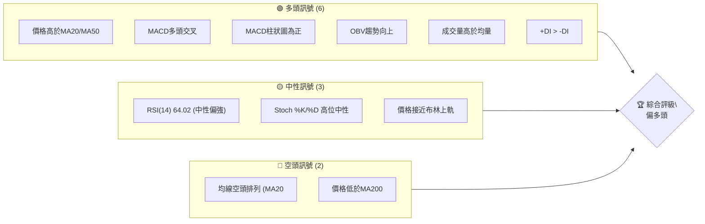
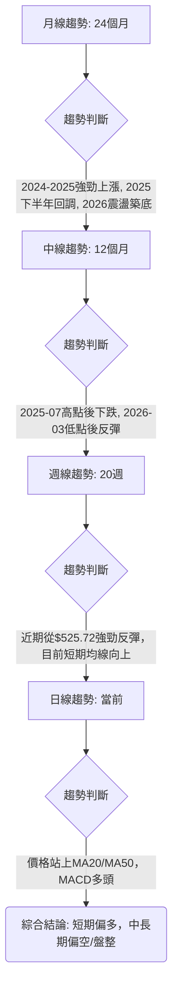
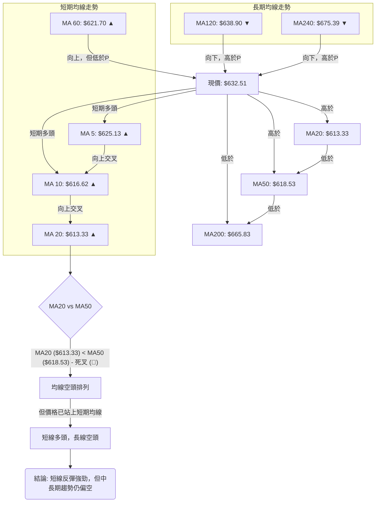

<details>
<summary>📊 靜態圖表 (點擊展開)</summary>

</details>

<html>
<head><meta charset="utf-8" /></head>
<body>
    <div>                        <script>window.PlotlyConfig = {MathJaxConfig: 'local'};</script>
        <script charset="utf-8" src="https://cdn.plot.ly/plotly-3.5.0.min.js" integrity="sha256-fHbNLP+GlIXN+efbQec78UkemUz3NJp7UmfGxC1tNxs=" crossorigin="anonymous"></script>                <div id="candlestick-chart" class="plotly-graph-div" style="height:500px; width:100%;"></div>            <script>                window.PLOTLYENV=window.PLOTLYENV || {};                                if (document.getElementById("candlestick-chart")) {                    Plotly.newPlot(                        "candlestick-chart",                        [{"close":{"dtype":"f8","bdata":"AAAAwARSiEAAAAAgYWKIQAAAACAfe4hAAAAAgJPsh0AAAAAAwW2HQAAAAIC+T4dAAAAAIPIKh0AAAAAALIiHQAAAAKBHfIdAAAAAQKqCh0AAAAAACE2HQAAAACDNaodAAAAAAMEHh0AAAADgGeuGQAAAAMCV+oZAAAAA4CpXh0AAAAAAf3WHQAAAAGBMdIdAAAAAYD\u002ffh0AAAACgvnGHQAAAACAgaYdAAAAAoI6Oh0AAAABARNeHQAAAAABmSYhAAAAAQDgviEAAAADgX1OIQAAAAEBzRIhAAAAAQA\u002ffh0AAAABAHJGHQAAAAKAeu4dAAAAAwEZdh0AAAADAEDSHQAAAAEBFMYdAAAAAADvphkAAAACAI2GGQAAAAECwroZAAAAAIP0qhkAAAACAuFOGQAAAAIAdP4ZAAAAAwCFlhkAAAABASOKGQAAAAKD6AIZAAAAAQApUhkAAAAAgvBuGQAAAAMDQYoZAAAAAgAw3hkAAAACgyF2GQAAAAICU14ZAAAAAoF3ghkAAAADAe+GGQAAAACAy5oZAAAAAYAQJh0AAAAAAiGyHQAAAAKB7cYdAAAAA4FFzh0AAAACA28qEQAAAAMAjOoRAAAAAgCnlg0AAAABALpKDQAAAAAAb14NAAAAAoEBPg0AAAAAgYGWDQAAAACCktYNAAAAAoEOQg0AAAAAA8v+CQAAAAED5BoNAAAAAIIoDg0AAAADgCciCQAAAAGCJpYJAAAAAwKxqgkAAAADAVGGCQAAAAAAQioJAAAAAIDYgg0AAAAAAQ9mDQAAAAMBqxINAAAAAAPI2hEAAAABgZv6DQAAAAAAoMIRAAAAAwEH0g0AAAABgZ6OEQAAAAGBdAoVAAAAAQH7NhEAAAACg536EQAAAACBbSIRAAAAAQPZchEAAAAAgPBmEQAAAACCmN4RAAAAAALSEhEAAAAAgjkeEQAAAAIANv4RAAAAA4KaRhEAAAAAgeaeEQAAAACD4woRAAAAA4NTXhEAAAADgx7WEQAAAACADkYRAAAAA4ArLhEAAAADgM5yEQAAAACDUToRAAAAAwM+RhEAAAABgcKCEQAAAAKAUQYRAAAAAAA8shEAAAADAAmSEQAAAAMBdC4RAAAAAwGa0g0AAAACg8jeDQAAAAMAmYoNAAAAAYMFdg0AAAABg09yCQAAAAEB8I4NAAAAAoJs4hEAAAABgkpGEQAAAAEBH\u002foRAAAAAgCcDhUAAAABgQ+GEQAAAAGBtDYdAAAAAwBhfhkAAAAAAcg6GQAAAAMDdmIVAAAAAgFfjhEAAAAAAGO2EQAAAAEAnp4RAAAAAACAlhUAAAABgK\u002fGEQAAAAKDx4IRAAAAAgAhKhEAAAAAgyPmDQAAAAODx9YNAAAAAoFsVhEAAAADg0yGEQAAAAADLeIRAAAAAoKPlg0AAAABgBvaDQAAAAOALaYRAAAAAgJWDhEAAAAAAAT2EQAAAAOABaIRAAAAAQCh0hEAAAAAgRdmEQAAAACAKoIRAAAAAgHcihEAAAACAsDaEQAAAAIAVbIRAAAAAAGZyhEAAAACgEu2DQAAAAOB6KYNAAAAAoJmbg0AAAACgR3WDQAAAAKBwPYNAAAAAoJn1gkAAAACgR42CQAAAAOB64IJAAAAAIFyHgkAAAADAHpeCQAAAAOBRHIFAAAAAgMJtgEAAAABACsOAQAAAAEAK4YFAAAAAANcZgkAAAAAgrvOBQAAAAAAp6IFAAAAAYGb4gUAAAAAgXCODQAAAAMAeo4NAAAAAQOGug0AAAACAPdSDQAAAAIDrs4RAAAAA4KP8hEAAAADA9SaFQAAAAGBmhIVAAAAAoEf3hEAAAABguOaEQAAAAIDCFYVAAAAAQDOZhEAAAACAPRiFQAAAAMD1NIVAAAAAYLj6hEAAAADA9eiEQAAAAKBHH4NAAAAAAAAGg0AAAACgRxODQAAAACCu54JAAAAAQAong0AAAADgekaDQAAAAEAKDYNAAAAAQOG2gkAAAAAAANiCQAAAAEAKRYNAAAAAoHBTg0AAAAAA1zGDQAAAACCuGYNAAAAAQOHUgkAAAADgeuiCQAAAAEAK+4JAAAAAgBQSg0AAAABguCKDQAAAAIAU2oNAAAAA4FHag0AAAACAFMSDQA=="},"high":{"dtype":"f8","bdata":"A6pnM8XMiEB13Xd+to+IQAngAz8T04hAy2gYIPAviEBSfQbW+uqHQI3pa7mJY4dAIgn9qQY+h0C2bPk\u002fA5mHQAWEV7nQqIdA1sEbjs+Ih0Cm9LiDEIOHQIqe6\u002fBIeodAobU+oB1Lh0COFLVaNPKGQHvkLAUgFIdAEG2sOAO7h0B3VLmbZKGHQA7wwE+25YdA3wD5Pgnkh0C0DRlqP9+HQM6wBuCbmodAbta5H1yeh0CfB94JDSKIQNEM++w7XIhANs38TKNriEC9AE9xdJeIQOsqU8eTp4hAytnLSViDiEDMx4zGgQqIQDQVE7a2vodAWWtwPw2ch0CzA09nZXWHQLj9vkM2bIdAYdVM4NUth0BebCN0KIWGQAoXsmlwtIZAjfEOWzzOhkCywQb0dl2GQC36ZBdnaoZAjrKPb5ZzhkAAAABASOKGQCk\u002fusRW8IZA7aBJQOd1hkC7\u002fBWo11KGQIQfUOmHlYZAn998vDqihkDxsN\u002fVuGqGQDSQW+db5IZA5BbLvSIKh0DcB\u002ftJ6BqHQIuXFv5cKYdADGAMgccfh0BSJmrE55OHQFRsXvMRqYdA9WOKwyOvh0AI9H2TlT6FQFm9Z\u002f8aDoVA2L09UtWRhEDPX9YQWQWEQAPUlOZCCYRAAe6RKYHXg0BY6VbQumiDQKj3pIuEz4NAan4YJRKkg0C4QsSthJ+DQBjYAjfzRINA1xv1MT4lg0COrf9lWRWDQBrTEHY31YJA9rs4HrCSgkDCYSnsp+2CQJ3lTIT4qIJAkUnp5Fw9g0Dcgm0J5N+DQDjgIoJa6oNAVtd7aL43hEBZFKPI8CGEQCQB711ONoRA1wEKHyI+hEC6nXTNxBeFQM5dPQiCDIVAR3nTHKQchUAIvwPJ9rqEQF31xGVWa4RA7LhN1nxxhEAfoubPgC6GQEAqzwGIY4RARdWzLsmvhEAChjCTUKWEQHH7kwvk74RAvr\u002flcmjzhEB8A0\u002fWBwiFQKpwkSRxy4RA411yBd7chECJIJe1BeOEQOxjVkR7nYRA6r3Vwyj9hEAYlcblcsOEQBxZ4sGSvoRAnUI5rcW\u002fhED27FYKm8eEQD8lk2ywlIRAZwWRDV80hEA5H1UwHnOEQCpWxLlIa4RAOovXycMNhECFXtSYTJ+DQJ8vipgWfYNAiRTTx1Wkg0Ae7\u002fMeBBeDQIaVeNLtTYNA\u002f71eFAqghECxJRTVW8+EQL0PTGKeFYVAvKJGoe0hhUBdEcdRzSiFQNbaAIjoOodABzwmbFnchkC6nq2pdoWGQMcjf8wXY4ZAc3oLHu2BhUDjyKoYVkeFQA7nMS1S+4RAp4OGtM1VhUDsiSm6ikCFQAjM6vaCNYVAHolrvl8bhUB0Ll9S+1aEQLFhefNmEIRA5hmrAZYjhECUXyBHFzWEQHo2N6dCtoRAGoyjbBmJhECLszsUfgSEQClhyKqQaoRAvHmRAnqjhEDSG91KE0eEQEyBlfIAm4RAZr8GUM+ThEBWa3VLjgGFQKE816AC8YRAE7NyrFBHhEAu\u002fYkekTmEQPsp6pXhnYRAgDZxCXOUhEDxr1oph2eEQDcJ1MkNpYNAAAAAAADWg0AAAABgZuSDQAAAAEAzdYNAAAAAAAAog0AAAAAgrt+CQAAAAMAeBYNAAAAAAADIgkAAAAAgXN2CQAAAAAAAOIJAAAAAwMz8gEAAAABgZtyAQAAAACCF7YFAAAAAYGaEgkAAAAAAABSCQAAAAOBRNoJAAAAAANf5gUAAAACgma+DQAAAAAAA7INAAAAA4KP0g0AAAAAAANiDQAAAAIAU0oRAAAAAAAA0hUAAAADgoyyFQAAAAAApnIVAAAAAQApbhUAAAACgmSGFQAAAAEAKM4VAAAAA4HrshEAAAAAgXEWFQAAAAAAAVIVAAAAAoHAxhUAAAAAAABKFQAAAAMDMZoNAAAAAQApXg0AAAAAAADCDQAAAAMDMMoNAAAAAoJlfg0AAAAAA14eDQAAAAAApRoNAAAAAoEfngkAAAAAAAN6CQAAAAEAzX4NAAAAAANd9g0AAAACgmWmDQAAAAGC4PINAAAAAoHAvg0AAAAAAAACDQAAAAMDMDINAAAAA4Ho2g0AAAACAwjODQAAAAAAA9INAAAAAAAAYhEAAAAAAANSDQA=="},"hovertemplate":"\u003cb\u003e%{x|%Y-%m-%d}\u003c\u002fb\u003e\u003cbr\u003e\u958b: $%{open:.2f}\u003cbr\u003e\u9ad8: $%{high:.2f}\u003cbr\u003e\u4f4e: $%{low:.2f}\u003cbr\u003e\u6536: $%{close:.2f}\u003cextra\u003e\u003c\u002fextra\u003e","low":{"dtype":"f8","bdata":"0IGPwEBDiEBm55aJmRWIQNJJNansV4hAya9Df0yWh0DRtEBs1VyHQOOrdDtMyoZArbdPXiPbhkAPSb\u002fDWuWGQM3PGbb6YodAgVzoLoBRh0CjOOboyyiHQDmusriDGIdAAg01MwTthkCCVfrTT4CGQN5u1Y4p4oZAbLZqlJRAh0C1Qs96RjqHQGIJ7VcQcodAlaHYQFF9h0C3yNJT7GmHQN2A3sPuVIdAMEFjhCMwh0A5Wggd03GHQBpW3nJ12odAPfM6xx3kh0BCFAUwYhyIQHC0+Tga+4dAvn8AfIzZh0CWZlQuh26HQK9\u002frUwweodA6JupaHQ6h0Ax9oVi8wCHQPVeVchTD4dAQMRJwbKohkBUpCIqHSiGQNYZpheHZ4ZAcOGmLPQnhkCsk2hf24qFQJ77obCSBIZAAZEajAYVhkBQoZvsADqGQKCkiHOr+oVArO7E76oThkC0fU+eTNGFQA2aBl6aIoZAcPRRYaP1hUDrSDEuhweGQGmP0P\u002fRd4ZAphG5FES8hkDbnQ+zkZaGQP273PMB34ZAc7isB2\u002fPhkCNMcy7FlaHQNLoNL4zQodA7upMkikqh0Dbg+rcrEiEQGGqhuHvI4RApUNcO\u002fHYg0BbfsPat4eDQMQWcm3zi4NA81Pitr5Hg0DUtNPCkcGCQCW6hI2fSINAjPmby9hSg0Ar83i9CvaCQBS2aA\u002fyz4JA4MTOYqaRgkAwTHk6P5OCQOklYFBxNoJAUr\u002fpYzwigkB3bREVAjOCQBvk6p0bJ4JAleYMug6lgkDUcp4mJEqDQLLUJ4WatINAFqpx8oLTg0DTYlvCj+WDQCVqu4AJ6INAmG9zYuLjg0AvNKFPlZeEQGtugbdFqoRAraVpKq2\u002fhEAsSPNA\u002fmGEQC6wYiObEoRAiNOiOdf9g0BuMouXWeyDQBv7K6868YNAX41U0DIVhEA41opGKEWEQEgGov8vf4RA1\u002fufiO+MhECrniLftICEQK5unLh+jYRADD5ufxGthECa2X3TCKaEQD72jUikboRAvnFx1TeKhEAuo4zDAZeEQDr7J5uYF4RAIJ49N5E5hEBX7ecmvVqEQDqlOCwRIoRAUxeJvWjZg0BwPiyDZhKEQOBl5otzBYRAtLv+Xod8g0DQjfU5WjKDQD6lruKiLYNA\u002flM8jGVcg0CnscrX5LuCQEGTq5CIvIJAVG5zrhyQg0BMjhSSMB+EQOpFI0XLpYRAdBj\u002fLrvAhEAKUZm7PcyEQM+0gAGGP4ZAd\u002foYOdZHhkDWYCxwWPeFQHavrQSVboVAnfkqzhzXhEDoqR0mh2eEQHR0u1WTL4RAR+WbTruRhECjCh9hvOmEQN4kEY5NhIRA36qUD9MlhECbeEOcN9CDQKUvvMAYooNAZwXGxuacg0CBMPD+ZuGDQIJ9QXLe8YNA7KeY0KXbg0BX+2wUiaODQA+lPby5DIRAHCYNqZE3hECMeBXAl+yDQGtLXGSoz4NAinJaM1nyg0BygRPg24iEQO3qdpkHToRAvCJT1Ibcg0CmvQJc85GDQKtD2QGPQ4RAdOIpY3E+hEDXwgh+1+KDQAmc4Gk6CINAAAAAwMx4g0AAAACgmW2DQAAAAEDhNINAAAAAgBTSgkAAAAAAAFqCQAAAAIAUuIJAAAAAAAB4gkAAAABAM4uCQAAAAMDM+oBAAAAAgBRCgEAAAADgUYSAQAAAAAApFoFAAAAAYI\u002fugUAAAACgmX2BQAAAAAAA4IFAAAAAgBSmgUAAAADgo36CQAAAAAAAeINAAAAA4KOCg0AAAABAM4ODQAAAAMD1+oNAAAAAgMLBhEAAAAAAAN6EQAAAAEAKGYVAAAAAAADghEAAAADgo9qEQAAAAAAA7oRAAAAAYGZohEAAAABguG6EQAAAAGC49oRAAAAAQArNhEAAAADger6EQAAAAAAAwIJAAAAAQOHwgkAAAAAAANaCQAAAAEDhwoJAAAAAwMywgkAAAADgUSyDQAAAAOB68IJAAAAA4KOwgkAAAADAzISCQAAAAKBHpYJAAAAAAAA4g0AAAADgegqDQAAAACCF3YJAAAAAYGbEgkAAAADgeq6CQAAAAOB6loJAAAAAoJn3gkAAAABgZuqCQAAAAAAACINAAAAA4Hqqg0AAAADAzHqDQA=="},"name":"\u50f9\u683c","open":{"dtype":"f8","bdata":"A8O\u002fAV+qiECHBd+EdUCIQJwIno6AcohAGGCGFDEqiEAnem6zlOqHQJeFOBiMTodAcr5slLg3h0A6DDvK+wuHQFJVw1RpiIdAnQW0tVNoh0ADs02ETHSHQI+\u002f1f0NModAbTUQTUU8h0B7VpUFtqKGQOEryGk08oZAzS1LYodWh0D0zTBP2naHQGP\u002fuz7UkYdA1ZFtpbidh0DkxU3GstqHQIglhyEOh4dAryAcK85Xh0BeG2jRj52HQMcm3pSf6YdAIwOzwkxRiEAev8Z5XVeIQE4ttouehIhA+o40TltkiEDlMkSkuf+HQOAwIs7hoYdA3qW4OYmBh0Bhhc5g+2WHQHybEE\u002fCW4dAhO+Q1hUoh0Ch\u002fUFvSIKGQBv48Aj9ioZAQxRWSkvDhkBU5wzNGQCGQFeqOUIsZIZAYzfwAhJChkDIBUVUpWiGQD+QrcSYzYZApQ3YUo4+hkAo3Y1ZyRSGQOlR7ezmXoZAkNr2wtBihkDqtswFMg+GQGbAqwvjf4ZAP1C2OFT2hkASxUyQ1uSGQJ9kOVvJ64ZAd5VmXnr8hkBHQy5a02OHQO4gTa78eodAOgzeN+uLh0CzdOUVQ+CEQMK1DQwSC4VA9WJH1Tx3hEBU\u002fr1J7peDQM5JbrIIuoNAGwHnbE7Wg0COYrVZrzuDQLFihEpKsINAI1OsmpyXg0BdYZZeppiDQGX7SABfIINAa4IjGkjGgkBzBN41LwCDQGkhB9PldIJA0kupP9SFgkBsqsJu8NOCQJ4BaakjXIJAgNnvP8OtgkAohv9IqneDQIhRmawA5YNAHfu11iTYg0BtUHuD2\u002fODQBonzuYjCoRAXxyVLawahECXaPlk+BaFQAqoJHYht4RAEL53kMfhhED9BoQ2S7WEQFeFkB3rRoRAd977NboRhEBluzZ0uEWEQJjIwmsuKYRA+YfKqZgXhEBtXLerZHiEQIvU+V++g4RATM0EmczOhEDHa7ccrKiEQHYMR\u002fHhm4RAI4dry7SvhECHZL6E6NuEQMdx+rCTi4RA1pE3GAORhEA75+dVc8GEQCngaupNsYRAbaguAaBThEDwXuvWC5iEQDx62RKieIRALjC6sJ4qhECiJo1ZGieEQPPOmz\u002fGX4RAOovXycMNhEC0n2tjto+DQBMHiXCbT4NAYeVvHSt9g0BCzahJ4fqCQAevrYXE8YJA2uGlJn6mg0BPVI5ivyGEQDp7zep8xIRAVIBpiRoQhUDwAw5EYg+FQM7Zr6pkBodAWZCYegW3hkDGhrPG6E+GQH19umseFoZArhFlKyJ5hUCkOW1dGbiEQBz3g5Bdx4RAVqonuea0hED2WSySKSiFQM5dfjJjC4VAFuK9zizrhEBFhnSJYiSEQHs\u002fzqGf94NAVyzNABDKg0ADRTKhMPCDQCKFJ3ok+YNAFrfLttpfhEDgGZnFTsSDQFQbUc3XD4RA6C8xsfJPhEBPf3pJMheEQOaLXlvr5INAbeg2JeI9hEBcJf1dLYuEQM0BEf7oqoRAMViPLMQ6hEAsyddX5dGDQAoBvOQBaIRA7HTWbJlxhECmuJx7j0GEQMEHBqrZeoNAAAAAAADAg0AAAACA65+DQAAAAGC4QoNAAAAAQDMhg0AAAACAPdyCQAAAAOBR7oJAAAAAwMy4gkAAAACA67WCQAAAAIDrM4JAAAAAwMzggEAAAABACsOAQAAAAADXL4FAAAAAQAohgkAAAADgUbCBQAAAACCFDYJAAAAAANfjgUAAAAAAAPCCQAAAAIDCl4NAAAAAgMLTg0AAAAAAAKyDQAAAAIDCGYRAAAAAAADYhEAAAACA6x+FQAAAAMDMNIVAAAAAQOFKhUAAAAAAAPiEQAAAAEDhEoVAAAAAoJm9hEAAAABgj6KEQAAAAAAA+IRAAAAAgOsRhUAAAACgR+eEQAAAAGCPWoNAAAAAIIU1g0AAAAAghf+CQAAAAOB6KoNAAAAAYGbIgkAAAACAwjWDQAAAAKCZOYNAAAAAYI\u002fkgkAAAABgj5aCQAAAAOCjtoJAAAAAAABAg0AAAACA6y+DQAAAAEDhCINAAAAAIFwHg0AAAACAFMaCQAAAAAAAwIJAAAAAQAr\u002fgkAAAADAHgeDQAAAAEAzC4NAAAAAAAD8g0AAAAAAAMyDQA=="},"x":["2025-08-13T00:00:00-04:00","2025-08-14T00:00:00-04:00","2025-08-15T00:00:00-04:00","2025-08-18T00:00:00-04:00","2025-08-19T00:00:00-04:00","2025-08-20T00:00:00-04:00","2025-08-21T00:00:00-04:00","2025-08-22T00:00:00-04:00","2025-08-25T00:00:00-04:00","2025-08-26T00:00:00-04:00","2025-08-27T00:00:00-04:00","2025-08-28T00:00:00-04:00","2025-08-29T00:00:00-04:00","2025-09-02T00:00:00-04:00","2025-09-03T00:00:00-04:00","2025-09-04T00:00:00-04:00","2025-09-05T00:00:00-04:00","2025-09-08T00:00:00-04:00","2025-09-09T00:00:00-04:00","2025-09-10T00:00:00-04:00","2025-09-11T00:00:00-04:00","2025-09-12T00:00:00-04:00","2025-09-15T00:00:00-04:00","2025-09-16T00:00:00-04:00","2025-09-17T00:00:00-04:00","2025-09-18T00:00:00-04:00","2025-09-19T00:00:00-04:00","2025-09-22T00:00:00-04:00","2025-09-23T00:00:00-04:00","2025-09-24T00:00:00-04:00","2025-09-25T00:00:00-04:00","2025-09-26T00:00:00-04:00","2025-09-29T00:00:00-04:00","2025-09-30T00:00:00-04:00","2025-10-01T00:00:00-04:00","2025-10-02T00:00:00-04:00","2025-10-03T00:00:00-04:00","2025-10-06T00:00:00-04:00","2025-10-07T00:00:00-04:00","2025-10-08T00:00:00-04:00","2025-10-09T00:00:00-04:00","2025-10-10T00:00:00-04:00","2025-10-13T00:00:00-04:00","2025-10-14T00:00:00-04:00","2025-10-15T00:00:00-04:00","2025-10-16T00:00:00-04:00","2025-10-17T00:00:00-04:00","2025-10-20T00:00:00-04:00","2025-10-21T00:00:00-04:00","2025-10-22T00:00:00-04:00","2025-10-23T00:00:00-04:00","2025-10-24T00:00:00-04:00","2025-10-27T00:00:00-04:00","2025-10-28T00:00:00-04:00","2025-10-29T00:00:00-04:00","2025-10-30T00:00:00-04:00","2025-10-31T00:00:00-04:00","2025-11-03T00:00:00-05:00","2025-11-04T00:00:00-05:00","2025-11-05T00:00:00-05:00","2025-11-06T00:00:00-05:00","2025-11-07T00:00:00-05:00","2025-11-10T00:00:00-05:00","2025-11-11T00:00:00-05:00","2025-11-12T00:00:00-05:00","2025-11-13T00:00:00-05:00","2025-11-14T00:00:00-05:00","2025-11-17T00:00:00-05:00","2025-11-18T00:00:00-05:00","2025-11-19T00:00:00-05:00","2025-11-20T00:00:00-05:00","2025-11-21T00:00:00-05:00","2025-11-24T00:00:00-05:00","2025-11-25T00:00:00-05:00","2025-11-26T00:00:00-05:00","2025-11-28T00:00:00-05:00","2025-12-01T00:00:00-05:00","2025-12-02T00:00:00-05:00","2025-12-03T00:00:00-05:00","2025-12-04T00:00:00-05:00","2025-12-05T00:00:00-05:00","2025-12-08T00:00:00-05:00","2025-12-09T00:00:00-05:00","2025-12-10T00:00:00-05:00","2025-12-11T00:00:00-05:00","2025-12-12T00:00:00-05:00","2025-12-15T00:00:00-05:00","2025-12-16T00:00:00-05:00","2025-12-17T00:00:00-05:00","2025-12-18T00:00:00-05:00","2025-12-19T00:00:00-05:00","2025-12-22T00:00:00-05:00","2025-12-23T00:00:00-05:00","2025-12-24T00:00:00-05:00","2025-12-26T00:00:00-05:00","2025-12-29T00:00:00-05:00","2025-12-30T00:00:00-05:00","2025-12-31T00:00:00-05:00","2026-01-02T00:00:00-05:00","2026-01-05T00:00:00-05:00","2026-01-06T00:00:00-05:00","2026-01-07T00:00:00-05:00","2026-01-08T00:00:00-05:00","2026-01-09T00:00:00-05:00","2026-01-12T00:00:00-05:00","2026-01-13T00:00:00-05:00","2026-01-14T00:00:00-05:00","2026-01-15T00:00:00-05:00","2026-01-16T00:00:00-05:00","2026-01-20T00:00:00-05:00","2026-01-21T00:00:00-05:00","2026-01-22T00:00:00-05:00","2026-01-23T00:00:00-05:00","2026-01-26T00:00:00-05:00","2026-01-27T00:00:00-05:00","2026-01-28T00:00:00-05:00","2026-01-29T00:00:00-05:00","2026-01-30T00:00:00-05:00","2026-02-02T00:00:00-05:00","2026-02-03T00:00:00-05:00","2026-02-04T00:00:00-05:00","2026-02-05T00:00:00-05:00","2026-02-06T00:00:00-05:00","2026-02-09T00:00:00-05:00","2026-02-10T00:00:00-05:00","2026-02-11T00:00:00-05:00","2026-02-12T00:00:00-05:00","2026-02-13T00:00:00-05:00","2026-02-17T00:00:00-05:00","2026-02-18T00:00:00-05:00","2026-02-19T00:00:00-05:00","2026-02-20T00:00:00-05:00","2026-02-23T00:00:00-05:00","2026-02-24T00:00:00-05:00","2026-02-25T00:00:00-05:00","2026-02-26T00:00:00-05:00","2026-02-27T00:00:00-05:00","2026-03-02T00:00:00-05:00","2026-03-03T00:00:00-05:00","2026-03-04T00:00:00-05:00","2026-03-05T00:00:00-05:00","2026-03-06T00:00:00-05:00","2026-03-09T00:00:00-04:00","2026-03-10T00:00:00-04:00","2026-03-11T00:00:00-04:00","2026-03-12T00:00:00-04:00","2026-03-13T00:00:00-04:00","2026-03-16T00:00:00-04:00","2026-03-17T00:00:00-04:00","2026-03-18T00:00:00-04:00","2026-03-19T00:00:00-04:00","2026-03-20T00:00:00-04:00","2026-03-23T00:00:00-04:00","2026-03-24T00:00:00-04:00","2026-03-25T00:00:00-04:00","2026-03-26T00:00:00-04:00","2026-03-27T00:00:00-04:00","2026-03-30T00:00:00-04:00","2026-03-31T00:00:00-04:00","2026-04-01T00:00:00-04:00","2026-04-02T00:00:00-04:00","2026-04-06T00:00:00-04:00","2026-04-07T00:00:00-04:00","2026-04-08T00:00:00-04:00","2026-04-09T00:00:00-04:00","2026-04-10T00:00:00-04:00","2026-04-13T00:00:00-04:00","2026-04-14T00:00:00-04:00","2026-04-15T00:00:00-04:00","2026-04-16T00:00:00-04:00","2026-04-17T00:00:00-04:00","2026-04-20T00:00:00-04:00","2026-04-21T00:00:00-04:00","2026-04-22T00:00:00-04:00","2026-04-23T00:00:00-04:00","2026-04-24T00:00:00-04:00","2026-04-27T00:00:00-04:00","2026-04-28T00:00:00-04:00","2026-04-29T00:00:00-04:00","2026-04-30T00:00:00-04:00","2026-05-01T00:00:00-04:00","2026-05-04T00:00:00-04:00","2026-05-05T00:00:00-04:00","2026-05-06T00:00:00-04:00","2026-05-07T00:00:00-04:00","2026-05-08T00:00:00-04:00","2026-05-11T00:00:00-04:00","2026-05-12T00:00:00-04:00","2026-05-13T00:00:00-04:00","2026-05-14T00:00:00-04:00","2026-05-15T00:00:00-04:00","2026-05-18T00:00:00-04:00","2026-05-19T00:00:00-04:00","2026-05-20T00:00:00-04:00","2026-05-21T00:00:00-04:00","2026-05-22T00:00:00-04:00","2026-05-26T00:00:00-04:00","2026-05-27T00:00:00-04:00","2026-05-28T00:00:00-04:00","2026-05-29T00:00:00-04:00"],"type":"candlestick"},{"hovertemplate":"MA30: $%{y:.2f}\u003cextra\u003e\u003c\u002fextra\u003e","line":{"color":"#2196F3","dash":"dash","width":2},"mode":"lines","name":"MA30","x":["2025-08-13T00:00:00-04:00","2025-08-14T00:00:00-04:00","2025-08-15T00:00:00-04:00","2025-08-18T00:00:00-04:00","2025-08-19T00:00:00-04:00","2025-08-20T00:00:00-04:00","2025-08-21T00:00:00-04:00","2025-08-22T00:00:00-04:00","2025-08-25T00:00:00-04:00","2025-08-26T00:00:00-04:00","2025-08-27T00:00:00-04:00","2025-08-28T00:00:00-04:00","2025-08-29T00:00:00-04:00","2025-09-02T00:00:00-04:00","2025-09-03T00:00:00-04:00","2025-09-04T00:00:00-04:00","2025-09-05T00:00:00-04:00","2025-09-08T00:00:00-04:00","2025-09-09T00:00:00-04:00","2025-09-10T00:00:00-04:00","2025-09-11T00:00:00-04:00","2025-09-12T00:00:00-04:00","2025-09-15T00:00:00-04:00","2025-09-16T00:00:00-04:00","2025-09-17T00:00:00-04:00","2025-09-18T00:00:00-04:00","2025-09-19T00:00:00-04:00","2025-09-22T00:00:00-04:00","2025-09-23T00:00:00-04:00","2025-09-24T00:00:00-04:00","2025-09-25T00:00:00-04:00","2025-09-26T00:00:00-04:00","2025-09-29T00:00:00-04:00","2025-09-30T00:00:00-04:00","2025-10-01T00:00:00-04:00","2025-10-02T00:00:00-04:00","2025-10-03T00:00:00-04:00","2025-10-06T00:00:00-04:00","2025-10-07T00:00:00-04:00","2025-10-08T00:00:00-04:00","2025-10-09T00:00:00-04:00","2025-10-10T00:00:00-04:00","2025-10-13T00:00:00-04:00","2025-10-14T00:00:00-04:00","2025-10-15T00:00:00-04:00","2025-10-16T00:00:00-04:00","2025-10-17T00:00:00-04:00","2025-10-20T00:00:00-04:00","2025-10-21T00:00:00-04:00","2025-10-22T00:00:00-04:00","2025-10-23T00:00:00-04:00","2025-10-24T00:00:00-04:00","2025-10-27T00:00:00-04:00","2025-10-28T00:00:00-04:00","2025-10-29T00:00:00-04:00","2025-10-30T00:00:00-04:00","2025-10-31T00:00:00-04:00","2025-11-03T00:00:00-05:00","2025-11-04T00:00:00-05:00","2025-11-05T00:00:00-05:00","2025-11-06T00:00:00-05:00","2025-11-07T00:00:00-05:00","2025-11-10T00:00:00-05:00","2025-11-11T00:00:00-05:00","2025-11-12T00:00:00-05:00","2025-11-13T00:00:00-05:00","2025-11-14T00:00:00-05:00","2025-11-17T00:00:00-05:00","2025-11-18T00:00:00-05:00","2025-11-19T00:00:00-05:00","2025-11-20T00:00:00-05:00","2025-11-21T00:00:00-05:00","2025-11-24T00:00:00-05:00","2025-11-25T00:00:00-05:00","2025-11-26T00:00:00-05:00","2025-11-28T00:00:00-05:00","2025-12-01T00:00:00-05:00","2025-12-02T00:00:00-05:00","2025-12-03T00:00:00-05:00","2025-12-04T00:00:00-05:00","2025-12-05T00:00:00-05:00","2025-12-08T00:00:00-05:00","2025-12-09T00:00:00-05:00","2025-12-10T00:00:00-05:00","2025-12-11T00:00:00-05:00","2025-12-12T00:00:00-05:00","2025-12-15T00:00:00-05:00","2025-12-16T00:00:00-05:00","2025-12-17T00:00:00-05:00","2025-12-18T00:00:00-05:00","2025-12-19T00:00:00-05:00","2025-12-22T00:00:00-05:00","2025-12-23T00:00:00-05:00","2025-12-24T00:00:00-05:00","2025-12-26T00:00:00-05:00","2025-12-29T00:00:00-05:00","2025-12-30T00:00:00-05:00","2025-12-31T00:00:00-05:00","2026-01-02T00:00:00-05:00","2026-01-05T00:00:00-05:00","2026-01-06T00:00:00-05:00","2026-01-07T00:00:00-05:00","2026-01-08T00:00:00-05:00","2026-01-09T00:00:00-05:00","2026-01-12T00:00:00-05:00","2026-01-13T00:00:00-05:00","2026-01-14T00:00:00-05:00","2026-01-15T00:00:00-05:00","2026-01-16T00:00:00-05:00","2026-01-20T00:00:00-05:00","2026-01-21T00:00:00-05:00","2026-01-22T00:00:00-05:00","2026-01-23T00:00:00-05:00","2026-01-26T00:00:00-05:00","2026-01-27T00:00:00-05:00","2026-01-28T00:00:00-05:00","2026-01-29T00:00:00-05:00","2026-01-30T00:00:00-05:00","2026-02-02T00:00:00-05:00","2026-02-03T00:00:00-05:00","2026-02-04T00:00:00-05:00","2026-02-05T00:00:00-05:00","2026-02-06T00:00:00-05:00","2026-02-09T00:00:00-05:00","2026-02-10T00:00:00-05:00","2026-02-11T00:00:00-05:00","2026-02-12T00:00:00-05:00","2026-02-13T00:00:00-05:00","2026-02-17T00:00:00-05:00","2026-02-18T00:00:00-05:00","2026-02-19T00:00:00-05:00","2026-02-20T00:00:00-05:00","2026-02-23T00:00:00-05:00","2026-02-24T00:00:00-05:00","2026-02-25T00:00:00-05:00","2026-02-26T00:00:00-05:00","2026-02-27T00:00:00-05:00","2026-03-02T00:00:00-05:00","2026-03-03T00:00:00-05:00","2026-03-04T00:00:00-05:00","2026-03-05T00:00:00-05:00","2026-03-06T00:00:00-05:00","2026-03-09T00:00:00-04:00","2026-03-10T00:00:00-04:00","2026-03-11T00:00:00-04:00","2026-03-12T00:00:00-04:00","2026-03-13T00:00:00-04:00","2026-03-16T00:00:00-04:00","2026-03-17T00:00:00-04:00","2026-03-18T00:00:00-04:00","2026-03-19T00:00:00-04:00","2026-03-20T00:00:00-04:00","2026-03-23T00:00:00-04:00","2026-03-24T00:00:00-04:00","2026-03-25T00:00:00-04:00","2026-03-26T00:00:00-04:00","2026-03-27T00:00:00-04:00","2026-03-30T00:00:00-04:00","2026-03-31T00:00:00-04:00","2026-04-01T00:00:00-04:00","2026-04-02T00:00:00-04:00","2026-04-06T00:00:00-04:00","2026-04-07T00:00:00-04:00","2026-04-08T00:00:00-04:00","2026-04-09T00:00:00-04:00","2026-04-10T00:00:00-04:00","2026-04-13T00:00:00-04:00","2026-04-14T00:00:00-04:00","2026-04-15T00:00:00-04:00","2026-04-16T00:00:00-04:00","2026-04-17T00:00:00-04:00","2026-04-20T00:00:00-04:00","2026-04-21T00:00:00-04:00","2026-04-22T00:00:00-04:00","2026-04-23T00:00:00-04:00","2026-04-24T00:00:00-04:00","2026-04-27T00:00:00-04:00","2026-04-28T00:00:00-04:00","2026-04-29T00:00:00-04:00","2026-04-30T00:00:00-04:00","2026-05-01T00:00:00-04:00","2026-05-04T00:00:00-04:00","2026-05-05T00:00:00-04:00","2026-05-06T00:00:00-04:00","2026-05-07T00:00:00-04:00","2026-05-08T00:00:00-04:00","2026-05-11T00:00:00-04:00","2026-05-12T00:00:00-04:00","2026-05-13T00:00:00-04:00","2026-05-14T00:00:00-04:00","2026-05-15T00:00:00-04:00","2026-05-18T00:00:00-04:00","2026-05-19T00:00:00-04:00","2026-05-20T00:00:00-04:00","2026-05-21T00:00:00-04:00","2026-05-22T00:00:00-04:00","2026-05-26T00:00:00-04:00","2026-05-27T00:00:00-04:00","2026-05-28T00:00:00-04:00","2026-05-29T00:00:00-04:00"],"y":{"dtype":"f8","bdata":"AAAAAAAA+H8AAAAAAAD4fwAAAAAAAPh\u002fAAAAAAAA+H8AAAAAAAD4fwAAAAAAAPh\u002fAAAAAAAA+H8AAAAAAAD4fwAAAAAAAPh\u002fAAAAAAAA+H8AAAAAAAD4fwAAAAAAAPh\u002fAAAAAAAA+H8AAAAAAAD4fwAAAAAAAPh\u002fAAAAAAAA+H8AAAAAAAD4fwAAAAAAAPh\u002fAAAAAAAA+H8AAAAAAAD4fwAAAAAAAPh\u002fAAAAAAAA+H8AAAAAAAD4fwAAAAAAAPh\u002fAAAAAAAA+H8AAAAAAAD4fwAAAAAAAPh\u002fAAAAAAAA+H8AAAAAAAD4f3d3dzfrp4dAAAAAwMKfh0AREREBr5WHQGZmZkawiodAERERMQuCh0AiIiICF3mHQKuqqqq4c4dAERERkUFsh0AzMzNz+WGHQKuqqvpmV4dA3t3dbeJNh0ARERGBU0qHQERERPRDPodAVVVVZUY4h0Dv7u7eXDGHQFVVVcVNLIdAiYiIKLMih0B3d3dHYBmHQDMzM\u002fMmFIdAVVVV9acLh0De3d3t2AaHQJqZmal7AodA7+7uHgj+hkAAAABQefqGQFVVVdVG84ZAvLu7awPthkAAAADg3M6GQCIiIsJirIZAMzMzs3SKhkAzMzOzW2iGQBEREWEoR4ZAMzMzk44khkCJiIg4EQSGQGZmZqZY5oVA7+7u3sfJhUAzMzPj8KyFQO\u002fu7h7AjYVAMzMz49VyhUBVVVVVlFSFQCIiIjLcNYVAzczMXOkThUCJiIjYeu2EQN7d3X3qz4RA7+7unpa0hEARERFRTqGEQFVVVZX1ioRAIiIiouN5hEAAAACgpGWEQAAAAOD+ToRAMzMzAw82hEAzMzMz7CKEQCIiIoLLEoRAERERgb7\u002fg0ARERGxweaDQERERCTJy4NAERERwXCxg0CrqqoKhauDQJqZmclvq4NARERENMGwg0Dv7u7uzLaDQHd3dzeIvoNAvLu7W0fJg0DNzMzsA9SDQBERETH+3INA7+7ubunng0ARERGhgfaDQHd3dxekA4RAzczMDNMShEDNzMwMbiKEQFVVVTWbMIRA3t3dPfpChEBERETUJVaEQN7d3R3IZIRA7+7uvrVthEDNzMy8VXKEQLy7uyuzdIRAIiIiMllwhEDNzMy8u2mEQERERNTdYoRAzczMjNldhEC8u7t7sk6EQLy7uwu8PoRA7+7ujsU5hECamZnZZDqEQBEREUF1QIRA3t3dbf9FhEBmZmZWqkyEQFVVVaXbZIRA3t3dzat0hECJiIiI1YOEQFVVVTUYi4RAvLu7S9GNhEBERERkI5CEQHd3dwc2j4RAmpmZmcmRhEAiIiJixJOEQHd3d3duloRAZmZmliGShECJiIiYt4yEQO\u002fu7h7BiYRA3t3dHZuFhEAzMzOzYoGEQM3MzBw+g4RAMzMzM+WAhEB3d3enOn2EQO\u002fu7g5agIRAREREBEKHhEAiIiKy9Y+EQDMzMzOwmIRAVVVV5fehhEDv7u6e6rKEQERERASav4RAREREFN2+hEDNzMyM1buEQGZmZgb2toRAZmZmxiKyhEBEREQE\u002f6mEQERERETMiIRAZmZm9jZxhEAiIiLiCluEQFVVVaXtRoRAIiIiYng2hEBERES0NSKEQDMzM9MNE4RA7+7ufrr8g0AiIiICqeiDQM3MzIyByINAiYiISJCng0De3d2NI4yDQJqZmRlgeoNAd3d3R3Vpg0C8u7tr2laDQHd3dyf3QINA3t3dLYYwg0ARERGBgCmDQImIiIjnIoNAVVVVddAbg0CamZl5UhiDQDMzM0PaGoNAq6qq6mYfg0Dv7u7e\u002fSGDQLy7u4uaKYNAzczMjLIwg0De3d2tkDaDQERERJQ4PINAAAAAsIM9g0BVVVWVfEeDQM3MzJzvWINAZmZm1qNkg0AiIiKCB3GDQERERCQGcINAZmZmFpJwg0De3d2NCXWDQO\u002fu7v5GdYNAmpmZmZl6g0AREREBcoCDQO\u002fu7q4AkYNAVVVVtYGkg0AiIiKiRbaDQAAAAIAjwoNA3t3djZfMg0BERESEMteDQO\u002fu7p5h4YNAzczMDLvog0C8u7ubxOaDQDMzM1Mq4YNAzczMTPDbg0BmZmZ2BdaDQAAAAJDCzoNAmpmZKRXFg0CrqqraQLmDQA=="},"type":"scatter"},{"hovertemplate":"MA60: $%{y:.2f}\u003cextra\u003e\u003c\u002fextra\u003e","line":{"color":"#9C27B0","dash":"dash","width":2},"mode":"lines","name":"MA60","x":["2025-08-13T00:00:00-04:00","2025-08-14T00:00:00-04:00","2025-08-15T00:00:00-04:00","2025-08-18T00:00:00-04:00","2025-08-19T00:00:00-04:00","2025-08-20T00:00:00-04:00","2025-08-21T00:00:00-04:00","2025-08-22T00:00:00-04:00","2025-08-25T00:00:00-04:00","2025-08-26T00:00:00-04:00","2025-08-27T00:00:00-04:00","2025-08-28T00:00:00-04:00","2025-08-29T00:00:00-04:00","2025-09-02T00:00:00-04:00","2025-09-03T00:00:00-04:00","2025-09-04T00:00:00-04:00","2025-09-05T00:00:00-04:00","2025-09-08T00:00:00-04:00","2025-09-09T00:00:00-04:00","2025-09-10T00:00:00-04:00","2025-09-11T00:00:00-04:00","2025-09-12T00:00:00-04:00","2025-09-15T00:00:00-04:00","2025-09-16T00:00:00-04:00","2025-09-17T00:00:00-04:00","2025-09-18T00:00:00-04:00","2025-09-19T00:00:00-04:00","2025-09-22T00:00:00-04:00","2025-09-23T00:00:00-04:00","2025-09-24T00:00:00-04:00","2025-09-25T00:00:00-04:00","2025-09-26T00:00:00-04:00","2025-09-29T00:00:00-04:00","2025-09-30T00:00:00-04:00","2025-10-01T00:00:00-04:00","2025-10-02T00:00:00-04:00","2025-10-03T00:00:00-04:00","2025-10-06T00:00:00-04:00","2025-10-07T00:00:00-04:00","2025-10-08T00:00:00-04:00","2025-10-09T00:00:00-04:00","2025-10-10T00:00:00-04:00","2025-10-13T00:00:00-04:00","2025-10-14T00:00:00-04:00","2025-10-15T00:00:00-04:00","2025-10-16T00:00:00-04:00","2025-10-17T00:00:00-04:00","2025-10-20T00:00:00-04:00","2025-10-21T00:00:00-04:00","2025-10-22T00:00:00-04:00","2025-10-23T00:00:00-04:00","2025-10-24T00:00:00-04:00","2025-10-27T00:00:00-04:00","2025-10-28T00:00:00-04:00","2025-10-29T00:00:00-04:00","2025-10-30T00:00:00-04:00","2025-10-31T00:00:00-04:00","2025-11-03T00:00:00-05:00","2025-11-04T00:00:00-05:00","2025-11-05T00:00:00-05:00","2025-11-06T00:00:00-05:00","2025-11-07T00:00:00-05:00","2025-11-10T00:00:00-05:00","2025-11-11T00:00:00-05:00","2025-11-12T00:00:00-05:00","2025-11-13T00:00:00-05:00","2025-11-14T00:00:00-05:00","2025-11-17T00:00:00-05:00","2025-11-18T00:00:00-05:00","2025-11-19T00:00:00-05:00","2025-11-20T00:00:00-05:00","2025-11-21T00:00:00-05:00","2025-11-24T00:00:00-05:00","2025-11-25T00:00:00-05:00","2025-11-26T00:00:00-05:00","2025-11-28T00:00:00-05:00","2025-12-01T00:00:00-05:00","2025-12-02T00:00:00-05:00","2025-12-03T00:00:00-05:00","2025-12-04T00:00:00-05:00","2025-12-05T00:00:00-05:00","2025-12-08T00:00:00-05:00","2025-12-09T00:00:00-05:00","2025-12-10T00:00:00-05:00","2025-12-11T00:00:00-05:00","2025-12-12T00:00:00-05:00","2025-12-15T00:00:00-05:00","2025-12-16T00:00:00-05:00","2025-12-17T00:00:00-05:00","2025-12-18T00:00:00-05:00","2025-12-19T00:00:00-05:00","2025-12-22T00:00:00-05:00","2025-12-23T00:00:00-05:00","2025-12-24T00:00:00-05:00","2025-12-26T00:00:00-05:00","2025-12-29T00:00:00-05:00","2025-12-30T00:00:00-05:00","2025-12-31T00:00:00-05:00","2026-01-02T00:00:00-05:00","2026-01-05T00:00:00-05:00","2026-01-06T00:00:00-05:00","2026-01-07T00:00:00-05:00","2026-01-08T00:00:00-05:00","2026-01-09T00:00:00-05:00","2026-01-12T00:00:00-05:00","2026-01-13T00:00:00-05:00","2026-01-14T00:00:00-05:00","2026-01-15T00:00:00-05:00","2026-01-16T00:00:00-05:00","2026-01-20T00:00:00-05:00","2026-01-21T00:00:00-05:00","2026-01-22T00:00:00-05:00","2026-01-23T00:00:00-05:00","2026-01-26T00:00:00-05:00","2026-01-27T00:00:00-05:00","2026-01-28T00:00:00-05:00","2026-01-29T00:00:00-05:00","2026-01-30T00:00:00-05:00","2026-02-02T00:00:00-05:00","2026-02-03T00:00:00-05:00","2026-02-04T00:00:00-05:00","2026-02-05T00:00:00-05:00","2026-02-06T00:00:00-05:00","2026-02-09T00:00:00-05:00","2026-02-10T00:00:00-05:00","2026-02-11T00:00:00-05:00","2026-02-12T00:00:00-05:00","2026-02-13T00:00:00-05:00","2026-02-17T00:00:00-05:00","2026-02-18T00:00:00-05:00","2026-02-19T00:00:00-05:00","2026-02-20T00:00:00-05:00","2026-02-23T00:00:00-05:00","2026-02-24T00:00:00-05:00","2026-02-25T00:00:00-05:00","2026-02-26T00:00:00-05:00","2026-02-27T00:00:00-05:00","2026-03-02T00:00:00-05:00","2026-03-03T00:00:00-05:00","2026-03-04T00:00:00-05:00","2026-03-05T00:00:00-05:00","2026-03-06T00:00:00-05:00","2026-03-09T00:00:00-04:00","2026-03-10T00:00:00-04:00","2026-03-11T00:00:00-04:00","2026-03-12T00:00:00-04:00","2026-03-13T00:00:00-04:00","2026-03-16T00:00:00-04:00","2026-03-17T00:00:00-04:00","2026-03-18T00:00:00-04:00","2026-03-19T00:00:00-04:00","2026-03-20T00:00:00-04:00","2026-03-23T00:00:00-04:00","2026-03-24T00:00:00-04:00","2026-03-25T00:00:00-04:00","2026-03-26T00:00:00-04:00","2026-03-27T00:00:00-04:00","2026-03-30T00:00:00-04:00","2026-03-31T00:00:00-04:00","2026-04-01T00:00:00-04:00","2026-04-02T00:00:00-04:00","2026-04-06T00:00:00-04:00","2026-04-07T00:00:00-04:00","2026-04-08T00:00:00-04:00","2026-04-09T00:00:00-04:00","2026-04-10T00:00:00-04:00","2026-04-13T00:00:00-04:00","2026-04-14T00:00:00-04:00","2026-04-15T00:00:00-04:00","2026-04-16T00:00:00-04:00","2026-04-17T00:00:00-04:00","2026-04-20T00:00:00-04:00","2026-04-21T00:00:00-04:00","2026-04-22T00:00:00-04:00","2026-04-23T00:00:00-04:00","2026-04-24T00:00:00-04:00","2026-04-27T00:00:00-04:00","2026-04-28T00:00:00-04:00","2026-04-29T00:00:00-04:00","2026-04-30T00:00:00-04:00","2026-05-01T00:00:00-04:00","2026-05-04T00:00:00-04:00","2026-05-05T00:00:00-04:00","2026-05-06T00:00:00-04:00","2026-05-07T00:00:00-04:00","2026-05-08T00:00:00-04:00","2026-05-11T00:00:00-04:00","2026-05-12T00:00:00-04:00","2026-05-13T00:00:00-04:00","2026-05-14T00:00:00-04:00","2026-05-15T00:00:00-04:00","2026-05-18T00:00:00-04:00","2026-05-19T00:00:00-04:00","2026-05-20T00:00:00-04:00","2026-05-21T00:00:00-04:00","2026-05-22T00:00:00-04:00","2026-05-26T00:00:00-04:00","2026-05-27T00:00:00-04:00","2026-05-28T00:00:00-04:00","2026-05-29T00:00:00-04:00"],"y":{"dtype":"f8","bdata":"AAAAAAAA+H8AAAAAAAD4fwAAAAAAAPh\u002fAAAAAAAA+H8AAAAAAAD4fwAAAAAAAPh\u002fAAAAAAAA+H8AAAAAAAD4fwAAAAAAAPh\u002fAAAAAAAA+H8AAAAAAAD4fwAAAAAAAPh\u002fAAAAAAAA+H8AAAAAAAD4fwAAAAAAAPh\u002fAAAAAAAA+H8AAAAAAAD4fwAAAAAAAPh\u002fAAAAAAAA+H8AAAAAAAD4fwAAAAAAAPh\u002fAAAAAAAA+H8AAAAAAAD4fwAAAAAAAPh\u002fAAAAAAAA+H8AAAAAAAD4fwAAAAAAAPh\u002fAAAAAAAA+H8AAAAAAAD4fwAAAAAAAPh\u002fAAAAAAAA+H8AAAAAAAD4fwAAAAAAAPh\u002fAAAAAAAA+H8AAAAAAAD4fwAAAAAAAPh\u002fAAAAAAAA+H8AAAAAAAD4fwAAAAAAAPh\u002fAAAAAAAA+H8AAAAAAAD4fwAAAAAAAPh\u002fAAAAAAAA+H8AAAAAAAD4fwAAAAAAAPh\u002fAAAAAAAA+H8AAAAAAAD4fwAAAAAAAPh\u002fAAAAAAAA+H8AAAAAAAD4fwAAAAAAAPh\u002fAAAAAAAA+H8AAAAAAAD4fwAAAAAAAPh\u002fAAAAAAAA+H8AAAAAAAD4fwAAAAAAAPh\u002fAAAAAAAA+H8AAAAAAAD4f0RERMyJ94ZAmpmZqSjihkDNzMwc4MyGQGZmZnaEuIZAAAAAiOmlhkCrqqryA5OGQM3MzGS8gIZAIiIiuotvhkBERETkRluGQGZmZpahRoZAVVVV5eUwhkDNzMws5xuGQBERETkXB4ZAIiIigm72hUAAAACYVemFQFVVVa2h24VAVVVVZUvOhUC8u7tzgr+FQJqZmemSsYVAREREfNughUCJiIiQ4pSFQN7d3ZWjioVAAAAAUON+hUCJiIiAnXCFQM3MzPyHX4VAZmZmFjpPhUBVVVX1MD2FQN7d3UXpK4VAvLu785odhUARERFRlA+FQEREREzYAoVAd3d39+r2hECrqqqSCuyEQLy7u2ur4YRA7+7uptjYhEAiIiJCudGEQDMzMxuyyIRAAAAAeNTChEARERExgbuEQLy7u7M7s4RAVVVVzXGrhEBmZmZW0KGEQN7d3U1ZmoRA7+7uLiaRhEDv7u4G0omEQImIiGDUf4RAIiIiah51hEBmZmYusGeEQCIiIlruWIRAAAAASPRJhEB3d3dXzziEQO\u002fu7sbDKIRAAAAACMIchEBVVVVFkxCEQKuqqjIfBoRAd3d3F7j7g0CJiIiwF\u002fyDQHd3d7clCIRAERERgbYShEC8u7s7UR2EQGZmZjbQJIRAvLu7U4wrhECJiIioEzKEQERERBwaNoRAREREhNk8hECamZkBI0WEQHd3d0cJTYRAmpmZUXpShECrqqrSkleEQCIiIiouXYRA3t3drUpkhEC8u7tDxGuEQFVVVR0DdIRAEREReU13hEAiIiIyyHeEQFVVVZ2GeoRAMzMzm817hEB3d3e32HyEQLy7uwPHfYRAERERueh\u002fhEBVVVWNzoCEQAAAAAgrf4RAmpmZUVF8hEAzMzMzHXuEQLy7u6O1e4RAIiIiGhF8hEBVVVWtVHuEQM3MzPTTdoRAIiIiYvFyhEBVVVU1cG+EQFVVVe0CaYRA7+7u1iRihEBERESMLFmEQFVVVe0hUYRAREREDEJHhEAiIiKyNj6EQCIiIgJ4L4RAd3d379gchEAzMzOTbQyEQERERJwQAoRAq6qqMoj3g0B3d3ePHuyDQCIiIqIa4oNAiYiIsLXYg0BERESUXdODQLy7u8ug0YNAzczMPInRg0De3d0VJNSDQDMzMzvF2YNAAAAAaK\u002fgg0Dv7u4+dOqDQAAAAEia9INAiYiI0Mf3g0BVVVUdM\u002fmDQFVVVU2X+YNAMzMzO9P3g0DNzMzMvfiDQImIiPDd8INAZmZmZu3qg0AiIiIyCeaDQM3MzOR524NAREREPIXTg0ARERGhn8uDQBEREWkqxINAREREDKq7g0CamZmBjbSDQN7d3R3BrINA7+7u\u002fgimg0AAAACYNKGDQM3MzMxBnoNAq6qqagabg0AAAAB4BpeDQDMzM2MskYNAVVVVnaCMg0BmZmaOIoiDQN7d3e0IgoNAERERYeB7g0AAAAD4K3eDQJqZmWnOdINAIiIiCj5yg0DNzMxcn22DQA=="},"type":"scatter"},{"hovertemplate":"MA200: $%{y:.2f}\u003cextra\u003e\u003c\u002fextra\u003e","line":{"color":"#FF6F00","dash":"solid","width":2},"mode":"lines","name":"MA200","x":["2025-08-13T00:00:00-04:00","2025-08-14T00:00:00-04:00","2025-08-15T00:00:00-04:00","2025-08-18T00:00:00-04:00","2025-08-19T00:00:00-04:00","2025-08-20T00:00:00-04:00","2025-08-21T00:00:00-04:00","2025-08-22T00:00:00-04:00","2025-08-25T00:00:00-04:00","2025-08-26T00:00:00-04:00","2025-08-27T00:00:00-04:00","2025-08-28T00:00:00-04:00","2025-08-29T00:00:00-04:00","2025-09-02T00:00:00-04:00","2025-09-03T00:00:00-04:00","2025-09-04T00:00:00-04:00","2025-09-05T00:00:00-04:00","2025-09-08T00:00:00-04:00","2025-09-09T00:00:00-04:00","2025-09-10T00:00:00-04:00","2025-09-11T00:00:00-04:00","2025-09-12T00:00:00-04:00","2025-09-15T00:00:00-04:00","2025-09-16T00:00:00-04:00","2025-09-17T00:00:00-04:00","2025-09-18T00:00:00-04:00","2025-09-19T00:00:00-04:00","2025-09-22T00:00:00-04:00","2025-09-23T00:00:00-04:00","2025-09-24T00:00:00-04:00","2025-09-25T00:00:00-04:00","2025-09-26T00:00:00-04:00","2025-09-29T00:00:00-04:00","2025-09-30T00:00:00-04:00","2025-10-01T00:00:00-04:00","2025-10-02T00:00:00-04:00","2025-10-03T00:00:00-04:00","2025-10-06T00:00:00-04:00","2025-10-07T00:00:00-04:00","2025-10-08T00:00:00-04:00","2025-10-09T00:00:00-04:00","2025-10-10T00:00:00-04:00","2025-10-13T00:00:00-04:00","2025-10-14T00:00:00-04:00","2025-10-15T00:00:00-04:00","2025-10-16T00:00:00-04:00","2025-10-17T00:00:00-04:00","2025-10-20T00:00:00-04:00","2025-10-21T00:00:00-04:00","2025-10-22T00:00:00-04:00","2025-10-23T00:00:00-04:00","2025-10-24T00:00:00-04:00","2025-10-27T00:00:00-04:00","2025-10-28T00:00:00-04:00","2025-10-29T00:00:00-04:00","2025-10-30T00:00:00-04:00","2025-10-31T00:00:00-04:00","2025-11-03T00:00:00-05:00","2025-11-04T00:00:00-05:00","2025-11-05T00:00:00-05:00","2025-11-06T00:00:00-05:00","2025-11-07T00:00:00-05:00","2025-11-10T00:00:00-05:00","2025-11-11T00:00:00-05:00","2025-11-12T00:00:00-05:00","2025-11-13T00:00:00-05:00","2025-11-14T00:00:00-05:00","2025-11-17T00:00:00-05:00","2025-11-18T00:00:00-05:00","2025-11-19T00:00:00-05:00","2025-11-20T00:00:00-05:00","2025-11-21T00:00:00-05:00","2025-11-24T00:00:00-05:00","2025-11-25T00:00:00-05:00","2025-11-26T00:00:00-05:00","2025-11-28T00:00:00-05:00","2025-12-01T00:00:00-05:00","2025-12-02T00:00:00-05:00","2025-12-03T00:00:00-05:00","2025-12-04T00:00:00-05:00","2025-12-05T00:00:00-05:00","2025-12-08T00:00:00-05:00","2025-12-09T00:00:00-05:00","2025-12-10T00:00:00-05:00","2025-12-11T00:00:00-05:00","2025-12-12T00:00:00-05:00","2025-12-15T00:00:00-05:00","2025-12-16T00:00:00-05:00","2025-12-17T00:00:00-05:00","2025-12-18T00:00:00-05:00","2025-12-19T00:00:00-05:00","2025-12-22T00:00:00-05:00","2025-12-23T00:00:00-05:00","2025-12-24T00:00:00-05:00","2025-12-26T00:00:00-05:00","2025-12-29T00:00:00-05:00","2025-12-30T00:00:00-05:00","2025-12-31T00:00:00-05:00","2026-01-02T00:00:00-05:00","2026-01-05T00:00:00-05:00","2026-01-06T00:00:00-05:00","2026-01-07T00:00:00-05:00","2026-01-08T00:00:00-05:00","2026-01-09T00:00:00-05:00","2026-01-12T00:00:00-05:00","2026-01-13T00:00:00-05:00","2026-01-14T00:00:00-05:00","2026-01-15T00:00:00-05:00","2026-01-16T00:00:00-05:00","2026-01-20T00:00:00-05:00","2026-01-21T00:00:00-05:00","2026-01-22T00:00:00-05:00","2026-01-23T00:00:00-05:00","2026-01-26T00:00:00-05:00","2026-01-27T00:00:00-05:00","2026-01-28T00:00:00-05:00","2026-01-29T00:00:00-05:00","2026-01-30T00:00:00-05:00","2026-02-02T00:00:00-05:00","2026-02-03T00:00:00-05:00","2026-02-04T00:00:00-05:00","2026-02-05T00:00:00-05:00","2026-02-06T00:00:00-05:00","2026-02-09T00:00:00-05:00","2026-02-10T00:00:00-05:00","2026-02-11T00:00:00-05:00","2026-02-12T00:00:00-05:00","2026-02-13T00:00:00-05:00","2026-02-17T00:00:00-05:00","2026-02-18T00:00:00-05:00","2026-02-19T00:00:00-05:00","2026-02-20T00:00:00-05:00","2026-02-23T00:00:00-05:00","2026-02-24T00:00:00-05:00","2026-02-25T00:00:00-05:00","2026-02-26T00:00:00-05:00","2026-02-27T00:00:00-05:00","2026-03-02T00:00:00-05:00","2026-03-03T00:00:00-05:00","2026-03-04T00:00:00-05:00","2026-03-05T00:00:00-05:00","2026-03-06T00:00:00-05:00","2026-03-09T00:00:00-04:00","2026-03-10T00:00:00-04:00","2026-03-11T00:00:00-04:00","2026-03-12T00:00:00-04:00","2026-03-13T00:00:00-04:00","2026-03-16T00:00:00-04:00","2026-03-17T00:00:00-04:00","2026-03-18T00:00:00-04:00","2026-03-19T00:00:00-04:00","2026-03-20T00:00:00-04:00","2026-03-23T00:00:00-04:00","2026-03-24T00:00:00-04:00","2026-03-25T00:00:00-04:00","2026-03-26T00:00:00-04:00","2026-03-27T00:00:00-04:00","2026-03-30T00:00:00-04:00","2026-03-31T00:00:00-04:00","2026-04-01T00:00:00-04:00","2026-04-02T00:00:00-04:00","2026-04-06T00:00:00-04:00","2026-04-07T00:00:00-04:00","2026-04-08T00:00:00-04:00","2026-04-09T00:00:00-04:00","2026-04-10T00:00:00-04:00","2026-04-13T00:00:00-04:00","2026-04-14T00:00:00-04:00","2026-04-15T00:00:00-04:00","2026-04-16T00:00:00-04:00","2026-04-17T00:00:00-04:00","2026-04-20T00:00:00-04:00","2026-04-21T00:00:00-04:00","2026-04-22T00:00:00-04:00","2026-04-23T00:00:00-04:00","2026-04-24T00:00:00-04:00","2026-04-27T00:00:00-04:00","2026-04-28T00:00:00-04:00","2026-04-29T00:00:00-04:00","2026-04-30T00:00:00-04:00","2026-05-01T00:00:00-04:00","2026-05-04T00:00:00-04:00","2026-05-05T00:00:00-04:00","2026-05-06T00:00:00-04:00","2026-05-07T00:00:00-04:00","2026-05-08T00:00:00-04:00","2026-05-11T00:00:00-04:00","2026-05-12T00:00:00-04:00","2026-05-13T00:00:00-04:00","2026-05-14T00:00:00-04:00","2026-05-15T00:00:00-04:00","2026-05-18T00:00:00-04:00","2026-05-19T00:00:00-04:00","2026-05-20T00:00:00-04:00","2026-05-21T00:00:00-04:00","2026-05-22T00:00:00-04:00","2026-05-26T00:00:00-04:00","2026-05-27T00:00:00-04:00","2026-05-28T00:00:00-04:00","2026-05-29T00:00:00-04:00"],"y":{"dtype":"f8","bdata":"AAAAAAAA+H8AAAAAAAD4fwAAAAAAAPh\u002fAAAAAAAA+H8AAAAAAAD4fwAAAAAAAPh\u002fAAAAAAAA+H8AAAAAAAD4fwAAAAAAAPh\u002fAAAAAAAA+H8AAAAAAAD4fwAAAAAAAPh\u002fAAAAAAAA+H8AAAAAAAD4fwAAAAAAAPh\u002fAAAAAAAA+H8AAAAAAAD4fwAAAAAAAPh\u002fAAAAAAAA+H8AAAAAAAD4fwAAAAAAAPh\u002fAAAAAAAA+H8AAAAAAAD4fwAAAAAAAPh\u002fAAAAAAAA+H8AAAAAAAD4fwAAAAAAAPh\u002fAAAAAAAA+H8AAAAAAAD4fwAAAAAAAPh\u002fAAAAAAAA+H8AAAAAAAD4fwAAAAAAAPh\u002fAAAAAAAA+H8AAAAAAAD4fwAAAAAAAPh\u002fAAAAAAAA+H8AAAAAAAD4fwAAAAAAAPh\u002fAAAAAAAA+H8AAAAAAAD4fwAAAAAAAPh\u002fAAAAAAAA+H8AAAAAAAD4fwAAAAAAAPh\u002fAAAAAAAA+H8AAAAAAAD4fwAAAAAAAPh\u002fAAAAAAAA+H8AAAAAAAD4fwAAAAAAAPh\u002fAAAAAAAA+H8AAAAAAAD4fwAAAAAAAPh\u002fAAAAAAAA+H8AAAAAAAD4fwAAAAAAAPh\u002fAAAAAAAA+H8AAAAAAAD4fwAAAAAAAPh\u002fAAAAAAAA+H8AAAAAAAD4fwAAAAAAAPh\u002fAAAAAAAA+H8AAAAAAAD4fwAAAAAAAPh\u002fAAAAAAAA+H8AAAAAAAD4fwAAAAAAAPh\u002fAAAAAAAA+H8AAAAAAAD4fwAAAAAAAPh\u002fAAAAAAAA+H8AAAAAAAD4fwAAAAAAAPh\u002fAAAAAAAA+H8AAAAAAAD4fwAAAAAAAPh\u002fAAAAAAAA+H8AAAAAAAD4fwAAAAAAAPh\u002fAAAAAAAA+H8AAAAAAAD4fwAAAAAAAPh\u002fAAAAAAAA+H8AAAAAAAD4fwAAAAAAAPh\u002fAAAAAAAA+H8AAAAAAAD4fwAAAAAAAPh\u002fAAAAAAAA+H8AAAAAAAD4fwAAAAAAAPh\u002fAAAAAAAA+H8AAAAAAAD4fwAAAAAAAPh\u002fAAAAAAAA+H8AAAAAAAD4fwAAAAAAAPh\u002fAAAAAAAA+H8AAAAAAAD4fwAAAAAAAPh\u002fAAAAAAAA+H8AAAAAAAD4fwAAAAAAAPh\u002fAAAAAAAA+H8AAAAAAAD4fwAAAAAAAPh\u002fAAAAAAAA+H8AAAAAAAD4fwAAAAAAAPh\u002fAAAAAAAA+H8AAAAAAAD4fwAAAAAAAPh\u002fAAAAAAAA+H8AAAAAAAD4fwAAAAAAAPh\u002fAAAAAAAA+H8AAAAAAAD4fwAAAAAAAPh\u002fAAAAAAAA+H8AAAAAAAD4fwAAAAAAAPh\u002fAAAAAAAA+H8AAAAAAAD4fwAAAAAAAPh\u002fAAAAAAAA+H8AAAAAAAD4fwAAAAAAAPh\u002fAAAAAAAA+H8AAAAAAAD4fwAAAAAAAPh\u002fAAAAAAAA+H8AAAAAAAD4fwAAAAAAAPh\u002fAAAAAAAA+H8AAAAAAAD4fwAAAAAAAPh\u002fAAAAAAAA+H8AAAAAAAD4fwAAAAAAAPh\u002fAAAAAAAA+H8AAAAAAAD4fwAAAAAAAPh\u002fAAAAAAAA+H8AAAAAAAD4fwAAAAAAAPh\u002fAAAAAAAA+H8AAAAAAAD4fwAAAAAAAPh\u002fAAAAAAAA+H8AAAAAAAD4fwAAAAAAAPh\u002fAAAAAAAA+H8AAAAAAAD4fwAAAAAAAPh\u002fAAAAAAAA+H8AAAAAAAD4fwAAAAAAAPh\u002fAAAAAAAA+H8AAAAAAAD4fwAAAAAAAPh\u002fAAAAAAAA+H8AAAAAAAD4fwAAAAAAAPh\u002fAAAAAAAA+H8AAAAAAAD4fwAAAAAAAPh\u002fAAAAAAAA+H8AAAAAAAD4fwAAAAAAAPh\u002fAAAAAAAA+H8AAAAAAAD4fwAAAAAAAPh\u002fAAAAAAAA+H8AAAAAAAD4fwAAAAAAAPh\u002fAAAAAAAA+H8AAAAAAAD4fwAAAAAAAPh\u002fAAAAAAAA+H8AAAAAAAD4fwAAAAAAAPh\u002fAAAAAAAA+H8AAAAAAAD4fwAAAAAAAPh\u002fAAAAAAAA+H8AAAAAAAD4fwAAAAAAAPh\u002fAAAAAAAA+H8AAAAAAAD4fwAAAAAAAPh\u002fAAAAAAAA+H8AAAAAAAD4fwAAAAAAAPh\u002fAAAAAAAA+H8AAAAAAAD4fwAAAAAAAPh\u002fAAAAAAAA+H\u002fXo3DVm86EQA=="},"type":"scatter"}],                        {"template":{"data":{"barpolar":[{"marker":{"line":{"color":"rgb(17,17,17)","width":0.5},"pattern":{"fillmode":"overlay","size":10,"solidity":0.2}},"type":"barpolar"}],"bar":[{"error_x":{"color":"#f2f5fa"},"error_y":{"color":"#f2f5fa"},"marker":{"line":{"color":"rgb(17,17,17)","width":0.5},"pattern":{"fillmode":"overlay","size":10,"solidity":0.2}},"type":"bar"}],"carpet":[{"aaxis":{"endlinecolor":"#A2B1C6","gridcolor":"#506784","linecolor":"#506784","minorgridcolor":"#506784","startlinecolor":"#A2B1C6"},"baxis":{"endlinecolor":"#A2B1C6","gridcolor":"#506784","linecolor":"#506784","minorgridcolor":"#506784","startlinecolor":"#A2B1C6"},"type":"carpet"}],"choropleth":[{"colorbar":{"outlinewidth":0,"ticks":""},"type":"choropleth"}],"contourcarpet":[{"colorbar":{"outlinewidth":0,"ticks":""},"type":"contourcarpet"}],"contour":[{"colorbar":{"outlinewidth":0,"ticks":""},"colorscale":[[0.0,"#0d0887"],[0.1111111111111111,"#46039f"],[0.2222222222222222,"#7201a8"],[0.3333333333333333,"#9c179e"],[0.4444444444444444,"#bd3786"],[0.5555555555555556,"#d8576b"],[0.6666666666666666,"#ed7953"],[0.7777777777777778,"#fb9f3a"],[0.8888888888888888,"#fdca26"],[1.0,"#f0f921"]],"type":"contour"}],"heatmap":[{"colorbar":{"outlinewidth":0,"ticks":""},"colorscale":[[0.0,"#0d0887"],[0.1111111111111111,"#46039f"],[0.2222222222222222,"#7201a8"],[0.3333333333333333,"#9c179e"],[0.4444444444444444,"#bd3786"],[0.5555555555555556,"#d8576b"],[0.6666666666666666,"#ed7953"],[0.7777777777777778,"#fb9f3a"],[0.8888888888888888,"#fdca26"],[1.0,"#f0f921"]],"type":"heatmap"}],"histogram2dcontour":[{"colorbar":{"outlinewidth":0,"ticks":""},"colorscale":[[0.0,"#0d0887"],[0.1111111111111111,"#46039f"],[0.2222222222222222,"#7201a8"],[0.3333333333333333,"#9c179e"],[0.4444444444444444,"#bd3786"],[0.5555555555555556,"#d8576b"],[0.6666666666666666,"#ed7953"],[0.7777777777777778,"#fb9f3a"],[0.8888888888888888,"#fdca26"],[1.0,"#f0f921"]],"type":"histogram2dcontour"}],"histogram2d":[{"colorbar":{"outlinewidth":0,"ticks":""},"colorscale":[[0.0,"#0d0887"],[0.1111111111111111,"#46039f"],[0.2222222222222222,"#7201a8"],[0.3333333333333333,"#9c179e"],[0.4444444444444444,"#bd3786"],[0.5555555555555556,"#d8576b"],[0.6666666666666666,"#ed7953"],[0.7777777777777778,"#fb9f3a"],[0.8888888888888888,"#fdca26"],[1.0,"#f0f921"]],"type":"histogram2d"}],"histogram":[{"marker":{"pattern":{"fillmode":"overlay","size":10,"solidity":0.2}},"type":"histogram"}],"mesh3d":[{"colorbar":{"outlinewidth":0,"ticks":""},"type":"mesh3d"}],"parcoords":[{"line":{"colorbar":{"outlinewidth":0,"ticks":""}},"type":"parcoords"}],"pie":[{"automargin":true,"type":"pie"}],"scatter3d":[{"line":{"colorbar":{"outlinewidth":0,"ticks":""}},"marker":{"colorbar":{"outlinewidth":0,"ticks":""}},"type":"scatter3d"}],"scattercarpet":[{"marker":{"colorbar":{"outlinewidth":0,"ticks":""}},"type":"scattercarpet"}],"scattergeo":[{"marker":{"colorbar":{"outlinewidth":0,"ticks":""}},"type":"scattergeo"}],"scattergl":[{"marker":{"line":{"color":"#283442"}},"type":"scattergl"}],"scattermapbox":[{"marker":{"colorbar":{"outlinewidth":0,"ticks":""}},"type":"scattermapbox"}],"scattermap":[{"marker":{"colorbar":{"outlinewidth":0,"ticks":""}},"type":"scattermap"}],"scatterpolargl":[{"marker":{"colorbar":{"outlinewidth":0,"ticks":""}},"type":"scatterpolargl"}],"scatterpolar":[{"marker":{"colorbar":{"outlinewidth":0,"ticks":""}},"type":"scatterpolar"}],"scatter":[{"marker":{"line":{"color":"#283442"}},"type":"scatter"}],"scatterternary":[{"marker":{"colorbar":{"outlinewidth":0,"ticks":""}},"type":"scatterternary"}],"surface":[{"colorbar":{"outlinewidth":0,"ticks":""},"colorscale":[[0.0,"#0d0887"],[0.1111111111111111,"#46039f"],[0.2222222222222222,"#7201a8"],[0.3333333333333333,"#9c179e"],[0.4444444444444444,"#bd3786"],[0.5555555555555556,"#d8576b"],[0.6666666666666666,"#ed7953"],[0.7777777777777778,"#fb9f3a"],[0.8888888888888888,"#fdca26"],[1.0,"#f0f921"]],"type":"surface"}],"table":[{"cells":{"fill":{"color":"#506784"},"line":{"color":"rgb(17,17,17)"}},"header":{"fill":{"color":"#2a3f5f"},"line":{"color":"rgb(17,17,17)"}},"type":"table"}]},"layout":{"annotationdefaults":{"arrowcolor":"#f2f5fa","arrowhead":0,"arrowwidth":1},"autotypenumbers":"strict","coloraxis":{"colorbar":{"outlinewidth":0,"ticks":""}},"colorscale":{"diverging":[[0,"#8e0152"],[0.1,"#c51b7d"],[0.2,"#de77ae"],[0.3,"#f1b6da"],[0.4,"#fde0ef"],[0.5,"#f7f7f7"],[0.6,"#e6f5d0"],[0.7,"#b8e186"],[0.8,"#7fbc41"],[0.9,"#4d9221"],[1,"#276419"]],"sequential":[[0.0,"#0d0887"],[0.1111111111111111,"#46039f"],[0.2222222222222222,"#7201a8"],[0.3333333333333333,"#9c179e"],[0.4444444444444444,"#bd3786"],[0.5555555555555556,"#d8576b"],[0.6666666666666666,"#ed7953"],[0.7777777777777778,"#fb9f3a"],[0.8888888888888888,"#fdca26"],[1.0,"#f0f921"]],"sequentialminus":[[0.0,"#0d0887"],[0.1111111111111111,"#46039f"],[0.2222222222222222,"#7201a8"],[0.3333333333333333,"#9c179e"],[0.4444444444444444,"#bd3786"],[0.5555555555555556,"#d8576b"],[0.6666666666666666,"#ed7953"],[0.7777777777777778,"#fb9f3a"],[0.8888888888888888,"#fdca26"],[1.0,"#f0f921"]]},"colorway":["#636efa","#EF553B","#00cc96","#ab63fa","#FFA15A","#19d3f3","#FF6692","#B6E880","#FF97FF","#FECB52"],"font":{"color":"#f2f5fa"},"geo":{"bgcolor":"rgb(17,17,17)","lakecolor":"rgb(17,17,17)","landcolor":"rgb(17,17,17)","showlakes":true,"showland":true,"subunitcolor":"#506784"},"hoverlabel":{"align":"left"},"hovermode":"closest","mapbox":{"style":"dark"},"paper_bgcolor":"rgb(17,17,17)","plot_bgcolor":"rgb(17,17,17)","polar":{"angularaxis":{"gridcolor":"#506784","linecolor":"#506784","ticks":""},"bgcolor":"rgb(17,17,17)","radialaxis":{"gridcolor":"#506784","linecolor":"#506784","ticks":""}},"scene":{"xaxis":{"backgroundcolor":"rgb(17,17,17)","gridcolor":"#506784","gridwidth":2,"linecolor":"#506784","showbackground":true,"ticks":"","zerolinecolor":"#C8D4E3"},"yaxis":{"backgroundcolor":"rgb(17,17,17)","gridcolor":"#506784","gridwidth":2,"linecolor":"#506784","showbackground":true,"ticks":"","zerolinecolor":"#C8D4E3"},"zaxis":{"backgroundcolor":"rgb(17,17,17)","gridcolor":"#506784","gridwidth":2,"linecolor":"#506784","showbackground":true,"ticks":"","zerolinecolor":"#C8D4E3"}},"shapedefaults":{"line":{"color":"#f2f5fa"}},"sliderdefaults":{"bgcolor":"#C8D4E3","bordercolor":"rgb(17,17,17)","borderwidth":1,"tickwidth":0},"ternary":{"aaxis":{"gridcolor":"#506784","linecolor":"#506784","ticks":""},"baxis":{"gridcolor":"#506784","linecolor":"#506784","ticks":""},"bgcolor":"rgb(17,17,17)","caxis":{"gridcolor":"#506784","linecolor":"#506784","ticks":""}},"title":{"x":0.05},"updatemenudefaults":{"bgcolor":"#506784","borderwidth":0},"xaxis":{"automargin":true,"gridcolor":"#283442","linecolor":"#506784","ticks":"","title":{"standoff":15},"zerolinecolor":"#283442","zerolinewidth":2},"yaxis":{"automargin":true,"gridcolor":"#283442","linecolor":"#506784","ticks":"","title":{"standoff":15},"zerolinecolor":"#283442","zerolinewidth":2}}},"xaxis":{"rangeslider":{"visible":false},"title":{"text":"\u65e5\u671f"}},"font":{"size":11},"title":{"text":"META  |  MA(30\u002f60\u002f200)  |  \u6700\u8fd1200\u4ea4\u6613\u65e5"},"yaxis":{"title":{"text":"\u80a1\u50f9 (USD)"}},"hovermode":"x unified","height":500},                        {"responsive": true}                    )                };            </script>        </div>
</body>
</html>

# META 技術分析報告

> **報告日期**：2026-06-01 ｜ **語言**：繁體中文 ｜ **數據來源**：Yahoo Finance ｜ **當前價格**：$632.51

---

## 目錄

| 章節 | 內容 |
|------|------|
| [1. 技術面概覽](#1-技術面概覽) | 訊號儀表板、核心指標、評分卡 |
| [2. 趨勢分析](#2-趨勢分析) | 多時框趨勢、長中短期走勢 |
| [3. 圖表形態分析](#3-圖表形態分析) | 形態識別、K線組合、目標價 |
| [4. 支撐與阻力](#4-支撐與阻力) | 關鍵價位、斐波那契回調 |
| [5. 技術指標深度解讀](#5-技術指標深度解讀) | MA/RSI/MACD/布林/成交量 |
| [6. 動能與波動率](#6-動能與波動率) | 動能評估、ATR、Beta |
| [7. 多時框架總結](#7-多時框架總結) | 時框架評分矩陣 |
| [8. 交易策略建議](#8-交易策略建議) | 多空策略、風險報酬比 |
| [9. 風險提示與監控](#9-風險提示與監控) | 監控指標、風險場景 |
| [10. 報告總結](#10-報告總結) | 總體評級與策略建議 |

---

## 1. 技術面概覽

本章節將為Meta Platforms (META) 提供一份即時的技術面概覽，透過綜合儀表板、核心指標速覽及專業評分卡，快速掌握當前市場訊號與潛在機會。

### 🎯 技術訊號儀表板

以下Mermaid圖表展示了META當前技術訊號的多空分佈情況，提供一目瞭然的市場情緒指標：


**解讀**：目前META的技術面訊號呈現短線偏多頭的態勢，主要由價格突破短期均線、MACD多頭訊號及量能配合所驅動。然而，長期均線的空頭排列及價格仍低於MA200，顯示中長期趨勢仍面臨挑戰，需要謹慎看待。RSI和Stoch指標處於中性偏強區域，暗示短線動能可能達到一定程度，需留意後續動能的持續性。

### 📊 核心指標速覽表

下表彙整了META當前最重要的技術指標數值、訊號及初步解讀，提供快速參考：

| 指標類別 | 指標名稱 | 當前數值 | 訊號 | 解讀 |
|----------|----------|----------|------|------|
| **價格** | 當前價格 | $632.51 | 🟢 | 價格處於近期反彈高位，但仍低於MA200。 |
| **均線** | MA20 | $613.33 | 🟢 | 價格 ($632.51) 高於MA20，短線支撐強勁。 |
| **均線** | MA50 | $618.53 | 🟢 | 價格 ($632.51) 高於MA50，短線趨勢偏多。 |
| **均線** | MA200 | $665.83 | 🔴 | 價格 ($632.51) 低於MA200，長線壓力顯著。 |
| **動能** | RSI(14) | 64.02 | 🟡 | 中性偏強，尚未進入超買區，仍有上行空間。 |
| **動能** | MACD | +3.201 (Hist) | 🟢 | MACD柱狀圖轉正並擴大，多頭動能增強。 |
| **波動** | ATR(14) | $13.50 | 🟡 | 每日波動約2.13%，屬於中等波動水平。 |
| **趨勢** | ADX(14) | 17.41 | 🟡 | 趨勢強度較弱，目前處於盤整或弱趨勢行情。 |
| **量能** | 量比(20日) | 1.32x | 🟢 | 當日成交量顯著高於20日均量，量能配合價格上漲。 |
| **量能** | OBV趨勢 | OBV > MA | 🟢 | 買盤動能累積，量能確認價格上漲趨勢。 |
| **布林** | BB %B | 0.96 | 🟡 | 價格接近布林上軌，短期可能面臨小幅回調或盤整。 |

### 🏆 技術評分卡

以下ASCII方框圖呈現了META在各技術維度上的評分，並提供綜合評級，以量化方式評估其當前技術狀況：

```
╔══════════════════════════════════════════════════════════════╗
║             技術評分卡 — META (2026-06-01)                   ║
╠══════════════════════════════════════════════════════════════╣
║  趨勢強度      ██████░░░░░░░░░░░░░░  60/100  🟡 (短期強勁，長期弱勢) ║
║  動能指標      ████████░░░░░░░░░░░░  75/100  🟢 (MACD多頭，RSI偏強)  ║
║  支撐穩定度    ██████████░░░░░░░░░░  80/100  🟢 (MA20/MA50提供穩固支撐)║
║  成交量配合    ████████████░░░░░░░░  85/100  🟢 (量能確認上漲，OBV強勁)║
║  形態完整度    ██████░░░░░░░░░░░░░░  65/100  🟡 (潛在底部形態，待確認)║
║  均線排列      ██████░░░░░░░░░░░░░░  55/100  🟡 (短線多頭，長線空頭排列)║
╠══════════════════════════════════════════════════════════════╣
║  綜合評分      ████████░░░░░░░░░░░░  70/100  ⚖️ 中性偏多              ║
╚══════════════════════════════════════════════════════════════╝
```
**評分說明**：
- **趨勢強度**：ADX數值為17.41，顯示趨勢強度較弱，市場處於盤整或弱趨勢。然而，+DI高於-DI，說明多頭力量佔優，因此給予中性偏高的評分。
- **動能指標**：MACD柱狀圖轉正並持續擴大，RSI處於64.02的健康區間，顯示動能良好，但Stoch位於高位，需留意過熱風險。
- **支撐穩定度**：價格目前穩穩站在MA20 ($613.33) 和MA50 ($618.53) 之上，這些短期均線提供了堅實的支撐。
- **成交量配合**：當日成交量顯著高於20日和50日均量，且OBV趨勢向上，顯示買盤積極，量價配合良好。
- **形態完整度**：近期從$525.72反彈，形成潛在的底部形態，但尚未完全確認突破關鍵阻力，仍需觀察。
- **均線排列**：短期MA5、MA10、MA20、MA60均向上，且價格高於MA20和MA50，但MA20<MA50<MA200，仍是空頭排列，長線壓力未解。

**綜合評級**：META目前處於一個多空交織的階段。短線來看，多頭動能強勁，有量能配合，且價格站上短期均線，顯示出良好的反彈勢頭。然而，長期均線的空頭排列和ADX顯示的弱勢趨勢，提醒我們這可能只是長期下跌趨勢中的一次反彈，而非趨勢反轉。因此，給予「中性偏多」的綜合評級，建議在操作上保持謹慎樂觀，並密切關注關鍵阻力位的突破情況。

---

## 2. 趨勢分析

本章節將透過多時框分析，深入剖析META的長期、中期及短期價格趨勢，並結合ADX指標評估趨勢強度。

### 🌐 多時框趨勢分析

以下Mermaid圖表展示了META從長期到短期的趨勢判斷流程，幫助我們從宏觀到微觀理解其價格動向：



**詳細分析**：
- **長期趨勢 (月線/季線)**：回顧過去24個月的價格走勢，META在2024年下半年至2025年上半年經歷了一輪強勁的牛市，從$463.69一路飆升至2025年7月的$771.63高點。隨後在2025年下半年開始進入回調階段，並在2026年初加速下跌，於2026年3月觸及$525.72的低點。目前股價正處於從低點反彈的階段。MA240和MA120均線目前呈現下降趨勢，且價格位於這兩條長期均線下方，這明確指示了長期趨勢仍偏向下行或處於底部盤整階段。
- **中期趨勢 (週線)**：從過去12個月的數據來看，META在2025年7月創下$771.63的高點後，股價進入了明顯的下跌通道，直到2026年3月才找到支撐。雖然近期有所反彈，但MA200 ($665.83) 仍遠高於當前價格，且MA200依然向下傾斜，顯示中期趨勢依然偏空。股價在$640-$690區間面臨較大中期阻力。
- **短期趨勢 (日線/週線)**：觀察近20週的數據，META在2026年3月29日觸及$525.72的低點後，展開了一波強勁的反彈，一度上漲至$688.55 (2026-04-19)，漲幅近30%。儘管隨後經歷了快速回調至$608.75 (2026-05-03)，但近期又再次反彈，目前價格 $632.51 已站上MA20 ($613.33) 和MA50 ($618.53)。短期均線MA5、MA10、MA20、MA60均呈現向上趨勢，顯示短期多頭動能佔優。

### 📈 長期趨勢 — 12個月走勢圖（Unicode）

以下ASCII圖表描繪了META過去12個月的月線收盤價走勢，標注了關鍵高低點，以視覺化方式呈現其長期波動。

```
META 月線走勢圖（過去12個月）
價格軸 ($)
$794.38 ┤                                                               ●(52W高點)
$771.63 ┤                                                         ●(2025-07)
$736.36 ┤                                                     ●
$715.89 ┤                                                 ●
$688.55 ┤                                                 
$659.53 ┤                                             ●
$647.27 ┤                                         ●           ●(2026-05)
$632.51 ┤                                         
$611.91 ┤                                     ●
$572.13 ┤                                 ●
$547.29 ┤                              ●
$525.72 ┤                          ●(2026-03低點)
$520.26 ┤●──────────────────────────────────────────────────────────────────(52W低點)
        └────────────────────────────────────────────────────────────────────
         2025-06 07  08  09  10  11  12  2026-01 02  03  04  05
```
**圖表說明**：
- **高點**：過去12個月的最高點出現在2025年7月的$771.63。52週最高點為$794.38，未在提供的月線數據中顯示。
- **低點**：過去12個月的最低點出現在2026年3月的$525.72。52週最低點為$520.26。
- **走勢**：從2025年6月的$736.36開始，META在7月達到高峰$771.63後開始回落，經歷了2025年下半年的震盪下跌。進入2026年，股價在2月和3月加速下跌，形成一個明顯的下降趨勢。3月觸底$525.72後，4月和5月股價有所反彈，但仍未突破重要的中期阻力。目前價格 $632.51 位於52週高低區間的40.9%，顯示其仍未擺脫低位區間。

**走勢特徵分析表格**：
| 期間 | 起始價 | 結束價 | 漲跌幅 | 走勢特徵 | 關鍵觀察 |
|------|--------|--------|--------|----------|----------|
| 2025-06至2025-07 | $736.36 | $771.63 | +4.79% | 強勁上漲 | 歷史高點附近，動能強勁。 |
| 2025-07至2025-10 | $771.63 | $647.27 | -16.12% | 快速回調 | 高點築頂，出現顯著賣壓。 |
| 2025-10至2025-12 | $647.27 | $659.53 | +1.89% | 區間盤整 | 試圖止跌，但未能有效突破。 |
| 2026-01至2026-03 | $715.89 | $572.13 | -20.08% | 急速下跌 | 跌破多個支撐，空頭力量強大。 |
| 2026-03至2026-04 | $525.72 | $611.91 | +16.39% | 底部反彈 | 從低點V型反轉，動能強勁。 |
| 2026-04至2026-05 | $611.91 | $632.51 | +3.37% | 震盪上行 | 反彈後小幅回調，但仍保持上漲勢頭。 |

### 📊 中期趨勢（週線分析）

從近20週的週線數據來看，META經歷了一次從高點到低點的完整下跌週期，並正在嘗試築底反彈。

```
META 近期壓力與支撐示意圖 (週線)
價格軸 ($)
$715.89 ┤                                          ●(週高點 R3)
$688.55 ┤                                      ● (週高點 R2)
$675.03 ┤                                  ●
$660.89 ┤                              ●
$655.10 ┤                          ●
$647.63 ┤                      ●
$644.31 ┤                  ●
$632.51 ╠═════════════════════════════════════════╣ ◄ 現價
$629.86 ┤              ●
$619.72 ┤          ●
$614.23 ┤      ● (週支撐 S1)
$613.18 ┤    ●
$610.26 ┤  ●
$609.63 ┤● (週支撐 S2)
$608.75 ┤● (週支撐 S3)
$593.66 ┤
$525.72 ┤● (週低點)
        └─────────────────────────────────────────────
         2026-01-18 ... 2026-05-31
```
**分析**：
- **下跌通道**：從2026年2月1日的$715.89高點開始，股價一路下跌，在2026年3月29日觸及$525.72的低點，形成一個清晰的下跌通道。
- **V型反轉**：在$525.72低點後，股價在4月和5月初經歷了一波強勁的V型反彈，並在2026年4月19日達到$688.55的次高點。
- **近期盤整與反彈**：從$688.55回調至$608.75後，股價再次展開反彈，目前收盤於$632.51。此處形成了一個潛在的「更高低點」，顯示多頭正在嘗試站穩腳跟。
- **關鍵壓力**：中期來看，上方的關鍵壓力位於$647.63 (2026-03-01高點)、$655.10 (2026-02-22高點) 以及更重要的$688.55 (2026-04-19高點)。
- **關鍵支撐**：下方的關鍵支撐則在$614.23 (2026-05-17低點)、$608.75 (2026-05-03低點)。

### ⚡ 趨勢強度評估（ADX 解讀）

ADX (Average Directional Index) 用於衡量趨勢的強度，而非方向。+DI 和 -DI 則指示趨勢的方向。

```mermaid
graph TD
    A[ADX(14): 17.41] --> B{趨勢強度判斷}
    B -- "ADX < 25" --> C[弱趨勢/盤整行情]
    C --> D[+DI: 26.82]
    C --> E[-DI: 25.40]
    D -- "+DI > -DI" --> F[多頭力量略佔優勢]
    F --> G(結論: 市場處於弱勢多頭盤整行情)
```

**ADX 強度對照表**：
| ADX 數值 | 趨勢強度 | 市場判斷 |
|----------|----------|----------|
| 0-25     | 弱趨勢   | 盤整或震盪，趨勢不明顯 |
| 25-50    | 中等趨勢 | 趨勢確立，可順勢操作 |
| 50-75    | 強趨勢   | 趨勢非常強勁，慣性強 |
| 75-100   | 極強趨勢 | 趨勢極端強勁，可能面臨超買/超賣 |

**解讀**：
- **ADX(14) 數值為 17.41**：根據ADX強度對照表，當前ADX數值低於25，這明確指出META目前處於「弱趨勢」或「盤整」行情。這意味著市場缺乏一個明確且強勁的單一方向趨勢，股價可能在一定區間內震盪。
- **+DI (26.82) 與 -DI (25.40)**：+DI 略高於 -DI。這表明在當前的弱勢趨勢或盤整格局中，多頭力量略佔上風。儘管整體趨勢不強，但買盤動能略微強於賣盤動能。
- **綜合結論**：儘管短期價格有所反彈，但ADX的低值提醒我們，這波反彈的趨勢強度仍不足以被定義為一個強勁的上升趨勢。市場更有可能處於一個帶有多頭偏向的盤整階段。投資者應警惕追高風險，並等待趨勢明確或ADX數值突破25以上，以確認新的趨勢形成。

---

## 3. 圖表形態分析

本章節將識別META價格走勢中可能存在的圖表形態，並結合K線組合進行分析，以預測潛在的價格目標。

### 🔍 形態識別系統

以下Mermaid圖表展示了我們在META價格走勢中已識別的潛在圖表形態及其之間的關係：

```mermaid
graph TD
    A[價格走勢分析] --> B{識別潛在形態}
    B -- "2025-07 高點 $771.63" --> C[M型頂部或雙頂結構 (已完成)]
    C --> D[2026-03 低點 $525.72]
    D --> E[V型反轉 (短期完成)]
    E --> F{當前: 底部構築階段}
    F -- "近期高點 $688.55" --> G[潛在更高低點 ($608.75)]
    G --> H[潛在杯柄形態 (未確認)]
    H --> I(結論: 正在築底，潛在多頭形態醞釀)
```
**形態分析詳情**：
1.  **M型頂部/雙頂結構 (已完成)**：觀察2025年7月 ($771.63) 和2025年8月 ($736.97) 的高點，以及隨後從2025年9月開始的下跌趨勢，這可能構成了一個廣義的M型頂部或雙頂結構。儘管不是教科書般的標準形態，但其形成後股價確實經歷了大幅下跌，最低觸及$525.72，顯示了頂部形態的有效性。
2.  **V型反轉 (短期完成)**：在2026年3月29日觸及$525.72的低點後，META股價迅速反彈，在不到一個月的時間內飆升至$688.55 (2026-04-19)，形成了一個強勁的V型反轉，顯示了強大的買盤力量。
3.  **潛在更高低點與築底 (進行中)**：V型反轉後，股價回調至$608.75 (2026-05-03)，隨後再次反彈。這個$608.75的低點高於之前的$525.72，形成了一個「更高低點」的結構，這是多頭趨勢反轉的初步信號。目前股價正在從$608.75反彈，顯示底部構築的跡象。
4.  **潛在杯柄形態 (未確認)**：如果將2026年2月1日的高點$715.89視為杯口左側，2026年4月19日的高點$688.55視為杯口右側，並且$525.72為杯底，那麼目前的震盪反彈可能正在形成「杯柄」部分。但此形態仍在發展中，需要股價在$688.55/$715.89附近形成一個較小的盤整區間，然後向上突破才能確認。

### 🕯️ 重要K線形態分析

以下表格分析了近20週內META出現的一些重要K線形態及其潛在意義：

| 月份 | 收盤價 | K線形態 (週線) | 解讀 | 訊號 |
|------|--------|-----------------|------|------|
| 2026-03-29 | $525.72 | 長下影線或看漲吞噬 (需日線確認) | 在長期下跌後出現，表明買盤在低位積極介入，是潛在底部反轉訊號。 | 🟢 |
| 2026-04-19 | $688.55 | 長上影線或流星線 | 在快速上漲後出現，表明上方賣壓沉重，價格可能面臨回調。 | 🔴 |
| 2026-05-03 | $608.75 | 錘子線或看漲吞噬 (需日線確認) | 在回調後再次出現，確認了$600-$610區間的支撐力道，多頭再次嘗試反攻。 | 🟢 |
| 2026-05-31 | $632.51 | 中陽線 | 實體較大，表明多頭力量強勁，收盤接近高點，顯示買盤佔優。 | 🟢 |

### 📉 ASCII 走勢形態示意圖

以下ASCII圖表描繪了META近期從底部反彈的潛在形態，並標注了關鍵點位：

```
META 近期走勢形態示意圖 (潛在V型反轉與更高低點)

價格軸 ($)
$715.89 ┤                                  ● (前高點 R3)
$688.55 ┤                                ● (近期高點 R2)
$632.51 ╠═════════════════════════════════════════╣ ◄ 現價
$608.75 ┤                          ● (更高低點 S1)
$525.72 ┤● (底部 S2)
        └─────────────────────────────────────────────
         2026-02-01  2026-03-29  2026-04-19  2026-05-03  2026-05-31
```
**圖示說明**：
- **底部 (S2)**：$525.72 (2026-03-29) 標誌著近期下跌的最低點。
- **V型反轉**：從$525.72迅速反彈至$688.55，形成一個強勁的V型反轉。
- **近期高點 (R2)**：$688.55 (2026-04-19) 是V型反轉後的短期壓力位。
- **更高低點 (S1)**：$608.75 (2026-05-03) 形成了一個比$525.72更高的低點，這是趨勢可能反轉的早期信號。
- **現價**：$632.51，目前正在從更高低點反彈。

### 🎯 形態目標價計算

基於上述識別的形態，我們進行潛在目標價的計算：

1.  **V型反轉的最小目標價**：
    - 形態底部：$525.72
    - 反彈高點：$688.55
    - V型反轉的最小目標通常是形態高點。由於已達成並回調，此目標已實現。
    - **進一步目標**：若能突破$688.55，則可看向上一個重要高點$715.89 (2026-02-01)。

2.  **潛在更高低點反彈目標**：
    - 近期低點 (更高低點)：$608.75
    - 前期反彈高點：$688.55
    - **目標1**：回補前期下跌缺口或測試$688.55的阻力。
    - **目標2**：若突破$688.55，則可挑戰$715.89。

3.  **潛在杯柄形態目標價 (若確認)**：
    - 杯口左側高點：$715.89
    - 杯口右側高點：$688.55
    - 杯底：$525.72
    - 形態高度約為 $715.89 - $525.72 = $190.17
    - 若能有效突破頸線 ($688.55 或 $715.89)，則目標價可為突破點加上形態高度。
    - **目標價**：假設突破 $688.55，則目標約為 $688.55 + $190.17 = $878.72。
    - **請注意**：此形態尚未確認，目標價僅供參考。

**總結**：META目前處於一個從長期下跌趨勢中嘗試築底反轉的階段。V型反轉已完成，並形成了一個更高低點，這是多頭的積極信號。但上方仍有重要阻力位。潛在的杯柄形態若能確認，將提供更具吸引力的長期目標價，但目前仍需觀察。

---

## 4. 支撐與阻力

本章節將詳細分析META的關鍵支撐與阻力價位，並結合斐波那契回調位，構建其完整的價格結構圖。

### 🗺️ 關鍵價位分布圖（Unicode）

以下ASCII圖表清晰展示了META當前的價格結構，標注了主要的支撐與阻力區間：

```
META 價位結構分布圖
═══════════════════════════════════════════════════
$794.38 ║████████████████████████║ 52週高點 / 極強阻力 R4
$771.63 ║████████████████████    ║ 強阻力 R3 (2025-07高點)
$715.89 ║████████████████████████║ 關鍵阻力 R2 (2026-02高點 / MA200)
$688.55 ║████████████████████    ║ 近期阻力 R1 (2026-04高點)
$665.83 ║▓▓▓▓▓▓▓▓▓▓▓▓▓▓▓▓▓▓▓▓▓▓▓▓║ MA200 (重要長期壓力)
$634.07 ║████████████████████████║ 布林上軌 (短期阻力)
$632.51 ╠════════════════════════╣ ◄ 現價
$626.83 ║▓▓▓▓▓▓▓▓▓▓▓▓▓▓▓▓        ║ 斐波那契38.2%回調位
$618.53 ║████████████████████████║ MA50 (中期支撐)
$613.33 ║▓▓▓▓▓▓▓▓▓▓▓▓▓▓▓▓        ║ MA20 / 布林中軌 (短期支撐)
$614.00 ║████████████████████████║ 分析師最低目標 (重要心理支撐)
$608.75 ║▓▓▓▓▓▓▓▓▓▓▓▓▓▓▓▓        ║ 近期支撐 S1 (更高低點)
$592.58 ║████████████████████████║ 布林下軌 (短期強支撐)
$525.72 ║▓▓▓▓▓▓▓▓▓▓▓▓▓▓▓▓        ║ 強支撐 S2 (2026-03低點)
$520.26 ║████████████████████████║ 52週低點 / 極強支撐 S3
═══════════════════════════════════════════════════
```
**圖示說明**：
- **現價**：$632.51，位於布林通道上軌附近。
- **阻力區間**：上方阻力密集，從短期布林上軌到長期MA200，再到過去的高點。
- **支撐區間**：下方支撐由短期均線MA20、MA50，斐波那契回調位以及近期形成的更高低點構成。

### 🚧 阻力位分析表

以下表格詳細列出了META面臨的各級阻力位，並分析其形成原因及突破難度：

| 阻力級別 | 價位 | 形成原因 | 突破難度 | 重要性 |
|----------|------|----------|----------|--------|
| **R1 (短期)** | $634.07 | 布林通道上軌 | 中等 | 短期反彈的直接考驗，突破可能引發加速上漲。 |
| **R2 (短期)** | $647.63 | 2026-03-01週線高點 | 中等 | 股價在3月初的下跌起點，具有一定的心理壓力。 |
| **R3 (中期)** | $665.83 | MA200 / 2026-02-08週線高點 | 高 | 長期趨勢的關鍵分水嶺，同時也是重要均線，突破則中長期趨勢有望改善。 |
| **R4 (中期)** | $688.55 | 2026-04-19週線高點 | 高 | 近期V型反轉的高點，也是潛在杯柄形態的頸線，突破意義重大。 |
| **R5 (長期)** | $715.89 | 2026-02-01週線高點 | 極高 | 去年初的重要高點，突破則意味著中期牛市的確立。 |
| **R6 (長期)** | $771.63 | 2025-07週線高點 | 極高 | 歷史高點之一，突破需要極強的買盤動能。 |

### 🛡️ 支撐位分析表

以下表格詳細列出了META可能獲得支撐的關鍵價位，並評估其穩定性：

| 支撐級別 | 價位 | 形成原因 | 守住機率 | 重要性 |
|----------|------|----------|----------|--------|
| **S1 (短期)** | $626.83 | 斐波那契38.2%回調位 | 高 | 短期反彈後的健康回調點，提供初步買入機會。 |
| **S2 (短期)** | $618.53 | MA50 | 高 | 短期和中期趨勢的關鍵支撐，跌破可能導致進一步回調。 |
| **S3 (短期)** | $614.00 | 分析師最低目標價 / 心理關口 | 高 | 具有心理支撐作用，同時接近MA20，構成雙重防線。 |
| **S4 (短期)** | $613.33 | MA20 / 布林通道中軌 | 極高 | 短期趨勢的最重要支撐，也是市場情緒的晴雨表。 |
| **S5 (中期)** | $608.75 | 2026-05-03週線低點 (更高低點) | 高 | 形成潛在底部形態的更高低點，具有重要的趨勢反轉意義。 |
| **S6 (中期)** | $592.58 | 布林通道下軌 | 中等 | 短期下跌的極限位置，若跌破則可能加速下探。 |
| **S7 (長期)** | $525.72 | 2026-03-29週線低點 | 極高 | 近期下跌的絕對底部，具有極強的心理支撐作用。 |

### 📐 斐波那契回調位分析

我們將以2026年3月29日的低點 ($525.72) 至2026年4月19日的高點 ($688.55) 這一波反彈為基準，計算斐波那契回調位，以找出潛在的支撐區域。

```
斐波那契回調位示意圖
價格軸 ($)
$688.55 ┤─────────────────────────────────────────────────────────────────── 高點 (0%)
        │
$658.85 ┤─────── 23.6% 回調位
        │
$626.83 ┤─────── 38.2% 回調位 (重要)
        │
$607.13 ┤─────── 50.0% 回調位 (重要)
        │
$587.43 ┤─────── 61.8% 回調位 (重要黃金比例)
        │
$557.73 ┤─────── 76.4% 回調位
        │
$525.72 ┤─────────────────────────────────────────────────────────────────── 低點 (100%)
```

**斐波那契回調位計算結果**：
- **高點 (0%)**：$688.55 (2026-04-19)
- **低點 (100%)**：$525.72 (2026-03-29)

| 回調比例 | 價位 | 意義 |
|----------|------|------|
| **23.6%** | $658.85 | 初步回調支撐，若守住則反彈強勁。 |
| **38.2%** | $626.83 | 較為健康的短期回調位，通常為強勢反彈的買入點。 |
| **50.0%** | $607.13 | 中等強度的回調，若跌破可能預示反彈動能減弱。 |
| **61.8%** | $587.43 | 黃金比例回調位，若能在此獲得支撐，則反彈趨勢仍有望延續。 |
| **76.4%** | $557.73 | 深度回調，若跌至此位，反彈趨勢可能已告終。 |

**當前分析**：
- 當前價格 $632.51 位於38.2%回調位 ($626.83) 之上，顯示反彈動能依然存在。
- 若股價回調， $626.83 將是第一個需要觀察的支撐位。
- 其次， $607.13 (50%回調位) 和 $587.43 (61.8%回調位) 將是更重要的支撐區，特別是$607.13，它非常接近我們識別的近期支撐S5 ($608.75)。這些位置若能守住，將確認META的築底反彈結構。

---

## 5. 技術指標深度解讀

本章節將對META的各項技術指標進行詳盡分析，包括移動平均線、RSI、MACD、布林通道及成交量，並探討它們之間的相互確認或矛盾。

### 🎛️ 指標訊號總覽

以下Mermaid圖表展示了各主要技術指標的訊號及其相互關係，以助於綜合判斷：

```mermaid
graph TD
    A[價格 $632.51] --> B[均線系統]
    B --> B1[MA20: $613.33 (🟢上方)]
    B --> B2[MA50: $618.53 (🟢上方)]
    B --> B3[MA200: $665.83 (🔴下方)]
    B1 & B2 & B3 --> B4[均線排列: MA20<MA50<MA200 (🔴空頭排列，但短線已金叉)]

    A --> C[動能指標]
    C --> C1[RSI(14): 64.02 (🟡中性偏強)]
    C --> C2[MACD Hist: +3.201 (🟢多頭動能)]
    C1 & C2 --> C3{動能評估: 短線動能強勁}

    A --> D[波動率指標]
    D --> D1[ATR(14): $13.50 (🟡中等波動)]
    D --> D2[BB %B: 0.96 (🟡接近上軌)]
    D1 & D2 --> D3{波動評估: 波動適中，短期超買}

    A --> E[成交量指標]
    E --> E1[量比: 1.32x (🟢放量上漲)]
    E --> E2[OBV: OBV > MA (🟢量能確認)]
    E1 & E2 --> E3{量能評估: 買盤積極，量價配合}

    B4 & C3 & D3 & E3 --> F(綜合判斷: 短線偏多，中長線仍受壓)
```

### 📈 移動平均線排列分析

移動平均線 (MA) 是判斷趨勢方向和支撐阻力的重要工具。


**均線排列分析**：
- **短期均線**：MA5 ($625.13), MA10 ($616.62), MA20 ($613.33), MA60 ($621.70) 均呈現向上趨勢，且價格 ($632.51) 位於這些短期均線之上。這是一個明確的短線多頭訊號，表明近期買盤積極，股價正在上漲。MA5、MA10、MA20已經形成多頭排列，且MA20和MA60也在向上運動，暗示短期反彈動能充足。
- **中期/長期均線**：MA120 ($638.90) 和MA240 ($675.39) 均呈現向下趨勢，且價格位於這兩條長期均線下方。更重要的是，MA20 ($613.33) < MA50 ($618.53) < MA200 ($665.83)，這是一個典型的「空頭排列」。儘管短線反彈，但中長期趨勢依然偏空，MA200 ($665.83) 將構成重要的長期阻力。
- **綜合判斷**：META目前處於短線多頭反彈，但中長期趨勢仍受空頭排列壓制。這是一次逆勢反彈，投資者應密切關注MA200的阻力作用。

### 📉 RSI(14) 分析

相對強弱指數 (RSI) 用於衡量價格變動的速度和幅度，判斷超買或超賣狀態。

**RSI 數值進度條**：
RSI(14): 64.02  ▓▓▓▓▓▓▓▓▓▓▓▓░░░░░░░░ 64%

**超買超賣區間分析**：
- **RSI(14) 當前值為 64.02**：RSI介於30-70之間為中性區間。目前64.02屬於中性偏強，接近70的超買區。這表明多頭動能強勁，但尚未達到過熱的程度，理論上仍有上行空間。
- **超買區 (RSI > 70)**：若RSI進入70以上，則股價可能過快上漲，潛在面臨回調壓力。
- **超賣區 (RSI < 30)**：若RSI跌破30以下，則股價可能超賣，潛在面臨反彈機會。

**背離判斷 (頂背離/底背離)**：
- **頂背離**：觀察20週歷史數據，在2026年4月19日，股價達到$688.55，RSI高達96.5，明顯超買。隨後股價在2026年4月26日收於$675.03，RSI為79.6。雖然價格略低，但RSI仍在高位。沒有明顯的「價格創新高，RSI未創新高」的經典頂背離。然而，RSI在96.5後迅速回落，本身就是動能衰竭的信號，導致了隨後的價格修正。
- **底背離**：在2026年5月3日，股價跌至$608.75，RSI為43.0。隨後在2026年5月17日，股價跌至$614.23 (略高於前低)，RSI為25.3 (低於前低)。這是一個潛在的**隱藏看漲背離 (Hidden Bullish Divergence)**：價格形成更高低點 ($608.75 -> $614.23)，而RSI形成更低低點 ($43.0 -> $25.3)。這種情況通常預示著當前趨勢的延續（即之前的下跌趨勢將結束，反彈將繼續）。然而，由於價格低點不明顯更高，且RSI在25.3後迅速反彈，這更多是動能的重新積累而非經典背離。
- **結論**：目前無明顯經典頂背離或底背離。RSI的快速從極端超買回落，以及在超賣區的快速反彈，顯示了市場的波動性和動能的快速切換。當前RSI 64.02 處於健康上行區間。

### 📊 MACD(12/26/9) 訊號解讀

平滑異同移動平均線 (MACD) 是判斷趨勢方向、動能和潛在反轉的常用指標。

```mermaid
graph TD
    P[價格: $632.51]
    MACD_Line[MACD線: -1.083]
    Signal_Line[訊號線: -4.284]
    Histogram[MACD柱狀圖: +3.201]

    MACD_Line -->|向上穿越| Signal_Line
    Histogram -->|從負轉正，持續擴大| Positive_Momentum[多頭動能增強]

    Positive_Momentum --> Bullish_Signal[MACD多頭交叉 (🟢)]

    subgraph MACD背離分析
        Price_High_1[價格高點: $688.55 (2026-04-19)]
        MACD_Hist_1[MACD柱狀圖: +14.230]

        Price_High_2[價格高點: $675.03 (2026-04-26)]
        MACD_Hist_2[MACD柱狀圖: +6.027]

        Price_High_1 -- "價格創新高" --> MACD_Hist_1
        Price_High