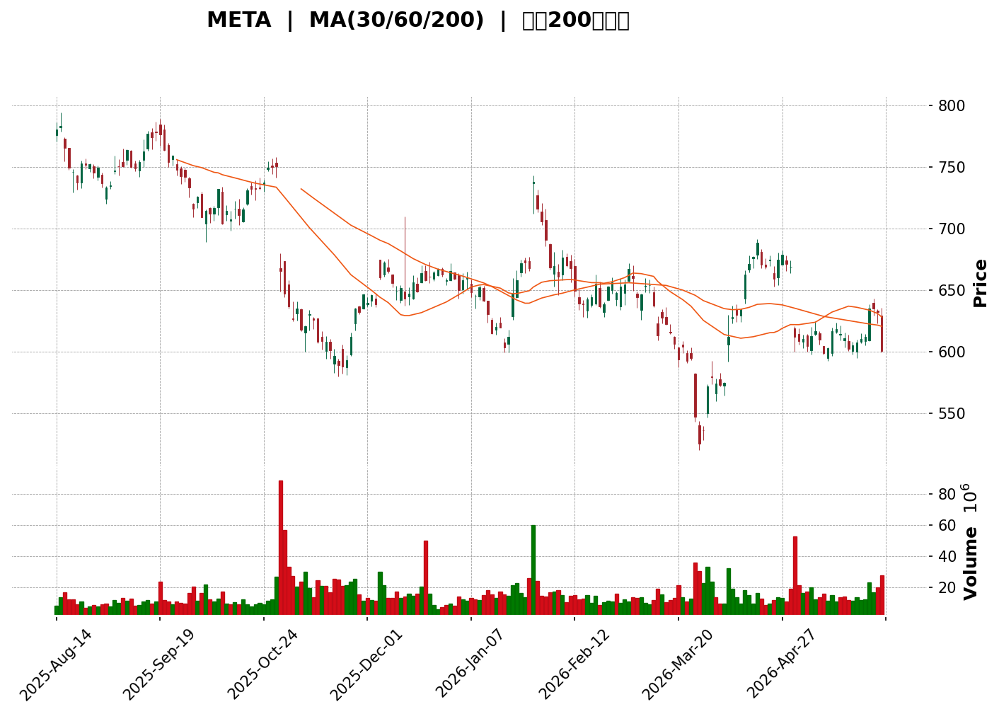
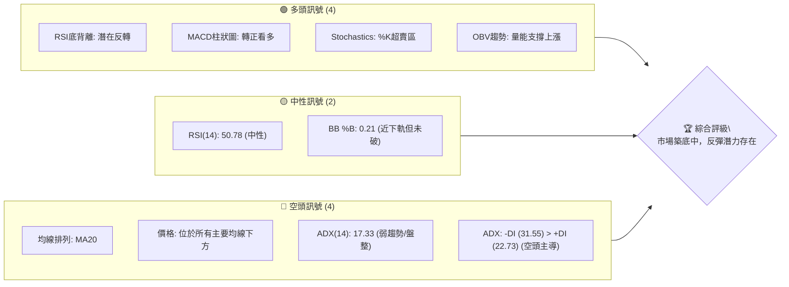
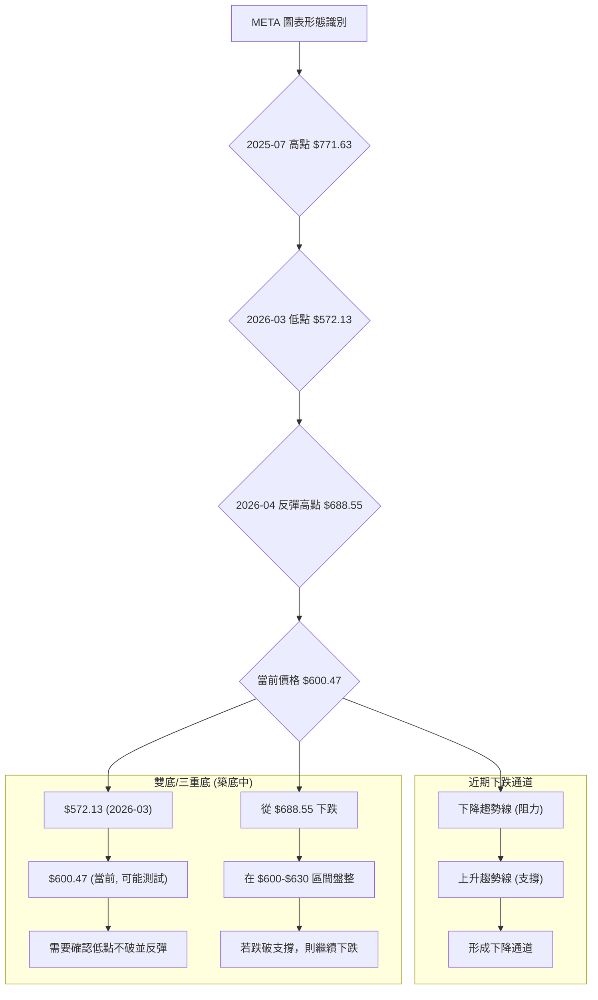

<details>
<summary>📊 靜態圖表 (點擊展開)</summary>

</details>

<html>
<head><meta charset="utf-8" /></head>
<body>
    <div>                        <script>window.PlotlyConfig = {MathJaxConfig: 'local'};</script>
        <script charset="utf-8" src="https://cdn.plot.ly/plotly-3.5.0.min.js" integrity="sha256-fHbNLP+GlIXN+efbQec78UkemUz3NJp7UmfGxC1tNxs=" crossorigin="anonymous"></script>                <div id="candlestick-chart" class="plotly-graph-div" style="height:500px; width:100%;"></div>            <script>                window.PLOTLYENV=window.PLOTLYENV || {};                                if (document.getElementById("candlestick-chart")) {                    Plotly.newPlot(                        "candlestick-chart",                        [{"close":{"dtype":"f8","bdata":"AAAAIGFiiEAAAAAgH3uIQAAAAICT7IdAAAAAAMFth0AAAACgvk+HQAAAACDyCodAAAAAACyIh0AAAACgR3yHQAAAAECqgodAAAAAAAhNh0AAAAAAzWqHQAAAAODAB4dAAAAAwBnrhkAAAACglfqGQAAAAOAqV4dAAAAAIH91h0AAAACATHSHQAAAAGA\u002f34dAAAAAoL5xh0AAAAAAIGmHQAAAAMCOjodAAAAAIETXh0AAAADgZUmIQAAAAEA4L4hAAAAAAGBTiEAAAAAgc0SIQAAAAEAP34dAAAAAIByRh0AAAACgHruHQAAAAMBGXYdAAAAAwBA0h0AAAAAgRTGHQAAAACA76YZAAAAAYCNhhkAAAABAsK6GQAAAACD9KoZAAAAAgLhThkAAAACAHT+GQAAAAMAhZYZAAAAAQEjihkAAAACg+gCGQAAAAEAKVIZAAAAAALwbhkAAAADA0GKGQAAAAIAMN4ZAAAAAoMhdhkAAAACAlNeGQAAAAKBd4IZAAAAAwHvhhkAAAAAgMuaGQAAAAIAECYdAAAAA4Idsh0AAAACge3GHQAAAAMBRc4dAAAAAoNvKhEAAAADAIzqEQAAAAIAp5YNAAAAAQC6Sg0AAAAAAG9eDQAAAAKBAT4NAAAAAIGBlg0AAAABApLWDQAAAAKBDkINAAAAAAPL\u002fgkAAAABA+QaDQAAAACCKA4NAAAAA4AnIgkAAAABgiaWCQAAAAMCsaoJAAAAAoFRhgkAAAAAAEIqCQAAAACA2IINAAAAA4ELZg0AAAACgasSDQAAAAADyNoRAAAAAQGb+g0AAAAAAKDCEQAAAAKBB9INAAAAAgGejhEAAAABgXQKFQAAAAEB+zYRAAAAAwOd+hEAAAAAgW0iEQAAAACD2XIRAAAAAIDwZhEAAAAAgpjeEQAAAAAC0hIRAAAAAII5HhEAAAACADb+EQAAAAOCmkYRAAAAAIHmnhEAAAAAg+MKEQAAAAODU14RAAAAA4Me1hEAAAAAgA5GEQAAAAOAKy4RAAAAA4DOchEAAAAAg1E6EQAAAAMDPkYRAAAAAYHCghEAAAACgFEGEQAAAAAAPLIRAAAAAwAJkhEAAAADAXQuEQAAAAMBmtINAAAAAoPI3g0AAAADAJmKDQAAAAGDBXYNAAAAAYNPcgkAAAABAfCODQAAAAKCbOIRAAAAAYJKRhEAAAABAR\u002f6EQAAAAIAnA4VAAAAAYEPhhEAAAABgbQ2HQAAAAMAYX4ZAAAAAAHIOhkAAAADA3ZiFQAAAAIBX44RAAAAAABjthEAAAABAJ6eEQAAAAAAgJYVAAAAAYCvxhEAAAACg8eCEQAAAAIAISoRAAAAAIMj5g0AAAADg8fWDQAAAAKBbFYRAAAAA4NMhhEAAAAAAy3iEQAAAAKCj5YNAAAAAYAb2g0AAAADgC2mEQAAAAICVg4RAAAAAAAE9hEAAAADgAWiEQAAAAEAodIRAAAAAIEXZhEAAAAAgCqCEQAAAAIB3IoRAAAAAgLA2hEAAAACAFWyEQAAAAABmcoRAAAAAoBLtg0AAAADgeimDQAAAAKCZm4NAAAAAoEd1g0AAAACgcD2DQAAAAKCZ9YJAAAAAoEeNgkAAAADgeuCCQAAAACBch4JAAAAAwB6XgkAAAADgURyBQAAAAIDCbYBAAAAAQArDgEAAAABACuGBQAAAAADXGYJAAAAAIK7zgUAAAAAAKeiBQAAAAGBm+IFAAAAAIFwjg0AAAADAHqODQAAAAEDhroNAAAAAgD3Ug0AAAACA67OEQAAAAOCj\u002fIRAAAAAwPUmhUAAAABgZoSFQAAAAKBH94RAAAAAYLjmhEAAAACAwhWFQAAAAEAzmYRAAAAAgD0YhUAAAADA9TSFQAAAAGC4+oRAAAAAwPXohEAAAACgRx+DQAAAAAAABoNAAAAAoEcTg0AAAAAgrueCQAAAAEAKJ4NAAAAA4HpGg0AAAABACg2DQAAAAEDhtoJAAAAAAADYgkAAAABACkWDQAAAAKBwU4NAAAAAANcxg0AAAAAgrhmDQAAAAEDh1IJAAAAA4HrogkAAAABACvuCQAAAAIAUEoNAAAAAYLgig0AAAACAFNqDQAAAAOBR2oNAAAAAgBTEg0AAAACAwsOCQA=="},"high":{"dtype":"f8","bdata":"dd13fraPiEAJ4AM\u002fE9OIQMtoGCDwL4hAUn0G1vrqh0BlFYfZiWOHQCIJ\u002fakGPodAtmz5PwOZh0AFhFe50KiHQNbBG47PiIdApvS4gxCDh0DqddbQSHqHQKkc4X8dS4dAfCmrOjTyhkBiUwnlHxSHQBBtrDgDu4dAgTX1u2Shh0CurFtwtuWHQN8A+T4J5IdAtA0Zaj\u002ffh0BDDcO\u002fm5qHQOZNzz9cnodA4KZ56QwiiEB7O+LMO1yIQDbN\u002fEyja4hAtY+okXSXiEBadNCmk6eIQMrZy0lYg4hAfPHnpYEKiEA0FRO2tr6HQFlrcD8NnIdAswNPZ2V1h0CGqm0jNmyHQIynrADWLYdAe+vvUyiFhkAKF7JpcLSGQI3xDls8zoZAssEG9HZdhkAt+mQXZ2qGQI6yj2+Wc4ZAAAAAQEjihkApP7rEVvCGQO2gSUDndYZAPTnGh9dShkCEH1Dph5WGQJ\u002fffLw6ooZA8bDf1bhqhkA0kFvnW+SGQOQWy70iCodA3Af7Segah0CLlxb+XCmHQPb+K6HHH4dAHlw0pOeTh0BUbF7zEamHQPXCOKMjr4dAPw8wtJU+hUBZvWf\u002fGg6FQNi9PVLVkYRAz1\u002fWEFkFhEAD1JTmQgmEQAHukSmB14NAWOlW0Lpog0Du+s6rhM+DQGp+GCUSpINAuELErYSfg0AY2AI380SDQNcb9TE+JYNAjq3\u002fZVkVg0Aa0xB2N9WCQPa7OB6wkoJAXxM1y6ftgkCd5UyE+KiCQJFJ6eRcPYNA5tJi6ePfg0ByduVhWuqDQFbXe2i+N4RAWDJqqPAhhEAkAe9dTjaEQHyIk\u002f4hPoRAsgop7sQXhUDOXT0IggyFQEd50xykHIVASoRh6fa6hEBd9cRlVmuEQIJ3LbZ8cYRAH6Lmz4AuhkBAKs8BiGOEQEXVsy7Jr4RAAoYwk1ClhEBx+5ML5O+EQL6\u002f5XJo84RAfANP1gcIhUCqcJEkccuEQONdcgXe3IRAiSCXtQXjhEDsY1ZEe52EQOq91cMo\u002fYRAGJXG5XLDhEAcWeLBkr6EQJ1COa3Fv4RA9uxWCpvHhEA\u002fJZNssJSEQGcFkQ1fNIRAOR9VMB5zhEAqVsS5SGuEQDqL18nDDYRAhV7UmEyfg0CfL4qYFn2DQIkU08dVpINAHu\u002fzHgQXg0CGlXjS7U2DQP+9XhQKoIRAsSUU1VvPhEC9D0xinhWFQLyiRqHtIYVAXRHHUc0ohUDW2gCI6DqHQAc8JmxZ3IZAup6tqXaFhkDHI3\u002fMF2OGQHN6Cx7tgYVA48iqGFZHhUAO5zEtUvuEQKeDhrTNVYVA7IkpuopAhUAIzOr2gjWFQB6Ja75fG4VAdC5fUvtWhECxYXnzZhCEQOYZqwGWI4RAlF8gRxc1hEB6NjenQraEQBqMo2wZiYRAi7M7FH4EhEApYciqkGqEQLx5kQJ6o4RA0hvdShNHhEBMgZXyAJuEQGa\u002fBlDPk4RAVmt1S44BhUChPNegAvGEQBOzcqxQR4RALv2JHpE5hED7KeqV4Z2EQIA2cQlzlIRA8a9aKYdnhEA3CdTJDaWDQAAAAAAA1oNAAAAAYGbkg0AAAABAM3WDQAAAAAAAKINAAAAAIK7fgkAAAADAHgWDQAAAAAAAyIJAAAAAIFzdgkAAAAAAADiCQAAAAMDM\u002fIBAAAAAYGbcgEAAAAAghe2BQAAAAGBmhIJAAAAAAAAUgkAAAADgUTaCQAAAAADX+YFAAAAAoJmvg0AAAAAAAOyDQAAAAOCj9INAAAAAAADYg0AAAACAFNKEQAAAAAAANIVAAAAA4KMshUAAAAAAKZyFQAAAAEAKW4VAAAAAoJkhhUAAAABACjOFQAAAAOB67IRAAAAAIFxFhUAAAAAAAFSFQAAAAKBwMYVAAAAAAAAShUAAAADAzGaDQAAAAEAKV4NAAAAAAAAwg0AAAADAzDKDQAAAAKCZX4NAAAAAANeHg0AAAAAAKUaDQAAAAKBH54JAAAAAAADegkAAAABAM1+DQAAAAADXfYNAAAAAoJlpg0AAAABguDyDQAAAAKBwL4NAAAAAAAAAg0AAAADAzAyDQAAAAOB6NoNAAAAAgMIzg0AAAAAAAPSDQAAAAAAAGIRAAAAAAADUg0AAAADA\u002f92DQA=="},"hovertemplate":"\u003cb\u003e%{x|%Y-%m-%d}\u003c\u002fb\u003e\u003cbr\u003e\u958b: $%{open:.2f}\u003cbr\u003e\u9ad8: $%{high:.2f}\u003cbr\u003e\u4f4e: $%{low:.2f}\u003cbr\u003e\u6536: $%{close:.2f}\u003cextra\u003e\u003c\u002fextra\u003e","low":{"dtype":"f8","bdata":"ZueWiZkViEDSSTWp7FeIQMmvQ39MlodA0bRAbNVch0DmfL1aTMqGQK23T14j24ZAD0m\u002fw1rlhkDNzxm2+mKHQIFc6C6AUYdAozjm6Msoh0B2ICOZgxiHQLAzWhME7YZAiXCPtE+AhkCTcfduKeKGQGy2apSUQIdAfHp+mkY6h0Du\u002fOl3EHKHQJWh2EBRfYdAt8jSU+xph0DbGvqj7lSHQMr+4qMjMIdA1YKQ\u002fdJxh0B3gnBTddqHQD3zOscd5IdAUL28T2IciECfbFoZGvuHQL5\u002fAHyM2YdApFuDDoduh0Cvf61MMHqHQOibqWh0OodAMfaFYvMAh0BTNISoUw+HQFWi7+CyqIZAPy50Ch0ohkDWGaYXh2eGQHDhpiz0J4ZArJNoX9uKhUCe+6GwkgSGQAGRGowGFYZAUKGb7AA6hkCgpIhzq\u002fqFQKzuxO+qE4ZA+jq7fkzRhUANmgZemiKGQHD0UWGj9YVA60gxLocHhkBpj9D\u002f0XeGQKYRuRREvIZA250Ps5GWhkD9u9zzAd+GQBy6XCdvz4ZAS9rqmxZWh0DS6DS+M0KHQCq\u002fsHIpKodAZSki\u002fKxIhEBhqobh7yOEQKVDXDvx2INAW37D2reHg0DEFnJt84uDQPNT4ra+R4NA1LTTwpHBgkBbutOsn0iDQIz5m8vYUoNAK\u002fN4vQr2gkAUtmgP8s+CQODEzmKmkYJAMEx5Oj+TgkDpJWBQcTaCQFK\u002f6WM8IoJAcxNi9QEzgkAb5OqdGyeCQJXmDLoOpYJA6C+FByRKg0AgbkFlmrSDQBaqcfKC04NAyiODoo\u002flg0AlaruACeiDQDOxjULi44NAOuCOb5WXhEBrboG3RaqEQK2laSqtv4RAZyTGYP5hhEAusGIjmxKEQGBOOBrX\u002fYNAbjKLl1nsg0Ab+yuvOvGDQF+NVNAyFYRAONaKRihFhEBIBqL\u002fL3+EQNf7n4jvjIRAq54i37SAhECubpy4fo2EQAw+bn8RrYRAmtl90wimhEA+9o1IpG6EQL5xcdU3ioRALqOMwwGXhEA6+yebmBeEQCCePTeROYRAV+3nJr1ahEA6pTgsESKEQFMXib1o2YNAcD4sg2YShEDgZeaLcwWEQLS7\u002fl6HfINA0I31OVoyg0A+pa7ioi2DQP5TPIxlXINAp7HK1+S7gkBBk6uQiLyCQFRuc64ckINATI4UkjAfhEDqRSNFy6WEQHQY\u002fy67wIRAClGZuz3MhEDPtIABhj+GQHf6GDnWR4ZA1mAscFj3hUB2r60ElW6FQJ35Ks4c14RA6KkdJodnhEB0dLtVky+EQEflm067kYRAowofYbzphEDeJBGOTYSEQN+qlA\u002fTJYRAm3hDnDfQg0ClL7zAGKKDQGcFxsbmnINAgTDw\u002fmbhg0CCfUFy3vGDQOynmNCl24NAV\u002ftsFImjg0APpT28uQyEQBwmDamRN4RAjHgVwJfsg0BrS1xkqM+DQIpyWjNZ8oNAcoET4NuIhEDt6naZB06EQLwiU9SG3INApr0CXPORg0CrQ9kBj0OEQHTiKWNxPoRA18IIftfig0AJnOBpOgiDQAAAAMDMeINAAAAAoJltg0AAAABA4TSDQAAAAIAU0oJAAAAAAABagkAAAACAFLiCQAAAAAAAeIJAAAAAQDOLgkAAAADAzPqAQAAAAIAUQoBAAAAA4FGEgEAAAAAAKRaBQAAAAGCP7oFAAAAAoJl9gUAAAAAAAOCBQAAAAIAUpoFAAAAA4KN+gkAAAAAAAHiDQAAAAOCjgoNAAAAAQDODg0AAAADA9fqDQAAAAIDCwYRAAAAAAADehEAAAABAChmFQAAAAAAA4IRAAAAA4KPahEAAAAAAAO6EQAAAAGBmaIRAAAAAYLhuhEAAAABguPaEQAAAAEAKzYRAAAAA4Hq+hEAAAAAAAMCCQAAAAEDh8IJAAAAAAADWgkAAAABA4cKCQAAAAMDMsIJAAAAA4FEsg0AAAADgevCCQAAAAOCjsIJAAAAAwMyEgkAAAACgR6WCQAAAAAAAOINAAAAA4HoKg0AAAAAghd2CQAAAAGBmxIJAAAAA4HqugkAAAADgepaCQAAAAKCZ94JAAAAAYGbqgkAAAAAAAAiDQAAAAOB6qoNAAAAAwMx6g0AAAACAPbyCQA=="},"name":"\u50f9\u683c","open":{"dtype":"f8","bdata":"hwXfhHVAiECcCJ6OgHKIQBhghhQxKohAJ3pus5Tqh0D84DY4jE6HQHK+bJS4N4dAOgw7yvsLh0BSVcNUaYiHQJ0FtLVTaIdAA7NNhEx0h0AkSyPeDTKHQOk8xyxFPIdAxWn65bWihkBx19NJNPKGQM0tS2KHVodAtqcyb9p2h0C9SeRe1JGHQNWRbaW4nYdA5MVNxrLah0BXPF4BDoeHQITA0UrOV4dAZo+1sY+dh0ASWFx1n+mHQCMDs8JMUYhABP\u002fLmV1XiECTj2FrnoSIQPqONE5bZIhAZgCug7n\u002fh0DgMCLO4aGHQN6luDmJgYdAYYXOYPtlh0DE+9UuwluHQK656PYVKIdAKZkST0iChkAb+PAI\u002fYqGQEMUVkpLw4ZAVOcMzRkAhkBXqjlCLGSGQGM38AISQoZAyAVFVKVohkA\u002fkK3EmM2GQKUN2FKOPoZAyeuXOckUhkDpUe3s5l6GQJDa9sLQYoZA6rbMBTIPhkBmwKsL43+GQD9QtjhU9oZAEsVMkNbkhkCfZDlbyeuGQDMqVX56\u002fIZA4ic6OtNjh0DuIE2u\u002fHqHQAJ7vBfri4dA6GUGNkPghEDCtQ0MEguFQPViR9U8d4RAVP69Se6Xg0DOSW6yCLqDQBsB52xO1oNAjmK1Wa87g0CosntqSrCDQCNTrJqcl4NAXWGWXqaYg0Bl+0gAXyCDQGuCIxpIxoJAcwTeNS8Ag0BpIQfT5XSCQNJLqT\u002fUhYJA6yH7TfDTgkCeAWmpI1yCQIDZ7z\u002fDrYJAd96cKap3g0BNkWSMAOWDQB37tdYk2INA9C+MY9vzg0AaJ87mIwqEQB2BVw2sGoRAoJishfgWhUAKqCR2IbeEQBC+d5DH4YRA6PHYVku1hEBXhZAd60aEQP0Ycha6EYRAZbs2dLhFhECYyMJrLimEQPmHyqmYF4RAbVy3q2R4hECL1PlfvoOEQEzNBJnMzoRAx2u3HKyohEB2DEfx4ZuEQCOHa8u0r4RAh2S+hOjbhEDHcfqwk4uEQNaRNxgDkYRAO+fnVXPBhEAp4GrqTbGEQG2oLgGgU4RA8F7r1guYhEA8etkSoniEQC4wurCeKoRAoiaNWRonhEDzzps\u002fxl+EQDqL18nDDYRAtJ9rY7aPg0ATB4lwm0+DQGHlbx0rfYNAQs2oSeH6gkAHr62FxPGCQNrhpSZ+poNAT1SOYr8hhEA6e83qfMSEQFSAaYkaEIVA8AMORGIPhUDO2a+qZAaHQFmQmHoFt4ZAxoazxuhPhkB9fbprHhaGQK4RZSsieYVApDltXRm4hEAc94OQXceEQFaqJ7nmtIRA9lkskikohUDOXX4yYwuFQBbivc4s64RARYZ0iWIkhEB7P86hn\u002feDQFcszQAQyoNAA0UyoTDwg0AihSd6JPmDQBa3y7baX4RA4BmZxU7Eg0BUG1HN1w+EQOgvMbHyT4RAT396STIXhEDmi15b6+SDQG3oNiXiPYRAXCX9XS2LhEDNARH+6KqEQDFYjyzEOoRALMnXV+XRg0AKAbzkAWiEQOx01myZcYRAprice49BhEDBBwaq2XqDQAAAAAAAwINAAAAAgOufg0AAAABguEKDQAAAAEAzIYNAAAAAgD3cgkAAAADgUe6CQAAAAMDMuIJAAAAAgOu1gkAAAACA6zOCQAAAAMDM4IBAAAAAQArDgEAAAAAA1y+BQAAAAEAKIYJAAAAA4FGwgUAAAAAghQ2CQAAAAADX44FAAAAAAADwgkAAAACAwpeDQAAAAIDC04NAAAAAAACsg0AAAACAwhmEQAAAAAAA2IRAAAAAgOsfhUAAAADAzDSFQAAAAEDhSoVAAAAAAAD4hEAAAABA4RKFQAAAAKCZvYRAAAAAYI+ihEAAAAAAAPiEQAAAAIDrEYVAAAAAoEfnhEAAAABgj1qDQAAAACCFNYNAAAAAIIX\u002fgkAAAADgeiqDQAAAAGBmyIJAAAAAgMI1g0AAAACgmTmDQAAAAGCP5IJAAAAAYI+WgkAAAADgo7aCQAAAAAAAQINAAAAAgOsvg0AAAABA4QiDQAAAACBcB4NAAAAAgBTGgkAAAAAAAMCCQAAAAEAK\u002f4JAAAAAwB4Hg0AAAABAMwuDQAAAAAAA\u002fINAAAAAAADMg0AAAADgUauDQA=="},"x":["2025-08-14T00:00:00-04:00","2025-08-15T00:00:00-04:00","2025-08-18T00:00:00-04:00","2025-08-19T00:00:00-04:00","2025-08-20T00:00:00-04:00","2025-08-21T00:00:00-04:00","2025-08-22T00:00:00-04:00","2025-08-25T00:00:00-04:00","2025-08-26T00:00:00-04:00","2025-08-27T00:00:00-04:00","2025-08-28T00:00:00-04:00","2025-08-29T00:00:00-04:00","2025-09-02T00:00:00-04:00","2025-09-03T00:00:00-04:00","2025-09-04T00:00:00-04:00","2025-09-05T00:00:00-04:00","2025-09-08T00:00:00-04:00","2025-09-09T00:00:00-04:00","2025-09-10T00:00:00-04:00","2025-09-11T00:00:00-04:00","2025-09-12T00:00:00-04:00","2025-09-15T00:00:00-04:00","2025-09-16T00:00:00-04:00","2025-09-17T00:00:00-04:00","2025-09-18T00:00:00-04:00","2025-09-19T00:00:00-04:00","2025-09-22T00:00:00-04:00","2025-09-23T00:00:00-04:00","2025-09-24T00:00:00-04:00","2025-09-25T00:00:00-04:00","2025-09-26T00:00:00-04:00","2025-09-29T00:00:00-04:00","2025-09-30T00:00:00-04:00","2025-10-01T00:00:00-04:00","2025-10-02T00:00:00-04:00","2025-10-03T00:00:00-04:00","2025-10-06T00:00:00-04:00","2025-10-07T00:00:00-04:00","2025-10-08T00:00:00-04:00","2025-10-09T00:00:00-04:00","2025-10-10T00:00:00-04:00","2025-10-13T00:00:00-04:00","2025-10-14T00:00:00-04:00","2025-10-15T00:00:00-04:00","2025-10-16T00:00:00-04:00","2025-10-17T00:00:00-04:00","2025-10-20T00:00:00-04:00","2025-10-21T00:00:00-04:00","2025-10-22T00:00:00-04:00","2025-10-23T00:00:00-04:00","2025-10-24T00:00:00-04:00","2025-10-27T00:00:00-04:00","2025-10-28T00:00:00-04:00","2025-10-29T00:00:00-04:00","2025-10-30T00:00:00-04:00","2025-10-31T00:00:00-04:00","2025-11-03T00:00:00-05:00","2025-11-04T00:00:00-05:00","2025-11-05T00:00:00-05:00","2025-11-06T00:00:00-05:00","2025-11-07T00:00:00-05:00","2025-11-10T00:00:00-05:00","2025-11-11T00:00:00-05:00","2025-11-12T00:00:00-05:00","2025-11-13T00:00:00-05:00","2025-11-14T00:00:00-05:00","2025-11-17T00:00:00-05:00","2025-11-18T00:00:00-05:00","2025-11-19T00:00:00-05:00","2025-11-20T00:00:00-05:00","2025-11-21T00:00:00-05:00","2025-11-24T00:00:00-05:00","2025-11-25T00:00:00-05:00","2025-11-26T00:00:00-05:00","2025-11-28T00:00:00-05:00","2025-12-01T00:00:00-05:00","2025-12-02T00:00:00-05:00","2025-12-03T00:00:00-05:00","2025-12-04T00:00:00-05:00","2025-12-05T00:00:00-05:00","2025-12-08T00:00:00-05:00","2025-12-09T00:00:00-05:00","2025-12-10T00:00:00-05:00","2025-12-11T00:00:00-05:00","2025-12-12T00:00:00-05:00","2025-12-15T00:00:00-05:00","2025-12-16T00:00:00-05:00","2025-12-17T00:00:00-05:00","2025-12-18T00:00:00-05:00","2025-12-19T00:00:00-05:00","2025-12-22T00:00:00-05:00","2025-12-23T00:00:00-05:00","2025-12-24T00:00:00-05:00","2025-12-26T00:00:00-05:00","2025-12-29T00:00:00-05:00","2025-12-30T00:00:00-05:00","2025-12-31T00:00:00-05:00","2026-01-02T00:00:00-05:00","2026-01-05T00:00:00-05:00","2026-01-06T00:00:00-05:00","2026-01-07T00:00:00-05:00","2026-01-08T00:00:00-05:00","2026-01-09T00:00:00-05:00","2026-01-12T00:00:00-05:00","2026-01-13T00:00:00-05:00","2026-01-14T00:00:00-05:00","2026-01-15T00:00:00-05:00","2026-01-16T00:00:00-05:00","2026-01-20T00:00:00-05:00","2026-01-21T00:00:00-05:00","2026-01-22T00:00:00-05:00","2026-01-23T00:00:00-05:00","2026-01-26T00:00:00-05:00","2026-01-27T00:00:00-05:00","2026-01-28T00:00:00-05:00","2026-01-29T00:00:00-05:00","2026-01-30T00:00:00-05:00","2026-02-02T00:00:00-05:00","2026-02-03T00:00:00-05:00","2026-02-04T00:00:00-05:00","2026-02-05T00:00:00-05:00","2026-02-06T00:00:00-05:00","2026-02-09T00:00:00-05:00","2026-02-10T00:00:00-05:00","2026-02-11T00:00:00-05:00","2026-02-12T00:00:00-05:00","2026-02-13T00:00:00-05:00","2026-02-17T00:00:00-05:00","2026-02-18T00:00:00-05:00","2026-02-19T00:00:00-05:00","2026-02-20T00:00:00-05:00","2026-02-23T00:00:00-05:00","2026-02-24T00:00:00-05:00","2026-02-25T00:00:00-05:00","2026-02-26T00:00:00-05:00","2026-02-27T00:00:00-05:00","2026-03-02T00:00:00-05:00","2026-03-03T00:00:00-05:00","2026-03-04T00:00:00-05:00","2026-03-05T00:00:00-05:00","2026-03-06T00:00:00-05:00","2026-03-09T00:00:00-04:00","2026-03-10T00:00:00-04:00","2026-03-11T00:00:00-04:00","2026-03-12T00:00:00-04:00","2026-03-13T00:00:00-04:00","2026-03-16T00:00:00-04:00","2026-03-17T00:00:00-04:00","2026-03-18T00:00:00-04:00","2026-03-19T00:00:00-04:00","2026-03-20T00:00:00-04:00","2026-03-23T00:00:00-04:00","2026-03-24T00:00:00-04:00","2026-03-25T00:00:00-04:00","2026-03-26T00:00:00-04:00","2026-03-27T00:00:00-04:00","2026-03-30T00:00:00-04:00","2026-03-31T00:00:00-04:00","2026-04-01T00:00:00-04:00","2026-04-02T00:00:00-04:00","2026-04-06T00:00:00-04:00","2026-04-07T00:00:00-04:00","2026-04-08T00:00:00-04:00","2026-04-09T00:00:00-04:00","2026-04-10T00:00:00-04:00","2026-04-13T00:00:00-04:00","2026-04-14T00:00:00-04:00","2026-04-15T00:00:00-04:00","2026-04-16T00:00:00-04:00","2026-04-17T00:00:00-04:00","2026-04-20T00:00:00-04:00","2026-04-21T00:00:00-04:00","2026-04-22T00:00:00-04:00","2026-04-23T00:00:00-04:00","2026-04-24T00:00:00-04:00","2026-04-27T00:00:00-04:00","2026-04-28T00:00:00-04:00","2026-04-29T00:00:00-04:00","2026-04-30T00:00:00-04:00","2026-05-01T00:00:00-04:00","2026-05-04T00:00:00-04:00","2026-05-05T00:00:00-04:00","2026-05-06T00:00:00-04:00","2026-05-07T00:00:00-04:00","2026-05-08T00:00:00-04:00","2026-05-11T00:00:00-04:00","2026-05-12T00:00:00-04:00","2026-05-13T00:00:00-04:00","2026-05-14T00:00:00-04:00","2026-05-15T00:00:00-04:00","2026-05-18T00:00:00-04:00","2026-05-19T00:00:00-04:00","2026-05-20T00:00:00-04:00","2026-05-21T00:00:00-04:00","2026-05-22T00:00:00-04:00","2026-05-26T00:00:00-04:00","2026-05-27T00:00:00-04:00","2026-05-28T00:00:00-04:00","2026-05-29T00:00:00-04:00","2026-06-01T00:00:00-04:00"],"type":"candlestick"},{"hovertemplate":"MA30: $%{y:.2f}\u003cextra\u003e\u003c\u002fextra\u003e","line":{"color":"#2196F3","dash":"dash","width":2},"mode":"lines","name":"MA30","x":["2025-08-14T00:00:00-04:00","2025-08-15T00:00:00-04:00","2025-08-18T00:00:00-04:00","2025-08-19T00:00:00-04:00","2025-08-20T00:00:00-04:00","2025-08-21T00:00:00-04:00","2025-08-22T00:00:00-04:00","2025-08-25T00:00:00-04:00","2025-08-26T00:00:00-04:00","2025-08-27T00:00:00-04:00","2025-08-28T00:00:00-04:00","2025-08-29T00:00:00-04:00","2025-09-02T00:00:00-04:00","2025-09-03T00:00:00-04:00","2025-09-04T00:00:00-04:00","2025-09-05T00:00:00-04:00","2025-09-08T00:00:00-04:00","2025-09-09T00:00:00-04:00","2025-09-10T00:00:00-04:00","2025-09-11T00:00:00-04:00","2025-09-12T00:00:00-04:00","2025-09-15T00:00:00-04:00","2025-09-16T00:00:00-04:00","2025-09-17T00:00:00-04:00","2025-09-18T00:00:00-04:00","2025-09-19T00:00:00-04:00","2025-09-22T00:00:00-04:00","2025-09-23T00:00:00-04:00","2025-09-24T00:00:00-04:00","2025-09-25T00:00:00-04:00","2025-09-26T00:00:00-04:00","2025-09-29T00:00:00-04:00","2025-09-30T00:00:00-04:00","2025-10-01T00:00:00-04:00","2025-10-02T00:00:00-04:00","2025-10-03T00:00:00-04:00","2025-10-06T00:00:00-04:00","2025-10-07T00:00:00-04:00","2025-10-08T00:00:00-04:00","2025-10-09T00:00:00-04:00","2025-10-10T00:00:00-04:00","2025-10-13T00:00:00-04:00","2025-10-14T00:00:00-04:00","2025-10-15T00:00:00-04:00","2025-10-16T00:00:00-04:00","2025-10-17T00:00:00-04:00","2025-10-20T00:00:00-04:00","2025-10-21T00:00:00-04:00","2025-10-22T00:00:00-04:00","2025-10-23T00:00:00-04:00","2025-10-24T00:00:00-04:00","2025-10-27T00:00:00-04:00","2025-10-28T00:00:00-04:00","2025-10-29T00:00:00-04:00","2025-10-30T00:00:00-04:00","2025-10-31T00:00:00-04:00","2025-11-03T00:00:00-05:00","2025-11-04T00:00:00-05:00","2025-11-05T00:00:00-05:00","2025-11-06T00:00:00-05:00","2025-11-07T00:00:00-05:00","2025-11-10T00:00:00-05:00","2025-11-11T00:00:00-05:00","2025-11-12T00:00:00-05:00","2025-11-13T00:00:00-05:00","2025-11-14T00:00:00-05:00","2025-11-17T00:00:00-05:00","2025-11-18T00:00:00-05:00","2025-11-19T00:00:00-05:00","2025-11-20T00:00:00-05:00","2025-11-21T00:00:00-05:00","2025-11-24T00:00:00-05:00","2025-11-25T00:00:00-05:00","2025-11-26T00:00:00-05:00","2025-11-28T00:00:00-05:00","2025-12-01T00:00:00-05:00","2025-12-02T00:00:00-05:00","2025-12-03T00:00:00-05:00","2025-12-04T00:00:00-05:00","2025-12-05T00:00:00-05:00","2025-12-08T00:00:00-05:00","2025-12-09T00:00:00-05:00","2025-12-10T00:00:00-05:00","2025-12-11T00:00:00-05:00","2025-12-12T00:00:00-05:00","2025-12-15T00:00:00-05:00","2025-12-16T00:00:00-05:00","2025-12-17T00:00:00-05:00","2025-12-18T00:00:00-05:00","2025-12-19T00:00:00-05:00","2025-12-22T00:00:00-05:00","2025-12-23T00:00:00-05:00","2025-12-24T00:00:00-05:00","2025-12-26T00:00:00-05:00","2025-12-29T00:00:00-05:00","2025-12-30T00:00:00-05:00","2025-12-31T00:00:00-05:00","2026-01-02T00:00:00-05:00","2026-01-05T00:00:00-05:00","2026-01-06T00:00:00-05:00","2026-01-07T00:00:00-05:00","2026-01-08T00:00:00-05:00","2026-01-09T00:00:00-05:00","2026-01-12T00:00:00-05:00","2026-01-13T00:00:00-05:00","2026-01-14T00:00:00-05:00","2026-01-15T00:00:00-05:00","2026-01-16T00:00:00-05:00","2026-01-20T00:00:00-05:00","2026-01-21T00:00:00-05:00","2026-01-22T00:00:00-05:00","2026-01-23T00:00:00-05:00","2026-01-26T00:00:00-05:00","2026-01-27T00:00:00-05:00","2026-01-28T00:00:00-05:00","2026-01-29T00:00:00-05:00","2026-01-30T00:00:00-05:00","2026-02-02T00:00:00-05:00","2026-02-03T00:00:00-05:00","2026-02-04T00:00:00-05:00","2026-02-05T00:00:00-05:00","2026-02-06T00:00:00-05:00","2026-02-09T00:00:00-05:00","2026-02-10T00:00:00-05:00","2026-02-11T00:00:00-05:00","2026-02-12T00:00:00-05:00","2026-02-13T00:00:00-05:00","2026-02-17T00:00:00-05:00","2026-02-18T00:00:00-05:00","2026-02-19T00:00:00-05:00","2026-02-20T00:00:00-05:00","2026-02-23T00:00:00-05:00","2026-02-24T00:00:00-05:00","2026-02-25T00:00:00-05:00","2026-02-26T00:00:00-05:00","2026-02-27T00:00:00-05:00","2026-03-02T00:00:00-05:00","2026-03-03T00:00:00-05:00","2026-03-04T00:00:00-05:00","2026-03-05T00:00:00-05:00","2026-03-06T00:00:00-05:00","2026-03-09T00:00:00-04:00","2026-03-10T00:00:00-04:00","2026-03-11T00:00:00-04:00","2026-03-12T00:00:00-04:00","2026-03-13T00:00:00-04:00","2026-03-16T00:00:00-04:00","2026-03-17T00:00:00-04:00","2026-03-18T00:00:00-04:00","2026-03-19T00:00:00-04:00","2026-03-20T00:00:00-04:00","2026-03-23T00:00:00-04:00","2026-03-24T00:00:00-04:00","2026-03-25T00:00:00-04:00","2026-03-26T00:00:00-04:00","2026-03-27T00:00:00-04:00","2026-03-30T00:00:00-04:00","2026-03-31T00:00:00-04:00","2026-04-01T00:00:00-04:00","2026-04-02T00:00:00-04:00","2026-04-06T00:00:00-04:00","2026-04-07T00:00:00-04:00","2026-04-08T00:00:00-04:00","2026-04-09T00:00:00-04:00","2026-04-10T00:00:00-04:00","2026-04-13T00:00:00-04:00","2026-04-14T00:00:00-04:00","2026-04-15T00:00:00-04:00","2026-04-16T00:00:00-04:00","2026-04-17T00:00:00-04:00","2026-04-20T00:00:00-04:00","2026-04-21T00:00:00-04:00","2026-04-22T00:00:00-04:00","2026-04-23T00:00:00-04:00","2026-04-24T00:00:00-04:00","2026-04-27T00:00:00-04:00","2026-04-28T00:00:00-04:00","2026-04-29T00:00:00-04:00","2026-04-30T00:00:00-04:00","2026-05-01T00:00:00-04:00","2026-05-04T00:00:00-04:00","2026-05-05T00:00:00-04:00","2026-05-06T00:00:00-04:00","2026-05-07T00:00:00-04:00","2026-05-08T00:00:00-04:00","2026-05-11T00:00:00-04:00","2026-05-12T00:00:00-04:00","2026-05-13T00:00:00-04:00","2026-05-14T00:00:00-04:00","2026-05-15T00:00:00-04:00","2026-05-18T00:00:00-04:00","2026-05-19T00:00:00-04:00","2026-05-20T00:00:00-04:00","2026-05-21T00:00:00-04:00","2026-05-22T00:00:00-04:00","2026-05-26T00:00:00-04:00","2026-05-27T00:00:00-04:00","2026-05-28T00:00:00-04:00","2026-05-29T00:00:00-04:00","2026-06-01T00:00:00-04:00"],"y":{"dtype":"f8","bdata":"AAAAAAAA+H8AAAAAAAD4fwAAAAAAAPh\u002fAAAAAAAA+H8AAAAAAAD4fwAAAAAAAPh\u002fAAAAAAAA+H8AAAAAAAD4fwAAAAAAAPh\u002fAAAAAAAA+H8AAAAAAAD4fwAAAAAAAPh\u002fAAAAAAAA+H8AAAAAAAD4fwAAAAAAAPh\u002fAAAAAAAA+H8AAAAAAAD4fwAAAAAAAPh\u002fAAAAAAAA+H8AAAAAAAD4fwAAAAAAAPh\u002fAAAAAAAA+H8AAAAAAAD4fwAAAAAAAPh\u002fAAAAAAAA+H8AAAAAAAD4fwAAAAAAAPh\u002fAAAAAAAA+H8AAAAAAAD4f7y7u7vCn4dAzczM\u002fK6Vh0ARERFBsIqHQM3MzCwLgodAzczM\u002fBZ5h0BERESkuHOHQKuqqopBbIdAzczMbPlhh0BERET0ZleHQHd3d2fiTYdAq6qqelNKh0Dv7u7uQz6HQBEREWFGOIdAq6qq2lwxh0AiIiLCTSyHQFVVVSWzIodAMzMzQ2AZh0De3d3tJhSHQAAAAPCnC4dAiYiI6NgGh0BVVVWlewKHQKuqqhoI\u002foZAvLu7S3n6hkAiIiLSRvOGQHd3d2cD7YZAvLu729zOhkDv7u6+YqyGQAAAALB0ioZAERERsVtohkDv7u5eKEeGQBEREZGOJIZAZmZmNhEEhkBmZmamWOaFQN7d3d3HyYVAMzMz4\u002fCshUDv7u4ewI2FQDMzM+PVcoVAVVVVVZRUhUAiIiIy3DWFQM3MzFzpE4VAd3d313rthEDNzMx86s+EQN7d3Z2WtIRAAAAAUE6hhEAzMzOT9YqEQAAAAKDjeYRAzczMnKRlhEDNzMzc\u002fk6EQO\u002fu7v4ONoRAAAAAMOwihEDv7u5+yxKEQM3MzHy+\u002f4NA7+7ursHmg0AiIiIiycuDQO\u002fu7r5wsYNAd3d3B4Wrg0BmZmbGb6uDQBERETHBsINAvLu768y2g0BEREQ0iL6DQImIiFhHyYNAmpmZ6QPUg0DNzMws\u002ftyDQKuqqmrp54NAzczMnIH2g0AzMzMTpAOEQImIiAjTEoRAiYiICG4ihEARERExmzCEQJqZmTn6QoRAERER0SVWhECrqqoayGSEQLy7u7u1bYRAq6qqulVyhECrqqoqs3SEQBERETFZcIRAzczMvLtphEBERETU3WKEQN7d3Y3ZXYRAvLu7e7JOhEC8u7sLvD6EQO\u002fu7o7FOYRAiYiI2GQ6hEAAAABAdUCEQN7d3W3\u002fRYRAZmZmVqpMhEBVVVWl22SEQN7d3c2rdIRAiYiIiNWDhEBVVVU1GIuEQLy7u0vRjYRAREREZCOQhEB3d3cHNo+EQJqZmZnJkYRAIiIiYsSThEB3d3d3bpaEQGZmZpYhkoRAiYiImLeMhEDv7u4ewYmEQN7d3R2bhYRAMzMzs2KBhEDNzMwcPoOEQDMzMzPlgIRAd3d3pzp9hEDv7u4OWoCEQERERARCh4RAIiIisvWPhEAzMzMzsJiEQFVVVeX3oYRA7+7unuqyhEBEREQEmr+EQERERBTdvoRAzczMjNW7hEBmZmYG9raEQGZmZsYisoRAREREBP+phEBEREREzIiEQGZmZvY2cYRAIiIi4gpbhEBVVVWl7UaEQCIiImJ4NoRAREREtDUihEAzMzPTDROEQO\u002fu7n66\u002fINAIiIiAqnog0DNzMyMgciDQImIiEiQp4NA3t3djSOMg0CamZkZYHqDQHd3d0d1aYNAvLu7a9pWg0B3d3cn90CDQN7d3S2GMINAERERgYApg0CJiIiI5yKDQFVVVXXQG4NAmpmZeVIYg0AzMzND2hqDQKuqqupmH4NA7+7u3v0hg0C8u7uLmimDQM3MzIyyMINA3t3drZA2g0BERESUODyDQAAAALCDPYNAVVVVlXxHg0DNzMyc71iDQGZmZtajZINAIiIiggdxg0BEREQkBnCDQGZmZhaScINA3t3djQl1g0Dv7u7+RnWDQJqZmZmZeoNAERERAXKAg0Dv7u6uAJGDQFVVVbWBpINAIiIiokW2g0AAAACAI8KDQN7d3Y2XzINAREREhDLXg0Dv7u6eYeGDQM3MzAy76INAvLu7m8Tmg0AzMzNTKuGDQM3MzEzw24NAZmZmdgXWg0AAAACQws6DQJqZmSkVxYNAq6qq2kC5g0DNzMzsw6GDQA=="},"type":"scatter"},{"hovertemplate":"MA60: $%{y:.2f}\u003cextra\u003e\u003c\u002fextra\u003e","line":{"color":"#9C27B0","dash":"dash","width":2},"mode":"lines","name":"MA60","x":["2025-08-14T00:00:00-04:00","2025-08-15T00:00:00-04:00","2025-08-18T00:00:00-04:00","2025-08-19T00:00:00-04:00","2025-08-20T00:00:00-04:00","2025-08-21T00:00:00-04:00","2025-08-22T00:00:00-04:00","2025-08-25T00:00:00-04:00","2025-08-26T00:00:00-04:00","2025-08-27T00:00:00-04:00","2025-08-28T00:00:00-04:00","2025-08-29T00:00:00-04:00","2025-09-02T00:00:00-04:00","2025-09-03T00:00:00-04:00","2025-09-04T00:00:00-04:00","2025-09-05T00:00:00-04:00","2025-09-08T00:00:00-04:00","2025-09-09T00:00:00-04:00","2025-09-10T00:00:00-04:00","2025-09-11T00:00:00-04:00","2025-09-12T00:00:00-04:00","2025-09-15T00:00:00-04:00","2025-09-16T00:00:00-04:00","2025-09-17T00:00:00-04:00","2025-09-18T00:00:00-04:00","2025-09-19T00:00:00-04:00","2025-09-22T00:00:00-04:00","2025-09-23T00:00:00-04:00","2025-09-24T00:00:00-04:00","2025-09-25T00:00:00-04:00","2025-09-26T00:00:00-04:00","2025-09-29T00:00:00-04:00","2025-09-30T00:00:00-04:00","2025-10-01T00:00:00-04:00","2025-10-02T00:00:00-04:00","2025-10-03T00:00:00-04:00","2025-10-06T00:00:00-04:00","2025-10-07T00:00:00-04:00","2025-10-08T00:00:00-04:00","2025-10-09T00:00:00-04:00","2025-10-10T00:00:00-04:00","2025-10-13T00:00:00-04:00","2025-10-14T00:00:00-04:00","2025-10-15T00:00:00-04:00","2025-10-16T00:00:00-04:00","2025-10-17T00:00:00-04:00","2025-10-20T00:00:00-04:00","2025-10-21T00:00:00-04:00","2025-10-22T00:00:00-04:00","2025-10-23T00:00:00-04:00","2025-10-24T00:00:00-04:00","2025-10-27T00:00:00-04:00","2025-10-28T00:00:00-04:00","2025-10-29T00:00:00-04:00","2025-10-30T00:00:00-04:00","2025-10-31T00:00:00-04:00","2025-11-03T00:00:00-05:00","2025-11-04T00:00:00-05:00","2025-11-05T00:00:00-05:00","2025-11-06T00:00:00-05:00","2025-11-07T00:00:00-05:00","2025-11-10T00:00:00-05:00","2025-11-11T00:00:00-05:00","2025-11-12T00:00:00-05:00","2025-11-13T00:00:00-05:00","2025-11-14T00:00:00-05:00","2025-11-17T00:00:00-05:00","2025-11-18T00:00:00-05:00","2025-11-19T00:00:00-05:00","2025-11-20T00:00:00-05:00","2025-11-21T00:00:00-05:00","2025-11-24T00:00:00-05:00","2025-11-25T00:00:00-05:00","2025-11-26T00:00:00-05:00","2025-11-28T00:00:00-05:00","2025-12-01T00:00:00-05:00","2025-12-02T00:00:00-05:00","2025-12-03T00:00:00-05:00","2025-12-04T00:00:00-05:00","2025-12-05T00:00:00-05:00","2025-12-08T00:00:00-05:00","2025-12-09T00:00:00-05:00","2025-12-10T00:00:00-05:00","2025-12-11T00:00:00-05:00","2025-12-12T00:00:00-05:00","2025-12-15T00:00:00-05:00","2025-12-16T00:00:00-05:00","2025-12-17T00:00:00-05:00","2025-12-18T00:00:00-05:00","2025-12-19T00:00:00-05:00","2025-12-22T00:00:00-05:00","2025-12-23T00:00:00-05:00","2025-12-24T00:00:00-05:00","2025-12-26T00:00:00-05:00","2025-12-29T00:00:00-05:00","2025-12-30T00:00:00-05:00","2025-12-31T00:00:00-05:00","2026-01-02T00:00:00-05:00","2026-01-05T00:00:00-05:00","2026-01-06T00:00:00-05:00","2026-01-07T00:00:00-05:00","2026-01-08T00:00:00-05:00","2026-01-09T00:00:00-05:00","2026-01-12T00:00:00-05:00","2026-01-13T00:00:00-05:00","2026-01-14T00:00:00-05:00","2026-01-15T00:00:00-05:00","2026-01-16T00:00:00-05:00","2026-01-20T00:00:00-05:00","2026-01-21T00:00:00-05:00","2026-01-22T00:00:00-05:00","2026-01-23T00:00:00-05:00","2026-01-26T00:00:00-05:00","2026-01-27T00:00:00-05:00","2026-01-28T00:00:00-05:00","2026-01-29T00:00:00-05:00","2026-01-30T00:00:00-05:00","2026-02-02T00:00:00-05:00","2026-02-03T00:00:00-05:00","2026-02-04T00:00:00-05:00","2026-02-05T00:00:00-05:00","2026-02-06T00:00:00-05:00","2026-02-09T00:00:00-05:00","2026-02-10T00:00:00-05:00","2026-02-11T00:00:00-05:00","2026-02-12T00:00:00-05:00","2026-02-13T00:00:00-05:00","2026-02-17T00:00:00-05:00","2026-02-18T00:00:00-05:00","2026-02-19T00:00:00-05:00","2026-02-20T00:00:00-05:00","2026-02-23T00:00:00-05:00","2026-02-24T00:00:00-05:00","2026-02-25T00:00:00-05:00","2026-02-26T00:00:00-05:00","2026-02-27T00:00:00-05:00","2026-03-02T00:00:00-05:00","2026-03-03T00:00:00-05:00","2026-03-04T00:00:00-05:00","2026-03-05T00:00:00-05:00","2026-03-06T00:00:00-05:00","2026-03-09T00:00:00-04:00","2026-03-10T00:00:00-04:00","2026-03-11T00:00:00-04:00","2026-03-12T00:00:00-04:00","2026-03-13T00:00:00-04:00","2026-03-16T00:00:00-04:00","2026-03-17T00:00:00-04:00","2026-03-18T00:00:00-04:00","2026-03-19T00:00:00-04:00","2026-03-20T00:00:00-04:00","2026-03-23T00:00:00-04:00","2026-03-24T00:00:00-04:00","2026-03-25T00:00:00-04:00","2026-03-26T00:00:00-04:00","2026-03-27T00:00:00-04:00","2026-03-30T00:00:00-04:00","2026-03-31T00:00:00-04:00","2026-04-01T00:00:00-04:00","2026-04-02T00:00:00-04:00","2026-04-06T00:00:00-04:00","2026-04-07T00:00:00-04:00","2026-04-08T00:00:00-04:00","2026-04-09T00:00:00-04:00","2026-04-10T00:00:00-04:00","2026-04-13T00:00:00-04:00","2026-04-14T00:00:00-04:00","2026-04-15T00:00:00-04:00","2026-04-16T00:00:00-04:00","2026-04-17T00:00:00-04:00","2026-04-20T00:00:00-04:00","2026-04-21T00:00:00-04:00","2026-04-22T00:00:00-04:00","2026-04-23T00:00:00-04:00","2026-04-24T00:00:00-04:00","2026-04-27T00:00:00-04:00","2026-04-28T00:00:00-04:00","2026-04-29T00:00:00-04:00","2026-04-30T00:00:00-04:00","2026-05-01T00:00:00-04:00","2026-05-04T00:00:00-04:00","2026-05-05T00:00:00-04:00","2026-05-06T00:00:00-04:00","2026-05-07T00:00:00-04:00","2026-05-08T00:00:00-04:00","2026-05-11T00:00:00-04:00","2026-05-12T00:00:00-04:00","2026-05-13T00:00:00-04:00","2026-05-14T00:00:00-04:00","2026-05-15T00:00:00-04:00","2026-05-18T00:00:00-04:00","2026-05-19T00:00:00-04:00","2026-05-20T00:00:00-04:00","2026-05-21T00:00:00-04:00","2026-05-22T00:00:00-04:00","2026-05-26T00:00:00-04:00","2026-05-27T00:00:00-04:00","2026-05-28T00:00:00-04:00","2026-05-29T00:00:00-04:00","2026-06-01T00:00:00-04:00"],"y":{"dtype":"f8","bdata":"AAAAAAAA+H8AAAAAAAD4fwAAAAAAAPh\u002fAAAAAAAA+H8AAAAAAAD4fwAAAAAAAPh\u002fAAAAAAAA+H8AAAAAAAD4fwAAAAAAAPh\u002fAAAAAAAA+H8AAAAAAAD4fwAAAAAAAPh\u002fAAAAAAAA+H8AAAAAAAD4fwAAAAAAAPh\u002fAAAAAAAA+H8AAAAAAAD4fwAAAAAAAPh\u002fAAAAAAAA+H8AAAAAAAD4fwAAAAAAAPh\u002fAAAAAAAA+H8AAAAAAAD4fwAAAAAAAPh\u002fAAAAAAAA+H8AAAAAAAD4fwAAAAAAAPh\u002fAAAAAAAA+H8AAAAAAAD4fwAAAAAAAPh\u002fAAAAAAAA+H8AAAAAAAD4fwAAAAAAAPh\u002fAAAAAAAA+H8AAAAAAAD4fwAAAAAAAPh\u002fAAAAAAAA+H8AAAAAAAD4fwAAAAAAAPh\u002fAAAAAAAA+H8AAAAAAAD4fwAAAAAAAPh\u002fAAAAAAAA+H8AAAAAAAD4fwAAAAAAAPh\u002fAAAAAAAA+H8AAAAAAAD4fwAAAAAAAPh\u002fAAAAAAAA+H8AAAAAAAD4fwAAAAAAAPh\u002fAAAAAAAA+H8AAAAAAAD4fwAAAAAAAPh\u002fAAAAAAAA+H8AAAAAAAD4fwAAAAAAAPh\u002fAAAAAAAA+H8AAAAAAAD4f2ZmZqYo4oZAmpmZGeDMhkC8u7tzhLiGQFVVVYXppYZAAAAA8AOThkCamZlhvICGQO\u002fu7raLb4ZAERER4UZbhkAzMzOToUaGQCIiIuLlMIZAERERKecbhkDe3d01FweGQHd3d39u9oVAVVVVlVXphUCrqqqqoduFQKuqqmJLzoVAAAAAcIK\u002fhUBVVVXlkrGFQHd3d3fboIVAREREjOKUhUAiIiKSo4qFQLy7u0vjfoVAVVVVfZ1whUAiIiL6h1+FQDMzMxM6T4VAmpmZ8TA9hUCrqqpC6SuFQImIiPCaHYVAZmZmTpQPhUCamZlJ2AKFQM3MzPTq9oRAAAAAkArshECamZlpq+GEQERERKTY2IRAAAAAQLnRhEAREREZssiEQN7d3XXUwoRA7+7uLoG7hECamZmxO7OEQDMzM8txq4RAREREVNChhEC8u7tLWZqEQM3MzCwmkYRAVVVVBdKJhEDv7u5e1H+EQImIiGgedYRAzczMLLBnhECJiIhY7liEQGZmZkb0SYRA3t3dVc84hEBVVVXFwyiEQN7d3QXCHIRAvLu7Q5MQhEARERExHwaEQGZmZha4+4NA7+7urhf8g0De3d21JQiEQHd3d3+2EoRAIiIiOlEdhEDNzMw00CSEQCIiIlKMK4RA7+7uphMyhEAiIiIaGjaEQCIiIoLZPIRAd3d3\u002fyJFhEBVVVVFCU2EQHd3d096UoRAiYiI0JJXhEAAAAAoLl2EQLy7u6tKZIRAIiIiQsRrhEC8u7sbA3SEQHd3d3dNd4RAERERMch3hEDNzMychnqEQKuqqprNe4RAd3d3t9h8hEC8u7sDx32EQJqZmbnof4RAVVVVjc6AhEAAAAAIK3+EQJqZmVFRfIRAq6qqMh17hEAzMzOjtXuEQCIiIhoRfIRAVVVVrVR7hEDNzMz003aEQCIiImLxcoRAVVVVNXBvhEBVVVXtAmmEQO\u002fu7tYkYoRAREREjCxZhEBVVVXtIVGEQERERAxCR4RAIiIisjY+hEAiIiICeC+EQHd3d+\u002fYHIRAMzMzk20MhEBEREScEAKEQKuqqjKI94NAd3d3jx7sg0AiIiKiGuKDQImIiLC12INARERElF3Tg0C8u7vLoNGDQM3MzDyJ0YNA3t3dFSTUg0AzMzM7xdmDQAAAAGiv4INA7+7uPnTqg0AAAABImvSDQImIiNDH94NAVVVVHTP5g0BVVVVNl\u002fmDQDMzMzvT94NAzczMzL34g0CJiIjw3fCDQGZmZmbt6oNAIiIiMgnmg0DNzMzkeduDQERERDyF04NAERERoZ\u002fLg0ARERFpKsSDQERERAyqu4NAmpmZgY20g0De3d0dwayDQO\u002fu7v4IpoNAAAAAmDShg0DNzMzMQZ6DQKuqqmoGm4NAAAAAeAaXg0AzMzNjLJGDQFVVVZ2gjINAZmZmjiKIg0De3d3tCIKDQBEREWHge4NAAAAA+Ct3g0CamZlpznSDQCIiIgo+coNAzczMXJ9tg0BEREQ8r2WDQA=="},"type":"scatter"},{"hovertemplate":"MA200: $%{y:.2f}\u003cextra\u003e\u003c\u002fextra\u003e","line":{"color":"#FF6F00","dash":"solid","width":2},"mode":"lines","name":"MA200","x":["2025-08-14T00:00:00-04:00","2025-08-15T00:00:00-04:00","2025-08-18T00:00:00-04:00","2025-08-19T00:00:00-04:00","2025-08-20T00:00:00-04:00","2025-08-21T00:00:00-04:00","2025-08-22T00:00:00-04:00","2025-08-25T00:00:00-04:00","2025-08-26T00:00:00-04:00","2025-08-27T00:00:00-04:00","2025-08-28T00:00:00-04:00","2025-08-29T00:00:00-04:00","2025-09-02T00:00:00-04:00","2025-09-03T00:00:00-04:00","2025-09-04T00:00:00-04:00","2025-09-05T00:00:00-04:00","2025-09-08T00:00:00-04:00","2025-09-09T00:00:00-04:00","2025-09-10T00:00:00-04:00","2025-09-11T00:00:00-04:00","2025-09-12T00:00:00-04:00","2025-09-15T00:00:00-04:00","2025-09-16T00:00:00-04:00","2025-09-17T00:00:00-04:00","2025-09-18T00:00:00-04:00","2025-09-19T00:00:00-04:00","2025-09-22T00:00:00-04:00","2025-09-23T00:00:00-04:00","2025-09-24T00:00:00-04:00","2025-09-25T00:00:00-04:00","2025-09-26T00:00:00-04:00","2025-09-29T00:00:00-04:00","2025-09-30T00:00:00-04:00","2025-10-01T00:00:00-04:00","2025-10-02T00:00:00-04:00","2025-10-03T00:00:00-04:00","2025-10-06T00:00:00-04:00","2025-10-07T00:00:00-04:00","2025-10-08T00:00:00-04:00","2025-10-09T00:00:00-04:00","2025-10-10T00:00:00-04:00","2025-10-13T00:00:00-04:00","2025-10-14T00:00:00-04:00","2025-10-15T00:00:00-04:00","2025-10-16T00:00:00-04:00","2025-10-17T00:00:00-04:00","2025-10-20T00:00:00-04:00","2025-10-21T00:00:00-04:00","2025-10-22T00:00:00-04:00","2025-10-23T00:00:00-04:00","2025-10-24T00:00:00-04:00","2025-10-27T00:00:00-04:00","2025-10-28T00:00:00-04:00","2025-10-29T00:00:00-04:00","2025-10-30T00:00:00-04:00","2025-10-31T00:00:00-04:00","2025-11-03T00:00:00-05:00","2025-11-04T00:00:00-05:00","2025-11-05T00:00:00-05:00","2025-11-06T00:00:00-05:00","2025-11-07T00:00:00-05:00","2025-11-10T00:00:00-05:00","2025-11-11T00:00:00-05:00","2025-11-12T00:00:00-05:00","2025-11-13T00:00:00-05:00","2025-11-14T00:00:00-05:00","2025-11-17T00:00:00-05:00","2025-11-18T00:00:00-05:00","2025-11-19T00:00:00-05:00","2025-11-20T00:00:00-05:00","2025-11-21T00:00:00-05:00","2025-11-24T00:00:00-05:00","2025-11-25T00:00:00-05:00","2025-11-26T00:00:00-05:00","2025-11-28T00:00:00-05:00","2025-12-01T00:00:00-05:00","2025-12-02T00:00:00-05:00","2025-12-03T00:00:00-05:00","2025-12-04T00:00:00-05:00","2025-12-05T00:00:00-05:00","2025-12-08T00:00:00-05:00","2025-12-09T00:00:00-05:00","2025-12-10T00:00:00-05:00","2025-12-11T00:00:00-05:00","2025-12-12T00:00:00-05:00","2025-12-15T00:00:00-05:00","2025-12-16T00:00:00-05:00","2025-12-17T00:00:00-05:00","2025-12-18T00:00:00-05:00","2025-12-19T00:00:00-05:00","2025-12-22T00:00:00-05:00","2025-12-23T00:00:00-05:00","2025-12-24T00:00:00-05:00","2025-12-26T00:00:00-05:00","2025-12-29T00:00:00-05:00","2025-12-30T00:00:00-05:00","2025-12-31T00:00:00-05:00","2026-01-02T00:00:00-05:00","2026-01-05T00:00:00-05:00","2026-01-06T00:00:00-05:00","2026-01-07T00:00:00-05:00","2026-01-08T00:00:00-05:00","2026-01-09T00:00:00-05:00","2026-01-12T00:00:00-05:00","2026-01-13T00:00:00-05:00","2026-01-14T00:00:00-05:00","2026-01-15T00:00:00-05:00","2026-01-16T00:00:00-05:00","2026-01-20T00:00:00-05:00","2026-01-21T00:00:00-05:00","2026-01-22T00:00:00-05:00","2026-01-23T00:00:00-05:00","2026-01-26T00:00:00-05:00","2026-01-27T00:00:00-05:00","2026-01-28T00:00:00-05:00","2026-01-29T00:00:00-05:00","2026-01-30T00:00:00-05:00","2026-02-02T00:00:00-05:00","2026-02-03T00:00:00-05:00","2026-02-04T00:00:00-05:00","2026-02-05T00:00:00-05:00","2026-02-06T00:00:00-05:00","2026-02-09T00:00:00-05:00","2026-02-10T00:00:00-05:00","2026-02-11T00:00:00-05:00","2026-02-12T00:00:00-05:00","2026-02-13T00:00:00-05:00","2026-02-17T00:00:00-05:00","2026-02-18T00:00:00-05:00","2026-02-19T00:00:00-05:00","2026-02-20T00:00:00-05:00","2026-02-23T00:00:00-05:00","2026-02-24T00:00:00-05:00","2026-02-25T00:00:00-05:00","2026-02-26T00:00:00-05:00","2026-02-27T00:00:00-05:00","2026-03-02T00:00:00-05:00","2026-03-03T00:00:00-05:00","2026-03-04T00:00:00-05:00","2026-03-05T00:00:00-05:00","2026-03-06T00:00:00-05:00","2026-03-09T00:00:00-04:00","2026-03-10T00:00:00-04:00","2026-03-11T00:00:00-04:00","2026-03-12T00:00:00-04:00","2026-03-13T00:00:00-04:00","2026-03-16T00:00:00-04:00","2026-03-17T00:00:00-04:00","2026-03-18T00:00:00-04:00","2026-03-19T00:00:00-04:00","2026-03-20T00:00:00-04:00","2026-03-23T00:00:00-04:00","2026-03-24T00:00:00-04:00","2026-03-25T00:00:00-04:00","2026-03-26T00:00:00-04:00","2026-03-27T00:00:00-04:00","2026-03-30T00:00:00-04:00","2026-03-31T00:00:00-04:00","2026-04-01T00:00:00-04:00","2026-04-02T00:00:00-04:00","2026-04-06T00:00:00-04:00","2026-04-07T00:00:00-04:00","2026-04-08T00:00:00-04:00","2026-04-09T00:00:00-04:00","2026-04-10T00:00:00-04:00","2026-04-13T00:00:00-04:00","2026-04-14T00:00:00-04:00","2026-04-15T00:00:00-04:00","2026-04-16T00:00:00-04:00","2026-04-17T00:00:00-04:00","2026-04-20T00:00:00-04:00","2026-04-21T00:00:00-04:00","2026-04-22T00:00:00-04:00","2026-04-23T00:00:00-04:00","2026-04-24T00:00:00-04:00","2026-04-27T00:00:00-04:00","2026-04-28T00:00:00-04:00","2026-04-29T00:00:00-04:00","2026-04-30T00:00:00-04:00","2026-05-01T00:00:00-04:00","2026-05-04T00:00:00-04:00","2026-05-05T00:00:00-04:00","2026-05-06T00:00:00-04:00","2026-05-07T00:00:00-04:00","2026-05-08T00:00:00-04:00","2026-05-11T00:00:00-04:00","2026-05-12T00:00:00-04:00","2026-05-13T00:00:00-04:00","2026-05-14T00:00:00-04:00","2026-05-15T00:00:00-04:00","2026-05-18T00:00:00-04:00","2026-05-19T00:00:00-04:00","2026-05-20T00:00:00-04:00","2026-05-21T00:00:00-04:00","2026-05-22T00:00:00-04:00","2026-05-26T00:00:00-04:00","2026-05-27T00:00:00-04:00","2026-05-28T00:00:00-04:00","2026-05-29T00:00:00-04:00","2026-06-01T00:00:00-04:00"],"y":{"dtype":"f8","bdata":"AAAAAAAA+H8AAAAAAAD4fwAAAAAAAPh\u002fAAAAAAAA+H8AAAAAAAD4fwAAAAAAAPh\u002fAAAAAAAA+H8AAAAAAAD4fwAAAAAAAPh\u002fAAAAAAAA+H8AAAAAAAD4fwAAAAAAAPh\u002fAAAAAAAA+H8AAAAAAAD4fwAAAAAAAPh\u002fAAAAAAAA+H8AAAAAAAD4fwAAAAAAAPh\u002fAAAAAAAA+H8AAAAAAAD4fwAAAAAAAPh\u002fAAAAAAAA+H8AAAAAAAD4fwAAAAAAAPh\u002fAAAAAAAA+H8AAAAAAAD4fwAAAAAAAPh\u002fAAAAAAAA+H8AAAAAAAD4fwAAAAAAAPh\u002fAAAAAAAA+H8AAAAAAAD4fwAAAAAAAPh\u002fAAAAAAAA+H8AAAAAAAD4fwAAAAAAAPh\u002fAAAAAAAA+H8AAAAAAAD4fwAAAAAAAPh\u002fAAAAAAAA+H8AAAAAAAD4fwAAAAAAAPh\u002fAAAAAAAA+H8AAAAAAAD4fwAAAAAAAPh\u002fAAAAAAAA+H8AAAAAAAD4fwAAAAAAAPh\u002fAAAAAAAA+H8AAAAAAAD4fwAAAAAAAPh\u002fAAAAAAAA+H8AAAAAAAD4fwAAAAAAAPh\u002fAAAAAAAA+H8AAAAAAAD4fwAAAAAAAPh\u002fAAAAAAAA+H8AAAAAAAD4fwAAAAAAAPh\u002fAAAAAAAA+H8AAAAAAAD4fwAAAAAAAPh\u002fAAAAAAAA+H8AAAAAAAD4fwAAAAAAAPh\u002fAAAAAAAA+H8AAAAAAAD4fwAAAAAAAPh\u002fAAAAAAAA+H8AAAAAAAD4fwAAAAAAAPh\u002fAAAAAAAA+H8AAAAAAAD4fwAAAAAAAPh\u002fAAAAAAAA+H8AAAAAAAD4fwAAAAAAAPh\u002fAAAAAAAA+H8AAAAAAAD4fwAAAAAAAPh\u002fAAAAAAAA+H8AAAAAAAD4fwAAAAAAAPh\u002fAAAAAAAA+H8AAAAAAAD4fwAAAAAAAPh\u002fAAAAAAAA+H8AAAAAAAD4fwAAAAAAAPh\u002fAAAAAAAA+H8AAAAAAAD4fwAAAAAAAPh\u002fAAAAAAAA+H8AAAAAAAD4fwAAAAAAAPh\u002fAAAAAAAA+H8AAAAAAAD4fwAAAAAAAPh\u002fAAAAAAAA+H8AAAAAAAD4fwAAAAAAAPh\u002fAAAAAAAA+H8AAAAAAAD4fwAAAAAAAPh\u002fAAAAAAAA+H8AAAAAAAD4fwAAAAAAAPh\u002fAAAAAAAA+H8AAAAAAAD4fwAAAAAAAPh\u002fAAAAAAAA+H8AAAAAAAD4fwAAAAAAAPh\u002fAAAAAAAA+H8AAAAAAAD4fwAAAAAAAPh\u002fAAAAAAAA+H8AAAAAAAD4fwAAAAAAAPh\u002fAAAAAAAA+H8AAAAAAAD4fwAAAAAAAPh\u002fAAAAAAAA+H8AAAAAAAD4fwAAAAAAAPh\u002fAAAAAAAA+H8AAAAAAAD4fwAAAAAAAPh\u002fAAAAAAAA+H8AAAAAAAD4fwAAAAAAAPh\u002fAAAAAAAA+H8AAAAAAAD4fwAAAAAAAPh\u002fAAAAAAAA+H8AAAAAAAD4fwAAAAAAAPh\u002fAAAAAAAA+H8AAAAAAAD4fwAAAAAAAPh\u002fAAAAAAAA+H8AAAAAAAD4fwAAAAAAAPh\u002fAAAAAAAA+H8AAAAAAAD4fwAAAAAAAPh\u002fAAAAAAAA+H8AAAAAAAD4fwAAAAAAAPh\u002fAAAAAAAA+H8AAAAAAAD4fwAAAAAAAPh\u002fAAAAAAAA+H8AAAAAAAD4fwAAAAAAAPh\u002fAAAAAAAA+H8AAAAAAAD4fwAAAAAAAPh\u002fAAAAAAAA+H8AAAAAAAD4fwAAAAAAAPh\u002fAAAAAAAA+H8AAAAAAAD4fwAAAAAAAPh\u002fAAAAAAAA+H8AAAAAAAD4fwAAAAAAAPh\u002fAAAAAAAA+H8AAAAAAAD4fwAAAAAAAPh\u002fAAAAAAAA+H8AAAAAAAD4fwAAAAAAAPh\u002fAAAAAAAA+H8AAAAAAAD4fwAAAAAAAPh\u002fAAAAAAAA+H8AAAAAAAD4fwAAAAAAAPh\u002fAAAAAAAA+H8AAAAAAAD4fwAAAAAAAPh\u002fAAAAAAAA+H8AAAAAAAD4fwAAAAAAAPh\u002fAAAAAAAA+H8AAAAAAAD4fwAAAAAAAPh\u002fAAAAAAAA+H8AAAAAAAD4fwAAAAAAAPh\u002fAAAAAAAA+H8AAAAAAAD4fwAAAAAAAPh\u002fAAAAAAAA+H8AAAAAAAD4fwAAAAAAAPh\u002fAAAAAAAA+H+kcD1Wf8eEQA=="},"type":"scatter"}],                        {"template":{"data":{"barpolar":[{"marker":{"line":{"color":"rgb(17,17,17)","width":0.5},"pattern":{"fillmode":"overlay","size":10,"solidity":0.2}},"type":"barpolar"}],"bar":[{"error_x":{"color":"#f2f5fa"},"error_y":{"color":"#f2f5fa"},"marker":{"line":{"color":"rgb(17,17,17)","width":0.5},"pattern":{"fillmode":"overlay","size":10,"solidity":0.2}},"type":"bar"}],"carpet":[{"aaxis":{"endlinecolor":"#A2B1C6","gridcolor":"#506784","linecolor":"#506784","minorgridcolor":"#506784","startlinecolor":"#A2B1C6"},"baxis":{"endlinecolor":"#A2B1C6","gridcolor":"#506784","linecolor":"#506784","minorgridcolor":"#506784","startlinecolor":"#A2B1C6"},"type":"carpet"}],"choropleth":[{"colorbar":{"outlinewidth":0,"ticks":""},"type":"choropleth"}],"contourcarpet":[{"colorbar":{"outlinewidth":0,"ticks":""},"type":"contourcarpet"}],"contour":[{"colorbar":{"outlinewidth":0,"ticks":""},"colorscale":[[0.0,"#0d0887"],[0.1111111111111111,"#46039f"],[0.2222222222222222,"#7201a8"],[0.3333333333333333,"#9c179e"],[0.4444444444444444,"#bd3786"],[0.5555555555555556,"#d8576b"],[0.6666666666666666,"#ed7953"],[0.7777777777777778,"#fb9f3a"],[0.8888888888888888,"#fdca26"],[1.0,"#f0f921"]],"type":"contour"}],"heatmap":[{"colorbar":{"outlinewidth":0,"ticks":""},"colorscale":[[0.0,"#0d0887"],[0.1111111111111111,"#46039f"],[0.2222222222222222,"#7201a8"],[0.3333333333333333,"#9c179e"],[0.4444444444444444,"#bd3786"],[0.5555555555555556,"#d8576b"],[0.6666666666666666,"#ed7953"],[0.7777777777777778,"#fb9f3a"],[0.8888888888888888,"#fdca26"],[1.0,"#f0f921"]],"type":"heatmap"}],"histogram2dcontour":[{"colorbar":{"outlinewidth":0,"ticks":""},"colorscale":[[0.0,"#0d0887"],[0.1111111111111111,"#46039f"],[0.2222222222222222,"#7201a8"],[0.3333333333333333,"#9c179e"],[0.4444444444444444,"#bd3786"],[0.5555555555555556,"#d8576b"],[0.6666666666666666,"#ed7953"],[0.7777777777777778,"#fb9f3a"],[0.8888888888888888,"#fdca26"],[1.0,"#f0f921"]],"type":"histogram2dcontour"}],"histogram2d":[{"colorbar":{"outlinewidth":0,"ticks":""},"colorscale":[[0.0,"#0d0887"],[0.1111111111111111,"#46039f"],[0.2222222222222222,"#7201a8"],[0.3333333333333333,"#9c179e"],[0.4444444444444444,"#bd3786"],[0.5555555555555556,"#d8576b"],[0.6666666666666666,"#ed7953"],[0.7777777777777778,"#fb9f3a"],[0.8888888888888888,"#fdca26"],[1.0,"#f0f921"]],"type":"histogram2d"}],"histogram":[{"marker":{"pattern":{"fillmode":"overlay","size":10,"solidity":0.2}},"type":"histogram"}],"mesh3d":[{"colorbar":{"outlinewidth":0,"ticks":""},"type":"mesh3d"}],"parcoords":[{"line":{"colorbar":{"outlinewidth":0,"ticks":""}},"type":"parcoords"}],"pie":[{"automargin":true,"type":"pie"}],"scatter3d":[{"line":{"colorbar":{"outlinewidth":0,"ticks":""}},"marker":{"colorbar":{"outlinewidth":0,"ticks":""}},"type":"scatter3d"}],"scattercarpet":[{"marker":{"colorbar":{"outlinewidth":0,"ticks":""}},"type":"scattercarpet"}],"scattergeo":[{"marker":{"colorbar":{"outlinewidth":0,"ticks":""}},"type":"scattergeo"}],"scattergl":[{"marker":{"line":{"color":"#283442"}},"type":"scattergl"}],"scattermapbox":[{"marker":{"colorbar":{"outlinewidth":0,"ticks":""}},"type":"scattermapbox"}],"scattermap":[{"marker":{"colorbar":{"outlinewidth":0,"ticks":""}},"type":"scattermap"}],"scatterpolargl":[{"marker":{"colorbar":{"outlinewidth":0,"ticks":""}},"type":"scatterpolargl"}],"scatterpolar":[{"marker":{"colorbar":{"outlinewidth":0,"ticks":""}},"type":"scatterpolar"}],"scatter":[{"marker":{"line":{"color":"#283442"}},"type":"scatter"}],"scatterternary":[{"marker":{"colorbar":{"outlinewidth":0,"ticks":""}},"type":"scatterternary"}],"surface":[{"colorbar":{"outlinewidth":0,"ticks":""},"colorscale":[[0.0,"#0d0887"],[0.1111111111111111,"#46039f"],[0.2222222222222222,"#7201a8"],[0.3333333333333333,"#9c179e"],[0.4444444444444444,"#bd3786"],[0.5555555555555556,"#d8576b"],[0.6666666666666666,"#ed7953"],[0.7777777777777778,"#fb9f3a"],[0.8888888888888888,"#fdca26"],[1.0,"#f0f921"]],"type":"surface"}],"table":[{"cells":{"fill":{"color":"#506784"},"line":{"color":"rgb(17,17,17)"}},"header":{"fill":{"color":"#2a3f5f"},"line":{"color":"rgb(17,17,17)"}},"type":"table"}]},"layout":{"annotationdefaults":{"arrowcolor":"#f2f5fa","arrowhead":0,"arrowwidth":1},"autotypenumbers":"strict","coloraxis":{"colorbar":{"outlinewidth":0,"ticks":""}},"colorscale":{"diverging":[[0,"#8e0152"],[0.1,"#c51b7d"],[0.2,"#de77ae"],[0.3,"#f1b6da"],[0.4,"#fde0ef"],[0.5,"#f7f7f7"],[0.6,"#e6f5d0"],[0.7,"#b8e186"],[0.8,"#7fbc41"],[0.9,"#4d9221"],[1,"#276419"]],"sequential":[[0.0,"#0d0887"],[0.1111111111111111,"#46039f"],[0.2222222222222222,"#7201a8"],[0.3333333333333333,"#9c179e"],[0.4444444444444444,"#bd3786"],[0.5555555555555556,"#d8576b"],[0.6666666666666666,"#ed7953"],[0.7777777777777778,"#fb9f3a"],[0.8888888888888888,"#fdca26"],[1.0,"#f0f921"]],"sequentialminus":[[0.0,"#0d0887"],[0.1111111111111111,"#46039f"],[0.2222222222222222,"#7201a8"],[0.3333333333333333,"#9c179e"],[0.4444444444444444,"#bd3786"],[0.5555555555555556,"#d8576b"],[0.6666666666666666,"#ed7953"],[0.7777777777777778,"#fb9f3a"],[0.8888888888888888,"#fdca26"],[1.0,"#f0f921"]]},"colorway":["#636efa","#EF553B","#00cc96","#ab63fa","#FFA15A","#19d3f3","#FF6692","#B6E880","#FF97FF","#FECB52"],"font":{"color":"#f2f5fa"},"geo":{"bgcolor":"rgb(17,17,17)","lakecolor":"rgb(17,17,17)","landcolor":"rgb(17,17,17)","showlakes":true,"showland":true,"subunitcolor":"#506784"},"hoverlabel":{"align":"left"},"hovermode":"closest","mapbox":{"style":"dark"},"paper_bgcolor":"rgb(17,17,17)","plot_bgcolor":"rgb(17,17,17)","polar":{"angularaxis":{"gridcolor":"#506784","linecolor":"#506784","ticks":""},"bgcolor":"rgb(17,17,17)","radialaxis":{"gridcolor":"#506784","linecolor":"#506784","ticks":""}},"scene":{"xaxis":{"backgroundcolor":"rgb(17,17,17)","gridcolor":"#506784","gridwidth":2,"linecolor":"#506784","showbackground":true,"ticks":"","zerolinecolor":"#C8D4E3"},"yaxis":{"backgroundcolor":"rgb(17,17,17)","gridcolor":"#506784","gridwidth":2,"linecolor":"#506784","showbackground":true,"ticks":"","zerolinecolor":"#C8D4E3"},"zaxis":{"backgroundcolor":"rgb(17,17,17)","gridcolor":"#506784","gridwidth":2,"linecolor":"#506784","showbackground":true,"ticks":"","zerolinecolor":"#C8D4E3"}},"shapedefaults":{"line":{"color":"#f2f5fa"}},"sliderdefaults":{"bgcolor":"#C8D4E3","bordercolor":"rgb(17,17,17)","borderwidth":1,"tickwidth":0},"ternary":{"aaxis":{"gridcolor":"#506784","linecolor":"#506784","ticks":""},"baxis":{"gridcolor":"#506784","linecolor":"#506784","ticks":""},"bgcolor":"rgb(17,17,17)","caxis":{"gridcolor":"#506784","linecolor":"#506784","ticks":""}},"title":{"x":0.05},"updatemenudefaults":{"bgcolor":"#506784","borderwidth":0},"xaxis":{"automargin":true,"gridcolor":"#283442","linecolor":"#506784","ticks":"","title":{"standoff":15},"zerolinecolor":"#283442","zerolinewidth":2},"yaxis":{"automargin":true,"gridcolor":"#283442","linecolor":"#506784","ticks":"","title":{"standoff":15},"zerolinecolor":"#283442","zerolinewidth":2}}},"xaxis":{"rangeslider":{"visible":false},"title":{"text":"\u65e5\u671f"}},"font":{"size":11},"title":{"text":"META  |  MA(30\u002f60\u002f200)  |  \u6700\u8fd1200\u4ea4\u6613\u65e5"},"yaxis":{"title":{"text":"\u80a1\u50f9 (USD)"}},"hovermode":"x unified","height":500},                        {"responsive": true}                    )                };            </script>        </div>
</body>
</html>

# META 技術分析報告

> **報告日期**：2026-06-02 ｜ **語言**：繁體中文 ｜ **數據來源**：提供之技術數據 ｜ **當前價格**：$600.47

---

## 目錄

| 章節 | 內容 |
|------|------|
| [1. 技術面概覽](#1-技術面概覽) | 訊號儀表板、核心指標、評分卡 |
| [2. 趨勢分析](#2-趨勢分析) | 多時框趨勢、長中短期走勢 |
| [3. 圖表形態分析](#3-圖表形態分析) | 形態識別、K線組合、目標價 |
| [4. 支撐與阻力](#4-支撐與阻力) | 關鍵價位、斐波那契回調 |
| [5. 技術指標深度解讀](#5-技術指標深度解讀) | MA/RSI/MACD/布林/成交量 |
| [6. 動能與波動率](#6-動能與波動率) | 動能評估、ATR、Beta |
| [7. 多時框架總結](#7-多時框架總結) | 時框架評分矩陣 |
| [8. 交易策略建議](#8-交易策略建議) | 多空策略、風險報酬比 |
| [9. 風險提示與監控](#9-風險提示與監控) | 監控指標、風險場景 |

---

## 1. 技術面概覽

本章節將對 Meta Platforms, Inc. (META) 的技術面現況進行快速而全面的概覽，透過訊號儀表板、核心指標速覽及專業評分卡，為後續的深度分析奠定基礎。當前 META 股價為 $600.47，較近期高點有顯著回調，市場正處於多空拉鋸的關鍵時刻。

### 🎯 技術訊號儀表板

以下 Mermaid 圖表展示了當前 META 的主要技術訊號分佈，幫助我們快速掌握整體市場情緒和潛在方向。



**儀表板解讀**：
從訊號儀表板可以看出，META 目前呈現多空交織的複雜局面。空頭訊號主要來自於其明確的均線空頭排列和價格位於所有主要移動平均線下方，以及 ADX 指示的弱勢趨勢中空頭佔據主導。這表明中期和長期趨勢依然偏弱。然而，多頭訊號則提供了潛在的反轉線索，包括 RSI 的底背離、MACD 柱狀圖轉正、Stochastics 進入超賣區，以及 OBV 顯示的量能支撐上漲。這些動能指標的改善，尤其是在價格下跌過程中出現的底背離，暗示市場可能正在築底或醞釀反彈。中性訊號則顯示 RSI 處於中間區域，且布林通道的價格位於下軌附近，但尚未破位。綜合來看，雖然大趨勢偏空，但短期內存在技術性反彈的機會，需要密切關注關鍵支撐位的表現。

### 📊 核心指標速覽表

下表彙整了 META 當前主要的技術指標數據及其初步解讀，提供了一個快速參考點。

| 指標類別 | 指標名稱 | 當前數值 | 訊號 | 解讀 |
|:---------|:---------|:---------|:-----|:-----|
| **價格** | 當前價格 | $600.47 | 🟡 | 位於52週高點下方，但高於52週低點。近期回調。 |
| **均線** | MA20 | $612.91 | 🔴 | 價格位於MA20下方，短期壓力。 |
| **均線** | MA50 | $618.41 | 🔴 | 價格位於MA50下方，中期壓力。 |
| **均線** | MA200 | $664.94 | 🔴 | 價格位於MA200下方，長期趨勢偏空。 |
| **動能** | RSI(14) | 50.78 | 🟡 | 位於30-70中性區間，但已從前期低點回升。 |
| **動能** | MACD | MACD: -2.631, Signal: -3.953, Hist: +1.322 | 🟢 | MACD線向上穿越訊號線，柱狀圖轉正，看多訊號。 |
| **動能** | Stoch %K | 15.62 | 🟢 | %K進入超賣區，潛在反彈機會。 |
| **趨勢** | ADX(14) | 17.33 | 🟡 | 趨勢強度弱，市場處於盤整或弱勢趨勢。 |
| **趨勢** | +DI/-DI | +DI: 22.73, -DI: 31.55 | 🔴 | 空頭力量 (-DI) 強於多頭 (+DI)。 |
| **波動** | ATR(14) | $15.26 | 🟡 | 每日平均波動約2.54%，屬於中等波動水平。 |
| **通道** | BB %B | 0.21 | 🟡 | 價格接近布林通道下軌，可能獲得支撐。 |
| **成交量** | 量比 | 1.80x (20日均量) | 🟢 | 當前成交量顯著放大，伴隨OBV上漲趨勢。 |
| **成交量** | OBV趨勢 | OBV > MA | 🟢 | 量能確認價格上漲趨勢，暗示資金流入。 |

### 🏆 技術評分卡

下方的技術評分卡綜合了各項指標的表現，以量化的方式評估 META 的技術面健康狀況。評分範圍為0-100，並輔以多空訊號燈。

╔══════════════════════════════════════════════════════════════╗
║                   技術評分卡 — META (2026-06-02)                  ║
╠══════════════════════════════════════════════════════════════╣
║ 趨勢強度      ██████░░░░░░░░░░░░░░  30/100  🔴 (ADX弱趨勢, 空頭主導) ║
║ 動能指標      ████████████░░░░░░░░  65/100  🟢 (RSI底背離, MACD金叉, Stoch超賣) ║
║ 支撐穩定度    ██████████░░░░░░░░░░  50/100  🟡 (接近關鍵斐波那契及布林下軌支撐) ║
║ 成交量配合    ██████████████░░░░░░  75/100  🟢 (量能放大, OBV確認上漲) ║
║ 形態完整度    ██████░░░░░░░░░░░░░░  35/100  🟡 (處於下跌通道，潛在築底形態) ║
║ 均線排列      ████░░░░░░░░░░░░░░░░  20/100  🔴 (明確空頭排列) ║
╠══════════════════════════════════════════════════════════════╣
║ 綜合評分      ████████░░░░░░░░░░░░  50/100  ⚖️ 中性偏多 (短期反彈潛力) ║
╚══════════════════════════════════════════════════════════════╝

**評分卡總結**：
META 的技術評分顯示，儘管長期趨勢（均線排列）和趨勢強度（ADX）表現不佳，但動能指標和成交量配合度表現出色，尤其 RSI 底背離和 MACD 柱狀圖轉正發出了強烈的短期反彈訊號。支撐穩定度為中等，因為價格正接近幾個重要的支撐位。形態方面，目前可能處於一個下跌通道的底部區域，形態完整度有待進一步確認。綜合評分給出了「中性偏多」的評價，這表明雖然整體市場環境仍需謹慎，但短期內 META 有望在當前價位附近獲得支撐並展開一波技術性反彈。

---

## 2. 趨勢分析

對 META 進行多時框架的趨勢分析是理解其股價行為的基石。我們將從宏觀的月線、中期的週線到微觀的日線層面，逐一剖析其趨勢方向、強度與特徵。

### 🌐 多時框趨勢分析

以下 Mermaid 流程圖展示了 META 在不同時間框架下的趨勢判斷，從月線到日線層層遞進，描繪出其複雜的市場圖景。

```mermaid
graph TD
    A[長期趨勢 (月線)] --> B{2024-06至2025-07強勁上漲, 後期震盪回落}
    B --> B1[主要區間: $500 - $770]
    B1 --> B2[當前: 處於高位回調階段, 但仍高於2024年低點]
    B2 --> C{評估: 🟡 中性偏空}

    C --> D[中期趨勢 (週線)]
    D --> E{2025-07高點$771.63後進入調整, 近期形成一系列較低高點和較低低點}
    E --> E1[價格位於MA200下方, MA50/MA20均線下行]
    E1 --> E2[ADX顯示趨勢弱, 但空頭主導]
    E2 --> F{評估: 🔴 偏空}

    F --> G[短期趨勢 (日線)]
    G --> H{近期從$632.51回落至$600.47, 跌破短期均線}
    H --> H1[但MACD金叉, RSI底背離, Stoch超賣顯示短期反彈潛力]
    H1 --> H2[成交量放大, OBV趨勢向上提供支撐]
    H2 --> I{評估: 🟡 中性偏多 (潛在反彈)}
```

**多時框趨勢解讀**：
*   **長期趨勢 (月線)**：從過去兩年的數據來看，META 在 2024 年中至 2025 年中期經歷了一波強勁的牛市，股價從 $501.32 一路上漲至 $771.63。儘管近期有所回調，但其價格仍遠高於 2024 年初的水平，顯示長期上漲動能的基礎仍在。然而，自 2025 年 7 月高點以來，股價呈現震盪下行的態勢，表明長期上升趨勢的強度有所減弱，進入了高位調整階段。因此，長期趨勢目前評估為「中性偏空」。
*   **中期趨勢 (週線)**：中期來看，META 自 2025 年 7 月份的 $771.63 高點後，進入了一個明顯的調整階段。股價持續位於 MA200 ($664.94) 下方，且短期和中期均線 (MA20/MA50) 均呈現下行趨勢，並形成空頭排列。近期價格在 $688.55 形成一個中期高點後再次回落，確認了中期趨勢的下行壓力。ADX 指標雖然顯示趨勢強度較弱，但 -DI 線明顯高於 +DI 線，表明空頭在中期市場中佔據主導地位。因此，中期趨勢被明確評估為「偏空」。
*   **短期趨勢 (日線)**：短期內，META 股價從前一週的 $632.51 回落至 $600.47，跌破了 MA5 和 MA10 等短期均線，顯示短期賣壓較重。然而，此時出現的 MACD 金叉、RSI 底背離以及 Stochastics 進入超賣區等動能指標，卻發出了強烈的短期反彈潛在訊號。同時，當前成交量顯著放大至 20 日均量的 1.80 倍，且 OBV 趨勢向上，這表明在下跌過程中可能存在吸籌行為，為短期反彈提供了量能支撐。因此，短期趨勢目前評估為「中性偏多」，預期在獲得支撐後可能出現技術性反彈。

### 📈 長期趨勢 — 12個月走勢圖（Unicode）

以下 ASCII 圖表展示了 META 過去 12 個月的月線收盤價走勢，並標注了關鍵的高低點，幫助我們更直觀地理解其長期價格變動軌跡。

```
META 月線走勢圖（過去12個月：2025-06 至 2026-06）
價格軸 ($)
$794.38 ┤                                                                       ● (52W 高點)
$771.63 ┤                                      ● (2025-07 高點)
$750.00 ┤
$725.00 ┤
$700.00 ┤                                                                ● (2026-01)
$675.00 ┤                        ● (2025-06)                                ● (2025-12)
$650.00 ┤                                                               ●
$625.00 ┤                                                                   ●
$600.47 ┤                                                                   ● ← 現價 (2026-06)
$575.00 ┤                                                                 ● (2026-03 低點)
$550.00 ┤
$525.00 ┤                                                                 ● (2026-04 低點)
$520.26 ┤                                                                       ● (52W 低點)
        └───────────────────────────────────────────────────────────────────────────────────
         25-06 25-07 25-08 25-09 25-10 25-11 25-12 26-01 26-02 26-03 26-04 26-05 26-06

           收盤價: $736.36 $771.63 $736.97 $733.15 $647.27 $646.87 $659.53 $715.89 $647.63 $572.13 $611.91 $632.51 $600.47
```

**走勢特徵分析表格**：
下表詳細分析了 META 過去 12 個月的價格走勢特徵，揭示了其漲跌幅和市場情緒的變化。

| 期間        | 起始收盤價 | 結束收盤價 | 漲跌幅 (%) | 走勢特徵                                                               | 市場情緒                                   |
|:------------|:-----------|:-----------|:-----------|:-----------------------------------------------------------------------|:-------------------------------------------|
| 2025-06     | $736.36    | $736.36    | 0.00%      | 高位盤整，牛市動能持續。                                               | 🟢 樂觀，多頭強勢                             |
| 2025-07     | $736.36    | $771.63    | +4.79%     | 創下近期新高，多頭動能達到頂峰。                                       | 🟢 極度樂觀，多頭狂熱                         |
| 2025-08至09 | $771.63    | $733.15    | -5.00%     | 高位回調，出現壓力，但仍在相對高位。                                   | 🟡 謹慎，多頭力量減弱                         |
| 2025-10至11 | $733.15    | $646.87    | -11.77%    | 深度調整，跌破多個支撐，空頭力量顯現。                                 | 🔴 悲觀，空頭主導                             |
| 2025-12至26-01 | $646.87    | $715.89    | +10.67%    | 強勁反彈，市場試圖收復失地，動能再次活躍。                             | 🟢 樂觀，多頭反攻                             |
| 2026-02至03 | $715.89    | $572.13    | -20.08%    | 再次大幅下跌，創下 52W 範圍內的新低，市場信心受挫。                   | 🔴 極度悲觀，空頭強勢，恐慌情緒             |
| 2026-04至05 | $572.13    | $632.51    | +10.55%    | 從低點反彈，試圖築底回升，但上行受阻。                                 | 🟡 謹慎樂觀，市場尋求底部，但壓力仍在         |
| 2026-06     | $632.51    | $600.47    | -5.07%     | 再次回調，跌破部分短期支撐，顯示反彈動能不足，市場仍處於弱勢。         | 🟡 謹慎，多空拉鋸，等待方向                   |

### 📊 中期趨勢（週線分析）

從中期（週線）來看，META 自 2025 年 7 月份創下 $771.63 的高點後，經歷了數個下跌波段，形成了一系列較低的高點和較低的低點。當前價格 $600.47 位於近期反彈高點 $688.55 (2026-04-19) 之下，且跌破了 $613.18 (2026-03-15) 和 $608.75 (2026-05-03) 等關鍵週線支撐。這表明中期趨勢仍然偏空。

以下是近期壓力與支撐示意圖（基於週線收盤價）：

```
META 中期壓力與支撐示意圖
價格軸 ($)
$700 ┤                                        R (2026-04 $688.55)
$680 ┤
$660 ┤
$640 ┤                                  R (2026-05 $632.51)
$620 ┤          S (2026-02 $613.18)
$600 ┤━━━━━━━━━━━━━━━━━━━━━━━━━━━━━━━━━━━━━━━━━━━━━━━━━━━● (現價 $600.47)
$580 ┤                                  S (2026-03 $572.13)
$560 ┤
$540 ┤
$520 ┤S (2026-03 $525.72)
     └────────────────────────────────────────────────────────
      近期週線走勢
```

**中期走勢特徵**：
*   **下跌通道形成**：從 $771.63 高點到 $525.72 低點，再反彈至 $688.55，然後回落。這形成了一個明顯的下降趨勢通道。
*   **均線壓制**：MA20 ($612.91) 和 MA50 ($618.41) 均位於當前價格上方，構成中期阻力。MA200 ($664.94) 更是強大的長期阻力。
*   **量能變化**：在下跌過程中，雖然有幾次放量下跌（如 2026-03-29 週成交量 102,875,800），但最近一週的成交量 ($27,528,175) 相較於 20 日均量 ($15,325,354) 顯著放大，且 OBV 趨勢向上，這在中期調整的末端可能預示著有資金介入。

### ⚡ 趨勢強度評估（ADX 解讀）

ADX (Average Directional Index) 指標用於衡量趨勢的強度，而非方向。+DI 和 -DI 則指示趨勢的方向性。

```mermaid
graph TD
    A[ADX 指標分析] --> B{ADX(14): 17.33}
    B --> B1{ADX < 25: 弱趨勢或盤整}
    B1 --> C[趨勢強度: ▓▓▓▓▓▓▓▓░░░░░░░░░░░░  17.33 (弱)]
    C --> D{+DI: 22.73, -DI: 31.55}
    D --> D1{-DI > +DI: 空頭主導}
    D1 --> E[趨勢方向: 🔴 空頭主導]
    E --> F[綜合判斷: META 處於弱勢的盤整或下跌趨勢中，空頭力量佔優]
```

**ADX 強度對照表**：

| ADX 數值範圍 | 趨勢強度       | 市場狀態       |
|:-------------|:---------------|:---------------|
| 0-25         | 弱趨勢或盤整   | 缺乏明確方向   |
| 25-50        | 強趨勢         | 明確趨勢行情   |
| 50-75        | 非常強的趨勢   | 趨勢加速       |
| 75-100       | 極端強的趨勢   | 趨勢可能過熱   |

**ADX 解讀**：
*   **ADX(14) 數值為 17.33**：這個數值遠低於 25 的閾值，明確指出 META 當前處於一個**弱趨勢或盤整行情**。這意味著市場缺乏強勁的單一方向性動能，多空雙方力量相對均衡，或者價格正在築底/築頂，等待新的催化劑。
*   **+DI (22.73) 與 -DI (31.55) 的比較**：儘管 ADX 顯示趨勢較弱，但 -DI 線明顯高於 +DI 線。這表明在當前的弱勢趨勢中，**空頭力量佔據主導地位**。雖然整體趨勢不強，但如果價格選擇方向，下行的可能性或阻力會相對較小。
*   **綜合結論**：META 目前正處於一個沒有強勁方向的盤整階段，但潛在的趨勢方向是向下。這與其近期價格從高點回落，並在低位震盪的表現相符。對於交易者而言，這意味著需要謹慎對待單邊趨勢策略，更多關注區間交易或等待趨勢明確突破。

---

## 3. 圖表形態分析

圖表形態是價格行為在圖形上的視覺化表現，它們能夠提供關於市場情緒、潛在反轉或趨勢延續的寶貴線索。本章將識別 META 當前及近期走勢中的關鍵圖表形態，並據此推導潛在的價格目標。

### 🔍 形態識別系統

以下 Mermaid 圖表展示了在 META 股價走勢中可能識別出的圖表形態及其潛在影響。鑑於當前數據，我們將重點關注近期下跌中的形態特徵。



**形態識別解讀**：
1.  **下降通道 (Descending Channel)**：從 2025 年 7 月的 $771.63 高點開始，META 股價經歷了數次下跌和反彈，但整體趨勢線呈現向下傾斜。高點（如 $771.63, $715.89, $688.55）連成一條下降趨勢線作為阻力，而低點（如 $572.13, $525.72）則形成另一條大致平行的下降趨勢線作為支撐。當前價格 $600.47 處於這個下降通道的下半部分，表明空頭力量依然佔據優勢。
2.  **潛在築底形態 (Potential Bottoming Pattern)**：
    *   **雙底/三重底**：在 2026 年 3 月底，META 曾觸及 $525.72 的低點，隨後在 2026 年 3 月底至 4 月初反彈。最近一次下跌，價格回到了 $600.47 附近，接近 2026 年 3 月的 $572.13 低點。如果股價能在當前區域 ($585-$600) 獲得有效支撐，並形成一個與 $572.13 或 $525.72 相似的底部結構，則可能構成一個雙底或三重底形態，預示著中期反轉。然而，這需要股價成功守住關鍵支撐並向上突破頸線才能確認。
    *   **熊旗/熊市矩形 (Bear Flag/Rectangle)**：從 2026 年 4 月中旬的 $688.55 高點回落後，股價在 $600-$630 區間進行了短暫的盤整。如果這種盤整最終以跌破下方支撐告終，那麼這個形態將被視為一個熊旗或熊市矩形，通常預示著下跌趨勢的延續。當前價格 $600.47 位於這個潛在矩形的下邊緣。

綜合來看，META 目前處於一個中期下降通道中，形態上存在繼續下跌的風險（熊旗），但同時也具備在關鍵支撐區構築底部形態的潛力（雙底/三重底）。市場正處於關鍵的選擇點。

### 🕯️ 重要K線形態分析

K線形態是短期市場情緒和力量變化的直接反映。我們將分析近期 20 週數據中出現的一些重要 K線形態，以判斷短期價格行為。

| 日期        | 收盤價  | K線形態 (週線)        | 解讀                                                                                                                                                                                                                                                                                                                                                                                                                                                                                                                                                                                                                                                                                                                                                                                                                                                                                                                                                                                                                                                                                                                                                                                                                                                                                                                                                                                                                                                                                                                                                                                                                                                                                                                                                                                                                                                                                                                                                                                                                                                                                                                                                                                                                                                                                                                                                                                                                                                                                                                                                                                                                                                                                                                                                                                                                                                                                                                                                                                                                                                                                                                                                                                                                                                                                                                                                                                                                                                                                                                                                                                                                                                                                                                                                                                                                                                                                                                                                                                                                                                                                                                                                                                                                                                                                                                                                                                                                                                                                                                                                                                                                                                                                                                                                                                                                                                                                                                                                                                                                                                                                                                                                                                                                                                                                                                                                                                                                                                                                                                                                                                                                                                                                                                                                                                                                                                                                                                                                                                                                                                                                                                                                                                                                                                                                                                                                                                                                                                                                                                                                                                                                                                                                                                                                                                                                                                                                                                                                                                                                                                                                                                                                                                                                                                                                                                                                                                                                                                                                                                                                                                                                                                                                                                                                                                                                                                                                                                                                                                                                                                                                                                                                                                                                                                                                                                                                                                                                                                                                                                                                                                                                                                                                                                                                                                                                                                                                                                                                                                                                                                                                                                                                                                                                                                                                                                                                                                                                                                                                                                                                                                                                                                                                                                                                                                                                                                                                                                                                                                                                                                                                                                                                                                                                                                                                                                                                                                                                                                                                                                                                                                                                                                                                                                                                                                                                                                                                                                                                                                                                                                                                                                                                                                                                                                                                                                                                                                                                                                                                                                                                                                                                                                                                                                                                                                                                                                                                                                                                                                                                                                                                                                                                                                                                                                                                                                                                                                                                                                                                                                                                                                                                                                                                                                                                                                                                                                                                                                                                                                                                                                                                                                                                                                                                                                                                                                                                                                                                                                                                                                                                                                                                                                                                                                                                                                                                                                                                                                                                                                                                                                                                                                                                                                                                                                                                                                                                                                                                                                                                                                                                                                                                                                                                                                                                                                                                                                                                                                                                                                                                                                                                                                                                                                                                                                                                                                                                                                                                                                                                                                                                                                                                                                                                                                                                                                                                                                                                                                                                                                                                                                                                                                                                                                                                                                                                                                                                                                                                                                                                                                                                                                                                                                                                                                                                                                                                                                                                                                                                                                                                                                                                                                                                                                                                                                                                                                                                                                                                                                                                                                                                                                                                                                                                                                                                                                                                                                                                                                                                                                                                                                                                                                                                                                                                                                                                                                                                                                                                                                                                                                                                                                                                                                                                                                                                                                                                                                                                                                                                                                                                                                                                                                                                                                                                                                                                                                                                                                                                                                                                                                                                                                                                                                                                                                                                                                                                                                                                                                                                                                                                                                                                                                                                                                                                                                                                                                                                                                                                                                                                                                                                                                                                                                                                                                                                                                                                                                                                                                                                                                                                                                                                                                                                                                                                                                                                                                                                                                                                                                                                                                                                                                                                                                                                                                                                                                                                                                                                                                                                                                                                                                                                                                                                                                                                                                                                                                                                                                                                                                                                                                                                                                                                                                                                                                                                                                                                                                                                                                                                                                                                                                                                                                                                                                                                                                                                                                                                                                                                                                                                                                                                                                                                                                                                                                                                                                                                                                                                                                                                                                                                                                                                                                                                                                                                                                                                                                                                                                                                                                                                                                                                                                                                                                                                                                                                                                                                                                                                                                                                                                                                                                                                                                                                                                                                                                                                                                                                                                                                                                                                                                                                                                                                                                                                                                                                                                                                                                                                                                                                                                                                                                                                                                                                                                                                                                                                                                                                                                                                                                                                                                                                                                                                                                                                                                                                                                                                                                                                                                                                                                                                                                                                                                                                                                                                                                                                                                                                                                                                                                                                                                                                                                                                                                                                                                                                                                                                                                                                                                                                                                                                                                                                                                                                                                                                                                                                                                                                                                                                                                                                                                                                                                                                                                                                                                                                                                                                                                                                                                                                                                                                                                                                                                                                                                                                                                                                                                                                                                                                                                                                                                                                                                                                                                                                                                                                                                                                                                                                                                                                                                                                                                                                                                                                                                                                                                                                                                                                                                                                                                                                                                                                                                                                                                                                                                                                                                                                                                                                                                                                                                                                                                                                                                                                                                                                                                                                                                                                                                                                                                                                                                                                                                                                                                                                                                                                                                                                                                                                                                                                                                                                                                                                                                                                                                                                                                                                                                                                                                                                                                                                                                                                                                                                                                                                                                                                                                                                                                                                                                                                                                                                                                                                                                                                                                                                                                                                                                                                                                                                                                                                                                                                                                                                                                                                                                                                                                                                                                                                                                                                                                                                                                                                                                                                                                                                                                                                                                                                                                                                                                                                                                                                                                                                                                                                                                                                                                                                                                                                                                                                                                                                                                                                                                                                                                                                                                                                                                                                                                                                                                                                                                                                                                                                                                                                                                                                                                                                                                                                                                                                                                                                                                                                                                                                                                                                                                                                                                                                                                                                                                                                                                                                                                                                                                                                                                                                                                                                                                                                                                                                                                                                                                                                                                                                                                                                                                                                                                                                                                                                                                                                                                                                                                                                                                                                                                                                                                                                                                                                                                                                                                                                                                                                                                                                                                                                                                                                                                                                                                                                                                                                                                                                                                                                                                                                                                                                                                                                                                                                                                                                                                                                                                                                                                                                                                                                                                                                                                                                                                                                                                                                                                                                                                                                                                                                                                                                                                                                                                                                                                                                                                                                                                                                                                                                                                                                                                                                                                                                                                                                                                                                                                                                                                                                                                                                                                                                                                                                                                                                                                                                                                                                                                                                                                                                                                                                                                                                                                                                                                                                                                                                                                                                                                                                                                                                                                                                                                                                                                                                                                                                                                                                                                                                                                                                                                                                                                                                                                                                                                                                                                                                                                                                                                                                                                                                                                                                                                                                                                                                                                                                                                                                                                                                                                                                                                                                                                                                                                                                                                                                                                                                                                                                                                                                                                                                                                                                                                                                                                                                                                                                                                                                                                                                                                                                                                                                                                                                                                                                                                                                                                                                                                                                                                                                                                                                                                                                                                                                                                                                                                                                                                                                                                                                                                                                                                                                                                                                                                                                                                                                                                                                                                                                                                                                                                                                                                                                                                                                                                                                                                                                                                                                                                                                                                                                                                                                                                                                                                                                                                                                                                                                                                                                                                                                                                                                                                                                                                                                                                                                                                                                                                                                                                                                                                                                                                                                                                                                                                                                                                                                                                                                                                                                                                                                                                                                                                                                                                                                                                                                                                                                                                                                                                                                                                                                                                                                                                                                                                                                                                                                                                                                                                                                                                                                                                                                                                                                                                                                                                                                                                                                                                                                                                                                                                                                                                                                                                                                                                                                                                                                                                                                                                                                                                                                                                                                                                                                                                                                                                                                                                                                                                                                                                                                                                                                                                                                                                                                                                                                                                                                                                                                                                                                                                                                                                                                                                                                                                                                                                                                                                                                                                                                                                                                                                                                                                                                                                                                                                                                                                                                                                                                                                                                                                                                                                                                                                                                                                                                                                                                                                                                                                                                                                                                                                                                                                                                                                                                                                                                                                                                                                                                                                                                                                                                                                                                                                                                                                                                                                                                                                                                                                                                                                                                                                                                                                                                                                                                                                                                                                                                                                                                                                                                                                                                                                                                                                                                                                                                                                                                                                                                                                                                                                                                                                                                                                                                                                                                                                                                                                                                                                                                                                                                                                                                                                                                                                                                                                                                                                                                                                                                                                                                                                                                                                                                                                                                                                                                                                                                                                                                                                                                                                                                                                                                                                                                                                                                                                                                                                                                                                                                                                                                                                                                                                                                                                                                                                                                                                                                                                                                                                                                                                                                                                                                                                                                                                                                                                                                                                                                                                                                                                                                                                                                                                                                                                                                                                                                                                                                                                                                                                                                                                                                                                                                                                                                                                                                                                                                                                                                                                                                                                                                                                                                                                                                                                                                                                                                                                                                                                                                                                                                                                                                                                                                                                                                                                                                                                                                                                                                                                                                                                                                                                                                                                                                                                                                                                                                                                                                                                                                                                                                                                                                                                                                                                                                                                                                                                                                                                                                                                                                                                                                                                                                                                                                                                                                                                                                                                                                                                                                                                                                                                                                                                                                                                                                                                                                                                                                                                                                                                                                                                                                                                                                                                                                                                                                                                                                                                                                                                                                                                                                                                                                                                                                                                                                                                                                                                                                                                                                                                                                                                                                                                                                                                                                                                                                                                                                                                                                                                                                                                                                                                                                                                                                                                                                                                                                                                                                                                                                                    
```

### 🎯 形態目標價計算

**1. 下降通道目標價**：
由於價格處於下降通道中，其短期目標價通常是通道的邊界。
*   **短期反彈目標**：如果股價從當前位置獲得支撐並反彈，其第一個阻力目標將是通道的中軌或上軌。考慮到通道的傾斜度，如果股價能夠反彈至通道上軌，預計在短期內（未來 1-2 週）可能達到 $620.00 - $640.00 區域。
*   **下跌延續目標**：如果股價跌破當前支撐並延續下降通道的走勢，其目標價將是通道的下軌。根據通道的斜率，若跌破 $590.00，則可能下探至 $560.00 - $570.00 區間，甚至更低的 $525.72。

**2. 潛在雙底/三重底目標價 (若確認)**：
如果 META 在 $585.00 - $600.00 區域成功築底，並向上突破一個假設的頸線（例如 $630.00），則其目標價計算如下：
*   **形態高度**：假設最低點為 $572.13，頸線為 $630.00。形態高度 = $630.00 - $572.13 = $57.87。
*   **目標價**：頸線 + 形態高度 = $630.00 + $57.87 = **$687.87**。
    *   **備註**：此形態尚未確認，僅為潛在目標。需等待價格向上突破頸線方可確認。

**3. 熊旗/熊市矩形目標價 (若確認)**：
如果 META 在 $600.00 - $630.00 區間的盤整被定義為熊旗或熊市矩形，且價格向下突破 $590.00 的支撐，則其目標價計算如下：
*   **旗桿高度**：從 $688.55 (2026-04 高點) 到 $525.72 (2026-03 低點) 的跌幅約為 $162.83。
*   **目標價**：突破點 $590.00 - 旗桿高度 = $590.00 - $162.83 = **$427.17**。
    *   **備註**：此目標價較為激進，代表極端悲觀情境，通常會在突破後分階段下行。這也需要確認形態突破。

**當前形態結論**：
META 股價目前正處於一個關鍵的轉折點。下降通道和潛在的熊旗形態暗示著進一步下跌的風險，而 RSI 底背離和 MACD 金叉則為潛在的築底反彈提供了線索。交易者應密切關注 $585.34 (斐波那契 61.8% 回調位) 和 $591.46 (布林通道下軌) 附近的支撐，以及 $612.91 (MA20/布林中軌) 和 $626.31 (斐波那契 38.2% 回調位) 的阻力。這些價位的突破或防守將決定短期內的趨勢方向。

---

## 4. 支撐與阻力

支撐與阻力位是技術分析中的核心概念，它們是圖表上買賣力量達到平衡的價格區域。這些關鍵價位對於判斷股價的潛在轉折點和規劃交易策略至關重要。

### 🗺️ 關鍵價位分布圖（Unicode）

以下 ASCII 圖表展示了 META 股價當前 ($600.47) 附近的關鍵支撐與阻力價位分布，這些價位是基於歷史價格行為、移動平均線、斐波那契回調以及布林通道等綜合因素形成的。

```
META 價位結構分布圖 (當前價格 $600.47)
════════════════════════════