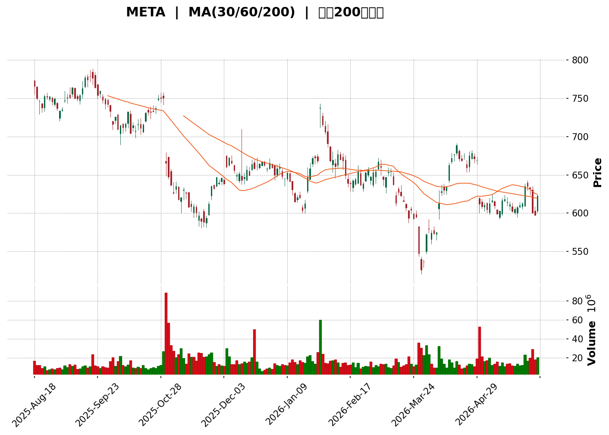
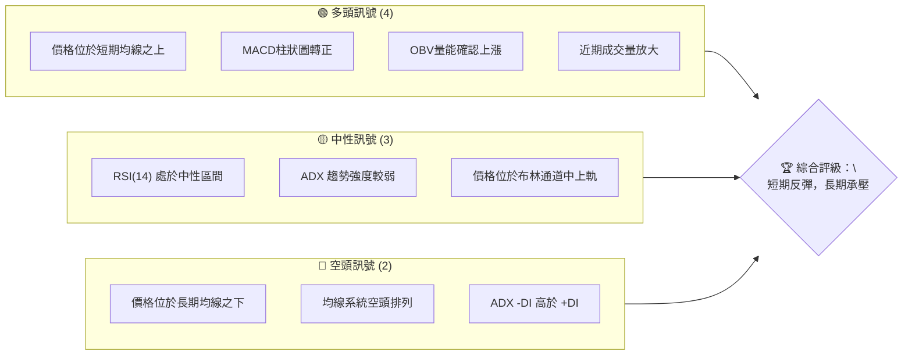

<details>
<summary>📊 靜態圖表 (點擊展開)</summary>

</details>

<html>
<head><meta charset="utf-8" /></head>
<body>
    <div style="height:500px; width:100%;">                        <script>window.PlotlyConfig = {MathJaxConfig: 'local'};</script>
        <script charset="utf-8" src="https://cdn.plot.ly/plotly-3.6.0.min.js" integrity="sha256-QaOVwtVY0T02VaHrr6pnoHLCwayMJp4O5n4YyaE3rJk=" crossorigin="anonymous"></script>                <div id="candlestick-chart" class="plotly-graph-div" style="height:100%; width:100%;"></div>            <script>                window.PLOTLYENV=window.PLOTLYENV || {};                                if (document.getElementById("candlestick-chart")) {                    Plotly.newPlot(                        "candlestick-chart",                        [{"close":{"dtype":"f8","bdata":"AAAAgJPsh0AAAAAgwW2HQAAAAIC+T4dAAAAAIPIKh0AAAAAALIiHQAAAAMBHfIdAAAAAQKqCh0AAAAAACE2HQAAAACDNaodAAAAAAMEHh0AAAADAGeuGQAAAAKCV+oZAAAAA4CpXh0AAAAAAf3WHQAAAAIBMdIdAAAAAYD\u002ffh0AAAACgvnGHQAAAACAgaYdAAAAAoI6Oh0AAAABARNeHQAAAAABmSYhAAAAAQDgviEAAAADgX1OIQAAAAEBzRIhAAAAAQA\u002ffh0AAAABAHJGHQAAAAKAeu4dAAAAAwEZdh0AAAADAEDSHQAAAAEBFMYdAAAAAADvphkAAAACAI2GGQAAAAECwroZAAAAAIP0qhkAAAACAuFOGQAAAAIAdP4ZAAAAAwCFlhkAAAABASOKGQAAAAKD6AIZAAAAAQApUhkAAAAAgvBuGQAAAAMDQYoZAAAAAgAw3hkAAAACgyF2GQAAAAICU14ZAAAAAoF3ghkAAAADAe+GGQAAAACAy5oZAAAAAYAQJh0AAAAAAiGyHQAAAAKB7cYdAAAAA4FFzh0AAAACA28qEQAAAAMAjOoRAAAAAgCnlg0AAAABALpKDQAAAAAAb14NAAAAAoEBPg0AAAAAgYGWDQAAAACCktYNAAAAAoEOQg0AAAAAA8v+CQAAAAED5BoNAAAAAIIoDg0AAAADgCciCQAAAAGCJpYJAAAAAwKxqgkAAAADAVGGCQAAAAAAQioJAAAAAIDYgg0AAAAAAQ9mDQAAAAMBqxINAAAAAAPI2hEAAAABgZv6DQAAAAAAoMIRAAAAAwEH0g0AAAABgZ6OEQAAAAGBdAoVAAAAAQH7NhEAAAACg536EQAAAACBbSIRAAAAAQPZchEAAAAAgPBmEQAAAACCmN4RAAAAAALSEhEAAAAAgjkeEQAAAAIANv4RAAAAA4KaRhEAAAAAgeaeEQAAAACD4woRAAAAA4NTXhEAAAADgx7WEQAAAACADkYRAAAAA4ArLhEAAAADgM5yEQAAAACDUToRAAAAAwM+RhEAAAABgcKCEQAAAAKAUQYRAAAAAAA8shEAAAADAAmSEQAAAAMBdC4RAAAAAwGa0g0AAAACg8jeDQAAAAMAmYoNAAAAAYMFdg0AAAABg09yCQAAAAEB8I4NAAAAAoJs4hEAAAABgkpGEQAAAAEBH\u002foRAAAAAgCcDhUAAAABgQ+GEQAAAAGBtDYdAAAAAwBhfhkAAAAAAcg6GQAAAAMDdmIVAAAAAgFfjhEAAAAAAGO2EQAAAAEAnp4RAAAAAACAlhUAAAABgK\u002fGEQAAAAKDx4IRAAAAAgAhKhEAAAAAgyPmDQAAAAODx9YNAAAAAoFsVhEAAAADg0yGEQAAAAADLeIRAAAAAoKPlg0AAAABgBvaDQAAAAOALaYRAAAAAgJWDhEAAAAAAAT2EQAAAAOABaIRAAAAAQCh0hEAAAAAgRdmEQAAAACAKoIRAAAAAgHcihEAAAACAsDaEQAAAAIAVbIRAAAAAAGZyhEAAAACgEu2DQAAAAOB6KYNAAAAAoJmbg0AAAACgR3WDQAAAAKBwPYNAAAAAoJn1gkAAAACgR42CQAAAAOB64IJAAAAAIFyHgkAAAADAHpeCQAAAAOBRHIFAAAAAgMJtgEAAAABACsOAQAAAAEAK4YFAAAAAANcZgkAAAAAgrvOBQAAAAAAp6IFAAAAAYGb4gUAAAAAgXCODQAAAAMAeo4NAAAAAQOGug0AAAACAPdSDQAAAAIDrs4RAAAAA4KP8hEAAAADA9SaFQAAAAGBmhIVAAAAAoEf3hEAAAABguOaEQAAAAIDCFYVAAAAAQDOZhEAAAACAPRiFQAAAAMD1NIVAAAAAYLj6hEAAAADA9eiEQAAAAKBHH4NAAAAAAAAGg0AAAACgRxODQAAAACCu54JAAAAAQAong0AAAADgekaDQAAAAEAKDYNAAAAAQOG2gkAAAAAAANiCQAAAAEAKRYNAAAAAoHBTg0AAAAAA1zGDQAAAACCuGYNAAAAAQOHUgkAAAADgeuiCQAAAAEAK+4JAAAAAgBQSg0AAAABguCKDQAAAAIAU2oNAAAAA4FHag0AAAACAFMSDQAAAAIDCw4JAAAAAQAqtgkAAAAAA13eDQA=="},"high":{"dtype":"f8","bdata":"y2gYIPAviEBYh7H2+uqHQI3pa7mJY4dAIgn9qQY+h0C2bPk\u002fA5mHQIcylNnQqIdA1sEbjs+Ih0Cm9LiDEIOHQIqe6\u002fBIeodAobU+oB1Lh0B8Kas6NPKGQGJTCeUfFIdAEG2sOAO7h0B3VLmbZKGHQK6sW3C25YdA3wD5Pgnkh0C0DRlqP9+HQM6wBuCbmodAbta5H1yeh0CfB94JDSKIQNEM++w7XIhANs38TKNriEC9AE9xdJeIQOsqU8eTp4hAytnLSViDiEDMx4zGgQqIQDQVE7a2vodAWWtwPw2ch0CzA09nZXWHQLj9vkM2bIdAYdVM4NUth0BebCN0KIWGQAoXsmlwtIZAjfEOWzzOhkCywQb0dl2GQC36ZBdnaoZAjrKPb5ZzhkAAAABASOKGQCk\u002fusRW8IZA7aBJQOd1hkC7\u002fBWo11KGQIQfUOmHlYZAn998vDqihkDxsN\u002fVuGqGQDSQW+db5IZA5BbLvSIKh0DcB\u002ftJ6BqHQIuXFv5cKYdADGAMgccfh0BSJmrE55OHQFRsXvMRqYdA9WOKwyOvh0AI9H2TlT6FQFm9Z\u002f8aDoVA2L09UtWRhEDPX9YQWQWEQAPUlOZCCYRAAe6RKYHXg0BY6VbQumiDQKj3pIuEz4NAan4YJRKkg0C4QsSthJ+DQBjYAjfzRINA1xv1MT4lg0COrf9lWRWDQBrTEHY31YJA9rs4HrCSgkDCYSnsp+2CQJ3lTIT4qIJAkUnp5Fw9g0Dcgm0J5N+DQDjgIoJa6oNAVtd7aL43hEBZFKPI8CGEQCQB711ONoRA1wEKHyI+hEC6nXTNxBeFQM5dPQiCDIVAR3nTHKQchUAIvwPJ9rqEQF31xGVWa4RA7LhN1nxxhEAfoubPgC6GQEAqzwGIY4RARdWzLsmvhEAChjCTUKWEQHH7kwvk74RAvr\u002flcmjzhEB8A0\u002fWBwiFQKpwkSRxy4RA411yBd7chECJIJe1BeOEQOxjVkR7nYRA6r3Vwyj9hEAYlcblcsOEQBxZ4sGSvoRAnUI5rcW\u002fhED27FYKm8eEQD8lk2ywlIRAZwWRDV80hEA5H1UwHnOEQCpWxLlIa4RAOovXycMNhECFXtSYTJ+DQJ8vipgWfYNAiRTTx1Wkg0Ae7\u002fMeBBeDQIaVeNLtTYNA\u002f71eFAqghECxJRTVW8+EQL0PTGKeFYVAvKJGoe0hhUBdEcdRzSiFQNbaAIjoOodABzwmbFnchkC6nq2pdoWGQMcjf8wXY4ZAc3oLHu2BhUDjyKoYVkeFQA7nMS1S+4RAp4OGtM1VhUDsiSm6ikCFQAjM6vaCNYVAHolrvl8bhUB0Ll9S+1aEQLFhefNmEIRA5hmrAZYjhECUXyBHFzWEQHo2N6dCtoRAGoyjbBmJhECLszsUfgSEQClhyKqQaoRAvHmRAnqjhEDSG91KE0eEQEyBlfIAm4RAZr8GUM+ThEBWa3VLjgGFQKE816AC8YRAE7NyrFBHhEAu\u002fYkekTmEQPsp6pXhnYRAgDZxCXOUhEDxr1oph2eEQDcJ1MkNpYNAAAAAAADWg0AAAABgZuSDQAAAAEAzdYNAAAAAAAAog0AAAAAgrt+CQAAAAMAeBYNAAAAAAADIgkAAAAAgXN2CQAAAAAAAOIJAAAAAwMz8gEAAAABgZtyAQAAAACCF7YFAAAAAYGaEgkAAAAAAABSCQAAAAOBRNoJAAAAAANf5gUAAAACgma+DQAAAAAAA7INAAAAA4KP0g0AAAAAAANiDQAAAAIAU0oRAAAAAAAA0hUAAAADgoyyFQAAAAAApnIVAAAAAQApbhUAAAACgmSGFQAAAAEAKM4VAAAAA4HrshEAAAAAgXEWFQAAAAAAAVIVAAAAAoHAxhUAAAAAAABKFQAAAAMDMZoNAAAAAQApXg0AAAAAAADCDQAAAAMDMMoNAAAAAoJlfg0AAAAAA14eDQAAAAAApRoNAAAAAoEfngkAAAAAAAN6CQAAAAEAzX4NAAAAAANd9g0AAAACgmWmDQAAAAGC4PINAAAAAoHAvg0AAAAAAAACDQAAAAMDMDINAAAAA4Ho2g0AAAACAwjODQAAAAAAA9INAAAAAAAAYhEAAAAAAANSDQAAAAAAA3oNAAAAAQAoHg0AAAADAzICDQA=="},"hovertemplate":"\u003cb\u003e%{x|%Y-%m-%d}\u003c\u002fb\u003e\u003cbr\u003e\u958b: $%{open:.2f}\u003cbr\u003e\u9ad8: $%{high:.2f}\u003cbr\u003e\u4f4e: $%{low:.2f}\u003cbr\u003e\u6536: $%{close:.2f}\u003cextra\u003e\u003c\u002fextra\u003e","low":{"dtype":"f8","bdata":"ya9Df0yWh0COmCmM1VyHQOOrdDtMyoZArbdPXiPbhkAPSb\u002fDWuWGQLhW99X6YodAgVzoLoBRh0CjOOboyyiHQDmusriDGIdAAg01MwTthkCJcI+0T4CGQJNx924p4oZAbLZqlJRAh0C1Qs96RjqHQO786XcQcodAlaHYQFF9h0C3yNJT7GmHQN2A3sPuVIdAMEFjhCMwh0A5Wggd03GHQBpW3nJ12odAPfM6xx3kh0BCFAUwYhyIQHC0+Tga+4dAvn8AfIzZh0CWZlQuh26HQK9\u002frUwweodA6JupaHQ6h0Ax9oVi8wCHQPVeVchTD4dAQMRJwbKohkBUpCIqHSiGQNYZpheHZ4ZAcOGmLPQnhkCsk2hf24qFQJ77obCSBIZAAZEajAYVhkBQoZvsADqGQKCkiHOr+oVArO7E76oThkC0fU+eTNGFQA2aBl6aIoZAcPRRYaP1hUDrSDEuhweGQGmP0P\u002fRd4ZAphG5FES8hkDbnQ+zkZaGQP273PMB34ZAc7isB2\u002fPhkCNMcy7FlaHQNLoNL4zQodA7upMkikqh0Dbg+rcrEiEQGGqhuHvI4RApUNcO\u002fHYg0BbfsPat4eDQMQWcm3zi4NA81Pitr5Hg0DUtNPCkcGCQCW6hI2fSINAjPmby9hSg0Ar83i9CvaCQBS2aA\u002fyz4JA4MTOYqaRgkAwTHk6P5OCQOklYFBxNoJAUr\u002fpYzwigkB3bREVAjOCQBvk6p0bJ4JAleYMug6lgkDUcp4mJEqDQLLUJ4WatINAFqpx8oLTg0DTYlvCj+WDQCVqu4AJ6INAmG9zYuLjg0AvNKFPlZeEQGtugbdFqoRAraVpKq2\u002fhEAsSPNA\u002fmGEQC6wYiObEoRAiNOiOdf9g0BuMouXWeyDQBv7K6868YNAX41U0DIVhEA41opGKEWEQEgGov8vf4RA1\u002fufiO+MhECrniLftICEQK5unLh+jYRADD5ufxGthECa2X3TCKaEQD72jUikboRAvnFx1TeKhEAuo4zDAZeEQDr7J5uYF4RAIJ49N5E5hEBX7ecmvVqEQDqlOCwRIoRAUxeJvWjZg0BwPiyDZhKEQOBl5otzBYRAtLv+Xod8g0DQjfU5WjKDQD6lruKiLYNA\u002flM8jGVcg0CnscrX5LuCQEGTq5CIvIJAVG5zrhyQg0BMjhSSMB+EQOpFI0XLpYRAdBj\u002fLrvAhEAKUZm7PcyEQM+0gAGGP4ZAd\u002foYOdZHhkDWYCxwWPeFQHavrQSVboVAnfkqzhzXhEDoqR0mh2eEQHR0u1WTL4RAR+WbTruRhECjCh9hvOmEQN4kEY5NhIRA36qUD9MlhECbeEOcN9CDQKUvvMAYooNAZwXGxuacg0CBMPD+ZuGDQIJ9QXLe8YNA7KeY0KXbg0BX+2wUiaODQA+lPby5DIRAHCYNqZE3hECMeBXAl+yDQGtLXGSoz4NAinJaM1nyg0BygRPg24iEQO3qdpkHToRAvCJT1Ibcg0CmvQJc85GDQKtD2QGPQ4RAdOIpY3E+hEDXwgh+1+KDQAmc4Gk6CINAAAAAwMx4g0AAAACgmW2DQAAAAEDhNINAAAAAgBTSgkAAAAAAAFqCQAAAAIAUuIJAAAAAAAB4gkAAAABAM4uCQAAAAMDM+oBAAAAAgBRCgEAAAADgUYSAQAAAAAApFoFAAAAAYI\u002fugUAAAACgmX2BQAAAAAAA4IFAAAAAgBSmgUAAAADgo36CQAAAAAAAeINAAAAA4KOCg0AAAABAM4ODQAAAAMD1+oNAAAAAgMLBhEAAAAAAAN6EQAAAAEAKGYVAAAAAAADghEAAAADgo9qEQAAAAAAA7oRAAAAAYGZohEAAAABguG6EQAAAAGC49oRAAAAAQArNhEAAAADger6EQAAAAAAAwIJAAAAAQOHwgkAAAAAAANaCQAAAAEDhwoJAAAAAwMywgkAAAADgUSyDQAAAAOB68IJAAAAA4KOwgkAAAADAzISCQAAAAKBHpYJAAAAAAAA4g0AAAADgegqDQAAAACCF3YJAAAAAYGbEgkAAAADgeq6CQAAAAOB6loJAAAAAoJn3gkAAAABgZuqCQAAAAAAACINAAAAA4Hqqg0AAAADAzHqDQAAAAIA9vIJAAAAAoHClgkAAAAAAKcKCQA=="},"name":"\u50f9\u683c","open":{"dtype":"f8","bdata":"GGCGFDEqiECt+BjUlOqHQJeFOBiMTodAcr5slLg3h0A6DDvK+wuHQPzc03RpiIdAnQW0tVNoh0ADs02ETHSHQI+\u002f1f0NModAbTUQTUU8h0DFafrltaKGQHHX00k08oZAzS1LYodWh0D0zTBP2naHQL1J5F7UkYdA1ZFtpbidh0DkxU3GstqHQIglhyEOh4dAryAcK85Xh0BeG2jRj52HQMcm3pSf6YdAIwOzwkxRiEAev8Z5XVeIQE4ttouehIhA+o40TltkiEDlMkSkuf+HQOAwIs7hoYdA3qW4OYmBh0Bhhc5g+2WHQHybEE\u002fCW4dAhO+Q1hUoh0Ch\u002fUFvSIKGQBv48Aj9ioZAQxRWSkvDhkBU5wzNGQCGQFeqOUIsZIZAYzfwAhJChkDIBUVUpWiGQD+QrcSYzYZApQ3YUo4+hkAo3Y1ZyRSGQOlR7ezmXoZAkNr2wtBihkDqtswFMg+GQGbAqwvjf4ZAP1C2OFT2hkASxUyQ1uSGQJ9kOVvJ64ZAd5VmXnr8hkBHQy5a02OHQO4gTa78eodAOgzeN+uLh0CzdOUVQ+CEQMK1DQwSC4VA9WJH1Tx3hEBU\u002fr1J7peDQM5JbrIIuoNAGwHnbE7Wg0COYrVZrzuDQLFihEpKsINAI1OsmpyXg0BdYZZeppiDQGX7SABfIINAa4IjGkjGgkBzBN41LwCDQGkhB9PldIJA0kupP9SFgkBsqsJu8NOCQJ4BaakjXIJAgNnvP8OtgkAohv9IqneDQIhRmawA5YNAHfu11iTYg0BtUHuD2\u002fODQBonzuYjCoRAXxyVLawahECXaPlk+BaFQAqoJHYht4RAEL53kMfhhED9BoQ2S7WEQFeFkB3rRoRAd977NboRhEBluzZ0uEWEQJjIwmsuKYRA+YfKqZgXhEBtXLerZHiEQIvU+V++g4RATM0EmczOhEDHa7ccrKiEQHYMR\u002fHhm4RAI4dry7SvhECHZL6E6NuEQMdx+rCTi4RA1pE3GAORhEA75+dVc8GEQCngaupNsYRAbaguAaBThEDwXuvWC5iEQDx62RKieIRALjC6sJ4qhECiJo1ZGieEQPPOmz\u002fGX4RAOovXycMNhEC0n2tjto+DQBMHiXCbT4NAYeVvHSt9g0BCzahJ4fqCQAevrYXE8YJA2uGlJn6mg0BPVI5ivyGEQDp7zep8xIRAVIBpiRoQhUDwAw5EYg+FQM7Zr6pkBodAWZCYegW3hkDGhrPG6E+GQH19umseFoZArhFlKyJ5hUCkOW1dGbiEQBz3g5Bdx4RAVqonuea0hED2WSySKSiFQM5dfjJjC4VAFuK9zizrhEBFhnSJYiSEQHs\u002fzqGf94NAVyzNABDKg0ADRTKhMPCDQCKFJ3ok+YNAFrfLttpfhEDgGZnFTsSDQFQbUc3XD4RA6C8xsfJPhEBPf3pJMheEQOaLXlvr5INAbeg2JeI9hEBcJf1dLYuEQM0BEf7oqoRAMViPLMQ6hEAsyddX5dGDQAoBvOQBaIRA7HTWbJlxhECmuJx7j0GEQMEHBqrZeoNAAAAAAADAg0AAAACA65+DQAAAAGC4QoNAAAAAQDMhg0AAAACAPdyCQAAAAOBR7oJAAAAAwMy4gkAAAACA67WCQAAAAIDrM4JAAAAAwMzggEAAAABACsOAQAAAAADXL4FAAAAAQAohgkAAAADgUbCBQAAAACCFDYJAAAAAANfjgUAAAAAAAPCCQAAAAIDCl4NAAAAAgMLTg0AAAAAAAKyDQAAAAIDCGYRAAAAAAADYhEAAAACA6x+FQAAAAMDMNIVAAAAAQOFKhUAAAAAAAPiEQAAAAEDhEoVAAAAAoJm9hEAAAABgj6KEQAAAAAAA+IRAAAAAgOsRhUAAAACgR+eEQAAAAGCPWoNAAAAAIIU1g0AAAAAghf+CQAAAAOB6KoNAAAAAYGbIgkAAAACAwjWDQAAAAKCZOYNAAAAAYI\u002fkgkAAAABgj5aCQAAAAOCjtoJAAAAAAABAg0AAAACA6y+DQAAAAEDhCINAAAAAIFwHg0AAAACAFMaCQAAAAAAAwIJAAAAAQAr\u002fgkAAAADAHgeDQAAAAEAzC4NAAAAAAAD8g0AAAAAAAMyDQAAAAEAzs4NAAAAAgOvZgkAAAACA69eCQA=="},"x":["2025-08-18T00:00:00-04:00","2025-08-19T00:00:00-04:00","2025-08-20T00:00:00-04:00","2025-08-21T00:00:00-04:00","2025-08-22T00:00:00-04:00","2025-08-25T00:00:00-04:00","2025-08-26T00:00:00-04:00","2025-08-27T00:00:00-04:00","2025-08-28T00:00:00-04:00","2025-08-29T00:00:00-04:00","2025-09-02T00:00:00-04:00","2025-09-03T00:00:00-04:00","2025-09-04T00:00:00-04:00","2025-09-05T00:00:00-04:00","2025-09-08T00:00:00-04:00","2025-09-09T00:00:00-04:00","2025-09-10T00:00:00-04:00","2025-09-11T00:00:00-04:00","2025-09-12T00:00:00-04:00","2025-09-15T00:00:00-04:00","2025-09-16T00:00:00-04:00","2025-09-17T00:00:00-04:00","2025-09-18T00:00:00-04:00","2025-09-19T00:00:00-04:00","2025-09-22T00:00:00-04:00","2025-09-23T00:00:00-04:00","2025-09-24T00:00:00-04:00","2025-09-25T00:00:00-04:00","2025-09-26T00:00:00-04:00","2025-09-29T00:00:00-04:00","2025-09-30T00:00:00-04:00","2025-10-01T00:00:00-04:00","2025-10-02T00:00:00-04:00","2025-10-03T00:00:00-04:00","2025-10-06T00:00:00-04:00","2025-10-07T00:00:00-04:00","2025-10-08T00:00:00-04:00","2025-10-09T00:00:00-04:00","2025-10-10T00:00:00-04:00","2025-10-13T00:00:00-04:00","2025-10-14T00:00:00-04:00","2025-10-15T00:00:00-04:00","2025-10-16T00:00:00-04:00","2025-10-17T00:00:00-04:00","2025-10-20T00:00:00-04:00","2025-10-21T00:00:00-04:00","2025-10-22T00:00:00-04:00","2025-10-23T00:00:00-04:00","2025-10-24T00:00:00-04:00","2025-10-27T00:00:00-04:00","2025-10-28T00:00:00-04:00","2025-10-29T00:00:00-04:00","2025-10-30T00:00:00-04:00","2025-10-31T00:00:00-04:00","2025-11-03T00:00:00-05:00","2025-11-04T00:00:00-05:00","2025-11-05T00:00:00-05:00","2025-11-06T00:00:00-05:00","2025-11-07T00:00:00-05:00","2025-11-10T00:00:00-05:00","2025-11-11T00:00:00-05:00","2025-11-12T00:00:00-05:00","2025-11-13T00:00:00-05:00","2025-11-14T00:00:00-05:00","2025-11-17T00:00:00-05:00","2025-11-18T00:00:00-05:00","2025-11-19T00:00:00-05:00","2025-11-20T00:00:00-05:00","2025-11-21T00:00:00-05:00","2025-11-24T00:00:00-05:00","2025-11-25T00:00:00-05:00","2025-11-26T00:00:00-05:00","2025-11-28T00:00:00-05:00","2025-12-01T00:00:00-05:00","2025-12-02T00:00:00-05:00","2025-12-03T00:00:00-05:00","2025-12-04T00:00:00-05:00","2025-12-05T00:00:00-05:00","2025-12-08T00:00:00-05:00","2025-12-09T00:00:00-05:00","2025-12-10T00:00:00-05:00","2025-12-11T00:00:00-05:00","2025-12-12T00:00:00-05:00","2025-12-15T00:00:00-05:00","2025-12-16T00:00:00-05:00","2025-12-17T00:00:00-05:00","2025-12-18T00:00:00-05:00","2025-12-19T00:00:00-05:00","2025-12-22T00:00:00-05:00","2025-12-23T00:00:00-05:00","2025-12-24T00:00:00-05:00","2025-12-26T00:00:00-05:00","2025-12-29T00:00:00-05:00","2025-12-30T00:00:00-05:00","2025-12-31T00:00:00-05:00","2026-01-02T00:00:00-05:00","2026-01-05T00:00:00-05:00","2026-01-06T00:00:00-05:00","2026-01-07T00:00:00-05:00","2026-01-08T00:00:00-05:00","2026-01-09T00:00:00-05:00","2026-01-12T00:00:00-05:00","2026-01-13T00:00:00-05:00","2026-01-14T00:00:00-05:00","2026-01-15T00:00:00-05:00","2026-01-16T00:00:00-05:00","2026-01-20T00:00:00-05:00","2026-01-21T00:00:00-05:00","2026-01-22T00:00:00-05:00","2026-01-23T00:00:00-05:00","2026-01-26T00:00:00-05:00","2026-01-27T00:00:00-05:00","2026-01-28T00:00:00-05:00","2026-01-29T00:00:00-05:00","2026-01-30T00:00:00-05:00","2026-02-02T00:00:00-05:00","2026-02-03T00:00:00-05:00","2026-02-04T00:00:00-05:00","2026-02-05T00:00:00-05:00","2026-02-06T00:00:00-05:00","2026-02-09T00:00:00-05:00","2026-02-10T00:00:00-05:00","2026-02-11T00:00:00-05:00","2026-02-12T00:00:00-05:00","2026-02-13T00:00:00-05:00","2026-02-17T00:00:00-05:00","2026-02-18T00:00:00-05:00","2026-02-19T00:00:00-05:00","2026-02-20T00:00:00-05:00","2026-02-23T00:00:00-05:00","2026-02-24T00:00:00-05:00","2026-02-25T00:00:00-05:00","2026-02-26T00:00:00-05:00","2026-02-27T00:00:00-05:00","2026-03-02T00:00:00-05:00","2026-03-03T00:00:00-05:00","2026-03-04T00:00:00-05:00","2026-03-05T00:00:00-05:00","2026-03-06T00:00:00-05:00","2026-03-09T00:00:00-04:00","2026-03-10T00:00:00-04:00","2026-03-11T00:00:00-04:00","2026-03-12T00:00:00-04:00","2026-03-13T00:00:00-04:00","2026-03-16T00:00:00-04:00","2026-03-17T00:00:00-04:00","2026-03-18T00:00:00-04:00","2026-03-19T00:00:00-04:00","2026-03-20T00:00:00-04:00","2026-03-23T00:00:00-04:00","2026-03-24T00:00:00-04:00","2026-03-25T00:00:00-04:00","2026-03-26T00:00:00-04:00","2026-03-27T00:00:00-04:00","2026-03-30T00:00:00-04:00","2026-03-31T00:00:00-04:00","2026-04-01T00:00:00-04:00","2026-04-02T00:00:00-04:00","2026-04-06T00:00:00-04:00","2026-04-07T00:00:00-04:00","2026-04-08T00:00:00-04:00","2026-04-09T00:00:00-04:00","2026-04-10T00:00:00-04:00","2026-04-13T00:00:00-04:00","2026-04-14T00:00:00-04:00","2026-04-15T00:00:00-04:00","2026-04-16T00:00:00-04:00","2026-04-17T00:00:00-04:00","2026-04-20T00:00:00-04:00","2026-04-21T00:00:00-04:00","2026-04-22T00:00:00-04:00","2026-04-23T00:00:00-04:00","2026-04-24T00:00:00-04:00","2026-04-27T00:00:00-04:00","2026-04-28T00:00:00-04:00","2026-04-29T00:00:00-04:00","2026-04-30T00:00:00-04:00","2026-05-01T00:00:00-04:00","2026-05-04T00:00:00-04:00","2026-05-05T00:00:00-04:00","2026-05-06T00:00:00-04:00","2026-05-07T00:00:00-04:00","2026-05-08T00:00:00-04:00","2026-05-11T00:00:00-04:00","2026-05-12T00:00:00-04:00","2026-05-13T00:00:00-04:00","2026-05-14T00:00:00-04:00","2026-05-15T00:00:00-04:00","2026-05-18T00:00:00-04:00","2026-05-19T00:00:00-04:00","2026-05-20T00:00:00-04:00","2026-05-21T00:00:00-04:00","2026-05-22T00:00:00-04:00","2026-05-26T00:00:00-04:00","2026-05-27T00:00:00-04:00","2026-05-28T00:00:00-04:00","2026-05-29T00:00:00-04:00","2026-06-01T00:00:00-04:00","2026-06-02T00:00:00-04:00","2026-06-03T00:00:00-04:00"],"type":"candlestick"},{"hovertemplate":"MA30: $%{y:.2f}\u003cextra\u003e\u003c\u002fextra\u003e","line":{"color":"#2196F3","dash":"dash","width":2},"mode":"lines","name":"MA30","x":["2025-08-18T00:00:00-04:00","2025-08-19T00:00:00-04:00","2025-08-20T00:00:00-04:00","2025-08-21T00:00:00-04:00","2025-08-22T00:00:00-04:00","2025-08-25T00:00:00-04:00","2025-08-26T00:00:00-04:00","2025-08-27T00:00:00-04:00","2025-08-28T00:00:00-04:00","2025-08-29T00:00:00-04:00","2025-09-02T00:00:00-04:00","2025-09-03T00:00:00-04:00","2025-09-04T00:00:00-04:00","2025-09-05T00:00:00-04:00","2025-09-08T00:00:00-04:00","2025-09-09T00:00:00-04:00","2025-09-10T00:00:00-04:00","2025-09-11T00:00:00-04:00","2025-09-12T00:00:00-04:00","2025-09-15T00:00:00-04:00","2025-09-16T00:00:00-04:00","2025-09-17T00:00:00-04:00","2025-09-18T00:00:00-04:00","2025-09-19T00:00:00-04:00","2025-09-22T00:00:00-04:00","2025-09-23T00:00:00-04:00","2025-09-24T00:00:00-04:00","2025-09-25T00:00:00-04:00","2025-09-26T00:00:00-04:00","2025-09-29T00:00:00-04:00","2025-09-30T00:00:00-04:00","2025-10-01T00:00:00-04:00","2025-10-02T00:00:00-04:00","2025-10-03T00:00:00-04:00","2025-10-06T00:00:00-04:00","2025-10-07T00:00:00-04:00","2025-10-08T00:00:00-04:00","2025-10-09T00:00:00-04:00","2025-10-10T00:00:00-04:00","2025-10-13T00:00:00-04:00","2025-10-14T00:00:00-04:00","2025-10-15T00:00:00-04:00","2025-10-16T00:00:00-04:00","2025-10-17T00:00:00-04:00","2025-10-20T00:00:00-04:00","2025-10-21T00:00:00-04:00","2025-10-22T00:00:00-04:00","2025-10-23T00:00:00-04:00","2025-10-24T00:00:00-04:00","2025-10-27T00:00:00-04:00","2025-10-28T00:00:00-04:00","2025-10-29T00:00:00-04:00","2025-10-30T00:00:00-04:00","2025-10-31T00:00:00-04:00","2025-11-03T00:00:00-05:00","2025-11-04T00:00:00-05:00","2025-11-05T00:00:00-05:00","2025-11-06T00:00:00-05:00","2025-11-07T00:00:00-05:00","2025-11-10T00:00:00-05:00","2025-11-11T00:00:00-05:00","2025-11-12T00:00:00-05:00","2025-11-13T00:00:00-05:00","2025-11-14T00:00:00-05:00","2025-11-17T00:00:00-05:00","2025-11-18T00:00:00-05:00","2025-11-19T00:00:00-05:00","2025-11-20T00:00:00-05:00","2025-11-21T00:00:00-05:00","2025-11-24T00:00:00-05:00","2025-11-25T00:00:00-05:00","2025-11-26T00:00:00-05:00","2025-11-28T00:00:00-05:00","2025-12-01T00:00:00-05:00","2025-12-02T00:00:00-05:00","2025-12-03T00:00:00-05:00","2025-12-04T00:00:00-05:00","2025-12-05T00:00:00-05:00","2025-12-08T00:00:00-05:00","2025-12-09T00:00:00-05:00","2025-12-10T00:00:00-05:00","2025-12-11T00:00:00-05:00","2025-12-12T00:00:00-05:00","2025-12-15T00:00:00-05:00","2025-12-16T00:00:00-05:00","2025-12-17T00:00:00-05:00","2025-12-18T00:00:00-05:00","2025-12-19T00:00:00-05:00","2025-12-22T00:00:00-05:00","2025-12-23T00:00:00-05:00","2025-12-24T00:00:00-05:00","2025-12-26T00:00:00-05:00","2025-12-29T00:00:00-05:00","2025-12-30T00:00:00-05:00","2025-12-31T00:00:00-05:00","2026-01-02T00:00:00-05:00","2026-01-05T00:00:00-05:00","2026-01-06T00:00:00-05:00","2026-01-07T00:00:00-05:00","2026-01-08T00:00:00-05:00","2026-01-09T00:00:00-05:00","2026-01-12T00:00:00-05:00","2026-01-13T00:00:00-05:00","2026-01-14T00:00:00-05:00","2026-01-15T00:00:00-05:00","2026-01-16T00:00:00-05:00","2026-01-20T00:00:00-05:00","2026-01-21T00:00:00-05:00","2026-01-22T00:00:00-05:00","2026-01-23T00:00:00-05:00","2026-01-26T00:00:00-05:00","2026-01-27T00:00:00-05:00","2026-01-28T00:00:00-05:00","2026-01-29T00:00:00-05:00","2026-01-30T00:00:00-05:00","2026-02-02T00:00:00-05:00","2026-02-03T00:00:00-05:00","2026-02-04T00:00:00-05:00","2026-02-05T00:00:00-05:00","2026-02-06T00:00:00-05:00","2026-02-09T00:00:00-05:00","2026-02-10T00:00:00-05:00","2026-02-11T00:00:00-05:00","2026-02-12T00:00:00-05:00","2026-02-13T00:00:00-05:00","2026-02-17T00:00:00-05:00","2026-02-18T00:00:00-05:00","2026-02-19T00:00:00-05:00","2026-02-20T00:00:00-05:00","2026-02-23T00:00:00-05:00","2026-02-24T00:00:00-05:00","2026-02-25T00:00:00-05:00","2026-02-26T00:00:00-05:00","2026-02-27T00:00:00-05:00","2026-03-02T00:00:00-05:00","2026-03-03T00:00:00-05:00","2026-03-04T00:00:00-05:00","2026-03-05T00:00:00-05:00","2026-03-06T00:00:00-05:00","2026-03-09T00:00:00-04:00","2026-03-10T00:00:00-04:00","2026-03-11T00:00:00-04:00","2026-03-12T00:00:00-04:00","2026-03-13T00:00:00-04:00","2026-03-16T00:00:00-04:00","2026-03-17T00:00:00-04:00","2026-03-18T00:00:00-04:00","2026-03-19T00:00:00-04:00","2026-03-20T00:00:00-04:00","2026-03-23T00:00:00-04:00","2026-03-24T00:00:00-04:00","2026-03-25T00:00:00-04:00","2026-03-26T00:00:00-04:00","2026-03-27T00:00:00-04:00","2026-03-30T00:00:00-04:00","2026-03-31T00:00:00-04:00","2026-04-01T00:00:00-04:00","2026-04-02T00:00:00-04:00","2026-04-06T00:00:00-04:00","2026-04-07T00:00:00-04:00","2026-04-08T00:00:00-04:00","2026-04-09T00:00:00-04:00","2026-04-10T00:00:00-04:00","2026-04-13T00:00:00-04:00","2026-04-14T00:00:00-04:00","2026-04-15T00:00:00-04:00","2026-04-16T00:00:00-04:00","2026-04-17T00:00:00-04:00","2026-04-20T00:00:00-04:00","2026-04-21T00:00:00-04:00","2026-04-22T00:00:00-04:00","2026-04-23T00:00:00-04:00","2026-04-24T00:00:00-04:00","2026-04-27T00:00:00-04:00","2026-04-28T00:00:00-04:00","2026-04-29T00:00:00-04:00","2026-04-30T00:00:00-04:00","2026-05-01T00:00:00-04:00","2026-05-04T00:00:00-04:00","2026-05-05T00:00:00-04:00","2026-05-06T00:00:00-04:00","2026-05-07T00:00:00-04:00","2026-05-08T00:00:00-04:00","2026-05-11T00:00:00-04:00","2026-05-12T00:00:00-04:00","2026-05-13T00:00:00-04:00","2026-05-14T00:00:00-04:00","2026-05-15T00:00:00-04:00","2026-05-18T00:00:00-04:00","2026-05-19T00:00:00-04:00","2026-05-20T00:00:00-04:00","2026-05-21T00:00:00-04:00","2026-05-22T00:00:00-04:00","2026-05-26T00:00:00-04:00","2026-05-27T00:00:00-04:00","2026-05-28T00:00:00-04:00","2026-05-29T00:00:00-04:00","2026-06-01T00:00:00-04:00","2026-06-02T00:00:00-04:00","2026-06-03T00:00:00-04:00"],"y":{"dtype":"f8","bdata":"AAAAAAAA+H8AAAAAAAD4fwAAAAAAAPh\u002fAAAAAAAA+H8AAAAAAAD4fwAAAAAAAPh\u002fAAAAAAAA+H8AAAAAAAD4fwAAAAAAAPh\u002fAAAAAAAA+H8AAAAAAAD4fwAAAAAAAPh\u002fAAAAAAAA+H8AAAAAAAD4fwAAAAAAAPh\u002fAAAAAAAA+H8AAAAAAAD4fwAAAAAAAPh\u002fAAAAAAAA+H8AAAAAAAD4fwAAAAAAAPh\u002fAAAAAAAA+H8AAAAAAAD4fwAAAAAAAPh\u002fAAAAAAAA+H8AAAAAAAD4fwAAAAAAAPh\u002fAAAAAAAA+H8AAAAAAAD4f3d3d0ewiodAIiIiMguCh0AiIiICF3mHQKuqqqq4c4dAERERkUFsh0AzMzNz+WGHQJqZmflmV4dAzczMbOJNh0AAAACAU0qHQDMzM\u002fNDPodAREREZEY4h0Dv7u7eXDGHQGZmZsZNLIdAmpmZKbMih0CJiIhIYBmHQDMzM\u002fMmFIdAVVVV9acLh0De3d3t2AaHQJqZmal7AodA7+7uHgj+hkAAAABQefqGQFVVVdVG84ZAvLu7awPthkAAAADg3M6GQCIiIsJirIZAMzMzs3SKhkAzMzOzW2iGQBEREWEoR4ZAMzMzk44khkCJiIg4EQSGQGZmZqZY5oVA7+7u3sfJhUAzMzPj8KyFQO\u002fu7h7AjYVAMzMz49VyhUBVVVVVlFSFQCIiIjLcNYVAzczMXOkThUCJiIjYeu2EQN7d3X3qz4RA7+7unpa0hEARERFRTqGEQFVVVZX1ioRAIiIiouN5hEAAAACgpGWEQAAAAOD+ToRAMzMzAw82hEAzMzMz7CKEQCIiIoLLEoRAERERgb7\u002fg0ARERGxweaDQERERCTJy4NAERERwXCxg0CrqqoKhauDQJqZmclvq4NARERENMGwg0Dv7u7uzLaDQHd3dzeIvoNAvLu7W0fJg0DNzMzsA9SDQBERETH+3INA7+7ubunng0ARERGhgfaDQHd3dxekA4RAzczMDNMShEDNzMwMbiKEQFVVVTWbMIRA3t3dPfpChEBERETUJVaEQN7d3R3IZIRA7+7uvrVthEDNzMy8VXKEQLy7uyuzdIRAIiIiMllwhEDNzMy8u2mEQERERNTdYoRAzczMjNldhEC8u7t7sk6EQLy7uwu8PoRA7+7ujsU5hECamZnZZDqEQBEREUF1QIRA3t3dbf9FhEBmZmZWqkyEQFVVVaXbZIRA3t3dzat0hECJiIiI1YOEQFVVVTUYi4RAvLu7S9GNhEBERERkI5CEQHd3dwc2j4RAmpmZmcmRhEAiIiJixJOEQHd3d3duloRAZmZmliGShECJiIiYt4yEQO\u002fu7h7BiYRA3t3dHZuFhEAzMzOzYoGEQM3MzBw+g4RAMzMzM+WAhEB3d3enOn2EQO\u002fu7g5agIRAREREBEKHhEAiIiKy9Y+EQDMzMzOwmIRAVVVV5fehhEDv7u6e6rKEQERERASav4RAREREFN2+hEDNzMyM1buEQGZmZgb2toRAZmZmxiKyhEBEREQE\u002f6mEQERERETMiIRAZmZm9jZxhEAiIiLiCluEQFVVVaXtRoRAIiIiYng2hEBERES0NSKEQDMzM9MNE4RA7+7ufrr8g0AiIiICqeiDQM3MzIyByINAiYiISJCng0De3d2NI4yDQJqZmRlgeoNAd3d3R3Vpg0C8u7tr2laDQHd3dyf3QINA3t3dLYYwg0ARERGBgCmDQImIiIjnIoNAVVVVddAbg0CamZl5UhiDQDMzM0PaGoNAq6qq6mYfg0Dv7u7e\u002fSGDQLy7u4uaKYNAzczMjLIwg0De3d2tkDaDQERERJQ4PINAAAAAsIM9g0BVVVWVfEeDQM3MzJzvWINAZmZm1qNkg0AiIiKCB3GDQERERCQGcINAZmZmFpJwg0De3d2NCXWDQO\u002fu7v5GdYNAmpmZmZl6g0AREREBcoCDQO\u002fu7q4AkYNAVVVVtYGkg0AiIiKiRbaDQAAAAIAjwoNA3t3djZfMg0BERESEMteDQO\u002fu7p5h4YNAzczMDLvog0C8u7ubxOaDQDMzM1Mq4YNAzczMTPDbg0BmZmZ2BdaDQAAAAJDCzoNAmpmZKRXFg0CrqqraQLmDQM3MzOzDoYNAiYiIWDmOg0AiIiKi\u002foGDQA=="},"type":"scatter"},{"hovertemplate":"MA60: $%{y:.2f}\u003cextra\u003e\u003c\u002fextra\u003e","line":{"color":"#9C27B0","dash":"dash","width":2},"mode":"lines","name":"MA60","x":["2025-08-18T00:00:00-04:00","2025-08-19T00:00:00-04:00","2025-08-20T00:00:00-04:00","2025-08-21T00:00:00-04:00","2025-08-22T00:00:00-04:00","2025-08-25T00:00:00-04:00","2025-08-26T00:00:00-04:00","2025-08-27T00:00:00-04:00","2025-08-28T00:00:00-04:00","2025-08-29T00:00:00-04:00","2025-09-02T00:00:00-04:00","2025-09-03T00:00:00-04:00","2025-09-04T00:00:00-04:00","2025-09-05T00:00:00-04:00","2025-09-08T00:00:00-04:00","2025-09-09T00:00:00-04:00","2025-09-10T00:00:00-04:00","2025-09-11T00:00:00-04:00","2025-09-12T00:00:00-04:00","2025-09-15T00:00:00-04:00","2025-09-16T00:00:00-04:00","2025-09-17T00:00:00-04:00","2025-09-18T00:00:00-04:00","2025-09-19T00:00:00-04:00","2025-09-22T00:00:00-04:00","2025-09-23T00:00:00-04:00","2025-09-24T00:00:00-04:00","2025-09-25T00:00:00-04:00","2025-09-26T00:00:00-04:00","2025-09-29T00:00:00-04:00","2025-09-30T00:00:00-04:00","2025-10-01T00:00:00-04:00","2025-10-02T00:00:00-04:00","2025-10-03T00:00:00-04:00","2025-10-06T00:00:00-04:00","2025-10-07T00:00:00-04:00","2025-10-08T00:00:00-04:00","2025-10-09T00:00:00-04:00","2025-10-10T00:00:00-04:00","2025-10-13T00:00:00-04:00","2025-10-14T00:00:00-04:00","2025-10-15T00:00:00-04:00","2025-10-16T00:00:00-04:00","2025-10-17T00:00:00-04:00","2025-10-20T00:00:00-04:00","2025-10-21T00:00:00-04:00","2025-10-22T00:00:00-04:00","2025-10-23T00:00:00-04:00","2025-10-24T00:00:00-04:00","2025-10-27T00:00:00-04:00","2025-10-28T00:00:00-04:00","2025-10-29T00:00:00-04:00","2025-10-30T00:00:00-04:00","2025-10-31T00:00:00-04:00","2025-11-03T00:00:00-05:00","2025-11-04T00:00:00-05:00","2025-11-05T00:00:00-05:00","2025-11-06T00:00:00-05:00","2025-11-07T00:00:00-05:00","2025-11-10T00:00:00-05:00","2025-11-11T00:00:00-05:00","2025-11-12T00:00:00-05:00","2025-11-13T00:00:00-05:00","2025-11-14T00:00:00-05:00","2025-11-17T00:00:00-05:00","2025-11-18T00:00:00-05:00","2025-11-19T00:00:00-05:00","2025-11-20T00:00:00-05:00","2025-11-21T00:00:00-05:00","2025-11-24T00:00:00-05:00","2025-11-25T00:00:00-05:00","2025-11-26T00:00:00-05:00","2025-11-28T00:00:00-05:00","2025-12-01T00:00:00-05:00","2025-12-02T00:00:00-05:00","2025-12-03T00:00:00-05:00","2025-12-04T00:00:00-05:00","2025-12-05T00:00:00-05:00","2025-12-08T00:00:00-05:00","2025-12-09T00:00:00-05:00","2025-12-10T00:00:00-05:00","2025-12-11T00:00:00-05:00","2025-12-12T00:00:00-05:00","2025-12-15T00:00:00-05:00","2025-12-16T00:00:00-05:00","2025-12-17T00:00:00-05:00","2025-12-18T00:00:00-05:00","2025-12-19T00:00:00-05:00","2025-12-22T00:00:00-05:00","2025-12-23T00:00:00-05:00","2025-12-24T00:00:00-05:00","2025-12-26T00:00:00-05:00","2025-12-29T00:00:00-05:00","2025-12-30T00:00:00-05:00","2025-12-31T00:00:00-05:00","2026-01-02T00:00:00-05:00","2026-01-05T00:00:00-05:00","2026-01-06T00:00:00-05:00","2026-01-07T00:00:00-05:00","2026-01-08T00:00:00-05:00","2026-01-09T00:00:00-05:00","2026-01-12T00:00:00-05:00","2026-01-13T00:00:00-05:00","2026-01-14T00:00:00-05:00","2026-01-15T00:00:00-05:00","2026-01-16T00:00:00-05:00","2026-01-20T00:00:00-05:00","2026-01-21T00:00:00-05:00","2026-01-22T00:00:00-05:00","2026-01-23T00:00:00-05:00","2026-01-26T00:00:00-05:00","2026-01-27T00:00:00-05:00","2026-01-28T00:00:00-05:00","2026-01-29T00:00:00-05:00","2026-01-30T00:00:00-05:00","2026-02-02T00:00:00-05:00","2026-02-03T00:00:00-05:00","2026-02-04T00:00:00-05:00","2026-02-05T00:00:00-05:00","2026-02-06T00:00:00-05:00","2026-02-09T00:00:00-05:00","2026-02-10T00:00:00-05:00","2026-02-11T00:00:00-05:00","2026-02-12T00:00:00-05:00","2026-02-13T00:00:00-05:00","2026-02-17T00:00:00-05:00","2026-02-18T00:00:00-05:00","2026-02-19T00:00:00-05:00","2026-02-20T00:00:00-05:00","2026-02-23T00:00:00-05:00","2026-02-24T00:00:00-05:00","2026-02-25T00:00:00-05:00","2026-02-26T00:00:00-05:00","2026-02-27T00:00:00-05:00","2026-03-02T00:00:00-05:00","2026-03-03T00:00:00-05:00","2026-03-04T00:00:00-05:00","2026-03-05T00:00:00-05:00","2026-03-06T00:00:00-05:00","2026-03-09T00:00:00-04:00","2026-03-10T00:00:00-04:00","2026-03-11T00:00:00-04:00","2026-03-12T00:00:00-04:00","2026-03-13T00:00:00-04:00","2026-03-16T00:00:00-04:00","2026-03-17T00:00:00-04:00","2026-03-18T00:00:00-04:00","2026-03-19T00:00:00-04:00","2026-03-20T00:00:00-04:00","2026-03-23T00:00:00-04:00","2026-03-24T00:00:00-04:00","2026-03-25T00:00:00-04:00","2026-03-26T00:00:00-04:00","2026-03-27T00:00:00-04:00","2026-03-30T00:00:00-04:00","2026-03-31T00:00:00-04:00","2026-04-01T00:00:00-04:00","2026-04-02T00:00:00-04:00","2026-04-06T00:00:00-04:00","2026-04-07T00:00:00-04:00","2026-04-08T00:00:00-04:00","2026-04-09T00:00:00-04:00","2026-04-10T00:00:00-04:00","2026-04-13T00:00:00-04:00","2026-04-14T00:00:00-04:00","2026-04-15T00:00:00-04:00","2026-04-16T00:00:00-04:00","2026-04-17T00:00:00-04:00","2026-04-20T00:00:00-04:00","2026-04-21T00:00:00-04:00","2026-04-22T00:00:00-04:00","2026-04-23T00:00:00-04:00","2026-04-24T00:00:00-04:00","2026-04-27T00:00:00-04:00","2026-04-28T00:00:00-04:00","2026-04-29T00:00:00-04:00","2026-04-30T00:00:00-04:00","2026-05-01T00:00:00-04:00","2026-05-04T00:00:00-04:00","2026-05-05T00:00:00-04:00","2026-05-06T00:00:00-04:00","2026-05-07T00:00:00-04:00","2026-05-08T00:00:00-04:00","2026-05-11T00:00:00-04:00","2026-05-12T00:00:00-04:00","2026-05-13T00:00:00-04:00","2026-05-14T00:00:00-04:00","2026-05-15T00:00:00-04:00","2026-05-18T00:00:00-04:00","2026-05-19T00:00:00-04:00","2026-05-20T00:00:00-04:00","2026-05-21T00:00:00-04:00","2026-05-22T00:00:00-04:00","2026-05-26T00:00:00-04:00","2026-05-27T00:00:00-04:00","2026-05-28T00:00:00-04:00","2026-05-29T00:00:00-04:00","2026-06-01T00:00:00-04:00","2026-06-02T00:00:00-04:00","2026-06-03T00:00:00-04:00"],"y":{"dtype":"f8","bdata":"AAAAAAAA+H8AAAAAAAD4fwAAAAAAAPh\u002fAAAAAAAA+H8AAAAAAAD4fwAAAAAAAPh\u002fAAAAAAAA+H8AAAAAAAD4fwAAAAAAAPh\u002fAAAAAAAA+H8AAAAAAAD4fwAAAAAAAPh\u002fAAAAAAAA+H8AAAAAAAD4fwAAAAAAAPh\u002fAAAAAAAA+H8AAAAAAAD4fwAAAAAAAPh\u002fAAAAAAAA+H8AAAAAAAD4fwAAAAAAAPh\u002fAAAAAAAA+H8AAAAAAAD4fwAAAAAAAPh\u002fAAAAAAAA+H8AAAAAAAD4fwAAAAAAAPh\u002fAAAAAAAA+H8AAAAAAAD4fwAAAAAAAPh\u002fAAAAAAAA+H8AAAAAAAD4fwAAAAAAAPh\u002fAAAAAAAA+H8AAAAAAAD4fwAAAAAAAPh\u002fAAAAAAAA+H8AAAAAAAD4fwAAAAAAAPh\u002fAAAAAAAA+H8AAAAAAAD4fwAAAAAAAPh\u002fAAAAAAAA+H8AAAAAAAD4fwAAAAAAAPh\u002fAAAAAAAA+H8AAAAAAAD4fwAAAAAAAPh\u002fAAAAAAAA+H8AAAAAAAD4fwAAAAAAAPh\u002fAAAAAAAA+H8AAAAAAAD4fwAAAAAAAPh\u002fAAAAAAAA+H8AAAAAAAD4fwAAAAAAAPh\u002fAAAAAAAA+H8AAAAAAAD4f+\u002fu7naEuIZAiYiIiOmlhkCrqqryA5OGQM3MzGS8gIZAIiIiuotvhkBERETkRluGQN7d3ZWhRoZAzczM5OUwhkBEREQs5xuGQImIiDgXB4ZAmpmZgW72hUAAAACYVemFQN7d3a2h24VA3t3dZUvOhUBERER0gr+FQJqZmemSsYVAREREfNughUCJiIiQ4pSFQN7d3ZWjioVAAAAAUON+hUCJiIiAnXCFQM3MzPyHX4VAZmZmFjpPhUBVVVX1MD2FQN7d3UXpK4VAvLu785odhUARERFRlA+FQEREREzYAoVAd3d39+r2hECrqqqSCuyEQLy7u2ur4YRA7+7uptjYhEAiIiJCudGEQDMzMxuyyIRAAAAAeNTChEARERExgbuEQLy7u7M7s4RAVVVVzXGrhEBmZmZW0KGEQN7d3U1ZmoRA7+7uLiaRhEDv7u4G0omEQImIiGDUf4RAIiIiah51hEBmZmYusGeEQCIiIlruWIRAAAAASPRJhEB3d3dXzziEQO\u002fu7sbDKIRAAAAACMIchEBVVVVFkxCEQKuqqjIfBoRAd3d3F7j7g0CJiIiwF\u002fyDQHd3d7clCIRAERERgbYShEC8u7s7UR2EQGZmZjbQJIRAvLu7U4wrhECJiIioEzKEQERERBwaNoRAREREhNk8hECamZkBI0WEQHd3d0cJTYRAmpmZUXpShECrqqrSkleEQCIiIiouXYRA3t3drUpkhEC8u7tDxGuEQFVVVR0DdIRAEREReU13hEAiIiIyyHeEQFVVVZ2GeoRAMzMzm817hEB3d3e32HyEQLy7uwPHfYRAERERueh\u002fhEBVVVWNzoCEQAAAAAgrf4RAmpmZUVF8hEAzMzMzHXuEQLy7u6O1e4RAIiIiGhF8hEBVVVWtVHuEQM3MzPTTdoRAIiIiYvFyhEBVVVU1cG+EQFVVVe0CaYRA7+7u1iRihEBERESMLFmEQFVVVe0hUYRAREREDEJHhEAiIiKyNj6EQCIiIgJ4L4RAd3d379gchEAzMzOTbQyEQERERJwQAoRAq6qqMoj3g0B3d3ePHuyDQCIiIqIa4oNAiYiIsLXYg0BERESUXdODQLy7u8ug0YNAzczMPInRg0De3d0VJNSDQDMzMzvF2YNAAAAAaK\u002fgg0Dv7u4+dOqDQAAAAEia9INAiYiI0Mf3g0BVVVUdM\u002fmDQFVVVU2X+YNAMzMzO9P3g0DNzMzMvfiDQImIiPDd8INAZmZmZu3qg0AiIiIyCeaDQM3MzOR524NAREREPIXTg0ARERGhn8uDQBEREWkqxINAREREDKq7g0CamZmBjbSDQN7d3R3BrINA7+7u\u002fgimg0AAAACYNKGDQM3MzMxBnoNAq6qqagabg0AAAAB4BpeDQDMzM2MskYNAVVVVnaCMg0BmZmaOIoiDQN7d3e0IgoNAERERYeB7g0AAAAD4K3eDQJqZmWnOdINAIiIiCj5yg0DNzMxcn22DQERERDyvZYNAq6qq8nVfg0AAAACoR1yDQA=="},"type":"scatter"},{"hovertemplate":"MA200: $%{y:.2f}\u003cextra\u003e\u003c\u002fextra\u003e","line":{"color":"#FF6F00","dash":"solid","width":2},"mode":"lines","name":"MA200","x":["2025-08-18T00:00:00-04:00","2025-08-19T00:00:00-04:00","2025-08-20T00:00:00-04:00","2025-08-21T00:00:00-04:00","2025-08-22T00:00:00-04:00","2025-08-25T00:00:00-04:00","2025-08-26T00:00:00-04:00","2025-08-27T00:00:00-04:00","2025-08-28T00:00:00-04:00","2025-08-29T00:00:00-04:00","2025-09-02T00:00:00-04:00","2025-09-03T00:00:00-04:00","2025-09-04T00:00:00-04:00","2025-09-05T00:00:00-04:00","2025-09-08T00:00:00-04:00","2025-09-09T00:00:00-04:00","2025-09-10T00:00:00-04:00","2025-09-11T00:00:00-04:00","2025-09-12T00:00:00-04:00","2025-09-15T00:00:00-04:00","2025-09-16T00:00:00-04:00","2025-09-17T00:00:00-04:00","2025-09-18T00:00:00-04:00","2025-09-19T00:00:00-04:00","2025-09-22T00:00:00-04:00","2025-09-23T00:00:00-04:00","2025-09-24T00:00:00-04:00","2025-09-25T00:00:00-04:00","2025-09-26T00:00:00-04:00","2025-09-29T00:00:00-04:00","2025-09-30T00:00:00-04:00","2025-10-01T00:00:00-04:00","2025-10-02T00:00:00-04:00","2025-10-03T00:00:00-04:00","2025-10-06T00:00:00-04:00","2025-10-07T00:00:00-04:00","2025-10-08T00:00:00-04:00","2025-10-09T00:00:00-04:00","2025-10-10T00:00:00-04:00","2025-10-13T00:00:00-04:00","2025-10-14T00:00:00-04:00","2025-10-15T00:00:00-04:00","2025-10-16T00:00:00-04:00","2025-10-17T00:00:00-04:00","2025-10-20T00:00:00-04:00","2025-10-21T00:00:00-04:00","2025-10-22T00:00:00-04:00","2025-10-23T00:00:00-04:00","2025-10-24T00:00:00-04:00","2025-10-27T00:00:00-04:00","2025-10-28T00:00:00-04:00","2025-10-29T00:00:00-04:00","2025-10-30T00:00:00-04:00","2025-10-31T00:00:00-04:00","2025-11-03T00:00:00-05:00","2025-11-04T00:00:00-05:00","2025-11-05T00:00:00-05:00","2025-11-06T00:00:00-05:00","2025-11-07T00:00:00-05:00","2025-11-10T00:00:00-05:00","2025-11-11T00:00:00-05:00","2025-11-12T00:00:00-05:00","2025-11-13T00:00:00-05:00","2025-11-14T00:00:00-05:00","2025-11-17T00:00:00-05:00","2025-11-18T00:00:00-05:00","2025-11-19T00:00:00-05:00","2025-11-20T00:00:00-05:00","2025-11-21T00:00:00-05:00","2025-11-24T00:00:00-05:00","2025-11-25T00:00:00-05:00","2025-11-26T00:00:00-05:00","2025-11-28T00:00:00-05:00","2025-12-01T00:00:00-05:00","2025-12-02T00:00:00-05:00","2025-12-03T00:00:00-05:00","2025-12-04T00:00:00-05:00","2025-12-05T00:00:00-05:00","2025-12-08T00:00:00-05:00","2025-12-09T00:00:00-05:00","2025-12-10T00:00:00-05:00","2025-12-11T00:00:00-05:00","2025-12-12T00:00:00-05:00","2025-12-15T00:00:00-05:00","2025-12-16T00:00:00-05:00","2025-12-17T00:00:00-05:00","2025-12-18T00:00:00-05:00","2025-12-19T00:00:00-05:00","2025-12-22T00:00:00-05:00","2025-12-23T00:00:00-05:00","2025-12-24T00:00:00-05:00","2025-12-26T00:00:00-05:00","2025-12-29T00:00:00-05:00","2025-12-30T00:00:00-05:00","2025-12-31T00:00:00-05:00","2026-01-02T00:00:00-05:00","2026-01-05T00:00:00-05:00","2026-01-06T00:00:00-05:00","2026-01-07T00:00:00-05:00","2026-01-08T00:00:00-05:00","2026-01-09T00:00:00-05:00","2026-01-12T00:00:00-05:00","2026-01-13T00:00:00-05:00","2026-01-14T00:00:00-05:00","2026-01-15T00:00:00-05:00","2026-01-16T00:00:00-05:00","2026-01-20T00:00:00-05:00","2026-01-21T00:00:00-05:00","2026-01-22T00:00:00-05:00","2026-01-23T00:00:00-05:00","2026-01-26T00:00:00-05:00","2026-01-27T00:00:00-05:00","2026-01-28T00:00:00-05:00","2026-01-29T00:00:00-05:00","2026-01-30T00:00:00-05:00","2026-02-02T00:00:00-05:00","2026-02-03T00:00:00-05:00","2026-02-04T00:00:00-05:00","2026-02-05T00:00:00-05:00","2026-02-06T00:00:00-05:00","2026-02-09T00:00:00-05:00","2026-02-10T00:00:00-05:00","2026-02-11T00:00:00-05:00","2026-02-12T00:00:00-05:00","2026-02-13T00:00:00-05:00","2026-02-17T00:00:00-05:00","2026-02-18T00:00:00-05:00","2026-02-19T00:00:00-05:00","2026-02-20T00:00:00-05:00","2026-02-23T00:00:00-05:00","2026-02-24T00:00:00-05:00","2026-02-25T00:00:00-05:00","2026-02-26T00:00:00-05:00","2026-02-27T00:00:00-05:00","2026-03-02T00:00:00-05:00","2026-03-03T00:00:00-05:00","2026-03-04T00:00:00-05:00","2026-03-05T00:00:00-05:00","2026-03-06T00:00:00-05:00","2026-03-09T00:00:00-04:00","2026-03-10T00:00:00-04:00","2026-03-11T00:00:00-04:00","2026-03-12T00:00:00-04:00","2026-03-13T00:00:00-04:00","2026-03-16T00:00:00-04:00","2026-03-17T00:00:00-04:00","2026-03-18T00:00:00-04:00","2026-03-19T00:00:00-04:00","2026-03-20T00:00:00-04:00","2026-03-23T00:00:00-04:00","2026-03-24T00:00:00-04:00","2026-03-25T00:00:00-04:00","2026-03-26T00:00:00-04:00","2026-03-27T00:00:00-04:00","2026-03-30T00:00:00-04:00","2026-03-31T00:00:00-04:00","2026-04-01T00:00:00-04:00","2026-04-02T00:00:00-04:00","2026-04-06T00:00:00-04:00","2026-04-07T00:00:00-04:00","2026-04-08T00:00:00-04:00","2026-04-09T00:00:00-04:00","2026-04-10T00:00:00-04:00","2026-04-13T00:00:00-04:00","2026-04-14T00:00:00-04:00","2026-04-15T00:00:00-04:00","2026-04-16T00:00:00-04:00","2026-04-17T00:00:00-04:00","2026-04-20T00:00:00-04:00","2026-04-21T00:00:00-04:00","2026-04-22T00:00:00-04:00","2026-04-23T00:00:00-04:00","2026-04-24T00:00:00-04:00","2026-04-27T00:00:00-04:00","2026-04-28T00:00:00-04:00","2026-04-29T00:00:00-04:00","2026-04-30T00:00:00-04:00","2026-05-01T00:00:00-04:00","2026-05-04T00:00:00-04:00","2026-05-05T00:00:00-04:00","2026-05-06T00:00:00-04:00","2026-05-07T00:00:00-04:00","2026-05-08T00:00:00-04:00","2026-05-11T00:00:00-04:00","2026-05-12T00:00:00-04:00","2026-05-13T00:00:00-04:00","2026-05-14T00:00:00-04:00","2026-05-15T00:00:00-04:00","2026-05-18T00:00:00-04:00","2026-05-19T00:00:00-04:00","2026-05-20T00:00:00-04:00","2026-05-21T00:00:00-04:00","2026-05-22T00:00:00-04:00","2026-05-26T00:00:00-04:00","2026-05-27T00:00:00-04:00","2026-05-28T00:00:00-04:00","2026-05-29T00:00:00-04:00","2026-06-01T00:00:00-04:00","2026-06-02T00:00:00-04:00","2026-06-03T00:00:00-04:00"],"y":{"dtype":"f8","bdata":"AAAAAAAA+H8AAAAAAAD4fwAAAAAAAPh\u002fAAAAAAAA+H8AAAAAAAD4fwAAAAAAAPh\u002fAAAAAAAA+H8AAAAAAAD4fwAAAAAAAPh\u002fAAAAAAAA+H8AAAAAAAD4fwAAAAAAAPh\u002fAAAAAAAA+H8AAAAAAAD4fwAAAAAAAPh\u002fAAAAAAAA+H8AAAAAAAD4fwAAAAAAAPh\u002fAAAAAAAA+H8AAAAAAAD4fwAAAAAAAPh\u002fAAAAAAAA+H8AAAAAAAD4fwAAAAAAAPh\u002fAAAAAAAA+H8AAAAAAAD4fwAAAAAAAPh\u002fAAAAAAAA+H8AAAAAAAD4fwAAAAAAAPh\u002fAAAAAAAA+H8AAAAAAAD4fwAAAAAAAPh\u002fAAAAAAAA+H8AAAAAAAD4fwAAAAAAAPh\u002fAAAAAAAA+H8AAAAAAAD4fwAAAAAAAPh\u002fAAAAAAAA+H8AAAAAAAD4fwAAAAAAAPh\u002fAAAAAAAA+H8AAAAAAAD4fwAAAAAAAPh\u002fAAAAAAAA+H8AAAAAAAD4fwAAAAAAAPh\u002fAAAAAAAA+H8AAAAAAAD4fwAAAAAAAPh\u002fAAAAAAAA+H8AAAAAAAD4fwAAAAAAAPh\u002fAAAAAAAA+H8AAAAAAAD4fwAAAAAAAPh\u002fAAAAAAAA+H8AAAAAAAD4fwAAAAAAAPh\u002fAAAAAAAA+H8AAAAAAAD4fwAAAAAAAPh\u002fAAAAAAAA+H8AAAAAAAD4fwAAAAAAAPh\u002fAAAAAAAA+H8AAAAAAAD4fwAAAAAAAPh\u002fAAAAAAAA+H8AAAAAAAD4fwAAAAAAAPh\u002fAAAAAAAA+H8AAAAAAAD4fwAAAAAAAPh\u002fAAAAAAAA+H8AAAAAAAD4fwAAAAAAAPh\u002fAAAAAAAA+H8AAAAAAAD4fwAAAAAAAPh\u002fAAAAAAAA+H8AAAAAAAD4fwAAAAAAAPh\u002fAAAAAAAA+H8AAAAAAAD4fwAAAAAAAPh\u002fAAAAAAAA+H8AAAAAAAD4fwAAAAAAAPh\u002fAAAAAAAA+H8AAAAAAAD4fwAAAAAAAPh\u002fAAAAAAAA+H8AAAAAAAD4fwAAAAAAAPh\u002fAAAAAAAA+H8AAAAAAAD4fwAAAAAAAPh\u002fAAAAAAAA+H8AAAAAAAD4fwAAAAAAAPh\u002fAAAAAAAA+H8AAAAAAAD4fwAAAAAAAPh\u002fAAAAAAAA+H8AAAAAAAD4fwAAAAAAAPh\u002fAAAAAAAA+H8AAAAAAAD4fwAAAAAAAPh\u002fAAAAAAAA+H8AAAAAAAD4fwAAAAAAAPh\u002fAAAAAAAA+H8AAAAAAAD4fwAAAAAAAPh\u002fAAAAAAAA+H8AAAAAAAD4fwAAAAAAAPh\u002fAAAAAAAA+H8AAAAAAAD4fwAAAAAAAPh\u002fAAAAAAAA+H8AAAAAAAD4fwAAAAAAAPh\u002fAAAAAAAA+H8AAAAAAAD4fwAAAAAAAPh\u002fAAAAAAAA+H8AAAAAAAD4fwAAAAAAAPh\u002fAAAAAAAA+H8AAAAAAAD4fwAAAAAAAPh\u002fAAAAAAAA+H8AAAAAAAD4fwAAAAAAAPh\u002fAAAAAAAA+H8AAAAAAAD4fwAAAAAAAPh\u002fAAAAAAAA+H8AAAAAAAD4fwAAAAAAAPh\u002fAAAAAAAA+H8AAAAAAAD4fwAAAAAAAPh\u002fAAAAAAAA+H8AAAAAAAD4fwAAAAAAAPh\u002fAAAAAAAA+H8AAAAAAAD4fwAAAAAAAPh\u002fAAAAAAAA+H8AAAAAAAD4fwAAAAAAAPh\u002fAAAAAAAA+H8AAAAAAAD4fwAAAAAAAPh\u002fAAAAAAAA+H8AAAAAAAD4fwAAAAAAAPh\u002fAAAAAAAA+H8AAAAAAAD4fwAAAAAAAPh\u002fAAAAAAAA+H8AAAAAAAD4fwAAAAAAAPh\u002fAAAAAAAA+H8AAAAAAAD4fwAAAAAAAPh\u002fAAAAAAAA+H8AAAAAAAD4fwAAAAAAAPh\u002fAAAAAAAA+H8AAAAAAAD4fwAAAAAAAPh\u002fAAAAAAAA+H8AAAAAAAD4fwAAAAAAAPh\u002fAAAAAAAA+H8AAAAAAAD4fwAAAAAAAPh\u002fAAAAAAAA+H8AAAAAAAD4fwAAAAAAAPh\u002fAAAAAAAA+H8AAAAAAAD4fwAAAAAAAPh\u002fAAAAAAAA+H8AAAAAAAD4fwAAAAAAAPh\u002fAAAAAAAA+H8AAAAAAAD4fwAAAAAAAPh\u002fAAAAAAAA+H8AAAAAAAD4fwAAAAAAAPh\u002fAAAAAAAA+H9mZmY6xrmEQA=="},"type":"scatter"}],                        {"template":{"data":{"barpolar":[{"marker":{"line":{"color":"rgb(17,17,17)","width":0.5},"pattern":{"fillmode":"overlay","size":10,"solidity":0.2}},"type":"barpolar"}],"bar":[{"error_x":{"color":"#f2f5fa"},"error_y":{"color":"#f2f5fa"},"marker":{"line":{"color":"rgb(17,17,17)","width":0.5},"pattern":{"fillmode":"overlay","size":10,"solidity":0.2}},"type":"bar"}],"carpet":[{"aaxis":{"endlinecolor":"#A2B1C6","gridcolor":"#506784","linecolor":"#506784","minorgridcolor":"#506784","startlinecolor":"#A2B1C6"},"baxis":{"endlinecolor":"#A2B1C6","gridcolor":"#506784","linecolor":"#506784","minorgridcolor":"#506784","startlinecolor":"#A2B1C6"},"type":"carpet"}],"choropleth":[{"colorbar":{"outlinewidth":0,"ticks":""},"type":"choropleth"}],"contourcarpet":[{"colorbar":{"outlinewidth":0,"ticks":""},"type":"contourcarpet"}],"contour":[{"colorbar":{"outlinewidth":0,"ticks":""},"colorscale":[[0.0,"#0d0887"],[0.1111111111111111,"#46039f"],[0.2222222222222222,"#7201a8"],[0.3333333333333333,"#9c179e"],[0.4444444444444444,"#bd3786"],[0.5555555555555556,"#d8576b"],[0.6666666666666666,"#ed7953"],[0.7777777777777778,"#fb9f3a"],[0.8888888888888888,"#fdca26"],[1.0,"#f0f921"]],"type":"contour"}],"heatmap":[{"colorbar":{"outlinewidth":0,"ticks":""},"colorscale":[[0.0,"#0d0887"],[0.1111111111111111,"#46039f"],[0.2222222222222222,"#7201a8"],[0.3333333333333333,"#9c179e"],[0.4444444444444444,"#bd3786"],[0.5555555555555556,"#d8576b"],[0.6666666666666666,"#ed7953"],[0.7777777777777778,"#fb9f3a"],[0.8888888888888888,"#fdca26"],[1.0,"#f0f921"]],"type":"heatmap"}],"histogram2dcontour":[{"colorbar":{"outlinewidth":0,"ticks":""},"colorscale":[[0.0,"#0d0887"],[0.1111111111111111,"#46039f"],[0.2222222222222222,"#7201a8"],[0.3333333333333333,"#9c179e"],[0.4444444444444444,"#bd3786"],[0.5555555555555556,"#d8576b"],[0.6666666666666666,"#ed7953"],[0.7777777777777778,"#fb9f3a"],[0.8888888888888888,"#fdca26"],[1.0,"#f0f921"]],"type":"histogram2dcontour"}],"histogram2d":[{"colorbar":{"outlinewidth":0,"ticks":""},"colorscale":[[0.0,"#0d0887"],[0.1111111111111111,"#46039f"],[0.2222222222222222,"#7201a8"],[0.3333333333333333,"#9c179e"],[0.4444444444444444,"#bd3786"],[0.5555555555555556,"#d8576b"],[0.6666666666666666,"#ed7953"],[0.7777777777777778,"#fb9f3a"],[0.8888888888888888,"#fdca26"],[1.0,"#f0f921"]],"type":"histogram2d"}],"histogram":[{"marker":{"pattern":{"fillmode":"overlay","size":10,"solidity":0.2}},"type":"histogram"}],"mesh3d":[{"colorbar":{"outlinewidth":0,"ticks":""},"type":"mesh3d"}],"parcoords":[{"line":{"colorbar":{"outlinewidth":0,"ticks":""}},"type":"parcoords"}],"pie":[{"automargin":true,"type":"pie"}],"scatter3d":[{"line":{"colorbar":{"outlinewidth":0,"ticks":""}},"marker":{"colorbar":{"outlinewidth":0,"ticks":""}},"type":"scatter3d"}],"scattercarpet":[{"marker":{"colorbar":{"outlinewidth":0,"ticks":""}},"type":"scattercarpet"}],"scattergeo":[{"marker":{"colorbar":{"outlinewidth":0,"ticks":""}},"type":"scattergeo"}],"scattergl":[{"marker":{"line":{"color":"#283442"}},"type":"scattergl"}],"scattermapbox":[{"marker":{"colorbar":{"outlinewidth":0,"ticks":""}},"type":"scattermapbox"}],"scattermap":[{"marker":{"colorbar":{"outlinewidth":0,"ticks":""}},"type":"scattermap"}],"scatterpolargl":[{"marker":{"colorbar":{"outlinewidth":0,"ticks":""}},"type":"scatterpolargl"}],"scatterpolar":[{"marker":{"colorbar":{"outlinewidth":0,"ticks":""}},"type":"scatterpolar"}],"scatter":[{"marker":{"line":{"color":"#283442"}},"type":"scatter"}],"scatterternary":[{"marker":{"colorbar":{"outlinewidth":0,"ticks":""}},"type":"scatterternary"}],"surface":[{"colorbar":{"outlinewidth":0,"ticks":""},"colorscale":[[0.0,"#0d0887"],[0.1111111111111111,"#46039f"],[0.2222222222222222,"#7201a8"],[0.3333333333333333,"#9c179e"],[0.4444444444444444,"#bd3786"],[0.5555555555555556,"#d8576b"],[0.6666666666666666,"#ed7953"],[0.7777777777777778,"#fb9f3a"],[0.8888888888888888,"#fdca26"],[1.0,"#f0f921"]],"type":"surface"}],"table":[{"cells":{"fill":{"color":"#506784"},"line":{"color":"rgb(17,17,17)"}},"header":{"fill":{"color":"#2a3f5f"},"line":{"color":"rgb(17,17,17)"}},"type":"table"}]},"layout":{"annotationdefaults":{"arrowcolor":"#f2f5fa","arrowhead":0,"arrowwidth":1},"autotypenumbers":"strict","coloraxis":{"colorbar":{"outlinewidth":0,"ticks":""}},"colorscale":{"diverging":[[0,"#8e0152"],[0.1,"#c51b7d"],[0.2,"#de77ae"],[0.3,"#f1b6da"],[0.4,"#fde0ef"],[0.5,"#f7f7f7"],[0.6,"#e6f5d0"],[0.7,"#b8e186"],[0.8,"#7fbc41"],[0.9,"#4d9221"],[1,"#276419"]],"sequential":[[0.0,"#0d0887"],[0.1111111111111111,"#46039f"],[0.2222222222222222,"#7201a8"],[0.3333333333333333,"#9c179e"],[0.4444444444444444,"#bd3786"],[0.5555555555555556,"#d8576b"],[0.6666666666666666,"#ed7953"],[0.7777777777777778,"#fb9f3a"],[0.8888888888888888,"#fdca26"],[1.0,"#f0f921"]],"sequentialminus":[[0.0,"#0d0887"],[0.1111111111111111,"#46039f"],[0.2222222222222222,"#7201a8"],[0.3333333333333333,"#9c179e"],[0.4444444444444444,"#bd3786"],[0.5555555555555556,"#d8576b"],[0.6666666666666666,"#ed7953"],[0.7777777777777778,"#fb9f3a"],[0.8888888888888888,"#fdca26"],[1.0,"#f0f921"]]},"colorway":["#636efa","#EF553B","#00cc96","#ab63fa","#FFA15A","#19d3f3","#FF6692","#B6E880","#FF97FF","#FECB52"],"font":{"color":"#f2f5fa"},"geo":{"bgcolor":"rgb(17,17,17)","lakecolor":"rgb(17,17,17)","landcolor":"rgb(17,17,17)","showlakes":true,"showland":true,"subunitcolor":"#506784"},"hoverlabel":{"align":"left"},"hovermode":"closest","mapbox":{"style":"dark"},"paper_bgcolor":"rgb(17,17,17)","plot_bgcolor":"rgb(17,17,17)","polar":{"angularaxis":{"gridcolor":"#506784","linecolor":"#506784","ticks":""},"bgcolor":"rgb(17,17,17)","radialaxis":{"gridcolor":"#506784","linecolor":"#506784","ticks":""}},"scene":{"xaxis":{"backgroundcolor":"rgb(17,17,17)","gridcolor":"#506784","gridwidth":2,"linecolor":"#506784","showbackground":true,"ticks":"","zerolinecolor":"#C8D4E3"},"yaxis":{"backgroundcolor":"rgb(17,17,17)","gridcolor":"#506784","gridwidth":2,"linecolor":"#506784","showbackground":true,"ticks":"","zerolinecolor":"#C8D4E3"},"zaxis":{"backgroundcolor":"rgb(17,17,17)","gridcolor":"#506784","gridwidth":2,"linecolor":"#506784","showbackground":true,"ticks":"","zerolinecolor":"#C8D4E3"}},"shapedefaults":{"line":{"color":"#f2f5fa"}},"sliderdefaults":{"bgcolor":"#C8D4E3","bordercolor":"rgb(17,17,17)","borderwidth":1,"tickwidth":0},"ternary":{"aaxis":{"gridcolor":"#506784","linecolor":"#506784","ticks":""},"baxis":{"gridcolor":"#506784","linecolor":"#506784","ticks":""},"bgcolor":"rgb(17,17,17)","caxis":{"gridcolor":"#506784","linecolor":"#506784","ticks":""}},"title":{"x":0.05},"updatemenudefaults":{"bgcolor":"#506784","borderwidth":0},"xaxis":{"automargin":true,"gridcolor":"#283442","linecolor":"#506784","ticks":"","title":{"standoff":15},"zerolinecolor":"#283442","zerolinewidth":2},"yaxis":{"automargin":true,"gridcolor":"#283442","linecolor":"#506784","ticks":"","title":{"standoff":15},"zerolinecolor":"#283442","zerolinewidth":2}}},"xaxis":{"rangeslider":{"visible":false},"title":{"text":"\u65e5\u671f"}},"font":{"size":11},"title":{"text":"META  |  MA(30\u002f60\u002f200)  |  \u6700\u8fd1200\u4ea4\u6613\u65e5"},"yaxis":{"title":{"text":"\u80a1\u50f9 (USD)"}},"hovermode":"x unified","height":500},                        {"responsive": true}                    )                };            </script>        </div>
</body>
</html>

# META 技術分析報告

> **報告日期**：2026-06-04 ｜ **語言**：繁體中文 ｜ **數據來源**：Yahoo Finance ｜ **當前價格**：$622.98

---

## 目錄

| 章節 | 內容 |
|------|------|
| [1. 技術面概覽](#1-技術面概覽) | 訊號儀表板、核心指標、評分卡 |
| [2. 趨勢分析](#2-趨勢分析) | 多時框趨勢、長中短期走勢 |
| [3. 圖表形態分析](#3-圖表形態分析) | 形態識別、K線組合、目標價 |
| [4. 支撐與阻力](#4-支撐與阻力) | 關鍵價位、斐波那契回調 |
| [5. 技術指標深度解讀](#5-技術指標深度解讀) | MA/RSI/MACD/布林/成交量 |
| [6. 動能與波動率](#6-動能與波動率) | 動能評估、ATR、Beta |
| [7. 多時框架總結](#7-多時框架總結) | 時框架評分矩陣 |
| [8. 交易策略建議](#8-交易策略建議) | 多空策略、風險報酬比 |
| [9. 風險提示與監控](#9-風險提示與監控) | 監控指標、風險場景 |
| [10. 報告總結](#10-報告總結) | 綜合結論與最佳策略 |

---

## 1. 技術面概覽

本章節將透過整合性的儀表板、核心指標速覽及專業評分卡，為META的技術面提供即時的概覽，協助投資者快速掌握當前市場訊號。

### 🎯 技術訊號儀表板

當前META的技術訊號呈現多空交織的局面，短期動能偏多，但長期趨勢仍受壓制。



**解讀**：
*   **🟢 多頭訊號**：META當前股價($622.98)成功站上20日($613.17)與50日($618.87)移動平均線，顯示短期買盤力量積極。MACD柱狀圖由負轉正($+0.716)，確認了短期動能的轉強。更重要的是，成交量顯著放大至20日均量的1.3倍，且OBV趨勢向上，證明了近期價格上漲的量能支撐堅實。
*   **🟡 中性訊號**：RSI(14)位於52.80，處於30-70的中性區間，表示市場尚未進入超買或超賣狀態，仍有上漲空間。ADX(14)讀數為16.45，指示趨勢強度偏弱，市場可能處於盤整或趨勢轉換的初期。價格位於布林通道中軌($613.17)上方，但尚未觸及上軌($635.88)，顯示波動仍在正常範圍內，但短期偏強。
*   **🔴 空頭訊號**：最為顯著的空頭訊號是價格仍遠低於200日移動平均線($663.22)，且均線系統呈現MA20<MA50<MA200的空頭排列，暗示著長期趨勢依然偏弱。此外，ADX的+DI(25.46)略低於-DI(27.73)，表明空頭力量在趨勢不明顯的情況下仍佔據微弱優勢。

綜合來看，META正處於從長期下跌趨勢中反彈的階段，短期動能強勁，但能否突破長期阻力並扭轉整體趨勢，仍需進一步觀察。

### 📊 核心指標速覽表

以下表格彙整了META當前關鍵技術指標的數值與初步解讀：

| 指標類別 | 指標名稱 | 當前數值 | 訊號 | 解讀 |
|----------|----------|----------|------|------|
| **價格** | 當前價格 | $622.98 | 🟡 | 位於52週高點下方，但已從近期低點反彈 |
| **均線** | MA20 | $613.17 | 🟢 | 價格位於20日均線上方，短期看多 |
| **均線** | MA50 | $618.87 | 🟢 | 價格位於50日均線上方，中期動能回穩 |
| **均線** | MA200 | $663.22 | 🔴 | 價格位於200日均線下方，長期趨勢偏空 |
| **動能** | RSI(14) | 52.80 | 🟡 | 處於中性區間，未超買或超賣 |
| **動能** | MACD | MACD: -3.075 / Signal: -3.791 / Hist: +0.716 | 🟢 | MACD線向上突破訊號線，柱狀圖轉正，看多 |
| **趨勢** | ADX(14) | 16.45 | 🟡 | 趨勢強度弱，市場處於盤整或趨勢轉換 |
| **趨勢** | +DI/-DI | +DI: 25.46 / -DI: 27.73 | 🔴 | -DI略高於+DI，空頭力量略佔優勢 |
| **波動** | ATR(14) | $15.57 (2.50%) | 🟡 | 每日波動中等，適合區間操作或趨勢追蹤 |
| **布林通道** | BB %B | 0.72 | 🟡 | 價格接近布林通道上軌，短期偏強 |
| **成交量** | 量比 | 1.30x (20日均量) | 🟢 | 成交量顯著放大，支撐近期上漲動能 |
| **成交量** | OBV趨勢 | OBV > MA | 🟢 | 量能確認價格上漲，量價配合良好 |

### 🏆 技術評分卡

本評分卡基於多個技術維度對META的當前技術狀況進行量化評估，分數越高代表多頭訊號越強烈。

```
╔══════════════════════════════════════════════════════════════╗
║             技術評分卡 — META (2026-06-04)                   ║
╠══════════════════════════════════════════════════════════════╣
║ 趨勢強度      ████████░░░░░░░░░░░░  40/100  🟡               ║
║   (ADX弱勢，長期均線空頭排列，但短期有反彈跡象)               ║
║ 動能指標      ████████████░░░░░░░░  65/100  🟢               ║
║   (MACD柱狀圖轉正，RSI中性偏強，顯示短期動能良好)            ║
║ 支撐穩定度    ██████████████░░░░░░  70/100  🟢               ║
║   (價格站穩短期均線，下方有多重斐波那契及歷史支撐)           ║
║ 成交量配合    ████████████████░░░░  80/100  🟢               ║
║   (成交量放大，OBV確認上漲，量價配合強勁)                    ║
║ 形態完整度    ████████░░░░░░░░░░░░  55/100  🟡               ║
║   (處於底部反彈階段，潛在W底形態正在構築中，需進一步確認)    ║
║ 均線排列      ██████░░░░░░░░░░░░░░  20/100  🔴               ║
║   (MA20<MA50<MA200 仍為空頭排列，長期趨勢壓力大)             ║
╠══════════════════════════════════════════════════════════════╣
║ 綜合評分      ██████████░░░░░░░░░░  58/100  🟡               ║
╠══════════════════════════════════════════════════════════════╣
║ 評級：市場處於反彈階段，短期動能強勁，但長期趨勢仍需觀察。   ║
║      建議保持謹慎樂觀，關注關鍵阻力位的突破情況。            ║
╚══════════════════════════════════════════════════════════════╝
```

**評分理由細述**：
*   **趨勢強度 (40/100)**：儘管短期價格反彈，但ADX低於25顯示趨勢不明顯，且長期均線呈現空頭排列，整體趨勢偏弱，給予中低分。
*   **動能指標 (65/100)**：MACD柱狀圖轉正且RSI位於中性偏強區間，顯示短期上漲動能良好，但RSI尚未進入強勢區，故給予中高分。
*   **支撐穩定度 (70/100)**：價格成功站上短期均線，且下方有堅實的斐波那契回調位和歷史低點作為支撐，穩定性較高。
*   **成交量配合 (80/100)**：成交量顯著放大且OBV趨勢向上，量價配合完美，確認了當前上漲的有效性，給予高分。
*   **形態完整度 (55/100)**：目前股價正從近期低點反彈，可能正在構築底部反轉形態（如W底），但尚未完全確認，仍有待觀察，給予中等分數。
*   **均線排列 (20/100)**：MA20<MA50<MA200的空頭排列是強烈的長期空頭訊號，反映出長期趨勢的下行壓力，給予低分。

**綜合評分 (58/100)**：META目前處於一個關鍵的轉折點。短期內，強勁的買盤動能和量價配合使其從底部反彈，但長期趨勢的下行壓力依然存在。投資者應密切關注股價能否突破長期均線阻力，以確認趨勢反轉。

---

## 2. 趨勢分析

本章節將透過多時框架的視角，深入剖析META的長期、中期及短期趨勢，並結合ADX指標評估當前趨勢的強度。

### 🌐 多時框趨勢分析

對META進行多時框趨勢分析，可以更全面地理解其價格走勢的結構與方向。

```mermaid
graph TD
    A[長期趨勢: 月線 (24個月)] --> B{2024年6月低點至2025年7月高點\\n強勁上漲趨勢}
    B --> C{2025年7月高點至2026年3月低點\\n深度回調趨勢}
    C --> D[中期趨勢: 週線 (12個月)]
    D --> E{2025年6月至2025年7月\\n加速上漲}
    E --> F{2025年7月至2026年3月\\n明顯下跌調整}
    F --> G{2026年3月至2026年6月\\n底部反彈，震盪上行}
    G --> H[短期趨勢: 日線 (20週數據推導)]
    H --> I{2026年5月中旬低點後\\n動能轉強，價格站上短期均線}
    I --> J{當前：反彈遇阻，進入盤整，但MACD動能偏多}
    A --> D
    D --> H
    J --> K(綜合判斷: 長期修正後反彈，中期震盪上行，短期動能偏多但趨勢弱)
```

**詳細解讀**：
*   **長期趨勢 (月線，24個月)**：從2024年6月的低點$501.32開始，META經歷了一波強勁的牛市行情，一路飆升至2025年7月的高點$771.63。這段期間股價幾乎翻倍，展現了極強的成長動能。然而，自2025年7月高點後，股價進入了深度回調，最低觸及2026年3月的$572.13（月線收盤）和2026年3月29日的週線低點$525.72。這表明長期上漲趨勢已告一段落，進入了一個較長時間的修正或盤整階段。當前價格$622.98仍遠低於2025年7月的高點，說明長期趨勢依然處於修正過程中。
*   **中期趨勢 (週線，12個月)**：過去12個月的走勢更為清晰地展示了市場的波動。從2025年6月的$736.36到7月的$771.63達到頂峰，隨後進入了長達數月的下跌通道，於2026年3月底觸及$525.72的低點。從此低點開始，META股價展現了強勁的反彈，逐步震盪上行至目前的$622.98。這段反彈過程雖然可觀，但尚未突破前期的重要阻力區，因此中期趨勢可被定義為從底部反彈後的震盪上行，試圖扭轉下跌趨勢。
*   **短期趨勢 (日線，基於20週數據推導)**：觀察最近20週的數據，特別是2026年5月17日的$614.23和2026年5月24日的$610.26兩個低點之後，股價在2026年5月31日強勁上漲至$632.51，並伴隨MACD柱狀圖轉正，顯示短期買盤動能強勁。當前價格$622.98雖然較上週略有回落，但仍維持在短期移動平均線MA20和MA50之上，表明短期上漲動能仍在，但面臨上方阻力。

### 📈 長期趨勢 — 12個月走勢圖（Unicode）

以下是META過去12個月的月線收盤價走勢圖，標註了關鍵高低點：

```
META 月線走勢圖（過去12個月：2025年6月 - 2026年6月）

價格軸 ($)
$794.38 ┤                                                                         ●(52W高點 2025-08-20)
$771.63 ┤                                ●(高點 2025-07)
$750.00 ┤
$725.00 ┤                     ●
$700.00 ┤                                                                ●
$675.00 ┤                                                              ●
$650.00 ┤    ● ● ● ● ● ● ● ● ● ● ● ● ● ● ● ● ● ● ● ● ● ● ● ● ● ● ● ● ● ● ● ● ● ● ● ● ● ● ● ● ● ● ● ● ● ● ● ● ● ● ● ● ● ● ● ● ● ● ● ● ● ● ● ● ● ● ● ● ● ● ● ● ● ● ● ● ● ● ● ● ● ● ● ● ● ● ● ● ● ● ● ● ● ● ● ● ● ● ● ● ● ● ● ● ● ● ● ● ● ● ● ● ● ● ● ● ● ● ● ● ● ● ● ● ● ● ● ● ● ● ● ● ● ● ● ● ● ● ● ● ● ● ● ● ● ● ● ● ● ● ● ● ● ● ● ● ● ● ● ● ● ● ● ● ● ● ● ● ● ● ● ● ● ● ● ● ● ● ● ● ● ● ● ● ● ● ● ● ● ● ● ● ● ● ● ● ● ● ● ● ● ● ● ● ● ● ● ● ● ● ● ● ● ● ● ● ● ● ● ● ● ● ● ● ● ● ● ● ● ● ● ● ● ● ● ● ● ● ● ● ● ● ● ● ● ● ● ● ● ● ● ● ● ● ● ● ● ● ● ● ● ● ● ● ● ● ● ● ● ● ● ● ● ● ● ● ● ● ● ● ● ● ● ● ● ● ● ● ● ● ● ● ● ● ● ● ● ● ● ● ● ● ● ● ● ● ● ● ● ● ● ● ● ● ● ● ● ● ● ● ● ● ● ● ● ● ● ● ● ● ● ● ● ● ● ● ● ● ● ● ● ● ● ● ● ● ● ● ● ● ● ● ● ● ● ● ● ● ● ● ● ● ● ● ● ● ● ● ● ● ● ● ● ● ● ● ● ● ● ● ● ● ● ● ● ● ● ● ● ● ● ● ● ● ● ● ● ● ● ● ● ● ● ● ● ● ● ● ● ● ● ● ● ● ● ● ● ● ● ● ● ● ● ● ● ● ● ● ● ● ● ● ● ● ● ● ● ● ● ● ● ● ● ● ● ● ● ● ● ● ● ● ● ● ● ● ● ● ● ● ● ● ● ● ● ● ● ● ● ● ● ● ● ● ● ● ● ● ● ● ● ● ● ● ● ● ● ● ● ● ● ● ● ● ● ● ● ● ● ● ● ● ● ● ● ● ● ● ● ● ● ● ● ● ● ● ● ● ● ● ● ● ● ● ● ● ● ● ● ● ● ● ● ● ● ● ● ● ● ● ● ● ● ● ● ● ● ● ● ● ● ● ● ● ● ● ● ● ● ● ● ● ● ● ● ● ● ● ● ● ● ● ● ● ● ● ● ● ● ● ● ● ● ● ● ● ● ● ● ● ● ● ● ● ● ● ● ● ● ● ● ● ● ● ● ● ● ● ● ● ● ● ● ● ● ● ● ● ● ● ● ● ● ● ● ● ● ● ● ● ● ● ● ● ● ● ● ● ● ● ● ● ● ● ● ● ● ● ● ● ● ● ● ● ● ● ● ● ● ● ● ● ● ● ● ● ● ● ● ● ● ● ● ● ● ● ● ● ● ● ● ● ● ● ● ● ● ● ● ● ● ● ● ● ● ● ● ● ● ● ● ● ● ● ● ● ● ● ● ● ● ● ● ● ● ● ● ● ● ● ● ● ● ● ● ● ● ● ● ● ● ● ● ● ● ● ● ● ● ● ● ● ● ● ● ● ● ● ● ● ● ● ● ● ● ● ● ● ● ● ● ● ● ● ● ● ● ● ● ● ● ● ● ● ● ● ● ● ● ● ● ● ● ● ● ● ● ● ● ● ● ● ● ● ● ● ● ● ● ● ● ● ● ● ● ● ● ● ● ● ● ● ● ● ● ● ● ● ● ● ● ● ● ● ● ● ● ● ● ● ● ● ● ● ● ● ● ● ● ● ● ● ● ● ● ● ● ● ● ● ● ● ● ● ● ● ● ● ● ● ● ● ● ● ● ● ● ● ● ● ● ● ● ● ● ● ● ● ● ● ● ● ● ● ● ● ● ● ● ● ● ● ● ● ● ● ● ● ● ● ● ● ● ● ● ● ● ● ● ● ● ● ● ● ● ● ● ● ● ● ● ● ● ● ● ● ● ● ● ● ● ● ● ● ● ● ● ● ● ● ● ● ● ● ● ● ● ● ● ● ● ● ● ● ● ● ● ● ● ● ● ● ● ● ● ● ● ● ● ● ● ● ● ● ● ● ● ● ● ● ● ● ● ● ● ● ● ● ● ● ● ● ● ● ● ● ● ● ● ● ● ● ● ● ● ● ● ● ● ● ● ● ● ● ● ● ● ● ● ● ● ● ● ● ● ● ● ● ● ● ● ● ● ● ● ● ● ● ● ● ● ● ● ● ● ● ● ● ● ● ● ● ● ● ● ● ● ● ● ● ● ● ● ● ● ● ● ● ● ● ● ● ● ● ● ● ● ● ● ● ● ● ● ● ● ● ● ● ● ● ● ● ● ● ● ● ● ● ● ● ● ● ● ● ● ● ● ● ● ● ● ● ● ● ● ● ● ● ● ● ● ● ● ● ● ● ● ● ● ● ● ● ● ● ● ● ● ● ● ● ● ● ● ● ● ● ● ● ● ● ● ● ● ● ● ● ● ● ● ● ● ● ● ● ● ● ● ● ● ● ● ● ● ● ● ● ● ● ● ● ● ● ● ● ● ● ● ● ● ● ● ● ● ● ● ● ● ● ● ● ● ● ● ● ● ● ● ● ● ● ● ● ● ● ● ● ● ● ● ● ● ● ● ● ● ● ● ● ● ● ● ● ● ● ● ● ● ● ● ● ● ● ● ● ● ● ● ● ● ● ● ● ● ● ● ● ● ● ● ● ● ● ● ● ● ● ● ● ● ● ● ● ● ● ● ● ● ● ● ● ● ● ● ● ● ● ● ● ● ● ● ● ● ● ● ● ● ● ● ● ● ● ● ● ● ● ● ● ● ● ● ● ● ● ● ● ● ● ● ● ● ● ● ● ● ● ● ● ● ● ● ● ● ● ● ● ● ● ● ● ● ● ● ● ● ● ● ● ● ● ● ● ● ● ● ● ● ● ● ● ● ● ● ● ● ● ● ● ● ● ● ● ● ● ● ● ● ● ● ● ● ● ● ● ● ● ● ● ● ● ● ● ● ● ● ● ● ● ● ● ● ● ● ● ● ● ● ● ● ● ● ● ● ● ● ● ● ● ● ● ● ● ● ● ● ● ● ● ● ● ● ● ● ● ● ● ● ● ● ● ● ● ● ● ● ● ● ● ● ● ● ● ● ● ● ● ● ● ● ● ● ● ● ● ● ● ● ● ● ● ● ● ● ● ● ● ● ● ● ● ● ● ● ● ● ● ● ● ● ● ● ● ● ● ● ● ● ● ● ● ● ● ● ● ● ● ● ● ● ● ● ● ● ● ● ● ● ● ● ● ● ● ● ● ● ● ● ● ● ● ● ● ● ● ● ● ● ● ● ● ● ● ● ● ● ● ● ● ● ● ● ● ● ● ● ● ● ● ● ● ● ● ● ● ● ● ● ● ● ● ● ● ● ● ● ● ● ● ● ● ● ● ● ● ● ● ● ● ● ● ● ● ● ● ● ● ● ● ● ● ● ● ● ● ● ● ● ● ● ● ● ● ● ● ● ● ● ● ● ● ● ● ● ● ● ● ● ● ● ● ● ● ● ● ● ● ● ● ● ● ● ● ● ● ● ● ● ● ● ● ● ● ● ● ● ● ● ● ● ● ● ● ● ● ● ● ● ● ● ● ● ● ● ● ● ● ● ● ● ● ● ● ● ● ● ● ● ● ● ● ● ● ● ● ● ● ● ● ● ● ● ● ● ● ● ● ● ● ● ● ● ● ● ● ● ● ● ● ● ● ● ● ● ● ● ● ● ● ● ● ● ● ● ● ● ● ● ● ● ● ● ● ● ● ● ● ● ● ● ● ● ● ● ● ● ● ● ● ● ● ● ● ● ● ● ● ● ● ● ● ● ● ● ● ● ● ● ● ● ● ● ● ● ● ● ● ● ● ● ● ● ● ● ● ● ● ● ● ● ● ● ● ● ● ● ● ● ● ● ● ● ● ● ● ● ● ● ● ● ● ● ● ● ● ● ● ● ● ● ● ● ● ● ● ● ● ● ● ● ● ● ● ● ● ● ● ● ● ● ● ● ● ● ● ● ● ● ● ● ● ● ● ● ● ● ● ● ● ● ● ● ● ● ● ● ● ● ● ● ● ● ● ● ● ● ● ● ● ● ● ● ● ● ● ● ● ● ● ● ● ● ● ● ● ● ● ● ● ● ● ● ● ● ● ● ● ● ● ● ● ● ● ● ● ● ● ● ● ● ● ● ● ● ● ● ● ● ● ● ● ● ● ● ● ● ● ● ● ● ● ● ● ● ● ● ● ● ● ● ● ● ● ● ● ● ● ● ● ● ● ● ● ● ● ● ● ● ● ● ● ● ● ● ● ● ● ● ● ● ● ● ● ● ● ● ● ● ● ● ● ● ● ● ● ● ● ● ● ● ● ● ● ● ● ● ● ● ● ● ● ● ● ● ● ● ● ● ● ● ● ● ● ● ● ● ● ● ● ● ● ● ● ● ● ● ● ● ● ● ● ● ● ● ● ● ● ● ● ● ● ● ● ● ● ● ● ● ● ● ● ● ● ● ● ● ● ● ● ● ● ● ● ● ● ● ● ● ● ● ● ● ● ● ● ● ● ● ● ● ● ● ● ● ● ● ● ● ● ● ● ● ● ● ● ● ● ● ● ● ● ● ● ● ● ● ● ● ● ● ● ● ● ● ● ● ● ● ● ● ● ● ● ● ● ● ● ● ● ● ● ● ● ● ● ● ● ● ● ● ● ● ● ● ● ● ● ● ● ● ● ● ● ● ● ● ● ● ● ● ● ● ● ● ● ● ● ● ● ● ● ● ● ● ● ● ● ● ● ● ● ● ● ● ● ● ● ● ● ● ● ● ● ● ● ● ● ● ● ● ● ● ● ● ● ● ● ● ● ● ● ● ● ● ● ● ● ● ● ● ● ● ● ● ● ● ● ● ● ● ● ● ● ● ● ● ● ● ● ● ● ● ● ● ● ● ● ● ● ● ● ● ● ● ● ● ● ● ● ● ● ● ● ● ● ● ● ● ● ● ● ● ● ● ● ● ● ● ● ● ● ● ● ● ● ● ● ● ● ● ● ● ● ● ● ● ● ● ● ● ● ● ● ● ● ● ● ● ● ● ● ● ● ● ● ● ● ● ● ● ● ● ● ● ● ● ● ● ● ● ● ● ● ● ● ● ● ● ● ● ● ● ● ● ● ● ● ● ● ● ● ● ● ● ● ● ● ● ● ● ● ● ● ● ● ● ● ● ● ● ● ● ● ● ● ● ● ● ● ● ● ● ● ● ● ● ● ● ● ● ● ● ● ● ● ● ● ● ● ● ● ● ● ● ● ● ● ● ● ● ● ● ● ● ● ● ● ● ● ● ● ● ● ● ● ● ● ● ● ● ● ● ● ● ● ● ● ● ● ● ● ● ● ● ● ● ● ● ● ● ● ● ● ● ● ● ● ● ● ● ● ● ● ● ● ● ● ● ● ● ● ● ● ● ● ● ● ● ● ● ● ● ● ● ● ● ● ● ● ● ● ● ● ● ● ● ● ● ● ● ● ● ● ● ● ● ● ● ● ● ● ● ● ● ● ● ● ● ● ● ● ● ● ● ● ● ● ● ● ● ● ● ● ● ● ● ● ● ● ● ● ● ● ● ● ● ● ● ● ● ● ● ● ● ● ● ● ● ● ● ● ● ● ● ● ● ● ● ● ● ● ● ● ● ● ● ● ● ● ● ● ● ● ● ● ● ● ● ● ● ● ● ● ● ● ● ● ● ● ● ● ● ● ● ● ● ● ● ● ● ● ● ● ● ● ● ● ● ● ● ● ● ● ● ● ● ● ● ● ● ● ● ● ● ● ● ● ● ● ● ● ● ● ● ● ● ● ● ● ● ● ● ● ● ● ● ● ● ● ● ● ● ● ● ● ● ● ● ● ● ● ● ● ● ● ● ● ● ● ● ● ● ● ● ● ● ● ● ● ● ● ● ● ● ● ● ● ● ● ● ● ● ● ● ● ● ● ● ● ● ● ● ● ● ● ● ● ● ● ● ● ● ● ● ● ● ● ● ● ● ● ● ● ● ● ● ● ● ● ● ● ● ● ● ● ● ● ● ● ● ● ● ● ● ● ● ● ● ● ● ● ● ● ● ● ● ● ● ● ● ● ● ● ● ● ● ● ● ● ● ● ● ● ● ● ● ● ● ● ● ● ● ● ● ● ● ● ● ● ● ● ● ● ● ● ● ● ● ● ● ● ● ● ● ● ● ● ● ● ● ● ● ● ● ● ● ● ● ● ● ● ● ● ● ● ● ● ● ● ● ● ● ● ● ● ● ● ● ● ● ● ● ● ● ● ● ● ● ● ● ● ● ● ● ● ● ● ● ● ● ● ● ● ● ● ● ● ● ● ● ● ● ● ● ● ● ● ● ● ● ● ● ● ● ● ● ● ● ● ● ● ● ● ● ● ● ● ● ● ● ● ● ● ● ● ● ● ● ● ● ● ● ● ● ● ● ● ● ● ● ● ● ● ● ● ● ● ● ● ● ● ● ● ● ● ● ● ● ● ● ● ● ● ● ● ● ● ● ● ● ● ● ● ● ● ● ● ● ● ● ● ● ● ● ● ● ● ● ● ● ● ● ● ● ● ● ● ● ● ● ● ● ● ● ● ● ● ● ● ● ● ● ● ● ● ● ● ● ● ● ● ● ● ● ● ● ● ● ● ● ● ● ● ● ● ● ● ● ● ● ● ● ● ● ● ● ● ● ● ● ● ● ● ● ● ● ● ● ● ● ● ● ● ● ● ● ● ● ● ● ● ● ● ● ● ● ● ● ● ● ● ● ● ● ● ● ● ● ● ● ● ● ● ● ● ● ● ● ● ● ● ● ● ● ● ● ● ● ● ● ● ● ● ● ● ● ● ● ● ● ● ● ● ● ● ● ● ● ● ● ● ● ● ● ● ● ● ● ● ● ● ● ● ● ● ● ● ● ● ● ● ● ● ● ● ● ● ● ● ● ● ● ● ● ● ● ● ● ● ● ● ● ● ● ● ● ● ● ● ● ● ● ● ● ● ● ● ● ● ● ● ● ● ● ● ● ● ● ● ● ● ● ● ● ● ● ● ● ● ● ● ● ● ● ● ● ● ● ● ● ● ● ● ● ● ● ● ● ● ● ● ● ● ● ● ● ● ● ● ● ● ● ● ● ● ● ● ● ● ● ● ● ● ● ● ● ● ● ● ● ● ● ● ● ● ● ● ● ● ● ● ● ● ● ● ● ● ● ● ● ● ● ● ● ● ● ● ● ● ● ● ● ● ● ● ● ● ● ● ● ● ● ● ● ● ● ● ● ● ● ● ● ● ● ● ● ● ● ● ● ● ● ● ● ● ● ● ● ● ● ● ● ● ● ● ● ● ● ● ● ● ● ● ● ● ● ● ● ● ● ● ● ● ● ● ● ● ● ● ● ● ● ● ● ● ● ● ● ● ● ● ● ● ● ● ● ● ● ● ● ● ● ● ● ● ● ● ● ● ● ● ● ● ● ● ● ● ● ● ● ● ● ● ● ● ● ● ● ● ● ● ● ● ● ● ● ● ● ● ● ● ● ● ● ● ● ● ● ● ● ● ● ● ● ● ● ● ● ● ● ● ● ● ● ● ● ● ● ● ● ● ● ● ● ● ● ● ● ● ● ● ● ● ● ● ● ● ● ● ● ● ● ● ● ● ● ● ● ● ● ● ● ● ● ● ● ● ● ● ● ● ● ● ● ● ● ● ● ● ● ● ● ● ● ● ● ● ● ● ● ● ● ● ● ● ● ● ● ● ● ● ● ● ● ● ● ● ● ● ● ● ● ● ● ● ● ● ● ● ● ● ● ● ● ● ● ● ● ● ● ● ● ● ● ● ● ● ● ● ● ● ● ● ● ● ● ● ● ● ● ● ● ● ● ● ● ● ● ● ● ● ● ● ● ● ● ● ● ● ● ● ● ● ● ● ● ● ● ● ● ● ● ● ● ● ● ● ● ● ● ● ● ● ● ● ● ● ● ● ● ● ● ● ● ● ● ● ● ● ● ● ● ● ● ● ● ● ● ● ● ● ● ● ● ● ● ● ● ● ● ● ● ● ● ● ● ● ● ● ● ● ● ● ● ● ● ● ● ● ● ● ● ● ● ● ● ● ● ● ● ● ● ● ● ● ● ● ● ● ● ● ● ● ● ● ● ● ● ● ● ● ● ● ● ● ● ● ● ● ● ● ● ● ● ● ● ● ● ● ● ● ● ● ● ● ● ● ● ● ● ● ● ● ● ● ● ● ● ● ● ● ● ● ● ● ● ● ● ● ● ● ● ● ● ● ● ● ● ● ● ● ● ● ● ● ● ● ● ● ● ● ● ● ● ● ● ● ● ● ● ● ● ● ● ● ● ● ● ● ● ● ● ● ● ● ● ● ● ● ● ● ● ● ● ● ● ● ● ● ● ● ● ● ● ● ● ● ● ● ● ● ● ● ● ● ● ● ● ● ● ● ● ● ● ● ● ● ● ● ● ● ● ● ● ● ● ● ● ● ● ● ● ● ● ● ● ● ● ● ● ● ● ● ● ● ● ● ● ● ● ● ● ● ● ● ● ● ● ● ● ● ● ● ● ● ● ● ● ● ● ● ● ● ● ● ● ● ● ● ● ● ● ● ● ● ● ● ● ● ● ● ● ● ● ● ● ● ● ● ● ● ● ● ● ● ● ● ● ● ● ● ● ● ● ● ● ● ● ● ● ● ● ● ● ● ● ● ● ● ● ● ● ● ● ● ● ● ● ● ● ● ● ● ● ● ● ● ● ● ● ● ● ● ● ● ● ● ● ● ● ● ● ● ● ● ● ● ● ● ● ● ● ● ● ● ● ● ● ● ● ● ● ● ● ● ● ● ● ● ● ● ● ● ● ● ● ● ● ● ● ● ● ● ● ● ● ● ● ● ● ● ● ● ● ● ● ● ● ● ● ● ● ● ● ● ● ● ● ● ● ● ● ● ● ● ● ● ● ● ● ● ● ● ● ● ● ● ● ● ● ● ● ● ● ● ● ● ● ● ● ● ● ● ● ● ● ● ● ● ● ● ● ● ● ● ● ● ● ● ● ● ● ● ● ● ● ● ● ● ● ● ● ● ● ● ● ● ● ● ● ● ● ● ● ● ● ● ● ● ● ● ● ● ● ● ● ● ● ● ● ● ● ● ● ● ● ● ● ● ● ● ● ● ● ● ● ● ● ● ● ● ● ● ● ● ● ● ● ● ● ● ● ● ● ● ● ● ● ● ● ● ● ● ● ● ● ● ● ● ● ● ● ● ● ● ● ● ● ● ● ● ● ● ● ● ● ● ● ● ● ● ● ● ● ● ● ● ● ● ● ● ● ● ● ● ● ● ● ● ● ● ● ● ● ● ● ● ● ● ● ● ● ● ● ● ● ● ● ● ● ● ● ● ● ● ● ● ● ● ● ● ● ● ● ● ● ● ● ● ● ● ● ● ● ● ● ● ● ● ● ● ● ● ● ● ● ● ● ● ● ● ● ● ● ● ● ● ● ● ● ● ● ● ● ● ● ● ● ● ● ● ● ● ● ● ● ● ● ● ● ● ● ● ● ● ● ● ● ● ● ● ● ● ● ● ● ● ● ● ● ● ● ● ● ● ● ● ● ● ● ● ● ● ● ● ● ● ● ● ● ● ● ● ● ● ● ● ● ● ● ● ● ● ● ● ● ● ● ● ● ● ● ● ● ● ● ● ● ● ● ● ● ● ● ● ● ● ● ● ● ● ● ● ● ● ● ● ● ● ● ● ● ● ● ● ● ● ● ● ● ● ● ● ● ● ● ● ● ● ● ● ● ● ● ● ● ● ● ● ● ● ● ● ● ● ● ● ● ● ● ● ● ● ● ● ● ● ● ● ● ● ● ● ● ● ● ● ● ● ● ● ● ● ● ● ● ● ● ● ● ● ● ● ● ● ● ● ● ● ● ● ● ● ● ● ● ● ● ● ● ● ● ● ● ● ● ● ● ● ● ● ● ● ● ● ● ● ● ● ● ● ● ● ● ● ● ● ● ● ● ● ● ● ● ● ● ● ● ● ● ● ● ● ● ● ● ● ● ● ● ● ● ● ● ● ● ● ● ● ● ● ● ● ● ● ● ● ● ● ● ● ● ● ● ● ● ● ● ● ● ● ● ● ● ● ● ● ● ● ● ● ● ● ● ● ● ● ● ● ● ● ● ● ● ● ● ● ● ● ● ● ● ● ● ● ● ● ● ● ● ● ● ● ● ● ● ● ● ● ● ● ● ● ● ● ● ● ● ● ● ● ● ● ● ● ● ● ● ● ● ● ● ● ● ● ● ● ● ● ● ● ● ● ● ● ● ● ● ● ● ● ● ● ● ● ● ● ● ● ● ● ● ● ● ● ● ● ● ● ● ● ● ● ● ● ● ● ● ● ● ● ● ● ● ● ● ● ● ● ● ● ● ● ● ● ● ● ● ● ● ● ● ● ● ● ● ● ● ● ● ● ● ● ● ● ● ● ● ● ● ● ● ● ● ● ● ● ● ● ● ● ● ● ● ● ● ● ● ● ● ● ● ● ● ● ● ● ● ● ● ● ● ● ● ● ● ● ● ● ● ● ● ● ● ● ● ● ● ● ● ● ● ● ● ● ● ● ● ● ● ● ● ● ● ● ● ● ● ● ● ● ● ● ● ● ● ● ● ● ● ● ● ● ● ● ● ● ● ● ● ● ● ● ● ● ● ● ● ● ● ● ● ● ● ● ● ● ● ● ● ● ● ● ● ● ● ● ● ● ● ● ● ● ● ● ● ● ● ● ● ● ● ● ● ● ● ● ● ● ● ● ● ● ● ● ● ● ● ● ● ● ● ● ● ● ● ● ● ● ● ● ● ● ● ● ● ● ● ● ● ● ● ● ● ● ● ● ● ● ● ● ● ● ● ● ● ● ● ● ● ● ● ● ● ● ● ● ● ● ● ● ● ● ● ● ● ● ● ● ● ● ● ● ● ● ● ● ● ● ● ● ● ● ● ● ● ● ● ● ● ● ● ● ● ● ● ● ● ● ● ● ● ● ● ● ● ● ● ● ● ● ● ● ● ● ● ● ● ● ● ● ● ● ● ● ● ● ● ● ● ● ● ● ● ● ● ● ● ● ● ● ● ● ● ● ● ● ● ● ● ● ● ● ● ● ● ● ● ● ● ● ● ● ● ● ● ● ● ● ● ● ● ● ● ● ● ● ● ● ● ● ● ● ● ● ● ● ● ● ● ● ● ● ● ● ● ● ● ● ● ● ● ● ● ● ● ● ● ● ● ● ● ● ● ● ● ● ● ● ● ● ● ● ● ● ● ● ● ● ● ● ● ● ● ● ● ● ● ● ● ● ● ● ● ● ● ● ● ● ● ● ● ● ● ● ● ● ● ● ● ● ● ● ● ● ● ● ● ● ● ● ● ● ● ● ● ● ● ● ● ● ● ● ● ● ● ● ● ● ● ● ● ● ● ● ● ● ● ● ● ● ● ● ● ● ● ● ● ● ● ● ● ● ● ● ● ● ● ● ● ● ● ● ● ● ● ● ● ● ● ● ● ● ● ● ● ● ● ● ● ● ● ● ● ● ● ● ● ● ● ● ● ● ● ● ● ● ● ● ● ● ● ● ● ● ● ● ● ● ● ● ● ● ● ● ● ● ● ● ● ● ● ● ● ● ● ● ● ● ● ● ● ● ● ● ● ● ● ● ● ● ● ● ● ● ● ● ● ● ● ● ● ● ● ● ● ● ● ● ● ● ● ● ● ● ● ● ● ● ● ● ● ● ● ● ● ● ● ● ● ● ● ● ● ● ● ● ● ● ● ● ● ● ● ● ● ● ● ● ● ● ● ● ● ● ● ● ● ● ● ● ● ● ● ● ● ● ● ● ● ● ● ● ● ● ● ● ● ● ● ● ● ● ● ● ● ● ● ● ● ● ● ● ● ● ● ● ● ● ● ● ● ● ● ● ● ● ● ● ● ● ● ● ● ● ● ● ● ● ● ● ● ● ● ● ● ● ● ● ● ● ● ● ● ● ● ● ● ● ● ● ● ● ● ● ● ● ● ● ● ● ● ● ● ● ● ● ● ● ● ● ● ● ● ● ● ● ● ● ● ● ● ● ● ● ● ● ● ● ● ● ● ● ● ● ● ● ● ● ● ● ● ● ● ● ● ● ● ● ● ● ● ● ● ● ● ● ● ● ● ● ● ● ● ● ● ● ● ● ● ● ● ● ● ● ● ● ● ● ● ● ● ● ● ● ● ● ● ● ● ● ● ● ● ● ● ● ● ● ● ● ● ● ● ● ● ● ● ● ● ● ● ● ● ● ● ● ● ● ● ● ● ● ● ● ● ● ● ● ● ● ● ● ● ● ● ● ● ● ● ● ● ● ● ● ● ● ● ● ● ● ● ● ● ● ● ● ● ● ● ● ● ● ● ● ● ● ● ● ● ● ● ● ● ● ● ● ● ● ● ● ● ● ● ● ● ● ● ● ● ● ● ● ● ● ● ● ● ● ● ● ● ● ● ● ● ● ● ● ● ● ● ● ● ● ● ● ● ● ● ● ● ● ● ● ● ● ● ● ● ● ● ● ● ● ● ● ● ● ● ● ● ● ● ● ● ● ● ● ● ● ● ● ● ● ● ● ● ● ● ● ● ● ● ● ● ● ● ● ● ● ● ● ● ● ● ● ● ● ● ● ● ● ● ● ● ● ● ● ● ● ● ● ● ● ● ● ● ● ● ● ● ● ● ● ● ● ● ● ● ● ● ● ● ● ● ● ● ● ● ● ● ● ● ● ● ● ● ● ● ● ● ● ● ● ● ● ● ● ● ● ● ● ● ● ● ● ● ● ● ● ● ● ● ● ● ● ● ● ● ● ● ● ● ● ● ● ● ● ● ● ● ● ● ● ● ● ● ● ● ● ● ● ● ● ● ● ● ● ● ● ● ● ● ● ● ● ● ● ● ● ● ● ● ● ● ● ● ● ● ● ● ● ● ● ● ● ● ● ● ● ● ● ● ● ● ● ● ● ● ● ● ● ● ● ● ● ● ● ● ● ● ● ● ● ● ● ● ● ● ● ● ● ● ● ● ● ● ● ● ● ● ● ● ● ● ● ● ● ● ● ● ● ● ● ● ● ● ● ● ● ● ● ● ● ● ● ● ● ● ● ● ● ● ● ● ● ● ● ● ● ● ● ● ● ● ● ● ● ● ● ● ● ● ● ● ● ● ● ● ● ● ● ● ● ● ● ● ● ● ● ● ● ● ● ● ● ● ● ● ● ● ● ● ● ● ● ● ● ● ● ● ● ● ● ● ● ● ● ● ● ● ● ● ● ● ● ● ● ● ● ● ● ● ● ● ● ● ● ● ● ● ● ● ● ● ● ● ● ● ● ● ● ● ● ● ● ● ● ● ● ● ● ● ● ● ● ● ● ● ● ● ● ● ● ● ● ● ● ● ● ● ● ● ● ● ● ● ● ● ● ● ● ● ● ● ● ● ● ● ● ● ● ● ● ● ● ● ● ● ● ● ● ● ● ● ● ● ● ● ● ● ● ● ● ● ● ● ● ● ● ● ● ● ● ● ● ● ● ● ● ● ● ● ● ● ● ● ● ● ● ● ● ● ● ● ● ●