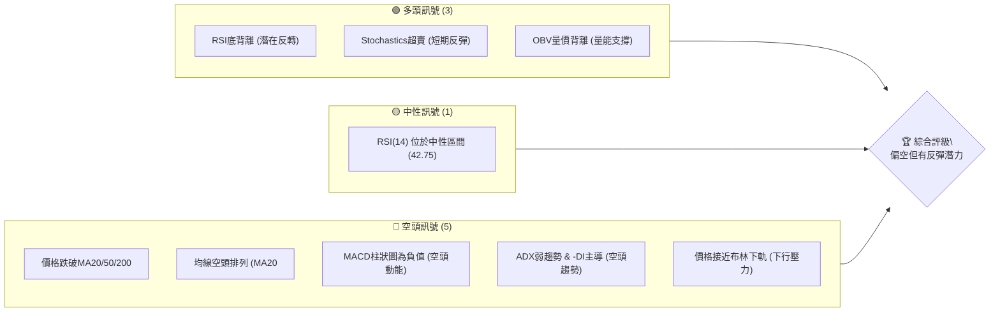
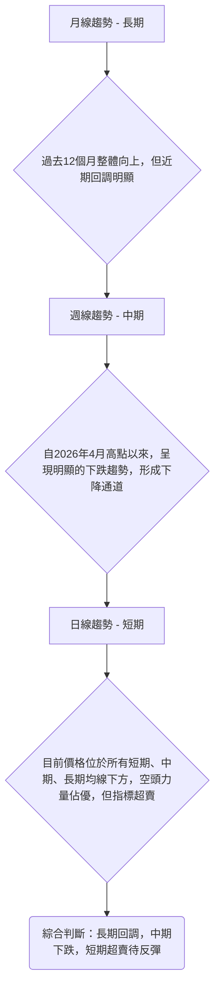
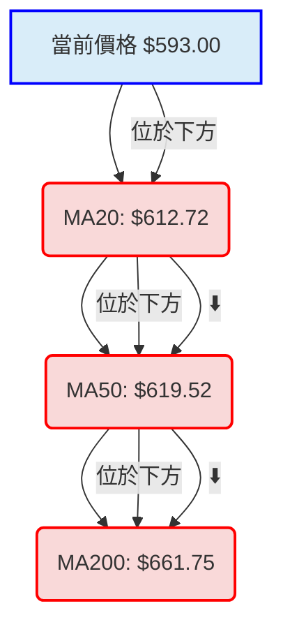

<details>
<summary>📊 靜態圖表 (點擊展開)</summary>

</details>

<html>
<head><meta charset="utf-8" /></head>
<body>
    <div style="height:500px; width:100%;">                        <script>window.PlotlyConfig = {MathJaxConfig: 'local'};</script>
        <script charset="utf-8" src="https://cdn.plot.ly/plotly-3.6.0.min.js" integrity="sha256-QaOVwtVY0T02VaHrr6pnoHLCwayMJp4O5n4YyaE3rJk=" crossorigin="anonymous"></script>                <div id="candlestick-chart" class="plotly-graph-div" style="height:100%; width:100%;"></div>            <script>                window.PLOTLYENV=window.PLOTLYENV || {};                                if (document.getElementById("candlestick-chart")) {                    Plotly.newPlot(                        "candlestick-chart",                        [{"close":{"dtype":"f8","bdata":"AAAAoL5Ph0AAAAAg8gqHQAAAAAAsiIdAAAAAoEd8h0AAAABAqoKHQAAAAAAITYdAAAAAAM1qh0AAAADgwAeHQAAAAMAZ64ZAAAAAoJX6hkAAAADgKleHQAAAACB\u002fdYdAAAAAgEx0h0AAAABgP9+HQAAAAKC+cYdAAAAAACBph0AAAADAjo6HQAAAACBE14dAAAAA4GVJiEAAAABAOC+IQAAAAABgU4hAAAAAIHNEiEAAAABAD9+HQAAAACAckYdAAAAAoB67h0AAAADARl2HQAAAAMAQNIdAAAAAIEUxh0AAAAAgO+mGQAAAAGAjYYZAAAAAQLCuhkAAAAAg\u002fSqGQAAAAIC4U4ZAAAAAgB0\u002fhkAAAADAIWWGQAAAAEBI4oZAAAAAoPoAhkAAAABAClSGQAAAAAC8G4ZAAAAAwNBihkAAAACADDeGQAAAAKDIXYZAAAAAgJTXhkAAAACgXeCGQAAAAMB74YZAAAAAIDLmhkAAAACABAmHQAAAAOCHbIdAAAAAoHtxh0AAAADAUXOHQAAAAKDbyoRAAAAAwCM6hEAAAACAKeWDQAAAAEAukoNAAAAAABvXg0AAAACgQE+DQAAAACBgZYNAAAAAQKS1g0AAAACgQ5CDQAAAAADy\u002f4JAAAAAQPkGg0AAAAAgigODQAAAAOAJyIJAAAAAYImlgkAAAADArGqCQAAAAKBUYYJAAAAAABCKgkAAAAAgNiCDQAAAAOBC2YNAAAAAoGrEg0AAAAAA8jaEQAAAAEBm\u002foNAAAAAACgwhEAAAACgQfSDQAAAAIBno4RAAAAAYF0ChUAAAABAfs2EQAAAAMDnfoRAAAAAIFtIhEAAAAAg9lyEQAAAACA8GYRAAAAAIKY3hEAAAAAAtISEQAAAACCOR4RAAAAAgA2\u002fhEAAAADgppGEQAAAACB5p4RAAAAAIPjChEAAAADg1NeEQAAAAODHtYRAAAAAIAORhEAAAADgCsuEQAAAAOAznIRAAAAAINROhEAAAADAz5GEQAAAAGBwoIRAAAAAoBRBhEAAAAAADyyEQAAAAMACZIRAAAAAwF0LhEAAAADAZrSDQAAAAKDyN4NAAAAAwCZig0AAAABgwV2DQAAAAGDT3IJAAAAAQHwjg0AAAACgmziEQAAAAGCSkYRAAAAAQEf+hEAAAACAJwOFQAAAAGBD4YRAAAAAYG0Nh0AAAADAGF+GQAAAAAByDoZAAAAAwN2YhUAAAACAV+OEQAAAAAAY7YRAAAAAQCenhEAAAAAAICWFQAAAAGAr8YRAAAAAoPHghEAAAACACEqEQAAAACDI+YNAAAAA4PH1g0AAAACgWxWEQAAAAODTIYRAAAAAAMt4hEAAAACgo+WDQAAAAGAG9oNAAAAA4AtphEAAAACAlYOEQAAAAAABPYRAAAAA4AFohEAAAABAKHSEQAAAACBF2YRAAAAAIAqghEAAAACAdyKEQAAAAICwNoRAAAAAgBVshEAAAAAAZnKEQAAAAKAS7YNAAAAA4Hopg0AAAACgmZuDQAAAAKBHdYNAAAAAoHA9g0AAAACgmfWCQAAAAKBHjYJAAAAA4HrggkAAAAAgXIeCQAAAAMAel4JAAAAA4FEcgUAAAACAwm2AQAAAAEAKw4BAAAAAQArhgUAAAAAA1xmCQAAAACCu84FAAAAAACnogUAAAABgZviBQAAAACBcI4NAAAAAwB6jg0AAAABA4a6DQAAAAIA91INAAAAAgOuzhEAAAADgo\u002fyEQAAAAMD1JoVAAAAAYGaEhUAAAACgR\u002feEQAAAAGC45oRAAAAAgMIVhUAAAABAM5mEQAAAAIA9GIVAAAAAwPU0hUAAAABguPqEQAAAAMD16IRAAAAAoEcfg0AAAAAAAAaDQAAAAKBHE4NAAAAAIK7ngkAAAABACieDQAAAAOB6RoNAAAAAQAoNg0AAAABA4baCQAAAAAAA2IJAAAAAQApFg0AAAACgcFODQAAAAADXMYNAAAAAIK4Zg0AAAABA4dSCQAAAAOB66IJAAAAAQAr7gkAAAACAFBKDQAAAAGC4IoNAAAAAgBTag0AAAADgUdqDQAAAAIAUxINAAAAAgMLDgkAAAABACq2CQAAAAADXd4NAAAAAYI+cg0AAAAAAAIiCQA=="},"high":{"dtype":"f8","bdata":"ZRWH2Yljh0AiCf2pBj6HQLZs+T8DmYdABYRXudCoh0DWwRuOz4iHQKb0uIMQg4dA6nXW0Eh6h0CpHOF\u002fHUuHQHwpqzo08oZAYlMJ5R8Uh0AQbaw4A7uHQIE19btkoYdArqxbcLblh0DfAPk+CeSHQLQNGWo\u002f34dAQw3Dv5uah0DmTc8\u002fXJ6HQOCmeekMIohAezvizDtciEA2zfxMo2uIQLWPqJF0l4hAWnTQppOniEDK2ctJWIOIQHzx56WBCohANBUTtra+h0BZa3A\u002fDZyHQLMDT2dldYdAhqptIzZsh0CMp6wA1i2HQHvr71MohYZACheyaXC0hkCN8Q5bPM6GQLLBBvR2XYZALfpkF2dqhkCOso9vlnOGQAAAAEBI4oZAKT+6xFbwhkDtoElA53WGQD05xofXUoZAhB9Q6YeVhkCf33y8OqKGQPGw39W4aoZANJBb51vkhkDkFsu9IgqHQNwH+0noGodAi5cW\u002flwph0D2\u002fiuhxx+HQB5cNKTnk4dAVGxe8xGph0D1wjijI6+HQD8PMLSVPoVAWb1n\u002fxoOhUDYvT1S1ZGEQM9f1hBZBYRAA9SU5kIJhEAB7pEpgdeDQFjpVtC6aINA7vrOq4TPg0BqfhglEqSDQLhCxK2En4NAGNgCN\u002fNEg0DXG\u002fUxPiWDQI6t\u002f2VZFYNAGtMQdjfVgkD2uzgesJKCQF8TNcun7YJAneVMhPiogkCRSenkXD2DQObSYunj34NAcnblYVrqg0BW13tovjeEQFgyaqjwIYRAJAHvXU42hEB8iJP+IT6EQLIKKe7EF4VAzl09CIIMhUBHedMcpByFQEqEYen2uoRAXfXEZVZrhECCdy22fHGEQB+i5s+ALoZAQCrPAYhjhEBF1bMuya+EQAKGMJNQpYRAcfuTC+TvhEC+v+VyaPOEQHwDT9YHCIVAqnCRJHHLhEDjXXIF3tyEQIkgl7UF44RA7GNWRHudhEDqvdXDKP2EQBiVxuVyw4RAHFniwZK+hECdQjmtxb+EQPbsVgqbx4RAPyWTbLCUhEBnBZENXzSEQDkfVTAec4RAKlbEuUhrhEA6i9fJww2EQIVe1JhMn4NAny+KmBZ9g0CJFNPHVaSDQB7v8x4EF4NAhpV40u1Ng0D\u002fvV4UCqCEQLElFNVbz4RAvQ9MYp4VhUC8okah7SGFQF0Rx1HNKIVA1toAiOg6h0AHPCZsWdyGQLqeral2hYZAxyN\u002fzBdjhkBzegse7YGFQOPIqhhWR4VADucxLVL7hECng4a0zVWFQOyJKbqKQIVACMzq9oI1hUAeiWu+XxuFQHQuX1L7VoRAsWF582YQhEDmGasBliOEQJRfIEcXNYRAejY3p0K2hEAajKNsGYmEQIuzOxR+BIRAKWHIqpBqhEC8eZECeqOEQNIb3UoTR4RATIGV8gCbhEBmvwZQz5OEQFZrdUuOAYVAoTzXoALxhEATs3KsUEeEQC79iR6ROYRA+ynqleGdhECANnEJc5SEQPGvWimHZ4RANwnUyQ2lg0AAAAAAANaDQAAAAGBm5INAAAAAQDN1g0AAAAAAACiDQAAAACCu34JAAAAAwB4Fg0AAAAAAAMiCQAAAACBc3YJAAAAAAAA4gkAAAADAzPyAQAAAAGBm3IBAAAAAIIXtgUAAAABgZoSCQAAAAAAAFIJAAAAA4FE2gkAAAAAA1\u002fmBQAAAAKCZr4NAAAAAAADsg0AAAADgo\u002fSDQAAAAAAA2INAAAAAgBTShEAAAAAAADSFQAAAAOCjLIVAAAAAACmchUAAAABACluFQAAAAKCZIYVAAAAAQAozhUAAAADgeuyEQAAAACBcRYVAAAAAAABUhUAAAACgcDGFQAAAAAAAEoVAAAAAwMxmg0AAAABACleDQAAAAAAAMINAAAAAwMwyg0AAAACgmV+DQAAAAADXh4NAAAAAAClGg0AAAACgR+eCQAAAAAAA3oJAAAAAQDNfg0AAAAAA132DQAAAAKCZaYNAAAAAYLg8g0AAAACgcC+DQAAAAAAAAINAAAAAwMwMg0AAAADgejaDQAAAAIDCM4NAAAAAAAD0g0AAAAAAABiEQAAAAAAA1INAAAAAAADeg0AAAABACgeDQAAAAEAzgYNAAAAAQDMThEAAAABAM6mDQA=="},"hovertemplate":"\u003cb\u003e%{x|%Y-%m-%d}\u003c\u002fb\u003e\u003cbr\u003e\u958b: $%{open:.2f}\u003cbr\u003e\u9ad8: $%{high:.2f}\u003cbr\u003e\u4f4e: $%{low:.2f}\u003cbr\u003e\u6536: $%{close:.2f}\u003cextra\u003e\u003c\u002fextra\u003e","low":{"dtype":"f8","bdata":"5ny9WkzKhkCtt09eI9uGQA9Jv8Na5YZAzc8Ztvpih0CBXOgugFGHQKM45ujLKIdAdiAjmYMYh0CwM1oTBO2GQIlwj7RPgIZAk3H3binihkBstmqUlECHQHx6fppGOodA7vzpdxByh0CVodhAUX2HQLfI0lPsaYdA2xr6o+5Uh0DK\u002fuKjIzCHQNWCkP3ScYdAd4JwU3Xah0A98zrHHeSHQFC9vE9iHIhAn2xaGRr7h0C+fwB8jNmHQKRbgw6HbodAr3+tTDB6h0Dom6lodDqHQDH2hWLzAIdAUzSEqFMPh0BVou\u002fgsqiGQD8udAodKIZA1hmmF4dnhkBw4aYs9CeGQKyTaF\u002fbioVAnvuhsJIEhkABkRqMBhWGQFChm+wAOoZAoKSIc6v6hUCs7sTvqhOGQPo6u35M0YVADZoGXpoihkBw9FFho\u002fWFQOtIMS6HB4ZAaY\u002fQ\u002f9F3hkCmEbkURLyGQNudD7ORloZA\u002fbvc8wHfhkAculwnb8+GQEva6psWVodA0ug0vjNCh0Aqv7ByKSqHQGUpIvysSIRAYaqG4e8jhEClQ1w78diDQFt+w9q3h4NAxBZybfOLg0DzU+K2vkeDQNS008KRwYJAW7rTrJ9Ig0CM+ZvL2FKDQCvzeL0K9oJAFLZoD\u002fLPgkDgxM5ippGCQDBMeTo\u002fk4JA6SVgUHE2gkBSv+ljPCKCQHMTYvUBM4JAG+TqnRsngkCV5gy6DqWCQOgvhQckSoNAIG5BZZq0g0AWqnHygtODQMojg6KP5YNAJWq7gAnog0AzsY1C4uODQDrgjm+Vl4RAa26Bt0WqhECtpWkqrb+EQGckxmD+YYRALrBiI5sShEBgTjga1\u002f2DQG4yi5dZ7INAG\u002fsrrzrxg0BfjVTQMhWEQDjWikYoRYRASAai\u002fy9\u002fhEDX+5+I74yEQKueIt+0gIRArm6cuH6NhEAMPm5\u002fEa2EQJrZfdMIpoRAPvaNSKRuhEC+cXHVN4qEQC6jjMMBl4RAOvsnm5gXhEAgnj03kTmEQFft5ya9WoRAOqU4LBEihEBTF4m9aNmDQHA+LINmEoRA4GXmi3MFhEC0u\u002f5eh3yDQNCN9TlaMoNAPqWu4qItg0D+UzyMZVyDQKexytfku4JAQZOrkIi8gkBUbnOuHJCDQEyOFJIwH4RA6kUjRculhEB0GP8uu8CEQApRmbs9zIRAz7SAAYY\u002fhkB3+hg51keGQNZgLHBY94VAdq+tBJVuhUCd+SrOHNeEQOipHSaHZ4RAdHS7VZMvhEBH5ZtOu5GEQKMKH2G86YRA3iQRjk2EhEDfqpQP0yWEQJt4Q5w30INApS+8wBiig0BnBcbG5pyDQIEw8P5m4YNAgn1Bct7xg0Dsp5jQpduDQFf7bBSJo4NAD6U9vLkMhEAcJg2pkTeEQIx4FcCX7INAa0tcZKjPg0CKclozWfKDQHKBE+DbiIRA7ep2mQdOhEC8IlPUhtyDQKa9AlzzkYNAq0PZAY9DhEB04iljcT6EQNfCCH7X4oNACZzgaToIg0AAAADAzHiDQAAAAKCZbYNAAAAAQOE0g0AAAACAFNKCQAAAAAAAWoJAAAAAgBS4gkAAAAAAAHiCQAAAAEAzi4JAAAAAwMz6gEAAAACAFEKAQAAAAOBRhIBAAAAAACkWgUAAAABgj+6BQAAAAKCZfYFAAAAAAADggUAAAACAFKaBQAAAAOCjfoJAAAAAAAB4g0AAAADgo4KDQAAAAEAzg4NAAAAAwPX6g0AAAACAwsGEQAAAAAAA3oRAAAAAQAoZhUAAAAAAAOCEQAAAAOCj2oRAAAAAAADuhEAAAABgZmiEQAAAAGC4boRAAAAAYLj2hEAAAABACs2EQAAAAOB6voRAAAAAAADAgkAAAABA4fCCQAAAAAAA1oJAAAAAQOHCgkAAAADAzLCCQAAAAOBRLINAAAAA4HrwgkAAAADgo7CCQAAAAMDMhIJAAAAAoEelgkAAAAAAADiDQAAAAOB6CoNAAAAAIIXdgkAAAABgZsSCQAAAAOB6roJAAAAA4HqWgkAAAACgmfeCQAAAAGBm6oJAAAAAAAAIg0AAAADgeqqDQAAAAMDMeoNAAAAAgD28gkAAAACgcKWCQAAAAAApwoJAAAAAoHBzg0AAAACgRzeCQA=="},"name":"\u50f9\u683c","open":{"dtype":"f8","bdata":"\u002fOA2OIxOh0ByvmyUuDeHQDoMO8r7C4dAUlXDVGmIh0CdBbS1U2iHQAOzTYRMdIdAJEsj3g0yh0DpPMcsRTyHQMVp+uW1ooZAcdfTSTTyhkDNLUtih1aHQLanMm\u002fadodAvUnkXtSRh0DVkW2luJ2HQOTFTcay2odAVzxeAQ6Hh0CEwNFKzleHQGaPtbGPnYdAElhcdZ\u002fph0AjA7PCTFGIQAT\u002fy5ldV4hAk49ha56EiED6jjROW2SIQGYAroO5\u002f4dA4DAizuGhh0Depbg5iYGHQGGFzmD7ZYdAxPvVLsJbh0Cuuej2FSiHQCmZEk9IgoZAG\u002fjwCP2KhkBDFFZKS8OGQFTnDM0ZAIZAV6o5QixkhkBjN\u002fACEkKGQMgFRVSlaIZAP5CtxJjNhkClDdhSjj6GQMnrlznJFIZA6VHt7OZehkCQ2vbC0GKGQOq2zAUyD4ZAZsCrC+N\u002fhkA\u002fULY4VPaGQBLFTJDW5IZAn2Q5W8nrhkAzKlV+evyGQOInOjrTY4dA7iBNrvx6h0ACe7wX64uHQOhlBjZD4IRAwrUNDBILhUD1YkfVPHeEQFT+vUnul4NAzklusgi6g0AbAedsTtaDQI5itVmvO4NAqLJ7akqwg0AjU6yanJeDQF1hll6mmINAZftIAF8gg0BrgiMaSMaCQHME3jUvAINAaSEH0+V0gkDSS6k\u002f1IWCQOsh+03w04JAngFpqSNcgkCA2e8\u002fw62CQHfenCmqd4NATZFkjADlg0Ad+7XWJNiDQPQvjGPb84NAGifO5iMKhEAdgVcNrBqEQKCYrIX4FoVACqgkdiG3hEAQvneQx+GEQOjx2FZLtYRAV4WQHetGhED9GHIWuhGEQGW7NnS4RYRAmMjCay4phED5h8qpmBeEQG1ct6tkeIRAi9T5X76DhEBMzQSZzM6EQMdrtxysqIRAdgxH8eGbhEAjh2vLtK+EQIdkvoTo24RAx3H6sJOLhEDWkTcYA5GEQDvn51VzwYRAKeBq6k2xhEBtqC4BoFOEQPBe69YLmIRAPHrZEqJ4hEAuMLqwniqEQKImjVkaJ4RA886bP8ZfhEA6i9fJww2EQLSfa2O2j4NAEweJcJtPg0Bh5W8dK32DQELNqEnh+oJAB6+thcTxgkDa4aUmfqaDQE9UjmK\u002fIYRAOnvN6nzEhEBUgGmJGhCFQPADDkRiD4VAztmvqmQGh0BZkJh6BbeGQMaGs8boT4ZAfX26ax4WhkCuEWUrInmFQKQ5bV0ZuIRAHPeDkF3HhEBWqie55rSEQPZZLJIpKIVAzl1+MmMLhUAW4r3OLOuEQEWGdIliJIRAez\u002fOoZ\u002f3g0BXLM0AEMqDQANFMqEw8INAIoUneiT5g0AWt8u22l+EQOAZmcVOxINAVBtRzdcPhEDoLzGx8k+EQE9\u002fekkyF4RA5oteW+vkg0Bt6DYl4j2EQFwl\u002fV0ti4RAzQER\u002fuiqhEAxWI8sxDqEQCzJ11fl0YNACgG85AFohEDsdNZsmXGEQKa4nHuPQYRAwQcGqtl6g0AAAAAAAMCDQAAAAIDrn4NAAAAAYLhCg0AAAABAMyGDQAAAAIA93IJAAAAA4FHugkAAAADAzLiCQAAAAIDrtYJAAAAAgOszgkAAAADAzOCAQAAAAEAKw4BAAAAAANcvgUAAAABACiGCQAAAAOBRsIFAAAAAIIUNgkAAAAAA1+OBQAAAAAAA8IJAAAAAgMKXg0AAAACAwtODQAAAAAAArINAAAAAgMIZhEAAAAAAANiEQAAAAIDrH4VAAAAAwMw0hUAAAABA4UqFQAAAAAAA+IRAAAAAQOEShUAAAACgmb2EQAAAAGCPooRAAAAAAAD4hEAAAACA6xGFQAAAAKBH54RAAAAAYI9ag0AAAAAghTWDQAAAACCF\u002f4JAAAAA4Hoqg0AAAABgZsiCQAAAAIDCNYNAAAAAoJk5g0AAAABgj+SCQAAAAGCPloJAAAAA4KO2gkAAAAAAAECDQAAAAIDrL4NAAAAAQOEIg0AAAAAgXAeDQAAAAIAUxoJAAAAAAADAgkAAAABACv+CQAAAAMAeB4NAAAAAQDMLg0AAAAAAAPyDQAAAAAAAzINAAAAAQDOzg0AAAACA69mCQAAAAAAA2IJAAAAAIFx9g0AAAAAgrnuDQA=="},"x":["2025-08-20T00:00:00-04:00","2025-08-21T00:00:00-04:00","2025-08-22T00:00:00-04:00","2025-08-25T00:00:00-04:00","2025-08-26T00:00:00-04:00","2025-08-27T00:00:00-04:00","2025-08-28T00:00:00-04:00","2025-08-29T00:00:00-04:00","2025-09-02T00:00:00-04:00","2025-09-03T00:00:00-04:00","2025-09-04T00:00:00-04:00","2025-09-05T00:00:00-04:00","2025-09-08T00:00:00-04:00","2025-09-09T00:00:00-04:00","2025-09-10T00:00:00-04:00","2025-09-11T00:00:00-04:00","2025-09-12T00:00:00-04:00","2025-09-15T00:00:00-04:00","2025-09-16T00:00:00-04:00","2025-09-17T00:00:00-04:00","2025-09-18T00:00:00-04:00","2025-09-19T00:00:00-04:00","2025-09-22T00:00:00-04:00","2025-09-23T00:00:00-04:00","2025-09-24T00:00:00-04:00","2025-09-25T00:00:00-04:00","2025-09-26T00:00:00-04:00","2025-09-29T00:00:00-04:00","2025-09-30T00:00:00-04:00","2025-10-01T00:00:00-04:00","2025-10-02T00:00:00-04:00","2025-10-03T00:00:00-04:00","2025-10-06T00:00:00-04:00","2025-10-07T00:00:00-04:00","2025-10-08T00:00:00-04:00","2025-10-09T00:00:00-04:00","2025-10-10T00:00:00-04:00","2025-10-13T00:00:00-04:00","2025-10-14T00:00:00-04:00","2025-10-15T00:00:00-04:00","2025-10-16T00:00:00-04:00","2025-10-17T00:00:00-04:00","2025-10-20T00:00:00-04:00","2025-10-21T00:00:00-04:00","2025-10-22T00:00:00-04:00","2025-10-23T00:00:00-04:00","2025-10-24T00:00:00-04:00","2025-10-27T00:00:00-04:00","2025-10-28T00:00:00-04:00","2025-10-29T00:00:00-04:00","2025-10-30T00:00:00-04:00","2025-10-31T00:00:00-04:00","2025-11-03T00:00:00-05:00","2025-11-04T00:00:00-05:00","2025-11-05T00:00:00-05:00","2025-11-06T00:00:00-05:00","2025-11-07T00:00:00-05:00","2025-11-10T00:00:00-05:00","2025-11-11T00:00:00-05:00","2025-11-12T00:00:00-05:00","2025-11-13T00:00:00-05:00","2025-11-14T00:00:00-05:00","2025-11-17T00:00:00-05:00","2025-11-18T00:00:00-05:00","2025-11-19T00:00:00-05:00","2025-11-20T00:00:00-05:00","2025-11-21T00:00:00-05:00","2025-11-24T00:00:00-05:00","2025-11-25T00:00:00-05:00","2025-11-26T00:00:00-05:00","2025-11-28T00:00:00-05:00","2025-12-01T00:00:00-05:00","2025-12-02T00:00:00-05:00","2025-12-03T00:00:00-05:00","2025-12-04T00:00:00-05:00","2025-12-05T00:00:00-05:00","2025-12-08T00:00:00-05:00","2025-12-09T00:00:00-05:00","2025-12-10T00:00:00-05:00","2025-12-11T00:00:00-05:00","2025-12-12T00:00:00-05:00","2025-12-15T00:00:00-05:00","2025-12-16T00:00:00-05:00","2025-12-17T00:00:00-05:00","2025-12-18T00:00:00-05:00","2025-12-19T00:00:00-05:00","2025-12-22T00:00:00-05:00","2025-12-23T00:00:00-05:00","2025-12-24T00:00:00-05:00","2025-12-26T00:00:00-05:00","2025-12-29T00:00:00-05:00","2025-12-30T00:00:00-05:00","2025-12-31T00:00:00-05:00","2026-01-02T00:00:00-05:00","2026-01-05T00:00:00-05:00","2026-01-06T00:00:00-05:00","2026-01-07T00:00:00-05:00","2026-01-08T00:00:00-05:00","2026-01-09T00:00:00-05:00","2026-01-12T00:00:00-05:00","2026-01-13T00:00:00-05:00","2026-01-14T00:00:00-05:00","2026-01-15T00:00:00-05:00","2026-01-16T00:00:00-05:00","2026-01-20T00:00:00-05:00","2026-01-21T00:00:00-05:00","2026-01-22T00:00:00-05:00","2026-01-23T00:00:00-05:00","2026-01-26T00:00:00-05:00","2026-01-27T00:00:00-05:00","2026-01-28T00:00:00-05:00","2026-01-29T00:00:00-05:00","2026-01-30T00:00:00-05:00","2026-02-02T00:00:00-05:00","2026-02-03T00:00:00-05:00","2026-02-04T00:00:00-05:00","2026-02-05T00:00:00-05:00","2026-02-06T00:00:00-05:00","2026-02-09T00:00:00-05:00","2026-02-10T00:00:00-05:00","2026-02-11T00:00:00-05:00","2026-02-12T00:00:00-05:00","2026-02-13T00:00:00-05:00","2026-02-17T00:00:00-05:00","2026-02-18T00:00:00-05:00","2026-02-19T00:00:00-05:00","2026-02-20T00:00:00-05:00","2026-02-23T00:00:00-05:00","2026-02-24T00:00:00-05:00","2026-02-25T00:00:00-05:00","2026-02-26T00:00:00-05:00","2026-02-27T00:00:00-05:00","2026-03-02T00:00:00-05:00","2026-03-03T00:00:00-05:00","2026-03-04T00:00:00-05:00","2026-03-05T00:00:00-05:00","2026-03-06T00:00:00-05:00","2026-03-09T00:00:00-04:00","2026-03-10T00:00:00-04:00","2026-03-11T00:00:00-04:00","2026-03-12T00:00:00-04:00","2026-03-13T00:00:00-04:00","2026-03-16T00:00:00-04:00","2026-03-17T00:00:00-04:00","2026-03-18T00:00:00-04:00","2026-03-19T00:00:00-04:00","2026-03-20T00:00:00-04:00","2026-03-23T00:00:00-04:00","2026-03-24T00:00:00-04:00","2026-03-25T00:00:00-04:00","2026-03-26T00:00:00-04:00","2026-03-27T00:00:00-04:00","2026-03-30T00:00:00-04:00","2026-03-31T00:00:00-04:00","2026-04-01T00:00:00-04:00","2026-04-02T00:00:00-04:00","2026-04-06T00:00:00-04:00","2026-04-07T00:00:00-04:00","2026-04-08T00:00:00-04:00","2026-04-09T00:00:00-04:00","2026-04-10T00:00:00-04:00","2026-04-13T00:00:00-04:00","2026-04-14T00:00:00-04:00","2026-04-15T00:00:00-04:00","2026-04-16T00:00:00-04:00","2026-04-17T00:00:00-04:00","2026-04-20T00:00:00-04:00","2026-04-21T00:00:00-04:00","2026-04-22T00:00:00-04:00","2026-04-23T00:00:00-04:00","2026-04-24T00:00:00-04:00","2026-04-27T00:00:00-04:00","2026-04-28T00:00:00-04:00","2026-04-29T00:00:00-04:00","2026-04-30T00:00:00-04:00","2026-05-01T00:00:00-04:00","2026-05-04T00:00:00-04:00","2026-05-05T00:00:00-04:00","2026-05-06T00:00:00-04:00","2026-05-07T00:00:00-04:00","2026-05-08T00:00:00-04:00","2026-05-11T00:00:00-04:00","2026-05-12T00:00:00-04:00","2026-05-13T00:00:00-04:00","2026-05-14T00:00:00-04:00","2026-05-15T00:00:00-04:00","2026-05-18T00:00:00-04:00","2026-05-19T00:00:00-04:00","2026-05-20T00:00:00-04:00","2026-05-21T00:00:00-04:00","2026-05-22T00:00:00-04:00","2026-05-26T00:00:00-04:00","2026-05-27T00:00:00-04:00","2026-05-28T00:00:00-04:00","2026-05-29T00:00:00-04:00","2026-06-01T00:00:00-04:00","2026-06-02T00:00:00-04:00","2026-06-03T00:00:00-04:00","2026-06-04T00:00:00-04:00","2026-06-05T00:00:00-04:00"],"type":"candlestick"},{"hovertemplate":"MA30: $%{y:.2f}\u003cextra\u003e\u003c\u002fextra\u003e","line":{"color":"#2196F3","dash":"dash","width":2},"mode":"lines","name":"MA30","x":["2025-08-20T00:00:00-04:00","2025-08-21T00:00:00-04:00","2025-08-22T00:00:00-04:00","2025-08-25T00:00:00-04:00","2025-08-26T00:00:00-04:00","2025-08-27T00:00:00-04:00","2025-08-28T00:00:00-04:00","2025-08-29T00:00:00-04:00","2025-09-02T00:00:00-04:00","2025-09-03T00:00:00-04:00","2025-09-04T00:00:00-04:00","2025-09-05T00:00:00-04:00","2025-09-08T00:00:00-04:00","2025-09-09T00:00:00-04:00","2025-09-10T00:00:00-04:00","2025-09-11T00:00:00-04:00","2025-09-12T00:00:00-04:00","2025-09-15T00:00:00-04:00","2025-09-16T00:00:00-04:00","2025-09-17T00:00:00-04:00","2025-09-18T00:00:00-04:00","2025-09-19T00:00:00-04:00","2025-09-22T00:00:00-04:00","2025-09-23T00:00:00-04:00","2025-09-24T00:00:00-04:00","2025-09-25T00:00:00-04:00","2025-09-26T00:00:00-04:00","2025-09-29T00:00:00-04:00","2025-09-30T00:00:00-04:00","2025-10-01T00:00:00-04:00","2025-10-02T00:00:00-04:00","2025-10-03T00:00:00-04:00","2025-10-06T00:00:00-04:00","2025-10-07T00:00:00-04:00","2025-10-08T00:00:00-04:00","2025-10-09T00:00:00-04:00","2025-10-10T00:00:00-04:00","2025-10-13T00:00:00-04:00","2025-10-14T00:00:00-04:00","2025-10-15T00:00:00-04:00","2025-10-16T00:00:00-04:00","2025-10-17T00:00:00-04:00","2025-10-20T00:00:00-04:00","2025-10-21T00:00:00-04:00","2025-10-22T00:00:00-04:00","2025-10-23T00:00:00-04:00","2025-10-24T00:00:00-04:00","2025-10-27T00:00:00-04:00","2025-10-28T00:00:00-04:00","2025-10-29T00:00:00-04:00","2025-10-30T00:00:00-04:00","2025-10-31T00:00:00-04:00","2025-11-03T00:00:00-05:00","2025-11-04T00:00:00-05:00","2025-11-05T00:00:00-05:00","2025-11-06T00:00:00-05:00","2025-11-07T00:00:00-05:00","2025-11-10T00:00:00-05:00","2025-11-11T00:00:00-05:00","2025-11-12T00:00:00-05:00","2025-11-13T00:00:00-05:00","2025-11-14T00:00:00-05:00","2025-11-17T00:00:00-05:00","2025-11-18T00:00:00-05:00","2025-11-19T00:00:00-05:00","2025-11-20T00:00:00-05:00","2025-11-21T00:00:00-05:00","2025-11-24T00:00:00-05:00","2025-11-25T00:00:00-05:00","2025-11-26T00:00:00-05:00","2025-11-28T00:00:00-05:00","2025-12-01T00:00:00-05:00","2025-12-02T00:00:00-05:00","2025-12-03T00:00:00-05:00","2025-12-04T00:00:00-05:00","2025-12-05T00:00:00-05:00","2025-12-08T00:00:00-05:00","2025-12-09T00:00:00-05:00","2025-12-10T00:00:00-05:00","2025-12-11T00:00:00-05:00","2025-12-12T00:00:00-05:00","2025-12-15T00:00:00-05:00","2025-12-16T00:00:00-05:00","2025-12-17T00:00:00-05:00","2025-12-18T00:00:00-05:00","2025-12-19T00:00:00-05:00","2025-12-22T00:00:00-05:00","2025-12-23T00:00:00-05:00","2025-12-24T00:00:00-05:00","2025-12-26T00:00:00-05:00","2025-12-29T00:00:00-05:00","2025-12-30T00:00:00-05:00","2025-12-31T00:00:00-05:00","2026-01-02T00:00:00-05:00","2026-01-05T00:00:00-05:00","2026-01-06T00:00:00-05:00","2026-01-07T00:00:00-05:00","2026-01-08T00:00:00-05:00","2026-01-09T00:00:00-05:00","2026-01-12T00:00:00-05:00","2026-01-13T00:00:00-05:00","2026-01-14T00:00:00-05:00","2026-01-15T00:00:00-05:00","2026-01-16T00:00:00-05:00","2026-01-20T00:00:00-05:00","2026-01-21T00:00:00-05:00","2026-01-22T00:00:00-05:00","2026-01-23T00:00:00-05:00","2026-01-26T00:00:00-05:00","2026-01-27T00:00:00-05:00","2026-01-28T00:00:00-05:00","2026-01-29T00:00:00-05:00","2026-01-30T00:00:00-05:00","2026-02-02T00:00:00-05:00","2026-02-03T00:00:00-05:00","2026-02-04T00:00:00-05:00","2026-02-05T00:00:00-05:00","2026-02-06T00:00:00-05:00","2026-02-09T00:00:00-05:00","2026-02-10T00:00:00-05:00","2026-02-11T00:00:00-05:00","2026-02-12T00:00:00-05:00","2026-02-13T00:00:00-05:00","2026-02-17T00:00:00-05:00","2026-02-18T00:00:00-05:00","2026-02-19T00:00:00-05:00","2026-02-20T00:00:00-05:00","2026-02-23T00:00:00-05:00","2026-02-24T00:00:00-05:00","2026-02-25T00:00:00-05:00","2026-02-26T00:00:00-05:00","2026-02-27T00:00:00-05:00","2026-03-02T00:00:00-05:00","2026-03-03T00:00:00-05:00","2026-03-04T00:00:00-05:00","2026-03-05T00:00:00-05:00","2026-03-06T00:00:00-05:00","2026-03-09T00:00:00-04:00","2026-03-10T00:00:00-04:00","2026-03-11T00:00:00-04:00","2026-03-12T00:00:00-04:00","2026-03-13T00:00:00-04:00","2026-03-16T00:00:00-04:00","2026-03-17T00:00:00-04:00","2026-03-18T00:00:00-04:00","2026-03-19T00:00:00-04:00","2026-03-20T00:00:00-04:00","2026-03-23T00:00:00-04:00","2026-03-24T00:00:00-04:00","2026-03-25T00:00:00-04:00","2026-03-26T00:00:00-04:00","2026-03-27T00:00:00-04:00","2026-03-30T00:00:00-04:00","2026-03-31T00:00:00-04:00","2026-04-01T00:00:00-04:00","2026-04-02T00:00:00-04:00","2026-04-06T00:00:00-04:00","2026-04-07T00:00:00-04:00","2026-04-08T00:00:00-04:00","2026-04-09T00:00:00-04:00","2026-04-10T00:00:00-04:00","2026-04-13T00:00:00-04:00","2026-04-14T00:00:00-04:00","2026-04-15T00:00:00-04:00","2026-04-16T00:00:00-04:00","2026-04-17T00:00:00-04:00","2026-04-20T00:00:00-04:00","2026-04-21T00:00:00-04:00","2026-04-22T00:00:00-04:00","2026-04-23T00:00:00-04:00","2026-04-24T00:00:00-04:00","2026-04-27T00:00:00-04:00","2026-04-28T00:00:00-04:00","2026-04-29T00:00:00-04:00","2026-04-30T00:00:00-04:00","2026-05-01T00:00:00-04:00","2026-05-04T00:00:00-04:00","2026-05-05T00:00:00-04:00","2026-05-06T00:00:00-04:00","2026-05-07T00:00:00-04:00","2026-05-08T00:00:00-04:00","2026-05-11T00:00:00-04:00","2026-05-12T00:00:00-04:00","2026-05-13T00:00:00-04:00","2026-05-14T00:00:00-04:00","2026-05-15T00:00:00-04:00","2026-05-18T00:00:00-04:00","2026-05-19T00:00:00-04:00","2026-05-20T00:00:00-04:00","2026-05-21T00:00:00-04:00","2026-05-22T00:00:00-04:00","2026-05-26T00:00:00-04:00","2026-05-27T00:00:00-04:00","2026-05-28T00:00:00-04:00","2026-05-29T00:00:00-04:00","2026-06-01T00:00:00-04:00","2026-06-02T00:00:00-04:00","2026-06-03T00:00:00-04:00","2026-06-04T00:00:00-04:00","2026-06-05T00:00:00-04:00"],"y":{"dtype":"f8","bdata":"AAAAAAAA+H8AAAAAAAD4fwAAAAAAAPh\u002fAAAAAAAA+H8AAAAAAAD4fwAAAAAAAPh\u002fAAAAAAAA+H8AAAAAAAD4fwAAAAAAAPh\u002fAAAAAAAA+H8AAAAAAAD4fwAAAAAAAPh\u002fAAAAAAAA+H8AAAAAAAD4fwAAAAAAAPh\u002fAAAAAAAA+H8AAAAAAAD4fwAAAAAAAPh\u002fAAAAAAAA+H8AAAAAAAD4fwAAAAAAAPh\u002fAAAAAAAA+H8AAAAAAAD4fwAAAAAAAPh\u002fAAAAAAAA+H8AAAAAAAD4fwAAAAAAAPh\u002fAAAAAAAA+H8AAAAAAAD4f83MzPwWeYdAREREpLhzh0CrqqqKQWyHQM3MzGz5YYdARERE9GZXh0B3d3dn4k2HQKuqqnpTSodA7+7u7kM+h0ARERFhRjiHQKuqqtpcMYdAIiIiwk0sh0BVVVUlsyKHQDMzM0NgGYdA3t3d7SYUh0AAAADwpwuHQImIiOjYBodAVVVVpXsCh0CrqqoaCP6GQLy7u0t5+oZAIiIi0kbzhkB3d3dnA+2GQLy7u9vczoZA7+7uvmKshkAAAACwdIqGQBEREbFbaIZA7+7uXihHhkARERGRjiSGQGZmZjYRBIZAZmZmpljmhUDe3d3dx8mFQDMzM+PwrIVA7+7uHsCNhUAzMzPj1XKFQFVVVVWUVIVAIiIiMtw1hUDNzMxc6ROFQHd3d9d67YRAzczMfOrPhEDe3d2dlrSEQAAAAFBOoYRAMzMzk\u002fWKhEAAAACg43mEQM3MzJykZYRAzczM3P5OhEDv7u7+DjaEQAAAADDsIoRA7+7ufssShEDNzMx8vv+DQO\u002fu7q7B5oNAIiIiIsnLg0Dv7u6+cLGDQHd3dweFq4NAZmZmxm+rg0ARERExwbCDQLy7u+vMtoNARERENIi+g0CJiIhYR8mDQJqZmekD1INAzczMLP7cg0Crqqpq6eeDQM3MzJyB9oNAMzMzE6QDhECJiIgI0xKEQImIiAhuIoRAERERMZswhECamZk5+kKEQBEREdElVoRAq6qqGshkhEC8u7u7tW2EQKuqqrpVcoRAq6qqKrN0hEARERExWXCEQM3MzLy7aYRARERE1N1ihEDe3d2N2V2EQLy7u3uyToRAvLu7C7w+hEDv7u6OxTmEQImIiNhkOoRAAAAAQHVAhEDe3d1t\u002f0WEQGZmZlaqTIRAVVVVpdtkhEDe3d3Nq3SEQImIiIjVg4RAVVVVNRiLhEC8u7tL0Y2EQERERGQjkIRAd3d3BzaPhECamZmZyZGEQCIiImLEk4RAd3d3d26WhEBmZmaWIZKEQImIiJi3jIRA7+7uHsGJhEDe3d0dm4WEQDMzM7NigYRAzczMHD6DhEAzMzMz5YCEQHd3d6c6fYRA7+7uDlqAhEBEREQEQoeEQCIiIrL1j4RAMzMzM7CYhEBVVVXl96GEQO\u002fu7p7qsoRAREREBJq\u002fhEBEREQU3b6EQM3MzIzVu4RAZmZmBva2hEBmZmbGIrKEQERERAT\u002fqYRARERERMyIhEBmZmb2NnGEQCIiIuIKW4RAVVVVpe1GhEAiIiJieDaEQERERLQ1IoRAMzMz0w0ThEDv7u5+uvyDQCIiIgKp6INAzczMjIHIg0CJiIhIkKeDQN7d3Y0jjINAmpmZGWB6g0B3d3dHdWmDQLy7u2vaVoNAd3d3J\u002fdAg0De3d0thjCDQBEREYGAKYNAiYiIiOcig0BVVVV10BuDQJqZmXlSGINAMzMzQ9oag0CrqqrqZh+DQO\u002fu7t79IYNAvLu7i5opg0DNzMyMsjCDQN7d3a2QNoNARERElDg8g0AAAACwgz2DQFVVVZV8R4NAzczMnO9Yg0BmZmbWo2SDQCIiIoIHcYNAREREJAZwg0BmZmYWknCDQN7d3Y0JdYNA7+7u\u002fkZ1g0CamZmZmXqDQBEREQFygINA7+7urgCRg0BVVVW1gaSDQCIiIqJFtoNAAAAAgCPCg0De3d2Nl8yDQERERIQy14NA7+7unmHhg0DNzMwMu+iDQLy7u5vE5oNAMzMzUyrhg0DNzMxM8NuDQGZmZnYF1oNAAAAAkMLOg0CamZkpFcWDQKuqqtpAuYNAzczM7MOhg0CJiIhYOY6DQCIiIqL+gYNAzczM3Gt1g0BVVVUFyGODQA=="},"type":"scatter"},{"hovertemplate":"MA60: $%{y:.2f}\u003cextra\u003e\u003c\u002fextra\u003e","line":{"color":"#9C27B0","dash":"dash","width":2},"mode":"lines","name":"MA60","x":["2025-08-20T00:00:00-04:00","2025-08-21T00:00:00-04:00","2025-08-22T00:00:00-04:00","2025-08-25T00:00:00-04:00","2025-08-26T00:00:00-04:00","2025-08-27T00:00:00-04:00","2025-08-28T00:00:00-04:00","2025-08-29T00:00:00-04:00","2025-09-02T00:00:00-04:00","2025-09-03T00:00:00-04:00","2025-09-04T00:00:00-04:00","2025-09-05T00:00:00-04:00","2025-09-08T00:00:00-04:00","2025-09-09T00:00:00-04:00","2025-09-10T00:00:00-04:00","2025-09-11T00:00:00-04:00","2025-09-12T00:00:00-04:00","2025-09-15T00:00:00-04:00","2025-09-16T00:00:00-04:00","2025-09-17T00:00:00-04:00","2025-09-18T00:00:00-04:00","2025-09-19T00:00:00-04:00","2025-09-22T00:00:00-04:00","2025-09-23T00:00:00-04:00","2025-09-24T00:00:00-04:00","2025-09-25T00:00:00-04:00","2025-09-26T00:00:00-04:00","2025-09-29T00:00:00-04:00","2025-09-30T00:00:00-04:00","2025-10-01T00:00:00-04:00","2025-10-02T00:00:00-04:00","2025-10-03T00:00:00-04:00","2025-10-06T00:00:00-04:00","2025-10-07T00:00:00-04:00","2025-10-08T00:00:00-04:00","2025-10-09T00:00:00-04:00","2025-10-10T00:00:00-04:00","2025-10-13T00:00:00-04:00","2025-10-14T00:00:00-04:00","2025-10-15T00:00:00-04:00","2025-10-16T00:00:00-04:00","2025-10-17T00:00:00-04:00","2025-10-20T00:00:00-04:00","2025-10-21T00:00:00-04:00","2025-10-22T00:00:00-04:00","2025-10-23T00:00:00-04:00","2025-10-24T00:00:00-04:00","2025-10-27T00:00:00-04:00","2025-10-28T00:00:00-04:00","2025-10-29T00:00:00-04:00","2025-10-30T00:00:00-04:00","2025-10-31T00:00:00-04:00","2025-11-03T00:00:00-05:00","2025-11-04T00:00:00-05:00","2025-11-05T00:00:00-05:00","2025-11-06T00:00:00-05:00","2025-11-07T00:00:00-05:00","2025-11-10T00:00:00-05:00","2025-11-11T00:00:00-05:00","2025-11-12T00:00:00-05:00","2025-11-13T00:00:00-05:00","2025-11-14T00:00:00-05:00","2025-11-17T00:00:00-05:00","2025-11-18T00:00:00-05:00","2025-11-19T00:00:00-05:00","2025-11-20T00:00:00-05:00","2025-11-21T00:00:00-05:00","2025-11-24T00:00:00-05:00","2025-11-25T00:00:00-05:00","2025-11-26T00:00:00-05:00","2025-11-28T00:00:00-05:00","2025-12-01T00:00:00-05:00","2025-12-02T00:00:00-05:00","2025-12-03T00:00:00-05:00","2025-12-04T00:00:00-05:00","2025-12-05T00:00:00-05:00","2025-12-08T00:00:00-05:00","2025-12-09T00:00:00-05:00","2025-12-10T00:00:00-05:00","2025-12-11T00:00:00-05:00","2025-12-12T00:00:00-05:00","2025-12-15T00:00:00-05:00","2025-12-16T00:00:00-05:00","2025-12-17T00:00:00-05:00","2025-12-18T00:00:00-05:00","2025-12-19T00:00:00-05:00","2025-12-22T00:00:00-05:00","2025-12-23T00:00:00-05:00","2025-12-24T00:00:00-05:00","2025-12-26T00:00:00-05:00","2025-12-29T00:00:00-05:00","2025-12-30T00:00:00-05:00","2025-12-31T00:00:00-05:00","2026-01-02T00:00:00-05:00","2026-01-05T00:00:00-05:00","2026-01-06T00:00:00-05:00","2026-01-07T00:00:00-05:00","2026-01-08T00:00:00-05:00","2026-01-09T00:00:00-05:00","2026-01-12T00:00:00-05:00","2026-01-13T00:00:00-05:00","2026-01-14T00:00:00-05:00","2026-01-15T00:00:00-05:00","2026-01-16T00:00:00-05:00","2026-01-20T00:00:00-05:00","2026-01-21T00:00:00-05:00","2026-01-22T00:00:00-05:00","2026-01-23T00:00:00-05:00","2026-01-26T00:00:00-05:00","2026-01-27T00:00:00-05:00","2026-01-28T00:00:00-05:00","2026-01-29T00:00:00-05:00","2026-01-30T00:00:00-05:00","2026-02-02T00:00:00-05:00","2026-02-03T00:00:00-05:00","2026-02-04T00:00:00-05:00","2026-02-05T00:00:00-05:00","2026-02-06T00:00:00-05:00","2026-02-09T00:00:00-05:00","2026-02-10T00:00:00-05:00","2026-02-11T00:00:00-05:00","2026-02-12T00:00:00-05:00","2026-02-13T00:00:00-05:00","2026-02-17T00:00:00-05:00","2026-02-18T00:00:00-05:00","2026-02-19T00:00:00-05:00","2026-02-20T00:00:00-05:00","2026-02-23T00:00:00-05:00","2026-02-24T00:00:00-05:00","2026-02-25T00:00:00-05:00","2026-02-26T00:00:00-05:00","2026-02-27T00:00:00-05:00","2026-03-02T00:00:00-05:00","2026-03-03T00:00:00-05:00","2026-03-04T00:00:00-05:00","2026-03-05T00:00:00-05:00","2026-03-06T00:00:00-05:00","2026-03-09T00:00:00-04:00","2026-03-10T00:00:00-04:00","2026-03-11T00:00:00-04:00","2026-03-12T00:00:00-04:00","2026-03-13T00:00:00-04:00","2026-03-16T00:00:00-04:00","2026-03-17T00:00:00-04:00","2026-03-18T00:00:00-04:00","2026-03-19T00:00:00-04:00","2026-03-20T00:00:00-04:00","2026-03-23T00:00:00-04:00","2026-03-24T00:00:00-04:00","2026-03-25T00:00:00-04:00","2026-03-26T00:00:00-04:00","2026-03-27T00:00:00-04:00","2026-03-30T00:00:00-04:00","2026-03-31T00:00:00-04:00","2026-04-01T00:00:00-04:00","2026-04-02T00:00:00-04:00","2026-04-06T00:00:00-04:00","2026-04-07T00:00:00-04:00","2026-04-08T00:00:00-04:00","2026-04-09T00:00:00-04:00","2026-04-10T00:00:00-04:00","2026-04-13T00:00:00-04:00","2026-04-14T00:00:00-04:00","2026-04-15T00:00:00-04:00","2026-04-16T00:00:00-04:00","2026-04-17T00:00:00-04:00","2026-04-20T00:00:00-04:00","2026-04-21T00:00:00-04:00","2026-04-22T00:00:00-04:00","2026-04-23T00:00:00-04:00","2026-04-24T00:00:00-04:00","2026-04-27T00:00:00-04:00","2026-04-28T00:00:00-04:00","2026-04-29T00:00:00-04:00","2026-04-30T00:00:00-04:00","2026-05-01T00:00:00-04:00","2026-05-04T00:00:00-04:00","2026-05-05T00:00:00-04:00","2026-05-06T00:00:00-04:00","2026-05-07T00:00:00-04:00","2026-05-08T00:00:00-04:00","2026-05-11T00:00:00-04:00","2026-05-12T00:00:00-04:00","2026-05-13T00:00:00-04:00","2026-05-14T00:00:00-04:00","2026-05-15T00:00:00-04:00","2026-05-18T00:00:00-04:00","2026-05-19T00:00:00-04:00","2026-05-20T00:00:00-04:00","2026-05-21T00:00:00-04:00","2026-05-22T00:00:00-04:00","2026-05-26T00:00:00-04:00","2026-05-27T00:00:00-04:00","2026-05-28T00:00:00-04:00","2026-05-29T00:00:00-04:00","2026-06-01T00:00:00-04:00","2026-06-02T00:00:00-04:00","2026-06-03T00:00:00-04:00","2026-06-04T00:00:00-04:00","2026-06-05T00:00:00-04:00"],"y":{"dtype":"f8","bdata":"AAAAAAAA+H8AAAAAAAD4fwAAAAAAAPh\u002fAAAAAAAA+H8AAAAAAAD4fwAAAAAAAPh\u002fAAAAAAAA+H8AAAAAAAD4fwAAAAAAAPh\u002fAAAAAAAA+H8AAAAAAAD4fwAAAAAAAPh\u002fAAAAAAAA+H8AAAAAAAD4fwAAAAAAAPh\u002fAAAAAAAA+H8AAAAAAAD4fwAAAAAAAPh\u002fAAAAAAAA+H8AAAAAAAD4fwAAAAAAAPh\u002fAAAAAAAA+H8AAAAAAAD4fwAAAAAAAPh\u002fAAAAAAAA+H8AAAAAAAD4fwAAAAAAAPh\u002fAAAAAAAA+H8AAAAAAAD4fwAAAAAAAPh\u002fAAAAAAAA+H8AAAAAAAD4fwAAAAAAAPh\u002fAAAAAAAA+H8AAAAAAAD4fwAAAAAAAPh\u002fAAAAAAAA+H8AAAAAAAD4fwAAAAAAAPh\u002fAAAAAAAA+H8AAAAAAAD4fwAAAAAAAPh\u002fAAAAAAAA+H8AAAAAAAD4fwAAAAAAAPh\u002fAAAAAAAA+H8AAAAAAAD4fwAAAAAAAPh\u002fAAAAAAAA+H8AAAAAAAD4fwAAAAAAAPh\u002fAAAAAAAA+H8AAAAAAAD4fwAAAAAAAPh\u002fAAAAAAAA+H8AAAAAAAD4fwAAAAAAAPh\u002fAAAAAAAA+H8AAAAAAAD4fwAAAPADk4ZAmpmZYbyAhkDv7u62i2+GQBEREeFGW4ZAMzMzk6FGhkAiIiLi5TCGQBERESnnG4ZA3t3dNRcHhkB3d3d\u002fbvaFQFVVVZVV6YVAq6qqqqHbhUCrqqpiS86FQAAAAHCCv4VAVVVV5ZKxhUB3d3d326CFQERERIzilIVAIiIikqOKhUC8u7tL436FQFVVVX2dcIVAIiIi+odfhUAzMzMTOk+FQJqZmfEwPYVAq6qqQukrhUCJiIjwmh2FQGZmZk6UD4VAmpmZSdgChUDNzMz06vaEQAAAAJAK7IRAmpmZaavhhEBERESk2NiEQAAAAEC50YRAERERGbLIhEDe3d111MKEQO\u002fu7i6Bu4RAmpmZsTuzhEAzMzPLcauEQERERFTQoYRAvLu7S1mahEDNzMwsJpGEQFVVVQXSiYRA7+7uXtR\u002fhECJiIhoHnWEQM3MzCywZ4RAiYiIWO5YhEBmZmZG9EmEQN7d3VXPOIRAVVVVxcMohEDe3d0FwhyEQLy7u0OTEIRAERERMR8GhEBmZmYWuPuDQO\u002fu7q4X\u002fINA3t3dtSUIhEB3d3d\u002fthKEQCIiIjpRHYRAzczMNNAkhEAiIiJSjCuEQO\u002fu7qYTMoRAIiIiGho2hEAiIiKC2TyEQHd3d\u002f8iRYRAVVVVRQlNhEB3d3dPelKEQImIiNCSV4RAAAAAKC5dhEC8u7urSmSEQCIiIkLEa4RAvLu7GwN0hEB3d3d3TXeEQBERETHId4RAzczMnIZ6hECrqqqazXuEQHd3d7fYfIRAvLu7A8d9hECamZm56H+EQFVVVY3OgIRAAAAACCt\u002fhECamZlRUXyEQKuqqjIde4RAMzMzo7V7hEAiIiIaEXyEQFVVVa1Ue4RAzczM9NN2hEAiIiJi8XKEQFVVVTVwb4RAVVVV7QJphEDv7u7WJGKEQERERIwsWYRAVVVV7SFRhEBEREQMQkeEQCIiIrI2PoRAIiIiAngvhEB3d3fv2ByEQDMzM5NtDIRAREREnBAChECrqqoyiPeDQHd3d48e7INAIiIiohrig0CJiIiwtdiDQERERJRd04NAvLu7y6DRg0DNzMw8idGDQN7d3RUk1INAMzMzO8XZg0AAAABor+CDQO\u002fu7j506oNAAAAASJr0g0CJiIjQx\u002feDQFVVVR0z+YNAVVVVTZf5g0AzMzM70\u002feDQM3MzMy9+INAiYiI8N3wg0BmZmZm7eqDQCIiIjIJ5oNAzczM5Hnbg0BEREQ8hdODQBEREaGfy4NAERERaSrEg0BEREQMqruDQJqZmYGNtINA3t3dHcGsg0Dv7u7+CKaDQAAAAJg0oYNAzczMzEGeg0CrqqpqBpuDQAAAAHgGl4NAMzMzYyyRg0BVVVWdoIyDQGZmZo4iiINA3t3d7QiCg0ARERFh4HuDQAAAAPgrd4NAmpmZac50g0AiIiIKPnKDQM3MzFyfbYNAREREPK9lg0CrqqrydV+DQAAAAKhHXINAiYiIONJYg0CrqqrapVCDQA=="},"type":"scatter"},{"hovertemplate":"MA200: $%{y:.2f}\u003cextra\u003e\u003c\u002fextra\u003e","line":{"color":"#FF6F00","dash":"solid","width":2},"mode":"lines","name":"MA200","x":["2025-08-20T00:00:00-04:00","2025-08-21T00:00:00-04:00","2025-08-22T00:00:00-04:00","2025-08-25T00:00:00-04:00","2025-08-26T00:00:00-04:00","2025-08-27T00:00:00-04:00","2025-08-28T00:00:00-04:00","2025-08-29T00:00:00-04:00","2025-09-02T00:00:00-04:00","2025-09-03T00:00:00-04:00","2025-09-04T00:00:00-04:00","2025-09-05T00:00:00-04:00","2025-09-08T00:00:00-04:00","2025-09-09T00:00:00-04:00","2025-09-10T00:00:00-04:00","2025-09-11T00:00:00-04:00","2025-09-12T00:00:00-04:00","2025-09-15T00:00:00-04:00","2025-09-16T00:00:00-04:00","2025-09-17T00:00:00-04:00","2025-09-18T00:00:00-04:00","2025-09-19T00:00:00-04:00","2025-09-22T00:00:00-04:00","2025-09-23T00:00:00-04:00","2025-09-24T00:00:00-04:00","2025-09-25T00:00:00-04:00","2025-09-26T00:00:00-04:00","2025-09-29T00:00:00-04:00","2025-09-30T00:00:00-04:00","2025-10-01T00:00:00-04:00","2025-10-02T00:00:00-04:00","2025-10-03T00:00:00-04:00","2025-10-06T00:00:00-04:00","2025-10-07T00:00:00-04:00","2025-10-08T00:00:00-04:00","2025-10-09T00:00:00-04:00","2025-10-10T00:00:00-04:00","2025-10-13T00:00:00-04:00","2025-10-14T00:00:00-04:00","2025-10-15T00:00:00-04:00","2025-10-16T00:00:00-04:00","2025-10-17T00:00:00-04:00","2025-10-20T00:00:00-04:00","2025-10-21T00:00:00-04:00","2025-10-22T00:00:00-04:00","2025-10-23T00:00:00-04:00","2025-10-24T00:00:00-04:00","2025-10-27T00:00:00-04:00","2025-10-28T00:00:00-04:00","2025-10-29T00:00:00-04:00","2025-10-30T00:00:00-04:00","2025-10-31T00:00:00-04:00","2025-11-03T00:00:00-05:00","2025-11-04T00:00:00-05:00","2025-11-05T00:00:00-05:00","2025-11-06T00:00:00-05:00","2025-11-07T00:00:00-05:00","2025-11-10T00:00:00-05:00","2025-11-11T00:00:00-05:00","2025-11-12T00:00:00-05:00","2025-11-13T00:00:00-05:00","2025-11-14T00:00:00-05:00","2025-11-17T00:00:00-05:00","2025-11-18T00:00:00-05:00","2025-11-19T00:00:00-05:00","2025-11-20T00:00:00-05:00","2025-11-21T00:00:00-05:00","2025-11-24T00:00:00-05:00","2025-11-25T00:00:00-05:00","2025-11-26T00:00:00-05:00","2025-11-28T00:00:00-05:00","2025-12-01T00:00:00-05:00","2025-12-02T00:00:00-05:00","2025-12-03T00:00:00-05:00","2025-12-04T00:00:00-05:00","2025-12-05T00:00:00-05:00","2025-12-08T00:00:00-05:00","2025-12-09T00:00:00-05:00","2025-12-10T00:00:00-05:00","2025-12-11T00:00:00-05:00","2025-12-12T00:00:00-05:00","2025-12-15T00:00:00-05:00","2025-12-16T00:00:00-05:00","2025-12-17T00:00:00-05:00","2025-12-18T00:00:00-05:00","2025-12-19T00:00:00-05:00","2025-12-22T00:00:00-05:00","2025-12-23T00:00:00-05:00","2025-12-24T00:00:00-05:00","2025-12-26T00:00:00-05:00","2025-12-29T00:00:00-05:00","2025-12-30T00:00:00-05:00","2025-12-31T00:00:00-05:00","2026-01-02T00:00:00-05:00","2026-01-05T00:00:00-05:00","2026-01-06T00:00:00-05:00","2026-01-07T00:00:00-05:00","2026-01-08T00:00:00-05:00","2026-01-09T00:00:00-05:00","2026-01-12T00:00:00-05:00","2026-01-13T00:00:00-05:00","2026-01-14T00:00:00-05:00","2026-01-15T00:00:00-05:00","2026-01-16T00:00:00-05:00","2026-01-20T00:00:00-05:00","2026-01-21T00:00:00-05:00","2026-01-22T00:00:00-05:00","2026-01-23T00:00:00-05:00","2026-01-26T00:00:00-05:00","2026-01-27T00:00:00-05:00","2026-01-28T00:00:00-05:00","2026-01-29T00:00:00-05:00","2026-01-30T00:00:00-05:00","2026-02-02T00:00:00-05:00","2026-02-03T00:00:00-05:00","2026-02-04T00:00:00-05:00","2026-02-05T00:00:00-05:00","2026-02-06T00:00:00-05:00","2026-02-09T00:00:00-05:00","2026-02-10T00:00:00-05:00","2026-02-11T00:00:00-05:00","2026-02-12T00:00:00-05:00","2026-02-13T00:00:00-05:00","2026-02-17T00:00:00-05:00","2026-02-18T00:00:00-05:00","2026-02-19T00:00:00-05:00","2026-02-20T00:00:00-05:00","2026-02-23T00:00:00-05:00","2026-02-24T00:00:00-05:00","2026-02-25T00:00:00-05:00","2026-02-26T00:00:00-05:00","2026-02-27T00:00:00-05:00","2026-03-02T00:00:00-05:00","2026-03-03T00:00:00-05:00","2026-03-04T00:00:00-05:00","2026-03-05T00:00:00-05:00","2026-03-06T00:00:00-05:00","2026-03-09T00:00:00-04:00","2026-03-10T00:00:00-04:00","2026-03-11T00:00:00-04:00","2026-03-12T00:00:00-04:00","2026-03-13T00:00:00-04:00","2026-03-16T00:00:00-04:00","2026-03-17T00:00:00-04:00","2026-03-18T00:00:00-04:00","2026-03-19T00:00:00-04:00","2026-03-20T00:00:00-04:00","2026-03-23T00:00:00-04:00","2026-03-24T00:00:00-04:00","2026-03-25T00:00:00-04:00","2026-03-26T00:00:00-04:00","2026-03-27T00:00:00-04:00","2026-03-30T00:00:00-04:00","2026-03-31T00:00:00-04:00","2026-04-01T00:00:00-04:00","2026-04-02T00:00:00-04:00","2026-04-06T00:00:00-04:00","2026-04-07T00:00:00-04:00","2026-04-08T00:00:00-04:00","2026-04-09T00:00:00-04:00","2026-04-10T00:00:00-04:00","2026-04-13T00:00:00-04:00","2026-04-14T00:00:00-04:00","2026-04-15T00:00:00-04:00","2026-04-16T00:00:00-04:00","2026-04-17T00:00:00-04:00","2026-04-20T00:00:00-04:00","2026-04-21T00:00:00-04:00","2026-04-22T00:00:00-04:00","2026-04-23T00:00:00-04:00","2026-04-24T00:00:00-04:00","2026-04-27T00:00:00-04:00","2026-04-28T00:00:00-04:00","2026-04-29T00:00:00-04:00","2026-04-30T00:00:00-04:00","2026-05-01T00:00:00-04:00","2026-05-04T00:00:00-04:00","2026-05-05T00:00:00-04:00","2026-05-06T00:00:00-04:00","2026-05-07T00:00:00-04:00","2026-05-08T00:00:00-04:00","2026-05-11T00:00:00-04:00","2026-05-12T00:00:00-04:00","2026-05-13T00:00:00-04:00","2026-05-14T00:00:00-04:00","2026-05-15T00:00:00-04:00","2026-05-18T00:00:00-04:00","2026-05-19T00:00:00-04:00","2026-05-20T00:00:00-04:00","2026-05-21T00:00:00-04:00","2026-05-22T00:00:00-04:00","2026-05-26T00:00:00-04:00","2026-05-27T00:00:00-04:00","2026-05-28T00:00:00-04:00","2026-05-29T00:00:00-04:00","2026-06-01T00:00:00-04:00","2026-06-02T00:00:00-04:00","2026-06-03T00:00:00-04:00","2026-06-04T00:00:00-04:00","2026-06-05T00:00:00-04:00"],"y":{"dtype":"f8","bdata":"AAAAAAAA+H8AAAAAAAD4fwAAAAAAAPh\u002fAAAAAAAA+H8AAAAAAAD4fwAAAAAAAPh\u002fAAAAAAAA+H8AAAAAAAD4fwAAAAAAAPh\u002fAAAAAAAA+H8AAAAAAAD4fwAAAAAAAPh\u002fAAAAAAAA+H8AAAAAAAD4fwAAAAAAAPh\u002fAAAAAAAA+H8AAAAAAAD4fwAAAAAAAPh\u002fAAAAAAAA+H8AAAAAAAD4fwAAAAAAAPh\u002fAAAAAAAA+H8AAAAAAAD4fwAAAAAAAPh\u002fAAAAAAAA+H8AAAAAAAD4fwAAAAAAAPh\u002fAAAAAAAA+H8AAAAAAAD4fwAAAAAAAPh\u002fAAAAAAAA+H8AAAAAAAD4fwAAAAAAAPh\u002fAAAAAAAA+H8AAAAAAAD4fwAAAAAAAPh\u002fAAAAAAAA+H8AAAAAAAD4fwAAAAAAAPh\u002fAAAAAAAA+H8AAAAAAAD4fwAAAAAAAPh\u002fAAAAAAAA+H8AAAAAAAD4fwAAAAAAAPh\u002fAAAAAAAA+H8AAAAAAAD4fwAAAAAAAPh\u002fAAAAAAAA+H8AAAAAAAD4fwAAAAAAAPh\u002fAAAAAAAA+H8AAAAAAAD4fwAAAAAAAPh\u002fAAAAAAAA+H8AAAAAAAD4fwAAAAAAAPh\u002fAAAAAAAA+H8AAAAAAAD4fwAAAAAAAPh\u002fAAAAAAAA+H8AAAAAAAD4fwAAAAAAAPh\u002fAAAAAAAA+H8AAAAAAAD4fwAAAAAAAPh\u002fAAAAAAAA+H8AAAAAAAD4fwAAAAAAAPh\u002fAAAAAAAA+H8AAAAAAAD4fwAAAAAAAPh\u002fAAAAAAAA+H8AAAAAAAD4fwAAAAAAAPh\u002fAAAAAAAA+H8AAAAAAAD4fwAAAAAAAPh\u002fAAAAAAAA+H8AAAAAAAD4fwAAAAAAAPh\u002fAAAAAAAA+H8AAAAAAAD4fwAAAAAAAPh\u002fAAAAAAAA+H8AAAAAAAD4fwAAAAAAAPh\u002fAAAAAAAA+H8AAAAAAAD4fwAAAAAAAPh\u002fAAAAAAAA+H8AAAAAAAD4fwAAAAAAAPh\u002fAAAAAAAA+H8AAAAAAAD4fwAAAAAAAPh\u002fAAAAAAAA+H8AAAAAAAD4fwAAAAAAAPh\u002fAAAAAAAA+H8AAAAAAAD4fwAAAAAAAPh\u002fAAAAAAAA+H8AAAAAAAD4fwAAAAAAAPh\u002fAAAAAAAA+H8AAAAAAAD4fwAAAAAAAPh\u002fAAAAAAAA+H8AAAAAAAD4fwAAAAAAAPh\u002fAAAAAAAA+H8AAAAAAAD4fwAAAAAAAPh\u002fAAAAAAAA+H8AAAAAAAD4fwAAAAAAAPh\u002fAAAAAAAA+H8AAAAAAAD4fwAAAAAAAPh\u002fAAAAAAAA+H8AAAAAAAD4fwAAAAAAAPh\u002fAAAAAAAA+H8AAAAAAAD4fwAAAAAAAPh\u002fAAAAAAAA+H8AAAAAAAD4fwAAAAAAAPh\u002fAAAAAAAA+H8AAAAAAAD4fwAAAAAAAPh\u002fAAAAAAAA+H8AAAAAAAD4fwAAAAAAAPh\u002fAAAAAAAA+H8AAAAAAAD4fwAAAAAAAPh\u002fAAAAAAAA+H8AAAAAAAD4fwAAAAAAAPh\u002fAAAAAAAA+H8AAAAAAAD4fwAAAAAAAPh\u002fAAAAAAAA+H8AAAAAAAD4fwAAAAAAAPh\u002fAAAAAAAA+H8AAAAAAAD4fwAAAAAAAPh\u002fAAAAAAAA+H8AAAAAAAD4fwAAAAAAAPh\u002fAAAAAAAA+H8AAAAAAAD4fwAAAAAAAPh\u002fAAAAAAAA+H8AAAAAAAD4fwAAAAAAAPh\u002fAAAAAAAA+H8AAAAAAAD4fwAAAAAAAPh\u002fAAAAAAAA+H8AAAAAAAD4fwAAAAAAAPh\u002fAAAAAAAA+H8AAAAAAAD4fwAAAAAAAPh\u002fAAAAAAAA+H8AAAAAAAD4fwAAAAAAAPh\u002fAAAAAAAA+H8AAAAAAAD4fwAAAAAAAPh\u002fAAAAAAAA+H8AAAAAAAD4fwAAAAAAAPh\u002fAAAAAAAA+H8AAAAAAAD4fwAAAAAAAPh\u002fAAAAAAAA+H8AAAAAAAD4fwAAAAAAAPh\u002fAAAAAAAA+H8AAAAAAAD4fwAAAAAAAPh\u002fAAAAAAAA+H8AAAAAAAD4fwAAAAAAAPh\u002fAAAAAAAA+H8AAAAAAAD4fwAAAAAAAPh\u002fAAAAAAAA+H8AAAAAAAD4fwAAAAAAAPh\u002fAAAAAAAA+H8AAAAAAAD4fwAAAAAAAPh\u002fAAAAAAAA+H\u002fsUbhG\u002fK2EQA=="},"type":"scatter"}],                        {"template":{"data":{"barpolar":[{"marker":{"line":{"color":"rgb(17,17,17)","width":0.5},"pattern":{"fillmode":"overlay","size":10,"solidity":0.2}},"type":"barpolar"}],"bar":[{"error_x":{"color":"#f2f5fa"},"error_y":{"color":"#f2f5fa"},"marker":{"line":{"color":"rgb(17,17,17)","width":0.5},"pattern":{"fillmode":"overlay","size":10,"solidity":0.2}},"type":"bar"}],"carpet":[{"aaxis":{"endlinecolor":"#A2B1C6","gridcolor":"#506784","linecolor":"#506784","minorgridcolor":"#506784","startlinecolor":"#A2B1C6"},"baxis":{"endlinecolor":"#A2B1C6","gridcolor":"#506784","linecolor":"#506784","minorgridcolor":"#506784","startlinecolor":"#A2B1C6"},"type":"carpet"}],"choropleth":[{"colorbar":{"outlinewidth":0,"ticks":""},"type":"choropleth"}],"contourcarpet":[{"colorbar":{"outlinewidth":0,"ticks":""},"type":"contourcarpet"}],"contour":[{"colorbar":{"outlinewidth":0,"ticks":""},"colorscale":[[0.0,"#0d0887"],[0.1111111111111111,"#46039f"],[0.2222222222222222,"#7201a8"],[0.3333333333333333,"#9c179e"],[0.4444444444444444,"#bd3786"],[0.5555555555555556,"#d8576b"],[0.6666666666666666,"#ed7953"],[0.7777777777777778,"#fb9f3a"],[0.8888888888888888,"#fdca26"],[1.0,"#f0f921"]],"type":"contour"}],"heatmap":[{"colorbar":{"outlinewidth":0,"ticks":""},"colorscale":[[0.0,"#0d0887"],[0.1111111111111111,"#46039f"],[0.2222222222222222,"#7201a8"],[0.3333333333333333,"#9c179e"],[0.4444444444444444,"#bd3786"],[0.5555555555555556,"#d8576b"],[0.6666666666666666,"#ed7953"],[0.7777777777777778,"#fb9f3a"],[0.8888888888888888,"#fdca26"],[1.0,"#f0f921"]],"type":"heatmap"}],"histogram2dcontour":[{"colorbar":{"outlinewidth":0,"ticks":""},"colorscale":[[0.0,"#0d0887"],[0.1111111111111111,"#46039f"],[0.2222222222222222,"#7201a8"],[0.3333333333333333,"#9c179e"],[0.4444444444444444,"#bd3786"],[0.5555555555555556,"#d8576b"],[0.6666666666666666,"#ed7953"],[0.7777777777777778,"#fb9f3a"],[0.8888888888888888,"#fdca26"],[1.0,"#f0f921"]],"type":"histogram2dcontour"}],"histogram2d":[{"colorbar":{"outlinewidth":0,"ticks":""},"colorscale":[[0.0,"#0d0887"],[0.1111111111111111,"#46039f"],[0.2222222222222222,"#7201a8"],[0.3333333333333333,"#9c179e"],[0.4444444444444444,"#bd3786"],[0.5555555555555556,"#d8576b"],[0.6666666666666666,"#ed7953"],[0.7777777777777778,"#fb9f3a"],[0.8888888888888888,"#fdca26"],[1.0,"#f0f921"]],"type":"histogram2d"}],"histogram":[{"marker":{"pattern":{"fillmode":"overlay","size":10,"solidity":0.2}},"type":"histogram"}],"mesh3d":[{"colorbar":{"outlinewidth":0,"ticks":""},"type":"mesh3d"}],"parcoords":[{"line":{"colorbar":{"outlinewidth":0,"ticks":""}},"type":"parcoords"}],"pie":[{"automargin":true,"type":"pie"}],"scatter3d":[{"line":{"colorbar":{"outlinewidth":0,"ticks":""}},"marker":{"colorbar":{"outlinewidth":0,"ticks":""}},"type":"scatter3d"}],"scattercarpet":[{"marker":{"colorbar":{"outlinewidth":0,"ticks":""}},"type":"scattercarpet"}],"scattergeo":[{"marker":{"colorbar":{"outlinewidth":0,"ticks":""}},"type":"scattergeo"}],"scattergl":[{"marker":{"line":{"color":"#283442"}},"type":"scattergl"}],"scattermapbox":[{"marker":{"colorbar":{"outlinewidth":0,"ticks":""}},"type":"scattermapbox"}],"scattermap":[{"marker":{"colorbar":{"outlinewidth":0,"ticks":""}},"type":"scattermap"}],"scatterpolargl":[{"marker":{"colorbar":{"outlinewidth":0,"ticks":""}},"type":"scatterpolargl"}],"scatterpolar":[{"marker":{"colorbar":{"outlinewidth":0,"ticks":""}},"type":"scatterpolar"}],"scatter":[{"marker":{"line":{"color":"#283442"}},"type":"scatter"}],"scatterternary":[{"marker":{"colorbar":{"outlinewidth":0,"ticks":""}},"type":"scatterternary"}],"surface":[{"colorbar":{"outlinewidth":0,"ticks":""},"colorscale":[[0.0,"#0d0887"],[0.1111111111111111,"#46039f"],[0.2222222222222222,"#7201a8"],[0.3333333333333333,"#9c179e"],[0.4444444444444444,"#bd3786"],[0.5555555555555556,"#d8576b"],[0.6666666666666666,"#ed7953"],[0.7777777777777778,"#fb9f3a"],[0.8888888888888888,"#fdca26"],[1.0,"#f0f921"]],"type":"surface"}],"table":[{"cells":{"fill":{"color":"#506784"},"line":{"color":"rgb(17,17,17)"}},"header":{"fill":{"color":"#2a3f5f"},"line":{"color":"rgb(17,17,17)"}},"type":"table"}]},"layout":{"annotationdefaults":{"arrowcolor":"#f2f5fa","arrowhead":0,"arrowwidth":1},"autotypenumbers":"strict","coloraxis":{"colorbar":{"outlinewidth":0,"ticks":""}},"colorscale":{"diverging":[[0,"#8e0152"],[0.1,"#c51b7d"],[0.2,"#de77ae"],[0.3,"#f1b6da"],[0.4,"#fde0ef"],[0.5,"#f7f7f7"],[0.6,"#e6f5d0"],[0.7,"#b8e186"],[0.8,"#7fbc41"],[0.9,"#4d9221"],[1,"#276419"]],"sequential":[[0.0,"#0d0887"],[0.1111111111111111,"#46039f"],[0.2222222222222222,"#7201a8"],[0.3333333333333333,"#9c179e"],[0.4444444444444444,"#bd3786"],[0.5555555555555556,"#d8576b"],[0.6666666666666666,"#ed7953"],[0.7777777777777778,"#fb9f3a"],[0.8888888888888888,"#fdca26"],[1.0,"#f0f921"]],"sequentialminus":[[0.0,"#0d0887"],[0.1111111111111111,"#46039f"],[0.2222222222222222,"#7201a8"],[0.3333333333333333,"#9c179e"],[0.4444444444444444,"#bd3786"],[0.5555555555555556,"#d8576b"],[0.6666666666666666,"#ed7953"],[0.7777777777777778,"#fb9f3a"],[0.8888888888888888,"#fdca26"],[1.0,"#f0f921"]]},"colorway":["#636efa","#EF553B","#00cc96","#ab63fa","#FFA15A","#19d3f3","#FF6692","#B6E880","#FF97FF","#FECB52"],"font":{"color":"#f2f5fa"},"geo":{"bgcolor":"rgb(17,17,17)","lakecolor":"rgb(17,17,17)","landcolor":"rgb(17,17,17)","showlakes":true,"showland":true,"subunitcolor":"#506784"},"hoverlabel":{"align":"left"},"hovermode":"closest","mapbox":{"style":"dark"},"paper_bgcolor":"rgb(17,17,17)","plot_bgcolor":"rgb(17,17,17)","polar":{"angularaxis":{"gridcolor":"#506784","linecolor":"#506784","ticks":""},"bgcolor":"rgb(17,17,17)","radialaxis":{"gridcolor":"#506784","linecolor":"#506784","ticks":""}},"scene":{"xaxis":{"backgroundcolor":"rgb(17,17,17)","gridcolor":"#506784","gridwidth":2,"linecolor":"#506784","showbackground":true,"ticks":"","zerolinecolor":"#C8D4E3"},"yaxis":{"backgroundcolor":"rgb(17,17,17)","gridcolor":"#506784","gridwidth":2,"linecolor":"#506784","showbackground":true,"ticks":"","zerolinecolor":"#C8D4E3"},"zaxis":{"backgroundcolor":"rgb(17,17,17)","gridcolor":"#506784","gridwidth":2,"linecolor":"#506784","showbackground":true,"ticks":"","zerolinecolor":"#C8D4E3"}},"shapedefaults":{"line":{"color":"#f2f5fa"}},"sliderdefaults":{"bgcolor":"#C8D4E3","bordercolor":"rgb(17,17,17)","borderwidth":1,"tickwidth":0},"ternary":{"aaxis":{"gridcolor":"#506784","linecolor":"#506784","ticks":""},"baxis":{"gridcolor":"#506784","linecolor":"#506784","ticks":""},"bgcolor":"rgb(17,17,17)","caxis":{"gridcolor":"#506784","linecolor":"#506784","ticks":""}},"title":{"x":0.05},"updatemenudefaults":{"bgcolor":"#506784","borderwidth":0},"xaxis":{"automargin":true,"gridcolor":"#283442","linecolor":"#506784","ticks":"","title":{"standoff":15},"zerolinecolor":"#283442","zerolinewidth":2},"yaxis":{"automargin":true,"gridcolor":"#283442","linecolor":"#506784","ticks":"","title":{"standoff":15},"zerolinecolor":"#283442","zerolinewidth":2}}},"xaxis":{"rangeslider":{"visible":false},"title":{"text":"\u65e5\u671f"}},"font":{"size":11},"title":{"text":"META  |  MA(30\u002f60\u002f200)  |  \u6700\u8fd1200\u4ea4\u6613\u65e5"},"yaxis":{"title":{"text":"\u80a1\u50f9 (USD)"}},"hovermode":"x unified","height":500},                        {"responsive": true}                    )                };            </script>        </div>
</body>
</html>

# META 技術分析報告

> **報告日期**：2026-06-07 ｜ **語言**：繁體中文 ｜ **數據來源**：Yahoo Finance ｜ **當前價格**：$593.00

---

## 目錄

| 章節 | 內容 |
|------|------|
| [1. 技術面概覽](#1-技術面概覽) | 訊號儀表板、核心指標、評分卡 |
| [2. 趨勢分析](#2-趨勢分析) | 多時框趨勢、長中短期走勢 |
| [3. 圖表形態分析](#3-圖表形態分析) | 形態識別、K線組合、目標價 |
| [4. 支撐與阻力](#4-支撐與阻力) | 關鍵價位、斐波那契回調 |
| [5. 技術指標深度解讀](#5-技術指標深度解讀) | MA/RSI/MACD/布林/成交量 |
| [6. 動能與波動率](#6-動能與波動率) | 動能評估、ATR、Beta |
| [7. 多時框架總結](#7-多時框架總結) | 時框架評分矩陣 |
| [8. 交易策略建議](#8-交易策略建議) | 多空策略、風險報酬比 |
| [9. 風險提示與監控](#9-風險提示與監控) | 監控指標、風險場景 |
| [10. 報告總結](#10-報告總結) | 報告總結、免責聲明 |

---

## 1. 技術面概覽

### 🎯 技術訊號儀表板

當前Meta Platforms (META) 的技術面呈現多空交織的複雜局面。短期內，價格跌破多條關鍵移動平均線，顯示出明顯的空頭壓力。然而，多項動能指標已進入超賣區域，並出現底背離訊號，暗示潛在的反彈機會。成交量在下跌過程中放大，但在某些階段也顯示出量能支撐上漲的跡象，需綜合判斷。



**解讀**：目前空頭訊號數量明顯多於多頭訊號，反映出整體趨勢偏弱。然而，多頭訊號中的「RSI底背離」和「OBV量價背離」是強烈的潛在反轉訊號，結合Stochastics超賣，顯示市場可能正在醞釀一次技術性反彈。投資者應密切關注關鍵支撐位的表現。

### 📊 核心指標速覽表

| 指標類別 | 指標名稱 | 當前數值 | 訊號 | 解讀 |
|----------|----------|----------|------|------|
| **價格** | 當前價格 | $593.00 | 🔴 | 價格位於所有關鍵均線下方，顯示短期至長期均面臨壓力。 |
| **均線** | MA20 | $612.72 | 🔴 | 價格遠低於MA20，短期趨勢偏弱。 |
| **均線** | MA50 | $619.52 | 🔴 | 價格遠低於MA50，中期趨勢偏弱。 |
| **均線** | MA200 | $661.75 | 🔴 | 價格遠低於MA200，長期趨勢由多轉空。 |
| **動能** | RSI(14) | 42.75 | 🟡 | 位於中性區間，但已從超賣區反彈，並出現底背離。 |
| **動能** | MACD | -3.748 | 🔴 | MACD線位於訊號線下方，柱狀圖為負，空頭動能仍佔優。 |
| **波動** | ATR(14) | $18.83 | 🟡 | 每日平均波動約3.17%，屬於中等波動水平。 |
| **趨勢** | ADX(14) | 15.98 | 🟡 | 趨勢強度較弱 (<25)，市場可能處於盤整或弱勢趨勢。 |
| **成交量** | 量比 | 1.79x | 🟢 | 最新成交量顯著放大，但OBV顯示量能支撐上漲，存在量價背離。 |
| **布林通道** | BB %B | 0.11 | 🔴 | 價格接近布林通道下軌，顯示短期超賣或下行壓力。 |
| **超賣** | Stoch %K | 16.79 | 🟢 | Stochastics %K線和%D線均處於超賣區，預示潛在反彈。 |

### 🏆 技術評分卡

綜合各項技術指標分析，META 目前的技術評分顯示其整體趨勢偏弱，但下方具備一定的反彈潛力。

```
╔═════════════════════════════════════════════════════════════════════════════╗
║                      技術評分卡 — META (2026-06-07)                         ║
╠═════════════════════════════════════════════════════════════════════════════╣
║ 趨勢強度      █████░░░░░░░░░░░░░░░░  25/100  🔴 (ADX顯示弱趨勢且空頭主導)   ║
║ 動能指標      ████████░░░░░░░░░░░░  40/100  🟡 (MACD偏空，但RSI/Stoch超賣/底背離)║
║ 支撐穩定度    ██████████░░░░░░░░░░  50/100  🟡 (接近重要支撐，但已破多個短期支撐)║
║ 成交量配合    ███████████░░░░░░░░░  55/100  🟡 (下跌放量，但OBV現量價背離)   ║
║ 形態完整度    ██████░░░░░░░░░░░░░░  30/100  🔴 (缺乏明確反轉形態，處於下行通道)║
║ 均線排列      ██░░░░░░░░░░░░░░░░░░  10/100  🔴 (MA20<MA50<MA200，典型空頭排列)║
╠═════════════════════════════════════════════════════════════════════════════╣
║ 綜合評分      ██████░░░░░░░░░░░░░░  35/100  ⚖️ 偏空但具反彈潛力               ║
╚═════════════════════════════════════════════════════════════════════════════╝
```

**評級解讀**：當前META的綜合評分偏低，主要受制於明確的空頭均線排列和持續的下行壓力。然而，動能指標中超賣和底背離訊號的存在，為其提供了重要的反彈潛力。支撐穩定度雖不高，但價格已接近關鍵斐波那契回調位和布林下軌，若能在此處獲得支撐，則有望形成底部。

---

## 2. 趨勢分析

### 🌐 多時框趨勢分析

對META進行多時框架趨勢分析，可以幫助我們從宏觀到微觀全面理解其市場狀態。



**月線趨勢 (長期)**：從過去24個月的價格歷史來看，META在2024年6月的$501.32開始了一波強勁的上升趨勢，最高達到2025年7月的$771.63。儘管隨後經歷了幾次回調，但整體結構仍是上升趨勢中的回調。然而，從2026年1月的$715.89到目前的$593.00，月線級別出現了較大幅度的下跌，這表明長期上升趨勢正在經歷一個較為深度的修正階段。

**週線趨勢 (中期)**：觀察近20週的數據，META在2026年4月19日達到週線高點$688.55後，便開始了持續的下跌。價格連續跌破多個中期支撐位，並形成了一條清晰的下降通道。儘管在2026年5月31日曾短暫反彈至$632.51，但隨後又迅速回落，確認了中期趨勢的下行壓力。目前的週線K線是一根實體較大的陰線，顯示空頭力量強勁。

**日線趨勢 (短期)**：根據當前技術指標快照，META的日線價格$593.00已跌破MA20 ($612.72)、MA50 ($619.52) 和MA200 ($661.75)，且均線呈現空頭排列。這是一個非常明顯的短期空頭訊號。然而，RSI出現底背離，Stochastics進入超賣區，布林通道價格觸及下軌，這些都表明短期內存在技術性反彈的需求。短期的下跌動能雖然強勁，但已接近階段性支撐位。

### 📈 長期趨勢 — 12個月走勢圖（Unicode）

以下為META過去12個月的收盤價走勢圖，清晰展示了其長期價格軌跡及關鍵轉折點。

```
META 月線走勢圖（過去12個月）
價格軸 ($)
$794.38 ┤                                    ●(52W高點)
$771.63 ┤                                ●
$736.97 ┤                         ●
$736.36 ┤                       ●
$715.89 ┤                                        ●
$686.43 ┤           ●
$665.53 ┤             ●
$659.53 ┤                                    ●
$647.27 ┤                           ●
$646.87 ┤                             ●
$645.48 ┤                 ●
$632.51 ┤                                        ●
$611.91 ┤                                      ●
$593.00 ┤                                        ●←現在
$574.57 ┤               ●
$572.13 ┤                                  ●
$547.29 ┤                 ●
$520.26 ┤                                    ●(52W低點)
     └────────────────────────────────────────────────────────────
      2025-06 2025-07 2025-08 2025-09 2025-10 2025-11 2025-12 2026-01 2026-02 2026-03 2026-04 2026-05 2026-06
```
**關鍵點位**：
- **52週高點** (未在數據中直接體現，但給出為 $794.38)
- **12個月最高點** (收盤價): $771.63 (2025-07)
- **12個月最低點** (收盤價): $525.72 (2026-03-29 週線數據，月線為 $572.13)
- **當前價格**: $593.00 (2026-06)

**走勢特徵分析表格**：
| 階段 | 時間區間 | 價格變化 | 漲跌幅 | 主要特徵 |
|------|----------|----------|--------|----------|
| **上升期** | 2025-06 至 2025-07 | $736.36 → $771.63 | +4.8% | 延續強勁上升勢頭，創階段新高。 |
| **盤整回調** | 2025-08 至 2025-09 | $771.63 → $733.15 | -5.0% | 在高位進行盤整，未能有效突破，開始出現回調跡象。 |
| **深度回調** | 2025-10 至 2025-11 | $733.15 → $646.87 | -11.8% | 跌破多個支撐位，回調幅度加深，市場情緒轉為謹慎。 |
| **恢復性反彈** | 2025-12 至 2026-01 | $646.87 → $715.89 | +10.7% | 在年底至年初出現一波強勁反彈，市場對其前景重拾信心。 |
| **再次回調** | 2026-02 至 2026-03 | $715.89 → $572.13 | -20.1% | 遭遇重大賣壓，快速下跌，跌破多個關鍵支撐，是近期最嚴峻的下跌階段。 |
| **短暫反彈** | 2026-04 至 2026-05 | $572.13 → $632.51 | +10.5% | 從深跌中反彈，但未能回到前期高點。 |
| **持續下行** | 2026-06 | $632.51 → $593.00 | -6.2% | 反彈動能耗盡，再次跌破關鍵支撐，顯示空頭力量仍佔上風。 |

### 📊 中期趨勢（週線分析）

中期趨勢主要由週線圖反映，我們可以從近20週的數據中觀察到清晰的壓力與支撐結構。

```
META 近期壓力與支撐示意圖 (週線)
價格軸 ($)
$690 ┤                 R1 (2026-04-19 高點)
$680 ┤
$670 ┤
$660 ┤
$650 ┤
$640 ┤
$630 ┤            S/R (2026-05-31 高點)
$620 ┤
$610 ┤            S1 (2026-05-17 低點)
$600 ┤            ●← 現價 ($593.00)
$590 ┤
$580 ┤
$570 ┤            S2 (2026-04-05 低點)
$560 ┤
$550 ┤
$540 ┤
$530 ┤            S3 (2026-03-29 低點)
$520 ┤
     └────────────────────────────────────────────────────────────
      時間軸
```

從週線圖來看，META 自2026年4月19日達到 $688.55 的高點後，便進入了明顯的中期下跌趨勢。
- **主要阻力區**：近期最直接的阻力位於前期的反彈高點 $632.51 (2026-05-31)，以及更上方的 $688.55 (2026-04-19)。這些價位在下跌過程中形成了強烈的賣壓區。
- **主要支撐區**：當前價格 $593.00 位於 $614.23 (2026-05-17 低點) 和 $574.46 (2026-04-05 低點) 之間。$574.46 是前期一個重要的反彈啟動點，具有較強的支撐意義。而 $525.72 (2026-03-29 低點) 則是更為關鍵的長期支撐，接近52週低點 $520.26。

### ⚡ 趨勢強度評估（ADX 解讀）

ADX (Average Directional Index) 用於衡量趨勢的強度，而非方向。當前ADX數值為15.98，這表明META的趨勢強度非常弱。

```mermaid
graph TD
    A[ADX (14) = 15.98] --> B{趨勢強度評估}
    B --> C{ADX < 20: 弱趨勢或盤整}
    C --> D{價格易於在區間內波動，缺乏明確方向}
    D --> E[DI+ = 25.64, DI- = 35.58]
    E --> F{DI- > DI+: 空頭力量佔主導}
    F --> G(綜合判斷：市場處於弱勢盤整或緩慢下跌階段，空頭略佔優勢)
```

**ADX 強度對照表**：
| ADX 數值 | 趨勢強度 | 市場狀態 |
|----------|----------|----------|
| 0-25     | 弱趨勢或盤整 | 市場缺乏明確方向，價格波動可能較小，或者處於寬幅震盪。 |
| 25-50    | 中等趨勢     | 存在明確的趨勢，但強度一般。 |
| 50-75    | 強趨勢       | 趨勢非常明顯，動能強勁。 |
| 75-100   | 極強趨勢     | 趨勢極度強勁，通常伴隨快速的價格變動。 |

**解讀**：
- **ADX (15.98)** 遠低於25，明確指出當前META市場處於**弱趨勢或盤整階段**。這意味著股價缺乏強勁的單一方向性，多空雙方力量相對均衡，或在一個較小的區間內震盪。這也解釋了為何在下跌過程中會出現超賣訊號，因為缺乏強勁的下跌趨勢來持續推動價格下行。
- **+DI (25.64) 和 -DI (35.58)**：-DI 明顯高於 +DI，這表明雖然整體趨勢強度不高，但在現有市場條件下，**空頭力量仍佔據主導地位**。空頭擁有更大的影響力，使得價格更容易向下移動，即使幅度不大。

**綜合判斷**：META 目前處於一個弱勢的盤整或緩慢下跌的階段。缺乏強勁的趨勢動能，但空頭在短期內仍掌握主動權。在這種環境下，價格容易在關鍵支撐和阻力之間來回波動，等待新的催化劑來打破平衡。這也為短期交易者提供了在超賣後尋求反彈的機會。

---

## 3. 圖表形態分析

### 🔍 形態識別系統

在當前的META週線和日線圖中，缺乏一個清晰且成熟的大型反轉或延續形態（如頭肩頂/底、雙頂/底或大型三角形）。然而，從2026年4月的高點 $688.55 到目前的 $593.00，價格走勢呈現出一個明顯的下降通道形態。此外，在下降通道的底部，我們觀察到一些潛在的底部構建或反彈K線形態。

```mermaid
graph TD
    A[價格走勢分析] --> B{識別潛在圖表形態}
    B --> C{下降通道 (Downtrend Channel)}
    C --> D{K線形態 (Hammer/Doji等)}
    C --> E{缺乏大型反轉形態}
    D --> F{潛在反彈訊號}
    G(綜合判斷：處於下降通道，底部 K 線形態暗示反彈可能)
```

**已識別形態**：
1.  **下降通道 (Downtrend Channel)**：自2026年4月19日的高點 $688.55 以來，META 的股價形成了一系列更低的高點和更低的低點。當前價格 $593.00 位於此下降通道的下沿附近。這種形態表示空頭力量在短期內佔據主導，但通道下沿通常會提供一定的支撐。
2.  **K線形態 - 近期週線**：
    -   2026-03-29：收盤價 $525.72，RSI 18.0 (超賣)。此處形成了一個重要的短期底部，隨後價格強勁反彈。
    -   2026-05-17：收盤價 $614.23，RSI 25.3 (超賣)。此處也形成了一個小型的底部，但反彈力度有限。
    -   2026-06-07：收盤價 $593.00。本週是一根大陰線，但RSI出現底背離，Stochastics超賣，且價格接近布林下軌和斐波那契61.8%回調位，這暗示在當前位置可能形成一個新的短期底部或反彈點。

**缺乏明確形態**：目前沒有清晰的頭肩頂/底、雙頂/底或大型三角形整理形態可以作為交易的依據。市場可能仍在尋找底部，或在下降通道中繼續波動。

### 🕯️ 重要K線形態分析

我們將重點分析近期的週線K線，以判斷潛在的轉折訊號。

| 月份 | 收盤價 | K線形態 (週) | 解讀 | 訊號 |
|------|--------|---------------|------|------|
| 2026-03-29 | $525.72 | **錘子線 (Hammer)** | 價格大幅下跌後，出現長下影線，實體較小。表明在低位有買盤介入，是潛在的看漲反轉訊號。 | 🟢 |
| 2026-04-05 | $574.46 | **大陽線 (Large Bullish Candle)** | 延續上週的買盤，實體較大，確認了短期底部的形成和反彈趨勢。 | 🟢 |
| 2026-04-19 | $688.55 | **射擊之星 (Shooting Star)** | 在上升趨勢的頂部出現長上影線，實體較小。表明上方賣壓沉重，是潛在的看跌反轉訊號。 | 🔴 |
| 2026-05-03 | $608.75 | **大陰線 (Large Bearish Candle)** | 顯示賣方力量強勁，確認了自高點以來的下跌趨勢。 | 🔴 |
| 2026-05-17 | $614.23 | **十字星 (Doji) / 紡錘線 (Spinning Top)** | 實體極小，上下影線長度相似。表明多空力量在此處達到平衡，趨勢可能面臨轉折。 | 🟡 |
| 2026-06-07 | $593.00 | **大陰線 (Large Bearish Candle)** | 本週收盤價較上週大幅下跌，形成一根實體較大的陰線。但需結合超賣指標判斷。 | 🔴 |

**綜合K線解讀**：在2026年3月底和5月中旬，META均出現了具有反轉意義的K線形態（錘子線、十字星），隨後均迎來了短暫的反彈。這表明在超賣區域，多頭力量會嘗試介入。然而，4月中旬的射擊之星形態則成功預示了之後的下跌。當前2026年6月7日的大陰線，雖然顯示空頭強勁，但由於RSI底背離和Stochastics超賣，需警惕在當前低位再次出現買盤介入的可能性。

### 📉 ASCII 走勢形態示意圖

以下是 META 近期下降通道的示意圖，並標注了潛在的反轉點。

```
META 下降通道與潛在反轉示意圖
價格軸 ($)
$690 ┤              ╲ R (688.55)
$680 ┤               ╲
$670 ┤                ╲
$660 ┤                 ╲
$650 ┤                  ╲
$640 ┤                   ╲
$630 ┤                    ╲
$620 ┤                     ╲
$610 ┤                      ╲
$600 ┤                       ●← 現價 (593.00)
$590 ┤                      ╱╲
$580 ┤                     ╱  ╲
$570 ┤                    ╱    ╲ S (574.46)
$560 ┤                   ╱      ╲
$550 ┤                  ╱        ╲
$540 ┤                 ╱          ╲
$530 ┤                ╱            ╲ S (525.72)
$520 ┤               ╱              ╲
     └────────────────────────────────────────────────────────────
      時間軸 (2026-03 至 2026-06)
```
**形態描述**：
-   **下降通道**：圖中斜向的兩條線構成下降通道，上沿是阻力，下沿是支撐。價格在通道內波動，顯示賣方控制市場。
-   **高點 (R)**：2026年4月19日的高點 $688.55，是通道上沿的起點。
-   **支撐 (S)**：2026年4月5日的低點 $574.46 和 2026年3月29日的低點 $525.72，是通道下沿的關鍵支撐。
-   **當前位置**：$593.00 位於下降通道的下沿附近，接近斐波那契61.8%回調位，並伴隨超賣訊號。這是一個重要的觀察點，若能在此處獲得支撐並向上突破通道，則可能開啟一波反彈。

### 🎯 形態目標價計算

由於目前沒有清晰的大型反轉形態，我們主要基於下降通道的特性和斐波那契回調來設定潛在目標價。

**1. 下降通道反彈目標**：
-   若價格在通道下沿 $587.00 - $590.00 附近獲得支撐並反彈，其初步目標將會是通道中軸線或通道上沿。
-   **通道中軸目標**：預計約在 $615.00 - $620.00 區間。
-   **通道上沿目標**：若反彈強勁，通道上沿在當前時間點約在 $635.00 - $640.00 區間。

**2. 斐波那契回調目標 (基於近期反彈)**：
我們在「支撐與阻力」章節中計算了從 $525.72 (2026-03-29 低點) 到 $688.55 (2026-04-19 高點) 的斐波那契回調位。當前價格 $593.00 正處於 50% ($607.14) 和 61.8% ($587.91) 回調位之間。
-   若價格能在 $587.91 (61.8% 回調位) 附近獲得支撐，則其反彈目標將會是：
    -   **目標價 T1**：回補至 50% 回調位 $607.14。
    -   **目標價 T2**：回補至 38.2% 回調位 $626.36。
    -   **目標價 T3**：回補至 23.6% 回調位 $650.00 附近 (未計算，但可推算)。

**3. 無效形態的風險**：如果價格跌破下降通道的下沿以及關鍵的斐波那契61.8%回調位 $587.91，則下降通道形態的支撐作用將失效，價格可能進一步探底至 $574.46 (前期低點) 甚至 $525.72 (52週低點附近)。

**總結**：儘管缺乏經典的大型反轉形態，但下降通道下沿的支撐作用和斐波那契回調位是值得關注的點。結合超賣指標，META 在當前位置具有反彈至通道中軸或斐波那契50%回調位的潛力。

---

## 4. 支撐與阻力

精確識別關鍵的支撐與阻力位對於制定交易策略至關重要。我們將結合歷史價格、移動平均線和斐波那契回調來確定這些關鍵價位。

### 🗺️ 關鍵價位分布圖（Unicode）

以下是 META 重要的支撐與阻力價位分布圖，標示了當前價格相對於這些價位的位置。

```
META 價位結構分布圖 (2026-06-07)
═══════════════════════════════════════════════════════════════════════════════
$794.38 ║████████████████████████████████████████████████████████████████████████║ 強阻力 R4 (52週高點)
$771.63 ║████████████████████████████████████████████████████████████████████████║ 強阻力 R3 (2025-07月線高點)
$688.55 ║████████████████████████████████████████████████████████████████████████║ 關鍵阻力 R2 (2026-04-19 高點)
$661.75 ║████████████████████████████████████████████████████████████████████████║ 阻力 R1 (MA200)
$632.51 ║████████████████████████████████████████████████████████████████████████║ 近期阻力 (2026-05-31 高點)
$626.36 ║████████████████████████████████████████████████████████████████████████║ 斐波那契 38.2% 回調位
$619.52 ║████████████████████████████████████████████████████████████████████████║ 阻力 (MA50)
$612.72 ║████████████████████████████████████████████████████████████████████████║ 阻力 (MA20)
$607.14 ║████████████████████████████████████████████████████████████████████████║ 斐波那契 50% 回調位
$593.00 ╠═══════════════════════════════════════════════════════════════════════════════╣ ◄ 現價
$587.91 ║▓▓▓▓▓▓▓▓▓▓▓▓▓▓▓▓▓▓▓▓▓▓▓▓▓▓▓▓▓▓▓▓▓▓▓▓▓▓▓▓▓▓▓▓▓▓▓▓▓▓▓▓▓▓▓▓▓▓▓▓▓▓▓▓▓▓▓▓▓▓▓▓▓▓▓▓▓▓▓▓▓▓║ 斐波那契 61.8% 回調位
$587.40 ║▓▓▓▓▓▓▓▓▓▓▓▓▓▓▓▓▓▓▓▓▓▓▓▓▓▓▓▓▓▓▓▓▓▓▓▓▓▓▓▓▓▓▓▓▓▓▓▓▓▓▓▓▓▓▓▓▓▓▓▓▓▓▓▓▓▓▓▓▓▓▓▓▓▓▓▓▓▓▓▓▓▓║ 近期支撐 S1 (布林下軌)
$574.46 ║████████████████████████████████████████████████████████████████████████║ 關鍵支撐 S2 (2026-04-05 低點)
$564.09 ║████████████████████████████████████████████████████████████████████████║ 斐波那契 76.4% 回調位
$525.72 ║████████████████████████████████████████████████████████████████████████║ 強支撐 S3 (2026-03-29 低點)
$520.26 ║████████████████████████████████████████████████████████████████████████║ 強支撐 S4 (52週低點)
═══════════════════════════════════════════════════════════════════════════════
```

### 🚧 阻力位分析表

| 阻力級別 | 價位 | 形成原因 | 突破難度 | 重要性 |
|----------|------|----------|----------|--------|
| **近期阻力** | $607.14 | 斐波那契 50% 回調位。反彈的初步考驗。 | 中等 | 🟢 |
| **短期阻力** | $612.72 | MA20 (20日移動平均線)。價格若能站穩其上，短期趨勢有望轉強。 | 中等 | 🟢 |
| **中期阻力** | $619.52 | MA50 (50日移動平均線)。對中期趨勢具有重要指引作用。 | 中等偏高 | 🟡 |
| **關鍵阻力** | $626.36 | 斐波那契 38.2% 回調位。若能突破，則表明反彈動能較強。 | 高 | 🟡 |
| **前期高點** | $632.51 | 2026-05-31 的反彈高點。突破此處才能確立短期底部。 | 高 | 🟡 |
| **強阻力 R1** | $661.75 | MA200 (200日移動平均線)。長期趨勢的牛熊分界線。 | 極高 | 🔴 |
| **強阻力 R2** | $688.55 | 2026-04-19 的高點，也是下降通道的上沿。 | 極高 | 🔴 |
| **強阻力 R3** | $771.63 | 2025-07 的歷史高點，短期內難以觸及。 | 極高 | 🔴 |
| **強阻力 R4** | $794.38 | 52週高點，極強的心理和技術阻力。 | 極高 | 🔴 |

### 🛡️ 支撐位分析表

| 支撐級別 | 價位 | 形成原因 | 守住機率 | 重要性 |
|----------|------|----------|----------|--------|
| **當前支撐** | $587.91 | 斐波那契 61.8% 回調位。通常是強勁的技術支撐。 | 中等偏高 | 🟢 |
| **近期支撐 S1** | $587.40 | 布林通道下軌。價格觸及下軌後通常有反彈需求。 | 中等偏高 | 🟢 |
| **關鍵支撐 S2** | $574.46 | 2026-04-05 的低點，前期反彈的啟動點。 | 高 | 🟡 |
| **強支撐 S3** | $564.09 | 斐波那契 76.4% 回調位。若此處失守，則趨勢可能轉為極度疲軟。 | 高 | 🟡 |
| **強支撐 S4** | $525.72 | 2026-03-29 的低點，也是近期最重要的一個底部。 | 極高 | 🔴 |
| **強支撐 S5** | $520.26 | 52週低點，具有極強的心理和技術支撐作用。 | 極高 | 🔴 |

### 📐 斐波那契回調位分析

我們選擇最近一次從底部到頂部的明顯上漲波段進行斐波那契回調分析，即從 **2026-03-29 的低點 $525.72** 到 **2026-04-19 的高點 $688.55**。這個波段提供了重要的回調參考。

-   **斐波那契計算基準**：
    -   波段高點 (High): $688.55
    -   波段低點 (Low): $525.72
    -   波段幅度 (Range): $688.55 - $525.72 = $162.83

-   **斐波那契回調位**：
    -   **23.6% 回調位**：$688.55 - ($162.83 * 0.236) = $688.55 - $38.39 = **$650.16**
    -   **38.2% 回調位**：$688.55 - ($162.83 * 0.382) = $688.55 - $62.19 = **$626.36**
    -   **50% 回調位**：$688.55 - ($162.83 * 0.500) = $688.55 - $81.41 = **$607.14**
    -   **61.8% 回調位**：$688.55 - ($162.83 * 0.618) = $688.55 - $100.64 = **$587.91**
    -   **76.4% 回調位**：$688.55 - ($162.83 * 0.764) = $688.55 - $124.46 = **$564.09**

**斐波那契回調視覺化**：
```
META 斐波那契回調位 (基於 2026-03-29 至 2026-04-19 漲幅)
═══════════════════════════════════════════════════════════════════════════════
$688.55 ║████████████████████████████████████████████████████████████████████████║ (高點 100%)
$650.16 ║████████████████████████████████████████████████████████████████████████║ (23.6% 回調)
$626.36 ║████████████████████████████████████████████████████████████████████████║ (38.2% 回調)
$607.14 ║████████████████████████████████████████████████████████████████████████║ (50% 回調)
$593.00 ╠═══════════════════════════════════════════════════════════════════════════════╣ ◄ 現價
$587.91 ║▓▓▓▓▓▓▓▓▓▓▓▓▓▓▓▓▓▓▓▓▓▓▓▓▓▓▓▓▓▓▓▓▓▓▓▓▓▓▓▓▓▓▓▓▓▓▓▓▓▓▓▓▓▓▓▓▓▓▓▓▓▓▓▓▓▓▓▓▓▓▓▓▓▓▓▓▓▓▓▓▓▓║ (61.8% 回調)
$564.09 ║████████████████████████████████████████████████████████████████████████║ (76.4% 回調)
$525.72 ║████████████████████████████████████████████████████████████████████████║ (低點 0%)
═══════════════════════════════════════════════════════════════════════════════
```

**解讀**：
當前價格 $593.00 位於斐波那契 50% 回調位 ($607.14) 和 61.8% 回調位 ($587.91) 之間。這表示 META 已經回吐了近期漲幅的一半以上。特別是 **61.8% 回調位 $587.91**，被廣泛認為是一個非常重要的趨勢反轉或支撐點。如果價格能夠在此處獲得有效支撐並反彈，則可能預示著回調的結束。如果跌破此位，則下一個重要支撐將是 76.4% 回調位 $564.09，甚至可能重新測試 $525.72 的起漲點。

---

## 5. 技術指標深度解讀

本章將對各項技術指標進行深入分析，並探討它們之間的相互確認或矛盾之處。

### 🎛️ 指標訊號總覽

```mermaid
graph TD
    A[當前價格 $593.00] --> B{趨勢指標}
    B --> C1[移動平均線 MA]
    C1 --> C1a(MA20<MA50<MA200: 🔴 空頭排列)
    C1a --> C1b(價格<所有均線: 🔴 強烈空頭)

    B --> C2[ADX]
    C2 --> C2a(ADX 15.98: 🟡 弱趨勢/盤整)
    C2a --> C2b(-DI > +DI: 🔴 空頭主導)

    A --> D{動能指標}
    D --> E1[RSI(14) 42.75]
    E1 --> E1a(🟡 中性區間，但接近超賣)
    E1a --> E1b(⚠️ 底背離: 🟢 潛在反轉訊號)

    D --> E2[MACD]
    E2 --> E2a(MACD線 < Signal線: 🔴 空頭交叉)
    E2a --> E2b(MACD Hist -0.265: 🔴 負值，但動能減弱)
    E2b --> E2c(Histogram縮短: 🟢 賣壓減輕)

    D --> E3[Stochastics (%K 16.79, %D 47.74)]
    E3 --> E3a(🟢 %K 超賣區間: 潛在反彈)

    A --> F{波動與量能指標}
    F --> G1[布林通道]
    G1 --> G1a(價格接近下軌 $587.40: 🔴 下行壓力或超賣)
    G1a --> G1b(BB %B 0.11: 🔴 接近下軌)

    F --> G2[成交量 & OBV]
    G2 --> G2a(最新量 > 20日均量 1.79x: 🔴 下跌放量，確認空頭)
    G2a --> G2b(OBV > MA: 🟢 量價背離，暗示底部買盤)

    C1a, C1b, C2b, E2a, G1a, G1b --> H[🔴 總體偏空]
    E1b, E2c, E3a, G2b --> I[🟢 潛在反彈訊號]
    C2a, E1a --> J[🟡 中性/待觀察]

    H & I & J --> K(綜合判斷：空頭趨勢下，多個指標出現反彈或轉向訊號)
```

### 📈 移動平均線排列分析

META 的移動平均線系統呈現典型的空頭排列，顯示市場處於明確的下降趨勢中。



**MA 排列狀態**：
| 移動平均線 | 數值 | 相對位置 | 趨勢判斷 | 訊號 |
|------------|------|----------|----------|------|
| MA20       | $612.72 | 價格下方 | 短期下跌 | 🔴 |
| MA50       | $619.52 | 價格下方 | 中期下跌 | 🔴 |
| MA2