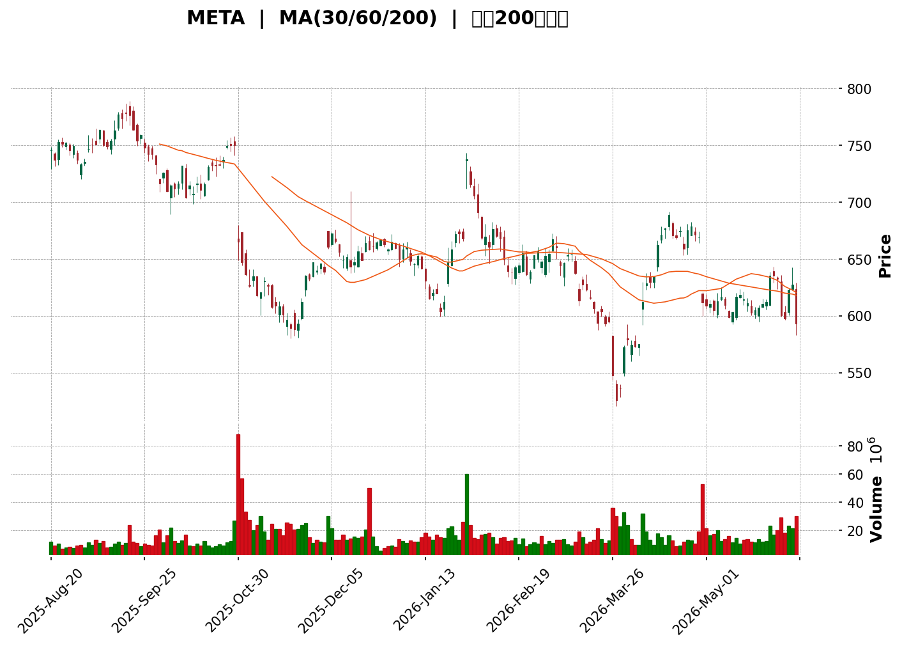
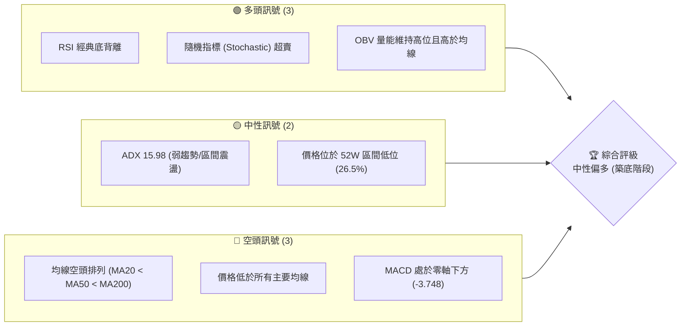
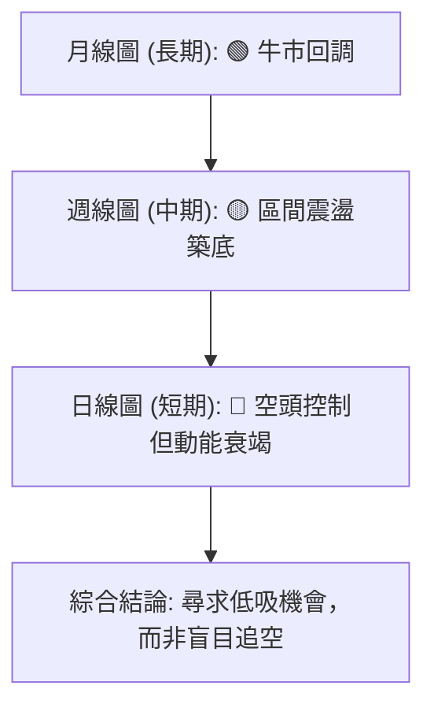
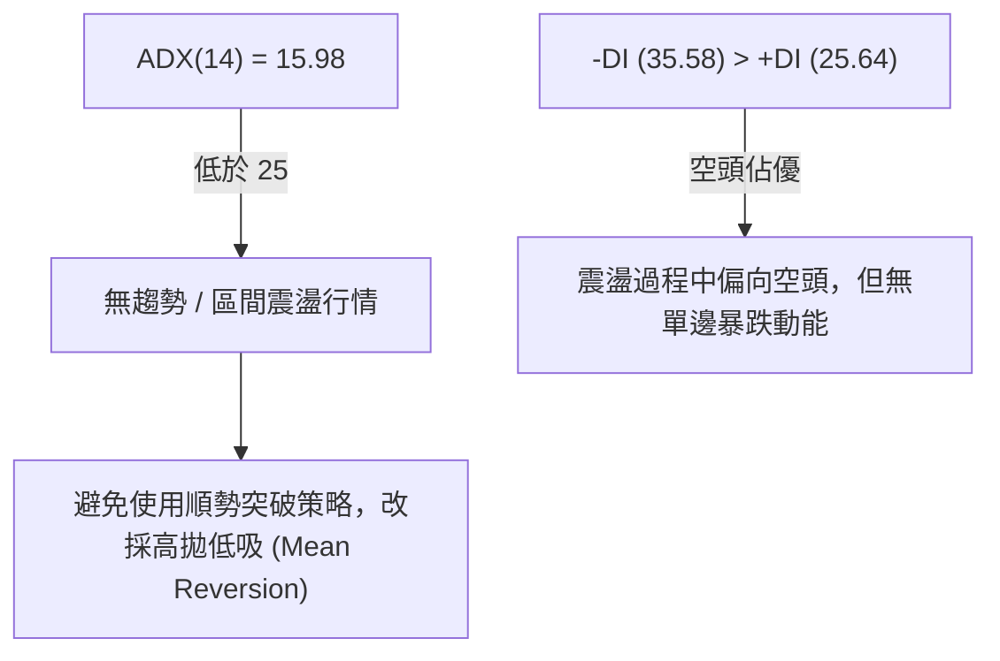
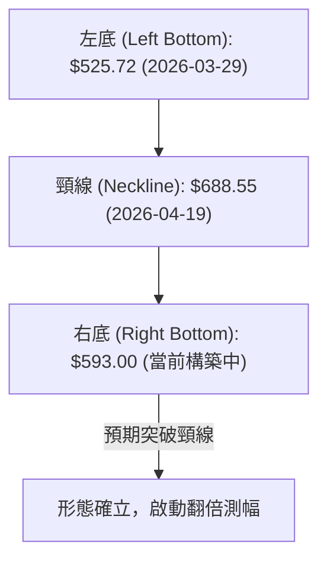

<details>
<summary>📊 靜態圖表 (點擊展開)</summary>

</details>

<html>
<head><meta charset="utf-8" /></head>
<body>
    <div style="height:500px; width:100%;">                        <script>window.PlotlyConfig = {MathJaxConfig: 'local'};</script>
        <script charset="utf-8" src="https://cdn.plot.ly/plotly-3.6.0.min.js" integrity="sha256-QaOVwtVY0T02VaHrr6pnoHLCwayMJp4O5n4YyaE3rJk=" crossorigin="anonymous"></script>                <div id="candlestick-chart" class="plotly-graph-div" style="height:100%; width:100%;"></div>            <script>                window.PLOTLYENV=window.PLOTLYENV || {};                                if (document.getElementById("candlestick-chart")) {                    Plotly.newPlot(                        "candlestick-chart",                        [{"close":{"dtype":"f8","bdata":"AAAAoL5Ph0AAAAAg8gqHQAAAAAAsiIdAAAAAoEd8h0AAAABAqoKHQAAAAAAITYdAAAAAAM1qh0AAAAAAwQeHQAAAAMAZ64ZAAAAAoJX6hkAAAADgKleHQAAAAAB\u002fdYdAAAAAYEx0h0AAAABgP9+HQAAAAKC+cYdAAAAAACBph0AAAACgjo6HQAAAACBE14dAAAAA4GVJiEAAAABAOC+IQAAAAABgU4hAAAAAIHNEiEAAAABAD9+HQAAAACAckYdAAAAAoB67h0AAAADARl2HQAAAAMAQNIdAAAAAIEUxh0AAAAAgO+mGQAAAAGAjYYZAAAAAQLCuhkAAAAAg\u002fSqGQAAAAIC4U4ZAAAAAgB0\u002fhkAAAADAIWWGQAAAAEBI4oZAAAAAoPoAhkAAAABAClSGQAAAAAC8G4ZAAAAAwNBihkAAAACADDeGQAAAAKDIXYZAAAAAgJTXhkAAAACgXeCGQAAAAMB74YZAAAAAIDLmhkAAAACABAmHQAAAAOCHbIdAAAAAoHtxh0AAAADAUXOHQAAAAKDbyoRAAAAAwCM6hEAAAACAKeWDQAAAAEAukoNAAAAAABvXg0AAAACgQE+DQAAAACBgZYNAAAAAQKS1g0AAAACgQ5CDQAAAAADy\u002f4JAAAAAQPkGg0AAAAAgigODQAAAAOAJyIJAAAAAYImlgkAAAADArGqCQAAAAKBUYYJAAAAAABCKgkAAAAAgNiCDQAAAAOBC2YNAAAAAoGrEg0AAAAAA8jaEQAAAAEBm\u002foNAAAAAACgwhEAAAACgQfSDQAAAAIBno4RAAAAAYF0ChUAAAABAfs2EQAAAAMDnfoRAAAAAIFtIhEAAAAAg9lyEQAAAACA8GYRAAAAAIKY3hEAAAAAAtISEQAAAACCOR4RAAAAAgA2\u002fhEAAAADgppGEQAAAACB5p4RAAAAAIPjChEAAAADg1NeEQAAAAODHtYRAAAAAIAORhEAAAADgCsuEQAAAAOAznIRAAAAAINROhEAAAADAz5GEQAAAAGBwoIRAAAAAoBRBhEAAAAAADyyEQAAAAMACZIRAAAAAwF0LhEAAAADAZrSDQAAAAKDyN4NAAAAAwCZig0AAAABgwV2DQAAAAGDT3IJAAAAAQHwjg0AAAACgmziEQAAAAGCSkYRAAAAAQEf+hEAAAACAJwOFQAAAAGBD4YRAAAAAYG0Nh0AAAADAGF+GQAAAAAByDoZAAAAAwN2YhUAAAACAV+OEQAAAAAAY7YRAAAAAQCenhEAAAAAAICWFQAAAAGAr8YRAAAAAoPHghEAAAACACEqEQAAAACDI+YNAAAAA4PH1g0AAAACgWxWEQAAAAODTIYRAAAAAAMt4hEAAAACgo+WDQAAAAGAG9oNAAAAA4AtphEAAAACAlYOEQAAAAAABPYRAAAAA4AFohEAAAABAKHSEQAAAACBF2YRAAAAAIAqghEAAAACAdyKEQAAAAICwNoRAAAAAgBVshEAAAAAAZnKEQAAAAKAS7YNAAAAA4Hopg0AAAACgmZuDQAAAAKBHdYNAAAAAoHA9g0AAAACgmfWCQAAAAKBHjYJAAAAA4HrggkAAAAAgXIeCQAAAAMAel4JAAAAA4FEcgUAAAACAwm2AQAAAAEAKw4BAAAAAQArhgUAAAAAA1xmCQAAAACCu84FAAAAAACnogUAAAABgZviBQAAAACBcI4NAAAAAwB6jg0AAAABA4a6DQAAAAIA91INAAAAAgOuzhEAAAADgo\u002fyEQAAAAMD1JoVAAAAAYGaEhUAAAACgR\u002feEQAAAAGC45oRAAAAAgMIVhUAAAABAM5mEQAAAAIA9GIVAAAAAwPU0hUAAAABguPqEQAAAAMD16IRAAAAAoEcfg0AAAAAAAAaDQAAAAKBHE4NAAAAAIK7ngkAAAABACieDQAAAAOB6RoNAAAAAQAoNg0AAAABA4baCQAAAAAAA2IJAAAAAQApFg0AAAACgcFODQAAAAADXMYNAAAAAIK4Zg0AAAABA4dSCQAAAAOB66IJAAAAAQAr7gkAAAACAFBKDQAAAAGC4IoNAAAAAgBTag0AAAADgUdqDQAAAAIAUxINAAAAAgMLDgkAAAABACq2CQAAAAADXd4NAAAAAYI+cg0AAAAAAAIiCQA=="},"high":{"dtype":"f8","bdata":"ZRWH2Yljh0AiCf2pBj6HQLZs+T8DmYdABYRXudCoh0DWwRuOz4iHQKb0uIMQg4dA6nXW0Eh6h0ChtT6gHUuHQHwpqzo08oZAYlMJ5R8Uh0AQbaw4A7uHQHdUuZtkoYdADvDAT7blh0DfAPk+CeSHQLQNGWo\u002f34dAQw3Dv5uah0Bu1rkfXJ6HQOCmeekMIohAezvizDtciEA2zfxMo2uIQLWPqJF0l4hAWnTQppOniEDK2ctJWIOIQHzx56WBCohANBUTtra+h0BZa3A\u002fDZyHQLMDT2dldYdAhqptIzZsh0CMp6wA1i2HQHvr71MohYZACheyaXC0hkCN8Q5bPM6GQLLBBvR2XYZALfpkF2dqhkCOso9vlnOGQAAAAEBI4oZAKT+6xFbwhkDtoElA53WGQD05xofXUoZAhB9Q6YeVhkCf33y8OqKGQPGw39W4aoZANJBb51vkhkDkFsu9IgqHQNwH+0noGodAi5cW\u002flwph0D2\u002fiuhxx+HQB5cNKTnk4dAVGxe8xGph0D1wjijI6+HQD8PMLSVPoVAWb1n\u002fxoOhUDYvT1S1ZGEQM9f1hBZBYRAA9SU5kIJhEAB7pEpgdeDQFjpVtC6aINA7vrOq4TPg0BqfhglEqSDQLhCxK2En4NAGNgCN\u002fNEg0DXG\u002fUxPiWDQI6t\u002f2VZFYNAGtMQdjfVgkD2uzgesJKCQF8TNcun7YJAneVMhPiogkCRSenkXD2DQObSYunj34NAcnblYVrqg0BW13tovjeEQFgyaqjwIYRAJAHvXU42hEB8iJP+IT6EQLIKKe7EF4VAzl09CIIMhUBHedMcpByFQEqEYen2uoRAXfXEZVZrhECCdy22fHGEQB+i5s+ALoZAQCrPAYhjhEBF1bMuya+EQAKGMJNQpYRAcfuTC+TvhEC+v+VyaPOEQHwDT9YHCIVAqnCRJHHLhEDjXXIF3tyEQIkgl7UF44RA7GNWRHudhEDqvdXDKP2EQBiVxuVyw4RAHFniwZK+hECdQjmtxb+EQPbsVgqbx4RAPyWTbLCUhEBnBZENXzSEQDkfVTAec4RAKlbEuUhrhEA6i9fJww2EQIVe1JhMn4NAny+KmBZ9g0CJFNPHVaSDQB7v8x4EF4NAhpV40u1Ng0D\u002fvV4UCqCEQLElFNVbz4RAvQ9MYp4VhUC8okah7SGFQF0Rx1HNKIVA1toAiOg6h0AHPCZsWdyGQLqeral2hYZAxyN\u002fzBdjhkBzegse7YGFQOPIqhhWR4VADucxLVL7hECng4a0zVWFQOyJKbqKQIVACMzq9oI1hUAeiWu+XxuFQHQuX1L7VoRAsWF582YQhEDmGasBliOEQJRfIEcXNYRAejY3p0K2hEAajKNsGYmEQIuzOxR+BIRAKWHIqpBqhEC8eZECeqOEQNIb3UoTR4RATIGV8gCbhEBmvwZQz5OEQFZrdUuOAYVAoTzXoALxhEATs3KsUEeEQC79iR6ROYRA+ynqleGdhECANnEJc5SEQPGvWimHZ4RANwnUyQ2lg0AAAAAAANaDQAAAAGBm5INAAAAAQDN1g0AAAAAAACiDQAAAACCu34JAAAAAwB4Fg0AAAAAAAMiCQAAAACBc3YJAAAAAAAA4gkAAAADAzPyAQAAAAGBm3IBAAAAAIIXtgUAAAABgZoSCQAAAAAAAFIJAAAAA4FE2gkAAAAAA1\u002fmBQAAAAKCZr4NAAAAAAADsg0AAAADgo\u002fSDQAAAAAAA2INAAAAAgBTShEAAAAAAADSFQAAAAOCjLIVAAAAAACmchUAAAABACluFQAAAAKCZIYVAAAAAQAozhUAAAADgeuyEQAAAACBcRYVAAAAAAABUhUAAAACgcDGFQAAAAAAAEoVAAAAAwMxmg0AAAABACleDQAAAAAAAMINAAAAAwMwyg0AAAACgmV+DQAAAAADXh4NAAAAAAClGg0AAAACgR+eCQAAAAAAA3oJAAAAAQDNfg0AAAAAA132DQAAAAKCZaYNAAAAAYLg8g0AAAACgcC+DQAAAAAAAAINAAAAAwMwMg0AAAADgejaDQAAAAIDCM4NAAAAAAAD0g0AAAAAAABiEQAAAAAAA1INAAAAAAADeg0AAAABACgeDQAAAAEAzgYNAAAAAQDMThEAAAABAM6mDQA=="},"hovertemplate":"\u003cb\u003e%{x|%Y-%m-%d}\u003c\u002fb\u003e\u003cbr\u003e\u958b: $%{open:.2f}\u003cbr\u003e\u9ad8: $%{high:.2f}\u003cbr\u003e\u4f4e: $%{low:.2f}\u003cbr\u003e\u6536: $%{close:.2f}\u003cextra\u003e\u003c\u002fextra\u003e","low":{"dtype":"f8","bdata":"5ny9WkzKhkCtt09eI9uGQA9Jv8Na5YZAzc8Ztvpih0CBXOgugFGHQKM45ujLKIdAdiAjmYMYh0ACDTUzBO2GQIlwj7RPgIZAk3H3binihkBstmqUlECHQLVCz3pGOodAYgntVxByh0CVodhAUX2HQLfI0lPsaYdA2xr6o+5Uh0AwQWOEIzCHQNWCkP3ScYdAd4JwU3Xah0A98zrHHeSHQFC9vE9iHIhAn2xaGRr7h0C+fwB8jNmHQKRbgw6HbodAr3+tTDB6h0Dom6lodDqHQDH2hWLzAIdAUzSEqFMPh0BVou\u002fgsqiGQD8udAodKIZA1hmmF4dnhkBw4aYs9CeGQKyTaF\u002fbioVAnvuhsJIEhkABkRqMBhWGQFChm+wAOoZAoKSIc6v6hUCs7sTvqhOGQPo6u35M0YVADZoGXpoihkBw9FFho\u002fWFQOtIMS6HB4ZAaY\u002fQ\u002f9F3hkCmEbkURLyGQNudD7ORloZA\u002fbvc8wHfhkAculwnb8+GQEva6psWVodA0ug0vjNCh0Aqv7ByKSqHQGUpIvysSIRAYaqG4e8jhEClQ1w78diDQFt+w9q3h4NAxBZybfOLg0DzU+K2vkeDQNS008KRwYJAW7rTrJ9Ig0CM+ZvL2FKDQCvzeL0K9oJAFLZoD\u002fLPgkDgxM5ippGCQDBMeTo\u002fk4JA6SVgUHE2gkBSv+ljPCKCQHMTYvUBM4JAG+TqnRsngkCV5gy6DqWCQOgvhQckSoNAIG5BZZq0g0AWqnHygtODQMojg6KP5YNAJWq7gAnog0AzsY1C4uODQDrgjm+Vl4RAa26Bt0WqhECtpWkqrb+EQGckxmD+YYRALrBiI5sShEBgTjga1\u002f2DQG4yi5dZ7INAG\u002fsrrzrxg0BfjVTQMhWEQDjWikYoRYRASAai\u002fy9\u002fhEDX+5+I74yEQKueIt+0gIRArm6cuH6NhEAMPm5\u002fEa2EQJrZfdMIpoRAPvaNSKRuhEC+cXHVN4qEQC6jjMMBl4RAOvsnm5gXhEAgnj03kTmEQFft5ya9WoRAOqU4LBEihEBTF4m9aNmDQHA+LINmEoRA4GXmi3MFhEC0u\u002f5eh3yDQNCN9TlaMoNAPqWu4qItg0D+UzyMZVyDQKexytfku4JAQZOrkIi8gkBUbnOuHJCDQEyOFJIwH4RA6kUjRculhEB0GP8uu8CEQApRmbs9zIRAz7SAAYY\u002fhkB3+hg51keGQNZgLHBY94VAdq+tBJVuhUCd+SrOHNeEQOipHSaHZ4RAdHS7VZMvhEBH5ZtOu5GEQKMKH2G86YRA3iQRjk2EhEDfqpQP0yWEQJt4Q5w30INApS+8wBiig0BnBcbG5pyDQIEw8P5m4YNAgn1Bct7xg0Dsp5jQpduDQFf7bBSJo4NAD6U9vLkMhEAcJg2pkTeEQIx4FcCX7INAa0tcZKjPg0CKclozWfKDQHKBE+DbiIRA7ep2mQdOhEC8IlPUhtyDQKa9AlzzkYNAq0PZAY9DhEB04iljcT6EQNfCCH7X4oNACZzgaToIg0AAAADAzHiDQAAAAKCZbYNAAAAAQOE0g0AAAACAFNKCQAAAAAAAWoJAAAAAgBS4gkAAAAAAAHiCQAAAAEAzi4JAAAAAwMz6gEAAAACAFEKAQAAAAOBRhIBAAAAAACkWgUAAAABgj+6BQAAAAKCZfYFAAAAAAADggUAAAACAFKaBQAAAAOCjfoJAAAAAAAB4g0AAAADgo4KDQAAAAEAzg4NAAAAAwPX6g0AAAACAwsGEQAAAAAAA3oRAAAAAQAoZhUAAAAAAAOCEQAAAAOCj2oRAAAAAAADuhEAAAABgZmiEQAAAAGC4boRAAAAAYLj2hEAAAABACs2EQAAAAOB6voRAAAAAAADAgkAAAABA4fCCQAAAAAAA1oJAAAAAQOHCgkAAAADAzLCCQAAAAOBRLINAAAAA4HrwgkAAAADgo7CCQAAAAMDMhIJAAAAAoEelgkAAAAAAADiDQAAAAOB6CoNAAAAAIIXdgkAAAABgZsSCQAAAAOB6roJAAAAA4HqWgkAAAACgmfeCQAAAAGBm6oJAAAAAAAAIg0AAAADgeqqDQAAAAMDMeoNAAAAAgD28gkAAAACgcKWCQAAAAAApwoJAAAAAoHBzg0AAAACgRzeCQA=="},"name":"\u50f9\u683c","open":{"dtype":"f8","bdata":"\u002fOA2OIxOh0ByvmyUuDeHQDoMO8r7C4dAUlXDVGmIh0CdBbS1U2iHQAOzTYRMdIdAJEsj3g0yh0BtNRBNRTyHQMVp+uW1ooZAcdfTSTTyhkDNLUtih1aHQPTNME\u002fadodAY\u002f+7PtSRh0DVkW2luJ2HQOTFTcay2odAVzxeAQ6Hh0CvIBwrzleHQGaPtbGPnYdAElhcdZ\u002fph0AjA7PCTFGIQAT\u002fy5ldV4hAk49ha56EiED6jjROW2SIQGYAroO5\u002f4dA4DAizuGhh0Depbg5iYGHQGGFzmD7ZYdAxPvVLsJbh0Cuuej2FSiHQCmZEk9IgoZAG\u002fjwCP2KhkBDFFZKS8OGQFTnDM0ZAIZAV6o5QixkhkBjN\u002fACEkKGQMgFRVSlaIZAP5CtxJjNhkClDdhSjj6GQMnrlznJFIZA6VHt7OZehkCQ2vbC0GKGQOq2zAUyD4ZAZsCrC+N\u002fhkA\u002fULY4VPaGQBLFTJDW5IZAn2Q5W8nrhkAzKlV+evyGQOInOjrTY4dA7iBNrvx6h0ACe7wX64uHQOhlBjZD4IRAwrUNDBILhUD1YkfVPHeEQFT+vUnul4NAzklusgi6g0AbAedsTtaDQI5itVmvO4NAqLJ7akqwg0AjU6yanJeDQF1hll6mmINAZftIAF8gg0BrgiMaSMaCQHME3jUvAINAaSEH0+V0gkDSS6k\u002f1IWCQOsh+03w04JAngFpqSNcgkCA2e8\u002fw62CQHfenCmqd4NATZFkjADlg0Ad+7XWJNiDQPQvjGPb84NAGifO5iMKhEAdgVcNrBqEQKCYrIX4FoVACqgkdiG3hEAQvneQx+GEQOjx2FZLtYRAV4WQHetGhED9GHIWuhGEQGW7NnS4RYRAmMjCay4phED5h8qpmBeEQG1ct6tkeIRAi9T5X76DhEBMzQSZzM6EQMdrtxysqIRAdgxH8eGbhEAjh2vLtK+EQIdkvoTo24RAx3H6sJOLhEDWkTcYA5GEQDvn51VzwYRAKeBq6k2xhEBtqC4BoFOEQPBe69YLmIRAPHrZEqJ4hEAuMLqwniqEQKImjVkaJ4RA886bP8ZfhEA6i9fJww2EQLSfa2O2j4NAEweJcJtPg0Bh5W8dK32DQELNqEnh+oJAB6+thcTxgkDa4aUmfqaDQE9UjmK\u002fIYRAOnvN6nzEhEBUgGmJGhCFQPADDkRiD4VAztmvqmQGh0BZkJh6BbeGQMaGs8boT4ZAfX26ax4WhkCuEWUrInmFQKQ5bV0ZuIRAHPeDkF3HhEBWqie55rSEQPZZLJIpKIVAzl1+MmMLhUAW4r3OLOuEQEWGdIliJIRAez\u002fOoZ\u002f3g0BXLM0AEMqDQANFMqEw8INAIoUneiT5g0AWt8u22l+EQOAZmcVOxINAVBtRzdcPhEDoLzGx8k+EQE9\u002fekkyF4RA5oteW+vkg0Bt6DYl4j2EQFwl\u002fV0ti4RAzQER\u002fuiqhEAxWI8sxDqEQCzJ11fl0YNACgG85AFohEDsdNZsmXGEQKa4nHuPQYRAwQcGqtl6g0AAAAAAAMCDQAAAAIDrn4NAAAAAYLhCg0AAAABAMyGDQAAAAIA93IJAAAAA4FHugkAAAADAzLiCQAAAAIDrtYJAAAAAgOszgkAAAADAzOCAQAAAAEAKw4BAAAAAANcvgUAAAABACiGCQAAAAOBRsIFAAAAAIIUNgkAAAAAA1+OBQAAAAAAA8IJAAAAAgMKXg0AAAACAwtODQAAAAAAArINAAAAAgMIZhEAAAAAAANiEQAAAAIDrH4VAAAAAwMw0hUAAAABA4UqFQAAAAAAA+IRAAAAAQOEShUAAAACgmb2EQAAAAGCPooRAAAAAAAD4hEAAAACA6xGFQAAAAKBH54RAAAAAYI9ag0AAAAAghTWDQAAAACCF\u002f4JAAAAA4Hoqg0AAAABgZsiCQAAAAIDCNYNAAAAAoJk5g0AAAABgj+SCQAAAAGCPloJAAAAA4KO2gkAAAAAAAECDQAAAAIDrL4NAAAAAQOEIg0AAAAAgXAeDQAAAAIAUxoJAAAAAAADAgkAAAABACv+CQAAAAMAeB4NAAAAAQDMLg0AAAAAAAPyDQAAAAAAAzINAAAAAQDOzg0AAAACA69mCQAAAAAAA2IJAAAAAIFx9g0AAAAAgrnuDQA=="},"x":["2025-08-20T00:00:00-04:00","2025-08-21T00:00:00-04:00","2025-08-22T00:00:00-04:00","2025-08-25T00:00:00-04:00","2025-08-26T00:00:00-04:00","2025-08-27T00:00:00-04:00","2025-08-28T00:00:00-04:00","2025-08-29T00:00:00-04:00","2025-09-02T00:00:00-04:00","2025-09-03T00:00:00-04:00","2025-09-04T00:00:00-04:00","2025-09-05T00:00:00-04:00","2025-09-08T00:00:00-04:00","2025-09-09T00:00:00-04:00","2025-09-10T00:00:00-04:00","2025-09-11T00:00:00-04:00","2025-09-12T00:00:00-04:00","2025-09-15T00:00:00-04:00","2025-09-16T00:00:00-04:00","2025-09-17T00:00:00-04:00","2025-09-18T00:00:00-04:00","2025-09-19T00:00:00-04:00","2025-09-22T00:00:00-04:00","2025-09-23T00:00:00-04:00","2025-09-24T00:00:00-04:00","2025-09-25T00:00:00-04:00","2025-09-26T00:00:00-04:00","2025-09-29T00:00:00-04:00","2025-09-30T00:00:00-04:00","2025-10-01T00:00:00-04:00","2025-10-02T00:00:00-04:00","2025-10-03T00:00:00-04:00","2025-10-06T00:00:00-04:00","2025-10-07T00:00:00-04:00","2025-10-08T00:00:00-04:00","2025-10-09T00:00:00-04:00","2025-10-10T00:00:00-04:00","2025-10-13T00:00:00-04:00","2025-10-14T00:00:00-04:00","2025-10-15T00:00:00-04:00","2025-10-16T00:00:00-04:00","2025-10-17T00:00:00-04:00","2025-10-20T00:00:00-04:00","2025-10-21T00:00:00-04:00","2025-10-22T00:00:00-04:00","2025-10-23T00:00:00-04:00","2025-10-24T00:00:00-04:00","2025-10-27T00:00:00-04:00","2025-10-28T00:00:00-04:00","2025-10-29T00:00:00-04:00","2025-10-30T00:00:00-04:00","2025-10-31T00:00:00-04:00","2025-11-03T00:00:00-05:00","2025-11-04T00:00:00-05:00","2025-11-05T00:00:00-05:00","2025-11-06T00:00:00-05:00","2025-11-07T00:00:00-05:00","2025-11-10T00:00:00-05:00","2025-11-11T00:00:00-05:00","2025-11-12T00:00:00-05:00","2025-11-13T00:00:00-05:00","2025-11-14T00:00:00-05:00","2025-11-17T00:00:00-05:00","2025-11-18T00:00:00-05:00","2025-11-19T00:00:00-05:00","2025-11-20T00:00:00-05:00","2025-11-21T00:00:00-05:00","2025-11-24T00:00:00-05:00","2025-11-25T00:00:00-05:00","2025-11-26T00:00:00-05:00","2025-11-28T00:00:00-05:00","2025-12-01T00:00:00-05:00","2025-12-02T00:00:00-05:00","2025-12-03T00:00:00-05:00","2025-12-04T00:00:00-05:00","2025-12-05T00:00:00-05:00","2025-12-08T00:00:00-05:00","2025-12-09T00:00:00-05:00","2025-12-10T00:00:00-05:00","2025-12-11T00:00:00-05:00","2025-12-12T00:00:00-05:00","2025-12-15T00:00:00-05:00","2025-12-16T00:00:00-05:00","2025-12-17T00:00:00-05:00","2025-12-18T00:00:00-05:00","2025-12-19T00:00:00-05:00","2025-12-22T00:00:00-05:00","2025-12-23T00:00:00-05:00","2025-12-24T00:00:00-05:00","2025-12-26T00:00:00-05:00","2025-12-29T00:00:00-05:00","2025-12-30T00:00:00-05:00","2025-12-31T00:00:00-05:00","2026-01-02T00:00:00-05:00","2026-01-05T00:00:00-05:00","2026-01-06T00:00:00-05:00","2026-01-07T00:00:00-05:00","2026-01-08T00:00:00-05:00","2026-01-09T00:00:00-05:00","2026-01-12T00:00:00-05:00","2026-01-13T00:00:00-05:00","2026-01-14T00:00:00-05:00","2026-01-15T00:00:00-05:00","2026-01-16T00:00:00-05:00","2026-01-20T00:00:00-05:00","2026-01-21T00:00:00-05:00","2026-01-22T00:00:00-05:00","2026-01-23T00:00:00-05:00","2026-01-26T00:00:00-05:00","2026-01-27T00:00:00-05:00","2026-01-28T00:00:00-05:00","2026-01-29T00:00:00-05:00","2026-01-30T00:00:00-05:00","2026-02-02T00:00:00-05:00","2026-02-03T00:00:00-05:00","2026-02-04T00:00:00-05:00","2026-02-05T00:00:00-05:00","2026-02-06T00:00:00-05:00","2026-02-09T00:00:00-05:00","2026-02-10T00:00:00-05:00","2026-02-11T00:00:00-05:00","2026-02-12T00:00:00-05:00","2026-02-13T00:00:00-05:00","2026-02-17T00:00:00-05:00","2026-02-18T00:00:00-05:00","2026-02-19T00:00:00-05:00","2026-02-20T00:00:00-05:00","2026-02-23T00:00:00-05:00","2026-02-24T00:00:00-05:00","2026-02-25T00:00:00-05:00","2026-02-26T00:00:00-05:00","2026-02-27T00:00:00-05:00","2026-03-02T00:00:00-05:00","2026-03-03T00:00:00-05:00","2026-03-04T00:00:00-05:00","2026-03-05T00:00:00-05:00","2026-03-06T00:00:00-05:00","2026-03-09T00:00:00-04:00","2026-03-10T00:00:00-04:00","2026-03-11T00:00:00-04:00","2026-03-12T00:00:00-04:00","2026-03-13T00:00:00-04:00","2026-03-16T00:00:00-04:00","2026-03-17T00:00:00-04:00","2026-03-18T00:00:00-04:00","2026-03-19T00:00:00-04:00","2026-03-20T00:00:00-04:00","2026-03-23T00:00:00-04:00","2026-03-24T00:00:00-04:00","2026-03-25T00:00:00-04:00","2026-03-26T00:00:00-04:00","2026-03-27T00:00:00-04:00","2026-03-30T00:00:00-04:00","2026-03-31T00:00:00-04:00","2026-04-01T00:00:00-04:00","2026-04-02T00:00:00-04:00","2026-04-06T00:00:00-04:00","2026-04-07T00:00:00-04:00","2026-04-08T00:00:00-04:00","2026-04-09T00:00:00-04:00","2026-04-10T00:00:00-04:00","2026-04-13T00:00:00-04:00","2026-04-14T00:00:00-04:00","2026-04-15T00:00:00-04:00","2026-04-16T00:00:00-04:00","2026-04-17T00:00:00-04:00","2026-04-20T00:00:00-04:00","2026-04-21T00:00:00-04:00","2026-04-22T00:00:00-04:00","2026-04-23T00:00:00-04:00","2026-04-24T00:00:00-04:00","2026-04-27T00:00:00-04:00","2026-04-28T00:00:00-04:00","2026-04-29T00:00:00-04:00","2026-04-30T00:00:00-04:00","2026-05-01T00:00:00-04:00","2026-05-04T00:00:00-04:00","2026-05-05T00:00:00-04:00","2026-05-06T00:00:00-04:00","2026-05-07T00:00:00-04:00","2026-05-08T00:00:00-04:00","2026-05-11T00:00:00-04:00","2026-05-12T00:00:00-04:00","2026-05-13T00:00:00-04:00","2026-05-14T00:00:00-04:00","2026-05-15T00:00:00-04:00","2026-05-18T00:00:00-04:00","2026-05-19T00:00:00-04:00","2026-05-20T00:00:00-04:00","2026-05-21T00:00:00-04:00","2026-05-22T00:00:00-04:00","2026-05-26T00:00:00-04:00","2026-05-27T00:00:00-04:00","2026-05-28T00:00:00-04:00","2026-05-29T00:00:00-04:00","2026-06-01T00:00:00-04:00","2026-06-02T00:00:00-04:00","2026-06-03T00:00:00-04:00","2026-06-04T00:00:00-04:00","2026-06-05T00:00:00-04:00"],"type":"candlestick"},{"hovertemplate":"MA30: $%{y:.2f}\u003cextra\u003e\u003c\u002fextra\u003e","line":{"color":"#2196F3","dash":"dash","width":2},"mode":"lines","name":"MA30","x":["2025-08-20T00:00:00-04:00","2025-08-21T00:00:00-04:00","2025-08-22T00:00:00-04:00","2025-08-25T00:00:00-04:00","2025-08-26T00:00:00-04:00","2025-08-27T00:00:00-04:00","2025-08-28T00:00:00-04:00","2025-08-29T00:00:00-04:00","2025-09-02T00:00:00-04:00","2025-09-03T00:00:00-04:00","2025-09-04T00:00:00-04:00","2025-09-05T00:00:00-04:00","2025-09-08T00:00:00-04:00","2025-09-09T00:00:00-04:00","2025-09-10T00:00:00-04:00","2025-09-11T00:00:00-04:00","2025-09-12T00:00:00-04:00","2025-09-15T00:00:00-04:00","2025-09-16T00:00:00-04:00","2025-09-17T00:00:00-04:00","2025-09-18T00:00:00-04:00","2025-09-19T00:00:00-04:00","2025-09-22T00:00:00-04:00","2025-09-23T00:00:00-04:00","2025-09-24T00:00:00-04:00","2025-09-25T00:00:00-04:00","2025-09-26T00:00:00-04:00","2025-09-29T00:00:00-04:00","2025-09-30T00:00:00-04:00","2025-10-01T00:00:00-04:00","2025-10-02T00:00:00-04:00","2025-10-03T00:00:00-04:00","2025-10-06T00:00:00-04:00","2025-10-07T00:00:00-04:00","2025-10-08T00:00:00-04:00","2025-10-09T00:00:00-04:00","2025-10-10T00:00:00-04:00","2025-10-13T00:00:00-04:00","2025-10-14T00:00:00-04:00","2025-10-15T00:00:00-04:00","2025-10-16T00:00:00-04:00","2025-10-17T00:00:00-04:00","2025-10-20T00:00:00-04:00","2025-10-21T00:00:00-04:00","2025-10-22T00:00:00-04:00","2025-10-23T00:00:00-04:00","2025-10-24T00:00:00-04:00","2025-10-27T00:00:00-04:00","2025-10-28T00:00:00-04:00","2025-10-29T00:00:00-04:00","2025-10-30T00:00:00-04:00","2025-10-31T00:00:00-04:00","2025-11-03T00:00:00-05:00","2025-11-04T00:00:00-05:00","2025-11-05T00:00:00-05:00","2025-11-06T00:00:00-05:00","2025-11-07T00:00:00-05:00","2025-11-10T00:00:00-05:00","2025-11-11T00:00:00-05:00","2025-11-12T00:00:00-05:00","2025-11-13T00:00:00-05:00","2025-11-14T00:00:00-05:00","2025-11-17T00:00:00-05:00","2025-11-18T00:00:00-05:00","2025-11-19T00:00:00-05:00","2025-11-20T00:00:00-05:00","2025-11-21T00:00:00-05:00","2025-11-24T00:00:00-05:00","2025-11-25T00:00:00-05:00","2025-11-26T00:00:00-05:00","2025-11-28T00:00:00-05:00","2025-12-01T00:00:00-05:00","2025-12-02T00:00:00-05:00","2025-12-03T00:00:00-05:00","2025-12-04T00:00:00-05:00","2025-12-05T00:00:00-05:00","2025-12-08T00:00:00-05:00","2025-12-09T00:00:00-05:00","2025-12-10T00:00:00-05:00","2025-12-11T00:00:00-05:00","2025-12-12T00:00:00-05:00","2025-12-15T00:00:00-05:00","2025-12-16T00:00:00-05:00","2025-12-17T00:00:00-05:00","2025-12-18T00:00:00-05:00","2025-12-19T00:00:00-05:00","2025-12-22T00:00:00-05:00","2025-12-23T00:00:00-05:00","2025-12-24T00:00:00-05:00","2025-12-26T00:00:00-05:00","2025-12-29T00:00:00-05:00","2025-12-30T00:00:00-05:00","2025-12-31T00:00:00-05:00","2026-01-02T00:00:00-05:00","2026-01-05T00:00:00-05:00","2026-01-06T00:00:00-05:00","2026-01-07T00:00:00-05:00","2026-01-08T00:00:00-05:00","2026-01-09T00:00:00-05:00","2026-01-12T00:00:00-05:00","2026-01-13T00:00:00-05:00","2026-01-14T00:00:00-05:00","2026-01-15T00:00:00-05:00","2026-01-16T00:00:00-05:00","2026-01-20T00:00:00-05:00","2026-01-21T00:00:00-05:00","2026-01-22T00:00:00-05:00","2026-01-23T00:00:00-05:00","2026-01-26T00:00:00-05:00","2026-01-27T00:00:00-05:00","2026-01-28T00:00:00-05:00","2026-01-29T00:00:00-05:00","2026-01-30T00:00:00-05:00","2026-02-02T00:00:00-05:00","2026-02-03T00:00:00-05:00","2026-02-04T00:00:00-05:00","2026-02-05T00:00:00-05:00","2026-02-06T00:00:00-05:00","2026-02-09T00:00:00-05:00","2026-02-10T00:00:00-05:00","2026-02-11T00:00:00-05:00","2026-02-12T00:00:00-05:00","2026-02-13T00:00:00-05:00","2026-02-17T00:00:00-05:00","2026-02-18T00:00:00-05:00","2026-02-19T00:00:00-05:00","2026-02-20T00:00:00-05:00","2026-02-23T00:00:00-05:00","2026-02-24T00:00:00-05:00","2026-02-25T00:00:00-05:00","2026-02-26T00:00:00-05:00","2026-02-27T00:00:00-05:00","2026-03-02T00:00:00-05:00","2026-03-03T00:00:00-05:00","2026-03-04T00:00:00-05:00","2026-03-05T00:00:00-05:00","2026-03-06T00:00:00-05:00","2026-03-09T00:00:00-04:00","2026-03-10T00:00:00-04:00","2026-03-11T00:00:00-04:00","2026-03-12T00:00:00-04:00","2026-03-13T00:00:00-04:00","2026-03-16T00:00:00-04:00","2026-03-17T00:00:00-04:00","2026-03-18T00:00:00-04:00","2026-03-19T00:00:00-04:00","2026-03-20T00:00:00-04:00","2026-03-23T00:00:00-04:00","2026-03-24T00:00:00-04:00","2026-03-25T00:00:00-04:00","2026-03-26T00:00:00-04:00","2026-03-27T00:00:00-04:00","2026-03-30T00:00:00-04:00","2026-03-31T00:00:00-04:00","2026-04-01T00:00:00-04:00","2026-04-02T00:00:00-04:00","2026-04-06T00:00:00-04:00","2026-04-07T00:00:00-04:00","2026-04-08T00:00:00-04:00","2026-04-09T00:00:00-04:00","2026-04-10T00:00:00-04:00","2026-04-13T00:00:00-04:00","2026-04-14T00:00:00-04:00","2026-04-15T00:00:00-04:00","2026-04-16T00:00:00-04:00","2026-04-17T00:00:00-04:00","2026-04-20T00:00:00-04:00","2026-04-21T00:00:00-04:00","2026-04-22T00:00:00-04:00","2026-04-23T00:00:00-04:00","2026-04-24T00:00:00-04:00","2026-04-27T00:00:00-04:00","2026-04-28T00:00:00-04:00","2026-04-29T00:00:00-04:00","2026-04-30T00:00:00-04:00","2026-05-01T00:00:00-04:00","2026-05-04T00:00:00-04:00","2026-05-05T00:00:00-04:00","2026-05-06T00:00:00-04:00","2026-05-07T00:00:00-04:00","2026-05-08T00:00:00-04:00","2026-05-11T00:00:00-04:00","2026-05-12T00:00:00-04:00","2026-05-13T00:00:00-04:00","2026-05-14T00:00:00-04:00","2026-05-15T00:00:00-04:00","2026-05-18T00:00:00-04:00","2026-05-19T00:00:00-04:00","2026-05-20T00:00:00-04:00","2026-05-21T00:00:00-04:00","2026-05-22T00:00:00-04:00","2026-05-26T00:00:00-04:00","2026-05-27T00:00:00-04:00","2026-05-28T00:00:00-04:00","2026-05-29T00:00:00-04:00","2026-06-01T00:00:00-04:00","2026-06-02T00:00:00-04:00","2026-06-03T00:00:00-04:00","2026-06-04T00:00:00-04:00","2026-06-05T00:00:00-04:00"],"y":{"dtype":"f8","bdata":"AAAAAAAA+H8AAAAAAAD4fwAAAAAAAPh\u002fAAAAAAAA+H8AAAAAAAD4fwAAAAAAAPh\u002fAAAAAAAA+H8AAAAAAAD4fwAAAAAAAPh\u002fAAAAAAAA+H8AAAAAAAD4fwAAAAAAAPh\u002fAAAAAAAA+H8AAAAAAAD4fwAAAAAAAPh\u002fAAAAAAAA+H8AAAAAAAD4fwAAAAAAAPh\u002fAAAAAAAA+H8AAAAAAAD4fwAAAAAAAPh\u002fAAAAAAAA+H8AAAAAAAD4fwAAAAAAAPh\u002fAAAAAAAA+H8AAAAAAAD4fwAAAAAAAPh\u002fAAAAAAAA+H8AAAAAAAD4f6uqqvoWeYdAIiIiorhzh0CJiIiIQWyHQKuqqmr5YYdAIiIi8mZXh0BVVVVl4k2HQImIiHhTSodAzczM7EM+h0De3d1dRjiHQHd3d9dcMYdA7+7uvk0sh0AiIiIisyKHQBEREUFgGYdAzczM7CYUh0Dv7u7upwuHQHd3d+fYBodAREREpHsCh0CrqqoaCP6GQLy7u0t5+oZAIiIi0kbzhkB3d3dnA+2GQLy7u9vczoZA7+7uvmKshkAAAACwdIqGQBEREbFbaIZA7+7uXihHhkARERGRjiSGQGZmZjYRBIZAZmZmpljmhUDe3d3dx8mFQDMzM+PwrIVA7+7uHsCNhUAzMzPj1XKFQFVVVVWUVIVAIiIiMtw1hUDNzMxc6ROFQHd3d9d67YRAzczMfOrPhEDe3d2dlrSEQAAAAFBOoYRAMzMzk\u002fWKhEAAAACg43mEQM3MzJykZYRAzczM3P5OhEDv7u7+DjaEQAAAADDsIoRA7+7ufssShEDNzMx8vv+DQO\u002fu7q7B5oNAIiIiIsnLg0Dv7u6+cLGDQHd3dweFq4NAZmZmxm+rg0ARERExwbCDQLy7u+vMtoNARERENIi+g0CJiIhYR8mDQJqZmekD1INAzczMLP7cg0Crqqpq6eeDQM3MzJyB9oNAMzMzE6QDhECJiIgI0xKEQImIiAhuIoRAERERMZswhECamZk5+kKEQBEREdElVoRAq6qqGshkhEC8u7u7tW2EQKuqqrpVcoRAq6qqKrN0hEARERExWXCEQM3MzLy7aYRARERE1N1ihEDe3d2N2V2EQLy7u3uyToRAvLu7C7w+hEDv7u6OxTmEQImIiNhkOoRAAAAAQHVAhEDe3d1t\u002f0WEQGZmZlaqTIRAVVVVpdtkhEDe3d3Nq3SEQImIiIjVg4RAVVVVNRiLhEC8u7tL0Y2EQERERGQjkIRAd3d3BzaPhECamZmZyZGEQCIiImLEk4RAd3d3d26WhEBmZmaWIZKEQImIiJi3jIRA7+7uHsGJhEDe3d0dm4WEQDMzM7NigYRAzczMHD6DhEAzMzMz5YCEQHd3d6c6fYRA7+7uDlqAhEBEREQEQoeEQCIiIrL1j4RAMzMzM7CYhEBVVVXl96GEQO\u002fu7p7qsoRAREREBJq\u002fhEBEREQU3b6EQM3MzIzVu4RAZmZmBva2hEBmZmbGIrKEQERERAT\u002fqYRARERERMyIhEBmZmb2NnGEQCIiIuIKW4RAVVVVpe1GhEAiIiJieDaEQERERLQ1IoRAMzMz0w0ThEDv7u5+uvyDQCIiIgKp6INAzczMjIHIg0CJiIhIkKeDQN7d3Y0jjINAmpmZGWB6g0B3d3dHdWmDQLy7u2vaVoNAd3d3J\u002fdAg0De3d0thjCDQBEREYGAKYNAiYiIiOcig0BVVVV10BuDQJqZmXlSGINAMzMzQ9oag0CrqqrqZh+DQO\u002fu7t79IYNAvLu7i5opg0DNzMyMsjCDQN7d3a2QNoNARERElDg8g0AAAACwgz2DQFVVVZV8R4NAzczMnO9Yg0BmZmbWo2SDQCIiIoIHcYNAREREJAZwg0BmZmYWknCDQN7d3Y0JdYNA7+7u\u002fkZ1g0CamZmZmXqDQBEREQFygINA7+7urgCRg0BVVVW1gaSDQCIiIqJFtoNAAAAAgCPCg0De3d2Nl8yDQERERIQy14NA7+7unmHhg0DNzMwMu+iDQLy7u5vE5oNAMzMzUyrhg0DNzMxM8NuDQGZmZnYF1oNAAAAAkMLOg0CamZkpFcWDQKuqqtpAuYNAzczM7MOhg0CJiIhYOY6DQCIiIqL+gYNAzczM3Gt1g0BVVVUFyGODQA=="},"type":"scatter"},{"hovertemplate":"MA60: $%{y:.2f}\u003cextra\u003e\u003c\u002fextra\u003e","line":{"color":"#9C27B0","dash":"dash","width":2},"mode":"lines","name":"MA60","x":["2025-08-20T00:00:00-04:00","2025-08-21T00:00:00-04:00","2025-08-22T00:00:00-04:00","2025-08-25T00:00:00-04:00","2025-08-26T00:00:00-04:00","2025-08-27T00:00:00-04:00","2025-08-28T00:00:00-04:00","2025-08-29T00:00:00-04:00","2025-09-02T00:00:00-04:00","2025-09-03T00:00:00-04:00","2025-09-04T00:00:00-04:00","2025-09-05T00:00:00-04:00","2025-09-08T00:00:00-04:00","2025-09-09T00:00:00-04:00","2025-09-10T00:00:00-04:00","2025-09-11T00:00:00-04:00","2025-09-12T00:00:00-04:00","2025-09-15T00:00:00-04:00","2025-09-16T00:00:00-04:00","2025-09-17T00:00:00-04:00","2025-09-18T00:00:00-04:00","2025-09-19T00:00:00-04:00","2025-09-22T00:00:00-04:00","2025-09-23T00:00:00-04:00","2025-09-24T00:00:00-04:00","2025-09-25T00:00:00-04:00","2025-09-26T00:00:00-04:00","2025-09-29T00:00:00-04:00","2025-09-30T00:00:00-04:00","2025-10-01T00:00:00-04:00","2025-10-02T00:00:00-04:00","2025-10-03T00:00:00-04:00","2025-10-06T00:00:00-04:00","2025-10-07T00:00:00-04:00","2025-10-08T00:00:00-04:00","2025-10-09T00:00:00-04:00","2025-10-10T00:00:00-04:00","2025-10-13T00:00:00-04:00","2025-10-14T00:00:00-04:00","2025-10-15T00:00:00-04:00","2025-10-16T00:00:00-04:00","2025-10-17T00:00:00-04:00","2025-10-20T00:00:00-04:00","2025-10-21T00:00:00-04:00","2025-10-22T00:00:00-04:00","2025-10-23T00:00:00-04:00","2025-10-24T00:00:00-04:00","2025-10-27T00:00:00-04:00","2025-10-28T00:00:00-04:00","2025-10-29T00:00:00-04:00","2025-10-30T00:00:00-04:00","2025-10-31T00:00:00-04:00","2025-11-03T00:00:00-05:00","2025-11-04T00:00:00-05:00","2025-11-05T00:00:00-05:00","2025-11-06T00:00:00-05:00","2025-11-07T00:00:00-05:00","2025-11-10T00:00:00-05:00","2025-11-11T00:00:00-05:00","2025-11-12T00:00:00-05:00","2025-11-13T00:00:00-05:00","2025-11-14T00:00:00-05:00","2025-11-17T00:00:00-05:00","2025-11-18T00:00:00-05:00","2025-11-19T00:00:00-05:00","2025-11-20T00:00:00-05:00","2025-11-21T00:00:00-05:00","2025-11-24T00:00:00-05:00","2025-11-25T00:00:00-05:00","2025-11-26T00:00:00-05:00","2025-11-28T00:00:00-05:00","2025-12-01T00:00:00-05:00","2025-12-02T00:00:00-05:00","2025-12-03T00:00:00-05:00","2025-12-04T00:00:00-05:00","2025-12-05T00:00:00-05:00","2025-12-08T00:00:00-05:00","2025-12-09T00:00:00-05:00","2025-12-10T00:00:00-05:00","2025-12-11T00:00:00-05:00","2025-12-12T00:00:00-05:00","2025-12-15T00:00:00-05:00","2025-12-16T00:00:00-05:00","2025-12-17T00:00:00-05:00","2025-12-18T00:00:00-05:00","2025-12-19T00:00:00-05:00","2025-12-22T00:00:00-05:00","2025-12-23T00:00:00-05:00","2025-12-24T00:00:00-05:00","2025-12-26T00:00:00-05:00","2025-12-29T00:00:00-05:00","2025-12-30T00:00:00-05:00","2025-12-31T00:00:00-05:00","2026-01-02T00:00:00-05:00","2026-01-05T00:00:00-05:00","2026-01-06T00:00:00-05:00","2026-01-07T00:00:00-05:00","2026-01-08T00:00:00-05:00","2026-01-09T00:00:00-05:00","2026-01-12T00:00:00-05:00","2026-01-13T00:00:00-05:00","2026-01-14T00:00:00-05:00","2026-01-15T00:00:00-05:00","2026-01-16T00:00:00-05:00","2026-01-20T00:00:00-05:00","2026-01-21T00:00:00-05:00","2026-01-22T00:00:00-05:00","2026-01-23T00:00:00-05:00","2026-01-26T00:00:00-05:00","2026-01-27T00:00:00-05:00","2026-01-28T00:00:00-05:00","2026-01-29T00:00:00-05:00","2026-01-30T00:00:00-05:00","2026-02-02T00:00:00-05:00","2026-02-03T00:00:00-05:00","2026-02-04T00:00:00-05:00","2026-02-05T00:00:00-05:00","2026-02-06T00:00:00-05:00","2026-02-09T00:00:00-05:00","2026-02-10T00:00:00-05:00","2026-02-11T00:00:00-05:00","2026-02-12T00:00:00-05:00","2026-02-13T00:00:00-05:00","2026-02-17T00:00:00-05:00","2026-02-18T00:00:00-05:00","2026-02-19T00:00:00-05:00","2026-02-20T00:00:00-05:00","2026-02-23T00:00:00-05:00","2026-02-24T00:00:00-05:00","2026-02-25T00:00:00-05:00","2026-02-26T00:00:00-05:00","2026-02-27T00:00:00-05:00","2026-03-02T00:00:00-05:00","2026-03-03T00:00:00-05:00","2026-03-04T00:00:00-05:00","2026-03-05T00:00:00-05:00","2026-03-06T00:00:00-05:00","2026-03-09T00:00:00-04:00","2026-03-10T00:00:00-04:00","2026-03-11T00:00:00-04:00","2026-03-12T00:00:00-04:00","2026-03-13T00:00:00-04:00","2026-03-16T00:00:00-04:00","2026-03-17T00:00:00-04:00","2026-03-18T00:00:00-04:00","2026-03-19T00:00:00-04:00","2026-03-20T00:00:00-04:00","2026-03-23T00:00:00-04:00","2026-03-24T00:00:00-04:00","2026-03-25T00:00:00-04:00","2026-03-26T00:00:00-04:00","2026-03-27T00:00:00-04:00","2026-03-30T00:00:00-04:00","2026-03-31T00:00:00-04:00","2026-04-01T00:00:00-04:00","2026-04-02T00:00:00-04:00","2026-04-06T00:00:00-04:00","2026-04-07T00:00:00-04:00","2026-04-08T00:00:00-04:00","2026-04-09T00:00:00-04:00","2026-04-10T00:00:00-04:00","2026-04-13T00:00:00-04:00","2026-04-14T00:00:00-04:00","2026-04-15T00:00:00-04:00","2026-04-16T00:00:00-04:00","2026-04-17T00:00:00-04:00","2026-04-20T00:00:00-04:00","2026-04-21T00:00:00-04:00","2026-04-22T00:00:00-04:00","2026-04-23T00:00:00-04:00","2026-04-24T00:00:00-04:00","2026-04-27T00:00:00-04:00","2026-04-28T00:00:00-04:00","2026-04-29T00:00:00-04:00","2026-04-30T00:00:00-04:00","2026-05-01T00:00:00-04:00","2026-05-04T00:00:00-04:00","2026-05-05T00:00:00-04:00","2026-05-06T00:00:00-04:00","2026-05-07T00:00:00-04:00","2026-05-08T00:00:00-04:00","2026-05-11T00:00:00-04:00","2026-05-12T00:00:00-04:00","2026-05-13T00:00:00-04:00","2026-05-14T00:00:00-04:00","2026-05-15T00:00:00-04:00","2026-05-18T00:00:00-04:00","2026-05-19T00:00:00-04:00","2026-05-20T00:00:00-04:00","2026-05-21T00:00:00-04:00","2026-05-22T00:00:00-04:00","2026-05-26T00:00:00-04:00","2026-05-27T00:00:00-04:00","2026-05-28T00:00:00-04:00","2026-05-29T00:00:00-04:00","2026-06-01T00:00:00-04:00","2026-06-02T00:00:00-04:00","2026-06-03T00:00:00-04:00","2026-06-04T00:00:00-04:00","2026-06-05T00:00:00-04:00"],"y":{"dtype":"f8","bdata":"AAAAAAAA+H8AAAAAAAD4fwAAAAAAAPh\u002fAAAAAAAA+H8AAAAAAAD4fwAAAAAAAPh\u002fAAAAAAAA+H8AAAAAAAD4fwAAAAAAAPh\u002fAAAAAAAA+H8AAAAAAAD4fwAAAAAAAPh\u002fAAAAAAAA+H8AAAAAAAD4fwAAAAAAAPh\u002fAAAAAAAA+H8AAAAAAAD4fwAAAAAAAPh\u002fAAAAAAAA+H8AAAAAAAD4fwAAAAAAAPh\u002fAAAAAAAA+H8AAAAAAAD4fwAAAAAAAPh\u002fAAAAAAAA+H8AAAAAAAD4fwAAAAAAAPh\u002fAAAAAAAA+H8AAAAAAAD4fwAAAAAAAPh\u002fAAAAAAAA+H8AAAAAAAD4fwAAAAAAAPh\u002fAAAAAAAA+H8AAAAAAAD4fwAAAAAAAPh\u002fAAAAAAAA+H8AAAAAAAD4fwAAAAAAAPh\u002fAAAAAAAA+H8AAAAAAAD4fwAAAAAAAPh\u002fAAAAAAAA+H8AAAAAAAD4fwAAAAAAAPh\u002fAAAAAAAA+H8AAAAAAAD4fwAAAAAAAPh\u002fAAAAAAAA+H8AAAAAAAD4fwAAAAAAAPh\u002fAAAAAAAA+H8AAAAAAAD4fwAAAAAAAPh\u002fAAAAAAAA+H8AAAAAAAD4fwAAAAAAAPh\u002fAAAAAAAA+H8AAAAAAAD4f+\u002fu7u4Dk4ZAiYiIYLyAhkDe3d21i2+GQAAAAOBGW4ZAIiIikqFGhkARERHh5TCGQAAAACjnG4ZAzczMNBcHhkDe3d19bvaFQLy7u5NV6YVAERERqaHbhUARERFhS86FQO\u002fu7m6Cv4VAzczM5JKxhUDv7u5226CFQLy7u4vilIVAmpmZkaOKhUC8u7tL436FQFVVVX2dcIVAIiIi+odfhUAzMzMTOk+FQJqZmfEwPYVAq6qqQukrhUCJiIjwmh2FQGZmZk6UD4VAmpmZSdgChUDNzMz06vaEQAAAAJAK7IRAmpmZaavhhEBERESk2NiEQAAAAEC50YRAERERGbLIhEDe3d111MKEQO\u002fu7i6Bu4RAmpmZsTuzhEAzMzPLcauEQERERFTQoYRAvLu7S1mahEDNzMwsJpGEQFVVVQXSiYRA7+7uXtR\u002fhECJiIhoHnWEQM3MzCywZ4RAiYiIWO5YhEBmZmZG9EmEQN7d3VXPOIRAVVVVxcMohEDe3d0FwhyEQLy7u0OTEIRAERERMR8GhEBmZmYWuPuDQO\u002fu7q4X\u002fINA3t3dtSUIhEB3d3d\u002fthKEQCIiIjpRHYRAzczMNNAkhEAiIiJSjCuEQO\u002fu7qYTMoRAIiIiGho2hEAiIiKC2TyEQHd3d\u002f8iRYRAVVVVRQlNhEB3d3dPelKEQImIiNCSV4RAAAAAKC5dhEC8u7urSmSEQCIiIkLEa4RAvLu7GwN0hEB3d3d3TXeEQBERETHId4RAzczMnIZ6hECrqqqazXuEQHd3d7fYfIRAvLu7A8d9hECamZm56H+EQFVVVY3OgIRAAAAACCt\u002fhECamZlRUXyEQKuqqjIde4RAMzMzo7V7hEAiIiIaEXyEQFVVVa1Ue4RAzczM9NN2hEAiIiJi8XKEQFVVVTVwb4RAVVVV7QJphEDv7u7WJGKEQERERIwsWYRAVVVV7SFRhEBEREQMQkeEQCIiIrI2PoRAIiIiAngvhEB3d3fv2ByEQDMzM5NtDIRAREREnBAChECrqqoyiPeDQHd3d48e7INAIiIiohrig0CJiIiwtdiDQERERJRd04NAvLu7y6DRg0DNzMw8idGDQN7d3RUk1INAMzMzO8XZg0AAAABor+CDQO\u002fu7j506oNAAAAASJr0g0CJiIjQx\u002feDQFVVVR0z+YNAVVVVTZf5g0AzMzM70\u002feDQM3MzMy9+INAiYiI8N3wg0BmZmZm7eqDQCIiIjIJ5oNAzczM5Hnbg0BEREQ8hdODQBEREaGfy4NAERERaSrEg0BEREQMqruDQJqZmYGNtINA3t3dHcGsg0Dv7u7+CKaDQAAAAJg0oYNAzczMzEGeg0CrqqpqBpuDQAAAAHgGl4NAMzMzYyyRg0BVVVWdoIyDQGZmZo4iiINA3t3d7QiCg0ARERFh4HuDQAAAAPgrd4NAmpmZac50g0AiIiIKPnKDQM3MzFyfbYNAREREPK9lg0CrqqrydV+DQAAAAKhHXINAiYiIONJYg0CrqqrapVCDQA=="},"type":"scatter"},{"hovertemplate":"MA200: $%{y:.2f}\u003cextra\u003e\u003c\u002fextra\u003e","line":{"color":"#FF6F00","dash":"solid","width":2},"mode":"lines","name":"MA200","x":["2025-08-20T00:00:00-04:00","2025-08-21T00:00:00-04:00","2025-08-22T00:00:00-04:00","2025-08-25T00:00:00-04:00","2025-08-26T00:00:00-04:00","2025-08-27T00:00:00-04:00","2025-08-28T00:00:00-04:00","2025-08-29T00:00:00-04:00","2025-09-02T00:00:00-04:00","2025-09-03T00:00:00-04:00","2025-09-04T00:00:00-04:00","2025-09-05T00:00:00-04:00","2025-09-08T00:00:00-04:00","2025-09-09T00:00:00-04:00","2025-09-10T00:00:00-04:00","2025-09-11T00:00:00-04:00","2025-09-12T00:00:00-04:00","2025-09-15T00:00:00-04:00","2025-09-16T00:00:00-04:00","2025-09-17T00:00:00-04:00","2025-09-18T00:00:00-04:00","2025-09-19T00:00:00-04:00","2025-09-22T00:00:00-04:00","2025-09-23T00:00:00-04:00","2025-09-24T00:00:00-04:00","2025-09-25T00:00:00-04:00","2025-09-26T00:00:00-04:00","2025-09-29T00:00:00-04:00","2025-09-30T00:00:00-04:00","2025-10-01T00:00:00-04:00","2025-10-02T00:00:00-04:00","2025-10-03T00:00:00-04:00","2025-10-06T00:00:00-04:00","2025-10-07T00:00:00-04:00","2025-10-08T00:00:00-04:00","2025-10-09T00:00:00-04:00","2025-10-10T00:00:00-04:00","2025-10-13T00:00:00-04:00","2025-10-14T00:00:00-04:00","2025-10-15T00:00:00-04:00","2025-10-16T00:00:00-04:00","2025-10-17T00:00:00-04:00","2025-10-20T00:00:00-04:00","2025-10-21T00:00:00-04:00","2025-10-22T00:00:00-04:00","2025-10-23T00:00:00-04:00","2025-10-24T00:00:00-04:00","2025-10-27T00:00:00-04:00","2025-10-28T00:00:00-04:00","2025-10-29T00:00:00-04:00","2025-10-30T00:00:00-04:00","2025-10-31T00:00:00-04:00","2025-11-03T00:00:00-05:00","2025-11-04T00:00:00-05:00","2025-11-05T00:00:00-05:00","2025-11-06T00:00:00-05:00","2025-11-07T00:00:00-05:00","2025-11-10T00:00:00-05:00","2025-11-11T00:00:00-05:00","2025-11-12T00:00:00-05:00","2025-11-13T00:00:00-05:00","2025-11-14T00:00:00-05:00","2025-11-17T00:00:00-05:00","2025-11-18T00:00:00-05:00","2025-11-19T00:00:00-05:00","2025-11-20T00:00:00-05:00","2025-11-21T00:00:00-05:00","2025-11-24T00:00:00-05:00","2025-11-25T00:00:00-05:00","2025-11-26T00:00:00-05:00","2025-11-28T00:00:00-05:00","2025-12-01T00:00:00-05:00","2025-12-02T00:00:00-05:00","2025-12-03T00:00:00-05:00","2025-12-04T00:00:00-05:00","2025-12-05T00:00:00-05:00","2025-12-08T00:00:00-05:00","2025-12-09T00:00:00-05:00","2025-12-10T00:00:00-05:00","2025-12-11T00:00:00-05:00","2025-12-12T00:00:00-05:00","2025-12-15T00:00:00-05:00","2025-12-16T00:00:00-05:00","2025-12-17T00:00:00-05:00","2025-12-18T00:00:00-05:00","2025-12-19T00:00:00-05:00","2025-12-22T00:00:00-05:00","2025-12-23T00:00:00-05:00","2025-12-24T00:00:00-05:00","2025-12-26T00:00:00-05:00","2025-12-29T00:00:00-05:00","2025-12-30T00:00:00-05:00","2025-12-31T00:00:00-05:00","2026-01-02T00:00:00-05:00","2026-01-05T00:00:00-05:00","2026-01-06T00:00:00-05:00","2026-01-07T00:00:00-05:00","2026-01-08T00:00:00-05:00","2026-01-09T00:00:00-05:00","2026-01-12T00:00:00-05:00","2026-01-13T00:00:00-05:00","2026-01-14T00:00:00-05:00","2026-01-15T00:00:00-05:00","2026-01-16T00:00:00-05:00","2026-01-20T00:00:00-05:00","2026-01-21T00:00:00-05:00","2026-01-22T00:00:00-05:00","2026-01-23T00:00:00-05:00","2026-01-26T00:00:00-05:00","2026-01-27T00:00:00-05:00","2026-01-28T00:00:00-05:00","2026-01-29T00:00:00-05:00","2026-01-30T00:00:00-05:00","2026-02-02T00:00:00-05:00","2026-02-03T00:00:00-05:00","2026-02-04T00:00:00-05:00","2026-02-05T00:00:00-05:00","2026-02-06T00:00:00-05:00","2026-02-09T00:00:00-05:00","2026-02-10T00:00:00-05:00","2026-02-11T00:00:00-05:00","2026-02-12T00:00:00-05:00","2026-02-13T00:00:00-05:00","2026-02-17T00:00:00-05:00","2026-02-18T00:00:00-05:00","2026-02-19T00:00:00-05:00","2026-02-20T00:00:00-05:00","2026-02-23T00:00:00-05:00","2026-02-24T00:00:00-05:00","2026-02-25T00:00:00-05:00","2026-02-26T00:00:00-05:00","2026-02-27T00:00:00-05:00","2026-03-02T00:00:00-05:00","2026-03-03T00:00:00-05:00","2026-03-04T00:00:00-05:00","2026-03-05T00:00:00-05:00","2026-03-06T00:00:00-05:00","2026-03-09T00:00:00-04:00","2026-03-10T00:00:00-04:00","2026-03-11T00:00:00-04:00","2026-03-12T00:00:00-04:00","2026-03-13T00:00:00-04:00","2026-03-16T00:00:00-04:00","2026-03-17T00:00:00-04:00","2026-03-18T00:00:00-04:00","2026-03-19T00:00:00-04:00","2026-03-20T00:00:00-04:00","2026-03-23T00:00:00-04:00","2026-03-24T00:00:00-04:00","2026-03-25T00:00:00-04:00","2026-03-26T00:00:00-04:00","2026-03-27T00:00:00-04:00","2026-03-30T00:00:00-04:00","2026-03-31T00:00:00-04:00","2026-04-01T00:00:00-04:00","2026-04-02T00:00:00-04:00","2026-04-06T00:00:00-04:00","2026-04-07T00:00:00-04:00","2026-04-08T00:00:00-04:00","2026-04-09T00:00:00-04:00","2026-04-10T00:00:00-04:00","2026-04-13T00:00:00-04:00","2026-04-14T00:00:00-04:00","2026-04-15T00:00:00-04:00","2026-04-16T00:00:00-04:00","2026-04-17T00:00:00-04:00","2026-04-20T00:00:00-04:00","2026-04-21T00:00:00-04:00","2026-04-22T00:00:00-04:00","2026-04-23T00:00:00-04:00","2026-04-24T00:00:00-04:00","2026-04-27T00:00:00-04:00","2026-04-28T00:00:00-04:00","2026-04-29T00:00:00-04:00","2026-04-30T00:00:00-04:00","2026-05-01T00:00:00-04:00","2026-05-04T00:00:00-04:00","2026-05-05T00:00:00-04:00","2026-05-06T00:00:00-04:00","2026-05-07T00:00:00-04:00","2026-05-08T00:00:00-04:00","2026-05-11T00:00:00-04:00","2026-05-12T00:00:00-04:00","2026-05-13T00:00:00-04:00","2026-05-14T00:00:00-04:00","2026-05-15T00:00:00-04:00","2026-05-18T00:00:00-04:00","2026-05-19T00:00:00-04:00","2026-05-20T00:00:00-04:00","2026-05-21T00:00:00-04:00","2026-05-22T00:00:00-04:00","2026-05-26T00:00:00-04:00","2026-05-27T00:00:00-04:00","2026-05-28T00:00:00-04:00","2026-05-29T00:00:00-04:00","2026-06-01T00:00:00-04:00","2026-06-02T00:00:00-04:00","2026-06-03T00:00:00-04:00","2026-06-04T00:00:00-04:00","2026-06-05T00:00:00-04:00"],"y":{"dtype":"f8","bdata":"AAAAAAAA+H8AAAAAAAD4fwAAAAAAAPh\u002fAAAAAAAA+H8AAAAAAAD4fwAAAAAAAPh\u002fAAAAAAAA+H8AAAAAAAD4fwAAAAAAAPh\u002fAAAAAAAA+H8AAAAAAAD4fwAAAAAAAPh\u002fAAAAAAAA+H8AAAAAAAD4fwAAAAAAAPh\u002fAAAAAAAA+H8AAAAAAAD4fwAAAAAAAPh\u002fAAAAAAAA+H8AAAAAAAD4fwAAAAAAAPh\u002fAAAAAAAA+H8AAAAAAAD4fwAAAAAAAPh\u002fAAAAAAAA+H8AAAAAAAD4fwAAAAAAAPh\u002fAAAAAAAA+H8AAAAAAAD4fwAAAAAAAPh\u002fAAAAAAAA+H8AAAAAAAD4fwAAAAAAAPh\u002fAAAAAAAA+H8AAAAAAAD4fwAAAAAAAPh\u002fAAAAAAAA+H8AAAAAAAD4fwAAAAAAAPh\u002fAAAAAAAA+H8AAAAAAAD4fwAAAAAAAPh\u002fAAAAAAAA+H8AAAAAAAD4fwAAAAAAAPh\u002fAAAAAAAA+H8AAAAAAAD4fwAAAAAAAPh\u002fAAAAAAAA+H8AAAAAAAD4fwAAAAAAAPh\u002fAAAAAAAA+H8AAAAAAAD4fwAAAAAAAPh\u002fAAAAAAAA+H8AAAAAAAD4fwAAAAAAAPh\u002fAAAAAAAA+H8AAAAAAAD4fwAAAAAAAPh\u002fAAAAAAAA+H8AAAAAAAD4fwAAAAAAAPh\u002fAAAAAAAA+H8AAAAAAAD4fwAAAAAAAPh\u002fAAAAAAAA+H8AAAAAAAD4fwAAAAAAAPh\u002fAAAAAAAA+H8AAAAAAAD4fwAAAAAAAPh\u002fAAAAAAAA+H8AAAAAAAD4fwAAAAAAAPh\u002fAAAAAAAA+H8AAAAAAAD4fwAAAAAAAPh\u002fAAAAAAAA+H8AAAAAAAD4fwAAAAAAAPh\u002fAAAAAAAA+H8AAAAAAAD4fwAAAAAAAPh\u002fAAAAAAAA+H8AAAAAAAD4fwAAAAAAAPh\u002fAAAAAAAA+H8AAAAAAAD4fwAAAAAAAPh\u002fAAAAAAAA+H8AAAAAAAD4fwAAAAAAAPh\u002fAAAAAAAA+H8AAAAAAAD4fwAAAAAAAPh\u002fAAAAAAAA+H8AAAAAAAD4fwAAAAAAAPh\u002fAAAAAAAA+H8AAAAAAAD4fwAAAAAAAPh\u002fAAAAAAAA+H8AAAAAAAD4fwAAAAAAAPh\u002fAAAAAAAA+H8AAAAAAAD4fwAAAAAAAPh\u002fAAAAAAAA+H8AAAAAAAD4fwAAAAAAAPh\u002fAAAAAAAA+H8AAAAAAAD4fwAAAAAAAPh\u002fAAAAAAAA+H8AAAAAAAD4fwAAAAAAAPh\u002fAAAAAAAA+H8AAAAAAAD4fwAAAAAAAPh\u002fAAAAAAAA+H8AAAAAAAD4fwAAAAAAAPh\u002fAAAAAAAA+H8AAAAAAAD4fwAAAAAAAPh\u002fAAAAAAAA+H8AAAAAAAD4fwAAAAAAAPh\u002fAAAAAAAA+H8AAAAAAAD4fwAAAAAAAPh\u002fAAAAAAAA+H8AAAAAAAD4fwAAAAAAAPh\u002fAAAAAAAA+H8AAAAAAAD4fwAAAAAAAPh\u002fAAAAAAAA+H8AAAAAAAD4fwAAAAAAAPh\u002fAAAAAAAA+H8AAAAAAAD4fwAAAAAAAPh\u002fAAAAAAAA+H8AAAAAAAD4fwAAAAAAAPh\u002fAAAAAAAA+H8AAAAAAAD4fwAAAAAAAPh\u002fAAAAAAAA+H8AAAAAAAD4fwAAAAAAAPh\u002fAAAAAAAA+H8AAAAAAAD4fwAAAAAAAPh\u002fAAAAAAAA+H8AAAAAAAD4fwAAAAAAAPh\u002fAAAAAAAA+H8AAAAAAAD4fwAAAAAAAPh\u002fAAAAAAAA+H8AAAAAAAD4fwAAAAAAAPh\u002fAAAAAAAA+H8AAAAAAAD4fwAAAAAAAPh\u002fAAAAAAAA+H8AAAAAAAD4fwAAAAAAAPh\u002fAAAAAAAA+H8AAAAAAAD4fwAAAAAAAPh\u002fAAAAAAAA+H8AAAAAAAD4fwAAAAAAAPh\u002fAAAAAAAA+H8AAAAAAAD4fwAAAAAAAPh\u002fAAAAAAAA+H8AAAAAAAD4fwAAAAAAAPh\u002fAAAAAAAA+H8AAAAAAAD4fwAAAAAAAPh\u002fAAAAAAAA+H8AAAAAAAD4fwAAAAAAAPh\u002fAAAAAAAA+H8AAAAAAAD4fwAAAAAAAPh\u002fAAAAAAAA+H8AAAAAAAD4fwAAAAAAAPh\u002fAAAAAAAA+H8AAAAAAAD4fwAAAAAAAPh\u002fAAAAAAAA+H9mZmZG\u002fK2EQA=="},"type":"scatter"}],                        {"template":{"data":{"barpolar":[{"marker":{"line":{"color":"rgb(17,17,17)","width":0.5},"pattern":{"fillmode":"overlay","size":10,"solidity":0.2}},"type":"barpolar"}],"bar":[{"error_x":{"color":"#f2f5fa"},"error_y":{"color":"#f2f5fa"},"marker":{"line":{"color":"rgb(17,17,17)","width":0.5},"pattern":{"fillmode":"overlay","size":10,"solidity":0.2}},"type":"bar"}],"carpet":[{"aaxis":{"endlinecolor":"#A2B1C6","gridcolor":"#506784","linecolor":"#506784","minorgridcolor":"#506784","startlinecolor":"#A2B1C6"},"baxis":{"endlinecolor":"#A2B1C6","gridcolor":"#506784","linecolor":"#506784","minorgridcolor":"#506784","startlinecolor":"#A2B1C6"},"type":"carpet"}],"choropleth":[{"colorbar":{"outlinewidth":0,"ticks":""},"type":"choropleth"}],"contourcarpet":[{"colorbar":{"outlinewidth":0,"ticks":""},"type":"contourcarpet"}],"contour":[{"colorbar":{"outlinewidth":0,"ticks":""},"colorscale":[[0.0,"#0d0887"],[0.1111111111111111,"#46039f"],[0.2222222222222222,"#7201a8"],[0.3333333333333333,"#9c179e"],[0.4444444444444444,"#bd3786"],[0.5555555555555556,"#d8576b"],[0.6666666666666666,"#ed7953"],[0.7777777777777778,"#fb9f3a"],[0.8888888888888888,"#fdca26"],[1.0,"#f0f921"]],"type":"contour"}],"heatmap":[{"colorbar":{"outlinewidth":0,"ticks":""},"colorscale":[[0.0,"#0d0887"],[0.1111111111111111,"#46039f"],[0.2222222222222222,"#7201a8"],[0.3333333333333333,"#9c179e"],[0.4444444444444444,"#bd3786"],[0.5555555555555556,"#d8576b"],[0.6666666666666666,"#ed7953"],[0.7777777777777778,"#fb9f3a"],[0.8888888888888888,"#fdca26"],[1.0,"#f0f921"]],"type":"heatmap"}],"histogram2dcontour":[{"colorbar":{"outlinewidth":0,"ticks":""},"colorscale":[[0.0,"#0d0887"],[0.1111111111111111,"#46039f"],[0.2222222222222222,"#7201a8"],[0.3333333333333333,"#9c179e"],[0.4444444444444444,"#bd3786"],[0.5555555555555556,"#d8576b"],[0.6666666666666666,"#ed7953"],[0.7777777777777778,"#fb9f3a"],[0.8888888888888888,"#fdca26"],[1.0,"#f0f921"]],"type":"histogram2dcontour"}],"histogram2d":[{"colorbar":{"outlinewidth":0,"ticks":""},"colorscale":[[0.0,"#0d0887"],[0.1111111111111111,"#46039f"],[0.2222222222222222,"#7201a8"],[0.3333333333333333,"#9c179e"],[0.4444444444444444,"#bd3786"],[0.5555555555555556,"#d8576b"],[0.6666666666666666,"#ed7953"],[0.7777777777777778,"#fb9f3a"],[0.8888888888888888,"#fdca26"],[1.0,"#f0f921"]],"type":"histogram2d"}],"histogram":[{"marker":{"pattern":{"fillmode":"overlay","size":10,"solidity":0.2}},"type":"histogram"}],"mesh3d":[{"colorbar":{"outlinewidth":0,"ticks":""},"type":"mesh3d"}],"parcoords":[{"line":{"colorbar":{"outlinewidth":0,"ticks":""}},"type":"parcoords"}],"pie":[{"automargin":true,"type":"pie"}],"scatter3d":[{"line":{"colorbar":{"outlinewidth":0,"ticks":""}},"marker":{"colorbar":{"outlinewidth":0,"ticks":""}},"type":"scatter3d"}],"scattercarpet":[{"marker":{"colorbar":{"outlinewidth":0,"ticks":""}},"type":"scattercarpet"}],"scattergeo":[{"marker":{"colorbar":{"outlinewidth":0,"ticks":""}},"type":"scattergeo"}],"scattergl":[{"marker":{"line":{"color":"#283442"}},"type":"scattergl"}],"scattermapbox":[{"marker":{"colorbar":{"outlinewidth":0,"ticks":""}},"type":"scattermapbox"}],"scattermap":[{"marker":{"colorbar":{"outlinewidth":0,"ticks":""}},"type":"scattermap"}],"scatterpolargl":[{"marker":{"colorbar":{"outlinewidth":0,"ticks":""}},"type":"scatterpolargl"}],"scatterpolar":[{"marker":{"colorbar":{"outlinewidth":0,"ticks":""}},"type":"scatterpolar"}],"scatter":[{"marker":{"line":{"color":"#283442"}},"type":"scatter"}],"scatterternary":[{"marker":{"colorbar":{"outlinewidth":0,"ticks":""}},"type":"scatterternary"}],"surface":[{"colorbar":{"outlinewidth":0,"ticks":""},"colorscale":[[0.0,"#0d0887"],[0.1111111111111111,"#46039f"],[0.2222222222222222,"#7201a8"],[0.3333333333333333,"#9c179e"],[0.4444444444444444,"#bd3786"],[0.5555555555555556,"#d8576b"],[0.6666666666666666,"#ed7953"],[0.7777777777777778,"#fb9f3a"],[0.8888888888888888,"#fdca26"],[1.0,"#f0f921"]],"type":"surface"}],"table":[{"cells":{"fill":{"color":"#506784"},"line":{"color":"rgb(17,17,17)"}},"header":{"fill":{"color":"#2a3f5f"},"line":{"color":"rgb(17,17,17)"}},"type":"table"}]},"layout":{"annotationdefaults":{"arrowcolor":"#f2f5fa","arrowhead":0,"arrowwidth":1},"autotypenumbers":"strict","coloraxis":{"colorbar":{"outlinewidth":0,"ticks":""}},"colorscale":{"diverging":[[0,"#8e0152"],[0.1,"#c51b7d"],[0.2,"#de77ae"],[0.3,"#f1b6da"],[0.4,"#fde0ef"],[0.5,"#f7f7f7"],[0.6,"#e6f5d0"],[0.7,"#b8e186"],[0.8,"#7fbc41"],[0.9,"#4d9221"],[1,"#276419"]],"sequential":[[0.0,"#0d0887"],[0.1111111111111111,"#46039f"],[0.2222222222222222,"#7201a8"],[0.3333333333333333,"#9c179e"],[0.4444444444444444,"#bd3786"],[0.5555555555555556,"#d8576b"],[0.6666666666666666,"#ed7953"],[0.7777777777777778,"#fb9f3a"],[0.8888888888888888,"#fdca26"],[1.0,"#f0f921"]],"sequentialminus":[[0.0,"#0d0887"],[0.1111111111111111,"#46039f"],[0.2222222222222222,"#7201a8"],[0.3333333333333333,"#9c179e"],[0.4444444444444444,"#bd3786"],[0.5555555555555556,"#d8576b"],[0.6666666666666666,"#ed7953"],[0.7777777777777778,"#fb9f3a"],[0.8888888888888888,"#fdca26"],[1.0,"#f0f921"]]},"colorway":["#636efa","#EF553B","#00cc96","#ab63fa","#FFA15A","#19d3f3","#FF6692","#B6E880","#FF97FF","#FECB52"],"font":{"color":"#f2f5fa"},"geo":{"bgcolor":"rgb(17,17,17)","lakecolor":"rgb(17,17,17)","landcolor":"rgb(17,17,17)","showlakes":true,"showland":true,"subunitcolor":"#506784"},"hoverlabel":{"align":"left"},"hovermode":"closest","mapbox":{"style":"dark"},"paper_bgcolor":"rgb(17,17,17)","plot_bgcolor":"rgb(17,17,17)","polar":{"angularaxis":{"gridcolor":"#506784","linecolor":"#506784","ticks":""},"bgcolor":"rgb(17,17,17)","radialaxis":{"gridcolor":"#506784","linecolor":"#506784","ticks":""}},"scene":{"xaxis":{"backgroundcolor":"rgb(17,17,17)","gridcolor":"#506784","gridwidth":2,"linecolor":"#506784","showbackground":true,"ticks":"","zerolinecolor":"#C8D4E3"},"yaxis":{"backgroundcolor":"rgb(17,17,17)","gridcolor":"#506784","gridwidth":2,"linecolor":"#506784","showbackground":true,"ticks":"","zerolinecolor":"#C8D4E3"},"zaxis":{"backgroundcolor":"rgb(17,17,17)","gridcolor":"#506784","gridwidth":2,"linecolor":"#506784","showbackground":true,"ticks":"","zerolinecolor":"#C8D4E3"}},"shapedefaults":{"line":{"color":"#f2f5fa"}},"sliderdefaults":{"bgcolor":"#C8D4E3","bordercolor":"rgb(17,17,17)","borderwidth":1,"tickwidth":0},"ternary":{"aaxis":{"gridcolor":"#506784","linecolor":"#506784","ticks":""},"baxis":{"gridcolor":"#506784","linecolor":"#506784","ticks":""},"bgcolor":"rgb(17,17,17)","caxis":{"gridcolor":"#506784","linecolor":"#506784","ticks":""}},"title":{"x":0.05},"updatemenudefaults":{"bgcolor":"#506784","borderwidth":0},"xaxis":{"automargin":true,"gridcolor":"#283442","linecolor":"#506784","ticks":"","title":{"standoff":15},"zerolinecolor":"#283442","zerolinewidth":2},"yaxis":{"automargin":true,"gridcolor":"#283442","linecolor":"#506784","ticks":"","title":{"standoff":15},"zerolinecolor":"#283442","zerolinewidth":2}}},"xaxis":{"rangeslider":{"visible":false},"title":{"text":"\u65e5\u671f"}},"font":{"size":11},"title":{"text":"META  |  MA(30\u002f60\u002f200)  |  \u6700\u8fd1200\u4ea4\u6613\u65e5"},"yaxis":{"title":{"text":"\u80a1\u50f9 (USD)"}},"hovermode":"x unified","height":500},                        {"responsive": true}                    )                };            </script>        </div>
</body>
</html>

# META 技術分析報告

> **報告日期**：2026-06-08 ｜ **語言**：繁體中文 ｜ **數據來源**：Yahoo Finance ｜ **當前價格**：$593.00

---

## 目錄

| 章節 | 內容 |
|------|------|
| [1. 技術面概覽](#1-技術面概覽) | 訊號儀表板、核心指標、評分卡 |
| [2. 趨勢分析](#2-趨勢分析) | 多時框趨勢、長中短期走勢 |
| [3. 圖表形態分析](#3-圖表形態分析) | 形態識別、K線組合、目標價 |
| [4. 支撐與阻力](#4-支撐與阻力) | 關鍵價位、斐波那契回調 |
| [5. 技術指標深度解讀](#5-技術指標深度解讀) | MA/RSI/MACD/布林/成交量 |
| [6. 動能與波動率](#6-動能與波動率) | 動能評估、ATR、Beta |
| [7. 多時框架總結](#7-多時框架總結) | 時框架評分矩陣 |
| [8. 交易策略建議](#8-交易策略建議) | 多空策略、風險報酬比 |
| [9. 風險提示與監控](#9-風險提示與監控) | 監控指標、風險場景 |
| [10. 報告總結](#10-報告總結) | 核心結論與最優策略組合 |

---

## 1. 技術面概覽

### 🎯 技術訊號儀表板

目前 META 的技術面呈現「**中期調整、短期築底、動能背離**」的格局。以下為多空訊號的分布與綜合評級：



### 📊 核心指標速覽表

| 指標類別 | 指標名稱 | 當前數值 | 訊號 | 解讀 |
|----------|----------|----------|------|------|
| **價格** | 當前價格 | $593.00 | 🟡 中性 | 位於 52W 高低區間的 26.5% 偏低位置，具備估值吸引力 |
| **均線** | MA20 | $612.72 | 🔴 空頭 | 短期阻力位，價格在其下方 3.22% 處 |
| **均線** | MA50 | $619.52 | 🔴 空頭 | 中期阻力位，價格在其下方 4.28% 處 |
| **均線** | MA200 | $661.75 | 🔴 空頭 | 長期牛熊分界線，空頭排列，顯示中期趨勢偏弱 |
| **動能** | RSI(14) | 42.75 | 🟢 多頭 | 數值中性，但與價格形成顯著的「底背離」看漲訊號 |
| **動能** | MACD | -3.748 | 🔴 空頭 | 雙線在零軸下方，但柱狀圖收斂至 -0.265，下行阻力減弱 |
| **波動** | ATR(14) | $18.83 | 🟡 中性 | 佔股價 3.17%，波動度適中，適合設定合理的止損區間 |
| **趨勢** | ADX(14) | 15.98 | 🟡 中性 | 數值低於 25，顯示當前非單邊趨勢，屬於區間震盪築底 |
| **量能** | OBV | 穩定上升 | 🟢 多頭 | OBV 高於其均線，顯示資金並未出現恐慌性撤退 |

### 🏆 技術評分卡

╔══════════════════════════════════════════════════════════════╗
║                 技術評分卡 — META (2026-06-08)               ║
╠══════════════════════════════════════════════════════════════╣
║  趨勢強度      ██████░░░░░░░░░░░░░░░░  30/100  🔴 弱趨勢/偏空   ║
║  動能指標      ████████████░░░░░░░░░░  60/100  🟡 底背離醞釀   ║
║  支撐穩定度    ████████████████░░░░░░  80/100  🟢 強支撐帶臨近 ║
║  成交量配合    ██████████████░░░░░░░░  70/100  🟢 量增價穩     ║
║  形態完整度    ████████████░░░░░░░░░░  60/100  🟡 雙底構築中   ║
║  均線排列      ████░░░░░░░░░░░░░░░░░░  20/100  🔴 空頭排列     ║
╠══════════════════════════════════════════════════════════════╣
║  綜合評分      ██████████░░░░░░░░░░░░  53/100  ⚖️ 中性偏多築底 ║
╚══════════════════════════════════════════════════════════════╝

---

## 2. 趨勢分析

### 🌐 多時框趨勢分析

技術分析必須由大到小進行多時框架檢視，以避免「只見樹木，不見輿圖」的盲區：



### 📈 長期趨勢 — 12個月走勢圖（Unicode）

以下為 META 過去 12 個月的月線收盤走勢圖，展示了從歷史高點回調並試圖在 $570.00 - $590.00 區間尋求支撐的軌跡：

```
META 月線走勢圖（過去12個月）
價格軸 ($)
$780 ┤        ● (2025-07: $771.63)
$740 ┤    ●   ●   ●
$700 ┤            ●   ●               ● (2026-01: $715.89)
$660 ┤                    ●   ●   ●       ●   ●
$620 ┤                                            ●   ●
$580 ┤                                                ● (2026-06: $593.00)
$540 ┤                                        ●
     └────────────────────────────────────────────────────────
      07  08  09  10  11  12  01  02  03  04  05  06 (月份)
```

**走勢特徵分析表**：

| 階段 | 時間區間 | 收盤價變動 | 走勢特徵與量價關係 |
|------|----------|------------|-------------------|
| **第一階段：歷史高位** | 2025-07 至 2025-09 | $771.63 → $733.15 | 高位震盪，買盤動能開始出現分歧，量能逐漸萎縮。 |
| **第二階段：首波回調** | 2025-10 至 2025-12 | $647.27 → $659.53 | 價格快速下挫至 $640 附近尋求支撐，並進行平台整理。 |
| **第三階段：次高反彈** | 2026-01 至 2026-02 | $715.89 → $647.63 | 元月效應帶動強勁反彈至 $715.89，但隨後遭到逢高獲利了結賣壓。 |
| **第四階段：恐慌殺跌** | 2026-03 至 2026-04 | $572.13 → $611.91 | 三月底一度砸出 $525.72 的波段低點，隨後迅速收復，顯示下方買盤強勁。 |
| **第五階段：二次築底** | 2026-05 至 2026-06 | $632.51 → $593.00 | 價格再度回踩 $590 附近，量能放大，呈現「二次探底」特徵。 |

### 📊 中期趨勢（週線分析）

從週線級別來看，META 目前處於一個大型的震盪區間內（$520.00 - $700.00）。

```
中期壓力與支撐示意圖 (週線級別)
══════════════════════════════════════════════════════════
[阻力區] $688.55 ─────────────────────── (4月中旬反彈高點)
          ▲
          │  (中期震盪箱體)
          ▼
[現價]   $593.00 ◄══════════════════════ (目前在此位置震盪)
          ▲
          │  (築底支撐帶)
          ▼
[支撐區] $525.72 ─────────────────────── (3月底恐慌盤低點)
══════════════════════════════════════════════════════════
```

週線指標顯示，雖然均線呈現空頭排列，但最近一週（2026-06-07）收盤價雖然下跌至 $593.00，成交量卻顯著放大至 121,880,700 股（高於前幾週的均量），這通常是**籌碼換手、恐慌盤湧出被主力承接**的特徵。

### ⚡ 趨勢強度評估（ADX 解讀）

ADX (Average Directional Index) 是判斷趨勢強度的核心指標。



**ADX 強度對照與 META 現狀**：

| ADX 數值區間 | 趨勢強度 | 適合的交易系統 | META 評估 |
|--------------|----------|----------------|-----------|
| 0 - 20 | **極弱 / 盤整** | 網格交易、布林通道逆張策略 | **✓ 當前 (15.98)**：市場處於無方向的磨底階段，追漲殺跌極易兩頭挨打。 |
| 20 - 25 | **溫和 / 轉換期** | 觀望、等待方向突破 | 趨勢醞釀中。 |
| 25 - 50 | **強趨勢** | 均線系統、MACD 順勢突破 | 市場有明確主導力量。 |

---

## 3. 圖表形態分析

### 🔍 形態識別系統

在日線與週線圖上，META 正在構築一個經典的**「雙底形態」（W-Bottom）**，目前正處於右底的二次測試階段。



### 🕯️ 重要 K 線形態分析

觀察近期（過去 6 週）的 K 線組合，可以發現多空博弈的微妙