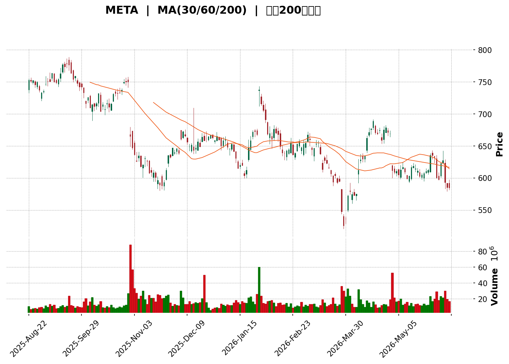
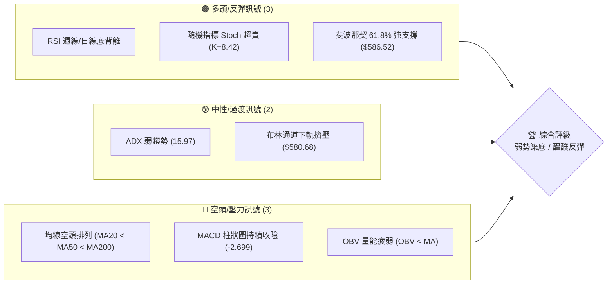
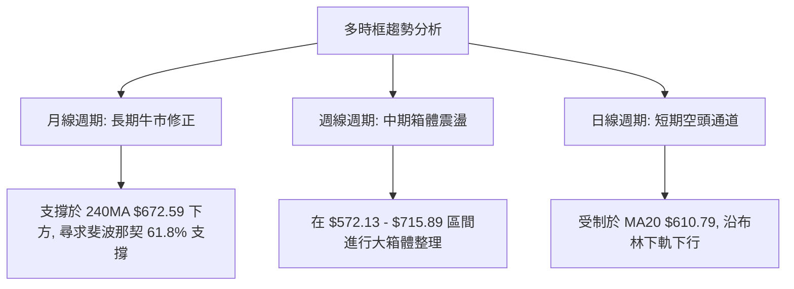
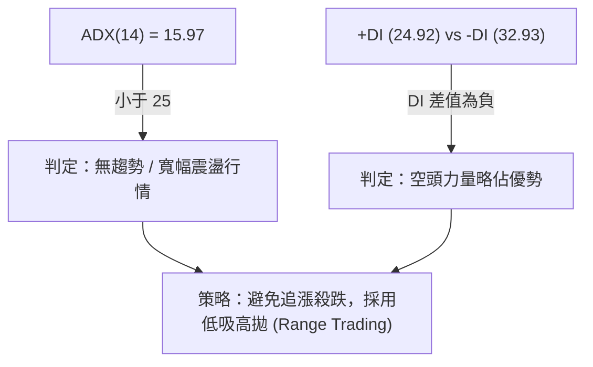
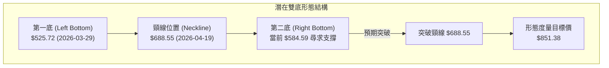

<details>
<summary>📊 靜態圖表 (點擊展開)</summary>

</details>

<html>
<head><meta charset="utf-8" /></head>
<body>
    <div style="height:500px; width:100%;">                        <script>window.PlotlyConfig = {MathJaxConfig: 'local'};</script>
        <script charset="utf-8" src="https://cdn.plot.ly/plotly-3.6.0.min.js" integrity="sha256-QaOVwtVY0T02VaHrr6pnoHLCwayMJp4O5n4YyaE3rJk=" crossorigin="anonymous"></script>                <div id="candlestick-chart" class="plotly-graph-div" style="height:100%; width:100%;"></div>            <script>                window.PLOTLYENV=window.PLOTLYENV || {};                                if (document.getElementById("candlestick-chart")) {                    Plotly.newPlot(                        "candlestick-chart",                        [{"close":{"dtype":"f8","bdata":"AAAAACyIh0AAAACgR3yHQAAAAECqgodAAAAAAAhNh0AAAAAAzWqHQAAAAODAB4dAAAAAwBnrhkAAAACglfqGQAAAAOAqV4dAAAAAIH91h0AAAACATHSHQAAAAGA\u002f34dAAAAAoL5xh0AAAAAAIGmHQAAAAMCOjodAAAAAIETXh0AAAADgZUmIQAAAAEA4L4hAAAAAAGBTiEAAAAAgc0SIQAAAAEAP34dAAAAAIByRh0AAAACgHruHQAAAAMBGXYdAAAAAwBA0h0AAAAAgRTGHQAAAACA76YZAAAAAYCNhhkAAAABAsK6GQAAAACD9KoZAAAAAgLhThkAAAACAHT+GQAAAAMAhZYZAAAAAQEjihkAAAACg+gCGQAAAAEAKVIZAAAAAALwbhkAAAADA0GKGQAAAAIAMN4ZAAAAAoMhdhkAAAACAlNeGQAAAAKBd4IZAAAAAwHvhhkAAAAAgMuaGQAAAAIAECYdAAAAA4Idsh0AAAACge3GHQAAAAMBRc4dAAAAAoNvKhEAAAADAIzqEQAAAAIAp5YNAAAAAQC6Sg0AAAAAAG9eDQAAAAKBAT4NAAAAAIGBlg0AAAABApLWDQAAAAKBDkINAAAAAAPL\u002fgkAAAABA+QaDQAAAACCKA4NAAAAA4AnIgkAAAABgiaWCQAAAAMCsaoJAAAAAoFRhgkAAAAAAEIqCQAAAACA2IINAAAAA4ELZg0AAAACgasSDQAAAAADyNoRAAAAAQGb+g0AAAAAAKDCEQAAAAKBB9INAAAAAgGejhEAAAABgXQKFQAAAAEB+zYRAAAAAwOd+hEAAAAAgW0iEQAAAACD2XIRAAAAAIDwZhEAAAAAgpjeEQAAAAAC0hIRAAAAAII5HhEAAAACADb+EQAAAAOCmkYRAAAAAIHmnhEAAAAAg+MKEQAAAAODU14RAAAAA4Me1hEAAAAAgA5GEQAAAAOAKy4RAAAAA4DOchEAAAAAg1E6EQAAAAMDPkYRAAAAAYHCghEAAAACgFEGEQAAAAAAPLIRAAAAAwAJkhEAAAADAXQuEQAAAAMBmtINAAAAAoPI3g0AAAADAJmKDQAAAAGDBXYNAAAAAYNPcgkAAAABAfCODQAAAAKCbOIRAAAAAYJKRhEAAAABAR\u002f6EQAAAAIAnA4VAAAAAYEPhhEAAAABgbQ2HQAAAAMAYX4ZAAAAAAHIOhkAAAADA3ZiFQAAAAIBX44RAAAAAABjthEAAAABAJ6eEQAAAAAAgJYVAAAAAYCvxhEAAAACg8eCEQAAAAIAISoRAAAAAIMj5g0AAAADg8fWDQAAAAKBbFYRAAAAA4NMhhEAAAAAAy3iEQAAAAKCj5YNAAAAAYAb2g0AAAADgC2mEQAAAAICVg4RAAAAAAAE9hEAAAADgAWiEQAAAAEAodIRAAAAAIEXZhEAAAAAgCqCEQAAAAIB3IoRAAAAAgLA2hEAAAACAFWyEQAAAAABmcoRAAAAAoBLtg0AAAADgeimDQAAAAKCZm4NAAAAAoEd1g0AAAACgcD2DQAAAAKCZ9YJAAAAAoEeNgkAAAADgeuCCQAAAACBch4JAAAAAwB6XgkAAAADgURyBQAAAAIDCbYBAAAAAQArDgEAAAABACuGBQAAAAADXGYJAAAAAIK7zgUAAAAAAKeiBQAAAAGBm+IFAAAAAIFwjg0AAAADAHqODQAAAAEDhroNAAAAAgD3Ug0AAAACA67OEQAAAAOCj\u002fIRAAAAAwPUmhUAAAABgZoSFQAAAAKBH94RAAAAAYLjmhEAAAACAwhWFQAAAAEAzmYRAAAAAgD0YhUAAAADA9TSFQAAAAGC4+oRAAAAAwPXohEAAAACgRx+DQAAAAAAABoNAAAAAoEcTg0AAAAAgrueCQAAAAEAKJ4NAAAAA4HpGg0AAAABACg2DQAAAAEDhtoJAAAAAAADYgkAAAABACkWDQAAAAKBwU4NAAAAAANcxg0AAAAAgrhmDQAAAAEDh1IJAAAAA4HrogkAAAABACvuCQAAAAIAUEoNAAAAAYLgig0AAAACAFNqDQAAAAOBR2oNAAAAAgBTEg0AAAACAwsOCQAAAAEAKrYJAAAAAANd3g0AAAABgj5yDQAAAAAAAiIJAAAAAwB5LgkAAAABguESCQA=="},"high":{"dtype":"f8","bdata":"tmz5PwOZh0AFhFe50KiHQNbBG47PiIdApvS4gxCDh0DqddbQSHqHQKkc4X8dS4dAfCmrOjTyhkBiUwnlHxSHQBBtrDgDu4dAgTX1u2Shh0CurFtwtuWHQN8A+T4J5IdAtA0Zaj\u002ffh0BDDcO\u002fm5qHQOZNzz9cnodA4KZ56QwiiEB7O+LMO1yIQDbN\u002fEyja4hAtY+okXSXiEBadNCmk6eIQMrZy0lYg4hAfPHnpYEKiEA0FRO2tr6HQFlrcD8NnIdAswNPZ2V1h0CGqm0jNmyHQIynrADWLYdAe+vvUyiFhkAKF7JpcLSGQI3xDls8zoZAssEG9HZdhkAt+mQXZ2qGQI6yj2+Wc4ZAAAAAQEjihkApP7rEVvCGQO2gSUDndYZAPTnGh9dShkCEH1Dph5WGQJ\u002fffLw6ooZA8bDf1bhqhkA0kFvnW+SGQOQWy70iCodA3Af7Segah0CLlxb+XCmHQPb+K6HHH4dAHlw0pOeTh0BUbF7zEamHQPXCOKMjr4dAPw8wtJU+hUBZvWf\u002fGg6FQNi9PVLVkYRAz1\u002fWEFkFhEAD1JTmQgmEQAHukSmB14NAWOlW0Lpog0Du+s6rhM+DQGp+GCUSpINAuELErYSfg0AY2AI380SDQNcb9TE+JYNAjq3\u002fZVkVg0Aa0xB2N9WCQPa7OB6wkoJAXxM1y6ftgkCd5UyE+KiCQJFJ6eRcPYNA5tJi6ePfg0ByduVhWuqDQFbXe2i+N4RAWDJqqPAhhEAkAe9dTjaEQHyIk\u002f4hPoRAsgop7sQXhUDOXT0IggyFQEd50xykHIVASoRh6fa6hEBd9cRlVmuEQIJ3LbZ8cYRAH6Lmz4AuhkBAKs8BiGOEQEXVsy7Jr4RAAoYwk1ClhEBx+5ML5O+EQL6\u002f5XJo84RAfANP1gcIhUCqcJEkccuEQONdcgXe3IRAiSCXtQXjhEDsY1ZEe52EQOq91cMo\u002fYRAGJXG5XLDhEAcWeLBkr6EQJ1COa3Fv4RA9uxWCpvHhEA\u002fJZNssJSEQGcFkQ1fNIRAOR9VMB5zhEAqVsS5SGuEQDqL18nDDYRAhV7UmEyfg0CfL4qYFn2DQIkU08dVpINAHu\u002fzHgQXg0CGlXjS7U2DQP+9XhQKoIRAsSUU1VvPhEC9D0xinhWFQLyiRqHtIYVAXRHHUc0ohUDW2gCI6DqHQAc8JmxZ3IZAup6tqXaFhkDHI3\u002fMF2OGQHN6Cx7tgYVA48iqGFZHhUAO5zEtUvuEQKeDhrTNVYVA7IkpuopAhUAIzOr2gjWFQB6Ja75fG4VAdC5fUvtWhECxYXnzZhCEQOYZqwGWI4RAlF8gRxc1hEB6NjenQraEQBqMo2wZiYRAi7M7FH4EhEApYciqkGqEQLx5kQJ6o4RA0hvdShNHhEBMgZXyAJuEQGa\u002fBlDPk4RAVmt1S44BhUChPNegAvGEQBOzcqxQR4RALv2JHpE5hED7KeqV4Z2EQIA2cQlzlIRA8a9aKYdnhEA3CdTJDaWDQAAAAAAA1oNAAAAAYGbkg0AAAABAM3WDQAAAAAAAKINAAAAAIK7fgkAAAADAHgWDQAAAAAAAyIJAAAAAIFzdgkAAAAAAADiCQAAAAMDM\u002fIBAAAAAYGbcgEAAAAAghe2BQAAAAGBmhIJAAAAAAAAUgkAAAADgUTaCQAAAAADX+YFAAAAAoJmvg0AAAAAAAOyDQAAAAOCj9INAAAAAAADYg0AAAACAFNKEQAAAAAAANIVAAAAA4KMshUAAAAAAKZyFQAAAAEAKW4VAAAAAoJkhhUAAAABACjOFQAAAAOB67IRAAAAAIFxFhUAAAAAAAFSFQAAAAKBwMYVAAAAAAAAShUAAAADAzGaDQAAAAEAKV4NAAAAAAAAwg0AAAADAzDKDQAAAAKCZX4NAAAAAANeHg0AAAAAAKUaDQAAAAKBH54JAAAAAAADegkAAAABAM1+DQAAAAADXfYNAAAAAoJlpg0AAAABguDyDQAAAAKBwL4NAAAAAAAAAg0AAAADAzAyDQAAAAOB6NoNAAAAAgMIzg0AAAAAAAPSDQAAAAAAAGIRAAAAAAADUg0AAAAAAAN6DQAAAAEAKB4NAAAAAQDOBg0AAAABAMxOEQAAAAEAzqYNAAAAAAACAgkAAAABACq2CQA=="},"hovertemplate":"\u003cb\u003e%{x|%Y-%m-%d}\u003c\u002fb\u003e\u003cbr\u003e\u958b: $%{open:.2f}\u003cbr\u003e\u9ad8: $%{high:.2f}\u003cbr\u003e\u4f4e: $%{low:.2f}\u003cbr\u003e\u6536: $%{close:.2f}\u003cextra\u003e\u003c\u002fextra\u003e","low":{"dtype":"f8","bdata":"D0m\u002fw1rlhkDNzxm2+mKHQIFc6C6AUYdAozjm6Msoh0B2ICOZgxiHQLAzWhME7YZAiXCPtE+AhkCTcfduKeKGQGy2apSUQIdAfHp+mkY6h0Du\u002fOl3EHKHQJWh2EBRfYdAt8jSU+xph0DbGvqj7lSHQMr+4qMjMIdA1YKQ\u002fdJxh0B3gnBTddqHQD3zOscd5IdAUL28T2IciECfbFoZGvuHQL5\u002fAHyM2YdApFuDDoduh0Cvf61MMHqHQOibqWh0OodAMfaFYvMAh0BTNISoUw+HQFWi7+CyqIZAPy50Ch0ohkDWGaYXh2eGQHDhpiz0J4ZArJNoX9uKhUCe+6GwkgSGQAGRGowGFYZAUKGb7AA6hkCgpIhzq\u002fqFQKzuxO+qE4ZA+jq7fkzRhUANmgZemiKGQHD0UWGj9YVA60gxLocHhkBpj9D\u002f0XeGQKYRuRREvIZA250Ps5GWhkD9u9zzAd+GQBy6XCdvz4ZAS9rqmxZWh0DS6DS+M0KHQCq\u002fsHIpKodAZSki\u002fKxIhEBhqobh7yOEQKVDXDvx2INAW37D2reHg0DEFnJt84uDQPNT4ra+R4NA1LTTwpHBgkBbutOsn0iDQIz5m8vYUoNAK\u002fN4vQr2gkAUtmgP8s+CQODEzmKmkYJAMEx5Oj+TgkDpJWBQcTaCQFK\u002f6WM8IoJAcxNi9QEzgkAb5OqdGyeCQJXmDLoOpYJA6C+FByRKg0AgbkFlmrSDQBaqcfKC04NAyiODoo\u002flg0AlaruACeiDQDOxjULi44NAOuCOb5WXhEBrboG3RaqEQK2laSqtv4RAZyTGYP5hhEAusGIjmxKEQGBOOBrX\u002fYNAbjKLl1nsg0Ab+yuvOvGDQF+NVNAyFYRAONaKRihFhEBIBqL\u002fL3+EQNf7n4jvjIRAq54i37SAhECubpy4fo2EQAw+bn8RrYRAmtl90wimhEA+9o1IpG6EQL5xcdU3ioRALqOMwwGXhEA6+yebmBeEQCCePTeROYRAV+3nJr1ahEA6pTgsESKEQFMXib1o2YNAcD4sg2YShEDgZeaLcwWEQLS7\u002fl6HfINA0I31OVoyg0A+pa7ioi2DQP5TPIxlXINAp7HK1+S7gkBBk6uQiLyCQFRuc64ckINATI4UkjAfhEDqRSNFy6WEQHQY\u002fy67wIRAClGZuz3MhEDPtIABhj+GQHf6GDnWR4ZA1mAscFj3hUB2r60ElW6FQJ35Ks4c14RA6KkdJodnhEB0dLtVky+EQEflm067kYRAowofYbzphEDeJBGOTYSEQN+qlA\u002fTJYRAm3hDnDfQg0ClL7zAGKKDQGcFxsbmnINAgTDw\u002fmbhg0CCfUFy3vGDQOynmNCl24NAV\u002ftsFImjg0APpT28uQyEQBwmDamRN4RAjHgVwJfsg0BrS1xkqM+DQIpyWjNZ8oNAcoET4NuIhEDt6naZB06EQLwiU9SG3INApr0CXPORg0CrQ9kBj0OEQHTiKWNxPoRA18IIftfig0AJnOBpOgiDQAAAAMDMeINAAAAAoJltg0AAAABA4TSDQAAAAIAU0oJAAAAAAABagkAAAACAFLiCQAAAAAAAeIJAAAAAQDOLgkAAAADAzPqAQAAAAIAUQoBAAAAA4FGEgEAAAAAAKRaBQAAAAGCP7oFAAAAAoJl9gUAAAAAAAOCBQAAAAIAUpoFAAAAA4KN+gkAAAAAAAHiDQAAAAOCjgoNAAAAAQDODg0AAAADA9fqDQAAAAIDCwYRAAAAAAADehEAAAABAChmFQAAAAAAA4IRAAAAA4KPahEAAAAAAAO6EQAAAAGBmaIRAAAAAYLhuhEAAAABguPaEQAAAAEAKzYRAAAAA4Hq+hEAAAAAAAMCCQAAAAEDh8IJAAAAAAADWgkAAAABA4cKCQAAAAMDMsIJAAAAA4FEsg0AAAADgevCCQAAAAOCjsIJAAAAAwMyEgkAAAACgR6WCQAAAAAAAOINAAAAA4HoKg0AAAAAghd2CQAAAAGBmxIJAAAAA4HqugkAAAADgepaCQAAAAKCZ94JAAAAAYGbqgkAAAAAAAAiDQAAAAOB6qoNAAAAAwMx6g0AAAACAPbyCQAAAAKBwpYJAAAAAACnCgkAAAACgcHODQAAAAKBHN4JAAAAAgMIZgkAAAACAFCiCQA=="},"name":"\u50f9\u683c","open":{"dtype":"f8","bdata":"Ogw7yvsLh0BSVcNUaYiHQJ0FtLVTaIdAA7NNhEx0h0AkSyPeDTKHQOk8xyxFPIdAxWn65bWihkBx19NJNPKGQM0tS2KHVodAtqcyb9p2h0C9SeRe1JGHQNWRbaW4nYdA5MVNxrLah0BXPF4BDoeHQITA0UrOV4dAZo+1sY+dh0ASWFx1n+mHQCMDs8JMUYhABP\u002fLmV1XiECTj2FrnoSIQPqONE5bZIhAZgCug7n\u002fh0DgMCLO4aGHQN6luDmJgYdAYYXOYPtlh0DE+9UuwluHQK656PYVKIdAKZkST0iChkAb+PAI\u002fYqGQEMUVkpLw4ZAVOcMzRkAhkBXqjlCLGSGQGM38AISQoZAyAVFVKVohkA\u002fkK3EmM2GQKUN2FKOPoZAyeuXOckUhkDpUe3s5l6GQJDa9sLQYoZA6rbMBTIPhkBmwKsL43+GQD9QtjhU9oZAEsVMkNbkhkCfZDlbyeuGQDMqVX56\u002fIZA4ic6OtNjh0DuIE2u\u002fHqHQAJ7vBfri4dA6GUGNkPghEDCtQ0MEguFQPViR9U8d4RAVP69Se6Xg0DOSW6yCLqDQBsB52xO1oNAjmK1Wa87g0CosntqSrCDQCNTrJqcl4NAXWGWXqaYg0Bl+0gAXyCDQGuCIxpIxoJAcwTeNS8Ag0BpIQfT5XSCQNJLqT\u002fUhYJA6yH7TfDTgkCeAWmpI1yCQIDZ7z\u002fDrYJAd96cKap3g0BNkWSMAOWDQB37tdYk2INA9C+MY9vzg0AaJ87mIwqEQB2BVw2sGoRAoJishfgWhUAKqCR2IbeEQBC+d5DH4YRA6PHYVku1hEBXhZAd60aEQP0Ycha6EYRAZbs2dLhFhECYyMJrLimEQPmHyqmYF4RAbVy3q2R4hECL1PlfvoOEQEzNBJnMzoRAx2u3HKyohEB2DEfx4ZuEQCOHa8u0r4RAh2S+hOjbhEDHcfqwk4uEQNaRNxgDkYRAO+fnVXPBhEAp4GrqTbGEQG2oLgGgU4RA8F7r1guYhEA8etkSoniEQC4wurCeKoRAoiaNWRonhEDzzps\u002fxl+EQDqL18nDDYRAtJ9rY7aPg0ATB4lwm0+DQGHlbx0rfYNAQs2oSeH6gkAHr62FxPGCQNrhpSZ+poNAT1SOYr8hhEA6e83qfMSEQFSAaYkaEIVA8AMORGIPhUDO2a+qZAaHQFmQmHoFt4ZAxoazxuhPhkB9fbprHhaGQK4RZSsieYVApDltXRm4hEAc94OQXceEQFaqJ7nmtIRA9lkskikohUDOXX4yYwuFQBbivc4s64RARYZ0iWIkhEB7P86hn\u002feDQFcszQAQyoNAA0UyoTDwg0AihSd6JPmDQBa3y7baX4RA4BmZxU7Eg0BUG1HN1w+EQOgvMbHyT4RAT396STIXhEDmi15b6+SDQG3oNiXiPYRAXCX9XS2LhEDNARH+6KqEQDFYjyzEOoRALMnXV+XRg0AKAbzkAWiEQOx01myZcYRAprice49BhEDBBwaq2XqDQAAAAAAAwINAAAAAgOufg0AAAABguEKDQAAAAEAzIYNAAAAAgD3cgkAAAADgUe6CQAAAAMDMuIJAAAAAgOu1gkAAAACA6zOCQAAAAMDM4IBAAAAAQArDgEAAAAAA1y+BQAAAAEAKIYJAAAAA4FGwgUAAAAAghQ2CQAAAAADX44FAAAAAAADwgkAAAACAwpeDQAAAAIDC04NAAAAAAACsg0AAAACAwhmEQAAAAAAA2IRAAAAAgOsfhUAAAADAzDSFQAAAAEDhSoVAAAAAAAD4hEAAAABA4RKFQAAAAKCZvYRAAAAAYI+ihEAAAAAAAPiEQAAAAIDrEYVAAAAAoEfnhEAAAABgj1qDQAAAACCFNYNAAAAAIIX\u002fgkAAAADgeiqDQAAAAGBmyIJAAAAAgMI1g0AAAACgmTmDQAAAAGCP5IJAAAAAYI+WgkAAAADgo7aCQAAAAAAAQINAAAAAgOsvg0AAAABA4QiDQAAAACBcB4NAAAAAgBTGgkAAAAAAAMCCQAAAAEAK\u002f4JAAAAAwB4Hg0AAAABAMwuDQAAAAAAA\u002fINAAAAAAADMg0AAAABAM7ODQAAAAIDr2YJAAAAAAADYgkAAAAAgXH2DQAAAACCue4NAAAAAAACAgkAAAAAAAH6CQA=="},"x":["2025-08-22T00:00:00-04:00","2025-08-25T00:00:00-04:00","2025-08-26T00:00:00-04:00","2025-08-27T00:00:00-04:00","2025-08-28T00:00:00-04:00","2025-08-29T00:00:00-04:00","2025-09-02T00:00:00-04:00","2025-09-03T00:00:00-04:00","2025-09-04T00:00:00-04:00","2025-09-05T00:00:00-04:00","2025-09-08T00:00:00-04:00","2025-09-09T00:00:00-04:00","2025-09-10T00:00:00-04:00","2025-09-11T00:00:00-04:00","2025-09-12T00:00:00-04:00","2025-09-15T00:00:00-04:00","2025-09-16T00:00:00-04:00","2025-09-17T00:00:00-04:00","2025-09-18T00:00:00-04:00","2025-09-19T00:00:00-04:00","2025-09-22T00:00:00-04:00","2025-09-23T00:00:00-04:00","2025-09-24T00:00:00-04:00","2025-09-25T00:00:00-04:00","2025-09-26T00:00:00-04:00","2025-09-29T00:00:00-04:00","2025-09-30T00:00:00-04:00","2025-10-01T00:00:00-04:00","2025-10-02T00:00:00-04:00","2025-10-03T00:00:00-04:00","2025-10-06T00:00:00-04:00","2025-10-07T00:00:00-04:00","2025-10-08T00:00:00-04:00","2025-10-09T00:00:00-04:00","2025-10-10T00:00:00-04:00","2025-10-13T00:00:00-04:00","2025-10-14T00:00:00-04:00","2025-10-15T00:00:00-04:00","2025-10-16T00:00:00-04:00","2025-10-17T00:00:00-04:00","2025-10-20T00:00:00-04:00","2025-10-21T00:00:00-04:00","2025-10-22T00:00:00-04:00","2025-10-23T00:00:00-04:00","2025-10-24T00:00:00-04:00","2025-10-27T00:00:00-04:00","2025-10-28T00:00:00-04:00","2025-10-29T00:00:00-04:00","2025-10-30T00:00:00-04:00","2025-10-31T00:00:00-04:00","2025-11-03T00:00:00-05:00","2025-11-04T00:00:00-05:00","2025-11-05T00:00:00-05:00","2025-11-06T00:00:00-05:00","2025-11-07T00:00:00-05:00","2025-11-10T00:00:00-05:00","2025-11-11T00:00:00-05:00","2025-11-12T00:00:00-05:00","2025-11-13T00:00:00-05:00","2025-11-14T00:00:00-05:00","2025-11-17T00:00:00-05:00","2025-11-18T00:00:00-05:00","2025-11-19T00:00:00-05:00","2025-11-20T00:00:00-05:00","2025-11-21T00:00:00-05:00","2025-11-24T00:00:00-05:00","2025-11-25T00:00:00-05:00","2025-11-26T00:00:00-05:00","2025-11-28T00:00:00-05:00","2025-12-01T00:00:00-05:00","2025-12-02T00:00:00-05:00","2025-12-03T00:00:00-05:00","2025-12-04T00:00:00-05:00","2025-12-05T00:00:00-05:00","2025-12-08T00:00:00-05:00","2025-12-09T00:00:00-05:00","2025-12-10T00:00:00-05:00","2025-12-11T00:00:00-05:00","2025-12-12T00:00:00-05:00","2025-12-15T00:00:00-05:00","2025-12-16T00:00:00-05:00","2025-12-17T00:00:00-05:00","2025-12-18T00:00:00-05:00","2025-12-19T00:00:00-05:00","2025-12-22T00:00:00-05:00","2025-12-23T00:00:00-05:00","2025-12-24T00:00:00-05:00","2025-12-26T00:00:00-05:00","2025-12-29T00:00:00-05:00","2025-12-30T00:00:00-05:00","2025-12-31T00:00:00-05:00","2026-01-02T00:00:00-05:00","2026-01-05T00:00:00-05:00","2026-01-06T00:00:00-05:00","2026-01-07T00:00:00-05:00","2026-01-08T00:00:00-05:00","2026-01-09T00:00:00-05:00","2026-01-12T00:00:00-05:00","2026-01-13T00:00:00-05:00","2026-01-14T00:00:00-05:00","2026-01-15T00:00:00-05:00","2026-01-16T00:00:00-05:00","2026-01-20T00:00:00-05:00","2026-01-21T00:00:00-05:00","2026-01-22T00:00:00-05:00","2026-01-23T00:00:00-05:00","2026-01-26T00:00:00-05:00","2026-01-27T00:00:00-05:00","2026-01-28T00:00:00-05:00","2026-01-29T00:00:00-05:00","2026-01-30T00:00:00-05:00","2026-02-02T00:00:00-05:00","2026-02-03T00:00:00-05:00","2026-02-04T00:00:00-05:00","2026-02-05T00:00:00-05:00","2026-02-06T00:00:00-05:00","2026-02-09T00:00:00-05:00","2026-02-10T00:00:00-05:00","2026-02-11T00:00:00-05:00","2026-02-12T00:00:00-05:00","2026-02-13T00:00:00-05:00","2026-02-17T00:00:00-05:00","2026-02-18T00:00:00-05:00","2026-02-19T00:00:00-05:00","2026-02-20T00:00:00-05:00","2026-02-23T00:00:00-05:00","2026-02-24T00:00:00-05:00","2026-02-25T00:00:00-05:00","2026-02-26T00:00:00-05:00","2026-02-27T00:00:00-05:00","2026-03-02T00:00:00-05:00","2026-03-03T00:00:00-05:00","2026-03-04T00:00:00-05:00","2026-03-05T00:00:00-05:00","2026-03-06T00:00:00-05:00","2026-03-09T00:00:00-04:00","2026-03-10T00:00:00-04:00","2026-03-11T00:00:00-04:00","2026-03-12T00:00:00-04:00","2026-03-13T00:00:00-04:00","2026-03-16T00:00:00-04:00","2026-03-17T00:00:00-04:00","2026-03-18T00:00:00-04:00","2026-03-19T00:00:00-04:00","2026-03-20T00:00:00-04:00","2026-03-23T00:00:00-04:00","2026-03-24T00:00:00-04:00","2026-03-25T00:00:00-04:00","2026-03-26T00:00:00-04:00","2026-03-27T00:00:00-04:00","2026-03-30T00:00:00-04:00","2026-03-31T00:00:00-04:00","2026-04-01T00:00:00-04:00","2026-04-02T00:00:00-04:00","2026-04-06T00:00:00-04:00","2026-04-07T00:00:00-04:00","2026-04-08T00:00:00-04:00","2026-04-09T00:00:00-04:00","2026-04-10T00:00:00-04:00","2026-04-13T00:00:00-04:00","2026-04-14T00:00:00-04:00","2026-04-15T00:00:00-04:00","2026-04-16T00:00:00-04:00","2026-04-17T00:00:00-04:00","2026-04-20T00:00:00-04:00","2026-04-21T00:00:00-04:00","2026-04-22T00:00:00-04:00","2026-04-23T00:00:00-04:00","2026-04-24T00:00:00-04:00","2026-04-27T00:00:00-04:00","2026-04-28T00:00:00-04:00","2026-04-29T00:00:00-04:00","2026-04-30T00:00:00-04:00","2026-05-01T00:00:00-04:00","2026-05-04T00:00:00-04:00","2026-05-05T00:00:00-04:00","2026-05-06T00:00:00-04:00","2026-05-07T00:00:00-04:00","2026-05-08T00:00:00-04:00","2026-05-11T00:00:00-04:00","2026-05-12T00:00:00-04:00","2026-05-13T00:00:00-04:00","2026-05-14T00:00:00-04:00","2026-05-15T00:00:00-04:00","2026-05-18T00:00:00-04:00","2026-05-19T00:00:00-04:00","2026-05-20T00:00:00-04:00","2026-05-21T00:00:00-04:00","2026-05-22T00:00:00-04:00","2026-05-26T00:00:00-04:00","2026-05-27T00:00:00-04:00","2026-05-28T00:00:00-04:00","2026-05-29T00:00:00-04:00","2026-06-01T00:00:00-04:00","2026-06-02T00:00:00-04:00","2026-06-03T00:00:00-04:00","2026-06-04T00:00:00-04:00","2026-06-05T00:00:00-04:00","2026-06-08T00:00:00-04:00","2026-06-09T00:00:00-04:00"],"type":"candlestick"},{"hovertemplate":"MA30: $%{y:.2f}\u003cextra\u003e\u003c\u002fextra\u003e","line":{"color":"#2196F3","dash":"dash","width":2},"mode":"lines","name":"MA30","x":["2025-08-22T00:00:00-04:00","2025-08-25T00:00:00-04:00","2025-08-26T00:00:00-04:00","2025-08-27T00:00:00-04:00","2025-08-28T00:00:00-04:00","2025-08-29T00:00:00-04:00","2025-09-02T00:00:00-04:00","2025-09-03T00:00:00-04:00","2025-09-04T00:00:00-04:00","2025-09-05T00:00:00-04:00","2025-09-08T00:00:00-04:00","2025-09-09T00:00:00-04:00","2025-09-10T00:00:00-04:00","2025-09-11T00:00:00-04:00","2025-09-12T00:00:00-04:00","2025-09-15T00:00:00-04:00","2025-09-16T00:00:00-04:00","2025-09-17T00:00:00-04:00","2025-09-18T00:00:00-04:00","2025-09-19T00:00:00-04:00","2025-09-22T00:00:00-04:00","2025-09-23T00:00:00-04:00","2025-09-24T00:00:00-04:00","2025-09-25T00:00:00-04:00","2025-09-26T00:00:00-04:00","2025-09-29T00:00:00-04:00","2025-09-30T00:00:00-04:00","2025-10-01T00:00:00-04:00","2025-10-02T00:00:00-04:00","2025-10-03T00:00:00-04:00","2025-10-06T00:00:00-04:00","2025-10-07T00:00:00-04:00","2025-10-08T00:00:00-04:00","2025-10-09T00:00:00-04:00","2025-10-10T00:00:00-04:00","2025-10-13T00:00:00-04:00","2025-10-14T00:00:00-04:00","2025-10-15T00:00:00-04:00","2025-10-16T00:00:00-04:00","2025-10-17T00:00:00-04:00","2025-10-20T00:00:00-04:00","2025-10-21T00:00:00-04:00","2025-10-22T00:00:00-04:00","2025-10-23T00:00:00-04:00","2025-10-24T00:00:00-04:00","2025-10-27T00:00:00-04:00","2025-10-28T00:00:00-04:00","2025-10-29T00:00:00-04:00","2025-10-30T00:00:00-04:00","2025-10-31T00:00:00-04:00","2025-11-03T00:00:00-05:00","2025-11-04T00:00:00-05:00","2025-11-05T00:00:00-05:00","2025-11-06T00:00:00-05:00","2025-11-07T00:00:00-05:00","2025-11-10T00:00:00-05:00","2025-11-11T00:00:00-05:00","2025-11-12T00:00:00-05:00","2025-11-13T00:00:00-05:00","2025-11-14T00:00:00-05:00","2025-11-17T00:00:00-05:00","2025-11-18T00:00:00-05:00","2025-11-19T00:00:00-05:00","2025-11-20T00:00:00-05:00","2025-11-21T00:00:00-05:00","2025-11-24T00:00:00-05:00","2025-11-25T00:00:00-05:00","2025-11-26T00:00:00-05:00","2025-11-28T00:00:00-05:00","2025-12-01T00:00:00-05:00","2025-12-02T00:00:00-05:00","2025-12-03T00:00:00-05:00","2025-12-04T00:00:00-05:00","2025-12-05T00:00:00-05:00","2025-12-08T00:00:00-05:00","2025-12-09T00:00:00-05:00","2025-12-10T00:00:00-05:00","2025-12-11T00:00:00-05:00","2025-12-12T00:00:00-05:00","2025-12-15T00:00:00-05:00","2025-12-16T00:00:00-05:00","2025-12-17T00:00:00-05:00","2025-12-18T00:00:00-05:00","2025-12-19T00:00:00-05:00","2025-12-22T00:00:00-05:00","2025-12-23T00:00:00-05:00","2025-12-24T00:00:00-05:00","2025-12-26T00:00:00-05:00","2025-12-29T00:00:00-05:00","2025-12-30T00:00:00-05:00","2025-12-31T00:00:00-05:00","2026-01-02T00:00:00-05:00","2026-01-05T00:00:00-05:00","2026-01-06T00:00:00-05:00","2026-01-07T00:00:00-05:00","2026-01-08T00:00:00-05:00","2026-01-09T00:00:00-05:00","2026-01-12T00:00:00-05:00","2026-01-13T00:00:00-05:00","2026-01-14T00:00:00-05:00","2026-01-15T00:00:00-05:00","2026-01-16T00:00:00-05:00","2026-01-20T00:00:00-05:00","2026-01-21T00:00:00-05:00","2026-01-22T00:00:00-05:00","2026-01-23T00:00:00-05:00","2026-01-26T00:00:00-05:00","2026-01-27T00:00:00-05:00","2026-01-28T00:00:00-05:00","2026-01-29T00:00:00-05:00","2026-01-30T00:00:00-05:00","2026-02-02T00:00:00-05:00","2026-02-03T00:00:00-05:00","2026-02-04T00:00:00-05:00","2026-02-05T00:00:00-05:00","2026-02-06T00:00:00-05:00","2026-02-09T00:00:00-05:00","2026-02-10T00:00:00-05:00","2026-02-11T00:00:00-05:00","2026-02-12T00:00:00-05:00","2026-02-13T00:00:00-05:00","2026-02-17T00:00:00-05:00","2026-02-18T00:00:00-05:00","2026-02-19T00:00:00-05:00","2026-02-20T00:00:00-05:00","2026-02-23T00:00:00-05:00","2026-02-24T00:00:00-05:00","2026-02-25T00:00:00-05:00","2026-02-26T00:00:00-05:00","2026-02-27T00:00:00-05:00","2026-03-02T00:00:00-05:00","2026-03-03T00:00:00-05:00","2026-03-04T00:00:00-05:00","2026-03-05T00:00:00-05:00","2026-03-06T00:00:00-05:00","2026-03-09T00:00:00-04:00","2026-03-10T00:00:00-04:00","2026-03-11T00:00:00-04:00","2026-03-12T00:00:00-04:00","2026-03-13T00:00:00-04:00","2026-03-16T00:00:00-04:00","2026-03-17T00:00:00-04:00","2026-03-18T00:00:00-04:00","2026-03-19T00:00:00-04:00","2026-03-20T00:00:00-04:00","2026-03-23T00:00:00-04:00","2026-03-24T00:00:00-04:00","2026-03-25T00:00:00-04:00","2026-03-26T00:00:00-04:00","2026-03-27T00:00:00-04:00","2026-03-30T00:00:00-04:00","2026-03-31T00:00:00-04:00","2026-04-01T00:00:00-04:00","2026-04-02T00:00:00-04:00","2026-04-06T00:00:00-04:00","2026-04-07T00:00:00-04:00","2026-04-08T00:00:00-04:00","2026-04-09T00:00:00-04:00","2026-04-10T00:00:00-04:00","2026-04-13T00:00:00-04:00","2026-04-14T00:00:00-04:00","2026-04-15T00:00:00-04:00","2026-04-16T00:00:00-04:00","2026-04-17T00:00:00-04:00","2026-04-20T00:00:00-04:00","2026-04-21T00:00:00-04:00","2026-04-22T00:00:00-04:00","2026-04-23T00:00:00-04:00","2026-04-24T00:00:00-04:00","2026-04-27T00:00:00-04:00","2026-04-28T00:00:00-04:00","2026-04-29T00:00:00-04:00","2026-04-30T00:00:00-04:00","2026-05-01T00:00:00-04:00","2026-05-04T00:00:00-04:00","2026-05-05T00:00:00-04:00","2026-05-06T00:00:00-04:00","2026-05-07T00:00:00-04:00","2026-05-08T00:00:00-04:00","2026-05-11T00:00:00-04:00","2026-05-12T00:00:00-04:00","2026-05-13T00:00:00-04:00","2026-05-14T00:00:00-04:00","2026-05-15T00:00:00-04:00","2026-05-18T00:00:00-04:00","2026-05-19T00:00:00-04:00","2026-05-20T00:00:00-04:00","2026-05-21T00:00:00-04:00","2026-05-22T00:00:00-04:00","2026-05-26T00:00:00-04:00","2026-05-27T00:00:00-04:00","2026-05-28T00:00:00-04:00","2026-05-29T00:00:00-04:00","2026-06-01T00:00:00-04:00","2026-06-02T00:00:00-04:00","2026-06-03T00:00:00-04:00","2026-06-04T00:00:00-04:00","2026-06-05T00:00:00-04:00","2026-06-08T00:00:00-04:00","2026-06-09T00:00:00-04:00"],"y":{"dtype":"f8","bdata":"AAAAAAAA+H8AAAAAAAD4fwAAAAAAAPh\u002fAAAAAAAA+H8AAAAAAAD4fwAAAAAAAPh\u002fAAAAAAAA+H8AAAAAAAD4fwAAAAAAAPh\u002fAAAAAAAA+H8AAAAAAAD4fwAAAAAAAPh\u002fAAAAAAAA+H8AAAAAAAD4fwAAAAAAAPh\u002fAAAAAAAA+H8AAAAAAAD4fwAAAAAAAPh\u002fAAAAAAAA+H8AAAAAAAD4fwAAAAAAAPh\u002fAAAAAAAA+H8AAAAAAAD4fwAAAAAAAPh\u002fAAAAAAAA+H8AAAAAAAD4fwAAAAAAAPh\u002fAAAAAAAA+H8AAAAAAAD4f6uqqopBbIdAzczMbPlhh0BERET0ZleHQHd3d2fiTYdAq6qqelNKh0Dv7u7uQz6HQBEREWFGOIdAq6qq2lwxh0AiIiLCTSyHQFVVVSWzIodAMzMzQ2AZh0De3d3tJhSHQAAAAPCnC4dAiYiI6NgGh0BVVVWlewKHQKuqqhoI\u002foZAvLu7S3n6hkAiIiLSRvOGQHd3d2cD7YZAvLu729zOhkDv7u6+YqyGQAAAALB0ioZAERERsVtohkDv7u5eKEeGQBEREZGOJIZAZmZmNhEEhkBmZmamWOaFQN7d3d3HyYVAMzMz4\u002fCshUDv7u4ewI2FQDMzM+PVcoVAVVVVVZRUhUAiIiIy3DWFQM3MzFzpE4VAd3d313rthEDNzMx86s+EQN7d3Z2WtIRAAAAAUE6hhEAzMzOT9YqEQAAAAKDjeYRAzczMnKRlhEDNzMzc\u002fk6EQO\u002fu7v4ONoRAAAAAMOwihEDv7u5+yxKEQM3MzHy+\u002f4NA7+7ursHmg0AiIiIiycuDQO\u002fu7r5wsYNAd3d3B4Wrg0BmZmbGb6uDQBERETHBsINAvLu768y2g0BEREQ0iL6DQImIiFhHyYNAmpmZ6QPUg0DNzMws\u002ftyDQKuqqmrp54NAzczMnIH2g0AzMzMTpAOEQImIiAjTEoRAiYiICG4ihEARERExmzCEQJqZmTn6QoRAERER0SVWhECrqqoayGSEQLy7u7u1bYRAq6qqulVyhECrqqoqs3SEQBERETFZcIRAzczMvLtphEBERETU3WKEQN7d3Y3ZXYRAvLu7e7JOhEC8u7sLvD6EQO\u002fu7o7FOYRAiYiI2GQ6hEAAAABAdUCEQN7d3W3\u002fRYRAZmZmVqpMhEBVVVWl22SEQN7d3c2rdIRAiYiIiNWDhEBVVVU1GIuEQLy7u0vRjYRAREREZCOQhEB3d3cHNo+EQJqZmZnJkYRAIiIiYsSThEB3d3d3bpaEQGZmZpYhkoRAiYiImLeMhEDv7u4ewYmEQN7d3R2bhYRAMzMzs2KBhEDNzMwcPoOEQDMzMzPlgIRAd3d3pzp9hEDv7u4OWoCEQERERARCh4RAIiIisvWPhEAzMzMzsJiEQFVVVeX3oYRA7+7unuqyhEBEREQEmr+EQERERBTdvoRAzczMjNW7hEBmZmYG9raEQGZmZsYisoRAREREBP+phEBEREREzIiEQGZmZvY2cYRAIiIi4gpbhEBVVVWl7UaEQCIiImJ4NoRAREREtDUihEAzMzPTDROEQO\u002fu7n66\u002fINAIiIiAqnog0DNzMyMgciDQImIiEiQp4NA3t3djSOMg0CamZkZYHqDQHd3d0d1aYNAvLu7a9pWg0B3d3cn90CDQN7d3S2GMINAERERgYApg0CJiIiI5yKDQFVVVXXQG4NAmpmZeVIYg0AzMzND2hqDQKuqqupmH4NA7+7u3v0hg0C8u7uLmimDQM3MzIyyMINA3t3drZA2g0BERESUODyDQAAAALCDPYNAVVVVlXxHg0DNzMyc71iDQGZmZtajZINAIiIiggdxg0BEREQkBnCDQGZmZhaScINA3t3djQl1g0Dv7u7+RnWDQJqZmZmZeoNAERERAXKAg0Dv7u6uAJGDQFVVVbWBpINAIiIiokW2g0AAAACAI8KDQN7d3Y2XzINAREREhDLXg0Dv7u6eYeGDQM3MzAy76INAvLu7m8Tmg0AzMzNTKuGDQM3MzEzw24NAZmZmdgXWg0AAAACQws6DQJqZmSkVxYNAq6qq2kC5g0DNzMzsw6GDQImIiFg5joNAIiIiov6Bg0DNzMzca3WDQFVVVQXIY4NAiYiImOBLg0C8u7t7zTKDQA=="},"type":"scatter"},{"hovertemplate":"MA60: $%{y:.2f}\u003cextra\u003e\u003c\u002fextra\u003e","line":{"color":"#9C27B0","dash":"dash","width":2},"mode":"lines","name":"MA60","x":["2025-08-22T00:00:00-04:00","2025-08-25T00:00:00-04:00","2025-08-26T00:00:00-04:00","2025-08-27T00:00:00-04:00","2025-08-28T00:00:00-04:00","2025-08-29T00:00:00-04:00","2025-09-02T00:00:00-04:00","2025-09-03T00:00:00-04:00","2025-09-04T00:00:00-04:00","2025-09-05T00:00:00-04:00","2025-09-08T00:00:00-04:00","2025-09-09T00:00:00-04:00","2025-09-10T00:00:00-04:00","2025-09-11T00:00:00-04:00","2025-09-12T00:00:00-04:00","2025-09-15T00:00:00-04:00","2025-09-16T00:00:00-04:00","2025-09-17T00:00:00-04:00","2025-09-18T00:00:00-04:00","2025-09-19T00:00:00-04:00","2025-09-22T00:00:00-04:00","2025-09-23T00:00:00-04:00","2025-09-24T00:00:00-04:00","2025-09-25T00:00:00-04:00","2025-09-26T00:00:00-04:00","2025-09-29T00:00:00-04:00","2025-09-30T00:00:00-04:00","2025-10-01T00:00:00-04:00","2025-10-02T00:00:00-04:00","2025-10-03T00:00:00-04:00","2025-10-06T00:00:00-04:00","2025-10-07T00:00:00-04:00","2025-10-08T00:00:00-04:00","2025-10-09T00:00:00-04:00","2025-10-10T00:00:00-04:00","2025-10-13T00:00:00-04:00","2025-10-14T00:00:00-04:00","2025-10-15T00:00:00-04:00","2025-10-16T00:00:00-04:00","2025-10-17T00:00:00-04:00","2025-10-20T00:00:00-04:00","2025-10-21T00:00:00-04:00","2025-10-22T00:00:00-04:00","2025-10-23T00:00:00-04:00","2025-10-24T00:00:00-04:00","2025-10-27T00:00:00-04:00","2025-10-28T00:00:00-04:00","2025-10-29T00:00:00-04:00","2025-10-30T00:00:00-04:00","2025-10-31T00:00:00-04:00","2025-11-03T00:00:00-05:00","2025-11-04T00:00:00-05:00","2025-11-05T00:00:00-05:00","2025-11-06T00:00:00-05:00","2025-11-07T00:00:00-05:00","2025-11-10T00:00:00-05:00","2025-11-11T00:00:00-05:00","2025-11-12T00:00:00-05:00","2025-11-13T00:00:00-05:00","2025-11-14T00:00:00-05:00","2025-11-17T00:00:00-05:00","2025-11-18T00:00:00-05:00","2025-11-19T00:00:00-05:00","2025-11-20T00:00:00-05:00","2025-11-21T00:00:00-05:00","2025-11-24T00:00:00-05:00","2025-11-25T00:00:00-05:00","2025-11-26T00:00:00-05:00","2025-11-28T00:00:00-05:00","2025-12-01T00:00:00-05:00","2025-12-02T00:00:00-05:00","2025-12-03T00:00:00-05:00","2025-12-04T00:00:00-05:00","2025-12-05T00:00:00-05:00","2025-12-08T00:00:00-05:00","2025-12-09T00:00:00-05:00","2025-12-10T00:00:00-05:00","2025-12-11T00:00:00-05:00","2025-12-12T00:00:00-05:00","2025-12-15T00:00:00-05:00","2025-12-16T00:00:00-05:00","2025-12-17T00:00:00-05:00","2025-12-18T00:00:00-05:00","2025-12-19T00:00:00-05:00","2025-12-22T00:00:00-05:00","2025-12-23T00:00:00-05:00","2025-12-24T00:00:00-05:00","2025-12-26T00:00:00-05:00","2025-12-29T00:00:00-05:00","2025-12-30T00:00:00-05:00","2025-12-31T00:00:00-05:00","2026-01-02T00:00:00-05:00","2026-01-05T00:00:00-05:00","2026-01-06T00:00:00-05:00","2026-01-07T00:00:00-05:00","2026-01-08T00:00:00-05:00","2026-01-09T00:00:00-05:00","2026-01-12T00:00:00-05:00","2026-01-13T00:00:00-05:00","2026-01-14T00:00:00-05:00","2026-01-15T00:00:00-05:00","2026-01-16T00:00:00-05:00","2026-01-20T00:00:00-05:00","2026-01-21T00:00:00-05:00","2026-01-22T00:00:00-05:00","2026-01-23T00:00:00-05:00","2026-01-26T00:00:00-05:00","2026-01-27T00:00:00-05:00","2026-01-28T00:00:00-05:00","2026-01-29T00:00:00-05:00","2026-01-30T00:00:00-05:00","2026-02-02T00:00:00-05:00","2026-02-03T00:00:00-05:00","2026-02-04T00:00:00-05:00","2026-02-05T00:00:00-05:00","2026-02-06T00:00:00-05:00","2026-02-09T00:00:00-05:00","2026-02-10T00:00:00-05:00","2026-02-11T00:00:00-05:00","2026-02-12T00:00:00-05:00","2026-02-13T00:00:00-05:00","2026-02-17T00:00:00-05:00","2026-02-18T00:00:00-05:00","2026-02-19T00:00:00-05:00","2026-02-20T00:00:00-05:00","2026-02-23T00:00:00-05:00","2026-02-24T00:00:00-05:00","2026-02-25T00:00:00-05:00","2026-02-26T00:00:00-05:00","2026-02-27T00:00:00-05:00","2026-03-02T00:00:00-05:00","2026-03-03T00:00:00-05:00","2026-03-04T00:00:00-05:00","2026-03-05T00:00:00-05:00","2026-03-06T00:00:00-05:00","2026-03-09T00:00:00-04:00","2026-03-10T00:00:00-04:00","2026-03-11T00:00:00-04:00","2026-03-12T00:00:00-04:00","2026-03-13T00:00:00-04:00","2026-03-16T00:00:00-04:00","2026-03-17T00:00:00-04:00","2026-03-18T00:00:00-04:00","2026-03-19T00:00:00-04:00","2026-03-20T00:00:00-04:00","2026-03-23T00:00:00-04:00","2026-03-24T00:00:00-04:00","2026-03-25T00:00:00-04:00","2026-03-26T00:00:00-04:00","2026-03-27T00:00:00-04:00","2026-03-30T00:00:00-04:00","2026-03-31T00:00:00-04:00","2026-04-01T00:00:00-04:00","2026-04-02T00:00:00-04:00","2026-04-06T00:00:00-04:00","2026-04-07T00:00:00-04:00","2026-04-08T00:00:00-04:00","2026-04-09T00:00:00-04:00","2026-04-10T00:00:00-04:00","2026-04-13T00:00:00-04:00","2026-04-14T00:00:00-04:00","2026-04-15T00:00:00-04:00","2026-04-16T00:00:00-04:00","2026-04-17T00:00:00-04:00","2026-04-20T00:00:00-04:00","2026-04-21T00:00:00-04:00","2026-04-22T00:00:00-04:00","2026-04-23T00:00:00-04:00","2026-04-24T00:00:00-04:00","2026-04-27T00:00:00-04:00","2026-04-28T00:00:00-04:00","2026-04-29T00:00:00-04:00","2026-04-30T00:00:00-04:00","2026-05-01T00:00:00-04:00","2026-05-04T00:00:00-04:00","2026-05-05T00:00:00-04:00","2026-05-06T00:00:00-04:00","2026-05-07T00:00:00-04:00","2026-05-08T00:00:00-04:00","2026-05-11T00:00:00-04:00","2026-05-12T00:00:00-04:00","2026-05-13T00:00:00-04:00","2026-05-14T00:00:00-04:00","2026-05-15T00:00:00-04:00","2026-05-18T00:00:00-04:00","2026-05-19T00:00:00-04:00","2026-05-20T00:00:00-04:00","2026-05-21T00:00:00-04:00","2026-05-22T00:00:00-04:00","2026-05-26T00:00:00-04:00","2026-05-27T00:00:00-04:00","2026-05-28T00:00:00-04:00","2026-05-29T00:00:00-04:00","2026-06-01T00:00:00-04:00","2026-06-02T00:00:00-04:00","2026-06-03T00:00:00-04:00","2026-06-04T00:00:00-04:00","2026-06-05T00:00:00-04:00","2026-06-08T00:00:00-04:00","2026-06-09T00:00:00-04:00"],"y":{"dtype":"f8","bdata":"AAAAAAAA+H8AAAAAAAD4fwAAAAAAAPh\u002fAAAAAAAA+H8AAAAAAAD4fwAAAAAAAPh\u002fAAAAAAAA+H8AAAAAAAD4fwAAAAAAAPh\u002fAAAAAAAA+H8AAAAAAAD4fwAAAAAAAPh\u002fAAAAAAAA+H8AAAAAAAD4fwAAAAAAAPh\u002fAAAAAAAA+H8AAAAAAAD4fwAAAAAAAPh\u002fAAAAAAAA+H8AAAAAAAD4fwAAAAAAAPh\u002fAAAAAAAA+H8AAAAAAAD4fwAAAAAAAPh\u002fAAAAAAAA+H8AAAAAAAD4fwAAAAAAAPh\u002fAAAAAAAA+H8AAAAAAAD4fwAAAAAAAPh\u002fAAAAAAAA+H8AAAAAAAD4fwAAAAAAAPh\u002fAAAAAAAA+H8AAAAAAAD4fwAAAAAAAPh\u002fAAAAAAAA+H8AAAAAAAD4fwAAAAAAAPh\u002fAAAAAAAA+H8AAAAAAAD4fwAAAAAAAPh\u002fAAAAAAAA+H8AAAAAAAD4fwAAAAAAAPh\u002fAAAAAAAA+H8AAAAAAAD4fwAAAAAAAPh\u002fAAAAAAAA+H8AAAAAAAD4fwAAAAAAAPh\u002fAAAAAAAA+H8AAAAAAAD4fwAAAAAAAPh\u002fAAAAAAAA+H8AAAAAAAD4fwAAAAAAAPh\u002fAAAAAAAA+H8AAAAAAAD4f+\u002fu7raLb4ZAERER4UZbhkAzMzOToUaGQCIiIuLlMIZAERERKecbhkDe3d01FweGQHd3d39u9oVAVVVVlVXphUCrqqqqoduFQKuqqmJLzoVAAAAAcIK\u002fhUBVVVXlkrGFQHd3d3fboIVAREREjOKUhUAiIiKSo4qFQLy7u0vjfoVAVVVVfZ1whUAiIiL6h1+FQDMzMxM6T4VAmpmZ8TA9hUCrqqpC6SuFQImIiPCaHYVAZmZmTpQPhUCamZlJ2AKFQM3MzPTq9oRAAAAAkArshECamZlpq+GEQERERKTY2IRAAAAAQLnRhEAREREZssiEQN7d3XXUwoRA7+7uLoG7hECamZmxO7OEQDMzM8txq4RAREREVNChhEC8u7tLWZqEQM3MzCwmkYRAVVVVBdKJhEDv7u5e1H+EQImIiGgedYRAzczMLLBnhECJiIhY7liEQGZmZkb0SYRA3t3dVc84hEBVVVXFwyiEQN7d3QXCHIRAvLu7Q5MQhEARERExHwaEQGZmZha4+4NA7+7urhf8g0De3d21JQiEQHd3d3+2EoRAIiIiOlEdhEDNzMw00CSEQCIiIlKMK4RA7+7uphMyhEAiIiIaGjaEQCIiIoLZPIRAd3d3\u002fyJFhEBVVVVFCU2EQHd3d096UoRAiYiI0JJXhEAAAAAoLl2EQLy7u6tKZIRAIiIiQsRrhEC8u7sbA3SEQHd3d3dNd4RAERERMch3hEDNzMychnqEQKuqqprNe4RAd3d3t9h8hEC8u7sDx32EQJqZmbnof4RAVVVVjc6AhEAAAAAIK3+EQJqZmVFRfIRAq6qqMh17hEAzMzOjtXuEQCIiIhoRfIRAVVVVrVR7hEDNzMz003aEQCIiImLxcoRAVVVVNXBvhEBVVVXtAmmEQO\u002fu7tYkYoRAREREjCxZhEBVVVXtIVGEQERERAxCR4RAIiIisjY+hEAiIiICeC+EQHd3d+\u002fYHIRAMzMzk20MhEBEREScEAKEQKuqqjKI94NAd3d3jx7sg0AiIiKiGuKDQImIiLC12INARERElF3Tg0C8u7vLoNGDQM3MzDyJ0YNA3t3dFSTUg0AzMzM7xdmDQAAAAGiv4INA7+7uPnTqg0AAAABImvSDQImIiNDH94NAVVVVHTP5g0BVVVVNl\u002fmDQDMzMzvT94NAzczMzL34g0CJiIjw3fCDQGZmZmbt6oNAIiIiMgnmg0DNzMzkeduDQERERDyF04NAERERoZ\u002fLg0ARERFpKsSDQERERAyqu4NAmpmZgY20g0De3d0dwayDQO\u002fu7v4IpoNAAAAAmDShg0DNzMzMQZ6DQKuqqmoGm4NAAAAAeAaXg0AzMzNjLJGDQFVVVZ2gjINAZmZmjiKIg0De3d3tCIKDQBEREWHge4NAAAAA+Ct3g0CamZlpznSDQCIiIgo+coNAzczMXJ9tg0BEREQ8r2WDQKuqqvJ1X4NAAAAAqEdcg0CJiIg40liDQKuqqtqlUINA7+7ulq5Jg0BERESM3kWDQA=="},"type":"scatter"},{"hovertemplate":"MA200: $%{y:.2f}\u003cextra\u003e\u003c\u002fextra\u003e","line":{"color":"#FF6F00","dash":"solid","width":2},"mode":"lines","name":"MA200","x":["2025-08-22T00:00:00-04:00","2025-08-25T00:00:00-04:00","2025-08-26T00:00:00-04:00","2025-08-27T00:00:00-04:00","2025-08-28T00:00:00-04:00","2025-08-29T00:00:00-04:00","2025-09-02T00:00:00-04:00","2025-09-03T00:00:00-04:00","2025-09-04T00:00:00-04:00","2025-09-05T00:00:00-04:00","2025-09-08T00:00:00-04:00","2025-09-09T00:00:00-04:00","2025-09-10T00:00:00-04:00","2025-09-11T00:00:00-04:00","2025-09-12T00:00:00-04:00","2025-09-15T00:00:00-04:00","2025-09-16T00:00:00-04:00","2025-09-17T00:00:00-04:00","2025-09-18T00:00:00-04:00","2025-09-19T00:00:00-04:00","2025-09-22T00:00:00-04:00","2025-09-23T00:00:00-04:00","2025-09-24T00:00:00-04:00","2025-09-25T00:00:00-04:00","2025-09-26T00:00:00-04:00","2025-09-29T00:00:00-04:00","2025-09-30T00:00:00-04:00","2025-10-01T00:00:00-04:00","2025-10-02T00:00:00-04:00","2025-10-03T00:00:00-04:00","2025-10-06T00:00:00-04:00","2025-10-07T00:00:00-04:00","2025-10-08T00:00:00-04:00","2025-10-09T00:00:00-04:00","2025-10-10T00:00:00-04:00","2025-10-13T00:00:00-04:00","2025-10-14T00:00:00-04:00","2025-10-15T00:00:00-04:00","2025-10-16T00:00:00-04:00","2025-10-17T00:00:00-04:00","2025-10-20T00:00:00-04:00","2025-10-21T00:00:00-04:00","2025-10-22T00:00:00-04:00","2025-10-23T00:00:00-04:00","2025-10-24T00:00:00-04:00","2025-10-27T00:00:00-04:00","2025-10-28T00:00:00-04:00","2025-10-29T00:00:00-04:00","2025-10-30T00:00:00-04:00","2025-10-31T00:00:00-04:00","2025-11-03T00:00:00-05:00","2025-11-04T00:00:00-05:00","2025-11-05T00:00:00-05:00","2025-11-06T00:00:00-05:00","2025-11-07T00:00:00-05:00","2025-11-10T00:00:00-05:00","2025-11-11T00:00:00-05:00","2025-11-12T00:00:00-05:00","2025-11-13T00:00:00-05:00","2025-11-14T00:00:00-05:00","2025-11-17T00:00:00-05:00","2025-11-18T00:00:00-05:00","2025-11-19T00:00:00-05:00","2025-11-20T00:00:00-05:00","2025-11-21T00:00:00-05:00","2025-11-24T00:00:00-05:00","2025-11-25T00:00:00-05:00","2025-11-26T00:00:00-05:00","2025-11-28T00:00:00-05:00","2025-12-01T00:00:00-05:00","2025-12-02T00:00:00-05:00","2025-12-03T00:00:00-05:00","2025-12-04T00:00:00-05:00","2025-12-05T00:00:00-05:00","2025-12-08T00:00:00-05:00","2025-12-09T00:00:00-05:00","2025-12-10T00:00:00-05:00","2025-12-11T00:00:00-05:00","2025-12-12T00:00:00-05:00","2025-12-15T00:00:00-05:00","2025-12-16T00:00:00-05:00","2025-12-17T00:00:00-05:00","2025-12-18T00:00:00-05:00","2025-12-19T00:00:00-05:00","2025-12-22T00:00:00-05:00","2025-12-23T00:00:00-05:00","2025-12-24T00:00:00-05:00","2025-12-26T00:00:00-05:00","2025-12-29T00:00:00-05:00","2025-12-30T00:00:00-05:00","2025-12-31T00:00:00-05:00","2026-01-02T00:00:00-05:00","2026-01-05T00:00:00-05:00","2026-01-06T00:00:00-05:00","2026-01-07T00:00:00-05:00","2026-01-08T00:00:00-05:00","2026-01-09T00:00:00-05:00","2026-01-12T00:00:00-05:00","2026-01-13T00:00:00-05:00","2026-01-14T00:00:00-05:00","2026-01-15T00:00:00-05:00","2026-01-16T00:00:00-05:00","2026-01-20T00:00:00-05:00","2026-01-21T00:00:00-05:00","2026-01-22T00:00:00-05:00","2026-01-23T00:00:00-05:00","2026-01-26T00:00:00-05:00","2026-01-27T00:00:00-05:00","2026-01-28T00:00:00-05:00","2026-01-29T00:00:00-05:00","2026-01-30T00:00:00-05:00","2026-02-02T00:00:00-05:00","2026-02-03T00:00:00-05:00","2026-02-04T00:00:00-05:00","2026-02-05T00:00:00-05:00","2026-02-06T00:00:00-05:00","2026-02-09T00:00:00-05:00","2026-02-10T00:00:00-05:00","2026-02-11T00:00:00-05:00","2026-02-12T00:00:00-05:00","2026-02-13T00:00:00-05:00","2026-02-17T00:00:00-05:00","2026-02-18T00:00:00-05:00","2026-02-19T00:00:00-05:00","2026-02-20T00:00:00-05:00","2026-02-23T00:00:00-05:00","2026-02-24T00:00:00-05:00","2026-02-25T00:00:00-05:00","2026-02-26T00:00:00-05:00","2026-02-27T00:00:00-05:00","2026-03-02T00:00:00-05:00","2026-03-03T00:00:00-05:00","2026-03-04T00:00:00-05:00","2026-03-05T00:00:00-05:00","2026-03-06T00:00:00-05:00","2026-03-09T00:00:00-04:00","2026-03-10T00:00:00-04:00","2026-03-11T00:00:00-04:00","2026-03-12T00:00:00-04:00","2026-03-13T00:00:00-04:00","2026-03-16T00:00:00-04:00","2026-03-17T00:00:00-04:00","2026-03-18T00:00:00-04:00","2026-03-19T00:00:00-04:00","2026-03-20T00:00:00-04:00","2026-03-23T00:00:00-04:00","2026-03-24T00:00:00-04:00","2026-03-25T00:00:00-04:00","2026-03-26T00:00:00-04:00","2026-03-27T00:00:00-04:00","2026-03-30T00:00:00-04:00","2026-03-31T00:00:00-04:00","2026-04-01T00:00:00-04:00","2026-04-02T00:00:00-04:00","2026-04-06T00:00:00-04:00","2026-04-07T00:00:00-04:00","2026-04-08T00:00:00-04:00","2026-04-09T00:00:00-04:00","2026-04-10T00:00:00-04:00","2026-04-13T00:00:00-04:00","2026-04-14T00:00:00-04:00","2026-04-15T00:00:00-04:00","2026-04-16T00:00:00-04:00","2026-04-17T00:00:00-04:00","2026-04-20T00:00:00-04:00","2026-04-21T00:00:00-04:00","2026-04-22T00:00:00-04:00","2026-04-23T00:00:00-04:00","2026-04-24T00:00:00-04:00","2026-04-27T00:00:00-04:00","2026-04-28T00:00:00-04:00","2026-04-29T00:00:00-04:00","2026-04-30T00:00:00-04:00","2026-05-01T00:00:00-04:00","2026-05-04T00:00:00-04:00","2026-05-05T00:00:00-04:00","2026-05-06T00:00:00-04:00","2026-05-07T00:00:00-04:00","2026-05-08T00:00:00-04:00","2026-05-11T00:00:00-04:00","2026-05-12T00:00:00-04:00","2026-05-13T00:00:00-04:00","2026-05-14T00:00:00-04:00","2026-05-15T00:00:00-04:00","2026-05-18T00:00:00-04:00","2026-05-19T00:00:00-04:00","2026-05-20T00:00:00-04:00","2026-05-21T00:00:00-04:00","2026-05-22T00:00:00-04:00","2026-05-26T00:00:00-04:00","2026-05-27T00:00:00-04:00","2026-05-28T00:00:00-04:00","2026-05-29T00:00:00-04:00","2026-06-01T00:00:00-04:00","2026-06-02T00:00:00-04:00","2026-06-03T00:00:00-04:00","2026-06-04T00:00:00-04:00","2026-06-05T00:00:00-04:00","2026-06-08T00:00:00-04:00","2026-06-09T00:00:00-04:00"],"y":{"dtype":"f8","bdata":"AAAAAAAA+H8AAAAAAAD4fwAAAAAAAPh\u002fAAAAAAAA+H8AAAAAAAD4fwAAAAAAAPh\u002fAAAAAAAA+H8AAAAAAAD4fwAAAAAAAPh\u002fAAAAAAAA+H8AAAAAAAD4fwAAAAAAAPh\u002fAAAAAAAA+H8AAAAAAAD4fwAAAAAAAPh\u002fAAAAAAAA+H8AAAAAAAD4fwAAAAAAAPh\u002fAAAAAAAA+H8AAAAAAAD4fwAAAAAAAPh\u002fAAAAAAAA+H8AAAAAAAD4fwAAAAAAAPh\u002fAAAAAAAA+H8AAAAAAAD4fwAAAAAAAPh\u002fAAAAAAAA+H8AAAAAAAD4fwAAAAAAAPh\u002fAAAAAAAA+H8AAAAAAAD4fwAAAAAAAPh\u002fAAAAAAAA+H8AAAAAAAD4fwAAAAAAAPh\u002fAAAAAAAA+H8AAAAAAAD4fwAAAAAAAPh\u002fAAAAAAAA+H8AAAAAAAD4fwAAAAAAAPh\u002fAAAAAAAA+H8AAAAAAAD4fwAAAAAAAPh\u002fAAAAAAAA+H8AAAAAAAD4fwAAAAAAAPh\u002fAAAAAAAA+H8AAAAAAAD4fwAAAAAAAPh\u002fAAAAAAAA+H8AAAAAAAD4fwAAAAAAAPh\u002fAAAAAAAA+H8AAAAAAAD4fwAAAAAAAPh\u002fAAAAAAAA+H8AAAAAAAD4fwAAAAAAAPh\u002fAAAAAAAA+H8AAAAAAAD4fwAAAAAAAPh\u002fAAAAAAAA+H8AAAAAAAD4fwAAAAAAAPh\u002fAAAAAAAA+H8AAAAAAAD4fwAAAAAAAPh\u002fAAAAAAAA+H8AAAAAAAD4fwAAAAAAAPh\u002fAAAAAAAA+H8AAAAAAAD4fwAAAAAAAPh\u002fAAAAAAAA+H8AAAAAAAD4fwAAAAAAAPh\u002fAAAAAAAA+H8AAAAAAAD4fwAAAAAAAPh\u002fAAAAAAAA+H8AAAAAAAD4fwAAAAAAAPh\u002fAAAAAAAA+H8AAAAAAAD4fwAAAAAAAPh\u002fAAAAAAAA+H8AAAAAAAD4fwAAAAAAAPh\u002fAAAAAAAA+H8AAAAAAAD4fwAAAAAAAPh\u002fAAAAAAAA+H8AAAAAAAD4fwAAAAAAAPh\u002fAAAAAAAA+H8AAAAAAAD4fwAAAAAAAPh\u002fAAAAAAAA+H8AAAAAAAD4fwAAAAAAAPh\u002fAAAAAAAA+H8AAAAAAAD4fwAAAAAAAPh\u002fAAAAAAAA+H8AAAAAAAD4fwAAAAAAAPh\u002fAAAAAAAA+H8AAAAAAAD4fwAAAAAAAPh\u002fAAAAAAAA+H8AAAAAAAD4fwAAAAAAAPh\u002fAAAAAAAA+H8AAAAAAAD4fwAAAAAAAPh\u002fAAAAAAAA+H8AAAAAAAD4fwAAAAAAAPh\u002fAAAAAAAA+H8AAAAAAAD4fwAAAAAAAPh\u002fAAAAAAAA+H8AAAAAAAD4fwAAAAAAAPh\u002fAAAAAAAA+H8AAAAAAAD4fwAAAAAAAPh\u002fAAAAAAAA+H8AAAAAAAD4fwAAAAAAAPh\u002fAAAAAAAA+H8AAAAAAAD4fwAAAAAAAPh\u002fAAAAAAAA+H8AAAAAAAD4fwAAAAAAAPh\u002fAAAAAAAA+H8AAAAAAAD4fwAAAAAAAPh\u002fAAAAAAAA+H8AAAAAAAD4fwAAAAAAAPh\u002fAAAAAAAA+H8AAAAAAAD4fwAAAAAAAPh\u002fAAAAAAAA+H8AAAAAAAD4fwAAAAAAAPh\u002fAAAAAAAA+H8AAAAAAAD4fwAAAAAAAPh\u002fAAAAAAAA+H8AAAAAAAD4fwAAAAAAAPh\u002fAAAAAAAA+H8AAAAAAAD4fwAAAAAAAPh\u002fAAAAAAAA+H8AAAAAAAD4fwAAAAAAAPh\u002fAAAAAAAA+H8AAAAAAAD4fwAAAAAAAPh\u002fAAAAAAAA+H8AAAAAAAD4fwAAAAAAAPh\u002fAAAAAAAA+H8AAAAAAAD4fwAAAAAAAPh\u002fAAAAAAAA+H8AAAAAAAD4fwAAAAAAAPh\u002fAAAAAAAA+H8AAAAAAAD4fwAAAAAAAPh\u002fAAAAAAAA+H8AAAAAAAD4fwAAAAAAAPh\u002fAAAAAAAA+H8AAAAAAAD4fwAAAAAAAPh\u002fAAAAAAAA+H8AAAAAAAD4fwAAAAAAAPh\u002fAAAAAAAA+H8AAAAAAAD4fwAAAAAAAPh\u002fAAAAAAAA+H8AAAAAAAD4fwAAAAAAAPh\u002fAAAAAAAA+H8AAAAAAAD4fwAAAAAAAPh\u002fAAAAAAAA+H8AAAAAAAD4fwAAAAAAAPh\u002fAAAAAAAA+H\u002fhehSCc6GEQA=="},"type":"scatter"}],                        {"template":{"data":{"barpolar":[{"marker":{"line":{"color":"rgb(17,17,17)","width":0.5},"pattern":{"fillmode":"overlay","size":10,"solidity":0.2}},"type":"barpolar"}],"bar":[{"error_x":{"color":"#f2f5fa"},"error_y":{"color":"#f2f5fa"},"marker":{"line":{"color":"rgb(17,17,17)","width":0.5},"pattern":{"fillmode":"overlay","size":10,"solidity":0.2}},"type":"bar"}],"carpet":[{"aaxis":{"endlinecolor":"#A2B1C6","gridcolor":"#506784","linecolor":"#506784","minorgridcolor":"#506784","startlinecolor":"#A2B1C6"},"baxis":{"endlinecolor":"#A2B1C6","gridcolor":"#506784","linecolor":"#506784","minorgridcolor":"#506784","startlinecolor":"#A2B1C6"},"type":"carpet"}],"choropleth":[{"colorbar":{"outlinewidth":0,"ticks":""},"type":"choropleth"}],"contourcarpet":[{"colorbar":{"outlinewidth":0,"ticks":""},"type":"contourcarpet"}],"contour":[{"colorbar":{"outlinewidth":0,"ticks":""},"colorscale":[[0.0,"#0d0887"],[0.1111111111111111,"#46039f"],[0.2222222222222222,"#7201a8"],[0.3333333333333333,"#9c179e"],[0.4444444444444444,"#bd3786"],[0.5555555555555556,"#d8576b"],[0.6666666666666666,"#ed7953"],[0.7777777777777778,"#fb9f3a"],[0.8888888888888888,"#fdca26"],[1.0,"#f0f921"]],"type":"contour"}],"heatmap":[{"colorbar":{"outlinewidth":0,"ticks":""},"colorscale":[[0.0,"#0d0887"],[0.1111111111111111,"#46039f"],[0.2222222222222222,"#7201a8"],[0.3333333333333333,"#9c179e"],[0.4444444444444444,"#bd3786"],[0.5555555555555556,"#d8576b"],[0.6666666666666666,"#ed7953"],[0.7777777777777778,"#fb9f3a"],[0.8888888888888888,"#fdca26"],[1.0,"#f0f921"]],"type":"heatmap"}],"histogram2dcontour":[{"colorbar":{"outlinewidth":0,"ticks":""},"colorscale":[[0.0,"#0d0887"],[0.1111111111111111,"#46039f"],[0.2222222222222222,"#7201a8"],[0.3333333333333333,"#9c179e"],[0.4444444444444444,"#bd3786"],[0.5555555555555556,"#d8576b"],[0.6666666666666666,"#ed7953"],[0.7777777777777778,"#fb9f3a"],[0.8888888888888888,"#fdca26"],[1.0,"#f0f921"]],"type":"histogram2dcontour"}],"histogram2d":[{"colorbar":{"outlinewidth":0,"ticks":""},"colorscale":[[0.0,"#0d0887"],[0.1111111111111111,"#46039f"],[0.2222222222222222,"#7201a8"],[0.3333333333333333,"#9c179e"],[0.4444444444444444,"#bd3786"],[0.5555555555555556,"#d8576b"],[0.6666666666666666,"#ed7953"],[0.7777777777777778,"#fb9f3a"],[0.8888888888888888,"#fdca26"],[1.0,"#f0f921"]],"type":"histogram2d"}],"histogram":[{"marker":{"pattern":{"fillmode":"overlay","size":10,"solidity":0.2}},"type":"histogram"}],"mesh3d":[{"colorbar":{"outlinewidth":0,"ticks":""},"type":"mesh3d"}],"parcoords":[{"line":{"colorbar":{"outlinewidth":0,"ticks":""}},"type":"parcoords"}],"pie":[{"automargin":true,"type":"pie"}],"scatter3d":[{"line":{"colorbar":{"outlinewidth":0,"ticks":""}},"marker":{"colorbar":{"outlinewidth":0,"ticks":""}},"type":"scatter3d"}],"scattercarpet":[{"marker":{"colorbar":{"outlinewidth":0,"ticks":""}},"type":"scattercarpet"}],"scattergeo":[{"marker":{"colorbar":{"outlinewidth":0,"ticks":""}},"type":"scattergeo"}],"scattergl":[{"marker":{"line":{"color":"#283442"}},"type":"scattergl"}],"scattermapbox":[{"marker":{"colorbar":{"outlinewidth":0,"ticks":""}},"type":"scattermapbox"}],"scattermap":[{"marker":{"colorbar":{"outlinewidth":0,"ticks":""}},"type":"scattermap"}],"scatterpolargl":[{"marker":{"colorbar":{"outlinewidth":0,"ticks":""}},"type":"scatterpolargl"}],"scatterpolar":[{"marker":{"colorbar":{"outlinewidth":0,"ticks":""}},"type":"scatterpolar"}],"scatter":[{"marker":{"line":{"color":"#283442"}},"type":"scatter"}],"scatterternary":[{"marker":{"colorbar":{"outlinewidth":0,"ticks":""}},"type":"scatterternary"}],"surface":[{"colorbar":{"outlinewidth":0,"ticks":""},"colorscale":[[0.0,"#0d0887"],[0.1111111111111111,"#46039f"],[0.2222222222222222,"#7201a8"],[0.3333333333333333,"#9c179e"],[0.4444444444444444,"#bd3786"],[0.5555555555555556,"#d8576b"],[0.6666666666666666,"#ed7953"],[0.7777777777777778,"#fb9f3a"],[0.8888888888888888,"#fdca26"],[1.0,"#f0f921"]],"type":"surface"}],"table":[{"cells":{"fill":{"color":"#506784"},"line":{"color":"rgb(17,17,17)"}},"header":{"fill":{"color":"#2a3f5f"},"line":{"color":"rgb(17,17,17)"}},"type":"table"}]},"layout":{"annotationdefaults":{"arrowcolor":"#f2f5fa","arrowhead":0,"arrowwidth":1},"autotypenumbers":"strict","coloraxis":{"colorbar":{"outlinewidth":0,"ticks":""}},"colorscale":{"diverging":[[0,"#8e0152"],[0.1,"#c51b7d"],[0.2,"#de77ae"],[0.3,"#f1b6da"],[0.4,"#fde0ef"],[0.5,"#f7f7f7"],[0.6,"#e6f5d0"],[0.7,"#b8e186"],[0.8,"#7fbc41"],[0.9,"#4d9221"],[1,"#276419"]],"sequential":[[0.0,"#0d0887"],[0.1111111111111111,"#46039f"],[0.2222222222222222,"#7201a8"],[0.3333333333333333,"#9c179e"],[0.4444444444444444,"#bd3786"],[0.5555555555555556,"#d8576b"],[0.6666666666666666,"#ed7953"],[0.7777777777777778,"#fb9f3a"],[0.8888888888888888,"#fdca26"],[1.0,"#f0f921"]],"sequentialminus":[[0.0,"#0d0887"],[0.1111111111111111,"#46039f"],[0.2222222222222222,"#7201a8"],[0.3333333333333333,"#9c179e"],[0.4444444444444444,"#bd3786"],[0.5555555555555556,"#d8576b"],[0.6666666666666666,"#ed7953"],[0.7777777777777778,"#fb9f3a"],[0.8888888888888888,"#fdca26"],[1.0,"#f0f921"]]},"colorway":["#636efa","#EF553B","#00cc96","#ab63fa","#FFA15A","#19d3f3","#FF6692","#B6E880","#FF97FF","#FECB52"],"font":{"color":"#f2f5fa"},"geo":{"bgcolor":"rgb(17,17,17)","lakecolor":"rgb(17,17,17)","landcolor":"rgb(17,17,17)","showlakes":true,"showland":true,"subunitcolor":"#506784"},"hoverlabel":{"align":"left"},"hovermode":"closest","mapbox":{"style":"dark"},"paper_bgcolor":"rgb(17,17,17)","plot_bgcolor":"rgb(17,17,17)","polar":{"angularaxis":{"gridcolor":"#506784","linecolor":"#506784","ticks":""},"bgcolor":"rgb(17,17,17)","radialaxis":{"gridcolor":"#506784","linecolor":"#506784","ticks":""}},"scene":{"xaxis":{"backgroundcolor":"rgb(17,17,17)","gridcolor":"#506784","gridwidth":2,"linecolor":"#506784","showbackground":true,"ticks":"","zerolinecolor":"#C8D4E3"},"yaxis":{"backgroundcolor":"rgb(17,17,17)","gridcolor":"#506784","gridwidth":2,"linecolor":"#506784","showbackground":true,"ticks":"","zerolinecolor":"#C8D4E3"},"zaxis":{"backgroundcolor":"rgb(17,17,17)","gridcolor":"#506784","gridwidth":2,"linecolor":"#506784","showbackground":true,"ticks":"","zerolinecolor":"#C8D4E3"}},"shapedefaults":{"line":{"color":"#f2f5fa"}},"sliderdefaults":{"bgcolor":"#C8D4E3","bordercolor":"rgb(17,17,17)","borderwidth":1,"tickwidth":0},"ternary":{"aaxis":{"gridcolor":"#506784","linecolor":"#506784","ticks":""},"baxis":{"gridcolor":"#506784","linecolor":"#506784","ticks":""},"bgcolor":"rgb(17,17,17)","caxis":{"gridcolor":"#506784","linecolor":"#506784","ticks":""}},"title":{"x":0.05},"updatemenudefaults":{"bgcolor":"#506784","borderwidth":0},"xaxis":{"automargin":true,"gridcolor":"#283442","linecolor":"#506784","ticks":"","title":{"standoff":15},"zerolinecolor":"#283442","zerolinewidth":2},"yaxis":{"automargin":true,"gridcolor":"#283442","linecolor":"#506784","ticks":"","title":{"standoff":15},"zerolinecolor":"#283442","zerolinewidth":2}}},"xaxis":{"rangeslider":{"visible":false},"title":{"text":"\u65e5\u671f"}},"font":{"size":11},"title":{"text":"META  |  MA(30\u002f60\u002f200)  |  \u6700\u8fd1200\u4ea4\u6613\u65e5"},"yaxis":{"title":{"text":"\u80a1\u50f9 (USD)"}},"hovermode":"x unified","height":500},                        {"responsive": true}                    )                };            </script>        </div>
</body>
</html>

# META 技術分析報告

> **報告日期**：2026-06-10 ｜ **語言**：繁體中文 ｜ **數據來源**：Yahoo Finance ｜ **當前價格**：$584.59

---

## 目錄

| 章節 | 內容 |
|------|------|
| [1. 技術面概覽](#1-技術面概覽) | 訊號儀表板、核心指標、評分卡 |
| [2. 趨勢分析](#2-趨勢分析) | 多時框趨勢、長中短期走勢 |
| [3. 圖表形態分析](#3-圖表形態分析) | 形態識別、K線組合、目標價 |
| [4. 支撐與阻力](#4-支撐與阻力) | 關鍵價位、斐波那契回調 |
| [5. 技術指標深度解讀](#5-技術指標深度解讀) | MA/RSI/MACD/布林/成交量 |
| [6. 動能與波動率](#6-動能與波動率) | 動能評估、ATR、Beta |
| [7. 多時框架總結](#7-多時框架總結) | 時框架評分矩陣 |
| [8. 交易策略建議](#8-交易策略建議) | 多空策略、風險報酬比 |
| [9. 風險提示與監控](#9-風險提示與監控) | 監控指標、風險場景 |
| [10. 報告總結](#-報告總結) | 核心結論與最優策略組合 |

---

## 1. 技術面概覽

### 🎯 技術訊號儀表板

目前 META 的技術面呈現「**短期超賣反彈在即、中期震盪築底、長期多頭結構受考驗**」的格局。以下為多、空與中性訊號的分布關係：



### 📊 核心指標速覽表

| 指標類別 | 指標名稱 | 當前數值 | 訊號 | 解讀 |
|----------|----------|----------|------|------|
| **價格** | 當前價格 | $584.59 | 🟡 中性 | 位於 52 週高低點區間之 23.5% 低位，處於相對底部 |
| **均線** | MA20 | $610.79 | 🔴 空頭 | 價格在均線下方，短期下行壓力沉重 |
| **均線** | MA50 | $621.45 | 🔴 空頭 | 中期趨勢偏弱，MA20 與 MA50 持續向下擴散 |
| **均線** | MA200 | $660.18 | 🔴 空頭 | 長期生命線失守，均線呈現標準空頭排列 |
| **動能** | RSI(14) | 43.71 | 🟢 多頭 | 處於中性偏弱區，但出現顯著的「底背離」訊號 |
| **動能** | MACD | -7.310 | 🔴 空頭 | 雙線位於零軸下方，且柱狀圖收陰，顯示空頭主導 |
| **動能** | Stoch %K | 8.42 | 🟢 多頭 | 進入極度超賣區（< 20），暗示隨時有技術性反彈 |
| **波動** | ATR(14) | $19.19 | 🟡 中性 | 每日波動率約 3.28%，波動幅度適中，利於波段操作 |

### 🏆 技術評分卡

╔══════════════════════════════════════════════════════════════╗
║             META 技術評分卡 (2026-06-10)                     ║
╠══════════════════════════════════════════════════════════════╣
║ 趨勢強度    ███████░░░░░░░░░░░░░  35/100  🔴 空頭主導      ║
║ 動能指標    ██████████░░░░░░░░░░  50/100  🟡 底背離醞釀    ║
║ 支撐穩定度  ██████████████░░░░░░  70/100  🟢 61.8%支撐強   ║
║ 成交量配合  ████████░░░░░░░░░░░░  40/100  🔴 量能無跟進    ║
║ 形態完整度  ████████████░░░░░░░░  60/100  🟡 雙底構築中    ║
║ 均線排列    ████░░░░░░░░░░░░░░░░  20/100  🔴 空頭排列      ║
╠══════════════════════════════════════════════════════════════╣
║ 綜合評分    ██████████░░░░░░░░░░  50/100  🟡 中性偏弱(築底)║
╚══════════════════════════════════════════════════════════════╝

---

## 2. 趨勢分析

### 🌐 多時框趨勢分析

META 目前在不同時間週期上展現出相互拉扯的技術特徵。我們透過多時框架進行解構：



### 📈 長期趨勢 — 12個月走勢圖

以下為 META 過去 12 個月的月線收盤價走勢，呈現出由高位（$771.63）回落、雙重測試底部（$572.13 與當前 $584.59）的軌跡：

```
META 月線走勢圖（過去12個月）
價格軸 ($)
$800 ┤                               ● $771.63 (高點)
$750 ┤                       ●   ●       ●
$700 ┤                     ●   ●           ●
$650 ┤                 ●                     ●   ●
$600 ┤         ●   ●                           ●   ●   ● $584.59 (現在)
$550 ┤     ●                                         ●
$500 ┤ ●(24-06)
     └────────────────────────────────────────────────────────
       06  07  08  09  10  11  12  01  02  03  04  05  06 (2026)
```

**走勢特徵分析表**：

| 階段 | 時間區間 | 價格區間 | 走勢特徵 | 成交量變化 |
|------|----------|----------|----------|------------|
| **第一階段：強勢主升** | 2024-06 至 2025-07 | $501.32 → $771.63 | 沿著 5MA 穩步上揚，創歷史新高 | 溫和放量，多頭結構完整 |
| **第二階段：高位派發** | 2025-08 至 2026-01 | $771.63 → $715.89 | 高位二次築頂失敗，呈現一頂比一頂低的下行趨勢 | 震盪萎縮，顯示買盤追高意願不足 |
| **第三階段：恐慌殺跌** | 2026-02 至 2026-03 | $715.89 → $525.72 | 跌破 MA200，3月底出現恐慌性拋售，觸及 $525.72 低點 | 顯著放量（3/29 週量達 1.02 億股） |
| **第四階段：超跌反彈** | 2026-04 至 2026-05 | $525.72 → $688.55 | 強勁 V 型反彈，重回 MA200 上方，但受制於高位阻力 | 反彈量能遞減，呈現量價背離 |
| **第五階段：二次探底** | 2026-05 至今 | $688.55 → $584.59 | 再次回撤，尋求雙底支撐，當前測試布林下軌 | 量能萎縮，屬於健康的無量回撤 |

### 📊 中期趨勢（週線分析）

在週線圖上，META 目前正處於一個寬幅箱體震盪結構中。

```
【中期週線壓力與支撐結構】
$715.89 ═════════════════════════════════════ 週線箱體上軌 (強阻力)
             ▲
             │ (反彈波段)
             ▼
$610.79 ------------------------------------- 週線中軌 (MA20 / 多空分水嶺)
             ▲
             │ (回撤波段)
             ▼
$572.13 ═════════════════════════════════════ 週線箱體下軌 (強支撐)
```

週線級別的關鍵在於 **$572.13** 這一道防線。若此處失守，中期震盪結構將轉化為下行通道；若能在此處止跌回升，則有望確立中期雙底。

### ⚡ 趨勢強度評估（ADX 解讀）

我們引入 ADX (平均趨向指標) 來評估當前趨勢的真實強度，避免被短期的劇烈波動所誤導：



| ADX 數值區間 | 趨勢強度 | META 當前狀態 (15.97) | 交易戰術建議 |
|--------------|----------|-----------------------|--------------|
| **< 20** | 🟡 極弱趨勢 / 盤整 | **██████████████░░░░░** | **箱體操作**。利用超買超賣指標（RSI, Stoch）進行高拋低吸。 |
| **20 - 25** | 🟡 溫和趨勢 | 尚未達到 | 觀望，等待趨勢突破。 |
| **25 - 50** | 🟢 強趨勢 | 尚未達到 | 順勢交易，均線突破進場。 |
| **> 50** | 🔴 極強趨勢 | 尚未達到 | 緊抱趨勢單，利用移動止損鎖定利潤。 |

---

## 3. 圖表形態分析

### 🔍 形態識別系統

在日線與週線圖表上，META 正在構築一個大型的**「潛在雙底 (Double Bottom)」**形態，這是一個經典的看漲反轉形態。



### 🕯️ 重要K線形態分析

觀察近期（2026年5月至6月）的週線 K 線組合，可以發現賣壓正在逐步衰竭：

| 日期 | 收盤價 | K線形態 | 技術解讀 | 訊號強度 |
|------|--------|---------|----------|----------|
| **2026-05-17** | $614.23 | **錘頭線 (Hammer)** | 下影線極長，探底 $590 後強力拉回，顯示下方買盤強勁 | 🟢 溫和看多 |
| **2026-05-24** | $610.26 | **十字星 (Doji)** | 實體極小，多空在 $610 附近達成暫時平衡，波動率收窄 | 🟡 中性變盤 |
| **2026-05-31** | $632.51 | **大陽線 (Bullish Marubozu)**| 幾乎無上下影線，一舉突破 MA20，買盤全面奪回主導權 | 🟢 強烈看多 |
| **2026-06-07** | $593.00 | **陰包陽 (Bearish Engulfing)**| 受市場整體回撤影響，無量跌破前週陽線實體，重回築底結構 | 🔴 短期看空 |
| **2026-06-14** | $584.59 | **縮量十字星 (Narrow Doji)** | 截至今日呈現極度縮量，跌勢趨緩，正在布林下軌處尋求支撐 | 🟢 買點浮現 |

### 📉 ASCII 雙底形態與當前位置示意圖

```
$700 ┤                     [頸線] $688.55
     │                       / \
$650 ┤                      /   \
     │                     /     \          [當前位置]
$600 ┤                    /       \          ★ $584.59 (尋求第二底)
     │   \               /         \        /
$550 ┤    \             /           \      /
     │     \___________/             \____/
$500 ┤      [第一底] $525.72          [潛在第二底支撐區] $572.13 - $584.59
     └─────────────────────────────────────────────────────────────
```

### 🎯 形態目標價計算

當前雙底形態尚未正式確立（需突破頸線 $688.55），但我們可提前進行度量與規劃：

1. **形態高度 (H)** = 頸線價格 ($688.55) - 第一底最低價 ($525.72