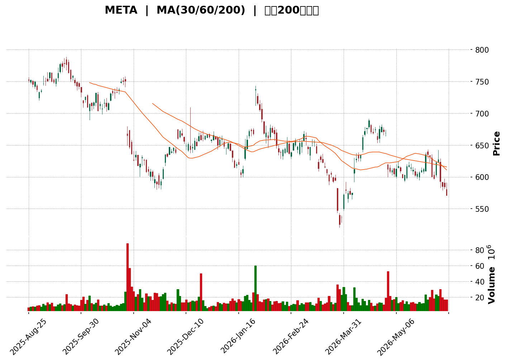
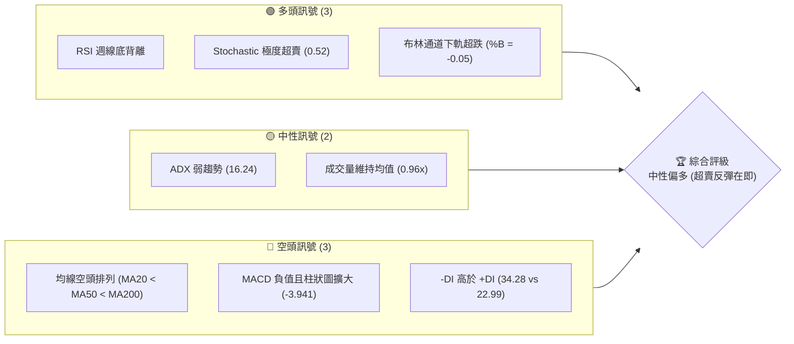
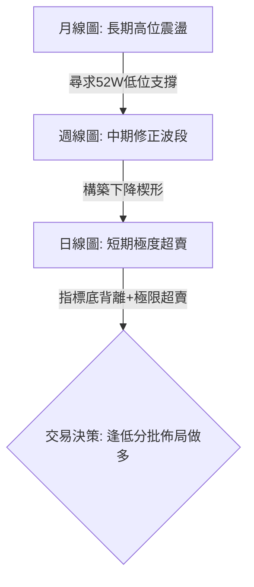
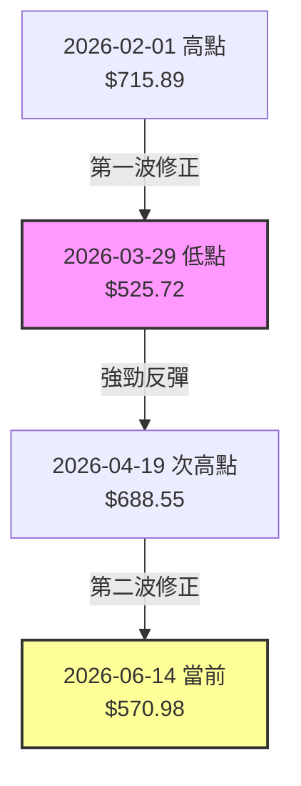
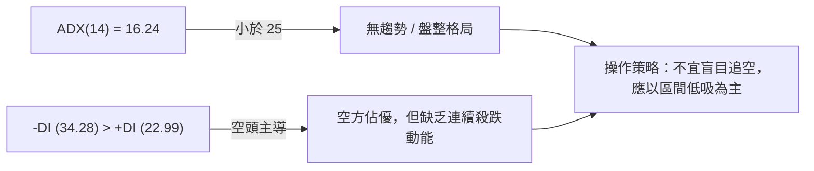
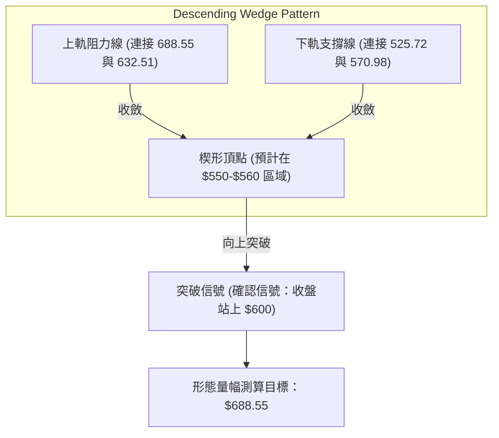

<details>
<summary>📊 靜態圖表 (點擊展開)</summary>

</details>

<html>
<head><meta charset="utf-8" /></head>
<body>
    <div style="height:500px; width:100%;">                        <script>window.PlotlyConfig = {MathJaxConfig: 'local'};</script>
        <script charset="utf-8" src="https://cdn.plot.ly/plotly-3.6.0.min.js" integrity="sha256-QaOVwtVY0T02VaHrr6pnoHLCwayMJp4O5n4YyaE3rJk=" crossorigin="anonymous"></script>                <div id="candlestick-chart" class="plotly-graph-div" style="height:100%; width:100%;"></div>            <script>                window.PLOTLYENV=window.PLOTLYENV || {};                                if (document.getElementById("candlestick-chart")) {                    Plotly.newPlot(                        "candlestick-chart",                        [{"close":{"dtype":"f8","bdata":"AAAAwEd8h0AAAABAqoKHQAAAAAAITYdAAAAAIM1qh0AAAAAAwQeHQAAAAMAZ64ZAAAAAoJX6hkAAAADgKleHQAAAAAB\u002fdYdAAAAAgEx0h0AAAABgP9+HQAAAAKC+cYdAAAAAICBph0AAAACgjo6HQAAAAEBE14dAAAAAAGZJiEAAAABAOC+IQAAAAOBfU4hAAAAAQHNEiEAAAABAD9+HQAAAAEAckYdAAAAAoB67h0AAAADARl2HQAAAAMAQNIdAAAAAQEUxh0AAAAAAO+mGQAAAAIAjYYZAAAAAQLCuhkAAAAAg\u002fSqGQAAAAIC4U4ZAAAAAgB0\u002fhkAAAADAIWWGQAAAAEBI4oZAAAAAoPoAhkAAAABAClSGQAAAACC8G4ZAAAAAwNBihkAAAACADDeGQAAAAKDIXYZAAAAAgJTXhkAAAACgXeCGQAAAAMB74YZAAAAAIDLmhkAAAABgBAmHQAAAAACIbIdAAAAAoHtxh0AAAADgUXOHQAAAAIDbyoRAAAAAwCM6hEAAAACAKeWDQAAAAEAukoNAAAAAABvXg0AAAACgQE+DQAAAACBgZYNAAAAAIKS1g0AAAACgQ5CDQAAAAADy\u002f4JAAAAAQPkGg0AAAAAgigODQAAAAOAJyIJAAAAAYImlgkAAAADArGqCQAAAAMBUYYJAAAAAABCKgkAAAAAgNiCDQAAAAABD2YNAAAAAwGrEg0AAAAAA8jaEQAAAAGBm\u002foNAAAAAACgwhEAAAADAQfSDQAAAAGBno4RAAAAAYF0ChUAAAABAfs2EQAAAAKDnfoRAAAAAIFtIhEAAAABA9lyEQAAAACA8GYRAAAAAIKY3hEAAAAAAtISEQAAAACCOR4RAAAAAgA2\u002fhEAAAADgppGEQAAAACB5p4RAAAAAIPjChEAAAADg1NeEQAAAAODHtYRAAAAAIAORhEAAAADgCsuEQAAAAOAznIRAAAAAINROhEAAAADAz5GEQAAAAGBwoIRAAAAAoBRBhEAAAAAADyyEQAAAAMACZIRAAAAAwF0LhEAAAADAZrSDQAAAAKDyN4NAAAAAwCZig0AAAABgwV2DQAAAAGDT3IJAAAAAQHwjg0AAAACgmziEQAAAAGCSkYRAAAAAQEf+hEAAAACAJwOFQAAAAGBD4YRAAAAAYG0Nh0AAAADAGF+GQAAAAAByDoZAAAAAwN2YhUAAAACAV+OEQAAAAAAY7YRAAAAAQCenhEAAAAAAICWFQAAAAGAr8YRAAAAAoPHghEAAAACACEqEQAAAACDI+YNAAAAA4PH1g0AAAACgWxWEQAAAAODTIYRAAAAAAMt4hEAAAACgo+WDQAAAAGAG9oNAAAAA4AtphEAAAACAlYOEQAAAAAABPYRAAAAA4AFohEAAAABAKHSEQAAAACBF2YRAAAAAIAqghEAAAACAdyKEQAAAAICwNoRAAAAAgBVshEAAAAAAZnKEQAAAAKAS7YNAAAAA4Hopg0AAAACgmZuDQAAAAKBHdYNAAAAAoHA9g0AAAACgmfWCQAAAAKBHjYJAAAAA4HrggkAAAAAgXIeCQAAAAMAel4JAAAAA4FEcgUAAAACAwm2AQAAAAEAKw4BAAAAAQArhgUAAAAAA1xmCQAAAACCu84FAAAAAACnogUAAAABgZviBQAAAACBcI4NAAAAAwB6jg0AAAABA4a6DQAAAAIA91INAAAAAgOuzhEAAAADgo\u002fyEQAAAAMD1JoVAAAAAYGaEhUAAAACgR\u002feEQAAAAGC45oRAAAAAgMIVhUAAAABAM5mEQAAAAIA9GIVAAAAAwPU0hUAAAABguPqEQAAAAMD16IRAAAAAoEcfg0AAAAAAAAaDQAAAAKBHE4NAAAAAIK7ngkAAAABACieDQAAAAOB6RoNAAAAAQAoNg0AAAABA4baCQAAAAAAA2IJAAAAAQApFg0AAAACgcFODQAAAAADXMYNAAAAAIK4Zg0AAAABA4dSCQAAAAOB66IJAAAAAQAr7gkAAAACAFBKDQAAAAGC4IoNAAAAAgBTag0AAAADgUdqDQAAAAIAUxINAAAAAgMLDgkAAAABACq2CQAAAAADXd4NAAAAAYI+cg0AAAAAAAIiCQAAAAMAeS4JAAAAAYLhEgkAAAAAA19eBQA=="},"high":{"dtype":"f8","bdata":"hzKU2dCoh0DWwRuOz4iHQKb0uIMQg4dAip7r8Eh6h0ChtT6gHUuHQHwpqzo08oZAYlMJ5R8Uh0AQbaw4A7uHQHdUuZtkoYdArqxbcLblh0DfAPk+CeSHQLQNGWo\u002f34dAzrAG4Juah0Bu1rkfXJ6HQJ8H3gkNIohA0Qz77DtciEA2zfxMo2uIQL0AT3F0l4hA6ypTx5OniEDK2ctJWIOIQMzHjMaBCohANBUTtra+h0BZa3A\u002fDZyHQLMDT2dldYdAuP2+QzZsh0Bh1Uzg1S2HQF5sI3QohYZACheyaXC0hkCN8Q5bPM6GQLLBBvR2XYZALfpkF2dqhkCOso9vlnOGQAAAAEBI4oZAKT+6xFbwhkDtoElA53WGQLv8FajXUoZAhB9Q6YeVhkCf33y8OqKGQPGw39W4aoZANJBb51vkhkDkFsu9IgqHQNwH+0noGodAi5cW\u002flwph0AMYAyBxx+HQFImasTnk4dAVGxe8xGph0D1Y4rDI6+HQAj0fZOVPoVAWb1n\u002fxoOhUDYvT1S1ZGEQM9f1hBZBYRAA9SU5kIJhEAB7pEpgdeDQFjpVtC6aINAqPeki4TPg0BqfhglEqSDQLhCxK2En4NAGNgCN\u002fNEg0DXG\u002fUxPiWDQI6t\u002f2VZFYNAGtMQdjfVgkD2uzgesJKCQMJhKeyn7YJAneVMhPiogkCRSenkXD2DQNyCbQnk34NAOOAiglrqg0BW13tovjeEQFkUo8jwIYRAJAHvXU42hEDXAQofIj6EQLqddM3EF4VAzl09CIIMhUBHedMcpByFQAi\u002fA8n2uoRAXfXEZVZrhEDsuE3WfHGEQB+i5s+ALoZAQCrPAYhjhEBF1bMuya+EQAKGMJNQpYRAcfuTC+TvhEC+v+VyaPOEQHwDT9YHCIVAqnCRJHHLhEDjXXIF3tyEQIkgl7UF44RA7GNWRHudhEDqvdXDKP2EQBiVxuVyw4RAHFniwZK+hECdQjmtxb+EQPbsVgqbx4RAPyWTbLCUhEBnBZENXzSEQDkfVTAec4RAKlbEuUhrhEA6i9fJww2EQIVe1JhMn4NAny+KmBZ9g0CJFNPHVaSDQB7v8x4EF4NAhpV40u1Ng0D\u002fvV4UCqCEQLElFNVbz4RAvQ9MYp4VhUC8okah7SGFQF0Rx1HNKIVA1toAiOg6h0AHPCZsWdyGQLqeral2hYZAxyN\u002fzBdjhkBzegse7YGFQOPIqhhWR4VADucxLVL7hECng4a0zVWFQOyJKbqKQIVACMzq9oI1hUAeiWu+XxuFQHQuX1L7VoRAsWF582YQhEDmGasBliOEQJRfIEcXNYRAejY3p0K2hEAajKNsGYmEQIuzOxR+BIRAKWHIqpBqhEC8eZECeqOEQNIb3UoTR4RATIGV8gCbhEBmvwZQz5OEQFZrdUuOAYVAoTzXoALxhEATs3KsUEeEQC79iR6ROYRA+ynqleGdhECANnEJc5SEQPGvWimHZ4RANwnUyQ2lg0AAAAAAANaDQAAAAGBm5INAAAAAQDN1g0AAAAAAACiDQAAAACCu34JAAAAAwB4Fg0AAAAAAAMiCQAAAACBc3YJAAAAAAAA4gkAAAADAzPyAQAAAAGBm3IBAAAAAIIXtgUAAAABgZoSCQAAAAAAAFIJAAAAA4FE2gkAAAAAA1\u002fmBQAAAAKCZr4NAAAAAAADsg0AAAADgo\u002fSDQAAAAAAA2INAAAAAgBTShEAAAAAAADSFQAAAAOCjLIVAAAAAACmchUAAAABACluFQAAAAKCZIYVAAAAAQAozhUAAAADgeuyEQAAAACBcRYVAAAAAAABUhUAAAACgcDGFQAAAAAAAEoVAAAAAwMxmg0AAAABACleDQAAAAAAAMINAAAAAwMwyg0AAAACgmV+DQAAAAADXh4NAAAAAAClGg0AAAACgR+eCQAAAAAAA3oJAAAAAQDNfg0AAAAAA132DQAAAAKCZaYNAAAAAYLg8g0AAAACgcC+DQAAAAAAAAINAAAAAwMwMg0AAAADgejaDQAAAAIDCM4NAAAAAAAD0g0AAAAAAABiEQAAAAAAA1INAAAAAAADeg0AAAABACgeDQAAAAEAzgYNAAAAAQDMThEAAAABAM6mDQAAAAAAAgIJAAAAAQAqtgkAAAABgZnqCQA=="},"hovertemplate":"\u003cb\u003e%{x|%Y-%m-%d}\u003c\u002fb\u003e\u003cbr\u003e\u958b: $%{open:.2f}\u003cbr\u003e\u9ad8: $%{high:.2f}\u003cbr\u003e\u4f4e: $%{low:.2f}\u003cbr\u003e\u6536: $%{close:.2f}\u003cextra\u003e\u003c\u002fextra\u003e","low":{"dtype":"f8","bdata":"uFb31fpih0CBXOgugFGHQKM45ujLKIdAOa6yuIMYh0ACDTUzBO2GQIlwj7RPgIZAk3H3binihkBstmqUlECHQLVCz3pGOodA7vzpdxByh0CVodhAUX2HQLfI0lPsaYdA3YDew+5Uh0AwQWOEIzCHQDlaCB3TcYdAGlbecnXah0A98zrHHeSHQEIUBTBiHIhAcLT5OBr7h0C+fwB8jNmHQJZmVC6HbodAr3+tTDB6h0Dom6lodDqHQDH2hWLzAIdA9V5VyFMPh0BAxEnBsqiGQFSkIiodKIZA1hmmF4dnhkBw4aYs9CeGQKyTaF\u002fbioVAnvuhsJIEhkABkRqMBhWGQFChm+wAOoZAoKSIc6v6hUCs7sTvqhOGQLR9T55M0YVADZoGXpoihkBw9FFho\u002fWFQOtIMS6HB4ZAaY\u002fQ\u002f9F3hkCmEbkURLyGQNudD7ORloZA\u002fbvc8wHfhkBzuKwHb8+GQI0xzLsWVodA0ug0vjNCh0Du6kySKSqHQNuD6tysSIRAYaqG4e8jhEClQ1w78diDQFt+w9q3h4NAxBZybfOLg0DzU+K2vkeDQNS008KRwYJAJbqEjZ9Ig0CM+ZvL2FKDQCvzeL0K9oJAFLZoD\u002fLPgkDgxM5ippGCQDBMeTo\u002fk4JA6SVgUHE2gkBSv+ljPCKCQHdtERUCM4JAG+TqnRsngkCV5gy6DqWCQNRyniYkSoNAstQnhZq0g0AWqnHygtODQNNiW8KP5YNAJWq7gAnog0CYb3Ni4uODQC80oU+Vl4RAa26Bt0WqhECtpWkqrb+EQCxI80D+YYRALrBiI5sShECI06I51\u002f2DQG4yi5dZ7INAG\u002fsrrzrxg0BfjVTQMhWEQDjWikYoRYRASAai\u002fy9\u002fhEDX+5+I74yEQKueIt+0gIRArm6cuH6NhEAMPm5\u002fEa2EQJrZfdMIpoRAPvaNSKRuhEC+cXHVN4qEQC6jjMMBl4RAOvsnm5gXhEAgnj03kTmEQFft5ya9WoRAOqU4LBEihEBTF4m9aNmDQHA+LINmEoRA4GXmi3MFhEC0u\u002f5eh3yDQNCN9TlaMoNAPqWu4qItg0D+UzyMZVyDQKexytfku4JAQZOrkIi8gkBUbnOuHJCDQEyOFJIwH4RA6kUjRculhEB0GP8uu8CEQApRmbs9zIRAz7SAAYY\u002fhkB3+hg51keGQNZgLHBY94VAdq+tBJVuhUCd+SrOHNeEQOipHSaHZ4RAdHS7VZMvhEBH5ZtOu5GEQKMKH2G86YRA3iQRjk2EhEDfqpQP0yWEQJt4Q5w30INApS+8wBiig0BnBcbG5pyDQIEw8P5m4YNAgn1Bct7xg0Dsp5jQpduDQFf7bBSJo4NAD6U9vLkMhEAcJg2pkTeEQIx4FcCX7INAa0tcZKjPg0CKclozWfKDQHKBE+DbiIRA7ep2mQdOhEC8IlPUhtyDQKa9AlzzkYNAq0PZAY9DhEB04iljcT6EQNfCCH7X4oNACZzgaToIg0AAAADAzHiDQAAAAKCZbYNAAAAAQOE0g0AAAACAFNKCQAAAAAAAWoJAAAAAgBS4gkAAAAAAAHiCQAAAAEAzi4JAAAAAwMz6gEAAAACAFEKAQAAAAOBRhIBAAAAAACkWgUAAAABgj+6BQAAAAKCZfYFAAAAAAADggUAAAACAFKaBQAAAAOCjfoJAAAAAAAB4g0AAAADgo4KDQAAAAEAzg4NAAAAAwPX6g0AAAACAwsGEQAAAAAAA3oRAAAAAQAoZhUAAAAAAAOCEQAAAAOCj2oRAAAAAAADuhEAAAABgZmiEQAAAAGC4boRAAAAAYLj2hEAAAABACs2EQAAAAOB6voRAAAAAAADAgkAAAABA4fCCQAAAAAAA1oJAAAAAQOHCgkAAAADAzLCCQAAAAOBRLINAAAAA4HrwgkAAAADgo7CCQAAAAMDMhIJAAAAAoEelgkAAAAAAADiDQAAAAOB6CoNAAAAAIIXdgkAAAABgZsSCQAAAAOB6roJAAAAA4HqWgkAAAACgmfeCQAAAAGBm6oJAAAAAAAAIg0AAAADgeqqDQAAAAMDMeoNAAAAAgD28gkAAAACgcKWCQAAAAAApwoJAAAAAoHBzg0AAAACgRzeCQAAAAIDCGYJAAAAAgBQogkAAAADAzNSBQA=="},"name":"\u50f9\u683c","open":{"dtype":"f8","bdata":"\u002fNzTdGmIh0CdBbS1U2iHQAOzTYRMdIdAj7\u002fV\u002fQ0yh0BtNRBNRTyHQMVp+uW1ooZAcdfTSTTyhkDNLUtih1aHQPTNME\u002fadodAvUnkXtSRh0DVkW2luJ2HQOTFTcay2odAiCWHIQ6Hh0CvIBwrzleHQF4baNGPnYdAxybelJ\u002fph0AjA7PCTFGIQB6\u002fxnldV4hATi22i56EiED6jjROW2SIQOUyRKS5\u002f4dA4DAizuGhh0Depbg5iYGHQGGFzmD7ZYdAfJsQT8Jbh0CE75DWFSiHQKH9QW9IgoZAG\u002fjwCP2KhkBDFFZKS8OGQFTnDM0ZAIZAV6o5QixkhkBjN\u002fACEkKGQMgFRVSlaIZAP5CtxJjNhkClDdhSjj6GQCjdjVnJFIZA6VHt7OZehkCQ2vbC0GKGQOq2zAUyD4ZAZsCrC+N\u002fhkA\u002fULY4VPaGQBLFTJDW5IZAn2Q5W8nrhkB3lWZeevyGQEdDLlrTY4dA7iBNrvx6h0A6DN4364uHQLN05RVD4IRAwrUNDBILhUD1YkfVPHeEQFT+vUnul4NAzklusgi6g0AbAedsTtaDQI5itVmvO4NAsWKESkqwg0AjU6yanJeDQF1hll6mmINAZftIAF8gg0BrgiMaSMaCQHME3jUvAINAaSEH0+V0gkDSS6k\u002f1IWCQGyqwm7w04JAngFpqSNcgkCA2e8\u002fw62CQCiG\u002f0iqd4NAiFGZrADlg0Ad+7XWJNiDQG1Qe4Pb84NAGifO5iMKhEBfHJUtrBqEQJdo+WT4FoVACqgkdiG3hEAQvneQx+GEQP0GhDZLtYRAV4WQHetGhEB33vs1uhGEQGW7NnS4RYRAmMjCay4phED5h8qpmBeEQG1ct6tkeIRAi9T5X76DhEBMzQSZzM6EQMdrtxysqIRAdgxH8eGbhEAjh2vLtK+EQIdkvoTo24RAx3H6sJOLhEDWkTcYA5GEQDvn51VzwYRAKeBq6k2xhEBtqC4BoFOEQPBe69YLmIRAPHrZEqJ4hEAuMLqwniqEQKImjVkaJ4RA886bP8ZfhEA6i9fJww2EQLSfa2O2j4NAEweJcJtPg0Bh5W8dK32DQELNqEnh+oJAB6+thcTxgkDa4aUmfqaDQE9UjmK\u002fIYRAOnvN6nzEhEBUgGmJGhCFQPADDkRiD4VAztmvqmQGh0BZkJh6BbeGQMaGs8boT4ZAfX26ax4WhkCuEWUrInmFQKQ5bV0ZuIRAHPeDkF3HhEBWqie55rSEQPZZLJIpKIVAzl1+MmMLhUAW4r3OLOuEQEWGdIliJIRAez\u002fOoZ\u002f3g0BXLM0AEMqDQANFMqEw8INAIoUneiT5g0AWt8u22l+EQOAZmcVOxINAVBtRzdcPhEDoLzGx8k+EQE9\u002fekkyF4RA5oteW+vkg0Bt6DYl4j2EQFwl\u002fV0ti4RAzQER\u002fuiqhEAxWI8sxDqEQCzJ11fl0YNACgG85AFohEDsdNZsmXGEQKa4nHuPQYRAwQcGqtl6g0AAAAAAAMCDQAAAAIDrn4NAAAAAYLhCg0AAAABAMyGDQAAAAIA93IJAAAAA4FHugkAAAADAzLiCQAAAAIDrtYJAAAAAgOszgkAAAADAzOCAQAAAAEAKw4BAAAAAANcvgUAAAABACiGCQAAAAOBRsIFAAAAAIIUNgkAAAAAA1+OBQAAAAAAA8IJAAAAAgMKXg0AAAACAwtODQAAAAAAArINAAAAAgMIZhEAAAAAAANiEQAAAAIDrH4VAAAAAwMw0hUAAAABA4UqFQAAAAAAA+IRAAAAAQOEShUAAAACgmb2EQAAAAGCPooRAAAAAAAD4hEAAAACA6xGFQAAAAKBH54RAAAAAYI9ag0AAAAAghTWDQAAAACCF\u002f4JAAAAA4Hoqg0AAAABgZsiCQAAAAIDCNYNAAAAAoJk5g0AAAABgj+SCQAAAAGCPloJAAAAA4KO2gkAAAAAAAECDQAAAAIDrL4NAAAAAQOEIg0AAAAAgXAeDQAAAAIAUxoJAAAAAAADAgkAAAABACv+CQAAAAMAeB4NAAAAAQDMLg0AAAAAAAPyDQAAAAAAAzINAAAAAQDOzg0AAAACA69mCQAAAAAAA2IJAAAAAIFx9g0AAAAAgrnuDQAAAAAAAgIJAAAAAAAB4gkAAAAAA1yWCQA=="},"x":["2025-08-25T00:00:00-04:00","2025-08-26T00:00:00-04:00","2025-08-27T00:00:00-04:00","2025-08-28T00:00:00-04:00","2025-08-29T00:00:00-04:00","2025-09-02T00:00:00-04:00","2025-09-03T00:00:00-04:00","2025-09-04T00:00:00-04:00","2025-09-05T00:00:00-04:00","2025-09-08T00:00:00-04:00","2025-09-09T00:00:00-04:00","2025-09-10T00:00:00-04:00","2025-09-11T00:00:00-04:00","2025-09-12T00:00:00-04:00","2025-09-15T00:00:00-04:00","2025-09-16T00:00:00-04:00","2025-09-17T00:00:00-04:00","2025-09-18T00:00:00-04:00","2025-09-19T00:00:00-04:00","2025-09-22T00:00:00-04:00","2025-09-23T00:00:00-04:00","2025-09-24T00:00:00-04:00","2025-09-25T00:00:00-04:00","2025-09-26T00:00:00-04:00","2025-09-29T00:00:00-04:00","2025-09-30T00:00:00-04:00","2025-10-01T00:00:00-04:00","2025-10-02T00:00:00-04:00","2025-10-03T00:00:00-04:00","2025-10-06T00:00:00-04:00","2025-10-07T00:00:00-04:00","2025-10-08T00:00:00-04:00","2025-10-09T00:00:00-04:00","2025-10-10T00:00:00-04:00","2025-10-13T00:00:00-04:00","2025-10-14T00:00:00-04:00","2025-10-15T00:00:00-04:00","2025-10-16T00:00:00-04:00","2025-10-17T00:00:00-04:00","2025-10-20T00:00:00-04:00","2025-10-21T00:00:00-04:00","2025-10-22T00:00:00-04:00","2025-10-23T00:00:00-04:00","2025-10-24T00:00:00-04:00","2025-10-27T00:00:00-04:00","2025-10-28T00:00:00-04:00","2025-10-29T00:00:00-04:00","2025-10-30T00:00:00-04:00","2025-10-31T00:00:00-04:00","2025-11-03T00:00:00-05:00","2025-11-04T00:00:00-05:00","2025-11-05T00:00:00-05:00","2025-11-06T00:00:00-05:00","2025-11-07T00:00:00-05:00","2025-11-10T00:00:00-05:00","2025-11-11T00:00:00-05:00","2025-11-12T00:00:00-05:00","2025-11-13T00:00:00-05:00","2025-11-14T00:00:00-05:00","2025-11-17T00:00:00-05:00","2025-11-18T00:00:00-05:00","2025-11-19T00:00:00-05:00","2025-11-20T00:00:00-05:00","2025-11-21T00:00:00-05:00","2025-11-24T00:00:00-05:00","2025-11-25T00:00:00-05:00","2025-11-26T00:00:00-05:00","2025-11-28T00:00:00-05:00","2025-12-01T00:00:00-05:00","2025-12-02T00:00:00-05:00","2025-12-03T00:00:00-05:00","2025-12-04T00:00:00-05:00","2025-12-05T00:00:00-05:00","2025-12-08T00:00:00-05:00","2025-12-09T00:00:00-05:00","2025-12-10T00:00:00-05:00","2025-12-11T00:00:00-05:00","2025-12-12T00:00:00-05:00","2025-12-15T00:00:00-05:00","2025-12-16T00:00:00-05:00","2025-12-17T00:00:00-05:00","2025-12-18T00:00:00-05:00","2025-12-19T00:00:00-05:00","2025-12-22T00:00:00-05:00","2025-12-23T00:00:00-05:00","2025-12-24T00:00:00-05:00","2025-12-26T00:00:00-05:00","2025-12-29T00:00:00-05:00","2025-12-30T00:00:00-05:00","2025-12-31T00:00:00-05:00","2026-01-02T00:00:00-05:00","2026-01-05T00:00:00-05:00","2026-01-06T00:00:00-05:00","2026-01-07T00:00:00-05:00","2026-01-08T00:00:00-05:00","2026-01-09T00:00:00-05:00","2026-01-12T00:00:00-05:00","2026-01-13T00:00:00-05:00","2026-01-14T00:00:00-05:00","2026-01-15T00:00:00-05:00","2026-01-16T00:00:00-05:00","2026-01-20T00:00:00-05:00","2026-01-21T00:00:00-05:00","2026-01-22T00:00:00-05:00","2026-01-23T00:00:00-05:00","2026-01-26T00:00:00-05:00","2026-01-27T00:00:00-05:00","2026-01-28T00:00:00-05:00","2026-01-29T00:00:00-05:00","2026-01-30T00:00:00-05:00","2026-02-02T00:00:00-05:00","2026-02-03T00:00:00-05:00","2026-02-04T00:00:00-05:00","2026-02-05T00:00:00-05:00","2026-02-06T00:00:00-05:00","2026-02-09T00:00:00-05:00","2026-02-10T00:00:00-05:00","2026-02-11T00:00:00-05:00","2026-02-12T00:00:00-05:00","2026-02-13T00:00:00-05:00","2026-02-17T00:00:00-05:00","2026-02-18T00:00:00-05:00","2026-02-19T00:00:00-05:00","2026-02-20T00:00:00-05:00","2026-02-23T00:00:00-05:00","2026-02-24T00:00:00-05:00","2026-02-25T00:00:00-05:00","2026-02-26T00:00:00-05:00","2026-02-27T00:00:00-05:00","2026-03-02T00:00:00-05:00","2026-03-03T00:00:00-05:00","2026-03-04T00:00:00-05:00","2026-03-05T00:00:00-05:00","2026-03-06T00:00:00-05:00","2026-03-09T00:00:00-04:00","2026-03-10T00:00:00-04:00","2026-03-11T00:00:00-04:00","2026-03-12T00:00:00-04:00","2026-03-13T00:00:00-04:00","2026-03-16T00:00:00-04:00","2026-03-17T00:00:00-04:00","2026-03-18T00:00:00-04:00","2026-03-19T00:00:00-04:00","2026-03-20T00:00:00-04:00","2026-03-23T00:00:00-04:00","2026-03-24T00:00:00-04:00","2026-03-25T00:00:00-04:00","2026-03-26T00:00:00-04:00","2026-03-27T00:00:00-04:00","2026-03-30T00:00:00-04:00","2026-03-31T00:00:00-04:00","2026-04-01T00:00:00-04:00","2026-04-02T00:00:00-04:00","2026-04-06T00:00:00-04:00","2026-04-07T00:00:00-04:00","2026-04-08T00:00:00-04:00","2026-04-09T00:00:00-04:00","2026-04-10T00:00:00-04:00","2026-04-13T00:00:00-04:00","2026-04-14T00:00:00-04:00","2026-04-15T00:00:00-04:00","2026-04-16T00:00:00-04:00","2026-04-17T00:00:00-04:00","2026-04-20T00:00:00-04:00","2026-04-21T00:00:00-04:00","2026-04-22T00:00:00-04:00","2026-04-23T00:00:00-04:00","2026-04-24T00:00:00-04:00","2026-04-27T00:00:00-04:00","2026-04-28T00:00:00-04:00","2026-04-29T00:00:00-04:00","2026-04-30T00:00:00-04:00","2026-05-01T00:00:00-04:00","2026-05-04T00:00:00-04:00","2026-05-05T00:00:00-04:00","2026-05-06T00:00:00-04:00","2026-05-07T00:00:00-04:00","2026-05-08T00:00:00-04:00","2026-05-11T00:00:00-04:00","2026-05-12T00:00:00-04:00","2026-05-13T00:00:00-04:00","2026-05-14T00:00:00-04:00","2026-05-15T00:00:00-04:00","2026-05-18T00:00:00-04:00","2026-05-19T00:00:00-04:00","2026-05-20T00:00:00-04:00","2026-05-21T00:00:00-04:00","2026-05-22T00:00:00-04:00","2026-05-26T00:00:00-04:00","2026-05-27T00:00:00-04:00","2026-05-28T00:00:00-04:00","2026-05-29T00:00:00-04:00","2026-06-01T00:00:00-04:00","2026-06-02T00:00:00-04:00","2026-06-03T00:00:00-04:00","2026-06-04T00:00:00-04:00","2026-06-05T00:00:00-04:00","2026-06-08T00:00:00-04:00","2026-06-09T00:00:00-04:00","2026-06-10T00:00:00-04:00"],"type":"candlestick"},{"hovertemplate":"MA30: $%{y:.2f}\u003cextra\u003e\u003c\u002fextra\u003e","line":{"color":"#2196F3","dash":"dash","width":2},"mode":"lines","name":"MA30","x":["2025-08-25T00:00:00-04:00","2025-08-26T00:00:00-04:00","2025-08-27T00:00:00-04:00","2025-08-28T00:00:00-04:00","2025-08-29T00:00:00-04:00","2025-09-02T00:00:00-04:00","2025-09-03T00:00:00-04:00","2025-09-04T00:00:00-04:00","2025-09-05T00:00:00-04:00","2025-09-08T00:00:00-04:00","2025-09-09T00:00:00-04:00","2025-09-10T00:00:00-04:00","2025-09-11T00:00:00-04:00","2025-09-12T00:00:00-04:00","2025-09-15T00:00:00-04:00","2025-09-16T00:00:00-04:00","2025-09-17T00:00:00-04:00","2025-09-18T00:00:00-04:00","2025-09-19T00:00:00-04:00","2025-09-22T00:00:00-04:00","2025-09-23T00:00:00-04:00","2025-09-24T00:00:00-04:00","2025-09-25T00:00:00-04:00","2025-09-26T00:00:00-04:00","2025-09-29T00:00:00-04:00","2025-09-30T00:00:00-04:00","2025-10-01T00:00:00-04:00","2025-10-02T00:00:00-04:00","2025-10-03T00:00:00-04:00","2025-10-06T00:00:00-04:00","2025-10-07T00:00:00-04:00","2025-10-08T00:00:00-04:00","2025-10-09T00:00:00-04:00","2025-10-10T00:00:00-04:00","2025-10-13T00:00:00-04:00","2025-10-14T00:00:00-04:00","2025-10-15T00:00:00-04:00","2025-10-16T00:00:00-04:00","2025-10-17T00:00:00-04:00","2025-10-20T00:00:00-04:00","2025-10-21T00:00:00-04:00","2025-10-22T00:00:00-04:00","2025-10-23T00:00:00-04:00","2025-10-24T00:00:00-04:00","2025-10-27T00:00:00-04:00","2025-10-28T00:00:00-04:00","2025-10-29T00:00:00-04:00","2025-10-30T00:00:00-04:00","2025-10-31T00:00:00-04:00","2025-11-03T00:00:00-05:00","2025-11-04T00:00:00-05:00","2025-11-05T00:00:00-05:00","2025-11-06T00:00:00-05:00","2025-11-07T00:00:00-05:00","2025-11-10T00:00:00-05:00","2025-11-11T00:00:00-05:00","2025-11-12T00:00:00-05:00","2025-11-13T00:00:00-05:00","2025-11-14T00:00:00-05:00","2025-11-17T00:00:00-05:00","2025-11-18T00:00:00-05:00","2025-11-19T00:00:00-05:00","2025-11-20T00:00:00-05:00","2025-11-21T00:00:00-05:00","2025-11-24T00:00:00-05:00","2025-11-25T00:00:00-05:00","2025-11-26T00:00:00-05:00","2025-11-28T00:00:00-05:00","2025-12-01T00:00:00-05:00","2025-12-02T00:00:00-05:00","2025-12-03T00:00:00-05:00","2025-12-04T00:00:00-05:00","2025-12-05T00:00:00-05:00","2025-12-08T00:00:00-05:00","2025-12-09T00:00:00-05:00","2025-12-10T00:00:00-05:00","2025-12-11T00:00:00-05:00","2025-12-12T00:00:00-05:00","2025-12-15T00:00:00-05:00","2025-12-16T00:00:00-05:00","2025-12-17T00:00:00-05:00","2025-12-18T00:00:00-05:00","2025-12-19T00:00:00-05:00","2025-12-22T00:00:00-05:00","2025-12-23T00:00:00-05:00","2025-12-24T00:00:00-05:00","2025-12-26T00:00:00-05:00","2025-12-29T00:00:00-05:00","2025-12-30T00:00:00-05:00","2025-12-31T00:00:00-05:00","2026-01-02T00:00:00-05:00","2026-01-05T00:00:00-05:00","2026-01-06T00:00:00-05:00","2026-01-07T00:00:00-05:00","2026-01-08T00:00:00-05:00","2026-01-09T00:00:00-05:00","2026-01-12T00:00:00-05:00","2026-01-13T00:00:00-05:00","2026-01-14T00:00:00-05:00","2026-01-15T00:00:00-05:00","2026-01-16T00:00:00-05:00","2026-01-20T00:00:00-05:00","2026-01-21T00:00:00-05:00","2026-01-22T00:00:00-05:00","2026-01-23T00:00:00-05:00","2026-01-26T00:00:00-05:00","2026-01-27T00:00:00-05:00","2026-01-28T00:00:00-05:00","2026-01-29T00:00:00-05:00","2026-01-30T00:00:00-05:00","2026-02-02T00:00:00-05:00","2026-02-03T00:00:00-05:00","2026-02-04T00:00:00-05:00","2026-02-05T00:00:00-05:00","2026-02-06T00:00:00-05:00","2026-02-09T00:00:00-05:00","2026-02-10T00:00:00-05:00","2026-02-11T00:00:00-05:00","2026-02-12T00:00:00-05:00","2026-02-13T00:00:00-05:00","2026-02-17T00:00:00-05:00","2026-02-18T00:00:00-05:00","2026-02-19T00:00:00-05:00","2026-02-20T00:00:00-05:00","2026-02-23T00:00:00-05:00","2026-02-24T00:00:00-05:00","2026-02-25T00:00:00-05:00","2026-02-26T00:00:00-05:00","2026-02-27T00:00:00-05:00","2026-03-02T00:00:00-05:00","2026-03-03T00:00:00-05:00","2026-03-04T00:00:00-05:00","2026-03-05T00:00:00-05:00","2026-03-06T00:00:00-05:00","2026-03-09T00:00:00-04:00","2026-03-10T00:00:00-04:00","2026-03-11T00:00:00-04:00","2026-03-12T00:00:00-04:00","2026-03-13T00:00:00-04:00","2026-03-16T00:00:00-04:00","2026-03-17T00:00:00-04:00","2026-03-18T00:00:00-04:00","2026-03-19T00:00:00-04:00","2026-03-20T00:00:00-04:00","2026-03-23T00:00:00-04:00","2026-03-24T00:00:00-04:00","2026-03-25T00:00:00-04:00","2026-03-26T00:00:00-04:00","2026-03-27T00:00:00-04:00","2026-03-30T00:00:00-04:00","2026-03-31T00:00:00-04:00","2026-04-01T00:00:00-04:00","2026-04-02T00:00:00-04:00","2026-04-06T00:00:00-04:00","2026-04-07T00:00:00-04:00","2026-04-08T00:00:00-04:00","2026-04-09T00:00:00-04:00","2026-04-10T00:00:00-04:00","2026-04-13T00:00:00-04:00","2026-04-14T00:00:00-04:00","2026-04-15T00:00:00-04:00","2026-04-16T00:00:00-04:00","2026-04-17T00:00:00-04:00","2026-04-20T00:00:00-04:00","2026-04-21T00:00:00-04:00","2026-04-22T00:00:00-04:00","2026-04-23T00:00:00-04:00","2026-04-24T00:00:00-04:00","2026-04-27T00:00:00-04:00","2026-04-28T00:00:00-04:00","2026-04-29T00:00:00-04:00","2026-04-30T00:00:00-04:00","2026-05-01T00:00:00-04:00","2026-05-04T00:00:00-04:00","2026-05-05T00:00:00-04:00","2026-05-06T00:00:00-04:00","2026-05-07T00:00:00-04:00","2026-05-08T00:00:00-04:00","2026-05-11T00:00:00-04:00","2026-05-12T00:00:00-04:00","2026-05-13T00:00:00-04:00","2026-05-14T00:00:00-04:00","2026-05-15T00:00:00-04:00","2026-05-18T00:00:00-04:00","2026-05-19T00:00:00-04:00","2026-05-20T00:00:00-04:00","2026-05-21T00:00:00-04:00","2026-05-22T00:00:00-04:00","2026-05-26T00:00:00-04:00","2026-05-27T00:00:00-04:00","2026-05-28T00:00:00-04:00","2026-05-29T00:00:00-04:00","2026-06-01T00:00:00-04:00","2026-06-02T00:00:00-04:00","2026-06-03T00:00:00-04:00","2026-06-04T00:00:00-04:00","2026-06-05T00:00:00-04:00","2026-06-08T00:00:00-04:00","2026-06-09T00:00:00-04:00","2026-06-10T00:00:00-04:00"],"y":{"dtype":"f8","bdata":"AAAAAAAA+H8AAAAAAAD4fwAAAAAAAPh\u002fAAAAAAAA+H8AAAAAAAD4fwAAAAAAAPh\u002fAAAAAAAA+H8AAAAAAAD4fwAAAAAAAPh\u002fAAAAAAAA+H8AAAAAAAD4fwAAAAAAAPh\u002fAAAAAAAA+H8AAAAAAAD4fwAAAAAAAPh\u002fAAAAAAAA+H8AAAAAAAD4fwAAAAAAAPh\u002fAAAAAAAA+H8AAAAAAAD4fwAAAAAAAPh\u002fAAAAAAAA+H8AAAAAAAD4fwAAAAAAAPh\u002fAAAAAAAA+H8AAAAAAAD4fwAAAAAAAPh\u002fAAAAAAAA+H8AAAAAAAD4fzMzM3P5YYdAmpmZ+WZXh0DNzMxs4k2HQAAAAIBTSodAMzMz80M+h0BERERkRjiHQO\u002fu7t5cMYdAZmZmxk0sh0CamZkpsyKHQImIiEhgGYdAMzMz8yYUh0BVVVX1pwuHQN7d3e3YBodAmpmZqXsCh0Dv7u4eCP6GQAAAAFB5+oZAVVVV1UbzhkC8u7trA+2GQAAAAODczoZAIiIiwmKshkAzMzOzdIqGQDMzM7NbaIZAERERYShHhkAzMzOTjiSGQImIiDgRBIZAZmZmpljmhUDv7u7ex8mFQDMzM+PwrIVA7+7uHsCNhUAzMzPj1XKFQFVVVVWUVIVAIiIiMtw1hUDNzMxc6ROFQImIiNh67YRA3t3dferPhEDv7u6elrSEQBEREVFOoYRAVVVVlfWKhEAiIiKi43mEQAAAAKCkZYRAAAAA4P5OhEAzMzMDDzaEQDMzMzPsIoRAIiIigssShEARERGBvv+DQBEREbHB5oNAREREJMnLg0ARERHBcLGDQKuqqgqFq4NAmpmZyW+rg0BEREQ0wbCDQO\u002fu7u7MtoNAd3d3N4i+g0C8u7tbR8mDQM3MzOwD1INAERERMf7cg0Dv7u5u6eeDQBEREaGB9oNAd3d3F6QDhEDNzMwM0xKEQM3MzAxuIoRAVVVVNZswhEDe3d09+kKEQERERNQlVoRA3t3dHchkhEDv7u6+tW2EQM3MzLxVcoRAvLu7K7N0hEAiIiIyWXCEQM3MzLy7aYRARERE1N1ihEDNzMyM2V2EQLy7u3uyToRAvLu7C7w+hEDv7u6OxTmEQJqZmdlkOoRAERERQXVAhEDe3d1t\u002f0WEQGZmZlaqTIRAVVVVpdtkhEDe3d3Nq3SEQImIiIjVg4RAVVVVNRiLhEC8u7tL0Y2EQERERGQjkIRAd3d3BzaPhECamZmZyZGEQCIiImLEk4RAd3d3d26WhEBmZmaWIZKEQImIiJi3jIRA7+7uHsGJhEDe3d0dm4WEQDMzM7NigYRAzczMHD6DhEAzMzMz5YCEQHd3d6c6fYRA7+7uDlqAhEBEREQEQoeEQCIiIrL1j4RAMzMzM7CYhEBVVVXl96GEQO\u002fu7p7qsoRAREREBJq\u002fhEBEREQU3b6EQM3MzIzVu4RAZmZmBva2hEBmZmbGIrKEQERERAT\u002fqYRARERERMyIhEBmZmb2NnGEQCIiIuIKW4RAVVVVpe1GhEAiIiJieDaEQERERLQ1IoRAMzMz0w0ThEDv7u5+uvyDQCIiIgKp6INAzczMjIHIg0CJiIhIkKeDQN7d3Y0jjINAmpmZGWB6g0B3d3dHdWmDQLy7u2vaVoNAd3d3J\u002fdAg0De3d0thjCDQBEREYGAKYNAiYiIiOcig0BVVVV10BuDQJqZmXlSGINAMzMzQ9oag0CrqqrqZh+DQO\u002fu7t79IYNAvLu7i5opg0DNzMyMsjCDQN7d3a2QNoNARERElDg8g0AAAACwgz2DQFVVVZV8R4NAzczMnO9Yg0BmZmbWo2SDQCIiIoIHcYNAREREJAZwg0BmZmYWknCDQN7d3Y0JdYNA7+7u\u002fkZ1g0CamZmZmXqDQBEREQFygINA7+7urgCRg0BVVVW1gaSDQCIiIqJFtoNAAAAAgCPCg0De3d2Nl8yDQERERIQy14NA7+7unmHhg0DNzMwMu+iDQLy7u5vE5oNAMzMzUyrhg0DNzMxM8NuDQGZmZnYF1oNAAAAAkMLOg0CamZkpFcWDQKuqqtpAuYNAzczM7MOhg0CJiIhYOY6DQCIiIqL+gYNAzczM3Gt1g0BVVVUFyGODQImIiJjgS4NAvLu7e80yg0DNzMw8ChiDQA=="},"type":"scatter"},{"hovertemplate":"MA60: $%{y:.2f}\u003cextra\u003e\u003c\u002fextra\u003e","line":{"color":"#9C27B0","dash":"dash","width":2},"mode":"lines","name":"MA60","x":["2025-08-25T00:00:00-04:00","2025-08-26T00:00:00-04:00","2025-08-27T00:00:00-04:00","2025-08-28T00:00:00-04:00","2025-08-29T00:00:00-04:00","2025-09-02T00:00:00-04:00","2025-09-03T00:00:00-04:00","2025-09-04T00:00:00-04:00","2025-09-05T00:00:00-04:00","2025-09-08T00:00:00-04:00","2025-09-09T00:00:00-04:00","2025-09-10T00:00:00-04:00","2025-09-11T00:00:00-04:00","2025-09-12T00:00:00-04:00","2025-09-15T00:00:00-04:00","2025-09-16T00:00:00-04:00","2025-09-17T00:00:00-04:00","2025-09-18T00:00:00-04:00","2025-09-19T00:00:00-04:00","2025-09-22T00:00:00-04:00","2025-09-23T00:00:00-04:00","2025-09-24T00:00:00-04:00","2025-09-25T00:00:00-04:00","2025-09-26T00:00:00-04:00","2025-09-29T00:00:00-04:00","2025-09-30T00:00:00-04:00","2025-10-01T00:00:00-04:00","2025-10-02T00:00:00-04:00","2025-10-03T00:00:00-04:00","2025-10-06T00:00:00-04:00","2025-10-07T00:00:00-04:00","2025-10-08T00:00:00-04:00","2025-10-09T00:00:00-04:00","2025-10-10T00:00:00-04:00","2025-10-13T00:00:00-04:00","2025-10-14T00:00:00-04:00","2025-10-15T00:00:00-04:00","2025-10-16T00:00:00-04:00","2025-10-17T00:00:00-04:00","2025-10-20T00:00:00-04:00","2025-10-21T00:00:00-04:00","2025-10-22T00:00:00-04:00","2025-10-23T00:00:00-04:00","2025-10-24T00:00:00-04:00","2025-10-27T00:00:00-04:00","2025-10-28T00:00:00-04:00","2025-10-29T00:00:00-04:00","2025-10-30T00:00:00-04:00","2025-10-31T00:00:00-04:00","2025-11-03T00:00:00-05:00","2025-11-04T00:00:00-05:00","2025-11-05T00:00:00-05:00","2025-11-06T00:00:00-05:00","2025-11-07T00:00:00-05:00","2025-11-10T00:00:00-05:00","2025-11-11T00:00:00-05:00","2025-11-12T00:00:00-05:00","2025-11-13T00:00:00-05:00","2025-11-14T00:00:00-05:00","2025-11-17T00:00:00-05:00","2025-11-18T00:00:00-05:00","2025-11-19T00:00:00-05:00","2025-11-20T00:00:00-05:00","2025-11-21T00:00:00-05:00","2025-11-24T00:00:00-05:00","2025-11-25T00:00:00-05:00","2025-11-26T00:00:00-05:00","2025-11-28T00:00:00-05:00","2025-12-01T00:00:00-05:00","2025-12-02T00:00:00-05:00","2025-12-03T00:00:00-05:00","2025-12-04T00:00:00-05:00","2025-12-05T00:00:00-05:00","2025-12-08T00:00:00-05:00","2025-12-09T00:00:00-05:00","2025-12-10T00:00:00-05:00","2025-12-11T00:00:00-05:00","2025-12-12T00:00:00-05:00","2025-12-15T00:00:00-05:00","2025-12-16T00:00:00-05:00","2025-12-17T00:00:00-05:00","2025-12-18T00:00:00-05:00","2025-12-19T00:00:00-05:00","2025-12-22T00:00:00-05:00","2025-12-23T00:00:00-05:00","2025-12-24T00:00:00-05:00","2025-12-26T00:00:00-05:00","2025-12-29T00:00:00-05:00","2025-12-30T00:00:00-05:00","2025-12-31T00:00:00-05:00","2026-01-02T00:00:00-05:00","2026-01-05T00:00:00-05:00","2026-01-06T00:00:00-05:00","2026-01-07T00:00:00-05:00","2026-01-08T00:00:00-05:00","2026-01-09T00:00:00-05:00","2026-01-12T00:00:00-05:00","2026-01-13T00:00:00-05:00","2026-01-14T00:00:00-05:00","2026-01-15T00:00:00-05:00","2026-01-16T00:00:00-05:00","2026-01-20T00:00:00-05:00","2026-01-21T00:00:00-05:00","2026-01-22T00:00:00-05:00","2026-01-23T00:00:00-05:00","2026-01-26T00:00:00-05:00","2026-01-27T00:00:00-05:00","2026-01-28T00:00:00-05:00","2026-01-29T00:00:00-05:00","2026-01-30T00:00:00-05:00","2026-02-02T00:00:00-05:00","2026-02-03T00:00:00-05:00","2026-02-04T00:00:00-05:00","2026-02-05T00:00:00-05:00","2026-02-06T00:00:00-05:00","2026-02-09T00:00:00-05:00","2026-02-10T00:00:00-05:00","2026-02-11T00:00:00-05:00","2026-02-12T00:00:00-05:00","2026-02-13T00:00:00-05:00","2026-02-17T00:00:00-05:00","2026-02-18T00:00:00-05:00","2026-02-19T00:00:00-05:00","2026-02-20T00:00:00-05:00","2026-02-23T00:00:00-05:00","2026-02-24T00:00:00-05:00","2026-02-25T00:00:00-05:00","2026-02-26T00:00:00-05:00","2026-02-27T00:00:00-05:00","2026-03-02T00:00:00-05:00","2026-03-03T00:00:00-05:00","2026-03-04T00:00:00-05:00","2026-03-05T00:00:00-05:00","2026-03-06T00:00:00-05:00","2026-03-09T00:00:00-04:00","2026-03-10T00:00:00-04:00","2026-03-11T00:00:00-04:00","2026-03-12T00:00:00-04:00","2026-03-13T00:00:00-04:00","2026-03-16T00:00:00-04:00","2026-03-17T00:00:00-04:00","2026-03-18T00:00:00-04:00","2026-03-19T00:00:00-04:00","2026-03-20T00:00:00-04:00","2026-03-23T00:00:00-04:00","2026-03-24T00:00:00-04:00","2026-03-25T00:00:00-04:00","2026-03-26T00:00:00-04:00","2026-03-27T00:00:00-04:00","2026-03-30T00:00:00-04:00","2026-03-31T00:00:00-04:00","2026-04-01T00:00:00-04:00","2026-04-02T00:00:00-04:00","2026-04-06T00:00:00-04:00","2026-04-07T00:00:00-04:00","2026-04-08T00:00:00-04:00","2026-04-09T00:00:00-04:00","2026-04-10T00:00:00-04:00","2026-04-13T00:00:00-04:00","2026-04-14T00:00:00-04:00","2026-04-15T00:00:00-04:00","2026-04-16T00:00:00-04:00","2026-04-17T00:00:00-04:00","2026-04-20T00:00:00-04:00","2026-04-21T00:00:00-04:00","2026-04-22T00:00:00-04:00","2026-04-23T00:00:00-04:00","2026-04-24T00:00:00-04:00","2026-04-27T00:00:00-04:00","2026-04-28T00:00:00-04:00","2026-04-29T00:00:00-04:00","2026-04-30T00:00:00-04:00","2026-05-01T00:00:00-04:00","2026-05-04T00:00:00-04:00","2026-05-05T00:00:00-04:00","2026-05-06T00:00:00-04:00","2026-05-07T00:00:00-04:00","2026-05-08T00:00:00-04:00","2026-05-11T00:00:00-04:00","2026-05-12T00:00:00-04:00","2026-05-13T00:00:00-04:00","2026-05-14T00:00:00-04:00","2026-05-15T00:00:00-04:00","2026-05-18T00:00:00-04:00","2026-05-19T00:00:00-04:00","2026-05-20T00:00:00-04:00","2026-05-21T00:00:00-04:00","2026-05-22T00:00:00-04:00","2026-05-26T00:00:00-04:00","2026-05-27T00:00:00-04:00","2026-05-28T00:00:00-04:00","2026-05-29T00:00:00-04:00","2026-06-01T00:00:00-04:00","2026-06-02T00:00:00-04:00","2026-06-03T00:00:00-04:00","2026-06-04T00:00:00-04:00","2026-06-05T00:00:00-04:00","2026-06-08T00:00:00-04:00","2026-06-09T00:00:00-04:00","2026-06-10T00:00:00-04:00"],"y":{"dtype":"f8","bdata":"AAAAAAAA+H8AAAAAAAD4fwAAAAAAAPh\u002fAAAAAAAA+H8AAAAAAAD4fwAAAAAAAPh\u002fAAAAAAAA+H8AAAAAAAD4fwAAAAAAAPh\u002fAAAAAAAA+H8AAAAAAAD4fwAAAAAAAPh\u002fAAAAAAAA+H8AAAAAAAD4fwAAAAAAAPh\u002fAAAAAAAA+H8AAAAAAAD4fwAAAAAAAPh\u002fAAAAAAAA+H8AAAAAAAD4fwAAAAAAAPh\u002fAAAAAAAA+H8AAAAAAAD4fwAAAAAAAPh\u002fAAAAAAAA+H8AAAAAAAD4fwAAAAAAAPh\u002fAAAAAAAA+H8AAAAAAAD4fwAAAAAAAPh\u002fAAAAAAAA+H8AAAAAAAD4fwAAAAAAAPh\u002fAAAAAAAA+H8AAAAAAAD4fwAAAAAAAPh\u002fAAAAAAAA+H8AAAAAAAD4fwAAAAAAAPh\u002fAAAAAAAA+H8AAAAAAAD4fwAAAAAAAPh\u002fAAAAAAAA+H8AAAAAAAD4fwAAAAAAAPh\u002fAAAAAAAA+H8AAAAAAAD4fwAAAAAAAPh\u002fAAAAAAAA+H8AAAAAAAD4fwAAAAAAAPh\u002fAAAAAAAA+H8AAAAAAAD4fwAAAAAAAPh\u002fAAAAAAAA+H8AAAAAAAD4fwAAAAAAAPh\u002fAAAAAAAA+H8AAAAAAAD4f0RERORGW4ZA3t3dlaFGhkDNzMzk5TCGQERERCznG4ZAiYiIOBcHhkCamZmBbvaFQAAAAJhV6YVA3t3draHbhUDe3d1lS86FQERERHSCv4VAmpmZ6ZKxhUBERER826CFQImIiJDilIVA3t3dlaOKhUAAAABQ436FQImIiICdcIVAzczM\u002fIdfhUBmZmYWOk+FQFVVVfUwPYVA3t3dRekrhUC8u7vzmh2FQBEREVGUD4VARERETNgChUB3d3f36vaEQKuqqpIK7IRAvLu7a6vhhEDv7u6m2NiEQCIiIkK50YRAMzMzG7LIhEAAAAB41MKEQBERETGBu4RAvLu7szuzhEBVVVXNcauEQGZmZlbQoYRA3t3dTVmahEDv7u4uJpGEQO\u002fu7gbSiYRAiYiIYNR\u002fhEAiIiJqHnWEQGZmZi6wZ4RAIiIiWu5YhEAAAABI9EmEQHd3d1fPOIRA7+7uxsMohEAAAAAIwhyEQFVVVUWTEIRAq6qqMh8GhEB3d3cXuPuDQImIiLAX\u002fINAd3d3tyUIhEARERGBthKEQLy7uztRHYRAZmZmNtAkhEC8u7tTjCuEQImIiKgTMoRAREREHBo2hEBERESE2TyEQJqZmQEjRYRAd3d3RwlNhECamZlRelKEQKuqqtKSV4RAIiIiKi5dhEDe3d2tSmSEQLy7u0PEa4RAVVVVHQN0hEARERF5TXeEQCIiIjLId4RAVVVVnYZ6hEAzMzObzXuEQHd3d7fYfIRAvLu7A8d9hEARERG56H+EQFVVVY3OgIRAAAAACCt\u002fhECamZlRUXyEQDMzMzMde4RAvLu7o7V7hEAiIiIaEXyEQFVVVa1Ue4RAzczM9NN2hEAiIiJi8XKEQFVVVTVwb4RAVVVV7QJphEDv7u7WJGKEQERERIwsWYRAVVVV7SFRhEBEREQMQkeEQCIiIrI2PoRAIiIiAngvhEB3d3fv2ByEQDMzM5NtDIRAREREnBAChECrqqoyiPeDQHd3d48e7INAIiIiohrig0CJiIiwtdiDQERERJRd04NAvLu7y6DRg0DNzMw8idGDQN7d3RUk1INAMzMzO8XZg0AAAABor+CDQO\u002fu7j506oNAAAAASJr0g0CJiIjQx\u002feDQFVVVR0z+YNAVVVVTZf5g0AzMzM70\u002feDQM3MzMy9+INAiYiI8N3wg0BmZmZm7eqDQCIiIjIJ5oNAzczM5Hnbg0BEREQ8hdODQBEREaGfy4NAERERaSrEg0BEREQMqruDQJqZmYGNtINA3t3dHcGsg0Dv7u7+CKaDQAAAAJg0oYNAzczMzEGeg0CrqqpqBpuDQAAAAHgGl4NAMzMzYyyRg0BVVVWdoIyDQGZmZo4iiINA3t3d7QiCg0ARERFh4HuDQAAAAPgrd4NAmpmZac50g0AiIiIKPnKDQM3MzFyfbYNAREREPK9lg0CrqqrydV+DQAAAAKhHXINAiYiIONJYg0CrqqrapVCDQO\u002fu7pauSYNAREREjN5Fg0CamZkJVz6DQA=="},"type":"scatter"},{"hovertemplate":"MA200: $%{y:.2f}\u003cextra\u003e\u003c\u002fextra\u003e","line":{"color":"#FF6F00","dash":"solid","width":2},"mode":"lines","name":"MA200","x":["2025-08-25T00:00:00-04:00","2025-08-26T00:00:00-04:00","2025-08-27T00:00:00-04:00","2025-08-28T00:00:00-04:00","2025-08-29T00:00:00-04:00","2025-09-02T00:00:00-04:00","2025-09-03T00:00:00-04:00","2025-09-04T00:00:00-04:00","2025-09-05T00:00:00-04:00","2025-09-08T00:00:00-04:00","2025-09-09T00:00:00-04:00","2025-09-10T00:00:00-04:00","2025-09-11T00:00:00-04:00","2025-09-12T00:00:00-04:00","2025-09-15T00:00:00-04:00","2025-09-16T00:00:00-04:00","2025-09-17T00:00:00-04:00","2025-09-18T00:00:00-04:00","2025-09-19T00:00:00-04:00","2025-09-22T00:00:00-04:00","2025-09-23T00:00:00-04:00","2025-09-24T00:00:00-04:00","2025-09-25T00:00:00-04:00","2025-09-26T00:00:00-04:00","2025-09-29T00:00:00-04:00","2025-09-30T00:00:00-04:00","2025-10-01T00:00:00-04:00","2025-10-02T00:00:00-04:00","2025-10-03T00:00:00-04:00","2025-10-06T00:00:00-04:00","2025-10-07T00:00:00-04:00","2025-10-08T00:00:00-04:00","2025-10-09T00:00:00-04:00","2025-10-10T00:00:00-04:00","2025-10-13T00:00:00-04:00","2025-10-14T00:00:00-04:00","2025-10-15T00:00:00-04:00","2025-10-16T00:00:00-04:00","2025-10-17T00:00:00-04:00","2025-10-20T00:00:00-04:00","2025-10-21T00:00:00-04:00","2025-10-22T00:00:00-04:00","2025-10-23T00:00:00-04:00","2025-10-24T00:00:00-04:00","2025-10-27T00:00:00-04:00","2025-10-28T00:00:00-04:00","2025-10-29T00:00:00-04:00","2025-10-30T00:00:00-04:00","2025-10-31T00:00:00-04:00","2025-11-03T00:00:00-05:00","2025-11-04T00:00:00-05:00","2025-11-05T00:00:00-05:00","2025-11-06T00:00:00-05:00","2025-11-07T00:00:00-05:00","2025-11-10T00:00:00-05:00","2025-11-11T00:00:00-05:00","2025-11-12T00:00:00-05:00","2025-11-13T00:00:00-05:00","2025-11-14T00:00:00-05:00","2025-11-17T00:00:00-05:00","2025-11-18T00:00:00-05:00","2025-11-19T00:00:00-05:00","2025-11-20T00:00:00-05:00","2025-11-21T00:00:00-05:00","2025-11-24T00:00:00-05:00","2025-11-25T00:00:00-05:00","2025-11-26T00:00:00-05:00","2025-11-28T00:00:00-05:00","2025-12-01T00:00:00-05:00","2025-12-02T00:00:00-05:00","2025-12-03T00:00:00-05:00","2025-12-04T00:00:00-05:00","2025-12-05T00:00:00-05:00","2025-12-08T00:00:00-05:00","2025-12-09T00:00:00-05:00","2025-12-10T00:00:00-05:00","2025-12-11T00:00:00-05:00","2025-12-12T00:00:00-05:00","2025-12-15T00:00:00-05:00","2025-12-16T00:00:00-05:00","2025-12-17T00:00:00-05:00","2025-12-18T00:00:00-05:00","2025-12-19T00:00:00-05:00","2025-12-22T00:00:00-05:00","2025-12-23T00:00:00-05:00","2025-12-24T00:00:00-05:00","2025-12-26T00:00:00-05:00","2025-12-29T00:00:00-05:00","2025-12-30T00:00:00-05:00","2025-12-31T00:00:00-05:00","2026-01-02T00:00:00-05:00","2026-01-05T00:00:00-05:00","2026-01-06T00:00:00-05:00","2026-01-07T00:00:00-05:00","2026-01-08T00:00:00-05:00","2026-01-09T00:00:00-05:00","2026-01-12T00:00:00-05:00","2026-01-13T00:00:00-05:00","2026-01-14T00:00:00-05:00","2026-01-15T00:00:00-05:00","2026-01-16T00:00:00-05:00","2026-01-20T00:00:00-05:00","2026-01-21T00:00:00-05:00","2026-01-22T00:00:00-05:00","2026-01-23T00:00:00-05:00","2026-01-26T00:00:00-05:00","2026-01-27T00:00:00-05:00","2026-01-28T00:00:00-05:00","2026-01-29T00:00:00-05:00","2026-01-30T00:00:00-05:00","2026-02-02T00:00:00-05:00","2026-02-03T00:00:00-05:00","2026-02-04T00:00:00-05:00","2026-02-05T00:00:00-05:00","2026-02-06T00:00:00-05:00","2026-02-09T00:00:00-05:00","2026-02-10T00:00:00-05:00","2026-02-11T00:00:00-05:00","2026-02-12T00:00:00-05:00","2026-02-13T00:00:00-05:00","2026-02-17T00:00:00-05:00","2026-02-18T00:00:00-05:00","2026-02-19T00:00:00-05:00","2026-02-20T00:00:00-05:00","2026-02-23T00:00:00-05:00","2026-02-24T00:00:00-05:00","2026-02-25T00:00:00-05:00","2026-02-26T00:00:00-05:00","2026-02-27T00:00:00-05:00","2026-03-02T00:00:00-05:00","2026-03-03T00:00:00-05:00","2026-03-04T00:00:00-05:00","2026-03-05T00:00:00-05:00","2026-03-06T00:00:00-05:00","2026-03-09T00:00:00-04:00","2026-03-10T00:00:00-04:00","2026-03-11T00:00:00-04:00","2026-03-12T00:00:00-04:00","2026-03-13T00:00:00-04:00","2026-03-16T00:00:00-04:00","2026-03-17T00:00:00-04:00","2026-03-18T00:00:00-04:00","2026-03-19T00:00:00-04:00","2026-03-20T00:00:00-04:00","2026-03-23T00:00:00-04:00","2026-03-24T00:00:00-04:00","2026-03-25T00:00:00-04:00","2026-03-26T00:00:00-04:00","2026-03-27T00:00:00-04:00","2026-03-30T00:00:00-04:00","2026-03-31T00:00:00-04:00","2026-04-01T00:00:00-04:00","2026-04-02T00:00:00-04:00","2026-04-06T00:00:00-04:00","2026-04-07T00:00:00-04:00","2026-04-08T00:00:00-04:00","2026-04-09T00:00:00-04:00","2026-04-10T00:00:00-04:00","2026-04-13T00:00:00-04:00","2026-04-14T00:00:00-04:00","2026-04-15T00:00:00-04:00","2026-04-16T00:00:00-04:00","2026-04-17T00:00:00-04:00","2026-04-20T00:00:00-04:00","2026-04-21T00:00:00-04:00","2026-04-22T00:00:00-04:00","2026-04-23T00:00:00-04:00","2026-04-24T00:00:00-04:00","2026-04-27T00:00:00-04:00","2026-04-28T00:00:00-04:00","2026-04-29T00:00:00-04:00","2026-04-30T00:00:00-04:00","2026-05-01T00:00:00-04:00","2026-05-04T00:00:00-04:00","2026-05-05T00:00:00-04:00","2026-05-06T00:00:00-04:00","2026-05-07T00:00:00-04:00","2026-05-08T00:00:00-04:00","2026-05-11T00:00:00-04:00","2026-05-12T00:00:00-04:00","2026-05-13T00:00:00-04:00","2026-05-14T00:00:00-04:00","2026-05-15T00:00:00-04:00","2026-05-18T00:00:00-04:00","2026-05-19T00:00:00-04:00","2026-05-20T00:00:00-04:00","2026-05-21T00:00:00-04:00","2026-05-22T00:00:00-04:00","2026-05-26T00:00:00-04:00","2026-05-27T00:00:00-04:00","2026-05-28T00:00:00-04:00","2026-05-29T00:00:00-04:00","2026-06-01T00:00:00-04:00","2026-06-02T00:00:00-04:00","2026-06-03T00:00:00-04:00","2026-06-04T00:00:00-04:00","2026-06-05T00:00:00-04:00","2026-06-08T00:00:00-04:00","2026-06-09T00:00:00-04:00","2026-06-10T00:00:00-04:00"],"y":{"dtype":"f8","bdata":"AAAAAAAA+H8AAAAAAAD4fwAAAAAAAPh\u002fAAAAAAAA+H8AAAAAAAD4fwAAAAAAAPh\u002fAAAAAAAA+H8AAAAAAAD4fwAAAAAAAPh\u002fAAAAAAAA+H8AAAAAAAD4fwAAAAAAAPh\u002fAAAAAAAA+H8AAAAAAAD4fwAAAAAAAPh\u002fAAAAAAAA+H8AAAAAAAD4fwAAAAAAAPh\u002fAAAAAAAA+H8AAAAAAAD4fwAAAAAAAPh\u002fAAAAAAAA+H8AAAAAAAD4fwAAAAAAAPh\u002fAAAAAAAA+H8AAAAAAAD4fwAAAAAAAPh\u002fAAAAAAAA+H8AAAAAAAD4fwAAAAAAAPh\u002fAAAAAAAA+H8AAAAAAAD4fwAAAAAAAPh\u002fAAAAAAAA+H8AAAAAAAD4fwAAAAAAAPh\u002fAAAAAAAA+H8AAAAAAAD4fwAAAAAAAPh\u002fAAAAAAAA+H8AAAAAAAD4fwAAAAAAAPh\u002fAAAAAAAA+H8AAAAAAAD4fwAAAAAAAPh\u002fAAAAAAAA+H8AAAAAAAD4fwAAAAAAAPh\u002fAAAAAAAA+H8AAAAAAAD4fwAAAAAAAPh\u002fAAAAAAAA+H8AAAAAAAD4fwAAAAAAAPh\u002fAAAAAAAA+H8AAAAAAAD4fwAAAAAAAPh\u002fAAAAAAAA+H8AAAAAAAD4fwAAAAAAAPh\u002fAAAAAAAA+H8AAAAAAAD4fwAAAAAAAPh\u002fAAAAAAAA+H8AAAAAAAD4fwAAAAAAAPh\u002fAAAAAAAA+H8AAAAAAAD4fwAAAAAAAPh\u002fAAAAAAAA+H8AAAAAAAD4fwAAAAAAAPh\u002fAAAAAAAA+H8AAAAAAAD4fwAAAAAAAPh\u002fAAAAAAAA+H8AAAAAAAD4fwAAAAAAAPh\u002fAAAAAAAA+H8AAAAAAAD4fwAAAAAAAPh\u002fAAAAAAAA+H8AAAAAAAD4fwAAAAAAAPh\u002fAAAAAAAA+H8AAAAAAAD4fwAAAAAAAPh\u002fAAAAAAAA+H8AAAAAAAD4fwAAAAAAAPh\u002fAAAAAAAA+H8AAAAAAAD4fwAAAAAAAPh\u002fAAAAAAAA+H8AAAAAAAD4fwAAAAAAAPh\u002fAAAAAAAA+H8AAAAAAAD4fwAAAAAAAPh\u002fAAAAAAAA+H8AAAAAAAD4fwAAAAAAAPh\u002fAAAAAAAA+H8AAAAAAAD4fwAAAAAAAPh\u002fAAAAAAAA+H8AAAAAAAD4fwAAAAAAAPh\u002fAAAAAAAA+H8AAAAAAAD4fwAAAAAAAPh\u002fAAAAAAAA+H8AAAAAAAD4fwAAAAAAAPh\u002fAAAAAAAA+H8AAAAAAAD4fwAAAAAAAPh\u002fAAAAAAAA+H8AAAAAAAD4fwAAAAAAAPh\u002fAAAAAAAA+H8AAAAAAAD4fwAAAAAAAPh\u002fAAAAAAAA+H8AAAAAAAD4fwAAAAAAAPh\u002fAAAAAAAA+H8AAAAAAAD4fwAAAAAAAPh\u002fAAAAAAAA+H8AAAAAAAD4fwAAAAAAAPh\u002fAAAAAAAA+H8AAAAAAAD4fwAAAAAAAPh\u002fAAAAAAAA+H8AAAAAAAD4fwAAAAAAAPh\u002fAAAAAAAA+H8AAAAAAAD4fwAAAAAAAPh\u002fAAAAAAAA+H8AAAAAAAD4fwAAAAAAAPh\u002fAAAAAAAA+H8AAAAAAAD4fwAAAAAAAPh\u002fAAAAAAAA+H8AAAAAAAD4fwAAAAAAAPh\u002fAAAAAAAA+H8AAAAAAAD4fwAAAAAAAPh\u002fAAAAAAAA+H8AAAAAAAD4fwAAAAAAAPh\u002fAAAAAAAA+H8AAAAAAAD4fwAAAAAAAPh\u002fAAAAAAAA+H8AAAAAAAD4fwAAAAAAAPh\u002fAAAAAAAA+H8AAAAAAAD4fwAAAAAAAPh\u002fAAAAAAAA+H8AAAAAAAD4fwAAAAAAAPh\u002fAAAAAAAA+H8AAAAAAAD4fwAAAAAAAPh\u002fAAAAAAAA+H8AAAAAAAD4fwAAAAAAAPh\u002fAAAAAAAA+H8AAAAAAAD4fwAAAAAAAPh\u002fAAAAAAAA+H8AAAAAAAD4fwAAAAAAAPh\u002fAAAAAAAA+H8AAAAAAAD4fwAAAAAAAPh\u002fAAAAAAAA+H8AAAAAAAD4fwAAAAAAAPh\u002fAAAAAAAA+H8AAAAAAAD4fwAAAAAAAPh\u002fAAAAAAAA+H8AAAAAAAD4fwAAAAAAAPh\u002fAAAAAAAA+H8AAAAAAAD4fwAAAAAAAPh\u002fAAAAAAAA+H8AAAAAAAD4fwAAAAAAAPh\u002fAAAAAAAA+H\u002fNzMxoK5qEQA=="},"type":"scatter"}],                        {"template":{"data":{"barpolar":[{"marker":{"line":{"color":"rgb(17,17,17)","width":0.5},"pattern":{"fillmode":"overlay","size":10,"solidity":0.2}},"type":"barpolar"}],"bar":[{"error_x":{"color":"#f2f5fa"},"error_y":{"color":"#f2f5fa"},"marker":{"line":{"color":"rgb(17,17,17)","width":0.5},"pattern":{"fillmode":"overlay","size":10,"solidity":0.2}},"type":"bar"}],"carpet":[{"aaxis":{"endlinecolor":"#A2B1C6","gridcolor":"#506784","linecolor":"#506784","minorgridcolor":"#506784","startlinecolor":"#A2B1C6"},"baxis":{"endlinecolor":"#A2B1C6","gridcolor":"#506784","linecolor":"#506784","minorgridcolor":"#506784","startlinecolor":"#A2B1C6"},"type":"carpet"}],"choropleth":[{"colorbar":{"outlinewidth":0,"ticks":""},"type":"choropleth"}],"contourcarpet":[{"colorbar":{"outlinewidth":0,"ticks":""},"type":"contourcarpet"}],"contour":[{"colorbar":{"outlinewidth":0,"ticks":""},"colorscale":[[0.0,"#0d0887"],[0.1111111111111111,"#46039f"],[0.2222222222222222,"#7201a8"],[0.3333333333333333,"#9c179e"],[0.4444444444444444,"#bd3786"],[0.5555555555555556,"#d8576b"],[0.6666666666666666,"#ed7953"],[0.7777777777777778,"#fb9f3a"],[0.8888888888888888,"#fdca26"],[1.0,"#f0f921"]],"type":"contour"}],"heatmap":[{"colorbar":{"outlinewidth":0,"ticks":""},"colorscale":[[0.0,"#0d0887"],[0.1111111111111111,"#46039f"],[0.2222222222222222,"#7201a8"],[0.3333333333333333,"#9c179e"],[0.4444444444444444,"#bd3786"],[0.5555555555555556,"#d8576b"],[0.6666666666666666,"#ed7953"],[0.7777777777777778,"#fb9f3a"],[0.8888888888888888,"#fdca26"],[1.0,"#f0f921"]],"type":"heatmap"}],"histogram2dcontour":[{"colorbar":{"outlinewidth":0,"ticks":""},"colorscale":[[0.0,"#0d0887"],[0.1111111111111111,"#46039f"],[0.2222222222222222,"#7201a8"],[0.3333333333333333,"#9c179e"],[0.4444444444444444,"#bd3786"],[0.5555555555555556,"#d8576b"],[0.6666666666666666,"#ed7953"],[0.7777777777777778,"#fb9f3a"],[0.8888888888888888,"#fdca26"],[1.0,"#f0f921"]],"type":"histogram2dcontour"}],"histogram2d":[{"colorbar":{"outlinewidth":0,"ticks":""},"colorscale":[[0.0,"#0d0887"],[0.1111111111111111,"#46039f"],[0.2222222222222222,"#7201a8"],[0.3333333333333333,"#9c179e"],[0.4444444444444444,"#bd3786"],[0.5555555555555556,"#d8576b"],[0.6666666666666666,"#ed7953"],[0.7777777777777778,"#fb9f3a"],[0.8888888888888888,"#fdca26"],[1.0,"#f0f921"]],"type":"histogram2d"}],"histogram":[{"marker":{"pattern":{"fillmode":"overlay","size":10,"solidity":0.2}},"type":"histogram"}],"mesh3d":[{"colorbar":{"outlinewidth":0,"ticks":""},"type":"mesh3d"}],"parcoords":[{"line":{"colorbar":{"outlinewidth":0,"ticks":""}},"type":"parcoords"}],"pie":[{"automargin":true,"type":"pie"}],"scatter3d":[{"line":{"colorbar":{"outlinewidth":0,"ticks":""}},"marker":{"colorbar":{"outlinewidth":0,"ticks":""}},"type":"scatter3d"}],"scattercarpet":[{"marker":{"colorbar":{"outlinewidth":0,"ticks":""}},"type":"scattercarpet"}],"scattergeo":[{"marker":{"colorbar":{"outlinewidth":0,"ticks":""}},"type":"scattergeo"}],"scattergl":[{"marker":{"line":{"color":"#283442"}},"type":"scattergl"}],"scattermapbox":[{"marker":{"colorbar":{"outlinewidth":0,"ticks":""}},"type":"scattermapbox"}],"scattermap":[{"marker":{"colorbar":{"outlinewidth":0,"ticks":""}},"type":"scattermap"}],"scatterpolargl":[{"marker":{"colorbar":{"outlinewidth":0,"ticks":""}},"type":"scatterpolargl"}],"scatterpolar":[{"marker":{"colorbar":{"outlinewidth":0,"ticks":""}},"type":"scatterpolar"}],"scatter":[{"marker":{"line":{"color":"#283442"}},"type":"scatter"}],"scatterternary":[{"marker":{"colorbar":{"outlinewidth":0,"ticks":""}},"type":"scatterternary"}],"surface":[{"colorbar":{"outlinewidth":0,"ticks":""},"colorscale":[[0.0,"#0d0887"],[0.1111111111111111,"#46039f"],[0.2222222222222222,"#7201a8"],[0.3333333333333333,"#9c179e"],[0.4444444444444444,"#bd3786"],[0.5555555555555556,"#d8576b"],[0.6666666666666666,"#ed7953"],[0.7777777777777778,"#fb9f3a"],[0.8888888888888888,"#fdca26"],[1.0,"#f0f921"]],"type":"surface"}],"table":[{"cells":{"fill":{"color":"#506784"},"line":{"color":"rgb(17,17,17)"}},"header":{"fill":{"color":"#2a3f5f"},"line":{"color":"rgb(17,17,17)"}},"type":"table"}]},"layout":{"annotationdefaults":{"arrowcolor":"#f2f5fa","arrowhead":0,"arrowwidth":1},"autotypenumbers":"strict","coloraxis":{"colorbar":{"outlinewidth":0,"ticks":""}},"colorscale":{"diverging":[[0,"#8e0152"],[0.1,"#c51b7d"],[0.2,"#de77ae"],[0.3,"#f1b6da"],[0.4,"#fde0ef"],[0.5,"#f7f7f7"],[0.6,"#e6f5d0"],[0.7,"#b8e186"],[0.8,"#7fbc41"],[0.9,"#4d9221"],[1,"#276419"]],"sequential":[[0.0,"#0d0887"],[0.1111111111111111,"#46039f"],[0.2222222222222222,"#7201a8"],[0.3333333333333333,"#9c179e"],[0.4444444444444444,"#bd3786"],[0.5555555555555556,"#d8576b"],[0.6666666666666666,"#ed7953"],[0.7777777777777778,"#fb9f3a"],[0.8888888888888888,"#fdca26"],[1.0,"#f0f921"]],"sequentialminus":[[0.0,"#0d0887"],[0.1111111111111111,"#46039f"],[0.2222222222222222,"#7201a8"],[0.3333333333333333,"#9c179e"],[0.4444444444444444,"#bd3786"],[0.5555555555555556,"#d8576b"],[0.6666666666666666,"#ed7953"],[0.7777777777777778,"#fb9f3a"],[0.8888888888888888,"#fdca26"],[1.0,"#f0f921"]]},"colorway":["#636efa","#EF553B","#00cc96","#ab63fa","#FFA15A","#19d3f3","#FF6692","#B6E880","#FF97FF","#FECB52"],"font":{"color":"#f2f5fa"},"geo":{"bgcolor":"rgb(17,17,17)","lakecolor":"rgb(17,17,17)","landcolor":"rgb(17,17,17)","showlakes":true,"showland":true,"subunitcolor":"#506784"},"hoverlabel":{"align":"left"},"hovermode":"closest","mapbox":{"style":"dark"},"paper_bgcolor":"rgb(17,17,17)","plot_bgcolor":"rgb(17,17,17)","polar":{"angularaxis":{"gridcolor":"#506784","linecolor":"#506784","ticks":""},"bgcolor":"rgb(17,17,17)","radialaxis":{"gridcolor":"#506784","linecolor":"#506784","ticks":""}},"scene":{"xaxis":{"backgroundcolor":"rgb(17,17,17)","gridcolor":"#506784","gridwidth":2,"linecolor":"#506784","showbackground":true,"ticks":"","zerolinecolor":"#C8D4E3"},"yaxis":{"backgroundcolor":"rgb(17,17,17)","gridcolor":"#506784","gridwidth":2,"linecolor":"#506784","showbackground":true,"ticks":"","zerolinecolor":"#C8D4E3"},"zaxis":{"backgroundcolor":"rgb(17,17,17)","gridcolor":"#506784","gridwidth":2,"linecolor":"#506784","showbackground":true,"ticks":"","zerolinecolor":"#C8D4E3"}},"shapedefaults":{"line":{"color":"#f2f5fa"}},"sliderdefaults":{"bgcolor":"#C8D4E3","bordercolor":"rgb(17,17,17)","borderwidth":1,"tickwidth":0},"ternary":{"aaxis":{"gridcolor":"#506784","linecolor":"#506784","ticks":""},"baxis":{"gridcolor":"#506784","linecolor":"#506784","ticks":""},"bgcolor":"rgb(17,17,17)","caxis":{"gridcolor":"#506784","linecolor":"#506784","ticks":""}},"title":{"x":0.05},"updatemenudefaults":{"bgcolor":"#506784","borderwidth":0},"xaxis":{"automargin":true,"gridcolor":"#283442","linecolor":"#506784","ticks":"","title":{"standoff":15},"zerolinecolor":"#283442","zerolinewidth":2},"yaxis":{"automargin":true,"gridcolor":"#283442","linecolor":"#506784","ticks":"","title":{"standoff":15},"zerolinecolor":"#283442","zerolinewidth":2}}},"xaxis":{"rangeslider":{"visible":false},"title":{"text":"\u65e5\u671f"}},"font":{"size":11},"title":{"text":"META  |  MA(30\u002f60\u002f200)  |  \u6700\u8fd1200\u4ea4\u6613\u65e5"},"yaxis":{"title":{"text":"\u80a1\u50f9 (USD)"}},"hovermode":"x unified","height":500},                        {"responsive": true}                    )                };            </script>        </div>
</body>
</html>

# META 技術分析報告

> **報告日期**：2026-06-11 ｜ **語言**：繁體中文 ｜ **數據來源**：Yahoo Finance ｜ **當前價格**：$570.98

---

## 目錄

| 章節 | 內容 |
|------|------|
| [1. 技術面概覽](#1-技術面概覽) | 訊號儀表板、核心指標、評分卡 |
| [2. 趨勢分析](#2-趨勢分析) | 多時框趨勢、長中短期走勢、ADX 趨勢強度 |
| [3. 圖表形態分析](#3-圖表形態分析) | 形態識別、K線組合、目標價計算 |
| [4. 支撐與阻力](#4-支撐與阻力) | 關鍵價位、斐波那契回調、結構分佈 |
| [5. 技術指標深度解讀](#5-技術指標深度解讀) | MA/RSI/MACD/布林/成交量/OBV |
| [6. 動能與波動率](#6-動能與波動率) | 動能評估、ATR、Beta 與市場相關性 |
| [7. 多時框架總結](#7-多時框架總結) | 時框架評分矩陣與綜合訊號 |
| [8. 交易策略建議](#8-交易策略建議) | 多空策略、風險報酬比、評星 |
| [9. 風險提示與監控](#9-風險提示與監控) | 監控指標、風險場景、管理建議 |

---

## 1. 技術面概覽

### 🎯 技術訊號儀表板

本儀表板整合了當前 META 的多空力量對比。目前市場呈現「短期極度超賣、中期空頭主導、長期尋求支撐」的複雜格局。



### 📊 核心指標速覽表

| 指標類別 | 指標名稱 | 當前數值 | 訊號 | 解讀 |
|----------|----------|----------|------|------|
| **價格** | 當前價格 | $570.98 | 🔴 | 處於52週區間的 18.5% 低位，回檔幅度深 |
| **均線** | MA20 | $609.19 | 🔴 | 價格在MA20下方，短期趨勢偏弱 |
| **均線** | MA50 | $622.15 | 🔴 | 價格在MA50下方，中期修正持續 |
| **均線** | MA200 | $659.27 | 🔴 | 價格在MA200下方，長期牛市結構受考驗 |
| **動能** | RSI(14) | 38.97 | 🟡 | 處於中性偏低區間，但已出現顯著的**底背離** |
| **動能** | MACD | -9.537 | 🔴 | MACD線位於信號線下方，柱狀圖 -3.941 顯示空頭動能 |
| **動能** | Stochastic | 0.52 | 🟢 | %K 進入極端超賣區（<20），暗示隨時有技術性反彈 |
| **波動** | ATR(14) | $19.94 | 🟡 | 佔股價 3.49%，波動度適中，提供足夠的交易空間 |
| **量能** | OBV | 疲弱 | 🔴 | OBV 低於其移動平均線，量能尚未出現強烈進場訊號 |

### 🏆 技術評分卡

```
技術評分卡 — META (2026-06-11)
════════════════════════════════════════════════════
趨勢強度      ██████░░░░░░░░░░░░░░  30/100  🔴 空頭主導
動能指標      ████████████░░░░░░░░  60/100  🟡 超賣醞釀反彈
支撐穩定度    ██████████████░░░░░░  70/100  🟢 接近52W低點強支撐
成交量配合    ██████████░░░░░░░░░░  50/100  🟡 縮量下跌，賣壓漸盡
形態完整度    ████████████░░░░░░░░  60/100  🟡 構築雙底/下降楔形中
均線排列      ████░░░░░░░░░░░░░░░░  20/100  🔴 空頭排列
════════════════════════════════════════════════════
綜合評分      ██████████░░░░░░░░░░  48/100  🟡 中性 (空頭趨勢中的超賣拐點)
════════════════════════════════════════════════════
```

---

## 2. 趨勢分析

### 🌐 多時框趨勢分析

技術分析必須從大週期往小週期層層剖析，以下為 META 的多時框趨勢推演：



### 📈 長期趨勢 — 12個月走勢圖（Unicode）

以下為 META 過去 12 個月的月線收盤價走勢，呈現明顯的「倒V型頂部後回落至起漲點」結構：

```
META 月線走勢圖（過去12個月）
價格軸 ($)
$780 ┤                               ● (2025-07: $771.63)
$740 ┤                     ●   ●   ●
$700 ┤                   ●               ●
$660 ┤             ●   ●                   ●   ●
$620 ┤         ●                             ●     ●
$580 ┤       ●                                       ● (現在: $570.98)
$540 ┤     ●
$500 ┤●(2024-06: $501.32)
     └──────────────────────────────────────────────────────────
      Jun  Jul  Aug  Sep  Oct  Nov  Dec  Jan  Feb  Mar  Apr  May  Jun
      24   24   24   24   24   24   24   25   25   25   25   25   26
```

**走勢特徵分析表格**：

| 階段 | 時間區間 | 價格區間 | 漲跌幅 | 走勢特徵與技術解讀 |
|------|----------|----------|--------|--------------------|
| **第一階段：穩步上揚** | 2024-06 至 2024-12 | $501.32 → $583.17 | +16.33% | 伴隨均線多頭排列，階梯式緩步走高，奠定長期底部。 |
| **第二階段：主升段噴發** | 2025-01 至 2025-07 | $686.43 → $771.63 | +12.41% | 狂熱多頭行情，股價創下歷史新高，RSI 曾一度逼近超買極限。 |
| **第三階段：高位震盪與轉折**| 2025-08 至 2026-01 | $736.97 → $715.89 | -2.86%  | 高位構築雙頂/M頭結構，跌破重要上升趨勢線，轉為中期修正。 |
| **第四階段：加速趕底** | 2026-02 至 2026-06 | $647.63 → $570.98 | -11.84% | 連續跌破 MA20、MA50 及 MA200，目前正測試 52 週低點支撐區。 |

### 📊 中期趨勢（週線分析）

從近 20 週的數據來看，META 經歷了兩次顯著的下挫與一次無效的反彈：



*   **關鍵觀察**：2026-04-19 的高點 $688.55 未能突破前高，且隨後的下跌速度極快（2026-05-03 週成交量放大至 116,528,500 股，屬於**放量下跌**）。
*   **支撐確認**：當前價格 $570.98 已非常接近 3 月底的低點 $525.72，此處預期將有強大的買盤支撐，有機會構築中期「雙底」結構。

### ⚡ 趨勢強度評估（ADX 解讀）

ADX (平均趨向指標) 是判斷市場是否處於趨勢行情或盤整行情的關鍵指標。



| ADX 數值區間 | 趨勢強度 | META 當前狀態 (16.24) | 技術含意 |
|--------------|----------|-----------------------|----------|
| **< 20** | **極弱趨勢 / 橫盤整理** | ████████████████ 16.24 | 雖然均線呈現空頭排列，但 ADX 顯示下行趨勢的絕對動能正在衰竭。市場並非處於強烈的單邊暴跌趨勢中，而是進入了「陰跌與尋底」的震盪修正階段。 |
| **20 - 25** | 溫和趨勢 | - | - |
| **> 25** | 強烈趨勢 | - | - |

---

## 3. 圖表形態分析

### 🔍 形態識別系統

在日線與週線圖表上，META 正處於一個經典的**下降楔形 (Descending Wedge)** 形態的末端，這通常是一個**看漲的反轉形態**。



### 🕯️ 重要K線形態分析

結合近期的週線 K 線表現，我們能清晰看到多空力量的轉變：

| 日期 | 收盤價 | K線形態 | 解讀 | 訊號 |
|------|--------|---------|------|------|
| **2026-03-29** | $525.72 | **錘頭線 (Hammer) 伴隨巨量** | 週線收出長下影線，成交量破億。這是典型的「恐慌盤湧出、主力資金承接」的見底訊號。 | 🟢 強烈看多 |
| **2026-04-19** | $688.55 | **流星線 (Shooting Star)** | RSI 達到極端超買的 96.5，股價衝高回落，顯示上方阻力沉重。 | 🔴 強烈看空 |
| **2026-05-03** | $608.75