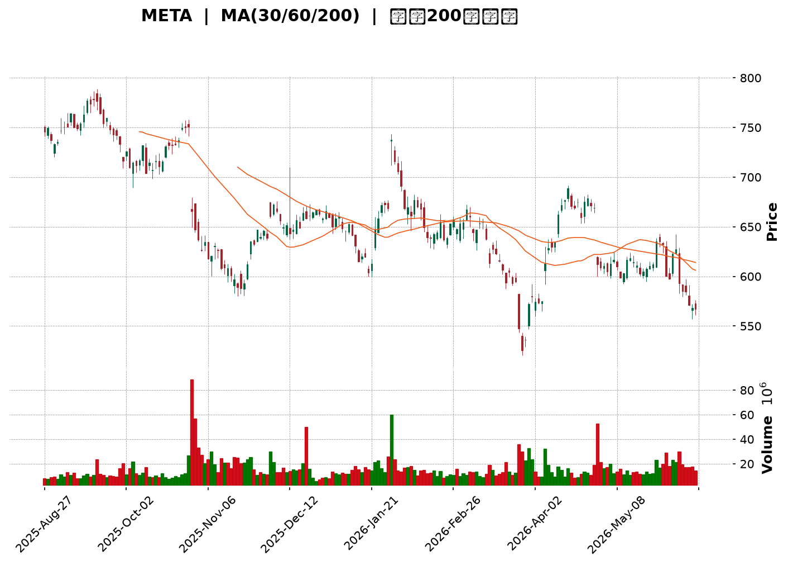
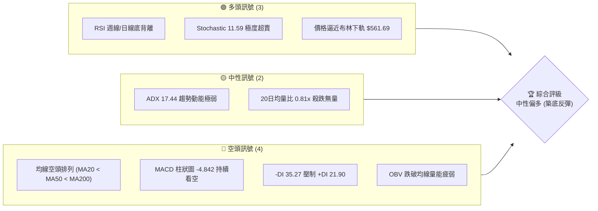
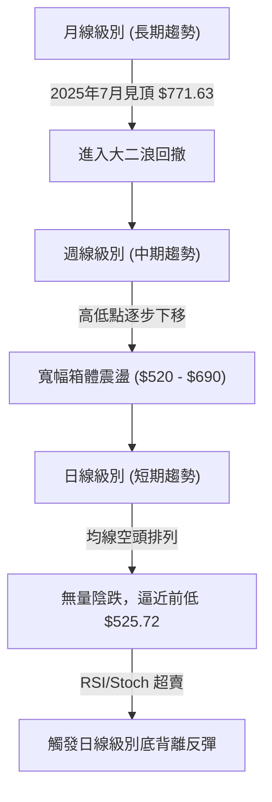
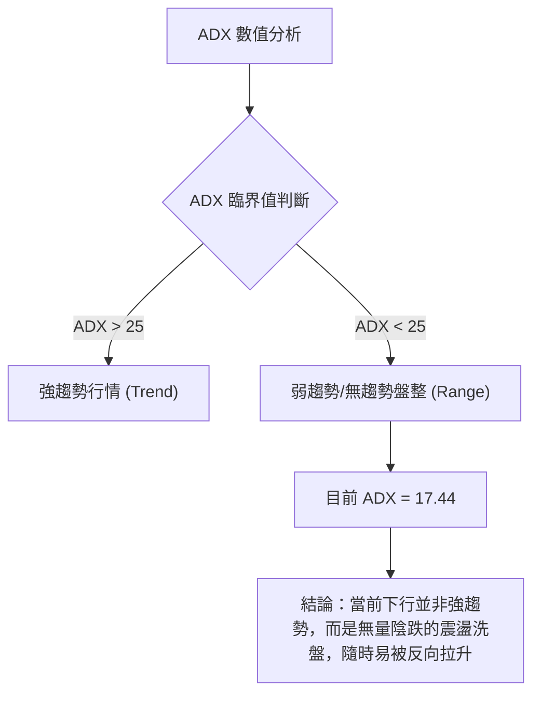

<details>
<summary>📊 靜態圖表 (點擊展開)</summary>

</details>

<html>
<head><meta charset="utf-8" /></head>
<body>
    <div style="height:500px; width:100%;">                        <script>window.PlotlyConfig = {MathJaxConfig: 'local'};</script>
        <script charset="utf-8" src="https://cdn.plot.ly/plotly-3.6.0.min.js" integrity="sha256-QaOVwtVY0T02VaHrr6pnoHLCwayMJp4O5n4YyaE3rJk=" crossorigin="anonymous"></script>                <div id="candlestick-chart" class="plotly-graph-div" style="height:100%; width:100%;"></div>            <script>                window.PLOTLYENV=window.PLOTLYENV || {};                                if (document.getElementById("candlestick-chart")) {                    Plotly.newPlot(                        "candlestick-chart",                        [{"close":{"dtype":"f8","bdata":"AAAAAAhNh0AAAAAgzWqHQAAAAADBB4dAAAAAwBnrhkAAAACglfqGQAAAAOAqV4dAAAAAAH91h0AAAACATHSHQAAAAGA\u002f34dAAAAAoL5xh0AAAAAgIGmHQAAAAKCOjodAAAAAQETXh0AAAAAAZkmIQAAAAEA4L4hAAAAA4F9TiEAAAABAc0SIQAAAAEAP34dAAAAAQByRh0AAAACgHruHQAAAAMBGXYdAAAAAwBA0h0AAAABARTGHQAAAAAA76YZAAAAAgCNhhkAAAABAsK6GQAAAACD9KoZAAAAAgLhThkAAAACAHT+GQAAAAMAhZYZAAAAAQEjihkAAAACg+gCGQAAAAEAKVIZAAAAAILwbhkAAAADA0GKGQAAAAIAMN4ZAAAAAoMhdhkAAAACAlNeGQAAAAKBd4IZAAAAAwHvhhkAAAAAgMuaGQAAAAGAECYdAAAAAAIhsh0AAAACge3GHQAAAAOBRc4dAAAAAgNvKhEAAAADAIzqEQAAAAIAp5YNAAAAAQC6Sg0AAAAAAG9eDQAAAAKBAT4NAAAAAIGBlg0AAAAAgpLWDQAAAAKBDkINAAAAAAPL\u002fgkAAAABA+QaDQAAAACCKA4NAAAAA4AnIgkAAAABgiaWCQAAAAMCsaoJAAAAAwFRhgkAAAAAAEIqCQAAAACA2IINAAAAAAEPZg0AAAADAasSDQAAAAADyNoRAAAAAYGb+g0AAAAAAKDCEQAAAAMBB9INAAAAAYGejhEAAAABgXQKFQAAAAEB+zYRAAAAAoOd+hEAAAAAgW0iEQAAAAED2XIRAAAAAIDwZhEAAAAAgpjeEQAAAAAC0hIRAAAAAII5HhEAAAACADb+EQAAAAOCmkYRAAAAAIHmnhEAAAAAg+MKEQAAAAODU14RAAAAA4Me1hEAAAAAgA5GEQAAAAOAKy4RAAAAA4DOchEAAAAAg1E6EQAAAAMDPkYRAAAAAYHCghEAAAACgFEGEQAAAAAAPLIRAAAAAwAJkhEAAAADAXQuEQAAAAMBmtINAAAAAoPI3g0AAAADAJmKDQAAAAGDBXYNAAAAAYNPcgkAAAABAfCODQAAAAKCbOIRAAAAAYJKRhEAAAABAR\u002f6EQAAAAIAnA4VAAAAAYEPhhEAAAABgbQ2HQAAAAMAYX4ZAAAAAAHIOhkAAAADA3ZiFQAAAAIBX44RAAAAAABjthEAAAABAJ6eEQAAAAAAgJYVAAAAAYCvxhEAAAACg8eCEQAAAAIAISoRAAAAAIMj5g0AAAADg8fWDQAAAAKBbFYRAAAAA4NMhhEAAAAAAy3iEQAAAAKCj5YNAAAAAYAb2g0AAAADgC2mEQAAAAICVg4RAAAAAAAE9hEAAAADgAWiEQAAAAEAodIRAAAAAIEXZhEAAAAAgCqCEQAAAAIB3IoRAAAAAgLA2hEAAAACAFWyEQAAAAABmcoRAAAAAoBLtg0AAAADgeimDQAAAAKCZm4NAAAAAoEd1g0AAAACgcD2DQAAAAKCZ9YJAAAAAoEeNgkAAAADgeuCCQAAAACBch4JAAAAAwB6XgkAAAADgURyBQAAAAIDCbYBAAAAAQArDgEAAAABACuGBQAAAAADXGYJAAAAAIK7zgUAAAAAAKeiBQAAAAGBm+IFAAAAAIFwjg0AAAADAHqODQAAAAEDhroNAAAAAgD3Ug0AAAACA67OEQAAAAOCj\u002fIRAAAAAwPUmhUAAAABgZoSFQAAAAKBH94RAAAAAYLjmhEAAAACAwhWFQAAAAEAzmYRAAAAAgD0YhUAAAADA9TSFQAAAAGC4+oRAAAAAwPXohEAAAACgRx+DQAAAAAAABoNAAAAAoEcTg0AAAAAgrueCQAAAAEAKJ4NAAAAA4HpGg0AAAABACg2DQAAAAEDhtoJAAAAAAADYgkAAAABACkWDQAAAAKBwU4NAAAAAANcxg0AAAAAgrhmDQAAAAEDh1IJAAAAA4HrogkAAAABACvuCQAAAAIAUEoNAAAAAYLgig0AAAACAFNqDQAAAAOBR2oNAAAAAgBTEg0AAAACAwsOCQAAAAEAKrYJAAAAAANd3g0AAAABgj5yDQAAAAAAAiIJAAAAAwB5LgkAAAABguESCQAAAAADX14FAAAAAoHDDgUAAAAAA17eBQA=="},"high":{"dtype":"f8","bdata":"pvS4gxCDh0CKnuvwSHqHQKG1PqAdS4dAfCmrOjTyhkBiUwnlHxSHQBBtrDgDu4dAd1S5m2Shh0CurFtwtuWHQN8A+T4J5IdAtA0Zaj\u002ffh0DOsAbgm5qHQG7WuR9cnodAnwfeCQ0iiEDRDPvsO1yIQDbN\u002fEyja4hAvQBPcXSXiEDrKlPHk6eIQMrZy0lYg4hAzMeMxoEKiEA0FRO2tr6HQFlrcD8NnIdAswNPZ2V1h0C4\u002fb5DNmyHQGHVTODVLYdAXmwjdCiFhkAKF7JpcLSGQI3xDls8zoZAssEG9HZdhkAt+mQXZ2qGQI6yj2+Wc4ZAAAAAQEjihkApP7rEVvCGQO2gSUDndYZAu\u002fwVqNdShkCEH1Dph5WGQJ\u002fffLw6ooZA8bDf1bhqhkA0kFvnW+SGQOQWy70iCodA3Af7Segah0CLlxb+XCmHQAxgDIHHH4dAUiZqxOeTh0BUbF7zEamHQPVjisMjr4dACPR9k5U+hUBZvWf\u002fGg6FQNi9PVLVkYRAz1\u002fWEFkFhEAD1JTmQgmEQAHukSmB14NAWOlW0Lpog0Co96SLhM+DQGp+GCUSpINAuELErYSfg0AY2AI380SDQNcb9TE+JYNAjq3\u002fZVkVg0Aa0xB2N9WCQPa7OB6wkoJAwmEp7KftgkCd5UyE+KiCQJFJ6eRcPYNA3IJtCeTfg0A44CKCWuqDQFbXe2i+N4RAWRSjyPAhhEAkAe9dTjaEQNcBCh8iPoRAup10zcQXhUDOXT0IggyFQEd50xykHIVACL8Dyfa6hEBd9cRlVmuEQOy4TdZ8cYRAH6Lmz4AuhkBAKs8BiGOEQEXVsy7Jr4RAAoYwk1ClhEBx+5ML5O+EQL6\u002f5XJo84RAfANP1gcIhUCqcJEkccuEQONdcgXe3IRAiSCXtQXjhEDsY1ZEe52EQOq91cMo\u002fYRAGJXG5XLDhEAcWeLBkr6EQJ1COa3Fv4RA9uxWCpvHhEA\u002fJZNssJSEQGcFkQ1fNIRAOR9VMB5zhEAqVsS5SGuEQDqL18nDDYRAhV7UmEyfg0CfL4qYFn2DQIkU08dVpINAHu\u002fzHgQXg0CGlXjS7U2DQP+9XhQKoIRAsSUU1VvPhEC9D0xinhWFQLyiRqHtIYVAXRHHUc0ohUDW2gCI6DqHQAc8JmxZ3IZAup6tqXaFhkDHI3\u002fMF2OGQHN6Cx7tgYVA48iqGFZHhUAO5zEtUvuEQKeDhrTNVYVA7IkpuopAhUAIzOr2gjWFQB6Ja75fG4VAdC5fUvtWhECxYXnzZhCEQOYZqwGWI4RAlF8gRxc1hEB6NjenQraEQBqMo2wZiYRAi7M7FH4EhEApYciqkGqEQLx5kQJ6o4RA0hvdShNHhEBMgZXyAJuEQGa\u002fBlDPk4RAVmt1S44BhUChPNegAvGEQBOzcqxQR4RALv2JHpE5hED7KeqV4Z2EQIA2cQlzlIRA8a9aKYdnhEA3CdTJDaWDQAAAAAAA1oNAAAAAYGbkg0AAAABAM3WDQAAAAAAAKINAAAAAIK7fgkAAAADAHgWDQAAAAAAAyIJAAAAAIFzdgkAAAAAAADiCQAAAAMDM\u002fIBAAAAAYGbcgEAAAAAghe2BQAAAAGBmhIJAAAAAAAAUgkAAAADgUTaCQAAAAADX+YFAAAAAoJmvg0AAAAAAAOyDQAAAAOCj9INAAAAAAADYg0AAAACAFNKEQAAAAAAANIVAAAAA4KMshUAAAAAAKZyFQAAAAEAKW4VAAAAAoJkhhUAAAABACjOFQAAAAOB67IRAAAAAIFxFhUAAAAAAAFSFQAAAAKBwMYVAAAAAAAAShUAAAADAzGaDQAAAAEAKV4NAAAAAAAAwg0AAAADAzDKDQAAAAKCZX4NAAAAAANeHg0AAAAAAKUaDQAAAAKBH54JAAAAAAADegkAAAABAM1+DQAAAAADXfYNAAAAAoJlpg0AAAABguDyDQAAAAKBwL4NAAAAAAAAAg0AAAADAzAyDQAAAAOB6NoNAAAAAgMIzg0AAAAAAAPSDQAAAAAAAGIRAAAAAAADUg0AAAAAAAN6DQAAAAEAKB4NAAAAAQDOBg0AAAABAMxOEQAAAAEAzqYNAAAAAAACAgkAAAABACq2CQAAAAGCPeoJAAAAAIFzhgUAAAABgjwCCQA=="},"hovertemplate":"\u003cb\u003e%{x|%Y-%m-%d}\u003c\u002fb\u003e\u003cbr\u003e\u958b: $%{open:.2f}\u003cbr\u003e\u9ad8: $%{high:.2f}\u003cbr\u003e\u4f4e: $%{low:.2f}\u003cbr\u003e\u6536: $%{close:.2f}\u003cextra\u003e\u003c\u002fextra\u003e","low":{"dtype":"f8","bdata":"ozjm6Msoh0A5rrK4gxiHQAINNTME7YZAiXCPtE+AhkCTcfduKeKGQGy2apSUQIdAtULPekY6h0Du\u002fOl3EHKHQJWh2EBRfYdAt8jSU+xph0DdgN7D7lSHQDBBY4QjMIdAOVoIHdNxh0AaVt5yddqHQD3zOscd5IdAQhQFMGIciEBwtPk4GvuHQL5\u002fAHyM2YdAlmZULoduh0Cvf61MMHqHQOibqWh0OodAMfaFYvMAh0D1XlXIUw+HQEDEScGyqIZAVKQiKh0ohkDWGaYXh2eGQHDhpiz0J4ZArJNoX9uKhUCe+6GwkgSGQAGRGowGFYZAUKGb7AA6hkCgpIhzq\u002fqFQKzuxO+qE4ZAtH1PnkzRhUANmgZemiKGQHD0UWGj9YVA60gxLocHhkBpj9D\u002f0XeGQKYRuRREvIZA250Ps5GWhkD9u9zzAd+GQHO4rAdvz4ZAjTHMuxZWh0DS6DS+M0KHQO7qTJIpKodA24Pq3KxIhEBhqobh7yOEQKVDXDvx2INAW37D2reHg0DEFnJt84uDQPNT4ra+R4NA1LTTwpHBgkAluoSNn0iDQIz5m8vYUoNAK\u002fN4vQr2gkAUtmgP8s+CQODEzmKmkYJAMEx5Oj+TgkDpJWBQcTaCQFK\u002f6WM8IoJAd20RFQIzgkAb5OqdGyeCQJXmDLoOpYJA1HKeJiRKg0Cy1CeFmrSDQBaqcfKC04NA02Jbwo\u002flg0AlaruACeiDQJhvc2Li44NALzShT5WXhEBrboG3RaqEQK2laSqtv4RALEjzQP5hhEAusGIjmxKEQIjTojnX\u002fYNAbjKLl1nsg0Ab+yuvOvGDQF+NVNAyFYRAONaKRihFhEBIBqL\u002fL3+EQNf7n4jvjIRAq54i37SAhECubpy4fo2EQAw+bn8RrYRAmtl90wimhEA+9o1IpG6EQL5xcdU3ioRALqOMwwGXhEA6+yebmBeEQCCePTeROYRAV+3nJr1ahEA6pTgsESKEQFMXib1o2YNAcD4sg2YShEDgZeaLcwWEQLS7\u002fl6HfINA0I31OVoyg0A+pa7ioi2DQP5TPIxlXINAp7HK1+S7gkBBk6uQiLyCQFRuc64ckINATI4UkjAfhEDqRSNFy6WEQHQY\u002fy67wIRAClGZuz3MhEDPtIABhj+GQHf6GDnWR4ZA1mAscFj3hUB2r60ElW6FQJ35Ks4c14RA6KkdJodnhEB0dLtVky+EQEflm067kYRAowofYbzphEDeJBGOTYSEQN+qlA\u002fTJYRAm3hDnDfQg0ClL7zAGKKDQGcFxsbmnINAgTDw\u002fmbhg0CCfUFy3vGDQOynmNCl24NAV\u002ftsFImjg0APpT28uQyEQBwmDamRN4RAjHgVwJfsg0BrS1xkqM+DQIpyWjNZ8oNAcoET4NuIhEDt6naZB06EQLwiU9SG3INApr0CXPORg0CrQ9kBj0OEQHTiKWNxPoRA18IIftfig0AJnOBpOgiDQAAAAMDMeINAAAAAoJltg0AAAABA4TSDQAAAAIAU0oJAAAAAAABagkAAAACAFLiCQAAAAAAAeIJAAAAAQDOLgkAAAADAzPqAQAAAAIAUQoBAAAAA4FGEgEAAAAAAKRaBQAAAAGCP7oFAAAAAoJl9gUAAAAAAAOCBQAAAAIAUpoFAAAAA4KN+gkAAAAAAAHiDQAAAAOCjgoNAAAAAQDODg0AAAADA9fqDQAAAAIDCwYRAAAAAAADehEAAAABAChmFQAAAAAAA4IRAAAAA4KPahEAAAAAAAO6EQAAAAGBmaIRAAAAAYLhuhEAAAABguPaEQAAAAEAKzYRAAAAA4Hq+hEAAAAAAAMCCQAAAAEDh8IJAAAAAAADWgkAAAABA4cKCQAAAAMDMsIJAAAAA4FEsg0AAAADgevCCQAAAAOCjsIJAAAAAwMyEgkAAAACgR6WCQAAAAAAAOINAAAAA4HoKg0AAAAAghd2CQAAAAGBmxIJAAAAA4HqugkAAAADgepaCQAAAAKCZ94JAAAAAYGbqgkAAAAAAAAiDQAAAAOB6qoNAAAAAwMx6g0AAAACAPbyCQAAAAKBwpYJAAAAAACnCgkAAAACgcHODQAAAAKBHN4JAAAAAgMIZgkAAAACAFCiCQAAAAMDM1IFAAAAAgBRogUAAAABAM4eBQA=="},"name":"\u50f9\u683c","open":{"dtype":"f8","bdata":"A7NNhEx0h0CPv9X9DTKHQG01EE1FPIdAxWn65bWihkBx19NJNPKGQM0tS2KHVodA9M0wT9p2h0C9SeRe1JGHQNWRbaW4nYdA5MVNxrLah0CIJYchDoeHQK8gHCvOV4dAXhto0Y+dh0DHJt6Un+mHQCMDs8JMUYhAHr\u002fGeV1XiEBOLbaLnoSIQPqONE5bZIhA5TJEpLn\u002fh0DgMCLO4aGHQN6luDmJgYdAYYXOYPtlh0B8mxBPwluHQITvkNYVKIdAof1Bb0iChkAb+PAI\u002fYqGQEMUVkpLw4ZAVOcMzRkAhkBXqjlCLGSGQGM38AISQoZAyAVFVKVohkA\u002fkK3EmM2GQKUN2FKOPoZAKN2NWckUhkDpUe3s5l6GQJDa9sLQYoZA6rbMBTIPhkBmwKsL43+GQD9QtjhU9oZAEsVMkNbkhkCfZDlbyeuGQHeVZl56\u002fIZAR0MuWtNjh0DuIE2u\u002fHqHQDoM3jfri4dAs3TlFUPghEDCtQ0MEguFQPViR9U8d4RAVP69Se6Xg0DOSW6yCLqDQBsB52xO1oNAjmK1Wa87g0CxYoRKSrCDQCNTrJqcl4NAXWGWXqaYg0Bl+0gAXyCDQGuCIxpIxoJAcwTeNS8Ag0BpIQfT5XSCQNJLqT\u002fUhYJAbKrCbvDTgkCeAWmpI1yCQIDZ7z\u002fDrYJAKIb\u002fSKp3g0CIUZmsAOWDQB37tdYk2INAbVB7g9vzg0AaJ87mIwqEQF8clS2sGoRAl2j5ZPgWhUAKqCR2IbeEQBC+d5DH4YRA\u002fQaENku1hEBXhZAd60aEQHfe+zW6EYRAZbs2dLhFhECYyMJrLimEQPmHyqmYF4RAbVy3q2R4hECL1PlfvoOEQEzNBJnMzoRAx2u3HKyohEB2DEfx4ZuEQCOHa8u0r4RAh2S+hOjbhEDHcfqwk4uEQNaRNxgDkYRAO+fnVXPBhEAp4GrqTbGEQG2oLgGgU4RA8F7r1guYhEA8etkSoniEQC4wurCeKoRAoiaNWRonhEDzzps\u002fxl+EQDqL18nDDYRAtJ9rY7aPg0ATB4lwm0+DQGHlbx0rfYNAQs2oSeH6gkAHr62FxPGCQNrhpSZ+poNAT1SOYr8hhEA6e83qfMSEQFSAaYkaEIVA8AMORGIPhUDO2a+qZAaHQFmQmHoFt4ZAxoazxuhPhkB9fbprHhaGQK4RZSsieYVApDltXRm4hEAc94OQXceEQFaqJ7nmtIRA9lkskikohUDOXX4yYwuFQBbivc4s64RARYZ0iWIkhEB7P86hn\u002feDQFcszQAQyoNAA0UyoTDwg0AihSd6JPmDQBa3y7baX4RA4BmZxU7Eg0BUG1HN1w+EQOgvMbHyT4RAT396STIXhEDmi15b6+SDQG3oNiXiPYRAXCX9XS2LhEDNARH+6KqEQDFYjyzEOoRALMnXV+XRg0AKAbzkAWiEQOx01myZcYRAprice49BhEDBBwaq2XqDQAAAAAAAwINAAAAAgOufg0AAAABguEKDQAAAAEAzIYNAAAAAgD3cgkAAAADgUe6CQAAAAMDMuIJAAAAAgOu1gkAAAACA6zOCQAAAAMDM4IBAAAAAQArDgEAAAAAA1y+BQAAAAEAKIYJAAAAA4FGwgUAAAAAghQ2CQAAAAADX44FAAAAAAADwgkAAAACAwpeDQAAAAIDC04NAAAAAAACsg0AAAACAwhmEQAAAAAAA2IRAAAAAgOsfhUAAAADAzDSFQAAAAEDhSoVAAAAAAAD4hEAAAABA4RKFQAAAAKCZvYRAAAAAYI+ihEAAAAAAAPiEQAAAAIDrEYVAAAAAoEfnhEAAAABgj1qDQAAAACCFNYNAAAAAIIX\u002fgkAAAADgeiqDQAAAAGBmyIJAAAAAgMI1g0AAAACgmTmDQAAAAGCP5IJAAAAAYI+WgkAAAADgo7aCQAAAAAAAQINAAAAAgOsvg0AAAABA4QiDQAAAACBcB4NAAAAAgBTGgkAAAAAAAMCCQAAAAEAK\u002f4JAAAAAwB4Hg0AAAABAMwuDQAAAAAAA\u002fINAAAAAAADMg0AAAABAM7ODQAAAAIDr2YJAAAAAAADYgkAAAAAgXH2DQAAAACCue4NAAAAAAACAgkAAAAAAAHiCQAAAAADXJYJAAAAA4KOugUAAAACgmeeBQA=="},"x":["2025-08-27T00:00:00-04:00","2025-08-28T00:00:00-04:00","2025-08-29T00:00:00-04:00","2025-09-02T00:00:00-04:00","2025-09-03T00:00:00-04:00","2025-09-04T00:00:00-04:00","2025-09-05T00:00:00-04:00","2025-09-08T00:00:00-04:00","2025-09-09T00:00:00-04:00","2025-09-10T00:00:00-04:00","2025-09-11T00:00:00-04:00","2025-09-12T00:00:00-04:00","2025-09-15T00:00:00-04:00","2025-09-16T00:00:00-04:00","2025-09-17T00:00:00-04:00","2025-09-18T00:00:00-04:00","2025-09-19T00:00:00-04:00","2025-09-22T00:00:00-04:00","2025-09-23T00:00:00-04:00","2025-09-24T00:00:00-04:00","2025-09-25T00:00:00-04:00","2025-09-26T00:00:00-04:00","2025-09-29T00:00:00-04:00","2025-09-30T00:00:00-04:00","2025-10-01T00:00:00-04:00","2025-10-02T00:00:00-04:00","2025-10-03T00:00:00-04:00","2025-10-06T00:00:00-04:00","2025-10-07T00:00:00-04:00","2025-10-08T00:00:00-04:00","2025-10-09T00:00:00-04:00","2025-10-10T00:00:00-04:00","2025-10-13T00:00:00-04:00","2025-10-14T00:00:00-04:00","2025-10-15T00:00:00-04:00","2025-10-16T00:00:00-04:00","2025-10-17T00:00:00-04:00","2025-10-20T00:00:00-04:00","2025-10-21T00:00:00-04:00","2025-10-22T00:00:00-04:00","2025-10-23T00:00:00-04:00","2025-10-24T00:00:00-04:00","2025-10-27T00:00:00-04:00","2025-10-28T00:00:00-04:00","2025-10-29T00:00:00-04:00","2025-10-30T00:00:00-04:00","2025-10-31T00:00:00-04:00","2025-11-03T00:00:00-05:00","2025-11-04T00:00:00-05:00","2025-11-05T00:00:00-05:00","2025-11-06T00:00:00-05:00","2025-11-07T00:00:00-05:00","2025-11-10T00:00:00-05:00","2025-11-11T00:00:00-05:00","2025-11-12T00:00:00-05:00","2025-11-13T00:00:00-05:00","2025-11-14T00:00:00-05:00","2025-11-17T00:00:00-05:00","2025-11-18T00:00:00-05:00","2025-11-19T00:00:00-05:00","2025-11-20T00:00:00-05:00","2025-11-21T00:00:00-05:00","2025-11-24T00:00:00-05:00","2025-11-25T00:00:00-05:00","2025-11-26T00:00:00-05:00","2025-11-28T00:00:00-05:00","2025-12-01T00:00:00-05:00","2025-12-02T00:00:00-05:00","2025-12-03T00:00:00-05:00","2025-12-04T00:00:00-05:00","2025-12-05T00:00:00-05:00","2025-12-08T00:00:00-05:00","2025-12-09T00:00:00-05:00","2025-12-10T00:00:00-05:00","2025-12-11T00:00:00-05:00","2025-12-12T00:00:00-05:00","2025-12-15T00:00:00-05:00","2025-12-16T00:00:00-05:00","2025-12-17T00:00:00-05:00","2025-12-18T00:00:00-05:00","2025-12-19T00:00:00-05:00","2025-12-22T00:00:00-05:00","2025-12-23T00:00:00-05:00","2025-12-24T00:00:00-05:00","2025-12-26T00:00:00-05:00","2025-12-29T00:00:00-05:00","2025-12-30T00:00:00-05:00","2025-12-31T00:00:00-05:00","2026-01-02T00:00:00-05:00","2026-01-05T00:00:00-05:00","2026-01-06T00:00:00-05:00","2026-01-07T00:00:00-05:00","2026-01-08T00:00:00-05:00","2026-01-09T00:00:00-05:00","2026-01-12T00:00:00-05:00","2026-01-13T00:00:00-05:00","2026-01-14T00:00:00-05:00","2026-01-15T00:00:00-05:00","2026-01-16T00:00:00-05:00","2026-01-20T00:00:00-05:00","2026-01-21T00:00:00-05:00","2026-01-22T00:00:00-05:00","2026-01-23T00:00:00-05:00","2026-01-26T00:00:00-05:00","2026-01-27T00:00:00-05:00","2026-01-28T00:00:00-05:00","2026-01-29T00:00:00-05:00","2026-01-30T00:00:00-05:00","2026-02-02T00:00:00-05:00","2026-02-03T00:00:00-05:00","2026-02-04T00:00:00-05:00","2026-02-05T00:00:00-05:00","2026-02-06T00:00:00-05:00","2026-02-09T00:00:00-05:00","2026-02-10T00:00:00-05:00","2026-02-11T00:00:00-05:00","2026-02-12T00:00:00-05:00","2026-02-13T00:00:00-05:00","2026-02-17T00:00:00-05:00","2026-02-18T00:00:00-05:00","2026-02-19T00:00:00-05:00","2026-02-20T00:00:00-05:00","2026-02-23T00:00:00-05:00","2026-02-24T00:00:00-05:00","2026-02-25T00:00:00-05:00","2026-02-26T00:00:00-05:00","2026-02-27T00:00:00-05:00","2026-03-02T00:00:00-05:00","2026-03-03T00:00:00-05:00","2026-03-04T00:00:00-05:00","2026-03-05T00:00:00-05:00","2026-03-06T00:00:00-05:00","2026-03-09T00:00:00-04:00","2026-03-10T00:00:00-04:00","2026-03-11T00:00:00-04:00","2026-03-12T00:00:00-04:00","2026-03-13T00:00:00-04:00","2026-03-16T00:00:00-04:00","2026-03-17T00:00:00-04:00","2026-03-18T00:00:00-04:00","2026-03-19T00:00:00-04:00","2026-03-20T00:00:00-04:00","2026-03-23T00:00:00-04:00","2026-03-24T00:00:00-04:00","2026-03-25T00:00:00-04:00","2026-03-26T00:00:00-04:00","2026-03-27T00:00:00-04:00","2026-03-30T00:00:00-04:00","2026-03-31T00:00:00-04:00","2026-04-01T00:00:00-04:00","2026-04-02T00:00:00-04:00","2026-04-06T00:00:00-04:00","2026-04-07T00:00:00-04:00","2026-04-08T00:00:00-04:00","2026-04-09T00:00:00-04:00","2026-04-10T00:00:00-04:00","2026-04-13T00:00:00-04:00","2026-04-14T00:00:00-04:00","2026-04-15T00:00:00-04:00","2026-04-16T00:00:00-04:00","2026-04-17T00:00:00-04:00","2026-04-20T00:00:00-04:00","2026-04-21T00:00:00-04:00","2026-04-22T00:00:00-04:00","2026-04-23T00:00:00-04:00","2026-04-24T00:00:00-04:00","2026-04-27T00:00:00-04:00","2026-04-28T00:00:00-04:00","2026-04-29T00:00:00-04:00","2026-04-30T00:00:00-04:00","2026-05-01T00:00:00-04:00","2026-05-04T00:00:00-04:00","2026-05-05T00:00:00-04:00","2026-05-06T00:00:00-04:00","2026-05-07T00:00:00-04:00","2026-05-08T00:00:00-04:00","2026-05-11T00:00:00-04:00","2026-05-12T00:00:00-04:00","2026-05-13T00:00:00-04:00","2026-05-14T00:00:00-04:00","2026-05-15T00:00:00-04:00","2026-05-18T00:00:00-04:00","2026-05-19T00:00:00-04:00","2026-05-20T00:00:00-04:00","2026-05-21T00:00:00-04:00","2026-05-22T00:00:00-04:00","2026-05-26T00:00:00-04:00","2026-05-27T00:00:00-04:00","2026-05-28T00:00:00-04:00","2026-05-29T00:00:00-04:00","2026-06-01T00:00:00-04:00","2026-06-02T00:00:00-04:00","2026-06-03T00:00:00-04:00","2026-06-04T00:00:00-04:00","2026-06-05T00:00:00-04:00","2026-06-08T00:00:00-04:00","2026-06-09T00:00:00-04:00","2026-06-10T00:00:00-04:00","2026-06-11T00:00:00-04:00","2026-06-12T00:00:00-04:00"],"type":"candlestick"},{"hovertemplate":"MA30: $%{y:.2f}\u003cextra\u003e\u003c\u002fextra\u003e","line":{"color":"#2196F3","dash":"dash","width":2},"mode":"lines","name":"MA30","x":["2025-08-27T00:00:00-04:00","2025-08-28T00:00:00-04:00","2025-08-29T00:00:00-04:00","2025-09-02T00:00:00-04:00","2025-09-03T00:00:00-04:00","2025-09-04T00:00:00-04:00","2025-09-05T00:00:00-04:00","2025-09-08T00:00:00-04:00","2025-09-09T00:00:00-04:00","2025-09-10T00:00:00-04:00","2025-09-11T00:00:00-04:00","2025-09-12T00:00:00-04:00","2025-09-15T00:00:00-04:00","2025-09-16T00:00:00-04:00","2025-09-17T00:00:00-04:00","2025-09-18T00:00:00-04:00","2025-09-19T00:00:00-04:00","2025-09-22T00:00:00-04:00","2025-09-23T00:00:00-04:00","2025-09-24T00:00:00-04:00","2025-09-25T00:00:00-04:00","2025-09-26T00:00:00-04:00","2025-09-29T00:00:00-04:00","2025-09-30T00:00:00-04:00","2025-10-01T00:00:00-04:00","2025-10-02T00:00:00-04:00","2025-10-03T00:00:00-04:00","2025-10-06T00:00:00-04:00","2025-10-07T00:00:00-04:00","2025-10-08T00:00:00-04:00","2025-10-09T00:00:00-04:00","2025-10-10T00:00:00-04:00","2025-10-13T00:00:00-04:00","2025-10-14T00:00:00-04:00","2025-10-15T00:00:00-04:00","2025-10-16T00:00:00-04:00","2025-10-17T00:00:00-04:00","2025-10-20T00:00:00-04:00","2025-10-21T00:00:00-04:00","2025-10-22T00:00:00-04:00","2025-10-23T00:00:00-04:00","2025-10-24T00:00:00-04:00","2025-10-27T00:00:00-04:00","2025-10-28T00:00:00-04:00","2025-10-29T00:00:00-04:00","2025-10-30T00:00:00-04:00","2025-10-31T00:00:00-04:00","2025-11-03T00:00:00-05:00","2025-11-04T00:00:00-05:00","2025-11-05T00:00:00-05:00","2025-11-06T00:00:00-05:00","2025-11-07T00:00:00-05:00","2025-11-10T00:00:00-05:00","2025-11-11T00:00:00-05:00","2025-11-12T00:00:00-05:00","2025-11-13T00:00:00-05:00","2025-11-14T00:00:00-05:00","2025-11-17T00:00:00-05:00","2025-11-18T00:00:00-05:00","2025-11-19T00:00:00-05:00","2025-11-20T00:00:00-05:00","2025-11-21T00:00:00-05:00","2025-11-24T00:00:00-05:00","2025-11-25T00:00:00-05:00","2025-11-26T00:00:00-05:00","2025-11-28T00:00:00-05:00","2025-12-01T00:00:00-05:00","2025-12-02T00:00:00-05:00","2025-12-03T00:00:00-05:00","2025-12-04T00:00:00-05:00","2025-12-05T00:00:00-05:00","2025-12-08T00:00:00-05:00","2025-12-09T00:00:00-05:00","2025-12-10T00:00:00-05:00","2025-12-11T00:00:00-05:00","2025-12-12T00:00:00-05:00","2025-12-15T00:00:00-05:00","2025-12-16T00:00:00-05:00","2025-12-17T00:00:00-05:00","2025-12-18T00:00:00-05:00","2025-12-19T00:00:00-05:00","2025-12-22T00:00:00-05:00","2025-12-23T00:00:00-05:00","2025-12-24T00:00:00-05:00","2025-12-26T00:00:00-05:00","2025-12-29T00:00:00-05:00","2025-12-30T00:00:00-05:00","2025-12-31T00:00:00-05:00","2026-01-02T00:00:00-05:00","2026-01-05T00:00:00-05:00","2026-01-06T00:00:00-05:00","2026-01-07T00:00:00-05:00","2026-01-08T00:00:00-05:00","2026-01-09T00:00:00-05:00","2026-01-12T00:00:00-05:00","2026-01-13T00:00:00-05:00","2026-01-14T00:00:00-05:00","2026-01-15T00:00:00-05:00","2026-01-16T00:00:00-05:00","2026-01-20T00:00:00-05:00","2026-01-21T00:00:00-05:00","2026-01-22T00:00:00-05:00","2026-01-23T00:00:00-05:00","2026-01-26T00:00:00-05:00","2026-01-27T00:00:00-05:00","2026-01-28T00:00:00-05:00","2026-01-29T00:00:00-05:00","2026-01-30T00:00:00-05:00","2026-02-02T00:00:00-05:00","2026-02-03T00:00:00-05:00","2026-02-04T00:00:00-05:00","2026-02-05T00:00:00-05:00","2026-02-06T00:00:00-05:00","2026-02-09T00:00:00-05:00","2026-02-10T00:00:00-05:00","2026-02-11T00:00:00-05:00","2026-02-12T00:00:00-05:00","2026-02-13T00:00:00-05:00","2026-02-17T00:00:00-05:00","2026-02-18T00:00:00-05:00","2026-02-19T00:00:00-05:00","2026-02-20T00:00:00-05:00","2026-02-23T00:00:00-05:00","2026-02-24T00:00:00-05:00","2026-02-25T00:00:00-05:00","2026-02-26T00:00:00-05:00","2026-02-27T00:00:00-05:00","2026-03-02T00:00:00-05:00","2026-03-03T00:00:00-05:00","2026-03-04T00:00:00-05:00","2026-03-05T00:00:00-05:00","2026-03-06T00:00:00-05:00","2026-03-09T00:00:00-04:00","2026-03-10T00:00:00-04:00","2026-03-11T00:00:00-04:00","2026-03-12T00:00:00-04:00","2026-03-13T00:00:00-04:00","2026-03-16T00:00:00-04:00","2026-03-17T00:00:00-04:00","2026-03-18T00:00:00-04:00","2026-03-19T00:00:00-04:00","2026-03-20T00:00:00-04:00","2026-03-23T00:00:00-04:00","2026-03-24T00:00:00-04:00","2026-03-25T00:00:00-04:00","2026-03-26T00:00:00-04:00","2026-03-27T00:00:00-04:00","2026-03-30T00:00:00-04:00","2026-03-31T00:00:00-04:00","2026-04-01T00:00:00-04:00","2026-04-02T00:00:00-04:00","2026-04-06T00:00:00-04:00","2026-04-07T00:00:00-04:00","2026-04-08T00:00:00-04:00","2026-04-09T00:00:00-04:00","2026-04-10T00:00:00-04:00","2026-04-13T00:00:00-04:00","2026-04-14T00:00:00-04:00","2026-04-15T00:00:00-04:00","2026-04-16T00:00:00-04:00","2026-04-17T00:00:00-04:00","2026-04-20T00:00:00-04:00","2026-04-21T00:00:00-04:00","2026-04-22T00:00:00-04:00","2026-04-23T00:00:00-04:00","2026-04-24T00:00:00-04:00","2026-04-27T00:00:00-04:00","2026-04-28T00:00:00-04:00","2026-04-29T00:00:00-04:00","2026-04-30T00:00:00-04:00","2026-05-01T00:00:00-04:00","2026-05-04T00:00:00-04:00","2026-05-05T00:00:00-04:00","2026-05-06T00:00:00-04:00","2026-05-07T00:00:00-04:00","2026-05-08T00:00:00-04:00","2026-05-11T00:00:00-04:00","2026-05-12T00:00:00-04:00","2026-05-13T00:00:00-04:00","2026-05-14T00:00:00-04:00","2026-05-15T00:00:00-04:00","2026-05-18T00:00:00-04:00","2026-05-19T00:00:00-04:00","2026-05-20T00:00:00-04:00","2026-05-21T00:00:00-04:00","2026-05-22T00:00:00-04:00","2026-05-26T00:00:00-04:00","2026-05-27T00:00:00-04:00","2026-05-28T00:00:00-04:00","2026-05-29T00:00:00-04:00","2026-06-01T00:00:00-04:00","2026-06-02T00:00:00-04:00","2026-06-03T00:00:00-04:00","2026-06-04T00:00:00-04:00","2026-06-05T00:00:00-04:00","2026-06-08T00:00:00-04:00","2026-06-09T00:00:00-04:00","2026-06-10T00:00:00-04:00","2026-06-11T00:00:00-04:00","2026-06-12T00:00:00-04:00"],"y":{"dtype":"f8","bdata":"AAAAAAAA+H8AAAAAAAD4fwAAAAAAAPh\u002fAAAAAAAA+H8AAAAAAAD4fwAAAAAAAPh\u002fAAAAAAAA+H8AAAAAAAD4fwAAAAAAAPh\u002fAAAAAAAA+H8AAAAAAAD4fwAAAAAAAPh\u002fAAAAAAAA+H8AAAAAAAD4fwAAAAAAAPh\u002fAAAAAAAA+H8AAAAAAAD4fwAAAAAAAPh\u002fAAAAAAAA+H8AAAAAAAD4fwAAAAAAAPh\u002fAAAAAAAA+H8AAAAAAAD4fwAAAAAAAPh\u002fAAAAAAAA+H8AAAAAAAD4fwAAAAAAAPh\u002fAAAAAAAA+H8AAAAAAAD4f83MzGziTYdAAAAAgFNKh0AzMzPzQz6HQERERGRGOIdA7+7u3lwxh0BmZmbGTSyHQJqZmSmzIodAiYiISGAZh0AzMzPzJhSHQFVVVfWnC4dA3t3d7dgGh0CamZmpewKHQO\u002fu7h4I\u002foZAAAAAUHn6hkBVVVXVRvOGQLy7u2sD7YZAAAAA4NzOhkAiIiLCYqyGQDMzM7N0ioZAMzMzs1tohkARERFhKEeGQDMzM5OOJIZAiYiIOBEEhkBmZmamWOaFQO\u002fu7t7HyYVAMzMz4\u002fCshUDv7u4ewI2FQDMzM+PVcoVAVVVVVZRUhUAiIiIy3DWFQM3MzFzpE4VAiYiI2HrthEDe3d196s+EQO\u002fu7p6WtIRAERERUU6hhEBVVVWV9YqEQCIiIqLjeYRAAAAAoKRlhEAAAADg\u002fk6EQDMzMwMPNoRAMzMzM+wihEAiIiKCyxKEQBEREYG+\u002f4NAERERscHmg0BEREQkycuDQBEREcFwsYNAq6qqCoWrg0CamZnJb6uDQERERDTBsINA7+7u7sy2g0B3d3c3iL6DQLy7u1tHyYNAzczM7APUg0AREREx\u002ftyDQO\u002fu7m7p54NAERERoYH2g0B3d3cXpAOEQM3MzAzTEoRAzczMDG4ihEBVVVU1mzCEQN7d3T36QoRARERE1CVWhEDe3d0dyGSEQO\u002fu7r61bYRAzczMvFVyhEC8u7srs3SEQCIiIjJZcIRAzczMvLtphEBERETU3WKEQM3MzIzZXYRAvLu7e7JOhEC8u7sLvD6EQO\u002fu7o7FOYRAmpmZ2WQ6hEARERFBdUCEQN7d3W3\u002fRYRAZmZmVqpMhEBVVVWl22SEQN7d3c2rdIRAiYiIiNWDhEBVVVU1GIuEQLy7u0vRjYRAREREZCOQhEB3d3cHNo+EQJqZmZnJkYRAIiIiYsSThEB3d3d3bpaEQGZmZpYhkoRAiYiImLeMhEDv7u4ewYmEQN7d3R2bhYRAMzMzs2KBhEDNzMwcPoOEQDMzMzPlgIRAd3d3pzp9hEDv7u4OWoCEQERERARCh4RAIiIisvWPhEAzMzMzsJiEQFVVVeX3oYRA7+7unuqyhEBEREQEmr+EQERERBTdvoRAzczMjNW7hEBmZmYG9raEQGZmZsYisoRAREREBP+phEBEREREzIiEQGZmZvY2cYRAIiIi4gpbhEBVVVWl7UaEQCIiImJ4NoRAREREtDUihEAzMzPTDROEQO\u002fu7n66\u002fINAIiIiAqnog0DNzMyMgciDQImIiEiQp4NA3t3djSOMg0CamZkZYHqDQHd3d0d1aYNAvLu7a9pWg0B3d3cn90CDQN7d3S2GMINAERERgYApg0CJiIiI5yKDQFVVVXXQG4NAmpmZeVIYg0AzMzND2hqDQKuqqupmH4NA7+7u3v0hg0C8u7uLmimDQM3MzIyyMINA3t3drZA2g0BERESUODyDQAAAALCDPYNAVVVVlXxHg0DNzMyc71iDQGZmZtajZINAIiIiggdxg0BEREQkBnCDQGZmZhaScINA3t3djQl1g0Dv7u7+RnWDQJqZmZmZeoNAERERAXKAg0Dv7u6uAJGDQFVVVbWBpINAIiIiokW2g0AAAACAI8KDQN7d3Y2XzINAREREhDLXg0Dv7u6eYeGDQM3MzAy76INAvLu7m8Tmg0AzMzNTKuGDQM3MzEzw24NAZmZmdgXWg0AAAACQws6DQJqZmSkVxYNAq6qq2kC5g0DNzMzsw6GDQImIiFg5joNAIiIiov6Bg0DNzMzca3WDQFVVVQXIY4NAiYiImOBLg0C8u7t7zTKDQM3MzDwKGINAd3d3dzD9gkDv7u4+NfGCQA=="},"type":"scatter"},{"hovertemplate":"MA60: $%{y:.2f}\u003cextra\u003e\u003c\u002fextra\u003e","line":{"color":"#9C27B0","dash":"dash","width":2},"mode":"lines","name":"MA60","x":["2025-08-27T00:00:00-04:00","2025-08-28T00:00:00-04:00","2025-08-29T00:00:00-04:00","2025-09-02T00:00:00-04:00","2025-09-03T00:00:00-04:00","2025-09-04T00:00:00-04:00","2025-09-05T00:00:00-04:00","2025-09-08T00:00:00-04:00","2025-09-09T00:00:00-04:00","2025-09-10T00:00:00-04:00","2025-09-11T00:00:00-04:00","2025-09-12T00:00:00-04:00","2025-09-15T00:00:00-04:00","2025-09-16T00:00:00-04:00","2025-09-17T00:00:00-04:00","2025-09-18T00:00:00-04:00","2025-09-19T00:00:00-04:00","2025-09-22T00:00:00-04:00","2025-09-23T00:00:00-04:00","2025-09-24T00:00:00-04:00","2025-09-25T00:00:00-04:00","2025-09-26T00:00:00-04:00","2025-09-29T00:00:00-04:00","2025-09-30T00:00:00-04:00","2025-10-01T00:00:00-04:00","2025-10-02T00:00:00-04:00","2025-10-03T00:00:00-04:00","2025-10-06T00:00:00-04:00","2025-10-07T00:00:00-04:00","2025-10-08T00:00:00-04:00","2025-10-09T00:00:00-04:00","2025-10-10T00:00:00-04:00","2025-10-13T00:00:00-04:00","2025-10-14T00:00:00-04:00","2025-10-15T00:00:00-04:00","2025-10-16T00:00:00-04:00","2025-10-17T00:00:00-04:00","2025-10-20T00:00:00-04:00","2025-10-21T00:00:00-04:00","2025-10-22T00:00:00-04:00","2025-10-23T00:00:00-04:00","2025-10-24T00:00:00-04:00","2025-10-27T00:00:00-04:00","2025-10-28T00:00:00-04:00","2025-10-29T00:00:00-04:00","2025-10-30T00:00:00-04:00","2025-10-31T00:00:00-04:00","2025-11-03T00:00:00-05:00","2025-11-04T00:00:00-05:00","2025-11-05T00:00:00-05:00","2025-11-06T00:00:00-05:00","2025-11-07T00:00:00-05:00","2025-11-10T00:00:00-05:00","2025-11-11T00:00:00-05:00","2025-11-12T00:00:00-05:00","2025-11-13T00:00:00-05:00","2025-11-14T00:00:00-05:00","2025-11-17T00:00:00-05:00","2025-11-18T00:00:00-05:00","2025-11-19T00:00:00-05:00","2025-11-20T00:00:00-05:00","2025-11-21T00:00:00-05:00","2025-11-24T00:00:00-05:00","2025-11-25T00:00:00-05:00","2025-11-26T00:00:00-05:00","2025-11-28T00:00:00-05:00","2025-12-01T00:00:00-05:00","2025-12-02T00:00:00-05:00","2025-12-03T00:00:00-05:00","2025-12-04T00:00:00-05:00","2025-12-05T00:00:00-05:00","2025-12-08T00:00:00-05:00","2025-12-09T00:00:00-05:00","2025-12-10T00:00:00-05:00","2025-12-11T00:00:00-05:00","2025-12-12T00:00:00-05:00","2025-12-15T00:00:00-05:00","2025-12-16T00:00:00-05:00","2025-12-17T00:00:00-05:00","2025-12-18T00:00:00-05:00","2025-12-19T00:00:00-05:00","2025-12-22T00:00:00-05:00","2025-12-23T00:00:00-05:00","2025-12-24T00:00:00-05:00","2025-12-26T00:00:00-05:00","2025-12-29T00:00:00-05:00","2025-12-30T00:00:00-05:00","2025-12-31T00:00:00-05:00","2026-01-02T00:00:00-05:00","2026-01-05T00:00:00-05:00","2026-01-06T00:00:00-05:00","2026-01-07T00:00:00-05:00","2026-01-08T00:00:00-05:00","2026-01-09T00:00:00-05:00","2026-01-12T00:00:00-05:00","2026-01-13T00:00:00-05:00","2026-01-14T00:00:00-05:00","2026-01-15T00:00:00-05:00","2026-01-16T00:00:00-05:00","2026-01-20T00:00:00-05:00","2026-01-21T00:00:00-05:00","2026-01-22T00:00:00-05:00","2026-01-23T00:00:00-05:00","2026-01-26T00:00:00-05:00","2026-01-27T00:00:00-05:00","2026-01-28T00:00:00-05:00","2026-01-29T00:00:00-05:00","2026-01-30T00:00:00-05:00","2026-02-02T00:00:00-05:00","2026-02-03T00:00:00-05:00","2026-02-04T00:00:00-05:00","2026-02-05T00:00:00-05:00","2026-02-06T00:00:00-05:00","2026-02-09T00:00:00-05:00","2026-02-10T00:00:00-05:00","2026-02-11T00:00:00-05:00","2026-02-12T00:00:00-05:00","2026-02-13T00:00:00-05:00","2026-02-17T00:00:00-05:00","2026-02-18T00:00:00-05:00","2026-02-19T00:00:00-05:00","2026-02-20T00:00:00-05:00","2026-02-23T00:00:00-05:00","2026-02-24T00:00:00-05:00","2026-02-25T00:00:00-05:00","2026-02-26T00:00:00-05:00","2026-02-27T00:00:00-05:00","2026-03-02T00:00:00-05:00","2026-03-03T00:00:00-05:00","2026-03-04T00:00:00-05:00","2026-03-05T00:00:00-05:00","2026-03-06T00:00:00-05:00","2026-03-09T00:00:00-04:00","2026-03-10T00:00:00-04:00","2026-03-11T00:00:00-04:00","2026-03-12T00:00:00-04:00","2026-03-13T00:00:00-04:00","2026-03-16T00:00:00-04:00","2026-03-17T00:00:00-04:00","2026-03-18T00:00:00-04:00","2026-03-19T00:00:00-04:00","2026-03-20T00:00:00-04:00","2026-03-23T00:00:00-04:00","2026-03-24T00:00:00-04:00","2026-03-25T00:00:00-04:00","2026-03-26T00:00:00-04:00","2026-03-27T00:00:00-04:00","2026-03-30T00:00:00-04:00","2026-03-31T00:00:00-04:00","2026-04-01T00:00:00-04:00","2026-04-02T00:00:00-04:00","2026-04-06T00:00:00-04:00","2026-04-07T00:00:00-04:00","2026-04-08T00:00:00-04:00","2026-04-09T00:00:00-04:00","2026-04-10T00:00:00-04:00","2026-04-13T00:00:00-04:00","2026-04-14T00:00:00-04:00","2026-04-15T00:00:00-04:00","2026-04-16T00:00:00-04:00","2026-04-17T00:00:00-04:00","2026-04-20T00:00:00-04:00","2026-04-21T00:00:00-04:00","2026-04-22T00:00:00-04:00","2026-04-23T00:00:00-04:00","2026-04-24T00:00:00-04:00","2026-04-27T00:00:00-04:00","2026-04-28T00:00:00-04:00","2026-04-29T00:00:00-04:00","2026-04-30T00:00:00-04:00","2026-05-01T00:00:00-04:00","2026-05-04T00:00:00-04:00","2026-05-05T00:00:00-04:00","2026-05-06T00:00:00-04:00","2026-05-07T00:00:00-04:00","2026-05-08T00:00:00-04:00","2026-05-11T00:00:00-04:00","2026-05-12T00:00:00-04:00","2026-05-13T00:00:00-04:00","2026-05-14T00:00:00-04:00","2026-05-15T00:00:00-04:00","2026-05-18T00:00:00-04:00","2026-05-19T00:00:00-04:00","2026-05-20T00:00:00-04:00","2026-05-21T00:00:00-04:00","2026-05-22T00:00:00-04:00","2026-05-26T00:00:00-04:00","2026-05-27T00:00:00-04:00","2026-05-28T00:00:00-04:00","2026-05-29T00:00:00-04:00","2026-06-01T00:00:00-04:00","2026-06-02T00:00:00-04:00","2026-06-03T00:00:00-04:00","2026-06-04T00:00:00-04:00","2026-06-05T00:00:00-04:00","2026-06-08T00:00:00-04:00","2026-06-09T00:00:00-04:00","2026-06-10T00:00:00-04:00","2026-06-11T00:00:00-04:00","2026-06-12T00:00:00-04:00"],"y":{"dtype":"f8","bdata":"AAAAAAAA+H8AAAAAAAD4fwAAAAAAAPh\u002fAAAAAAAA+H8AAAAAAAD4fwAAAAAAAPh\u002fAAAAAAAA+H8AAAAAAAD4fwAAAAAAAPh\u002fAAAAAAAA+H8AAAAAAAD4fwAAAAAAAPh\u002fAAAAAAAA+H8AAAAAAAD4fwAAAAAAAPh\u002fAAAAAAAA+H8AAAAAAAD4fwAAAAAAAPh\u002fAAAAAAAA+H8AAAAAAAD4fwAAAAAAAPh\u002fAAAAAAAA+H8AAAAAAAD4fwAAAAAAAPh\u002fAAAAAAAA+H8AAAAAAAD4fwAAAAAAAPh\u002fAAAAAAAA+H8AAAAAAAD4fwAAAAAAAPh\u002fAAAAAAAA+H8AAAAAAAD4fwAAAAAAAPh\u002fAAAAAAAA+H8AAAAAAAD4fwAAAAAAAPh\u002fAAAAAAAA+H8AAAAAAAD4fwAAAAAAAPh\u002fAAAAAAAA+H8AAAAAAAD4fwAAAAAAAPh\u002fAAAAAAAA+H8AAAAAAAD4fwAAAAAAAPh\u002fAAAAAAAA+H8AAAAAAAD4fwAAAAAAAPh\u002fAAAAAAAA+H8AAAAAAAD4fwAAAAAAAPh\u002fAAAAAAAA+H8AAAAAAAD4fwAAAAAAAPh\u002fAAAAAAAA+H8AAAAAAAD4fwAAAAAAAPh\u002fAAAAAAAA+H8AAAAAAAD4f83MzOTlMIZARERELOcbhkCJiIg4FweGQJqZmYFu9oVAAAAAmFXphUDe3d2toduFQN7d3WVLzoVAREREdIK\u002fhUCamZnpkrGFQERERHzboIVAiYiIkOKUhUDe3d2Vo4qFQAAAAFDjfoVAiYiIgJ1whUDNzMz8h1+FQGZmZhY6T4VAVVVV9TA9hUDe3d1F6SuFQLy7u\u002fOaHYVAERERUZQPhUBERERM2AKFQHd3d\u002ffq9oRAq6qqkgrshEC8u7trq+GEQO\u002fu7qbY2IRAIiIiQrnRhEAzMzMbssiEQAAAAHjUwoRAERERMYG7hEC8u7uzO7OEQFVVVc1xq4RAZmZmVtChhEDe3d1NWZqEQO\u002fu7i4mkYRA7+7uBtKJhECJiIhg1H+EQCIiImoedYRAZmZmLrBnhEAiIiJa7liEQAAAAEj0SYRAd3d3V884hEDv7u7GwyiEQAAAAAjCHIRAVVVVRZMQhECrqqoyHwaEQHd3dxe4+4NAiYiIsBf8g0B3d3e3JQiEQBEREYG2EoRAvLu7O1EdhEBmZmY20CSEQLy7u1OMK4RAiYiIqBMyhEBEREQcGjaEQERERITZPIRAmpmZASNFhEB3d3dHCU2EQJqZmVF6UoRAq6qq0pJXhEAiIiIqLl2EQN7d3a1KZIRAvLu7Q8RrhEBVVVUdA3SEQBEREXlNd4RAIiIiMsh3hEBVVVWdhnqEQDMzM5vNe4RAd3d3t9h8hEC8u7sDx32EQBEREbnof4RAVVVVjc6AhEAAAAAIK3+EQJqZmVFRfIRAMzMzMx17hEC8u7ujtXuEQCIiIhoRfIRAVVVVrVR7hEDNzMz003aEQCIiImLxcoRAVVVVNXBvhEBVVVXtAmmEQO\u002fu7tYkYoRAREREjCxZhEBVVVXtIVGEQERERAxCR4RAIiIisjY+hEAiIiICeC+EQHd3d+\u002fYHIRAMzMzk20MhEBEREScEAKEQKuqqjKI94NAd3d3jx7sg0AiIiKiGuKDQImIiLC12INARERElF3Tg0C8u7vLoNGDQM3MzDyJ0YNA3t3dFSTUg0AzMzM7xdmDQAAAAGiv4INA7+7uPnTqg0AAAABImvSDQImIiNDH94NAVVVVHTP5g0BVVVVNl\u002fmDQDMzMzvT94NAzczMzL34g0CJiIjw3fCDQGZmZmbt6oNAIiIiMgnmg0DNzMzkeduDQERERDyF04NAERERoZ\u002fLg0ARERFpKsSDQERERAyqu4NAmpmZgY20g0De3d0dwayDQO\u002fu7v4IpoNAAAAAmDShg0DNzMzMQZ6DQKuqqmoGm4NAAAAAeAaXg0AzMzNjLJGDQFVVVZ2gjINAZmZmjiKIg0De3d3tCIKDQBEREWHge4NAAAAA+Ct3g0CamZlpznSDQCIiIgo+coNAzczMXJ9tg0BEREQ8r2WDQKuqqvJ1X4NAAAAAqEdcg0CJiIg40liDQKuqqtqlUINA7+7ulq5Jg0BERESM3kWDQJqZmQlXPoNAzczM\u002fBs3g0CamZmxnTCDQA=="},"type":"scatter"},{"hovertemplate":"MA200: $%{y:.2f}\u003cextra\u003e\u003c\u002fextra\u003e","line":{"color":"#FF6F00","dash":"solid","width":2},"mode":"lines","name":"MA200","x":["2025-08-27T00:00:00-04:00","2025-08-28T00:00:00-04:00","2025-08-29T00:00:00-04:00","2025-09-02T00:00:00-04:00","2025-09-03T00:00:00-04:00","2025-09-04T00:00:00-04:00","2025-09-05T00:00:00-04:00","2025-09-08T00:00:00-04:00","2025-09-09T00:00:00-04:00","2025-09-10T00:00:00-04:00","2025-09-11T00:00:00-04:00","2025-09-12T00:00:00-04:00","2025-09-15T00:00:00-04:00","2025-09-16T00:00:00-04:00","2025-09-17T00:00:00-04:00","2025-09-18T00:00:00-04:00","2025-09-19T00:00:00-04:00","2025-09-22T00:00:00-04:00","2025-09-23T00:00:00-04:00","2025-09-24T00:00:00-04:00","2025-09-25T00:00:00-04:00","2025-09-26T00:00:00-04:00","2025-09-29T00:00:00-04:00","2025-09-30T00:00:00-04:00","2025-10-01T00:00:00-04:00","2025-10-02T00:00:00-04:00","2025-10-03T00:00:00-04:00","2025-10-06T00:00:00-04:00","2025-10-07T00:00:00-04:00","2025-10-08T00:00:00-04:00","2025-10-09T00:00:00-04:00","2025-10-10T00:00:00-04:00","2025-10-13T00:00:00-04:00","2025-10-14T00:00:00-04:00","2025-10-15T00:00:00-04:00","2025-10-16T00:00:00-04:00","2025-10-17T00:00:00-04:00","2025-10-20T00:00:00-04:00","2025-10-21T00:00:00-04:00","2025-10-22T00:00:00-04:00","2025-10-23T00:00:00-04:00","2025-10-24T00:00:00-04:00","2025-10-27T00:00:00-04:00","2025-10-28T00:00:00-04:00","2025-10-29T00:00:00-04:00","2025-10-30T00:00:00-04:00","2025-10-31T00:00:00-04:00","2025-11-03T00:00:00-05:00","2025-11-04T00:00:00-05:00","2025-11-05T00:00:00-05:00","2025-11-06T00:00:00-05:00","2025-11-07T00:00:00-05:00","2025-11-10T00:00:00-05:00","2025-11-11T00:00:00-05:00","2025-11-12T00:00:00-05:00","2025-11-13T00:00:00-05:00","2025-11-14T00:00:00-05:00","2025-11-17T00:00:00-05:00","2025-11-18T00:00:00-05:00","2025-11-19T00:00:00-05:00","2025-11-20T00:00:00-05:00","2025-11-21T00:00:00-05:00","2025-11-24T00:00:00-05:00","2025-11-25T00:00:00-05:00","2025-11-26T00:00:00-05:00","2025-11-28T00:00:00-05:00","2025-12-01T00:00:00-05:00","2025-12-02T00:00:00-05:00","2025-12-03T00:00:00-05:00","2025-12-04T00:00:00-05:00","2025-12-05T00:00:00-05:00","2025-12-08T00:00:00-05:00","2025-12-09T00:00:00-05:00","2025-12-10T00:00:00-05:00","2025-12-11T00:00:00-05:00","2025-12-12T00:00:00-05:00","2025-12-15T00:00:00-05:00","2025-12-16T00:00:00-05:00","2025-12-17T00:00:00-05:00","2025-12-18T00:00:00-05:00","2025-12-19T00:00:00-05:00","2025-12-22T00:00:00-05:00","2025-12-23T00:00:00-05:00","2025-12-24T00:00:00-05:00","2025-12-26T00:00:00-05:00","2025-12-29T00:00:00-05:00","2025-12-30T00:00:00-05:00","2025-12-31T00:00:00-05:00","2026-01-02T00:00:00-05:00","2026-01-05T00:00:00-05:00","2026-01-06T00:00:00-05:00","2026-01-07T00:00:00-05:00","2026-01-08T00:00:00-05:00","2026-01-09T00:00:00-05:00","2026-01-12T00:00:00-05:00","2026-01-13T00:00:00-05:00","2026-01-14T00:00:00-05:00","2026-01-15T00:00:00-05:00","2026-01-16T00:00:00-05:00","2026-01-20T00:00:00-05:00","2026-01-21T00:00:00-05:00","2026-01-22T00:00:00-05:00","2026-01-23T00:00:00-05:00","2026-01-26T00:00:00-05:00","2026-01-27T00:00:00-05:00","2026-01-28T00:00:00-05:00","2026-01-29T00:00:00-05:00","2026-01-30T00:00:00-05:00","2026-02-02T00:00:00-05:00","2026-02-03T00:00:00-05:00","2026-02-04T00:00:00-05:00","2026-02-05T00:00:00-05:00","2026-02-06T00:00:00-05:00","2026-02-09T00:00:00-05:00","2026-02-10T00:00:00-05:00","2026-02-11T00:00:00-05:00","2026-02-12T00:00:00-05:00","2026-02-13T00:00:00-05:00","2026-02-17T00:00:00-05:00","2026-02-18T00:00:00-05:00","2026-02-19T00:00:00-05:00","2026-02-20T00:00:00-05:00","2026-02-23T00:00:00-05:00","2026-02-24T00:00:00-05:00","2026-02-25T00:00:00-05:00","2026-02-26T00:00:00-05:00","2026-02-27T00:00:00-05:00","2026-03-02T00:00:00-05:00","2026-03-03T00:00:00-05:00","2026-03-04T00:00:00-05:00","2026-03-05T00:00:00-05:00","2026-03-06T00:00:00-05:00","2026-03-09T00:00:00-04:00","2026-03-10T00:00:00-04:00","2026-03-11T00:00:00-04:00","2026-03-12T00:00:00-04:00","2026-03-13T00:00:00-04:00","2026-03-16T00:00:00-04:00","2026-03-17T00:00:00-04:00","2026-03-18T00:00:00-04:00","2026-03-19T00:00:00-04:00","2026-03-20T00:00:00-04:00","2026-03-23T00:00:00-04:00","2026-03-24T00:00:00-04:00","2026-03-25T00:00:00-04:00","2026-03-26T00:00:00-04:00","2026-03-27T00:00:00-04:00","2026-03-30T00:00:00-04:00","2026-03-31T00:00:00-04:00","2026-04-01T00:00:00-04:00","2026-04-02T00:00:00-04:00","2026-04-06T00:00:00-04:00","2026-04-07T00:00:00-04:00","2026-04-08T00:00:00-04:00","2026-04-09T00:00:00-04:00","2026-04-10T00:00:00-04:00","2026-04-13T00:00:00-04:00","2026-04-14T00:00:00-04:00","2026-04-15T00:00:00-04:00","2026-04-16T00:00:00-04:00","2026-04-17T00:00:00-04:00","2026-04-20T00:00:00-04:00","2026-04-21T00:00:00-04:00","2026-04-22T00:00:00-04:00","2026-04-23T00:00:00-04:00","2026-04-24T00:00:00-04:00","2026-04-27T00:00:00-04:00","2026-04-28T00:00:00-04:00","2026-04-29T00:00:00-04:00","2026-04-30T00:00:00-04:00","2026-05-01T00:00:00-04:00","2026-05-04T00:00:00-04:00","2026-05-05T00:00:00-04:00","2026-05-06T00:00:00-04:00","2026-05-07T00:00:00-04:00","2026-05-08T00:00:00-04:00","2026-05-11T00:00:00-04:00","2026-05-12T00:00:00-04:00","2026-05-13T00:00:00-04:00","2026-05-14T00:00:00-04:00","2026-05-15T00:00:00-04:00","2026-05-18T00:00:00-04:00","2026-05-19T00:00:00-04:00","2026-05-20T00:00:00-04:00","2026-05-21T00:00:00-04:00","2026-05-22T00:00:00-04:00","2026-05-26T00:00:00-04:00","2026-05-27T00:00:00-04:00","2026-05-28T00:00:00-04:00","2026-05-29T00:00:00-04:00","2026-06-01T00:00:00-04:00","2026-06-02T00:00:00-04:00","2026-06-03T00:00:00-04:00","2026-06-04T00:00:00-04:00","2026-06-05T00:00:00-04:00","2026-06-08T00:00:00-04:00","2026-06-09T00:00:00-04:00","2026-06-10T00:00:00-04:00","2026-06-11T00:00:00-04:00","2026-06-12T00:00:00-04:00"],"y":{"dtype":"f8","bdata":"AAAAAAAA+H8AAAAAAAD4fwAAAAAAAPh\u002fAAAAAAAA+H8AAAAAAAD4fwAAAAAAAPh\u002fAAAAAAAA+H8AAAAAAAD4fwAAAAAAAPh\u002fAAAAAAAA+H8AAAAAAAD4fwAAAAAAAPh\u002fAAAAAAAA+H8AAAAAAAD4fwAAAAAAAPh\u002fAAAAAAAA+H8AAAAAAAD4fwAAAAAAAPh\u002fAAAAAAAA+H8AAAAAAAD4fwAAAAAAAPh\u002fAAAAAAAA+H8AAAAAAAD4fwAAAAAAAPh\u002fAAAAAAAA+H8AAAAAAAD4fwAAAAAAAPh\u002fAAAAAAAA+H8AAAAAAAD4fwAAAAAAAPh\u002fAAAAAAAA+H8AAAAAAAD4fwAAAAAAAPh\u002fAAAAAAAA+H8AAAAAAAD4fwAAAAAAAPh\u002fAAAAAAAA+H8AAAAAAAD4fwAAAAAAAPh\u002fAAAAAAAA+H8AAAAAAAD4fwAAAAAAAPh\u002fAAAAAAAA+H8AAAAAAAD4fwAAAAAAAPh\u002fAAAAAAAA+H8AAAAAAAD4fwAAAAAAAPh\u002fAAAAAAAA+H8AAAAAAAD4fwAAAAAAAPh\u002fAAAAAAAA+H8AAAAAAAD4fwAAAAAAAPh\u002fAAAAAAAA+H8AAAAAAAD4fwAAAAAAAPh\u002fAAAAAAAA+H8AAAAAAAD4fwAAAAAAAPh\u002fAAAAAAAA+H8AAAAAAAD4fwAAAAAAAPh\u002fAAAAAAAA+H8AAAAAAAD4fwAAAAAAAPh\u002fAAAAAAAA+H8AAAAAAAD4fwAAAAAAAPh\u002fAAAAAAAA+H8AAAAAAAD4fwAAAAAAAPh\u002fAAAAAAAA+H8AAAAAAAD4fwAAAAAAAPh\u002fAAAAAAAA+H8AAAAAAAD4fwAAAAAAAPh\u002fAAAAAAAA+H8AAAAAAAD4fwAAAAAAAPh\u002fAAAAAAAA+H8AAAAAAAD4fwAAAAAAAPh\u002fAAAAAAAA+H8AAAAAAAD4fwAAAAAAAPh\u002fAAAAAAAA+H8AAAAAAAD4fwAAAAAAAPh\u002fAAAAAAAA+H8AAAAAAAD4fwAAAAAAAPh\u002fAAAAAAAA+H8AAAAAAAD4fwAAAAAAAPh\u002fAAAAAAAA+H8AAAAAAAD4fwAAAAAAAPh\u002fAAAAAAAA+H8AAAAAAAD4fwAAAAAAAPh\u002fAAAAAAAA+H8AAAAAAAD4fwAAAAAAAPh\u002fAAAAAAAA+H8AAAAAAAD4fwAAAAAAAPh\u002fAAAAAAAA+H8AAAAAAAD4fwAAAAAAAPh\u002fAAAAAAAA+H8AAAAAAAD4fwAAAAAAAPh\u002fAAAAAAAA+H8AAAAAAAD4fwAAAAAAAPh\u002fAAAAAAAA+H8AAAAAAAD4fwAAAAAAAPh\u002fAAAAAAAA+H8AAAAAAAD4fwAAAAAAAPh\u002fAAAAAAAA+H8AAAAAAAD4fwAAAAAAAPh\u002fAAAAAAAA+H8AAAAAAAD4fwAAAAAAAPh\u002fAAAAAAAA+H8AAAAAAAD4fwAAAAAAAPh\u002fAAAAAAAA+H8AAAAAAAD4fwAAAAAAAPh\u002fAAAAAAAA+H8AAAAAAAD4fwAAAAAAAPh\u002fAAAAAAAA+H8AAAAAAAD4fwAAAAAAAPh\u002fAAAAAAAA+H8AAAAAAAD4fwAAAAAAAPh\u002fAAAAAAAA+H8AAAAAAAD4fwAAAAAAAPh\u002fAAAAAAAA+H8AAAAAAAD4fwAAAAAAAPh\u002fAAAAAAAA+H8AAAAAAAD4fwAAAAAAAPh\u002fAAAAAAAA+H8AAAAAAAD4fwAAAAAAAPh\u002fAAAAAAAA+H8AAAAAAAD4fwAAAAAAAPh\u002fAAAAAAAA+H8AAAAAAAD4fwAAAAAAAPh\u002fAAAAAAAA+H8AAAAAAAD4fwAAAAAAAPh\u002fAAAAAAAA+H8AAAAAAAD4fwAAAAAAAPh\u002fAAAAAAAA+H8AAAAAAAD4fwAAAAAAAPh\u002fAAAAAAAA+H8AAAAAAAD4fwAAAAAAAPh\u002fAAAAAAAA+H8AAAAAAAD4fwAAAAAAAPh\u002fAAAAAAAA+H8AAAAAAAD4fwAAAAAAAPh\u002fAAAAAAAA+H8AAAAAAAD4fwAAAAAAAPh\u002fAAAAAAAA+H8AAAAAAAD4fwAAAAAAAPh\u002fAAAAAAAA+H8AAAAAAAD4fwAAAAAAAPh\u002fAAAAAAAA+H8AAAAAAAD4fwAAAAAAAPh\u002fAAAAAAAA+H8AAAAAAAD4fwAAAAAAAPh\u002fAAAAAAAA+H8AAAAAAAD4fwAAAAAAAPh\u002fAAAAAAAA+H9cj8JlbouEQA=="},"type":"scatter"}],                        {"template":{"data":{"barpolar":[{"marker":{"line":{"color":"rgb(17,17,17)","width":0.5},"pattern":{"fillmode":"overlay","size":10,"solidity":0.2}},"type":"barpolar"}],"bar":[{"error_x":{"color":"#f2f5fa"},"error_y":{"color":"#f2f5fa"},"marker":{"line":{"color":"rgb(17,17,17)","width":0.5},"pattern":{"fillmode":"overlay","size":10,"solidity":0.2}},"type":"bar"}],"carpet":[{"aaxis":{"endlinecolor":"#A2B1C6","gridcolor":"#506784","linecolor":"#506784","minorgridcolor":"#506784","startlinecolor":"#A2B1C6"},"baxis":{"endlinecolor":"#A2B1C6","gridcolor":"#506784","linecolor":"#506784","minorgridcolor":"#506784","startlinecolor":"#A2B1C6"},"type":"carpet"}],"choropleth":[{"colorbar":{"outlinewidth":0,"ticks":""},"type":"choropleth"}],"contourcarpet":[{"colorbar":{"outlinewidth":0,"ticks":""},"type":"contourcarpet"}],"contour":[{"colorbar":{"outlinewidth":0,"ticks":""},"colorscale":[[0.0,"#0d0887"],[0.1111111111111111,"#46039f"],[0.2222222222222222,"#7201a8"],[0.3333333333333333,"#9c179e"],[0.4444444444444444,"#bd3786"],[0.5555555555555556,"#d8576b"],[0.6666666666666666,"#ed7953"],[0.7777777777777778,"#fb9f3a"],[0.8888888888888888,"#fdca26"],[1.0,"#f0f921"]],"type":"contour"}],"heatmap":[{"colorbar":{"outlinewidth":0,"ticks":""},"colorscale":[[0.0,"#0d0887"],[0.1111111111111111,"#46039f"],[0.2222222222222222,"#7201a8"],[0.3333333333333333,"#9c179e"],[0.4444444444444444,"#bd3786"],[0.5555555555555556,"#d8576b"],[0.6666666666666666,"#ed7953"],[0.7777777777777778,"#fb9f3a"],[0.8888888888888888,"#fdca26"],[1.0,"#f0f921"]],"type":"heatmap"}],"histogram2dcontour":[{"colorbar":{"outlinewidth":0,"ticks":""},"colorscale":[[0.0,"#0d0887"],[0.1111111111111111,"#46039f"],[0.2222222222222222,"#7201a8"],[0.3333333333333333,"#9c179e"],[0.4444444444444444,"#bd3786"],[0.5555555555555556,"#d8576b"],[0.6666666666666666,"#ed7953"],[0.7777777777777778,"#fb9f3a"],[0.8888888888888888,"#fdca26"],[1.0,"#f0f921"]],"type":"histogram2dcontour"}],"histogram2d":[{"colorbar":{"outlinewidth":0,"ticks":""},"colorscale":[[0.0,"#0d0887"],[0.1111111111111111,"#46039f"],[0.2222222222222222,"#7201a8"],[0.3333333333333333,"#9c179e"],[0.4444444444444444,"#bd3786"],[0.5555555555555556,"#d8576b"],[0.6666666666666666,"#ed7953"],[0.7777777777777778,"#fb9f3a"],[0.8888888888888888,"#fdca26"],[1.0,"#f0f921"]],"type":"histogram2d"}],"histogram":[{"marker":{"pattern":{"fillmode":"overlay","size":10,"solidity":0.2}},"type":"histogram"}],"mesh3d":[{"colorbar":{"outlinewidth":0,"ticks":""},"type":"mesh3d"}],"parcoords":[{"line":{"colorbar":{"outlinewidth":0,"ticks":""}},"type":"parcoords"}],"pie":[{"automargin":true,"type":"pie"}],"scatter3d":[{"line":{"colorbar":{"outlinewidth":0,"ticks":""}},"marker":{"colorbar":{"outlinewidth":0,"ticks":""}},"type":"scatter3d"}],"scattercarpet":[{"marker":{"colorbar":{"outlinewidth":0,"ticks":""}},"type":"scattercarpet"}],"scattergeo":[{"marker":{"colorbar":{"outlinewidth":0,"ticks":""}},"type":"scattergeo"}],"scattergl":[{"marker":{"line":{"color":"#283442"}},"type":"scattergl"}],"scattermapbox":[{"marker":{"colorbar":{"outlinewidth":0,"ticks":""}},"type":"scattermapbox"}],"scattermap":[{"marker":{"colorbar":{"outlinewidth":0,"ticks":""}},"type":"scattermap"}],"scatterpolargl":[{"marker":{"colorbar":{"outlinewidth":0,"ticks":""}},"type":"scatterpolargl"}],"scatterpolar":[{"marker":{"colorbar":{"outlinewidth":0,"ticks":""}},"type":"scatterpolar"}],"scatter":[{"marker":{"line":{"color":"#283442"}},"type":"scatter"}],"scatterternary":[{"marker":{"colorbar":{"outlinewidth":0,"ticks":""}},"type":"scatterternary"}],"surface":[{"colorbar":{"outlinewidth":0,"ticks":""},"colorscale":[[0.0,"#0d0887"],[0.1111111111111111,"#46039f"],[0.2222222222222222,"#7201a8"],[0.3333333333333333,"#9c179e"],[0.4444444444444444,"#bd3786"],[0.5555555555555556,"#d8576b"],[0.6666666666666666,"#ed7953"],[0.7777777777777778,"#fb9f3a"],[0.8888888888888888,"#fdca26"],[1.0,"#f0f921"]],"type":"surface"}],"table":[{"cells":{"fill":{"color":"#506784"},"line":{"color":"rgb(17,17,17)"}},"header":{"fill":{"color":"#2a3f5f"},"line":{"color":"rgb(17,17,17)"}},"type":"table"}]},"layout":{"annotationdefaults":{"arrowcolor":"#f2f5fa","arrowhead":0,"arrowwidth":1},"autotypenumbers":"strict","coloraxis":{"colorbar":{"outlinewidth":0,"ticks":""}},"colorscale":{"diverging":[[0,"#8e0152"],[0.1,"#c51b7d"],[0.2,"#de77ae"],[0.3,"#f1b6da"],[0.4,"#fde0ef"],[0.5,"#f7f7f7"],[0.6,"#e6f5d0"],[0.7,"#b8e186"],[0.8,"#7fbc41"],[0.9,"#4d9221"],[1,"#276419"]],"sequential":[[0.0,"#0d0887"],[0.1111111111111111,"#46039f"],[0.2222222222222222,"#7201a8"],[0.3333333333333333,"#9c179e"],[0.4444444444444444,"#bd3786"],[0.5555555555555556,"#d8576b"],[0.6666666666666666,"#ed7953"],[0.7777777777777778,"#fb9f3a"],[0.8888888888888888,"#fdca26"],[1.0,"#f0f921"]],"sequentialminus":[[0.0,"#0d0887"],[0.1111111111111111,"#46039f"],[0.2222222222222222,"#7201a8"],[0.3333333333333333,"#9c179e"],[0.4444444444444444,"#bd3786"],[0.5555555555555556,"#d8576b"],[0.6666666666666666,"#ed7953"],[0.7777777777777778,"#fb9f3a"],[0.8888888888888888,"#fdca26"],[1.0,"#f0f921"]]},"colorway":["#636efa","#EF553B","#00cc96","#ab63fa","#FFA15A","#19d3f3","#FF6692","#B6E880","#FF97FF","#FECB52"],"font":{"color":"#f2f5fa"},"geo":{"bgcolor":"rgb(17,17,17)","lakecolor":"rgb(17,17,17)","landcolor":"rgb(17,17,17)","showlakes":true,"showland":true,"subunitcolor":"#506784"},"hoverlabel":{"align":"left"},"hovermode":"closest","mapbox":{"style":"dark"},"paper_bgcolor":"rgb(17,17,17)","plot_bgcolor":"rgb(17,17,17)","polar":{"angularaxis":{"gridcolor":"#506784","linecolor":"#506784","ticks":""},"bgcolor":"rgb(17,17,17)","radialaxis":{"gridcolor":"#506784","linecolor":"#506784","ticks":""}},"scene":{"xaxis":{"backgroundcolor":"rgb(17,17,17)","gridcolor":"#506784","gridwidth":2,"linecolor":"#506784","showbackground":true,"ticks":"","zerolinecolor":"#C8D4E3"},"yaxis":{"backgroundcolor":"rgb(17,17,17)","gridcolor":"#506784","gridwidth":2,"linecolor":"#506784","showbackground":true,"ticks":"","zerolinecolor":"#C8D4E3"},"zaxis":{"backgroundcolor":"rgb(17,17,17)","gridcolor":"#506784","gridwidth":2,"linecolor":"#506784","showbackground":true,"ticks":"","zerolinecolor":"#C8D4E3"}},"shapedefaults":{"line":{"color":"#f2f5fa"}},"sliderdefaults":{"bgcolor":"#C8D4E3","bordercolor":"rgb(17,17,17)","borderwidth":1,"tickwidth":0},"ternary":{"aaxis":{"gridcolor":"#506784","linecolor":"#506784","ticks":""},"baxis":{"gridcolor":"#506784","linecolor":"#506784","ticks":""},"bgcolor":"rgb(17,17,17)","caxis":{"gridcolor":"#506784","linecolor":"#506784","ticks":""}},"title":{"x":0.05},"updatemenudefaults":{"bgcolor":"#506784","borderwidth":0},"xaxis":{"automargin":true,"gridcolor":"#283442","linecolor":"#506784","ticks":"","title":{"standoff":15},"zerolinecolor":"#283442","zerolinewidth":2},"yaxis":{"automargin":true,"gridcolor":"#283442","linecolor":"#506784","ticks":"","title":{"standoff":15},"zerolinecolor":"#283442","zerolinewidth":2}}},"xaxis":{"rangeslider":{"visible":false},"title":{"text":"\u65e5\u671f"}},"font":{"size":11},"title":{"text":"META  |  MA(30\u002f60\u002f200)  |  \u6700\u8fd1200\u4ea4\u6613\u65e5"},"yaxis":{"title":{"text":"\u80a1\u50f9 (USD)"}},"hovermode":"x unified","height":500},                        {"responsive": true}                    )                };            </script>        </div>
</body>
</html>

# META 技術分析報告

> **報告日期**：2026-06-13 ｜ **語言**：繁體中文 ｜ **數據來源**：Yahoo Finance ｜ **當前價格**：$566.98

---

## 目錄

| 章節 | 內容 |
|------|------|
| [1. 技術面概覽](#1-技術面概覽) | 訊號儀表板、核心指標、評分卡 |
| [2. 趨勢分析](#2-趨勢分析) | 多時框趨勢、長中短期走勢 |
| [3. 圖表形態分析](#3-圖表形態分析) | 形態識別、K線組合、目標價 |
| [4. 支撐與阻力](#4-支撐與阻力) | 關鍵價位、斐波那契回調 |
| [5. 技術指標深度解讀](#5-技術指標深度解讀) | MA/RSI/MACD/布林/成交量 |
| [6. 動能與波動率](#6-動能與波動率) | 動能評估、ATR、Beta |
| [7. 多時框架總結](#7-多時框架總結) | 時框架評分矩陣 |
| [8. 交易策略建議](#8-交易策略建議) | 多空策略、風險報酬比 |
| [9. 風險提示與監控](#9-風險提示與監控) | 監控指標、風險場景 |

---

## 1. 技術面概覽

### 🎯 技術訊號儀表板

目前 META 的技術面呈現「**中長線空頭壓制、短線超賣醞釀反彈**」的典型築底特徵。均線系統雖然呈現空頭排列，但動能指標（RSI、Stochastic）已極度超賣，且日線與週線級別皆出現了顯著的**底背離**訊號，預示下行空間有限，報復性反彈隨時可能觸發。



### 📊 核心指標速覽表

| 指標類別 | 指標名稱 | 當前數值 | 訊號 | 解讀 |
|----------|----------|----------|------|------|
| **價格** | 當前價格 | $566.98 | 🟡 中性 | 位於 52W 區間 17.0% 低位，具備估值與技術面安全邊際 |
| **均線** | MA20 | $604.21 | 🔴 空頭 | 短期下行通道上軌，構成直接動態阻力 |
| **均線** | MA50 | $621.83 | 🔴 空頭 | 中期生命線，斜率向下，壓制中期反彈 |
| **均線** | MA200 | $657.43 | 🔴 空頭 | 長期牛熊分界線，失守此線確認進入中期修正市 |
| **動能** | RSI(14) | 35.88 | 🟢 多頭 | 數值偏低，且與價格走勢呈顯著「底背離」，反彈機率高 |
| **動能** | Stochastic | %K:11.59 / %D:8.47 | 🟢 多頭 | 進入個位數極端超賣區，KDJ低位黃金交叉在即 |
| **動能** | MACD | -12.805 (Hist: -4.842) | 🔴 空頭 | 雙線在零軸下方運行，柱狀圖走低，顯示空頭仍控盤 |
| **波動** | ATR(14) | $20.49 (3.61%) | 🟡 中性 | 波動率處於中等水平，每日波動參考區間約 $20.50 |
| **趨勢** | ADX(14) | 17.44 | 🟢 多頭 | 數值 < 25 指示當前非強趨勢，而是「無量陰跌」的盤整築底 |

### 🏆 技術評分卡

╔══════════════════════════════════════════════════════════════╗
║             技術評分卡 — META (2026-06-13)                   ║
╠══════════════════════════════════════════════════════════════╣
║ 趨勢強度      ████████░░░░░░░░░░░░  40/100  🔴 空頭主導       ║
║ 動能指標      ████████████████░░░░  80/100  🟢 強烈超賣背離   ║
║ 支撐穩定度    ██████████████░░░░░░  70/100  🟡 關鍵支撐臨近   ║
║ 成交量配合    ████████░░░░░░░░░░░░  40/100  🔴 買盤動能不足   ║
║ 形態完整度    ████████████░░░░░░░░  60/100  🟡 雙底構築中     ║
║ 均線排列      ████░░░░░░░░░░░░░░░░  20/100  🔴 嚴重空頭排列   ║
╠══════════════════════════════════════════════════════════════╣
║ 綜合評分      ████████████░░░░░░░░  60/100  ⚖️ 築底蓄勢 (HOLD)║
╚══════════════════════════════════════════════════════════════╝

---

## 2. 趨勢分析

### 🌐 多時框趨勢分析

技術分析的核心在於「大週期看方向，小週期找買賣點」。以下為 META 從月線至日線的多時框趨勢演變邏輯：



### 📈 長期趨勢 — 12個月走勢圖（Unicode）

以下為 META 過去 12 個月的月線收盤走勢圖。可以清楚看到，股價在 2025 年 7 月達到 $771.63 的歷史高點後，展開了一波「雙峰式」的中期調整。第二個高點出現在 2026 年 1 月的 $715.89，隨後股價呈現一波一波的下行，目前正處於此輪調整的相對低位。

```
META 月線走勢圖（過去12個月）
價格軸 ($)
$780 ┤               ● $771.63 (2025-07)
$750 ┤           ●       ●
$720 ┤                       ● $715.89 (2026-01)
$690 ┤                                   
$660 ┤               　              ●       ●
$630 ┤                                           ●       ●
$600 ┤                                                       ●
$570 ┤                                                           ● $566.98 (現在)
$540 ┤                                       ● $547.29
     └───────────────────────────────────────────────────────────
       07  08  09  10  11  12  01  02  03  04  05  06 (月份)
      2025                                2026
```

#### 走勢特徵分析表

| 階段 | 時間區間 | 價格變動 | 走勢特徵 | 成交量變化 | 技術解讀 |
|------|----------|----------|----------|------------|----------|
| **第一階段：見頂回落** | 2025-07 至 2025-10 | $771.63 → $647.27 | 快速殺跌，跌破多條短期均線 | 放量下跌 | 機構高位獲利了結，多頭踩踏 |
| **第二階段：低位築底** | 2025-10 至 2025-12 | $647.27 → $659.53 | 縮量橫盤，構築階段性平台 | 極度萎縮 | 賣壓竭盡，市場等待催化劑 |
| **第三階段：次高反彈** | 2025-12 至 2026-01 | $659.53 → $715.89 | 資金回流，拉升構築右肩/雙頂 | 溫和放量 | 典型死貓跳（Dead Cat Bounce），買盤跟進不足 |
| **第四階段：二次探底** | 2026-01 至 2026-06 | $715.89 → $566.98 | 階梯式陰跌，反彈高點不斷降低 | 陰跌無量 | 市場信心渙散，但未見恐慌盤，屬築底期 |

### 📊 中期趨勢（週線分析）

從近 20 週的週線數據來看，META 呈現出一個巨大的**寬幅箱體震盪**格局。
*   **箱體上軌 (強阻力區)**：$688.55 (2026-04-19 高點) 至 $715.89。
*   **箱體下軌 (強支撐區)**：$525.72 (2026-03-29 低點) 至 $520.26 (52W 最低點)。

目前股價收在 $566.98，正處於箱體下軌上方約 8.8% 的位置，屬於「**買方風險極低、報酬空間極大**」的黃金交易區間。

```
【週線壓力與支撐示意圖】

  $715.89 ═════════════════════════════════════════════ (中期箱體頂部 / 強阻力)
             \
              \      $688.55 (次高點)
               \    /       \
                \  /         \
  $600.00 ───────\/───────────\─────────────────────── (多空分水嶺 / MA20)
                               \             /
                                \           /
  $566.98 ───────────────────────●─────────/────────── (當前價格)
                                  \       /
  $525.72 ═════════════════════════\═════/════════════ (中期箱體底部 / 強支撐)
                                   \___/ 
                                  $520.26 (52W 最低點)
```

### ⚡ 趨勢強度評估（ADX 解讀）

ADX（平均趨向指標）是用於衡量趨勢強度的核心量化指標。當前 META 的 ADX 數值為 **17.44**。



#### ADX 趨勢強度對照表

| 指標 | 當前數值 | 臨界值基準 | 趨勢狀態 | 市場含義 |
|------|----------|------------|----------|----------|
| **ADX** | **17.44** | < 20: 極弱趨勢<br>20-25: 溫和趨勢<br>> 25: 強趨勢 | 🟡 盤整無趨勢 | 股價雖然走低，但缺乏趨勢追隨動能，不宜盲目追空。 |
| **+DI** | **21.90** | - | 🔴 空頭弱勢 | 多頭買盤意願低迷，尚無主動攻擊跡象。 |
| **-DI** | **35.27** | - | 🔴 空頭主導 | 空頭佔據主導權，但因 ADX 偏低，空頭力量無法形成連續性突破。 |

---

## 3. 圖表形態分析

### 🔍 形態識別系統

在日線與週線圖表上，META 正在構築一個經典的**「雙重底」（Double Bottom，俗稱 W 底）**形態。


### 🕯️ 重要 K 線形態分析（近 5 個月關鍵轉折）

| 日期/月份 | 收盤價 | K線形態 | 解讀 | 訊號 |
|------|--------|---------|------|------|
| **2026-01** | $715.89 | **流星線 (Shooting Star)** | 長上影線，實體狹小，顯示高位買盤衰竭，為本輪大跌的前兆。 | 🔴 強烈看空 |
| **2026-03-29**| $525.72 | **錘頭線 (Hammer)** | 探底神針，下影線極長，伴隨 RSI 觸及 18.0 的極端超賣，確立中期第一底部。 | 🟢 強烈看多 |
| **2026-04-19**| $688.55 | **吞噬線 (Bearish Engulfing)** | 一根大陰線吞噬前數日陽線，受阻於 MA200 阻力，確立中期頸線壓力。 | 🔴 看空轉折 |
| **2026-05-31**| $632.51 | **吊頸線 (Hanging Man)** | 反彈無量，實體位於上端，隨後跳空下跌，確認反彈結束，重回探底。 | 🔴 警示訊號 |
| **2026-06-14**| $566.98 | **蜻蜓十字星 (Doji)** | 股價逼近布林下軌後收出長下影十字星，殺跌動能減弱，買盤開始試探性介入。 | 🟡 止跌訊號 |

### 📉 ASCII 雙底形態示意圖

以下展示正在構築中的「雙底」形態。當前股價（$566.98）正處於右底的尋底尾聲，極具戰略配置價值。

```
                     【 雙底形態 (W-Bottom) 預測示意圖 】

$700 ┤                   [頸線] $688.55
     │                     / \
$650 ┤                    /   \
     │                   /     \
$600 ┤                  /       \               ● [突破點預期]
     │                 /         \             /
$550 ┤  ● [左底]      /           ● [當前現價] /
     │   \           /             $566.98   /
$500 ┤    \_________/                       /
     │    $525.72 [第一低點]                 ● [右底預期] $547.29
     └──────────────────────────────────────────────────────────
```

### 🎯 形態目標價計算

雙底形態的量幅測算公式如下：
$$\text{形態高度} = \text{頸線價格} - \text{最低點價格}$$
$$\text{最小理論目標價} = \text{頸線價格} + \text{形態高度}$$

*   **關鍵數據**：
    *   頸線 (Neckline)：$688.55
    *   最低點 (Bottom)：$525.72
    *   形態高度 (Height)：$688.55 - $525.72 = $162.83
*   **目標價計算**：
    *   **第一目標價 (突破頸線)**：$688.55 + $162.83 = **$851.38**
    *   **第二目標價 (結合分析師共識高點)**：**$1,015.00** (若突破歷史新高，將啟動新一輪主升浪)

---

## 4. 支撐與阻力

### 🗺️ 關鍵價位分布圖

基於成交量密集區（Volume Profile）、歷史高低點以及布林通道指標，我們繪製出以下精確的價位結構分佈圖：

```
META 價位結構分布圖
═══════════════════════════════════════════════════
$715.89 ║████████████████████████║ 強阻力 R3 (中期箱體頂部 / 2026年1月高點)
$688.55 ║████████████████████    ║ 阻力 R2 (4月反彈高點 / 頸線位置)
$604.21 ║████████████████████████║ 關鍵阻力 R1 (MA20 / 布林中軌 / 多空分水嶺)
$566.98 ╠════════════════════════╣ ◄ 現價 (位於布林下軌上方附近)
$561.69 ║▓▓▓▓▓▓▓▓▓▓▓▓▓▓▓▓        ║ 近期支撐 S1 (布林下軌 / 日內波動底線)
$547.29 ║████████████████████████║ 強支撐 S2 (2025年4月歷史平台 / 右底關鍵防線)
$520.26 ║████████████████████████║ 終極防線 S3 (52W 最低點 / 多頭止損極限)
═══════════════════════════════════════════════════
```

### 🚧 阻力位分析表

| 阻力級別 | 精確價位 | 形成原因 | 突破難度 | 交易策略意義 |
|----------|----------|----------|----------|--------------|
| **阻力 R1** | **$604.21** | MA20、布林通道中軌、20日均線下行壓制。 | 🟡 中等 | 短線多頭反彈的第一目標，若能有效突破並站穩，確認短線轉強。 |
| **阻力 R2** | **$688.55