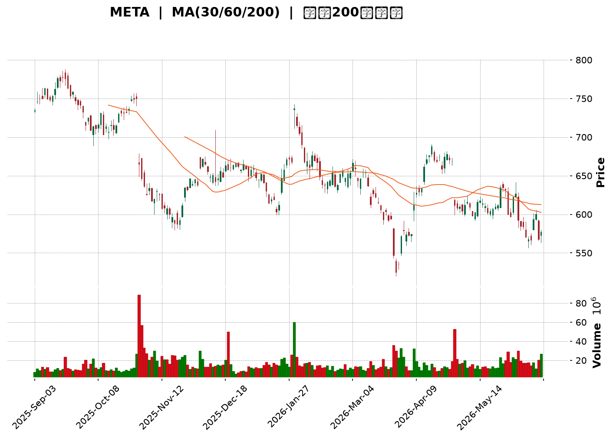
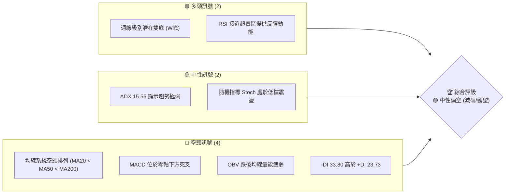
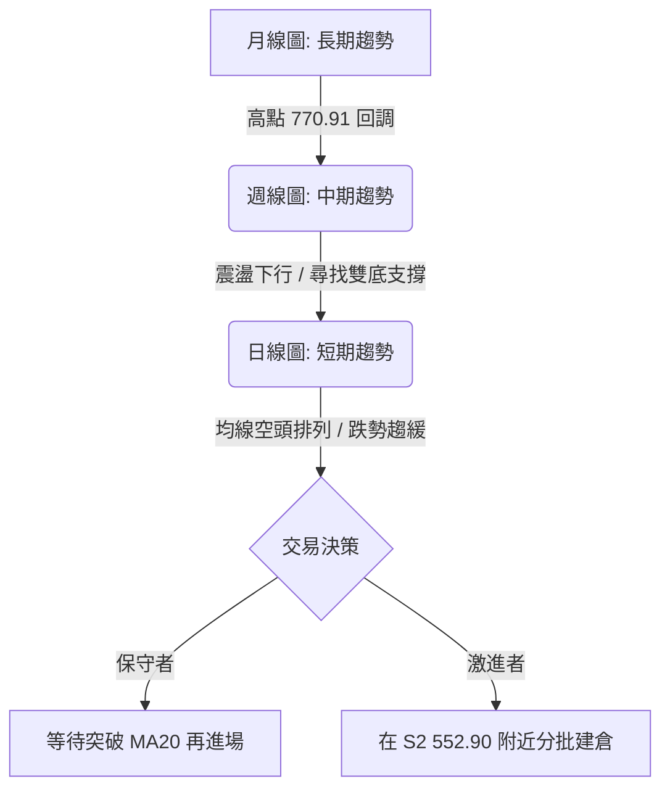
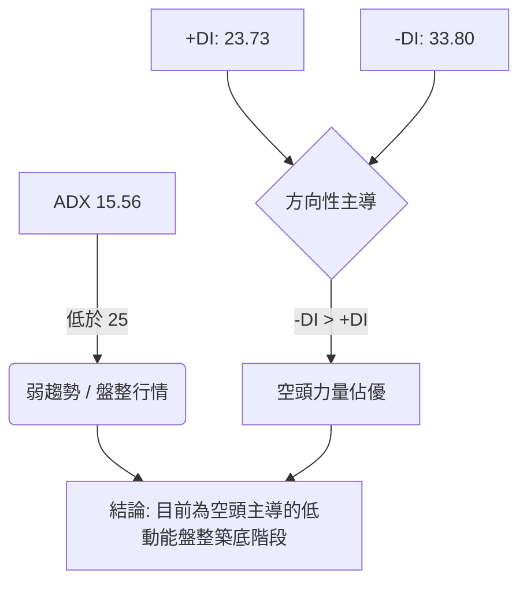
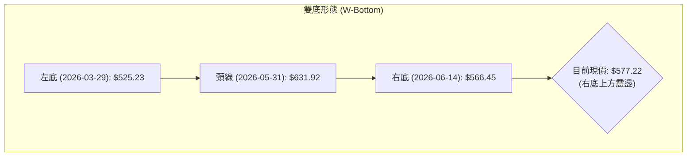
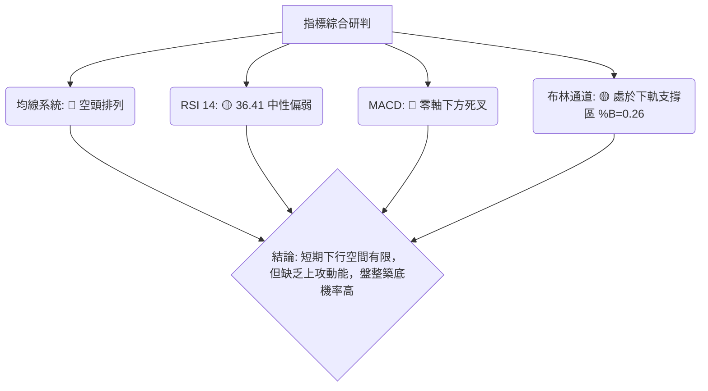
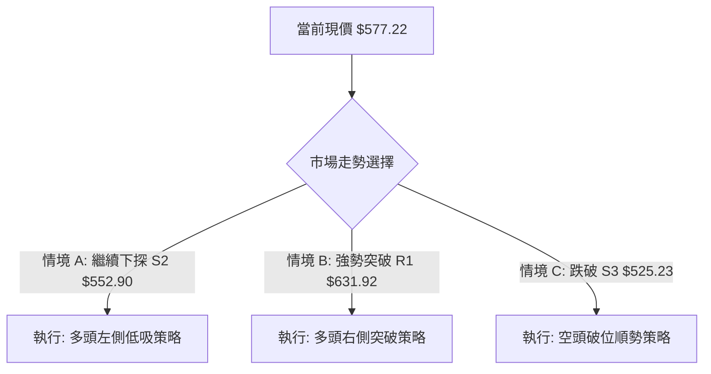
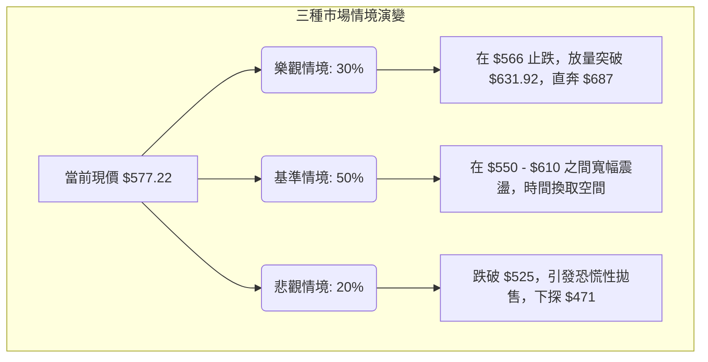

<details>
<summary>📊 靜態圖表 (點擊展開)</summary>

</details>

<html>
<head><meta charset="utf-8" /></head>
<body>
    <div style="height:500px; width:100%;">                        <script>window.PlotlyConfig = {MathJaxConfig: 'local'};</script>
        <script charset="utf-8" src="https://cdn.plot.ly/plotly-3.6.0.min.js" integrity="sha256-QaOVwtVY0T02VaHrr6pnoHLCwayMJp4O5n4YyaE3rJk=" crossorigin="anonymous"></script>                <div id="candlestick-chart" class="plotly-graph-div" style="height:100%; width:100%;"></div>            <script>                window.PLOTLYENV=window.PLOTLYENV || {};                                if (document.getElementById("candlestick-chart")) {                    Plotly.newPlot(                        "candlestick-chart",                        [{"close":{"dtype":"f8","bdata":"AAAAICP1hkAAAACAolGHQAAAAIDvb4dAAAAAIL1uh0AAAADAltmHQAAAAAAwbIdAAAAAYJNjh0AAAAAg+YiHQAAAAICd0YdAAAAAQKRDiEAAAACgfCmIQAAAAMCbTYhAAAAAoLI+iEAAAACgZtmHQAAAAACGi4dAAAAAgH61h0AAAADgvFeHQAAAAMCQLodAAAAAwMUrh0AAAADAzOOGQAAAAEDVW4ZAAAAAwE+phkAAAADguyWGQAAAAKBtToZAAAAAgNc5hkAAAADA0l+GQAAAAKDb3IZAAAAAYMP7hUAAAABAv06GQAAAAGB+FoZAAAAAQIJdhkAAAABgyDGGQAAAAGB7WIZAAAAAYCrShkAAAABg8dqGQAAAAEAP3IZAAAAAgMTghkAAAACAjgOHQAAAAID6ZodAAAAAAO1rh0AAAADAwm2HQAAAAMDtxYRAAAAAQFg1hEAAAAAgcuCDQAAAAKCKjYNAAAAAAGfSg0AAAADgrEqDQAAAACDHYINAAAAAQPiwg0AAAABgoIuDQAAAAABx+4JAAAAAoHYCg0AAAABACP+CQAAAAECWw4JAAAAA4B2hgkAAAAAgT2aCQAAAAED5XIJAAAAAAKuFgkAAAABgrRuDQAAAAICO1INAAAAAILu\u002fg0AAAABAJzKEQAAAAACp+YNAAAAAAF8rhEAAAADghu+DQAAAAACDnoRAAAAAgGL9hEAAAADgj8iEQAAAAOALeoRAAAAAQIxDhEAAAACAIliEQAAAAGB4FIRAAAAAQNsyhEAAAADA1n+EQAAAAIC\u002fQoRAAAAAoCK6hEAAAACgxoyEQAAAAKCTooRAAAAAQAy+hEAAAAAg5NKEQAAAAADfsIRAAAAAICOMhEAAAAAgHcaEQAAAAEBRl4RAAAAA4ANKhEAAAACA74yEQAAAAMCMm4RAAAAAoEc8hEAAAADgRieEQAAAAEAtX4RAAAAAgJ0GhEAAAAAAu6+DQAAAAGBkM4NAAAAAgI5dg0AAAAAgKlmDQAAAAMBa2IJAAAAA4PIeg0AAAACA0DOEQAAAAECyjIRAAAAAYE35hEAAAABgLP6EQAAAAGBQ3IRAAAAAgPYHh0AAAAAgy1mGQAAAAIA3CYZAAAAAIL+ThUAAAADgY96EQAAAAAAi6IRAAAAAAEKihEAAAADgHCCFQAAAAKA07IRAAAAAoP7bhEAAAABAOUWEQAAAAAAM9YNAAAAAgDbxg0AAAADgmBCEQAAAACAOHYRAAAAAoPBzhEAAAAAg7OCDQAAAAABL8YNAAAAAYDVkhEAAAACguH6EQAAAAAA1OIRAAAAAgCtjhEAAAAAAT2+EQAAAAABU1IRAAAAAgCabhEAAAACgsR2EQAAAAADmMYRAAAAAID5nhEAAAAAgjW2EQAAAAGBZ6INAAAAAAPAkg0AAAADA85aDQAAAAOCqcINAAAAAIOE4g0AAAAAgG\u002fGCQAAAAODhiIJAAAAAYAHcgkAAAADA94KCQAAAAKC2koJAAAAAgEMYgUAAAACA3WmAQAAAACARv4BAAAAAQM3cgUAAAACgjBWCQAAAAMBs74FAAAAAYOrjgUAAAADgI\u002fSBQAAAAMDSHoNAAAAAIHeeg0AAAADANqqDQAAAAECKz4NAAAAAIAOvhEAAAABgqveEQAAAACDyIYVAAAAAoEx\u002fhUAAAABgT\u002fKEQAAAAADE4YRAAAAAAMMQhUAAAABAUZSEQAAAAGA9E4VAAAAA4O4vhUAAAABAv\u002fWEQAAAAOAA5IRAAAAAQL8ag0AAAACgfQGDQAAAACDCDoNAAAAA4DLjgkAAAAAAgCKDQAAAACDpQYNAAAAAIIYIg0AAAACgcbKCQAAAAICI04JAAAAA4HhAg0AAAADg206DQAAAAEBKLYNAAAAAACcVg0AAAACAatCCQAAAAID\u002f44JAAAAAYIr2gkAAAABAjw2DQAAAACAvHoNAAAAA4F\u002fVg0AAAAAgndWDQAAAAABlv4NAAAAAwE+\u002fgkAAAADgnKiCQAAAAKA5c4NAAAAAQOmXg0AAAACAm4OCQAAAAKDIRoJAAAAAwGNAgkAAAABAnNOBQAAAAKA6v4FAAAAAwKOzgUAAAAAA14uCQAAAACCuwYJAAAAA4KO8gUAAAACAwgmCQA=="},"high":{"dtype":"f8","bdata":"sT8aV6cOh0C1BsItY7WHQASWCrTKm4dAi5+XLQzgh0BUpGN8X96HQAS7VtWW2YdAN7z3ZAOVh0CyBsXgwpiHQNjur49UHIhAozACtnVWiEAwP4ha2WWIQDH5Ei6gkYhANZX3p7uhiEDV1i+4iH2IQFDqGb\u002fOBIhA7iP3uxW5h0BEO+R9dJaHQEtw\u002ferVb4dAzpi3yqhmh0BzElRdVyiHQAe6DqrRf4ZALJe2jA6vhkCc8X1o1MiGQBpzu8QpWIZAh02O1BZlhkC\u002fv1YCRG6GQAAAAKDb3IZAr368x+bqhkBVGEg5lHCGQGQon9eMTYZAh6ehYy2QhkBdjDQ03ZyGQJjTvYRoZYZA3Vzlv+7ehkC7KP6WrASHQBhTQi1uFYdAZ+MRct8jh0Cbeb07TBqHQI3o9+5QjodAjA4iJnajh0BlRUl1hqmHQCP40GSMOYVAwWUSQB0JhUB9xF4D9YyEQCpVKSSaAIRA1kjjAoMEhEB2L3odzdKDQDdsywQhZINAaZ2UidLKg0DPYhYzap+DQH8yGdrdmoNAV7Uc5mFAg0CwKqFUtCCDQGMQ6nLTEINAabDIqMDQgkDHrwECSY6CQLbozCcr6YJAcH66MIykgkAEabQ7zTiDQDhKJvct24NAMabc46Hlg0AkFAd48zKEQOxuwfsqHYRAiI3D6IMxhECI4P+7VTmEQEPPL9jEEoVAVfK7wIQHhUDKr+D5oheFQBvQaswMtoRAABvgOn9mhEBYq684pGyEQC83taQ+KYZAe0TYurJehEB1HAi44aqEQJ\u002fjj7lroIRAttgbmO3qhEARrnQGce6EQG7bP3ILA4VAOAtrQoPGhEAohOET7NeEQLSv7BsS3oRA7e+uT5iYhEDBFLIiL\u002fiEQCo1UfiGvoRA9fpoBai5hEATbiKI2rqEQHfWtiGuwoRA0TlQm8+PhECEJB71lC+EQPATfBtFboRA4H6uvXFmhEAvd\u002fTaAgmEQCQkGNmlmoNALx3r9Xd4g0BsW6jMrZ+DQLDl07N9EoNAfsPkYlpJg0C0zZlvJpuEQI2AyQ9tyoRATg0A+p4QhUAaN8U16xyFQPoEyFzJI4VAsrQb4GY1h0B3BCAb7taGQOnnBvMfgIZA2KpWPMldhkCWDhjm03yFQEJE4bNKQoVAo6\u002fH+Vj2hEDTmJsKv1CFQL+A5SmBO4VAo5gE63swhUBJ7JHeXhaFQLBoABspUoRAYmHVTaULhEAjhT\u002fizx6EQPWQGvZMMIRA96LxtFmxhECBdagsO4SEQMoSPUa\u002f\u002f4NAvHWgzrllhEAI\u002fDCTlZ6EQDHywedEQoRAB6TRex6WhEDYgyqP7o6EQAvO3Z6T\u002fIRABpQuzwvshEDkZEwQgkKEQOc68u\u002fFNIRASiDXZ\u002f6YhECCofcWko+EQPL67uGwYoRAjYOSnmWgg0BlphNITNGDQAvaDUmv34NAxkdriJZwg0AkMZ2NdSODQDpp2Nc024JAqLqTkJwAg0AN3HVNjMOCQGl6m1nj2IJAAzKXYK4zgkCY4m3XxfiAQIVFJD1n2IBAN2OlKkXpgUCcOuC9AoCCQNnUu\u002fa2D4JA33kduQAygkACk54olPWBQBTmrgHvqoNALqd\u002fGUfng0BNf37W6O+DQEFp2ttL04NAr9mx+STNhEClYrhg+S6FQEEdTOeeJ4VAcbIhngmXhUC3NV9a+lWFQJBg7EqXHIVAEMIvzwMuhUDYWTsiheeEQMuy7U1RQIVA6N9txPFOhUAI+VqHaiyFQPKBlGUBDYVADFADbDNig0ATxFmqdFKDQBz\u002fPbFzK4NA7HxdsT8ug0BP2bX3AVuDQKD6isE1g4NA6PKbVZdBg0A5tv+GzOKCQAGH5hOH2YJAeqN6rJtag0CRPw8zOHmDQB6Pa6j\u002fZINAh9CN8Sg4g0ArP5Jo5CqDQJiWxAx\u002f+4JAxhQ3qkgIg0BQSCv\u002f7DGDQHho8zU1L4NAG3IpO0Xvg0BDff6gPBOEQMpx5blMz4NAm50GWErZg0CU3TmKhwKDQCF+\u002faeTfINALuxWAHEOhEAgJfYyiqSDQKYSBVede4JALe5S5ZyogkCF994NLnaCQBwdRAgf3YFA4Fze4kr8gUAAAAAAKcqCQAAAAOB67oJAAAAA4HqOgkAAAABguCGCQA=="},"hovertemplate":"\u003cb\u003e%{x|%Y-%m-%d}\u003c\u002fb\u003e\u003cbr\u003e\u958b: $%{open:.2f}\u003cbr\u003e\u9ad8: $%{high:.2f}\u003cbr\u003e\u4f4e: $%{low:.2f}\u003cbr\u003e\u6536: $%{close:.2f}\u003cextra\u003e\u003c\u002fextra\u003e","low":{"dtype":"f8","bdata":"yIIVubzchkANnhKPETuHQDnvWQTFNIdArPmEn4Fsh0DqZYfXv3eHQFE\u002fcI5fZIdAyaZVzWZPh0DCZfllpCqHQLE+5GhEbIdAYYjV\u002fs3Uh0AWp9r0c96HQGHT9xirFohA+8H1+2r1h0D5bWwq5dOHQBsjGSH5aIdAQYcMkZ90h0AOv9PJ8jSHQNiONIB\u002f+4ZAnTNGVNwJh0ALWB\u002fNU6OGQLSPEm\u002fcIoZAj1cadjdihkD5wdOksyKGQJYgdRzAhYVAf1EvkVr\u002fhUCLcDKJyg+GQGjJ9y+8NIZA66JlsnX1hUBcJjoybw6GQKPHyYMgzIVAjA\u002fGFlsdhkBJzMfCbvCFQBnoamBOAoZArxDLkn5yhkC1t21j4LaGQL7\u002fKfU2kYZAg4sSCJbZhkDrCRTOBsqGQJz\u002fu42OUIdAsN9gU7A8h0C0pfbJqySHQJZcyfjdQ4RAbE3ppCkfhEAtBvHAPNSDQBEkqLUWg4NA980tPlGHg0DtT3S+LEODQKrUApcfvYJAjdMrhA1Eg0DgrtUaRE6DQG\u002fsdBaM8YJAPOmpenzLgkBw6VKCP42CQKUuyB3YjoJAH5ixJSAygkCE7OXv7x2CQFCla5CxLoJA+oyrEs4igkDbrUgso6CCQHOEw5ORRYNATrzUpO6vg0C0P7XEz86DQIBBvUXY4INAjXLemFHjg0D5xvtjK9+DQNIY7byzkoRAAhAZuV+lhEDIQ9sQwrqEQCKgZ1spXYRAixBDAdkNhEBpriAGGvmDQC0aiXug54NAp2aIgIDsg0D9B37\u002fbxCEQPopDThaQIRAjoXxQlR6hEAK2dRmEIiEQKMo4I\u002fYe4RAac+VhZ+IhECpdUjiKqiEQOFYHq8joYRAc3czbsxphEDJkg5zWYWEQIPJ014gkoRAhrqRctUShEDWAEjixTSEQLcySwzqVYRA3l0UhksdhECABAo1tNSDQKpUEFykDYRAq+7MsrQAhECUBord6HeDQMKdgE3NLYNAyHd5FRcpg0DOZ7CezleDQN9VKgZ0t4JA4e8GmBe4gkAvY6x\u002feYuDQOXU5I5rGoRAYMBgXuaghEB6yNvNz7uEQPTNOLdPx4RA6Tk28D86hkCvtaIcjkKGQL5p\u002fmkj8oVAngGyaoBphUCVMVIULNKEQA3oLNCwYoRAYhnibcoqhEAwY8Ae24yEQA97L2TH5IRAVZngg3B\u002fhEBPwOhkDCGEQJ9SZVaFy4NAGCBOQXGdg0B4WpiUQJiDQKkQsISw3INAiA1kDiTtg0CdpfOu8NaDQMnwdULhnoNAKRRGHvkHhEAwT\u002fXNxjKEQCmQMc\u002fe54NA5XrXIfbKg0DlyeS4nu2DQMhahc\u002f9g4RAmvkuajdJhEDDLaiI0deDQN892edPjYNATZc8PcE+hEBQfDrUpDmEQHKn66og3oNA6GLPa7cDg0D0qc8fL3SDQMkDBLL+aINA0Ixux1Mwg0DTdHBrns2CQD4MuGemVYJADGKTk6SzgkDpDhREn3OCQH6oV\u002fPNhoJASvoxUsb2gECpNcLaOT6AQNyk6p1ngIBAxGbeFxwSgUCJ2z1CT+qBQBpNdj10eYFA67EsT8PbgUBqz3KD5aGBQAmY04tBeoJAbBSemGJzg0DoZ8HcA36DQGbrmTWTfoNALGWEODn2g0ArK+j01ryEQOw9l6sN2YRAvvAH8wkUhUBNjahEDduEQHfJEV2y1YRA22697AnphEBDR2jxj2OEQDbYRW\u002fgaYRAWaDUQMDxhEDZRxX0G8iEQPilzBGQuYRA2bzHNY67gkBy6prhY+yCQLthfQaJ0YJA5dA5uW6+gkBc1UmHXqyCQJ4OkVPGJ4NAjQYyhf3rgkAg2qO6NayCQK242\u002fhogIJAb1UAH9yggkAmMSHBcTODQLPfY3T3BYNAl9LjQgzZgkAhuAyI87+CQKAuiD8NqoJAdDet1hKSgkAF8N2mGvOCQFXBz3nq5YJAfYTMK30Dg0B4KR530aWDQEFJB58udoNAyilUiMy3gkDW7jgNBaGCQIReyLC2vYJACmJeP9Rug0BEwjRC9jKCQNtYZhN4FYJAwsQIqsYjgkDve3m4ktCBQOBYTij0Y4FAZnTEhwuDgUAAAABgZhqCQAAAAAAAgIJAAAAAIIWxgUAAAADAzJiBQA=="},"name":"\u50f9\u683c","open":{"dtype":"f8","bdata":"SEdkxsPshkCmVAwp\u002f1CHQPDt3XxKcYdAnwLB\u002fj2Mh0DDJMCNH5iHQCn8mkUL1YdANcslSXqBh0AIEpylRVKHQAEBJL\u002f2l4dApV6giPTjh0CEJY8OiUuIQOk5nmeYUYhA7Jq3tc5+iED\u002fdhsVk16IQChcJysJ+odAcJ6wqUech0BOJErB9nuHQIv51ItvYIdAAKCHvDhWh0Cg5YOwmCKHQEqmq1PyfIZAO0du\u002f6SFhkAhZsLv5b2GQHERX7\u002fi+oVAUCdved1ehkCehZNSyzyGQE5BUolVY4ZAQSrvAzHIhkDkHZ1qSDmGQHJRPz+ND4ZA00tpWplZhkAvZvlCgl2GQJvGv2b3CYZAiEwltY16hkDoiODD4vCGQHNzuERp34ZA9e\u002fzZ1rmhkCHX1N3B\u002feGQFpsfepHXodAdV+OzWt1h0C20QpDVoaHQHax\u002fkJQ24RA1k3mBBUGhUBQKGrUYnKEQI2KzkxJk4NAxzmgllu1g0AmxYSpmtGDQG9SmTsgN4NA4vsur5+rg0DaicWc95KDQMQguisBlINA7fEYW9Ybg0BYWKS\u002f1MGCQLZIB0eu+4JAQ1l+2oVwgkC4tcovcIGCQG87KMN5z4JAkbkdjMlXgkAVJdqhVamCQFp4j+sMc4NAqeIOU0ngg0C9QNqPcNODQGkMR6Mg74NAk+CW6WMFhECjL2cy6BWEQOKDKKD4EYVAaNF3aziyhEAux2xh1NyEQJltAZJisIRASJjNlBxChECe7aNL+AyEQE1tcyjqQIRA\u002fAS3+WYkhEDwyG1H1RKEQNBPEXiKc4RAHDPSjuF+hEAwDDna3cmEQKdp8FPGo4RAsLIrVf+WhEDeBDWOzaqEQGhH0pr21oRAdIHM+rSGhEBBdpAZI4yEQMsctOGHvIRAJQgUU2ashEB8AO1+zk6EQN8UMDQqk4RA\u002fVH+58dzhEDwtQjo1iWEQCqYBEpTIoRAl7bn\u002ffFahEAvd\u002fTaAgmEQGOBi1UTi4NA2MHblQdLg0CjqR5rjHiDQKrg5Ilh9oJAs2Cp7kbtgkA5RLCp1aGDQMfVJ8T5HIRAUsaHvZC\u002fhEDltpVXHAuFQHe4cFVkCoVAMeqGde8Ah0ClBNYCo7GGQKnXAMKeSoZArpHBGuIQhkDPBQwJC3SFQBMxp+0vs4RAkNjVrXDChEA8nCEz\u002fq+EQK1LPcklI4VA8CTZImYGhUCh19hbN+aEQGUJTFCcH4RABy7t2+Pyg0B05Q0aX8WDQEkaiaV264NAawThXGj0g0Dh4909BluEQDTzyC6fv4NALdMuchYLhEDxh60OIkuEQMYvhj9vEoRADxSSDjTgg0AvutzCFTmEQB4xwcBOhoRA92FkygKmhEDfT\u002fCJ+DWEQKDIrrsyzYNAGQEifCtjhEBJplW9wGyEQDOgUTTCPIRAvhb0fzt2g0B1Wh5\u002fUbuDQLdMh6REm4NA86CWnyc+g0AACz5qqhyDQB\u002fLlQjF14JADCUpGNXpgkDvgtmnXLSCQNLh9RJ8sYJAgLMx2JovgkAVSaV6zNyAQAAAACARv4BAKN97AcQrgUB0jhYrvhyCQB4ZoncgrIFA0MftpD0JgkCsmKdfmd+BQFDLtsyC64JALZlekR2Tg0BKjeNBD8+DQHqs0klWp4NAW+Fkq\u002f4UhEA6JFovD9OEQPTsOYvpGoVAMMJ03sUvhUDXqf8u1UWFQEEAZIcH84RAvoHCbuINhUDkwBn\u002frriEQMoWYyWrnYRA77ErkwfzhEB1lSLg7AyFQCgk9SVT4oRA1C2\u002f8vhVg0BmO2d89zCDQI90CE8E+4JAw\u002fRAyu8lg0Bw9iOP8sOCQFCzsLY0MYNAdSnU7wo1g0B2hwnsFOCCQOy8G2MnkoJAuWd+QTSygkAwB6vbbzuDQNKjgDRfK4NAG6qLG14Eg0DkEr1o2QKDQELMcEehwYJALr30Ho67gkBF2mSDifqCQLUh6wqcAoNA7uGbqa8Gg0ChHCZEQ\u002feDQOC+YJ9Ox4NAq75dvYeug0D0CWd8c9WCQCtbfIOI04JATSxhZb14g0BztCzdD3eDQKYSBVede4JAG50SOJ9zgkC3EdXCiSGCQLcwRM5yqoFA3JSZDVvjgUAAAABAMx+CQAAAAEAzjYJAAAAAAACAgkAAAADgo+eBQA=="},"x":["2025-09-03T00:00:00-04:00","2025-09-04T00:00:00-04:00","2025-09-05T00:00:00-04:00","2025-09-08T00:00:00-04:00","2025-09-09T00:00:00-04:00","2025-09-10T00:00:00-04:00","2025-09-11T00:00:00-04:00","2025-09-12T00:00:00-04:00","2025-09-15T00:00:00-04:00","2025-09-16T00:00:00-04:00","2025-09-17T00:00:00-04:00","2025-09-18T00:00:00-04:00","2025-09-19T00:00:00-04:00","2025-09-22T00:00:00-04:00","2025-09-23T00:00:00-04:00","2025-09-24T00:00:00-04:00","2025-09-25T00:00:00-04:00","2025-09-26T00:00:00-04:00","2025-09-29T00:00:00-04:00","2025-09-30T00:00:00-04:00","2025-10-01T00:00:00-04:00","2025-10-02T00:00:00-04:00","2025-10-03T00:00:00-04:00","2025-10-06T00:00:00-04:00","2025-10-07T00:00:00-04:00","2025-10-08T00:00:00-04:00","2025-10-09T00:00:00-04:00","2025-10-10T00:00:00-04:00","2025-10-13T00:00:00-04:00","2025-10-14T00:00:00-04:00","2025-10-15T00:00:00-04:00","2025-10-16T00:00:00-04:00","2025-10-17T00:00:00-04:00","2025-10-20T00:00:00-04:00","2025-10-21T00:00:00-04:00","2025-10-22T00:00:00-04:00","2025-10-23T00:00:00-04:00","2025-10-24T00:00:00-04:00","2025-10-27T00:00:00-04:00","2025-10-28T00:00:00-04:00","2025-10-29T00:00:00-04:00","2025-10-30T00:00:00-04:00","2025-10-31T00:00:00-04:00","2025-11-03T00:00:00-05:00","2025-11-04T00:00:00-05:00","2025-11-05T00:00:00-05:00","2025-11-06T00:00:00-05:00","2025-11-07T00:00:00-05:00","2025-11-10T00:00:00-05:00","2025-11-11T00:00:00-05:00","2025-11-12T00:00:00-05:00","2025-11-13T00:00:00-05:00","2025-11-14T00:00:00-05:00","2025-11-17T00:00:00-05:00","2025-11-18T00:00:00-05:00","2025-11-19T00:00:00-05:00","2025-11-20T00:00:00-05:00","2025-11-21T00:00:00-05:00","2025-11-24T00:00:00-05:00","2025-11-25T00:00:00-05:00","2025-11-26T00:00:00-05:00","2025-11-28T00:00:00-05:00","2025-12-01T00:00:00-05:00","2025-12-02T00:00:00-05:00","2025-12-03T00:00:00-05:00","2025-12-04T00:00:00-05:00","2025-12-05T00:00:00-05:00","2025-12-08T00:00:00-05:00","2025-12-09T00:00:00-05:00","2025-12-10T00:00:00-05:00","2025-12-11T00:00:00-05:00","2025-12-12T00:00:00-05:00","2025-12-15T00:00:00-05:00","2025-12-16T00:00:00-05:00","2025-12-17T00:00:00-05:00","2025-12-18T00:00:00-05:00","2025-12-19T00:00:00-05:00","2025-12-22T00:00:00-05:00","2025-12-23T00:00:00-05:00","2025-12-24T00:00:00-05:00","2025-12-26T00:00:00-05:00","2025-12-29T00:00:00-05:00","2025-12-30T00:00:00-05:00","2025-12-31T00:00:00-05:00","2026-01-02T00:00:00-05:00","2026-01-05T00:00:00-05:00","2026-01-06T00:00:00-05:00","2026-01-07T00:00:00-05:00","2026-01-08T00:00:00-05:00","2026-01-09T00:00:00-05:00","2026-01-12T00:00:00-05:00","2026-01-13T00:00:00-05:00","2026-01-14T00:00:00-05:00","2026-01-15T00:00:00-05:00","2026-01-16T00:00:00-05:00","2026-01-20T00:00:00-05:00","2026-01-21T00:00:00-05:00","2026-01-22T00:00:00-05:00","2026-01-23T00:00:00-05:00","2026-01-26T00:00:00-05:00","2026-01-27T00:00:00-05:00","2026-01-28T00:00:00-05:00","2026-01-29T00:00:00-05:00","2026-01-30T00:00:00-05:00","2026-02-02T00:00:00-05:00","2026-02-03T00:00:00-05:00","2026-02-04T00:00:00-05:00","2026-02-05T00:00:00-05:00","2026-02-06T00:00:00-05:00","2026-02-09T00:00:00-05:00","2026-02-10T00:00:00-05:00","2026-02-11T00:00:00-05:00","2026-02-12T00:00:00-05:00","2026-02-13T00:00:00-05:00","2026-02-17T00:00:00-05:00","2026-02-18T00:00:00-05:00","2026-02-19T00:00:00-05:00","2026-02-20T00:00:00-05:00","2026-02-23T00:00:00-05:00","2026-02-24T00:00:00-05:00","2026-02-25T00:00:00-05:00","2026-02-26T00:00:00-05:00","2026-02-27T00:00:00-05:00","2026-03-02T00:00:00-05:00","2026-03-03T00:00:00-05:00","2026-03-04T00:00:00-05:00","2026-03-05T00:00:00-05:00","2026-03-06T00:00:00-05:00","2026-03-09T00:00:00-04:00","2026-03-10T00:00:00-04:00","2026-03-11T00:00:00-04:00","2026-03-12T00:00:00-04:00","2026-03-13T00:00:00-04:00","2026-03-16T00:00:00-04:00","2026-03-17T00:00:00-04:00","2026-03-18T00:00:00-04:00","2026-03-19T00:00:00-04:00","2026-03-20T00:00:00-04:00","2026-03-23T00:00:00-04:00","2026-03-24T00:00:00-04:00","2026-03-25T00:00:00-04:00","2026-03-26T00:00:00-04:00","2026-03-27T00:00:00-04:00","2026-03-30T00:00:00-04:00","2026-03-31T00:00:00-04:00","2026-04-01T00:00:00-04:00","2026-04-02T00:00:00-04:00","2026-04-06T00:00:00-04:00","2026-04-07T00:00:00-04:00","2026-04-08T00:00:00-04:00","2026-04-09T00:00:00-04:00","2026-04-10T00:00:00-04:00","2026-04-13T00:00:00-04:00","2026-04-14T00:00:00-04:00","2026-04-15T00:00:00-04:00","2026-04-16T00:00:00-04:00","2026-04-17T00:00:00-04:00","2026-04-20T00:00:00-04:00","2026-04-21T00:00:00-04:00","2026-04-22T00:00:00-04:00","2026-04-23T00:00:00-04:00","2026-04-24T00:00:00-04:00","2026-04-27T00:00:00-04:00","2026-04-28T00:00:00-04:00","2026-04-29T00:00:00-04:00","2026-04-30T00:00:00-04:00","2026-05-01T00:00:00-04:00","2026-05-04T00:00:00-04:00","2026-05-05T00:00:00-04:00","2026-05-06T00:00:00-04:00","2026-05-07T00:00:00-04:00","2026-05-08T00:00:00-04:00","2026-05-11T00:00:00-04:00","2026-05-12T00:00:00-04:00","2026-05-13T00:00:00-04:00","2026-05-14T00:00:00-04:00","2026-05-15T00:00:00-04:00","2026-05-18T00:00:00-04:00","2026-05-19T00:00:00-04:00","2026-05-20T00:00:00-04:00","2026-05-21T00:00:00-04:00","2026-05-22T00:00:00-04:00","2026-05-26T00:00:00-04:00","2026-05-27T00:00:00-04:00","2026-05-28T00:00:00-04:00","2026-05-29T00:00:00-04:00","2026-06-01T00:00:00-04:00","2026-06-02T00:00:00-04:00","2026-06-03T00:00:00-04:00","2026-06-04T00:00:00-04:00","2026-06-05T00:00:00-04:00","2026-06-08T00:00:00-04:00","2026-06-09T00:00:00-04:00","2026-06-10T00:00:00-04:00","2026-06-11T00:00:00-04:00","2026-06-12T00:00:00-04:00","2026-06-15T00:00:00-04:00","2026-06-16T00:00:00-04:00","2026-06-17T00:00:00-04:00","2026-06-18T00:00:00-04:00"],"type":"candlestick"},{"hovertemplate":"MA30: $%{y:.2f}\u003cextra\u003e\u003c\u002fextra\u003e","line":{"color":"#2196F3","dash":"dash","width":2},"mode":"lines","name":"MA30","x":["2025-09-03T00:00:00-04:00","2025-09-04T00:00:00-04:00","2025-09-05T00:00:00-04:00","2025-09-08T00:00:00-04:00","2025-09-09T00:00:00-04:00","2025-09-10T00:00:00-04:00","2025-09-11T00:00:00-04:00","2025-09-12T00:00:00-04:00","2025-09-15T00:00:00-04:00","2025-09-16T00:00:00-04:00","2025-09-17T00:00:00-04:00","2025-09-18T00:00:00-04:00","2025-09-19T00:00:00-04:00","2025-09-22T00:00:00-04:00","2025-09-23T00:00:00-04:00","2025-09-24T00:00:00-04:00","2025-09-25T00:00:00-04:00","2025-09-26T00:00:00-04:00","2025-09-29T00:00:00-04:00","2025-09-30T00:00:00-04:00","2025-10-01T00:00:00-04:00","2025-10-02T00:00:00-04:00","2025-10-03T00:00:00-04:00","2025-10-06T00:00:00-04:00","2025-10-07T00:00:00-04:00","2025-10-08T00:00:00-04:00","2025-10-09T00:00:00-04:00","2025-10-10T00:00:00-04:00","2025-10-13T00:00:00-04:00","2025-10-14T00:00:00-04:00","2025-10-15T00:00:00-04:00","2025-10-16T00:00:00-04:00","2025-10-17T00:00:00-04:00","2025-10-20T00:00:00-04:00","2025-10-21T00:00:00-04:00","2025-10-22T00:00:00-04:00","2025-10-23T00:00:00-04:00","2025-10-24T00:00:00-04:00","2025-10-27T00:00:00-04:00","2025-10-28T00:00:00-04:00","2025-10-29T00:00:00-04:00","2025-10-30T00:00:00-04:00","2025-10-31T00:00:00-04:00","2025-11-03T00:00:00-05:00","2025-11-04T00:00:00-05:00","2025-11-05T00:00:00-05:00","2025-11-06T00:00:00-05:00","2025-11-07T00:00:00-05:00","2025-11-10T00:00:00-05:00","2025-11-11T00:00:00-05:00","2025-11-12T00:00:00-05:00","2025-11-13T00:00:00-05:00","2025-11-14T00:00:00-05:00","2025-11-17T00:00:00-05:00","2025-11-18T00:00:00-05:00","2025-11-19T00:00:00-05:00","2025-11-20T00:00:00-05:00","2025-11-21T00:00:00-05:00","2025-11-24T00:00:00-05:00","2025-11-25T00:00:00-05:00","2025-11-26T00:00:00-05:00","2025-11-28T00:00:00-05:00","2025-12-01T00:00:00-05:00","2025-12-02T00:00:00-05:00","2025-12-03T00:00:00-05:00","2025-12-04T00:00:00-05:00","2025-12-05T00:00:00-05:00","2025-12-08T00:00:00-05:00","2025-12-09T00:00:00-05:00","2025-12-10T00:00:00-05:00","2025-12-11T00:00:00-05:00","2025-12-12T00:00:00-05:00","2025-12-15T00:00:00-05:00","2025-12-16T00:00:00-05:00","2025-12-17T00:00:00-05:00","2025-12-18T00:00:00-05:00","2025-12-19T00:00:00-05:00","2025-12-22T00:00:00-05:00","2025-12-23T00:00:00-05:00","2025-12-24T00:00:00-05:00","2025-12-26T00:00:00-05:00","2025-12-29T00:00:00-05:00","2025-12-30T00:00:00-05:00","2025-12-31T00:00:00-05:00","2026-01-02T00:00:00-05:00","2026-01-05T00:00:00-05:00","2026-01-06T00:00:00-05:00","2026-01-07T00:00:00-05:00","2026-01-08T00:00:00-05:00","2026-01-09T00:00:00-05:00","2026-01-12T00:00:00-05:00","2026-01-13T00:00:00-05:00","2026-01-14T00:00:00-05:00","2026-01-15T00:00:00-05:00","2026-01-16T00:00:00-05:00","2026-01-20T00:00:00-05:00","2026-01-21T00:00:00-05:00","2026-01-22T00:00:00-05:00","2026-01-23T00:00:00-05:00","2026-01-26T00:00:00-05:00","2026-01-27T00:00:00-05:00","2026-01-28T00:00:00-05:00","2026-01-29T00:00:00-05:00","2026-01-30T00:00:00-05:00","2026-02-02T00:00:00-05:00","2026-02-03T00:00:00-05:00","2026-02-04T00:00:00-05:00","2026-02-05T00:00:00-05:00","2026-02-06T00:00:00-05:00","2026-02-09T00:00:00-05:00","2026-02-10T00:00:00-05:00","2026-02-11T00:00:00-05:00","2026-02-12T00:00:00-05:00","2026-02-13T00:00:00-05:00","2026-02-17T00:00:00-05:00","2026-02-18T00:00:00-05:00","2026-02-19T00:00:00-05:00","2026-02-20T00:00:00-05:00","2026-02-23T00:00:00-05:00","2026-02-24T00:00:00-05:00","2026-02-25T00:00:00-05:00","2026-02-26T00:00:00-05:00","2026-02-27T00:00:00-05:00","2026-03-02T00:00:00-05:00","2026-03-03T00:00:00-05:00","2026-03-04T00:00:00-05:00","2026-03-05T00:00:00-05:00","2026-03-06T00:00:00-05:00","2026-03-09T00:00:00-04:00","2026-03-10T00:00:00-04:00","2026-03-11T00:00:00-04:00","2026-03-12T00:00:00-04:00","2026-03-13T00:00:00-04:00","2026-03-16T00:00:00-04:00","2026-03-17T00:00:00-04:00","2026-03-18T00:00:00-04:00","2026-03-19T00:00:00-04:00","2026-03-20T00:00:00-04:00","2026-03-23T00:00:00-04:00","2026-03-24T00:00:00-04:00","2026-03-25T00:00:00-04:00","2026-03-26T00:00:00-04:00","2026-03-27T00:00:00-04:00","2026-03-30T00:00:00-04:00","2026-03-31T00:00:00-04:00","2026-04-01T00:00:00-04:00","2026-04-02T00:00:00-04:00","2026-04-06T00:00:00-04:00","2026-04-07T00:00:00-04:00","2026-04-08T00:00:00-04:00","2026-04-09T00:00:00-04:00","2026-04-10T00:00:00-04:00","2026-04-13T00:00:00-04:00","2026-04-14T00:00:00-04:00","2026-04-15T00:00:00-04:00","2026-04-16T00:00:00-04:00","2026-04-17T00:00:00-04:00","2026-04-20T00:00:00-04:00","2026-04-21T00:00:00-04:00","2026-04-22T00:00:00-04:00","2026-04-23T00:00:00-04:00","2026-04-24T00:00:00-04:00","2026-04-27T00:00:00-04:00","2026-04-28T00:00:00-04:00","2026-04-29T00:00:00-04:00","2026-04-30T00:00:00-04:00","2026-05-01T00:00:00-04:00","2026-05-04T00:00:00-04:00","2026-05-05T00:00:00-04:00","2026-05-06T00:00:00-04:00","2026-05-07T00:00:00-04:00","2026-05-08T00:00:00-04:00","2026-05-11T00:00:00-04:00","2026-05-12T00:00:00-04:00","2026-05-13T00:00:00-04:00","2026-05-14T00:00:00-04:00","2026-05-15T00:00:00-04:00","2026-05-18T00:00:00-04:00","2026-05-19T00:00:00-04:00","2026-05-20T00:00:00-04:00","2026-05-21T00:00:00-04:00","2026-05-22T00:00:00-04:00","2026-05-26T00:00:00-04:00","2026-05-27T00:00:00-04:00","2026-05-28T00:00:00-04:00","2026-05-29T00:00:00-04:00","2026-06-01T00:00:00-04:00","2026-06-02T00:00:00-04:00","2026-06-03T00:00:00-04:00","2026-06-04T00:00:00-04:00","2026-06-05T00:00:00-04:00","2026-06-08T00:00:00-04:00","2026-06-09T00:00:00-04:00","2026-06-10T00:00:00-04:00","2026-06-11T00:00:00-04:00","2026-06-12T00:00:00-04:00","2026-06-15T00:00:00-04:00","2026-06-16T00:00:00-04:00","2026-06-17T00:00:00-04:00","2026-06-18T00:00:00-04:00"],"y":{"dtype":"f8","bdata":"AAAAAAAA+H8AAAAAAAD4fwAAAAAAAPh\u002fAAAAAAAA+H8AAAAAAAD4fwAAAAAAAPh\u002fAAAAAAAA+H8AAAAAAAD4fwAAAAAAAPh\u002fAAAAAAAA+H8AAAAAAAD4fwAAAAAAAPh\u002fAAAAAAAA+H8AAAAAAAD4fwAAAAAAAPh\u002fAAAAAAAA+H8AAAAAAAD4fwAAAAAAAPh\u002fAAAAAAAA+H8AAAAAAAD4fwAAAAAAAPh\u002fAAAAAAAA+H8AAAAAAAD4fwAAAAAAAPh\u002fAAAAAAAA+H8AAAAAAAD4fwAAAAAAAPh\u002fAAAAAAAA+H8AAAAAAAD4f97d3W3dK4dAiYiIiM8mh0AiIiIyNx2HQGZmZobmE4dA7+7ubq4Oh0BERER0MQaHQAAAAJBjAYdAVVVVVQf9hkCJiIjYlPiGQBEREeEG9YZAq6qqGtbthkDNzMwslOeGQGZmZsZ0yYZARERE1AKnhkAAAADQHIWGQGZmZuYLY4ZAMzMzc+BBhkCamZnZTh+GQCIiIjLZ\u002foVA3t3drSfhhUCrqqqqncSFQGZmZobNp4VAd3d3J6SIhUDNzMxMwG2FQLy7u+uFT4VAEREREdUwhUB3d3dH6g6FQN7d3d2E6IRAVVVVhfvKhEAAAAAgrq+EQFVVVWVqnIRAVVVV9RaGhEDe3d0NCXWEQHd3d9fOYIRAZmZmdi5KhEAzMzODRDGEQM3MzDwmHoRA7+7uXgkOhEAiIiLiAPuDQO\u002fu7v4J4oNAZmZm1hfHg0AiIiKyxayDQCIiImLbpoNAZmZmJsamg0De3d1NFqyDQJqZmZkgsoNA3t3dDdq5g0BVVVWllsSDQJqZmalQz4NAvLu7y0jYg0BERER0MeODQAAAADDG8YNAmpmZieX+g0BmZmbmEA6EQDMzMzOoHYRAAAAAANIrhEDe3d2tLD6EQKuqqrpTUYRAzczMjPJfhEARERER3miEQFVVVfV8bYRAZmZm1tlvhEBVVVXlgGuEQCIiIgLlZIRAmpmZuQhehEAiIiKiBVmEQImIiCjiSYRAERERge85hEAREREx+jSEQGZmZlaZNYRA7+7uTqg7hEC8u7srMUGEQBEREYHaR4RAREREFAZghEDe3d190m+EQAAAAKD4foRAMzMzkzmGhEBEREQE8oiEQAAAAJBDi4RAvLu7a1aKhEARERFh6YyEQDMzM7PjjoRAZmZmJo2RhECamZlJQY2EQERERJTYh4RAzczMzOKEhEB3d3fHvYCEQLy7u1uGfIRAMzMzU2F+hEB3d3f3CHyEQKuqqkpfeIRARERE9H17hEBmZmZGZIKEQFVVVeUVi4RAREREVM6ThEAzMzPTE52EQImIiIgCroRAvLu76666hECJiIgo8rmEQJqZmVnrtoRAmpmZ+QyyhEDe3d3dOq2EQImIiAgZpYRAZmZmJu6DhEAAAABwXmyEQN7d3Z03VoRAZmZmJh9ChECrqqrKrTGEQLy7u+tvHYRAIiIioksOhECJiIiY\u002ffeDQM3MzNzw44NAZmZmBtHDg0ARERGR56KDQGZmZlaBh4NAiYiIGMJ1g0CamZlJ22SDQHd3d9dEUoNARERExGY8g0ARERGx+SuDQO\u002fu7q71JINAZmZmRl4eg0ARERHhSBeDQImIiLjLE4NAiYiI6FIWg0DNzMx83hqDQDMzM9N0HYNAIiIisg8lg0BVVVUFJiyDQBEREcECMoNAERERUak3g0Dv7u4e9DiDQHd3d6fqQoNAzczMjFlUg0AAAAAAC2CDQLy7u7trbINAq6qqmmprg0C8u7tr9muDQERERNRscINAZmZmNqpwg0De3d2N+3WDQCIiIpLSe4NAMzMzU12Mg0Crqqq62Z+DQBEREXGZsYNA7+7ufnS9g0AiIiIS5seDQFVVVYV+0oNAVVVVNavcg0BVVVXlAuSDQLy7u+sM4oNAZmZm9nPcg0De3d0tO9eDQN7d3b1R0YNAERERkRDKg0BVVVV1ZcCDQERERPSTtINAd3d3lxydg0BERESklomDQERERNRefYNAmpmZCc9wg0ARERFhL1+DQO\u002fu7p5NR4NAMzMzc0Aug0DNzMyMgxODQERERCSw+IJAIiIiwrfsgkDe3d3Ny+iCQCIiIhI65oJAERERgWjcgkCrqqraDNOCQA=="},"type":"scatter"},{"hovertemplate":"MA60: $%{y:.2f}\u003cextra\u003e\u003c\u002fextra\u003e","line":{"color":"#9C27B0","dash":"dash","width":2},"mode":"lines","name":"MA60","x":["2025-09-03T00:00:00-04:00","2025-09-04T00:00:00-04:00","2025-09-05T00:00:00-04:00","2025-09-08T00:00:00-04:00","2025-09-09T00:00:00-04:00","2025-09-10T00:00:00-04:00","2025-09-11T00:00:00-04:00","2025-09-12T00:00:00-04:00","2025-09-15T00:00:00-04:00","2025-09-16T00:00:00-04:00","2025-09-17T00:00:00-04:00","2025-09-18T00:00:00-04:00","2025-09-19T00:00:00-04:00","2025-09-22T00:00:00-04:00","2025-09-23T00:00:00-04:00","2025-09-24T00:00:00-04:00","2025-09-25T00:00:00-04:00","2025-09-26T00:00:00-04:00","2025-09-29T00:00:00-04:00","2025-09-30T00:00:00-04:00","2025-10-01T00:00:00-04:00","2025-10-02T00:00:00-04:00","2025-10-03T00:00:00-04:00","2025-10-06T00:00:00-04:00","2025-10-07T00:00:00-04:00","2025-10-08T00:00:00-04:00","2025-10-09T00:00:00-04:00","2025-10-10T00:00:00-04:00","2025-10-13T00:00:00-04:00","2025-10-14T00:00:00-04:00","2025-10-15T00:00:00-04:00","2025-10-16T00:00:00-04:00","2025-10-17T00:00:00-04:00","2025-10-20T00:00:00-04:00","2025-10-21T00:00:00-04:00","2025-10-22T00:00:00-04:00","2025-10-23T00:00:00-04:00","2025-10-24T00:00:00-04:00","2025-10-27T00:00:00-04:00","2025-10-28T00:00:00-04:00","2025-10-29T00:00:00-04:00","2025-10-30T00:00:00-04:00","2025-10-31T00:00:00-04:00","2025-11-03T00:00:00-05:00","2025-11-04T00:00:00-05:00","2025-11-05T00:00:00-05:00","2025-11-06T00:00:00-05:00","2025-11-07T00:00:00-05:00","2025-11-10T00:00:00-05:00","2025-11-11T00:00:00-05:00","2025-11-12T00:00:00-05:00","2025-11-13T00:00:00-05:00","2025-11-14T00:00:00-05:00","2025-11-17T00:00:00-05:00","2025-11-18T00:00:00-05:00","2025-11-19T00:00:00-05:00","2025-11-20T00:00:00-05:00","2025-11-21T00:00:00-05:00","2025-11-24T00:00:00-05:00","2025-11-25T00:00:00-05:00","2025-11-26T00:00:00-05:00","2025-11-28T00:00:00-05:00","2025-12-01T00:00:00-05:00","2025-12-02T00:00:00-05:00","2025-12-03T00:00:00-05:00","2025-12-04T00:00:00-05:00","2025-12-05T00:00:00-05:00","2025-12-08T00:00:00-05:00","2025-12-09T00:00:00-05:00","2025-12-10T00:00:00-05:00","2025-12-11T00:00:00-05:00","2025-12-12T00:00:00-05:00","2025-12-15T00:00:00-05:00","2025-12-16T00:00:00-05:00","2025-12-17T00:00:00-05:00","2025-12-18T00:00:00-05:00","2025-12-19T00:00:00-05:00","2025-12-22T00:00:00-05:00","2025-12-23T00:00:00-05:00","2025-12-24T00:00:00-05:00","2025-12-26T00:00:00-05:00","2025-12-29T00:00:00-05:00","2025-12-30T00:00:00-05:00","2025-12-31T00:00:00-05:00","2026-01-02T00:00:00-05:00","2026-01-05T00:00:00-05:00","2026-01-06T00:00:00-05:00","2026-01-07T00:00:00-05:00","2026-01-08T00:00:00-05:00","2026-01-09T00:00:00-05:00","2026-01-12T00:00:00-05:00","2026-01-13T00:00:00-05:00","2026-01-14T00:00:00-05:00","2026-01-15T00:00:00-05:00","2026-01-16T00:00:00-05:00","2026-01-20T00:00:00-05:00","2026-01-21T00:00:00-05:00","2026-01-22T00:00:00-05:00","2026-01-23T00:00:00-05:00","2026-01-26T00:00:00-05:00","2026-01-27T00:00:00-05:00","2026-01-28T00:00:00-05:00","2026-01-29T00:00:00-05:00","2026-01-30T00:00:00-05:00","2026-02-02T00:00:00-05:00","2026-02-03T00:00:00-05:00","2026-02-04T00:00:00-05:00","2026-02-05T00:00:00-05:00","2026-02-06T00:00:00-05:00","2026-02-09T00:00:00-05:00","2026-02-10T00:00:00-05:00","2026-02-11T00:00:00-05:00","2026-02-12T00:00:00-05:00","2026-02-13T00:00:00-05:00","2026-02-17T00:00:00-05:00","2026-02-18T00:00:00-05:00","2026-02-19T00:00:00-05:00","2026-02-20T00:00:00-05:00","2026-02-23T00:00:00-05:00","2026-02-24T00:00:00-05:00","2026-02-25T00:00:00-05:00","2026-02-26T00:00:00-05:00","2026-02-27T00:00:00-05:00","2026-03-02T00:00:00-05:00","2026-03-03T00:00:00-05:00","2026-03-04T00:00:00-05:00","2026-03-05T00:00:00-05:00","2026-03-06T00:00:00-05:00","2026-03-09T00:00:00-04:00","2026-03-10T00:00:00-04:00","2026-03-11T00:00:00-04:00","2026-03-12T00:00:00-04:00","2026-03-13T00:00:00-04:00","2026-03-16T00:00:00-04:00","2026-03-17T00:00:00-04:00","2026-03-18T00:00:00-04:00","2026-03-19T00:00:00-04:00","2026-03-20T00:00:00-04:00","2026-03-23T00:00:00-04:00","2026-03-24T00:00:00-04:00","2026-03-25T00:00:00-04:00","2026-03-26T00:00:00-04:00","2026-03-27T00:00:00-04:00","2026-03-30T00:00:00-04:00","2026-03-31T00:00:00-04:00","2026-04-01T00:00:00-04:00","2026-04-02T00:00:00-04:00","2026-04-06T00:00:00-04:00","2026-04-07T00:00:00-04:00","2026-04-08T00:00:00-04:00","2026-04-09T00:00:00-04:00","2026-04-10T00:00:00-04:00","2026-04-13T00:00:00-04:00","2026-04-14T00:00:00-04:00","2026-04-15T00:00:00-04:00","2026-04-16T00:00:00-04:00","2026-04-17T00:00:00-04:00","2026-04-20T00:00:00-04:00","2026-04-21T00:00:00-04:00","2026-04-22T00:00:00-04:00","2026-04-23T00:00:00-04:00","2026-04-24T00:00:00-04:00","2026-04-27T00:00:00-04:00","2026-04-28T00:00:00-04:00","2026-04-29T00:00:00-04:00","2026-04-30T00:00:00-04:00","2026-05-01T00:00:00-04:00","2026-05-04T00:00:00-04:00","2026-05-05T00:00:00-04:00","2026-05-06T00:00:00-04:00","2026-05-07T00:00:00-04:00","2026-05-08T00:00:00-04:00","2026-05-11T00:00:00-04:00","2026-05-12T00:00:00-04:00","2026-05-13T00:00:00-04:00","2026-05-14T00:00:00-04:00","2026-05-15T00:00:00-04:00","2026-05-18T00:00:00-04:00","2026-05-19T00:00:00-04:00","2026-05-20T00:00:00-04:00","2026-05-21T00:00:00-04:00","2026-05-22T00:00:00-04:00","2026-05-26T00:00:00-04:00","2026-05-27T00:00:00-04:00","2026-05-28T00:00:00-04:00","2026-05-29T00:00:00-04:00","2026-06-01T00:00:00-04:00","2026-06-02T00:00:00-04:00","2026-06-03T00:00:00-04:00","2026-06-04T00:00:00-04:00","2026-06-05T00:00:00-04:00","2026-06-08T00:00:00-04:00","2026-06-09T00:00:00-04:00","2026-06-10T00:00:00-04:00","2026-06-11T00:00:00-04:00","2026-06-12T00:00:00-04:00","2026-06-15T00:00:00-04:00","2026-06-16T00:00:00-04:00","2026-06-17T00:00:00-04:00","2026-06-18T00:00:00-04:00"],"y":{"dtype":"f8","bdata":"AAAAAAAA+H8AAAAAAAD4fwAAAAAAAPh\u002fAAAAAAAA+H8AAAAAAAD4fwAAAAAAAPh\u002fAAAAAAAA+H8AAAAAAAD4fwAAAAAAAPh\u002fAAAAAAAA+H8AAAAAAAD4fwAAAAAAAPh\u002fAAAAAAAA+H8AAAAAAAD4fwAAAAAAAPh\u002fAAAAAAAA+H8AAAAAAAD4fwAAAAAAAPh\u002fAAAAAAAA+H8AAAAAAAD4fwAAAAAAAPh\u002fAAAAAAAA+H8AAAAAAAD4fwAAAAAAAPh\u002fAAAAAAAA+H8AAAAAAAD4fwAAAAAAAPh\u002fAAAAAAAA+H8AAAAAAAD4fwAAAAAAAPh\u002fAAAAAAAA+H8AAAAAAAD4fwAAAAAAAPh\u002fAAAAAAAA+H8AAAAAAAD4fwAAAAAAAPh\u002fAAAAAAAA+H8AAAAAAAD4fwAAAAAAAPh\u002fAAAAAAAA+H8AAAAAAAD4fwAAAAAAAPh\u002fAAAAAAAA+H8AAAAAAAD4fwAAAAAAAPh\u002fAAAAAAAA+H8AAAAAAAD4fwAAAAAAAPh\u002fAAAAAAAA+H8AAAAAAAD4fwAAAAAAAPh\u002fAAAAAAAA+H8AAAAAAAD4fwAAAAAAAPh\u002fAAAAAAAA+H8AAAAAAAD4fwAAAAAAAPh\u002fAAAAAAAA+H8AAAAAAAD4f5qZmekj5IVA7+7uPnPWhUAAAAAgIMmFQO\u002fu7q5auoVAq6qqcm6shUC8u7v7upuFQGZmZubEj4VAIiIiWoiFhUBVVVXdynmFQAAAAHCIa4VAiYiI+HZahUB3d3fvLEqFQERERBQoOIVAVVVVfeQmhUDv7u6OmRiFQAAAAECWCoVAiYiIQN39hEB3d3e\u002f8vGEQN7d3e0U54RAzczMPLjchEB3d3eP59OEQDMzM9vJzIRAiYiI2MTDhECamZmZ6L2EQHd3dw+XtoRAiYiIiFOuhECrqqp6i6aEQEREREzsnIRAERERCXeVhECJiIgYRoyEQFVVVa3zhIRA3t3dZfh6hECamZn5RHCEQM3MzOzZYoRAAAAAmBtUhECrqqoSJUWEQKuqqjIENIRAAAAAcPwjhECamZmJ\u002fReEQKuqqqrRC4RAq6qqEmABhEDv7u5u+\u002faDQJqZmfFa94NAVVVVHWYDhEDe3d1l9A2EQM3MzJyMGIRAiYiI0AkghEDNzMxUxCaEQM3MzBxKLYRAvLu7m08xhECrqqpqDTiEQJqZmfFUQIRAAAAAWDlIhEAAAAAYqU2EQLy7u2PAUoRAZmZmZlpYhECrqqo6dV+EQDMzMwvtZoRAAAAA8ClvhEBERESEc3KEQAAAACDucoRAVVVV5at1hEDe3d2V8naEQLy7u3P9d4RA7+7uhut4hECrqqq6DHuEQImIiFjye4RAZmZmNk96hEDNzMwsdneEQAAAAFhCdoRAREREpNp2hEDNzMwENneEQM3MzMR5doRAVVVVHfpxhEDv7u52GG6EQO\u002fu7h6YaoRAzczMXCxkhEB3d3fnT12EQN7d3b1ZVIRA7+7uBlFMhEDNzMx8c0KEQAAAAEhqOYRAZmZmFq8qhEBVVVVtFBiEQFVVVfWsB4RAq6qqclL9g0CJiIiIzPKDQJqZmZll54NAvLu7C2Tdg0BERERUAdSDQM3MzHyqzoNAVVVVHe7Mg0C8u7uT1syDQO\u002fu7s5wz4NAZmZmnhDVg0AAAAAo+duDQN7d3a275YNA7+7uTt\u002fvg0Dv7u4WDPODQFVVVQ139INAVVVVJdv0g0BmZmZ+F\u002fODQAAAANgB9INAmpmZ2SPsg0AAAAC4NOaDQM3MzKxR4YNAiYiI4MTWg0AzMzMb0s6DQAAAAGDuxoNARERE7Hq\u002fg0AzMzOT\u002fLaDQHd3d7fhr4NAzczMLBeog0De3d2lYKGDQLy7u2ONnINAvLu7S5uZg0De3d2tYJaDQGZmZq5hkoNAzczM\u002fIiMg0AzMzNL\u002foeDQFVVVU2Bg4NAZmZmHml9g0B3d3cHQneDQDMzM7uOcoNAzczMvDFwg0ARERH5oW2DQLy7u2MEaYNAzczMJBZhg0DNzMxU3lqDQKuqqsqwV4NAVVVVLTxUg0AAAADAEUyDQDMzMyMcRYNAAAAAAE1Bg0BmZmZGxzmDQAAAAPCNMoNAZmZmLhEsg0DNzMwcYSqDQDMzM3NTK4NAvLu7W4kmg0BEREQ0hCSDQA=="},"type":"scatter"},{"hovertemplate":"MA200: $%{y:.2f}\u003cextra\u003e\u003c\u002fextra\u003e","line":{"color":"#FF6F00","dash":"solid","width":2},"mode":"lines","name":"MA200","x":["2025-09-03T00:00:00-04:00","2025-09-04T00:00:00-04:00","2025-09-05T00:00:00-04:00","2025-09-08T00:00:00-04:00","2025-09-09T00:00:00-04:00","2025-09-10T00:00:00-04:00","2025-09-11T00:00:00-04:00","2025-09-12T00:00:00-04:00","2025-09-15T00:00:00-04:00","2025-09-16T00:00:00-04:00","2025-09-17T00:00:00-04:00","2025-09-18T00:00:00-04:00","2025-09-19T00:00:00-04:00","2025-09-22T00:00:00-04:00","2025-09-23T00:00:00-04:00","2025-09-24T00:00:00-04:00","2025-09-25T00:00:00-04:00","2025-09-26T00:00:00-04:00","2025-09-29T00:00:00-04:00","2025-09-30T00:00:00-04:00","2025-10-01T00:00:00-04:00","2025-10-02T00:00:00-04:00","2025-10-03T00:00:00-04:00","2025-10-06T00:00:00-04:00","2025-10-07T00:00:00-04:00","2025-10-08T00:00:00-04:00","2025-10-09T00:00:00-04:00","2025-10-10T00:00:00-04:00","2025-10-13T00:00:00-04:00","2025-10-14T00:00:00-04:00","2025-10-15T00:00:00-04:00","2025-10-16T00:00:00-04:00","2025-10-17T00:00:00-04:00","2025-10-20T00:00:00-04:00","2025-10-21T00:00:00-04:00","2025-10-22T00:00:00-04:00","2025-10-23T00:00:00-04:00","2025-10-24T00:00:00-04:00","2025-10-27T00:00:00-04:00","2025-10-28T00:00:00-04:00","2025-10-29T00:00:00-04:00","2025-10-30T00:00:00-04:00","2025-10-31T00:00:00-04:00","2025-11-03T00:00:00-05:00","2025-11-04T00:00:00-05:00","2025-11-05T00:00:00-05:00","2025-11-06T00:00:00-05:00","2025-11-07T00:00:00-05:00","2025-11-10T00:00:00-05:00","2025-11-11T00:00:00-05:00","2025-11-12T00:00:00-05:00","2025-11-13T00:00:00-05:00","2025-11-14T00:00:00-05:00","2025-11-17T00:00:00-05:00","2025-11-18T00:00:00-05:00","2025-11-19T00:00:00-05:00","2025-11-20T00:00:00-05:00","2025-11-21T00:00:00-05:00","2025-11-24T00:00:00-05:00","2025-11-25T00:00:00-05:00","2025-11-26T00:00:00-05:00","2025-11-28T00:00:00-05:00","2025-12-01T00:00:00-05:00","2025-12-02T00:00:00-05:00","2025-12-03T00:00:00-05:00","2025-12-04T00:00:00-05:00","2025-12-05T00:00:00-05:00","2025-12-08T00:00:00-05:00","2025-12-09T00:00:00-05:00","2025-12-10T00:00:00-05:00","2025-12-11T00:00:00-05:00","2025-12-12T00:00:00-05:00","2025-12-15T00:00:00-05:00","2025-12-16T00:00:00-05:00","2025-12-17T00:00:00-05:00","2025-12-18T00:00:00-05:00","2025-12-19T00:00:00-05:00","2025-12-22T00:00:00-05:00","2025-12-23T00:00:00-05:00","2025-12-24T00:00:00-05:00","2025-12-26T00:00:00-05:00","2025-12-29T00:00:00-05:00","2025-12-30T00:00:00-05:00","2025-12-31T00:00:00-05:00","2026-01-02T00:00:00-05:00","2026-01-05T00:00:00-05:00","2026-01-06T00:00:00-05:00","2026-01-07T00:00:00-05:00","2026-01-08T00:00:00-05:00","2026-01-09T00:00:00-05:00","2026-01-12T00:00:00-05:00","2026-01-13T00:00:00-05:00","2026-01-14T00:00:00-05:00","2026-01-15T00:00:00-05:00","2026-01-16T00:00:00-05:00","2026-01-20T00:00:00-05:00","2026-01-21T00:00:00-05:00","2026-01-22T00:00:00-05:00","2026-01-23T00:00:00-05:00","2026-01-26T00:00:00-05:00","2026-01-27T00:00:00-05:00","2026-01-28T00:00:00-05:00","2026-01-29T00:00:00-05:00","2026-01-30T00:00:00-05:00","2026-02-02T00:00:00-05:00","2026-02-03T00:00:00-05:00","2026-02-04T00:00:00-05:00","2026-02-05T00:00:00-05:00","2026-02-06T00:00:00-05:00","2026-02-09T00:00:00-05:00","2026-02-10T00:00:00-05:00","2026-02-11T00:00:00-05:00","2026-02-12T00:00:00-05:00","2026-02-13T00:00:00-05:00","2026-02-17T00:00:00-05:00","2026-02-18T00:00:00-05:00","2026-02-19T00:00:00-05:00","2026-02-20T00:00:00-05:00","2026-02-23T00:00:00-05:00","2026-02-24T00:00:00-05:00","2026-02-25T00:00:00-05:00","2026-02-26T00:00:00-05:00","2026-02-27T00:00:00-05:00","2026-03-02T00:00:00-05:00","2026-03-03T00:00:00-05:00","2026-03-04T00:00:00-05:00","2026-03-05T00:00:00-05:00","2026-03-06T00:00:00-05:00","2026-03-09T00:00:00-04:00","2026-03-10T00:00:00-04:00","2026-03-11T00:00:00-04:00","2026-03-12T00:00:00-04:00","2026-03-13T00:00:00-04:00","2026-03-16T00:00:00-04:00","2026-03-17T00:00:00-04:00","2026-03-18T00:00:00-04:00","2026-03-19T00:00:00-04:00","2026-03-20T00:00:00-04:00","2026-03-23T00:00:00-04:00","2026-03-24T00:00:00-04:00","2026-03-25T00:00:00-04:00","2026-03-26T00:00:00-04:00","2026-03-27T00:00:00-04:00","2026-03-30T00:00:00-04:00","2026-03-31T00:00:00-04:00","2026-04-01T00:00:00-04:00","2026-04-02T00:00:00-04:00","2026-04-06T00:00:00-04:00","2026-04-07T00:00:00-04:00","2026-04-08T00:00:00-04:00","2026-04-09T00:00:00-04:00","2026-04-10T00:00:00-04:00","2026-04-13T00:00:00-04:00","2026-04-14T00:00:00-04:00","2026-04-15T00:00:00-04:00","2026-04-16T00:00:00-04:00","2026-04-17T00:00:00-04:00","2026-04-20T00:00:00-04:00","2026-04-21T00:00:00-04:00","2026-04-22T00:00:00-04:00","2026-04-23T00:00:00-04:00","2026-04-24T00:00:00-04:00","2026-04-27T00:00:00-04:00","2026-04-28T00:00:00-04:00","2026-04-29T00:00:00-04:00","2026-04-30T00:00:00-04:00","2026-05-01T00:00:00-04:00","2026-05-04T00:00:00-04:00","2026-05-05T00:00:00-04:00","2026-05-06T00:00:00-04:00","2026-05-07T00:00:00-04:00","2026-05-08T00:00:00-04:00","2026-05-11T00:00:00-04:00","2026-05-12T00:00:00-04:00","2026-05-13T00:00:00-04:00","2026-05-14T00:00:00-04:00","2026-05-15T00:00:00-04:00","2026-05-18T00:00:00-04:00","2026-05-19T00:00:00-04:00","2026-05-20T00:00:00-04:00","2026-05-21T00:00:00-04:00","2026-05-22T00:00:00-04:00","2026-05-26T00:00:00-04:00","2026-05-27T00:00:00-04:00","2026-05-28T00:00:00-04:00","2026-05-29T00:00:00-04:00","2026-06-01T00:00:00-04:00","2026-06-02T00:00:00-04:00","2026-06-03T00:00:00-04:00","2026-06-04T00:00:00-04:00","2026-06-05T00:00:00-04:00","2026-06-08T00:00:00-04:00","2026-06-09T00:00:00-04:00","2026-06-10T00:00:00-04:00","2026-06-11T00:00:00-04:00","2026-06-12T00:00:00-04:00","2026-06-15T00:00:00-04:00","2026-06-16T00:00:00-04:00","2026-06-17T00:00:00-04:00","2026-06-18T00:00:00-04:00"],"y":{"dtype":"f8","bdata":"AAAAAAAA+H8AAAAAAAD4fwAAAAAAAPh\u002fAAAAAAAA+H8AAAAAAAD4fwAAAAAAAPh\u002fAAAAAAAA+H8AAAAAAAD4fwAAAAAAAPh\u002fAAAAAAAA+H8AAAAAAAD4fwAAAAAAAPh\u002fAAAAAAAA+H8AAAAAAAD4fwAAAAAAAPh\u002fAAAAAAAA+H8AAAAAAAD4fwAAAAAAAPh\u002fAAAAAAAA+H8AAAAAAAD4fwAAAAAAAPh\u002fAAAAAAAA+H8AAAAAAAD4fwAAAAAAAPh\u002fAAAAAAAA+H8AAAAAAAD4fwAAAAAAAPh\u002fAAAAAAAA+H8AAAAAAAD4fwAAAAAAAPh\u002fAAAAAAAA+H8AAAAAAAD4fwAAAAAAAPh\u002fAAAAAAAA+H8AAAAAAAD4fwAAAAAAAPh\u002fAAAAAAAA+H8AAAAAAAD4fwAAAAAAAPh\u002fAAAAAAAA+H8AAAAAAAD4fwAAAAAAAPh\u002fAAAAAAAA+H8AAAAAAAD4fwAAAAAAAPh\u002fAAAAAAAA+H8AAAAAAAD4fwAAAAAAAPh\u002fAAAAAAAA+H8AAAAAAAD4fwAAAAAAAPh\u002fAAAAAAAA+H8AAAAAAAD4fwAAAAAAAPh\u002fAAAAAAAA+H8AAAAAAAD4fwAAAAAAAPh\u002fAAAAAAAA+H8AAAAAAAD4fwAAAAAAAPh\u002fAAAAAAAA+H8AAAAAAAD4fwAAAAAAAPh\u002fAAAAAAAA+H8AAAAAAAD4fwAAAAAAAPh\u002fAAAAAAAA+H8AAAAAAAD4fwAAAAAAAPh\u002fAAAAAAAA+H8AAAAAAAD4fwAAAAAAAPh\u002fAAAAAAAA+H8AAAAAAAD4fwAAAAAAAPh\u002fAAAAAAAA+H8AAAAAAAD4fwAAAAAAAPh\u002fAAAAAAAA+H8AAAAAAAD4fwAAAAAAAPh\u002fAAAAAAAA+H8AAAAAAAD4fwAAAAAAAPh\u002fAAAAAAAA+H8AAAAAAAD4fwAAAAAAAPh\u002fAAAAAAAA+H8AAAAAAAD4fwAAAAAAAPh\u002fAAAAAAAA+H8AAAAAAAD4fwAAAAAAAPh\u002fAAAAAAAA+H8AAAAAAAD4fwAAAAAAAPh\u002fAAAAAAAA+H8AAAAAAAD4fwAAAAAAAPh\u002fAAAAAAAA+H8AAAAAAAD4fwAAAAAAAPh\u002fAAAAAAAA+H8AAAAAAAD4fwAAAAAAAPh\u002fAAAAAAAA+H8AAAAAAAD4fwAAAAAAAPh\u002fAAAAAAAA+H8AAAAAAAD4fwAAAAAAAPh\u002fAAAAAAAA+H8AAAAAAAD4fwAAAAAAAPh\u002fAAAAAAAA+H8AAAAAAAD4fwAAAAAAAPh\u002fAAAAAAAA+H8AAAAAAAD4fwAAAAAAAPh\u002fAAAAAAAA+H8AAAAAAAD4fwAAAAAAAPh\u002fAAAAAAAA+H8AAAAAAAD4fwAAAAAAAPh\u002fAAAAAAAA+H8AAAAAAAD4fwAAAAAAAPh\u002fAAAAAAAA+H8AAAAAAAD4fwAAAAAAAPh\u002fAAAAAAAA+H8AAAAAAAD4fwAAAAAAAPh\u002fAAAAAAAA+H8AAAAAAAD4fwAAAAAAAPh\u002fAAAAAAAA+H8AAAAAAAD4fwAAAAAAAPh\u002fAAAAAAAA+H8AAAAAAAD4fwAAAAAAAPh\u002fAAAAAAAA+H8AAAAAAAD4fwAAAAAAAPh\u002fAAAAAAAA+H8AAAAAAAD4fwAAAAAAAPh\u002fAAAAAAAA+H8AAAAAAAD4fwAAAAAAAPh\u002fAAAAAAAA+H8AAAAAAAD4fwAAAAAAAPh\u002fAAAAAAAA+H8AAAAAAAD4fwAAAAAAAPh\u002fAAAAAAAA+H8AAAAAAAD4fwAAAAAAAPh\u002fAAAAAAAA+H8AAAAAAAD4fwAAAAAAAPh\u002fAAAAAAAA+H8AAAAAAAD4fwAAAAAAAPh\u002fAAAAAAAA+H8AAAAAAAD4fwAAAAAAAPh\u002fAAAAAAAA+H8AAAAAAAD4fwAAAAAAAPh\u002fAAAAAAAA+H8AAAAAAAD4fwAAAAAAAPh\u002fAAAAAAAA+H8AAAAAAAD4fwAAAAAAAPh\u002fAAAAAAAA+H8AAAAAAAD4fwAAAAAAAPh\u002fAAAAAAAA+H8AAAAAAAD4fwAAAAAAAPh\u002fAAAAAAAA+H8AAAAAAAD4fwAAAAAAAPh\u002fAAAAAAAA+H8AAAAAAAD4fwAAAAAAAPh\u002fAAAAAAAA+H8AAAAAAAD4fwAAAAAAAPh\u002fAAAAAAAA+H8AAAAAAAD4fwAAAAAAAPh\u002fAAAAAAAA+H\u002fhehTimG2EQA=="},"type":"scatter"}],                        {"template":{"data":{"barpolar":[{"marker":{"line":{"color":"rgb(17,17,17)","width":0.5},"pattern":{"fillmode":"overlay","size":10,"solidity":0.2}},"type":"barpolar"}],"bar":[{"error_x":{"color":"#f2f5fa"},"error_y":{"color":"#f2f5fa"},"marker":{"line":{"color":"rgb(17,17,17)","width":0.5},"pattern":{"fillmode":"overlay","size":10,"solidity":0.2}},"type":"bar"}],"carpet":[{"aaxis":{"endlinecolor":"#A2B1C6","gridcolor":"#506784","linecolor":"#506784","minorgridcolor":"#506784","startlinecolor":"#A2B1C6"},"baxis":{"endlinecolor":"#A2B1C6","gridcolor":"#506784","linecolor":"#506784","minorgridcolor":"#506784","startlinecolor":"#A2B1C6"},"type":"carpet"}],"choropleth":[{"colorbar":{"outlinewidth":0,"ticks":""},"type":"choropleth"}],"contourcarpet":[{"colorbar":{"outlinewidth":0,"ticks":""},"type":"contourcarpet"}],"contour":[{"colorbar":{"outlinewidth":0,"ticks":""},"colorscale":[[0.0,"#0d0887"],[0.1111111111111111,"#46039f"],[0.2222222222222222,"#7201a8"],[0.3333333333333333,"#9c179e"],[0.4444444444444444,"#bd3786"],[0.5555555555555556,"#d8576b"],[0.6666666666666666,"#ed7953"],[0.7777777777777778,"#fb9f3a"],[0.8888888888888888,"#fdca26"],[1.0,"#f0f921"]],"type":"contour"}],"heatmap":[{"colorbar":{"outlinewidth":0,"ticks":""},"colorscale":[[0.0,"#0d0887"],[0.1111111111111111,"#46039f"],[0.2222222222222222,"#7201a8"],[0.3333333333333333,"#9c179e"],[0.4444444444444444,"#bd3786"],[0.5555555555555556,"#d8576b"],[0.6666666666666666,"#ed7953"],[0.7777777777777778,"#fb9f3a"],[0.8888888888888888,"#fdca26"],[1.0,"#f0f921"]],"type":"heatmap"}],"histogram2dcontour":[{"colorbar":{"outlinewidth":0,"ticks":""},"colorscale":[[0.0,"#0d0887"],[0.1111111111111111,"#46039f"],[0.2222222222222222,"#7201a8"],[0.3333333333333333,"#9c179e"],[0.4444444444444444,"#bd3786"],[0.5555555555555556,"#d8576b"],[0.6666666666666666,"#ed7953"],[0.7777777777777778,"#fb9f3a"],[0.8888888888888888,"#fdca26"],[1.0,"#f0f921"]],"type":"histogram2dcontour"}],"histogram2d":[{"colorbar":{"outlinewidth":0,"ticks":""},"colorscale":[[0.0,"#0d0887"],[0.1111111111111111,"#46039f"],[0.2222222222222222,"#7201a8"],[0.3333333333333333,"#9c179e"],[0.4444444444444444,"#bd3786"],[0.5555555555555556,"#d8576b"],[0.6666666666666666,"#ed7953"],[0.7777777777777778,"#fb9f3a"],[0.8888888888888888,"#fdca26"],[1.0,"#f0f921"]],"type":"histogram2d"}],"histogram":[{"marker":{"pattern":{"fillmode":"overlay","size":10,"solidity":0.2}},"type":"histogram"}],"mesh3d":[{"colorbar":{"outlinewidth":0,"ticks":""},"type":"mesh3d"}],"parcoords":[{"line":{"colorbar":{"outlinewidth":0,"ticks":""}},"type":"parcoords"}],"pie":[{"automargin":true,"type":"pie"}],"scatter3d":[{"line":{"colorbar":{"outlinewidth":0,"ticks":""}},"marker":{"colorbar":{"outlinewidth":0,"ticks":""}},"type":"scatter3d"}],"scattercarpet":[{"marker":{"colorbar":{"outlinewidth":0,"ticks":""}},"type":"scattercarpet"}],"scattergeo":[{"marker":{"colorbar":{"outlinewidth":0,"ticks":""}},"type":"scattergeo"}],"scattergl":[{"marker":{"line":{"color":"#283442"}},"type":"scattergl"}],"scattermapbox":[{"marker":{"colorbar":{"outlinewidth":0,"ticks":""}},"type":"scattermapbox"}],"scattermap":[{"marker":{"colorbar":{"outlinewidth":0,"ticks":""}},"type":"scattermap"}],"scatterpolargl":[{"marker":{"colorbar":{"outlinewidth":0,"ticks":""}},"type":"scatterpolargl"}],"scatterpolar":[{"marker":{"colorbar":{"outlinewidth":0,"ticks":""}},"type":"scatterpolar"}],"scatter":[{"marker":{"line":{"color":"#283442"}},"type":"scatter"}],"scatterternary":[{"marker":{"colorbar":{"outlinewidth":0,"ticks":""}},"type":"scatterternary"}],"surface":[{"colorbar":{"outlinewidth":0,"ticks":""},"colorscale":[[0.0,"#0d0887"],[0.1111111111111111,"#46039f"],[0.2222222222222222,"#7201a8"],[0.3333333333333333,"#9c179e"],[0.4444444444444444,"#bd3786"],[0.5555555555555556,"#d8576b"],[0.6666666666666666,"#ed7953"],[0.7777777777777778,"#fb9f3a"],[0.8888888888888888,"#fdca26"],[1.0,"#f0f921"]],"type":"surface"}],"table":[{"cells":{"fill":{"color":"#506784"},"line":{"color":"rgb(17,17,17)"}},"header":{"fill":{"color":"#2a3f5f"},"line":{"color":"rgb(17,17,17)"}},"type":"table"}]},"layout":{"annotationdefaults":{"arrowcolor":"#f2f5fa","arrowhead":0,"arrowwidth":1},"autotypenumbers":"strict","coloraxis":{"colorbar":{"outlinewidth":0,"ticks":""}},"colorscale":{"diverging":[[0,"#8e0152"],[0.1,"#c51b7d"],[0.2,"#de77ae"],[0.3,"#f1b6da"],[0.4,"#fde0ef"],[0.5,"#f7f7f7"],[0.6,"#e6f5d0"],[0.7,"#b8e186"],[0.8,"#7fbc41"],[0.9,"#4d9221"],[1,"#276419"]],"sequential":[[0.0,"#0d0887"],[0.1111111111111111,"#46039f"],[0.2222222222222222,"#7201a8"],[0.3333333333333333,"#9c179e"],[0.4444444444444444,"#bd3786"],[0.5555555555555556,"#d8576b"],[0.6666666666666666,"#ed7953"],[0.7777777777777778,"#fb9f3a"],[0.8888888888888888,"#fdca26"],[1.0,"#f0f921"]],"sequentialminus":[[0.0,"#0d0887"],[0.1111111111111111,"#46039f"],[0.2222222222222222,"#7201a8"],[0.3333333333333333,"#9c179e"],[0.4444444444444444,"#bd3786"],[0.5555555555555556,"#d8576b"],[0.6666666666666666,"#ed7953"],[0.7777777777777778,"#fb9f3a"],[0.8888888888888888,"#fdca26"],[1.0,"#f0f921"]]},"colorway":["#636efa","#EF553B","#00cc96","#ab63fa","#FFA15A","#19d3f3","#FF6692","#B6E880","#FF97FF","#FECB52"],"font":{"color":"#f2f5fa"},"geo":{"bgcolor":"rgb(17,17,17)","lakecolor":"rgb(17,17,17)","landcolor":"rgb(17,17,17)","showlakes":true,"showland":true,"subunitcolor":"#506784"},"hoverlabel":{"align":"left"},"hovermode":"closest","mapbox":{"style":"dark"},"paper_bgcolor":"rgb(17,17,17)","plot_bgcolor":"rgb(17,17,17)","polar":{"angularaxis":{"gridcolor":"#506784","linecolor":"#506784","ticks":""},"bgcolor":"rgb(17,17,17)","radialaxis":{"gridcolor":"#506784","linecolor":"#506784","ticks":""}},"scene":{"xaxis":{"backgroundcolor":"rgb(17,17,17)","gridcolor":"#506784","gridwidth":2,"linecolor":"#506784","showbackground":true,"ticks":"","zerolinecolor":"#C8D4E3"},"yaxis":{"backgroundcolor":"rgb(17,17,17)","gridcolor":"#506784","gridwidth":2,"linecolor":"#506784","showbackground":true,"ticks":"","zerolinecolor":"#C8D4E3"},"zaxis":{"backgroundcolor":"rgb(17,17,17)","gridcolor":"#506784","gridwidth":2,"linecolor":"#506784","showbackground":true,"ticks":"","zerolinecolor":"#C8D4E3"}},"shapedefaults":{"line":{"color":"#f2f5fa"}},"sliderdefaults":{"bgcolor":"#C8D4E3","bordercolor":"rgb(17,17,17)","borderwidth":1,"tickwidth":0},"ternary":{"aaxis":{"gridcolor":"#506784","linecolor":"#506784","ticks":""},"baxis":{"gridcolor":"#506784","linecolor":"#506784","ticks":""},"bgcolor":"rgb(17,17,17)","caxis":{"gridcolor":"#506784","linecolor":"#506784","ticks":""}},"title":{"x":0.05},"updatemenudefaults":{"bgcolor":"#506784","borderwidth":0},"xaxis":{"automargin":true,"gridcolor":"#283442","linecolor":"#506784","ticks":"","title":{"standoff":15},"zerolinecolor":"#283442","zerolinewidth":2},"yaxis":{"automargin":true,"gridcolor":"#283442","linecolor":"#506784","ticks":"","title":{"standoff":15},"zerolinecolor":"#283442","zerolinewidth":2}}},"xaxis":{"rangeslider":{"visible":false},"title":{"text":"\u65e5\u671f"}},"font":{"size":11},"title":{"text":"META  |  MA(30\u002f60\u002f200)  |  \u6700\u8fd1200\u4ea4\u6613\u65e5"},"yaxis":{"title":{"text":"\u80a1\u50f9 (USD)"}},"hovermode":"x unified","height":500},                        {"responsive": true}                    )                };            </script>        </div>
</body>
</html>

# META 技術分析報告

> **報告日期**：2026-06-19 ｜ **語言**：繁體中文 ｜ **數據來源**：Yahoo Finance ｜ **當前價格**：$577.22

---

## 目錄

| 章節 | 內容 |
|------|------|
| [1. 技術面概覽](#1-技術面概覽) | 訊號儀表板、核心指標、評分卡 |
| [2. 趨勢分析](#2-趨勢分析) | 多時框趨勢、長中短期走勢 |
| [3. 圖表形態分析](#3-圖表形態分析) | 形態識別、K線組合、目標價 |
| [4. 支撐與阻力](#4-支撐與阻力) | 關鍵價位、斐波那契回調 |
| [5. 技術指標深度解讀](#5-技術指標深度解讀) | MA/RSI/MACD/布林/成交量 |
| [6. 動能與波動率](#6-動能與波動率) | 動能評估、ATR、Beta |
| [7. 多時框架總結](#7-多時框架總結) | 時框架評分矩陣 |
| [8. 交易策略建議](#8-交易策略建議) | 多空策略、風險報酬比 |
| [9. 風險提示與監控](#9-風險提示與監控) | 監控指標、風險場景 |

---

## 1. 技術面概覽

### 🎯 技術訊號儀表板



### 📊 核心指標速覽表

| 指標類別 | 指標名稱 | 當前數值 | 訊號 | 解讀 |
|----------|----------|----------|------|------|
| **價格** | 當前價格 | $577.22 | 🔴 | 位於52週區間的21.0%低檔，價格承壓 |
| **均線** | MA20 | $599.03 | 🔴 | 價格在MA20下方，短期趨勢偏空 |
| **均線** | MA50 | $621.37 | 🔴 | 中期生命線下行，阻力沉重 |
| **均線** | MA200 | $653.70 | 🔴 | 長期牛熊分界線失守，長期走勢轉弱 |
| **動能** | RSI(14) | 36.41 | 🟡 | 中性偏弱，接近超賣區（30），有技術性反彈需求 |
| **動能** | MACD | -11.322 | 🔴 | 雙線在零軸下方，柱狀圖 -1.529 顯示空頭主導 |
| **波動** | ATR(14) | $23.01 | 🟡 | 佔股價 3.99%，每日波動大，適合區間交易 |
| **量能** | OBV | 弱於均線 | 🔴 | 資金流出，量能未能在下跌中提供支撐 |

### 🏆 技術評分卡

```
╔══════════════════════════════════════════════════════════════╗
║                 技術評分卡 — META (2026-06-19)              ║
╠══════════════════════════════════════════════════════════════╣
║ 趨勢強度      ████░░░░░░░░░░░░░░░░░░░░  20/100   🔴 極弱     ║
║ 動能指標      ███████░░░░░░░░░░░░░░░░░  35/100   🟡 偏弱     ║
║ 支撐穩定度    ████████████░░░░░░░░░░░░  60/100   🟡 中等     ║
║ 成交量配合    ████████░░░░░░░░░░░░░░░░  40/100   🔴 疲弱     ║
║ 形態完整度    ██████████████░░░░░░░░░░  70/100   🟢 良好     ║
║ 均線排列      ██░░░░░░░░░░░░░░░░░░░░░░  10/100   🔴 空頭排列 ║
╠══════════════════════════════════════════════════════════════╣
║ 綜合評分      ████████░░░░░░░░░░░░░░░░  39/100   🟡 中性偏空 ║
╚══════════════════════════════════════════════════════════════╝
```

---

## 2. 趨勢分析

### 🌐 多時框趨勢分析



### 📈 長期趨勢 — 12個月走勢圖（Unicode）

以下為 META 過去 12 個月的月線收盤價格走勢圖：

```
META 月線走勢圖（過去12個月）
價格軸 ($)
$780 ┤                                  ● [2025-07: $770.91]
$750 ┤                              ●       ●
$720 ┤                          ●               ● [2026-01: $715.22]
$690 ┤                                              
$660 ┤                      ●                           ●
$630 ┤                                                      ●
$600 ┤                                                          ● [2026-06: $577.22]
$570 ┤          ●   ●   ●                                           ● [2026-03: $571.60]
$540 ┤      ●                                                           
$510 ┤  ● [2024-06: $500.86]
     └─────────────────────────────────────────────────────────────────
       06  07  08  09  10  11  12  01  02  03  04  05  06  (月份)
```

**走勢特徵分析表格**：

| 階段 | 時間區間 | 價格區間 | 漲跌幅 | 主要走勢特徵 |
|------|----------|----------|--------|--------------|
| **第 I 階段** | 2024-06 至 2024-12 | $500.86 → $582.63 | +16.3% | 穩步上揚，奠定中期多頭基調 |
| **第 II 階段** | 2025-01 至 2025-07 | $685.79 → $770.91 | +12.4% | 主升段行情，創下歷史新高 $793.65 |
| **第 III 階段** | 2025-08 至 2025-12 | $736.29 → $658.91 | -10.5% | 頂部高檔震盪，隨後出現獲利回吐下挫 |
| **第 IV 階段** | 2026-01 至 2026-06 | $715.22 → $577.22 | -19.3% | 跌破年線，空頭完全主導，目前正進行底部測試 |

### 📊 中期趨勢（週線分析）

中期走勢呈現「高點降低 (Lower Highs)」與「低點降低 (Lower Lows)」的典型下行通道。然而，近期在 2026-03-29 當週觸及最低點 $525.23 後，出現了強勁的技術性反彈至 $687.91，隨後再度回落至目前的 $577.22。

```
中期週線阻力與支撐示意圖：
[阻力 R2] ════════════════════════════════════ $687.91 (前波反彈高點)
                     \
                      \
                       [阻力 R1] ═════════════ $631.92 (5月反彈高點 / 頸線)
                                            /
                                           /
                                          /
   [現價] ─────────────────────────────── $577.22 (目前位置)
                                        /
                                       /
[支撐 S1] ═════════════════════════════ $566.45 (近期週線收盤低點)
                     /
                    /
[支撐 S2] ════════════════════════════════════ $525.23 (前波波段低點)
```

### ⚡ 趨勢強度評估（ADX 解讀）



**ADX 趨勢強度對照表**：

| ADX 數值區間 | 趨勢強度 | META 當前狀態 (15.56) | 交易策略導向 |
|--------------|----------|-----------------------|--------------|
| **< 20** | **極弱趨勢 / 盤整** | ████████████████ 15.56 | **適合高拋低吸，避免順勢突破交易** |
| **20 - 25** | **溫和趨勢** | ░░░░░░░░░░░░░░░░░░░░ | 趨勢初生，需等待方向確認 |
| **25 - 50** | **強勁趨勢** | ░░░░░░░░░░░░░░░░░░░░ | 適合波段追蹤，順勢操作 |
| **> 50** | **極強趨勢** | ░░░░░░░░░░░░░░░░░░░░ | 趨勢過熱，注意反轉風險 |

---

## 3. 圖表形態分析

### 🔍 形態識別系統



### 🕯️ 重要K線形態分析

| 日期/月份 | 收盤價 | K線形態 | 解讀 | 訊號 |
|-----------|--------|---------|------|------|
| **2026-03-29** | $525.23 | **長下影錘子線 (Hammer)** | 在連續下跌後出現，伴隨 102M 巨量，顯示下方買盤極強，為階段性底部訊號。 | 🟢 強烈看多 |
| **2026-04-19** | $687.91 | **流星線 (Shooting Star)** | 股價衝高後大幅回落，RSI 達到極端超買的 96.5，顯示多頭動能消耗殆盡。 | 🔴 強烈看空 |
| **2026-05-03** | $608.19 | **長陰吞噬 (Bearish Engulfing)** | 一舉跌破前週紅K，成交量放大至 116M，確認中期反彈結束，轉為下行。 | 🔴 看空 |
| **2026-06-21** | $577.22 | **十字星 (Doji)** | 在連續兩週下跌後，本週收出縮量十字星，顯示空頭拋壓減緩，多空雙方在此取得暫時平衡。 | 🟡 中性 / 轉折 |

### 📉 ASCII 走勢形態示意圖

以下展示 META 近 4 個月在週線級別上正在構築的**潛在雙底 (W-Bottom)** 形態：

```
                    [頸線 $631.92]
                         /\
                        /  \
                       /    \
                      /      \      [現價 $577.22]
                     /        \      ●
                    /          \    / \
                   /            \  /   \
                  /              \/     \ [右底 $566.45]
                 /               [右底]
                /
               /
  [左底 $525.23]
       ●
```

### 🎯 形態目標價計算

根據雙底（W底）形態的量化計算公式：
*   **形態高度 (Height)** = 頸線價位 ($631.92) - 左底最低收盤價 ($525.23) = $106.69
*   **突破確認點** = 價格收盤突破頸線 $631.92，且量比大於 1.5x。
*   **第一目標價 (T1)** = 頸線價位 ($631.92) + 形態高度 ($106.69) = **$738.61**
*   **第二目標價 (T2)** = 52週高點 **$793.65**

---

## 4. 支撐與阻力

### 🗺️ 關鍵價位分布圖

```
META 價位結構分布圖
═══════════════════════════════════════════════════
$793.65 ║████████████████████████║ 歷史阻力 R3 (52W 高點)
$687.91 ║████████████████████    ║ 強阻力 R2 (前波反彈高點)
$631.92 ║████████████████████████║ 關鍵阻力 R1 (頸線 / MA50)
$577.22 ╠════════════════════════╣ ◄ 當前現價
$566.45 ║▓▓▓▓▓▓▓▓▓▓▓▓▓▓▓▓        ║ 近期支撐 S1 (右底收盤價)
$552.90 ║████████████████████████║ 強支撐 S2 (布林通道下軌)
$525.23 ║████████████████████████║ 極強支撐 S3 (52W 低點)
═══════════════════════════════════════════════════
```

### 🚧 阻力位分析表

| 阻力級別 | 價位 | 形成原因 | 突破難度 | 重要性 |
|----------|------|----------|----------|--------|
| **R1** | **$631.92** | 5月反彈高點、雙底頸線、MA50 匯合處 | ▓▓▓▓▓▓▓░░░ 70% | ★★☆☆☆ (波段分水嶺) |
| **R2** | **$653.70** | MA200 長期牛熊分界線、斐波那契 50% 回調位 | ▓▓▓▓▓▓▓▓▓░ 90% | ★★★★☆ (牛熊分界點) |
| **R3** | **$687.91** | 4月反彈最高點、斐波那契 38.2% 回調位 | ▓▓▓▓▓▓▓▓▓▓ 100% | ★★★★★ (中期多頭目標) |

### 🛡️ 支撐位分析表

| 支撐級別 | 價位 | 形成原因 | 守住機率 | 重要性 |
|----------|------|----------|----------|--------|
| **S1** | **$566.45** | 6月中旬收盤低點、右底支撐線 | ▓▓▓▓▓░░░░░ 50% | ★★★☆☆ (短期防線) |
| **S2** | **$552.90** | 日線布林通道下軌、波動率下限 | ▓▓▓▓▓▓▓░░░ 70% | ★★★★☆ (超賣反彈點) |
| **S3** | **$525.23** | 3月波段最低收盤價、52W 低點防線 | ▓▓▓▓▓▓▓▓▓░ 90% | ★★★★★ (終極防禦支撐) |

### 📐 斐波那契回調位分析

以 52週最高點 $793.65 至 52週最低點 $519.78 作為完整波段進行斐波那契回調計算：

*   **0.0% (最低點)**: $519.78
*   **23.6% 回調位**: $584.41 ── *(現價 $577.22 剛好在此關鍵位下方，顯示極度承壓)*
*   **38.2% 回調位**: $624.40 ── *(與 MA50 $621.37 相近)*
*   **50.0% 回調位**: $656.72 ── *(與 MA200 $653.70 形成共振阻力帶)*
*   **61.8% 回調位**: $689.03 ── *(黃金分割位，與 4月高點 $687.91 完美重合)*
*   **100.0% (最高點)**: $793.65

---

## 5. 技術指標深度解讀

### 🎛️ 指標訊號總覽



### 📈 移動平均線排列分析

目前 META 的均線系統呈現標準的**空頭排列**（MA20 < MA50 < MA200），且所有均線均處於價格上方，形成層層壓制。

*   **MA20 ($599.03)**: 短期下行斜率陡峭，是多頭反撲的第一道關卡。
*   **MA50 ($621.37)**: 中期趨勢線，目前與斐波那契 38.2% 阻力位重合。
*   **MA200 ($653.70)**: 長期牛熊分界線。價格在 2026-05 下旬正式跌破此線，宣告長期多頭行情告一段落，目前已轉為長期阻力。

### 📉 RSI(14) 分析

```
RSI(14) 強度：███████░░░░░░░░░░░░░  36.41 (中性偏弱)
```
*   **超買/超賣研判**：RSI 目前處於 36.41，並未進入低於 30 的極端超賣區，但已處於相對低檔。
*   **背離分析**：
    *   **價格**：2026-03-29 低點 $525.23 ──> 2026-06-14 低點 $566.45 (低點抬高)
    *   **RSI**：2026-03-29 RSI 18.0 ──> 2026-06-14 RSI 35.9 (低點大幅抬高)
    *   **結論**：週線級別出現顯著的**底背離 (Bullish Divergence)** 跡象，這通常是股價即將見底、中期反彈的前兆。

### 📊 MACD(12/26/9) 訊號解讀

*   **DIF 線**：-11.322
*   **DEA (Signal) 線**：-9.793
*   **MACD 柱狀圖**：-1.529
*   **解讀**：MACD 雙線在零軸下方運行，屬於典型的熊市區域。然而，柱狀圖自 2026-06-14 的 -4.837 收窄至 -1.529，顯示**下行殺跌動能正在減弱**。若未來一至兩週內雙線能形成金叉，將是強烈的買入訊號。

### 📦 布林通道分析

```
[BB 上軌] ══════════════════════════════════════════ $645.16
                                \
                                 \
[BB 中軌] ─────────────────●────────────────────── $599.03 (MA20)
                            \
                             \  [現價 $577.22, %B = 0.26]
                              ●
                               \
[BB 下軌] ═══════════════════════●══════════════════ $552.90
```
*   **通道寬度**：上軌 $645.16 與下軌 $552.90 寬度適中，顯示波動率並未極端收窄，亦無異常放大。
*   **位置分析**：當前 %B 為 0.26，價格運行在布林通道的中軌與下軌之間，並正朝下軌 $552.90 靠攏。下軌通常具備較強的動態支撐效應。

### 💹 成交量分析（量價配合度）

*   **最新成交量**：26,843,593
*   **20日均量**：19,046,045（**量比 1.41x**）
*   **分析**：在近期價格回落的過程中，成交量高於20日均量，顯示市場存在一定的恐慌盤和割肉盤。然而，在週線級別上，2026-06-21 當週成交量為 76.3M，相比 2026-06-07 的 121.9M 呈現**縮量下跌**，顯示空頭動能已有所衰竭，多頭開始在 $560-$570 區間進行防守。

---

## 6. 動能與波動率

### ⚡ 動能評估四象限

根據當前的技術特徵，META 在動能與波動率的維度定位如下：

| 象限 | 動能強度 | 波動率水平 | 當前狀態 | 評估與交易指南 |
|------|----------|------------|----------|----------------|
| **Q1: 順勢爆發** | 強動能 | 高波動 | ░░░░░░ | 適合突破追單，目前不適用 |
| **Q2: 溫和筑底** | 弱動能 | 低波動 | **✓ (當前)** | **底部籌碼沉澱，適合左側分批低吸建倉** |
| **Q3: 劇烈震盪** | 強動能 | 高波動 | ░░░░░░ | 風險極高，避免頻繁交易 |
| **Q4: 恐慌殺跌** | 弱動能 | 高波動 | ░░░░░░ | 避險為主，等待止跌訊號 |

### 📊 ATR 波動率分析

*   **ATR(14)**：$23.01（佔股價 3.99%）
*   **解讀**：META 屬於高波動度藍籌股。每日平均波動區間達 $23。
*   **止損與倉位控制建議**：
    *   **短線交易止損距離**：建議設定為 1.5倍 ATR = $23.01 × 1.5 = **$34.52**。
    *   **中線交易止損距離**：建議設定為 2.0倍 ATR = $23.01 × 2 = **$46.02**。

### 📐 Beta 與市場相關性

*   **Beta 係數**：1.22
*   **解讀**：META 的波動性高於標普500指數（SPY）22%。在大盤下跌時，META 往往會面臨超額跌幅；同理，一旦大盤企穩反彈，META 亦具備更高的彈性與反彈空間。

---

## 7. 多時框架總結

### 📋 時框架評分表

| 時框架 | 趨勢方向 | 動能 (RSI) | 均線排列 | 形態特徵 | 綜合評分 | 建議交易策略 |
|--------|----------|------------|----------|----------|----------|--------------|
| **日線 (短期)** | 🔴 看空 | 🟡 36.41 | 🔴 空頭排列 | 逐漸向布林下軌靠攏 | 30/100 | 觀望，等待止跌訊號 |
| **週線 (中期)** | 🟡 中性 | 🟡 45.20 | 🔴 MA200 壓制 | 潛在雙底 (W底) 構築中 | 55/100 | **左側分批布局多單** |
| **月線 (長期)** | 🟡 中性 | 🟡 52.10 | 🟡 MA20 支撐 | 高位回調，尋求支撐 | 50/100 | 定期定額/長期持有 |

### 🔲 綜合訊號矩陣

```
╔══════════════════════════════════════════════════════════════╗
║                    META 綜合訊號矩陣                         ║
╠══════════════════════════════════════════════════════════════╣
║ 短期 (日線) ── 🔴 空頭主導 ── 阻力 $599.03 ── 支撐 $552.90  ║
║ 中期 (週線) ── 🟡 底部震盪 ── 阻力 $631.92 ── 支撐 $566.45  ║
║ 長期 (月線) ── 🟡 趨勢回調 ── 阻力 $653.70 ── 支撐 $525.23  ║
╚══════════════════════════════════════════════════════════════╝
```
*   **一致性研判**：目前長、中、短期訊號存在一定矛盾。日線級別空頭仍佔優勢，但週線級別已出現底背離與雙底雛形。這表明**當前並非順勢做空的良好時機，而是進入了中長期的築底階段**。

---

## 8. 交易策略建議

### 🗺️ 策略決策流程圖



### 🟢 多頭策略詳情

| 策略要素 | 策略 A：左側低吸（適合耐心投資者） | 策略 B：右側突破（適合動能交易者） |
|----------|----------------------------------|----------------------------------|
| **進場條件** | 價格回落至日線布林下軌並出現日K留長下影線 | 股價放量突破雙底頸線 $631.92 且收盤確認 |
| **進場價格** | **$555.00** | **$635.00** |
| **第一目標價 (T1)** | **$599.00** (MA20 阻力) | **$687.00** (4月高點) |
| **第二目標價 (T2)** | **$631.00** (頸線阻力) | **$738.00** (雙底形態理論目標價) |
| **止損價格** | **$524.00** (跌破 52W 最低點) | **$598.00** (重新跌回 MA200 下方) |
| **風險報酬比** | 1 : 2.45 | 1 : 2.78 |
| **預估成功機率** | 65% | 55% |
| **建議倉位** | 10% - 15% | 15% - 20% |

### 🔴 空頭策略詳情

| 策略要素 | 策略 C：破位順勢做空 |
|----------|----------------------------------|
| **進場條件** | 股價跌破前波低點 $525.23，且 20日均量放大 1.5倍以上 |
| **進場價格** | **$520.00** |
| **第一目標價 (T1)** | **$471.00** (2024-07 歷史低點) |
| **第二目標價 (T2)** | **$430.00** (長期技術支撐) |
| **止損價格** | **$553.00** (重新站回布林下軌上方) |
| **風險報酬比** | 1 : 2.72 |
| **預估成功機率** | 60% |
| **建議倉位** | 10% |

### ⭐ 整體訊號強度評星

```
做多訊號強度：★★★☆☆  (3/5星 - 週線底背離支持，但受制於日線均線壓制)
做空訊號強度：★★☆☆☆  (2/5星 - 處於歷史低位區，做空盈虧比不佳)
整體可信度：  ★★★☆☆  (3.5/5星 - 數據完整，指標共振度高)
```

---

## 9. 使用者自訂監控與風險提示

### ✅ 關鍵監控指標 Checklist

```
╔══════════════════════════════════════════════════════════════╗
║                  每日/每週交易員監控清單                     ║
╠══════════════════════════════════════════════════════════════╣
║ [ ] 價格是否跌破 $566.45 (右底防線)？                        ║
║ [ ] RSI(14) 是否在日線級別跌破 30 進入極端超賣？             ║
║ [ ] MACD 柱狀圖是否在零軸下方完成「金叉」？                  ║
║ [ ] 成交量是否在股價突破 $600 時放大至 25M 以上？            ║
║ [ ] 價格是否重新站上 MA200 ($653.70) 宣告重返牛市？          ║
╚══════════════════════════════════════════════════════════════╝
```

### ⚠️ 風險場景分析



### 🛡️ 風險管理重要提醒

1.  **防範「假突破」與「假破位」**：
    由於 ADX 處於 15.56 的極低水平，市場目前極易出現「假突破」或「假跌破」。在操作策略 B（突破 $631.92 做多）時，**必須等待收盤價確認**，或配合成交量放大至少 50% 以上，以防被多頭陷阱套牢。
2.  **嚴格執行 ATR 止損**：
    META 當前 ATR 為 $23.01，意味著日內波動劇烈。請勿將止損設定過窄，否則極易在震盪中被「掃損」出場。建議嚴格按照本報告提供的精確止損位（左側 $524.00 / 右側 $598.00）進行配置。
3.  **倉位管理**：
    在均線系統完全扭轉為多頭排列之前，整體持倉比例**不宜超過 30%**。目前屬於左側築底階段，應以「分批、輕倉」為核心原則。

---

## 📋 報告總結

```
META 技術分析報告總結
════════════════════════════════════════════════════════
報告日期：2026-06-19
當前價格：$577.22
分析評級：⚖️ 中性偏空 (短期築底，中期看好雙底反彈)

關鍵結論：
├─ 長期趨勢：🟡 中性 (高位回調，正尋求長期年線附近支撐)
├─ 中期趨勢：🟡 中性 (週線構築雙底形態，底背離跡象明顯)
├─ 短期趨勢：🔴 看空 (日線均線空頭排列，價格受壓於 MA20)
├─ 關鍵支撐：$566.45 (短期) ｜ $552.90 (中期) ｜ $525.23 (長期)
├─ 關鍵阻力：$631.92 (頸線) ｜ $653.70 (年線) ｜ $687.91 (前高)
└─ 分析師目標均價：$827.32 (潛在上漲空間 +43.3%)

最優策略組合：
1. 🥇 最佳機會：等待回落至 $555.00 附近（布林下軌）分批輕倉做多，止損設於 $524.00。
2. 🥈 次選機會：若股價強勢放量突破 $631.92 頸線，順勢追多，目標看 $687.91。
3. 🥉 保守選擇：保持觀望，直至價格重新站穩於 MA200 ($653.70) 上方再行進場。
════════════════════════════════════════════════════════
```

---

> ⚠️ **免責聲明**：本報告為 AI 自動生成之技術分析，所有數據及估算均基於提供的歷史價格資訊。本報告**僅供研究與學術參考**，**不構成任何投資建議**。投資有風險，入市需謹慎。

---

*報告生成時間：2026-06-19 ｜ 數據來源：Yahoo Finance ｜ 分析框架：多時框技術分析*