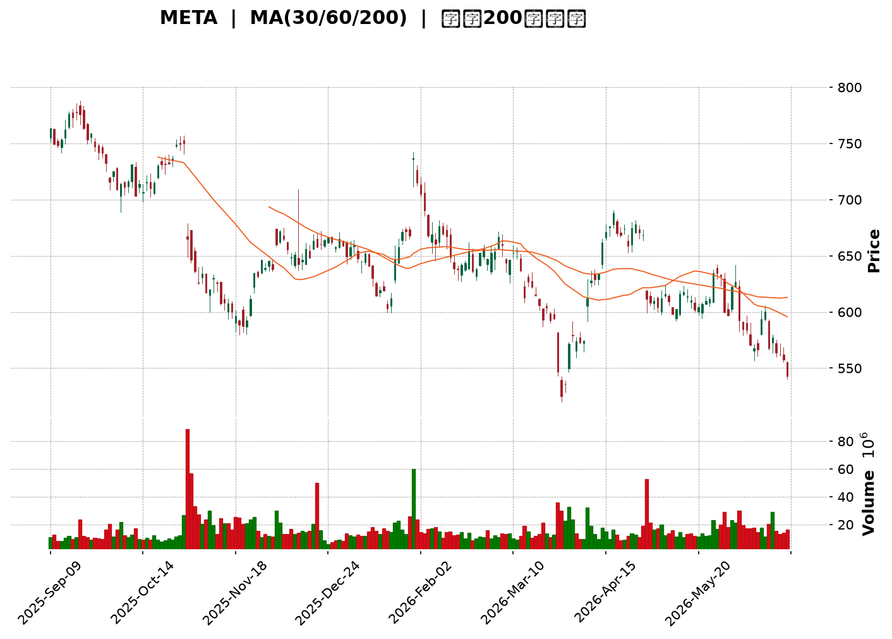
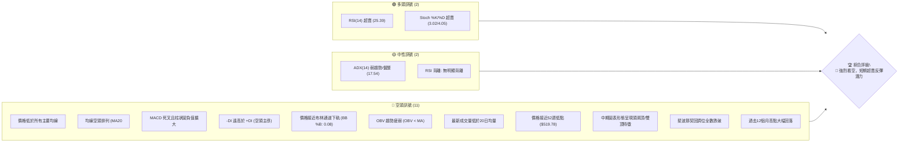

<details>
<summary>📊 靜態圖表 (點擊展開)</summary>

</details>

<html>
<head><meta charset="utf-8" /></head>
<body>
    <div style="height:500px; width:100%;">                        <script>window.PlotlyConfig = {MathJaxConfig: 'local'};</script>
        <script charset="utf-8" src="https://cdn.plot.ly/plotly-3.6.0.min.js" integrity="sha256-QaOVwtVY0T02VaHrr6pnoHLCwayMJp4O5n4YyaE3rJk=" crossorigin="anonymous"></script>                <div id="candlestick-chart" class="plotly-graph-div" style="height:100%; width:100%;"></div>            <script>                window.PLOTLYENV=window.PLOTLYENV || {};                                if (document.getElementById("candlestick-chart")) {                    Plotly.newPlot(                        "candlestick-chart",                        [{"close":{"dtype":"f8","bdata":"AAAAwJbZh0AAAAAAMGyHQAAAAICTY4dAAAAAIPmIh0AAAACAndGHQAAAAECkQ4hAAAAAoHwpiEAAAADAm02IQAAAAKCyPohAAAAAoGbZh0AAAAAghouHQAAAAIB+tYdAAAAA4LxXh0AAAACgkC6HQAAAAODFK4dAAAAAoMzjhkAAAABg1VuGQAAAAMBPqYZAAAAA4LslhkAAAACgbU6GQAAAAIDXOYZAAAAAwNJfhkAAAACg29yGQAAAAGDD+4VAAAAAQL9OhkAAAACAfhaGQAAAAECCXYZAAAAAYMgxhkAAAABge1iGQAAAAGAq0oZAAAAAYPHahkAAAABAD9yGQAAAAIDE4IZAAAAAgI4Dh0AAAACA+maHQAAAAADta4dAAAAA4MJth0AAAADA7cWEQAAAAEBYNYRAAAAAQHLgg0AAAACgio2DQAAAAABn0oNAAAAA4KxKg0AAAAAgx2CDQAAAACD4sINAAAAAgKCLg0AAAAAAcfuCQAAAAKB2AoNAAAAAQAj\u002fgkAAAAAglsOCQAAAAOAdoYJAAAAAIE9mgkAAAABg+VyCQAAAAACrhYJAAAAAgK0bg0AAAACAjtSDQAAAAEC7v4NAAAAAQCcyhEAAAAAgqfmDQAAAAOBeK4RAAAAA4Ibvg0AAAAAAg56EQAAAAIBi\u002fYRAAAAA4I\u002fIhEAAAADgC3qEQAAAAECMQ4RAAAAAgCJYhEAAAACAeBSEQAAAAEDbMoRAAAAA4NZ\u002fhEAAAACAv0KEQAAAAIAiuoRAAAAAoMaMhEAAAADAk6KEQAAAAEAMvoRAAAAAAOTShEAAAAAg37CEQAAAACAjjIRAAAAAIB3GhEAAAAAgUZeEQAAAAMADSoRAAAAAgO+MhEAAAACgjJuEQAAAAIBHPIRAAAAA4EYnhEAAAABgLV+EQAAAAGCdBoRAAAAAALuvg0AAAABgZDODQAAAAICOXYNAAAAAICpZg0AAAADAWtiCQAAAAODyHoNAAAAAgNAzhEAAAABAsoyEQAAAAEBN+YRAAAAAYCz+hEAAAABAUNyEQAAAAID2B4dAAAAAIMtZhkAAAACANwmGQAAAACC\u002fk4VAAAAAAGTehEAAAAAgIuiEQAAAAABCooRAAAAA4BwghUAAAACANOyEQAAAAKD+24RAAAAAQDlFhEAAAADgC\u002fWDQAAAAKA28YNAAAAA4JgQhEAAAAAgDh2EQAAAAMDwc4RAAAAAQOzgg0AAAAAgS\u002fGDQAAAAEA1ZIRAAAAAoLh+hEAAAADgNDiEQAAAAIArY4RAAAAAAE9vhEAAAAAAVNSEQAAAAIAmm4RAAAAAoLEdhEAAAADg5TGEQAAAAEA+Z4RAAAAAQI1thEAAAACAWeiDQAAAAADwJINAAAAAwPOWg0AAAADgqnCDQAAAACDhOINAAAAAIBvxgkAAAADg4YiCQAAAAGAB3IJAAAAAwPeCgkAAAACgtpKCQAAAAIBDGIFAAAAAgN1pgEAAAAAgEb+AQAAAAEDN3IFAAAAAoIwVgkAAAADAbO+BQAAAAGDq44FAAAAA4CP0gUAAAADA0h6DQAAAACB3noNAAAAAwDaqg0AAAABAis+DQAAAACADr4RAAAAAYKr3hEAAAAAg8iGFQAAAAKBMf4VAAAAAYE\u002fyhEAAAAAAxOGEQAAAAADDEIVAAAAAQFGUhEAAAABgPROFQAAAAODuL4VAAAAAQL\u002f1hEAAAADgAOSEQAAAAEC\u002fGoNAAAAAoH0Bg0AAAAAgwg6DQAAAAOAy44JAAAAAAIAig0AAAAAg6UGDQAAAACCGCINAAAAAoHGygkAAAACAiNOCQAAAAOB4QINAAAAA4NtOg0AAAABASi2DQAAAAAAnFYNAAAAAgGrQgkAAAACA\u002f+OCQAAAAGCK9oJAAAAAQI8Ng0AAAAAgLx6DQAAAAOBf1YNAAAAAIJ3Vg0AAAAAAZb+DQAAAAMBPv4JAAAAA4JyogkAAAACgOXODQAAAAEDpl4NAAAAAgJuDgkAAAACgyEaCQAAAAMBjQIJAAAAAQJzTgUAAAACgOr+BQAAAAMCjs4FAAAAAANeLgkAAAAAgrsGCQAAAAOCjvIFAAAAAgMIJgkAAAADAzJ6BQAAAAKCZkYFAAAAAIFxtgUAAAADA9faAQA=="},"high":{"dtype":"f8","bdata":"VKRjfF\u002feh0AEu1bVltmHQMFfO4UDlYdAsgbF4MKYh0DY7q+PVByIQKMwArZ1VohAMD+IWtlliEAx+RIuoJGIQDWV96e7oYhA1dYvuIh9iEChwL7fzgSIQO4j97sVuYdARDvkfXSWh0AsV6PK1W+HQAHsCOuoZodASED0PFcoh0DqOkLK0X+GQCyXtowOr4ZAnPF9aNTIhkAac7vEKViGQIdNjtQWZYZAv79WAkRuhkAAAACg29yGQK9+vMfm6oZAVRhIOZRwhkDh6+73jE2GQIenoWMtkIZAXYw0NN2chkCY072EaGWGQN1c5b\u002fu3oZAuyj+lqwEh0AYU0ItbhWHQGfjEXLfI4dAm3m9O0wah0CN6PfuUI6HQIwOIiZ2o4dAZuaalYaph0Aj+NBkjDmFQMFlEkAdCYVASX90JPWMhEAqVSkkmgCEQNZI4wKDBIRAdi96Hc3Sg0A3bMsEIWSDQCKaamnSyoNApMg2U2qfg0B\u002fMhna3ZqDQFe1HOZhQINAsCqhVLQgg0BTV2ZS0xCDQGmwyKjA0IJAx68BAkmOgkAZN8FIK+mCQHB+ujCMpIJANC\u002flW804g0A4Sib3LduDQPcPGgSi5YNAJBQHePMyhEDtUPobKx2EQATOuciDMYRAiOD\u002fu1U5hEBDzy\u002fYxBKFQFXyu8CEB4VAyq\u002fg+aIXhUAb0GrMDLaEQAAb4Dp\u002fZoRAWKuvOKRshECcQgbIPimGQHtE2LqyXoRAVE1L2OGqhECf44+5a6CEQD2E0Hft6oRAEa50BnHuhECudNWSCwOFQDgLa0KDxoRA9cjZ8+vXhEBFlzI8Et6EQO3vrk+YmIRAwRSyIi\u002f4hEDWRRTYhr6EQFrmuOSnuYRAE24iiNq6hEA9E3oBrsKEQJQhzHrPj4RAhCQe9ZQvhEBIyZM7RW6EQPBdFZ1xZoRAL3f02gIJhEAkJBjZpZqDQC8d6\u002fV3eINAbFuozK2fg0Cw5dOzfRKDQH7D5GJaSYNAtM2ZbyabhECNgMkPbcqEQGx53NmeEIVAGjfFNeschUCLYVo8ySOFQLK0G+BmNYdAdwQgG+7WhkDp5wbzH4CGQNiqVjzJXYZAKwELB9R8hUCxQ2vUSkKFQKOvx\u002flY9oRA05ibCr9QhUBFOGwJgTuFQKOYBOt7MIVASeyR3l4WhUCNG2v6KFKEQKHL\u002f22lC4RAI4U\u002f4s8ehED1kBr2TDCEQLe3UdVZsYRASVmvTTuEhEBIRFRmv\u002f+DQCwUnq65ZYRACPwwk5WehEB\u002fBbLHREKEQAek0XseloRA2IMqj+6OhEALzt2ek\u002fyEQAaULs8L7IRA5GRMEIJChEDFrO3PxTSEQIsnJYj+mIRA8+ssN5KPhEC2orMCsWKEQI2Dkp5loINAZaYTSEzRg0AL2g1Jr9+DQMZHa4iWcINAJDGdjXUjg0A6adjXNNuCQKi6k5CcAINADdx1TYzDgkBpeptZ49iCQAMyl2CuM4JAmOJt18X4gECFRSQ9Z9iAQDdjpSpF6YFAnDrgvQKAgkDZ1Lv2tg+CQN95HbkAMoJAApOeKJT1gUAU5q4B76qDQC6nfxlH54NATX9+1ujvg0BBadrbS9ODQK\u002fZsfkkzYRApWK4YPkuhUBBHUznnieFQHGyIZ4Jl4VAtzVfWvpVhUCQYOxKlxyFQBDCL88DLoVA2Fk7IoXnhEDLsu1NUUCFQOjfbcTxToVACPlah2oshUDygZRlAQ2FQAxQA2wzYoNAE8RZqnRSg0Ac\u002fz2xcyuDQOx8XbE\u002fLoNAT9m19wFbg0Cg+orBNYODQOjym1WXQYNAObb\u002fhszigkABh+YTh9mCQHqjeqybWoNAkT8PMzh5g0Aej2uo\u002f2SDQIfQjfEoOINAKz+SaOQqg0CYlsQMf\u002fuCQMYUN6pICINAUEgr\u002f+wxg0B4aPM1NS+DQBtyKTtF74NAQ33+oDwThEDKceW5TM+DQJudBlhK2YNAlN05iocCg0Ahfv2nk3yDQC7sVgBxDoRAICX2Moqkg0CmEgVXnXuCQC3uUuWcqIJAhffeDS52gkAcHUQIH92BQOBc3uJK\u002fIFAAAAAACnKgkAAAADgeu6CQAAAAOB6joJAAAAAgMIhgkAAAADgev6BQAAAAKCZ4YFAAAAA4FHIgUAAAABguGKBQA=="},"hovertemplate":"\u003cb\u003e%{x|%Y-%m-%d}\u003c\u002fb\u003e\u003cbr\u003e\u958b: $%{open:.2f}\u003cbr\u003e\u9ad8: $%{high:.2f}\u003cbr\u003e\u4f4e: $%{low:.2f}\u003cbr\u003e\u6536: $%{close:.2f}\u003cextra\u003e\u003c\u002fextra\u003e","low":{"dtype":"f8","bdata":"6mWH1793h0BRP3COX2SHQMoMOu1mT4dAwmX5ZaQqh0CxPuRoRGyHQGGI1f7N1IdAFqfa9HPeh0Bh0\u002fcYqxaIQPvB9ftq9YdA+W1sKuXTh0AOLupA+WiHQEGHDJGfdIdADr\u002fTyfI0h0D\u002fDHtgf\u002fuGQD9eF3TcCYdA9Xl5rVOjhkDKBcGO3CKGQI9XGnY3YoZA+cHTpLMihkCWIHUcwIWFQH9RL5Fa\u002f4VAi3AyicoPhkBoyfcvvDSGQOuiZbJ19YVAXCY6Mm8OhkBcCl6jIMyFQIwPxhZbHYZASczHwm7whUAZ6GpgTgKGQK8Qy5J+coZAtbdtY+C2hkC+\u002fyn1NpGGQIOLEgiW2YZA6wkUzgbKhkCc\u002f7uNjlCHQLDfYFOwPIdAeNGS6askh0CWXMn43UOEQGxN6aQpH4RAk17d4DzUg0ARJKi1FoODQPfNLT5Rh4NA7U90vixDg0Cq1AKXH72CQFfT3GQNRINAGTlxOkROg0Bv7HQWjPGCQDzpqXp8y4JAcOlSgj+NgkAUISL+146CQB+YsSUgMoJAhOzl7+8dgkBU\u002fxqwsS6CQPqMqxLOIoJAaaB6S6OggkBzhMOTkUWDQN8iu8Tur4NAtD+1xM\u002fOg0CJgJVl2OCDQEzDUHlR44NA+cb7Yyvfg0DSGO28s5KEQAIQGblfpYRAyEPbEMK6hEAioGdbKV2EQIsQQwHZDYRAaa4gBhr5g0B+o0GboOeDQKdmiICA7INAiyHQHnAQhED6KQ04WkCEQL0HVCNUeoRACtnUZhCIhEDEGKSv2HuEQGnPlYWfiIRA9RyKwiqohEBXBAbPI6GEQHN3M27MaYRAyZIOc1mFhECv2ts+IJKEQLnC6FLVEoRA1gBI4sU0hEByVLfs6VWEQIxdRWZLHYRAgAQKNbTUg0CGQZB7pA2EQAdg1pK0AIRAlAaK3eh3g0DCnYBNzS2DQMh3eRUXKYNAzmewns5Xg0DfVSoGdLeCQOHvBpgXuIJAL2Osf3mLg0Dl1OSOaxqEQL2g5z7moIRAesjbzc+7hEC1BVmXT8eEQOk5NvA\u002fOoZAr7WiHI5ChkC+af5pI\u002fKFQJ4BsmqAaYVAb3U\u002fNCzShEDGqGDvsGKEQGIZ4m3KKoRAMGPAHtuMhEDi1jpEx+SEQFWZ4INwf4RAT8DoZAwhhEAl6Kc2hcuDQFG0x2BxnYNAeFqYlECYg0CpELCEsNyDQG0mkS0k7YNA8JPjzvDWg0Aos\u002fFh4Z6DQIvS1v74B4RAME\u002f1zcYyhEDAtLCv3ueDQOV61yH2yoNA5cnkuJ7tg0DIWoXP\u002fYOEQJr5Lmo3SYRAwy2oiNHXg0DBCd7IT42DQEcX\u002fVzBPoRAbizp86Q5hEBIOdvKIN6DQOhiz2u3A4NA9KnPHy90g0DJAwSy\u002fmiDQNCMbsdTMINA03Rwa57NgkA+DLhnplWCQAxik5Oks4JA6Q4URJ9zgkB+qFfzzYaCQEr6MVLG9oBAqTXC2jk+gEDcpOqdZ4CAQMRm3hccEoFAids9Qk\u002fqgUAaTXY9dHmBQOuxLE\u002fD24FAas9yg+WhgUAJmNOLQXqCQGwUnphic4NA6GfB3AN+g0Bm65k1k36DQCxlhDg59oNAKyvo9Na8hEDsPZerDdmEQL7wB\u002fMJFIVATY2oRA3bhEB3yRFdstWEQNtuvewJ6YRAQ0do8Y9jhEA22EVv4GmEQFmg1EDA8YRA2UcV9BvIhED4pcwRkLmEQNm8xzWOu4JAcuqa4WPsgkC7YX0GidGCQOXQObluvoJAXNVJh16sgkCeDpFTxieDQI0GMoX964JAINqjujWsgkCtuNv4aICCQG9VAB\u002fcoIJAJjEhwXEzg0Cz32N09wWDQJfS40IM2YJAIbgMiPO\u002fgkCgLog\u002fDaqCQHQ3rdYSkoJABfDdphrzgkBVwc956uWCQH2EzCt9A4NAeCked9Glg0BBSQefLnaDQMopVIjMt4JA1u44DQWhgkCEXsiwtr2CQApiXj\u002fUboNARMI0QvYygkDbWGYTeBWCQMLECKrGI4JA73t5uJLQgUDgWE4o9GOBQGZ0xIcLg4FAAAAAYGYagkAAAAAAAICCQAAAACCFsYFAAAAAwMyYgUAAAADgen6BQAAAAAApiIFAAAAAYGZcgUAAAADgo+GAQA=="},"name":"\u50f9\u683c","open":{"dtype":"f8","bdata":"wyTAjR+Yh0Ap\u002fJpFC9WHQGa0Tml6gYdACBKcpUVSh0ABASS\u002f9peHQKVeoIj044dAhCWPDolLiEDpOZ5nmFGIQOyat7XOfohA\u002f3YbFZNeiECmjr1LCfqHQHCesKlHnIdATiRKwfZ7h0BsIpBrb2CHQLc\u002fwtw4VodAdhsskJgih0DCCttz8nyGQDtHbv+khYZAIWbC7+W9hkBxEV+\u002f4vqFQFAnb3ndXoZAnoWTUss8hkBOQVKJVWOGQEEq7wMxyIZA5B2dakg5hkDRQjVfjQ+GQNNLaVqZWYZAL2b5QoJdhkCbxr9m9wmGQIhMJbWNeoZA6Ijgw+LwhkBzc7hEad+GQPXv82da5oZAh19Tdwf3hkBabH3qR16HQHVfjs1rdYdA7mIsY1aGh0B2sf5CUNuEQNZN5gQVBoVAIRxV9WJyhECNis5MSZODQMc5oJZbtYNAJsWEqZrRg0BvUpk7IDeDQOurN4+fq4NAkI7RvPeSg0DEILorAZSDQO3xGFvWG4NAWFikv9TBgkA8n6cmrvuCQENZftqFcIJAuLXKL3CBgkDww+\u002fjec+CQJG5HYzJV4JAP6gawVWpgkBaeI\u002frDHODQOSiQ3NJ4INAvUDaj3DTg0DiLDbDIO+DQNci08ljBYRAoy9nMugVhEDigyig+BGFQGjRd2s4soRALsdsYdTchECZbQGSYrCEQEiYzZQcQoRAnu2jS\u002fgMhEBCQbpI6kCEQPwEt\u002flmJIRA15\u002fDZtUShEDQTxF4inOEQDmuLW\u002fhfoRAMAw52t3JhEBGRfJzxqOEQLCyK1X\u002floRAZp9ybs2qhED7MA279taEQHSBzPq0hoRAQXaQGSOMhEC8R3rBh7yEQBTceDJmrIRAfADtfs5OhEAVGj0UKpOEQEaNpsfHc4RA8LUI6NYlhEBNAqVpUyKEQJP1YN3xWoRAL3f02gIJhEBjgYtVE4uDQNjB25UHS4NAo6kea4x4g0Cq4OSJYfaCQLNgqe5G7YJAOUSwqdWhg0DH1SfE+RyEQErd352Qv4RA5baVVxwLhUCPCSo1ZAqFQDHqhnXvAIdApQTWAqOxhkCp1wDCnkqGQK6RwRriEIZA\u002fn\u002fxKQt0hUAlJ1YNMLOEQJDY1a1wwoRAPJwhM\u002f6vhEDXQ+moJSOFQPAk2SJmBoVAodfYWzfmhEDqyQcwnB+EQP7e7\u002fvj8oNAdOUNGl\u002fFg0BJGomlduuDQOV7GXxo9INAS3KiXgZbhEBJP3lOn7+DQFOuulIWC4RA8YetDiJLhEBg98EfbxKEQA8Ukg404INAL7rcwhU5hEAeMcHAToaEQPdhZMoCpoRA30\u002fwifg1hEBaWU6cMs2DQNmdG5wrY4RAH2ZU3cBshEDGTtlUwjyEQL4W9H87doNAdVoef1G7g0C3TIekRJuDQPOglp8nPoNAAAs+aqocg0Afy5UIxdeCQAwlKRjV6YJA74LZp1y0gkDS4fUSfLGCQICzMdiaL4JAFUmleszcgEAAAAAgEb+AQCjfewHEK4FAdI4WK74cgkAeGaJ3IKyBQNDH7aQ9CYJArJinX5nfgUBQy7bMguuCQC2ZXpEdk4NASo3jQQ\u002fPg0B6rNJJVqeDQFvhZKv+FIRAOiRaLw\u002fThED07DmL6RqFQDDCdN7FL4VA16n\u002fLtVFhUBBAGSHB\u002fOEQL6Bwm7iDYVA5MAZ\u002f664hEDKFmMlq52EQO+xK5MH84RAdZUi4OwMhUAoJPUlU+KEQNQtv\u002fL4VYNAZjtnfPcwg0CPdAhPBPuCQMP0QMrvJYNAcPYjj\u002fLDgkBQs7C2NDGDQHUp1O8KNYNAdocJ7BTggkDsvBtjJ5KCQLlnfkE0soJAMAer2287g0DSo4A0XyuDQBuqixteBINA5BK9aNkCg0BCzHBHocGCQC699B6Ou4JARdpkg4n6gkC1IesKnAKDQO7hm6mvBoNAoRwmREP3g0DgvmCfTseDQKu+Xb2HroNA9AlnfHPVgkArW3yDiNOCQE0sYWW9eINAc7Qs3Q93g0CmEgVXnXuCQBudEjifc4JAtxHVwokhgkC3METOcqqBQNyUmQ1b44FAAAAAQDMfgkAAAABAM42CQAAAAAAAgIJAAAAAYI\u002fmgUAAAAAAKeCBQAAAAAAAkoFAAAAAwB6PgUAAAACAbFyBQA=="},"x":["2025-09-09T00:00:00-04:00","2025-09-10T00:00:00-04:00","2025-09-11T00:00:00-04:00","2025-09-12T00:00:00-04:00","2025-09-15T00:00:00-04:00","2025-09-16T00:00:00-04:00","2025-09-17T00:00:00-04:00","2025-09-18T00:00:00-04:00","2025-09-19T00:00:00-04:00","2025-09-22T00:00:00-04:00","2025-09-23T00:00:00-04:00","2025-09-24T00:00:00-04:00","2025-09-25T00:00:00-04:00","2025-09-26T00:00:00-04:00","2025-09-29T00:00:00-04:00","2025-09-30T00:00:00-04:00","2025-10-01T00:00:00-04:00","2025-10-02T00:00:00-04:00","2025-10-03T00:00:00-04:00","2025-10-06T00:00:00-04:00","2025-10-07T00:00:00-04:00","2025-10-08T00:00:00-04:00","2025-10-09T00:00:00-04:00","2025-10-10T00:00:00-04:00","2025-10-13T00:00:00-04:00","2025-10-14T00:00:00-04:00","2025-10-15T00:00:00-04:00","2025-10-16T00:00:00-04:00","2025-10-17T00:00:00-04:00","2025-10-20T00:00:00-04:00","2025-10-21T00:00:00-04:00","2025-10-22T00:00:00-04:00","2025-10-23T00:00:00-04:00","2025-10-24T00:00:00-04:00","2025-10-27T00:00:00-04:00","2025-10-28T00:00:00-04:00","2025-10-29T00:00:00-04:00","2025-10-30T00:00:00-04:00","2025-10-31T00:00:00-04:00","2025-11-03T00:00:00-05:00","2025-11-04T00:00:00-05:00","2025-11-05T00:00:00-05:00","2025-11-06T00:00:00-05:00","2025-11-07T00:00:00-05:00","2025-11-10T00:00:00-05:00","2025-11-11T00:00:00-05:00","2025-11-12T00:00:00-05:00","2025-11-13T00:00:00-05:00","2025-11-14T00:00:00-05:00","2025-11-17T00:00:00-05:00","2025-11-18T00:00:00-05:00","2025-11-19T00:00:00-05:00","2025-11-20T00:00:00-05:00","2025-11-21T00:00:00-05:00","2025-11-24T00:00:00-05:00","2025-11-25T00:00:00-05:00","2025-11-26T00:00:00-05:00","2025-11-28T00:00:00-05:00","2025-12-01T00:00:00-05:00","2025-12-02T00:00:00-05:00","2025-12-03T00:00:00-05:00","2025-12-04T00:00:00-05:00","2025-12-05T00:00:00-05:00","2025-12-08T00:00:00-05:00","2025-12-09T00:00:00-05:00","2025-12-10T00:00:00-05:00","2025-12-11T00:00:00-05:00","2025-12-12T00:00:00-05:00","2025-12-15T00:00:00-05:00","2025-12-16T00:00:00-05:00","2025-12-17T00:00:00-05:00","2025-12-18T00:00:00-05:00","2025-12-19T00:00:00-05:00","2025-12-22T00:00:00-05:00","2025-12-23T00:00:00-05:00","2025-12-24T00:00:00-05:00","2025-12-26T00:00:00-05:00","2025-12-29T00:00:00-05:00","2025-12-30T00:00:00-05:00","2025-12-31T00:00:00-05:00","2026-01-02T00:00:00-05:00","2026-01-05T00:00:00-05:00","2026-01-06T00:00:00-05:00","2026-01-07T00:00:00-05:00","2026-01-08T00:00:00-05:00","2026-01-09T00:00:00-05:00","2026-01-12T00:00:00-05:00","2026-01-13T00:00:00-05:00","2026-01-14T00:00:00-05:00","2026-01-15T00:00:00-05:00","2026-01-16T00:00:00-05:00","2026-01-20T00:00:00-05:00","2026-01-21T00:00:00-05:00","2026-01-22T00:00:00-05:00","2026-01-23T00:00:00-05:00","2026-01-26T00:00:00-05:00","2026-01-27T00:00:00-05:00","2026-01-28T00:00:00-05:00","2026-01-29T00:00:00-05:00","2026-01-30T00:00:00-05:00","2026-02-02T00:00:00-05:00","2026-02-03T00:00:00-05:00","2026-02-04T00:00:00-05:00","2026-02-05T00:00:00-05:00","2026-02-06T00:00:00-05:00","2026-02-09T00:00:00-05:00","2026-02-10T00:00:00-05:00","2026-02-11T00:00:00-05:00","2026-02-12T00:00:00-05:00","2026-02-13T00:00:00-05:00","2026-02-17T00:00:00-05:00","2026-02-18T00:00:00-05:00","2026-02-19T00:00:00-05:00","2026-02-20T00:00:00-05:00","2026-02-23T00:00:00-05:00","2026-02-24T00:00:00-05:00","2026-02-25T00:00:00-05:00","2026-02-26T00:00:00-05:00","2026-02-27T00:00:00-05:00","2026-03-02T00:00:00-05:00","2026-03-03T00:00:00-05:00","2026-03-04T00:00:00-05:00","2026-03-05T00:00:00-05:00","2026-03-06T00:00:00-05:00","2026-03-09T00:00:00-04:00","2026-03-10T00:00:00-04:00","2026-03-11T00:00:00-04:00","2026-03-12T00:00:00-04:00","2026-03-13T00:00:00-04:00","2026-03-16T00:00:00-04:00","2026-03-17T00:00:00-04:00","2026-03-18T00:00:00-04:00","2026-03-19T00:00:00-04:00","2026-03-20T00:00:00-04:00","2026-03-23T00:00:00-04:00","2026-03-24T00:00:00-04:00","2026-03-25T00:00:00-04:00","2026-03-26T00:00:00-04:00","2026-03-27T00:00:00-04:00","2026-03-30T00:00:00-04:00","2026-03-31T00:00:00-04:00","2026-04-01T00:00:00-04:00","2026-04-02T00:00:00-04:00","2026-04-06T00:00:00-04:00","2026-04-07T00:00:00-04:00","2026-04-08T00:00:00-04:00","2026-04-09T00:00:00-04:00","2026-04-10T00:00:00-04:00","2026-04-13T00:00:00-04:00","2026-04-14T00:00:00-04:00","2026-04-15T00:00:00-04:00","2026-04-16T00:00:00-04:00","2026-04-17T00:00:00-04:00","2026-04-20T00:00:00-04:00","2026-04-21T00:00:00-04:00","2026-04-22T00:00:00-04:00","2026-04-23T00:00:00-04:00","2026-04-24T00:00:00-04:00","2026-04-27T00:00:00-04:00","2026-04-28T00:00:00-04:00","2026-04-29T00:00:00-04:00","2026-04-30T00:00:00-04:00","2026-05-01T00:00:00-04:00","2026-05-04T00:00:00-04:00","2026-05-05T00:00:00-04:00","2026-05-06T00:00:00-04:00","2026-05-07T00:00:00-04:00","2026-05-08T00:00:00-04:00","2026-05-11T00:00:00-04:00","2026-05-12T00:00:00-04:00","2026-05-13T00:00:00-04:00","2026-05-14T00:00:00-04:00","2026-05-15T00:00:00-04:00","2026-05-18T00:00:00-04:00","2026-05-19T00:00:00-04:00","2026-05-20T00:00:00-04:00","2026-05-21T00:00:00-04:00","2026-05-22T00:00:00-04:00","2026-05-26T00:00:00-04:00","2026-05-27T00:00:00-04:00","2026-05-28T00:00:00-04:00","2026-05-29T00:00:00-04:00","2026-06-01T00:00:00-04:00","2026-06-02T00:00:00-04:00","2026-06-03T00:00:00-04:00","2026-06-04T00:00:00-04:00","2026-06-05T00:00:00-04:00","2026-06-08T00:00:00-04:00","2026-06-09T00:00:00-04:00","2026-06-10T00:00:00-04:00","2026-06-11T00:00:00-04:00","2026-06-12T00:00:00-04:00","2026-06-15T00:00:00-04:00","2026-06-16T00:00:00-04:00","2026-06-17T00:00:00-04:00","2026-06-18T00:00:00-04:00","2026-06-22T00:00:00-04:00","2026-06-23T00:00:00-04:00","2026-06-24T00:00:00-04:00","2026-06-25T00:00:00-04:00"],"type":"candlestick"},{"hovertemplate":"MA30: $%{y:.2f}\u003cextra\u003e\u003c\u002fextra\u003e","line":{"color":"#2196F3","dash":"dash","width":2},"mode":"lines","name":"MA30","x":["2025-09-09T00:00:00-04:00","2025-09-10T00:00:00-04:00","2025-09-11T00:00:00-04:00","2025-09-12T00:00:00-04:00","2025-09-15T00:00:00-04:00","2025-09-16T00:00:00-04:00","2025-09-17T00:00:00-04:00","2025-09-18T00:00:00-04:00","2025-09-19T00:00:00-04:00","2025-09-22T00:00:00-04:00","2025-09-23T00:00:00-04:00","2025-09-24T00:00:00-04:00","2025-09-25T00:00:00-04:00","2025-09-26T00:00:00-04:00","2025-09-29T00:00:00-04:00","2025-09-30T00:00:00-04:00","2025-10-01T00:00:00-04:00","2025-10-02T00:00:00-04:00","2025-10-03T00:00:00-04:00","2025-10-06T00:00:00-04:00","2025-10-07T00:00:00-04:00","2025-10-08T00:00:00-04:00","2025-10-09T00:00:00-04:00","2025-10-10T00:00:00-04:00","2025-10-13T00:00:00-04:00","2025-10-14T00:00:00-04:00","2025-10-15T00:00:00-04:00","2025-10-16T00:00:00-04:00","2025-10-17T00:00:00-04:00","2025-10-20T00:00:00-04:00","2025-10-21T00:00:00-04:00","2025-10-22T00:00:00-04:00","2025-10-23T00:00:00-04:00","2025-10-24T00:00:00-04:00","2025-10-27T00:00:00-04:00","2025-10-28T00:00:00-04:00","2025-10-29T00:00:00-04:00","2025-10-30T00:00:00-04:00","2025-10-31T00:00:00-04:00","2025-11-03T00:00:00-05:00","2025-11-04T00:00:00-05:00","2025-11-05T00:00:00-05:00","2025-11-06T00:00:00-05:00","2025-11-07T00:00:00-05:00","2025-11-10T00:00:00-05:00","2025-11-11T00:00:00-05:00","2025-11-12T00:00:00-05:00","2025-11-13T00:00:00-05:00","2025-11-14T00:00:00-05:00","2025-11-17T00:00:00-05:00","2025-11-18T00:00:00-05:00","2025-11-19T00:00:00-05:00","2025-11-20T00:00:00-05:00","2025-11-21T00:00:00-05:00","2025-11-24T00:00:00-05:00","2025-11-25T00:00:00-05:00","2025-11-26T00:00:00-05:00","2025-11-28T00:00:00-05:00","2025-12-01T00:00:00-05:00","2025-12-02T00:00:00-05:00","2025-12-03T00:00:00-05:00","2025-12-04T00:00:00-05:00","2025-12-05T00:00:00-05:00","2025-12-08T00:00:00-05:00","2025-12-09T00:00:00-05:00","2025-12-10T00:00:00-05:00","2025-12-11T00:00:00-05:00","2025-12-12T00:00:00-05:00","2025-12-15T00:00:00-05:00","2025-12-16T00:00:00-05:00","2025-12-17T00:00:00-05:00","2025-12-18T00:00:00-05:00","2025-12-19T00:00:00-05:00","2025-12-22T00:00:00-05:00","2025-12-23T00:00:00-05:00","2025-12-24T00:00:00-05:00","2025-12-26T00:00:00-05:00","2025-12-29T00:00:00-05:00","2025-12-30T00:00:00-05:00","2025-12-31T00:00:00-05:00","2026-01-02T00:00:00-05:00","2026-01-05T00:00:00-05:00","2026-01-06T00:00:00-05:00","2026-01-07T00:00:00-05:00","2026-01-08T00:00:00-05:00","2026-01-09T00:00:00-05:00","2026-01-12T00:00:00-05:00","2026-01-13T00:00:00-05:00","2026-01-14T00:00:00-05:00","2026-01-15T00:00:00-05:00","2026-01-16T00:00:00-05:00","2026-01-20T00:00:00-05:00","2026-01-21T00:00:00-05:00","2026-01-22T00:00:00-05:00","2026-01-23T00:00:00-05:00","2026-01-26T00:00:00-05:00","2026-01-27T00:00:00-05:00","2026-01-28T00:00:00-05:00","2026-01-29T00:00:00-05:00","2026-01-30T00:00:00-05:00","2026-02-02T00:00:00-05:00","2026-02-03T00:00:00-05:00","2026-02-04T00:00:00-05:00","2026-02-05T00:00:00-05:00","2026-02-06T00:00:00-05:00","2026-02-09T00:00:00-05:00","2026-02-10T00:00:00-05:00","2026-02-11T00:00:00-05:00","2026-02-12T00:00:00-05:00","2026-02-13T00:00:00-05:00","2026-02-17T00:00:00-05:00","2026-02-18T00:00:00-05:00","2026-02-19T00:00:00-05:00","2026-02-20T00:00:00-05:00","2026-02-23T00:00:00-05:00","2026-02-24T00:00:00-05:00","2026-02-25T00:00:00-05:00","2026-02-26T00:00:00-05:00","2026-02-27T00:00:00-05:00","2026-03-02T00:00:00-05:00","2026-03-03T00:00:00-05:00","2026-03-04T00:00:00-05:00","2026-03-05T00:00:00-05:00","2026-03-06T00:00:00-05:00","2026-03-09T00:00:00-04:00","2026-03-10T00:00:00-04:00","2026-03-11T00:00:00-04:00","2026-03-12T00:00:00-04:00","2026-03-13T00:00:00-04:00","2026-03-16T00:00:00-04:00","2026-03-17T00:00:00-04:00","2026-03-18T00:00:00-04:00","2026-03-19T00:00:00-04:00","2026-03-20T00:00:00-04:00","2026-03-23T00:00:00-04:00","2026-03-24T00:00:00-04:00","2026-03-25T00:00:00-04:00","2026-03-26T00:00:00-04:00","2026-03-27T00:00:00-04:00","2026-03-30T00:00:00-04:00","2026-03-31T00:00:00-04:00","2026-04-01T00:00:00-04:00","2026-04-02T00:00:00-04:00","2026-04-06T00:00:00-04:00","2026-04-07T00:00:00-04:00","2026-04-08T00:00:00-04:00","2026-04-09T00:00:00-04:00","2026-04-10T00:00:00-04:00","2026-04-13T00:00:00-04:00","2026-04-14T00:00:00-04:00","2026-04-15T00:00:00-04:00","2026-04-16T00:00:00-04:00","2026-04-17T00:00:00-04:00","2026-04-20T00:00:00-04:00","2026-04-21T00:00:00-04:00","2026-04-22T00:00:00-04:00","2026-04-23T00:00:00-04:00","2026-04-24T00:00:00-04:00","2026-04-27T00:00:00-04:00","2026-04-28T00:00:00-04:00","2026-04-29T00:00:00-04:00","2026-04-30T00:00:00-04:00","2026-05-01T00:00:00-04:00","2026-05-04T00:00:00-04:00","2026-05-05T00:00:00-04:00","2026-05-06T00:00:00-04:00","2026-05-07T00:00:00-04:00","2026-05-08T00:00:00-04:00","2026-05-11T00:00:00-04:00","2026-05-12T00:00:00-04:00","2026-05-13T00:00:00-04:00","2026-05-14T00:00:00-04:00","2026-05-15T00:00:00-04:00","2026-05-18T00:00:00-04:00","2026-05-19T00:00:00-04:00","2026-05-20T00:00:00-04:00","2026-05-21T00:00:00-04:00","2026-05-22T00:00:00-04:00","2026-05-26T00:00:00-04:00","2026-05-27T00:00:00-04:00","2026-05-28T00:00:00-04:00","2026-05-29T00:00:00-04:00","2026-06-01T00:00:00-04:00","2026-06-02T00:00:00-04:00","2026-06-03T00:00:00-04:00","2026-06-04T00:00:00-04:00","2026-06-05T00:00:00-04:00","2026-06-08T00:00:00-04:00","2026-06-09T00:00:00-04:00","2026-06-10T00:00:00-04:00","2026-06-11T00:00:00-04:00","2026-06-12T00:00:00-04:00","2026-06-15T00:00:00-04:00","2026-06-16T00:00:00-04:00","2026-06-17T00:00:00-04:00","2026-06-18T00:00:00-04:00","2026-06-22T00:00:00-04:00","2026-06-23T00:00:00-04:00","2026-06-24T00:00:00-04:00","2026-06-25T00:00:00-04:00"],"y":{"dtype":"f8","bdata":"AAAAAAAA+H8AAAAAAAD4fwAAAAAAAPh\u002fAAAAAAAA+H8AAAAAAAD4fwAAAAAAAPh\u002fAAAAAAAA+H8AAAAAAAD4fwAAAAAAAPh\u002fAAAAAAAA+H8AAAAAAAD4fwAAAAAAAPh\u002fAAAAAAAA+H8AAAAAAAD4fwAAAAAAAPh\u002fAAAAAAAA+H8AAAAAAAD4fwAAAAAAAPh\u002fAAAAAAAA+H8AAAAAAAD4fwAAAAAAAPh\u002fAAAAAAAA+H8AAAAAAAD4fwAAAAAAAPh\u002fAAAAAAAA+H8AAAAAAAD4fwAAAAAAAPh\u002fAAAAAAAA+H8AAAAAAAD4fyIiInKuDodAd3d3dzEGh0AzMzOTYwGHQHd3d1cH\u002fYZAq6qq2pT4hkAzMzPjBvWGQM3MzBzW7YZAAAAAMJTnhkCamZnJdMmGQHd3d9cCp4ZARERE1ByFhkCamZnpC2OGQGZmZnbgQYZAzczM3E4fhkBmZmY22f6FQAAAALAn4YVA7+7urp3EhUCamZmJzaeFQKuqqiqkiIVAAAAAUMBthUDe3d3thU+FQDMzMxPVMIVAmpmZSeoOhUARERHhhOiEQImIiIj7yoRAREREJK6vhECJiIhoapyEQJqZmfkWhoRAIiIiEgl1hEDNzMzczmCEQKuqqnouSoRAd3d3h0QxhEARERFBJh6EQDMzM2MJDoRAZmZm5gD7g0AzMzMDCuKDQKuqqtoXx4NAVVVVtcWsg0BmZmZm26aDQKuqqirGpoNAIiIiUhasg0De3d2dILKDQBERERHauYNAiYiIqJbEg0De3d2tUM+DQBEREdFI2INAd3d3dzHjg0BEREQ0xvGDQN7d3Y3l\u002foNAq6qq6hAOhEB3d3c3qB2EQDMzMwPSK4RAERERsSw+hEC8u7u7U1GEQM3MzIzyX4RAAAAAEN5ohEBVVVX1fG2EQERERNTZb4RAMzMz44BrhEDv7u7+5GSEQHd3d7cIXoRAAAAAoAVZhEBmZmYm4kmEQO\u002fu7n7vOYRA7+7uLvo0hEBERERUmTWEQLy7u0uoO4RAiYiIKDFBhEC8u7t72keEQO\u002fu7g4GYIRAd3d3d9JvhECamZmZ+H6EQN7d3Y05hoRAAAAAAPKIhEC8u7uLQ4uEQHd3d2dWioRA3t3dXemMhEDe3d2t446EQBERESGNkYRAREREREGNhEDv7u6O2IeEQJqZmcnihIRARERExL2AhECamZlZhnyEQDMzM1NhfoRAiYiI+Ah8hEC8u7tLX3iEQFVVVfV9e4RAd3d3R2SChEBVVVXlFYuEQERERFTOk4RAMzMz0xOdhECJiIiIAq6EQLy7u+uuuoRAiYiIKPK5hECJiIhY67aEQKuqqvoMsoRAAAAA4DqthEDNzMwMGaWEQKuqqirug4RAREREdF5shEAiIiKiN1aEQKuqqiofQoRA3t3dza0xhEDe3d3tbx2EQERERKRLDoRAq6qqmv33g0AAAADg8OODQJqZmQnRw4NARERElOeig0CrqqpagYeDQLy7uxvCdYNAzczMTNtkg0CrqqraRFKDQGZmZsZmPINAIiIisvkrg0Dv7u6u9SSDQHd3d0deHoNAIiIi4kgXg0Crqqq6yxODQKuqqupSFoNA7+7uft4ag0BVVVXVdB2DQERERLQPJYNAd3d3ByYsg0BERETEAjKDQDMzM1OpN4NAAAAAIPQ4g0B3d3en6kKDQM3MzIxZVINAAAAAAAtgg0C8u7u7a2yDQKuqqppqa4NAvLu7a\u002fZrg0BERETUbHCDQGZmZjaqcINA3t3djft1g0AiIiKS0nuDQDMzM1NdjINAq6qqutmfg0ARERFxmbGDQO\u002fu7n50vYNAIiIiEubHg0BVVVWFftKDQFVVVTWr3INAVVVV5QLkg0C8u7vrDOKDQGZmZvZz3INA3t3dLTvXg0De3d29UdGDQBEREZEQyoNAVVVVdWXAg0BERET0k7SDQHd3d5ccnYNAREREpJaJg0BERETUXn2DQJqZmQnPcINAERERYS9fg0Dv7u6eTUeDQDMzM3NALoNAzczMjIMTg0BEREQksPiCQCIiIsK37IJA3t3dzcvogkAiIiISOuaCQBEREYFo3IJAq6qq2gzTgkARERFxFMWCQHd3dxeVuIJAq6qqCr+tgkCJiIhI3J2CQA=="},"type":"scatter"},{"hovertemplate":"MA60: $%{y:.2f}\u003cextra\u003e\u003c\u002fextra\u003e","line":{"color":"#9C27B0","dash":"dash","width":2},"mode":"lines","name":"MA60","x":["2025-09-09T00:00:00-04:00","2025-09-10T00:00:00-04:00","2025-09-11T00:00:00-04:00","2025-09-12T00:00:00-04:00","2025-09-15T00:00:00-04:00","2025-09-16T00:00:00-04:00","2025-09-17T00:00:00-04:00","2025-09-18T00:00:00-04:00","2025-09-19T00:00:00-04:00","2025-09-22T00:00:00-04:00","2025-09-23T00:00:00-04:00","2025-09-24T00:00:00-04:00","2025-09-25T00:00:00-04:00","2025-09-26T00:00:00-04:00","2025-09-29T00:00:00-04:00","2025-09-30T00:00:00-04:00","2025-10-01T00:00:00-04:00","2025-10-02T00:00:00-04:00","2025-10-03T00:00:00-04:00","2025-10-06T00:00:00-04:00","2025-10-07T00:00:00-04:00","2025-10-08T00:00:00-04:00","2025-10-09T00:00:00-04:00","2025-10-10T00:00:00-04:00","2025-10-13T00:00:00-04:00","2025-10-14T00:00:00-04:00","2025-10-15T00:00:00-04:00","2025-10-16T00:00:00-04:00","2025-10-17T00:00:00-04:00","2025-10-20T00:00:00-04:00","2025-10-21T00:00:00-04:00","2025-10-22T00:00:00-04:00","2025-10-23T00:00:00-04:00","2025-10-24T00:00:00-04:00","2025-10-27T00:00:00-04:00","2025-10-28T00:00:00-04:00","2025-10-29T00:00:00-04:00","2025-10-30T00:00:00-04:00","2025-10-31T00:00:00-04:00","2025-11-03T00:00:00-05:00","2025-11-04T00:00:00-05:00","2025-11-05T00:00:00-05:00","2025-11-06T00:00:00-05:00","2025-11-07T00:00:00-05:00","2025-11-10T00:00:00-05:00","2025-11-11T00:00:00-05:00","2025-11-12T00:00:00-05:00","2025-11-13T00:00:00-05:00","2025-11-14T00:00:00-05:00","2025-11-17T00:00:00-05:00","2025-11-18T00:00:00-05:00","2025-11-19T00:00:00-05:00","2025-11-20T00:00:00-05:00","2025-11-21T00:00:00-05:00","2025-11-24T00:00:00-05:00","2025-11-25T00:00:00-05:00","2025-11-26T00:00:00-05:00","2025-11-28T00:00:00-05:00","2025-12-01T00:00:00-05:00","2025-12-02T00:00:00-05:00","2025-12-03T00:00:00-05:00","2025-12-04T00:00:00-05:00","2025-12-05T00:00:00-05:00","2025-12-08T00:00:00-05:00","2025-12-09T00:00:00-05:00","2025-12-10T00:00:00-05:00","2025-12-11T00:00:00-05:00","2025-12-12T00:00:00-05:00","2025-12-15T00:00:00-05:00","2025-12-16T00:00:00-05:00","2025-12-17T00:00:00-05:00","2025-12-18T00:00:00-05:00","2025-12-19T00:00:00-05:00","2025-12-22T00:00:00-05:00","2025-12-23T00:00:00-05:00","2025-12-24T00:00:00-05:00","2025-12-26T00:00:00-05:00","2025-12-29T00:00:00-05:00","2025-12-30T00:00:00-05:00","2025-12-31T00:00:00-05:00","2026-01-02T00:00:00-05:00","2026-01-05T00:00:00-05:00","2026-01-06T00:00:00-05:00","2026-01-07T00:00:00-05:00","2026-01-08T00:00:00-05:00","2026-01-09T00:00:00-05:00","2026-01-12T00:00:00-05:00","2026-01-13T00:00:00-05:00","2026-01-14T00:00:00-05:00","2026-01-15T00:00:00-05:00","2026-01-16T00:00:00-05:00","2026-01-20T00:00:00-05:00","2026-01-21T00:00:00-05:00","2026-01-22T00:00:00-05:00","2026-01-23T00:00:00-05:00","2026-01-26T00:00:00-05:00","2026-01-27T00:00:00-05:00","2026-01-28T00:00:00-05:00","2026-01-29T00:00:00-05:00","2026-01-30T00:00:00-05:00","2026-02-02T00:00:00-05:00","2026-02-03T00:00:00-05:00","2026-02-04T00:00:00-05:00","2026-02-05T00:00:00-05:00","2026-02-06T00:00:00-05:00","2026-02-09T00:00:00-05:00","2026-02-10T00:00:00-05:00","2026-02-11T00:00:00-05:00","2026-02-12T00:00:00-05:00","2026-02-13T00:00:00-05:00","2026-02-17T00:00:00-05:00","2026-02-18T00:00:00-05:00","2026-02-19T00:00:00-05:00","2026-02-20T00:00:00-05:00","2026-02-23T00:00:00-05:00","2026-02-24T00:00:00-05:00","2026-02-25T00:00:00-05:00","2026-02-26T00:00:00-05:00","2026-02-27T00:00:00-05:00","2026-03-02T00:00:00-05:00","2026-03-03T00:00:00-05:00","2026-03-04T00:00:00-05:00","2026-03-05T00:00:00-05:00","2026-03-06T00:00:00-05:00","2026-03-09T00:00:00-04:00","2026-03-10T00:00:00-04:00","2026-03-11T00:00:00-04:00","2026-03-12T00:00:00-04:00","2026-03-13T00:00:00-04:00","2026-03-16T00:00:00-04:00","2026-03-17T00:00:00-04:00","2026-03-18T00:00:00-04:00","2026-03-19T00:00:00-04:00","2026-03-20T00:00:00-04:00","2026-03-23T00:00:00-04:00","2026-03-24T00:00:00-04:00","2026-03-25T00:00:00-04:00","2026-03-26T00:00:00-04:00","2026-03-27T00:00:00-04:00","2026-03-30T00:00:00-04:00","2026-03-31T00:00:00-04:00","2026-04-01T00:00:00-04:00","2026-04-02T00:00:00-04:00","2026-04-06T00:00:00-04:00","2026-04-07T00:00:00-04:00","2026-04-08T00:00:00-04:00","2026-04-09T00:00:00-04:00","2026-04-10T00:00:00-04:00","2026-04-13T00:00:00-04:00","2026-04-14T00:00:00-04:00","2026-04-15T00:00:00-04:00","2026-04-16T00:00:00-04:00","2026-04-17T00:00:00-04:00","2026-04-20T00:00:00-04:00","2026-04-21T00:00:00-04:00","2026-04-22T00:00:00-04:00","2026-04-23T00:00:00-04:00","2026-04-24T00:00:00-04:00","2026-04-27T00:00:00-04:00","2026-04-28T00:00:00-04:00","2026-04-29T00:00:00-04:00","2026-04-30T00:00:00-04:00","2026-05-01T00:00:00-04:00","2026-05-04T00:00:00-04:00","2026-05-05T00:00:00-04:00","2026-05-06T00:00:00-04:00","2026-05-07T00:00:00-04:00","2026-05-08T00:00:00-04:00","2026-05-11T00:00:00-04:00","2026-05-12T00:00:00-04:00","2026-05-13T00:00:00-04:00","2026-05-14T00:00:00-04:00","2026-05-15T00:00:00-04:00","2026-05-18T00:00:00-04:00","2026-05-19T00:00:00-04:00","2026-05-20T00:00:00-04:00","2026-05-21T00:00:00-04:00","2026-05-22T00:00:00-04:00","2026-05-26T00:00:00-04:00","2026-05-27T00:00:00-04:00","2026-05-28T00:00:00-04:00","2026-05-29T00:00:00-04:00","2026-06-01T00:00:00-04:00","2026-06-02T00:00:00-04:00","2026-06-03T00:00:00-04:00","2026-06-04T00:00:00-04:00","2026-06-05T00:00:00-04:00","2026-06-08T00:00:00-04:00","2026-06-09T00:00:00-04:00","2026-06-10T00:00:00-04:00","2026-06-11T00:00:00-04:00","2026-06-12T00:00:00-04:00","2026-06-15T00:00:00-04:00","2026-06-16T00:00:00-04:00","2026-06-17T00:00:00-04:00","2026-06-18T00:00:00-04:00","2026-06-22T00:00:00-04:00","2026-06-23T00:00:00-04:00","2026-06-24T00:00:00-04:00","2026-06-25T00:00:00-04:00"],"y":{"dtype":"f8","bdata":"AAAAAAAA+H8AAAAAAAD4fwAAAAAAAPh\u002fAAAAAAAA+H8AAAAAAAD4fwAAAAAAAPh\u002fAAAAAAAA+H8AAAAAAAD4fwAAAAAAAPh\u002fAAAAAAAA+H8AAAAAAAD4fwAAAAAAAPh\u002fAAAAAAAA+H8AAAAAAAD4fwAAAAAAAPh\u002fAAAAAAAA+H8AAAAAAAD4fwAAAAAAAPh\u002fAAAAAAAA+H8AAAAAAAD4fwAAAAAAAPh\u002fAAAAAAAA+H8AAAAAAAD4fwAAAAAAAPh\u002fAAAAAAAA+H8AAAAAAAD4fwAAAAAAAPh\u002fAAAAAAAA+H8AAAAAAAD4fwAAAAAAAPh\u002fAAAAAAAA+H8AAAAAAAD4fwAAAAAAAPh\u002fAAAAAAAA+H8AAAAAAAD4fwAAAAAAAPh\u002fAAAAAAAA+H8AAAAAAAD4fwAAAAAAAPh\u002fAAAAAAAA+H8AAAAAAAD4fwAAAAAAAPh\u002fAAAAAAAA+H8AAAAAAAD4fwAAAAAAAPh\u002fAAAAAAAA+H8AAAAAAAD4fwAAAAAAAPh\u002fAAAAAAAA+H8AAAAAAAD4fwAAAAAAAPh\u002fAAAAAAAA+H8AAAAAAAD4fwAAAAAAAPh\u002fAAAAAAAA+H8AAAAAAAD4fwAAAAAAAPh\u002fAAAAAAAA+H8AAAAAAAD4f2ZmZnZurIVAd3d3\u002f7qbhUAiIiLqxI+FQFVVVV2IhYVAiYiI4Mp5hUAzMzNziGuFQLy7u\u002ft2WoVAq6qq8ixKhUAAAAAYKDiFQBEREYHkJoVAMzMzk5kYhUC8u7tDlgqFQLy7u0Pd\u002fYRAq6qqwvLxhEAiIiLyFOeEQImIiEC43IRAMzMzk+fThEDv7u7eycyEQERERNzEw4RAVVVVnei9hECrqqoSl7aEQDMzM4tTroRAVVVVfYumhEBmZmZO7JyEQKuqqgp3lYRAIiIiGkaMhEDv7u6u84SEQO\u002fu7mb4eoRAq6qq+kRwhEDe3d3t2WKEQBEREZkbVIRAvLu7EyVFhEC8u7szBDSEQBEREXH8I4RAq6qqiv0XhEC8u7ur0QuEQDMzMxNgAYRA7+7ubvv2g0ARERHxWveDQM3MzBxmA4RAzczMZPQNhEC8u7ubjBiEQHd3d88JIIRAREREVMQmhEDNzMwcSi2EQERERJxPMYRAq6qqag04hEARERHxVECEQHd3d1c5SIRAd3d3F6lNhEAzMzNjwFKEQGZmZmZaWIRAq6qqOnVfhECrqqoK7WaEQAAAAPApb4RAREREhHNyhECJiIgg7nKEQM3MzOSrdYRAVVVVlfJ2hEAiIiJy\u002fXeEQN7d3YXreIRAmpmZuQx7hEB3d3dX8nuEQFVVVTVPeoRAvLu7K3Z3hEBmZmZWQnaEQDMzM6PadoRAREREBDZ3hEBERETEeXaEQM3MzBz6cYRA3t3ddRhuhEDe3d0dmGqEQERERFwsZIRA7+7u5k9dhEDNzMy8WVSEQN7d3QVRTIRAREREfHNChEDv7u5GajmEQFVVVRWvKoRAREREbBQYhEDNzMz0rAeEQKuqqnJS\u002fYNAiYiIiMzyg0AiIiKaZeeDQM3MzAxk3YNAVVVVVQHUg0BVVVV9qs6DQGZmZh7uzINAzczMlNbMg0AAAADQcM+DQHd3d58Q1YNAERERKfnbg0Dv7u6uu+WDQAAAAFDf74NAAAAAGAzzg0BmZmYOd\u002fSDQO\u002fu7ibb9INAAAAAgBfzg0AiIiLaAfSDQLy7u9sj7INAIiIiujTmg0Dv7u6uUeGDQKuqquLE1oNAzczMHNLOg0ARERFh7saDQFVVVe16v4NARERElPy2g0ARERG54a+DQGZmZi4XqINAd3d3p2Chg0De3d1ljZyDQFVVVU2bmYNAd3d3r2CWg0AAAACwYZKDQN7d3f2IjINAvLu7S\u002f6Hg0BVVVVNgYODQO\u002fu7h5pfYNAAAAACEJ3g0BERES8jnKDQN7d3b0xcINAIiIi+qFtg0DNzMxkBGmDQN7d3SUWYYNA3t3dVd5ag0BERETMsFeDQGZmZi48VINAiYiIwBFMg0AzMzMjHEWDQAAAAABNQYNAZmZmRsc5g0AAAADwjTKDQGZmZi4RLINAzczMHGEqg0AzMzNzUyuDQLy7u1uJJoNARERENIQkg0CamZmBcyCDQFVVVTV5IoNAq6qqYswmg0DNzMzcuieDQA=="},"type":"scatter"},{"hovertemplate":"MA200: $%{y:.2f}\u003cextra\u003e\u003c\u002fextra\u003e","line":{"color":"#FF6F00","dash":"solid","width":2},"mode":"lines","name":"MA200","x":["2025-09-09T00:00:00-04:00","2025-09-10T00:00:00-04:00","2025-09-11T00:00:00-04:00","2025-09-12T00:00:00-04:00","2025-09-15T00:00:00-04:00","2025-09-16T00:00:00-04:00","2025-09-17T00:00:00-04:00","2025-09-18T00:00:00-04:00","2025-09-19T00:00:00-04:00","2025-09-22T00:00:00-04:00","2025-09-23T00:00:00-04:00","2025-09-24T00:00:00-04:00","2025-09-25T00:00:00-04:00","2025-09-26T00:00:00-04:00","2025-09-29T00:00:00-04:00","2025-09-30T00:00:00-04:00","2025-10-01T00:00:00-04:00","2025-10-02T00:00:00-04:00","2025-10-03T00:00:00-04:00","2025-10-06T00:00:00-04:00","2025-10-07T00:00:00-04:00","2025-10-08T00:00:00-04:00","2025-10-09T00:00:00-04:00","2025-10-10T00:00:00-04:00","2025-10-13T00:00:00-04:00","2025-10-14T00:00:00-04:00","2025-10-15T00:00:00-04:00","2025-10-16T00:00:00-04:00","2025-10-17T00:00:00-04:00","2025-10-20T00:00:00-04:00","2025-10-21T00:00:00-04:00","2025-10-22T00:00:00-04:00","2025-10-23T00:00:00-04:00","2025-10-24T00:00:00-04:00","2025-10-27T00:00:00-04:00","2025-10-28T00:00:00-04:00","2025-10-29T00:00:00-04:00","2025-10-30T00:00:00-04:00","2025-10-31T00:00:00-04:00","2025-11-03T00:00:00-05:00","2025-11-04T00:00:00-05:00","2025-11-05T00:00:00-05:00","2025-11-06T00:00:00-05:00","2025-11-07T00:00:00-05:00","2025-11-10T00:00:00-05:00","2025-11-11T00:00:00-05:00","2025-11-12T00:00:00-05:00","2025-11-13T00:00:00-05:00","2025-11-14T00:00:00-05:00","2025-11-17T00:00:00-05:00","2025-11-18T00:00:00-05:00","2025-11-19T00:00:00-05:00","2025-11-20T00:00:00-05:00","2025-11-21T00:00:00-05:00","2025-11-24T00:00:00-05:00","2025-11-25T00:00:00-05:00","2025-11-26T00:00:00-05:00","2025-11-28T00:00:00-05:00","2025-12-01T00:00:00-05:00","2025-12-02T00:00:00-05:00","2025-12-03T00:00:00-05:00","2025-12-04T00:00:00-05:00","2025-12-05T00:00:00-05:00","2025-12-08T00:00:00-05:00","2025-12-09T00:00:00-05:00","2025-12-10T00:00:00-05:00","2025-12-11T00:00:00-05:00","2025-12-12T00:00:00-05:00","2025-12-15T00:00:00-05:00","2025-12-16T00:00:00-05:00","2025-12-17T00:00:00-05:00","2025-12-18T00:00:00-05:00","2025-12-19T00:00:00-05:00","2025-12-22T00:00:00-05:00","2025-12-23T00:00:00-05:00","2025-12-24T00:00:00-05:00","2025-12-26T00:00:00-05:00","2025-12-29T00:00:00-05:00","2025-12-30T00:00:00-05:00","2025-12-31T00:00:00-05:00","2026-01-02T00:00:00-05:00","2026-01-05T00:00:00-05:00","2026-01-06T00:00:00-05:00","2026-01-07T00:00:00-05:00","2026-01-08T00:00:00-05:00","2026-01-09T00:00:00-05:00","2026-01-12T00:00:00-05:00","2026-01-13T00:00:00-05:00","2026-01-14T00:00:00-05:00","2026-01-15T00:00:00-05:00","2026-01-16T00:00:00-05:00","2026-01-20T00:00:00-05:00","2026-01-21T00:00:00-05:00","2026-01-22T00:00:00-05:00","2026-01-23T00:00:00-05:00","2026-01-26T00:00:00-05:00","2026-01-27T00:00:00-05:00","2026-01-28T00:00:00-05:00","2026-01-29T00:00:00-05:00","2026-01-30T00:00:00-05:00","2026-02-02T00:00:00-05:00","2026-02-03T00:00:00-05:00","2026-02-04T00:00:00-05:00","2026-02-05T00:00:00-05:00","2026-02-06T00:00:00-05:00","2026-02-09T00:00:00-05:00","2026-02-10T00:00:00-05:00","2026-02-11T00:00:00-05:00","2026-02-12T00:00:00-05:00","2026-02-13T00:00:00-05:00","2026-02-17T00:00:00-05:00","2026-02-18T00:00:00-05:00","2026-02-19T00:00:00-05:00","2026-02-20T00:00:00-05:00","2026-02-23T00:00:00-05:00","2026-02-24T00:00:00-05:00","2026-02-25T00:00:00-05:00","2026-02-26T00:00:00-05:00","2026-02-27T00:00:00-05:00","2026-03-02T00:00:00-05:00","2026-03-03T00:00:00-05:00","2026-03-04T00:00:00-05:00","2026-03-05T00:00:00-05:00","2026-03-06T00:00:00-05:00","2026-03-09T00:00:00-04:00","2026-03-10T00:00:00-04:00","2026-03-11T00:00:00-04:00","2026-03-12T00:00:00-04:00","2026-03-13T00:00:00-04:00","2026-03-16T00:00:00-04:00","2026-03-17T00:00:00-04:00","2026-03-18T00:00:00-04:00","2026-03-19T00:00:00-04:00","2026-03-20T00:00:00-04:00","2026-03-23T00:00:00-04:00","2026-03-24T00:00:00-04:00","2026-03-25T00:00:00-04:00","2026-03-26T00:00:00-04:00","2026-03-27T00:00:00-04:00","2026-03-30T00:00:00-04:00","2026-03-31T00:00:00-04:00","2026-04-01T00:00:00-04:00","2026-04-02T00:00:00-04:00","2026-04-06T00:00:00-04:00","2026-04-07T00:00:00-04:00","2026-04-08T00:00:00-04:00","2026-04-09T00:00:00-04:00","2026-04-10T00:00:00-04:00","2026-04-13T00:00:00-04:00","2026-04-14T00:00:00-04:00","2026-04-15T00:00:00-04:00","2026-04-16T00:00:00-04:00","2026-04-17T00:00:00-04:00","2026-04-20T00:00:00-04:00","2026-04-21T00:00:00-04:00","2026-04-22T00:00:00-04:00","2026-04-23T00:00:00-04:00","2026-04-24T00:00:00-04:00","2026-04-27T00:00:00-04:00","2026-04-28T00:00:00-04:00","2026-04-29T00:00:00-04:00","2026-04-30T00:00:00-04:00","2026-05-01T00:00:00-04:00","2026-05-04T00:00:00-04:00","2026-05-05T00:00:00-04:00","2026-05-06T00:00:00-04:00","2026-05-07T00:00:00-04:00","2026-05-08T00:00:00-04:00","2026-05-11T00:00:00-04:00","2026-05-12T00:00:00-04:00","2026-05-13T00:00:00-04:00","2026-05-14T00:00:00-04:00","2026-05-15T00:00:00-04:00","2026-05-18T00:00:00-04:00","2026-05-19T00:00:00-04:00","2026-05-20T00:00:00-04:00","2026-05-21T00:00:00-04:00","2026-05-22T00:00:00-04:00","2026-05-26T00:00:00-04:00","2026-05-27T00:00:00-04:00","2026-05-28T00:00:00-04:00","2026-05-29T00:00:00-04:00","2026-06-01T00:00:00-04:00","2026-06-02T00:00:00-04:00","2026-06-03T00:00:00-04:00","2026-06-04T00:00:00-04:00","2026-06-05T00:00:00-04:00","2026-06-08T00:00:00-04:00","2026-06-09T00:00:00-04:00","2026-06-10T00:00:00-04:00","2026-06-11T00:00:00-04:00","2026-06-12T00:00:00-04:00","2026-06-15T00:00:00-04:00","2026-06-16T00:00:00-04:00","2026-06-17T00:00:00-04:00","2026-06-18T00:00:00-04:00","2026-06-22T00:00:00-04:00","2026-06-23T00:00:00-04:00","2026-06-24T00:00:00-04:00","2026-06-25T00:00:00-04:00"],"y":{"dtype":"f8","bdata":"AAAAAAAA+H8AAAAAAAD4fwAAAAAAAPh\u002fAAAAAAAA+H8AAAAAAAD4fwAAAAAAAPh\u002fAAAAAAAA+H8AAAAAAAD4fwAAAAAAAPh\u002fAAAAAAAA+H8AAAAAAAD4fwAAAAAAAPh\u002fAAAAAAAA+H8AAAAAAAD4fwAAAAAAAPh\u002fAAAAAAAA+H8AAAAAAAD4fwAAAAAAAPh\u002fAAAAAAAA+H8AAAAAAAD4fwAAAAAAAPh\u002fAAAAAAAA+H8AAAAAAAD4fwAAAAAAAPh\u002fAAAAAAAA+H8AAAAAAAD4fwAAAAAAAPh\u002fAAAAAAAA+H8AAAAAAAD4fwAAAAAAAPh\u002fAAAAAAAA+H8AAAAAAAD4fwAAAAAAAPh\u002fAAAAAAAA+H8AAAAAAAD4fwAAAAAAAPh\u002fAAAAAAAA+H8AAAAAAAD4fwAAAAAAAPh\u002fAAAAAAAA+H8AAAAAAAD4fwAAAAAAAPh\u002fAAAAAAAA+H8AAAAAAAD4fwAAAAAAAPh\u002fAAAAAAAA+H8AAAAAAAD4fwAAAAAAAPh\u002fAAAAAAAA+H8AAAAAAAD4fwAAAAAAAPh\u002fAAAAAAAA+H8AAAAAAAD4fwAAAAAAAPh\u002fAAAAAAAA+H8AAAAAAAD4fwAAAAAAAPh\u002fAAAAAAAA+H8AAAAAAAD4fwAAAAAAAPh\u002fAAAAAAAA+H8AAAAAAAD4fwAAAAAAAPh\u002fAAAAAAAA+H8AAAAAAAD4fwAAAAAAAPh\u002fAAAAAAAA+H8AAAAAAAD4fwAAAAAAAPh\u002fAAAAAAAA+H8AAAAAAAD4fwAAAAAAAPh\u002fAAAAAAAA+H8AAAAAAAD4fwAAAAAAAPh\u002fAAAAAAAA+H8AAAAAAAD4fwAAAAAAAPh\u002fAAAAAAAA+H8AAAAAAAD4fwAAAAAAAPh\u002fAAAAAAAA+H8AAAAAAAD4fwAAAAAAAPh\u002fAAAAAAAA+H8AAAAAAAD4fwAAAAAAAPh\u002fAAAAAAAA+H8AAAAAAAD4fwAAAAAAAPh\u002fAAAAAAAA+H8AAAAAAAD4fwAAAAAAAPh\u002fAAAAAAAA+H8AAAAAAAD4fwAAAAAAAPh\u002fAAAAAAAA+H8AAAAAAAD4fwAAAAAAAPh\u002fAAAAAAAA+H8AAAAAAAD4fwAAAAAAAPh\u002fAAAAAAAA+H8AAAAAAAD4fwAAAAAAAPh\u002fAAAAAAAA+H8AAAAAAAD4fwAAAAAAAPh\u002fAAAAAAAA+H8AAAAAAAD4fwAAAAAAAPh\u002fAAAAAAAA+H8AAAAAAAD4fwAAAAAAAPh\u002fAAAAAAAA+H8AAAAAAAD4fwAAAAAAAPh\u002fAAAAAAAA+H8AAAAAAAD4fwAAAAAAAPh\u002fAAAAAAAA+H8AAAAAAAD4fwAAAAAAAPh\u002fAAAAAAAA+H8AAAAAAAD4fwAAAAAAAPh\u002fAAAAAAAA+H8AAAAAAAD4fwAAAAAAAPh\u002fAAAAAAAA+H8AAAAAAAD4fwAAAAAAAPh\u002fAAAAAAAA+H8AAAAAAAD4fwAAAAAAAPh\u002fAAAAAAAA+H8AAAAAAAD4fwAAAAAAAPh\u002fAAAAAAAA+H8AAAAAAAD4fwAAAAAAAPh\u002fAAAAAAAA+H8AAAAAAAD4fwAAAAAAAPh\u002fAAAAAAAA+H8AAAAAAAD4fwAAAAAAAPh\u002fAAAAAAAA+H8AAAAAAAD4fwAAAAAAAPh\u002fAAAAAAAA+H8AAAAAAAD4fwAAAAAAAPh\u002fAAAAAAAA+H8AAAAAAAD4fwAAAAAAAPh\u002fAAAAAAAA+H8AAAAAAAD4fwAAAAAAAPh\u002fAAAAAAAA+H8AAAAAAAD4fwAAAAAAAPh\u002fAAAAAAAA+H8AAAAAAAD4fwAAAAAAAPh\u002fAAAAAAAA+H8AAAAAAAD4fwAAAAAAAPh\u002fAAAAAAAA+H8AAAAAAAD4fwAAAAAAAPh\u002fAAAAAAAA+H8AAAAAAAD4fwAAAAAAAPh\u002fAAAAAAAA+H8AAAAAAAD4fwAAAAAAAPh\u002fAAAAAAAA+H8AAAAAAAD4fwAAAAAAAPh\u002fAAAAAAAA+H8AAAAAAAD4fwAAAAAAAPh\u002fAAAAAAAA+H8AAAAAAAD4fwAAAAAAAPh\u002fAAAAAAAA+H8AAAAAAAD4fwAAAAAAAPh\u002fAAAAAAAA+H8AAAAAAAD4fwAAAAAAAPh\u002fAAAAAAAA+H8AAAAAAAD4fwAAAAAAAPh\u002fAAAAAAAA+H8AAAAAAAD4fwAAAAAAAPh\u002fAAAAAAAA+H\u002f2KFz\u002fbk+EQA=="},"type":"scatter"}],                        {"template":{"data":{"barpolar":[{"marker":{"line":{"color":"rgb(17,17,17)","width":0.5},"pattern":{"fillmode":"overlay","size":10,"solidity":0.2}},"type":"barpolar"}],"bar":[{"error_x":{"color":"#f2f5fa"},"error_y":{"color":"#f2f5fa"},"marker":{"line":{"color":"rgb(17,17,17)","width":0.5},"pattern":{"fillmode":"overlay","size":10,"solidity":0.2}},"type":"bar"}],"carpet":[{"aaxis":{"endlinecolor":"#A2B1C6","gridcolor":"#506784","linecolor":"#506784","minorgridcolor":"#506784","startlinecolor":"#A2B1C6"},"baxis":{"endlinecolor":"#A2B1C6","gridcolor":"#506784","linecolor":"#506784","minorgridcolor":"#506784","startlinecolor":"#A2B1C6"},"type":"carpet"}],"choropleth":[{"colorbar":{"outlinewidth":0,"ticks":""},"type":"choropleth"}],"contourcarpet":[{"colorbar":{"outlinewidth":0,"ticks":""},"type":"contourcarpet"}],"contour":[{"colorbar":{"outlinewidth":0,"ticks":""},"colorscale":[[0.0,"#0d0887"],[0.1111111111111111,"#46039f"],[0.2222222222222222,"#7201a8"],[0.3333333333333333,"#9c179e"],[0.4444444444444444,"#bd3786"],[0.5555555555555556,"#d8576b"],[0.6666666666666666,"#ed7953"],[0.7777777777777778,"#fb9f3a"],[0.8888888888888888,"#fdca26"],[1.0,"#f0f921"]],"type":"contour"}],"heatmap":[{"colorbar":{"outlinewidth":0,"ticks":""},"colorscale":[[0.0,"#0d0887"],[0.1111111111111111,"#46039f"],[0.2222222222222222,"#7201a8"],[0.3333333333333333,"#9c179e"],[0.4444444444444444,"#bd3786"],[0.5555555555555556,"#d8576b"],[0.6666666666666666,"#ed7953"],[0.7777777777777778,"#fb9f3a"],[0.8888888888888888,"#fdca26"],[1.0,"#f0f921"]],"type":"heatmap"}],"histogram2dcontour":[{"colorbar":{"outlinewidth":0,"ticks":""},"colorscale":[[0.0,"#0d0887"],[0.1111111111111111,"#46039f"],[0.2222222222222222,"#7201a8"],[0.3333333333333333,"#9c179e"],[0.4444444444444444,"#bd3786"],[0.5555555555555556,"#d8576b"],[0.6666666666666666,"#ed7953"],[0.7777777777777778,"#fb9f3a"],[0.8888888888888888,"#fdca26"],[1.0,"#f0f921"]],"type":"histogram2dcontour"}],"histogram2d":[{"colorbar":{"outlinewidth":0,"ticks":""},"colorscale":[[0.0,"#0d0887"],[0.1111111111111111,"#46039f"],[0.2222222222222222,"#7201a8"],[0.3333333333333333,"#9c179e"],[0.4444444444444444,"#bd3786"],[0.5555555555555556,"#d8576b"],[0.6666666666666666,"#ed7953"],[0.7777777777777778,"#fb9f3a"],[0.8888888888888888,"#fdca26"],[1.0,"#f0f921"]],"type":"histogram2d"}],"histogram":[{"marker":{"pattern":{"fillmode":"overlay","size":10,"solidity":0.2}},"type":"histogram"}],"mesh3d":[{"colorbar":{"outlinewidth":0,"ticks":""},"type":"mesh3d"}],"parcoords":[{"line":{"colorbar":{"outlinewidth":0,"ticks":""}},"type":"parcoords"}],"pie":[{"automargin":true,"type":"pie"}],"scatter3d":[{"line":{"colorbar":{"outlinewidth":0,"ticks":""}},"marker":{"colorbar":{"outlinewidth":0,"ticks":""}},"type":"scatter3d"}],"scattercarpet":[{"marker":{"colorbar":{"outlinewidth":0,"ticks":""}},"type":"scattercarpet"}],"scattergeo":[{"marker":{"colorbar":{"outlinewidth":0,"ticks":""}},"type":"scattergeo"}],"scattergl":[{"marker":{"line":{"color":"#283442"}},"type":"scattergl"}],"scattermapbox":[{"marker":{"colorbar":{"outlinewidth":0,"ticks":""}},"type":"scattermapbox"}],"scattermap":[{"marker":{"colorbar":{"outlinewidth":0,"ticks":""}},"type":"scattermap"}],"scatterpolargl":[{"marker":{"colorbar":{"outlinewidth":0,"ticks":""}},"type":"scatterpolargl"}],"scatterpolar":[{"marker":{"colorbar":{"outlinewidth":0,"ticks":""}},"type":"scatterpolar"}],"scatter":[{"marker":{"line":{"color":"#283442"}},"type":"scatter"}],"scatterternary":[{"marker":{"colorbar":{"outlinewidth":0,"ticks":""}},"type":"scatterternary"}],"surface":[{"colorbar":{"outlinewidth":0,"ticks":""},"colorscale":[[0.0,"#0d0887"],[0.1111111111111111,"#46039f"],[0.2222222222222222,"#7201a8"],[0.3333333333333333,"#9c179e"],[0.4444444444444444,"#bd3786"],[0.5555555555555556,"#d8576b"],[0.6666666666666666,"#ed7953"],[0.7777777777777778,"#fb9f3a"],[0.8888888888888888,"#fdca26"],[1.0,"#f0f921"]],"type":"surface"}],"table":[{"cells":{"fill":{"color":"#506784"},"line":{"color":"rgb(17,17,17)"}},"header":{"fill":{"color":"#2a3f5f"},"line":{"color":"rgb(17,17,17)"}},"type":"table"}]},"layout":{"annotationdefaults":{"arrowcolor":"#f2f5fa","arrowhead":0,"arrowwidth":1},"autotypenumbers":"strict","coloraxis":{"colorbar":{"outlinewidth":0,"ticks":""}},"colorscale":{"diverging":[[0,"#8e0152"],[0.1,"#c51b7d"],[0.2,"#de77ae"],[0.3,"#f1b6da"],[0.4,"#fde0ef"],[0.5,"#f7f7f7"],[0.6,"#e6f5d0"],[0.7,"#b8e186"],[0.8,"#7fbc41"],[0.9,"#4d9221"],[1,"#276419"]],"sequential":[[0.0,"#0d0887"],[0.1111111111111111,"#46039f"],[0.2222222222222222,"#7201a8"],[0.3333333333333333,"#9c179e"],[0.4444444444444444,"#bd3786"],[0.5555555555555556,"#d8576b"],[0.6666666666666666,"#ed7953"],[0.7777777777777778,"#fb9f3a"],[0.8888888888888888,"#fdca26"],[1.0,"#f0f921"]],"sequentialminus":[[0.0,"#0d0887"],[0.1111111111111111,"#46039f"],[0.2222222222222222,"#7201a8"],[0.3333333333333333,"#9c179e"],[0.4444444444444444,"#bd3786"],[0.5555555555555556,"#d8576b"],[0.6666666666666666,"#ed7953"],[0.7777777777777778,"#fb9f3a"],[0.8888888888888888,"#fdca26"],[1.0,"#f0f921"]]},"colorway":["#636efa","#EF553B","#00cc96","#ab63fa","#FFA15A","#19d3f3","#FF6692","#B6E880","#FF97FF","#FECB52"],"font":{"color":"#f2f5fa"},"geo":{"bgcolor":"rgb(17,17,17)","lakecolor":"rgb(17,17,17)","landcolor":"rgb(17,17,17)","showlakes":true,"showland":true,"subunitcolor":"#506784"},"hoverlabel":{"align":"left"},"hovermode":"closest","mapbox":{"style":"dark"},"paper_bgcolor":"rgb(17,17,17)","plot_bgcolor":"rgb(17,17,17)","polar":{"angularaxis":{"gridcolor":"#506784","linecolor":"#506784","ticks":""},"bgcolor":"rgb(17,17,17)","radialaxis":{"gridcolor":"#506784","linecolor":"#506784","ticks":""}},"scene":{"xaxis":{"backgroundcolor":"rgb(17,17,17)","gridcolor":"#506784","gridwidth":2,"linecolor":"#506784","showbackground":true,"ticks":"","zerolinecolor":"#C8D4E3"},"yaxis":{"backgroundcolor":"rgb(17,17,17)","gridcolor":"#506784","gridwidth":2,"linecolor":"#506784","showbackground":true,"ticks":"","zerolinecolor":"#C8D4E3"},"zaxis":{"backgroundcolor":"rgb(17,17,17)","gridcolor":"#506784","gridwidth":2,"linecolor":"#506784","showbackground":true,"ticks":"","zerolinecolor":"#C8D4E3"}},"shapedefaults":{"line":{"color":"#f2f5fa"}},"sliderdefaults":{"bgcolor":"#C8D4E3","bordercolor":"rgb(17,17,17)","borderwidth":1,"tickwidth":0},"ternary":{"aaxis":{"gridcolor":"#506784","linecolor":"#506784","ticks":""},"baxis":{"gridcolor":"#506784","linecolor":"#506784","ticks":""},"bgcolor":"rgb(17,17,17)","caxis":{"gridcolor":"#506784","linecolor":"#506784","ticks":""}},"title":{"x":0.05},"updatemenudefaults":{"bgcolor":"#506784","borderwidth":0},"xaxis":{"automargin":true,"gridcolor":"#283442","linecolor":"#506784","ticks":"","title":{"standoff":15},"zerolinecolor":"#283442","zerolinewidth":2},"yaxis":{"automargin":true,"gridcolor":"#283442","linecolor":"#506784","ticks":"","title":{"standoff":15},"zerolinecolor":"#283442","zerolinewidth":2}}},"xaxis":{"rangeslider":{"visible":false},"title":{"text":"\u65e5\u671f"}},"font":{"size":11},"title":{"text":"META  |  MA(30\u002f60\u002f200)  |  \u6700\u8fd1200\u4ea4\u6613\u65e5"},"yaxis":{"title":{"text":"\u80a1\u50f9 (USD)"}},"hovermode":"x unified","height":500},                        {"responsive": true}                    )                };            </script>        </div>
</body>
</html>

# META 技術分析報告

> **報告日期**：2026-06-26 ｜ **語言**：繁體中文 ｜ **數據來源**：提供數據 ｜ **當前價格**：$542.87

---

## 目錄

| 章節 | 內容 |
|------|------|
| [1. 技術面概覽](#1-技術面概覽) | 訊號儀表板、核心指標、評分卡 |
| [2. 趨勢分析](#2-趨勢分析) | 多時框趨勢、長中短期走勢 |
| [3. 圖表形態分析](#3-圖表形態分析) | 形態識別、K線組合、目標價 |
| [4. 支撐與阻力](#4-支撐與阻力) | 關鍵價位、斐波那契回調 |
| [5. 技術指標深度解讀](#5-技術指標深度解讀) | MA/RSI/MACD/布林/成交量 |
| [6. 動能與波動率](#6-動能與波動率) | 動能評估、ATR、Beta |
| [7. 多時框架總結](#7-多時框架總結) | 時框架評分矩陣 |
| [8. 交易策略建議](#8-交易策略建議) | 多空策略、風險報酬比 |
| [9. 風險提示與監控](#9-風險提示與監控) | 監控指標、風險場景 |

---

## 1. 技術面概覽

### 🎯 技術訊號儀表板

當前META的技術訊號呈現出短期超賣與長期趨勢空頭的複雜局面。雖然多個動能指標顯示超賣，暗示短期有反彈潛力，但長期與中期均線的空頭排列、MACD的持續弱勢以及成交量的疲軟，均指向較為嚴峻的下行趨勢。



### 📊 核心指標速覽表

| 指標類別 | 指標名稱 | 當前數值 | 訊號 | 解讀 |
|----------|----------|----------|------|------|
| **價格** | 當前價格 | $542.87 | 🔴 | 價格處於52週區間的8.4%位置，接近低點 |
| **均線** | MA20 | $587.21 | 🔴 | 價格遠低於MA20，短期趨勢強勢下行 |
| **均線** | MA50 | $614.84 | 🔴 | 價格遠低於MA50，中期趨勢強勢下行 |
| **均線** | MA200 | $649.93 | 🔴 | 價格遠低於MA200，長期趨勢轉弱 |
| **動能** | RSI(14) | 25.39 | 🟢 | 處於超賣區間 (<30)，暗示短期有反彈需求 |
| **動能** | MACD | -15.563 | 🔴 | MACD線位於訊號線下方，柱狀圖為負值且擴大，空頭動能強勁 |
| **波動** | ATR(14) | $20.49 | 🟡 | 每日波動約3.77%，波動性中等偏高，需注意止損設定 |

### 🏆 技術評分卡

當前META的技術評分顯示整體趨勢極為疲弱，各項指標均指向空頭。儘管動能指標顯示超賣，但這僅為短期反彈的潛在觸發點，而非趨勢反轉的確認。投資者應極度謹慎。

```
技術評分卡 — META (2026-06-26)
════════════════════════════════════════════════════
趨勢強度      ████░░░░░░░░░░░░░░░░  20/100  🔴 (ADX弱勢，均線空頭)
動能指標      ██████░░░░░░░░░░░░░░  30/100  🟡 (RSI/Stoch超賣，MACD空頭)
支撐穩定度    ████████░░░░░░░░░░░░  40/100  🟡 (接近52週低點，潛在支撐但壓力大)
成交量配合    ████░░░░░░░░░░░░░░░░  20/100  🔴 (量能疲弱，OBV下行)
形態完整度    ██████░░░░░░░░░░░░░░  30/100  🔴 (潛在頭肩頂/雙頂形態)
均線排列      ██░░░░░░░░░░░░░░░░░░  10/100  🔴 (典型空頭排列)
════════════════════════════════════════════════════
綜合評分      ████░░░░░░░░░░░░░░░░  25/100  🔴 強烈看空
════════════════════════════════════════════════════
```

---

## 2. 趨勢分析

### 🌐 多時框趨勢分析

META的多時框架趨勢分析顯示，從長期到短期均處於下行壓力之中，儘管短期指標出現超賣，但未能改變整體空頭格局。

```mermaid
graph TD
    A[長期趨勢: 月線 (2024-2026)] --> B{2025年高點後轉弱}
    B --> C[中期趨勢: 週線 (近12個月)]
    C --> D{2026年初反彈失敗，持續下行}
    D --> E[短期趨勢: 日線 (近數週)]
    E --> F{加速下跌，RSI/Stoch超賣}
    F --> G(綜合判斷: 🔴 空頭趨勢主導，短期有超賣反彈需求)
```

### 📈 長期趨勢 — 12個月走勢圖（Unicode）

過去12個月，META的股價經歷了從高點回落的顯著轉變。2025年7月達到歷史高點$770.91後，股價開始築頂並逐步下行。雖然2026年1月曾有一次較強的反彈，但未能突破前期高點，隨後便加速下跌。當前價格$542.87已大幅跌破多個關鍵支撐位，並接近52週低點$519.78。

```
META 月線走勢圖（過去12個月）
價格軸 ($)
$800 ┤                                  ● (2025-07 高點 $770.91)
$750 ┤          ● (2025-06 $735.68)      ● (2025-08 $736.29)
$700 ┤                               ● (2026-01 $715.22)
$650 ┤                    ● (2025-12 $658.91)  ● (2026-02 $647.03)
$600 ┤        ● (2025-10 $646.67)            ● (2026-04 $611.34)
$550 ┤                                         ● (2026-06 $542.87)
$500 ┤
     └───────────────────────────────────────────────────────
      25-06 25-07 25-08 25-09 25-10 25-11 25-12 26-01 26-02 26-03 26-04 26-05 26-06
```

**走勢特徵分析表格**：

| 階段 | 時間區間 | 價格區間 | 漲跌幅 | 特徵分析 |
|------|----------|----------|--------|----------|
| **築頂階段** | 2025-06 至 2025-09 | $735.68 - $770.91 | 約 +4.8% (高點間) | 股價在高位震盪，量能未能有效放大，顯示上漲動能減弱，存在潛在派發跡象。 |
| **初步回調** | 2025-09 至 2025-11 | $732.47 - $646.27 | 約 -11.8% | 股價從高點開始回落，跌破短期均線，空頭力量開始顯現。 |
| **反彈受阻** | 2025-11 至 2026-02 | $646.27 - $715.22 | 約 +10.6% | 嘗試反彈，但未能突破2025年高點，且反彈後迅速再次回落，形成較低的高點。 |
| **加速下跌** | 2026-02 至 2026-06 | $715.22 - $542.87 | 約 -24.1% | 股價跌破多個關鍵支撐，均線空頭排列，空頭趨勢確立並加速，成交量在下跌中放大。 |

### 📊 中期趨勢（週線分析）

中期來看，META在2026年4月經歷了一次強勁的反彈，從$525.23一路上漲至$687.91，但此後未能守住漲幅，迅速回落。目前股價已跌破該反彈的起始點，並逼近52週低點，顯示中期趨勢已轉為明顯的空頭。

```
META 近期壓力與支撐示意圖（週線視角）

價格軸 ($)
$700 ┤                                     R ($687.91)
     │                                    ▲
$650 ┤                            ╱╲     ╱
     │                           ╱  ╲   ╱
$600 ┤                          ╱    ╲ ╱
     │                         ╱      X (MA20/MA50 交叉點)
$550 ┤                        ╱        ╲ (現價 $542.87)
     │                       ╱          ▼
$500 ┤─────────────────────S ($525.23)───────────────────
     └───────────────────────────────────────────────────
           近20週走勢示意圖
```
- **R ($687.91)**: 2026年4月高點，形成強大阻力。
- **S ($525.23)**: 2026年3月低點，也是近期重要的支撐位。
- **X**: 均線系統的死叉點，確認中期趨勢轉向空頭。

### ⚡ 趨勢強度評估（ADX 解讀）

ADX指標用於衡量趨勢的強度，而非方向。當前ADX(14)為17.54，低於25的閾值，這表明META目前處於**弱趨勢或盤整行情**。然而，需要進一步結合+DI和-DI來判斷其內在方向性。

```mermaid
graph TD
    A[ADX(14) = 17.54] --> B{ADX < 25?}
    B -- 是 --> C[判斷為弱趨勢或盤整行情]
    C --> D{觀察 +DI 和 -DI}
    D --> E[+DI = 18.89]
    D --> F[-DI = 35.68]
    E & F --> G{-DI > +DI?}
    G -- 是 --> H[結論: 🟢 弱趨勢/盤整行情，但空頭力量主導]
    H --> I[市場處於熊市震盪或下跌中繼]
```

**ADX 強度對照表**：

| ADX 數值範圍 | 趨勢強度 | 訊號 | 解讀 |
|--------------|----------|------|------|
| 0-25         | 弱趨勢/盤整 | 🟢 | 市場缺乏明確方向，價格可能在區間內震盪。但當前-DI遠高於+DI，表明空頭主導。 |
| 25-50        | 中等趨勢 | 🟡 | 趨勢強度適中，適合順勢交易。 |
| 50-75        | 強趨勢 | 🔴 | 趨勢非常強勁，動能十足。 |
| 75-100       | 極強趨勢 | 🔴 | 趨勢動能極端，可能接近超買/超賣極限。 |

當前ADX顯示為弱趨勢，但-DI (35.68)遠高於+DI (18.89)，這表明儘管整體趨勢強度不高，但市場是由空頭力量主導的。這通常意味著股價在一個較為弱勢的區間內震盪下行，或是下跌趨勢中的一個短暫盤整階段。

---

## 3. 圖表形態分析

### 🔍 形態識別系統

根據META過去12個月的價格走勢，可以識別出一個潛在的長期頂部形態，以及近期的一個中期下跌中繼形態。

```mermaid
graph TD
    A[META 圖表形態識別] --> B{長期形態: 頭肩頂}
    B --> B1[左肩: 2025-06 $735.68]
    B --> B2[頭部: 2025-07 $770.91]
    B --> B3[右肩: 2026-01 $715.22]
    B --> B4[頸線: 約 $650 (多次支撐位)]
    B --> C{中期形態: 雙重頂/M頭}
    C --> C1[第一頂: 2026-04 $687.91]
    C --> C2[第二頂: 2026-05 $631.92 (較低的高點)]
    C --> C3[頸線: 約 $590 (2026-06初低點)]
    C --> D(綜合判斷: 🔴 頂部形態確認，後市看跌)
```

### 🕯️ 重要K線形態分析

近期週線數據顯示了幾個重要的K線形態，提供了關於市場情緒和潛在轉折點的線索：

| 月份 | 收盤價 | K線形態 | 解讀 | 訊號 |
|------|--------|---------|------|------|
| 2026-03-29 | $525.23 | **長下影線/錘子線** | 儘管當週收盤價較低，但長下影線顯示下方有承接買盤，暗示短期可能止跌反彈。 | 🟢 |
| 2026-04-19 | $687.91 | **流星線/吊人線** | 在大幅上漲後出現，顯示上方賣壓沉重，股價上漲動能衰竭，預示短期可能回調。RSI高達96.5確認超買。 | 🔴 |
| 2026-05-03 | $608.19 | **長陰線/烏雲蓋頂** | 大幅下跌，實體長度大，且成交量放大，顯示空頭力量強勁，吞噬前幾週漲幅。 | 🔴 |
| 2026-06-07 | $592.45 | **長陰線** | 再次出現長陰線，且成交量放大至1.2億，確認空頭趨勢延續，賣壓沉重。 | 🔴 |
| 2026-06-28 | $542.87 | **長陰線** | 持續下跌，收盤價逼近52週低點，空頭力量未減。 | 🔴 |

### 📉 ASCII 走勢形態示意圖

以下是基於長期頂部形態「頭肩頂」的示意圖，該形態在2025年中至2026年初形成，並在近期跌破頸線。

```
META 頭肩頂形態示意圖

價格軸 ($)
$800 ┤                                 ● (頭部: $770.91)
     │                               ╱  ╲
$750 ┤                     ● (左肩: $735.68) ● (右肩: $715.22)
     │                    ╱            ╲
$700 ┤                   ╱              ╲
     │                  ╱                ╲
$650 ├───────────────────X───────────────────X───────────────────X (頸線: 約 $650)
     │                 ╱                    ╲
$600 ┤                ╱                      ╲
     │               ╱                        ╲
$550 ┤              ╱                          ▼ (現價 $542.87)
     │             ╱
$500 ┤            T (目標價: $529.09)
     └─────────────────────────────────────────────────────────────────
          時間軸 (2025年中 - 2026年中)
```

### 🎯 形態目標價計算

**長期頭肩頂形態目標價計算**：
1.  **頭部 (Head)**：$770.91 (2025年7月高點)
2.  **頸線 (Neckline)**：觀察2025年10月、12月和2026年2月的低點，大約在$646.67至$658.91之間。取平均值作為頸線：($646.67 + $658.91 + $647.03) / 3 ≈ $650.87。為簡化計算，取**$650.00**作為頸線。
3.  **形態高度 (Height)**：頭部 - 頸線 = $770.91 - $650.00 = $120.91
4.  **目標價 (Target Price)**：頸線 - 形態高度 = $650.00 - $120.91 = **$529.09**

當前股價為$542.87，已非常接近此頭肩頂形態的下跌目標價$529.09。這表明該形態已基本完成，或者正在完成的最後階段。接近形態目標價位，往往意味著潛在的支撐或反彈機會，但也可能在短暫盤整後進一步跌破。

---

## 4. 支撐與阻力

### 🗺️ 關鍵價位分布圖（Unicode）

META目前的價格結構顯示，上方阻力重重，而下方則有52週低點附近的關鍵支撐。

```
META 價位結構分布圖
═══════════════════════════════════════════════════
$715.22 ║████████████████████████║ 強阻力 R3 (2026-01高點)
$687.91 ║████████████████████    ║ 阻力 R2 (2026-04高點)
$649.93 ║████████████████████████║ 關鍵阻力 R1 (MA200)
$614.84 ║▓▓▓▓▓▓▓▓▓▓▓▓▓▓▓▓        ║ 次要阻力 (MA50)
$587.21 ║▓▓▓▓▓▓▓▓▓▓▓▓▓▓▓▓        ║ 短期阻力 (MA20)
$542.87 ╠════════════════════════╣ ◄ 現價
$534.57 ║▓▓▓▓▓▓▓▓▓▓▓▓▓▓▓▓        ║ 近期支撐 S1 (布林下軌)
$525.23 ║████████████████████████║ 強支撐 S2 (2026-03低點)
$519.78 ║████████████████████████║ 極強支撐 S3 (52週低點)
═══════════════════════════════════════════════════
```

### 🚧 阻力位分析表

| 阻力級別 | 價位 | 形成原因 | 突破難度 | 重要性 |
|----------|------|----------|----------|--------|
| **短期阻力** | $587.21 | MA20，短期下跌趨勢線，以及斐波那契回調位61.8% ($585.80) 附近。 | 中等偏高 | 🟡 |
| **中期阻力** | $614.84 | MA50，以及斐波那契回調位50% ($606.57) 附近。 | 高 | 🔴 |
| **關鍵阻力 (R1)** | $649.93 | MA200，長期趨勢線，以及頭肩頂頸線 ($650.00) 附近。 | 極高 | 🔴 |
| **強阻力 (R2)** | $687.91 | 2026年4月高點，中期反彈的頂部。 | 極高 | 🔴 |
| **極強阻力 (R3)** | $715.22 | 2026年1月反彈高點，也是頭肩頂右肩。 | 極高 | 🔴 |

### 🛡️ 支撐位分析表

| 支撐級別 | 價位 | 形成原因 | 守住機率 | 重要性 |
|----------|------|----------|----------|--------|
| **近期支撐 (S1)** | $534.57 | 布林通道下軌，短期技術性支撐。 | 中等 | 🟡 |
| **強支撐 (S2)** | $529.09 | 頭肩頂形態的目標價位，技術形態上的強支撐。 | 中等偏高 | 🟢 |
| **強支撐 (S3)** | $525.23 | 2026年3月低點，近期重要歷史低點。 | 高 | 🟢 |
| **極強支撐 (S4)** | $519.78 | 52週最低點，歷史性關鍵支撐。 | 極高 | 🟢 |

### 📐 斐波那契回調位分析

我們使用2026年3月29日低點 ($525.23) 至2026年4月19日高點 ($687.91) 的反彈波段來計算斐波那契回調位。當前價格已跌破所有主要回調位，表明反彈失敗，並回歸甚至加速原有的下跌趨勢。

- **反彈波段**：從 $525.23 (低點) 到 $687.91 (高點)。
- **波段幅度**：$687.91 - $525.23 = $162.68。

| 回調級別 | 價位計算 | 價位 | 狀態 | 解讀 |
|----------|----------|------|------|------|
| **38.2%** | $687.91 - ($162.68 * 0.382) | $625.68 | 🔴 | 已跌破，顯示回調力度強。 |
| **50.0%** | $687.91 - ($162.68 * 0.500) | $606.57 | 🔴 | 已跌破，確認強勢下跌。 |
| **61.8%** | $687.91 - ($162.68 * 0.618) | $585.80 | 🔴 | 已跌破，表明反彈完全失效。 |
| **76.4%** | $687.91 - ($162.68 * 0.764) | $563.85 | 🔴 | 已跌破，股價已回吐大部分甚至全部漲幅。 |
| **100%** | $525.23 | $525.23 | 🔴 | 若跌至此位，表示反彈完全失效，回歸起點。 |

當前價格 $542.87 位於所有斐波那契回調位下方，甚至低於76.4%回調位，這是一個非常強烈的空頭訊號。它表明市場對之前的反彈持否定態度，並將其視為熊市中的一次修正，而非趨勢反轉。若股價進一步跌破100%回調位 $525.23 (即2026年3月低點)，則可能開啟新一輪的下跌。

---

## 5. 技術指標深度解讀

### 🎛️ 指標訊號總覽

META的各項技術指標目前呈現出高度一致的空頭訊號，僅有RSI和Stochastic指標因深度超賣而發出潛在反彈提示，但這並未改變整體趨勢的看跌格局。

```mermaid
graph TD
    A[當前價格 $542.87] --> B{均線系統: 🔴 極度看空}
    B --> C[MA20<MA50<MA200 空頭排列]
    B --> D[價格遠低於所有均線]

    A --> E{動能指標: 🟡 矛盾，短期超賣但長期看空}
    E --> F[RSI(14) = 25.39: 🟢 超賣]
    E --> G[Stoch %K/%D = 3.02/4.05: 🟢 超賣]
    E --> H[MACD = -15.563, Hist = -3.279: 🔴 死叉，空頭動能強勁]

    A --> I{趨勢強度: 🟡 弱趨勢，空頭主導}
    I --> J[ADX(14) = 17.54: 弱趨勢]
    I --> K[-DI > +DI: 🔴 空頭主導]

    A --> L{波動與壓力: 🔴 價格承壓，接近下軌}
    L --> M[布林通道 %B = 0.08: 🔴 接近下軌]
    L --> N[ATR(14) = $20.49: 波動中等偏高]

    A --> O{成交量: 🔴 量能疲弱，確認下跌}
    O --> P[OBV < MA: 🔴 量價背離 (下跌量大，上漲量小)]
    O --> Q[當前成交量 < 20日均量: 🔴 買盤不濟]

    C & D & H & K & M & P & Q --> R(綜合判斷: 🔴 熊市趨勢，短期超賣需謹慎)
```

### 📈 移動平均線排列分析

META的移動平均線系統呈現典型的「空頭排列」，這是極為強烈的看跌訊號。當前股價 $542.87 遠低於所有主要移動平均線。

- **MA20** ($587.21)：短期趨勢線，股價在其下方運行，且MA20本身向下傾斜，顯示短期賣壓沉重。
- **MA50** ($614.84)：中期趨勢線，股價在其下方運行，且MA50也向下傾斜，確認中期趨勢疲軟。
- **MA200** ($649.93)：長期趨勢線，股價在其下方運行，且MA200也開始向下傾斜，表明長期趨勢已轉為空頭。

```mermaid
graph TD
    A[均線排列分析] --> B{MA20 ($587.21) < MA50 ($614.84) < MA200 ($649.93)}
    B --> C[價格 ($542.87) < 所有均線]
    C --> D(結論: 🔴 典型空頭排列，趨勢極度看跌)
```
這種排列通常被稱為「死亡排列」或「空頭排列」，表明股票的短期、中期和長期動能都處於下降通道，賣方力量完全主導市場。在這種情況下，每一次股價反彈都可能被視為賣出機會，直到均線系統重新整理並形成多頭排列。

### 📉 RSI(14) 分析

RSI(14) 當前數值為 **25.39**。

- **RSI 數值進度條**：
    RSI 強度：████████░░░░░░░░░░░░  25.39/100 🟢
- **超買超賣區間分析**：RSI低於30通常被視為**超賣區間**。當前25.39的數值表明股價在短期內下跌過快，可能存在技術性反彈的需求。這是一個潛在的短期多頭訊號，但需要結合其他指標確認。
- **背離判斷**：根據提供的數據，**無明顯背離**。在當前價格下跌過程中，RSI也同步下跌，並未出現底背離（價格創新低但RSI未創新低）的情況，因此未能提供趨勢反轉的強烈訊號。

### 📊 MACD(12/26/9) 訊號解讀

MACD指標當前數值為：
- MACD線：**-15.563**
- 訊號線：**-12.284**
- MACD柱狀圖：**-3.279**

```mermaid
graph TD
    A[MACD 指標分析] --> B{MACD線 (-15.563) < 訊號線 (-12.284)}
    B --> C[形成 MACD 死叉]
    C --> D{MACD柱狀圖為負值 (-3.279) 且擴大}
    D --> E[空頭動能增強]
    C & E --> F(結論: 🔴 強烈空頭訊號，下跌趨勢動能強勁)
```
MACD線位於訊號線下方，形成「死叉」，這是一個明確的賣出訊號。同時，MACD柱狀圖為負值，且其絕對值（從上週的-1.529擴大到-3.279）正在增大，這表明空頭動能正在增強，下跌趨勢的強度和持續性可能進一步加劇。目前MACD指標與股價的下跌走勢高度一致，**無明顯背離**現象。

### 📦 布林通道分析

布林通道 (Bollinger Bands) 顯示了股價相對於其移動平均線的波動範圍。

- **BB上軌**：$639.86
- **BB中軌 (MA20)**：$587.21
- **BB下軌**：$534.57
- **BB %B**：0.08

```
META 布林通道示意圖

價格軸 ($)
$650 ┤                                  BB上軌 ($639.86)
     │                  ╱╲             ╱
$600 ┤                 ╱  ╲           ╱
     │                ╱    ╲         ╱
$550 ┤               ╱      ╲       ╱
     │              ╱        ╲     ╱
$500 ┤             ╱          ╲   ╱
     ├───────────────────────────X───────────────────────────────────
     │                          BB中軌 (MA20: $587.21)
$542.87 ◄───────────────● 現價
$534.57 ◄───────────────BB下軌 ($534.57)
     └───────────────────────────────────────────────────────────────
             時間軸
```
當前價格 $542.87 位於布林通道中軌 ($587.21) 和下軌 ($534.57) 之間，並且非常接近下軌。BB %B 數值為0.08，表示股價距離下軌僅有8%的距離。這是一個強烈的**空頭訊號**，表明股價正處於極端的下跌壓力之下。

然而，股價觸及或跌破布林通道下軌，往往也暗示短期內可能出現超賣反彈。但在此之前，賣壓仍將持續。若股價有效跌破布林下軌，則可能預示著更深層次的下跌。

### 💹 成交量分析（量價配合度）

成交量是確認價格走勢的關鍵指標。

- **最新成交量**：16,443,852
- **20日均量**：19,063,783 (量比: 0.86x)
- **50日均量**：16,728,201
- **OBV趨勢**：OBV < MA → 量能疲弱

當前成交量16.4M低於20日均量19.0M，顯示在當前下跌過程中，買盤力量不足，未能有效托住股價。OBV (On Balance Volume) 趨勢也顯示OBV線位於其移動平均線下方，這是一個明確的**量價背離**（空頭確認）訊號。

在下跌趨勢中，如果成交量放大，則確認下跌趨勢的有效性；如果成交量萎縮，則可能預示下跌動能減弱，但在當前情況下，成交量雖然低於均量，但股價仍在加速下跌，表明市場缺乏買盤支撐，空頭僅需較小的成交量即可推動股價下行。這是一個**🔴 看空訊號**，表明市場對META的興趣降低，買方觀望情緒濃厚。

---

## 6. 動能與波動率

### ⚡ 動能評估四象限

根據當前的動能指標和波動率，META的狀態處於「弱動能、高波動」的象限。

| 象限 | 動能 | 波動 | 當前狀態 | 評估 |
|------|------|------|----------|------|
| Q1 | 強 | 低 | - | 最佳機會 (趨勢穩定，風險可控) |
| Q2 | 弱 | 低 | - | 謹慎觀望 (缺乏方向，波動小，無交易機會) |
| Q3 | 強 | 高 | - | 高風險高收益 (趨勢強勁，但波動大，風險高) |
| Q4 | 弱 | 高 | ✓ | **目前狀態** (趨勢不明或逆轉中，但波動大，潛在風險高) |

**當前評估**：
- **動能**：MACD顯示強勁空頭動能，但RSI和Stochastics處於超賣區，預示短期有反彈動能積累。整體而言，短期下跌動能雖強，但已至極限，趨勢性動能轉弱。故歸為「弱動能」。
- **波動**：ATR(14)為 $20.49，佔當前股價的3.77%，屬於中等偏高波動水平。
綜合來看，META處於Q4象限。這意味著股價缺乏明確的趨勢性動能（雖下跌強勁但已超賣），但日常波動劇烈。在這種情況下，市場可能處於下跌途中的盤整、築底或反彈階段，但高波動性增加了交易的風險和不確定性。投資者應避免盲目進場，等待明確的趨勢確認。

### 📊 ATR 波動率分析

ATR(14) (Average True Range) 當前數值為 **$20.49**。

- **解讀**：ATR衡量的是資產價格的平均波動幅度。META的ATR為 $20.49，佔當前價格 $542.87 的約3.77%。這表示在過去14天中，META的日均波動幅度約為 $20.49。相較於一般大型股，3.77%的波動率屬於中等偏高的水平，顯示股價波動性較大。
- **止損距離建議**：ATR是設定止損點的重要參考。對於短線交易者，可以將止損點設置在進場價格下方1.5倍至2倍ATR的距離。
    - 1.5倍ATR：$20.49 * 1.5 = $30.74
    - 2.0倍ATR：$20.49 * 2.0 = $40.98
    若以當前價格 $542.87 附近進場，止損點可考慮設置在 $542.87 - $30.74 = $512.13 或 $542.87 - $40.98 = $501.89。這需要根據具體的交易策略和風險承受能力進行調整。

### 📐 Beta 與市場相關性

根據提供的數據，未包含META的Beta值。Beta值衡量的是個股相對於大盤（如S&P 500指數）的波動性。
- **一般解讀**：
    - 如果Beta > 1，表示該股票的波動性大於大盤，當大盤上漲1%時，它可能上漲超過1%；當大盤下跌1%時，它可能下跌超過1%。
    - 如果Beta < 1，表示該股票的波動性小於大盤。
    - 如果Beta ≈ 1，表示該股票的波動性與大盤大致相同。
    - 如果Beta < 0，表示該股票的走勢與大盤相反。
由於缺乏具體數據，無法對META的Beta值及其與市場的相關性做出量化分析。然而，根據其作為大型科技股的性質，通常預期其Beta值會接近或略大於1，即與大盤走勢高度相關且波動性可能略高。在當前大盤可能面臨壓力的環境下，這意味著META若無自身利好，很難逆勢上漲。

---

## 7. 多時框架總結

### 📋 時框架評分表

以下是META在不同時框架下的技術評分總結：

| 時框架 | 趨勢方向 | 動能 | 均線排列 | 形態 | 綜合評分 (1-10) | 建議 |
|--------|----------|------|----------|------|-----------------|------|
| **長期** | 🔴 下行 | 🔴 弱勢 | 🔴 空頭 | 🔴 頭肩頂 | 2 | 🔴 避險/觀望 |
| **中期** | 🔴 下行 | 🔴 弱勢 | 🔴 空頭 | 🔴 雙重頂 | 3 | 🔴 保持空頭或觀望 |
| **短期** | 🔴 下行 | 🟢 超賣 | 🔴 空頭 | 🔴 加速下跌 | 4 | 🟡 謹慎評估反彈機會 |
| **整體** | 🔴 下行 | 🟡 矛盾 | 🔴 空頭 | 🔴 頂部形態 | 3 | 🔴 強烈看空，但短期有反彈潛力 |

### 🔲 綜合訊號矩陣

綜合來看，META在所有時框架下均呈現出強烈的空頭訊號。儘管短期內有超賣反彈的潛力，但這並未改變其長期和中期下行趨勢的本質。

```mermaid
graph TD
    subgraph 長期趨勢 (🔴)
        LT1[月線: 築頂後下行]
        LT2[MA200: 價格下方，開始下傾]
        LT3[形態: 頭肩頂已確認]
    end

    subgraph 中期趨勢 (🔴)
        MT1[週線: 2026年初反彈失敗]
        MT2[MA50/MA20: 死叉形成]
        MT3[形態: 雙重頂/M頭]
    end

    subgraph 短期趨勢 (🔴 -> 🟢反彈潛力)
        ST1[日線: 加速下跌]
        ST2[RSI/Stoch: 🟢 深度超賣]
        ST3[MACD: 🔴 負值擴大]
        ST4[布林通道: 🔴 接近下軌]
    end

    長期趨勢 --> 綜合判斷
    中期趨勢 --> 綜合判斷
    短期趨勢 --> 綜合判斷

    綜合判斷(🏆 總結：整體強烈看空，短期超賣觸發反彈需謹慎對待，不改大勢)
```
這種高度一致的空頭訊號表明，市場對META的看跌情緒非常濃厚。雖然短期超賣可能引發技術性反彈，但這類反彈往往會遇到強勁的阻力，並可能被視為更好的賣出機會。投資者應避免在趨勢明確向下時逆勢而為。

---

## 8. 交易策略建議

基於上述詳盡的技術分析，META目前處於強烈的空頭趨勢中，但短期指標顯示嚴重超賣，可能引發技術性反彈。因此，我們提供兩種策略：一種是針對短期反彈的激進多頭策略，另一種是順應中期趨勢的保守空頭策略。

### 🗺️ 策略決策流程圖

```mermaid
graph TD
    A[當前價格 $542.87 & 市場分析] --> B{RSI/Stoch 超賣? (Yes)}
    B --> C{是否接近關鍵強支撐? ($525.23 / $519.78)}
    C -- Yes --> D[考慮短期多頭反彈策略 (策略 A)]
    C -- No --> E{若反彈失敗或跌破關鍵支撐?}
    E --> F[考慮空頭趨勢延續策略 (策略 B)]
    D & F --> G(選擇最適合風險偏好的策略)
```

### 🟢 多頭策略詳情 (短期超賣反彈)

此策略基於RSI和Stochastics的嚴重超賣狀況，以及股價接近52週低點和形態目標價的潛在支撐，預期可能出現技術性反彈。此