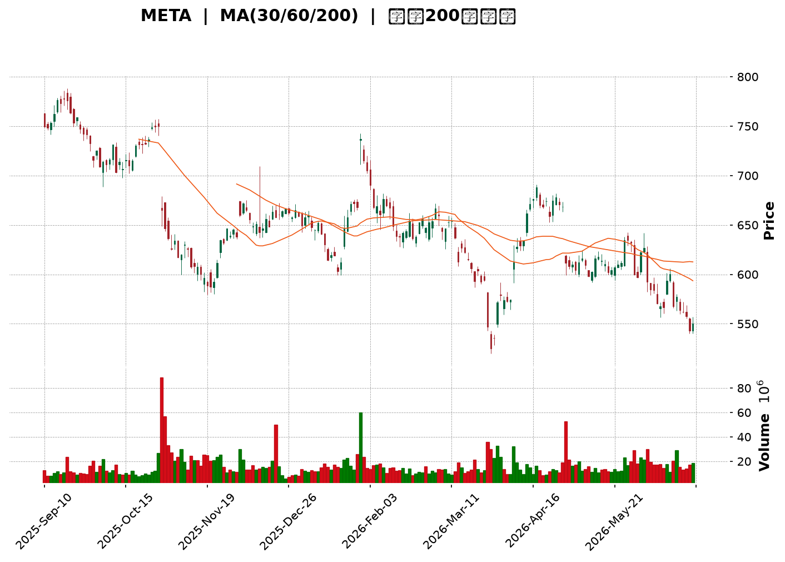
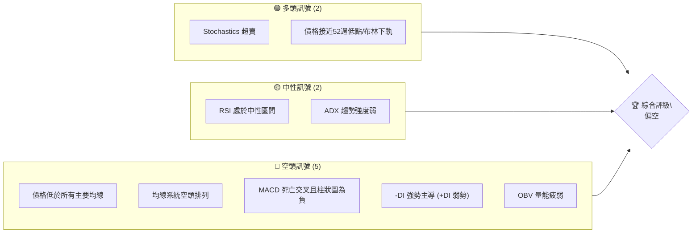
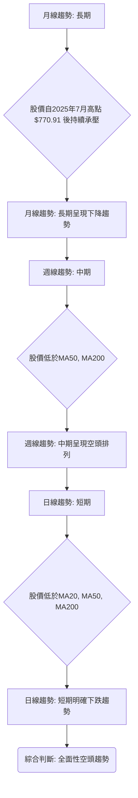
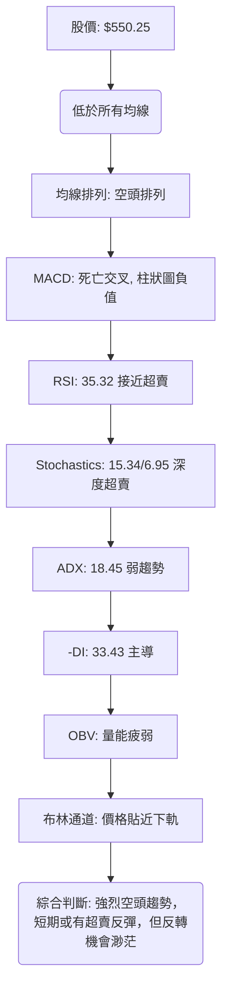
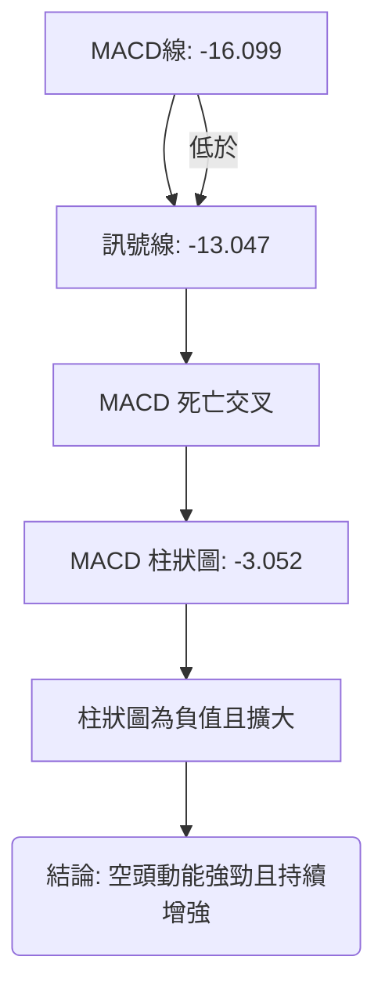
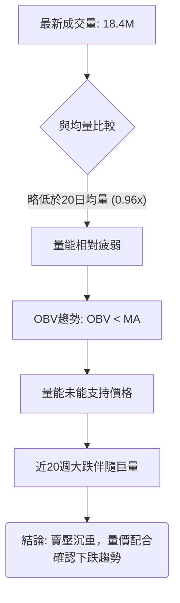

<details>
<summary>📊 靜態圖表 (點擊展開)</summary>

</details>

<html>
<head><meta charset="utf-8" /></head>
<body>
    <div style="height:500px; width:100%;">                        <script>window.PlotlyConfig = {MathJaxConfig: 'local'};</script>
        <script charset="utf-8" src="https://cdn.plot.ly/plotly-3.6.0.min.js" integrity="sha256-QaOVwtVY0T02VaHrr6pnoHLCwayMJp4O5n4YyaE3rJk=" crossorigin="anonymous"></script>                <div id="candlestick-chart" class="plotly-graph-div" style="height:100%; width:100%;"></div>            <script>                window.PLOTLYENV=window.PLOTLYENV || {};                                if (document.getElementById("candlestick-chart")) {                    Plotly.newPlot(                        "candlestick-chart",                        [{"close":{"dtype":"f8","bdata":"AAAAADBsh0AAAABgk2OHQAAAAAD5iIdAAAAAYJ3Rh0AAAAAApEOIQAAAAKB8KYhAAAAA4JtNiEAAAACAsj6IQAAAAIBm2YdAAAAAAIaLh0AAAACAfrWHQAAAAAC9V4dAAAAAwJAuh0AAAADAxSuHQAAAAMDM44ZAAAAAYNVbhkAAAADgT6mGQAAAAOC7JYZAAAAAoG1OhkAAAACA1zmGQAAAAODSX4ZAAAAAgNvchkAAAABgw\u002fuFQAAAAEC\u002fToZAAAAAYH4WhkAAAABggl2GQAAAAGDIMYZAAAAAYHtYhkAAAABAKtKGQAAAAIDx2oZAAAAAYA\u002fchkAAAACAxOCGQAAAAKCOA4dAAAAAgPpmh0AAAADg7GuHQAAAAMDCbYdAAAAAwO3FhEAAAABgWDWEQAAAAEBy4INAAAAAoIqNg0AAAAAAZ9KDQAAAAOCsSoNAAAAAQMdgg0AAAAAg+LCDQAAAAGCgi4NAAAAAAHH7gkAAAACgdgKDQAAAAEAI\u002f4JAAAAAIJbDgkAAAADgHaGCQAAAAEBPZoJAAAAAQPlcgkAAAAAAq4WCQAAAAICtG4NAAAAAYI7Ug0AAAAAAu7+DQAAAAEAnMoRAAAAA4Kj5g0AAAADgXiuEQAAAAMCG74NAAAAAAIOehEAAAACAYv2EQAAAAOCPyIRAAAAA4At6hEAAAABgjEOEQAAAAIAiWIRAAAAAYHgUhEAAAABA2zKEQAAAAMDWf4RAAAAAgL9ChEAAAACgIrqEQAAAAKDGjIRAAAAAoJOihEAAAABADL6EQAAAACDk0oRAAAAAAN+whEAAAAAgI4yEQAAAACAdxoRAAAAAQFGXhEAAAADgA0qEQAAAAIDvjIRAAAAAwIybhEAAAACgRzyEQAAAAOBGJ4RAAAAAQC1fhEAAAACAnQaEQAAAAAC7r4NAAAAAYGQzg0AAAACAjl2DQAAAACAqWYNAAAAAwFrYgkAAAADg8h6DQAAAAIDQM4RAAAAAQLKMhEAAAABgTfmEQAAAAGAs\u002foRAAAAAYFDchEAAAACA9geHQAAAACDLWYZAAAAAgDcJhkAAAAAgv5OFQAAAAOBj3oRAAAAAACLohEAAAAAAQqKEQAAAAOAcIIVAAAAAoDTshEAAAACg\u002ftuEQAAAAEA5RYRAAAAAAAz1g0AAAACANvGDQAAAAOCYEIRAAAAAIA4dhEAAAACg8HOEQAAAACDs4INAAAAAAEvxg0AAAABgNWSEQAAAAKC4foRAAAAAADU4hEAAAACAK2OEQAAAAABPb4RAAAAAAFTUhEAAAACAJpuEQAAAAKCxHYRAAAAAAOYxhEAAAAAgPmeEQAAAACCNbYRAAAAAYFnog0AAAAAA8CSDQAAAAMDzloNAAAAA4Kpwg0AAAAAg4TiDQAAAACAb8YJAAAAA4OGIgkAAAABgAdyCQAAAAMD3goJAAAAAoLaSgkAAAACAQxiBQAAAAIDdaYBAAAAAIBG\u002fgEAAAABAzdyBQAAAAKCMFYJAAAAAwGzvgUAAAABg6uOBQAAAAOAj9IFAAAAAwNIeg0AAAAAgd56DQAAAAMA2qoNAAAAAQIrPg0AAAAAgA6+EQAAAAGCq94RAAAAAIPIhhUAAAACgTH+FQAAAAGBP8oRAAAAAAMThhEAAAAAAwxCFQAAAAEBRlIRAAAAAYD0ThUAAAADg7i+FQAAAAEC\u002f9YRAAAAA4ADkhEAAAABAvxqDQAAAAKB9AYNAAAAAIMIOg0AAAADgMuOCQAAAAACAIoNAAAAAIOlBg0AAAAAghgiDQAAAAKBxsoJAAAAAgIjTgkAAAADgeECDQAAAAODbToNAAAAAQEotg0AAAAAAJxWDQAAAAIBq0IJAAAAAgP\u002fjgkAAAABgivaCQAAAAECPDYNAAAAAIC8eg0AAAADgX9WDQAAAACCd1YNAAAAAAGW\u002fg0AAAADAT7+CQAAAAOCcqIJAAAAAoDlzg0AAAABA6ZeDQAAAAICbg4JAAAAAoMhGgkAAAADAY0CCQAAAAECc04FAAAAAoDq\u002fgUAAAADAo7OBQAAAAADXi4JAAAAAIK7BgkAAAADgo7yBQAAAAIDCCYJAAAAAwMyegUAAAACgmZGBQAAAACBcbYFAAAAAwPX2gEAAAAAAADKBQA=="},"high":{"dtype":"f8","bdata":"BLtW1ZbZh0A3vPdkA5WHQDuPr8DCmIdAGI5Lb1QciED4jdB1dVaIQDA\u002fiFrZZYhAKohsTqCRiECk3nSHu6GIQIOcU5eIfYhAUOoZv84EiEDuI\u002fe7FbmHQIs1Op50lodAS3D96tVvh0DOmLfKqGaHQHMSVF1XKIdA6jpCytF\u002fhkAVtL6sDq+GQJzxfWjUyIZAGnO7xClYhkCHTY7UFmWGQJtnayJEboZAAAAAgNvchkCvfrzH5uqGQFUYSDmUcIZAZCif14xNhkCAJuqDLZCGQF2MNDTdnIZAmNO9hGhlhkDiddOf7t6GQHmWOLesBIdAkqKSTW4Vh0Bn4xFy3yOHQIYY3VtMGodAjej37lCOh0A1LtYFdqOHQGVFSXWGqYdAI\u002fjQZIw5hUAhvGFhHQmFQEl\u002fdCT1jIRAKlUpJJoAhEDWSOMCgwSEQHYveh3N0oNA5vTQJCFkg0Aimmpp0sqDQM9iFjNqn4NAfzIZ2t2ag0BXtRzmYUCDQLAqoVS0IINAU1dmUtMQg0BpsMiowNCCQC42RyJJjoJAtujMJyvpgkBwfrowjKSCQDQv5VvNOINAQ5ob1y3bg0BsPJ\u002fDoeWDQCQUB3jzMoRA64yI2yodhEAEzrnIgzGEQCxniZtVOYRAQ88v2MQShUBV8rvAhAeFQMqv4PmiF4VAG9BqzAy2hEDESxdbf2aEQFirrzikbIRALze1pD4phkB7RNi6sl6EQHUcCLjhqoRAn+OPuWughEC22BuY7eqEQBGudAZx7oRAbts\u002fcgsDhUA4C2tCg8aEQCiE4RPs14RAtK\u002fsGxLehEDt765PmJiEQMEUsiIv+IRAKjVR+Ia+hED1+mgFqLmEQBNuIojauoRAd9a2Ia7ChEDROVCbz4+EQIQkHvWUL4RA8BN8G0VuhEDgfq69cWaEQC939NoCCYRAJCQY2aWag0AvHev1d3iDQGxbqMytn4NAsOXTs30Sg0B+w+RiWkmDQLTNmW8mm4RAjYDJD23KhEBODQD6nhCFQBo3xTXrHIVA+gTIXMkjhUCytBvgZjWHQHcEIBvu1oZA6ecG8x+AhkDYqlY8yV2GQJYOGObTfIVAQkThs0pChUCjr8f5WPaEQNOYmwq\u002fUIVAv4DlKYE7hUCjmATrezCFQEnskd5eFoVAsGgAGylShEBiYdVNpQuEQCOFP+LPHoRA9ZAa9kwwhED3ovG0WbGEQIF1qCw7hIRAyhI9Rr\u002f\u002fg0C8daDOuWWEQAj8MJOVnoRAMfLB50RChEAHpNF7HpaEQNiDKo\u002fujoRAC87dnpP8hEAGlC7PC+yEQORkTBCCQoRA5zry78U0hEBKINdn\u002fpiEQIKh9xaSj4RA8vru4bBihECNg5KeZaCDQGWmE0hM0YNAC9oNSa\u002ffg0DGR2uIlnCDQCQxnY11I4NAOmnY1zTbgkCoupOQnACDQA3cdU2Mw4JAaXqbWePYgkADMpdgrjOCQJjibdfF+IBAhUUkPWfYgEA3Y6UqRemBQJw64L0CgIJA2dS79rYPgkDfeR25ADKCQAKTniiU9YFAFOauAe+qg0Aup38ZR+eDQE1\u002fftbo74NAQWna20vTg0Cv2bH5JM2EQKViuGD5LoVAQR1M554nhUBxsiGeCZeFQLc1X1r6VYVAkGDsSpcchUAQwi\u002fPAy6FQNhZOyKF54RAy7LtTVFAhUDo323E8U6FQAj5WodqLIVA8oGUZQENhUAMUANsM2KDQBPEWap0UoNAHP89sXMrg0DsfF2xPy6DQE\u002fZtfcBW4NAoPqKwTWDg0Do8ptVl0GDQDm2\u002f4bM4oJAAYfmE4fZgkB6o3qsm1qDQJE\u002fDzM4eYNAHo9rqP9kg0CH0I3xKDiDQCs\u002fkmjkKoNAmJbEDH\u002f7gkDGFDeqSAiDQFBIK\u002f\u002fsMYNAeGjzNTUvg0Abcik7Re+DQEN9\u002fqA8E4RAynHluUzPg0CbnQZYStmDQJTdOYqHAoNAIX79p5N8g0Au7FYAcQ6EQCAl9jKKpINAphIFV517gkAt7lLlnKiCQIX33g0udoJAHB1ECB\u002fdgUDgXN7iSvyBQAAAAAApyoJAAAAA4HrugkAAAADgeo6CQAAAAIDCIYJAAAAA4Hr+gUAAAACgmeGBQAAAAOBRyIFAAAAAYLhigUAAAADAzGaBQA=="},"hovertemplate":"\u003cb\u003e%{x|%Y-%m-%d}\u003c\u002fb\u003e\u003cbr\u003e\u958b: $%{open:.2f}\u003cbr\u003e\u9ad8: $%{high:.2f}\u003cbr\u003e\u4f4e: $%{low:.2f}\u003cbr\u003e\u6536: $%{close:.2f}\u003cextra\u003e\u003c\u002fextra\u003e","low":{"dtype":"f8","bdata":"UT9wjl9kh0DJplXNZk+HQCmoeUakKodATWdsSURsh0Ac4fm\u002fzdSHQBan2vRz3odAb3yvOKsWiEAqelbcavWHQCHRcwrl04dAGyMZIfloh0BBhwyRn3SHQOkNpOnyNIdA2I40gH\u002f7hkCdM0ZU3AmHQAtYH81To4ZAygXBjtwihkAI87WVN2KGQPnB06SzIoZAliB1HMCFhUB\u002fUS+RWv+FQA\u002f6v6jKD4ZA6BnjELw0hkDromWydfWFQFwmOjJvDoZAo8fJgyDMhUB0RWo2Wx2GQEnMx8Ju8IVAGehqYE4ChkCSN1FzfnKGQHM4O4PgtoZAOjrBFDeRhkCDixIIltmGQJYLxO0GyoZAnP+7jY5Qh0BwaaEzsDyHQLSl9smrJIdAllzJ+N1DhEBXLcbEKR+EQJNe3eA81INAESSotRaDg0D3zS0+UYeDQO1PdL4sQ4NAT5T0tR+9gkBX09xkDUSDQOCu1RpEToNAb+x0FozxgkA86al6fMuCQHDpUoI\u002fjYJAFCEi\u002fteOgkAfmLElIDKCQLMOaA\u002fwHYJAUKVrkLEugkD6jKsSziKCQGmgekujoIJAh0GqdJFFg0C8Ve6E7q+DQLQ\u002ftcTPzoNAeALlJdjgg0BMw1B5UeODQJMIFkQr34NA0hjtvLOShEACEBm5X6WEQMhD2xDCuoRAIqBnWyldhEBbQ+4g2Q2EQGmuIAYa+YNALRqJe6Dng0CnZoiAgOyDQP0Hfv9vEIRA+ikNOFpAhECOhfFCVHqEQArZ1GYQiIRAoyjgj9h7hEBpz5WFn4iEQKl1SOIqqIRA4VgeryOhhEBzdzNuzGmEQMmSDnNZhYRAg8nTXiCShECGupFy1RKEQNYASOLFNIRAtzJLDOpVhEDeXRSGSx2EQIAECjW01INAqlQQXKQNhECr7syytACEQJQGit3od4NAwp2ATc0tg0DId3kVFymDQM5nsJ7OV4NA31UqBnS3gkDh7waYF7iCQC9jrH95i4NA5dTkjmsahEBgwGBe5qCEQHrI283Pu4RA9M04t0\u002fHhEDpOTbwPzqGQK+1ohyOQoZAvmn+aSPyhUCeAbJqgGmFQJUxUhQs0oRADegs0LBihEBiGeJtyiqEQDBjwB7bjIRAD3svZMfkhEBVmeCDcH+EQE\u002fA6GQMIYRAn1JlVoXLg0AYIE5BcZ2DQHhamJRAmINAqRCwhLDcg0CIDWQOJO2DQJ2l867w1oNAyfB1QuGeg0ApFEYe+QeEQDBP9c3GMoRAKZAxz97ng0Dletch9sqDQOXJ5Lie7YNAyFqFz\u002f2DhECa+S5qN0mEQMMtqIjR14NA3z3Z50+Ng0BNlzw9wT6EQFB8OtSkOYRAcqfrqiDeg0DoYs9rtwODQPSpzx8vdINAyQMEsv5og0DQjG7HUzCDQNN0cGuezYJAPgy4Z6ZVgkAMYpOTpLOCQOkOFESfc4JAfqhX882GgkBK+jFSxvaAQKk1wto5PoBA3KTqnWeAgEDEZt4XHBKBQInbPUJP6oFAGk12PXR5gUDrsSxPw9uBQGrPcoPloYFACZjTi0F6gkBsFJ6YYnODQOhnwdwDfoNAZuuZNZN+g0AsZYQ4OfaDQCsr6PTWvIRA7D2Xqw3ZhEC+8AfzCRSFQE2NqEQN24RAd8kRXbLVhEDbbr3sCemEQENHaPGPY4RANthFb+BphEBZoNRAwPGEQNlHFfQbyIRA+KXMEZC5hEDZvMc1jruCQHLqmuFj7IJAu2F9BonRgkDl0Dm5br6CQFzVSYderIJAng6RU8Yng0CNBjKF\u002feuCQCDao7o1rIJArbjb+GiAgkBvVQAf3KCCQCYxIcFxM4NAs99jdPcFg0CX0uNCDNmCQCG4DIjzv4JAoC6IPw2qgkB0N63WEpKCQAXw3aYa84JAVcHPeerlgkB9hMwrfQODQHgpHnfRpYNAQUkHny52g0DKKVSIzLeCQNbuOA0FoYJAhF7IsLa9gkAKYl4\u002f1G6DQETCNEL2MoJA21hmE3gVgkDCxAiqxiOCQO97ebiS0IFA4FhOKPRjgUBmdMSHC4OBQAAAAGBmGoJAAAAAAACAgkAAAAAghbGBQAAAAMDMmIFAAAAA4Hp+gUAAAAAAKYiBQAAAAGBmXIFAAAAAoHDhgEAAAABAM+OAQA=="},"name":"\u50f9\u683c","open":{"dtype":"f8","bdata":"KfyaRQvVh0A1yyVJeoGHQDNy5oVFUodACnVxn\u002faXh0A8wZxJ9OOHQIQljw6JS4hAz3mjh5hRiEAy\u002fWKVzn6IQAHHaPSSXohAKFwnKwn6h0BwnrCpR5yHQKfNe+H2e4dAi\u002fnUi29gh0AAoIe8OFaHQKDlg7CYIodAwgrbc\u002fJ8hkC\u002f6TsfpYWGQCFmwu\u002flvYZAcRFfv+L6hUBQJ2953V6GQExsYXLLPIZAy1j8aVVjhkBBKu8DMciGQOQdnWpIOYZAclE\u002fP40PhkDBs2N6mVmGQC9m+UKCXYZAm8a\u002fZvcJhkB0JqCVjXqGQOdB\u002f+Pi8IZAjCS9ZGnfhkD17\u002fNnWuaGQET0QZcH94ZAWmx96kdeh0BYZoGta3WHQLbRCkNWhodAdrH+QlDbhEAN1zAmFQaFQCEcVfVicoRAjYrOTEmTg0DHOaCWW7WDQCbFhKma0YNAOYpUWyA3g0DrqzePn6uDQNqJxZz3koNAxCC6KwGUg0Dt8Rhb1huDQFhYpL\u002fUwYJAPJ+nJq77gkBDWX7ahXCCQFLk+U9wgYJAbzsow3nPgkCRuR2MyVeCQD+oGsFVqYJAqdAszAxzg0BtItoySeCDQL1A2o9w04NA8etXgyDvg0DXItPJYwWEQGGUKRLoFYRA4oMooPgRhUBo0XdrOLKEQC7HbGHU3IRAmW0BkmKwhECrU8u0HEKEQJ7to0v4DIRATW1zKOpAhED8BLf5ZiSEQPDIbUfVEoRA0E8ReIpzhEAcM9KO4X6EQDAMOdrdyYRAp2nwU8ajhECwsitV\u002f5aEQN4ENY7NqoRAaEfSmvbWhEB0gcz6tIaEQEF2kBkjjIRAyxy04Ye8hEAlCBRTZqyEQHwA7X7OToRA3xQwNCqThED9Uf7nx3OEQPC1COjWJYRAKpgESlMihECXtuf98VqEQC939NoCCYRAY4GLVROLg0DYwduVB0uDQKOpHmuMeINAquDkiWH2gkCzYKnuRu2CQDlEsKnVoYNAx9UnxPkchEBSxoe9kL+EQOW2lVccC4VAd7hwVWQKhUAx6oZ17wCHQKUE1gKjsYZAqdcAwp5KhkCukcEa4hCGQM8FDAkLdIVAEzGn7S+zhECQ2NWtcMKEQDycITP+r4RArUs9ySUjhUDwJNkiZgaFQKHX2Fs35oRAZQlMUJwfhEAHLu3b4\u002fKDQHTlDRpfxYNASRqJpXbrg0BrBOFcaPSDQOHj3T0GW4RANPPILp+\u002fg0At0y5yFguEQPGHrQ4iS4RAxi+GP28ShEAPFJIONOCDQC+63MIVOYRAHjHBwE6GhED3YWTKAqaEQN9P8In4NYRAoMiuuzLNg0AZASJ8K2OEQEmmVb3AbIRAM6BRNMI8hEC+FvR\u002fO3aDQHVaHn9Ru4NAt0yHpESbg0DzoJafJz6DQAALPmqqHINAH8uVCMXXgkAMJSkY1emCQO+C2adctIJA0uH1EnyxgkCAszHYmi+CQBVJpXrM3IBAAAAAIBG\u002fgEAo33sBxCuBQHSOFiu+HIJAHhmidyCsgUDQx+2kPQmCQKyYp1+Z34FAUMu2zILrgkAtmV6RHZODQEqN40EPz4NAeqzSSVang0Bb4WSr\u002fhSEQDokWi8P04RA9Ow5i+kahUAwwnTexS+FQNep\u002fy7VRYVAQQBkhwfzhEC+gcJu4g2FQOTAGf+uuIRAyhZjJaudhEDvsSuTB\u002fOEQHWVIuDsDIVAKCT1JVPihEDULb\u002fy+FWDQGY7Z3z3MINAj3QITwT7gkDD9EDK7yWDQHD2I4\u002fyw4JAULOwtjQxg0B1KdTvCjWDQHaHCewU4IJA7LwbYyeSgkC5Z35BNLKCQDAHq9tvO4NA0qOANF8rg0AbqosbXgSDQOQSvWjZAoNAQsxwR6HBgkAuvfQejruCQEXaZIOJ+oJAtSHrCpwCg0Du4ZuprwaDQKEcJkRD94NA4L5gn07Hg0Crvl29h66DQPQJZ3xz1YJAK1t8g4jTgkBNLGFlvXiDQHO0LN0Pd4NAphIFV517gkAbnRI4n3OCQLcR1cKJIYJAtzBEznKqgUDclJkNW+OBQAAAAEAzH4JAAAAAQDONgkAAAAAAAICCQAAAAGCP5oFAAAAAACnggUAAAAAAAJKBQAAAAMAej4FAAAAAYGZcgUAAAACA6\u002feAQA=="},"x":["2025-09-10T00:00:00-04:00","2025-09-11T00:00:00-04:00","2025-09-12T00:00:00-04:00","2025-09-15T00:00:00-04:00","2025-09-16T00:00:00-04:00","2025-09-17T00:00:00-04:00","2025-09-18T00:00:00-04:00","2025-09-19T00:00:00-04:00","2025-09-22T00:00:00-04:00","2025-09-23T00:00:00-04:00","2025-09-24T00:00:00-04:00","2025-09-25T00:00:00-04:00","2025-09-26T00:00:00-04:00","2025-09-29T00:00:00-04:00","2025-09-30T00:00:00-04:00","2025-10-01T00:00:00-04:00","2025-10-02T00:00:00-04:00","2025-10-03T00:00:00-04:00","2025-10-06T00:00:00-04:00","2025-10-07T00:00:00-04:00","2025-10-08T00:00:00-04:00","2025-10-09T00:00:00-04:00","2025-10-10T00:00:00-04:00","2025-10-13T00:00:00-04:00","2025-10-14T00:00:00-04:00","2025-10-15T00:00:00-04:00","2025-10-16T00:00:00-04:00","2025-10-17T00:00:00-04:00","2025-10-20T00:00:00-04:00","2025-10-21T00:00:00-04:00","2025-10-22T00:00:00-04:00","2025-10-23T00:00:00-04:00","2025-10-24T00:00:00-04:00","2025-10-27T00:00:00-04:00","2025-10-28T00:00:00-04:00","2025-10-29T00:00:00-04:00","2025-10-30T00:00:00-04:00","2025-10-31T00:00:00-04:00","2025-11-03T00:00:00-05:00","2025-11-04T00:00:00-05:00","2025-11-05T00:00:00-05:00","2025-11-06T00:00:00-05:00","2025-11-07T00:00:00-05:00","2025-11-10T00:00:00-05:00","2025-11-11T00:00:00-05:00","2025-11-12T00:00:00-05:00","2025-11-13T00:00:00-05:00","2025-11-14T00:00:00-05:00","2025-11-17T00:00:00-05:00","2025-11-18T00:00:00-05:00","2025-11-19T00:00:00-05:00","2025-11-20T00:00:00-05:00","2025-11-21T00:00:00-05:00","2025-11-24T00:00:00-05:00","2025-11-25T00:00:00-05:00","2025-11-26T00:00:00-05:00","2025-11-28T00:00:00-05:00","2025-12-01T00:00:00-05:00","2025-12-02T00:00:00-05:00","2025-12-03T00:00:00-05:00","2025-12-04T00:00:00-05:00","2025-12-05T00:00:00-05:00","2025-12-08T00:00:00-05:00","2025-12-09T00:00:00-05:00","2025-12-10T00:00:00-05:00","2025-12-11T00:00:00-05:00","2025-12-12T00:00:00-05:00","2025-12-15T00:00:00-05:00","2025-12-16T00:00:00-05:00","2025-12-17T00:00:00-05:00","2025-12-18T00:00:00-05:00","2025-12-19T00:00:00-05:00","2025-12-22T00:00:00-05:00","2025-12-23T00:00:00-05:00","2025-12-24T00:00:00-05:00","2025-12-26T00:00:00-05:00","2025-12-29T00:00:00-05:00","2025-12-30T00:00:00-05:00","2025-12-31T00:00:00-05:00","2026-01-02T00:00:00-05:00","2026-01-05T00:00:00-05:00","2026-01-06T00:00:00-05:00","2026-01-07T00:00:00-05:00","2026-01-08T00:00:00-05:00","2026-01-09T00:00:00-05:00","2026-01-12T00:00:00-05:00","2026-01-13T00:00:00-05:00","2026-01-14T00:00:00-05:00","2026-01-15T00:00:00-05:00","2026-01-16T00:00:00-05:00","2026-01-20T00:00:00-05:00","2026-01-21T00:00:00-05:00","2026-01-22T00:00:00-05:00","2026-01-23T00:00:00-05:00","2026-01-26T00:00:00-05:00","2026-01-27T00:00:00-05:00","2026-01-28T00:00:00-05:00","2026-01-29T00:00:00-05:00","2026-01-30T00:00:00-05:00","2026-02-02T00:00:00-05:00","2026-02-03T00:00:00-05:00","2026-02-04T00:00:00-05:00","2026-02-05T00:00:00-05:00","2026-02-06T00:00:00-05:00","2026-02-09T00:00:00-05:00","2026-02-10T00:00:00-05:00","2026-02-11T00:00:00-05:00","2026-02-12T00:00:00-05:00","2026-02-13T00:00:00-05:00","2026-02-17T00:00:00-05:00","2026-02-18T00:00:00-05:00","2026-02-19T00:00:00-05:00","2026-02-20T00:00:00-05:00","2026-02-23T00:00:00-05:00","2026-02-24T00:00:00-05:00","2026-02-25T00:00:00-05:00","2026-02-26T00:00:00-05:00","2026-02-27T00:00:00-05:00","2026-03-02T00:00:00-05:00","2026-03-03T00:00:00-05:00","2026-03-04T00:00:00-05:00","2026-03-05T00:00:00-05:00","2026-03-06T00:00:00-05:00","2026-03-09T00:00:00-04:00","2026-03-10T00:00:00-04:00","2026-03-11T00:00:00-04:00","2026-03-12T00:00:00-04:00","2026-03-13T00:00:00-04:00","2026-03-16T00:00:00-04:00","2026-03-17T00:00:00-04:00","2026-03-18T00:00:00-04:00","2026-03-19T00:00:00-04:00","2026-03-20T00:00:00-04:00","2026-03-23T00:00:00-04:00","2026-03-24T00:00:00-04:00","2026-03-25T00:00:00-04:00","2026-03-26T00:00:00-04:00","2026-03-27T00:00:00-04:00","2026-03-30T00:00:00-04:00","2026-03-31T00:00:00-04:00","2026-04-01T00:00:00-04:00","2026-04-02T00:00:00-04:00","2026-04-06T00:00:00-04:00","2026-04-07T00:00:00-04:00","2026-04-08T00:00:00-04:00","2026-04-09T00:00:00-04:00","2026-04-10T00:00:00-04:00","2026-04-13T00:00:00-04:00","2026-04-14T00:00:00-04:00","2026-04-15T00:00:00-04:00","2026-04-16T00:00:00-04:00","2026-04-17T00:00:00-04:00","2026-04-20T00:00:00-04:00","2026-04-21T00:00:00-04:00","2026-04-22T00:00:00-04:00","2026-04-23T00:00:00-04:00","2026-04-24T00:00:00-04:00","2026-04-27T00:00:00-04:00","2026-04-28T00:00:00-04:00","2026-04-29T00:00:00-04:00","2026-04-30T00:00:00-04:00","2026-05-01T00:00:00-04:00","2026-05-04T00:00:00-04:00","2026-05-05T00:00:00-04:00","2026-05-06T00:00:00-04:00","2026-05-07T00:00:00-04:00","2026-05-08T00:00:00-04:00","2026-05-11T00:00:00-04:00","2026-05-12T00:00:00-04:00","2026-05-13T00:00:00-04:00","2026-05-14T00:00:00-04:00","2026-05-15T00:00:00-04:00","2026-05-18T00:00:00-04:00","2026-05-19T00:00:00-04:00","2026-05-20T00:00:00-04:00","2026-05-21T00:00:00-04:00","2026-05-22T00:00:00-04:00","2026-05-26T00:00:00-04:00","2026-05-27T00:00:00-04:00","2026-05-28T00:00:00-04:00","2026-05-29T00:00:00-04:00","2026-06-01T00:00:00-04:00","2026-06-02T00:00:00-04:00","2026-06-03T00:00:00-04:00","2026-06-04T00:00:00-04:00","2026-06-05T00:00:00-04:00","2026-06-08T00:00:00-04:00","2026-06-09T00:00:00-04:00","2026-06-10T00:00:00-04:00","2026-06-11T00:00:00-04:00","2026-06-12T00:00:00-04:00","2026-06-15T00:00:00-04:00","2026-06-16T00:00:00-04:00","2026-06-17T00:00:00-04:00","2026-06-18T00:00:00-04:00","2026-06-22T00:00:00-04:00","2026-06-23T00:00:00-04:00","2026-06-24T00:00:00-04:00","2026-06-25T00:00:00-04:00","2026-06-26T00:00:00-04:00"],"type":"candlestick"},{"hovertemplate":"MA30: $%{y:.2f}\u003cextra\u003e\u003c\u002fextra\u003e","line":{"color":"#2196F3","dash":"dash","width":2},"mode":"lines","name":"MA30","x":["2025-09-10T00:00:00-04:00","2025-09-11T00:00:00-04:00","2025-09-12T00:00:00-04:00","2025-09-15T00:00:00-04:00","2025-09-16T00:00:00-04:00","2025-09-17T00:00:00-04:00","2025-09-18T00:00:00-04:00","2025-09-19T00:00:00-04:00","2025-09-22T00:00:00-04:00","2025-09-23T00:00:00-04:00","2025-09-24T00:00:00-04:00","2025-09-25T00:00:00-04:00","2025-09-26T00:00:00-04:00","2025-09-29T00:00:00-04:00","2025-09-30T00:00:00-04:00","2025-10-01T00:00:00-04:00","2025-10-02T00:00:00-04:00","2025-10-03T00:00:00-04:00","2025-10-06T00:00:00-04:00","2025-10-07T00:00:00-04:00","2025-10-08T00:00:00-04:00","2025-10-09T00:00:00-04:00","2025-10-10T00:00:00-04:00","2025-10-13T00:00:00-04:00","2025-10-14T00:00:00-04:00","2025-10-15T00:00:00-04:00","2025-10-16T00:00:00-04:00","2025-10-17T00:00:00-04:00","2025-10-20T00:00:00-04:00","2025-10-21T00:00:00-04:00","2025-10-22T00:00:00-04:00","2025-10-23T00:00:00-04:00","2025-10-24T00:00:00-04:00","2025-10-27T00:00:00-04:00","2025-10-28T00:00:00-04:00","2025-10-29T00:00:00-04:00","2025-10-30T00:00:00-04:00","2025-10-31T00:00:00-04:00","2025-11-03T00:00:00-05:00","2025-11-04T00:00:00-05:00","2025-11-05T00:00:00-05:00","2025-11-06T00:00:00-05:00","2025-11-07T00:00:00-05:00","2025-11-10T00:00:00-05:00","2025-11-11T00:00:00-05:00","2025-11-12T00:00:00-05:00","2025-11-13T00:00:00-05:00","2025-11-14T00:00:00-05:00","2025-11-17T00:00:00-05:00","2025-11-18T00:00:00-05:00","2025-11-19T00:00:00-05:00","2025-11-20T00:00:00-05:00","2025-11-21T00:00:00-05:00","2025-11-24T00:00:00-05:00","2025-11-25T00:00:00-05:00","2025-11-26T00:00:00-05:00","2025-11-28T00:00:00-05:00","2025-12-01T00:00:00-05:00","2025-12-02T00:00:00-05:00","2025-12-03T00:00:00-05:00","2025-12-04T00:00:00-05:00","2025-12-05T00:00:00-05:00","2025-12-08T00:00:00-05:00","2025-12-09T00:00:00-05:00","2025-12-10T00:00:00-05:00","2025-12-11T00:00:00-05:00","2025-12-12T00:00:00-05:00","2025-12-15T00:00:00-05:00","2025-12-16T00:00:00-05:00","2025-12-17T00:00:00-05:00","2025-12-18T00:00:00-05:00","2025-12-19T00:00:00-05:00","2025-12-22T00:00:00-05:00","2025-12-23T00:00:00-05:00","2025-12-24T00:00:00-05:00","2025-12-26T00:00:00-05:00","2025-12-29T00:00:00-05:00","2025-12-30T00:00:00-05:00","2025-12-31T00:00:00-05:00","2026-01-02T00:00:00-05:00","2026-01-05T00:00:00-05:00","2026-01-06T00:00:00-05:00","2026-01-07T00:00:00-05:00","2026-01-08T00:00:00-05:00","2026-01-09T00:00:00-05:00","2026-01-12T00:00:00-05:00","2026-01-13T00:00:00-05:00","2026-01-14T00:00:00-05:00","2026-01-15T00:00:00-05:00","2026-01-16T00:00:00-05:00","2026-01-20T00:00:00-05:00","2026-01-21T00:00:00-05:00","2026-01-22T00:00:00-05:00","2026-01-23T00:00:00-05:00","2026-01-26T00:00:00-05:00","2026-01-27T00:00:00-05:00","2026-01-28T00:00:00-05:00","2026-01-29T00:00:00-05:00","2026-01-30T00:00:00-05:00","2026-02-02T00:00:00-05:00","2026-02-03T00:00:00-05:00","2026-02-04T00:00:00-05:00","2026-02-05T00:00:00-05:00","2026-02-06T00:00:00-05:00","2026-02-09T00:00:00-05:00","2026-02-10T00:00:00-05:00","2026-02-11T00:00:00-05:00","2026-02-12T00:00:00-05:00","2026-02-13T00:00:00-05:00","2026-02-17T00:00:00-05:00","2026-02-18T00:00:00-05:00","2026-02-19T00:00:00-05:00","2026-02-20T00:00:00-05:00","2026-02-23T00:00:00-05:00","2026-02-24T00:00:00-05:00","2026-02-25T00:00:00-05:00","2026-02-26T00:00:00-05:00","2026-02-27T00:00:00-05:00","2026-03-02T00:00:00-05:00","2026-03-03T00:00:00-05:00","2026-03-04T00:00:00-05:00","2026-03-05T00:00:00-05:00","2026-03-06T00:00:00-05:00","2026-03-09T00:00:00-04:00","2026-03-10T00:00:00-04:00","2026-03-11T00:00:00-04:00","2026-03-12T00:00:00-04:00","2026-03-13T00:00:00-04:00","2026-03-16T00:00:00-04:00","2026-03-17T00:00:00-04:00","2026-03-18T00:00:00-04:00","2026-03-19T00:00:00-04:00","2026-03-20T00:00:00-04:00","2026-03-23T00:00:00-04:00","2026-03-24T00:00:00-04:00","2026-03-25T00:00:00-04:00","2026-03-26T00:00:00-04:00","2026-03-27T00:00:00-04:00","2026-03-30T00:00:00-04:00","2026-03-31T00:00:00-04:00","2026-04-01T00:00:00-04:00","2026-04-02T00:00:00-04:00","2026-04-06T00:00:00-04:00","2026-04-07T00:00:00-04:00","2026-04-08T00:00:00-04:00","2026-04-09T00:00:00-04:00","2026-04-10T00:00:00-04:00","2026-04-13T00:00:00-04:00","2026-04-14T00:00:00-04:00","2026-04-15T00:00:00-04:00","2026-04-16T00:00:00-04:00","2026-04-17T00:00:00-04:00","2026-04-20T00:00:00-04:00","2026-04-21T00:00:00-04:00","2026-04-22T00:00:00-04:00","2026-04-23T00:00:00-04:00","2026-04-24T00:00:00-04:00","2026-04-27T00:00:00-04:00","2026-04-28T00:00:00-04:00","2026-04-29T00:00:00-04:00","2026-04-30T00:00:00-04:00","2026-05-01T00:00:00-04:00","2026-05-04T00:00:00-04:00","2026-05-05T00:00:00-04:00","2026-05-06T00:00:00-04:00","2026-05-07T00:00:00-04:00","2026-05-08T00:00:00-04:00","2026-05-11T00:00:00-04:00","2026-05-12T00:00:00-04:00","2026-05-13T00:00:00-04:00","2026-05-14T00:00:00-04:00","2026-05-15T00:00:00-04:00","2026-05-18T00:00:00-04:00","2026-05-19T00:00:00-04:00","2026-05-20T00:00:00-04:00","2026-05-21T00:00:00-04:00","2026-05-22T00:00:00-04:00","2026-05-26T00:00:00-04:00","2026-05-27T00:00:00-04:00","2026-05-28T00:00:00-04:00","2026-05-29T00:00:00-04:00","2026-06-01T00:00:00-04:00","2026-06-02T00:00:00-04:00","2026-06-03T00:00:00-04:00","2026-06-04T00:00:00-04:00","2026-06-05T00:00:00-04:00","2026-06-08T00:00:00-04:00","2026-06-09T00:00:00-04:00","2026-06-10T00:00:00-04:00","2026-06-11T00:00:00-04:00","2026-06-12T00:00:00-04:00","2026-06-15T00:00:00-04:00","2026-06-16T00:00:00-04:00","2026-06-17T00:00:00-04:00","2026-06-18T00:00:00-04:00","2026-06-22T00:00:00-04:00","2026-06-23T00:00:00-04:00","2026-06-24T00:00:00-04:00","2026-06-25T00:00:00-04:00","2026-06-26T00:00:00-04:00"],"y":{"dtype":"f8","bdata":"AAAAAAAA+H8AAAAAAAD4fwAAAAAAAPh\u002fAAAAAAAA+H8AAAAAAAD4fwAAAAAAAPh\u002fAAAAAAAA+H8AAAAAAAD4fwAAAAAAAPh\u002fAAAAAAAA+H8AAAAAAAD4fwAAAAAAAPh\u002fAAAAAAAA+H8AAAAAAAD4fwAAAAAAAPh\u002fAAAAAAAA+H8AAAAAAAD4fwAAAAAAAPh\u002fAAAAAAAA+H8AAAAAAAD4fwAAAAAAAPh\u002fAAAAAAAA+H8AAAAAAAD4fwAAAAAAAPh\u002fAAAAAAAA+H8AAAAAAAD4fwAAAAAAAPh\u002fAAAAAAAA+H8AAAAAAAD4fzMzM3MxBodAAAAAkGMBh0BVVVVVB\u002f2GQKuqqtqU+IZARERE5Ab1hkDv7u4e1u2GQBERETGU54ZAmpmZyXTJhkCamZnZAqeGQHd3d9cchYZA3t3d7QtjhkCrqqp64EGGQAAAAOBOH4ZAmpmZOdn+hUBERES0J+GFQBEREbGdxIVAvLu7i82nhUC8u7srpIiFQBEREVHAbYVA7+7u7oVPhUBEREQU1TCFQKuqqkrqDoVAIiIi4oTohECamZmJ+8qEQFVVVSWur4RAmpmZaWqchEB3d3f3FoaEQAAAABAJdYRAiYiI2M5ghEB3d3d3LkqEQCIiIoJEMYRAq6qqOiYehEDNzMxcCQ6EQO\u002fu7t4A+4NAvLu7+wnig0BVVVXVF8eDQBEREbHFrINAERERYdumg0BEREQkxqaDQKuqqkoWrINAZmZmliCyg0CrqqoK2rmDQCIiIqKWxINAVVVVpVDPg0CJiIjISNiDQBEREXEx44NAzczMLMbxg0BmZmaG5f6DQDMzM+MQDoRAERERMagdhEDe3d390SuEQKuqqqosPoRAd3d3t1NRhECamZmJ8l+EQM3MzAzeaIRAIiIi8nxthEBERETU2W+EQDMzM+OAa4RAERERAeVkhECamZm5CF6EQDMzM6MFWYRAmpmZKeJJhEAiIiKC7zmEQCIiIjL6NIRAd3d3V5k1hEDv7u5OqDuEQLy7uysxQYRAERERgdpHhEBEREQUBmCEQN7d3X3Sb4RAAAAAoPh+hEAzMzOTOYaEQERERATyiIRAAAAAkEOLhEC8u7trVoqEQBEREWHpjIRAMzMzs+OOhEBmZmYmjZGEQJqZmUlBjYRARERElNiHhEDNzMzM4oSEQHd3d8e9gIRAvLu7W4Z8hEAzMzNTYX6EQHd3d\u002fcIfIRAq6qqSl94hEBERET0fXuEQGZmZkZkgoRAVVVV5RWLhEBERERUzpOEQDMzM9MTnYRAiYiIiAKuhEC8u7vrrrqEQImIiCjyuYRAmpmZWeu2hECamZn5DLKEQN7d3d06rYRAiYiICBmlhEBmZmYm7oOEQAAAAHBebIRA3t3dnTdWhEBmZmYmH0KEQKuqqsqtMYRAvLu7628dhEAiIiKiSw6EQImIiJj994NAzczM3PDjg0BmZmYG0cODQBEREZHnooNAZmZmVoGHg0CJiIgYwnWDQJqZmUnbZINAd3d310RSg0BERETEZjyDQBEREbH5K4NA7+7urvUkg0BmZmZGXh6DQBEREeFIF4NAiYiIuMsTg0CJiIjoUhaDQM3MzHzeGoNAMzMz03Qdg0AiIiKyDyWDQFVVVQUmLINAERERwQIyg0ARERFRqTeDQO\u002fu7h70OINAd3d3p+pCg0DNzMyMWVSDQAAAAAALYINAvLu7u2tsg0CrqqqaamuDQLy7u2v2a4NARERE1Gxwg0BmZmY2qnCDQN7d3Y37dYNAIiIiktJ7g0AzMzNTXYyDQKuqqrrZn4NAERERcZmxg0Dv7u5+dL2DQCIiIhLmx4NAVVVVhX7Sg0BVVVU1q9yDQFVVVeUC5INAvLu76wzig0BmZmb2c9yDQN7d3S0714NA3t3dvVHRg0ARERGREMqDQFVVVXVlwINARERE9JO0g0B3d3eXHJ2DQERERKSWiYNARERE1F59g0CamZkJz3CDQBEREWEvX4NA7+7unk1Hg0AzMzNzQC6DQM3MzIyDE4NAREREJLD4gkAiIiLCt+yCQN7d3c3L6IJAIiIiEjrmgkARERGBaNyCQKuqqtoM04JAERERcRTFgkB3d3cXlbiCQKuqqgq\u002frYJAiYiISNydgkCJiIi4T4yCQA=="},"type":"scatter"},{"hovertemplate":"MA60: $%{y:.2f}\u003cextra\u003e\u003c\u002fextra\u003e","line":{"color":"#9C27B0","dash":"dash","width":2},"mode":"lines","name":"MA60","x":["2025-09-10T00:00:00-04:00","2025-09-11T00:00:00-04:00","2025-09-12T00:00:00-04:00","2025-09-15T00:00:00-04:00","2025-09-16T00:00:00-04:00","2025-09-17T00:00:00-04:00","2025-09-18T00:00:00-04:00","2025-09-19T00:00:00-04:00","2025-09-22T00:00:00-04:00","2025-09-23T00:00:00-04:00","2025-09-24T00:00:00-04:00","2025-09-25T00:00:00-04:00","2025-09-26T00:00:00-04:00","2025-09-29T00:00:00-04:00","2025-09-30T00:00:00-04:00","2025-10-01T00:00:00-04:00","2025-10-02T00:00:00-04:00","2025-10-03T00:00:00-04:00","2025-10-06T00:00:00-04:00","2025-10-07T00:00:00-04:00","2025-10-08T00:00:00-04:00","2025-10-09T00:00:00-04:00","2025-10-10T00:00:00-04:00","2025-10-13T00:00:00-04:00","2025-10-14T00:00:00-04:00","2025-10-15T00:00:00-04:00","2025-10-16T00:00:00-04:00","2025-10-17T00:00:00-04:00","2025-10-20T00:00:00-04:00","2025-10-21T00:00:00-04:00","2025-10-22T00:00:00-04:00","2025-10-23T00:00:00-04:00","2025-10-24T00:00:00-04:00","2025-10-27T00:00:00-04:00","2025-10-28T00:00:00-04:00","2025-10-29T00:00:00-04:00","2025-10-30T00:00:00-04:00","2025-10-31T00:00:00-04:00","2025-11-03T00:00:00-05:00","2025-11-04T00:00:00-05:00","2025-11-05T00:00:00-05:00","2025-11-06T00:00:00-05:00","2025-11-07T00:00:00-05:00","2025-11-10T00:00:00-05:00","2025-11-11T00:00:00-05:00","2025-11-12T00:00:00-05:00","2025-11-13T00:00:00-05:00","2025-11-14T00:00:00-05:00","2025-11-17T00:00:00-05:00","2025-11-18T00:00:00-05:00","2025-11-19T00:00:00-05:00","2025-11-20T00:00:00-05:00","2025-11-21T00:00:00-05:00","2025-11-24T00:00:00-05:00","2025-11-25T00:00:00-05:00","2025-11-26T00:00:00-05:00","2025-11-28T00:00:00-05:00","2025-12-01T00:00:00-05:00","2025-12-02T00:00:00-05:00","2025-12-03T00:00:00-05:00","2025-12-04T00:00:00-05:00","2025-12-05T00:00:00-05:00","2025-12-08T00:00:00-05:00","2025-12-09T00:00:00-05:00","2025-12-10T00:00:00-05:00","2025-12-11T00:00:00-05:00","2025-12-12T00:00:00-05:00","2025-12-15T00:00:00-05:00","2025-12-16T00:00:00-05:00","2025-12-17T00:00:00-05:00","2025-12-18T00:00:00-05:00","2025-12-19T00:00:00-05:00","2025-12-22T00:00:00-05:00","2025-12-23T00:00:00-05:00","2025-12-24T00:00:00-05:00","2025-12-26T00:00:00-05:00","2025-12-29T00:00:00-05:00","2025-12-30T00:00:00-05:00","2025-12-31T00:00:00-05:00","2026-01-02T00:00:00-05:00","2026-01-05T00:00:00-05:00","2026-01-06T00:00:00-05:00","2026-01-07T00:00:00-05:00","2026-01-08T00:00:00-05:00","2026-01-09T00:00:00-05:00","2026-01-12T00:00:00-05:00","2026-01-13T00:00:00-05:00","2026-01-14T00:00:00-05:00","2026-01-15T00:00:00-05:00","2026-01-16T00:00:00-05:00","2026-01-20T00:00:00-05:00","2026-01-21T00:00:00-05:00","2026-01-22T00:00:00-05:00","2026-01-23T00:00:00-05:00","2026-01-26T00:00:00-05:00","2026-01-27T00:00:00-05:00","2026-01-28T00:00:00-05:00","2026-01-29T00:00:00-05:00","2026-01-30T00:00:00-05:00","2026-02-02T00:00:00-05:00","2026-02-03T00:00:00-05:00","2026-02-04T00:00:00-05:00","2026-02-05T00:00:00-05:00","2026-02-06T00:00:00-05:00","2026-02-09T00:00:00-05:00","2026-02-10T00:00:00-05:00","2026-02-11T00:00:00-05:00","2026-02-12T00:00:00-05:00","2026-02-13T00:00:00-05:00","2026-02-17T00:00:00-05:00","2026-02-18T00:00:00-05:00","2026-02-19T00:00:00-05:00","2026-02-20T00:00:00-05:00","2026-02-23T00:00:00-05:00","2026-02-24T00:00:00-05:00","2026-02-25T00:00:00-05:00","2026-02-26T00:00:00-05:00","2026-02-27T00:00:00-05:00","2026-03-02T00:00:00-05:00","2026-03-03T00:00:00-05:00","2026-03-04T00:00:00-05:00","2026-03-05T00:00:00-05:00","2026-03-06T00:00:00-05:00","2026-03-09T00:00:00-04:00","2026-03-10T00:00:00-04:00","2026-03-11T00:00:00-04:00","2026-03-12T00:00:00-04:00","2026-03-13T00:00:00-04:00","2026-03-16T00:00:00-04:00","2026-03-17T00:00:00-04:00","2026-03-18T00:00:00-04:00","2026-03-19T00:00:00-04:00","2026-03-20T00:00:00-04:00","2026-03-23T00:00:00-04:00","2026-03-24T00:00:00-04:00","2026-03-25T00:00:00-04:00","2026-03-26T00:00:00-04:00","2026-03-27T00:00:00-04:00","2026-03-30T00:00:00-04:00","2026-03-31T00:00:00-04:00","2026-04-01T00:00:00-04:00","2026-04-02T00:00:00-04:00","2026-04-06T00:00:00-04:00","2026-04-07T00:00:00-04:00","2026-04-08T00:00:00-04:00","2026-04-09T00:00:00-04:00","2026-04-10T00:00:00-04:00","2026-04-13T00:00:00-04:00","2026-04-14T00:00:00-04:00","2026-04-15T00:00:00-04:00","2026-04-16T00:00:00-04:00","2026-04-17T00:00:00-04:00","2026-04-20T00:00:00-04:00","2026-04-21T00:00:00-04:00","2026-04-22T00:00:00-04:00","2026-04-23T00:00:00-04:00","2026-04-24T00:00:00-04:00","2026-04-27T00:00:00-04:00","2026-04-28T00:00:00-04:00","2026-04-29T00:00:00-04:00","2026-04-30T00:00:00-04:00","2026-05-01T00:00:00-04:00","2026-05-04T00:00:00-04:00","2026-05-05T00:00:00-04:00","2026-05-06T00:00:00-04:00","2026-05-07T00:00:00-04:00","2026-05-08T00:00:00-04:00","2026-05-11T00:00:00-04:00","2026-05-12T00:00:00-04:00","2026-05-13T00:00:00-04:00","2026-05-14T00:00:00-04:00","2026-05-15T00:00:00-04:00","2026-05-18T00:00:00-04:00","2026-05-19T00:00:00-04:00","2026-05-20T00:00:00-04:00","2026-05-21T00:00:00-04:00","2026-05-22T00:00:00-04:00","2026-05-26T00:00:00-04:00","2026-05-27T00:00:00-04:00","2026-05-28T00:00:00-04:00","2026-05-29T00:00:00-04:00","2026-06-01T00:00:00-04:00","2026-06-02T00:00:00-04:00","2026-06-03T00:00:00-04:00","2026-06-04T00:00:00-04:00","2026-06-05T00:00:00-04:00","2026-06-08T00:00:00-04:00","2026-06-09T00:00:00-04:00","2026-06-10T00:00:00-04:00","2026-06-11T00:00:00-04:00","2026-06-12T00:00:00-04:00","2026-06-15T00:00:00-04:00","2026-06-16T00:00:00-04:00","2026-06-17T00:00:00-04:00","2026-06-18T00:00:00-04:00","2026-06-22T00:00:00-04:00","2026-06-23T00:00:00-04:00","2026-06-24T00:00:00-04:00","2026-06-25T00:00:00-04:00","2026-06-26T00:00:00-04:00"],"y":{"dtype":"f8","bdata":"AAAAAAAA+H8AAAAAAAD4fwAAAAAAAPh\u002fAAAAAAAA+H8AAAAAAAD4fwAAAAAAAPh\u002fAAAAAAAA+H8AAAAAAAD4fwAAAAAAAPh\u002fAAAAAAAA+H8AAAAAAAD4fwAAAAAAAPh\u002fAAAAAAAA+H8AAAAAAAD4fwAAAAAAAPh\u002fAAAAAAAA+H8AAAAAAAD4fwAAAAAAAPh\u002fAAAAAAAA+H8AAAAAAAD4fwAAAAAAAPh\u002fAAAAAAAA+H8AAAAAAAD4fwAAAAAAAPh\u002fAAAAAAAA+H8AAAAAAAD4fwAAAAAAAPh\u002fAAAAAAAA+H8AAAAAAAD4fwAAAAAAAPh\u002fAAAAAAAA+H8AAAAAAAD4fwAAAAAAAPh\u002fAAAAAAAA+H8AAAAAAAD4fwAAAAAAAPh\u002fAAAAAAAA+H8AAAAAAAD4fwAAAAAAAPh\u002fAAAAAAAA+H8AAAAAAAD4fwAAAAAAAPh\u002fAAAAAAAA+H8AAAAAAAD4fwAAAAAAAPh\u002fAAAAAAAA+H8AAAAAAAD4fwAAAAAAAPh\u002fAAAAAAAA+H8AAAAAAAD4fwAAAAAAAPh\u002fAAAAAAAA+H8AAAAAAAD4fwAAAAAAAPh\u002fAAAAAAAA+H8AAAAAAAD4fwAAAAAAAPh\u002fAAAAAAAA+H8AAAAAAAD4f6uqqvq6m4VAVVVV5cSPhUARERFZiIWFQM3MzNzKeYVAAAAAcIhrhUAiIiL6dlqFQBEREfEsSoVAVVVVFSg4hUDv7u5+5CaFQBEREZGZGIVAIiIiQpYKhUCrqqpC3f2EQBEREcHy8YRAd3d37xTnhEBmZmY+uNyEQBEREZHn04RARERE3MnMhEARERHZxMOEQCIiIprovYRAAAAAEJe2hEARERGJU66EQKuqqnqLpoRAzczMTOychECamZkJd5WEQBERERlGjIRA3t3drfOEhEDe3d1l+HqEQJqZmflEcIRAzczM7NlihECJiIiYG1SEQKuqqhIlRYRAIiIiMgQ0hEB3d3dv\u002fCOEQImIiIj9F4RAmpmZqdELhEAiIiISYAGEQGZmZm779oNAERER8Vr3g0BEREQcZgOEQERERGT0DYRAMzMzm4wYhEDv7u7OCSCEQDMzM1PEJoRAq6qqGkothEAiIiKaTzGEQBEREWkNOIRAAAAA8FRAhEBmZmZWOUiEQGZmZhapTYRAq6qqYsBShEBVVVVlWliEQBERETl1X4RAmpmZCe1mhEBmZmbuKW+EQCIiIoJzcoRAZmZmHu5yhEBERETkq3WEQM3MzJTydoRAMzMzc\u002f13hEDv7u6G63iEQDMzM7sMe4RAERERWfJ7hEDv7u42T3qEQFVVVS12d4RAiYiIWEJ2hEBERESk2naEQM3MzAQ2d4RAzczMxHl2hEBVVVUd+nGEQO\u002fu7nYYboRA7+7uHphqhEDNzMxcLGSEQHd3d+dPXYRA3t3dvVlUhEDv7u4GUUyEQM3MzHxzQoRAAAAASGo5hEBmZmYWryqEQFVVVW0UGIRAVVVV9awHhECrqqpyUv2DQImIiIjM8oNAmpmZmWXng0C8u7sLZN2DQERERFQB1INAzczMfKrOg0BVVVUd7syDQLy7u5PWzINA7+7uznDPg0BmZmaeENWDQAAAACj524NA3t3drbvlg0Dv7u5O3++DQO\u002fu7hYM84NAVVVVDXf0g0BVVVUl2\u002fSDQGZmZn4X84NAAAAA2AH0g0CamZnZI+yDQAAAALg05oNAzczMrFHhg0CJiIjgxNaDQDMzMxvSzoNAAAAAYO7Gg0BERETser+DQDMzM5P8toNAd3d3t+Gvg0DNzMwsF6iDQN7d3aVgoYNAvLu7Y42cg0C8u7tLm5mDQN7d3a1gloNAZmZmrmGSg0DNzMz8iIyDQDMzM0v+h4NAVVVVTYGDg0BmZmYeaX2DQHd3dwdCd4NAMzMzu45yg0DNzMy8MXCDQBEREfmhbYNAvLu7YwRpg0DNzMwkFmGDQM3MzFTeWoNAq6qqyrBXg0BVVVUtPFSDQAAAAMARTINAMzMzIxxFg0AAAAAATUGDQGZmZkbHOYNAAAAA8I0yg0BmZmYuESyDQM3MzBxhKoNAMzMzc1Mrg0C8u7tbiSaDQERERDSEJINAmpmZgXMgg0BVVVU1eSKDQKuqqmLMJoNAzczM3Long0C8u7sb4iSDQA=="},"type":"scatter"},{"hovertemplate":"MA200: $%{y:.2f}\u003cextra\u003e\u003c\u002fextra\u003e","line":{"color":"#FF6F00","dash":"solid","width":2},"mode":"lines","name":"MA200","x":["2025-09-10T00:00:00-04:00","2025-09-11T00:00:00-04:00","2025-09-12T00:00:00-04:00","2025-09-15T00:00:00-04:00","2025-09-16T00:00:00-04:00","2025-09-17T00:00:00-04:00","2025-09-18T00:00:00-04:00","2025-09-19T00:00:00-04:00","2025-09-22T00:00:00-04:00","2025-09-23T00:00:00-04:00","2025-09-24T00:00:00-04:00","2025-09-25T00:00:00-04:00","2025-09-26T00:00:00-04:00","2025-09-29T00:00:00-04:00","2025-09-30T00:00:00-04:00","2025-10-01T00:00:00-04:00","2025-10-02T00:00:00-04:00","2025-10-03T00:00:00-04:00","2025-10-06T00:00:00-04:00","2025-10-07T00:00:00-04:00","2025-10-08T00:00:00-04:00","2025-10-09T00:00:00-04:00","2025-10-10T00:00:00-04:00","2025-10-13T00:00:00-04:00","2025-10-14T00:00:00-04:00","2025-10-15T00:00:00-04:00","2025-10-16T00:00:00-04:00","2025-10-17T00:00:00-04:00","2025-10-20T00:00:00-04:00","2025-10-21T00:00:00-04:00","2025-10-22T00:00:00-04:00","2025-10-23T00:00:00-04:00","2025-10-24T00:00:00-04:00","2025-10-27T00:00:00-04:00","2025-10-28T00:00:00-04:00","2025-10-29T00:00:00-04:00","2025-10-30T00:00:00-04:00","2025-10-31T00:00:00-04:00","2025-11-03T00:00:00-05:00","2025-11-04T00:00:00-05:00","2025-11-05T00:00:00-05:00","2025-11-06T00:00:00-05:00","2025-11-07T00:00:00-05:00","2025-11-10T00:00:00-05:00","2025-11-11T00:00:00-05:00","2025-11-12T00:00:00-05:00","2025-11-13T00:00:00-05:00","2025-11-14T00:00:00-05:00","2025-11-17T00:00:00-05:00","2025-11-18T00:00:00-05:00","2025-11-19T00:00:00-05:00","2025-11-20T00:00:00-05:00","2025-11-21T00:00:00-05:00","2025-11-24T00:00:00-05:00","2025-11-25T00:00:00-05:00","2025-11-26T00:00:00-05:00","2025-11-28T00:00:00-05:00","2025-12-01T00:00:00-05:00","2025-12-02T00:00:00-05:00","2025-12-03T00:00:00-05:00","2025-12-04T00:00:00-05:00","2025-12-05T00:00:00-05:00","2025-12-08T00:00:00-05:00","2025-12-09T00:00:00-05:00","2025-12-10T00:00:00-05:00","2025-12-11T00:00:00-05:00","2025-12-12T00:00:00-05:00","2025-12-15T00:00:00-05:00","2025-12-16T00:00:00-05:00","2025-12-17T00:00:00-05:00","2025-12-18T00:00:00-05:00","2025-12-19T00:00:00-05:00","2025-12-22T00:00:00-05:00","2025-12-23T00:00:00-05:00","2025-12-24T00:00:00-05:00","2025-12-26T00:00:00-05:00","2025-12-29T00:00:00-05:00","2025-12-30T00:00:00-05:00","2025-12-31T00:00:00-05:00","2026-01-02T00:00:00-05:00","2026-01-05T00:00:00-05:00","2026-01-06T00:00:00-05:00","2026-01-07T00:00:00-05:00","2026-01-08T00:00:00-05:00","2026-01-09T00:00:00-05:00","2026-01-12T00:00:00-05:00","2026-01-13T00:00:00-05:00","2026-01-14T00:00:00-05:00","2026-01-15T00:00:00-05:00","2026-01-16T00:00:00-05:00","2026-01-20T00:00:00-05:00","2026-01-21T00:00:00-05:00","2026-01-22T00:00:00-05:00","2026-01-23T00:00:00-05:00","2026-01-26T00:00:00-05:00","2026-01-27T00:00:00-05:00","2026-01-28T00:00:00-05:00","2026-01-29T00:00:00-05:00","2026-01-30T00:00:00-05:00","2026-02-02T00:00:00-05:00","2026-02-03T00:00:00-05:00","2026-02-04T00:00:00-05:00","2026-02-05T00:00:00-05:00","2026-02-06T00:00:00-05:00","2026-02-09T00:00:00-05:00","2026-02-10T00:00:00-05:00","2026-02-11T00:00:00-05:00","2026-02-12T00:00:00-05:00","2026-02-13T00:00:00-05:00","2026-02-17T00:00:00-05:00","2026-02-18T00:00:00-05:00","2026-02-19T00:00:00-05:00","2026-02-20T00:00:00-05:00","2026-02-23T00:00:00-05:00","2026-02-24T00:00:00-05:00","2026-02-25T00:00:00-05:00","2026-02-26T00:00:00-05:00","2026-02-27T00:00:00-05:00","2026-03-02T00:00:00-05:00","2026-03-03T00:00:00-05:00","2026-03-04T00:00:00-05:00","2026-03-05T00:00:00-05:00","2026-03-06T00:00:00-05:00","2026-03-09T00:00:00-04:00","2026-03-10T00:00:00-04:00","2026-03-11T00:00:00-04:00","2026-03-12T00:00:00-04:00","2026-03-13T00:00:00-04:00","2026-03-16T00:00:00-04:00","2026-03-17T00:00:00-04:00","2026-03-18T00:00:00-04:00","2026-03-19T00:00:00-04:00","2026-03-20T00:00:00-04:00","2026-03-23T00:00:00-04:00","2026-03-24T00:00:00-04:00","2026-03-25T00:00:00-04:00","2026-03-26T00:00:00-04:00","2026-03-27T00:00:00-04:00","2026-03-30T00:00:00-04:00","2026-03-31T00:00:00-04:00","2026-04-01T00:00:00-04:00","2026-04-02T00:00:00-04:00","2026-04-06T00:00:00-04:00","2026-04-07T00:00:00-04:00","2026-04-08T00:00:00-04:00","2026-04-09T00:00:00-04:00","2026-04-10T00:00:00-04:00","2026-04-13T00:00:00-04:00","2026-04-14T00:00:00-04:00","2026-04-15T00:00:00-04:00","2026-04-16T00:00:00-04:00","2026-04-17T00:00:00-04:00","2026-04-20T00:00:00-04:00","2026-04-21T00:00:00-04:00","2026-04-22T00:00:00-04:00","2026-04-23T00:00:00-04:00","2026-04-24T00:00:00-04:00","2026-04-27T00:00:00-04:00","2026-04-28T00:00:00-04:00","2026-04-29T00:00:00-04:00","2026-04-30T00:00:00-04:00","2026-05-01T00:00:00-04:00","2026-05-04T00:00:00-04:00","2026-05-05T00:00:00-04:00","2026-05-06T00:00:00-04:00","2026-05-07T00:00:00-04:00","2026-05-08T00:00:00-04:00","2026-05-11T00:00:00-04:00","2026-05-12T00:00:00-04:00","2026-05-13T00:00:00-04:00","2026-05-14T00:00:00-04:00","2026-05-15T00:00:00-04:00","2026-05-18T00:00:00-04:00","2026-05-19T00:00:00-04:00","2026-05-20T00:00:00-04:00","2026-05-21T00:00:00-04:00","2026-05-22T00:00:00-04:00","2026-05-26T00:00:00-04:00","2026-05-27T00:00:00-04:00","2026-05-28T00:00:00-04:00","2026-05-29T00:00:00-04:00","2026-06-01T00:00:00-04:00","2026-06-02T00:00:00-04:00","2026-06-03T00:00:00-04:00","2026-06-04T00:00:00-04:00","2026-06-05T00:00:00-04:00","2026-06-08T00:00:00-04:00","2026-06-09T00:00:00-04:00","2026-06-10T00:00:00-04:00","2026-06-11T00:00:00-04:00","2026-06-12T00:00:00-04:00","2026-06-15T00:00:00-04:00","2026-06-16T00:00:00-04:00","2026-06-17T00:00:00-04:00","2026-06-18T00:00:00-04:00","2026-06-22T00:00:00-04:00","2026-06-23T00:00:00-04:00","2026-06-24T00:00:00-04:00","2026-06-25T00:00:00-04:00","2026-06-26T00:00:00-04:00"],"y":{"dtype":"f8","bdata":"AAAAAAAA+H8AAAAAAAD4fwAAAAAAAPh\u002fAAAAAAAA+H8AAAAAAAD4fwAAAAAAAPh\u002fAAAAAAAA+H8AAAAAAAD4fwAAAAAAAPh\u002fAAAAAAAA+H8AAAAAAAD4fwAAAAAAAPh\u002fAAAAAAAA+H8AAAAAAAD4fwAAAAAAAPh\u002fAAAAAAAA+H8AAAAAAAD4fwAAAAAAAPh\u002fAAAAAAAA+H8AAAAAAAD4fwAAAAAAAPh\u002fAAAAAAAA+H8AAAAAAAD4fwAAAAAAAPh\u002fAAAAAAAA+H8AAAAAAAD4fwAAAAAAAPh\u002fAAAAAAAA+H8AAAAAAAD4fwAAAAAAAPh\u002fAAAAAAAA+H8AAAAAAAD4fwAAAAAAAPh\u002fAAAAAAAA+H8AAAAAAAD4fwAAAAAAAPh\u002fAAAAAAAA+H8AAAAAAAD4fwAAAAAAAPh\u002fAAAAAAAA+H8AAAAAAAD4fwAAAAAAAPh\u002fAAAAAAAA+H8AAAAAAAD4fwAAAAAAAPh\u002fAAAAAAAA+H8AAAAAAAD4fwAAAAAAAPh\u002fAAAAAAAA+H8AAAAAAAD4fwAAAAAAAPh\u002fAAAAAAAA+H8AAAAAAAD4fwAAAAAAAPh\u002fAAAAAAAA+H8AAAAAAAD4fwAAAAAAAPh\u002fAAAAAAAA+H8AAAAAAAD4fwAAAAAAAPh\u002fAAAAAAAA+H8AAAAAAAD4fwAAAAAAAPh\u002fAAAAAAAA+H8AAAAAAAD4fwAAAAAAAPh\u002fAAAAAAAA+H8AAAAAAAD4fwAAAAAAAPh\u002fAAAAAAAA+H8AAAAAAAD4fwAAAAAAAPh\u002fAAAAAAAA+H8AAAAAAAD4fwAAAAAAAPh\u002fAAAAAAAA+H8AAAAAAAD4fwAAAAAAAPh\u002fAAAAAAAA+H8AAAAAAAD4fwAAAAAAAPh\u002fAAAAAAAA+H8AAAAAAAD4fwAAAAAAAPh\u002fAAAAAAAA+H8AAAAAAAD4fwAAAAAAAPh\u002fAAAAAAAA+H8AAAAAAAD4fwAAAAAAAPh\u002fAAAAAAAA+H8AAAAAAAD4fwAAAAAAAPh\u002fAAAAAAAA+H8AAAAAAAD4fwAAAAAAAPh\u002fAAAAAAAA+H8AAAAAAAD4fwAAAAAAAPh\u002fAAAAAAAA+H8AAAAAAAD4fwAAAAAAAPh\u002fAAAAAAAA+H8AAAAAAAD4fwAAAAAAAPh\u002fAAAAAAAA+H8AAAAAAAD4fwAAAAAAAPh\u002fAAAAAAAA+H8AAAAAAAD4fwAAAAAAAPh\u002fAAAAAAAA+H8AAAAAAAD4fwAAAAAAAPh\u002fAAAAAAAA+H8AAAAAAAD4fwAAAAAAAPh\u002fAAAAAAAA+H8AAAAAAAD4fwAAAAAAAPh\u002fAAAAAAAA+H8AAAAAAAD4fwAAAAAAAPh\u002fAAAAAAAA+H8AAAAAAAD4fwAAAAAAAPh\u002fAAAAAAAA+H8AAAAAAAD4fwAAAAAAAPh\u002fAAAAAAAA+H8AAAAAAAD4fwAAAAAAAPh\u002fAAAAAAAA+H8AAAAAAAD4fwAAAAAAAPh\u002fAAAAAAAA+H8AAAAAAAD4fwAAAAAAAPh\u002fAAAAAAAA+H8AAAAAAAD4fwAAAAAAAPh\u002fAAAAAAAA+H8AAAAAAAD4fwAAAAAAAPh\u002fAAAAAAAA+H8AAAAAAAD4fwAAAAAAAPh\u002fAAAAAAAA+H8AAAAAAAD4fwAAAAAAAPh\u002fAAAAAAAA+H8AAAAAAAD4fwAAAAAAAPh\u002fAAAAAAAA+H8AAAAAAAD4fwAAAAAAAPh\u002fAAAAAAAA+H8AAAAAAAD4fwAAAAAAAPh\u002fAAAAAAAA+H8AAAAAAAD4fwAAAAAAAPh\u002fAAAAAAAA+H8AAAAAAAD4fwAAAAAAAPh\u002fAAAAAAAA+H8AAAAAAAD4fwAAAAAAAPh\u002fAAAAAAAA+H8AAAAAAAD4fwAAAAAAAPh\u002fAAAAAAAA+H8AAAAAAAD4fwAAAAAAAPh\u002fAAAAAAAA+H8AAAAAAAD4fwAAAAAAAPh\u002fAAAAAAAA+H8AAAAAAAD4fwAAAAAAAPh\u002fAAAAAAAA+H8AAAAAAAD4fwAAAAAAAPh\u002fAAAAAAAA+H8AAAAAAAD4fwAAAAAAAPh\u002fAAAAAAAA+H8AAAAAAAD4fwAAAAAAAPh\u002fAAAAAAAA+H8AAAAAAAD4fwAAAAAAAPh\u002fAAAAAAAA+H8AAAAAAAD4fwAAAAAAAPh\u002fAAAAAAAA+H8AAAAAAAD4fwAAAAAAAPh\u002fAAAAAAAA+H\u002fhehRm6kaEQA=="},"type":"scatter"}],                        {"template":{"data":{"barpolar":[{"marker":{"line":{"color":"rgb(17,17,17)","width":0.5},"pattern":{"fillmode":"overlay","size":10,"solidity":0.2}},"type":"barpolar"}],"bar":[{"error_x":{"color":"#f2f5fa"},"error_y":{"color":"#f2f5fa"},"marker":{"line":{"color":"rgb(17,17,17)","width":0.5},"pattern":{"fillmode":"overlay","size":10,"solidity":0.2}},"type":"bar"}],"carpet":[{"aaxis":{"endlinecolor":"#A2B1C6","gridcolor":"#506784","linecolor":"#506784","minorgridcolor":"#506784","startlinecolor":"#A2B1C6"},"baxis":{"endlinecolor":"#A2B1C6","gridcolor":"#506784","linecolor":"#506784","minorgridcolor":"#506784","startlinecolor":"#A2B1C6"},"type":"carpet"}],"choropleth":[{"colorbar":{"outlinewidth":0,"ticks":""},"type":"choropleth"}],"contourcarpet":[{"colorbar":{"outlinewidth":0,"ticks":""},"type":"contourcarpet"}],"contour":[{"colorbar":{"outlinewidth":0,"ticks":""},"colorscale":[[0.0,"#0d0887"],[0.1111111111111111,"#46039f"],[0.2222222222222222,"#7201a8"],[0.3333333333333333,"#9c179e"],[0.4444444444444444,"#bd3786"],[0.5555555555555556,"#d8576b"],[0.6666666666666666,"#ed7953"],[0.7777777777777778,"#fb9f3a"],[0.8888888888888888,"#fdca26"],[1.0,"#f0f921"]],"type":"contour"}],"heatmap":[{"colorbar":{"outlinewidth":0,"ticks":""},"colorscale":[[0.0,"#0d0887"],[0.1111111111111111,"#46039f"],[0.2222222222222222,"#7201a8"],[0.3333333333333333,"#9c179e"],[0.4444444444444444,"#bd3786"],[0.5555555555555556,"#d8576b"],[0.6666666666666666,"#ed7953"],[0.7777777777777778,"#fb9f3a"],[0.8888888888888888,"#fdca26"],[1.0,"#f0f921"]],"type":"heatmap"}],"histogram2dcontour":[{"colorbar":{"outlinewidth":0,"ticks":""},"colorscale":[[0.0,"#0d0887"],[0.1111111111111111,"#46039f"],[0.2222222222222222,"#7201a8"],[0.3333333333333333,"#9c179e"],[0.4444444444444444,"#bd3786"],[0.5555555555555556,"#d8576b"],[0.6666666666666666,"#ed7953"],[0.7777777777777778,"#fb9f3a"],[0.8888888888888888,"#fdca26"],[1.0,"#f0f921"]],"type":"histogram2dcontour"}],"histogram2d":[{"colorbar":{"outlinewidth":0,"ticks":""},"colorscale":[[0.0,"#0d0887"],[0.1111111111111111,"#46039f"],[0.2222222222222222,"#7201a8"],[0.3333333333333333,"#9c179e"],[0.4444444444444444,"#bd3786"],[0.5555555555555556,"#d8576b"],[0.6666666666666666,"#ed7953"],[0.7777777777777778,"#fb9f3a"],[0.8888888888888888,"#fdca26"],[1.0,"#f0f921"]],"type":"histogram2d"}],"histogram":[{"marker":{"pattern":{"fillmode":"overlay","size":10,"solidity":0.2}},"type":"histogram"}],"mesh3d":[{"colorbar":{"outlinewidth":0,"ticks":""},"type":"mesh3d"}],"parcoords":[{"line":{"colorbar":{"outlinewidth":0,"ticks":""}},"type":"parcoords"}],"pie":[{"automargin":true,"type":"pie"}],"scatter3d":[{"line":{"colorbar":{"outlinewidth":0,"ticks":""}},"marker":{"colorbar":{"outlinewidth":0,"ticks":""}},"type":"scatter3d"}],"scattercarpet":[{"marker":{"colorbar":{"outlinewidth":0,"ticks":""}},"type":"scattercarpet"}],"scattergeo":[{"marker":{"colorbar":{"outlinewidth":0,"ticks":""}},"type":"scattergeo"}],"scattergl":[{"marker":{"line":{"color":"#283442"}},"type":"scattergl"}],"scattermapbox":[{"marker":{"colorbar":{"outlinewidth":0,"ticks":""}},"type":"scattermapbox"}],"scattermap":[{"marker":{"colorbar":{"outlinewidth":0,"ticks":""}},"type":"scattermap"}],"scatterpolargl":[{"marker":{"colorbar":{"outlinewidth":0,"ticks":""}},"type":"scatterpolargl"}],"scatterpolar":[{"marker":{"colorbar":{"outlinewidth":0,"ticks":""}},"type":"scatterpolar"}],"scatter":[{"marker":{"line":{"color":"#283442"}},"type":"scatter"}],"scatterternary":[{"marker":{"colorbar":{"outlinewidth":0,"ticks":""}},"type":"scatterternary"}],"surface":[{"colorbar":{"outlinewidth":0,"ticks":""},"colorscale":[[0.0,"#0d0887"],[0.1111111111111111,"#46039f"],[0.2222222222222222,"#7201a8"],[0.3333333333333333,"#9c179e"],[0.4444444444444444,"#bd3786"],[0.5555555555555556,"#d8576b"],[0.6666666666666666,"#ed7953"],[0.7777777777777778,"#fb9f3a"],[0.8888888888888888,"#fdca26"],[1.0,"#f0f921"]],"type":"surface"}],"table":[{"cells":{"fill":{"color":"#506784"},"line":{"color":"rgb(17,17,17)"}},"header":{"fill":{"color":"#2a3f5f"},"line":{"color":"rgb(17,17,17)"}},"type":"table"}]},"layout":{"annotationdefaults":{"arrowcolor":"#f2f5fa","arrowhead":0,"arrowwidth":1},"autotypenumbers":"strict","coloraxis":{"colorbar":{"outlinewidth":0,"ticks":""}},"colorscale":{"diverging":[[0,"#8e0152"],[0.1,"#c51b7d"],[0.2,"#de77ae"],[0.3,"#f1b6da"],[0.4,"#fde0ef"],[0.5,"#f7f7f7"],[0.6,"#e6f5d0"],[0.7,"#b8e186"],[0.8,"#7fbc41"],[0.9,"#4d9221"],[1,"#276419"]],"sequential":[[0.0,"#0d0887"],[0.1111111111111111,"#46039f"],[0.2222222222222222,"#7201a8"],[0.3333333333333333,"#9c179e"],[0.4444444444444444,"#bd3786"],[0.5555555555555556,"#d8576b"],[0.6666666666666666,"#ed7953"],[0.7777777777777778,"#fb9f3a"],[0.8888888888888888,"#fdca26"],[1.0,"#f0f921"]],"sequentialminus":[[0.0,"#0d0887"],[0.1111111111111111,"#46039f"],[0.2222222222222222,"#7201a8"],[0.3333333333333333,"#9c179e"],[0.4444444444444444,"#bd3786"],[0.5555555555555556,"#d8576b"],[0.6666666666666666,"#ed7953"],[0.7777777777777778,"#fb9f3a"],[0.8888888888888888,"#fdca26"],[1.0,"#f0f921"]]},"colorway":["#636efa","#EF553B","#00cc96","#ab63fa","#FFA15A","#19d3f3","#FF6692","#B6E880","#FF97FF","#FECB52"],"font":{"color":"#f2f5fa"},"geo":{"bgcolor":"rgb(17,17,17)","lakecolor":"rgb(17,17,17)","landcolor":"rgb(17,17,17)","showlakes":true,"showland":true,"subunitcolor":"#506784"},"hoverlabel":{"align":"left"},"hovermode":"closest","mapbox":{"style":"dark"},"paper_bgcolor":"rgb(17,17,17)","plot_bgcolor":"rgb(17,17,17)","polar":{"angularaxis":{"gridcolor":"#506784","linecolor":"#506784","ticks":""},"bgcolor":"rgb(17,17,17)","radialaxis":{"gridcolor":"#506784","linecolor":"#506784","ticks":""}},"scene":{"xaxis":{"backgroundcolor":"rgb(17,17,17)","gridcolor":"#506784","gridwidth":2,"linecolor":"#506784","showbackground":true,"ticks":"","zerolinecolor":"#C8D4E3"},"yaxis":{"backgroundcolor":"rgb(17,17,17)","gridcolor":"#506784","gridwidth":2,"linecolor":"#506784","showbackground":true,"ticks":"","zerolinecolor":"#C8D4E3"},"zaxis":{"backgroundcolor":"rgb(17,17,17)","gridcolor":"#506784","gridwidth":2,"linecolor":"#506784","showbackground":true,"ticks":"","zerolinecolor":"#C8D4E3"}},"shapedefaults":{"line":{"color":"#f2f5fa"}},"sliderdefaults":{"bgcolor":"#C8D4E3","bordercolor":"rgb(17,17,17)","borderwidth":1,"tickwidth":0},"ternary":{"aaxis":{"gridcolor":"#506784","linecolor":"#506784","ticks":""},"baxis":{"gridcolor":"#506784","linecolor":"#506784","ticks":""},"bgcolor":"rgb(17,17,17)","caxis":{"gridcolor":"#506784","linecolor":"#506784","ticks":""}},"title":{"x":0.05},"updatemenudefaults":{"bgcolor":"#506784","borderwidth":0},"xaxis":{"automargin":true,"gridcolor":"#283442","linecolor":"#506784","ticks":"","title":{"standoff":15},"zerolinecolor":"#283442","zerolinewidth":2},"yaxis":{"automargin":true,"gridcolor":"#283442","linecolor":"#506784","ticks":"","title":{"standoff":15},"zerolinecolor":"#283442","zerolinewidth":2}}},"xaxis":{"rangeslider":{"visible":false},"title":{"text":"\u65e5\u671f"}},"font":{"size":11},"title":{"text":"META  |  MA(30\u002f60\u002f200)  |  \u6700\u8fd1200\u4ea4\u6613\u65e5"},"yaxis":{"title":{"text":"\u80a1\u50f9 (USD)"}},"hovermode":"x unified","height":500},                        {"responsive": true}                    )                };            </script>        </div>
</body>
</html>

# META 技術分析報告

> **報告日期**：2026-06-27 ｜ **語言**：繁體中文 ｜ **數據來源**：提供資料 ｜ **當前價格**：$550.25

---

## 目錄

| 章節 | 內容 |
|------|------|
| [1. 技術面概覽](#1-技術面概覽) | 訊號儀表板、核心指標、評分卡 |
| [2. 趨勢分析](#2-趨勢分析) | 多時框趨勢、長中短期走勢 |
| [3. 圖表形態分析](#3-圖表形態分析) | 形態識別、K線組合、目標價 |
| [4. 支撐與阻力](#4-支撐與阻力) | 關鍵價位、斐波那契回調 |
| [5. 技術指標深度解讀](#5-技術指標深度解讀) | MA/RSI/MACD/布林/成交量 |
| [6. 動能與波動率](#6-動能與波動率) | 動能評估、ATR、Beta |
| [7. 多時框架總結](#7-多時框架總結) | 時框架評分矩陣 |
| [8. 交易策略建議](#8-交易策略建議) | 多空策略、風險報酬比 |
| [9. 風險提示與監控](#9-風險提示與監控) | 監控指標、風險場景 |

---

## 1. 技術面概覽

### 🎯 技術訊號儀表板

當前META的技術訊號呈現明顯的空頭主導格局，多頭訊號稀少且多為潛在性反彈機會，而非趨勢逆轉。


**解讀**：目前市場對META的技術情緒顯著偏空。儘管Stochastics顯示超賣，且股價接近關鍵支撐區，可能引發短期反彈，但整體均線系統、動能指標及趨勢強度均指向下行趨勢。空頭訊號數量與強度遠超多頭訊號，表明當前仍處於賣方主導的市場。

### 📊 核心指標速覽表

| 指標類別 | 指標名稱 | 當前數值 | 訊號 | 解讀 |
|----------|----------|----------|------|------|
| **價格** | 當前價格 | $550.25 | 🔴 | 處於52週區間的11.1%，接近低點 |
| **均線** | MA20 | $582.99 | 🔴 | 價格遠低於MA20，短期趨勢承壓 |
| **均線** | MA50 | $612.43 | 🔴 | 價格遠低於MA50，中期趨勢下行 |
| **均線** | MA200 | $648.86 | 🔴 | 價格遠低於MA200，長期趨勢轉弱 |
| **動能** | RSI(14) | 35.32 | 🟡 | 處於中性區間，但偏向超賣區 |
| **動能** | MACD | -16.099 | 🔴 | MACD線在訊號線下方，柱狀圖為負，空頭動能強勁 |
| **波動** | ATR | $18.37 | 🟡 | 每日波動約3.34%，屬於中等波動水平 |
| **趨勢** | ADX(14) | 18.45 | 🟡 | 趨勢強度弱，可能處於盤整或弱勢下跌 |
| **趨勢** | -DI | 33.43 | 🔴 | 空頭方向指數強勢，顯示賣方主導 |
| **成交量** | 量比 | 0.96x | 🔴 | 當前成交量略低於20日均量，量能疲弱 |

### 🏆 技術評分卡

```
技術評分卡 — META (2026-06-27)
════════════════════════════════════════════════════
趨勢強度      █████░░░░░░░░░░░░░░░  25/100  🔴
動能指標      ██████░░░░░░░░░░░░░░  30/100  🔴
支撐穩定度    ████████░░░░░░░░░░░░  40/100  🔴
成交量配合    ████░░░░░░░░░░░░░░░░  20/100  🔴
形態完整度    ██████░░░░░░░░░░░░░░  30/100  🔴
均線排列      ██░░░░░░░░░░░░░░░░░░  10/100  🔴
════════════════════════════════════════════════════
綜合評分      ████░░░░░░░░░░░░░░░░  26/100  🔴 強烈看空
════════════════════════════════════════════════════
```
**評分解讀**：META的技術評分極低，綜合評分為26/100，顯示出強烈的看空訊號。各項指標幾乎全面指向下行風險。趨勢強度弱且由空頭主導，動能指標如MACD顯示賣壓沉重，均線呈現典型的空頭排列。儘管價格接近支撐，但其穩定性仍存疑。成交量未能配合價格穩定，整體市場情緒極度悲觀。

---

## 2. 趨勢分析

### 🌐 多時框趨勢分析

META在不同時間框架下的趨勢分析顯示，目前整體趨勢偏空，尤其在中長期框架中下行壓力顯著。


**解讀**：
*   **月線（長期）**：自2025年7月的歷史高點$770.91以來，META的股價經歷了顯著的回調，整體呈現長期下降趨勢，儘管中間有過反彈，但未能逆轉大局。當前價格$550.25遠低於歷史高點。
*   **週線（中期）**：股價 $550.25 顯著低於所有主要週線移動平均線（如MA50、MA200），形成典型的空頭排列。這表明中期賣壓強勁，多頭難以組織有效反攻。
*   **日線（短期）**：當前股價 $550.25 位於MA5 ($555.37)、MA10 ($568.18)、MA20 ($582.99) 之下，且這些短期均線均向下傾斜，顯示短期內空頭動能強勁，下跌趨勢仍在延續。

### 📈 長期趨勢 — 12個月走勢圖（Unicode）

```
META 月線走勢圖（過去12個月）
價格軸 ($)
$770 ┤                                  ● (2025-07 高點)
$750 ┤
$700 ┤                                        ●
$650 ┤                                ● ●   ●
$600 ┤        ●
$550 ┤●━━━━━━━━━━━━━━━━━━━━━━━━━━━━━━━━━━━━━━━━━━━━━● (2026-06 現價)
$500 ┤
     └────────────────────────────────────────────────────────
      25-06 25-07 25-08 25-09 25-10 25-11 25-12 26-01 26-02 26-03 26-04 26-05 26-06
```
**走勢特徵分析表格**：

| 時間區間 | 起始價 | 結束價 | 漲跌幅 | 走勢特徵 | 訊號 |
|----------|--------|--------|--------|----------|------|
| 2025-06至2025-07 | $735.68 | $770.91 | +4.79% | 創新高，多頭動能強勁 | 🟢 |
| 2025-07至2025-10 | $770.91 | $646.67 | -16.12% | 顯著回調，形成短期頂部 | 🔴 |
| 2025-10至2026-01 | $646.67 | $715.22 | +10.60% | 區間反彈，未能突破前高 | 🟡 |
| 2026-01至2026-03 | $715.22 | $571.60 | -20.08% | 快速下跌，跌破關鍵支撐 | 🔴 |
| 2026-03至2026-05 | $571.60 | $631.92 | +10.55% | 嘗試反彈，動能不足 | 🟡 |
| 2026-05至2026-06 | $631.92 | $550.25 | -12.92% | 再度下跌，創近期新低 | 🔴 |

**長期趨勢解讀**：從過去12個月的走勢來看，META在2025年7月觸及高點$770.91後，便進入震盪下行通道。儘管期間有過幾次幅度約10%的反彈，但每次反彈均未能有效突破前高，且隨後都伴隨著更大幅度的下跌。2026年以來，股價從1月的$715.22一路下行至目前的$550.25，顯示長期趨勢已轉為明確的空頭。

### 📊 中期趨勢（週線分析）

從週線級別來看，META的股價 $550.25 遠低於MA50 ($612.43) 和MA200 ($648.86)，形成明顯的空頭排列。近期價格在 $631.92 (2026-05-31) 附近形成一個中期阻力，隨後快速回落。

```
近期壓力與支撐示意圖 (週線)
$700.00 ┤                                       ▲ (2026-04-19 高點 $687.91)
$650.00 ┤                                     R2 ($648.86 MA200)
$600.00 ┤                                   R1 ($612.43 MA50)
$550.25 ┤───────────────────────● (現價)
$525.00 ┤                S1 ($525.23 2026-03-29 低點)
$500.00 ┤            S2 ($519.78 52週低點)
        └────────────────────────────────────────────
```
**解讀**：中期趨勢呈現弱勢下跌格局。股價在跌破MA50和MA200後，這些均線已經從支撐轉化為強勁的阻力。每次嘗試反彈，都面臨上方均線的壓力。目前的下跌趨勢顯示，中期內市場對META的信心不足。

### ⚡ 趨勢強度評估（ADX 解讀）

```mermaid
graph TD
    A[ADX(14) 值: 18.45] --> B{判斷趨勢強度};
    B -- ADX < 25 --> C[趨勢弱勢或盤整];
    A --> D[+DI: 17.89];
    A --> E[-DI: 33.43];
    D & E --> F{判斷趨勢方向主導方};
    F -- -DI > +DI --> G[空頭主導];
    C & G --> H(結論: 股價處於弱勢下跌或盤整區間，空頭佔優);
```
**ADX 強度對照表**：

| ADX 數值 | 趨勢強度 | 市場狀態 |
|----------|----------|----------|
| 0-25     | 弱趨勢   | 盤整或震盪 |
| 25-50    | 中等趨勢 | 趨勢確立   |
| 50-75    | 強趨勢   | 趨勢加速   |
| 75-100   | 極強趨勢 | 超強勢趨勢 |

**解讀**：META的ADX(14)數值為18.45，遠低於25，這表明當前市場處於弱勢趨勢或盤整狀態。雖然整體價格呈現下跌，但下跌的動能尚未達到強趨勢的水平，可能存在震盪築底或緩跌的過程。同時，-DI (33.43)明顯高於+DI (17.89)，這明確指出在當前的弱勢趨勢中，空頭力量佔據主導地位，賣壓較重。這與價格低於所有均線的空頭排列訊號相互印證。

---

## 3. 圖表形態分析

### 🔍 形態識別系統

從提供的月度及週度數據來看，META在過去一年中形成了一個廣闊的下降通道。股價在多次嘗試反彈後，均未能突破通道上軌，並在通道內震盪下行。近期走勢可能正在形成一個看跌旗形（Bearish Flag）或下降三角形（Descending Triangle）的初步形態，但需更多數據確認。

```mermaid
graph TD
    A[價格走勢分析] --> B{識別潛在圖表形態};
    B -- 過去12個月 --> C[下降通道 (Descending Channel)];
    B -- 近期3-4個月 --> D[可能形成看跌旗形或下降三角形];
    C --> E[特徵: 價格在兩條下傾的平行線之間震盪下行];
    D --> F[特徵: 短期反彈後被上方壓力線壓制，低點逐步下移或維持水平];
    E & F --> G(綜合判斷: 缺乏明確反轉形態，趨勢偏空)
```
**解讀**：目前尚未觀察到明確的反轉形態如頭肩底或雙底。相反，股價在2025年7月達到頂部後，呈現出一個寬鬆的下降通道。近期從2026年1月高點$715.22至當前$550.25的走勢，在較小時間框架上可能構成一個看跌旗形或下降三角形，暗示下跌趨勢可能延續。

### 🕯️ 重要K線形態分析

根據近20週的收盤數據，我們可以觀察到幾個重要的K線行為，這些行為為當前的疲弱走勢提供了線索。

| 月份 | 收盤價 | K線形態 (推測) | 解讀 | 訊號 |
|------|--------|-----------------|------|------|
| 2026-03-29 | $525.23 | 長陰線 / 吞噬形態 | 伴隨巨量下跌，顯示強烈賣壓，創近期低點 | 🔴 |
| 2026-04-19 | $687.91 | 長陽線 / 高位震盪 | RSI高達96.5，明顯超買，動能過度透支，隨後快速回落 | 🔴 |
| 2026-05-03 | $608.19 | 長陰線 / 烏雲罩頂 | 在反彈後出現帶巨量的長陰線，確認上方壓力 | 🔴 |
| 2026-06-07 | $592.45 | 長陰線 | 帶巨量下跌，顯示賣壓再次湧現，跌破短期支撐 | 🔴 |
| 2026-06-28 | $550.25 | 中陰線 | 延續下跌趨勢，逼近52週低點 | 🔴 |

**解讀**：近期K線形態多為下跌的長陰線，且伴隨較大的成交量，尤其是在2026-03-29、2026-05-03和2026-06-07這些下跌的週次，成交量顯著放大，這表明市場在下跌過程中存在恐慌性拋售或主力出貨。2026-04-19的高位超買反彈隨後迅速回落，也印證了市場缺乏持續上漲的動能。

### 📉 ASCII 走勢形態示意圖

以下為META在2026年1月至6月的下降通道形態示意圖。

```
META 近期下降通道示意圖 (2026-01 至 2026-06)
價格軸 ($)
$720 ┤● (2026-01 高點)
$700 ┤  ╲
$680 ┤    ╲  ● (2026-04 短期高點)
$660 ┤      ╲
$640 ┤        ╲
$620 ┤          ╲
$600 ┤            ╲  ● (2026-05 短期高點)
$580 ┤              ╲
$560 ┤                ╲
$540 ┤                  ● (2026-06 現價)
$520 ┤                    ╲
     └───────────────────────────────────
      Jan Feb Mar Apr May Jun
      下降通道上軌 (壓力)
      下降通道下軌 (支撐)
```
**解讀**：從2026年初至今，META股價明顯形成一個下降通道。每一次反彈都受到通道上軌的壓制，而下軌則提供暫時的支撐。當前價格$550.25正處於通道下半部，且接近通道下軌。

### 🎯 形態目標價計算

基於上述下降通道形態，並結合近期價格行為，我們可以進行目標價的推算。

**下降通道形態目標價**：
*   **形態高點**：約 $715.22 (2026-01)
*   **形態低點**：約 $525.23 (2026-03-29)
*   **通道寬度**：約 $715.22 - $525.23 = $189.99

若股價有效跌破下降通道下軌（目前約在$530-$520區間），則形態目標價可向下投射。
*   **跌破點推測**：$520.00
*   **形態目標價**：$520.00 - $189.99 = $330.01

**解讀**：上述形態目標價是一個極端悲觀的預測，僅在股價有效且帶量跌破下降通道下軌時成立。這表示一旦關鍵支撐失效，市場可能出現恐慌性拋售，導致股價大幅下挫。實際操作中，應結合其他支撐位和市場情緒進行判斷。

---

## 4. 支撐與阻力

### 🗺️ 關鍵價位分布圖（Unicode）

當前價格 $550.25 位於多重阻力之下，且接近關鍵支撐。

```
META 價位結構分布圖
═══════════════════════════════════════════════════
$793.65 ║████████████████████████║ 強阻力 R4 (52週高點)
$770.91 ║████████████████████    ║ 阻力 R3 (歷史高點)
$648.86 ║████████████████████████║ 強阻力 R2 (MA200)
$612.43 ║▓▓▓▓▓▓▓▓▓▓▓▓▓▓▓▓        ║ 阻力 R1 (MA50)
$582.99 ╠════════════════════════╣ 關鍵阻力 (MA20 / 布林中軌)
$550.25 ╠════════════════════════╣ ◄ 現價
$532.90 ║▓▓▓▓▓▓▓▓▓▓▓▓▓▓▓▓        ║ 近期支撐 S1 (布林下軌)
$525.23 ║████████████████████████║ 強支撐 S2 (2026-03-29 週低點)
$519.78 ║████████████████████████║ 強支撐 S3 (52週低點)
═══════════════════════════════════════════════════
```
**解讀**：目前META的股價 $550.25 處於一個非常敏感的位置。上方阻力層層疊疊，從近期的MA20到MA200，再到歷史高點，顯示多頭要反攻面臨巨大壓力。下方則有布林下軌、3月底的週低點以及52週低點形成密集支撐區。

### 🚧 阻力位分析表

| 阻力級別 | 價位 | 形成原因 | 突破難度 | 重要性 |
|----------|------|----------|----------|--------|
| **短期阻力** | $582.99 | MA20 / 布林中軌 | 高 | 🟢 若能突破並站穩，短期跌勢或有緩解 |
| **中期阻力** | $612.43 | MA50 | 高 | 🟡 突破後才能確認中期反彈動能 |
| **強阻力** | $648.86 | MA200 | 極高 | 🔴 突破此位才能扭轉長期空頭趨勢 |
| **主要阻力** | $715.22 | 2026-01 高點 | 極高 | 🔴 突破此位才能確立反轉向上 |

**解讀**：當前股價 $550.25 距離最近的短期阻力MA20有約6%的空間，這表明短期內反彈的空間有限，且上方賣壓沉重。若要扭轉頹勢，股價必須連續突破這些關鍵阻力位，尤其MA200是判斷長期趨勢的關鍵。

### 🛡️ 支撐位分析表

| 支撐級別 | 價位 | 形成原因 | 守住機率 | 重要性 |
|----------|------|----------|----------|--------|
| **近期支撐** | $532.90 | 布林通道下軌 | 中 | 🟢 短期下跌動能的緩衝區 |
| **關鍵支撐** | $525.23 | 2026-03-29 週收盤低點 | 中高 | 🟡 歷史低點區間，心理支撐作用 |
| **強支撐** | $519.78 | 52週低點 | 高 | 🔴 跌破則意味著趨勢惡化，可能引發恐慌性拋售 |
| **次級支撐** | $471.66 | 2024-07 收盤價 | 中 | 🟡 若$519.78失守，此為下一個重要觀察點 |

**解讀**：META的股價正逼近 $532.90、$525.23 和 $519.78 這一密集支撐區。這個區間是過去一年股價多次觸及或形成反彈的關鍵區域。如果 $519.78 的52週低點被有效跌破，將是極其負面的訊號，可能預示著更深層次的回調。

### 📐 斐波那契回調位分析

我們以2025年7月的歷史高點 $770.91 作為波段高點，以52週低點 $519.78 作為波段低點，來計算重要的斐波那契回調位。

*   **波段高點 (High)**: $770.91
*   **波段低點 (Low)**: $519.78
*   **波段範圍 (Range)**: $770.91 - $519.78 = $251.13

| 回調比例 | 回調價位 | 意義 | 訊號 |
|----------|----------|------|------|
| **23.6%** | $579.14 | 短期反彈阻力 | 🔴 |
| **38.2%** | $615.74 | 重要反彈阻力，接近MA50 | 🔴 |
| **50.0%** | $645.34 | 中期趨勢反轉的關鍵點，接近MA200 | 🔴 |
| **61.8%** | $674.94 | 黃金分割回調位，突破難度極大 | 🔴 |
| **76.4%** | $712.06 | 接近2026-01高點，幾乎是趨勢逆轉 | 🔴 |

**斐波那契回調視覺化**：
```
META 斐波那契回調示意圖 (基於2025-07高點至52週低點)
$770.91 ┤███████████████████████████████████████████████████████████ (High)
        ║
$712.06 ┤███████████████████████████████████████████████████████████ (76.4% 回調)
        ║
$674.94 ┤███████████████████████████████████████████████████████████ (61.8% 回調)
        ║
$645.34 ┤███████████████████████████████████████████████████████████ (50.0% 回調)
        ║
$615.74 ┤███████████████████████████████████████████████████████████ (38.2% 回調)
        ║
$579.14 ┤███████████████████████████████████████████████████████████ (23.6% 回調)
        ║
$550.25 ╠═══════════════════════════════════════════════════════════╣ ◄ 現價
        ║
$519.78 ┤███████████████████████████████████████████████████████████ (Low)
```
**解讀**：當前價格 $550.25 位於23.6%回調位 $579.14 之下，這強化了當前的空頭趨勢。斐波那契回調位提供了清晰的反彈阻力點，任何向上反彈都需要逐級突破這些關鍵價位。在當前弱勢下，即使是反彈至23.6%回調位都將面臨壓力。

---

## 5. 技術指標深度解讀

### 🎛️ 指標訊號總覽

META的技術指標訊號呈現高度一致的看空趨勢，各指標之間互相確認，強化了當前的下跌判斷。


**解讀**：所有核心技術指標都指向空頭。價格遠低於所有長期、中期、短期均線，均線呈現空頭排列，MACD發出明確的賣出訊號，且空頭動能持續增強。RSI和Stochastics雖然接近超賣區，可能預示短期技術性反彈，但這類反彈在強勢空頭趨勢中往往是短暫的。ADX顯示趨勢雖弱但方向明確為空頭主導，OBV的疲弱進一步確認了賣壓的持續。

### 📈 移動平均線排列分析

META的移動平均線系統呈現出教科書般的空頭排列，這是強勢下跌趨勢的典型特徵。

*   MA5: $555.37
*   MA10: $568.18
*   MA20: $582.99
*   MA50: $612.43
*   MA200: $648.86

```mermaid
graph TD
    A["MA5 ($555.37)"] --> B["MA10 ($568.18)"]
    B --> C["MA20 ($582.99)"]
    C --> D["MA50 ($612.43)"]
    D --> E["MA200 ($648.86)"]
    subgraph 均線排列
        A -- 低於 --> B
        B -- 低於 --> C
        C -- 低於 --> D
        D -- 低於 --> E
    end
    E --> F(空頭排列: MA5 < MA10 < MA20 < MA50 < MA200);
    F --> G{價格 ($550.25) 位於所有均線下方};
    G --> H(結論: 強烈空頭趨勢確立);
```
**解讀**：目前META的短期均線（MA5, MA10, MA20）均位於中期均線（MA50）和長期均線（MA200）之下，且所有均線都向下傾斜，形成典型的「空頭排列」（Death Cross）。這是一個非常強烈的賣出訊號，表示股票的長期、中期和短期趨勢都處於下降通道中。股價 $550.25 遠低於所有這些均線，說明上方壓力巨大，任何反彈都可能在這些均線處遇到阻力。

### 📉 RSI(14) 分析

*   **RSI(14)**: 35.32

RSI 數值進度條：
```
RSI 強度：▓▓▓▓▓▓▓░░░░░░░░░░░░░░░░░░░░░░░░░░░░░░░░░░░░░░░░░░░░░░░░░░░░░░░░░░░░░░░░░░░░░░░░░░░░░░░░░░░░░░░░░░░░░░░░░░░░░░░░░░░░░░░░░░░░░░░░░░░░░░░░░░░░░░░░░░░░░░░░░░░░░░░░░░░░░░░░░░░░░░░░░░░░░░░░░░░░░░░░░░░░░░░░░░░░░░░░░░░░░░░░░░░░░░░░░░░░░░░░░░░░░░░░░░░░░░░░░░░░░░░░░░░░░░░░░░░░░░░░░░░░░░░░░░░░░░░░░░░░░░░░░░░░░░░░░░░░░░░░░░░░░░░░░░░░░░░░░░░░░░░░░░░░░░░░░░░░░░░░░░░░░░░░░░░░░░░░░░░░░░░░░░░░░░░░░░░░░░░░░░░░░░░░░░░░░░░░░░░░░░░░░░░░░░░░░░░░░░░░░░░░░░░░░░░░░░░░░░░░░░░░░░░░░░░░░░░░░░░░░░░░░░░░░░░░░░░░░░░░░░░░░░░░░░░░░░░░░░░░░░░░░░░░░░░░░░░░░░░░░░░░░░░░░░░░░░░░░░░░░░░░░░░░░░░░░░░░░░░░░░░░░░░░░░░░░░░░░░░░░░░░░░░░░░░░░░░░░░░░░░░░░░░░░░░░░░░░░░░░░░░░░░░░░░░░░░░░░░░░░░░░░░░░░░░░░░░░░░░░░░░░░░░░░░░░░░░░░░░░░░░░░░░░░░░░░░░░░░░░░░░░░░░░░░░░░░░░░░░░░░░░░░░░░░░░░░░░░░░░░░░░░░░░░░░░░░░░░░░░░░░░░░░░░░░░░░░░░░░░░░░░░░░░░░░░░░░░░░░░░░░░░░░░░░░░░░░░░░░░░░░░░░░░░░░░░░░░░░░░░░░░░░░░░░░░░░░░░░░░░░░░░░░░░░░░░░░░░░░░░░░░░░░░░░░░░░░░░░░░░░░░░░░░░░░░░░░░░░░░░░░░░░░░░░░░░░░░░░░░░░░░░░░░░░░░░░░░░░░░░░░░░░░░░░░░░░░░░░░░░░░░░░░░░░░░░░░░░░░░░░░░░░░░░░░░░░░░░░░░░░░░░░░░░░░░░░░░░░░░░░░░░░░░░░░░░░░░░░░░░░░░░░░░░░░░░░░░░░░░░░░░░░░░░░░░░░░░░░░░░░░░░░░░░░░░░░░░░░░░░░░░░░░░░░░░░░░░░░░░░░░░░░░░░░░░░░░░░░░░░░░░░░░░░░░░░░░░░░░░░░░░░░░░░░░░░░░░░░░░░░░░░░░░░░░░░░░░░░░░░░░░░░░░░░░░░░░░░░░░░░░░░░░░░░░░░░░░░░░░░░░░░░░░░░░░░░░░░░░░░░░░░░░░░░░░░░░░░░░░░░░░░░░░░░░░░░░░░░░░░░░░░░░░░░░░░░░░░░░░░░░░░░░░░░░░░░░░░░░░░░░░░░░░░░░░░░░░░░░░░░░░░░░░░░░░░░░░░░░░░░░░░░░░░░░░░░░░░░░░░░░░░░░░░░░░░░░░░░░░░░░░░░░░░░░░░░░░░░░░░░░░░░░░░░░░
```

**解解**：RSI(14) 數值為 35.32，處於中性區間 (30-70)，但已非常接近超賣區 (低於30)。這表明市場賣壓雖強，但尚未達到極端恐慌的程度。RSI的低位運行與股價的持續下跌相符，確認了當前的弱勢趨勢。
**背離判斷**：根據提供的數據，**無明顯RSI頂背離或底背離現象**。股價下跌時RSI也同步下跌，未見反向走勢。

### 📊 MACD(12/26/9) 訊號解讀

*   **MACD**: -16.099
*   **MACD Signal**: -13.047
*   **MACD Hist**: -3.052


**解讀**：MACD線 (-16.099) 位於訊號線 (-13.047) 之下，這是一個明確的「死亡交叉」賣出訊號。同時，MACD柱狀圖為負值 (-3.052)，且其絕對值在擴大 (從上週的-1.529到本週的-3.052)，這表明空頭動能正在增強，賣壓持續且加大。
**背離判斷**：根據提供的數據，**無明顯MACD頂背離或底背離現象**。股價下跌伴隨著MACD的同步下跌，未見反向走勢。

### 📦 布林通道分析

*   BB上軌: $633.08
*   BB中軌(MA20): $582.99
*   BB下軌: $532.90
*   BB %B: 0.17

```
META 布林通道示意圖
════════════════════════════════════════════════════
$633.08 ║████████████████████████║ (布林上軌)
        ║                        ║
        ║                        ║
$582.99 ║████████████████████████║ (布林中軌 / MA20)
        ║                        ║
$550.25 ╠════════════════════════╣ ◄ 現價
        ║▓▓▓▓▓▓▓▓▓▓▓▓▓▓▓▓        ║
$532.90 ║████████████████████████║ (布林下軌)
════════════════════════════════════════════════════
```
**解讀**：META的股價 $550.25 目前位於布林通道的下軌附近 (下軌為 $532.90)。BB %B 值為0.17，非常接近0，這表明股價正貼近或嘗試跌破布林通道下軌。這是一個強烈的弱勢訊號，顯示市場賣壓沉重。通常，價格貼近下軌可能預示著超賣和潛在反彈，但如果下軌被有效跌破，則可能引發更深層次的下跌。布林通道的寬度 (上軌-下軌 = $100.18) 顯示波動性較大，但在當前趨勢下，這更多地意味著下跌空間可能被擴大。

### 💹 成交量分析（量價配合度）

*   最新成交量: 18,424,450
*   20日均量: 19,172,622 (量比: 0.96x)
*   50日均量: 16,808,133
*   OBV趨勢: OBV < MA → 量能疲弱


**解讀**：最新的成交量18,424,450股略低於20日均量19,172,622股，量比為0.96x。這表明在當前的下跌過程中，成交量並未顯著放大，可能暗示賣壓有所緩解，但也可能表示買盤意願不足。然而，OBV趨勢顯示OBV線低於其移動平均線，這是一個明確的量能疲弱訊號，表示累積的買盤力量不足以推動股價上漲，賣壓持續主導。
從近20週數據看，幾次關鍵的下跌週（如2026-03-29、2026-05-03、2026-06-07）均伴隨著異常高的週成交量（102M、116M、121M），這表明在這些下跌階段存在大量拋售，量價配合完美地確認了下跌趨勢的有效性。

---

## 6. 動能與波動率

### ⚡ 動能評估四象限

我們將當前的META股票狀態在「動能強度」與「波動率」兩個維度上進行評估。

| 象限 | 動能 (Momentum) | 波動 (Volatility) | 當前狀態 (META) | 評估 |
|------|-----------------|-------------------|-----------------|------|
| Q1   | 強 (Strong)     | 低 (Low)          | -               | 最佳機會 (理想買入) |
| Q2   | 弱 (Weak)       | 低 (Low)          | -               | 謹慎觀望 (盤整待變) |
| Q3   | 強 (Strong)     | 高 (High)         | -               | 高風險高收益 (追漲殺跌) |
| Q4   | 弱 (Weak)       | 高 (High)         | ✓               | 避免進場 (風險大於收益) |

**當前動能評估**：
*   RSI(14): 35.32 (接近超賣，動能偏弱)
*   MACD柱狀圖: -3.052 (負值且擴大，空頭動能強勁但整體趨勢弱)
*   Stochastics %K: 15.34 (超賣區，可能出現技術性反彈)
*   ADX: 18.45 (趨勢強度弱)
綜合來看，雖然空頭動能在短期內有所加強，但整體趨勢強度弱，且指標接近超賣，故判斷為**弱動能**。

**當前波動率