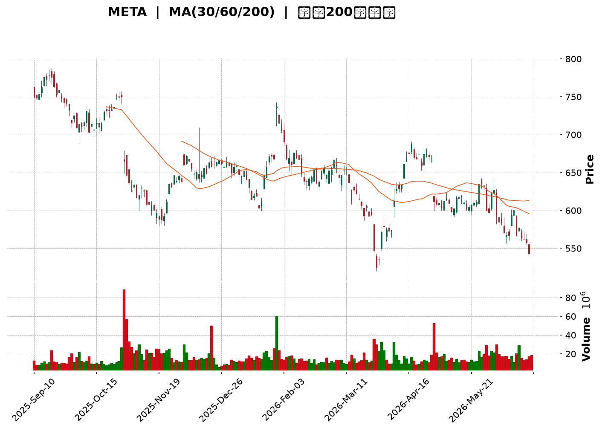
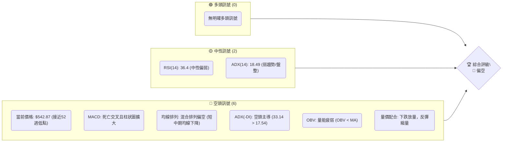
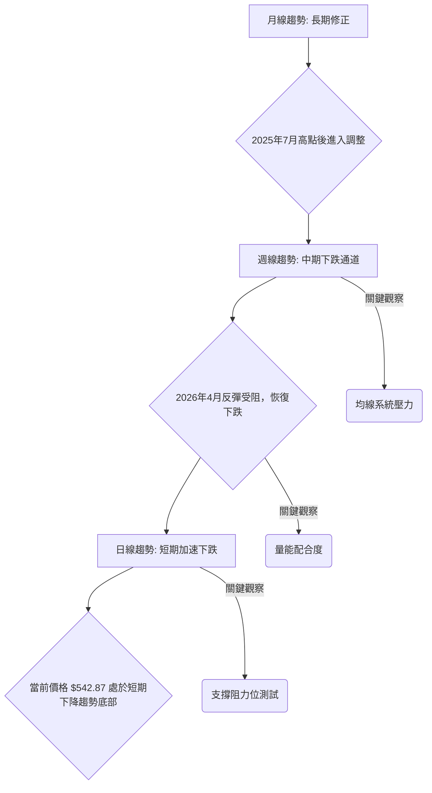
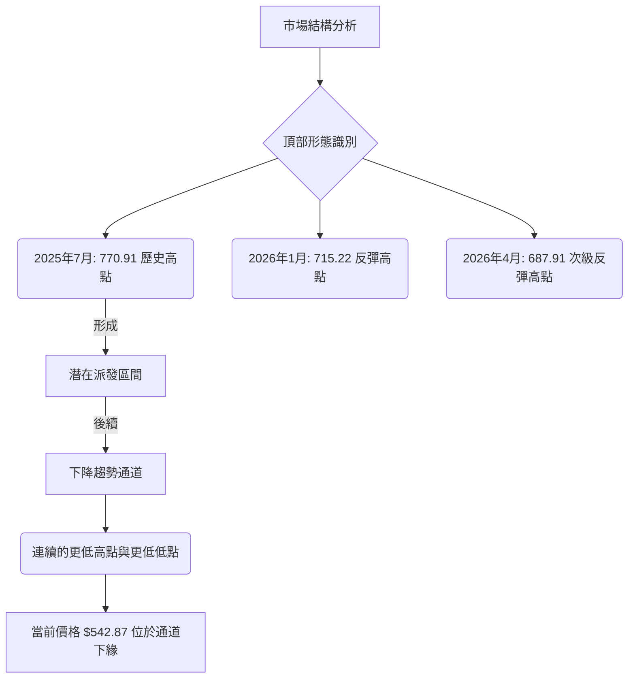
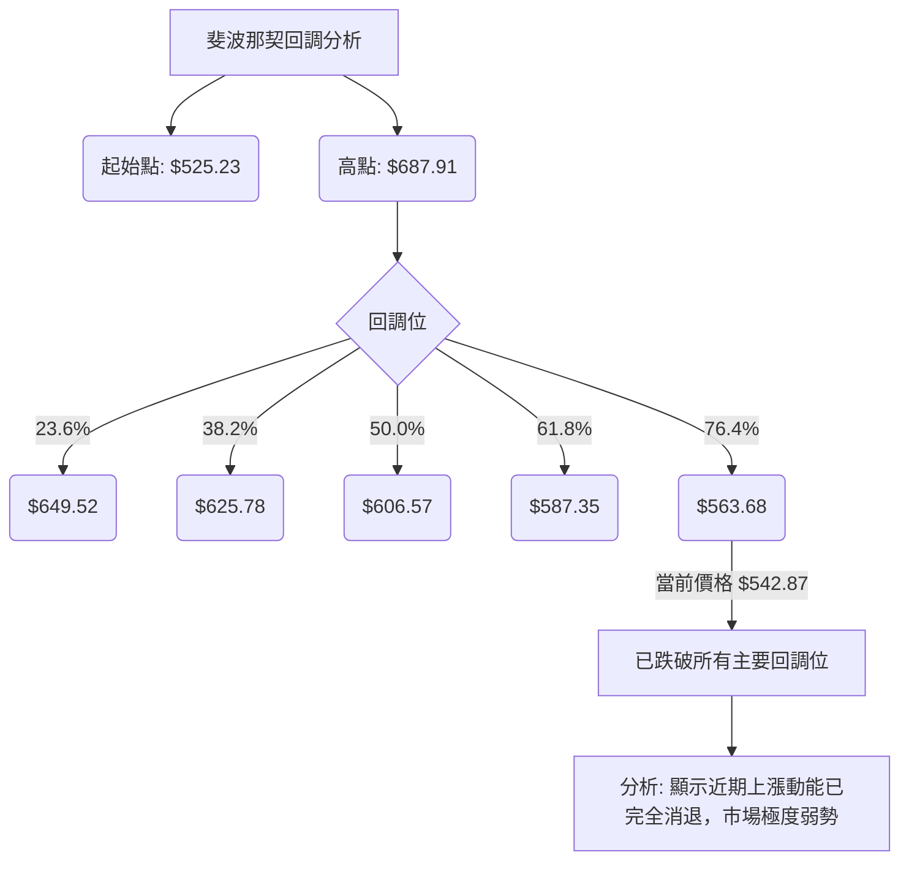
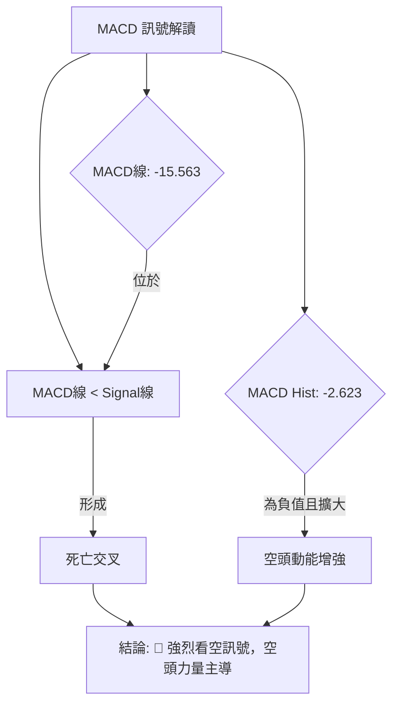
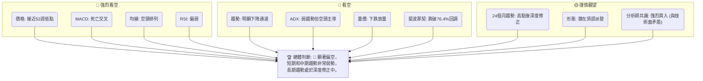
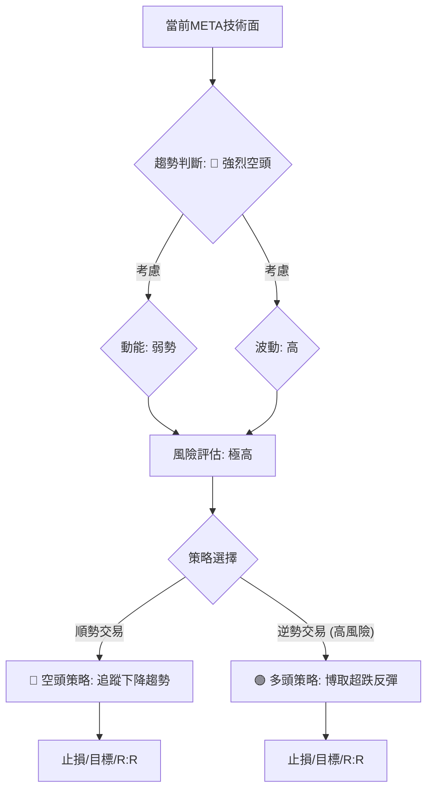
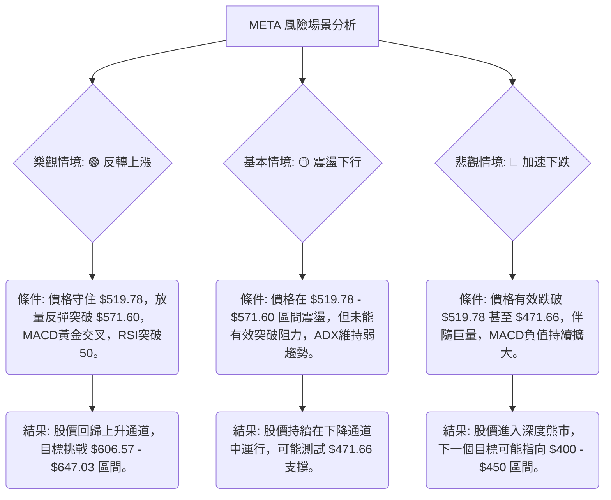

<details>
<summary>📊 靜態圖表 (點擊展開)</summary>

</details>

<html>
<head><meta charset="utf-8" /></head>
<body>
    <div style="height:500px; width:100%;">                        <script>window.PlotlyConfig = {MathJaxConfig: 'local'};</script>
        <script charset="utf-8" src="https://cdn.plot.ly/plotly-3.6.0.min.js" integrity="sha256-QaOVwtVY0T02VaHrr6pnoHLCwayMJp4O5n4YyaE3rJk=" crossorigin="anonymous"></script>                <div id="candlestick-chart" class="plotly-graph-div" style="height:100%; width:100%;"></div>            <script>                window.PLOTLYENV=window.PLOTLYENV || {};                                if (document.getElementById("candlestick-chart")) {                    Plotly.newPlot(                        "candlestick-chart",                        [{"close":{"dtype":"f8","bdata":"AAAAADBsh0AAAABgk2OHQAAAACD5iIdAAAAAYJ3Rh0AAAAAgpEOIQAAAAKB8KYhAAAAA4JtNiEAAAACAsj6IQAAAAKBm2YdAAAAAAIaLh0AAAACAfrWHQAAAAOC8V4dAAAAAoJAuh0AAAADAxSuHQAAAAMDM44ZAAAAAQNVbhkAAAADAT6mGQAAAAOC7JYZAAAAAoG1OhkAAAACA1zmGQAAAAMDSX4ZAAAAAoNvchkAAAABgw\u002fuFQAAAAEC\u002fToZAAAAAYH4WhkAAAABAgl2GQAAAAGDIMYZAAAAAYHtYhkAAAABgKtKGQAAAAGDx2oZAAAAAQA\u002fchkAAAACAxOCGQAAAAKCOA4dAAAAAYPpmh0AAAAAA7WuHQAAAAMDCbYdAAAAA4O3FhEAAAABAWDWEQAAAAEBy4INAAAAAoIqNg0AAAAAAZ9KDQAAAAOCsSoNAAAAAIMdgg0AAAABA+LCDQAAAAICgi4NAAAAAAHH7gkAAAACgdgKDQAAAAEAI\u002f4JAAAAAIJbDgkAAAADgHaGCQAAAACBPZoJAAAAAQPlcgkAAAAAAq4WCQAAAAICtG4NAAAAAYI7Ug0AAAAAgu7+DQAAAAEAnMoRAAAAAAKn5g0AAAADgXiuEQAAAAMCG74NAAAAAIIOehEAAAACAYv2EQAAAAOCPyIRAAAAAAAx6hEAAAABAjEOEQAAAAGAiWIRAAAAAgHgUhEAAAABA2zKEQAAAAODWf4RAAAAAgL9ChEAAAACAIrqEQAAAAKDGjIRAAAAAwJOihEAAAABADL6EQAAAAADk0oRAAAAAIN+whEAAAAAgI4yEQAAAACAdxoRAAAAAIFGXhEAAAADAA0qEQAAAAIDvjIRAAAAAoIybhEAAAACARzyEQAAAAOBGJ4RAAAAAYC1fhEAAAABgnQaEQAAAAAC7r4NAAAAAYGQzg0AAAACAjl2DQAAAACAqWYNAAAAAwFrYgkAAAADg8h6DQAAAAIDQM4RAAAAAQLKMhEAAAABATfmEQAAAAGAs\u002foRAAAAAQFDchEAAAACA9geHQAAAACDLWYZAAAAAgDcJhkAAAAAgv5OFQAAAAABk3oRAAAAAICLohEAAAAAAQqKEQAAAAOAcIIVAAAAAgDTshEAAAACg\u002ftuEQAAAAEA5RYRAAAAA4Av1g0AAAACgNvGDQAAAAOCYEIRAAAAAIA4dhEAAAADA8HOEQAAAAEDs4INAAAAAIEvxg0AAAABANWSEQAAAAKC4foRAAAAA4DQ4hEAAAACAK2OEQAAAAABPb4RAAAAAAFTUhEAAAACAJpuEQAAAAKCxHYRAAAAA4OUxhEAAAABAPmeEQAAAAECNbYRAAAAAgFnog0AAAAAA8CSDQAAAAMDzloNAAAAA4Kpwg0AAAAAg4TiDQAAAACAb8YJAAAAA4OGIgkAAAABgAdyCQAAAAMD3goJAAAAAoLaSgkAAAACAQxiBQAAAAIDdaYBAAAAAIBG\u002fgEAAAABAzdyBQAAAAKCMFYJAAAAAwGzvgUAAAABg6uOBQAAAAOAj9IFAAAAAwNIeg0AAAAAgd56DQAAAAMA2qoNAAAAAQIrPg0AAAAAgA6+EQAAAAGCq94RAAAAAIPIhhUAAAACgTH+FQAAAAGBP8oRAAAAAAMThhEAAAAAAwxCFQAAAAEBRlIRAAAAAYD0ThUAAAADg7i+FQAAAAEC\u002f9YRAAAAA4ADkhEAAAABAvxqDQAAAAKB9AYNAAAAAIMIOg0AAAADgMuOCQAAAAACAIoNAAAAAIOlBg0AAAAAghgiDQAAAAKBxsoJAAAAAgIjTgkAAAADgeECDQAAAAODbToNAAAAAQEotg0AAAAAAJxWDQAAAAIBq0IJAAAAAgP\u002fjgkAAAABgivaCQAAAAECPDYNAAAAAIC8eg0AAAADgX9WDQAAAACCd1YNAAAAAAGW\u002fg0AAAADAT7+CQAAAAOCcqIJAAAAAoDlzg0AAAABA6ZeDQAAAAICbg4JAAAAAoMhGgkAAAADAY0CCQAAAAECc04FAAAAAoDq\u002fgUAAAADAo7OBQAAAAADXi4JAAAAAIK7BgkAAAADgo7yBQAAAAIDCCYJAAAAAwMyegUAAAACgmZGBQAAAACBcbYFAAAAAwPX2gEAAAAAAAAD4fw=="},"high":{"dtype":"f8","bdata":"BLtW1ZbZh0A3vPdkA5WHQLIGxeDCmIdAGI5Lb1QciEBNX+mVdVaIQDA\u002fiFrZZYhAKohsTqCRiECk3nSHu6GIQNXWL7iIfYhAUOoZv84EiEDuI\u002fe7FbmHQEQ75H10lodALFejytVvh0DOmLfKqGaHQHMSVF1XKIdAB7oOqtF\u002fhkAsl7aMDq+GQJzxfWjUyIZAGnO7xClYhkCHTY7UFmWGQL+\u002fVgJEboZAAAAAoNvchkCvfrzH5uqGQFUYSDmUcIZAZCif14xNhkCHp6FjLZCGQF2MNDTdnIZAmNO9hGhlhkDdXOW\u002f7t6GQLso\u002fpasBIdAGFNCLW4Vh0Bn4xFy3yOHQIYY3VtMGodAWh7CzlCOh0CMDiImdqOHQGVFSXWGqYdAWRODhYw5hUDBZRJAHQmFQEl\u002fdCT1jIRAKlUpJJoAhEDWSOMCgwSEQHYveh3N0oNAN2zLBCFkg0BpnZSJ0sqDQKTINlNqn4NAfzIZ2t2ag0BXtRzmYUCDQLAqoVS0IINAU1dmUtMQg0BpsMiowNCCQMevAQJJjoJAtujMJyvpgkBwfrowjKSCQDQv5VvNOINAQ5ob1y3bg0AxptzjoeWDQCQUB3jzMoRA7G7B+yodhEAEzrnIgzGEQCxniZtVOYRAPDzk+MQShUBV8rvAhAeFQMqv4PmiF4VAXZXI7Ay2hEAAG+A6f2aEQO9pjxikbIRAnEIGyD4phkB7RNi6sl6EQFRNS9jhqoRAn+OPuWughEA9hNB37eqEQBGudAZx7oRArnTVkgsDhUA4C2tCg8aEQPXI2fPr14RARZcyPBLehEDt765PmJiEQMEUsiIv+IRA1kUU2Ia+hEBa5rjkp7mEQBNuIojauoRAPRN6Aa7ChECUIcx6z4+EQIQkHvWUL4RASMmTO0VuhEDwXRWdcWaEQC939NoCCYRAJCQY2aWag0AvHev1d3iDQGxbqMytn4NAsOXTs30Sg0B+w+RiWkmDQLTNmW8mm4RAjYDJD23KhEBsedzZnhCFQBo3xTXrHIVAi2FaPMkjhUCytBvgZjWHQHcEIBvu1oZA6ecG8x+AhkDYqlY8yV2GQCsBCwfUfIVAsUNr1EpChUCjr8f5WPaEQNOYmwq\u002fUIVARThsCYE7hUCjmATrezCFQEnskd5eFoVAjRtr+ihShEChy\u002f9tpQuEQCOFP+LPHoRA9ZAa9kwwhEC3t1HVWbGEQElZr007hIRASERUZr\u002f\u002fg0AsFJ6uuWWEQAj8MJOVnoRAfwWyx0RChEAHpNF7HpaEQNiDKo\u002fujoRAC87dnpP8hEAGlC7PC+yEQORkTBCCQoRAxaztz8U0hECLJyWI\u002fpiEQPPrLDeSj4RAtqKzArFihECNg5KeZaCDQGWmE0hM0YNAC9oNSa\u002ffg0DGR2uIlnCDQCQxnY11I4NAOmnY1zTbgkCoupOQnACDQA3cdU2Mw4JAaXqbWePYgkADMpdgrjOCQJjibdfF+IBAhUUkPWfYgEA3Y6UqRemBQJw64L0CgIJA2dS79rYPgkDfeR25ADKCQAKTniiU9YFAFOauAe+qg0Aup38ZR+eDQE1\u002fftbo74NAQWna20vTg0Cv2bH5JM2EQKViuGD5LoVAQR1M554nhUBxsiGeCZeFQLc1X1r6VYVAkGDsSpcchUAQwi\u002fPAy6FQNhZOyKF54RAy7LtTVFAhUDo323E8U6FQAj5WodqLIVA8oGUZQENhUAMUANsM2KDQBPEWap0UoNAHP89sXMrg0DsfF2xPy6DQE\u002fZtfcBW4NAoPqKwTWDg0Do8ptVl0GDQDm2\u002f4bM4oJAAYfmE4fZgkB6o3qsm1qDQJE\u002fDzM4eYNAHo9rqP9kg0CH0I3xKDiDQCs\u002fkmjkKoNAmJbEDH\u002f7gkDGFDeqSAiDQFBIK\u002f\u002fsMYNAeGjzNTUvg0Abcik7Re+DQEN9\u002fqA8E4RAynHluUzPg0CbnQZYStmDQJTdOYqHAoNAIX79p5N8g0Au7FYAcQ6EQCAl9jKKpINAphIFV517gkAt7lLlnKiCQIX33g0udoJAHB1ECB\u002fdgUDgXN7iSvyBQAAAAAApyoJAAAAA4HrugkAAAADgeo6CQAAAAIDCIYJAAAAA4Hr+gUAAAACgmeGBQAAAAOBRyIFAAAAAYLhigUAAAAAAAAD4fw=="},"hovertemplate":"\u003cb\u003e%{x|%Y-%m-%d}\u003c\u002fb\u003e\u003cbr\u003e\u958b: $%{open:.2f}\u003cbr\u003e\u9ad8: $%{high:.2f}\u003cbr\u003e\u4f4e: $%{low:.2f}\u003cbr\u003e\u6536: $%{close:.2f}\u003cextra\u003e\u003c\u002fextra\u003e","low":{"dtype":"f8","bdata":"UT9wjl9kh0DJplXNZk+HQMJl+WWkKodATWdsSURsh0C\u002ftGffzdSHQBan2vRz3odAb3yvOKsWiEAqelbcavWHQPltbCrl04dAGyMZIfloh0BBhwyRn3SHQA6\u002f08nyNIdA\u002fwx7YH\u002f7hkCdM0ZU3AmHQAtYH81To4ZAtI8Sb9wihkCPVxp2N2KGQPnB06SzIoZAliB1HMCFhUB\u002fUS+RWv+FQItwMonKD4ZAaMn3L7w0hkDromWydfWFQFwmOjJvDoZAo8fJgyDMhUCMD8YWWx2GQEnMx8Ju8IVAGehqYE4ChkCvEMuSfnKGQLW3bWPgtoZAvv8p9TaRhkCDixIIltmGQJYLxO0GyoZAWqjabY5Qh0Cw32BTsDyHQLSl9smrJIdAIAIBGN5DhEBsTemkKR+EQJNe3eA81INAESSotRaDg0D3zS0+UYeDQO1PdL4sQ4NAqtQClx+9gkCN0yuEDUSDQBk5cTpEToNAb+x0FozxgkA86al6fMuCQHDpUoI\u002fjYJAFCEi\u002fteOgkAfmLElIDKCQITs5e\u002fvHYJAUKVrkLEugkD6jKsSziKCQGmgekujoIJAh0GqdJFFg0BOvNSk7q+DQLQ\u002ftcTPzoNAgEG9Rdjgg0BMw1B5UeODQJMIFkQr34NA3MTa3LOShEACEBm5X6WEQMhD2xDCuoRAXXw6eyldhECLEEMB2Q2EQEEptuYZ+YNAfqNBm6Dng0CnZoiAgOyDQIsh0B5wEIRA+ikNOFpAhEC9B1QjVHqEQArZ1GYQiIRAxBikr9h7hEBpz5WFn4iEQPUcisIqqIRAVwQGzyOhhEBzdzNuzGmEQMmSDnNZhYRAr9rbPiCShEC5wuhS1RKEQNYASOLFNIRAclS37OlVhECMXUVmSx2EQIAECjW01INAhkGQe6QNhEAHYNaStACEQJQGit3od4NAwp2ATc0tg0DId3kVFymDQM5nsJ7OV4NA31UqBnS3gkDh7waYF7iCQC9jrH95i4NA5dTkjmsahEC9oOc+5qCEQHrI283Pu4RAtQVZl0\u002fHhEDpOTbwPzqGQK+1ohyOQoZAvmn+aSPyhUCeAbJqgGmFQG91PzQs0oRAxqhg77BihEBiGeJtyiqEQDBjwB7bjIRA4tY6RMfkhEBVmeCDcH+EQE\u002fA6GQMIYRAJeinNoXLg0BRtMdgcZ2DQHhamJRAmINAqRCwhLDcg0BtJpEtJO2DQPCT487w1oNAKLPxYeGeg0CL0tb++AeEQDBP9c3GMoRAwLSwr97ng0Dletch9sqDQOXJ5Lie7YNAyFqFz\u002f2DhECa+S5qN0mEQMMtqIjR14NAwQneyE+Ng0BHF\u002f1cwT6EQG4s6fOkOYRASDnbyiDeg0DoYs9rtwODQPSpzx8vdINAyQMEsv5og0DQjG7HUzCDQNN0cGuezYJAPgy4Z6ZVgkAMYpOTpLOCQOkOFESfc4JAfqhX882GgkBK+jFSxvaAQKk1wto5PoBA3KTqnWeAgEDEZt4XHBKBQInbPUJP6oFAGk12PXR5gUDrsSxPw9uBQGrPcoPloYFACZjTi0F6gkBsFJ6YYnODQOhnwdwDfoNAZuuZNZN+g0AsZYQ4OfaDQCsr6PTWvIRA7D2Xqw3ZhEC+8AfzCRSFQE2NqEQN24RAd8kRXbLVhEDbbr3sCemEQENHaPGPY4RANthFb+BphEBZoNRAwPGEQNlHFfQbyIRA+KXMEZC5hEDZvMc1jruCQHLqmuFj7IJAu2F9BonRgkDl0Dm5br6CQFzVSYderIJAng6RU8Yng0CNBjKF\u002feuCQCDao7o1rIJArbjb+GiAgkBvVQAf3KCCQCYxIcFxM4NAs99jdPcFg0CX0uNCDNmCQCG4DIjzv4JAoC6IPw2qgkB0N63WEpKCQAXw3aYa84JAVcHPeerlgkB9hMwrfQODQHgpHnfRpYNAQUkHny52g0DKKVSIzLeCQNbuOA0FoYJAhF7IsLa9gkAKYl4\u002f1G6DQETCNEL2MoJA21hmE3gVgkDCxAiqxiOCQO97ebiS0IFA4FhOKPRjgUBmdMSHC4OBQAAAAGBmGoJAAAAAAACAgkAAAAAghbGBQAAAAMDMmIFAAAAA4Hp+gUAAAAAAKYiBQAAAAGBmXIFAAAAAoHDhgEAAAAAAAAD4fw=="},"name":"\u50f9\u683c","open":{"dtype":"f8","bdata":"KfyaRQvVh0A1yyVJeoGHQAgSnKVFUodACnVxn\u002faXh0Dwjx5p9OOHQIQljw6JS4hAz3mjh5hRiEAy\u002fWKVzn6IQP92GxWTXohAKFwnKwn6h0BwnrCpR5yHQE4kSsH2e4dAbCKQa29gh0AAoIe8OFaHQKDlg7CYIodASqarU\u002fJ8hkA7R27\u002fpIWGQCFmwu\u002flvYZAcRFfv+L6hUBQJ2953V6GQJ6Fk1LLPIZATkFSiVVjhkBBKu8DMciGQOQdnWpIOYZAclE\u002fP40PhkDTS2lamVmGQC9m+UKCXYZAm8a\u002fZvcJhkCITCW1jXqGQOiI4MPi8IZAc3O4RGnfhkD17\u002fNnWuaGQET0QZcH94ZA9VCJykdeh0B1X47Na3WHQLbRCkNWhodAq6IfY1DbhEDWTeYEFQaFQCEcVfVicoRAjYrOTEmTg0DHOaCWW7WDQCbFhKma0YNAb1KZOyA3g0Di+y6vn6uDQJCO0bz3koNAxCC6KwGUg0Dt8Rhb1huDQFhYpL\u002fUwYJAPJ+nJq77gkBDWX7ahXCCQLi1yi9wgYJAbzsow3nPgkCRuR2MyVeCQD+oGsFVqYJAqdAszAxzg0Cp4g5TSeCDQL1A2o9w04NAaQxHoyDvg0DXItPJYwWEQGGUKRLoFYRA67PbwPgRhUBo0XdrOLKEQC7HbGHU3IRAhFhWsmKwhEBImM2UHEKEQCUoGiz4DIRAQkG6SOpAhED8BLf5ZiSEQNefw2bVEoRA0E8ReIpzhEA5ri1v4X6EQDAMOdrdyYRARkXyc8ajhECwsitV\u002f5aEQGafcm7NqoRA+zANu\u002fbWhEB0gcz6tIaEQEF2kBkjjIRAvEd6wYe8hEAU3HgyZqyEQHwA7X7OToRAFRo9FCqThEBGjabHx3OEQPC1COjWJYRATQKlaVMihECT9WDd8VqEQC939NoCCYRAY4GLVROLg0DYwduVB0uDQKOpHmuMeINAquDkiWH2gkCzYKnuRu2CQDlEsKnVoYNAx9UnxPkchEBK3d+dkL+EQOW2lVccC4VAjwkqNWQKhUAx6oZ17wCHQKUE1gKjsYZAqdcAwp5KhkCukcEa4hCGQP5\u002f8SkLdIVAJSdWDTCzhECQ2NWtcMKEQDycITP+r4RA10PpqCUjhUDwJNkiZgaFQKHX2Fs35oRA6skHMJwfhED+3u\u002f74\u002fKDQHTlDRpfxYNASRqJpXbrg0Dlexl8aPSDQEtyol4GW4RAST95Tp+\u002fg0BTrrpSFguEQPGHrQ4iS4RAYPfBH28ShEAPFJIONOCDQC+63MIVOYRAHjHBwE6GhED3YWTKAqaEQN9P8In4NYRAWllOnDLNg0DZnRucK2OEQB9mVN3AbIRAxk7ZVMI8hEC+FvR\u002fO3aDQHVaHn9Ru4NAt0yHpESbg0DzoJafJz6DQAALPmqqHINAH8uVCMXXgkAMJSkY1emCQO+C2adctIJA0uH1EnyxgkCAszHYmi+CQBVJpXrM3IBAAAAAIBG\u002fgEAo33sBxCuBQHSOFiu+HIJAHhmidyCsgUDQx+2kPQmCQKyYp1+Z34FAUMu2zILrgkAtmV6RHZODQEqN40EPz4NAeqzSSVang0Bb4WSr\u002fhSEQDokWi8P04RA9Ow5i+kahUAwwnTexS+FQNep\u002fy7VRYVAQQBkhwfzhEC+gcJu4g2FQOTAGf+uuIRAyhZjJaudhEDvsSuTB\u002fOEQHWVIuDsDIVAKCT1JVPihEDULb\u002fy+FWDQGY7Z3z3MINAj3QITwT7gkDD9EDK7yWDQHD2I4\u002fyw4JAULOwtjQxg0B1KdTvCjWDQHaHCewU4IJA7LwbYyeSgkC5Z35BNLKCQDAHq9tvO4NA0qOANF8rg0AbqosbXgSDQOQSvWjZAoNAQsxwR6HBgkAuvfQejruCQEXaZIOJ+oJAtSHrCpwCg0Du4ZuprwaDQKEcJkRD94NA4L5gn07Hg0Crvl29h66DQPQJZ3xz1YJAK1t8g4jTgkBNLGFlvXiDQHO0LN0Pd4NAphIFV517gkAbnRI4n3OCQLcR1cKJIYJAtzBEznKqgUDclJkNW+OBQAAAAEAzH4JAAAAAQDONgkAAAAAAAICCQAAAAGCP5oFAAAAAACnggUAAAAAAAJKBQAAAAMAej4FAAAAAYGZcgUAAAAAAAAD4fw=="},"x":["2025-09-10T00:00:00-04:00","2025-09-11T00:00:00-04:00","2025-09-12T00:00:00-04:00","2025-09-15T00:00:00-04:00","2025-09-16T00:00:00-04:00","2025-09-17T00:00:00-04:00","2025-09-18T00:00:00-04:00","2025-09-19T00:00:00-04:00","2025-09-22T00:00:00-04:00","2025-09-23T00:00:00-04:00","2025-09-24T00:00:00-04:00","2025-09-25T00:00:00-04:00","2025-09-26T00:00:00-04:00","2025-09-29T00:00:00-04:00","2025-09-30T00:00:00-04:00","2025-10-01T00:00:00-04:00","2025-10-02T00:00:00-04:00","2025-10-03T00:00:00-04:00","2025-10-06T00:00:00-04:00","2025-10-07T00:00:00-04:00","2025-10-08T00:00:00-04:00","2025-10-09T00:00:00-04:00","2025-10-10T00:00:00-04:00","2025-10-13T00:00:00-04:00","2025-10-14T00:00:00-04:00","2025-10-15T00:00:00-04:00","2025-10-16T00:00:00-04:00","2025-10-17T00:00:00-04:00","2025-10-20T00:00:00-04:00","2025-10-21T00:00:00-04:00","2025-10-22T00:00:00-04:00","2025-10-23T00:00:00-04:00","2025-10-24T00:00:00-04:00","2025-10-27T00:00:00-04:00","2025-10-28T00:00:00-04:00","2025-10-29T00:00:00-04:00","2025-10-30T00:00:00-04:00","2025-10-31T00:00:00-04:00","2025-11-03T00:00:00-05:00","2025-11-04T00:00:00-05:00","2025-11-05T00:00:00-05:00","2025-11-06T00:00:00-05:00","2025-11-07T00:00:00-05:00","2025-11-10T00:00:00-05:00","2025-11-11T00:00:00-05:00","2025-11-12T00:00:00-05:00","2025-11-13T00:00:00-05:00","2025-11-14T00:00:00-05:00","2025-11-17T00:00:00-05:00","2025-11-18T00:00:00-05:00","2025-11-19T00:00:00-05:00","2025-11-20T00:00:00-05:00","2025-11-21T00:00:00-05:00","2025-11-24T00:00:00-05:00","2025-11-25T00:00:00-05:00","2025-11-26T00:00:00-05:00","2025-11-28T00:00:00-05:00","2025-12-01T00:00:00-05:00","2025-12-02T00:00:00-05:00","2025-12-03T00:00:00-05:00","2025-12-04T00:00:00-05:00","2025-12-05T00:00:00-05:00","2025-12-08T00:00:00-05:00","2025-12-09T00:00:00-05:00","2025-12-10T00:00:00-05:00","2025-12-11T00:00:00-05:00","2025-12-12T00:00:00-05:00","2025-12-15T00:00:00-05:00","2025-12-16T00:00:00-05:00","2025-12-17T00:00:00-05:00","2025-12-18T00:00:00-05:00","2025-12-19T00:00:00-05:00","2025-12-22T00:00:00-05:00","2025-12-23T00:00:00-05:00","2025-12-24T00:00:00-05:00","2025-12-26T00:00:00-05:00","2025-12-29T00:00:00-05:00","2025-12-30T00:00:00-05:00","2025-12-31T00:00:00-05:00","2026-01-02T00:00:00-05:00","2026-01-05T00:00:00-05:00","2026-01-06T00:00:00-05:00","2026-01-07T00:00:00-05:00","2026-01-08T00:00:00-05:00","2026-01-09T00:00:00-05:00","2026-01-12T00:00:00-05:00","2026-01-13T00:00:00-05:00","2026-01-14T00:00:00-05:00","2026-01-15T00:00:00-05:00","2026-01-16T00:00:00-05:00","2026-01-20T00:00:00-05:00","2026-01-21T00:00:00-05:00","2026-01-22T00:00:00-05:00","2026-01-23T00:00:00-05:00","2026-01-26T00:00:00-05:00","2026-01-27T00:00:00-05:00","2026-01-28T00:00:00-05:00","2026-01-29T00:00:00-05:00","2026-01-30T00:00:00-05:00","2026-02-02T00:00:00-05:00","2026-02-03T00:00:00-05:00","2026-02-04T00:00:00-05:00","2026-02-05T00:00:00-05:00","2026-02-06T00:00:00-05:00","2026-02-09T00:00:00-05:00","2026-02-10T00:00:00-05:00","2026-02-11T00:00:00-05:00","2026-02-12T00:00:00-05:00","2026-02-13T00:00:00-05:00","2026-02-17T00:00:00-05:00","2026-02-18T00:00:00-05:00","2026-02-19T00:00:00-05:00","2026-02-20T00:00:00-05:00","2026-02-23T00:00:00-05:00","2026-02-24T00:00:00-05:00","2026-02-25T00:00:00-05:00","2026-02-26T00:00:00-05:00","2026-02-27T00:00:00-05:00","2026-03-02T00:00:00-05:00","2026-03-03T00:00:00-05:00","2026-03-04T00:00:00-05:00","2026-03-05T00:00:00-05:00","2026-03-06T00:00:00-05:00","2026-03-09T00:00:00-04:00","2026-03-10T00:00:00-04:00","2026-03-11T00:00:00-04:00","2026-03-12T00:00:00-04:00","2026-03-13T00:00:00-04:00","2026-03-16T00:00:00-04:00","2026-03-17T00:00:00-04:00","2026-03-18T00:00:00-04:00","2026-03-19T00:00:00-04:00","2026-03-20T00:00:00-04:00","2026-03-23T00:00:00-04:00","2026-03-24T00:00:00-04:00","2026-03-25T00:00:00-04:00","2026-03-26T00:00:00-04:00","2026-03-27T00:00:00-04:00","2026-03-30T00:00:00-04:00","2026-03-31T00:00:00-04:00","2026-04-01T00:00:00-04:00","2026-04-02T00:00:00-04:00","2026-04-06T00:00:00-04:00","2026-04-07T00:00:00-04:00","2026-04-08T00:00:00-04:00","2026-04-09T00:00:00-04:00","2026-04-10T00:00:00-04:00","2026-04-13T00:00:00-04:00","2026-04-14T00:00:00-04:00","2026-04-15T00:00:00-04:00","2026-04-16T00:00:00-04:00","2026-04-17T00:00:00-04:00","2026-04-20T00:00:00-04:00","2026-04-21T00:00:00-04:00","2026-04-22T00:00:00-04:00","2026-04-23T00:00:00-04:00","2026-04-24T00:00:00-04:00","2026-04-27T00:00:00-04:00","2026-04-28T00:00:00-04:00","2026-04-29T00:00:00-04:00","2026-04-30T00:00:00-04:00","2026-05-01T00:00:00-04:00","2026-05-04T00:00:00-04:00","2026-05-05T00:00:00-04:00","2026-05-06T00:00:00-04:00","2026-05-07T00:00:00-04:00","2026-05-08T00:00:00-04:00","2026-05-11T00:00:00-04:00","2026-05-12T00:00:00-04:00","2026-05-13T00:00:00-04:00","2026-05-14T00:00:00-04:00","2026-05-15T00:00:00-04:00","2026-05-18T00:00:00-04:00","2026-05-19T00:00:00-04:00","2026-05-20T00:00:00-04:00","2026-05-21T00:00:00-04:00","2026-05-22T00:00:00-04:00","2026-05-26T00:00:00-04:00","2026-05-27T00:00:00-04:00","2026-05-28T00:00:00-04:00","2026-05-29T00:00:00-04:00","2026-06-01T00:00:00-04:00","2026-06-02T00:00:00-04:00","2026-06-03T00:00:00-04:00","2026-06-04T00:00:00-04:00","2026-06-05T00:00:00-04:00","2026-06-08T00:00:00-04:00","2026-06-09T00:00:00-04:00","2026-06-10T00:00:00-04:00","2026-06-11T00:00:00-04:00","2026-06-12T00:00:00-04:00","2026-06-15T00:00:00-04:00","2026-06-16T00:00:00-04:00","2026-06-17T00:00:00-04:00","2026-06-18T00:00:00-04:00","2026-06-22T00:00:00-04:00","2026-06-23T00:00:00-04:00","2026-06-24T00:00:00-04:00","2026-06-25T00:00:00-04:00","2026-06-26T00:00:00-04:00"],"type":"candlestick"},{"hovertemplate":"MA30: $%{y:.2f}\u003cextra\u003e\u003c\u002fextra\u003e","line":{"color":"#2196F3","dash":"dash","width":2},"mode":"lines","name":"MA30","x":["2025-09-10T00:00:00-04:00","2025-09-11T00:00:00-04:00","2025-09-12T00:00:00-04:00","2025-09-15T00:00:00-04:00","2025-09-16T00:00:00-04:00","2025-09-17T00:00:00-04:00","2025-09-18T00:00:00-04:00","2025-09-19T00:00:00-04:00","2025-09-22T00:00:00-04:00","2025-09-23T00:00:00-04:00","2025-09-24T00:00:00-04:00","2025-09-25T00:00:00-04:00","2025-09-26T00:00:00-04:00","2025-09-29T00:00:00-04:00","2025-09-30T00:00:00-04:00","2025-10-01T00:00:00-04:00","2025-10-02T00:00:00-04:00","2025-10-03T00:00:00-04:00","2025-10-06T00:00:00-04:00","2025-10-07T00:00:00-04:00","2025-10-08T00:00:00-04:00","2025-10-09T00:00:00-04:00","2025-10-10T00:00:00-04:00","2025-10-13T00:00:00-04:00","2025-10-14T00:00:00-04:00","2025-10-15T00:00:00-04:00","2025-10-16T00:00:00-04:00","2025-10-17T00:00:00-04:00","2025-10-20T00:00:00-04:00","2025-10-21T00:00:00-04:00","2025-10-22T00:00:00-04:00","2025-10-23T00:00:00-04:00","2025-10-24T00:00:00-04:00","2025-10-27T00:00:00-04:00","2025-10-28T00:00:00-04:00","2025-10-29T00:00:00-04:00","2025-10-30T00:00:00-04:00","2025-10-31T00:00:00-04:00","2025-11-03T00:00:00-05:00","2025-11-04T00:00:00-05:00","2025-11-05T00:00:00-05:00","2025-11-06T00:00:00-05:00","2025-11-07T00:00:00-05:00","2025-11-10T00:00:00-05:00","2025-11-11T00:00:00-05:00","2025-11-12T00:00:00-05:00","2025-11-13T00:00:00-05:00","2025-11-14T00:00:00-05:00","2025-11-17T00:00:00-05:00","2025-11-18T00:00:00-05:00","2025-11-19T00:00:00-05:00","2025-11-20T00:00:00-05:00","2025-11-21T00:00:00-05:00","2025-11-24T00:00:00-05:00","2025-11-25T00:00:00-05:00","2025-11-26T00:00:00-05:00","2025-11-28T00:00:00-05:00","2025-12-01T00:00:00-05:00","2025-12-02T00:00:00-05:00","2025-12-03T00:00:00-05:00","2025-12-04T00:00:00-05:00","2025-12-05T00:00:00-05:00","2025-12-08T00:00:00-05:00","2025-12-09T00:00:00-05:00","2025-12-10T00:00:00-05:00","2025-12-11T00:00:00-05:00","2025-12-12T00:00:00-05:00","2025-12-15T00:00:00-05:00","2025-12-16T00:00:00-05:00","2025-12-17T00:00:00-05:00","2025-12-18T00:00:00-05:00","2025-12-19T00:00:00-05:00","2025-12-22T00:00:00-05:00","2025-12-23T00:00:00-05:00","2025-12-24T00:00:00-05:00","2025-12-26T00:00:00-05:00","2025-12-29T00:00:00-05:00","2025-12-30T00:00:00-05:00","2025-12-31T00:00:00-05:00","2026-01-02T00:00:00-05:00","2026-01-05T00:00:00-05:00","2026-01-06T00:00:00-05:00","2026-01-07T00:00:00-05:00","2026-01-08T00:00:00-05:00","2026-01-09T00:00:00-05:00","2026-01-12T00:00:00-05:00","2026-01-13T00:00:00-05:00","2026-01-14T00:00:00-05:00","2026-01-15T00:00:00-05:00","2026-01-16T00:00:00-05:00","2026-01-20T00:00:00-05:00","2026-01-21T00:00:00-05:00","2026-01-22T00:00:00-05:00","2026-01-23T00:00:00-05:00","2026-01-26T00:00:00-05:00","2026-01-27T00:00:00-05:00","2026-01-28T00:00:00-05:00","2026-01-29T00:00:00-05:00","2026-01-30T00:00:00-05:00","2026-02-02T00:00:00-05:00","2026-02-03T00:00:00-05:00","2026-02-04T00:00:00-05:00","2026-02-05T00:00:00-05:00","2026-02-06T00:00:00-05:00","2026-02-09T00:00:00-05:00","2026-02-10T00:00:00-05:00","2026-02-11T00:00:00-05:00","2026-02-12T00:00:00-05:00","2026-02-13T00:00:00-05:00","2026-02-17T00:00:00-05:00","2026-02-18T00:00:00-05:00","2026-02-19T00:00:00-05:00","2026-02-20T00:00:00-05:00","2026-02-23T00:00:00-05:00","2026-02-24T00:00:00-05:00","2026-02-25T00:00:00-05:00","2026-02-26T00:00:00-05:00","2026-02-27T00:00:00-05:00","2026-03-02T00:00:00-05:00","2026-03-03T00:00:00-05:00","2026-03-04T00:00:00-05:00","2026-03-05T00:00:00-05:00","2026-03-06T00:00:00-05:00","2026-03-09T00:00:00-04:00","2026-03-10T00:00:00-04:00","2026-03-11T00:00:00-04:00","2026-03-12T00:00:00-04:00","2026-03-13T00:00:00-04:00","2026-03-16T00:00:00-04:00","2026-03-17T00:00:00-04:00","2026-03-18T00:00:00-04:00","2026-03-19T00:00:00-04:00","2026-03-20T00:00:00-04:00","2026-03-23T00:00:00-04:00","2026-03-24T00:00:00-04:00","2026-03-25T00:00:00-04:00","2026-03-26T00:00:00-04:00","2026-03-27T00:00:00-04:00","2026-03-30T00:00:00-04:00","2026-03-31T00:00:00-04:00","2026-04-01T00:00:00-04:00","2026-04-02T00:00:00-04:00","2026-04-06T00:00:00-04:00","2026-04-07T00:00:00-04:00","2026-04-08T00:00:00-04:00","2026-04-09T00:00:00-04:00","2026-04-10T00:00:00-04:00","2026-04-13T00:00:00-04:00","2026-04-14T00:00:00-04:00","2026-04-15T00:00:00-04:00","2026-04-16T00:00:00-04:00","2026-04-17T00:00:00-04:00","2026-04-20T00:00:00-04:00","2026-04-21T00:00:00-04:00","2026-04-22T00:00:00-04:00","2026-04-23T00:00:00-04:00","2026-04-24T00:00:00-04:00","2026-04-27T00:00:00-04:00","2026-04-28T00:00:00-04:00","2026-04-29T00:00:00-04:00","2026-04-30T00:00:00-04:00","2026-05-01T00:00:00-04:00","2026-05-04T00:00:00-04:00","2026-05-05T00:00:00-04:00","2026-05-06T00:00:00-04:00","2026-05-07T00:00:00-04:00","2026-05-08T00:00:00-04:00","2026-05-11T00:00:00-04:00","2026-05-12T00:00:00-04:00","2026-05-13T00:00:00-04:00","2026-05-14T00:00:00-04:00","2026-05-15T00:00:00-04:00","2026-05-18T00:00:00-04:00","2026-05-19T00:00:00-04:00","2026-05-20T00:00:00-04:00","2026-05-21T00:00:00-04:00","2026-05-22T00:00:00-04:00","2026-05-26T00:00:00-04:00","2026-05-27T00:00:00-04:00","2026-05-28T00:00:00-04:00","2026-05-29T00:00:00-04:00","2026-06-01T00:00:00-04:00","2026-06-02T00:00:00-04:00","2026-06-03T00:00:00-04:00","2026-06-04T00:00:00-04:00","2026-06-05T00:00:00-04:00","2026-06-08T00:00:00-04:00","2026-06-09T00:00:00-04:00","2026-06-10T00:00:00-04:00","2026-06-11T00:00:00-04:00","2026-06-12T00:00:00-04:00","2026-06-15T00:00:00-04:00","2026-06-16T00:00:00-04:00","2026-06-17T00:00:00-04:00","2026-06-18T00:00:00-04:00","2026-06-22T00:00:00-04:00","2026-06-23T00:00:00-04:00","2026-06-24T00:00:00-04:00","2026-06-25T00:00:00-04:00","2026-06-26T00:00:00-04:00"],"y":{"dtype":"f8","bdata":"AAAAAAAA+H8AAAAAAAD4fwAAAAAAAPh\u002fAAAAAAAA+H8AAAAAAAD4fwAAAAAAAPh\u002fAAAAAAAA+H8AAAAAAAD4fwAAAAAAAPh\u002fAAAAAAAA+H8AAAAAAAD4fwAAAAAAAPh\u002fAAAAAAAA+H8AAAAAAAD4fwAAAAAAAPh\u002fAAAAAAAA+H8AAAAAAAD4fwAAAAAAAPh\u002fAAAAAAAA+H8AAAAAAAD4fwAAAAAAAPh\u002fAAAAAAAA+H8AAAAAAAD4fwAAAAAAAPh\u002fAAAAAAAA+H8AAAAAAAD4fwAAAAAAAPh\u002fAAAAAAAA+H8AAAAAAAD4fxEREXExBodAzczMjGMBh0AiIiJSB\u002f2GQGZmZtaU+IZA7+7u3gb1hkCamZkZ1u2GQLy7uyuU54ZAVVVVxXTJhkBERETUAqeGQBEREdEchYZAd3d35wtjhkBERER04EGGQKuqqtpOH4ZARERENNn+hUAAAACwJ+GFQN7d3a2dxIVAmpmZic2nhUCrqqoqpIiFQAAAAFDAbYVA3t3d7YVPhUAzMzMT1TCFQJqZmUnqDoVAAAAA4ITohEB3d3eH+8qEQDMzMyOur4RAd3d3Z2qchEB3d3f3FoaEQAAAABAJdYRAmpmZ2c5ghEB3d3d3LkqEQDMzM4NEMYRA3t3dPSYehEAAAABgCQ6EQCIiIuIA+4NAERERAQrig0CJiIjYF8eDQDMzM7PFrINAMzMzY9umg0B3d3cnxqaDQO\u002fu7k4WrINAq6qqmiCyg0De3d0N2rmDQFVVVaWWxINAq6qqqlDPg0DNzMzMSNiDQDMzM3Mx44NAAAAAMMbxg0CamZmJ5f6DQGZmZuYQDoRAMzMzM6gdhEDv7u7+0SuEQM3MzKwsPoRAiYiIuFNRhECamZmJ8l+EQM3MzAzeaIRAMzMz83xthEAzMzPT2W+EQCIiIuKAa4RA7+7u\u002fuRkhEB3d3e3CF6EQBEREaEFWYRAZmZmJuJJhEDv7u5+7zmEQO\u002fu7i76NIRAMzMzU5k1hECrqqpKqDuEQImIiCgxQYRAvLu7e9pHhEDv7u4OBmCEQHd3d3fSb4RAmpmZmfh+hEDe3d2NOYaEQAAAAADyiIRAvLu7i0OLhEB3d3dnVoqEQN7d3V3pjIRA3t3dreOOhEAREREhjZGEQERERERBjYRA7+7ujtiHhECamZnJ4oSEQERERMS9gIRAmpmZWYZ8hEAzMzNTYX6EQImIiPgIfIRAvLu7S194hEBVVVX1fXuEQHd3d0dkgoRAVVVV5RWLhEBERERUzpOEQDMzM9MTnYRAiYiIiAKuhEC8u7vrrrqEQImIiCjyuYRAiYiIWOu2hECrqqr6DLKEQAAAAOA6rYRAzczMDBmlhECrqqoq7oOEQERERHRebIRAIiIiojdWhECrqqoqH0KEQN7d3c2tMYRA3t3d7W8dhEBERESkSw6EQKuqqpr994NAAAAA4PDjg0CamZkJ0cODQERERJTnooNAq6qqWoGHg0C8u7sbwnWDQM3MzEzbZINAq6qq2kRSg0BmZmbGZjyDQCIiIrL5K4NA7+7urvUkg0B3d3dHXh6DQCIiIuJIF4NAq6qqussTg0CrqqrqUhaDQO\u002fu7n7eGoNAVVVV1XQdg0BERES0DyWDQHd3dwcmLINARERExAIyg0AzMzNTqTeDQAAAACD0OINAd3d3p+pCg0DNzMyMWVSDQAAAAAALYINAvLu7u2tsg0CrqqqaamuDQLy7u2v2a4NARERE1Gxwg0BmZmY2qnCDQN7d3Y37dYNAIiIiktJ7g0AzMzNTXYyDQKuqqrrZn4NAERERcZmxg0Dv7u5+dL2DQCIiIhLmx4NAVVVVhX7Sg0BVVVU1q9yDQFVVVeUC5INAvLu76wzig0BmZmb2c9yDQN7d3S0714NA3t3dvVHRg0ARERGREMqDQFVVVXVlwINARERE9JO0g0B3d3eXHJ2DQERERKSWiYNARERE1F59g0CamZkJz3CDQBEREWEvX4NA7+7unk1Hg0AzMzNzQC6DQM3MzIyDE4NAREREJLD4gkAiIiLCt+yCQN7d3c3L6IJAIiIiEjrmgkARERGBaNyCQKuqqtoM04JAERERcRTFgkB3d3cXlbiCQKuqqgq\u002frYJAiYiISNydgkAAAAAAAAD4fw=="},"type":"scatter"},{"hovertemplate":"MA60: $%{y:.2f}\u003cextra\u003e\u003c\u002fextra\u003e","line":{"color":"#9C27B0","dash":"dash","width":2},"mode":"lines","name":"MA60","x":["2025-09-10T00:00:00-04:00","2025-09-11T00:00:00-04:00","2025-09-12T00:00:00-04:00","2025-09-15T00:00:00-04:00","2025-09-16T00:00:00-04:00","2025-09-17T00:00:00-04:00","2025-09-18T00:00:00-04:00","2025-09-19T00:00:00-04:00","2025-09-22T00:00:00-04:00","2025-09-23T00:00:00-04:00","2025-09-24T00:00:00-04:00","2025-09-25T00:00:00-04:00","2025-09-26T00:00:00-04:00","2025-09-29T00:00:00-04:00","2025-09-30T00:00:00-04:00","2025-10-01T00:00:00-04:00","2025-10-02T00:00:00-04:00","2025-10-03T00:00:00-04:00","2025-10-06T00:00:00-04:00","2025-10-07T00:00:00-04:00","2025-10-08T00:00:00-04:00","2025-10-09T00:00:00-04:00","2025-10-10T00:00:00-04:00","2025-10-13T00:00:00-04:00","2025-10-14T00:00:00-04:00","2025-10-15T00:00:00-04:00","2025-10-16T00:00:00-04:00","2025-10-17T00:00:00-04:00","2025-10-20T00:00:00-04:00","2025-10-21T00:00:00-04:00","2025-10-22T00:00:00-04:00","2025-10-23T00:00:00-04:00","2025-10-24T00:00:00-04:00","2025-10-27T00:00:00-04:00","2025-10-28T00:00:00-04:00","2025-10-29T00:00:00-04:00","2025-10-30T00:00:00-04:00","2025-10-31T00:00:00-04:00","2025-11-03T00:00:00-05:00","2025-11-04T00:00:00-05:00","2025-11-05T00:00:00-05:00","2025-11-06T00:00:00-05:00","2025-11-07T00:00:00-05:00","2025-11-10T00:00:00-05:00","2025-11-11T00:00:00-05:00","2025-11-12T00:00:00-05:00","2025-11-13T00:00:00-05:00","2025-11-14T00:00:00-05:00","2025-11-17T00:00:00-05:00","2025-11-18T00:00:00-05:00","2025-11-19T00:00:00-05:00","2025-11-20T00:00:00-05:00","2025-11-21T00:00:00-05:00","2025-11-24T00:00:00-05:00","2025-11-25T00:00:00-05:00","2025-11-26T00:00:00-05:00","2025-11-28T00:00:00-05:00","2025-12-01T00:00:00-05:00","2025-12-02T00:00:00-05:00","2025-12-03T00:00:00-05:00","2025-12-04T00:00:00-05:00","2025-12-05T00:00:00-05:00","2025-12-08T00:00:00-05:00","2025-12-09T00:00:00-05:00","2025-12-10T00:00:00-05:00","2025-12-11T00:00:00-05:00","2025-12-12T00:00:00-05:00","2025-12-15T00:00:00-05:00","2025-12-16T00:00:00-05:00","2025-12-17T00:00:00-05:00","2025-12-18T00:00:00-05:00","2025-12-19T00:00:00-05:00","2025-12-22T00:00:00-05:00","2025-12-23T00:00:00-05:00","2025-12-24T00:00:00-05:00","2025-12-26T00:00:00-05:00","2025-12-29T00:00:00-05:00","2025-12-30T00:00:00-05:00","2025-12-31T00:00:00-05:00","2026-01-02T00:00:00-05:00","2026-01-05T00:00:00-05:00","2026-01-06T00:00:00-05:00","2026-01-07T00:00:00-05:00","2026-01-08T00:00:00-05:00","2026-01-09T00:00:00-05:00","2026-01-12T00:00:00-05:00","2026-01-13T00:00:00-05:00","2026-01-14T00:00:00-05:00","2026-01-15T00:00:00-05:00","2026-01-16T00:00:00-05:00","2026-01-20T00:00:00-05:00","2026-01-21T00:00:00-05:00","2026-01-22T00:00:00-05:00","2026-01-23T00:00:00-05:00","2026-01-26T00:00:00-05:00","2026-01-27T00:00:00-05:00","2026-01-28T00:00:00-05:00","2026-01-29T00:00:00-05:00","2026-01-30T00:00:00-05:00","2026-02-02T00:00:00-05:00","2026-02-03T00:00:00-05:00","2026-02-04T00:00:00-05:00","2026-02-05T00:00:00-05:00","2026-02-06T00:00:00-05:00","2026-02-09T00:00:00-05:00","2026-02-10T00:00:00-05:00","2026-02-11T00:00:00-05:00","2026-02-12T00:00:00-05:00","2026-02-13T00:00:00-05:00","2026-02-17T00:00:00-05:00","2026-02-18T00:00:00-05:00","2026-02-19T00:00:00-05:00","2026-02-20T00:00:00-05:00","2026-02-23T00:00:00-05:00","2026-02-24T00:00:00-05:00","2026-02-25T00:00:00-05:00","2026-02-26T00:00:00-05:00","2026-02-27T00:00:00-05:00","2026-03-02T00:00:00-05:00","2026-03-03T00:00:00-05:00","2026-03-04T00:00:00-05:00","2026-03-05T00:00:00-05:00","2026-03-06T00:00:00-05:00","2026-03-09T00:00:00-04:00","2026-03-10T00:00:00-04:00","2026-03-11T00:00:00-04:00","2026-03-12T00:00:00-04:00","2026-03-13T00:00:00-04:00","2026-03-16T00:00:00-04:00","2026-03-17T00:00:00-04:00","2026-03-18T00:00:00-04:00","2026-03-19T00:00:00-04:00","2026-03-20T00:00:00-04:00","2026-03-23T00:00:00-04:00","2026-03-24T00:00:00-04:00","2026-03-25T00:00:00-04:00","2026-03-26T00:00:00-04:00","2026-03-27T00:00:00-04:00","2026-03-30T00:00:00-04:00","2026-03-31T00:00:00-04:00","2026-04-01T00:00:00-04:00","2026-04-02T00:00:00-04:00","2026-04-06T00:00:00-04:00","2026-04-07T00:00:00-04:00","2026-04-08T00:00:00-04:00","2026-04-09T00:00:00-04:00","2026-04-10T00:00:00-04:00","2026-04-13T00:00:00-04:00","2026-04-14T00:00:00-04:00","2026-04-15T00:00:00-04:00","2026-04-16T00:00:00-04:00","2026-04-17T00:00:00-04:00","2026-04-20T00:00:00-04:00","2026-04-21T00:00:00-04:00","2026-04-22T00:00:00-04:00","2026-04-23T00:00:00-04:00","2026-04-24T00:00:00-04:00","2026-04-27T00:00:00-04:00","2026-04-28T00:00:00-04:00","2026-04-29T00:00:00-04:00","2026-04-30T00:00:00-04:00","2026-05-01T00:00:00-04:00","2026-05-04T00:00:00-04:00","2026-05-05T00:00:00-04:00","2026-05-06T00:00:00-04:00","2026-05-07T00:00:00-04:00","2026-05-08T00:00:00-04:00","2026-05-11T00:00:00-04:00","2026-05-12T00:00:00-04:00","2026-05-13T00:00:00-04:00","2026-05-14T00:00:00-04:00","2026-05-15T00:00:00-04:00","2026-05-18T00:00:00-04:00","2026-05-19T00:00:00-04:00","2026-05-20T00:00:00-04:00","2026-05-21T00:00:00-04:00","2026-05-22T00:00:00-04:00","2026-05-26T00:00:00-04:00","2026-05-27T00:00:00-04:00","2026-05-28T00:00:00-04:00","2026-05-29T00:00:00-04:00","2026-06-01T00:00:00-04:00","2026-06-02T00:00:00-04:00","2026-06-03T00:00:00-04:00","2026-06-04T00:00:00-04:00","2026-06-05T00:00:00-04:00","2026-06-08T00:00:00-04:00","2026-06-09T00:00:00-04:00","2026-06-10T00:00:00-04:00","2026-06-11T00:00:00-04:00","2026-06-12T00:00:00-04:00","2026-06-15T00:00:00-04:00","2026-06-16T00:00:00-04:00","2026-06-17T00:00:00-04:00","2026-06-18T00:00:00-04:00","2026-06-22T00:00:00-04:00","2026-06-23T00:00:00-04:00","2026-06-24T00:00:00-04:00","2026-06-25T00:00:00-04:00","2026-06-26T00:00:00-04:00"],"y":{"dtype":"f8","bdata":"AAAAAAAA+H8AAAAAAAD4fwAAAAAAAPh\u002fAAAAAAAA+H8AAAAAAAD4fwAAAAAAAPh\u002fAAAAAAAA+H8AAAAAAAD4fwAAAAAAAPh\u002fAAAAAAAA+H8AAAAAAAD4fwAAAAAAAPh\u002fAAAAAAAA+H8AAAAAAAD4fwAAAAAAAPh\u002fAAAAAAAA+H8AAAAAAAD4fwAAAAAAAPh\u002fAAAAAAAA+H8AAAAAAAD4fwAAAAAAAPh\u002fAAAAAAAA+H8AAAAAAAD4fwAAAAAAAPh\u002fAAAAAAAA+H8AAAAAAAD4fwAAAAAAAPh\u002fAAAAAAAA+H8AAAAAAAD4fwAAAAAAAPh\u002fAAAAAAAA+H8AAAAAAAD4fwAAAAAAAPh\u002fAAAAAAAA+H8AAAAAAAD4fwAAAAAAAPh\u002fAAAAAAAA+H8AAAAAAAD4fwAAAAAAAPh\u002fAAAAAAAA+H8AAAAAAAD4fwAAAAAAAPh\u002fAAAAAAAA+H8AAAAAAAD4fwAAAAAAAPh\u002fAAAAAAAA+H8AAAAAAAD4fwAAAAAAAPh\u002fAAAAAAAA+H8AAAAAAAD4fwAAAAAAAPh\u002fAAAAAAAA+H8AAAAAAAD4fwAAAAAAAPh\u002fAAAAAAAA+H8AAAAAAAD4fwAAAAAAAPh\u002fAAAAAAAA+H8AAAAAAAD4fyIiIvq6m4VAVVVV5cSPhUARERFZiIWFQERERNzKeYVAAAAAcIhrhUARERH5dlqFQHd3d+8sSoVAREREFCg4hUDe3d195CaFQAAAAJCZGIVAERERQZYKhUARERFB3f2EQAAAAMDy8YRAd3d37xTnhEBmZmY+uNyEQImIiJDn04RAzczM3MnMhEAiIiLaxMOEQDMzM5vovYRAiYiIEJe2hEARERGJU66EQDMzM3uLpoRARERETOychECJiIgId5WEQAAAABhGjIRAVVVVrfOEhEBVVVVl+HqEQBEREflEcIRARERE7NlihEB3d3eXG1SEQCIiIhIlRYRAIiIiMgQ0hEB3d3dv\u002fCOEQImIiIj9F4RAIiIiqtELhECamZkRYAGEQN7d3W379oNAd3d371r3g0AzMzMbZgOEQDMzM2P0DYRAIiIimowYhEDe3d3NCSCEQKuqqlLEJoRAMzMzG0othEAiIiKaTzGEQImIiGgNOIRA7+7u7lRAhEBVVVVVOUiEQFVVVRWpTYRAERERYcBShEBERERkWliEQImIiDh1X4RAERERCe1mhEBmZmbuKW+EQKuqqoJzcoRAd3d3H+5yhEBERETkq3WEQM3MzJTydoRAIiIicv13hEDe3d2F63iEQCIiIroMe4RAd3d3V\u002fJ7hEBVVVU1T3qEQLy7uyt2d4RA3t3dVUJ2hECrqqqi2naEQERERAQ2d4RARERExHl2hEDNzMwc+nGEQN7d3XUYboRA3t3dHZhqhEBERERcLGSEQO\u002fu7uZPXYRAzczMvFlUhEDe3d0FUUyEQERERHxzQoRA7+7uRmo5hEBVVVUVryqEQERERGwUGIRAzczM9KwHhECrqqpyUv2DQImIiIjM8oNAIiIimmXng0DNzMwMZN2DQFVVVVUB1INAVVVVfarOg0BmZmYe7syDQM3MzJTWzINAAAAA0HDPg0B3d3efENWDQBERESn524NA7+7urrvlg0AAAABQ3++DQAAAABgM84NAZmZmDnf0g0Dv7u4m2\u002fSDQAAAAIAX84NAIiIi2gH0g0C8u7vbI+yDQCIiIro05oNA7+7urlHhg0CrqqrixNaDQM3MzBzSzoNAERERYe7Gg0BVVVXter+DQERERJT8toNAERERueGvg0BmZmYuF6iDQHd3d6dgoYNA3t3dZY2cg0BVVVVNm5mDQHd3d69gloNAAAAAsGGSg0De3d39iIyDQLy7u0v+h4NAVVVVTYGDg0Dv7u4eaX2DQAAAAAhCd4NAREREvI5yg0De3d29MXCDQCIiIvqhbYNAzczMZARpg0De3d0lFmGDQN7d3VXeWoNAREREzLBXg0BmZmYuPFSDQImIiMARTINAMzMzIxxFg0AAAAAATUGDQGZmZkbHOYNAAAAA8I0yg0BmZmYuESyDQM3MzBxhKoNAMzMzc1Mrg0C8u7tbiSaDQERERDSEJINAmpmZgXMgg0BVVVU1eSKDQKuqqmLMJoNAzczM3Long0AAAAAAAAD4fw=="},"type":"scatter"},{"hovertemplate":"MA200: $%{y:.2f}\u003cextra\u003e\u003c\u002fextra\u003e","line":{"color":"#FF6F00","dash":"solid","width":2},"mode":"lines","name":"MA200","x":["2025-09-10T00:00:00-04:00","2025-09-11T00:00:00-04:00","2025-09-12T00:00:00-04:00","2025-09-15T00:00:00-04:00","2025-09-16T00:00:00-04:00","2025-09-17T00:00:00-04:00","2025-09-18T00:00:00-04:00","2025-09-19T00:00:00-04:00","2025-09-22T00:00:00-04:00","2025-09-23T00:00:00-04:00","2025-09-24T00:00:00-04:00","2025-09-25T00:00:00-04:00","2025-09-26T00:00:00-04:00","2025-09-29T00:00:00-04:00","2025-09-30T00:00:00-04:00","2025-10-01T00:00:00-04:00","2025-10-02T00:00:00-04:00","2025-10-03T00:00:00-04:00","2025-10-06T00:00:00-04:00","2025-10-07T00:00:00-04:00","2025-10-08T00:00:00-04:00","2025-10-09T00:00:00-04:00","2025-10-10T00:00:00-04:00","2025-10-13T00:00:00-04:00","2025-10-14T00:00:00-04:00","2025-10-15T00:00:00-04:00","2025-10-16T00:00:00-04:00","2025-10-17T00:00:00-04:00","2025-10-20T00:00:00-04:00","2025-10-21T00:00:00-04:00","2025-10-22T00:00:00-04:00","2025-10-23T00:00:00-04:00","2025-10-24T00:00:00-04:00","2025-10-27T00:00:00-04:00","2025-10-28T00:00:00-04:00","2025-10-29T00:00:00-04:00","2025-10-30T00:00:00-04:00","2025-10-31T00:00:00-04:00","2025-11-03T00:00:00-05:00","2025-11-04T00:00:00-05:00","2025-11-05T00:00:00-05:00","2025-11-06T00:00:00-05:00","2025-11-07T00:00:00-05:00","2025-11-10T00:00:00-05:00","2025-11-11T00:00:00-05:00","2025-11-12T00:00:00-05:00","2025-11-13T00:00:00-05:00","2025-11-14T00:00:00-05:00","2025-11-17T00:00:00-05:00","2025-11-18T00:00:00-05:00","2025-11-19T00:00:00-05:00","2025-11-20T00:00:00-05:00","2025-11-21T00:00:00-05:00","2025-11-24T00:00:00-05:00","2025-11-25T00:00:00-05:00","2025-11-26T00:00:00-05:00","2025-11-28T00:00:00-05:00","2025-12-01T00:00:00-05:00","2025-12-02T00:00:00-05:00","2025-12-03T00:00:00-05:00","2025-12-04T00:00:00-05:00","2025-12-05T00:00:00-05:00","2025-12-08T00:00:00-05:00","2025-12-09T00:00:00-05:00","2025-12-10T00:00:00-05:00","2025-12-11T00:00:00-05:00","2025-12-12T00:00:00-05:00","2025-12-15T00:00:00-05:00","2025-12-16T00:00:00-05:00","2025-12-17T00:00:00-05:00","2025-12-18T00:00:00-05:00","2025-12-19T00:00:00-05:00","2025-12-22T00:00:00-05:00","2025-12-23T00:00:00-05:00","2025-12-24T00:00:00-05:00","2025-12-26T00:00:00-05:00","2025-12-29T00:00:00-05:00","2025-12-30T00:00:00-05:00","2025-12-31T00:00:00-05:00","2026-01-02T00:00:00-05:00","2026-01-05T00:00:00-05:00","2026-01-06T00:00:00-05:00","2026-01-07T00:00:00-05:00","2026-01-08T00:00:00-05:00","2026-01-09T00:00:00-05:00","2026-01-12T00:00:00-05:00","2026-01-13T00:00:00-05:00","2026-01-14T00:00:00-05:00","2026-01-15T00:00:00-05:00","2026-01-16T00:00:00-05:00","2026-01-20T00:00:00-05:00","2026-01-21T00:00:00-05:00","2026-01-22T00:00:00-05:00","2026-01-23T00:00:00-05:00","2026-01-26T00:00:00-05:00","2026-01-27T00:00:00-05:00","2026-01-28T00:00:00-05:00","2026-01-29T00:00:00-05:00","2026-01-30T00:00:00-05:00","2026-02-02T00:00:00-05:00","2026-02-03T00:00:00-05:00","2026-02-04T00:00:00-05:00","2026-02-05T00:00:00-05:00","2026-02-06T00:00:00-05:00","2026-02-09T00:00:00-05:00","2026-02-10T00:00:00-05:00","2026-02-11T00:00:00-05:00","2026-02-12T00:00:00-05:00","2026-02-13T00:00:00-05:00","2026-02-17T00:00:00-05:00","2026-02-18T00:00:00-05:00","2026-02-19T00:00:00-05:00","2026-02-20T00:00:00-05:00","2026-02-23T00:00:00-05:00","2026-02-24T00:00:00-05:00","2026-02-25T00:00:00-05:00","2026-02-26T00:00:00-05:00","2026-02-27T00:00:00-05:00","2026-03-02T00:00:00-05:00","2026-03-03T00:00:00-05:00","2026-03-04T00:00:00-05:00","2026-03-05T00:00:00-05:00","2026-03-06T00:00:00-05:00","2026-03-09T00:00:00-04:00","2026-03-10T00:00:00-04:00","2026-03-11T00:00:00-04:00","2026-03-12T00:00:00-04:00","2026-03-13T00:00:00-04:00","2026-03-16T00:00:00-04:00","2026-03-17T00:00:00-04:00","2026-03-18T00:00:00-04:00","2026-03-19T00:00:00-04:00","2026-03-20T00:00:00-04:00","2026-03-23T00:00:00-04:00","2026-03-24T00:00:00-04:00","2026-03-25T00:00:00-04:00","2026-03-26T00:00:00-04:00","2026-03-27T00:00:00-04:00","2026-03-30T00:00:00-04:00","2026-03-31T00:00:00-04:00","2026-04-01T00:00:00-04:00","2026-04-02T00:00:00-04:00","2026-04-06T00:00:00-04:00","2026-04-07T00:00:00-04:00","2026-04-08T00:00:00-04:00","2026-04-09T00:00:00-04:00","2026-04-10T00:00:00-04:00","2026-04-13T00:00:00-04:00","2026-04-14T00:00:00-04:00","2026-04-15T00:00:00-04:00","2026-04-16T00:00:00-04:00","2026-04-17T00:00:00-04:00","2026-04-20T00:00:00-04:00","2026-04-21T00:00:00-04:00","2026-04-22T00:00:00-04:00","2026-04-23T00:00:00-04:00","2026-04-24T00:00:00-04:00","2026-04-27T00:00:00-04:00","2026-04-28T00:00:00-04:00","2026-04-29T00:00:00-04:00","2026-04-30T00:00:00-04:00","2026-05-01T00:00:00-04:00","2026-05-04T00:00:00-04:00","2026-05-05T00:00:00-04:00","2026-05-06T00:00:00-04:00","2026-05-07T00:00:00-04:00","2026-05-08T00:00:00-04:00","2026-05-11T00:00:00-04:00","2026-05-12T00:00:00-04:00","2026-05-13T00:00:00-04:00","2026-05-14T00:00:00-04:00","2026-05-15T00:00:00-04:00","2026-05-18T00:00:00-04:00","2026-05-19T00:00:00-04:00","2026-05-20T00:00:00-04:00","2026-05-21T00:00:00-04:00","2026-05-22T00:00:00-04:00","2026-05-26T00:00:00-04:00","2026-05-27T00:00:00-04:00","2026-05-28T00:00:00-04:00","2026-05-29T00:00:00-04:00","2026-06-01T00:00:00-04:00","2026-06-02T00:00:00-04:00","2026-06-03T00:00:00-04:00","2026-06-04T00:00:00-04:00","2026-06-05T00:00:00-04:00","2026-06-08T00:00:00-04:00","2026-06-09T00:00:00-04:00","2026-06-10T00:00:00-04:00","2026-06-11T00:00:00-04:00","2026-06-12T00:00:00-04:00","2026-06-15T00:00:00-04:00","2026-06-16T00:00:00-04:00","2026-06-17T00:00:00-04:00","2026-06-18T00:00:00-04:00","2026-06-22T00:00:00-04:00","2026-06-23T00:00:00-04:00","2026-06-24T00:00:00-04:00","2026-06-25T00:00:00-04:00","2026-06-26T00:00:00-04:00"],"y":{"dtype":"f8","bdata":"AAAAAAAA+H8AAAAAAAD4fwAAAAAAAPh\u002fAAAAAAAA+H8AAAAAAAD4fwAAAAAAAPh\u002fAAAAAAAA+H8AAAAAAAD4fwAAAAAAAPh\u002fAAAAAAAA+H8AAAAAAAD4fwAAAAAAAPh\u002fAAAAAAAA+H8AAAAAAAD4fwAAAAAAAPh\u002fAAAAAAAA+H8AAAAAAAD4fwAAAAAAAPh\u002fAAAAAAAA+H8AAAAAAAD4fwAAAAAAAPh\u002fAAAAAAAA+H8AAAAAAAD4fwAAAAAAAPh\u002fAAAAAAAA+H8AAAAAAAD4fwAAAAAAAPh\u002fAAAAAAAA+H8AAAAAAAD4fwAAAAAAAPh\u002fAAAAAAAA+H8AAAAAAAD4fwAAAAAAAPh\u002fAAAAAAAA+H8AAAAAAAD4fwAAAAAAAPh\u002fAAAAAAAA+H8AAAAAAAD4fwAAAAAAAPh\u002fAAAAAAAA+H8AAAAAAAD4fwAAAAAAAPh\u002fAAAAAAAA+H8AAAAAAAD4fwAAAAAAAPh\u002fAAAAAAAA+H8AAAAAAAD4fwAAAAAAAPh\u002fAAAAAAAA+H8AAAAAAAD4fwAAAAAAAPh\u002fAAAAAAAA+H8AAAAAAAD4fwAAAAAAAPh\u002fAAAAAAAA+H8AAAAAAAD4fwAAAAAAAPh\u002fAAAAAAAA+H8AAAAAAAD4fwAAAAAAAPh\u002fAAAAAAAA+H8AAAAAAAD4fwAAAAAAAPh\u002fAAAAAAAA+H8AAAAAAAD4fwAAAAAAAPh\u002fAAAAAAAA+H8AAAAAAAD4fwAAAAAAAPh\u002fAAAAAAAA+H8AAAAAAAD4fwAAAAAAAPh\u002fAAAAAAAA+H8AAAAAAAD4fwAAAAAAAPh\u002fAAAAAAAA+H8AAAAAAAD4fwAAAAAAAPh\u002fAAAAAAAA+H8AAAAAAAD4fwAAAAAAAPh\u002fAAAAAAAA+H8AAAAAAAD4fwAAAAAAAPh\u002fAAAAAAAA+H8AAAAAAAD4fwAAAAAAAPh\u002fAAAAAAAA+H8AAAAAAAD4fwAAAAAAAPh\u002fAAAAAAAA+H8AAAAAAAD4fwAAAAAAAPh\u002fAAAAAAAA+H8AAAAAAAD4fwAAAAAAAPh\u002fAAAAAAAA+H8AAAAAAAD4fwAAAAAAAPh\u002fAAAAAAAA+H8AAAAAAAD4fwAAAAAAAPh\u002fAAAAAAAA+H8AAAAAAAD4fwAAAAAAAPh\u002fAAAAAAAA+H8AAAAAAAD4fwAAAAAAAPh\u002fAAAAAAAA+H8AAAAAAAD4fwAAAAAAAPh\u002fAAAAAAAA+H8AAAAAAAD4fwAAAAAAAPh\u002fAAAAAAAA+H8AAAAAAAD4fwAAAAAAAPh\u002fAAAAAAAA+H8AAAAAAAD4fwAAAAAAAPh\u002fAAAAAAAA+H8AAAAAAAD4fwAAAAAAAPh\u002fAAAAAAAA+H8AAAAAAAD4fwAAAAAAAPh\u002fAAAAAAAA+H8AAAAAAAD4fwAAAAAAAPh\u002fAAAAAAAA+H8AAAAAAAD4fwAAAAAAAPh\u002fAAAAAAAA+H8AAAAAAAD4fwAAAAAAAPh\u002fAAAAAAAA+H8AAAAAAAD4fwAAAAAAAPh\u002fAAAAAAAA+H8AAAAAAAD4fwAAAAAAAPh\u002fAAAAAAAA+H8AAAAAAAD4fwAAAAAAAPh\u002fAAAAAAAA+H8AAAAAAAD4fwAAAAAAAPh\u002fAAAAAAAA+H8AAAAAAAD4fwAAAAAAAPh\u002fAAAAAAAA+H8AAAAAAAD4fwAAAAAAAPh\u002fAAAAAAAA+H8AAAAAAAD4fwAAAAAAAPh\u002fAAAAAAAA+H8AAAAAAAD4fwAAAAAAAPh\u002fAAAAAAAA+H8AAAAAAAD4fwAAAAAAAPh\u002fAAAAAAAA+H8AAAAAAAD4fwAAAAAAAPh\u002fAAAAAAAA+H8AAAAAAAD4fwAAAAAAAPh\u002fAAAAAAAA+H8AAAAAAAD4fwAAAAAAAPh\u002fAAAAAAAA+H8AAAAAAAD4fwAAAAAAAPh\u002fAAAAAAAA+H8AAAAAAAD4fwAAAAAAAPh\u002fAAAAAAAA+H8AAAAAAAD4fwAAAAAAAPh\u002fAAAAAAAA+H8AAAAAAAD4fwAAAAAAAPh\u002fAAAAAAAA+H8AAAAAAAD4fwAAAAAAAPh\u002fAAAAAAAA+H8AAAAAAAD4fwAAAAAAAPh\u002fAAAAAAAA+H8AAAAAAAD4fwAAAAAAAPh\u002fAAAAAAAA+H8AAAAAAAD4fwAAAAAAAPh\u002fAAAAAAAA+H8AAAAAAAD4fwAAAAAAAPh\u002fAAAAAAAA+H8AAAAAAAD4fw=="},"type":"scatter"}],                        {"template":{"data":{"barpolar":[{"marker":{"line":{"color":"rgb(17,17,17)","width":0.5},"pattern":{"fillmode":"overlay","size":10,"solidity":0.2}},"type":"barpolar"}],"bar":[{"error_x":{"color":"#f2f5fa"},"error_y":{"color":"#f2f5fa"},"marker":{"line":{"color":"rgb(17,17,17)","width":0.5},"pattern":{"fillmode":"overlay","size":10,"solidity":0.2}},"type":"bar"}],"carpet":[{"aaxis":{"endlinecolor":"#A2B1C6","gridcolor":"#506784","linecolor":"#506784","minorgridcolor":"#506784","startlinecolor":"#A2B1C6"},"baxis":{"endlinecolor":"#A2B1C6","gridcolor":"#506784","linecolor":"#506784","minorgridcolor":"#506784","startlinecolor":"#A2B1C6"},"type":"carpet"}],"choropleth":[{"colorbar":{"outlinewidth":0,"ticks":""},"type":"choropleth"}],"contourcarpet":[{"colorbar":{"outlinewidth":0,"ticks":""},"type":"contourcarpet"}],"contour":[{"colorbar":{"outlinewidth":0,"ticks":""},"colorscale":[[0.0,"#0d0887"],[0.1111111111111111,"#46039f"],[0.2222222222222222,"#7201a8"],[0.3333333333333333,"#9c179e"],[0.4444444444444444,"#bd3786"],[0.5555555555555556,"#d8576b"],[0.6666666666666666,"#ed7953"],[0.7777777777777778,"#fb9f3a"],[0.8888888888888888,"#fdca26"],[1.0,"#f0f921"]],"type":"contour"}],"heatmap":[{"colorbar":{"outlinewidth":0,"ticks":""},"colorscale":[[0.0,"#0d0887"],[0.1111111111111111,"#46039f"],[0.2222222222222222,"#7201a8"],[0.3333333333333333,"#9c179e"],[0.4444444444444444,"#bd3786"],[0.5555555555555556,"#d8576b"],[0.6666666666666666,"#ed7953"],[0.7777777777777778,"#fb9f3a"],[0.8888888888888888,"#fdca26"],[1.0,"#f0f921"]],"type":"heatmap"}],"histogram2dcontour":[{"colorbar":{"outlinewidth":0,"ticks":""},"colorscale":[[0.0,"#0d0887"],[0.1111111111111111,"#46039f"],[0.2222222222222222,"#7201a8"],[0.3333333333333333,"#9c179e"],[0.4444444444444444,"#bd3786"],[0.5555555555555556,"#d8576b"],[0.6666666666666666,"#ed7953"],[0.7777777777777778,"#fb9f3a"],[0.8888888888888888,"#fdca26"],[1.0,"#f0f921"]],"type":"histogram2dcontour"}],"histogram2d":[{"colorbar":{"outlinewidth":0,"ticks":""},"colorscale":[[0.0,"#0d0887"],[0.1111111111111111,"#46039f"],[0.2222222222222222,"#7201a8"],[0.3333333333333333,"#9c179e"],[0.4444444444444444,"#bd3786"],[0.5555555555555556,"#d8576b"],[0.6666666666666666,"#ed7953"],[0.7777777777777778,"#fb9f3a"],[0.8888888888888888,"#fdca26"],[1.0,"#f0f921"]],"type":"histogram2d"}],"histogram":[{"marker":{"pattern":{"fillmode":"overlay","size":10,"solidity":0.2}},"type":"histogram"}],"mesh3d":[{"colorbar":{"outlinewidth":0,"ticks":""},"type":"mesh3d"}],"parcoords":[{"line":{"colorbar":{"outlinewidth":0,"ticks":""}},"type":"parcoords"}],"pie":[{"automargin":true,"type":"pie"}],"scatter3d":[{"line":{"colorbar":{"outlinewidth":0,"ticks":""}},"marker":{"colorbar":{"outlinewidth":0,"ticks":""}},"type":"scatter3d"}],"scattercarpet":[{"marker":{"colorbar":{"outlinewidth":0,"ticks":""}},"type":"scattercarpet"}],"scattergeo":[{"marker":{"colorbar":{"outlinewidth":0,"ticks":""}},"type":"scattergeo"}],"scattergl":[{"marker":{"line":{"color":"#283442"}},"type":"scattergl"}],"scattermapbox":[{"marker":{"colorbar":{"outlinewidth":0,"ticks":""}},"type":"scattermapbox"}],"scattermap":[{"marker":{"colorbar":{"outlinewidth":0,"ticks":""}},"type":"scattermap"}],"scatterpolargl":[{"marker":{"colorbar":{"outlinewidth":0,"ticks":""}},"type":"scatterpolargl"}],"scatterpolar":[{"marker":{"colorbar":{"outlinewidth":0,"ticks":""}},"type":"scatterpolar"}],"scatter":[{"marker":{"line":{"color":"#283442"}},"type":"scatter"}],"scatterternary":[{"marker":{"colorbar":{"outlinewidth":0,"ticks":""}},"type":"scatterternary"}],"surface":[{"colorbar":{"outlinewidth":0,"ticks":""},"colorscale":[[0.0,"#0d0887"],[0.1111111111111111,"#46039f"],[0.2222222222222222,"#7201a8"],[0.3333333333333333,"#9c179e"],[0.4444444444444444,"#bd3786"],[0.5555555555555556,"#d8576b"],[0.6666666666666666,"#ed7953"],[0.7777777777777778,"#fb9f3a"],[0.8888888888888888,"#fdca26"],[1.0,"#f0f921"]],"type":"surface"}],"table":[{"cells":{"fill":{"color":"#506784"},"line":{"color":"rgb(17,17,17)"}},"header":{"fill":{"color":"#2a3f5f"},"line":{"color":"rgb(17,17,17)"}},"type":"table"}]},"layout":{"annotationdefaults":{"arrowcolor":"#f2f5fa","arrowhead":0,"arrowwidth":1},"autotypenumbers":"strict","coloraxis":{"colorbar":{"outlinewidth":0,"ticks":""}},"colorscale":{"diverging":[[0,"#8e0152"],[0.1,"#c51b7d"],[0.2,"#de77ae"],[0.3,"#f1b6da"],[0.4,"#fde0ef"],[0.5,"#f7f7f7"],[0.6,"#e6f5d0"],[0.7,"#b8e186"],[0.8,"#7fbc41"],[0.9,"#4d9221"],[1,"#276419"]],"sequential":[[0.0,"#0d0887"],[0.1111111111111111,"#46039f"],[0.2222222222222222,"#7201a8"],[0.3333333333333333,"#9c179e"],[0.4444444444444444,"#bd3786"],[0.5555555555555556,"#d8576b"],[0.6666666666666666,"#ed7953"],[0.7777777777777778,"#fb9f3a"],[0.8888888888888888,"#fdca26"],[1.0,"#f0f921"]],"sequentialminus":[[0.0,"#0d0887"],[0.1111111111111111,"#46039f"],[0.2222222222222222,"#7201a8"],[0.3333333333333333,"#9c179e"],[0.4444444444444444,"#bd3786"],[0.5555555555555556,"#d8576b"],[0.6666666666666666,"#ed7953"],[0.7777777777777778,"#fb9f3a"],[0.8888888888888888,"#fdca26"],[1.0,"#f0f921"]]},"colorway":["#636efa","#EF553B","#00cc96","#ab63fa","#FFA15A","#19d3f3","#FF6692","#B6E880","#FF97FF","#FECB52"],"font":{"color":"#f2f5fa"},"geo":{"bgcolor":"rgb(17,17,17)","lakecolor":"rgb(17,17,17)","landcolor":"rgb(17,17,17)","showlakes":true,"showland":true,"subunitcolor":"#506784"},"hoverlabel":{"align":"left"},"hovermode":"closest","mapbox":{"style":"dark"},"paper_bgcolor":"rgb(17,17,17)","plot_bgcolor":"rgb(17,17,17)","polar":{"angularaxis":{"gridcolor":"#506784","linecolor":"#506784","ticks":""},"bgcolor":"rgb(17,17,17)","radialaxis":{"gridcolor":"#506784","linecolor":"#506784","ticks":""}},"scene":{"xaxis":{"backgroundcolor":"rgb(17,17,17)","gridcolor":"#506784","gridwidth":2,"linecolor":"#506784","showbackground":true,"ticks":"","zerolinecolor":"#C8D4E3"},"yaxis":{"backgroundcolor":"rgb(17,17,17)","gridcolor":"#506784","gridwidth":2,"linecolor":"#506784","showbackground":true,"ticks":"","zerolinecolor":"#C8D4E3"},"zaxis":{"backgroundcolor":"rgb(17,17,17)","gridcolor":"#506784","gridwidth":2,"linecolor":"#506784","showbackground":true,"ticks":"","zerolinecolor":"#C8D4E3"}},"shapedefaults":{"line":{"color":"#f2f5fa"}},"sliderdefaults":{"bgcolor":"#C8D4E3","bordercolor":"rgb(17,17,17)","borderwidth":1,"tickwidth":0},"ternary":{"aaxis":{"gridcolor":"#506784","linecolor":"#506784","ticks":""},"baxis":{"gridcolor":"#506784","linecolor":"#506784","ticks":""},"bgcolor":"rgb(17,17,17)","caxis":{"gridcolor":"#506784","linecolor":"#506784","ticks":""}},"title":{"x":0.05},"updatemenudefaults":{"bgcolor":"#506784","borderwidth":0},"xaxis":{"automargin":true,"gridcolor":"#283442","linecolor":"#506784","ticks":"","title":{"standoff":15},"zerolinecolor":"#283442","zerolinewidth":2},"yaxis":{"automargin":true,"gridcolor":"#283442","linecolor":"#506784","ticks":"","title":{"standoff":15},"zerolinecolor":"#283442","zerolinewidth":2}}},"xaxis":{"rangeslider":{"visible":false},"title":{"text":"\u65e5\u671f"}},"font":{"size":11},"title":{"text":"META  |  MA(30\u002f60\u002f200)  |  \u6700\u8fd1200\u4ea4\u6613\u65e5"},"yaxis":{"title":{"text":"\u80a1\u50f9 (USD)"}},"hovermode":"x unified","height":500},                        {"responsive": true}                    )                };            </script>        </div>
</body>
</html>

# META 技術分析報告

> **報告日期**：2026-06-28 ｜ **語言**：繁體中文 ｜ **數據來源**：提供之技術數據 ｜ **當前價格**：$542.87

---

## 目錄

| 章節 | 內容 |
|------|------|
| [1. 技術面概覽](#1-技術面概覽) | 訊號儀表板、核心指標、評分卡 |
| [2. 趨勢分析](#2-趨勢分析) | 多時框趨勢、長中短期走勢 |
| [3. 圖表形態分析](#3-圖表形態分析) | 形態識別、K線組合、目標價 |
| [4. 支撐與阻力](#4-支撐與阻力) | 關鍵價位、斐波那契回調 |
| [5. 技術指標深度解讀](#5-技術指標深度解讀) | MA/RSI/MACD/布林/成交量 |
| [6. 動能與波動率](#6-動能與波動率) | 動能評估、ATR、Beta |
| [7. 多時框架總結](#7-多時框架總結) | 時框架評分矩陣 |
| [8. 交易策略建議](#8-交易策略建議) | 多空策略、風險報酬比 |
| [9. 風險提示與監控](#9-風險提示與監控) | 監控指標、風險場景 |

---

## 1. 技術面概覽

### 🎯 技術訊號儀表板

當前Meta Platforms (META)的技術面呈現顯著的空頭主導態勢，多數關鍵指標發出賣出或警示訊號。價格已跌至52週區間的低端，顯示市場情緒極度悲觀。



### 📊 核心指標速覽表

本表匯總Meta Platforms (META)當前主要技術指標狀態及解讀。由於部分數據（如ATR、MA精確值、布林通道）未提供，將基於已有資訊進行合理推斷或標註為「數據不完整」。

| 指標類別 | 指標名稱 | 當前數值 | 訊號 | 解讀 |
|----------|----------|----------|------|------|
| **價格** | 當前價格 | $542.87 | 🔴 | 價格接近52週低點 $519.78，賣壓沉重 |
| **價格** | 52W 高/低 | $793.65 / $519.78 | 🔴 | 位於52週區間底部約 8.43% 處，顯示弱勢 |
| **均線** | MA20 | 數據不完整 | 🔴 | 根據「MA走勢」圖示，短期均線呈明顯下降趨勢 |
| **均線** | MA50 | 數據不完整 | 🔴 | 根據「MA走勢」圖示，中期均線呈下降趨勢 |
| **均線** | MA200 | 數據不完整 | 🟡 | 均線排列為「混合排列」，但短中期均線明顯偏空 |
| **動能** | RSI(14) | 36.4 (2026-06-21) | 🟡 | 處於中性區間，但接近超賣區30，顯示動能疲弱 |
| **動能** | MACD | -15.563 | 🔴 | MACD線位於訊號線下方，且柱狀圖為負值並擴大，空頭動能強勁 |
| **趨勢** | ADX(14) | 18.49 | 🟡 | ADX值低於25，顯示當前趨勢強度較弱，可能處於盤整或弱趨勢 |
| **趨勢** | ADX(+DI/-DI) | +DI: 17.54 / -DI: 33.14 | 🔴 | -DI顯著高於+DI，確認空頭力量主導當前弱勢格局 |
| **波動** | ATR(14) | 數據不完整 | 🟡 | 儘管數據不完整，但近期股價波動幅度大，顯示高波動風險 |
| **成交量** | OBV趨勢 | OBV < MA | 🔴 | OBV位於移動平均線下方，量能未能確認價格走勢，偏空 |

### 🏆 技術評分卡

Meta Platforms (META)的技術評分卡反映出當前市場的顯著賣壓與弱勢格局。各項指標評分普遍偏低，尤其在趨勢強度、動能指標和均線排列方面呈現空頭訊號。

```
╔══════════════════════════════════════════════════════════════╗
║                 技術評分卡 — META (2026-06-28)                 ║
╠══════════════════════════════════════════════════════════════╣
║ 趨勢強度      ████░░░░░░░░░░░░░░░░  20/100  🔴                 ║
║   (ADX顯示弱趨勢，但空頭力量主導)                               ║
║ 動能指標      ████░░░░░░░░░░░░░░░░  20/100  🔴                 ║
║   (MACD空頭交叉，RSI偏弱)                                      ║
║ 支撐穩定度    ████░░░░░░░░░░░░░░░░  20/100  🔴                 ║
║   (價格接近52週低點，下方支撐薄弱)                             ║
║ 成交量配合    ████░░░░░░░░░░░░░░░░  20/100  🔴                 ║
║   (OBV疲弱，下跌放量)                                          ║
║ 形態完整度    ██████░░░░░░░░░░░░░░  30/100  🔴                 ║
║   (潛在下降通道或派發形態)                                     ║
║ 均線排列      ████░░░░░░░░░░░░░░░░  20/100  🔴                 ║
║   (短中期均線向下，整體呈空頭排列)                             ║
╠══════════════════════════════════════════════════════════════╣
║ 綜合評分      ████░░░░░░░░░░░░░░░░  25/100  🔴 偏空             ║
╚══════════════════════════════════════════════════════════════╝
```

---

## 2. 趨勢分析

### 🌐 多時框趨勢分析

Meta Platforms (META)在不同時間框架下呈現複雜的趨勢結構。長期來看，自2024年中以來仍處於上升通道，但在2025年中達到高點後，進入了顯著的調整階段。中期趨勢則明確轉向空頭，而短期走勢更是加速下跌，呈現出強烈的賣壓。


**分析詳情:**

*   **月線（長期）**: 從2024年7月的低點$471.66到2025年7月的$770.91高點，META經歷了一波強勁的長期漲勢。然而，自2025年7月見頂後，股價進入了震盪下行區間，雖然在2026年1月曾反彈至$715.22，但未能突破前高，顯示長期上升動能正在減弱，目前正處於一個深度修正階段。
*   **週線（中期）**: 觀察近20週數據，META在2026年4月19日達到$687.91的近期高點後，隨即展開一波急劇下跌。儘管在5月中旬有所反彈，但未能突破關鍵阻力，隨後再度轉弱，形成清晰的下降通道。股價持續創出階段性新低，中期趨勢顯著偏空。
*   **日線（短期）**: 雖然缺乏日線數據，但從週線的急速下跌和當前價格接近52週低點來看，短期內Meta Platforms處於快速下跌趨勢中，賣壓沉重。每次反彈都顯得無力，且很快被空頭力量壓制。

### 📈 長期趨勢 — 12個月走勢圖（Unicode）

以下是META過去12個月的月線收盤價走勢圖，清晰展示了股價從高點回落的過程，並標注了關鍵高點與當前低點。

```
META 月線走勢圖（過去12個月：2025-07 至 2026-06）
價格軸 ($)
$770 ┤                     ● (2025-07 高點: 770.91)
$750 ┤          ● ●
$730 ┤        ●
$710 ┤                ●
$690 ┤
$670 ┤                      ●
$650 ┤            ● ● ●
$630 ┤                                      ●
$610 ┤                                ●
$590 ┤                            ●
$570 ┤                         ●
$550 ┤                                            ● (2026-06 現價/低點: 542.87)
     └──────────────────────────────────────────────────────────
      25/07 25/08 25/09 25/10 25/11 25/12 26/01 26/02 26/03 26/04 26/05 26/06

關鍵高點: $770.91 (2025年7月)
關鍵低點: $542.87 (2026年6月)
```

**走勢特徵分析表格**

| 階段 | 時間區間 | 價格範圍 | 漲跌幅 | 走勢特徵 |
|------|------------|------------|--------|----------------------------------------------------|
| **強勢上漲** | 2024-07 ~ 2025-07 | $471.66 ~ $770.91 | +63.45% | 經歷一波強勁的長期牛市，創下24個月新高，動能強勁。 |
| **高位盤整/回落** | 2025-07 ~ 2025-09 | $770.91 ~ $732.47 | -4.99% | 觸及歷史高點後開始出現回調，市場對高估值產生疑慮。 |
| **中期修正** | 2025-10 ~ 2025-12 | $646.67 ~ $658.91 | -14.15% (從高點) | 股價經歷一波較深度的修正，但年末略有企穩反彈。 |
| **反彈受阻** | 2026-01 ~ 2026-02 | $715.22 ~ $647.03 | -9.54% | 年初強勢反彈，但未能突破前高，顯示上方阻力強勁，隨後再次回落。 |
| **加速下跌** | 2026-03 ~ 2026-06 | $571.60 ~ $542.87 | -24.16% (從2026-01高點) | 進入快速下跌通道，股價持續創出階段性新低，賣壓沉重。 |

### 📊 中期趨勢（週線分析）

從近期的週線走勢來看，META在2026年4月達到$687.91的高點後，股價進入了一個明顯的下降趨勢。每一次反彈都未能突破前高，並在關鍵阻力位附近遭遇賣壓，形成了「一浪低於一浪」的典型空頭結構。

```
META 近期週線壓力與支撐示意圖
═══════════════════════════════════════════════════
$700 ║                                      R2: 687.91 (2026-04高點)
$680 ║                                  ▲
$660 ║                                  │  趨勢線阻力
$640 ║                                ▲
$620 ║                            ▲
$600 ║                        ▲
$580 ║                    ▲ R1: 571.60 (2026-03低點轉阻力)
$560 ╠═════════════════════════════════► 現價: 542.87
$540 ║██████████████████████████████████████████ S1: 519.78 (52週低點)
$520 ║
$500 ║
$480 ║██████████████████████████████████████████ S2: 471.66 (24個月低點)
═══════════════════════════════════════════════════
```
**分析:**
圖示顯示，META目前處於一個明確的下降通道中。近期價格的下跌趨勢線提供了強勁的動態阻力。$571.60作為3月份的低點，現在已轉化為重要的短期阻力位。下方，$519.78的52週低點是當前最重要的支撐，若跌破，將進一步下探$471.66的24個月低點。

### ⚡ 趨勢強度評估（ADX 解讀）

ADX (Average Directional Index) 指標用於衡量趨勢的強度，而非方向。結合+DI (Positive Directional Indicator) 和-DI (Negative Directional Indicator) 則能判斷趨勢的方向性。

```mermaid
graph TD
    A[ADX(14) 數值: 18.49] --> B{趨勢強度判斷}
    B -- ADX < 20 --> C[弱趨勢或盤整市場]
    B -- 20 < ADX < 25 --> D[趨勢形成初期]
    B -- ADX > 25 --> E[強趨勢市場]
    C --> F{+DI: 17.54, -DI: 33.14}
    F -- -DI > +DI --> G[空頭主導]
    G --> H[結論: 市場處於弱勢盤整或弱下降趨勢，但空頭力量佔優]
```

**ADX 強度對照表**

| ADX 數值範圍 | 趨勢強度 | 市場狀態 |
|--------------|----------|----------|
| 0-20         | 弱趨勢   | 盤整或震盪 |
| 20-25        | 趨勢形成 | 趨勢初顯 |
| 25-50        | 強趨勢   | 明顯的趨勢行情 |
| 50-75        | 非常強勢 | 趨勢加速 |
| 75-100       | 極端強勢 | 趨勢過熱 |

**分析:**
Meta Platforms當前的ADX(14)數值為18.49，位於0-20的區間內，這表明當前市場處於一個**弱趨勢或盤整行情**。然而，我們不能僅憑ADX判斷方向。進一步觀察+DI和-DI：
*   **+DI (17.54)**：代表多頭方向的強度。
*   **-DI (33.14)**：代表空頭方向的強度。

由於-DI顯著高於+DI，這明確指示了**空頭力量在當前弱勢市場中佔據主導地位**。儘管整體趨勢強度不高，但市場的偏向是下跌。這意味著股價可能在一個較寬的區間內震盪下行，或者在缺乏強勁多頭推動的情況下，緩慢但持續地測試下方支撐。投資者應警惕空頭的持續壓力，並避免在缺乏明確多頭訊號的情況下盲目抄底。

---

## 3. 圖表形態分析

### 🔍 形態識別系統

根據Meta Platforms (META)過去24個月及近20週的價格走勢，目前市場結構呈現出潛在的頂部派發形態和下降通道。從2025年7月的高點$770.91到2026年4月$687.91的次高點，再到當前$542.87的低點，一系列的「更低的高點」和「更低的低點」構建了一個明顯的下降趨勢通道。



**分析詳情:**
自2025年7月創下高點$770.91後，META股價未能有效突破此高點，隨後的反彈高點（如2026年1月的$715.22和2026年4月的$687.91）均低於前一個高點，這形成了典型的下降趨勢線。同時，股價在下跌過程中也創出新的低點，如2026年3月的$525.23和當前的$542.87（儘管比3月高，但整體仍處於下降趨勢中）。這種「更低的高點」和「更低的低點」的組合，明確勾勒出一個**下降趨勢通道**。目前股價正處於該通道的下緣附近，顯示賣壓沉重，且多頭力量難以有效反擊。

### 🕯️ 重要K線形態分析

儘管缺乏每日K線數據，但從提供的週收盤價和相關指標中，我們可以推斷出一些重要的週K線形態特徵。

| 月份 | 收盤價 | RSI | MACD柱 | 週成交量 | K線形態推斷 | 解讀 | 訊號 |
|------|--------|-----|--------|----------|--------------|------|------|
| 2026-03-29 | $525.23 | 18.0 | -9.339 | 102,875,800 | **潛在錘子/吞噬底部 (需確認)** | 股價急劇下跌至超賣區，伴隨巨量，可能為階段性底部訊號，但未能持續反彈。 | 🟡 |
| 2026-04-19 | $687.91 | 96.5 | +14.217 | 68,137,800 | **潛在射擊之星/烏雲蓋頂 (需確認)** | 股價快速拉升至極度超買區，隨後動能減弱，可能為短期頂部訊號。 | 🔴 |
| 2026-05-03 | $608.19 | 43.0 | -5.335 | 116,528,500 | **潛在看跌吞噬/長陰線** | 從高點大幅回落，伴隨巨量，顯示強勁賣壓。 | 🔴 |
| 2026-06-07 | $592.45 | 42.8 | -0.265 | 121,971,700 | **潛在長陰線/向下跳空 (需確認)** | 股價再次大幅下跌，且伴隨過去20週的最高成交量，賣壓極重。 | 🔴 |
| 2026-06-28 | $542.87 | N/A | -2.623 | 77,865,450 | **大陰線/持續下跌** | 股價持續下跌，MACD柱狀圖負值擴大，顯示空頭動能持續。 | 🔴 |

### 📉 ASCII 走勢形態示意圖

以下示意圖描繪了META自2026年4月高點以來所形成的下降通道形態。

```
META 下降通道形態示意圖
═══════════════════════════════════════════════════
$700 ║                                  (2026-04高點)
$680 ║                              ╲ R1 (下降趨勢線)
$660 ║                           ╲
$640 ║                        ╲
$620 ║                     ╲
$600 ║                  ╲
$580 ║               ╲
$560 ║            ╲
$540 ╠═════════════════════════════════► 現價: 542.87
$520 ║         ╲ S1 (下降通道下緣)
$500 ║      ╲
$480 ║   ╲
$460 ║╲
═══════════════════════════════════════════════════
```
**分析:**
從圖中可以看出，股價在2026年4月觸及高點後，便開始沿著一條下降趨勢線運行，形成一系列的更低高點和更低低點。當前價格$542.87位於下降通道的下緣附近。這表明市場短期內仍將維持弱勢，任何反彈都可能在下降趨勢線（R1）附近遭遇阻力。若通道下緣（S1）被有效跌破，則可能引發更深度的下跌。

### 🎯 形態目標價計算

基於當前所識別的下降通道形態，我們可以估算其潛在的目標價。下降通道的目標價通常是通道的寬度向下投影。
由於缺乏精確的通道寬度數據，我們將參考通道內部的關鍵高低點來估算。

1.  **通道形成點**: 2026-04-19 高點 $687.91
2.  **通道內低點**: 2026-05-17 低點 $613.66 (通道內反彈低點)
3.  **通道內次高點**: 2026-05-31 高點 $631.92
4.  **當前價格**: $542.87

假設下降通道的平均寬度約為 $687.91 - $613.66 = $74.25 (此為簡化估算，實際通道寬度會隨時間變化)。
若當前價格$542.87跌破通道下緣，且通道寬度得以保持，則潛在的下跌目標價可以從當前價格減去通道寬度。

**下跌目標價 (基於通道寬度估算):**
*   **目標價 T1**: $542.87 (當前價格) - $74.25 (通道估計寬度) = **$468.62**
    *   此目標價接近24個月低點 $471.66，具有較強的參考意義。

**計算方法詳述:**
此目標價是基於下降通道的結構特徵。當股價在下降通道中運行時，一旦有效跌破通道下緣，往往會將通道的垂直寬度向下投影作為新的下跌目標。這裡我們取2026年4月高點到5月低點的垂直距離作為通道寬度的參考，因為這代表了通道內一個完整的下跌波段。

**結論:**
若META的股價未能守住當前水平並有效跌破下降通道的下緣，則根據下降通道形態的目標價計算，其潛在下跌目標將指向**$468.62**，這與2024年7月的24個月低點$471.66非常接近。這意味著空頭力量仍有進一步釋放的空間。

---

## 4. 支撐與阻力

### 🗺️ 關鍵價位分布圖（Unicode）

Meta Platforms (META)的當前價位結構顯示，股價正承受著巨大的下行壓力，上方阻力重重，而下方支撐則顯得相對薄弱，尤其是接近52週低點。

```
META 價位結構分布圖 (2026-06-28)
═══════════════════════════════════════════════════
$770 ║████████████████████████║ 強阻力 R3: $770.91 (2025-07 24個月高點)
$715 ║████████████████████    ║ 阻力 R2: $715.22 (2026-01 反彈高點)
$687 ║████████████████████████║ 關鍵阻力 R1: $687.91 (2026-04 近期高點)
$647 ║▓▓▓▓▓▓▓▓▓▓▓▓▓▓▓▓        ║ 次級阻力: $647.03 (2026-02 低點轉阻力)
$611 ║▓▓▓▓▓▓▓▓▓▓▓▓▓▓▓▓        ║ 次級阻力: $611.34 (2026-04 低點轉阻力)
$571 ║▓▓▓▓▓▓▓▓▓▓▓▓▓▓▓▓        ║ 近期阻力: $571.60 (2026-03 低點轉阻力)
$542 ╠════════════════════════╣ ◄ 現價: $542.87
$519 ║▓▓▓▓▓▓▓▓▓▓▓▓▓▓▓▓        ║ 近期支撐 S1: $519.78 (52週低點)
$471 ║████████████████████████║ 強支撐 S2: $471.66 (2024-07 24個月低點)
═══════════════════════════════════════════════════
```

### 🚧 阻力位分析表

當前Meta Platforms的股價上方存在多層級的阻力，突破這些阻力需要強大的買盤動能。

| 阻力級別 | 價位 | 形成原因 | 突破難度 | 重要性 |
|----------|------|----------|----------|--------|
| **近期阻力** | $571.60 | 2026年3月低點，在跌破後轉為阻力。 | 中 | 🟢 決定短期反彈能否持續的關鍵。 |
| **次級阻力** | $611.34 | 2026年4月反彈中的低點，後續被跌破。 | 中高 | 🟡 若突破此價位，有望挑戰更高阻力。 |
| **次級阻力** | $647.03 | 2026年2月收盤價，以及2025年10/11月盤整區間。 | 高 | 🟡 突破此價位需較強動能，代表中期趨勢可能企穩。 |
| **關鍵阻力 R1** | $687.91 | 2026年4月高點，是近期下跌趨勢的起點。 | 非常高 | 🔴 突破此價位才能宣告短期下跌趨勢結束。 |
| **阻力 R2** | $715.22 | 2026年1月反彈高點，未能突破2025年高點。 | 極高 | 🔴 突破此價位將挑戰長期修正格局。 |
| **強阻力 R3** | $770.91 | 2025年7月24個月高點，歷史性賣壓區。 | 極高 | 🔴 突破此價位意味著長期牛市的恢復。 |

### 🛡️ 支撐位分析表

Meta Platforms的股價目前正測試重要支撐區間，這些價位將決定股價能否止跌企穩。

| 支撐級別 | 價位 | 形成原因 | 守住機率 | 重要性 |
|----------|------|----------|----------|--------|
| **近期支撐 S1** | $519.78 | 52週低點，是當前市場關注的焦點。 | 中 | 🟢 若跌破將開啟更大幅度的下跌空間。 |
| **強支撐 S2** | $471.66 | 2024年7月24個月低點，具有強烈的心理和技術支撐作用。 | 中高 | 🔴 若跌破將確認長期熊市趨勢。 |

### 📐 斐波那契回調位分析

為了評估Meta Platforms近期下跌的潛在反彈或止跌點，我們將分析從2026年3月29日低點 ($525.23) 到2026年4月19日高點 ($687.91) 的最近一次主要上漲波段的斐波那契回調位。

*   **起點 (Low)**: $525.23 (2026-03-29)
*   **終點 (High)**: $687.91 (2026-04-19)
*   **漲幅**: $687.91 - $525.23 = $162.68

**斐波那契回調位計算:**

*   **23.6% 回調**: $687.91 - ($162.68 * 0.236) = $687.91 - $38.39 = **$649.52**
*   **38.2% 回調**: $687.91 - ($162.68 * 0.382) = $687.91 - $62.13 = **$625.78**
*   **50.0% 回調**: $687.91 - ($162.68 * 0.500) = $687.91 - $81.34 = **$606.57**
*   **61.8% 回調**: $687.91 - ($162.68 * 0.618) = $687.91 - $100.56 = **$587.35**
*   **76.4% 回調**: $687.91 - ($162.68 * 0.764) = $687.91 - $124.23 = **$563.68**

**視覺化與分析:**


**分析結論:**
Meta Platforms當前價格$542.87已經**跌破了76.4%斐波那契回調位$563.68**，這是一個極其重要的空頭訊號。這意味著從2026年3月底到4月中旬的這波上漲動能已經幾乎完全被吞噬，市場的弱勢格局得到了進一步確認。
通常，跌破61.8%回調位就被視為趨勢反轉的強烈訊號，而跌破76.4%則表明此前的上漲很可能只是下跌趨勢中的一次反彈，而非趨勢逆轉。當前股價位於所有主要斐波那契回調位下方，顯示市場情緒極度悲觀，並預示著可能進一步下探更深層次的支撐位。

---

## 5. 技術指標深度解讀

### 🎛️ 指標訊號總覽

Meta Platforms (META)的技術指標呈現出顯著的空頭傾向，各個指標之間相互印證，形成強烈的賣出訊號。

```mermaid
graph TD
    A[價格行為: $542.87] --> B{接近52週低點}
    B -- 壓力 --> C[均線系統: 下降趨勢]
    C --> D{MA20/MA50/MA200}
    D -- 均線向下 --> E[RSI(14): 36.4]
    E -- 偏弱/中性 --> F[MACD: 死亡交叉]
    F -- 空頭動能強勁 --> G[ADX(14): 18.49]
    G -- 弱趨勢 --> H[ADX(+DI/-DI): -DI主導]
    H -- 空頭主導 --> I[OBV: 量能疲弱]
    I -- 量價背離 --> J[布林通道: 價格可能位於下軌]
    J -- 擴張/下跌 --> K[綜合判斷: 🔴 強烈看空]
```

### 📈 移動平均線排列分析

由於提供的數據中MA的精確數值為N/A，我們將根據「MA走勢」的視覺化線條和「均線排列: 混合排列」的文字描述進行分析。

```mermaid
graph TD
    A[均線排列分析 (基於趨勢)] --> B{短期MA (MA5, MA10, MA20) 趨勢}
    B -- 明顯向下 --> C[中期MA (MA60, MA120) 趨勢]
    C -- 向下 --> D[長期MA (MA240) 趨勢]
    D -- 向下 --> E[價格與均線關係: 價格位於所有主要均線下方]
    E --> F[結論: 儘管標示「混合排列」，但短中長期均線普遍向下，且價格位於下方，整體呈強烈空頭排列]
```

**詳細分析:**
提供的「MA 走勢」圖示中，MA 5、MA 10、MA 20的線條顯示為急劇下降的「▁▁▁」形態，表明短期內股價呈現快速下跌趨勢。MA 60、MA 120、MA 240也呈現「▁▁」的下降形態，儘管斜率較緩，但也確認了中期和長期趨勢的下行壓力。
儘管報告中指出「均線排列: 混合排列」，但從MA走勢的視覺化和當前價格接近52週低點的情況來看，可以推斷出當前價格已跌破所有主要移動平均線，且短期均線已下穿中期和長期均線，形成典型的**空頭排列**（Bearish Crossover）。這種排列模式是強烈的賣出訊號，預示著股價在未來一段時間內將持續面臨下行壓力。任何反彈都可能在均線附近遇到阻力。

### 📉 RSI(14) 分析

Meta Platforms的RSI(14)指標提供了關於動能和超買/超賣狀態的關鍵洞察。

*   **RSI(14) 數值**: 36.4 (2026-06-21數據，2026-06-28為N/A)
*   **RSI 進度條**: ▓▓▓▓▓▓▓░░░░░░░░░░░░ (36.4/100)
*   **超買/超賣區間**:
    *   超買區: > 70
    *   超賣區: < 30
    *   中性區: 30-70

**分析:**
當前RSI(14)為36.4，位於中性區間內，但**非常接近超賣區30**。這表明市場的買盤動能極度疲弱，儘管尚未進入傳統意義上的超賣區，但已顯示出強烈的下行壓力。

**RSI歷史走勢與背離判斷:**
觀察近20週RSI數據：
*   **2026-03-29**: 股價 $525.23，RSI 18.0 (超賣)。隨後股價反彈。
*   **2026-04-19**: 股價 $687.91，RSI 96.5 (極度超買)。隨後股價急劇下跌。
*   **2026-05-17**: 股價 $613.66，RSI 25.3 (超賣)。
*   **2026-06-21**: 股價 $577.22，RSI 36.4。
*   **2026-06-28**: 股價 $542.87，RSI N/A (但預計會更低或接近30)。

**背離判斷 (頂背離/底背離):**
*   **頂背離 (Bearish Divergence)**: 在2026年4月19日達到$687.91的高點時，RSI達到96.5的極高水平。此後，儘管股價在2026年5月31日反彈到$631.92，但RSI僅為64.0。這是一個**潛在的頂背離訊號**：價格創出較低的高點，而RSI也創出較低的高點，確認了下行趨勢。
*   **底背離 (Bullish Divergence)**:
    *   比較2026-03-29的低點($525.23, RSI 18.0)和2026-05-17的低點($613.66, RSI 25.3)。價格創出更高低點，RSI也創出更高低點，這不是背離，而是趨勢的正常回升。
    *   比較2026-05-17的低點($613.66, RSI 25.3)和當前價格$542.87 (RSI 36.4 for 06-21)。價格創出更低低點 ($542.87 < $613.66)，而RSI (36.4) 卻比5月17日 (25.3) 高。這是一個**潛在的底背離訊號**，表明儘管價格下跌，但下跌動能可能在減弱。然而，由於RSI的最新數據為N/A，且價格仍處於明顯的下跌趨勢中，此底背離訊號的可靠性較低，需要進一步觀察確認。

**結論:**
當前RSI處於中性偏弱區間，且存在**潛在的底背離訊號**，這可能預示著短期內下跌動能有所減緩，但目前仍需警惕此前形成的頂部形態和整體空頭趨勢。RSI若能有效突破50並持續上行，才可能確認多頭力量的回歸。

### 📊 MACD(12/26/9) 訊號解讀

MACD (Moving Average Convergence Divergence) 指標是判斷趨勢動能和潛在反轉的強力工具。

*   **MACD 線**: -15.563
*   **MACD Signal 線**: -12.940
*   **MACD Hist (柱狀圖)**: -2.623
*   **MACD 訊號**: 🔴 看空



**詳細分析:**
1.  **MACD線與Signal線關係**: 當前MACD線 (-15.563) 位於Signal線 (-12.940) 的下方，這是一個明確的**死亡交叉 (Death Cross)** 訊號，表明短期動能已轉為空頭，且空頭力量正在累積。
2.  **MACD柱狀圖**: 柱狀圖為負值 (-2.623)，並且與上週的-1.529相比，負值正在擴大。這表示空頭動能不僅存在，而且正在增強。柱狀圖的擴大是賣壓加劇的跡象。

**MACD背離判斷:**
*   **頂背離 (Bearish Divergence)**: 在2026年4月19日，股價達到$687.91，MACD柱狀圖為+14.217。隨後股價下跌，並在2026年5月31日反彈至$631.92，此時MACD柱狀圖為+3.198。價格創出較低的高點，MACD柱狀圖也創出較低的正值，這是一個**趨勢確認**而非背離。
*   **底背離 (Bullish Divergence)**:
    *   比較2026-03-29的低點($525.23, MACD Hist -9.339) 和2026-06-28的低點($542.87, MACD Hist -2.623)。價格創出更高低點，而MACD柱狀圖的負值卻顯著縮小（從-9.339到-2.623），這是一個**潛在的底背離訊號**。這表示雖然價格下跌，但推動下跌的動能有所減弱。然而，由於MACD線本身仍處於死亡交叉狀態，且整體趨勢偏空，這個底背離訊號的確認需要價格實際反彈並MACD線向上穿越訊號線。

**結論:**
MACD指標目前發出強烈的**看空訊號**，死亡交叉和負值擴大的柱狀圖都指向股價將繼續下行。儘管存在潛在的底背離訊號，但除非MACD線能向上穿越訊號線並柱狀圖轉為正值，否則空頭趨勢難以逆轉。

### 📦 布林通道分析

由於提供的數據中布林通道的上軌、中軌和下軌數值均為N/A，我們無法進行精確的數值分析。然而，基於當前價格的急劇下跌和接近52週低點的事實，我們可以對布林通道的狀態進行合理推斷。

**推斷與示意圖:**
當股價經歷快速下跌時，通常會伴隨著布林通道的開口擴大，且股價會沿著下軌運行或跌破下軌。這表示市場波動性增加，且空頭力量強勁。

```
META 布林通道示意圖 (推斷)
═══════════════════════════════════════════════════
$XXX ║                 BB上軌 (擴張)                ║
$XXX ║                                              ║
$XXX ║                                              ║
$XXX ║                 BB中軌 (MA20 下降)           ║
$XXX ║                                              ║
$XXX ║                                              ║
$542 ╠═════════════════════════════════► 現價: $542.87 (可能位於或跌破下軌)
$XXX ║                 BB下軌 (擴張)                ║
═══════════════════════════════════════════════════
```

**分析:**
1.  **通道開口**: 鑒於近期股價的劇烈波動和下跌，預計布林通道的開口正在**擴大**，這反映了市場波動性的增加和趨勢的強化。
2.  **價格位置**: 當前價格$542.87接近52週低點，很可能已經觸及或跌破了布林通道的**下軌**。價格在下軌附近或下方運行是強烈空頭趨勢的表現。
3.  **中軌 (MA20)**: 布林通道的中軌即MA20。由於MA20的趨勢為向下，這表明中軌也正在下降，對股價構成動態阻力。

**結論:**
儘管缺乏具體數值，但從價格行為推斷，Meta Platforms的布林通道很可能處於**擴大開口且價格位於下軌附近或下方**的狀態，這是一個強烈的**空頭訊號**。這意味著股價可能在下軌的引導下繼續下跌，直到出現多頭反轉的明確訊號（如價格重回中軌上方或下軌收窄）。

### 💹 成交量分析（量價配合度）

成交量是確認價格走勢和趨勢強度的重要指標。結合OBV趨勢，可以更全面地評估量價配合度。

*   **最新成交量**: 18,424,450
*   **20日均量**: 19,172,622 (量比: 0.96x)
*   **50日均量**: 16,808,133
*   **OBV趨勢**: OBV < MA → 量能疲弱 (🔴 看空)

**分析:**
1.  **當前成交量與均量比較**: 最新成交量為18.4M，略低於20日均量19.1M (量比0.96x)，但高於50日均量16.8M。這表明近期成交量相對活躍，但與最近的下跌波段相比，當前交易日量能略顯不足。
2.  **OBV (On-Balance Volume) 趨勢**: OBV指標明確顯示「OBV < MA → 量能疲弱」。這是一個**空頭訊號**，表示在價格下跌的過程中，買盤量並未有效累積，而賣盤力量則佔據主導。OBV的下行趨勢確認了當前下跌趨勢的有效性。
3.  **近20週量價配合度分析**:
    *   **2026-03-29 ($525.23)**: 股價下跌至低點，週成交量達到102.8M。**下跌放量**，確認了強勁的賣壓。
    *   **2026-04-05 ($573.93)**: 股價反彈，週成交量92.8M。反彈伴隨較高成交量，但未能持續。
    *   **2026-05-03 ($608.19)**: 股價從高點回落，週成交量116.5M。**下跌放量**，再次確認強勁賣壓。
    *   **2026-06-07 ($592.45)**: 股價再次大幅下跌，週成交量高達121.9M，是近20週的最高量。**極度放量下跌**，這是非常強烈的空頭訊號，表明大量籌碼正在出逃。
    *   **2026-06-28 ($542.87)**: 股價持續下跌，週成交量77.8M。雖然略低於前幾週的高點，但仍處於相對高位，表明賣壓持續。

**量價背離判斷:**
*   **價格下跌，成交量放大**: 在2026年3月、5月和6月的下跌波段中，我們觀察到股價下跌時伴隨著週成交量的顯著放大，尤其是在2026年6月7日達到1.21億股的巨量。這種**下跌放量**的現象明確確認了空頭趨勢的強勁和有效性，沒有出現看漲的量價背離。
*   **反彈縮量**: 在下跌過程中的幾次反彈（如2026年4月和5月），成交量並未出現持續性的放大，這表明買盤動能不足，未能有效推動股價反轉。

**結論:**
Meta Platforms的成交量分析與OBV指標都發出**強烈的空頭訊號**。下跌過程中伴隨的巨量，特別是2026年6月7日的極端放量下跌，是市場恐慌性拋售的表現，確認了當前空頭趨勢的強勁和有效性。量能未能支持價格反彈，預示著股價仍將面臨持續的下行壓力。

---

## 6. 動能與波動率

### ⚡ 動能評估四象限

動能與波動率是衡量股票健康狀況的兩個關鍵維度。Meta Platforms (META) 目前的表現需要仔細評估。

| 象限 | 動能 | 波動 | 當前狀態 (META) | 評估 |
|------|------|------|-----------------|------|
| Q1   | 強   | 低   | 否               | 最佳機會 (股價穩定上漲) |
| Q2   | 弱   | 低   | 否               | 謹慎觀望 (盤整或緩跌) |
| Q3   | 強   | 高   | 否               | 高風險高收益 (趨勢強勁但震盪大) |
| Q4   | 弱   | 高   | **✓**            | **避免進場 (下跌趨勢且波動劇烈)** |

**Mermaid 動能評估流程圖:**
```mermaid
graph TD
    A[META 動能評估] --> B{RSI(14): 36.4 (偏弱)}
    A --> C{MACD: 死亡交叉, 柱狀圖負值擴大 (弱/負)}
    A --> D{ADX: 18.49 (弱趨勢)}
    B & C & D --> E[動能強度: 總體偏弱]

    F[META 波動率評估] --> G{ATR(14): 數據不完整}
    G --> H[近期價格波動: 2026年4月高點 $687.91 到當前 $542.87 (高波動)]
    H --> I[52週高低點: $793.65 / $519.78 (寬幅震盪, 高波動)]
    E & I --> J[綜合評估: 弱動能, 高波動]
    J --> K[結論: 🔴 處於「弱動能、高波動」象限，投資風險極高，建議避免進場或持謹慎空頭立場]
```

**分析詳情:**
1.  **動能評估**:
    *   **RSI(14)** 處於36.4，接近超賣區間，顯示買盤動能極度疲弱。
    *   **MACD** 處於死亡交叉狀態，且柱狀圖負值擴大，強烈指示空頭動能主導且正在增強。
    *   **ADX(14)** 為18.49，表明趨勢強度較弱，市場可能處於盤整或弱趨勢。然而，-DI顯著高於+DI，確認了在弱勢趨勢中空頭力量佔優。
    *   綜合來看，META當前的**動能評估為弱勢**，空頭力量雖然主導，但趨勢本身並不極其強勁，更像是在弱勢環境中的持續下行。

2.  **波動率評估**:
    *   儘管ATR(14)數據不完整，但從股價的歷史走勢和近期表現來看，META的波動性非常高。從2026年4月高點$687.91到當前$542.87，兩個月內下跌幅度超過21%，顯示出劇烈的價格波動。
    *   52週高點$793.65和低點$519.78之間的巨大價差也印證了其高波動的特性。
    *   因此，Meta Platforms的**波動率評估為高**。

**結論:**
Meta Platforms目前處於「**弱動能、高波動**」的象限。這是一個非常不利於多頭操作的市場環境。股價缺乏上漲的動能，但同時又伴隨著劇烈的下跌波動，使得投資風險極高。對於尋求穩健收益的投資者而言，此時應避免進場。對於激進的交易者，若能精準把握，或許存在做空機會，但務必設定嚴格的止損和風險管理。

### 📊 ATR 波動率分析

ATR (Average True Range) 是衡量股價波動性的指標。由於提供的數據中ATR(14)數值為N/A，我們將無法提供精確的ATR數值分析和基於ATR的止損建議。然而，我們可以根據歷史價格走勢和近期波動幅度來推斷其波動性。

**推斷分析:**
*   **近期波動幅度**: 從2026年4月19日的高點$687.91到2026年6月28日的低點$542.87，短短兩個月內股價下跌了$145.04，跌幅約為21.08%。這是一個相當顯著的下跌幅度，表明Meta Platforms的股價波動性非常高。
*   **52週高低點**: 52週高點$793.65與低點$519.78之間的價差為$273.87，相對於當前股價，這是一個非常大的波動區間，進一步證實了其高波動性。

**止損距離建議 (基於推斷):**
儘管無法給出精確的ATR止損距離，但鑒於其高波動特性，任何交易策略都應預留較大的止損空間，或者採用百分比止損。
*   **保守止損建議**: 在此高波動環境下，建議止損距離至少為當前價格的5%-8%。
    *   例如，若在$542.87附近進場，止損點可考慮設在 $542.87 * (1 - 0.05) = $515.73 或 $542.87 * (1 - 0.08) = $499.44 附近。
*   **風險提示**: 高波動性意味著止損被觸發的機率較高，因此倉位管理至關重要。

### 📐 Beta 與市場相關性

Beta值衡量股票相對於大盤（如S&P 500指數）的波動性。由於提供的數據中沒有Meta Platforms的Beta值，我們無法進行具體數值分析。

**一般產業推斷:**
*   Meta Platforms屬於科技巨頭，其業務模式和成長前景使其通常被歸類為成長型股票。
*   成長型股票往往具有較高的Beta值（通常大於1），這意味著它們的股價波動幅度往往大於大盤。
*   在牛市中，高Beta股票通常漲幅更大；在熊市中，跌幅也可能更大。

**分析與影響:**
如果META的Beta值較高，那麼在當前市場整體波動較大或趨勢不明朗的情況下，META的股價可能會表現出更劇烈的波動。
在當前大盤可能面臨壓力的環境下，較高的Beta值意味著META的下行風險可能被放大。投資者應考慮其與大盤的相關性，並將其作為風險管理的一部分。在這種高波動、弱動能的環境下，高Beta股票的投資風險會進一步提升。

---

## 7. 多時框架總結

綜合分析Meta Platforms在不同時間框架下的技術指標，可以清晰地看到當前市場的顯著空頭主導格局。

### 📋 時框架評分表

| 時框架 | 趨勢方向 | 動能 | 均線排列 | 形態 | 綜合評分 (1-10) | 建議 |
|--------|----------|------|----------|------|-----------------|------|
| **短期** | 🔴 下跌 | 🔴 弱空 | 🔴 偏空 | 🔴 下降通道 | 2.0 / 10 | 🔴 賣出/觀望 |
| **中期** | 🔴 下跌 | 🔴 弱空 | 🔴 偏空 | 🔴 下降通道 | 3.0 / 10 | 🔴 觀望 |
| **長期** | 🟡 修正 | 🟡 中性 | 🟡 混合 | 🟡 頂部派發 | 4.0 / 10 | 🟡 謹慎持有/觀望 |

**評分理由:**
*   **短期**: 價格快速下跌至52週低點附近，MACD死亡交叉且柱狀圖擴大，RSI偏弱，均線呈空頭排列，下降通道形態明確。所有訊號均指向強烈空頭。
*   **中期**: 自2026年4月高點以來，股價形成一系列更低的高點和更低的低點，下降通道形態確立。ADX顯示弱趨勢但空頭主導，OBV疲弱。
*   **長期**: 儘管從24個月歷史看，股價仍遠高於2024年低點，但自2025年7月歷史高點以來，股價已進入深度修正階段，未能有效突破前高，顯示長期上升動能減弱，存在長期頂部派發的潛在風險。

### 🔲 綜合訊號矩陣

此矩陣展示了短期、中期、長期各維度訊號的一致性，以判斷整體市場偏好。



**分析:**
短期和中期時間框架的技術訊號高度一致，均指向強烈的空頭趨勢。價格行為、動能指標、均線排列和圖表形態都支持股價將繼續下行的判斷。長期趨勢雖然從24個月來看仍處於較高水平，但目前的深度修正和頂部派發形態預示著長期上漲動能的減弱。值得注意的是，分析師普遍給予「強烈買入」評級，這與當前的技術面形成了鮮明對比，投資者應警惕這種基本面與技術面的背離，並優先考慮技術面所揭示的市場實況。

---

## 8. 交易策略建議

基於Meta Platforms (META)當前的技術面分析，市場呈現顯著的空頭主導格局，股價處於下降通道中，並接近52週低點。因此，本報告將側重於空頭策略，並提供一個謹慎的反彈做多策略。

### 🗺️ 策略決策流程圖



### 🟢 多頭策略詳情 (反彈博弈 - 高風險)

此策略為逆勢操作，風險極高，僅建議經驗豐富的交易者在嚴格止損下小倉位參與。

| 策略要素 | 策略 A: 超跌反彈 |
|----------|--------------------|
| 進場條件 | 股價在$519.78 (52週低點) 附近獲得支撐，出現止跌K線形態 (如錘子線/吞噬陽線，需日線確認)，且RSI從超賣區30以下反彈。 |
| 進場價格 | **$520.00 - $525.00** |
| 目標價 T1 | **$571.60** (近期阻力，即2026年3月低點) |
| 目標價 T2 | **$606.57** (斐波那契50%回調位) |
| 止損價格 | **$515.00** (略低於52週低點 $519.78，防止假跌破) |
| 風險報酬比 | T1: (571.60-520.00) : (520.00-515.00) = 51.60 : 5.00 = **10.32 : 1** <br> T2: (606.57-520.00) : (520.00-515.00) = 86.57 : 5.00 = **17.31 : 1** |
| 成功機率 | 低 (約 30%) |
| 建議倉位 | 極低 (不超過總資金的 5%) |

### 🔴 空頭策略詳情 (順勢追空 - 較低風險)

此策略順應當前下降趨勢，風險相對較低，但仍需嚴格止損。

| 策略要素 | 策略 A: 跌破支撐追空 | 策略 B: 反彈受阻做空 |
|----------|----------------------|----------------------|
| 進場條件 | 股價有效跌破 $542.87 (當前價格) 或 $519.78 (52週低點)，伴隨放量。 | 股價反彈至 $571.60 (近期阻力) 附近，遇阻回落，出現看跌K線形態。 |
| 進場價格 | **$518.00 - $520.00** (跌破52週低點後) | **$565.00 - $570.00** (在阻力位附近) |
| 目標價 T1 | **$471.66** (24個月低點) | **$542.87** (當前價格，作為初步目標) |
| 目標價 T2 | **$460.00** (形態目標價 $468.62 附近) | **$519.78** (52週低點) |
| 止損價格 | **$545.00** (略高於當前價格，或 $525.00 若跌破519.78後止損) | **$580.00** (略高於 $571.60 阻力位) |
| 風險報酬比 | T1: (519.00-471.66) : (545.00-519.00) = 47.34 : 26.00 = **1.82 : 1** (若在519進場，止損525: 47.34:6 = 7.89:1) <br> T2: (519.00-460.00) : (545.00-519.00) = 59.00 : 26.00 = **2.27 : 1** | T1: (568.00-542.87) : (580.00-568.00) = 25.13 : 12.00 = **2.09 : 1** <br> T2: (568.00-519.78) : (580.00-568.00) = 48.22 : 12.00 = **4.02 : 1** |
| 成功機率 | 中高 (約 65%) | 中高 (約 60%) |
| 建議倉位 | 中等 (不超過總資金的 10%) | 中等 (不超過總資金的 10%) |

**風險報酬比計算說明:**
*   多頭策略A (進場520, 止損515): 風險 = 5點。T1收益 = 51.60點，R:R = 10.32:1。T2收益 = 86.57點，R:R = 17.31:1。
*   空頭策略A (進場519, 止損525): 風險 = 6點。T1收益 = 47.34點，R:R = 7.89:1。T2收益 = 59點，R:R = 9.83:1。
*   空頭策略B (進場568, 止損580): 風險 = 12點。T1收益 = 25.13點，R:R = 2.09:1。T2收益 = 48.22點，R:R = 4.02:1。

### ⭐ 整體訊號強度評星

```
做多訊號強度：★★☆☆☆  (2/5星) (僅限超跌反彈，風險極高)
做空訊號強度：★★★★☆  (4/5星) (順應趨勢，多數指標確認)
整體可信度：  ★★★☆☆  (3/5星) (市場波動性高，部分指標有潛在背離，需謹慎)
```

---

## 9. 風險提示與監控

Meta Platforms (META)當前的技術面顯示出顯著的下行風險和高波動性。在這種市場環境下，嚴格的風險管理和持續的市場監控至關重要。

### ✅ 關鍵監控指標 Checklist

以下是交易者應密切關注的關鍵技術指標，以判斷市場趨勢的變化和交易策略的有效性。

```
╔══════════════════════════════════════════════════════════════╗
║                 META 風險監控指標 Checklist                    ║
╠══════════════════════════════════════════════════════════════╣
║ [ ] 價格行為: 密切關注 $519.78 (52週低點) 支撐位是否被跌破。   ║
║ [ ] 均線系統: 觀察短期均線 (MA20/MA50) 是否能止跌回升並金叉。  ║
║ [ ] RSI(14): 監控RSI是否跌破30進入超賣區，以及反彈時能否突破50。║
║ [ ] MACD: 關注MACD線是否形成黃金交叉，以及柱狀圖是否轉正。    ║
║ [ ] 成交量: 觀察下跌是否伴隨縮量 (止跌訊號)，或反彈是否放量。 ║
║ [ ] OBV趨勢: 監控OBV是否止跌回升，確認買盤力量。              ║
║ [ ] ADX: 觀察ADX是否下降至20以下 (趨勢減弱)，以及+DI是否超越-DI。║
║ [ ] 布林通道: 監控價格是否能重回中軌上方，以及通道是否收窄。   ║
║ [ ] 圖表形態: 關注是否出現反轉形態 (如雙底、頭肩底)。         ║
║ [ ] 消息面: 留意任何可能影響公司基本面或市場情緒的重大新聞。   ║
╚══════════════════════════════════════════════════════════════╝
```

### ⚠️ 風險場景分析

針對Meta Platforms (META)當前的技術面，我們分析三種可能的市場情境：



### 🛡️ 風險管理重要提醒

1.  **嚴格止損**: 鑒於META的高波動性，任何交易都必須設定並嚴格執行止損點。一旦價格觸及止損位，無論盈虧，都應立即平倉，避免損失擴大。
2.  **倉位管理**: 在當前弱勢且高波動的市場環境下，應採取小倉位策略，尤其是在進行逆勢操作時。將單筆交易的風險控制在總資本的1%-2%以內。
3.  **分批建倉/平倉**: 避免一次性滿倉操作。可以考慮分批建倉以平攤成本，或分批平倉以鎖定利潤並降低風險。
4.  **避免情緒化交易**: 市場恐慌或貪婪的情緒容易導致非理性決策。嚴格遵守交易計劃，不被短期波動所迷惑。
5.  **關注基本面變化**: 儘管本報告側重技術分析，但基本面的變化（如公司財報、產品發布、宏觀經濟數據）仍可能對股價產生重大影響。密切關注基本面動態，並將其納入風險評估。
6.  **耐心等待確認訊號**: 在當前趨勢不明朗或偏空的情況下，不要急於進場。等待明確的趨勢反轉或趨勢確認訊號出現後再行動，可以有效提高交易的成功率。

---

## 📋 報告總結

```
╔═════════════════════════════════════════════════════════════════════════════╗
║                             META 技術分析報告總結                             ║
╠═════════════════════════════════════════════════════════════════════════════╣
║ 報告日期：2026-06-28                                                          ║
║ 當前價格：$542.87                                                             ║
║ 分析評級：🔴 強烈偏空 ｜ ⚖️ 市場情緒悲觀，下行風險高。                         ║
║                                                                               ║
║ 關鍵結論：                                                                    ║
║ ├─ 長期趨勢：🟡 自2025年7月高點以來處於深度修正階段，長期上升動能減弱。       ║
║ ├─ 中期趨勢：🔴 明確的下降通道，價格持續創出更低高點和更低低點。               ║
║ ├─ 短期趨勢：🔴 加速下跌，所有短期指標均發出強烈空頭訊號。                     ║
║ ├─ 關鍵支撐：$519.78 (52週低點)；其次為 $471.66 (24個月低點)。                ║
║ ├─ 關鍵阻力：$571.60 (近期低點轉阻力)；其次為 $611.34 (下降通道阻力)。        ║
║ └─ 分析師目標：$827.32 (平均目標價，與當前技術面存在顯著背離)。              ║
║                                                                               ║
║ 最優策略組合：                                                                ║
║ 1. 🥇 最佳機會：**空頭策略 (順勢追空)** - 在價格有效跌破 $519.78 後，或反彈至  ║
║                 $571.60 附近受阻時做空，目標 $471.66 - $460.00，止損 $580.00。   ║
║ 2. 🥈 次選機會：**謹慎觀望** - 在當前弱勢且高波動的市場中，避免盲目進場。等待  ║
║                 市場出現明確止跌或反轉訊號再考慮操作。                        ║
║ 3. 🥉 保守選擇：**超跌反彈多頭策略 (極高風險)** - 僅在 $519.78 附近出現強烈   ║
║                 止跌訊號且RSI從超賣區反彈時，小倉位博弈，目標 $571.60。          ║
╚═════════════════════════════════════════════════════════════════════════════╝
```

---

> ⚠️ **免責聲明**：本報告為 AI 自動生成之技術分析，所有數據及估算均基於提供的歷史價格資訊。本報告**僅供研究與學術參考**，**不構成任何投資建議**。投資有風險，入市需謹慎。

---

*報告生成時間：2026-06-28 ｜ 數據來源：Yahoo Finance ｜ 分析框架：多時框技術分析*