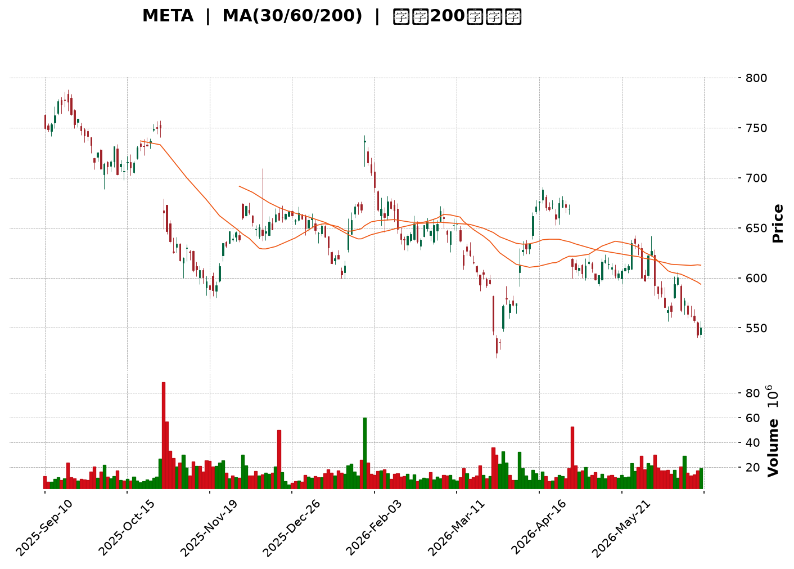
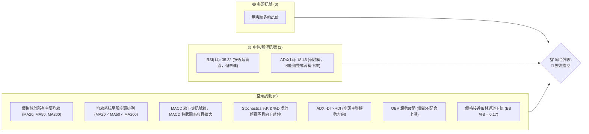
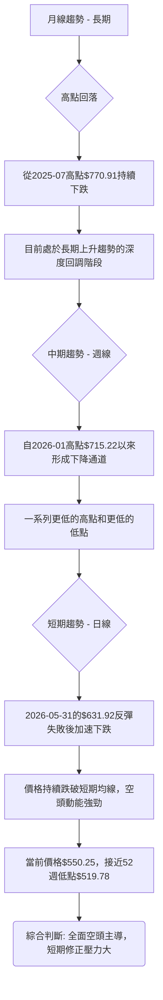
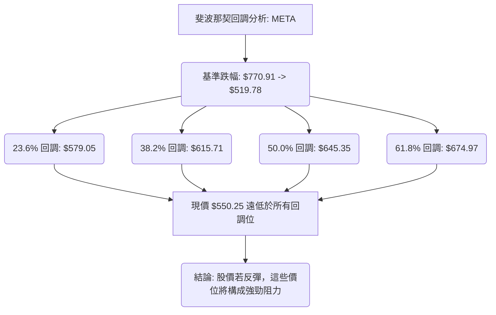
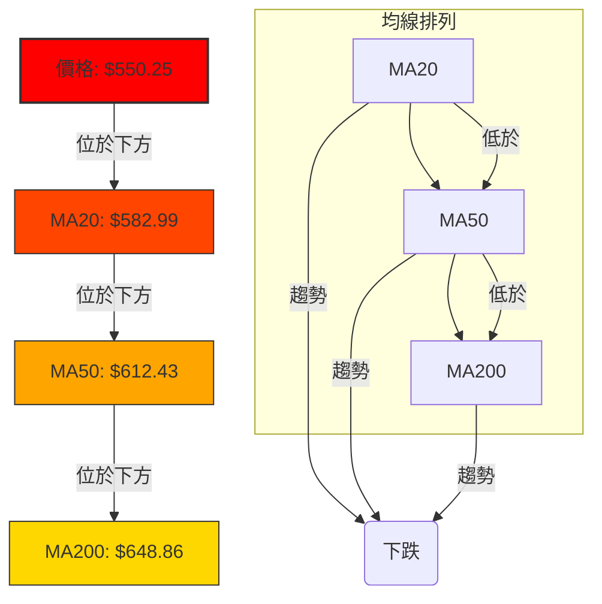
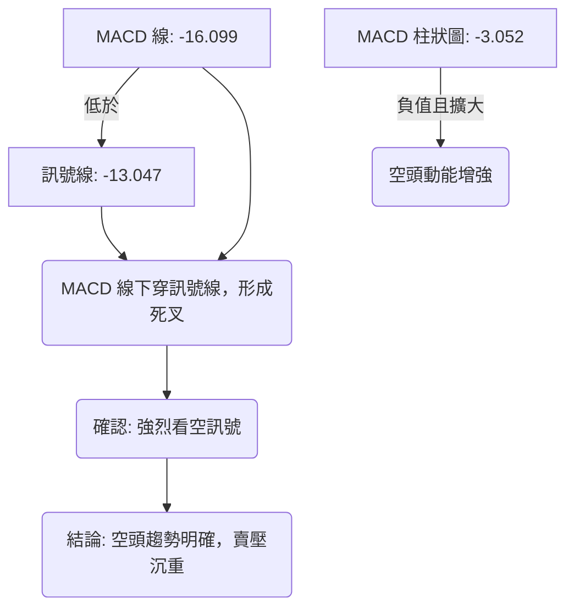

<details>
<summary>📊 靜態圖表 (點擊展開)</summary>

</details>

<html>
<head><meta charset="utf-8" /></head>
<body>
    <div style="height:500px; width:100%;">                        <script>window.PlotlyConfig = {MathJaxConfig: 'local'};</script>
        <script charset="utf-8" src="https://cdn.plot.ly/plotly-3.6.0.min.js" integrity="sha256-QaOVwtVY0T02VaHrr6pnoHLCwayMJp4O5n4YyaE3rJk=" crossorigin="anonymous"></script>                <div id="candlestick-chart" class="plotly-graph-div" style="height:100%; width:100%;"></div>            <script>                window.PLOTLYENV=window.PLOTLYENV || {};                                if (document.getElementById("candlestick-chart")) {                    Plotly.newPlot(                        "candlestick-chart",                        [{"close":{"dtype":"f8","bdata":"AAAAADBsh0AAAABgk2OHQAAAACD5iIdAAAAAgJ3Rh0AAAABApEOIQAAAAMB8KYhAAAAAwJtNiEAAAACgsj6IQAAAAIBm2YdAAAAAIIaLh0AAAABgfrWHQAAAAOC8V4dAAAAAwJAuh0AAAADgxSuHQAAAAMDM44ZAAAAAYNVbhkAAAADgT6mGQAAAAOC7JYZAAAAAoG1OhkAAAACA1zmGQAAAAODSX4ZAAAAAoNvchkAAAABgw\u002fuFQAAAAEC\u002fToZAAAAAYH4WhkAAAABAgl2GQAAAAGDIMYZAAAAAYHtYhkAAAABAKtKGQAAAAIDx2oZAAAAAYA\u002fchkAAAACAxOCGQAAAAICOA4dAAAAAgPpmh0AAAADg7GuHQAAAAKDCbYdAAAAAwO3FhEAAAABgWDWEQAAAACBy4INAAAAAoIqNg0AAAAAAZ9KDQAAAAOCsSoNAAAAAQMdgg0AAAABA+LCDQAAAAGCgi4NAAAAAAHH7gkAAAACgdgKDQAAAAEAI\u002f4JAAAAAQJbDgkAAAADgHaGCQAAAAEBPZoJAAAAAQPlcgkAAAAAAq4WCQAAAAGCtG4NAAAAAYI7Ug0AAAAAgu7+DQAAAAEAnMoRAAAAA4Kj5g0AAAADgXiuEQAAAAMCG74NAAAAAAIOehEAAAACAYv2EQAAAAOCPyIRAAAAA4At6hEAAAABgjEOEQAAAAIAiWIRAAAAAQHgUhEAAAABA2zKEQAAAAMDWf4RAAAAAgL9ChEAAAACgIrqEQAAAAKDGjIRAAAAAoJOihEAAAABADL6EQAAAACDk0oRAAAAAAN+whEAAAAAgI4yEQAAAACAdxoRAAAAAQFGXhEAAAADgA0qEQAAAAIDvjIRAAAAAwIybhEAAAACgRzyEQAAAAOBGJ4RAAAAAQC1fhEAAAACAnQaEQAAAAAC7r4NAAAAAYGQzg0AAAACAjl2DQAAAACAqWYNAAAAAwFrYgkAAAADg8h6DQAAAAIDQM4RAAAAAQLKMhEAAAABgTfmEQAAAAGAs\u002foRAAAAAYFDchEAAAACA9geHQAAAACDLWYZAAAAAgDcJhkAAAAAgv5OFQAAAAOBj3oRAAAAAACLohEAAAAAAQqKEQAAAAOAcIIVAAAAAoDTshEAAAACg\u002ftuEQAAAAEA5RYRAAAAAAAz1g0AAAACANvGDQAAAAOCYEIRAAAAAIA4dhEAAAACg8HOEQAAAACDs4INAAAAAAEvxg0AAAABgNWSEQAAAAKC4foRAAAAAADU4hEAAAACAK2OEQAAAAABPb4RAAAAAAFTUhEAAAACAJpuEQAAAAKCxHYRAAAAAAOYxhEAAAAAgPmeEQAAAACCNbYRAAAAAYFnog0AAAAAA8CSDQAAAAMDzloNAAAAA4Kpwg0AAAAAg4TiDQAAAACAb8YJAAAAA4OGIgkAAAABgAdyCQAAAAMD3goJAAAAAoLaSgkAAAACAQxiBQAAAAIDdaYBAAAAAIBG\u002fgEAAAABAzdyBQAAAAKCMFYJAAAAAwGzvgUAAAABg6uOBQAAAAOAj9IFAAAAAwNIeg0AAAAAgd56DQAAAAMA2qoNAAAAAQIrPg0AAAAAgA6+EQAAAAGCq94RAAAAAIPIhhUAAAACgTH+FQAAAAGBP8oRAAAAAAMThhEAAAAAAwxCFQAAAAEBRlIRAAAAAYD0ThUAAAADg7i+FQAAAAEC\u002f9YRAAAAA4ADkhEAAAABAvxqDQAAAAKB9AYNAAAAAIMIOg0AAAADgMuOCQAAAAACAIoNAAAAAIOlBg0AAAAAghgiDQAAAAKBxsoJAAAAAgIjTgkAAAADgeECDQAAAAODbToNAAAAAQEotg0AAAAAAJxWDQAAAAIBq0IJAAAAAgP\u002fjgkAAAABgivaCQAAAAECPDYNAAAAAIC8eg0AAAADgX9WDQAAAACCd1YNAAAAAAGW\u002fg0AAAADAT7+CQAAAAOCcqIJAAAAAoDlzg0AAAABA6ZeDQAAAAICbg4JAAAAAoMhGgkAAAADAY0CCQAAAAECc04FAAAAAoDq\u002fgUAAAADAo7OBQAAAAADXi4JAAAAAIK7BgkAAAADgo7yBQAAAAIDCCYJAAAAAwMyegUAAAACgmZGBQAAAACBcbYFAAAAAwPX2gEAAAAAAADKBQA=="},"high":{"dtype":"f8","bdata":"BLtW1ZbZh0A3vPdkA5WHQLIGxeDCmIdA2O6vj1QciECjMAK2dVaIQKIw2HrZZYhAMfkSLqCRiEA1lfenu6GIQIOcU5eIfYhAocC+384EiEA9S\u002fKbFbmHQEQ75H10lodAS3D96tVvh0AB7AjrqGaHQHMSVF1XKIdA6jpCytF\u002fhkAVtL6sDq+GQJzxfWjUyIZAGnO7xClYhkCHTY7UFmWGQJtnayJEboZAAAAAoNvchkCvfrzH5uqGQFUYSDmUcIZAZCif14xNhkCHp6FjLZCGQF2MNDTdnIZAmNO9hGhlhkDiddOf7t6GQHmWOLesBIdAkqKSTW4Vh0Bn4xFy3yOHQJt5vTtMGodAjej37lCOh0A1LtYFdqOHQGak91SGqYdAI\u002fjQZIw5hUAhvGFhHQmFQH3EXgP1jIRAKlUpJJoAhEDWSOMCgwSEQHYveh3N0oNA5vTQJCFkg0BpnZSJ0sqDQM9iFjNqn4NAfzIZ2t2ag0BXtRzmYUCDQLAqoVS0IINAYxDqctMQg0BpsMiowNCCQC42RyJJjoJAtujMJyvpgkBwfrowjKSCQARptDvNOINAQ5ob1y3bg0AxptzjoeWDQCQUB3jzMoRA64yI2yodhEAEzrnIgzGEQCxniZtVOYRAQ88v2MQShUBV8rvAhAeFQMqv4PmiF4VAG9BqzAy2hEDESxdbf2aEQFirrzikbIRAwytkgT4phkB7RNi6sl6EQHUcCLjhqoRAn+OPuWughEC22BuY7eqEQBGudAZx7oRAbts\u002fcgsDhUA4C2tCg8aEQCiE4RPs14RAtK\u002fsGxLehEDt765PmJiEQMEUsiIv+IRAKjVR+Ia+hED1+mgFqLmEQBNuIojauoRAd9a2Ia7ChEDROVCbz4+EQIQkHvWUL4RA8BN8G0VuhEDgfq69cWaEQC939NoCCYRAJCQY2aWag0AvHev1d3iDQGxbqMytn4NAsOXTs30Sg0B+w+RiWkmDQLTNmW8mm4RAjYDJD23KhEBODQD6nhCFQBo3xTXrHIVA+gTIXMkjhUCytBvgZjWHQHcEIBvu1oZA6ecG8x+AhkDYqlY8yV2GQJYOGObTfIVAQkThs0pChUCjr8f5WPaEQNOYmwq\u002fUIVAv4DlKYE7hUCjmATrezCFQEnskd5eFoVAsGgAGylShEBiYdVNpQuEQCOFP+LPHoRA9ZAa9kwwhED3ovG0WbGEQIF1qCw7hIRAyhI9Rr\u002f\u002fg0C8daDOuWWEQAj8MJOVnoRAMfLB50RChEAHpNF7HpaEQNiDKo\u002fujoRAC87dnpP8hEAGlC7PC+yEQORkTBCCQoRA5zry78U0hEBKINdn\u002fpiEQIKh9xaSj4RA8vru4bBihECNg5KeZaCDQGWmE0hM0YNAC9oNSa\u002ffg0DGR2uIlnCDQCQxnY11I4NAOmnY1zTbgkCoupOQnACDQA3cdU2Mw4JAaXqbWePYgkADMpdgrjOCQJjibdfF+IBAhUUkPWfYgEA3Y6UqRemBQJw64L0CgIJA2dS79rYPgkDfeR25ADKCQAKTniiU9YFAFOauAe+qg0Aup38ZR+eDQE1\u002fftbo74NAQWna20vTg0Cv2bH5JM2EQKViuGD5LoVAQR1M554nhUBxsiGeCZeFQLc1X1r6VYVAkGDsSpcchUAQwi\u002fPAy6FQNhZOyKF54RAy7LtTVFAhUDo323E8U6FQAj5WodqLIVA8oGUZQENhUAMUANsM2KDQBPEWap0UoNAHP89sXMrg0DsfF2xPy6DQE\u002fZtfcBW4NAoPqKwTWDg0Do8ptVl0GDQDm2\u002f4bM4oJAAYfmE4fZgkB6o3qsm1qDQJE\u002fDzM4eYNAHo9rqP9kg0CH0I3xKDiDQCs\u002fkmjkKoNAmJbEDH\u002f7gkDGFDeqSAiDQFBIK\u002f\u002fsMYNAeGjzNTUvg0Abcik7Re+DQEN9\u002fqA8E4RAynHluUzPg0CbnQZYStmDQJTdOYqHAoNAIX79p5N8g0Au7FYAcQ6EQCAl9jKKpINAphIFV517gkAt7lLlnKiCQIX33g0udoJAHB1ECB\u002fdgUDgXN7iSvyBQAAAAAApyoJAAAAA4HrugkAAAADgeo6CQAAAAIDCIYJAAAAA4Hr+gUAAAACgmeGBQAAAAOBRyIFAAAAAYLhigUAAAADAzGaBQA=="},"hovertemplate":"\u003cb\u003e%{x|%Y-%m-%d}\u003c\u002fb\u003e\u003cbr\u003e\u958b: $%{open:.2f}\u003cbr\u003e\u9ad8: $%{high:.2f}\u003cbr\u003e\u4f4e: $%{low:.2f}\u003cbr\u003e\u6536: $%{close:.2f}\u003cextra\u003e\u003c\u002fextra\u003e","low":{"dtype":"f8","bdata":"UT9wjl9kh0DJplXNZk+HQMJl+WWkKodAsT7kaERsh0BhiNX+zdSHQE9HdxR03odAYdP3GKsWiED7wfX7avWHQCHRcwrl04dADi7qQPloh0CkFWRxn3SHQA6\u002f08nyNIdA2I40gH\u002f7hkA\u002fXhd03AmHQAtYH81To4ZAygXBjtwihkAI87WVN2KGQPnB06SzIoZAliB1HMCFhUB\u002fUS+RWv+FQA\u002f6v6jKD4ZAaMn3L7w0hkDromWydfWFQFwmOjJvDoZAo8fJgyDMhUCMD8YWWx2GQEnMx8Ju8IVAGehqYE4ChkCSN1FzfnKGQHM4O4PgtoZAOjrBFDeRhkCDixIIltmGQOsJFM4GyoZAnP+7jY5Qh0BwaaEzsDyHQPF5WqqrJIdAllzJ+N1DhEBXLcbEKR+EQC0G8cA81INAESSotRaDg0D3zS0+UYeDQO1PdL4sQ4NAT5T0tR+9gkCN0yuEDUSDQOCu1RpEToNAb+x0FozxgkA86al6fMuCQHDpUoI\u002fjYJApS7IHdiOgkAfmLElIDKCQLMOaA\u002fwHYJAUKVrkLEugkD6jKsSziKCQNutSCyjoIJAh0GqdJFFg0BOvNSk7q+DQLQ\u002ftcTPzoNAeALlJdjgg0BMw1B5UeODQJMIFkQr34NA0hjtvLOShEACEBm5X6WEQMhD2xDCuoRAIqBnWyldhEBbQ+4g2Q2EQGmuIAYa+YNA3JDQW6Dng0CnZoiAgOyDQP0Hfv9vEIRA+ikNOFpAhECOhfFCVHqEQArZ1GYQiIRAoyjgj9h7hEBpz5WFn4iEQKl1SOIqqIRA4VgeryOhhEBzdzNuzGmEQMmSDnNZhYRAg8nTXiCShECGupFy1RKEQNYASOLFNIRAtzJLDOpVhEDeXRSGSx2EQIAECjW01INAqlQQXKQNhECr7syytACEQJQGit3od4NAwp2ATc0tg0DId3kVFymDQM5nsJ7OV4NA31UqBnS3gkDh7waYF7iCQC9jrH95i4NA5dTkjmsahEBgwGBe5qCEQHrI283Pu4RA9M04t0\u002fHhEDpOTbwPzqGQK+1ohyOQoZAvmn+aSPyhUCeAbJqgGmFQJUxUhQs0oRADegs0LBihEBiGeJtyiqEQDBjwB7bjIRAD3svZMfkhEBVmeCDcH+EQE\u002fA6GQMIYRAn1JlVoXLg0AYIE5BcZ2DQHhamJRAmINAqRCwhLDcg0CIDWQOJO2DQJ2l867w1oNAyfB1QuGeg0ApFEYe+QeEQDBP9c3GMoRAKZAxz97ng0Dletch9sqDQOXJ5Lie7YNAyFqFz\u002f2DhECa+S5qN0mEQMMtqIjR14NA3z3Z50+Ng0BNlzw9wT6EQFB8OtSkOYRAcqfrqiDeg0DoYs9rtwODQPSpzx8vdINAyQMEsv5og0DQjG7HUzCDQNN0cGuezYJAPgy4Z6ZVgkAMYpOTpLOCQOkOFESfc4JAfqhX882GgkBK+jFSxvaAQKk1wto5PoBA3KTqnWeAgEDEZt4XHBKBQInbPUJP6oFAGk12PXR5gUDrsSxPw9uBQGrPcoPloYFACZjTi0F6gkBsFJ6YYnODQOhnwdwDfoNAZuuZNZN+g0AsZYQ4OfaDQCsr6PTWvIRA7D2Xqw3ZhEC+8AfzCRSFQE2NqEQN24RAd8kRXbLVhEDbbr3sCemEQENHaPGPY4RANthFb+BphEBZoNRAwPGEQNlHFfQbyIRA+KXMEZC5hEDZvMc1jruCQHLqmuFj7IJAu2F9BonRgkDl0Dm5br6CQFzVSYderIJAng6RU8Yng0CNBjKF\u002feuCQCDao7o1rIJArbjb+GiAgkBvVQAf3KCCQCYxIcFxM4NAs99jdPcFg0CX0uNCDNmCQCG4DIjzv4JAoC6IPw2qgkB0N63WEpKCQAXw3aYa84JAVcHPeerlgkB9hMwrfQODQHgpHnfRpYNAQUkHny52g0DKKVSIzLeCQNbuOA0FoYJAhF7IsLa9gkAKYl4\u002f1G6DQETCNEL2MoJA21hmE3gVgkDCxAiqxiOCQO97ebiS0IFA4FhOKPRjgUBmdMSHC4OBQAAAAGBmGoJAAAAAAACAgkAAAAAghbGBQAAAAMDMmIFAAAAA4Hp+gUAAAAAAKYiBQAAAAGBmXIFAAAAAoHDhgEAAAABAM+OAQA=="},"name":"\u50f9\u683c","open":{"dtype":"f8","bdata":"KfyaRQvVh0A1yyVJeoGHQAgSnKVFUodAAQEkv\u002faXh0ClXqCI9OOHQHk9vC6JS4hA6TmeZ5hRiEDsmre1zn6IQAHHaPSSXohApo69Swn6h0CJptKJR5yHQE4kSsH2e4dAi\u002fnUi29gh0C3P8LcOFaHQKDlg7CYIodAwgrbc\u002fJ8hkC\u002f6TsfpYWGQCFmwu\u002flvYZAcRFfv+L6hUBQJ2953V6GQExsYXLLPIZATkFSiVVjhkBBKu8DMciGQOQdnWpIOYZAclE\u002fP40PhkDTS2lamVmGQC9m+UKCXYZAm8a\u002fZvcJhkB0JqCVjXqGQOdB\u002f+Pi8IZAjCS9ZGnfhkD17\u002fNnWuaGQIdfU3cH94ZAWmx96kdeh0BYZoGta3WHQH5A6SJWhodAdrH+QlDbhEAN1zAmFQaFQFAoatRicoRAjYrOTEmTg0DHOaCWW7WDQCbFhKma0YNAOYpUWyA3g0Di+y6vn6uDQNqJxZz3koNAxCC6KwGUg0Dt8Rhb1huDQFhYpL\u002fUwYJAtkgHR677gkBDWX7ahXCCQFLk+U9wgYJAbzsow3nPgkCRuR2MyVeCQBUl2qFVqYJAqdAszAxzg0Cp4g5TSeCDQL1A2o9w04NA8etXgyDvg0DXItPJYwWEQGGUKRLoFYRA4oMooPgRhUBo0XdrOLKEQC7HbGHU3IRAmW0BkmKwhECrU8u0HEKEQJ7to0v4DIRAV5ksCOpAhED8BLf5ZiSEQPDIbUfVEoRA0E8ReIpzhEAcM9KO4X6EQDAMOdrdyYRAp2nwU8ajhECwsitV\u002f5aEQN4ENY7NqoRAaEfSmvbWhEB0gcz6tIaEQEF2kBkjjIRAyxy04Ye8hEAlCBRTZqyEQHwA7X7OToRA3xQwNCqThED9Uf7nx3OEQPC1COjWJYRAKpgESlMihECXtuf98VqEQC939NoCCYRAY4GLVROLg0DYwduVB0uDQKOpHmuMeINAquDkiWH2gkCzYKnuRu2CQDlEsKnVoYNAx9UnxPkchEBSxoe9kL+EQOW2lVccC4VAd7hwVWQKhUAx6oZ17wCHQKUE1gKjsYZAqdcAwp5KhkCukcEa4hCGQM8FDAkLdIVAEzGn7S+zhECQ2NWtcMKEQDycITP+r4RArUs9ySUjhUDwJNkiZgaFQKHX2Fs35oRAZQlMUJwfhEAHLu3b4\u002fKDQHTlDRpfxYNASRqJpXbrg0BrBOFcaPSDQOHj3T0GW4RANPPILp+\u002fg0At0y5yFguEQPGHrQ4iS4RAxi+GP28ShEAPFJIONOCDQC+63MIVOYRAHjHBwE6GhED3YWTKAqaEQN9P8In4NYRAoMiuuzLNg0AZASJ8K2OEQEmmVb3AbIRAM6BRNMI8hEC+FvR\u002fO3aDQHVaHn9Ru4NAt0yHpESbg0DzoJafJz6DQAALPmqqHINAH8uVCMXXgkAMJSkY1emCQO+C2adctIJA0uH1EnyxgkCAszHYmi+CQBVJpXrM3IBAAAAAIBG\u002fgEAo33sBxCuBQHSOFiu+HIJAHhmidyCsgUDQx+2kPQmCQKyYp1+Z34FAUMu2zILrgkAtmV6RHZODQEqN40EPz4NAeqzSSVang0Bb4WSr\u002fhSEQDokWi8P04RA9Ow5i+kahUAwwnTexS+FQNep\u002fy7VRYVAQQBkhwfzhEC+gcJu4g2FQOTAGf+uuIRAyhZjJaudhEDvsSuTB\u002fOEQHWVIuDsDIVAKCT1JVPihEDULb\u002fy+FWDQGY7Z3z3MINAj3QITwT7gkDD9EDK7yWDQHD2I4\u002fyw4JAULOwtjQxg0B1KdTvCjWDQHaHCewU4IJA7LwbYyeSgkC5Z35BNLKCQDAHq9tvO4NA0qOANF8rg0AbqosbXgSDQOQSvWjZAoNAQsxwR6HBgkAuvfQejruCQEXaZIOJ+oJAtSHrCpwCg0Du4ZuprwaDQKEcJkRD94NA4L5gn07Hg0Crvl29h66DQPQJZ3xz1YJAK1t8g4jTgkBNLGFlvXiDQHO0LN0Pd4NAphIFV517gkAbnRI4n3OCQLcR1cKJIYJAtzBEznKqgUDclJkNW+OBQAAAAEAzH4JAAAAAQDONgkAAAAAAAICCQAAAAGCP5oFAAAAAACnggUAAAAAAAJKBQAAAAMAej4FAAAAAYGZcgUAAAABguPqAQA=="},"x":["2025-09-10T00:00:00-04:00","2025-09-11T00:00:00-04:00","2025-09-12T00:00:00-04:00","2025-09-15T00:00:00-04:00","2025-09-16T00:00:00-04:00","2025-09-17T00:00:00-04:00","2025-09-18T00:00:00-04:00","2025-09-19T00:00:00-04:00","2025-09-22T00:00:00-04:00","2025-09-23T00:00:00-04:00","2025-09-24T00:00:00-04:00","2025-09-25T00:00:00-04:00","2025-09-26T00:00:00-04:00","2025-09-29T00:00:00-04:00","2025-09-30T00:00:00-04:00","2025-10-01T00:00:00-04:00","2025-10-02T00:00:00-04:00","2025-10-03T00:00:00-04:00","2025-10-06T00:00:00-04:00","2025-10-07T00:00:00-04:00","2025-10-08T00:00:00-04:00","2025-10-09T00:00:00-04:00","2025-10-10T00:00:00-04:00","2025-10-13T00:00:00-04:00","2025-10-14T00:00:00-04:00","2025-10-15T00:00:00-04:00","2025-10-16T00:00:00-04:00","2025-10-17T00:00:00-04:00","2025-10-20T00:00:00-04:00","2025-10-21T00:00:00-04:00","2025-10-22T00:00:00-04:00","2025-10-23T00:00:00-04:00","2025-10-24T00:00:00-04:00","2025-10-27T00:00:00-04:00","2025-10-28T00:00:00-04:00","2025-10-29T00:00:00-04:00","2025-10-30T00:00:00-04:00","2025-10-31T00:00:00-04:00","2025-11-03T00:00:00-05:00","2025-11-04T00:00:00-05:00","2025-11-05T00:00:00-05:00","2025-11-06T00:00:00-05:00","2025-11-07T00:00:00-05:00","2025-11-10T00:00:00-05:00","2025-11-11T00:00:00-05:00","2025-11-12T00:00:00-05:00","2025-11-13T00:00:00-05:00","2025-11-14T00:00:00-05:00","2025-11-17T00:00:00-05:00","2025-11-18T00:00:00-05:00","2025-11-19T00:00:00-05:00","2025-11-20T00:00:00-05:00","2025-11-21T00:00:00-05:00","2025-11-24T00:00:00-05:00","2025-11-25T00:00:00-05:00","2025-11-26T00:00:00-05:00","2025-11-28T00:00:00-05:00","2025-12-01T00:00:00-05:00","2025-12-02T00:00:00-05:00","2025-12-03T00:00:00-05:00","2025-12-04T00:00:00-05:00","2025-12-05T00:00:00-05:00","2025-12-08T00:00:00-05:00","2025-12-09T00:00:00-05:00","2025-12-10T00:00:00-05:00","2025-12-11T00:00:00-05:00","2025-12-12T00:00:00-05:00","2025-12-15T00:00:00-05:00","2025-12-16T00:00:00-05:00","2025-12-17T00:00:00-05:00","2025-12-18T00:00:00-05:00","2025-12-19T00:00:00-05:00","2025-12-22T00:00:00-05:00","2025-12-23T00:00:00-05:00","2025-12-24T00:00:00-05:00","2025-12-26T00:00:00-05:00","2025-12-29T00:00:00-05:00","2025-12-30T00:00:00-05:00","2025-12-31T00:00:00-05:00","2026-01-02T00:00:00-05:00","2026-01-05T00:00:00-05:00","2026-01-06T00:00:00-05:00","2026-01-07T00:00:00-05:00","2026-01-08T00:00:00-05:00","2026-01-09T00:00:00-05:00","2026-01-12T00:00:00-05:00","2026-01-13T00:00:00-05:00","2026-01-14T00:00:00-05:00","2026-01-15T00:00:00-05:00","2026-01-16T00:00:00-05:00","2026-01-20T00:00:00-05:00","2026-01-21T00:00:00-05:00","2026-01-22T00:00:00-05:00","2026-01-23T00:00:00-05:00","2026-01-26T00:00:00-05:00","2026-01-27T00:00:00-05:00","2026-01-28T00:00:00-05:00","2026-01-29T00:00:00-05:00","2026-01-30T00:00:00-05:00","2026-02-02T00:00:00-05:00","2026-02-03T00:00:00-05:00","2026-02-04T00:00:00-05:00","2026-02-05T00:00:00-05:00","2026-02-06T00:00:00-05:00","2026-02-09T00:00:00-05:00","2026-02-10T00:00:00-05:00","2026-02-11T00:00:00-05:00","2026-02-12T00:00:00-05:00","2026-02-13T00:00:00-05:00","2026-02-17T00:00:00-05:00","2026-02-18T00:00:00-05:00","2026-02-19T00:00:00-05:00","2026-02-20T00:00:00-05:00","2026-02-23T00:00:00-05:00","2026-02-24T00:00:00-05:00","2026-02-25T00:00:00-05:00","2026-02-26T00:00:00-05:00","2026-02-27T00:00:00-05:00","2026-03-02T00:00:00-05:00","2026-03-03T00:00:00-05:00","2026-03-04T00:00:00-05:00","2026-03-05T00:00:00-05:00","2026-03-06T00:00:00-05:00","2026-03-09T00:00:00-04:00","2026-03-10T00:00:00-04:00","2026-03-11T00:00:00-04:00","2026-03-12T00:00:00-04:00","2026-03-13T00:00:00-04:00","2026-03-16T00:00:00-04:00","2026-03-17T00:00:00-04:00","2026-03-18T00:00:00-04:00","2026-03-19T00:00:00-04:00","2026-03-20T00:00:00-04:00","2026-03-23T00:00:00-04:00","2026-03-24T00:00:00-04:00","2026-03-25T00:00:00-04:00","2026-03-26T00:00:00-04:00","2026-03-27T00:00:00-04:00","2026-03-30T00:00:00-04:00","2026-03-31T00:00:00-04:00","2026-04-01T00:00:00-04:00","2026-04-02T00:00:00-04:00","2026-04-06T00:00:00-04:00","2026-04-07T00:00:00-04:00","2026-04-08T00:00:00-04:00","2026-04-09T00:00:00-04:00","2026-04-10T00:00:00-04:00","2026-04-13T00:00:00-04:00","2026-04-14T00:00:00-04:00","2026-04-15T00:00:00-04:00","2026-04-16T00:00:00-04:00","2026-04-17T00:00:00-04:00","2026-04-20T00:00:00-04:00","2026-04-21T00:00:00-04:00","2026-04-22T00:00:00-04:00","2026-04-23T00:00:00-04:00","2026-04-24T00:00:00-04:00","2026-04-27T00:00:00-04:00","2026-04-28T00:00:00-04:00","2026-04-29T00:00:00-04:00","2026-04-30T00:00:00-04:00","2026-05-01T00:00:00-04:00","2026-05-04T00:00:00-04:00","2026-05-05T00:00:00-04:00","2026-05-06T00:00:00-04:00","2026-05-07T00:00:00-04:00","2026-05-08T00:00:00-04:00","2026-05-11T00:00:00-04:00","2026-05-12T00:00:00-04:00","2026-05-13T00:00:00-04:00","2026-05-14T00:00:00-04:00","2026-05-15T00:00:00-04:00","2026-05-18T00:00:00-04:00","2026-05-19T00:00:00-04:00","2026-05-20T00:00:00-04:00","2026-05-21T00:00:00-04:00","2026-05-22T00:00:00-04:00","2026-05-26T00:00:00-04:00","2026-05-27T00:00:00-04:00","2026-05-28T00:00:00-04:00","2026-05-29T00:00:00-04:00","2026-06-01T00:00:00-04:00","2026-06-02T00:00:00-04:00","2026-06-03T00:00:00-04:00","2026-06-04T00:00:00-04:00","2026-06-05T00:00:00-04:00","2026-06-08T00:00:00-04:00","2026-06-09T00:00:00-04:00","2026-06-10T00:00:00-04:00","2026-06-11T00:00:00-04:00","2026-06-12T00:00:00-04:00","2026-06-15T00:00:00-04:00","2026-06-16T00:00:00-04:00","2026-06-17T00:00:00-04:00","2026-06-18T00:00:00-04:00","2026-06-22T00:00:00-04:00","2026-06-23T00:00:00-04:00","2026-06-24T00:00:00-04:00","2026-06-25T00:00:00-04:00","2026-06-26T00:00:00-04:00"],"type":"candlestick"},{"hovertemplate":"MA30: $%{y:.2f}\u003cextra\u003e\u003c\u002fextra\u003e","line":{"color":"#2196F3","dash":"dash","width":2},"mode":"lines","name":"MA30","x":["2025-09-10T00:00:00-04:00","2025-09-11T00:00:00-04:00","2025-09-12T00:00:00-04:00","2025-09-15T00:00:00-04:00","2025-09-16T00:00:00-04:00","2025-09-17T00:00:00-04:00","2025-09-18T00:00:00-04:00","2025-09-19T00:00:00-04:00","2025-09-22T00:00:00-04:00","2025-09-23T00:00:00-04:00","2025-09-24T00:00:00-04:00","2025-09-25T00:00:00-04:00","2025-09-26T00:00:00-04:00","2025-09-29T00:00:00-04:00","2025-09-30T00:00:00-04:00","2025-10-01T00:00:00-04:00","2025-10-02T00:00:00-04:00","2025-10-03T00:00:00-04:00","2025-10-06T00:00:00-04:00","2025-10-07T00:00:00-04:00","2025-10-08T00:00:00-04:00","2025-10-09T00:00:00-04:00","2025-10-10T00:00:00-04:00","2025-10-13T00:00:00-04:00","2025-10-14T00:00:00-04:00","2025-10-15T00:00:00-04:00","2025-10-16T00:00:00-04:00","2025-10-17T00:00:00-04:00","2025-10-20T00:00:00-04:00","2025-10-21T00:00:00-04:00","2025-10-22T00:00:00-04:00","2025-10-23T00:00:00-04:00","2025-10-24T00:00:00-04:00","2025-10-27T00:00:00-04:00","2025-10-28T00:00:00-04:00","2025-10-29T00:00:00-04:00","2025-10-30T00:00:00-04:00","2025-10-31T00:00:00-04:00","2025-11-03T00:00:00-05:00","2025-11-04T00:00:00-05:00","2025-11-05T00:00:00-05:00","2025-11-06T00:00:00-05:00","2025-11-07T00:00:00-05:00","2025-11-10T00:00:00-05:00","2025-11-11T00:00:00-05:00","2025-11-12T00:00:00-05:00","2025-11-13T00:00:00-05:00","2025-11-14T00:00:00-05:00","2025-11-17T00:00:00-05:00","2025-11-18T00:00:00-05:00","2025-11-19T00:00:00-05:00","2025-11-20T00:00:00-05:00","2025-11-21T00:00:00-05:00","2025-11-24T00:00:00-05:00","2025-11-25T00:00:00-05:00","2025-11-26T00:00:00-05:00","2025-11-28T00:00:00-05:00","2025-12-01T00:00:00-05:00","2025-12-02T00:00:00-05:00","2025-12-03T00:00:00-05:00","2025-12-04T00:00:00-05:00","2025-12-05T00:00:00-05:00","2025-12-08T00:00:00-05:00","2025-12-09T00:00:00-05:00","2025-12-10T00:00:00-05:00","2025-12-11T00:00:00-05:00","2025-12-12T00:00:00-05:00","2025-12-15T00:00:00-05:00","2025-12-16T00:00:00-05:00","2025-12-17T00:00:00-05:00","2025-12-18T00:00:00-05:00","2025-12-19T00:00:00-05:00","2025-12-22T00:00:00-05:00","2025-12-23T00:00:00-05:00","2025-12-24T00:00:00-05:00","2025-12-26T00:00:00-05:00","2025-12-29T00:00:00-05:00","2025-12-30T00:00:00-05:00","2025-12-31T00:00:00-05:00","2026-01-02T00:00:00-05:00","2026-01-05T00:00:00-05:00","2026-01-06T00:00:00-05:00","2026-01-07T00:00:00-05:00","2026-01-08T00:00:00-05:00","2026-01-09T00:00:00-05:00","2026-01-12T00:00:00-05:00","2026-01-13T00:00:00-05:00","2026-01-14T00:00:00-05:00","2026-01-15T00:00:00-05:00","2026-01-16T00:00:00-05:00","2026-01-20T00:00:00-05:00","2026-01-21T00:00:00-05:00","2026-01-22T00:00:00-05:00","2026-01-23T00:00:00-05:00","2026-01-26T00:00:00-05:00","2026-01-27T00:00:00-05:00","2026-01-28T00:00:00-05:00","2026-01-29T00:00:00-05:00","2026-01-30T00:00:00-05:00","2026-02-02T00:00:00-05:00","2026-02-03T00:00:00-05:00","2026-02-04T00:00:00-05:00","2026-02-05T00:00:00-05:00","2026-02-06T00:00:00-05:00","2026-02-09T00:00:00-05:00","2026-02-10T00:00:00-05:00","2026-02-11T00:00:00-05:00","2026-02-12T00:00:00-05:00","2026-02-13T00:00:00-05:00","2026-02-17T00:00:00-05:00","2026-02-18T00:00:00-05:00","2026-02-19T00:00:00-05:00","2026-02-20T00:00:00-05:00","2026-02-23T00:00:00-05:00","2026-02-24T00:00:00-05:00","2026-02-25T00:00:00-05:00","2026-02-26T00:00:00-05:00","2026-02-27T00:00:00-05:00","2026-03-02T00:00:00-05:00","2026-03-03T00:00:00-05:00","2026-03-04T00:00:00-05:00","2026-03-05T00:00:00-05:00","2026-03-06T00:00:00-05:00","2026-03-09T00:00:00-04:00","2026-03-10T00:00:00-04:00","2026-03-11T00:00:00-04:00","2026-03-12T00:00:00-04:00","2026-03-13T00:00:00-04:00","2026-03-16T00:00:00-04:00","2026-03-17T00:00:00-04:00","2026-03-18T00:00:00-04:00","2026-03-19T00:00:00-04:00","2026-03-20T00:00:00-04:00","2026-03-23T00:00:00-04:00","2026-03-24T00:00:00-04:00","2026-03-25T00:00:00-04:00","2026-03-26T00:00:00-04:00","2026-03-27T00:00:00-04:00","2026-03-30T00:00:00-04:00","2026-03-31T00:00:00-04:00","2026-04-01T00:00:00-04:00","2026-04-02T00:00:00-04:00","2026-04-06T00:00:00-04:00","2026-04-07T00:00:00-04:00","2026-04-08T00:00:00-04:00","2026-04-09T00:00:00-04:00","2026-04-10T00:00:00-04:00","2026-04-13T00:00:00-04:00","2026-04-14T00:00:00-04:00","2026-04-15T00:00:00-04:00","2026-04-16T00:00:00-04:00","2026-04-17T00:00:00-04:00","2026-04-20T00:00:00-04:00","2026-04-21T00:00:00-04:00","2026-04-22T00:00:00-04:00","2026-04-23T00:00:00-04:00","2026-04-24T00:00:00-04:00","2026-04-27T00:00:00-04:00","2026-04-28T00:00:00-04:00","2026-04-29T00:00:00-04:00","2026-04-30T00:00:00-04:00","2026-05-01T00:00:00-04:00","2026-05-04T00:00:00-04:00","2026-05-05T00:00:00-04:00","2026-05-06T00:00:00-04:00","2026-05-07T00:00:00-04:00","2026-05-08T00:00:00-04:00","2026-05-11T00:00:00-04:00","2026-05-12T00:00:00-04:00","2026-05-13T00:00:00-04:00","2026-05-14T00:00:00-04:00","2026-05-15T00:00:00-04:00","2026-05-18T00:00:00-04:00","2026-05-19T00:00:00-04:00","2026-05-20T00:00:00-04:00","2026-05-21T00:00:00-04:00","2026-05-22T00:00:00-04:00","2026-05-26T00:00:00-04:00","2026-05-27T00:00:00-04:00","2026-05-28T00:00:00-04:00","2026-05-29T00:00:00-04:00","2026-06-01T00:00:00-04:00","2026-06-02T00:00:00-04:00","2026-06-03T00:00:00-04:00","2026-06-04T00:00:00-04:00","2026-06-05T00:00:00-04:00","2026-06-08T00:00:00-04:00","2026-06-09T00:00:00-04:00","2026-06-10T00:00:00-04:00","2026-06-11T00:00:00-04:00","2026-06-12T00:00:00-04:00","2026-06-15T00:00:00-04:00","2026-06-16T00:00:00-04:00","2026-06-17T00:00:00-04:00","2026-06-18T00:00:00-04:00","2026-06-22T00:00:00-04:00","2026-06-23T00:00:00-04:00","2026-06-24T00:00:00-04:00","2026-06-25T00:00:00-04:00","2026-06-26T00:00:00-04:00"],"y":{"dtype":"f8","bdata":"AAAAAAAA+H8AAAAAAAD4fwAAAAAAAPh\u002fAAAAAAAA+H8AAAAAAAD4fwAAAAAAAPh\u002fAAAAAAAA+H8AAAAAAAD4fwAAAAAAAPh\u002fAAAAAAAA+H8AAAAAAAD4fwAAAAAAAPh\u002fAAAAAAAA+H8AAAAAAAD4fwAAAAAAAPh\u002fAAAAAAAA+H8AAAAAAAD4fwAAAAAAAPh\u002fAAAAAAAA+H8AAAAAAAD4fwAAAAAAAPh\u002fAAAAAAAA+H8AAAAAAAD4fwAAAAAAAPh\u002fAAAAAAAA+H8AAAAAAAD4fwAAAAAAAPh\u002fAAAAAAAA+H8AAAAAAAD4f4mIiHgxBodAVVVVlWMBh0CrqqpaB\u002f2GQN7d3d2U+IZAZmZm5gb1hkDv7u4e1u2GQO\u002fu7i6U54ZAiYiIyHTJhkB3d3fXAqeGQERERNQchYZAmpmZ6QtjhkB3d3d34EGGQN7d3d1OH4ZAd3d3N9n+hUAiIiKyJ+GFQO\u002fu7q6dxIVAmpmZic2nhUCamZkppIiFQO\u002fu7k7AbYVA3t3d7YVPhUAzMzMT1TCFQJqZmUnqDoVAAAAA4ITohEB3d3eH+8qEQCIiIiKur4RAZmZmZmqchEBmZmb2FoaEQO\u002fu7g4JdYRAd3d3185ghEBmZmZ2LkqEQBEREYFEMYRAmpmZOSYehEC8u7tbCQ6EQO\u002fu7t4A+4NAvLu7+wnig0BVVVXVF8eDQCIiIrLFrINAERERYdumg0BEREQkxqaDQLy7u0sWrINAd3d3lyCyg0C8u7sL2rmDQDMzM6OWxINAZmZmplDPg0CJiIjISNiDQBEREXEx44NAzczMLMbxg0BmZmaG5f6DQDMzM+MQDoRAAAAAMKgdhEDNzMz80SuEQJqZmaksPoRAZmZmtlNRhECJiIiI8l+EQM3MzAzeaIRAIiIi8nxthEAzMzPT2W+EQCIiIuKAa4RAAAAAAOVkhECJiIi4CF6EQCIiIqIFWYRAiYiIKOJJhEARERGB7zmEQBERETH6NIRAZmZmVpk1hEDe3d1NqDuEQKuqqioxQYRAERERgdpHhEBEREQUBmCEQN7d3X3Sb4RAAAAAoPh+hEAzMzOTOYaEQERERATyiIRAAAAAkEOLhEC8u7trVoqEQBEREWHpjIRAMzMzs+OOhEBmZmYmjZGEQJqZmUlBjYRARERElNiHhEDNzMzM4oSEQHd3d8e9gIRAvLu7W4Z8hEAzMzNTYX6EQHd3d\u002fcIfIRAq6qqSl94hEBERET0fXuEQGZmZkZkgoRAVVVV5RWLhEBERERUzpOEQDMzM9MTnYRAiYiIiAKuhEC8u7vrrrqEQImIiCjyuYRAmpmZWeu2hECamZn5DLKEQN7d3d06rYRAiYiICBmlhEBmZmYm7oOEQAAAAHBebIRA3t3dnTdWhEBmZmYmH0KEQKuqqsqtMYRAvLu7628dhEAiIiKiSw6EQImIiJj994NAzczM3PDjg0BmZmYG0cODQBEREZHnooNAZmZmVoGHg0CJiIgYwnWDQJqZmUnbZINAd3d310RSg0BERETEZjyDQBEREbH5K4NA7+7urvUkg0BmZmZGXh6DQBEREeFIF4NAiYiIuMsTg0CJiIjoUhaDQM3MzHzeGoNAMzMz03Qdg0AiIiKyDyWDQFVVVQUmLINAERERwQIyg0ARERFRqTeDQO\u002fu7h70OINAd3d3p+pCg0DNzMyMWVSDQAAAAAALYINAvLu7u2tsg0CrqqqaamuDQLy7u2v2a4NARERE1Gxwg0BmZmY2qnCDQN7d3Y37dYNAIiIiktJ7g0AzMzNTXYyDQKuqqrrZn4NAERERcZmxg0Dv7u5+dL2DQCIiIhLmx4NAVVVVhX7Sg0BVVVU1q9yDQFVVVeUC5INAvLu76wzig0BmZmb2c9yDQN7d3S0714NA3t3dvVHRg0ARERGREMqDQFVVVXVlwINARERE9JO0g0B3d3eXHJ2DQERERKSWiYNARERE1F59g0CamZkJz3CDQBEREWEvX4NA7+7unk1Hg0AzMzNzQC6DQM3MzIyDE4NAREREJLD4gkAiIiLCt+yCQN7d3c3L6IJAIiIiEjrmgkARERGBaNyCQKuqqtoM04JAERERcRTFgkB3d3cXlbiCQKuqqgq\u002frYJAiYiISNydgkCJiIi4T4yCQA=="},"type":"scatter"},{"hovertemplate":"MA60: $%{y:.2f}\u003cextra\u003e\u003c\u002fextra\u003e","line":{"color":"#9C27B0","dash":"dash","width":2},"mode":"lines","name":"MA60","x":["2025-09-10T00:00:00-04:00","2025-09-11T00:00:00-04:00","2025-09-12T00:00:00-04:00","2025-09-15T00:00:00-04:00","2025-09-16T00:00:00-04:00","2025-09-17T00:00:00-04:00","2025-09-18T00:00:00-04:00","2025-09-19T00:00:00-04:00","2025-09-22T00:00:00-04:00","2025-09-23T00:00:00-04:00","2025-09-24T00:00:00-04:00","2025-09-25T00:00:00-04:00","2025-09-26T00:00:00-04:00","2025-09-29T00:00:00-04:00","2025-09-30T00:00:00-04:00","2025-10-01T00:00:00-04:00","2025-10-02T00:00:00-04:00","2025-10-03T00:00:00-04:00","2025-10-06T00:00:00-04:00","2025-10-07T00:00:00-04:00","2025-10-08T00:00:00-04:00","2025-10-09T00:00:00-04:00","2025-10-10T00:00:00-04:00","2025-10-13T00:00:00-04:00","2025-10-14T00:00:00-04:00","2025-10-15T00:00:00-04:00","2025-10-16T00:00:00-04:00","2025-10-17T00:00:00-04:00","2025-10-20T00:00:00-04:00","2025-10-21T00:00:00-04:00","2025-10-22T00:00:00-04:00","2025-10-23T00:00:00-04:00","2025-10-24T00:00:00-04:00","2025-10-27T00:00:00-04:00","2025-10-28T00:00:00-04:00","2025-10-29T00:00:00-04:00","2025-10-30T00:00:00-04:00","2025-10-31T00:00:00-04:00","2025-11-03T00:00:00-05:00","2025-11-04T00:00:00-05:00","2025-11-05T00:00:00-05:00","2025-11-06T00:00:00-05:00","2025-11-07T00:00:00-05:00","2025-11-10T00:00:00-05:00","2025-11-11T00:00:00-05:00","2025-11-12T00:00:00-05:00","2025-11-13T00:00:00-05:00","2025-11-14T00:00:00-05:00","2025-11-17T00:00:00-05:00","2025-11-18T00:00:00-05:00","2025-11-19T00:00:00-05:00","2025-11-20T00:00:00-05:00","2025-11-21T00:00:00-05:00","2025-11-24T00:00:00-05:00","2025-11-25T00:00:00-05:00","2025-11-26T00:00:00-05:00","2025-11-28T00:00:00-05:00","2025-12-01T00:00:00-05:00","2025-12-02T00:00:00-05:00","2025-12-03T00:00:00-05:00","2025-12-04T00:00:00-05:00","2025-12-05T00:00:00-05:00","2025-12-08T00:00:00-05:00","2025-12-09T00:00:00-05:00","2025-12-10T00:00:00-05:00","2025-12-11T00:00:00-05:00","2025-12-12T00:00:00-05:00","2025-12-15T00:00:00-05:00","2025-12-16T00:00:00-05:00","2025-12-17T00:00:00-05:00","2025-12-18T00:00:00-05:00","2025-12-19T00:00:00-05:00","2025-12-22T00:00:00-05:00","2025-12-23T00:00:00-05:00","2025-12-24T00:00:00-05:00","2025-12-26T00:00:00-05:00","2025-12-29T00:00:00-05:00","2025-12-30T00:00:00-05:00","2025-12-31T00:00:00-05:00","2026-01-02T00:00:00-05:00","2026-01-05T00:00:00-05:00","2026-01-06T00:00:00-05:00","2026-01-07T00:00:00-05:00","2026-01-08T00:00:00-05:00","2026-01-09T00:00:00-05:00","2026-01-12T00:00:00-05:00","2026-01-13T00:00:00-05:00","2026-01-14T00:00:00-05:00","2026-01-15T00:00:00-05:00","2026-01-16T00:00:00-05:00","2026-01-20T00:00:00-05:00","2026-01-21T00:00:00-05:00","2026-01-22T00:00:00-05:00","2026-01-23T00:00:00-05:00","2026-01-26T00:00:00-05:00","2026-01-27T00:00:00-05:00","2026-01-28T00:00:00-05:00","2026-01-29T00:00:00-05:00","2026-01-30T00:00:00-05:00","2026-02-02T00:00:00-05:00","2026-02-03T00:00:00-05:00","2026-02-04T00:00:00-05:00","2026-02-05T00:00:00-05:00","2026-02-06T00:00:00-05:00","2026-02-09T00:00:00-05:00","2026-02-10T00:00:00-05:00","2026-02-11T00:00:00-05:00","2026-02-12T00:00:00-05:00","2026-02-13T00:00:00-05:00","2026-02-17T00:00:00-05:00","2026-02-18T00:00:00-05:00","2026-02-19T00:00:00-05:00","2026-02-20T00:00:00-05:00","2026-02-23T00:00:00-05:00","2026-02-24T00:00:00-05:00","2026-02-25T00:00:00-05:00","2026-02-26T00:00:00-05:00","2026-02-27T00:00:00-05:00","2026-03-02T00:00:00-05:00","2026-03-03T00:00:00-05:00","2026-03-04T00:00:00-05:00","2026-03-05T00:00:00-05:00","2026-03-06T00:00:00-05:00","2026-03-09T00:00:00-04:00","2026-03-10T00:00:00-04:00","2026-03-11T00:00:00-04:00","2026-03-12T00:00:00-04:00","2026-03-13T00:00:00-04:00","2026-03-16T00:00:00-04:00","2026-03-17T00:00:00-04:00","2026-03-18T00:00:00-04:00","2026-03-19T00:00:00-04:00","2026-03-20T00:00:00-04:00","2026-03-23T00:00:00-04:00","2026-03-24T00:00:00-04:00","2026-03-25T00:00:00-04:00","2026-03-26T00:00:00-04:00","2026-03-27T00:00:00-04:00","2026-03-30T00:00:00-04:00","2026-03-31T00:00:00-04:00","2026-04-01T00:00:00-04:00","2026-04-02T00:00:00-04:00","2026-04-06T00:00:00-04:00","2026-04-07T00:00:00-04:00","2026-04-08T00:00:00-04:00","2026-04-09T00:00:00-04:00","2026-04-10T00:00:00-04:00","2026-04-13T00:00:00-04:00","2026-04-14T00:00:00-04:00","2026-04-15T00:00:00-04:00","2026-04-16T00:00:00-04:00","2026-04-17T00:00:00-04:00","2026-04-20T00:00:00-04:00","2026-04-21T00:00:00-04:00","2026-04-22T00:00:00-04:00","2026-04-23T00:00:00-04:00","2026-04-24T00:00:00-04:00","2026-04-27T00:00:00-04:00","2026-04-28T00:00:00-04:00","2026-04-29T00:00:00-04:00","2026-04-30T00:00:00-04:00","2026-05-01T00:00:00-04:00","2026-05-04T00:00:00-04:00","2026-05-05T00:00:00-04:00","2026-05-06T00:00:00-04:00","2026-05-07T00:00:00-04:00","2026-05-08T00:00:00-04:00","2026-05-11T00:00:00-04:00","2026-05-12T00:00:00-04:00","2026-05-13T00:00:00-04:00","2026-05-14T00:00:00-04:00","2026-05-15T00:00:00-04:00","2026-05-18T00:00:00-04:00","2026-05-19T00:00:00-04:00","2026-05-20T00:00:00-04:00","2026-05-21T00:00:00-04:00","2026-05-22T00:00:00-04:00","2026-05-26T00:00:00-04:00","2026-05-27T00:00:00-04:00","2026-05-28T00:00:00-04:00","2026-05-29T00:00:00-04:00","2026-06-01T00:00:00-04:00","2026-06-02T00:00:00-04:00","2026-06-03T00:00:00-04:00","2026-06-04T00:00:00-04:00","2026-06-05T00:00:00-04:00","2026-06-08T00:00:00-04:00","2026-06-09T00:00:00-04:00","2026-06-10T00:00:00-04:00","2026-06-11T00:00:00-04:00","2026-06-12T00:00:00-04:00","2026-06-15T00:00:00-04:00","2026-06-16T00:00:00-04:00","2026-06-17T00:00:00-04:00","2026-06-18T00:00:00-04:00","2026-06-22T00:00:00-04:00","2026-06-23T00:00:00-04:00","2026-06-24T00:00:00-04:00","2026-06-25T00:00:00-04:00","2026-06-26T00:00:00-04:00"],"y":{"dtype":"f8","bdata":"AAAAAAAA+H8AAAAAAAD4fwAAAAAAAPh\u002fAAAAAAAA+H8AAAAAAAD4fwAAAAAAAPh\u002fAAAAAAAA+H8AAAAAAAD4fwAAAAAAAPh\u002fAAAAAAAA+H8AAAAAAAD4fwAAAAAAAPh\u002fAAAAAAAA+H8AAAAAAAD4fwAAAAAAAPh\u002fAAAAAAAA+H8AAAAAAAD4fwAAAAAAAPh\u002fAAAAAAAA+H8AAAAAAAD4fwAAAAAAAPh\u002fAAAAAAAA+H8AAAAAAAD4fwAAAAAAAPh\u002fAAAAAAAA+H8AAAAAAAD4fwAAAAAAAPh\u002fAAAAAAAA+H8AAAAAAAD4fwAAAAAAAPh\u002fAAAAAAAA+H8AAAAAAAD4fwAAAAAAAPh\u002fAAAAAAAA+H8AAAAAAAD4fwAAAAAAAPh\u002fAAAAAAAA+H8AAAAAAAD4fwAAAAAAAPh\u002fAAAAAAAA+H8AAAAAAAD4fwAAAAAAAPh\u002fAAAAAAAA+H8AAAAAAAD4fwAAAAAAAPh\u002fAAAAAAAA+H8AAAAAAAD4fwAAAAAAAPh\u002fAAAAAAAA+H8AAAAAAAD4fwAAAAAAAPh\u002fAAAAAAAA+H8AAAAAAAD4fwAAAAAAAPh\u002fAAAAAAAA+H8AAAAAAAD4fwAAAAAAAPh\u002fAAAAAAAA+H8AAAAAAAD4f83MzPy6m4VAd3d358SPhUAzMzNbiIWFQGZmZt7KeYVAERERcYhrhUAiIiL6dlqFQImIiPAsSoVAzczMFCg4hUDe3d195CaFQAAAAJCZGIVAiYiIQJYKhUCamZlB3f2EQImIiMDy8YRA7+7u7hTnhEBVVVU9uNyEQAAAAJDn04RAMzMz28nMhEAAAADYxMOEQBEREZnovYRA7+7uDpe2hEAAAACIU66EQJqZmXmLpoRAMzMzS+ychEAAAAAId5WEQHd3dxdGjIRARERErPOEhEDNzMxk+HqEQImIiPhEcIRAvLu769lihEB3d3eXG1SEQJqZmRElRYRAERERMQQ0hEBmZmZu\u002fCOEQAAAAIj9F4RAERERqdELhECamZkRYAGEQGZmZm779oNAERER8Vr3g0BEREQcZgOEQM3MzGT0DYRAvLu7m4wYhEB3d3fPCSCEQLy7u1PEJoRAMzMzG0othEAiIiKaTzGEQBEREWkNOIRAAAAA8FRAhEBmZmZWOUiEQGZmZhapTYRAIiIiYsBShEDNzMxkWliEQImIiDh1X4RAERERCe1mhEDe3d3tKW+EQCIiIoJzcoRAZmZmHu5yhEC8u7vjq3WEQERERJTydoRAq6qqcv13hEBmZmaG63iEQKuqqroMe4RAiYiIWPJ7hEBmZmY2T3qEQM3MzCx2d4RAAAAAWEJ2hEC8u7uj2naEQERERAQ2d4RAzczMxHl2hEBVVVUd+nGEQO\u002fu7nYYboRA7+7uHphqhEDNzMxcLGSEQHd3d+dPXYRA3t3dvVlUhEDv7u4GUUyEQM3MzHxzQoRAAAAASGo5hEBmZmYWryqEQFVVVW0UGIRAVVVV9awHhECrqqpyUv2DQImIiIjM8oNAmpmZmWXng0C8u7sLZN2DQERERFQB1INAzczMfKrOg0BVVVUd7syDQLy7u5PWzINA7+7uznDPg0BmZmaeENWDQAAAACj524NA3t3drbvlg0Dv7u5O3++DQO\u002fu7hYM84NAVVVVDXf0g0BVVVUl2\u002fSDQGZmZn4X84NAAAAA2AH0g0CamZnZI+yDQAAAALg05oNAzczMrFHhg0CJiIjgxNaDQDMzMxvSzoNAAAAAYO7Gg0BERETser+DQDMzM5P8toNAd3d3t+Gvg0DNzMwsF6iDQN7d3aVgoYNAvLu7Y42cg0C8u7tLm5mDQN7d3a1gloNAZmZmrmGSg0DNzMz8iIyDQDMzM0v+h4NAVVVVTYGDg0BmZmYeaX2DQHd3dwdCd4NAMzMzu45yg0DNzMy8MXCDQBEREfmhbYNAvLu7YwRpg0DNzMwkFmGDQM3MzFTeWoNAq6qqyrBXg0BVVVUtPFSDQAAAAMARTINAMzMzIxxFg0AAAAAATUGDQGZmZkbHOYNAAAAA8I0yg0BmZmYuESyDQM3MzBxhKoNAMzMzc1Mrg0C8u7tbiSaDQERERDSEJINAmpmZgXMgg0BVVVU1eSKDQKuqqmLMJoNAzczM3Long0C8u7sb4iSDQA=="},"type":"scatter"},{"hovertemplate":"MA200: $%{y:.2f}\u003cextra\u003e\u003c\u002fextra\u003e","line":{"color":"#FF6F00","dash":"solid","width":2},"mode":"lines","name":"MA200","x":["2025-09-10T00:00:00-04:00","2025-09-11T00:00:00-04:00","2025-09-12T00:00:00-04:00","2025-09-15T00:00:00-04:00","2025-09-16T00:00:00-04:00","2025-09-17T00:00:00-04:00","2025-09-18T00:00:00-04:00","2025-09-19T00:00:00-04:00","2025-09-22T00:00:00-04:00","2025-09-23T00:00:00-04:00","2025-09-24T00:00:00-04:00","2025-09-25T00:00:00-04:00","2025-09-26T00:00:00-04:00","2025-09-29T00:00:00-04:00","2025-09-30T00:00:00-04:00","2025-10-01T00:00:00-04:00","2025-10-02T00:00:00-04:00","2025-10-03T00:00:00-04:00","2025-10-06T00:00:00-04:00","2025-10-07T00:00:00-04:00","2025-10-08T00:00:00-04:00","2025-10-09T00:00:00-04:00","2025-10-10T00:00:00-04:00","2025-10-13T00:00:00-04:00","2025-10-14T00:00:00-04:00","2025-10-15T00:00:00-04:00","2025-10-16T00:00:00-04:00","2025-10-17T00:00:00-04:00","2025-10-20T00:00:00-04:00","2025-10-21T00:00:00-04:00","2025-10-22T00:00:00-04:00","2025-10-23T00:00:00-04:00","2025-10-24T00:00:00-04:00","2025-10-27T00:00:00-04:00","2025-10-28T00:00:00-04:00","2025-10-29T00:00:00-04:00","2025-10-30T00:00:00-04:00","2025-10-31T00:00:00-04:00","2025-11-03T00:00:00-05:00","2025-11-04T00:00:00-05:00","2025-11-05T00:00:00-05:00","2025-11-06T00:00:00-05:00","2025-11-07T00:00:00-05:00","2025-11-10T00:00:00-05:00","2025-11-11T00:00:00-05:00","2025-11-12T00:00:00-05:00","2025-11-13T00:00:00-05:00","2025-11-14T00:00:00-05:00","2025-11-17T00:00:00-05:00","2025-11-18T00:00:00-05:00","2025-11-19T00:00:00-05:00","2025-11-20T00:00:00-05:00","2025-11-21T00:00:00-05:00","2025-11-24T00:00:00-05:00","2025-11-25T00:00:00-05:00","2025-11-26T00:00:00-05:00","2025-11-28T00:00:00-05:00","2025-12-01T00:00:00-05:00","2025-12-02T00:00:00-05:00","2025-12-03T00:00:00-05:00","2025-12-04T00:00:00-05:00","2025-12-05T00:00:00-05:00","2025-12-08T00:00:00-05:00","2025-12-09T00:00:00-05:00","2025-12-10T00:00:00-05:00","2025-12-11T00:00:00-05:00","2025-12-12T00:00:00-05:00","2025-12-15T00:00:00-05:00","2025-12-16T00:00:00-05:00","2025-12-17T00:00:00-05:00","2025-12-18T00:00:00-05:00","2025-12-19T00:00:00-05:00","2025-12-22T00:00:00-05:00","2025-12-23T00:00:00-05:00","2025-12-24T00:00:00-05:00","2025-12-26T00:00:00-05:00","2025-12-29T00:00:00-05:00","2025-12-30T00:00:00-05:00","2025-12-31T00:00:00-05:00","2026-01-02T00:00:00-05:00","2026-01-05T00:00:00-05:00","2026-01-06T00:00:00-05:00","2026-01-07T00:00:00-05:00","2026-01-08T00:00:00-05:00","2026-01-09T00:00:00-05:00","2026-01-12T00:00:00-05:00","2026-01-13T00:00:00-05:00","2026-01-14T00:00:00-05:00","2026-01-15T00:00:00-05:00","2026-01-16T00:00:00-05:00","2026-01-20T00:00:00-05:00","2026-01-21T00:00:00-05:00","2026-01-22T00:00:00-05:00","2026-01-23T00:00:00-05:00","2026-01-26T00:00:00-05:00","2026-01-27T00:00:00-05:00","2026-01-28T00:00:00-05:00","2026-01-29T00:00:00-05:00","2026-01-30T00:00:00-05:00","2026-02-02T00:00:00-05:00","2026-02-03T00:00:00-05:00","2026-02-04T00:00:00-05:00","2026-02-05T00:00:00-05:00","2026-02-06T00:00:00-05:00","2026-02-09T00:00:00-05:00","2026-02-10T00:00:00-05:00","2026-02-11T00:00:00-05:00","2026-02-12T00:00:00-05:00","2026-02-13T00:00:00-05:00","2026-02-17T00:00:00-05:00","2026-02-18T00:00:00-05:00","2026-02-19T00:00:00-05:00","2026-02-20T00:00:00-05:00","2026-02-23T00:00:00-05:00","2026-02-24T00:00:00-05:00","2026-02-25T00:00:00-05:00","2026-02-26T00:00:00-05:00","2026-02-27T00:00:00-05:00","2026-03-02T00:00:00-05:00","2026-03-03T00:00:00-05:00","2026-03-04T00:00:00-05:00","2026-03-05T00:00:00-05:00","2026-03-06T00:00:00-05:00","2026-03-09T00:00:00-04:00","2026-03-10T00:00:00-04:00","2026-03-11T00:00:00-04:00","2026-03-12T00:00:00-04:00","2026-03-13T00:00:00-04:00","2026-03-16T00:00:00-04:00","2026-03-17T00:00:00-04:00","2026-03-18T00:00:00-04:00","2026-03-19T00:00:00-04:00","2026-03-20T00:00:00-04:00","2026-03-23T00:00:00-04:00","2026-03-24T00:00:00-04:00","2026-03-25T00:00:00-04:00","2026-03-26T00:00:00-04:00","2026-03-27T00:00:00-04:00","2026-03-30T00:00:00-04:00","2026-03-31T00:00:00-04:00","2026-04-01T00:00:00-04:00","2026-04-02T00:00:00-04:00","2026-04-06T00:00:00-04:00","2026-04-07T00:00:00-04:00","2026-04-08T00:00:00-04:00","2026-04-09T00:00:00-04:00","2026-04-10T00:00:00-04:00","2026-04-13T00:00:00-04:00","2026-04-14T00:00:00-04:00","2026-04-15T00:00:00-04:00","2026-04-16T00:00:00-04:00","2026-04-17T00:00:00-04:00","2026-04-20T00:00:00-04:00","2026-04-21T00:00:00-04:00","2026-04-22T00:00:00-04:00","2026-04-23T00:00:00-04:00","2026-04-24T00:00:00-04:00","2026-04-27T00:00:00-04:00","2026-04-28T00:00:00-04:00","2026-04-29T00:00:00-04:00","2026-04-30T00:00:00-04:00","2026-05-01T00:00:00-04:00","2026-05-04T00:00:00-04:00","2026-05-05T00:00:00-04:00","2026-05-06T00:00:00-04:00","2026-05-07T00:00:00-04:00","2026-05-08T00:00:00-04:00","2026-05-11T00:00:00-04:00","2026-05-12T00:00:00-04:00","2026-05-13T00:00:00-04:00","2026-05-14T00:00:00-04:00","2026-05-15T00:00:00-04:00","2026-05-18T00:00:00-04:00","2026-05-19T00:00:00-04:00","2026-05-20T00:00:00-04:00","2026-05-21T00:00:00-04:00","2026-05-22T00:00:00-04:00","2026-05-26T00:00:00-04:00","2026-05-27T00:00:00-04:00","2026-05-28T00:00:00-04:00","2026-05-29T00:00:00-04:00","2026-06-01T00:00:00-04:00","2026-06-02T00:00:00-04:00","2026-06-03T00:00:00-04:00","2026-06-04T00:00:00-04:00","2026-06-05T00:00:00-04:00","2026-06-08T00:00:00-04:00","2026-06-09T00:00:00-04:00","2026-06-10T00:00:00-04:00","2026-06-11T00:00:00-04:00","2026-06-12T00:00:00-04:00","2026-06-15T00:00:00-04:00","2026-06-16T00:00:00-04:00","2026-06-17T00:00:00-04:00","2026-06-18T00:00:00-04:00","2026-06-22T00:00:00-04:00","2026-06-23T00:00:00-04:00","2026-06-24T00:00:00-04:00","2026-06-25T00:00:00-04:00","2026-06-26T00:00:00-04:00"],"y":{"dtype":"f8","bdata":"AAAAAAAA+H8AAAAAAAD4fwAAAAAAAPh\u002fAAAAAAAA+H8AAAAAAAD4fwAAAAAAAPh\u002fAAAAAAAA+H8AAAAAAAD4fwAAAAAAAPh\u002fAAAAAAAA+H8AAAAAAAD4fwAAAAAAAPh\u002fAAAAAAAA+H8AAAAAAAD4fwAAAAAAAPh\u002fAAAAAAAA+H8AAAAAAAD4fwAAAAAAAPh\u002fAAAAAAAA+H8AAAAAAAD4fwAAAAAAAPh\u002fAAAAAAAA+H8AAAAAAAD4fwAAAAAAAPh\u002fAAAAAAAA+H8AAAAAAAD4fwAAAAAAAPh\u002fAAAAAAAA+H8AAAAAAAD4fwAAAAAAAPh\u002fAAAAAAAA+H8AAAAAAAD4fwAAAAAAAPh\u002fAAAAAAAA+H8AAAAAAAD4fwAAAAAAAPh\u002fAAAAAAAA+H8AAAAAAAD4fwAAAAAAAPh\u002fAAAAAAAA+H8AAAAAAAD4fwAAAAAAAPh\u002fAAAAAAAA+H8AAAAAAAD4fwAAAAAAAPh\u002fAAAAAAAA+H8AAAAAAAD4fwAAAAAAAPh\u002fAAAAAAAA+H8AAAAAAAD4fwAAAAAAAPh\u002fAAAAAAAA+H8AAAAAAAD4fwAAAAAAAPh\u002fAAAAAAAA+H8AAAAAAAD4fwAAAAAAAPh\u002fAAAAAAAA+H8AAAAAAAD4fwAAAAAAAPh\u002fAAAAAAAA+H8AAAAAAAD4fwAAAAAAAPh\u002fAAAAAAAA+H8AAAAAAAD4fwAAAAAAAPh\u002fAAAAAAAA+H8AAAAAAAD4fwAAAAAAAPh\u002fAAAAAAAA+H8AAAAAAAD4fwAAAAAAAPh\u002fAAAAAAAA+H8AAAAAAAD4fwAAAAAAAPh\u002fAAAAAAAA+H8AAAAAAAD4fwAAAAAAAPh\u002fAAAAAAAA+H8AAAAAAAD4fwAAAAAAAPh\u002fAAAAAAAA+H8AAAAAAAD4fwAAAAAAAPh\u002fAAAAAAAA+H8AAAAAAAD4fwAAAAAAAPh\u002fAAAAAAAA+H8AAAAAAAD4fwAAAAAAAPh\u002fAAAAAAAA+H8AAAAAAAD4fwAAAAAAAPh\u002fAAAAAAAA+H8AAAAAAAD4fwAAAAAAAPh\u002fAAAAAAAA+H8AAAAAAAD4fwAAAAAAAPh\u002fAAAAAAAA+H8AAAAAAAD4fwAAAAAAAPh\u002fAAAAAAAA+H8AAAAAAAD4fwAAAAAAAPh\u002fAAAAAAAA+H8AAAAAAAD4fwAAAAAAAPh\u002fAAAAAAAA+H8AAAAAAAD4fwAAAAAAAPh\u002fAAAAAAAA+H8AAAAAAAD4fwAAAAAAAPh\u002fAAAAAAAA+H8AAAAAAAD4fwAAAAAAAPh\u002fAAAAAAAA+H8AAAAAAAD4fwAAAAAAAPh\u002fAAAAAAAA+H8AAAAAAAD4fwAAAAAAAPh\u002fAAAAAAAA+H8AAAAAAAD4fwAAAAAAAPh\u002fAAAAAAAA+H8AAAAAAAD4fwAAAAAAAPh\u002fAAAAAAAA+H8AAAAAAAD4fwAAAAAAAPh\u002fAAAAAAAA+H8AAAAAAAD4fwAAAAAAAPh\u002fAAAAAAAA+H8AAAAAAAD4fwAAAAAAAPh\u002fAAAAAAAA+H8AAAAAAAD4fwAAAAAAAPh\u002fAAAAAAAA+H8AAAAAAAD4fwAAAAAAAPh\u002fAAAAAAAA+H8AAAAAAAD4fwAAAAAAAPh\u002fAAAAAAAA+H8AAAAAAAD4fwAAAAAAAPh\u002fAAAAAAAA+H8AAAAAAAD4fwAAAAAAAPh\u002fAAAAAAAA+H8AAAAAAAD4fwAAAAAAAPh\u002fAAAAAAAA+H8AAAAAAAD4fwAAAAAAAPh\u002fAAAAAAAA+H8AAAAAAAD4fwAAAAAAAPh\u002fAAAAAAAA+H8AAAAAAAD4fwAAAAAAAPh\u002fAAAAAAAA+H8AAAAAAAD4fwAAAAAAAPh\u002fAAAAAAAA+H8AAAAAAAD4fwAAAAAAAPh\u002fAAAAAAAA+H8AAAAAAAD4fwAAAAAAAPh\u002fAAAAAAAA+H8AAAAAAAD4fwAAAAAAAPh\u002fAAAAAAAA+H8AAAAAAAD4fwAAAAAAAPh\u002fAAAAAAAA+H8AAAAAAAD4fwAAAAAAAPh\u002fAAAAAAAA+H8AAAAAAAD4fwAAAAAAAPh\u002fAAAAAAAA+H8AAAAAAAD4fwAAAAAAAPh\u002fAAAAAAAA+H8AAAAAAAD4fwAAAAAAAPh\u002fAAAAAAAA+H8AAAAAAAD4fwAAAAAAAPh\u002fAAAAAAAA+H8AAAAAAAD4fwAAAAAAAPh\u002fAAAAAAAA+H8pXI9m6kaEQA=="},"type":"scatter"}],                        {"template":{"data":{"barpolar":[{"marker":{"line":{"color":"rgb(17,17,17)","width":0.5},"pattern":{"fillmode":"overlay","size":10,"solidity":0.2}},"type":"barpolar"}],"bar":[{"error_x":{"color":"#f2f5fa"},"error_y":{"color":"#f2f5fa"},"marker":{"line":{"color":"rgb(17,17,17)","width":0.5},"pattern":{"fillmode":"overlay","size":10,"solidity":0.2}},"type":"bar"}],"carpet":[{"aaxis":{"endlinecolor":"#A2B1C6","gridcolor":"#506784","linecolor":"#506784","minorgridcolor":"#506784","startlinecolor":"#A2B1C6"},"baxis":{"endlinecolor":"#A2B1C6","gridcolor":"#506784","linecolor":"#506784","minorgridcolor":"#506784","startlinecolor":"#A2B1C6"},"type":"carpet"}],"choropleth":[{"colorbar":{"outlinewidth":0,"ticks":""},"type":"choropleth"}],"contourcarpet":[{"colorbar":{"outlinewidth":0,"ticks":""},"type":"contourcarpet"}],"contour":[{"colorbar":{"outlinewidth":0,"ticks":""},"colorscale":[[0.0,"#0d0887"],[0.1111111111111111,"#46039f"],[0.2222222222222222,"#7201a8"],[0.3333333333333333,"#9c179e"],[0.4444444444444444,"#bd3786"],[0.5555555555555556,"#d8576b"],[0.6666666666666666,"#ed7953"],[0.7777777777777778,"#fb9f3a"],[0.8888888888888888,"#fdca26"],[1.0,"#f0f921"]],"type":"contour"}],"heatmap":[{"colorbar":{"outlinewidth":0,"ticks":""},"colorscale":[[0.0,"#0d0887"],[0.1111111111111111,"#46039f"],[0.2222222222222222,"#7201a8"],[0.3333333333333333,"#9c179e"],[0.4444444444444444,"#bd3786"],[0.5555555555555556,"#d8576b"],[0.6666666666666666,"#ed7953"],[0.7777777777777778,"#fb9f3a"],[0.8888888888888888,"#fdca26"],[1.0,"#f0f921"]],"type":"heatmap"}],"histogram2dcontour":[{"colorbar":{"outlinewidth":0,"ticks":""},"colorscale":[[0.0,"#0d0887"],[0.1111111111111111,"#46039f"],[0.2222222222222222,"#7201a8"],[0.3333333333333333,"#9c179e"],[0.4444444444444444,"#bd3786"],[0.5555555555555556,"#d8576b"],[0.6666666666666666,"#ed7953"],[0.7777777777777778,"#fb9f3a"],[0.8888888888888888,"#fdca26"],[1.0,"#f0f921"]],"type":"histogram2dcontour"}],"histogram2d":[{"colorbar":{"outlinewidth":0,"ticks":""},"colorscale":[[0.0,"#0d0887"],[0.1111111111111111,"#46039f"],[0.2222222222222222,"#7201a8"],[0.3333333333333333,"#9c179e"],[0.4444444444444444,"#bd3786"],[0.5555555555555556,"#d8576b"],[0.6666666666666666,"#ed7953"],[0.7777777777777778,"#fb9f3a"],[0.8888888888888888,"#fdca26"],[1.0,"#f0f921"]],"type":"histogram2d"}],"histogram":[{"marker":{"pattern":{"fillmode":"overlay","size":10,"solidity":0.2}},"type":"histogram"}],"mesh3d":[{"colorbar":{"outlinewidth":0,"ticks":""},"type":"mesh3d"}],"parcoords":[{"line":{"colorbar":{"outlinewidth":0,"ticks":""}},"type":"parcoords"}],"pie":[{"automargin":true,"type":"pie"}],"scatter3d":[{"line":{"colorbar":{"outlinewidth":0,"ticks":""}},"marker":{"colorbar":{"outlinewidth":0,"ticks":""}},"type":"scatter3d"}],"scattercarpet":[{"marker":{"colorbar":{"outlinewidth":0,"ticks":""}},"type":"scattercarpet"}],"scattergeo":[{"marker":{"colorbar":{"outlinewidth":0,"ticks":""}},"type":"scattergeo"}],"scattergl":[{"marker":{"line":{"color":"#283442"}},"type":"scattergl"}],"scattermapbox":[{"marker":{"colorbar":{"outlinewidth":0,"ticks":""}},"type":"scattermapbox"}],"scattermap":[{"marker":{"colorbar":{"outlinewidth":0,"ticks":""}},"type":"scattermap"}],"scatterpolargl":[{"marker":{"colorbar":{"outlinewidth":0,"ticks":""}},"type":"scatterpolargl"}],"scatterpolar":[{"marker":{"colorbar":{"outlinewidth":0,"ticks":""}},"type":"scatterpolar"}],"scatter":[{"marker":{"line":{"color":"#283442"}},"type":"scatter"}],"scatterternary":[{"marker":{"colorbar":{"outlinewidth":0,"ticks":""}},"type":"scatterternary"}],"surface":[{"colorbar":{"outlinewidth":0,"ticks":""},"colorscale":[[0.0,"#0d0887"],[0.1111111111111111,"#46039f"],[0.2222222222222222,"#7201a8"],[0.3333333333333333,"#9c179e"],[0.4444444444444444,"#bd3786"],[0.5555555555555556,"#d8576b"],[0.6666666666666666,"#ed7953"],[0.7777777777777778,"#fb9f3a"],[0.8888888888888888,"#fdca26"],[1.0,"#f0f921"]],"type":"surface"}],"table":[{"cells":{"fill":{"color":"#506784"},"line":{"color":"rgb(17,17,17)"}},"header":{"fill":{"color":"#2a3f5f"},"line":{"color":"rgb(17,17,17)"}},"type":"table"}]},"layout":{"annotationdefaults":{"arrowcolor":"#f2f5fa","arrowhead":0,"arrowwidth":1},"autotypenumbers":"strict","coloraxis":{"colorbar":{"outlinewidth":0,"ticks":""}},"colorscale":{"diverging":[[0,"#8e0152"],[0.1,"#c51b7d"],[0.2,"#de77ae"],[0.3,"#f1b6da"],[0.4,"#fde0ef"],[0.5,"#f7f7f7"],[0.6,"#e6f5d0"],[0.7,"#b8e186"],[0.8,"#7fbc41"],[0.9,"#4d9221"],[1,"#276419"]],"sequential":[[0.0,"#0d0887"],[0.1111111111111111,"#46039f"],[0.2222222222222222,"#7201a8"],[0.3333333333333333,"#9c179e"],[0.4444444444444444,"#bd3786"],[0.5555555555555556,"#d8576b"],[0.6666666666666666,"#ed7953"],[0.7777777777777778,"#fb9f3a"],[0.8888888888888888,"#fdca26"],[1.0,"#f0f921"]],"sequentialminus":[[0.0,"#0d0887"],[0.1111111111111111,"#46039f"],[0.2222222222222222,"#7201a8"],[0.3333333333333333,"#9c179e"],[0.4444444444444444,"#bd3786"],[0.5555555555555556,"#d8576b"],[0.6666666666666666,"#ed7953"],[0.7777777777777778,"#fb9f3a"],[0.8888888888888888,"#fdca26"],[1.0,"#f0f921"]]},"colorway":["#636efa","#EF553B","#00cc96","#ab63fa","#FFA15A","#19d3f3","#FF6692","#B6E880","#FF97FF","#FECB52"],"font":{"color":"#f2f5fa"},"geo":{"bgcolor":"rgb(17,17,17)","lakecolor":"rgb(17,17,17)","landcolor":"rgb(17,17,17)","showlakes":true,"showland":true,"subunitcolor":"#506784"},"hoverlabel":{"align":"left"},"hovermode":"closest","mapbox":{"style":"dark"},"paper_bgcolor":"rgb(17,17,17)","plot_bgcolor":"rgb(17,17,17)","polar":{"angularaxis":{"gridcolor":"#506784","linecolor":"#506784","ticks":""},"bgcolor":"rgb(17,17,17)","radialaxis":{"gridcolor":"#506784","linecolor":"#506784","ticks":""}},"scene":{"xaxis":{"backgroundcolor":"rgb(17,17,17)","gridcolor":"#506784","gridwidth":2,"linecolor":"#506784","showbackground":true,"ticks":"","zerolinecolor":"#C8D4E3"},"yaxis":{"backgroundcolor":"rgb(17,17,17)","gridcolor":"#506784","gridwidth":2,"linecolor":"#506784","showbackground":true,"ticks":"","zerolinecolor":"#C8D4E3"},"zaxis":{"backgroundcolor":"rgb(17,17,17)","gridcolor":"#506784","gridwidth":2,"linecolor":"#506784","showbackground":true,"ticks":"","zerolinecolor":"#C8D4E3"}},"shapedefaults":{"line":{"color":"#f2f5fa"}},"sliderdefaults":{"bgcolor":"#C8D4E3","bordercolor":"rgb(17,17,17)","borderwidth":1,"tickwidth":0},"ternary":{"aaxis":{"gridcolor":"#506784","linecolor":"#506784","ticks":""},"baxis":{"gridcolor":"#506784","linecolor":"#506784","ticks":""},"bgcolor":"rgb(17,17,17)","caxis":{"gridcolor":"#506784","linecolor":"#506784","ticks":""}},"title":{"x":0.05},"updatemenudefaults":{"bgcolor":"#506784","borderwidth":0},"xaxis":{"automargin":true,"gridcolor":"#283442","linecolor":"#506784","ticks":"","title":{"standoff":15},"zerolinecolor":"#283442","zerolinewidth":2},"yaxis":{"automargin":true,"gridcolor":"#283442","linecolor":"#506784","ticks":"","title":{"standoff":15},"zerolinecolor":"#283442","zerolinewidth":2}}},"xaxis":{"rangeslider":{"visible":false},"title":{"text":"\u65e5\u671f"}},"font":{"size":11},"title":{"text":"META  |  MA(30\u002f60\u002f200)  |  \u6700\u8fd1200\u4ea4\u6613\u65e5"},"yaxis":{"title":{"text":"\u80a1\u50f9 (USD)"}},"hovermode":"x unified","height":500},                        {"responsive": true}                    )                };            </script>        </div>
</body>
</html>

# META 技術分析報告

> **報告日期**：2026-06-29 ｜ **語言**：繁體中文 ｜ **數據來源**：Yahoo Finance ｜ **當前價格**：$550.25

---

## 目錄

| 章節 | 內容 |
|------|------|
| [1. 技術面概覽](#1-技術面概覽) | 訊號儀表板、核心指標、評分卡 |
| [2. 趨勢分析](#2-趨勢分析) | 多時框趨勢、長中短期走勢 |
| [3. 圖表形態分析](#3-圖表形態分析) | 形態識別、K線組合、目標價 |
| [4. 支撐與阻力](#4-支撐與阻力) | 關鍵價位、斐波那契回調 |
| [5. 技術指標深度解讀](#5-技術指標深度解讀) | MA/RSI/MACD/布林/成交量 |
| [6. 動能與波動率](#6-動能與波動率) | 動能評估、ATR、Beta |
| [7. 多時框架總結](#7-多時框架總結) | 時框架評分矩陣 |
| [8. 交易策略建議](#8-交易策略建議) | 多空策略、風險報酬比 |
| [9. 風險提示與監控](#9-風險提示與監控) | 監控指標、風險場景 |

---

## 1. 技術面概覽

### 🎯 技術訊號儀表板

當前Meta Platforms (META) 的技術訊號呈現顯著的空頭主導趨勢。多數關鍵指標均發出看跌訊號，顯示市場情緒悲觀且賣壓沉重。



**解讀**：目前META的技術面訊號極度偏空，幾乎沒有明顯的多頭訊號。RSI雖然接近超賣區，但尚未進入，且ADX顯示趨勢強度不足，這可能意味著下跌速度放緩，但也可能是弱勢盤整後的再次探底。MACD、均線排列、Stochastics、OBV以及ADX的方向性指標均指向明確的空頭。

### 📊 核心指標速覽表

| 指標類別 | 指標名稱 | 當前數值 | 訊號 | 解讀 |
|----------|----------|----------|------|------|
| **價格** | 當前價格 | $550.25 | 🔴 | 位於52週區間低點11.1%，且低於所有均線 |
| **均線** | MA20 | $582.99 | 🔴 | 價格位於MA20下方，短期趨勢看跌 |
| **均線** | MA50 | $612.43 | 🔴 | 價格位於MA50下方，中期趨勢看跌 |
| **均線** | MA200 | $648.86 | 🔴 | 價格位於MA200下方，長期趨勢看跌 |
| **動能** | RSI(14) | 35.32 | 🟡 | 接近超賣區(30)，但尚未確認超賣反彈 |
| **動能** | MACD | -16.099 | 🔴 | MACD線位於訊號線下方，柱狀圖負值擴大，強烈看空 |
| **趨勢** | ADX(14) | 18.45 | 🟡 | 趨勢強度弱，可能處於盤整或弱勢下跌 |
| **趨勢** | +DI/-DI | 17.89/33.43 | 🔴 | -DI明顯高於+DI，空頭主導趨勢方向 |
| **波動** | ATR(14) | $18.37 | 🟡 | 佔價格3.34%，波動性中等偏高 |
| **布林** | BB %B | 0.17 | 🔴 | 價格接近布林通道下軌，顯示下跌壓力強勁 |
| **成交量** | OBV趨勢 | OBV < MA | 🔴 | 成交量配合不足，量能疲弱，不利上漲 |

### 🏆 技術評分卡

根據各項技術指標的表現，META的綜合技術評分顯示出顯著的空頭傾向。

```
╔══════════════════════════════════════════════════════════════╗
║           技術評分卡 — META (2026-06-29)                      ║
╠══════════════════════════════════════════════════════════════╣
║ 趨勢強度      ██████░░░░░░░░░░░░░░  30/100  🔴 (ADX弱趨勢但空頭主導)   ║
║ 動能指標      ███░░░░░░░░░░░░░░░░░  15/100  🔴 (MACD空頭，Stoch超賣)  ║
║ 支撐穩定度    ████████░░░░░░░░░░░░  40/100  🟡 (接近52W低點，有初步支撐)║
║ 成交量配合    ████░░░░░░░░░░░░░░░░  20/100  🔴 (OBV疲弱，量價背離)     ║
║ 形態完整度    ██████░░░░░░░░░░░░░░  30/100  🔴 (短期下降通道，無反轉形態)║
║ 均線排列      █░░░░░░░░░░░░░░░░░░░  05/100  🔴 (標準空頭排列，壓力重重)║
╠══════════════════════════════════════════════════════════════╣
║ 綜合評分      ████░░░░░░░░░░░░░░░░  23/100  🔴 強烈看空                ║
╚══════════════════════════════════════════════════════════════╝
```
**評級理由**：綜合評分僅為23/100，處於強烈看空區間。主要原因在於均線系統的空頭排列、MACD的明確空頭訊號、以及成交量對上漲的缺乏配合。雖然股價接近重要支撐位和超賣區間，但缺乏強勁的反轉訊號，顯示短期內反彈動能不足，下跌風險仍存。

---

## 2. 趨勢分析

### 🌐 多時框趨勢分析

META在過去一年經歷了從強勁上漲到急劇回落的趨勢轉變。當前多時框分析顯示，所有主要時間框架均處於下降趨勢或修正階段，且短期內空頭力量佔據主導。



**詳細解讀**：
- **長期趨勢 (月線)**：從2024年6月的$500.86到2025年7月的$770.91，META經歷了一波強勁的長期上漲趨勢。然而，自2025年7月觸及高點$770.91後，股價便開始進入修正階段，儘管期間有多次反彈，但未能突破前高。當前價格$550.25已跌破多數長期均線，顯示長期上升趨勢面臨嚴峻考驗。
- **中期趨勢 (週線)**：檢視過去一年的週線走勢，自2026年1月高點$715.22以來，META呈現出明顯的下降趨勢。股價形成了一系列「更低的高點」和「更低的低點」，確認了中期修正的格局。每次反彈都遇到阻力並回落，顯示中期賣壓沉重。
- **短期趨勢 (日線)**：在最近的幾週內，股價從2026年5月31日的$631.92反彈後再次加速下跌，並連續跌破了所有短期、中期和長期移動平均線。目前的日線走勢呈現急劇下行，空頭動能強勁，短期內反彈無力，顯示市場情緒極度悲觀。

### 📈 長期趨勢 — 12個月走勢圖（Unicode）

以下為Meta Platforms過去12個月的月線收盤價走勢圖，標示了關鍵高點和低點。

```
META 月線走勢圖（過去12個月：2025-06 至 2026-06）
價格軸 ($)
$770 ┤          ●(2025-07 高點 $770.91)
$730 ┤●     ●     ●
$690 ┤              ●
$650 ┤    ● ●   ● ●   ●
$610 ┤            ●
$570 ┤                  ●
$530 ┤                      ●(2026-06 $550.25)
$490 ┤
     └──────────────────────────────────────────
      25/06 25/07 25/08 25/09 25/10 25/11 25/12 26/01 26/02 26/03 26/04 26/05 26/06
```

**走勢特徵分析表格**：

| 階段 | 時間區間 | 價格區間 | 漲跌幅 | 特徵描述 | 趨勢訊號 |
|------|----------|----------|--------|------------|----------|
| **強勢上漲** | 2025-06 至 2025-07 | $735.68 → $770.91 | +4.79% | 股價創下近期新高，多頭勢頭強勁 | 🟢 強多 |
| **高位盤整/回調** | 2025-08 至 2025-09 | $770.91 → $732.47 | -4.99% | 高位震盪，未能延續漲勢，初步回調 | 🟡 震盪 |
| **中期下跌** | 2025-10 至 2025-11 | $732.47 → $646.27 | -11.77% | 確立中期下跌趨勢，跌破關鍵支撐 | 🔴 中空 |
| **反彈受阻** | 2025-12 至 2026-01 | $646.27 → $715.22 | +10.67% | 弱勢反彈，未能突破2025-07高點，顯示上方壓力 | 🟡 弱反彈 |
| **加速下跌** | 2026-02 至 2026-03 | $715.22 → $571.60 | -20.08% | 跌勢加速，形成更低的高點和低點 | 🔴 強空 |
| **短期反彈** | 2026-04 至 2026-05 | $571.60 → $631.92 | +10.55% | 跌深反彈，但未能站穩，再次面臨賣壓 | 🟡 弱反彈 |
| **再次探底** | 2026-06 | $631.92 → $550.25 | -12.93% | 反彈失敗後再次急劇下跌，接近52週低點 | 🔴 強空 |

### 📊 中期趨勢（週線分析）

從近20週的週線收盤數據來看，META呈現出一個明顯的下降通道。每次反彈都未能有效突破前高，並在關鍵阻力位附近承壓回落。

```
META 近期壓力與支撐示意圖 (週線)
價格軸 ($)
$700 ┤              ● (2026-04-19 高點 $687.91)
$650 ┤    ●     ● ●       ●
$600 ┤  ●     ●   ●   ●     ●
$550 ┤●                           ● (現價 $550.25)
$500 ┤    ● (2026-03-29 低點 $525.23)
     └───────────────────────────────────────
      26/02 26/03 26/04 26/05 26/06
      (示意圖，非精確繪製，但反映趨勢特徵)
```
**分析**：在2026年4月19日達到$687.91的高點後，股價經歷了快速回落。儘管在5月中下旬曾嘗試反彈至$631.92，但隨後再度承壓下跌，顯示$630-$640區域構成中期重要阻力。目前股價已跌破所有中期均線，並再次接近前低$525.23。這種「更低的高點」和「更低的低點」的形態清晰地表明中期趨勢為下降趨勢。

### ⚡ 趨勢強度評估（ADX 解讀）

ADX (Average Directional Index) 用於衡量趨勢的強度，而非方向。+DI 和 -DI 則指示趨勢的方向性。

```mermaid
graph TD
    A[ADX(14) 數值: 18.45] --> B{判斷趨勢強度}
    B -- ADX < 25 --> C[弱趨勢 或 盤整行情]
    B -- 25 <= ADX < 50 --> D[中等趨勢]
    B -- ADX >= 50 --> E[強趨勢]
    C --> F{結合 +DI/-DI 判斷方向性}
    F --> G[+DI: 17.89]
    F --> H[-DI: 33.43]
    G & H --> I{結論: -DI > +DI}
    I --> J(儘管趨勢強度弱 (ADX < 25)，但空頭力量佔主導，<br/>可能處於弱勢下跌或下跌後的盤整階段，偏空)
```

**ADX 強度對照表**：

| ADX 數值 | 趨勢強度 | 市場階段 |
|----------|----------|----------|
| 0-25     | 弱趨勢   | 盤整或弱勢行情 |
| 25-50    | 中等趨勢 | 有趨勢行情 |
| 50-75    | 強趨勢   | 強勁趨勢行情 |
| 75-100   | 極強趨勢 | 極端趨勢行情 |

**解讀**：目前META的ADX(14)為18.45，遠低於25的閾值，這表明市場處於弱趨勢或盤整階段，缺乏明確的強勁趨勢。然而，結合+DI (17.89) 和 -DI (33.43) 的數值，我們可以清楚地看到 -DI 遠大於 +DI。這意味著在當前弱勢的市場環境中，空頭力量仍然佔據主導地位。因此，儘管總體趨勢強度不高，但市場方向偏向空頭，可能在弱勢下跌後進入橫盤整理，但向下壓力依然存在。

---

## 3. 圖表形態分析

### 🔍 形態識別系統

從提供的24個月價格歷史和近20週數據來看，META在近期形成了一個較為明顯的下降通道或稱之為「旗形整理」的看跌形態，而非典型的反轉形態如頭肩底。由於數據時間框架有限，主要關注中期和短期形態。

```mermaid
graph TD
    A[價格走勢分析] --> B{識別潛在形態}
    B --> C[從2025-07高點$770.91開始]
    C --> D[至2026-06低點$550.25]
    D --> E{形成一系列更低的高點和更低的低點}
    E --> F[下降通道 (Descending Channel)]
    F --> G[確認: 趨勢線壓力與支撐]
    G --> H{K線組合分析}
    H --> I[近期出現多個看跌K線組合]
    I --> J[例如：長陰線、吊人線等確認下跌趨勢]
    J --> K(綜合判斷: 處於下降通道，無明顯看漲反轉形態)
```

**形態分析**：
- **下降通道 (Descending Channel)**：自2026年1月高點$715.22以來，META的股價在一個下降通道內運行。上軌由$715.22 (2026-01) 和$687.91 (2026-04) 連接形成，下軌則由$571.60 (2026-03) 和$550.25 (2026-06) 連接形成（或更早的$525.23）。價格在通道內震盪下行，每一次反彈都在上軌附近受阻，每一次下跌都在下軌附近找到短期支撐。當前價格正接近通道下軌。
- **無反轉形態**：目前沒有觀察到頭肩底、雙底等明確的看漲反轉形態。相反，市場表現為弱勢反彈和隨後的加速下跌，這更符合下降趨勢的延續特徵。

### 🕯️ 重要K線形態分析

根據近20週的週線收盤數據，我們可以觀察到一些關鍵的K線形態，它們提供了對市場情緒和未來走勢的線索。

| 月份 | 收盤價 | K線形態 (根據趨勢推斷) | 解讀 | 訊號 |
|------|--------|--------------------------|------|------|
| 2026-02-15 | $638.63 | 長上影線/陰線 (推斷) | 股價上漲受阻，上方賣壓重 | 🔴 |
| 2026-03-29 | $525.23 | 長下影線/錘子線 (推斷) | 跌勢中出現，顯示下方有買盤承接，可能短期反彈 | 🟡 |
| 2026-04-19 | $687.91 | 長上影線/流星線 (推斷) | 股價觸及高點後迅速回落，強烈看跌反轉訊號 | 🔴 |
| 2026-05-03 | $608.19 | 長陰線/烏雲蓋頂 (推斷) | 跌破重要支撐，空頭力量強勁 | 🔴 |
| 2026-06-07 | $592.45 | 長陰線/吞噬形態 (推斷) | 反彈失敗，空頭再次吞噬多頭漲幅，確認下跌 | 🔴 |
| 2026-06-28 | $550.25 | 潛在長陰線 (推斷) | 股價繼續下跌，空頭力量持續釋放 | 🔴 |

**註**：K線形態的判斷基於週線收盤價數據，實際日線或週線K線形態需結合開盤、最高、最低價。此處為根據收盤價趨勢的合理推斷。

### 📉 ASCII 走勢形態示意圖

以下是META在2026年1月至6月間形成的下降通道形態示意圖。

```
META 下降通道形態示意圖 (2026-01 至 2026-06)
價格軸 ($)
$720 ┤● (26/01 高點 $715.22)
$680 ┤  ╲
$640 ┤    ●       ●
$600 ┤      ╲   ●   ╲
$560 ┤        ●       ● (現價 $550.25)
$520 ┤          ● (26/03 低點 $525.23)
     └───────────────────────────────────
      26/01   26/02   26/03   26/04   26/05   26/06
      (下降通道上軌虛線) ╲
      (下降通道下軌虛線)   ╲
```
**形態解讀**：股價在$715.22高點之後，每一次反彈的高點都逐漸降低，而每一次下跌的低點也逐漸降低或持平，形成一個清晰的下降通道。當前價格$550.25位於通道的下緣附近，顯示短期內若無法獲得有效支撐，則可能跌破通道下軌，加速下跌。通道上軌目前約在$600-$610之間，構成強勁阻力。

### 🎯 形態目標價計算

由於目前形態為下降通道，其目標價的計算通常基於通道的寬度或前期的跌幅。
1.  **下降通道跌破目標價**：如果META跌破當前通道的下軌（約$520-$530區間），則其下跌目標價可能為通道寬度的延伸。
    -   假設通道寬度約為 (通道上軌 $600 - 通道下軌 $520) = $80
    -   若跌破通道下軌 $520，則目標價可能為 $520 - $80 = $440。
    -   **注意**：此為較為激進的目標價，且需確認有效跌破。

2.  **基於前期跌幅的延伸**：
    -   從2026年1月高點 $715.22 到 2026年3月低點 $525.23，跌幅約為 $189.99。
    -   若當前從$631.92的反彈失敗後再次下跌，則可能複製類似跌幅。
    -   從$631.92下跌 $189.99，目標價為 $441.93。
    -   **注意**：這是一個極端情況的推演，實際走勢會受市場情緒和基本面影響。

**結論**：目前META的圖表形態顯示為下降通道，預示著在通道未被突破前，趨勢將持續向下。如果股價跌破關鍵支撐$519.78，則可能觸發更深層次的下跌，理論目標價可能下探至$440-$450區間。

---

## 4. 支撐與阻力

### 🗺️ 關鍵價位分布圖（Unicode）

以下是META當前價格附近的關鍵支撐與阻力價位分布圖。

```
META 價位結構分布圖 (2026-06-29)
═══════════════════════════════════════════════════
$793.65 ║████████████████████████║ 52週高點 (極強阻力)
$674.98 ║████████████████████    ║ 阻力 R3 (斐波那契38.2%回調)
$648.86 ║████████████████████████║ 阻力 R2 (MA200)
$615.72 ║████████████████████    ║ 阻力 R1 (斐波那契61.8%回調 / MA50附近)
$582.99 ║▓▓▓▓▓▓▓▓▓▓▓▓▓▓▓▓        ║ 近期阻力 (MA20)
$550.25 ╠════════════════════════╣ ◄ 現價
$532.90 ║▓▓▓▓▓▓▓▓▓▓▓▓▓▓▓▓        ║ 近期支撐 S1 (布林通道下軌)
$519.78 ║████████████████████████║ 強支撐 S2 (52週低點)
═══════════════════════════════════════════════════
```
**解讀**：當前META價格$550.25位於多個關鍵阻力之下，同時也接近重要的支撐區域。上方壓力重重，下方支撐則顯得較為脆弱。

### 🚧 阻力位分析表

| 阻力級別 | 價位 | 形成原因 | 突破難度 | 重要性 |
|----------|------|----------|----------|--------|
| **近期阻力 (R1)** | $582.99 | MA20 (短期均線), 近期下跌反彈高點 | 中等 | 🟢 價格若能站上此位，短期下跌壓力可望緩解 |
| **關鍵阻力 (R2)** | $612.43 | MA50 (中期均線) | 中等偏高 | 🟡 突破此位可視為中期趨勢轉強的初步訊號 |
| **強阻力 (R3)** | $615.72 | 斐波那契61.8%回調位 (基於$770.91-$519.78跌幅) | 高 | 🔴 歷史跌幅的關鍵回調位，突破難度大 |
| **極強阻力 (R4)** | $648.86 | MA200 (長期均線) | 極高 | 🔴 長期多空分界線，突破代表長期趨勢逆轉 |
| **超級阻力 (R5)** | $674.98 | 斐波那契38.2%回調位 (基於$770.91-$519.78跌幅) | 極高 | 🔴 若能反彈至此，顯示市場極度強勢 |

### 🛡️ 支撐位分析表

| 支撐級別 | 價位 | 形成原因 | 守住機率 | 重要性 |
|----------|------|----------|----------|--------|
| **近期支撐 (S1)** | $532.90 | 布林通道下軌 | 中等 | 🟡 價格短期超賣或下跌動能緩解的潛在區域 |
| **關鍵支撐 (S2)** | $519.78 | 52週低點 | 高 | 🟢 歷史低點，通常會引發強勁買盤或止跌 |
| **心理支撐 (S3)** | $500.00 | 整數關口，通常具有心理支撐作用 | 中等 | 🟡 若跌破52週低點，此為下一個潛在支撐 |

### 📐 斐波那契回調位分析

我們以Meta Platforms從2025年7月的高點$770.91到52週低點$519.78這一波主要的下跌趨勢作為基準，計算其斐波那契回調位，這些價位將作為潛在的阻力。

**下跌波段**：
-   高點 (A)：$770.91 (2025-07)
-   低點 (B)：$519.78 (52週低點)
-   總跌幅：$770.91 - $519.78 = $251.13

**斐波那契回調位計算**：
-   **23.6% 回調**：$519.78 + ($251.13 * 0.236) = $519.78 + $59.27 = **$579.05** (接近MA20)
-   **38.2% 回調**：$519.78 + ($251.13 * 0.382) = $519.78 + $95.93 = **$615.71** (接近MA50和MA200)
-   **50% 回調**：$519.78 + ($251.13 * 0.500) = $519.78 + $125.57 = **$645.35** (接近MA200)
-   **61.8% 回調**：$519.78 + ($251.13 * 0.618) = $519.78 + $155.19 = **$674.97**


**視覺化與分析**：當前價格$550.25遠低於所有斐波那契回調位，這意味著若股價反彈，將面臨層層阻力。第一個較為重要的阻力位於$579.05附近，這與MA20的$582.99非常接近，形成短期關鍵壓力區。隨後的$615.71 (38.2%回調) 則與MA50 ($612.43) 和MA200 ($648.86) 構成更強的中長期阻力帶。這表明在當前的下降趨勢中，每一次反彈都可能在這些斐波那契回調位遇到賣壓。

---

## 5. 技術指標深度解讀

### 🎛️ 指標訊號總覽

以下是所有關鍵技術指標的訊號關係和綜合判斷。

```mermaid
graph TD
    A[當前價格 $550.25] --> B{趨勢指標}
    B --> B1[MA系統: 空頭排列]
    B --> B2[ADX: 弱趨勢, -DI主導]
    B --> C{動能指標}
    C --> C1[RSI(14): 35.32 (接近超賣)]
    C --> C2[MACD: 負值且柱狀圖擴大]
    C --> C3[Stochastics: 超賣區]
    B1 & B2 & C1 & C2 & C3 --> D{波動率指標}
    D --> D1[ATR(14): $18.37 (中等偏高)]
    D --> D2[布林通道: 價格接近下軌]
    D1 & D2 --> E{成交量指標}
    E --> E1[OBV: 趨勢疲弱]
    E1 --> F(綜合判斷: 🔴 強烈看空，短期可能超跌反彈，但整體趨勢向下)
```

### 📈 移動平均線排列分析

META的移動平均線系統呈現出經典的空頭排列，這是非常強烈的看跌訊號。



**均線排列狀態**：

| 均線 | 當前數值 | 相對價格 ($550.25) | 走勢 | 訊號 |
|------|----------|--------------------|------|------|
| MA5  | $555.37  | 價格下方           | ▼    | 🔴   |
| MA10 | $568.18  | 價格下方           | ▼    | 🔴   |
| MA20 | $582.99  | 價格下方           | ▼    | 🔴   |
| MA50 | $612.43  | 價格下方           | ▼    | 🔴   |
| MA200| $648.86  | 價格下方           | ▼    | 🔴   |

**解讀**：
-   **價格低於所有主要均線**：當前價格$550.25遠低於MA20 ($582.99)、MA50 ($612.43) 和MA200 ($648.86)，這顯示短期、中期和長期趨勢均為下跌。
-   **空頭排列**：MA20 < MA50 < MA200 的排列順序是典型的空頭排列，表明賣壓沉重，市場處於弱勢。每次股價反彈至均線附近，均線都會成為強勁的阻力，壓制股價進一步上漲。
-   **均線下行**：所有均線的走勢都呈現向下，進一步確認了趨勢的疲弱和空頭力量的強勢。這是一個非常不利於多頭的訊號。

### 📉 RSI(14) 分析

RSI (Relative Strength Index) 衡量價格變動的速度和變化，用以判斷資產是否超買或超賣。

**RSI 數值進度條**：
RSI(14): 35.32  ▓▓▓▓▓▓▓░░░░░░░░░░░░░░  35.32%  🟡 中性偏弱

**超買超賣區間分析**：
-   **超買區 (>70)**：META在2026年4月19日曾達到96.5的極度超買水平，隨後股價急劇下跌，印證了超買後的修正。
-   **超賣區 (<30)**：當前RSI為35.32，尚未進入超賣區。然而，它已經非常接近30的超賣閾值。這意味著股價雖然已經下跌很多，但理論上仍有下跌空間，或者即使反彈，也可能只是超跌反彈。
-   **中性區 (30-70)**：目前RSI位於中性區的下沿，顯示動能疲弱。

**背離判斷**：
-   **頂背離**：無明顯頂背離。在2026年4月19日高點$687.91時RSI高達96.5，而隨後的價格下跌，RSI也隨之下降，是價格與動能的同步確認。
-   **底背離**：數據顯示「無明顯背離」。雖然2026年3月29日價格低點$525.23時RSI為18.0，而當前價格$550.25的RSI為35.32，價格高於前低而RSI也高於前低，這不是底背離。若價格創下更低點而RSI未能創下更低點，則會形成底背離。目前尚未出現。

**結論**：RSI顯示META的動能疲弱，接近超賣區但尚未確認超賣反彈。這表明即使短期有反彈，也可能只是技術性修正，而非趨勢逆轉。

### 📊 MACD(12/26/9) 訊號解讀

MACD (Moving Average Convergence Divergence) 用於識別趨勢的變化、方向和動能。



**MACD 指標數值**：
-   MACD 線 (DIF): -16.099
-   訊號線 (DEA): -13.047
-   MACD 柱狀圖 (OSC): -3.052

**解讀**：
-   **MACD線低於訊號線**：DIF (-16.099) 位於 DEA (-13.047) 之下，這是一個明確的死叉訊號，表示短期動能弱於中期動能，確認了下降趨勢。
-   **MACD柱狀圖為負且擴大**：柱狀圖值為-3.052，且根據數據，其值正在擴大（從-1.529到-3.052）。這表明空頭動能正在增強，賣壓持續釋放。
-   **無背離訊號**：從提供的數據來看，MACD線和價格走勢是同步的，沒有觀察到明顯的底背離或頂背離。價格下跌，MACD也隨之下降。

**結論**：MACD指標發出強烈的看空訊號，確認了當前股價的下跌趨勢，並顯示空頭動能仍在持續。

### 📦 布林通道分析

布林通道 (Bollinger Bands) 用於衡量價格的波動性和相對高低位置。

```
META 布林通道示意圖 (2026-06-29)
價格軸 ($)
$633.08 ┤═══════════════════════════════════════════════════ 上軌 (BB上軌)
$600.00 ┤
$582.99 ┤────────────────────────────────────────── 中軌 (MA20)
$560.00 ┤
$550.25 ╠═══════════════════════════════════════════════════ ◄ 現價
$532.90 ┤═══════════════════════════════════════════════════ 下軌 (BB下軌)
$500.00 ┤
```

**布林通道數值**：
-   BB上軌: $633.08
-   BB中軌 (MA20): $582.99
-   BB下軌: $532.90
-   BB %B: 0.17 (0=下軌, 0.5=中軌, 1=上軌)

**解讀**：
-   **價格接近下軌**：當前價格$550.25非常接近布林通道的下軌$532.90 (BB %B = 0.17)。這通常表示股價處於相對低位，短期可能存在超賣反彈的潛力。然而，在強勁的下降趨勢中，價格可能會沿著下軌運行甚至短暫跌破下軌，形成「通道外運行」的極端下跌情況。
-   **中軌向下**：中軌 (MA20) 正在向下傾斜，這再次確認了短期下跌趨勢。中軌將作為股價反彈時的強勁阻力。
-   **通道開口**：雖然數據沒有直接提供通道開口寬度，但當價格貼近下軌時，通常意味著市場波動性較高或價格正經歷快速下跌。

**結論**：布林通道顯示META處於強烈的下跌趨勢中，價格已逼近下軌，可能出現短期超跌反彈，但整體下跌壓力未減。

### 💹 成交量分析（量價配合度）

成交量是確認價格走勢的重要指標，量價配合度可以幫助我們判斷趨勢的可靠性。

```mermaid
graph TD
    A[最新成交量: 18,845,200] --> B{與均量比較}
    B --> C1[20日均量: 19,193,660 (量比: 0.98x)]
    B --> C2[50日均量: 16,816,548]
    C1 --> D{OBV 趨勢: OBV < MA}
    D --> E[量能疲弱，未能確認價格走勢]
    E --> F{近期高成交量事件}
    F --> F1[2026-05-03: 116.5M, 價格下跌至 $608.19]
    F --> F2[2026-06-07: 121.9M, 價格下跌至 $592.45]
    F1 & F2 --> G(結論: 高成交量伴隨下跌，顯示恐慌性拋售或主力出貨)
```

**成交量數據**：
-   最新成交量: 18,845,200
-   20日均量: 19,193,660 (量比: 0.98x)
-   50日均量: 16,816,548
-   OBV趨勢: OBV < MA → 量能疲弱

**解讀**：
-   **量比不足**：最新成交量略低於20日均量 (量比0.98x)，這表明當前的下跌是在相對溫和的成交量下進行的，若沒有放量下跌，可能意味著賣壓仍在持續釋放，但尚未達到極端恐慌。
-   **OBV疲弱**：OBV (On Balance Volume) 趨勢低於其移動平均線，這是一個明確的看跌訊號。OBV是一種累積性指標，當價格上漲時，OBV增加；當價格下跌時，OBV減少。OBV < MA 表示在價格下跌的同時，量能也在持續萎縮，未能支撐任何上漲，確認了當前下跌趨勢的健康性（對空頭而言）。
-   **高成交量伴隨下跌**：在2026年5月3日和2026年6月7日，META分別錄得1.16億和1.21億股的巨量成交，而這兩天的收盤價分別為$608.19和$592.45，均為下跌。這種「放量下跌」的現象通常被解讀為恐慌性拋售或主力資金出貨，進一步確認了市場的看跌情緒。

**結論**：成交量分析顯示，META的下跌趨勢得到了量能的確認，尤其是高成交量伴隨的下跌，顯示出市場的強烈看跌情緒和賣壓的持續釋放。OBV的疲弱也印證了缺乏買盤支撐。

---

## 6. 動能與波動率

### ⚡ 動能評估四象限

我們將META的當前狀態放置在動能與波動率的四象限模型中進行評估。

| 象限 | 動能 (RSI, MACD, Stoch) | 波動 (ATR) | 當前狀態 | 評估 |
|------|-------------------------|------------|----------|------|
| Q1   | 強                      | 低         | -        | 最佳機會 (強勢股，穩定上漲) |
| Q2   | 弱                      | 低         | -        | 謹慎觀望 (缺乏方向，波動小) |
| Q3   | 強                      | 高         | -        | 高風險高收益 (趨勢強勁，但波動大) |
| Q4   | 弱                      | 高         | ✓        | 避免進場 (動能不足，但波動大，易受傷) |

**當前META的狀況**：
-   **動能**：RSI(35.32) 接近超賣，MACD負值擴大，Stochastics超賣。整體動能判斷為 **弱**。
-   **波動**：ATR(14) 為 $18.37 (佔價格3.34%)。對於META這樣的大型股而言，3.34%的日波動率屬於 **高** 波動水平。

**結論**：META目前位於 **Q4 (弱動能，高波動)** 象限。這是一個高風險的交易環境，意味著股價缺乏明確的上漲動能，但波動性卻很大，容易導致快速的價格下跌或無效反彈。在這種情況下，通常建議避免進場，或只進行極短線的空頭交易。

### 📊 ATR 波動率分析

ATR (Average True Range) 衡量資產在指定時間段內的波動性。

**ATR 數值**：
-   ATR(14): $18.37
-   佔當前價格的百分比: ($18.37 / $550.25) * 100% = 3.34%

**解讀**：
-   **波動性判斷**：META的ATR為$18.37，佔當前價格的3.34%。對於一個市值數萬億美元的大型科技股而言，3.34%的日波動率是相對較高的。這表明META的股價在過去14天內平均每日波動幅度較大，市場情緒不穩定。
-   **交易影響**：高波動性意味著潛在的快速價格變動，這對交易者來說既是機會也是風險。在下跌趨勢中，高ATR可能意味著下跌的幅度會更大，速度會更快。
-   **止損距離建議**：ATR常被用於設定止損點。一般建議將止損點設定在1x至2x ATR之外。
    -   1x ATR止損距離: $18.37
    -   2x ATR止損距離: $36.74
    -   若進行空頭交易，止損點可以設置在入場價上方1x至1.5x ATR，例如若在$580附近進場，止損可設在$580 + $18.37 = $598.37 或 $580 + $27.55 = $607.55。這將有助於在波動性高的市場中保護資金。

**結論**：META的ATR顯示其波動性較高，這使得交易風險增加。交易者在制定策略時應充分考慮這一點，並設定合理的止損點來控制風險。

### 📐 Beta 與市場相關性

由於提供的數據中未包含META的Beta值，我們將根據其作為大型科技股的普遍特性進行推斷。

**推斷分析**：
-   **大型科技股特性**：Meta Platforms作為美國最大的科技公司之一，通常具有較高的市場敏感性。這類公司的Beta值往往大於1.0，表明其股價波動幅度通常會大於整體市場（如S&P 500指數）。
-   **高Beta的影響**：若META的Beta值較高 (例如1.2-1.5)，則意味著當市場上漲1%時，META可能上漲1.2%-1.5%；反之，當市場下跌1%時，META也可能下跌更多。
-   **當前市場環境**：在當前META處於下跌趨勢的背景下，如果大盤也出現調整或下跌，則META可能面臨更大的下行壓力。投資者應密切關注整體市場走勢，因為META的價格變動很可能與市場趨勢高度相關。

**結論**：儘管缺乏具體Beta數據，但基於META的產業地位，預計其Beta值會相對較高，使其股價波動較大盤更為劇烈。在弱勢行情中，這意味著更大的下跌風險。

---

## 7. 多時框架總結

多時框架分析顯示，META在所有主要時間框架內均處於空頭主導或修正階段，且短期內賣壓沉重。

### 📋 時框架評分表

| 時框架 | 趨勢方向 | 動能 | 均線排列 | 形態 | 綜合評分 | 建議 |
|--------|----------|------|----------|------|----------|------|
| **長期** | 🔴 下跌 | 🔴 弱 | 🔴 空頭 | 🔴 下降 | 2/10     | 遠離，觀望 |
| **中期** | 🔴 下跌 | 🔴 弱 | 🔴 空頭 | 🔴 下降 | 1/10     | 避免做多，考慮做空 |
| **短期** | 🔴 急跌 | 🔴 弱 | 🔴 空頭 | 🔴 下降 | 1/10     | 避免做多，考慮做空 |

**詳細解讀**：
-   **長期 (月線)**：儘管歷史上有上漲趨勢，但從2025年7月高點至今，已形成長期回調。價格已跌破MA200，且均線已開始向下發散。長期趨勢已轉為弱勢或下跌。
-   **中期 (週線)**：自2026年1月以來，股價形成清晰的下降通道，所有中期均線均向下，且價格位於下方。MACD和RSI均顯示中期動能疲弱。
-   **短期 (日線)**：近期價格急劇下跌，跌破所有短期均線，MA系統呈現空頭排列。MACD柱狀圖負值擴大，RSI接近超賣但未反轉。空頭動能非常強勁。

### 🔲 綜合訊號矩陣

此矩陣綜合了短期、中期、長期各維度訊號的一致性，以提供更全面的判斷。

```mermaid
graph LR
    subgraph 短期訊號 (日線)
        S1[價格: 🔴 跌破所有均線]
        S2[動能: 🔴 MACD死叉, Stoch超賣]
        S3[RSI: 🟡 接近超賣]
        S4[成交量: 🔴 OBV疲弱, 放量下跌]
    end

    subgraph 中期訊號 (週線)
        M1[趨勢: 🔴 下降通道]
        M2[均線: 🔴 空頭排列]
        M3[阻力: 🔴 斐波那契回調位構成強阻力]
        M4[ADX: 🟡 弱趨勢但空頭主導]
    end

    subgraph 長期訊號 (月線)
        L1[趨勢: 🔴 高位回調, 跌破MA200]
        L2[支撐: 🟢 接近52週低點]
    end

    S1 & S2 & S3 & S4 --> 短期結論(🔴 強烈看空)
    M1 & M2 & M3 & M4 --> 中期結論(🔴 強烈看空)
    L1 & L2 --> 長期結論(🔴 修正趨勢，但下方有潛在支撐)

    短期結論 --> 最終判斷(🏆 整體空頭主導，短期賣壓重，<br/>但需關注52週低點的支撐有效性)
    中期結論 --> 最終判斷
    長期結論 --> 最終判斷
```
**一致性分析**：從短期到長期，META的所有技術訊號均指向空頭趨勢。均線系統的空頭排列、MACD的明確死叉、以及成交量的配合下跌，都提供了強烈的看跌證據。雖然RSI和Stochastics顯示短期超賣，且價格接近52週低點，但這僅僅提供了短期反彈的可能性，而非趨勢逆轉的訊號。整體而言，空頭力量佔據絕對主導地位。

---

## 8. 交易策略建議

基於上述詳盡的技術分析，META目前處於強烈的空頭趨勢中，做多風險極高。主要交易策略應以空頭為主，並對任何反彈保持警惕。

### 🗺️ 策略決策流程圖

```mermaid
graph TD
    A[當前價格 $550.25] --> B{整體趨勢判斷}
    B -- 🔴 強烈空頭 --> C{主要策略: 做空}
    B -- 🟡 超賣潛力 --> D{次要策略: 謹慎反彈做多 (高風險)}

    C --> C1[等待反彈至阻力位]
    C1 --> C2[確認阻力有效性 (K線, 指標)]
    C2 --> C3[進場做空]
    C3 --> C4[設定止損於阻力位上方]
    C3 --> C5[設定目標價於下方支撐]

    D --> D1[等待明確止跌訊號 (K線反轉, RSI底背離等)]
    D1 --> D2[確認52週低點 $519.78 支撐有效]
    D2 --> D3[小倉位進場做多]
    D3 --> D4[設定止損於支撐位下方]
    D3 --> D5[設定目標價於短期阻力]

    C & D --> E(風險管理: 嚴格控制倉位，設置止損)
```

### 🟢 多頭策略詳情 (高風險反彈策略)

此策略為逆勢交易，風險極高，僅適用於激進型交易者，且需嚴格控制倉位和止損。前提是股價在52週低點$519.78附近出現明確的止跌K線形態或RSI底背離（目前尚未出現）。

| 策略要素 | 策略 A (超跌反彈) |
|----------|--------------------|
| 進場條件 | 股價在$519.78-$525.23區間確認止跌，出現明顯看漲K線 (如錘子線、啟明星) 或RSI從超賣區反彈。 |
| 進場價格 | $525.00 (略高於52週低點，確認有買盤承接) |
| 目標價 T1 | $550.00 (短期反彈目標，回補部分跌幅) |
| 目標價 T2 | $580.00 (挑戰MA20阻力位) |
| 止損價格 | $515.00 (跌破52週低點$519.78則止損) |
| 風險報酬比 | 1:2.5 (T1) / 1:5.5 (T2) |
| 成功機率 | 20% (逆勢交易，成功率低) |
| 建議倉位 | 5% (極小倉位) |

### 🔴 空頭策略詳情 (順勢交易)

此策略為順勢交易，相對風險較低，但仍需注意反彈風險。

| 策略要素 | 策略 B (反彈做空) | 策略 C (跌破追空) |
|----------|--------------------|--------------------|
| 進場條件 | 股價反彈至MA20或斐波那契回調位附近 (如$580-$600區間) 受阻，出現看跌K線 (如流星線、烏雲蓋頂)。 | 股價有效跌破52週低點$519.78，並收盤確認跌破。 |
| 進場價格 | $580.00 (接近MA20阻力) | $518.00 (跌破$519.78後追空) |
| 目標價 T1 | $550.00 (當前價格，短期獲利) | $490.00 (心理關口$500下方) |
| 目標價 T2 | $520.00 (挑戰52週低點) | $450.00 (下降通道跌破延伸目標) |
| 止損價格 | $600.00 (略高於MA20和斐波那契23.6%回調位) | $525.00 (跌破確認點上方，防止假跌破) |
| 風險報酬比 | 1:1.5 (T1) / 1:3 (T2) | 1:2.5 (T1) / 1:5 (T2) |
| 成功機率 | 60% (順勢交易，成功率較高) | 50% (跌破追空有假跌破風險) |
| 建議倉位 | 10%-15% | 10% |

### ⭐ 整體訊號強度評星

```
做多訊號強度：★☆☆☆☆  (1/5星) (極高風險，無明確反轉訊號)
做空訊號強度：★★★★☆  (4/5星) (趨勢明確，多指標確認)
整體可信度：  ★★★☆☆  (3/5星) (空頭趨勢明確，但短期可能超跌反彈)
```
**評星理由**：做多訊號極弱，因為整體趨勢為強烈空頭，沒有任何明確的底部反轉形態或指標確認。做空訊號非常強烈，均線、MACD、ADX、OBV等均指示空頭主導。整體可信度為中等偏上，主要由於空頭趨勢的清晰性，但需注意股價已接近關鍵支撐和超賣區間，可能引發短期技術性反彈。

---

## 9. 風險提示與監控

在META當前的技術格局下，風險管理至關重要。以下是一些關鍵的監控指標和風險情境分析。

### ✅ 關鍵監控指標 Checklist

以下為投資者應密切關注的指標清單，以應對市場變化。

```
╔══════════════════════════════════════════════════════════════╗
║             META 關鍵監控指標 Checklist (2026-06-29)           ║
╠══════════════════════════════════════════════════════════════╣
║ [ ] 股價是否有效跌破 $519.78 (52週低點)？                      ║
║ [ ] 股價是否能站穩 MA20 ($582.99) 並持續上漲？                ║
║ [ ] RSI(14) 是否進入超賣區 (<30) 並出現底背離？                ║
║ [ ] MACD 線是否上穿訊號線形成金叉？                            ║
║ [ ] ADX 是否回升至25以上，且 +DI 翻轉向上並超越 -DI？          ║
║ [ ] OBV 是否出現明顯的上升趨勢，伴隨放量上漲？                ║
║ [ ] K線形態是否出現明確的看漲反轉形態 (如吞噬、啟明星等)？    ║
║ [ ] 成交量在下跌時是否萎縮，在反彈時是否放大？                ║
╚══════════════════════════════════════════════════════════════╝
```

### ⚠️ 風險場景分析

以下為META未來可能的走勢情境分析。

```mermaid
graph TD
    A[當前狀態: 強烈空頭趨勢，接近52週低點] --> B{樂觀情境 (低機率)}
    B --> B1[股價在 $519.78 獲得強勁支撐]
    B1 --> B2[RSI從超賣區反彈，MACD形成金叉]
    B2 --> B3[形成W底或頭肩底反轉形態]
    B3 --> B4[突破MA20和MA50，挑戰$615-$640阻力區]
    B4 --> B5(結果: 強勁反彈或趨勢反轉)

    A --> C{基本情境 (中機率)}
    C --> C1[股價在 $519.78-$532.90 區間震盪整理]
    C1 --> C2[未能有效突破MA20 ($582.99) 阻力]
    C2 --> C3[ADX維持弱趨勢，市場進入弱勢盤整]
    C3 --> C4[在下降通道內繼續運行，緩慢下跌或橫盤]
    C4 --> C5(結果: 弱勢盤整或緩慢探底)

    A --> D{悲觀情境 (中高機率)}
    D --> D1[股價有效跌破 $519.78 (52週低點)]
    D1 --> D2[伴隨放量下跌和恐慌性拋售]
    D2 --> D3[MACD空頭動能進一步擴大，RSI跌入極度超賣區]
    D3 --> D4[下方無明顯支撐，可能測試 $450-$500 心理關口]
    D4 --> D5(結果: 加速下跌，進入深度熊市)
```
**分析**：
-   **樂觀情境**：發生的可能性較低。需要強勁的基本面利好消息配合，或市場情緒發生根本性轉變，才能在當前的強空頭趨勢中實現V型反轉。
-   **基本情境**：可能性中等。股價在關鍵支撐附近進行震盪整理，消化賣壓，但缺乏上漲動能，難以突破主要阻力。
-   **悲觀情境**：可能性中高。如果52週低點$519.78被有效跌破，將觸發進一步的止損盤和恐慌性拋售，導致股價加速下跌。

### 🛡️ 風險管理重要提醒

1.  **嚴格止損**：在任何交易中，都必須設定並嚴格執行止損點。尤其在當前高波動、弱動能的市場環境下，止損是保護資金的生命線。
2.  **倉位管理**：避免重倉交易。對於高風險的逆勢交易，倉位應極小。對於順勢空頭交易，也應根據風險承受能力適度控制倉位。
3.  **避免追漲殺跌**：在下跌趨勢中，不應盲目追跌，以免在短期反彈中被套。同時，也不應在沒有明確反轉訊號的情況下盲目抄底。
4.  **多時框確認**：在做出交易決策前，務必確認不同時間框架的訊號是否一致。當前各時框均為空頭，若有做多想法，需等待多時框訊號的同步轉變。
5.  **關注基本面**：雖然本報告是技術分析，但股價最終受基本面驅動。需關注META的財報、產業新聞和宏觀經濟環境，這些因素可能迅速改變技術面格局。
6.  **耐心等待**：在趨勢不明或處於強勢空頭時，耐心等待明確的交易機會比盲目進場更重要。

---

## 📋 報告總結

```
╔══════════════════════════════════════════════════════════════╗
║               META 技術分析報告總結                            ║
╠══════════════════════════════════════════════════════════════╣
║ 報告日期：2026-06-29                                           ║
║ 當前價格：$550.25                                              ║
║ 分析評級：🔴 強烈看空 (所有主要技術指標均指向空頭趨勢)          ║
║                                                              ║
║ 關鍵結論：                                                     ║
║ ├─ 長期趨勢：🔴 處於高位回調階段，已跌破長期均線。              ║
║ ├─ 中期趨勢：🔴 形成清晰的下降通道，賣壓沉重。                  ║
║ ├─ 短期趨勢：🔴 急劇下跌，空頭動能強勁。                        ║
║ ├─ 關鍵支撐：$519.78 (52週低點) 和 $532.90 (布林通道下軌)      ║
║ ├─ 關鍵阻力：$582.99 (MA20) 和 $615.71 (斐波那契38.2%回調)     ║
║ └─ 分析師目標：$827.32 (基本面目標，與技術面短期背離)          ║
║                                                              ║
║ 最優策略組合：                                                 ║
║ 1. 🥇 最佳機會：反彈至短期阻力 (如MA20 $582.99) 附近做空，        ║
║                止損 $600.00，目標 $550.00/$520.00。               ║
║ 2. 🥈 次選機會：若有效跌破 $519.78 (52週低點) 追空，止損 $525.00，║
║                目標 $490.00/$450.00。                           ║
║ 3. 🥉 保守選擇：保持觀望，等待市場趨勢明確反轉訊號，或股價在        ║
║                $519.78附近築底成功並伴隨放量上漲。               ║
╚══════════════════════════════════════════════════════════════╝
```

---

> ⚠️ **免責聲明**：本報告為 AI 自動生成之技術分析，所有數據及估算均基於提供的歷史價格資訊。本報告**僅供研究與學術參考**，**不構成任何投資建議**。投資有風險，入市需謹慎。

---

*報告生成時間：2026-06-29 ｜ 數據來源：Yahoo Finance ｜ 分析框架：多時框技術分析*