<details>
<summary>📊 靜態圖表 (點擊展開)</summary>
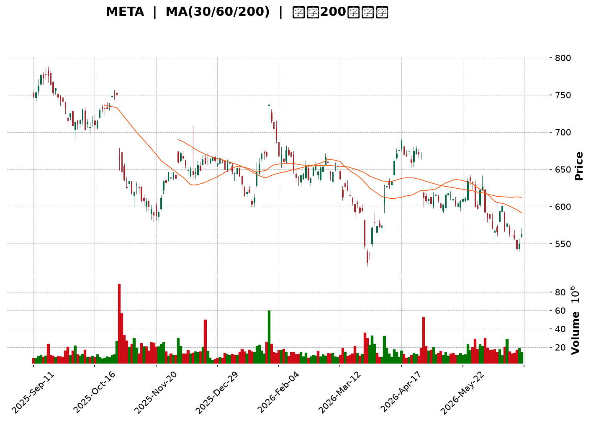
</details>

<html>
<head><meta charset="utf-8" /></head>
<body>
    <div style="height:500px; width:100%;">                        <script>window.PlotlyConfig = {MathJaxConfig: 'local'};</script>
        <script charset="utf-8" src="https://cdn.plot.ly/plotly-3.6.0.min.js" integrity="sha256-QaOVwtVY0T02VaHrr6pnoHLCwayMJp4O5n4YyaE3rJk=" crossorigin="anonymous"></script>                <div id="candlestick-chart" class="plotly-graph-div" style="height:100%; width:100%;"></div>            <script>                window.PLOTLYENV=window.PLOTLYENV || {};                                if (document.getElementById("candlestick-chart")) {                    Plotly.newPlot(                        "candlestick-chart",                        [{"close":{"dtype":"f8","bdata":"AAAAgJNjh0AAAAAg+YiHQAAAAGCd0YdAAAAAIKRDiEAAAACgfCmIQAAAAOCbTYhAAAAAgLI+iEAAAACgZtmHQAAAACCGi4dAAAAAgH61h0AAAAAAvVeHQAAAAKCQLodAAAAA4MUrh0AAAACgzOOGQAAAAGDVW4ZAAAAAwE+phkAAAADguyWGQAAAAKBtToZAAAAAgNc5hkAAAADA0l+GQAAAAKDb3IZAAAAAYMP7hUAAAABAv06GQAAAAGB+FoZAAAAAQIJdhkAAAABgyDGGQAAAAGB7WIZAAAAAYCrShkAAAABg8dqGQAAAAEAP3IZAAAAAgMTghkAAAACAjgOHQAAAAID6ZodAAAAAAO1rh0AAAADAwm2HQAAAAMDtxYRAAAAAQFg1hEAAAABAcuCDQAAAAKCKjYNAAAAAAGfSg0AAAADgrEqDQAAAACDHYINAAAAAIPiwg0AAAABgoIuDQAAAAABx+4JAAAAAoHYCg0AAAABACP+CQAAAAECWw4JAAAAAwB2hgkAAAAAgT2aCQAAAAGD5XIJAAAAA4KqFgkAAAABgrRuDQAAAAICO1INAAAAAILu\u002fg0AAAABAJzKEQAAAACCp+YNAAAAA4F4rhEAAAADghu+DQAAAAACDnoRAAAAAgGL9hEAAAADgj8iEQAAAAOALeoRAAAAAQIxDhEAAAACAIliEQAAAAIB4FIRAAAAAQNsyhEAAAADg1n+EQAAAAIC\u002fQoRAAAAAgCK6hEAAAACgxoyEQAAAAMCTooRAAAAAQAy+hEAAAAAA5NKEQAAAACDfsIRAAAAAICOMhEAAAAAgHcaEQAAAACBRl4RAAAAAwANKhEAAAACA74yEQAAAAKCMm4RAAAAAgEc8hEAAAADgRieEQAAAAGAtX4RAAAAAYJ0GhEAAAAAAu6+DQAAAAGBkM4NAAAAAgI5dg0AAAAAgKlmDQAAAAMBa2IJAAAAA4PIeg0AAAACA0DOEQAAAAECyjIRAAAAAQE35hEAAAABgLP6EQAAAAEBQ3IRAAAAAgPYHh0AAAAAgy1mGQAAAAIA3CYZAAAAAIL+ThUAAAAAAZN6EQAAAACAi6IRAAAAAAEKihEAAAADgHCCFQAAAAIA07IRAAAAAoP7bhEAAAABAOUWEQAAAAOAL9YNAAAAAoDbxg0AAAADgmBCEQAAAACAOHYRAAAAAwPBzhEAAAABA7OCDQAAAACBL8YNAAAAAQDVkhEAAAACguH6EQAAAAOA0OIRAAAAAgCtjhEAAAAAAT2+EQAAAAABU1IRAAAAAgCabhEAAAACgsR2EQAAAAODlMYRAAAAAQD5nhEAAAABAjW2EQAAAAIBZ6INAAAAAAPAkg0AAAADA85aDQAAAAOCqcINAAAAAIOE4g0AAAAAgG\u002fGCQAAAAODhiIJAAAAAYAHcgkAAAADA94KCQAAAAKC2koJAAAAAgEMYgUAAAACA3WmAQAAAACARv4BAAAAAQM3cgUAAAACgjBWCQAAAAMBs74FAAAAAYOrjgUAAAADgI\u002fSBQAAAAMDSHoNAAAAAIHeeg0AAAADANqqDQAAAAECKz4NAAAAAIAOvhEAAAABgqveEQAAAACDyIYVAAAAAoEx\u002fhUAAAABgT\u002fKEQAAAAADE4YRAAAAAAMMQhUAAAABAUZSEQAAAAGA9E4VAAAAA4O4vhUAAAABAv\u002fWEQAAAAOAA5IRAAAAAQL8ag0AAAACgfQGDQAAAACDCDoNAAAAA4DLjgkAAAAAAgCKDQAAAACDpQYNAAAAAIIYIg0AAAACgcbKCQAAAAICI04JAAAAA4HhAg0AAAADg206DQAAAAEBKLYNAAAAAACcVg0AAAACAatCCQAAAAID\u002f44JAAAAAYIr2gkAAAABAjw2DQAAAACAvHoNAAAAA4F\u002fVg0AAAAAgndWDQAAAAABlv4NAAAAAwE+\u002fgkAAAADgnKiCQAAAAKA5c4NAAAAAQOmXg0AAAACAm4OCQAAAAKDIRoJAAAAAwGNAgkAAAABAnNOBQAAAAKA6v4FAAAAAwKOzgUAAAAAA14uCQAAAACCuwYJAAAAA4KO8gUAAAACAwgmCQAAAAMDMnoFAAAAAoJmRgUAAAAAgXG2BQAAAAMD19oBAAAAAAAAygUAAAADAzJSBQA=="},"high":{"dtype":"f8","bdata":"wV87hQOVh0CyBsXgwpiHQBiOS29UHIhATV\u002fplXVWiEAwP4ha2WWIQCqIbE6gkYhApN50h7uhiEDV1i+4iH2IQKHAvt\u002fOBIhA7iP3uxW5h0CLNTqedJaHQCxXo8rVb4dAAewI66hmh0BIQPQ8VyiHQOo6QsrRf4ZALJe2jA6vhkCc8X1o1MiGQBpzu8QpWIZAh02O1BZlhkC\u002fv1YCRG6GQAAAAKDb3IZAr368x+bqhkBVGEg5lHCGQGQon9eMTYZAh6ehYy2QhkBdjDQ03ZyGQJjTvYRoZYZA3Vzlv+7ehkC7KP6WrASHQBhTQi1uFYdAZ+MRct8jh0Cbeb07TBqHQI3o9+5QjodAjA4iJnajh0BlRUl1hqmHQCP40GSMOYVAwWUSQB0JhUBJf3Qk9YyEQCpVKSSaAIRA1kjjAoMEhEB2L3odzdKDQDdsywQhZINAIppqadLKg0DPYhYzap+DQH8yGdrdmoNAV7Uc5mFAg0CwKqFUtCCDQGMQ6nLTEINANd12iMDQgkDHrwECSY6CQBk3wUgr6YJA8SSFEIykgkAEabQ7zTiDQDhKJvct24NAMabc46Hlg0AkFAd48zKEQO1Q+hsrHYRABM65yIMxhECI4P+7VTmEQEPPL9jEEoVAVfK7wIQHhUDKr+D5oheFQBvQaswMtoRAABvgOn9mhEBYq684pGyEQJxCBsg+KYZAe0TYurJehEBUTUvY4aqEQJ\u002fjj7lroIRAPYTQd+3qhEARrnQGce6EQK501ZILA4VAOAtrQoPGhED1yNnz69eEQEWXMjwS3oRA7e+uT5iYhEDBFLIiL\u002fiEQNZFFNiGvoRAWua45Ke5hEATbiKI2rqEQD0TegGuwoRAlCHMes+PhECEJB71lC+EQEjJkztFboRA8F0VnXFmhEAvd\u002fTaAgmEQCQkGNmlmoNALx3r9Xd4g0BsW6jMrZ+DQLDl07N9EoNAfsPkYlpJg0C0zZlvJpuEQI2AyQ9tyoRAbHnc2Z4QhUAaN8U16xyFQIthWjzJI4VAsrQb4GY1h0B3BCAb7taGQOnnBvMfgIZA2KpWPMldhkArAQsH1HyFQLFDa9RKQoVAo6\u002fH+Vj2hEDTmJsKv1CFQEU4bAmBO4VAo5gE63swhUBJ7JHeXhaFQI0ba\u002fooUoRAocv\u002fbaULhEAjhT\u002fizx6EQPWQGvZMMIRAt7dR1VmxhEBJWa9NO4SEQEhEVGa\u002f\u002f4NALBSerrllhEAI\u002fDCTlZ6EQH8FssdEQoRAB6TRex6WhEDYgyqP7o6EQAvO3Z6T\u002fIRABpQuzwvshEDkZEwQgkKEQMWs7c\u002fFNIRAiycliP6YhEDz6yw3ko+EQLaiswKxYoRAjYOSnmWgg0BlphNITNGDQAvaDUmv34NAxkdriJZwg0AkMZ2NdSODQDpp2Nc024JAqLqTkJwAg0AN3HVNjMOCQGl6m1nj2IJAAzKXYK4zgkCY4m3XxfiAQIVFJD1n2IBAN2OlKkXpgUCcOuC9AoCCQNnUu\u002fa2D4JA33kduQAygkACk54olPWBQBTmrgHvqoNALqd\u002fGUfng0BNf37W6O+DQEFp2ttL04NAr9mx+STNhEClYrhg+S6FQEEdTOeeJ4VAcbIhngmXhUC3NV9a+lWFQJBg7EqXHIVAEMIvzwMuhUDYWTsiheeEQMuy7U1RQIVA6N9txPFOhUAI+VqHaiyFQPKBlGUBDYVADFADbDNig0ATxFmqdFKDQBz\u002fPbFzK4NA7HxdsT8ug0BP2bX3AVuDQKD6isE1g4NA6PKbVZdBg0A5tv+GzOKCQAGH5hOH2YJAeqN6rJtag0CRPw8zOHmDQB6Pa6j\u002fZINAh9CN8Sg4g0ArP5Jo5CqDQJiWxAx\u002f+4JAxhQ3qkgIg0BQSCv\u002f7DGDQHho8zU1L4NAG3IpO0Xvg0BDff6gPBOEQMpx5blMz4NAm50GWErZg0CU3TmKhwKDQCF+\u002faeTfINALuxWAHEOhEAgJfYyiqSDQKYSBVede4JALe5S5ZyogkCF994NLnaCQBwdRAgf3YFA4Fze4kr8gUAAAAAAKcqCQAAAAOB67oJAAAAA4HqOgkAAAACAwiGCQAAAAOB6\u002foFAAAAAoJnhgUAAAADgUciBQAAAAGC4YoFAAAAAwMxmgUAAAABAM9eBQA=="},"hovertemplate":"\u003cb\u003e%{x|%Y-%m-%d}\u003c\u002fb\u003e\u003cbr\u003e\u958b: $%{open:.2f}\u003cbr\u003e\u9ad8: $%{high:.2f}\u003cbr\u003e\u4f4e: $%{low:.2f}\u003cbr\u003e\u6536: $%{close:.2f}\u003cextra\u003e\u003c\u002fextra\u003e","low":{"dtype":"f8","bdata":"ygw67WZPh0DCZfllpCqHQE1nbElEbIdAv7Rn383Uh0AWp9r0c96HQG98rzirFohAKnpW3Gr1h0D5bWwq5dOHQA4u6kD5aIdAQYcMkZ90h0DpDaTp8jSHQP8Me2B\u002f+4ZAP14XdNwJh0D1eXmtU6OGQMoFwY7cIoZAj1cadjdihkD5wdOksyKGQJYgdRzAhYVAf1EvkVr\u002fhUCLcDKJyg+GQGjJ9y+8NIZA66JlsnX1hUBcJjoybw6GQKPHyYMgzIVAjA\u002fGFlsdhkBJzMfCbvCFQBnoamBOAoZArxDLkn5yhkC1t21j4LaGQL7\u002fKfU2kYZAg4sSCJbZhkDrCRTOBsqGQJz\u002fu42OUIdAsN9gU7A8h0C0pfbJqySHQJZcyfjdQ4RAbE3ppCkfhECTXt3gPNSDQBEkqLUWg4NA980tPlGHg0DtT3S+LEODQKrUApcfvYJAV9PcZA1Eg0DgrtUaRE6DQG\u002fsdBaM8YJAPOmpenzLgkBw6VKCP42CQKUuyB3YjoJA6T5wBiAygkCE7OXv7x2CQFT\u002fGrCxLoJAQFpW880igkDbrUgso6CCQHOEw5ORRYNATrzUpO6vg0C0P7XEz86DQImAlWXY4INATMNQeVHjg0D5xvtjK9+DQNIY7byzkoRAAhAZuV+lhEDIQ9sQwrqEQCKgZ1spXYRAixBDAdkNhEBpriAGGvmDQH6jQZug54NAp2aIgIDsg0CLIdAecBCEQPopDThaQIRAvQdUI1R6hEAK2dRmEIiEQMQYpK\u002fYe4RAac+VhZ+IhED1HIrCKqiEQFcEBs8joYRAc3czbsxphEDJkg5zWYWEQK\u002fa2z4gkoRAucLoUtUShEDWAEjixTSEQHJUt+zpVYRAjF1FZksdhECABAo1tNSDQIZBkHukDYRAB2DWkrQAhECUBord6HeDQMKdgE3NLYNAyHd5FRcpg0DOZ7CezleDQN9VKgZ0t4JA4e8GmBe4gkAvY6x\u002feYuDQOXU5I5rGoRAvaDnPuaghEB6yNvNz7uEQLUFWZdPx4RA6Tk28D86hkCvtaIcjkKGQL5p\u002fmkj8oVAngGyaoBphUBvdT80LNKEQMaoYO+wYoRAYhnibcoqhEAwY8Ae24yEQOLWOkTH5IRAVZngg3B\u002fhEBPwOhkDCGEQCXopzaFy4NAUbTHYHGdg0B4WpiUQJiDQKkQsISw3INAbSaRLSTtg0Dwk+PO8NaDQCiz8WHhnoNAi9LW\u002fvgHhEAwT\u002fXNxjKEQMC0sK\u002fe54NA5XrXIfbKg0DlyeS4nu2DQMhahc\u002f9g4RAmvkuajdJhEDDLaiI0deDQMEJ3shPjYNARxf9XME+hEBuLOnzpDmEQEg528og3oNA6GLPa7cDg0D0qc8fL3SDQMkDBLL+aINA0Ixux1Mwg0DTdHBrns2CQD4MuGemVYJADGKTk6SzgkDpDhREn3OCQH6oV\u002fPNhoJASvoxUsb2gECpNcLaOT6AQNyk6p1ngIBAxGbeFxwSgUCJ2z1CT+qBQBpNdj10eYFA67EsT8PbgUBqz3KD5aGBQAmY04tBeoJAbBSemGJzg0DoZ8HcA36DQGbrmTWTfoNALGWEODn2g0ArK+j01ryEQOw9l6sN2YRAvvAH8wkUhUBNjahEDduEQHfJEV2y1YRA22697AnphEBDR2jxj2OEQDbYRW\u002fgaYRAWaDUQMDxhEDZRxX0G8iEQPilzBGQuYRA2bzHNY67gkBy6prhY+yCQLthfQaJ0YJA5dA5uW6+gkBc1UmHXqyCQJ4OkVPGJ4NAjQYyhf3rgkAg2qO6NayCQK242\u002fhogIJAb1UAH9yggkAmMSHBcTODQLPfY3T3BYNAl9LjQgzZgkAhuAyI87+CQKAuiD8NqoJAdDet1hKSgkAF8N2mGvOCQFXBz3nq5YJAfYTMK30Dg0B4KR530aWDQEFJB58udoNAyilUiMy3gkDW7jgNBaGCQIReyLC2vYJACmJeP9Rug0BEwjRC9jKCQNtYZhN4FYJAwsQIqsYjgkDve3m4ktCBQOBYTij0Y4FAZnTEhwuDgUAAAABgZhqCQAAAAAAAgIJAAAAAIIWxgUAAAADAzJiBQAAAAOB6foFAAAAAACmIgUAAAABgZlyBQAAAAKBw4YBAAAAAQDPjgEAAAAAAAHCBQA=="},"name":"\u50f9\u683c","open":{"dtype":"f8","bdata":"ZrROaXqBh0AIEpylRVKHQAp1cZ\u002f2l4dA8I8eafTjh0CEJY8OiUuIQM95o4eYUYhAMv1ilc5+iED\u002fdhsVk16IQKaOvUsJ+odAcJ6wqUech0CnzXvh9nuHQGwikGtvYIdAtz\u002fC3DhWh0B2GyyQmCKHQMIK23PyfIZAO0du\u002f6SFhkAhZsLv5b2GQHERX7\u002fi+oVAUCdved1ehkCehZNSyzyGQE5BUolVY4ZAQSrvAzHIhkDkHZ1qSDmGQHJRPz+ND4ZA00tpWplZhkAvZvlCgl2GQJvGv2b3CYZAiEwltY16hkDoiODD4vCGQHNzuERp34ZA9e\u002fzZ1rmhkCHX1N3B\u002feGQFpsfepHXodAdV+OzWt1h0C20QpDVoaHQHax\u002fkJQ24RA1k3mBBUGhUAhHFX1YnKEQI2KzkxJk4NAxzmgllu1g0AmxYSpmtGDQG9SmTsgN4NA66s3j5+rg0DaicWc95KDQMQguisBlINA7fEYW9Ybg0BYWKS\u002f1MGCQLZIB0eu+4JAuNHRuoVwgkC4tcovcIGCQPDD7+N5z4JAvf1sbMlXgkAVJdqhVamCQFp4j+sMc4NAqeIOU0ngg0C9QNqPcNODQOIsNsMg74NA1yLTyWMFhECjL2cy6BWEQOKDKKD4EYVAaNF3aziyhEAux2xh1NyEQJltAZJisIRASJjNlBxChECe7aNL+AyEQEJBukjqQIRA\u002fAS3+WYkhEDXn8Nm1RKEQNBPEXiKc4RAOa4tb+F+hEAwDDna3cmEQEZF8nPGo4RAsLIrVf+WhEBmn3JuzaqEQPswDbv21oRAdIHM+rSGhEBBdpAZI4yEQLxHesGHvIRAFNx4MmashEB8AO1+zk6EQBUaPRQqk4RARo2mx8dzhEDwtQjo1iWEQE0CpWlTIoRAk\u002fVg3fFahEAvd\u002fTaAgmEQGOBi1UTi4NA2MHblQdLg0CjqR5rjHiDQKrg5Ilh9oJAs2Cp7kbtgkA5RLCp1aGDQMfVJ8T5HIRASt3fnZC\u002fhEDltpVXHAuFQI8JKjVkCoVAMeqGde8Ah0ClBNYCo7GGQKnXAMKeSoZArpHBGuIQhkD+f\u002fEpC3SFQCUnVg0ws4RAkNjVrXDChEA8nCEz\u002fq+EQNdD6aglI4VA8CTZImYGhUCh19hbN+aEQOrJBzCcH4RA\u002ft7v++Pyg0B05Q0aX8WDQEkaiaV264NA5XsZfGj0g0BLcqJeBluEQEk\u002feU6fv4NAU666UhYLhEDxh60OIkuEQGD3wR9vEoRADxSSDjTgg0AvutzCFTmEQB4xwcBOhoRA92FkygKmhEDfT\u002fCJ+DWEQFpZTpwyzYNA2Z0bnCtjhEAfZlTdwGyEQMZO2VTCPIRAvhb0fzt2g0B1Wh5\u002fUbuDQLdMh6REm4NA86CWnyc+g0AACz5qqhyDQB\u002fLlQjF14JADCUpGNXpgkDvgtmnXLSCQNLh9RJ8sYJAgLMx2JovgkAVSaV6zNyAQAAAACARv4BAKN97AcQrgUB0jhYrvhyCQB4ZoncgrIFA0MftpD0JgkCsmKdfmd+BQFDLtsyC64JALZlekR2Tg0BKjeNBD8+DQHqs0klWp4NAW+Fkq\u002f4UhEA6JFovD9OEQPTsOYvpGoVAMMJ03sUvhUDXqf8u1UWFQEEAZIcH84RAvoHCbuINhUDkwBn\u002frriEQMoWYyWrnYRA77ErkwfzhEB1lSLg7AyFQCgk9SVT4oRA1C2\u002f8vhVg0BmO2d89zCDQI90CE8E+4JAw\u002fRAyu8lg0Bw9iOP8sOCQFCzsLY0MYNAdSnU7wo1g0B2hwnsFOCCQOy8G2MnkoJAuWd+QTSygkAwB6vbbzuDQNKjgDRfK4NAG6qLG14Eg0DkEr1o2QKDQELMcEehwYJALr30Ho67gkBF2mSDifqCQLUh6wqcAoNA7uGbqa8Gg0ChHCZEQ\u002feDQOC+YJ9Ox4NAq75dvYeug0D0CWd8c9WCQCtbfIOI04JATSxhZb14g0BztCzdD3eDQKYSBVede4JAG50SOJ9zgkC3EdXCiSGCQLcwRM5yqoFA3JSZDVvjgUAAAABAMx+CQAAAAEAzjYJAAAAAAACAgkAAAABgj+aBQAAAAAAp4IFAAAAAAACSgUAAAADAHo+BQAAAAGBmXIFAAAAAYLj6gEAAAAAAAICBQA=="},"x":["2025-09-11T00:00:00-04:00","2025-09-12T00:00:00-04:00","2025-09-15T00:00:00-04:00","2025-09-16T00:00:00-04:00","2025-09-17T00:00:00-04:00","2025-09-18T00:00:00-04:00","2025-09-19T00:00:00-04:00","2025-09-22T00:00:00-04:00","2025-09-23T00:00:00-04:00","2025-09-24T00:00:00-04:00","2025-09-25T00:00:00-04:00","2025-09-26T00:00:00-04:00","2025-09-29T00:00:00-04:00","2025-09-30T00:00:00-04:00","2025-10-01T00:00:00-04:00","2025-10-02T00:00:00-04:00","2025-10-03T00:00:00-04:00","2025-10-06T00:00:00-04:00","2025-10-07T00:00:00-04:00","2025-10-08T00:00:00-04:00","2025-10-09T00:00:00-04:00","2025-10-10T00:00:00-04:00","2025-10-13T00:00:00-04:00","2025-10-14T00:00:00-04:00","2025-10-15T00:00:00-04:00","2025-10-16T00:00:00-04:00","2025-10-17T00:00:00-04:00","2025-10-20T00:00:00-04:00","2025-10-21T00:00:00-04:00","2025-10-22T00:00:00-04:00","2025-10-23T00:00:00-04:00","2025-10-24T00:00:00-04:00","2025-10-27T00:00:00-04:00","2025-10-28T00:00:00-04:00","2025-10-29T00:00:00-04:00","2025-10-30T00:00:00-04:00","2025-10-31T00:00:00-04:00","2025-11-03T00:00:00-05:00","2025-11-04T00:00:00-05:00","2025-11-05T00:00:00-05:00","2025-11-06T00:00:00-05:00","2025-11-07T00:00:00-05:00","2025-11-10T00:00:00-05:00","2025-11-11T00:00:00-05:00","2025-11-12T00:00:00-05:00","2025-11-13T00:00:00-05:00","2025-11-14T00:00:00-05:00","2025-11-17T00:00:00-05:00","2025-11-18T00:00:00-05:00","2025-11-19T00:00:00-05:00","2025-11-20T00:00:00-05:00","2025-11-21T00:00:00-05:00","2025-11-24T00:00:00-05:00","2025-11-25T00:00:00-05:00","2025-11-26T00:00:00-05:00","2025-11-28T00:00:00-05:00","2025-12-01T00:00:00-05:00","2025-12-02T00:00:00-05:00","2025-12-03T00:00:00-05:00","2025-12-04T00:00:00-05:00","2025-12-05T00:00:00-05:00","2025-12-08T00:00:00-05:00","2025-12-09T00:00:00-05:00","2025-12-10T00:00:00-05:00","2025-12-11T00:00:00-05:00","2025-12-12T00:00:00-05:00","2025-12-15T00:00:00-05:00","2025-12-16T00:00:00-05:00","2025-12-17T00:00:00-05:00","2025-12-18T00:00:00-05:00","2025-12-19T00:00:00-05:00","2025-12-22T00:00:00-05:00","2025-12-23T00:00:00-05:00","2025-12-24T00:00:00-05:00","2025-12-26T00:00:00-05:00","2025-12-29T00:00:00-05:00","2025-12-30T00:00:00-05:00","2025-12-31T00:00:00-05:00","2026-01-02T00:00:00-05:00","2026-01-05T00:00:00-05:00","2026-01-06T00:00:00-05:00","2026-01-07T00:00:00-05:00","2026-01-08T00:00:00-05:00","2026-01-09T00:00:00-05:00","2026-01-12T00:00:00-05:00","2026-01-13T00:00:00-05:00","2026-01-14T00:00:00-05:00","2026-01-15T00:00:00-05:00","2026-01-16T00:00:00-05:00","2026-01-20T00:00:00-05:00","2026-01-21T00:00:00-05:00","2026-01-22T00:00:00-05:00","2026-01-23T00:00:00-05:00","2026-01-26T00:00:00-05:00","2026-01-27T00:00:00-05:00","2026-01-28T00:00:00-05:00","2026-01-29T00:00:00-05:00","2026-01-30T00:00:00-05:00","2026-02-02T00:00:00-05:00","2026-02-03T00:00:00-05:00","2026-02-04T00:00:00-05:00","2026-02-05T00:00:00-05:00","2026-02-06T00:00:00-05:00","2026-02-09T00:00:00-05:00","2026-02-10T00:00:00-05:00","2026-02-11T00:00:00-05:00","2026-02-12T00:00:00-05:00","2026-02-13T00:00:00-05:00","2026-02-17T00:00:00-05:00","2026-02-18T00:00:00-05:00","2026-02-19T00:00:00-05:00","2026-02-20T00:00:00-05:00","2026-02-23T00:00:00-05:00","2026-02-24T00:00:00-05:00","2026-02-25T00:00:00-05:00","2026-02-26T00:00:00-05:00","2026-02-27T00:00:00-05:00","2026-03-02T00:00:00-05:00","2026-03-03T00:00:00-05:00","2026-03-04T00:00:00-05:00","2026-03-05T00:00:00-05:00","2026-03-06T00:00:00-05:00","2026-03-09T00:00:00-04:00","2026-03-10T00:00:00-04:00","2026-03-11T00:00:00-04:00","2026-03-12T00:00:00-04:00","2026-03-13T00:00:00-04:00","2026-03-16T00:00:00-04:00","2026-03-17T00:00:00-04:00","2026-03-18T00:00:00-04:00","2026-03-19T00:00:00-04:00","2026-03-20T00:00:00-04:00","2026-03-23T00:00:00-04:00","2026-03-24T00:00:00-04:00","2026-03-25T00:00:00-04:00","2026-03-26T00:00:00-04:00","2026-03-27T00:00:00-04:00","2026-03-30T00:00:00-04:00","2026-03-31T00:00:00-04:00","2026-04-01T00:00:00-04:00","2026-04-02T00:00:00-04:00","2026-04-06T00:00:00-04:00","2026-04-07T00:00:00-04:00","2026-04-08T00:00:00-04:00","2026-04-09T00:00:00-04:00","2026-04-10T00:00:00-04:00","2026-04-13T00:00:00-04:00","2026-04-14T00:00:00-04:00","2026-04-15T00:00:00-04:00","2026-04-16T00:00:00-04:00","2026-04-17T00:00:00-04:00","2026-04-20T00:00:00-04:00","2026-04-21T00:00:00-04:00","2026-04-22T00:00:00-04:00","2026-04-23T00:00:00-04:00","2026-04-24T00:00:00-04:00","2026-04-27T00:00:00-04:00","2026-04-28T00:00:00-04:00","2026-04-29T00:00:00-04:00","2026-04-30T00:00:00-04:00","2026-05-01T00:00:00-04:00","2026-05-04T00:00:00-04:00","2026-05-05T00:00:00-04:00","2026-05-06T00:00:00-04:00","2026-05-07T00:00:00-04:00","2026-05-08T00:00:00-04:00","2026-05-11T00:00:00-04:00","2026-05-12T00:00:00-04:00","2026-05-13T00:00:00-04:00","2026-05-14T00:00:00-04:00","2026-05-15T00:00:00-04:00","2026-05-18T00:00:00-04:00","2026-05-19T00:00:00-04:00","2026-05-20T00:00:00-04:00","2026-05-21T00:00:00-04:00","2026-05-22T00:00:00-04:00","2026-05-26T00:00:00-04:00","2026-05-27T00:00:00-04:00","2026-05-28T00:00:00-04:00","2026-05-29T00:00:00-04:00","2026-06-01T00:00:00-04:00","2026-06-02T00:00:00-04:00","2026-06-03T00:00:00-04:00","2026-06-04T00:00:00-04:00","2026-06-05T00:00:00-04:00","2026-06-08T00:00:00-04:00","2026-06-09T00:00:00-04:00","2026-06-10T00:00:00-04:00","2026-06-11T00:00:00-04:00","2026-06-12T00:00:00-04:00","2026-06-15T00:00:00-04:00","2026-06-16T00:00:00-04:00","2026-06-17T00:00:00-04:00","2026-06-18T00:00:00-04:00","2026-06-22T00:00:00-04:00","2026-06-23T00:00:00-04:00","2026-06-24T00:00:00-04:00","2026-06-25T00:00:00-04:00","2026-06-26T00:00:00-04:00","2026-06-29T00:00:00-04:00"],"type":"candlestick"},{"hovertemplate":"MA30: $%{y:.2f}\u003cextra\u003e\u003c\u002fextra\u003e","line":{"color":"#2196F3","dash":"dash","width":2},"mode":"lines","name":"MA30","x":["2025-09-11T00:00:00-04:00","2025-09-12T00:00:00-04:00","2025-09-15T00:00:00-04:00","2025-09-16T00:00:00-04:00","2025-09-17T00:00:00-04:00","2025-09-18T00:00:00-04:00","2025-09-19T00:00:00-04:00","2025-09-22T00:00:00-04:00","2025-09-23T00:00:00-04:00","2025-09-24T00:00:00-04:00","2025-09-25T00:00:00-04:00","2025-09-26T00:00:00-04:00","2025-09-29T00:00:00-04:00","2025-09-30T00:00:00-04:00","2025-10-01T00:00:00-04:00","2025-10-02T00:00:00-04:00","2025-10-03T00:00:00-04:00","2025-10-06T00:00:00-04:00","2025-10-07T00:00:00-04:00","2025-10-08T00:00:00-04:00","2025-10-09T00:00:00-04:00","2025-10-10T00:00:00-04:00","2025-10-13T00:00:00-04:00","2025-10-14T00:00:00-04:00","2025-10-15T00:00:00-04:00","2025-10-16T00:00:00-04:00","2025-10-17T00:00:00-04:00","2025-10-20T00:00:00-04:00","2025-10-21T00:00:00-04:00","2025-10-22T00:00:00-04:00","2025-10-23T00:00:00-04:00","2025-10-24T00:00:00-04:00","2025-10-27T00:00:00-04:00","2025-10-28T00:00:00-04:00","2025-10-29T00:00:00-04:00","2025-10-30T00:00:00-04:00","2025-10-31T00:00:00-04:00","2025-11-03T00:00:00-05:00","2025-11-04T00:00:00-05:00","2025-11-05T00:00:00-05:00","2025-11-06T00:00:00-05:00","2025-11-07T00:00:00-05:00","2025-11-10T00:00:00-05:00","2025-11-11T00:00:00-05:00","2025-11-12T00:00:00-05:00","2025-11-13T00:00:00-05:00","2025-11-14T00:00:00-05:00","2025-11-17T00:00:00-05:00","2025-11-18T00:00:00-05:00","2025-11-19T00:00:00-05:00","2025-11-20T00:00:00-05:00","2025-11-21T00:00:00-05:00","2025-11-24T00:00:00-05:00","2025-11-25T00:00:00-05:00","2025-11-26T00:00:00-05:00","2025-11-28T00:00:00-05:00","2025-12-01T00:00:00-05:00","2025-12-02T00:00:00-05:00","2025-12-03T00:00:00-05:00","2025-12-04T00:00:00-05:00","2025-12-05T00:00:00-05:00","2025-12-08T00:00:00-05:00","2025-12-09T00:00:00-05:00","2025-12-10T00:00:00-05:00","2025-12-11T00:00:00-05:00","2025-12-12T00:00:00-05:00","2025-12-15T00:00:00-05:00","2025-12-16T00:00:00-05:00","2025-12-17T00:00:00-05:00","2025-12-18T00:00:00-05:00","2025-12-19T00:00:00-05:00","2025-12-22T00:00:00-05:00","2025-12-23T00:00:00-05:00","2025-12-24T00:00:00-05:00","2025-12-26T00:00:00-05:00","2025-12-29T00:00:00-05:00","2025-12-30T00:00:00-05:00","2025-12-31T00:00:00-05:00","2026-01-02T00:00:00-05:00","2026-01-05T00:00:00-05:00","2026-01-06T00:00:00-05:00","2026-01-07T00:00:00-05:00","2026-01-08T00:00:00-05:00","2026-01-09T00:00:00-05:00","2026-01-12T00:00:00-05:00","2026-01-13T00:00:00-05:00","2026-01-14T00:00:00-05:00","2026-01-15T00:00:00-05:00","2026-01-16T00:00:00-05:00","2026-01-20T00:00:00-05:00","2026-01-21T00:00:00-05:00","2026-01-22T00:00:00-05:00","2026-01-23T00:00:00-05:00","2026-01-26T00:00:00-05:00","2026-01-27T00:00:00-05:00","2026-01-28T00:00:00-05:00","2026-01-29T00:00:00-05:00","2026-01-30T00:00:00-05:00","2026-02-02T00:00:00-05:00","2026-02-03T00:00:00-05:00","2026-02-04T00:00:00-05:00","2026-02-05T00:00:00-05:00","2026-02-06T00:00:00-05:00","2026-02-09T00:00:00-05:00","2026-02-10T00:00:00-05:00","2026-02-11T00:00:00-05:00","2026-02-12T00:00:00-05:00","2026-02-13T00:00:00-05:00","2026-02-17T00:00:00-05:00","2026-02-18T00:00:00-05:00","2026-02-19T00:00:00-05:00","2026-02-20T00:00:00-05:00","2026-02-23T00:00:00-05:00","2026-02-24T00:00:00-05:00","2026-02-25T00:00:00-05:00","2026-02-26T00:00:00-05:00","2026-02-27T00:00:00-05:00","2026-03-02T00:00:00-05:00","2026-03-03T00:00:00-05:00","2026-03-04T00:00:00-05:00","2026-03-05T00:00:00-05:00","2026-03-06T00:00:00-05:00","2026-03-09T00:00:00-04:00","2026-03-10T00:00:00-04:00","2026-03-11T00:00:00-04:00","2026-03-12T00:00:00-04:00","2026-03-13T00:00:00-04:00","2026-03-16T00:00:00-04:00","2026-03-17T00:00:00-04:00","2026-03-18T00:00:00-04:00","2026-03-19T00:00:00-04:00","2026-03-20T00:00:00-04:00","2026-03-23T00:00:00-04:00","2026-03-24T00:00:00-04:00","2026-03-25T00:00:00-04:00","2026-03-26T00:00:00-04:00","2026-03-27T00:00:00-04:00","2026-03-30T00:00:00-04:00","2026-03-31T00:00:00-04:00","2026-04-01T00:00:00-04:00","2026-04-02T00:00:00-04:00","2026-04-06T00:00:00-04:00","2026-04-07T00:00:00-04:00","2026-04-08T00:00:00-04:00","2026-04-09T00:00:00-04:00","2026-04-10T00:00:00-04:00","2026-04-13T00:00:00-04:00","2026-04-14T00:00:00-04:00","2026-04-15T00:00:00-04:00","2026-04-16T00:00:00-04:00","2026-04-17T00:00:00-04:00","2026-04-20T00:00:00-04:00","2026-04-21T00:00:00-04:00","2026-04-22T00:00:00-04:00","2026-04-23T00:00:00-04:00","2026-04-24T00:00:00-04:00","2026-04-27T00:00:00-04:00","2026-04-28T00:00:00-04:00","2026-04-29T00:00:00-04:00","2026-04-30T00:00:00-04:00","2026-05-01T00:00:00-04:00","2026-05-04T00:00:00-04:00","2026-05-05T00:00:00-04:00","2026-05-06T00:00:00-04:00","2026-05-07T00:00:00-04:00","2026-05-08T00:00:00-04:00","2026-05-11T00:00:00-04:00","2026-05-12T00:00:00-04:00","2026-05-13T00:00:00-04:00","2026-05-14T00:00:00-04:00","2026-05-15T00:00:00-04:00","2026-05-18T00:00:00-04:00","2026-05-19T00:00:00-04:00","2026-05-20T00:00:00-04:00","2026-05-21T00:00:00-04:00","2026-05-22T00:00:00-04:00","2026-05-26T00:00:00-04:00","2026-05-27T00:00:00-04:00","2026-05-28T00:00:00-04:00","2026-05-29T00:00:00-04:00","2026-06-01T00:00:00-04:00","2026-06-02T00:00:00-04:00","2026-06-03T00:00:00-04:00","2026-06-04T00:00:00-04:00","2026-06-05T00:00:00-04:00","2026-06-08T00:00:00-04:00","2026-06-09T00:00:00-04:00","2026-06-10T00:00:00-04:00","2026-06-11T00:00:00-04:00","2026-06-12T00:00:00-04:00","2026-06-15T00:00:00-04:00","2026-06-16T00:00:00-04:00","2026-06-17T00:00:00-04:00","2026-06-18T00:00:00-04:00","2026-06-22T00:00:00-04:00","2026-06-23T00:00:00-04:00","2026-06-24T00:00:00-04:00","2026-06-25T00:00:00-04:00","2026-06-26T00:00:00-04:00","2026-06-29T00:00:00-04:00"],"y":{"dtype":"f8","bdata":"AAAAAAAA+H8AAAAAAAD4fwAAAAAAAPh\u002fAAAAAAAA+H8AAAAAAAD4fwAAAAAAAPh\u002fAAAAAAAA+H8AAAAAAAD4fwAAAAAAAPh\u002fAAAAAAAA+H8AAAAAAAD4fwAAAAAAAPh\u002fAAAAAAAA+H8AAAAAAAD4fwAAAAAAAPh\u002fAAAAAAAA+H8AAAAAAAD4fwAAAAAAAPh\u002fAAAAAAAA+H8AAAAAAAD4fwAAAAAAAPh\u002fAAAAAAAA+H8AAAAAAAD4fwAAAAAAAPh\u002fAAAAAAAA+H8AAAAAAAD4fwAAAAAAAPh\u002fAAAAAAAA+H8AAAAAAAD4fxEREZFjAYdAVVVVVQf9hkCJiIjYlPiGQCIiIuIG9YZAzczMHNbthkDv7u4ulOeGQHd3d8d0yYZAZmZm1gKnhkAzMzPTHIWGQImIiOgLY4ZAVVVVdeBBhkCrqqraTh+GQERERDTZ\u002foVA3t3drSfhhUC8u7urncSFQGZmZobNp4VAd3d3J6SIhUDNzMxMwG2FQLy7u+uFT4VAAAAAENUwhUBmZmZG6g6FQN7d3d2E6IRAREREhPvKhEDv7u4erq+EQERERGRqnIRARERE9BaGhEDNzMwMCXWEQHd3d9fOYIRAVVVVdS5KhEAiIiKCRDGEQLy7uzsmHoRA3t3dXQkOhEARERHhAPuDQN7d3f0J4oNAVVVV1RfHg0ARERGxxayDQCIiImLbpoNAZmZmJsamg0De3d1NFqyDQJqZmZkgsoNAzczMDNq5g0BERESklsSDQJqZmalQz4NAzczMzEjYg0BERER0MeODQBERETHG8YNAq6qqiuX+g0B3d3fnEA6EQDMzMzOoHYRAAAAAANIrhEDe3d2tLD6EQImIiLhTUYRAq6qqivJfhEDv7u4O3miEQERERPR8bYRARERE1NlvhEAzMzPjgGuEQO\u002fu7v7kZIRAd3d3twhehEAAAACgBVmEQGZmZibiSYRA7+7ufu85hEDv7u4u+jSEQERERFSZNYRAvLu7S6g7hECJiIgoMUGEQLy7u3vaR4RA7+7uDgZghEB3d3d30m+EQJqZmZn4foRA3t3djTmGhEAAAAAA8oiEQLy7u4tDi4RAd3d3Z1aKhEDe3d1d6YyEQN7d3a3jjoRAERERIY2RhEBEREREQY2EQO\u002fu7o7Yh4RAmpmZyeKEhEBERETEvYCEQJqZmVmGfIRAMzMzU2F+hECJiIj4CHyEQLy7u0tfeIRAVVVV9X17hEB3d3dHZIKEQFVVVeUVi4RAREREVM6ThEAzMzPTE52EQImIiIgCroRAvLu76666hECJiIgo8rmEQImIiFjrtoRAq6qq+gyyhEAAAADgOq2EQM3MzAwZpYRAq6qqKu6DhEBERER0XmyEQCIiIqI3VoRAq6qqKh9ChEDe3d3NrTGEQN7d3e1vHYRAREREpEsOhECrqqqa\u002ffeDQAAAAODw44NAmpmZCdHDg0BERESU56KDQKuqqlqBh4NAvLu7G8J1g0DNzMxM22SDQKuqqtpEUoNAZmZmxmY8g0AiIiKy+SuDQO\u002fu7q71JINAd3d3R14eg0AiIiLiSBeDQKuqqrrLE4NAq6qq6lIWg0Dv7u5+3hqDQFVVVdV0HYNAREREtA8lg0B3d3cHJiyDQERERMQCMoNAMzMzU6k3g0AAAAAg9DiDQHd3d6fqQoNAzczMjFlUg0AAAAAAC2CDQLy7u7trbINAq6qqmmprg0C8u7tr9muDQERERNRscINAZmZmNqpwg0De3d2N+3WDQCIiIpLSe4NAMzMzU12Mg0Crqqq62Z+DQBEREXGZsYNA7+7ufnS9g0AiIiIS5seDQFVVVYV+0oNAVVVVNavcg0BVVVXlAuSDQLy7u+sM4oNAZmZm9nPcg0De3d0tO9eDQN7d3b1R0YNAERERkRDKg0BVVVV1ZcCDQERERPSTtINAd3d3lxydg0BERESklomDQERERNRefYNAmpmZCc9wg0ARERFhL1+DQO\u002fu7p5NR4NAMzMzc0Aug0DNzMyMgxODQERERCSw+IJAIiIiwrfsgkDe3d3Ny+iCQCIiIhI65oJAERERgWjcgkCrqqraDNOCQBEREXEUxYJAd3d3F5W4gkCrqqoKv62CQImIiEjcnYJAiYiIuE+MgkC8u7t7k32CQA=="},"type":"scatter"},{"hovertemplate":"MA60: $%{y:.2f}\u003cextra\u003e\u003c\u002fextra\u003e","line":{"color":"#9C27B0","dash":"dash","width":2},"mode":"lines","name":"MA60","x":["2025-09-11T00:00:00-04:00","2025-09-12T00:00:00-04:00","2025-09-15T00:00:00-04:00","2025-09-16T00:00:00-04:00","2025-09-17T00:00:00-04:00","2025-09-18T00:00:00-04:00","2025-09-19T00:00:00-04:00","2025-09-22T00:00:00-04:00","2025-09-23T00:00:00-04:00","2025-09-24T00:00:00-04:00","2025-09-25T00:00:00-04:00","2025-09-26T00:00:00-04:00","2025-09-29T00:00:00-04:00","2025-09-30T00:00:00-04:00","2025-10-01T00:00:00-04:00","2025-10-02T00:00:00-04:00","2025-10-03T00:00:00-04:00","2025-10-06T00:00:00-04:00","2025-10-07T00:00:00-04:00","2025-10-08T00:00:00-04:00","2025-10-09T00:00:00-04:00","2025-10-10T00:00:00-04:00","2025-10-13T00:00:00-04:00","2025-10-14T00:00:00-04:00","2025-10-15T00:00:00-04:00","2025-10-16T00:00:00-04:00","2025-10-17T00:00:00-04:00","2025-10-20T00:00:00-04:00","2025-10-21T00:00:00-04:00","2025-10-22T00:00:00-04:00","2025-10-23T00:00:00-04:00","2025-10-24T00:00:00-04:00","2025-10-27T00:00:00-04:00","2025-10-28T00:00:00-04:00","2025-10-29T00:00:00-04:00","2025-10-30T00:00:00-04:00","2025-10-31T00:00:00-04:00","2025-11-03T00:00:00-05:00","2025-11-04T00:00:00-05:00","2025-11-05T00:00:00-05:00","2025-11-06T00:00:00-05:00","2025-11-07T00:00:00-05:00","2025-11-10T00:00:00-05:00","2025-11-11T00:00:00-05:00","2025-11-12T00:00:00-05:00","2025-11-13T00:00:00-05:00","2025-11-14T00:00:00-05:00","2025-11-17T00:00:00-05:00","2025-11-18T00:00:00-05:00","2025-11-19T00:00:00-05:00","2025-11-20T00:00:00-05:00","2025-11-21T00:00:00-05:00","2025-11-24T00:00:00-05:00","2025-11-25T00:00:00-05:00","2025-11-26T00:00:00-05:00","2025-11-28T00:00:00-05:00","2025-12-01T00:00:00-05:00","2025-12-02T00:00:00-05:00","2025-12-03T00:00:00-05:00","2025-12-04T00:00:00-05:00","2025-12-05T00:00:00-05:00","2025-12-08T00:00:00-05:00","2025-12-09T00:00:00-05:00","2025-12-10T00:00:00-05:00","2025-12-11T00:00:00-05:00","2025-12-12T00:00:00-05:00","2025-12-15T00:00:00-05:00","2025-12-16T00:00:00-05:00","2025-12-17T00:00:00-05:00","2025-12-18T00:00:00-05:00","2025-12-19T00:00:00-05:00","2025-12-22T00:00:00-05:00","2025-12-23T00:00:00-05:00","2025-12-24T00:00:00-05:00","2025-12-26T00:00:00-05:00","2025-12-29T00:00:00-05:00","2025-12-30T00:00:00-05:00","2025-12-31T00:00:00-05:00","2026-01-02T00:00:00-05:00","2026-01-05T00:00:00-05:00","2026-01-06T00:00:00-05:00","2026-01-07T00:00:00-05:00","2026-01-08T00:00:00-05:00","2026-01-09T00:00:00-05:00","2026-01-12T00:00:00-05:00","2026-01-13T00:00:00-05:00","2026-01-14T00:00:00-05:00","2026-01-15T00:00:00-05:00","2026-01-16T00:00:00-05:00","2026-01-20T00:00:00-05:00","2026-01-21T00:00:00-05:00","2026-01-22T00:00:00-05:00","2026-01-23T00:00:00-05:00","2026-01-26T00:00:00-05:00","2026-01-27T00:00:00-05:00","2026-01-28T00:00:00-05:00","2026-01-29T00:00:00-05:00","2026-01-30T00:00:00-05:00","2026-02-02T00:00:00-05:00","2026-02-03T00:00:00-05:00","2026-02-04T00:00:00-05:00","2026-02-05T00:00:00-05:00","2026-02-06T00:00:00-05:00","2026-02-09T00:00:00-05:00","2026-02-10T00:00:00-05:00","2026-02-11T00:00:00-05:00","2026-02-12T00:00:00-05:00","2026-02-13T00:00:00-05:00","2026-02-17T00:00:00-05:00","2026-02-18T00:00:00-05:00","2026-02-19T00:00:00-05:00","2026-02-20T00:00:00-05:00","2026-02-23T00:00:00-05:00","2026-02-24T00:00:00-05:00","2026-02-25T00:00:00-05:00","2026-02-26T00:00:00-05:00","2026-02-27T00:00:00-05:00","2026-03-02T00:00:00-05:00","2026-03-03T00:00:00-05:00","2026-03-04T00:00:00-05:00","2026-03-05T00:00:00-05:00","2026-03-06T00:00:00-05:00","2026-03-09T00:00:00-04:00","2026-03-10T00:00:00-04:00","2026-03-11T00:00:00-04:00","2026-03-12T00:00:00-04:00","2026-03-13T00:00:00-04:00","2026-03-16T00:00:00-04:00","2026-03-17T00:00:00-04:00","2026-03-18T00:00:00-04:00","2026-03-19T00:00:00-04:00","2026-03-20T00:00:00-04:00","2026-03-23T00:00:00-04:00","2026-03-24T00:00:00-04:00","2026-03-25T00:00:00-04:00","2026-03-26T00:00:00-04:00","2026-03-27T00:00:00-04:00","2026-03-30T00:00:00-04:00","2026-03-31T00:00:00-04:00","2026-04-01T00:00:00-04:00","2026-04-02T00:00:00-04:00","2026-04-06T00:00:00-04:00","2026-04-07T00:00:00-04:00","2026-04-08T00:00:00-04:00","2026-04-09T00:00:00-04:00","2026-04-10T00:00:00-04:00","2026-04-13T00:00:00-04:00","2026-04-14T00:00:00-04:00","2026-04-15T00:00:00-04:00","2026-04-16T00:00:00-04:00","2026-04-17T00:00:00-04:00","2026-04-20T00:00:00-04:00","2026-04-21T00:00:00-04:00","2026-04-22T00:00:00-04:00","2026-04-23T00:00:00-04:00","2026-04-24T00:00:00-04:00","2026-04-27T00:00:00-04:00","2026-04-28T00:00:00-04:00","2026-04-29T00:00:00-04:00","2026-04-30T00:00:00-04:00","2026-05-01T00:00:00-04:00","2026-05-04T00:00:00-04:00","2026-05-05T00:00:00-04:00","2026-05-06T00:00:00-04:00","2026-05-07T00:00:00-04:00","2026-05-08T00:00:00-04:00","2026-05-11T00:00:00-04:00","2026-05-12T00:00:00-04:00","2026-05-13T00:00:00-04:00","2026-05-14T00:00:00-04:00","2026-05-15T00:00:00-04:00","2026-05-18T00:00:00-04:00","2026-05-19T00:00:00-04:00","2026-05-20T00:00:00-04:00","2026-05-21T00:00:00-04:00","2026-05-22T00:00:00-04:00","2026-05-26T00:00:00-04:00","2026-05-27T00:00:00-04:00","2026-05-28T00:00:00-04:00","2026-05-29T00:00:00-04:00","2026-06-01T00:00:00-04:00","2026-06-02T00:00:00-04:00","2026-06-03T00:00:00-04:00","2026-06-04T00:00:00-04:00","2026-06-05T00:00:00-04:00","2026-06-08T00:00:00-04:00","2026-06-09T00:00:00-04:00","2026-06-10T00:00:00-04:00","2026-06-11T00:00:00-04:00","2026-06-12T00:00:00-04:00","2026-06-15T00:00:00-04:00","2026-06-16T00:00:00-04:00","2026-06-17T00:00:00-04:00","2026-06-18T00:00:00-04:00","2026-06-22T00:00:00-04:00","2026-06-23T00:00:00-04:00","2026-06-24T00:00:00-04:00","2026-06-25T00:00:00-04:00","2026-06-26T00:00:00-04:00","2026-06-29T00:00:00-04:00"],"y":{"dtype":"f8","bdata":"AAAAAAAA+H8AAAAAAAD4fwAAAAAAAPh\u002fAAAAAAAA+H8AAAAAAAD4fwAAAAAAAPh\u002fAAAAAAAA+H8AAAAAAAD4fwAAAAAAAPh\u002fAAAAAAAA+H8AAAAAAAD4fwAAAAAAAPh\u002fAAAAAAAA+H8AAAAAAAD4fwAAAAAAAPh\u002fAAAAAAAA+H8AAAAAAAD4fwAAAAAAAPh\u002fAAAAAAAA+H8AAAAAAAD4fwAAAAAAAPh\u002fAAAAAAAA+H8AAAAAAAD4fwAAAAAAAPh\u002fAAAAAAAA+H8AAAAAAAD4fwAAAAAAAPh\u002fAAAAAAAA+H8AAAAAAAD4fwAAAAAAAPh\u002fAAAAAAAA+H8AAAAAAAD4fwAAAAAAAPh\u002fAAAAAAAA+H8AAAAAAAD4fwAAAAAAAPh\u002fAAAAAAAA+H8AAAAAAAD4fwAAAAAAAPh\u002fAAAAAAAA+H8AAAAAAAD4fwAAAAAAAPh\u002fAAAAAAAA+H8AAAAAAAD4fwAAAAAAAPh\u002fAAAAAAAA+H8AAAAAAAD4fwAAAAAAAPh\u002fAAAAAAAA+H8AAAAAAAD4fwAAAAAAAPh\u002fAAAAAAAA+H8AAAAAAAD4fwAAAAAAAPh\u002fAAAAAAAA+H8AAAAAAAD4fwAAAAAAAPh\u002fAAAAAAAA+H8AAAAAAAD4f2ZmZubEj4VAmpmZWYiFhUDNzMzcynmFQAAAAHCIa4VAERER+XZahUAAAADwLEqFQM3MzBQoOIVAZmZmfuQmhUCJiIiQmRiFQBEREUGWCoVAERERQd39hEB3d3e\u002f8vGEQO\u002fu7u4U54RAVVVVPbjchEAAAACQ59OEQLy7u9vJzIRAERER2cTDhEAiIiKa6L2EQHd3dw+XtoRAAAAAiFOuhEAiIiJ6i6aEQDMzM0vsnIRAd3d3B3eVhEDv7u4WRoyEQERERKzzhIRAREREZPh6hEAAAAD4RHCEQDMzM+vZYoRAZmZmlhtUhEARERERJUWEQBERETEENIRAZmZmbvwjhEAAAACI\u002fReEQBEREanRC4RAiYiIEGABhEDNzMxs+\u002faDQO\u002fu7u5a94NAq6qqGmYDhECrqqpi9A2EQJqZmZmMGIRAVVVVzQkghEAiIiJSxCaEQKuqqhpKLYRAIiIimk8xhEARERFpDTiEQHd3d+9UQIRA3t3dVTlIhEDe3d0VqU2EQBEREWHAUoRAzczMZFpYhEARERE5dV+EQBEREQntZoRA7+7u7ilvhEC8u7uDc3KEQAAAACDucoRAzczM5Kt1hEBVVVWV8naEQCIiInL9d4RA3t3dhet4hECamZm5DHuEQHd3d1fye4RAVVVVNU96hEC8u7srdneEQGZmZlZCdoRAMzMzo9p2hEBEREQENneEQERERMR5doRAzczMHPpxhEDe3d11GG6EQN7d3R2YaoRAREREXCxkhEDv7u7mT12EQM3MzLxZVIRA3t3dBVFMhEBERER8c0KEQO\u002fu7kZqOYRAVVVVFa8qhEBERERsFBiEQM3MzPSsB4RAq6qqclL9g0CJiIiIzPKDQCIiIppl54NAzczMDGTdg0BVVVVVAdSDQFVVVX2qzoNAZmZmHu7Mg0DNzMyU1syDQAAAANBwz4NAd3d3nxDVg0AREREp+duDQO\u002fu7q675YNAAAAAUN\u002fvg0AAAAAYDPODQGZmZg539INA7+7uJtv0g0AAAACAF\u002fODQCIiItoB9INAvLu72yPsg0AiIiK6NOaDQO\u002fu7q5R4YNAq6qq4sTWg0DNzMwc0s6DQBEREWHuxoNAVVVV7Xq\u002fg0BERESU\u002fLaDQBEREbnhr4NAZmZmLheog0B3d3enYKGDQN7d3WWNnINAVVVVTZuZg0B3d3evYJaDQAAAALBhkoNA3t3d\u002fYiMg0C8u7tL\u002foeDQFVVVU2Bg4NA7+7uHml9g0AAAAAIQneDQERERLyOcoNA3t3dvTFwg0AiIiL6oW2DQM3MzGQEaYNA3t3dJRZhg0De3d1V3lqDQERERMywV4NAZmZmLjxUg0CJiIjAEUyDQDMzMyMcRYNAAAAAAE1Bg0BmZmZGxzmDQAAAAPCNMoNAZmZmLhEsg0DNzMwcYSqDQDMzM3NTK4NAvLu7W4kmg0BEREQ0hCSDQJqZmYFzIINAVVVVNXkig0CrqqpizCaDQM3MzNy6J4NAvLu7G+Ikg0Dv7u7GvCKDQA=="},"type":"scatter"},{"hovertemplate":"MA200: $%{y:.2f}\u003cextra\u003e\u003c\u002fextra\u003e","line":{"color":"#FF6F00","dash":"solid","width":2},"mode":"lines","name":"MA200","x":["2025-09-11T00:00:00-04:00","2025-09-12T00:00:00-04:00","2025-09-15T00:00:00-04:00","2025-09-16T00:00:00-04:00","2025-09-17T00:00:00-04:00","2025-09-18T00:00:00-04:00","2025-09-19T00:00:00-04:00","2025-09-22T00:00:00-04:00","2025-09-23T00:00:00-04:00","2025-09-24T00:00:00-04:00","2025-09-25T00:00:00-04:00","2025-09-26T00:00:00-04:00","2025-09-29T00:00:00-04:00","2025-09-30T00:00:00-04:00","2025-10-01T00:00:00-04:00","2025-10-02T00:00:00-04:00","2025-10-03T00:00:00-04:00","2025-10-06T00:00:00-04:00","2025-10-07T00:00:00-04:00","2025-10-08T00:00:00-04:00","2025-10-09T00:00:00-04:00","2025-10-10T00:00:00-04:00","2025-10-13T00:00:00-04:00","2025-10-14T00:00:00-04:00","2025-10-15T00:00:00-04:00","2025-10-16T00:00:00-04:00","2025-10-17T00:00:00-04:00","2025-10-20T00:00:00-04:00","2025-10-21T00:00:00-04:00","2025-10-22T00:00:00-04:00","2025-10-23T00:00:00-04:00","2025-10-24T00:00:00-04:00","2025-10-27T00:00:00-04:00","2025-10-28T00:00:00-04:00","2025-10-29T00:00:00-04:00","2025-10-30T00:00:00-04:00","2025-10-31T00:00:00-04:00","2025-11-03T00:00:00-05:00","2025-11-04T00:00:00-05:00","2025-11-05T00:00:00-05:00","2025-11-06T00:00:00-05:00","2025-11-07T00:00:00-05:00","2025-11-10T00:00:00-05:00","2025-11-11T00:00:00-05:00","2025-11-12T00:00:00-05:00","2025-11-13T00:00:00-05:00","2025-11-14T00:00:00-05:00","2025-11-17T00:00:00-05:00","2025-11-18T00:00:00-05:00","2025-11-19T00:00:00-05:00","2025-11-20T00:00:00-05:00","2025-11-21T00:00:00-05:00","2025-11-24T00:00:00-05:00","2025-11-25T00:00:00-05:00","2025-11-26T00:00:00-05:00","2025-11-28T00:00:00-05:00","2025-12-01T00:00:00-05:00","2025-12-02T00:00:00-05:00","2025-12-03T00:00:00-05:00","2025-12-04T00:00:00-05:00","2025-12-05T00:00:00-05:00","2025-12-08T00:00:00-05:00","2025-12-09T00:00:00-05:00","2025-12-10T00:00:00-05:00","2025-12-11T00:00:00-05:00","2025-12-12T00:00:00-05:00","2025-12-15T00:00:00-05:00","2025-12-16T00:00:00-05:00","2025-12-17T00:00:00-05:00","2025-12-18T00:00:00-05:00","2025-12-19T00:00:00-05:00","2025-12-22T00:00:00-05:00","2025-12-23T00:00:00-05:00","2025-12-24T00:00:00-05:00","2025-12-26T00:00:00-05:00","2025-12-29T00:00:00-05:00","2025-12-30T00:00:00-05:00","2025-12-31T00:00:00-05:00","2026-01-02T00:00:00-05:00","2026-01-05T00:00:00-05:00","2026-01-06T00:00:00-05:00","2026-01-07T00:00:00-05:00","2026-01-08T00:00:00-05:00","2026-01-09T00:00:00-05:00","2026-01-12T00:00:00-05:00","2026-01-13T00:00:00-05:00","2026-01-14T00:00:00-05:00","2026-01-15T00:00:00-05:00","2026-01-16T00:00:00-05:00","2026-01-20T00:00:00-05:00","2026-01-21T00:00:00-05:00","2026-01-22T00:00:00-05:00","2026-01-23T00:00:00-05:00","2026-01-26T00:00:00-05:00","2026-01-27T00:00:00-05:00","2026-01-28T00:00:00-05:00","2026-01-29T00:00:00-05:00","2026-01-30T00:00:00-05:00","2026-02-02T00:00:00-05:00","2026-02-03T00:00:00-05:00","2026-02-04T00:00:00-05:00","2026-02-05T00:00:00-05:00","2026-02-06T00:00:00-05:00","2026-02-09T00:00:00-05:00","2026-02-10T00:00:00-05:00","2026-02-11T00:00:00-05:00","2026-02-12T00:00:00-05:00","2026-02-13T00:00:00-05:00","2026-02-17T00:00:00-05:00","2026-02-18T00:00:00-05:00","2026-02-19T00:00:00-05:00","2026-02-20T00:00:00-05:00","2026-02-23T00:00:00-05:00","2026-02-24T00:00:00-05:00","2026-02-25T00:00:00-05:00","2026-02-26T00:00:00-05:00","2026-02-27T00:00:00-05:00","2026-03-02T00:00:00-05:00","2026-03-03T00:00:00-05:00","2026-03-04T00:00:00-05:00","2026-03-05T00:00:00-05:00","2026-03-06T00:00:00-05:00","2026-03-09T00:00:00-04:00","2026-03-10T00:00:00-04:00","2026-03-11T00:00:00-04:00","2026-03-12T00:00:00-04:00","2026-03-13T00:00:00-04:00","2026-03-16T00:00:00-04:00","2026-03-17T00:00:00-04:00","2026-03-18T00:00:00-04:00","2026-03-19T00:00:00-04:00","2026-03-20T00:00:00-04:00","2026-03-23T00:00:00-04:00","2026-03-24T00:00:00-04:00","2026-03-25T00:00:00-04:00","2026-03-26T00:00:00-04:00","2026-03-27T00:00:00-04:00","2026-03-30T00:00:00-04:00","2026-03-31T00:00:00-04:00","2026-04-01T00:00:00-04:00","2026-04-02T00:00:00-04:00","2026-04-06T00:00:00-04:00","2026-04-07T00:00:00-04:00","2026-04-08T00:00:00-04:00","2026-04-09T00:00:00-04:00","2026-04-10T00:00:00-04:00","2026-04-13T00:00:00-04:00","2026-04-14T00:00:00-04:00","2026-04-15T00:00:00-04:00","2026-04-16T00:00:00-04:00","2026-04-17T00:00:00-04:00","2026-04-20T00:00:00-04:00","2026-04-21T00:00:00-04:00","2026-04-22T00:00:00-04:00","2026-04-23T00:00:00-04:00","2026-04-24T00:00:00-04:00","2026-04-27T00:00:00-04:00","2026-04-28T00:00:00-04:00","2026-04-29T00:00:00-04:00","2026-04-30T00:00:00-04:00","2026-05-01T00:00:00-04:00","2026-05-04T00:00:00-04:00","2026-05-05T00:00:00-04:00","2026-05-06T00:00:00-04:00","2026-05-07T00:00:00-04:00","2026-05-08T00:00:00-04:00","2026-05-11T00:00:00-04:00","2026-05-12T00:00:00-04:00","2026-05-13T00:00:00-04:00","2026-05-14T00:00:00-04:00","2026-05-15T00:00:00-04:00","2026-05-18T00:00:00-04:00","2026-05-19T00:00:00-04:00","2026-05-20T00:00:00-04:00","2026-05-21T00:00:00-04:00","2026-05-22T00:00:00-04:00","2026-05-26T00:00:00-04:00","2026-05-27T00:00:00-04:00","2026-05-28T00:00:00-04:00","2026-05-29T00:00:00-04:00","2026-06-01T00:00:00-04:00","2026-06-02T00:00:00-04:00","2026-06-03T00:00:00-04:00","2026-06-04T00:00:00-04:00","2026-06-05T00:00:00-04:00","2026-06-08T00:00:00-04:00","2026-06-09T00:00:00-04:00","2026-06-10T00:00:00-04:00","2026-06-11T00:00:00-04:00","2026-06-12T00:00:00-04:00","2026-06-15T00:00:00-04:00","2026-06-16T00:00:00-04:00","2026-06-17T00:00:00-04:00","2026-06-18T00:00:00-04:00","2026-06-22T00:00:00-04:00","2026-06-23T00:00:00-04:00","2026-06-24T00:00:00-04:00","2026-06-25T00:00:00-04:00","2026-06-26T00:00:00-04:00","2026-06-29T00:00:00-04:00"],"y":{"dtype":"f8","bdata":"AAAAAAAA+H8AAAAAAAD4fwAAAAAAAPh\u002fAAAAAAAA+H8AAAAAAAD4fwAAAAAAAPh\u002fAAAAAAAA+H8AAAAAAAD4fwAAAAAAAPh\u002fAAAAAAAA+H8AAAAAAAD4fwAAAAAAAPh\u002fAAAAAAAA+H8AAAAAAAD4fwAAAAAAAPh\u002fAAAAAAAA+H8AAAAAAAD4fwAAAAAAAPh\u002fAAAAAAAA+H8AAAAAAAD4fwAAAAAAAPh\u002fAAAAAAAA+H8AAAAAAAD4fwAAAAAAAPh\u002fAAAAAAAA+H8AAAAAAAD4fwAAAAAAAPh\u002fAAAAAAAA+H8AAAAAAAD4fwAAAAAAAPh\u002fAAAAAAAA+H8AAAAAAAD4fwAAAAAAAPh\u002fAAAAAAAA+H8AAAAAAAD4fwAAAAAAAPh\u002fAAAAAAAA+H8AAAAAAAD4fwAAAAAAAPh\u002fAAAAAAAA+H8AAAAAAAD4fwAAAAAAAPh\u002fAAAAAAAA+H8AAAAAAAD4fwAAAAAAAPh\u002fAAAAAAAA+H8AAAAAAAD4fwAAAAAAAPh\u002fAAAAAAAA+H8AAAAAAAD4fwAAAAAAAPh\u002fAAAAAAAA+H8AAAAAAAD4fwAAAAAAAPh\u002fAAAAAAAA+H8AAAAAAAD4fwAAAAAAAPh\u002fAAAAAAAA+H8AAAAAAAD4fwAAAAAAAPh\u002fAAAAAAAA+H8AAAAAAAD4fwAAAAAAAPh\u002fAAAAAAAA+H8AAAAAAAD4fwAAAAAAAPh\u002fAAAAAAAA+H8AAAAAAAD4fwAAAAAAAPh\u002fAAAAAAAA+H8AAAAAAAD4fwAAAAAAAPh\u002fAAAAAAAA+H8AAAAAAAD4fwAAAAAAAPh\u002fAAAAAAAA+H8AAAAAAAD4fwAAAAAAAPh\u002fAAAAAAAA+H8AAAAAAAD4fwAAAAAAAPh\u002fAAAAAAAA+H8AAAAAAAD4fwAAAAAAAPh\u002fAAAAAAAA+H8AAAAAAAD4fwAAAAAAAPh\u002fAAAAAAAA+H8AAAAAAAD4fwAAAAAAAPh\u002fAAAAAAAA+H8AAAAAAAD4fwAAAAAAAPh\u002fAAAAAAAA+H8AAAAAAAD4fwAAAAAAAPh\u002fAAAAAAAA+H8AAAAAAAD4fwAAAAAAAPh\u002fAAAAAAAA+H8AAAAAAAD4fwAAAAAAAPh\u002fAAAAAAAA+H8AAAAAAAD4fwAAAAAAAPh\u002fAAAAAAAA+H8AAAAAAAD4fwAAAAAAAPh\u002fAAAAAAAA+H8AAAAAAAD4fwAAAAAAAPh\u002fAAAAAAAA+H8AAAAAAAD4fwAAAAAAAPh\u002fAAAAAAAA+H8AAAAAAAD4fwAAAAAAAPh\u002fAAAAAAAA+H8AAAAAAAD4fwAAAAAAAPh\u002fAAAAAAAA+H8AAAAAAAD4fwAAAAAAAPh\u002fAAAAAAAA+H8AAAAAAAD4fwAAAAAAAPh\u002fAAAAAAAA+H8AAAAAAAD4fwAAAAAAAPh\u002fAAAAAAAA+H8AAAAAAAD4fwAAAAAAAPh\u002fAAAAAAAA+H8AAAAAAAD4fwAAAAAAAPh\u002fAAAAAAAA+H8AAAAAAAD4fwAAAAAAAPh\u002fAAAAAAAA+H8AAAAAAAD4fwAAAAAAAPh\u002fAAAAAAAA+H8AAAAAAAD4fwAAAAAAAPh\u002fAAAAAAAA+H8AAAAAAAD4fwAAAAAAAPh\u002fAAAAAAAA+H8AAAAAAAD4fwAAAAAAAPh\u002fAAAAAAAA+H8AAAAAAAD4fwAAAAAAAPh\u002fAAAAAAAA+H8AAAAAAAD4fwAAAAAAAPh\u002fAAAAAAAA+H8AAAAAAAD4fwAAAAAAAPh\u002fAAAAAAAA+H8AAAAAAAD4fwAAAAAAAPh\u002fAAAAAAAA+H8AAAAAAAD4fwAAAAAAAPh\u002fAAAAAAAA+H8AAAAAAAD4fwAAAAAAAPh\u002fAAAAAAAA+H8AAAAAAAD4fwAAAAAAAPh\u002fAAAAAAAA+H8AAAAAAAD4fwAAAAAAAPh\u002fAAAAAAAA+H8AAAAAAAD4fwAAAAAAAPh\u002fAAAAAAAA+H8AAAAAAAD4fwAAAAAAAPh\u002fAAAAAAAA+H8AAAAAAAD4fwAAAAAAAPh\u002fAAAAAAAA+H8AAAAAAAD4fwAAAAAAAPh\u002fAAAAAAAA+H8AAAAAAAD4fwAAAAAAAPh\u002fAAAAAAAA+H8AAAAAAAD4fwAAAAAAAPh\u002fAAAAAAAA+H8AAAAAAAD4fwAAAAAAAPh\u002fAAAAAAAA+H8AAAAAAAD4fwAAAAAAAPh\u002fAAAAAAAA+H+amZlNcD+EQA=="},"type":"scatter"}],                        {"template":{"data":{"barpolar":[{"marker":{"line":{"color":"rgb(17,17,17)","width":0.5},"pattern":{"fillmode":"overlay","size":10,"solidity":0.2}},"type":"barpolar"}],"bar":[{"error_x":{"color":"#f2f5fa"},"error_y":{"color":"#f2f5fa"},"marker":{"line":{"color":"rgb(17,17,17)","width":0.5},"pattern":{"fillmode":"overlay","size":10,"solidity":0.2}},"type":"bar"}],"carpet":[{"aaxis":{"endlinecolor":"#A2B1C6","gridcolor":"#506784","linecolor":"#506784","minorgridcolor":"#506784","startlinecolor":"#A2B1C6"},"baxis":{"endlinecolor":"#A2B1C6","gridcolor":"#506784","linecolor":"#506784","minorgridcolor":"#506784","startlinecolor":"#A2B1C6"},"type":"carpet"}],"choropleth":[{"colorbar":{"outlinewidth":0,"ticks":""},"type":"choropleth"}],"contourcarpet":[{"colorbar":{"outlinewidth":0,"ticks":""},"type":"contourcarpet"}],"contour":[{"colorbar":{"outlinewidth":0,"ticks":""},"colorscale":[[0.0,"#0d0887"],[0.1111111111111111,"#46039f"],[0.2222222222222222,"#7201a8"],[0.3333333333333333,"#9c179e"],[0.4444444444444444,"#bd3786"],[0.5555555555555556,"#d8576b"],[0.6666666666666666,"#ed7953"],[0.7777777777777778,"#fb9f3a"],[0.8888888888888888,"#fdca26"],[1.0,"#f0f921"]],"type":"contour"}],"heatmap":[{"colorbar":{"outlinewidth":0,"ticks":""},"colorscale":[[0.0,"#0d0887"],[0.1111111111111111,"#46039f"],[0.2222222222222222,"#7201a8"],[0.3333333333333333,"#9c179e"],[0.4444444444444444,"#bd3786"],[0.5555555555555556,"#d8576b"],[0.6666666666666666,"#ed7953"],[0.7777777777777778,"#fb9f3a"],[0.8888888888888888,"#fdca26"],[1.0,"#f0f921"]],"type":"heatmap"}],"histogram2dcontour":[{"colorbar":{"outlinewidth":0,"ticks":""},"colorscale":[[0.0,"#0d0887"],[0.1111111111111111,"#46039f"],[0.2222222222222222,"#7201a8"],[0.3333333333333333,"#9c179e"],[0.4444444444444444,"#bd3786"],[0.5555555555555556,"#d8576b"],[0.6666666666666666,"#ed7953"],[0.7777777777777778,"#fb9f3a"],[0.8888888888888888,"#fdca26"],[1.0,"#f0f921"]],"type":"histogram2dcontour"}],"histogram2d":[{"colorbar":{"outlinewidth":0,"ticks":""},"colorscale":[[0.0,"#0d0887"],[0.1111111111111111,"#46039f"],[0.2222222222222222,"#7201a8"],[0.3333333333333333,"#9c179e"],[0.4444444444444444,"#bd3786"],[0.5555555555555556,"#d8576b"],[0.6666666666666666,"#ed7953"],[0.7777777777777778,"#fb9f3a"],[0.8888888888888888,"#fdca26"],[1.0,"#f0f921"]],"type":"histogram2d"}],"histogram":[{"marker":{"pattern":{"fillmode":"overlay","size":10,"solidity":0.2}},"type":"histogram"}],"mesh3d":[{"colorbar":{"outlinewidth":0,"ticks":""},"type":"mesh3d"}],"parcoords":[{"line":{"colorbar":{"outlinewidth":0,"ticks":""}},"type":"parcoords"}],"pie":[{"automargin":true,"type":"pie"}],"scatter3d":[{"line":{"colorbar":{"outlinewidth":0,"ticks":""}},"marker":{"colorbar":{"outlinewidth":0,"ticks":""}},"type":"scatter3d"}],"scattercarpet":[{"marker":{"colorbar":{"outlinewidth":0,"ticks":""}},"type":"scattercarpet"}],"scattergeo":[{"marker":{"colorbar":{"outlinewidth":0,"ticks":""}},"type":"scattergeo"}],"scattergl":[{"marker":{"line":{"color":"#283442"}},"type":"scattergl"}],"scattermapbox":[{"marker":{"colorbar":{"outlinewidth":0,"ticks":""}},"type":"scattermapbox"}],"scattermap":[{"marker":{"colorbar":{"outlinewidth":0,"ticks":""}},"type":"scattermap"}],"scatterpolargl":[{"marker":{"colorbar":{"outlinewidth":0,"ticks":""}},"type":"scatterpolargl"}],"scatterpolar":[{"marker":{"colorbar":{"outlinewidth":0,"ticks":""}},"type":"scatterpolar"}],"scatter":[{"marker":{"line":{"color":"#283442"}},"type":"scatter"}],"scatterternary":[{"marker":{"colorbar":{"outlinewidth":0,"ticks":""}},"type":"scatterternary"}],"surface":[{"colorbar":{"outlinewidth":0,"ticks":""},"colorscale":[[0.0,"#0d0887"],[0.1111111111111111,"#46039f"],[0.2222222222222222,"#7201a8"],[0.3333333333333333,"#9c179e"],[0.4444444444444444,"#bd3786"],[0.5555555555555556,"#d8576b"],[0.6666666666666666,"#ed7953"],[0.7777777777777778,"#fb9f3a"],[0.8888888888888888,"#fdca26"],[1.0,"#f0f921"]],"type":"surface"}],"table":[{"cells":{"fill":{"color":"#506784"},"line":{"color":"rgb(17,17,17)"}},"header":{"fill":{"color":"#2a3f5f"},"line":{"color":"rgb(17,17,17)"}},"type":"table"}]},"layout":{"annotationdefaults":{"arrowcolor":"#f2f5fa","arrowhead":0,"arrowwidth":1},"autotypenumbers":"strict","coloraxis":{"colorbar":{"outlinewidth":0,"ticks":""}},"colorscale":{"diverging":[[0,"#8e0152"],[0.1,"#c51b7d"],[0.2,"#de77ae"],[0.3,"#f1b6da"],[0.4,"#fde0ef"],[0.5,"#f7f7f7"],[0.6,"#e6f5d0"],[0.7,"#b8e186"],[0.8,"#7fbc41"],[0.9,"#4d9221"],[1,"#276419"]],"sequential":[[0.0,"#0d0887"],[0.1111111111111111,"#46039f"],[0.2222222222222222,"#7201a8"],[0.3333333333333333,"#9c179e"],[0.4444444444444444,"#bd3786"],[0.5555555555555556,"#d8576b"],[0.6666666666666666,"#ed7953"],[0.7777777777777778,"#fb9f3a"],[0.8888888888888888,"#fdca26"],[1.0,"#f0f921"]],"sequentialminus":[[0.0,"#0d0887"],[0.1111111111111111,"#46039f"],[0.2222222222222222,"#7201a8"],[0.3333333333333333,"#9c179e"],[0.4444444444444444,"#bd3786"],[0.5555555555555556,"#d8576b"],[0.6666666666666666,"#ed7953"],[0.7777777777777778,"#fb9f3a"],[0.8888888888888888,"#fdca26"],[1.0,"#f0f921"]]},"colorway":["#636efa","#EF553B","#00cc96","#ab63fa","#FFA15A","#19d3f3","#FF6692","#B6E880","#FF97FF","#FECB52"],"font":{"color":"#f2f5fa"},"geo":{"bgcolor":"rgb(17,17,17)","lakecolor":"rgb(17,17,17)","landcolor":"rgb(17,17,17)","showlakes":true,"showland":true,"subunitcolor":"#506784"},"hoverlabel":{"align":"left"},"hovermode":"closest","mapbox":{"style":"dark"},"paper_bgcolor":"rgb(17,17,17)","plot_bgcolor":"rgb(17,17,17)","polar":{"angularaxis":{"gridcolor":"#506784","linecolor":"#506784","ticks":""},"bgcolor":"rgb(17,17,17)","radialaxis":{"gridcolor":"#506784","linecolor":"#506784","ticks":""}},"scene":{"xaxis":{"backgroundcolor":"rgb(17,17,17)","gridcolor":"#506784","gridwidth":2,"linecolor":"#506784","showbackground":true,"ticks":"","zerolinecolor":"#C8D4E3"},"yaxis":{"backgroundcolor":"rgb(17,17,17)","gridcolor":"#506784","gridwidth":2,"linecolor":"#506784","showbackground":true,"ticks":"","zerolinecolor":"#C8D4E3"},"zaxis":{"backgroundcolor":"rgb(17,17,17)","gridcolor":"#506784","gridwidth":2,"linecolor":"#506784","showbackground":true,"ticks":"","zerolinecolor":"#C8D4E3"}},"shapedefaults":{"line":{"color":"#f2f5fa"}},"sliderdefaults":{"bgcolor":"#C8D4E3","bordercolor":"rgb(17,17,17)","borderwidth":1,"tickwidth":0},"ternary":{"aaxis":{"gridcolor":"#506784","linecolor":"#506784","ticks":""},"baxis":{"gridcolor":"#506784","linecolor":"#506784","ticks":""},"bgcolor":"rgb(17,17,17)","caxis":{"gridcolor":"#506784","linecolor":"#506784","ticks":""}},"title":{"x":0.05},"updatemenudefaults":{"bgcolor":"#506784","borderwidth":0},"xaxis":{"automargin":true,"gridcolor":"#283442","linecolor":"#506784","ticks":"","title":{"standoff":15},"zerolinecolor":"#283442","zerolinewidth":2},"yaxis":{"automargin":true,"gridcolor":"#283442","linecolor":"#506784","ticks":"","title":{"standoff":15},"zerolinecolor":"#283442","zerolinewidth":2}}},"xaxis":{"rangeslider":{"visible":false},"title":{"text":"\u65e5\u671f"}},"font":{"size":11},"title":{"text":"META  |  MA(30\u002f60\u002f200)  |  \u6700\u8fd1200\u4ea4\u6613\u65e5"},"yaxis":{"title":{"text":"\u80a1\u50f9 (USD)"}},"hovermode":"x unified","height":500},                        {"responsive": true}                    )                };            </script>        </div>
</body>
</html>

# META 技術分析報告

> **報告日期**：2026-06-30 ｜ **語言**：繁體中文 ｜ **數據來源**：提供之技術數據 ｜ **當前價格**：$562.60

---

## 目錄

| 章節 | 內容 |
|------|------|
| [1. 技術面概覽](#1-技術面概覽) | 訊號儀表板、核心指標、評分卡 |
| [2. 趨勢分析](#2-趨勢分析) | 多時框趨勢、長中短期走勢 |
| [3. 圖表形態分析](#3-圖表形態分析) | 形態識別、K線組合、目標價 |
| [4. 支撐與阻力](#4-支撐與阻力) | 關鍵價位、斐波那契回調 |
| [5. 技術指標深度解讀](#5-技術指標深度解讀) | MA/RSI/MACD/布林/成交量 |
| [6. 動能與波動率](#6-動能與波動率) | 動能評估、ATR、Beta |
| [7. 多時框架總結](#7-多時框架總結) | 時框架評分矩陣 |
| [8. 交易策略建議](#8-交易策略建議) | 多空策略、風險報酬比 |
| [9. 風險提示與監控](#9-風險提示與監控) | 監控指標、風險場景 |

---

## 1. 技術面概覽

本章節提供 META 股票當前技術面的快速總覽，透過訊號儀表板、核心指標速覽表及綜合評分卡，讓投資者對其技術狀態有一個初步且直觀的理解。

### 🎯 技術訊號儀表板

當前 META 的技術訊號主要呈現空頭主導與中性觀望的態勢。多頭訊號稀少，顯示市場對其上漲動能信心不足。

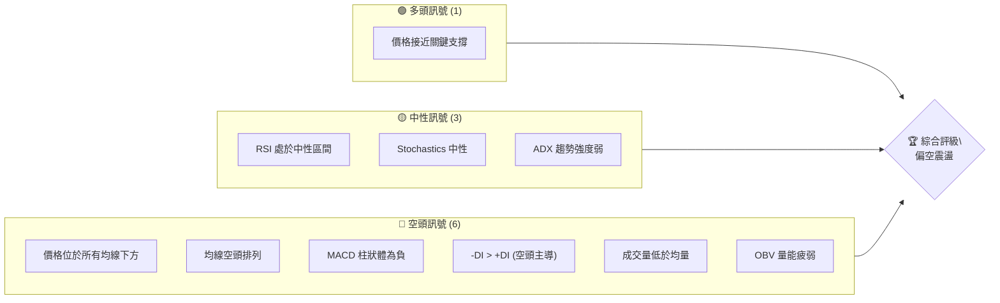
**解讀**：目前多頭訊號僅限於價格接近關鍵支撐位，可能引發技術性反彈。然而，均線系統、MACD、ADX 和成交量等多數關鍵指標均發出明確的空頭訊號，顯示整體市場結構偏弱。RSI和Stochastics處於中性區間，表明當前市場既無明顯超買也無極端超賣，但結合趨勢強度較弱的ADX，暗示 META 更可能處於弱勢震盪或緩慢下跌的階段。

### 📊 核心指標速覽表

下表彙整了 META 當前主要的技術指標數值及其對應的市場訊號與初步解讀。

| 指標類別 | 指標名稱 | 當前數值 | 訊號 | 解讀 |
|----------|----------|----------|------|------|
| **價格** | 當前收盤價 | $562.60 | 🔴 | 位於多個重要均線下方，處於52週區間低位15.6% |
| **均線** | MA20 | $579.52 | 🔴 | 價格位於MA20下方，短期趨勢偏空 |
| **均線** | MA50 | $610.15 | 🔴 | 價格位於MA50下方，中期趨勢偏空 |
| **均線** | MA200 | $647.93 | 🔴 | 價格位於MA200下方，長期趨勢偏空 |
| **動能** | RSI(14) | 42.51 | 🟡 | 處於中性區間，無超買超賣壓力 |
| **動能** | MACD | -15.350 (MACD線) | 🔴 | MACD線在訊號線下方，柱狀體為負，看空 |
| **波動** | ATR(14) | $18.86 | 🟡 | 每日波動約3.35%，處於中等水平，適合短線操作 |
| **趨勢** | ADX(14) | 18.35 | 🟡 | 趨勢強度較弱，市場可能處於盤整或弱勢趨勢 |
| **成交量** | 量比 | 0.75x | 🔴 | 當日成交量低於20日均量，量能疲弱 |

### 🏆 技術評分卡

本評分卡基於各項技術指標的綜合表現，對 META 的當前技術面進行量化評估。評分範圍為0-100分，並輔以多空評級。

```
╔══════════════════════════════════════════════════════════════╗
║              技術評分卡 — META (2026-06-30)                   ║
╠══════════════════════════════════════════════════════════════╣
║ 趨勢強度      ██████░░░░░░░░░░░░░░░░  30/100  🔴 (ADX弱趨勢，空頭主導)   ║
║ 動能指標      ███████░░░░░░░░░░░░░░░  35/100  🔴 (MACD看空，RSI中性偏弱)║
║ 支撐穩定度    █████████░░░░░░░░░░░░░  45/100  🟡 (接近52W低點，但未有效跌破) ║
║ 成交量配合    ████░░░░░░░░░░░░░░░░░░  20/100  🔴 (量能疲弱，OBV下降)    ║
║ 形態完整度    ██████░░░░░░░░░░░░░░░░  30/100  🔴 (處於下降通道，無明顯反轉形態)║
║ 均線排列      ██░░░░░░░░░░░░░░░░░░░░  10/100  🔴 (標準空頭排列，價格遠低於均線)║
╠══════════════════════════════════════════════════════════════╣
║ 綜合評分      ████░░░░░░░░░░░░░░░░░░  28/100  🔴 偏空震盪                     ║
╚══════════════════════════════════════════════════════════════╝
```
**綜合評估**：META 的技術面整體呈現弱勢。趨勢強度低，且均線系統顯示明確的空頭排列，價格長期被均線壓制。動能指標也多數偏空，成交量配合不佳，顯示當前市場缺乏買盤支撐。儘管價格接近一些重要支撐位，可能帶來短暫反彈，但整體結構仍顯示下行壓力較大。綜合評分為 28/100，評級為「偏空震盪」，建議投資者保持謹慎。

---

## 2. 趨勢分析

本章節將透過多時框分析，深入探討 META 股票的長期、中期與短期走勢，並結合 ADX 指標評估趨勢的強度與方向。

### 🌐 多時框趨勢分析

META 的趨勢分析顯示，在經過一段時間的強勁上漲後，目前已進入一個多空拉鋸且偏空的修正階段。

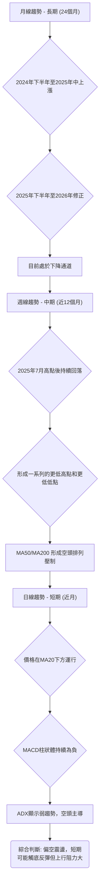
**分析**：
- **長期趨勢 (月線)**：從2024年7月的$471.66開始，META經歷了約一年的強勁上漲，於2025年7月達到$770.91的高點。然而，自2025年8月開始，股價進入修正階段，形成一系列的更低高點和更低低點。截至2026年6月，月線收盤價為$562.60，顯示長期上漲動能已耗盡，轉為長期偏空修正。
- **中期趨勢 (週線)**：檢視近12個月的數據，META 在2025年7月觸及高點$770.91後，便進入明顯的下降趨勢。雖然期間有數次反彈，如2026年1月回升至$715.22，但未能突破前高，隨後繼續下跌。目前股價已跌破所有重要的中期移動平均線 (MA50, MA200)，且這些均線呈現空頭排列，對股價構成強大阻力。
- **短期趨勢 (日線)**：當前價格$562.60位於MA20 ($579.52)下方，MACD柱狀體為負，顯示短期動能偏空。儘管價格在近期觸及52週低點附近，可能存在技術性反彈需求，但整體趨勢仍受空頭力量控制。

### 📈 長期趨勢 — 12個月走勢圖（Unicode）

以下為 META 過去 12 個月的月線收盤價走勢圖，清晰標示了關鍵的高點與低點。

```
META 月線走勢圖（2025-07 至 2026-06）
價格軸 ($)
$770.91 ┤●(2025-07 高點)
$750.00 ┤
$700.00 ┤        ●(2026-01)
$650.00 ┤    ● ●     ●  ●
$600.00 ┤            ●  ●
$550.00 ┤                               ●(2026-06 低點)
     └─────────────────────────────────────────────────────
      25-07 25-08 25-09 25-10 25-11 25-12 26-01 26-02 26-03 26-04 26-05 26-06
```

**走勢特徵分析表格**：
| 期間 | 起始價 | 結束價 | 漲跌幅 | 主要特徵 |
|------|--------|--------|--------|----------|
| 2025-07 | $735.68 | $770.91 | +4.79% | 觸及近一年高點，動能強勁 |
| 2025-08 | $770.91 | $736.29 | -4.50% | 高位回落，初步修正訊號 |
| 2025-09 | $736.29 | $732.47 | -0.52% | 窄幅震盪，動能減弱 |
| 2025-10 | $732.47 | $646.67 | -11.69% | 大幅下跌，確立中期回調 |
| 2025-11 | $646.67 | $646.27 | -0.06% | 止跌盤整，尋找支撐 |
| 2025-12 | $646.27 | $658.91 | +1.95% | 小幅反彈，未能改變趨勢 |
| 2026-01 | $658.91 | $715.22 | +8.54% | 強勁反彈，但未突破前高 |
| 2026-02 | $715.22 | $647.03 | -9.53% | 反彈結束，再次下跌 |
| 2026-03 | $647.03 | $571.60 | -11.66% | 持續探底，跌破多重支撐 |
| 2026-04 | $571.60 | $611.34 | +6.95% | 技術性反彈，但量能不足 |
| 2026-05 | $611.34 | $631.92 | +3.37% | 延續反彈，測試阻力位 |
| 2026-06 | $631.92 | $562.60 | -11.00% | 大幅下跌，創近一年新低 |

**總結**：過去12個月 META 股價呈現明顯的下降趨勢。自2025年7月高點$770.91後，股價經歷了數次下跌與反彈，但反彈高度逐漸降低，低點不斷創下新低。2026年6月的$562.60已跌破了2025年10月的低點$646.67，顯示下降趨勢仍在延續。

### 📊 中期趨勢（週線分析）

中期來看，META 股價自2025年7月以來一直處於一個下降通道中。近期價格在$550.25附近獲得短暫支撐，但上方阻力重重。

```
META 近期壓力與支撐示意圖 (週線)
       $XXX ┌───────────────┐ 阻力線 (下降通道上軌)
            │               │
       $687.91 ┼─────────────┼─ R3 (前高)
            │             ／│
       $610.15 ┼───────／───┼─ R2 (MA50)
            │     ／        │
       $579.52 ┼───●───────┼─ R1 (MA20 / BB中軌)
            │  ／           │
       $562.60 ●(現價)       │
            │               │
       $550.25 ┼─────────────┼─ S1 (近期低點)
            │               │
       $534.33 ┼─────────────┼─ S2 (布林下軌)
            │               │
       $519.78 └───────────────┘ S3 (52週低點)
```
**分析**：從週線圖來看，META 股價目前位於其下降通道的下半部分。MA20 ($579.52) 和 MA50 ($610.15) 均已轉為下行，並對股價構成動態阻力。最近一週的收盤價 $562.60 顯示股價在 $550.25 附近獲得初步支撐後略有反彈，但反彈力度有限，未能突破 MA20 的壓制。若股價能有效突破 MA20 ($579.52) 並站穩，則有機會挑戰 MA50 ($610.15) 和斐波那契回調位，否則將繼續在下降通道中尋找更低的支撐。

### ⚡ 趨勢強度評估（ADX 解讀）

ADX (Average Directional Index) 用於衡量趨勢的強度，而非方向。+DI 和 -DI 則指示趨勢的方向。

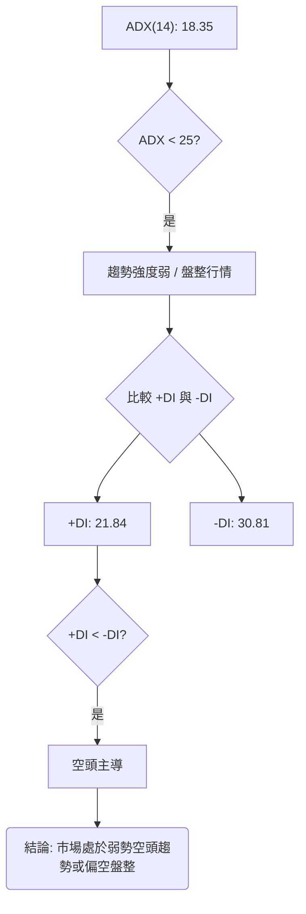
**ADX 強度對照表**：
| ADX 值 | 趨勢強度 | 建議 |
|--------|----------|------|
| 0-25 | 弱趨勢 / 盤整 | 觀望或短線操作，避免趨勢策略 |
| 25-50 | 中等趨勢 | 適合趨勢追蹤策略 |
| 50-75 | 強趨勢 | 趨勢非常明確，可加大倉位 |
| 75-100 | 極強趨勢 | 趨勢過於極端，警惕反轉 |

**解讀**：目前 META 的 ADX(14) 值為 18.35，遠低於 25 的閾值，這明確指示當前市場的趨勢強度非常弱，或者說 META 正處於一個盤整區間。這意味著無論是多頭還是空頭，都沒有足夠的力量推動股價形成明確且持續的方向性趨勢。
進一步分析 +DI (21.84) 和 -DI (30.81)，我們發現 -DI 顯著高於 +DI。這表明在當前的弱勢趨勢中，空頭力量佔據主導地位。儘管趨勢本身不強，但其潛在方向是向下。因此，META 目前處於一個「空頭主導的弱勢趨勢」或「偏空盤整」的狀態。這類市場環境對於趨勢交易者而言較為困難，更適合採取區間震盪或突破策略。

---

## 3. 圖表形態分析

圖表形態分析旨在透過識別價格走勢中重複出現的特定模式，預測未來可能的價格方向和目標價位。

### 🔍 形態識別系統

根據近12個月的價格數據，META 的走勢呈現出一個明顯的下降趨勢，其特徵為一系列的更低高點和更低低點。這暗示著一個下降通道或熊市旗形（Bear Flag）的潛在形態，儘管目前尚未形成教科書式的標準形態。

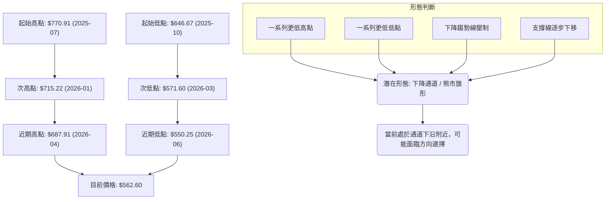
**分析**：META 自2025年7月的$770.91高點以來，價格走勢呈現出明確的「更低高點」和「更低低點」的結構。這是一個典型的下降趨勢特徵，目前股價似乎在一個下降通道中運行。近期股價在$550.25附近獲得初步支撐，但上方下降趨勢線和多條移動平均線形成強大阻力。若能有效突破下降趨勢線，則可能預示著趨勢的反轉；若未能突破並再次跌破$550.25，則下降通道將會延續。

### 🕯️ 重要K線形態分析

根據近20週的收盤走勢數據，我們可以觀察到一些重要的K線形態及其對應的市場訊號。

| 月份 | 收盤價 | K線形態 (根據週收盤價推斷) | 解讀 | 訊號 |
|------|--------|------------------------------|------|------|
| 2026-03-29 | $525.23 | (潛在) 錘子線或紡錘線底部 | 經歷大幅下跌後出現，可能暗示短期底部形成，但需後續確認。 | 🟡 |
| 2026-04-19 | $687.91 | (潛在) 射擊之星或烏雲罩頂頂部 | 股價急漲後在高位出現，預示上漲動能耗盡，可能反轉下跌。 | 🔴 |
| 2026-05-03 | $608.19 | 大陰線 | 跌破多重支撐，確認下跌趨勢。 | 🔴 |
| 2026-06-07 | $592.45 | 大陰線伴隨巨量 | 再次大幅下跌，且成交量放大，確認空頭強勢。 | 🔴 |
| 2026-06-28 | $550.25 | 小實體K線或十字星 | 跌至低位後出現，可能暗示短期止跌，但方向不明。 | 🟡 |
| 2026-07-05 | $562.60 | 小陽線 | 略有反彈，但力度不大，仍處於弱勢。 | 🟡 |

**分析**：在2026年3月29日跌至$525.23後，股價出現反彈，這可能與底部K線形態的形成有關。然而，隨後在2026年4月19日高位$687.91出現的K線形態，則預示了上漲動能的衰竭，導致了之後的連續下跌。最近的2026年6月7日，股價伴隨巨量大跌，顯示空頭力量強勁。而2026年6月28日和2026年7月5日的K線，則暗示股價在低位暫時止跌，但缺乏明確的反轉訊號，仍需觀察後續走勢。

### 📉 ASCII 走勢形態示意圖

以下是 META 近期走勢的下降通道形態示意圖，標注了關鍵的趨勢線。

```
META 下降通道形態示意圖 (2025-07 ~ 2026-06)

價格 ($)
$770.91 ┐                  .---(下降趨勢線)
        │                 /
        │                /
        │               /
        │              /
        │             /
        │            /
$687.91 ┤           ●(2026-04 高點)
        │          /
        │         /
$610.15 ┤        / (MA50)
        │       /
$579.52 ┤      /  (MA20)
        │     /
$562.60 ├────●(現價)
        │   /
        │  /
        │ /
        │/
$550.25 ┤●(2026-06 低點)
        │
$519.78 ┴───────────────────(下降通道下軌 / 52W低點)

時間軸 (月)
```
**解讀**：從示意圖中可以看出，META 的價格在2025年7月達到高峰後，便沿著一條下降趨勢線運行，同時低點也逐漸下移，形成一個清晰的下降通道。當前股價位於通道的下半部，並在近期低點$550.25附近獲得短暫支撐。下降趨勢線和MA20/MA50均線對股價構成上行阻力。

### 🎯 形態目標價計算

由於 META 目前處於下降通道中，且未形成明確的反轉形態，因此主要以通道的延續性來預估潛在目標價。
若下降通道延續，則股價可能向通道下軌運行。
- **下降通道下軌目標價**：
    - 假設股價繼續沿著當前的下降通道運行，其下行目標價將會是通道的下軌。考慮到52週低點$519.78是目前最重要的支撐，若通道下軌被跌破，則此價位將成為下一個考驗。
    - 若以2026-06-28的低點$550.25為基礎，並假設下降通道的斜率不變，則下一個潛在低點可能落在**$519.78** (52週低點) 至 **$500.00** 之間。

若能突破下降通道上軌，則可計算反轉形態的目標價。目前尚未形成明確的反轉形態，因此暫不計算。
- **潛在反彈目標價**：
    - 若股價能從當前位置($562.60)有效反彈，首先將挑戰下降通道的上軌。
    - 以最近一波跌勢 (2026-04-19 高點 $687.91 至 2026-06-28 低點 $550.25) 計算，斐波那契回調位可作為潛在反彈目標。
        - 38.2% 回調位: ($687.91 - $550.25) * 0.382 + $550.25 = **$602.82**
        - 50% 回調位: ($687.91 - $550.25) * 0.500 + $550.25 = **$619.08**
        - 61.8% 回調位: ($687.91 - $550.25) * 0.618 + $550.25 = **$635.33**
    - 這些斐波那契回調位同時也與均線阻力 ($579.52, $610.15) 形成重疊，增加了其阻力強度。

---

## 4. 支撐與阻力

支撐與阻力是技術分析的基石，它們代表了歷史上買賣雙方力量轉換的關鍵價位。本章節將詳細分析 META 的關鍵支撐與阻力位，並結合斐波那契回調進行評估。

### 🗺️ 關鍵價位分布圖（Unicode）

以下為 META 當前關鍵價位結構的分布圖，清晰標示了各級別的支撐與阻力。

```
META 價位結構分布圖 (2026-06-30)
═══════════════════════════════════════════════════════
$793.65 ║████████████████████████║ 強阻力 R4 (52週高點)
$687.91 ║████████████████████    ║ 阻力 R3 (2026-04前高)
$647.93 ║████████████████████████║ 關鍵阻力 R2 (MA200)
$610.15 ║▓▓▓▓▓▓▓▓▓▓▓▓▓▓▓▓▓▓▓▓▓▓▓▓║ 阻力 R1 (MA50 / Fib 50% $619.08)
$579.52 ║▓▓▓▓▓▓▓▓▓▓▓▓▓▓▓▓        ║ 短期阻力 (MA20 / BB中軌)
$562.60 ╠════════════════════════╣ ◄ 現價
$550.25 ║▓▓▓▓▓▓▓▓▓▓▓▓▓▓▓▓        ║ 近期支撐 S1 (2026-06低點)
$534.33 ║████████████████████████║ 關鍵支撐 S2 (布林下軌 / 2026-03低點 $525.23)
$519.78 ║████████████████████████║ 強支撐 S3 (52週低點)
═══════════════════════════════════════════════════════
```

### 🚧 阻力位分析表

| 阻力級別 | 價位 | 形成原因 | 突破難度 | 重要性 |
|----------|------|----------|----------|--------|
| **短期阻力** | **$579.52** | MA20 / 布林通道中軌。價格目前位於其下方。 | 中等 | 🟢 |
| **關鍵阻力R1** | **$610.15** | MA50 / 斐波那契50%回調 ($619.08)。多重均線與斐波那契重疊。 | 高 | 🟡 |
| **關鍵阻力R2** | **$647.93** | MA200。長期趨勢線，對股價形成強大壓制。 | 高 | 🔴 |
| **強阻力R3** | **$687.91** | 2026年4月高點。歷史高點，突破需大量能。 | 非常高 | 🔴 |
| **強阻力R4** | **$793.65** | 52週高點。歷史最高點，突破意味著趨勢反轉。 | 極高 | 🔴 |

**分析**：META 面臨多重上方阻力，其中 MA20 ($579.52) 是短期反彈的首要考驗。若能突破，MA50 ($610.15) 和斐波那契50%回調位 ($619.08) 將形成更強的阻力區。MA200 ($647.93) 作為長期趨勢線，是判斷牛熊轉換的關鍵阻力。而$687.91和$793.65則是更高層級的心理和技術阻力位，突破這些價位需要極其強勁的買盤動能。

### 🛡️ 支撐位分析表

| 支撐級別 | 價位 | 形成原因 | 守住機率 | 重要性 |
|----------|------|----------|----------|--------|
| **近期支撐S1** | **$550.25** | 2026年6月下旬的低點。近期市場在此止跌。 | 中等 | 🟡 |
| **關鍵支撐S2** | **$534.33** | 布林通道下軌 / 2026年3月低點 ($525.23)。技術性超賣區間。 | 高 | 🟢 |
| **強支撐S3** | **$519.78** | 52週低點。過去一年最低價位，具備強烈心理支撐。 | 非常高 | 🟢 |

**分析**：當前價格$562.60已接近近期支撐$550.25。若此處失守，布林通道下軌$534.33和2026年3月低點$525.23將成為下一個關鍵考驗。最重要的是52週低點$519.78，這是過去一年股價的最低點，具有強大的心理和技術支撐作用。若該價位被有效跌破，將預示著更深層次的下跌空間。

### 📐 斐波那契回調位分析

我們將使用 META 最近一波重要的下跌趨勢（從2026年4月19日高點 $687.91 到 2026年6月28日低點 $550.25）來計算斐波那契回調位，以評估潛在的反彈阻力。

- **高點 (100%)**: $687.91 (2026-04-19)
- **低點 (0%)**: $550.25 (2026-06-28)
- **下跌幅度**: $687.91 - $550.25 = $137.66

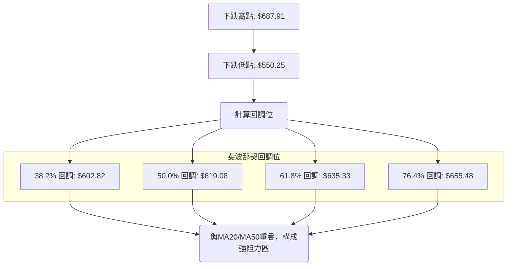
**計算結果**：
- **38.2% 回調位**： $550.25 + ($137.66 * 0.382) = **$602.82**
- **50.0% 回調位**： $550.25 + ($137.66 * 0.500) = **$619.08**
- **61.8% 回調位**： $550.25 + ($137.66 * 0.618) = **$635.33**
- **76.4% 回調位**： $550.25 + ($137.66 * 0.764) = **$655.48**

**解讀**：目前 META 的價格 $562.60 遠低於所有斐波那契回調位，顯示其反彈動能尚未啟動。這些回調位將在股價反彈時構成重要的阻力。特別是50%回調位 $619.08 和61.8%回調位 $635.33，它們通常是趨勢反轉或持續的重要觀察點。值得注意的是，這些斐波那契水平與 MA20 ($579.52)、MA50 ($610.15) 和 MA200 ($647.93) 等均線阻力位形成重疊，進一步強化了這些區域的阻力作用。

---

## 5. 技術指標深度解讀

本章節將對 META 的各項關鍵技術指標進行詳盡的解讀，分析它們的當前狀態、相互關係以及對未來價格走勢的潛在影響。

### 🎛️ 指標訊號總覽

以下 Mermaid 圖展示了各技術指標的當前訊號及其相互關係，有助於綜合判斷市場情緒。

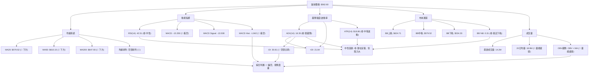
**解讀**：從指標總覽可以看出，META 的技術面整體偏空。均線系統、MACD、ADX 的方向性指標以及成交量均發出明確的看空訊號，顯示市場處於弱勢。RSI、ADX趨勢強度和ATR則顯示市場處於中性或弱勢震盪狀態，暗示短期可能出現技術性反彈，但上行空間受限。

### 📈 移動平均線排列分析

移動平均線 (MA) 是判斷趨勢方向和強度的重要工具。當前 META 的均線排列呈現經典的空頭趨勢。

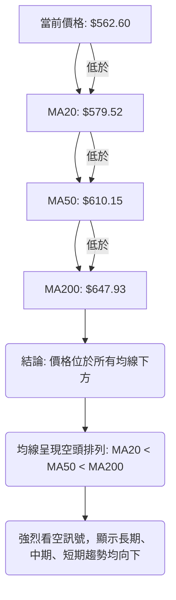
**分析**：META 的股價 ($562.60) 目前位於所有主要移動平均線 (MA20: $579.52, MA50: $610.15, MA200: $647.93) 的下方，這本身就是一個強烈的看空訊號。更重要的是，這些均線呈現出完美的「空頭排列」，即短期均線在最下方，中期均線居中，長期均線在最上方 (MA20 < MA50 < MA200)。這種排列是長期下降趨勢的典型特徵，表明空頭力量在各個時間框架內都佔據絕對主導地位。均線將在股價反彈時形成層層阻力，任何反彈都可能在這些均線處遇到賣壓。

### 📉 RSI(14) 分析

相對強弱指數 (RSI) 用於衡量價格變動的速度和變化，以識別超買或超賣狀況。

- **RSI 數值進度條**：
    RSI(14): 42.51  █████████░░░░░░░░░░░░  42.51% 🟡 中性

**超買超賣區間分析**：
- RSI 數值為 42.51，處於 30-70 的中性區間。這表示當前股價既沒有明顯的超買壓力，也沒有極端的超賣情況。它位於中性區間的偏下方，略微傾向於空頭，但尚未達到超賣區 (通常低於30)。
- 在弱勢趨勢中，RSI 經常在中性區間或偏下方運行，偶爾觸及超賣區後反彈，但反彈力度有限。

**背離判斷 (頂背離/底背離)**：
- 根據提供的數據快照：「RSI 背離: 無明顯背離」。
- 透過檢視近20週的週線數據，我們也未發現明確的頂背離或底背離訊號。
    - 在價格形成新低時 (例如 2026-03-29 的 $525.23 和 2026-06-28 的 $550.25)，RSI 也隨之做出相應的低點 (18.0 和 35.3)。價格和 RSI 的低點變化方向一致 (都是從低點反彈)，因此沒有底背離。
    - 在價格形成高點時 (例如 2026-04-19 的 $687.91 和 2026-05-31 的 $631.92)，RSI 也隨之做出相應的高點 (96.5 和 64.0)。價格和 RSI 的高點變化方向一致 (都是從高點回落)，因此沒有頂背離。
- **結論**：目前 RSI 未顯示明顯的背離訊號，因此無法從背離角度判斷潛在的反轉。RSI 的中性偏弱狀態與當前的弱勢震盪行情相符。

### 📊 MACD(12/26/9) 訊號解讀

平滑異同移動平均線 (MACD) 用於識別趨勢的動能、方向和潛在反轉點。

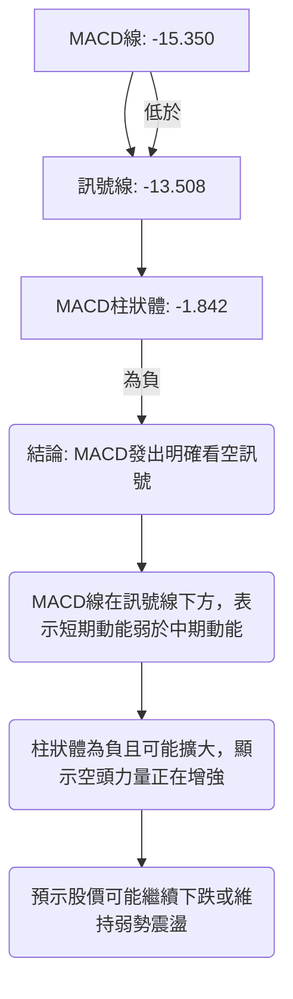
**分析**：當前 MACD 線 (-15.350) 位於訊號線 (-13.508) 的下方，這是一個經典的 MACD 死亡交叉，通常被視為賣出訊號或空頭趨勢確認訊號。MACD 柱狀體為負值 (-1.842)，且其絕對值可能正在擴大 (雖然數據只給了當前值，但從週線數據看，MACD柱狀體在最近幾週持續為負)。這表明空頭動能強勁，且可能正在加速。MACD 的綜合表現與均線系統的空頭排列互相確認，共同指向 META 的弱勢格局。

### 📦 布林通道分析

布林通道 (Bollinger Bands) 包含三條線：中軌 (MA20)、上軌和下軌，用於衡量波動率和識別超買超賣情況。

```
META 布林通道示意圖
═══════════════════════════════════════════════════════════════
$624.71 ║═══════════════════════════════════════════════════════════════║ BB上軌
        ║                                                               ║
        ║                                                               ║
        ║                                                               ║
$579.52 ║───────────────────────────────────────────────────────────────║ BB中軌 (MA20)
        ║                                                               ║
        ║                                                               ║
$562.60 ║                    ● 現價                                     ║
        ║                                                               ║
$534.33 ║═══════════════════════════════════════════════════════════════║ BB下軌
═══════════════════════════════════════════════════════════════
```
**分析**：
- **當前位置**：META 的當前價格 $562.60 位於布林通道中軌 ($579.52) 和下軌 ($534.33) 之間。
- **%B 指標**：BB %B 為 0.31，這表示價格位於中軌和下軌之間，且更靠近下軌。這通常暗示著市場處於弱勢或下跌趨勢中，並且可能正在測試下方的支撐。
- **波動率**：從 ATR 數據看，波動率處於中等水平，布林通道的寬度也反映了這一點。通道並未顯著收窄，也未大幅擴張。
- **訊號**：價格接近布林下軌，可能暗示短期超賣或即將觸及支撐。在下降趨勢中，價格觸及下軌後可能會出現小幅反彈，但若趨勢不變，最終仍可能跌破下軌。中軌 ($579.52) 將是價格反彈時面臨的強力阻力。

### 💹 成交量分析（量價配合度）

成交量是確認價格走勢的重要輔助指標。量價配合度可以判斷趨勢的健康程度。

- **最新成交量**：14,265,970
- **20日均量**：18,917,758
- **50日均量**：16,911,421
- **量比**：0.75x (最新成交量 / 20日均量)

**OBV 趨勢**：OBV < MA → 量能疲弱

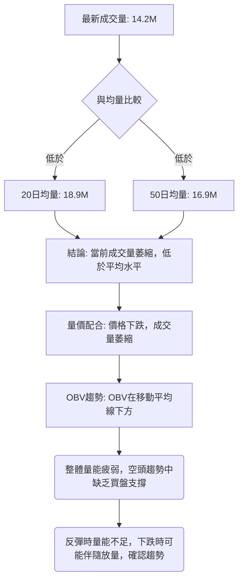
**分析**：
- **成交量萎縮**：當前成交量 14.2M 顯著低於 20日均量 18.9M (量比 0.75x) 和 50日均量 16.9M。這表明市場交投清淡，缺乏活躍的買盤或賣盤推動。在價格下跌的背景下，成交量萎縮通常被解讀為買盤意願不足，市場缺乏支撐。
- **OBV 趨勢疲弱**：OBV (On-Balance Volume) 趨勢顯示 OBV 線位於其移動平均線下方，這是一個看空訊號。OBV 衡量的是累積的買賣壓力，當其趨勢向下時，表明賣盤壓力持續大於買盤壓力，進一步確認了價格的弱勢。
- **量價配合**：在當前的下降趨勢中，如果價格下跌伴隨放量，而反彈時量能不足，則趨勢將得到確認。目前成交量萎縮，說明市場對當前價格缺乏交易興趣，也間接反映了市場的觀望情緒和空頭主導。若未來價格在關鍵支撐位出現放量上漲，則可能是反轉的初步訊號，但目前尚未出現。

---

## 6. 動能與波動率

本章節將評估 META 的動能強度和波動率，這對於制定交易策略和風險管理至關重要。

### ⚡ 動能評估四象限

我們將根據 ADX (趨勢強度) 和 ATR (波動率) 來評估 META 的當前動能狀態。

| 象限 | 動能 (ADX) | 波動 (ATR) | 當前狀態 | 評估 |
|------|------------|------------|----------|------|
| Q1 | 強趨勢 (>25) | 低波動 (<2%) | - | 最佳機會 (強趨勢，低風險) |
| Q2 | 弱趨勢 (<25) | 低波動 (<2%) | - | 謹慎觀望 (缺乏方向，波動小) |
| Q3 | 強趨勢 (>25) | 高波動 (>3%) | - | 高風險高收益 (趨勢明確，但風險大) |
| Q4 | 弱趨勢 (<25) | 高波動 (>3%) | ✓ (META 現狀) | 避免進場 / 區間操作 (方向不明，波動大) |

**分析**：
- **動能 (ADX)**：ADX(14) 為 18.35，低於 25，屬於弱趨勢或盤整行情。這表示市場缺乏明確的方向性動能。
- **波動 (ATR)**：ATR(14) 為 $18.86，佔價格的 3.35%。這屬於中等偏高的波動率。
- **META 當前狀態**：META 處於「弱趨勢，中等偏高波動」的狀態，接近 Q4 象限。這意味著市場缺乏明確的趨勢方向，但價格波動性相對較高。在這種市場環境下，趨勢追蹤策略效果不佳，更容易出現假突破或頻繁止損。相對而言，區間震盪策略或短線高拋低吸可能更為適用，但需嚴格控制風險。

### 📊 ATR 波動率分析

平均真實波幅 (ATR) 衡量的是資產價格的波動性，是設定止損點的重要參考。

- **ATR(14)**：$18.86
- **ATR 佔收盤價比例**：($18.86 / $562.60) * 100% = 3.35%

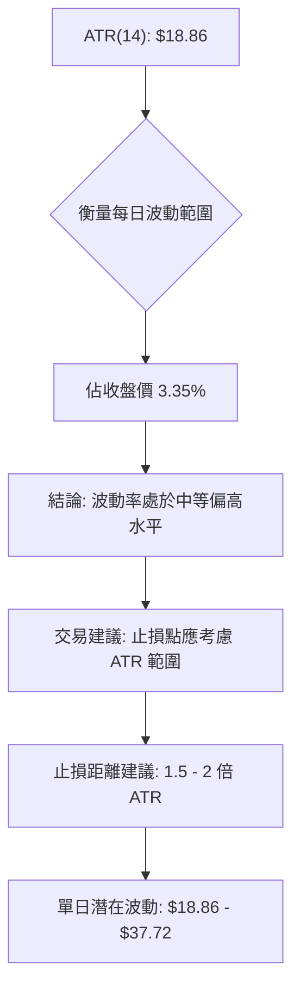
**分析**：META 的 ATR(14) 為 $18.86，佔當前股價的 3.35%。這個比例表明 META 的每日波動幅度相對較大，屬於中等偏高的波動率。高波動性意味著價格在短時間內可能出現較大的漲跌幅，這既帶來了潛在的交易機會，也增加了交易風險。
**止損距離建議**：對於波動性較高的股票，止損點的設定應考慮 ATR 的倍數，以避免被日常波動「洗出」。一般建議將止損點設置在 1.5 到 2 倍 ATR 之外。
- **1.5 倍 ATR 止損**：$18.86 * 1.5 = $28.29
- **2.0 倍 ATR 止損**：$18.86 * 2.0 = $37.72
這意味著，如果計畫進行短線交易，應將止損點設置在入場價下方約 $28.29 至 $37.72 的範圍，以給予股價足夠的波動空間。例如，若從 $562.60 進場，止損點應在 $534.31 (1.5x ATR) 或 $524.88 (2x ATR) 附近。但同時也要考慮關鍵支撐位，選擇一個既能容納波動又符合技術邏輯的止損點。

### 📐 Beta 與市場相關性

提供的數據中未包含 META 的 Beta 值。
**分析**：Beta 值衡量的是個股相對於整體市場（如標普500指數）的波動性。
- 如果 Beta > 1，則表示該股票的波動性大於市場，在牛市中漲幅可能超過市場，在熊市中跌幅也可能超過市場。
- 如果 Beta < 1，則表示該股票的波動性小於市場。
- 如果 Beta = 1，則表示該股票的波動性與市場大致相同。
- Meta Platforms 作為大型科技股，通常具有較高的 Beta 值（預計 > 1），這意味著其股價波動可能較大，對市場情緒和整體經濟環境的敏感度較高。在當前市場整體表現不確定時，高 Beta 股票的風險也會相應增加。由於缺乏具體數據，此處無法給出精確判斷，但在實際交易中應考量其與大盤的相關性。

---

## 7. 多時框架總結

本章節將整合 META 在不同時間框架下的技術分析結果，提供一個全面的市場視角，並評估各時間框架訊號的一致性。

### 📋 時框架評分表

| 時框架 | 趨勢方向 | 動能 | 均線排列 | 形態 | 綜合評分 (1-10) | 建議 |
|--------|----------|------|----------|------|-----------------|------|
| **短期 (日線)** | 🔴 下跌 | 🔴 偏空 | 🔴 空頭排列 | 🟡 震盪 | 3.0 | 謹慎觀望，或考慮小倉位反彈/區間操作 |
| **中期 (週線)** | 🔴 下跌 | 🔴 偏空 | 🔴 空頭排列 | 🔴 下降通道 | 2.5 | 保持空頭思維，等待明確反轉訊號 |
| **長期 (月線)** | 🔴 下跌 | 🔴 偏空 | 🔴 空頭排列 | 🔴 下降通道 | 2.0 | 長期風險較高，不宜建立多頭倉位 |

**分析**：META 在所有時間框架內均呈現出一致的「下跌」趨勢方向和「偏空」的動能表現。均線系統在長、中、短期都保持著空頭排列，價格被所有均線壓制。圖表形態也顯示出明確的下降通道。綜合來看，META 的技術面在各個時間框架上都非常弱勢，空頭訊號高度一致。這表明當前市場對 META 的悲觀情緒已形成共識，且短期內難以改變。

### 🔲 綜合訊號矩陣

以下矩陣展示了短期、中期、長期各維度訊號的一致性，幫助我們快速識別市場的整體偏向。

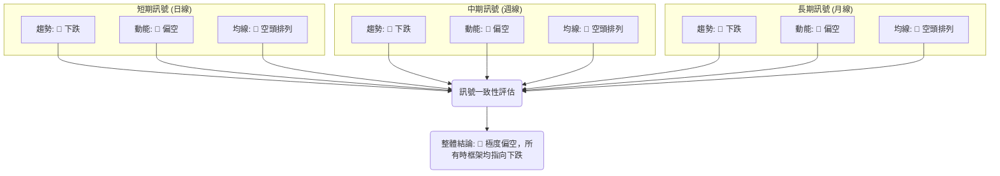
**分析**：此綜合訊號矩陣清晰地表明，META 在短期、中期、長期所有關鍵技術分析維度上都呈現出高度一致的空頭訊號。趨勢方向、動能和均線排列均為紅色 (看空)。這種高度一致性是判斷趨勢強弱的重要依據，它強化了當前下降趨勢的可靠性。因此，投資者應避免逆勢操作，除非有極其強烈的反轉訊號出現並得到確認。當前最有可能的走勢是維持弱勢震盪或繼續探底。

---

## 8. 交易策略建議

基於上述詳盡的技術分析，本章節將為 META 提供具體的交易策略建議，包含多頭與空頭兩種情境，並強調風險報酬比。

### 🗺️ 策略決策流程圖

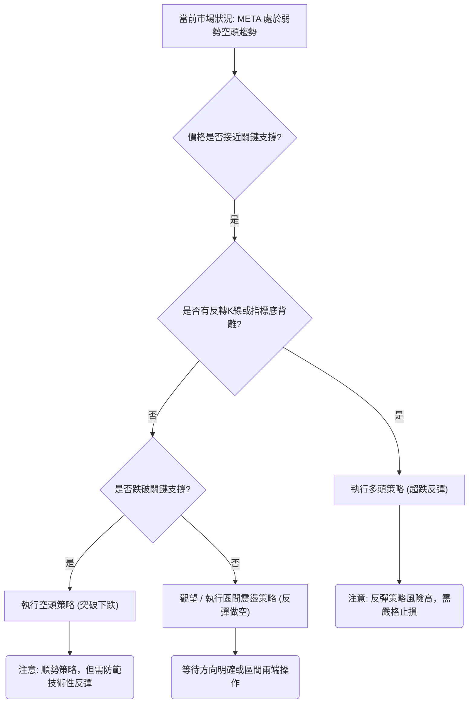
**當前判斷**：META 價格 $562.60 接近關鍵支撐 $550.25 和 $534.33，但尚未出現明確的反轉K線形態或指標底背離 (RSI 無背離)。因此，目前的策略傾向於觀望或在反彈時考慮做空，若跌破關鍵支撐則可考慮追空。

### 🟢 多頭策略詳情 (超跌反彈策略)

鑑於當前整體偏空，多頭策略風險較高，僅適用於短線技術性反彈，且需嚴格止損。

| 策略要素 | 策略 A (保守反彈) | 策略 B (激進反彈) |
|----------|--------------------|--------------------|
| 進場條件 | 價格在 $550.25 支撐位附近獲得有效支撐，出現明確止跌K線，且RSI不再創新低。 | 價格跌破 $550.25 但迅速收回，形成假跌破，且RSI進入超賣區 (<30)後反轉向上。 |
| 進場價格 | **$555.00** | **$540.00** |
| 目標價 T1 | **$579.52** (MA20 / 布林中軌) | **$579.52** (MA20 / 布林中軌) |
| 目標價 T2 | **$610.15** (MA50 / 斐波那契38.2%回調) | **$610.15** (MA50 / 斐波那契38.2%回調) |
| 止損價格 | **$524.00** (略低於S2 $525.23) | **$518.00** (略低於S3 $519.78) |
| 風險報酬比 | T1: 0.79:1 (不佳); T2: **1.78:1** (可接受) | T1: 1.83:1 (良好); T2: **3.33:1** (優異) |
| 成功機率 | 30% | 20% |
| 建議倉位 | 輕倉 (<5%) | 極輕倉 (<2%) |

**策略評估**：多頭策略在當前環境下風險極高。策略A較為保守，等待初步止跌訊號。策略B則更為激進，嘗試捕捉極端超跌後的強勢反彈。兩者都需要嚴格的止損紀律。由於整體趨勢偏空，反彈通常是短暫的，難以形成持續性上漲。

### 🔴 空頭策略詳情 (順勢追空策略)

鑑於當前 META 的強烈空頭訊號和下降趨勢，空頭策略是更符合趨勢的選擇。

| 策略要素 | 策略 A (反彈做空) | 策略 B (跌破追空) |
|----------|--------------------|--------------------|
| 進場條件 | 價格反彈至 MA20 ($579.52) 或 MA50 ($610.15) 等阻力位受阻，出現看空K線或動能減弱。 | 價格有效跌破 $550.25 (S1) 或 $534.33 (S2)，且伴隨放量。 |
| 進場價格 | **$578.00** (MA20附近) | **$549.00** (跌破S1) |
| 目標價 T1 | **$550.25** (S1) | **$534.33** (布林下軌 / S2) |
| 目標價 T2 | **$534.33** (布林下軌 / S2) | **$519.78** (52週低點 / S3) |
| 止損價格 | **$590.00** (略高於MA20) | **$570.00** (略高於原S1 / 現價) |
| 風險報酬比 | T1: 2.31:1 (良好); T2: **3.64:1** (優異) | T1: 0.70:1 (不佳); T2: **1.39:1** (可接受) |
| 成功機率 | 60% | 50% |
| 建議倉位 | 中倉 (5-10%) | 中倉 (5-10%) |

**策略評估**：空頭策略在當前環境下具有較高的勝率。策略A等待反彈至阻力位後做空，風險報酬比優異。策略B則是在關鍵支撐被突破後追空，屬於順勢而為，但需注意假突破的風險。兩種策略均建議採取中等倉位，並嚴格執行止損。

### ⭐ 整體訊號強度評星

```
做多訊號強度：★★☆☆☆  (2/5星) (僅限超跌反彈，風險高)
做空訊號強度：★★★★☆  (4/5星) (順應趨勢，勝率較高)
整體可信度：  ★★★☆☆  (3/5星) (趨勢明確，但波動較大)
```
**總結**：鑒於 META 的技術面整體偏空，強烈建議投資者優先考慮空頭策略或保持觀望。多頭策略僅適用於短線反彈交易者，且需具備豐富的經驗和嚴格的風險控制。

---

## 9. 風險提示與監控

投資 META 在當前技術背景下存在顯著風險。本章節將列出關鍵監控指標、分析可能的情境，並提供風險管理建議。

### ✅ 關鍵監控指標 Checklist

以下清單列出了投資者應密切關注的關鍵技術指標和價位，以應對 META 股價的變化。

```
╔══════════════════════════════════════════════════════════════╗
║              META 風險監控清單 (2026-06-30)                    ║
╠══════════════════════════════════════════════════════════════╣
║ [ ] 價格是否有效跌破 $550.25 (S1)？ → 確認下行趨勢              ║
║ [ ] 價格是否有效跌破 $519.78 (52週低點)？ → 警惕加速下跌        ║
║ [ ] 價格是否能有效突破 MA20 ($579.52) 並站穩？ → 反彈訊號      ║
║ [ ] 價格是否能有效突破 MA50 ($610.15) 並站穩？ → 中期反轉訊號  ║
║ [ ] RSI 是否跌入超賣區 (<30) 後出現反轉訊號？ → 潛在反彈機會  ║
║ [ ] MACD 柱狀體是否由負轉正，或 MACD 線向上穿越訊號線？ → 多頭動能訊號 ║
║ [ ] 成交量在下跌時是否放大，反彈時是否萎縮？ → 確認趨勢延續    ║
║ [ ] 成交量在關鍵支撐位是否出現巨量買盤？ → 潛在底部訊號        ║
║ [ ] ADX 是否開始上升 (>25)，且 +DI 向上穿越 -DI？ → 趨勢反轉確認 ║
╚══════════════════════════════════════════════════════════════╝
```

### ⚠️ 風險場景分析

針對 META 當前的技術面，我們預測三種可能的市場情境：樂觀、基本和悲觀。

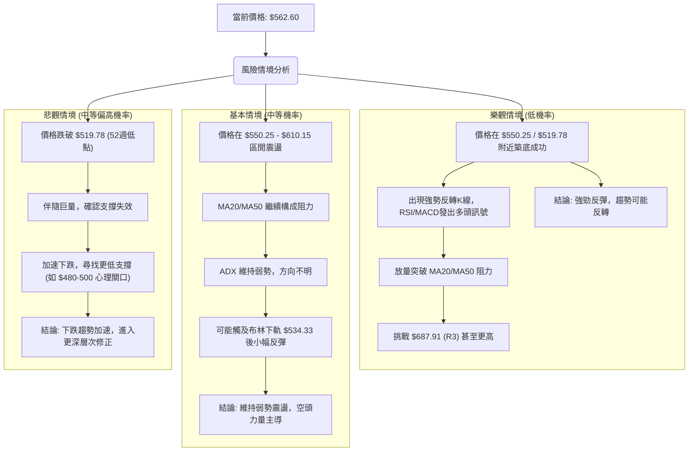
**分析**：
- **樂觀情境 (機率 20%)**：META 在當前低點附近找到強勁支撐，並形成明確的底部反轉形態，伴隨放量突破上方均線阻力。這將預示著股價有望展開一波較強勁的反彈，甚至扭轉中期跌勢。然而，考慮到當前技術指標的普遍偏空，這種情境的發生機率較低。
- **基本情境 (機率 50%)**：META 股價在當前 $550.25 至 $610.15 的區間內進行弱勢震盪。股價可能在 $550.25 和布林下軌 $534.33 附近獲得短暫支撐，但上方 MA20 ($579.52) 和 MA50 ($610.15) 將持續構成壓力。ADX 將維持低位，指示趨勢不明。這種情況下，市場缺乏明確方向，交易者應避免追漲殺跌，可考慮區間操作。
- **悲觀情境 (機率 30%)**：META 股價未能守住 $550.25 甚至 $519.78 (52週低點) 的關鍵支撐，並伴隨大量能跌破。這將確認下降趨勢的延續和加速，股價可能進一步探底，尋找更低的支撐位。這種情境的風險最高，投資者應立即止損以避免更大損失。

### 🛡️ 風險管理重要提醒

1.  **嚴格止損**：在任何交易中，務必設定並嚴格執行止損點。在當前弱勢趨勢下，一旦股價跌破關鍵支撐，應毫不猶豫地止損，避免損失擴大。
2.  **控制倉位**：在趨勢不明或偏空的情況下，應降低交易倉位。即使是看好反彈，也應以輕倉試探，避免重倉逆勢操作。
3.  **避免逆勢抄底**：在明確的下降趨勢中，試圖在下跌過程中抄底是極其危險的。應等待明確的底部形態和反轉訊號出現並得到確認後再考慮介入。
4.  **關注量價關係**：密切監控成交量，尤其是在關鍵支撐和阻力位。若價格突破或跌破時缺乏量能配合，則可能為假突破/跌破訊號。
5.  **多時框確認**：在做出任何交易決策前，應確保多個時間框架的訊號保持一致或至少不矛盾。當前 META 的多時框訊號均偏空，應保持高度警惕。
6.  **耐心等待**：在弱勢震盪市場中，耐心是關鍵。等待市場給出明確的方向性訊號，或等待股價測試到極端支撐/阻力位後再行動。

---

## 📋 報告總結

```
╔══════════════════════════════════════════════════════════════════╗
║                    META 技術分析報告總結                         ║
╠══════════════════════════════════════════════════════════════════╣
║ 報告日期：2026-06-30                                               ║
║ 當前價格：$562.60                                                  ║
║ 分析評級：⚖️ 偏空震盪 (整體技術面極度疲弱，空頭主導)                 ║
║                                                                    ║
║ 關鍵結論：                                                         ║
║ ├─ 長期趨勢：🔴 下跌 (自2025年7月高點後持續修正)                   ║
║ ├─ 中期趨勢：🔴 下跌 (MA50/MA200空頭排列，價格受壓)                ║
║ ├─ 短期趨勢：🔴 下跌 (價格位於MA20下方，MACD看空)                  ║
║ ├─ 關鍵支撐：$550.25 (近期低點), $534.33 (布林下軌), $519.78 (52週低點) ║
║ ├─ 關鍵阻力：$579.52 (MA20), $610.15 (MA50), $647.93 (MA200)      ║
║ └─ 分析師目標：$827.32 (均值) ⚠️ (與技術面嚴重背離，需謹慎對待)    ║
║                                                                    ║
║ 最優策略組合：                                                     ║
║ 1. 🥇 最佳機會：反彈做空策略。在價格反彈至 $579.52 或 $610.15 阻力位受阻時，建立空頭倉位。目標價 $550.25, $534.33。止損點 $590.00。風險報酬比優異。 ║
║ 2. 🥈 次選機會：跌破追空策略。若價格有效跌破 $550.25 或 $534.33，可考慮追空。目標價 $519.78。止損點 $570.00。風險報酬比可接受。 ║
║ 3. 🥉 保守選擇：保持觀望。等待市場明確的反轉訊號或更極端的超賣情況出現，再考慮短線多頭反彈機會，但需極輕倉並嚴格止損。                 ║
╚══════════════════════════════════════════════════════════════════╝
```

---

> ⚠️ **免責聲明**：本報告為 AI 自動生成之技術分析，所有數據及估算均基於提供的歷史價格資訊。本報告**僅供研究與學術參考**，**不構成任何投資建議**。投資有風險，入市需謹慎。

---

*報告生成時間：2026-06-30 ｜ 數據來源：提供之技術數據 ｜ 分析框架：多時框技術分析*