<details>
<summary>📊 靜態圖表 (點擊展開)</summary>

</details>

<html>
<head><meta charset="utf-8" /></head>
<body>
    <div style="height:500px; width:100%;">                        <script>window.PlotlyConfig = {MathJaxConfig: 'local'};</script>
        <script charset="utf-8" src="https://cdn.plot.ly/plotly-3.6.0.min.js" integrity="sha256-QaOVwtVY0T02VaHrr6pnoHLCwayMJp4O5n4YyaE3rJk=" crossorigin="anonymous"></script>                <div id="candlestick-chart" class="plotly-graph-div" style="height:100%; width:100%;"></div>            <script>                window.PLOTLYENV=window.PLOTLYENV || {};                                if (document.getElementById("candlestick-chart")) {                    Plotly.newPlot(                        "candlestick-chart",                        [{"close":{"dtype":"f8","bdata":"AAAAIKRDiEAAAADAfCmIQAAAAOCbTYhAAAAAgLI+iEAAAACAZtmHQAAAACCGi4dAAAAAYH61h0AAAADgvFeHQAAAAMCQLodAAAAA4MUrh0AAAADAzOOGQAAAAGDVW4ZAAAAA4E+phkAAAADguyWGQAAAAKBtToZAAAAAgNc5hkAAAADg0l+GQAAAAKDb3IZAAAAAYMP7hUAAAABAv06GQAAAAGB+FoZAAAAAQIJdhkAAAABgyDGGQAAAAGB7WIZAAAAAQCrShkAAAACA8dqGQAAAAGAP3IZAAAAAgMTghkAAAACAjgOHQAAAAID6ZodAAAAA4Oxrh0AAAACgwm2HQAAAAMDtxYRAAAAAYFg1hEAAAAAgcuCDQAAAAKCKjYNAAAAAAGfSg0AAAADgrEqDQAAAAEDHYINAAAAAQPiwg0AAAABgoIuDQAAAAABx+4JAAAAAoHYCg0AAAABACP+CQAAAAECWw4JAAAAA4B2hgkAAAABAT2aCQAAAAED5XIJAAAAAAKuFgkAAAABgrRuDQAAAAGCO1INAAAAAILu\u002fg0AAAABAJzKEQAAAAOCo+YNAAAAA4F4rhEAAAADAhu+DQAAAAACDnoRAAAAAgGL9hEAAAADgj8iEQAAAAOALeoRAAAAAYIxDhEAAAACAIliEQAAAAEB4FIRAAAAAQNsyhEAAAADA1n+EQAAAAIC\u002fQoRAAAAAoCK6hEAAAACgxoyEQAAAAKCTooRAAAAAQAy+hEAAAAAg5NKEQAAAAADfsIRAAAAAICOMhEAAAAAgHcaEQAAAAEBRl4RAAAAA4ANKhEAAAACA74yEQAAAAMCMm4RAAAAAoEc8hEAAAADgRieEQAAAAEAtX4RAAAAAgJ0GhEAAAAAAu6+DQAAAAGBkM4NAAAAAgI5dg0AAAAAgKlmDQAAAAMBa2IJAAAAA4PIeg0AAAACA0DOEQAAAAECyjIRAAAAAYE35hEAAAABgLP6EQAAAAGBQ3IRAAAAAgPYHh0AAAAAgy1mGQAAAAIA3CYZAAAAAIL+ThUAAAADgY96EQAAAAAAi6IRAAAAAAEKihEAAAADgHCCFQAAAAKA07IRAAAAAoP7bhEAAAABAOUWEQAAAAAAM9YNAAAAAgDbxg0AAAADgmBCEQAAAACAOHYRAAAAAoPBzhEAAAAAg7OCDQAAAAABL8YNAAAAAYDVkhEAAAACguH6EQAAAAAA1OIRAAAAAgCtjhEAAAAAAT2+EQAAAAABU1IRAAAAAgCabhEAAAACgsR2EQAAAAADmMYRAAAAAID5nhEAAAAAgjW2EQAAAAGBZ6INAAAAAAPAkg0AAAADA85aDQAAAAOCqcINAAAAAIOE4g0AAAAAgG\u002fGCQAAAAODhiIJAAAAAYAHcgkAAAADA94KCQAAAAKC2koJAAAAAgEMYgUAAAACA3WmAQAAAACARv4BAAAAAQM3cgUAAAACgjBWCQAAAAMBs74FAAAAAYOrjgUAAAADgI\u002fSBQAAAAMDSHoNAAAAAIHeeg0AAAADANqqDQAAAAECKz4NAAAAAIAOvhEAAAABgqveEQAAAACDyIYVAAAAAoEx\u002fhUAAAABgT\u002fKEQAAAAADE4YRAAAAAAMMQhUAAAABAUZSEQAAAAGA9E4VAAAAA4O4vhUAAAABAv\u002fWEQAAAAOAA5IRAAAAAQL8ag0AAAACgfQGDQAAAACDCDoNAAAAA4DLjgkAAAAAAgCKDQAAAACDpQYNAAAAAIIYIg0AAAACgcbKCQAAAAICI04JAAAAA4HhAg0AAAADg206DQAAAAEBKLYNAAAAAACcVg0AAAACAatCCQAAAAID\u002f44JAAAAAYIr2gkAAAABAjw2DQAAAACAvHoNAAAAA4F\u002fVg0AAAAAgndWDQAAAAABlv4NAAAAAwE+\u002fgkAAAADgnKiCQAAAAKA5c4NAAAAAQOmXg0AAAACAm4OCQAAAAKDIRoJAAAAAwGNAgkAAAABAnNOBQAAAAKA6v4FAAAAAwKOzgUAAAAAA14uCQAAAACCuwYJAAAAA4KO8gUAAAACAwgmCQAAAAMDMnoFAAAAAoJmRgUAAAAAgXG2BQAAAAMD19oBAAAAAAAAygUAAAADAzJSBQAAAAOBRmoFAAAAAoEcng0AAAABAMzeCQA=="},"high":{"dtype":"f8","bdata":"TV\u002fplXVWiECiMNh62WWIQCqIbE6gkYhApN50h7uhiECDnFOXiH2IQKHAvt\u002fOBIhAPUvymxW5h0BEO+R9dJaHQEtw\u002ferVb4dAAewI66hmh0BzElRdVyiHQOo6QsrRf4ZAFbS+rA6vhkCc8X1o1MiGQBpzu8QpWIZAh02O1BZlhkCbZ2siRG6GQAAAAKDb3IZAr368x+bqhkBVGEg5lHCGQGQon9eMTYZAh6ehYy2QhkBdjDQ03ZyGQJjTvYRoZYZA4nXTn+7ehkB5lji3rASHQJKikk1uFYdAZ+MRct8jh0Cbeb07TBqHQI3o9+5QjodANS7WBXajh0BmpPdUhqmHQCP40GSMOYVAIbxhYR0JhUB9xF4D9YyEQCpVKSSaAIRA1kjjAoMEhEB2L3odzdKDQOb00CQhZINAaZ2UidLKg0DPYhYzap+DQH8yGdrdmoNAV7Uc5mFAg0CwKqFUtCCDQGMQ6nLTEINAabDIqMDQgkAuNkciSY6CQLbozCcr6YJAcH66MIykgkAEabQ7zTiDQEOaG9ct24NAMabc46Hlg0AkFAd48zKEQOuMiNsqHYRABM65yIMxhEAsZ4mbVTmEQEPPL9jEEoVAVfK7wIQHhUDKr+D5oheFQBvQaswMtoRAxEsXW39mhEBYq684pGyEQMMrZIE+KYZAe0TYurJehEB1HAi44aqEQJ\u002fjj7lroIRAttgbmO3qhEARrnQGce6EQG7bP3ILA4VAOAtrQoPGhEAohOET7NeEQLSv7BsS3oRA7e+uT5iYhEDBFLIiL\u002fiEQCo1UfiGvoRA9fpoBai5hEATbiKI2rqEQHfWtiGuwoRA0TlQm8+PhECEJB71lC+EQPATfBtFboRA4H6uvXFmhEAvd\u002fTaAgmEQCQkGNmlmoNALx3r9Xd4g0BsW6jMrZ+DQLDl07N9EoNAfsPkYlpJg0C0zZlvJpuEQI2AyQ9tyoRATg0A+p4QhUAaN8U16xyFQPoEyFzJI4VAsrQb4GY1h0B3BCAb7taGQOnnBvMfgIZA2KpWPMldhkCWDhjm03yFQEJE4bNKQoVAo6\u002fH+Vj2hEDTmJsKv1CFQL+A5SmBO4VAo5gE63swhUBJ7JHeXhaFQLBoABspUoRAYmHVTaULhEAjhT\u002fizx6EQPWQGvZMMIRA96LxtFmxhECBdagsO4SEQMoSPUa\u002f\u002f4NAvHWgzrllhEAI\u002fDCTlZ6EQDHywedEQoRAB6TRex6WhEDYgyqP7o6EQAvO3Z6T\u002fIRABpQuzwvshEDkZEwQgkKEQOc68u\u002fFNIRASiDXZ\u002f6YhECCofcWko+EQPL67uGwYoRAjYOSnmWgg0BlphNITNGDQAvaDUmv34NAxkdriJZwg0AkMZ2NdSODQDpp2Nc024JAqLqTkJwAg0AN3HVNjMOCQGl6m1nj2IJAAzKXYK4zgkCY4m3XxfiAQIVFJD1n2IBAN2OlKkXpgUCcOuC9AoCCQNnUu\u002fa2D4JA33kduQAygkACk54olPWBQBTmrgHvqoNALqd\u002fGUfng0BNf37W6O+DQEFp2ttL04NAr9mx+STNhEClYrhg+S6FQEEdTOeeJ4VAcbIhngmXhUC3NV9a+lWFQJBg7EqXHIVAEMIvzwMuhUDYWTsiheeEQMuy7U1RQIVA6N9txPFOhUAI+VqHaiyFQPKBlGUBDYVADFADbDNig0ATxFmqdFKDQBz\u002fPbFzK4NA7HxdsT8ug0BP2bX3AVuDQKD6isE1g4NA6PKbVZdBg0A5tv+GzOKCQAGH5hOH2YJAeqN6rJtag0CRPw8zOHmDQB6Pa6j\u002fZINAh9CN8Sg4g0ArP5Jo5CqDQJiWxAx\u002f+4JAxhQ3qkgIg0BQSCv\u002f7DGDQHho8zU1L4NAG3IpO0Xvg0BDff6gPBOEQMpx5blMz4NAm50GWErZg0CU3TmKhwKDQCF+\u002faeTfINALuxWAHEOhEAgJfYyiqSDQKYSBVede4JALe5S5ZyogkCF994NLnaCQBwdRAgf3YFA4Fze4kr8gUAAAAAAKcqCQAAAAOB67oJAAAAA4HqOgkAAAACAwiGCQAAAAOB6\u002foFAAAAAoJnhgUAAAADgUciBQAAAAGC4YoFAAAAAwMxmgUAAAABAM9eBQAAAAOBRrIFAAAAAgD2ig0AAAAAAABCDQA=="},"hovertemplate":"\u003cb\u003e%{x|%Y-%m-%d}\u003c\u002fb\u003e\u003cbr\u003e\u958b: $%{open:.2f}\u003cbr\u003e\u9ad8: $%{high:.2f}\u003cbr\u003e\u4f4e: $%{low:.2f}\u003cbr\u003e\u6536: $%{close:.2f}\u003cextra\u003e\u003c\u002fextra\u003e","low":{"dtype":"f8","bdata":"v7Rn383Uh0BPR3cUdN6HQG98rzirFohAKnpW3Gr1h0Ah0XMK5dOHQA4u6kD5aIdApBVkcZ90h0AOv9PJ8jSHQNiONIB\u002f+4ZAP14XdNwJh0ALWB\u002fNU6OGQMoFwY7cIoZACPO1lTdihkD5wdOksyKGQJYgdRzAhYVAf1EvkVr\u002fhUAP+r+oyg+GQGjJ9y+8NIZA66JlsnX1hUBcJjoybw6GQKPHyYMgzIVAjA\u002fGFlsdhkBJzMfCbvCFQBnoamBOAoZAkjdRc35yhkBzODuD4LaGQDo6wRQ3kYZAg4sSCJbZhkDrCRTOBsqGQJz\u002fu42OUIdAcGmhM7A8h0DxeVqqqySHQJZcyfjdQ4RAVy3GxCkfhEAtBvHAPNSDQBEkqLUWg4NA980tPlGHg0DtT3S+LEODQE+U9LUfvYJAjdMrhA1Eg0DgrtUaRE6DQG\u002fsdBaM8YJAPOmpenzLgkBw6VKCP42CQKUuyB3YjoJAH5ixJSAygkCzDmgP8B2CQFCla5CxLoJA+oyrEs4igkDbrUgso6CCQIdBqnSRRYNATrzUpO6vg0C0P7XEz86DQHgC5SXY4INATMNQeVHjg0CTCBZEK9+DQNIY7byzkoRAAhAZuV+lhEDIQ9sQwrqEQCKgZ1spXYRAW0PuINkNhEBpriAGGvmDQNyQ0Fug54NAp2aIgIDsg0D9B37\u002fbxCEQPopDThaQIRAjoXxQlR6hEAK2dRmEIiEQKMo4I\u002fYe4RAac+VhZ+IhECpdUjiKqiEQOFYHq8joYRAc3czbsxphEDJkg5zWYWEQIPJ014gkoRAhrqRctUShEDWAEjixTSEQLcySwzqVYRA3l0UhksdhECABAo1tNSDQKpUEFykDYRAq+7MsrQAhECUBord6HeDQMKdgE3NLYNAyHd5FRcpg0DOZ7CezleDQN9VKgZ0t4JA4e8GmBe4gkAvY6x\u002feYuDQOXU5I5rGoRAYMBgXuaghEB6yNvNz7uEQPTNOLdPx4RA6Tk28D86hkCvtaIcjkKGQL5p\u002fmkj8oVAngGyaoBphUCVMVIULNKEQA3oLNCwYoRAYhnibcoqhEAwY8Ae24yEQA97L2TH5IRAVZngg3B\u002fhEBPwOhkDCGEQJ9SZVaFy4NAGCBOQXGdg0B4WpiUQJiDQKkQsISw3INAiA1kDiTtg0CdpfOu8NaDQMnwdULhnoNAKRRGHvkHhEAwT\u002fXNxjKEQCmQMc\u002fe54NA5XrXIfbKg0DlyeS4nu2DQMhahc\u002f9g4RAmvkuajdJhEDDLaiI0deDQN892edPjYNATZc8PcE+hEBQfDrUpDmEQHKn66og3oNA6GLPa7cDg0D0qc8fL3SDQMkDBLL+aINA0Ixux1Mwg0DTdHBrns2CQD4MuGemVYJADGKTk6SzgkDpDhREn3OCQH6oV\u002fPNhoJASvoxUsb2gECpNcLaOT6AQNyk6p1ngIBAxGbeFxwSgUCJ2z1CT+qBQBpNdj10eYFA67EsT8PbgUBqz3KD5aGBQAmY04tBeoJAbBSemGJzg0DoZ8HcA36DQGbrmTWTfoNALGWEODn2g0ArK+j01ryEQOw9l6sN2YRAvvAH8wkUhUBNjahEDduEQHfJEV2y1YRA22697AnphEBDR2jxj2OEQDbYRW\u002fgaYRAWaDUQMDxhEDZRxX0G8iEQPilzBGQuYRA2bzHNY67gkBy6prhY+yCQLthfQaJ0YJA5dA5uW6+gkBc1UmHXqyCQJ4OkVPGJ4NAjQYyhf3rgkAg2qO6NayCQK242\u002fhogIJAb1UAH9yggkAmMSHBcTODQLPfY3T3BYNAl9LjQgzZgkAhuAyI87+CQKAuiD8NqoJAdDet1hKSgkAF8N2mGvOCQFXBz3nq5YJAfYTMK30Dg0B4KR530aWDQEFJB58udoNAyilUiMy3gkDW7jgNBaGCQIReyLC2vYJACmJeP9Rug0BEwjRC9jKCQNtYZhN4FYJAwsQIqsYjgkDve3m4ktCBQOBYTij0Y4FAZnTEhwuDgUAAAABgZhqCQAAAAAAAgIJAAAAAIIWxgUAAAADAzJiBQAAAAOB6foFAAAAAACmIgUAAAABgZlyBQAAAAKBw4YBAAAAAQDPjgEAAAAAAAHCBQAAAAKBwO4FAAAAAwMyYgkAAAAAgXCOCQA=="},"name":"\u50f9\u683c","open":{"dtype":"f8","bdata":"8I8eafTjh0B5PbwuiUuIQM95o4eYUYhAMv1ilc5+iEABx2j0kl6IQKaOvUsJ+odAiabSiUech0BOJErB9nuHQIv51ItvYIdAtz\u002fC3DhWh0Cg5YOwmCKHQMIK23PyfIZAv+k7H6WFhkAhZsLv5b2GQHERX7\u002fi+oVAUCdved1ehkBMbGFyyzyGQE5BUolVY4ZAQSrvAzHIhkDkHZ1qSDmGQHJRPz+ND4ZA00tpWplZhkAvZvlCgl2GQJvGv2b3CYZAdCaglY16hkDnQf\u002fj4vCGQIwkvWRp34ZA9e\u002fzZ1rmhkCHX1N3B\u002feGQFpsfepHXodAWGaBrWt1h0B+QOkiVoaHQHax\u002fkJQ24RADdcwJhUGhUBQKGrUYnKEQI2KzkxJk4NAxzmgllu1g0AmxYSpmtGDQDmKVFsgN4NA4vsur5+rg0DaicWc95KDQMQguisBlINA7fEYW9Ybg0BYWKS\u002f1MGCQLZIB0eu+4JAQ1l+2oVwgkBS5PlPcIGCQG87KMN5z4JAkbkdjMlXgkAVJdqhVamCQKnQLMwMc4NAqeIOU0ngg0C9QNqPcNODQPHrV4Mg74NA1yLTyWMFhEBhlCkS6BWEQOKDKKD4EYVAaNF3aziyhEAux2xh1NyEQJltAZJisIRAq1PLtBxChECe7aNL+AyEQFeZLAjqQIRA\u002fAS3+WYkhEDwyG1H1RKEQNBPEXiKc4RAHDPSjuF+hEAwDDna3cmEQKdp8FPGo4RAsLIrVf+WhEDeBDWOzaqEQGhH0pr21oRAdIHM+rSGhEBBdpAZI4yEQMsctOGHvIRAJQgUU2ashEB8AO1+zk6EQN8UMDQqk4RA\u002fVH+58dzhEDwtQjo1iWEQCqYBEpTIoRAl7bn\u002ffFahEAvd\u002fTaAgmEQGOBi1UTi4NA2MHblQdLg0CjqR5rjHiDQKrg5Ilh9oJAs2Cp7kbtgkA5RLCp1aGDQMfVJ8T5HIRAUsaHvZC\u002fhEDltpVXHAuFQHe4cFVkCoVAMeqGde8Ah0ClBNYCo7GGQKnXAMKeSoZArpHBGuIQhkDPBQwJC3SFQBMxp+0vs4RAkNjVrXDChEA8nCEz\u002fq+EQK1LPcklI4VA8CTZImYGhUCh19hbN+aEQGUJTFCcH4RABy7t2+Pyg0B05Q0aX8WDQEkaiaV264NAawThXGj0g0Dh4909BluEQDTzyC6fv4NALdMuchYLhEDxh60OIkuEQMYvhj9vEoRADxSSDjTgg0AvutzCFTmEQB4xwcBOhoRA92FkygKmhEDfT\u002fCJ+DWEQKDIrrsyzYNAGQEifCtjhEBJplW9wGyEQDOgUTTCPIRAvhb0fzt2g0B1Wh5\u002fUbuDQLdMh6REm4NA86CWnyc+g0AACz5qqhyDQB\u002fLlQjF14JADCUpGNXpgkDvgtmnXLSCQNLh9RJ8sYJAgLMx2JovgkAVSaV6zNyAQAAAACARv4BAKN97AcQrgUB0jhYrvhyCQB4ZoncgrIFA0MftpD0JgkCsmKdfmd+BQFDLtsyC64JALZlekR2Tg0BKjeNBD8+DQHqs0klWp4NAW+Fkq\u002f4UhEA6JFovD9OEQPTsOYvpGoVAMMJ03sUvhUDXqf8u1UWFQEEAZIcH84RAvoHCbuINhUDkwBn\u002frriEQMoWYyWrnYRA77ErkwfzhEB1lSLg7AyFQCgk9SVT4oRA1C2\u002f8vhVg0BmO2d89zCDQI90CE8E+4JAw\u002fRAyu8lg0Bw9iOP8sOCQFCzsLY0MYNAdSnU7wo1g0B2hwnsFOCCQOy8G2MnkoJAuWd+QTSygkAwB6vbbzuDQNKjgDRfK4NAG6qLG14Eg0DkEr1o2QKDQELMcEehwYJALr30Ho67gkBF2mSDifqCQLUh6wqcAoNA7uGbqa8Gg0ChHCZEQ\u002feDQOC+YJ9Ox4NAq75dvYeug0D0CWd8c9WCQCtbfIOI04JATSxhZb14g0BztCzdD3eDQKYSBVede4JAG50SOJ9zgkC3EdXCiSGCQLcwRM5yqoFA3JSZDVvjgUAAAABAMx+CQAAAAEAzjYJAAAAAAACAgkAAAABgj+aBQAAAAAAp4IFAAAAAAACSgUAAAADAHo+BQAAAAGBmXIFAAAAAYLj6gEAAAAAAAICBQAAAACCFh4FAAAAAoEf\u002fgkAAAAAAKf+CQA=="},"x":["2025-09-16T00:00:00-04:00","2025-09-17T00:00:00-04:00","2025-09-18T00:00:00-04:00","2025-09-19T00:00:00-04:00","2025-09-22T00:00:00-04:00","2025-09-23T00:00:00-04:00","2025-09-24T00:00:00-04:00","2025-09-25T00:00:00-04:00","2025-09-26T00:00:00-04:00","2025-09-29T00:00:00-04:00","2025-09-30T00:00:00-04:00","2025-10-01T00:00:00-04:00","2025-10-02T00:00:00-04:00","2025-10-03T00:00:00-04:00","2025-10-06T00:00:00-04:00","2025-10-07T00:00:00-04:00","2025-10-08T00:00:00-04:00","2025-10-09T00:00:00-04:00","2025-10-10T00:00:00-04:00","2025-10-13T00:00:00-04:00","2025-10-14T00:00:00-04:00","2025-10-15T00:00:00-04:00","2025-10-16T00:00:00-04:00","2025-10-17T00:00:00-04:00","2025-10-20T00:00:00-04:00","2025-10-21T00:00:00-04:00","2025-10-22T00:00:00-04:00","2025-10-23T00:00:00-04:00","2025-10-24T00:00:00-04:00","2025-10-27T00:00:00-04:00","2025-10-28T00:00:00-04:00","2025-10-29T00:00:00-04:00","2025-10-30T00:00:00-04:00","2025-10-31T00:00:00-04:00","2025-11-03T00:00:00-05:00","2025-11-04T00:00:00-05:00","2025-11-05T00:00:00-05:00","2025-11-06T00:00:00-05:00","2025-11-07T00:00:00-05:00","2025-11-10T00:00:00-05:00","2025-11-11T00:00:00-05:00","2025-11-12T00:00:00-05:00","2025-11-13T00:00:00-05:00","2025-11-14T00:00:00-05:00","2025-11-17T00:00:00-05:00","2025-11-18T00:00:00-05:00","2025-11-19T00:00:00-05:00","2025-11-20T00:00:00-05:00","2025-11-21T00:00:00-05:00","2025-11-24T00:00:00-05:00","2025-11-25T00:00:00-05:00","2025-11-26T00:00:00-05:00","2025-11-28T00:00:00-05:00","2025-12-01T00:00:00-05:00","2025-12-02T00:00:00-05:00","2025-12-03T00:00:00-05:00","2025-12-04T00:00:00-05:00","2025-12-05T00:00:00-05:00","2025-12-08T00:00:00-05:00","2025-12-09T00:00:00-05:00","2025-12-10T00:00:00-05:00","2025-12-11T00:00:00-05:00","2025-12-12T00:00:00-05:00","2025-12-15T00:00:00-05:00","2025-12-16T00:00:00-05:00","2025-12-17T00:00:00-05:00","2025-12-18T00:00:00-05:00","2025-12-19T00:00:00-05:00","2025-12-22T00:00:00-05:00","2025-12-23T00:00:00-05:00","2025-12-24T00:00:00-05:00","2025-12-26T00:00:00-05:00","2025-12-29T00:00:00-05:00","2025-12-30T00:00:00-05:00","2025-12-31T00:00:00-05:00","2026-01-02T00:00:00-05:00","2026-01-05T00:00:00-05:00","2026-01-06T00:00:00-05:00","2026-01-07T00:00:00-05:00","2026-01-08T00:00:00-05:00","2026-01-09T00:00:00-05:00","2026-01-12T00:00:00-05:00","2026-01-13T00:00:00-05:00","2026-01-14T00:00:00-05:00","2026-01-15T00:00:00-05:00","2026-01-16T00:00:00-05:00","2026-01-20T00:00:00-05:00","2026-01-21T00:00:00-05:00","2026-01-22T00:00:00-05:00","2026-01-23T00:00:00-05:00","2026-01-26T00:00:00-05:00","2026-01-27T00:00:00-05:00","2026-01-28T00:00:00-05:00","2026-01-29T00:00:00-05:00","2026-01-30T00:00:00-05:00","2026-02-02T00:00:00-05:00","2026-02-03T00:00:00-05:00","2026-02-04T00:00:00-05:00","2026-02-05T00:00:00-05:00","2026-02-06T00:00:00-05:00","2026-02-09T00:00:00-05:00","2026-02-10T00:00:00-05:00","2026-02-11T00:00:00-05:00","2026-02-12T00:00:00-05:00","2026-02-13T00:00:00-05:00","2026-02-17T00:00:00-05:00","2026-02-18T00:00:00-05:00","2026-02-19T00:00:00-05:00","2026-02-20T00:00:00-05:00","2026-02-23T00:00:00-05:00","2026-02-24T00:00:00-05:00","2026-02-25T00:00:00-05:00","2026-02-26T00:00:00-05:00","2026-02-27T00:00:00-05:00","2026-03-02T00:00:00-05:00","2026-03-03T00:00:00-05:00","2026-03-04T00:00:00-05:00","2026-03-05T00:00:00-05:00","2026-03-06T00:00:00-05:00","2026-03-09T00:00:00-04:00","2026-03-10T00:00:00-04:00","2026-03-11T00:00:00-04:00","2026-03-12T00:00:00-04:00","2026-03-13T00:00:00-04:00","2026-03-16T00:00:00-04:00","2026-03-17T00:00:00-04:00","2026-03-18T00:00:00-04:00","2026-03-19T00:00:00-04:00","2026-03-20T00:00:00-04:00","2026-03-23T00:00:00-04:00","2026-03-24T00:00:00-04:00","2026-03-25T00:00:00-04:00","2026-03-26T00:00:00-04:00","2026-03-27T00:00:00-04:00","2026-03-30T00:00:00-04:00","2026-03-31T00:00:00-04:00","2026-04-01T00:00:00-04:00","2026-04-02T00:00:00-04:00","2026-04-06T00:00:00-04:00","2026-04-07T00:00:00-04:00","2026-04-08T00:00:00-04:00","2026-04-09T00:00:00-04:00","2026-04-10T00:00:00-04:00","2026-04-13T00:00:00-04:00","2026-04-14T00:00:00-04:00","2026-04-15T00:00:00-04:00","2026-04-16T00:00:00-04:00","2026-04-17T00:00:00-04:00","2026-04-20T00:00:00-04:00","2026-04-21T00:00:00-04:00","2026-04-22T00:00:00-04:00","2026-04-23T00:00:00-04:00","2026-04-24T00:00:00-04:00","2026-04-27T00:00:00-04:00","2026-04-28T00:00:00-04:00","2026-04-29T00:00:00-04:00","2026-04-30T00:00:00-04:00","2026-05-01T00:00:00-04:00","2026-05-04T00:00:00-04:00","2026-05-05T00:00:00-04:00","2026-05-06T00:00:00-04:00","2026-05-07T00:00:00-04:00","2026-05-08T00:00:00-04:00","2026-05-11T00:00:00-04:00","2026-05-12T00:00:00-04:00","2026-05-13T00:00:00-04:00","2026-05-14T00:00:00-04:00","2026-05-15T00:00:00-04:00","2026-05-18T00:00:00-04:00","2026-05-19T00:00:00-04:00","2026-05-20T00:00:00-04:00","2026-05-21T00:00:00-04:00","2026-05-22T00:00:00-04:00","2026-05-26T00:00:00-04:00","2026-05-27T00:00:00-04:00","2026-05-28T00:00:00-04:00","2026-05-29T00:00:00-04:00","2026-06-01T00:00:00-04:00","2026-06-02T00:00:00-04:00","2026-06-03T00:00:00-04:00","2026-06-04T00:00:00-04:00","2026-06-05T00:00:00-04:00","2026-06-08T00:00:00-04:00","2026-06-09T00:00:00-04:00","2026-06-10T00:00:00-04:00","2026-06-11T00:00:00-04:00","2026-06-12T00:00:00-04:00","2026-06-15T00:00:00-04:00","2026-06-16T00:00:00-04:00","2026-06-17T00:00:00-04:00","2026-06-18T00:00:00-04:00","2026-06-22T00:00:00-04:00","2026-06-23T00:00:00-04:00","2026-06-24T00:00:00-04:00","2026-06-25T00:00:00-04:00","2026-06-26T00:00:00-04:00","2026-06-29T00:00:00-04:00","2026-06-30T00:00:00-04:00","2026-07-01T00:00:00-04:00","2026-07-02T00:00:00-04:00"],"type":"candlestick"},{"hovertemplate":"MA30: $%{y:.2f}\u003cextra\u003e\u003c\u002fextra\u003e","line":{"color":"#2196F3","dash":"dash","width":2},"mode":"lines","name":"MA30","x":["2025-09-16T00:00:00-04:00","2025-09-17T00:00:00-04:00","2025-09-18T00:00:00-04:00","2025-09-19T00:00:00-04:00","2025-09-22T00:00:00-04:00","2025-09-23T00:00:00-04:00","2025-09-24T00:00:00-04:00","2025-09-25T00:00:00-04:00","2025-09-26T00:00:00-04:00","2025-09-29T00:00:00-04:00","2025-09-30T00:00:00-04:00","2025-10-01T00:00:00-04:00","2025-10-02T00:00:00-04:00","2025-10-03T00:00:00-04:00","2025-10-06T00:00:00-04:00","2025-10-07T00:00:00-04:00","2025-10-08T00:00:00-04:00","2025-10-09T00:00:00-04:00","2025-10-10T00:00:00-04:00","2025-10-13T00:00:00-04:00","2025-10-14T00:00:00-04:00","2025-10-15T00:00:00-04:00","2025-10-16T00:00:00-04:00","2025-10-17T00:00:00-04:00","2025-10-20T00:00:00-04:00","2025-10-21T00:00:00-04:00","2025-10-22T00:00:00-04:00","2025-10-23T00:00:00-04:00","2025-10-24T00:00:00-04:00","2025-10-27T00:00:00-04:00","2025-10-28T00:00:00-04:00","2025-10-29T00:00:00-04:00","2025-10-30T00:00:00-04:00","2025-10-31T00:00:00-04:00","2025-11-03T00:00:00-05:00","2025-11-04T00:00:00-05:00","2025-11-05T00:00:00-05:00","2025-11-06T00:00:00-05:00","2025-11-07T00:00:00-05:00","2025-11-10T00:00:00-05:00","2025-11-11T00:00:00-05:00","2025-11-12T00:00:00-05:00","2025-11-13T00:00:00-05:00","2025-11-14T00:00:00-05:00","2025-11-17T00:00:00-05:00","2025-11-18T00:00:00-05:00","2025-11-19T00:00:00-05:00","2025-11-20T00:00:00-05:00","2025-11-21T00:00:00-05:00","2025-11-24T00:00:00-05:00","2025-11-25T00:00:00-05:00","2025-11-26T00:00:00-05:00","2025-11-28T00:00:00-05:00","2025-12-01T00:00:00-05:00","2025-12-02T00:00:00-05:00","2025-12-03T00:00:00-05:00","2025-12-04T00:00:00-05:00","2025-12-05T00:00:00-05:00","2025-12-08T00:00:00-05:00","2025-12-09T00:00:00-05:00","2025-12-10T00:00:00-05:00","2025-12-11T00:00:00-05:00","2025-12-12T00:00:00-05:00","2025-12-15T00:00:00-05:00","2025-12-16T00:00:00-05:00","2025-12-17T00:00:00-05:00","2025-12-18T00:00:00-05:00","2025-12-19T00:00:00-05:00","2025-12-22T00:00:00-05:00","2025-12-23T00:00:00-05:00","2025-12-24T00:00:00-05:00","2025-12-26T00:00:00-05:00","2025-12-29T00:00:00-05:00","2025-12-30T00:00:00-05:00","2025-12-31T00:00:00-05:00","2026-01-02T00:00:00-05:00","2026-01-05T00:00:00-05:00","2026-01-06T00:00:00-05:00","2026-01-07T00:00:00-05:00","2026-01-08T00:00:00-05:00","2026-01-09T00:00:00-05:00","2026-01-12T00:00:00-05:00","2026-01-13T00:00:00-05:00","2026-01-14T00:00:00-05:00","2026-01-15T00:00:00-05:00","2026-01-16T00:00:00-05:00","2026-01-20T00:00:00-05:00","2026-01-21T00:00:00-05:00","2026-01-22T00:00:00-05:00","2026-01-23T00:00:00-05:00","2026-01-26T00:00:00-05:00","2026-01-27T00:00:00-05:00","2026-01-28T00:00:00-05:00","2026-01-29T00:00:00-05:00","2026-01-30T00:00:00-05:00","2026-02-02T00:00:00-05:00","2026-02-03T00:00:00-05:00","2026-02-04T00:00:00-05:00","2026-02-05T00:00:00-05:00","2026-02-06T00:00:00-05:00","2026-02-09T00:00:00-05:00","2026-02-10T00:00:00-05:00","2026-02-11T00:00:00-05:00","2026-02-12T00:00:00-05:00","2026-02-13T00:00:00-05:00","2026-02-17T00:00:00-05:00","2026-02-18T00:00:00-05:00","2026-02-19T00:00:00-05:00","2026-02-20T00:00:00-05:00","2026-02-23T00:00:00-05:00","2026-02-24T00:00:00-05:00","2026-02-25T00:00:00-05:00","2026-02-26T00:00:00-05:00","2026-02-27T00:00:00-05:00","2026-03-02T00:00:00-05:00","2026-03-03T00:00:00-05:00","2026-03-04T00:00:00-05:00","2026-03-05T00:00:00-05:00","2026-03-06T00:00:00-05:00","2026-03-09T00:00:00-04:00","2026-03-10T00:00:00-04:00","2026-03-11T00:00:00-04:00","2026-03-12T00:00:00-04:00","2026-03-13T00:00:00-04:00","2026-03-16T00:00:00-04:00","2026-03-17T00:00:00-04:00","2026-03-18T00:00:00-04:00","2026-03-19T00:00:00-04:00","2026-03-20T00:00:00-04:00","2026-03-23T00:00:00-04:00","2026-03-24T00:00:00-04:00","2026-03-25T00:00:00-04:00","2026-03-26T00:00:00-04:00","2026-03-27T00:00:00-04:00","2026-03-30T00:00:00-04:00","2026-03-31T00:00:00-04:00","2026-04-01T00:00:00-04:00","2026-04-02T00:00:00-04:00","2026-04-06T00:00:00-04:00","2026-04-07T00:00:00-04:00","2026-04-08T00:00:00-04:00","2026-04-09T00:00:00-04:00","2026-04-10T00:00:00-04:00","2026-04-13T00:00:00-04:00","2026-04-14T00:00:00-04:00","2026-04-15T00:00:00-04:00","2026-04-16T00:00:00-04:00","2026-04-17T00:00:00-04:00","2026-04-20T00:00:00-04:00","2026-04-21T00:00:00-04:00","2026-04-22T00:00:00-04:00","2026-04-23T00:00:00-04:00","2026-04-24T00:00:00-04:00","2026-04-27T00:00:00-04:00","2026-04-28T00:00:00-04:00","2026-04-29T00:00:00-04:00","2026-04-30T00:00:00-04:00","2026-05-01T00:00:00-04:00","2026-05-04T00:00:00-04:00","2026-05-05T00:00:00-04:00","2026-05-06T00:00:00-04:00","2026-05-07T00:00:00-04:00","2026-05-08T00:00:00-04:00","2026-05-11T00:00:00-04:00","2026-05-12T00:00:00-04:00","2026-05-13T00:00:00-04:00","2026-05-14T00:00:00-04:00","2026-05-15T00:00:00-04:00","2026-05-18T00:00:00-04:00","2026-05-19T00:00:00-04:00","2026-05-20T00:00:00-04:00","2026-05-21T00:00:00-04:00","2026-05-22T00:00:00-04:00","2026-05-26T00:00:00-04:00","2026-05-27T00:00:00-04:00","2026-05-28T00:00:00-04:00","2026-05-29T00:00:00-04:00","2026-06-01T00:00:00-04:00","2026-06-02T00:00:00-04:00","2026-06-03T00:00:00-04:00","2026-06-04T00:00:00-04:00","2026-06-05T00:00:00-04:00","2026-06-08T00:00:00-04:00","2026-06-09T00:00:00-04:00","2026-06-10T00:00:00-04:00","2026-06-11T00:00:00-04:00","2026-06-12T00:00:00-04:00","2026-06-15T00:00:00-04:00","2026-06-16T00:00:00-04:00","2026-06-17T00:00:00-04:00","2026-06-18T00:00:00-04:00","2026-06-22T00:00:00-04:00","2026-06-23T00:00:00-04:00","2026-06-24T00:00:00-04:00","2026-06-25T00:00:00-04:00","2026-06-26T00:00:00-04:00","2026-06-29T00:00:00-04:00","2026-06-30T00:00:00-04:00","2026-07-01T00:00:00-04:00","2026-07-02T00:00:00-04:00"],"y":{"dtype":"f8","bdata":"AAAAAAAA+H8AAAAAAAD4fwAAAAAAAPh\u002fAAAAAAAA+H8AAAAAAAD4fwAAAAAAAPh\u002fAAAAAAAA+H8AAAAAAAD4fwAAAAAAAPh\u002fAAAAAAAA+H8AAAAAAAD4fwAAAAAAAPh\u002fAAAAAAAA+H8AAAAAAAD4fwAAAAAAAPh\u002fAAAAAAAA+H8AAAAAAAD4fwAAAAAAAPh\u002fAAAAAAAA+H8AAAAAAAD4fwAAAAAAAPh\u002fAAAAAAAA+H8AAAAAAAD4fwAAAAAAAPh\u002fAAAAAAAA+H8AAAAAAAD4fwAAAAAAAPh\u002fAAAAAAAA+H8AAAAAAAD4f1VVVeUG9YZA7+7uHtbthkDv7u4ulOeGQHd3d8d0yYZAd3d31wKnhkBERETUHIWGQJqZmekLY4ZAd3d3d+BBhkDe3d3dTh+GQHd3dzfZ\u002foVAIiIisifhhUDv7u6uncSFQJqZmYnNp4VAmpmZKaSIhUDv7u5OwG2FQN7d3e2FT4VAMzMzE9UwhUCamZlJ6g6FQAAAAOCE6IRAd3d3h\u002fvKhEAiIiIirq+EQGZmZmZqnIRAZmZm9haGhEDv7u4OCXWEQHd3d9fOYIRAZmZmdi5KhEARERGBRDGEQJqZmTkmHoRAvLu7WwkOhEDv7u7eAPuDQLy7u\u002fsJ4oNAVVVV1RfHg0AiIiKyxayDQBEREWHbpoNAREREJMamg0C8u7tLFqyDQHd3d5cgsoNAvLu7C9q5g0AzMzOjlsSDQGZmZqZQz4NAiYiIyEjYg0ARERFxMeODQM3MzCzG8YNAZmZmhuX+g0AzMzPjEA6EQAAAADCoHYRAzczM\u002fNErhECamZmpLD6EQGZmZrZTUYRAiYiIiPJfhEDNzMwM3miEQCIiIvJ8bYRAMzMz09lvhEAiIiLigGuEQAAAAADlZIRAiYiIuAhehEAiIiKiBVmEQImIiCjiSYRAERERge85hEAREREx+jSEQGZmZlaZNYRA3t3dTag7hECrqqoqMUGEQBEREYHaR4RAREREFAZghEDe3d190m+EQAAAAKD4foRAMzMzkzmGhEBEREQE8oiEQAAAAJBDi4RAvLu7a1aKhEARERFh6YyEQDMzM7PjjoRAZmZmJo2RhECamZlJQY2EQERERJTYh4RAzczMzOKEhEB3d3fHvYCEQLy7u1uGfIRAMzMzU2F+hEB3d3f3CHyEQKuqqkpfeIRARERE9H17hEBmZmZGZIKEQFVVVeUVi4RAREREVM6ThEAzMzPTE52EQImIiIgCroRAvLu76666hECJiIgo8rmEQJqZmVnrtoRAmpmZ+QyyhEDe3d3dOq2EQImIiAgZpYRAZmZmJu6DhEAAAABwXmyEQN7d3Z03VoRAZmZmJh9ChECrqqrKrTGEQLy7u+tvHYRAIiIioksOhECJiIiY\u002ffeDQM3MzNzw44NAZmZmBtHDg0ARERGR56KDQGZmZlaBh4NAiYiIGMJ1g0CamZlJ22SDQHd3d9dEUoNARERExGY8g0ARERGx+SuDQO\u002fu7q71JINAZmZmRl4eg0ARERHhSBeDQImIiLjLE4NAiYiI6FIWg0DNzMx83hqDQDMzM9N0HYNAIiIisg8lg0BVVVUFJiyDQBEREcECMoNAERERUak3g0Dv7u4e9DiDQHd3d6fqQoNAzczMjFlUg0AAAAAAC2CDQLy7u7trbINAq6qqmmprg0C8u7tr9muDQERERNRscINAZmZmNqpwg0De3d2N+3WDQCIiIpLSe4NAMzMzU12Mg0Crqqq62Z+DQBEREXGZsYNA7+7ufnS9g0AiIiIS5seDQFVVVYV+0oNAVVVVNavcg0BVVVXlAuSDQLy7u+sM4oNAZmZm9nPcg0De3d0tO9eDQN7d3b1R0YNAERERkRDKg0BVVVV1ZcCDQERERPSTtINAd3d3lxydg0BERESklomDQERERNRefYNAmpmZCc9wg0ARERFhL1+DQO\u002fu7p5NR4NAMzMzc0Aug0DNzMyMgxODQERERCSw+IJAIiIiwrfsgkDe3d3Ny+iCQCIiIhI65oJAERERgWjcgkCrqqraDNOCQBEREXEUxYJAd3d3F5W4gkCrqqoKv62CQImIiEjcnYJAiYiIuE+MgkC8u7t7k32CQN7d3c0kcIJA3t3dfb9wgkDNzMwMpGuCQA=="},"type":"scatter"},{"hovertemplate":"MA60: $%{y:.2f}\u003cextra\u003e\u003c\u002fextra\u003e","line":{"color":"#9C27B0","dash":"dash","width":2},"mode":"lines","name":"MA60","x":["2025-09-16T00:00:00-04:00","2025-09-17T00:00:00-04:00","2025-09-18T00:00:00-04:00","2025-09-19T00:00:00-04:00","2025-09-22T00:00:00-04:00","2025-09-23T00:00:00-04:00","2025-09-24T00:00:00-04:00","2025-09-25T00:00:00-04:00","2025-09-26T00:00:00-04:00","2025-09-29T00:00:00-04:00","2025-09-30T00:00:00-04:00","2025-10-01T00:00:00-04:00","2025-10-02T00:00:00-04:00","2025-10-03T00:00:00-04:00","2025-10-06T00:00:00-04:00","2025-10-07T00:00:00-04:00","2025-10-08T00:00:00-04:00","2025-10-09T00:00:00-04:00","2025-10-10T00:00:00-04:00","2025-10-13T00:00:00-04:00","2025-10-14T00:00:00-04:00","2025-10-15T00:00:00-04:00","2025-10-16T00:00:00-04:00","2025-10-17T00:00:00-04:00","2025-10-20T00:00:00-04:00","2025-10-21T00:00:00-04:00","2025-10-22T00:00:00-04:00","2025-10-23T00:00:00-04:00","2025-10-24T00:00:00-04:00","2025-10-27T00:00:00-04:00","2025-10-28T00:00:00-04:00","2025-10-29T00:00:00-04:00","2025-10-30T00:00:00-04:00","2025-10-31T00:00:00-04:00","2025-11-03T00:00:00-05:00","2025-11-04T00:00:00-05:00","2025-11-05T00:00:00-05:00","2025-11-06T00:00:00-05:00","2025-11-07T00:00:00-05:00","2025-11-10T00:00:00-05:00","2025-11-11T00:00:00-05:00","2025-11-12T00:00:00-05:00","2025-11-13T00:00:00-05:00","2025-11-14T00:00:00-05:00","2025-11-17T00:00:00-05:00","2025-11-18T00:00:00-05:00","2025-11-19T00:00:00-05:00","2025-11-20T00:00:00-05:00","2025-11-21T00:00:00-05:00","2025-11-24T00:00:00-05:00","2025-11-25T00:00:00-05:00","2025-11-26T00:00:00-05:00","2025-11-28T00:00:00-05:00","2025-12-01T00:00:00-05:00","2025-12-02T00:00:00-05:00","2025-12-03T00:00:00-05:00","2025-12-04T00:00:00-05:00","2025-12-05T00:00:00-05:00","2025-12-08T00:00:00-05:00","2025-12-09T00:00:00-05:00","2025-12-10T00:00:00-05:00","2025-12-11T00:00:00-05:00","2025-12-12T00:00:00-05:00","2025-12-15T00:00:00-05:00","2025-12-16T00:00:00-05:00","2025-12-17T00:00:00-05:00","2025-12-18T00:00:00-05:00","2025-12-19T00:00:00-05:00","2025-12-22T00:00:00-05:00","2025-12-23T00:00:00-05:00","2025-12-24T00:00:00-05:00","2025-12-26T00:00:00-05:00","2025-12-29T00:00:00-05:00","2025-12-30T00:00:00-05:00","2025-12-31T00:00:00-05:00","2026-01-02T00:00:00-05:00","2026-01-05T00:00:00-05:00","2026-01-06T00:00:00-05:00","2026-01-07T00:00:00-05:00","2026-01-08T00:00:00-05:00","2026-01-09T00:00:00-05:00","2026-01-12T00:00:00-05:00","2026-01-13T00:00:00-05:00","2026-01-14T00:00:00-05:00","2026-01-15T00:00:00-05:00","2026-01-16T00:00:00-05:00","2026-01-20T00:00:00-05:00","2026-01-21T00:00:00-05:00","2026-01-22T00:00:00-05:00","2026-01-23T00:00:00-05:00","2026-01-26T00:00:00-05:00","2026-01-27T00:00:00-05:00","2026-01-28T00:00:00-05:00","2026-01-29T00:00:00-05:00","2026-01-30T00:00:00-05:00","2026-02-02T00:00:00-05:00","2026-02-03T00:00:00-05:00","2026-02-04T00:00:00-05:00","2026-02-05T00:00:00-05:00","2026-02-06T00:00:00-05:00","2026-02-09T00:00:00-05:00","2026-02-10T00:00:00-05:00","2026-02-11T00:00:00-05:00","2026-02-12T00:00:00-05:00","2026-02-13T00:00:00-05:00","2026-02-17T00:00:00-05:00","2026-02-18T00:00:00-05:00","2026-02-19T00:00:00-05:00","2026-02-20T00:00:00-05:00","2026-02-23T00:00:00-05:00","2026-02-24T00:00:00-05:00","2026-02-25T00:00:00-05:00","2026-02-26T00:00:00-05:00","2026-02-27T00:00:00-05:00","2026-03-02T00:00:00-05:00","2026-03-03T00:00:00-05:00","2026-03-04T00:00:00-05:00","2026-03-05T00:00:00-05:00","2026-03-06T00:00:00-05:00","2026-03-09T00:00:00-04:00","2026-03-10T00:00:00-04:00","2026-03-11T00:00:00-04:00","2026-03-12T00:00:00-04:00","2026-03-13T00:00:00-04:00","2026-03-16T00:00:00-04:00","2026-03-17T00:00:00-04:00","2026-03-18T00:00:00-04:00","2026-03-19T00:00:00-04:00","2026-03-20T00:00:00-04:00","2026-03-23T00:00:00-04:00","2026-03-24T00:00:00-04:00","2026-03-25T00:00:00-04:00","2026-03-26T00:00:00-04:00","2026-03-27T00:00:00-04:00","2026-03-30T00:00:00-04:00","2026-03-31T00:00:00-04:00","2026-04-01T00:00:00-04:00","2026-04-02T00:00:00-04:00","2026-04-06T00:00:00-04:00","2026-04-07T00:00:00-04:00","2026-04-08T00:00:00-04:00","2026-04-09T00:00:00-04:00","2026-04-10T00:00:00-04:00","2026-04-13T00:00:00-04:00","2026-04-14T00:00:00-04:00","2026-04-15T00:00:00-04:00","2026-04-16T00:00:00-04:00","2026-04-17T00:00:00-04:00","2026-04-20T00:00:00-04:00","2026-04-21T00:00:00-04:00","2026-04-22T00:00:00-04:00","2026-04-23T00:00:00-04:00","2026-04-24T00:00:00-04:00","2026-04-27T00:00:00-04:00","2026-04-28T00:00:00-04:00","2026-04-29T00:00:00-04:00","2026-04-30T00:00:00-04:00","2026-05-01T00:00:00-04:00","2026-05-04T00:00:00-04:00","2026-05-05T00:00:00-04:00","2026-05-06T00:00:00-04:00","2026-05-07T00:00:00-04:00","2026-05-08T00:00:00-04:00","2026-05-11T00:00:00-04:00","2026-05-12T00:00:00-04:00","2026-05-13T00:00:00-04:00","2026-05-14T00:00:00-04:00","2026-05-15T00:00:00-04:00","2026-05-18T00:00:00-04:00","2026-05-19T00:00:00-04:00","2026-05-20T00:00:00-04:00","2026-05-21T00:00:00-04:00","2026-05-22T00:00:00-04:00","2026-05-26T00:00:00-04:00","2026-05-27T00:00:00-04:00","2026-05-28T00:00:00-04:00","2026-05-29T00:00:00-04:00","2026-06-01T00:00:00-04:00","2026-06-02T00:00:00-04:00","2026-06-03T00:00:00-04:00","2026-06-04T00:00:00-04:00","2026-06-05T00:00:00-04:00","2026-06-08T00:00:00-04:00","2026-06-09T00:00:00-04:00","2026-06-10T00:00:00-04:00","2026-06-11T00:00:00-04:00","2026-06-12T00:00:00-04:00","2026-06-15T00:00:00-04:00","2026-06-16T00:00:00-04:00","2026-06-17T00:00:00-04:00","2026-06-18T00:00:00-04:00","2026-06-22T00:00:00-04:00","2026-06-23T00:00:00-04:00","2026-06-24T00:00:00-04:00","2026-06-25T00:00:00-04:00","2026-06-26T00:00:00-04:00","2026-06-29T00:00:00-04:00","2026-06-30T00:00:00-04:00","2026-07-01T00:00:00-04:00","2026-07-02T00:00:00-04:00"],"y":{"dtype":"f8","bdata":"AAAAAAAA+H8AAAAAAAD4fwAAAAAAAPh\u002fAAAAAAAA+H8AAAAAAAD4fwAAAAAAAPh\u002fAAAAAAAA+H8AAAAAAAD4fwAAAAAAAPh\u002fAAAAAAAA+H8AAAAAAAD4fwAAAAAAAPh\u002fAAAAAAAA+H8AAAAAAAD4fwAAAAAAAPh\u002fAAAAAAAA+H8AAAAAAAD4fwAAAAAAAPh\u002fAAAAAAAA+H8AAAAAAAD4fwAAAAAAAPh\u002fAAAAAAAA+H8AAAAAAAD4fwAAAAAAAPh\u002fAAAAAAAA+H8AAAAAAAD4fwAAAAAAAPh\u002fAAAAAAAA+H8AAAAAAAD4fwAAAAAAAPh\u002fAAAAAAAA+H8AAAAAAAD4fwAAAAAAAPh\u002fAAAAAAAA+H8AAAAAAAD4fwAAAAAAAPh\u002fAAAAAAAA+H8AAAAAAAD4fwAAAAAAAPh\u002fAAAAAAAA+H8AAAAAAAD4fwAAAAAAAPh\u002fAAAAAAAA+H8AAAAAAAD4fwAAAAAAAPh\u002fAAAAAAAA+H8AAAAAAAD4fwAAAAAAAPh\u002fAAAAAAAA+H8AAAAAAAD4fwAAAAAAAPh\u002fAAAAAAAA+H8AAAAAAAD4fwAAAAAAAPh\u002fAAAAAAAA+H8AAAAAAAD4fwAAAAAAAPh\u002fAAAAAAAA+H8AAAAAAAD4f4mIiHCIa4VAIiIi+nZahUCJiIjwLEqFQERERBQoOIVA3t3dfeQmhUAAAACQmRiFQImIiECWCoVAmpmZQd39hECJiIjA8vGEQO\u002fu7u4U54RAVVVVPbjchEAAAACQ59OEQDMzM9vJzIRAAAAA2MTDhEARERGZ6L2EQO\u002fu7g6XtoRAAAAAiFOuhECamZl5i6aEQDMzM0vsnIRAAAAACHeVhEB3d3cXRoyEQERERKzzhIRAzczMZPh6hECJiIj4RHCEQLy7u+vZYoRAd3d3lxtUhECamZkRJUWEQBERETEENIRAZmZmbvwjhEAAAACI\u002fReEQBEREanRC4RAmpmZEWABhEBmZmZu+\u002faDQBEREfFa94NAREREHGYDhEDNzMxk9A2EQLy7u5uMGIRAd3d3zwkghEC8u7tTxCaEQDMzMxtKLYRAIiIimk8xhEARERFpDTiEQAAAAPBUQIRAZmZmVjlIhEBmZmYWqU2EQCIiImLAUoRAzczMZFpYhECJiIg4dV+EQBEREQntZoRA3t3d7SlvhEAiIiKCc3KEQGZmZh7ucoRAvLu746t1hEBERESU8naEQKuqqnL9d4RAZmZmhut4hECrqqq6DHuEQImIiFjye4RAZmZmNk96hEDNzMwsdneEQAAAAFhCdoRAvLu7o9p2hEBEREQENneEQM3MzMR5doRAVVVVHfpxhEDv7u52GG6EQO\u002fu7h6YaoRAzczMXCxkhEB3d3fnT12EQN7d3b1ZVIRA7+7uBlFMhEDNzMx8c0KEQAAAAEhqOYRAZmZmFq8qhEBVVVVtFBiEQFVVVfWsB4RAq6qqclL9g0CJiIiIzPKDQJqZmZll54NAvLu7C2Tdg0BERERUAdSDQM3MzHyqzoNAVVVVHe7Mg0C8u7uT1syDQO\u002fu7s5wz4NAZmZmnhDVg0AAAAAo+duDQN7d3a275YNA7+7uTt\u002fvg0Dv7u4WDPODQFVVVQ139INAVVVVJdv0g0BmZmZ+F\u002fODQAAAANgB9INAmpmZ2SPsg0AAAAC4NOaDQM3MzKxR4YNAiYiI4MTWg0AzMzMb0s6DQAAAAGDuxoNARERE7Hq\u002fg0AzMzOT\u002fLaDQHd3d7fhr4NAzczMLBeog0De3d2lYKGDQLy7u2ONnINAvLu7S5uZg0De3d2tYJaDQGZmZq5hkoNAzczM\u002fIiMg0AzMzNL\u002foeDQFVVVU2Bg4NAZmZmHml9g0B3d3cHQneDQDMzM7uOcoNAzczMvDFwg0ARERH5oW2DQLy7u2MEaYNAzczMJBZhg0DNzMxU3lqDQKuqqsqwV4NAVVVVLTxUg0AAAADAEUyDQDMzMyMcRYNAAAAAAE1Bg0BmZmZGxzmDQAAAAPCNMoNAZmZmLhEsg0DNzMwcYSqDQDMzM3NTK4NAvLu7W4kmg0BEREQ0hCSDQJqZmYFzIINAVVVVNXkig0CrqqpizCaDQM3MzNy6J4NAvLu7G+Ikg0Dv7u7GvCKDQJqZmalRIYNAmpmZWbUmg0ARERF50yeDQA=="},"type":"scatter"},{"hovertemplate":"MA200: $%{y:.2f}\u003cextra\u003e\u003c\u002fextra\u003e","line":{"color":"#FF6F00","dash":"solid","width":2},"mode":"lines","name":"MA200","x":["2025-09-16T00:00:00-04:00","2025-09-17T00:00:00-04:00","2025-09-18T00:00:00-04:00","2025-09-19T00:00:00-04:00","2025-09-22T00:00:00-04:00","2025-09-23T00:00:00-04:00","2025-09-24T00:00:00-04:00","2025-09-25T00:00:00-04:00","2025-09-26T00:00:00-04:00","2025-09-29T00:00:00-04:00","2025-09-30T00:00:00-04:00","2025-10-01T00:00:00-04:00","2025-10-02T00:00:00-04:00","2025-10-03T00:00:00-04:00","2025-10-06T00:00:00-04:00","2025-10-07T00:00:00-04:00","2025-10-08T00:00:00-04:00","2025-10-09T00:00:00-04:00","2025-10-10T00:00:00-04:00","2025-10-13T00:00:00-04:00","2025-10-14T00:00:00-04:00","2025-10-15T00:00:00-04:00","2025-10-16T00:00:00-04:00","2025-10-17T00:00:00-04:00","2025-10-20T00:00:00-04:00","2025-10-21T00:00:00-04:00","2025-10-22T00:00:00-04:00","2025-10-23T00:00:00-04:00","2025-10-24T00:00:00-04:00","2025-10-27T00:00:00-04:00","2025-10-28T00:00:00-04:00","2025-10-29T00:00:00-04:00","2025-10-30T00:00:00-04:00","2025-10-31T00:00:00-04:00","2025-11-03T00:00:00-05:00","2025-11-04T00:00:00-05:00","2025-11-05T00:00:00-05:00","2025-11-06T00:00:00-05:00","2025-11-07T00:00:00-05:00","2025-11-10T00:00:00-05:00","2025-11-11T00:00:00-05:00","2025-11-12T00:00:00-05:00","2025-11-13T00:00:00-05:00","2025-11-14T00:00:00-05:00","2025-11-17T00:00:00-05:00","2025-11-18T00:00:00-05:00","2025-11-19T00:00:00-05:00","2025-11-20T00:00:00-05:00","2025-11-21T00:00:00-05:00","2025-11-24T00:00:00-05:00","2025-11-25T00:00:00-05:00","2025-11-26T00:00:00-05:00","2025-11-28T00:00:00-05:00","2025-12-01T00:00:00-05:00","2025-12-02T00:00:00-05:00","2025-12-03T00:00:00-05:00","2025-12-04T00:00:00-05:00","2025-12-05T00:00:00-05:00","2025-12-08T00:00:00-05:00","2025-12-09T00:00:00-05:00","2025-12-10T00:00:00-05:00","2025-12-11T00:00:00-05:00","2025-12-12T00:00:00-05:00","2025-12-15T00:00:00-05:00","2025-12-16T00:00:00-05:00","2025-12-17T00:00:00-05:00","2025-12-18T00:00:00-05:00","2025-12-19T00:00:00-05:00","2025-12-22T00:00:00-05:00","2025-12-23T00:00:00-05:00","2025-12-24T00:00:00-05:00","2025-12-26T00:00:00-05:00","2025-12-29T00:00:00-05:00","2025-12-30T00:00:00-05:00","2025-12-31T00:00:00-05:00","2026-01-02T00:00:00-05:00","2026-01-05T00:00:00-05:00","2026-01-06T00:00:00-05:00","2026-01-07T00:00:00-05:00","2026-01-08T00:00:00-05:00","2026-01-09T00:00:00-05:00","2026-01-12T00:00:00-05:00","2026-01-13T00:00:00-05:00","2026-01-14T00:00:00-05:00","2026-01-15T00:00:00-05:00","2026-01-16T00:00:00-05:00","2026-01-20T00:00:00-05:00","2026-01-21T00:00:00-05:00","2026-01-22T00:00:00-05:00","2026-01-23T00:00:00-05:00","2026-01-26T00:00:00-05:00","2026-01-27T00:00:00-05:00","2026-01-28T00:00:00-05:00","2026-01-29T00:00:00-05:00","2026-01-30T00:00:00-05:00","2026-02-02T00:00:00-05:00","2026-02-03T00:00:00-05:00","2026-02-04T00:00:00-05:00","2026-02-05T00:00:00-05:00","2026-02-06T00:00:00-05:00","2026-02-09T00:00:00-05:00","2026-02-10T00:00:00-05:00","2026-02-11T00:00:00-05:00","2026-02-12T00:00:00-05:00","2026-02-13T00:00:00-05:00","2026-02-17T00:00:00-05:00","2026-02-18T00:00:00-05:00","2026-02-19T00:00:00-05:00","2026-02-20T00:00:00-05:00","2026-02-23T00:00:00-05:00","2026-02-24T00:00:00-05:00","2026-02-25T00:00:00-05:00","2026-02-26T00:00:00-05:00","2026-02-27T00:00:00-05:00","2026-03-02T00:00:00-05:00","2026-03-03T00:00:00-05:00","2026-03-04T00:00:00-05:00","2026-03-05T00:00:00-05:00","2026-03-06T00:00:00-05:00","2026-03-09T00:00:00-04:00","2026-03-10T00:00:00-04:00","2026-03-11T00:00:00-04:00","2026-03-12T00:00:00-04:00","2026-03-13T00:00:00-04:00","2026-03-16T00:00:00-04:00","2026-03-17T00:00:00-04:00","2026-03-18T00:00:00-04:00","2026-03-19T00:00:00-04:00","2026-03-20T00:00:00-04:00","2026-03-23T00:00:00-04:00","2026-03-24T00:00:00-04:00","2026-03-25T00:00:00-04:00","2026-03-26T00:00:00-04:00","2026-03-27T00:00:00-04:00","2026-03-30T00:00:00-04:00","2026-03-31T00:00:00-04:00","2026-04-01T00:00:00-04:00","2026-04-02T00:00:00-04:00","2026-04-06T00:00:00-04:00","2026-04-07T00:00:00-04:00","2026-04-08T00:00:00-04:00","2026-04-09T00:00:00-04:00","2026-04-10T00:00:00-04:00","2026-04-13T00:00:00-04:00","2026-04-14T00:00:00-04:00","2026-04-15T00:00:00-04:00","2026-04-16T00:00:00-04:00","2026-04-17T00:00:00-04:00","2026-04-20T00:00:00-04:00","2026-04-21T00:00:00-04:00","2026-04-22T00:00:00-04:00","2026-04-23T00:00:00-04:00","2026-04-24T00:00:00-04:00","2026-04-27T00:00:00-04:00","2026-04-28T00:00:00-04:00","2026-04-29T00:00:00-04:00","2026-04-30T00:00:00-04:00","2026-05-01T00:00:00-04:00","2026-05-04T00:00:00-04:00","2026-05-05T00:00:00-04:00","2026-05-06T00:00:00-04:00","2026-05-07T00:00:00-04:00","2026-05-08T00:00:00-04:00","2026-05-11T00:00:00-04:00","2026-05-12T00:00:00-04:00","2026-05-13T00:00:00-04:00","2026-05-14T00:00:00-04:00","2026-05-15T00:00:00-04:00","2026-05-18T00:00:00-04:00","2026-05-19T00:00:00-04:00","2026-05-20T00:00:00-04:00","2026-05-21T00:00:00-04:00","2026-05-22T00:00:00-04:00","2026-05-26T00:00:00-04:00","2026-05-27T00:00:00-04:00","2026-05-28T00:00:00-04:00","2026-05-29T00:00:00-04:00","2026-06-01T00:00:00-04:00","2026-06-02T00:00:00-04:00","2026-06-03T00:00:00-04:00","2026-06-04T00:00:00-04:00","2026-06-05T00:00:00-04:00","2026-06-08T00:00:00-04:00","2026-06-09T00:00:00-04:00","2026-06-10T00:00:00-04:00","2026-06-11T00:00:00-04:00","2026-06-12T00:00:00-04:00","2026-06-15T00:00:00-04:00","2026-06-16T00:00:00-04:00","2026-06-17T00:00:00-04:00","2026-06-18T00:00:00-04:00","2026-06-22T00:00:00-04:00","2026-06-23T00:00:00-04:00","2026-06-24T00:00:00-04:00","2026-06-25T00:00:00-04:00","2026-06-26T00:00:00-04:00","2026-06-29T00:00:00-04:00","2026-06-30T00:00:00-04:00","2026-07-01T00:00:00-04:00","2026-07-02T00:00:00-04:00"],"y":{"dtype":"f8","bdata":"AAAAAAAA+H8AAAAAAAD4fwAAAAAAAPh\u002fAAAAAAAA+H8AAAAAAAD4fwAAAAAAAPh\u002fAAAAAAAA+H8AAAAAAAD4fwAAAAAAAPh\u002fAAAAAAAA+H8AAAAAAAD4fwAAAAAAAPh\u002fAAAAAAAA+H8AAAAAAAD4fwAAAAAAAPh\u002fAAAAAAAA+H8AAAAAAAD4fwAAAAAAAPh\u002fAAAAAAAA+H8AAAAAAAD4fwAAAAAAAPh\u002fAAAAAAAA+H8AAAAAAAD4fwAAAAAAAPh\u002fAAAAAAAA+H8AAAAAAAD4fwAAAAAAAPh\u002fAAAAAAAA+H8AAAAAAAD4fwAAAAAAAPh\u002fAAAAAAAA+H8AAAAAAAD4fwAAAAAAAPh\u002fAAAAAAAA+H8AAAAAAAD4fwAAAAAAAPh\u002fAAAAAAAA+H8AAAAAAAD4fwAAAAAAAPh\u002fAAAAAAAA+H8AAAAAAAD4fwAAAAAAAPh\u002fAAAAAAAA+H8AAAAAAAD4fwAAAAAAAPh\u002fAAAAAAAA+H8AAAAAAAD4fwAAAAAAAPh\u002fAAAAAAAA+H8AAAAAAAD4fwAAAAAAAPh\u002fAAAAAAAA+H8AAAAAAAD4fwAAAAAAAPh\u002fAAAAAAAA+H8AAAAAAAD4fwAAAAAAAPh\u002fAAAAAAAA+H8AAAAAAAD4fwAAAAAAAPh\u002fAAAAAAAA+H8AAAAAAAD4fwAAAAAAAPh\u002fAAAAAAAA+H8AAAAAAAD4fwAAAAAAAPh\u002fAAAAAAAA+H8AAAAAAAD4fwAAAAAAAPh\u002fAAAAAAAA+H8AAAAAAAD4fwAAAAAAAPh\u002fAAAAAAAA+H8AAAAAAAD4fwAAAAAAAPh\u002fAAAAAAAA+H8AAAAAAAD4fwAAAAAAAPh\u002fAAAAAAAA+H8AAAAAAAD4fwAAAAAAAPh\u002fAAAAAAAA+H8AAAAAAAD4fwAAAAAAAPh\u002fAAAAAAAA+H8AAAAAAAD4fwAAAAAAAPh\u002fAAAAAAAA+H8AAAAAAAD4fwAAAAAAAPh\u002fAAAAAAAA+H8AAAAAAAD4fwAAAAAAAPh\u002fAAAAAAAA+H8AAAAAAAD4fwAAAAAAAPh\u002fAAAAAAAA+H8AAAAAAAD4fwAAAAAAAPh\u002fAAAAAAAA+H8AAAAAAAD4fwAAAAAAAPh\u002fAAAAAAAA+H8AAAAAAAD4fwAAAAAAAPh\u002fAAAAAAAA+H8AAAAAAAD4fwAAAAAAAPh\u002fAAAAAAAA+H8AAAAAAAD4fwAAAAAAAPh\u002fAAAAAAAA+H8AAAAAAAD4fwAAAAAAAPh\u002fAAAAAAAA+H8AAAAAAAD4fwAAAAAAAPh\u002fAAAAAAAA+H8AAAAAAAD4fwAAAAAAAPh\u002fAAAAAAAA+H8AAAAAAAD4fwAAAAAAAPh\u002fAAAAAAAA+H8AAAAAAAD4fwAAAAAAAPh\u002fAAAAAAAA+H8AAAAAAAD4fwAAAAAAAPh\u002fAAAAAAAA+H8AAAAAAAD4fwAAAAAAAPh\u002fAAAAAAAA+H8AAAAAAAD4fwAAAAAAAPh\u002fAAAAAAAA+H8AAAAAAAD4fwAAAAAAAPh\u002fAAAAAAAA+H8AAAAAAAD4fwAAAAAAAPh\u002fAAAAAAAA+H8AAAAAAAD4fwAAAAAAAPh\u002fAAAAAAAA+H8AAAAAAAD4fwAAAAAAAPh\u002fAAAAAAAA+H8AAAAAAAD4fwAAAAAAAPh\u002fAAAAAAAA+H8AAAAAAAD4fwAAAAAAAPh\u002fAAAAAAAA+H8AAAAAAAD4fwAAAAAAAPh\u002fAAAAAAAA+H8AAAAAAAD4fwAAAAAAAPh\u002fAAAAAAAA+H8AAAAAAAD4fwAAAAAAAPh\u002fAAAAAAAA+H8AAAAAAAD4fwAAAAAAAPh\u002fAAAAAAAA+H8AAAAAAAD4fwAAAAAAAPh\u002fAAAAAAAA+H8AAAAAAAD4fwAAAAAAAPh\u002fAAAAAAAA+H8AAAAAAAD4fwAAAAAAAPh\u002fAAAAAAAA+H8AAAAAAAD4fwAAAAAAAPh\u002fAAAAAAAA+H8AAAAAAAD4fwAAAAAAAPh\u002fAAAAAAAA+H8AAAAAAAD4fwAAAAAAAPh\u002fAAAAAAAA+H8AAAAAAAD4fwAAAAAAAPh\u002fAAAAAAAA+H8AAAAAAAD4fwAAAAAAAPh\u002fAAAAAAAA+H8AAAAAAAD4fwAAAAAAAPh\u002fAAAAAAAA+H8AAAAAAAD4fwAAAAAAAPh\u002fAAAAAAAA+H8AAAAAAAD4fwAAAAAAAPh\u002fAAAAAAAA+H+kcD16QCuEQA=="},"type":"scatter"}],                        {"template":{"data":{"barpolar":[{"marker":{"line":{"color":"rgb(17,17,17)","width":0.5},"pattern":{"fillmode":"overlay","size":10,"solidity":0.2}},"type":"barpolar"}],"bar":[{"error_x":{"color":"#f2f5fa"},"error_y":{"color":"#f2f5fa"},"marker":{"line":{"color":"rgb(17,17,17)","width":0.5},"pattern":{"fillmode":"overlay","size":10,"solidity":0.2}},"type":"bar"}],"carpet":[{"aaxis":{"endlinecolor":"#A2B1C6","gridcolor":"#506784","linecolor":"#506784","minorgridcolor":"#506784","startlinecolor":"#A2B1C6"},"baxis":{"endlinecolor":"#A2B1C6","gridcolor":"#506784","linecolor":"#506784","minorgridcolor":"#506784","startlinecolor":"#A2B1C6"},"type":"carpet"}],"choropleth":[{"colorbar":{"outlinewidth":0,"ticks":""},"type":"choropleth"}],"contourcarpet":[{"colorbar":{"outlinewidth":0,"ticks":""},"type":"contourcarpet"}],"contour":[{"colorbar":{"outlinewidth":0,"ticks":""},"colorscale":[[0.0,"#0d0887"],[0.1111111111111111,"#46039f"],[0.2222222222222222,"#7201a8"],[0.3333333333333333,"#9c179e"],[0.4444444444444444,"#bd3786"],[0.5555555555555556,"#d8576b"],[0.6666666666666666,"#ed7953"],[0.7777777777777778,"#fb9f3a"],[0.8888888888888888,"#fdca26"],[1.0,"#f0f921"]],"type":"contour"}],"heatmap":[{"colorbar":{"outlinewidth":0,"ticks":""},"colorscale":[[0.0,"#0d0887"],[0.1111111111111111,"#46039f"],[0.2222222222222222,"#7201a8"],[0.3333333333333333,"#9c179e"],[0.4444444444444444,"#bd3786"],[0.5555555555555556,"#d8576b"],[0.6666666666666666,"#ed7953"],[0.7777777777777778,"#fb9f3a"],[0.8888888888888888,"#fdca26"],[1.0,"#f0f921"]],"type":"heatmap"}],"histogram2dcontour":[{"colorbar":{"outlinewidth":0,"ticks":""},"colorscale":[[0.0,"#0d0887"],[0.1111111111111111,"#46039f"],[0.2222222222222222,"#7201a8"],[0.3333333333333333,"#9c179e"],[0.4444444444444444,"#bd3786"],[0.5555555555555556,"#d8576b"],[0.6666666666666666,"#ed7953"],[0.7777777777777778,"#fb9f3a"],[0.8888888888888888,"#fdca26"],[1.0,"#f0f921"]],"type":"histogram2dcontour"}],"histogram2d":[{"colorbar":{"outlinewidth":0,"ticks":""},"colorscale":[[0.0,"#0d0887"],[0.1111111111111111,"#46039f"],[0.2222222222222222,"#7201a8"],[0.3333333333333333,"#9c179e"],[0.4444444444444444,"#bd3786"],[0.5555555555555556,"#d8576b"],[0.6666666666666666,"#ed7953"],[0.7777777777777778,"#fb9f3a"],[0.8888888888888888,"#fdca26"],[1.0,"#f0f921"]],"type":"histogram2d"}],"histogram":[{"marker":{"pattern":{"fillmode":"overlay","size":10,"solidity":0.2}},"type":"histogram"}],"mesh3d":[{"colorbar":{"outlinewidth":0,"ticks":""},"type":"mesh3d"}],"parcoords":[{"line":{"colorbar":{"outlinewidth":0,"ticks":""}},"type":"parcoords"}],"pie":[{"automargin":true,"type":"pie"}],"scatter3d":[{"line":{"colorbar":{"outlinewidth":0,"ticks":""}},"marker":{"colorbar":{"outlinewidth":0,"ticks":""}},"type":"scatter3d"}],"scattercarpet":[{"marker":{"colorbar":{"outlinewidth":0,"ticks":""}},"type":"scattercarpet"}],"scattergeo":[{"marker":{"colorbar":{"outlinewidth":0,"ticks":""}},"type":"scattergeo"}],"scattergl":[{"marker":{"line":{"color":"#283442"}},"type":"scattergl"}],"scattermapbox":[{"marker":{"colorbar":{"outlinewidth":0,"ticks":""}},"type":"scattermapbox"}],"scattermap":[{"marker":{"colorbar":{"outlinewidth":0,"ticks":""}},"type":"scattermap"}],"scatterpolargl":[{"marker":{"colorbar":{"outlinewidth":0,"ticks":""}},"type":"scatterpolargl"}],"scatterpolar":[{"marker":{"colorbar":{"outlinewidth":0,"ticks":""}},"type":"scatterpolar"}],"scatter":[{"marker":{"line":{"color":"#283442"}},"type":"scatter"}],"scatterternary":[{"marker":{"colorbar":{"outlinewidth":0,"ticks":""}},"type":"scatterternary"}],"surface":[{"colorbar":{"outlinewidth":0,"ticks":""},"colorscale":[[0.0,"#0d0887"],[0.1111111111111111,"#46039f"],[0.2222222222222222,"#7201a8"],[0.3333333333333333,"#9c179e"],[0.4444444444444444,"#bd3786"],[0.5555555555555556,"#d8576b"],[0.6666666666666666,"#ed7953"],[0.7777777777777778,"#fb9f3a"],[0.8888888888888888,"#fdca26"],[1.0,"#f0f921"]],"type":"surface"}],"table":[{"cells":{"fill":{"color":"#506784"},"line":{"color":"rgb(17,17,17)"}},"header":{"fill":{"color":"#2a3f5f"},"line":{"color":"rgb(17,17,17)"}},"type":"table"}]},"layout":{"annotationdefaults":{"arrowcolor":"#f2f5fa","arrowhead":0,"arrowwidth":1},"autotypenumbers":"strict","coloraxis":{"colorbar":{"outlinewidth":0,"ticks":""}},"colorscale":{"diverging":[[0,"#8e0152"],[0.1,"#c51b7d"],[0.2,"#de77ae"],[0.3,"#f1b6da"],[0.4,"#fde0ef"],[0.5,"#f7f7f7"],[0.6,"#e6f5d0"],[0.7,"#b8e186"],[0.8,"#7fbc41"],[0.9,"#4d9221"],[1,"#276419"]],"sequential":[[0.0,"#0d0887"],[0.1111111111111111,"#46039f"],[0.2222222222222222,"#7201a8"],[0.3333333333333333,"#9c179e"],[0.4444444444444444,"#bd3786"],[0.5555555555555556,"#d8576b"],[0.6666666666666666,"#ed7953"],[0.7777777777777778,"#fb9f3a"],[0.8888888888888888,"#fdca26"],[1.0,"#f0f921"]],"sequentialminus":[[0.0,"#0d0887"],[0.1111111111111111,"#46039f"],[0.2222222222222222,"#7201a8"],[0.3333333333333333,"#9c179e"],[0.4444444444444444,"#bd3786"],[0.5555555555555556,"#d8576b"],[0.6666666666666666,"#ed7953"],[0.7777777777777778,"#fb9f3a"],[0.8888888888888888,"#fdca26"],[1.0,"#f0f921"]]},"colorway":["#636efa","#EF553B","#00cc96","#ab63fa","#FFA15A","#19d3f3","#FF6692","#B6E880","#FF97FF","#FECB52"],"font":{"color":"#f2f5fa"},"geo":{"bgcolor":"rgb(17,17,17)","lakecolor":"rgb(17,17,17)","landcolor":"rgb(17,17,17)","showlakes":true,"showland":true,"subunitcolor":"#506784"},"hoverlabel":{"align":"left"},"hovermode":"closest","mapbox":{"style":"dark"},"paper_bgcolor":"rgb(17,17,17)","plot_bgcolor":"rgb(17,17,17)","polar":{"angularaxis":{"gridcolor":"#506784","linecolor":"#506784","ticks":""},"bgcolor":"rgb(17,17,17)","radialaxis":{"gridcolor":"#506784","linecolor":"#506784","ticks":""}},"scene":{"xaxis":{"backgroundcolor":"rgb(17,17,17)","gridcolor":"#506784","gridwidth":2,"linecolor":"#506784","showbackground":true,"ticks":"","zerolinecolor":"#C8D4E3"},"yaxis":{"backgroundcolor":"rgb(17,17,17)","gridcolor":"#506784","gridwidth":2,"linecolor":"#506784","showbackground":true,"ticks":"","zerolinecolor":"#C8D4E3"},"zaxis":{"backgroundcolor":"rgb(17,17,17)","gridcolor":"#506784","gridwidth":2,"linecolor":"#506784","showbackground":true,"ticks":"","zerolinecolor":"#C8D4E3"}},"shapedefaults":{"line":{"color":"#f2f5fa"}},"sliderdefaults":{"bgcolor":"#C8D4E3","bordercolor":"rgb(17,17,17)","borderwidth":1,"tickwidth":0},"ternary":{"aaxis":{"gridcolor":"#506784","linecolor":"#506784","ticks":""},"baxis":{"gridcolor":"#506784","linecolor":"#506784","ticks":""},"bgcolor":"rgb(17,17,17)","caxis":{"gridcolor":"#506784","linecolor":"#506784","ticks":""}},"title":{"x":0.05},"updatemenudefaults":{"bgcolor":"#506784","borderwidth":0},"xaxis":{"automargin":true,"gridcolor":"#283442","linecolor":"#506784","ticks":"","title":{"standoff":15},"zerolinecolor":"#283442","zerolinewidth":2},"yaxis":{"automargin":true,"gridcolor":"#283442","linecolor":"#506784","ticks":"","title":{"standoff":15},"zerolinecolor":"#283442","zerolinewidth":2}}},"xaxis":{"rangeslider":{"visible":false},"title":{"text":"\u65e5\u671f"}},"font":{"size":11},"title":{"text":"META  |  MA(30\u002f60\u002f200)  |  \u6700\u8fd1200\u4ea4\u6613\u65e5"},"yaxis":{"title":{"text":"\u80a1\u50f9 (USD)"}},"hovermode":"x unified","height":500},                        {"responsive": true}                    )                };            </script>        </div>
</body>
</html>

# META 技術分析報告

> **報告日期**：2026-07-03 ｜ **語言**：繁體中文 ｜ **數據來源**：提供之技術數據 ｜ **當前價格**：$582.90

---

## 目錄

| 章節 | 內容 |
|------|------|
| [1. 技術面概覽](#1-技術面概覽) | 訊號儀表板、核心指標、評分卡 |
| [2. 趨勢分析](#2-趨勢分析) | 多時框趨勢、長中短期走勢 |
| [3. 圖表形態分析](#3-圖表形態分析) | 形態識別、K線組合、目標價 |
| [4. 支撐與阻力](#4-支撐與阻力) | 關鍵價位、斐波那契回調 |
| [5. 技術指標深度解讀](#5-技術指標深度解讀) | MA/RSI/MACD/布林/成交量 |
| [6. 動能與波動率](#6-動能與波動率) | 動能評估、ATR、Beta |
| [7. 多時框架總結](#7-多時框架總結) | 時框架評分矩陣 |
| [8. 交易策略建議](#8-交易策略建議) | 多空策略、風險報酬比 |
| [9. 風險提示與監控](#9-風險提示與監控) | 監控指標、風險場景 |

---

## 1. 技術面概覽

### 🎯 技術訊號儀表板

本儀表板匯總當前META的多空技術訊號，提供快速的市場情緒概覽。

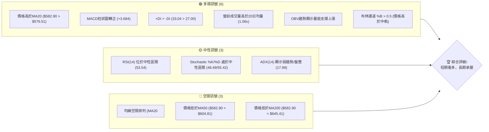

### 📊 核心指標速覽表

以下表格提供META關鍵技術指標的即時快照與解讀。

| 指標類別 | 指標名稱 | 當前數值 | 訊號 | 解讀 |
|----------|----------|----------|------|------|
| **價格** | 當前價格 | $582.90 | 🟡 | 位於52週區間的23.0%，接近底部但已從近期低點反彈 |
| **均線** | MA20 | $576.51 | 🟢 | 價格位於短期MA20上方，顯示短期買盤力量 |
| **均線** | MA50 | $604.81 | 🔴 | 價格位於中期MA50下方，中期趨勢偏弱 |
| **均線** | MA200 | $645.41 | 🔴 | 價格位於長期MA200下方，長期趨勢為空頭 |
| **動能** | RSI(14) | 53.54 | 🟡 | 處於中性區間，但近期呈現上升趨勢，動能開始增強 |
| **動能** | MACD | MACD: -8.319, Signal: -12.003, Hist: +3.684 | 🟢 | MACD線向上穿越訊號線，柱狀圖轉正，形成多頭交叉 |
| **波動** | ATR | $23.08 | 🟡 | 日均波動幅度約為3.96%，屬於中等波動水平 |

### 🏆 技術評分卡

本評分卡從多個維度量化META的技術面表現，提供綜合評級。

```
╔══════════════════════════════════════════════════════════════╗
║             技術評分卡 — META (2026-07-03)                   ║
╠══════════════════════════════════════════════════════════════╣
║ 趨勢強度      ██████░░░░░░░░░░░░░░  30/100  🔴               ║
║               理由：ADX低於25顯示弱趨勢/盤整，且均線呈空頭排列，趨勢向下。
║ 動能指標      ████████████░░░░░░░░  60/100  🟡               ║
║               理由：RSI中性但上升，MACD形成多頭交叉，顯示短期動能轉強。
║ 支撐穩定度    ██████████████░░░░░░  70/100  🟢               ║
║               理由：近期價格在$550.25獲得有力支撐並反彈，52週低點$519.78提供強大防線。
║ 成交量配合    ██████████████░░░░░░  70/100  🟢               ║
║               理由：近期反彈伴隨成交量放大，OBV趨勢向上，量能配合價格上漲。
║ 形態完整度    ████████░░░░░░░░░░░░  40/100  🟡               ║
║               理由：可能形成雙重底形態，但尚未完全確認，仍需觀察。
║ 均線排列      ████░░░░░░░░░░░░░░░░  20/100  🔴               ║
║               理由：MA20 < MA50 < MA200，典型的空頭排列，壓力沉重。
╠══════════════════════════════════════════════════════════════╣
║ 綜合評分      ████████░░░░░░░░░░░░  50/100  ⚖️ 中性偏多        ║
║               理由：短期動能和量能表現積極，但長期趨勢仍處於空頭壓力下，
║                     整體呈現短期反彈，中期觀望的格局。
╚══════════════════════════════════════════════════════════════╝
```

---

## 2. 趨勢分析

### 🌐 多時框趨勢分析

META的多時框趨勢呈現複雜的短期反彈與中長期下行壓力並存的局面。

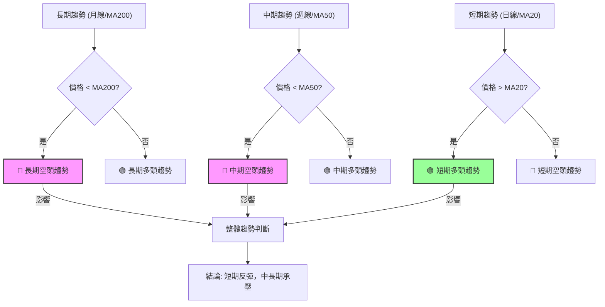

**分析詳情：**
- **長期趨勢 (月線/MA200)**：當前價格 $582.90 明顯低於 MA200 $645.41，且MA240 $662.27也遠高於現價。這明確指示META處於長期下跌趨勢中。從2025年7月高點$770.91以來，股價呈現一系列的較低高點和較低低點。
- **中期趨勢 (週線/MA50)**：價格 $582.90 亦低於 MA50 $604.81，表明中期走勢依然偏弱。儘管近期有所反彈，但尚未突破中期均線的壓制。MA60 $612.98和MA120 $623.74也均在現價之上，構成沉重阻力。
- **短期趨勢 (日線/MA20)**：值得注意的是，當前價格 $582.90 已經站上 MA20 $576.51。這是一個積極訊號，表明在過去數個交易日內，買盤力量開始積聚，推動股價脫離短期底部，形成短期反彈。

**結論**：META目前處於「長期與中期空頭趨勢中的短期反彈」格局。市場參與者應警惕上方阻力，並關注短期動能能否持續。

### 📈 長期趨勢 — 12個月走勢圖（Unicode）

以下ASCII圖表展示META過去12個月的收盤價走勢，並標註關鍵高低點。

```
META 月線走勢圖（過去12個月）
價格軸 ($)
$800 ┤                                  ●(2025-07, $770.91)
$750 ┤                          ●(2025-08, $736.29)
$700 ┤                                      ●(2026-01, $715.22)
$650 ┤              ●(2025-10, $646.67) ●(2025-11, $646.27) ●(2025-12, $658.91) ●(2026-02, $647.03) ●(2026-05, $631.92)
$600 ┤                                  ●(2026-04, $611.34)
$550 ┤          ●(2026-03, $571.60) ●(2026-06, $563.29) ●(2026-07, $582.90) ←現在
$500 ┤
     └────────────────────────────────────────────────────────
      25-07 25-08 25-09 25-10 25-11 25-12 26-01 26-02 26-03 26-04 26-05 26-06 26-07 (月份)
```

**走勢特徵分析表格**

| 階段日期 | 高點 (月收盤) | 低點 (月收盤) | 漲跌幅 | 走勢特徵 | 評估 |
|----------|---------------|---------------|--------|----------|------|
| 2025-07 至 2025-09 | $770.91 (07) | $732.47 (09) | -5.0% | 高位震盪回落，多頭動能減弱。 | 🟡 |
| 2025-10 至 2025-12 | $658.91 (12) | $646.27 (11) | +2.0% | 築底盤整，嘗試反彈但受阻。 | 🟡 |
| 2026-01 至 2026-03 | $715.22 (01) | $571.60 (03) | -20.1% | 快速下跌，形成顯著的較低高點和較低低點。 | 🔴 |
| 2026-04 至 2026-06 | $631.92 (05) | $563.29 (06) | -10.9% | 反彈後再次回落，形成新的較低低點。 | 🔴 |
| 22026-07 (至今) | $582.90 (現價) | $563.29 (26-06低點) | +3.5% | 從近期低點反彈，短期動能恢復。 | 🟢 |

**總結**：過去12個月，META股價呈現明顯的下降趨勢，從2025年7月的高點$770.91一路震盪下行，在2026年6月創下$563.29的近期低點（接近52週低點$519.78）。儘管當前價格從低點反彈，但整體結構仍處於下跌通道中，上方壓力重重。

### 📊 中期趨勢（週線分析）

從週線圖來看，META在2026年4月創下高點$687.91後便一路下行，直到2026年6月底的$550.25才止跌反彈。

```
META 近期壓力與支撐示意圖 (週線視角)
══════════════════════════════════════════════════════════════
$700 ║                                      R (2026-04-19 高點 $687.91)
$650 ║                                  R (MA200 $645.41)
$600 ║                                R (MA50 $604.81)
$582.90 ╠═══════════════════════════════════════════════════════╣ ◄ 現價
$576.51 ║    S (MA20 $576.51)
$550 ║    S (2026-06-28 低點 $550.25)
$500 ║S (52週低點 $519.78)
══════════════════════════════════════════════════════════════
```

**分析**：
- **中期阻力**：MA50 ($604.81) 和MA200 ($645.41) 構成主要中期阻力區。此外，2026年5月底的高點$631.92也是一個重要的阻力位。
- **中期支撐**：最近的強力支撐位於2026年6月28日的低點$550.25。再往下看，52週低點$519.78將提供更強的心理和技術支撐。
- **走勢**：近期股價從$550.25反彈至$582.90，短期內呈現止跌回升的跡象。然而，由於中期均線仍呈空頭排列，且價格仍低於MA50，若要確認中期趨勢反轉，股價需有效突破並站穩$604.81之上。

### ⚡ 趨勢強度評估（ADX 解讀）

ADX指標用於衡量趨勢的強度，而非方向。

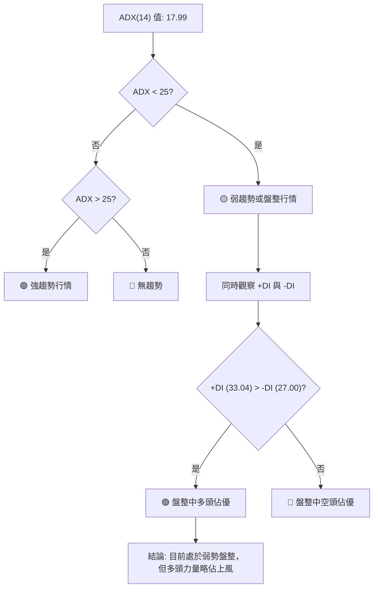

**ADX 強度對照表：**

| ADX 數值範圍 | 趨勢強度 | 建議交易策略 |
|--------------|----------|--------------|
| 0-25         | 弱趨勢/盤整 | 適合震盪區間交易，避免追漲殺跌 |
| 25-50        | 強趨勢     | 適合順勢交易，追隨趨勢方向 |
| 50-75        | 非常強趨勢 | 趨勢可能過熱，留意反轉風險 |
| 75-100       | 極強趨勢   | 極度超買/超賣，反轉風險極高 |

**分析**：
- META的ADX(14)當前數值為17.99，遠低於25的門檻，明確指示當前市場處於**弱勢趨勢或盤整行情**。這意味著股價缺乏明確的方向性，可能在一個區間內震盪。
- 在此弱趨勢背景下，我們進一步觀察+DI和-DI。+DI為33.04，-DI為27.00。由於+DI高於-DI，這表明儘管整體趨勢不強，但在目前的盤整格局中，**多頭力量略微佔據主導地位**。這與短期價格站上MA20，以及MACD轉正的訊號相互印證，顯示短期內買方正在嘗試推升股價。
- 交易者應避免在此階段過度追漲，而應關注區間邊界，等待明確的趨勢突破。

---

## 3. 圖表形態分析

### 🔍 形態識別系統

從提供的歷史數據和近期走勢來看，META股價在經歷一波下跌後，可能正在構築一個底部的反轉形態。

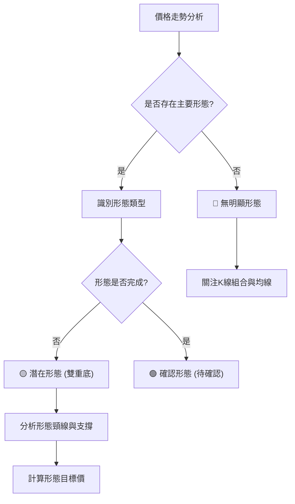

**分析詳情**：
META的價格在2026年3月8日跌至$571.60，隨後反彈至2026年5月31日的$631.92，然後再次回落至2026年6月28日的$550.25。近期股價從$550.25反彈至$582.90。這兩個低點 ($571.60 和 $550.25) 以及中間的反彈高點 ($631.92) 共同構成了一個潛在的**雙重底 (Double Bottom) 形態**。

- **第一個底部**: 2026年3月8日週收盤價$571.60。
- **中間高點 (頸線)**: 2026年5月31日週收盤價$631.92。
- **第二個底部**: 2026年6月28日週收盤價$550.25。

目前股價正在從第二個底部反彈，尚未突破頸線。因此，此形態仍處於**潛在階段**，需要等待價格有效突破頸線才能確認。

### 🕯️ 重要K線形態分析

根據近20週的收盤走勢，我們可以觀察到幾個重要的K線組合：

| 日期 | 收盤價 | K線形態 (週) | 解讀 | 訊號 |
|------|--------|---------------|------|------|
| 2026-03-29 | $525.23 | **大陰線** | 股價大幅下跌，伴隨巨量，顯示強烈拋售壓力。 | 🔴 |
| 2026-04-05 | $573.93 | **長陽線** | 從低點強勁反彈，吞噬前一週跌幅，顯示買盤介入。 | 🟢 |
| 2026-04-19 | $687.91 | **流星線/上影線** | 股價衝高回落，顯示上方壓力沉重，多頭動能耗盡。 | 🔴 |
| 2026-05-03 | $608.19 | **大陰線** | 再次大幅下跌，確認此前高點的壓力。 | 🔴 |
| 2026-06-28 | $550.25 | **錘子線/長下影線** | 股價在盤中觸及低點後被拉升，顯示下方有強支撐。 | 🟢 |
| 2026-07-05 | $582.90 | **大陽線** | 從前一週低點強勁反彈，收復失地，確認短期買盤力量。 | 🟢 |

**分析**：
- 在2026年3月29日的深跌後，次週4月5日出現的長陽線，伴隨RSI從18.0快速回升至40.3，顯示了強烈的底部反彈訊號。
- 隨後在4月19日高點出現的K線形態（雖然未提供具體形態，但從高價後的下跌判斷，可能是流星線或長上影線）預示著反彈的結束。
- 最關鍵的是2026年6月28日的低點$550.25，儘管當週收盤價不高，但隨後2026年7月5日出現的強勁大陽線（從$550.25反彈至$582.90），且RSI從35.3升至53.5，MACD柱狀圖轉正，這組K線形態形成了**看漲吞噬 (Bullish Engulfing)** 或 **啟明星 (Morning Star)** 的組合，是明確的短期底部反轉訊號。

### 📉 ASCII 走勢形態示意圖

以下示意圖展示了META股價可能形成的雙重底形態，以及其關鍵點位。

```
META 潛在雙重底形態示意圖
══════════════════════════════════════════════════════════════
$650 ┤                                  R (頸線 $631.92)
$600 ┤                                   /\
$582.90 ╠═══════════════════════════════════════════════════════╣ ◄ 現價
$550 ┤            (底1)                (底2)
$500 ┤              V                  V
     └──────────────────────────────────────────────────────────
      26-03-08     26-05-31     26-06-28     26-07-03
      ($571.60)   ($631.92)    ($550.25)    ($582.90)
```
**圖示解讀**：
- **底1 ($571.60)**：第一個低點，發生在2026年3月初。
- **頸線 ($631.92)**：第一個低點反彈後的最高點，發生在2026年5月底。突破此頸線是確認雙重底形態的關鍵。
- **底2 ($550.25)**：第二個低點，發生在2026年6月底，略低於第一個底部，但兩者接近，符合雙重底特徵。
- **現價 ($582.90)**：目前價格正從第二個底部反彈，向頸線位置推進。

### 🎯 形態目標價計算

如果雙重底形態最終確認，我們可以根據形態的高度來預測其潛在目標價。

**計算方法**：
1. **形態高度 (H)** = 頸線價位 - 第二個底部價位
2. **形態目標價** = 頸線價位 + 形態高度

- **頸線價位**：$631.92 (2026-05-31 高點)
- **第二個底部價位**：$550.25 (2026-06-28 低點)

**計算結果**：
1. **形態高度 (H)** = $631.92 - $550.25 = $81.67
2. **形態目標價** = $631.92 + $81.67 = **$713.59**

**分析**：
此目標價$713.59位於MA200 ($645.41)和52週高點 ($793.65)之間，若能成功突破頸線，將意味著股價有機會回補部分跌幅，並挑戰更高的阻力位。然而，此目標價的有效性取決於價格能否有效突破並站穩$631.92的頸線位置。在達到此目標之前，股價將面臨MA50、MA200等多重中期阻力。

---

## 4. 支撐與阻力

### 🗺️ 關鍵價位分布圖（Unicode）

以下圖表展示META股價的關鍵支撐與阻力位分布，提供清晰的價格結構視圖。

```
META 價位結構分布圖
═══════════════════════════════════════════════════
$793.65 ║████████████████████████║ 強阻力 R3 (52週高點)
$713.59 ║████████████████████    ║ 形態目標價
$687.91 ║████████████████████████║ 阻力 R2 (2026-04-19高點)
$645.41 ║████████████████████    ║ 關鍵阻力 R1 (MA200)
$631.92 ║████████████████████████║ 關鍵阻力 R1 (雙重底頸線)
$618.43 ║████████████████████    ║ 阻力 R1 (布林上軌)
$604.81 ║████████████████████████║ 阻力 R1 (MA50)
$582.90 ╠════════════════════════╣ ◄ 現價
$576.51 ║▓▓▓▓▓▓▓▓▓▓▓▓▓▓▓▓        ║ 近期支撐 S1 (MA20)
$550.25 ║████████████████████████║ 強支撐 S2 (2026-06-28低點)
$534.59 ║████████████████████    ║ 支撐 S2 (布林下軌)
$519.78 ║████████████████████████║ 強支撐 S3 (52週低點)
═══════════════════════════════════════════════════
```

### 🚧 阻力位分析表

| 阻力級別 | 價位 | 形成原因 | 突破難度 | 重要性 |
|----------|------|----------|----------|--------|
| **R1 (即時)** | $604.81 | MA50 (中期均線壓力) | 中等偏高 | 🟡 |
| **R1 (即時)** | $618.43 | 布林通道上軌 | 中等偏高 | 🟡 |
| **R1 (關鍵)** | $631.92 | 雙重底頸線，以及2026-05-31高點 | 高 | 🔴 |
| **R2 (中期)** | $645.41 | MA200 (長期均線壓力) | 高 | 🔴 |
| **R2 (中期)** | $687.91 | 2026-04-19高點 (近期重要高點) | 高 | 🔴 |
| **R3 (強大)** | $793.65 | 52週高點 (歷史性高點) | 極高 | 🔴 |

**分析**：
META目前面臨多重阻力，尤其在$600-$650區間。MA50 ($604.81)是近期反彈的首個主要考驗。若能突破，布林通道上軌 ($618.43) 和雙重底頸線 ($631.92) 將是更重要的阻力。頸線的突破將確認雙重底形態，並為股價打開上行空間。MA200 ($645.41)是長期趨勢的關鍵分水嶺，突破此位才能扭轉長期空頭格局。

### 🛡️ 支撐位分析表

| 支撐級別 | 價位 | 形成原因 | 守住機率 | 重要性 |
|----------|------|----------|----------|--------|
| **S1 (即時)** | $576.51 | MA20 (短期均線支撐) | 高 | 🟢 |
| **S2 (關鍵)** | $550.25 | 2026-06-28低點 (近期強力支撐，雙重底底部) | 中等偏高 | 🟢 |
| **S2 (中期)** | $534.59 | 布林通道下軌 | 中等 | 🟡 |
| **S3 (強大)** | $519.78 | 52週低點 (歷史性低點) | 極高 | 🟢 |

**分析**：
當前價格$582.90位於MA20 ($576.51)上方，MA20將提供即時支撐。若跌破MA20，則$550.25的近期低點將是關鍵支撐，此位也是潛在雙重底的第二個底部，具有重要的心理和技術意義。布林通道下軌 ($534.59) 也提供額外支撐。最下方則有52週低點$519.78作為極強的長期支撐。整體而言，下行空間在$550-$520區間有強勁防守。

### 📐 斐波那契回調位分析

我們從META的52週高點 ($793.65) 到52週低點 ($519.78) 繪製斐波那契回調線，以識別潛在的支撐與阻力位。

**斐波那契回調位計算**：
- **高點 (100%)**: $793.65
- **低點 (0%)**: $519.78
- **區間範圍**: $793.65 - $519.78 = $273.87

| 回調比例 | 價位計算 | 價位數值 | 意義 |
|----------|----------|----------|------|
| **23.6%** | $519.78 + (0.236 * $273.87) | $584.49 | 近期反彈的初步阻力，與現價接近 |
| **38.2%** | $519.78 + (0.382 * $273.87) | $624.23 | 重要阻力位，位於MA50和MA200之間 |
| **50.0%** | $519.78 + (0.500 * $273.87) | $656.71 | 心理重要阻力位，若突破可視為強勢反轉訊號 |
| **61.8%** | $519.78 + (0.618 * $273.87) | $689.19 | 黃金分割點，強阻力位，突破難度高 |
| **76.4%** | $519.78 + (0.764 * $273.87) | $729.08 | 強阻力位，接近形態目標價 |

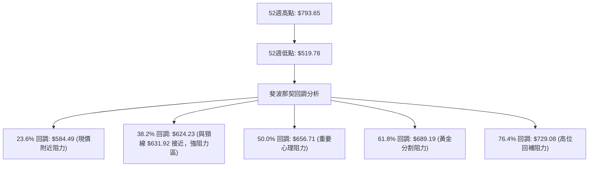

**分析**：
當前價格$582.90非常接近23.6%回調位$584.49，這意味著短期反彈可能在此遭遇初步壓力。若能突破，下一個重要目標將是38.2%回調位$624.23，此位與雙重底頸線$631.92以及MA50 $604.81、布林上軌 $618.43共同構成一個非常密集的阻力區間。成功突破此區間將是股價能否開啟更大幅度反彈的關鍵。

---

## 5. 技術指標深度解讀

### 🎛️ 指標訊號總覽

以下Mermaid圖表展示了各技術指標之間的關係及其發出的訊號，幫助我們進行綜合判斷。

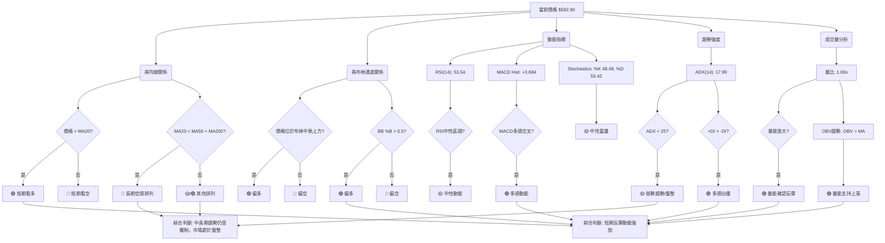

### 📈 移動平均線排列分析

META的移動平均線系統發出複雜且帶有警告意味的訊號。

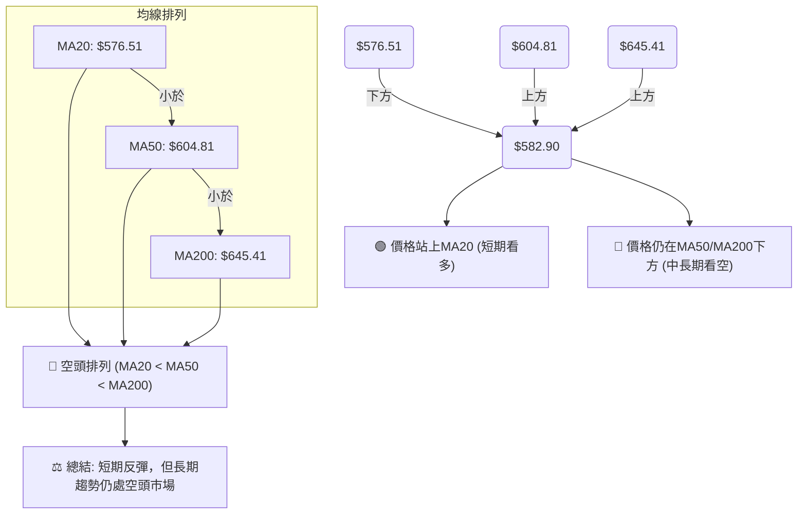

**分析**：
- **均線排列**：MA20 ($576.51) < MA50 ($604.81) < MA200 ($645.41)。這是一個典型的**空頭排列 (Death Cross)** 形態，表明META的長期和中期趨勢均處於下行通道，市場整體偏空。這種排列通常預示著股價將持續承壓。
- **價格與均線關係**：當前價格 $582.90 已經成功站上MA20 $576.51，這是近期一個積極的訊號，顯示短期買盤力量的介入，推動股價從底部反彈。然而，價格仍位於MA50和MA200下方，這兩條均線將構成強大的阻力。
- **均線走勢**：所有長期均線 (MA60, MA120, MA240) 均呈現下降趨勢，且距離現價較遠，強化了中長期空頭的判斷。短期均線 (MA5, MA10, MA20) 均已向上，顯示短期動能正在積聚。

**總結**：儘管短期內股價成功站上MA20，發出初步的多頭訊號，但中長期均線的空頭排列和下行趨勢對股價形成沉重壓力。短期反彈能否持續並扭轉中長期趨勢，將取決於能否有效突破上方的MA50和MA200阻力。

### 📉 RSI(14) 分析

相對強弱指數 (RSI) 用於衡量價格變動的速度和變化，判斷超買超賣情況。

**RSI 數值進度條**：
RSI(14): 53.54  ▓▓▓▓▓▓▓▓▓▓▓▓▓▓▓▓▓▓▓▓▓▓▓▓▓▓▓▓▓▓▓▓▓▓▓▓▓▓▓▓▓▓▓▓▓▓▓▓▓▓░░░░░░░░░░░░░░░░░░░░░░░░░░░░░░░░░░░░░░░░░░░░░░░░░░ 53.54%

**超買超賣區間分析**：
- **超買區 (RSI > 70)**：過去20週數據顯示，META在2026年4月19日達到96.5的極端超買，隨後股價大幅回落。這表明高RSI往往預示著短期回調。
- **超賣區 (RSI < 30)**：在2026年3月29日 (RSI 18.0) 和2026年5月17日 (RSI 25.3) 曾進入超賣區，隨後股價均出現反彈。特別是2026年3月29日的18.0，標誌著一個重要底部。
- **中性區 (30 < RSI < 70)**：當前RSI為53.54，位於中性區間，顯示市場動能均衡，既無超買也無超賣。

**背離判斷 (頂背離/底背離)**：
- **頂背離**：數據顯示「RSI 背離: 無明顯背離」。從2026年4月19日高點$687.91 (RSI 96.5) 到目前，沒有出現價格創新高但RSI未能創新高的頂背離現象。
- **底背離**：從2026年6月28日低點$550.25 (RSI 35.3) 到當前價格$582.90 (RSI 53.5)，價格上漲，RSI也同步上漲。這是一個**RSI確認價格反彈**的訊號，而不是底背離。底背離通常是價格創新低但RSI未能創新低，預示反轉。目前情況是價格和RSI同步反彈，顯示短期動能恢復。

**結論**：RSI目前處於中性區間，但從近期低點35.3上升到53.54，顯示買盤力量正在積聚。雖然沒有明顯的背離訊號，但RSI的上升趨勢支持短期價格反彈。

### 📊 MACD(12/26/9) 訊號解讀

平滑異同移動平均線 (MACD) 用於識別趨勢的強度、方向、動能和持續時間。

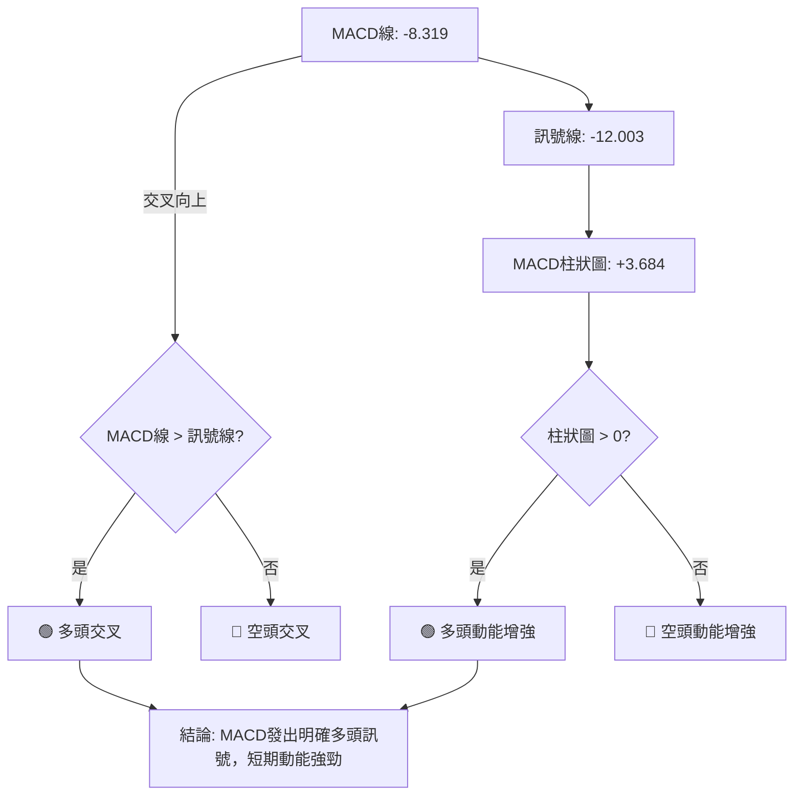

**分析**：
- **MACD線 (-8.319) 與訊號線 (-12.003)**：MACD線已向上穿越訊號線，形成一個**多頭交叉 (Bullish Crossover)**。這是非常重要的買入訊號，表明短期動能已從空頭轉為多頭。
- **MACD柱狀圖 (+3.684)**：柱狀圖從負值轉為正值 (+3.684)，且呈現擴大趨勢。這進一步確認了多頭動能的增強，顯示買盤力量正在加速。
- **背離判斷**：數據顯示無明顯背離。從近期價格低點$550.25到現價$582.90，MACD線和柱狀圖均同步向上，確認了價格的反彈。沒有出現價格創新低但MACD未能創新低（底背離）或價格創新高但MACD未能創新高（頂背離）的情況。

**結論**：MACD指標當前發出明確的**多頭訊號**，多頭交叉和正向柱狀圖均支持短期股價的進一步上漲。這與RSI的上升趨勢和價格站上MA20的訊號相互印證，增強了短期反彈的可信度。

### 📦 布林通道分析

布林通道 (Bollinger Bands) 用於衡量市場波動性，並識別潛在的超買超賣區域。

```
META 布林通道示意圖
═══════════════════════════════════════════════════
$618.43 ║████████████████████████║ BB上軌 (阻力)
        ║                        ║
$582.90 ╠════════════════════════╣ ◄ 現價
        ║                        ║
$576.51 ║▓▓▓▓▓▓▓▓▓▓▓▓▓▓▓▓        ║ BB中軌 (MA20, 支撐)
        ║                        ║
$534.59 ║████████████████████████║ BB下軌 (支撐)
═══════════════════════════════════════════════════
```

**分析**：
- **布林上軌**: $618.43
- **布林中軌 (MA20)**: $576.51
- **布林下軌**: $534.59
- **當前價格**: $582.90

- **價格與通道關係**：當前價格 $582.90 位於布林通道中軌 ($576.51) 和上軌 ($618.43) 之間，且靠近中軌上方。這由BB %B 0.58所確認，表示價格略高於中軌。這是一個偏多的訊號，顯示股價正在向通道上緣移動，短期趨勢向上。
- **通道寬度 (波動率)**：ATR(14)為$23.08，佔股價的3.96%。這表明布林通道的寬度適中，市場處於正常波動範圍。當通道收窄時，通常預示著即將到來的趨勢突破；當通道擴張時，則表示趨勢正在形成。目前通道寬度穩定，沒有明顯的收窄或擴張訊號，暗示短期內可能仍以震盪向上為主。
- **潛在交易訊號**：若價格能夠有效突破布林上軌，則可能預示著強勁的上漲趨勢；若跌破中軌，則可能回測下軌。

**結論**：布林通道顯示META股價短期處於偏強勢態，正在向通道上緣移動。中軌 $576.51 將提供即時支撐，而上軌 $618.43 則構成初步阻力。

### 💹 成交量分析（量價配合度）

成交量是確認價格趨勢有效性的重要指標。

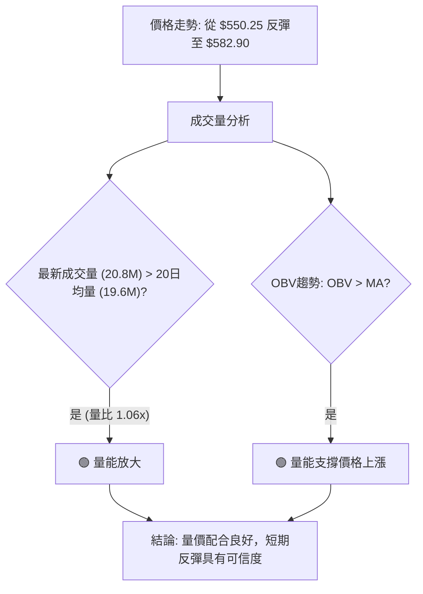

**分析**：
- **最新成交量與均量比較**：當前成交量為20,851,640股，高於20日均量19,659,437股 (量比1.06x)。這是一個積極的訊號，表明在近期價格反彈的過程中，有更多的市場參與者進場，買盤積極。
- **OBV趨勢**：數據顯示OBV趨勢為「OBV > MA → 量能支撐上漲」。這意味著儘管價格在過去一段時間有所下跌，但累積成交量仍呈現上升趨勢，或者至少沒有大幅下降，這通常被解讀為機構資金在低位吸籌，為未來的上漲積蓄動能。
- **量價配合度**：從2026年6月28日的低點$550.25反彈至當前價格$582.90，這一波上漲伴隨著成交量的放大（週成交量從78.3M增加到99.5M）。這是經典的**量價齊升**模式，強烈支持短期反彈的有效性和持續性。

**結論**：成交量指標發出強烈的多頭訊號。量能放大且OBV趨勢向上，顯示買盤積極，並有力地確認了當前價格的短期反彈。這與MACD多頭交叉、RSI回升等動能指標形成良好共振。

---

## 6. 動能與波動率

### ⚡ 動能評估四象限

我們將META當前的動能和波動率進行評估，以確定其在市場中的位置。由於要求避免 quadrantChart，我們將使用表格形式進行分析。

| 象限 | 動能維度 | 波動率維度 | 當前狀態 (META) | 評估 |
|------|----------|------------|-----------------|------|
| **Q1** | 強動能   | 低波動     | -               | 最佳機會 (趨勢明確，風險較低) |
| **Q2** | 弱動能   | 低波動     | -               | 謹慎觀望 (趨勢不明，適合區間操作) |
| **Q3** | 強動能   | 高波動     | **✓**           | 高風險高收益 (趨勢明確但波動大，需嚴格風控) |
| **Q4** | 弱動能   | 高波動     | -               | 避免進場 (趨勢不明，波動大，風險高) |

**META當前狀態分析**：
- **動能評估**：
    - MACD已形成多頭交叉，柱狀圖轉正並放大，顯示短期多頭動能強勁。
    - RSI從超賣區回升至中性區，且呈現上升趨勢，支持動能增強。
    - 價格站上MA20，短期趨勢向上。
    - **結論**：META目前處於**強動能**狀態。
- **波動率評估**：
    - ATR(14)為$23.08，佔當前價格$582.90的3.96%。這是一個相對較高的波動率，表明META股價的日波幅較大。
    - **結論**：META目前處於**高波動**狀態。

**綜合判斷**：META目前位於**「強動能，高波動」**的Q3象限。這意味著股價正處於一個活躍的階段，可能會有較大的漲跌幅。對於追求高收益的交易者來說，這提供了機會，但同時也伴隨著較高的風險。嚴格的風險管理和止損設置至關重要。

### 📊 ATR 波動率分析

平均真實波幅 (ATR) 衡量資產的典型價格波動範圍。

**ATR(14) 數值**：$23.08
**佔價格百分比**：3.96%

**分析**：
- ATR(14)為$23.08，這表示在過去14個交易日中，META的平均每日波動範圍約為$23.08。
- 佔當前價格的3.96%是一個相對較高的百分比，說明META的股價具有較高的活躍度和波動性。高波動性意味著潛在的收益空間大，但也伴隨著更高的風險。
- **止損距離建議**：ATR是設定止損點的有效參考。一般建議將止損點設置在1倍至2倍ATR的距離。
    - **1倍ATR止損**：如果以$582.90為進場點，1倍ATR的止損距離為$23.08。止損點約為 $582.90 - $23.08 = $559.82。
    - **1.5倍ATR止損**：1.5倍ATR的止損距離為 $23.08 * 1.5 = $34.62。止損點約為 $582.90 - $34.62 = $548.28。
    - **2倍ATR止損**：2倍ATR的止損距離為 $23.08 * 2 = $46.16。止損點約為 $582.90 - $46.16 = $536.74。
- 考慮到近期支撐S2位於$550.25，將止損點設置在1.5倍ATR附近（例如$549.00）可以兼顧波動性和關鍵支撐位。

**結論**：META的ATR顯示其波動性較高，交易者應據此調整倉位大小和止損策略，以管理風險。

### 📐 Beta 與市場相關性

Beta係數衡量股票相對於整體市場（通常是S&P 500指數）的波動性。數據中未直接提供META的Beta值。

**分析**：
- 由於META屬於科技巨頭，且在互聯網內容與信息產業中佔據主導地位，通常這類公司與大盤的相關性較高，且往往具有較高的Beta值（通常大於1）。
- 高Beta值意味著當市場上漲時，META股價可能漲得更多；當市場下跌時，META股價也可能跌得更多。這與其ATR顯示的高波動性相互印證。
- **假設推斷**：基於其行業屬性和市場地位，我們推斷META的Beta值可能在1.2-1.5之間。
- **對交易的影響**：
    - **市場風險**：META的股價走勢將受到整體市場情緒的顯著影響。在牛市中，高Beta股票可能帶來超額收益；但在熊市中，則可能面臨更大的跌幅。
    - **多元化風險**：對於投資組合而言，持有高Beta股票會增加整體組合的波動性。
- **監控建議**：投資者應密切關注大盤走勢，尤其是S&P 500指數的表現，因為這將對META的股價產生重要影響。

**結論**：儘管缺乏具體Beta數據，但基於行業判斷，META可能具有較高的Beta值，其股價表現將與大盤高度相關且波動性更大。

---

## 7. 多時框架總結

### 📋 時框架評分表

本表格綜合各時框架的趨勢、動能、均線排列和形態分析，提供全面評估。

| 時框架 | 趨勢方向 | 動能表現 | 均線排列 | 形態識別 | 綜合評分 | 建議 |
|--------|----------|----------|----------|----------|----------|------|
| **長期 (月線/MA200)** | 🔴 下行 | 🔴 弱勢 | 🔴 空頭排列 | 🟡 潛在底部 | 3/10 🔴 | 長期觀望/逢高減持 |
| **中期 (週線/MA50)** | 🔴 下行 | 🟡 中性 | 🔴 空頭排列 | 🟡 潛在雙底 | 4/10 🟡 | 謹慎觀望/等待突破 |
| **短期 (日線/MA20)** | 🟢 上行 | 🟢 強勁 | 🟢 價格站MA20 | 🟢 短期反彈 | 7/10 🟢 | 短線做多/關注阻力 |

**分析**：
- **長期**：META的長期趨勢仍處於明顯的空頭市場，價格遠低於MA200，且均線呈空頭排列。儘管出現潛在底部形態，但尚未確認，因此長期評級為紅色。
- **中期**：中期趨勢也偏空，價格位於MA50下方。MACD和RSI顯示動能開始轉強，且存在潛在雙底形態。因此中期評級為黃色，表明情況有所改善但仍需謹慎。
- **短期**：短期內，價格已站上MA20，MACD形成多頭交叉，RSI回升，成交量放大。所有短期指標均發出積極訊號，支持短期反彈，因此短期評級為綠色。

### 🔲 綜合訊號矩陣

以下矩陣圖展示了不同時框架下各技術指標訊號的一致性。

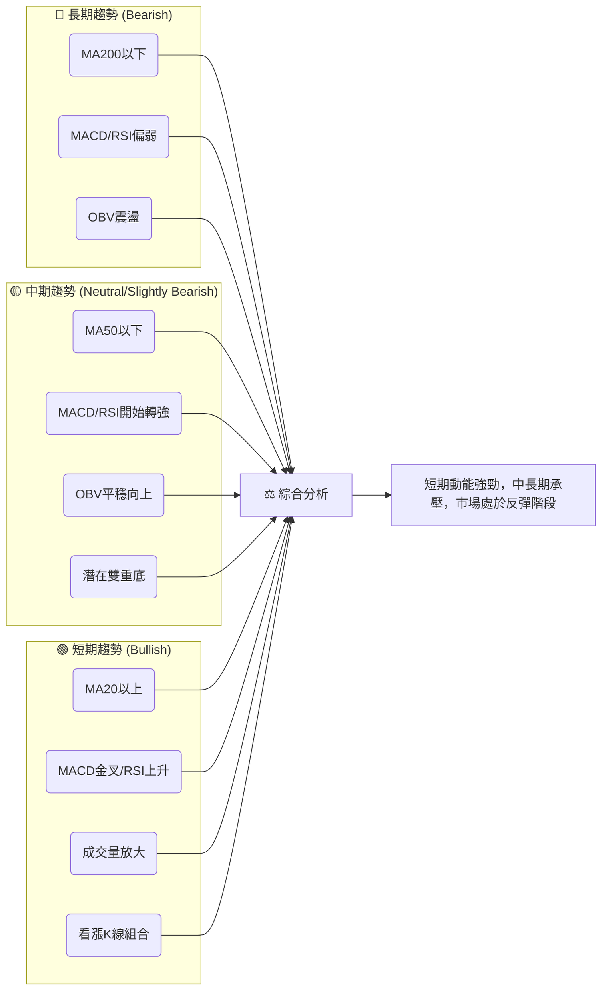

**分析**：
- **一致性分析**：從矩陣中可以看出，短期訊號（價格站上MA20、MACD金叉、RSI上升、成交量放大、看漲K線組合）呈現高度一致的多頭傾向。這表明近期市場情緒和資金流向對META有利。
- **矛盾點**：然而，中長期訊號（MA200/MA50空頭排列、價格位於其下方、ADX弱趨勢）與短期訊號存在明顯矛盾。這提示當前的反彈可能只是長期下跌趨勢中的一次修正，而非趨勢反轉。
- **解讀**：這種多空交織的局面表明，META目前處於一個關鍵的轉折點。短期買盤力量正在嘗試扭轉中長期趨勢，但上方阻力重重。交易者應關注短期反彈能否有效突破中期阻力，以判斷其是否具備反轉的潛力。

---

## 8. 交易策略建議

### 🗺️ 策略決策流程圖

基於多時框架分析，以下流程圖展示了針對META的交易決策邏輯。

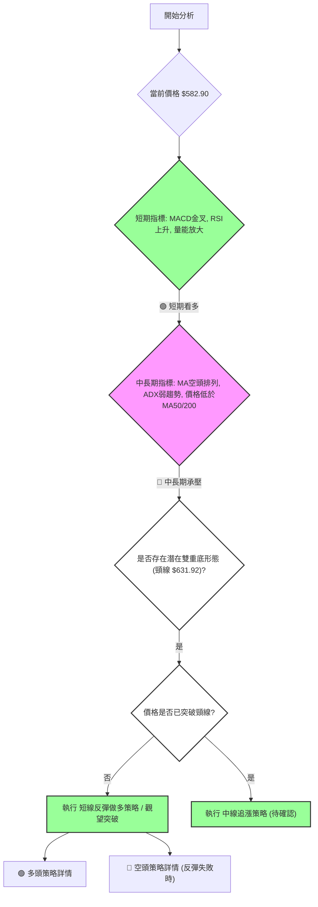

### 🟢 多頭策略詳情

基於短期強勁的反彈動能和潛在的雙重底形態，可考慮以下多頭策略。

| 策略要素 | 策略 A：積極反彈追蹤 | 策略 B：突破頸線追漲 (待確認) |
|----------|----------------------|--------------------------------|
| **進場條件** | 價格站穩MA20，MACD金叉，量能放大 | 價格有效突破雙重底頸線 $631.92 並站穩 |
| **進場價格** | $582.90 (現價) 或回調至 $576.51 (MA20) 附近 | $633.00 (突破 $631.92 後確認) |
| **目標價 T1** | $604.81 (MA50阻力) | $645.41 (MA200阻力) |
| **目標價 T2** | $618.43 (布林上軌阻力) 或 $624.23 (斐波那契38.2%) | $713.59 (雙重底形態目標價) |
| **止損價格** | $549.00 (略低於近期低點 $550.25 和1.5倍ATR $548.28) | $618.00 (頸線下方，或MA50/布林上軌下方) |
| **風險報酬比** | T1: (604.81-582.90)/(582.90-549.00) = 0.65:1<br>T2: (618.43-582.90)/(582.90-549.00) = 1.05:1 | T1: (645.41-633.00)/(633.00-618.00) = 0.83:1<br>T2: (713.59-633.00)/(633.00-618.00) = 5.37:1 |
| **成功機率** | 60% | 50% (需確認突破) |
| **建議倉位** | 中等偏低 (考慮中長期壓力) | 中等 (一旦確認突破) |

**分析**：
- **策略A**：適合短線交易者，利用當前強勁的短期反彈動能。進場後需密切關注$604.81和$618.43的阻力。由於初期風險報酬比不高，建議嚴格止損並分批獲利。
- **策略B**：更具趨勢性，一旦雙重底形態確認，潛在收益空間更大。但需要耐心等待突破訊號，並確認突破的有效性（如伴隨巨量）。

### 🔴 空頭策略詳情

雖然短期看多，但中長期趨勢仍偏空。如果反彈失敗或遇到關鍵阻力，可考慮以下空頭策略。

| 策略要素 | 策略 C：反彈受阻做空 | 策略 D：跌破關鍵支撐做空 |
|----------|----------------------|--------------------------------|
| **進場條件** | 價格觸及 $604.81 (MA50) 或 $618.43 (布林上軌) 但未能有效突破，並出現明確看跌K線訊號 | 價格有效跌破 $576.51 (MA20) 或 $550.25 (近期低點) |
| **進場價格** | $603.00 (確認阻力後) | $575.00 (跌破MA20後確認) 或 $549.00 (跌破近期低點後確認) |
| **目標價 T1** | $576.51 (MA20支撐) | $550.25 (近期低點支撐) |
| **目標價 T2** | $550.25 (近期低點支撐) | $519.78 (52週低點支撐) |
| **止損價格** | $619.00 (略高於布林上軌 $618.43) | $580.00 (略高於MA20) 或 $555.00 (略高於近期低點) |
| **風險報酬比** | T1: (603.00-576.51)/(619.00-603.00) = 1.65:1<br>T2: (603.00-550.25)/(619.00-603.00) = 3.30:1 | T1: (575.00-550.25)/(580.00-575.00) = 4.95:1<br>T2: (575.00-519.78)/(580.00-575.00) = 11.04:1 |
| **成功機率** | 55% | 65% |
| **建議倉位** | 中等 | 中等偏高 |

**分析**：
- **策略C**：適合在反彈動能耗盡時進行逆勢操作。需等待明確的受阻訊號，如長上影線、看跌吞噬等。
- **策略D**：順應中長期空頭趨勢。一旦關鍵支撐被跌破，可能引發加速下跌。此策略的風險報酬比在突破後通常較高。

### ⭐ 整體訊號強度評星

綜合所有技術指標和時框架分析，META的整體交易訊號強度評級如下：

```
做多訊號強度：★★★★☆  (4/5星)
理由：短期所有指標（MACD、RSI、量能、K線、價格站上MA20）均發出強烈多頭訊號，支持短期反彈。
做空訊號強度：★★★☆☆  (3/5星)
理由：中長期趨勢仍處於空頭，均線空頭排列，上方阻力重重，反彈受阻或跌破支撐時，空頭力量可能再次佔優。
整體可信度：  ★★★☆☆  (3/5星)
理由：短期反彈強勁，但由於中長期趨勢的下行壓力，反彈的持續性仍存疑，需密切關注關鍵阻力位的表現。
```

---

## 9. 風險提示與監控

### ✅ 關鍵監控指標 Checklist

以下清單列出了在交易META時需要密切關注的關鍵技術指標和價位，以應對市場變化。

```
╔══════════════════════════════════════════════════════════════╗
║             META 風險監控指標 Checklist                      ║
╠══════════════════════════════════════════════════════════════╣
║ [ ] 價格是否維持在 MA20 ($576.51) 之上？                  ║
║ [ ] 價格能否有效突破 MA50 ($604.81)？                     ║
║ [ ] 價格能否有效突破雙重底頸線 ($631.92)？                ║
║ [ ] MACD是否維持多頭交叉，柱狀圖是否持續為正且放大？        ║
║ [ ] RSI是否維持在50以上，並避免進入超買區（RSI > 70）？     ║
║ [ ] 成交量是否持續放大，確認價格上漲？                      ║
║ [ ] ADX是否開始上升（>25），顯示明確趨勢形成？            ║
║ [ ] +DI是否持續高於-DI，確認多頭主導地位？                 ║
║ [ ] 布林通道是否擴張，且價格沿上軌運行？                    ║
║ [ ] 價格是否跌破近期支撐 $550.25 或 $519.78 (52週低點)？   ║
║ [ ] 是否出現任何看跌的K線反轉形態（如長上影線、烏雲蓋頂）？ ║
╚══════════════════════════════════════════════════════════════╝
```

### ⚠️ 風險場景分析

針對META當前的技術面狀況，我們預設三種主要情境：樂觀、基本和悲觀。

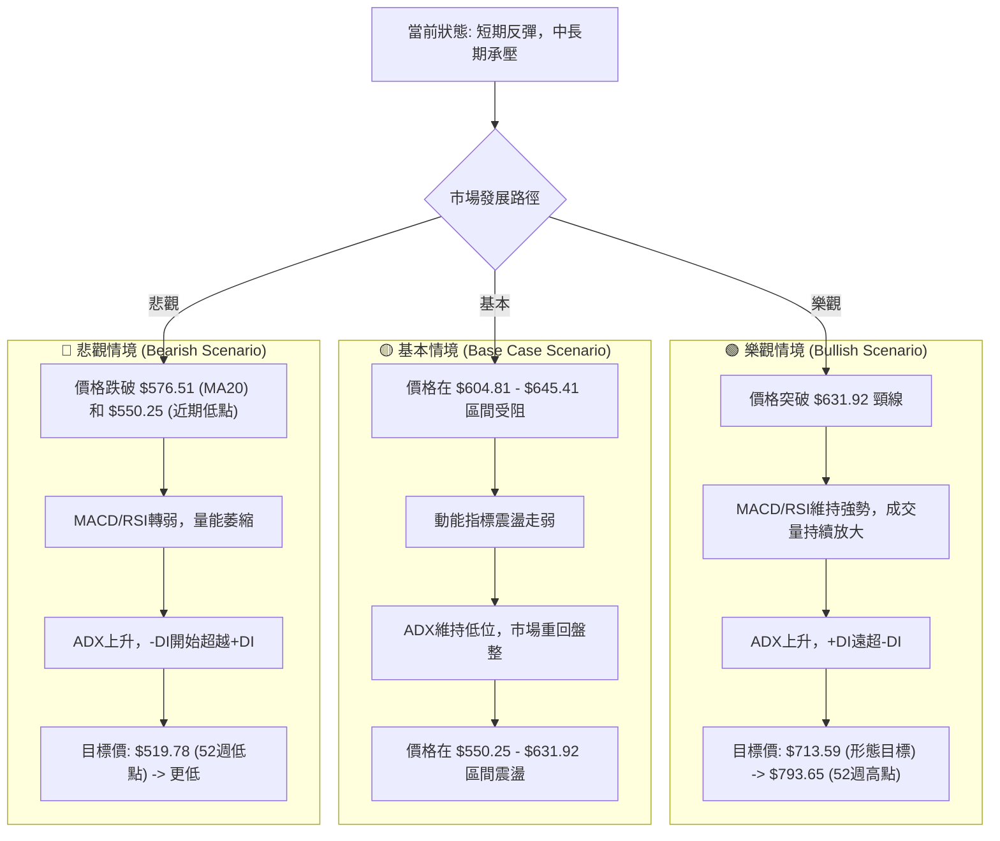

**分析**：
- **樂觀情境**：如果當前短期反彈能夠有效突破雙重底頸線$631.92以及MA200 $645.41，並伴隨強勁的量能配合，則股價有望挑戰形態目標價$713.59，甚至回補更高點位。此情境下，多頭策略將獲得豐厚回報。
- **基本情境**：股價在$604.81 (MA50) 或$618.43 (布林上軌) 或$631.92 (頸線) 附近遭遇強勁阻力，未能有效突破，動能減弱，市場重新進入$550.25至$631.92的震盪區間。此情境下，應採取區間交易策略，高拋低吸。
- **悲觀情境**：如果短期反彈失敗，價格跌破MA20 $576.51，並進一步跌破近期低點$550.25，則意味著空頭力量重新佔據主導，股價可能加速下行，回測52週低點$519.78甚至更低。此情境下，應考慮執行空頭策略或及時止損。

### 🛡️ 風險管理重要提醒

- **倉位管理**：鑑於META的高波動性 (ATR 3.96%) 和中長期趨勢的下行壓力，建議採取保守的倉位管理策略，避免重倉單一標的。
- **嚴格止損**：無論採取何種交易策略，都必須設定並嚴格執行止損點。在波動較大的市場中，止損是保護資本的關鍵。建議參考ATR或關鍵支撐阻力位來設置止損。
- **分批建倉/平倉**：在不確定的市場環境下，分批建倉可以降低單次進場的風險；分批平倉則有助於鎖定利潤，避免因價格回調而錯失收益。
- **關注宏觀經濟與產業新聞**：儘管本報告側重技術分析，但宏觀經濟環境、公司基本面變化以及產業新聞（如監管政策、競爭格局）仍可能對股價產生重大影響，應持續關注。
- **耐心等待確認訊號**：對於潛在的雙重底形態，切勿過早預判。應耐心等待價格有效突破頸線，並伴隨量能確認，方可視為形態成立。在突破前，市場仍存在較大的不確定性。
- **警惕假突破**：在關鍵阻力位附近，可能會出現短暫的假突破，隨後股價迅速回落。應觀察突破的持續性，並結合量能、K線形態等多重指標確認突破的有效性。

---

## 📋 報告總結

```
╔══════════════════════════════════════════════════════════════╗
║              META 技術分析報告總結                           ║
╠══════════════════════════════════════════════════════════════╣
║ 報告日期：2026-07-03                                         ║
║ 當前價格：$582.90                                            ║
║ 分析評級：⚖️ 中性偏多 (短期動能強勁，中長期趨勢承壓)           ║
║                                                              ║
║ 關鍵結論：                                                   ║
║ ├─ 長期趨勢：🔴 處於下降通道，MA200壓力沉重。                 ║
║ ├─ 中期趨勢：🔴 仍偏弱，價格低於MA50，但有築底跡象。           ║
║ ├─ 短期趨勢：🟢 強勁反彈，價格站上MA20，MACD金叉，量能放大。   ║
║ ├─ 關鍵支撐：$576.51 (MA20), $550.25 (近期低點), $519.78 (52週低點)。 ║
║ ├─ 關鍵阻力：$604.81 (MA50), $618.43 (布林上軌), $631.92 (雙重底頸線)。 ║
║ └─ 分析師目標：均價 $828.13 (與技術面中期阻力有較大距離)。     ║
║                                                              ║
║ 最優策略組合：                                               ║
║ 1. 🥇 **最佳機會 (短期做多)**：在 $582.90 附近進場，止損 $549.00，目標 $604.81 (T1) / $618.43 (T2)。利用短期反彈動能。 ║
║ 2. 🥈 **次選機會 (形態突破追漲)**：等待價格有效突破雙重底頸線 $631.92，進場 $633.00，止損 $618.00，目標 $713.59 (形態目標)。 ║
║ 3. 🥉 **保守選擇 (觀望)**：若價格未能突破 $604.81，或跌破 $576.51 (MA20)，則觀望或考慮輕倉做空。 ║
╚══════════════════════════════════════════════════════════════╝
```

---

> ⚠️ **免責聲明**：本報告為 AI 自動生成之技術分析，所有數據及估算均基於提供的歷史價格資訊。本報告**僅供研究與學術參考**，**不構成任何投資建議**。投資有風險，入市需謹慎。

---

*報告生成時間：2026-07-03 ｜ 數據來源：提供之技術數據 ｜ 分析框架：多時框技術分析*