<details>
<summary>📊 靜態圖表 (點擊展開)</summary>
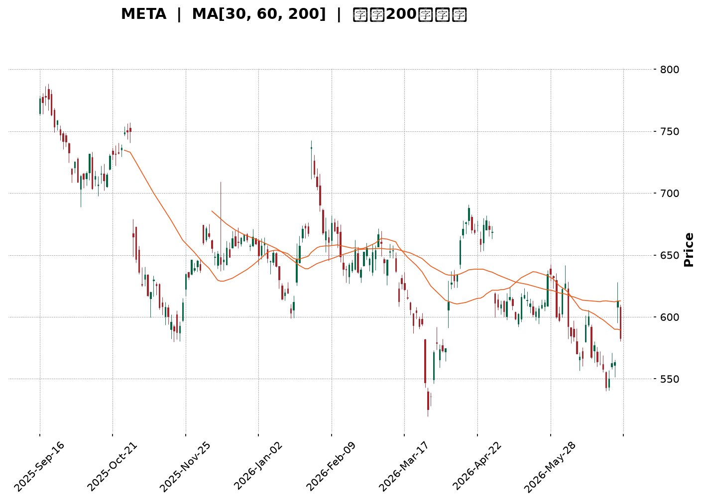
</details>

<html>
<head><meta charset="utf-8" /></head>
<body>
    <div style="height:500px; width:100%;">                        <script>window.PlotlyConfig = {MathJaxConfig: 'local'};</script>
        <script charset="utf-8" src="https://cdn.plot.ly/plotly-3.6.0.min.js" integrity="sha256-QaOVwtVY0T02VaHrr6pnoHLCwayMJp4O5n4YyaE3rJk=" crossorigin="anonymous"></script>                <div id="candlestick-chart" class="plotly-graph-div" style="height:100%; width:100%;"></div>            <script>                window.PLOTLYENV=window.PLOTLYENV || {};                                if (document.getElementById("candlestick-chart")) {                    Plotly.newPlot(                        "candlestick-chart",                        [{"close":{"dtype":"f8","bdata":"AAAAIKRDiEAAAACgfCmIQAAAAOCbTYhAAAAAgLI+iEAAAACAZtmHQAAAACCGi4dAAAAAYH61h0AAAADgvFeHQAAAAMCQLodAAAAA4MUrh0AAAADAzOOGQAAAAGDVW4ZAAAAA4E+phkAAAADguyWGQAAAAKBtToZAAAAAgNc5hkAAAADg0l+GQAAAAKDb3IZAAAAAYMP7hUAAAABAv06GQAAAAGB+FoZAAAAAQIJdhkAAAABgyDGGQAAAAGB7WIZAAAAAQCrShkAAAACA8dqGQAAAAGAP3IZAAAAAgMTghkAAAACAjgOHQAAAAID6ZodAAAAA4Oxrh0AAAACgwm2HQAAAAMDtxYRAAAAAYFg1hEAAAAAgcuCDQAAAAKCKjYNAAAAAAGfSg0AAAADgrEqDQAAAAEDHYINAAAAAQPiwg0AAAABgoIuDQAAAAABx+4JAAAAAoHYCg0AAAABACP+CQAAAAECWw4JAAAAA4B2hgkAAAABAT2aCQAAAAED5XIJAAAAAAKuFgkAAAABgrRuDQAAAAGCO1INAAAAAILu\u002fg0AAAABAJzKEQAAAAOCo+YNAAAAA4F4rhEAAAADAhu+DQAAAAACDnoRAAAAAgGL9hEAAAADgj8iEQAAAAOALeoRAAAAAYIxDhEAAAACAIliEQAAAAEB4FIRAAAAAQNsyhEAAAADA1n+EQAAAAIC\u002fQoRAAAAAoCK6hEAAAACgxoyEQAAAAKCTooRAAAAAQAy+hEAAAAAg5NKEQAAAAADfsIRAAAAAICOMhEAAAAAgHcaEQAAAAEBRl4RAAAAA4ANKhEAAAACA74yEQAAAAMCMm4RAAAAAoEc8hEAAAADgRieEQAAAAEAtX4RAAAAAgJ0GhEAAAAAAu6+DQAAAAGBkM4NAAAAAgI5dg0AAAAAgKlmDQAAAAMBa2IJAAAAA4PIeg0AAAACA0DOEQAAAAECyjIRAAAAAYE35hEAAAABgLP6EQAAAAGBQ3IRAAAAAgPYHh0AAAAAgy1mGQAAAAIA3CYZAAAAAIL+ThUAAAADgY96EQAAAAAAi6IRAAAAAAEKihEAAAADgHCCFQAAAAKA07IRAAAAAoP7bhEAAAABAOUWEQAAAAAAM9YNAAAAAgDbxg0AAAADgmBCEQAAAACAOHYRAAAAAoPBzhEAAAAAg7OCDQAAAAABL8YNAAAAAYDVkhEAAAACguH6EQAAAAAA1OIRAAAAAgCtjhEAAAAAAT2+EQAAAAABU1IRAAAAAgCabhEAAAACgsR2EQAAAAADmMYRAAAAAID5nhEAAAAAgjW2EQAAAAGBZ6INAAAAAAPAkg0AAAADA85aDQAAAAOCqcINAAAAAIOE4g0AAAAAgG\u002fGCQAAAAODhiIJAAAAAYAHcgkAAAADA94KCQAAAAKC2koJAAAAAgEMYgUAAAACA3WmAQAAAACARv4BAAAAAQM3cgUAAAACgjBWCQAAAAMBs74FAAAAAYOrjgUAAAADgI\u002fSBQAAAAMDSHoNAAAAAIHeeg0AAAADANqqDQAAAAECKz4NAAAAAIAOvhEAAAABgqveEQAAAACDyIYVAAAAAoEx\u002fhUAAAABgT\u002fKEQAAAAADE4YRAAAAAAMMQhUAAAABAUZSEQAAAAGA9E4VAAAAA4O4vhUAAAABAv\u002fWEQAAAAOAA5IRAAAAAQL8ag0AAAACgfQGDQAAAACDCDoNAAAAA4DLjgkAAAAAAgCKDQAAAACDpQYNAAAAAIIYIg0AAAACgcbKCQAAAAICI04JAAAAA4HhAg0AAAADg206DQAAAAEBKLYNAAAAAACcVg0AAAACAatCCQAAAAID\u002f44JAAAAAYIr2gkAAAABAjw2DQAAAACAvHoNAAAAA4F\u002fVg0AAAAAgndWDQAAAAABlv4NAAAAAwE+\u002fgkAAAADgnKiCQAAAAKA5c4NAAAAAQOmXg0AAAACAm4OCQAAAAKDIRoJAAAAAwGNAgkAAAABAnNOBQAAAAKA6v4FAAAAAwKOzgUAAAAAA14uCQAAAACCuwYJAAAAA4KO8gUAAAACAwgmCQAAAAMDMnoFAAAAAoJmRgUAAAAAgXG2BQAAAAMD19oBAAAAAAAAygUAAAADAzJSBQAAAAOBRmoFAAAAAoEcng0AAAABAMzeCQA=="},"high":{"dtype":"f8","bdata":"TV\u002fplXVWiEAwP4ha2WWIQCqIbE6gkYhApN50h7uhiECDnFOXiH2IQKHAvt\u002fOBIhAPUvymxW5h0BEO+R9dJaHQEtw\u002ferVb4dAAewI66hmh0BzElRdVyiHQOo6QsrRf4ZAFbS+rA6vhkCc8X1o1MiGQBpzu8QpWIZAh02O1BZlhkCbZ2siRG6GQAAAAKDb3IZAr368x+bqhkBVGEg5lHCGQGQon9eMTYZAh6ehYy2QhkBdjDQ03ZyGQJjTvYRoZYZA4nXTn+7ehkB5lji3rASHQJKikk1uFYdAZ+MRct8jh0Cbeb07TBqHQI3o9+5QjodANS7WBXajh0BmpPdUhqmHQCP40GSMOYVAIbxhYR0JhUB9xF4D9YyEQCpVKSSaAIRA1kjjAoMEhEB2L3odzdKDQOb00CQhZINAaZ2UidLKg0DPYhYzap+DQH8yGdrdmoNAV7Uc5mFAg0CwKqFUtCCDQGMQ6nLTEINAabDIqMDQgkAuNkciSY6CQLbozCcr6YJAcH66MIykgkAEabQ7zTiDQEOaG9ct24NAMabc46Hlg0AkFAd48zKEQOuMiNsqHYRABM65yIMxhEAsZ4mbVTmEQEPPL9jEEoVAVfK7wIQHhUDKr+D5oheFQBvQaswMtoRAxEsXW39mhEBYq684pGyEQMMrZIE+KYZAe0TYurJehEB1HAi44aqEQJ\u002fjj7lroIRAttgbmO3qhEARrnQGce6EQG7bP3ILA4VAOAtrQoPGhEAohOET7NeEQLSv7BsS3oRA7e+uT5iYhEDBFLIiL\u002fiEQCo1UfiGvoRA9fpoBai5hEATbiKI2rqEQHfWtiGuwoRA0TlQm8+PhECEJB71lC+EQPATfBtFboRA4H6uvXFmhEAvd\u002fTaAgmEQCQkGNmlmoNALx3r9Xd4g0BsW6jMrZ+DQLDl07N9EoNAfsPkYlpJg0C0zZlvJpuEQI2AyQ9tyoRATg0A+p4QhUAaN8U16xyFQPoEyFzJI4VAsrQb4GY1h0B3BCAb7taGQOnnBvMfgIZA2KpWPMldhkCWDhjm03yFQEJE4bNKQoVAo6\u002fH+Vj2hEDTmJsKv1CFQL+A5SmBO4VAo5gE63swhUBJ7JHeXhaFQLBoABspUoRAYmHVTaULhEAjhT\u002fizx6EQPWQGvZMMIRA96LxtFmxhECBdagsO4SEQMoSPUa\u002f\u002f4NAvHWgzrllhEAI\u002fDCTlZ6EQDHywedEQoRAB6TRex6WhEDYgyqP7o6EQAvO3Z6T\u002fIRABpQuzwvshEDkZEwQgkKEQOc68u\u002fFNIRASiDXZ\u002f6YhECCofcWko+EQPL67uGwYoRAjYOSnmWgg0BlphNITNGDQAvaDUmv34NAxkdriJZwg0AkMZ2NdSODQDpp2Nc024JAqLqTkJwAg0AN3HVNjMOCQGl6m1nj2IJAAzKXYK4zgkCY4m3XxfiAQIVFJD1n2IBAN2OlKkXpgUCcOuC9AoCCQNnUu\u002fa2D4JA33kduQAygkACk54olPWBQBTmrgHvqoNALqd\u002fGUfng0BNf37W6O+DQEFp2ttL04NAr9mx+STNhEClYrhg+S6FQEEdTOeeJ4VAcbIhngmXhUC3NV9a+lWFQJBg7EqXHIVAEMIvzwMuhUDYWTsiheeEQMuy7U1RQIVA6N9txPFOhUAI+VqHaiyFQPKBlGUBDYVADFADbDNig0ATxFmqdFKDQBz\u002fPbFzK4NA7HxdsT8ug0BP2bX3AVuDQKD6isE1g4NA6PKbVZdBg0A5tv+GzOKCQAGH5hOH2YJAeqN6rJtag0CRPw8zOHmDQB6Pa6j\u002fZINAh9CN8Sg4g0ArP5Jo5CqDQJiWxAx\u002f+4JAxhQ3qkgIg0BQSCv\u002f7DGDQHho8zU1L4NAG3IpO0Xvg0BDff6gPBOEQMpx5blMz4NAm50GWErZg0CU3TmKhwKDQCF+\u002faeTfINALuxWAHEOhEAgJfYyiqSDQKYSBVede4JALe5S5ZyogkCF994NLnaCQBwdRAgf3YFA4Fze4kr8gUAAAAAAKcqCQAAAAOB67oJAAAAA4HqOgkAAAACAwiGCQAAAAOB6\u002foFAAAAAoJnhgUAAAADgUciBQAAAAGC4YoFAAAAAwMxmgUAAAABAM9eBQAAAAOBRrIFAAAAAgD2ig0AAAAAAABCDQA=="},"hovertemplate":"\u003cb\u003e%{x|%Y-%m-%d}\u003c\u002fb\u003e\u003cbr\u003e\u958b: $%{open:.2f}\u003cbr\u003e\u9ad8: $%{high:.2f}\u003cbr\u003e\u4f4e: $%{low:.2f}\u003cbr\u003e\u6536: $%{close:.2f}\u003cextra\u003e\u003c\u002fextra\u003e","low":{"dtype":"f8","bdata":"v7Rn383Uh0AWp9r0c96HQG98rzirFohAKnpW3Gr1h0Ah0XMK5dOHQA4u6kD5aIdApBVkcZ90h0AOv9PJ8jSHQNiONIB\u002f+4ZAP14XdNwJh0ALWB\u002fNU6OGQMoFwY7cIoZACPO1lTdihkD5wdOksyKGQJYgdRzAhYVAf1EvkVr\u002fhUAP+r+oyg+GQGjJ9y+8NIZA66JlsnX1hUBcJjoybw6GQKPHyYMgzIVAjA\u002fGFlsdhkBJzMfCbvCFQBnoamBOAoZAkjdRc35yhkBzODuD4LaGQDo6wRQ3kYZAg4sSCJbZhkDrCRTOBsqGQJz\u002fu42OUIdAcGmhM7A8h0DxeVqqqySHQJZcyfjdQ4RAVy3GxCkfhEAtBvHAPNSDQBEkqLUWg4NA980tPlGHg0DtT3S+LEODQE+U9LUfvYJAjdMrhA1Eg0DgrtUaRE6DQG\u002fsdBaM8YJAPOmpenzLgkBw6VKCP42CQKUuyB3YjoJAH5ixJSAygkCzDmgP8B2CQFCla5CxLoJA+oyrEs4igkDbrUgso6CCQIdBqnSRRYNATrzUpO6vg0C0P7XEz86DQHgC5SXY4INATMNQeVHjg0CTCBZEK9+DQNIY7byzkoRAAhAZuV+lhEDIQ9sQwrqEQCKgZ1spXYRAW0PuINkNhEBpriAGGvmDQNyQ0Fug54NAp2aIgIDsg0D9B37\u002fbxCEQPopDThaQIRAjoXxQlR6hEAK2dRmEIiEQKMo4I\u002fYe4RAac+VhZ+IhECpdUjiKqiEQOFYHq8joYRAc3czbsxphEDJkg5zWYWEQIPJ014gkoRAhrqRctUShEDWAEjixTSEQLcySwzqVYRA3l0UhksdhECABAo1tNSDQKpUEFykDYRAq+7MsrQAhECUBord6HeDQMKdgE3NLYNAyHd5FRcpg0DOZ7CezleDQN9VKgZ0t4JA4e8GmBe4gkAvY6x\u002feYuDQOXU5I5rGoRAYMBgXuaghEB6yNvNz7uEQPTNOLdPx4RA6Tk28D86hkCvtaIcjkKGQL5p\u002fmkj8oVAngGyaoBphUCVMVIULNKEQA3oLNCwYoRAYhnibcoqhEAwY8Ae24yEQA97L2TH5IRAVZngg3B\u002fhEBPwOhkDCGEQJ9SZVaFy4NAGCBOQXGdg0B4WpiUQJiDQKkQsISw3INAiA1kDiTtg0CdpfOu8NaDQMnwdULhnoNAKRRGHvkHhEAwT\u002fXNxjKEQCmQMc\u002fe54NA5XrXIfbKg0DlyeS4nu2DQMhahc\u002f9g4RAmvkuajdJhEDDLaiI0deDQN892edPjYNATZc8PcE+hEBQfDrUpDmEQHKn66og3oNA6GLPa7cDg0D0qc8fL3SDQMkDBLL+aINA0Ixux1Mwg0DTdHBrns2CQD4MuGemVYJADGKTk6SzgkDpDhREn3OCQH6oV\u002fPNhoJASvoxUsb2gECpNcLaOT6AQNyk6p1ngIBAxGbeFxwSgUCJ2z1CT+qBQBpNdj10eYFA67EsT8PbgUBqz3KD5aGBQAmY04tBeoJAbBSemGJzg0DoZ8HcA36DQGbrmTWTfoNALGWEODn2g0ArK+j01ryEQOw9l6sN2YRAvvAH8wkUhUBNjahEDduEQHfJEV2y1YRA22697AnphEBDR2jxj2OEQDbYRW\u002fgaYRAWaDUQMDxhEDZRxX0G8iEQPilzBGQuYRA2bzHNY67gkBy6prhY+yCQLthfQaJ0YJA5dA5uW6+gkBc1UmHXqyCQJ4OkVPGJ4NAjQYyhf3rgkAg2qO6NayCQK242\u002fhogIJAb1UAH9yggkAmMSHBcTODQLPfY3T3BYNAl9LjQgzZgkAhuAyI87+CQKAuiD8NqoJAdDet1hKSgkAF8N2mGvOCQFXBz3nq5YJAfYTMK30Dg0B4KR530aWDQEFJB58udoNAyilUiMy3gkDW7jgNBaGCQIReyLC2vYJACmJeP9Rug0BEwjRC9jKCQNtYZhN4FYJAwsQIqsYjgkDve3m4ktCBQOBYTij0Y4FAZnTEhwuDgUAAAABgZhqCQAAAAAAAgIJAAAAAIIWxgUAAAADAzJiBQAAAAOB6foFAAAAAACmIgUAAAABgZlyBQAAAAKBw4YBAAAAAQDPjgEAAAAAAAHCBQAAAAKBwO4FAAAAAwMyYgkAAAAAgXCOCQA=="},"name":"\u50f9\u683c","open":{"dtype":"f8","bdata":"8I8eafTjh0CEJY8OiUuIQM95o4eYUYhAMv1ilc5+iEABx2j0kl6IQKaOvUsJ+odAiabSiUech0BOJErB9nuHQIv51ItvYIdAtz\u002fC3DhWh0Cg5YOwmCKHQMIK23PyfIZAv+k7H6WFhkAhZsLv5b2GQHERX7\u002fi+oVAUCdved1ehkBMbGFyyzyGQE5BUolVY4ZAQSrvAzHIhkDkHZ1qSDmGQHJRPz+ND4ZA00tpWplZhkAvZvlCgl2GQJvGv2b3CYZAdCaglY16hkDnQf\u002fj4vCGQIwkvWRp34ZA9e\u002fzZ1rmhkCHX1N3B\u002feGQFpsfepHXodAWGaBrWt1h0B+QOkiVoaHQHax\u002fkJQ24RADdcwJhUGhUBQKGrUYnKEQI2KzkxJk4NAxzmgllu1g0AmxYSpmtGDQDmKVFsgN4NA4vsur5+rg0DaicWc95KDQMQguisBlINA7fEYW9Ybg0BYWKS\u002f1MGCQLZIB0eu+4JAQ1l+2oVwgkBS5PlPcIGCQG87KMN5z4JAkbkdjMlXgkAVJdqhVamCQKnQLMwMc4NAqeIOU0ngg0C9QNqPcNODQPHrV4Mg74NA1yLTyWMFhEBhlCkS6BWEQOKDKKD4EYVAaNF3aziyhEAux2xh1NyEQJltAZJisIRAq1PLtBxChECe7aNL+AyEQFeZLAjqQIRA\u002fAS3+WYkhEDwyG1H1RKEQNBPEXiKc4RAHDPSjuF+hEAwDDna3cmEQKdp8FPGo4RAsLIrVf+WhEDeBDWOzaqEQGhH0pr21oRAdIHM+rSGhEBBdpAZI4yEQMsctOGHvIRAJQgUU2ashEB8AO1+zk6EQN8UMDQqk4RA\u002fVH+58dzhEDwtQjo1iWEQCqYBEpTIoRAl7bn\u002ffFahEAvd\u002fTaAgmEQGOBi1UTi4NA2MHblQdLg0CjqR5rjHiDQKrg5Ilh9oJAs2Cp7kbtgkA5RLCp1aGDQMfVJ8T5HIRAUsaHvZC\u002fhEDltpVXHAuFQHe4cFVkCoVAMeqGde8Ah0ClBNYCo7GGQKnXAMKeSoZArpHBGuIQhkDPBQwJC3SFQBMxp+0vs4RAkNjVrXDChEA8nCEz\u002fq+EQK1LPcklI4VA8CTZImYGhUCh19hbN+aEQGUJTFCcH4RABy7t2+Pyg0B05Q0aX8WDQEkaiaV264NAawThXGj0g0Dh4909BluEQDTzyC6fv4NALdMuchYLhEDxh60OIkuEQMYvhj9vEoRADxSSDjTgg0AvutzCFTmEQB4xwcBOhoRA92FkygKmhEDfT\u002fCJ+DWEQKDIrrsyzYNAGQEifCtjhEBJplW9wGyEQDOgUTTCPIRAvhb0fzt2g0B1Wh5\u002fUbuDQLdMh6REm4NA86CWnyc+g0AACz5qqhyDQB\u002fLlQjF14JADCUpGNXpgkDvgtmnXLSCQNLh9RJ8sYJAgLMx2JovgkAVSaV6zNyAQAAAACARv4BAKN97AcQrgUB0jhYrvhyCQB4ZoncgrIFA0MftpD0JgkCsmKdfmd+BQFDLtsyC64JALZlekR2Tg0BKjeNBD8+DQHqs0klWp4NAW+Fkq\u002f4UhEA6JFovD9OEQPTsOYvpGoVAMMJ03sUvhUDXqf8u1UWFQEEAZIcH84RAvoHCbuINhUDkwBn\u002frriEQMoWYyWrnYRA77ErkwfzhEB1lSLg7AyFQCgk9SVT4oRA1C2\u002f8vhVg0BmO2d89zCDQI90CE8E+4JAw\u002fRAyu8lg0Bw9iOP8sOCQFCzsLY0MYNAdSnU7wo1g0B2hwnsFOCCQOy8G2MnkoJAuWd+QTSygkAwB6vbbzuDQNKjgDRfK4NAG6qLG14Eg0DkEr1o2QKDQELMcEehwYJALr30Ho67gkBF2mSDifqCQLUh6wqcAoNA7uGbqa8Gg0ChHCZEQ\u002feDQOC+YJ9Ox4NAq75dvYeug0D0CWd8c9WCQCtbfIOI04JATSxhZb14g0BztCzdD3eDQKYSBVede4JAG50SOJ9zgkC3EdXCiSGCQLcwRM5yqoFA3JSZDVvjgUAAAABAMx+CQAAAAEAzjYJAAAAAAACAgkAAAABgj+aBQAAAAAAp4IFAAAAAAACSgUAAAADAHo+BQAAAAGBmXIFAAAAAYLj6gEAAAAAAAICBQAAAACCFh4FAAAAAoEf\u002fgkAAAABAM\u002f+CQA=="},"x":["2025-09-16T00:00:00-04:00","2025-09-17T00:00:00-04:00","2025-09-18T00:00:00-04:00","2025-09-19T00:00:00-04:00","2025-09-22T00:00:00-04:00","2025-09-23T00:00:00-04:00","2025-09-24T00:00:00-04:00","2025-09-25T00:00:00-04:00","2025-09-26T00:00:00-04:00","2025-09-29T00:00:00-04:00","2025-09-30T00:00:00-04:00","2025-10-01T00:00:00-04:00","2025-10-02T00:00:00-04:00","2025-10-03T00:00:00-04:00","2025-10-06T00:00:00-04:00","2025-10-07T00:00:00-04:00","2025-10-08T00:00:00-04:00","2025-10-09T00:00:00-04:00","2025-10-10T00:00:00-04:00","2025-10-13T00:00:00-04:00","2025-10-14T00:00:00-04:00","2025-10-15T00:00:00-04:00","2025-10-16T00:00:00-04:00","2025-10-17T00:00:00-04:00","2025-10-20T00:00:00-04:00","2025-10-21T00:00:00-04:00","2025-10-22T00:00:00-04:00","2025-10-23T00:00:00-04:00","2025-10-24T00:00:00-04:00","2025-10-27T00:00:00-04:00","2025-10-28T00:00:00-04:00","2025-10-29T00:00:00-04:00","2025-10-30T00:00:00-04:00","2025-10-31T00:00:00-04:00","2025-11-03T00:00:00-05:00","2025-11-04T00:00:00-05:00","2025-11-05T00:00:00-05:00","2025-11-06T00:00:00-05:00","2025-11-07T00:00:00-05:00","2025-11-10T00:00:00-05:00","2025-11-11T00:00:00-05:00","2025-11-12T00:00:00-05:00","2025-11-13T00:00:00-05:00","2025-11-14T00:00:00-05:00","2025-11-17T00:00:00-05:00","2025-11-18T00:00:00-05:00","2025-11-19T00:00:00-05:00","2025-11-20T00:00:00-05:00","2025-11-21T00:00:00-05:00","2025-11-24T00:00:00-05:00","2025-11-25T00:00:00-05:00","2025-11-26T00:00:00-05:00","2025-11-28T00:00:00-05:00","2025-12-01T00:00:00-05:00","2025-12-02T00:00:00-05:00","2025-12-03T00:00:00-05:00","2025-12-04T00:00:00-05:00","2025-12-05T00:00:00-05:00","2025-12-08T00:00:00-05:00","2025-12-09T00:00:00-05:00","2025-12-10T00:00:00-05:00","2025-12-11T00:00:00-05:00","2025-12-12T00:00:00-05:00","2025-12-15T00:00:00-05:00","2025-12-16T00:00:00-05:00","2025-12-17T00:00:00-05:00","2025-12-18T00:00:00-05:00","2025-12-19T00:00:00-05:00","2025-12-22T00:00:00-05:00","2025-12-23T00:00:00-05:00","2025-12-24T00:00:00-05:00","2025-12-26T00:00:00-05:00","2025-12-29T00:00:00-05:00","2025-12-30T00:00:00-05:00","2025-12-31T00:00:00-05:00","2026-01-02T00:00:00-05:00","2026-01-05T00:00:00-05:00","2026-01-06T00:00:00-05:00","2026-01-07T00:00:00-05:00","2026-01-08T00:00:00-05:00","2026-01-09T00:00:00-05:00","2026-01-12T00:00:00-05:00","2026-01-13T00:00:00-05:00","2026-01-14T00:00:00-05:00","2026-01-15T00:00:00-05:00","2026-01-16T00:00:00-05:00","2026-01-20T00:00:00-05:00","2026-01-21T00:00:00-05:00","2026-01-22T00:00:00-05:00","2026-01-23T00:00:00-05:00","2026-01-26T00:00:00-05:00","2026-01-27T00:00:00-05:00","2026-01-28T00:00:00-05:00","2026-01-29T00:00:00-05:00","2026-01-30T00:00:00-05:00","2026-02-02T00:00:00-05:00","2026-02-03T00:00:00-05:00","2026-02-04T00:00:00-05:00","2026-02-05T00:00:00-05:00","2026-02-06T00:00:00-05:00","2026-02-09T00:00:00-05:00","2026-02-10T00:00:00-05:00","2026-02-11T00:00:00-05:00","2026-02-12T00:00:00-05:00","2026-02-13T00:00:00-05:00","2026-02-17T00:00:00-05:00","2026-02-18T00:00:00-05:00","2026-02-19T00:00:00-05:00","2026-02-20T00:00:00-05:00","2026-02-23T00:00:00-05:00","2026-02-24T00:00:00-05:00","2026-02-25T00:00:00-05:00","2026-02-26T00:00:00-05:00","2026-02-27T00:00:00-05:00","2026-03-02T00:00:00-05:00","2026-03-03T00:00:00-05:00","2026-03-04T00:00:00-05:00","2026-03-05T00:00:00-05:00","2026-03-06T00:00:00-05:00","2026-03-09T00:00:00-04:00","2026-03-10T00:00:00-04:00","2026-03-11T00:00:00-04:00","2026-03-12T00:00:00-04:00","2026-03-13T00:00:00-04:00","2026-03-16T00:00:00-04:00","2026-03-17T00:00:00-04:00","2026-03-18T00:00:00-04:00","2026-03-19T00:00:00-04:00","2026-03-20T00:00:00-04:00","2026-03-23T00:00:00-04:00","2026-03-24T00:00:00-04:00","2026-03-25T00:00:00-04:00","2026-03-26T00:00:00-04:00","2026-03-27T00:00:00-04:00","2026-03-30T00:00:00-04:00","2026-03-31T00:00:00-04:00","2026-04-01T00:00:00-04:00","2026-04-02T00:00:00-04:00","2026-04-06T00:00:00-04:00","2026-04-07T00:00:00-04:00","2026-04-08T00:00:00-04:00","2026-04-09T00:00:00-04:00","2026-04-10T00:00:00-04:00","2026-04-13T00:00:00-04:00","2026-04-14T00:00:00-04:00","2026-04-15T00:00:00-04:00","2026-04-16T00:00:00-04:00","2026-04-17T00:00:00-04:00","2026-04-20T00:00:00-04:00","2026-04-21T00:00:00-04:00","2026-04-22T00:00:00-04:00","2026-04-23T00:00:00-04:00","2026-04-24T00:00:00-04:00","2026-04-27T00:00:00-04:00","2026-04-28T00:00:00-04:00","2026-04-29T00:00:00-04:00","2026-04-30T00:00:00-04:00","2026-05-01T00:00:00-04:00","2026-05-04T00:00:00-04:00","2026-05-05T00:00:00-04:00","2026-05-06T00:00:00-04:00","2026-05-07T00:00:00-04:00","2026-05-08T00:00:00-04:00","2026-05-11T00:00:00-04:00","2026-05-12T00:00:00-04:00","2026-05-13T00:00:00-04:00","2026-05-14T00:00:00-04:00","2026-05-15T00:00:00-04:00","2026-05-18T00:00:00-04:00","2026-05-19T00:00:00-04:00","2026-05-20T00:00:00-04:00","2026-05-21T00:00:00-04:00","2026-05-22T00:00:00-04:00","2026-05-26T00:00:00-04:00","2026-05-27T00:00:00-04:00","2026-05-28T00:00:00-04:00","2026-05-29T00:00:00-04:00","2026-06-01T00:00:00-04:00","2026-06-02T00:00:00-04:00","2026-06-03T00:00:00-04:00","2026-06-04T00:00:00-04:00","2026-06-05T00:00:00-04:00","2026-06-08T00:00:00-04:00","2026-06-09T00:00:00-04:00","2026-06-10T00:00:00-04:00","2026-06-11T00:00:00-04:00","2026-06-12T00:00:00-04:00","2026-06-15T00:00:00-04:00","2026-06-16T00:00:00-04:00","2026-06-17T00:00:00-04:00","2026-06-18T00:00:00-04:00","2026-06-22T00:00:00-04:00","2026-06-23T00:00:00-04:00","2026-06-24T00:00:00-04:00","2026-06-25T00:00:00-04:00","2026-06-26T00:00:00-04:00","2026-06-29T00:00:00-04:00","2026-06-30T00:00:00-04:00","2026-07-01T00:00:00-04:00","2026-07-02T00:00:00-04:00"],"type":"candlestick"},{"hovertemplate":"MA30: $%{y:.2f}\u003cextra\u003e\u003c\u002fextra\u003e","line":{"color":"#2196F3","dash":"dash","width":2},"mode":"lines","name":"MA30","x":["2025-09-16T00:00:00-04:00","2025-09-17T00:00:00-04:00","2025-09-18T00:00:00-04:00","2025-09-19T00:00:00-04:00","2025-09-22T00:00:00-04:00","2025-09-23T00:00:00-04:00","2025-09-24T00:00:00-04:00","2025-09-25T00:00:00-04:00","2025-09-26T00:00:00-04:00","2025-09-29T00:00:00-04:00","2025-09-30T00:00:00-04:00","2025-10-01T00:00:00-04:00","2025-10-02T00:00:00-04:00","2025-10-03T00:00:00-04:00","2025-10-06T00:00:00-04:00","2025-10-07T00:00:00-04:00","2025-10-08T00:00:00-04:00","2025-10-09T00:00:00-04:00","2025-10-10T00:00:00-04:00","2025-10-13T00:00:00-04:00","2025-10-14T00:00:00-04:00","2025-10-15T00:00:00-04:00","2025-10-16T00:00:00-04:00","2025-10-17T00:00:00-04:00","2025-10-20T00:00:00-04:00","2025-10-21T00:00:00-04:00","2025-10-22T00:00:00-04:00","2025-10-23T00:00:00-04:00","2025-10-24T00:00:00-04:00","2025-10-27T00:00:00-04:00","2025-10-28T00:00:00-04:00","2025-10-29T00:00:00-04:00","2025-10-30T00:00:00-04:00","2025-10-31T00:00:00-04:00","2025-11-03T00:00:00-05:00","2025-11-04T00:00:00-05:00","2025-11-05T00:00:00-05:00","2025-11-06T00:00:00-05:00","2025-11-07T00:00:00-05:00","2025-11-10T00:00:00-05:00","2025-11-11T00:00:00-05:00","2025-11-12T00:00:00-05:00","2025-11-13T00:00:00-05:00","2025-11-14T00:00:00-05:00","2025-11-17T00:00:00-05:00","2025-11-18T00:00:00-05:00","2025-11-19T00:00:00-05:00","2025-11-20T00:00:00-05:00","2025-11-21T00:00:00-05:00","2025-11-24T00:00:00-05:00","2025-11-25T00:00:00-05:00","2025-11-26T00:00:00-05:00","2025-11-28T00:00:00-05:00","2025-12-01T00:00:00-05:00","2025-12-02T00:00:00-05:00","2025-12-03T00:00:00-05:00","2025-12-04T00:00:00-05:00","2025-12-05T00:00:00-05:00","2025-12-08T00:00:00-05:00","2025-12-09T00:00:00-05:00","2025-12-10T00:00:00-05:00","2025-12-11T00:00:00-05:00","2025-12-12T00:00:00-05:00","2025-12-15T00:00:00-05:00","2025-12-16T00:00:00-05:00","2025-12-17T00:00:00-05:00","2025-12-18T00:00:00-05:00","2025-12-19T00:00:00-05:00","2025-12-22T00:00:00-05:00","2025-12-23T00:00:00-05:00","2025-12-24T00:00:00-05:00","2025-12-26T00:00:00-05:00","2025-12-29T00:00:00-05:00","2025-12-30T00:00:00-05:00","2025-12-31T00:00:00-05:00","2026-01-02T00:00:00-05:00","2026-01-05T00:00:00-05:00","2026-01-06T00:00:00-05:00","2026-01-07T00:00:00-05:00","2026-01-08T00:00:00-05:00","2026-01-09T00:00:00-05:00","2026-01-12T00:00:00-05:00","2026-01-13T00:00:00-05:00","2026-01-14T00:00:00-05:00","2026-01-15T00:00:00-05:00","2026-01-16T00:00:00-05:00","2026-01-20T00:00:00-05:00","2026-01-21T00:00:00-05:00","2026-01-22T00:00:00-05:00","2026-01-23T00:00:00-05:00","2026-01-26T00:00:00-05:00","2026-01-27T00:00:00-05:00","2026-01-28T00:00:00-05:00","2026-01-29T00:00:00-05:00","2026-01-30T00:00:00-05:00","2026-02-02T00:00:00-05:00","2026-02-03T00:00:00-05:00","2026-02-04T00:00:00-05:00","2026-02-05T00:00:00-05:00","2026-02-06T00:00:00-05:00","2026-02-09T00:00:00-05:00","2026-02-10T00:00:00-05:00","2026-02-11T00:00:00-05:00","2026-02-12T00:00:00-05:00","2026-02-13T00:00:00-05:00","2026-02-17T00:00:00-05:00","2026-02-18T00:00:00-05:00","2026-02-19T00:00:00-05:00","2026-02-20T00:00:00-05:00","2026-02-23T00:00:00-05:00","2026-02-24T00:00:00-05:00","2026-02-25T00:00:00-05:00","2026-02-26T00:00:00-05:00","2026-02-27T00:00:00-05:00","2026-03-02T00:00:00-05:00","2026-03-03T00:00:00-05:00","2026-03-04T00:00:00-05:00","2026-03-05T00:00:00-05:00","2026-03-06T00:00:00-05:00","2026-03-09T00:00:00-04:00","2026-03-10T00:00:00-04:00","2026-03-11T00:00:00-04:00","2026-03-12T00:00:00-04:00","2026-03-13T00:00:00-04:00","2026-03-16T00:00:00-04:00","2026-03-17T00:00:00-04:00","2026-03-18T00:00:00-04:00","2026-03-19T00:00:00-04:00","2026-03-20T00:00:00-04:00","2026-03-23T00:00:00-04:00","2026-03-24T00:00:00-04:00","2026-03-25T00:00:00-04:00","2026-03-26T00:00:00-04:00","2026-03-27T00:00:00-04:00","2026-03-30T00:00:00-04:00","2026-03-31T00:00:00-04:00","2026-04-01T00:00:00-04:00","2026-04-02T00:00:00-04:00","2026-04-06T00:00:00-04:00","2026-04-07T00:00:00-04:00","2026-04-08T00:00:00-04:00","2026-04-09T00:00:00-04:00","2026-04-10T00:00:00-04:00","2026-04-13T00:00:00-04:00","2026-04-14T00:00:00-04:00","2026-04-15T00:00:00-04:00","2026-04-16T00:00:00-04:00","2026-04-17T00:00:00-04:00","2026-04-20T00:00:00-04:00","2026-04-21T00:00:00-04:00","2026-04-22T00:00:00-04:00","2026-04-23T00:00:00-04:00","2026-04-24T00:00:00-04:00","2026-04-27T00:00:00-04:00","2026-04-28T00:00:00-04:00","2026-04-29T00:00:00-04:00","2026-04-30T00:00:00-04:00","2026-05-01T00:00:00-04:00","2026-05-04T00:00:00-04:00","2026-05-05T00:00:00-04:00","2026-05-06T00:00:00-04:00","2026-05-07T00:00:00-04:00","2026-05-08T00:00:00-04:00","2026-05-11T00:00:00-04:00","2026-05-12T00:00:00-04:00","2026-05-13T00:00:00-04:00","2026-05-14T00:00:00-04:00","2026-05-15T00:00:00-04:00","2026-05-18T00:00:00-04:00","2026-05-19T00:00:00-04:00","2026-05-20T00:00:00-04:00","2026-05-21T00:00:00-04:00","2026-05-22T00:00:00-04:00","2026-05-26T00:00:00-04:00","2026-05-27T00:00:00-04:00","2026-05-28T00:00:00-04:00","2026-05-29T00:00:00-04:00","2026-06-01T00:00:00-04:00","2026-06-02T00:00:00-04:00","2026-06-03T00:00:00-04:00","2026-06-04T00:00:00-04:00","2026-06-05T00:00:00-04:00","2026-06-08T00:00:00-04:00","2026-06-09T00:00:00-04:00","2026-06-10T00:00:00-04:00","2026-06-11T00:00:00-04:00","2026-06-12T00:00:00-04:00","2026-06-15T00:00:00-04:00","2026-06-16T00:00:00-04:00","2026-06-17T00:00:00-04:00","2026-06-18T00:00:00-04:00","2026-06-22T00:00:00-04:00","2026-06-23T00:00:00-04:00","2026-06-24T00:00:00-04:00","2026-06-25T00:00:00-04:00","2026-06-26T00:00:00-04:00","2026-06-29T00:00:00-04:00","2026-06-30T00:00:00-04:00","2026-07-01T00:00:00-04:00","2026-07-02T00:00:00-04:00"],"y":{"dtype":"f8","bdata":"AAAAAAAA+H8AAAAAAAD4fwAAAAAAAPh\u002fAAAAAAAA+H8AAAAAAAD4fwAAAAAAAPh\u002fAAAAAAAA+H8AAAAAAAD4fwAAAAAAAPh\u002fAAAAAAAA+H8AAAAAAAD4fwAAAAAAAPh\u002fAAAAAAAA+H8AAAAAAAD4fwAAAAAAAPh\u002fAAAAAAAA+H8AAAAAAAD4fwAAAAAAAPh\u002fAAAAAAAA+H8AAAAAAAD4fwAAAAAAAPh\u002fAAAAAAAA+H8AAAAAAAD4fwAAAAAAAPh\u002fAAAAAAAA+H8AAAAAAAD4fwAAAAAAAPh\u002fAAAAAAAA+H8AAAAAAAD4f0REROQG9YZA3t3dHdbthkDv7u4ulOeGQHd3d8d0yYZAd3d31wKnhkBERETUHIWGQJqZmekLY4ZAd3d3d+BBhkDe3d3dTh+GQHd3dzfZ\u002foVAIiIisifhhUDv7u6uncSFQJqZmYnNp4VAmpmZKaSIhUDv7u5OwG2FQN7d3e2FT4VAMzMzE9UwhUCamZlJ6g6FQAAAAOCE6IRAd3d3h\u002fvKhEAiIiIirq+EQGZmZmZqnIRAZmZm9haGhEDv7u4OCXWEQHd3d9fOYIRAZmZmdi5KhEARERGBRDGEQJqZmTkmHoRAvLu7WwkOhEDv7u7eAPuDQLy7u\u002fsJ4oNAVVVV1RfHg0AiIiKyxayDQBEREWHbpoNAREREJMamg0C8u7tLFqyDQHd3d5cgsoNAvLu7C9q5g0AzMzOjlsSDQGZmZqZQz4NAiYiIyEjYg0ARERFxMeODQM3MzCzG8YNAZmZmhuX+g0AzMzPjEA6EQAAAADCoHYRAzczM\u002fNErhECamZmpLD6EQGZmZrZTUYRAiYiIiPJfhEDNzMwM3miEQCIiIvJ8bYRAMzMz09lvhEAiIiLigGuEQAAAAADlZIRAiYiIuAhehEAiIiKiBVmEQImIiCjiSYRAERERge85hEAREREx+jSEQGZmZlaZNYRA3t3dTag7hECrqqoqMUGEQBEREYHaR4RAREREFAZghEDe3d190m+EQAAAAKD4foRAMzMzkzmGhEBEREQE8oiEQAAAAJBDi4RAvLu7a1aKhEARERFh6YyEQDMzM7PjjoRAZmZmJo2RhECamZlJQY2EQERERJTYh4RAzczMzOKEhEB3d3fHvYCEQLy7u1uGfIRAMzMzU2F+hEB3d3f3CHyEQKuqqkpfeIRARERE9H17hEBmZmZGZIKEQFVVVeUVi4RAREREVM6ThEAzMzPTE52EQImIiIgCroRAvLu76666hECJiIgo8rmEQJqZmVnrtoRAmpmZ+QyyhEDe3d3dOq2EQImIiAgZpYRAZmZmJu6DhEAAAABwXmyEQN7d3Z03VoRAZmZmJh9ChECrqqrKrTGEQLy7u+tvHYRAIiIioksOhECJiIiY\u002ffeDQM3MzNzw44NAZmZmBtHDg0ARERGR56KDQGZmZlaBh4NAiYiIGMJ1g0CamZlJ22SDQHd3d9dEUoNARERExGY8g0ARERGx+SuDQO\u002fu7q71JINAZmZmRl4eg0ARERHhSBeDQImIiLjLE4NAiYiI6FIWg0DNzMx83hqDQDMzM9N0HYNAIiIisg8lg0BVVVUFJiyDQBEREcECMoNAERERUak3g0Dv7u4e9DiDQHd3d6fqQoNAzczMjFlUg0AAAAAAC2CDQLy7u7trbINAq6qqmmprg0C8u7tr9muDQERERNRscINAZmZmNqpwg0De3d2N+3WDQCIiIpLSe4NAMzMzU12Mg0Crqqq62Z+DQBEREXGZsYNA7+7ufnS9g0AiIiIS5seDQFVVVYV+0oNAVVVVNavcg0BVVVXlAuSDQLy7u+sM4oNAZmZm9nPcg0De3d0tO9eDQN7d3b1R0YNAERERkRDKg0BVVVV1ZcCDQERERPSTtINAd3d3lxydg0BERESklomDQERERNRefYNAmpmZCc9wg0ARERFhL1+DQO\u002fu7p5NR4NAMzMzc0Aug0DNzMyMgxODQERERCSw+IJAIiIiwrfsgkDe3d3Ny+iCQCIiIhI65oJAERERgWjcgkCrqqraDNOCQBEREXEUxYJAd3d3F5W4gkCrqqoKv62CQImIiEjcnYJAiYiIuE+MgkC8u7t7k32CQN7d3c0kcIJA3t3dfb9wgkDNzMwMpGuCQA=="},"type":"scatter"},{"hovertemplate":"MA60: $%{y:.2f}\u003cextra\u003e\u003c\u002fextra\u003e","line":{"color":"#9C27B0","dash":"dash","width":2},"mode":"lines","name":"MA60","x":["2025-09-16T00:00:00-04:00","2025-09-17T00:00:00-04:00","2025-09-18T00:00:00-04:00","2025-09-19T00:00:00-04:00","2025-09-22T00:00:00-04:00","2025-09-23T00:00:00-04:00","2025-09-24T00:00:00-04:00","2025-09-25T00:00:00-04:00","2025-09-26T00:00:00-04:00","2025-09-29T00:00:00-04:00","2025-09-30T00:00:00-04:00","2025-10-01T00:00:00-04:00","2025-10-02T00:00:00-04:00","2025-10-03T00:00:00-04:00","2025-10-06T00:00:00-04:00","2025-10-07T00:00:00-04:00","2025-10-08T00:00:00-04:00","2025-10-09T00:00:00-04:00","2025-10-10T00:00:00-04:00","2025-10-13T00:00:00-04:00","2025-10-14T00:00:00-04:00","2025-10-15T00:00:00-04:00","2025-10-16T00:00:00-04:00","2025-10-17T00:00:00-04:00","2025-10-20T00:00:00-04:00","2025-10-21T00:00:00-04:00","2025-10-22T00:00:00-04:00","2025-10-23T00:00:00-04:00","2025-10-24T00:00:00-04:00","2025-10-27T00:00:00-04:00","2025-10-28T00:00:00-04:00","2025-10-29T00:00:00-04:00","2025-10-30T00:00:00-04:00","2025-10-31T00:00:00-04:00","2025-11-03T00:00:00-05:00","2025-11-04T00:00:00-05:00","2025-11-05T00:00:00-05:00","2025-11-06T00:00:00-05:00","2025-11-07T00:00:00-05:00","2025-11-10T00:00:00-05:00","2025-11-11T00:00:00-05:00","2025-11-12T00:00:00-05:00","2025-11-13T00:00:00-05:00","2025-11-14T00:00:00-05:00","2025-11-17T00:00:00-05:00","2025-11-18T00:00:00-05:00","2025-11-19T00:00:00-05:00","2025-11-20T00:00:00-05:00","2025-11-21T00:00:00-05:00","2025-11-24T00:00:00-05:00","2025-11-25T00:00:00-05:00","2025-11-26T00:00:00-05:00","2025-11-28T00:00:00-05:00","2025-12-01T00:00:00-05:00","2025-12-02T00:00:00-05:00","2025-12-03T00:00:00-05:00","2025-12-04T00:00:00-05:00","2025-12-05T00:00:00-05:00","2025-12-08T00:00:00-05:00","2025-12-09T00:00:00-05:00","2025-12-10T00:00:00-05:00","2025-12-11T00:00:00-05:00","2025-12-12T00:00:00-05:00","2025-12-15T00:00:00-05:00","2025-12-16T00:00:00-05:00","2025-12-17T00:00:00-05:00","2025-12-18T00:00:00-05:00","2025-12-19T00:00:00-05:00","2025-12-22T00:00:00-05:00","2025-12-23T00:00:00-05:00","2025-12-24T00:00:00-05:00","2025-12-26T00:00:00-05:00","2025-12-29T00:00:00-05:00","2025-12-30T00:00:00-05:00","2025-12-31T00:00:00-05:00","2026-01-02T00:00:00-05:00","2026-01-05T00:00:00-05:00","2026-01-06T00:00:00-05:00","2026-01-07T00:00:00-05:00","2026-01-08T00:00:00-05:00","2026-01-09T00:00:00-05:00","2026-01-12T00:00:00-05:00","2026-01-13T00:00:00-05:00","2026-01-14T00:00:00-05:00","2026-01-15T00:00:00-05:00","2026-01-16T00:00:00-05:00","2026-01-20T00:00:00-05:00","2026-01-21T00:00:00-05:00","2026-01-22T00:00:00-05:00","2026-01-23T00:00:00-05:00","2026-01-26T00:00:00-05:00","2026-01-27T00:00:00-05:00","2026-01-28T00:00:00-05:00","2026-01-29T00:00:00-05:00","2026-01-30T00:00:00-05:00","2026-02-02T00:00:00-05:00","2026-02-03T00:00:00-05:00","2026-02-04T00:00:00-05:00","2026-02-05T00:00:00-05:00","2026-02-06T00:00:00-05:00","2026-02-09T00:00:00-05:00","2026-02-10T00:00:00-05:00","2026-02-11T00:00:00-05:00","2026-02-12T00:00:00-05:00","2026-02-13T00:00:00-05:00","2026-02-17T00:00:00-05:00","2026-02-18T00:00:00-05:00","2026-02-19T00:00:00-05:00","2026-02-20T00:00:00-05:00","2026-02-23T00:00:00-05:00","2026-02-24T00:00:00-05:00","2026-02-25T00:00:00-05:00","2026-02-26T00:00:00-05:00","2026-02-27T00:00:00-05:00","2026-03-02T00:00:00-05:00","2026-03-03T00:00:00-05:00","2026-03-04T00:00:00-05:00","2026-03-05T00:00:00-05:00","2026-03-06T00:00:00-05:00","2026-03-09T00:00:00-04:00","2026-03-10T00:00:00-04:00","2026-03-11T00:00:00-04:00","2026-03-12T00:00:00-04:00","2026-03-13T00:00:00-04:00","2026-03-16T00:00:00-04:00","2026-03-17T00:00:00-04:00","2026-03-18T00:00:00-04:00","2026-03-19T00:00:00-04:00","2026-03-20T00:00:00-04:00","2026-03-23T00:00:00-04:00","2026-03-24T00:00:00-04:00","2026-03-25T00:00:00-04:00","2026-03-26T00:00:00-04:00","2026-03-27T00:00:00-04:00","2026-03-30T00:00:00-04:00","2026-03-31T00:00:00-04:00","2026-04-01T00:00:00-04:00","2026-04-02T00:00:00-04:00","2026-04-06T00:00:00-04:00","2026-04-07T00:00:00-04:00","2026-04-08T00:00:00-04:00","2026-04-09T00:00:00-04:00","2026-04-10T00:00:00-04:00","2026-04-13T00:00:00-04:00","2026-04-14T00:00:00-04:00","2026-04-15T00:00:00-04:00","2026-04-16T00:00:00-04:00","2026-04-17T00:00:00-04:00","2026-04-20T00:00:00-04:00","2026-04-21T00:00:00-04:00","2026-04-22T00:00:00-04:00","2026-04-23T00:00:00-04:00","2026-04-24T00:00:00-04:00","2026-04-27T00:00:00-04:00","2026-04-28T00:00:00-04:00","2026-04-29T00:00:00-04:00","2026-04-30T00:00:00-04:00","2026-05-01T00:00:00-04:00","2026-05-04T00:00:00-04:00","2026-05-05T00:00:00-04:00","2026-05-06T00:00:00-04:00","2026-05-07T00:00:00-04:00","2026-05-08T00:00:00-04:00","2026-05-11T00:00:00-04:00","2026-05-12T00:00:00-04:00","2026-05-13T00:00:00-04:00","2026-05-14T00:00:00-04:00","2026-05-15T00:00:00-04:00","2026-05-18T00:00:00-04:00","2026-05-19T00:00:00-04:00","2026-05-20T00:00:00-04:00","2026-05-21T00:00:00-04:00","2026-05-22T00:00:00-04:00","2026-05-26T00:00:00-04:00","2026-05-27T00:00:00-04:00","2026-05-28T00:00:00-04:00","2026-05-29T00:00:00-04:00","2026-06-01T00:00:00-04:00","2026-06-02T00:00:00-04:00","2026-06-03T00:00:00-04:00","2026-06-04T00:00:00-04:00","2026-06-05T00:00:00-04:00","2026-06-08T00:00:00-04:00","2026-06-09T00:00:00-04:00","2026-06-10T00:00:00-04:00","2026-06-11T00:00:00-04:00","2026-06-12T00:00:00-04:00","2026-06-15T00:00:00-04:00","2026-06-16T00:00:00-04:00","2026-06-17T00:00:00-04:00","2026-06-18T00:00:00-04:00","2026-06-22T00:00:00-04:00","2026-06-23T00:00:00-04:00","2026-06-24T00:00:00-04:00","2026-06-25T00:00:00-04:00","2026-06-26T00:00:00-04:00","2026-06-29T00:00:00-04:00","2026-06-30T00:00:00-04:00","2026-07-01T00:00:00-04:00","2026-07-02T00:00:00-04:00"],"y":{"dtype":"f8","bdata":"AAAAAAAA+H8AAAAAAAD4fwAAAAAAAPh\u002fAAAAAAAA+H8AAAAAAAD4fwAAAAAAAPh\u002fAAAAAAAA+H8AAAAAAAD4fwAAAAAAAPh\u002fAAAAAAAA+H8AAAAAAAD4fwAAAAAAAPh\u002fAAAAAAAA+H8AAAAAAAD4fwAAAAAAAPh\u002fAAAAAAAA+H8AAAAAAAD4fwAAAAAAAPh\u002fAAAAAAAA+H8AAAAAAAD4fwAAAAAAAPh\u002fAAAAAAAA+H8AAAAAAAD4fwAAAAAAAPh\u002fAAAAAAAA+H8AAAAAAAD4fwAAAAAAAPh\u002fAAAAAAAA+H8AAAAAAAD4fwAAAAAAAPh\u002fAAAAAAAA+H8AAAAAAAD4fwAAAAAAAPh\u002fAAAAAAAA+H8AAAAAAAD4fwAAAAAAAPh\u002fAAAAAAAA+H8AAAAAAAD4fwAAAAAAAPh\u002fAAAAAAAA+H8AAAAAAAD4fwAAAAAAAPh\u002fAAAAAAAA+H8AAAAAAAD4fwAAAAAAAPh\u002fAAAAAAAA+H8AAAAAAAD4fwAAAAAAAPh\u002fAAAAAAAA+H8AAAAAAAD4fwAAAAAAAPh\u002fAAAAAAAA+H8AAAAAAAD4fwAAAAAAAPh\u002fAAAAAAAA+H8AAAAAAAD4fwAAAAAAAPh\u002fAAAAAAAA+H8AAAAAAAD4fwAAAHCIa4VAmpmZ+XZahUCJiIjwLEqFQERERBQoOIVA3t3dfeQmhUAAAACQmRiFQImIiECWCoVAmpmZQd39hECJiIjA8vGEQO\u002fu7u4U54RAVVVVPbjchEAAAACQ59OEQDMzM9vJzIRAAAAA2MTDhEARERGZ6L2EQO\u002fu7g6XtoRAAAAAiFOuhECamZl5i6aEQDMzM0vsnIRAAAAACHeVhEB3d3cXRoyEQERERKzzhIRAzczMZPh6hECJiIj4RHCEQLy7u+vZYoRAd3d3lxtUhECamZkRJUWEQBERETEENIRAZmZmbvwjhEAAAACI\u002fReEQBEREanRC4RAmpmZEWABhEBmZmZu+\u002faDQBEREfFa94NAREREHGYDhEDNzMxk9A2EQLy7u5uMGIRAd3d3zwkghEC8u7tTxCaEQDMzMxtKLYRAIiIimk8xhEARERFpDTiEQAAAAPBUQIRAZmZmVjlIhEBmZmYWqU2EQCIiImLAUoRAzczMZFpYhECJiIg4dV+EQBEREQntZoRA3t3d7SlvhEAiIiKCc3KEQGZmZh7ucoRAvLu746t1hEBERESU8naEQKuqqnL9d4RAZmZmhut4hECrqqq6DHuEQImIiFjye4RAZmZmNk96hEDNzMwsdneEQAAAAFhCdoRAvLu7o9p2hEBEREQENneEQM3MzMR5doRAVVVVHfpxhEDv7u52GG6EQO\u002fu7h6YaoRAzczMXCxkhEB3d3fnT12EQN7d3b1ZVIRA7+7uBlFMhEDNzMx8c0KEQAAAAEhqOYRAZmZmFq8qhEBVVVVtFBiEQFVVVfWsB4RAq6qqclL9g0CJiIiIzPKDQJqZmZll54NAvLu7C2Tdg0BERERUAdSDQM3MzHyqzoNAVVVVHe7Mg0C8u7uT1syDQO\u002fu7s5wz4NAZmZmnhDVg0AAAAAo+duDQN7d3a275YNA7+7uTt\u002fvg0Dv7u4WDPODQFVVVQ139INAVVVVJdv0g0BmZmZ+F\u002fODQAAAANgB9INAmpmZ2SPsg0AAAAC4NOaDQM3MzKxR4YNAiYiI4MTWg0AzMzMb0s6DQAAAAGDuxoNARERE7Hq\u002fg0AzMzOT\u002fLaDQHd3d7fhr4NAzczMLBeog0De3d2lYKGDQLy7u2ONnINAvLu7S5uZg0De3d2tYJaDQGZmZq5hkoNAzczM\u002fIiMg0AzMzNL\u002foeDQFVVVU2Bg4NAZmZmHml9g0B3d3cHQneDQDMzM7uOcoNAzczMvDFwg0ARERH5oW2DQLy7u2MEaYNAzczMJBZhg0DNzMxU3lqDQKuqqsqwV4NAVVVVLTxUg0AAAADAEUyDQDMzMyMcRYNAAAAAAE1Bg0BmZmZGxzmDQAAAAPCNMoNAZmZmLhEsg0DNzMwcYSqDQDMzM3NTK4NAvLu7W4kmg0BEREQ0hCSDQJqZmYFzIINAVVVVNXkig0CrqqpizCaDQM3MzNy6J4NAvLu7G+Ikg0Dv7u7GvCKDQJqZmalRIYNAmpmZWbUmg0ARERF50yeDQA=="},"type":"scatter"},{"hovertemplate":"MA200: $%{y:.2f}\u003cextra\u003e\u003c\u002fextra\u003e","line":{"color":"#FF6F00","dash":"solid","width":2},"mode":"lines","name":"MA200","x":["2025-09-16T00:00:00-04:00","2025-09-17T00:00:00-04:00","2025-09-18T00:00:00-04:00","2025-09-19T00:00:00-04:00","2025-09-22T00:00:00-04:00","2025-09-23T00:00:00-04:00","2025-09-24T00:00:00-04:00","2025-09-25T00:00:00-04:00","2025-09-26T00:00:00-04:00","2025-09-29T00:00:00-04:00","2025-09-30T00:00:00-04:00","2025-10-01T00:00:00-04:00","2025-10-02T00:00:00-04:00","2025-10-03T00:00:00-04:00","2025-10-06T00:00:00-04:00","2025-10-07T00:00:00-04:00","2025-10-08T00:00:00-04:00","2025-10-09T00:00:00-04:00","2025-10-10T00:00:00-04:00","2025-10-13T00:00:00-04:00","2025-10-14T00:00:00-04:00","2025-10-15T00:00:00-04:00","2025-10-16T00:00:00-04:00","2025-10-17T00:00:00-04:00","2025-10-20T00:00:00-04:00","2025-10-21T00:00:00-04:00","2025-10-22T00:00:00-04:00","2025-10-23T00:00:00-04:00","2025-10-24T00:00:00-04:00","2025-10-27T00:00:00-04:00","2025-10-28T00:00:00-04:00","2025-10-29T00:00:00-04:00","2025-10-30T00:00:00-04:00","2025-10-31T00:00:00-04:00","2025-11-03T00:00:00-05:00","2025-11-04T00:00:00-05:00","2025-11-05T00:00:00-05:00","2025-11-06T00:00:00-05:00","2025-11-07T00:00:00-05:00","2025-11-10T00:00:00-05:00","2025-11-11T00:00:00-05:00","2025-11-12T00:00:00-05:00","2025-11-13T00:00:00-05:00","2025-11-14T00:00:00-05:00","2025-11-17T00:00:00-05:00","2025-11-18T00:00:00-05:00","2025-11-19T00:00:00-05:00","2025-11-20T00:00:00-05:00","2025-11-21T00:00:00-05:00","2025-11-24T00:00:00-05:00","2025-11-25T00:00:00-05:00","2025-11-26T00:00:00-05:00","2025-11-28T00:00:00-05:00","2025-12-01T00:00:00-05:00","2025-12-02T00:00:00-05:00","2025-12-03T00:00:00-05:00","2025-12-04T00:00:00-05:00","2025-12-05T00:00:00-05:00","2025-12-08T00:00:00-05:00","2025-12-09T00:00:00-05:00","2025-12-10T00:00:00-05:00","2025-12-11T00:00:00-05:00","2025-12-12T00:00:00-05:00","2025-12-15T00:00:00-05:00","2025-12-16T00:00:00-05:00","2025-12-17T00:00:00-05:00","2025-12-18T00:00:00-05:00","2025-12-19T00:00:00-05:00","2025-12-22T00:00:00-05:00","2025-12-23T00:00:00-05:00","2025-12-24T00:00:00-05:00","2025-12-26T00:00:00-05:00","2025-12-29T00:00:00-05:00","2025-12-30T00:00:00-05:00","2025-12-31T00:00:00-05:00","2026-01-02T00:00:00-05:00","2026-01-05T00:00:00-05:00","2026-01-06T00:00:00-05:00","2026-01-07T00:00:00-05:00","2026-01-08T00:00:00-05:00","2026-01-09T00:00:00-05:00","2026-01-12T00:00:00-05:00","2026-01-13T00:00:00-05:00","2026-01-14T00:00:00-05:00","2026-01-15T00:00:00-05:00","2026-01-16T00:00:00-05:00","2026-01-20T00:00:00-05:00","2026-01-21T00:00:00-05:00","2026-01-22T00:00:00-05:00","2026-01-23T00:00:00-05:00","2026-01-26T00:00:00-05:00","2026-01-27T00:00:00-05:00","2026-01-28T00:00:00-05:00","2026-01-29T00:00:00-05:00","2026-01-30T00:00:00-05:00","2026-02-02T00:00:00-05:00","2026-02-03T00:00:00-05:00","2026-02-04T00:00:00-05:00","2026-02-05T00:00:00-05:00","2026-02-06T00:00:00-05:00","2026-02-09T00:00:00-05:00","2026-02-10T00:00:00-05:00","2026-02-11T00:00:00-05:00","2026-02-12T00:00:00-05:00","2026-02-13T00:00:00-05:00","2026-02-17T00:00:00-05:00","2026-02-18T00:00:00-05:00","2026-02-19T00:00:00-05:00","2026-02-20T00:00:00-05:00","2026-02-23T00:00:00-05:00","2026-02-24T00:00:00-05:00","2026-02-25T00:00:00-05:00","2026-02-26T00:00:00-05:00","2026-02-27T00:00:00-05:00","2026-03-02T00:00:00-05:00","2026-03-03T00:00:00-05:00","2026-03-04T00:00:00-05:00","2026-03-05T00:00:00-05:00","2026-03-06T00:00:00-05:00","2026-03-09T00:00:00-04:00","2026-03-10T00:00:00-04:00","2026-03-11T00:00:00-04:00","2026-03-12T00:00:00-04:00","2026-03-13T00:00:00-04:00","2026-03-16T00:00:00-04:00","2026-03-17T00:00:00-04:00","2026-03-18T00:00:00-04:00","2026-03-19T00:00:00-04:00","2026-03-20T00:00:00-04:00","2026-03-23T00:00:00-04:00","2026-03-24T00:00:00-04:00","2026-03-25T00:00:00-04:00","2026-03-26T00:00:00-04:00","2026-03-27T00:00:00-04:00","2026-03-30T00:00:00-04:00","2026-03-31T00:00:00-04:00","2026-04-01T00:00:00-04:00","2026-04-02T00:00:00-04:00","2026-04-06T00:00:00-04:00","2026-04-07T00:00:00-04:00","2026-04-08T00:00:00-04:00","2026-04-09T00:00:00-04:00","2026-04-10T00:00:00-04:00","2026-04-13T00:00:00-04:00","2026-04-14T00:00:00-04:00","2026-04-15T00:00:00-04:00","2026-04-16T00:00:00-04:00","2026-04-17T00:00:00-04:00","2026-04-20T00:00:00-04:00","2026-04-21T00:00:00-04:00","2026-04-22T00:00:00-04:00","2026-04-23T00:00:00-04:00","2026-04-24T00:00:00-04:00","2026-04-27T00:00:00-04:00","2026-04-28T00:00:00-04:00","2026-04-29T00:00:00-04:00","2026-04-30T00:00:00-04:00","2026-05-01T00:00:00-04:00","2026-05-04T00:00:00-04:00","2026-05-05T00:00:00-04:00","2026-05-06T00:00:00-04:00","2026-05-07T00:00:00-04:00","2026-05-08T00:00:00-04:00","2026-05-11T00:00:00-04:00","2026-05-12T00:00:00-04:00","2026-05-13T00:00:00-04:00","2026-05-14T00:00:00-04:00","2026-05-15T00:00:00-04:00","2026-05-18T00:00:00-04:00","2026-05-19T00:00:00-04:00","2026-05-20T00:00:00-04:00","2026-05-21T00:00:00-04:00","2026-05-22T00:00:00-04:00","2026-05-26T00:00:00-04:00","2026-05-27T00:00:00-04:00","2026-05-28T00:00:00-04:00","2026-05-29T00:00:00-04:00","2026-06-01T00:00:00-04:00","2026-06-02T00:00:00-04:00","2026-06-03T00:00:00-04:00","2026-06-04T00:00:00-04:00","2026-06-05T00:00:00-04:00","2026-06-08T00:00:00-04:00","2026-06-09T00:00:00-04:00","2026-06-10T00:00:00-04:00","2026-06-11T00:00:00-04:00","2026-06-12T00:00:00-04:00","2026-06-15T00:00:00-04:00","2026-06-16T00:00:00-04:00","2026-06-17T00:00:00-04:00","2026-06-18T00:00:00-04:00","2026-06-22T00:00:00-04:00","2026-06-23T00:00:00-04:00","2026-06-24T00:00:00-04:00","2026-06-25T00:00:00-04:00","2026-06-26T00:00:00-04:00","2026-06-29T00:00:00-04:00","2026-06-30T00:00:00-04:00","2026-07-01T00:00:00-04:00","2026-07-02T00:00:00-04:00"],"y":{"dtype":"f8","bdata":"AAAAAAAA+H8AAAAAAAD4fwAAAAAAAPh\u002fAAAAAAAA+H8AAAAAAAD4fwAAAAAAAPh\u002fAAAAAAAA+H8AAAAAAAD4fwAAAAAAAPh\u002fAAAAAAAA+H8AAAAAAAD4fwAAAAAAAPh\u002fAAAAAAAA+H8AAAAAAAD4fwAAAAAAAPh\u002fAAAAAAAA+H8AAAAAAAD4fwAAAAAAAPh\u002fAAAAAAAA+H8AAAAAAAD4fwAAAAAAAPh\u002fAAAAAAAA+H8AAAAAAAD4fwAAAAAAAPh\u002fAAAAAAAA+H8AAAAAAAD4fwAAAAAAAPh\u002fAAAAAAAA+H8AAAAAAAD4fwAAAAAAAPh\u002fAAAAAAAA+H8AAAAAAAD4fwAAAAAAAPh\u002fAAAAAAAA+H8AAAAAAAD4fwAAAAAAAPh\u002fAAAAAAAA+H8AAAAAAAD4fwAAAAAAAPh\u002fAAAAAAAA+H8AAAAAAAD4fwAAAAAAAPh\u002fAAAAAAAA+H8AAAAAAAD4fwAAAAAAAPh\u002fAAAAAAAA+H8AAAAAAAD4fwAAAAAAAPh\u002fAAAAAAAA+H8AAAAAAAD4fwAAAAAAAPh\u002fAAAAAAAA+H8AAAAAAAD4fwAAAAAAAPh\u002fAAAAAAAA+H8AAAAAAAD4fwAAAAAAAPh\u002fAAAAAAAA+H8AAAAAAAD4fwAAAAAAAPh\u002fAAAAAAAA+H8AAAAAAAD4fwAAAAAAAPh\u002fAAAAAAAA+H8AAAAAAAD4fwAAAAAAAPh\u002fAAAAAAAA+H8AAAAAAAD4fwAAAAAAAPh\u002fAAAAAAAA+H8AAAAAAAD4fwAAAAAAAPh\u002fAAAAAAAA+H8AAAAAAAD4fwAAAAAAAPh\u002fAAAAAAAA+H8AAAAAAAD4fwAAAAAAAPh\u002fAAAAAAAA+H8AAAAAAAD4fwAAAAAAAPh\u002fAAAAAAAA+H8AAAAAAAD4fwAAAAAAAPh\u002fAAAAAAAA+H8AAAAAAAD4fwAAAAAAAPh\u002fAAAAAAAA+H8AAAAAAAD4fwAAAAAAAPh\u002fAAAAAAAA+H8AAAAAAAD4fwAAAAAAAPh\u002fAAAAAAAA+H8AAAAAAAD4fwAAAAAAAPh\u002fAAAAAAAA+H8AAAAAAAD4fwAAAAAAAPh\u002fAAAAAAAA+H8AAAAAAAD4fwAAAAAAAPh\u002fAAAAAAAA+H8AAAAAAAD4fwAAAAAAAPh\u002fAAAAAAAA+H8AAAAAAAD4fwAAAAAAAPh\u002fAAAAAAAA+H8AAAAAAAD4fwAAAAAAAPh\u002fAAAAAAAA+H8AAAAAAAD4fwAAAAAAAPh\u002fAAAAAAAA+H8AAAAAAAD4fwAAAAAAAPh\u002fAAAAAAAA+H8AAAAAAAD4fwAAAAAAAPh\u002fAAAAAAAA+H8AAAAAAAD4fwAAAAAAAPh\u002fAAAAAAAA+H8AAAAAAAD4fwAAAAAAAPh\u002fAAAAAAAA+H8AAAAAAAD4fwAAAAAAAPh\u002fAAAAAAAA+H8AAAAAAAD4fwAAAAAAAPh\u002fAAAAAAAA+H8AAAAAAAD4fwAAAAAAAPh\u002fAAAAAAAA+H8AAAAAAAD4fwAAAAAAAPh\u002fAAAAAAAA+H8AAAAAAAD4fwAAAAAAAPh\u002fAAAAAAAA+H8AAAAAAAD4fwAAAAAAAPh\u002fAAAAAAAA+H8AAAAAAAD4fwAAAAAAAPh\u002fAAAAAAAA+H8AAAAAAAD4fwAAAAAAAPh\u002fAAAAAAAA+H8AAAAAAAD4fwAAAAAAAPh\u002fAAAAAAAA+H8AAAAAAAD4fwAAAAAAAPh\u002fAAAAAAAA+H8AAAAAAAD4fwAAAAAAAPh\u002fAAAAAAAA+H8AAAAAAAD4fwAAAAAAAPh\u002fAAAAAAAA+H8AAAAAAAD4fwAAAAAAAPh\u002fAAAAAAAA+H8AAAAAAAD4fwAAAAAAAPh\u002fAAAAAAAA+H8AAAAAAAD4fwAAAAAAAPh\u002fAAAAAAAA+H8AAAAAAAD4fwAAAAAAAPh\u002fAAAAAAAA+H8AAAAAAAD4fwAAAAAAAPh\u002fAAAAAAAA+H8AAAAAAAD4fwAAAAAAAPh\u002fAAAAAAAA+H8AAAAAAAD4fwAAAAAAAPh\u002fAAAAAAAA+H8AAAAAAAD4fwAAAAAAAPh\u002fAAAAAAAA+H8AAAAAAAD4fwAAAAAAAPh\u002fAAAAAAAA+H8AAAAAAAD4fwAAAAAAAPh\u002fAAAAAAAA+H8AAAAAAAD4fwAAAAAAAPh\u002fAAAAAAAA+H8AAAAAAAD4fwAAAAAAAPh\u002fAAAAAAAA+H\u002fhehR6QCuEQA=="},"type":"scatter"}],                        {"template":{"data":{"barpolar":[{"marker":{"line":{"color":"rgb(17,17,17)","width":0.5},"pattern":{"fillmode":"overlay","size":10,"solidity":0.2}},"type":"barpolar"}],"bar":[{"error_x":{"color":"#f2f5fa"},"error_y":{"color":"#f2f5fa"},"marker":{"line":{"color":"rgb(17,17,17)","width":0.5},"pattern":{"fillmode":"overlay","size":10,"solidity":0.2}},"type":"bar"}],"carpet":[{"aaxis":{"endlinecolor":"#A2B1C6","gridcolor":"#506784","linecolor":"#506784","minorgridcolor":"#506784","startlinecolor":"#A2B1C6"},"baxis":{"endlinecolor":"#A2B1C6","gridcolor":"#506784","linecolor":"#506784","minorgridcolor":"#506784","startlinecolor":"#A2B1C6"},"type":"carpet"}],"choropleth":[{"colorbar":{"outlinewidth":0,"ticks":""},"type":"choropleth"}],"contourcarpet":[{"colorbar":{"outlinewidth":0,"ticks":""},"type":"contourcarpet"}],"contour":[{"colorbar":{"outlinewidth":0,"ticks":""},"colorscale":[[0.0,"#0d0887"],[0.1111111111111111,"#46039f"],[0.2222222222222222,"#7201a8"],[0.3333333333333333,"#9c179e"],[0.4444444444444444,"#bd3786"],[0.5555555555555556,"#d8576b"],[0.6666666666666666,"#ed7953"],[0.7777777777777778,"#fb9f3a"],[0.8888888888888888,"#fdca26"],[1.0,"#f0f921"]],"type":"contour"}],"heatmap":[{"colorbar":{"outlinewidth":0,"ticks":""},"colorscale":[[0.0,"#0d0887"],[0.1111111111111111,"#46039f"],[0.2222222222222222,"#7201a8"],[0.3333333333333333,"#9c179e"],[0.4444444444444444,"#bd3786"],[0.5555555555555556,"#d8576b"],[0.6666666666666666,"#ed7953"],[0.7777777777777778,"#fb9f3a"],[0.8888888888888888,"#fdca26"],[1.0,"#f0f921"]],"type":"heatmap"}],"histogram2dcontour":[{"colorbar":{"outlinewidth":0,"ticks":""},"colorscale":[[0.0,"#0d0887"],[0.1111111111111111,"#46039f"],[0.2222222222222222,"#7201a8"],[0.3333333333333333,"#9c179e"],[0.4444444444444444,"#bd3786"],[0.5555555555555556,"#d8576b"],[0.6666666666666666,"#ed7953"],[0.7777777777777778,"#fb9f3a"],[0.8888888888888888,"#fdca26"],[1.0,"#f0f921"]],"type":"histogram2dcontour"}],"histogram2d":[{"colorbar":{"outlinewidth":0,"ticks":""},"colorscale":[[0.0,"#0d0887"],[0.1111111111111111,"#46039f"],[0.2222222222222222,"#7201a8"],[0.3333333333333333,"#9c179e"],[0.4444444444444444,"#bd3786"],[0.5555555555555556,"#d8576b"],[0.6666666666666666,"#ed7953"],[0.7777777777777778,"#fb9f3a"],[0.8888888888888888,"#fdca26"],[1.0,"#f0f921"]],"type":"histogram2d"}],"histogram":[{"marker":{"pattern":{"fillmode":"overlay","size":10,"solidity":0.2}},"type":"histogram"}],"mesh3d":[{"colorbar":{"outlinewidth":0,"ticks":""},"type":"mesh3d"}],"parcoords":[{"line":{"colorbar":{"outlinewidth":0,"ticks":""}},"type":"parcoords"}],"pie":[{"automargin":true,"type":"pie"}],"scatter3d":[{"line":{"colorbar":{"outlinewidth":0,"ticks":""}},"marker":{"colorbar":{"outlinewidth":0,"ticks":""}},"type":"scatter3d"}],"scattercarpet":[{"marker":{"colorbar":{"outlinewidth":0,"ticks":""}},"type":"scattercarpet"}],"scattergeo":[{"marker":{"colorbar":{"outlinewidth":0,"ticks":""}},"type":"scattergeo"}],"scattergl":[{"marker":{"line":{"color":"#283442"}},"type":"scattergl"}],"scattermapbox":[{"marker":{"colorbar":{"outlinewidth":0,"ticks":""}},"type":"scattermapbox"}],"scattermap":[{"marker":{"colorbar":{"outlinewidth":0,"ticks":""}},"type":"scattermap"}],"scatterpolargl":[{"marker":{"colorbar":{"outlinewidth":0,"ticks":""}},"type":"scatterpolargl"}],"scatterpolar":[{"marker":{"colorbar":{"outlinewidth":0,"ticks":""}},"type":"scatterpolar"}],"scatter":[{"marker":{"line":{"color":"#283442"}},"type":"scatter"}],"scatterternary":[{"marker":{"colorbar":{"outlinewidth":0,"ticks":""}},"type":"scatterternary"}],"surface":[{"colorbar":{"outlinewidth":0,"ticks":""},"colorscale":[[0.0,"#0d0887"],[0.1111111111111111,"#46039f"],[0.2222222222222222,"#7201a8"],[0.3333333333333333,"#9c179e"],[0.4444444444444444,"#bd3786"],[0.5555555555555556,"#d8576b"],[0.6666666666666666,"#ed7953"],[0.7777777777777778,"#fb9f3a"],[0.8888888888888888,"#fdca26"],[1.0,"#f0f921"]],"type":"surface"}],"table":[{"cells":{"fill":{"color":"#506784"},"line":{"color":"rgb(17,17,17)"}},"header":{"fill":{"color":"#2a3f5f"},"line":{"color":"rgb(17,17,17)"}},"type":"table"}]},"layout":{"annotationdefaults":{"arrowcolor":"#f2f5fa","arrowhead":0,"arrowwidth":1},"autotypenumbers":"strict","coloraxis":{"colorbar":{"outlinewidth":0,"ticks":""}},"colorscale":{"diverging":[[0,"#8e0152"],[0.1,"#c51b7d"],[0.2,"#de77ae"],[0.3,"#f1b6da"],[0.4,"#fde0ef"],[0.5,"#f7f7f7"],[0.6,"#e6f5d0"],[0.7,"#b8e186"],[0.8,"#7fbc41"],[0.9,"#4d9221"],[1,"#276419"]],"sequential":[[0.0,"#0d0887"],[0.1111111111111111,"#46039f"],[0.2222222222222222,"#7201a8"],[0.3333333333333333,"#9c179e"],[0.4444444444444444,"#bd3786"],[0.5555555555555556,"#d8576b"],[0.6666666666666666,"#ed7953"],[0.7777777777777778,"#fb9f3a"],[0.8888888888888888,"#fdca26"],[1.0,"#f0f921"]],"sequentialminus":[[0.0,"#0d0887"],[0.1111111111111111,"#46039f"],[0.2222222222222222,"#7201a8"],[0.3333333333333333,"#9c179e"],[0.4444444444444444,"#bd3786"],[0.5555555555555556,"#d8576b"],[0.6666666666666666,"#ed7953"],[0.7777777777777778,"#fb9f3a"],[0.8888888888888888,"#fdca26"],[1.0,"#f0f921"]]},"colorway":["#636efa","#EF553B","#00cc96","#ab63fa","#FFA15A","#19d3f3","#FF6692","#B6E880","#FF97FF","#FECB52"],"font":{"color":"#f2f5fa"},"geo":{"bgcolor":"rgb(17,17,17)","lakecolor":"rgb(17,17,17)","landcolor":"rgb(17,17,17)","showlakes":true,"showland":true,"subunitcolor":"#506784"},"hoverlabel":{"align":"left"},"hovermode":"closest","mapbox":{"style":"dark"},"paper_bgcolor":"rgb(17,17,17)","plot_bgcolor":"rgb(17,17,17)","polar":{"angularaxis":{"gridcolor":"#506784","linecolor":"#506784","ticks":""},"bgcolor":"rgb(17,17,17)","radialaxis":{"gridcolor":"#506784","linecolor":"#506784","ticks":""}},"scene":{"xaxis":{"backgroundcolor":"rgb(17,17,17)","gridcolor":"#506784","gridwidth":2,"linecolor":"#506784","showbackground":true,"ticks":"","zerolinecolor":"#C8D4E3"},"yaxis":{"backgroundcolor":"rgb(17,17,17)","gridcolor":"#506784","gridwidth":2,"linecolor":"#506784","showbackground":true,"ticks":"","zerolinecolor":"#C8D4E3"},"zaxis":{"backgroundcolor":"rgb(17,17,17)","gridcolor":"#506784","gridwidth":2,"linecolor":"#506784","showbackground":true,"ticks":"","zerolinecolor":"#C8D4E3"}},"shapedefaults":{"line":{"color":"#f2f5fa"}},"sliderdefaults":{"bgcolor":"#C8D4E3","bordercolor":"rgb(17,17,17)","borderwidth":1,"tickwidth":0},"ternary":{"aaxis":{"gridcolor":"#506784","linecolor":"#506784","ticks":""},"baxis":{"gridcolor":"#506784","linecolor":"#506784","ticks":""},"bgcolor":"rgb(17,17,17)","caxis":{"gridcolor":"#506784","linecolor":"#506784","ticks":""}},"title":{"x":0.05},"updatemenudefaults":{"bgcolor":"#506784","borderwidth":0},"xaxis":{"automargin":true,"gridcolor":"#283442","linecolor":"#506784","ticks":"","title":{"standoff":15},"zerolinecolor":"#283442","zerolinewidth":2},"yaxis":{"automargin":true,"gridcolor":"#283442","linecolor":"#506784","ticks":"","title":{"standoff":15},"zerolinecolor":"#283442","zerolinewidth":2}}},"xaxis":{"rangeslider":{"visible":false},"title":{"text":"\u65e5\u671f"}},"font":{"size":11},"title":{"text":"META  |  MA(30\u002f60\u002f200)  |  \u6700\u8fd1200\u4ea4\u6613\u65e5"},"yaxis":{"title":{"text":"\u80a1\u50f9 (USD)"}},"hovermode":"x unified","height":500},                        {"responsive": true}                    )                };            </script>        </div>
</body>
</html>

# META 技術分析報告

> **報告日期**：2026-07-04 ｜ **語言**：繁體中文 ｜ **數據來源**：提供數據 ｜ **當前價格**：$582.90

---

## 目錄

| 章節 | 內容 |
|------|------|
| [1. 技術面概覽](#1-技術面概覽) | 訊號儀表板、核心指標、評分卡 |
| [2. 趨勢分析](#2-趨勢分析) | 多時框趨勢、長中短期走勢 |
| [3. 圖表形態分析](#3-圖表形態分析) | 形態識別、K線組合、目標價 |
| [4. 支撐與阻力](#4-支撐與阻力) | 關鍵價位、斐波那契回調 |
| [5. 技術指標深度解讀](#5-技術指標深度解讀) | MA/RSI/MACD/布林/成交量 |
| [6. 動能與波動率](#6-動能與波動率) | 動能評估、ATR、Beta |
| [7. 多時框架總結](#7-多時框架總結) | 時框架評分矩陣 |
| [8. 交易策略建議](#8-交易策略建議) | 多空策略、風險報酬比 |
| [9. 風險提示與監控](#9-風險提示與監控) | 監控指標、風險場景 |

---

## 1. 技術面概覽

本章節提供 META 股票當前技術面的高層次概覽，透過視覺化儀表板與評分卡，快速掌握其多空訊號與整體健康狀況。

### 🎯 技術訊號儀表板

當前 META 的技術訊號呈現多空交織的局面，短期動能有所改善，但中長期趨勢仍面臨壓力。

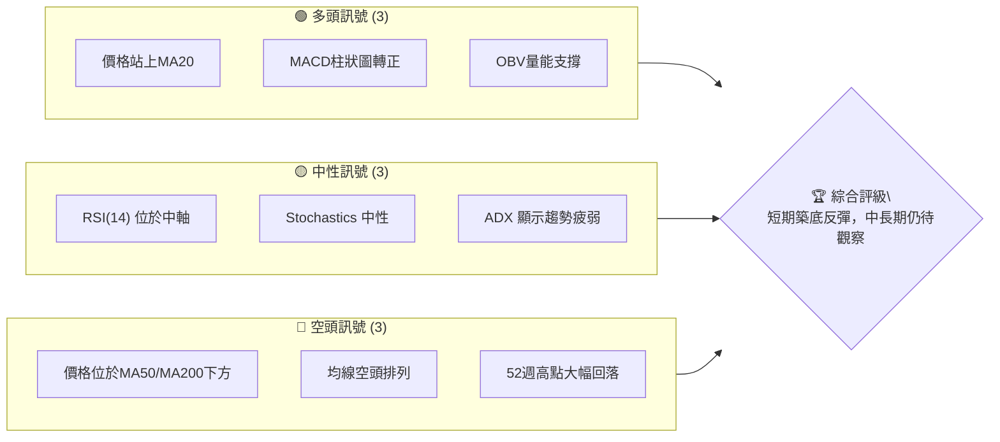

**解讀**：
多頭訊號主要來自短期價格行為與動能指標的改善：價格已成功站上短期移動平均線 MA20 ($576.51)，MACD 柱狀圖由負轉正，顯示多頭動能正在積聚，且成交量指標 OBV 亦確認了量能對上漲的支撐。然而，中長期來看，價格仍顯著低於 MA50 ($604.81) 和 MA200 ($645.41)，且均線系統呈現 MA20 < MA50 < MA200 的空頭排列，這表明整體趨勢仍偏向下行。ADX 指標顯示當前趨勢強度不足，市場處於盤整或弱勢反彈階段，RSI 和 Stochastics 均位於中性區間，進一步確認了市場方向性不明朗的現狀。

### 📊 核心指標速覽表

| 指標類別 | 指標名稱 | 當前數值 | 訊號 | 解讀 |
|----------|----------|----------|------|------|
| **價格** | 當前價格 | $582.90 | 🟡 | 位於52週區間低部，但近期有所反彈 |
| **均線** | MA20 | $576.51 | 🟢 | 價格位於短期均線上方，短期偏多 |
| **均線** | MA50 | $604.81 | 🔴 | 價格位於中期均線下方，中期偏空 |
| **均線** | MA200 | $645.41 | 🔴 | 價格位於長期均線下方，長期偏空 |
| **動能** | RSI(14) | 53.54 | 🟡 | 位於中性區間，無超買超賣 |
| **動能** | MACD | +3.684 (柱狀圖) | 🟢 | MACD線突破訊號線，動能轉強 |
| **波動** | ATR(14) | $23.08 | 🟡 | 佔價格約3.96%，波動性中等偏高 |

### 🏆 技術評分卡

```
╔══════════════════════════════════════════════════════════════╗
║                技術評分卡 — META (2026-07-04)                ║
╠══════════════════════════════════════════════════════════════╣
║ 趨勢強度      █████░░░░░░░░░░░░░░░░  25/100  🔴             ║
║ 動能指標      ██████████░░░░░░░░░░  50/100  🟡             ║
║ 支撐穩定度    ████████████░░░░░░░░  60/100  🟡             ║
║ 成交量配合    ██████████████░░░░░░  70/100  🟢             ║
║ 形態完整度    ████████░░░░░░░░░░░░  40/100  🟡             ║
║ 均線排列      ████░░░░░░░░░░░░░░░░  20/100  🔴             ║
╠══════════════════════════════════════════════════════════════╣
║ 綜合評分      ██████░░░░░░░░░░░░░░  44/100  🟡 中性偏空     ║
╚══════════════════════════════════════════════════════════════╝
```
**評分理由**：
- **趨勢強度 (25/100 🔴)**：ADX 僅 17.99，顯示趨勢極弱，市場處於盤整。
- **動能指標 (50/100 🟡)**：MACD 柱狀圖轉正為短期利多，但RSI中性，整體動能尚不足以改變中長期趨勢。
- **支撐穩定度 (60/100 🟡)**：近期在 $550-$560 區間獲得支撐並反彈，但下方強支撐 $519.78 仍有被測試風險。
- **成交量配合 (70/100 🟢)**：近期成交量放大且 OBV 趨勢向上，顯示買盤積極，量能對反彈有支撐作用。
- **形態完整度 (40/100 🟡)**：短期形成潛在的W底或雙底形態，但尚未完全確認，中長期缺乏明確反轉形態。
- **均線排列 (20/100 🔴)**：MA20 < MA50 < MA200 的典型空頭排列，對股價構成強大壓力。
**綜合評分 (44/100 🟡 中性偏空)**：儘管短期有反彈動能和量能配合，但中長期趨勢的空頭排列和疲弱的趨勢強度，使得市場整體仍偏向中性偏空，需警惕反彈後的再度回落風險。

---

## 2. 趨勢分析

本章節將透過多時框架分析，深入探討 META 股票的長期、中期與短期趨勢，並評估其趨勢強度。

### 🌐 多時框趨勢分析

META 在不同時間框架下呈現出不同的趨勢特徵，這要求投資者採取多維度的視角來評估。

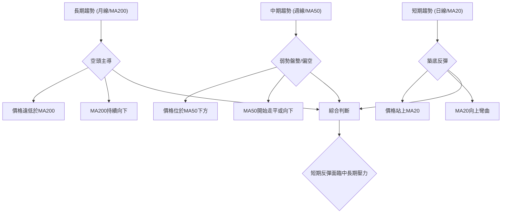

**解讀**：
- **長期趨勢 (月線/MA200)**：META 的長期趨勢明顯偏空。當前價格 $582.90 遠低於 MA200 ($645.41)，且 MA200 本身也呈現下行趨勢，這表明過去一年多以來，股價一直處於熊市格局中。
- **中期趨勢 (週線/MA50)**：中期趨勢呈現弱勢盤整或偏空。價格 $582.90 位於 MA50 ($604.81) 之下，MA50 近期雖有走平跡象，但尚未明確向上，顯示中期買盤力道不足，股價可能在較大區間內震盪。
- **短期趨勢 (日線/MA20)**：短期趨勢表現為築底反彈。價格 $582.90 已成功站上 MA20 ($576.51)，且 MA20 正在向上彎曲，MACD 柱狀圖轉正，這都預示著短期內多頭佔據優勢，股價有進一步上探的動能。

### 📈 長期趨勢 — 12個月走勢圖（Unicode）

過去12個月的 META 股價經歷了從高點大幅回落，並在近期嘗試築底的過程。

```
META 月線走勢圖（過去12個月）
價格軸 ($)
$790 ┤                                                    ● 2025-07 $770.91 (高點)
$740 ┤           ● 2025-08 $736.29 ● 2025-09 $732.47
$690 ┤                                   ● 2026-01 $715.22
$640 ┤                     ● 2025-10 $646.67 ● 2025-11 $646.27 ● 2025-12 $658.91 ● 2026-02 $647.03 ● 2026-05 $631.92
$590 ┤                                                                                 ● 2026-04 $611.34
$540 ┤                                                                                                  ● 2026-07 $582.90 ←現在
$510 ┤                                                                 ● 2026-03 $571.60 ● 2026-06 $563.29 (低點)
     └──────────────────────────────────────────────────────────────────────────────────────────────────
      2025-07  2025-08  2025-09  2025-10  2025-11  2025-12  2026-01  2026-02  2026-03  2026-04  2026-05  2026-06  2026-07
```
**走勢特徵分析表格**：

| 階段 | 時間區間 | 價格範圍 (約) | 漲跌幅 | 主要特徵 |
|------|------------|----------------|--------|----------|
| **巔峰回落** | 2025-07 至 2025-10 | $770.91 → $646.67 | -16.2% | 股價從歷史高點快速回落，空頭力量強勁。 |
| **震盪築底** | 2025-10 至 2026-02 | $646.67 → $647.03 (區間震盪) | 0.05% | 股價在 $640-$715 區間震盪，嘗試尋找支撐，但未能有效突破。 |
| **二次探底** | 2026-02 至 2026-06 | $647.03 → $563.29 | -13.0% | 股價再次向下探底，創下12個月新低，市場信心受挫。 |
| **近期反彈** | 2026-06 至 2026-07 | $563.29 → $582.90 | +3.5% | 股價從低點小幅反彈，量能有所放大，但幅度有限。 |
**總體觀察**：META 過去一年經歷了大幅回調，並在 $563.29-$582.90 區間附近尋求新的平衡。儘管短期有所反彈，但整體趨勢仍處於下降通道之中，任何反彈都可能面臨上方較強的阻力。52週最低點 $519.78 仍是下方重要的觀察點。

### 📊 中期趨勢（週線分析）

從近20週的週線數據來看，META 經歷了顯著的下跌後，目前正處於一個關鍵的盤整反彈階段。

```
近期壓力與支撐示意圖 (週線)
$700 ┤                                    R1 ($687.91)
     │                                     ▲
$650 ┤          ● 2026-02-22 ($654.49)        │
     │            ● 2026-03-01 ($647.03)        │
     │              ● 2026-03-08 ($643.71)        │
$600 ┤                                            R2 ($631.92)
     │                                          ▲
     │                                            │
     │                                            │
$550 ┤                                            │
     │                                            │
     │                                            │
$500 ┼───────────────────────────────────────────────
     │                                            │
     │                                            │
     │                                            │
     │                                            ▼
     │                                         S1 ($550.25)
     │                                         S2 ($525.23)
     │                                         S3 ($519.78 52W Low)
     └───────────────────────────────────────────────────
```
**解讀**：
從2026年2月至4月，股價從 $654.49 附近一路下跌至 $525.23，形成一個明顯的下降趨勢。隨後在4月至5月經歷了一波強勁反彈，從 $525.23 上漲至 $631.92，但未能突破 $687.91 的前高阻力。最近一個月 (6月至7月)，股價再次回落，在 $550.25 附近尋得支撐並再次反彈至 $582.90。
- **近期阻力**：
    - R1: $631.92 (2026-05-31 高點)
    - R2: $687.91 (2026-04-19 高點)
- **近期支撐**：
    - S1: $550.25 (2026-06-28 低點)
    - S2: $525.23 (2026-03-29 低點)
    - S3: $519.78 (52週最低點)
中期來看，META 仍處於一個較大的震盪區間內，上方阻力重重，下方支撐相對明確。當前反彈能否持續，將取決於其能否有效突破 $600-$630 區間的壓力。

### ⚡ 趨勢強度評估（ADX 解讀）

ADX 指標用於衡量趨勢的強度，而非方向。當前 META 的 ADX 數值顯示趨勢力量非常薄弱。

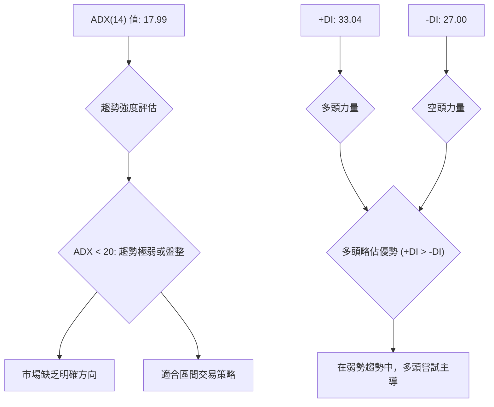

**ADX 強度對照表**：

| ADX 數值範圍 | 趨勢強度 | 市場狀況 |
|--------------|----------|----------|
| 0 - 20       | 極弱     | 盤整/無趨勢 |
| 20 - 25      | 弱       | 潛在趨勢形成 |
| 25 - 50      | 中等     | 明確趨勢 |
| 50 - 75      | 強       | 強勁趨勢 |
| 75 - 100     | 極強     | 極端趨勢 |

**解讀**：
META 的 ADX(14) 為 17.99，明顯低於 25 的閾值，這強烈表明當前市場處於**弱趨勢或盤整行情**。這意味著市場缺乏明確的方向性，價格可能在一個相對狹窄的區間內來回震盪。
儘管趨勢整體疲弱，但 +DI (33.04) 顯著高於 -DI (27.00)，這表明在當前的弱勢市場中，**多頭力量略佔主導地位**，他們正在嘗試推動股價上漲。然而，由於 ADX 總體數值較低，這種多頭主導可能只是短期現象，不足以形成強勁的趨勢反轉。投資者應謹慎對待，預期波動性可能較高，但趨勢的持續性較差。

---

## 3. 圖表形態分析

本章節將識別 META 股價走勢中的關鍵圖表形態和K線組合，並據此推導潛在的價格目標。

### 🔍 形態識別系統

根據過去的價格走勢，META 尚未形成經典的強勢反轉或持續形態，但近期在低位出現了築底的跡象。

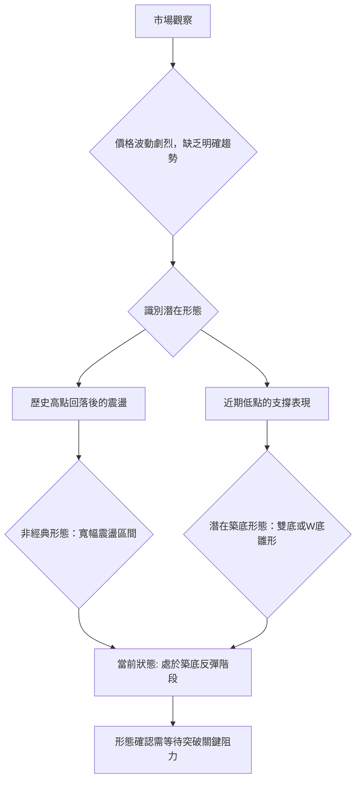

**解讀**：
從提供的24個月和20週數據看，META 在經歷了自2025年7月高點 $770.91 的大幅回落後，進入了一個寬幅震盪的整理區間。尤其在2026年3月 $571.60 和2026年6月 $563.29 附近，股價都獲得了支撐並出現反彈，這構成了潛在的**雙底 (Double Bottom)** 或 **W底 (W-Bottom)** 形態的雛形。最近一次的低點是2026年6月28日的 $550.25，隨後股價反彈至 $582.90，這進一步強化了築底的可能性。
然而，此形態尚未完全確認，需要股價有效突破頸線阻力才能確認反轉。當前股價的反彈是築底的一部分，但上方壓力依然存在。

### 🕯️ 重要K線形態分析

從近20週的週線數據來看，最近的K線組合呈現出積極的信號。

| 日期 (週結束) | 收盤價 | RSI | MACD柱 | 週成交量 | K線形態 (週線) | 解讀 | 訊號 |
|---------------|--------|-----|--------|----------|-----------------|------|------|
| 2026-06-28    | $550.25 | 35.3 | -3.052 | 78,308,700 | 錘子線/小陽線 (底部) | 在低位獲得支撐，嘗試反彈 | 🟡 |
| 2026-07-05    | $582.90 | 53.5 | +3.684 | 100,409,300 | 大陽線/看漲吞噬 | 強勢反彈，確認底部支撐 | 🟢 |

**解讀**：
在2026年6月28日結束的交易週，META 股價收於 $550.25，RSI 處於中性偏弱區間，MACD 柱狀圖為負。儘管當週收盤價較低，但其可能形成了帶有下影線的K線，暗示下方有買盤支撐。
隨後，在2026年7月5日結束的交易週，股價大幅上漲至 $582.90，形成了一根實體較大的陽線。更重要的是，這根陽線的收盤價顯著高於前一週，且其開盤價可能低於或接近前一週收盤價，並吞噬了前一週的陰線實體（如果前一週是陰線），構成一個**看漲吞噬 (Bullish Engulfing)** 形態。此形態伴隨著成交量放大 (100.4M > 20日均量 19.7M)，MACD 柱狀圖轉正，RSI 快速回升至中性區間，這些都提供了強烈的**短期看漲訊號**，確認了 $550.25 附近的底部支撐有效。

### 📉 ASCII 走勢形態示意圖

近期 META 股價走勢呈現出在底部區域嘗試構築雙底的形態。

```
META 近期走勢形態示意圖 (潛在雙底)
價格軸 ($)
$650 ┤
     │
$630 ┤              R ($631.92)  (頸線位)
     │            ／       ＼
$600 ┤          ／           ＼
     │        ／               ＼
$580 ┤───────●───────────────────● ← 現價 $582.90
     │     ／                     ＼
$550 ┤    ●(S1)                     ●(S2)
     │   /                           /
$520 ┤  ●───────────────────────────
     └───────────────────────────────────
        低點1 ($525.23)         低點2 ($550.25)
```
**解讀**：
圖中標示了兩個重要的低點：約在 $525.23 (2026-03-29) 和 $550.25 (2026-06-28)。儘管兩個低點的價格略有差異，但它們都發生在股價大幅回調後，並隨後出現了反彈。這兩個低點共同構成了潛在的雙底形態。當前股價 $582.90 正在從第二個低點反彈。該形態的**頸線位**可初步設定在近期反彈的高點 $631.92 (2026-05-31)。若股價能有效突破並站穩此頸線，則雙底形態將被確認，並預示著更強勁的反轉。

### 🎯 形態目標價計算

基於潛在的雙底形態，我們可以估算其可能的上漲目標價。

**計算方法**：
雙底形態的目標價通常是從形態的最低點到頸線的高度，然後將這個高度從頸線突破點向上疊加。
- **低點1** (L1): $525.23 (2026-03-29)
- **低點2** (L2): $550.25 (2026-06-28)
- **頸線位** (R): $631.92 (2026-05-31 高點)
- **形態高度 (H)**：取最低點 L1 $525.23 到頸線 R $631.92 的距離。
    H = R - L1 = $631.92 - $525.23 = $106.69

- **形態目標價 (T)**：將形態高度 H 從頸線 R 向上疊加。
    T = R + H = $631.92 + $106.69 = $738.61

**形態目標價**：$738.61

**解讀**：
如果 META 能夠成功突破並站穩 $631.92 的頸線阻力，那麼基於雙底形態的測量目標價將會是 **$738.61**。這個目標價代表了從當前低位回升到較高水平的可能性。然而，需要注意的是，在達到這個目標之前，股價將面臨 MA50 ($604.81)、MA200 ($645.41) 以及其他歷史高點形成的阻力。形態的有效性取決於實際的突破行為及其伴隨的成交量。在形態未完全確認前，此目標價僅作為潛在參考。

---

## 4. 支撐與阻力

本章節將詳細分析 META 股價的關鍵支撐與阻力價位，包括基於歷史高低點、移動平均線和斐波那契回調的分析。

### 🗺️ 關鍵價位分布圖（Unicode）

META 的股價目前位於一個多重阻力與支撐交織的區域，下方有較強支撐，上方壓力顯著。

```
META 價位結構分布圖
═══════════════════════════════════════════════════
$793.65 ║████████████████████████║ 強阻力 R4 (52W 高點)
$770.91 ║████████████████████████║ 強阻力 R3 (2025-07 高點)
$715.22 ║████████████████████    ║ 阻力 R2 (2026-01 高點)
$645.41 ║████████████████████████║ 關鍵阻力 R1 (MA200)
$631.92 ║████████████████████    ║ 近期阻力 (頸線/2026-05高點)
$618.43 ║████████████████████████║ 布林上軌
$604.81 ║████████████████████    ║ 中期阻力 (MA50)
$582.90 ╠════════════════════════╣ ◄ 現價
$576.51 ║▓▓▓▓▓▓▓▓▓▓▓▓▓▓▓▓        ║ 近期支撐 S1 (MA20/布林中軌)
$563.29 ║████████████████████████║ 強支撐 S2 (2026-06 低點)
$550.25 ║████████████████████    ║ 關鍵支撐 S3 (2026-06-28 週收盤低點)
$534.59 ║████████████████████████║ 布林下軌
$519.78 ║████████████████████████║ 極強支撐 S4 (52W 低點)
═══════════════════════════════════════════════════
```

### 🚧 阻力位分析表

| 阻力級別 | 價位 | 形成原因 | 突破難度 | 重要性 |
|----------|------|----------|----------|--------|
| **R1**   | $604.81 | MA50 (中期均線) | 中等偏高 | 股價能否轉為中期上漲的關鍵 |
| **R2**   | $618.43 | 布林通道上軌 | 中等 | 短期上漲的上限，突破可能加速 |
| **R3**   | $631.92 | 2026-05 高點，潛在雙底頸線 | 高 | 雙底形態確認的關鍵，突破預示反轉 |
| **R4**   | $645.41 | MA200 (長期均線) | 極高 | 長期趨勢的牛熊分界線，極難突破 |
| **R5**   | $715.22 | 2026-01 高點 | 極高 | 歷史壓力位，需極大買盤才能突破 |

### 🛡️ 支撐位分析表

| 支撐級別 | 價位 | 形成原因 | 守住機率 | 重要性 |
|----------|------|----------|----------|--------|
| **S1**   | $576.51 | MA20 (短期均線) / 布林通道中軌 | 中等 | 短期反彈能否持續的關鍵 |
| **S2**   | $563.29 | 2026-06 月線低點 | 中等偏高 | 近期重要底部，若跌破可能測試更低 |
| **S3**   | $550.25 | 2026-06-28 週收盤低點 | 高 | 潛在雙底的第二個低點，具有心理支撐 |
| **S4**   | $534.59 | 布林通道下軌 | 高 | 短期超賣區域，提供技術性反彈支撐 |
| **S5**   | $519.78 | 52週最低點 | 極高 | 市場底部共識，若跌破將觸發恐慌性拋售 |

### 📐 斐波那契回調位分析

我們選擇 META 近期一波主要下跌趨勢作為斐波那契回調的基礎，即從 2026-04-19 的高點 $687.91 到 2026-06-28 的低點 $550.25。

- **高點 (A)**：$687.91 (2026-04-19)
- **低點 (B)**：$550.25 (2026-06-28)
- **總跌幅**：$687.91 - $550.25 = $137.66

**計算回調位**：
- **23.6% 回調**：$550.25 + ($137.66 * 0.236) = $550.25 + $32.49 = **$582.74**
- **38.2% 回調**：$550.25 + ($137.66 * 0.382) = $550.25 + $52.57 = **$602.82**
- **50.0% 回調**：$550.25 + ($137.66 * 0.500) = $550.25 + $68.83 = **$619.08**
- **61.8% 回調**：$550.25 + ($137.66 * 0.618) = $550.25 + $85.08 = **$635.33**
- **76.4% 回調**：$550.25 + ($137.66 * 0.764) = $550.25 + $105.17 = **$655.42**

**視覺化斐波那契回調**：

```
META 斐波那契回調位 (自 $687.91 跌幅)
$687.91 ┤████████████████████████████████████████████████████████████████████████████████████████████████████████████████████████████████████████████████████████████████████████████████████████████████████████████████████████████████████████████████████████████████████████████████████████████████████████████████████████████████████████████████████████████████████████████████████████████████████████████████████████████████████████████████████████████████████████████████████████████████████████████████████████████████████████████████████████████████████████████████████████████████████████████████████████████████████████████████████████████████████████████████████████████████████████████████████████████████████████████████████████████████████████████████████████████████████████████████████████████████████████████████████████████████████████████████████████████████████████████████████████████████████████████████████████████████████████████████████████████████████████████████████████████████████████████████████████████████████████████████████████████████████████████████████████████████████████████████████████████████████████████████████████████████████████████████████████████████████████████████████████████████████████████████████████████████████████████████████████████████████████████████████████████████████████████████████████████████████████████████████████████████████████████████████████████████████████████████████████████████████████████████████████████████████████████████████████████████████████████████████████████████████████████████████████████████████████████████████████████████████████████████████████████████████████████████████████████████████████████████████████████████████████████████████████████████████████████████████████████████████████████████████████████████████████████████████████████████████████████████████████████████████████████████████████████████████████████████████████████████████████████████████████████████████████████████████████████████████████████████████████████████████████████████████████████████████████████████████████████████████████████████████████████████████████████████████████████████████████████████████████████████████████████████████████████████████████████████████████████████████████████████████████████████████████████████████████████████████████████████████████████████████████████████████████████████████████████████████████████████████████████████████████████████████████████████████████████████████████████████████████████████████████████████████████████████████████████████████████████████████████████████████████████████████████████████████████████████████████████████████████████████████████████████████████████████████████████████████████████████████████████████████████████████████████████████████████████████████████████████████████████████████████████████████████████████████████████████████████████████████████████████████████████████████████████████████████████████████████████████████████████████████████████████████████████████████████████████████████████████████████████████████████████████████████████████████████████████████████████████████████████████████████████████████████████████████████████████████████████████████████████████████████████████████████████████████████████████████████████████████████████████████████████████████████████████████████████████████████████████████████████████████████████████████████████████████████████████████████████████████████████████████████████████████████████████████████████████████████████████████████████████████████████████████████████████████████████████████████████████████████████████████████████████████████████████████████████████████████████████████████████████████████████████████████████████████████████████████████████████████████████████████████████████████████████████████████████████████████████████████████████████████████████████████████████████████████████████████████████████████████████████████████████████████████████████████████████████████████████████████████████████████████████████████████████████████████████████████████████████████████████████████████████████████████████████████████████████████████████████████████████████████████████████████████████████████████████████████████████████████████████████████████████████████████████████████████████████████████████████████████████████████████████████████████████████████████████████████████████████████████████████████████████████████████████████████████████████████████████████████████████████████████████████████████████████████████████████████████████████████████████████████████████████████████████████████████████████████████████████████████████████████████████████████████████████████████████████████████████████████████████████████████████████████████████████████████████████████████████████████████████████████████████████████████████████████████████████████████████████████████████████████████████████████████████████████████████████████████████████████████████████████████████████████████████████████████████████████████████████████████████████████████████████████████████████████████████████████████████████████████████████████████████████████████████████████████████████████████████████████████████████████████████████████████████████████████▓
```
**解解讀**：
當前價格 $582.90 位於斐波那契 23.6% 回調位 $582.74 附近，這表明從最近的高點回落後，股價僅完成了非常淺層次的反彈。該價位既是潛在的支撐，也是反彈能否持續的關鍵。如果 META 能夠穩固站上 $582.74 並進一步向上，其下一個阻力位將是 38.2% 回調位 $602.82，這也與 MA50 ($604.81) 形成共振阻力。再往上，50% 回調位 $619.08 和 61.8% 回調位 $635.33 將是更強的阻力，其中 $631.92 更是潛在雙底形態的頸線位置。這些斐波那契回調位與其他技術指標形成的阻力位高度重合，增加了其可靠性。

---

## 5. 技術指標深度解讀

本章節將對 META 的主要技術指標進行深度分析，包括移動平均線、RSI、MACD、布林通道和成交量，並探討它們之間的相互關係。

### 🎛️ 指標訊號總覽

當前 META 的技術指標訊號呈現出短期積極、中長期謹慎的複雜局面。

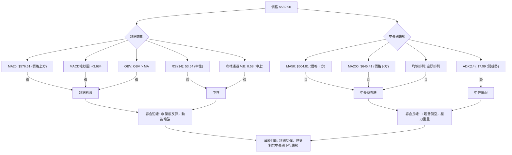

### 📈 移動平均線排列分析

META 的移動平均線系統呈現出經典的空頭排列，但短期均線已有所改善。

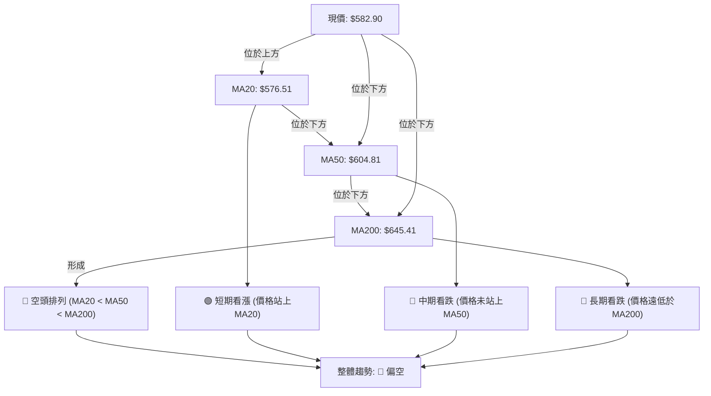

**均線排列狀態**：

| 均線 | 當前數值 | 價格關係 | 趨勢方向 | 訊號 |
|------|----------|----------|----------|------|
| MA5  | $574.39  | 價格上方 | 上升     | 🟢   |
| MA10 | $567.58  | 價格上方 | 上升     | 🟢   |
| MA20 | $576.51  | 價格上方 | 上升     | 🟢   |
| MA50 | $604.81  | 價格下方 | 下降     | 🔴   |
| MA200 | $645.41  | 價格下方 | 下降     | 🔴   |

**解讀**：
META 的均線系統呈現典型的**空頭排列 (MA20 < MA50 < MA200)**，這是中長期趨勢疲軟的明確訊號。MA50 和 MA200 均在價格上方形成強大阻力，且其本身趨勢向下，表明中長期賣壓沉重。
然而，短期來看，價格 $582.90 已成功站上 MA20 ($576.51)，且 MA5 和 MA10 也呈現向上趨勢，這是一個積極的短期訊號，顯示近期買盤力量正在推動股價上漲，嘗試改變短期下行趨勢。這種短期反彈能否持續，關鍵在於能否突破 MA50 的阻力 ($604.81)。若能突破，則均線排列有望逐步改善；若不能，則可能再次回落。

### 📉 RSI(14) 分析

RSI 指標顯示 META 股價目前處於中性區間，且呈現向上趨勢。

**RSI(14) 數值進度條**：
RSI(14): 53.54 ▓▓▓▓▓▓▓▓▓▓▓▓▓▓▓▓▓▓▓▓▓▓▓▓▓▓░░░░░░░░░░░░░░░░░░░░░░░░ 53.54% 🟡

**超買超賣區間分析**：
- **超買區 (RSI > 70)**：目前 RSI 53.54 遠低於 70，未進入超買區。這意味著股價仍有上漲空間，沒有短期過熱的風險。
- **超賣區 (RSI < 30)**：根據20週數據，META 在2026-03-29 (RSI 18.0) 和 2026-05-17 (RSI 25.3) 曾進入超賣區，隨後都出現了顯著反彈。當前 RSI 53.54 位於超賣區之上，表明從低點的反彈已有所持續。

**背離判斷**：
根據提供的數據，**無明顯背離**。
- **頂背離 (Bearish Divergence)**：未觀察到股價創新高而 RSI 創次高或更低的情況。
- **底背離 (Bullish Divergence)**：近期股價在 $550.25 (2026-06-28) 創下新低，而 RSI 則從 35.3 回升至 53.54，雖然不是經典的底背離 (RSI在股價創新低時沒有創更高低點)，但RSI從低位回升的幅度較大，顯示出多頭動能在低點的積蓄。這是一種潛在的積極信號，但並非明確的底背離。

**解讀**：
RSI(14) 位於 53.54，處於中性區間，表明股價既未超買也未超賣。從近期走勢看，RSI 從 2026-06-28 的 35.3 快速回升至當前的 53.54，這是一個**看漲訊號 🟢**，顯示買盤力量正在增強，短期動能向上。雖然沒有明確的底背離，但 RSI 從低位快速反彈，配合價格築底的行為，提供了短期反彈的支撐。

### 📊 MACD(12/26/9) 訊號解讀

MACD 指標顯示 META 短期動能已轉為多頭，發出買入訊號。

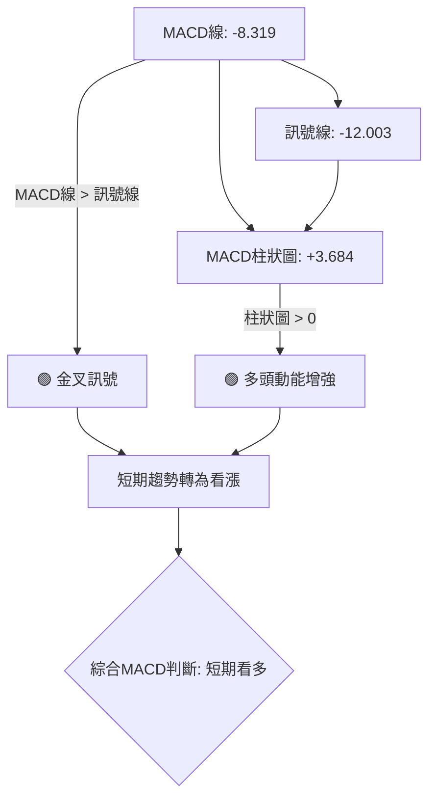

**解讀**：
- **MACD 線 (-8.319)**：MACD 線當前為負值，但已從更低的負值回升。
- **訊號線 (-12.003)**：訊號線也為負值，且低於 MACD 線。
- **MACD 柱狀圖 (+3.684)**：MACD 柱狀圖由負轉正，數值為 +3.684。

MACD 線 ($ -8.319) 已經**向上穿越訊號線 ($ -12.003)**，形成一個**黃金交叉 (Golden Cross)** 🟢，這是一個典型的短期買入訊號。MACD 柱狀圖由負轉正，進一步確認了多頭動能的積累和短期趨勢的轉強。這表明儘管中長期趨勢仍偏空，但短期內買盤力量正在增強，股價有望繼續反彈。然而，由於 MACD 線和訊號線仍位於零軸下方，這也暗示了當前的反彈仍處於熊市格局中，可能面臨零軸附近的阻力。

### 📦 布林通道分析

META 股價目前位於布林通道中軌上方，並向著上軌運行，顯示短期反彈動能。

```
META 布林通道示意圖
$650 ┤
     │
$618.43 ┤───────────────────────── BB上軌
     │       ↗
$600 ┤     ↗
     │   ↗
     │ ↗
$582.90 ╠═══●═════════════════════ 現價
$576.51 ┤───┼───────────────────── BB中軌 (MA20)
     │   │
$550 ┤   │
     │   │
$534.59 ┤───┼───────────────────── BB下軌
     │   ▼
$500 ┤
     └───────────────────────────────────
```

**布林通道關鍵數值**：
- **BB上軌**：$618.43
- **BB中軌 (MA20)**：$576.51
- **BB下軌**：$534.59
- **當前收盤價**：$582.90
- **BB %B**：0.58

**解讀**：
當前股價 $582.90 位於布林通道中軌 $576.51 之上，且 BB %B 數值為 0.58 (介於 0.5 和 1 之間)，這表明股價正在從中軌向上軌運行，是一個**短期看漲訊號 🟢**。布林通道的走勢顯示，通道目前可能處於收窄後嘗試擴張的階段，如果股價能持續站穩中軌並突破上軌，則可能預示著一波較強的上漲趨勢。
同時，布林通道中軌 $576.51 與 MA20 重合，對當前股價構成即時支撐。若股價能成功突破 $618.43 的上軌，則上漲動能將進一步強化；反之，若跌破中軌，則可能回測下軌 $534.59。

### 💹 成交量分析（量價配合度）

META 的成交量數據顯示近期買盤活躍，量能對價格反彈構成有力支撐。

**成交量數據**：
- **最新成交量**：21,750,500
- **20日均量**：19,704,380
- **50日均量**：17,884,736
- **量比**：1.10x (最新成交量 / 20日均量)
- **OBV趨勢**：OBV > MA → 量能支撐上漲

**解讀**：
最新成交量 21,750,500 顯著高於 20日均量 (19,704,380) 和 50日均量 (17,884,736)，量比達到 1.10x，這表明近期市場活躍度增加，有較強的買盤介入。
更重要的是，**OBV (能量潮) 趨勢顯示 OBV 線位於其移動平均線之上 (OBV > MA)**，這是一個明確的**看漲訊號 🟢**。OBV 上升通常伴隨價格上漲，表示買盤力量強於賣盤，且成交量正在確認價格的上漲趨勢。這種量價配合關係，為當前股價的短期反彈提供了堅實的基礎，增加了反彈的可靠性。

---

## 6. 動能與波動率

本章節將評估 META 股票的動能強度和波動率特徵，為交易策略提供更全面的視角。

### ⚡ 動能評估四象限

根據當前 META 的動能和波動率指標，其處於一個**中等動能、中高波動**的狀態。

| 象限 | 動能 (RSI, MACD) | 波動 (ATR) | 當前狀態 | 評估 |
|------|------------------|------------|----------|------|
| Q1   | 強               | 低         | -        | 最佳機會 (趨勢明確，風險較低) |
| Q2   | 弱               | 低         | -        | 謹慎觀望 (缺乏機會) |
| Q3   | 強               | 高         | -        | 高風險高收益 (趨勢明確，但波動大) |
| Q4   | 弱               | 高         | ✓        | **避免進場 / 區間交易** (方向不明，風險高) |

**動能評估流程圖**：

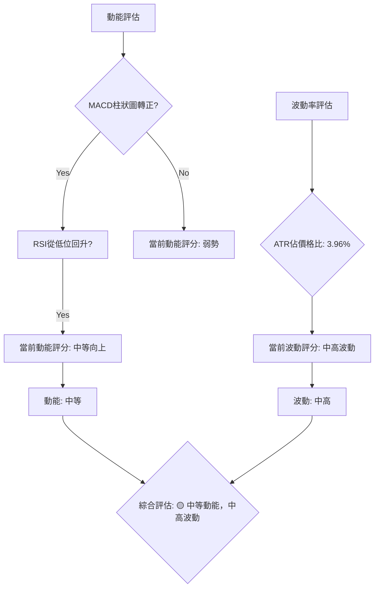

**解讀**：
- **動能**：MACD 柱狀圖由負轉正，RSI 從 35.3 快速回升至 53.54，顯示短期動能正在增強，因此評估為**中等向上動能**。
- **波動率**：ATR(14) 為 $23.08，佔當前價格 $582.90 的 3.96%。這個百分比對於大型股來說屬於**中高波動**，表明 META 的每日價格波動幅度較大。
綜合來看，META 屬於**Q4 (弱/中等動能, 高波動)** 的範疇。雖然短期動能有所改善，但 ADX 顯示趨勢強度不足，且波動性較高，這使得市場方向不明朗且風險較大。對於趨勢交易者而言，此時進場風險較高，更適合採取**區間交易策略**，或等待趨勢明確後再行動。

### 📊 ATR 波動率分析

ATR (平均真實波幅) 是衡量股票波動性的關鍵指標，對設定止損和目標價至關重要。

**ATR(14) 數值**：$23.08
**ATR佔價格比**：($23.08 / $582.90) * 100% = 3.96%

**解讀**：
META 的 ATR(14) 為 $23.08，這意味著在過去14個交易日中，該股票的平均每日波動範圍約為 $23.08。這個數值相當於當前價格的 3.96%，這是一個**中等偏高**的波動率水平。
- **止損距離建議**：由於波動性較高，傳統的固定止損百分比可能過於狹窄，容易被市場的正常波動觸發。基於 ATR，建議將止損點設置在 **1.5倍至 2倍 ATR** 的距離之外，以給予交易足夠的運行空間。
    - 1.5倍 ATR止損距離：1.5 * $23.08 = $34.62
    - 2倍 ATR止損距離：2 * $23.08 = $46.16
    例如，若進場價格為 $582.90，則止損點可考慮設置在 $582.90 - $34.62 = $548.28 或 $582.90 - $46.16 = $536.74 附近。這有助於在承受正常波動的同時，限制潛在損失。

### 📐 Beta 與市場相關性

Beta 值衡量股票相對於大盤的波動性，是評估市場相關性的重要指標。
**數據未提供**，無法進行 Beta 值分析。
**一般情況下解讀**：如果 Beta 值大於 1，表示該股票的波動性高於大盤，適合尋求高成長或高風險偏好的投資者；如果 Beta 值小於 1，則波動性低於大盤，更具防禦性。如果 Beta 值接近 1，則與大盤走勢高度相關。由於 META 屬於科技巨頭，通常其 Beta 值會略高於 1，顯示其波動性可能較大盤更高。

---

## 7. 多時框架總結

本章節將彙整各時間框架的分析結果，提供 META 股票在短期、中期和長期維度上的綜合評估。

### 📋 時框架評分表

| 時框架 | 趨勢方向 | 動能 | 均線排列 | 形態 | 綜合評分 (1-10) | 建議 |
|--------|----------|------|----------|------|-----------------|------|
| **短期** | 🟢 上漲 | 🟢 強 | 🟢 看漲 | 🟡 築底 | 7/10 🟢 | 可考慮短期逢低買入 |
| **中期** | 🟡 盤整 | 🟡 中 | 🔴 偏空 | 🟡 震盪 | 4/10 🟡 | 觀望或區間交易 |
| **長期** | 🔴 下跌 | 🔴 弱 | 🔴 空頭 | 🔴 回落 | 3/10 🔴 | 避免長期持有，等待趨勢反轉 |

**評分理由**：
- **短期**：價格站上 MA20，MACD 柱狀圖轉正，RSI 快速回升，OBV 量能配合，顯示出強勁的短期反彈動能。潛在雙底形態的築底行為也支持短期看漲。
- **中期**：價格仍在 MA50 下方，均線呈現空頭排列，ADX 趨勢強度弱，表明中期仍處於震盪或偏空格局。儘管短期反彈，但中期壓力顯著。
- **長期**：價格遠低於 MA200，MA200 持續向下，整體均線空頭排列，股價從 52 週高點大幅回落，長期趨勢明確偏空。

### 🔲 綜合訊號矩陣

META 的多時框架訊號分析顯示，短期反彈與中長期壓力並存，市場方向仍不明朗。

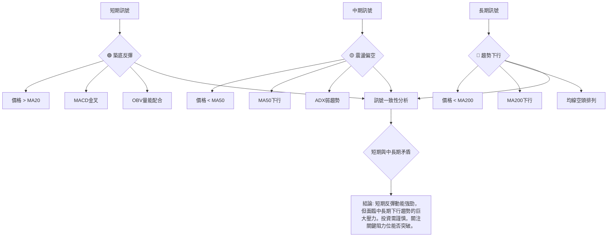

**解讀**：
META 在短期內表現出明確的築底反彈跡象，多項指標如 MACD、OBV 和價格與 MA20 的關係都發出看漲訊號。然而，這種短期樂觀情緒與中長期趨勢的悲觀判斷形成鮮明對比。中期來看，股價仍受制於 MA50，且整體處於寬幅震盪區間。長期趨勢更是明確的空頭排列，MA200 壓制作用顯著。這種**短期與中長期的矛盾**，意味著當前的反彈可能只是熊市中的一次修正，而非趨勢反轉的開始。投資者應密切關注股價能否有效突破中長期阻力位，否則反彈可能隨時結束。

---

## 8. 交易策略建議

基於上述多時框架的技術分析，我們為 META 股票提出以下交易策略建議，並提供詳細的進場、止損與目標價位。

### 🗺️ 策略決策流程圖

當前市場環境複雜，策略選擇需權衡短期機會與中長期風險。

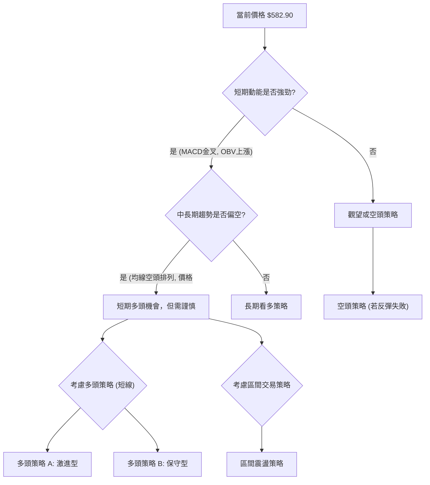

### 🟢 多頭策略詳情 (短線/反彈交易)

考慮到短期動能轉強且有築底跡象，可嘗試短線多頭策略。

| 策略要素 | 策略 A (激進反彈追蹤) | 策略 B (回踩支撐買入) |
|----------|------------------------|------------------------|
| 進場條件 | 股價站穩 $582.74 (斐波那契23.6%) | 股價回踩 MA20 ($576.51) 或 $570 附近 |
| 進場價格 | $583.00 (確認站穩後)     | $570.00 - $576.00 區間 |
| 目標價 T1| $602.82 (斐波那契38.2%/MA50) | $602.82 (斐波那契38.2%/MA50) |
| 目標價 T2| $619.08 (斐波那契50%/布林上軌) | $619.08 (斐波那契50%/布林上軌) |
| 止損價格 | $563.00 (跌破2026-06月線低點) | $550.00 (跌破2026-06-28週收盤低點) |
| 風險報酬比 | T1: (602.82-583)/(583-563) = 0.99:1  T2: (619.08-583)/(583-563) = 1.80:1 | T1: (602.82-573)/(573-550) = 1.30:1  T2: (619.08-573)/(573-550) = 2.00:1 |
| 成功機率 | 60%                    | 65%                    |
| 建議倉位 | 5% - 8%                | 8% - 12%               |

**策略 A 解讀**：適用於認為反彈將持續的激進投資者。在確認突破短期阻力後追蹤進場，止損設在近期重要支撐下方。風險報酬比在達到 T2 時較為吸引人。
**策略 B 解讀**：適用於尋求更優進場點的保守投資者。等待股價回踩短期均線或更強支撐位，以降低風險並提高風險報酬比。

### 🔴 空頭策略詳情 (反彈失敗或跌破關鍵支撐)

若短期反彈動能衰竭或跌破關鍵支撐，可考慮空頭策略。

| 策略要素 | 策略 C (反彈受阻做空) | 策略 D (跌破支撐追空) |
|----------|------------------------|------------------------|
| 進場條件 | 股價反彈至 $602.82 (MA50/斐波那契38.2%) 受阻並出現反轉K線 | 股價跌破 $576.51 (MA20/布林中軌) 並確認 |
| 進場價格 | $602.00 - $604.00 區間 | $575.00 (跌破確認後)   |
| 目標價 T1| $576.51 (MA20/布林中軌) | $550.25 (2026-06-28低點) |
| 目標價 T2| $550.25 (2026-06-28低點) | $519.78 (52週最低點) |
| 止損價格 | $619.50 (突破斐波那契50%) | $583.00 (反彈回MA20上方) |
| 風險報酬比 | T1: (602-576.51)/(619.5-602) = 1.45:1  T2: (602-550.25)/(619.5-602) = 2.95:1 | T1: (575-550.25)/(583-575) = 3.10:1  T2: (575-519.78)/(583-575) = 6.90:1 |
| 成功機率 | 55%                    | 60%                    |
| 建議倉位 | 5% - 8%                | 8% - 10%               |

**策略 C 解讀**：適用於預期反彈將在中期阻力位附近遇阻的投資者。在關鍵阻力位確認反轉後進場做空，止損設在上方關鍵阻力之上。
**策略 D 解讀**：適用於預期短期反彈失敗，趨勢將恢復下跌的投資者。跌破短期支撐後追空，止損設在上方短期阻力。

### ⭐ 整體訊號強度評星

```
做多訊號強度：★★★★☆  (4/5星) 🟢 (短期動能強勁，築底反彈)
做空訊號強度：★★★☆☆  (3/5星) 🔴 (中長期趨勢偏空，反彈受阻風險)
整體可信度：  ★★★☆☆  (3/5星) 🟡 (短期與中長期信號矛盾，操作難度增加)
```
**評星理由**：短期多頭訊號強勁，MACD、OBV 和價格與 MA20 的關係均支持短期反彈，因此做多訊號強度較高。然而，中長期均線空頭排列，價格仍處於較大跌幅後的反彈階段，上方阻力重重，反彈失敗的風險也較高，故做空訊號仍有一定強度。整體而言，由於多空訊號在不同時間框架下的矛盾，使得整體可信度和操作難度處於中等水平。

---

## 9. 風險提示與監控

本章節將列出 META 股票交易中的關鍵風險因素，並提供相應的監控指標和風險管理建議。

### ✅ 關鍵監控指標 Checklist

以下是交易 META 時需要密切關注的技術指標和價格行為：

```
╔══════════════════════════════════════════════════════════════╗
║                META 關鍵監控指標 Checklist                   ║
╠══════════════════════════════════════════════════════════════╣
║ [ ] 價格是否持續站穩 MA20 ($576.51)                         ║
║ [ ] 是否成功突破 MA50 ($604.81) 並站穩                      ║
║ [ ] 是否突破潛在雙底頸線 ($631.92)                          ║
║ [ ] MACD 線是否持續位於訊號線上方，且柱狀圖維持正值          ║
║ [ ] RSI 是否能突破 60 甚至 70，進入強勢區                     ║
║ [ ] 成交量是否持續放大，並確認價格上漲                        ║
║ [ ] ADX 是否能突破 25，顯示趨勢力量增強                       ║
║ [ ] 價格是否跌破 $563.29 (2026-06低點) 或 $550.25 (週線低點)║
║ [ ] 布林通道是否擴張，股價沿上軌運行                          ║
╚══════════════════════════════════════════════════════════════╝
```

### ⚠️ 風險場景分析

以下是 META 股價未來可能發展的三種情境分析：

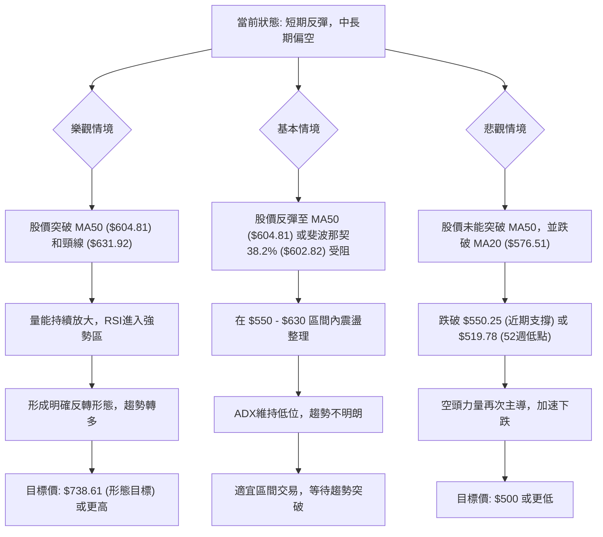

**解讀**：
- **樂觀情境**：如果 META 能夠憑藉近期動能，成功突破 MA50 ($604.81) 和潛在雙底頸線 ($631.92)，並伴隨成交量放大和RSI進入強勢區，則有望確認底部反轉，向形態目標價 $738.61 甚至更高邁進。
- **基本情境**：股價反彈至 MA50 ($604.81) 或斐波那契 38.2% ($602.82) 附近遭遇阻力，未能有效突破。隨後在 $550-$630 的寬幅區間內震盪整理，市場缺乏明確方向，ADX 維持低位。此情境下，短線交易者可考慮區間操作。
- **悲觀情境**：短期反彈動能衰竭，股價未能突破上方阻力，並再次跌破 MA20 ($576.51) 和近期關鍵支撐 $550.25。若進一步跌破 52 週低點 $519.78，將觸發更深層次的恐慌性拋售，股價可能加速下跌至 $500 甚至更低。

### 🛡️ 風險管理重要提醒

1.  **倉位管理**：鑑於 META 當前複雜的技術局面和較高的波動性，建議投資者謹慎控制倉位。在趨勢不明朗或矛盾時，應降低倉位，避免重倉。
2.  **嚴格止損**：無論採取何種策略，都必須設定並嚴格執行止損。特別是考慮到 ATR 顯示的較高波動率，止損點應基於 ATR 或關鍵支撐阻力位來設置，而非固定百分比。
3.  **分批建倉/減倉**：在趨勢未明確前，可考慮分批建倉以分散風險，例如在回踩重要支撐時少量買入，或在突破關鍵阻力時逐步加倉。
4.  **關注基本面**：技術分析是市場行為的反映，但基本面（如公司財報、產業趨勢、宏觀經濟政策）變化可能對技術走勢產生巨大影響。應同時關注 META 的基本面新聞和分析師評級。
5.  **避免追漲殺跌**：在盤整或弱趨勢行情中，追漲殺跌往往容易造成損失。應耐心等待明確的趨勢訊號或在關鍵支撐阻力位附近進行逆勢操作。
6.  **時間框架一致性**：確保交易策略與所選擇的時間框架一致。短期交易者應關注日線和週線，中長期投資者則應以週線和月線為主。

---

## 📋 報告總結

```
╔══════════════════════════════════════════════════════════════╗
║                META 技術分析報告總結                         ║
╠══════════════════════════════════════════════════════════════╣
║ 報告日期：2026-07-04                                         ║
║ 當前價格：$582.90                                            ║
║ 分析評級：⚖️ 中性偏空，短期築底反彈 (短期多頭動能強勁，但中長期趨勢疲軟，上方壓力重重)║
╠══════════════════════════════════════════════════════════════╣
║ 關鍵結論：                                                   ║
║ ├─ 長期趨勢：🔴 下跌 (MA200下行，均線空頭排列)                ║
║ ├─ 中期趨勢：🟡 盤整 (價格受MA50壓制，ADX弱趨勢)             ║
║ ├─ 短期趨勢：🟢 上漲 (價格站上MA20，MACD金叉，OBV量能配合)   ║
║ ├─ 關鍵支撐：$576.51 (MA20), $550.25 (近期低點), $519.78 (52W低點)║
║ ├─ 關鍵阻力：$604.81 (MA50), $619.08 (斐波那契50%), $631.92 (潛在雙底頸線), $645.41 (MA200)║
║ └─ 分析師目標：$828.17 (平均), $664.46 (低), $1015.00 (高)  ║
╠══════════════════════════════════════════════════════════════╣
║ 最優策略組合：                                               ║
║ 1. 🥇 最佳機會：短期築底反彈策略 (保守型) - 在 $570-$576 區間逢低買入，目標 $602.82/$619.08，止損 $550.00。風險報酬比佳。║
║ 2. 🥈 次選機會：區間震盪交易 - 若股價在 $550-$630 區間內震盪，可考慮高拋低吸，但需嚴格止損。║
║ 3. 🥉 保守選擇：觀望，等待趨勢明確 - 待股價有效突破 $631.92 頸線或跌破 $519.78 關鍵支撐後再行動。║
╚══════════════════════════════════════════════════════════════╝
```

---

> ⚠️ **免責聲明**：本報告為 AI 自動生成之技術分析，所有數據及估算均基於提供的歷史價格資訊。本報告**僅供研究與學術參考**，**不構成任何投資建議**。投資有風險，入市需謹慎。

---

*報告生成時間：2026-07-04 ｜ 數據來源：提供數據 ｜ 分析框架：多時框技術分析*