<details>
<summary>📊 靜態圖表 (點擊展開)</summary>

</details>

<html>
<head><meta charset="utf-8" /></head>
<body>
    <div style="height:500px; width:100%;">                        <script>window.PlotlyConfig = {MathJaxConfig: 'local'};</script>
        <script charset="utf-8" src="https://cdn.plot.ly/plotly-3.6.0.min.js" integrity="sha256-QaOVwtVY0T02VaHrr6pnoHLCwayMJp4O5n4YyaE3rJk=" crossorigin="anonymous"></script>                <div id="candlestick-chart" class="plotly-graph-div" style="height:100%; width:100%;"></div>            <script>                window.PLOTLYENV=window.PLOTLYENV || {};                                if (document.getElementById("candlestick-chart")) {                    Plotly.newPlot(                        "candlestick-chart",                        [{"close":{"dtype":"f8","bdata":"AAAAAKRDiEAAAACgfCmIQAAAAOCbTYhAAAAAgLI+iEAAAACAZtmHQAAAAACGi4dAAAAAgH61h0AAAAAAvVeHQAAAAMCQLodAAAAAwMUrh0AAAADAzOOGQAAAAGDVW4ZAAAAA4E+phkAAAADguyWGQAAAAKBtToZAAAAAgNc5hkAAAADg0l+GQAAAAIDb3IZAAAAAYMP7hUAAAABAv06GQAAAAGB+FoZAAAAAYIJdhkAAAABgyDGGQAAAAGB7WIZAAAAAQCrShkAAAACA8dqGQAAAAGAP3IZAAAAAgMTghkAAAACgjgOHQAAAAID6ZodAAAAA4Oxrh0AAAADAwm2HQAAAAMDtxYRAAAAAYFg1hEAAAABAcuCDQAAAAKCKjYNAAAAAAGfSg0AAAADgrEqDQAAAAEDHYINAAAAAIPiwg0AAAABgoIuDQAAAAABx+4JAAAAAoHYCg0AAAABACP+CQAAAACCWw4JAAAAA4B2hgkAAAABAT2aCQAAAAED5XIJAAAAAAKuFgkAAAACArRuDQAAAAGCO1INAAAAAALu\u002fg0AAAABAJzKEQAAAAOCo+YNAAAAA4F4rhEAAAADAhu+DQAAAAACDnoRAAAAAgGL9hEAAAADgj8iEQAAAAOALeoRAAAAAYIxDhEAAAACAIliEQAAAAGB4FIRAAAAAQNsyhEAAAADA1n+EQAAAAIC\u002fQoRAAAAAoCK6hEAAAACgxoyEQAAAAKCTooRAAAAAQAy+hEAAAAAg5NKEQAAAAADfsIRAAAAAICOMhEAAAAAgHcaEQAAAAEBRl4RAAAAA4ANKhEAAAACA74yEQAAAAMCMm4RAAAAAoEc8hEAAAADgRieEQAAAAEAtX4RAAAAAgJ0GhEAAAAAAu6+DQAAAAGBkM4NAAAAAgI5dg0AAAAAgKlmDQAAAAMBa2IJAAAAA4PIeg0AAAACA0DOEQAAAAECyjIRAAAAAYE35hEAAAABgLP6EQAAAAGBQ3IRAAAAAgPYHh0AAAAAgy1mGQAAAAIA3CYZAAAAAIL+ThUAAAADgY96EQAAAAAAi6IRAAAAAAEKihEAAAADgHCCFQAAAAKA07IRAAAAAoP7bhEAAAABAOUWEQAAAAAAM9YNAAAAAgDbxg0AAAADgmBCEQAAAACAOHYRAAAAAoPBzhEAAAAAg7OCDQAAAAABL8YNAAAAAYDVkhEAAAACguH6EQAAAAAA1OIRAAAAAgCtjhEAAAAAAT2+EQAAAAABU1IRAAAAAgCabhEAAAACgsR2EQAAAAADmMYRAAAAAID5nhEAAAAAgjW2EQAAAAGBZ6INAAAAAAPAkg0AAAADA85aDQAAAAOCqcINAAAAAIOE4g0AAAAAgG\u002fGCQAAAAODhiIJAAAAAYAHcgkAAAADA94KCQAAAAKC2koJAAAAAgEMYgUAAAACA3WmAQAAAACARv4BAAAAAQM3cgUAAAACgjBWCQAAAAMBs74FAAAAAYOrjgUAAAADgI\u002fSBQAAAAMDSHoNAAAAAIHeeg0AAAADANqqDQAAAAECKz4NAAAAAIAOvhEAAAABgqveEQAAAACDyIYVAAAAAoEx\u002fhUAAAABgT\u002fKEQAAAAADE4YRAAAAAAMMQhUAAAABAUZSEQAAAAGA9E4VAAAAA4O4vhUAAAABAv\u002fWEQAAAAOAA5IRAAAAAQL8ag0AAAACgfQGDQAAAACDCDoNAAAAA4DLjgkAAAAAAgCKDQAAAACDpQYNAAAAAIIYIg0AAAACgcbKCQAAAAICI04JAAAAA4HhAg0AAAADg206DQAAAAEBKLYNAAAAAACcVg0AAAACAatCCQAAAAID\u002f44JAAAAAYIr2gkAAAABAjw2DQAAAACAvHoNAAAAA4F\u002fVg0AAAAAgndWDQAAAAABlv4NAAAAAwE+\u002fgkAAAADgnKiCQAAAAKA5c4NAAAAAQOmXg0AAAACAm4OCQAAAAKDIRoJAAAAAwGNAgkAAAABAnNOBQAAAAKA6v4FAAAAAwKOzgUAAAAAA14uCQAAAACCuwYJAAAAA4KO8gUAAAACAwgmCQAAAAMDMnoFAAAAAoJmRgUAAAAAgXG2BQAAAAMD19oBAAAAAAAAygUAAAADAzJSBQAAAAOBRmoFAAAAAoEcng0AAAABAMzeCQA=="},"high":{"dtype":"f8","bdata":"+I3QdXVWiEAwP4ha2WWIQCqIbE6gkYhApN50h7uhiECDnFOXiH2IQFDqGb\u002fOBIhA7iP3uxW5h0CLNTqedJaHQEtw\u002ferVb4dAzpi3yqhmh0BzElRdVyiHQOo6QsrRf4ZAFbS+rA6vhkCc8X1o1MiGQBpzu8QpWIZAh02O1BZlhkCbZ2siRG6GQAAAAIDb3IZAr368x+bqhkBVGEg5lHCGQGQon9eMTYZAgCbqgy2QhkBdjDQ03ZyGQJjTvYRoZYZA4nXTn+7ehkB5lji3rASHQJKikk1uFYdAZ+MRct8jh0CGGN1bTBqHQI3o9+5QjodANS7WBXajh0BlRUl1hqmHQCP40GSMOYVAIbxhYR0JhUBJf3Qk9YyEQCpVKSSaAIRA1kjjAoMEhEB2L3odzdKDQOb00CQhZINAIppqadLKg0DPYhYzap+DQH8yGdrdmoNAV7Uc5mFAg0CwKqFUtCCDQFNXZlLTEINAabDIqMDQgkAuNkciSY6CQLbozCcr6YJAcH66MIykgkA0L+VbzTiDQEOaG9ct24NAbDyfw6Hlg0AkFAd48zKEQOuMiNsqHYRABM65yIMxhEAsZ4mbVTmEQEPPL9jEEoVAVfK7wIQHhUDKr+D5oheFQBvQaswMtoRAxEsXW39mhEBYq684pGyEQC83taQ+KYZAe0TYurJehEB1HAi44aqEQJ\u002fjj7lroIRAttgbmO3qhEARrnQGce6EQG7bP3ILA4VAOAtrQoPGhEAohOET7NeEQLSv7BsS3oRA7e+uT5iYhEDBFLIiL\u002fiEQCo1UfiGvoRA9fpoBai5hEATbiKI2rqEQHfWtiGuwoRA0TlQm8+PhECEJB71lC+EQPATfBtFboRA4H6uvXFmhEAvd\u002fTaAgmEQCQkGNmlmoNALx3r9Xd4g0BsW6jMrZ+DQLDl07N9EoNAfsPkYlpJg0C0zZlvJpuEQI2AyQ9tyoRATg0A+p4QhUAaN8U16xyFQPoEyFzJI4VAsrQb4GY1h0B3BCAb7taGQOnnBvMfgIZA2KpWPMldhkCWDhjm03yFQEJE4bNKQoVAo6\u002fH+Vj2hEDTmJsKv1CFQL+A5SmBO4VAo5gE63swhUBJ7JHeXhaFQLBoABspUoRAYmHVTaULhEAjhT\u002fizx6EQPWQGvZMMIRA96LxtFmxhECBdagsO4SEQMoSPUa\u002f\u002f4NAvHWgzrllhEAI\u002fDCTlZ6EQDHywedEQoRAB6TRex6WhEDYgyqP7o6EQAvO3Z6T\u002fIRABpQuzwvshEDkZEwQgkKEQOc68u\u002fFNIRASiDXZ\u002f6YhECCofcWko+EQPL67uGwYoRAjYOSnmWgg0BlphNITNGDQAvaDUmv34NAxkdriJZwg0AkMZ2NdSODQDpp2Nc024JAqLqTkJwAg0AN3HVNjMOCQGl6m1nj2IJAAzKXYK4zgkCY4m3XxfiAQIVFJD1n2IBAN2OlKkXpgUCcOuC9AoCCQNnUu\u002fa2D4JA33kduQAygkACk54olPWBQBTmrgHvqoNALqd\u002fGUfng0BNf37W6O+DQEFp2ttL04NAr9mx+STNhEClYrhg+S6FQEEdTOeeJ4VAcbIhngmXhUC3NV9a+lWFQJBg7EqXHIVAEMIvzwMuhUDYWTsiheeEQMuy7U1RQIVA6N9txPFOhUAI+VqHaiyFQPKBlGUBDYVADFADbDNig0ATxFmqdFKDQBz\u002fPbFzK4NA7HxdsT8ug0BP2bX3AVuDQKD6isE1g4NA6PKbVZdBg0A5tv+GzOKCQAGH5hOH2YJAeqN6rJtag0CRPw8zOHmDQB6Pa6j\u002fZINAh9CN8Sg4g0ArP5Jo5CqDQJiWxAx\u002f+4JAxhQ3qkgIg0BQSCv\u002f7DGDQHho8zU1L4NAG3IpO0Xvg0BDff6gPBOEQMpx5blMz4NAm50GWErZg0CU3TmKhwKDQCF+\u002faeTfINALuxWAHEOhEAgJfYyiqSDQKYSBVede4JALe5S5ZyogkCF994NLnaCQBwdRAgf3YFA4Fze4kr8gUAAAAAAKcqCQAAAAOB67oJAAAAA4HqOgkAAAACAwiGCQAAAAOB6\u002foFAAAAAoJnhgUAAAADgUciBQAAAAGC4YoFAAAAAwMxmgUAAAABAM9eBQAAAAOBRrIFAAAAAgD2ig0AAAAAAABCDQA=="},"hovertemplate":"\u003cb\u003e%{x|%Y-%m-%d}\u003c\u002fb\u003e\u003cbr\u003e\u958b: $%{open:.2f}\u003cbr\u003e\u9ad8: $%{high:.2f}\u003cbr\u003e\u4f4e: $%{low:.2f}\u003cbr\u003e\u6536: $%{close:.2f}\u003cextra\u003e\u003c\u002fextra\u003e","low":{"dtype":"f8","bdata":"HOH5v83Uh0AWp9r0c96HQG98rzirFohAKnpW3Gr1h0Ah0XMK5dOHQBsjGSH5aIdAQYcMkZ90h0DpDaTp8jSHQNiONIB\u002f+4ZAnTNGVNwJh0ALWB\u002fNU6OGQMoFwY7cIoZACPO1lTdihkD5wdOksyKGQJYgdRzAhYVAf1EvkVr\u002fhUAP+r+oyg+GQOgZ4xC8NIZA66JlsnX1hUBcJjoybw6GQKPHyYMgzIVAdEVqNlsdhkBJzMfCbvCFQBnoamBOAoZAkjdRc35yhkBzODuD4LaGQDo6wRQ3kYZAg4sSCJbZhkCWC8TtBsqGQJz\u002fu42OUIdAcGmhM7A8h0C0pfbJqySHQJZcyfjdQ4RAVy3GxCkfhECTXt3gPNSDQBEkqLUWg4NA980tPlGHg0DtT3S+LEODQE+U9LUfvYJAV9PcZA1Eg0DgrtUaRE6DQG\u002fsdBaM8YJAPOmpenzLgkBw6VKCP42CQBQhIv7XjoJAH5ixJSAygkCzDmgP8B2CQFCla5CxLoJA+oyrEs4igkBpoHpLo6CCQIdBqnSRRYNAvFXuhO6vg0C0P7XEz86DQHgC5SXY4INATMNQeVHjg0CTCBZEK9+DQNIY7byzkoRAAhAZuV+lhEDIQ9sQwrqEQCKgZ1spXYRAW0PuINkNhEBpriAGGvmDQC0aiXug54NAp2aIgIDsg0D9B37\u002fbxCEQPopDThaQIRAjoXxQlR6hEAK2dRmEIiEQKMo4I\u002fYe4RAac+VhZ+IhECpdUjiKqiEQOFYHq8joYRAc3czbsxphEDJkg5zWYWEQIPJ014gkoRAhrqRctUShEDWAEjixTSEQLcySwzqVYRA3l0UhksdhECABAo1tNSDQKpUEFykDYRAq+7MsrQAhECUBord6HeDQMKdgE3NLYNAyHd5FRcpg0DOZ7CezleDQN9VKgZ0t4JA4e8GmBe4gkAvY6x\u002feYuDQOXU5I5rGoRAYMBgXuaghEB6yNvNz7uEQPTNOLdPx4RA6Tk28D86hkCvtaIcjkKGQL5p\u002fmkj8oVAngGyaoBphUCVMVIULNKEQA3oLNCwYoRAYhnibcoqhEAwY8Ae24yEQA97L2TH5IRAVZngg3B\u002fhEBPwOhkDCGEQJ9SZVaFy4NAGCBOQXGdg0B4WpiUQJiDQKkQsISw3INAiA1kDiTtg0CdpfOu8NaDQMnwdULhnoNAKRRGHvkHhEAwT\u002fXNxjKEQCmQMc\u002fe54NA5XrXIfbKg0DlyeS4nu2DQMhahc\u002f9g4RAmvkuajdJhEDDLaiI0deDQN892edPjYNATZc8PcE+hEBQfDrUpDmEQHKn66og3oNA6GLPa7cDg0D0qc8fL3SDQMkDBLL+aINA0Ixux1Mwg0DTdHBrns2CQD4MuGemVYJADGKTk6SzgkDpDhREn3OCQH6oV\u002fPNhoJASvoxUsb2gECpNcLaOT6AQNyk6p1ngIBAxGbeFxwSgUCJ2z1CT+qBQBpNdj10eYFA67EsT8PbgUBqz3KD5aGBQAmY04tBeoJAbBSemGJzg0DoZ8HcA36DQGbrmTWTfoNALGWEODn2g0ArK+j01ryEQOw9l6sN2YRAvvAH8wkUhUBNjahEDduEQHfJEV2y1YRA22697AnphEBDR2jxj2OEQDbYRW\u002fgaYRAWaDUQMDxhEDZRxX0G8iEQPilzBGQuYRA2bzHNY67gkBy6prhY+yCQLthfQaJ0YJA5dA5uW6+gkBc1UmHXqyCQJ4OkVPGJ4NAjQYyhf3rgkAg2qO6NayCQK242\u002fhogIJAb1UAH9yggkAmMSHBcTODQLPfY3T3BYNAl9LjQgzZgkAhuAyI87+CQKAuiD8NqoJAdDet1hKSgkAF8N2mGvOCQFXBz3nq5YJAfYTMK30Dg0B4KR530aWDQEFJB58udoNAyilUiMy3gkDW7jgNBaGCQIReyLC2vYJACmJeP9Rug0BEwjRC9jKCQNtYZhN4FYJAwsQIqsYjgkDve3m4ktCBQOBYTij0Y4FAZnTEhwuDgUAAAABgZhqCQAAAAAAAgIJAAAAAIIWxgUAAAADAzJiBQAAAAOB6foFAAAAAACmIgUAAAABgZlyBQAAAAKBw4YBAAAAAQDPjgEAAAAAAAHCBQAAAAKBwO4FAAAAAwMyYgkAAAAAgXCOCQA=="},"name":"\u50f9\u683c","open":{"dtype":"f8","bdata":"PMGcSfTjh0CEJY8OiUuIQM95o4eYUYhAMv1ilc5+iEABx2j0kl6IQChcJysJ+odAcJ6wqUech0CnzXvh9nuHQIv51ItvYIdAAKCHvDhWh0Cg5YOwmCKHQMIK23PyfIZAv+k7H6WFhkAhZsLv5b2GQHERX7\u002fi+oVAUCdved1ehkBMbGFyyzyGQMtY\u002fGlVY4ZAQSrvAzHIhkDkHZ1qSDmGQHJRPz+ND4ZAwbNjeplZhkAvZvlCgl2GQJvGv2b3CYZAdCaglY16hkDnQf\u002fj4vCGQIwkvWRp34ZA9e\u002fzZ1rmhkBE9EGXB\u002feGQFpsfepHXodAWGaBrWt1h0C20QpDVoaHQHax\u002fkJQ24RADdcwJhUGhUAhHFX1YnKEQI2KzkxJk4NAxzmgllu1g0AmxYSpmtGDQDmKVFsgN4NA66s3j5+rg0DaicWc95KDQMQguisBlINA7fEYW9Ybg0BYWKS\u002f1MGCQDyfpyau+4JAQ1l+2oVwgkBS5PlPcIGCQG87KMN5z4JAkbkdjMlXgkA\u002fqBrBVamCQKnQLMwMc4NAbSLaMkngg0C9QNqPcNODQPHrV4Mg74NA1yLTyWMFhEBhlCkS6BWEQOKDKKD4EYVAaNF3aziyhEAux2xh1NyEQJltAZJisIRAq1PLtBxChECe7aNL+AyEQE1tcyjqQIRA\u002fAS3+WYkhEDwyG1H1RKEQNBPEXiKc4RAHDPSjuF+hEAwDDna3cmEQKdp8FPGo4RAsLIrVf+WhEDeBDWOzaqEQGhH0pr21oRAdIHM+rSGhEBBdpAZI4yEQMsctOGHvIRAJQgUU2ashEB8AO1+zk6EQN8UMDQqk4RA\u002fVH+58dzhEDwtQjo1iWEQCqYBEpTIoRAl7bn\u002ffFahEAvd\u002fTaAgmEQGOBi1UTi4NA2MHblQdLg0CjqR5rjHiDQKrg5Ilh9oJAs2Cp7kbtgkA5RLCp1aGDQMfVJ8T5HIRAUsaHvZC\u002fhEDltpVXHAuFQHe4cFVkCoVAMeqGde8Ah0ClBNYCo7GGQKnXAMKeSoZArpHBGuIQhkDPBQwJC3SFQBMxp+0vs4RAkNjVrXDChEA8nCEz\u002fq+EQK1LPcklI4VA8CTZImYGhUCh19hbN+aEQGUJTFCcH4RABy7t2+Pyg0B05Q0aX8WDQEkaiaV264NAawThXGj0g0Dh4909BluEQDTzyC6fv4NALdMuchYLhEDxh60OIkuEQMYvhj9vEoRADxSSDjTgg0AvutzCFTmEQB4xwcBOhoRA92FkygKmhEDfT\u002fCJ+DWEQKDIrrsyzYNAGQEifCtjhEBJplW9wGyEQDOgUTTCPIRAvhb0fzt2g0B1Wh5\u002fUbuDQLdMh6REm4NA86CWnyc+g0AACz5qqhyDQB\u002fLlQjF14JADCUpGNXpgkDvgtmnXLSCQNLh9RJ8sYJAgLMx2JovgkAVSaV6zNyAQAAAACARv4BAKN97AcQrgUB0jhYrvhyCQB4ZoncgrIFA0MftpD0JgkCsmKdfmd+BQFDLtsyC64JALZlekR2Tg0BKjeNBD8+DQHqs0klWp4NAW+Fkq\u002f4UhEA6JFovD9OEQPTsOYvpGoVAMMJ03sUvhUDXqf8u1UWFQEEAZIcH84RAvoHCbuINhUDkwBn\u002frriEQMoWYyWrnYRA77ErkwfzhEB1lSLg7AyFQCgk9SVT4oRA1C2\u002f8vhVg0BmO2d89zCDQI90CE8E+4JAw\u002fRAyu8lg0Bw9iOP8sOCQFCzsLY0MYNAdSnU7wo1g0B2hwnsFOCCQOy8G2MnkoJAuWd+QTSygkAwB6vbbzuDQNKjgDRfK4NAG6qLG14Eg0DkEr1o2QKDQELMcEehwYJALr30Ho67gkBF2mSDifqCQLUh6wqcAoNA7uGbqa8Gg0ChHCZEQ\u002feDQOC+YJ9Ox4NAq75dvYeug0D0CWd8c9WCQCtbfIOI04JATSxhZb14g0BztCzdD3eDQKYSBVede4JAG50SOJ9zgkC3EdXCiSGCQLcwRM5yqoFA3JSZDVvjgUAAAABAMx+CQAAAAEAzjYJAAAAAAACAgkAAAABgj+aBQAAAAAAp4IFAAAAAAACSgUAAAADAHo+BQAAAAGBmXIFAAAAAYLj6gEAAAAAAAICBQAAAACCFh4FAAAAAoEf\u002fgkAAAABAM\u002f+CQA=="},"x":["2025-09-16T00:00:00-04:00","2025-09-17T00:00:00-04:00","2025-09-18T00:00:00-04:00","2025-09-19T00:00:00-04:00","2025-09-22T00:00:00-04:00","2025-09-23T00:00:00-04:00","2025-09-24T00:00:00-04:00","2025-09-25T00:00:00-04:00","2025-09-26T00:00:00-04:00","2025-09-29T00:00:00-04:00","2025-09-30T00:00:00-04:00","2025-10-01T00:00:00-04:00","2025-10-02T00:00:00-04:00","2025-10-03T00:00:00-04:00","2025-10-06T00:00:00-04:00","2025-10-07T00:00:00-04:00","2025-10-08T00:00:00-04:00","2025-10-09T00:00:00-04:00","2025-10-10T00:00:00-04:00","2025-10-13T00:00:00-04:00","2025-10-14T00:00:00-04:00","2025-10-15T00:00:00-04:00","2025-10-16T00:00:00-04:00","2025-10-17T00:00:00-04:00","2025-10-20T00:00:00-04:00","2025-10-21T00:00:00-04:00","2025-10-22T00:00:00-04:00","2025-10-23T00:00:00-04:00","2025-10-24T00:00:00-04:00","2025-10-27T00:00:00-04:00","2025-10-28T00:00:00-04:00","2025-10-29T00:00:00-04:00","2025-10-30T00:00:00-04:00","2025-10-31T00:00:00-04:00","2025-11-03T00:00:00-05:00","2025-11-04T00:00:00-05:00","2025-11-05T00:00:00-05:00","2025-11-06T00:00:00-05:00","2025-11-07T00:00:00-05:00","2025-11-10T00:00:00-05:00","2025-11-11T00:00:00-05:00","2025-11-12T00:00:00-05:00","2025-11-13T00:00:00-05:00","2025-11-14T00:00:00-05:00","2025-11-17T00:00:00-05:00","2025-11-18T00:00:00-05:00","2025-11-19T00:00:00-05:00","2025-11-20T00:00:00-05:00","2025-11-21T00:00:00-05:00","2025-11-24T00:00:00-05:00","2025-11-25T00:00:00-05:00","2025-11-26T00:00:00-05:00","2025-11-28T00:00:00-05:00","2025-12-01T00:00:00-05:00","2025-12-02T00:00:00-05:00","2025-12-03T00:00:00-05:00","2025-12-04T00:00:00-05:00","2025-12-05T00:00:00-05:00","2025-12-08T00:00:00-05:00","2025-12-09T00:00:00-05:00","2025-12-10T00:00:00-05:00","2025-12-11T00:00:00-05:00","2025-12-12T00:00:00-05:00","2025-12-15T00:00:00-05:00","2025-12-16T00:00:00-05:00","2025-12-17T00:00:00-05:00","2025-12-18T00:00:00-05:00","2025-12-19T00:00:00-05:00","2025-12-22T00:00:00-05:00","2025-12-23T00:00:00-05:00","2025-12-24T00:00:00-05:00","2025-12-26T00:00:00-05:00","2025-12-29T00:00:00-05:00","2025-12-30T00:00:00-05:00","2025-12-31T00:00:00-05:00","2026-01-02T00:00:00-05:00","2026-01-05T00:00:00-05:00","2026-01-06T00:00:00-05:00","2026-01-07T00:00:00-05:00","2026-01-08T00:00:00-05:00","2026-01-09T00:00:00-05:00","2026-01-12T00:00:00-05:00","2026-01-13T00:00:00-05:00","2026-01-14T00:00:00-05:00","2026-01-15T00:00:00-05:00","2026-01-16T00:00:00-05:00","2026-01-20T00:00:00-05:00","2026-01-21T00:00:00-05:00","2026-01-22T00:00:00-05:00","2026-01-23T00:00:00-05:00","2026-01-26T00:00:00-05:00","2026-01-27T00:00:00-05:00","2026-01-28T00:00:00-05:00","2026-01-29T00:00:00-05:00","2026-01-30T00:00:00-05:00","2026-02-02T00:00:00-05:00","2026-02-03T00:00:00-05:00","2026-02-04T00:00:00-05:00","2026-02-05T00:00:00-05:00","2026-02-06T00:00:00-05:00","2026-02-09T00:00:00-05:00","2026-02-10T00:00:00-05:00","2026-02-11T00:00:00-05:00","2026-02-12T00:00:00-05:00","2026-02-13T00:00:00-05:00","2026-02-17T00:00:00-05:00","2026-02-18T00:00:00-05:00","2026-02-19T00:00:00-05:00","2026-02-20T00:00:00-05:00","2026-02-23T00:00:00-05:00","2026-02-24T00:00:00-05:00","2026-02-25T00:00:00-05:00","2026-02-26T00:00:00-05:00","2026-02-27T00:00:00-05:00","2026-03-02T00:00:00-05:00","2026-03-03T00:00:00-05:00","2026-03-04T00:00:00-05:00","2026-03-05T00:00:00-05:00","2026-03-06T00:00:00-05:00","2026-03-09T00:00:00-04:00","2026-03-10T00:00:00-04:00","2026-03-11T00:00:00-04:00","2026-03-12T00:00:00-04:00","2026-03-13T00:00:00-04:00","2026-03-16T00:00:00-04:00","2026-03-17T00:00:00-04:00","2026-03-18T00:00:00-04:00","2026-03-19T00:00:00-04:00","2026-03-20T00:00:00-04:00","2026-03-23T00:00:00-04:00","2026-03-24T00:00:00-04:00","2026-03-25T00:00:00-04:00","2026-03-26T00:00:00-04:00","2026-03-27T00:00:00-04:00","2026-03-30T00:00:00-04:00","2026-03-31T00:00:00-04:00","2026-04-01T00:00:00-04:00","2026-04-02T00:00:00-04:00","2026-04-06T00:00:00-04:00","2026-04-07T00:00:00-04:00","2026-04-08T00:00:00-04:00","2026-04-09T00:00:00-04:00","2026-04-10T00:00:00-04:00","2026-04-13T00:00:00-04:00","2026-04-14T00:00:00-04:00","2026-04-15T00:00:00-04:00","2026-04-16T00:00:00-04:00","2026-04-17T00:00:00-04:00","2026-04-20T00:00:00-04:00","2026-04-21T00:00:00-04:00","2026-04-22T00:00:00-04:00","2026-04-23T00:00:00-04:00","2026-04-24T00:00:00-04:00","2026-04-27T00:00:00-04:00","2026-04-28T00:00:00-04:00","2026-04-29T00:00:00-04:00","2026-04-30T00:00:00-04:00","2026-05-01T00:00:00-04:00","2026-05-04T00:00:00-04:00","2026-05-05T00:00:00-04:00","2026-05-06T00:00:00-04:00","2026-05-07T00:00:00-04:00","2026-05-08T00:00:00-04:00","2026-05-11T00:00:00-04:00","2026-05-12T00:00:00-04:00","2026-05-13T00:00:00-04:00","2026-05-14T00:00:00-04:00","2026-05-15T00:00:00-04:00","2026-05-18T00:00:00-04:00","2026-05-19T00:00:00-04:00","2026-05-20T00:00:00-04:00","2026-05-21T00:00:00-04:00","2026-05-22T00:00:00-04:00","2026-05-26T00:00:00-04:00","2026-05-27T00:00:00-04:00","2026-05-28T00:00:00-04:00","2026-05-29T00:00:00-04:00","2026-06-01T00:00:00-04:00","2026-06-02T00:00:00-04:00","2026-06-03T00:00:00-04:00","2026-06-04T00:00:00-04:00","2026-06-05T00:00:00-04:00","2026-06-08T00:00:00-04:00","2026-06-09T00:00:00-04:00","2026-06-10T00:00:00-04:00","2026-06-11T00:00:00-04:00","2026-06-12T00:00:00-04:00","2026-06-15T00:00:00-04:00","2026-06-16T00:00:00-04:00","2026-06-17T00:00:00-04:00","2026-06-18T00:00:00-04:00","2026-06-22T00:00:00-04:00","2026-06-23T00:00:00-04:00","2026-06-24T00:00:00-04:00","2026-06-25T00:00:00-04:00","2026-06-26T00:00:00-04:00","2026-06-29T00:00:00-04:00","2026-06-30T00:00:00-04:00","2026-07-01T00:00:00-04:00","2026-07-02T00:00:00-04:00"],"type":"candlestick"},{"hovertemplate":"MA30: $%{y:.2f}\u003cextra\u003e\u003c\u002fextra\u003e","line":{"color":"#2196F3","dash":"dash","width":2},"mode":"lines","name":"MA30","x":["2025-09-16T00:00:00-04:00","2025-09-17T00:00:00-04:00","2025-09-18T00:00:00-04:00","2025-09-19T00:00:00-04:00","2025-09-22T00:00:00-04:00","2025-09-23T00:00:00-04:00","2025-09-24T00:00:00-04:00","2025-09-25T00:00:00-04:00","2025-09-26T00:00:00-04:00","2025-09-29T00:00:00-04:00","2025-09-30T00:00:00-04:00","2025-10-01T00:00:00-04:00","2025-10-02T00:00:00-04:00","2025-10-03T00:00:00-04:00","2025-10-06T00:00:00-04:00","2025-10-07T00:00:00-04:00","2025-10-08T00:00:00-04:00","2025-10-09T00:00:00-04:00","2025-10-10T00:00:00-04:00","2025-10-13T00:00:00-04:00","2025-10-14T00:00:00-04:00","2025-10-15T00:00:00-04:00","2025-10-16T00:00:00-04:00","2025-10-17T00:00:00-04:00","2025-10-20T00:00:00-04:00","2025-10-21T00:00:00-04:00","2025-10-22T00:00:00-04:00","2025-10-23T00:00:00-04:00","2025-10-24T00:00:00-04:00","2025-10-27T00:00:00-04:00","2025-10-28T00:00:00-04:00","2025-10-29T00:00:00-04:00","2025-10-30T00:00:00-04:00","2025-10-31T00:00:00-04:00","2025-11-03T00:00:00-05:00","2025-11-04T00:00:00-05:00","2025-11-05T00:00:00-05:00","2025-11-06T00:00:00-05:00","2025-11-07T00:00:00-05:00","2025-11-10T00:00:00-05:00","2025-11-11T00:00:00-05:00","2025-11-12T00:00:00-05:00","2025-11-13T00:00:00-05:00","2025-11-14T00:00:00-05:00","2025-11-17T00:00:00-05:00","2025-11-18T00:00:00-05:00","2025-11-19T00:00:00-05:00","2025-11-20T00:00:00-05:00","2025-11-21T00:00:00-05:00","2025-11-24T00:00:00-05:00","2025-11-25T00:00:00-05:00","2025-11-26T00:00:00-05:00","2025-11-28T00:00:00-05:00","2025-12-01T00:00:00-05:00","2025-12-02T00:00:00-05:00","2025-12-03T00:00:00-05:00","2025-12-04T00:00:00-05:00","2025-12-05T00:00:00-05:00","2025-12-08T00:00:00-05:00","2025-12-09T00:00:00-05:00","2025-12-10T00:00:00-05:00","2025-12-11T00:00:00-05:00","2025-12-12T00:00:00-05:00","2025-12-15T00:00:00-05:00","2025-12-16T00:00:00-05:00","2025-12-17T00:00:00-05:00","2025-12-18T00:00:00-05:00","2025-12-19T00:00:00-05:00","2025-12-22T00:00:00-05:00","2025-12-23T00:00:00-05:00","2025-12-24T00:00:00-05:00","2025-12-26T00:00:00-05:00","2025-12-29T00:00:00-05:00","2025-12-30T00:00:00-05:00","2025-12-31T00:00:00-05:00","2026-01-02T00:00:00-05:00","2026-01-05T00:00:00-05:00","2026-01-06T00:00:00-05:00","2026-01-07T00:00:00-05:00","2026-01-08T00:00:00-05:00","2026-01-09T00:00:00-05:00","2026-01-12T00:00:00-05:00","2026-01-13T00:00:00-05:00","2026-01-14T00:00:00-05:00","2026-01-15T00:00:00-05:00","2026-01-16T00:00:00-05:00","2026-01-20T00:00:00-05:00","2026-01-21T00:00:00-05:00","2026-01-22T00:00:00-05:00","2026-01-23T00:00:00-05:00","2026-01-26T00:00:00-05:00","2026-01-27T00:00:00-05:00","2026-01-28T00:00:00-05:00","2026-01-29T00:00:00-05:00","2026-01-30T00:00:00-05:00","2026-02-02T00:00:00-05:00","2026-02-03T00:00:00-05:00","2026-02-04T00:00:00-05:00","2026-02-05T00:00:00-05:00","2026-02-06T00:00:00-05:00","2026-02-09T00:00:00-05:00","2026-02-10T00:00:00-05:00","2026-02-11T00:00:00-05:00","2026-02-12T00:00:00-05:00","2026-02-13T00:00:00-05:00","2026-02-17T00:00:00-05:00","2026-02-18T00:00:00-05:00","2026-02-19T00:00:00-05:00","2026-02-20T00:00:00-05:00","2026-02-23T00:00:00-05:00","2026-02-24T00:00:00-05:00","2026-02-25T00:00:00-05:00","2026-02-26T00:00:00-05:00","2026-02-27T00:00:00-05:00","2026-03-02T00:00:00-05:00","2026-03-03T00:00:00-05:00","2026-03-04T00:00:00-05:00","2026-03-05T00:00:00-05:00","2026-03-06T00:00:00-05:00","2026-03-09T00:00:00-04:00","2026-03-10T00:00:00-04:00","2026-03-11T00:00:00-04:00","2026-03-12T00:00:00-04:00","2026-03-13T00:00:00-04:00","2026-03-16T00:00:00-04:00","2026-03-17T00:00:00-04:00","2026-03-18T00:00:00-04:00","2026-03-19T00:00:00-04:00","2026-03-20T00:00:00-04:00","2026-03-23T00:00:00-04:00","2026-03-24T00:00:00-04:00","2026-03-25T00:00:00-04:00","2026-03-26T00:00:00-04:00","2026-03-27T00:00:00-04:00","2026-03-30T00:00:00-04:00","2026-03-31T00:00:00-04:00","2026-04-01T00:00:00-04:00","2026-04-02T00:00:00-04:00","2026-04-06T00:00:00-04:00","2026-04-07T00:00:00-04:00","2026-04-08T00:00:00-04:00","2026-04-09T00:00:00-04:00","2026-04-10T00:00:00-04:00","2026-04-13T00:00:00-04:00","2026-04-14T00:00:00-04:00","2026-04-15T00:00:00-04:00","2026-04-16T00:00:00-04:00","2026-04-17T00:00:00-04:00","2026-04-20T00:00:00-04:00","2026-04-21T00:00:00-04:00","2026-04-22T00:00:00-04:00","2026-04-23T00:00:00-04:00","2026-04-24T00:00:00-04:00","2026-04-27T00:00:00-04:00","2026-04-28T00:00:00-04:00","2026-04-29T00:00:00-04:00","2026-04-30T00:00:00-04:00","2026-05-01T00:00:00-04:00","2026-05-04T00:00:00-04:00","2026-05-05T00:00:00-04:00","2026-05-06T00:00:00-04:00","2026-05-07T00:00:00-04:00","2026-05-08T00:00:00-04:00","2026-05-11T00:00:00-04:00","2026-05-12T00:00:00-04:00","2026-05-13T00:00:00-04:00","2026-05-14T00:00:00-04:00","2026-05-15T00:00:00-04:00","2026-05-18T00:00:00-04:00","2026-05-19T00:00:00-04:00","2026-05-20T00:00:00-04:00","2026-05-21T00:00:00-04:00","2026-05-22T00:00:00-04:00","2026-05-26T00:00:00-04:00","2026-05-27T00:00:00-04:00","2026-05-28T00:00:00-04:00","2026-05-29T00:00:00-04:00","2026-06-01T00:00:00-04:00","2026-06-02T00:00:00-04:00","2026-06-03T00:00:00-04:00","2026-06-04T00:00:00-04:00","2026-06-05T00:00:00-04:00","2026-06-08T00:00:00-04:00","2026-06-09T00:00:00-04:00","2026-06-10T00:00:00-04:00","2026-06-11T00:00:00-04:00","2026-06-12T00:00:00-04:00","2026-06-15T00:00:00-04:00","2026-06-16T00:00:00-04:00","2026-06-17T00:00:00-04:00","2026-06-18T00:00:00-04:00","2026-06-22T00:00:00-04:00","2026-06-23T00:00:00-04:00","2026-06-24T00:00:00-04:00","2026-06-25T00:00:00-04:00","2026-06-26T00:00:00-04:00","2026-06-29T00:00:00-04:00","2026-06-30T00:00:00-04:00","2026-07-01T00:00:00-04:00","2026-07-02T00:00:00-04:00"],"y":{"dtype":"f8","bdata":"AAAAAAAA+H8AAAAAAAD4fwAAAAAAAPh\u002fAAAAAAAA+H8AAAAAAAD4fwAAAAAAAPh\u002fAAAAAAAA+H8AAAAAAAD4fwAAAAAAAPh\u002fAAAAAAAA+H8AAAAAAAD4fwAAAAAAAPh\u002fAAAAAAAA+H8AAAAAAAD4fwAAAAAAAPh\u002fAAAAAAAA+H8AAAAAAAD4fwAAAAAAAPh\u002fAAAAAAAA+H8AAAAAAAD4fwAAAAAAAPh\u002fAAAAAAAA+H8AAAAAAAD4fwAAAAAAAPh\u002fAAAAAAAA+H8AAAAAAAD4fwAAAAAAAPh\u002fAAAAAAAA+H8AAAAAAAD4f0REROQG9YZA7+7uHtbthkARERExlOeGQJqZmcl0yYZAmpmZ2QKnhkB3d3fXHIWGQN7d3e0LY4ZAq6qqeuBBhkAAAADgTh+GQJqZmTnZ\u002foVAREREtCfhhUARERGxncSFQLy7u4vNp4VAvLu7K6SIhUARERFRwG2FQO\u002fu7u6FT4VAREREFNUwhUCrqqpK6g6FQCIiIuKE6IRAmpmZifvKhEBVVVUlrq+EQJqZmWlqnIRAd3d39xaGhEAAAAAQCXWEQImIiNjOYIRAd3d3dy5KhEAiIiKCRDGEQKuqqjomHoRAzczMXAkOhEDv7u7eAPuDQLy7u\u002fsJ4oNAVVVV1RfHg0ARERGxxayDQBEREWHbpoNAREREJMamg0CrqqpKFqyDQGZmZpYgsoNAq6qqCtq5g0AiIiKilsSDQFVVVaVQz4NAiYiIyEjYg0ARERFxMeODQM3MzCzG8YNAZmZmhuX+g0AzMzPjEA6EQBERETGoHYRA3t3d\u002fdErhECrqqqqLD6EQHd3d7dTUYRAmpmZifJfhEDNzMwM3miEQCIiIvJ8bYRARERE1NlvhEAzMzPjgGuEQBEREQHlZIRAmpmZuQhehEAzMzOjBVmEQJqZmSniSYRAIiIigu85hEAiIiIy+jSEQHd3d1eZNYRA7+7uTqg7hEC8u7srMUGEQBEREYHaR4RAREREFAZghEDe3d190m+EQAAAAKD4foRAMzMzkzmGhEBEREQE8oiEQAAAAJBDi4RAvLu7a1aKhEARERFh6YyEQDMzM7PjjoRAZmZmJo2RhECamZlJQY2EQERERJTYh4RAzczMzOKEhEB3d3fHvYCEQLy7u1uGfIRAMzMzU2F+hEB3d3f3CHyEQKuqqkpfeIRARERE9H17hEBmZmZGZIKEQFVVVeUVi4RAREREVM6ThEAzMzPTE52EQImIiIgCroRAvLu76666hECJiIgo8rmEQJqZmVnrtoRAmpmZ+QyyhEDe3d3dOq2EQImIiAgZpYRAZmZmJu6DhEAAAABwXmyEQN7d3Z03VoRAZmZmJh9ChECrqqrKrTGEQLy7u+tvHYRAIiIioksOhECJiIiY\u002ffeDQM3MzNzw44NAZmZmBtHDg0ARERGR56KDQGZmZlaBh4NAiYiIGMJ1g0CamZlJ22SDQHd3d9dEUoNARERExGY8g0ARERGx+SuDQO\u002fu7q71JINAZmZmRl4eg0ARERHhSBeDQImIiLjLE4NAiYiI6FIWg0DNzMx83hqDQDMzM9N0HYNAIiIisg8lg0BVVVUFJiyDQBEREcECMoNAERERUak3g0Dv7u4e9DiDQHd3d6fqQoNAzczMjFlUg0AAAAAAC2CDQLy7u7trbINAq6qqmmprg0C8u7tr9muDQERERNRscINAZmZmNqpwg0De3d2N+3WDQCIiIpLSe4NAMzMzU12Mg0Crqqq62Z+DQBEREXGZsYNA7+7ufnS9g0AiIiIS5seDQFVVVYV+0oNAVVVVNavcg0BVVVXlAuSDQLy7u+sM4oNAZmZm9nPcg0De3d0tO9eDQN7d3b1R0YNAERERkRDKg0BVVVV1ZcCDQERERPSTtINAd3d3lxydg0BERESklomDQERERNRefYNAmpmZCc9wg0ARERFhL1+DQO\u002fu7p5NR4NAMzMzc0Aug0DNzMyMgxODQERERCSw+IJAIiIiwrfsgkDe3d3Ny+iCQCIiIhI65oJAERERgWjcgkCrqqraDNOCQBEREXEUxYJAd3d3F5W4gkCrqqoKv62CQImIiEjcnYJAiYiIuE+MgkC8u7t7k32CQN7d3c0kcIJA3t3dfb9wgkDNzMwMpGuCQA=="},"type":"scatter"},{"hovertemplate":"MA60: $%{y:.2f}\u003cextra\u003e\u003c\u002fextra\u003e","line":{"color":"#9C27B0","dash":"dash","width":2},"mode":"lines","name":"MA60","x":["2025-09-16T00:00:00-04:00","2025-09-17T00:00:00-04:00","2025-09-18T00:00:00-04:00","2025-09-19T00:00:00-04:00","2025-09-22T00:00:00-04:00","2025-09-23T00:00:00-04:00","2025-09-24T00:00:00-04:00","2025-09-25T00:00:00-04:00","2025-09-26T00:00:00-04:00","2025-09-29T00:00:00-04:00","2025-09-30T00:00:00-04:00","2025-10-01T00:00:00-04:00","2025-10-02T00:00:00-04:00","2025-10-03T00:00:00-04:00","2025-10-06T00:00:00-04:00","2025-10-07T00:00:00-04:00","2025-10-08T00:00:00-04:00","2025-10-09T00:00:00-04:00","2025-10-10T00:00:00-04:00","2025-10-13T00:00:00-04:00","2025-10-14T00:00:00-04:00","2025-10-15T00:00:00-04:00","2025-10-16T00:00:00-04:00","2025-10-17T00:00:00-04:00","2025-10-20T00:00:00-04:00","2025-10-21T00:00:00-04:00","2025-10-22T00:00:00-04:00","2025-10-23T00:00:00-04:00","2025-10-24T00:00:00-04:00","2025-10-27T00:00:00-04:00","2025-10-28T00:00:00-04:00","2025-10-29T00:00:00-04:00","2025-10-30T00:00:00-04:00","2025-10-31T00:00:00-04:00","2025-11-03T00:00:00-05:00","2025-11-04T00:00:00-05:00","2025-11-05T00:00:00-05:00","2025-11-06T00:00:00-05:00","2025-11-07T00:00:00-05:00","2025-11-10T00:00:00-05:00","2025-11-11T00:00:00-05:00","2025-11-12T00:00:00-05:00","2025-11-13T00:00:00-05:00","2025-11-14T00:00:00-05:00","2025-11-17T00:00:00-05:00","2025-11-18T00:00:00-05:00","2025-11-19T00:00:00-05:00","2025-11-20T00:00:00-05:00","2025-11-21T00:00:00-05:00","2025-11-24T00:00:00-05:00","2025-11-25T00:00:00-05:00","2025-11-26T00:00:00-05:00","2025-11-28T00:00:00-05:00","2025-12-01T00:00:00-05:00","2025-12-02T00:00:00-05:00","2025-12-03T00:00:00-05:00","2025-12-04T00:00:00-05:00","2025-12-05T00:00:00-05:00","2025-12-08T00:00:00-05:00","2025-12-09T00:00:00-05:00","2025-12-10T00:00:00-05:00","2025-12-11T00:00:00-05:00","2025-12-12T00:00:00-05:00","2025-12-15T00:00:00-05:00","2025-12-16T00:00:00-05:00","2025-12-17T00:00:00-05:00","2025-12-18T00:00:00-05:00","2025-12-19T00:00:00-05:00","2025-12-22T00:00:00-05:00","2025-12-23T00:00:00-05:00","2025-12-24T00:00:00-05:00","2025-12-26T00:00:00-05:00","2025-12-29T00:00:00-05:00","2025-12-30T00:00:00-05:00","2025-12-31T00:00:00-05:00","2026-01-02T00:00:00-05:00","2026-01-05T00:00:00-05:00","2026-01-06T00:00:00-05:00","2026-01-07T00:00:00-05:00","2026-01-08T00:00:00-05:00","2026-01-09T00:00:00-05:00","2026-01-12T00:00:00-05:00","2026-01-13T00:00:00-05:00","2026-01-14T00:00:00-05:00","2026-01-15T00:00:00-05:00","2026-01-16T00:00:00-05:00","2026-01-20T00:00:00-05:00","2026-01-21T00:00:00-05:00","2026-01-22T00:00:00-05:00","2026-01-23T00:00:00-05:00","2026-01-26T00:00:00-05:00","2026-01-27T00:00:00-05:00","2026-01-28T00:00:00-05:00","2026-01-29T00:00:00-05:00","2026-01-30T00:00:00-05:00","2026-02-02T00:00:00-05:00","2026-02-03T00:00:00-05:00","2026-02-04T00:00:00-05:00","2026-02-05T00:00:00-05:00","2026-02-06T00:00:00-05:00","2026-02-09T00:00:00-05:00","2026-02-10T00:00:00-05:00","2026-02-11T00:00:00-05:00","2026-02-12T00:00:00-05:00","2026-02-13T00:00:00-05:00","2026-02-17T00:00:00-05:00","2026-02-18T00:00:00-05:00","2026-02-19T00:00:00-05:00","2026-02-20T00:00:00-05:00","2026-02-23T00:00:00-05:00","2026-02-24T00:00:00-05:00","2026-02-25T00:00:00-05:00","2026-02-26T00:00:00-05:00","2026-02-27T00:00:00-05:00","2026-03-02T00:00:00-05:00","2026-03-03T00:00:00-05:00","2026-03-04T00:00:00-05:00","2026-03-05T00:00:00-05:00","2026-03-06T00:00:00-05:00","2026-03-09T00:00:00-04:00","2026-03-10T00:00:00-04:00","2026-03-11T00:00:00-04:00","2026-03-12T00:00:00-04:00","2026-03-13T00:00:00-04:00","2026-03-16T00:00:00-04:00","2026-03-17T00:00:00-04:00","2026-03-18T00:00:00-04:00","2026-03-19T00:00:00-04:00","2026-03-20T00:00:00-04:00","2026-03-23T00:00:00-04:00","2026-03-24T00:00:00-04:00","2026-03-25T00:00:00-04:00","2026-03-26T00:00:00-04:00","2026-03-27T00:00:00-04:00","2026-03-30T00:00:00-04:00","2026-03-31T00:00:00-04:00","2026-04-01T00:00:00-04:00","2026-04-02T00:00:00-04:00","2026-04-06T00:00:00-04:00","2026-04-07T00:00:00-04:00","2026-04-08T00:00:00-04:00","2026-04-09T00:00:00-04:00","2026-04-10T00:00:00-04:00","2026-04-13T00:00:00-04:00","2026-04-14T00:00:00-04:00","2026-04-15T00:00:00-04:00","2026-04-16T00:00:00-04:00","2026-04-17T00:00:00-04:00","2026-04-20T00:00:00-04:00","2026-04-21T00:00:00-04:00","2026-04-22T00:00:00-04:00","2026-04-23T00:00:00-04:00","2026-04-24T00:00:00-04:00","2026-04-27T00:00:00-04:00","2026-04-28T00:00:00-04:00","2026-04-29T00:00:00-04:00","2026-04-30T00:00:00-04:00","2026-05-01T00:00:00-04:00","2026-05-04T00:00:00-04:00","2026-05-05T00:00:00-04:00","2026-05-06T00:00:00-04:00","2026-05-07T00:00:00-04:00","2026-05-08T00:00:00-04:00","2026-05-11T00:00:00-04:00","2026-05-12T00:00:00-04:00","2026-05-13T00:00:00-04:00","2026-05-14T00:00:00-04:00","2026-05-15T00:00:00-04:00","2026-05-18T00:00:00-04:00","2026-05-19T00:00:00-04:00","2026-05-20T00:00:00-04:00","2026-05-21T00:00:00-04:00","2026-05-22T00:00:00-04:00","2026-05-26T00:00:00-04:00","2026-05-27T00:00:00-04:00","2026-05-28T00:00:00-04:00","2026-05-29T00:00:00-04:00","2026-06-01T00:00:00-04:00","2026-06-02T00:00:00-04:00","2026-06-03T00:00:00-04:00","2026-06-04T00:00:00-04:00","2026-06-05T00:00:00-04:00","2026-06-08T00:00:00-04:00","2026-06-09T00:00:00-04:00","2026-06-10T00:00:00-04:00","2026-06-11T00:00:00-04:00","2026-06-12T00:00:00-04:00","2026-06-15T00:00:00-04:00","2026-06-16T00:00:00-04:00","2026-06-17T00:00:00-04:00","2026-06-18T00:00:00-04:00","2026-06-22T00:00:00-04:00","2026-06-23T00:00:00-04:00","2026-06-24T00:00:00-04:00","2026-06-25T00:00:00-04:00","2026-06-26T00:00:00-04:00","2026-06-29T00:00:00-04:00","2026-06-30T00:00:00-04:00","2026-07-01T00:00:00-04:00","2026-07-02T00:00:00-04:00"],"y":{"dtype":"f8","bdata":"AAAAAAAA+H8AAAAAAAD4fwAAAAAAAPh\u002fAAAAAAAA+H8AAAAAAAD4fwAAAAAAAPh\u002fAAAAAAAA+H8AAAAAAAD4fwAAAAAAAPh\u002fAAAAAAAA+H8AAAAAAAD4fwAAAAAAAPh\u002fAAAAAAAA+H8AAAAAAAD4fwAAAAAAAPh\u002fAAAAAAAA+H8AAAAAAAD4fwAAAAAAAPh\u002fAAAAAAAA+H8AAAAAAAD4fwAAAAAAAPh\u002fAAAAAAAA+H8AAAAAAAD4fwAAAAAAAPh\u002fAAAAAAAA+H8AAAAAAAD4fwAAAAAAAPh\u002fAAAAAAAA+H8AAAAAAAD4fwAAAAAAAPh\u002fAAAAAAAA+H8AAAAAAAD4fwAAAAAAAPh\u002fAAAAAAAA+H8AAAAAAAD4fwAAAAAAAPh\u002fAAAAAAAA+H8AAAAAAAD4fwAAAAAAAPh\u002fAAAAAAAA+H8AAAAAAAD4fwAAAAAAAPh\u002fAAAAAAAA+H8AAAAAAAD4fwAAAAAAAPh\u002fAAAAAAAA+H8AAAAAAAD4fwAAAAAAAPh\u002fAAAAAAAA+H8AAAAAAAD4fwAAAAAAAPh\u002fAAAAAAAA+H8AAAAAAAD4fwAAAAAAAPh\u002fAAAAAAAA+H8AAAAAAAD4fwAAAAAAAPh\u002fAAAAAAAA+H8AAAAAAAD4fwAAAHCIa4VAIiIi+nZahUARERHxLEqFQFVVVRUoOIVA7+7ufuQmhUARERGRmRiFQCIiIkKWCoVAq6qqQt39hEARERHB8vGEQHd3d+8U54RAZmZmPrjchEARERGR59OEQERERNzJzIRAERER2cTDhEAiIiKa6L2EQAAAABCXtoRAERERiVOuhECrqqp6i6aEQM3MzEzsnIRAmpmZCXeVhEAREREZRoyEQN7d3a3zhIRA3t3dZfh6hECamZn5RHCEQM3MzOzZYoRAiYiImBtUhECrqqoSJUWEQCIiIjIENIRAd3d3b\u002fwjhECJiIiI\u002fReEQJqZmanRC4RAIiIiEmABhEBmZmZu+\u002faDQBEREfFa94NAREREHGYDhEBERERk9A2EQDMzM5uMGIRA7+7uzgkghEAzMzNTxCaEQKuqqhpKLYRAIiIimk8xhEARERFpDTiEQAAAAPBUQIRAZmZmVjlIhEBmZmYWqU2EQKuqqmLAUoRAVVVVZVpYhEARERE5dV+EQJqZmQntZoRAZmZm7ilvhEAiIiKCc3KEQGZmZh7ucoRARERE5Kt1hEDNzMyU8naEQDMzM3P9d4RA7+7uhut4hEAzMzO7DHuEQBEREVnye4RA7+7uNk96hEBVVVUtdneEQImIiFhCdoRAREREpNp2hEDNzMwENneEQM3MzMR5doRAVVVVHfpxhEDv7u52GG6EQO\u002fu7h6YaoRAzczMXCxkhEB3d3fnT12EQN7d3b1ZVIRA7+7uBlFMhEDNzMx8c0KEQAAAAEhqOYRAZmZmFq8qhEBVVVVtFBiEQFVVVfWsB4RAq6qqclL9g0CJiIiIzPKDQJqZmZll54NAvLu7C2Tdg0BERERUAdSDQM3MzHyqzoNAVVVVHe7Mg0C8u7uT1syDQO\u002fu7s5wz4NAZmZmnhDVg0AAAAAo+duDQN7d3a275YNA7+7uTt\u002fvg0Dv7u4WDPODQFVVVQ139INAVVVVJdv0g0BmZmZ+F\u002fODQAAAANgB9INAmpmZ2SPsg0AAAAC4NOaDQM3MzKxR4YNAiYiI4MTWg0AzMzMb0s6DQAAAAGDuxoNARERE7Hq\u002fg0AzMzOT\u002fLaDQHd3d7fhr4NAzczMLBeog0De3d2lYKGDQLy7u2ONnINAvLu7S5uZg0De3d2tYJaDQGZmZq5hkoNAzczM\u002fIiMg0AzMzNL\u002foeDQFVVVU2Bg4NAZmZmHml9g0B3d3cHQneDQDMzM7uOcoNAzczMvDFwg0ARERH5oW2DQLy7u2MEaYNAzczMJBZhg0DNzMxU3lqDQKuqqsqwV4NAVVVVLTxUg0AAAADAEUyDQDMzMyMcRYNAAAAAAE1Bg0BmZmZGxzmDQAAAAPCNMoNAZmZmLhEsg0DNzMwcYSqDQDMzM3NTK4NAvLu7W4kmg0BEREQ0hCSDQJqZmYFzIINAVVVVNXkig0CrqqpizCaDQM3MzNy6J4NAvLu7G+Ikg0Dv7u7GvCKDQJqZmalRIYNAmpmZWbUmg0ARERF50yeDQA=="},"type":"scatter"},{"hovertemplate":"MA200: $%{y:.2f}\u003cextra\u003e\u003c\u002fextra\u003e","line":{"color":"#FF6F00","dash":"solid","width":2},"mode":"lines","name":"MA200","x":["2025-09-16T00:00:00-04:00","2025-09-17T00:00:00-04:00","2025-09-18T00:00:00-04:00","2025-09-19T00:00:00-04:00","2025-09-22T00:00:00-04:00","2025-09-23T00:00:00-04:00","2025-09-24T00:00:00-04:00","2025-09-25T00:00:00-04:00","2025-09-26T00:00:00-04:00","2025-09-29T00:00:00-04:00","2025-09-30T00:00:00-04:00","2025-10-01T00:00:00-04:00","2025-10-02T00:00:00-04:00","2025-10-03T00:00:00-04:00","2025-10-06T00:00:00-04:00","2025-10-07T00:00:00-04:00","2025-10-08T00:00:00-04:00","2025-10-09T00:00:00-04:00","2025-10-10T00:00:00-04:00","2025-10-13T00:00:00-04:00","2025-10-14T00:00:00-04:00","2025-10-15T00:00:00-04:00","2025-10-16T00:00:00-04:00","2025-10-17T00:00:00-04:00","2025-10-20T00:00:00-04:00","2025-10-21T00:00:00-04:00","2025-10-22T00:00:00-04:00","2025-10-23T00:00:00-04:00","2025-10-24T00:00:00-04:00","2025-10-27T00:00:00-04:00","2025-10-28T00:00:00-04:00","2025-10-29T00:00:00-04:00","2025-10-30T00:00:00-04:00","2025-10-31T00:00:00-04:00","2025-11-03T00:00:00-05:00","2025-11-04T00:00:00-05:00","2025-11-05T00:00:00-05:00","2025-11-06T00:00:00-05:00","2025-11-07T00:00:00-05:00","2025-11-10T00:00:00-05:00","2025-11-11T00:00:00-05:00","2025-11-12T00:00:00-05:00","2025-11-13T00:00:00-05:00","2025-11-14T00:00:00-05:00","2025-11-17T00:00:00-05:00","2025-11-18T00:00:00-05:00","2025-11-19T00:00:00-05:00","2025-11-20T00:00:00-05:00","2025-11-21T00:00:00-05:00","2025-11-24T00:00:00-05:00","2025-11-25T00:00:00-05:00","2025-11-26T00:00:00-05:00","2025-11-28T00:00:00-05:00","2025-12-01T00:00:00-05:00","2025-12-02T00:00:00-05:00","2025-12-03T00:00:00-05:00","2025-12-04T00:00:00-05:00","2025-12-05T00:00:00-05:00","2025-12-08T00:00:00-05:00","2025-12-09T00:00:00-05:00","2025-12-10T00:00:00-05:00","2025-12-11T00:00:00-05:00","2025-12-12T00:00:00-05:00","2025-12-15T00:00:00-05:00","2025-12-16T00:00:00-05:00","2025-12-17T00:00:00-05:00","2025-12-18T00:00:00-05:00","2025-12-19T00:00:00-05:00","2025-12-22T00:00:00-05:00","2025-12-23T00:00:00-05:00","2025-12-24T00:00:00-05:00","2025-12-26T00:00:00-05:00","2025-12-29T00:00:00-05:00","2025-12-30T00:00:00-05:00","2025-12-31T00:00:00-05:00","2026-01-02T00:00:00-05:00","2026-01-05T00:00:00-05:00","2026-01-06T00:00:00-05:00","2026-01-07T00:00:00-05:00","2026-01-08T00:00:00-05:00","2026-01-09T00:00:00-05:00","2026-01-12T00:00:00-05:00","2026-01-13T00:00:00-05:00","2026-01-14T00:00:00-05:00","2026-01-15T00:00:00-05:00","2026-01-16T00:00:00-05:00","2026-01-20T00:00:00-05:00","2026-01-21T00:00:00-05:00","2026-01-22T00:00:00-05:00","2026-01-23T00:00:00-05:00","2026-01-26T00:00:00-05:00","2026-01-27T00:00:00-05:00","2026-01-28T00:00:00-05:00","2026-01-29T00:00:00-05:00","2026-01-30T00:00:00-05:00","2026-02-02T00:00:00-05:00","2026-02-03T00:00:00-05:00","2026-02-04T00:00:00-05:00","2026-02-05T00:00:00-05:00","2026-02-06T00:00:00-05:00","2026-02-09T00:00:00-05:00","2026-02-10T00:00:00-05:00","2026-02-11T00:00:00-05:00","2026-02-12T00:00:00-05:00","2026-02-13T00:00:00-05:00","2026-02-17T00:00:00-05:00","2026-02-18T00:00:00-05:00","2026-02-19T00:00:00-05:00","2026-02-20T00:00:00-05:00","2026-02-23T00:00:00-05:00","2026-02-24T00:00:00-05:00","2026-02-25T00:00:00-05:00","2026-02-26T00:00:00-05:00","2026-02-27T00:00:00-05:00","2026-03-02T00:00:00-05:00","2026-03-03T00:00:00-05:00","2026-03-04T00:00:00-05:00","2026-03-05T00:00:00-05:00","2026-03-06T00:00:00-05:00","2026-03-09T00:00:00-04:00","2026-03-10T00:00:00-04:00","2026-03-11T00:00:00-04:00","2026-03-12T00:00:00-04:00","2026-03-13T00:00:00-04:00","2026-03-16T00:00:00-04:00","2026-03-17T00:00:00-04:00","2026-03-18T00:00:00-04:00","2026-03-19T00:00:00-04:00","2026-03-20T00:00:00-04:00","2026-03-23T00:00:00-04:00","2026-03-24T00:00:00-04:00","2026-03-25T00:00:00-04:00","2026-03-26T00:00:00-04:00","2026-03-27T00:00:00-04:00","2026-03-30T00:00:00-04:00","2026-03-31T00:00:00-04:00","2026-04-01T00:00:00-04:00","2026-04-02T00:00:00-04:00","2026-04-06T00:00:00-04:00","2026-04-07T00:00:00-04:00","2026-04-08T00:00:00-04:00","2026-04-09T00:00:00-04:00","2026-04-10T00:00:00-04:00","2026-04-13T00:00:00-04:00","2026-04-14T00:00:00-04:00","2026-04-15T00:00:00-04:00","2026-04-16T00:00:00-04:00","2026-04-17T00:00:00-04:00","2026-04-20T00:00:00-04:00","2026-04-21T00:00:00-04:00","2026-04-22T00:00:00-04:00","2026-04-23T00:00:00-04:00","2026-04-24T00:00:00-04:00","2026-04-27T00:00:00-04:00","2026-04-28T00:00:00-04:00","2026-04-29T00:00:00-04:00","2026-04-30T00:00:00-04:00","2026-05-01T00:00:00-04:00","2026-05-04T00:00:00-04:00","2026-05-05T00:00:00-04:00","2026-05-06T00:00:00-04:00","2026-05-07T00:00:00-04:00","2026-05-08T00:00:00-04:00","2026-05-11T00:00:00-04:00","2026-05-12T00:00:00-04:00","2026-05-13T00:00:00-04:00","2026-05-14T00:00:00-04:00","2026-05-15T00:00:00-04:00","2026-05-18T00:00:00-04:00","2026-05-19T00:00:00-04:00","2026-05-20T00:00:00-04:00","2026-05-21T00:00:00-04:00","2026-05-22T00:00:00-04:00","2026-05-26T00:00:00-04:00","2026-05-27T00:00:00-04:00","2026-05-28T00:00:00-04:00","2026-05-29T00:00:00-04:00","2026-06-01T00:00:00-04:00","2026-06-02T00:00:00-04:00","2026-06-03T00:00:00-04:00","2026-06-04T00:00:00-04:00","2026-06-05T00:00:00-04:00","2026-06-08T00:00:00-04:00","2026-06-09T00:00:00-04:00","2026-06-10T00:00:00-04:00","2026-06-11T00:00:00-04:00","2026-06-12T00:00:00-04:00","2026-06-15T00:00:00-04:00","2026-06-16T00:00:00-04:00","2026-06-17T00:00:00-04:00","2026-06-18T00:00:00-04:00","2026-06-22T00:00:00-04:00","2026-06-23T00:00:00-04:00","2026-06-24T00:00:00-04:00","2026-06-25T00:00:00-04:00","2026-06-26T00:00:00-04:00","2026-06-29T00:00:00-04:00","2026-06-30T00:00:00-04:00","2026-07-01T00:00:00-04:00","2026-07-02T00:00:00-04:00"],"y":{"dtype":"f8","bdata":"AAAAAAAA+H8AAAAAAAD4fwAAAAAAAPh\u002fAAAAAAAA+H8AAAAAAAD4fwAAAAAAAPh\u002fAAAAAAAA+H8AAAAAAAD4fwAAAAAAAPh\u002fAAAAAAAA+H8AAAAAAAD4fwAAAAAAAPh\u002fAAAAAAAA+H8AAAAAAAD4fwAAAAAAAPh\u002fAAAAAAAA+H8AAAAAAAD4fwAAAAAAAPh\u002fAAAAAAAA+H8AAAAAAAD4fwAAAAAAAPh\u002fAAAAAAAA+H8AAAAAAAD4fwAAAAAAAPh\u002fAAAAAAAA+H8AAAAAAAD4fwAAAAAAAPh\u002fAAAAAAAA+H8AAAAAAAD4fwAAAAAAAPh\u002fAAAAAAAA+H8AAAAAAAD4fwAAAAAAAPh\u002fAAAAAAAA+H8AAAAAAAD4fwAAAAAAAPh\u002fAAAAAAAA+H8AAAAAAAD4fwAAAAAAAPh\u002fAAAAAAAA+H8AAAAAAAD4fwAAAAAAAPh\u002fAAAAAAAA+H8AAAAAAAD4fwAAAAAAAPh\u002fAAAAAAAA+H8AAAAAAAD4fwAAAAAAAPh\u002fAAAAAAAA+H8AAAAAAAD4fwAAAAAAAPh\u002fAAAAAAAA+H8AAAAAAAD4fwAAAAAAAPh\u002fAAAAAAAA+H8AAAAAAAD4fwAAAAAAAPh\u002fAAAAAAAA+H8AAAAAAAD4fwAAAAAAAPh\u002fAAAAAAAA+H8AAAAAAAD4fwAAAAAAAPh\u002fAAAAAAAA+H8AAAAAAAD4fwAAAAAAAPh\u002fAAAAAAAA+H8AAAAAAAD4fwAAAAAAAPh\u002fAAAAAAAA+H8AAAAAAAD4fwAAAAAAAPh\u002fAAAAAAAA+H8AAAAAAAD4fwAAAAAAAPh\u002fAAAAAAAA+H8AAAAAAAD4fwAAAAAAAPh\u002fAAAAAAAA+H8AAAAAAAD4fwAAAAAAAPh\u002fAAAAAAAA+H8AAAAAAAD4fwAAAAAAAPh\u002fAAAAAAAA+H8AAAAAAAD4fwAAAAAAAPh\u002fAAAAAAAA+H8AAAAAAAD4fwAAAAAAAPh\u002fAAAAAAAA+H8AAAAAAAD4fwAAAAAAAPh\u002fAAAAAAAA+H8AAAAAAAD4fwAAAAAAAPh\u002fAAAAAAAA+H8AAAAAAAD4fwAAAAAAAPh\u002fAAAAAAAA+H8AAAAAAAD4fwAAAAAAAPh\u002fAAAAAAAA+H8AAAAAAAD4fwAAAAAAAPh\u002fAAAAAAAA+H8AAAAAAAD4fwAAAAAAAPh\u002fAAAAAAAA+H8AAAAAAAD4fwAAAAAAAPh\u002fAAAAAAAA+H8AAAAAAAD4fwAAAAAAAPh\u002fAAAAAAAA+H8AAAAAAAD4fwAAAAAAAPh\u002fAAAAAAAA+H8AAAAAAAD4fwAAAAAAAPh\u002fAAAAAAAA+H8AAAAAAAD4fwAAAAAAAPh\u002fAAAAAAAA+H8AAAAAAAD4fwAAAAAAAPh\u002fAAAAAAAA+H8AAAAAAAD4fwAAAAAAAPh\u002fAAAAAAAA+H8AAAAAAAD4fwAAAAAAAPh\u002fAAAAAAAA+H8AAAAAAAD4fwAAAAAAAPh\u002fAAAAAAAA+H8AAAAAAAD4fwAAAAAAAPh\u002fAAAAAAAA+H8AAAAAAAD4fwAAAAAAAPh\u002fAAAAAAAA+H8AAAAAAAD4fwAAAAAAAPh\u002fAAAAAAAA+H8AAAAAAAD4fwAAAAAAAPh\u002fAAAAAAAA+H8AAAAAAAD4fwAAAAAAAPh\u002fAAAAAAAA+H8AAAAAAAD4fwAAAAAAAPh\u002fAAAAAAAA+H8AAAAAAAD4fwAAAAAAAPh\u002fAAAAAAAA+H8AAAAAAAD4fwAAAAAAAPh\u002fAAAAAAAA+H8AAAAAAAD4fwAAAAAAAPh\u002fAAAAAAAA+H8AAAAAAAD4fwAAAAAAAPh\u002fAAAAAAAA+H8AAAAAAAD4fwAAAAAAAPh\u002fAAAAAAAA+H8AAAAAAAD4fwAAAAAAAPh\u002fAAAAAAAA+H8AAAAAAAD4fwAAAAAAAPh\u002fAAAAAAAA+H8AAAAAAAD4fwAAAAAAAPh\u002fAAAAAAAA+H8AAAAAAAD4fwAAAAAAAPh\u002fAAAAAAAA+H8AAAAAAAD4fwAAAAAAAPh\u002fAAAAAAAA+H8AAAAAAAD4fwAAAAAAAPh\u002fAAAAAAAA+H8AAAAAAAD4fwAAAAAAAPh\u002fAAAAAAAA+H8AAAAAAAD4fwAAAAAAAPh\u002fAAAAAAAA+H8AAAAAAAD4fwAAAAAAAPh\u002fAAAAAAAA+H8AAAAAAAD4fwAAAAAAAPh\u002fAAAAAAAA+H+kcD16QCuEQA=="},"type":"scatter"}],                        {"template":{"data":{"barpolar":[{"marker":{"line":{"color":"rgb(17,17,17)","width":0.5},"pattern":{"fillmode":"overlay","size":10,"solidity":0.2}},"type":"barpolar"}],"bar":[{"error_x":{"color":"#f2f5fa"},"error_y":{"color":"#f2f5fa"},"marker":{"line":{"color":"rgb(17,17,17)","width":0.5},"pattern":{"fillmode":"overlay","size":10,"solidity":0.2}},"type":"bar"}],"carpet":[{"aaxis":{"endlinecolor":"#A2B1C6","gridcolor":"#506784","linecolor":"#506784","minorgridcolor":"#506784","startlinecolor":"#A2B1C6"},"baxis":{"endlinecolor":"#A2B1C6","gridcolor":"#506784","linecolor":"#506784","minorgridcolor":"#506784","startlinecolor":"#A2B1C6"},"type":"carpet"}],"choropleth":[{"colorbar":{"outlinewidth":0,"ticks":""},"type":"choropleth"}],"contourcarpet":[{"colorbar":{"outlinewidth":0,"ticks":""},"type":"contourcarpet"}],"contour":[{"colorbar":{"outlinewidth":0,"ticks":""},"colorscale":[[0.0,"#0d0887"],[0.1111111111111111,"#46039f"],[0.2222222222222222,"#7201a8"],[0.3333333333333333,"#9c179e"],[0.4444444444444444,"#bd3786"],[0.5555555555555556,"#d8576b"],[0.6666666666666666,"#ed7953"],[0.7777777777777778,"#fb9f3a"],[0.8888888888888888,"#fdca26"],[1.0,"#f0f921"]],"type":"contour"}],"heatmap":[{"colorbar":{"outlinewidth":0,"ticks":""},"colorscale":[[0.0,"#0d0887"],[0.1111111111111111,"#46039f"],[0.2222222222222222,"#7201a8"],[0.3333333333333333,"#9c179e"],[0.4444444444444444,"#bd3786"],[0.5555555555555556,"#d8576b"],[0.6666666666666666,"#ed7953"],[0.7777777777777778,"#fb9f3a"],[0.8888888888888888,"#fdca26"],[1.0,"#f0f921"]],"type":"heatmap"}],"histogram2dcontour":[{"colorbar":{"outlinewidth":0,"ticks":""},"colorscale":[[0.0,"#0d0887"],[0.1111111111111111,"#46039f"],[0.2222222222222222,"#7201a8"],[0.3333333333333333,"#9c179e"],[0.4444444444444444,"#bd3786"],[0.5555555555555556,"#d8576b"],[0.6666666666666666,"#ed7953"],[0.7777777777777778,"#fb9f3a"],[0.8888888888888888,"#fdca26"],[1.0,"#f0f921"]],"type":"histogram2dcontour"}],"histogram2d":[{"colorbar":{"outlinewidth":0,"ticks":""},"colorscale":[[0.0,"#0d0887"],[0.1111111111111111,"#46039f"],[0.2222222222222222,"#7201a8"],[0.3333333333333333,"#9c179e"],[0.4444444444444444,"#bd3786"],[0.5555555555555556,"#d8576b"],[0.6666666666666666,"#ed7953"],[0.7777777777777778,"#fb9f3a"],[0.8888888888888888,"#fdca26"],[1.0,"#f0f921"]],"type":"histogram2d"}],"histogram":[{"marker":{"pattern":{"fillmode":"overlay","size":10,"solidity":0.2}},"type":"histogram"}],"mesh3d":[{"colorbar":{"outlinewidth":0,"ticks":""},"type":"mesh3d"}],"parcoords":[{"line":{"colorbar":{"outlinewidth":0,"ticks":""}},"type":"parcoords"}],"pie":[{"automargin":true,"type":"pie"}],"scatter3d":[{"line":{"colorbar":{"outlinewidth":0,"ticks":""}},"marker":{"colorbar":{"outlinewidth":0,"ticks":""}},"type":"scatter3d"}],"scattercarpet":[{"marker":{"colorbar":{"outlinewidth":0,"ticks":""}},"type":"scattercarpet"}],"scattergeo":[{"marker":{"colorbar":{"outlinewidth":0,"ticks":""}},"type":"scattergeo"}],"scattergl":[{"marker":{"line":{"color":"#283442"}},"type":"scattergl"}],"scattermapbox":[{"marker":{"colorbar":{"outlinewidth":0,"ticks":""}},"type":"scattermapbox"}],"scattermap":[{"marker":{"colorbar":{"outlinewidth":0,"ticks":""}},"type":"scattermap"}],"scatterpolargl":[{"marker":{"colorbar":{"outlinewidth":0,"ticks":""}},"type":"scatterpolargl"}],"scatterpolar":[{"marker":{"colorbar":{"outlinewidth":0,"ticks":""}},"type":"scatterpolar"}],"scatter":[{"marker":{"line":{"color":"#283442"}},"type":"scatter"}],"scatterternary":[{"marker":{"colorbar":{"outlinewidth":0,"ticks":""}},"type":"scatterternary"}],"surface":[{"colorbar":{"outlinewidth":0,"ticks":""},"colorscale":[[0.0,"#0d0887"],[0.1111111111111111,"#46039f"],[0.2222222222222222,"#7201a8"],[0.3333333333333333,"#9c179e"],[0.4444444444444444,"#bd3786"],[0.5555555555555556,"#d8576b"],[0.6666666666666666,"#ed7953"],[0.7777777777777778,"#fb9f3a"],[0.8888888888888888,"#fdca26"],[1.0,"#f0f921"]],"type":"surface"}],"table":[{"cells":{"fill":{"color":"#506784"},"line":{"color":"rgb(17,17,17)"}},"header":{"fill":{"color":"#2a3f5f"},"line":{"color":"rgb(17,17,17)"}},"type":"table"}]},"layout":{"annotationdefaults":{"arrowcolor":"#f2f5fa","arrowhead":0,"arrowwidth":1},"autotypenumbers":"strict","coloraxis":{"colorbar":{"outlinewidth":0,"ticks":""}},"colorscale":{"diverging":[[0,"#8e0152"],[0.1,"#c51b7d"],[0.2,"#de77ae"],[0.3,"#f1b6da"],[0.4,"#fde0ef"],[0.5,"#f7f7f7"],[0.6,"#e6f5d0"],[0.7,"#b8e186"],[0.8,"#7fbc41"],[0.9,"#4d9221"],[1,"#276419"]],"sequential":[[0.0,"#0d0887"],[0.1111111111111111,"#46039f"],[0.2222222222222222,"#7201a8"],[0.3333333333333333,"#9c179e"],[0.4444444444444444,"#bd3786"],[0.5555555555555556,"#d8576b"],[0.6666666666666666,"#ed7953"],[0.7777777777777778,"#fb9f3a"],[0.8888888888888888,"#fdca26"],[1.0,"#f0f921"]],"sequentialminus":[[0.0,"#0d0887"],[0.1111111111111111,"#46039f"],[0.2222222222222222,"#7201a8"],[0.3333333333333333,"#9c179e"],[0.4444444444444444,"#bd3786"],[0.5555555555555556,"#d8576b"],[0.6666666666666666,"#ed7953"],[0.7777777777777778,"#fb9f3a"],[0.8888888888888888,"#fdca26"],[1.0,"#f0f921"]]},"colorway":["#636efa","#EF553B","#00cc96","#ab63fa","#FFA15A","#19d3f3","#FF6692","#B6E880","#FF97FF","#FECB52"],"font":{"color":"#f2f5fa"},"geo":{"bgcolor":"rgb(17,17,17)","lakecolor":"rgb(17,17,17)","landcolor":"rgb(17,17,17)","showlakes":true,"showland":true,"subunitcolor":"#506784"},"hoverlabel":{"align":"left"},"hovermode":"closest","mapbox":{"style":"dark"},"paper_bgcolor":"rgb(17,17,17)","plot_bgcolor":"rgb(17,17,17)","polar":{"angularaxis":{"gridcolor":"#506784","linecolor":"#506784","ticks":""},"bgcolor":"rgb(17,17,17)","radialaxis":{"gridcolor":"#506784","linecolor":"#506784","ticks":""}},"scene":{"xaxis":{"backgroundcolor":"rgb(17,17,17)","gridcolor":"#506784","gridwidth":2,"linecolor":"#506784","showbackground":true,"ticks":"","zerolinecolor":"#C8D4E3"},"yaxis":{"backgroundcolor":"rgb(17,17,17)","gridcolor":"#506784","gridwidth":2,"linecolor":"#506784","showbackground":true,"ticks":"","zerolinecolor":"#C8D4E3"},"zaxis":{"backgroundcolor":"rgb(17,17,17)","gridcolor":"#506784","gridwidth":2,"linecolor":"#506784","showbackground":true,"ticks":"","zerolinecolor":"#C8D4E3"}},"shapedefaults":{"line":{"color":"#f2f5fa"}},"sliderdefaults":{"bgcolor":"#C8D4E3","bordercolor":"rgb(17,17,17)","borderwidth":1,"tickwidth":0},"ternary":{"aaxis":{"gridcolor":"#506784","linecolor":"#506784","ticks":""},"baxis":{"gridcolor":"#506784","linecolor":"#506784","ticks":""},"bgcolor":"rgb(17,17,17)","caxis":{"gridcolor":"#506784","linecolor":"#506784","ticks":""}},"title":{"x":0.05},"updatemenudefaults":{"bgcolor":"#506784","borderwidth":0},"xaxis":{"automargin":true,"gridcolor":"#283442","linecolor":"#506784","ticks":"","title":{"standoff":15},"zerolinecolor":"#283442","zerolinewidth":2},"yaxis":{"automargin":true,"gridcolor":"#283442","linecolor":"#506784","ticks":"","title":{"standoff":15},"zerolinecolor":"#283442","zerolinewidth":2}}},"xaxis":{"rangeslider":{"visible":false},"title":{"text":"\u65e5\u671f"}},"font":{"size":11},"title":{"text":"META  |  MA(30\u002f60\u002f200)  |  \u6700\u8fd1200\u4ea4\u6613\u65e5"},"yaxis":{"title":{"text":"\u80a1\u50f9 (USD)"}},"hovermode":"x unified","height":500},                        {"responsive": true}                    )                };            </script>        </div>
</body>
</html>

# META 技術分析報告

> **報告日期**：2026-07-05 ｜ **語言**：繁體中文 ｜ **數據來源**：Yahoo Finance ｜ **當前價格**：$582.90

---

## 目錄

| 章節 | 內容 |
|------|------|
| [1. 技術面概覽](#1-技術面概覽) | 訊號儀表板、核心指標、評分卡 |
| [2. 趨勢分析](#2-趨勢分析) | 多時框趨勢、長中短期走勢 |
| [3. 圖表形態分析](#3-圖表形態分析) | 形態識別、K線組合、目標價 |
| [4. 支撐與阻力](#4-支撐與阻力) | 關鍵價位、斐波那契回調 |
| [5. 技術指標深度解讀](#5-技術指標深度解讀) | MA/RSI/MACD/布林/成交量 |
| [6. 動能與波動率](#6-動能與波動率) | 動能評估、ATR、Beta |
| [7. 多時框架總結](#7-多時框架總結) | 時框架評分矩陣 |
| [8. 交易策略建議](#8-交易策略建議) | 多空策略、風險報酬比 |
| [9. 風險提示與監控](#9-風險提示與監控) | 監控指標、風險場景 |

---

## 1. 技術面概覽

本章提供 META 股票當前技術面的高層次視圖，透過儀表板、核心指標速覽及評分卡，快速掌握其多空訊號及整體健康狀況。

### 🎯 技術訊號儀表板

當前 META 的技術訊號呈現多空交織的局面。短期動能指標顯示買方力量正在增強，但中長期均線排列仍指向空頭主導。

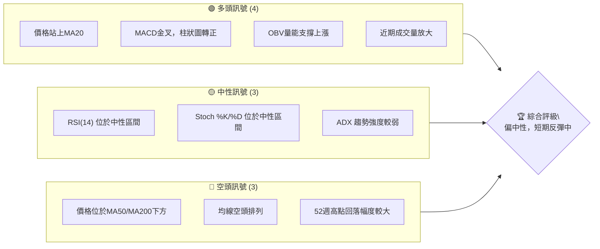

**解讀**：
- **多頭訊號**：主要來自短期價格行為及動能指標，顯示股價在經歷近期下跌後，出現止跌反彈跡象。MACD金叉與OBV的配合是重要看多信號。
- **中性訊號**：RSI和Stochastic指標處於中間區域，未顯示超買或超賣，表明當前市場情緒相對平衡。ADX的低值則暗示缺乏強勁的單邊趨勢，可能處於盤整或趨勢轉換初期。
- **空頭訊號**：中長期均線的空頭排列以及股價遠低於MA50和MA200，明確指出長期趨勢仍偏向下行。52週高點回落也印證了這一點。

**綜合判斷**：META 短期內出現反彈動能，但整體市場結構仍受中長期空頭趨勢壓制。這可能是一次超跌反彈或潛在的底部築構過程，需要進一步觀察。

### 📊 核心指標速覽表

下表彙總了 META 當前關鍵技術指標的數值與初步解讀，提供快速參考。

| 指標類別 | 指標名稱 | 當前數值 | 訊號 | 解讀 |
|----------|----------|----------|------|------|
| **價格** | 當前價格 | $582.90 | 🟢 | 位於近期反彈高點，突破MA20 |
| **均線** | MA20 | $576.51 | 🟢 | 價格位於MA20上方，短期偏多 |
| **均線** | MA50 | $604.81 | 🔴 | 價格位於MA50下方，中期偏空 |
| **均線** | MA200 | $645.41 | 🔴 | 價格位於MA200下方，長期偏空 |
| **動能** | RSI(14) | 53.54 | 🟡 | 位於中性區間，未超買/超賣 |
| **動能** | MACD柱 | +3.684 | 🟢 | MACD線向上穿越訊號線，多頭動能增強 |
| **波動** | ATR(14) | $23.08 | 🟡 | 佔股價 3.96%，波動中等偏高 |
| **趨勢** | ADX(14) | 17.99 | 🟡 | 趨勢強度較弱，市場處於盤整或弱趨勢 |
| **成交量** | 量比(20D) | 1.10x | 🟢 | 最新成交量高於20日均量，量價配合良好 |

### 🏆 技術評分卡

本評分卡從多個維度量化 META 的技術健康度，提供一個綜合性的評級。

```
╔══════════════════════════════════════════════════════════════╗
║                技術評分卡 — META (2026-07-05)                ║
╠══════════════════════════════════════════════════════════════╣
║ 趨勢強度      █████░░░░░░░░░░░░░░░░  25/100  🟡 中性偏弱    ║
║ 動能指標      ███████████░░░░░░░░░  55/100  🟢 偏多         ║
║ 支撐穩定度    █████████████░░░░░░░  65/100  🟢 中等穩定     ║
║ 成交量配合    ██████████████░░░░░░  70/100  🟢 良好         ║
║ 形態完整度    ████████░░░░░░░░░░░░  40/100  🟡 尚待確認     ║
║ 均線排列      ███░░░░░░░░░░░░░░░░░  15/100  🔴 空頭排列     ║
╠══════════════════════════════════════════════════════════════╣
║ 綜合評分      ███████░░░░░░░░░░░░░  45/100  ⚖️ 中性偏空    ║
╚══════════════════════════════════════════════════════════════╝
```

**評分解讀**：
- **趨勢強度 (25/100)**：ADX 數值低於25，顯示當前缺乏明確的強勢趨勢，市場處於盤整或弱勢反彈階段。
- **動能指標 (55/100)**：MACD 柱狀圖轉正，RSI 位於中性區間且從低位回升，Stochastics 也處於中性。整體動能呈現改善，偏向多頭。
- **支撐穩定度 (65/100)**：股價在 $550.25 和 $563.29 附近獲得支撐，並成功站上 MA20，顯示短期支撐相對穩定。
- **成交量配合 (70/100)**：近期反彈伴隨成交量放大，且 OBV 趨勢向上，量價配合良好，為反彈提供動能。
- **形態完整度 (40/100)**：雖然有潛在的底部形態（如雙底），但形態尚未完全確立，需要突破關鍵頸線才能確認。
- **均線排列 (15/100)**：MA20 < MA50 < MA200 的空頭排列，是明顯的長期空頭訊號，嚴重拉低整體評分。

**綜合評級 (45/100)**：META 總體技術評級為「中性偏空」。短期來看，多頭動能正在積聚，股價有反彈空間。然而，中長期趨勢仍由空頭主導，上方阻力重重。在空頭排列的壓力下，任何反彈都可能面臨較大賣壓。

---

## 2. 趨勢分析

本章將從多時框架深入分析 META 的價格趨勢，包括長、中、短期走勢，並透過 ADX 指標評估趨勢強度。

### 🌐 多時框趨勢分析

多時框架分析顯示 META 股票的趨勢在不同時間尺度上存在差異，這要求投資者採取分階段的策略。

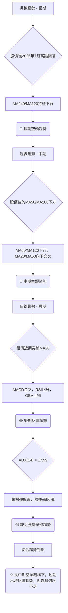

### 📈 長期趨勢 — 12個月走勢圖（Unicode）

以下 ASCII 圖表展示了 META 過去 12 個月的月線收盤價走勢，清晰呈現了其長期價格軌跡。

```
META 月線走勢圖（過去12個月：2025年7月 - 2026年7月）
價格軸 ($)
$793.65 ┤                                                 (52W高點)
$770.91 ┤●(2025-07 高點)
$750.00 ┤
$736.29 ┤  ●(2025-08)
$732.47 ┤   ●(2025-09)
$700.00 ┤                         ●(2026-01)
$658.91 ┤            ●(2025-12)
$646.67 ┤    ●(2025-10) ●(2025-11)        ●(2026-02)
$631.92 ┤                                        ●(2026-05)
$611.34 ┤                                      ●(2026-04)
$600.00 ┤
$582.90 ┤                                                    ●(2026-07 現在)
$571.60 ┤                                  ●(2026-03)
$563.29 ┤                                        ●(2026-06 低點)
$550.00 ┤
$519.78 ┤                                                 (52W低點)
        └────────────────────────────────────────────────────────────
         J25 A25 S25 O25 N25 D25 J26 F26 M26 A26 M26 J26 J26

```

**走勢特徵分析表格**：

| 時間區間 | 價格區間 | 漲跌幅 | 主要特徵 | 趨勢判斷 |
|----------|----------|--------|----------|----------|
| 2025-07至2025-09 | $770.91 → $732.47 | -5.00% | 高位盤整後小幅回落 | 🟡 震盪回落 |
| 2025-09至2025-10 | $732.47 → $646.67 | -11.60% | 快速下跌，跌破關鍵支撐 | 🔴 明顯下跌 |
| 2025-10至2026-01 | $646.67 → $715.22 | +10.60% | 築底反彈，收復部分失地 | 🟢 強勢反彈 |
| 2026-01至2026-03 | $715.22 → $571.60 | -20.10% | 再次快速下跌，形成新低 | 🔴 急速下跌 |
| 2026-03至2026-05 | $571.60 → $631.92 | +10.55% | 再次反彈，但未能突破前高 | 🟡 反彈受阻 |
| 2026-05至2026-06 | $631.92 → $563.29 | -10.90% | 再次下跌，創12個月新低 | 🔴 再次下跌 |
| 2026-06至2026-07 | $563.29 → $582.90 | +3.48% | 從低點小幅反彈 | 🟢 止跌反彈 |

**長期趨勢總結**：從 2025 年 7 月的高點 $770.91 開始，META 股票呈現出明顯的下降趨勢，儘管中間有兩次較大的反彈，但都未能持續並突破前高。最近一次下跌在 2026 年 6 月創下 $563.29 的新低，隨後在 7 月出現小幅反彈。整體而言，長期趨勢仍偏空。

### 📊 中期趨勢（週線分析）

中期（週線）走勢顯示，META 自 2026 年 4 月中旬 $687.91 的高點以來，經歷了一輪顯著的下跌。儘管近期有所反彈，但股價仍處於主要中期均線（如 MA50）下方。

**近期壓力與支撐示意圖**：
```
META 中期週線壓力與支撐示意圖 (2026年3月-7月)
════════════════════════════════════════════════════════════════════════
$687.91 ┤                               ● (4/19 高點) ─────────── 關鍵阻力
        │                        ╱      ╲
$631.92 ┤                      ● (5/31 高點)
        │                     ╱           ╲
$604.81 ┤─────────────────────── MA50 (中期壓力)
        │                    ╱             ╲
$582.90 ┤─────────────────────────────────── ● (現價) ──
        │                   ╱                 ╲
$576.51 ┤─────────────────────────────────────── MA20 (短期支撐)
        │                  ╱                     ╲
$563.29 ┤─────────────────────────────────────────── ● (6/28 低點) ─ 近期支撐
$550.25 ┤                                            ╱
$525.23 ┤●─────────────────────────────────────────── (3/29 低點) ─── 強支撐
════════════════════════════════════════════════════════════════════════
```
**解讀**：
- **中期壓力區**：MA50 位於 $604.81，構成重要的中期阻力。上方的 $631.92 (5月高點) 和 $687.91 (4月高點) 則是更強的阻力位。
- **中期支撐區**：$563.29 (6月低點) 和 $550.25 (6月底低點) 提供了較強的短期支撐。更下方則是 $525.23 (3月底低點) 和 $519.78 (52週低點) 的關鍵支撐。
- **當前狀態**：股價正從 $550.25 的低點反彈，並已站上短期 MA20，但尚未突破中期 MA50 阻力。

### ⚡ 趨勢強度評估（ADX 解讀）

ADX 指標用於衡量趨勢的強度，而非方向。當前 META 的 ADX 數值顯示趨勢強度較弱。

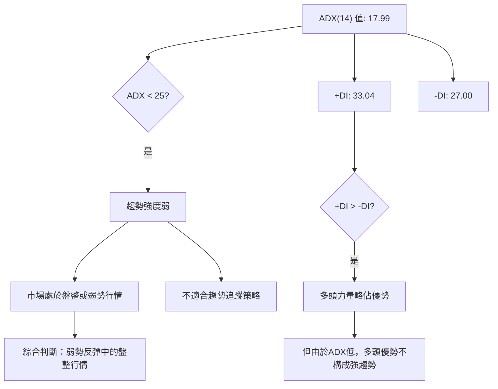

**ADX 強度對照表**：

| ADX 數值範圍 | 趨勢強度 | 建議交易策略 |
|--------------|----------|--------------|
| 0-25         | 弱趨勢/盤整 | 區間交易，等待趨勢確認 |
| 25-50        | 中等趨勢 | 趨勢追蹤策略 |
| 50-75        | 強趨勢 | 積極趨勢追蹤 |
| 75-100       | 極強趨勢 | 謹慎追蹤，注意反轉風險 |

**解讀**：META 當前的 ADX(14) 為 17.99，明顯低於 25 的閾值，表明市場處於弱趨勢或盤整狀態。儘管 +DI (33.04) 略高於 -DI (27.00)，暗示多頭力量在短期內略佔上風，但由於整體趨勢強度不足，這並不能構成一個強勁的上升趨勢。因此，目前 META 更可能處於從下跌後的築底或反彈階段，市場缺乏明確的單邊方向性，適合區間操作或等待趨勢進一步明朗。

---

## 3. 圖表形態分析

本章將透過對 META 價格走勢的觀察，識別潛在的圖表形態和 K 線組合，並據此推導可能的價格目標。

### 🔍 形態識別系統

根據近期價格數據，META 的走勢呈現出潛在的底部反轉形態，但仍需進一步確認。

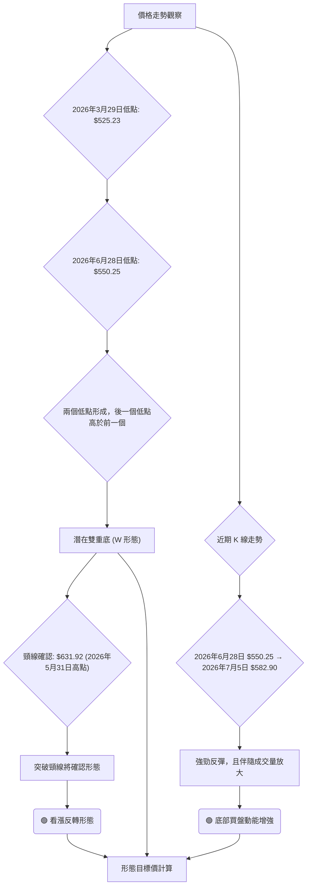

**形態解讀**：
- **潛在雙重底 (W 形態)**：META 在 2026 年 3 月 29 日觸及 $525.23 的低點，隨後反彈。在 2026 年 6 月 28 日再次回落至 $550.25，形成第二個低點。值得注意的是，第二個低點高於第一個低點，這在技術分析中通常被視為更強的看漲信號，表明賣方力量衰竭，買方開始入場。
- **頸線**：此形態的關鍵頸線可以設定在兩個低點之間的反彈高點，即 2026 年 5 月 31 日的 $631.92。股價若能有效突破此頸線，則雙重底形態將被確認。

### 🕯️ 重要K線形態分析

儘管缺乏完整的 OHLC (開高低收) 數據，但我們可以根據週收盤價和成交量推斷一些重要的價格行為。

| 月份 | 收盤價 | K線形態 (推斷) | 解讀 | 訊號 |
|------|--------|------------------|------|------|
| 2026-03-29 | $525.23 | (超跌止跌) | 股價急劇下跌至低位，RSI 18.0 極度超賣，可能為底部買盤提供機會。 | 🟢 (潛在反彈) |
| 2026-04-19 | $687.91 | (高位回落) | 股價在短時間內大幅上漲，RSI 達到 96.5 極度超買，隨後開始回落。可能形成「射擊之星」或「烏雲罩頂」等反轉形態。 | 🔴 (潛在反轉) |
| 2026-05-03 | $608.19 | (帶量下跌) | 高位回落後第一根帶量下跌，確認短期賣壓。 | 🔴 (賣壓確認) |
| 2026-06-28 | $550.25 | (低位止跌) | 股價再次測試低點，RSI 35.3，未達超賣，但隨後出現強勁反彈。 | 🟢 (止跌企穩) |
| 2026-07-05 | $582.90 | (強勢反彈) | 股價從前一周低點 $550.25 強勁反彈，成交量放大，MACD 柱狀圖轉正，顯示買方力量回歸。此為潛在的「吞噬型」或「錘子線」K線組合。 | 🟢 (看漲反彈) |

### 📉 ASCII 走勢形態示意圖

以下示意圖展示了 META 近期價格形成的潛在雙重底形態，並標註了關鍵點位。

```
META 潛在雙重底形態示意圖 (2026年3月-7月)
════════════════════════════════════════════════════════════════════════
$687.91 ┤                               ● (4/19 高點)
        │                              ╱  ╲
$631.92 ┤─────────────────────────── 頸線 (5/31 高點)
        │                          ╱      ╲
$582.90 ┤─────────────────────────────────── ● 現價
        │                        ╱            ╲
$550.25 ┤─────────────────────────── ● (6/28 第二底)
        │                       ╱
$525.23 ┤● (3/29 第一底) ───────
════════════════════════════════════════════════════════════════════════
```

**解讀**：圖中清晰可見兩個低點 $525.23 和 $550.25，以及介於其間的反彈高點 $631.92 作為頸線。當前價格 $582.90 正在向頸線挑戰。若能成功突破 $631.92，則形態將被確認，並開啟新的上漲空間。

### 🎯 形態目標價計算

基於潛在的雙重底形態，我們可以計算其理論目標價。

**形態要素**：
- 第一個底部 (Bottom 1)：$525.23 (2026-03-29)
- 第二個底部 (Bottom 2)：$550.25 (2026-06-28)
- 頸線 (Neckline)：$631.92 (2026-05-31)

**計算方法**：
雙重底形態的目標價通常是從頸線位置，向上疊加形態的高度。
形態高度 = 頸線 - 第一個底部 = $631.92 - $525.23 = $106.69

**目標價**：
形態目標價 = 頸線 + 形態高度 = $631.92 + $106.69 = **$738.61**

**解讀**：如果 META 能夠成功突破並站穩頸線 $631.92，那麼其理論上漲目標價將達到 $738.61。這個目標價位接近 2025 年 8 月份的高點，顯示潛在的反彈空間較大。然而，在確認突破頸線之前，此目標價僅作為潛在參考。

---

## 4. 支撐與阻力

本章將詳細分析 META 的關鍵支撐與阻力價位，這些價位是判斷未來價格走勢的重要依據，並結合斐波那契回調進行評估。

### 🗺️ 關鍵價位分布圖（Unicode）

以下圖表展示了 META 當前價格與其主要支撐和阻力位之間的相對關係。

```
META 價位結構分布圖 (當前價格 $582.90)
════════════════════════════════════════════════════════════════════════
$793.65 ║████████████████████████████████████████████████████████████████║ 強阻力 R4 (52週高點)
$770.91 ║████████████████████████████████████████████████████████████████║ 強阻力 R3 (2025-07月高點)
$687.91 ║████████████████████████████████████████████████████████████████║ 阻力 R2 (2026-04月高點)
$645.41 ║████████████████████████████████████████████████████████████████║ 關鍵阻力 R1 (MA200)
$631.92 ║████████████████████████████████████████████████████████████████║ 形態頸線/阻力
$618.43 ║████████████████████████████████████████████████████████████████║ 布林上軌/阻力
$604.81 ║████████████████████████████████████████████████████████████████║ MA50/阻力
$587.35 ║████████████████████████████████████████████████████████████████║ 斐波那契38.2%回調位
$582.90 ╠════════════════════════════════════════════════════════════════╣ ◄ 現價
$576.51 ║▓▓▓▓▓▓▓▓▓▓▓▓▓▓▓▓▓▓▓▓▓▓▓▓▓▓▓▓▓▓▓▓▓▓▓▓▓▓▓▓▓▓▓▓▓▓▓▓▓▓▓▓▓▓▓▓▓▓▓▓▓▓▓▓║ 近期支撐 S1 (MA20/布林中軌)
$563.66 ║▓▓▓▓▓▓▓▓▓▓▓▓▓▓▓▓▓▓▓▓▓▓▓▓▓▓▓▓▓▓▓▓▓▓▓▓▓▓▓▓▓▓▓▓▓▓▓▓▓▓▓▓▓▓▓▓▓▓▓▓▓▓▓▓║ 斐波那契23.6%回調位
$550.25 ║▓▓▓▓▓▓▓▓▓▓▓▓▓▓▓▓▓▓▓▓▓▓▓▓▓▓▓▓▓▓▓▓▓▓▓▓▓▓▓▓▓▓▓▓▓▓▓▓▓▓▓▓▓▓▓▓▓▓▓▓▓▓▓▓║ 近期支撐 S2 (2026-06月低點)
$534.59 ║▓▓▓▓▓▓▓▓▓▓▓▓▓▓▓▓▓▓▓▓▓▓▓▓▓▓▓▓▓▓▓▓▓▓▓▓▓▓▓▓▓▓▓▓▓▓▓▓▓▓▓▓▓▓▓▓▓▓▓▓▓▓▓▓║ 布林下軌/支撐
$525.23 ║▓▓▓▓▓▓▓▓▓▓▓▓▓▓▓▓▓▓▓▓▓▓▓▓▓▓▓▓▓▓▓▓▓▓▓▓▓▓▓▓▓▓▓▓▓▓▓▓▓▓▓▓▓▓▓▓▓▓▓▓▓▓▓▓║ 強支撐 S3 (2026-03月低點)
$519.78 ║▓▓▓▓▓▓▓▓▓▓▓▓▓▓▓▓▓▓▓▓▓▓▓▓▓▓▓▓▓▓▓▓▓▓▓▓▓▓▓▓▓▓▓▓▓▓▓▓▓▓▓▓▓▓▓▓▓▓▓▓▓▓▓▓║ 強支撐 S4 (52週低點)
════════════════════════════════════════════════════════════════════════
```

### 🚧 阻力位分析表

META 上方存在多重阻力，突破這些關鍵價位將是股價能否持續反彈的關鍵。

| 阻力級別 | 價位 | 形成原因 | 突破難度 | 重要性 |
|----------|------|----------|----------|--------|
| **即時阻力** | $587.35 | 斐波那契 38.2% 回調位 | 中等 | 股價反彈的初步考驗 |
| **短期阻力** | $604.81 | MA50 | 中等偏高 | 突破此處將改善中期趨勢 |
| **中期阻力** | $618.43 | 布林通道上軌 | 中等偏高 | 反彈極限，可能引發回調 |
| **關鍵阻力** | $631.92 | 雙重底形態頸線 & 2026-05月高點 | 高 | 突破將確認反轉形態，非常關鍵 |
| **強阻力** | $645.41 | MA200 | 高 | 長期趨勢線，突破將扭轉長期空頭 |
| **強阻力** | $687.91 | 2026-04月高點 | 非常高 | 突破將確立更強的反彈趨勢 |
| **極強阻力** | $770.91 | 2025-07月高點 | 極高 | 長期頂部，極難突破 |
| **極強阻力** | $793.65 | 52週高點 | 極高 | 股價歷史高點附近，賣壓沉重 |

### 🛡️ 支撐位分析表

META 下方存在多層支撐，這些價位是股價回調時可能獲得支撐的區域。

| 支撐級別 | 價位 | 形成原因 | 守住機率 | 重要性 |
|----------|------|----------|----------|--------|
| **即時支撐** | $576.51 | MA20 & 布林通道中軌 | 中等 | 短期反彈的關鍵支撐 |
| **短期支撐** | $563.66 | 斐波那契 23.6% 回調位 | 中等 | 若跌破 MA20，此為下一支撐 |
| **關鍵支撐** | $550.25 | 2026-06月低點 (雙重底第二底) | 高 | 雙重底形態的關鍵組成部分，不容有失 |
| **強支撐** | $534.59 | 布林通道下軌 | 高 | 若跌破 $550.25，可能測試此處 |
| **強支撐** | $525.23 | 2026-03月低點 (雙重底第一底) | 非常高 | 雙重底形態的最低點，極強支撐 |
| **極強支撐** | $519.78 | 52週低點 | 極高 | 長期重要心理關口，歷史低點附近 |

### 📐 斐波那契回調位分析

我們以 2026 年 4 月 19 日的高點 $687.91 作為波段高點，2026 年 3 月 29 日的低點 $525.23 作為波段低點，計算其回調位。
- **波段高點 (Swing High)**：$687.91
- **波段低點 (Swing Low)**：$525.23
- **波段跌幅**：$687.91 - $525.23 = $162.68

**斐波那契回調位計算**：
- **23.6% 回調位**：$525.23 + ($162.68 * 0.236) = **$563.66**
- **38.2% 回調位**：$525.23 + ($162.68 * 0.382) = **$587.35**
- **50.0% 回調位**：$525.23 + ($162.68 * 0.500) = **$606.57**
- **61.8% 回調位**：$525.23 + ($162.68 * 0.618) = **$625.80**
- **76.4% 回調位**：$525.23 + ($162.68 * 0.764) = **$650.95**

**當前價格 $582.90 位於 $563.66 (23.6%) 和 $587.35 (38.2%) 之間**。這表明股價已從最低點反彈超過 23.6%，但尚未突破 38.2% 的關鍵回調位。若能有效站穩 38.2% 回調位，則有望進一步向 50% 和 61.8% 回調位挑戰。

**斐波那契回調位視覺化**：
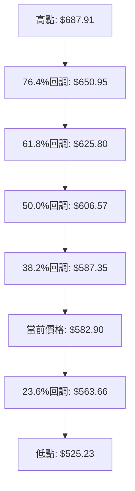

**結論**：斐波那契回調位與其他關鍵支撐阻力位相互印證。例如，50% 回調位 $606.57 接近 MA50 $604.81，61.8% 回調位 $625.80 接近形態頸線 $631.92。這些重疊的價位將形成更強的支撐或阻力，值得密切關注。

---

## 5. 技術指標深度解讀

本章將對 META 的主要技術指標進行深入分析，包括移動平均線、RSI、MACD、布林通道和成交量，並探討它們之間的相互關係和訊號一致性。

### 🎛️ 指標訊號總覽

以下圖表展示了各個技術指標當前發出的訊號及其之間的關係，有助於形成全面的判斷。

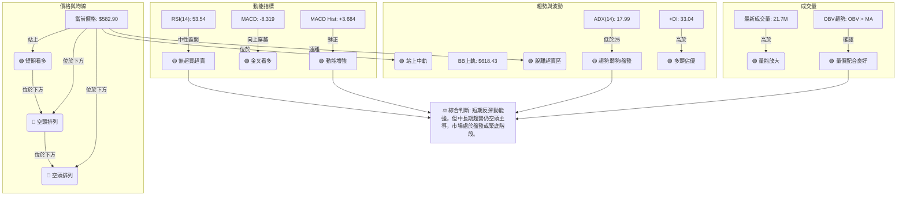

### 📈 移動平均線排列分析

移動平均線 (MA) 是判斷趨勢方向和強度的重要工具。META 的均線排列呈現經典的空頭結構，但在短期內出現了積極變化。

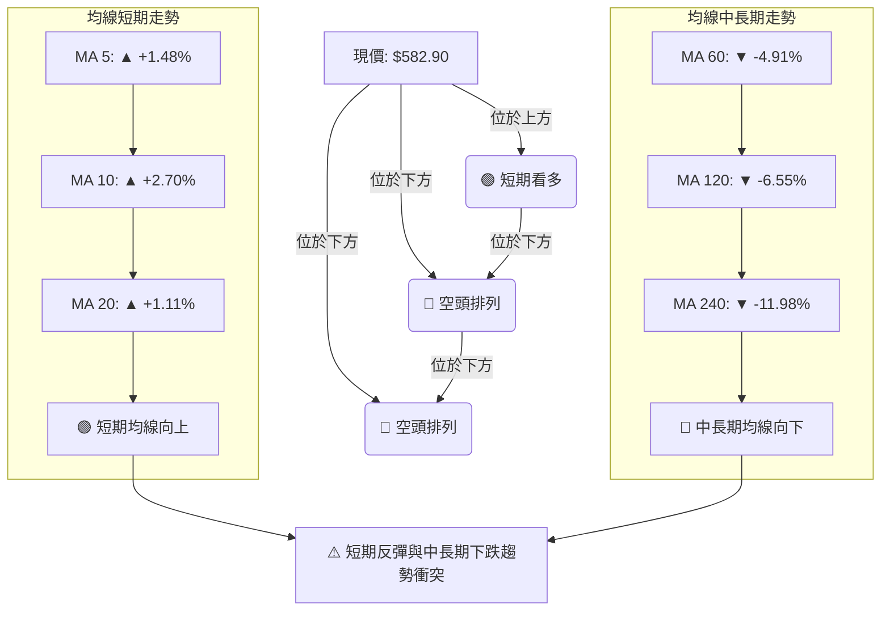

**均線排列狀態**：
- **當前價格與均線關係**：當前價格 $582.90 成功站上 MA20 ($576.51)，顯示短期買盤動能強勁。然而，股價仍位於 MA50 ($604.81) 和 MA200 ($645.41) 之下，表明中期和長期趨勢仍偏向下行。
- **均線排列**：MA20 ($576.51) < MA50 ($604.81) < MA200 ($645.41)，這是一個典型的**空頭排列 (Bearish Alignment)**。這種排列通常預示著股價仍處於下跌趨勢中，上方阻力較大。
- **均線走勢**：短期均線 (MA5, MA10, MA20) 近期呈現向上趨勢，暗示短期反彈動能。但中長期均線 (MA60, MA120, MA240) 仍在持續下行，確認了長期的空頭壓力。

**總結**：儘管短期內股價成功站上 MA20，並帶動短期均線向上，但中長期均線的空頭排列和下行趨勢表明，這可能僅是長期下跌趨勢中的一次反彈。若要扭轉頹勢，股價需要陸續突破 MA50 和 MA200，並促使均線形成多頭排列。

### 📉 RSI(14) 分析

RSI (相對強弱指標) 用於衡量價格變動的速度和幅度，判斷超買或超賣狀態。

**RSI 數值進度條**：
RSI(14): 53.54  ▓▓▓▓▓▓▓▓▓▓▓▓▓▓▓▓▓▓▓▓▓▓▓▓▓▓▓▓▓▓▓▓▓▓▓▓▓▓▓▓▓▓▓▓▓▓▓▓▓▓▓▓░░░░░░░░░░░░░░░░░░░░░░░░░░░░░░░░░░░░░░░░░░░░░░░░ 53.54%

**超買超賣區間分析**：
- **超買區 (RSI > 70)**：當 RSI 進入 70 以上，表示買盤力量過強，股價可能面臨回調壓力。
- **超賣區 (RSI < 30)**：當 RSI 進入 30 以下，表示賣盤力量過強，股價可能出現反彈。
- **中性區 (30 < RSI < 70)**：當 RSI 位於 30 到 70 之間，表示市場處於相對平衡狀態，動能不明顯。

**當前 RSI(14) 數值為 53.54**，位於中性區間。這表明 META 既沒有處於超買狀態，也沒有處於超賣狀態。從近 20 週數據來看，RSI 曾於 2026-04-19 達到 96.5 的極度超買，隨後股價大幅回落；也曾於 2026-03-29 達到 18.0 的極度超賣，隨後出現反彈。目前 RSI 53.54 顯示股價從近期低點回升，動能正在積聚，但尚未達到強勢區域。

**背離判斷 (頂背離/底背離)**：
- **頂背離 (Bearish Divergence)**：當股價創出新高，但 RSI 未能創出新高，形成背離時，預示股價可能見頂回落。
- **底背離 (Bullish Divergence)**：當股價創出新低，但 RSI 未能創出新低，形成背離時，預示股價可能見底反彈。

**結論**：根據提供的數據，**目前 META 沒有觀察到明顯的 RSI 頂背離或底背離訊號**。RSI 走勢與價格走勢大致同步。最近一次價格從 $550.25 反彈至 $582.90，RSI 也從 35.3 回升至 53.54，顯示動能與價格走勢一致。

### 📊 MACD(12/26/9) 訊號解讀

MACD (平滑異同移動平均線) 是趨勢跟蹤動能指標，由 MACD 線、訊號線和柱狀圖組成。

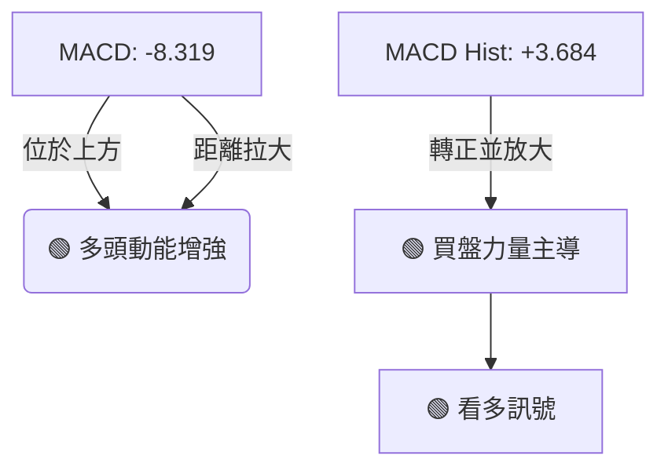

**MACD 訊號解讀**：
- **MACD 線 (-8.319)**：短期和長期移動平均線的差值。
- **訊號線 (-12.003)**：MACD 線的 9 週期指數移動平均。
- **MACD 柱狀圖 (+3.684)**：MACD 線與訊號線的差值。

**當前情況**：
1. **MACD 線位於訊號線上方**：MACD 線 (-8.319) 向上穿越訊號線 (-12.003)，形成 **黃金交叉 (Golden Cross)**。這是一個明確的短期看多訊號，表明短期動能正在超越長期動能。
2. **MACD 柱狀圖轉正並持續放大**：柱狀圖數值為 +3.684，且從前期的負值轉為正值，並持續放大。這進一步確認了多頭動能的增強，買盤力量正在積聚。

**背離判斷 (頂背離/底背離)**：
- **頂背離 (Bearish Divergence)**：股價創出新高，但 MACD 未能創出新高，預示潛在頂部。
- **底背離 (Bullish Divergence)**：股價創出新低，但 MACD 未能創出新低，預示潛在底部。

**結論**：根據提供的數據，**目前 MACD 沒有觀察到明顯的頂背離或底背離訊號**。相反，MACD 呈現出強烈的金叉看多訊號，且柱狀圖轉正，這與近期股價的反彈和成交量放大相吻合，是一個積極的短期動能指標。

### 📦 布林通道分析

布林通道 (Bollinger Bands) 由一條中軌 (通常是 MA20) 和兩條標準差線 (上軌和下軌) 組成，用於衡量價格波動範圍。

**布林通道示意圖**：
```
META 布林通道示意圖 (當前價格 $582.90)
════════════════════════════════════════════════════════════════════════
$618.43 ║████████████████████████████████████████████████████████████████║ BB上軌
        ║                                                                ║
$600.00 ║                                                                ║
        ║                                                                ║
$582.90 ╠════════════════════════════════════════════════════════════════╣ ◄ 現價
        ║                                                                ║
$576.51 ║▓▓▓▓▓▓▓▓▓▓▓▓▓▓▓▓▓▓▓▓▓▓▓▓▓▓▓▓▓▓▓▓▓▓▓▓▓▓▓▓▓▓▓▓▓▓▓▓▓▓▓▓▓▓▓▓▓▓▓▓▓▓▓▓║ BB中軌 (MA20)
        ║                                                                ║
$550.00 ║                                                                ║
        ║                                                                ║
$534.59 ║▓▓▓▓▓▓▓▓▓▓▓▓▓▓▓▓▓▓▓▓▓▓▓▓▓▓▓▓▓▓▓▓▓▓▓▓▓▓▓▓▓▓▓▓▓▓▓▓▓▓▓▓▓▓▓▓▓▓▓▓▓▓▓▓║ BB下軌
════════════════════════════════════════════════════════════════════════
```

**布林通道分析**：
- **BB上軌**：$618.43
- **BB中軌 (MA20)**：$576.51
- **BB下軌**：$534.59
- **BB %B**：0.58 (表示當前價格位於中軌和上軌之間，且略靠近中軌)

**解讀**：
1. **價格位於中軌上方**：當前價格 $582.90 位於布林中軌 $576.51 上方，這是一個短期的看多訊號，表明股價正處於反彈階段。
2. **BB %B 0.58**：數值介於 0.5 (中軌) 和 1 (上軌) 之間，確認了價格在中軌上方，但尚未觸及上軌，預留了進一步上漲的空間。
3. **通道寬度**：布林通道的寬度代表波動率。上軌 ($618.43) 與下軌 ($534.59) 之間有 $83.84 的差距，相對 ATR ($23.08) 而言，通道寬度較大，顯示股價波動性中等偏高。
4. **潛在壓力與支撐**：布林上軌 $618.43 將構成反彈的潛在阻力，而中軌 $576.51 則作為重要的短期支撐。若價格跌破中軌，則可能進一步測試下軌 $534.59。

**結論**：布林通道分析顯示 META 短期內呈現看多趨勢，價格在中軌上方運行。投資者應關注價格能否持續在中軌上方運行，並觀察其向上挑戰上軌的動能。

### 💹 成交量分析（量價配合度）

成交量是價格走勢的能量來源，量價配合是判斷趨勢可靠性的關鍵。

**成交量數據**：
- **最新成交量**：21,705,900
- **20日均量**：19,702,150 (量比: 1.10x)
- **50日均量**：17,883,844
- **OBV 趨勢**：OBV > MA → 量能支撐上漲

**量價配合分析**：
1. **近期成交量放大**：最新成交量 21.7M 顯著高於 20 日均量 (19.7M) 和 50 日均量 (17.8M)。量比 1.10x 顯示買盤活躍度增加。
2. **OBV 趨勢向上**：OBV (能量潮指標) 的趨勢顯示 OBV 線位於其移動平均線上方，表明在價格上漲的過程中，成交量也在積極配合，這是一個強烈的看多訊號。量能的積累為價格的進一步上漲提供了支撐。
3. **價格反彈伴隨放量**：從近 20 週數據來看，2026-06-28 股價下跌至 $550.25 時，週成交量為 78.3M。而 2026-07-05 股價反彈至 $582.90 時，週成交量達到 100.3M。這種下跌縮量、上漲放量的模式，是健康的價格反轉或反彈的表現。

**結論**：META 的成交量分析顯示出強烈的多頭訊號。近期股價的反彈伴隨著成交量的顯著放大，且 OBV 趨勢向上，這表明有實質的買盤資金流入，為當前價格的反彈提供了堅實的量能基礎。這與 MACD 的金叉訊號相互確認，增加了短期反彈的可靠性。

---

## 6. 動能與波動率

本章將評估 META 股票的動能強度和波動率，這對交易策略的選擇和風險管理至關重要。

### ⚡ 動能評估四象限

我們將 META 當前的動能強度和波動率進行評估，以判斷其所處的市場象限。

| 象限 | 動能 (MACD, RSI) | 波動 (ATR) | 當前狀態 (META) | 評估 |
|------|------------------|------------|------------------|------|
| Q1 | 強 (MACD金叉, RSI中性向上) | 低 (ATR佔比低) | - | 最佳機會：趨勢明確，風險可控，適合趨勢追蹤 |
| Q2 | 弱 (MACD死叉, RSI低位) | 低 (ATR佔比低) | - | 謹慎觀望：缺乏動能，等待趨勢明朗 |
| Q3 | 強 (MACD金叉, RSI高位) | 高 (ATR佔比高) | - | 高風險高收益：動能強但波動大，適合短線交易者 |
| Q4 | 弱 (MACD死叉, RSI低位) | 高 (ATR佔比高) | ✓ | **當前狀態**：**中性偏弱動能，中等波動率** | 避免進場：風險高，趨勢不明 |

**META 當前動能與波動率分析**：
- **動能**：MACD 已形成金叉，柱狀圖轉正，顯示短期動能正在增強 (🟢)。RSI 位於中性區間 53.54，正從低位回升，也顯示動能改善。綜合來看，動能評估為「中性偏強」。
- **波動率**：ATR(14) 為 $23.08，佔當前價格 $582.90 的 3.96%。這是一個中等偏高的波動率，表明 META 每日價格波動幅度較大 (🟡)。

**綜合評估**：META 目前處於「中性偏強動能，中等偏高波動率」的狀態。這不完全符合任何一個典型象限，而是介於 Q1 和 Q3 之間，但更偏向於從 Q4 改善的過程中。它具備一定的反彈動能，但波動性也相對較高，這意味著雖然有潛在的交易機會，但風險也隨之增加。投資者需要謹慎管理倉位，並設定明確的止損點。

### 📊 ATR 波動率分析

ATR (Average True Range) 用於衡量資產價格的平均波動幅度，是評估市場波動率的重要指標。

- **ATR(14)**：$23.08
- **佔當前價格比例**：$23.08 / $582.90 = 3.96%

**解讀**：
1. **波動幅度**：META 近 14 個交易日的平均每日波動幅度為 $23.08。這意味著在正常情況下，META 每日的價格波動可能在 $23.08 左右。
2. **相對波動率**：3.96% 的 ATR 佔比，對於大型科技股而言，屬於中等偏高的水平。高於 2% 通常被認為是活躍的波動，而 META 接近 4% 則顯示其價格波動相對劇烈。
3. **交易影響**：較高的 ATR 意味著日內交易機會較多，但也伴隨著更高的風險。對於持倉交易者而言，需要預留更大的止損空間，以避免被正常波動洗出。

**止損距離建議**：
基於 ATR，常用的止損設定方法是將止損點設置在 ATR 的 1.5 倍至 3 倍距離。
- **保守止損 (1.5x ATR)**：$23.08 * 1.5 = $34.62
- **標準止損 (2x ATR)**：$23.08 * 2 = $46.16
- **寬鬆止損 (3x ATR)**：$23.08 * 3 = $69.24

若以當前價格 $582.90 為參考，一個標準的止損點可能設置在 $582.90 - $46.16 = $536.74 附近，這也接近布林下軌和一些斐波那契回調位，增加了其有效性。

### 📐 Beta 與市場相關性

Beta 值衡量單一資產相對於整體市場（通常是 S&P 500 指數）的波動性。數據中未提供 META 的 Beta 值，但作為一家大型科技公司，我們可以基於行業經驗進行合理推斷。

**推斷**：Meta Platforms (META) 屬於科技巨頭，其股票通常具有較高的 Beta 值，一般在 **1.0 到 1.5 之間**。
- **Beta = 1.0**：意味著 META 的價格波動與市場同步。
- **Beta > 1.0**：意味著 META 的價格波動比市場更劇烈。例如，Beta 為 1.25 表示當市場上漲 1% 時，META 可能上漲 1.25%；當市場下跌 1% 時，META 可能下跌 1.25%。

**相關性影響**：
1. **市場風險**：高 Beta 意味著 META 對市場的波動更加敏感。在牛市中，它可能表現優於大盤；但在熊市中，其跌幅也可能更大。
2. **投資組合**：對於尋求降低投資組合波動性的投資者，持有高 Beta 股票需要搭配低 Beta 或負 Beta 股票進行對沖。
3. **宏觀經濟影響**：科技股通常對利率、通脹和宏觀經濟數據更為敏感。在當前宏觀不確定性較高的環境下，高 Beta 可能會放大市場的負面影響。

**結論**：儘管缺乏具體數據，但基於其行業性質，META 很可能是一個高 Beta 股票。這意味著投資者在交易 META 時，需要密切關注整體市場動態，並意識到其價格波動可能比大盤更為劇烈。

---

## 7. 多時框架總結

本章將整合前述各時框架的分析結果，提供 META 股票在短期、中期和長期趨勢上的綜合判斷，形成一個全面的多時框架評估。

### 📋 時框架評分表

| 時框架 | 趨勢方向 | 動能 | 均線排列 | 形態 | 綜合評分 (1-10) | 建議 |
|--------|----------|------|----------|------|-----------------|------|
| **短期 (日線)** | 🟢 上升 | 🟢 強勁 | 🟡 價格站上MA20 | 🟢 潛在反轉 | 7/10 🟢 | 積極關注反彈機會 |
| **中期 (週線)** | 🔴 下跌 | 🟡 改善 | 🔴 空頭排列 | 🟡 築底中 | 4/10 🟡 | 謹慎觀望，等待突破 |
| **長期 (月線)** | 🔴 下跌 | 🔴 疲弱 | 🔴 空頭排列 | 🔴 下跌趨勢 | 3/10 🔴 | 避免長期持有，或等待大級別反轉 |

**解讀**：
- **短期**：日線圖顯示強勁的反彈動能，MACD金叉，RSI回升，價格站上MA20，且成交量放大，具備潛在的雙重底形態。短期內多頭佔優，適合短線交易者尋找機會。
- **中期**：週線圖仍處於下跌趨勢中，股價位於MA50/MA200下方，均線空頭排列明顯。儘管動能有所改善，但築底形態尚未確認，上方阻力重重。中期仍需謹慎，不宜過早判斷趨勢反轉。
- **長期**：月線圖清晰顯示自2025年7月高點以來的長期下跌趨勢，均線系統呈空頭排列，價格遠低於長期均線。長期投資者應警惕其下行風險，除非出現更強烈的反轉訊號。

### 🔲 綜合訊號矩陣

以下矩陣展示了不同時框架下各關鍵技術訊號的一致性，幫助我們全面理解 META 的市場狀況。

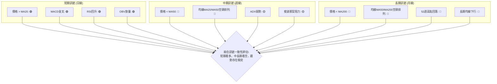

**一致性分析**：
- **短期訊號高度一致**：所有短期指標（價格與MA20、MACD、RSI、OBV）均發出強烈買入訊號，表明當前存在一個較為可靠的短期反彈。
- **中長期訊號高度一致**：所有中長期指標（價格與MA50/MA200、均線排列、ADX、52週高點回落）均發出強烈賣出訊號或謹慎訊號，表明中長期趨勢仍處於空頭掌控。
- **時框架衝突**：短期與中長期訊號存在明顯衝突。這是一個典型的「熊市反彈」或「下跌趨勢中的築底」情境。短期動能強勁，但上方阻力重重，長期趨勢壓力巨大。

**結論**：投資者應認識到，當前 META 的多頭動能主要集中在短期。對於長線投資者，目前仍處於觀望或等待更明確底部訊號的階段。對於短線交易者，可以在嚴格控制風險的前提下，參與短期反彈。關鍵在於密切關注中期阻力位的突破情況，尤其是 MA50 ($604.81) 和形態頸線 ($631.92)。

---

## 8. 交易策略建議

基於上述多時框架的技術分析，我們為 META 股票提出以下交易策略建議，涵蓋多頭和空頭兩種情境，並強調風險報酬比。

### 🗺️ 策略決策流程圖

以下流程圖展示了根據當前市場訊號選擇交易策略的邏輯。

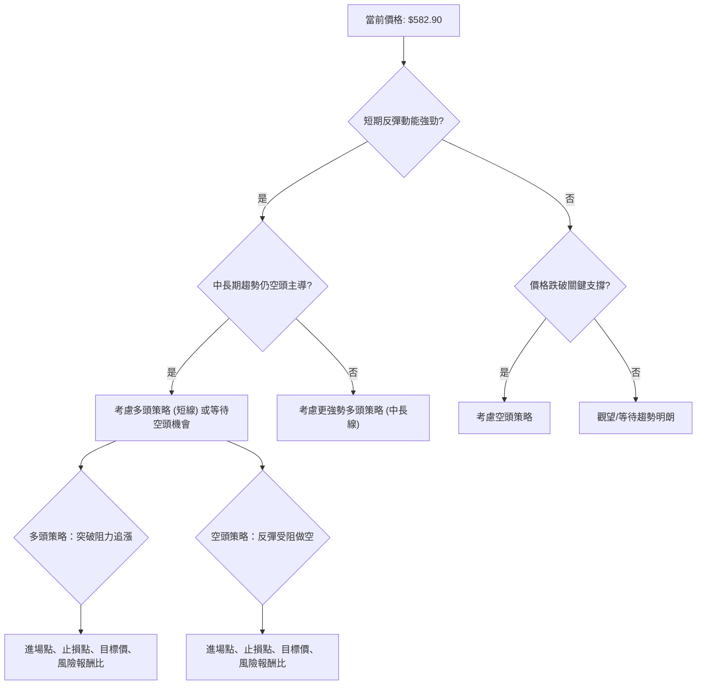

### 🟢 多頭策略詳情

基於短期反彈動能強勁、MACD金叉、OBV放量以及潛在的雙重底形態，我們建議以下多頭策略。由於中長期趨勢仍偏空，此策略應以短線操作為主，並嚴格控制風險。

| 策略要素 | 策略 A：突破 MA50 | 策略 B：回調 MA20 支撐 |
|----------|--------------------|------------------------|
| **進場條件** | 股價有效突破並站穩 MA50 ($604.81) | 股價回調至 MA20 附近 ($576.51) 獲得支撐 |
| **進場價格** | **$605.00** | **$577.00** |
| **目標價 T1** | $645.00 (接近 MA200/$650.95 Fib 76.4%) | $605.00 (接近 MA50/$606.57 Fib 50%) |
| **目標價 T2** | $680.00 (接近 2026-04月高點) | $630.00 (接近形態頸線/$625.80 Fib 61.8%) |
| **止損價格** | $570.00 (跌破 MA20 和近期低點) | $549.00 (跌破雙重底第二底 $550.25) |
| **風險報酬比** | (T1) $35.00/$40.00 = **1:1.14** <br> (T2) $35.00/$75.00 = **1:2.14** | (T1) $28.00/$28.00 = **1:1** <br> (T2) $28.00/$53.00 = **1:1.89** |
| **成功機率** | 60% (需突破強阻力) | 55% (需確認支撐有效) |
| **建議倉位** | 中等偏低 (5-10%) | 中等 (10-15%) |

**策略解讀**：
- **策略 A** 較為激進，等待強勢突破 MA50，確認中期趨勢有改善跡象。風險報酬比相對較好，但可能面臨假突破風險。
- **策略 B** 較為保守，利用短期 MA20 支撐進行低位買入。風險較低，但若 MA20 失守，下跌空間較大。

### 🔴 空頭策略詳情

考慮到 META 股票中長期仍處於空頭趨勢，且上方阻力重重，若短期反彈動能衰竭或未能突破關鍵阻力，則可考慮以下空頭策略。

| 策略要素 | 策略 C：反彈受阻做空 | 策略 D：跌破關鍵支撐做空 |
|----------|--------------------|------------------------|
| **進場條件** | 股價在 MA50 ($604.81) 或形態頸線 ($631.92) 附近遇阻回落，並出現看跌K線形態。 | 股價有效跌破雙重底第二底 $550.25 |
| **進場價格** | **$600.00** (在 MA50 下方確認受阻) | **$549.00** (跌破 $550.25 後) |
| **目標價 T1** | $570.00 (接近 MA20) | $535.00 (接近布林下軌) |
| **目標價 T2** | $550.00 (接近雙重底第二底) | $520.00 (接近 52週低點) |
| **止損價格** | $615.00 (突破 MA50) | $570.00 (反彈突破 MA20) |
| **風險報酬比** | (T1) $15.00/$30.00 = **1:2** <br> (T2) $15.00/$50.00 = **1:3.33** | (T1) $21.00/$14.00 = **1:0.67** <br> (T2) $21.00/$29.00 = **1:1.38** |
| **成功機率** | 65% (符合中長期趨勢) | 60% (形態破壞確認) |
| **建議倉位** | 中等偏高 (10-15%) | 中等 (5-10%) |

**策略解讀**：
- **策略 C** 順應中長期空頭趨勢，在阻力位附近尋找做空機會。風險報酬比優異，但需警惕短期反彈超預期。
- **策略 D** 則是在雙重底形態失效後追空，確認下跌趨勢延續。風險報酬比相對較低，但勝率較高。

### ⭐ 整體訊號強度評星

綜合所有技術指標和多時框架分析，META 的整體交易訊號強度如下：

```
做多訊號強度：★★★☆☆  (3/5星) 🟢 (短期動能強，但中長期壓力大)
做空訊號強度：★★★☆☆  (3/5星) 🔴 (中長期趨勢空頭，但短期有反彈)
整體可信度：  ★★★☆☆  (3/5星) 🟡 (市場存在多空爭奪，需謹慎)
```

**總結**：META 目前處於一個多空拉鋸的階段。短期反彈動能不容小覷，但中長期空頭趨勢仍是主導。投資者應根據自身的交易風格和風險承受能力，選擇合適的策略，並務必設定嚴格的止損。

---

## 9. 風險提示與監控

本章將闡述 META 股票在技術分析層面可能面臨的風險，並提供關鍵監控指標和風險管理建議，以確保交易的安全性和有效性。

### ✅ 關鍵監控指標 Checklist

以下列表是投資者在交易 META 時應密切關注的技術指標，作為風險監控和決策調整的依據。

```
╔══════════════════════════════════════════════════════════════╗
║                META 技術風險監控清單 (2026-07-05)            ║
╠══════════════════════════════════════════════════════════════╣
║ [ ] 價格是否跌破 MA20 ($576.51)?                                ║
║ [ ] 價格是否跌破雙重底第二底 ($550.25)?                         ║
║ [ ] MACD 是否形成死亡交叉或柱狀圖轉負?                           ║
║ [ ] RSI 是否跌破 50 或進入超賣區?                               ║
║ [ ] 成交量在反彈時是否縮量? (量價背離)                            ║
║ [ ] ADX 是否大幅上升 (>25) 且 -DI 顯著高於 +DI?                 ║
║ [ ] 價格是否未能突破 MA50 ($604.81) 或形態頸線 ($631.92) 並回落?║
║ [ ] 布林通道是否收窄 (波動率降低) 且價格在中軌下方運行?           ║
║ [ ] 52週低點 ($519.78) 是否被測試或跌破?                         ║
║ [ ] 市場整體情緒是否轉為悲觀 (如大盤指數下跌)?                   ║
╚══════════════════════════════════════════════════════════════╝
```

### ⚠️ 風險場景分析

針對 META 當前的技術面狀況，我們預設三種可能的市場情境，以幫助投資者全面評估潛在的風險與機會。

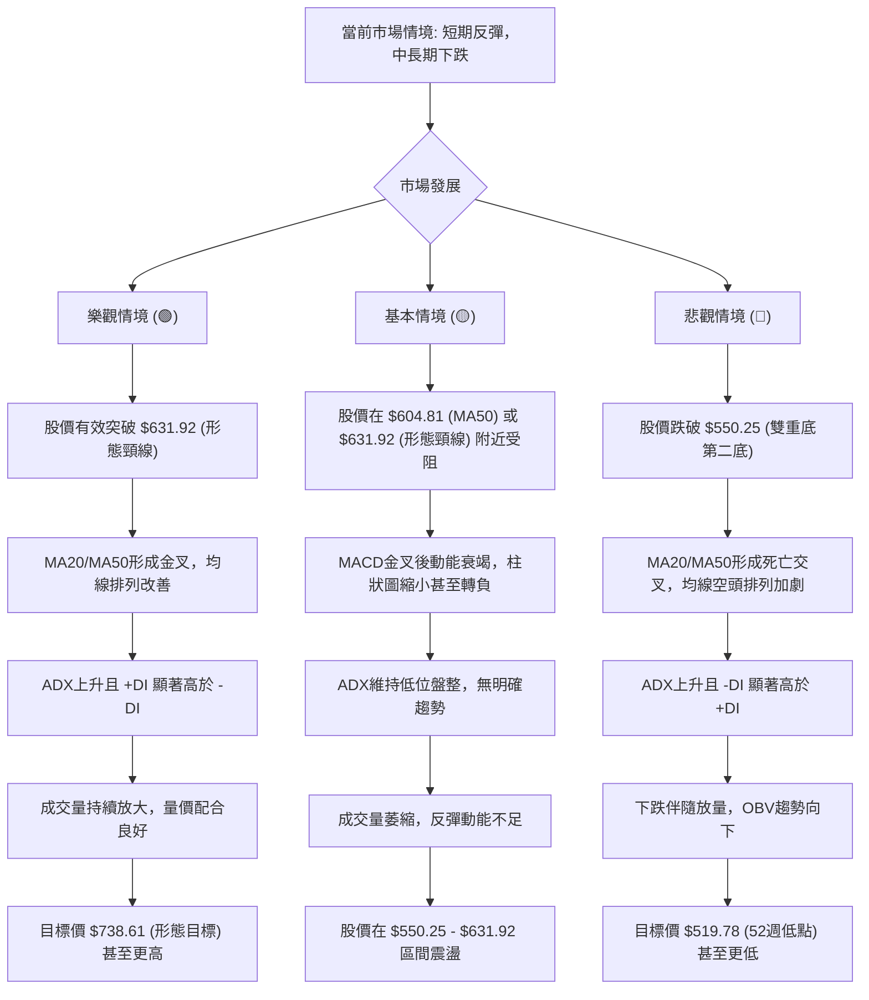

**情境解讀**：
- **樂觀情境**：若 META 能夠有效突破關鍵阻力，特別是形態頸線，並伴隨指標的全面改善，則有望確認底部反轉，開啟一輪中級反彈。
- **基本情境**：股價在當前區間內震盪整理，短期反彈後可能遇到阻力而回調，但不會立即跌破關鍵支撐。市場缺乏明確方向，需要耐心等待。
- **悲觀情境**：若股價未能守住關鍵支撐，尤其是跌破雙重底形態的第二底，則可能意味著下行趨勢的延續，並可能測試更低的支撐位。

### 🛡️ 風險管理重要提醒

1.  **止損原則**：無論採取何種策略，務必設定並嚴格執行止損點。ATR 可作為止損點設定的參考依據。
2.  **倉位管理**：鑑於當前市場多空分歧，建議採取較低的倉位，避免重倉單一股票。在趨勢不明朗時，控制風險永遠是第一要務。
3.  **分批建倉/平倉**：在關鍵支撐位附近可考慮分批建倉，在阻力位附近分批平倉，以降低單次交易的風險。
4.  **動態調整**：技術分析是動態的，應根據最新價格行為和指標變化，靈活調整交易策略。
5.  **結合基本面**：雖然本報告專注於技術分析，但仍建議投資者結合 META 的基本面、財報和產業新聞進行綜合判斷，以提升決策的全面性。
6.  **耐心與紀律**：在盤整或趨勢不明朗的市場中，耐心等待明確訊號和嚴格遵守交易紀律是成功的關鍵。

---

## 📋 報告總結

```
META 技術分析報告總結
════════════════════════════════════════════════════════
報告日期：2026-07-05
當前價格：$582.90
分析評級：⚖️ 中性偏空 (短期反彈動能強勁，但中長期趨勢仍由空頭主導，市場處於多空拉鋸的築底階段)

關鍵結論：
├─ 長期趨勢：🔴 下跌趨勢，價格位於MA200下方，均線空頭排列。
├─ 中期趨勢：🔴 下跌趨勢，價格位於MA50下方，均線空頭排列，ADX顯示趨勢強度弱。
├─ 短期趨勢：🟢 強勢反彈，價格站上MA20，MACD金叉，OBV放量，RSI回升。
├─ 關鍵支撐：$576.51 (MA20)，$550.25 (雙重底第二底)，$519.78 (52週低點)。
├─ 關鍵阻力：$604.81 (MA50)，$631.92 (形態頸線)，$645.41 (MA200)。
└─ 分析師目標：$828.17 (平均值，僅供參考，與技術面有較大差距，需時間消化)。

最優策略組合：
1. 🥇 最佳機會：等待股價有效突破形態頸線 $631.92，確認雙重底形態，可考慮追漲至 $738.61。
2. 🥈 次選機會：在短期反彈中，若股價回調至 MA20 ($576.51) 附近並獲得支撐，可考慮短線買入至 $605.00。
3. 🥉 保守選擇：若股價在 MA50 ($604.81) 或形態頸線 ($631.92) 附近受阻回落，可考慮小倉位做空，目標 $550.25。
════════════════════════════════════════════════════════
```

---

> ⚠️ **免責聲明**：本報告為 AI 自動生成之技術分析，所有數據及估算均基於提供的歷史價格資訊。本報告**僅供研究與學術參考**，**不構成任何投資建議**。投資有風險，入市需謹慎。

---

*報告生成時間：2026-07-05 ｜ 數據來源：Yahoo Finance ｜ 分析框架：多時框技術分析*