<details>
<summary>📊 靜態圖表 (點擊展開)</summary>

</details>

<html>
<head><meta charset="utf-8" /></head>
<body>
    <div style="height:500px; width:100%;">                        <script>window.PlotlyConfig = {MathJaxConfig: 'local'};</script>
        <script charset="utf-8" src="https://cdn.plot.ly/plotly-3.6.0.min.js" integrity="sha256-QaOVwtVY0T02VaHrr6pnoHLCwayMJp4O5n4YyaE3rJk=" crossorigin="anonymous"></script>                <div id="candlestick-chart" class="plotly-graph-div" style="height:100%; width:100%;"></div>            <script>                window.PLOTLYENV=window.PLOTLYENV || {};                                if (document.getElementById("candlestick-chart")) {                    Plotly.newPlot(                        "candlestick-chart",                        [{"close":{"dtype":"f8","bdata":"AAAAQKRDiEAAAACgfCmIQAAAAMCbTYhAAAAAgLI+iEAAAACgZtmHQAAAAACGi4dAAAAAgH61h0AAAADgvFeHQAAAAKCQLodAAAAAwMUrh0AAAADAzOOGQAAAAEDVW4ZAAAAAwE+phkAAAADguyWGQAAAAKBtToZAAAAAgNc5hkAAAADA0l+GQAAAAKDb3IZAAAAAYMP7hUAAAABAv06GQAAAAGB+FoZAAAAAQIJdhkAAAABgyDGGQAAAAGB7WIZAAAAAYCrShkAAAABg8dqGQAAAAEAP3IZAAAAAgMTghkAAAACgjgOHQAAAAGD6ZodAAAAAAO1rh0AAAADAwm2HQAAAAODtxYRAAAAAQFg1hEAAAABAcuCDQAAAAKCKjYNAAAAAAGfSg0AAAADgrEqDQAAAACDHYINAAAAAQPiwg0AAAACAoIuDQAAAAABx+4JAAAAAoHYCg0AAAABACP+CQAAAACCWw4JAAAAA4B2hgkAAAAAgT2aCQAAAAED5XIJAAAAAAKuFgkAAAACArRuDQAAAAGCO1INAAAAAILu\u002fg0AAAABAJzKEQAAAAACp+YNAAAAA4F4rhEAAAADAhu+DQAAAACCDnoRAAAAAgGL9hEAAAADgj8iEQAAAAAAMeoRAAAAAQIxDhEAAAABgIliEQAAAAIB4FIRAAAAAQNsyhEAAAADg1n+EQAAAAIC\u002fQoRAAAAAgCK6hEAAAACgxoyEQAAAAMCTooRAAAAAQAy+hEAAAAAA5NKEQAAAACDfsIRAAAAAICOMhEAAAAAgHcaEQAAAACBRl4RAAAAAwANKhEAAAACA74yEQAAAAKCMm4RAAAAAgEc8hEAAAADgRieEQAAAAGAtX4RAAAAAYJ0GhEAAAAAAu6+DQAAAAGBkM4NAAAAAgI5dg0AAAAAgKlmDQAAAAMBa2IJAAAAA4PIeg0AAAACA0DOEQAAAAECyjIRAAAAAQE35hEAAAABgLP6EQAAAAEBQ3IRAAAAAgPYHh0AAAAAgy1mGQAAAAIA3CYZAAAAAIL+ThUAAAAAAZN6EQAAAACAi6IRAAAAAAEKihEAAAADgHCCFQAAAAIA07IRAAAAAoP7bhEAAAABAOUWEQAAAAOAL9YNAAAAAoDbxg0AAAADgmBCEQAAAACAOHYRAAAAAwPBzhEAAAABA7OCDQAAAACBL8YNAAAAAQDVkhEAAAACguH6EQAAAAOA0OIRAAAAAgCtjhEAAAAAAT2+EQAAAAABU1IRAAAAAgCabhEAAAACgsR2EQAAAAODlMYRAAAAAQD5nhEAAAABAjW2EQAAAAIBZ6INAAAAAAPAkg0AAAADA85aDQAAAAOCqcINAAAAAIOE4g0AAAAAgG\u002fGCQAAAAODhiIJAAAAAYAHcgkAAAADA94KCQAAAAKC2koJAAAAAgEMYgUAAAACA3WmAQAAAACARv4BAAAAAQM3cgUAAAACgjBWCQAAAAMBs74FAAAAAYOrjgUAAAADgI\u002fSBQAAAAMDSHoNAAAAAIHeeg0AAAADANqqDQAAAAECKz4NAAAAAIAOvhEAAAABgqveEQAAAACDyIYVAAAAAoEx\u002fhUAAAABgT\u002fKEQAAAAADE4YRAAAAAAMMQhUAAAABAUZSEQAAAAGA9E4VAAAAA4O4vhUAAAABAv\u002fWEQAAAAOAA5IRAAAAAQL8ag0AAAACgfQGDQAAAACDCDoNAAAAA4DLjgkAAAAAAgCKDQAAAACDpQYNAAAAAIIYIg0AAAACgcbKCQAAAAICI04JAAAAA4HhAg0AAAADg206DQAAAAEBKLYNAAAAAACcVg0AAAACAatCCQAAAAID\u002f44JAAAAAYIr2gkAAAABAjw2DQAAAACAvHoNAAAAA4F\u002fVg0AAAAAgndWDQAAAAABlv4NAAAAAwE+\u002fgkAAAADgnKiCQAAAAKA5c4NAAAAAQOmXg0AAAACAm4OCQAAAAKDIRoJAAAAAwGNAgkAAAABAnNOBQAAAAKA6v4FAAAAAwKOzgUAAAAAA14uCQAAAACCuwYJAAAAA4KO8gUAAAACAwgmCQAAAAMDMnoFAAAAAoJmRgUAAAAAgXG2BQAAAAMD19oBAAAAAAAAygUAAAADAzJSBQAAAAOBRmoFAAAAAoEcng0AAAABAMzeCQA=="},"high":{"dtype":"f8","bdata":"ozACtnVWiEAwP4ha2WWIQDH5Ei6gkYhApN50h7uhiEDV1i+4iH2IQFDqGb\u002fOBIhA7iP3uxW5h0BEO+R9dJaHQCxXo8rVb4dAzpi3yqhmh0BzElRdVyiHQAe6DqrRf4ZALJe2jA6vhkCc8X1o1MiGQBpzu8QpWIZAh02O1BZlhkC\u002fv1YCRG6GQAAAAKDb3IZAr368x+bqhkBVGEg5lHCGQGQon9eMTYZAh6ehYy2QhkBdjDQ03ZyGQJjTvYRoZYZA3Vzlv+7ehkC7KP6WrASHQBhTQi1uFYdAZ+MRct8jh0CGGN1bTBqHQFoews5QjodAjA4iJnajh0BlRUl1hqmHQFkTg4WMOYVAwWUSQB0JhUBJf3Qk9YyEQCpVKSSaAIRA1kjjAoMEhEB2L3odzdKDQDdsywQhZINAaZ2UidLKg0CkyDZTap+DQH8yGdrdmoNAV7Uc5mFAg0CwKqFUtCCDQFNXZlLTEINAabDIqMDQgkDHrwECSY6CQLbozCcr6YJAcH66MIykgkA0L+VbzTiDQEOaG9ct24NAMabc46Hlg0AkFAd48zKEQOxuwfsqHYRABM65yIMxhEAsZ4mbVTmEQDw85PjEEoVAVfK7wIQHhUDKr+D5oheFQF2VyOwMtoRAABvgOn9mhEDvaY8YpGyEQJxCBsg+KYZAe0TYurJehEBUTUvY4aqEQJ\u002fjj7lroIRAPYTQd+3qhEARrnQGce6EQK501ZILA4VAOAtrQoPGhED1yNnz69eEQEWXMjwS3oRA7e+uT5iYhEDBFLIiL\u002fiEQNZFFNiGvoRAWua45Ke5hEATbiKI2rqEQD0TegGuwoRAlCHMes+PhECEJB71lC+EQEjJkztFboRA8F0VnXFmhEAvd\u002fTaAgmEQCQkGNmlmoNALx3r9Xd4g0BsW6jMrZ+DQLDl07N9EoNAfsPkYlpJg0C0zZlvJpuEQI2AyQ9tyoRAbHnc2Z4QhUAaN8U16xyFQIthWjzJI4VAsrQb4GY1h0B3BCAb7taGQOnnBvMfgIZA2KpWPMldhkArAQsH1HyFQLFDa9RKQoVAo6\u002fH+Vj2hEDTmJsKv1CFQEU4bAmBO4VAo5gE63swhUBJ7JHeXhaFQI0ba\u002fooUoRAocv\u002fbaULhEAjhT\u002fizx6EQPWQGvZMMIRAt7dR1VmxhEBJWa9NO4SEQEhEVGa\u002f\u002f4NALBSerrllhEAI\u002fDCTlZ6EQH8FssdEQoRAB6TRex6WhEDYgyqP7o6EQAvO3Z6T\u002fIRABpQuzwvshEDkZEwQgkKEQMWs7c\u002fFNIRAiycliP6YhEDz6yw3ko+EQLaiswKxYoRAjYOSnmWgg0BlphNITNGDQAvaDUmv34NAxkdriJZwg0AkMZ2NdSODQDpp2Nc024JAqLqTkJwAg0AN3HVNjMOCQGl6m1nj2IJAAzKXYK4zgkCY4m3XxfiAQIVFJD1n2IBAN2OlKkXpgUCcOuC9AoCCQNnUu\u002fa2D4JA33kduQAygkACk54olPWBQBTmrgHvqoNALqd\u002fGUfng0BNf37W6O+DQEFp2ttL04NAr9mx+STNhEClYrhg+S6FQEEdTOeeJ4VAcbIhngmXhUC3NV9a+lWFQJBg7EqXHIVAEMIvzwMuhUDYWTsiheeEQMuy7U1RQIVA6N9txPFOhUAI+VqHaiyFQPKBlGUBDYVADFADbDNig0ATxFmqdFKDQBz\u002fPbFzK4NA7HxdsT8ug0BP2bX3AVuDQKD6isE1g4NA6PKbVZdBg0A5tv+GzOKCQAGH5hOH2YJAeqN6rJtag0CRPw8zOHmDQB6Pa6j\u002fZINAh9CN8Sg4g0ArP5Jo5CqDQJiWxAx\u002f+4JAxhQ3qkgIg0BQSCv\u002f7DGDQHho8zU1L4NAG3IpO0Xvg0BDff6gPBOEQMpx5blMz4NAm50GWErZg0CU3TmKhwKDQCF+\u002faeTfINALuxWAHEOhEAgJfYyiqSDQKYSBVede4JALe5S5ZyogkCF994NLnaCQBwdRAgf3YFA4Fze4kr8gUAAAAAAKcqCQAAAAOB67oJAAAAA4HqOgkAAAACAwiGCQAAAAOB6\u002foFAAAAAoJnhgUAAAADgUciBQAAAAGC4YoFAAAAAwMxmgUAAAABAM9eBQAAAAOBRrIFAAAAAgD2ig0AAAAAAABCDQA=="},"hovertemplate":"\u003cb\u003e%{x|%Y-%m-%d}\u003c\u002fb\u003e\u003cbr\u003e\u958b: $%{open:.2f}\u003cbr\u003e\u9ad8: $%{high:.2f}\u003cbr\u003e\u4f4e: $%{low:.2f}\u003cbr\u003e\u6536: $%{close:.2f}\u003cextra\u003e\u003c\u002fextra\u003e","low":{"dtype":"f8","bdata":"YYjV\u002fs3Uh0AWp9r0c96HQGHT9xirFohAKnpW3Gr1h0D5bWwq5dOHQBsjGSH5aIdAQYcMkZ90h0AOv9PJ8jSHQP8Me2B\u002f+4ZAnTNGVNwJh0ALWB\u002fNU6OGQLSPEm\u002fcIoZAj1cadjdihkD5wdOksyKGQJYgdRzAhYVAf1EvkVr\u002fhUCLcDKJyg+GQGjJ9y+8NIZA66JlsnX1hUBcJjoybw6GQKPHyYMgzIVAjA\u002fGFlsdhkBJzMfCbvCFQBnoamBOAoZArxDLkn5yhkC1t21j4LaGQL7\u002fKfU2kYZAg4sSCJbZhkCWC8TtBsqGQFqo2m2OUIdAsN9gU7A8h0C0pfbJqySHQCACARjeQ4RAbE3ppCkfhECTXt3gPNSDQBEkqLUWg4NA980tPlGHg0DtT3S+LEODQKrUApcfvYJAjdMrhA1Eg0AZOXE6RE6DQG\u002fsdBaM8YJAPOmpenzLgkBw6VKCP42CQBQhIv7XjoJAH5ixJSAygkCE7OXv7x2CQFCla5CxLoJA+oyrEs4igkBpoHpLo6CCQIdBqnSRRYNATrzUpO6vg0C0P7XEz86DQIBBvUXY4INATMNQeVHjg0CTCBZEK9+DQNzE2tyzkoRAAhAZuV+lhEDIQ9sQwrqEQF18OnspXYRAixBDAdkNhEBBKbbmGfmDQH6jQZug54NAp2aIgIDsg0CLIdAecBCEQPopDThaQIRAvQdUI1R6hEAK2dRmEIiEQMQYpK\u002fYe4RAac+VhZ+IhED1HIrCKqiEQFcEBs8joYRAc3czbsxphEDJkg5zWYWEQK\u002fa2z4gkoRAucLoUtUShEDWAEjixTSEQHJUt+zpVYRAjF1FZksdhECABAo1tNSDQIZBkHukDYRAB2DWkrQAhECUBord6HeDQMKdgE3NLYNAyHd5FRcpg0DOZ7CezleDQN9VKgZ0t4JA4e8GmBe4gkAvY6x\u002feYuDQOXU5I5rGoRAvaDnPuaghEB6yNvNz7uEQLUFWZdPx4RA6Tk28D86hkCvtaIcjkKGQL5p\u002fmkj8oVAngGyaoBphUBvdT80LNKEQMaoYO+wYoRAYhnibcoqhEAwY8Ae24yEQOLWOkTH5IRAVZngg3B\u002fhEBPwOhkDCGEQCXopzaFy4NAUbTHYHGdg0B4WpiUQJiDQKkQsISw3INAbSaRLSTtg0Dwk+PO8NaDQCiz8WHhnoNAi9LW\u002fvgHhEAwT\u002fXNxjKEQMC0sK\u002fe54NA5XrXIfbKg0DlyeS4nu2DQMhahc\u002f9g4RAmvkuajdJhEDDLaiI0deDQMEJ3shPjYNARxf9XME+hEBuLOnzpDmEQEg528og3oNA6GLPa7cDg0D0qc8fL3SDQMkDBLL+aINA0Ixux1Mwg0DTdHBrns2CQD4MuGemVYJADGKTk6SzgkDpDhREn3OCQH6oV\u002fPNhoJASvoxUsb2gECpNcLaOT6AQNyk6p1ngIBAxGbeFxwSgUCJ2z1CT+qBQBpNdj10eYFA67EsT8PbgUBqz3KD5aGBQAmY04tBeoJAbBSemGJzg0DoZ8HcA36DQGbrmTWTfoNALGWEODn2g0ArK+j01ryEQOw9l6sN2YRAvvAH8wkUhUBNjahEDduEQHfJEV2y1YRA22697AnphEBDR2jxj2OEQDbYRW\u002fgaYRAWaDUQMDxhEDZRxX0G8iEQPilzBGQuYRA2bzHNY67gkBy6prhY+yCQLthfQaJ0YJA5dA5uW6+gkBc1UmHXqyCQJ4OkVPGJ4NAjQYyhf3rgkAg2qO6NayCQK242\u002fhogIJAb1UAH9yggkAmMSHBcTODQLPfY3T3BYNAl9LjQgzZgkAhuAyI87+CQKAuiD8NqoJAdDet1hKSgkAF8N2mGvOCQFXBz3nq5YJAfYTMK30Dg0B4KR530aWDQEFJB58udoNAyilUiMy3gkDW7jgNBaGCQIReyLC2vYJACmJeP9Rug0BEwjRC9jKCQNtYZhN4FYJAwsQIqsYjgkDve3m4ktCBQOBYTij0Y4FAZnTEhwuDgUAAAABgZhqCQAAAAAAAgIJAAAAAIIWxgUAAAADAzJiBQAAAAOB6foFAAAAAACmIgUAAAABgZlyBQAAAAKBw4YBAAAAAQDPjgEAAAAAAAHCBQAAAAKBwO4FAAAAAwMyYgkAAAAAgXCOCQA=="},"name":"\u50f9\u683c","open":{"dtype":"f8","bdata":"pV6giPTjh0CEJY8OiUuIQOk5nmeYUYhAMv1ilc5+iED\u002fdhsVk16IQChcJysJ+odAcJ6wqUech0BOJErB9nuHQGwikGtvYIdAAKCHvDhWh0Cg5YOwmCKHQEqmq1PyfIZAO0du\u002f6SFhkAhZsLv5b2GQHERX7\u002fi+oVAUCdved1ehkCehZNSyzyGQE5BUolVY4ZAQSrvAzHIhkDkHZ1qSDmGQHJRPz+ND4ZA00tpWplZhkAvZvlCgl2GQJvGv2b3CYZAiEwltY16hkDoiODD4vCGQHNzuERp34ZA9e\u002fzZ1rmhkBE9EGXB\u002feGQPVQicpHXodAdV+OzWt1h0C20QpDVoaHQKuiH2NQ24RA1k3mBBUGhUAhHFX1YnKEQI2KzkxJk4NAxzmgllu1g0AmxYSpmtGDQG9SmTsgN4NA4vsur5+rg0CQjtG895KDQMQguisBlINA7fEYW9Ybg0BYWKS\u002f1MGCQDyfpyau+4JAQ1l+2oVwgkC4tcovcIGCQG87KMN5z4JAkbkdjMlXgkA\u002fqBrBVamCQKnQLMwMc4NAqeIOU0ngg0C9QNqPcNODQGkMR6Mg74NA1yLTyWMFhEBhlCkS6BWEQOuz28D4EYVAaNF3aziyhEAux2xh1NyEQIRYVrJisIRASJjNlBxChEAlKBos+AyEQEJBukjqQIRA\u002fAS3+WYkhEDXn8Nm1RKEQNBPEXiKc4RAOa4tb+F+hEAwDDna3cmEQEZF8nPGo4RAsLIrVf+WhEBmn3JuzaqEQPswDbv21oRAdIHM+rSGhEBBdpAZI4yEQLxHesGHvIRAFNx4MmashEB8AO1+zk6EQBUaPRQqk4RARo2mx8dzhEDwtQjo1iWEQE0CpWlTIoRAk\u002fVg3fFahEAvd\u002fTaAgmEQGOBi1UTi4NA2MHblQdLg0CjqR5rjHiDQKrg5Ilh9oJAs2Cp7kbtgkA5RLCp1aGDQMfVJ8T5HIRASt3fnZC\u002fhEDltpVXHAuFQI8JKjVkCoVAMeqGde8Ah0ClBNYCo7GGQKnXAMKeSoZArpHBGuIQhkD+f\u002fEpC3SFQCUnVg0ws4RAkNjVrXDChEA8nCEz\u002fq+EQNdD6aglI4VA8CTZImYGhUCh19hbN+aEQOrJBzCcH4RA\u002ft7v++Pyg0B05Q0aX8WDQEkaiaV264NA5XsZfGj0g0BLcqJeBluEQEk\u002feU6fv4NAU666UhYLhEDxh60OIkuEQGD3wR9vEoRADxSSDjTgg0AvutzCFTmEQB4xwcBOhoRA92FkygKmhEDfT\u002fCJ+DWEQFpZTpwyzYNA2Z0bnCtjhEAfZlTdwGyEQMZO2VTCPIRAvhb0fzt2g0B1Wh5\u002fUbuDQLdMh6REm4NA86CWnyc+g0AACz5qqhyDQB\u002fLlQjF14JADCUpGNXpgkDvgtmnXLSCQNLh9RJ8sYJAgLMx2JovgkAVSaV6zNyAQAAAACARv4BAKN97AcQrgUB0jhYrvhyCQB4ZoncgrIFA0MftpD0JgkCsmKdfmd+BQFDLtsyC64JALZlekR2Tg0BKjeNBD8+DQHqs0klWp4NAW+Fkq\u002f4UhEA6JFovD9OEQPTsOYvpGoVAMMJ03sUvhUDXqf8u1UWFQEEAZIcH84RAvoHCbuINhUDkwBn\u002frriEQMoWYyWrnYRA77ErkwfzhEB1lSLg7AyFQCgk9SVT4oRA1C2\u002f8vhVg0BmO2d89zCDQI90CE8E+4JAw\u002fRAyu8lg0Bw9iOP8sOCQFCzsLY0MYNAdSnU7wo1g0B2hwnsFOCCQOy8G2MnkoJAuWd+QTSygkAwB6vbbzuDQNKjgDRfK4NAG6qLG14Eg0DkEr1o2QKDQELMcEehwYJALr30Ho67gkBF2mSDifqCQLUh6wqcAoNA7uGbqa8Gg0ChHCZEQ\u002feDQOC+YJ9Ox4NAq75dvYeug0D0CWd8c9WCQCtbfIOI04JATSxhZb14g0BztCzdD3eDQKYSBVede4JAG50SOJ9zgkC3EdXCiSGCQLcwRM5yqoFA3JSZDVvjgUAAAABAMx+CQAAAAEAzjYJAAAAAAACAgkAAAABgj+aBQAAAAAAp4IFAAAAAAACSgUAAAADAHo+BQAAAAGBmXIFAAAAAYLj6gEAAAAAAAICBQAAAACCFh4FAAAAAoEf\u002fgkAAAABAM\u002f+CQA=="},"x":["2025-09-16T00:00:00-04:00","2025-09-17T00:00:00-04:00","2025-09-18T00:00:00-04:00","2025-09-19T00:00:00-04:00","2025-09-22T00:00:00-04:00","2025-09-23T00:00:00-04:00","2025-09-24T00:00:00-04:00","2025-09-25T00:00:00-04:00","2025-09-26T00:00:00-04:00","2025-09-29T00:00:00-04:00","2025-09-30T00:00:00-04:00","2025-10-01T00:00:00-04:00","2025-10-02T00:00:00-04:00","2025-10-03T00:00:00-04:00","2025-10-06T00:00:00-04:00","2025-10-07T00:00:00-04:00","2025-10-08T00:00:00-04:00","2025-10-09T00:00:00-04:00","2025-10-10T00:00:00-04:00","2025-10-13T00:00:00-04:00","2025-10-14T00:00:00-04:00","2025-10-15T00:00:00-04:00","2025-10-16T00:00:00-04:00","2025-10-17T00:00:00-04:00","2025-10-20T00:00:00-04:00","2025-10-21T00:00:00-04:00","2025-10-22T00:00:00-04:00","2025-10-23T00:00:00-04:00","2025-10-24T00:00:00-04:00","2025-10-27T00:00:00-04:00","2025-10-28T00:00:00-04:00","2025-10-29T00:00:00-04:00","2025-10-30T00:00:00-04:00","2025-10-31T00:00:00-04:00","2025-11-03T00:00:00-05:00","2025-11-04T00:00:00-05:00","2025-11-05T00:00:00-05:00","2025-11-06T00:00:00-05:00","2025-11-07T00:00:00-05:00","2025-11-10T00:00:00-05:00","2025-11-11T00:00:00-05:00","2025-11-12T00:00:00-05:00","2025-11-13T00:00:00-05:00","2025-11-14T00:00:00-05:00","2025-11-17T00:00:00-05:00","2025-11-18T00:00:00-05:00","2025-11-19T00:00:00-05:00","2025-11-20T00:00:00-05:00","2025-11-21T00:00:00-05:00","2025-11-24T00:00:00-05:00","2025-11-25T00:00:00-05:00","2025-11-26T00:00:00-05:00","2025-11-28T00:00:00-05:00","2025-12-01T00:00:00-05:00","2025-12-02T00:00:00-05:00","2025-12-03T00:00:00-05:00","2025-12-04T00:00:00-05:00","2025-12-05T00:00:00-05:00","2025-12-08T00:00:00-05:00","2025-12-09T00:00:00-05:00","2025-12-10T00:00:00-05:00","2025-12-11T00:00:00-05:00","2025-12-12T00:00:00-05:00","2025-12-15T00:00:00-05:00","2025-12-16T00:00:00-05:00","2025-12-17T00:00:00-05:00","2025-12-18T00:00:00-05:00","2025-12-19T00:00:00-05:00","2025-12-22T00:00:00-05:00","2025-12-23T00:00:00-05:00","2025-12-24T00:00:00-05:00","2025-12-26T00:00:00-05:00","2025-12-29T00:00:00-05:00","2025-12-30T00:00:00-05:00","2025-12-31T00:00:00-05:00","2026-01-02T00:00:00-05:00","2026-01-05T00:00:00-05:00","2026-01-06T00:00:00-05:00","2026-01-07T00:00:00-05:00","2026-01-08T00:00:00-05:00","2026-01-09T00:00:00-05:00","2026-01-12T00:00:00-05:00","2026-01-13T00:00:00-05:00","2026-01-14T00:00:00-05:00","2026-01-15T00:00:00-05:00","2026-01-16T00:00:00-05:00","2026-01-20T00:00:00-05:00","2026-01-21T00:00:00-05:00","2026-01-22T00:00:00-05:00","2026-01-23T00:00:00-05:00","2026-01-26T00:00:00-05:00","2026-01-27T00:00:00-05:00","2026-01-28T00:00:00-05:00","2026-01-29T00:00:00-05:00","2026-01-30T00:00:00-05:00","2026-02-02T00:00:00-05:00","2026-02-03T00:00:00-05:00","2026-02-04T00:00:00-05:00","2026-02-05T00:00:00-05:00","2026-02-06T00:00:00-05:00","2026-02-09T00:00:00-05:00","2026-02-10T00:00:00-05:00","2026-02-11T00:00:00-05:00","2026-02-12T00:00:00-05:00","2026-02-13T00:00:00-05:00","2026-02-17T00:00:00-05:00","2026-02-18T00:00:00-05:00","2026-02-19T00:00:00-05:00","2026-02-20T00:00:00-05:00","2026-02-23T00:00:00-05:00","2026-02-24T00:00:00-05:00","2026-02-25T00:00:00-05:00","2026-02-26T00:00:00-05:00","2026-02-27T00:00:00-05:00","2026-03-02T00:00:00-05:00","2026-03-03T00:00:00-05:00","2026-03-04T00:00:00-05:00","2026-03-05T00:00:00-05:00","2026-03-06T00:00:00-05:00","2026-03-09T00:00:00-04:00","2026-03-10T00:00:00-04:00","2026-03-11T00:00:00-04:00","2026-03-12T00:00:00-04:00","2026-03-13T00:00:00-04:00","2026-03-16T00:00:00-04:00","2026-03-17T00:00:00-04:00","2026-03-18T00:00:00-04:00","2026-03-19T00:00:00-04:00","2026-03-20T00:00:00-04:00","2026-03-23T00:00:00-04:00","2026-03-24T00:00:00-04:00","2026-03-25T00:00:00-04:00","2026-03-26T00:00:00-04:00","2026-03-27T00:00:00-04:00","2026-03-30T00:00:00-04:00","2026-03-31T00:00:00-04:00","2026-04-01T00:00:00-04:00","2026-04-02T00:00:00-04:00","2026-04-06T00:00:00-04:00","2026-04-07T00:00:00-04:00","2026-04-08T00:00:00-04:00","2026-04-09T00:00:00-04:00","2026-04-10T00:00:00-04:00","2026-04-13T00:00:00-04:00","2026-04-14T00:00:00-04:00","2026-04-15T00:00:00-04:00","2026-04-16T00:00:00-04:00","2026-04-17T00:00:00-04:00","2026-04-20T00:00:00-04:00","2026-04-21T00:00:00-04:00","2026-04-22T00:00:00-04:00","2026-04-23T00:00:00-04:00","2026-04-24T00:00:00-04:00","2026-04-27T00:00:00-04:00","2026-04-28T00:00:00-04:00","2026-04-29T00:00:00-04:00","2026-04-30T00:00:00-04:00","2026-05-01T00:00:00-04:00","2026-05-04T00:00:00-04:00","2026-05-05T00:00:00-04:00","2026-05-06T00:00:00-04:00","2026-05-07T00:00:00-04:00","2026-05-08T00:00:00-04:00","2026-05-11T00:00:00-04:00","2026-05-12T00:00:00-04:00","2026-05-13T00:00:00-04:00","2026-05-14T00:00:00-04:00","2026-05-15T00:00:00-04:00","2026-05-18T00:00:00-04:00","2026-05-19T00:00:00-04:00","2026-05-20T00:00:00-04:00","2026-05-21T00:00:00-04:00","2026-05-22T00:00:00-04:00","2026-05-26T00:00:00-04:00","2026-05-27T00:00:00-04:00","2026-05-28T00:00:00-04:00","2026-05-29T00:00:00-04:00","2026-06-01T00:00:00-04:00","2026-06-02T00:00:00-04:00","2026-06-03T00:00:00-04:00","2026-06-04T00:00:00-04:00","2026-06-05T00:00:00-04:00","2026-06-08T00:00:00-04:00","2026-06-09T00:00:00-04:00","2026-06-10T00:00:00-04:00","2026-06-11T00:00:00-04:00","2026-06-12T00:00:00-04:00","2026-06-15T00:00:00-04:00","2026-06-16T00:00:00-04:00","2026-06-17T00:00:00-04:00","2026-06-18T00:00:00-04:00","2026-06-22T00:00:00-04:00","2026-06-23T00:00:00-04:00","2026-06-24T00:00:00-04:00","2026-06-25T00:00:00-04:00","2026-06-26T00:00:00-04:00","2026-06-29T00:00:00-04:00","2026-06-30T00:00:00-04:00","2026-07-01T00:00:00-04:00","2026-07-02T00:00:00-04:00"],"type":"candlestick"},{"hovertemplate":"MA30: $%{y:.2f}\u003cextra\u003e\u003c\u002fextra\u003e","line":{"color":"#2196F3","dash":"dash","width":2},"mode":"lines","name":"MA30","x":["2025-09-16T00:00:00-04:00","2025-09-17T00:00:00-04:00","2025-09-18T00:00:00-04:00","2025-09-19T00:00:00-04:00","2025-09-22T00:00:00-04:00","2025-09-23T00:00:00-04:00","2025-09-24T00:00:00-04:00","2025-09-25T00:00:00-04:00","2025-09-26T00:00:00-04:00","2025-09-29T00:00:00-04:00","2025-09-30T00:00:00-04:00","2025-10-01T00:00:00-04:00","2025-10-02T00:00:00-04:00","2025-10-03T00:00:00-04:00","2025-10-06T00:00:00-04:00","2025-10-07T00:00:00-04:00","2025-10-08T00:00:00-04:00","2025-10-09T00:00:00-04:00","2025-10-10T00:00:00-04:00","2025-10-13T00:00:00-04:00","2025-10-14T00:00:00-04:00","2025-10-15T00:00:00-04:00","2025-10-16T00:00:00-04:00","2025-10-17T00:00:00-04:00","2025-10-20T00:00:00-04:00","2025-10-21T00:00:00-04:00","2025-10-22T00:00:00-04:00","2025-10-23T00:00:00-04:00","2025-10-24T00:00:00-04:00","2025-10-27T00:00:00-04:00","2025-10-28T00:00:00-04:00","2025-10-29T00:00:00-04:00","2025-10-30T00:00:00-04:00","2025-10-31T00:00:00-04:00","2025-11-03T00:00:00-05:00","2025-11-04T00:00:00-05:00","2025-11-05T00:00:00-05:00","2025-11-06T00:00:00-05:00","2025-11-07T00:00:00-05:00","2025-11-10T00:00:00-05:00","2025-11-11T00:00:00-05:00","2025-11-12T00:00:00-05:00","2025-11-13T00:00:00-05:00","2025-11-14T00:00:00-05:00","2025-11-17T00:00:00-05:00","2025-11-18T00:00:00-05:00","2025-11-19T00:00:00-05:00","2025-11-20T00:00:00-05:00","2025-11-21T00:00:00-05:00","2025-11-24T00:00:00-05:00","2025-11-25T00:00:00-05:00","2025-11-26T00:00:00-05:00","2025-11-28T00:00:00-05:00","2025-12-01T00:00:00-05:00","2025-12-02T00:00:00-05:00","2025-12-03T00:00:00-05:00","2025-12-04T00:00:00-05:00","2025-12-05T00:00:00-05:00","2025-12-08T00:00:00-05:00","2025-12-09T00:00:00-05:00","2025-12-10T00:00:00-05:00","2025-12-11T00:00:00-05:00","2025-12-12T00:00:00-05:00","2025-12-15T00:00:00-05:00","2025-12-16T00:00:00-05:00","2025-12-17T00:00:00-05:00","2025-12-18T00:00:00-05:00","2025-12-19T00:00:00-05:00","2025-12-22T00:00:00-05:00","2025-12-23T00:00:00-05:00","2025-12-24T00:00:00-05:00","2025-12-26T00:00:00-05:00","2025-12-29T00:00:00-05:00","2025-12-30T00:00:00-05:00","2025-12-31T00:00:00-05:00","2026-01-02T00:00:00-05:00","2026-01-05T00:00:00-05:00","2026-01-06T00:00:00-05:00","2026-01-07T00:00:00-05:00","2026-01-08T00:00:00-05:00","2026-01-09T00:00:00-05:00","2026-01-12T00:00:00-05:00","2026-01-13T00:00:00-05:00","2026-01-14T00:00:00-05:00","2026-01-15T00:00:00-05:00","2026-01-16T00:00:00-05:00","2026-01-20T00:00:00-05:00","2026-01-21T00:00:00-05:00","2026-01-22T00:00:00-05:00","2026-01-23T00:00:00-05:00","2026-01-26T00:00:00-05:00","2026-01-27T00:00:00-05:00","2026-01-28T00:00:00-05:00","2026-01-29T00:00:00-05:00","2026-01-30T00:00:00-05:00","2026-02-02T00:00:00-05:00","2026-02-03T00:00:00-05:00","2026-02-04T00:00:00-05:00","2026-02-05T00:00:00-05:00","2026-02-06T00:00:00-05:00","2026-02-09T00:00:00-05:00","2026-02-10T00:00:00-05:00","2026-02-11T00:00:00-05:00","2026-02-12T00:00:00-05:00","2026-02-13T00:00:00-05:00","2026-02-17T00:00:00-05:00","2026-02-18T00:00:00-05:00","2026-02-19T00:00:00-05:00","2026-02-20T00:00:00-05:00","2026-02-23T00:00:00-05:00","2026-02-24T00:00:00-05:00","2026-02-25T00:00:00-05:00","2026-02-26T00:00:00-05:00","2026-02-27T00:00:00-05:00","2026-03-02T00:00:00-05:00","2026-03-03T00:00:00-05:00","2026-03-04T00:00:00-05:00","2026-03-05T00:00:00-05:00","2026-03-06T00:00:00-05:00","2026-03-09T00:00:00-04:00","2026-03-10T00:00:00-04:00","2026-03-11T00:00:00-04:00","2026-03-12T00:00:00-04:00","2026-03-13T00:00:00-04:00","2026-03-16T00:00:00-04:00","2026-03-17T00:00:00-04:00","2026-03-18T00:00:00-04:00","2026-03-19T00:00:00-04:00","2026-03-20T00:00:00-04:00","2026-03-23T00:00:00-04:00","2026-03-24T00:00:00-04:00","2026-03-25T00:00:00-04:00","2026-03-26T00:00:00-04:00","2026-03-27T00:00:00-04:00","2026-03-30T00:00:00-04:00","2026-03-31T00:00:00-04:00","2026-04-01T00:00:00-04:00","2026-04-02T00:00:00-04:00","2026-04-06T00:00:00-04:00","2026-04-07T00:00:00-04:00","2026-04-08T00:00:00-04:00","2026-04-09T00:00:00-04:00","2026-04-10T00:00:00-04:00","2026-04-13T00:00:00-04:00","2026-04-14T00:00:00-04:00","2026-04-15T00:00:00-04:00","2026-04-16T00:00:00-04:00","2026-04-17T00:00:00-04:00","2026-04-20T00:00:00-04:00","2026-04-21T00:00:00-04:00","2026-04-22T00:00:00-04:00","2026-04-23T00:00:00-04:00","2026-04-24T00:00:00-04:00","2026-04-27T00:00:00-04:00","2026-04-28T00:00:00-04:00","2026-04-29T00:00:00-04:00","2026-04-30T00:00:00-04:00","2026-05-01T00:00:00-04:00","2026-05-04T00:00:00-04:00","2026-05-05T00:00:00-04:00","2026-05-06T00:00:00-04:00","2026-05-07T00:00:00-04:00","2026-05-08T00:00:00-04:00","2026-05-11T00:00:00-04:00","2026-05-12T00:00:00-04:00","2026-05-13T00:00:00-04:00","2026-05-14T00:00:00-04:00","2026-05-15T00:00:00-04:00","2026-05-18T00:00:00-04:00","2026-05-19T00:00:00-04:00","2026-05-20T00:00:00-04:00","2026-05-21T00:00:00-04:00","2026-05-22T00:00:00-04:00","2026-05-26T00:00:00-04:00","2026-05-27T00:00:00-04:00","2026-05-28T00:00:00-04:00","2026-05-29T00:00:00-04:00","2026-06-01T00:00:00-04:00","2026-06-02T00:00:00-04:00","2026-06-03T00:00:00-04:00","2026-06-04T00:00:00-04:00","2026-06-05T00:00:00-04:00","2026-06-08T00:00:00-04:00","2026-06-09T00:00:00-04:00","2026-06-10T00:00:00-04:00","2026-06-11T00:00:00-04:00","2026-06-12T00:00:00-04:00","2026-06-15T00:00:00-04:00","2026-06-16T00:00:00-04:00","2026-06-17T00:00:00-04:00","2026-06-18T00:00:00-04:00","2026-06-22T00:00:00-04:00","2026-06-23T00:00:00-04:00","2026-06-24T00:00:00-04:00","2026-06-25T00:00:00-04:00","2026-06-26T00:00:00-04:00","2026-06-29T00:00:00-04:00","2026-06-30T00:00:00-04:00","2026-07-01T00:00:00-04:00","2026-07-02T00:00:00-04:00"],"y":{"dtype":"f8","bdata":"AAAAAAAA+H8AAAAAAAD4fwAAAAAAAPh\u002fAAAAAAAA+H8AAAAAAAD4fwAAAAAAAPh\u002fAAAAAAAA+H8AAAAAAAD4fwAAAAAAAPh\u002fAAAAAAAA+H8AAAAAAAD4fwAAAAAAAPh\u002fAAAAAAAA+H8AAAAAAAD4fwAAAAAAAPh\u002fAAAAAAAA+H8AAAAAAAD4fwAAAAAAAPh\u002fAAAAAAAA+H8AAAAAAAD4fwAAAAAAAPh\u002fAAAAAAAA+H8AAAAAAAD4fwAAAAAAAPh\u002fAAAAAAAA+H8AAAAAAAD4fwAAAAAAAPh\u002fAAAAAAAA+H8AAAAAAAD4f+\u002fu7t4G9YZAiYiIGNbthkCrqqoqlOeGQFVVVcV0yYZARERE1AKnhkARERHRHIWGQHd3d+cLY4ZAREREdOBBhkCrqqraTh+GQERERDTZ\u002foVAAAAAsCfhhUDe3d2tncSFQJqZmYnNp4VAq6qqKqSIhUAAAABQwG2FQN7d3e2FT4VAMzMzE9UwhUCamZlJ6g6FQAAAAOCE6IRAd3d3h\u002fvKhEAzMzMjrq+EQHd3d2dqnIRAd3d39xaGhEAAAAAQCXWEQJqZmdnOYIRAd3d3dy5KhEAzMzODRDGEQN7d3T0mHoRAAAAAYAkOhEAiIiLiAPuDQBEREQEK4oNAiYiI2BfHg0AzMzOzxayDQDMzM2PbpoNAd3d3J8amg0Dv7u5OFqyDQKuqqpogsoNA3t3dDdq5g0BVVVWllsSDQKuqqqpQz4NAzczMzEjYg0AzMzNzMeODQAAAADDG8YNAmpmZieX+g0BmZmbmEA6EQDMzMzOoHYRA7+7u\u002ftErhEDNzMysLD6EQImIiLhTUYRAmpmZifJfhEDNzMwM3miEQDMzM\u002fN8bYRAMzMz09lvhEAiIiLigGuEQO\u002fu7v7kZIRAd3d3twhehEARERGhBVmEQGZmZibiSYRA7+7ufu85hEDv7u4u+jSEQDMzM1OZNYRAq6qqSqg7hECJiIgoMUGEQLy7u3vaR4RA7+7uDgZghEB3d3d30m+EQJqZmZn4foRA3t3djTmGhEAAAAAA8oiEQLy7u4tDi4RAd3d3Z1aKhEDe3d1d6YyEQN7d3a3jjoRAERERIY2RhEBEREREQY2EQO\u002fu7o7Yh4RAmpmZyeKEhEBERETEvYCEQJqZmVmGfIRAMzMzU2F+hECJiIj4CHyEQLy7u0tfeIRAVVVV9X17hEB3d3dHZIKEQFVVVeUVi4RAREREVM6ThEAzMzPTE52EQImIiIgCroRAvLu76666hECJiIgo8rmEQImIiFjrtoRAq6qq+gyyhEAAAADgOq2EQM3MzAwZpYRAq6qqKu6DhEBERER0XmyEQCIiIqI3VoRAq6qqKh9ChEDe3d3NrTGEQN7d3e1vHYRAREREpEsOhECrqqqa\u002ffeDQAAAAODw44NAmpmZCdHDg0BERESU56KDQKuqqlqBh4NAvLu7G8J1g0DNzMxM22SDQKuqqtpEUoNAZmZmxmY8g0AiIiKy+SuDQO\u002fu7q71JINAd3d3R14eg0AiIiLiSBeDQKuqqrrLE4NAq6qq6lIWg0Dv7u5+3hqDQFVVVdV0HYNAREREtA8lg0B3d3cHJiyDQERERMQCMoNAMzMzU6k3g0AAAAAg9DiDQHd3d6fqQoNAzczMjFlUg0AAAAAAC2CDQLy7u7trbINAq6qqmmprg0C8u7tr9muDQERERNRscINAZmZmNqpwg0De3d2N+3WDQCIiIpLSe4NAMzMzU12Mg0Crqqq62Z+DQBEREXGZsYNA7+7ufnS9g0AiIiIS5seDQFVVVYV+0oNAVVVVNavcg0BVVVXlAuSDQLy7u+sM4oNAZmZm9nPcg0De3d0tO9eDQN7d3b1R0YNAERERkRDKg0BVVVV1ZcCDQERERPSTtINAd3d3lxydg0BERESklomDQERERNRefYNAmpmZCc9wg0ARERFhL1+DQO\u002fu7p5NR4NAMzMzc0Aug0DNzMyMgxODQERERCSw+IJAIiIiwrfsgkDe3d3Ny+iCQCIiIhI65oJAERERgWjcgkCrqqraDNOCQBEREXEUxYJAd3d3F5W4gkCrqqoKv62CQImIiEjcnYJAiYiIuE+MgkC8u7t7k32CQN7d3c0kcIJA3t3dfb9wgkDNzMwMpGuCQA=="},"type":"scatter"},{"hovertemplate":"MA60: $%{y:.2f}\u003cextra\u003e\u003c\u002fextra\u003e","line":{"color":"#9C27B0","dash":"dash","width":2},"mode":"lines","name":"MA60","x":["2025-09-16T00:00:00-04:00","2025-09-17T00:00:00-04:00","2025-09-18T00:00:00-04:00","2025-09-19T00:00:00-04:00","2025-09-22T00:00:00-04:00","2025-09-23T00:00:00-04:00","2025-09-24T00:00:00-04:00","2025-09-25T00:00:00-04:00","2025-09-26T00:00:00-04:00","2025-09-29T00:00:00-04:00","2025-09-30T00:00:00-04:00","2025-10-01T00:00:00-04:00","2025-10-02T00:00:00-04:00","2025-10-03T00:00:00-04:00","2025-10-06T00:00:00-04:00","2025-10-07T00:00:00-04:00","2025-10-08T00:00:00-04:00","2025-10-09T00:00:00-04:00","2025-10-10T00:00:00-04:00","2025-10-13T00:00:00-04:00","2025-10-14T00:00:00-04:00","2025-10-15T00:00:00-04:00","2025-10-16T00:00:00-04:00","2025-10-17T00:00:00-04:00","2025-10-20T00:00:00-04:00","2025-10-21T00:00:00-04:00","2025-10-22T00:00:00-04:00","2025-10-23T00:00:00-04:00","2025-10-24T00:00:00-04:00","2025-10-27T00:00:00-04:00","2025-10-28T00:00:00-04:00","2025-10-29T00:00:00-04:00","2025-10-30T00:00:00-04:00","2025-10-31T00:00:00-04:00","2025-11-03T00:00:00-05:00","2025-11-04T00:00:00-05:00","2025-11-05T00:00:00-05:00","2025-11-06T00:00:00-05:00","2025-11-07T00:00:00-05:00","2025-11-10T00:00:00-05:00","2025-11-11T00:00:00-05:00","2025-11-12T00:00:00-05:00","2025-11-13T00:00:00-05:00","2025-11-14T00:00:00-05:00","2025-11-17T00:00:00-05:00","2025-11-18T00:00:00-05:00","2025-11-19T00:00:00-05:00","2025-11-20T00:00:00-05:00","2025-11-21T00:00:00-05:00","2025-11-24T00:00:00-05:00","2025-11-25T00:00:00-05:00","2025-11-26T00:00:00-05:00","2025-11-28T00:00:00-05:00","2025-12-01T00:00:00-05:00","2025-12-02T00:00:00-05:00","2025-12-03T00:00:00-05:00","2025-12-04T00:00:00-05:00","2025-12-05T00:00:00-05:00","2025-12-08T00:00:00-05:00","2025-12-09T00:00:00-05:00","2025-12-10T00:00:00-05:00","2025-12-11T00:00:00-05:00","2025-12-12T00:00:00-05:00","2025-12-15T00:00:00-05:00","2025-12-16T00:00:00-05:00","2025-12-17T00:00:00-05:00","2025-12-18T00:00:00-05:00","2025-12-19T00:00:00-05:00","2025-12-22T00:00:00-05:00","2025-12-23T00:00:00-05:00","2025-12-24T00:00:00-05:00","2025-12-26T00:00:00-05:00","2025-12-29T00:00:00-05:00","2025-12-30T00:00:00-05:00","2025-12-31T00:00:00-05:00","2026-01-02T00:00:00-05:00","2026-01-05T00:00:00-05:00","2026-01-06T00:00:00-05:00","2026-01-07T00:00:00-05:00","2026-01-08T00:00:00-05:00","2026-01-09T00:00:00-05:00","2026-01-12T00:00:00-05:00","2026-01-13T00:00:00-05:00","2026-01-14T00:00:00-05:00","2026-01-15T00:00:00-05:00","2026-01-16T00:00:00-05:00","2026-01-20T00:00:00-05:00","2026-01-21T00:00:00-05:00","2026-01-22T00:00:00-05:00","2026-01-23T00:00:00-05:00","2026-01-26T00:00:00-05:00","2026-01-27T00:00:00-05:00","2026-01-28T00:00:00-05:00","2026-01-29T00:00:00-05:00","2026-01-30T00:00:00-05:00","2026-02-02T00:00:00-05:00","2026-02-03T00:00:00-05:00","2026-02-04T00:00:00-05:00","2026-02-05T00:00:00-05:00","2026-02-06T00:00:00-05:00","2026-02-09T00:00:00-05:00","2026-02-10T00:00:00-05:00","2026-02-11T00:00:00-05:00","2026-02-12T00:00:00-05:00","2026-02-13T00:00:00-05:00","2026-02-17T00:00:00-05:00","2026-02-18T00:00:00-05:00","2026-02-19T00:00:00-05:00","2026-02-20T00:00:00-05:00","2026-02-23T00:00:00-05:00","2026-02-24T00:00:00-05:00","2026-02-25T00:00:00-05:00","2026-02-26T00:00:00-05:00","2026-02-27T00:00:00-05:00","2026-03-02T00:00:00-05:00","2026-03-03T00:00:00-05:00","2026-03-04T00:00:00-05:00","2026-03-05T00:00:00-05:00","2026-03-06T00:00:00-05:00","2026-03-09T00:00:00-04:00","2026-03-10T00:00:00-04:00","2026-03-11T00:00:00-04:00","2026-03-12T00:00:00-04:00","2026-03-13T00:00:00-04:00","2026-03-16T00:00:00-04:00","2026-03-17T00:00:00-04:00","2026-03-18T00:00:00-04:00","2026-03-19T00:00:00-04:00","2026-03-20T00:00:00-04:00","2026-03-23T00:00:00-04:00","2026-03-24T00:00:00-04:00","2026-03-25T00:00:00-04:00","2026-03-26T00:00:00-04:00","2026-03-27T00:00:00-04:00","2026-03-30T00:00:00-04:00","2026-03-31T00:00:00-04:00","2026-04-01T00:00:00-04:00","2026-04-02T00:00:00-04:00","2026-04-06T00:00:00-04:00","2026-04-07T00:00:00-04:00","2026-04-08T00:00:00-04:00","2026-04-09T00:00:00-04:00","2026-04-10T00:00:00-04:00","2026-04-13T00:00:00-04:00","2026-04-14T00:00:00-04:00","2026-04-15T00:00:00-04:00","2026-04-16T00:00:00-04:00","2026-04-17T00:00:00-04:00","2026-04-20T00:00:00-04:00","2026-04-21T00:00:00-04:00","2026-04-22T00:00:00-04:00","2026-04-23T00:00:00-04:00","2026-04-24T00:00:00-04:00","2026-04-27T00:00:00-04:00","2026-04-28T00:00:00-04:00","2026-04-29T00:00:00-04:00","2026-04-30T00:00:00-04:00","2026-05-01T00:00:00-04:00","2026-05-04T00:00:00-04:00","2026-05-05T00:00:00-04:00","2026-05-06T00:00:00-04:00","2026-05-07T00:00:00-04:00","2026-05-08T00:00:00-04:00","2026-05-11T00:00:00-04:00","2026-05-12T00:00:00-04:00","2026-05-13T00:00:00-04:00","2026-05-14T00:00:00-04:00","2026-05-15T00:00:00-04:00","2026-05-18T00:00:00-04:00","2026-05-19T00:00:00-04:00","2026-05-20T00:00:00-04:00","2026-05-21T00:00:00-04:00","2026-05-22T00:00:00-04:00","2026-05-26T00:00:00-04:00","2026-05-27T00:00:00-04:00","2026-05-28T00:00:00-04:00","2026-05-29T00:00:00-04:00","2026-06-01T00:00:00-04:00","2026-06-02T00:00:00-04:00","2026-06-03T00:00:00-04:00","2026-06-04T00:00:00-04:00","2026-06-05T00:00:00-04:00","2026-06-08T00:00:00-04:00","2026-06-09T00:00:00-04:00","2026-06-10T00:00:00-04:00","2026-06-11T00:00:00-04:00","2026-06-12T00:00:00-04:00","2026-06-15T00:00:00-04:00","2026-06-16T00:00:00-04:00","2026-06-17T00:00:00-04:00","2026-06-18T00:00:00-04:00","2026-06-22T00:00:00-04:00","2026-06-23T00:00:00-04:00","2026-06-24T00:00:00-04:00","2026-06-25T00:00:00-04:00","2026-06-26T00:00:00-04:00","2026-06-29T00:00:00-04:00","2026-06-30T00:00:00-04:00","2026-07-01T00:00:00-04:00","2026-07-02T00:00:00-04:00"],"y":{"dtype":"f8","bdata":"AAAAAAAA+H8AAAAAAAD4fwAAAAAAAPh\u002fAAAAAAAA+H8AAAAAAAD4fwAAAAAAAPh\u002fAAAAAAAA+H8AAAAAAAD4fwAAAAAAAPh\u002fAAAAAAAA+H8AAAAAAAD4fwAAAAAAAPh\u002fAAAAAAAA+H8AAAAAAAD4fwAAAAAAAPh\u002fAAAAAAAA+H8AAAAAAAD4fwAAAAAAAPh\u002fAAAAAAAA+H8AAAAAAAD4fwAAAAAAAPh\u002fAAAAAAAA+H8AAAAAAAD4fwAAAAAAAPh\u002fAAAAAAAA+H8AAAAAAAD4fwAAAAAAAPh\u002fAAAAAAAA+H8AAAAAAAD4fwAAAAAAAPh\u002fAAAAAAAA+H8AAAAAAAD4fwAAAAAAAPh\u002fAAAAAAAA+H8AAAAAAAD4fwAAAAAAAPh\u002fAAAAAAAA+H8AAAAAAAD4fwAAAAAAAPh\u002fAAAAAAAA+H8AAAAAAAD4fwAAAAAAAPh\u002fAAAAAAAA+H8AAAAAAAD4fwAAAAAAAPh\u002fAAAAAAAA+H8AAAAAAAD4fwAAAAAAAPh\u002fAAAAAAAA+H8AAAAAAAD4fwAAAAAAAPh\u002fAAAAAAAA+H8AAAAAAAD4fwAAAAAAAPh\u002fAAAAAAAA+H8AAAAAAAD4fwAAAAAAAPh\u002fAAAAAAAA+H8AAAAAAAD4fwAAAHCIa4VAiYiI+HZahUDv7u7uLEqFQERERBQoOIVA3t3dfeQmhUAAAACQmRiFQBEREUGWCoVAERERQd39hEAAAADA8vGEQHd3d+8U54RAZmZmPrjchECJiIiQ59OEQM3MzNzJzIRAIiIi2sTDhEAzMzOb6L2EQImIiBCXtoRAERERiVOuhEAzMzN7i6aEQEREREzsnIRAiYiICHeVhEAAAAAYRoyEQFVVVa3zhIRAVVVVZfh6hEARERH5RHCEQEREROzZYoRAd3d3lxtUhEAiIiISJUWEQCIiIjIENIRAd3d3b\u002fwjhECJiIiI\u002fReEQCIiIqrRC4RAmpmZEWABhEDe3d1t+\u002faDQHd3d+9a94NAMzMzG2YDhEAzMzNj9A2EQCIiIpqMGIRA3t3dzQkghECrqqpSxCaEQDMzMxtKLYRAIiIimk8xhECJiIhoDTiEQO\u002fu7u5UQIRAVVVVVTlIhEBVVVUVqU2EQBEREWHAUoRAREREZFpYhECJiIg4dV+EQBEREQntZoRAZmZm7ilvhECrqqqCc3KEQHd3dx\u002fucoRARERE5Kt1hEDNzMyU8naEQCIiInL9d4RA3t3dhet4hEAiIiK6DHuEQHd3d1fye4RAVVVVNU96hEC8u7srdneEQN7d3VVCdoRAq6qqotp2hEBEREQENneEQERERMR5doRAzczMHPpxhEDe3d11GG6EQN7d3R2YaoRAREREXCxkhEDv7u7mT12EQM3MzLxZVIRA3t3dBVFMhEBERER8c0KEQO\u002fu7kZqOYRAVVVVFa8qhEBERERsFBiEQM3MzPSsB4RAq6qqclL9g0CJiIiIzPKDQCIiIppl54NAzczMDGTdg0BVVVVVAdSDQFVVVX2qzoNAZmZmHu7Mg0DNzMyU1syDQAAAANBwz4NAd3d3nxDVg0AREREp+duDQO\u002fu7q675YNAAAAAUN\u002fvg0AAAAAYDPODQGZmZg539INA7+7uJtv0g0AAAACAF\u002fODQCIiItoB9INAvLu72yPsg0AiIiK6NOaDQO\u002fu7q5R4YNAq6qq4sTWg0DNzMwc0s6DQBEREWHuxoNAVVVV7Xq\u002fg0BERESU\u002fLaDQBEREbnhr4NAZmZmLheog0B3d3enYKGDQN7d3WWNnINAVVVVTZuZg0B3d3evYJaDQAAAALBhkoNA3t3d\u002fYiMg0C8u7tL\u002foeDQFVVVU2Bg4NA7+7uHml9g0AAAAAIQneDQERERLyOcoNA3t3dvTFwg0AiIiL6oW2DQM3MzGQEaYNA3t3dJRZhg0De3d1V3lqDQERERMywV4NAZmZmLjxUg0CJiIjAEUyDQDMzMyMcRYNAAAAAAE1Bg0BmZmZGxzmDQAAAAPCNMoNAZmZmLhEsg0DNzMwcYSqDQDMzM3NTK4NAvLu7W4kmg0BEREQ0hCSDQJqZmYFzIINAVVVVNXkig0CrqqpizCaDQM3MzNy6J4NAvLu7G+Ikg0Dv7u7GvCKDQJqZmalRIYNAmpmZWbUmg0ARERF50yeDQA=="},"type":"scatter"},{"hovertemplate":"MA200: $%{y:.2f}\u003cextra\u003e\u003c\u002fextra\u003e","line":{"color":"#FF6F00","dash":"solid","width":2},"mode":"lines","name":"MA200","x":["2025-09-16T00:00:00-04:00","2025-09-17T00:00:00-04:00","2025-09-18T00:00:00-04:00","2025-09-19T00:00:00-04:00","2025-09-22T00:00:00-04:00","2025-09-23T00:00:00-04:00","2025-09-24T00:00:00-04:00","2025-09-25T00:00:00-04:00","2025-09-26T00:00:00-04:00","2025-09-29T00:00:00-04:00","2025-09-30T00:00:00-04:00","2025-10-01T00:00:00-04:00","2025-10-02T00:00:00-04:00","2025-10-03T00:00:00-04:00","2025-10-06T00:00:00-04:00","2025-10-07T00:00:00-04:00","2025-10-08T00:00:00-04:00","2025-10-09T00:00:00-04:00","2025-10-10T00:00:00-04:00","2025-10-13T00:00:00-04:00","2025-10-14T00:00:00-04:00","2025-10-15T00:00:00-04:00","2025-10-16T00:00:00-04:00","2025-10-17T00:00:00-04:00","2025-10-20T00:00:00-04:00","2025-10-21T00:00:00-04:00","2025-10-22T00:00:00-04:00","2025-10-23T00:00:00-04:00","2025-10-24T00:00:00-04:00","2025-10-27T00:00:00-04:00","2025-10-28T00:00:00-04:00","2025-10-29T00:00:00-04:00","2025-10-30T00:00:00-04:00","2025-10-31T00:00:00-04:00","2025-11-03T00:00:00-05:00","2025-11-04T00:00:00-05:00","2025-11-05T00:00:00-05:00","2025-11-06T00:00:00-05:00","2025-11-07T00:00:00-05:00","2025-11-10T00:00:00-05:00","2025-11-11T00:00:00-05:00","2025-11-12T00:00:00-05:00","2025-11-13T00:00:00-05:00","2025-11-14T00:00:00-05:00","2025-11-17T00:00:00-05:00","2025-11-18T00:00:00-05:00","2025-11-19T00:00:00-05:00","2025-11-20T00:00:00-05:00","2025-11-21T00:00:00-05:00","2025-11-24T00:00:00-05:00","2025-11-25T00:00:00-05:00","2025-11-26T00:00:00-05:00","2025-11-28T00:00:00-05:00","2025-12-01T00:00:00-05:00","2025-12-02T00:00:00-05:00","2025-12-03T00:00:00-05:00","2025-12-04T00:00:00-05:00","2025-12-05T00:00:00-05:00","2025-12-08T00:00:00-05:00","2025-12-09T00:00:00-05:00","2025-12-10T00:00:00-05:00","2025-12-11T00:00:00-05:00","2025-12-12T00:00:00-05:00","2025-12-15T00:00:00-05:00","2025-12-16T00:00:00-05:00","2025-12-17T00:00:00-05:00","2025-12-18T00:00:00-05:00","2025-12-19T00:00:00-05:00","2025-12-22T00:00:00-05:00","2025-12-23T00:00:00-05:00","2025-12-24T00:00:00-05:00","2025-12-26T00:00:00-05:00","2025-12-29T00:00:00-05:00","2025-12-30T00:00:00-05:00","2025-12-31T00:00:00-05:00","2026-01-02T00:00:00-05:00","2026-01-05T00:00:00-05:00","2026-01-06T00:00:00-05:00","2026-01-07T00:00:00-05:00","2026-01-08T00:00:00-05:00","2026-01-09T00:00:00-05:00","2026-01-12T00:00:00-05:00","2026-01-13T00:00:00-05:00","2026-01-14T00:00:00-05:00","2026-01-15T00:00:00-05:00","2026-01-16T00:00:00-05:00","2026-01-20T00:00:00-05:00","2026-01-21T00:00:00-05:00","2026-01-22T00:00:00-05:00","2026-01-23T00:00:00-05:00","2026-01-26T00:00:00-05:00","2026-01-27T00:00:00-05:00","2026-01-28T00:00:00-05:00","2026-01-29T00:00:00-05:00","2026-01-30T00:00:00-05:00","2026-02-02T00:00:00-05:00","2026-02-03T00:00:00-05:00","2026-02-04T00:00:00-05:00","2026-02-05T00:00:00-05:00","2026-02-06T00:00:00-05:00","2026-02-09T00:00:00-05:00","2026-02-10T00:00:00-05:00","2026-02-11T00:00:00-05:00","2026-02-12T00:00:00-05:00","2026-02-13T00:00:00-05:00","2026-02-17T00:00:00-05:00","2026-02-18T00:00:00-05:00","2026-02-19T00:00:00-05:00","2026-02-20T00:00:00-05:00","2026-02-23T00:00:00-05:00","2026-02-24T00:00:00-05:00","2026-02-25T00:00:00-05:00","2026-02-26T00:00:00-05:00","2026-02-27T00:00:00-05:00","2026-03-02T00:00:00-05:00","2026-03-03T00:00:00-05:00","2026-03-04T00:00:00-05:00","2026-03-05T00:00:00-05:00","2026-03-06T00:00:00-05:00","2026-03-09T00:00:00-04:00","2026-03-10T00:00:00-04:00","2026-03-11T00:00:00-04:00","2026-03-12T00:00:00-04:00","2026-03-13T00:00:00-04:00","2026-03-16T00:00:00-04:00","2026-03-17T00:00:00-04:00","2026-03-18T00:00:00-04:00","2026-03-19T00:00:00-04:00","2026-03-20T00:00:00-04:00","2026-03-23T00:00:00-04:00","2026-03-24T00:00:00-04:00","2026-03-25T00:00:00-04:00","2026-03-26T00:00:00-04:00","2026-03-27T00:00:00-04:00","2026-03-30T00:00:00-04:00","2026-03-31T00:00:00-04:00","2026-04-01T00:00:00-04:00","2026-04-02T00:00:00-04:00","2026-04-06T00:00:00-04:00","2026-04-07T00:00:00-04:00","2026-04-08T00:00:00-04:00","2026-04-09T00:00:00-04:00","2026-04-10T00:00:00-04:00","2026-04-13T00:00:00-04:00","2026-04-14T00:00:00-04:00","2026-04-15T00:00:00-04:00","2026-04-16T00:00:00-04:00","2026-04-17T00:00:00-04:00","2026-04-20T00:00:00-04:00","2026-04-21T00:00:00-04:00","2026-04-22T00:00:00-04:00","2026-04-23T00:00:00-04:00","2026-04-24T00:00:00-04:00","2026-04-27T00:00:00-04:00","2026-04-28T00:00:00-04:00","2026-04-29T00:00:00-04:00","2026-04-30T00:00:00-04:00","2026-05-01T00:00:00-04:00","2026-05-04T00:00:00-04:00","2026-05-05T00:00:00-04:00","2026-05-06T00:00:00-04:00","2026-05-07T00:00:00-04:00","2026-05-08T00:00:00-04:00","2026-05-11T00:00:00-04:00","2026-05-12T00:00:00-04:00","2026-05-13T00:00:00-04:00","2026-05-14T00:00:00-04:00","2026-05-15T00:00:00-04:00","2026-05-18T00:00:00-04:00","2026-05-19T00:00:00-04:00","2026-05-20T00:00:00-04:00","2026-05-21T00:00:00-04:00","2026-05-22T00:00:00-04:00","2026-05-26T00:00:00-04:00","2026-05-27T00:00:00-04:00","2026-05-28T00:00:00-04:00","2026-05-29T00:00:00-04:00","2026-06-01T00:00:00-04:00","2026-06-02T00:00:00-04:00","2026-06-03T00:00:00-04:00","2026-06-04T00:00:00-04:00","2026-06-05T00:00:00-04:00","2026-06-08T00:00:00-04:00","2026-06-09T00:00:00-04:00","2026-06-10T00:00:00-04:00","2026-06-11T00:00:00-04:00","2026-06-12T00:00:00-04:00","2026-06-15T00:00:00-04:00","2026-06-16T00:00:00-04:00","2026-06-17T00:00:00-04:00","2026-06-18T00:00:00-04:00","2026-06-22T00:00:00-04:00","2026-06-23T00:00:00-04:00","2026-06-24T00:00:00-04:00","2026-06-25T00:00:00-04:00","2026-06-26T00:00:00-04:00","2026-06-29T00:00:00-04:00","2026-06-30T00:00:00-04:00","2026-07-01T00:00:00-04:00","2026-07-02T00:00:00-04:00"],"y":{"dtype":"f8","bdata":"AAAAAAAA+H8AAAAAAAD4fwAAAAAAAPh\u002fAAAAAAAA+H8AAAAAAAD4fwAAAAAAAPh\u002fAAAAAAAA+H8AAAAAAAD4fwAAAAAAAPh\u002fAAAAAAAA+H8AAAAAAAD4fwAAAAAAAPh\u002fAAAAAAAA+H8AAAAAAAD4fwAAAAAAAPh\u002fAAAAAAAA+H8AAAAAAAD4fwAAAAAAAPh\u002fAAAAAAAA+H8AAAAAAAD4fwAAAAAAAPh\u002fAAAAAAAA+H8AAAAAAAD4fwAAAAAAAPh\u002fAAAAAAAA+H8AAAAAAAD4fwAAAAAAAPh\u002fAAAAAAAA+H8AAAAAAAD4fwAAAAAAAPh\u002fAAAAAAAA+H8AAAAAAAD4fwAAAAAAAPh\u002fAAAAAAAA+H8AAAAAAAD4fwAAAAAAAPh\u002fAAAAAAAA+H8AAAAAAAD4fwAAAAAAAPh\u002fAAAAAAAA+H8AAAAAAAD4fwAAAAAAAPh\u002fAAAAAAAA+H8AAAAAAAD4fwAAAAAAAPh\u002fAAAAAAAA+H8AAAAAAAD4fwAAAAAAAPh\u002fAAAAAAAA+H8AAAAAAAD4fwAAAAAAAPh\u002fAAAAAAAA+H8AAAAAAAD4fwAAAAAAAPh\u002fAAAAAAAA+H8AAAAAAAD4fwAAAAAAAPh\u002fAAAAAAAA+H8AAAAAAAD4fwAAAAAAAPh\u002fAAAAAAAA+H8AAAAAAAD4fwAAAAAAAPh\u002fAAAAAAAA+H8AAAAAAAD4fwAAAAAAAPh\u002fAAAAAAAA+H8AAAAAAAD4fwAAAAAAAPh\u002fAAAAAAAA+H8AAAAAAAD4fwAAAAAAAPh\u002fAAAAAAAA+H8AAAAAAAD4fwAAAAAAAPh\u002fAAAAAAAA+H8AAAAAAAD4fwAAAAAAAPh\u002fAAAAAAAA+H8AAAAAAAD4fwAAAAAAAPh\u002fAAAAAAAA+H8AAAAAAAD4fwAAAAAAAPh\u002fAAAAAAAA+H8AAAAAAAD4fwAAAAAAAPh\u002fAAAAAAAA+H8AAAAAAAD4fwAAAAAAAPh\u002fAAAAAAAA+H8AAAAAAAD4fwAAAAAAAPh\u002fAAAAAAAA+H8AAAAAAAD4fwAAAAAAAPh\u002fAAAAAAAA+H8AAAAAAAD4fwAAAAAAAPh\u002fAAAAAAAA+H8AAAAAAAD4fwAAAAAAAPh\u002fAAAAAAAA+H8AAAAAAAD4fwAAAAAAAPh\u002fAAAAAAAA+H8AAAAAAAD4fwAAAAAAAPh\u002fAAAAAAAA+H8AAAAAAAD4fwAAAAAAAPh\u002fAAAAAAAA+H8AAAAAAAD4fwAAAAAAAPh\u002fAAAAAAAA+H8AAAAAAAD4fwAAAAAAAPh\u002fAAAAAAAA+H8AAAAAAAD4fwAAAAAAAPh\u002fAAAAAAAA+H8AAAAAAAD4fwAAAAAAAPh\u002fAAAAAAAA+H8AAAAAAAD4fwAAAAAAAPh\u002fAAAAAAAA+H8AAAAAAAD4fwAAAAAAAPh\u002fAAAAAAAA+H8AAAAAAAD4fwAAAAAAAPh\u002fAAAAAAAA+H8AAAAAAAD4fwAAAAAAAPh\u002fAAAAAAAA+H8AAAAAAAD4fwAAAAAAAPh\u002fAAAAAAAA+H8AAAAAAAD4fwAAAAAAAPh\u002fAAAAAAAA+H8AAAAAAAD4fwAAAAAAAPh\u002fAAAAAAAA+H8AAAAAAAD4fwAAAAAAAPh\u002fAAAAAAAA+H8AAAAAAAD4fwAAAAAAAPh\u002fAAAAAAAA+H8AAAAAAAD4fwAAAAAAAPh\u002fAAAAAAAA+H8AAAAAAAD4fwAAAAAAAPh\u002fAAAAAAAA+H8AAAAAAAD4fwAAAAAAAPh\u002fAAAAAAAA+H8AAAAAAAD4fwAAAAAAAPh\u002fAAAAAAAA+H8AAAAAAAD4fwAAAAAAAPh\u002fAAAAAAAA+H8AAAAAAAD4fwAAAAAAAPh\u002fAAAAAAAA+H8AAAAAAAD4fwAAAAAAAPh\u002fAAAAAAAA+H8AAAAAAAD4fwAAAAAAAPh\u002fAAAAAAAA+H8AAAAAAAD4fwAAAAAAAPh\u002fAAAAAAAA+H8AAAAAAAD4fwAAAAAAAPh\u002fAAAAAAAA+H8AAAAAAAD4fwAAAAAAAPh\u002fAAAAAAAA+H8AAAAAAAD4fwAAAAAAAPh\u002fAAAAAAAA+H8AAAAAAAD4fwAAAAAAAPh\u002fAAAAAAAA+H8AAAAAAAD4fwAAAAAAAPh\u002fAAAAAAAA+H8AAAAAAAD4fwAAAAAAAPh\u002fAAAAAAAA+H8AAAAAAAD4fwAAAAAAAPh\u002fAAAAAAAA+H8fhet5QCuEQA=="},"type":"scatter"}],                        {"template":{"data":{"barpolar":[{"marker":{"line":{"color":"rgb(17,17,17)","width":0.5},"pattern":{"fillmode":"overlay","size":10,"solidity":0.2}},"type":"barpolar"}],"bar":[{"error_x":{"color":"#f2f5fa"},"error_y":{"color":"#f2f5fa"},"marker":{"line":{"color":"rgb(17,17,17)","width":0.5},"pattern":{"fillmode":"overlay","size":10,"solidity":0.2}},"type":"bar"}],"carpet":[{"aaxis":{"endlinecolor":"#A2B1C6","gridcolor":"#506784","linecolor":"#506784","minorgridcolor":"#506784","startlinecolor":"#A2B1C6"},"baxis":{"endlinecolor":"#A2B1C6","gridcolor":"#506784","linecolor":"#506784","minorgridcolor":"#506784","startlinecolor":"#A2B1C6"},"type":"carpet"}],"choropleth":[{"colorbar":{"outlinewidth":0,"ticks":""},"type":"choropleth"}],"contourcarpet":[{"colorbar":{"outlinewidth":0,"ticks":""},"type":"contourcarpet"}],"contour":[{"colorbar":{"outlinewidth":0,"ticks":""},"colorscale":[[0.0,"#0d0887"],[0.1111111111111111,"#46039f"],[0.2222222222222222,"#7201a8"],[0.3333333333333333,"#9c179e"],[0.4444444444444444,"#bd3786"],[0.5555555555555556,"#d8576b"],[0.6666666666666666,"#ed7953"],[0.7777777777777778,"#fb9f3a"],[0.8888888888888888,"#fdca26"],[1.0,"#f0f921"]],"type":"contour"}],"heatmap":[{"colorbar":{"outlinewidth":0,"ticks":""},"colorscale":[[0.0,"#0d0887"],[0.1111111111111111,"#46039f"],[0.2222222222222222,"#7201a8"],[0.3333333333333333,"#9c179e"],[0.4444444444444444,"#bd3786"],[0.5555555555555556,"#d8576b"],[0.6666666666666666,"#ed7953"],[0.7777777777777778,"#fb9f3a"],[0.8888888888888888,"#fdca26"],[1.0,"#f0f921"]],"type":"heatmap"}],"histogram2dcontour":[{"colorbar":{"outlinewidth":0,"ticks":""},"colorscale":[[0.0,"#0d0887"],[0.1111111111111111,"#46039f"],[0.2222222222222222,"#7201a8"],[0.3333333333333333,"#9c179e"],[0.4444444444444444,"#bd3786"],[0.5555555555555556,"#d8576b"],[0.6666666666666666,"#ed7953"],[0.7777777777777778,"#fb9f3a"],[0.8888888888888888,"#fdca26"],[1.0,"#f0f921"]],"type":"histogram2dcontour"}],"histogram2d":[{"colorbar":{"outlinewidth":0,"ticks":""},"colorscale":[[0.0,"#0d0887"],[0.1111111111111111,"#46039f"],[0.2222222222222222,"#7201a8"],[0.3333333333333333,"#9c179e"],[0.4444444444444444,"#bd3786"],[0.5555555555555556,"#d8576b"],[0.6666666666666666,"#ed7953"],[0.7777777777777778,"#fb9f3a"],[0.8888888888888888,"#fdca26"],[1.0,"#f0f921"]],"type":"histogram2d"}],"histogram":[{"marker":{"pattern":{"fillmode":"overlay","size":10,"solidity":0.2}},"type":"histogram"}],"mesh3d":[{"colorbar":{"outlinewidth":0,"ticks":""},"type":"mesh3d"}],"parcoords":[{"line":{"colorbar":{"outlinewidth":0,"ticks":""}},"type":"parcoords"}],"pie":[{"automargin":true,"type":"pie"}],"scatter3d":[{"line":{"colorbar":{"outlinewidth":0,"ticks":""}},"marker":{"colorbar":{"outlinewidth":0,"ticks":""}},"type":"scatter3d"}],"scattercarpet":[{"marker":{"colorbar":{"outlinewidth":0,"ticks":""}},"type":"scattercarpet"}],"scattergeo":[{"marker":{"colorbar":{"outlinewidth":0,"ticks":""}},"type":"scattergeo"}],"scattergl":[{"marker":{"line":{"color":"#283442"}},"type":"scattergl"}],"scattermapbox":[{"marker":{"colorbar":{"outlinewidth":0,"ticks":""}},"type":"scattermapbox"}],"scattermap":[{"marker":{"colorbar":{"outlinewidth":0,"ticks":""}},"type":"scattermap"}],"scatterpolargl":[{"marker":{"colorbar":{"outlinewidth":0,"ticks":""}},"type":"scatterpolargl"}],"scatterpolar":[{"marker":{"colorbar":{"outlinewidth":0,"ticks":""}},"type":"scatterpolar"}],"scatter":[{"marker":{"line":{"color":"#283442"}},"type":"scatter"}],"scatterternary":[{"marker":{"colorbar":{"outlinewidth":0,"ticks":""}},"type":"scatterternary"}],"surface":[{"colorbar":{"outlinewidth":0,"ticks":""},"colorscale":[[0.0,"#0d0887"],[0.1111111111111111,"#46039f"],[0.2222222222222222,"#7201a8"],[0.3333333333333333,"#9c179e"],[0.4444444444444444,"#bd3786"],[0.5555555555555556,"#d8576b"],[0.6666666666666666,"#ed7953"],[0.7777777777777778,"#fb9f3a"],[0.8888888888888888,"#fdca26"],[1.0,"#f0f921"]],"type":"surface"}],"table":[{"cells":{"fill":{"color":"#506784"},"line":{"color":"rgb(17,17,17)"}},"header":{"fill":{"color":"#2a3f5f"},"line":{"color":"rgb(17,17,17)"}},"type":"table"}]},"layout":{"annotationdefaults":{"arrowcolor":"#f2f5fa","arrowhead":0,"arrowwidth":1},"autotypenumbers":"strict","coloraxis":{"colorbar":{"outlinewidth":0,"ticks":""}},"colorscale":{"diverging":[[0,"#8e0152"],[0.1,"#c51b7d"],[0.2,"#de77ae"],[0.3,"#f1b6da"],[0.4,"#fde0ef"],[0.5,"#f7f7f7"],[0.6,"#e6f5d0"],[0.7,"#b8e186"],[0.8,"#7fbc41"],[0.9,"#4d9221"],[1,"#276419"]],"sequential":[[0.0,"#0d0887"],[0.1111111111111111,"#46039f"],[0.2222222222222222,"#7201a8"],[0.3333333333333333,"#9c179e"],[0.4444444444444444,"#bd3786"],[0.5555555555555556,"#d8576b"],[0.6666666666666666,"#ed7953"],[0.7777777777777778,"#fb9f3a"],[0.8888888888888888,"#fdca26"],[1.0,"#f0f921"]],"sequentialminus":[[0.0,"#0d0887"],[0.1111111111111111,"#46039f"],[0.2222222222222222,"#7201a8"],[0.3333333333333333,"#9c179e"],[0.4444444444444444,"#bd3786"],[0.5555555555555556,"#d8576b"],[0.6666666666666666,"#ed7953"],[0.7777777777777778,"#fb9f3a"],[0.8888888888888888,"#fdca26"],[1.0,"#f0f921"]]},"colorway":["#636efa","#EF553B","#00cc96","#ab63fa","#FFA15A","#19d3f3","#FF6692","#B6E880","#FF97FF","#FECB52"],"font":{"color":"#f2f5fa"},"geo":{"bgcolor":"rgb(17,17,17)","lakecolor":"rgb(17,17,17)","landcolor":"rgb(17,17,17)","showlakes":true,"showland":true,"subunitcolor":"#506784"},"hoverlabel":{"align":"left"},"hovermode":"closest","mapbox":{"style":"dark"},"paper_bgcolor":"rgb(17,17,17)","plot_bgcolor":"rgb(17,17,17)","polar":{"angularaxis":{"gridcolor":"#506784","linecolor":"#506784","ticks":""},"bgcolor":"rgb(17,17,17)","radialaxis":{"gridcolor":"#506784","linecolor":"#506784","ticks":""}},"scene":{"xaxis":{"backgroundcolor":"rgb(17,17,17)","gridcolor":"#506784","gridwidth":2,"linecolor":"#506784","showbackground":true,"ticks":"","zerolinecolor":"#C8D4E3"},"yaxis":{"backgroundcolor":"rgb(17,17,17)","gridcolor":"#506784","gridwidth":2,"linecolor":"#506784","showbackground":true,"ticks":"","zerolinecolor":"#C8D4E3"},"zaxis":{"backgroundcolor":"rgb(17,17,17)","gridcolor":"#506784","gridwidth":2,"linecolor":"#506784","showbackground":true,"ticks":"","zerolinecolor":"#C8D4E3"}},"shapedefaults":{"line":{"color":"#f2f5fa"}},"sliderdefaults":{"bgcolor":"#C8D4E3","bordercolor":"rgb(17,17,17)","borderwidth":1,"tickwidth":0},"ternary":{"aaxis":{"gridcolor":"#506784","linecolor":"#506784","ticks":""},"baxis":{"gridcolor":"#506784","linecolor":"#506784","ticks":""},"bgcolor":"rgb(17,17,17)","caxis":{"gridcolor":"#506784","linecolor":"#506784","ticks":""}},"title":{"x":0.05},"updatemenudefaults":{"bgcolor":"#506784","borderwidth":0},"xaxis":{"automargin":true,"gridcolor":"#283442","linecolor":"#506784","ticks":"","title":{"standoff":15},"zerolinecolor":"#283442","zerolinewidth":2},"yaxis":{"automargin":true,"gridcolor":"#283442","linecolor":"#506784","ticks":"","title":{"standoff":15},"zerolinecolor":"#283442","zerolinewidth":2}}},"xaxis":{"rangeslider":{"visible":false},"title":{"text":"\u65e5\u671f"}},"font":{"size":11},"title":{"text":"META  |  MA(30\u002f60\u002f200)  |  \u6700\u8fd1200\u4ea4\u6613\u65e5"},"yaxis":{"title":{"text":"\u80a1\u50f9 (USD)"}},"hovermode":"x unified","height":500},                        {"responsive": true}                    )                };            </script>        </div>
</body>
</html>

# META 技術分析報告

> **報告日期**：2026-07-06 ｜ **語言**：繁體中文 ｜ **數據來源**：提供數據 ｜ **當前價格**：$582.90

---

## 目錄

| 章節 | 內容 |
|------|------|
| [1. 技術面概覽](#1-技術面概覽) | 訊號儀表板、核心指標、評分卡 |
| [2. 趨勢分析](#2-趨勢分析) | 多時框趨勢、長中短期走勢 |
| [3. 圖表形態分析](#3-圖表形態分析) | 形態識別、K線組合、目標價 |
| [4. 支撐與阻力](#4-支撐與阻力) | 關鍵價位、斐波那契回調 |
| [5. 技術指標深度解讀](#5-技術指標深度解讀) | MA/RSI/MACD/布林/成交量 |
| [6. 動能與波動率](#6-動能與波動率) | 動能評估、ATR、Beta |
| [7. 多時框架總結](#7-多時框架總結) | 時框架評分矩陣 |
| [8. 交易策略建議](#8-交易策略建議) | 多空策略、風險報酬比 |
| [9. 風險提示與監控](#9-風險提示與監控) | 監控指標、風險場景 |

---

## 1. 技術面概覽

### 🎯 技術訊號儀表板

當前Meta Platforms (META)的技術訊號呈現多空交織的局面。短期動能指標顯示買方力量正在增強，但中長期均線排列仍指向空頭趨勢。

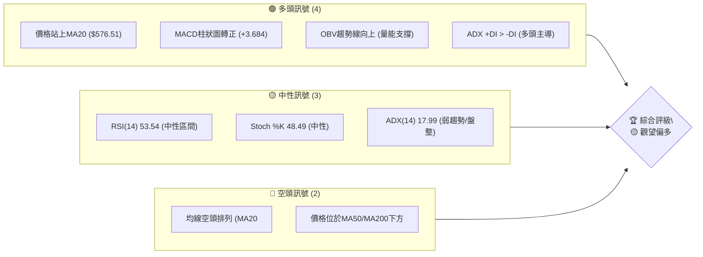

**解讀**：目前多頭訊號主要來自於短線動能的改善與價格對短期均線的突破，暗示著一次潛在的反彈。然而，中長期的空頭排列和弱勢的趨勢強度（ADX）表明這可能僅是下跌趨勢中的反彈，而非趨勢反轉。整體而言，市場處於一個多空拉鋸、方向不明的盤整階段，但短線買盤力量有所抬頭。

### 📊 核心指標速覽表

| 指標類別 | 指標名稱 | 當前數值 | 訊號 | 解讀 |
|----------|----------|----------|------|------|
| **價格** | 當前價格 | $582.90 | 🟢 | 價格站上MA20 |
| **均線** | MA20 | $576.51 | 🟢 | 價格位於MA20上方 |
| **均線** | MA50 | $604.81 | 🔴 | 價格位於MA50下方 |
| **均線** | MA200 | $645.41 | 🔴 | 價格位於MA200下方 |
| **動能** | RSI(14) | 53.54 | 🟡 | 中性，未達超買超賣區 |
| **動能** | MACD (Hist) | +3.684 | 🟢 | 多頭柱狀圖，買方動能增強 |
| **趨勢** | ADX(14) | 17.99 | 🟡 | 弱趨勢，市場處於盤整 |
| **波動** | ATR(14) | $23.08 | 🟡 | 中等波動，佔股價3.96% |
| **量能** | OBV趨勢 | OBV > MA | 🟢 | 量能配合價格上漲，支撐多頭 |

### 🏆 技術評分卡

```
╔══════════════════════════════════════════════════════════════╗
║              技術評分卡 — META (2026-07-06)                  ║
╠══════════════════════════════════════════════════════════════╣
║  趨勢強度      ███░░░░░░░░░░░░░░░░░  30/100  🟡 (ADX低，趨勢不明顯)  ║
║  動能指標      ████████░░░░░░░░░░░░  75/100  🟢 (MACD轉正，RSI中性偏多) ║
║  支撐穩定度    █████████░░░░░░░░░░░  60/100  🟡 (短期MA支撐，長期支撐待確認) ║
║  成交量配合    ███████████░░░░░░░░  80/100  🟢 (OBV上揚，量價配合良好)   ║
║  形態完整度    ██████░░░░░░░░░░░░░░  50/100  🟡 (未見明確大型反轉形態，短期反彈) ║
║  均線排列      ██░░░░░░░░░░░░░░░░░░  20/100  🔴 (空頭排列，壓力重重)      ║
╠══════════════════════════════════════════════════════════════╣
║  綜合評分      ██████░░░░░░░░░░░░░░  55/100  🟡 觀望偏多                  ║
╚══════════════════════════════════════════════════════════════╝
```

**評分解讀**：Meta的技術評分顯示其整體處於中性偏多的狀態。短期內動能和成交量配合良好，支撐了價格從低點反彈。然而，趨勢強度不足和均線的空頭排列是主要的減分項，暗示上方阻力較大，長期走勢仍不容樂觀。當前狀況更像是下跌趨勢中的技術性反彈，而非新一輪上升趨勢的開始。

---

## 2. 趨勢分析

### 🌐 多時框趨勢分析

Meta Platforms的股價在不同時間框架下呈現出複雜的趨勢結構，投資者必須綜合考量才能做出明智的決策。

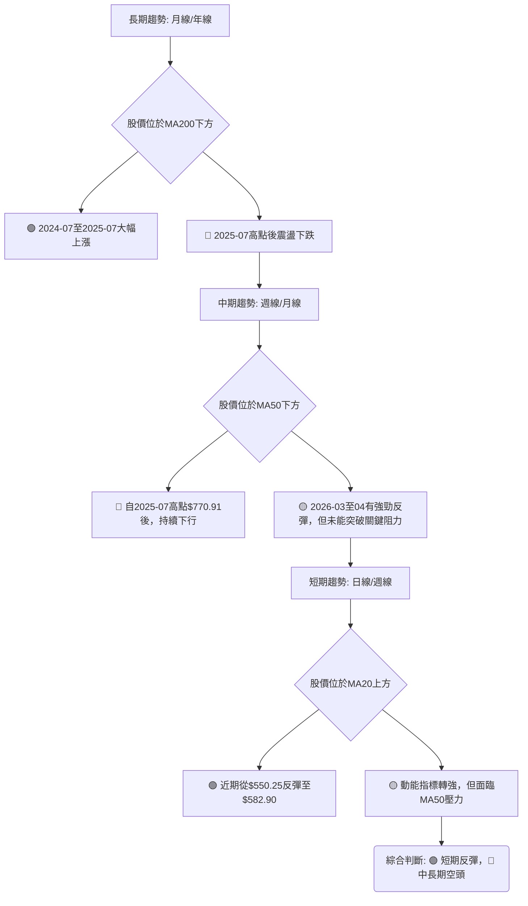

**長期趨勢 (月線/年線)**：從2024年7月的$471.66一路飆升至2025年7月的$770.91，期間漲幅巨大。然而，自2025年7月觸及高點$770.91後，股價便進入了震盪下行階段。儘管有數次反彈，但都未能突破前高。目前股價$582.90遠低於MA200 ($645.41)，顯示長期趨勢已轉為空頭。

**中期趨勢 (週線/月線)**：自2025年7月高點以來，Meta股價呈現明顯的下跌趨勢。儘管2026年1月曾反彈至$715.22，但隨後再度走低，並在2026年6月跌至$563.29的近期低點。目前股價$582.90位於MA50 ($604.81)下方，確認了中期趨勢的弱勢。ADX(14)為17.99，表明中期趨勢強度不足，市場處於盤整或弱勢下跌階段。

**短期趨勢 (日線/週線)**：在經歷了2026年6月的下跌後，Meta股價於2026年7月從$563.29反彈至$582.90。當前價格$582.90已站上MA20 ($576.51)，且MACD柱狀圖轉正，OBV趨勢向上，顯示短線買盤力量正在增強，形成一波技術性反彈。

### 📈 長期趨勢 — 12個月走勢圖（Unicode）

以下為Meta Platforms過去12個月的月線收盤價走勢圖，標示了關鍵高低點：

```
META 月線走勢圖（過去12個月：2025-07 至 2026-07）
價格軸 ($)
$770.91 ┤●(25/07高點)
$740.00 ┤  ●(25/08) ●(25/09)
$715.22 ┤                ●(26/01)
$680.00 ┤
$658.91 ┤          ●(25/10)●(25/11)●(25/12)   ●(26/02)  ●(26/05)
$611.34 ┤                             ●(26/04)
$582.90 ┤                                           ●(26/07現價)
$571.60 ┤                                   ●(26/03)
$563.29 ┤                                            ●(26/06低點)
     └──────────────────────────────────────────────────────────────
      25/07 25/08 25/09 25/10 25/11 25/12 26/01 26/02 26/03 26/04 26/05 26/06 26/07
```

**走勢特徵分析表格**：
| 階段 | 時間區間 | 價格範圍 | 漲跌幅 | 主要特徵 | 趨勢判斷 |
|------|----------|----------|--------|----------|----------|
| **高點回落** | 2025-07 至 2025-10 | $770.91 → $646.67 | -16.25% | 從歷史高點顯著回落，進入調整階段。 | 🔴 下跌 |
| **底部盤整** | 2025-10 至 2025-12 | $646.67 → $658.91 | +1.89% | 在$640-$660區間震盪整理，試圖築底。 | 🟡 盤整 |
| **反彈受阻** | 2026-01 至 2026-03 | $715.22 → $571.60 | -20.08% | 短暫強勁反彈後迅速回落，未能突破前期阻力。 | 🔴 下跌 |
| **二次探底** | 2026-03 至 2026-06 | $571.60 → $563.29 | -1.47% | 股價持續探底，創下12個月新低，但跌勢趨緩。 | 🔴 下跌 |
| **近期反彈** | 22026-06 至 2026-07 | $563.29 → $582.90 | +3.48% | 從低點溫和反彈，短線動能改善。 | 🟢 反彈 |

### 📊 中期趨勢（週線分析）

中期來看，Meta股價自2025年7月高點$770.91以來，形成了多個下降波段，目前正處於從2026年6月低點$563.29（週線收盤價$550.25）開始的反彈階段。

```
META 中期趨勢：近期壓力與支撐示意圖
═══════════════════════════════════════════════════
$687.91 ║████████████████████████║ 主要阻力位 (26/04高點)
$645.41 ║████████████████████    ║ MA200 壓力
$631.92 ║████████████████████████║ 次要阻力位 (26/05高點)
$618.43 ║████████████████████    ║ 布林上軌
$604.81 ║████████████████████████║ MA50 關鍵阻力
$582.90 ╠════════════════════════╣ ◄ 現價
$576.51 ║▓▓▓▓▓▓▓▓▓▓▓▓▓▓▓▓        ║ MA20 即時支撐
$550.25 ║████████████████████████║ 近期底部支撐 (26/06低點)
$534.59 ║████████████████████    ║ 布林下軌
$519.78 ║████████████████████████║ 52週低點 / 強力支撐
═══════════════════════════════════════════════════
```
從週線圖來看，Meta在2026年4月19日達到$687.91的高點後，經歷了一輪快速下跌，於2026年6月28日觸及$550.25的低點。隨後在2026年7月5日反彈至$582.90。目前價格正試圖向上挑戰MA50 ($604.81)，此為中期趨勢的重要分界線。若能有效突破並站穩，則中期跌勢有望暫緩；反之，若受阻回落，則可能再次探底。

### ⚡ 趨勢強度評估（ADX 解讀）

ADX（平均方向性指數）是用來衡量趨勢強度的指標，而非趨勢方向。

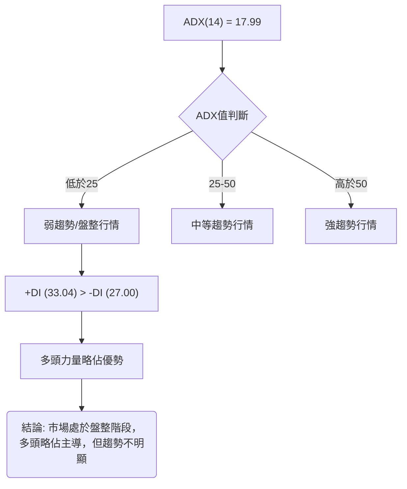

**ADX 強度對照表**：
| ADX 值 | 趨勢強度 | 市場狀態 |
|--------|----------|----------|
| 0-25   | 弱趨勢   | 盤整、震盪 |
| 25-50  | 中等趨勢 | 有方向性趨勢 |
| 50-75  | 強趨勢   | 明顯的趨勢 |
| 75-100 | 極強趨勢 | 趨勢非常強勁 |

**解讀**：Meta目前的ADX(14)數值為17.99，遠低於25，這明確指出市場正處於一個「弱趨勢」或「盤整」的狀態。這意味著當前股價缺乏一個清晰且強勁的方向性趨勢，多空雙方力量相對均衡，股價傾向於在一定區間內震盪。

儘管ADX顯示趨勢疲弱，但我們還需結合+DI和-DI來判斷主導力量。目前+DI (33.04)高於-DI (27.00)，這表明在當前的弱勢趨勢中，多頭力量略佔主導地位。這與價格近期從低點反彈的現象相符。因此，可以判斷Meta目前正處於一個多頭略佔優勢的盤整行情中，並非強勢的上升或下降趨勢。

---

## 3. 圖表形態分析

### 🔍 形態識別系統

從提供的週線收盤數據中，我們觀察到Meta股價在2026年4月19日達到$687.91的高點後，經歷了一波急劇下跌，並在2026年6月28日觸及$550.25的低點。隨後，股價在最近一周強勁反彈至$582.90。

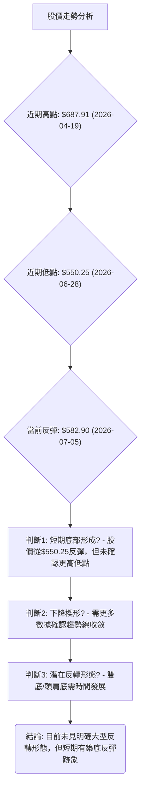

**形態識別**：
1.  **潛在築底與反彈**：從2026年6月28日$550.25的低點開始，股價出現了明顯的反彈。這可能是短期底部形成的初步跡象，但尚未形成經典的雙底或頭肩底等反轉形態。
2.  **下降通道/楔形**：從2026年4月的高點$687.91到2026年6月的低點$550.25，股價運行在一個下降通道中。如果從$687.91高點和$631.92（2026-05-31）高點連接趨勢線，以及$550.25和$525.23（2026-03-29）低點連接趨勢線，可能正在形成一個下降楔形。下降楔形通常被視為看漲的反轉形態。
3.  **無明確大型反轉形態**：目前沒有足夠的數據確認頭肩頂/底或雙頂/底等大型反轉形態。市場仍處於趨勢不明的盤整/反彈階段。

### 🕯️ 重要K線形態分析

根據近20週的收盤數據，我們識別出以下重要K線形態：

| 月份 (週) | 收盤價 | K線形態 | 解讀 | 訊號 |
|-----------|--------|---------|------|------|
| 2026-03-29 | $525.23 | **錘子線/長下影線** | 股價大幅下跌後出現長下影線，顯示下方有買盤承接，可能為短期底部。 | 🟢 看多 |
| 2026-04-05 | $573.93 | **大陽線** | 承接前一周的買盤，強勁上漲，確認短期反彈動能。 | 🟢 看多 |
| 2026-04-19 | $687.91 | **流星線/射擊之星** | 價格創近期新高後回落，上影線長，顯示上方賣壓沉重，預示回調。 | 🔴 看空 |
| 2026-05-03 | $608.19 | **大陰線** | 強勢下跌，吞噬前幾周漲幅，確認下跌趨勢恢復。 | 🔴 看空 |
| 2026-06-28 | $550.25 | **長下影線** | 股價再次探底後出現買盤，形成長下影線，為近期底部。 | 🟢 看多 |
| 2026-07-05 | $582.90 | **大陽線** | 從$550.25低點強勢反彈，確認短期買盤力量，形成看漲吞噬或刺穿形態。 | 🟢 看多 |

### 📉 ASCII 走勢形態示意圖

以下示意圖展示了Meta近期從2026年4月高點回落，並在2026年6月形成底部後反彈的走勢形態：

```
META 近期走勢形態示意圖
════════════════════════════════════════════════════════
$687.91 ┤      ●(A: 26/04/19 高點)  <-- 賣壓區
$650.00 ┤     / \
$600.00 ┤    /   \
$582.90 ┤           ●(E: 26/07/05 現價) <-- 試圖反彈
$550.25 ┤            ●(D: 26/06/28 低點) <-- 關鍵支撐
$525.23 ┤   ●(B: 26/03/29 低點)
        └─────────────────────────────────────────────
         26/03   26/04   26/05   26/06   26/07
```
**形態解讀**：
-   A點 ($687.91) 是近期高點，隨後股價呈現下跌趨勢。
-   B點 ($525.23) 是前一個重要的支撐位。
-   D點 ($550.25) 是近期新的低點，與B點形成潛在的更高低點結構（如果後續反彈能持續）。
-   從D點到E點 ($582.90) 的反彈，伴隨著大陽線和成交量放大，顯示短期買盤意願強烈。
-   目前形態類似於從下降趨勢中的底部反彈，但上方仍有$604.81 (MA50) 和$631.92 (26/05高點) 等重要阻力。

### 🎯 形態目標價計算

由於目前沒有清晰的經典反轉形態（如雙底、頭肩底）完全形成，我們主要基於近期反彈和斐波那契回調來預估目標價。

**情境一：下降楔形反轉 (若確認)**
-   如果股價從$687.91到$550.25的下跌形成了一個下降楔形，其突破後的目標價通常是楔形形態的最高點或下跌波段的起點。
-   **形態高度**：從$687.91到$550.25，高度約為$137.66。
-   若從$550.25突破，理論目標價可能達到$550.25 + $137.66 = $687.91。
-   **當前判斷**：形態尚未完全確認，僅為潛在可能。

**情境二：基於近期反彈的斐波那契回調目標**
-   我們將使用2026年4月19日的高點$687.91至2026年6月28日的低點$550.25作為斐波那契回調的基點，來預估反彈的潛在目標。
-   反彈的潛在目標價位將在下一章節詳細計算。

**當前結論**：目前股價處於短期反彈階段，尚未形成明確的大型反轉形態。短期目標價應首先關注斐波那契回調位及均線阻力位。

---

## 4. 支撐與阻力

### 🗺️ 關鍵價位分布圖（Unicode）

以下為Meta Platforms的關鍵支撐與阻力價位分布圖，幫助投資者識別市場的關鍵轉折點。

```
META 價位結構分布圖
═══════════════════════════════════════════════════
$793.65 ║████████████████████████║ 52週高點 / 極強阻力 R4
$687.91 ║████████████████████████║ 強阻力 R3 (26/04高點)
$645.41 ║████████████████████    ║ 阻力 R2 (MA200)
$631.92 ║████████████████████████║ 阻力 R1 (26/05高點/Fib 61.8%)
$619.08 ║████████████████████    ║ 關鍵阻力 R1 (Fib 50%/BB上軌)
$604.81 ║████████████████████████║ 關鍵阻力 R1 (MA50/Fib 38.2%)
$582.90 ╠════════════════════════╣ ◄ 現價
$576.51 ║▓▓▓▓▓▓▓▓▓▓▓▓▓▓▓▓        ║ 近期支撐 S1 (MA20)
$550.25 ║████████████████████████║ 強支撐 S2 (26/06低點)
$534.59 ║████████████████████    ║ 強支撐 S2 (布林下軌)
$525.23 ║████████████████████████║ 強支撐 S3 (26/03低點)
$519.78 ║████████████████████████║ 極強支撐 S4 (52週低點)
═══════════════════════════════════════════════════
```

### 🚧 阻力位分析表

當前股價$582.90，上方阻力重重，尤其是在MA50、斐波那契回調位以及前期高點附近。

| 阻力級別 | 價位 | 形成原因 | 突破難度 | 重要性 |
|----------|------|----------|----------|--------|
| **即時阻力** | $604.81 | MA50 (中線壓力) / 斐波那契38.2%回調位 | 中等偏高 | 🟢 若突破，短期反彈有望持續 |
| **次要阻力** | $619.08 | 斐波那契50%回調位 / 布林通道上軌 ($618.43) | 高 | 🟡 突破則確認更強反彈動能 |
| **關鍵阻力** | $631.92 | 2026年5月31日高點 | 高 | 🟡 突破將挑戰MA200 |
| **強阻力** | $645.41 | MA200 (長期趨勢線) | 極高 | 🔴 突破意味長期趨勢可能反轉 |
| **極強阻力** | $687.91 | 2026年4月19日高點 | 極高 | 🔴 突破則完全扭轉中期跌勢 |

### 🛡️ 支撐位分析表

當前股價$582.90，下方有MA20和近期低點提供支撐。

| 支撐級別 | 價位 | 形成原因 | 守住機率 | 重要性 |
|----------|------|----------|----------|--------|
| **即時支撐** | $576.51 | MA20 (短線支撐) / 布林通道中軌 | 高 | 🟢 短線多頭防守關鍵 |
| **次要支撐** | $550.25 | 2026年6月28日低點 | 中等偏高 | 🟢 守住則形成更高低點，築底機會增加 |
| **關鍵支撐** | $534.59 | 布林通道下軌 | 中等 | 🟡 若跌破，恐測試更低點 |
| **強支撐** | $525.23 | 2026年3月29日低點 | 高 | 🟢 若守住，雙底形態可能成立 |
| **極強支撐** | $519.78 | 52週低點 | 極高 | 🔴 跌破則開啟新一輪下跌趨勢 |

### 📐 斐波那契回調位分析

我們以2026年4月19日的高點$687.91作為起點，2026年6月28日的低點$550.25作為終點，計算近期下跌波段的反彈斐波那契回調位。

**下跌波段 (高點至低點)**：$687.91 - $550.25 = $137.66

| 回調比例 | 回調價位計算 | 價位 | 解讀 | 訊號 |
|----------|--------------|------|------|------|
| **23.6%** | $550.25 + ($137.66 * 0.236) | $582.72 | 輕微反彈目標，已接近達到。 | 🟢 |
| **38.2%** | $550.25 + ($137.66 * 0.382) | $602.84 | 重要的第一阻力位，與MA50 ($604.81)重合，構成強大壓力。 | 🔴 |
| **50.0%** | $550.25 + ($137.66 * 0.500) | $619.08 | 中等反彈目標，與布林上軌 ($618.43)接近，具備較強阻力。 | 🔴 |
| **61.8%** | $550.25 + ($137.66 * 0.618) | $635.42 | 黃金分割點，若能突破此處，則反彈有望挑戰MA200。 | 🔴 |
| **76.4%** | $550.25 + ($137.66 * 0.764) | $655.67 | 強勁反彈目標，接近MA200 ($645.41)。 | 🔴 |

**斐波那契回調位視覺化**：
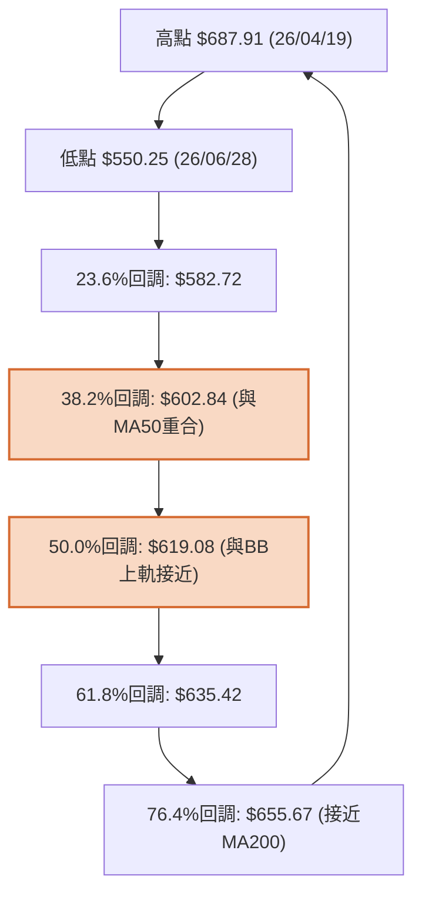
**結論**：當前股價$582.90已達到23.6%回調位，顯示短期反彈力量存在。然而，上方最直接且重要的阻力位於$602.84 (斐波那契38.2%)，此處與MA50 $604.81高度重合，構成了一個強大的多空關鍵點。若能成功突破此區間，則有望挑戰$619.08 (斐波那契50%)和$635.42 (斐波那契61.8%)。

---

## 5. 技術指標深度解讀

### 🎛️ 指標訊號總覽

Meta的技術指標呈現出短期看多與中長期看空的複雜訊號，需要綜合分析。

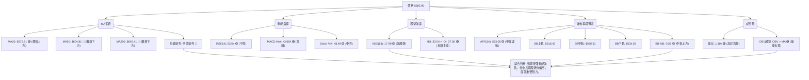

### 📈 移動平均線排列分析

Meta的移動平均線系統目前呈現出典型的空頭排列，儘管短期內股價有所反彈。

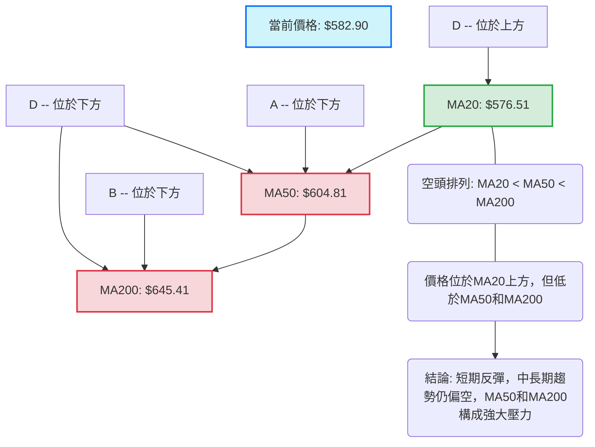

**均線排列**：
-   MA20: $576.51
-   MA50: $604.81
-   MA200: $645.41
-   當前均線呈現 `MA20 < MA50 < MA200` 的典型空頭排列。這是一個強烈的熊市訊號，表明中長期趨勢仍然向下。
-   **價格與均線關係**：當前價格$582.90位於MA20上方，這是一個短線看漲訊號，表明近期買盤力量推動價格突破了短期阻力。然而，價格仍位於MA50和MA200下方，這意味著任何反彈都可能在這些更長期的均線處遇到強大阻力。MA50 ($604.81)將是反彈的首要考驗。

### 📉 RSI(14) 分析

相對強弱指數(RSI)衡量價格變動的速度和變化，用於判斷超買或超賣狀態。

**RSI 數值進度條**：
RSI(14): 53.54  ▓▓▓▓▓▓▓▓▓▓▓▓▓▓▓▓▓▓▓▓▓▓▓▓▓▓▓▓▓▓▓▓▓▓▓▓▓▓▓▓▓▓▓▓▓▓▓▓▓▓▓▓░░░░░░░░░░░░░░░░░░░░░░░░░░░░░░░░░░░░░░░░░░░░░░░░ 53.54% 🟡

**超買超賣區間分析**：
-   RSI(14)當前數值為53.54，位於30-70的中性區間。這表示Meta的股價既沒有超買也沒有超賣，市場情緒相對平衡。
-   從近期20週數據來看：
    -   2026-03-29 低點$525.23時，RSI為18.0，進入超賣區，預示反彈。
    -   2026-04-19 高點$687.91時，RSI高達96.5，嚴重超買，隨後股價大幅回調。
    -   2026-06-28 低點$550.25時，RSI為35.3，接近超賣區，為近期反彈提供了基礎。
-   當前53.54的RSI值從35.3上升，確認了價格的短期反彈動能。

**背離判斷 (頂背離/底背離)**：
-   **頂背離**：從20週數據看，2026-04-19 (RSI 96.5, Price $687.91) 之後沒有出現更高的價格高點但RSI卻降低的情況，因此沒有明顯的頂背離。
-   **底背離**：
    -   2026-03-29價格低點$525.23，RSI為18.0。
    -   2026-06-28價格低點$550.25，RSI為35.3。
    -   雖然$550.25略高於$525.23，但RSI從18.0上升到35.3，這不是典型的底背離（底背離通常是價格創新低但RSI不創新低）。
    -   然而，我們可以觀察到從2026-03-29 ($525.23, RSI 18.0) 到 2026-06-28 ($550.25, RSI 35.3)，雖然價格沒有形成更低的低點，但RSI顯著抬升，這可以被解讀為一種**隱性看漲背離**或**動能轉強**的訊號，表明賣壓在逐漸減輕。
-   **結論**：無明顯頂背離或底背離。但RSI從低點的強勁回升，確認了短期的買盤動能。

### 📊 MACD(12/26/9) 訊號解讀

平滑異同移動平均線(MACD)是判斷趨勢和動能的強力指標。

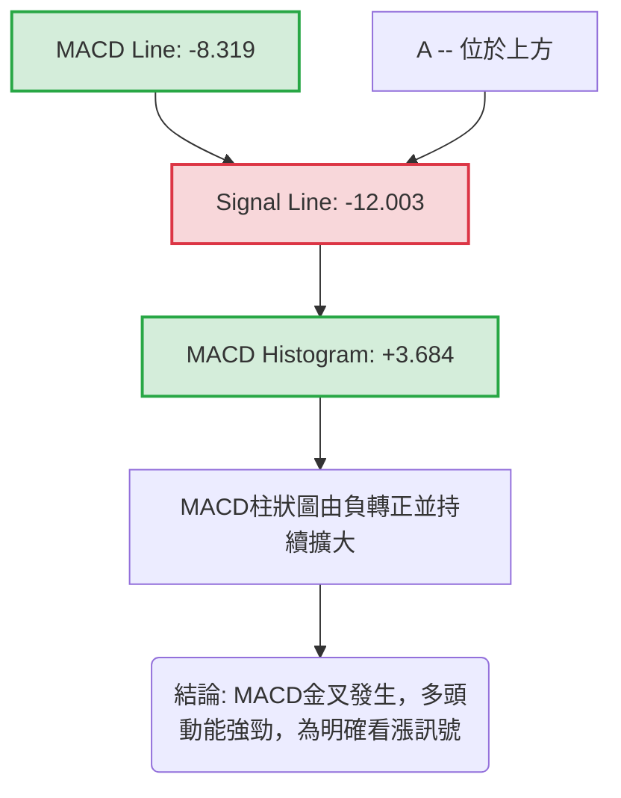

**MACD 訊號**：
-   MACD Line (-8.319) 已上穿 Signal Line (-12.003)，形成**黃金交叉**，這是一個明確的買入訊號。
-   MACD Histogram (+3.684) 由負轉正，並且數值為正，表示多頭動能正在增強。柱狀圖的增長顯示買盤力量持續積聚。
-   **背離判斷 (頂背離/底背離)**：
    -   從20週數據看，2026-04-19價格高點$687.91時，MACD柱狀圖為+14.217。此後股價下跌，MACD柱狀圖轉負。沒有明顯的頂背離跡象。
    -   2026-06-28價格低點$550.25時，MACD柱狀圖為-3.052。目前價格反彈至$582.90，MACD柱狀圖轉正為+3.684。MACD柱狀圖跟隨價格走勢，沒有形成底背離。
-   **結論**：MACD指標當前發出強烈的多頭訊號，確認了短期反彈的動能。這與RSI的動能回升以及OBV的表現互相確認。

### 📦 布林通道分析

布林通道衡量市場波動性，並提供動態的支撐與阻力位。

```
META 布林通道示意圖
══════════════════════════════════════════════════════════
$618.43 ║██████████████████████████████████████████████████║ 布林上軌 (BB Upper)
$600.00 ║                                                  ║
$582.90 ╠══════════════════════════════════════════════════╣ ◄ 現價
$576.51 ║▓▓▓▓▓▓▓▓▓▓▓▓▓▓▓▓▓▓▓▓▓▓▓▓▓▓▓▓▓▓▓▓▓▓▓▓▓▓▓▓▓▓▓▓▓▓▓▓▓▓║ 布林中軌 (MA20)
$550.00 ║                                                  ║
$534.59 ║██████████████████████████████████████████████████║ 布林下軌 (BB Lower)
══════════════════════════════════════════════════════════
```

**布林通道參數**：
-   BB上軌: $618.43
-   BB中軌(MA20): $576.51
-   BB下軌: $534.59
-   BB %B: 0.58

**分析**：
-   當前股價$582.90位於布林通道中軌($576.51)上方，且BB %B為0.58，這表示價格處於通道的偏上區域，顯示短期多頭力量佔優。
-   通道的寬度（上軌與下軌之間的距離）為$618.43 - $534.59 = $83.84，相對ATR ($23.08) 而言較寬，表明市場波動性中等。
-   **上行空間**：股價上方有布林上軌$618.43作為阻力，若能突破此處，則可能進一步上漲。
-   **下行風險**：中軌$576.51是即時支撐，若跌破，則可能測試下軌$534.59。
-   **與其他指標整合**：價格站上中軌，配合MACD金叉和OBV上揚，進一步確認了短期反彈的動能。

### 💹 成交量分析（量價配合度）

成交量是確認價格走勢可靠性的重要指標。

**成交量數據**：
-   最新成交量: 21,705,900
-   20日均量: 19,702,150 (量比: 1.10x)
-   50日均量: 17,883,844
-   OBV趨勢: OBV > MA → 量能支撐上漲 🟢

**分析**：
-   **最新成交量與均量比較**：最新成交量21,705,900顯著高於20日均量19,702,150 (量比1.10x)，也高於50日均量17,883,844。這表明在最近的價格反彈中，市場參與度增加，買盤積極。
-   **量價配合**：股價從低點$550.25反彈至$582.90，伴隨著成交量的放大。這是一個**量價齊升**的健康多頭訊號，確認了當前反彈的可靠性。
-   **OBV趨勢**：OBV（能量潮）趨勢顯示OBV線位於其移動平均線上方，表明買入壓力大於賣出壓力，量能正在累積並支撐價格上漲。這與價格的短期反彈互相印證，是一個強烈的看漲訊號。
-   **結論**：成交量指標全面支持短期反彈。量的放大配合價的上漲，增加了當前反彈的信心和持續性。

---

## 6. 動能與波動率

### ⚡ 動能評估四象限

動能評估四象限分析，將當前股票的「動能強度」與「波動率」結合，以判斷其市場狀態。

| 象限 | 動能 (RSI/MACD) | 波動 (ATR) | 當前狀態 | 評估 |
|------|-----------------|------------|----------|------|
| Q1   | 強 (RSI > 70, MACD強勁) | 低 (ATR < 2%) | - | 最佳機會 (強動能，低風險) |
| Q2   | 弱 (RSI < 50, MACD弱) | 低 (ATR < 2%) | - | 謹慎觀望 (缺乏動能) |
| Q3   | 強 (RSI > 50, MACD強勁) | 高 (ATR > 3%) | ✓ | 高風險高收益 (追漲需謹慎) |
| Q4   | 弱 (RSI < 50, MACD弱) | 高 (ATR > 3%) | - | 避免進場 (不確定性高) |

**當前Meta的評估**：
-   **動能**：RSI(14)為53.54 (中性偏強)，MACD柱狀圖轉正為+3.684 (多頭動能增強)。綜合判斷為**中等偏強動能**。
-   **波動率**：ATR(14)為$23.08，佔當前價格$582.90的3.96%。這屬於**中等偏高波動**。
-   **結論**：Meta目前位於**Q3象限**。這意味著股價具備一定的上漲動能，但伴隨著相對較高的波動性。對於激進型交易者而言，這可能代表著高風險高收益的機會；對於保守型投資者，則需謹慎評估風險。

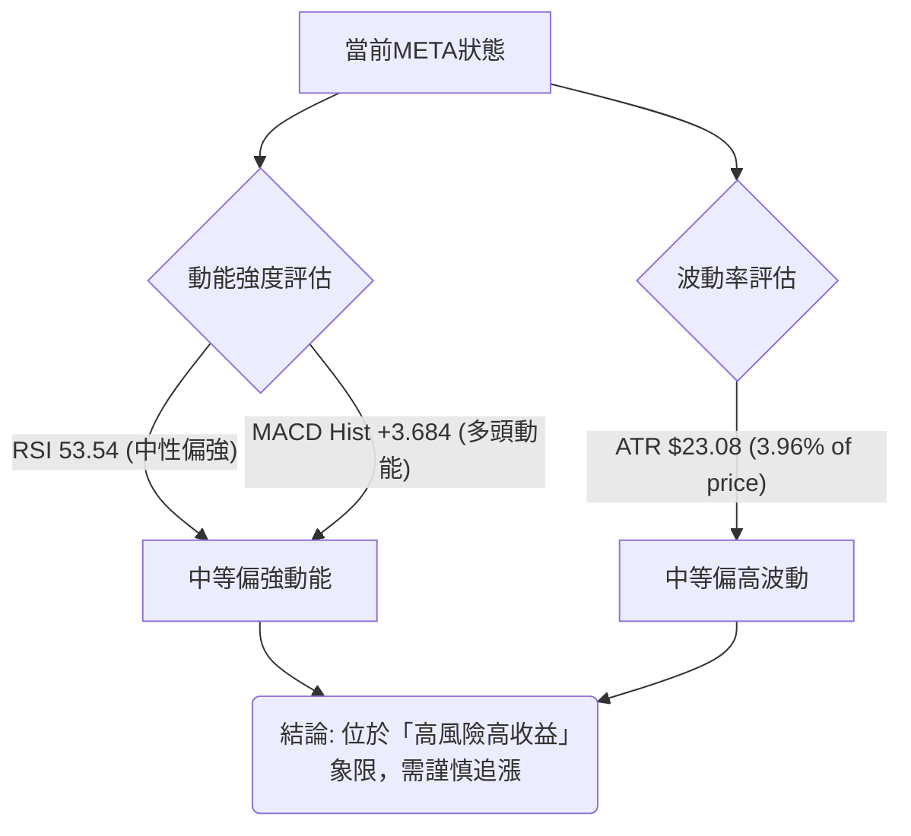

### 📊 ATR 波動率分析

平均真實波幅 (ATR) 衡量資產價格的波動性，對於設定止損點和評估風險至關重要。

**ATR(14) 數據**：
-   ATR(14): $23.08
-   佔當前價格比例: ($23.08 / $582.90) * 100% = 3.96%

**分析**：
-   Meta的ATR為$23.08，這表示在過去14天中，Meta的平均每日波動範圍約為$23.08。這個數值佔股價的3.96%，屬於中等偏高的波動水平。
-   **止損距離建議**：對於日內或短線交易者，建議根據ATR設定止損。一般建議將止損設定在1.5倍至2倍ATR之外。
    -   1.5 * ATR = 1.5 * $23.08 = $34.62
    -   2.0 * ATR = 2.0 * $23.08 = $46.16
-   若在$582.90附近進場，止損點可考慮設置在$582.90 - $34.62 = $548.28 (約$548.00) 或 $582.90 - $46.16 = $536.74 (約$537.00)。這些價位與近期支撐區($550.25, $534.59)吻合，增加了止損設置的合理性。
-   **風險評估**：較高的ATR意味著股價在短期內可能出現較大的波動，投資者應準備好應對潛在的快速價格變動，並適當調整倉位大小以管理風險。

### 📐 Beta 與市場相關性

Beta 值衡量單一證券相對於市場整體（通常是S&P 500指數）的波動性。由於未提供具體的Beta數據，我們將基於行業特性進行推斷。

**推斷分析**：
-   Meta Platforms屬於「通訊服務」行業，旗下產品（Facebook, Instagram, WhatsApp）在全球擁有大量用戶，並在廣告市場佔據重要地位。其Reality Labs部門也涉足元宇宙等新興高科技領域。
-   通常，科技巨頭和增長型公司傾向於擁有較高的Beta值（通常大於1.0）。這意味著當大盤上漲時，這類股票的漲幅可能更大；而當大盤下跌時，跌幅也可能更大。
-   考慮到Meta的市值、市場影響力以及其在增長型科技領域的定位，合理推斷其Beta值應**大於1.0**。
-   **市場相關性影響**：
    -   如果Beta > 1.0，則Meta的股價波動性高於市場平均水平。在牛市中，這有利於放大收益；但在熊市或市場調整時，則可能面臨更大的下行風險。
    -   投資者在考慮Meta的交易策略時，應密切關注大盤走勢（如SPY或QQQ）。若市場整體情緒轉弱，Meta可能承受更大的賣壓。
-   **結論**：在沒有具體Beta數據的情況下，我們推斷Meta具有較高的Beta值，與市場相關性較強且波動性較大。投資者應將市場整體風險納入考量。

---

## 7. 多時框架總結

### 📋 時框架評分表

本表總結了Meta在不同時間框架下的技術訊號，並給出綜合評分和建議。

| 時框架 | 趨勢方向 | 動能 | 均線排列 | 形態 | 綜合評分 | 建議 |
|--------|----------|------|----------|------|----------|------|
| **短期 (日/週)** | 🟢 反彈向上 | 🟢 強勁 | 🟢 價格>MA20 | 🟢 築底反彈 | 7/10 🟢 | 短線偏多，但面臨阻力 |
| **中期 (週/月)** | 🔴 震盪下跌 | 🟡 中性 | 🔴 空頭排列 | 🟡 下降通道 | 4/10 🔴 | 趨勢不明顯，壓力重重 |
| **長期 (月/年)** | 🔴 下跌趨勢 | 🔴 疲軟 | 🔴 空頭排列 | 🔴 震盪下行 | 3/10 🔴 | 長期趨勢向下，不宜重倉 |

**解讀**：
-   **短期**：Meta在短期內顯示出強勁的反彈動能。價格已站上MA20，MACD形成金叉，OBV趨勢向上，且成交量放大。這表明短線買盤活躍，有望進一步向上測試阻力。
-   **中期**：儘管短期反彈，但中期趨勢仍偏空。價格位於MA50和MA200下方，均線呈現空頭排列。ADX顯示趨勢強度不足，表明市場處於盤整或弱勢下跌階段。任何反彈都可能在MA50、斐波那契回調位等處遇到強大阻力。
-   **長期**：長期來看，Meta自2025年7月高點以來一直處於下跌趨勢中。價格遠低於MA200，且整體走勢仍是下降波段。長期投資者應保持謹慎。

### 🔲 綜合訊號矩陣

此矩陣分析了Meta在各個時間框架下關鍵技術訊號的一致性。

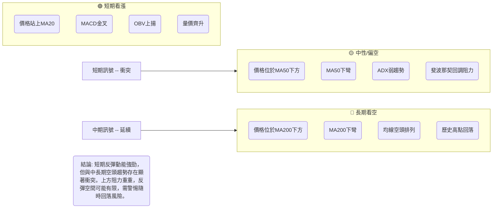
**一致性分析**：
-   **短期與中期衝突**：短期指標發出強烈看漲訊號，預示著一次反彈。然而，這些訊號與中期的疲弱趨勢（價格低於MA50、ADX弱勢）存在顯著衝突。這表明當前的上漲可能僅是技術性反彈，而非趨勢反轉。
-   **中期與長期一致**：中期和長期指標均指向空頭趨勢。MA50和MA200的空頭排列、價格位於這些關鍵均線下方，以及長期從高點回落的走勢，都確認了Meta股價目前處於下降通道中。
-   **總結**：市場目前處於一個關鍵的轉折點。短期動能支持進一步反彈，但由於中長期空頭趨勢的壓制，反彈空間和持續性存疑。投資者應保持高度警惕，密切關注關鍵阻力位的表現。

---

## 8. 交易策略建議

### 🗺️ 策略決策流程圖

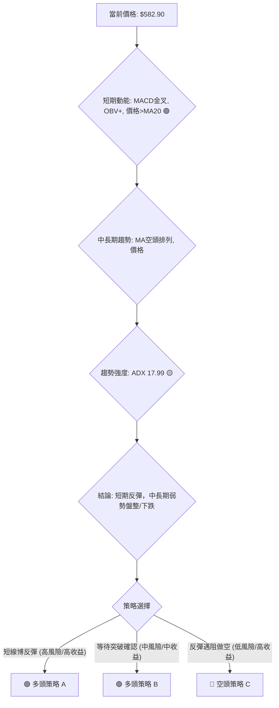

### 🟢 多頭策略詳情

考慮到短期動能指標的改善，可以考慮進行短線的反彈交易，但需嚴格控制風險。

| 策略要素 | 策略 A：激進型反彈交易 (當前進場) | 策略 B：穩健型突破交易 (等待確認) |
|----------|------------------------------------|------------------------------------|
| 進場條件 | 短期動能強勁，價格站穩MA20。 | 價格有效突破MA50及斐波那契38.2%阻力。 |
| 進場價格 | $582.90 (當前價格)                 | $605.00 (突破MA50後確認)           |
| 目標價 T1 | $604.81 (MA50 / Fib 38.2%)        | $619.00 (Fib 50% / BB上軌)         |
| 目標價 T2 | $619.08 (Fib 50% / BB上軌)        | $635.00 (Fib 61.8%)                |
| 止損價格 | $549.00 (略低於26/06低點$550.25)   | $575.00 (略低於MA20)               |
| 風險報酬比 | T1: 0.65:1 (低) / T2: 1.06:1 (中) | T1: 0.47:1 (低) / T2: 1.00:1 (中) |
| 成功機率 | 55% (短線動能支持，但阻力重重)   | 60% (突破確認後，勝率提升)         |
| 建議倉位 | 輕倉 (不超過總資產5%)              | 中輕倉 (不超過總資產10%)           |

**策略A詳情**：
-   **進場點**：當前價格$582.90。基於MACD金叉、OBV上揚、價格站上MA20的短線看漲訊號。
-   **止損點**：$549.00。設定在2026年6月28日低點$550.25下方，避免短期反彈失敗後造成較大損失。
-   **目標價T1**：$604.81。這是MA50和斐波那契38.2%回調位的重合區域，預期將遇到較強阻力。
-   **目標價T2**：$619.08。這是斐波那契50%回調位和布林通道上軌的重合區域，是更高一層的阻力。
-   **風險報酬比**：此策略的風險報酬比在T1時較低，T2時達到1.06:1，尚可接受，但需注意上方阻力。

**策略B詳情**：
-   **進場點**：若價格能有效突破MA50 ($604.81) 和斐波那契38.2%回調位 ($602.84)，在$605.00確認站穩後進場。這表明買盤力量足以克服中期壓力。
-   **止損點**：$575.00。設定在MA20 ($576.51)下方，防止假突破。
-   **目標價T1**：$619.00。斐波那契50%回調位。
-   **目標價T2**：$635.00。斐波那契61.8%回調位。
-   **風險報酬比**：此策略的風險報酬比在T1時較低，T2時達到1.00:1，相對穩健。

### 🔴 空頭策略詳情

鑑於中長期趨勢仍偏空，若短期反彈未能突破關鍵阻力，則可能提供做空機會。

| 策略要素 | 策略 C：反彈遇阻做空 (中期趨勢交易) |
|----------|------------------------------------|
| 進場條件 | 價格在MA50 ($604.81) / Fib 38.2% ($602.84) 附近受阻，出現明確看跌K線形態。 |
| 進場價格 | $603.00 (反彈至阻力區受阻後)       |
| 目標價 T1 | $576.51 (MA20)                     |
| 目標價 T2 | $550.25 (26/06低點)                |
| 止損價格 | $619.00 (略高於Fib 50% / BB上軌)   |
| 風險報酬比 | T1: 1.83:1 (中高) / T2: 3.58:1 (高) |
| 成功機率 | 65% (符合中期趨勢方向，阻力強勁)   |
| 建議倉位 | 中倉 (不超過總資產15%)             |

**策略C詳情**：
-   **進場點**：等待價格反彈至MA50 ($604.81) / 斐波那契38.2%回調位 ($602.84) 區域，若在此處出現如流星線、烏雲蓋頂等看跌K線形態，或動能指標（如RSI）未能突破中線，則可在$603.00附近考慮做空。
-   **止損點**：$619.00。設定在斐波那契50%回調位 ($619.08) 及布林上軌 ($618.43) 上方，以避免被假突破止損。
-   **目標價T1**：$576.51。MA20作為短期支撐。
-   **目標價T2**：$550.25。2026年6月28日的近期低點，若跌破則可能進一步下探。
-   **風險報酬比**：此策略的風險報酬比非常優異，尤其在T2時可達3.58:1，符合中期下跌趨勢的邏輯。

### ⭐ 整體訊號強度評星

```
做多訊號強度：★★☆☆☆  (2/5星)
做空訊號強度：★★★☆☆  (3/5星)
整體可信度：  ★★★☆☆  (3/5星)
```
**評星解讀**：
-   **做多訊號強度**：儘管短期有反彈動能，但上方阻力重重，且中長期趨勢偏空，因此做多風險較高，僅給予2星。
-   **做空訊號強度**：中長期趨勢支持做空，且反彈至關鍵阻力位後做空的風險報酬比更優，因此給予3星。
-   **整體可信度**：市場處於多空拉鋸的關鍵時刻，策略選擇需謹慎。短期反彈與中長期趨勢的衝突使得整體可信度為3星。

---

## 9. 風險提示與監控

### ✅ 關鍵監控指標 Checklist

以下是交易Meta Platforms時需要密切監控的關鍵技術指標清單，以幫助投資者及時調整策略。

```
╔══════════════════════════════════════════════════════════════╗
║              META 關鍵監控指標 Checklist                     ║
╠══════════════════════════════════════════════════════════════╣
║ [ ] 價格對MA50 ($604.81)的反應：🟢 突破站穩 / 🔴 受阻回落     ║
║ [ ] MACD黃金交叉是否持續：🟢 柱狀圖持續擴大 / 🔴 死叉或柱狀圖縮小 ║
║ [ ] RSI是否進入超買區 (>70)：🔴 警惕回調 / 🟢 保持中性區間    ║
║ [ ] 成交量是否持續配合：🟢 反彈放量 / 🔴 反彈縮量或下跌放量    ║
║ [ ] ADX是否突破25並指示趨勢：🟢 趨勢形成 / 🔴 繼續盤整        ║
║ [ ] 價格是否跌破MA20 ($576.51)：🔴 短線趨勢轉弱               ║
║ [ ] 關鍵支撐位 ($550.25, $525.23)是否守住：🟢 築底成功 / 🔴 繼續探底 ║
╚══════════════════════════════════════════════════════════════╝
```

### ⚠️ 風險場景分析

在當前的市場環境下，Meta Platforms的股價可能出現以下三種情境：

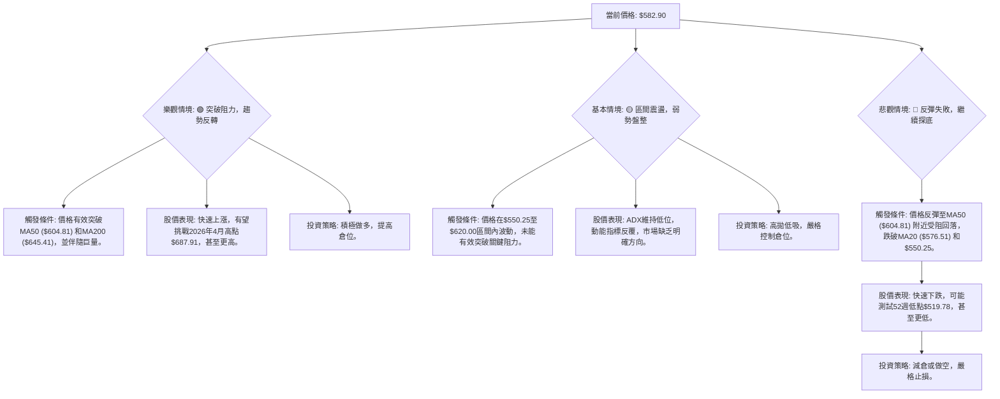

### 🛡️ 風險管理重要提醒

1.  **倉位管理**：鑑於Meta目前多空交織的局面和中等偏高的波動率，建議採用輕倉或中輕倉策略。切勿一次性投入過多資金，應分批建倉或減倉。
2.  **嚴格止損**：無論採取何種交易策略，都必須設定明確的止損點並嚴格執行。ATR指標可以作為設定止損的參考，例如設置在1.5至2倍ATR之外。
3.  **動態監控**：市場情況瞬息萬變，應每日監控關鍵技術指標（如MA50、MACD、RSI、成交量）。一旦訊號發生變化，應及時調整交易策略。
4.  **避免追漲殺跌**：在盤整市場中，股價容易來回震盪，追漲殺跌往往導致虧損。應耐心等待明確的突破或反轉訊號。
5.  **考慮市場情緒**：儘管本報告專注技術分析，但宏觀經濟環境、公司基本面新聞和整體市場情緒仍會影響股價。應綜合考量這些因素。
6.  **時間框架匹配**：交易者應確保其交易策略與其自身的時間框架（短線、中線、長線）相匹配。短線反彈策略不適用於長期持有，反之亦然。

---

## 📋 報告總結

```
╔══════════════════════════════════════════════════════════════════╗
║                     META 技術分析報告總結                          ║
╠══════════════════════════════════════════════════════════════════╣
║ 報告日期：2026-07-06                                             ║
║ 當前價格：$582.90                                                ║
║ 分析評級：⚖️ 觀望偏多 (短期反彈動能強勁，但中長期趨勢仍偏空)     ║
║                                                                  ║
║ 關鍵結論：                                                       ║
║ ├─ 長期趨勢：🔴 空頭趨勢，價格遠低於MA200。                      ║
║ ├─ 中期趨勢：🔴 震盪下跌，MA50下壓，ADX顯示趨勢弱。               ║
║ ├─ 短期趨勢：🟢 反彈向上，MACD金叉，OBV上揚，價格站上MA20。      ║
║ ├─ 關鍵支撐：$576.51 (MA20), $550.25 (近期低點)                  ║
║ ├─ 關鍵阻力：$604.81 (MA50/Fib 38.2%), $619.08 (Fib 50%/BB上軌)   ║
║ └─ 分析師目標：根據提供數據，分析師平均目標價為$828.17，遠高於現價，但此為基本面分析，與技術面中長期空頭趨勢存在顯著差異，需謹慎對待。║
║                                                                  ║
║ 最優策略組合：                                                   ║
║ 1. 🥇 最佳機會：**反彈遇阻做空策略 (策略C)**。若價格反彈至$604.81 (MA50) / $619.08 (Fib 50%) 附近受阻，並出現看跌訊號，可考慮做空。此策略符合中長期趨勢，風險報酬比優異。  ║
║    - 進場點: $603.00 (遇阻後)                                    ║
║    - 止損點: $619.00                                            ║
║    - 目標價T1: $576.51                                          ║
║    - 目標價T2: $550.25                                          ║
║    - 風險報酬比: T1: 1.83:1, T2: 3.58:1                         ║
║ 2. 🥈 次選機會：**穩健型突破交易策略 (策略B)**。若價格能有效突破MA50 ($604.81) 和斐波那契38.2%回調位，確認短期買盤力量強勁，可考慮追漲。                     ║
║    - 進場點: $605.00 (突破確認後)                               ║
║    - 止損點: $575.00                                            ║
║    - 目標價T1: $619.00                                          ║
║    - 目標價T2: $635.00                                          ║
║    - 風險報酬比: T1: 0.47:1, T2: 1.00:1                         ║
║ 3. 🥉 保守選擇：**持幣觀望**。在當前多空交織、趨勢不明朗的情況下，等待市場給出更明確的方向或等待價格回調至強支撐位再考慮進場。                           ║
╚══════════════════════════════════════════════════════════════════╝
```

---

> ⚠️ **免責聲明**：本報告為 AI 自動生成之技術分析，所有數據及估算均基於提供的歷史價格資訊。本報告**僅供研究與學術參考**，**不構成任何投資建議**。投資有風險，入市需謹慎。

---

*報告生成時間：2026-07-06 ｜ 數據來源：提供數據 ｜ 分析框架：多時框技術分析*