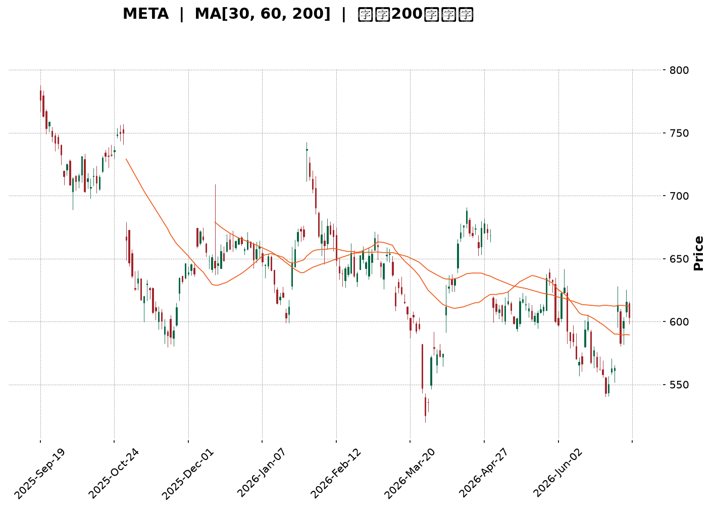
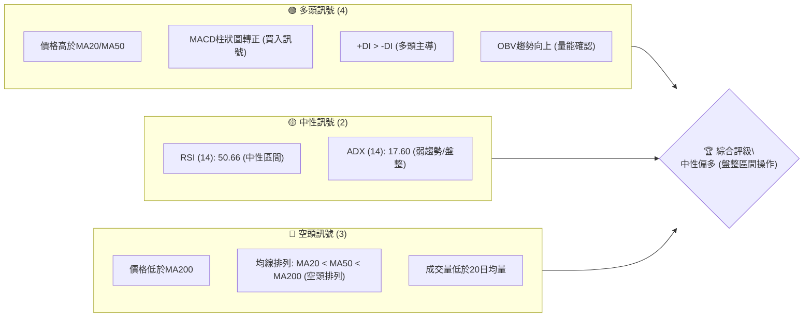
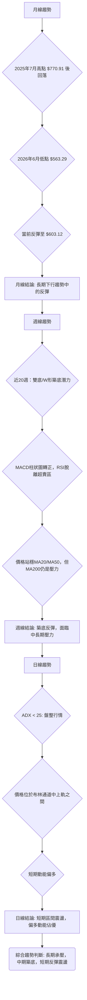
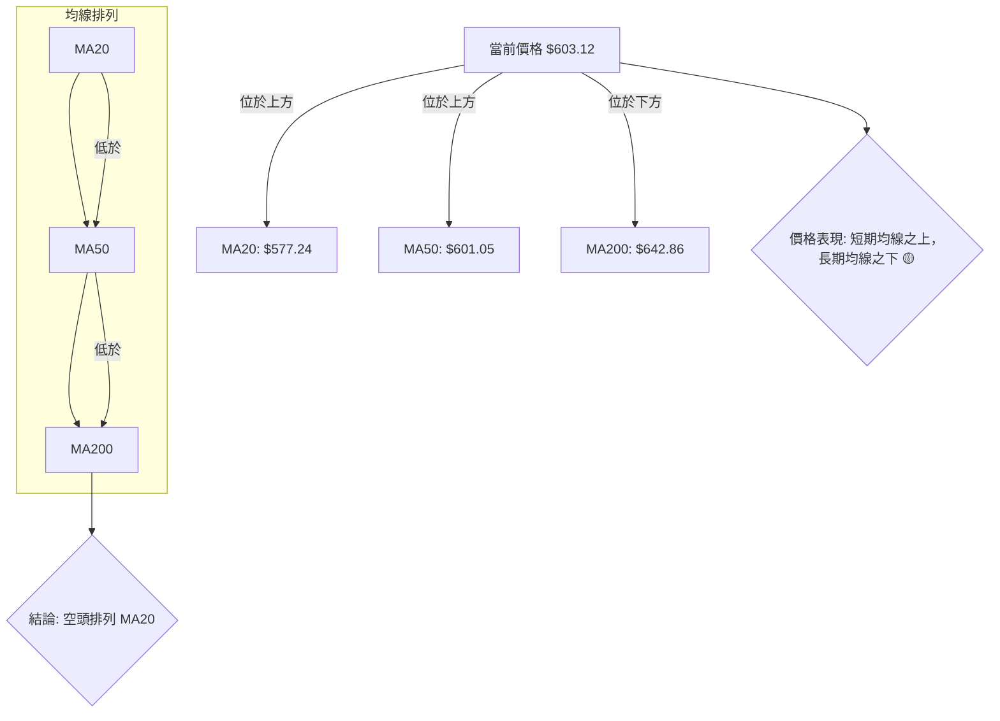
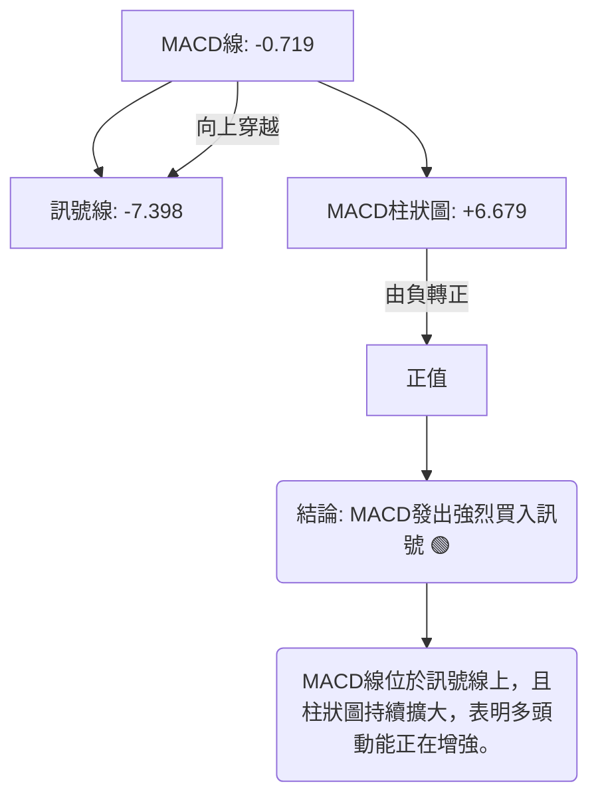

<details>
<summary>📊 靜態圖表 (點擊展開)</summary>

</details>

<html>
<head><meta charset="utf-8" /></head>
<body>
    <div style="height:500px; width:100%;">                        <script>window.PlotlyConfig = {MathJaxConfig: 'local'};</script>
        <script charset="utf-8" src="https://cdn.plot.ly/plotly-3.6.0.min.js" integrity="sha256-QaOVwtVY0T02VaHrr6pnoHLCwayMJp4O5n4YyaE3rJk=" crossorigin="anonymous"></script>                <div id="candlestick-chart" class="plotly-graph-div" style="height:100%; width:100%;"></div>            <script>                window.PLOTLYENV=window.PLOTLYENV || {};                                if (document.getElementById("candlestick-chart")) {                    Plotly.newPlot(                        "candlestick-chart",                        [{"close":{"dtype":"f8","bdata":"AAAAoLI+iEAAAACgZtmHQAAAACCGi4dAAAAAgH61h0AAAAAAvVeHQAAAAKCQLodAAAAA4MUrh0AAAACgzOOGQAAAAGDVW4ZAAAAAwE+phkAAAADguyWGQAAAAKBtToZAAAAAgNc5hkAAAADA0l+GQAAAAKDb3IZAAAAAYMP7hUAAAABAv06GQAAAAGB+FoZAAAAAQIJdhkAAAABgyDGGQAAAAGB7WIZAAAAAYCrShkAAAABg8dqGQAAAAEAP3IZAAAAAgMTghkAAAACAjgOHQAAAAID6ZodAAAAAAO1rh0AAAADAwm2HQAAAAMDtxYRAAAAAQFg1hEAAAABAcuCDQAAAAKCKjYNAAAAAAGfSg0AAAADgrEqDQAAAACDHYINAAAAAIPiwg0AAAABgoIuDQAAAAABx+4JAAAAAoHYCg0AAAABACP+CQAAAAECWw4JAAAAAwB2hgkAAAAAgT2aCQAAAAGD5XIJAAAAA4KqFgkAAAABgrRuDQAAAAICO1INAAAAAILu\u002fg0AAAABAJzKEQAAAACCp+YNAAAAA4F4rhEAAAADghu+DQAAAAACDnoRAAAAAgGL9hEAAAADgj8iEQAAAAOALeoRAAAAAQIxDhEAAAACAIliEQAAAAIB4FIRAAAAAQNsyhEAAAADg1n+EQAAAAIC\u002fQoRAAAAAgCK6hEAAAACgxoyEQAAAAMCTooRAAAAAQAy+hEAAAAAA5NKEQAAAACDfsIRAAAAAICOMhEAAAAAgHcaEQAAAACBRl4RAAAAAwANKhEAAAACA74yEQAAAAKCMm4RAAAAAgEc8hEAAAADgRieEQAAAAGAtX4RAAAAAYJ0GhEAAAAAAu6+DQAAAAGBkM4NAAAAAgI5dg0AAAAAgKlmDQAAAAMBa2IJAAAAA4PIeg0AAAACA0DOEQAAAAECyjIRAAAAAQE35hEAAAABgLP6EQAAAAEBQ3IRAAAAAgPYHh0AAAAAgy1mGQAAAAIA3CYZAAAAAIL+ThUAAAAAAZN6EQAAAACAi6IRAAAAAAEKihEAAAADgHCCFQAAAAIA07IRAAAAAoP7bhEAAAABAOUWEQAAAAOAL9YNAAAAAoDbxg0AAAADgmBCEQAAAACAOHYRAAAAAwPBzhEAAAABA7OCDQAAAACBL8YNAAAAAQDVkhEAAAACguH6EQAAAAOA0OIRAAAAAgCtjhEAAAAAAT2+EQAAAAABU1IRAAAAAgCabhEAAAACgsR2EQAAAAODlMYRAAAAAQD5nhEAAAABAjW2EQAAAAIBZ6INAAAAAAPAkg0AAAADA85aDQAAAAOCqcINAAAAAIOE4g0AAAAAgG\u002fGCQAAAAODhiIJAAAAAYAHcgkAAAADA94KCQAAAAKC2koJAAAAAgEMYgUAAAACA3WmAQAAAACARv4BAAAAAQM3cgUAAAACgjBWCQAAAAMBs74FAAAAAYOrjgUAAAADgI\u002fSBQAAAAMDSHoNAAAAAIHeeg0AAAADANqqDQAAAAECKz4NAAAAAIAOvhEAAAABgqveEQAAAACDyIYVAAAAAoEx\u002fhUAAAABgT\u002fKEQAAAAADE4YRAAAAAAMMQhUAAAABAUZSEQAAAAGA9E4VAAAAA4O4vhUAAAABAv\u002fWEQAAAAOAA5IRAAAAAQL8ag0AAAACgfQGDQAAAACDCDoNAAAAA4DLjgkAAAAAAgCKDQAAAACDpQYNAAAAAIIYIg0AAAACgcbKCQAAAAICI04JAAAAA4HhAg0AAAADg206DQAAAAEBKLYNAAAAAACcVg0AAAACAatCCQAAAAID\u002f44JAAAAAYIr2gkAAAABAjw2DQAAAACAvHoNAAAAA4F\u002fVg0AAAAAgndWDQAAAAABlv4NAAAAAwE+\u002fgkAAAADgnKiCQAAAAKA5c4NAAAAAQOmXg0AAAACAm4OCQAAAAKDIRoJAAAAAwGNAgkAAAABAnNOBQAAAAKA6v4FAAAAAwKOzgUAAAAAA14uCQAAAACCuwYJAAAAA4KO8gUAAAACAwgmCQAAAAMDMnoFAAAAAoJmRgUAAAAAgXG2BQAAAAMD19oBAAAAAAAAygUAAAADAzJSBQAAAAOBRmoFAAAAAoEcng0AAAABAMzeCQAAAAOBRwoJAAAAA4KM8g0AAAADA9diCQA=="},"high":{"dtype":"f8","bdata":"NZX3p7uhiEDV1i+4iH2IQKHAvt\u002fOBIhA7iP3uxW5h0CLNTqedJaHQCxXo8rVb4dAAewI66hmh0BIQPQ8VyiHQOo6QsrRf4ZALJe2jA6vhkCc8X1o1MiGQBpzu8QpWIZAh02O1BZlhkC\u002fv1YCRG6GQAAAAKDb3IZAr368x+bqhkBVGEg5lHCGQGQon9eMTYZAh6ehYy2QhkBdjDQ03ZyGQJjTvYRoZYZA3Vzlv+7ehkC7KP6WrASHQBhTQi1uFYdAZ+MRct8jh0Cbeb07TBqHQI3o9+5QjodAjA4iJnajh0BlRUl1hqmHQCP40GSMOYVAwWUSQB0JhUBJf3Qk9YyEQCpVKSSaAIRA1kjjAoMEhEB2L3odzdKDQDdsywQhZINAIppqadLKg0DPYhYzap+DQH8yGdrdmoNAV7Uc5mFAg0CwKqFUtCCDQGMQ6nLTEINANd12iMDQgkDHrwECSY6CQBk3wUgr6YJA8SSFEIykgkAEabQ7zTiDQDhKJvct24NAMabc46Hlg0AkFAd48zKEQO1Q+hsrHYRABM65yIMxhECI4P+7VTmEQEPPL9jEEoVAVfK7wIQHhUDKr+D5oheFQBvQaswMtoRAABvgOn9mhEBYq684pGyEQJxCBsg+KYZAe0TYurJehEBUTUvY4aqEQJ\u002fjj7lroIRAPYTQd+3qhEARrnQGce6EQK501ZILA4VAOAtrQoPGhED1yNnz69eEQEWXMjwS3oRA7e+uT5iYhEDBFLIiL\u002fiEQNZFFNiGvoRAWua45Ke5hEATbiKI2rqEQD0TegGuwoRAlCHMes+PhECEJB71lC+EQEjJkztFboRA8F0VnXFmhEAvd\u002fTaAgmEQCQkGNmlmoNALx3r9Xd4g0BsW6jMrZ+DQLDl07N9EoNAfsPkYlpJg0C0zZlvJpuEQI2AyQ9tyoRAbHnc2Z4QhUAaN8U16xyFQIthWjzJI4VAsrQb4GY1h0B3BCAb7taGQOnnBvMfgIZA2KpWPMldhkArAQsH1HyFQLFDa9RKQoVAo6\u002fH+Vj2hEDTmJsKv1CFQEU4bAmBO4VAo5gE63swhUBJ7JHeXhaFQI0ba\u002fooUoRAocv\u002fbaULhEAjhT\u002fizx6EQPWQGvZMMIRAt7dR1VmxhEBJWa9NO4SEQEhEVGa\u002f\u002f4NALBSerrllhEAI\u002fDCTlZ6EQH8FssdEQoRAB6TRex6WhEDYgyqP7o6EQAvO3Z6T\u002fIRABpQuzwvshEDkZEwQgkKEQMWs7c\u002fFNIRAiycliP6YhEDz6yw3ko+EQLaiswKxYoRAjYOSnmWgg0BlphNITNGDQAvaDUmv34NAxkdriJZwg0AkMZ2NdSODQDpp2Nc024JAqLqTkJwAg0AN3HVNjMOCQGl6m1nj2IJAAzKXYK4zgkCY4m3XxfiAQIVFJD1n2IBAN2OlKkXpgUCcOuC9AoCCQNnUu\u002fa2D4JA33kduQAygkACk54olPWBQBTmrgHvqoNALqd\u002fGUfng0BNf37W6O+DQEFp2ttL04NAr9mx+STNhEClYrhg+S6FQEEdTOeeJ4VAcbIhngmXhUC3NV9a+lWFQJBg7EqXHIVAEMIvzwMuhUDYWTsiheeEQMuy7U1RQIVA6N9txPFOhUAI+VqHaiyFQPKBlGUBDYVADFADbDNig0ATxFmqdFKDQBz\u002fPbFzK4NA7HxdsT8ug0BP2bX3AVuDQKD6isE1g4NA6PKbVZdBg0A5tv+GzOKCQAGH5hOH2YJAeqN6rJtag0CRPw8zOHmDQB6Pa6j\u002fZINAh9CN8Sg4g0ArP5Jo5CqDQJiWxAx\u002f+4JAxhQ3qkgIg0BQSCv\u002f7DGDQHho8zU1L4NAG3IpO0Xvg0BDff6gPBOEQMpx5blMz4NAm50GWErZg0CU3TmKhwKDQCF+\u002faeTfINALuxWAHEOhEAgJfYyiqSDQKYSBVede4JALe5S5ZyogkCF994NLnaCQBwdRAgf3YFA4Fze4kr8gUAAAAAAKcqCQAAAAOB67oJAAAAA4HqOgkAAAACAwiGCQAAAAOB6\u002foFAAAAAoJnhgUAAAADgUciBQAAAAGC4YoFAAAAAwMxmgUAAAABAM9eBQAAAAOBRrIFAAAAAgD2ig0AAAAAAABCDQAAAAOCj3IJAAAAAwPWKg0AAAAAAAECDQA=="},"hovertemplate":"\u003cb\u003e%{x|%Y-%m-%d}\u003c\u002fb\u003e\u003cbr\u003e\u958b: $%{open:.2f}\u003cbr\u003e\u9ad8: $%{high:.2f}\u003cbr\u003e\u4f4e: $%{low:.2f}\u003cbr\u003e\u6536: $%{close:.2f}\u003cextra\u003e\u003c\u002fextra\u003e","low":{"dtype":"f8","bdata":"+8H1+2r1h0D5bWwq5dOHQA4u6kD5aIdAQYcMkZ90h0DpDaTp8jSHQP8Me2B\u002f+4ZAP14XdNwJh0D1eXmtU6OGQMoFwY7cIoZAj1cadjdihkD5wdOksyKGQJYgdRzAhYVAf1EvkVr\u002fhUCLcDKJyg+GQGjJ9y+8NIZA66JlsnX1hUBcJjoybw6GQKPHyYMgzIVAjA\u002fGFlsdhkBJzMfCbvCFQBnoamBOAoZArxDLkn5yhkC1t21j4LaGQL7\u002fKfU2kYZAg4sSCJbZhkDrCRTOBsqGQJz\u002fu42OUIdAsN9gU7A8h0C0pfbJqySHQJZcyfjdQ4RAbE3ppCkfhECTXt3gPNSDQBEkqLUWg4NA980tPlGHg0DtT3S+LEODQKrUApcfvYJAV9PcZA1Eg0DgrtUaRE6DQG\u002fsdBaM8YJAPOmpenzLgkBw6VKCP42CQKUuyB3YjoJA6T5wBiAygkCE7OXv7x2CQFT\u002fGrCxLoJAQFpW880igkDbrUgso6CCQHOEw5ORRYNATrzUpO6vg0C0P7XEz86DQImAlWXY4INATMNQeVHjg0D5xvtjK9+DQNIY7byzkoRAAhAZuV+lhEDIQ9sQwrqEQCKgZ1spXYRAixBDAdkNhEBpriAGGvmDQH6jQZug54NAp2aIgIDsg0CLIdAecBCEQPopDThaQIRAvQdUI1R6hEAK2dRmEIiEQMQYpK\u002fYe4RAac+VhZ+IhED1HIrCKqiEQFcEBs8joYRAc3czbsxphEDJkg5zWYWEQK\u002fa2z4gkoRAucLoUtUShEDWAEjixTSEQHJUt+zpVYRAjF1FZksdhECABAo1tNSDQIZBkHukDYRAB2DWkrQAhECUBord6HeDQMKdgE3NLYNAyHd5FRcpg0DOZ7CezleDQN9VKgZ0t4JA4e8GmBe4gkAvY6x\u002feYuDQOXU5I5rGoRAvaDnPuaghEB6yNvNz7uEQLUFWZdPx4RA6Tk28D86hkCvtaIcjkKGQL5p\u002fmkj8oVAngGyaoBphUBvdT80LNKEQMaoYO+wYoRAYhnibcoqhEAwY8Ae24yEQOLWOkTH5IRAVZngg3B\u002fhEBPwOhkDCGEQCXopzaFy4NAUbTHYHGdg0B4WpiUQJiDQKkQsISw3INAbSaRLSTtg0Dwk+PO8NaDQCiz8WHhnoNAi9LW\u002fvgHhEAwT\u002fXNxjKEQMC0sK\u002fe54NA5XrXIfbKg0DlyeS4nu2DQMhahc\u002f9g4RAmvkuajdJhEDDLaiI0deDQMEJ3shPjYNARxf9XME+hEBuLOnzpDmEQEg528og3oNA6GLPa7cDg0D0qc8fL3SDQMkDBLL+aINA0Ixux1Mwg0DTdHBrns2CQD4MuGemVYJADGKTk6SzgkDpDhREn3OCQH6oV\u002fPNhoJASvoxUsb2gECpNcLaOT6AQNyk6p1ngIBAxGbeFxwSgUCJ2z1CT+qBQBpNdj10eYFA67EsT8PbgUBqz3KD5aGBQAmY04tBeoJAbBSemGJzg0DoZ8HcA36DQGbrmTWTfoNALGWEODn2g0ArK+j01ryEQOw9l6sN2YRAvvAH8wkUhUBNjahEDduEQHfJEV2y1YRA22697AnphEBDR2jxj2OEQDbYRW\u002fgaYRAWaDUQMDxhEDZRxX0G8iEQPilzBGQuYRA2bzHNY67gkBy6prhY+yCQLthfQaJ0YJA5dA5uW6+gkBc1UmHXqyCQJ4OkVPGJ4NAjQYyhf3rgkAg2qO6NayCQK242\u002fhogIJAb1UAH9yggkAmMSHBcTODQLPfY3T3BYNAl9LjQgzZgkAhuAyI87+CQKAuiD8NqoJAdDet1hKSgkAF8N2mGvOCQFXBz3nq5YJAfYTMK30Dg0B4KR530aWDQEFJB58udoNAyilUiMy3gkDW7jgNBaGCQIReyLC2vYJACmJeP9Rug0BEwjRC9jKCQNtYZhN4FYJAwsQIqsYjgkDve3m4ktCBQOBYTij0Y4FAZnTEhwuDgUAAAABgZhqCQAAAAAAAgIJAAAAAIIWxgUAAAADAzJiBQAAAAOB6foFAAAAAACmIgUAAAABgZlyBQAAAAKBw4YBAAAAAQDPjgEAAAAAAAHCBQAAAAKBwO4FAAAAAwMyYgkAAAAAgXCOCQAAAAIAULoJAAAAAoEfdgkAAAACAFbCCQA=="},"name":"\u50f9\u683c","open":{"dtype":"f8","bdata":"7Jq3tc5+iED\u002fdhsVk16IQKaOvUsJ+odAcJ6wqUech0CnzXvh9nuHQGwikGtvYIdAtz\u002fC3DhWh0B2GyyQmCKHQMIK23PyfIZAO0du\u002f6SFhkAhZsLv5b2GQHERX7\u002fi+oVAUCdved1ehkCehZNSyzyGQE5BUolVY4ZAQSrvAzHIhkDkHZ1qSDmGQHJRPz+ND4ZA00tpWplZhkAvZvlCgl2GQJvGv2b3CYZAiEwltY16hkDoiODD4vCGQHNzuERp34ZA9e\u002fzZ1rmhkCHX1N3B\u002feGQFpsfepHXodAdV+OzWt1h0C20QpDVoaHQHax\u002fkJQ24RA1k3mBBUGhUAhHFX1YnKEQI2KzkxJk4NAxzmgllu1g0AmxYSpmtGDQG9SmTsgN4NA66s3j5+rg0DaicWc95KDQMQguisBlINA7fEYW9Ybg0BYWKS\u002f1MGCQLZIB0eu+4JAuNHRuoVwgkC4tcovcIGCQPDD7+N5z4JAvf1sbMlXgkAVJdqhVamCQFp4j+sMc4NAqeIOU0ngg0C9QNqPcNODQOIsNsMg74NA1yLTyWMFhECjL2cy6BWEQOKDKKD4EYVAaNF3aziyhEAux2xh1NyEQJltAZJisIRASJjNlBxChECe7aNL+AyEQEJBukjqQIRA\u002fAS3+WYkhEDXn8Nm1RKEQNBPEXiKc4RAOa4tb+F+hEAwDDna3cmEQEZF8nPGo4RAsLIrVf+WhEBmn3JuzaqEQPswDbv21oRAdIHM+rSGhEBBdpAZI4yEQLxHesGHvIRAFNx4MmashEB8AO1+zk6EQBUaPRQqk4RARo2mx8dzhEDwtQjo1iWEQE0CpWlTIoRAk\u002fVg3fFahEAvd\u002fTaAgmEQGOBi1UTi4NA2MHblQdLg0CjqR5rjHiDQKrg5Ilh9oJAs2Cp7kbtgkA5RLCp1aGDQMfVJ8T5HIRASt3fnZC\u002fhEDltpVXHAuFQI8JKjVkCoVAMeqGde8Ah0ClBNYCo7GGQKnXAMKeSoZArpHBGuIQhkD+f\u002fEpC3SFQCUnVg0ws4RAkNjVrXDChEA8nCEz\u002fq+EQNdD6aglI4VA8CTZImYGhUCh19hbN+aEQOrJBzCcH4RA\u002ft7v++Pyg0B05Q0aX8WDQEkaiaV264NA5XsZfGj0g0BLcqJeBluEQEk\u002feU6fv4NAU666UhYLhEDxh60OIkuEQGD3wR9vEoRADxSSDjTgg0AvutzCFTmEQB4xwcBOhoRA92FkygKmhEDfT\u002fCJ+DWEQFpZTpwyzYNA2Z0bnCtjhEAfZlTdwGyEQMZO2VTCPIRAvhb0fzt2g0B1Wh5\u002fUbuDQLdMh6REm4NA86CWnyc+g0AACz5qqhyDQB\u002fLlQjF14JADCUpGNXpgkDvgtmnXLSCQNLh9RJ8sYJAgLMx2JovgkAVSaV6zNyAQAAAACARv4BAKN97AcQrgUB0jhYrvhyCQB4ZoncgrIFA0MftpD0JgkCsmKdfmd+BQFDLtsyC64JALZlekR2Tg0BKjeNBD8+DQHqs0klWp4NAW+Fkq\u002f4UhEA6JFovD9OEQPTsOYvpGoVAMMJ03sUvhUDXqf8u1UWFQEEAZIcH84RAvoHCbuINhUDkwBn\u002frriEQMoWYyWrnYRA77ErkwfzhEB1lSLg7AyFQCgk9SVT4oRA1C2\u002f8vhVg0BmO2d89zCDQI90CE8E+4JAw\u002fRAyu8lg0Bw9iOP8sOCQFCzsLY0MYNAdSnU7wo1g0B2hwnsFOCCQOy8G2MnkoJAuWd+QTSygkAwB6vbbzuDQNKjgDRfK4NAG6qLG14Eg0DkEr1o2QKDQELMcEehwYJALr30Ho67gkBF2mSDifqCQLUh6wqcAoNA7uGbqa8Gg0ChHCZEQ\u002feDQOC+YJ9Ox4NAq75dvYeug0D0CWd8c9WCQCtbfIOI04JATSxhZb14g0BztCzdD3eDQKYSBVede4JAG50SOJ9zgkC3EdXCiSGCQLcwRM5yqoFA3JSZDVvjgUAAAABAMx+CQAAAAEAzjYJAAAAAAACAgkAAAABgj+aBQAAAAAAp4IFAAAAAAACSgUAAAADAHo+BQAAAAGBmXIFAAAAAYLj6gEAAAAAAAICBQAAAACCFh4FAAAAAoEf\u002fgkAAAABAM\u002f+CQAAAAGC4loJAAAAAYLj8gkAAAACAFDODQA=="},"x":["2025-09-19T00:00:00-04:00","2025-09-22T00:00:00-04:00","2025-09-23T00:00:00-04:00","2025-09-24T00:00:00-04:00","2025-09-25T00:00:00-04:00","2025-09-26T00:00:00-04:00","2025-09-29T00:00:00-04:00","2025-09-30T00:00:00-04:00","2025-10-01T00:00:00-04:00","2025-10-02T00:00:00-04:00","2025-10-03T00:00:00-04:00","2025-10-06T00:00:00-04:00","2025-10-07T00:00:00-04:00","2025-10-08T00:00:00-04:00","2025-10-09T00:00:00-04:00","2025-10-10T00:00:00-04:00","2025-10-13T00:00:00-04:00","2025-10-14T00:00:00-04:00","2025-10-15T00:00:00-04:00","2025-10-16T00:00:00-04:00","2025-10-17T00:00:00-04:00","2025-10-20T00:00:00-04:00","2025-10-21T00:00:00-04:00","2025-10-22T00:00:00-04:00","2025-10-23T00:00:00-04:00","2025-10-24T00:00:00-04:00","2025-10-27T00:00:00-04:00","2025-10-28T00:00:00-04:00","2025-10-29T00:00:00-04:00","2025-10-30T00:00:00-04:00","2025-10-31T00:00:00-04:00","2025-11-03T00:00:00-05:00","2025-11-04T00:00:00-05:00","2025-11-05T00:00:00-05:00","2025-11-06T00:00:00-05:00","2025-11-07T00:00:00-05:00","2025-11-10T00:00:00-05:00","2025-11-11T00:00:00-05:00","2025-11-12T00:00:00-05:00","2025-11-13T00:00:00-05:00","2025-11-14T00:00:00-05:00","2025-11-17T00:00:00-05:00","2025-11-18T00:00:00-05:00","2025-11-19T00:00:00-05:00","2025-11-20T00:00:00-05:00","2025-11-21T00:00:00-05:00","2025-11-24T00:00:00-05:00","2025-11-25T00:00:00-05:00","2025-11-26T00:00:00-05:00","2025-11-28T00:00:00-05:00","2025-12-01T00:00:00-05:00","2025-12-02T00:00:00-05:00","2025-12-03T00:00:00-05:00","2025-12-04T00:00:00-05:00","2025-12-05T00:00:00-05:00","2025-12-08T00:00:00-05:00","2025-12-09T00:00:00-05:00","2025-12-10T00:00:00-05:00","2025-12-11T00:00:00-05:00","2025-12-12T00:00:00-05:00","2025-12-15T00:00:00-05:00","2025-12-16T00:00:00-05:00","2025-12-17T00:00:00-05:00","2025-12-18T00:00:00-05:00","2025-12-19T00:00:00-05:00","2025-12-22T00:00:00-05:00","2025-12-23T00:00:00-05:00","2025-12-24T00:00:00-05:00","2025-12-26T00:00:00-05:00","2025-12-29T00:00:00-05:00","2025-12-30T00:00:00-05:00","2025-12-31T00:00:00-05:00","2026-01-02T00:00:00-05:00","2026-01-05T00:00:00-05:00","2026-01-06T00:00:00-05:00","2026-01-07T00:00:00-05:00","2026-01-08T00:00:00-05:00","2026-01-09T00:00:00-05:00","2026-01-12T00:00:00-05:00","2026-01-13T00:00:00-05:00","2026-01-14T00:00:00-05:00","2026-01-15T00:00:00-05:00","2026-01-16T00:00:00-05:00","2026-01-20T00:00:00-05:00","2026-01-21T00:00:00-05:00","2026-01-22T00:00:00-05:00","2026-01-23T00:00:00-05:00","2026-01-26T00:00:00-05:00","2026-01-27T00:00:00-05:00","2026-01-28T00:00:00-05:00","2026-01-29T00:00:00-05:00","2026-01-30T00:00:00-05:00","2026-02-02T00:00:00-05:00","2026-02-03T00:00:00-05:00","2026-02-04T00:00:00-05:00","2026-02-05T00:00:00-05:00","2026-02-06T00:00:00-05:00","2026-02-09T00:00:00-05:00","2026-02-10T00:00:00-05:00","2026-02-11T00:00:00-05:00","2026-02-12T00:00:00-05:00","2026-02-13T00:00:00-05:00","2026-02-17T00:00:00-05:00","2026-02-18T00:00:00-05:00","2026-02-19T00:00:00-05:00","2026-02-20T00:00:00-05:00","2026-02-23T00:00:00-05:00","2026-02-24T00:00:00-05:00","2026-02-25T00:00:00-05:00","2026-02-26T00:00:00-05:00","2026-02-27T00:00:00-05:00","2026-03-02T00:00:00-05:00","2026-03-03T00:00:00-05:00","2026-03-04T00:00:00-05:00","2026-03-05T00:00:00-05:00","2026-03-06T00:00:00-05:00","2026-03-09T00:00:00-04:00","2026-03-10T00:00:00-04:00","2026-03-11T00:00:00-04:00","2026-03-12T00:00:00-04:00","2026-03-13T00:00:00-04:00","2026-03-16T00:00:00-04:00","2026-03-17T00:00:00-04:00","2026-03-18T00:00:00-04:00","2026-03-19T00:00:00-04:00","2026-03-20T00:00:00-04:00","2026-03-23T00:00:00-04:00","2026-03-24T00:00:00-04:00","2026-03-25T00:00:00-04:00","2026-03-26T00:00:00-04:00","2026-03-27T00:00:00-04:00","2026-03-30T00:00:00-04:00","2026-03-31T00:00:00-04:00","2026-04-01T00:00:00-04:00","2026-04-02T00:00:00-04:00","2026-04-06T00:00:00-04:00","2026-04-07T00:00:00-04:00","2026-04-08T00:00:00-04:00","2026-04-09T00:00:00-04:00","2026-04-10T00:00:00-04:00","2026-04-13T00:00:00-04:00","2026-04-14T00:00:00-04:00","2026-04-15T00:00:00-04:00","2026-04-16T00:00:00-04:00","2026-04-17T00:00:00-04:00","2026-04-20T00:00:00-04:00","2026-04-21T00:00:00-04:00","2026-04-22T00:00:00-04:00","2026-04-23T00:00:00-04:00","2026-04-24T00:00:00-04:00","2026-04-27T00:00:00-04:00","2026-04-28T00:00:00-04:00","2026-04-29T00:00:00-04:00","2026-04-30T00:00:00-04:00","2026-05-01T00:00:00-04:00","2026-05-04T00:00:00-04:00","2026-05-05T00:00:00-04:00","2026-05-06T00:00:00-04:00","2026-05-07T00:00:00-04:00","2026-05-08T00:00:00-04:00","2026-05-11T00:00:00-04:00","2026-05-12T00:00:00-04:00","2026-05-13T00:00:00-04:00","2026-05-14T00:00:00-04:00","2026-05-15T00:00:00-04:00","2026-05-18T00:00:00-04:00","2026-05-19T00:00:00-04:00","2026-05-20T00:00:00-04:00","2026-05-21T00:00:00-04:00","2026-05-22T00:00:00-04:00","2026-05-26T00:00:00-04:00","2026-05-27T00:00:00-04:00","2026-05-28T00:00:00-04:00","2026-05-29T00:00:00-04:00","2026-06-01T00:00:00-04:00","2026-06-02T00:00:00-04:00","2026-06-03T00:00:00-04:00","2026-06-04T00:00:00-04:00","2026-06-05T00:00:00-04:00","2026-06-08T00:00:00-04:00","2026-06-09T00:00:00-04:00","2026-06-10T00:00:00-04:00","2026-06-11T00:00:00-04:00","2026-06-12T00:00:00-04:00","2026-06-15T00:00:00-04:00","2026-06-16T00:00:00-04:00","2026-06-17T00:00:00-04:00","2026-06-18T00:00:00-04:00","2026-06-22T00:00:00-04:00","2026-06-23T00:00:00-04:00","2026-06-24T00:00:00-04:00","2026-06-25T00:00:00-04:00","2026-06-26T00:00:00-04:00","2026-06-29T00:00:00-04:00","2026-06-30T00:00:00-04:00","2026-07-01T00:00:00-04:00","2026-07-02T00:00:00-04:00","2026-07-06T00:00:00-04:00","2026-07-07T00:00:00-04:00","2026-07-08T00:00:00-04:00"],"type":"candlestick"},{"hovertemplate":"MA30: $%{y:.2f}\u003cextra\u003e\u003c\u002fextra\u003e","line":{"color":"#2196F3","dash":"dash","width":2},"mode":"lines","name":"MA30","x":["2025-09-19T00:00:00-04:00","2025-09-22T00:00:00-04:00","2025-09-23T00:00:00-04:00","2025-09-24T00:00:00-04:00","2025-09-25T00:00:00-04:00","2025-09-26T00:00:00-04:00","2025-09-29T00:00:00-04:00","2025-09-30T00:00:00-04:00","2025-10-01T00:00:00-04:00","2025-10-02T00:00:00-04:00","2025-10-03T00:00:00-04:00","2025-10-06T00:00:00-04:00","2025-10-07T00:00:00-04:00","2025-10-08T00:00:00-04:00","2025-10-09T00:00:00-04:00","2025-10-10T00:00:00-04:00","2025-10-13T00:00:00-04:00","2025-10-14T00:00:00-04:00","2025-10-15T00:00:00-04:00","2025-10-16T00:00:00-04:00","2025-10-17T00:00:00-04:00","2025-10-20T00:00:00-04:00","2025-10-21T00:00:00-04:00","2025-10-22T00:00:00-04:00","2025-10-23T00:00:00-04:00","2025-10-24T00:00:00-04:00","2025-10-27T00:00:00-04:00","2025-10-28T00:00:00-04:00","2025-10-29T00:00:00-04:00","2025-10-30T00:00:00-04:00","2025-10-31T00:00:00-04:00","2025-11-03T00:00:00-05:00","2025-11-04T00:00:00-05:00","2025-11-05T00:00:00-05:00","2025-11-06T00:00:00-05:00","2025-11-07T00:00:00-05:00","2025-11-10T00:00:00-05:00","2025-11-11T00:00:00-05:00","2025-11-12T00:00:00-05:00","2025-11-13T00:00:00-05:00","2025-11-14T00:00:00-05:00","2025-11-17T00:00:00-05:00","2025-11-18T00:00:00-05:00","2025-11-19T00:00:00-05:00","2025-11-20T00:00:00-05:00","2025-11-21T00:00:00-05:00","2025-11-24T00:00:00-05:00","2025-11-25T00:00:00-05:00","2025-11-26T00:00:00-05:00","2025-11-28T00:00:00-05:00","2025-12-01T00:00:00-05:00","2025-12-02T00:00:00-05:00","2025-12-03T00:00:00-05:00","2025-12-04T00:00:00-05:00","2025-12-05T00:00:00-05:00","2025-12-08T00:00:00-05:00","2025-12-09T00:00:00-05:00","2025-12-10T00:00:00-05:00","2025-12-11T00:00:00-05:00","2025-12-12T00:00:00-05:00","2025-12-15T00:00:00-05:00","2025-12-16T00:00:00-05:00","2025-12-17T00:00:00-05:00","2025-12-18T00:00:00-05:00","2025-12-19T00:00:00-05:00","2025-12-22T00:00:00-05:00","2025-12-23T00:00:00-05:00","2025-12-24T00:00:00-05:00","2025-12-26T00:00:00-05:00","2025-12-29T00:00:00-05:00","2025-12-30T00:00:00-05:00","2025-12-31T00:00:00-05:00","2026-01-02T00:00:00-05:00","2026-01-05T00:00:00-05:00","2026-01-06T00:00:00-05:00","2026-01-07T00:00:00-05:00","2026-01-08T00:00:00-05:00","2026-01-09T00:00:00-05:00","2026-01-12T00:00:00-05:00","2026-01-13T00:00:00-05:00","2026-01-14T00:00:00-05:00","2026-01-15T00:00:00-05:00","2026-01-16T00:00:00-05:00","2026-01-20T00:00:00-05:00","2026-01-21T00:00:00-05:00","2026-01-22T00:00:00-05:00","2026-01-23T00:00:00-05:00","2026-01-26T00:00:00-05:00","2026-01-27T00:00:00-05:00","2026-01-28T00:00:00-05:00","2026-01-29T00:00:00-05:00","2026-01-30T00:00:00-05:00","2026-02-02T00:00:00-05:00","2026-02-03T00:00:00-05:00","2026-02-04T00:00:00-05:00","2026-02-05T00:00:00-05:00","2026-02-06T00:00:00-05:00","2026-02-09T00:00:00-05:00","2026-02-10T00:00:00-05:00","2026-02-11T00:00:00-05:00","2026-02-12T00:00:00-05:00","2026-02-13T00:00:00-05:00","2026-02-17T00:00:00-05:00","2026-02-18T00:00:00-05:00","2026-02-19T00:00:00-05:00","2026-02-20T00:00:00-05:00","2026-02-23T00:00:00-05:00","2026-02-24T00:00:00-05:00","2026-02-25T00:00:00-05:00","2026-02-26T00:00:00-05:00","2026-02-27T00:00:00-05:00","2026-03-02T00:00:00-05:00","2026-03-03T00:00:00-05:00","2026-03-04T00:00:00-05:00","2026-03-05T00:00:00-05:00","2026-03-06T00:00:00-05:00","2026-03-09T00:00:00-04:00","2026-03-10T00:00:00-04:00","2026-03-11T00:00:00-04:00","2026-03-12T00:00:00-04:00","2026-03-13T00:00:00-04:00","2026-03-16T00:00:00-04:00","2026-03-17T00:00:00-04:00","2026-03-18T00:00:00-04:00","2026-03-19T00:00:00-04:00","2026-03-20T00:00:00-04:00","2026-03-23T00:00:00-04:00","2026-03-24T00:00:00-04:00","2026-03-25T00:00:00-04:00","2026-03-26T00:00:00-04:00","2026-03-27T00:00:00-04:00","2026-03-30T00:00:00-04:00","2026-03-31T00:00:00-04:00","2026-04-01T00:00:00-04:00","2026-04-02T00:00:00-04:00","2026-04-06T00:00:00-04:00","2026-04-07T00:00:00-04:00","2026-04-08T00:00:00-04:00","2026-04-09T00:00:00-04:00","2026-04-10T00:00:00-04:00","2026-04-13T00:00:00-04:00","2026-04-14T00:00:00-04:00","2026-04-15T00:00:00-04:00","2026-04-16T00:00:00-04:00","2026-04-17T00:00:00-04:00","2026-04-20T00:00:00-04:00","2026-04-21T00:00:00-04:00","2026-04-22T00:00:00-04:00","2026-04-23T00:00:00-04:00","2026-04-24T00:00:00-04:00","2026-04-27T00:00:00-04:00","2026-04-28T00:00:00-04:00","2026-04-29T00:00:00-04:00","2026-04-30T00:00:00-04:00","2026-05-01T00:00:00-04:00","2026-05-04T00:00:00-04:00","2026-05-05T00:00:00-04:00","2026-05-06T00:00:00-04:00","2026-05-07T00:00:00-04:00","2026-05-08T00:00:00-04:00","2026-05-11T00:00:00-04:00","2026-05-12T00:00:00-04:00","2026-05-13T00:00:00-04:00","2026-05-14T00:00:00-04:00","2026-05-15T00:00:00-04:00","2026-05-18T00:00:00-04:00","2026-05-19T00:00:00-04:00","2026-05-20T00:00:00-04:00","2026-05-21T00:00:00-04:00","2026-05-22T00:00:00-04:00","2026-05-26T00:00:00-04:00","2026-05-27T00:00:00-04:00","2026-05-28T00:00:00-04:00","2026-05-29T00:00:00-04:00","2026-06-01T00:00:00-04:00","2026-06-02T00:00:00-04:00","2026-06-03T00:00:00-04:00","2026-06-04T00:00:00-04:00","2026-06-05T00:00:00-04:00","2026-06-08T00:00:00-04:00","2026-06-09T00:00:00-04:00","2026-06-10T00:00:00-04:00","2026-06-11T00:00:00-04:00","2026-06-12T00:00:00-04:00","2026-06-15T00:00:00-04:00","2026-06-16T00:00:00-04:00","2026-06-17T00:00:00-04:00","2026-06-18T00:00:00-04:00","2026-06-22T00:00:00-04:00","2026-06-23T00:00:00-04:00","2026-06-24T00:00:00-04:00","2026-06-25T00:00:00-04:00","2026-06-26T00:00:00-04:00","2026-06-29T00:00:00-04:00","2026-06-30T00:00:00-04:00","2026-07-01T00:00:00-04:00","2026-07-02T00:00:00-04:00","2026-07-06T00:00:00-04:00","2026-07-07T00:00:00-04:00","2026-07-08T00:00:00-04:00"],"y":{"dtype":"f8","bdata":"AAAAAAAA+H8AAAAAAAD4fwAAAAAAAPh\u002fAAAAAAAA+H8AAAAAAAD4fwAAAAAAAPh\u002fAAAAAAAA+H8AAAAAAAD4fwAAAAAAAPh\u002fAAAAAAAA+H8AAAAAAAD4fwAAAAAAAPh\u002fAAAAAAAA+H8AAAAAAAD4fwAAAAAAAPh\u002fAAAAAAAA+H8AAAAAAAD4fwAAAAAAAPh\u002fAAAAAAAA+H8AAAAAAAD4fwAAAAAAAPh\u002fAAAAAAAA+H8AAAAAAAD4fwAAAAAAAPh\u002fAAAAAAAA+H8AAAAAAAD4fwAAAAAAAPh\u002fAAAAAAAA+H8AAAAAAAD4f4mIiMh0yYZAZmZm1gKnhkAzMzPTHIWGQImIiOgLY4ZAVVVVdeBBhkCrqqraTh+GQERERDTZ\u002foVA3t3drSfhhUC8u7urncSFQGZmZobNp4VAd3d3J6SIhUDNzMxMwG2FQLy7u+uFT4VAAAAAENUwhUBmZmZG6g6FQN7d3d2E6IRAREREhPvKhEDv7u4erq+EQERERGRqnIRARERE9BaGhEDNzMwMCXWEQHd3d9fOYIRAVVVVdS5KhEAiIiKCRDGEQLy7uzsmHoRA3t3dXQkOhEARERHhAPuDQN7d3f0J4oNAVVVV1RfHg0ARERGxxayDQCIiImLbpoNAZmZmJsamg0De3d1NFqyDQJqZmZkgsoNAzczMDNq5g0BERESklsSDQJqZmalQz4NAzczMzEjYg0BERER0MeODQBERETHG8YNAq6qqiuX+g0B3d3fnEA6EQDMzMzOoHYRAAAAAANIrhEDe3d2tLD6EQImIiLhTUYRAq6qqivJfhEDv7u4O3miEQERERPR8bYRARERE1NlvhEAzMzPjgGuEQO\u002fu7v7kZIRAd3d3twhehEAAAACgBVmEQGZmZibiSYRA7+7ufu85hEDv7u4u+jSEQERERFSZNYRAvLu7S6g7hECJiIgoMUGEQLy7u3vaR4RA7+7uDgZghEB3d3d30m+EQJqZmZn4foRA3t3djTmGhEAAAAAA8oiEQLy7u4tDi4RAd3d3Z1aKhEDe3d1d6YyEQN7d3a3jjoRAERERIY2RhEBEREREQY2EQO\u002fu7o7Yh4RAmpmZyeKEhEBERETEvYCEQJqZmVmGfIRAMzMzU2F+hECJiIj4CHyEQLy7u0tfeIRAVVVV9X17hEB3d3dHZIKEQFVVVeUVi4RAREREVM6ThEAzMzPTE52EQImIiIgCroRAvLu76666hECJiIgo8rmEQImIiFjrtoRAq6qq+gyyhEAAAADgOq2EQM3MzAwZpYRAq6qqKu6DhEBERER0XmyEQCIiIqI3VoRAq6qqKh9ChEDe3d3NrTGEQN7d3e1vHYRAREREpEsOhECrqqqa\u002ffeDQAAAAODw44NAmpmZCdHDg0BERESU56KDQKuqqlqBh4NAvLu7G8J1g0DNzMxM22SDQKuqqtpEUoNAZmZmxmY8g0AiIiKy+SuDQO\u002fu7q71JINAd3d3R14eg0AiIiLiSBeDQKuqqrrLE4NAq6qq6lIWg0Dv7u5+3hqDQFVVVdV0HYNAREREtA8lg0B3d3cHJiyDQERERMQCMoNAMzMzU6k3g0AAAAAg9DiDQHd3d6fqQoNAzczMjFlUg0AAAAAAC2CDQLy7u7trbINAq6qqmmprg0C8u7tr9muDQERERNRscINAZmZmNqpwg0De3d2N+3WDQCIiIpLSe4NAMzMzU12Mg0Crqqq62Z+DQBEREXGZsYNA7+7ufnS9g0AiIiIS5seDQFVVVYV+0oNAVVVVNavcg0BVVVXlAuSDQLy7u+sM4oNAZmZm9nPcg0De3d0tO9eDQN7d3b1R0YNAERERkRDKg0BVVVV1ZcCDQERERPSTtINAd3d3lxydg0BERESklomDQERERNRefYNAmpmZCc9wg0ARERFhL1+DQO\u002fu7p5NR4NAMzMzc0Aug0DNzMyMgxODQERERCSw+IJAIiIiwrfsgkDe3d3Ny+iCQCIiIhI65oJAERERgWjcgkCrqqraDNOCQBEREXEUxYJAd3d3F5W4gkCrqqoKv62CQImIiEjcnYJAiYiIuE+MgkC8u7t7k32CQN7d3c0kcIJA3t3dfb9wgkDNzMwMpGuCQJqZmamEaoJAiYiI2NpsgkDv7u7+GWuCQA=="},"type":"scatter"},{"hovertemplate":"MA60: $%{y:.2f}\u003cextra\u003e\u003c\u002fextra\u003e","line":{"color":"#9C27B0","dash":"dash","width":2},"mode":"lines","name":"MA60","x":["2025-09-19T00:00:00-04:00","2025-09-22T00:00:00-04:00","2025-09-23T00:00:00-04:00","2025-09-24T00:00:00-04:00","2025-09-25T00:00:00-04:00","2025-09-26T00:00:00-04:00","2025-09-29T00:00:00-04:00","2025-09-30T00:00:00-04:00","2025-10-01T00:00:00-04:00","2025-10-02T00:00:00-04:00","2025-10-03T00:00:00-04:00","2025-10-06T00:00:00-04:00","2025-10-07T00:00:00-04:00","2025-10-08T00:00:00-04:00","2025-10-09T00:00:00-04:00","2025-10-10T00:00:00-04:00","2025-10-13T00:00:00-04:00","2025-10-14T00:00:00-04:00","2025-10-15T00:00:00-04:00","2025-10-16T00:00:00-04:00","2025-10-17T00:00:00-04:00","2025-10-20T00:00:00-04:00","2025-10-21T00:00:00-04:00","2025-10-22T00:00:00-04:00","2025-10-23T00:00:00-04:00","2025-10-24T00:00:00-04:00","2025-10-27T00:00:00-04:00","2025-10-28T00:00:00-04:00","2025-10-29T00:00:00-04:00","2025-10-30T00:00:00-04:00","2025-10-31T00:00:00-04:00","2025-11-03T00:00:00-05:00","2025-11-04T00:00:00-05:00","2025-11-05T00:00:00-05:00","2025-11-06T00:00:00-05:00","2025-11-07T00:00:00-05:00","2025-11-10T00:00:00-05:00","2025-11-11T00:00:00-05:00","2025-11-12T00:00:00-05:00","2025-11-13T00:00:00-05:00","2025-11-14T00:00:00-05:00","2025-11-17T00:00:00-05:00","2025-11-18T00:00:00-05:00","2025-11-19T00:00:00-05:00","2025-11-20T00:00:00-05:00","2025-11-21T00:00:00-05:00","2025-11-24T00:00:00-05:00","2025-11-25T00:00:00-05:00","2025-11-26T00:00:00-05:00","2025-11-28T00:00:00-05:00","2025-12-01T00:00:00-05:00","2025-12-02T00:00:00-05:00","2025-12-03T00:00:00-05:00","2025-12-04T00:00:00-05:00","2025-12-05T00:00:00-05:00","2025-12-08T00:00:00-05:00","2025-12-09T00:00:00-05:00","2025-12-10T00:00:00-05:00","2025-12-11T00:00:00-05:00","2025-12-12T00:00:00-05:00","2025-12-15T00:00:00-05:00","2025-12-16T00:00:00-05:00","2025-12-17T00:00:00-05:00","2025-12-18T00:00:00-05:00","2025-12-19T00:00:00-05:00","2025-12-22T00:00:00-05:00","2025-12-23T00:00:00-05:00","2025-12-24T00:00:00-05:00","2025-12-26T00:00:00-05:00","2025-12-29T00:00:00-05:00","2025-12-30T00:00:00-05:00","2025-12-31T00:00:00-05:00","2026-01-02T00:00:00-05:00","2026-01-05T00:00:00-05:00","2026-01-06T00:00:00-05:00","2026-01-07T00:00:00-05:00","2026-01-08T00:00:00-05:00","2026-01-09T00:00:00-05:00","2026-01-12T00:00:00-05:00","2026-01-13T00:00:00-05:00","2026-01-14T00:00:00-05:00","2026-01-15T00:00:00-05:00","2026-01-16T00:00:00-05:00","2026-01-20T00:00:00-05:00","2026-01-21T00:00:00-05:00","2026-01-22T00:00:00-05:00","2026-01-23T00:00:00-05:00","2026-01-26T00:00:00-05:00","2026-01-27T00:00:00-05:00","2026-01-28T00:00:00-05:00","2026-01-29T00:00:00-05:00","2026-01-30T00:00:00-05:00","2026-02-02T00:00:00-05:00","2026-02-03T00:00:00-05:00","2026-02-04T00:00:00-05:00","2026-02-05T00:00:00-05:00","2026-02-06T00:00:00-05:00","2026-02-09T00:00:00-05:00","2026-02-10T00:00:00-05:00","2026-02-11T00:00:00-05:00","2026-02-12T00:00:00-05:00","2026-02-13T00:00:00-05:00","2026-02-17T00:00:00-05:00","2026-02-18T00:00:00-05:00","2026-02-19T00:00:00-05:00","2026-02-20T00:00:00-05:00","2026-02-23T00:00:00-05:00","2026-02-24T00:00:00-05:00","2026-02-25T00:00:00-05:00","2026-02-26T00:00:00-05:00","2026-02-27T00:00:00-05:00","2026-03-02T00:00:00-05:00","2026-03-03T00:00:00-05:00","2026-03-04T00:00:00-05:00","2026-03-05T00:00:00-05:00","2026-03-06T00:00:00-05:00","2026-03-09T00:00:00-04:00","2026-03-10T00:00:00-04:00","2026-03-11T00:00:00-04:00","2026-03-12T00:00:00-04:00","2026-03-13T00:00:00-04:00","2026-03-16T00:00:00-04:00","2026-03-17T00:00:00-04:00","2026-03-18T00:00:00-04:00","2026-03-19T00:00:00-04:00","2026-03-20T00:00:00-04:00","2026-03-23T00:00:00-04:00","2026-03-24T00:00:00-04:00","2026-03-25T00:00:00-04:00","2026-03-26T00:00:00-04:00","2026-03-27T00:00:00-04:00","2026-03-30T00:00:00-04:00","2026-03-31T00:00:00-04:00","2026-04-01T00:00:00-04:00","2026-04-02T00:00:00-04:00","2026-04-06T00:00:00-04:00","2026-04-07T00:00:00-04:00","2026-04-08T00:00:00-04:00","2026-04-09T00:00:00-04:00","2026-04-10T00:00:00-04:00","2026-04-13T00:00:00-04:00","2026-04-14T00:00:00-04:00","2026-04-15T00:00:00-04:00","2026-04-16T00:00:00-04:00","2026-04-17T00:00:00-04:00","2026-04-20T00:00:00-04:00","2026-04-21T00:00:00-04:00","2026-04-22T00:00:00-04:00","2026-04-23T00:00:00-04:00","2026-04-24T00:00:00-04:00","2026-04-27T00:00:00-04:00","2026-04-28T00:00:00-04:00","2026-04-29T00:00:00-04:00","2026-04-30T00:00:00-04:00","2026-05-01T00:00:00-04:00","2026-05-04T00:00:00-04:00","2026-05-05T00:00:00-04:00","2026-05-06T00:00:00-04:00","2026-05-07T00:00:00-04:00","2026-05-08T00:00:00-04:00","2026-05-11T00:00:00-04:00","2026-05-12T00:00:00-04:00","2026-05-13T00:00:00-04:00","2026-05-14T00:00:00-04:00","2026-05-15T00:00:00-04:00","2026-05-18T00:00:00-04:00","2026-05-19T00:00:00-04:00","2026-05-20T00:00:00-04:00","2026-05-21T00:00:00-04:00","2026-05-22T00:00:00-04:00","2026-05-26T00:00:00-04:00","2026-05-27T00:00:00-04:00","2026-05-28T00:00:00-04:00","2026-05-29T00:00:00-04:00","2026-06-01T00:00:00-04:00","2026-06-02T00:00:00-04:00","2026-06-03T00:00:00-04:00","2026-06-04T00:00:00-04:00","2026-06-05T00:00:00-04:00","2026-06-08T00:00:00-04:00","2026-06-09T00:00:00-04:00","2026-06-10T00:00:00-04:00","2026-06-11T00:00:00-04:00","2026-06-12T00:00:00-04:00","2026-06-15T00:00:00-04:00","2026-06-16T00:00:00-04:00","2026-06-17T00:00:00-04:00","2026-06-18T00:00:00-04:00","2026-06-22T00:00:00-04:00","2026-06-23T00:00:00-04:00","2026-06-24T00:00:00-04:00","2026-06-25T00:00:00-04:00","2026-06-26T00:00:00-04:00","2026-06-29T00:00:00-04:00","2026-06-30T00:00:00-04:00","2026-07-01T00:00:00-04:00","2026-07-02T00:00:00-04:00","2026-07-06T00:00:00-04:00","2026-07-07T00:00:00-04:00","2026-07-08T00:00:00-04:00"],"y":{"dtype":"f8","bdata":"AAAAAAAA+H8AAAAAAAD4fwAAAAAAAPh\u002fAAAAAAAA+H8AAAAAAAD4fwAAAAAAAPh\u002fAAAAAAAA+H8AAAAAAAD4fwAAAAAAAPh\u002fAAAAAAAA+H8AAAAAAAD4fwAAAAAAAPh\u002fAAAAAAAA+H8AAAAAAAD4fwAAAAAAAPh\u002fAAAAAAAA+H8AAAAAAAD4fwAAAAAAAPh\u002fAAAAAAAA+H8AAAAAAAD4fwAAAAAAAPh\u002fAAAAAAAA+H8AAAAAAAD4fwAAAAAAAPh\u002fAAAAAAAA+H8AAAAAAAD4fwAAAAAAAPh\u002fAAAAAAAA+H8AAAAAAAD4fwAAAAAAAPh\u002fAAAAAAAA+H8AAAAAAAD4fwAAAAAAAPh\u002fAAAAAAAA+H8AAAAAAAD4fwAAAAAAAPh\u002fAAAAAAAA+H8AAAAAAAD4fwAAAAAAAPh\u002fAAAAAAAA+H8AAAAAAAD4fwAAAAAAAPh\u002fAAAAAAAA+H8AAAAAAAD4fwAAAAAAAPh\u002fAAAAAAAA+H8AAAAAAAD4fwAAAAAAAPh\u002fAAAAAAAA+H8AAAAAAAD4fwAAAAAAAPh\u002fAAAAAAAA+H8AAAAAAAD4fwAAAAAAAPh\u002fAAAAAAAA+H8AAAAAAAD4fwAAAAAAAPh\u002fAAAAAAAA+H8AAAAAAAD4f1VVVRUoOIVAZmZmfuQmhUCJiIiQmRiFQBEREUGWCoVAERERQd39hEB3d3e\u002f8vGEQO\u002fu7u4U54RAVVVVPbjchEAAAACQ59OEQLy7u9vJzIRAERER2cTDhEAiIiKa6L2EQHd3dw+XtoRAAAAAiFOuhEAiIiJ6i6aEQDMzM0vsnIRAd3d3B3eVhEDv7u4WRoyEQERERKzzhIRAREREZPh6hEAAAAD4RHCEQDMzM+vZYoRAZmZmlhtUhEARERERJUWEQBERETEENIRAZmZmbvwjhEAAAACI\u002fReEQBEREanRC4RAiYiIEGABhEDNzMxs+\u002faDQO\u002fu7u5a94NAq6qqGmYDhECrqqpi9A2EQJqZmZmMGIRAVVVVzQkghEAiIiJSxCaEQKuqqhpKLYRAIiIimk8xhEARERFpDTiEQHd3d+9UQIRA3t3dVTlIhEDe3d0VqU2EQBEREWHAUoRAzczMZFpYhEARERE5dV+EQBEREQntZoRA7+7u7ilvhEC8u7uDc3KEQAAAACDucoRAzczM5Kt1hEBVVVWV8naEQCIiInL9d4RA3t3dhet4hECamZm5DHuEQHd3d1fye4RAVVVVNU96hEC8u7srdneEQGZmZlZCdoRAMzMzo9p2hEBEREQENneEQERERMR5doRAzczMHPpxhEDe3d11GG6EQN7d3R2YaoRAREREXCxkhEDv7u7mT12EQM3MzLxZVIRA3t3dBVFMhEBERER8c0KEQO\u002fu7kZqOYRAVVVVFa8qhEBERERsFBiEQM3MzPSsB4RAq6qqclL9g0CJiIiIzPKDQCIiIppl54NAzczMDGTdg0BVVVVVAdSDQFVVVX2qzoNAZmZmHu7Mg0DNzMyU1syDQAAAANBwz4NAd3d3nxDVg0AREREp+duDQO\u002fu7q675YNAAAAAUN\u002fvg0AAAAAYDPODQGZmZg539INA7+7uJtv0g0AAAACAF\u002fODQCIiItoB9INAvLu72yPsg0AiIiK6NOaDQO\u002fu7q5R4YNAq6qq4sTWg0DNzMwc0s6DQBEREWHuxoNAVVVV7Xq\u002fg0BERESU\u002fLaDQBEREbnhr4NAZmZmLheog0B3d3enYKGDQN7d3WWNnINAVVVVTZuZg0B3d3evYJaDQAAAALBhkoNA3t3d\u002fYiMg0C8u7tL\u002foeDQFVVVU2Bg4NA7+7uHml9g0AAAAAIQneDQERERLyOcoNA3t3dvTFwg0AiIiL6oW2DQM3MzGQEaYNA3t3dJRZhg0De3d1V3lqDQERERMywV4NAZmZmLjxUg0CJiIjAEUyDQDMzMyMcRYNAAAAAAE1Bg0BmZmZGxzmDQAAAAPCNMoNAZmZmLhEsg0DNzMwcYSqDQDMzM3NTK4NAvLu7W4kmg0BEREQ0hCSDQJqZmYFzIINAVVVVNXkig0CrqqpizCaDQM3MzNy6J4NAvLu7G+Ikg0Dv7u7GvCKDQJqZmalRIYNAmpmZWbUmg0ARERF50yeDQKuqqspIJoNAd3d3Z6ckg0BmZmaWKiGDQA=="},"type":"scatter"},{"hovertemplate":"MA200: $%{y:.2f}\u003cextra\u003e\u003c\u002fextra\u003e","line":{"color":"#FF6F00","dash":"solid","width":2},"mode":"lines","name":"MA200","x":["2025-09-19T00:00:00-04:00","2025-09-22T00:00:00-04:00","2025-09-23T00:00:00-04:00","2025-09-24T00:00:00-04:00","2025-09-25T00:00:00-04:00","2025-09-26T00:00:00-04:00","2025-09-29T00:00:00-04:00","2025-09-30T00:00:00-04:00","2025-10-01T00:00:00-04:00","2025-10-02T00:00:00-04:00","2025-10-03T00:00:00-04:00","2025-10-06T00:00:00-04:00","2025-10-07T00:00:00-04:00","2025-10-08T00:00:00-04:00","2025-10-09T00:00:00-04:00","2025-10-10T00:00:00-04:00","2025-10-13T00:00:00-04:00","2025-10-14T00:00:00-04:00","2025-10-15T00:00:00-04:00","2025-10-16T00:00:00-04:00","2025-10-17T00:00:00-04:00","2025-10-20T00:00:00-04:00","2025-10-21T00:00:00-04:00","2025-10-22T00:00:00-04:00","2025-10-23T00:00:00-04:00","2025-10-24T00:00:00-04:00","2025-10-27T00:00:00-04:00","2025-10-28T00:00:00-04:00","2025-10-29T00:00:00-04:00","2025-10-30T00:00:00-04:00","2025-10-31T00:00:00-04:00","2025-11-03T00:00:00-05:00","2025-11-04T00:00:00-05:00","2025-11-05T00:00:00-05:00","2025-11-06T00:00:00-05:00","2025-11-07T00:00:00-05:00","2025-11-10T00:00:00-05:00","2025-11-11T00:00:00-05:00","2025-11-12T00:00:00-05:00","2025-11-13T00:00:00-05:00","2025-11-14T00:00:00-05:00","2025-11-17T00:00:00-05:00","2025-11-18T00:00:00-05:00","2025-11-19T00:00:00-05:00","2025-11-20T00:00:00-05:00","2025-11-21T00:00:00-05:00","2025-11-24T00:00:00-05:00","2025-11-25T00:00:00-05:00","2025-11-26T00:00:00-05:00","2025-11-28T00:00:00-05:00","2025-12-01T00:00:00-05:00","2025-12-02T00:00:00-05:00","2025-12-03T00:00:00-05:00","2025-12-04T00:00:00-05:00","2025-12-05T00:00:00-05:00","2025-12-08T00:00:00-05:00","2025-12-09T00:00:00-05:00","2025-12-10T00:00:00-05:00","2025-12-11T00:00:00-05:00","2025-12-12T00:00:00-05:00","2025-12-15T00:00:00-05:00","2025-12-16T00:00:00-05:00","2025-12-17T00:00:00-05:00","2025-12-18T00:00:00-05:00","2025-12-19T00:00:00-05:00","2025-12-22T00:00:00-05:00","2025-12-23T00:00:00-05:00","2025-12-24T00:00:00-05:00","2025-12-26T00:00:00-05:00","2025-12-29T00:00:00-05:00","2025-12-30T00:00:00-05:00","2025-12-31T00:00:00-05:00","2026-01-02T00:00:00-05:00","2026-01-05T00:00:00-05:00","2026-01-06T00:00:00-05:00","2026-01-07T00:00:00-05:00","2026-01-08T00:00:00-05:00","2026-01-09T00:00:00-05:00","2026-01-12T00:00:00-05:00","2026-01-13T00:00:00-05:00","2026-01-14T00:00:00-05:00","2026-01-15T00:00:00-05:00","2026-01-16T00:00:00-05:00","2026-01-20T00:00:00-05:00","2026-01-21T00:00:00-05:00","2026-01-22T00:00:00-05:00","2026-01-23T00:00:00-05:00","2026-01-26T00:00:00-05:00","2026-01-27T00:00:00-05:00","2026-01-28T00:00:00-05:00","2026-01-29T00:00:00-05:00","2026-01-30T00:00:00-05:00","2026-02-02T00:00:00-05:00","2026-02-03T00:00:00-05:00","2026-02-04T00:00:00-05:00","2026-02-05T00:00:00-05:00","2026-02-06T00:00:00-05:00","2026-02-09T00:00:00-05:00","2026-02-10T00:00:00-05:00","2026-02-11T00:00:00-05:00","2026-02-12T00:00:00-05:00","2026-02-13T00:00:00-05:00","2026-02-17T00:00:00-05:00","2026-02-18T00:00:00-05:00","2026-02-19T00:00:00-05:00","2026-02-20T00:00:00-05:00","2026-02-23T00:00:00-05:00","2026-02-24T00:00:00-05:00","2026-02-25T00:00:00-05:00","2026-02-26T00:00:00-05:00","2026-02-27T00:00:00-05:00","2026-03-02T00:00:00-05:00","2026-03-03T00:00:00-05:00","2026-03-04T00:00:00-05:00","2026-03-05T00:00:00-05:00","2026-03-06T00:00:00-05:00","2026-03-09T00:00:00-04:00","2026-03-10T00:00:00-04:00","2026-03-11T00:00:00-04:00","2026-03-12T00:00:00-04:00","2026-03-13T00:00:00-04:00","2026-03-16T00:00:00-04:00","2026-03-17T00:00:00-04:00","2026-03-18T00:00:00-04:00","2026-03-19T00:00:00-04:00","2026-03-20T00:00:00-04:00","2026-03-23T00:00:00-04:00","2026-03-24T00:00:00-04:00","2026-03-25T00:00:00-04:00","2026-03-26T00:00:00-04:00","2026-03-27T00:00:00-04:00","2026-03-30T00:00:00-04:00","2026-03-31T00:00:00-04:00","2026-04-01T00:00:00-04:00","2026-04-02T00:00:00-04:00","2026-04-06T00:00:00-04:00","2026-04-07T00:00:00-04:00","2026-04-08T00:00:00-04:00","2026-04-09T00:00:00-04:00","2026-04-10T00:00:00-04:00","2026-04-13T00:00:00-04:00","2026-04-14T00:00:00-04:00","2026-04-15T00:00:00-04:00","2026-04-16T00:00:00-04:00","2026-04-17T00:00:00-04:00","2026-04-20T00:00:00-04:00","2026-04-21T00:00:00-04:00","2026-04-22T00:00:00-04:00","2026-04-23T00:00:00-04:00","2026-04-24T00:00:00-04:00","2026-04-27T00:00:00-04:00","2026-04-28T00:00:00-04:00","2026-04-29T00:00:00-04:00","2026-04-30T00:00:00-04:00","2026-05-01T00:00:00-04:00","2026-05-04T00:00:00-04:00","2026-05-05T00:00:00-04:00","2026-05-06T00:00:00-04:00","2026-05-07T00:00:00-04:00","2026-05-08T00:00:00-04:00","2026-05-11T00:00:00-04:00","2026-05-12T00:00:00-04:00","2026-05-13T00:00:00-04:00","2026-05-14T00:00:00-04:00","2026-05-15T00:00:00-04:00","2026-05-18T00:00:00-04:00","2026-05-19T00:00:00-04:00","2026-05-20T00:00:00-04:00","2026-05-21T00:00:00-04:00","2026-05-22T00:00:00-04:00","2026-05-26T00:00:00-04:00","2026-05-27T00:00:00-04:00","2026-05-28T00:00:00-04:00","2026-05-29T00:00:00-04:00","2026-06-01T00:00:00-04:00","2026-06-02T00:00:00-04:00","2026-06-03T00:00:00-04:00","2026-06-04T00:00:00-04:00","2026-06-05T00:00:00-04:00","2026-06-08T00:00:00-04:00","2026-06-09T00:00:00-04:00","2026-06-10T00:00:00-04:00","2026-06-11T00:00:00-04:00","2026-06-12T00:00:00-04:00","2026-06-15T00:00:00-04:00","2026-06-16T00:00:00-04:00","2026-06-17T00:00:00-04:00","2026-06-18T00:00:00-04:00","2026-06-22T00:00:00-04:00","2026-06-23T00:00:00-04:00","2026-06-24T00:00:00-04:00","2026-06-25T00:00:00-04:00","2026-06-26T00:00:00-04:00","2026-06-29T00:00:00-04:00","2026-06-30T00:00:00-04:00","2026-07-01T00:00:00-04:00","2026-07-02T00:00:00-04:00","2026-07-06T00:00:00-04:00","2026-07-07T00:00:00-04:00","2026-07-08T00:00:00-04:00"],"y":{"dtype":"f8","bdata":"AAAAAAAA+H8AAAAAAAD4fwAAAAAAAPh\u002fAAAAAAAA+H8AAAAAAAD4fwAAAAAAAPh\u002fAAAAAAAA+H8AAAAAAAD4fwAAAAAAAPh\u002fAAAAAAAA+H8AAAAAAAD4fwAAAAAAAPh\u002fAAAAAAAA+H8AAAAAAAD4fwAAAAAAAPh\u002fAAAAAAAA+H8AAAAAAAD4fwAAAAAAAPh\u002fAAAAAAAA+H8AAAAAAAD4fwAAAAAAAPh\u002fAAAAAAAA+H8AAAAAAAD4fwAAAAAAAPh\u002fAAAAAAAA+H8AAAAAAAD4fwAAAAAAAPh\u002fAAAAAAAA+H8AAAAAAAD4fwAAAAAAAPh\u002fAAAAAAAA+H8AAAAAAAD4fwAAAAAAAPh\u002fAAAAAAAA+H8AAAAAAAD4fwAAAAAAAPh\u002fAAAAAAAA+H8AAAAAAAD4fwAAAAAAAPh\u002fAAAAAAAA+H8AAAAAAAD4fwAAAAAAAPh\u002fAAAAAAAA+H8AAAAAAAD4fwAAAAAAAPh\u002fAAAAAAAA+H8AAAAAAAD4fwAAAAAAAPh\u002fAAAAAAAA+H8AAAAAAAD4fwAAAAAAAPh\u002fAAAAAAAA+H8AAAAAAAD4fwAAAAAAAPh\u002fAAAAAAAA+H8AAAAAAAD4fwAAAAAAAPh\u002fAAAAAAAA+H8AAAAAAAD4fwAAAAAAAPh\u002fAAAAAAAA+H8AAAAAAAD4fwAAAAAAAPh\u002fAAAAAAAA+H8AAAAAAAD4fwAAAAAAAPh\u002fAAAAAAAA+H8AAAAAAAD4fwAAAAAAAPh\u002fAAAAAAAA+H8AAAAAAAD4fwAAAAAAAPh\u002fAAAAAAAA+H8AAAAAAAD4fwAAAAAAAPh\u002fAAAAAAAA+H8AAAAAAAD4fwAAAAAAAPh\u002fAAAAAAAA+H8AAAAAAAD4fwAAAAAAAPh\u002fAAAAAAAA+H8AAAAAAAD4fwAAAAAAAPh\u002fAAAAAAAA+H8AAAAAAAD4fwAAAAAAAPh\u002fAAAAAAAA+H8AAAAAAAD4fwAAAAAAAPh\u002fAAAAAAAA+H8AAAAAAAD4fwAAAAAAAPh\u002fAAAAAAAA+H8AAAAAAAD4fwAAAAAAAPh\u002fAAAAAAAA+H8AAAAAAAD4fwAAAAAAAPh\u002fAAAAAAAA+H8AAAAAAAD4fwAAAAAAAPh\u002fAAAAAAAA+H8AAAAAAAD4fwAAAAAAAPh\u002fAAAAAAAA+H8AAAAAAAD4fwAAAAAAAPh\u002fAAAAAAAA+H8AAAAAAAD4fwAAAAAAAPh\u002fAAAAAAAA+H8AAAAAAAD4fwAAAAAAAPh\u002fAAAAAAAA+H8AAAAAAAD4fwAAAAAAAPh\u002fAAAAAAAA+H8AAAAAAAD4fwAAAAAAAPh\u002fAAAAAAAA+H8AAAAAAAD4fwAAAAAAAPh\u002fAAAAAAAA+H8AAAAAAAD4fwAAAAAAAPh\u002fAAAAAAAA+H8AAAAAAAD4fwAAAAAAAPh\u002fAAAAAAAA+H8AAAAAAAD4fwAAAAAAAPh\u002fAAAAAAAA+H8AAAAAAAD4fwAAAAAAAPh\u002fAAAAAAAA+H8AAAAAAAD4fwAAAAAAAPh\u002fAAAAAAAA+H8AAAAAAAD4fwAAAAAAAPh\u002fAAAAAAAA+H8AAAAAAAD4fwAAAAAAAPh\u002fAAAAAAAA+H8AAAAAAAD4fwAAAAAAAPh\u002fAAAAAAAA+H8AAAAAAAD4fwAAAAAAAPh\u002fAAAAAAAA+H8AAAAAAAD4fwAAAAAAAPh\u002fAAAAAAAA+H8AAAAAAAD4fwAAAAAAAPh\u002fAAAAAAAA+H8AAAAAAAD4fwAAAAAAAPh\u002fAAAAAAAA+H8AAAAAAAD4fwAAAAAAAPh\u002fAAAAAAAA+H8AAAAAAAD4fwAAAAAAAPh\u002fAAAAAAAA+H8AAAAAAAD4fwAAAAAAAPh\u002fAAAAAAAA+H8AAAAAAAD4fwAAAAAAAPh\u002fAAAAAAAA+H8AAAAAAAD4fwAAAAAAAPh\u002fAAAAAAAA+H8AAAAAAAD4fwAAAAAAAPh\u002fAAAAAAAA+H8AAAAAAAD4fwAAAAAAAPh\u002fAAAAAAAA+H8AAAAAAAD4fwAAAAAAAPh\u002fAAAAAAAA+H8AAAAAAAD4fwAAAAAAAPh\u002fAAAAAAAA+H8AAAAAAAD4fwAAAAAAAPh\u002fAAAAAAAA+H8AAAAAAAD4fwAAAAAAAPh\u002fAAAAAAAA+H8AAAAAAAD4fwAAAAAAAPh\u002fAAAAAAAA+H8AAAAAAAD4fwAAAAAAAPh\u002fAAAAAAAA+H97FK7z6haEQA=="},"type":"scatter"}],                        {"template":{"data":{"barpolar":[{"marker":{"line":{"color":"rgb(17,17,17)","width":0.5},"pattern":{"fillmode":"overlay","size":10,"solidity":0.2}},"type":"barpolar"}],"bar":[{"error_x":{"color":"#f2f5fa"},"error_y":{"color":"#f2f5fa"},"marker":{"line":{"color":"rgb(17,17,17)","width":0.5},"pattern":{"fillmode":"overlay","size":10,"solidity":0.2}},"type":"bar"}],"carpet":[{"aaxis":{"endlinecolor":"#A2B1C6","gridcolor":"#506784","linecolor":"#506784","minorgridcolor":"#506784","startlinecolor":"#A2B1C6"},"baxis":{"endlinecolor":"#A2B1C6","gridcolor":"#506784","linecolor":"#506784","minorgridcolor":"#506784","startlinecolor":"#A2B1C6"},"type":"carpet"}],"choropleth":[{"colorbar":{"outlinewidth":0,"ticks":""},"type":"choropleth"}],"contourcarpet":[{"colorbar":{"outlinewidth":0,"ticks":""},"type":"contourcarpet"}],"contour":[{"colorbar":{"outlinewidth":0,"ticks":""},"colorscale":[[0.0,"#0d0887"],[0.1111111111111111,"#46039f"],[0.2222222222222222,"#7201a8"],[0.3333333333333333,"#9c179e"],[0.4444444444444444,"#bd3786"],[0.5555555555555556,"#d8576b"],[0.6666666666666666,"#ed7953"],[0.7777777777777778,"#fb9f3a"],[0.8888888888888888,"#fdca26"],[1.0,"#f0f921"]],"type":"contour"}],"heatmap":[{"colorbar":{"outlinewidth":0,"ticks":""},"colorscale":[[0.0,"#0d0887"],[0.1111111111111111,"#46039f"],[0.2222222222222222,"#7201a8"],[0.3333333333333333,"#9c179e"],[0.4444444444444444,"#bd3786"],[0.5555555555555556,"#d8576b"],[0.6666666666666666,"#ed7953"],[0.7777777777777778,"#fb9f3a"],[0.8888888888888888,"#fdca26"],[1.0,"#f0f921"]],"type":"heatmap"}],"histogram2dcontour":[{"colorbar":{"outlinewidth":0,"ticks":""},"colorscale":[[0.0,"#0d0887"],[0.1111111111111111,"#46039f"],[0.2222222222222222,"#7201a8"],[0.3333333333333333,"#9c179e"],[0.4444444444444444,"#bd3786"],[0.5555555555555556,"#d8576b"],[0.6666666666666666,"#ed7953"],[0.7777777777777778,"#fb9f3a"],[0.8888888888888888,"#fdca26"],[1.0,"#f0f921"]],"type":"histogram2dcontour"}],"histogram2d":[{"colorbar":{"outlinewidth":0,"ticks":""},"colorscale":[[0.0,"#0d0887"],[0.1111111111111111,"#46039f"],[0.2222222222222222,"#7201a8"],[0.3333333333333333,"#9c179e"],[0.4444444444444444,"#bd3786"],[0.5555555555555556,"#d8576b"],[0.6666666666666666,"#ed7953"],[0.7777777777777778,"#fb9f3a"],[0.8888888888888888,"#fdca26"],[1.0,"#f0f921"]],"type":"histogram2d"}],"histogram":[{"marker":{"pattern":{"fillmode":"overlay","size":10,"solidity":0.2}},"type":"histogram"}],"mesh3d":[{"colorbar":{"outlinewidth":0,"ticks":""},"type":"mesh3d"}],"parcoords":[{"line":{"colorbar":{"outlinewidth":0,"ticks":""}},"type":"parcoords"}],"pie":[{"automargin":true,"type":"pie"}],"scatter3d":[{"line":{"colorbar":{"outlinewidth":0,"ticks":""}},"marker":{"colorbar":{"outlinewidth":0,"ticks":""}},"type":"scatter3d"}],"scattercarpet":[{"marker":{"colorbar":{"outlinewidth":0,"ticks":""}},"type":"scattercarpet"}],"scattergeo":[{"marker":{"colorbar":{"outlinewidth":0,"ticks":""}},"type":"scattergeo"}],"scattergl":[{"marker":{"line":{"color":"#283442"}},"type":"scattergl"}],"scattermapbox":[{"marker":{"colorbar":{"outlinewidth":0,"ticks":""}},"type":"scattermapbox"}],"scattermap":[{"marker":{"colorbar":{"outlinewidth":0,"ticks":""}},"type":"scattermap"}],"scatterpolargl":[{"marker":{"colorbar":{"outlinewidth":0,"ticks":""}},"type":"scatterpolargl"}],"scatterpolar":[{"marker":{"colorbar":{"outlinewidth":0,"ticks":""}},"type":"scatterpolar"}],"scatter":[{"marker":{"line":{"color":"#283442"}},"type":"scatter"}],"scatterternary":[{"marker":{"colorbar":{"outlinewidth":0,"ticks":""}},"type":"scatterternary"}],"surface":[{"colorbar":{"outlinewidth":0,"ticks":""},"colorscale":[[0.0,"#0d0887"],[0.1111111111111111,"#46039f"],[0.2222222222222222,"#7201a8"],[0.3333333333333333,"#9c179e"],[0.4444444444444444,"#bd3786"],[0.5555555555555556,"#d8576b"],[0.6666666666666666,"#ed7953"],[0.7777777777777778,"#fb9f3a"],[0.8888888888888888,"#fdca26"],[1.0,"#f0f921"]],"type":"surface"}],"table":[{"cells":{"fill":{"color":"#506784"},"line":{"color":"rgb(17,17,17)"}},"header":{"fill":{"color":"#2a3f5f"},"line":{"color":"rgb(17,17,17)"}},"type":"table"}]},"layout":{"annotationdefaults":{"arrowcolor":"#f2f5fa","arrowhead":0,"arrowwidth":1},"autotypenumbers":"strict","coloraxis":{"colorbar":{"outlinewidth":0,"ticks":""}},"colorscale":{"diverging":[[0,"#8e0152"],[0.1,"#c51b7d"],[0.2,"#de77ae"],[0.3,"#f1b6da"],[0.4,"#fde0ef"],[0.5,"#f7f7f7"],[0.6,"#e6f5d0"],[0.7,"#b8e186"],[0.8,"#7fbc41"],[0.9,"#4d9221"],[1,"#276419"]],"sequential":[[0.0,"#0d0887"],[0.1111111111111111,"#46039f"],[0.2222222222222222,"#7201a8"],[0.3333333333333333,"#9c179e"],[0.4444444444444444,"#bd3786"],[0.5555555555555556,"#d8576b"],[0.6666666666666666,"#ed7953"],[0.7777777777777778,"#fb9f3a"],[0.8888888888888888,"#fdca26"],[1.0,"#f0f921"]],"sequentialminus":[[0.0,"#0d0887"],[0.1111111111111111,"#46039f"],[0.2222222222222222,"#7201a8"],[0.3333333333333333,"#9c179e"],[0.4444444444444444,"#bd3786"],[0.5555555555555556,"#d8576b"],[0.6666666666666666,"#ed7953"],[0.7777777777777778,"#fb9f3a"],[0.8888888888888888,"#fdca26"],[1.0,"#f0f921"]]},"colorway":["#636efa","#EF553B","#00cc96","#ab63fa","#FFA15A","#19d3f3","#FF6692","#B6E880","#FF97FF","#FECB52"],"font":{"color":"#f2f5fa"},"geo":{"bgcolor":"rgb(17,17,17)","lakecolor":"rgb(17,17,17)","landcolor":"rgb(17,17,17)","showlakes":true,"showland":true,"subunitcolor":"#506784"},"hoverlabel":{"align":"left"},"hovermode":"closest","mapbox":{"style":"dark"},"paper_bgcolor":"rgb(17,17,17)","plot_bgcolor":"rgb(17,17,17)","polar":{"angularaxis":{"gridcolor":"#506784","linecolor":"#506784","ticks":""},"bgcolor":"rgb(17,17,17)","radialaxis":{"gridcolor":"#506784","linecolor":"#506784","ticks":""}},"scene":{"xaxis":{"backgroundcolor":"rgb(17,17,17)","gridcolor":"#506784","gridwidth":2,"linecolor":"#506784","showbackground":true,"ticks":"","zerolinecolor":"#C8D4E3"},"yaxis":{"backgroundcolor":"rgb(17,17,17)","gridcolor":"#506784","gridwidth":2,"linecolor":"#506784","showbackground":true,"ticks":"","zerolinecolor":"#C8D4E3"},"zaxis":{"backgroundcolor":"rgb(17,17,17)","gridcolor":"#506784","gridwidth":2,"linecolor":"#506784","showbackground":true,"ticks":"","zerolinecolor":"#C8D4E3"}},"shapedefaults":{"line":{"color":"#f2f5fa"}},"sliderdefaults":{"bgcolor":"#C8D4E3","bordercolor":"rgb(17,17,17)","borderwidth":1,"tickwidth":0},"ternary":{"aaxis":{"gridcolor":"#506784","linecolor":"#506784","ticks":""},"baxis":{"gridcolor":"#506784","linecolor":"#506784","ticks":""},"bgcolor":"rgb(17,17,17)","caxis":{"gridcolor":"#506784","linecolor":"#506784","ticks":""}},"title":{"x":0.05},"updatemenudefaults":{"bgcolor":"#506784","borderwidth":0},"xaxis":{"automargin":true,"gridcolor":"#283442","linecolor":"#506784","ticks":"","title":{"standoff":15},"zerolinecolor":"#283442","zerolinewidth":2},"yaxis":{"automargin":true,"gridcolor":"#283442","linecolor":"#506784","ticks":"","title":{"standoff":15},"zerolinecolor":"#283442","zerolinewidth":2}}},"xaxis":{"rangeslider":{"visible":false},"title":{"text":"\u65e5\u671f"}},"font":{"size":11},"title":{"text":"META  |  MA(30\u002f60\u002f200)  |  \u6700\u8fd1200\u4ea4\u6613\u65e5"},"yaxis":{"title":{"text":"\u80a1\u50f9 (USD)"}},"hovermode":"x unified","height":500},                        {"responsive": true}                    )                };            </script>        </div>
</body>
</html>

# META 技術分析報告

> **報告日期**：2026-07-09 ｜ **語言**：繁體中文 ｜ **數據來源**：Yahoo Finance ｜ **當前價格**：$603.12

---

## 目錄

| 章節 | 內容 |
|------|------|
| [1. 技術面概覽](#1-技術面概覽) | 訊號儀表板、核心指標、評分卡 |
| [2. 趨勢分析](#2-趨勢分析) | 多時框趨勢、長中短期走勢 |
| [3. 圖表形態分析](#3-圖表形態分析) | 形態識別、K線組合、目標價 |
| [4. 支撐與阻力](#4-支撐與阻力) | 關鍵價位、斐波那契回調 |
| [5. 技術指標深度解讀](#5-技術指標深度解讀) | MA/RSI/MACD/布林/成交量 |
| [6. 動能與波動率](#6-動能與波動率) | 動能評估、ATR、Beta |
| [7. 多時框架總結](#7-多時框架總結) | 時框架評分矩陣 |
| [8. 交易策略建議](#8-交易策略建議) | 多空策略、風險報酬比 |
| [9. 風險提示與監控](#9-風險提示與監控) | 監控指標、風險場景 |

---

## 1. 技術面概覽

### 🎯 技術訊號儀表板

本儀表板匯總當前META的關鍵技術訊號，提供快速的多空傾向判斷。



**解讀**：目前META的技術面呈現多空交織的複雜局面。短期動能指標（MACD、OBV）顯示買方力量正在增強，且價格已站上短期/中期均線（MA20, MA50），暗示短期內存在反彈動能。然而，長期均線（MA200）仍位於價格上方，且整體均線排列仍為空頭，表明長期下行趨勢尚未扭轉。ADX指標顯示當前處於弱趨勢或盤整狀態，RSI也位於中性區間。綜合來看，市場缺乏明確的趨勢方向，短期雖有反彈機會，但受制於長期壓力，更可能在一個區間內震盪。

### 📊 核心指標速覽表

| 指標類別 | 指標名稱 | 當前數值 | 訊號 | 解讀 |
|----------|----------|----------|------|------|
| **價格** | 當前價格 | $603.12 | 🟡 | 位於52週區間的30.4%，相對低位反彈 |
| **均線** | MA20 | $577.24 | 🟢 | 價格 ($603.12) 位於MA20上方，短期看多 |
| **均線** | MA50 | $601.05 | 🟢 | 價格 ($603.12) 位於MA50上方，中期看多 |
| **均線** | MA200 | $642.86 | 🔴 | 價格 ($603.12) 位於MA200下方，長期看空 |
| **動能** | RSI(14) | 50.66 | 🟡 | 中性區間，無超買超賣訊號 |
| **動能** | MACD | +6.679 (Hist) | 🟢 | MACD柱狀圖轉正，MACD線位於訊號線上，多頭動能增強 |
| **波動** | ATR(14) | $23.16 | 🟡 | 佔價格3.84%，屬於中等波動水平 |

### 🏆 技術評分卡

```
╔══════════════════════════════════════════════════════════════╗
║              技術評分卡 — META (2026-07-09)                    ║
╠══════════════════════════════════════════════════════════════╣
║ 趨勢強度      ████░░░░░░░░░░░░░░░░  40/100  🟡 (ADX弱趨勢，多頭主導)   ║
║ 動能指標      ███████░░░░░░░░░░░░░  65/100  🟢 (MACD轉強，RSI中性)    ║
║ 支撐穩定度    ███████░░░░░░░░░░░░░  70/100  🟢 (接近S1，多重支撐)     ║
║ 成交量配合    █████░░░░░░░░░░░░░░░  55/100  🟡 (OBV看多，但量比偏低)   ║
║ 形態完整度    ████░░░░░░░░░░░░░░░░  30/100  🔴 (潛在形態未確認，信心低) ║
║ 均線排列      ████░░░░░░░░░░░░░░░░  40/100  🔴 (長期空頭排列，但短線突破)║
╠══════════════════════════════════════════════════════════════╣
║ 綜合評分      █████░░░░░░░░░░░░░░░  50/100  🟡 (中性偏多，區間操作)   ║
╚══════════════════════════════════════════════════════════════╝
```

**評分總結**：META的綜合技術評分為50/100，處於中性區間，略帶偏多傾向。短期動能和支撐表現良好，但長期趨勢和圖表形態的確認度不足，且成交量配合度一般。這表明市場目前處於多空拉鋸的平衡點，短期內可能維持震盪整理，等待更明確的趨勢訊號。

---

## 2. 趨勢分析

### 🌐 多時框趨勢分析

對META的多時框趨勢進行自上而下的分析，以全面理解其市場結構。



### 📈 長期趨勢 — 12個月走勢圖（Unicode）

以下為META過去12個月的月線收盤價走勢圖，標示了關鍵高低點。

```
META 月線走勢圖（過去12個月）
價格軸 ($)
$780 ┤●(25/07 $770.91)
$740 ┤  ●(25/08 $736.29) ●(25/09 $732.47)
$700 ┤              ●(26/01 $715.22)
$660 ┤            ●(25/12 $658.91) ●(25/10 $646.67) ●(25/11 $646.27) ●(26/02 $647.03) ●(26/05 $631.92)
$620 ┤                      ●(26/04 $611.34)
$580 ┤                                        ●(26/07 $603.12) ←現在
$540 ┤                  ●(26/03 $571.60)
$500 ┤                                ●(26/06 $563.29)
     └───────────────────────────────────────────────────────
      25/07 25/08 25/09 25/10 25/11 25/12 26/01 26/02 26/03 26/04 26/05 26/06 26/07
```

**走勢特徵分析表格**：

| 階段 | 月份範圍 | 關鍵價位 | 漲跌幅 | 特徵解讀 |
|------|----------|----------|--------|----------|
| **高點回落** | 2025-07 ~ 2025-10 | 高點: $770.91 <br> 低點: $646.67 | -16.25% | 在創下52週高點後，市場出現獲利了結，股價快速回落。 |
| **區間震盪** | 2025-10 ~ 2026-02 | 高點: $715.22 <br> 低點: $646.27 | +10.68% | 股價在此區間內波動，嘗試築底，但未能有效突破長期壓力。 |
| **加速下跌** | 2026-02 ~ 2026-06 | 高點: $647.03 <br> 低點: $563.29 | -13.09% | 跌破前一區間支撐後，出現一波較為快速的下跌，創下近期低點。 |
| **短期反彈** | 2026-06 ~ 2026-07 | 低點: $563.29 <br> 現價: $603.12 | +7.07% | 在跌至低點後，股價出現止跌反彈，短期動能有所恢復。 |

### 📊 中期趨勢（週線分析）

從近20週的數據來看，META股價在經歷2026年3月底的低點$525.23後，雖有反彈，但未能持續，並在2026年6月底再次探底至$550.25，隨後迅速反彈。這形成了潛在的W形底或雙底形態。當前股價 $603.12 正處於反彈階段，試圖挑戰短期阻力。

**近期壓力與支撐示意圖**：
```
META 週線支撐與阻力示意圖
═══════════════════════════════════════════════════
$642.40 ║████████████████████████║ 斐波那契61.8% / 強阻力 R3
$624.40 ║████████████████████    ║ 阻力 R2
$605.81 ║████████████████████████║ 關鍵阻力 R1
$603.12 ╠════════════════════════╣ ◄ 現價
$595.08 ║▓▓▓▓▓▓▓▓▓▓▓▓▓▓▓▓        ║ 近期支撐 S1
$579.74 ║████████████████████████║ 強支撐 S2 (斐波那契78.6%附近)
$556.49 ║████████████████████████║ 強支撐 S3 (歷史低點附近)
═══════════════════════════════════════════════════
```

**分析**：股價正接近第一個阻力位R1 $605.81。若能有效突破並站穩，則有望測試R2 $624.40及斐波那契61.8%回調位。下方的S1 $595.08是近期反彈的重要支撐，一旦跌破，可能回測S2 $579.74。

### ⚡ 趨勢強度評估（ADX 解讀）

ADX指標用於衡量趨勢的強度，而非方向。

```mermaid
graph TD
    A[ADX(14) 數值: 17.60] --> B{ADX < 25 ?}
    B -- 是 --> C[市場處於弱趨勢或盤整行情]
    B -- 否 --> D[市場處於強趨勢行情]
    
    C --> E[進一步觀察 +DI 和 -DI]
    E --> F{+DI (33.16) > -DI (23.62) ?}
    F -- 是 --> G[多頭力量主導，但趨勢不強]
    F -- 否 --> H[空頭力量主導，但趨勢不強]
    
    G --> I(結論: META目前為弱勢盤整行情，多頭略佔優勢)
```

**ADX 強度對照表**：

| ADX 數值範圍 | 趨勢強度 | 市場狀態 |
|--------------|----------|----------|
| 0-25         | 弱趨勢   | 盤整行情 |
| 25-50        | 中等趨勢 | 趨勢形成 |
| 50-75        | 強趨勢   | 強勢趨勢 |
| 75-100       | 極強趨勢 | 趨勢非常強勁 |

**解讀**：META的ADX(14)為17.60，明顯低於25，這明確指示當前市場處於**弱趨勢或盤整行情**。這與我們觀察到的價格在一個區間內波動，缺乏明確方向的結論相符。儘管整體趨勢不強，但+DI (33.16) 高於-DI (23.62)，表明在當前的盤整區間內，買方力量略佔上風，多頭嘗試推動股價上漲。這意味著在區間操作中，偏多策略可能更具優勢，但應謹慎，因趨勢隨時可能反轉或維持震盪。

---

## 3. 圖表形態分析

### 🔍 形態識別系統

根據近20週的週線收盤價數據，我們識別出一個潛在的底部反轉形態。

```mermaid
graph TD
    A[市場價格走勢] --> B{識別潛在形態}
    B --> C[2026-03-29 低點: $525.23]
    B --> D[2026-05-31 高點: $631.92 (頸線潛力)]
    B --> E[2026-06-28 低點: $550.25]
    E --> F[當前價格: $603.12]
    F --> G{形態判斷: 潛在雙底/W形底部}
    G --> H{確認條件: 突破頸線 $631.92}
    H -- 未突破 --> I(結論: 形態未確認，僅為潛在訊號)
```

**形態信心度表格**：

| 形態 | 信心度 | 判斷依據（引用數據） | 完成度 | 目標價（附計算式） |
|------|--------|----------------------|--------|--------------------|
| **潛在雙底/W形底部** | 55% | 第一次低點 $525.23 (2026-03-29)，第二次低點 $550.25 (2026-06-28)。兩次低點間隔約3個月，且第二次低點高於第一次，符合W形底部特徵。頸線為 $631.92 (2026-05-31)。 | 70% (已形成雙底，但未突破頸線) | 若突破頸線 $631.92，形態高度為 $631.92 - $525.23 = $106.69。目標價 = 頸線 $631.92 + 形態高度 $106.69 = **$738.61**。 |

**解讀**：儘管目前股價尚未突破頸線 $631.92，此潛在雙底形態仍值得關注。若能成功突破，將是一個強烈的看漲訊號，預示著更大幅度的上漲空間。然而，由於尚未確認，其信心度僅為55%，投資者應等待突破確認。

### 🕯️ 重要K線形態分析

根據近20週的週線收盤走勢，我們觀察到一些重要的K線形態及其組合。

| 日期          | 收盤價 | K線形態 (週線) | 解讀                                                                                             | 訊號 |
|---------------|--------|----------------|--------------------------------------------------------------------------------------------------|------|
| 2026-03-29    | $525.23 | 長下影線 / 錘子線 | 在經歷連續下跌後出現，表明下方買盤支撐強勁，是潛在的止跌訊號。                                     | 🟢 |
| 2026-04-05    | $573.93 | 大陽線         | 在錘子線後出現，確認了止跌反彈的趨勢，多頭力量開始佔據主導。                                     | 🟢 |
| 2026-04-19    | $687.91 | 長上影線 / 射擊之星 | 在快速上漲後出現，顯示上方賣壓沉重，價格衝高回落，是潛在的短期見頂訊號。RSI高達96.5，超買嚴重。 | 🔴 |
| 2026-05-03    | $608.19 | 大陰線         | 確認了前一週的下跌趨勢，空頭力量重新佔優。                                                       | 🔴 |
| 2026-06-28    | $550.25 | 錘子線 / 啟明星組合 | 在連續下跌後出現，且RSI處於低位，是強烈的止跌反轉訊號，預示短期內可能出現反彈。                 | 🟢 |
| 2026-07-05    | $582.90 | 大陽線         | 確認了前一週的止跌反轉，股價開始上漲，多頭動能恢復。                                             | 🟢 |
| 2026-07-12    | $603.12 | 中陽線         | 延續上週漲勢，但動能略有減弱，接近短期阻力位。                                                   | 🟡 |

### 📉 ASCII 走勢形態示意圖

以下是基於近20週數據的潛在雙底形態示意圖，標注了關鍵點位。

```
META 潛在雙底形態示意圖 (週線)
價格軸 ($)
$700 ┤                                   ●(26/04 $687.91) <- 頸線高點
$650 ┤                                   /\
$600 ┤                      ●(26/05 $631.92) <- 潛在頸線
$550 ┤          ●(26/03 $573.93)       /  \          ●(26/07 $603.12) <- 現價
$500 ┤●(26/03 $525.23)-------------------●(26/06 $550.25)
     └───────────────────────────────────────────────────
      26/03       26/04       26/05       26/06       26/07
      <---- 第1個底 ----> <--- 頸線 ---> <---- 第2個底 ---->
```

**解讀**：圖中顯示，META在2026年3月底和6月底形成了兩個底部，且第二個底部 ($550.25) 高於第一個底部 ($525.23)，這是看漲的訊號。中間的高點 $631.92 構成了潛在的頸線。目前股價正在反彈，但尚未突破此頸線。

### 🎯 形態目標價計算

如前所述，若潛在雙底形態被確認（即股價有效突破並站穩頸線 $631.92），則其上漲目標價計算如下：

1.  **形態高度 (H)**：頸線價位與最低點價位之間的垂直距離。
    *   最低點（取第一個底）：$525.23
    *   頸線價位：$631.92
    *   形態高度 H = $631.92 - $525.23 = $106.69

2.  **形態目標價 (Target Price)**：頸線價位加上形態高度。
    *   目標價 = $631.92 + $106.69 = **$738.61**

**結論**：此形態目標價 $738.61 遠高於當前價格，若能成功突破頸線，將提供可觀的上漲空間。然而，在形態確認前，應保持謹慎。

---

## 4. 支撐與阻力

### 🗺️ 關鍵價位分布圖（Unicode）

以下圖示META的關鍵支撐與阻力位，幫助理解當前股價所處的市場結構。

```
META 價位結構分布圖
═══════════════════════════════════════════════════
$793.65 ║████████████████████████║ 52週高點 (0.0% Fib)
$729.02 ║████████████████████████║ 斐波那契23.6%
$689.03 ║████████████████████████║ 斐波那契38.2%
$656.71 ║████████████████████████║ 斐波那契50.0%
$642.40 ║████████████████████████║ 強阻力 R3
$624.40 ║████████████████████    ║ 阻力 R2 / 斐波那契61.8%
$605.81 ║████████████████████████║ 關鍵阻力 R1
$603.12 ╠════════════════════════╣ ◄ 現價
$595.08 ║▓▓▓▓▓▓▓▓▓▓▓▓▓▓▓▓        ║ 近期支撐 S1
$579.74 ║████████████████████████║ 強支撐 S2
$578.39 ║████████████████████████║ 斐波那契78.6%
$556.49 ║████████████████████████║ 強支撐 S3
$519.78 ║████████████████████████║ 52週低點 (100.0% Fib)
═══════════════════════════════════════════════════
```

### 🚧 阻力位分析表

以下為META近一年波段高點聚類形成的關鍵阻力位分析。

| 阻力級別 | 價位 | 形成原因 | 突破難度 | 重要性 |
|----------|------|----------|----------|--------|
| **R1 (近期阻力)** | $605.81 | 近期反彈高點回落區間，賣壓相對集中。距離現價僅0.45%。 | 中等 | 短期內若能突破，意味著短期反彈動能持續。 |
| **R2 (中期阻力)** | $624.40 | 多次嘗試突破失敗的價位，同時接近斐波那契61.8%回調位。 | 較高 | 突破此位將確認反彈強度，並可能挑戰更高阻力。 |
| **R3 (強阻力)** | $642.40 | 前期多個高點和盤整區間的頂部，也是MA200 ($642.86) 附近，賣壓極大。 | 高 | 突破此位需大量買盤支撐，是扭轉長期下跌趨勢的關鍵。 |

### 🛡️ 支撐位分析表

以下為META近一年波段低點聚類形成的關鍵支撐位分析。

| 支撐級別 | 價位 | 形成原因 | 守住機率 | 重要性 |
|----------|------|----------|----------|--------|
| **S1 (近期支撐)** | $595.08 | 近期反彈前的整理區間，也是MA50 ($601.05) 附近。距離現價-1.33%。 | 中等 | 短期內若能守住，則反彈動能有望延續。 |
| **S2 (中期支撐)** | $579.74 | 近期重要低點，同時接近斐波那契78.6%回調位 $578.39。 | 較高 | 跌破此位將確認反彈失敗，可能回測更低點。 |
| **S3 (強支撐)** | $556.49 | 近期最低點附近，歷史上多次形成底部反彈的關鍵區域。 | 高 | 跌破此位將觸發更深度的下跌，市場情緒將急劇惡化。 |

### 📐 斐波那契回調位分析

我們基於META過去52週的最高點 ($793.65) 和最低點 ($519.78) 計算斐波那契回調位。

*   **0.0% (52W High)**: $793.65
*   **23.6%**: $729.02
*   **38.2%**: $689.03
*   **50.0%**: $656.71
*   **61.8%**: $624.40
*   **78.6%**: $578.39
*   **100.0% (52W Low)**: $519.78

**解讀**：當前價格 $603.12 位於斐波那契61.8%回調位 ($624.40) 和78.6%回調位 ($578.39) 之間。這表明股價在經歷大幅下跌後，目前處於較深的回調區間內反彈，但尚未能有效突破61.8%的關鍵阻力位。

*   **斐波那契61.8% ($624.40)** 是一個非常重要的阻力位，它與R2 $624.40重疊，形成強烈的共振阻力。若能突破，將暗示更強烈的反轉動能。
*   **斐波那契78.6% ($578.39)** 則與S2 $579.74高度接近，提供了穩固的支撐。這兩個斐波那契位將是當前區間震盪的重要參考點。

---

## 5. 技術指標深度解讀

### 🎛️ 指標訊號總覽

以下Mermaid圖展示了各主要技術指標當前的訊號關係及其對市場的影響。

```mermaid
graph TD
    A[當前價格 $603.12] --> B(均線系統)
    A --> C(動能指標)
    A --> D(波動率指標)
    A --> E(成交量分析)

    B --> B1{MA20 ($577.24) & MA50 ($601.05)}
    B1 --> B2[價格站上短期/中期均線 🟢]
    B --> B3{MA200 ($642.86)}
    B3 --> B4[價格仍在長期均線下方 🔴]
    B --> B5{均線排列}
    B5 --> B6[MA20<MA50<MA200 空頭排列 🔴]

    C --> C1{RSI(14): 50.66}
    C1 --> C2[中性區間 🟡]
    C --> C3{MACD柱狀圖: +6.679}
    C3 --> C4[MACD線向上穿越訊號線 🟢]
    C --> C5{Stoch %K/%D}
    C5 --> C6[高位震盪，K略低於D 🟡]

    D --> D1{ADX(14): 17.60}
    D1 --> D2[弱趨勢/盤整 🟡]
    D --> D3{布林通道}
    D3 --> D4[價格位於中上軌之間，通道略收窄 🟡]

    E --> E1{最新成交量: 13.3M vs 20日均量: 18.6M}
    E1 --> E2[量比0.71x，成交量縮減 🔴]
    E --> E3{OBV趨勢}
    E3 --> E4[OBV線位於MA上方，量能支撐上漲 🟢]
```

### 📈 移動平均線排列分析

META的移動平均線（MA）系統顯示出短期反彈與長期壓力的複雜局面。



**解讀**：
*   **短期與中期均線支撐**：當前價格 $603.12 已站上MA20 ($577.24) 和MA50 ($601.05)，這是一個短期的看漲訊號，表明短期買盤力量正在積聚，並為股價提供即時支撐。
*   **長期均線壓力**：然而，股價仍位於MA200 ($642.86) 之下，且MA200的趨勢向下，這明確指出長期趨勢依然偏空。MA200將構成重要的上行阻力。
*   **均線排列**：整體均線呈現MA20 < MA50 < MA200的「空頭排列」。儘管價格已突破短期均線，但這種排列模式表明市場的長期結構仍處於弱勢，任何反彈都可能面臨長期趨勢線的壓力。因此，這是一個矛盾的訊號，短期看多，但長期趨勢仍需警惕。

### 📉 RSI(14) 分析

相對強弱指標(RSI)衡量價格變動的速度和變化，用於判斷超買或超賣狀態。

*   **RSI(14) 數值**：50.66
*   **RSI 進度條**：▓▓▓▓▓▓▓▓▓▓░░░░░░░░░░ 50.66%
*   **超買/超賣區間分析**：
    *   RSI 數值50.66位於30-70的中性區間，既不超買也不超賣。這表明市場目前處於平衡狀態，多空力量相對均等。
    *   從近20週的週線RSI來看，META曾在2026-04-19達到96.5的極度超買區，隨後出現大幅回調。而在2026-05-17和2026-06-28分別達到25.3和35.3的低位，接近超賣區後反彈。當前RSI回到中性，顯示反彈動能尚未過熱，仍有上漲空間，但也缺乏強烈的趨勢指引。
*   **RSI 背離**：
    *   **無明顯背離**：目前數據中未偵測到明顯的RSI頂背離或底背離訊號。價格在6月創下相對低點 $550.25 後反彈，RSI也同步上漲，並未出現底背離的看漲訊號。同樣，在近期反彈過程中，價格和RSI均同步上行，無頂背離跡象。這表示當前RSI與價格走勢保持一致，未提供額外的反轉警示。

### 📊 MACD(12/26/9) 訊號解讀

平滑異同移動平均線(MACD)用於識別趨勢的變化、方向、動量和持續時間。



**解讀**：
*   **MACD線與訊號線交叉**：當前MACD線為-0.719，訊號線為-7.398。MACD線已明確向上穿越訊號線，形成**黃金交叉**，這是一個強烈的看漲訊號。
*   **MACD柱狀圖**：MACD柱狀圖為+6.679，由負轉正且持續擴大。柱狀圖轉正表示MACD線已高於訊號線，且其擴大表明多頭動能正在加速增強。
*   **綜合判斷**：MACD指標的表現非常積極，是當前技術面中最明確的看多訊號之一。它確認了股價從低點反彈的動能，並預示短期內可能持續上漲。然而，由於MACD線仍處於零軸下方（儘管接近），這表明雖然動能強勁，但仍處於從熊市恢復的早期階段，尚未完全轉為牛市。

### 📦 布林通道分析

布林通道衡量股價相對於移動平均線的波動範圍，提供超買超賣和趨勢強度的參考。

**布林通道示意圖**：
```
META 布林通道示意圖
═══════════════════════════════════════════════════
$618.95 ║████████████████████████║ 布林上軌 (BB上軌)
$603.12 ╠════════════════════════╣ ◄ 現價
$577.24 ║▓▓▓▓▓▓▓▓▓▓▓▓▓▓▓▓        ║ 布林中軌 (MA20)
$535.54 ║████████████████████████║ 布林下軌 (BB下軌)
═══════════════════════════════════════════════════
```

**解讀**：
*   **布林中軌**：布林通道的中軌即MA20，當前為 $577.24。股價 $603.12 位於中軌上方，顯示短期趨勢偏強。中軌將作為重要的支撐位。
*   **布林上軌與下軌**：上軌為 $618.95，下軌為 $535.54。當前股價位於布林通道中上軌之間，且BB %B為0.81，表明股價正向通道上軌運行，但尚未觸及。
*   **通道寬度**：從數據無法直接判斷通道寬度變化，但若通道收窄，則預示著波動率下降，可能醞釀突破。若通道擴張，則表示趨勢正在形成。
*   **綜合判斷**：股價在中軌上方運行，顯示短期偏多。由於ADX顯示為盤整行情，股價可能在上軌 ($618.95) 和中軌 ($577.24) 之間形成一個短期的交易區間。若能突破上軌，則可能開啟一波新的上漲趨勢；若跌破中軌，則可能回測下軌。

### 💹 成交量分析（量價配合度）

成交量是判斷價格走勢可靠性的重要指標。

*   **最新成交量**：13,311,707
*   **20日均量**：18,625,820
*   **量比**：0.71x (最新成交量 / 20日均量)
*   **50日均量**：18,190,158

**解讀**：
*   **成交量萎縮**：當前成交量13,311,707明顯低於20日均量 (18,625,820) 和50日均量 (18,190,158)，量比僅為0.71x。這表明在股價反彈的同時，市場的整體參與度有所下降。通常，健康的上漲趨勢應伴隨成交量的放大，而當前量能的萎縮，可能暗示反彈的持續性存在疑問，或者市場正在等待更明確的催化劑。
*   **OBV趨勢**：然而，OBV指標給出了不同的訊號：「OBV > MA → 量能支撐上漲」。這意味著儘管單日成交量可能萎縮，但累計成交量（OBV）仍然支持價格的上漲趨勢。OBV的這種表現通常被視為更可靠的量價配合訊號，表明買盤力量仍在累積，即便短期交易量不高。
*   **量價背離？**：單日成交量萎縮與OBV趨勢上漲形成一定的矛盾。單日量萎縮可能暗示短期反彈動能不足，但OBV則從更宏觀的角度確認了量能對價格上漲的支撐。在盤整行情中，成交量萎縮可能是正常的，等待突破時的放量。綜合來看，OBV的看多訊號權重更高，但仍需警惕單日成交量不足對反彈持續性的影響。

---

## 6. 動能與波動率

### ⚡ 動能評估四象限

由於`quadrantChart`的兼容性問題，我們將使用表格形式來展示動能與波動率的評估。

| 象限 | 動能 (MACD, RSI) | 波動 (ATR, BB) | 當前狀態 | 評估                                                                                             |
|------|------------------|----------------|----------|--------------------------------------------------------------------------------------------------|
| Q1   | 強               | 低             | -        | 最佳機會：動能強勁且波動小，適合趨勢追蹤。                                                       |
| Q2   | 弱               | 低             | -        | 謹慎觀望：缺乏明確動能，波動小，市場可能進入盤整。                                               |
| Q3   | 強               | 高             | -        | 高風險高收益：動能強勁但波動大，可能伴隨快速漲跌，適合短線交易者。                               |
| Q4   | 弱               | 高             | -        | 避免進場：動能不足且波動大，市場混亂，風險極高。                                                 |
| **當前 META** | **中等偏強**     | **中等**       | **✓**    | META的MACD顯示強勁多頭動能，RSI中性。ATR顯示中等波動。介於Q1和Q3之間，偏向**高風險高收益**。 |

**動能評估流程圖**：

```mermaid
graph TD
    A[動能評估] --> B{"MACD柱狀圖: +6.679 (🟢強動能)"}
    B --> C{"RSI(14): 50.66 (🟡中性)"}
    C --> D[綜合動能: 中等偏強]

    E[波動率評估] --> F{"ATR(14): $23.16 (3.84% of price)"}
    F --> G[綜合波動: 中等]

    D --> H(結論: META目前動能中等偏強，波動中等，適合區間內尋找多頭機會。)
    G --> H
```


**解讀**：META的MACD指標發出強烈的多頭訊號，顯示動能正在增強。RSI雖然中性，但整體趨勢向上。ATR為$23.16 (3.84%) 顯示中等波動，這意味著股價存在一定的日內波動空間，但並非極端。綜合來看，META目前屬於動能偏強但波動適中的狀態。在ADX指示盤整的背景下，這可能意味著股價在區間內有較好的反彈動能，但突破需更多能量。

### 📊 ATR 波動率分析

平均真實波幅(ATR)衡量資產的波動率，提供市場活躍度和潛在止損點的參考。

*   **ATR(14)**：$23.16
*   **ATR佔股價比重**：3.84% ( $23.16 / $603.12 )

**解讀**：
*   **波動水平**：ATR為$23.16，佔當前股價的3.84%。這個百分比屬於中等波動水平。對於像META這樣的大型科技股而言，3.84%的日均波動幅度提供了足夠的交易機會，同時也需要注意風險管理。
*   **止損距離建議**：ATR可以用於設定動態止損。通常，止損點會設置在1倍至3倍ATR的範圍。
    *   **保守止損 (1x ATR)**：$603.12 - $23.16 = $579.96
    *   **激進止損 (1.5x ATR)**：$603.12 - ($23.16 * 1.5) = $568.38
    *   這兩個數值與S1 ($595.08) 和S2 ($579.74) 接近，可以在實際操作中結合支撐位來設定更精確的止損點。例如，若進場點在現價附近，止損可考慮設置在S1或S2下方，如 $579.74 或 $578.39 (斐波那契78.6%)。

### 📐 Beta 與市場相關性

Beta值衡量個股相對於整體市場（通常是S&P 500指數）的波動性。

*   **Beta**：1.246

**解讀**：
*   **市場相關性**：META的Beta值為1.246，這表示META股價的波動幅度比整體市場高出24.6%。當市場上漲1%時，META理論上會上漲1.246%；當市場下跌1%時，META理論上會下跌1.246%。
*   **風險敞口**：高Beta值意味著META在牛市中可能會有更好的表現，但在熊市中也可能承受更大的跌幅。對於投資者而言，這代表著更高的風險和更高的潛在回報。
*   **投資組合影響**：在構建投資組合時，持有高Beta值的META會增加投資組合的整體波動性。在市場情緒樂觀時，這會放大收益；而在市場情緒悲觀時，則會放大損失。因此，投資者在配置META時，需要密切關注大盤走勢，並做好相應的風險管理。

---

## 7. 多時框架總結

### 📋 時框架評分表

| 時框架 | 趨勢方向 | 動能 | 均線排列 | 形態 | 綜合評分 | 建議 |
|--------|----------|------|----------|------|----------|------|
| **長期 (月線)** | 🔴 下行趨勢 | 🟡 中性 | 🔴 空頭排列 | 🔴 高點回落 | 3.0/10 | 警惕下行風險 |
| **中期 (週線)** | 🟡 築底反彈 | 🟢 增強 | 🟡 價格突破，排列空頭 | 🟡 潛在雙底 | 6.0/10 | 觀察反轉訊號 |
| **短期 (日線)** | 🟢 區間上行 | 🟢 強勁 | 🟢 價格突破短期均線 | 🟡 震盪整理 | 7.0/10 | 逢低做多，區間操作 |

### 🔲 綜合訊號矩陣

以下Mermaid圖展示了短期、中期、長期各維度訊號的一致性分析。

```mermaid
graph TD
    subgraph 短期 (日線)
        A[趨勢: 🟢區間上行] --> B[動能: 🟢強勁]
        B --> C[均線: 🟢價格突破短期均線]
        C --> D[形態: 🟡震盪整理]
    end

    subgraph 中期 (週線)
        E[趨勢: 🟡築底反彈] --> F[動能: 🟢增強]
        F --> G[均線: 🟡價格突破，排列空頭]
        G --> H[形態: 🟡潛在雙底]
    end

    subgraph 長期 (月線)
        I[趨勢: 🔴下行趨勢] --> J[動能: 🟡中性]
        J --> K[均線: 🔴空頭排列]
        K --> L[形態: 🔴高點回落]
    end

    短期 --> M(短期偏多)
    中期 --> N(中期築底觀望)
    長期 --> O(長期偏空)

    M --> P{結論: 多空交織，短期反彈，長期承壓}
    N --> P
    O --> P
```

**解讀**：
*   **短期**：日線圖顯示明確的偏多訊號，價格突破短期均線，MACD動能強勁，RSI中性有利於上行。ADX指示盤整，但+DI主導。
*   **中期**：週線圖顯示股價正在築底反彈，動能增強，但整體均線排列仍為空頭，且潛在雙底形態尚未確認。
*   **長期**：月線圖則顯示股價仍處於2025年7月高點後的長期下行趨勢中，均線呈空頭排列，長期壓力依然存在。

### ⚖️ 多時框收斂結論

根據ADX(14)數值17.60，判斷當前META處於**盤整行情 (ADX < 25)**。
按照多時框收斂規則，在盤整行情中，應以日線布林通道上下軌為主要交易區間。

**主導時框與方向**：
儘管長期趨勢偏空，但中短期指標顯示出強烈的築底和反彈動能。日線級別上，MACD黃金交叉、價格站上MA20/MA50，以及OBV的看多訊號，均支持短期內股價有上漲潛力。ADX雖然指示趨勢不強，但+DI主導，暗示多頭在盤整區間內佔優。

因此，多時框收斂後的最終結論是：**META目前處於長期下跌趨勢中的弱勢盤整行情，但短期內呈現偏多反彈動能。主要策略應為區間操作，偏向逢低做多。** 日線級別的布林通道將作為主要的交易區間參考。週線級別的潛在雙底形態是重要的觀察點，一旦突破頸線，則中期趨勢將轉為明確看漲。

---

## 8. 交易策略建議

### 🗺️ 策略決策流程圖

```mermaid
graph TD
    A[綜合評分: 50/100 (中性偏多)] --> B{ADX < 25 (盤整行情)?}
    B -- 是 --> C[主策略: 區間操作]
    B -- 否 --> D[主策略: 趨勢追蹤]

    C --> C1{短期動能偏多?}
    C1 -- 是 --> C2[偏多區間操作 (逢低買入，逢高賣出)]
    C1 -- 否 --> C3[偏空區間操作 (逢高賣出，逢低買入)]

    C2 --> C4[止損點: 嚴格設置在關鍵支撐下方]
    C2 --> C5[目標價: 設置在關鍵阻力或形態目標]
    
    C4 --> F(策略執行)
    C5 --> F
```

### 🧭 策略路由

**當前主策略方向 = 🟡 中性偏多（依評分 50/100）**

根據綜合評分50/100和ADX指示的盤整行情，主策略為**區間操作，偏向逢低做多**。雖然短期動能強勁，但長期壓力仍存，不適合激進的趨勢追蹤策略。應在支撐位附近尋找買入機會，並在阻力位附近部分獲利了結。

### 🎯 價格情境階梯（Price Scenarios）

以當前價格 $603.12 為基準，建立向上與向下的情境劇本：

| 觸發條件 | 下一目標 | 後續延伸 | 情境含義 |
|----------|----------|----------|----------|
| 突破 R1 $605.81 | R2 $624.40 | R3 $642.40 | **短線轉強**：若能有效突破 $605.81，顯示買盤力量強勁，有望繼續挑戰 $624.40 (同時為Fib 61.8%) 和 $642.40 (R3/MA200)。 |
| 站穩現價區間 | — | — | **區間震盪**：若未能突破R1，也未跌破S1，則股價可能在 $595.08 至 $605.81 的小區間內震盪整理，等待方向。 |
| 跌破 S1 $595.08 | S2 $579.74 | S3 $556.49 | **中期轉弱**：若有效跌破 $595.08，意味著短期反彈失敗，可能回測 $579.74 (S2/Fib 78.6%) 甚至 $556.49 (S3)。 |

### 📊 情境機率分佈

| 情境 | 機率 | 主要依據 |
|------|------|----------|
| 繼續上行 / 反彈 | 45% | MACD柱狀圖轉正並擴大，OBV趨勢向上，價格站上MA20/MA50，RSI中性有上行空間。 |
| 區間震盪 | 40% | ADX(14) 17.60 顯示弱趨勢/盤整，RSI中性，價格接近R1阻力。 |
| 回落 / 再探底 | 15% | 均線長期空頭排列，成交量低於均量，MA200壓力仍在，R1/R2/R3形成較強阻力區。 |

**總結**：目前市場更傾向於繼續反彈或在區間內震盪，而大幅回落的機率相對較低，但仍需警惕長期空頭趨勢帶來的壓力。

### 🟢 主策略詳情（偏多區間操作）

| 策略要素 | 策略 A：突破追漲 | 策略 B：回調買入 |
|----------|------------------|------------------|
| 進場條件 | 價格有效突破R1 $605.81 並站穩一小時以上 | 價格回調至S1 $595.08 附近，並出現止跌K線 |
| 進場價格 | $606.00 (確認突破後) | $595.50 (S1附近) |
| 目標價 T1 | $624.40 (R2 / Fib 61.8%) | $605.81 (R1) |
| 目標價 T2 | $642.40 (R3 / MA200) | $624.40 (R2 / Fib 61.8%) |
| 止損價格 | $595.08 (S1) | $579.74 (S2) |
| 風險報酬比 | 1:1.7 (T1) / 1:3.4 (T2) | 1:1.6 (T1) / 1:4.8 (T2) |
| 成功機率 | 55% | 60% |
| 建議倉位 | 20% | 30% |

**策略 A 解讀**：此策略較為激進，適合追逐突破行情。突破R1 $605.81將確認短期動能的延續。止損設置在S1，一旦突破失敗，應立即離場。

**策略 B 解讀**：此策略較為穩健，適合在盤整區間內逢低吸納。在S1 $595.08 附近尋找買入機會，利用短期反彈動能。止損設置在S2下方，保護資本。

### 🔴 反向風險觸發點（對沖提示）

以下情況可能推翻當前的偏多策略，需密切關注：

*   **跌破 S2 $579.74**：若股價有效跌破此位（同時接近斐波那契78.6% $578.39），將確認短期反彈失敗，空頭力量可能重新佔據主導。
*   **MACD柱狀圖轉負**：若MACD柱狀圖由正轉負，顯示多頭動能衰竭，可能預示短期回調或趨勢反轉。
*   **ADX回升至25以上，且-DI明顯高於+DI**：若ADX上升且空頭主導，則表明下行趨勢正在形成，盤整結束。
*   **成交量在下跌時顯著放大**：若在股價下跌時出現巨量，則可能是恐慌性拋售，需警惕。

### ⭐ 整體訊號強度評星

```
做多訊號強度：★★★☆☆  (3/5星) (短期動能強勁，但長期壓力仍存)
做空訊號強度：★★☆☆☆  (2/5星) (長期趨勢偏空，但短期缺乏直接做空訊號)
整體可信度：  ★★★☆☆  (3/5星) (ADX指示盤整，需結合區間操作策略，等待明確突破)
```

---

## 9. 風險提示與監控

### ✅ 關鍵監控指標 Checklist

以下是交易META時需要密切監控的關鍵技術指標清單，以確保及時應對市場變化。

```
╔══════════════════════════════════════════════════════════════╗
║              META 風險監控清單                                 ║
╠══════════════════════════════════════════════════════════════╣
║ [✓] 價格行為：是否有效突破 R1 ($605.81) 或跌破 S1 ($595.08)   ║
║ [✓] 均線系統：價格是否跌破 MA20 ($577.24) / MA50 ($601.05)     ║
║ [✓] 動能指標：MACD柱狀圖是否轉負；RSI是否進入超買/超賣區        ║
║ [✓] 趨勢強度：ADX是否回升至25以上，並確認趨勢方向                ║
║ [✓] 成交量：價格突破/跌破時，成交量是否配合放大                  ║
║ [✓] 布林通道：價格是否觸及上軌/下軌，通道寬度變化                ║
║ [✓] 形態確認：潛在雙底形態頸線 ($631.92) 是否被突破              ║
╚══════════════════════════════════════════════════════════════╝
```

### ⚠️ 風險場景分析

針對META當前的技術面狀況，我們設想以下三種主要風險場景：

```mermaid
graph TD
    A[當前價格: $603.12] --> B{市場發展}

    B -- 樂觀情境 --> C[突破 R1 $605.81 & 潛在雙底頸線 $631.92]
    C --> C1[目標價: $738.61 (形態目標)]
    C1 --> C2[意義: 長期趨勢有望扭轉，開啟新一輪上漲]

    B -- 基本情境 --> D[在 $595.08 (S1) 至 $624.40 (R2) 區間震盪]
    D --> D1[意義: 市場缺乏明確方向，多空拉鋸]
    D1 --> D2[策略: 區間低買高賣，等待突破]

    B -- 悲觀情境 --> E[跌破 S1 $595.08 & S2 $579.74]
    E --> E1[目標價: $556.49 (S3) 甚至更低]
    E1 --> E2[意義: 短期反彈失敗，長期下跌趨勢延續]
```

**解讀**：
*   **樂觀情境**：若META能夠成功突破R1和潛在雙底的頸線，則將確認強烈的反轉訊號，並有望挑戰形態目標價 $738.61，甚至更高。此情境下，多頭力量將全面佔優，長期趨勢有望扭轉。
*   **基本情境**：鑑於ADX顯示為盤整行情，且多空訊號交織，最有可能的情況是META在近期支撐與阻力之間維持震盪。投資者應利用布林通道或S1/R2區間進行高拋低吸。
*   **悲觀情境**：若當前反彈動能不足，且股價跌破關鍵支撐位S1和S2，則短期反彈將宣告失敗，市場可能再次回到下跌趨勢，並測試更低的支撐S3。此時，投資者應嚴格執行止損，避免更大損失。

### 🛡️ 風險管理重要提醒

1.  **嚴格止損**：無論採取何種策略，務必設定並嚴格執行止損點。在盤整行情中，快速反轉的可能性較大，止損是保護資本的關鍵。
2.  **倉位控制**：鑑於當前多空交織且ADX指示弱趨勢，不宜投入過大倉位。建議採用小倉位或分批建倉，以分散風險。
3.  **多時框確認**：在進行任何交易前，除了日線訊號，應同時參考週線和月線趨勢。若短期訊號與長期趨勢背離，則應謹慎，並降低倉位。
4.  **關注成交量**：任何突破或跌破關鍵價位，都應密切關注成交量是否配合放大。無量突破或跌破，其可靠性較低，容易出現假突破。
5.  **市場情緒與基本面**：雖然本報告側重技術分析，但仍需留意宏觀經濟數據、公司基本面消息（如財報、新產品發布、監管政策）以及整體市場情緒，這些因素可能隨時影響股價走勢。
6.  **斐波那契與S/R共振**：當斐波那契回調位與歷史支撐/阻力位重疊時，其支撐或阻力作用會被放大。在交易時應特別關注這些共振區間。

---

## 📋 報告總結

```
╔════════════════════════════════════════════════════════════════════════╗
║                   META 技術分析報告總結                                  ║
╠════════════════════════════════════════════════════════════════════════╣
║ 報告日期：2026-07-09                                                     ║
║ 當前價格：$603.12                                                        ║
║ 分析評級：⚖️ 中性偏多 (ADX顯示盤整，短期動能良好，但長期承壓)               ║
║                                                                          ║
║ 關鍵結論：                                                               ║
║ ├─ 長期趨勢：🔴 處於下行趨勢，MA200壓制明顯，均線空頭排列。                 ║
║ ├─ 中期趨勢：🟡 築底反彈中，存在潛在雙底形態，MACD動能增強。                 ║
║ ├─ 短期趨勢：🟢 區間上行，價格站上MA20/MA50，RSI中性。                     ║
║ ├─ 關鍵支撐：S1 $595.08, S2 $579.74 (斐波那契78.6%附近)。                  ║
║ ├─ 關鍵阻力：R1 $605.81, R2 $624.40 (斐波那契61.8%附近), R3 $642.40 (MA200)。║
║ └─ 分析師目標：若潛在雙底形態確認，目標價為 $738.61。                      ║
║                                                                          ║
║ 最優策略組合：                                                           ║
║ 1. 🥇 最佳機會：**回調買入策略**。在S1 $595.08附近尋找買入機會，止損設於S2 $579.74，目標價R1 $605.81至R2 $624.40。此策略風險報酬比更優，成功機率較高。 ║
║ 2. 🥈 次選機會：**突破追漲策略**。若價格有效突破R1 $605.81並站穩，可考慮追漲，止損設於S1 $595.08，目標價R2 $624.40至R3 $642.40。此策略較激進，需確認突破量能。 ║
║ 3. 🥉 保守選擇：**觀望等待**。若市場維持在 $595.08-$605.81 狹窄區間震盪，或成交量持續萎縮，則選擇觀望，等待更明確的趨勢訊號或形態確認。 ║
╚════════════════════════════════════════════════════════════════════════╝
```

---

> ⚠️ **免責聲明**：本報告為 AI 自動生成之技術分析，所有數據及估算均基於提供的歷史價格資訊。本報告**僅供研究與學術參考**，**不構成任何投資建議**。投資有風險，入市需謹慎。

---

*報告生成時間：2026-07-09 ｜ 數據來源：Yahoo Finance ｜ 分析框架：多時框技術分析*