<details>
<summary>📊 靜態圖表 (點擊展開)</summary>
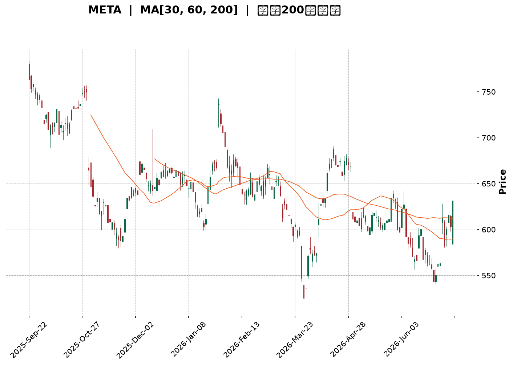
</details>

<html>
<head><meta charset="utf-8" /></head>
<body>
    <div style="height:500px; width:100%;">                        <script>window.PlotlyConfig = {MathJaxConfig: 'local'};</script>
        <script charset="utf-8" src="https://cdn.plot.ly/plotly-3.7.0.min.js" integrity="sha256-jvTGqxNp8AGWEcvNLVuKr+8j5dGe9Yw51LQkmDH+IYA=" crossorigin="anonymous"></script>                <div id="candlestick-chart" class="plotly-graph-div" style="height:100%; width:100%;"></div>            <script>                window.PLOTLYENV=window.PLOTLYENV || {};                                if (document.getElementById("candlestick-chart")) {                    Plotly.newPlot(                        "candlestick-chart",                        [{"close":{"dtype":"f8","bdata":"AAAAgGbZh0AAAAAAhouHQAAAAIB+tYdAAAAAAL1Xh0AAAADAkC6HQAAAAMDFK4dAAAAAwMzjhkAAAABg1VuGQAAAAOBPqYZAAAAA4LslhkAAAACgbU6GQAAAAIDXOYZAAAAA4NJfhkAAAACA29yGQAAAAGDD+4VAAAAAQL9OhkAAAABgfhaGQAAAAGCCXYZAAAAAYMgxhkAAAABge1iGQAAAAEAq0oZAAAAAgPHahkAAAABgD9yGQAAAAIDE4IZAAAAAoI4Dh0AAAACA+maHQAAAAODsa4dAAAAAwMJth0AAAADA7cWEQAAAAGBYNYRAAAAAQHLgg0AAAACgio2DQAAAAABn0oNAAAAA4KxKg0AAAABAx2CDQAAAACD4sINAAAAAYKCLg0AAAAAAcfuCQAAAAKB2AoNAAAAAQAj\u002fgkAAAAAglsOCQAAAAOAdoYJAAAAAQE9mgkAAAABA+VyCQAAAAACrhYJAAAAAgK0bg0AAAABgjtSDQAAAAAC7v4NAAAAAQCcyhEAAAADgqPmDQAAAAOBeK4RAAAAAwIbvg0AAAAAAg56EQAAAAIBi\u002fYRAAAAA4I\u002fIhEAAAADgC3qEQAAAAGCMQ4RAAAAAgCJYhEAAAABgeBSEQAAAAEDbMoRAAAAAwNZ\u002fhEAAAACAv0KEQAAAAKAiuoRAAAAAoMaMhEAAAACgk6KEQAAAAEAMvoRAAAAAIOTShEAAAAAA37CEQAAAACAjjIRAAAAAIB3GhEAAAABAUZeEQAAAAOADSoRAAAAAgO+MhEAAAADAjJuEQAAAAKBHPIRAAAAA4EYnhEAAAABALV+EQAAAAICdBoRAAAAAALuvg0AAAABgZDODQAAAAICOXYNAAAAAICpZg0AAAADAWtiCQAAAAODyHoNAAAAAgNAzhEAAAABAsoyEQAAAAGBN+YRAAAAAYCz+hEAAAABgUNyEQAAAAID2B4dAAAAAIMtZhkAAAACANwmGQAAAACC\u002fk4VAAAAA4GPehEAAAAAAIuiEQAAAAABCooRAAAAA4BwghUAAAACgNOyEQAAAAKD+24RAAAAAQDlFhEAAAAAADPWDQAAAAIA28YNAAAAA4JgQhEAAAAAgDh2EQAAAAKDwc4RAAAAAIOzgg0AAAAAAS\u002fGDQAAAAGA1ZIRAAAAAoLh+hEAAAAAANTiEQAAAAIArY4RAAAAAAE9vhEAAAAAAVNSEQAAAAIAmm4RAAAAAoLEdhEAAAAAA5jGEQAAAACA+Z4RAAAAAII1thEAAAABgWeiDQAAAAADwJINAAAAAwPOWg0AAAADgqnCDQAAAACDhOINAAAAAIBvxgkAAAADg4YiCQAAAAGAB3IJAAAAAwPeCgkAAAACgtpKCQAAAAIBDGIFAAAAAgN1pgEAAAAAgEb+AQAAAAEDN3IFAAAAAoIwVgkAAAADAbO+BQAAAAGDq44FAAAAA4CP0gUAAAADA0h6DQAAAACB3noNAAAAAwDaqg0AAAABAis+DQAAAACADr4RAAAAAYKr3hEAAAAAg8iGFQAAAAKBMf4VAAAAAYE\u002fyhEAAAAAAxOGEQAAAAADDEIVAAAAAQFGUhEAAAABgPROFQAAAAODuL4VAAAAAQL\u002f1hEAAAADgAOSEQAAAAEC\u002fGoNAAAAAoH0Bg0AAAAAgwg6DQAAAAOAy44JAAAAAAIAig0AAAAAg6UGDQAAAACCGCINAAAAAoHGygkAAAACAiNOCQAAAAOB4QINAAAAA4NtOg0AAAABASi2DQAAAAAAnFYNAAAAAgGrQgkAAAACA\u002f+OCQAAAAGCK9oJAAAAAQI8Ng0AAAAAgLx6DQAAAAOBf1YNAAAAAIJ3Vg0AAAAAAZb+DQAAAAMBPv4JAAAAA4JyogkAAAACgOXODQAAAAEDpl4NAAAAAgJuDgkAAAACgyEaCQAAAAMBjQIJAAAAAQJzTgUAAAACgOr+BQAAAAMCjs4FAAAAAANeLgkAAAAAgrsGCQAAAAOCjvIFAAAAAgMIJgkAAAADAzJ6BQAAAAKCZkYFAAAAAIFxtgUAAAADA9faAQAAAAAAAMoFAAAAAwMyUgUAAAADgUZqBQAAAAKBHJ4NAAAAAQDM3gkAAAADgUcKCQAAAAOCjPINAAAAAwPXYgkAAAAAA17uDQA=="},"high":{"dtype":"f8","bdata":"g5xTl4h9iEBQ6hm\u002fzgSIQO4j97sVuYdAizU6nnSWh0BLcP3q1W+HQM6Yt8qoZodAcxJUXVcoh0DqOkLK0X+GQBW0vqwOr4ZAnPF9aNTIhkAac7vEKViGQIdNjtQWZYZAm2drIkRuhkAAAACA29yGQK9+vMfm6oZAVRhIOZRwhkBkKJ\u002fXjE2GQIAm6oMtkIZAXYw0NN2chkCY072EaGWGQOJ105\u002fu3oZAeZY4t6wEh0CSopJNbhWHQGfjEXLfI4dAhhjdW0wah0CN6PfuUI6HQDUu1gV2o4dAZUVJdYaph0Aj+NBkjDmFQCG8YWEdCYVASX90JPWMhEAqVSkkmgCEQNZI4wKDBIRAdi96Hc3Sg0Dm9NAkIWSDQCKaamnSyoNAz2IWM2qfg0B\u002fMhna3ZqDQFe1HOZhQINAsCqhVLQgg0BTV2ZS0xCDQGmwyKjA0IJALjZHIkmOgkC26MwnK+mCQHB+ujCMpIJANC\u002flW804g0BDmhvXLduDQGw8n8Oh5YNAJBQHePMyhEDrjIjbKh2EQATOuciDMYRALGeJm1U5hEBDzy\u002fYxBKFQFXyu8CEB4VAyq\u002fg+aIXhUAb0GrMDLaEQMRLF1t\u002fZoRAWKuvOKRshEAvN7WkPimGQHtE2LqyXoRAdRwIuOGqhECf44+5a6CEQLbYG5jt6oRAEa50BnHuhEBu2z9yCwOFQDgLa0KDxoRAKIThE+zXhEC0r+wbEt6EQO3vrk+YmIRAwRSyIi\u002f4hEAqNVH4hr6EQPX6aAWouYRAE24iiNq6hEB31rYhrsKEQNE5UJvPj4RAhCQe9ZQvhEDwE3wbRW6EQOB+rr1xZoRAL3f02gIJhEAkJBjZpZqDQC8d6\u002fV3eINAbFuozK2fg0Cw5dOzfRKDQH7D5GJaSYNAtM2ZbyabhECNgMkPbcqEQE4NAPqeEIVAGjfFNeschUD6BMhcySOFQLK0G+BmNYdAdwQgG+7WhkDp5wbzH4CGQNiqVjzJXYZAlg4Y5tN8hUBCROGzSkKFQKOvx\u002flY9oRA05ibCr9QhUC\u002fgOUpgTuFQKOYBOt7MIVASeyR3l4WhUCwaAAbKVKEQGJh1U2lC4RAI4U\u002f4s8ehED1kBr2TDCEQPei8bRZsYRAgXWoLDuEhEDKEj1Gv\u002f+DQLx1oM65ZYRACPwwk5WehEAx8sHnREKEQAek0XseloRA2IMqj+6OhEALzt2ek\u002fyEQAaULs8L7IRA5GRMEIJChEDnOvLvxTSEQEog12f+mIRAgqH3FpKPhEDy+u7hsGKEQI2Dkp5loINAZaYTSEzRg0AL2g1Jr9+DQMZHa4iWcINAJDGdjXUjg0A6adjXNNuCQKi6k5CcAINADdx1TYzDgkBpeptZ49iCQAMyl2CuM4JAmOJt18X4gECFRSQ9Z9iAQDdjpSpF6YFAnDrgvQKAgkDZ1Lv2tg+CQN95HbkAMoJAApOeKJT1gUAU5q4B76qDQC6nfxlH54NATX9+1ujvg0BBadrbS9ODQK\u002fZsfkkzYRApWK4YPkuhUBBHUznnieFQHGyIZ4Jl4VAtzVfWvpVhUCQYOxKlxyFQBDCL88DLoVA2Fk7IoXnhEDLsu1NUUCFQOjfbcTxToVACPlah2oshUDygZRlAQ2FQAxQA2wzYoNAE8RZqnRSg0Ac\u002fz2xcyuDQOx8XbE\u002fLoNAT9m19wFbg0Cg+orBNYODQOjym1WXQYNAObb\u002fhszigkABh+YTh9mCQHqjeqybWoNAkT8PMzh5g0Aej2uo\u002f2SDQIfQjfEoOINAKz+SaOQqg0CYlsQMf\u002fuCQMYUN6pICINAUEgr\u002f+wxg0B4aPM1NS+DQBtyKTtF74NAQ33+oDwThEDKceW5TM+DQJudBlhK2YNAlN05iocCg0Ahfv2nk3yDQC7sVgBxDoRAICX2Moqkg0CmEgVXnXuCQC3uUuWcqIJAhffeDS52gkAcHUQIH92BQOBc3uJK\u002fIFAAAAAACnKgkAAAADgeu6CQAAAAOB6joJAAAAAgMIhgkAAAADgev6BQAAAAKCZ4YFAAAAA4FHIgUAAAABguGKBQAAAAMDMZoFAAAAAQDPXgUAAAADgUayBQAAAAIA9ooNAAAAAAAAQg0AAAADgo9yCQAAAAMD1ioNAAAAAAABAg0AAAAAAKcqDQA=="},"hovertemplate":"\u003cb\u003e%{x|%Y-%m-%d}\u003c\u002fb\u003e\u003cbr\u003e\u958b: $%{open:.2f}\u003cbr\u003e\u9ad8: $%{high:.2f}\u003cbr\u003e\u4f4e: $%{low:.2f}\u003cbr\u003e\u6536: $%{close:.2f}\u003cextra\u003e\u003c\u002fextra\u003e","low":{"dtype":"f8","bdata":"IdFzCuXTh0AbIxkh+WiHQEGHDJGfdIdA6Q2k6fI0h0DYjjSAf\u002fuGQJ0zRlTcCYdAC1gfzVOjhkDKBcGO3CKGQAjztZU3YoZA+cHTpLMihkCWIHUcwIWFQH9RL5Fa\u002f4VAD\u002fq\u002fqMoPhkDoGeMQvDSGQOuiZbJ19YVAXCY6Mm8OhkCjx8mDIMyFQHRFajZbHYZASczHwm7whUAZ6GpgTgKGQJI3UXN+coZAczg7g+C2hkA6OsEUN5GGQIOLEgiW2YZAlgvE7QbKhkCc\u002f7uNjlCHQHBpoTOwPIdAtKX2yaskh0CWXMn43UOEQFctxsQpH4RAk17d4DzUg0ARJKi1FoODQPfNLT5Rh4NA7U90vixDg0BPlPS1H72CQFfT3GQNRINA4K7VGkROg0Bv7HQWjPGCQDzpqXp8y4JAcOlSgj+NgkAUISL+146CQB+YsSUgMoJAsw5oD\u002fAdgkBQpWuQsS6CQPqMqxLOIoJAaaB6S6OggkCHQap0kUWDQLxV7oTur4NAtD+1xM\u002fOg0B4AuUl2OCDQEzDUHlR44NAkwgWRCvfg0DSGO28s5KEQAIQGblfpYRAyEPbEMK6hEAioGdbKV2EQFtD7iDZDYRAaa4gBhr5g0AtGol7oOeDQKdmiICA7INA\u002fQd+\u002f28QhED6KQ04WkCEQI6F8UJUeoRACtnUZhCIhECjKOCP2HuEQGnPlYWfiIRAqXVI4iqohEDhWB6vI6GEQHN3M27MaYRAyZIOc1mFhECDydNeIJKEQIa6kXLVEoRA1gBI4sU0hEC3MksM6lWEQN5dFIZLHYRAgAQKNbTUg0CqVBBcpA2EQKvuzLK0AIRAlAaK3eh3g0DCnYBNzS2DQMh3eRUXKYNAzmewns5Xg0DfVSoGdLeCQOHvBpgXuIJAL2Osf3mLg0Dl1OSOaxqEQGDAYF7moIRAesjbzc+7hED0zTi3T8eEQOk5NvA\u002fOoZAr7WiHI5ChkC+af5pI\u002fKFQJ4BsmqAaYVAlTFSFCzShEAN6CzQsGKEQGIZ4m3KKoRAMGPAHtuMhEAPey9kx+SEQFWZ4INwf4RAT8DoZAwhhECfUmVWhcuDQBggTkFxnYNAeFqYlECYg0CpELCEsNyDQIgNZA4k7YNAnaXzrvDWg0DJ8HVC4Z6DQCkURh75B4RAME\u002f1zcYyhEApkDHP3ueDQOV61yH2yoNA5cnkuJ7tg0DIWoXP\u002fYOEQJr5Lmo3SYRAwy2oiNHXg0DfPdnnT42DQE2XPD3BPoRAUHw61KQ5hEByp+uqIN6DQOhiz2u3A4NA9KnPHy90g0DJAwSy\u002fmiDQNCMbsdTMINA03Rwa57NgkA+DLhnplWCQAxik5Oks4JA6Q4URJ9zgkB+qFfzzYaCQEr6MVLG9oBAqTXC2jk+gEDcpOqdZ4CAQMRm3hccEoFAids9Qk\u002fqgUAaTXY9dHmBQOuxLE\u002fD24FAas9yg+WhgUAJmNOLQXqCQGwUnphic4NA6GfB3AN+g0Bm65k1k36DQCxlhDg59oNAKyvo9Na8hEDsPZerDdmEQL7wB\u002fMJFIVATY2oRA3bhEB3yRFdstWEQNtuvewJ6YRAQ0do8Y9jhEA22EVv4GmEQFmg1EDA8YRA2UcV9BvIhED4pcwRkLmEQNm8xzWOu4JAcuqa4WPsgkC7YX0GidGCQOXQObluvoJAXNVJh16sgkCeDpFTxieDQI0GMoX964JAINqjujWsgkCtuNv4aICCQG9VAB\u002fcoIJAJjEhwXEzg0Cz32N09wWDQJfS40IM2YJAIbgMiPO\u002fgkCgLog\u002fDaqCQHQ3rdYSkoJABfDdphrzgkBVwc956uWCQH2EzCt9A4NAeCked9Glg0BBSQefLnaDQMopVIjMt4JA1u44DQWhgkCEXsiwtr2CQApiXj\u002fUboNARMI0QvYygkDbWGYTeBWCQMLECKrGI4JA73t5uJLQgUDgWE4o9GOBQGZ0xIcLg4FAAAAAYGYagkAAAAAAAICCQAAAACCFsYFAAAAAwMyYgUAAAADgen6BQAAAAAApiIFAAAAAYGZcgUAAAACgcOGAQAAAAEAz44BAAAAAAABwgUAAAACgcDuBQAAAAMDMmIJAAAAAIFwjgkAAAACAFC6CQAAAAKBH3YJAAAAAgBSwgkAAAABgjwiCQA=="},"name":"\u50f9\u683c","open":{"dtype":"f8","bdata":"Acdo9JJeiEAoXCcrCfqHQHCesKlHnIdAp8174fZ7h0CL+dSLb2CHQACgh7w4VodAoOWDsJgih0DCCttz8nyGQL\u002fpOx+lhYZAIWbC7+W9hkBxEV+\u002f4vqFQFAnb3ndXoZATGxhcss8hkDLWPxpVWOGQEEq7wMxyIZA5B2dakg5hkByUT8\u002fjQ+GQMGzY3qZWYZAL2b5QoJdhkCbxr9m9wmGQHQmoJWNeoZA50H\u002f4+LwhkCMJL1kad+GQPXv82da5oZARPRBlwf3hkBabH3qR16HQFhmga1rdYdAttEKQ1aGh0B2sf5CUNuEQA3XMCYVBoVAIRxV9WJyhECNis5MSZODQMc5oJZbtYNAJsWEqZrRg0A5ilRbIDeDQOurN4+fq4NA2onFnPeSg0DEILorAZSDQO3xGFvWG4NAWFikv9TBgkA8n6cmrvuCQENZftqFcIJAUuT5T3CBgkBvOyjDec+CQJG5HYzJV4JAP6gawVWpgkCp0CzMDHODQG0i2jJJ4INAvUDaj3DTg0Dx61eDIO+DQNci08ljBYRAYZQpEugVhEDigyig+BGFQGjRd2s4soRALsdsYdTchECZbQGSYrCEQKtTy7QcQoRAnu2jS\u002fgMhEBNbXMo6kCEQPwEt\u002flmJIRA8MhtR9UShEDQTxF4inOEQBwz0o7hfoRAMAw52t3JhECnafBTxqOEQLCyK1X\u002floRA3gQ1js2qhEBoR9Ka9taEQHSBzPq0hoRAQXaQGSOMhEDLHLThh7yEQCUIFFNmrIRAfADtfs5OhEDfFDA0KpOEQP1R\u002fufHc4RA8LUI6NYlhEAqmARKUyKEQJe25\u002f3xWoRAL3f02gIJhEBjgYtVE4uDQNjB25UHS4NAo6kea4x4g0Cq4OSJYfaCQLNgqe5G7YJAOUSwqdWhg0DH1SfE+RyEQFLGh72Qv4RA5baVVxwLhUB3uHBVZAqFQDHqhnXvAIdApQTWAqOxhkCp1wDCnkqGQK6RwRriEIZAzwUMCQt0hUATMaftL7OEQJDY1a1wwoRAPJwhM\u002f6vhECtSz3JJSOFQPAk2SJmBoVAodfYWzfmhEBlCUxQnB+EQAcu7dvj8oNAdOUNGl\u002fFg0BJGomlduuDQGsE4Vxo9INA4ePdPQZbhEA088gun7+DQC3TLnIWC4RA8YetDiJLhEDGL4Y\u002fbxKEQA8Ukg404INAL7rcwhU5hEAeMcHAToaEQPdhZMoCpoRA30\u002fwifg1hECgyK67Ms2DQBkBInwrY4RASaZVvcBshEAzoFE0wjyEQL4W9H87doNAdVoef1G7g0C3TIekRJuDQPOglp8nPoNAAAs+aqocg0Afy5UIxdeCQAwlKRjV6YJA74LZp1y0gkDS4fUSfLGCQICzMdiaL4JAFUmleszcgEAAAAAgEb+AQCjfewHEK4FAdI4WK74cgkAeGaJ3IKyBQNDH7aQ9CYJArJinX5nfgUBQy7bMguuCQC2ZXpEdk4NASo3jQQ\u002fPg0B6rNJJVqeDQFvhZKv+FIRAOiRaLw\u002fThED07DmL6RqFQDDCdN7FL4VA16n\u002fLtVFhUBBAGSHB\u002fOEQL6Bwm7iDYVA5MAZ\u002f664hEDKFmMlq52EQO+xK5MH84RAdZUi4OwMhUAoJPUlU+KEQNQtv\u002fL4VYNAZjtnfPcwg0CPdAhPBPuCQMP0QMrvJYNAcPYjj\u002fLDgkBQs7C2NDGDQHUp1O8KNYNAdocJ7BTggkDsvBtjJ5KCQLlnfkE0soJAMAer2287g0DSo4A0XyuDQBuqixteBINA5BK9aNkCg0BCzHBHocGCQC699B6Ou4JARdpkg4n6gkC1IesKnAKDQO7hm6mvBoNAoRwmREP3g0DgvmCfTseDQKu+Xb2HroNA9AlnfHPVgkArW3yDiNOCQE0sYWW9eINAc7Qs3Q93g0CmEgVXnXuCQBudEjifc4JAtxHVwokhgkC3METOcqqBQNyUmQ1b44FAAAAAQDMfgkAAAABAM42CQAAAAAAAgIJAAAAAYI\u002fmgUAAAAAAKeCBQAAAAAAAkoFAAAAAwB6PgUAAAABgZlyBQAAAAGC4+oBAAAAAAACAgUAAAAAghYeBQAAAAKBH\u002f4JAAAAAQDP\u002fgkAAAABguJaCQAAAAGC4\u002fIJAAAAAwB4zg0AAAAAgXD+CQA=="},"x":["2025-09-22T00:00:00-04:00","2025-09-23T00:00:00-04:00","2025-09-24T00:00:00-04:00","2025-09-25T00:00:00-04:00","2025-09-26T00:00:00-04:00","2025-09-29T00:00:00-04:00","2025-09-30T00:00:00-04:00","2025-10-01T00:00:00-04:00","2025-10-02T00:00:00-04:00","2025-10-03T00:00:00-04:00","2025-10-06T00:00:00-04:00","2025-10-07T00:00:00-04:00","2025-10-08T00:00:00-04:00","2025-10-09T00:00:00-04:00","2025-10-10T00:00:00-04:00","2025-10-13T00:00:00-04:00","2025-10-14T00:00:00-04:00","2025-10-15T00:00:00-04:00","2025-10-16T00:00:00-04:00","2025-10-17T00:00:00-04:00","2025-10-20T00:00:00-04:00","2025-10-21T00:00:00-04:00","2025-10-22T00:00:00-04:00","2025-10-23T00:00:00-04:00","2025-10-24T00:00:00-04:00","2025-10-27T00:00:00-04:00","2025-10-28T00:00:00-04:00","2025-10-29T00:00:00-04:00","2025-10-30T00:00:00-04:00","2025-10-31T00:00:00-04:00","2025-11-03T00:00:00-05:00","2025-11-04T00:00:00-05:00","2025-11-05T00:00:00-05:00","2025-11-06T00:00:00-05:00","2025-11-07T00:00:00-05:00","2025-11-10T00:00:00-05:00","2025-11-11T00:00:00-05:00","2025-11-12T00:00:00-05:00","2025-11-13T00:00:00-05:00","2025-11-14T00:00:00-05:00","2025-11-17T00:00:00-05:00","2025-11-18T00:00:00-05:00","2025-11-19T00:00:00-05:00","2025-11-20T00:00:00-05:00","2025-11-21T00:00:00-05:00","2025-11-24T00:00:00-05:00","2025-11-25T00:00:00-05:00","2025-11-26T00:00:00-05:00","2025-11-28T00:00:00-05:00","2025-12-01T00:00:00-05:00","2025-12-02T00:00:00-05:00","2025-12-03T00:00:00-05:00","2025-12-04T00:00:00-05:00","2025-12-05T00:00:00-05:00","2025-12-08T00:00:00-05:00","2025-12-09T00:00:00-05:00","2025-12-10T00:00:00-05:00","2025-12-11T00:00:00-05:00","2025-12-12T00:00:00-05:00","2025-12-15T00:00:00-05:00","2025-12-16T00:00:00-05:00","2025-12-17T00:00:00-05:00","2025-12-18T00:00:00-05:00","2025-12-19T00:00:00-05:00","2025-12-22T00:00:00-05:00","2025-12-23T00:00:00-05:00","2025-12-24T00:00:00-05:00","2025-12-26T00:00:00-05:00","2025-12-29T00:00:00-05:00","2025-12-30T00:00:00-05:00","2025-12-31T00:00:00-05:00","2026-01-02T00:00:00-05:00","2026-01-05T00:00:00-05:00","2026-01-06T00:00:00-05:00","2026-01-07T00:00:00-05:00","2026-01-08T00:00:00-05:00","2026-01-09T00:00:00-05:00","2026-01-12T00:00:00-05:00","2026-01-13T00:00:00-05:00","2026-01-14T00:00:00-05:00","2026-01-15T00:00:00-05:00","2026-01-16T00:00:00-05:00","2026-01-20T00:00:00-05:00","2026-01-21T00:00:00-05:00","2026-01-22T00:00:00-05:00","2026-01-23T00:00:00-05:00","2026-01-26T00:00:00-05:00","2026-01-27T00:00:00-05:00","2026-01-28T00:00:00-05:00","2026-01-29T00:00:00-05:00","2026-01-30T00:00:00-05:00","2026-02-02T00:00:00-05:00","2026-02-03T00:00:00-05:00","2026-02-04T00:00:00-05:00","2026-02-05T00:00:00-05:00","2026-02-06T00:00:00-05:00","2026-02-09T00:00:00-05:00","2026-02-10T00:00:00-05:00","2026-02-11T00:00:00-05:00","2026-02-12T00:00:00-05:00","2026-02-13T00:00:00-05:00","2026-02-17T00:00:00-05:00","2026-02-18T00:00:00-05:00","2026-02-19T00:00:00-05:00","2026-02-20T00:00:00-05:00","2026-02-23T00:00:00-05:00","2026-02-24T00:00:00-05:00","2026-02-25T00:00:00-05:00","2026-02-26T00:00:00-05:00","2026-02-27T00:00:00-05:00","2026-03-02T00:00:00-05:00","2026-03-03T00:00:00-05:00","2026-03-04T00:00:00-05:00","2026-03-05T00:00:00-05:00","2026-03-06T00:00:00-05:00","2026-03-09T00:00:00-04:00","2026-03-10T00:00:00-04:00","2026-03-11T00:00:00-04:00","2026-03-12T00:00:00-04:00","2026-03-13T00:00:00-04:00","2026-03-16T00:00:00-04:00","2026-03-17T00:00:00-04:00","2026-03-18T00:00:00-04:00","2026-03-19T00:00:00-04:00","2026-03-20T00:00:00-04:00","2026-03-23T00:00:00-04:00","2026-03-24T00:00:00-04:00","2026-03-25T00:00:00-04:00","2026-03-26T00:00:00-04:00","2026-03-27T00:00:00-04:00","2026-03-30T00:00:00-04:00","2026-03-31T00:00:00-04:00","2026-04-01T00:00:00-04:00","2026-04-02T00:00:00-04:00","2026-04-06T00:00:00-04:00","2026-04-07T00:00:00-04:00","2026-04-08T00:00:00-04:00","2026-04-09T00:00:00-04:00","2026-04-10T00:00:00-04:00","2026-04-13T00:00:00-04:00","2026-04-14T00:00:00-04:00","2026-04-15T00:00:00-04:00","2026-04-16T00:00:00-04:00","2026-04-17T00:00:00-04:00","2026-04-20T00:00:00-04:00","2026-04-21T00:00:00-04:00","2026-04-22T00:00:00-04:00","2026-04-23T00:00:00-04:00","2026-04-24T00:00:00-04:00","2026-04-27T00:00:00-04:00","2026-04-28T00:00:00-04:00","2026-04-29T00:00:00-04:00","2026-04-30T00:00:00-04:00","2026-05-01T00:00:00-04:00","2026-05-04T00:00:00-04:00","2026-05-05T00:00:00-04:00","2026-05-06T00:00:00-04:00","2026-05-07T00:00:00-04:00","2026-05-08T00:00:00-04:00","2026-05-11T00:00:00-04:00","2026-05-12T00:00:00-04:00","2026-05-13T00:00:00-04:00","2026-05-14T00:00:00-04:00","2026-05-15T00:00:00-04:00","2026-05-18T00:00:00-04:00","2026-05-19T00:00:00-04:00","2026-05-20T00:00:00-04:00","2026-05-21T00:00:00-04:00","2026-05-22T00:00:00-04:00","2026-05-26T00:00:00-04:00","2026-05-27T00:00:00-04:00","2026-05-28T00:00:00-04:00","2026-05-29T00:00:00-04:00","2026-06-01T00:00:00-04:00","2026-06-02T00:00:00-04:00","2026-06-03T00:00:00-04:00","2026-06-04T00:00:00-04:00","2026-06-05T00:00:00-04:00","2026-06-08T00:00:00-04:00","2026-06-09T00:00:00-04:00","2026-06-10T00:00:00-04:00","2026-06-11T00:00:00-04:00","2026-06-12T00:00:00-04:00","2026-06-15T00:00:00-04:00","2026-06-16T00:00:00-04:00","2026-06-17T00:00:00-04:00","2026-06-18T00:00:00-04:00","2026-06-22T00:00:00-04:00","2026-06-23T00:00:00-04:00","2026-06-24T00:00:00-04:00","2026-06-25T00:00:00-04:00","2026-06-26T00:00:00-04:00","2026-06-29T00:00:00-04:00","2026-06-30T00:00:00-04:00","2026-07-01T00:00:00-04:00","2026-07-02T00:00:00-04:00","2026-07-06T00:00:00-04:00","2026-07-07T00:00:00-04:00","2026-07-08T00:00:00-04:00","2026-07-09T00:00:00-04:00"],"type":"candlestick"},{"hovertemplate":"MA30: $%{y:.2f}\u003cextra\u003e\u003c\u002fextra\u003e","line":{"color":"#2196F3","dash":"dash","width":2},"mode":"lines","name":"MA30","x":["2025-09-22T00:00:00-04:00","2025-09-23T00:00:00-04:00","2025-09-24T00:00:00-04:00","2025-09-25T00:00:00-04:00","2025-09-26T00:00:00-04:00","2025-09-29T00:00:00-04:00","2025-09-30T00:00:00-04:00","2025-10-01T00:00:00-04:00","2025-10-02T00:00:00-04:00","2025-10-03T00:00:00-04:00","2025-10-06T00:00:00-04:00","2025-10-07T00:00:00-04:00","2025-10-08T00:00:00-04:00","2025-10-09T00:00:00-04:00","2025-10-10T00:00:00-04:00","2025-10-13T00:00:00-04:00","2025-10-14T00:00:00-04:00","2025-10-15T00:00:00-04:00","2025-10-16T00:00:00-04:00","2025-10-17T00:00:00-04:00","2025-10-20T00:00:00-04:00","2025-10-21T00:00:00-04:00","2025-10-22T00:00:00-04:00","2025-10-23T00:00:00-04:00","2025-10-24T00:00:00-04:00","2025-10-27T00:00:00-04:00","2025-10-28T00:00:00-04:00","2025-10-29T00:00:00-04:00","2025-10-30T00:00:00-04:00","2025-10-31T00:00:00-04:00","2025-11-03T00:00:00-05:00","2025-11-04T00:00:00-05:00","2025-11-05T00:00:00-05:00","2025-11-06T00:00:00-05:00","2025-11-07T00:00:00-05:00","2025-11-10T00:00:00-05:00","2025-11-11T00:00:00-05:00","2025-11-12T00:00:00-05:00","2025-11-13T00:00:00-05:00","2025-11-14T00:00:00-05:00","2025-11-17T00:00:00-05:00","2025-11-18T00:00:00-05:00","2025-11-19T00:00:00-05:00","2025-11-20T00:00:00-05:00","2025-11-21T00:00:00-05:00","2025-11-24T00:00:00-05:00","2025-11-25T00:00:00-05:00","2025-11-26T00:00:00-05:00","2025-11-28T00:00:00-05:00","2025-12-01T00:00:00-05:00","2025-12-02T00:00:00-05:00","2025-12-03T00:00:00-05:00","2025-12-04T00:00:00-05:00","2025-12-05T00:00:00-05:00","2025-12-08T00:00:00-05:00","2025-12-09T00:00:00-05:00","2025-12-10T00:00:00-05:00","2025-12-11T00:00:00-05:00","2025-12-12T00:00:00-05:00","2025-12-15T00:00:00-05:00","2025-12-16T00:00:00-05:00","2025-12-17T00:00:00-05:00","2025-12-18T00:00:00-05:00","2025-12-19T00:00:00-05:00","2025-12-22T00:00:00-05:00","2025-12-23T00:00:00-05:00","2025-12-24T00:00:00-05:00","2025-12-26T00:00:00-05:00","2025-12-29T00:00:00-05:00","2025-12-30T00:00:00-05:00","2025-12-31T00:00:00-05:00","2026-01-02T00:00:00-05:00","2026-01-05T00:00:00-05:00","2026-01-06T00:00:00-05:00","2026-01-07T00:00:00-05:00","2026-01-08T00:00:00-05:00","2026-01-09T00:00:00-05:00","2026-01-12T00:00:00-05:00","2026-01-13T00:00:00-05:00","2026-01-14T00:00:00-05:00","2026-01-15T00:00:00-05:00","2026-01-16T00:00:00-05:00","2026-01-20T00:00:00-05:00","2026-01-21T00:00:00-05:00","2026-01-22T00:00:00-05:00","2026-01-23T00:00:00-05:00","2026-01-26T00:00:00-05:00","2026-01-27T00:00:00-05:00","2026-01-28T00:00:00-05:00","2026-01-29T00:00:00-05:00","2026-01-30T00:00:00-05:00","2026-02-02T00:00:00-05:00","2026-02-03T00:00:00-05:00","2026-02-04T00:00:00-05:00","2026-02-05T00:00:00-05:00","2026-02-06T00:00:00-05:00","2026-02-09T00:00:00-05:00","2026-02-10T00:00:00-05:00","2026-02-11T00:00:00-05:00","2026-02-12T00:00:00-05:00","2026-02-13T00:00:00-05:00","2026-02-17T00:00:00-05:00","2026-02-18T00:00:00-05:00","2026-02-19T00:00:00-05:00","2026-02-20T00:00:00-05:00","2026-02-23T00:00:00-05:00","2026-02-24T00:00:00-05:00","2026-02-25T00:00:00-05:00","2026-02-26T00:00:00-05:00","2026-02-27T00:00:00-05:00","2026-03-02T00:00:00-05:00","2026-03-03T00:00:00-05:00","2026-03-04T00:00:00-05:00","2026-03-05T00:00:00-05:00","2026-03-06T00:00:00-05:00","2026-03-09T00:00:00-04:00","2026-03-10T00:00:00-04:00","2026-03-11T00:00:00-04:00","2026-03-12T00:00:00-04:00","2026-03-13T00:00:00-04:00","2026-03-16T00:00:00-04:00","2026-03-17T00:00:00-04:00","2026-03-18T00:00:00-04:00","2026-03-19T00:00:00-04:00","2026-03-20T00:00:00-04:00","2026-03-23T00:00:00-04:00","2026-03-24T00:00:00-04:00","2026-03-25T00:00:00-04:00","2026-03-26T00:00:00-04:00","2026-03-27T00:00:00-04:00","2026-03-30T00:00:00-04:00","2026-03-31T00:00:00-04:00","2026-04-01T00:00:00-04:00","2026-04-02T00:00:00-04:00","2026-04-06T00:00:00-04:00","2026-04-07T00:00:00-04:00","2026-04-08T00:00:00-04:00","2026-04-09T00:00:00-04:00","2026-04-10T00:00:00-04:00","2026-04-13T00:00:00-04:00","2026-04-14T00:00:00-04:00","2026-04-15T00:00:00-04:00","2026-04-16T00:00:00-04:00","2026-04-17T00:00:00-04:00","2026-04-20T00:00:00-04:00","2026-04-21T00:00:00-04:00","2026-04-22T00:00:00-04:00","2026-04-23T00:00:00-04:00","2026-04-24T00:00:00-04:00","2026-04-27T00:00:00-04:00","2026-04-28T00:00:00-04:00","2026-04-29T00:00:00-04:00","2026-04-30T00:00:00-04:00","2026-05-01T00:00:00-04:00","2026-05-04T00:00:00-04:00","2026-05-05T00:00:00-04:00","2026-05-06T00:00:00-04:00","2026-05-07T00:00:00-04:00","2026-05-08T00:00:00-04:00","2026-05-11T00:00:00-04:00","2026-05-12T00:00:00-04:00","2026-05-13T00:00:00-04:00","2026-05-14T00:00:00-04:00","2026-05-15T00:00:00-04:00","2026-05-18T00:00:00-04:00","2026-05-19T00:00:00-04:00","2026-05-20T00:00:00-04:00","2026-05-21T00:00:00-04:00","2026-05-22T00:00:00-04:00","2026-05-26T00:00:00-04:00","2026-05-27T00:00:00-04:00","2026-05-28T00:00:00-04:00","2026-05-29T00:00:00-04:00","2026-06-01T00:00:00-04:00","2026-06-02T00:00:00-04:00","2026-06-03T00:00:00-04:00","2026-06-04T00:00:00-04:00","2026-06-05T00:00:00-04:00","2026-06-08T00:00:00-04:00","2026-06-09T00:00:00-04:00","2026-06-10T00:00:00-04:00","2026-06-11T00:00:00-04:00","2026-06-12T00:00:00-04:00","2026-06-15T00:00:00-04:00","2026-06-16T00:00:00-04:00","2026-06-17T00:00:00-04:00","2026-06-18T00:00:00-04:00","2026-06-22T00:00:00-04:00","2026-06-23T00:00:00-04:00","2026-06-24T00:00:00-04:00","2026-06-25T00:00:00-04:00","2026-06-26T00:00:00-04:00","2026-06-29T00:00:00-04:00","2026-06-30T00:00:00-04:00","2026-07-01T00:00:00-04:00","2026-07-02T00:00:00-04:00","2026-07-06T00:00:00-04:00","2026-07-07T00:00:00-04:00","2026-07-08T00:00:00-04:00","2026-07-09T00:00:00-04:00"],"y":{"dtype":"f8","bdata":"AAAAAAAA+H8AAAAAAAD4fwAAAAAAAPh\u002fAAAAAAAA+H8AAAAAAAD4fwAAAAAAAPh\u002fAAAAAAAA+H8AAAAAAAD4fwAAAAAAAPh\u002fAAAAAAAA+H8AAAAAAAD4fwAAAAAAAPh\u002fAAAAAAAA+H8AAAAAAAD4fwAAAAAAAPh\u002fAAAAAAAA+H8AAAAAAAD4fwAAAAAAAPh\u002fAAAAAAAA+H8AAAAAAAD4fwAAAAAAAPh\u002fAAAAAAAA+H8AAAAAAAD4fwAAAAAAAPh\u002fAAAAAAAA+H8AAAAAAAD4fwAAAAAAAPh\u002fAAAAAAAA+H8AAAAAAAD4f5qZmdkCp4ZAd3d31xyFhkDe3d3tC2OGQKuqqnrgQYZAAAAA4E4fhkCamZk52f6FQERERLQn4YVAERERsZ3EhUC8u7uLzaeFQLy7uyukiIVAERERUcBthUDv7u7uhU+FQERERBTVMIVAq6qqSuoOhUAiIiLihOiEQJqZmYn7yoRAVVVVJa6vhECamZlpapyEQHd3d\u002fcWhoRAAAAAEAl1hECJiIjYzmCEQHd3d3cuSoRAIiIigkQxhECrqqo6Jh6EQM3MzFwJDoRA7+7u3gD7g0C8u7v7CeKDQFVVVdUXx4NAERERscWsg0ARERFh26aDQERERCTGpoNAq6qqShasg0BmZmaWILKDQKuqqgrauYNAIiIiopbEg0BVVVWlUM+DQImIiMhI2INAERERcTHjg0DNzMwsxvGDQGZmZobl\u002foNAMzMz4xAOhEARERExqB2EQN7d3f3RK4RAq6qqqiw+hEB3d3e3U1GEQJqZmYnyX4RAzczMDN5ohEAiIiLyfG2EQERERNTZb4RAMzMz44BrhEAREREB5WSEQJqZmbkIXoRAMzMzowVZhECamZkp4kmEQCIiIoLvOYRAIiIiMvo0hEB3d3dXmTWEQO\u002fu7k6oO4RAvLu7KzFBhEARERGB2keEQERERBQGYIRA3t3dfdJvhEAAAACg+H6EQDMzM5M5hoRAREREBPKIhEAAAACQQ4uEQLy7u2tWioRAERERYemMhEAzMzOz446EQGZmZiaNkYRAmpmZSUGNhEBERESU2IeEQM3MzMzihIRAd3d3x72AhEC8u7tbhnyEQDMzM1NhfoRAd3d39wh8hECrqqpKX3iEQERERPR9e4RAZmZmRmSChEBVVVXlFYuEQERERFTOk4RAMzMz0xOdhECJiIiIAq6EQLy7u+uuuoRAiYiIKPK5hECamZlZ67aEQJqZmfkMsoRA3t3d3TqthECJiIgIGaWEQGZmZibug4RAAAAAcF5shEDe3d2dN1aEQGZmZiYfQoRAq6qqyq0xhEC8u7vrbx2EQCIiIqJLDoRAiYiImP33g0DNzMzc8OODQGZmZgbRw4NAERERkeeig0BmZmZWgYeDQImIiBjCdYNAmpmZSdtkg0B3d3fXRFKDQERERMRmPINAERERsfkrg0Dv7u6u9SSDQGZmZkZeHoNAERER4UgXg0CJiIi4yxODQImIiOhSFoNAzczMfN4ag0AzMzPTdB2DQCIiIrIPJYNAVVVVBSYsg0ARERHBAjKDQBEREVGpN4NA7+7uHvQ4g0B3d3en6kKDQM3MzIxZVINAAAAAAAtgg0C8u7u7a2yDQKuqqppqa4NAvLu7a\u002fZrg0BERETUbHCDQGZmZjaqcINA3t3djft1g0AiIiKS0nuDQDMzM1NdjINAq6qqutmfg0ARERFxmbGDQO\u002fu7n50vYNAIiIiEubHg0BVVVWFftKDQFVVVTWr3INAVVVV5QLkg0C8u7vrDOKDQGZmZvZz3INA3t3dLTvXg0De3d29UdGDQBEREZEQyoNAVVVVdWXAg0BERET0k7SDQHd3d5ccnYNAREREpJaJg0BERETUXn2DQJqZmQnPcINAERERYS9fg0Dv7u6eTUeDQDMzM3NALoNAzczMjIMTg0BEREQksPiCQCIiIsK37IJA3t3dzcvogkAiIiISOuaCQBEREYFo3IJAq6qq2gzTgkARERFxFMWCQHd3dxeVuIJAq6qqCr+tgkCJiIhI3J2CQImIiLhPjIJAvLu7e5N9gkDe3d3NJHCCQN7d3X2\u002fcIJAzczMDKRrgkCamZmphGqCQImIiNjabIJA7+7u\u002fhlrgkAzMzNTW3CCQA=="},"type":"scatter"},{"hovertemplate":"MA60: $%{y:.2f}\u003cextra\u003e\u003c\u002fextra\u003e","line":{"color":"#9C27B0","dash":"dash","width":2},"mode":"lines","name":"MA60","x":["2025-09-22T00:00:00-04:00","2025-09-23T00:00:00-04:00","2025-09-24T00:00:00-04:00","2025-09-25T00:00:00-04:00","2025-09-26T00:00:00-04:00","2025-09-29T00:00:00-04:00","2025-09-30T00:00:00-04:00","2025-10-01T00:00:00-04:00","2025-10-02T00:00:00-04:00","2025-10-03T00:00:00-04:00","2025-10-06T00:00:00-04:00","2025-10-07T00:00:00-04:00","2025-10-08T00:00:00-04:00","2025-10-09T00:00:00-04:00","2025-10-10T00:00:00-04:00","2025-10-13T00:00:00-04:00","2025-10-14T00:00:00-04:00","2025-10-15T00:00:00-04:00","2025-10-16T00:00:00-04:00","2025-10-17T00:00:00-04:00","2025-10-20T00:00:00-04:00","2025-10-21T00:00:00-04:00","2025-10-22T00:00:00-04:00","2025-10-23T00:00:00-04:00","2025-10-24T00:00:00-04:00","2025-10-27T00:00:00-04:00","2025-10-28T00:00:00-04:00","2025-10-29T00:00:00-04:00","2025-10-30T00:00:00-04:00","2025-10-31T00:00:00-04:00","2025-11-03T00:00:00-05:00","2025-11-04T00:00:00-05:00","2025-11-05T00:00:00-05:00","2025-11-06T00:00:00-05:00","2025-11-07T00:00:00-05:00","2025-11-10T00:00:00-05:00","2025-11-11T00:00:00-05:00","2025-11-12T00:00:00-05:00","2025-11-13T00:00:00-05:00","2025-11-14T00:00:00-05:00","2025-11-17T00:00:00-05:00","2025-11-18T00:00:00-05:00","2025-11-19T00:00:00-05:00","2025-11-20T00:00:00-05:00","2025-11-21T00:00:00-05:00","2025-11-24T00:00:00-05:00","2025-11-25T00:00:00-05:00","2025-11-26T00:00:00-05:00","2025-11-28T00:00:00-05:00","2025-12-01T00:00:00-05:00","2025-12-02T00:00:00-05:00","2025-12-03T00:00:00-05:00","2025-12-04T00:00:00-05:00","2025-12-05T00:00:00-05:00","2025-12-08T00:00:00-05:00","2025-12-09T00:00:00-05:00","2025-12-10T00:00:00-05:00","2025-12-11T00:00:00-05:00","2025-12-12T00:00:00-05:00","2025-12-15T00:00:00-05:00","2025-12-16T00:00:00-05:00","2025-12-17T00:00:00-05:00","2025-12-18T00:00:00-05:00","2025-12-19T00:00:00-05:00","2025-12-22T00:00:00-05:00","2025-12-23T00:00:00-05:00","2025-12-24T00:00:00-05:00","2025-12-26T00:00:00-05:00","2025-12-29T00:00:00-05:00","2025-12-30T00:00:00-05:00","2025-12-31T00:00:00-05:00","2026-01-02T00:00:00-05:00","2026-01-05T00:00:00-05:00","2026-01-06T00:00:00-05:00","2026-01-07T00:00:00-05:00","2026-01-08T00:00:00-05:00","2026-01-09T00:00:00-05:00","2026-01-12T00:00:00-05:00","2026-01-13T00:00:00-05:00","2026-01-14T00:00:00-05:00","2026-01-15T00:00:00-05:00","2026-01-16T00:00:00-05:00","2026-01-20T00:00:00-05:00","2026-01-21T00:00:00-05:00","2026-01-22T00:00:00-05:00","2026-01-23T00:00:00-05:00","2026-01-26T00:00:00-05:00","2026-01-27T00:00:00-05:00","2026-01-28T00:00:00-05:00","2026-01-29T00:00:00-05:00","2026-01-30T00:00:00-05:00","2026-02-02T00:00:00-05:00","2026-02-03T00:00:00-05:00","2026-02-04T00:00:00-05:00","2026-02-05T00:00:00-05:00","2026-02-06T00:00:00-05:00","2026-02-09T00:00:00-05:00","2026-02-10T00:00:00-05:00","2026-02-11T00:00:00-05:00","2026-02-12T00:00:00-05:00","2026-02-13T00:00:00-05:00","2026-02-17T00:00:00-05:00","2026-02-18T00:00:00-05:00","2026-02-19T00:00:00-05:00","2026-02-20T00:00:00-05:00","2026-02-23T00:00:00-05:00","2026-02-24T00:00:00-05:00","2026-02-25T00:00:00-05:00","2026-02-26T00:00:00-05:00","2026-02-27T00:00:00-05:00","2026-03-02T00:00:00-05:00","2026-03-03T00:00:00-05:00","2026-03-04T00:00:00-05:00","2026-03-05T00:00:00-05:00","2026-03-06T00:00:00-05:00","2026-03-09T00:00:00-04:00","2026-03-10T00:00:00-04:00","2026-03-11T00:00:00-04:00","2026-03-12T00:00:00-04:00","2026-03-13T00:00:00-04:00","2026-03-16T00:00:00-04:00","2026-03-17T00:00:00-04:00","2026-03-18T00:00:00-04:00","2026-03-19T00:00:00-04:00","2026-03-20T00:00:00-04:00","2026-03-23T00:00:00-04:00","2026-03-24T00:00:00-04:00","2026-03-25T00:00:00-04:00","2026-03-26T00:00:00-04:00","2026-03-27T00:00:00-04:00","2026-03-30T00:00:00-04:00","2026-03-31T00:00:00-04:00","2026-04-01T00:00:00-04:00","2026-04-02T00:00:00-04:00","2026-04-06T00:00:00-04:00","2026-04-07T00:00:00-04:00","2026-04-08T00:00:00-04:00","2026-04-09T00:00:00-04:00","2026-04-10T00:00:00-04:00","2026-04-13T00:00:00-04:00","2026-04-14T00:00:00-04:00","2026-04-15T00:00:00-04:00","2026-04-16T00:00:00-04:00","2026-04-17T00:00:00-04:00","2026-04-20T00:00:00-04:00","2026-04-21T00:00:00-04:00","2026-04-22T00:00:00-04:00","2026-04-23T00:00:00-04:00","2026-04-24T00:00:00-04:00","2026-04-27T00:00:00-04:00","2026-04-28T00:00:00-04:00","2026-04-29T00:00:00-04:00","2026-04-30T00:00:00-04:00","2026-05-01T00:00:00-04:00","2026-05-04T00:00:00-04:00","2026-05-05T00:00:00-04:00","2026-05-06T00:00:00-04:00","2026-05-07T00:00:00-04:00","2026-05-08T00:00:00-04:00","2026-05-11T00:00:00-04:00","2026-05-12T00:00:00-04:00","2026-05-13T00:00:00-04:00","2026-05-14T00:00:00-04:00","2026-05-15T00:00:00-04:00","2026-05-18T00:00:00-04:00","2026-05-19T00:00:00-04:00","2026-05-20T00:00:00-04:00","2026-05-21T00:00:00-04:00","2026-05-22T00:00:00-04:00","2026-05-26T00:00:00-04:00","2026-05-27T00:00:00-04:00","2026-05-28T00:00:00-04:00","2026-05-29T00:00:00-04:00","2026-06-01T00:00:00-04:00","2026-06-02T00:00:00-04:00","2026-06-03T00:00:00-04:00","2026-06-04T00:00:00-04:00","2026-06-05T00:00:00-04:00","2026-06-08T00:00:00-04:00","2026-06-09T00:00:00-04:00","2026-06-10T00:00:00-04:00","2026-06-11T00:00:00-04:00","2026-06-12T00:00:00-04:00","2026-06-15T00:00:00-04:00","2026-06-16T00:00:00-04:00","2026-06-17T00:00:00-04:00","2026-06-18T00:00:00-04:00","2026-06-22T00:00:00-04:00","2026-06-23T00:00:00-04:00","2026-06-24T00:00:00-04:00","2026-06-25T00:00:00-04:00","2026-06-26T00:00:00-04:00","2026-06-29T00:00:00-04:00","2026-06-30T00:00:00-04:00","2026-07-01T00:00:00-04:00","2026-07-02T00:00:00-04:00","2026-07-06T00:00:00-04:00","2026-07-07T00:00:00-04:00","2026-07-08T00:00:00-04:00","2026-07-09T00:00:00-04:00"],"y":{"dtype":"f8","bdata":"AAAAAAAA+H8AAAAAAAD4fwAAAAAAAPh\u002fAAAAAAAA+H8AAAAAAAD4fwAAAAAAAPh\u002fAAAAAAAA+H8AAAAAAAD4fwAAAAAAAPh\u002fAAAAAAAA+H8AAAAAAAD4fwAAAAAAAPh\u002fAAAAAAAA+H8AAAAAAAD4fwAAAAAAAPh\u002fAAAAAAAA+H8AAAAAAAD4fwAAAAAAAPh\u002fAAAAAAAA+H8AAAAAAAD4fwAAAAAAAPh\u002fAAAAAAAA+H8AAAAAAAD4fwAAAAAAAPh\u002fAAAAAAAA+H8AAAAAAAD4fwAAAAAAAPh\u002fAAAAAAAA+H8AAAAAAAD4fwAAAAAAAPh\u002fAAAAAAAA+H8AAAAAAAD4fwAAAAAAAPh\u002fAAAAAAAA+H8AAAAAAAD4fwAAAAAAAPh\u002fAAAAAAAA+H8AAAAAAAD4fwAAAAAAAPh\u002fAAAAAAAA+H8AAAAAAAD4fwAAAAAAAPh\u002fAAAAAAAA+H8AAAAAAAD4fwAAAAAAAPh\u002fAAAAAAAA+H8AAAAAAAD4fwAAAAAAAPh\u002fAAAAAAAA+H8AAAAAAAD4fwAAAAAAAPh\u002fAAAAAAAA+H8AAAAAAAD4fwAAAAAAAPh\u002fAAAAAAAA+H8AAAAAAAD4fwAAAAAAAPh\u002fAAAAAAAA+H8AAAAAAAD4f+\u002fu7n7kJoVAERERkZkYhUAiIiJClgqFQKuqqkLd\u002fYRAERERwfLxhEB3d3fvFOeEQGZmZj643IRAERERkefThEBERETcycyEQBEREdnEw4RAIiIimui9hEAAAAAQl7aEQBEREYlTroRAq6qqeoumhEDNzMxM7JyEQJqZmQl3lYRAERERGUaMhEDe3d2t84SEQN7d3WX4eoRAmpmZ+URwhEDNzMzs2WKEQImIiJgbVIRAq6qqEiVFhEAiIiIyBDSEQHd3d2\u002f8I4RAiYiIiP0XhECamZmp0QuEQCIiIhJgAYRAZmZmbvv2g0ARERHxWveDQERERBxmA4RAREREZPQNhEAzMzObjBiEQO\u002fu7s4JIIRAMzMzU8QmhECrqqoaSi2EQCIiIppPMYRAERERaQ04hEAAAADwVECEQGZmZlY5SIRAZmZmFqlNhECrqqpiwFKEQFVVVWVaWIRAEREROXVfhECamZkJ7WaEQGZmZu4pb4RAIiIignNyhEBmZmYe7nKEQEREROSrdYRAzczMlPJ2hEAzMzNz\u002fXeEQO\u002fu7obreIRAMzMzuwx7hEARERFZ8nuEQO\u002fu7jZPeoRAVVVVLXZ3hECJiIhYQnaEQERERKTadoRAzczMBDZ3hEDNzMzEeXaEQFVVVR36cYRA7+7udhhuhEDv7u4emGqEQM3MzFwsZIRAd3d3509dhEDe3d29WVSEQO\u002fu7gZRTIRAzczMfHNChEAAAABIajmEQGZmZhavKoRAVVVVbRQYhEBVVVX1rAeEQKuqqnJS\u002fYNAiYiIiMzyg0CamZmZZeeDQLy7uwtk3YNAREREVAHUg0DNzMx8qs6DQFVVVR3uzINAvLu7k9bMg0Dv7u7OcM+DQGZmZp4Q1YNAAAAAKPnbg0De3d2tu+WDQO\u002fu7k7f74NA7+7uFgzzg0BVVVUNd\u002fSDQFVVVSXb9INAZmZmfhfzg0AAAADYAfSDQJqZmdkj7INAAAAAuDTmg0DNzMysUeGDQImIiODE1oNAMzMzG9LOg0AAAABg7saDQEREROx6v4NAMzMzk\u002fy2g0B3d3e34a+DQM3MzCwXqINA3t3dpWChg0C8u7tjjZyDQLy7u0ubmYNA3t3drWCWg0BmZmauYZKDQM3MzPyIjINAMzMzS\u002f6Hg0BVVVVNgYODQGZmZh5pfYNAd3d3B0J3g0AzMzO7jnKDQM3MzLwxcINAERER+aFtg0C8u7tjBGmDQM3MzCQWYYNAzczMVN5ag0CrqqrKsFeDQFVVVS08VINAAAAAwBFMg0AzMzMjHEWDQAAAAABNQYNAZmZmRsc5g0AAAADwjTKDQGZmZi4RLINAzczMHGEqg0AzMzNzUyuDQLy7u1uJJoNARERENIQkg0CamZmBcyCDQFVVVTV5IoNAq6qqYswmg0DNzMzcuieDQLy7uxviJINA7+7uxrwig0CamZmpUSGDQJqZmVm1JoNAERERedMng0CrqqrKSCaDQHd3d2enJINAZmZmliohg0CJiIiI1iCDQA=="},"type":"scatter"},{"hovertemplate":"MA200: $%{y:.2f}\u003cextra\u003e\u003c\u002fextra\u003e","line":{"color":"#FF6F00","dash":"solid","width":2},"mode":"lines","name":"MA200","x":["2025-09-22T00:00:00-04:00","2025-09-23T00:00:00-04:00","2025-09-24T00:00:00-04:00","2025-09-25T00:00:00-04:00","2025-09-26T00:00:00-04:00","2025-09-29T00:00:00-04:00","2025-09-30T00:00:00-04:00","2025-10-01T00:00:00-04:00","2025-10-02T00:00:00-04:00","2025-10-03T00:00:00-04:00","2025-10-06T00:00:00-04:00","2025-10-07T00:00:00-04:00","2025-10-08T00:00:00-04:00","2025-10-09T00:00:00-04:00","2025-10-10T00:00:00-04:00","2025-10-13T00:00:00-04:00","2025-10-14T00:00:00-04:00","2025-10-15T00:00:00-04:00","2025-10-16T00:00:00-04:00","2025-10-17T00:00:00-04:00","2025-10-20T00:00:00-04:00","2025-10-21T00:00:00-04:00","2025-10-22T00:00:00-04:00","2025-10-23T00:00:00-04:00","2025-10-24T00:00:00-04:00","2025-10-27T00:00:00-04:00","2025-10-28T00:00:00-04:00","2025-10-29T00:00:00-04:00","2025-10-30T00:00:00-04:00","2025-10-31T00:00:00-04:00","2025-11-03T00:00:00-05:00","2025-11-04T00:00:00-05:00","2025-11-05T00:00:00-05:00","2025-11-06T00:00:00-05:00","2025-11-07T00:00:00-05:00","2025-11-10T00:00:00-05:00","2025-11-11T00:00:00-05:00","2025-11-12T00:00:00-05:00","2025-11-13T00:00:00-05:00","2025-11-14T00:00:00-05:00","2025-11-17T00:00:00-05:00","2025-11-18T00:00:00-05:00","2025-11-19T00:00:00-05:00","2025-11-20T00:00:00-05:00","2025-11-21T00:00:00-05:00","2025-11-24T00:00:00-05:00","2025-11-25T00:00:00-05:00","2025-11-26T00:00:00-05:00","2025-11-28T00:00:00-05:00","2025-12-01T00:00:00-05:00","2025-12-02T00:00:00-05:00","2025-12-03T00:00:00-05:00","2025-12-04T00:00:00-05:00","2025-12-05T00:00:00-05:00","2025-12-08T00:00:00-05:00","2025-12-09T00:00:00-05:00","2025-12-10T00:00:00-05:00","2025-12-11T00:00:00-05:00","2025-12-12T00:00:00-05:00","2025-12-15T00:00:00-05:00","2025-12-16T00:00:00-05:00","2025-12-17T00:00:00-05:00","2025-12-18T00:00:00-05:00","2025-12-19T00:00:00-05:00","2025-12-22T00:00:00-05:00","2025-12-23T00:00:00-05:00","2025-12-24T00:00:00-05:00","2025-12-26T00:00:00-05:00","2025-12-29T00:00:00-05:00","2025-12-30T00:00:00-05:00","2025-12-31T00:00:00-05:00","2026-01-02T00:00:00-05:00","2026-01-05T00:00:00-05:00","2026-01-06T00:00:00-05:00","2026-01-07T00:00:00-05:00","2026-01-08T00:00:00-05:00","2026-01-09T00:00:00-05:00","2026-01-12T00:00:00-05:00","2026-01-13T00:00:00-05:00","2026-01-14T00:00:00-05:00","2026-01-15T00:00:00-05:00","2026-01-16T00:00:00-05:00","2026-01-20T00:00:00-05:00","2026-01-21T00:00:00-05:00","2026-01-22T00:00:00-05:00","2026-01-23T00:00:00-05:00","2026-01-26T00:00:00-05:00","2026-01-27T00:00:00-05:00","2026-01-28T00:00:00-05:00","2026-01-29T00:00:00-05:00","2026-01-30T00:00:00-05:00","2026-02-02T00:00:00-05:00","2026-02-03T00:00:00-05:00","2026-02-04T00:00:00-05:00","2026-02-05T00:00:00-05:00","2026-02-06T00:00:00-05:00","2026-02-09T00:00:00-05:00","2026-02-10T00:00:00-05:00","2026-02-11T00:00:00-05:00","2026-02-12T00:00:00-05:00","2026-02-13T00:00:00-05:00","2026-02-17T00:00:00-05:00","2026-02-18T00:00:00-05:00","2026-02-19T00:00:00-05:00","2026-02-20T00:00:00-05:00","2026-02-23T00:00:00-05:00","2026-02-24T00:00:00-05:00","2026-02-25T00:00:00-05:00","2026-02-26T00:00:00-05:00","2026-02-27T00:00:00-05:00","2026-03-02T00:00:00-05:00","2026-03-03T00:00:00-05:00","2026-03-04T00:00:00-05:00","2026-03-05T00:00:00-05:00","2026-03-06T00:00:00-05:00","2026-03-09T00:00:00-04:00","2026-03-10T00:00:00-04:00","2026-03-11T00:00:00-04:00","2026-03-12T00:00:00-04:00","2026-03-13T00:00:00-04:00","2026-03-16T00:00:00-04:00","2026-03-17T00:00:00-04:00","2026-03-18T00:00:00-04:00","2026-03-19T00:00:00-04:00","2026-03-20T00:00:00-04:00","2026-03-23T00:00:00-04:00","2026-03-24T00:00:00-04:00","2026-03-25T00:00:00-04:00","2026-03-26T00:00:00-04:00","2026-03-27T00:00:00-04:00","2026-03-30T00:00:00-04:00","2026-03-31T00:00:00-04:00","2026-04-01T00:00:00-04:00","2026-04-02T00:00:00-04:00","2026-04-06T00:00:00-04:00","2026-04-07T00:00:00-04:00","2026-04-08T00:00:00-04:00","2026-04-09T00:00:00-04:00","2026-04-10T00:00:00-04:00","2026-04-13T00:00:00-04:00","2026-04-14T00:00:00-04:00","2026-04-15T00:00:00-04:00","2026-04-16T00:00:00-04:00","2026-04-17T00:00:00-04:00","2026-04-20T00:00:00-04:00","2026-04-21T00:00:00-04:00","2026-04-22T00:00:00-04:00","2026-04-23T00:00:00-04:00","2026-04-24T00:00:00-04:00","2026-04-27T00:00:00-04:00","2026-04-28T00:00:00-04:00","2026-04-29T00:00:00-04:00","2026-04-30T00:00:00-04:00","2026-05-01T00:00:00-04:00","2026-05-04T00:00:00-04:00","2026-05-05T00:00:00-04:00","2026-05-06T00:00:00-04:00","2026-05-07T00:00:00-04:00","2026-05-08T00:00:00-04:00","2026-05-11T00:00:00-04:00","2026-05-12T00:00:00-04:00","2026-05-13T00:00:00-04:00","2026-05-14T00:00:00-04:00","2026-05-15T00:00:00-04:00","2026-05-18T00:00:00-04:00","2026-05-19T00:00:00-04:00","2026-05-20T00:00:00-04:00","2026-05-21T00:00:00-04:00","2026-05-22T00:00:00-04:00","2026-05-26T00:00:00-04:00","2026-05-27T00:00:00-04:00","2026-05-28T00:00:00-04:00","2026-05-29T00:00:00-04:00","2026-06-01T00:00:00-04:00","2026-06-02T00:00:00-04:00","2026-06-03T00:00:00-04:00","2026-06-04T00:00:00-04:00","2026-06-05T00:00:00-04:00","2026-06-08T00:00:00-04:00","2026-06-09T00:00:00-04:00","2026-06-10T00:00:00-04:00","2026-06-11T00:00:00-04:00","2026-06-12T00:00:00-04:00","2026-06-15T00:00:00-04:00","2026-06-16T00:00:00-04:00","2026-06-17T00:00:00-04:00","2026-06-18T00:00:00-04:00","2026-06-22T00:00:00-04:00","2026-06-23T00:00:00-04:00","2026-06-24T00:00:00-04:00","2026-06-25T00:00:00-04:00","2026-06-26T00:00:00-04:00","2026-06-29T00:00:00-04:00","2026-06-30T00:00:00-04:00","2026-07-01T00:00:00-04:00","2026-07-02T00:00:00-04:00","2026-07-06T00:00:00-04:00","2026-07-07T00:00:00-04:00","2026-07-08T00:00:00-04:00","2026-07-09T00:00:00-04:00"],"y":{"dtype":"f8","bdata":"AAAAAAAA+H8AAAAAAAD4fwAAAAAAAPh\u002fAAAAAAAA+H8AAAAAAAD4fwAAAAAAAPh\u002fAAAAAAAA+H8AAAAAAAD4fwAAAAAAAPh\u002fAAAAAAAA+H8AAAAAAAD4fwAAAAAAAPh\u002fAAAAAAAA+H8AAAAAAAD4fwAAAAAAAPh\u002fAAAAAAAA+H8AAAAAAAD4fwAAAAAAAPh\u002fAAAAAAAA+H8AAAAAAAD4fwAAAAAAAPh\u002fAAAAAAAA+H8AAAAAAAD4fwAAAAAAAPh\u002fAAAAAAAA+H8AAAAAAAD4fwAAAAAAAPh\u002fAAAAAAAA+H8AAAAAAAD4fwAAAAAAAPh\u002fAAAAAAAA+H8AAAAAAAD4fwAAAAAAAPh\u002fAAAAAAAA+H8AAAAAAAD4fwAAAAAAAPh\u002fAAAAAAAA+H8AAAAAAAD4fwAAAAAAAPh\u002fAAAAAAAA+H8AAAAAAAD4fwAAAAAAAPh\u002fAAAAAAAA+H8AAAAAAAD4fwAAAAAAAPh\u002fAAAAAAAA+H8AAAAAAAD4fwAAAAAAAPh\u002fAAAAAAAA+H8AAAAAAAD4fwAAAAAAAPh\u002fAAAAAAAA+H8AAAAAAAD4fwAAAAAAAPh\u002fAAAAAAAA+H8AAAAAAAD4fwAAAAAAAPh\u002fAAAAAAAA+H8AAAAAAAD4fwAAAAAAAPh\u002fAAAAAAAA+H8AAAAAAAD4fwAAAAAAAPh\u002fAAAAAAAA+H8AAAAAAAD4fwAAAAAAAPh\u002fAAAAAAAA+H8AAAAAAAD4fwAAAAAAAPh\u002fAAAAAAAA+H8AAAAAAAD4fwAAAAAAAPh\u002fAAAAAAAA+H8AAAAAAAD4fwAAAAAAAPh\u002fAAAAAAAA+H8AAAAAAAD4fwAAAAAAAPh\u002fAAAAAAAA+H8AAAAAAAD4fwAAAAAAAPh\u002fAAAAAAAA+H8AAAAAAAD4fwAAAAAAAPh\u002fAAAAAAAA+H8AAAAAAAD4fwAAAAAAAPh\u002fAAAAAAAA+H8AAAAAAAD4fwAAAAAAAPh\u002fAAAAAAAA+H8AAAAAAAD4fwAAAAAAAPh\u002fAAAAAAAA+H8AAAAAAAD4fwAAAAAAAPh\u002fAAAAAAAA+H8AAAAAAAD4fwAAAAAAAPh\u002fAAAAAAAA+H8AAAAAAAD4fwAAAAAAAPh\u002fAAAAAAAA+H8AAAAAAAD4fwAAAAAAAPh\u002fAAAAAAAA+H8AAAAAAAD4fwAAAAAAAPh\u002fAAAAAAAA+H8AAAAAAAD4fwAAAAAAAPh\u002fAAAAAAAA+H8AAAAAAAD4fwAAAAAAAPh\u002fAAAAAAAA+H8AAAAAAAD4fwAAAAAAAPh\u002fAAAAAAAA+H8AAAAAAAD4fwAAAAAAAPh\u002fAAAAAAAA+H8AAAAAAAD4fwAAAAAAAPh\u002fAAAAAAAA+H8AAAAAAAD4fwAAAAAAAPh\u002fAAAAAAAA+H8AAAAAAAD4fwAAAAAAAPh\u002fAAAAAAAA+H8AAAAAAAD4fwAAAAAAAPh\u002fAAAAAAAA+H8AAAAAAAD4fwAAAAAAAPh\u002fAAAAAAAA+H8AAAAAAAD4fwAAAAAAAPh\u002fAAAAAAAA+H8AAAAAAAD4fwAAAAAAAPh\u002fAAAAAAAA+H8AAAAAAAD4fwAAAAAAAPh\u002fAAAAAAAA+H8AAAAAAAD4fwAAAAAAAPh\u002fAAAAAAAA+H8AAAAAAAD4fwAAAAAAAPh\u002fAAAAAAAA+H8AAAAAAAD4fwAAAAAAAPh\u002fAAAAAAAA+H8AAAAAAAD4fwAAAAAAAPh\u002fAAAAAAAA+H8AAAAAAAD4fwAAAAAAAPh\u002fAAAAAAAA+H8AAAAAAAD4fwAAAAAAAPh\u002fAAAAAAAA+H8AAAAAAAD4fwAAAAAAAPh\u002fAAAAAAAA+H8AAAAAAAD4fwAAAAAAAPh\u002fAAAAAAAA+H8AAAAAAAD4fwAAAAAAAPh\u002fAAAAAAAA+H8AAAAAAAD4fwAAAAAAAPh\u002fAAAAAAAA+H8AAAAAAAD4fwAAAAAAAPh\u002fAAAAAAAA+H8AAAAAAAD4fwAAAAAAAPh\u002fAAAAAAAA+H8AAAAAAAD4fwAAAAAAAPh\u002fAAAAAAAA+H8AAAAAAAD4fwAAAAAAAPh\u002fAAAAAAAA+H8AAAAAAAD4fwAAAAAAAPh\u002fAAAAAAAA+H8AAAAAAAD4fwAAAAAAAPh\u002fAAAAAAAA+H8AAAAAAAD4fwAAAAAAAPh\u002fAAAAAAAA+H8AAAAAAAD4fwAAAAAAAPh\u002fAAAAAAAA+H\u002fD9Si8JBGEQA=="},"type":"scatter"}],                        {"template":{"data":{"barpolar":[{"marker":{"line":{"color":"rgb(17,17,17)","width":0.5},"pattern":{"fillmode":"overlay","size":10,"solidity":0.2}},"type":"barpolar"}],"bar":[{"error_x":{"color":"#f2f5fa"},"error_y":{"color":"#f2f5fa"},"marker":{"line":{"color":"rgb(17,17,17)","width":0.5},"pattern":{"fillmode":"overlay","size":10,"solidity":0.2}},"type":"bar"}],"carpet":[{"aaxis":{"endlinecolor":"#A2B1C6","gridcolor":"#506784","linecolor":"#506784","minorgridcolor":"#506784","startlinecolor":"#A2B1C6"},"baxis":{"endlinecolor":"#A2B1C6","gridcolor":"#506784","linecolor":"#506784","minorgridcolor":"#506784","startlinecolor":"#A2B1C6"},"type":"carpet"}],"choropleth":[{"colorbar":{"outlinewidth":0,"ticks":""},"type":"choropleth"}],"contourcarpet":[{"colorbar":{"outlinewidth":0,"ticks":""},"type":"contourcarpet"}],"contour":[{"colorbar":{"outlinewidth":0,"ticks":""},"colorscale":[[0.0,"#0d0887"],[0.1111111111111111,"#46039f"],[0.2222222222222222,"#7201a8"],[0.3333333333333333,"#9c179e"],[0.4444444444444444,"#bd3786"],[0.5555555555555556,"#d8576b"],[0.6666666666666666,"#ed7953"],[0.7777777777777778,"#fb9f3a"],[0.8888888888888888,"#fdca26"],[1.0,"#f0f921"]],"type":"contour"}],"heatmap":[{"colorbar":{"outlinewidth":0,"ticks":""},"colorscale":[[0.0,"#0d0887"],[0.1111111111111111,"#46039f"],[0.2222222222222222,"#7201a8"],[0.3333333333333333,"#9c179e"],[0.4444444444444444,"#bd3786"],[0.5555555555555556,"#d8576b"],[0.6666666666666666,"#ed7953"],[0.7777777777777778,"#fb9f3a"],[0.8888888888888888,"#fdca26"],[1.0,"#f0f921"]],"type":"heatmap"}],"histogram2dcontour":[{"colorbar":{"outlinewidth":0,"ticks":""},"colorscale":[[0.0,"#0d0887"],[0.1111111111111111,"#46039f"],[0.2222222222222222,"#7201a8"],[0.3333333333333333,"#9c179e"],[0.4444444444444444,"#bd3786"],[0.5555555555555556,"#d8576b"],[0.6666666666666666,"#ed7953"],[0.7777777777777778,"#fb9f3a"],[0.8888888888888888,"#fdca26"],[1.0,"#f0f921"]],"type":"histogram2dcontour"}],"histogram2d":[{"colorbar":{"outlinewidth":0,"ticks":""},"colorscale":[[0.0,"#0d0887"],[0.1111111111111111,"#46039f"],[0.2222222222222222,"#7201a8"],[0.3333333333333333,"#9c179e"],[0.4444444444444444,"#bd3786"],[0.5555555555555556,"#d8576b"],[0.6666666666666666,"#ed7953"],[0.7777777777777778,"#fb9f3a"],[0.8888888888888888,"#fdca26"],[1.0,"#f0f921"]],"type":"histogram2d"}],"histogram":[{"marker":{"pattern":{"fillmode":"overlay","size":10,"solidity":0.2}},"type":"histogram"}],"mesh3d":[{"colorbar":{"outlinewidth":0,"ticks":""},"type":"mesh3d"}],"parcoords":[{"line":{"colorbar":{"outlinewidth":0,"ticks":""}},"type":"parcoords"}],"pie":[{"automargin":true,"type":"pie"}],"scatter3d":[{"line":{"colorbar":{"outlinewidth":0,"ticks":""}},"marker":{"colorbar":{"outlinewidth":0,"ticks":""}},"type":"scatter3d"}],"scattercarpet":[{"marker":{"colorbar":{"outlinewidth":0,"ticks":""}},"type":"scattercarpet"}],"scattergeo":[{"marker":{"colorbar":{"outlinewidth":0,"ticks":""}},"type":"scattergeo"}],"scattergl":[{"marker":{"line":{"color":"#283442"}},"type":"scattergl"}],"scattermapbox":[{"marker":{"colorbar":{"outlinewidth":0,"ticks":""}},"type":"scattermapbox"}],"scattermap":[{"marker":{"colorbar":{"outlinewidth":0,"ticks":""}},"type":"scattermap"}],"scatterpolargl":[{"marker":{"colorbar":{"outlinewidth":0,"ticks":""}},"type":"scatterpolargl"}],"scatterpolar":[{"marker":{"colorbar":{"outlinewidth":0,"ticks":""}},"type":"scatterpolar"}],"scatter":[{"marker":{"line":{"color":"#283442"}},"type":"scatter"}],"scatterternary":[{"marker":{"colorbar":{"outlinewidth":0,"ticks":""}},"type":"scatterternary"}],"surface":[{"colorbar":{"outlinewidth":0,"ticks":""},"colorscale":[[0.0,"#0d0887"],[0.1111111111111111,"#46039f"],[0.2222222222222222,"#7201a8"],[0.3333333333333333,"#9c179e"],[0.4444444444444444,"#bd3786"],[0.5555555555555556,"#d8576b"],[0.6666666666666666,"#ed7953"],[0.7777777777777778,"#fb9f3a"],[0.8888888888888888,"#fdca26"],[1.0,"#f0f921"]],"type":"surface"}],"table":[{"cells":{"fill":{"color":"#506784"},"line":{"color":"rgb(17,17,17)"}},"header":{"fill":{"color":"#2a3f5f"},"line":{"color":"rgb(17,17,17)"}},"type":"table"}]},"layout":{"annotationdefaults":{"arrowcolor":"#f2f5fa","arrowhead":0,"arrowwidth":1},"autotypenumbers":"strict","coloraxis":{"colorbar":{"outlinewidth":0,"ticks":""}},"colorscale":{"diverging":[[0,"#8e0152"],[0.1,"#c51b7d"],[0.2,"#de77ae"],[0.3,"#f1b6da"],[0.4,"#fde0ef"],[0.5,"#f7f7f7"],[0.6,"#e6f5d0"],[0.7,"#b8e186"],[0.8,"#7fbc41"],[0.9,"#4d9221"],[1,"#276419"]],"sequential":[[0.0,"#0d0887"],[0.1111111111111111,"#46039f"],[0.2222222222222222,"#7201a8"],[0.3333333333333333,"#9c179e"],[0.4444444444444444,"#bd3786"],[0.5555555555555556,"#d8576b"],[0.6666666666666666,"#ed7953"],[0.7777777777777778,"#fb9f3a"],[0.8888888888888888,"#fdca26"],[1.0,"#f0f921"]],"sequentialminus":[[0.0,"#0d0887"],[0.1111111111111111,"#46039f"],[0.2222222222222222,"#7201a8"],[0.3333333333333333,"#9c179e"],[0.4444444444444444,"#bd3786"],[0.5555555555555556,"#d8576b"],[0.6666666666666666,"#ed7953"],[0.7777777777777778,"#fb9f3a"],[0.8888888888888888,"#fdca26"],[1.0,"#f0f921"]]},"colorway":["#636efa","#EF553B","#00cc96","#ab63fa","#FFA15A","#19d3f3","#FF6692","#B6E880","#FF97FF","#FECB52"],"font":{"color":"#f2f5fa"},"geo":{"bgcolor":"rgb(17,17,17)","lakecolor":"rgb(17,17,17)","landcolor":"rgb(17,17,17)","showlakes":true,"showland":true,"subunitcolor":"#506784"},"hoverlabel":{"align":"left"},"hovermode":"closest","mapbox":{"style":"dark"},"paper_bgcolor":"rgb(17,17,17)","plot_bgcolor":"rgb(17,17,17)","polar":{"angularaxis":{"gridcolor":"#506784","linecolor":"#506784","ticks":""},"bgcolor":"rgb(17,17,17)","radialaxis":{"gridcolor":"#506784","linecolor":"#506784","ticks":""}},"scene":{"xaxis":{"backgroundcolor":"rgb(17,17,17)","gridcolor":"#506784","gridwidth":2,"linecolor":"#506784","showbackground":true,"ticks":"","zerolinecolor":"#C8D4E3"},"yaxis":{"backgroundcolor":"rgb(17,17,17)","gridcolor":"#506784","gridwidth":2,"linecolor":"#506784","showbackground":true,"ticks":"","zerolinecolor":"#C8D4E3"},"zaxis":{"backgroundcolor":"rgb(17,17,17)","gridcolor":"#506784","gridwidth":2,"linecolor":"#506784","showbackground":true,"ticks":"","zerolinecolor":"#C8D4E3"}},"shapedefaults":{"line":{"color":"#f2f5fa"}},"sliderdefaults":{"bgcolor":"#C8D4E3","bordercolor":"rgb(17,17,17)","borderwidth":1,"tickwidth":0},"ternary":{"aaxis":{"gridcolor":"#506784","linecolor":"#506784","ticks":""},"baxis":{"gridcolor":"#506784","linecolor":"#506784","ticks":""},"bgcolor":"rgb(17,17,17)","caxis":{"gridcolor":"#506784","linecolor":"#506784","ticks":""}},"title":{"x":0.05},"updatemenudefaults":{"bgcolor":"#506784","borderwidth":0},"xaxis":{"automargin":true,"gridcolor":"#283442","linecolor":"#506784","ticks":"","title":{"standoff":15},"zerolinecolor":"#283442","zerolinewidth":2},"yaxis":{"automargin":true,"gridcolor":"#283442","linecolor":"#506784","ticks":"","title":{"standoff":15},"zerolinecolor":"#283442","zerolinewidth":2}}},"xaxis":{"rangeslider":{"visible":false},"title":{"text":"\u65e5\u671f"}},"font":{"size":11},"title":{"text":"META  |  MA(30\u002f60\u002f200)  |  \u6700\u8fd1200\u4ea4\u6613\u65e5"},"yaxis":{"title":{"text":"\u80a1\u50f9 (USD)"}},"hovermode":"x unified","height":500},                        {"responsive": true}                    )                };            </script>        </div>
</body>
</html>

# META 技術分析報告

> **報告日期**：2026-07-10 ｜ **語言**：繁體中文 ｜ **數據來源**：Yahoo Finance ｜ **當前價格**：$631.48

---

## 目錄

| 章節 | 內容 |
|------|------|
| [1. 技術面概覽](#1-技術面概覽) | 訊號儀表板、核心指標、評分卡 |
| [2. 趨勢分析](#2-趨勢分析) | 多時框趨勢、長中短期走勢 |
| [3. 圖表形態分析](#3-圖表形態分析) | 形態識別、K線組合、目標價 |
| [4. 支撐與阻力](#4-支撐與阻力) | 關鍵價位、斐波那契回調 |
| [5. 技術指標深度解讀](#5-技術指標深度解讀) | MA/RSI/MACD/布林/成交量 |
| [6. 動能與波動率](#6-動能與波動率) | 動能評估、ATR、Beta |
| [7. 多時框架總結](#7-多時框架總結) | 時框架評分矩陣 |
| [8. 交易策略建議](#8-交易策略建議) | 多空策略、風險報酬比 |
| [9. 風險提示與監控](#9-風險提示與監控) | 監控指標、風險場景 |

---

## 1. 技術面概覽

本章節將透過一系列視覺化工具，對 Meta Platforms, Inc. (META) 的當前技術狀況進行快速而全面的概覽，為後續的深度分析奠定基礎。

### 🎯 技術訊號儀表板

以下儀表板匯總了當前 META 的主要技術訊號，區分為多頭、中性與空頭三類，以直觀展示市場的整體傾向。

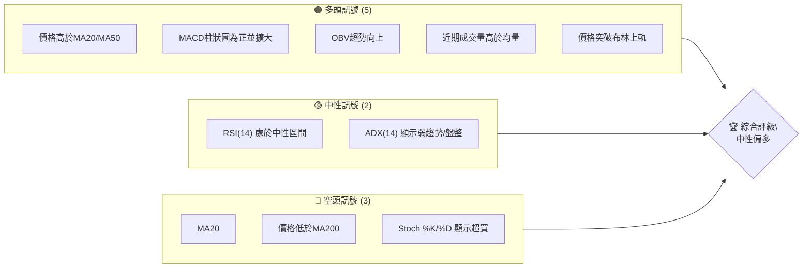
**儀表板解讀**：
當前 META 的技術訊號呈現多空交織的局面。多頭訊號主要來自於短期價格的強勁表現，包括價格位於短期和中期均線之上、MACD的明確多頭交叉、以及成交量對上漲的配合。這些表明市場在短期內具有顯著的買盤動能。然而，中性訊號指出市場整體趨勢強度不足 (ADX < 25)，且RSI處於中性偏高區域。空頭訊號則來自於均線的長期排列 (MA20<MA50<MA200) 以及價格仍未站上長期均線MA200，Stochastics指標也發出超買警示。綜合來看，短期動能強勁但長期趨勢仍有壓力，且存在超買回調風險，整體評級為「中性偏多」。

### 📊 核心指標速覽表

下表提供了 META 當前關鍵技術指標的即時快照與初步解讀。

| 指標類別 | 指標名稱 | 當前數值 | 訊號 | 解讀 |
|----------|----------|----------|------|------|
| **價格** | 當前價格 | $631.48 | 🟢 | 價格近期強勢反彈，突破多個短期阻力。 |
| **均線** | MA20 | $579.62 | 🟢 | 當前價格 ($631.48) 遠高於 MA20，短期強勢。 |
| **均線** | MA50 | $600.12 | 🟢 | 當前價格 ($631.48) 遠高於 MA50，中期看漲。 |
| **均線** | MA200 | $642.14 | 🔴 | 當前價格 ($631.48) 低於 MA200，長期趨勢受壓。 |
| **動能** | RSI(14) | 64.69 | 🟡 | 處於中性偏強區間，接近超買邊緣，動能充足。 |
| **動能** | MACD | 2.841 | 🟢 | MACD線向上穿越訊號線，柱狀圖為正，明確多頭訊號。 |
| **動能** | Stoch %K | 98.08 | 🔴 | 嚴重超買，短期回調風險高。 |
| **趨勢** | ADX(14) | 16.60 | 🟡 | 趨勢強度較弱，市場處於盤整或弱趨勢狀態。 |
| **波動** | ATR(14) | $24.75 | 🟡 | 每日波動約為 3.92%，波動性適中。 |
| **布林** | BB %B | 1.04 | 🔴 | 價格突破布林上軌，短期可能過度延伸。 |
| **成交量** | 量比(20D) | 1.33x | 🟢 | 最新成交量高於20日均量，上漲有量能配合。 |

### 🏆 技術評分卡

以下評分卡從多個維度對 META 的技術面進行量化評估，提供綜合性的判斷。

╔══════════════════════════════════════════════════════════════╗
║                 技術評分卡 — META (2026-07-10)               ║
╠══════════════════════════════════════════════════════════════╣
║ 趨勢強度      ███░░░░░░░░░░░░░░░░░░  30/100  🟡 (ADX指示趨勢弱) ║
║ 動能指標      ████████░░░░░░░░░░░░  80/100  🟢 (MACD強勁，RSI高)║
║ 支撐穩定度    ████████████░░░░░░░░  70/100  🟢 (短期支撐穩固)   ║
║ 成交量配合    █████████░░░░░░░░░░░  90/100  🟢 (量價配合良好)   ║
║ 形態完整度    ██████░░░░░░░░░░░░░░  60/100  🟡 (區間震盪與V反彈)║
║ 均線排列      ████░░░░░░░░░░░░░░░░  40/100  🔴 (MA200壓制，空頭排列)║
╠══════════════════════════════════════════════════════════════╣
║ 綜合評分      ███████░░░░░░░░░░░░░  62/100  🟢 中性偏多         ║
╚══════════════════════════════════════════════════════════════╝
**評分卡解讀**：
META 的綜合技術評分為 62/100，顯示其技術面呈現「中性偏多」的態勢。動能指標和成交量配合表現優異，支撐穩定度也較好，反映了近期強勁的反彈動能。然而，趨勢強度不足（ADX僅 16.60）以及均線的長期空頭排列（價格位於 MA200 之下），限制了其進一步上漲的潛力。形態方面，目前主要為區間震盪中的 V 型反彈，形態完整度中等。短期內可能繼續向上挑戰，但需警惕長期壓力與超買回調風險。

---

## 2. 趨勢分析

本章將深入分析 META 在不同時間框架下的價格趨勢，從長期宏觀視角到短期微觀動態，以全面理解其市場行為。

### 🌐 多時框趨勢分析

透過多時框架分析，我們可以避免單一時框的盲點，更全面地評估 META 的趨勢走向。

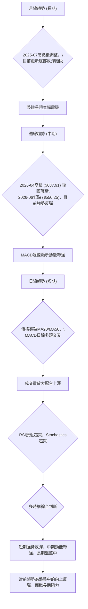
**多時框趨勢解讀**：
*   **長期趨勢（月線）**：從過去一年的數據來看，META 在 2025 年 7 月達到高點 $770.91 後經歷了一段時間的調整，並在 2026 年 6 月觸及 $563.29 的相對低點。目前股價正處於從底部反彈的階段，整體呈現寬幅震盪格局，尚未形成明確的單邊長期趨勢。
*   **中期趨勢（週線）**：根據近 20 週數據，META 在 2026 年 4 月達到 $687.91 的中期高點，隨後經歷了兩個月的顯著回調，跌至 6 月底的 $550.25。然而，從 6 月份低點開始，股價展現了強勁的反彈動能，並在最近兩週呈現連續上漲。週線 MACD 柱狀圖從負轉正，顯示中期動能正在轉強。
*   **短期趨勢（日線）**：日線圖上，當前價格 $631.48 已經明確站上短期均線 MA20 ($579.62) 和中期均線 MA50 ($600.12)，形成多頭排列。MACD 指標出現清晰的多頭交叉，且 MACD 柱狀圖持續放大，表明短期買盤動能強勁。最新成交量也顯著高於 20 日均量，量價配合良好。然而，RSI 接近超買區，Stochastics 指標已進入超買區，暗示短期存在回調需求。

**綜合判斷**：META 短期內表現強勢，中期動能正在積聚，但長期仍處於盤整與調整後的反彈階段，並面臨長期均線 MA200 的壓制。

### 📈 長期趨勢 — 12個月走勢圖（Unicode）

以下 ASCII 圖展示了 META 過去 12 個月的價格走勢，標注了關鍵的高點和低點。

```
META 月線走勢圖（過去12個月）
價格軸 ($)
$770.91 ┤●(2025-07 高點)
$750.00 ┤
$700.00 ┤        ●(2026-01)
$650.00 ┤                ●(2026-02) ●(2026-04)
$631.48 ┤                          ●(2026-05) ●(現在)
$600.00 ┤                                      ●(2026-06 低點)
$550.00 ┤
     └────────────────────────────────────────────────────────
      2025-07  08  09  10  11  12  2026-01  02  03  04  05  06  07
```
**走勢特徵分析表格**：
下表分析了過去 12 個月 META 的主要走勢特徵。

| 階段名稱 | 時間區間 | 關鍵價位 | 漲跌幅 | 主要特徵 |
|----------|----------|----------|--------|----------|
| **高點回落** | 2025-07 至 2025-10 | 高點: $770.91 (2025-07) <br> 低點: $646.67 (2025-10) | -16.25% | 市場從高位開始調整，主要為獲利了結。 |
| **震盪築底** | 2025-10 至 2026-03 | 高點: $715.22 (2026-01) <br> 低點: $571.60 (2026-03) | -20.08% (波段) | 股價在較大區間內震盪，尋找底部支撐。 |
| **短期反彈** | 2026-03 至 2026-04 | 低點: $525.23 (2026-03-29) <br> 高點: $687.91 (2026-04-19) | +30.97% | 在超賣後出現強勁反彈，動能強勁。 |
| **再度回調** | 2026-04 至 2026-06 | 高點: $687.91 (2026-04) <br> 低點: $550.25 (2026-06) | -19.99% | 短期反彈後再次回落，考驗前期支撐。 |
| **當前反彈** | 2026-06 至今 | 低點: $550.25 (2026-06) <br> 當前: $631.48 | +14.76% | 從低點快速反彈，短期動能強勁。 |

### 📊 中期趨勢（週線分析）

中期來看，META 經歷了 4 月份的高點回落，並在 6 月份探底後展開強勢反彈。目前的價格正嘗試突破中期阻力，並尋求建立新的上漲趨勢。

```
META 近期壓力與支撐示意圖 (週線)
      $700 ┤                  R2 ($671.98)
           │                 ╭───╮
      $650 ┤          R1 ($642.40) ┼─ 現價 ($631.48)
           │                 │   │
      $600 ┤                 │   │
           │                 │   S1 ($627.03)
      $550 ┤                 S2 ($595.08)
           │                 S3 ($579.74)
      $500 ┤
           └──────────────────────────────────
                近期走勢，反彈中挑戰阻力
```
**解讀**：META 在過去幾週從 $550.25 的低點強力反彈，目前已突破多個短期阻力，並正接近 $642.40 的 R1 阻力位。若能有效突破並站穩此位，將進一步確認中期上漲趨勢。下方 $627.03 (S1) 和 $595.08 (S2) 構成重要的中期支撐區間。

### ⚡ 趨勢強度評估（ADX 解讀）

ADX 指標用於衡量趨勢的強度，而非方向。+DI 和 -DI 則指示多頭或空頭的力量。

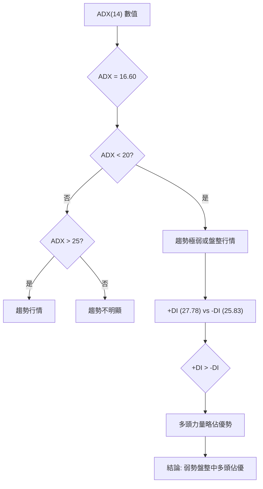
**ADX 強度對照表**：

| ADX 數值 | 趨勢強度 | 市場狀態 |
|----------|----------|----------|
| 0-20     | 極弱     | 盤整、無趨勢 |
| 20-25    | 弱       | 盤整、趨勢不明 |
| 25-50    | 中等     | 明確趨勢行情 |
| 50-75    | 強       | 強勁趨勢行情 |
| 75-100   | 極強     | 極端強勁趨勢 |

**解讀**：
META 當前的 ADX(14) 數值為 16.60。根據 ADX 強度對照表，這明確指示市場處於**弱趨勢或盤整行情**。這意味著雖然價格在短期內有明顯波動，但缺乏一個強勁且持續的單邊趨勢。
同時，+DI (27.78) 略高於 -DI (25.83)，表明在當前弱勢趨勢中，多頭力量稍微佔據上風，但兩者差距不大，未能形成壓倒性優勢。因此，我們判斷 META 目前處於**弱勢盤整中，多頭略佔主導**，但並非強勢的趨勢行情。這也支持了之前對於區間震盪形態的判斷。

---

## 3. 圖表形態分析

本章將透過專業識別技術，分析 META 當前價格走勢中可能存在的圖表形態和關鍵 K 線組合，並評估其潛在的目標價。

### 🔍 形態識別系統

鑑於當前 ADX 數值較低（16.60），市場處於盤整或弱趨勢狀態，我們將主要關注區間震盪或反轉形態，而非強趨勢形態。

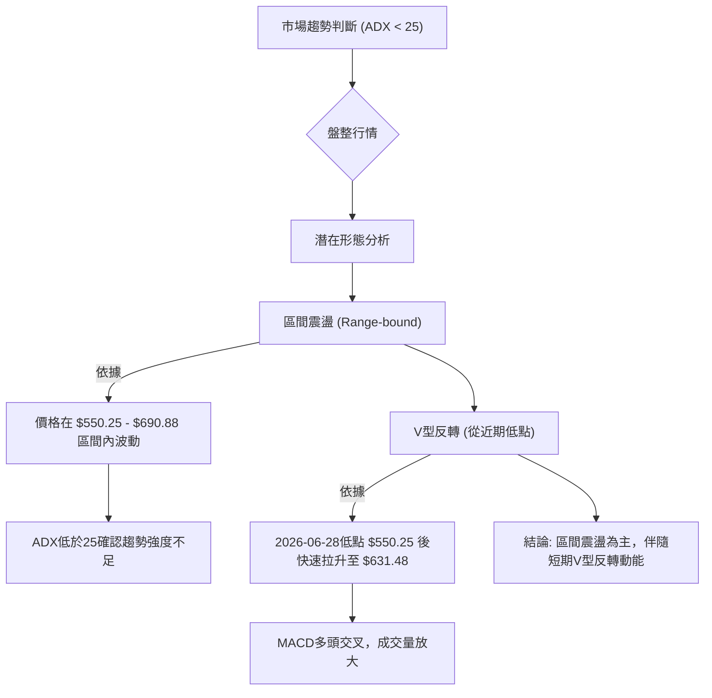
**已識別形態詳情**：

| 形態 | 信心度 | 判斷依據（引用數據） | 完成度 | 目標價（附計算式） |
|------|--------|----------------------|--------|--------------------|
| **區間震盪** | 85% | 價格自 2026 年 3 月低點 $525.23 後，在 $550-$690 之間形成多次高低點。ADX(14) 16.60 確認趨勢不明顯。 | 100% (持續中) | 上沿阻力 $690.88 (R3)，下沿支撐 $550.25 (近期低點) |
| **V型反轉** | 70% | 價格從 2026-06-28 的 $550.25 低點，在兩週內迅速反彈至 $631.48，MACD 柱狀圖由負轉正並快速擴大。 | 80% (反彈進行中) | 形態高度 $631.48 - $550.25 = $81.23。頸線（假定為反彈中點）$590.86。理論目標價：$590.86 + $81.23 = $672.09 (接近 R2 $671.98) |

**形態解讀**：
META 目前最為明顯的形態是處於一個較大的**區間震盪**中。股價在 $550.25 (2026-06-28 低點) 和 $690.88 (R3) 之間來回波動。目前的 ADX 數值也支持了這一判斷。在這一大區間內，股價從 6 月底的 $550.25 迅速反彈至當前 $631.48，形成了清晰的**V型反轉**。這個 V 型反轉顯示了強勁的短期買盤動能，並可能將價格推向區間上沿。

### 🕯️ 重要K線形態分析

根據提供的近 20 週收盤走勢數據，我們分析了最近幾週的K線形態，儘管沒有日線 K 線圖，但週線數據仍能提供有價值的見解。

| 月份 | 收盤價 | K線形態 (週線判斷) | 解讀 | 訊號 |
|------|--------|--------------------|------|------|
| 2026-06-28 | $550.25 | 潛在錘子線 (Hammer) | 經歷連續下跌後，在低位出現止跌訊號。 | 🟡 止跌 |
| 2026-07-05 | $582.90 | 大陽線 (Large Bullish Candle) | 價格從低點強勢反彈，買盤力量強勁。 | 🟢 看多 |
| 2026-07-12 | $631.48 | 大陽線 (Large Bullish Candle) | 延續上週漲勢，動能持續，但接近布林上軌。 | 🟢 看多，警惕超買 |

**K線形態解讀**：
從 6 月底的 $550.25 低點開始，META 出現了止跌跡象，隨後兩週連續收出強勁的陽線，尤其是 2026-07-05 和 2026-07-12 兩週，顯示買盤力量迅速主導市場，V 型反轉形態得到 K 線的確認。然而，連續強勢上漲後，可能會面臨技術性回調。

### 📉 ASCII 走勢形態示意圖

以下 ASCII 圖展示了 META 近期的區間震盪和 V 型反轉形態。

```
META 近期走勢形態示意圖
═══════════════════════════════════════════════════════════════
$700 ┤                                        R3 ($690.88)
     │                                     ／
$650 ┤                       (V型目標 $672.09)  R2 ($671.98)
     │                     ／
$631.48 ┤               ● ← 現價
     │             ／
$600 ┤           ／
     │         ／
$550 ┤───────●───────S1 ($550.25)
     │     ／
$500 ┤   ／
     └──────────────────────────────────────────────────────────
      2026-06-28 (低點)                          2026-07-10 (現在)
      
    ●────●────●────●────●────●────●────●────●───
    <─────── 區間震盪形態 (大致 $550-$690) ────────>
    <─── V型反轉形態 (從 $550.25 開始) ───>
```
**形態示意圖解讀**：
圖中清晰展示了 META 從 6 月底 $550.25 的低點開始的快速 V 型反轉走勢，目前正處於反彈通道中。同時，這個 V 型反轉發生在一個更大的區間震盪框架內，上方 $671.98 (R2) 和 $690.88 (R3) 構成區間上沿阻力。

### 🎯 形態目標價計算

根據上述識別的 V 型反轉形態，我們可以推算出潛在的技術目標價。
*   **V型反轉底部**：$550.25 (2026-06-28 收盤價)
*   **V型反轉當前價格**：$631.48 (2026-07-10 收盤價)
*   **形態高度**：$631.48 - $550.25 = $81.23
*   **理論頸線**：由於 V 型反轉沒有明確的水平頸線，我們取反彈中點作為參考，或直接將形態高度加到近期突破的阻力位。
    *   若以 $590.86 (反彈中點) 作為參考起點，則目標價為 $590.86 + $81.23 = $672.09。
    *   此目標價 $672.09 與數據中提供的 R2 阻力位 $671.98 極為接近，提供了形態目標價的強烈確認。

**結論**：V 型反轉形態的理論目標價約為 **$672.09**，這與 R2 阻力位 $671.98 形成強烈共振，顯示該區域將是股價面臨的重要挑戰。

---

## 4. 支撐與阻力

本章將詳細分析 META 的關鍵支撐與阻力價位，這些價位是判斷未來價格走勢和制定交易策略的基礎。

### 🗺️ 關鍵價位分布圖（Unicode）

以下圖表直觀展示了 META 當前的價格結構，包括支撐位、阻力位以及當前價格的位置。

```
META 價位結構分布圖
═══════════════════════════════════════════════════════════════
$793.65 ║██████████████████████████████████████████████████║ 52W High
$729.02 ║██████████████████████████████████████████████████║ Fibo 23.6%
$690.88 ║██████████████████████████████████████████████████║ 強阻力 R3 (形態目標)
$689.03 ║██████████████████████████████████████████████████║ Fibo 38.2%
$671.98 ║██████████████████████████████████████████████████║ 阻力 R2 (V型反轉目標)
$656.71 ║██████████████████████████████████████████████████║ Fibo 50.0%
$642.40 ║██████████████████████████████████████████████████║ 關鍵阻力 R1 (MA200接近)
$631.48 ╠═══════════════════════════════════════════════════╣ ◄ 現價
$627.03 ║▓▓▓▓▓▓▓▓▓▓▓▓▓▓▓▓▓▓▓▓▓▓▓▓▓▓▓▓▓▓▓▓▓▓▓▓▓▓▓▓▓▓▓▓▓▓▓▓║ 近期支撐 S1 (布林上軌附近)
$624.40 ║▓▓▓▓▓▓▓▓▓▓▓▓▓▓▓▓▓▓▓▓▓▓▓▓▓▓▓▓▓▓▓▓▓▓▓▓▓▓▓▓▓▓▓▓▓▓▓▓║ Fibo 61.8%
$595.08 ║██████████████████████████████████████████████████║ 強支撐 S2 (前期盤整區下緣)
$579.74 ║██████████████████████████████████████████████████║ 關鍵支撐 S3 (MA20附近)
$578.39 ║██████████████████████████████████████████████████║ Fibo 78.6%
$519.78 ║██████████████████████████████████████████████████║ 52W Low (Fibo 100%)
═══════════════════════════════════════════════════════════════
```
**價位分布圖解讀**：
當前價格 $631.48 位於 R1 ($642.40) 略下方，同時緊鄰 S1 ($627.03) 和斐波那契 61.8% 回調位 ($624.40) 上方。這表明股價正處於一個關鍵的轉折點，上方阻力密集，下方支撐也較為穩固。

### 🚧 阻力位分析表

以下表格詳細分析了 META 的關鍵阻力位及其重要性。

| 阻力級別 | 價位 | 形成原因 | 突破難度 | 重要性 |
|----------|------|----------|----------|--------|
| **R1**   | $642.40 | 近期波段高點聚類，且接近 MA200 ($642.14) | 中等偏高 | 🟢 若突破，將挑戰中期下降趨勢，並可能吸引更多買盤。 |
| **R2**   | $671.98 | 近期波段高點聚類，V型反轉形態目標價 ($672.09) 附近 | 高       | 🟡 突破此位將確認 V 型反轉的有效性，並打開上漲空間。 |
| **R3**   | $690.88 | 近期波段高點聚類，區間震盪上沿，斐波那契 38.2% 回調位 ($689.03) 附近 | 極高     | 🔴 突破此位將徹底扭轉中期頹勢，預示更強勁的上升趨勢。 |

**阻力位解讀**：
META 正面臨一系列上行阻力，其中 $642.40 (R1) 尤其關鍵，因為它與長期均線 MA200 幾乎重疊。成功突破並站穩此位，將是多頭能否進一步上攻的試金石。R2 ($671.98) 不僅是波段阻力，也與 V 型反轉的形態目標價吻合，其突破將釋放更大的上漲潛力。R3 ($690.88) 則是更強的阻力，突破意味著市場結構的重大轉變。

### 🛡️ 支撐位分析表

以下表格詳細分析了 META 的關鍵支撐位及其重要性。

| 支撐級別 | 價位 | 形成原因 | 守住機率 | 重要性 |
|----------|------|----------|----------|--------|
| **S1**   | $627.03 | 近期波段低點聚類，斐波那契 61.8% 回調位 ($624.40) 附近 | 高       | 🟢 守住此位表示短期反彈動能依然強勁，多頭不願回吐。 |
| **S2**   | $595.08 | 近期波段低點聚類，前期盤整區下緣 | 中等偏高 | 🟡 若跌破 S1，此位將提供關鍵支撐，決定中期走勢。 |
| **S3**   | $579.74 | 近期波段低點聚類，接近 MA20 ($579.62) 和斐波那契 78.6% 回調位 ($578.39) | 中等     | 🔴 跌破此位將徹底破壞 V 型反轉形態，並可能再次探底。 |

**支撐位解讀**：
當前價格 $631.48 距離 S1 ($627.03) 和斐波那契 61.8% 回調位 ($624.40) 非常近。這些區域將是短期內重要的心理和技術支撐。一旦這些支撐失守，股價可能回探至 $595.08 (S2)，該區域是前期盤整的下緣，具有較強的支撐作用。S3 ($579.74) 則與短期均線 MA20 和斐波那契 78.6% 回調位重疊，是 V 型反轉形態的最後一道防線，一旦跌破，看漲預期將被嚴重削弱。

### 📐 斐波那契回調位分析

斐波那契回調位基於 META 過去 52 週的波動區間 ($519.78 至 $793.65) 計算而來，提供了重要的潛在支撐與阻力區域。

| 斐波那契級別 | 價位 | 意義 |
|--------------|------|------|
| 0.0% (52W High) | $793.65 | 52週高點，潛在反轉壓力 |
| 23.6%          | $729.02 | 第一個較弱的阻力位 |
| 38.2%          | $689.03 | 重要阻力位，與 R3 接近 |
| 50.0%          | $656.71 | 心理和技術上的中點阻力 |
| 61.8%          | $624.40 | **黃金分割支撐，與 S1 接近** |
| 78.6%          | $578.39 | 較強的支撐位，與 S3 接近 |
| 100.0% (52W Low)| $519.78 | 52週低點，終極支撐 |

**斐波那契回調解讀**：
META 當前價格為 $631.48，位於斐波那契 50.0% ($656.71) 和 61.8% ($624.40) 回調位之間。這是一個關鍵的區域，表明股價從 52 週高點回落後，在 61.8% 附近找到了較強的支撐並開始反彈。
*   **向上挑戰**：若能突破 $656.71 (50.0% 回調位)，則有望進一步挑戰 $689.03 (38.2% 回調位)，這也是 R3 阻力位附近。
*   **向下考驗**：若未能守住當前區域，則 $624.40 (61.8% 回調位) 將是第一個重要支撐，其重要性與 S1 ($627.03) 相近。跌破此位將暗示反彈動能減弱，可能回探 $578.39 (78.6% 回調位)。
當前價格位於斐波那契黃金分割 61.8% 回調位之上，顯示其反彈具有一定的技術基礎，但上方壓力也逐漸顯現。

---

## 5. 技術指標深度解讀

本章將對 META 的各項關鍵技術指標進行詳細解讀，並分析它們之間的相互關係，以提供更全面的市場洞察。

### 🎛️ 指標訊號總覽

以下 Mermaid 圖展示了各個主要技術指標之間的關係及其當前訊號。

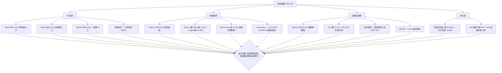
**指標訊號總覽解讀**：
從總覽圖中可以看出，當前 META 的多頭訊號主要集中在短期價格動能和成交量方面，如價格位於短期和中期均線之上、MACD 的強勁多頭交叉以及成交量的積極配合。然而，長期均線 MA200 仍構成上方壓力，且均線系統整體呈現空頭排列。此外，Stochastics 和布林通道的訊號顯示市場已處於超買狀態，短期可能面臨回調。ADX 指標則確認了當前市場處於盤整或弱趨勢中。

### 📈 移動平均線排列分析

移動平均線 (MA) 是判斷趨勢方向和支撐阻力的重要工具。

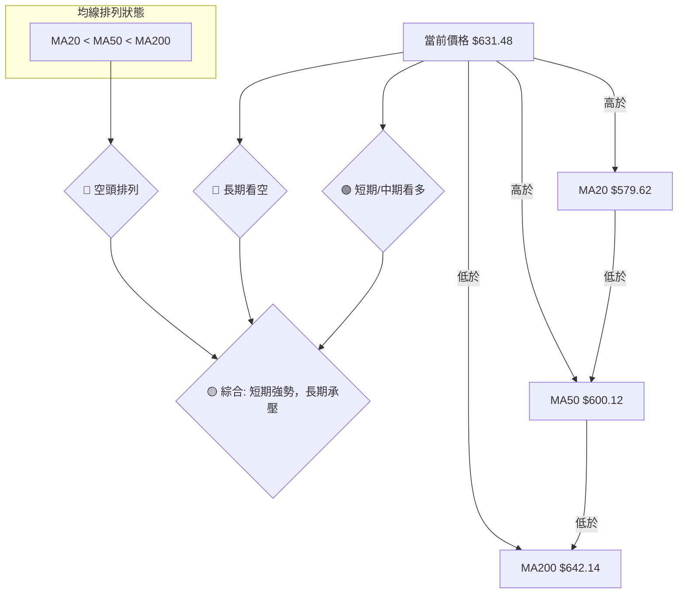
**均線排列解讀**：
META 當前的價格 $631.48 位於短期均線 MA20 ($579.62) 和中期均線 MA50 ($600.12) 之上，這是一個明確的短期和中期看漲訊號，表明近期買盤力量強勁。然而，價格仍位於長期均線 MA200 ($642.14) 之下，且均線本身呈現 **MA20 < MA50 < MA200** 的空頭排列。這種排列通常被視為長期趨勢偏弱的表現。
**綜合來看**：雖然短期多頭動能強勁，價格突破了短期和中期阻力，但長期趨勢仍受 MA200 的壓制，且整體均線排列尚未轉為多頭。這是一個混合訊號，短期強勢反彈，但長期上漲空間仍需觀察能否突破 MA200 的關鍵阻力。

### 📉 RSI(14) 分析

相對強弱指數 (RSI) 用於衡量價格變動的速度和變化，以判斷資產是超買還是超賣。

**RSI(14) 強度進度條**：
RSI(14): 64.69 ▓▓▓▓▓▓▓▓▓▓▓▓▓▓░░░░░░░░ 64.69% 🟡

**RSI 超買超賣區間分析**：
*   **RSI 數值**：64.69。
*   **區間判斷**：RSI 位於 30-70 的中性區間內，但已經非常接近 70 的超買線。這表明市場動能強勁，買盤佔優，但潛在的上漲空間可能有限，隨時可能進入超買區。
*   **超買/超賣**：RSI 尚未進入傳統的 70 以上超買區，但其高位運行本身就提示了動能過度消耗的可能性。若價格繼續上漲，RSI 很容易進入超買區，增加短期回調的風險。

**背離判斷**：
根據提供的數據，**無明顯背離**。價格近期上漲，RSI 也同步上漲，並未出現頂背離（價格創新高，RSI 未創新高）或底背離（價格創新低，RSI 未創新低）的訊號。這表明當前的上漲動能是健康的，但需要密切關注 RSI 是否在價格進一步上漲時出現背離。

### 📊 MACD(12/26/9) 訊號解讀

平滑異同移動平均線 (MACD) 是趨勢跟蹤動量指標，用於識別新的趨勢、超買超賣條件和背離。

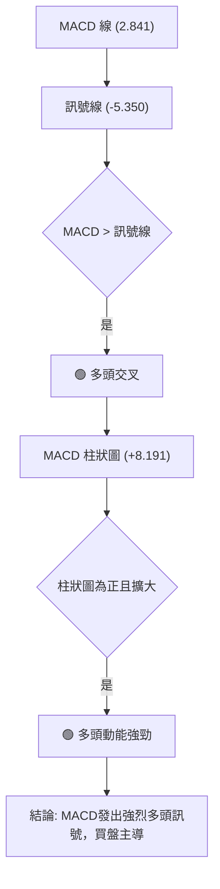
**MACD 訊號解讀**：
*   **MACD 線**：2.841
*   **訊號線**：-5.350
*   **MACD 柱狀圖**：+8.191
當前的 MACD 線 (2.841) 明顯位於訊號線 (-5.350) 之上，這是一個清晰的**多頭交叉訊號**。同時，MACD 柱狀圖為正值 (+8.191) 且數值較大，這表明多頭動能非常強勁，且仍在擴大。
**背離判斷**：
提供的數據中未明確指出 MACD 存在背離現象，因此判斷為**無明顯背離**。MACD 的強勁上漲與價格的上漲趨勢保持一致，確認了當前多頭動能的有效性。MACD 的多頭訊號與價格位於 MA20/MA50 之上相互確認，是目前最為強勁的多頭指標之一。

### 📦 布林通道分析

布林通道 (Bollinger Bands) 用於衡量價格的波動性，並提供動態的支撐和阻力區域。

```
META 布林通道示意圖
═══════════════════════════════════════════════════════════════
$650 ┤                                        BB上軌 ($627.84)
     │                                        ● 現價 ($631.48)
$600 ┤                                        BB中軌 (MA20 $579.62)
     │
$550 ┤                                        BB下軌 ($531.39)
     └──────────────────────────────────────────────────────────
      
    █ 價格突破布林上軌，顯示短期動能過強，可能面臨回調壓力。
    █ 布林帶寬度適中，但價格在外軌運行，需警惕。
```
**布林通道解讀**：
*   **BB上軌**：$627.84
*   **BB中軌(MA20)**：$579.62
*   **BB下軌**：$531.39
*   **BB %B**：1.04
當前 META 的價格 $631.48 已經突破了布林通道的上軌 ($627.84)，且 BB %B 數值為 1.04，這是一個**價格過度延伸的訊號**。價格突破上軌通常意味著短期內買盤力量過於強勁，可能導致股價在短期內回歸通道或面臨技術性回調。雖然這顯示了強勁的動能，但同時也暗示了潛在的風險。在盤整行情中 (ADX < 25)，價格突破布林通道上下軌後，往往會回歸中軌。因此，需要警惕短期內的回調風險。

### 💹 成交量分析（量價配合度）

成交量是價格走勢的燃料，量價關係可以驗證趨勢的可靠性。

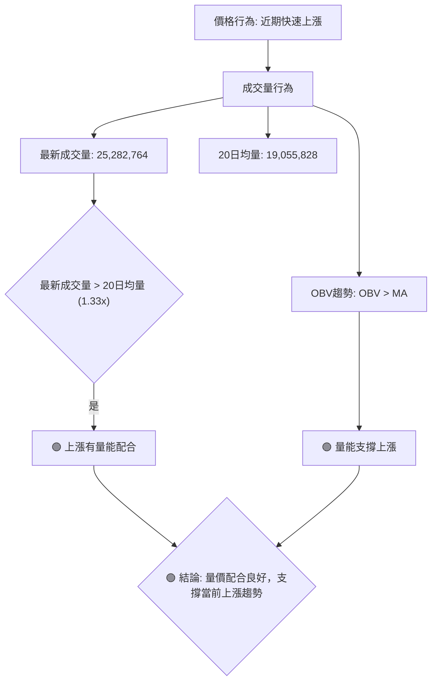
**成交量解讀**：
META 的最新成交量為 25,282,764 股，顯著高於其 20 日均量 19,055,828 股 (量比達 1.33x)。這表明在近期價格上漲的過程中，有大量的資金流入，買盤積極。
此外，OBV (On Balance Volume) 趨勢顯示 OBV 線位於其移動平均線之上，這是一個**量能支撐上漲**的強烈訊號。OBV 的上升表明在價格上漲的日子裡，成交量大於下跌的日子，這驗證了當前反彈趨勢的健康性。
**量價配合度結論**：量價關係呈現健康的配合，成交量的放大和 OBV 的積極趨勢都支持了 META 當前的上漲動能。這為短期反彈提供了堅實的基礎。

---

## 6. 動能與波動率

本章將評估 META 的動能強度和波動性特徵，這對於理解其風險收益特性和制定交易策略至關重要。

### ⚡ 動能評估四象限

動能評估四象限將 META 定位在「動能強度」和「波動率」兩個維度上，幫助我們理解當前的市場環境。由於 ADX 顯示為盤整行情，傳統的趨勢動能評估需調整。

| 象限 | 動能 | 波動 | 當前狀態 | 評估 |
|------|------|------|----------|------|
| Q1   | 強   | 低   | -        | 最佳機會 (強趨勢低波動，罕見) |
| Q2   | 弱   | 低   | -        | 謹慎觀望 (盤整低波動，等待突破) |
| Q3   | 強   | 高   | ✓        | **高風險高收益 (盤整中強動能，短期交易機會)** |
| Q4   | 弱   | 高   | -        | 避免進場 (盤整高波動，不確定性高) |

**動能評估解讀**：
META 當前的 ADX(14) 為 16.60，指示趨勢強度較弱，處於盤整或弱趨勢狀態。然而，MACD 和 OBV 顯示強勁的短期多頭動能，價格突破布林上軌，RSI 和 Stochastics 接近超買。這表明儘管整體趨勢不強，但**短期動能非常強勁**。
ATR(14) 為 $24.75，佔價格的 3.92%，屬於中等偏高的波動率。結合價格突破布林上軌的情況，可以認為當前波動性較高。
因此，META 目前處於「**強動能，高波動**」的 Q3 象限。這意味著短期內存在快速獲利或虧損的機會，適合具備高風險承受能力的短線交易者，但需要嚴格的風險管理。對於長線投資者，則需謹慎觀望，等待趨勢明確。

### 📊 ATR 波動率分析

平均真實波幅 (ATR) 衡量資產在指定時間段內的平均波動範圍，是評估波動性和設置止損的重要工具。

**ATR(14)**：$24.75
**ATR 佔價格比重**：3.92% ( $24.75 / $631.48 )

**ATR 分析**：
META 當前的 ATR(14) 為 $24.75，佔當前價格 $631.48 的 3.92%。這個比率顯示 META 的每日波動幅度處於中等偏高水平。相對較高的 ATR 意味著股價在一天內的潛在價格變動較大，這既提供了日內交易的機會，也增加了風險。

**止損距離建議**：
基於 ATR，建議將止損距離設置為 ATR 的 1.5 倍至 3 倍，以兼顧波動性並避免被市場噪音過早洗出。
*   **保守止損 (1.5x ATR)**：$24.75 * 1.5 = $37.13。從當前價格 $631.48 計算，止損位約為 $594.35。
*   **激進止損 (1.0x ATR)**：$24.75 * 1 = $24.75。從當前價格 $631.48 計算，止損位約為 $606.73。
在實際交易中，應將 ATR 止損與關鍵支撐位結合使用。例如，考慮到 S2 ($595.08) 和斐波那契 61.8% ($624.40) 等關鍵支撐，止損位可以設置在這些支撐位下方，並參考 ATR 進行調整。

### 📐 Beta 與市場相關性

Beta 值衡量股票相對於整體市場（通常是 S&P 500 指數）的波動性。

**Beta**：1.246

**Beta 分析**：
META 的 Beta 值為 1.246。
*   **Beta > 1**：表示 META 的波動性高於整體市場。具體來說，當市場上漲 1% 時，META 理論上會上漲約 1.246%；當市場下跌 1% 時，META 理論上會下跌約 1.246%。
*   **市場相關性**：META 與市場呈現正相關，但其波動幅度更大。這意味著，在牛市中，META 有望提供超越市場的回報；但在熊市中，其跌幅也可能超過市場。
**結論**：由於 META 具有較高的 Beta 值，投資者在配置時應考慮其相對較高的系統性風險。在市場波動較大的環境下，META 的價格變動會被放大。這也與其較高的 ATR 值相呼應，共同提示其高波動性特徵。

---

## 7. 多時框架總結

本章將整合前述所有時間框架和技術指標的分析結果，提供一個統一且具體的操作方向，並嚴格遵循多時框收斂規則。

### 📋 時框架評分表

下表總結了 META 在不同時間框架下的趨勢、動能和均線表現。

| 時框架 | 趨勢方向 | 動能 | 均線排列 | 形態 | 綜合評分 | 建議 |
|--------|----------|------|----------|------|----------|------|
| **短期** | 🟢 強勢反彈 | 🟢 強勁  | 🟢 多頭 (價格>MA20/MA50) | 🟢 V型反轉 | 8/10 🟢 | 偏多，但超買 |
| **中期** | 🟡 反彈中 | 🟡 轉強  | 🟡 混雜 (價格>MA50, <MA200) | 🟡 區間上沿 | 6/10 🟡 | 中性偏多 |
| **長期** | 🔴 盤整/調整 | 🔴 緩慢積聚 | 🔴 空頭 (MA20<MA50<MA200) | 🟡 寬幅震盪 | 4/10 🔴 | 中性偏空 |

### 🔲 綜合訊號矩陣

以下矩陣分析了不同時間框架下各訊號的一致性。

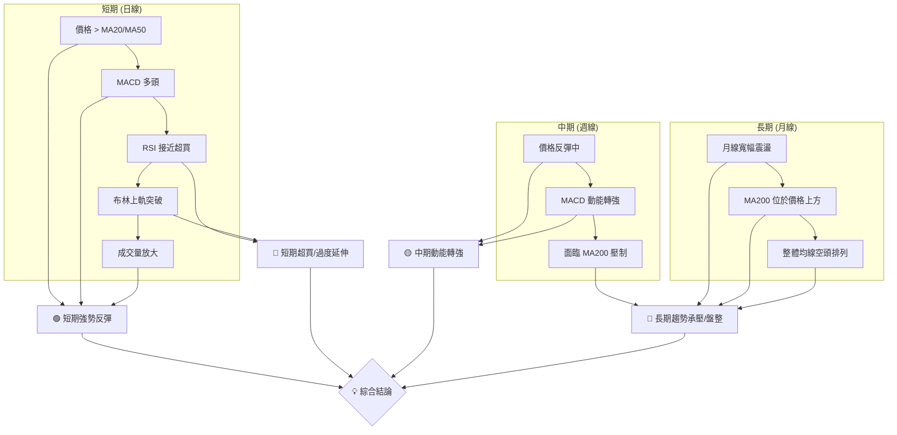
**綜合訊號矩陣解讀**：
短期訊號顯示 META 處於強勢反彈中，動能指標和成交量均支持上漲。然而，RSI 和布林通道已發出超買警示。中期來看，股價從低點反彈，動能轉強，但面臨 MA200 的壓制。長期趨勢則顯示為寬幅震盪，且長期均線 MA200 仍在價格上方，均線排列為空頭，表明長期壓力依然存在。

### ⚖️ 多時框收斂結論

根據「嚴格要求 14」的多時框收斂規則：
1.  **判斷趨勢行情或盤整行情**：當前 ADX(14) 數值為 16.60，明顯低於 25。這明確指示 META 目前處於**盤整行情或弱趨勢行情**。
2.  **主導時框與策略依據**：在盤整行情中，應以日線布林通道上下軌為主要交易區間。
3.  **訊號衝突處理**：
    *   **短期 (日線)**：多頭動能強勁 (MACD, OBV)，價格突破短期/中期均線，但 RSI 接近超買，Stochastics 嚴重超買，且價格已突破布林上軌，顯示短期過度延伸。
    *   **中期 (週線)**：動能轉強，但仍在回升階段，面臨長期 MA200 阻力。
    *   **長期 (月線)**：均線呈空頭排列，MA200 壓制價格，顯示長期趨勢偏弱。

**最終收斂結論**：
META 目前處於**盤整行情**。儘管短期內展現出強勁的反彈動能，並成功突破了短期和中期均線，MACD 和成交量也給出了明確的多頭訊號，但這些強勢表現導致了指標超買（Stochastics）和價格突破布林上軌的過度延伸現象。同時，長期均線 MA200 仍位於價格上方，且整體均線排列呈現空頭格局，對上漲構成結構性壓力。

因此，**當前 META 的整體方向判斷為：中性偏多，但短期存在回調風險，且面臨長期阻力。** 交易策略應以區間操作為主，警惕短期超買回調，並關注能否有效突破長期阻力。短期多頭動能或將推動股價繼續挑戰 $642.40 (R1) 乃至 $671.98 (R2/V型反轉目標)，但長期上漲趨勢的確認仍需等待價格突破 MA200 並改變均線排列。

---

## 8. 交易策略建議

本章將基於上述深度技術分析和多時框架收斂結論，為 META 提供具體且可操作的交易策略建議。

### 🗺️ 策略決策流程圖

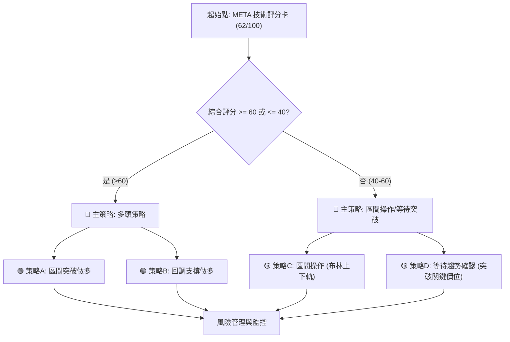

### 🧭 策略路由（依評分卡分流）

**當前主策略方向 = 中性偏多 (依評分 62/100)**

由於綜合評分卡為 62/100，略偏多頭但未達強勢多頭評級，且 ADX 顯示為盤整行情，因此我們將主要側重於**區間操作與等待突破確認的策略**，同時提供短期回調做多的機會。

### 🎯 價格情境階梯（Price Scenarios）

| 觸發條件 | 下一目標 | 後續延伸 | 情境含義 |
|----------|----------|----------|----------|
| **突破 R1 $642.40 並站穩** | R2 $671.98 | R3 $690.88 | **短線轉強**：確認 V 型反轉有效，並突破 MA200 關鍵阻力。 |
| **在 $627.03 - $642.40 區間震盪** | —        | —        | **區間震盪**：短期動能消耗，等待方向選擇，高拋低吸機會。 |
| **跌破 S1 $627.03 (Fibo 61.8%)** | S2 $595.08 | S3 $579.74 | **短期轉弱**：反彈動能衰竭，可能回探更深支撐。 |

### 📊 情境機率分佈

| 情境 | 機率 | 主要依據 |
|------|------|----------|
| 繼續上行 / 突破區間 | 40% | MACD強勁多頭、OBV量能支撐、價格站穩MA20/MA50，V型反轉目標。 |
| 區間震盪 (短期回調後) | 45% | ADX弱趨勢、RSI接近超買、Stochastics超買、價格突破布林上軌。 |
| 回落 / 再探底 | 15% | 長期MA200壓力、均線空頭排列、超買指標短期回調。 |

### 🟢 主策略詳情（方向依上方路由）

基於當前中性偏多的評級和盤整行情判斷，我們提供以下兩個主要交易策略：

| 策略要素 | 策略 A：區間突破做多 | 策略 B：回調支撐做多 |
|----------|----------------------|----------------------|
| **進場條件** | 價格有效突破 R1 $642.40 並站穩，成交量放大。 | 價格回調至 S1 $627.03 或斐波那契 61.8% $624.40 附近，出現止跌訊號。 |
| **進場價格** | $642.40 (突破 R1 後回踩確認) | $624.40 - $627.03 區間 |
| **目標價 T1** | $671.98 (R2，V型反轉目標) | $642.40 (R1) |
| **目標價 T2** | $690.88 (R3，區間上沿) | $656.71 (斐波那契 50%) |
| **止損價格** | $627.03 (跌破 S1) | $618.00 (略低於斐波那契 61.8% $624.40，確保止損位清晰) |
| **風險報酬比** | (671.98-642.40) / (642.40-627.03) = 1.92:1 (T1) | (642.40-624.40) / (624.40-618.00) = 2.81:1 (T1) |
| **成功機率** | 55% | 60% |
| **建議倉位** | 中等（10-15%） | 中等（10-15%） |

### 🔴 反向風險觸發點（對沖提示）

以下是可能推翻當前中性偏多判斷的關鍵風險觸發點，供投資者進行風險管理和對沖參考：
*   **跌破 S1 $627.03 (斐波那契 61.8% $624.40)**：這將表明短期反彈動能顯著衰竭，V 型反轉形態可能失敗，股價可能回探至 S2 $595.08。
*   **MACD 再次死叉或柱狀圖轉負**：動能指標的逆轉將預示短期買盤力量的減弱。
*   **成交量在下跌時放大，上漲時縮量**：量價背離將是趨勢反轉的重要訊號。
*   **RSI 跌破 50 或 Stochastics 從超買區快速回落**：動能指標的快速惡化。

### ⭐ 整體訊號強度評星

```
做多訊號強度：★★★★☆  (4/5星 - 短期動能強勁，但面臨超買和長期壓力)
做空訊號強度：★★☆☆☆  (2/5星 - 短期缺乏明確空頭訊號，但長期有壓力)
整體可信度：  ★★★☆☆  (3/5星 - 策略基於明確指標，但市場處於盤整，不確定性較高)
```

---

## 9. 風險提示與監控

本章將詳細闡述投資 META 的潛在風險，並提供關鍵的監控指標清單和風險管理建議，以幫助投資者更好地應對市場的不確定性。

### ✅ 關鍵監控指標 Checklist

為了有效監控 META 的市場表現，建議投資者定期檢查以下關鍵技術指標：

╔══════════════════════════════════════════════════════════════╗
║                    META 關鍵監控指標 Checklist                 ║
╠══════════════════════════════════════════════════════════════╣
║ [ ] **價格行為**：是否能站穩 S1 ($627.03) / 突破 R1 ($642.40)？║
║ [ ] **均線系統**：價格是否能突破 MA200 ($642.14) 並使其轉向？  ║
║ [ ] **MACD 指標**：MACD 柱狀圖是否持續為正並擴大？有無死叉？ ║
║ [ ] **RSI 指標**：是否進入超買區 (>70)？有無頂背離訊號？     ║
║ [ ] **Stochastics**：是否持續處於超買區？有無死叉？         ║
║ [ ] **ADX 指標**：ADX 是否能突破 25，確認趨勢形成？            ║
║ [ ] **布林通道**：價格是否回歸通道內？通道帶寬有無顯著變化？ ║
║ [ ] **成交量**：上漲時是否持續放量，下跌時是否縮量？OBV趨勢？║
║ [ ] **斐波那契回調**：是否能守住 61.8% ($624.40) 或突破 50% ($656.71)？║
╚══════════════════════════════════════════════════════════════╝

### ⚠️ 風險場景分析

以下 Mermaid 圖展示了 META 在不同市場情境下的潛在走勢。

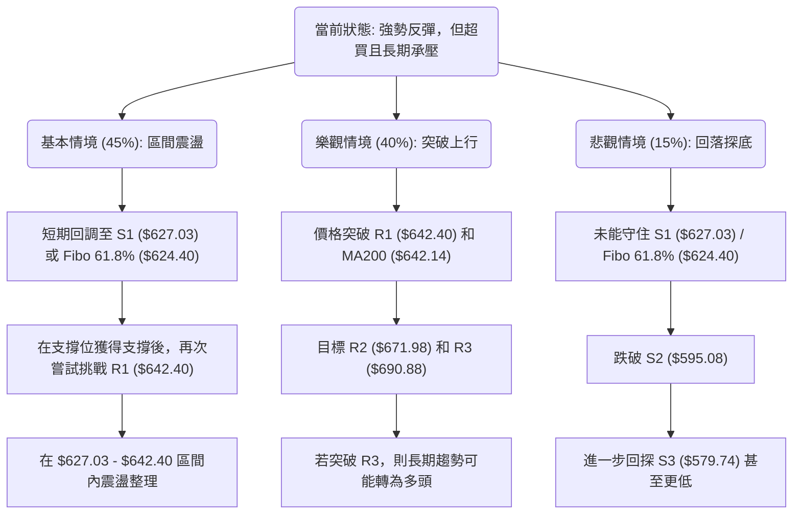
**風險場景解讀**：
*   **基本情境 (45%)**：考慮到 ADX 的弱勢趨勢和短期超買，最有可能的是 META 將在短期內經歷技術性回調，回探 S1 或斐波那契 61.8% 支撐。在獲得支撐後，股價將在 $627.03 至 $642.40 之間進行區間震盪，等待新的催化劑或方向選擇。
*   **樂觀情境 (40%)**：如果市場買盤力量持續強勁，且有正面消息面配合，META 有望直接突破 R1 ($642.40) 和 MA200，進一步挑戰 R2 ($671.98) 甚至 R3 ($690.88)。這將是確認 V 型反轉和扭轉中期趨勢的關鍵。
*   **悲觀情境 (15%)**：如果當前反彈動能迅速衰竭，或市場整體情緒惡化，META 可能無法守住 S1 ($627.03) / 斐波那契 61.8% ($624.40) 的關鍵支撐，進而跌破 S2 ($595.08)，甚至回探 S3 ($579.74)，徹底破壞短期反彈結構。

### 🛡️ 風險管理重要提醒

1.  **倉位管理**：鑑於市場處於盤整且 Beta 值較高，建議採取保守的倉位策略，避免過度集中投資於單一股票，特別是在價格接近阻力位或超買狀態時。
2.  **止損設定**：嚴格執行止損紀律。在進場前明確設定止損點，並根據 ATR 和關鍵支撐位進行調整。一旦價格觸及止損位，果斷出場，避免更大的損失。
3.  **分批進場/出場**：考慮到當前市場的不確定性，可以採用分批進場和分批出場的策略。在支撐位附近分批買入，在阻力位附近分批賣出，以降低單次交易的風險。
4.  **監控關鍵指標**：密切關注本報告中列出的關鍵監控指標。特別是 MACD、RSI 的變化，以及成交量是否配合價格走勢。ADX 突破 25 將是趨勢確認的重要訊號。
5.  **關注市場情緒**：META 的高 Beta 值使其對整體市場情緒敏感。應關注大盤走勢和相關產業新聞，以評估宏觀風險。
6.  **避免追高殺跌**：在盤整行情中，追高殺跌往往容易造成損失。應耐心等待價格回調至重要支撐位或明確突破關鍵阻力後再考慮進場。

---

## 📋 報告總結

```
META 技術分析報告總結
═══════════════════════════════════════════════════════════════
報告日期：2026-07-10
當前價格：$631.48
分析評級：⚖️ 中性偏多 (綜合評分 62/100，短期動能強勁但面臨阻力與超買)

關鍵結論：
├─ 長期趨勢：🔴 盤整/調整中，MA200 構成長期壓力，均線空頭排列。
├─ 中期趨勢：🟡 經歷回調後反彈，動能轉強，但仍未突破長期阻力。
├─ 短期趨勢：🟢 強勢 V 型反轉，MACD 多頭，成交量配合，但 RSI/Stochastics 超買，價格突破布林上軌。
├─ 關鍵支撐：$627.03 (S1) / $624.40 (Fibo 61.8%)
└─ 關鍵阻力：$642.40 (R1，接近 MA200) / $671.98 (R2，V型反轉目標)

最優策略組合：
1. 🥇 **最佳機會 (回調支撐做多)**：在 $624.40 - $627.03 區間尋找止跌訊號進場，目標價 $642.40 (T1) / $656.71 (T2)，止損 $618.00。成功機率 60%。
2. 🥈 **次選機會 (區間突破做多)**：等待價格有效突破 $642.40 (R1) 並站穩，目標價 $671.98 (T1) / $690.88 (T2)，止損 $627.03。成功機率 55%。
3. 🥉 **保守選擇 (觀察與區間操作)**：若短期內無法突破 R1，則股價可能在 $627.03 - $642.40 區間震盪，可考慮高拋低吸，但需嚴格控制風險。
═══════════════════════════════════════════════════════════════

> ⚠️ **免責聲明**：本報告為 AI 自動生成之技術分析，所有數據及估算均基於提供的歷史價格資訊。本報告**僅供研究與學術參考**，**不構成任何投資建議**。投資有風險，入市需謹慎。

---

*報告生成時間：2026-07-10 ｜ 數據來源：Yahoo Finance ｜ 分析框架：多時框技術分析*
