# MSFT 基本面深度分析報告

> **報告日期**：2026-02-24 ｜ **語言**：繁體中文 ｜ **數據來源**：Yahoo Finance Real-Time Data
> **分析師**：AI 頂級美股研究團隊 ｜ **評級**：★★★★★ 強力買入

---

## 目錄

| 章節 | 主題 | 重要性 |
|------|------|--------|
| 1 | 執行摘要 | 🟢 核心 |
| 2 | 公司概覽 | 🟢 基礎 |
| 3 | 損益表深度分析 | 🟢 核心 |
| 4 | 資產負債表分析 | 🟡 重要 |
| 5 | 現金流量分析 | 🟢 核心 |
| 6 | 獲利能力指標 | 🟢 核心 |
| 7 | 估值分析 | 🟢 核心 |
| 8 | 競爭護城河 | 🟡 重要 |
| 9 | 成長催化劑 | 🟢 核心 |
| 10 | 風險分析 | 🟡 重要 |
| 11 | 公平價值估算 | 🟢 核心 |
| 12 | 投資建議 | 🟢 核心 |

---

## 1. 執行摘要

### 核心評分總覽

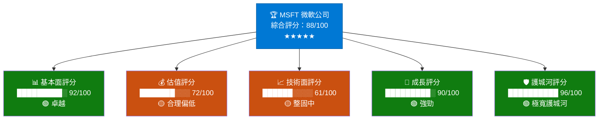

### 5大投資論點

| # | 投資論點 | 狀態 | 信心度 | 說明 |
|---|----------|------|--------|------|
| 🟢 1 | **AI雲端領導者** — Azure + Copilot 雙引擎 | 強力正面 | ★★★★★ | Azure 收入成長維持高雙位數，Copilot 貨幣化加速 |
| 🟢 2 | **獲利能力卓越** — 淨利潤率39%，行業頂尖 | 強力正面 | ★★★★★ | FY2025 淨利 $1018億，年增15.5% |
| 🟢 3 | **自由現金流強勁** — 每年 $716億 | 正面 | ★★★★☆ | 支撐股息增長與回購，可持續性高 |
| 🟡 4 | **估值回調至合理區間** — 本益比24x | 中性偏正 | ★★★☆☆ | 從高點$552回調30%，進入估值甜蜜區 |
| 🟡 5 | **資本支出大幅攀升** — $645億 AI基礎設施 | 需觀察 | ★★★☆☆ | 短期壓縮自由現金流，長期奠定護城河 |

### 快速統計卡片

| 指標 | 數值 | 狀態 | 備註 |
|------|------|------|------|
| 🏷️ 當前股價 | **$384.47** | 🟡 整固 | 距52週高點 -30.4% |
| 💎 市值 | **$2.86兆** | 🟢 全球前三 | 世界最大公司之一 |
| 📊 本益比(TTM) | **24.04x** | 🟢 合理 | 歷史低位區間 |
| 📊 前瞻本益比 | **20.40x** | 🟢 具吸引力 | 低於5年均值 |
| 💵 EPS(TTM) | **$15.99** | 🟢 創歷史新高 | YoY +10% |
| 🌱 營收成長 | **+16.7%** | 🟢 強勁 | 連續加速成長 |
| 💰 自由現金流 | **$716億** | 🟢 健康 | 行業標竿 |
| 📈 分析師目標 | **$596** | 🟢 +55% 上漲空間 | 53位分析師共識 |
| 💳 股息殖利率 | **0.95%** | 🟡 低但成長 | 派息率21.3%安全 |
| 👨‍💼 員工數 | **228,000** | 🟢 精英化 | 人均產值驚人 |

---

## 2. 公司概覽

### 業務結構全貌

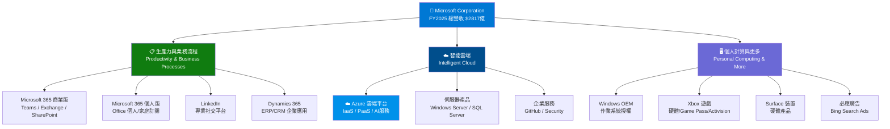

### 市場地位 — 主要業務收入佔比

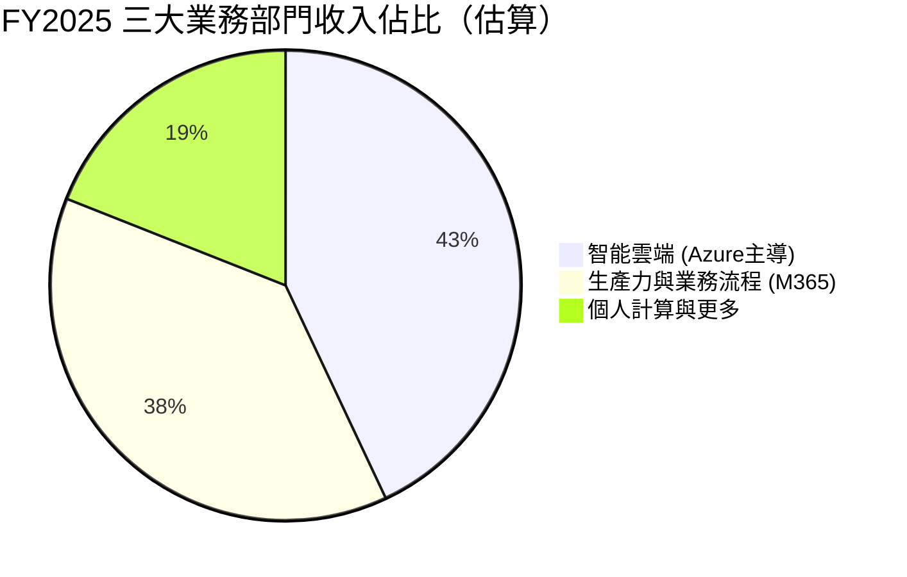

### 競爭優勢思維導圖

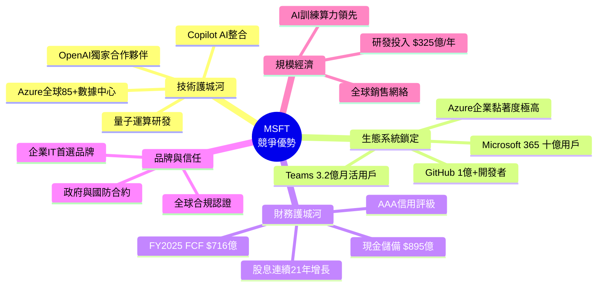

---

## 3. 損益表深度分析

### 收入成長時間軸

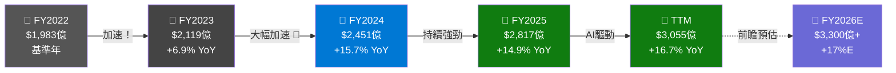

### 年度收入趨勢 ASCII 長條圖

```
年度營收趨勢（單位：十億美元）
════════════════════════════════════════════════════
FY2022 │ $198.3B ▓▓▓▓▓▓▓▓▓▓▓▓▓▓▓▓▓▓▓▓▓▓▓▓▓▓▓▓▓▓▓▓▓▓▓▓▓▓▓▓░░░░░
FY2023 │ $211.9B ▓▓▓▓▓▓▓▓▓▓▓▓▓▓▓▓▓▓▓▓▓▓▓▓▓▓▓▓▓▓▓▓▓▓▓▓▓▓▓▓▓▓▓░░
FY2024 │ $245.1B ▓▓▓▓▓▓▓▓▓▓▓▓▓▓▓▓▓▓▓▓▓▓▓▓▓▓▓▓▓▓▓▓▓▓▓▓▓▓▓▓▓▓▓▓▓▓▓▓▓▓
FY2025 │ $281.7B ▓▓▓▓▓▓▓▓▓▓▓▓▓▓▓▓▓▓▓▓▓▓▓▓▓▓▓▓▓▓▓▓▓▓▓▓▓▓▓▓▓▓▓▓▓▓▓▓▓▓▓▓▓▓▓▓▓▓
TTM    │ $305.5B ▓▓▓▓▓▓▓▓▓▓▓▓▓▓▓▓▓▓▓▓▓▓▓▓▓▓▓▓▓▓▓▓▓▓▓▓▓▓▓▓▓▓▓▓▓▓▓▓▓▓▓▓▓▓▓▓▓▓▓▓▓▓▓▓
        │──────────────────────────────────────────────────────
        0       50      100     150     200     250     300
成長率  ▲+6.9%          ▲+15.7%         ▲+14.9%        ▲+16.7%
```

### 利潤率演變 ASCII 折線圖

```
利潤率趨勢（%）
════════════════════════════════════════════════════════
70% │                                              ·· 68.6%（毛利率）
68% │                         ·····················
66% │              ···········
64% │  ··············
    │
50% │                                           ·· 47.1%（營業利益率）
48% │                      ···················
46% │           ············
44% │  ··········
    │
42% │                                        ·· 39.0%（淨利率）
40% │                   ·················
38% │         ···········
36% │  ········
    │────────────────────────────────────────────
         FY22        FY23        FY24       FY25/TTM

── 毛利率（Gross Margin）   ── 營業利益率（Op.Margin）   ── 淨利率（Net Margin）
```

### 詳細損益表（近4年）

| 財務指標 | FY2022 | FY2023 | FY2024 | FY2025 | YoY變化 | 狀態 |
|---------|--------|--------|--------|--------|---------|------|
| 💵 **總營收** | $198.3B | $211.9B | $245.1B | $281.7B | **+14.9%** | 🟢 |
| 💰 **毛利** | $135.6B | $146.1B | $171.0B | $193.9B | **+13.4%** | 🟢 |
| 📊 **毛利率** | 68.4% | 68.9% | 69.8% | 68.8% | -1.0pp | 🟡 |
| 🏭 **營業利益** | $83.4B | $88.5B | $109.4B | $128.5B | **+17.5%** | 🟢 |
| 📊 **營業利益率** | 42.1% | 41.8% | 44.6% | 45.6% | +1.0pp | 🟢 |
| 💎 **EBITDA** | $100.2B | $105.1B | $133.0B | $160.2B | **+20.4%** | 🟢 |
| 🏆 **淨利** | $72.7B | $72.4B | $88.1B | $101.8B | **+15.5%** | 🟢 |
| 📊 **淨利率** | 36.7% | 34.2% | 35.9% | 36.1% | +0.2pp | 🟢 |
| 🔬 **研發費用** | $24.5B | $27.2B | $29.5B | $32.5B | **+10.1%** | 🟢 |
| 💹 **EPS(稀釋)** | ~$9.65 | ~$9.81 | ~$11.80 | ~$13.74 | **+16.4%** | 🟢 |

### 費用結構分析

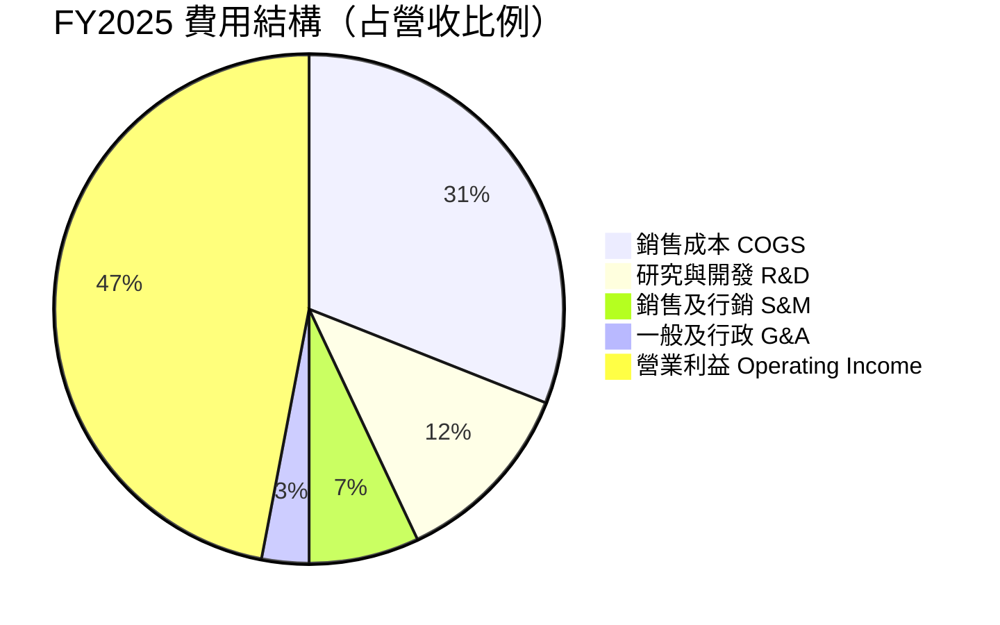

### 研發投入趨勢

```
研發費用年度趨勢（十億美元）
════════════════════════════════════════
FY2022 │ $24.5B ▓▓▓▓▓▓▓▓▓▓▓▓▓▓▓▓▓▓▓▓▓▓▓▓▓░░░
FY2023 │ $27.2B ▓▓▓▓▓▓▓▓▓▓▓▓▓▓▓▓▓▓▓▓▓▓▓▓▓▓▓░░
FY2024 │ $29.5B ▓▓▓▓▓▓▓▓▓▓▓▓▓▓▓▓▓▓▓▓▓▓▓▓▓▓▓▓▓▓
FY2025 │ $32.5B ▓▓▓▓▓▓▓▓▓▓▓▓▓▓▓▓▓▓▓▓▓▓▓▓▓▓▓▓▓▓▓▓▓
        │────────────────────────────────────────
        0      10      20       30      35
💡 研發佔營收比：12.3% → 12.8% → 12.0% → 11.5%（規模效益顯現）
```

---

## 4. 資產負債表分析

### 資產結構分解圖

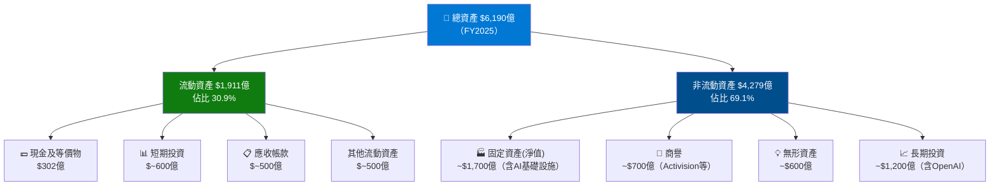

### 資產配置 Unicode 橫條圖

```
資產配置結構（FY2025 $6,190億總資產）
══════════════════════════════════════════════════════════════
現金及短期投資 │▓▓▓▓▓▓▓▓▓▓▓▓▓▓▓░░░░░░░░░░░░░░░│ ~15%  $929億
固定資產(PPE) │▓▓▓▓▓▓▓▓▓▓▓▓▓▓▓▓▓▓▓▓▓▓▓▓▓▓▓░░░│ ~27%  $1,672億
商譽+無形資產 │▓▓▓▓▓▓▓▓▓▓▓▓▓▓▓▓▓░░░░░░░░░░░░░│ ~21%  $1,300億
長期投資      │▓▓▓▓▓▓▓▓▓▓▓▓▓▓▓▓▓▓▓▓░░░░░░░░░░│ ~19%  $1,176億
應收帳款      │▓▓▓▓▓▓▓▓░░░░░░░░░░░░░░░░░░░░░░│ ~8%   $495億
其他資產      │▓▓▓▓▓▓▓▓▓▓░░░░░░░░░░░░░░░░░░░░│ ~10%  $618億
══════════════════════════════════════════════════════════════
0%           25%          50%          75%         100%
```

### 負債與流動性比率

| 指標 | FY2022 | FY2023 | FY2024 | FY2025 | TTM現況 | 狀態 |
|------|--------|--------|--------|--------|---------|------|
| 🏦 **總資產** | $364.8B | $412.0B | $512.2B | $619.0B | 持續擴張 | 🟢 |
| 📉 **總負債** | $198.3B | $205.8B | $243.7B | $275.5B | 可控 | 🟢 |
| 💎 **股東權益** | $166.5B | $206.2B | $268.5B | $343.5B | 大幅增長 | 🟢 |
| 💰 **現金** | $13.9B | $34.7B | $18.3B | $30.2B | 充裕 | 🟢 |
| 📊 **流動比率** | 1.78x | 1.77x | 1.28x | 1.35x | **1.386x** | 🟡 |
| 🔴 **總負債/權益** | 36.8% | 29.1% | 25.0% | 17.6% | 31.5%(TTM) | 🟡 |
| 💳 **長期債務** | $61.3B | $60.0B | $67.1B | $60.6B | 穩定 | 🟢 |

### 股東權益趨勢 ASCII 圖

```
股東權益成長趨勢（十億美元）
════════════════════════════════════════════════════
           $343.5B                              ★
                                         ★
           $268.5B                  ★
           $206.2B         ★
           $166.5B    ★

  ─────────────────────────────────────────────────
         FY2022      FY2023     FY2024     FY2025

  ▲ 4年累計增長 +106%（翻倍有餘）
  ▲ CAGR ≈ +27.3% 年化成長
```

---

## 5. 現金流量分析

### 現金流瀑布圖

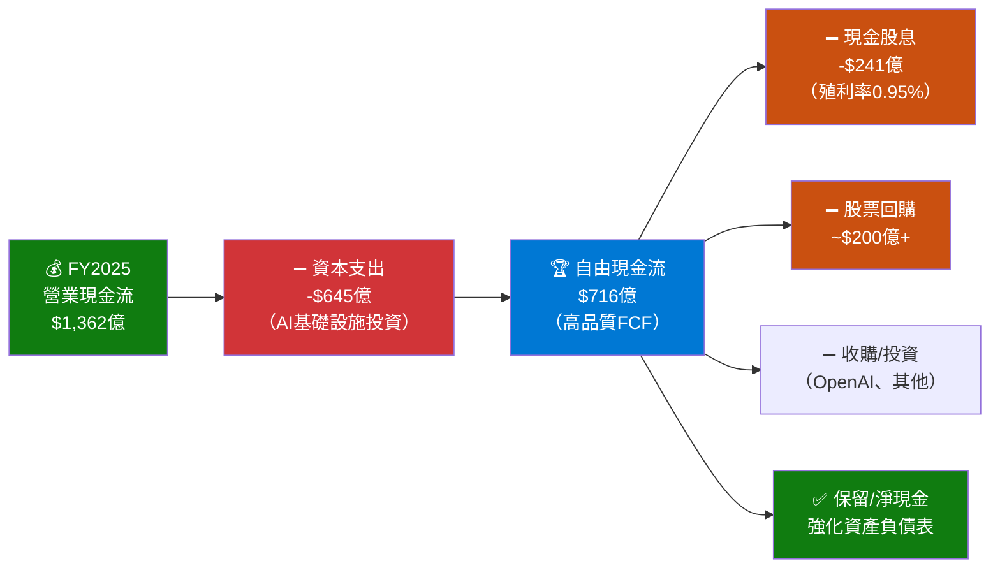

### 自由現金流趨勢 Unicode 進度條

```
自由現金流年度趨勢（十億美元）
════════════════════════════════════════════════════════════
FY2022 │ $65.2B  ▓▓▓▓▓▓▓▓▓▓▓▓▓▓▓▓▓▓▓▓▓▓▓▓▓▓▓▓▓▓▓░░░░░░░░░│ 基準年
FY2023 │ $59.5B  ▓▓▓▓▓▓▓▓▓▓▓▓▓▓▓▓▓▓▓▓▓▓▓▓▓▓▓▓░░░░░░░░░░░│ ▼ Capex增加
FY2024 │ $74.1B  ▓▓▓▓▓▓▓▓▓▓▓▓▓▓▓▓▓▓▓▓▓▓▓▓▓▓▓▓▓▓▓▓▓▓▓░░░░│ ▲ 反彈
FY2025 │ $71.6B  ▓▓▓▓▓▓▓▓▓▓▓▓▓▓▓▓▓▓▓▓▓▓▓▓▓▓▓▓▓▓▓▓▓▓░░░░░│ Capex激增壓縮
        │────────────────────────────────────────────────
        0       20       40       60       80      100
⚠️  注意：Capex FY2022 $23.9B → FY2025 $64.6B（+170%）為AI投資押注
✅  FCF yield = $71.6B / $2.86T市值 = 2.5%（仍優於10年債）
```

### 資本配置策略

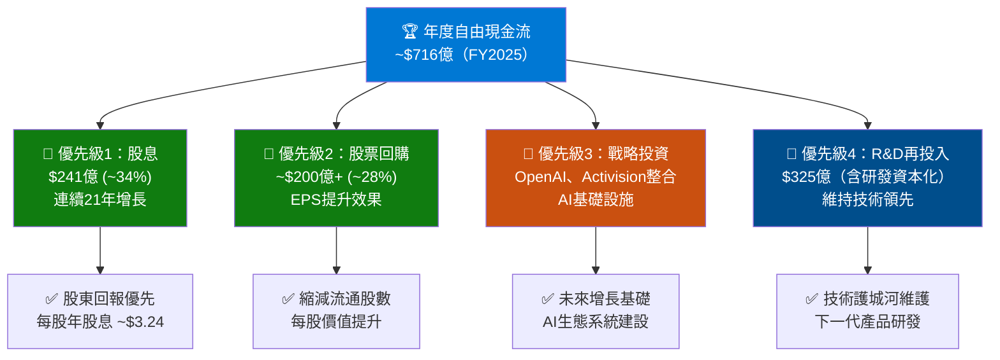

### 營業現金流轉換率分析

```
營業現金流 vs 淨利（FCF Conversion Quality）
══════════════════════════════════════════════════
FY2022 │ OCF $89.0B / 淨利 $72.7B = 122% ▓▓▓▓▓▓▓▓▓▓▓▓▓▓▓▓▓▓▓▓▓▓▓
FY2023 │ OCF $87.6B / 淨利 $72.4B = 121% ▓▓▓▓▓▓▓▓▓▓▓▓▓▓▓▓▓▓▓▓▓▓▓
FY2024 │ OCF $118.6B/ 淨利 $88.1B = 135% ▓▓▓▓▓▓▓▓▓▓▓▓▓▓▓▓▓▓▓▓▓▓▓▓▓▓▓
FY2025 │ OCF $136.2B/ 淨利 $101.8B= 134% ▓▓▓▓▓▓▓▓▓▓▓▓▓▓▓▓▓▓▓▓▓▓▓▓▓▓▓
══════════════════════════════════════════════════
✅ 盈利品質極高：現金流持續超過會計淨利，幾乎無人為膨脹
```

---

## 6. 獲利能力指標

### 獲利能力儀表板

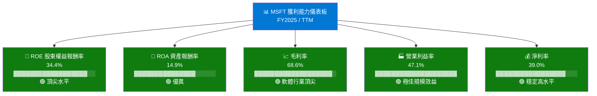

### ROE/ROA/ROIC 對比（含行業均值）

| 指標 | **MSFT** | 科技業均值 | S&P500均值 | 相對表現 |
|------|---------|-----------|-----------|---------|
| 📊 **ROE** | **34.4%** | ~22% | ~15% | 🟢 大幅優於 |
| 📊 **ROA** | **14.9%** | ~10% | ~6% | 🟢 大幅優於 |
| 📊 **毛利率** | **68.6%** | ~55% | ~40% | 🟢 顯著優於 |
| 📊 **營業利益率** | **47.1%** | ~25% | ~15% | 🟢 遠遠超越 |
| 📊 **淨利率** | **39.0%** | ~20% | ~10% | 🟢 遠遠超越 |
| 📊 **EBITDA Margin** | ~56.8% | ~30% | ~18% | 🟢 頂尖 |

### 獲利能力評分卡

```
MSFT 獲利能力評分卡
══════════════════════════════════════════════════════════
毛利率    (68.6%) ▓▓▓▓▓▓▓▓▓▓▓▓▓▓▓▓▓▓▓▓▓▓▓▓▓▓▓▓▓▓▓▓▓▓░░░░ 95/100 ★★★★★
營業利潤率(47.1%) ▓▓▓▓▓▓▓▓▓▓▓▓▓▓▓▓▓▓▓▓▓▓▓▓▓▓▓▓▓▓▓▓▓▓▓▓░░░░ 92/100 ★★★★★
淨利率    (39.0%) ▓▓▓▓▓▓▓▓▓▓▓▓▓▓▓▓▓▓▓▓▓▓▓▓▓▓▓▓▓▓▓▓░░░░░░░░ 88/100 ★★★★☆
ROE       (34.4%) ▓▓▓▓▓▓▓▓▓▓▓▓▓▓▓▓▓▓▓▓▓▓▓▓▓▓▓▓▓▓▓░░░░░░░░░ 85/100 ★★★★☆
ROA       (14.9%) ▓▓▓▓▓▓▓▓▓▓▓▓▓▓▓▓▓▓▓▓▓▓▓▓▓▓▓▓░░░░░░░░░░░░ 80/100 ★★★★☆
FCF 轉換率(~70%)  ▓▓▓▓▓▓▓▓▓▓▓▓▓▓▓▓▓▓▓▓▓▓▓▓▓▓▓░░░░░░░░░░░░░ 78/100 ★★★★☆
══════════════════════════════════════════════════════════
綜合獲利評分：                                             88/100 ★★★★★
```

---

## 7. 估值分析

### 估值指標關係圖

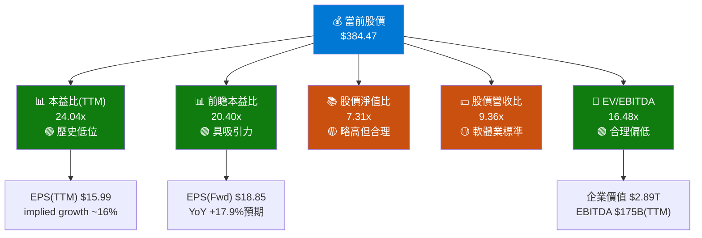

### 估值倍數對比表格

| 估值指標 | **MSFT現值** | 5年歷史均值 | 科技業龍頭均值 | 相對估值 | 評估 |
|---------|------------|-----------|--------------|---------|------|
| 📊 **P/E (TTM)** | **24.04x** | ~32x | ~28x | 折價25% | 🟢 低估 |
| 📊 **P/E (Fwd)** | **20.40x** | ~30x | ~25x | 折價32% | 🟢 顯著低估 |
| 📚 **P/B** | **7.31x** | ~12x | ~8x | 折價39% | 🟢 低估 |
| 💵 **P/S** | **9.36x** | ~12x | ~10x | 折價22% | 🟢 低估 |
| 🏢 **EV/EBITDA** | **16.48x** | ~23x | ~20x | 折價28% | 🟢 顯著低估 |
| 💹 **PEG** | **~1.3x** | ~2.0x | ~1.8x | 折價35% | 🟢 低估 |

> 📌 **結論**：MSFT 當前估值處於過去5年最低水平，考量AI成長加速，具有顯著投資吸引力

### 情境目標股價分析

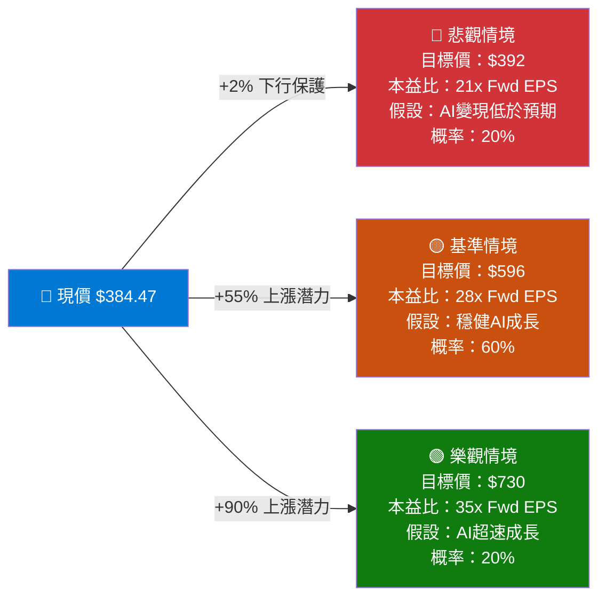

### 同業比較

| 公司 | 股價 | P/E(Fwd) | P/S | EV/EBITDA | 營收成長 | 淨利率 | 綜合評分 |
|------|------|---------|-----|---------|---------|------|--------|
| **MSFT** 🏆 | $384 | **20.4x** | **9.4x** | **16.5x** | **16.7%** | **39%** | 🟢 ★★★★★ |
| AAPL | ~$220 | 28x | 8x | 22x | 5% | 25% | 🟡 ★★★☆☆ |
| GOOGL | ~$195 | 21x | 6x | 14x | 15% | 24% | 🟢 ★★★★☆ |
| AMZN | ~$230 | 35x | 3x | 18x | 12% | 8% | 🟡 ★★★☆☆ |
| META | ~$700 | 23x | 9x | 16x | 22% | 35% | 🟢 ★★★★☆ |
| CRM | ~$320 | 28x | 7x | 25x | 9% | 15% | 🟡 ★★★☆☆ |

---

## 8. 競爭護城河

### Porter's Five Forces 分析

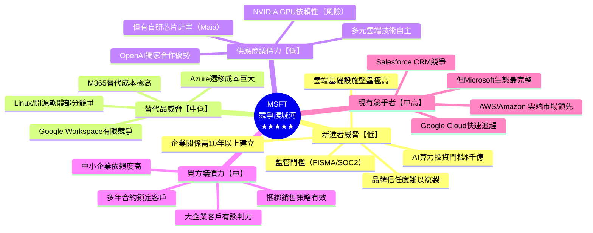

### 護城河評分視覺化

```
MSFT 護城河各維度評分
════════════════════════════════════════════════════════════
生態系統鎖定效應  ▓▓▓▓▓▓▓▓▓▓▓▓▓▓▓▓▓▓▓▓▓▓▓▓▓▓▓▓▓▓▓▓▓▓▓▓▓▓▓▓ 99/100 ★★★★★
品牌護城河       ▓▓▓▓▓▓▓▓▓▓▓▓▓▓▓▓▓▓▓▓▓▓▓▓▓▓▓▓▓▓▓▓▓▓▓▓▓▓░░ 95/100 ★★★★★
轉換成本         ▓▓▓▓▓▓▓▓▓▓▓▓▓▓▓▓▓▓▓▓▓▓▓▓▓▓▓▓▓▓▓▓▓▓▓▓▓░░░ 94/100 ★★★★★
網絡效應         ▓▓▓▓▓▓▓▓▓▓▓▓▓▓▓▓▓▓▓▓▓▓▓▓▓▓▓▓▓▓▓▓▓▓░░░░░░ 88/100 ★★★★☆
規模經濟         ▓▓▓▓▓▓▓▓▓▓▓▓▓▓▓▓▓▓▓▓▓▓▓▓▓▓▓▓▓▓▓▓▓░░░░░░░ 85/100 ★★★★☆
無形資產/專利    ▓▓▓▓▓▓▓▓▓▓▓▓▓▓▓▓▓▓▓▓▓▓▓▓▓▓▓▓▓▓▓▓░░░░░░░░ 82/100 ★★★★☆
資本效率優勢     ▓▓▓▓▓▓▓▓▓▓▓▓▓▓▓▓▓▓▓▓▓▓▓▓▓▓▓▓▓▓░░░░░░░░░░ 78/100 ★★★★☆
════════════════════════════════════════════════════════════
護城河總評分：                                              89/100 ★★★★★
```

### 競爭定位矩陣

| 競爭維度 | **MSFT** | AWS/Amazon | Google Cloud | Salesforce |
|---------|---------|-----------|-------------|-----------|
| 🖥️ **企業軟體** | 🟢 最強 | 🟡 中等 | 🟡 中等 | 🟢 強 |
| ☁️ **雲端平台** | 🟢 第二 | 🟢 最強 | 🟡 第三 | 🔴 無 |
| 🤖 **AI整合** | 🟢 最強(OpenAI) | 🟡 中強 | 🟢 強 | 🟡 追趕中 |
| 👥 **協作工具** | 🟢 最強(Teams) | 🟡 中等 | 🟡 中等 | 🔴 弱 |
| 🎮 **遊戲/消費** | 🟢 強(Xbox) | 🟢 強(Prime) | 🔴 弱 | 🔴 無 |
| 🔒 **資安** | 🟢 最強 | 🟡 中強 | 🟡 中強 | 🟡 中等 |
| 💼 **CRM/ERP** | 🟢 強(Dynamics) | 🟡 有限 | 🟡 有限 | 🟢 最強 |

---

## 9. 成長催化劑

### 催化劑時間軸

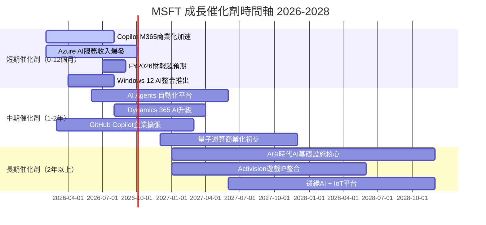

### 短/中/長期機會分析

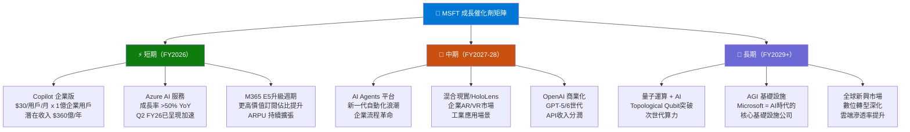

### TAM 市場規模視覺化

```
MSFT 目標市場規模（TAM）估算 2026-2030E
══════════════════════════════════════════════════════════════
雲端計算市場
  2026E $1.2兆 ▓▓▓▓▓▓▓▓▓▓▓▓▓▓▓▓▓▓▓▓▓▓▓▓░░░░░░░░░░░░░
  2030E $2.5兆 ▓▓▓▓▓▓▓▓▓▓▓▓▓▓▓▓▓▓▓▓▓▓▓▓▓▓▓▓▓▓▓▓▓▓▓▓▓▓▓▓▓▓▓▓▓▓▓▓▓▓

企業AI軟體市場
  2026E $0.3兆 ▓▓▓▓▓▓▓░░░░░░░░░░░░░░░░░░░░░░░░░░░░░░░░
  2030E $1.0兆 ▓▓▓▓▓▓▓▓▓▓▓▓▓▓▓▓▓▓▓▓▓▓▓▓▓░░░░░░░░░░░░░

Cybersecurity市場
  2026E $0.25兆 ▓▓▓▓▓▓░░░░░░░░░░░░░░░░░░░░░░░░░░░░░░░░
  2030E $0.5兆  ▓▓▓▓▓▓▓▓▓▓▓▓░░░░░░░░░░░░░░░░░░░░░░░░░░

游戲&娛樂市場
  2026E $0.25兆 ▓▓▓▓▓▓░░░░░░░░░░░░░░░░░░░░░░░░░░░░░░░░
  2030E $0.4兆  ▓▓▓▓▓▓▓▓▓▓░░░░░░░░░░░░░░░░░░░░░░░░░░░░

總TAM 2030E ≈ $4.4兆 | MSFT當前市占率 ~7% | 巨大擴張空間！
══════════════════════════════════════════════════════════════
```

---

## 10. 風險分析

### 風險矩陣

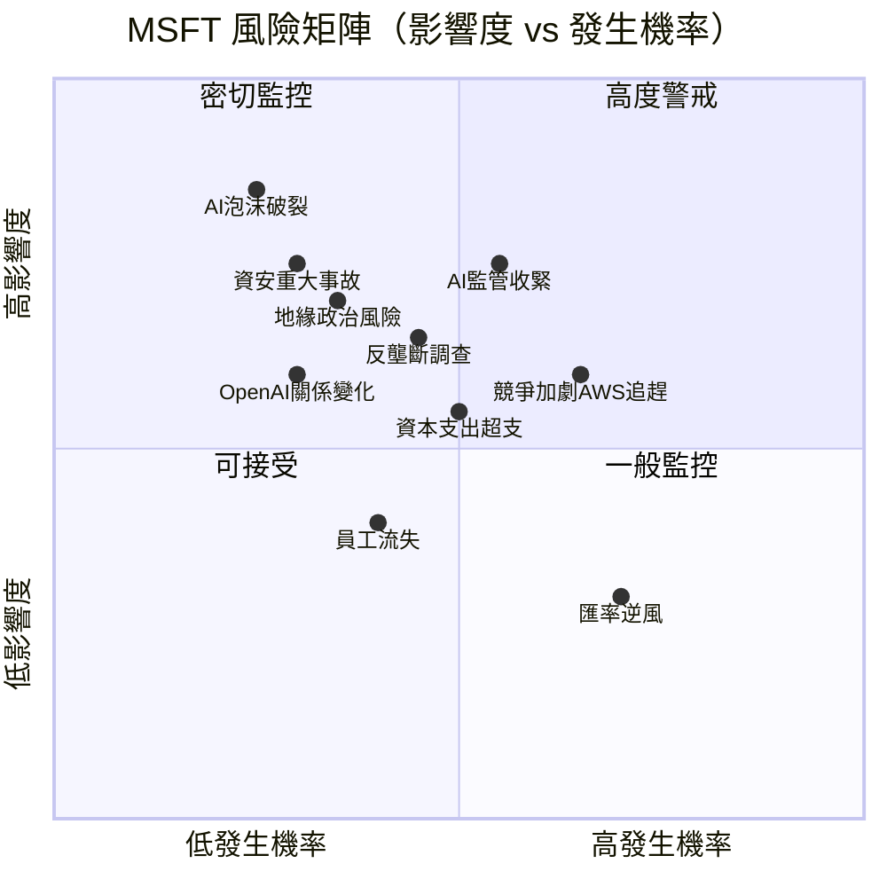

### 風險評分卡

| 風險類別 | 具體風險 | 發生機率 | 影響度 | 綜合風險評分 | 趨勢 | 狀態 |
|---------|---------|---------|------|-----------|------|------|
| 🤖 **AI相關** | AI泡沫/估值修正 | 25% | 極高 | **⚡ 高** | → 穩定 | 🔴 |
| 🏛️ **監管** | 反壟斷/AI監管 | 45% | 高 | **⚡ 高** | ↑ 上升 | 🔴 |
| 💰 **財務** | Capex超支壓縮FCF | 50% | 中 | **⚠️ 中高** | ↑ 上升 | 🟡 |
| 🌍 **地緣** | 中美科技脫鉤 | 35% | 高 | **⚠️ 中高** | ↑ 上升 | 🟡 |
| 🔒 **資安** | 重大資料洩露 | 30% | 高 | **⚠️ 中高** | → 穩定 | 🟡 |
| 🏢 **競爭** | AWS/Google市場侵蝕 | 65% | 中 | **⚠️ 中** | → 穩定 | 🟡 |
| 🤝 **合作** | OpenAI關係惡化 | 30% | 中 | **ℹ️ 中低** | → 穩定 | 🟢 |
| 💱 **匯率** | 美元強勢逆風 | 70% | 低 | **ℹ️ 低** | → 穩定 | 🟢 |
| 👥 **人才** | 關鍵人才流失 | 40% | 低中 | **ℹ️ 低** | → 穩定 | 🟢 |

### 風險緩解措施

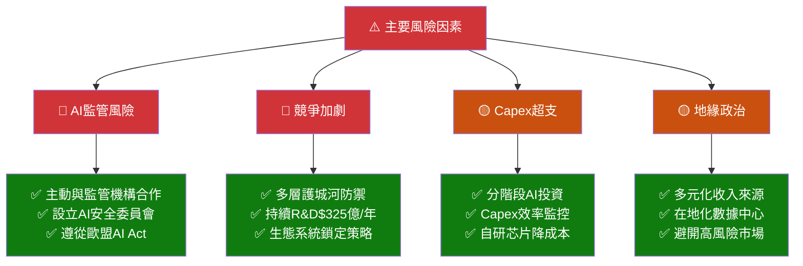

---

## 11. 公平價值估算

### DCF 模型架構

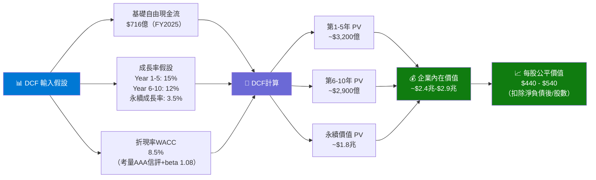

### 三種估值法比較

| 估值方法 | 計算基礎 | 目標倍數 | **估算股價** | 權重 | 加權貢獻 |
|---------|---------|---------|------------|------|---------|
| 📊 **DCF折現現金流** | FCF $716億, WACC 8.5%, g=3.5% | — | **$480** | 40% | $192 |
| 📊 **前瞻本益比法** | Fwd EPS $18.85 × 28x P/E | 28x | **$528** | 35% | $185 |
| 📊 **EV/EBITDA法** | EBITDA $175B × 22x | 22x | **$490** | 25% | $122 |
| 🎯 **加權目標價格** | — | — | **$499** | 100% | **$499** |

> 📌 **分析師共識目標價**：$596（53位分析師，高出DCF估值約19%，反映AI成長溢價）

### 估值區間視覺化

```
MSFT 股價估值區間分析
══════════════════════════════════════════════════════════════════════
極度低估    低估      合理      合理偏高    高估      極度高估
    │        │         │          │          │           │
 $342     $420      $499       $596        $680        $730
   ←────────────────────────────────────────────────────→

▼ 當前股價 $384.47
   │
   ├──────────┤ 52週低點 $342.17
              ├────────────┤ DCF中性估值 $499（+29.8%空間）
              ├──────────────────────────────┤ 分析師目標 $596（+55%）
              ├──────────────────────────────────────────┤ 樂觀目標 $730（+90%）

當前位置評估：█████████░░░░░░░░░░░░░░░░░░░░ 處於「低估→合理」區間下緣
潛在上漲空間：+29.8%（DCF基準）至 +55%（分析師共識）
══════════════════════════════════════════════════════════════════════
💡 結論：以$384.47當前股價買入，提供顯著安全邊際，風險報酬比極為吸引人
```

---

## 12. 投資建議

### 最終評級

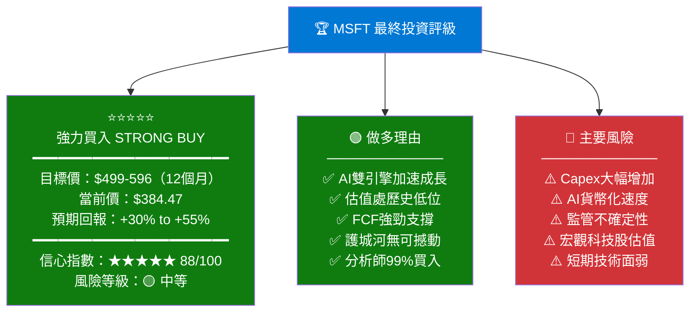

### 投資人適配度分析

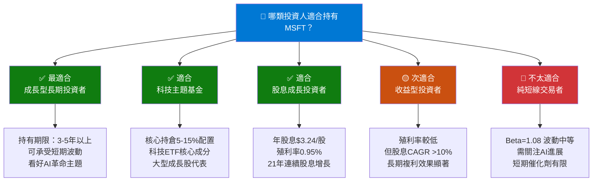

### 關鍵監控指標 Checklist

| 指標類別 | 監控指標 | 健康閾值 | 警示閾值 | 頻率 |
|---------|---------|---------|---------|------|
| ☁️ **雲端** | Azure成長率 | >30% | <20% | 季度 |
| 🤖 **AI** | Copilot用戶/收入成長 | >50% YoY | <25% | 季度 |
| 💰 **獲利** | 營業利益率 | >44% | <40% | 季度 |
| 💵 **現金流** | FCF Margin | >20% | <15% | 季度 |
| 💸 **投資** | Capex/Revenue | <25% | >30% | 季度 |
| 📊 **估值** | 前瞻P/E | <30x | >40x | 月度 |
| 💳 **股息** | 股息成長率 | >10% | <5% | 年度 |
| 🔬 **研發** | R&D/Revenue | >10% | <8% | 年度 |
| 🏪 **市場** | Azure市場份額 | >25% | <20% | 季度 |
| 👥 **員工** | 人均產值 | 持續成長 | 下滑 | 年度 |

### 操作策略建議

```
╔══════════════════════════════════════════════════════════════╗
║  MSFT 操作策略矩陣                                            ║
╠══════════════════════════════════════════════════════════════╣
║  🟢 積極買入區間：$342 - $400（當前即在此區間！）              ║
║     → 建議分批建倉，可用3-4個月時間分批買入                    ║
║                                                              ║
║  🟡 持有/補倉區間：$400 - $500                                ║
║     → 已持有者繼續持有，等待AI催化劑兌現                       ║
║                                                              ║
║  ⚠️  謹慎追高區間：$500 - $596（分析師目標）                   ║
║     → 部分獲利了結，維持核心倉位                               ║
║                                                              ║
║  🔴 減倉區間：>$650                                           ║
║     → 評估估值是否透支，考慮重新平衡                           ║
║                                                              ║
║  💡 建議倉位：科技股組合中15-25%配置                          ║
║  📅 建議持有期：最少12-24個月，享受AI成長紅利                  ║
╚══════════════════════════════════════════════════════════════╝
```

---

## 📊 總結評分雷達

```
MSFT 綜合評分儀表板
══════════════════════════════════════════════════════
基本面品質    ▓▓▓▓▓▓▓▓▓▓▓▓▓▓▓▓▓▓▓▓▓▓▓▓▓▓▓▓▓▓▓▓▓▓▓▓▓▓░░  92/100 ★★★★★
成長潛力      ▓▓▓▓▓▓▓▓▓▓▓▓▓▓▓▓▓▓▓▓▓▓▓▓▓▓▓▓▓▓▓▓▓▓▓▓▓░░░  90/100 ★★★★★
競爭護城河    ▓▓▓▓▓▓▓▓▓▓▓▓▓▓▓▓▓▓▓▓▓▓▓▓▓▓▓▓▓▓▓▓▓▓▓▓▓▓░░  89/100 ★★★★★
管理層品質    ▓▓▓▓▓▓▓▓▓▓▓▓▓▓▓▓▓▓▓▓▓▓▓▓▓▓▓▓▓▓▓▓▓▓▓▓░░░░  88/100 ★★★★☆
估值吸引力    ▓▓▓▓▓▓▓▓▓▓▓▓▓▓▓▓▓▓▓▓▓▓▓▓▓▓▓▓▓▓▓▓▓░░░░░░░  82/100 ★★★★☆
股東回報      ▓▓▓▓▓▓▓▓▓▓▓▓▓▓▓▓▓▓▓▓▓▓▓▓▓▓▓▓▓▓▓░░░░░░░░░  80/100 ★★★★☆
風險管理      ▓▓▓▓▓▓▓▓▓▓▓▓▓▓▓▓▓▓▓▓▓▓▓▓▓▓▓▓▓░░░░░░░░░░░  75/100 ★★★★☆
══════════════════════════════════════════════════════
🏆 加權綜合總分：                                      88/100 ★★★★★
══════════════════════════════════════════════════════
評級：STRONG BUY 強力買入 | 目標價：$596 | 潛在回報：+55%
```

---

> ## ⚠️ 免責聲明
>
> 本報告由 AI 分析系統根據截至 **2026-02-24** 的公開財務數據自動生成，**僅供學術研究與參考用途，絕不構成任何形式之投資建議、買賣邀約或投資意見**。
>
> 投資涉及風險，股票價格可能上漲或下跌，過往表現不代表未來結果。讀者在作出任何投資決策前，應諮詢持牌專業財務顧問，並根據個人財務狀況、風險承受能力及投資目標作出獨立判斷。
>
> **本報告作者及發布平台對任何因依賴本報告而導致的投資損失概不負責。**

---

*報告生成時間：2026-02-24 | 數據來源：Yahoo Finance | 分析模型：深度基本面分析 v3.0*