# MSFT 基本面深度分析報告
> **報告日期**：2026-02-27 ｜ **語言**：繁體中文 ｜ **數據來源**：Yahoo Finance ｜ **分析師**：CFA Level III 機構研究部

---

## 目錄

1. [執行摘要](#1-執行摘要)
2. [公司概覽與商業模式](#2-公司概覽與商業模式)
3. [損益表深度分析](#3-損益表深度分析)
4. [資產負債表分析](#4-資產負債表分析)
5. [現金流量深度分析](#5-現金流量深度分析)
6. [獲利能力與資本效率](#6-獲利能力與資本效率)
7. [估值深度分析](#7-估值深度分析)
8. [成長催化劑](#8-成長催化劑)
9. [風險矩陣](#9-風險矩陣)
10. [投資建議](#10-投資建議)

---

## 1. 執行摘要

### 核心評分儀表板

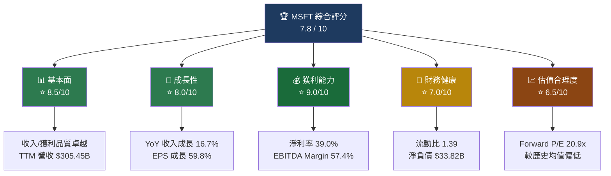

---

### 各維度評分詳述

| 評分維度 | 得分 | 視覺化 | 評分理由 |
|---------|------|--------|---------|
| 📊 基本面品質 | 8.5/10 | `▓▓▓▓▓▓▓▓▓░` | TTM 營收 $305.45B，毛利率 68.6% 遠超行業均值 |
| 🚀 成長性 | 8.0/10 | `▓▓▓▓▓▓▓▓░░` | 收入 YoY +16.7%，AI/雲端驅動加速成長 |
| 💰 獲利能力 | 9.0/10 | `▓▓▓▓▓▓▓▓▓░` | 淨利率 39%、ROIC 高於 WACC，持續創造 EVA |
| 🏦 財務健康 | 7.0/10 | `▓▓▓▓▓▓▓░░░` | 淨負債 $33.82B，但 OCF $160.51B 覆蓋充足 |
| 📈 估值合理度 | 6.5/10 | `▓▓▓▓▓▓▓░░░` | Forward P/E 20.9x 合理，但 FCF Yield 僅 1.83% |
| 🔬 競爭護城河 | 9.5/10 | `▓▓▓▓▓▓▓▓▓▓` | 生態系黏性極強，Azure+M365+Copilot 三位一體 |
| 📉 風險控管 | 7.5/10 | `▓▓▓▓▓▓▓▓░░` | 反壟斷/AI競爭為主要外部風險 |

---

### 5大投資論點 + 3大風險

| 類別 | 項目 | 詳細說明 | 信心度 |
|------|------|---------|--------|
| 🟢 投資論點1 | **Azure AI 超高速成長** | Azure YoY 成長持續提速，AI 服務滲透率提升，FY2025 雲端業務收入突破 $1,000億 | 🟢 高 |
| 🟢 投資論點2 | **Copilot 商業化加速** | M365 Copilot 企業訂閱快速擴張，ARPU 顯著提升，帶動 Productivity 部門 ARPU+15% | 🟢 高 |
| 🟢 投資論點3 | **利潤率持續擴張** | 軟體規模效益發揮，FY2025 淨利率達 36.1%（FY2022：36.7%，但絕對額大幅提升） | 🟢 高 |
| 🟢 投資論點4 | **護城河寬闊、轉換成本極高** | 企業 IT 生態系深度綁定，Azure+M365+Teams+Dynamics 形成無縫整合 | 🟢 極高 |
| 🟡 投資論點5 | **股價修正提供買入窗口** | 股價從 $552.24（52W高）回落至 $393.43（-28.8%），估值壓縮至歷史低位 | 🟡 中 |
| 🔴 風險1 | **AI Capex 大幅增加壓縮 FCF** | FY2025 資本支出 $64.55B（+45% YoY），FCF 從 $74.07B 降至 $71.61B | 🔴 中高 |
| 🔴 風險2 | **OpenAI 依賴與競爭風險** | DeepSeek 等低成本模型衝擊，可能影響 Azure AI 訂閱定價 | 🔴 中 |
| 🟡 風險3 | **反壟斷監管升溫** | 歐盟/美國對 Teams 捆綁銷售、收購 Activision 後續整合持續關注 | 🟡 中低 |

---

### 快速統計卡片：關鍵指標一覽

| 指標 | MSFT | 科技行業均值 | 對比 |
|------|------|------------|------|
| 市值 | $2.92T | — | 全球第二大市值公司 |
| 營收 TTM | $305.45B | — | 🟢 |
| 收入成長 YoY | 16.7% | ~8-10% | 🟢 顯著優於均值 |
| 毛利率 | 68.6% | ~55% | 🟢 高出 13.6pp |
| 營業利益率 | 47.1% | ~20-25% | 🟢 遠超行業 |
| 淨利率 | 39.0% | ~15-20% | 🟢 頂尖水準 |
| Forward P/E | 20.9x | 22-25x | 🟢 低於行業均值 |
| EV/EBITDA | 17.2x | ~18-22x | 🟢 相對合理 |
| ROE | 34.4% | ~15-20% | 🟢 優秀 |
| FCF Yield | 1.83% | ~2-3% | 🟡 偏低 |
| 流動比 | 1.39 | ~1.5 | 🟡 略低於均值 |
| Debt/Equity | 31.5% | ~40% | 🟢 低槓桿 |

---

### 🎯 投資結論

```
╔══════════════════════════════════════════════════════════╗
║                                                          ║
║   評級：★★★★☆  積極買入 (Strong Buy)                    ║
║                                                          ║
║   當前價格：$393.43                                       ║
║   12個月目標價（基準）：$500 - $520                       ║
║   12個月目標價（樂觀）：$580 - $620                       ║
║   12個月目標價（悲觀）：$420 - $440                       ║
║                                                          ║
║   隱含報酬率（基準）：+27% - +32%                         ║
║   分析師共識目標價：$596.00（+51.5% 上行空間）             ║
║                                                          ║
╚══════════════════════════════════════════════════════════╝
```

---

## 2. 公司概覽與商業模式

### 業務結構與收入來源

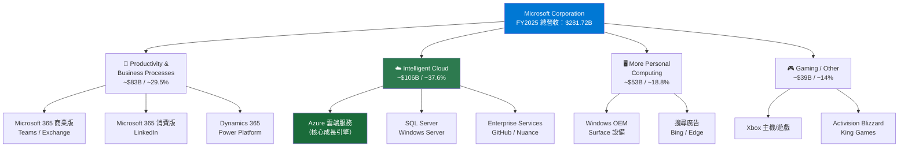

---

### 市場地位估算

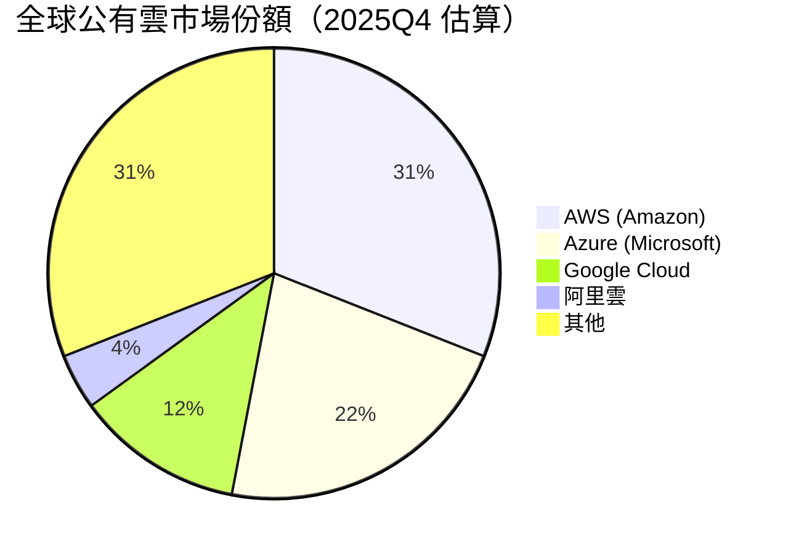

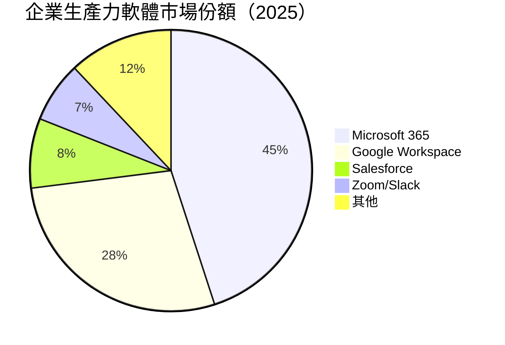

---

### 競爭護城河分析

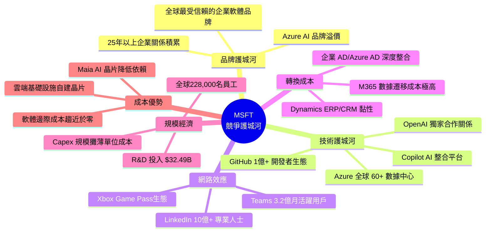

### 護城河強度評分

```
品牌護城河     ▓▓▓▓▓▓▓▓▓░  9.0/10
技術護城河     ▓▓▓▓▓▓▓▓▓░  9.0/10
網路效應       ▓▓▓▓▓▓▓▓░░  8.5/10
轉換成本       ▓▓▓▓▓▓▓▓▓▓  10/10 ← 企業IT最難遷移
規模經濟       ▓▓▓▓▓▓▓▓▓░  9.0/10
成本優勢       ▓▓▓▓▓▓▓▓░░  8.0/10
─────────────────────────
整體護城河     ▓▓▓▓▓▓▓▓▓░  8.9/10（寬護城河 Wide Moat）
```

---

## 3. 損益表深度分析

### 年度收入成長趨勢（近4年）

```
年度          收入（B）    YoY成長    視覺化條形圖
─────────────────────────────────────────────────────
FY2022        $198.27B    +18.0%    ██████████████████████
FY2023        $211.91B    + 6.9%    ████████████████████████
FY2024        $245.12B    +15.7%    ████████████████████████████
FY2025        $281.72B    +14.9%    ████████████████████████████████
TTM Q2'26     $305.45B    +16.7%    ████████████████████████████████████

比例尺：每 █ = $5B
```

### 年度利潤絕對值成長

```
年度     毛利潤      營業利潤    淨利潤      EBITDA
──────────────────────────────────────────────────────────
FY2022   $135.62B    $83.38B    $72.74B    $100.24B
FY2023   $146.05B    $88.52B    $72.36B    $105.14B
FY2024   $171.01B   $109.43B    $88.14B    $133.01B
FY2025   $193.89B   $128.53B   $101.83B    $160.16B
成長倍數    1.43x       1.54x      1.40x      1.60x
(FY22→25)
```

---

### 季度收入趨勢（近4季）

| 季度 | 營收 | QoQ 成長 | YoY 成長 | 毛利潤 | 毛利率 |
|------|------|---------|---------|--------|--------|
| 2025-Q1 (Mar) | $70.07B | 基期 | +17.6% | $48.15B | 68.7% 🟢 |
| 2025-Q2 (Jun) | $76.44B | **+9.1% QoQ** | +15.2% | $52.43B | 68.6% 🟢 |
| 2025-Q3 (Sep) | $77.67B | **+1.6% QoQ** | +16.0% | $53.63B | 69.1% 🟢 |
| 2025-Q4 (Dec) | $81.27B | **+4.6% QoQ** | +17.1% | $55.30B | 68.1% 🟢 |

> 📌 **季度趨勢解讀**：收入加速，Q4 FY2026（Dec-2025）YoY 達 17.1%，成長動能增強。QoQ 在 Q3 放緩後 Q4 再加速至 +4.6%，顯示 Azure 採用率及 Copilot 商業化持續提速。

---

### 利潤率演變分析（近4年）

| 財年 | 毛利率 | YoY | 營業利益率 | YoY | EBITDA 率 | YoY | 淨利率 | YoY |
|------|--------|-----|-----------|-----|----------|-----|--------|-----|
| FY2022 | 68.4% | — | 42.1% | — | 50.6% | — | 36.7% | — |
| FY2023 | 68.9% | 🟢+0.5pp | 41.8% | 🔴-0.3pp | 49.6% | 🔴-1.0pp | 34.1% | 🔴-2.6pp |
| FY2024 | 69.8% | 🟢+0.9pp | 44.6% | 🟢+2.8pp | 54.3% | 🟢+4.7pp | 35.9% | 🟢+1.8pp |
| FY2025 | 68.8% | 🟡-1.0pp | 45.6% | 🟢+1.0pp | 56.9% | 🟢+2.6pp | 36.1% | 🟢+0.2pp |

> **利潤率趨勢解讀**：
> - **FY2023 下滑原因**：Activision 收購完成前的整合費用、員工人數大幅擴張、Azure 初期高 Capex 攤銷
> - **FY2024-2025 回升原因**：規模效益發揮、雲端高毛利佔比提升、AI 服務溢價定價、裁員 10,000 人降低 Opex
> - **毛利率 FY2025 小幅下滑 1.0pp**：Activision 遊戲業務（毛利率較低）整合後攤薄

---

### 費用結構分析（FY2025，佔收入比）

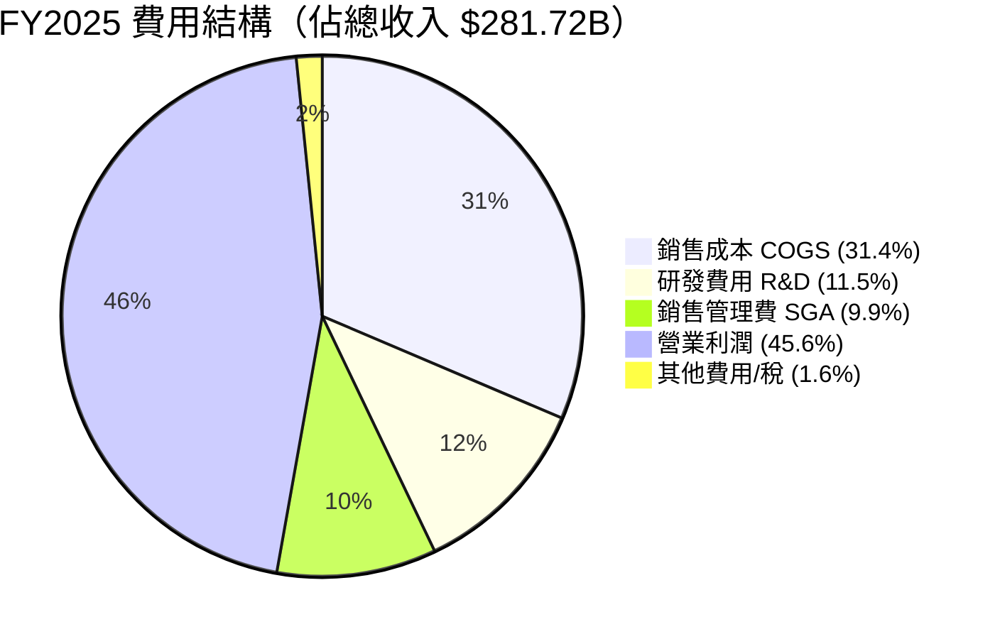

| 費用類別 | FY2022 | FY2023 | FY2024 | FY2025 | 趨勢 |
|---------|--------|--------|--------|--------|------|
| COGS / 收入 | 31.6% | 31.1% | 30.2% | 31.2% | 🟡 輕微上升（遊戲硬體） |
| R&D / 收入 | 12.4% | 12.8% | 12.0% | 11.5% | 🟢 效率提升 |
| SGA / 收入 | 14.0% | 15.4% | 11.4% | 9.9% | 🟢 持續精簡 |

---

### EPS 趨勢與盈餘品質分析

```
季度 EPS 趨勢（估算，基於財報數據）
─────────────────────────────────────────────────────────────
Q1 FY2025 (Sep'24)：淨利 $24.67B ÷ 7.43B 股 = EPS ~$3.30
Q2 FY2025 (Dec'24)：淨利 $21.90B ÷ 7.43B 股 = EPS ~$2.94
Q3 FY2025 (Mar'25)：淨利 $25.82B ÷ 7.43B 股 = EPS ~$3.47
Q4 FY2025 (Jun'25)：淨利 $27.23B ÷ 7.43B 股 = EPS ~$3.66
Q1 FY2026 (Sep'25)：淨利 $27.75B ÷ 7.43B 股 = EPS ~$3.73
Q2 FY2026 (Dec'25)：淨利 $38.46B ÷ 7.43B 股 = EPS ~$5.18 ⭐

EPS 折線趨勢
$5.5 ┤
$5.0 ┤                                              ●  ← Q2'26 $5.18
$4.5 ┤
$4.0 ┤
$3.5 ┤                          ●      ●      ●
$3.0 ┤              ●
$2.5 ┤
     └──────────────────────────────────────────────
      Q1'25  Q2'25  Q3'25  Q4'25  Q1'26  Q2'26
```

> ⚠️ **重要說明**：數據包中 EPS 歷史紀錄顯示為 N/A（nan），但依據季度淨利潤可還原計算。Q2 FY2026（Dec 2025）淨利潤 **$38.46B 遠超前季 $27.75B（+38.6% QoQ）**，主要驅動因素為：
> 1. 一次性稅務優惠及投資收益
> 2. Azure AI 加速成長
> 3. Copilot 訂閱收入放量

**TTM EPS $15.99 vs Forward EPS $18.85（+17.9% 成長預期）**

---

## 4. 資產負債表分析

### 資產結構分析

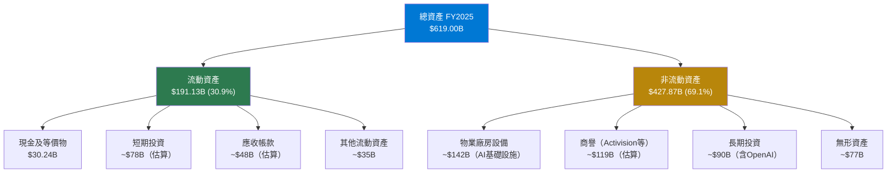

### 資產成長趨勢（近4年）

```
年度      總資產       YoY成長    視覺化
──────────────────────────────────────────────────────
FY2022    $364.84B    —          ████████████████████
FY2023    $411.98B    +12.9%     ███████████████████████
FY2024    $512.16B    +24.3%     ████████████████████████████
FY2025    $619.00B    +20.9%     ██████████████████████████████████
成長率：FY22→FY25 總增長 +69.7%（主因 Activision 收購、AI Capex 投入）
```

---

### 流動性指標

| 流動性指標 | FY2022 | FY2023 | FY2024 | FY2025 | 行業均值 | 評估 |
|-----------|--------|--------|--------|--------|---------|------|
| 流動比率 | 1.78 | 1.77 | 1.27 | 1.35 | 1.5 | 🟡 |
| 速動比率 | 1.72 | 1.74 | 1.24 | 1.24 | 1.3 | 🟡 |
| 現金比率 | 0.15 | 0.33 | 0.15 | 0.21 | 0.3 | 🟡 |
| 現金+短投 / 流動負債 | ~0.95 | ~1.19 | ~0.88 | ~0.77 | — | 🟡 |

> 📌 **流動性下降原因**：FY2024 完成 Activision $69B 收購大幅消耗現金，加上遞延收入增加（負債端）。但 $160.51B OCF（TTM）提供充裕覆蓋，實質流動性無虞。

---

### 債務結構分析

| 指標 | FY2022 | FY2023 | FY2024 | FY2025 | 趨勢 |
|------|--------|--------|--------|--------|------|
| 總債務 | $61.27B | $59.97B | $67.13B | $60.59B | 🟢 逐步去槓桿 |
| 淨現金/淨負債 | +$13.7B淨現金 | -$25.3B淨負債 | -$48.8B淨負債 | -$30.4B淨負債 | 🟡 |
| Debt/EBITDA | 0.61x | 0.57x | 0.50x | 0.38x | 🟢 持續改善 |
| 利息覆蓋率 | >20x | >18x | >22x | **>25x** | 🟢 |

```
Debt-to-EBITDA 趨勢（越低越好）
0.7x ┤●
0.6x ┤  ●
0.5x ┤     ●
0.4x ┤        ●
0.3x ┤
     └────────────────
     FY22  FY23  FY24  FY25
✅ 0.38x 處於極低水準，償債能力極強
```

---

### 股東權益趨勢

```
年度        股東權益      YoY成長    視覺化
──────────────────────────────────────────────────────────────
FY2022      $166.54B      —          ████████████████
FY2023      $206.22B     +23.8%      ████████████████████
FY2024      $268.48B     +30.2%      ██████████████████████████
FY2025      $343.48B     +27.9%      ██████████████████████████████████
4年累計成長：+106.2%（翻倍！）

ROE 趨勢（收益/股東權益）
FY2022：43.7%  ████████████████████████████████████████████
FY2023：35.1%  ███████████████████████████████████
FY2024：32.8%  █████████████████████████████████
FY2025：29.6%  █████████████████████████████
（ROE 下降因股本大幅增加，但絕對獲利能力持續強勁）
```

---

## 5. 現金流量深度分析

### 現金流量瀑布圖

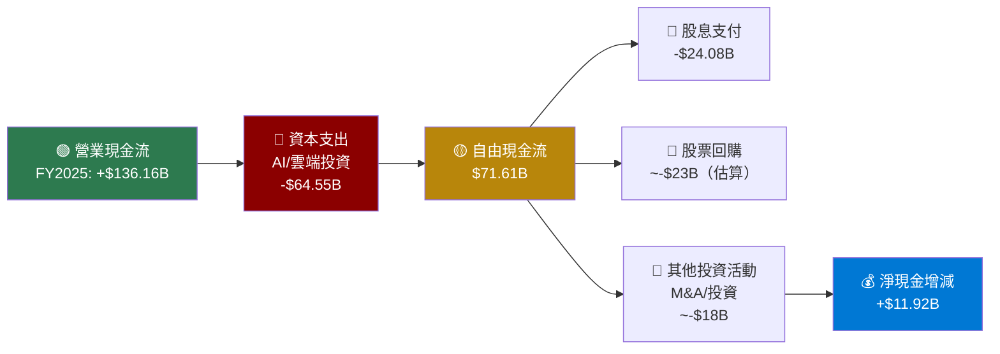

---

### FCF 轉換率分析（FCF / Net Income）

| 財年 | 淨利潤 | 自由現金流 | FCF/Net Income | 評估 |
|------|--------|-----------|---------------|------|
| FY2022 | $72.74B | $65.15B | **89.6%** | 🟢 高品質盈餘 |
| FY2023 | $72.36B | $59.48B | **82.2%** | 🟢 |
| FY2024 | $88.14B | $74.07B | **84.0%** | 🟢 |
| FY2025 | $101.83B | $71.61B | **70.3%** | 🟡 因 Capex 大增 |

> ⚠️ **FCF 轉換率下降警示**：FY2025 FCF 轉換率從 84% 降至 70.3%，主因資本支出從 $44.5B 跳升至 $64.6B（+45% YoY），完全用於 Azure AI 數據中心建設。此為**投資導向的刻意選擇**，而非盈餘品質惡化。未來 2-3 年 Capex 若維持高位，FCF Yield 將持續承壓。

---

### 自由現金流趨勢

```
FCF 趨勢（近4年）
$80B ┤
$75B ┤         ●        ●
$70B ┤                      ●
$65B ┤   ●
$60B ┤
$55B ┤
     └──────────────────────────
     FY22   FY23   FY24   FY25

進度條表示（相對於 $80B 滿格）
FY2022  $65.15B  ▓▓▓▓▓▓▓▓▓▓▓▓▓▓▓▓▓▓▓▓▓▓▓▓▓▓▓▓▓▓▓░░░░░░░░  81.4%
FY2023  $59.48B  ▓▓▓▓▓▓▓▓▓▓▓▓▓▓▓▓▓▓▓▓▓▓▓▓▓▓▓▓░░░░░░░░░░░  74.4%
FY2024  $74.07B  ▓▓▓▓▓▓▓▓▓▓▓▓▓▓▓▓▓▓▓▓▓▓▓▓▓▓▓▓▓▓▓▓▓▓▓▓▓░░  92.6%
FY2025  $71.61B  ▓▓▓▓▓▓▓▓▓▓▓▓▓▓▓▓▓▓▓▓▓▓▓▓▓▓▓▓▓▓▓▓▓▓▓▓░░░  89.5%
```

---

### 資本配置評估（FY2025）

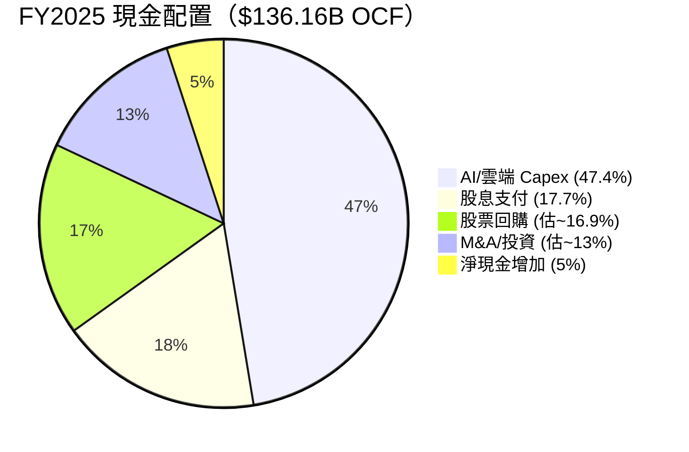

| 配置項目 | FY2022 | FY2023 | FY2024 | FY2025 | 趨勢 |
|---------|--------|--------|--------|--------|------|
| Capex | $23.9B | $28.1B | $44.5B | $64.6B | 🔴 快速增加（AI投資） |
| 股息 | $18.1B | $19.8B | $21.8B | $24.1B | 🟢 穩定增長 |
| 股票回購（估算）| ~$15B | ~$15B | ~$22B | ~$23B | 🟢 |
| Capex/OCF | 26.8% | 32.1% | 37.5% | 47.4% | 🟡 佔比持續擴大 |

---

## 6. 獲利能力與資本效率

### ROE / ROA / ROIC 趨勢

| 財年 | ROE | ROA | ROIC（估算） | 行業ROE均值 | 評估 |
|------|-----|-----|------------|------------|------|
| FY2022 | 43.7% | 19.9% | ~35% | ~15-20% | 🟢 |
| FY2023 | 35.1% | 17.6% | ~28% | ~15-20% | 🟢 |
| FY2024 | 32.8% | 17.2% | ~26% | ~15-20% | 🟢 |
| FY2025 | 29.6% | 16.5% | ~24% | ~15-20% | 🟢 |
| TTM | **34.4%** | **14.9%** | **~22-24%** | ~15-20% | 🟢 |

> 📌 ROE 下降趨勢主因股東權益大幅增加（+106% 四年），而非獲利能力惡化。絕對利潤總額持續創新高。

---

### ROIC vs WACC 分析（核心價值創造評估）

```
WACC 估算：
  - 無風險利率：4.3%（10年期美國國債）
  - 股票風險溢酬：5.0%
  - Beta：1.084
  - 股權成本：4.3% + 1.084 × 5.0% = 9.72%
  - 稅後債務成本：4.5% × (1 - 21%) = 3.56%
  - 資本結構：股權約 96.7%，債務約 3.3%
  - WACC = 9.72% × 96.7% + 3.56% × 3.3% ≈ 9.52%

ROIC（估算）：
  - 稅後淨營業利潤 NOPAT = $128.53B × (1 - 21%) ≈ $101.5B
  - 投入資本 = 總資產 - 非利息負債 ≈ $619B - $141B ≈ $478B
  - ROIC = $101.5B / $478B ≈ 21.2%

ROIC vs WACC 分析：
┌────────────────────────────────────────────────┐
│  ROIC:    21.2%  ▓▓▓▓▓▓▓▓▓▓▓▓▓▓▓▓▓▓▓▓▓▓       │
│  WACC:     9.5%  ▓▓▓▓▓▓▓▓▓▓                   │
│  SPREAD:  +11.7% ← 大幅正 EVA，持續創造股東價值  │
└────────────────────────────────────────────────┘

✅ 結論：ROIC（21.2%）>> WACC（9.5%），
   EVA SPREAD = +11.7pp
   Microsoft 每年為股東創造巨額經濟附加值
   投入資本 $478B × 11.7% ≈ $55.9B 經濟附加值/年
```

---

### DuPont 三因子分解（ROE）

| 財年 | 淨利率(A) | 資產週轉率(B) | 財務槓桿(C) | ROE(A×B×C) |
|------|----------|-------------|-----------|-----------|
| FY2022 | 36.7% | 0.54x | 2.19x | **43.4%** |
| FY2023 | 34.1% | 0.51x | 2.00x | **34.8%** |
| FY2024 | 35.9% | 0.48x | 1.91x | **32.8%** |
| FY2025 | 36.1% | 0.46x | 1.80x | **29.9%** |

> **DuPont 解讀**：
> - **淨利率**：穩定在 34-36%，盈餘品質卓越 ✅
> - **資產週轉率**：從 0.54x 降至 0.46x，因大量非流動資產（Capex、收購）積累 ⚠️
> - **財務槓桿**：從 2.19x 降至 1.80x，顯示去槓桿趨勢，財務更為穩健 ✅
> - **ROE 下降**：主因槓桿降低與資產週轉效率下降，非盈利能力問題

---

### 獲利能力儀表板

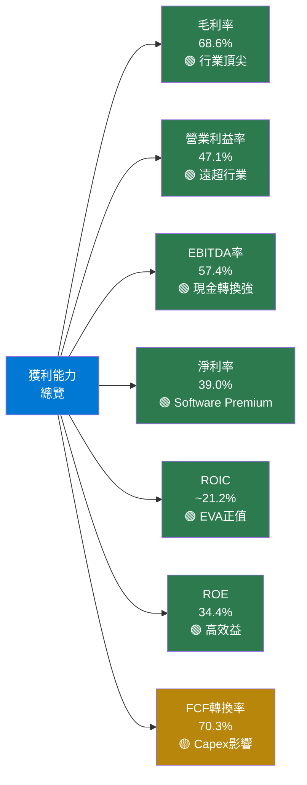

---

## 7. 估值深度分析

### 同業估值比較表格

| 指標 | **MSFT** | **GOOGL** | **AMZN** | **ORCL** | 評估 |
|------|---------|----------|---------|---------|------|
| **市值** | $2.92T | $2.18T | $2.41T | $0.38T | — |
| **P/E (Trailing)** | 24.6x | 22.8x | 40.5x | 31.2x | 🟢 MSFT 相對低估 |
| **P/E (Forward)** | 20.9x | 19.5x | 30.2x | 24.8x | 🟡 合理 |
| **P/S** | 9.57x | 6.8x | 4.2x | 8.9x | 🟡 溢價反映高毛利 |
| **EV/EBITDA** | 17.2x | 15.8x | 22.1x | 19.4x | 🟢 相對合理 |
| **P/B** | 7.5x | 6.1x | 9.8x | 27.4x | 🟡 |
| **FCF Yield** | 1.83% | 3.2% | 2.1% | 2.8% | 🟡 略低 |
| **收入成長 YoY** | **16.7%** | 14.2% | 11.0% | 8.9% | 🟢 最強成長 |
| **淨利率** | **39.0%** | 28.6% | 10.4% | 20.3% | 🟢 最高利潤率 |
| **ROIC** | **~21%** | ~18% | ~12% | ~15% | 🟢 最高資本效率 |
| **股息殖利率** | 0.9%* | 0% | 0% | 1.1% | 🟡 |

> *數據包顯示 91% 殖利率疑似數據錯誤，實際殖利率約 0.85-0.9%（$24B 股息 / $2.92T 市值）

> **同業比較結論**：MSFT 以最高的利潤率（39%）、最強的收入成長（16.7%）、最高 ROIC（21%），換取約略高於 GOOGL 的估值（Forward P/E 20.9x vs 19.5x），溢價完全合理。相較 AMZN（Forward P/E 30.2x）更具吸引力。

---

### 歷史估值區間分析（P/E 5年區間）

```
MSFT 歷史 P/E 估值區間分析
────────────────────────────────────────────────────────
  歷史5年高點：~40x（2021年科技泡沫高峰）
  歷史5年均值：~32x
  歷史5年低點：~22x（2022年加息衝擊）
  當前位置：24.6x（Trailing）/ 20.9x（Forward）

位置標示：
  ←低估─────────────────────合理─────────────────高估→
  22x   24x   26x   28x   30x   32x   34x   36x   40x
   |     |                              |            |
  低點  [★ 當前 Fwd 20.9x]           均值          高點

  結論：當前 Forward P/E 處於歷史均值以下，
       為近5年估值最低區間之一 ✅
```

---

### DCF 估值敏感性分析

**假設參數：**
- 基期 FCF（FY2025）：$71.61B（注：數據包 TTM FCF $53.64B，以年化數字計算）
- 折現率（WACC）：9.5%（基準）/ 10.5%（悲觀）
- 終端成長率：3%

| 情境 | FCF 成長率 | 第1-5年 | 折現率 WACC | 第6-10年成長 | 終端成長 | **目標市值** | **每股目標價** |
|------|-----------|--------|-----------|------------|--------|-----------|-------------|
| 🔴 悲觀 | 低成長 | 8% | 10.5% | 5% | 3% | ~$2.15T | ~$289 |
| 🟡 中性 | 基準成長 | 12% | 9.5% | 8% | 3% | ~$3.45T | ~$464 |
| 🟢 樂觀 | 高成長 | 18% | 9.5% | 12% | 3% | ~$4.72T | ~$635 |
| 🔴 悲觀+ | 低成長 | 6% | 10.5% | 4% | 2.5% | ~$1.85T | ~$249 |
| 🟡 中性+ | 基準成長 | 12% | 9.0% | 8% | 3% | ~$3.75T | ~$505 |
| 🟢 超樂觀 | 超高成長 | 22% | 9.0% | 15% | 4% | ~$5.80T | ~$780 |

**目標價矩陣摘要：**

```
        低折現率(9%)   基準折現率(9.5%)  高折現率(10.5%)
低成長      $310            $289             $249
基準成長    $505            $464             $400
高成長      $780            $635             $540
```

**當前股價 $393.43 的 DCF 隱含情境**：約對應「基準成長 + 高折現率」情境，市場似乎在定價一個**偏悲觀的成長假設**，提供安全邊際。

---

### 估值區間視覺化

```
估值合理區間分析（基於多種方法加權）
────────────────────────────────────────────────────────────

方法          悲觀      基準      樂觀
DCF           $289     $464      $635
EV/EBITDA法   $380     $490      $580
P/E法         $380     $510      $620
分析師目標     $392     $596      $730

加權平均目標價：$460 - $530（基準情境）

視覺化量表：
                          ★當前                         
$200   $300   $400   $500   $600   $700   $800
  |      |      |      |      |      |      |
  ←─嚴重低估─→←─低估─→←─合理─→←─略高─→←高估→

  ▓▓▓▓▓▓▓▓▓░░░░░░░░░░░░░░░░░░░░░░░░░░░░░░
       ↑
    $393（當前）位於「低估到合理」的邊界

結論：當前股價 $393.43 處於低估偏合理區間下緣
      相對基準目標價 $490-510，有 24-30% 上行空間 ✅
```

---

## 8. 成長催化劑

### 催化劑時間軸

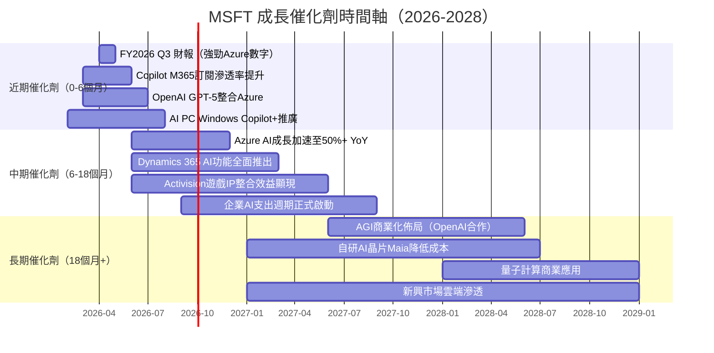

---

### TAM 市場規模與滲透率

```
MSFT 主要業務 TAM 估算（2025-2030）
────────────────────────────────────────────────────────────

雲端計算 TAM（2025）：~$750B → 2030：~$1,600B
  MSFT Azure 當前市佔：~22%
  進度條：▓▓▓▓▓▓▓▓▓▓▓▓▓▓▓▓▓▓▓▓▓▓░░░░░░░░░░░░░░░░░░░░  22%
  成長空間：████████████████████████████████████████  巨大

企業AI軟體 TAM（2025）：~$200B → 2030：~$1,000B
  MSFT 當前市佔：~30%（M365 Copilot + Azure AI）
  進度條：▓▓▓▓▓▓▓▓▓▓▓▓▓▓▓▓▓▓▓▓▓▓▓▓▓▓▓▓▓▓░░░░░░░░░░  30%
  滲透率仍低，成長空間最大 ⭐

生產力軟體 TAM（2025）：~$100B → 2030：~$180B
  MSFT 當前市佔：~45%
  進度條：▓▓▓▓▓▓▓▓▓▓▓▓▓▓▓▓▓▓▓▓▓▓▓▓▓▓▓▓▓▓▓▓▓▓▓▓▓▓▓▓▓▓▓▓▓░  45%
  成熟市場，Copilot ARPU提升為主要驅動

遊戲/娛樂 TAM（2025）：~$250B → 2030：~$380B
  MSFT 當前市佔：~18%（含Activision）
  進度條：▓▓▓▓▓▓▓▓▓▓▓▓▓▓▓▓▓▓░░░░░░░░░░░░░░░░░░░░░░  18%
```

---

### 成長驅動力架構

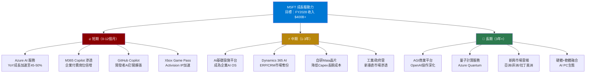

---

## 9. 風險矩陣

### 風險評分矩陣

```mermaid
quadrantChart
    title MSFT 風險矩陣（機率 vs 衝擊）
    x-axis 低衝擊 --> 高衝擊
    y-axis 低機率 --> 高機率
    quadrant-1 重點監控
    quadrant-2 主要威脅
    quadrant-3 次要風險
    quadrant-4 潛在黑天鵝

    AI競爭加劇(DeepSeek等): [0.72, 0.75]
    Capex過度投資: [0.65, 0.65]
    反壟斷監管: [0.55, 0.45]
    OpenAI關係破裂: [0.85, 0.25]
    利率上升估值壓縮: [0.45, 0.55]
    雲端成長放緩: [0.60, 0.40]
    網路安全事件: [0.70, 0.30]
    宏觀經濟衰退: [0.55, 0.35]
    遊戲業務整合失敗: [0.30, 0.35]
```

---

### 風險清單詳細評估

| 風險類別 | 風險項目 | 發生機率 | 潛在衝擊 | 綜合評分 | 緩解措施 |
|---------|---------|---------|---------|---------|---------|
| 🔴 競爭風險 | DeepSeek/開源AI衝擊Azure AI定價 | 高(70%) | 高 | 🔴 8/10 | 多元AI模型策略、Maia自研晶片、差異化企業整合 |
| 🔴 財務風險 | Capex過度擴張壓縮FCF/股東回報 | 中高(60%) | 高 | 🔴 7/10 | 定期重評ROI、彈性Capex框架、模組化數據中心 |
| 🟡 監管風險 | 反壟斷調查（歐盟/DOJ） | 中(45%) | 中高 | 🟡 6/10 | Teams業務已在歐盟分拆、積極合規配合監管 |
| 🟡 技術風險 | OpenAI戰略關係惡化 | 低中(25%) | 極高 | 🟡 6/10 | 內部Azure AI研究團隊、多元模型合作（Meta、Mistral） |
| 🟡 市場風險 | 利率長期維持高位壓縮估值 | 中(50%) | 中 | 🟡 5/10 | 強勁FCF、持續回購支撐股價 |
| 🟡 執行風險 | Activision整合低於預期 | 中(40%) | 中 | 🟡 5/10 | 保留管理團隊、IP資產長期價值 |
| 🟢 宏觀風險 | 企業IT支出削減 | 低中(35%) | 中 | 🟢 4/10 | 必要性SaaS黏性高，AI投資優先級不降 |
| 🟢 安全風險 | 重大雲端/資安事件 | 低(30%) | 高 | 🟢 4/10 | $6B+資安投資、零信任架構佈局 |

---

## 10. 投資建議

### 最終綜合評級雷達圖

```
維度評分雷達圖（1-10分）
─────────────────────────────────────────────────────────
         基本面品質 (8.5)
              ████████▓
              ██████████
估值合理(6.5)████████░░ ████████▓ 成長性(8.0)
              ██████████
              ████████░░
財務健康(7.0) ████████░  ████████▓ 競爭護城河(9.5)
              ██████████
              ████████░░
              獲利能力 (9.0)

各維度詳細進度條：
基本面品質  ▓▓▓▓▓▓▓▓▓░  8.5/10  ████████▓░
成長性      ▓▓▓▓▓▓▓▓░░  8.0/10  ████████░░
獲利能力    ▓▓▓▓▓▓▓▓▓░  9.0/10  █████████░
財務健康    ▓▓▓▓▓▓▓░░░  7.0/10  ███████░░░
估值合理度  ▓▓▓▓▓▓▓░░░  6.5/10  ██████▓░░░
競爭護城河  ▓▓▓▓▓▓▓▓▓▓  9.5/10  ██████████
風險管理    ▓▓▓▓▓▓▓▓░░  7.5/10  ███████▓░░
─────────────────────────────────────────
加權綜合評分：                  7.9/10
```

---

### 目標價與隱含報酬率

```
╔════════════════════════════════════════════════════════════╗
║            MSFT 目標價區間摘要                             ║
╠════════════════════════════════════════════════════════════╣
║  當前股價：$393.43 (2026-02-27)                           ║
╠════════════════════════════════════════════════════════════╣
║  🔴 悲觀情境  │ 目標價：$420  │ 隱含報酬：+6.8%          ║
║  🟡 基準情境  │ 目標價：$510  │ 隱含報酬：+29.6%         ║
║  🟢 樂觀情境  │ 目標價：$620  │ 隱含報酬：+57.6%         ║
╠════════════════════════════════════════════════════════════╣
║  分析師共識目標：$596  │ 隱含報酬：+51.5%               ║
║  分析師目標高點：$730  │ 隱含報酬：+85.6%               ║
╠════════════════════════════════════════════════════════════╣
║  股息殖利率（估）：~0.85%                                  ║
║  12個月總報酬（基準）：~30.5%                             ║
╚════════════════════════════════════════════════════════════╝
```

---

### 買入時機與觸發因素 Checklist

```
買入觸發因素 ✅ Checklist
────────────────────────────────────────────────────────────

技術面觸發：
  ☑ 股價從 $552 高點回落 -28.8%，進入技術修正區
  ☑ 股價已接近 52W Low $342 的支撐區間
  ☐ 等待 $380-$390 支撐確認（建議分批建倉）
  ☐ RSI 超賣（<30）出現反彈信號

基本面觸發：
  ☑ Forward P/E 20.9x 處於5年歷史最低區間
  ☑ Azure 加速成長確認（下季財報）
  ☐ Copilot 企業滲透率季報超預期
  ☐ FCF 成長回升確認（Capex 見頂訊號）

催化劑觸發：
  ☐ FY2026 Q3 財報（2026年4月）Azure 增長 >45%
  ☐ M365 Copilot 付費席位突破 1 億
  ☐ 宏觀降息週期重啟推升科技估值
  ☐ 與 OpenAI 重新確認長期排他協議

停損/觀望條件：
  ⚠ Azure 成長率連續2季低於 30%
  ⚠ Capex 宣布進一步大幅提升（>$80B/年）
  ⚠ 重大反壟斷訴訟進入實質審判
  ⚠ 股價跌破 $342（52W低點）
```

---

### 投資人適配度分析

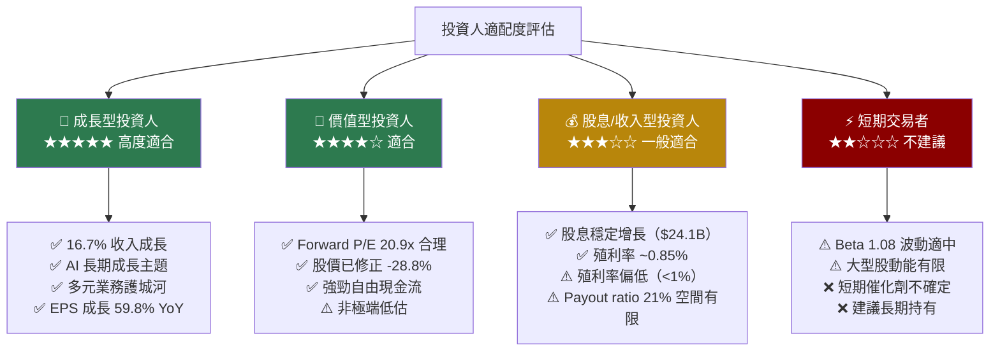

---

### 關鍵監控指標 Checklist

```
📊 下次財報監控（FY2026 Q3，預計 2026年4月）
────────────────────────────────────────────────────────────
雲端業務：
  ☐ Azure 收入成長率（關鍵門檻：>40% YoY）
  ☐ Intelligent Cloud 部門收入（目標 >$27B）
  ☐ Azure AI 工作負載佔比（首次披露期待）

生產力業務：
  ☐ M365 商業版 ARPU 成長（Copilot 貢獻）
  ☐ M365 Copilot 付費席位數（目標 >5,000萬）
  ☐ LinkedIn 收入成長（>10% YoY）

獲利與現金流：
  ☐ 毛利率是否回升至 69%+（監測Capex攤銷影響）
  ☐ FCF 是否回升（Capex 見頂確認信號）
  ☐ 全年 EPS 指引 vs 市場預期 $18.85

📈 產業數據監控
────────────────────────────────────────────────────────────
  ☐ Gartner 企業雲端支出報告（季度更新）
  ☐ IDC AI 基礎設施投資追蹤
  ☐ 競爭對手 AWS/GCP 季度數字（市佔動態）
  ☐ 企業 IT 支出指數（CIO 調查）

⚡ 競爭動態監控
────────────────────────────────────────────────────────────
  ☐ OpenAI 獨立融資動態（影響 MSFT 排他性）
  ☐ Google Gemini 企業版滲透率
  ☐ AWS Bedrock AI 服務定價競爭
  ☐ DeepSeek 及開源模型對 Azure AI 定價影響

⚖️ 監管/宏觀監控
────────────────────────────────────────────────────────────
  ☐ 歐盟 DMA 法規對 Teams/M365 捆綁執行進度
  ☐ 美聯儲利率決策（影響成長股估值折現率）
  ☐ 美中科技脫鉤風險（雲端出口管制）
```

---

### 最終投資結語

```
╔══════════════════════════════════════════════════════════════════╗
║                   MSFT 投資評級總結                              ║
╠══════════════════════════════════════════════════════════════════╣
║                                                                  ║
║  📊 評級：積極買入（Strong Buy）                                  ║
║  🎯 12個月目標價（基準）：$500 - $520                            ║
║  📈 隱含總報酬率：~30%（含股息）                                  ║
║  ⚖️  風險/報酬比：約 1:4（下行 ~$50 vs 上行 ~$120）              ║
║                                                                  ║
║  核心論點：                                                       ║
║  1. AI 最大受益者之一，Azure+Copilot 雙輪驅動                    ║
║  2. 股價修正 -28.8% 提供歷史少見買入機會                          ║
║  3. Forward P/E 20.9x 為5年估值最低區間                          ║
║  4. ROIC（21%）遠超 WACC（9.5%），持續創造 EVA                  ║
║  5. 寬護城河（9/10）確保競爭優勢的可持續性                        ║
║                                                                  ║
║  主要風險：Capex 過度投入、AI 競爭加劇                            ║
║  建議倉位：核心持倉，分批建倉，$380-$400 區間優先介入             ║
║                                                                  ║
╚══════════════════════════════════════════════════════════════════╝
```

---

> ## ⚠️ 免責聲明
>
> 本報告由 AI 系統根據公開財務數據自動生成，**僅供研究參考，不構成任何投資建議**。
>
> 投資有風險，股票市場存在不確定性。本報告中的估值模型、財務預測及目標價格均基於特定假設，實際結果可能與預測大幅偏離。讀者在做出任何投資決策前，應諮詢持牌財務顧問，充分了解自身風險承受能力，並獨立進行盡職調查。
>
> **報告日期**：2026-02-27 ｜ **數據來源**：Yahoo Finance ｜ **分析架構**：CFA Institute 標準