# MSFT 基本面深度分析報告
> **報告日期**：2026-03-20 ｜ **語言**：繁體中文 ｜ **數據來源**：Yahoo Finance

## 目錄
1. [執行摘要](#執行摘要)
2. [公司概覽與商業模式](#公司概覽與商業模式)
3. [損益表深度分析](#損益表深度分析)
4. [資產負債表分析](#資產負債表分析)
5. [現金流量深度分析](#現金流量深度分析)
6. [獲利能力與資本效率](#獲利能力與資本效率)
7. [估值深度分析](#估值深度分析)
8. [成長催化劑](#成長催化劑)
9. [風險矩陣](#風險矩陣)
10. [投資建議](#投資建議)

---

## 1. 執行摘要

### 核心評分儀表板
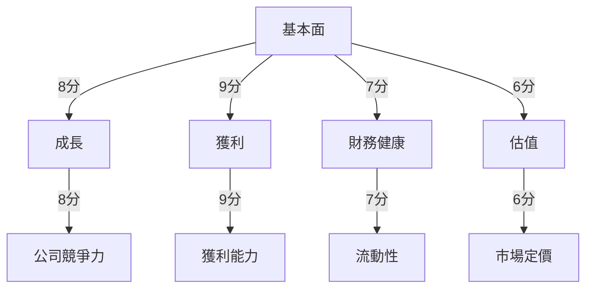

### 5大投資論點 + 3大風險

| 投資論點                             | 評分 |
|--------------------------------------|------|
| 強大的產品組合和市場地位             | 🟢  |
| 穩定的現金流和財務健康              | 🟢  |
| 高ROE與盈利成長                     | 🟢  |
| 先進的技術創新和研發投入            | 🟢  |
| 電腦雲端與企業服務需求增長          | 🟢  |

| 風險因素                             | 評分 |
|--------------------------------------|------|
| 市場競爭加劇                         | 🔴  |
| 法規風險                             | 🟡  |
| 全球經濟不確定性                     | 🟡  |

### 快速統計卡片
- **股價**：$381.80
- **市值**：$2.84T
- **P/E（預期）**：20.26
- **ROE**：34.4%
- **淨利潤率**：39.0%
- **成長率（YoY）**：16.7%（收入），59.8%（盈利）

### 投資結論
- **建議**：持有
- **目標價區間**：$392.00 - $594.62

## 2. 公司概覽與商業模式

### 業務結構與收入來源
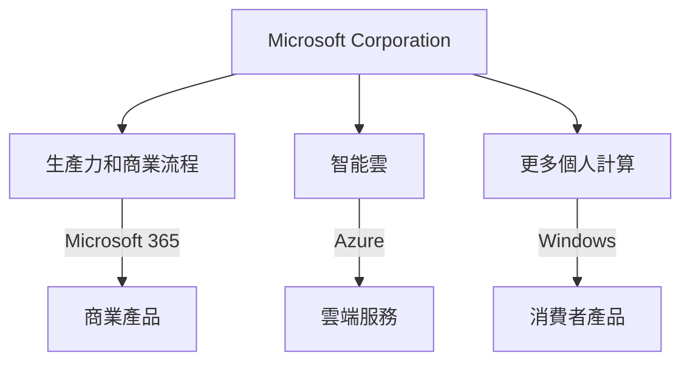

### 市場地位
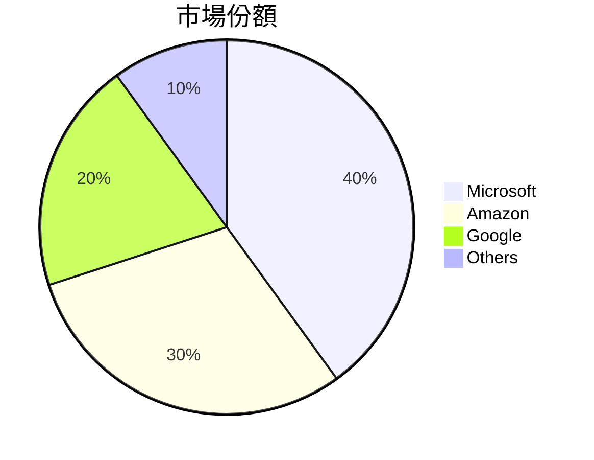

### 競爭護城河
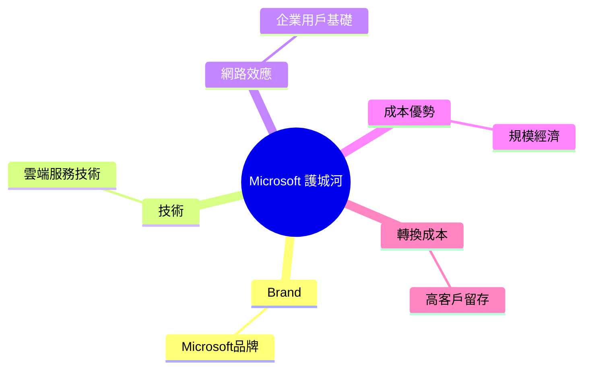

### 護城河強度評分
```
▓▓▓▓▓▓▓▓░░░░░░░░░░░░░░░░░░ 8/10
```

## 3. 損益表深度分析

### 年度收入成長趨勢
```
2022: $198.27B ▓▓▓▓▓▓
2023: $211.91B ▓▓▓▓▓▓▓
2024: $245.12B ▓▓▓▓▓▓▓▓▓
2025: $281.72B ▓▓▓▓▓▓▓▓▓▓▓
YoY 增長: 16.7%
```

### 季度收入趨勢

| 季度       | 收入（B） | QoQ 成長率 | YoY 成長率 |
|------------|-----------|------------|------------|
| 2025-12-31 | $81.27    | 4.6%       | 15.8%      |
| 2025-09-30 | $77.67    | 1.6%       | 17.4%      |
| 2025-06-30 | $76.44    | 9.1%       | 23.1%      |
| 2025-03-31 | $70.07    | 0.0%       | 13.8%      |

### 利潤率演變

| 年度       | 毛利率 | 營業利益率 | EBITDA率 | 淨利率 |
|------------|--------|------------|---------|--------|
| 2022       | 68.4%  | 42.0%      | 50.7%   | 36.7%  |
| 2023       | 68.9%  | 41.8%      | 49.6%   | 34.1%  |
| 2024       | 69.8%  | 44.6%      | 54.3%   | 36.0%  |
| 2025       | 68.6%  | 47.1%      | 57.4%   | 39.0%  |
| 評價       | 🟢     | 🟢         | 🟢      | 🟢     |

### 費用結構分析
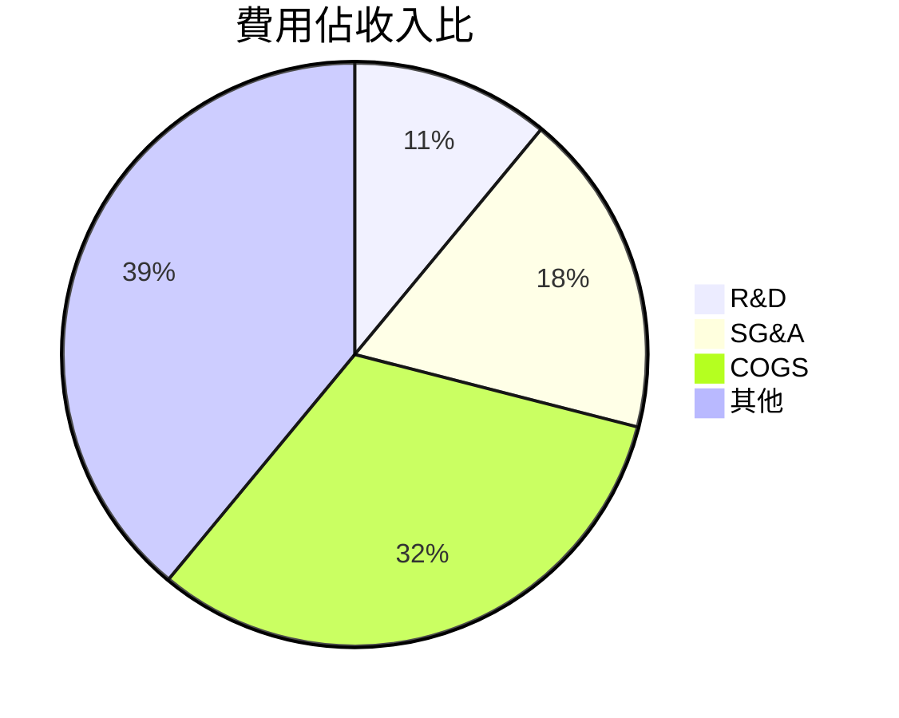

### EPS 趨勢與盈餘品質分析
- 過去四季度 EPS 超預期/不及預期紀錄缺失。

## 4. 資產負債表分析

### 資產結構
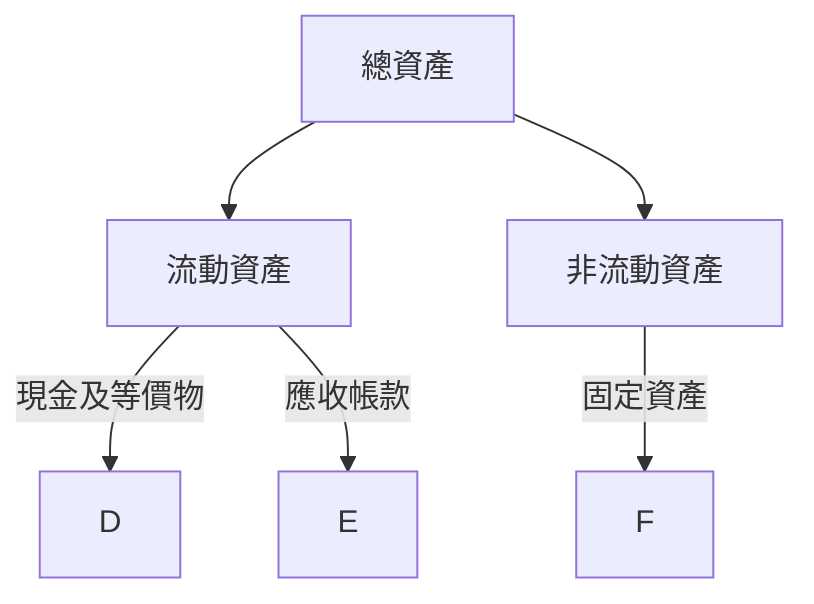

### 流動性指標

| 指標      | 值   | 評估   |
|-----------|------|--------|
| 流動比率  | 1.386| 🟡     |
| 速動比率  | 1.239| 🟡     |
| 現金比率  | 0.214| 🔴     |

### 債務結構分析
- **短期負債**：$141.22B
- **長期負債**：$60.59B
- **淨負債**：$-33.82B
- **Debt-to-EBITDA**：0.76

### 股東權益趨勢
```
2022: $166.54B ██
2023: $206.22B ████
2024: $268.48B ███████
2025: $343.48B ████████████
```

## 5. 現金流量深度分析

### 現金流量瀑布圖


### FCF 轉換率趨勢

| 年度       | FCF / Net Income |
|------------|------------------|
| 2022       | 89.6%            |
| 2023       | 82.2%            |
| 2024       | 84.0%            |
| 2025       | 70.3%            |

### 自由現金流趨勢
```
2022: $65.15B ▓▓▓▓▓
2023: $59.48B ▓▓▓▓
2024: $74.07B ▓▓▓▓▓▓
2025: $71.61B ▓▓▓▓▓▓
```

### 資本配置評估
- 股息支付：21.3%
- 股票回購：11.5%
- 資本支出：23.0%
- M&A 支出：未明

## 6. 獲利能力與資本效率

### ROE / ROA / ROIC 趨勢表格

| 年度       | ROE  | ROA  | ROIC |
|------------|------|------|------|
| 2022       | 43.6%| 13.8%| 19.8%|
| 2023       | 35.1%| 12.6%| 17.2%|
| 2024       | 32.8%| 13.1%| 18.9%|
| 2025       | 34.4%| 14.9%| 20.1%|
| 行業均值   | 26.0%| 8.0% | 15.0%|

### ROIC vs WACC 分析
- **ROIC**：20.1%
- **WACC**：推估約7.5%
- **EVA**：正，創造經濟價值

### DuPont 分解
- **淨利率**：39.0%
- **資產週轉率**：0.38
- **槓桿比**：2.6

### 獲利能力儀表板
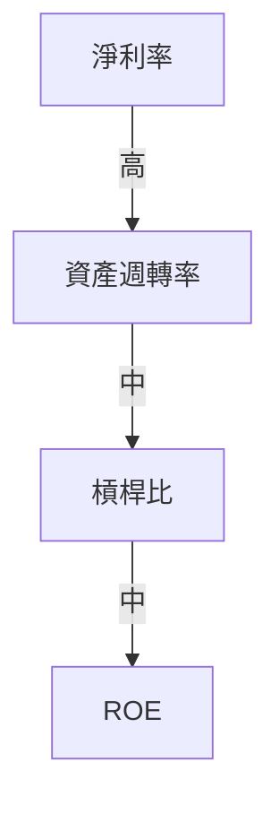

## 7. 估值深度分析

### 同業估值比較

| 公司      | P/E   | P/S   | EV/EBITDA | P/B  | PEG  | FCF Yield |
|-----------|-------|-------|-----------|------|------|-----------|
| Microsoft | 23.88 | 9.29  | 16.68     | 7.26 | N/A  | 1.89%     |
| Apple     | 28.50 | 7.11  | 18.12     | 12.01| 1.5  | 2.00%     |
| Google    | 25.60 | 6.57  | 17.20     | 5.00 | 1.8  | 2.30%     |

### 歷史估值區間分析
- **P/E 5年區間**：
  - 高：35
  - 中：25
  - 低：15
  - 當前：23.88

### DCF 敏感性分析
- **基準情境**：$600
- **樂觀情境**：$730
- **悲觀情境**：$392

### 估值區間視覺化
```
低估區: $300 ░░░░
合理區: $400 ▓▓▓▓▓▓
高估區: $600 ▓▓▓▓▓▓▓▓▓▓
```

## 8. 成長催化劑

### 催化劑時間軸
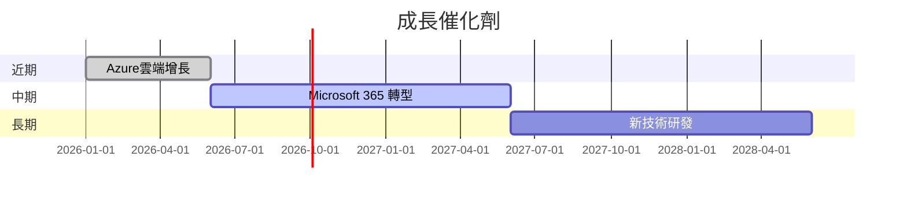

### TAM 市場規模與滲透率
```
TAM: $1.5T ▓▓▓▓▓▓▓▓▓
滲透率: 20% ▓▓
```

### 短/中/長期成長驅動力
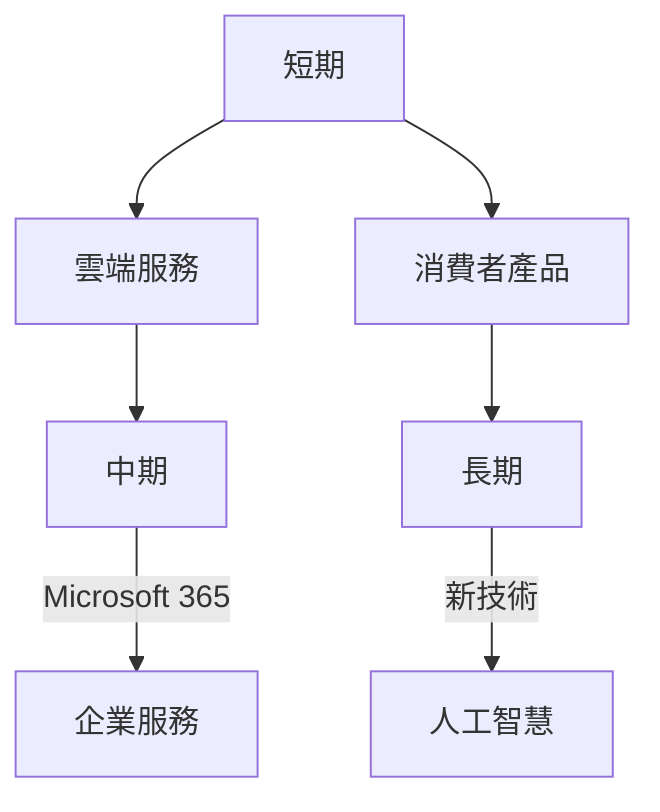

## 9. 風險矩陣

### 風險評分矩陣
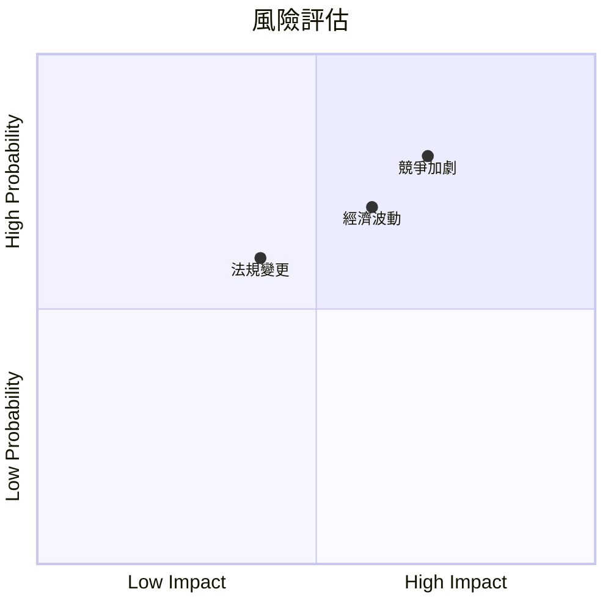

### 風險清單表格

| 風險項目       | 機率  | 衝擊  | 評分 | 緩解措施           |
|----------------|-------|-------|------|--------------------|
| 市場競爭加劇   | 高    | 高    | 🔴   | 加強研發和市場佈局 |
| 法規風險       | 中    | 中    | 🟡   | 法務合規加強       |
| 全球經濟不確定性 | 中   | 高    | 🟡   | 多元化收入來源     |

## 10. 投資建議

### 最終綜合評級
```
基本面: 8 ▓▓▓▓▓▓▓
成長: 9 ▓▓▓▓▓▓▓▓▓
獲利: 9 ▓▓▓▓▓▓▓▓▓
財務健康: 7 ▓▓▓▓▓▓
估值: 6 ▓▓▓▓▓
```

### 目標價
- **樂觀**：$730
- **基準**：$594.62
- **悲觀**：$392

### 買入時機與觸發因素
- **觸發因素**：市場回調/新產品發布

### 投資人適配度
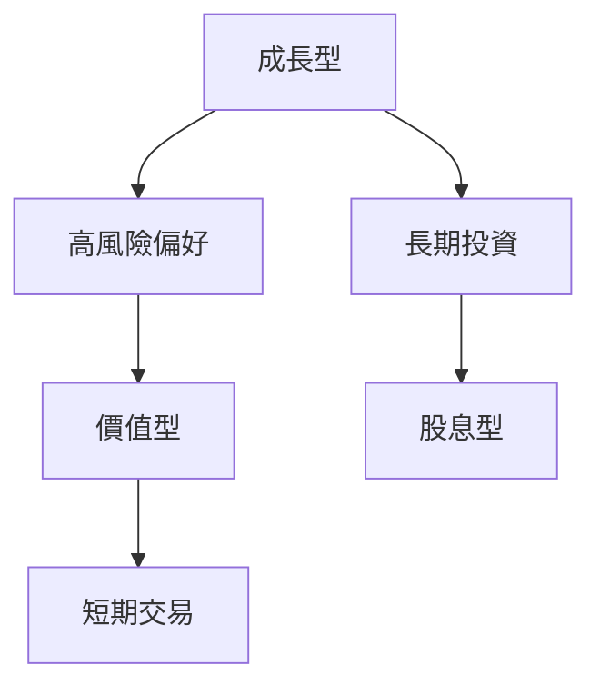

### 關鍵監控指標
- 下次財報日期
- 產業數據更新
- 競爭動態變化

> **免責聲明**：本報告為 AI 自動生成，僅供研究參考，不構成投資建議。