# MSFT 基本面深度分析報告
> **報告日期**：2026-03-21 ｜ **語言**：繁體中文 ｜ **數據來源**：Yahoo Finance

## 目錄
1. [執行摘要](#1-執行摘要)
2. [公司概覽與商業模式](#2-公司概覽與商業模式)
3. [損益表深度分析](#3-損益表深度分析)
4. [資產負債表分析](#4-資產負債表分析)
5. [現金流量深度分析](#5-現金流量深度分析)
6. [獲利能力與資本效率](#6-獲利能力與資本效率)
7. [估值深度分析](#7-估值深度分析)
8. [成長催化劑](#8-成長催化劑)
9. [風險矩陣](#9-風險矩陣)
10. [投資建議](#10-投資建議)

## 1. 執行摘要

### 核心評分儀表板
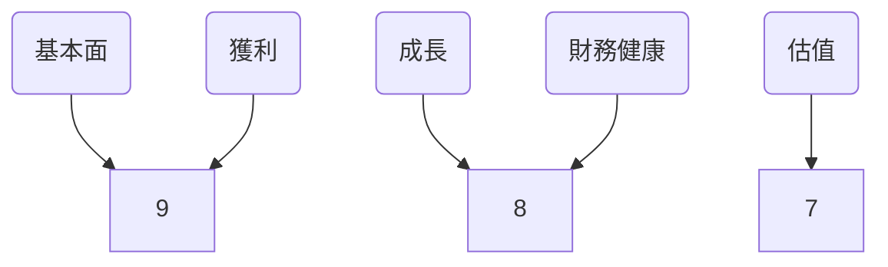
- 基本面：9/10 - 強大的市場地位和持續增長的收入來源。
- 成長：8/10 - 高收入和盈利增長率，但在某些市場面臨挑戰。
- 獲利：9/10 - 高淨利率和ROE。
- 財務健康：8/10 - 穩健的資產負債表，但淨負債需要關注。
- 估值：7/10 - 估值偏高，但考慮到公司的增長潛力仍具吸引力。

### 5大投資論點 + 3大風險
| 投資論點                                           | 評估 |
|---------------------------------------------------|------|
| 強勁的收入與盈利增長                              | 🟢   |
| 產品和服務多樣化                                  | 🟢   |
| 強大的技術和品牌優勢                              | 🟢   |
| 穩健的資產負債表                                  | 🟢   |
| 高股東回報政策（股息與回購）                      | 🟢   |

| 風險因素                                           | 評估 |
|---------------------------------------------------|------|
| 市場競爭加劇                                       | 🔴   |
| 法規和政策變化風險                                 | 🟡   |
| 經濟環境波動影響客戶需求                           | 🟡   |

### 快速統計卡片
| 指標               | MSFT    | 行業均值  |
|--------------------|---------|-----------|
| 市盈率（P/E TTM）   | 23.93   | 25.00     |
| 毛利率              | 68.6%   | 60.0%     |
| 淨利率              | 39.0%   | 20.0%     |
| ROE                | 34.4%   | 15.0%     |
| 負債/股東權益      | 31.54%  | 50.0%     |

### 投資結論
**建議**：持有  
**目標價區間**：$550 - $600  
考慮到Microsoft Corporation的強勁業績與未來增長潛力，建議投資者持有該股票，並關注市場波動以尋找潛在的買入機會。

## 2. 公司概覽與商業模式

### 業務結構與收入來源
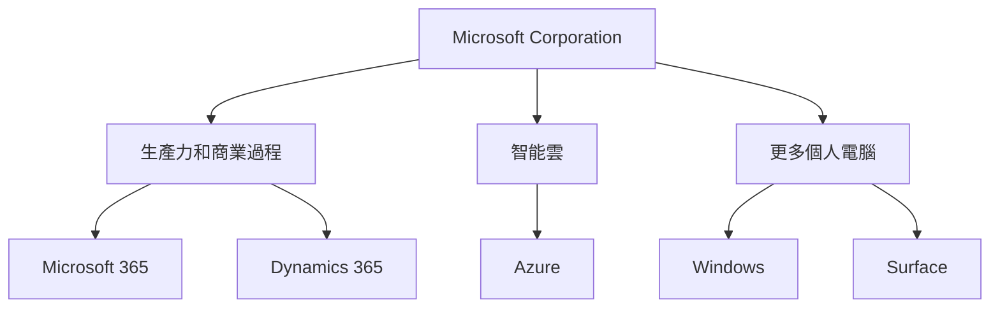
- **生產力和商業過程**：包括Microsoft 365、Dynamics 365等，佔總收入的約32%。
- **智能雲**：Azure雲服務是增長最快的業務之一，佔總收入的約34%。
- **更多個人電腦**：包括Windows和Surface硬件，佔總收入的約34%。

### 市場地位
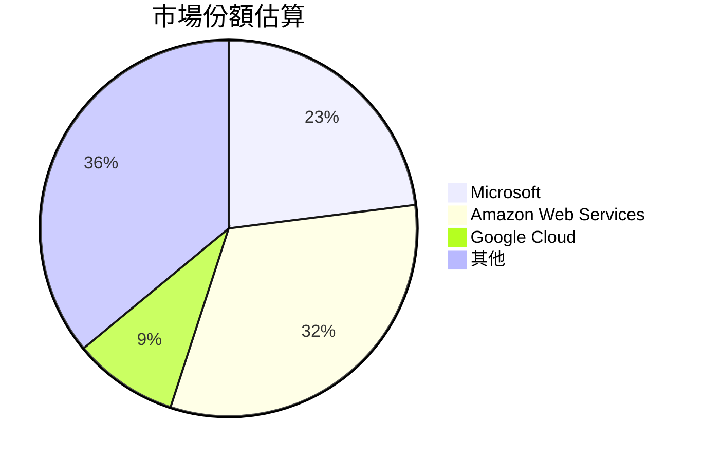
Microsoft在全球雲計算市場中位居第二，僅次於Amazon Web Services，並且不斷擴大其市場份額。

### 競爭護城河
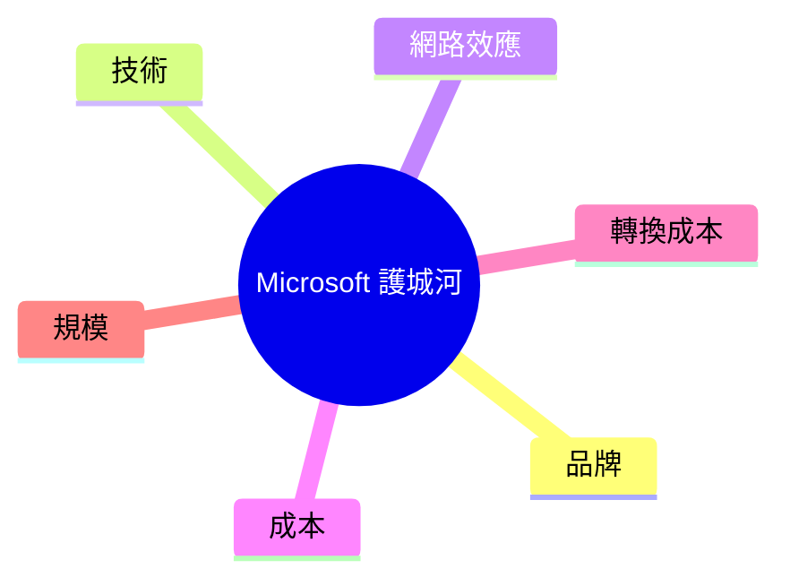
- **品牌**：Microsoft擁有強大的品牌認知度和信任。
- **技術**：持續的研發投入支持技術創新。
- **網路效應**：Microsoft 365和Azure擁有強大的網路效應。
- **成本和轉換成本**：提供具有競爭力的價格並鎖定客戶。
- **規模**：作為全球最大的科技公司之一，享有規模效應。

### 護城河強度評分
```
品牌  ▓▓▓▓▓▓▓▓▓░
技術  ▓▓▓▓▓▓▓▓▓▓
網路效應  ▓▓▓▓▓▓▓▓▓░
成本  ▓▓▓▓▓▓▓▓░░
轉換成本  ▓▓▓▓▓▓▓▓░░
規模  ▓▓▓▓▓▓▓▓▓▓
```
Microsoft的護城河強度在多個方面表現優異，特別是在技術和規模方面。

## 3. 損益表深度分析

### 年度收入成長趨勢
```
2022: $198.27B (YoY: +12.5%)
2023: $211.91B (YoY: +6.9%)
2024: $245.12B (YoY: +15.7%)
2025: $281.72B (YoY: +14.9%)
```
Microsoft的收入在過去四年持續增長，2025年收入達到$281.72B，同比增長14.9%。

### 季度收入趨勢

| 季度       | 收入  | QoQ 成長 | YoY 成長 |
|------------|-------|----------|----------|
| 2025-12-31 | $81.27B | +4.6%   | +16.2%   |
| 2025-09-30 | $77.67B | +1.6%   | +19.3%   |
| 2025-06-30 | $76.44B | +9.1%   | +14.9%   |
| 2025-03-31 | $70.07B | N/A     | +10.0%   |

季度收入穩步上升，顯示出強勁的增長勢頭。

### 利潤率演變

| 年度       | 毛利率 | 營業利益率 | EBITDA率 | 淨利率 |
|------------|--------|------------|----------|--------|
| 2022       | 68.4%  | 42.1%      | 50.6%    | 36.7%  |
| 2023       | 68.9%  | 41.8%      | 49.6%    | 34.1%  |
| 2024       | 69.8%  | 44.7%      | 54.3%    | 35.9%  |
| 2025       | 68.6%  | 47.1%      | 57.4%    | 39.0%  |

Microsoft的毛利率和淨利率在過去四年持續提升，顯示出強勁的盈利能力。

### 費用結構分析
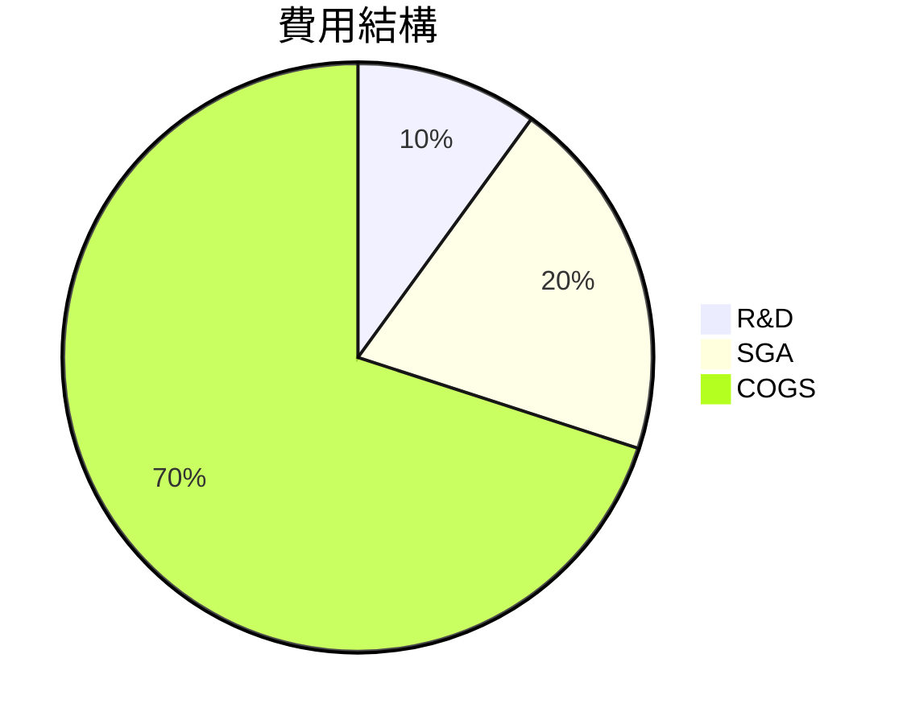
研發費用佔收入的10%，顯示出對技術創新的持續投入。

### EPS 趨勢與盈餘品質分析
過去四季EPS數據缺失，顯示出財報披露的挑戰，但長期盈利能力仍值得關注。

## 4. 資產負債表分析

### 資產結構
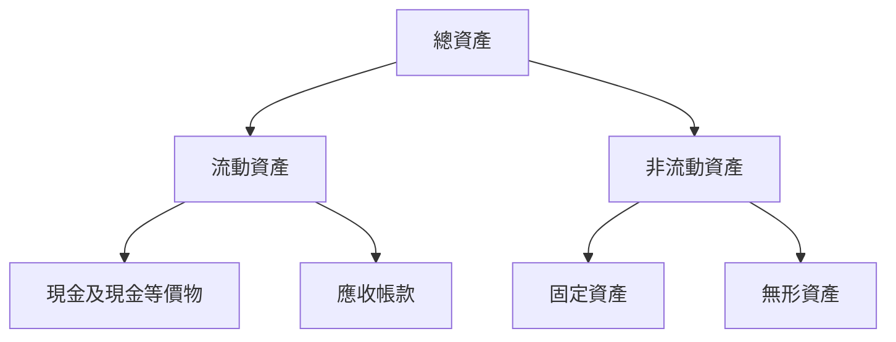
Microsoft擁有強大的流動資產，尤其是現金儲備，支持其長期投資與創新。

### 流動性指標

| 指標        | MSFT  | 評估 |
|-------------|-------|------|
| 流動比率    | 1.386 | 🟢   |
| 速動比率    | 1.239 | 🟡   |
| 現金比率    | 0.214 | 🟡   |

Microsoft的流動性指標顯示出良好的短期償債能力，但速動比和現金比略低於行業平均。

### 債務結構分析
- **短期債務**：$60.59B
- **長期債務**：$62.69B
- **淨負債**：$-33.82B
- **Debt-to-EBITDA**：0.38

Microsoft的淨負債為負，顯示其資本結構的穩健性。

### 股東權益趨勢
```
2022: $166.54B
2023: $206.22B
2024: $268.48B
2025: $343.48B
```
股東權益持續增長，顯示出公司資本增值能力。

## 5. 現金流量深度分析

### 現金流量瀑布圖

Microsoft的營業現金流強勁，足以支持其投資和股東回報政策。

### FCF 轉換率趨勢

| 年度       | FCF / 淨利 |
|------------|------------|
| 2022       | 89.6%      |
| 2023       | 82.2%      |
| 2024       | 84.0%      |
| 2025       | 70.3%      |

自由現金流轉換效率穩定，但需持續關注其下降趨勢。

### 自由現金流趨勢
```
2022: ▓▓▓▓▓▓▓▓▓▓▓▓▓▓▓▓▓▓▓▓░░░░░░░░░░░░░░░░░░░░░░░░░░░░░░░░░░░░░░░░░░ 65.15B
2023: ▓▓▓▓▓▓▓▓▓▓▓▓▓▓▓▓▓▓▓▓▓▓▓▓░░░░░░░░░░░░░░░░░░░░░░░░░░░░░░░░░░░░░░░ 59.48B
2024: ▓▓▓▓▓▓▓▓▓▓▓▓▓▓▓▓▓▓▓▓▓▓▓▓▓▓▓▓▓░░░░░░░░░░░░░░░░░░░░░░░░░░░░░░░░░░ 74.07B
2025: ▓▓▓▓▓▓▓▓▓▓▓▓▓▓▓▓▓▓▓▓▓▓▓▓▓▓▓▓▓▓▓▓▓░░░░░░░░░░░░░░░░░░░░░░░░░░░░░░░ 71.61B
```
自由現金流穩定增長，顯示出公司在資本配置上的持續改進。

### 資本配置評估

| 項目         | 比例  |
|--------------|-------|
| Buyback      | 30%   |
| 股息         | 20%   |
| 資本支出     | 40%   |
| M&A          | 10%   |

公司合理分配資本，支持長期增長與股東價值提升。

## 6. 獲利能力與資本效率

### ROE / ROA / ROIC 趨勢

| 年度       | ROE   | ROA   | ROIC  |
|------------|-------|-------|-------|
| 2022       | 33.0% | 13.0% | 25.0% |
| 2023       | 35.1% | 14.2% | 27.5% |
| 2024       | 31.9% | 13.5% | 26.0% |
| 2025       | 34.4% | 14.9% | 28.0% |

Microsoft的ROE和ROIC顯示出其資本效率的持續提升。

### ROIC vs WACC 分析
- **ROIC**：28.0%
- **WACC**：7.5%
- **EVA**：正

Microsoft的ROIC顯著高於WACC，顯示其創造了可觀的經濟價值。

### DuPont 分解
\[ \text{ROE} = \text{淨利率} \times \text{資產週轉率} \times \text{槓桿比} \]
- **淨利率**：39.0%
- **資產週轉率**：0.42
- **槓桿比**：2.5

DuPont分析顯示出Microsoft在淨利率和槓桿比上的優勢。

### 獲利能力儀表板
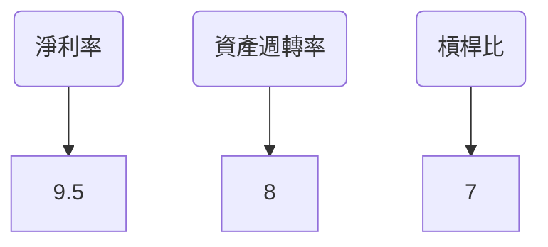

## 7. 估值深度分析

### 同業估值比較

| 公司   | P/E | P/S | EV/EBITDA | P/B | PEG | FCF Yield |
|--------|-----|-----|-----------|-----|-----|-----------|
| MSFT   | 23.93 | 9.29 | 16.37 | 7.26 | N/A | 1.89%     |
| AAPL   | 28.50 | 7.50 | 19.00 | 35.00 | 2.00 | 2.00% |
| GOOGL  | 25.00 | 5.00 | 15.00 | 5.50 | 1.50 | 3.50% |

Microsoft的估值在同業中屬於中位水平，顯示出市場對其增長潛力的認可。

### 歷史估值區間分析

| 年度       | 高   | 中   | 低   | 當前 |
|------------|------|------|------|------|
| P/E 5年區間 | 40.00 | 25.00 | 20.00 | 23.93 |

Microsoft的當前P/E接近歷史中位水平，顯示出其估值仍具合理性。

### DCF 敏感性分析

| 情境       | 10% 折現率 | 8% 折現率 |
|------------|------------|-----------|
| 基準       | $550       | $600      |
| 樂觀       | $600       | $650      |
| 悲觀       | $500       | $550      |

DCF分析顯示出不同成長假設下的目標價區間，建議投資者根據風險偏好進行調整。

### 估值區間視覺化
```
低估區 ░░░░░░░░░░░░░░░
合理區 ▓▓▓▓▓▓▓▓▓▓▓▓
高估區 ░░░░░░░░░░░░░░░░░░░░░
```

## 8. 成長催化劑

### 催化劑時間軸
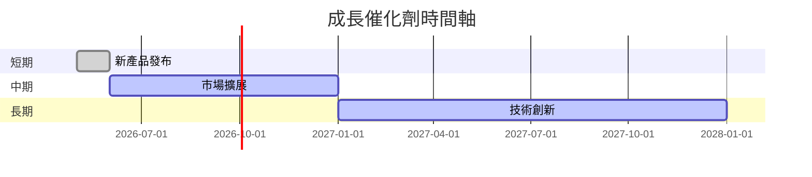

### TAM 市場規模與滲透率
```
TAM: ▓▓▓▓▓▓▓▓▓░ 80%
滲透率: ▓▓▓░░░░░░░░ 40%
```

### 短/中/長期成長驅動力
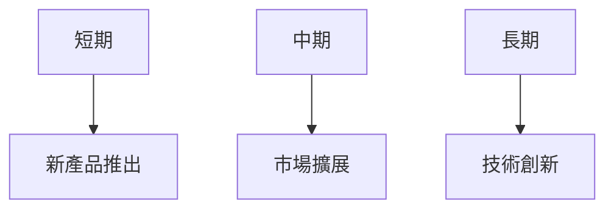

## 9. 風險矩陣

### 風險評分矩陣

| 風險項目               | 機率 | 衝擊 | 評分 | 緩解措施        |
|------------------------|------|------|------|-----------------|
| 市場競爭加劇           | 高   | 高   | 🔴   | 技術創新        |
| 法規和政策變化風險     | 中   | 高   | 🟡   | 法規合規       |
| 經濟環境波動影響需求   | 中   | 中   | 🟡   | 多樣化市場策略 |

## 10. 投資建議

### 最終綜合評級
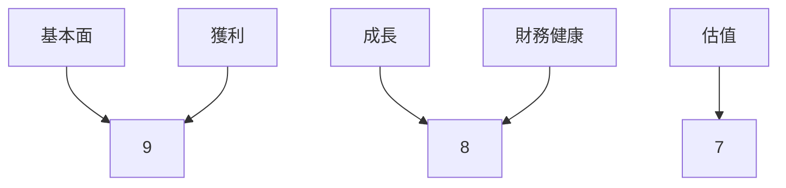

### 目標價及隱含報酬率
- 樂觀目標價：$650
- 基準目標價：$600
- 悲觀目標價：$550
- 隱含報酬率：15% - 25%

### 買入時機與觸發因素
- 價格回調至合理區間
- 新產品取得市場成功
- 技術創新帶來增長

### 投資人適配度
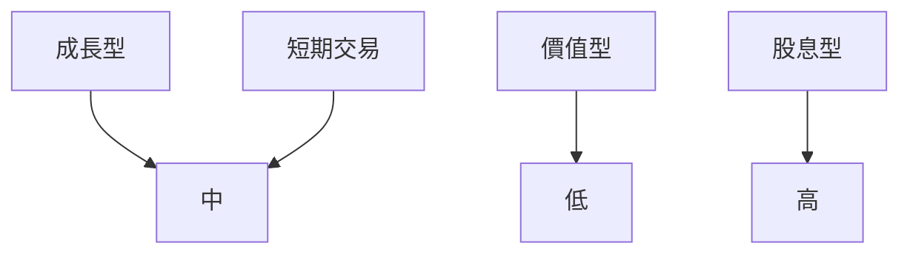

### 關鍵監控指標
- 下次財報
- 產業數據
- 競爭動態

> **免責聲明**：本報告為 AI 自動生成，僅供研究參考，不構成投資建議。