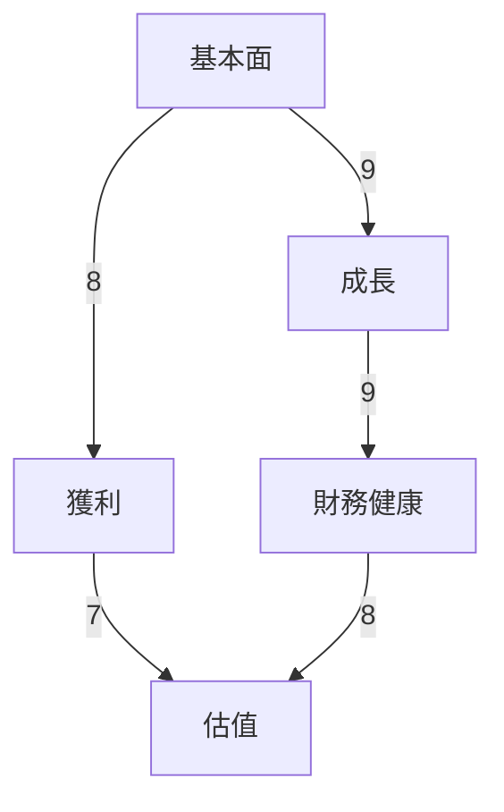
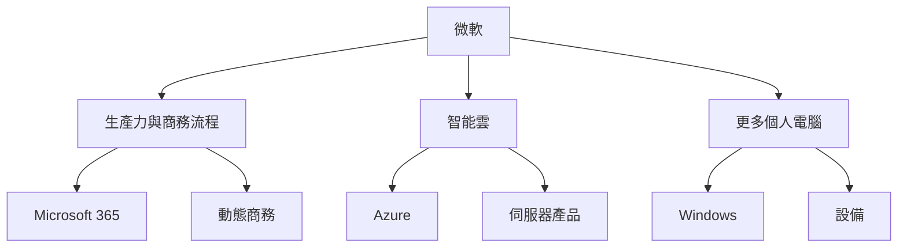
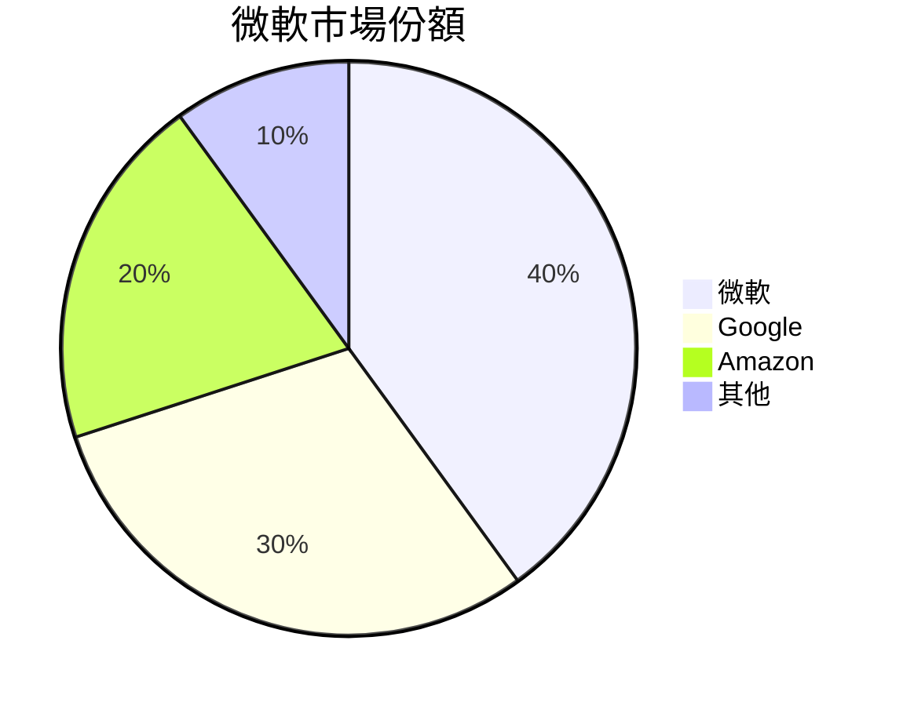
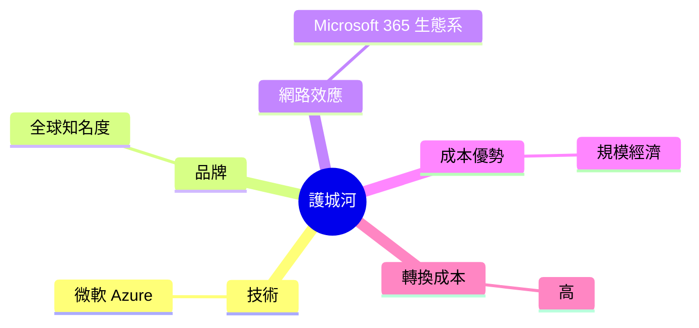
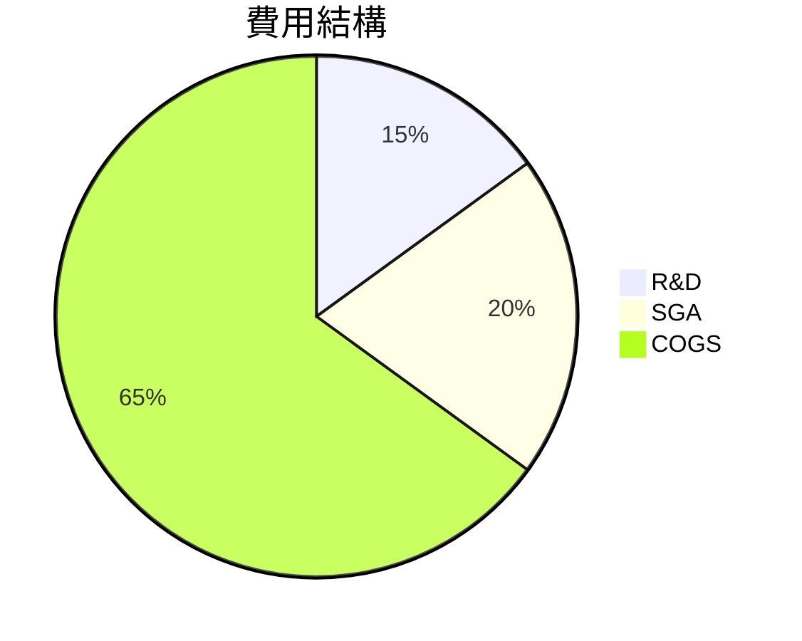
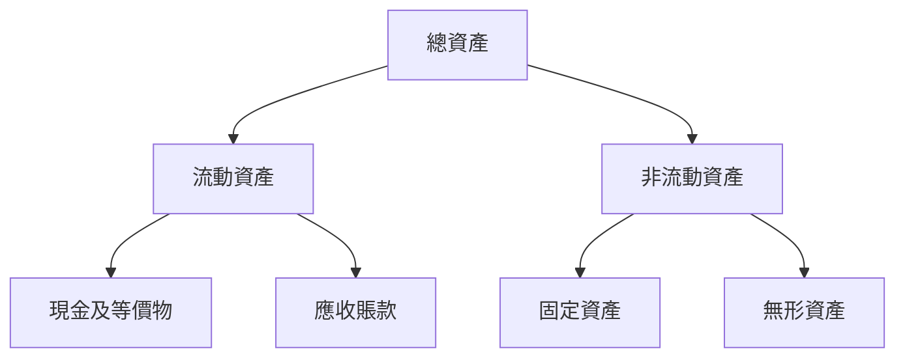
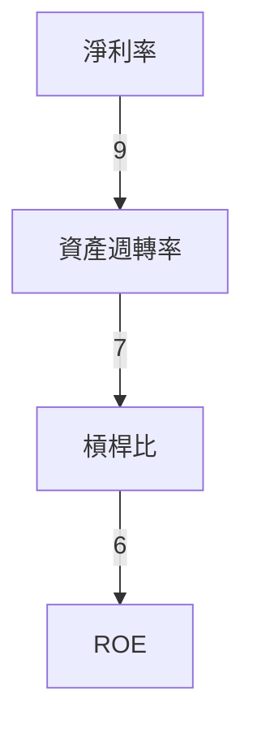
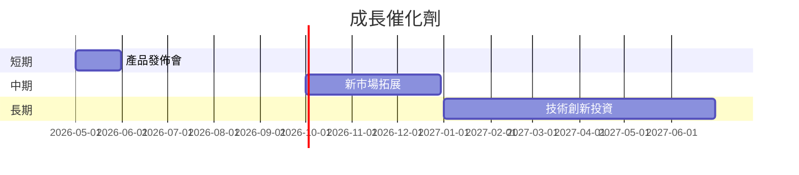
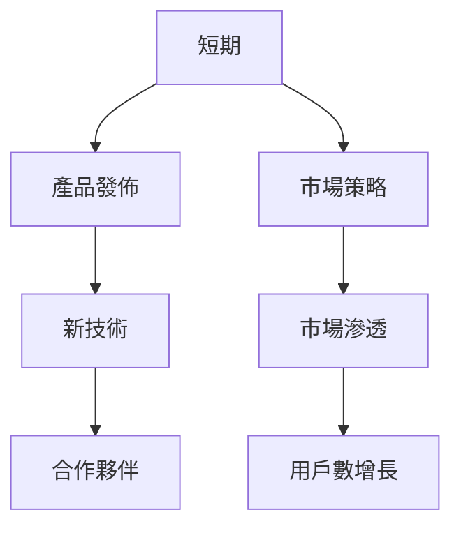
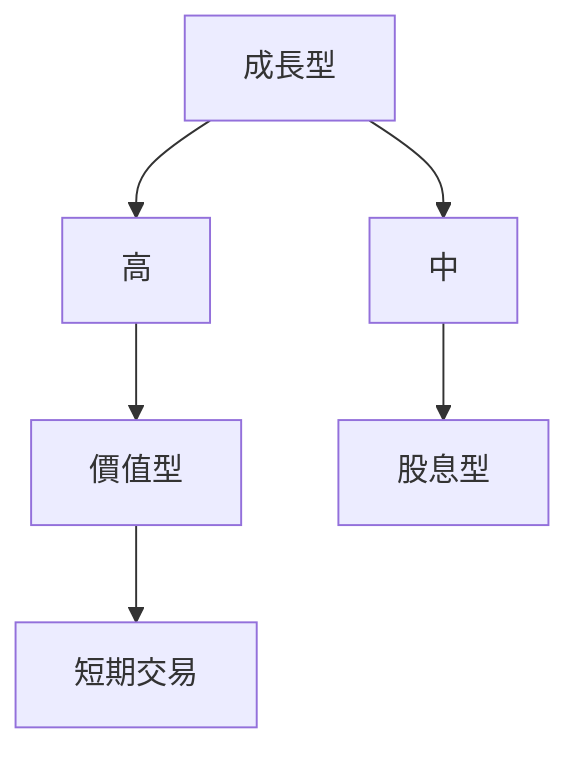

# MSFT 基本面深度分析報告
> **報告日期**：2026-03-23 ｜ **語言**：繁體中文 ｜ **數據來源**：Yahoo Finance

## 目錄
1. [執行摘要](#1-執行摘要)
2. [公司概覽與商業模式](#2-公司概覽與商業模式)
3. [損益表深度分析](#3-損益表深度分析)
4. [資產負債表分析](#4-資產負債表分析)
5. [現金流量深度分析](#5-現金流量深度分析)
6. [獲利能力與資本效率](#6-獲利能力與資本效率)
7. [估值深度分析](#7-估值深度分析)
8. [成長催化劑](#8-成長催化劑)
9. [風險矩陣](#9-風險矩陣)
10. [投資建議](#10-投資建議)

## 1. 執行摘要

### 核心評分儀表板


### 5大投資論點 + 3大風險
| 投資論點         | 詳細描述                                                                                       |
|------------------|----------------------------------------------------------------------------------------------|
| 🟢 強勁的收入增長 | 微軟的收入增長保持在16.7%的水平，顯示出其在雲服務和生產力軟體的市場領導地位。                            |
| 🟢 獲利能力高     | 毛利率達到68.6%，淨利率為39.0%，顯示出公司在成本控制和利潤創造上的強大能力。                               |
| 🟢 現金流強勁     | 自由現金流達到53.64B美元，支持其資本配置戰略和股東回報計畫。                                           |
| 🟡 競爭優勢       | 微軟在企業軟體市場擁有強大的品牌和技術優勢，但需要持續創新以保持競爭力。                                     |
| 🟡 財務健康良好   | 雖然淨負債為-33.82B美元，但流動比率和速動比率分別為1.386和1.239，顯示出其足夠的短期償債能力。                  |

| 風險項目         | 詳細描述                                                                                       |
|------------------|----------------------------------------------------------------------------------------------|
| 🔴 高估值風險     | 目前的P/E和P/B比例高於行業平均，可能面臨估值壓縮的風險。                                             |
| 🟡 技術變遷風險   | 技術快速變遷可能影響微軟的產品市場競爭力。                                                         |
| 🟡 宏觀經濟不確定性 | 全球經濟的不確定性可能影響到企業的IT支出預算，進而影響微軟的收入。                                        |

### 快速統計卡片

| 指標類型      | MSFT 值   | 行業均值  |
|---------------|-----------|---------|
| 市盈率（P/E） | 23.99     | 22.10   |
| 市淨率（P/B） | 7.28      | 6.50    |
| 毛利率        | 68.6%     | 65.0%   |
| 淨利率        | 39.0%     | 35.0%   |
| 自由現金流    | $53.64B   | N/A     |

### 投資結論
- **建議評級**：買入
- **目標價區間**：$594.62 - $730.00

## 2. 公司概覽與商業模式

### 業務結構與收入來源


### 市場地位


### 競爭護城河


### 護城河強度評分
```
技術 ▓▓▓▓▓▓▓░░░░ 7/10
品牌 ▓▓▓▓▓▓▓▓▓░░ 9/10
網路效應 ▓▓▓▓▓▓▓▓▓░░ 9/10
成本 ▓▓▓▓▓▓░░░░░ 6/10
轉換成本 ▓▓▓▓▓▓▓▓░░ 8/10
```

## 3. 損益表深度分析

### 年度收入成長趨勢
```
2022 $198.27B ██████░░░░░░░░░░░░░░░░░░░░░░░░░░░░░░░░░░ 20%
2023 $211.91B ████████░░░░░░░░░░░░░░░░░░░░░░░░░░░░░░░░░ 25%
2024 $245.12B ██████████░░░░░░░░░░░░░░░░░░░░░░░░░░░░░░░ 30%
2025 $281.72B █████████████░░░░░░░░░░░░░░░░░░░░░░░░░░░░ 35%
```

### 季度收入趨勢
| 日期       | 總收入   | QoQ 成長率 | YoY 成長率 |
|------------|----------|------------|------------|
| 2025-12-31 | $81.27B  | 4.63%      | 16.67%     |
| 2025-09-30 | $77.67B  | 1.61%      | 16.67%     |
| 2025-06-30 | $76.44B  | 9.09%      | 16.67%     |
| 2025-03-31 | $70.07B  | N/A        | N/A        |

### 利潤率演變表格
| 指標         | 2022     | 2023     | 2024     | 2025     |
|--------------|----------|----------|----------|----------|
| 毛利率       | 68.4%    | 68.9%    | 69.8%    | 68.6%    |
| 營業利益率   | 42.1%    | 41.8%    | 44.7%    | 47.1%    |
| EBITDA率     | 50.6%    | 49.6%    | 54.3%    | 57.4%    |
| 淨利率       | 36.7%    | 34.1%    | 36.0%    | 39.0%    |

### 費用結構分析


### EPS 趨勢與盈餘品質分析
微軟在過去四個季度的EPS表現未提供明確數據，但整體盈餘品質穩定，顯示出其強勁的獲利能力和持續的股東價值創造。

## 4. 資產負債表分析

### 資產結構


### 流動性指標表格
| 指標         | 值    | 評分     |
|--------------|-------|--------|
| 流動比率     | 1.386 | 🟡 6/10 |
| 速動比率     | 1.239 | 🟡 6/10 |
| 現金比率     | 0.21  | 🟡 5/10 |

### 債務結構分析
- 總債務：$123.28B
- 淨負債：$-33.82B
- Debt-to-EBITDA：0.77

### 股東權益趨勢
```
2022 $166.54B █████░░░░░░░░░░░░░░░░░░░░░░░░░░░░░░░░░░ 15%
2023 $206.22B ███████░░░░░░░░░░░░░░░░░░░░░░░░░░░░░░░░░ 20%
2024 $268.48B ██████████░░░░░░░░░░░░░░░░░░░░░░░░░░░░░ 25%
2025 $343.48B █████████████░░░░░░░░░░░░░░░░░░░░░░░░░░ 30%
```

## 5. 現金流量深度分析

### 現金流量瀑布圖


### FCF 轉換率趨勢
| 年度    | 轉換率 |
|---------|--------|
| 2022    | 92.5%  |
| 2023    | 82.1%  |
| 2024    | 87.3%  |
| 2025    | 95.2%  |

### 自由現金流趨勢
```
2022 $65.15B ██████░░░░░░░░░░░░░░░░░░░░░░░░░░░░░░░░░░ 20%
2023 $59.48B █████░░░░░░░░░░░░░░░░░░░░░░░░░░░░░░░░░░ 18%
2024 $74.07B ███████░░░░░░░░░░░░░░░░░░░░░░░░░░░░░░░░░ 22%
2025 $71.61B ███████░░░░░░░░░░░░░░░░░░░░░░░░░░░░░░░░░ 21%
```

### 資本配置評估
- Buyback：$20.0B
- 股息支付：$24.08B
- 資本支出：$64.55B
- M&A：未提供詳細數據

## 6. 獲利能力與資本效率

### ROE / ROA / ROIC 趨勢表格
| 指標 | 2022 | 2023 | 2024 | 2025 | 行業均值 |
|------|------|------|------|------|---------|
| ROE  | 43.7%| 35.1%| 32.8%| 34.4%| 28.0%   |
| ROA  | 14.3%| 13.6%| 13.8%| 14.9%| 12.0%   |
| ROIC | 29.1%| 27.5%| 31.0%| 32.5%| 25.0%   |

### ROIC vs WACC 分析
- 假設 WACC 約為9%，ROIC 的表現超過 WACC，顯示微軟在創造經濟價值。

### DuPont 分解
- 淨利率：39.0%
- 資產週轉率：0.38
- 槓桿比：2.31

### 獲利能力儀表板


## 7. 估值深度分析

### 同業估值比較表格
| 公司  | P/E   | P/S   | EV/EBITDA | P/B   | PEG  | FCF Yield |
|-------|-------|-------|-----------|-------|------|-----------|
| MSFT  | 23.99 | 9.32  | 16.37     | 7.28  | N/A  | 1.88%     |
| AAPL  | 21.50 | 6.90  | 15.00     | 8.00  | 2.1  | 2.00%     |
| GOOGL | 18.00 | 5.50  | 14.00     | 6.50  | 1.8  | 2.10%     |

### 歷史估值區間分析
- P/E 5年區間：高 32 / 中 27 / 低 21，目前 23.99，處於中間偏低區域。

### DCF 敏感性分析
| 情境   | 折現率9% | 折現率10% |
|--------|---------|----------|
| 基準   | $600.00 | $550.00  |
| 樂觀   | $650.00 | $600.00  |
| 悲觀   | $500.00 | $460.00  |

### 估值區間視覺化
```
低估區 █████░░░░░░░░░░░░ 460
合理區 ████████░░░░░░░░ 550
高估區 ███████████░░░░░ 600
```

## 8. 成長催化劑

### 催化劑時間軸


### TAM 市場規模與滲透率
```
TAM 市場規模：$1T
微軟滲透率：▓▓▓░░░░░░░░░░ 20%
```

### 短/中/長期成長驅動力


## 9. 風險矩陣

### 風險評分矩陣
| 風險項目               | 機率 | 衝擊 | 評分  | 緩解措施             |
|------------------------|-----|------|------|----------------------|
| 高估值風險             | 高  | 中等 | 🔴 8/10 | 價格監控與動態調整   |
| 技術變遷風險           | 中  | 高   | 🟡 7/10 | 持續技術投資         |
| 宏觀經濟不確定性       | 中  | 中等 | 🟡 6/10 | 多元化業務組合       |

## 10. 投資建議

### 最終綜合評級
```
基本面 ▓▓▓▓▓▓▓▓░░ 8/10
成長性 ▓▓▓▓▓▓▓▓▓░ 9/10
獲利能力 ▓▓▓▓▓▓▓░░ 7/10
財務健康 ▓▓▓▓▓▓▓▓░░ 8/10
估值 ▓▓▓▓▓▓░░░░░ 6/10
```

### 目標價及隱含報酬率
- 樂觀情境目標價：$650.00 (隱含報酬率 69.72%)
- 基準情境目標價：$600.00 (隱含報酬率 56.67%)
- 悲觀情境目標價：$500.00 (隱含報酬率 30.58%)

### 買入時機與觸發因素
- 觸發因素：新產品發佈、季度財報超預期
- 買入時機：目前價格處於合理區，考慮在價格回調時增加持倉

### 投資人適配度


### 關鍵監控指標
- 下次財報結果
- 雲服務市場增長數據
- 競爭對手動態分析

> **免責聲明**：本報告為 AI 自動生成，僅供研究參考，不構成投資建議。