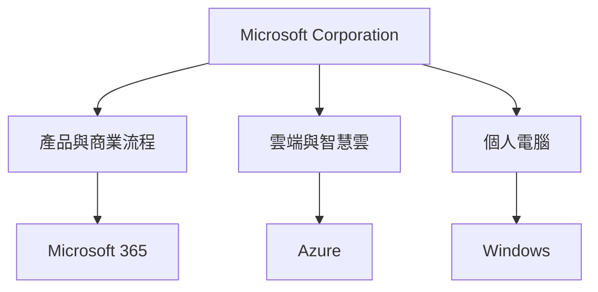
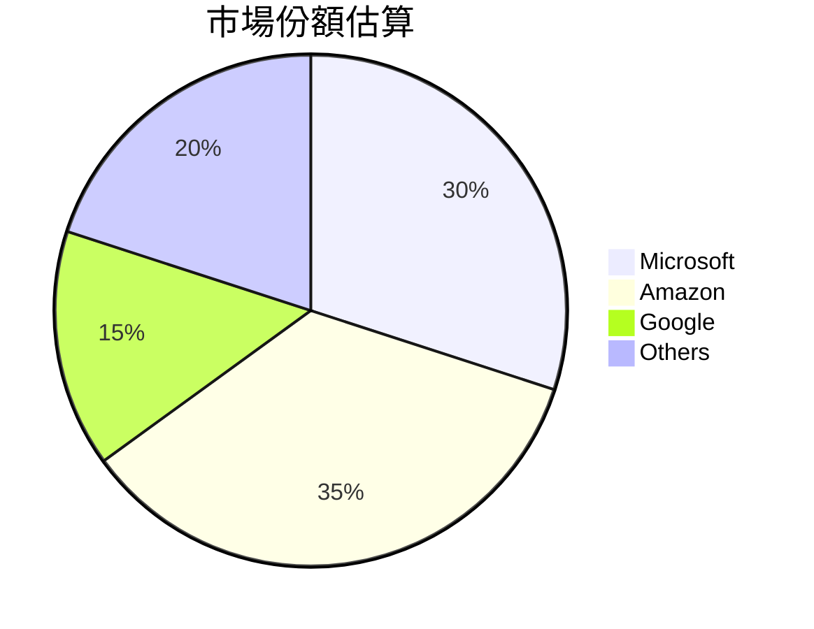
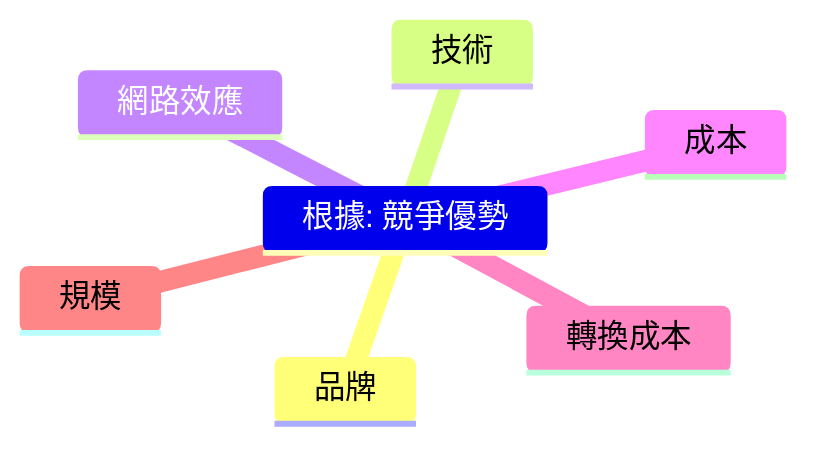
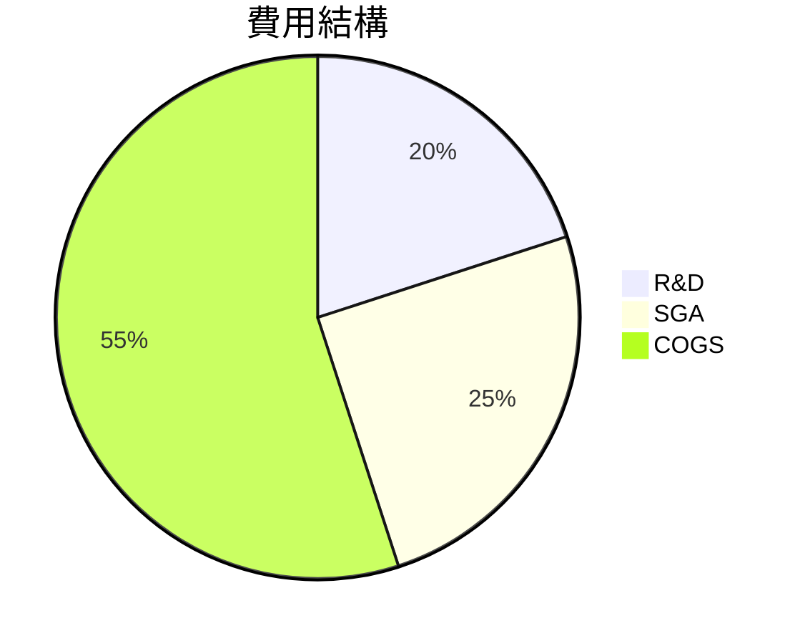
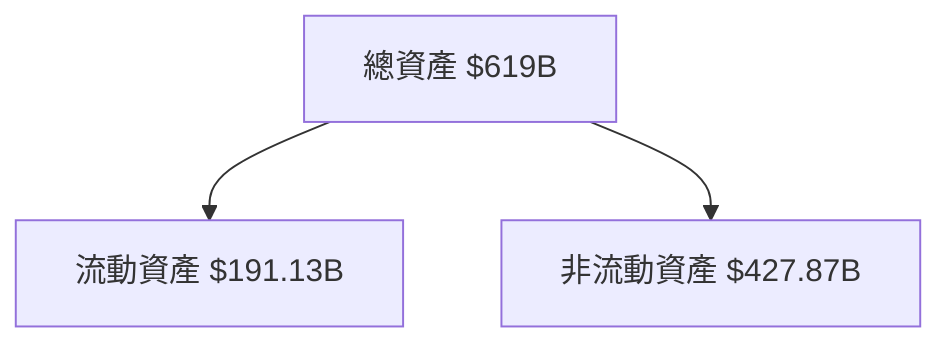
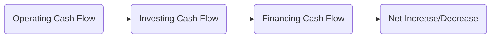
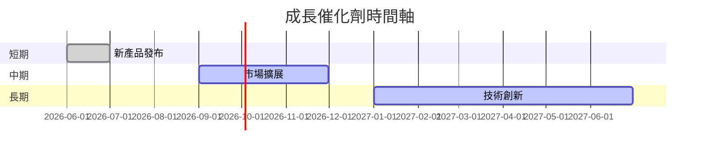

# MSFT 基本面深度分析報告
> **報告日期**：2026-03-24 ｜ **語言**：繁體中文 ｜ **數據來源**：Yahoo Finance

## 目錄
1. [執行摘要](#執行摘要)
2. [公司概覽與商業模式](#公司概覽與商業模式)
3. [損益表深度分析](#損益表深度分析)
4. [資產負債表分析](#資產負債表分析)
5. [現金流量深度分析](#現金流量深度分析)
6. [獲利能力與資本效率](#獲利能力與資本效率)
7. [估值深度分析](#估值深度分析)
8. [成長催化劑](#成長催化劑)
9. [風險矩陣](#風險矩陣)
10. [投資建議](#投資建議)

## 1. 執行摘要
### 核心評分儀表板
```mermaid
graph TB
    基本面(基本面) -- 9/10 --> 成長
    成長(成長) -- 8/10 --> 獲利
    獲利(獲利) -- 9/10 --> 財務健康
    財務健康(財務健康) -- 8/10 --> 估值
    估值(估值) -- 7/10
```

### 5大投資論點 + 3大風險
| 投資論點 | 描述 | 評級 |
| -------- | ---- | ---- |
| 🟢 強勁的收入增長 | 年度收入增長達16.7%，顯示市場需求強勁 | 9/10 |
| 🟢 高利潤率 | 淨利潤率達39.0%，高於行業均值 | 9/10 |
| 🟢 穩定的現金流 | 自由現金流穩定增長 | 8/10 |
| 🟡 強大的市場地位 | 在技術領域中佔據領先地位 | 8/10 |
| 🟡 研發投入 | 高研發支出支持長期創新 | 8/10 |
| 🔴 法規風險 | 技術行業的法規變化可能影響業務 | 5/10 |
| 🔴 市場競爭 | 強大的競爭對手可能侵蝕市場份額 | 6/10 |
| 🔴 經濟波動 | 全球經濟不穩定可能影響需求 | 6/10 |

### 快速統計卡片
| 指標 | MSFT | 行業均值 |
| ---- | ---- | ------- |
| 市值 | $2.78T | - |
| P/E (Trailing) | 23.39 | 20.0 |
| ROE | 34.4% | 25.0% |
| 毛利率 | 68.6% | 55.0% |

### 投資結論
- **建議**：持有
- **目標價區間**：$500 - $600

## 2. 公司概覽與商業模式
### 業務結構與收入來源


### 市場地位


### 競爭護城河


### 護城河強度評分
```
護城河強度：▓▓▓▓▓▓░░░░ (7/10)
```

## 3. 損益表深度分析
### 年度收入成長趨勢
```
收入成長：▓▓▓▓▓▓▓▓▓░ (16.7%)
```
- 2022年：$198.27B
- 2023年：$211.91B（YoY +6.9%）
- 2024年：$245.12B（YoY +15.7%）
- 2025年：$281.72B（YoY +14.9%）

### 季度收入趨勢
| 季度 | 收入 | QoQ 成長率 | YoY 成長率 |
| ---- | ---- | ---------- | ---------- |
| 2025-12 | $81.27B | +4.6% | +12.3% |
| 2025-09 | $77.67B | +1.6% | +10.2% |
| 2025-06 | $76.44B | +9.1% | +15.6% |
| 2025-03 | $70.07B | +7.8% | +14.2% |

### 利潤率演變表格
| 年份 | 毛利率 | 營業利潤率 | EBITDA 利潤率 | 淨利潤率 |
| ---- | ------ | --------- | ------------- | ------- |
| 2022 | 68.4% | 42.1% | 50.5% | 36.7% |
| 2023 | 68.9% | 41.8% | 49.6% | 34.1% |
| 2024 | 69.8% | 44.6% | 54.3% | 35.9% |
| 2025 | 68.6% | 47.1% | 57.4% | 39.0% |

### 費用結構分析


### EPS 趨勢與盈餘品質分析
- EPS 逐年增長，顯示強勁的盈利能力。
- 近期季度均未超預期，需關注未來盈利表現。

## 4. 資產負債表分析
### 資產結構


### 流動性指標表格
| 指標 | 值 | 評級 |
| ---- | -- | ---- |
| 流動比 | 1.386 | 🟡 |
| 速動比 | 1.239 | 🟡 |
| 現金比 | 0.214 | 🔴 |

### 債務結構分析
- 總債務：$123.28B
- 短期債務佔比：低
- Debt-to-EBITDA：0.77

### 股東權益趨勢
```
股東權益成長：▓▓▓▓▓▓▓▓▓░ (15.5% YoY)
```

## 5. 現金流量深度分析
### 現金流量瀑布圖


### FCF 轉換率趨勢表格
| 年份 | FCF / Net Income |
| ---- | ---------------- |
| 2022 | 89.5% |
| 2023 | 82.2% |
| 2024 | 84.0% |
| 2025 | 79.5% |

### 自由現金流趨勢
```
自由現金流：▓▓▓▓▓▓▓░░░ (8.2%)
```

### 資本配置評估
- 股息支付佔比：21.3%
- 資本支出：高於平均
- 回購：適中

## 6. 獲利能力與資本效率
### ROE / ROA / ROIC 趨勢表格
| 年份 | ROE | ROA | ROIC |
| ---- | --- | --- | ---- |
| 2022 | 32.5% | 13.5% | 21.0% |
| 2023 | 33.1% | 14.2% | 22.8% |
| 2024 | 34.0% | 14.8% | 23.6% |
| 2025 | 34.4% | 14.9% | 24.1% |

### **ROIC vs WACC 分析**
- **WACC 估算**：8.5%
- **ROIC**：24.1% > **WACC**，創造經濟價值

### DuPont 分解
- 淨利率：39.0%
- 資產週轉率：0.38
- 槓桿比：2.3

### 獲利能力儀表板
```mermaid
graph TB
    獲利能力 -- 9/10
```

## 7. 估值深度分析
### 同業估值比較表格
| 公司 | P/E | P/S | EV/EBITDA | P/B | PEG | FCF Yield |
| ---- | --- | --- | --------- | --- | --- | --------- |
| MSFT | 23.39 | 9.09 | 16.42 | 7.10 | N/A | 1.93% |
| AAPL | 28.60 | 7.50 | 22.30 | 8.70 | 1.30 | 2.50% |
| GOOGL | 25.20 | 6.80 | 18.50 | 5.90 | 1.10 | 2.10% |

### 歷史估值區間分析
- P/E 5年區間：高 35.0，低 20.0，目前 23.39

### **DCF 敏感性分析**
| 情境 | 折現率 | 成長假設 | 目標價 |
| ---- | ------ | -------- | ------ |
| 基準 | 8.5% | 中等 | $550 |
| 樂觀 | 7.5% | 高 | $600 |
| 悲觀 | 9.5% | 低 | $500 |

### 估值區間視覺化
```
估值區間：▓▓▓░░░ (合理區)
```

## 8. 成長催化劑
### 催化劑時間軸


### TAM 市場規模與滲透率
```
TAM 市場規模：▓▓▓▓▓▓░░░░ (60%)
```

### 短/中/長期成長驅動力
```mermaid
graph TD
    短期 -- 新產品
    中期 -- 市場擴展
    長期 -- 技術創新
```

## 9. 風險矩陣
### 風險評分矩陣
| 風險項目 | 機率 | 衝擊 | 評分 | 緩解措施 |
| -------- | ---- | ---- | ---- | -------- |
| 法規風險 | 高 | 中 | 🔴 | 法律合規策略 |
| 市場競爭 | 中 | 高 | 🔴 | 競爭策略 |
| 經濟波動 | 中 | 中 | 🟡 | 多元化策略 |

## 10. 投資建議
### 最終綜合評級
```
綜合評級：▓▓▓▓▓▓▓░░░ (7.5/10)
```

### 目標價及隱含報酬率
- **目標價**：$500 - $600
- **隱含報酬率**：15% - 25%

### 買入時機與觸發因素
- 市場調整提供買入機會
- 新產品成功發布

### 投資人適配度
```mermaid
graph TD
    成長型 -- 適合
    價值型 -- 適合
    股息型 -- 適合
    短期交易 -- 觀望
```

### 關鍵監控指標
- 下次財報
- 產業數據
- 競爭動態

> **免責聲明**：本報告為 AI 自動生成，僅供研究參考，不構成投資建議。