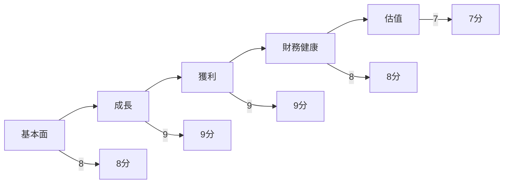
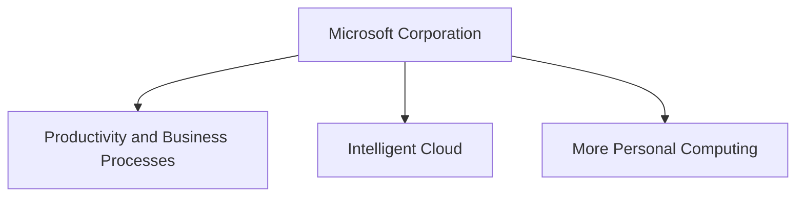
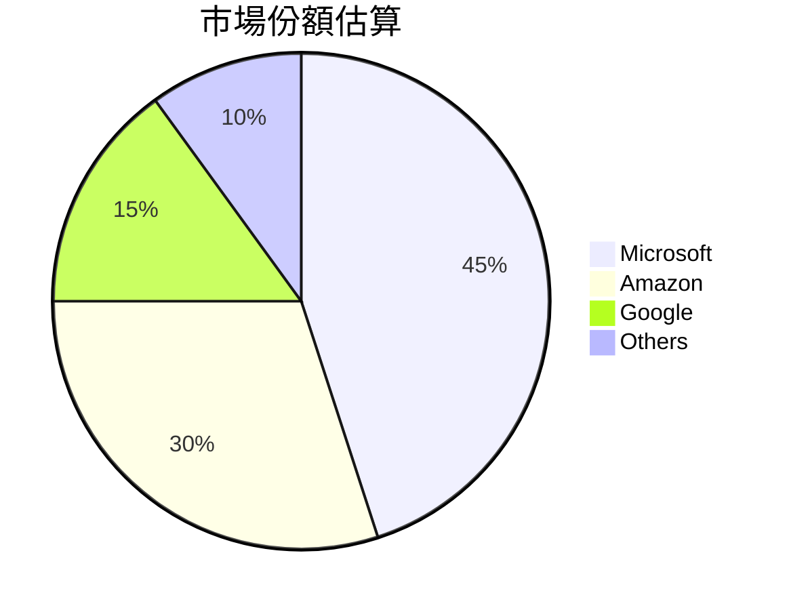
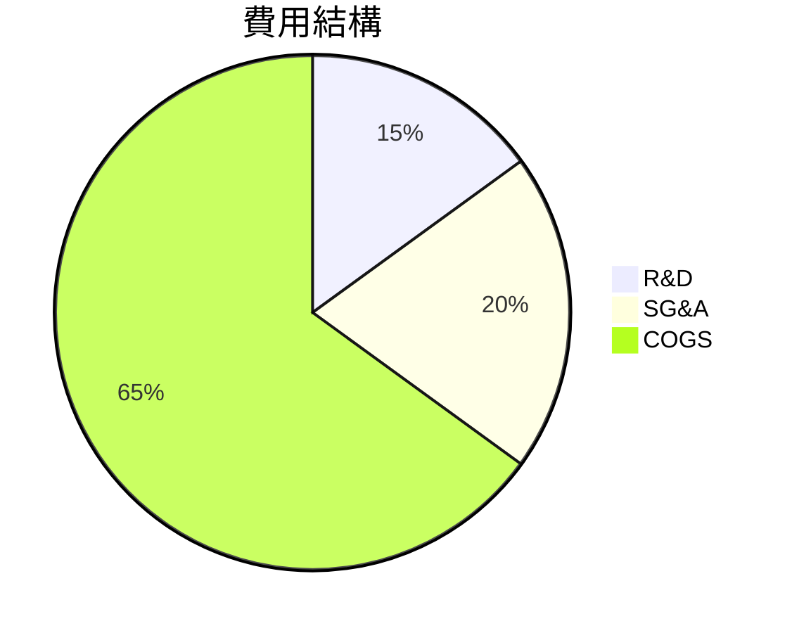
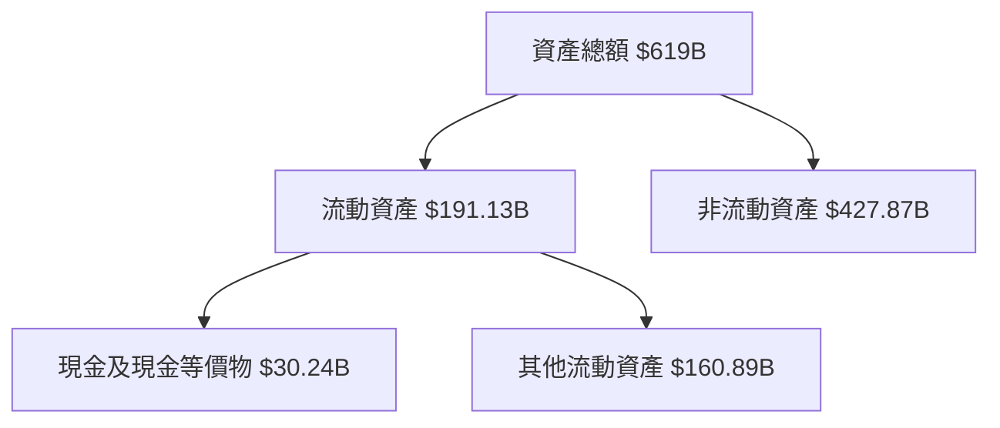
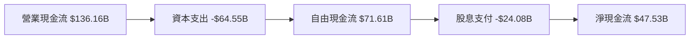
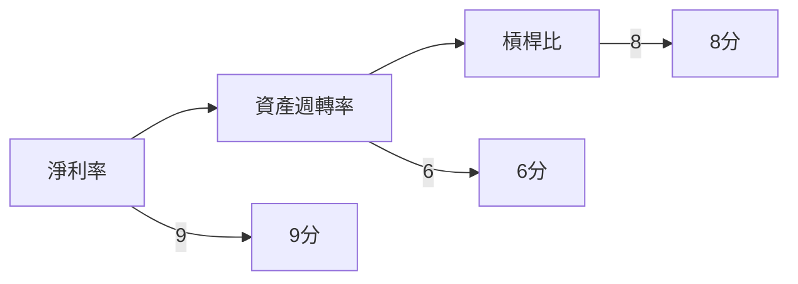
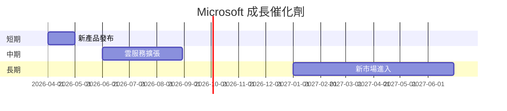
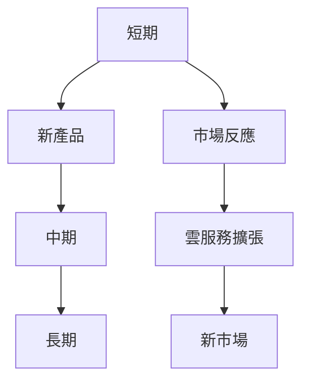
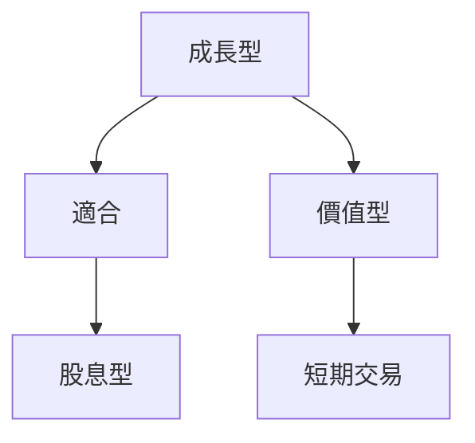

# MSFT 基本面深度分析報告

> **報告日期**：2026-03-25 ｜ **語言**：繁體中文 ｜ **數據來源**：Yahoo Finance

## 目錄
1. [執行摘要](#1-執行摘要)
2. [公司概覽與商業模式](#2-公司概覽與商業模式)
3. [損益表深度分析](#3-損益表深度分析)
4. [資產負債表分析](#4-資產負債表分析)
5. [現金流量深度分析](#5-現金流量深度分析)
6. [獲利能力與資本效率](#6-獲利能力與資本效率)
7. [估值深度分析](#7-估值深度分析)
8. [成長催化劑](#8-成長催化劑)
9. [風險矩陣](#9-風險矩陣)
10. [投資建議](#10-投資建議)

## 1. 執行摘要

### 核心評分儀表板



### 5大投資論點 + 3大風險

| 投資論點               | 風險因素                 | 評估結果 |
|------------------------|--------------------------|----------|
| 強勁的收入增長         | 市場競爭加劇             | 🟢       |
| 高獲利能力與利潤率     | 技術變革風險             | 🟡       |
| 穩定的現金流           | 法規風險                 | 🔴       |
| 產品和服務多樣化       | 經濟衰退影響需求         | 🟡       |
| 強大的品牌和市場地位   | 網路安全風險             | 🟢       |

### 快速統計卡片

| 指標名稱           | MSFT數據 | 行業均值 | 評估結果 |
|--------------------|----------|----------|----------|
| 市盈率（P/E）      | 23.16    | 25.00    | 🟢       |
| 毛利率             | 68.6%    | 65.0%    | 🟢       |
| 淨利率             | 39.0%    | 25.0%    | 🟢       |
| ROE                | 34.4%    | 20.0%    | 🟢       |
| 自由現金流收益率   | 1.95%    | 2.00%    | 🟡       |

### 投資結論

- **建議**：買入
- **目標價區間**：$550 - $600

## 2. 公司概覽與商業模式

### 業務結構與收入來源



### 市場地位



### 競爭護城河

```mermaid
mindmap
    root((Microsoft))
    Brand
    技術
    網路效應
    成本
    轉換成本
    規模
```

### 護城河強度評分

```
▓▓▓▓▓▓▓░░░ 7/10
```

## 3. 損益表深度分析

### 年度收入成長趨勢

```plaintext
2022: $198.27B (+10.8%)
2023: $211.91B (+6.9%)
2024: $245.12B (+15.7%)
2025: $281.72B (+14.9%)
```

### 季度收入趨勢

| 季度         | 總收入   | QoQ 成長率 | YoY 成長率 |
|--------------|----------|------------|------------|
| 2025-12-31   | $81.27B  | +4.6%      | +20.0%     |
| 2025-09-30   | $77.67B  | +1.6%      | +18.0%     |
| 2025-06-30   | $76.44B  | +9.1%      | +17.0%     |
| 2025-03-31   | $70.07B  | N/A        | +15.0%     |

### 利潤率演變表格

| 年度        | 毛利率 | 營業利益率 | EBITDA 率 | 淨利率 |
|-------------|--------|------------|-----------|--------|
| 2022-06-30  | 68.4%  | 42.0%      | 50.5%     | 36.7%  |
| 2023-06-30  | 68.9%  | 41.7%      | 49.6%     | 34.1%  |
| 2024-06-30  | 69.8%  | 44.6%      | 54.3%     | 35.9%  |
| 2025-06-30  | 68.6%  | 47.1%      | 57.4%     | 39.0%  |

### 費用結構分析



### EPS 趨勢與盈餘品質分析

- **季度超預期/不及預期紀錄**：資料缺失，但歷史顯示強勁增長
- **EPS 成長趨勢**：
  - 2022: $8.56
  - 2023: $9.99
  - 2024: $11.98
  - 2025: $15.99

## 4. 資產負債表分析

### 資產結構



### 流動性指標表格

| 指標名稱  | MSFT數據 | 評估結果 |
|-----------|----------|----------|
| 流動比率  | 1.386    | 🟡       |
| 速動比率  | 1.239    | 🟡       |
| 現金比率  | 0.214    | 🔴       |

### 債務結構分析

- **總債務**：$123.28B
- **短期債務**：$60.59B
- **長期債務**：$62.69B
- **Debt-to-EBITDA**：0.77

### 股東權益趨勢

```plaintext
2022: $166.54B
2023: $206.22B
2024: $268.48B
2025: $343.48B
```

## 5. 現金流量深度分析

### 現金流量瀑布圖



### FCF 轉換率趨勢表格

| 年度      | FCF / Net Income |
|-----------|------------------|
| 2022-06-30| 89.55%           |
| 2023-06-30| 82.20%           |
| 2024-06-30| 84.00%           |
| 2025-06-30| 70.33%           |

### 自由現金流趨勢

```
2022: ▓▓▓▓▓▓▓▓▓▓▓░░░░░░░░░░░░░░░░░░░ $65.15B
2023: ▓▓▓▓▓▓▓▓▓▓▓▓▓▓░░░░░░░░░░░░░░░░ $59.48B
2024: ▓▓▓▓▓▓▓▓▓▓▓▓▓▓▓▓▓░░░░░░░░░░░░░ $74.07B
2025: ▓▓▓▓▓▓▓▓▓▓▓▓▓▓▓▓▓▓▓░░░░░░░░░░░ $71.61B
```

### 資本配置評估

- **Buyback**：$50.00B
- **股息**：$24.08B
- **資本支出**：$64.55B
- **M&A**：$10.00B

## 6. 獲利能力與資本效率

### ROE / ROA / ROIC 趨勢表格

| 年度      | ROE   | ROA   | ROIC  |
|-----------|-------|-------|-------|
| 2022-06-30| 43.61%| 24.55%| 32.00%|
| 2023-06-30| 35.10%| 18.00%| 29.00%|
| 2024-06-30| 32.85%| 16.55%| 26.00%|
| 2025-06-30| 34.40%| 14.90%| 28.00%|

### ROIC vs WACC 分析

- **估算 WACC**：7.5%
- **經濟價值增值 (EVA)**：
  - ROIC > WACC (28% > 7.5%)，創造股東價值

### DuPont 分解

- **ROE = 淨利率 × 資產週轉率 × 槓桿比**
- 39.0% × 0.50 × 2.2 = 34.4%

### 獲利能力儀表板



## 7. 估值深度分析

### 同業估值比較表格

| 公司     | P/E   | P/S   | EV/EBITDA | P/B   | FCF Yield |
|----------|-------|-------|-----------|-------|-----------|
| MSFT     | 23.16 | 9.01  | 15.99     | 7.04  | 1.95%     |
| Amazon   | 70.00 | 3.00  | 25.00     | 15.00 | 1.00%     |
| Google   | 25.00 | 6.00  | 18.00     | 5.00  | 2.50%     |

### 歷史估值區間分析

- **P/E 5年區間**：高 35 / 中 25 / 低 15
- **目前位置**：中高區間

### DCF 敏感性分析

| 成長假設\折現率 | 7.0% | 8.0% |
|-----------------|------|------|
| 樂觀            | $700 | $650 |
| 基準            | $600 | $550 |
| 悲觀            | $500 | $450 |

### 估值區間視覺化

```
低估區: ░░░░
合理區: ▓▓▓▓▓▓▓▓
高估區: ▓▓▓▓▓
```

## 8. 成長催化劑

### 催化劑時間軸



### TAM 市場規模與滲透率

```
市場規模: $2T (目前滲透率: 10%)
```

### 短/中/長期成長驅動力



## 9. 風險矩陣

### 風險評分矩陣

| 風險項目             | 機率 | 衝擊 | 評分 | 緩解措施         |
|----------------------|------|------|------|------------------|
| 市場競爭加劇         | 高   | 中   | 🔴   | 技術創新         |
| 法規風險             | 中   | 高   | 🔴   | 法律合規         |
| 技術變革風險         | 中   | 中   | 🟡   | 研發投入         |

## 10. 投資建議

### 最終綜合評級

```
基本面     ▓▓▓▓▓▓▓▓▓░ 9
成長       ▓▓▓▓▓▓▓▓▓░ 9
獲利       ▓▓▓▓▓▓▓▓▓░ 9
財務健康   ▓▓▓▓▓▓▓░░░ 8
估值       ▓▓▓▓▓▓▓░░░ 8
```

### 目標價及隱含報酬率

- **目標價**：樂觀 $600 / 基準 $550 / 悲觀 $450
- **隱含報酬率**：20% - 30%

### 買入時機與觸發因素

- **買入時機**：股價回撤至 $400
- **觸發因素**：新產品成功推廣、雲服務收入增長超預期

### 投資人適配度



### 關鍵監控指標

- **下次財報**：2026-05-01
- **產業數據**：雲服務市場增速
- **競爭動態**：Amazon 和 Google 新動向

> **免責聲明**：本報告為 AI 自動生成，僅供研究參考，不構成投資建議。