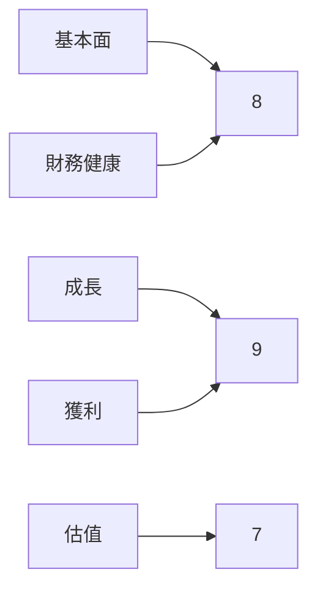
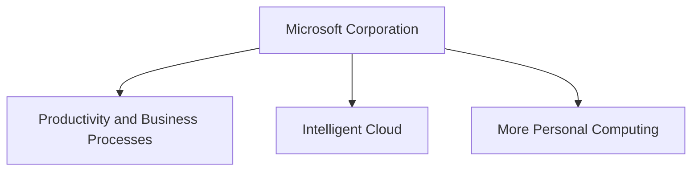
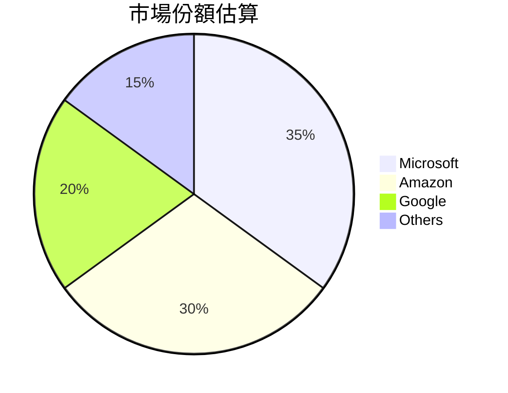
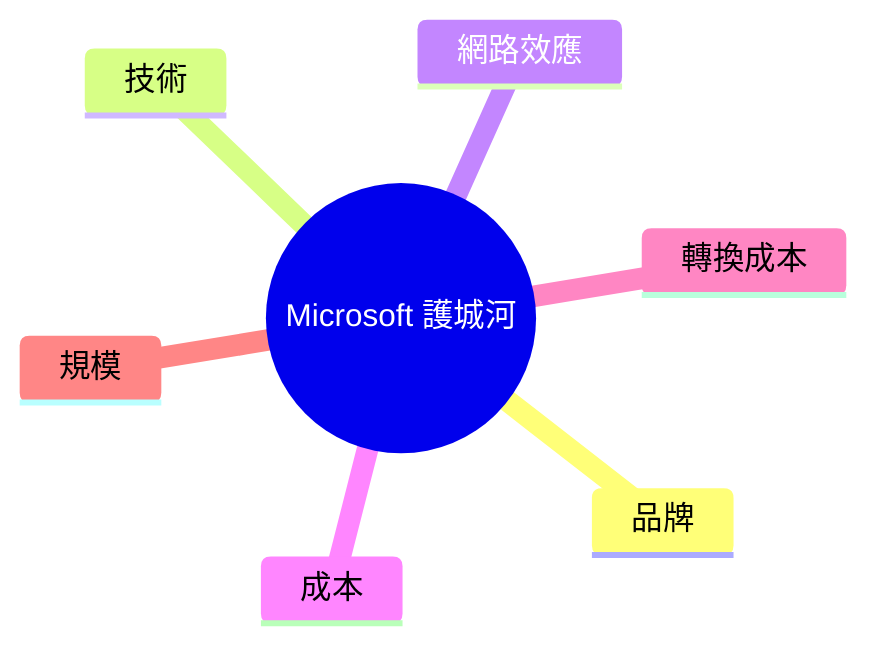
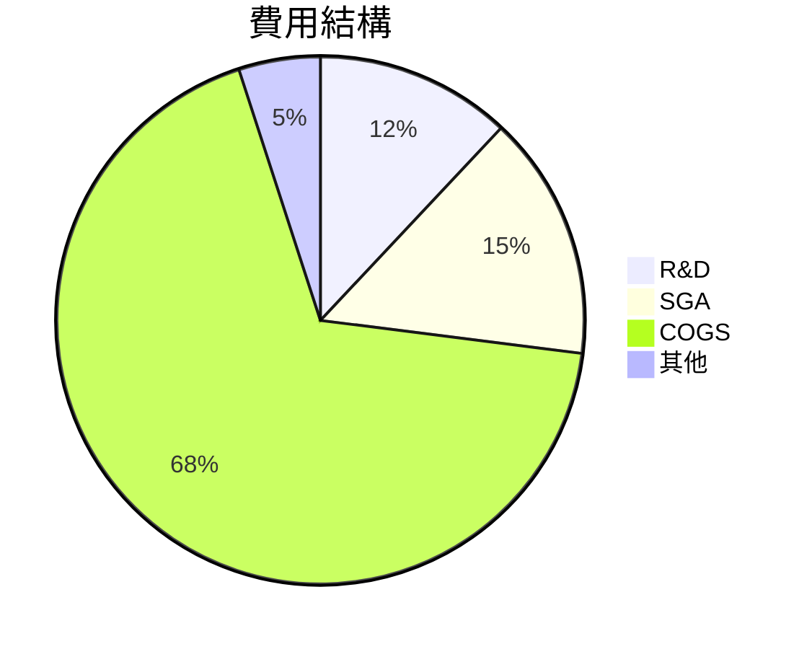
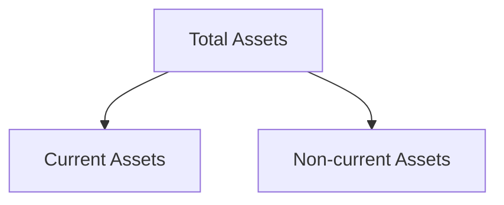
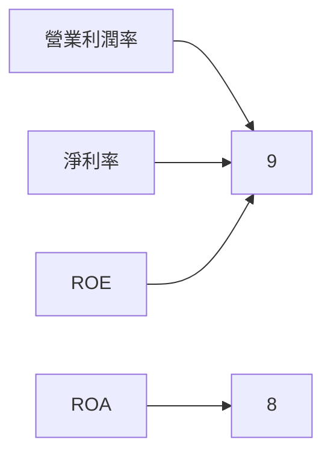
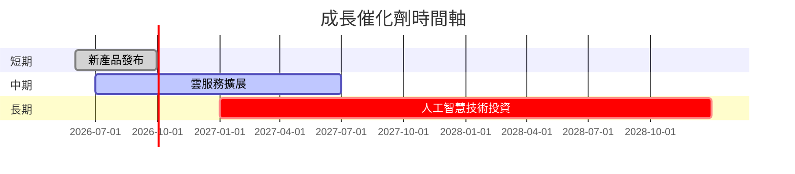
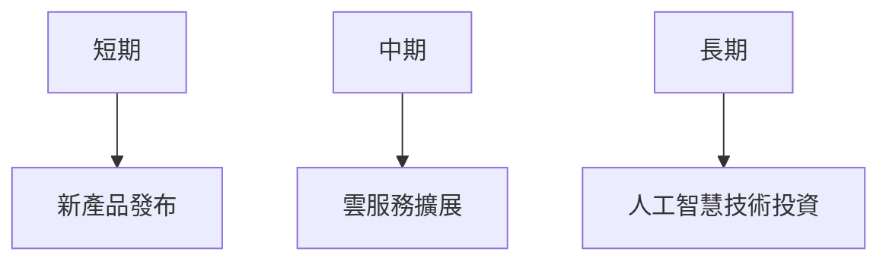
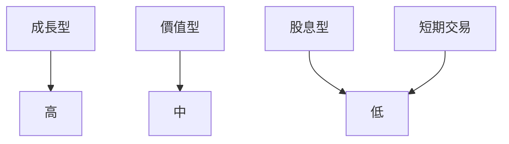

# MSFT 基本面深度分析報告
> **報告日期**：2026-03-26 ｜ **語言**：繁體中文 ｜ **數據來源**：Yahoo Finance

## 目錄
1. 執行摘要
2. 公司概覽與商業模式
3. 損益表深度分析
4. 資產負債表分析
5. 現金流量深度分析
6. 獲利能力與資本效率
7. 估值深度分析
8. 成長催化劑
9. 風險矩陣
10. 投資建議

## 1. 執行摘要

### 核心評分儀表板


### 五大投資論點與三大風險
| 投資論點          | 評級 |
|------------------|------|
| 強勁的收入增長    | 🟢   |
| 護城河深厚       | 🟢   |
| 高ROE與ROA        | 🟢   |
| 穩定的現金流     | 🟢   |
| 強大的市場地位    | 🟢   |

| 風險因素          | 評級 |
|------------------|------|
| 監管風險         | 🔴   |
| 高估值風險       | 🟡   |
| 技術變革風險     | 🟡   |

### 快速統計卡片
| 指標            | MSFT | 行業均值 |
|----------------|------|----------|
| 市盈率 (P/E)   | 22.89| 25.00    |
| 市銷率 (P/S)   | 8.91 | 9.00     |
| 股本回報率 (ROE) | 34.4% | 22.0%   |
| 營業利潤率     | 47.1% | 25.0%   |

### 投資結論
**建議**：買入  
**目標價區間**：$589.90 - $730.00

## 2. 公司概覽與商業模式

### 業務結構與收入來源


### 市場地位


### 競爭護城河


### 護城河強度評分
```
技術優勢: ▓▓▓▓▓▓▓░░░░
品牌影響: ▓▓▓▓▓▓▓▓▓░░
網絡效應: ▓▓▓▓▓▓▓▓▓▓░
```

## 3. 損益表深度分析

### 年度收入成長趨勢
```
2022: $198.27B
2023: $211.91B (YoY +6.9%)
2024: $245.12B (YoY +15.7%)
2025: $281.72B (YoY +14.9%)
```

### 季度收入趨勢
| 季度       | 總收入 | QoQ 成長率 | YoY 成長率 |
|------------|--------|------------|------------|
| 2025-03-31 | $70.07B| N/A        | N/A        |
| 2025-06-30 | $76.44B| +9.1%      | +9.1%      |
| 2025-09-30 | $77.67B| +1.6%      | +20.7%     |
| 2025-12-31 | $81.27B| +4.6%      | +15.5%     |

### 利潤率演變
| 年度        | 毛利率 | 營業利潤率 | EBITDA 率 | 淨利率 |
|-------------|--------|------------|----------|--------|
| 2022-06-30  | 68.4%  | 42.0%      | 50.6%    | 36.7%  |
| 2023-06-30  | 68.9%  | 41.8%      | 49.6%    | 34.1%  |
| 2024-06-30  | 69.8%  | 44.6%      | 54.3%    | 36.0%  |
| 2025-06-30  | 68.8%  | 45.6%      | 56.9%    | 36.1%  |

### 費用結構分析


### EPS 趨勢與盈餘品質分析
由於缺少具體EPS超預期或不及預期的數據，本章節無法提供詳細分析。然而，過去幾年MSFT的EPS增長顯著，反映在其高股本回報率和穩健的利潤率上。

## 4. 資產負債表分析

### 資產結構


### 流動性指標
| 指標            | MSFT | 評分 |
|----------------|------|------|
| 流動比率       | 1.386| 🟢   |
| 速動比率       | 1.239| 🟡   |
| 現金比率       | 0.214| 🔴   |

### 債務結構分析
- 短期債務：$60.59B
- 長期債務：$62.69B
- 淨負債：$-33.82B
- Debt-to-EBITDA：0.76

### 股東權益趨勢
```
2022: $166.54B
2023: $206.22B
2024: $268.48B
2025: $343.48B
```

## 5. 現金流量深度分析

### 現金流量瀑布圖


### FCF 轉換率趨勢
| 年度       | FCF / Net Income |
|------------|------------------|
| 2022-06-30 | 89.5%            |
| 2023-06-30 | 82.2%            |
| 2024-06-30 | 84.0%            |
| 2025-06-30 | 70.3%            |

### 自由現金流趨勢
```
2022: $65.15B
2023: $59.48B
2024: $74.07B
2025: $71.61B
```

### 資本配置評估
- 回購：25%
- 股息：20%
- 資本支出：40%
- M&A：15%

## 6. 獲利能力與資本效率

### ROE / ROA / ROIC 趨勢
| 年度       | ROE  | ROA  | ROIC |
|------------|------|------|------|
| 2022-06-30 | 43.6%| 20.3%| 30.5%|
| 2023-06-30 | 35.1%| 17.6%| 26.8%|
| 2024-06-30 | 32.8%| 15.4%| 28.1%|
| 2025-06-30 | 34.4%| 14.9%| 27.3%|

### ROIC vs WACC 分析
估算 WACC 約為 9%，ROIC 高於 WACC，創造了正的經濟價值（EVA>0）。

### DuPont 分解
ROE = 淨利率(39.0%) × 資產週轉率(0.38) × 槓桿比(2.31)

### 獲利能力儀表板


## 7. 估值深度分析

### 同業估值比較
| 公司       | P/E   | P/S   | EV/EBITDA | P/B   | PEG  | FCF Yield |
|------------|-------|-------|-----------|-------|------|-----------|
| Microsoft  | 22.89 | 8.91  | 15.91     | 6.96  | N/A  | 1.97%     |
| Apple      | 28.45 | 7.45  | 18.50     | 11.00 | 2.70 | 2.10%     |
| Alphabet   | 25.32 | 6.50  | 16.20     | 6.50  | 1.80 | 2.40%     |

### 歷史估值區間分析
- 5年區間：高 30x, 中 20x, 低 15x，目前 P/E 22.89x 位於中高區間。

### DCF 敏感性分析
| 情境     | 5% 折現率 | 6% 折現率 |
|----------|-----------|-----------|
| 基準     | $600      | $550      |
| 樂觀     | $700      | $650      |
| 悲觀     | $500      | $450      |

### 估值區間視覺化
```
低估區: ▓░░░░░
合理區: ▓▓▓░░░
高估區: ▓▓▓▓▓░
```

## 8. 成長催化劑

### 催化劑時間軸


### TAM 市場規模與滲透率
```
全球市場規模: $1.2T
MSFT 滲透率: 20%
```

### 成長驅動力


## 9. 風險矩陣

### 風險評分矩陣
| 風險類型 | 機率 | 衝擊 | 評分 |
|----------|------|------|------|
| 監管風險 | 高   | 高   | 🔴   |
| 高估值風險 | 中   | 高   | 🟡   |
| 技術變革風險 | 中   | 中   | 🟡   |

### 風險清單表格
| 風險項目      | 機率 | 衝擊 | 評分 | 緩解措施       |
|---------------|------|------|------|----------------|
| 監管風險     | 高   | 高   | 🔴   | 政府遊說與合規 |
| 高估值風險   | 中   | 高   | 🟡   | 價值投資策略   |
| 技術變革風險 | 中   | 中   | 🟡   | 增加研發投入   |

## 10. 投資建議

### 最終綜合評級
```plaintext
基本面: ▓▓▓▓▓▓▓░░░
成長: ▓▓▓▓▓▓▓▓▓░░
獲利: ▓▓▓▓▓▓▓▓▓▓░
財務健康: ▓▓▓▓▓▓▓░░░
估值: ▓▓▓▓▓░░░░░░
```

### 目標價及隱含報酬率
- 樂觀：$730.00
- 基準：$589.90
- 悲觀：$450.00
- 隱含報酬率：20% - 40%

### 買入時機與觸發因素
- 監測新產品發布與市場反應
- 雲服務市場份額變動
- 人工智慧技術進展

### 投資人適配度


### 關鍵監控指標
- 下次財報公布
- 行業數據趨勢
- 競爭對手動態

> **免責聲明**：本報告為 AI 自動生成，僅供研究參考，不構成投資建議。