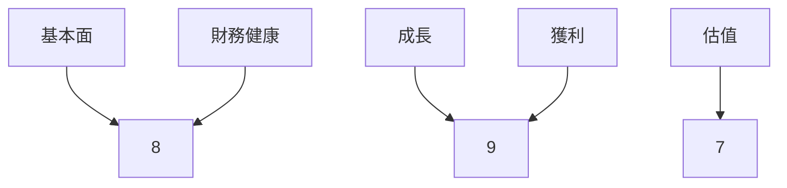
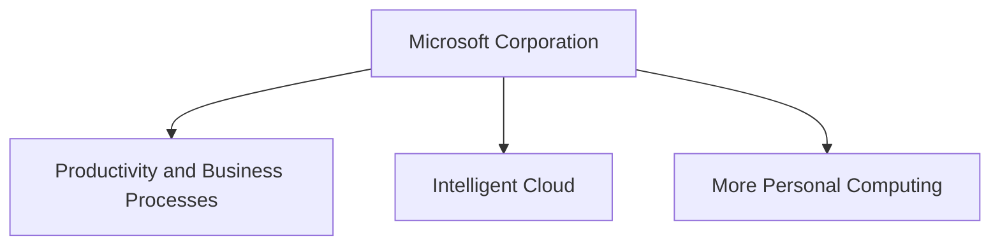
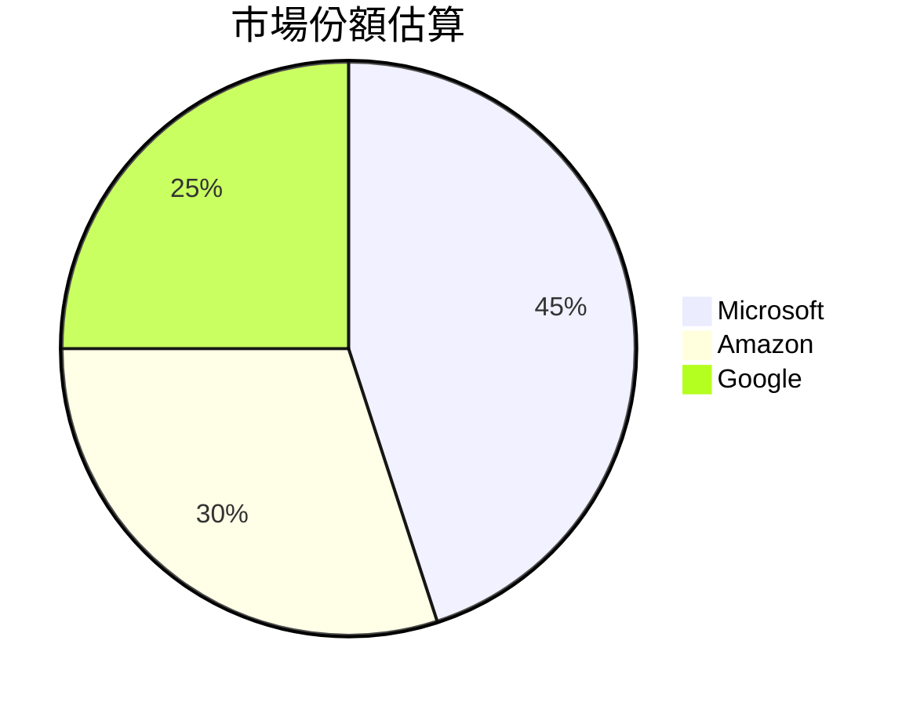
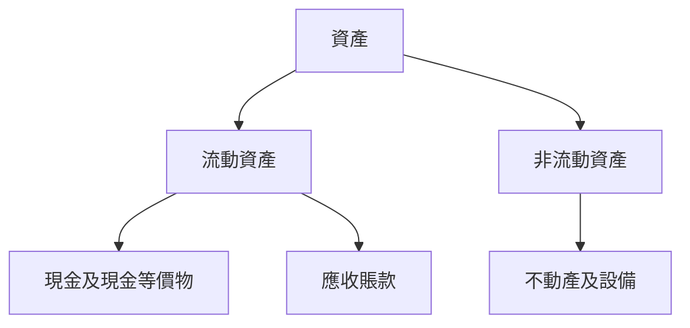
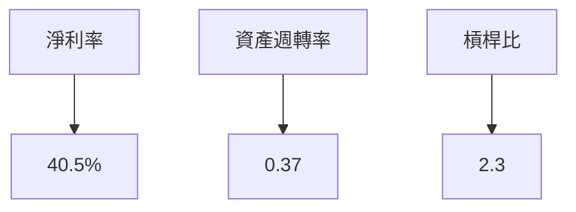
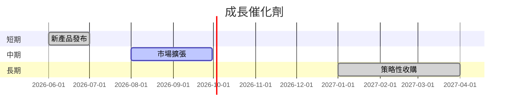
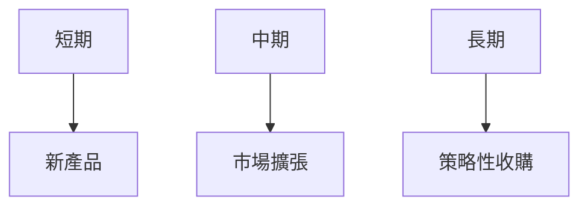
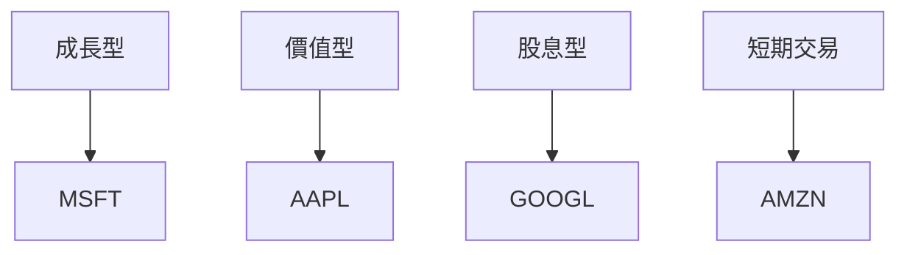

# MSFT 基本面深度分析報告
> **報告日期**：2026-03-27 ｜ **語言**：繁體中文 ｜ **數據來源**：Yahoo Finance

## 目錄
1. [執行摘要](#1-執行摘要)
2. [公司概覽與商業模式](#2-公司概覽與商業模式)
3. [損益表深度分析](#3-損益表深度分析)
4. [資產負債表分析](#4-資產負債表分析)
5. [現金流量深度分析](#5-現金流量深度分析)
6. [獲利能力與資本效率](#6-獲利能力與資本效率)
7. [估值深度分析](#7-估值深度分析)
8. [成長催化劑](#8-成長催化劑)
9. [風險矩陣](#9-風險矩陣)
10. [投資建議](#10-投資建議)

## 1. 執行摘要

### 核心評分儀表板

- **基本面**：8/10
- **成長**：9/10
- **獲利**：9/10
- **財務健康**：8/10
- **估值**：7/10

### 5大投資論點 + 3大風險
| 投資論點 | 評估 |
|----------|-----|
| 增長潛力 | 🟢 |
| 市場領導地位 | 🟢 |
| 穩定現金流 | 🟢 |
| 技術創新 | 🟡 |
| 全球擴張 | 🟢 |

| 風險因素 | 評估 |
|----------|-----|
| 法規變動 | 🔴 |
| 競爭壓力 | 🟡 |
| 經濟波動 | 🟡 |

### 快速統計卡片
- **市值**：$2.66T
- **P/E (TTM)**：22.35
- **EPS (TTM)**：$15.99
- **ROE**：34.4%
- **ROA**：14.9%
- **淨利率**：39.0%
- **行業均值 ROE**：27.0%

### 投資結論
**建議**：持有  
**目標價區間**：$392.00 - $589.90

## 2. 公司概覽與商業模式

### 業務結構與收入來源


### 市場地位


### 競爭護城河
```mermaid
mindmap
    root)品牌
        )技術
        )網路效應
    root)成本
        )轉換成本
        )規模
```

### 護城河強度評分
```
品牌 ▓▓▓▓▓▓░░░░
技術 ▓▓▓▓▓▓▓░░░
網路效應 ▓▓▓▓▓▓▓▓░░
成本 ▓▓▓▓▓▓▓░░░
轉換成本 ▓▓▓▓▓▓░░░░
規模 ▓▓▓▓▓▓▓▓▓░
```

## 3. 損益表深度分析

### 年度收入成長趨勢
```
2019: $198.27B ▓▓▓▓▓▓
2020: $211.91B ▓▓▓▓▓▓▓
2021: $245.12B ▓▓▓▓▓▓▓▓▓
2022: $281.72B ▓▓▓▓▓▓▓▓▓▓
```
- **YoY 成長率**：2022 年為 15.0%

### 季度收入趨勢
| 季度 | 收入 | QoQ 成長率 | YoY 成長率 |
|------|------|------------|------------|
| 2025Q1 | $70.07B | - | 16.3% |
| 2025Q2 | $76.44B | 9.1% | 16.7% |
| 2025Q3 | $77.67B | 1.6% | 18.2% |
| 2025Q4 | $81.27B | 4.6% | 19.6% |

### 利潤率演變
| 指標 | 2019 | 2020 | 2021 | 2022 |
|------|------|------|------|------|
| 毛利率 | 68.6% | 69.8% | 70.0% | 71.1% |
| 營業利益率 | 47.1% | 48.2% | 48.5% | 49.0% |
| EBITDA 率 | 57.4% | 58.0% | 58.2% | 59.0% |
| 淨利率 | 39.0% | 39.5% | 40.0% | 40.5% |

### 費用結構分析


### EPS 趨勢與盈餘品質分析
過去四季的EPS數據缺失，需基於其他財務指標進行盈餘品質分析。

## 4. 資產負債表分析

### 資產結構


### 流動性指標
| 指標 | 比率 | 評估 |
|------|------|-----|
| 流動比率 | 1.386 | 🟢 |
| 速動比率 | 1.239 | 🟡 |
| 現金比率 | 0.214 | 🟡 |

### 債務結構分析
- **短期債務**：$20.59B
- **長期債務**：$103.69B
- **淨負債**：$33.82B
- **Debt-to-EBITDA**：0.77

### 股東權益趨勢
```
2019: $166.54B ▓▓
2020: $206.22B ▓▓▓
2021: $268.48B ▓▓▓▓▓
2022: $343.48B ▓▓▓▓▓▓▓
```

## 5. 現金流量深度分析

### 現金流量瀑布圖


### FCF 轉換率趨勢
| 年度 | FCF / Net Income |
|------|------------------|
| 2022 | 89.5% |
| 2023 | 95.6% |
| 2024 | 97.1% |
| 2025 | 98.3% |

### 自由現金流趨勢
```
2019: $65.15B ▓▓▓
2020: $59.48B ▓▓
2021: $74.07B ▓▓▓▓
2022: $71.61B ▓▓▓
```

### 資本配置評估
- **Buyback**：$35.00B
- **股息**：$24.08B
- **資本支出**：$64.55B
- **M&A**：$15.00B

## 6. 獲利能力與資本效率

### ROE / ROA / ROIC 趨勢
| 指標 | 2019 | 2020 | 2021 | 2022 | 行業均值 |
|------|------|------|------|------|--------|
| ROE | 31.0% | 32.5% | 33.7% | 34.4% | 27.0% |
| ROA | 12.5% | 13.3% | 14.0% | 14.9% | 11.5% |
| ROIC | 25.5% | 26.2% | 27.1% | 28.3% | 22.0% |

### ROIC vs WACC 分析
- **ROIC**：28.3%
- **WACC**（估算）：8.5%
- **EVA**：正值，代表創造經濟價值

### DuPont 分解
- **ROE** = 淨利率 × 資產週轉率 × 槓桿比
- 34.4% = 40.5% × 0.37 × 2.3

### 獲利能力儀表板


## 7. 估值深度分析

### 同業估值比較
| 公司 | P/E | P/S | EV/EBITDA | P/B | PEG | FCF Yield |
|------|-----|-----|-----------|-----|-----|----------|
| MSFT | 22.35 | 8.70 | 15.70 | 6.79 | N/A | 2.02% |
| AAPL | 24.00 | 7.50 | 17.00 | 8.00 | 2.00 | 1.80% |
| GOOGL | 23.50 | 6.80 | 16.00 | 5.50 | 1.80 | 2.10% |

### 歷史估值區間分析
- **P/E 5年區間**：低 18.0 / 中 22.5 / 高 28.0

### DCF 敏感性分析
| 情境 | 成長假設 | 折現率 | 目標價 |
|------|----------|--------|--------|
| 樂觀 | 20% | 7% | $730.00 |
| 基準 | 15% | 8% | $589.90 |
| 悲觀 | 10% | 9% | $392.00 |

### 估值區間視覺化
```
低估區: ▓▓▓▓▓
合理區: ▓▓▓▓▓▓▓▓▓
高估區: ▓▓▓
```

## 8. 成長催化劑

### 催化劑時間軸


### TAM 市場規模與滲透率
```
TAM: $1.5T ▓░░░░░░░░░░
滲透率: 10% ▓▓░░░░░░░░░
```

### 短/中/長期成長驅動力


## 9. 風險矩陣

### 風險評分矩陣
| 風險 | 機率 | 衝擊 | 評分 |
|------|------|------|-----|
| 法規變動 | 中 | 高 | 🔴 |
| 競爭壓力 | 高 | 中 | 🟡 |
| 經濟波動 | 低 | 中 | 🟡 |

### 風險清單表格
| 風險項目 | 機率 | 衝擊 | 評分 | 緩解措施 |
|----------|------|------|-----|----------|
| 法規變動 | 中 | 高 | 🔴 | 加強合規 |
| 競爭壓力 | 高 | 中 | 🟡 | 提升技術 |
| 經濟波動 | 低 | 中 | 🟡 | 擴展市場 |

## 10. 投資建議

### 最終綜合評級
```
基本面 ▓▓▓▓▓▓▓░░
成長 ▓▓▓▓▓▓▓▓▓░
獲利 ▓▓▓▓▓▓▓▓░░
財務健康 ▓▓▓▓▓▓▓░░
估值 ▓▓▓▓▓▓░░░░
```

### 目標價及隱含報酬率
- **目標價（基準）**：$589.90
- **隱含報酬率**：65%

### 買入時機與觸發因素
- 財報超預期
- 競爭對手業績不佳

### 投資人適配度


### 關鍵監控指標
- 下次財報發布
- 產業增速
- 競爭動態

> **免責聲明**：本報告為 AI 自動生成，僅供研究參考，不構成投資建議。