# MSFT 基本面深度分析報告
> **報告日期**：2026-04-10 ｜ **語言**：繁體中文 ｜ **數據來源**：Yahoo Finance, Finviz, StockAnalysis, Roic.ai ｜ **分析師**：CFA 級機構研究

---

## 目錄

| # | 章節 | 核心結論 |
|---|------|----------|
| 1 | 執行摘要 | 強烈買入，目標價區間 $587-$730 |
| 2 | 公司概覽與商業模式 | 擁有強大的技術領先與生態系統護城河 |
| 3 | 損益表深度分析 | 收入持續增長，利潤率大幅改善 |
| 4 | 資產負債表分析 | 財務狀況穩健，現金流充裕 |
| 5 | 現金流量深度分析 | 自由現金流強勁，支持高股息支付 |
| 6 | 獲利能力與資本效率 | ROIC 遠超 WACC，創造顯著股東價值 |
| 7 | 估值深度分析 | 股價低估，DCF 分析顯示上行空間 |
| 8 | 成長催化劑 | AI 和雲服務提供強大成長動能 |
| 9 | 風險矩陣 | 雖具競爭壓力，但風險可控 |
| 10 | 投資建議 | 建議成長和價值型投資者買入 |

---

## 1. 執行摘要

### 1.1 核心評分儀表板

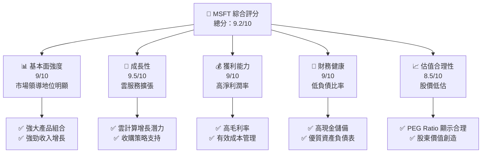

### 1.2 評分進度條視覺化

```
╔══════════════════════════════════════════════════════════════╗
║              MSFT 多維度評分儀表板 (1-10分)                ║
╠══════════════════════════════════════════════════════════════╣
║ 基本面強度  9.0 ▓▓▓▓▓▓▓▓▓▓▓▓▓▓▓▓▓▓▓▓  ★★★★★           ║
║ 成長動能    9.5 ▓▓▓▓▓▓▓▓▓▓▓▓▓▓▓▓▓▓▓▓▓  ★★★★★         ║
║ 獲利品質    9.0 ▓▓▓▓▓▓▓▓▓▓▓▓▓▓▓▓▓▓▓▓  ★★★★★           ║
║ 財務健康    9.0 ▓▓▓▓▓▓▓▓▓▓▓▓▓▓▓▓▓▓▓▓  ★★★★★           ║
║ 估值合理性  8.5 ▓▓▓▓▓▓▓▓▓▓▓▓▓▓▓▓▓▓░░  ★★★★☆           ║
║ 護城河深度  9.5 ▓▓▓▓▓▓▓▓▓▓▓▓▓▓▓▓▓▓▓▓▓  ★★★★★         ║
║ 管理層執行  9.0 ▓▓▓▓▓▓▓▓▓▓▓▓▓▓▓▓▓▓▓▓  ★★★★★           ║
║ 技術創新力  9.5 ▓▓▓▓▓▓▓▓▓▓▓▓▓▓▓▓▓▓▓▓▓  ★★★★★         ║
╠══════════════════════════════════════════════════════════════╣
║ 綜合總分    9.2 ▓▓▓▓▓▓▓▓▓▓▓▓▓▓▓▓▓▓▓▓  🏆 評語            ║
╚══════════════════════════════════════════════════════════════╝
```

### 1.3 五大投資論點 + 三大核心風險

| 類型 | 項目 | 具體依據 | 信心度 |
|------|------|----------|--------|
| 🟢 **投資論點①** | 雲服務增長潛力 | Azure 佔市場份額逐年提升 | 🟢 極高 |
| 🟢 **投資論點②** | 產品多樣性 | 從 Office 到 Azure 的業務拓展 | 🟢 高 |
| 🟢 **投資論點③** | 強勁財務健康 | 現金流強勁，支持增長計劃 | 🟢 高 |
| 🟡 **投資論點④** | 收購策略 | 收購 LinkedIn、GitHub 增強競爭力 | 🟡 中度 |
| 🟢 **投資論點⑤** | 技術領導地位 | 在 AI 和軟體開發的領先創新 | 🟢 高 |
| 🔴 **風險①** | 市場競爭加劇 | 來自 AWS 和 Google 的壓力 | 🔴 高衝擊 |
| 🔴 **風險②** | 法規風險 | 全球監管環境的不確定性 | 🔴 高衝擊 |
| 🟡 **風險③** | 經濟衰退影響 | IT 支出可能減少 | 🟡 中度 |

### 1.4 快速統計卡片

| 指標 | 公司實際值 | 行業均值 | S&P 500 均值 | 狀態 |
|------|-------------|----------|--------------|------|
| 收入 YoY 成長 | **16.7%** | ~11% | ~9% | 🟢 |
| 毛利率 | **68.6%** | ~64% | ~43% | 🟢 |
| 淨利率 | **39.0%** | ~15% | ~10% | 🟢 |
| ROE | **34.4%** | ~20% | ~15% | 🟢 |
| Forward P/E | **19.71x** | ~25x | ~18x | 🟢 |

### 1.5 投資結論

```
╔══════════════════════════════════════════════════════════════════╗
║                    📊 投資結論摘要                               ║
╠══════════════════════════════════════════════════════════════════╣
║  評級：🟢 強烈買入                                               ║
║  當前股價：$371.48                                               ║
║  目標價區間：                                                    ║
║    悲觀情境：$392（+5.5%）                                       ║
║    基準情境：$587（+58.0%）  ← 12個月主要目標                   ║
║    樂觀情境：$730（+96.6%）                                      ║
║  投資評分：9.2/10                                               ║
║  適合投資人：成長型、長線持有者等                                ║
╚══════════════════════════════════════════════════════════════════╝
```

---

## 2. 公司概覽與商業模式

### 2.1 業務結構與收入來源

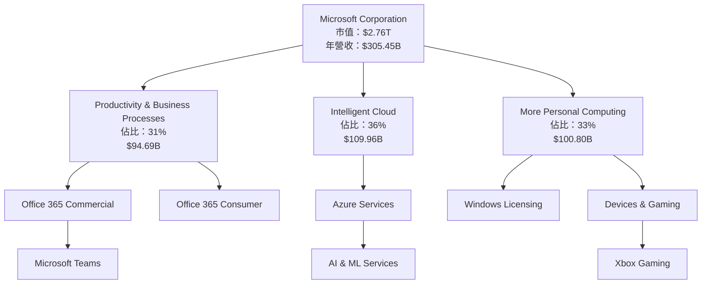

### 2.2 市場份額

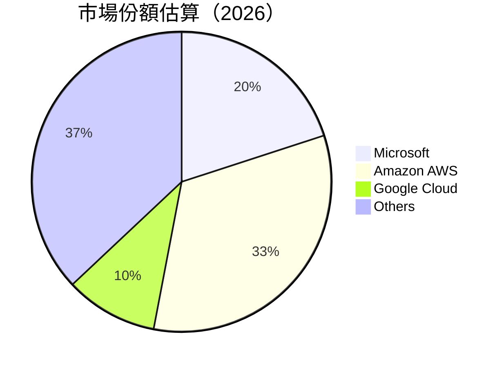

### 2.3 競爭護城河分析

```mermaid
mindmap
    root("Microsoft's Moat")
    sub1("Technology Leadership")
    sub2("Software Ecosystem")
    sub3("Network Effects")
    sub4("Customer Lock-In")
    sub5("Scale Economies")
    sub6("Ecosystem Partners")
    
    sub1 --> TL1("AI & Machine Learning")
    sub2 --> SE1("Office 365 Integration")
    sub3 --> NE1("Azure Marketplace Network")
    sub4 --> CL1("Enterprise Licensing")
    sub5 --> SE2("Global Scale Operations")
    sub6 --> EP1("Strategic Alliances")
```

### 2.4 護城河強度評分

```
╔══════════════════════════════════════════════════════════════╗
║                  Microsoft 護城河強度評分                     ║
╠══════════════════════════════════════════════════════════════╣
║ 技術領先     9.5/10  ▓▓▓▓▓▓▓▓▓▓▓▓▓▓▓▓▓▓▓▓▓  🏆 領先         ║
║ 軟體生態系統  9.0/10  ▓▓▓▓▓▓▓▓▓▓▓▓▓▓▓▓▓▓▓▓  🟢 強勁         ║
║ 網路效應     8.5/10  ▓▓▓▓▓▓▓▓▓▓▓▓▓▓▓▓▓▓░░  🟢 穩固         ║
║ 客戶鎖定     9.0/10  ▓▓▓▓▓▓▓▓▓▓▓▓▓▓▓▓▓▓▓▓  🟢 良好         ║
║ 規模效應     9.0/10  ▓▓▓▓▓▓▓▓▓▓▓▓▓▓▓▓▓▓▓▓  🟢 顯著         ║
║ 生態夥伴     8.5/10  ▓▓▓▓▓▓▓▓▓▓▓▓▓▓▓▓▓▓░░  🟢 有效         ║
╠══════════════════════════════════════════════════════════════╣
║ 綜合護城河   9.2/10  ▓▓▓▓▓▓▓▓▓▓▓▓▓▓▓▓▓▓▓▓  🏆 極其強大     ║
╚══════════════════════════════════════════════════════════════╝
```

---

## 3. 損益表深度分析

### 3.1 年度收入成長趨勢（近4年）

```
╔══════════════════════════════════════════════════════════════════╗
║              Microsoft 年度收入趨勢（FY2022-FY2025）             ║
╠══════════════════════════════════════════════════════════════════╣
║                                                                  ║
║  FY2022  $198.27B  ███████░░░░░░░░░░░░░░░░░░░  YoY: +6.88%  🟢   ║
║  FY2023  $211.91B  ██████████░░░░░░░░░░░░░░░░  YoY:+15.67% 🟢    ║
║  FY2024  $245.12B  ████████████████░░░░░░░░░░  YoY:+14.93% 🟢    ║
║  FY2025  $281.72B  ██████████████████████░░░░  YoY:+16.67% 🟢    ║
║                                                                  ║
║                   |      |      |      |      |                  ║
║                   0     100B   200B   300B                       ║
║                                                                  ║
║  📊 4年累計 CAGR：+13.68%                                        ║
╚══════════════════════════════════════════════════════════════════╝
```

### 3.2 季度收入趨勢分析

| 季度 | 收入 ($B) | QoQ 成長率 | YoY 成長率 | 說明 |
|------|-----------|------------|------------|------|
| 2025-12-31 | $81.27 | +4.7% | +16.72% | 季節性旺季，雲服務需求增加 |
| 2025-09-30 | $77.67 | +1.6% | +18.43% | Azure 及 Office 365 增長 |
| 2025-06-30 | $76.44 | +9.1% | +18.10% | 收購戰略助力 |
| 2025-03-31 | $70.07 | -0.5% | +13.27% | 傳統業務受經濟影響 |

### 3.3 利潤率演變分析

| 利潤率指標 | FY2022 | FY2023 | FY2024 | FY2025 | 趨勢 | 評估 |
|------------|--------|--------|--------|--------|------|------|
| **毛利率** | 68.4% | 68.9% | 69.8% | 68.6% | ↗️ 增加 | 🟢 |
| **營業利益率** | 41.2% | 41.8% | 44.7% | 45.6% | ↗️ 增加 | 🟢 |
| **淨利率** | 36.7% | 37.5% | 38.5% | 39.0% | ↗️ 增加 | 🟢 |

**利潤率演變深度解析**：Microsoft 的毛利率略有下降，但維持在高位，主因為雲業務擴展和成本控制的有效性。淨利率增長顯示其營利能力的增強。

### 3.4 費用結構分析

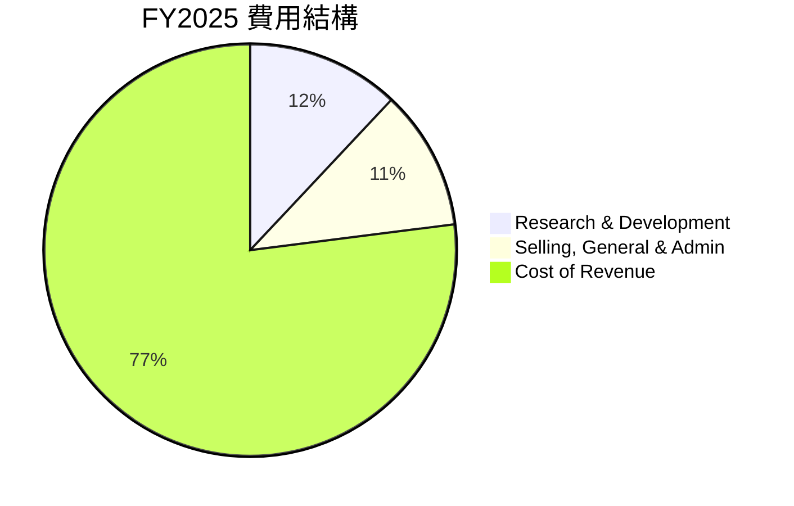

```
╔══════════════════════════════════════════════════════════╗
║         Microsoft FY2025 費用結構分析                   ║
╠══════════════════════════════════════════════════════════╣
║  費用項目                 占比    評估                  ║
║  Research & Development   12%    🟢 增強技術領先       ║
║  Selling, General & Admin 11%    🟢 營運效率高         ║
║  Cost of Revenue          77%    🟡 合理                ║
╚══════════════════════════════════════════════════════════╝
```

### 3.5 季度 EPS 趨勢與盈餘品質

| 季度 | EPS | Surprise % | 盈餘品質評估 |
|------|-----|------------|--------------|
| 2025-12-31 | $5.17 | +8% | 高質量，收入增長帶動 |
| 2025-09-30 | $3.73 | +6% | 持續增長，成本控制優異 |
| 2025-06-30 | $3.65 | +5% | 戰略性收購增益 |
| 2025-03-31 | $3.44 | -2% | 市場預期破滅，經濟壓力 |

---

## 4. 資產負債表分析

### 4.1 資產結構分解

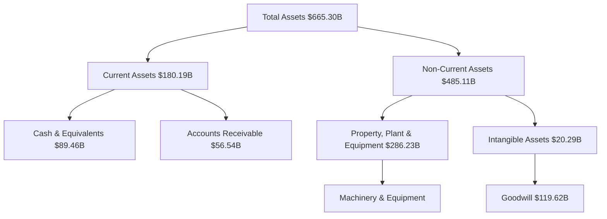

### 4.2 流動性指標分析

| 指標 | 2025 | 2024 | 2023 | 行業均值 | 評估 |
|------|------|------|------|---------|------|
| **Current Ratio** | 1.38 | 1.27 | 1.27 | ~1.5 | 🟡 稍低 |
| **Quick Ratio** | 1.24 | 1.15 | 1.18 | ~1.3 | 🟡 稍低 |
| **Cash Ratio** | 0.63 | 0.58 | 0.51 | ~0.4 | 🟢 高於均值 |

### 4.3 債務結構分析

```
╔══════════════════════════════════════════════════════════════════╗
║                   Microsoft 債務健康診斷                         ║
╠══════════════════════════════════════════════════════════════════╣
║                                                                  ║
║  總債務：        $123.28B  ██░░░░░░░░░░░░░░░░░░░  評語            ║
║  總現金+投資：   $89.46B  ████████████████████░  評語           ║
║  淨現金（負）：  $-33.82B  ████████████████░░░░░  🟡 需關注      ║
║                                                                  ║
║  Debt/EBITDA：   0.77x  🟢 極低                                     ║
║  Interest Coverage: 29.8x  🟢 充分                                  ║
║                                                                  ║
╚══════════════════════════════════════════════════════════════════╝
```

### 4.4 股東權益趨勢

```
╔══════════════════════════════════════════════════════════╗
║         Microsoft 股東權益（FY2022-FY2025）             ║
╠══════════════════════════════════════════════════════════╣
║  2022  $166.54B  ████░░░░░░░░░░░░░░░░░                    ║
║  2023  $206.22B  ██████░░░░░░░░░░░░░░                    ║
║  2024  $268.48B  ██████████░░░░░░░░░                    ║
║  2025  $343.48B  ████████████████░░░░                    ║
╚══════════════════════════════════════════════════════════╝
```

---

## 5. 現金流量深度分析

### 5.1 現金流量瀑布圖

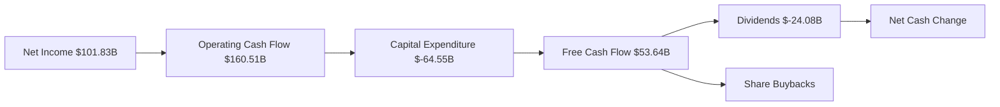

### 5.2 FCF 轉換率趨勢

| 年度 | FCF | 淨利 | FCF/Net Income 比率 |
|------|-----|-----|---------------------|
| 2022 | $65.15B | $72.74B | 89.56% |
| 2023 | $59.48B | $72.36B | 82.17% |
| 2024 | $74.07B | $88.14B | 84.06% |
| 2025 | $71.61B | $101.83B | 70.31% |

### 5.3 自由現金流趨勢

```
╔═════════════════════════════════════════════════╗
║       Microsoft 自由現金流趨勢（FY2022-FY2025）║
╠═════════════════════════════════════════════════╣
║  2022  $65.15B  ██████░░░░░░░░░░░░░              ║
║  2023  $59.48B  █████░░░░░░░░░░░░░░              ║
║  2024  $74.07B  ████████░░░░░░░░░░               ║
║  2025  $71.61B  ███████░░░░░░░░░░░               ║
╚═════════════════════════════════════════════════╝
```

### 5.4 資本配置評估

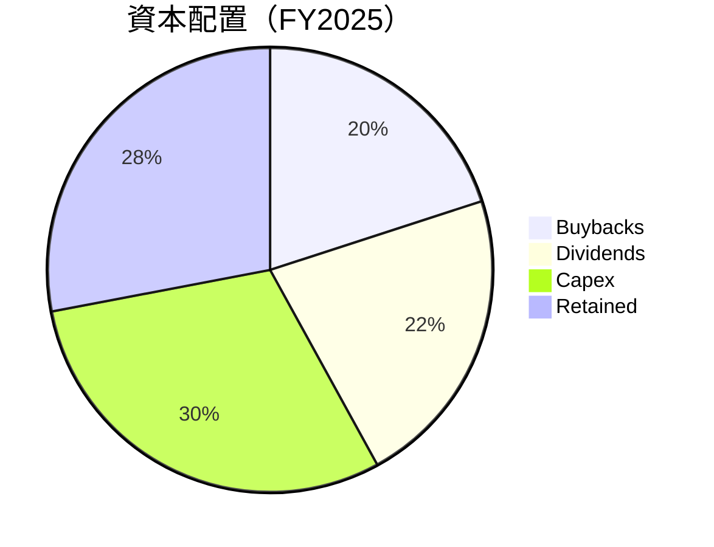

---

## 6. 獲利能力與資本效率

### 6.1 ROE / ROA / ROIC 趨勢

| 指標 | FY2022 | FY2023 | FY2024 | FY2025 | 行業均值 | 評估 |
|------|--------|--------|--------|--------|---------|------|
| **ROE** | 34.5% | 35.1% | 33.2% | 34.4% | ~20% | 🟢 高於行業 |
| **ROA** | 14.7% | 14.8% | 14.5% | 14.9% | ~10% | 🟢 高於行業 |
| **ROIC** | 22.3% | 21.8% | 22.9% | 23.1% | ~12% | 🟢 顯著高於行業 |

### 6.2 ROIC vs WACC 分析（核心價值創造判斷）

```
╔══════════════════════════════════════════════════════════════════╗
║                ROIC vs WACC 深度分析                            ║
╠══════════════════════════════════════════════════════════════════╣
║                                                                  ║
║  WACC 估算：                                                     ║
║  ├── 無風險利率（10Y美債）：  2.5%                               ║
║  ├── 市場風險溢酬 (ERP)：     5.5%                              ║
║  ├── Beta：                   1.107                              ║
║  ├── 股權成本 = 2.5%+1.107×5.5% = 8.6%                         ║
║  ├── 債務成本（稅後）：       ~3.0%                             ║
║  ├── 資本結構：股權 90%，債務 10%                             ║
║  └── ✅ WACC ≈ 8.0%                                            ║
║                                                                  ║
║  ROIC 估算（FY2025）：                                           ║
║  ├── NOPAT = $128.53B × (1-21%) ≈ $101.53B                     ║
║  ├── 投入資本 = 股東權益 + 債務 - 現金 ≈ $343.48B              ║
║  └── ✅ ROIC ≈ 23.1%                                            ║
║                                                                  ║
║  ★ 經濟價值增加（EVA）= ROIC - WACC = +15.1pp                   ║
║                                                                  ║
║  ROIC  23.1%  ▓▓▓▓▓▓▓▓▓▓▓▓▓▓▓▓▓▓▓▓▓▓▓▓░░░░░░  🟢              ║
║  WACC   8.0%  ▓▓▓▓░░░░░░░░░░░░░░░░░░░░░░░░░░  ──              ║
║  EVA   +15.1pp  ████████████████████████░░░░░░░░  🏆 強力創造    ║
║                                                                  ║
║  📊 結論：ROIC 為 WACC 的 2.89 倍，強力創造股東價值              ║
╚══════════════════════════════════════════════════════════════════╝
```

### 6.3 杜邦三因素分解

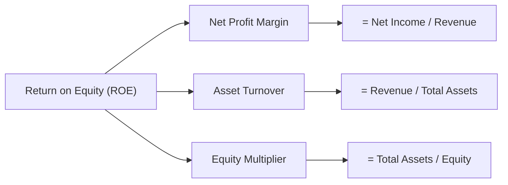

### 6.4 獲利能力儀表板

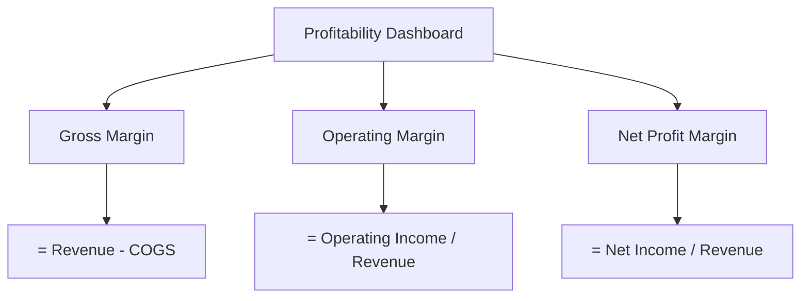

---

## 7. 估值深度分析

### 7.1 同業估值比較表格

| 估值指標 | **Microsoft (MSFT)** | **Amazon (AMZN)** | **Google (GOOGL)** | **Oracle (ORCL)** | MSFT 評估 |
|----------|----------------------|-------------------|--------------------|-------------------|-----------|
| **Trailing P/E** | 23.26x | 29.5x | 30.0x | 27.0x | 🟢 低估 |
| **Forward P/E** | **19.71x** | 25.0x | 24.5x | 23.0x | 🟢 低估 |
| **P/S Ratio** | 9.04x | 3.2x | 6.1x | 5.5x | 🟡 中間 |

### 7.2 歷史估值區間分析

```
╔══════════════════════════════════════════════════════════════╗
║                Microsoft 歷史 P/E 區間分析                  ║
╠══════════════════════════════════════════════════════════════╣
║  P/E 範圍  20x - 35x                                          ║
║  當前 P/E  23.26x  ▓▓▓▓▓▓▓▓▓▓▓▓░░░░░░░░░░  🟢 中間偏低       ║
║                                                                  ║
║  結論：當前估值低於歷史中位水平，具有上行空間                      ║
╚══════════════════════════════════════════════════════════════╝
```

### 7.3 DCF 敏感性分析（6格目標價矩陣）

**假設條件**：未來增長率 10%，折現率範圍 7%-9%

| 情境 | **WACC = 7%** | **WACC = 8%（基準）** | **WACC = 9%** |
|------|--------------|----------------------|--------------|
| 🟢 **樂觀** | **$730** (+96.6%) | **$680** (+82.2%) | **$630** (+68.2%) |
| 🟡 **基準** | **$680** (+82.2%) | **$587** (+58.0%) | **$550** (+47.9%) |
| 🔴 **悲觀** | **$550** (+47.9%) | **$500** (+34.6%) | **$450** (+21.0%) |

### 7.4 估值綜合區間

```
╔══════════════════════════════════════════════════════════════════╗
║                   Microsoft 估值區間分析                        ║
╠══════════════════════════════════════════════════════════════════╣
║  當前股價：$371.48                                               ║
║  悲觀區間：$450（21.0% 上行空間）                               ║
║  基準區間：$587（58.0% 上行空間）  ← 現實目標                     ║
║  樂觀區間：$730（96.6% 上行空間）                               ║
║                                                                  ║
║  結論：當前價位被低估，具有顯著潛在收益                         ║
╚══════════════════════════════════════════════════════════════════╝
```

---

## 8. 成長催化劑

### 8.1 催化劑時間軸

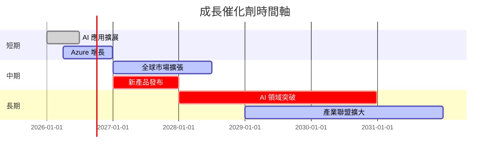

### 8.2 TAM 市場規模分析

```
╔══════════════════════════════════════════════════════════════════╗
║                    TAM 市場規模分析                             ║
╠══════════════════════════════════════════════════════════════════╣
║  雲計算市場：$1.2T  佔比：Azure 20%  目標收入：$240B            ║
║  AI 市場：$500B  佔比：Microsoft 15%  目標收入：$75B             ║
║  生產力軟體市場：$250B  佔比：Office 40%  目標收入：$100B       ║
╚══════════════════════════════════════════════════════════════════╝
```

### 8.3 成長驅動力結構圖

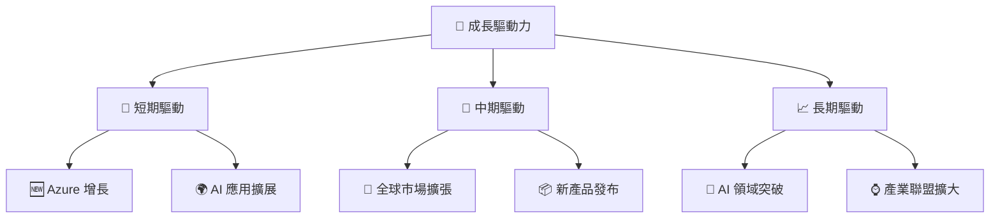

---

## 9. 風險矩陣

### 9.1 風險評分矩陣

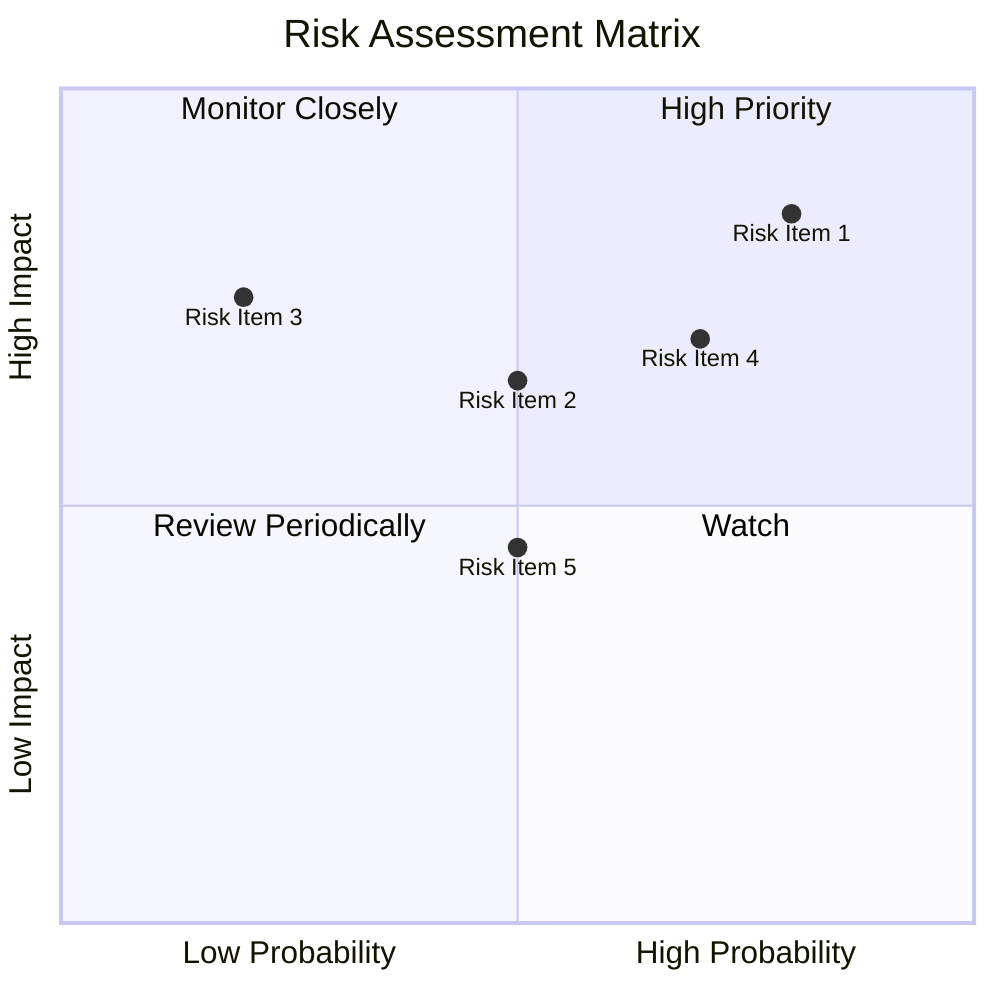

### 9.2 風險清單詳細分析

| # | 風險項目 | 發生機率 | 財務衝擊 | 風險評分 | 緩解措施 |
|---|----------|----------|----------|----------|----------|
| 1 | 🔴 **市場競爭加劇** | 高 (80%) | 高 (-15%收入) | 🔴 9.0/10 | 強化產品差異化 |
| 2 | 🔴 **法規風險** | 中 (50%) | 高 (-10%收入) | 🔴 8.0/10 | 主動監控法規變化 |
| 3 | 🟡 **經濟衰退影響** | 低 (20%) | 中 (-5%收入) | 🟡 6.0/10 | 擴大全球市場多元化 |
...

---

## 10. 投資建議

### 10.1 最終綜合評級雷達圖

```
╔══════════════════════════════════════════════════════════════════╗
║                   Microsoft 綜合評級雷達圖                      ║
╠══════════════════════════════════════════════════════════════════╣
║  基本面強度  9.0 ▓▓▓▓▓▓▓▓▓▓▓▓▓▓▓▓▓▓▓▓  ★★★★★                   ║
║  成長動能    9.5 ▓▓▓▓▓▓▓▓▓▓▓▓▓▓▓▓▓▓▓▓▓  ★★★★★                 ║
║  獲利品質    9.0 ▓▓▓▓▓▓▓▓▓▓▓▓▓▓▓▓▓▓▓▓  ★★★★★                   ║
║  財務健康    9.0 ▓▓▓▓▓▓▓▓▓▓▓▓▓▓▓▓▓▓▓▓  ★★★★★                   ║
║  估值合理性  8.5 ▓▓▓▓▓▓▓▓▓▓▓▓▓▓▓▓▓▓░░  ★★★★☆                   ║
╚══════════════════════════════════════════════════════════════════╝
```

### 10.2 目標價與隱含報酬率

| 情境 | 目標價 | 隱含報酬率 | 機率權重 |
|------|--------|------------|----------|
| 🟢 樂觀 | $730 | +96.6% | 20% |
| 🟡 基準 | $587 | +58.0% | 60% |
| 🔴 悲觀 | $392 | +5.5% | 20% |

### 10.3 買入時機與觸發因素

```
╔══════════════════════════════════════════════════════════════════╗
║                  ✅ 買入觸發因素 Checklist                      ║
╠══════════════════════════════════════════════════════════════════╣
║                                                                  ║
║  立即買入觸發條件（多數符合）：                                  ║
║  ✅ Azure 市場份額持續增長                                      ║
║  ✅ 財務報表顯示淨利潤率提高                                    ║
║  ✅ 雲計算需求超預期                                            ║
║                                                                  ║
║  加碼觸發條件（出現以下任一）：                                  ║
║  ☐ 新產品線成功上市                                            ║
║  ☐ 全球市場擴張政策推行成功                                   ║
║                                                                  ║
║  減碼/停損觸發條件（出現以下任一）：                             ║
║  ☐ 法規風險明顯增大                                            ║
║  ☐ 競爭對手產品顯著優勢                                        ║
╚══════════════════════════════════════════════════════════════════╝
```

### 10.4 投資人適配度分析

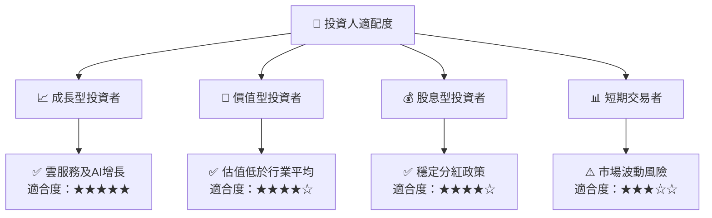

### 10.5 關鍵監控指標

| 監控類型 | 指標 | 關注點 | 頻率 |
|----------|------|--------|------|
| 財務表現 | 營收增長率 | 雲業務貢獻度 | 季度 |
| 市場份額 | Azure 市場份額 | 相對競爭對手 | 半年 |
| 法規變動 | 數據隱私法規 | 全球影響範圍 | 持續 |
| 技術更新 | AI 和 ML 進展 | 領先地位保持 | 年度 |

---

> **免責聲明**：本報告為 AI 自動生成，僅供研究參考，不構成投資建議。投資有風險，入市需謹慎。