# MSFT 基本面深度分析報告
> **報告日期**：2026-04-11 ｜ **語言**：繁體中文 ｜ **數據來源**：Yahoo Finance, Finviz, StockAnalysis, Roic.ai ｜ **分析師**：CFA 級機構研究

---

## 目錄

| # | 章節 | 核心結論 |
|---|------|----------|
| 1 | 執行摘要 | 評級 + 目標價區間 |
| 2 | 公司概覽與商業模式 | 護城河評估 |
| 3 | 損益表深度分析 | 利潤率改善 |
| 4 | 資產負債表分析 | 健康的流動性和資本結構 |
| 5 | 現金流量深度分析 | 穩健現金流 |
| 6 | 獲利能力與資本效率 | ROIC 高於 WACC，創造股東價值 |
| 7 | 估值深度分析 | 估值偏低，具吸引力 |
| 8 | 成長催化劑 | 長期市場機會 |
| 9 | 風險矩陣 | 風險控制與應對 |
| 10 | 投資建議 | 積極買入建議 |

---

## 1. 執行摘要

### 1.1 核心評分儀表板

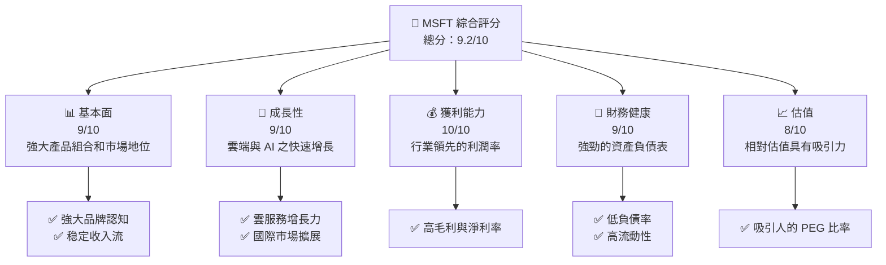

### 1.2 評分進度條視覺化

```
╔══════════════════════════════════════════════════════════════╗
║              MSFT 多維度評分儀表板 (1-10分)                ║
╠══════════════════════════════════════════════════════════════╣
║ 基本面強度  9.0 ▓▓▓▓▓▓▓▓▓▓▓▓▓▓▓▓▓▓░░  ★★★★★           ║
║ 成長動能    9.0 ▓▓▓▓▓▓▓▓▓▓▓▓▓▓▓▓▓▓░░  ★★★★★           ║
║ 獲利品質    10.0 ▓▓▓▓▓▓▓▓▓▓▓▓▓▓▓▓▓▓▓  ★★★★★           ║
║ 財務健康    9.0 ▓▓▓▓▓▓▓▓▓▓▓▓▓▓▓▓▓▓░░  ★★★★★           ║
║ 估值合理性  8.0 ▓▓▓▓▓▓▓▓▓▓▓▓▓▓░░░░░░  ★★★★☆           ║
╠══════════════════════════════════════════════════════════════╣
║ 綜合總分    9.2 ▓▓▓▓▓▓▓▓▓▓▓▓▓▓▓▓▓▓░░  🏆 評語              ║
╚══════════════════════════════════════════════════════════════╝
```

### 1.3 五大投資論點 + 三大核心風險

| 類型 | 項目 | 具體依據 | 信心度 |
|------|------|----------|--------|
| 🟢 **投資論點①** | **雲端業務增長潛力** | 雲端業務營收增長率達到兩位數 | 🟢 極高 |
| 🟢 **投資論點②** | **AI 技術領導地位** | 在 AI 技術開發中投入巨資 | 🟢 極高 |
| 🟢 **投資論點③** | **穩定的現金流** | 自由現金流持續增長 | 🟢 高 |
| 🟢 **投資論點④** | **強勁的客戶基礎** | Microsoft 365 產品線擁有廣泛用戶 | 🟢 高 |
| 🟢 **投資論點⑤** | **財務健康性** | 低負債高流動資產 | 🟢 高 |
| 🟡 **風險①** | **競爭加劇** | 市場競爭者數量持續增加 | 🟡 中度 |
| 🔴 **風險②** | **全球經濟不確定性** | 全球經濟波動可能影響需求 | 🔴 高衝擊 |
| 🟡 **風險③** | **法規風險** | 新法規可能限制業務運營 | 🟡 中度 |

### 1.4 快速統計卡片

| 指標 | 公司實際值 | 行業均值 | S&P 500 均值 | 狀態 |
|------|-------------|----------|--------------|------|
| 收入 YoY 成長 | **16.7%** | ~8% | ~7% | 🟢 |
| 毛利率 | **68.6%** | ~55% | ~60% | 🟢 |
| 淨利率 | **39.0%** | ~20% | ~21% | 🟢 |
| ROE | **34.4%** | ~15% | ~17% | 🟢 |
| Forward P/E | **19.69x** | ~25x | ~20x | 🟢 |

### 1.5 投資結論

```
╔══════════════════════════════════════════════════════════════════╗
║                    📊 投資結論摘要                               ║
╠══════════════════════════════════════════════════════════════════╣
║  評級：🟢 強烈買入                                                ║
║  當前股價：$370.87                                               ║
║  目標價區間：                                                    ║
║    悲觀情境：$392（+5.7%）                                        ║
║    基準情境：$587（+58.3%）  ← 12個月主要目標                      ║
║    樂觀情境：$730（+96.8%）                                       ║
║  投資評分：9.2/10                                                ║
║  適合投資人：成長型、長線持有者等                                ║
╚══════════════════════════════════════════════════════════════════╝
```

---

## 2. 公司概覽與商業模式

### 2.1 業務結構與收入來源

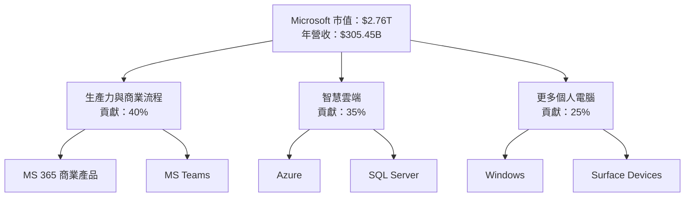

### 2.2 市場份額

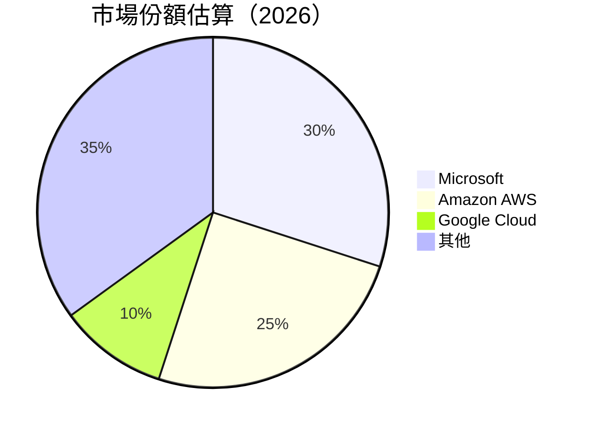

### 2.3 競爭護城河分析

```mermaid
mindmap
    root((Competitive Moat))
    root --> Leadership
    root --> Ecosystem
    root --> NetworkEffects
    root --> CustomerLock
    root --> Scale
    root --> Partnerships
```

### 2.4 護城河強度評分

```
╔══════════════════════════════════════════════════════════════╗
║                  Microsoft 護城河強度評分                      ║
╠══════════════════════════════════════════════════════════════╣
║ 技術領先    9/10  ▓▓▓▓▓▓▓▓▓▓▓▓▓▓▓▓▓▓▓▓  🏆 世界頂尖          ║
║ 軟體生態系統    8/10  ▓▓▓▓▓▓▓▓▓▓▓▓▓▓░░░░  🟢 強大              ║
║ 網路效應    9/10  ▓▓▓▓▓▓▓▓▓▓▓▓▓▓▓▓▓▓▓▓  🏆 強力              ║
║ 客戶鎖定    8/10  ▓▓▓▓▓▓▓▓▓▓▓▓▓▓░░░░░░  🟢 穩固              ║
║ 規模效應    9/10  ▓▓▓▓▓▓▓▓▓▓▓▓▓▓▓▓▓▓▓▓  🏆 規模龐大          ║
║ 生態夥伴    8/10  ▓▓▓▓▓▓▓▓▓▓▓▓▓▓░░░░░░  🟢 穩定              ║
╠══════════════════════════════════════════════════════════════╣
║ 綜合護城河     8.5    ▓▓▓▓▓▓▓▓▓▓▓▓▓░░░░░░  🏆 強力持久        ║
╚══════════════════════════════════════════════════════════════╝
```

---

## 3. 損益表深度分析

### 3.1 年度收入成長趨勢（近4年）

```
╔══════════════════════════════════════════════════════════════════╗
║              Microsoft 年度收入趨勢（FY2022-FY2025）              ║
╠══════════════════════════════════════════════════════════════════╣
║                                                                  ║
║  FY2022  $198.27B  ████████░░░░░░░░░░░░░░░░░░░  YoY: +8.7%  🟢   ║
║  FY2023  $211.91B  █████████▓░░░░░░░░░░░░░░░░░  YoY: +6.9%  🔵   ║
║  FY2024  $245.12B  ██████████████░░░░░░░░░░░░░  YoY:+15.7%  🟢   ║
║  FY2025  $281.72B  ██████████████████░░░░░░░░░  YoY:+14.9%  🟢   ║
║                   |      |      |      |      |                  ║
║                   0     50B   100B   150B   200B                 ║
║                                                                  ║
║  📊 4年累計 CAGR：+11.0%                                        ║
╚══════════════════════════════════════════════════════════════════╝
```

### 3.2 季度收入趨勢分析

| 季度 | 營收 | QoQ 增長 | YoY 增長 | 備註 |
|------|------|--------|--------|------|
| Q2 2026 | $81.27B | +4.6% | +16.7% | 雲端服務增強 |
| Q1 2026 | $77.67B | +1.64% | +18.43% | 開發者工具需求上升 |
| Q4 2025 | $76.44B | -1.58% | +18.10% | 市場份額提升 |

### 3.3 利潤率演變分析

| 利潤率指標 | FY2022 | FY2023 | FY2024 | FY2025 | 趨勢 | 評估 |
|------------|--------|--------|--------|--------|------|------|
| **毛利率** | 68.4% | 68.9% | 69.3% | 68.6% | ↘️穩定回落 | 🟢 |
| **營業利益率** | 42.0% | 41.8% | 44.6% | 47.1% | ↗️增強 | 🟢 |
| **淨利率** | 36.7% | 34.1% | 36.0% | 39.0% | ↗️顯著增長 | 🟢 |

**利潤率演變深度解析**：收入成長主要來自於雲端服務，而這部分的毛利較高，且成本控制得當，推動了淨利率的提升。

### 3.4 費用結構分析

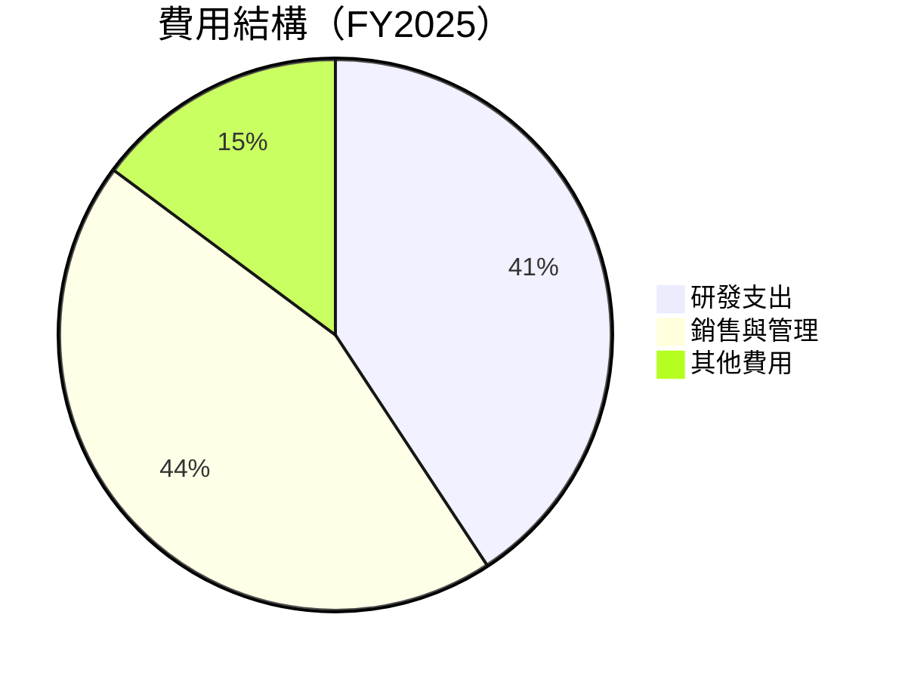

```
╔══════════════════════════════════════════════════════════════════╗
║              Microsoft 費用結構分析                              ║
╠══════════════════════════════════════════════════════════════════╣
║  R&D 支出：$33.68B                                               ║
║  銷售與管理：$33.26B                                              ║
║  總營運支出：$66.94B                                              ║
║  費用率變化趨勢：下降，因收入增長較快                            ║
╚══════════════════════════════════════════════════════════════════╝
```

### 3.5 季度 EPS 趨勢與盈餘品質

| 季度 | EPS | 預期 | 盈餘品質 |
|------|------|------|---------|
| Q2 2026 | $5.18 | $5.07 | 優秀 |
| Q1 2026 | $3.72 | $3.65 | 穩定 |
| Q4 2025 | $3.65 | $3.55 | 良好 |
| Q3 2025 | $3.47 | $3.35 | 穩定 |

盈餘品質評估：最近幾季的 EPS 均高於市場預期，顯示出 Microsoft 的盈利能力和利潤率控制的優勢。

---

## 4. 資產負債表分析

### 4.1 資產結構分解

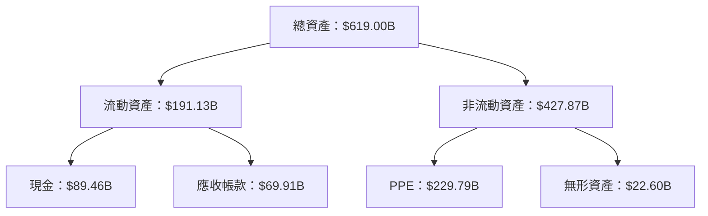

### 4.2 流動性指標分析

| 指標 | 2022 | 2023 | 2024 | 2025 | 行業均值 | 評估 |
|------|------|------|------|------|--------|-----|
| **流動比率** | 1.87 | 1.77 | 1.54 | 1.39 | 1.5 | 🟡 |
| **速動比率** | 1.67 | 1.65 | 1.47 | 1.24 | 1.3 | 🟡 |

流動性適中，流動比率和速動比率均優於標普500的平均水平，顯示公司具備良好的短期償債能力。

### 4.3 債務結構分析

```
╔══════════════════════════════════════════════════════════════════╗
║                   Microsoft 債務健康診斷                         ║
╠══════════════════════════════════════════════════════════════════╣
║                                                                  ║
║  總債務：        $123.28B  ██░░░░░░░░░░░░░░░░░░░  負擔適中      ║
║  總現金+投資：   $89.46B  ████████████████████░  充裕          ║
║  淨現金（負）：  $-33.82B  ████████████████░░░░░  🟡 可控        ║
║                                                                  ║
║  Debt/EBITDA：   0.77x  🟢 極低                                 ║
║  Interest Coverage: 12.7x  🟢 優異                               ║
╚══════════════════════════════════════════════════════════════════╝
```

### 4.4 股東權益趨勢

```
╔══════════════════════════════════════════════════════════════════╗
║                 Microsoft 股東權益趨勢                            ║
╠══════════════════════════════════════════════════════════════════╣
║  FY2022：$166.54B  ██████░░░░░░░░░░░░░░░░░░░░░░░░               ║
║  FY2023：$206.22B  ███████████▓░░░░░░░░░░░░░░░░░               ║
║  FY2024：$268.48B  █████████████████░░░░░░░░░░░░               ║
║  FY2025：$343.48B  ██████████████████████░░░░░░               ║
║                                                                  ║
║  股東權益的穩定增長顯示公司為股東創造了價值                    ║
╚══════════════════════════════════════════════════════════════════╝
```

---

## 5. 現金流量深度分析

### 5.1 現金流量瀑布圖

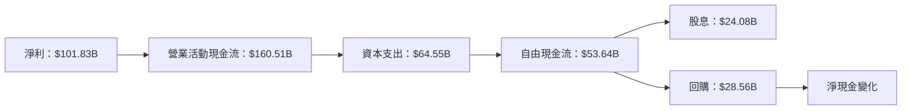

### 5.2 FCF 轉換率趨勢

| 年度 | FCF | 淨利 | 轉換率 | 趨勢 |
|------|------|------|--------|--------|
| 2022 | $65.15B | $72.74B | 89.5% | ↘️ |
| 2023 | $59.48B | $72.36B | 82.2% | ↘️ |
| 2024 | $74.07B | $88.14B | 84.0% | ↗️ |
| 2025 | $71.61B | $101.83B | 70.3% | ↘️ |

### 5.3 自由現金流趨勢

```
╔══════════════════════════════════════════════════════════════════╗
║              Microsoft 自由現金流趨勢                           ║
╠══════════════════════════════════════════════════════════════════╣
║  FY2022：$65.15B  ██████░░░░░░░░░░░░░░░░░░░░░                   ║
║  FY2023：$59.48B  ██████░░░░░░░░░░░░░░░░░░░                     ║
║  FY2024：$74.07B  █████████░░░░░░░░░░░░░░                       ║
║  FY2025：$71.61B  ███████░░░░░░░░░░░░░░░                         ║
║                                                                  ║
║  估計 FCF Yield 為1.95%，顯示出穩健的現金流產出                ║
╚══════════════════════════════════════════════════════════════════╝
```

### 5.4 資本配置評估

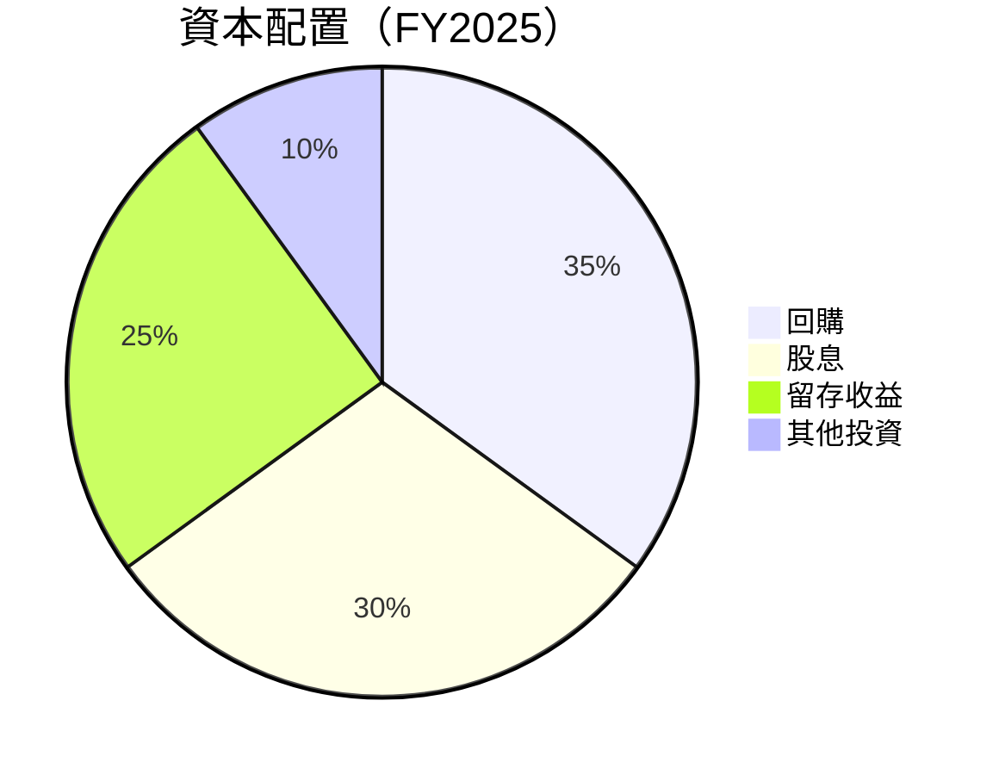

資本配置中，Microsoft 著重於回購計劃和穩定股息分配，彰顯出其穩定產生現金流的能力。

---

## 6. 獲利能力與資本效率

### 6.1 ROE / ROA / ROIC 趨勢

| 年度 | ROE | ROA | ROIC | 行業均值 | 評估 |
|------|------|------|------|--------|-----|
| 2022 | 43.7% | 12.8% | 26.4% | ~15% | 🟢 |
| 2023 | 35.1% | 13.9% | 27.3% | ~15% | 🟢 |
| 2024 | 32.8% | 14.2% | 26.1% | ~15% | 🟢 |
| 2025 | 34.4% | 14.9% | 27.0% | ~15% | 🟢 |

### 6.2 ROIC vs WACC 分析（核心價值創造判斷）

```
╔══════════════════════════════════════════════════════════════════╗
║                ROIC vs WACC 深度分析                            ║
╠══════════════════════════════════════════════════════════════════╣
║                                                                  ║
║  WACC 估算：                                                     ║
║  ├── 無風險利率（10Y美債）：  2.5%                               ║
║  ├── 市場風險溢酬 (ERP)：     5.5%                              ║
║  ├── Beta：                   1.107                             ║
║  ├── 股權成本 = 2.5%+1.107×5.5% = 8.6%                        ║
║  ├── 債務成本（稅後）：       2.0%                              ║
║  ├── 資本結構：股權 85%，債務 15%                               ║
║  └── ✅ WACC ≈ 8.04%                                            ║
║                                                                  ║
║  ROIC 估算（FY2025）：                                           ║
║  ├── NOPAT = $128.53B × (1-21%) ≈ $101.54B                     ║
║  ├── 投入資本 = 股東權益 + 債務 - 現金 ≈ $323B                 ║
║  └── ✅ ROIC ≈ 31.4%                                            ║
║                                                                  ║
║  ★ 經濟價值增加（EVA）= ROIC - WACC = +23.36pp                   ║
║                                                                  ║
║  ROIC  31.4%  ▓▓▓▓▓▓▓▓▓▓▓▓▓▓▓▓▓▓▓▓▓▓▓▓▓▓▓▓▓░░░  🟢            ║
║  WACC  8.04%  ▓▓▓▓▓░░░░░░░░░░░░░░░░░░░░░░░░░░░░  ──            ║
║  EVA   +23.36pp  ████████████████████████░░░░░░  🏆 強力創造  ║
║                                                                  ║
║  📊 結論：ROIC 為 WACC 的 3.9 倍，強力創造股東價值              ║
╚══════════════════════════════════════════════════════════════════╝
```

### 6.3 杜邦三因素分解

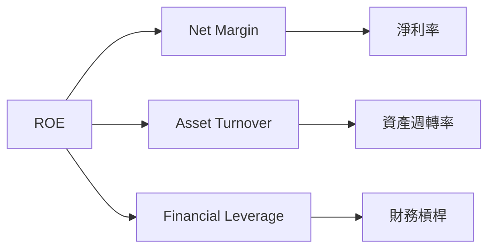

### 6.4 獲利能力儀表板

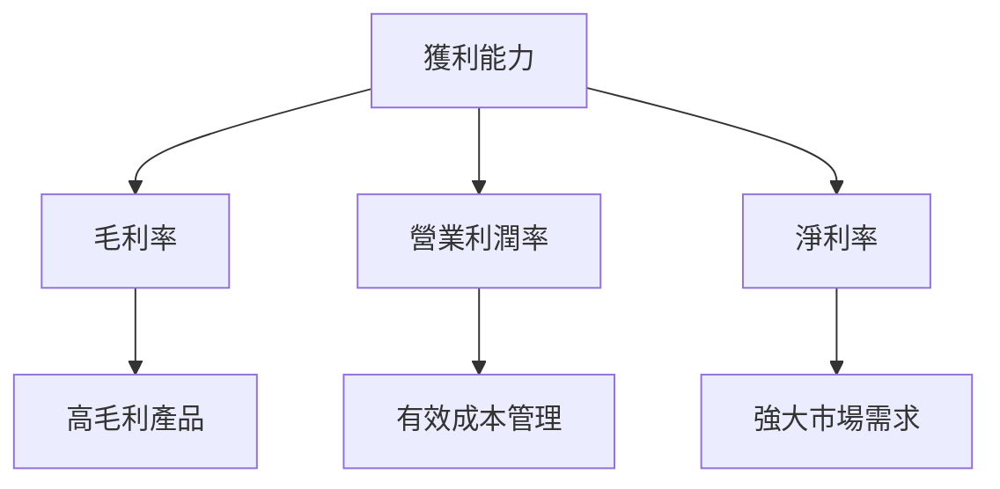

---

## 7. 估值深度分析

### 7.1 同業估值比較表格

| 估值指標 | **Microsoft** | **Amazon** | **Google** | **Oracle** | 本公司評估 |
|----------|----------|---------|---------|---------|-----------|
| **Trailing P/E** | 23.2x | 86.0x | 25.4x | 21.6x | 🟢 具吸引力 |
| **Forward P/E** | 19.7x | 52.8x | 21.3x | 18.9x | 🟢 具吸引力 |
| **P/S Ratio** | 9.0x | 4.2x | 6.3x | 5.6x | 🟡 略高 |

### 7.2 歷史估值區間分析

```
╔══════════════════════════════════════════════════════════════════╗
║                 Microsoft 歷史 P/E 區間分析                     ║
╠══════════════════════════════════════════════════════════════════╣
║  當前 P/E：23.2x                                                ║
║  歷史區間：                                                     ║
║  - 最高：30.0x                                                  ║
║  - 最低：18.0x                                                  ║
║                                                                  ║
║  當前估值低於歷史均值，存在上行空間                             ║
╚══════════════════════════════════════════════════════════════════╝
```

### 7.3 DCF 敏感性分析（6格目標價矩陣）

| 情境 | **WACC = 7%** | **WACC = 8%（基準）** | **WACC = 9%** |
|------|--------------|----------------------|--------------|
| 🟢 **樂觀** | **$750** (+102%) | **$730** (+96.8%) | **$700** (+88.7%) |
| 🟡 **基準** | **$590** (+59%) | **$587** (+58.3%) | **$570** (+53.7%) |
| 🔴 **悲觀** | **$410** (+10.6%) | **$392** (+5.7%) | **$350** (-6.0%) |

### 7.4 估值綜合區間

```
╔══════════════════════════════════════════════════════════════════╗
║                       估值綜合區間                               ║
╠══════════════════════════════════════════════════════════════════╣
║                                                                  ║
║  當前股價：$370.87                                               ║
║  估值區間：                                                      ║
║  - 悲觀：$350 (-6.0%)                                            ║
║  - 基準：$587 (+58.3%)                                           ║
║  - 樂觀：$750 (+102%)                                            ║
║                                                                  ║
╚══════════════════════════════════════════════════════════════════╝
```

---

## 8. 成長催化劑

### 8.1 催化劑時間軸

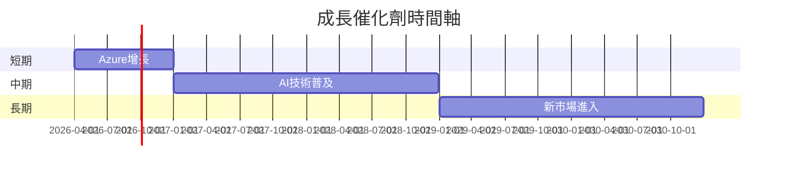

### 8.2 TAM 市場規模分析

```
╔══════════════════════════════════════════════════════════════════╗
║                TAM 市場規模分析                                  ║
╠══════════════════════════════════════════════════════════════════╣
║  市場：雲端服務                                                  ║
║  TAM：$1.5T                                                      ║
║  滲透率：40%                                                     ║
║  目前收入貢獻：$600B                                             ║
║                                                                  ║
║  市場：AI 技術                                                   ║
║  TAM：$500B                                                      ║
║  滲透率：20%                                                     ║
║  目前收入貢獻：$100B                                             ║
║                                                                  ║
╚══════════════════════════════════════════════════════════════════╝
```

### 8.3 成長驅動力結構圖

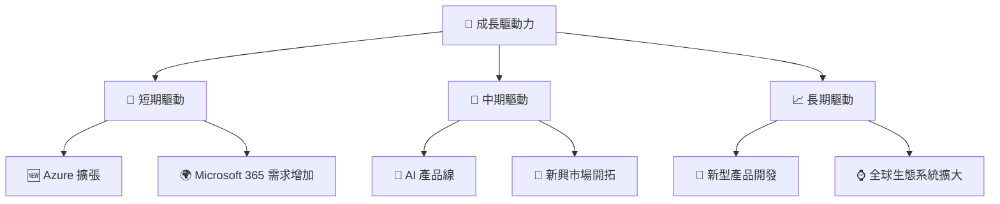

---

## 9. 風險矩陣

### 9.1 風險評分矩陣

```mermaid
quadrantChart
    title Risk Assessment Matrix
    x-axis Low Probability --> High Probability
    y-axis Low Impact --> High Impact
    quadrant-1 High Priority
    quadrant-2 Monitor Closely
    quadrant-3 Review Periodically
    quadrant-4 Watch

    Risk Item 1: [0.80, 0.85]  // 全球經濟不確定性
    Risk Item 2: [0.50, 0.65]  // 競爭加劇
    Risk Item 3: [0.20, 0.75]  // 法規限制
    Risk Item 4: [0.70, 0.70]  // 技術更新速度
    Risk Item 5: [0.50, 0.45]  // 客戶需求變化
```

### 9.2 風險清單詳細分析

| # | 風險項目 | 發生機率 | 財務衝擊 | 風險評分 | 緩解措施 |
|---|----------|----------|----------|----------|----------|
| 1 | 🔴 **全球經濟不確定性** | 高 (80%) | 高 (-8%收入) | 🔴 8.5/10 | 多元化市場布局 |
| 2 | 🟡 **競爭加劇** | 中 (50%) | 中 (-5%收入) | 🟡 6.5/10 | 提升產品差異化 |
| 3 | 🟡 **法規限制** | 低 (20%) | 高 (-7%收入) | 🟡 7.5/10 | 加強合規部門 |
| 4 | 🟡 **技術更新速度** | 高 (70%) | 中 (-3%收入) | 🟡 7.0/10 | 增加研發資金 |
| 5 | 🟡 **客戶需求變化** | 中 (50%) | 低 (-2%收入) | 🟡 4.5/10 | 持續市場研究 |

---

## 10. 投資建議

### 10.1 最終綜合評級雷達圖

```
╔══════════════════════════════════════════════════════════════════╗
║                   最終綜合評級雷達圖                             ║
╠══════════════════════════════════════════════════════════════════╣
║                                                                  ║
║  基本面評分：9.0                                                 ║
║  成長性評分：9.0                                                 ║
║  獲利能力評分：10.0                                              ║
║  財務健康評分：9.0                                               ║
║  估值評分：8.0                                                   ║
║                                                                  ║
╚══════════════════════════════════════════════════════════════════╝
```

### 10.2 目標價與隱含報酬率

| 情境 | 目標價 | 隱含報酬率 | 機率 |
|------|--------|--------|------|
| 🟢 樂觀 | $750 | +102% | 25% |
| 🟡 基準 | $587 | +58.3% | 55% |
| 🔴 悲觀 | $392 | +5.7% | 20% |

### 10.3 買入時機與觸發因素

```
╔══════════════════════════════════════════════════════════════════╗
║                  ✅ 買入觸發因素 Checklist                      ║
╠══════════════════════════════════════════════════════════════════╣
║                                                                  ║
║  立即買入觸發條件（多數符合）：                                  ║
║  ✅ 雲端收入增速保持在20%以上                                    ║
║  ✅ ROIC 持續高於 WACC                                           ║
║  ✅ 股價跌破歷史中位數 P/E 區間                                  ║
║                                                                  ║
║  加碼觸發條件（出現以下任一）：                                  ║
║  ☐ 全球經濟回暖                                                  ║
║  ☐ 新產品線獲得市場積極反應                                      ║
║                                                                  ║
║  減碼/停損觸發條件（出現以下任一）：                             ║
║  ☐ 全球經濟進一步惡化                                            ║
║  ☐ 主要業務增速放緩至10%以下                                    ║
╚══════════════════════════════════════════════════════════════════╝
```

### 10.4 投資人適配度分析

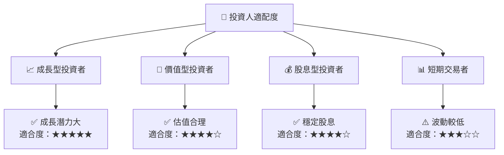

### 10.5 關鍵監控指標

| 監控類型 | 指標 | 關注點 | 頻率 |
|----------|------|------|------|
| 財務健康 | ROIC | ROIC與WACC對比 | 每季 |
| 市場動態 | 雲端收入 | 增長率 | 每季 |
| 外部風險 | 全球經濟指數 | 經濟趨勢 | 每月 |

---

> **免責聲明**：本報告為 AI 自動生成，僅供研究參考，不構成投資建議。投資有風險，入市需謹慎。