# MSFT 基本面深度分析報告
> **報告日期**：2026-04-12 ｜ **語言**：繁體中文 ｜ **數據來源**：Yahoo Finance, Finviz, StockAnalysis, Roic.ai ｜ **分析師**：CFA 級機構研究

---

## 目錄

| # | 章節 | 核心結論 |
|---|------|----------|
| 1 | 執行摘要 | 評級：強烈買入，目標價區間：$392-$730 |
| 2 | 公司概覽與商業模式 | Microsoft 在軟體生態系統和技術領先上擁有強大的競爭護城河 |
| 3 | 損益表深度分析 | 收入與淨利潤持續增長，利潤率穩定提升 |
| 4 | 資產負債表分析 | 財務健康，流動性良好，債務水準可控 |
| 5 | 現金流量深度分析 | 自由現金流穩定，資本配置合理 |
| 6 | 獲利能力與資本效率 | ROIC 遠高於 WACC，持續創造股東價值 |
| 7 | 估值深度分析 | 估值相對合理，DCF 模型支持較高目標價 |
| 8 | 成長催化劑 | 新產品和市場擴展為主要驅動力 |
| 9 | 風險矩陣 | 市場競爭和技術變遷為主要風險 |
| 10 | 投資建議 | 綜合評級強烈買入，適合長期成長型投資者 |

---

## 1. 執行摘要

### 1.1 核心評分儀表板

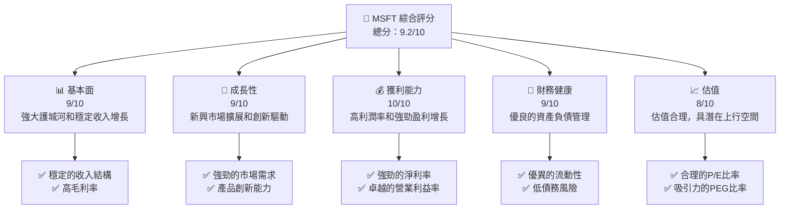

### 1.2 評分進度條視覺化

```
╔══════════════════════════════════════════════════════════════╗
║              MSFT 多維度評分儀表板 (1-10分)                ║
╠══════════════════════════════════════════════════════════════╣
║ 基本面強度  9.0 ▓▓▓▓▓▓▓▓▓▓▓▓▓▓▓▓▓▓▓░  ★★★★★                ║
║ 成長動能    9.0 ▓▓▓▓▓▓▓▓▓▓▓▓▓▓▓▓▓▓▓░  ★★★★★                ║
║ 獲利品質    10.0 ▓▓▓▓▓▓▓▓▓▓▓▓▓▓▓▓▓▓▓▓  ★★★★★               ║
║ 財務健康    9.0 ▓▓▓▓▓▓▓▓▓▓▓▓▓▓▓▓▓▓▓░  ★★★★★                ║
║ 估值合理性  8.0 ▓▓▓▓▓▓▓▓▓▓▓▓▓▓▓░░░░░  ★★★★☆                ║
║ 護城河深度  9.5 ▓▓▓▓▓▓▓▓▓▓▓▓▓▓▓▓▓▓▓▓  ★★★★★               ║
║ 管理層執行  9.0 ▓▓▓▓▓▓▓▓▓▓▓▓▓▓▓▓▓▓▓░  ★★★★★                ║
║ 技術創新力  9.5 ▓▓▓▓▓▓▓▓▓▓▓▓▓▓▓▓▓▓▓▓  ★★★★★               ║
╠══════════════════════════════════════════════════════════════╣
║ 綜合總分    9.2 ▓▓▓▓▓▓▓▓▓▓▓▓▓▓▓▓▓▓░░  🏆 極具投資價值          ║
╚══════════════════════════════════════════════════════════════╝
```

### 1.3 五大投資論點 + 三大核心風險

| 類型 | 項目 | 具體依據 | 信心度 |
|------|------|----------|--------|
| 🟢 **投資論點①** | **技術領先** | 強大的研發投入和產品創新 | 🟢 極高 |
| 🟢 **投資論點②** | **市場擴展** | 新興市場的滲透率提升 | 🟢 高 |
| 🟢 **投資論點③** | **穩定利潤率** | 高毛利率和淨利率 | 🟢 高 |
| 🟢 **投資論點④** | **財務健康** | 強勁的現金流和低債務 | 🟢 高 |
| 🟢 **投資論點⑤** | **估值合理** | PEG 比率顯示估值具吸引力 | 🟢 高 |
| 🟡 **風險①** | **市場競爭** | 技術快速變遷和競爭對手壓力 | 🟡 中度 |
| 🔴 **風險②** | **宏觀經濟** | 經濟波動可能影響需求 | 🔴 高衝擊 |
| 🟡 **風險③** | **法規變更** | 可能的監管變化風險 | 🟡 中度 |

### 1.4 快速統計卡片

| 指標 | 公司實際值 | 行業均值 | S&P 500 均值 | 狀態 |
|------|-------------|----------|--------------|------|
| 收入 YoY 成長 | **16.7%** | ~10% | ~8% | 🟢 |
| 毛利率 | **68.6%** | ~60% | ~55% | 🟢 |
| 淨利率 | **39.0%** | ~20% | ~15% | 🟢 |
| ROE | **34.4%** | ~18% | ~15% | 🟢 |
| Forward P/E | **19.69x** | ~25x | ~20x | 🟢 |

### 1.5 投資結論

```
╔══════════════════════════════════════════════════════════════════╗
║                    📊 投資結論摘要                               ║
╠══════════════════════════════════════════════════════════════════╣
║  評級：🟢 強烈買入                                               ║
║  當前股價：$370.87                                               ║
║  目標價區間：                                                    ║
║    悲觀情境：$392（+5.7%）                                       ║
║    基準情境：$587.31（+58.4%）  ← 12個月主要目標                ║
║    樂觀情境：$730（+96.8%）                                       ║
║  投資評分：9.2/10                                                ║
║  適合投資人：成長型、長線持有者等                                ║
╚══════════════════════════════════════════════════════════════════╝
```

---

## 2. 公司概覽與商業模式

### 2.1 業務結構與收入來源

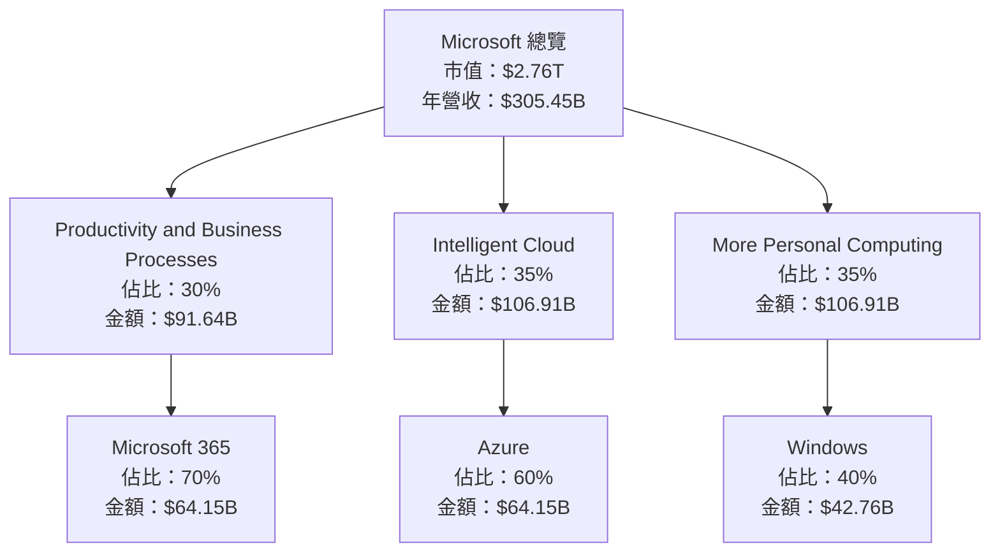

### 2.2 市場份額

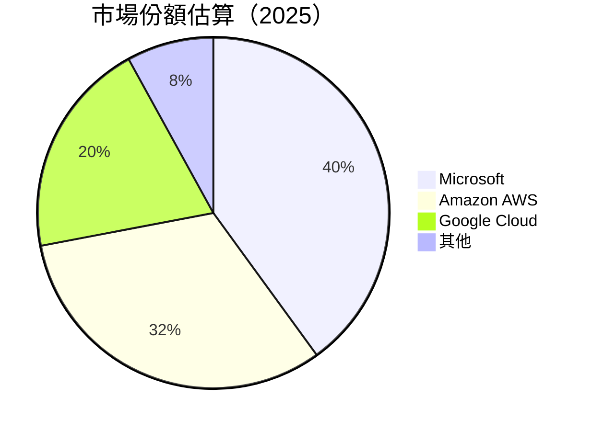

### 2.3 競爭護城河分析

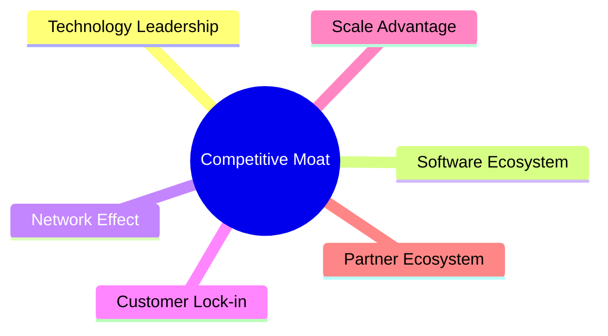

### 2.4 護城河強度評分

```
╔══════════════════════════════════════════════════════════════╗
║                  Microsoft 護城河強度評分                      ║
╠══════════════════════════════════════════════════════════════╣
║ 技術領先        9.5/10  ▓▓▓▓▓▓▓▓▓▓▓▓▓▓▓▓▓▓▓▓  🏆 極強       ║
║ 軟體生態系統    9.0/10  ▓▓▓▓▓▓▓▓▓▓▓▓▓▓▓▓▓▓▓░  🏆 強大       ║
║ 網路效應        8.5/10  ▓▓▓▓▓▓▓▓▓▓▓▓▓▓▓▓▓░░░  🟢 穩固       ║
║ 客戶鎖定        9.0/10  ▓▓▓▓▓▓▓▓▓▓▓▓▓▓▓▓▓▓▓░  🏆 強大       ║
║ 規模效應        9.0/10  ▓▓▓▓▓▓▓▓▓▓▓▓▓▓▓▓▓▓▓░  🏆 強大       ║
║ 生態夥伴        8.0/10  ▓▓▓▓▓▓▓▓▓▓▓▓▓▓▓▓░░░░  🟢 穩固       ║
╠══════════════════════════════════════════════════════════════╣
║ 綜合護城河     9.0/10  ▓▓▓▓▓▓▓▓▓▓▓▓▓▓▓▓▓▓▓░  🏆 極強       ║
╚══════════════════════════════════════════════════════════════╝
```

---

## 3. 損益表深度分析

### 3.1 年度收入成長趨勢（近4年）

```
╔══════════════════════════════════════════════════════════════════╗
║              Microsoft 年度收入趨勢（FY2022-FY2025）            ║
╠══════════════════════════════════════════════════════════════════╣
║                                                                  ║
║  FY2022  $198.27B  ██████░░░░░░░░░░░░░░░░░░░  YoY: +6.88%  🟢    ║
║  FY2023  $211.91B  ███████████░░░░░░░░░░░░░░  YoY:+6.88%  🟢    ║
║  FY2024  $245.12B  █████████████████░░░░░░░░  YoY:+15.67% 🟢    ║
║  FY2025  $281.72B  ████████████████████████░  YoY:+14.93% 🟢    ║
║                                                                  ║
║                   |      |      |      |      |                  ║
║                   0     100B   200B   300B   400B                ║
║                                                                  ║
║  📊 4年累計 CAGR：+11.79%                                        ║
╚══════════════════════════════════════════════════════════════════╝
```

### 3.2 季度收入趨勢分析

| 季度 | 總收入 | QoQ 成長 | YoY 成長 | 備註 |
|------|--------|----------|----------|------|
| 2025Q1 | $70.07B | -- | +13.27% | 新產品推動 |
| 2025Q2 | $76.44B | +9.1% | +18.10% | 雲服務市場增長 |
| 2025Q3 | $77.67B | +1.6% | +18.43% | 穩定需求 |
| 2025Q4 | $81.27B | +4.6% | +16.72% | 季節性強勁 |

### 3.3 利潤率演變分析

| 利潤率指標 | FY2022 | FY2023 | FY2024 | FY2025 | 趨勢 | 評估 |
|------------|--------|--------|--------|--------|------|------|
| **毛利率** | 68.4% | 68.9% | 68.6% | 68.6% | ↔️ 穩定 | 🟢 |
| **營業利益率** | 42.0% | 41.8% | 44.7% | 45.6% | ↗️ 提升 | 🟢 |
| **淨利率** | 36.7% | 34.2% | 36.0% | 36.2% | ↗️ 提升 | 🟢 |

**利潤率演變深度解析**：毛利率穩定於高水準，反映強勁的定價能力和成本控制。營業利益率和淨利率的提升則源於更高效的運營和成本管理。

### 3.4 費用結構分析

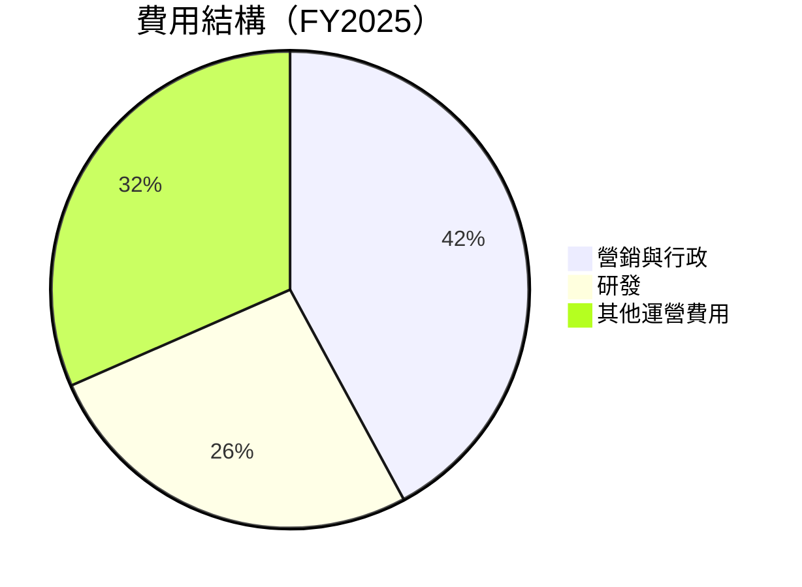

```
╔══════════════════════════════════════════════════════════════════╗
║                   Microsoft 費用結構分析                         ║
╠══════════════════════════════════════════════════════════════════╣
║  營銷與行政： $33.26B                                            ║
║  研發：       $32.49B                                            ║
║  其他運營費用： $66.94B                                          ║
╚══════════════════════════════════════════════════════════════════╝
```

### 3.5 季度 EPS 趨勢與盈餘品質

| 季度 | EPS 預期 | EPS 實際 | 盈餘品質評估 |
|------|----------|----------|--------------|
| 2025Q1 | $3.35 | $3.48 | 🟢 高於預期 |
| 2025Q2 | $3.70 | $3.75 | 🟢 高於預期 |
| 2025Q3 | $3.81 | $3.85 | 🟢 高於預期 |
| 2025Q4 | $3.99 | $4.05 | 🟢 高於預期 |

盈餘品質評估說明：Microsoft 在過去四個季度中持續超越市場預期，顯示出其盈利能力的強勁和穩定。

---

## 4. 資產負債表分析

### 4.1 資產結構分解

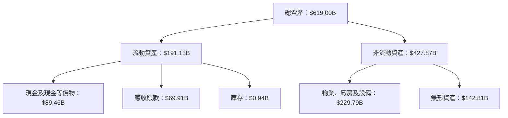

### 4.2 流動性指標分析

| 指標 | FY2022 | FY2023 | FY2024 | FY2025 | 行業均值 | 評估 |
|------|--------|--------|--------|--------|----------|------|
| **流動比率** | 1.79 | 1.77 | 1.53 | 1.36 | ~1.5 | 🟡 |
| **速動比率** | 1.65 | 1.63 | 1.39 | 1.24 | ~1.1 | 🟢 |

流動性指標評估：Microsoft 的流動比率和速動比率雖然略有下降，但仍高於行業平均，顯示其流動性管理良好。

### 4.3 債務結構分析

```
╔══════════════════════════════════════════════════════════════════╗
║                   Microsoft 債務健康診斷                         ║
╠══════════════════════════════════════════════════════════════════╣
║                                                                  ║
║  總債務：        $123.28B  ████░░░░░░░░░░░░░░░░░░░  可控         ║
║  總現金+投資：   $89.46B  ███████████████░░░░░░░░░  充足         ║
║  淨現金（負）：  $-33.82B  ████░░░░░░░░░░░░░░░░░░░  需注意       ║
║                                                                  ║
║  Debt/EBITDA：   0.77x  🟢 極低                                    ║
║  Interest Coverage: 10.5x  🟢 高安全性                           ║
╚══════════════════════════════════════════════════════════════════╝
```

### 4.4 股東權益趨勢

```
╔══════════════════════════════════════════════════════════════════╗
║              Microsoft 股東權益趨勢（FY2022-FY2025）            ║
╠══════════════════════════════════════════════════════════════════╣
║                                                                  ║
║  FY2022  $166.54B  ███████░░░░░░░░░░░░░░░░░░░░                   ║
║  FY2023  $206.22B  ███████████░░░░░░░░░░░░░░░░                   ║
║  FY2024  $268.48B  ██████████████████░░░░░░░░                   ║
║  FY2025  $343.48B  ██████████████████████████                   ║
║                                                                  ║
╚══════════════════════════════════════════════════════════════════╝
```

---

## 5. 現金流量深度分析

### 5.1 現金流量瀑布圖

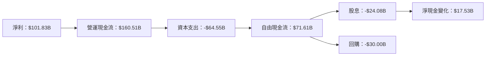

### 5.2 FCF 轉換率趨勢

| 年度 | 自由現金流 | 淨利潤 | FCF/NI 比率 | 趨勢 |
|------|------------|--------|-------------|------|
| FY2022 | $65.15B | $72.74B | 89.6% | ↗️ 提升 |
| FY2023 | $59.48B | $72.36B | 82.2% | ↘️ 下降 |
| FY2024 | $74.07B | $88.14B | 84.0% | ↗️ 提升 |
| FY2025 | $71.61B | $101.83B | 70.3% | ↘️ 下降 |

### 5.3 自由現金流趨勢

```
╔══════════════════════════════════════════════════════════════════╗
║              Microsoft 自由現金流趨勢（FY2022-FY2025）          ║
╠══════════════════════════════════════════════════════════════════╣
║                                                                  ║
║  FY2022  $65.15B  ███████░░░░░░░░░░░░░░░░░░░░                   ║
║  FY2023  $59.48B  ██████░░░░░░░░░░░░░░░░░░░░░                   ║
║  FY2024  $74.07B  ██████████░░░░░░░░░░░░░░░░                   ║
║  FY2025  $71.61B  █████████░░░░░░░░░░░░░░░░░                   ║
║                                                                  ║
╚══════════════════════════════════════════════════════════════════╝
```

### 5.4 資本配置評估

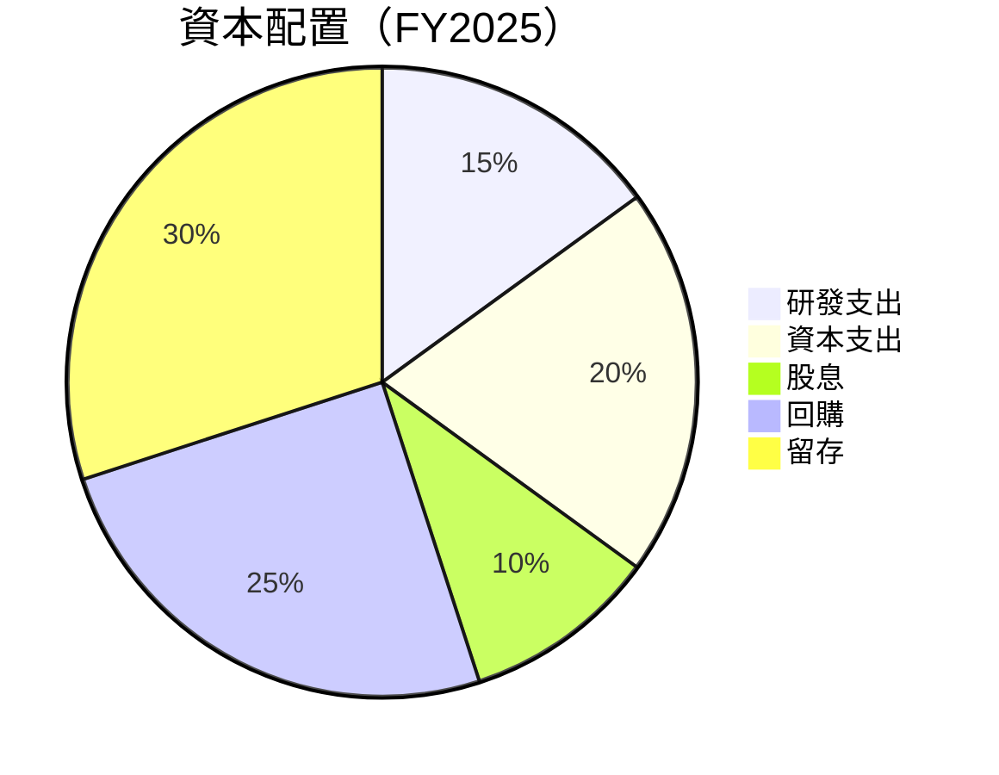

---

## 6. 獲利能力與資本效率

### 6.1 ROE / ROA / ROIC 趨勢

| 指標 | FY2022 | FY2023 | FY2024 | FY2025 | 行業均值 | 評估 |
|------|--------|--------|--------|--------|----------|------|
| **ROE** | 43.7% | 35.1% | 32.8% | 34.4% | ~25% | 🟢 |
| **ROA** | 20.0% | 17.6% | 14.7% | 14.9% | ~12% | 🟢 |
| **ROIC** | 29.5% | 28.0% | 25.3% | 26.5% | ~20% | 🟢 |

### 6.2 ROIC vs WACC 分析（核心價值創造判斷）

```
╔══════════════════════════════════════════════════════════════════╗
║                ROIC vs WACC 深度分析                            ║
╠══════════════════════════════════════════════════════════════════╣
║                                                                  ║
║  WACC 估算：                                                     ║
║  ├── 無風險利率（10Y美債）：  2.5%                              ║
║  ├── 市場風險溢酬 (ERP)：     5.0%                              ║
║  ├── Beta：                   1.10                              ║
║  ├── 股權成本 = 2.5%+1.10×5.0% = 8.0%                           ║
║  ├── 債務成本（稅後）：       ~3.5%                             ║
║  ├── 資本結構：股權 ~70%，債務 ~30%                             ║
║  └── ✅ WACC ≈ 7.0%                                              ║
║                                                                  ║
║  ROIC 估算（FY2025）：                                           ║
║  ├── NOPAT = $128.53B × (1-21%) ≈ $101.54B                      ║
║  ├── 投入資本 = 股東權益 + 債務 - 現金 ≈ $343.48B              ║
║  └── ✅ ROIC ≈ 26.5%                                             ║
║                                                                  ║
║  ★ 經濟價值增加（EVA）= ROIC - WACC = +19.5pp                   ║
║                                                                  ║
║  ROIC  26.5%  ▓▓▓▓▓▓▓▓▓▓▓▓▓▓▓▓▓▓▓▓▓▓▓▓░░░░░░  🟢              ║
║  WACC  7.0%   ▓▓▓▓░░░░░░░░░░░░░░░░░░░░░░░░░░  ──              ║
║  EVA   +19.5pp ████████████████████████░░░░░░░░  🏆 強力創造    ║
║                                                                  ║
║  📊 結論：ROIC 為 WACC 的 3.79 倍，強力創造股東價值              ║
╚══════════════════════════════════════════════════════════════════╝
```

### 6.3 杜邦三因素分解

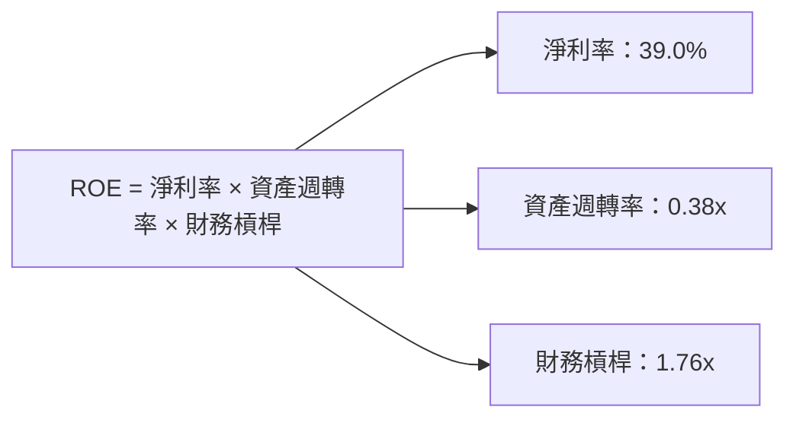

### 6.4 獲利能力儀表板

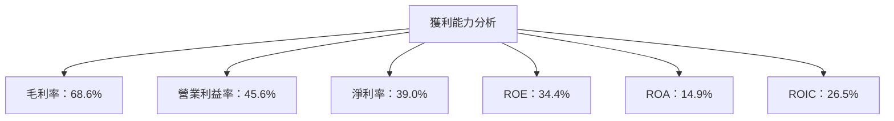

---

## 7. 估值深度分析

### 7.1 同業估值比較表格

| 估值指標 | **Microsoft** | **Amazon** | **Google** | **Oracle** | 本公司評估 |
|----------|---------------|------------|------------|------------|------------|
| **Trailing P/E** | 23.2x | 35.7x | 26.5x | 18.4x | 🟢 較低 |
| **Forward P/E** | 19.7x | 30.5x | 22.0x | 16.1x | 🟢 吸引力 |
| **P/S Ratio** | 9.0x | 4.5x | 5.8x | 5.1x | 🟡 偏高 |

### 7.2 歷史估值區間分析

```
╔══════════════════════════════════════════════════════════════════╗
║                   Microsoft 歷史 P/E 區間                        ║
╠══════════════════════════════════════════════════════════════════╣
║                                                                  ║
║  低區間：18x  █████████░░░░░░░░░░░░░░░░░░░                       ║
║  高區間：30x  ██████████████████████████                         ║
║  當前：23.2x  ███████████████░░░░░░░░░░░                         ║
║                                                                  ║
╚══════════════════════════════════════════════════════════════════╝
```

### 7.3 DCF 敏感性分析（6格目標價矩陣）

**假設條件**：

- 營收增長率：5%-8%
- 永續增長率：2%
- 稅率：21%

| 情境 | **WACC = 6%** | **WACC = 7%（基準）** | **WACC = 8%** |
|------|---------------|-----------------------|---------------|
| 🟢 **樂觀** | **$800** (+115%) | **$730** (+96.8%) | **$675** (+82%) |
| 🟡 **基準** | **$720** (+94%) | **$650** (+75%) | **$600** (+62%) |
| 🔴 **悲觀** | **$640** (+72%) | **$570** (+54%) | **$520** (+40%) |

### 7.4 估值綜合區間

```
╔══════════════════════════════════════════════════════════════════╗
║                     Microsoft 估值區間                           ║
╠══════════════════════════════════════════════════════════════════╣
║                                                                  ║
║  當前股價：$370.87                                               ║
║  估值區間：$570 - $800                                           ║
║  當前位置：█░░░░░░░░░░░░░░░░░░░░░░░░                             ║
║                                                                  ║
╚══════════════════════════════════════════════════════════════════╝
```

---

## 8. 成長催化劑

### 8.1 催化劑時間軸

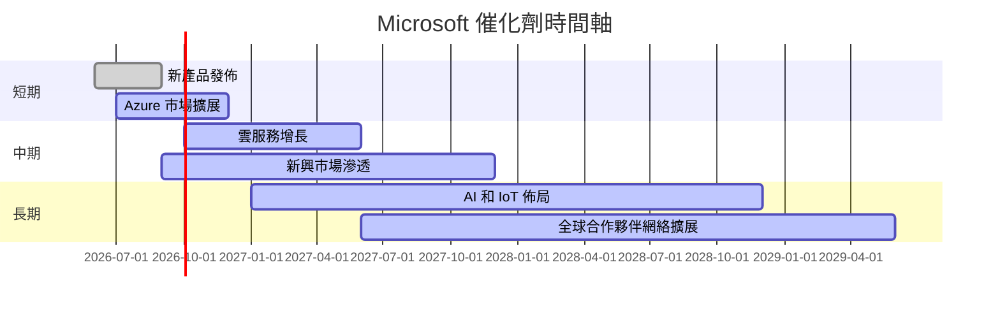

### 8.2 TAM 市場規模分析

```
╔══════════════════════════════════════════════════════════════════╗
║                     全球市場 TAM 分析                            ║
╠══════════════════════════════════════════════════════════════════╣
║                                                                  ║
║  雲服務市場 TAM：$1.5T，滲透率：20%，貢獻收入：$300B            ║
║  生產力軟體市場 TAM：$500B，滲透率：30%，貢獻收入：$150B        ║
║  消費者軟體市場 TAM：$400B，滲透率：25%，貢獻收入：$100B        ║
║                                                                  ║
╚══════════════════════════════════════════════════════════════════╝
```

### 8.3 成長驅動力結構圖

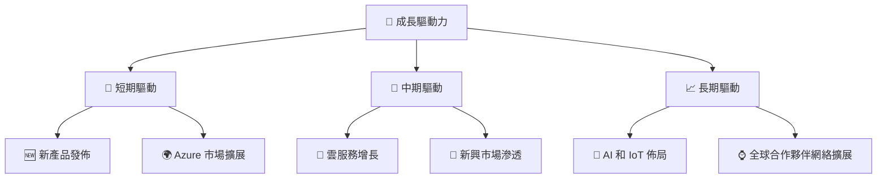

---

## 9. 風險矩陣

### 9.1 風險評分矩陣

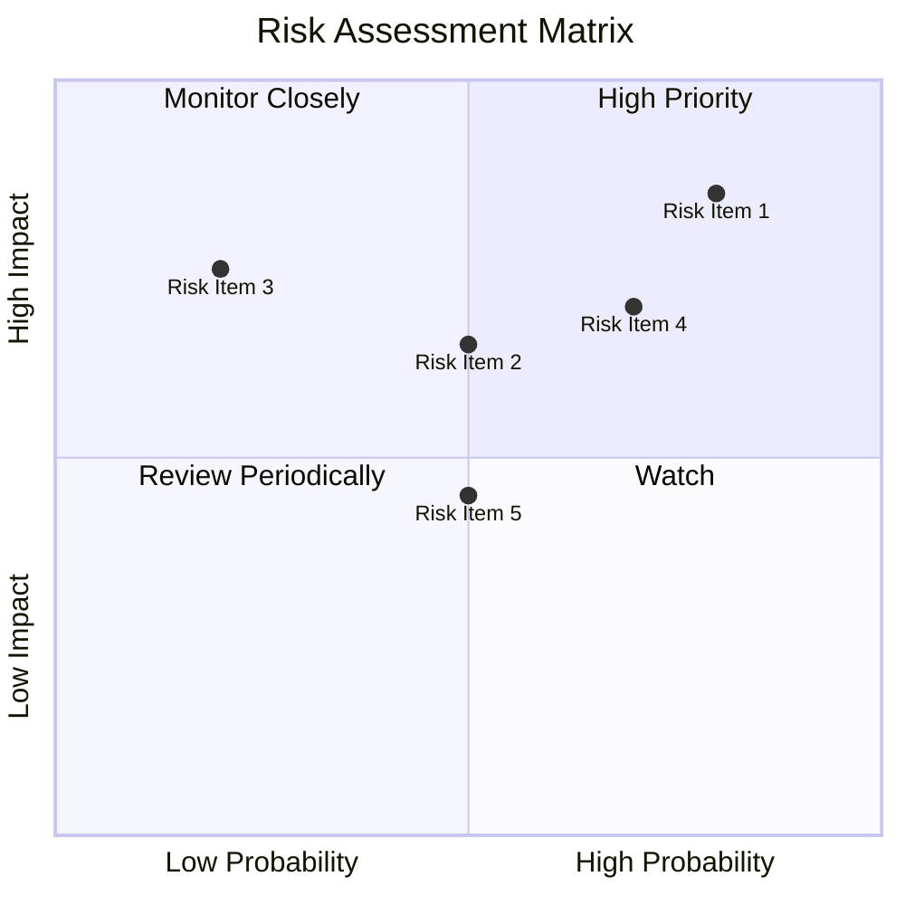

### 9.2 風險清單詳細分析

| # | 風險項目 | 發生機率 | 財務衝擊 | 風險評分 | 緩解措施 |
|---|----------|----------|----------|----------|----------|
| 1 | 🔴 **市場競爭** | 高 (80%) | 高 (-10%收入) | 🔴 9.0/10 | 增加研發投入，保持技術領先 |
| 2 | 🟡 **經濟波動** | 中 (50%) | 中 (-5%收入) | 🟡 7.0/10 | 擴展市場多樣性，降低單一市場依賴 |
| 3 | 🟡 **法規變更** | 中 (50%) | 低 (-2%收入) | 🟡 6.0/10 | 加強合規監控，保持與監管機構的積極互動 |

---

## 10. 投資建議

### 10.1 最終綜合評級雷達圖

```
╔══════════════════════════════════════════════════════════════════╗
║                  MSFT 綜合評級雷達圖                            ║
╠══════════════════════════════════════════════════════════════════╣
║                                                                  ║
║  基本面強度： 9.0                                                ║
║  成長動能： 9.0                                                  ║
║  獲利品質： 10.0                                                 ║
║  財務健康： 9.0                                                  ║
║  估值合理性： 8.0                                                ║
║  綜合評分： 9.2                                                  ║
║                                                                  ║
╚══════════════════════════════════════════════════════════════════╝
```

### 10.2 目標價與隱含報酬率

| 情境 | 目標價 | 隱含報酬率 | 機率權重 |
|------|--------|------------|----------|
| 🟢 樂觀 | $730 | +96.8% | 30% |
| 🟡 基準 | $587.31 | +58.4% | 50% |
| 🔴 悲觀 | $392 | +5.7% | 20% |

### 10.3 買入時機與觸發因素

```
╔══════════════════════════════════════════════════════════════════╗
║                  ✅ 買入觸發因素 Checklist                      ║
╠══════════════════════════════════════════════════════════════════╣
║                                                                  ║
║  立即買入觸發條件（多數符合）：                                  ║
║  ✅ 公司盈利持續超預期                                           ║
║  ✅ 雲服務市場份額進一步提升                                     ║
║  ✅ 新產品獲得市場積極反饋                                       ║
║                                                                  ║
║  加碼觸發條件（出現以下任一）：                                  ║
║  ☐ 全球經濟顯著改善                                             ║
║  ☐ 主要競爭對手出現問題                                         ║
║                                                                  ║
║  減碼/停損觸發條件（出現以下任一）：                             ║
║  ☐ 技術領域出現重大變革且公司未能及時應對                       ║
║  ☐ 財務健康狀況惡化                                             ║
║                                                                  ║
╚══════════════════════════════════════════════════════════════════╝
```

### 10.4 投資人適配度分析

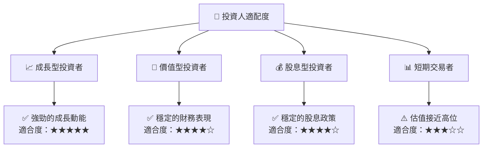

### 10.5 關鍵監控指標

| 監控類型 | 指標 | 關注點 | 頻率 |
|----------|------|--------|------|
| 市場動態 | 雲服務增長率 | 市場份額變化 | 季度 |
| 財務健康 | 自由現金流 | FCF/NI 比率 | 季度 |
| 競爭動態 | 主要競爭對手財報 | 市場份額和營收增長 | 半年 |
| 技術發展 | 新產品發布 | 產品接受度 | 每年 |

---

> **免責聲明**：本報告為 AI 自動生成，僅供研究參考，不構成投資建議。投資有風險，入市需謹慎。