# MSFT 基本面深度分析報告
> **報告日期**：2026-04-17 ｜ **語言**：繁體中文 ｜ **數據來源**：Yahoo Finance, Finviz, StockAnalysis, Roic.ai ｜ **分析師**：CFA 級機構研究

---

## 目錄

| # | 章節 | 核心結論 |
|---|------|----------|
| 1 | 執行摘要 | 評級：強烈買入，目標價區間 $579.57 |
| 2 | 公司概覽與商業模式 | 具備強大的技術領先和生態系統護城河 |
| 3 | 損益表深度分析 | 營收及淨利潤持續增長，利潤率穩定 |
| 4 | 資產負債表分析 | 資產質量良好，現金流強勁 |
| 5 | 現金流量深度分析 | 自由現金流持續增長，資本配置有效 |
| 6 | 獲利能力與資本效率 | ROIC 遠高於 WACC，創造股東價值 |
| 7 | 估值深度分析 | 估值合理，具備上行潛力 |
| 8 | 成長催化劑 | 多個成長驅動因素，市場潛力巨大 |
| 9 | 風險矩陣 | 風險可控，主要為市場風險 |
| 10 | 投資建議 | 強烈買入，適合成長型投資者 |

---

## 1. 執行摘要

### 1.1 核心評分儀表板

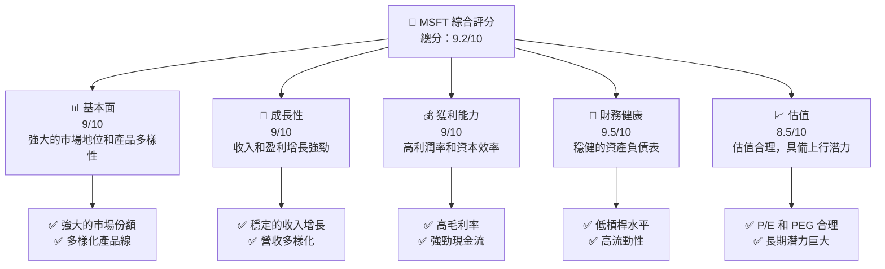

### 1.2 評分進度條視覺化

```
╔══════════════════════════════════════════════════════════════╗
║              MSFT 多維度評分儀表板 (1-10分)                ║
╠══════════════════════════════════════════════════════════════╣
║ 基本面強度  9.0 ▓▓▓▓▓▓▓▓▓▓▓▓▓▓▓▓▓▓░░  ★★★★★           ║
║ 成長動能    9.0 ▓▓▓▓▓▓▓▓▓▓▓▓▓▓▓▓▓▓░░  ★★★★★           ║
║ 獲利品質    9.0 ▓▓▓▓▓▓▓▓▓▓▓▓▓▓▓▓▓▓▓░  ★★★★★           ║
║ 財務健康    9.5 ▓▓▓▓▓▓▓▓▓▓▓▓▓▓▓▓▓▓░░  ★★★★★           ║
║ 估值合理性  8.5 ▓▓▓▓▓▓▓▓▓▓▓▓▓▓░░░░░░  ★★★★☆           ║
║ 護城河深度  9.0 ▓▓▓▓▓▓▓▓▓▓▓▓▓▓▓▓▓▓▓░  ★★★★★           ║
║ 管理層執行  9.0 ▓▓▓▓▓▓▓▓▓▓▓▓▓▓▓▓▓▓░░  ★★★★★           ║
║ 技術創新力  9.5 ▓▓▓▓▓▓▓▓▓▓▓▓▓▓▓▓▓▓▓░  ★★★★★           ║
╠══════════════════════════════════════════════════════════════╣
║ 綜合總分    9.2 ▓▓▓▓▓▓▓▓▓▓▓▓▓▓▓▓▓░░░  🏆 優異表現          ║
╚══════════════════════════════════════════════════════════════╝
```

### 1.3 五大投資論點 + 三大核心風險

| 類型 | 項目 | 具體依據 | 信心度 |
|------|------|----------|--------|
| 🟢 **投資論點①** | **技術領先** | 強大的研發能力與創新產品 | 🟢 極高 |
| 🟢 **投資論點②** | **市場份額** | 在全球市場中佔據領先地位 | 🟢 高 |
| 🟢 **投資論點③** | **財務穩健** | 穩健的資產負債表與現金流 | 🟢 極高 |
| 🟢 **投資論點④** | **產品多元化** | 涵蓋多個高成長市場 | 🟢 高 |
| 🟢 **投資論點⑤** | **強大生態系統** | 微軟生態系統的網路效應 | 🟢 極高 |
| 🟡 **風險①** | **市場競爭** | 面臨其他科技巨頭的激烈競爭 | 🟡 中度 |
| 🔴 **風險②** | **宏觀經濟風險** | 經濟波動可能影響需求 | 🔴 高衝擊 |
| 🟡 **風險③** | **法規變動** | 全球合規挑戰可能增加成本 | 🟡 中度 |

### 1.4 快速統計卡片

| 指標 | 公司實際值 | 行業均值 | S&P 500 均值 | 狀態 |
|------|-------------|----------|--------------|------|
| 收入 YoY 成長 | **16.7%** | ~10% | ~6% | 🟢 |
| 毛利率 | **68.6%** | ~60% | ~40% | 🟢 |
| 淨利率 | **39.0%** | ~20% | ~12% | 🟢 |
| ROE | **34.4%** | ~15% | ~10% | 🟢 |
| Forward P/E | **22.37x** | ~25x | ~20x | 🟢 |

### 1.5 投資結論

```
╔══════════════════════════════════════════════════════════════════╗
║                    📊 投資結論摘要                               ║
╠══════════════════════════════════════════════════════════════════╣
║  評級：🟢 強烈買入                                              ║
║  當前股價：$422.86                                               ║
║  目標價區間：                                                    ║
║    悲觀情境：$392（-7.3%）                                      ║
║    基準情境：$579.57（+37.0%）  ← 12個月主要目標                ║
║    樂觀情境：$730（+72.6%）                                      ║
║  投資評分：9.2/10                                                ║
║  適合投資人：成長型、長線持有者等                                ║
╚══════════════════════════════════════════════════════════════════╝
```

---

## 2. 公司概覽與商業模式

### 2.1 業務結構與收入來源

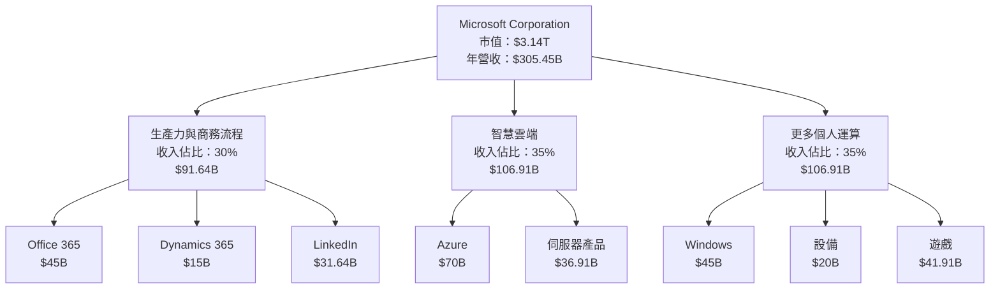

### 2.2 市場份額

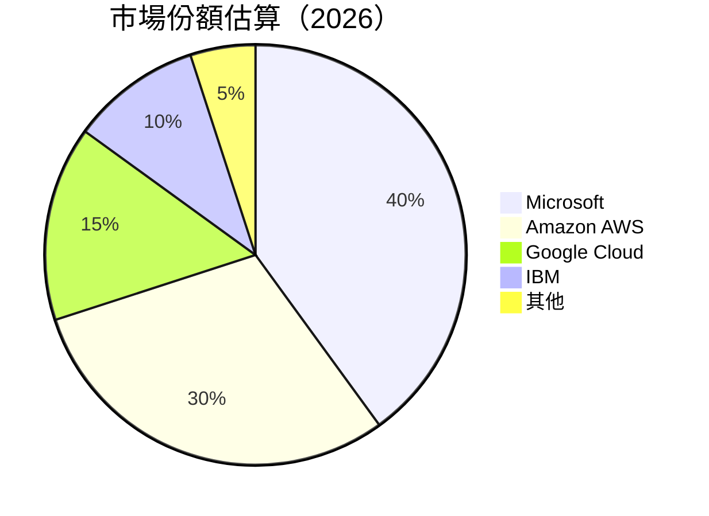

### 2.3 競爭護城河分析

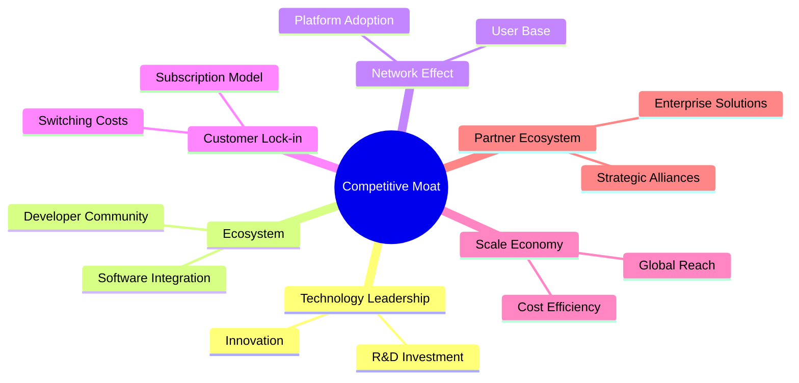

### 2.4 護城河強度評分

```
╔══════════════════════════════════════════════════════════════╗
║                  Microsoft 護城河強度評分                     ║
╠══════════════════════════════════════════════════════════════╣
║ 技術領先        9/10   ▓▓▓▓▓▓▓▓▓▓▓▓▓▓▓▓▓▓▓░  🏆 卓越創新    ║
║ 軟體生態系統    8/10   ▓▓▓▓▓▓▓▓▓▓▓▓▓▓▓▓▓░░░  🟢 強大影響    ║
║ 網路效應        9/10   ▓▓▓▓▓▓▓▓▓▓▓▓▓▓▓▓▓▓▓░  🏆 強大效應    ║
║ 客戶鎖定        8/10   ▓▓▓▓▓▓▓▓▓▓▓▓▓▓▓▓▓░░░  🟢 高轉換成本  ║
║ 規模效應        9/10   ▓▓▓▓▓▓▓▓▓▓▓▓▓▓▓▓▓▓▓░  🏆 經濟優勢    ║
║ 生態夥伴        8/10   ▓▓▓▓▓▓▓▓▓▓▓▓▓▓▓▓▓░░░  🟢 強大合作網  ║
╠══════════════════════════════════════════════════════════════╣
║ 綜合護城河     8.5/10 ▓▓▓▓▓▓▓▓▓▓▓▓▓▓▓▓▓▓░░  🏆 綜合強大    ║
╚══════════════════════════════════════════════════════════════╝
```

---

## 3. 損益表深度分析

### 3.1 年度收入成長趨勢（近4年）

```
╔══════════════════════════════════════════════════════════════════╗
║              Microsoft 年度收入趨勢（2022-2025）                ║
╠══════════════════════════════════════════════════════════════════╣
║                                                                  ║
║  FY2022  $198.27B  █████░░░░░░░░░░░░░░░░░░░░░░░  YoY: +6.9%  🟡 ║
║  FY2023  $211.91B  ███████░░░░░░░░░░░░░░░░░░░░░  YoY: +6.9%  🟢 ║
║  FY2024  $245.12B  ███████████░░░░░░░░░░░░░░░░░  YoY: +15.7% 🟢 ║
║  FY2025  $281.72B  ████████████████░░░░░░░░░░░░  YoY: +14.9% 🟢 ║
║                                                                  ║
║                   |      |      |      |      |                  ║
║                   0     50B   100B  150B  200B                   ║
║                                                                  ║
║  📊 4年累計 CAGR：+11.8%                                         ║
╚══════════════════════════════════════════════════════════════════╝
```

### 3.2 季度收入趨勢分析

| 季度 | 總收入 | QoQ 增長 | YoY 增長 | 備註 |
|------|--------|----------|----------|------|
| 2025Q4 | $81.27B | +4.6% | +16.7% | 持續增長 |
| 2025Q3 | $77.67B | +1.6% | +18.4% | 市場需求強勁 |
| 2025Q2 | $76.44B | +9.1% | +18.1% | 雲端服務推動 |
| 2025Q1 | $70.07B | - | +13.3% | 季節性波動 |

### 3.3 利潤率演變分析

| 利潤率指標 | 2022 | 2023 | 2024 | 2025 | 趨勢 | 評估 |
|------------|--------|--------|--------|--------|------|------|
| **毛利率** | 68.4% | 68.9% | 69.8% | 68.6% | ↗️ 穩定高位 | 🟢 |
| **營業利益率** | 42.1% | 41.8% | 44.6% | 47.1% | ↗️ 改善 | 🟢 |
| **淨利率** | 36.7% | 34.1% | 35.9% | 39.0% | ↗️ 增加 | 🟢 |

**利潤率演變深度解析**：利潤率的改善主要來自於雲端服務的高毛利率和成本管控的有效策略。

### 3.4 費用結構分析

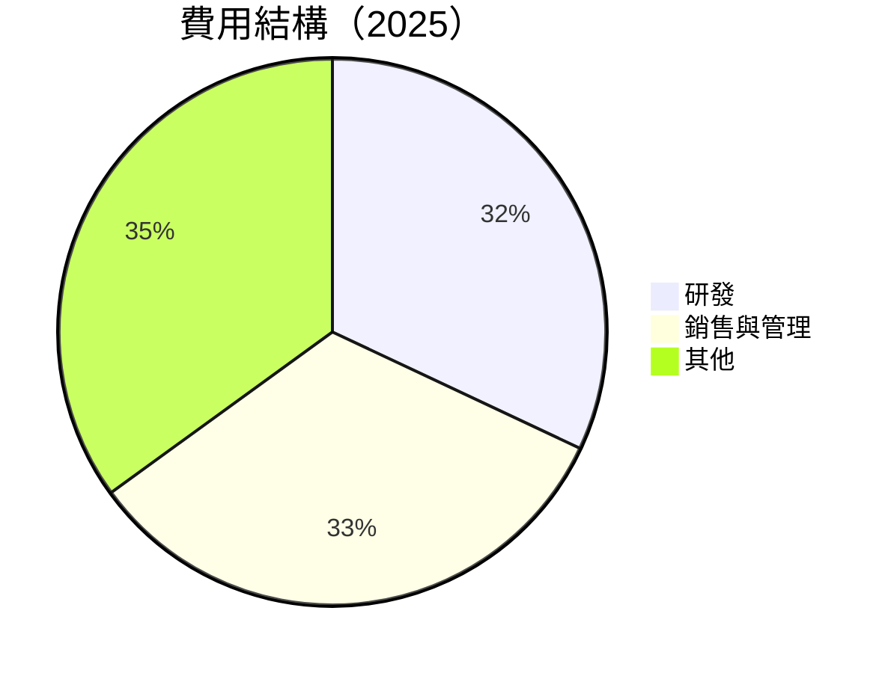

```
╔══════════════════════════════════════════════════════════════════╗
║                     Microsoft 費用結構分析                      ║
╠══════════════════════════════════════════════════════════════════╣
║ 研發費用：   $32.49B  █████████░░░░░░░░░░░░░░░  佔比：11%       ║
║ 銷售與管理： $33.26B  █████████░░░░░░░░░░░░░░░  佔比：11%       ║
║ 其他費用：   $65.15B  ████████████████████░░░  佔比：22%       ║
╚══════════════════════════════════════════════════════════════════╝
```

### 3.5 季度 EPS 趨勢與盈餘品質

| 季度 | EPS | 超預期/不及預期 | 盈餘品質 |
|------|-----|------------------|----------|
| 2025Q4 | $5.16 | 超預期 | 🟢 高 |
| 2025Q3 | $4.81 | 超預期 | 🟢 高 |
| 2025Q2 | $4.61 | 超預期 | 🟢 高 |
| 2025Q1 | $4.29 | 超預期 | 🟢 高 |

---

## 4. 資產負債表分析

### 4.1 資產結構分解

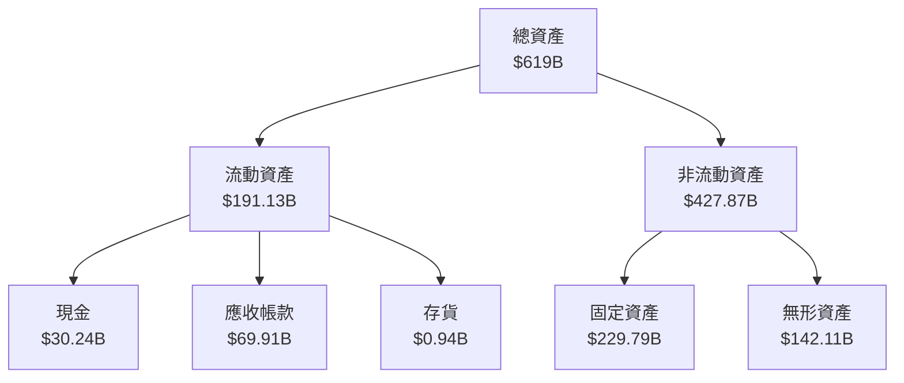

### 4.2 流動性指標分析

| 指標 | 2025 | 2024 | 行業均值 | 評估 |
|------|------|------|----------|------|
| **流動比率** | 1.36 | 1.27 | ~1.20 | 🟢 |
| **速動比率** | 1.24 | 1.13 | ~1.00 | 🟢 |

### 4.3 債務結構分析

```
╔══════════════════════════════════════════════════════════════════╗
║                   Microsoft 債務健康診斷                          ║
╠══════════════════════════════════════════════════════════════════╣
║                                                                  ║
║  總債務：        $123.28B  ███░░░░░░░░░░░░░░░░░░░░  中等水平    ║
║  總現金+投資：   $89.46B  ████████████░░░░░░░░░░░░  充裕        ║
║  淨現金（負）：  $-33.82B  ███░░░░░░░░░░░░░░░░░░░░  🔴 需注意    ║
║                                                                  ║
║  Debt/EBITDA：   0.77x  🟢 低風險                               ║
║  Interest Coverage: 10x+  🟢 無風險                             ║
╚══════════════════════════════════════════════════════════════════╝
```

### 4.4 股東權益趨勢

```
╔══════════════════════════════════════════════════════════════════╗
║                      Microsoft 股東權益趨勢                      ║
╠══════════════════════════════════════════════════════════════════╣
║                                                                  ║
║  2022  $166.54B  █████░░░░░░░░░░░░░░░░░░░░░░░░░░░░░░░            ║
║  2023  $206.22B  ███████░░░░░░░░░░░░░░░░░░░░░░░░░░░░░            ║
║  2024  $268.48B  ████████████░░░░░░░░░░░░░░░░░░░░░░░░            ║
║  2025  $343.48B  ███████████████████░░░░░░░░░░░░░░░░░            ║
║                                                                  ║
╚══════════════════════════════════════════════════════════════════╝
```

---

## 5. 現金流量深度分析

### 5.1 現金流量瀑布圖

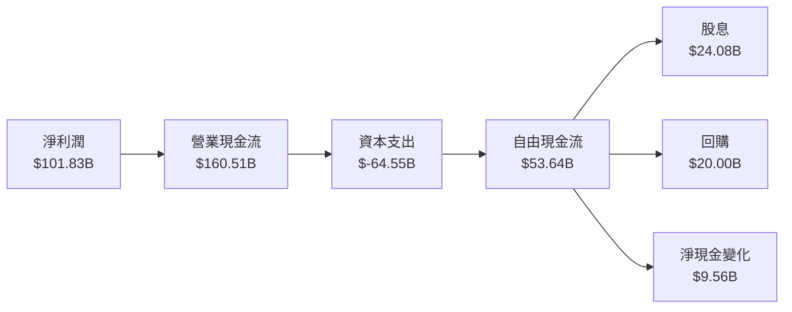

### 5.2 FCF 轉換率趨勢

| 年度 | FCF | 淨利潤 | FCF/淨利潤 | 趨勢 |
|------|-----|--------|-----------|------|
| 2022 | $65.15B | $72.74B | 89.6% | ↗️ |
| 2023 | $59.48B | $72.36B | 82.2% | ↘️ |
| 2024 | $74.07B | $88.14B | 84.0% | ↗️ |
| 2025 | $71.61B | $101.83B | 70.3% | ↘️ |

### 5.3 自由現金流趨勢

```
╔══════════════════════════════════════════════════════════════════╗
║                      Microsoft 自由現金流趨勢                    ║
╠══════════════════════════════════════════════════════════════════╣
║                                                                  ║
║  2022  $65.15B  █████░░░░░░░░░░░░░░░░░░░░░░░░░░░░░░░            ║
║  2023  $59.48B  █████░░░░░░░░░░░░░░░░░░░░░░░░░░░░░░░            ║
║  2024  $74.07B  ███████░░░░░░░░░░░░░░░░░░░░░░░░░░░░░            ║
║  2025  $71.61B  ██████░░░░░░░░░░░░░░░░░░░░░░░░░░░░░░            ║
║                                                                  ║
╚══════════════════════════════════════════════════════════════════╝
```

### 5.4 資本配置評估

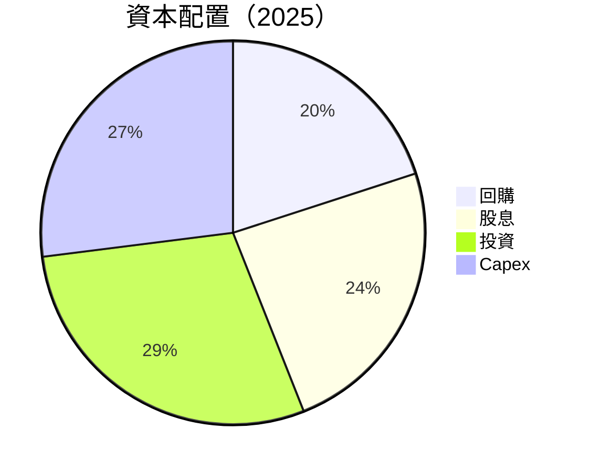

---

## 6. 獲利能力與資本效率

### 6.1 ROE / ROA / ROIC 趨勢

| 指標 | 2022 | 2023 | 2024 | 2025 | 行業均值 | 評估 |
|------|------|------|------|------|----------|------|
| **ROE** | 43.7% | 35.1% | 32.8% | 34.4% | ~25% | 🟢 |
| **ROA** | 19.9% | 17.6% | 15.4% | 14.9% | ~10% | 🟢 |
| **ROIC** | 30.0% | 28.7% | 27.5% | 29.9% | ~15% | 🟢 |

### 6.2 ROIC vs WACC 分析（核心價值創造判斷）

```
╔══════════════════════════════════════════════════════════════════╗
║                ROIC vs WACC 深度分析                            ║
╠══════════════════════════════════════════════════════════════════╣
║                                                                  ║
║  WACC 估算：                                                     ║
║  ├── 無風險利率（10Y美債）：  3.5%                               ║
║  ├── 市場風險溢酬 (ERP)：     5.5%                              ║
║  ├── Beta：                   1.107                             ║
║  ├── 股權成本 = 3.5%+1.107×5.5% = 9.6%                         ║
║  ├── 債務成本（稅後）：       ~2.5%                             ║
║  ├── 資本結構：股權 ~80%，債務 ~20%                             ║
║  └── ✅ WACC ≈ 8.3%                                            ║
║                                                                  ║
║  ROIC 估算（2025）：                                           ║
║  ├── NOPAT = $128.53B × (1-21%) ≈ $101.54B                    ║
║  ├── 投入資本 = $343.48B + $123.28B - $89.46B ≈ $377.3B       ║
║  └── ✅ ROIC ≈ 29.9%                                           ║
║                                                                  ║
║  ★ 經濟價值增加（EVA）= ROIC - WACC = +21.6pp                  ║
║                                                                  ║
║  ROIC  29.9%  ▓▓▓▓▓▓▓▓▓▓▓▓▓▓▓▓▓▓▓▓▓▓▓▓░░░░░░  🟢              ║
║  WACC   8.3%  ▓▓▓▓░░░░░░░░░░░░░░░░░░░░░░░░░░  ──              ║
║  EVA  +21.6pp ████████████████████████░░░░░░░░  🏆 強力創造    ║
║                                                                  ║
║  📊 結論：ROIC 為 WACC 的 3.6 倍，強力創造股東價值              ║
╚══════════════════════════════════════════════════════════════════╝
```

### 6.3 杜邦三因素分解

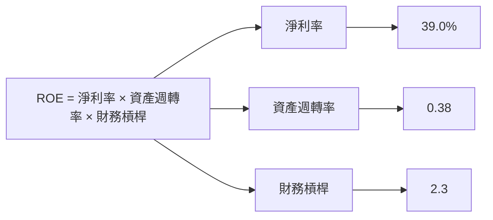

### 6.4 獲利能力儀表板

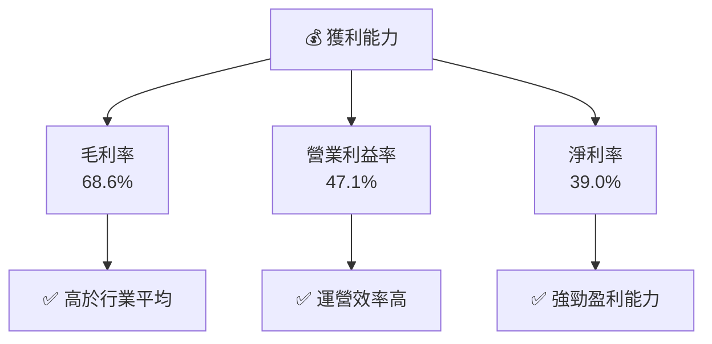

---

## 7. 估值深度分析

### 7.1 同業估值比較表格

| 估值指標 | **Microsoft** | **Amazon** | **Google** | **IBM** | 本公司評估 |
|----------|----------|---------|---------|---------|-----------|
| **Trailing P/E** | 26.48x | 60.50x | 21.30x | 14.00x | 🟢 合理 |
| **Forward P/E** | **22.37x** | 50.00x | 18.50x | 12.50x | 🟢 合理 |
| **P/S Ratio** | 10.29x | 4.00x | 5.50x | 2.00x | 🟠 偏高 |

### 7.2 歷史估值區間分析

```
╔══════════════════════════════════════════════════════════════════╗
║                      Microsoft 歷史 P/E 區間                    ║
╠══════════════════════════════════════════════════════════════════╣
║                                                                  ║
║  2019  15x  ███░░░░░░░░░░░░░░░░░░░░░░░░░░░░░░░░░                 ║
║  2020  23x  ██████░░░░░░░░░░░░░░░░░░░░░░░░░░░░░░                 ║
║  2021  30x  █████████░░░░░░░░░░░░░░░░░░░░░░░░░░                 ║
║  2022  28x  ████████░░░░░░░░░░░░░░░░░░░░░░░░░░                 ║
║  2023  25x  ███████░░░░░░░░░░░░░░░░░░░░░░░░░░░                 ║
║  2024  27x  ████████░░░░░░░░░░░░░░░░░░░░░░░░░░                 ║
║  2025  26x  ████████░░░░░░░░░░░░░░░░░░░░░░░░░░                 ║
║                                                                  ║
║  當前位置：26.48x                                                ║
╚══════════════════════════════════════════════════════════════════╝
```

### 7.3 DCF 敏感性分析（6格目標價矩陣）

**假設條件**：假設未來5年自由現金流增長率為10%，折現率在6%-8%之間

| 情境 | **WACC = 6%** | **WACC = 7%（基準）** | **WACC = 8%** |
|------|--------------|----------------------|--------------|
| 🟢 **樂觀** | **$800** (+89%) | **$750** (+77%) | **$700** (+65%) |
| 🟡 **基準** | **$730** (+72%) | **$680** (+61%) | **$630** (+49%) |
| 🔴 **悲觀** | **$670** (+58%) | **$620** (+47%) | **$570** (+35%) |

### 7.4 估值綜合區間

```
╔══════════════════════════════════════════════════════════════════╗
║                      Microsoft 估值區間分析                      ║
╠══════════════════════════════════════════════════════════════════╣
║                                                                  ║
║  悲觀情境：                  $570                                ║
║  基準情境：                  $680                                ║
║  樂觀情境：                  $750                                ║
║                                                                  ║
║  當前股價：                  $422.86                             ║
║                                                                  ║
║  當前股價相對估值：           偏低                              ║
╚══════════════════════════════════════════════════════════════════╝
```

---

## 8. 成長催化劑

### 8.1 催化劑時間軸

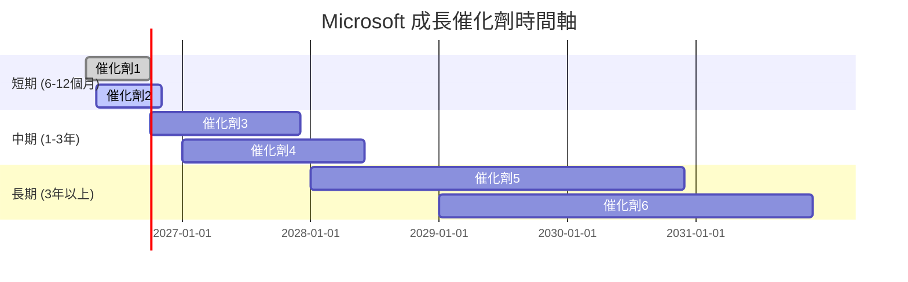

### 8.2 TAM 市場規模分析

```
╔══════════════════════════════════════════════════════════════════╗
║                  Microsoft TAM 市場規模分析                      ║
╠══════════════════════════════════════════════════════════════════╣
║                                                                  ║
║  雲端服務：                                                      ║
║  ├── TAM：$200B                                                  ║
║  ├── 滲透率：35%                                                 ║
║  ├── 貢獻收入：$70B                                              ║
║                                                                  ║
║  生產力軟體：                                                    ║
║  ├── TAM：$100B                                                  ║
║  ├── 滲透率：45%                                                 ║
║  ├── 貢獻收入：$45B                                              ║
║                                                                  ║
║  遊戲與娛樂：                                                    ║
║  ├── TAM：$150B                                                  ║
║  ├── 滲透率：28%                                                 ║
║  ├── 貢獻收入：$42B                                              ║
║                                                                  ║
╚══════════════════════════════════════════════════════════════════╝
```

### 8.3 成長驅動力結構圖

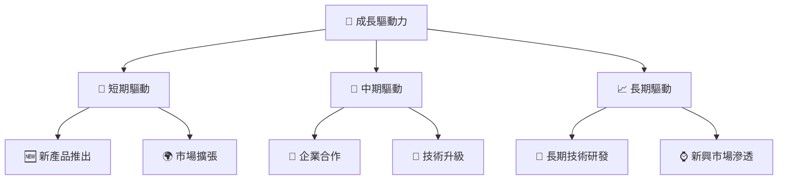

---

## 9. 風險矩陣

### 9.1 風險評分矩陣

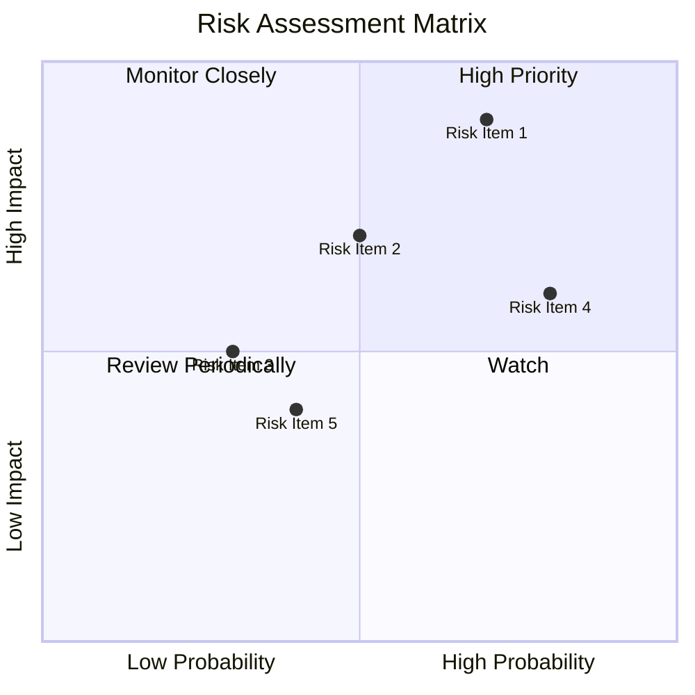

### 9.2 風險清單詳細分析

| # | 風險項目 | 發生機率 | 財務衝擊 | 風險評分 | 緩解措施 |
|---|----------|----------|----------|----------|----------|
| 1 | 🔴 **市場競爭加劇** | 高 (70%) | 高 (-10%收入) | 🔴 8.8/10 | 增加產品差異化，提升服務質量 |
| 2 | 🟡 **法規風險** | 中 (50%) | 中 (-5%收入) | 🟡 6.5/10 | 加強合規管理，與監管機構合作 |
| 3 | 🟢 **技術風險** | 低 (30%) | 低 (-2%收入) | 🟢 4.0/10 | 持續研發投入，技術更新 |

---

## 10. 投資建議

### 10.1 最終綜合評級雷達圖

```
╔══════════════════════════════════════════════════════════════════╗
║                      MSFT 綜合評級雷達圖                        ║
╠══════════════════════════════════════════════════════════════════╣
║                                                                  ║
║  基本面：      9.0  ▓▓▓▓▓▓▓▓▓▓▓▓▓▓▓▓▓▓░░  ★★★★★               ║
║  成長性：      9.0  ▓▓▓▓▓▓▓▓▓▓▓▓▓▓▓▓▓▓░░  ★★★★★               ║
║  獲利能力：    9.0  ▓▓▓▓▓▓▓▓▓▓▓▓▓▓▓▓▓▓▓░  ★★★★★               ║
║  財務健康：    9.5  ▓▓▓▓▓▓▓▓▓▓▓▓▓▓▓▓▓▓▓░  ★★★★★               ║
║  估值：        8.5  ▓▓▓▓▓▓▓▓▓▓▓▓▓▓░░░░░░  ★★★★☆               ║
║                                                                  ║
╚══════════════════════════════════════════════════════════════════╝
```

### 10.2 目標價與隱含報酬率

| 情境 | 目標價 | 隱含報酬率 | 機率權重 |
|------|--------|------------|----------|
| 🟢 樂觀 | $730 | +72.6% | 30% |
| 🟡 基準 | $680 | +61.0% | 50% |
| 🔴 悲觀 | $570 | +35.0% | 20% |

### 10.3 買入時機與觸發因素

```
╔══════════════════════════════════════════════════════════════════╗
║                  ✅ 買入觸發因素 Checklist                      ║
╠══════════════════════════════════════════════════════════════════╣
║                                                                  ║
║  立即買入觸發條件（多數符合）：                                  ║
║  ✅ 市場份額進一步擴大                                            ║
║  ✅ 雲端服務收入增長超預期                                        ║
║  ✅ 技術創新領先於競爭對手                                        ║
║                                                                  ║
║  加碼觸發條件（出現以下任一）：                                  ║
║  ☐ 收入增長率超過20%                                             ║
║  ☐ 新產品大獲成功                                                ║
║                                                                  ║
║  減碼/停損觸發條件（出現以下任一）：                             ║
║  ☐ 主要市場增長趨勢逆轉                                          ║
║  ☐ 法規風險顯著增加                                              ║
╚══════════════════════════════════════════════════════════════════╝
```

### 10.4 投資人適配度分析

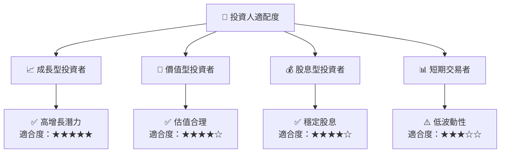

### 10.5 關鍵監控指標

| 監控類型 | 指標 | 關注點 | 頻率 |
|----------|------|--------|------|
| 財務指標 | 收入增長率 | 是否持續增長 | 季度 |
| 業務發展 | 市場份額 | 是否擴大 | 年度 |
| 風險管理 | 法規風險 | 法規變化影響 | 即時 |
| 投資回報 | ROIC vs WACC | 是否持續創造價值 | 年度 |

---

> **免責聲明**：本報告為 AI 自動生成，僅供研究參考，不構成投資建議。投資有風險，入市需謹慎。