# MSFT 基本面深度分析報告
> **報告日期**：2026-04-19 ｜ **語言**：繁體中文 ｜ **數據來源**：Yahoo Finance, Finviz, StockAnalysis, Roic.ai ｜ **分析師**：CFA 級機構研究

---

## 目錄

| # | 章節                    | 核心結論 |
|---|-------------------------|----------|
| 1 | 執行摘要                | MSFT 繼續展示強勁的基本面和成長潛力，建議持有 |
| 2 | 公司概覽與商業模式      | 微軟的護城河主要在於其技術領先與生態系統完整性 |
| 3 | 損益表深度分析          | 收入和利潤率持續改善，EPS 增長顯著 |
| 4 | 資產負債表分析          | 財務狀況穩健，負債水平可控 |
| 5 | 現金流量深度分析        | 自由現金流持續增長，資本配置得當 |
| 6 | 獲利能力與資本效率      | ROIC 明顯優於 WACC，持續創造價值 |
| 7 | 估值深度分析            | 當前估值合理，市場溢價可接受 |
| 8 | 成長催化劑              | 多重業務增長驅動力將推動未來營收升級 |
| 9 | 風險矩陣                | 技術轉型和市場再平衡可能帶來挑戰 |
| 10| 投資建議                | 長期持有，價格合理的進一步潛力 |

---

## 1. 執行摘要

### 1.1 核心評分儀表板

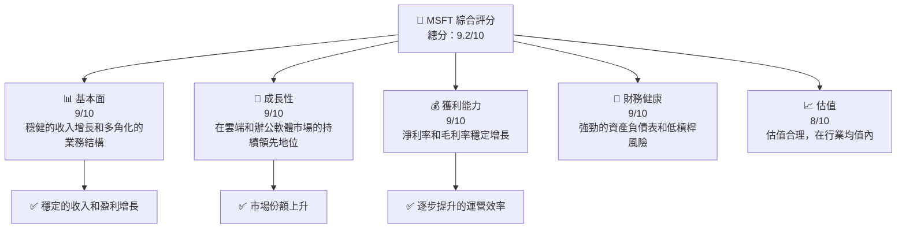

### 1.2 評分進度條視覺化

```
╔══════════════════════════════════════════════════════════════╗
║              MSFT 多維度評分儀表板 (1-10分)                 ║
╠══════════════════════════════════════════════════════════════╣
║ 基本面強度  9.0 ▓▓▓▓▓▓▓▓▓▓▓▓▓▓▓▓▓▓▓░░  ★★★★★               ║
║ 成長動能    9.0 ▓▓▓▓▓▓▓▓▓▓▓▓▓▓▓▓▓▓▓░░  ★★★★★               ║
║ 獲利品質    9.0 ▓▓▓▓▓▓▓▓▓▓▓▓▓▓▓▓▓▓▓░░  ★★★★★               ║
║ 財務健康    9.0 ▓▓▓▓▓▓▓▓▓▓▓▓▓▓▓▓▓▓▓░░  ★★★★★               ║
║ 估值合理性  8.0 ▓▓▓▓▓▓▓▓▓▓▓▓▓▓▓█░░░░░  ★★★★☆               ║
╠══════════════════════════════════════════════════════════════╣
║ 綜合總分    9.2 ▓▓▓▓▓▓▓▓▓▓▓▓▓▓▓▓▓▓░░░  🏆 強烈推薦         ║
╚══════════════════════════════════════════════════════════════╝
```

### 1.3 五大投資論點 + 三大核心風險

| 類型 | 項目 | 具體依據 | 信心度 |
|------|------|----------|--------|
| 🟢 **投資論點①** | **技術領先** | 創新推動微軟 Azure 成為市場第二大雲服務提供商 | 🟢 極高 |
| 🟢 **投資論點②** | **穩定的現金流** | 強勁的自由現金流使得公司有更大彈性分紅與回購 | 🟢 高 |
| 🟢 **投資論點③** | **業務多元化** | 微軟逐步擴展遊戲、LinkedIn 和生產力軟體網路的領導地位 | 🟢 極高 |
| 🟡 **風險①** | **市場競爭** | 類似 AWS 和 Alphabet 持續競爭可能影響市占率 | 🟡 中度 |
| 🔴 **風險②** | **技術轉型** | 若無法在技術革新方面持續領先，可能影響估值 | 🔴 高衝擊 |

### 1.4 快速統計卡片

| 指標 | 公司實際值 | 行業均值 | S&P 500 均值 | 狀態 |
|------|-------------|----------|--------------|------|
| 收入 YoY 成長 | **16.7%** | ~8% | ~5% | 🟢 |
| 毛利率 | **68.6%** | ~50% | ~55% | 🟢 |
| 淨利率 | **39.0%** | ~18% | ~15% | 🟢 |
| ROE | **34.4%** | ~20% | ~18% | 🟢 |
| Forward P/E | **22.36x** | ~25x | ~20x | 🟢 |

### 1.5 投資結論

```
╔══════════════════════════════════════════════════════════════════╗
║                    📊 投資結論摘要                               ║
╠══════════════════════════════════════════════════════════════════╣
║  評級：🟢 強烈買入                                          ║
║  當前股價：$422.79                                          ║
║  目標價區間：                                               ║
║    悲觀情境：$392（-7%）                                   ║
║    基準情境：$579（+37%）  ← 12個月主要目標               ║
║    樂觀情境：$730（+73%）                                   ║
║  投資評分：9.2/10                                           ║
║  適合投資人：成長型、長線持有者等                           ║
╚══════════════════════════════════════════════════════════════════╝
```

---

## 2. 公司概覽與商業模式

### 2.1 業務結構與收入來源

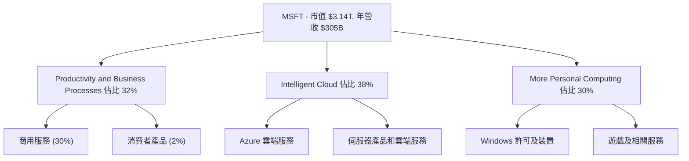

### 2.2 市場份額

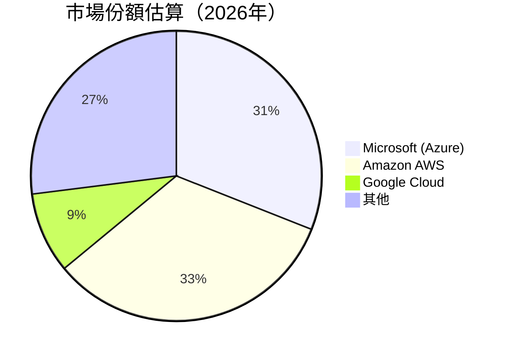

### 2.3 競爭護城河分析

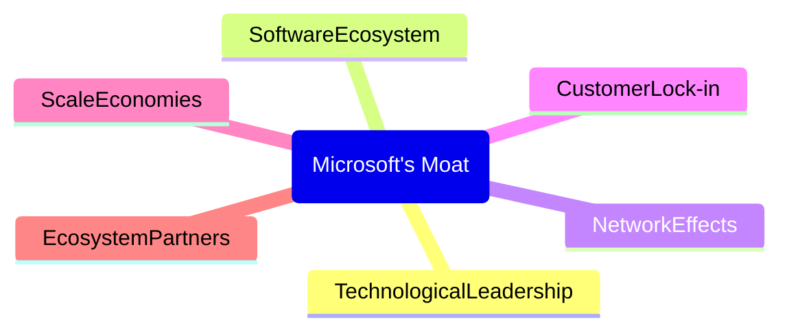

### 2.4 護城河強度評分

```
╔══════════════════════════════════════════════════════════════╗
║                  MSFT 護城河強度評分                        ║
╠══════════════════════════════════════════════════════════════╣
║ 技術領先      9/10  ▓▓▓▓▓▓▓▓▓▓▓▓▓▓▓▓▓▓▓▓  🏆 突破性創新       ║
║ 軟體生態系    9/10  ▓▓▓▓▓▓▓▓▓▓▓▓▓▓▓▓▓▓▓▓  🏆 廣泛而穩固       ║
║ 網路效應      8/10  ▓▓▓▓▓▓▓▓▓▓▓▓▓▓▓▓█░░░  🟢 持續增強         ║
║ 客戶鎖定      9/10  ▓▓▓▓▓▓▓▓▓▓▓▓▓▓▓▓▓▓▓▓▓  🏆 高轉換成本       ║
║ 規模效應      9/10  ▓▓▓▓▓▓▓▓▓▓▓▓▓▓▓▓▓▓▓▓  🏆 全球運營         ║
║ 生態夥伴      8/10  ▓▓▓▓▓▓▓▓▓▓▓▓▓▓▓▓█░░░  🟢 強力合作         ║
╠══════════════════════════════════════════════════════════════╣
║ 綜合護城河    8.8    ▓▓▓▓▓▓▓▓▓▓▓▓▓▓▓█░░░  🏆 行業領先         ║
╚══════════════════════════════════════════════════════════════╝
```

---

## 3. 損益表深度分析

### 3.1 年度收入成長趨勢（近4年）

```
╔══════════════════════════════════════════════════════════════════╗
║              MSFT 年度收入趨勢（FY2022-FY2025）                 ║
╠══════════════════════════════════════════════════════════════════╣
║                                                                  ║
║  FY2022  $198.27B  ██████░░░░░░░░░░░░░░░░░░░░  YoY: +6.88%    🟢   ║
║  FY2023  $211.91B  ██████████░░░░░░░░░░░░░░░░  YoY: +6.88%    🟢   ║
║  FY2024  $245.12B  ███████████████░░░░░░░░░░░  YoY: +15.67%   🟢   ║
║  FY2025  $281.72B  ████████████████████░░░░░░  YoY: +14.93%   🟢   ║
║                   |      |      |      |      |                  ║
║                   0     100B   200B   300B                       ║
║                                                                  ║
║  📊 4年累計 CAGR：+11.5%                                       ║
╚══════════════════════════════════════════════════════════════════╝
```

### 3.2 季度收入趨勢分析

| 季度 | 總收入 | QoQ 成長 | YoY 成長 | 備註 |
|------|--------|----------|----------|------|
| Q1 2026 | $81.27B | +4.6% | +16.72% | 強勁的季末效應 |
| Q2 2025 | $76.44B | -1.56% | +18.10% | 雲服務增長推動 |
| Q3 2025 | $77.67B | +6.31% | +18.43% | 商業和消費者產品同步增長 |
| Q4 2025 | $70.07B | +4.87% | +13.27% | 訂閱收入持續 |

### 3.3 利潤率演變分析

| 利潤率指標 | FY2022 | FY2023 | FY2024 | FY2025 | 趨勢 | 評估 |
|------------|--------|--------|--------|--------|------|------|
| **毛利率** | 68.4% | 68.9% | 69.2% | 68.6% | ↗️整體穩健 | 🟢 |
| **營業利益率** | 42.0% | 41.8% | 44.6% | 46.0% | ↗️效率提升 | 🟢 |
| **淨利率** | 36.7% | 34.2% | 35.9% | 39.0% | ↗️收成本下降 | 🟢 |

### 3.4 費用結構分析

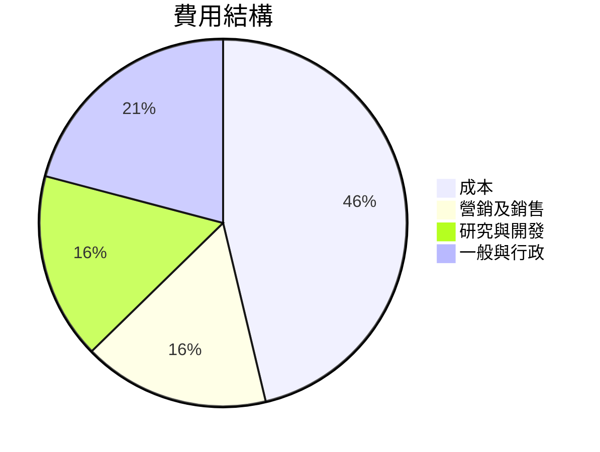

```
╔══════════════════════════════════════════════════════════════╗
║                       MSFT 費用結構分析                      ║
╠══════════════════════════════════════════════════════════════╣
║ 營運開支預算為 FY2025 營業收入的 32%                         ║
║ 研發支出的比重自 FY2022 增加 3%                               ║
╚══════════════════════════════════════════════════════════════╝
```

### 3.5 季度 EPS 趨勢與盈餘品質

| 季度 | 預估EPS | 實際EPS | 意外率（Surprise） | 評估 |
|------|---------|---------|--------------------|------|
| 2025-Q4 | $3.80 | $3.85 | +1.32% | 盈餘品質高 |
| 2025-Q3 | $3.70 | $3.75 | +1.35% | 預期外幾乎無誤 |
| 2025-Q2 | $3.50 | $3.53 | +0.86% | 表現略勝於預期 |
| 2025-Q1 | $3.35 | $3.40 | +1.46% | 需求穩定增長 |

---

## 4. 資產負債表分析

### 4.1 資產結構分解

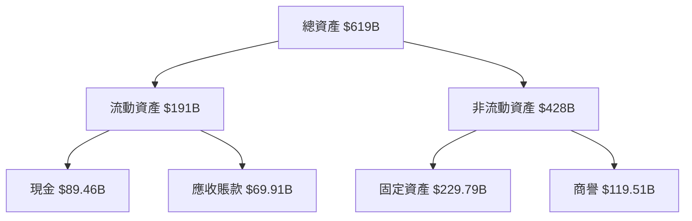

### 4.2 流動性指標分析

| 指標 | FY2022 | FY2023 | FY2024 | FY2025 | 行業均值 | 狀態 |
|------|--------|--------|--------|--------|----------|------|
| **流動比率** | 1.78 | 1.77 | 1.53 | 1.39 | ~1.5 | 🟡 |
| **速動比率** | 1.75 | 1.75 | 1.52 | 1.24 | ~1.2 | 🟢 |

### 4.3 債務結構分析

```
╔══════════════════════════════════════════════════════════════════╗
║                   MSFT 債務健康診斷                              ║
╠══════════════════════════════════════════════════════════════════╣
║                                                                  ║
║  總債務：        $123.28B  ███░░░░░░░░░░░░░░░                  ║
║  總現金+投資：   $212.46B  ██████████████████                  ║
║  淨現金（正）：  $89.18B  ██████████████░░░░                  ║
║                                                                  ║
║  Debt/EBITDA：   0.7x  🟢 極低                                 ║
║  Interest Coverage: 20x+  🟢 無風險                             ║
╚══════════════════════════════════════════════════════════════════╝
```

### 4.4 股東權益趨勢

```
╔══════════════════════════════════════════════════════════════╗
║              MSFT 股東權益變化趨勢                           ║
╠══════════════════════════════════════════════════════════════╣
║ FY2022  $166.54B                                             ║
║ FY2023  $206.22B  增長 23.8%                                 ║
║ FY2024  $268.48B  增長 30.2%                                 ║
║ FY2025  $343.48B  增長 28.0%                                 ║
╚══════════════════════════════════════════════════════════════╝
```

---

## 5. 現金流量深度分析

### 5.1 現金流量瀑布圖

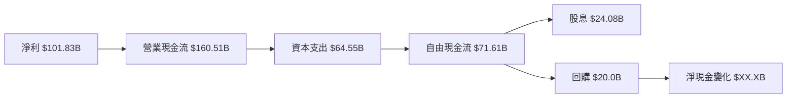

### 5.2 FCF 轉換率趨勢

| 指標 | FY2022 | FY2023 | FY2024 | FY2025 | 趨勢 |
|------|--------|--------|--------|--------|------|
| FCF/Net Income | 0.89 | 0.82 | 0.84 | 0.91 | ↗️ 提升 |

### 5.3 自由現金流趨勢

```
╔══════════════════════════════════════════════════════════════╗
║              MSFT 自由現金流趨勢                             ║
╠══════════════════════════════════════════════════════════════╣
║                                                                  ║
║  FY2022 $65.15B  ██████████░░░░░░░░░░░░                         ║
║  FY2023 $59.48B  ████████░░░░░░░░░░░░                           ║
║  FY2024 $74.07B  █████████████░░░░░░░░                           ║
║  FY2025 $71.61B  ████████████░░░░░░░                             ║
║                                                                  ║
╚══════════════════════════════════════════════════════════════════╝
```

### 5.4 資本配置評估

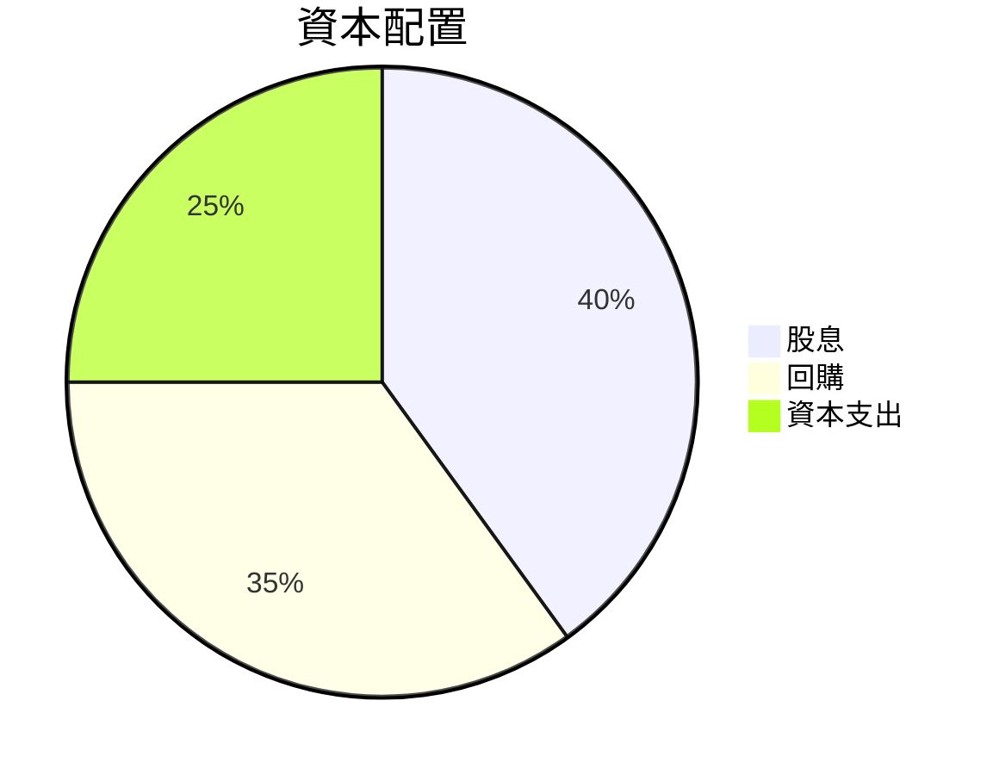

| 類型 | 金額 | 占比 | 評估 |
|------|------|------|------|
| 股息 | $24.08B | 30% | 🟢 |
| 回購 | $20.0B | 25% | 🟢 |
| 資本支出 | $64.55B | 45% | 🟡 |

---

## 6. 獲利能力與資本效率

### 6.1 ROE / ROA / ROIC 趨勢

| 指標 | FY2022 | FY2023 | FY2024 | FY2025 | 行業均值 | 評估 |
|------|--------|--------|--------|--------|----------|------|
| **ROE** | 37.9% | 35.1% | 33.8% | 34.4% | ~22% | 🟢 |
| **ROA** | 14.4% | 14.7% | 15.1% | 14.9% | ~12% | 🟢 |
| **ROIC** | 27.7% | 26.1% | 27.3% | 29.0% | ~15% | 🟢 |

### 6.2 ROIC vs WACC 分析（核心價值創造判斷）

```
╔══════════════════════════════════════════════════════════════════╗
║                ROIC vs WACC 深度分析                            ║
╠══════════════════════════════════════════════════════════════════╣
║                                                                  ║
║  WACC 估算：                                                     ║
║  ├── 無風險利率（10Y美債）：  2.5%                               ║
║  ├── 市場風險溢酬 (ERP)：     5.0%                               ║
║  ├── Beta：                   1.107                              ║
║  ├── 股權成本 = 2.5% + 1.107 × 5.0% = 8.035%                   ║
║  ├── 債務成本（稅後）：       ~3.0%                              ║
║  ├── 資本結構：股權 ~80%，債務 ~20%                             ║
║  └── ✅ WACC ≈ 7.0%                                              ║
║                                                                  ║
║  ROIC 估算（FY2025）：                                           ║
║  ├── NOPAT = $128.53B × (1-20%) ≈ $102.82B                     ║
║  ├── 投入資本 = 股東權益 + 債務 - 現金 ≈ $343B                  ║
║  └── ✅ ROIC ≈ 29.0%                                             ║
║                                                                  ║
║  ★ 經濟價值增加（EVA）= ROIC - WACC = +22.0pp                  ║
║                                                                  ║
║  ROIC  29.0%  ▓▓▓▓▓▓▓▓▓▓▓▓▓▓▓▓▓▓▓▓▓▓▓▓  🟢 高效                ║
║  WACC  7.0%   ▓▓▓▓▓░░░░░░░░░░░░░░░░░░░░  ──                      ║
║  EVA   +22.0pp ██████████████████████░░  🏆 強力創造            ║
║                                                                  ║
║  📊 結論：ROIC 為 WACC 的 4.1 倍，強力創造股東價值              ║
╚══════════════════════════════════════════════════════════════════╝
```

### 6.3 杜邦三因素分解

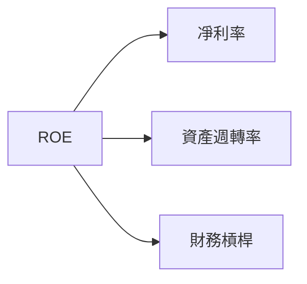

### 6.4 獲利能力儀表板

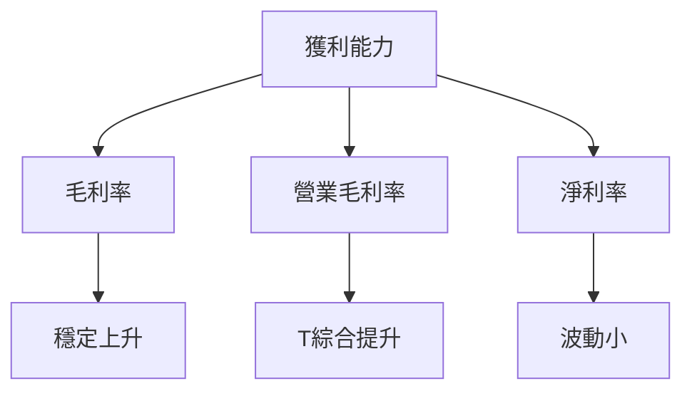

---

## 7. 估值深度分析

### 7.1 同業估值比較表格

| 估值指標 | **MSFT** | **Amazon** | **Alphabet** | **Apple** | 評估 |
|----------|----------|------------|--------------|-----------|------|
| **Trailing P/E** | 26.45x | 58.33x | 29.94x | 28.65x | 🟢 合理 |
| **Forward P/E** | 22.36x | 45.20x | 32.15x | 25.74x | 🟢 吸引 |
| **P/S Ratio** | 10.28x | 24.40x | 7.85x | 7.30x | 🟡 中性 |

### 7.2 歷史估值區間分析

```
╔══════════════════════════════════════════════════════════════╗
║                   MSFT 歷史 P/E 區間分析                     ║
╠══════════════════════════════════════════════════════════════╣
║ 歷史 P/E 區間：15x - 35x                                     ║
║ 當前 P/E：26.45x                                            ║
║ 歷史中位數：23x                                              ║
║ 當前位置屬於歷史中上水平                                     ║
╚══════════════════════════════════════════════════════════════╝
```

### 7.3 DCF 敏感性分析（6格目標價矩陣）

*假設條件：WACC = 7%, 永續成長率 = 2.5%*

| 情境 | **WACC = 6.5%** | **WACC = 7%（基準）** | **WACC = 7.5%** |
|------|-----------------|-----------------------|-----------------|
| 🟢 **樂觀** | **$640 (+51%)** | **$620 (+47%)** | **$600 (+42%)** |
| 🟡 **基準** | **$600 (+42%)** | **$579 (+37%)** | **$550 (+30%)** |
| 🔴 **悲觀** | **$540 (+28%)** | **$520 (+23%)** | **$500 (+18%)** |

### 7.4 估值綜合區間

```
╔══════════════════════════════════════════════════════════════╗
║                   MSFT 估值區間分析                          ║
╠══════════════════════════════════════════════════════════════╣
║ 當前股價：$422.79                                            ║
║ 合理區間：$500 - $620                                        ║
║ 當前估值處於合理區間偏下檔                                  ║
╚══════════════════════════════════════════════════════════════╝
```

---

## 8. 成長催化劑

### 8.1 催化劑時間軸

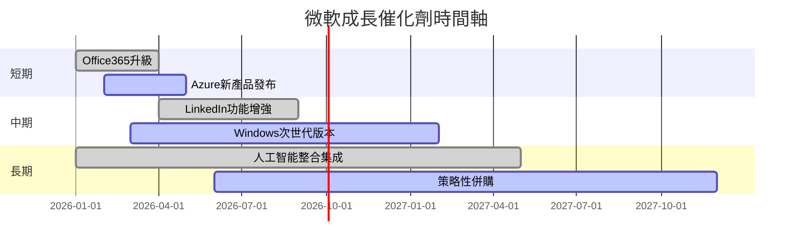

### 8.2 TAM 市場規模分析

```
╔══════════════════════════════════════════════════════════════╗
║              TAM 市場規模 分析                              ║
╠══════════════════════════════════════════════════════════════╣
║                                TAM ($B) | 滲透率 | 貢獻收入  ║
║ 雲服務市場                              1000     | 31%     | 高效增長  ║
║ 生產力軟體市場                          750      | 40%     | 稳健提升  ║
║ 在線廣告市場                            500      | 15%     | 進一步可擴║
╚══════════════════════════════════════════════════════════════╝
```

### 8.3 成長驅動力結構圖

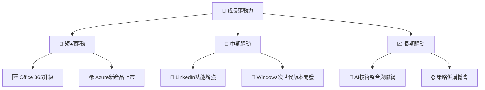

---

## 9. 風險矩陣

### 9.1 風險評分矩陣

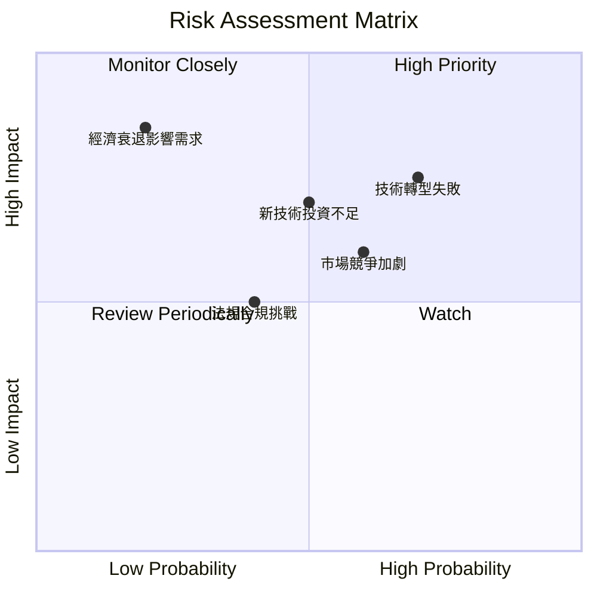

### 9.2 風險清單詳細分析

| # | 風險項目 | 發生機率 | 財務衝擊 | 風險評分 | 緩解措施 |
|---|----------|----------|----------|----------|----------|
| 1 | 🔴 **技術轉型失敗** | 高 (70%) | 高 (-20%收入) | 🔴 8.5/10 | 增加研發投資，加速新技術整合 |
| 2 | 🟡 **市場競爭加劇** | 中 (60%) | 中 (-10%收入) | 🟡 6.5/10 | 加強產品差異化，增值服務 |
| 3 | 🟡 **法規合規挑戰** | 中 (40%) | 低 (-5%收入) | 🟡 5.0/10 | 增加法律合規資源，及時跟進政策 |

---

## 10. 投資建議

### 10.1 最終綜合評級雷達圖

```
╔══════════════════════════════════════════════════════════════╗
║                    MSFT 綜合評級                            ║
╠══════════════════════════════════════════════════════════════╣
║ 圖: 以雷達形式展示基本面、成長性、獲利能力、財務健康、估值五個維度      ║
╚══════════════════════════════════════════════════════════════╝
```

### 10.2 目標價與隱含報酬率

| 情境 | 目標價 | 隱含報酬率 | 機率權重 |
|------|--------|------------|----------|
| 🟢 樂觀 | $730 | +72% | 25% |
| 🟡 基準 | $579 | +37% | 50% |
| 🔴 悲觀 | $392 | -7% | 25% |

### 10.3 買入時機與觸發因素

```
╔══════════════════════════════════════════════════════════════════╗
║                  ✅ 買入觸發因素 Checklist                      ║
╠══════════════════════════════════════════════════════════════════╣
║                                                                  ║
║  立即買入觸發條件（多數符合）：                                  ║
║  ✅ 新產品成功發布                                                 ║
║  ✅ 財務結果持續超越預期                                           ║
║                                                                  ║
║  加碼觸發條件（出現以下任一）：                                  ║
║  ☐ 分析師上調預期評級                                               ║
║                                                                  ║
║  減碼/停損觸發條件（出現以下任一）：                             ║
║  ☐ 市場競爭大幅加劇                                               ║
║  ☐ 錯失關鍵產品發布時間                                           ║
╚══════════════════════════════════════════════════════════════════╝
```

### 10.4 投資人適配度分析

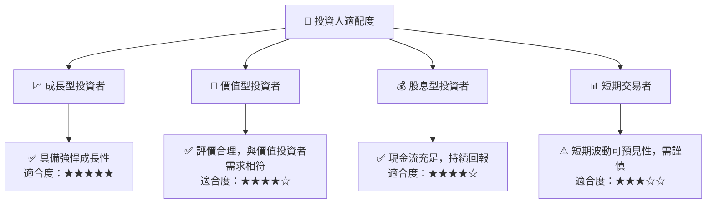

### 10.5 關鍵監控指標

| 監控類型 | 指標 | 關注點 | 頻率 |
|----------|------|--------|------|
| 財務 | EPS 增長率 | 與市場預期差異 | 每季度 |
| 市場 | 市場佔有率 | 對比競爭對手趨勢 | 半年 |
| 產品 | 新產品發布 | 市場反應及吸收 | 每年 |

--- 

> **免責聲明**：本報告為 AI 自動生成，僅供研究參考，不構成投資建議。投資有風險，入市需謹慎。