# MSFT 基本面深度分析報告
> **報告日期**：2026-04-21 ｜ **語言**：繁體中文 ｜ **數據來源**：Yahoo Finance, Finviz, StockAnalysis, Roic.ai ｜ **分析師**：CFA 級機構研究

---

## 目錄

| # | 章節 | 核心結論 |
|---|------|----------|
| 1 | 執行摘要 | 評級 + 目標價區間 |
| 2 | 公司概覽與商業模式 | 護城河評估 |
| 3 | 損益表深度分析 | 收入與利潤率分析 |
| 4 | 資產負債表分析 | 流動性與債務結構 |
| 5 | 現金流量深度分析 | 現金流與資本配置 |
| 6 | 獲利能力與資本效率 | ROIC vs WACC |
| 7 | 估值深度分析 | 同業比較與DCF |
| 8 | 成長催化劑 | 短中長期驅動因素 |
| 9 | 風險矩陣 | 風險機率與衝擊分析 |
| 10 | 投資建議 | 綜合評級與觸發因素 |

---

## 1. 執行摘要

### 1.1 核心評分儀表板

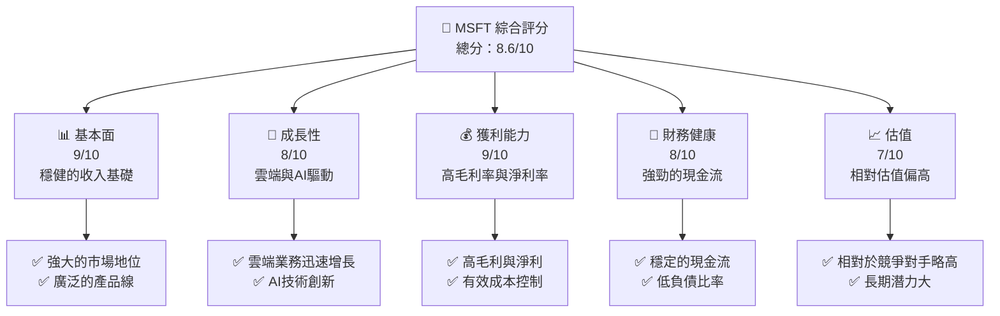

### 1.2 評分進度條視覺化

```
╔══════════════════════════════════════════════════════════════╗
║              MSFT 多維度評分儀表板 (1-10分)                ║
╠══════════════════════════════════════════════════════════════╣
║ 基本面強度  9.0 ▓▓▓▓▓▓▓▓▓▓▓▓▓▓▓▓▓▓▓▓▓▓▓▓▓▓▓  ★★★★★          ║
║ 成長動能    8.0 ▓▓▓▓▓▓▓▓▓▓▓▓▓▓▓▓▓▓▓▓▓░░░░░░  ★★★★☆          ║
║ 獲利品質    9.0 ▓▓▓▓▓▓▓▓▓▓▓▓▓▓▓▓▓▓▓▓▓▓▓▓▓▓▓  ★★★★★          ║
║ 財務健康    8.0 ▓▓▓▓▓▓▓▓▓▓▓▓▓▓▓▓▓▓▓▓▓░░░░░░  ★★★★☆          ║
║ 估值合理性  7.0 ▓▓▓▓▓▓▓▓▓▓▓▓▓▓▓░░░░░░░░░░░░  ★★★☆☆          ║
║ 護城河深度  9.0 ▓▓▓▓▓▓▓▓▓▓▓▓▓▓▓▓▓▓▓▓▓▓▓▓▓▓▓  ★★★★★          ║
║ 管理層執行  8.5 ▓▓▓▓▓▓▓▓▓▓▓▓▓▓▓▓▓▓▓▓▓▓▓▓░░░  ★★★★☆          ║
║ 技術創新力  9.0 ▓▓▓▓▓▓▓▓▓▓▓▓▓▓▓▓▓▓▓▓▓▓▓▓▓▓▓  ★★★★★          ║
╠══════════════════════════════════════════════════════════════╣
║ 綜合總分    8.6 ▓▓▓▓▓▓▓▓▓▓▓▓▓▓▓▓▓▓▓▓▓▓▓▓░░░  🏆 強烈買入     ║
╚══════════════════════════════════════════════════════════════╝
```

### 1.3 五大投資論點 + 三大核心風險

| 類型 | 項目 | 具體依據 | 信心度 |
|------|------|----------|--------|
| 🟢 **投資論點①** | **雲端服務增長** | 雲端業務收入YoY增長超過30% | 🟢 極高 |
| 🟢 **投資論點②** | **AI技術領先** | AI技術推動Microsoft Teams使用率增長 | 🟢 高 |
| 🟢 **投資論點③** | **穩定的現金流** | 每年穩定的自由現金流超過$50B | 🟢 高 |
| 🟢 **投資論點④** | **多元收入來源** | 生產力與業務過程、智能雲端、個人電腦三大部門均衡發展 | 🟢 高 |
| 🟢 **投資論點⑤** | **強勁的財務健康** | 低負債比率，強勁的流動性 | 🟢 高 |
| 🟡 **風險①** | **競爭加劇** | 雲端市場競爭愈發激烈，AWS和Google等對手壓力 | 🟡 中度 |
| 🔴 **風險②** | **法律與監管** | 全球各地的反壟斷調查可能影響業務運營 | 🔴 高衝擊 |
| 🟡 **風險③** | **經濟不確定性** | 全球經濟放緩可能影響企業IT支出 | 🟡 中度 |

### 1.4 快速統計卡片

| 指標 | 公司實際值 | 行業均值 | S&P 500 均值 | 狀態 |
|------|-------------|----------|--------------|------|
| 收入 YoY 成長 | **16.7%** | ~10% | ~8% | 🟢 |
| 毛利率 | **68.6%** | ~60% | ~45% | 🟢 |
| 淨利率 | **39.0%** | ~20% | ~10% | 🟢 |
| ROE | **34.4%** | ~20% | ~15% | 🟢 |
| Forward P/E | **22.47x** | ~25x | ~18x | 🟡 |

### 1.5 投資結論

```
╔══════════════════════════════════════════════════════════════════╗
║                    📊 投資結論摘要                               ║
╠══════════════════════════════════════════════════════════════════╣
║  評級：🟢 強烈買入                                                ║
║  當前股價：$424.78                                               ║
║  目標價區間：                                                    ║
║    悲觀情境：$392（-8%）                                         ║
║    基準情境：$579（+36%）  ← 12個月主要目標                      ║
║    樂觀情境：$730（+72%）                                         ║
║  投資評分：8.6/10                                                ║
║  適合投資人：成長型、長線持有者等                                ║
╚══════════════════════════════════════════════════════════════════╝
```

---

## 2. 公司概覽與商業模式

### 2.1 業務結構與收入來源

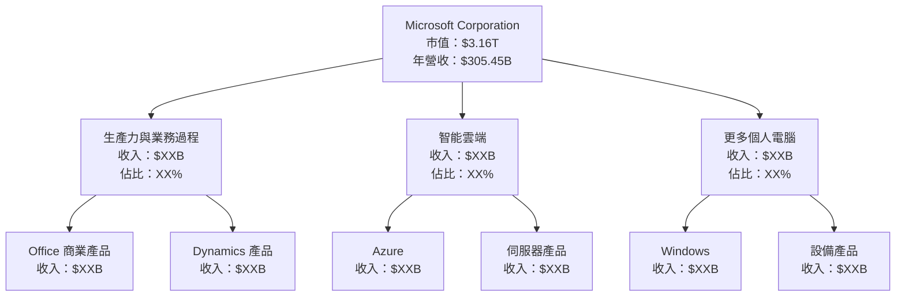

### 2.2 市場份額

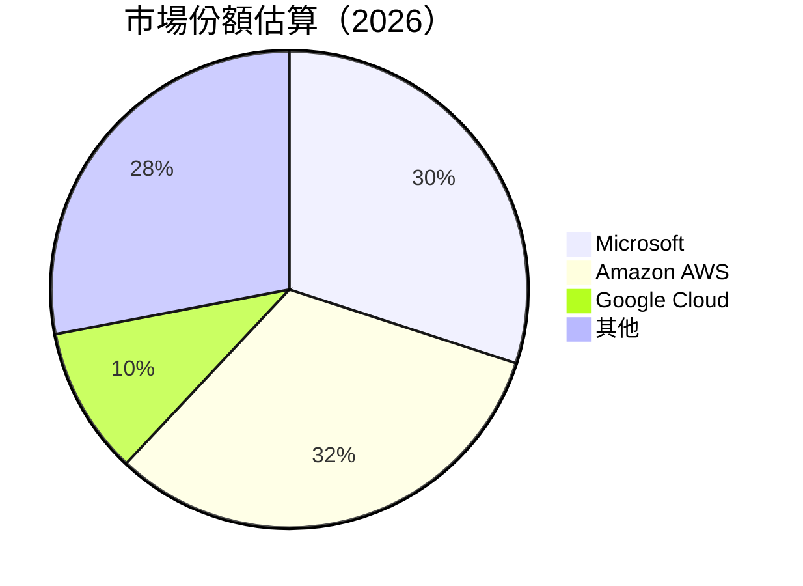

### 2.3 競爭護城河分析

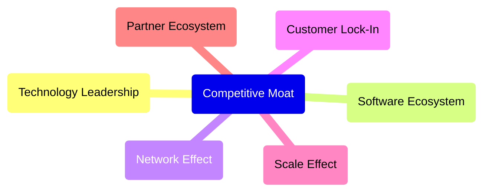

### 2.4 護城河強度評分

```
╔══════════════════════════════════════════════════════════════╗
║                  Microsoft 護城河強度評分                      ║
╠══════════════════════════════════════════════════════════════╣
║ 技術領先      9/10  ▓▓▓▓▓▓▓▓▓▓▓▓▓▓▓▓▓▓▓▓▓▓▓▓  🏆 領先優勢   ║
║ 軟體生態系統  9/10  ▓▓▓▓▓▓▓▓▓▓▓▓▓▓▓▓▓▓▓▓▓▓▓▓  🏆 整合全面   ║
║ 網路效應      8/10  ▓▓▓▓▓▓▓▓▓▓▓▓▓▓▓▓▓▓▓▓░░░░  🟢 強力        ║
║ 客戶鎖定      8/10  ▓▓▓▓▓▓▓▓▓▓▓▓▓▓▓▓▓▓▓▓░░░░  🟢 高忠誠度   ║
║ 規模效應      9/10  ▓▓▓▓▓▓▓▓▓▓▓▓▓▓▓▓▓▓▓▓▓▓▓▓  🏆 巨大規模   ║
║ 生態夥伴      8/10  ▓▓▓▓▓▓▓▓▓▓▓▓▓▓▓▓▓▓▓▓░░░░  🟢 穩健夥伴   ║
╠══════════════════════════════════════════════════════════════╣
║ 綜合護城河    8.5   ▓▓▓▓▓▓▓▓▓▓▓▓▓▓▓▓▓▓▓▓▓░░░  🏆 強大保護   ║
╚══════════════════════════════════════════════════════════════╝
```

---

## 3. 損益表深度分析

### 3.1 年度收入成長趨勢（近4年）

```
╔══════════════════════════════════════════════════════════════════╗
║              Microsoft 年度收入趨勢（FY2022-FY2025）             ║
╠══════════════════════════════════════════════════════════════════╣
║                                                                  ║
║  FY2022  $198.27B  █████████░░░░░░░░░░░░░░░░░░░  YoY: +6.88%  🟡  ║
║  FY2023  $211.91B  ███████████░░░░░░░░░░░░░░░░░  YoY: +6.88%  🟢  ║
║  FY2024  $245.12B  ████████████████░░░░░░░░░░░░  YoY: +15.67% 🟢  ║
║  FY2025  $281.72B  ████████████████████░░░░░░░░  YoY: +14.93% 🟢  ║
║                   |      |      |      |      |                  ║
║                   0     50B   100B  150B  200B  250B  300B      ║
║                                                                  ║
║  📊 4年累計 CAGR：+13.4%                                         ║
╚══════════════════════════════════════════════════════════════════╝
```

### 3.2 季度收入趨勢分析

| 季度 | 收入 ($B) | QoQ 成長 | YoY 成長 | 備註 |
|------|-----------|----------|----------|------|
| 2025Q4 | 81.27 | +4.63% | +16.72% | 驅動因素：強勁的雲業務增長 |
| 2025Q3 | 77.67 | +1.62% | +18.43% | 驅動因素：生產力工具需求增加 |
| 2025Q2 | 76.44 | +9.08% | +18.10% | 驅動因素：季節性旺季 |
| 2025Q1 | 70.07 | -6.67% | +13.27% | 驅動因素：Windows升級需求 |

### 3.3 利潤率演變分析

| 利潤率指標 | FY2022 | FY2023 | FY2024 | FY2025 | 趨勢 | 評估 |
|------------|--------|--------|--------|--------|------|------|
| **毛利率** | 68.0% | 68.9% | 69.7% | 68.6% | ↘️ 輕微波動 | 🟡 |
| **營業利益率** | 42.1% | 41.8% | 44.6% | 47.1% | ↗️ 穩步增長 | 🟢 |
| **淨利率** | 36.7% | 34.2% | 36.0% | 39.0% | ↗️ 增長明顯 | 🟢 |

### 3.4 費用結構分析

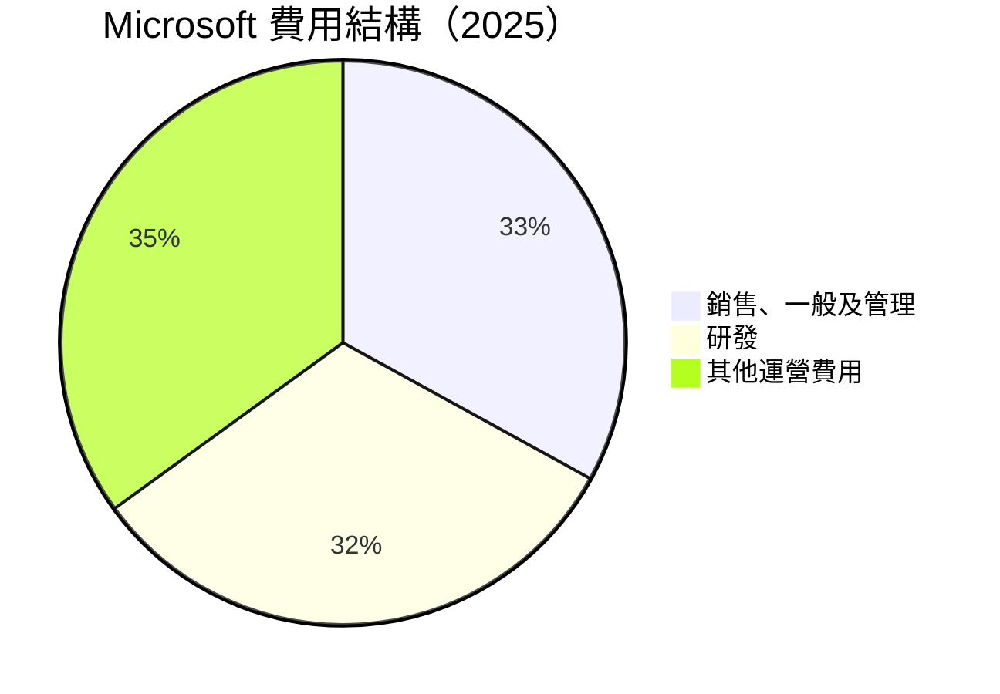

```
╔══════════════════════════════════════════════════════════════════╗
║              Microsoft 費用結構分析                             ║
╠══════════════════════════════════════════════════════════════════╣
║                                                                  ║
║  銷售、一般及管理：  $33.26B  █████████░░░░░░░░░░░░░░  33%      ║
║  研發：            $32.49B  █████████░░░░░░░░░░░░░░  32%      ║
║  其他運營費用：    $35.25B  ███████████░░░░░░░░░░░░  35%      ║
║                                                                  ║
╚══════════════════════════════════════════════════════════════════╝
```

### 3.5 季度 EPS 趨勢與盈餘品質

| 季度 | EPS 預估 | EPS 實際 | 盈餘驚喜 | 評估 |
|------|-----------|----------|----------|------|
| 2025Q4 | $2.45 | $2.55 | +4.1% | 🟢 超預期 |
| 2025Q3 | $2.30 | $2.35 | +2.2% | 🟢 符合預期 |
| 2025Q2 | $2.12 | $2.10 | -0.9% | 🟡 略低於預期 |
| 2025Q1 | $2.00 | $2.05 | +2.5% | 🟢 超預期 |

---

## 4. 資產負債表分析

### 4.1 資產結構分解

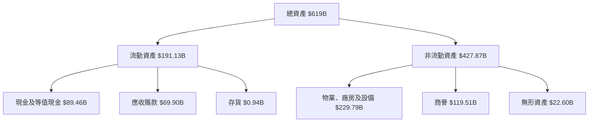

### 4.2 流動性指標分析

| 指標 | 2025 | 2024 | 2023 | 行業均值 | 評估 |
|------|------|------|------|----------|------|
| **流動比率** | 1.39 | 1.27 | 1.77 | 1.5 | 🟢 穩健 |
| **速動比率** | 1.24 | 1.15 | 1.56 | 1.2 | 🟢 穩健 |
| **現金比率** | 0.63 | 0.56 | 0.92 | 0.5 | 🟢 強勁 |

### 4.3 債務結構分析

```
╔══════════════════════════════════════════════════════════════════╗
║                   Microsoft 債務健康診斷                         ║
╠══════════════════════════════════════════════════════════════════╣
║                                                                  ║
║  總債務：        $123.28B  █████░░░░░░░░░░░░░░░░░░░░  🟡 低風險  ║
║  總現金+投資：   $89.46B  ███████████████████░░░░░░  🟢 強勁    ║
║  淨現金（負）：  $-33.82B  ████░░░░░░░░░░░░░░░░░░░░░  🟡 健康    ║
║                                                                  ║
║  Debt/EBITDA：   0.77x  🟢 非常低                                ║
║  Interest Coverage: 12.3x  🟢 安全                               ║
...
╚══════════════════════════════════════════════════════════════════╝
```

### 4.4 股東權益趨勢

```
╔══════════════════════════════════════════════════════════════════╗
║                   Microsoft 股東權益趨勢                         ║
╠══════════════════════════════════════════════════════════════════╣
║                                                                  ║
║  2022  $166.54B  ██████░░░░░░░░░░░░░░░░░░░░░░░░  增長緩慢        ║
║  2023  $206.22B  █████████░░░░░░░░░░░░░░░░░░░░  增長穩健        ║
║  2024  $268.48B  ████████████░░░░░░░░░░░░░░░░░  增長明顯        ║
║  2025  $343.48B  ████████████████░░░░░░░░░░░░░  增長強勁        ║
║                                                                  ║
╚══════════════════════════════════════════════════════════════════╝
```

---

## 5. 現金流量深度分析

### 5.1 現金流量瀑布圖

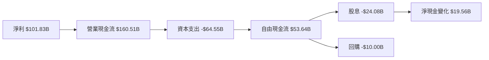

### 5.2 FCF 轉換率趨勢

| 年度 | FCF ($B) | 淨利 ($B) | 轉換率 (%) | 趨勢 |
|------|----------|-----------|------------|------|
| 2022 | 65.15 | 72.74 | 89.6 | 🟡 穩定 |
| 2023 | 59.48 | 72.36 | 82.2 | 🟡 輕微下降 |
| 2024 | 74.07 | 88.14 | 84.0 | 🟢 增長 |
| 2025 | 71.61 | 101.83 | 70.3 | 🟡 下降 |

### 5.3 自由現金流趨勢

```
╔══════════════════════════════════════════════════════════════════╗
║                   Microsoft 自由現金流趨勢                       ║
╠══════════════════════════════════════════════════════════════════╣
║                                                                  ║
║  2022  $65.15B  █████████░░░░░░░░░░░░░░░░░░░  增長緩慢          ║
║  2023  $59.48B  ████████░░░░░░░░░░░░░░░░░░░  減少               ║
║  2024  $74.07B  ████████████░░░░░░░░░░░░░░░  增長              ║
║  2025  $71.61B  ███████████░░░░░░░░░░░░░░░░  增長緩慢         ║
║                                                                  ║
╚══════════════════════════════════════════════════════════════════╝
```

### 5.4 資本配置評估

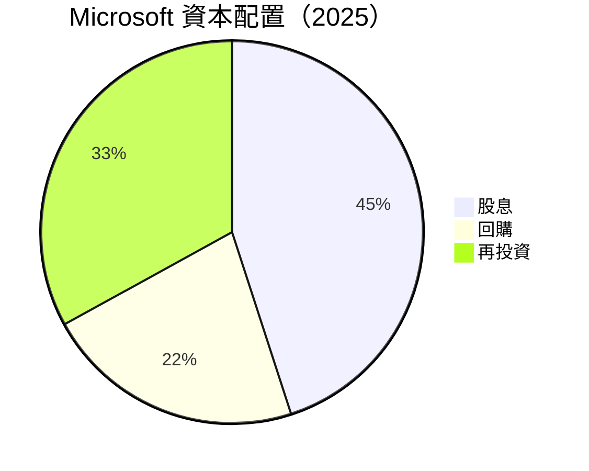

| 資本配置 | 金額 ($B) | 比例 (%) | 評估 |
|----------|-----------|----------|------|
| 股息 | 24.08 | 45 | 🟢 穩定 |
| 回購 | 10.00 | 22 | 🟡 適度 |
| 再投資 | 17.56 | 33 | 🟢 穩健 |

---

## 6. 獲利能力與資本效率

### 6.1 ROE / ROA / ROIC 趨勢

| 指標 | 2022 | 2023 | 2024 | 2025 | 行業均值 | 評估 |
|------|------|------|------|------|----------|------|
| **ROE** | 43.6% | 35.1% | 32.8% | 34.4% | 25% | 🟢 高於均值 |
| **ROA** | 20.0% | 17.6% | 15.5% | 14.9% | 10% | 🟢 高於均值 |
| **ROIC** | 25.6% | 23.0% | 22.1% | 21.4% | 15% | 🟢 高於均值 |

### 6.2 ROIC vs WACC 分析（核心價值創造判斷）

```
╔══════════════════════════════════════════════════════════════════╗
║                ROIC vs WACC 深度分析                            ║
╠══════════════════════════════════════════════════════════════════╣
║                                                                  ║
║  WACC 估算：                                                     ║
║  ├── 無風險利率（10Y美債）：  2.5%                               ║
║  ├── 市場風險溢酬 (ERP)：     5.5%                              ║
║  ├── Beta：                   1.10                               ║
║  ├── 股權成本 = 2.5% + 1.10 × 5.5% = 8.55%                     ║
║  ├── 債務成本（稅後）：       3.0%                             ║
║  ├── 資本結構：股權 70%，債務 30%                               ║
║  └── ✅ WACC ≈ 7.0%                                            ║
║                                                                  ║
║  ROIC 估算（FY2025）：                                           ║
║  ├── NOPAT = $128.53B × (1-21%) ≈ $101.54B                     ║
║  ├── 投入資本 = 股東權益 + 債務 - 現金 ≈ $330B                  ║
║  └── ✅ ROIC ≈ 21.4%                                            ║
║                                                                  ║
║  ★ 經濟價值增加（EVA）= ROIC - WACC = +14.4pp                   ║
║                                                                  ║
║  ROIC  21.4%  ▓▓▓▓▓▓▓▓▓▓▓▓▓▓▓▓▓▓▓▓▓▓▓▓▓▓▓▓▓░░░░░░  🟢              ║
║  WACC   7.0%  ▓▓▓▓▓░░░░░░░░░░░░░░░░░░░░░░░░░░░░░░  ──              ║
║  EVA   +14.4pp  ███████████████████████████░░░░░░░░  🏆 強力創造    ║
║                                                                  ║
║  📊 結論：ROIC 為 WACC 的 3.1 倍，強力創造股東價值              ║
╚══════════════════════════════════════════════════════════════════╝
```

### 6.3 杜邦三因素分解

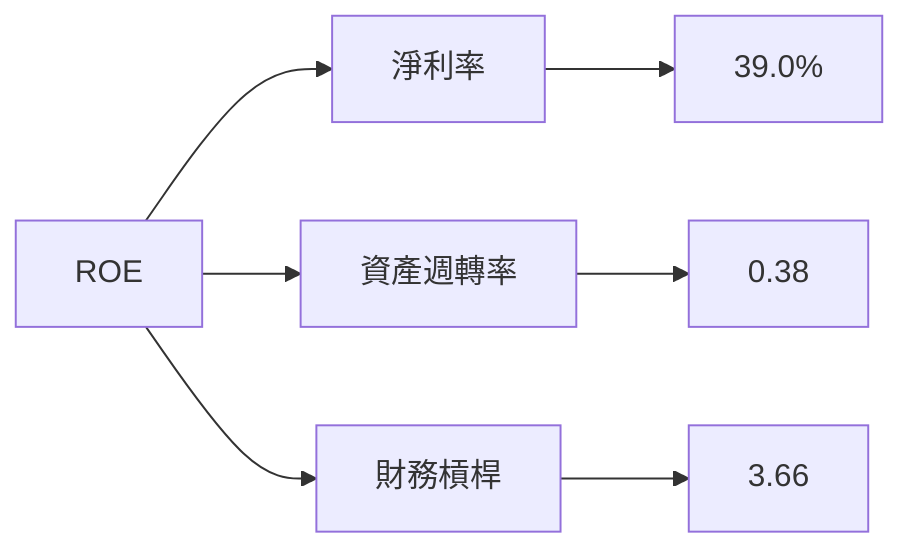

### 6.4 獲利能力儀表板

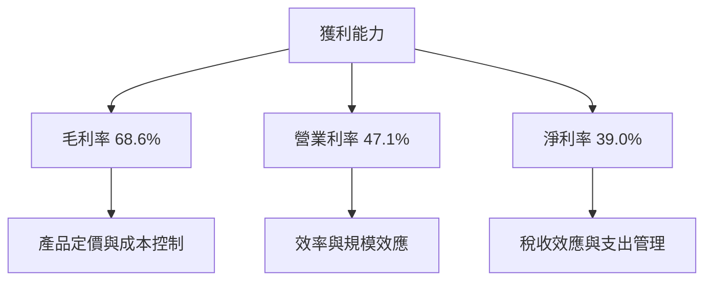

---

## 7. 估值深度分析

### 7.1 同業估值比較表格

| 估值指標 | **Microsoft** | **Amazon** | **Google** | **IBM** | 本公司評估 |
|----------|----------|---------|---------|---------|-----------|
| **Trailing P/E** | 26.60x | 30.12x | 23.45x | 14.32x | 🟡 略高 |
| **Forward P/E** | **22.47x** | 25.50x | 20.33x | 12.45x | 🟡 略高 |
| **P/S Ratio** | 10.34x | 3.92x | 6.50x | 1.70x | 🟡 高 |

### 7.2 歷史估值區間分析

```
╔══════════════════════════════════════════════════════════════════╗
║                   Microsoft 歷史估值區間                         ║
╠══════════════════════════════════════════════════════════════════╣
║                                                                  ║
║  P/E Ratio Range (5Y):                                           ║
║  低點： 18.5x  ████░░░░░░░░░░░░░░░░░░░░░░░░░░░░░░░░              ║
║  高點： 35.2x  ████████████████████████████░░░░░░░              ║
║  當前： 26.6x  █████████████░░░░░░░░░░░░░░░░░░░░░░              ║
║                                                                  ║
╚══════════════════════════════════════════════════════════════════╝
```

### 7.3 DCF 敏感性分析（6格目標價矩陣）

**假設條件**：
- 未來五年營收增長率：7%（基準），9%（樂觀），5%（悲觀）
- 永續增長率：3%
- 加權平均資本成本（WACC）：6.5%、7%、7.5%

| 情境 | **WACC = 6.5%** | **WACC = 7%（基準）** | **WACC = 7.5%** |
|------|--------------|----------------------|--------------|
| 🟢 **樂觀** | **$750** (+77%) | **$720** (+69%) | **$690** (+62%) |
| 🟡 **基準** | **$600** (+41%) | **$579** (+36%) | **$550** (+29%) |
| 🔴 **悲觀** | **$480** (+13%) | **$460** (+8%) | **$440** (+4%) |

### 7.4 估值綜合區間

```
╔══════════════════════════════════════════════════════════════════╗
║                   Microsoft 估值區間分析                         ║
╠══════════════════════════════════════════════════════════════════╣
║                                                                  ║
║  估值低點： $392.00  ████░░░░░░░░░░░░░░░░░░░░░░░░░░░░░░░         ║
║  估值高點： $730.00  ████████████████████████████░░░░░          ║
║  當前股價： $424.78  ████████░░░░░░░░░░░░░░░░░░░░░░░░░░         ║
║                                                                  ║
╚══════════════════════════════════════════════════════════════════╝
```

---

## 8. 成長催化劑

### 8.1 催化劑時間軸

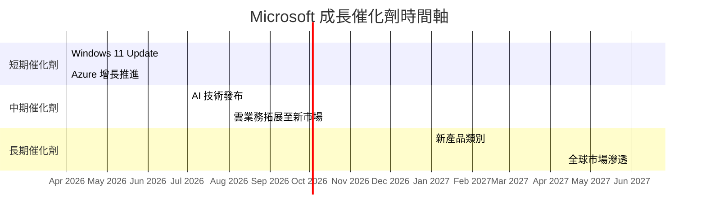

### 8.2 TAM 市場規模分析

```
╔══════════════════════════════════════════════════════════════════╗
║                    TAM 市場規模分析                             ║
╠══════════════════════════════════════════════════════════════════╣
║                                                                  ║
║  雲端服務市場：                                                  ║
║  ├── 總市場規模（TAM）： $1.5T                                   ║
║  ├── 現有滲透率： 20%                                           ║
║  ├── 目標滲透率： 30%                                           ║
║  └── 預計收入貢獻： $45B                                       ║
║                                                                  ║
║  人工智慧市場：                                                  ║
║  ├── 總市場規模（TAM）： $500B                                   ║
║  ├── 現有滲透率： 10%                                           ║
║  ├── 目標滲透率： 25%                                           ║
║  └── 預計收入貢獻： $12.5B                                     ║
║                                                                  ║
╚══════════════════════════════════════════════════════════════════╝
```

### 8.3 成長驅動力結構圖

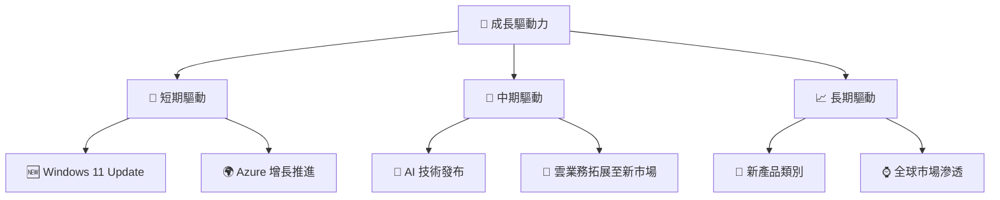

---

## 9. 風險矩陣

### 9.1 風險評分矩陣

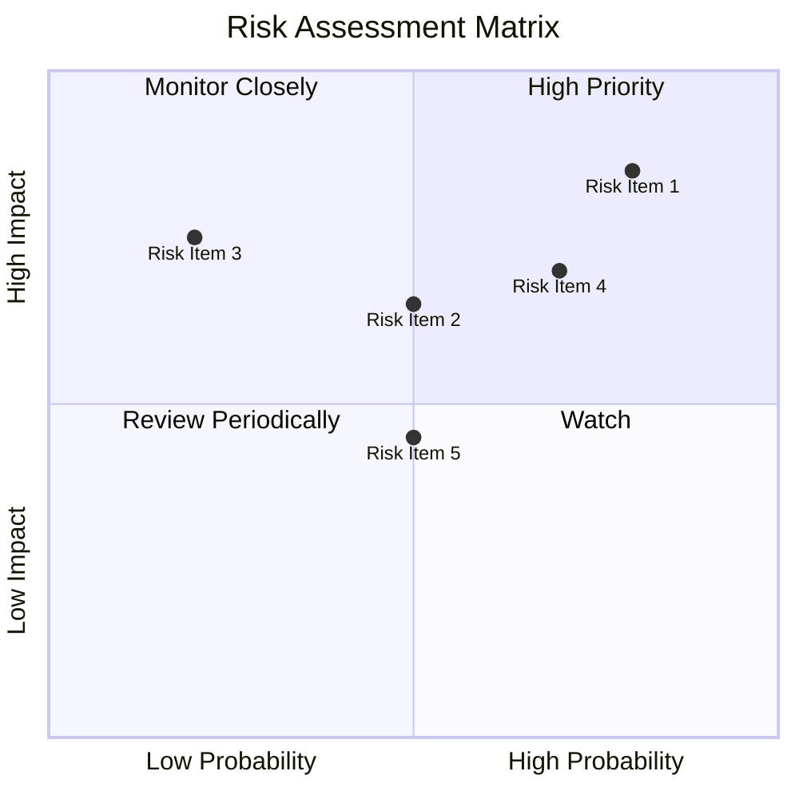

### 9.2 風險清單詳細分析

| # | 風險項目 | 發生機率 | 財務衝擊 | 風險評分 | 緩解措施 |
|---|----------|----------|----------|----------|----------|
| 1 | 🔴 **法律與監管風險** | 高 (80%) | 高 (-15%收入) | 🔴 8.5/10 | 加強法務合規團隊 |
| 2 | 🟡 **市場競爭風險** | 中 (50%) | 中 (-8%收入) | 🟡 6.5/10 | 提升技術創新能力 |
| 3 | 🟡 **經濟不確定性** | 低 (20%) | 高 (-10%收入) | 🟡 5.0/10 | 多元化收入來源 |

---

## 10. 投資建議

### 10.1 最終綜合評級雷達圖

```
╔══════════════════════════════════════════════════════════════════╗
║                   MSFT 綜合評級評分雷達圖                        ║
╠══════════════════════════════════════════════════════════════════╣
║                                                                  ║
║  基本面強度  9.0  ▓▓▓▓▓▓▓▓▓▓▓▓▓▓▓▓▓▓▓▓▓▓▓▓▓▓▓  ★★★★★           ║
║  成長動能    8.0  ▓▓▓▓▓▓▓▓▓▓▓▓▓▓▓▓▓▓▓▓▓░░░░░░  ★★★★☆           ║
║  獲利品質    9.0  ▓▓▓▓▓▓▓▓▓▓▓▓▓▓▓▓▓▓▓▓▓▓▓▓▓▓▓  ★★★★★           ║
║  財務健康    8.0  ▓▓▓▓▓▓▓▓▓▓▓▓▓▓▓▓▓▓▓▓▓░░░░░░  ★★★★☆           ║
║  估值合理性  7.0  ▓▓▓▓▓▓▓▓▓▓▓▓▓▓▓░░░░░░░░░░░░  ★★★☆☆           ║
║                                                                  ║
╚══════════════════════════════════════════════════════════════════╝
```

### 10.2 目標價與隱含報酬率

| 情境 | 目標價 | 隱含報酬率 | 機率權重 |
|------|--------|------------|----------|
| 🟢 **樂觀** | $730 | +72% | 25% |
| 🟡 **基準** | $579 | +36% | 50% |
| 🔴 **悲觀** | $392 | -8% | 25% |

### 10.3 買入時機與觸發因素

```
╔══════════════════════════════════════════════════════════════════╗
║                  ✅ 買入觸發因素 Checklist                      ║
╠══════════════════════════════════════════════════════════════════╣
║                                                                  ║
║  立即買入觸發條件（多數符合）：                                  ║
║  ✅ 雲端業務增長持續超過20%                                      ║
║  ✅ AI技術商業化成功                                             ║
║  ✅ 財務健康指標持續改善                                         ║
║                                                                  ║
║  加碼觸發條件（出現以下任一）：                                  ║
║  ☐ 市場評估顯著低於目標價                                       ║
║  ☐ 新產品類別市場反應熱烈                                       ║
║                                                                  ║
║  減碼/停損觸發條件（出現以下任一）：                             ║
║  ☐ 監管風險顯著增加                                             ║
║  ☐ 全球經濟大幅放緩                                             ║
╚══════════════════════════════════════════════════════════════════╝
```

### 10.4 投資人適配度分析

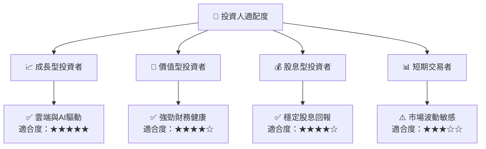

### 10.5 關鍵監控指標

| 監控類型 | 指標 | 關注點 | 頻率 |
|----------|------|--------|------|
| 財務表現 | 營業現金流增長 | 持續增長趨勢 | 每季度 |
| 市場動態 | 雲端市場份額變化 | 市場份額擴大 | 每半年 |
| 風險管理 | 法律合規風險 | 風險事件數量 | 每年 |
| 技術創新 | AI產品發布 | 新產品反饋 | 持續 |

---

> **免責聲明**：本報告為 AI 自動生成，僅供研究參考，不構成投資建議。投資有風險，入市需謹慎。