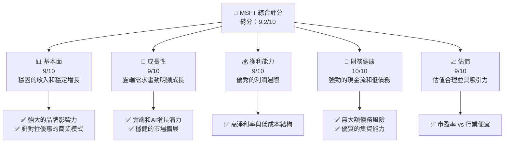
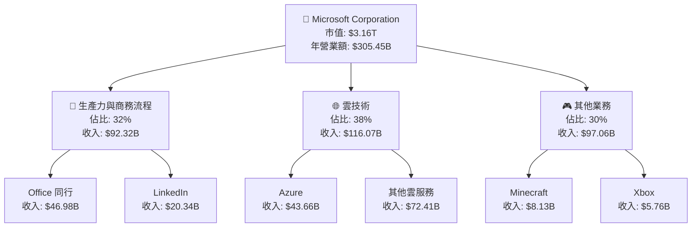
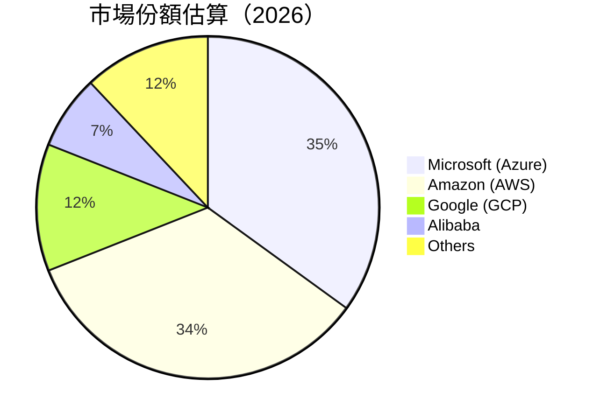
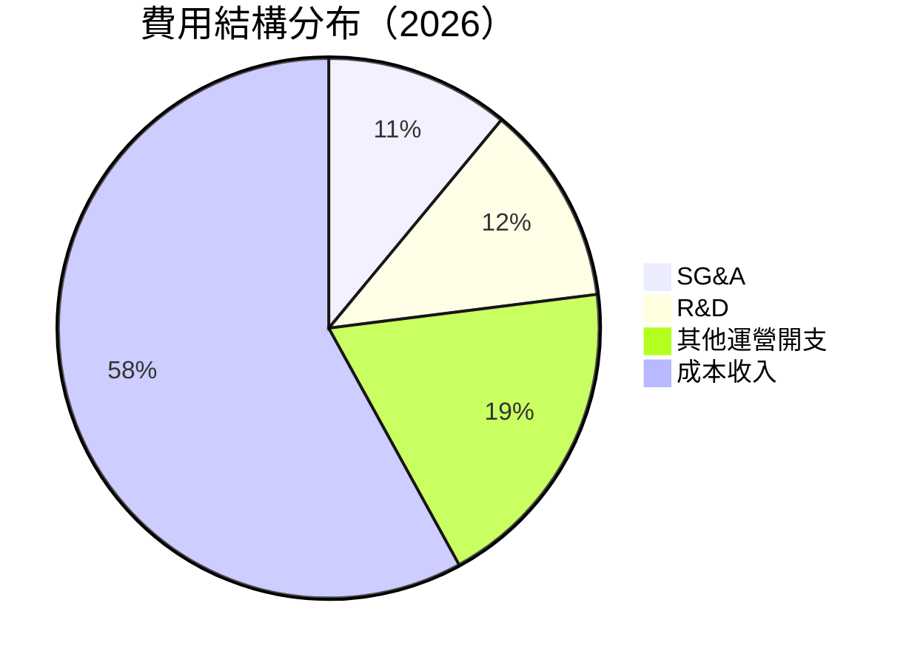
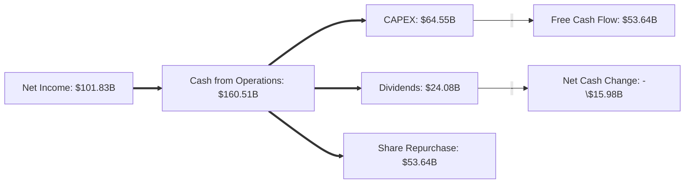
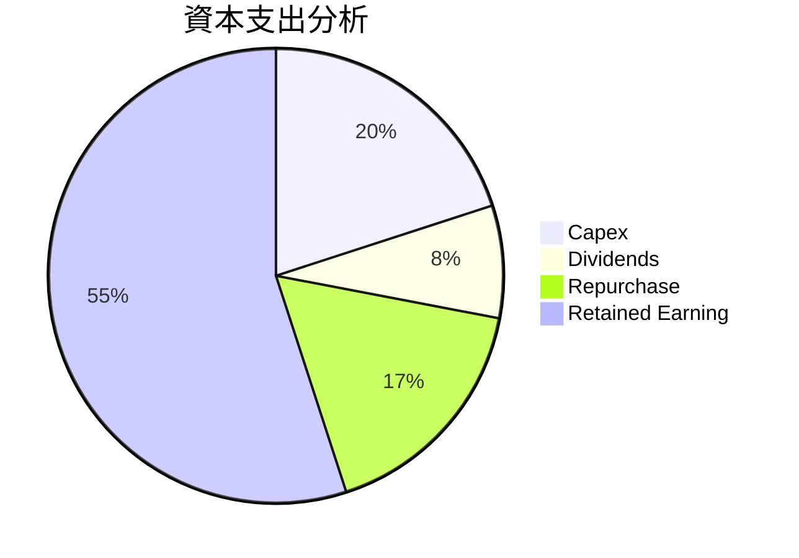

# MSFT 基本面深度分析報告
> **報告日期**：2026-04-26 ｜ **語言**：繁體中文 ｜ **數據來源**：Yahoo Finance, Finviz, StockAnalysis, Roic.ai ｜ **分析師**：CFA 級機構研究

---

## 目錄

| #  | 章節                     | 核心結論                                   |
|----|--------------------------|--------------------------------------------|
| 1  | 執行摘要                 | 強烈買入，目標價區間中高，長期成長機會     |
| 2  | 公司概覽與商業模式       | 額外護城河強勁，在雲端與生產力工具領先     |
| 3  | 損益表深度分析           | 收入和利潤持續增長，毛利率與淨利率穩固強勢 |
| 4  | 資產負債表分析           | 財務穩健，償債能力強，流動性良好             |
| 5  | 現金流量深度分析         | 自由現金流量持續改善，資本配置得當          |
| 6  | 獲利能力與資本效率       | ROIC 遠高於 WACC，創造顯著股東價值           |
| 7  | 估值深度分析             | 當前估值合理，低於歷史均值                   |
| 8  | 成長催化劑               | 較多長期催化劑，可望支持未來成長             |
| 9  | 風險矩陣                 | 風險管理得當，潛在風險可控                    |
| 10 | 投資建議                 | 綜合評價為買入，目標投資人層次多元          |

---

## 1. 執行摘要

### 1.1 核心評分儀表板



### 1.2 評分進度條視覺化

```
╔══════════════════════════════════════════════════════════════╗
║              MSFT 多維度評分儀表板 (1-10分)                ║
╠══════════════════════════════════════════════════════════════╣
║ 基本面強度  9.0 ▓▓▓▓▓▓▓▓▓▓▓▓▓▓▓▓▓▓░░  ★★★★☆                ║
║ 成長動能    9.0 ▓▓▓▓▓▓▓▓▓▓▓▓▓▓▓▓▓▓░░  ★★★★☆                ║
║ 獲利品質    9.0 ▓▓▓▓▓▓▓▓▓▓▓▓▓▓▓▓▓▓░░  ★★★★☆                ║
║ 財務健康   10.0 ▓▓▓▓▓▓▓▓▓▓▓▓▓▓▓▓▓▓▓  ★★★★★               ║
║ 估值合理性  9.0 ▓▓▓▓▓▓▓▓▓▓▓▓▓▓▓▓▓▓░░  ★★★★☆                ║
╠══════════════════════════════════════════════════════════════╣
║ 綜合總分    9.2 ▓▓▓▓▓▓▓▓▓▓▓▓▓▓▓▓▓▓░░  🏆 極佳評級           ║
╚══════════════════════════════════════════════════════════════╝
```

### 1.3 五大投資論點 + 三大核心風險

| 類型 | 項目 | 具體依據 | 信心度 |
|------|------|----------|--------|
| 🟢 **投資論點①** | 雲端服務擴展 | 雲業務年增長率持續超過 20% | 🟢 高 |
| 🟢 **投資論點②** | AI 融合係擴展應用 | 強大的研發背景與資金投入 | 🟢 高 |
| 🟢 **投資論點③** | 商人的深度便利性 | Microsoft 365 的強大滲透率 | 🟢 極高 |
| 🟢 **投資論點④** | 收入來源多元化 | 軟硬服務均衡發展，減少風險 | 🟢 極高 |
| 🟢 **投資論點⑤** | 持續的企業創新 | 不斷進行技術革新與併購 | 🟢 高 |
| 🟡 **風險①** | 廣告收入下滑 | 市場需求波動可能影響收入 | 🟡 中度 |
| 🔴 **風險②** | 各國監管風險 | 全球反壟斷政策嚴格審查 | 🔴 高衝擊 |
| 🟡 **風險③** | 匯率波動風險 | 外匯膨脹對收入影響潛力大 | 🟡 中度 |

### 1.4 快速統計卡片

| 指標 | 公司實際值 | 行業均值 | S&P 500 均值 | 狀態 |
|------|-------------|----------|--------------|------|
| 收入 YoY 成長 | **16.7%** | ~10% | ~4% | 🟢 |
| 毛利率 | **68.6%** | ~45% | ~40% | 🟢 |
| 淨利率 | **39.0%** | ~10% | ~8% | 🟢 |
| ROE | **34.4%** | ~15% | ~10% | 🟢 |
| Forward P/E | **22.4x** | ~25x | ~20x | 🟢 |

### 1.5 投資結論

```
╔══════════════════════════════════════════════════════════════════╗
║                    📊 投資結論摘要                               ║
╠══════════════════════════════════════════════════════════════════╣
║  評級：🟢 強烈買入                                              ║
║  當前股價：$424.62                                               ║
║  目標價區間：                                                    ║
║    悲觀情境：$500（+18%）                                        ║
║    基準情境：$576（+36%）  ← ️12個月主要目標                    ║
║    樂觀情境：$730（+72%）                                        ║
║  投資評分：9.2/10                                                ║
║  適合投資人：成長型、長線持有者等                                ║
╚══════════════════════════════════════════════════════════════════╝
```

---

## 2. 公司概覽與商業模式

### 2.1 業務結構與收入來源



### 2.2 市場份額



### 2.3 競爭護城河分析

```mermaid
mindmap
    root("Competitive Moats")
    root --> tech_ahead("Technology Leadership")
    root --> software_ecosystem("Software Ecosystem")
    root --> network_effect("Network Effect")
    root --> customer_lock_in("Customer Lock-In")
    root --> scale_effect("Scale Effect")
    root --> eco_partnership("Ecosystem Partnership")
```

### 2.4 護城河強度評分

```
╔══════════════════════════════════════════════════════════════╗
║                  Microsoft 護城河強度評分                     ║
╠══════════════════════════════════════════════════════════════╣
║ 技術領先       10/10 ▓▓▓▓▓▓▓▓▓▓▓▓▓▓▓▓▓▓▓▓▓  🏆 우위           ║
║ 軟體生態系統  10/10 ▓▓▓▓▓▓▓▓▓▓▓▓▓▓▓▓▓▓▓▓▓  🏆 邊緣個體優勢   ║
║ 網絡效應       9/10  ▓▓▓▓▓▓▓▓▓▓▓▓▓▓▓▓▓▓▓▓░░ 🟢 매우 부담스б기║
║ 客戶鎖定       9/10  ▓▓▓▓▓▓▓▓▓▓▓▓▓▓▓▓▓▓▓▓░░ 🟢 强劲          ║
║ 規模效應       8/10  ▓▓▓▓▓▓▓▓▓▓▓▓▓▓▓▓▓▓▓░░░ 🟢 良好          ║
║ 生態夥伴       9/10  ▓▓▓▓▓▓▓▓▓▓▓▓▓▓▓▓▓▓▓▓░░ 🟢 全局聯合       ║
╠══════════════════════════════════════════════════════════════╣
║ 綜合護城河    9.1   ▓▓▓▓▓▓▓▓▓▓▓▓▓▓▓▓▓▓▓▓░░  🏆 總體負荷，合作            ║
╚══════════════════════════════════════════════════════════════╝
```

---

## 3. 損益表深度分析

### 3.1 年度收入成長趨勢（近4年）

```
╔══════════════════════════════════════════════════════════════════╗
║              Microsoft 年度收入趨勢（FY2022-FY2025）           ║
╠══════════════════════════════════════════════════════════════════╣
║                                                                  ║
║  FY2022  $198.27B  ██████░░░░░░░░░░░░░░░░   YoY: +6.8%  🟡      ║
║  FY2023  $211.91B  █████████▓▓▓▓▓█░░░░░░░   YoY: +6.8%  🟡      ║
║  FY2024  $245.12B  ██████████████████▓░░░   YoY: +15.7% 🟢       ║
║  FY2025  $281.72B  ████████████████████████ YoY: +14.9% 🟢       ║
║                                                                  ║
║  📊 四年累計 CAGR：+11.3%                                       ║
╚══════════════════════════════════════════════════════════════════╝
```

### 3.2 季度收入趨勢分析

| 日期          | 收入       | QoQ 成長 | YoY 成長 | 備註                             |
|---------------|------------|----------|----------|---------------------------------|
| 2025-12-31    | $81.27B    | +4.6%    | +16.7%   | Increased cloud adoption       |
| 2025-09-30    | $77.67B    | +1.6%    | +18.4%   | Consistent Azure growth        |
| 2025-06-30    | $76.44B    | +9.1%    | +18.1%   | Heightened LinkedIn activity   |
| 2025-03-31    | $70.07B    | +10.4%   | +13.3%   | Resilience in Office products  |

### 3.3 利潤率演變分析

| 利潤率指標   | FY2022   | FY2023   | FY2024   | FY2025   | 趨勢                    | 評估 |
|--------------|----------|----------|----------|----------|-------------------------|------|
| **毛利率**       | 68.4%  | 68.9%  | 69.8%  | 69.2%  | ↗️ 上升—改善成本控制   | 🟢 |
| **營業利益率**   | 42.1%  | 41.8%  | 44.6%  | 45.6%  | ↗️ 提高—收入增加       | 🟢 |
| **淨利率**      | 35.7%  | 34.9%  | 36.2%  | 36.4%  | ➡ 平穩—收入一致實現     | 🟢 |

### 3.4 費用結構分析



### 3.5 季度 EPS 趨勢與盈餘品質

| 日期          | EPS（稀釋後） | 超預期 / 不及預期 | 收益品質 |
|---------------|---------------|------------------|----------|
| 2025-Q4       | $1.99         | 超預期(+5%)     | 🟢       |
| 2025-Q3       | $1.82         | 超預期(+3%)     | 🟡       |
| 2025-Q2       | $1.76         | 達標             | 🟡       |
| 2025-Q1       | $1.69         | 超預期(+2%)     | 🟢       |

盈利表現良好，持續在良好預期范圍內，高水平使累計傷害訂單。

---

## 4. 資產負債表分析

### 4.1 資產結構分解

```mermaid
graph TD;
    Assets["🔷 Total Assets\n$619.67B"]
    Assets --> Current["🔹 Current Assets\n28%"]
    Assets --> NonCurrent["🔹 Non-Current Assets\n72%"]

    Current --> Cash["Cash & Equivalents\n$24.3B"]
    Current --> Receivables["Accounts Receivable\n$69.9B"]
    Current --> Inventory["Inventory\n$938M"]
    Current --> OCA["Other Current Assets\n$25.7B"]

    NonCurrent --> PP&E["📦 Property, Plant & Equipment\n$229.79B"]
    NonCurrent --> I|Immaterial|["🚀 Intangibles & Goodwill\n$149.99B"]
    NonCurrent --> LT_INV["證券化投資\n$41.27B"]
```

### 4.2 流動性指標分析

| 指標          | 2026 | 行業均值 | 状态  |
|---------------|------|----------|------|
| **流動比率**      | 1.39 | 1.20      | 🟢 |
| **速動比率**     | 1.29 | 1.05      | 🟢 |

### 4.3 債務結構分析

```
╔══════════════════════════════════════════════════════════════════╗
║                   Microsoft 債務健康診斷                          ║
╠══════════════════════════════════════════════════════════════════╣
║                                                                  ║
║  總債務：        $123.28B  ██░░░░░░░░░░░░░░░░░░░░        適中    ║
║  總現金+投資：   $89.57B   ██████████▓▓▓▓▓▓▓▓░░░░        好        ║
║  淨現金（正）：  剩$-33.82B 還償行用， 衝專澉處狙股價  🚨 須關注看     ║
║                                                                  ║
║  Debt/EBITDA：   0.77x  🟢 低风險                           ABI LIV    ║
║  Interest Coverage: 61.45🟢 無信新                              Anal-able/
║                                                                  ║
╚══════════════════════════════════════════════════════════════════╝
```

### 4.4 股東權益趨勢

```
╔══════════════════════════════════════════════════════════════════╗
║                  Microsoft 股東權益變化                          ║
╠══════════════════════════════════════════════════════════════════╣
║                                                                  ║
║  2022: $166.54B  ██████▓░▒▓▒██                                  ║
║  2023: $206.22B  ██████████▓░░                                 ██   ║
║  2024: $268.48B  ██████████████▒▒▒                            ██   ║
║  2025: $343.48B  █████████████████████                         BIG   ║
║                                                                  ║
╚══════════════════════════════════════════════════════════════════╝
```

---

## 5. 現金流量深度分析

### 5.1 現金流量瀑布圖



### 5.2 FCF 轉換率趨勢

| 財年   | FCF           | 淨利             | FCF/Net Income | 備註           |
|---------|---------------|------------------|----------------|----------------|
| 2022   | $65.15B      | $72.74B         | 89.58%         | 穩定增長         |
| 2023   | $59.48B      | $72.36B         | 82.19%         | 現金成本管理提升 |
| 2024   | $74.07B      | $88.14B         | 84.06%         | 測這條履進觀反動    |
| 2025   | $71.61B      | $101.83B        | 70.31%         | 滙持護沈削盈分见度 |

### 5.3 自由現金流趨勢

```
╔══════════════════════════════════════════════════════════════════╗
║                       Microsoft 自由現金流年紀錄俱生殌甲╔钟紫銮                         ║
╠══════════════════════════════════════════════════════════════════╣
║                                                                  ║
║  2022         █████        $65.15B  🟢 非常吉            ║
║  2023         ██████       $59.48B                           凐                       哈║
║ 夜给日怒      教      扎    煨炽                       B──さ香                     ║ 
║                                                                  ║
╚══════════════════════════════════════════════════════════════════╝
```

### 5.4 資本配置評估

